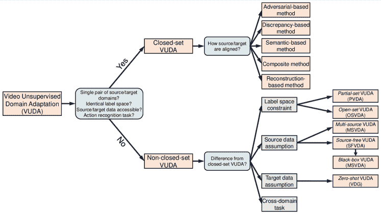

<!--yml

类别：未分类

日期：2024-09-06 19:43:04

-->

# [2211.10412] 视频无监督领域适应与深度学习：全面综述

> 来源：[`ar5iv.labs.arxiv.org/html/2211.10412`](https://ar5iv.labs.arxiv.org/html/2211.10412)

# 视频无监督领域适应

与深度学习：全面综述

Yuecong Xu, Haozhi Cao, Zhenghua Chen, Xiaoli Li, Lihua Xie，和 Jianfei Yang Y. Xu, Z. Chen 和 X. Li 与新加坡 A*STAR 信息通信研究所合作，地址：138632。

电子邮件：{xuyu0014, chen0832}@e.ntu.edu.sg; xlli@i2r.a-star.edu.sg J. Yang, H. Cao 和 L. Xie 与新加坡南洋理工大学电气与电子工程学院合作，地址：639798。

电子邮件：{yang0478; haozhi001}@e.ntu.edu.sg; elhxie@ntu.edu.sg Z. Chen 还与新加坡 A*STAR 前沿人工智能研究中心（CFAR）合作，地址：138632。

###### 摘要

由于大规模数据集和基于深度学习的表示方法的引入，动作识别等视频分析任务在智能医疗等领域的应用不断增长，研究兴趣也日益增加。然而，由于训练公共视频数据集（源视频领域）与实际应用中的视频（目标视频领域）之间的领域偏移，基于现有数据集训练的视频模型在直接部署到实际应用时会遭遇显著的性能下降。此外，由于视频注释的高成本，使用未标记的视频进行训练更为实际。为了应对性能下降和统一解决高视频注释成本的问题，引入了视频无监督领域适应（VUDA）方法，通过缓解视频领域偏移，将视频模型从标记的源领域适应到未标记的目标领域，从而提高视频模型的泛化能力和可移植性。本文综述了 VUDA 与深度学习的最新进展。我们首先介绍 VUDA 的动机，然后定义其概念，接着回顾了闭集 VUDA 和不同场景下的 VUDA 方法的最新进展，以及当前 VUDA 研究的基准数据集。最后，提供了未来研究方向，以推动 VUDA 的进一步研究。

###### 关键词：

视频无监督领域适应，深度学习，动作识别，闭集，基准数据集。

## 引言

随着视频数据以惊人的速度快速增长，自动视频分析任务，如动作识别（AR）和视频分割，受到了越来越多的研究关注，应用也在不断增长。在过去的十年中，各种视频分析任务取得了巨大的进展。这主要得益于各种大型视频数据集的出现以及视频表示学习的持续进步，特别是深度神经网络和深度学习的应用。

尽管在视频分析任务（例如，增强现实）方面取得了进展，大多数现有方法假设训练数据和测试数据来自相同的分布，但这在实际应用中可能并不成立。实际上，来自公共数据集的训练数据和在现实世界场景中收集的测试数据的分布差异是非常普遍的，因此训练（源）领域和测试（目标）领域之间存在领域转移。在这些情况下，尽管深度神经网络具有很强的能力，我们观察到训练的视频模型在测试（目标）领域的性能显著下降。例如，使用当前数据集（如 KITTI、nuScenes）训练的深度视频模型可能不适用于夜间自动驾驶；而使用常规动作识别数据集（如 UCF101、HMDB51）训练的深度视频模型可能无法识别医院中患者的动作。

为了解决领域转移下的性能退化，已经提出了各种领域适应（DA）方法，这些方法利用源领域的标记数据在目标领域执行任务。领域适应方法通常旨在通过最小化领域分布之间的差异，从源领域学习一个可以推广到目标领域的模型。同时，由于为深度学习注释大规模真实世界数据的成本较高，获取未标记数据以使模型适应目标领域更为可行。因此，引入了无监督领域适应（UDA）任务，在这种任务中，模型从标记的源领域适应到未标记的目标领域，通过减轻领域转移的负面影响，同时避免昂贵的数据注释。

尽管深度学习的 UDA 显著提高了模型的普适性和可移植性，通过解决领域转移问题，但以前的研究主要集中在图像数据上。视频无监督领域适应（VUDA）的一个直观方法是将 UDA 图像方法扩展到视频，通过直接用视频特征提取器（例如，将 2D CNN 替换为 3D CNN）替代图像特征提取器。同时，通过传统视频特征提取器获得的视频表示主要来自空间特征。然而，视频不仅包含空间特征，还包含时间特征以及其他模态的特征，例如光流和音频特征。这些特征都会发生领域转移。因此，这种忽略多模态特征领域转移的简单替代策略会导致 VUDA 效果不佳。

随后，提出了各种 VUDA 方法，以明确处理视频任务中的领域偏移问题。一般来说，它们可以分为五类：a) 基于对抗的方法，其中特征生成器与额外的领域鉴别器一起进行对抗性训练，如果领域鉴别器未能区分特征是否来自源领域或目标领域，则获得领域不变的特征；b) 基于差异的方法（或度量方法），通过显式计算源领域和目标领域之间的差异，同时通过应用度量学习方法使目标领域与源领域对齐，优化度量目标，例如 MDD [1]、CORAL [2] 和 MMD [3]；c) 基于语义的方法，通过利用诸如互信息最大化 [4]、聚类 [5]、对比学习 [6, 7] 和伪标签 [8, 9] 等方法，获得受特定语义约束的领域不变特征；d) 复合方法，通过优化不同目标（即领域差异目标、对抗目标和基于语义的目标）的组合来提取领域不变特征；e) 基于重建的方法，通过使用数据重建目标训练的编码器提取领域不变特征，网络通常结构为编码器-解码器。

图 1：不同 VUDA 方法的分类概述。封闭集 VUDA 方法受到单对视频源/目标领域共享的相同标签空间的约束，并假设源数据和目标数据均可访问，以动作识别作为跨领域任务。任何不符合四个约束/假设的 VUDA 方法被认为是非封闭集 VUDA。封闭集 VUDA 方法可以根据源领域和目标领域的对齐方式分为五类。非封闭集 VUDA 方法根据其相关场景与封闭集 VUDA 的差异分为四类。

然而，尽管上述 VUDA 方法使得跨视频领域的可迁移知识学习成为可能，但它们建立在一些约束和假设之上。这些包括视频源域和目标域共享相同标签空间的约束，以及在训练期间可以访问标记源数据和未标记目标数据的假设，并以动作识别作为跨域任务。在这些约束和假设下的 VUDA 被称为封闭集 VUDA，可能在实际场景中不成立，因此在模型可移植性方面引发了数据安全等问题。近年来，已经有各种研究试图改变这些约束和假设，以使 VUDA 方法在实际场景中更具适用性，这些研究可以大致分为：a) 不同标签空间约束的方法；b) 不同源数据假设的方法；c) 不同目标数据假设的方法；d) 不同跨域任务的方法。图 1 展示了不同 VUDA 方法的分类概述。

之前的调查关注了浅层和深层的 DA（领域适应）和 UDA（无监督领域适应）方法及其在各种图像和自然语言处理任务中的应用。例如，[10, 11] 调查了图像任务的浅层 DA 方法，而 [12] 也简要回顾了一些深层 DA 方法。随后，[13] 进一步总结了其他深层 DA 方法在图像任务中的应用。后来，[14] 概述了各种 UDA 方法，而 [15] 专注于基于深度学习的 UDA 方法。还有一些其他研究 [16, 17, 18] 讨论了各种自然语言处理任务的 DA 和 UDA，例如机器翻译和情感分析。同时，也有关于更广泛的迁移学习（TL）主题的调查 [19, 20, 21, 22]，其中领域适应可以被视为一个特例。尽管在全面调查 DA、UDA 和 TL 方面做出了努力，但尚未有专门调查视频任务（即 VUDA）的 UDA 的文献。根据我们所知，这篇文章是首个调查和总结视频无监督领域适应近期进展的文章，当前的工作通常基于深度学习。通过总结现有文献，我们提出了 VUDA 的前景和未来 VUDA 研究的方向。

论文的其余部分组织如下。第 II 节具体定义了闭集 VUDA 并介绍了相关符号。在第 III 节，我们回顾了基于深度学习的闭集 VUDA 方法，而在第 IV 节中，方法在不同的约束、假设和任务下的 VUDA 进行了回顾。我们进一步总结了用于基准测试 VUDA 的现有跨域视频数据集，在第 V 节中。第 VI 节讨论了 VUDA 研究的见解和未来方向，而第 VII 节对论文进行了总结。

## II 定义和符号

在本节中，我们定义了视频无监督领域适应（VUDA），并介绍了本调查中使用的相关符号。为了与当前 VUDA 工作保持一致，定义和符号参考了[23, 24]。在 VUDA 中，我们给定了一个包含$M_{S}$个视频源领域和$\{\mathcal{D}_{S}^{1},\mathcal{D}_{S}^{2},...,\mathcal{D}_{S}^{M_{S}}\}$（这些领域可能是可访问的，也可能不可访问）以及一个包含$M_{T}$个视频目标领域$\{\mathcal{D}_{T}^{1},\mathcal{D}_{T}^{2},...,\mathcal{D}_{T}^{M_{T}}\}$的集合，这些目标领域与源领域集合相关。每个源领域包含$N_{S}^{k}$个标记视频$\mathcal{D}_{S}^{k}=\{(V_{S}^{k,i},y_{S}^{k,i})\}^{N_{S}^{k}}_{i=1}$，由与标记空间$\mathcal{Y}_{S}^{k}$相关的基础概率分布$p_{S}^{k}$特征化，该空间包含$|\mathcal{C}_{S}^{k}|$个类别。同时，每个目标领域包含$N_{T}^{r}$个未标记视频$\mathcal{D}_{T}^{r}=\{V_{T}^{r,i}\}^{N_{T}^{r}}_{i=1}$，由与标记空间$\mathcal{Y}_{T}^{r}$相关的基础概率分布$p_{T}^{r}$特征化，该空间包含$|\mathcal{C}_{T}^{r}|$个类别。VUDA 的目标是设计一个针对目标领域的模型$G_{T}(.;\theta_{T})$，该模型源自或初始化于源模型$G_{S}(.;\theta_{S})$，能够从标记源领域中学习可迁移特征，并最小化所有目标领域上某些基于视频的任务（例如，人类动作识别、视频分割或视频质量评估）的经验目标风险$\epsilon_{T}$。领域适应理论[25]证明，经验目标风险$\epsilon_{T}$由三个项上界：a) 在源领域和目标领域上的理想联合假设的综合误差，假设该误差较小，从而实现领域适应；b) 经验源领域误差，以及 c) 测量源领域与目标领域之间的分歧。所有 VUDA 方法都试图通过最小化第三项和/或第二项来最小化$\epsilon_{T}$，这些将在后续章节中详细讨论。

虽然上述定义可以视为 VUDA 的一个一般场景，但它可能过于具有挑战性。因此，现有的工作通常会对这一一般场景施加某些约束或假设，以形成更容易处理的场景。最常见的场景是闭集 VUDA 场景，它设置了以下约束和假设：

+   •

    仅有一个视频源领域$M_{S}=1$和一个目标领域$M_{T}=1$（因此为了简化省略了上标$k$和$r$）。

+   •

    源领域视频$\mathcal{D}_{S}$和源模型$G_{S}(.;\theta_{S})$是可访问的。

+   •

    源域和目标域的视频共享相同的标签空间（即 $\mathcal{Y}_{S}=\mathcal{Y}_{T}$ 和 $|\mathcal{C}_{S}|=|\mathcal{C}_{T}|$）。

+   •

    源域和目标域的视频共享相同的模型（即 $G_{S}(.;\theta_{S})=G_{T}(.;\theta_{T})$）。

+   •

    执行的视频任务被假定为人体动作识别任务。

根据闭集 VUDA 场景的约束和假设，符号将简化，同时省略上标 $k,r$，并且联合标签空间 $\mathcal{Y}$ 包含 $\mathcal{C}$ 类。

## III 闭集视频无监督领域适应的方法

在本节中，我们回顾了各种基于深度学习的闭集 VUDA 方法，其训练和测试遵循第 II 节中介绍的约束和假设。正如第 I 节中简要提到的，基于深度学习的闭集 VUDA 方法可以大致分为五类。我们在以下章节中讨论每一类别。所有回顾的闭集 VUDA 方法的列表在表 I 中汇总和比较。

表 I: 闭集 VUDA 的不同方法类别。方法按时间顺序列出。

| 类别 | 简要描述 | 方法 |
| --- | --- | --- |
| 基于对抗的 | 通过对抗目标鼓励领域混淆的领域判别器。 | DAAA [26], TA³N [27], TCoN [28], MM-SADA [29], MA²L-TD [30], CIA [31] |
| 基于差异的 | 领域之间的差异被显式计算，通过应用度量学习方法来对齐领域。 | AMLS [26], PTC [32] |
| 基于语义的 | 通过利用跨领域的共享语义来获得领域不变特征。 | STCDA [33], CMCo [34], CoMix [35], CO²A [36], A³R [37], DVM [38] |
| 组合的 | 利用方法的组合来发挥每种方法的优势。 | NEC-Drone [39], SAVA [40], PASTN [41], MAN [42], ACAN [23] |
| 基于重建的 | 从编码器-解码器网络中获得的领域不变特征，具有数据重建目标。 | TranSVAE [43] |

### III-A 基于对抗的 VUDA 方法

在假设通过对源视频进行监督学习，源经验风险较小的情况下，已经提出了一些方法来通过最小化源域和目标域之间的差异来实现有效的领域适应。直观地说，如果源域和目标域共享相同的数据分布，领域鉴别器将无法识别视频是来自源域还是目标域。这种直观认识，加上生成对抗网络（GANs）[44]的成功，激发了基于对抗的 VUDA 方法的提出，其中利用额外的领域鉴别器，通过对源域和目标域视频之间的对抗目标来鼓励领域混淆。因此，源域和目标域之间的差异被隐式地最小化。基于对抗的领域适应方法以前在图像任务（例如，图像识别[45，46，47，48]，目标检测[49，50]和人脸重识别[51]）中取得了成功，因此将基于对抗的方法扩展到 VUDA 是直观的。

这个类别中的一个原始工作是深度对抗动作适应（DAAA）[26]，其中原始的基于图像的 DANN[45, 52]通过用剪辑/视频提取器（3D-CNN [54]）替代图像提取器（2D-CNN [53]），并将输入从图像改为由视频中采样的帧形成的剪辑来扩展到视频。尽管与浅层领域适应方法相比，DAAA 取得了更好的性能，但它忽略了空间和时间特征之间源-目标差异的不同，对空间和时间特征进行了统一和不加区分的适应。随后，时间注意对抗适应网络（TA³N）[27]利用时间关系网络（TRN）[55]来获得更明确的时间特征，并使视频在空间和时间特征上对齐。TA³N 的设计重点是动态对齐具有更高领域差异的时间动态，以有效对齐视频的时间特征。为此，TA³N 采用了一种基于领域预测熵的自适应非参数注意机制。空间和时间特征分别对齐和适应的策略在 MA²L-TD[30]中进一步扩展到多个时间特征级别的分别对齐，其中每个时间特征级别对应于由时间膨胀特征聚合模块生成的不同长度的视频片段/剪辑。MA²L-TD 根据每个级别的领域混淆程度为不同级别的对齐分配注意权重，其中较大的权重分配给领域判别器无法正确分类领域的级别。

与此同时，视频包含一系列与动作无关且可能对适应产生负面影响的非关键帧。时间共同注意网络（TCoN）[28]通过选择对跨领域动作识别至关重要的关键片段来处理非关键帧。TCoN 通过计算每个片段的注意得分来选择关键片段，这些得分基于动作信息量和跨领域相似性，通过受自注意力启发的跨领域共同注意矩阵获得。TCoN 不是直接对源和目标视频特征进行适应，而是通过构建目标对齐的源视频特征，通过跨领域共同注意矩阵转换原始源视频特征来对目标视频特征进行适应。

除了通常从 RGB 模态获得的空间和时间特征外，视频还包含其他模态的信息，例如光流和音频模态。视频的多模态特性对 VUDA 提出了更多挑战，因为每个模态都会发生领域迁移。因此，提出了利用多模态信息对源视频和目标视频进行对齐的方法。在这些方法中，MM-SADA [29] 利用 RGB 和光流模态，其中对每个模态分别应用对抗对齐。MM-SADA 进一步采用跨模态自监督学习来学习不同模态之间的时间对应关系。最近，Cross-modal Interactive Alignment (CIA) [31] 将视频特征与 RGB、光流和音频模态对齐。CIA 进一步观察到跨模态对齐可能与 VUDA 中的跨领域对齐发生冲突，因此通过 Mutual Complementarity (MC) 模块通过跨模态交互增强每个模态的可迁移性。因此，在源领域和目标领域之间对齐之前，不同模态会通过吸收其他模态的可迁移知识进行优化。

### III-B 基于差异的 VUDA 方法

虽然基于对抗的 VUDA 方法在各种 VUDA 基准测试中表现不错，但上述方法并没有计算源领域和目标领域之间的差异，也没有隐式地衡量这种差异。此外，之前的研究 [56, 57, 58] 已经表明，对抗训练是不稳定的，可能会导致模型崩溃和不收敛。因此，提出了基于差异的方法作为解决 VUDA 的更直观和稳定的方法，通过显式地计算和最小化视频领域的差异。早期的方法如在 AMLS [26] 中提出，其中目标视频被建模为 Grassmann 流形上的一系列点 [59]，每个点对应于一组时间上对齐的片段，而源视频被建模为流形上的一个单一点。通过最小化源点与 Grassmann 流形上目标点序列之间的 Frobenius 范数 [60] 来解决 VUDA。同时，后续方法还利用了多模态信息进行差异计算和最小化。Pairwise Two-stream ConvNets (PTC) [32] 在 RGB 和光流模态上最小化 MMD [3] 损失，在更复杂的领域迁移场景中表现更好。PTC 通过自注意力权重机制融合 RGB 和光流特征，并通过球面边界样本选择方案选择位于动作类别边界的训练视频，从而进一步提高了其泛化能力。

### III-C 基于语义的 VUDA 方法

除了通过基于差异的方法显式最小化差异，通过对抗性方法隐式最小化差异之外，还可以通过基于语义的 VUDA 方法 [61] 来对齐源视频域和目标视频域，这些方法利用源域和目标域之间的共享语义，以便获得领域不变特征。直观上，如果目标视频域通过某种模型与源视频域对齐良好，那么模型会为目标视频提取类似源的表示，因此嵌入在源视频域中的语义应该与目标域共享。跨域共享语义的典型含义包括：a) 时空关联：视频的帧和片段（在不同的模态下）具有强烈的时空关联，并且被置于正确的时间顺序和姿态中；b) 特征聚类：与相同行为类别的视频相关的特征被聚集在一起并且彼此接近，而与不同动作类别的视频相关的特征则被置于较远的位置；c) 模态对应：从同一视频的不同模态中提取的特征彼此接近。

一个典型的基于语义的方法是时空对比领域适应（STCDA）[33]，它通过在剪辑和视频层面上应用对比损失来挖掘 RGB 和光流模态的视频表示，从而使得帧和剪辑在空间和时间上相关。STCDA 通过视频基础的对比对齐（VCA）进一步弥合源视频和目标视频的领域偏移，最小化同类源特征和目标特征之间的距离，同时最大化异类源特征和目标特征之间的距离，操作于再生核希尔伯特空间（RKHS）[62]。目标视频的标签通过对标记源视频特征的聚类伪标注获得。对比学习也被应用于 CMCo [34]，旨在提取跨 RGB 和光流模态的视频特征。类似地，CO²A [36] 通过对比学习训练视频特征提取器，目标是进行特征聚类，这在剪辑和视频层面上都被使用。CO²A 还引入了监督对比学习[6] 用于源视频特征学习。此外，CO²A 鼓励源/目标视频对之间的一致性预测。源/目标视频对的对应预测预测源/目标视频是否具有相同的标签，这些预测来自于标签/伪标签或通过对比学习训练的源/目标视频的特征。CoMix [35] 是另一种利用对比学习进行 VUDA 的方法，它强制视频中的时间速度不变性，鼓励从同一视频中提取的特征，即使在不同时间速度下采样，也要相似。CoMix 进一步使用监督对比损失[6] 针对目标数据，通过计算伪标签并选择伪标签置信度高的目标数据。

除了对比学习，将源领域和目标领域样本混合（或等效地在源领域和目标领域之间利用 MixUp [63]）已被证明有利于图像任务的无监督领域适应 [64, 65, 66]，并提升模型鲁棒性。为了进一步利用共享的动作语义，CoMix [35]采用了这种策略，将合成视频融入其对比目标。合成视频通过将一个领域的视频背景与另一个领域的视频混合获得。最近，DVM [38]利用 MixUp 在输入层面直接解决领域间差距，其中目标视频在像素级别上与源视频逐步融合。源视频的相应目标视频通过获得目标视频的伪标签并与源视频的给定标签匹配来选择。

上述方法大多处理源视频和目标视频之间的领域差距，使用 RGB 和/或光流模态。A³R [37]观察到动作的声音可以作为自然的领域不变提示。与以往直接通过对 RGB 和/或光流输入应用分类器获得伪标签的方法不同，A³R 引入了一种缺失活动学习，其中利用音频预测指示视频中听不到的动作，而视觉预测则进一步鼓励对这些‘伪缺失’动作的低概率。A³R 进一步提出了音频平衡学习，利用源领域中的音频对样本进行聚类。最后，A³R 应用了音频平衡损失，对稀有动作给予更高权重，以处理领域之间的语义转移。

### III-D 复合 VUDA 方法

上述类别尝试从不同角度解决 VUDA 问题，各有优缺点。基于对抗的方法因其高性能和易于实现而更为常见，但它依赖于不稳定的对抗学习，可能导致脆弱的收敛，并且在训练过程中需要额外的领域判别器。基于发散的方法明确计算领域差异而无需额外的网络组件，优化更为稳定。然而，它通常产生的性能不如基于对抗的方法或基于语义的方法。基于语义的方法也能产生高适应性能，并且可以扩展到其他适应场景（例如，无源 VUDA），但它们容易受到噪声影响，且优化需要更高的计算成本。

为了充分利用每种方法的优点以实现更有效的 VUDA，各种 VUDA 方法结合了不同的方法。例如，NEC-Drone [39] 提出了将基于对抗的方法与基于语义的方法结合，通过对源数据应用三元组损失来学习视频的嵌入，这些嵌入对特定类别无感知但对相似性有意识。类似地，Pairwise Attentive adversarial Spatio-Temporal Network (PASTN) [41] 也利用了基于对抗的方法和基于语义的方法。PASTN 设计为一个成对网络，具有双域判别器，其中一个不使用反向传播结构，并输出用于注意对抗学习的可转移权重。通过在源视频和目标视频特征之间使用基于边距的判别损失 [67]，而不是对比损失，来在边距内压缩同类样本并推动不同类样本远离。这可以通过促进特征聚类来提取源和目标视频领域的共享语义，同时考虑到同类数据的分布。另一种采用相同方法组合的方法是 SAVA [40]。SAVA 通过注意机制对源视频和目标视频领域进行对抗性对齐，同时关注更具判别性的剪辑。此外，SAVA 通过应用辅助剪辑顺序预测任务来鼓励视频中的时间关联，这比应用对比损失更高效、计算量更小。

除了将对抗性方法与语义方法结合外，还有其他工作将对抗性方法与差异性方法结合。例如，多视角对抗学习网络 (MAN) [42] 通过对抗学习从 RGB 和光流模态中获取领域不变的视频特征，这些特征由自注意力融合网络 (SAFN) 融合。MAN 通过对融合的视频特征应用 MK-MMD [3] 损失进一步改善领域不变性。对抗相关对齐网络 (ACAN) [23] 是另一种 VUDA 方法，它结合了对抗性方法和差异性方法来处理 VUDA。除了对齐空间和时间特征外，ACAN 还提出通过对空间时间维度上像素的长程依赖提取的相关特征来对齐相关特征 [68]，通过将对抗领域损失应用于空间时间视频特征和相关特征来实现。ACAN 通过对齐相关信息的联合分布（作为相关信息的协方差计算）进一步对齐相关特征。这是通过最小化源域和目标域之间的像素相关差异实现的，具体实现为 RKHS 上的相关信息分布距离。

### III-E 基于重建的 VUDA 方法

基于重建的 VUDA 方法通过使用具有数据重建目标的编码器-解码器网络来处理 VUDA，从而获得领域不变特征。由于其对噪声的鲁棒性，一些基于图像的领域适配工作利用了基于重建的方法 [69, 70, 71]。然而，由于视频重建的复杂性，扩展基于重建的方法到 VUDA 的尝试较少。TranSVAE [43] 是最近在 VUDA 中利用数据重建目标的尝试。它旨在通过将跨域视频分解为领域特定的静态变量和领域不变的动态变量，在适配过程中解开领域信息。获得领域信息后，可以大大消除领域差异对预测任务的影响。这一分解是通过一个变分自编码器 (VAE) 结构的网络 [72] 来实现的，该网络建模了跨域视频生成过程。TranSVAE 通过应用目标约束潜在因素的分解过程，进一步确保分解服务于适配目的，例如最小化静态变量和动态变量之间的相互依赖，并对源领域的动态变量施加任务特定的监督。

表 II: 非闭集 VUDA 的不同方法类别。

| 与闭集的差异 | 场景 | 假设/约束 | 方法 |
| --- | --- | --- | --- |
| 标签空间约束 | 部分集合 VUDA (PVDA) | $\mathcal{Y}_{T}\subset\mathcal{Y}_{S}$ 和 $ | \mathcal{C}_{T} | < | \mathcal{C}_{S} | $ | PATAN [24], MCAN [73] |
| 开放集 VUDA (OSVDA) | $\mathcal{Y}_{S}\subset\mathcal{Y}_{T}$ 和 $ | \mathcal{C}_{S} | < | \mathcal{C}_{T} | $ | DMDA [74] |
| 源数据假设 | 多源 VUDA (MSVDA) | $M_{S}>1, M_{T}=1$ | TAMAN [75] |
| 无源 VUDA (SFVDA) | $\mathcal{D}_{S}$ 不可访问 | ATCoN [76] |
| 黑箱 VUDA (BVDA) | $\mathcal{D}_{S}$ 和 $\theta_{S}$ 不可访问 | EXTERN [77] |
| 目标数据假设 | 零样本 VUDA (VDG) | $\mathcal{D}_{T}$ 不可访问 | VideoDG [78], RNA-Net [79] |
| 跨域任务 | 时间动作分割 | - | MTDA [80], SSTDA [81] |
| 视频语义分割 | - | DA-VSN [82], TPS [83] |
| 视频质量评估 | - | UCDA [84] |
| 视频手语识别 | - | Li 等人 [85] |

## IV 不同约束、假设和任务下的视频无监督领域自适应方法

第 III 节中提出的方法提高了视频模型的泛化能力，并使知识能够在封闭集场景中从标注的源域转移到未标注的目标域。然而，封闭集 VUDA 的约束和假设在现实世界场景中可能不成立，这可能引发对模型可移植性的担忧。在本节中，我们回顾了基于深度学习的 VUDA 方法，在不同约束和假设下的 VUDA 场景中进行分类，共分为四类，如第 I 节所述。我们总结并比较了所有评审的非封闭集 VUDA 方法，如表 II 所示。

### IV-A 不同标签空间约束的方法

在闭集 VUDA 场景中，我们假设源域和目标域视频共享相同的标签空间（即，$\mathcal{Y}_{S}=\mathcal{Y}_{T}$ 和 $|\mathcal{C}_{S}|=|\mathcal{C}_{T}|$）。由于存在大规模标注的公共视频数据集（例如，Kinetics [86] 和 Something-Something [87]），在实际场景中，将这些大规模视频数据集中学习到的表示迁移到未标注的小规模视频数据集是更可行的。合理的假设是，大规模公共视频数据集可以包含小规模目标数据集的类别。这种情况被定义为部分集 VUDA，或部分视频领域适应（PVDA）[24]。它通过假设目标标签空间是源标签空间的子空间（即，$\mathcal{Y}_{T}\subset\mathcal{Y}_{S}$ 和 $|\mathcal{C}_{T}|<|\mathcal{C}_{S}|$），放宽了源和目标标签空间相同的限制。与闭集 VUDA 相比，处理 PVDA 由于源域中存在的异常标签空间$\mathcal{Y}_{out}=\mathcal{Y}_{S}\backslash\mathcal{Y}_{T}$而面临更多挑战，这会对网络在目标域上的表现产生负面迁移效应。同时，在网络训练过程中，仅目标域数据的标签是未知的，因此$\mathcal{Y}_{S}$与$\mathcal{Y}_{T}$共享的部分是未知的。

随着时间特征和多模态信息（例如，光流或音频）的包含，PVDA 比基于图像的方法（PDA [88]) 更具挑战性，因为负迁移可能会因时间特征或多模态信息的对齐而额外触发。解决 PVDA 的关键在于有效利用额外的时间或多模态特征来减轻未知异常标签空间 $\mathcal{Y}_{S}\backslash\mathcal{Y}_{T}$ 带来的负面影响。开创性工作，部分对抗时间注意网络（PATAN）[24]，提出通过过滤仅源异常类别来减轻负迁移。为此，PATAN 从两个方面利用时间特征。首先，PATAN 构建时间特征，使得那些在异常源类别中的特征可以通过局部时间特征的注意性组合来区分目标类别，其中注意力建立在局部时间特征对类别过滤过程的贡献上，源类别仅被过滤。其次，PATAN 利用时间特征对源异常类别进行过滤，以减轻空间特征误分类的影响。之后，多模态簇校准部分对抗网络（MCAN）[73] 也通过过滤源异常类别来处理 PVDA，除了 PATAN 中利用的空间和时间特征外，还利用了多模态特征（光流特征）。MCAN 进一步通过对源和目标领域的标签分布偏移[89] 进行处理，通过对视频特征进行聚类并相应加权，从而促进相关源数据的正向迁移，抑制无关源数据的负向迁移。

另一种实际的 VUDA 场景，考虑了不同的标签空间假设，假设目标视频领域中存在未知的动作类别，称为开放集 VUDA，或开放集视频领域适应（OSVDA）。在这种场景下，源标签空间是目标标签空间的一个子空间（即，$\mathcal{Y}_{S}\subset\mathcal{Y}_{T}$ 和 $|\mathcal{C}_{S}|<|\mathcal{C}_{T}|$）。为了解决 OSVDA 问题，提出了双重度量领域适应框架（DMDA）[74]，该框架涉及空间和时间特征。DMDA 通过一个双重度量判别器（DMD）来处理 OSVDA，该判别器使用预训练的分类器结合原型最优传输来测量源视频样本和目标视频样本之间的相似性，并应用于帧、片段和视频级别。DMD 进一步被用作初步分离，并训练一个二元判别器，以进一步区分目标样本是否属于源动作类别或未知动作类别。

### IV-B 方法与不同源数据假设

除了源视频领域和目标视频领域之间具有相同标签空间的约束之外，闭集 VUDA 还对源数据提出了若干假设。具体而言，闭集 VUDA 首先假设只有一个视频源领域，即$M_{S}=1$，其视频匹配一个统一的数据分布，其知识将被转移到目标领域。实际上，源数据更可能来自多个数据集（例如，动作“跳水”可以在数据集 UCF101 [90]、Kinetics [86]和 Sports-1M [91]中找到）。这种 VUDA 场景被定义为多源 VUDA，或称为多源视频领域适应（MSVDA） [75]，它通过假设源视频数据来自$M_{S}>1$个视频领域对应不同的视频数据分布，从而放宽了相同源视频数据分布的约束。MSVDA 的挑战在于如果直接减少多个领域对之间的领域偏移而不考虑由于空间和时间特征分布不同而产生的不一致性，则可能会触发负迁移。时序注意力时刻对齐网络（TAMAN） [75]是一种基于差异的方法，旨在解决 MSVDA。它通过专注地结合局部时序特征来构建全局时序特征，其中注意力策略依赖于局部时序特征分类的信心以及全局和局部特征差异之间的差异。此外，TAMAN 通过对齐所有领域对中的空间和时序特征的时刻来联合对齐空间-时序特征。

闭集 VUDA 还假设在适应过程中源领域视频 $V_{S}\in\mathcal{D}_{S}$ 始终可用。然而，源视频领域中的动作信息通常包含演员的私人和敏感信息，包括他们的动作和相关场景，这些在实际应用中通常与目标领域的情况无关，且应当从目标领域中保护。例如，在医院中，通常需要对患者的异常动作进行识别，但包含患者信息的视频不能在不同医院之间共享。因此，当前的闭集 VUDA 方法会引发严重的隐私和模型可移植性问题，这些问题比图像基础领域适应方法所引发的要严重。为了应对视频数据隐私和模型可移植性问题，提出了更实际的 VUDA 场景，即无源 VUDA，或称源无视频领域适应（SFVDA）。在这个 VUDA 场景中，只提供经过良好训练的源视频模型 $G_{S}(:,\theta_{S})$，以及未标记的目标视频领域数据用于适应。这里的 $\theta_{S}$ 是 $G_{S}$ 的参数。在没有源数据的情况下，回顾的 VUDA 方法要求同时有来自目标和源领域的数据进行隐式或显式对齐，因此不能应用。最近，提出了注意力时间一致网络（ATCoN）[76] 来处理 SFVDA。ATCoN 旨在通过获取满足跨时间假设的时间特征来解决 SFVDA，这一假设认为局部时间特征（片段特征）不仅具有区分性，而且在彼此之间保持一致，并具有类似的特征分布模式。ATCoN 通过学习包括特征和源预测一致性的时间一致性来满足这一假设。ATCoN 通过关注具有高源预测信心的局部时间特征，进一步将目标数据对齐到源数据分布而无需源数据访问。虽然 SFVDA 尝试解决 VUDA 中的隐私问题，但仍然依赖于经过良好训练的源模型参数，这使得生成模型[44]能够恢复源视频。受到图像基础领域适应中黑箱无监督领域适应[92] 的启发，最近提出了黑箱 VUDA 或称黑箱视频领域适应（BVDA），在这种方法中，源视频模型仅作为黑箱预测器（例如 API 服务）提供用于适应。换句话说，源领域 $\mathcal{D}_{S}$ 和 $\theta_{S}$ 都不可访问。为了解决更具挑战性的 BVDA，提出了 EXTERN [77]，该方法旨在通过利用黑箱源预测器的硬预测或软预测将目标模型适应到源数据的嵌入语义信息中。EXTERN 旨在以自监督的方式提取具有高区分度的有效时间特征，并遵守聚类假设[93]，其中对片段特征应用了正则化。

### IV-C 针对不同目标数据假设的方法

除了对源数据所做的假设，封闭集 VUDA 还假设目标领域数据是 readily available。这一假设在实际应用中也可能不成立，因为目标数据分布的先验知识并不保证。在适应过程中，更实际的假设是目标领域未见过（即目标领域数据不可用），这被定义为零-shot VUDA，或视频领域泛化（VDG）。封闭集 VUDA 方法对于 VDG 也不够充分，因为类似于 SFVDA，源领域和目标领域之间的领域差异无法在没有目标数据分布知识的情况下进行计算或估计。VideoDG [78] 识别了 VDG 的关键是平衡泛化能力和可区分性，通过扩展源领域的帧关系，使其多样化，以便能够泛化到潜在的目标领域，同时保持区分性。受到 Transformer [94] 和对抗性领域增强（ADA） [95] 的启发，VideoDG 通过引入与鲁棒对抗性领域增强（RADA）训练的对抗金字塔网络（APN）达到了这种平衡。同时，RNA-Net [79] 通过利用视频的多模态特性，结合音频和 RGB 特征来解决 VDG 问题。RNA-Net 建议，单纯融合多模态信息可能不会提高模型的泛化能力 [96]，因为某些模态可能比其他模态更具优势。因此，它提出了一种跨模态音频-视觉相对范数对齐（RNA）损失，旨在逐步对齐源领域两种模态的相对特征范数，从而获得领域不变的音频-视觉特征用于 VDG。

### IV-D 针对不同跨领域任务的方法

对于上述所有工作，VUDA 方法是为跨领域动作识别任务设计的，这是最基本的视频任务之一[97, 98]。除了动作识别，还有许多研究涉及其他跨领域视频任务，如跨领域时间动作分割。对于跨领域时间动作分割任务，提出了混合时间领域自适应（MTDA）[80]，这是一种基于对抗的方法。MTDA 通过联合对齐局部和全局嵌入特征空间，同时整合基于领域预测的领域注意机制，以聚合领域特定的帧来构建全局视频表示，从而处理跨领域时间动作分割。随后，提出了自监督时间领域自适应（SSTDA）[81]，用于相同的跨领域时间动作分割任务。SSTDA 利用对抗性方法，通过整合两个自监督辅助任务（即二元领域预测任务和顺序领域预测任务），在帧和片段级别上对源视频和目标视频进行对齐。

跨领域视频语义分割是 VUDA 研究的另一个任务，它与视觉自主驾驶系统的强健和高效部署相关[99, 100]。DA-VSN[82] 是一个开创性的工作，通过引入时间一致性正则化（TCR）来解决跨领域视频语义分割问题。TCR 包含两个组件：跨领域 TCR 通过引导目标预测具有与源预测相同的时间一致性来最小化源和目标视频领域之间的差异，以及领域内 TCR，它引导不确定的目标预测具有与确定的目标预测相同的时间一致性。最近，提出了时间伪监督（TPS）[83]，灵感来自于在基于图像的领域自适应中一致性训练的成功[101, 102, 103]。TPS 通过强制模型预测对应用于未标记目标视频帧的跨帧增强保持不变，探索了在时空特征空间中的一致性训练。

除了上述分割任务之外，还提出了一种无监督课程领域适应（UCDA）[84]，用于跨模态视频质量评估（VQA）任务，结合 VUDA 的目标是根据一组源视频输出目标视频的质量分数。UCDA 通过两阶段对抗性适应和基于不确定性的排序函数来处理跨领域 VQA 任务，以将目标领域的样本排序到不同的子领域中。跨领域视频手语识别[85]是 VUDA 研究调查的另一个新任务，旨在从网络新闻中的手语词汇中识别孤立的手语词。Li 等[85]为此任务提出了一种粗略领域对齐的方法，通过在新闻手语和孤立手语上联合训练分类器来缩小领域差距。此外，他们还开发了一种原型记忆，以学习每个孤立手语的领域不变描述符。

表 III：当前跨领域视频基准数据集的比较。

| 数据集 | 类别数 | 训练/测试视频数量 | 数据来源 | VUDA 场景 | 任务 | 年份 | 网站 |
| --- | --- | --- | --- | --- | --- | --- | --- |
| UCF-Olympic [104] | 6 | 851/294 | UCF50, 奥林匹克体育 | 闭集 | 动作识别 | 2014 | [网站](https://github.com/cmhungsteve/TA3N) |
| UCF-HMDB[小型] [104] | 5 | 832/339 | UCF50, HMDB51 | 闭集 | 动作识别 | 2014 | [网站](https://github.com/cmhungsteve/TA3N) |
| UCF-HMDB[完整] [27] | 12 | 2278/931 | UCF50, HMDB51 | 闭集 | 动作识别 | 2019 | [网站](https://github.com/cmhungsteve/TA3N) |
| Kinetics-Gameplay [27] | 12 | 46003/3995 | Kinetics-600, Gameplay | 闭集 | 动作识别 | 2019 | [网站](https://github.com/cmhungsteve/TA3N) |
| HMDB-ARID [105] | 11 | 3058/1153 | HMDB51, ARID | 闭集 | 动作识别 | 2021 | [网站](https://xuyu0010.github.io/vuda.html) |
| Kinetics$\to$NEC-Drone [106] | 7 | 总计 5250 | Kinetics-400, NEC-Drone | 闭集 | 动作识别 | 2020 | [网站](https://www.nec-labs.com/%C2%A0mas/NEC-Drone/) |
| Mixamo$\to$Kinetics [36] | 14 | 24533/11662 | Mixamo, Kinetics-700 | 闭集 | 动作识别 | 2022 | [网站](https://github.com/vturrisi/CO2A) |
| ActorShift [37] | 7 | 1305/200 | Kinetics-700, YouTube | 闭集 | 动作识别 | 2022 | [网站](https://xiaobai1217.github.io/DomainAdaptation/) |
| UCF-HMDB[部分] [24] | 14 | 2304/476 | UCF101, HMDB51 | 部分 | 动作识别 | 2021 | [网站](https://xuyu0010.github.io/pvda.html) |
| MiniKinetics-UCF [24] | 45 | 20996/1106 | MiniKinetics, UCF101 | 部分 | 动作识别 | 2021 | [网站](https://xuyu0010.github.io/pvda.html) |
| HMDB-ARID[部分] [24] | 10 | 2712/540 | HMDB51, ARID | 部分 | 行为识别 | 2021 | [网站](https://xuyu0010.github.io/pvda.html) |
| EPIC Kitchens [29] | 8 | 7935/2159 | EPIC Kitchens | 封闭集 | 行为识别 | 2020 | [网站](https://EPIC%20Kitchens.github.io/2021) |
| Daily-DA [75] | 8 | 16295/2654 | ARID, HMDB51, Moments in Time, Kinetics-600 | 多源/封闭集 | 行为识别 | 2021 | [网站](https://xuyu0010.github.io/msvda.html) |
| Sports-DA [75] | 23 | 36003/4712 | UCF101, Sports-1M, Kinetics-600 | 多源/封闭集 | 行为识别 | 2021 | [网站](https://xuyu0010.github.io/msvda.html) |
| VIPER$\to$Cityscapes-Seq [82] | 30 | 136645/500 | VIPER, Cityscapes-Seq | 封闭集 | 语义分割 | 2021 | [网站](https://github.com/Dayan-Guan/DA-VSN) |
| SYNTHIA-Seq$\to$Cityscapes-Seq [82] | 30 | 10975/500 | SYNTHIA-Seq, Cityscapes-Seq | 封闭集 | 语义分割 | 2021 | [网站](https://github.com/Dayan-Guan/DA-VSN) |

表 IV: 主体 VUDA 数据集上的平均准确率（$\%$）。方法按时间顺序排列。

| 方法 | 主干网络 | 类别 | UCF-Olympic | UCF-HMDB[小] | UCF-HMDB[全] |
| --- | --- | --- | --- | --- | --- |
| AMLS [26] | C3D [107] | 差异 | 85.24 | 92.45 | - |
| DAAA [26] | C3D [107] | 对抗 | 90.78 | - | - |
| TA³N [27] | TRN [55] | 对抗 | 95.54 | 99.40 | 80.06 |
| TCoN [28] | TRN [55] | 对抗 | 94.95 | 96.78 | 88.15 |
| SAVA [40] | I3D [108] | 复合 | - | - | 86.70 |
| MM-SADA [29] | I3D [108] | 对抗 | - | - | 87.65 |
| PASTN [41] | TR3D [41] | 复合 | 99.05 | - | - |
| STCDA [33] | BNIncep [109]/I3D [108] | 语义 | 99.35 | 97.20 | 87.60 |
| CMCo [34] | I3D [108] | 语义 | - | - | 88.75 |
| CoMix [35] | I3D [108] | 语义 | - | - | 90.30 |
| MAN [42] | ResNet-152 [110] | 复合 | 94.80 | - | - |
| ACAN [23] | MFNet [111] | 复合 | - | - | 89.50 |
| CO²A [36] | I3D [108] | 语义 | 98.75 | - | 91.80 |
| MA²l-TD [30] | ResNet-101 [110] | 对抗 | 97.36 | 99.40 | 85.80 |
| CIA [31] | I3D [108] | 对抗 | - | - | 93.26 |
| DVM [38] | TSM [112] | 语义 | 96.37 | - | 92.77 |
| TranSVAE [43] | I3D [108] | 重建 | - | - | 93.37 |
| ATCoN (SFVDA) [76] | TRN [55] | - | - | - | 82.51 |
| EXTERN (BVDA) [77] | TRN [55] | - | - | - | 90.42 |

## V 基准数据集用于视频无监督领域自适应

深度学习方法发展的一个重要因素是相关数据集的可用性，以便对提出的方法进行训练和评估。这同样适用于 VUDA 方法的研究。在过去十年中，跨领域视频数据集显著增加，这大大促进了各种 VUDA 场景的研究。在这一部分，我们回顾和总结了现有的跨领域视频数据集。现有数据集的主要属性（动作类别数量、训练/测试视频数量、数据来源等）的总体比较见表 III。此外，我们展示了方法在其各自基准数据集上的平均性能，详见表 IV、V、VI、VII 和 VIII。请注意，由于不同方法应用了不同的骨干网络和训练技术，直接比较其性能可能不公平，仅作为各方法比较的直观参考。所有平均性能均基于提出相应方法的原始论文进行报告（如适用）。

主要的 VUDA 数据集。早期的 VUDA 工作通常依赖于两个主要的跨域动作识别数据集，即 UCF-Olympic 数据集 [104] 和 UCF-HMDB 数据集 [104]。其中，UCF-HMDB 数据集 [104] 后来被称为 UCF-HMDB[small] 数据集，以便与后来的数据集区分。具体而言，UCF-Olympic 数据集是基于 UCF50 [113] 和 Olympic Sports [114] 数据集构建的，而 UCF-HMDB[small] 数据集是基于 UCF50 和 HMDB51 [115] 数据集构建的。这两个跨域数据集规模非常小，动作类别和训练/测试视频数量有限。随后，引入了更大的 UCF-HMDB[full] [27] 数据集，以促进 VUDA 的进一步研究。UCF-HMDB[full] 数据集也是基于 UCF50 和 HMDB51 数据集构建的，但类别数量比 UCF-HMDB[small] 数据集多了两倍以上，视频数量也大大增加。UCF-HMDB[full] 数据集已经成为 VUDA 研究中最常用的基准数据集之一。

VUDA 数据集具有更大的领域变化。前述数据集都是基于主要从网络平台（例如 YouTube）收集的视频，这些视频拍摄于正常条件下（例如正常照明和对比度，画面清晰）。因此，不同领域之间的领域变化可能不显著。因此，VUDA 方法在上述数据集上的表现较好，但在实际应用中，领域变化可能会大得多，泛化能力较低。为应对这些限制，引入了具有更大领域变化的跨领域 VUDA 数据集。例如，Kinetics-Gameplay [27] 数据集桥接了现实世界视频和虚拟世界视频。Kinetics-Gameplay 数据集基于当前视频游戏中的 Kinetic [86] 和 Gameplay [27] 数据集。另一个桥接现实世界和合成视频的跨领域数据集是 Mixamo$\to$Kinetics 数据集 [36]，这是一个单向数据集，用于将 Mixamo 系统中的合成视频知识转移到 Kinetics 数据集中的真实世界视频。另一个大领域变化的场景可能出现在常规人类拍摄视频和无人机拍摄视频之间，无人机拍摄的视频由于其独特的运动和视角具有独特的特点。Kinetics$\to$NEC-Drone [106] 数据集被引入，以利用现有的大规模 Kinetics 数据集，帮助视频模型在 NEC-Drone [106] 数据集中的无人机拍摄视频上进行动作识别。同时，由于视频统计数据的显著差异（例如正常照明下拍摄的视频与低照明下拍摄的视频，或更普遍地说，正常环境下拍摄的视频与恶劣环境下拍摄的视频），也可能发生大领域变化。为探索如何利用当前数据集提升在恶劣环境下拍摄的视频性能，引入了 HMDB-ARID 数据集 [23]。该数据集包括来自 HMDB51 和 ARID [105] 的视频，这些视频是在恶劣照明条件下拍摄，且对比度低。最近，提出了 ActorShift [37] 数据集，用于研究人类和动物动作之间的领域变化，这是第一个考虑非人类动作的数据集。人类动作的源领域数据来自 Kinetics-700 [116] 数据集，而动物动作的目标领域数据直接从 YouTube 中相关的动作类别收集。

部分集 VUDA（PVDA）数据集。上述数据集都构建于封闭集 VUDA 场景，其中只有两个源目标视频领域对（即 Domain A$\to$Domain B 和 Domain B$\to$Domain A）共享标签空间。然而，如第 IV 节所提及，封闭集 VUDA 的约束和假设在现实世界中可能不成立。因此，引入了其他跨域视频数据集，以支持和促进在不同约束和假设下的 VUDA 研究。对于部分集 VUDA（PVDA），介绍了三种跨域部分集视频数据集，分别是 UCF-HMDB[partial]、MiniKinetics-UCF 和 HMDB-ARID[partial]，参见[24]。其中，UCF-HMDB[partial]的构建灵感来源于 UCF-HMDB[full] [27]，该数据集跨越了 UCF101 和 HMDB51 数据集。MiniKinetics-UCF 数据集规模更大（是 UCF-HMDB[partial]的 8$\times$），旨在验证 PVDA 方法在大规模数据集上的有效性。它由 Mini-Kinetics [117] 和 UCF101 数据集构建。同时，HMDB-ARID[partial]的构建灵感来源于 HMDB-ARID [23] 数据集，旨在提高视频模型在低光照条件下的性能，利用部分集 VUDA 下较大的领域偏移。

多领域 VUDA 数据集。还有几个更近期的数据集更加全面，它们包含跨领域数据集中的多个领域，因此存在超过 2 对可能的源/目标视频领域组合。例如，Epic-Kitchens [29]跨领域数据集包含来自原始 Epic-Kitchens 动作识别数据集 [118]中的三个不同厨房的视频，因而包括了 6 种不同的源/目标视频领域组合。请注意，我们遵循文献 [29, 40, 33, 35]，仍然将 Epic-Kitchens 跨领域数据集称为“Epic-Kitchens”。Epic-Kitchens 通常来源于一个大型动作识别数据集，并包含从受控环境中收集的视频。随后，介绍了其他多领域 VUDA 数据集，这些数据集包含来自各种公共数据集的更广泛场景的视频。受到 DomainNet [119]作为统一且全面的图像领域适配评估基准的成功启发，引入了 Sports-DA 和 Daily-DA 跨领域动作识别数据集 [75, 76]。Daily-DA 数据集包含来自 HMDB51 [115]、ARID [105]、Moment in Time [120]和 Kinetics-600 [86]的 4 个不同领域，结果是 12 种不同的源/目标视频领域组合，这是迄今为止源/目标领域组合的最大数量。Sports-DA 数据集包含来自 UCF101 [90]、Kinetics-600 [86]和 Sports-1M [91]的 3 个不同领域的体育视频，结果是 6 种不同的源/目标视频领域组合，并且包含的动作类别比 Epic-Kitchens 和 Daily-DA 都多。

VUDA 数据集用于跨领域视频语义分割。虽然所有上述数据集都用于跨领域动作识别任务，但 VUDA 的研究不仅限于此任务，如第 IV-D 节所述。随着对其他跨领域视频任务的兴趣增加，提出了一些相关数据集。这特别针对跨领域视频语义分割，提出了两个跨领域数据集：VIPER$\to$Cityscapes-Seq 和 SYNTHIA-Seq$\to$Cityscapes-Seq [82]，这些数据集建立在当前的语义分割数据集上。前者建立于 Cityscapes-Seq [121] 和 VIPER [122]，后者建立于 SYNTHIA-Seq [123] 和 Cityscapes-Seq。VIPER 和 SYNTHIA-Seq 都是从游戏或 Unity 开发平台 [124] 生成的合成视频，而 Cityscapes-Seq 是通过捕捉现实世界场景中的视频构建的。

表 V: 在具有更大领域转移的 VUDA 数据集上的平均准确率 ($\%$)。方法按时间顺序排列。

| 方法 | 骨干网络 | 类别 | Kinetics-Gameplay | HMDB-ARID | Kinetics$\to$NEC-Drone | Mixamo$\to$Kinetics | ActorShift |
| --- | --- | --- | --- | --- | --- | --- | --- |
| TA³N [27] | TRN [55] | 对抗性 | 27.50 | 21.10 | 28.10 | 10.00 | - |
| NEC-Drone [106] | I3D [108] | 组合型 | - | - | 15.10 | - | - |
| SAVA [40] | I3D [108] | 组合型 | - | - | 31.60 | - | - |
| MM-SADA [29] | SlowFast [125] | 对抗性 | - | - | - | - | 62.60 |
| ACAN [23] | MFNet [111] | 组合型 | - | 52.20 | - | - | - |
| CO²A [36] | I3D [108] | 语义性 | - | - | 33.20 | 16.40 | - |
| MA²l-TD [30] | ResNet-101 [110] | 对抗性 | 31.45 | - | - | - | - |
| A³R [37] | SlowFast [125] | 语义性 | - | - | - | - | 67.30 |

表 VI: 部分集 VUDA (PVDA) 数据集的平均准确率 ($\%$)。方法按时间顺序排列。

| 方法 | 骨干网络 | 类别 | UCF-HMDB[部分] | MiniKinetics-UCF | HMDB-ARID[部分] |
| --- | --- | --- | --- | --- | --- |
| TA³N [27] | TRN [55] | 对抗性 | 60.59 | 61.97 | 21.25 |
| SAVA [40] | TRN [55] | 组合型 | 65.93 | 66.58 | 23.72 |
| PATAN (PVDA) [24] | TRN [55] | - | 81.83 | 76.04 | 30.54 |
| MCAN (PVDA) [73] | TSN [126] | - | 83.94 | 81.34 | 44.37 |

表 VII: 多领域 VUDA 数据集上的平均准确率（$\%$）。方法按时间顺序排列。

| 方法 | 主干网络 | 类别 | Epic-Kitchens | Daily-DA | Sports-DA |
| --- | --- | --- | --- | --- | --- |
| TA³N [27] | I3D [108]/TRN [55] | 对抗性 | 43.20 | 28.49 | 70.26 |
| MM-SADA [29] | I3D [108] | 对抗性 | 50.30 | - | - |
| STCDA [33] | I3D [108] | 语义 | 51.20 | - | - |
| CMCo [34] | I3D [108] | 语义 | 51.00 | - | - |
| CoMix [35] | I3D [108] | 语义 | 43.20 | - | - |
| TAMAN (MSVDA) [75] | TRN [55] | - | - | 44.85 | 77.84 |
| CIA [31] | I3D [108] | 对抗性 | 52.20 | - | - |
| A³R [37] | SlowFast [125] | 语义 | 61.00 | - | - |
| TranSVAE [43] | I3D [108] | 重建 | 52.60 | - | - |
| ATCoN (SFVDA) [76] | TRN [55] | - | - | 33.53 | 73.85 |
| EXTERN (BVDA) [77] | TRN [55] | - | - | 39.64 | 83.18 |

表 VIII: 跨领域视频语义分割的 VUDA 数据集上的平均 IOU。方法按时间顺序排列。

| 方法 | 主干网络 | VIPER$\to$Cityscapes-Seq | SYNTHIA-Seq$\to$Cityscapes-Seq |
| --- | --- | --- | --- |
| DA-VSN [82] | ACCEL [127] | 47.80 | 49.50 |
| TPS [83] | ACCEL [127] | 48.90 | 53.80 |

## VI 讨论：近期进展与未来方向

在这一部分，我们总结了 VUDA 研究的最新进展，并进行了观察。我们进一步分析并提供了对 VUDA 研究未来发展方向的见解。

### VI-A VUDA 研究的最新进展

与早期工作相比，近期的 VUDA 研究从三个方面取得了显著进展：a) 处理不同场景下的 VUDA；b) 利用视频的多模态特性；c) 采用基于语义的方法来挖掘跨领域的共享语义。

a) 在不同场景下处理 VUDA。由于其简洁性，闭集场景一直是 VUDA 研究的重点，这种简洁性来源于假设只有一个标记的视频源和未标记的视频目标域，源视频和源模型是可访问的，并且源/目标域对有共享标签空间的约束。然而，如第 IV 节和 [24, 75, 73, 76] 所述，闭集 VUDA 可能不适用于实际场景。为了应对闭集 VUDA 的约束和假设带来的模型可移植性和其他（例如数据隐私）问题，最近研究了几种其他 VUDA 场景。这些包括部分集 PVDA [24, 73]、开放集 OSVDA [74]、多域 MSVDA [75]、源自由 SFVDA [76] 和黑箱 BVDA [77] 设置，以及目标自由 VDG [78] 设置。相关数据集的引入进一步促进了对各种非闭集 VUDA 场景的研究，并进一步提高了 VUDA 方法在实际场景中的能力。

b) 利用视频的多模态特性。处理 VUDA 比处理基于图像的 UDA 更具挑战性，这主要得益于视频中包含的额外时间特征和其他模态特征（例如光流和音频）。这些额外特征都会在源域和目标域之间引起额外的领域转移。早期的方法如对抗性 TA³N [27]、差异性 AMLS [26] 或复合 VUDA 方法 PASTN [32] 主要集中在处理由额外时间特征引起的领域转移。随后，较新的方法如 MM-SADA [29]、CIA [31] 和 A³R [37] 意识到处理由不同模态特征引起的领域转移的重要性，尤其是光流和音频特征。后续的方法在同一基准测试中取得了显著的改进，超越了没有多模态特征对齐的先前方法，这证明了对齐多模态特征以实现有效 VUDA 的有效性。然而，需要注意的是，音频特征在基准数据集或实际场景中可能不易获得（例如监控录像或自动驾驶录像，其中录制的音频大多是环境噪音）。因此，利用音频特征的 VUDA 方法在应用上存在一定的限制。

c) 利用共享语义的基于语义的 VUDA 方法。与基于对抗和差异的方法相比，基于语义的 VUDA 方法直到最近才被考虑。这是因为通过利用共享语义来对齐视频域并不像通过最小化视频域差异（无论是显式还是隐式）那样直观。然而，不同基于语义的 VUDA 方法（例如，CMCo [34]和 CoMix [35]）的表现证明，通过时空关联、特征聚类和模态对应来利用共享语义对获得域不变的视频特征是有益的。相比之下，基于语义的方法在优化方面比基于对抗的方法更稳定，同时性能优于基于差异的方法。此外，基于语义的 VUDA 方法可以与基于对抗和差异的方法结合，形成复合方法，例如 SAVA [40]和 PASTN [32]。

### VI-B 当前 VUDA 研究的挑战及其未来方向

尽管 VUDA 研究取得了显著进展，但现有的 VUDA 研究仍面临各种挑战。这些挑战通常可以分为三类：b) 多模态信息利用方面的挑战；a) 探索的 VUDA 场景方面的挑战；以及 c) 自监督的更有效 VUDA 方法方面的挑战。解决这些挑战将极大地有利于未来的 VUDA 方法，并被视为 VUDA 研究的潜在未来方向。

a) 探索性 VUDA 场景中的挑战。正如第 IV 节中提到的，已经研究了多种非封闭集的 VUDA 场景。然而，与在 NLP 和图像任务中更为全面的领域适应研究相比 [128, 129, 130]，我们观察到 VUDA 仍有许多场景未被触及。例如，虽然已有方法提出了多源 VUDA (MSVDA) 以放宽 $M_{S}=1$ 视频源领域的约束，但放宽 $M_{T}=1$ 视频目标领域约束的多目标 VUDA (MTVDA) 尚未被研究。结合主动学习 [131] 和 VUDA 的主动 VUDA 场景也尚未在 VUDA 中研究，该场景旨在通过通过一个 oracle 为选择的最大信息子集的目标视频获取标签，从而将源视频模型适应到目标视频领域。为了进一步保护源数据隐私，黑箱 VUDA 是另一种可行的 VUDA 场景，其中除了源视频数据外，源视频模型也对目标视频领域不可访问，这防止了生成模型恢复源视频 [44]。同时，数据隐私问题也适用于当前的 MSVDA 场景，其中视频数据在不同源领域之间是可访问的。将联邦学习 [132] 与 VUDA 结合是一个可能的解决方案，使得视频数据在不同视频领域之间不可共享。上述 VUDA 场景更具现实意义，未来在这些场景中的研究可以进一步提升 VUDA 方法在实际应用中的能力。

b) 在多模态信息利用中的挑战。现有的 VUDA 方法中，多模态信息的利用主要限于 RGB、光流和音频信息。然而，视频还包含更多的模态信息，这些信息已被用于监督视频任务，但未被用于 VUDA。一个典型的例子是人体骨架数据[133, 134, 135, 136]，它是一种紧凑而有效的动作描述符，关注演员姿势的时间变化，并且对背景和光照变化等上下文变化具有免疫力。同时，现有 VUDA 方法的输入仅依赖于 RGB 相机，而视频还可以通过其他传感器获取，包括深度相机[137, 138]、红外相机[139, 140]，甚至激光雷达[141, 142, 143]。未来的 VUDA 方法也应考虑这些传感器拍摄的视频。

除了利用不同类别模态面临的挑战外，当前 VUDA 方法的性能还可能受到当前利用模态中提取的特征效果的影响。现有工作仍倾向于利用基于 ResNet 的[110] CNN 网络从 RGB、光流和音频中提取特征。更近期的研究[144, 145, 146, 147, 148, 149]显示了 Transformers[94]和图神经网络（GNN）[150, 151]在获取下游视频任务有效特征方面的有效性。显然，对视频特征的有效对齐应建立在这些视频特征本身有效的假设之上。因此，预计未来的 VUDA 方法将通过利用 Transformers 和 GNN 进行特征提取，进一步提高 VUDA 性能。

c) 自监督下的 VUDA 方法中的挑战。近年来，由于 VUDA 方法在完全或部分依赖基于语义或重建的方法的表现优异，且具有较高的扩展性（能够与其他方法结合并适应不同、更实际的 VUDA 场景），因此这类方法显著增加。由于目标标签不可用于适应，语义基础和重建基础的方法均依赖自监督以获取共享的跨域语义或实现数据重建。在各种自监督技术中，对比学习因其易于制定和高性能而被广泛应用。最近，在视觉任务中的对比学习不仅通过应用于视觉特征之间，还通过视觉特征及其对应的文本标签或文本描述[152]。以对比方式从自然语言监督中学习视觉概念的策略使得网络更具泛化能力，能够仅通过预训练任务中的自然语言提示轻松适应新的视觉任务。这与 VUDA 的目标相一致，VUDA 旨在根据源域信息（包括基于文本的信息，如视频标签）将网络适应新的视频领域。因此，探索利用标注源域（例如源视频标签）中的自然语言提示的自监督 VUDA 方法可能是进一步提高 VUDA 性能的一个有趣而有效的途径。

## VII 结论

视频无监督领域适应（VUDA）在提高视频模型的可移植性和泛化能力方面发挥了关键作用，同时通过解决领域迁移下的性能下降问题，避免了成本高昂的数据注释。本文回顾了基于深度学习的 VUDA 的近期进展。我们首先调查并总结了针对不同约束和假设的闭集 VUDA 和非闭集 VUDA 场景的方法。我们观察到，非闭集 VUDA 方法在实际应用中更具可行性。我们进一步回顾了各种 VUDA 场景下的基准数据集。我们总结了 VUDA 研究的近期进展，并从利用多模态信息、研究基于重建的方法和探索其他 VUDA 场景的角度提供了未来 VUDA 研究的见解。我们希望这些见解能够促进和推动未来 VUDA 研究，使得鲁棒和可移植的视频模型能够在实际应用中有效和高效地应用。

## 参考文献

+   [1] Y. Zhang, T. Liu, M. Long, 和 M. Jordan, “领域适应的理论与算法桥接，” 见于 *国际机器学习会议*。PMLR, 2019, 页 7404–7413。

+   [2] B. Sun, J. Feng 和 K. Saenko，“令人沮丧的简单领域适应的回归”，发表于*AAAI 人工智能会议论文集*，第 30 卷，2016 年。

+   [3] M. Long, Y. Cao, J. Wang 和 M. Jordan，“通过深度适应网络学习可迁移特征”，发表于*国际机器学习会议*。PMLR，2015 年，第 97–105 页。

+   [4] K. Torkkola，“通过非参数互信息最大化进行特征提取”，*机器学习研究杂志*，第 3 卷，第 3 月，第 1415–1438 页，2003 年。

+   [5] R. Xu 和 D. Wunsch，“聚类算法综述”，*IEEE 神经网络学报*，第 16 卷，第 3 期，第 645–678 页，2005 年。

+   [6] P. Khosla, P. Teterwak, C. Wang, A. Sarna, Y. Tian, P. Isola, A. Maschinot, C. Liu 和 D. Krishnan，“监督对比学习”，*神经信息处理系统进展*，第 33 卷，第 18 661–18 673 页，2020 年。

+   [7] T. Chen, S. Kornblith, M. Norouzi 和 G. Hinton，“视觉表征对比学习的简单框架”，发表于*国际机器学习会议*。PMLR，2020 年，第 1597–1607 页。

+   [8] D.-H. Lee *等*，“伪标签：一种简单高效的半监督学习方法”，发表于*ICML 表示学习挑战研讨会*，第 3 卷，第 2 期，2013 年，第 896 页。

+   [9] E. Arazo, D. Ortego, P. Albert, N. E. O’Connor 和 K. McGuinness，“伪标签和深度半监督学习中的确认偏差”，发表于*2020 国际神经网络联合会议（IJCNN）*。IEEE，2020 年，第 1–8 页。

+   [10] O. Beijbom，“计算机视觉应用的领域适应”，*arXiv 预印本 arXiv:1211.4860*，2012 年。

+   [11] V. M. Patel, R. Gopalan, R. Li 和 R. Chellappa，“视觉领域适应：近期进展综述”，*IEEE 信号处理杂志*，第 32 卷，第 3 期，第 53–69 页，2015 年。

+   [12] G. Csurka，“视觉应用的领域适应：全面综述”，*arXiv 预印本 arXiv:1702.05374*，2017 年。

+   [13] M. Wang 和 W. Deng，“深度视觉领域适应：综述”，*神经计算*，第 312 卷，第 135–153 页，2018 年。

+   [14] W. M. Kouw 和 M. Loog，“没有目标标签的领域适应综述”，*IEEE 模式分析与机器智能学报*，第 43 卷，第 3 期，第 766–785 页，2019 年。

+   [15] G. Wilson 和 D. J. Cook，“无监督深度领域适应综述”，*ACM 智能系统与技术交易*，第 11 卷，第 5 期，第 1–46 页，2020 年。

+   [16] L. Bungum 和 B. Gambäck，“机器翻译中的领域适应调研：走向领域空间的精细化”，发表于*印度-挪威网络概念与技术研讨会论文集*，第 112 卷，2011 年。

+   [17] C. Chu 和 R. Wang，“机器翻译领域适应综述”，*信息处理学报*，第 28 卷，第 413–426 页，2020 年。

+   [18] A. Ramponi 和 B. Plank，“自然语言处理中的神经无监督领域适应——综述”，*arXiv 预印本 arXiv:2006.00632*，2020 年。

+   [19] S. J. Pan 和 Q. Yang, “迁移学习综述，” *IEEE 知识与数据工程汇刊*，第 22 卷，第 10 期，页码 1345–1359，2009 年。

+   [20] K. Weiss, T. M. Khoshgoftaar, 和 D. Wang, “迁移学习综述，” *大数据期刊*，第 3 卷，第 1 期，页码 1–40，2016 年。

+   [21] C. Tan, F. Sun, T. Kong, W. Zhang, C. Yang, 和 C. Liu, “深度迁移学习综述，” 见 *国际人工神经网络会议*。 Springer，2018 年，页码 270–279。

+   [22] F. Zhuang, Z. Qi, K. Duan, D. Xi, Y. Zhu, H. Zhu, H. Xiong, 和 Q. He, “迁移学习的全面综述，” *IEEE 汇刊*，第 109 卷，第 1 期，页码 43–76，2020 年。

+   [23] Y. Xu, J. Yang, H. Cao, K. Mao, J. Yin, 和 S. See, “在动作识别中的领域适应对齐相关信息，” 2021 年。

+   [24] Y. Xu, J. Yang, H. Cao, Z. Chen, Q. Li, 和 K. Mao, “带部分对抗时间注意网络的部分视频领域适应，” 见 *IEEE/CVF 国际计算机视觉会议论文集*，2021 年，页码 9332–9341。

+   [25] S. Ben-David, J. Blitzer, K. Crammer, A. Kulesza, F. Pereira, 和 J. W. Vaughan, “不同领域学习理论，” *机器学习*，第 79 卷，第 1 期，页码 151–175，2010 年。

+   [26] A. Jamal, V. P. Namboodiri, D. Deodhare, 和 K. Venkatesh, “在动作空间中的深度领域适应。” 见 *BMVC*，第 2 卷，第 3 期，2018 年，页码 5。

+   [27] M.-H. Chen, Z. Kira, G. AlRegib, J. Yoo, R. Chen, 和 J. Zheng, “大规模视频领域适应的时间注意力对齐，” 见 *IEEE 国际计算机视觉会议论文集*，2019 年，页码 6321–6330。

+   [28] B. Pan, Z. Cao, E. Adeli, 和 J. C. Niebles, “带共注意的对抗性跨领域动作识别。” 见 *AAAI*，2020 年，页码 11,815–11,822。

+   [29] J. Munro 和 D. Damen, “细粒度动作识别的多模态领域适应，” 见 *IEEE/CVF 计算机视觉与模式识别会议论文集*，2020 年，页码 122–132。

+   [30] P. Chen, Y. Gao, 和 A. J. Ma, “具有时间扩张的多级注意对抗学习用于无监督视频领域适应，” 见 *IEEE/CVF 冬季计算机视觉应用会议论文集*，2022 年，页码 1259–1268。

+   [31] L. Yang, Y. Huang, Y. Sugano, 和 Y. Sato, “对齐之前互动：利用跨模态知识进行领域自适应动作识别，” 见 *IEEE/CVF 计算机视觉与模式识别会议论文集*，2022 年，页码 14,722–14,732。

+   [32] Z. Gao, L. Guo, T. Ren, A.-A. Liu, Z.-Y. Cheng, 和 S. Chen, “用于小数据跨领域动作识别的成对双流卷积网络，” *IEEE 神经网络与学习系统汇刊*，2020 年。

+   [33] X. Song, S. Zhao, J. Yang, H. Yue, P. Xu, R. Hu, 和 H. Chai, “用于动作识别的时空对比领域适应，” 见 *IEEE/CVF 计算机视觉与模式识别会议论文集*，2021 年，页码 9787–9795。

+   [34] D. Kim, Y.-H. Tsai, B. Zhuang, X. Yu, S. Sclaroff, K. Saenko, 和 M. Chandraker, “用于视频领域适应的跨模态对比特征学习，” 见于 *IEEE/CVF 国际计算机视觉会议论文集*，2021 年，第 13,618–13,627 页。

+   [35] A. Sahoo, R. Shah, R. Panda, K. Saenko, 和 A. Das, “对比与混合：背景混合的时序对比视频领域适应，” *神经信息处理系统进展*，第 34 卷，第 23,386–23,400 页，2021 年。

+   [36] V. G. T. da Costa, G. Zara, P. Rota, T. Oliveira-Santos, N. Sebe, V. Murino, 和 E. Ricci, “用于视频动作识别的双头对比领域适应，” 见于 *IEEE/CVF 计算机视觉应用冬季会议论文集*，2022 年，第 1181–1190 页。

+   [37] Y. Zhang, H. Doughty, L. Shao, 和 C. G. Snoek, “跨视频领域的音频适应活动识别，” 见于 *IEEE/CVF 计算机视觉与模式识别会议论文集*，2022 年，第 13,791–13,800 页。

+   [38] H. Wu, C. Song, S. Yue, Z. Wang, J. Xiao, 和 Y. Liu, “用于跨域动作识别的动态视频混合，” *神经计算*，第 471 卷，第 358–368 页，2022 年。

+   [39] J. Choi, G. Sharma, M. Chandraker, 和 J.-B. Huang, “用于无人机动作识别的无监督和半监督领域适应，” 见于 *IEEE/CVF 计算机视觉应用冬季会议论文集*，2020 年，第 1717–1726 页。

+   [40] J. Choi, G. Sharma, S. Schulter, 和 J.-B. Huang, “洗牌与注意：视频领域适应，” 见于 *欧洲计算机视觉会议 (ECCV) 论文集*。  施普林格，2020 年，第 678–695 页。

+   [41] Z. Gao, L. Guo, W. Guan, A.-A. Liu, T. Ren, 和 S. Chen, “用于跨域少样本动作识别的成对注意对抗时空网络-r2，” *IEEE 图像处理汇刊*，第 30 卷，第 767–782 页，2020 年。

+   [42] Z. Gao, Y. Zhao, H. Zhang, D. Chen, A.-A. Liu, 和 S. Chen, “一种新型的多视角对抗学习网络用于无监督领域适应动作识别，” *IEEE 控制论汇刊*，2021 年。

+   [43] P. Wei, L. Kong, X. Qu, X. Yin, Z. Xu, J. Jiang, 和 Z. Ma, “无监督视频领域适应：一个解缠结的视角，” *arXiv 预印本 arXiv:2208.07365*，2022 年。

+   [44] I. Goodfellow, J. Pouget-Abadie, M. Mirza, B. Xu, D. Warde-Farley, S. Ozair, A. Courville, 和 Y. Bengio, “生成对抗网络，” *神经信息处理系统进展*，第 27 卷，2014 年。

+   [45] Y. Ganin 和 V. Lempitsky, “通过反向传播进行无监督领域适应，” 见于 *国际机器学习会议*。  PMLR，2015 年，第 1180–1189 页。

+   [46] Q. Kang, S. Yao, M. Zhou, K. Zhang, 和 A. Abusorrah, “通过生成对抗分布匹配进行有效的视觉领域适应，” *IEEE 神经网络与学习系统汇刊*，2020 年。

+   [47] J. Yang, H. Zou, Y. Zhou, Z. Zeng 和 L. Xie, “注意判别能力：不对称对抗领域适配，” 收录于 *欧洲计算机视觉会议*。   Springer, 2020 年，页码 589–606。

+   [48] J. Yang, H. Zou, Y. Zhou 和 L. Xie, “针对真实世界跨域视觉识别的鲁棒对抗判别领域适配，” *神经计算*, 第 433 卷，页码 28–36, 2021 年。

+   [49] Y. Chen, W. Li, C. Sakaridis, D. Dai 和 L. Van Gool, “领域自适应 Faster R-CNN 用于野外目标检测，” 收录于 *IEEE 计算机视觉与模式识别会议论文集*，2018 年，页码 3339–3348。

+   [50] Q. Cai, Y. Pan, C.-W. Ngo, X. Tian, L. Duan 和 T. Yao, “在 Mean Teacher 中探索对象关系用于跨域检测，” 收录于 *IEEE 计算机视觉与模式识别会议论文集*，2019 年，页码 11 457–11 466。

+   [51] F. Yang, K. Yan, S. Lu, H. Jia, D. Xie, Z. Yu, X. Guo, F. Huang 和 W. Gao, “面部感知渐进式无监督领域适配用于行人再识别，” *IEEE 多媒体学报*, 2020 年。

+   [52] Y. Ganin, E. Ustinova, H. Ajakan, P. Germain, H. Larochelle, F. Laviolette, M. Marchand 和 V. Lempitsky, “领域对抗神经网络训练，” *机器学习研究期刊*, 第 17 卷，第 1 期，页码 2096–2030, 2016 年。

+   [53] J. Gu, Z. Wang, J. Kuen, L. Ma, A. Shahroudy, B. Shuai, T. Liu, X. Wang, G. Wang, J. Cai *等*, “卷积神经网络的最新进展，” *模式识别*, 第 77 卷，页码 354–377, 2018 年。

+   [54] S. Ji, W. Xu, M. Yang 和 K. Yu, “用于人体动作识别的 3D 卷积神经网络，” *IEEE 模式分析与机器智能学报*, 第 35 卷，第 1 期，页码 221–231, 2012 年。

+   [55] B. Zhou, A. Andonian, A. Oliva 和 A. Torralba, “视频中的时间关系推理，” 收录于 *欧洲计算机视觉会议（ECCV）论文集*，2018 年，页码 803–818。

+   [56] D. Saxena 和 J. Cao, “生成对抗网络（GANs）的挑战、解决方案和未来方向，” *ACM 计算调查 (CSUR)*, 第 54 卷，第 3 期，页码 1–42, 2021 年。

+   [57] L. Gonog 和 Y. Zhou, “综述：生成对抗网络，” 收录于 *2019 年第 14 届 IEEE 工业电子与应用会议（ICIEA）*。   IEEE, 2019 年，页码 505–510。

+   [58] K. Wang, C. Gou, Y. Duan, Y. Lin, X. Zheng 和 F.-Y. Wang, “生成对抗网络：介绍与展望，” *IEEE/CAA 自动化学报*, 第 4 卷，第 4 期，页码 588–598, 2017 年。

+   [59] P. Turaga, A. Veeraraghavan 和 R. Chellappa, “Stiefel 和 Grassmann 流形的统计分析及其在计算机视觉中的应用，” 收录于 *2008 IEEE 计算机视觉与模式识别会议*。   IEEE, 2008 年，页码 1–8。

+   [60] T. Huckle 和 A. Kallischko, “Frobenius 范数最小化与预处理探测，” *国际计算数学杂志*, 第 84 卷，第 8 期，页码 1225–1248, 2007 年。

+   [61] J. Yang, J. Yang, S. Wang, S. Cao, H. Zou, 和 L. Xie，“推进不平衡领域适应：通过全面基准进行集群级差异最小化，” *IEEE 网络学报*，2021 年。

+   [62] A. Berlinet 和 C. Thomas-Agnan，*概率与统计中的再现核希尔伯特空间*。 Springer Science & Business Media，2011 年。

+   [63] H. Zhang, M. Cisse, Y. N. Dauphin, 和 D. Lopez-Paz，“mixup: 超越经验风险最小化，” *国际学习表示会议*，2018 年。 [在线]. 可用链接: [`openreview.net/forum?id=r1Ddp1-Rb`](https://openreview.net/forum?id=r1Ddp1-Rb)

+   [64] M. Xu, J. Zhang, B. Ni, T. Li, C. Wang, Q. Tian, 和 W. Zhang，“通过领域 mixup 进行对抗性领域适应，” 见于 *AAAI 人工智能会议论文集*，第 34 卷，第 04 期，2020 年，第 6502–6509 页。

+   [65] S. Yan, H. Song, N. Li, L. Zou, 和 L. Ren，“通过 mixup 训练提高无监督领域适应，” *arXiv 预印本 arXiv:2001.00677*，2020 年。

+   [66] Y. Wu, D. Inkpen, 和 A. El-Roby，“用于对抗性领域适应的双重 mixup 正则化学习，” 见于 *欧洲计算机视觉会议*。 Springer，2020 年，第 540–555 页。

+   [67] C.-Y. Wu, R. Manmatha, A. J. Smola, 和 P. Krahenbuhl，“深度嵌入学习中采样的重要性，” 见于 *IEEE 国际计算机视觉会议论文集*，2017 年，第 2840–2848 页。

+   [68] X. Wang, R. Girshick, A. Gupta, 和 K. He，“非局部神经网络，” 见于 *IEEE 计算机视觉与模式识别会议论文集*，2018 年，第 7794–7803 页。

+   [69] M. Ghifary, W. B. Kleijn, M. Zhang, D. Balduzzi, 和 W. Li，“用于无监督领域适应的深度重建-分类网络，” 见于 *欧洲计算机视觉会议*。 Springer，2016 年，第 597–613 页。

+   [70] J. Yang, W. An, S. Wang, X. Zhu, C. Yan, 和 J. Huang，“用于语义分割领域适应的标签驱动重建，” 见于 *欧洲计算机视觉会议*。 Springer，2020 年，第 480–498 页。

+   [71] W. Deng, Z. Su, Q. Qiu, L. Zhao, G. Kuang, M. Pietikäinen, H. Xiao, 和 L. Liu，“用于无监督领域适应的深度梯形重建-分类网络，” *模式识别快报*，第 152 卷，第 398–405 页，2021 年。

+   [72] D. P. Kingma, M. Welling *等*，“变分自编码器简介，” *机器学习基础与趋势®*，第 12 卷，第 4 期，第 307–392 页，2019 年。

+   [73] X. Wang, Y. Xu, K. Mao, 和 J. Yang，“使用多模态信息校准类权重以进行部分视频领域适应，” *arXiv 预印本 arXiv:2204.06187*，2022 年。

+   [74] Y. Wang, X. Song, Y. Wang, P. Xu, R. Hu, 和 H. Chai，“用于开放集视频领域适应的双重度量判别器，” 见于 *ICASSP 2021-2021 IEEE 国际声学、语音与信号处理会议（ICASSP）*。 IEEE，2021 年，第 8198–8202 页。

+   [75] Y. Xu, J. Yang, H. Cao, K. Wu, M. Wu, R. Zhao, 和 Z. Chen，“具有时间注意瞬时对齐的多源视频领域适应，” *arXiv 预印本 arXiv:2109.09964*，2021 年。

+   [76] Y. Xu, J. Yang, H. Cao, K. Wu, W. Min, 和 Z. Chen，“学习时间一致性以进行无源视频领域适应，” *arXiv 预印本 arXiv:2203.04559*，2022 年。

+   [77] Y. Xu, J. Yang, M. Wu, X. Li, L. Xie, 和 Z. Chen，“Extern：利用内时间正则化进行黑箱视频领域适应，” *arXiv 预印本 arXiv:2208.05187*，2022 年。

+   [78] Z. Yao, Y. Wang, J. Wang, P. Yu, 和 M. Long，“Videodg：将视频中的时间关系推广到新领域，” *IEEE 模式分析与机器智能汇刊*，2021 年。

+   [79] M. Planamente, C. Plizzari, E. Alberti, 和 B. Caputo，“通过音频-视觉相对范数对齐进行领域泛化用于第一人称动作识别，”发表于 *IEEE/CVF 冬季计算机视觉应用会议论文集*，2022 年，第 1807–1818 页。

+   [80] M.-H. Chen, B. Li, Y. Bao, 和 G. AlRegib，“具有混合时间领域适应的动作分割，”发表于 *IEEE/CVF 冬季计算机视觉应用会议论文集*，2020 年，第 605–614 页。

+   [81] M.-H. Chen, B. Li, Y. Bao, G. AlRegib, 和 Z. Kira，“具有联合自监督时间领域适应的动作分割，”发表于 *IEEE/CVF 计算机视觉与模式识别会议论文集*，2020 年，第 9454–9463 页。

+   [82] D. Guan, J. Huang, A. Xiao, 和 S. Lu，“通过时间一致性正则化进行领域自适应视频分割，”发表于 *IEEE/CVF 国际计算机视觉会议论文集*，2021 年，第 8053–8064 页。

+   [83] Y. Xing, D. Guan, J. Huang, 和 S. Lu，“通过时间伪监督进行领域自适应视频分割，” *arXiv 预印本 arXiv:2207.02372*，2022 年。

+   [84] P. Chen, L. Li, J. Wu, W. Dong, 和 G. Shi，“用于无参考视频质量评估的无监督课程领域适应，”发表于 *IEEE/CVF 国际计算机视觉会议论文集*，2021 年，第 5178–5187 页。

+   [85] D. Li, X. Yu, C. Xu, L. Petersson, 和 H. Li，“跨领域知识迁移用于视频手语识别，”发表于 *IEEE/CVF 计算机视觉与模式识别会议论文集*，2020 年，第 6205–6214 页。

+   [86] W. Kay, J. Carreira, K. Simonyan, B. Zhang, C. Hillier, S. Vijayanarasimhan, F. Viola, T. Green, T. Back, P. Natsev, M. Suleyman, 和 A. Zisserman，“Kinetics 人类动作视频数据集，”2017 年。

+   [87] R. Goyal, S. Ebrahimi Kahou, V. Michalski, J. Materzynska, S. Westphal, H. Kim, V. Haenel, I. Fruend, P. Yianilos, M. Mueller-Freitag *等*，“‘The’ something something” 视频数据库用于学习和评估视觉常识，”发表于 *IEEE 国际计算机视觉会议论文集*，2017 年，第 5842–5850 页。

+   [88] Z. Cao, L. Ma, M. Long, 和 J. Wang, “部分对抗领域适应，” 见 *欧洲计算机视觉会议论文集 (ECCV)*，2018 年，第 135–150 页。

+   [89] S. Garg, Y. Wu, S. Balakrishnan, 和 Z. Lipton, “标签偏移估计的统一视图，” *神经信息处理系统进展*，第 33 卷，第 3290–3300 页，2020 年。

+   [90] K. Soomro, A. R. Zamir, 和 M. Shah, “UCF101：来自自然视频的 101 个人类动作类别数据集，” *arXiv 预印本 arXiv:1212.0402*，2012 年。

+   [91] A. Karpathy, G. Toderici, S. Shetty, T. Leung, R. Sukthankar, 和 L. Fei-Fei, “使用卷积神经网络的大规模视频分类，” 见 *IEEE 计算机视觉与模式识别会议论文集*，2014 年，第 1725–1732 页。

+   [92] J. Yang, X. Peng, K. Wang, Z. Zhu, J. Feng, L. Xie, 和 Y. You, “分而适应：减轻黑箱预测器领域适应的确认偏差，” *arXiv 预印本 arXiv:2205.14467*，2022 年。

+   [93] P. Rigollet, “在聚类假设下的半监督分类中的泛化误差界限。” *机器学习研究杂志*，第 8 卷，第 7 期，2007 年。

+   [94] A. Vaswani, N. Shazeer, N. Parmar, J. Uszkoreit, L. Jones, A. N. Gomez, Ł. Kaiser, 和 I. Polosukhin, “注意力机制就是你所需要的，” *神经信息处理系统进展*，第 30 卷，2017 年。

+   [95] R. Volpi, H. Namkoong, O. Sener, J. C. Duchi, V. Murino, 和 S. Savarese, “通过对抗数据增强推广到未见领域，” *神经信息处理系统进展*，第 31 卷，2018 年。

+   [96] W. Wang, D. Tran, 和 M. Feiszli, “是什么让训练多模态分类网络变得困难？” 见 *IEEE/CVF 计算机视觉与模式识别会议论文集*，2020 年，第 12,695–12,705 页。

+   [97] S. Herath, M. Harandi, 和 F. Porikli, “深入探讨动作识别：综述，” *图像与视觉计算*，第 60 卷，第 4–21 页，2017 年。

+   [98] R. Poppe, “基于视觉的人类动作识别综述，” *图像与视觉计算*，第 28 卷，第 6 期，第 976–990 页，2010 年。

+   [99] X. Huang, P. Wang, X. Cheng, D. Zhou, Q. Geng, 和 R. Yang, “用于自主驾驶的 Apolloscape 开放数据集及其应用，” *IEEE 模式分析与机器智能学报*，第 42 卷，第 10 期，第 2702–2719 页，2019 年。

+   [100] M. Siam, A. Kendall, 和 M. Jagersand, “面向自主驾驶的视频无关分割基准，” 见 *IEEE/CVF 计算机视觉与模式识别会议论文集*，2021 年，第 2825–2834 页。

+   [101] Q. Xie, Z. Dai, E. Hovy, T. Luong, 和 Q. Le, “用于一致性训练的无监督数据增强，” *神经信息处理系统进展*，第 33 卷，第 6256–6268 页，2020 年。

+   [102] Y. Ouali, C. Hudelot, 和 M. Tami, “带有交叉一致性训练的半监督语义分割，” 见 *IEEE/CVF 计算机视觉与模式识别会议论文集*，2020 年，第 12,674–12,684 页。

+   [103] L. Melas-Kyriazi 和 A. K. Manrai, “Pixmatch: 通过像素一致性训练实现无监督领域适应，” *IEEE/CVF 计算机视觉与模式识别会议论文集*，2021 年，第 12 435–12 445 页。

+   [104] W. Sultani 和 I. Saleemi, “通过前景加权直方图分解实现跨数据集的人类动作识别，” *IEEE 计算机视觉与模式识别会议论文集*，2014 年，第 764–771 页。

+   [105] Y. Xu, J. Yang, H. Cao, K. Mao, J. Yin, 和 S. See, “Arid: 用于黑暗环境下动作识别的新数据集，” *国际人类活动识别深度学习研讨会*。Springer，2021 年，第 70–84 页。

+   [106] J. Choi, G. Sharma, M. Chandraker, 和 J.-B. Huang, “无人机动作识别的无监督和半监督领域适应，” *IEEE 计算机视觉应用冬季会议（WACV）*，2020 年 3 月。

+   [107] D. Tran, L. Bourdev, R. Fergus, L. Torresani, 和 M. Paluri, “使用 3D 卷积网络学习时空特征，” *IEEE 国际计算机视觉会议论文集*，2015 年，第 4489–4497 页。

+   [108] J. Carreira 和 A. Zisserman, “行动识别的前景如何？新模型和 kinetics 数据集，” *IEEE 计算机视觉与模式识别会议论文集*，2017 年，第 6299–6308 页。

+   [109] S. Ioffe 和 C. Szegedy, “批量归一化：通过减少内部协变量偏移加速深度网络训练，” *国际机器学习会议*。PMLR，2015 年，第 448–456 页。

+   [110] K. He, X. Zhang, S. Ren, 和 J. Sun, “深度残差学习用于图像识别，” *IEEE 计算机视觉与模式识别会议论文集*，2016 年，第 770–778 页。

+   [111] Y. Chen, Y. Kalantidis, J. Li, S. Yan, 和 J. Feng, “视频识别的多纤维网络，” *欧洲计算机视觉会议论文集（ECCV）*，2018 年，第 352–367 页。

+   [112] J. Lin, C. Gan, K. Wang, 和 S. Han, “TSM: 用于边缘设备上高效可扩展视频理解的时间迁移模块，” *IEEE 模式分析与机器智能学报*，2020 年。

+   [113] K. K. Reddy 和 M. Shah, “识别网络视频中的 50 个人类动作类别，” *机器视觉与应用*，第 24 卷，第 5 期，第 971–981 页，2013 年。

+   [114] J. C. Niebles, C.-W. Chen, 和 L. Fei-Fei, “建模可分解运动片段的时间结构以进行活动分类，” *欧洲计算机视觉会议*。Springer，2010 年，第 392–405 页。

+   [115] H. Kuehne, H. Jhuang, E. Garrote, T. Poggio, 和 T. Serre, “HMDB: 大规模视频数据库用于人类动作识别，” *2011 年国际计算机视觉会议*。IEEE，2011 年，第 2556–2563 页。

+   [116] L. Smaira, J. Carreira, E. Noland, E. Clancy, A. Wu, 和 A. Zisserman, “关于 kinetics-700-2020 人类动作数据集的简短说明，” *arXiv 预印本 arXiv:2010.10864*，2020 年。

+   [117] S. Xie, C. Sun, J. Huang, Z. Tu, 和 K. Murphy, “重新思考视频理解中的时空特征学习，” *arXiv 预印本 arXiv:1712.04851*，第 1 卷，第 2 期，第 5 页，2017 年。

+   [118] D. Damen, H. Doughty, G. M. Farinella, S. Fidler, A. Furnari, E. Kazakos, D. Moltisanti, J. Munro, T. Perrett, W. Price *等人*，“缩放自我中心视觉：Epic-Kitchens 数据集，”发表于 *欧洲计算机视觉会议（ECCV）论文集*，2018 年，页码 720–736。

+   [119] X. Peng, Q. Bai, X. Xia, Z. Huang, K. Saenko, 和 B. Wang, “用于多源领域适应的时刻匹配，”发表于 *IEEE/CVF 国际计算机视觉会议论文集*，2019 年，页码 1406–1415。

+   [120] M. Monfort, A. Andonian, B. Zhou, K. Ramakrishnan, S. A. Bargal, T. Yan, L. Brown, Q. Fan, D. Gutfreund, C. Vondrick *等人*，“时刻数据集：一百万个视频用于事件理解，” *IEEE 模式分析与机器智能汇刊*，第 42 卷，第 2 期，页码 502–508，2019 年。

+   [121] M. Cordts, M. Omran, S. Ramos, T. Rehfeld, M. Enzweiler, R. Benenson, U. Franke, S. Roth, 和 B. Schiele, “Cityscapes 数据集用于语义城市场景理解，”发表于 *IEEE 计算机视觉与模式识别会议论文集*，2016 年，页码 3213–3223。

+   [122] S. R. Richter, Z. Hayder, 和 V. Koltun, “为基准测试而玩，”发表于 *IEEE 国际计算机视觉会议论文集*，2017 年，页码 2213–2222。

+   [123] G. Ros, L. Sellart, J. Materzynska, D. Vazquez, 和 A. M. Lopez, “Synthia 数据集：用于城市场景语义分割的大量合成图像集，”发表于 *IEEE 计算机视觉与模式识别会议论文集*，2016 年，页码 3234–3243。

+   [124] J. K. Haas, “Unity 游戏引擎的历史，” *WORCESTER POLYTECHNIC INSTITUTE 博士论文*，第 483 卷，第 484 页，2014 年。

+   [125] C. Feichtenhofer, H. Fan, J. Malik, 和 K. He, “Slowfast 网络用于视频识别，”发表于 *IEEE/CVF 国际计算机视觉会议论文集*，2019 年，页码 6202–6211。

+   [126] L. Wang, Y. Xiong, Z. Wang, Y. Qiao, D. Lin, X. Tang, 和 L. V. Gool, “时间段网络：深度动作识别的良好实践，”发表于 *欧洲计算机视觉会议*。Springer, 2016 年，页码 20–36。

+   [127] S. Jain, X. Wang, 和 J. E. Gonzalez, “Accel：用于高效语义分割的视频纠正融合网络，”发表于 *IEEE/CVF 计算机视觉与模式识别会议论文集*，2019 年，页码 8866–8875。

+   [128] J.-C. Su, Y.-H. Tsai, K. Sohn, B. Liu, S. Maji, 和 M. Chandraker, “主动对抗领域适应，”发表于 *IEEE/CVF 冬季计算机视觉应用会议论文集*，2020 年，页码 739–748。

+   [129] V. Prabhu, A. Chandrasekaran, K. Saenko, 和 J. Hoffman, “通过聚类不确定性加权嵌入进行主动领域适应，”发表于 *IEEE/CVF 国际计算机视觉会议论文集*，2021 年，页码 8505–8514。

+   [130] X. Peng, Z. Huang, Y. Zhu, 和 K. Saenko, “联邦对抗性领域适应，” *arXiv 预印本 arXiv:1911.02054*，2019 年。

+   [131] P. Ren, Y. Xiao, X. Chang, P.-Y. Huang, Z. Li, B. B. Gupta, X. Chen, 和 X. Wang, “深度主动学习的综述，” *ACM 计算调查（CSUR）*，第 54 卷，第 9 期，页码 1–40，2021 年。

+   [132] Q. Yang, Y. Liu, Y. Cheng, Y. Kang, T. Chen, 和 H. Yu, “联邦学习，” *人工智能与机器学习讲义*，第 13 卷，第 3 期，页码 1–207，2019 年。

+   [133] Q. Ke, M. Bennamoun, S. An, F. Sohel, 和 F. Boussaid, “用于 3D 动作识别的骨架序列的新表示，” 见于 *IEEE 计算机视觉与模式识别会议论文集*，2017 年，页码 3288–3297。

+   [134] S. Song, C. Lan, J. Xing, W. Zeng, 和 J. Liu, “一种端到端时空注意力模型用于从骨架数据中识别人类动作，” 见于 *AAAI 人工智能会议论文集*，第 31 卷，第 1 期，2017 年。

+   [135] Y. Du, W. Wang, 和 L. Wang, “基于骨架的动作识别的层次递归神经网络，” 见于 *IEEE 计算机视觉与模式识别会议论文集*，2015 年，页码 1110–1118。

+   [136] H. Duan, Y. Zhao, K. Chen, D. Lin, 和 B. Dai, “重新审视基于骨架的动作识别，” 见于 *IEEE/CVF 计算机视觉与模式识别大会论文集*，2022 年，页码 2969–2978。

+   [137] M. F. Bulbul 和 H. Ali, “用于深度人体动作识别的梯度局部自相关特征，” *SN 应用科学*，第 3 卷，第 5 期，页码 1–13，2021 年。

+   [138] Y. Xiao, J. Chen, Y. Wang, Z. Cao, J. T. Zhou, 和 X. Bai, “使用多视角动态图像的深度视频动作识别，” *信息科学*，第 480 卷，页码 287–304，2019 年。

+   [139] C. Gao, Y. Du, J. Liu, J. Lv, L. Yang, D. Meng, 和 A. G. Hauptmann, “Infar 数据集：不同时间的红外动作识别，” *神经计算*，第 212 卷，页码 36–47，2016 年。

+   [140] Y. Liu, Z. Lu, J. Li, T. Yang, 和 C. Yao, “基于全球时间表示的卷积神经网络用于红外动作识别，” *IEEE 信号处理快报*，第 25 卷，第 6 期，页码 848–852，2018 年。

+   [141] T. Zhong, W. Kim, M. Tanaka, 和 M. Okutomi, “利用动态激光雷达数据进行人体分割，” 见于 *2020 年第 25 届国际模式识别大会（ICPR）*，IEEE，2021 年，页码 1166–1172。

+   [142] M. You, C. Luo, H. Zhou, 和 S. Zhu, “用于视频分割和语义 SLAM 的动态密集 CRF 推断，” *模式识别*，页码 109023，2022 年。

+   [143] C. Benedek, B. Gálai, B. Nagy, 和 Z. Jankó, “基于激光雷达的步态分析与活动识别在 4D 监控系统中的应用，” *IEEE 视频技术电路与系统汇刊*，第 28 卷，第 1 期，页码 101–113，2016 年。

+   [144] A. Arnab, M. Dehghani, G. Heigold, C. Sun, M. Lučić, 和 C. Schmid, “Vivit：视频视觉变换器，” 见于 *IEEE/CVF 国际计算机视觉大会论文集*，2021 年，页码 6836–6846。

+   [145] Z. Liu, Y. Lin, Y. Cao, H. Hu, Y. Wei, Z. Zhang, S. Lin 和 B. Guo，"Swin 变换器: 使用偏移窗口的分层视觉变换器"，在*IEEE/CVF 国际计算机视觉会议论文集*，2021 年，第 10 012–10 022 页。

+   [146] Z. Chen, L. Xie, J. Niu, X. Liu, L. Wei 和 Q. Tian，"Visformer: 视觉友好的变换器"，在*IEEE/CVF 国际计算机视觉会议论文集*，2021 年，第 589–598 页。

+   [147] X. Sui, S. Li, X. Geng, Y. Wu, X. Xu, Y. Liu, R. Goh 和 H. Zhu，"Craft: 跨注意力流变换器用于鲁棒光流"，在*IEEE/CVF 计算机视觉与模式识别会议论文集*，2022 年，第 17 602–17 611 页。

+   [148] J. Gao, T. Zhang 和 C. Xu，"学习建模关系以实现零样本视频分类"，*IEEE 计算机视觉与模式识别学报*，第 43 卷，第 10 期，第 3476–3491 页，2020 年。

+   [149] Y. Liu, K. Wang, L. Liu, H. Lan 和 L. Lin，"Tcgl: 时序对比图用于自监督视频表示学习"，*IEEE 图像处理学报*，第 31 卷，第 1978–1993 页，2022 年。

+   [150] F. Scarselli, M. Gori, A. C. Tsoi, M. Hagenbuchner 和 G. Monfardini，"图神经网络模型"，*IEEE 神经网络学报*，第 20 卷，第 1 期，第 61–80 页，2008 年。

+   [151] C. Zhang, D. Song, C. Huang, A. Swami 和 N. V. Chawla，"异质图神经网络"，在*第 25 届 ACM SIGKDD 国际知识发现与数据挖掘会议论文集*，2019 年，第 793–803 页。

+   [152] A. Radford, J. W. Kim, C. Hallacy, A. Ramesh, G. Goh, S. Agarwal, G. Sastry, A. Askell, P. Mishkin, J. Clark *等*，"从自然语言监督中学习可迁移的视觉模型"，在*国际机器学习会议*上。PMLR, 2021 年，第 8748–8763 页。
