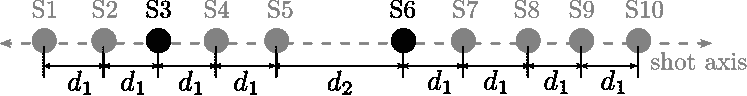

<!--yml

分类：未分类

日期：2024-09-06 19:43:01

-->

# [2211.11889] 不规则陆地勘测中的坐标基地震插值：一种深度内部学习方法

> 来源：[`ar5iv.labs.arxiv.org/html/2211.11889`](https://ar5iv.labs.arxiv.org/html/2211.11889)

# 不规则陆地勘测中的坐标基地震插值：一种深度内部学习方法

Paul Goyes-Peñafiel^∗、Edwin Vargas^∗、Claudia V. Correa、Yu Sun、Ulugbek S. Kamilov、Brendt Wohlberg 和 Henry Arguello P. Goyes-Peñafiel、C. V. Correa 和 H. Arguello 现均在哥伦比亚布卡拉曼加的圣安德烈斯大学计算机科学系工作。E. Vargas 在哥伦比亚布卡拉曼加的圣安德烈斯大学电子工程系工作。Y. Sun 在美国圣路易斯华盛顿大学计算机科学与工程系工作。U. S. Kamilov 在美国圣路易斯华盛顿大学电气与系统工程系及计算机科学与工程系工作。B. Wohlberg 在美国洛斯阿拉莫斯国家实验室理论部工作。

###### 摘要

物理和预算限制常常导致不规则的采样，这使得准确的地下成像变得复杂。在这种情况下，通常采用预处理方法，如缺失道或震源插值，以增强地震数据。最近，深度学习被用来解决道插值问题，但需要大量的训练数据来充分表示典型的地震事件。然而，大多数研究集中在道重建上，对震源插值的关注较少。此外，现有方法假设接收器/震源均匀分布，但在近似真实（不规则）勘测的地震数据时表现不佳。本文提出了一种新颖的震源聚集插值方法，该方法使用由神经网络参数化的连续坐标基地震波场表示。我们称之为坐标基地震插值（CoBSI）的无监督方法，在神经网络训练过程中无需使用外部数据即可预测不规则陆地勘测中的特定地震特征。对真实和合成三维数据的实验结果验证了该方法在时间-空间和频率-波数领域中估计连续平滑地震事件的能力，提高了稀疏性或低秩插值方法。

###### 索引词：

地震震源插值，深度内部学习，不规则陆地勘测，位置编码。^†^†脚注：^∗ 表示等同贡献。

## I 引言

插值在地震数据处理工作流程中具有重要意义，因为环境或地形限制通常会导致接收器和源采样不完整且不规则。一些限制因素包括自然和人类因素，如水体和基础设施，以及设备错误 [1]。最常见的地震插值方法涉及恢复缺失的爆破采集迹线。一种更复杂的方法则侧重于估计完整的缺失爆破采集，这带来了更大的经济、环境和实施效益。尽管如此，大多数文献中报告的工作都集中于迹线插值，对爆破插值的考虑较少。因此，本工作关注于在不规则采样的陆地调查中插值缺失的地震爆破数据。

爆破插值通常通过凸优化来解决，目标是利用正则化器反转采集模型，正则化器对数据施加先验知识，如在小波、曲线小波、剪切小波和学习字典等领域中的稀疏性 [2, 3, 4]。最近 [5]，稀疏正则化已与去噪算法提供的隐式正则化联合集成，使用插拔式先验和一致性平衡框架 [6, 7, 8]。深度学习的多功能性也被探索用于以监督方式解决爆破插值问题 [9]，特别是采用基于残差网络架构的训练，该架构在使用双三次插值生成的缺失数据样本上进行训练。

监督式深度学习方法在地震数据插值中的一个关键方面是它们使用外部数据集。例如，一些作者 [10, 11, 12, 13, 14] 使用卷积神经网络（CNN），采用端到端的训练策略，这需要大量的训练数据集。或者，已经提出了利用字段数据自身的结构冗余而非使用大量训练数据集的深度内部学习方法 [15, 16]，这些方法使用深度图像先验（DIP） [17, 18] 和递归神经网络（RNN） [19]。此外，追踪插值的内部和外部学习的结合也已被研究 [20]。尽管这些工作都探索了基于深度学习的解决方案来应对不规则的子采样方案 [21, 22]，但它们隐含地需要一个分箱过程，将不规则采样的地震数据重新排列到具有缺失条目的规则网格上（迹线）。

相比之下，本工作提出了一种深度内部学习方法来估计不规则陆地调查中缺失的完整射线集，绕过了分箱步骤。该方法利用了计算机图形学中的一个新兴分支，即基于坐标的神经表示，这允许通过将坐标映射到像素值，将连续空间场编码到多层感知机（MLP）的权重中，以无监督的方式进行[23, 24, 25]。具体来说，提出的基于坐标的地震插值（CoBSI）方法学习从（不完整的）获取的地震数据的空间和时间坐标到潜在记录场的连续映射。神经表示的连续性可以建模不规则采样场景而无需分箱过程，并且不受限于空间分辨率，相比离散表示减少了内存成本。此外，与当前的最先进方法相比，提出的方法能够无监督地进行常规和不规则 3D 陆地调查的地震射线插值，即无需额外的训练数据。提出的方法使用来自正交网格的 3D 地震数据进行验证，如交叉展开，特别关注随机子采样的常规和不规则网格的声学合成数据、Stratton 调查[26]和 SEAM Phase II Foothills 模型[27]。结果显示，CoBSI 超过了多通道奇异谱分析（MSSA）、阻尼-MSAA（DMSSA）、序列广义 K-means（SGK）和基于稀疏性的射线重建方法。

## II 背景

基于坐标的神经表示已经成功应用于无监督生成具有复杂几何形状和外观的场景的高度逼真视图[25, 28]，以及隐式神经表示信号用于解决边界值问题[24]。在相同的研究方向上，[23]中的基于坐标的内部学习（CoIL）方法将这些思想外推到通过从一个子采样和噪声测量集建模一个连续测量场来解决成像反问题，使用断层成像系统的几何参数。由于地震采集可以用坐标系统来描述，这类似于计算机视觉领域中的连续场建模，这项工作探索了一种基于坐标的建模方法，以深度内部学习的方法解决地震射线插值问题。值得指出的是，CoBSI 解决了比[23]中更加复杂的插值问题，因为我们想要插值的地震波场包含来自反射波、折射波和表面波的不同响应。

这种方法包括两个主要处理块，一个位置编码器和一个多层感知机（MLP）。位置编码映射有助于通过坐标位置的编码来保留高频信息 [29]，而 MLP 作为从编码坐标到信号幅度的插值器。例如，[28] 显示将输入点通过简单的傅里叶特征映射传递可以使 MLP 学习低维问题域中的高频函数。值得注意的是，使用 MLP 进行地震插值任务依赖于低维问题，如下所述。

## III 3D 地震采集模型

理想的地震勘测是具有均匀间隔接收器和源的正交网格（即预设设计）。然而，在实际操作中，环境和地形限制会引起不规则性，导致空间间隔不均，如图 1 (a-b) 中的交叉展开采集示例所示，其中缺失的拍摄点用红色表示。交叉展开勘测的数据被建模为 $k$ 个堆叠的拍摄集 $\mathbf{F}_{i}\in\mathbb{R}^{m\times n},$ 其中 $m$ 是时间样本，$n$ 是接收器。因此，整个数据集可以表示为一个张量 $\mathcal{F}=\{\mathbf{F}_{i}\}_{i=1}^{k}\in\mathbb{R}^{m\times n\times k}$。图 1 (c) 显示了一个缺少拍摄集 $\mathbf{F}_{3}$ 和 $\mathbf{F}_{k-1}$ 的勘测。设 $\mathbf{f}\in\mathbb{R}^{mnk}$ 为完整的交叉展开地震勘测 $\mathcal{F}$ 的向量表示，采集模型可以写成线性系统

|  | $\mathbf{r}=\mathbf{\Phi}\mathbf{f}+\omega\,,$ |  | (1) |
| --- | --- | --- | --- |

其中 $\mathbf{\Phi}$ 是建模采样过程的矩阵，$\omega$ 是采集噪声，$\mathbf{r}\in\mathbb{R}^{mn(k-s)}$ 是不完整的采集数据（地震响应）。具体而言，采集算子 $\mathbf{\Phi}\in\mathbb{R}^{mn(k-s)\times mnk}$ 被定义为 $\mathbf{\Phi}=\mathbf{S}\otimes\mathbf{I}_{mn}$，其中 $\otimes$ 表示克罗内克积 [30]，$\mathbf{I}_{mn}$ 是一个 $mn\times mn$ 的单位矩阵，$\mathbf{S}\in\mathds{R}^{k-s\times k}$ 是一个建模子采样效应的单位矩阵，通过将对应于缺失源的 $s$ 行设为零。

图 1：在不规则勘测中缺少拍摄点 $\mathbf{F}_{3}$ 和 $\mathbf{F}_{k-1}$ 的交叉展开几何。 (a) 透视图。 (b) 平面图。 (c) 张量表示 $\mathcal{F}$ 的地震数据。

以前的研究表明，可以从不完整的采集 $\mathbf{y}$ 中估计出潜在的地震数据 $\mathbf{f}$，方法包括优化或数据驱动方法。具体来说，优化方法考虑到地震信号在某些变换域 $\mathbf{\Psi}$ 中是稀疏的，因此可以表示为 $\mathbf{\Psi}\mathbf{f}=\alpha$，其中 $\alpha$ 对应于变换域中的系数[5, 2, 3, 31, 32]。利用这种稀疏性先验，可以通过求解优化问题来估计 $\mathbf{f}$。

|  | $\mathbf{f}^{*}=\operatorname*{arg\,min}_{\mathbf{f}}\;(1/2)\left\&#124;\mathbf{r}-\mathbf{\Phi}\mathbf{f}\right\&#124;_{2}^{2}+\lambda\left\&#124;\mathbf{\Psi}\mathbf{f}\right\&#124;_{1}\,,$ |  | (2) |
| --- | --- | --- | --- |

其中 $\lambda>0$ 是一个正则化参数，用于加权解中的稀疏性项。另一方面，缺失的地震数据可以使用数据驱动的方法进行恢复，例如学习大量地震数据集内部结构的卷积神经网络[11, 10, 12]。然而，所有这些方法都依赖于传感矩阵 $\mathbf{\Phi}$，它考虑了索引采样位置。因此，它假设一个规则的采样网格，如图 2(a) 所示，即它不能建模不规则间隔的源。因此，重建方法仍然面临在不规则调查中提供准确地震估计的限制，如图 2(b) 所示，其中源之间的距离是不固定的。

为解决这个问题，[33]在稀疏性促进先验中引入了非等间距曲线变换，而[4]在应用重建算法之前使用了不规则网格上的插值运算符，并进行了分 bin 预处理步骤，将不规则采样数据转换为规则网格。这些方法的主要缺点在于插值器假设线性连续性，因为它仅在射线方向上应用，这在 3D 采集中不允许对二维波场进行插值。因此，[4]中的方法仅限于分裂扩展几何中的 2D 射线。

图 2：源采样 (a) 具有间隔距离 $d$ 的均匀且规则的间隔，以及 (b) 具有可变距离的不规则间隔。黑点代表待插值的缺失射线。

## IV 基于坐标的地震射线插值

与依赖于基于索引的勘测建模的最先进插值方法不同，提出的基于坐标的地震插值（CoBSI）方法采用基于坐标的深度内部学习方法，以更真实的方式对地震勘测进行建模。该方法的核心思想受到最近神经插值计算成像工作的启发[23, 34, 24, 25, 35, 28]，其内容是表示来自给定坐标$\boldsymbol{v}=[x,y,z]\in\mathbb{R}^{3}$的波场响应$r\in\mathbb{R}$，其中$x, y, z$分别表示时间、接收器和源位置，使用参数为${\boldsymbol{\theta}}$的神经网络$\mathcal{M}_{\boldsymbol{\theta}}$。该神经网络的目标是将输入坐标映射到采样的波场响应，即$r=\mathcal{M}_{\boldsymbol{\theta}}(\boldsymbol{v})$。基于这一表示，我们可以通过查询$\mathcal{M}_{\boldsymbol{\theta}}$使用采集响应的对应坐标，来建模采集到的交叉扩展$\mathbf{r}$（参见方程 (1））。

图 3：在单个交叉扩展网格中，展示了用于地震采集的坐标基础表示$\boldsymbol{v}$（蓝色点），其中$x, y, z$分别表示接收器、时间和源坐标。坐标$\boldsymbol{v}^{*}$属于要插值的期望拍摄汇集（黑色点）。

提议的神经网络$\mathcal{M}_{\boldsymbol{\theta}}$是高维映射$\gamma$与多层感知器（MLP）$\mathcal{N}_{\boldsymbol{\theta}}$的组合，使得$\mathcal{M}_{\boldsymbol{\theta}}(\boldsymbol{v})=\mathcal{N}_{\boldsymbol{\theta}}(\gamma(\boldsymbol{v}))$。近期的研究表明，这种分离缓解了 MLP 在表示高频变化时性能下降的问题[28, 34, 36]，例如由于反射事件连续性骤变或如头波和地面滚动等相干噪声导致的地震数据中的高频变化。以下小节介绍了映射函数$\gamma$和 MLP$\mathcal{N}_{\boldsymbol{\theta}}$架构的详细信息。

### IV-A 各向异性位置编码

为了解决表示自然图像高频分量的问题，[28]建议采用位置编码$\gamma$作为高维映射，定义为

|  | $\gamma_{U}(\boldsymbol{v})=[\cos(\omega_{1}\boldsymbol{v}),\sin(\omega_{1}\boldsymbol{v}),...,\cos(\omega_{i}\boldsymbol{v}),\sin(\omega_{i}\boldsymbol{v}),...,\\ \cos(\omega_{U}\boldsymbol{v}),\sin(\omega_{U}\boldsymbol{v})]^{\mathrm{T}}\,,\hskip 2.84544pt$ |  | (3) |
| --- | --- | --- | --- |

其中 $U$ 是分量的总数，$\{\omega_{i}\}_{i=1}^{U}$，频率映射由线性和指数采样中的 $\omega_{i}=i\pi/2$ 或 $\omega_{i}=\pi 2^{i-1}$ 给出，并且 $\boldsymbol{v}$ 是某个归一化到 $[0,1]^{3}$ 的任意坐标。请注意，方程（3 中定义的位置编码将输入坐标扩展为不同频率分量的组合，并且所有坐标都映射到相同数量的频率。

然而，在地震数据的特殊情况下，每个信号坐标表示的特征（源、接收器和时间样本）有很大的不同，因此不能等同编码以保持数据结构。因此，本工作提议采用各向异性位置编码，其中每个轴方向使用不同数量的频率分量。对于地震数据的三维特定情况，各向异性位置编码定义为

|  | $\Gamma_{MNK}(\boldsymbol{v})=[\gamma_{M}(x),\gamma_{N}(y),\gamma_{K}(z)]^{T}\hskip 2.84544pt,$ |  | (4) |
| --- | --- | --- | --- |

其中 $M,N,K$ 是与 $x$（时间）、$y$（接收器）和 $z$（震源）轴相关联的频率分量的数量，如图 3 所示。图 4 展示了 $M=8$、$N=5$ 和 $K=8$ 的各向异性位置编码示例，其中所有编码图的横轴表示归一化坐标值在 $[0,1]$ 内，纵轴表示编码频率的数量，输出 $\Gamma$ 位于 $[-1,1]$ 内。每个坐标 $M,N,K$ 的频率分量的数量通过参数调整获得。

图 4：具有线性采样的各向异性位置编码图示例，其中$M=8$，$N=5$和$K=8$个频率。左侧的矩阵表示每个坐标的$\gamma$函数。中间的向量表示给定坐标$x$、$y$和$z$的相应映射。最后，右侧的向量$\Gamma_{858}(\boldsymbol{v})$展示了所提各向异性位置编码的最终映射。

### IV-B 网络架构

这里使用了一个多层感知器（MLP）来近似函数$\mathcal{N}_{\theta}$。此架构建模为嵌套函数

|  | $\mathcal{N}_{\boldsymbol{\theta}}(\boldsymbol{v})=f_{L}\left(f_{L-1}\left(\cdots f_{2}(f_{1}(\boldsymbol{v}))\right)\right)\,,$ |  | (5) |
| --- | --- | --- | --- |

其中$L$是 MLP 的层数或深度，$f_{i}(\boldsymbol{v}_{i})=\phi\left(\mathbf{W}_{i}\boldsymbol{v}_{i}+\mathbf{b}_{i}\right)$是 MLP 的第$i^{\mathrm{th}}$层，它是由矩阵$\mathbf{W}_{i}$和偏置$\mathbf{b}_{i}$表示的仿射变换，之后是非线性激活函数$\phi$。本工作采用了修正线性单元（ReLU）作为激活函数，这是现代神经网络中最广泛使用的激活函数之一[37]。此外，由于地震数据在范围$[0,1]$内进行标准化，因此为输出层选择了 sigmoid 激活函数。

提出的基于坐标的神经网络的概述如图 5 所示，包含一个全连接块的$\mathrm{NN}$神经元和$L$层，以及一个单神经元输出层。注意，这可以被视为回归问题，因此我们可以简单地使用均方误差（MSE）损失函数来寻找最佳网络参数$\boldsymbol{\theta^{*}}$。MSE 损失函数可以写作

|  | $\mathcal{L}(\boldsymbol{\theta})=\frac{1}{mn(k-s)}\sum_{i}^{mn(k-s)}(r_{i}-\mathcal{N}_{\boldsymbol{\theta}}(\Gamma_{MNK}(\boldsymbol{{v}}_{i})))^{2}\,,$ |  | (6) |
| --- | --- | --- | --- |

其中$s$和$k$分别是缺失和总的射击次数；$\boldsymbol{v}_{i}=[x_{i},y_{i},z_{i}]$是坐标集合$\mathcal{V}$的第$i^{\mathrm{th}}$元素，$r_{i}$是从方程(1)中获取的幅值$\mathbf{r}$的第$i$项。

我们在这里指出，不需要额外的地震勘测数据，因为我们只使用了感兴趣采集的可用离散样本来训练网络。

图 5：带有各向异性位置编码（P.E）和插值神经网络$\mathcal{N}_{\boldsymbol{\theta}}$的坐标基础神经网络$\mathcal{M}_{\boldsymbol{\theta}}$

### IV-C 插值算法

来自 IV-A 和 IV-B 的各向异性位置编码和 MLP 被结合成算法 1 中描述的 CoBSI 方法。具体而言，算法的输入包括：

+   i)

    可用（已获取）数据的坐标集合$\mathcal{V}=\left\{\boldsymbol{v}_{i}\right\}_{i=1}^{mn(k-s)}$，其中$\boldsymbol{v}_{i}=[x_{i},y_{i},z_{i}]$

+   ii)

    从方程(1)获得的对应幅度值$\mathbf{r}=[r_{1},\cdots,r_{i},\cdots,r_{mn(k-s)}]$

+   iii)

    缺失数据的坐标集合$\mathcal{V}^{*}=\left\{\boldsymbol{v}_{i}^{*}\right\}_{i=1}^{mns}$

在第 1 步中，每个点的各向异性位置编码 $\boldsymbol{v}_{i}$ 是使用公式 4 计算的。然后，在第$3-10$行，位置编码和幅度值被用于以端到端的方式训练 MLP $\mathcal{N}_{\theta}$，以获得优化后的网络参数 $\boldsymbol{\theta^{*}}$，如算法 1 第$11$步所示。在第$12-14$行，使用具有最优参数的网络来通过查询 $\mathcal{M}_{\boldsymbol{\theta}}$ 来估计缺失测点的幅度值，使用 $s$ 个缺失测点的对应坐标 $\mathcal{V}^{*}=\{\boldsymbol{v}_{i}^{*}\}_{i=1}^{mns}$，只要输入坐标在相同的采集领域中。特别地，注意在地震勘测方面，采集领域与接收器和源线的最大覆盖范围相关，如图 3 所示。在第$15$行，这些幅度与已知数据幅度拼接在一起，并作为与地震测点对应的二维结构重新排列（第$16$行）。因此，得到一个完整的地震数据立方体 $\mathcal{F}$。

算法 1 使用 CoBSI 方法的地震测点插值

1: $\mathcal{V}$: 坐标集合；$\mathbf{r}$: 对应每个坐标的数据幅值。$\mathcal{V}^{*}$: 缺失射线的坐标集合。$\mathrm{N}_{\mathrm{E}}$: 迭代次数。2: 使用公式 4 计算集合 $\mathcal{P}=\left\{\Gamma_{MNK}(\boldsymbol{v}_{i})\right\}_{i=1}^{mn(k-s)}$ 以及 $\boldsymbol{v}_{i}\in\mathcal{V}$。3: 随机初始化 $\boldsymbol{\theta}$。4: 对于 $i=1....\mathrm{N}_{\mathrm{E}}$ 执行 5: 从 $\mathbf{r}$ 中抽取 $\mathcal{P}_{t}\subset\mathcal{P}$ 和 $\mathbf{r}_{t}$  $\triangleright$ 抽取数据批次 6: 对于每个 $\Gamma_{MNK}(\boldsymbol{v}_{j})\in\mathcal{P}_{t}$ 和 $\mathbf{r}_{j}$ 从 $\mathbf{r}_{t}$ 中抽取 7: $\hat{{r}}_{j}\leftarrow\mathcal{N}_{\theta}(\Gamma_{MNK}(\boldsymbol{v}_{j}))$  $\triangleright$ 估计地震响应 8: 使用 $\hat{{r}}_{j}, r_{j}$ 和公式 6 计算均方误差损失 $\mathcal{L}(\boldsymbol{\theta})$。9: 使用 ADAM 优化器更新 $\boldsymbol{\theta}$。10: 结束循环 11: 结束循环 12: 从最后一次迭代中获取最优参数 $\boldsymbol{\theta}^{*}$。13: 对于每个 $\boldsymbol{v}_{i}^{*}\in\mathcal{V}^{*}$ 执行 14: $\hat{{r}}_{i}^{*}\leftarrow\mathcal{N}_{\boldsymbol{\theta}^{*}}(\Gamma_{MNK}(\boldsymbol{v}_{i}^{*}))$  $\triangleright$ 估计缺失射线的地震响应 15: 结束循环 16: $\mathbf{f}\leftarrow[\hat{\mathbf{r}}^{*},\mathbf{r}]$  $\triangleright$ 连接获得的和插值的地震响应 17: $\mathcal{F}\in\mathbb{R}^{m\times n\times k}\leftarrow\text{reshape}(\mathbf{f}\in\mathbb{R}^{mnk})$  $\triangleright$ 将向量重新排列为张量表示 18: 输出: $\mathcal{F}$ 完整的地震数据

## V 模拟和结果

为评估 CoBSI 在规则和不规则交叉扩展采集几何中的有效性，使用合成数据和真实数据进行了三次不同的实验。在所有实验中，我们将 MLP 架构的层数固定为 $L=15$，每层神经元数量（NN）相同。表 I 总结了每个实验中用于训练的主要网络参数：数据集、NN、学习率、轮次和可训练参数数量（NTP）。这些参数通过网格搜索确定，从而在每个实验中获得了最佳的 PSNR 评价指标。

表 I: 每个实验中基于坐标的神经网络 $\mathcal{M}_{\boldsymbol{\theta}}$ 的参数汇总。NN：神经元数量，学习率：学习率，NTP：可训练参数的数量。

| 实验 | 数据集 | NN | 学习率 | 轮次 | 可训练参数数量 |
| --- | --- | --- | --- | --- | --- |
| I | 合成数据 | $128$ | 1e-3 | 1000 | 232449 |
| II | Stratton | $256$ | 1e-3 | 5000 | 932865 |
| III | SEAM Phase II | $128$ | 1e-4 | 50000 | 234241 |

各数据集和实验的具体细节包括在以下小节中。所有实验均使用 NVIDIA Tesla P100 16GB GPU 进行。峰值信噪比（PSNR）用于评估重建的准确性，正如 [38] 中所描述的，以及结构相似性图像度量（SSIM），参考 [39]。这两个度量指标均应用于时间域镜头，并与地面真实情况进行对比。使用 CoBSI 获得的插值镜头与 F-XY 域多通道奇异谱分析（MSSA）和阻尼-MSSA（DMSSA）方法 [40]（fhigh=550 和 iter=50，通过 DRR Matlab 包 [41] 实现）、序列广义 K 均值（SGK）（利用快速字典学习进行高维地震重建 [42, 43]）和基于稀疏性的插值（SBI），参见公式 (2)，采用 [3] 中的 ADMM 算法求解。所有这些方法中的参数均固定为各工作作者建议的参数。

表 II: 使用 CoBSI 获得的插值结果摘要，与 DMSSA、MSSA、SGK 和 SBI 方法在三种不同地震采集调查中的对比。

| 实验 | 镜头 | SSIM | PSNR (dB) |
| --- | --- | --- | --- |
| CoBSI | DMSSA | MSSA | SGK | SBI | CoBSI | DMSSA | MSSA | SGK | SBI |
|  | S4 | 0.990 | 0.294 | 0.284 | 0.493 | 0.547 | 42.368 | 17.737 | 18.379 | 19.261 | 20.845 |
| 实验 I: | S6 | 0.983 | 0.237 | 0.239 | 0.459 | 0.741 | 42.070 | 14.933 | 15.707 | 19.146 | 26.463 |
| 合成 | S8 | 0.977 | 0.277 | 0.253 | 0.453 | 0.921 | 36.589 | 20.276 | 19.486 | 19.562 | 22.026 |
| S11 | 0.977 | 0.183 | 0.135 | 0.461 | 0.583 | 37.343 | 19.241 | 17.867 | 18.155 | 21.199 |
| S13 | 0.980 | 0.060 | 0.065 | 0.431 | 0.481 | 37.479 | 14.188 | 14.318 | 15.609 | 17.264 |
|  | 平均值 | 0.981 | 0.210 | 0.195 | 0.459 | 0.655 | 39.170 | 17.275 | 17.151 | 18.347 | 21.559 |
| 实验 II: | S3 | 0.651 | 0.084 | 0.070 | 0.435 | 0.503 | 22.621 | 15.419 | 14.850 | 16.510 | 17.371 |
| Stratton 3D 调查 | S6 | 0.552 | 0.106 | 0.092 | 0.402 | 0.520 | 19.970 | 15.412 | 14.900 | 16.098 | 19.233 |
| 平均值 | 0.602 | 0.095 | 0.081 | 0.419 | 0.512 | 21.296 | 15.416 | 14.875 | 16.304 | 18.302 |
| 实验 III: | S2 | 0.724 | 0.150 | 0.083 | 0.399 | 0.296 | 23.379 | 17.398 | 15.416 | 18.082 | 20.195 |
| SEAM 第二阶段 | S4 | 0.728 | 0.255 | 0.185 | 0.436 | 0.229 | 24.812 | 19.768 | 18.154 | 19.183 | 19.807 |
| 平均值 | 0.726 | 0.203 | 0.134 | 0.418 | 0.263 | 24.096 | 18.583 | 16.785 | 18.633 | 20.001 |

实验 I: 使用 DEVITO 的声学前向建模算子 [44, 45] 传播地震波场，基于交叉展开网格的合成数据集用于本实验。交叉展开包括 $m=900$ 个时间采样，$n=101$ 个接收器和 $k=14$ 个采样。时间和接收器的间隔采样分别为 $dt=1$ ms 和 $dg=25$ m。对于本实验，从数据集中移除了 5 个采样（S4、S6、S8、S11 和 S13），并使用提出的 CoBSI 方法进行插值。图 6 描绘了采样中的不规则间隔，其中 5 个缺失采样由黑点表示。请注意，移除的采样代表已知数据之间不同的距离间隔。

图 6: 实验 I 中使用的合成不规则采样，$d_{1}=75$ m，$d_{2}=100$ m 和 $d_{3}=125$ m。黑点表示缺失采样。

表 III: 使用提出的 CoBSI 方法进行指数和线性采样的 5 个缺失采样的插值结果，（CoBSI-Exp 和 CoBSI-Lin，分别）

| Shot | SSIM | PSNR (dB) |
| --- | --- | --- |
| CoBSI-Exp | CoBSI-Lin | CoBSI-Exp | CoBSI-Lin |
| S4 | 0.990 | 0.987 | 42.368 | 42.701 |
| S6 | 0.983 | 0.980 | 42.070 | 41.542 |
| S8 | 0.977 | 0.969 | 36.859 | 34.767 |
| S11 | 0.977 | 0.976 | 37.343 | 40.587 |
| S13 | 0.980 | 0.977 | 37.479 | 36.707 |
| 平均值 | 0.982 | 0.978 | 39.224 | 39.261 |
| 标准差 | 0.005 | 0.007 | 2.746 | 3.373 |

除了评估 CoBSI 从合成不规则数据集中插值地震采样的能力外，本实验旨在分析线性和指数频率映射在各向异性位置编码中的行为。表格 III 总结了 5 个缺失采样的 CoBSI 插值指标。具体来说，通过参数调整，时间和采样的频率固定为 1，接收器的频率为 2，即 $\Gamma_{121}$。获得的结果显示，对于各向异性位置编码函数，两种采样类型所得到的指标变化很小。图 7 展示了采样 S6 的插值结果，图中箭头所示的中断地震事件未能被 CoBSI 在指数采样下完全插值。另一方面，通过线性采样，CoBSI 能够平滑整个信号，通过估计更连续的事件来处理整个采样。

图 7：在实验 I 中，使用线性和指数采样的位置信息编码函数进行的第 6 帧插值比较，分别在 (a) 时间域和 (b) 频率-波数域中。箭头指向主要差异，表示由 CoBSI-Lin 更好地近似的事件的连续性。

表 II 总结了 CoBSI-Exp 插值结果与 DMSSA、MSSA SGK 和 SBI 的结果进行比较。可以看出，所提出的方法在两个指标上均优于评估的对比方法。图 9 显示，与对比方法不同的是，大多数重建误差发生在反射事件中，CoBSI 的误差分布较小，主要集中在震源集合的边缘，因此，在第一次到达以及线性和双曲事件中的重建精度较高。此外，考虑到平均结果，CoBSI 在 SSIM 和 PSNR 上分别比对比方法高出 0.786 和 22.018 dB。

实验 II：用于本实验的地震数据集是 Stratton 调查 [26]，这是来自南德克萨斯州的一个真实 3D 陆地采集项目，经过基于调查特征的几何分析重新排列为横向展开。数据子集包括 1001 个时间样本、90 个接收器和 10 个震源，震源之间存在第五和第六次震源的间隔，如图 8 所示。本实验的目标是评估所提出的方法处理更复杂真实数据的能力。为此，我们移除了震源 S3 和 S6，因此考虑了两个不同的间隔长度。在这些真实数据中的插值挑战是确定地震反射事件在垂直轴（时间轴）上的正确位置。在这种情况下，位置信息编码的频率数固定为时间轴上的 9 个、接收器上的 5 个和震源上的 8 个，即 $\Gamma_{958}$。

图 8：在实验 II 中使用的非规则真实地震采集数据，$d_{1}=50$ 米，$d_{2}=100$ 米。黑色圆点表示缺失的震源。

图 10 展示了对比了射击 S6 的插值结果，可以看到插值信号比实际情况更平滑、更连续，这解释了导致的较低指标值。这些结果表明，使用$\Gamma_{958}$进行线性采样的 CoBSI 提供的主要优势是它能够保持时间轴上事件的极性和位置，由箭头指示。

图 9：对实验 I 中使用 CoBSI、DMSSA、MSSA、SGK 和 SBI 方法的射击 6 插值结果进行比较。

图 10：使用 CoBSI、DMSSA、MSSA、SGK 和 SBI 方法对实验 II 中射击 S6 的插值结果。箭头指向主要的地震反射事件。

例如，SBI 在图 10 中未能对靠近接收器索引 25 以及时间样本 300 和 500 处的事件进行正确插值，因为它没有足够的邻近射击信息来估计事件的正确时间位置。此外，CoBSI 提供了更强的去噪信号增强效果，突出了射击中的地震事件。与之前的情况一样，表 II 中的实验 II 结果显示，相比于 DMSSA、MSSA SGK 和 SBI，CoBSI-Exp 插值在两个指标上的结果更为准确。本实验的改进达到了 0.521（SSIM）和 6.421 dB（PSNR），这是所有射击的平均结果。

实验 III：本实验中使用的数据集是 SEAM Phase II Foothills 模型的一部分。采集为对一个复杂地质模型的正交勘测，模拟了哥伦比亚安第斯山脉的 Llanos Foothills，这是一个最具挑战性的活跃土地勘探区域之一[27]，主要因为由地形引起的幅度突变的复杂地震事件。数据集包含 $m=128$ 个时间样本，$n=128$ 个接收器和 $k=7$ 次发射。时间、接收器和发射的间隔采样分别为 dt=8 ms，dg = 50 m 和 ds = 50 m。在本实验中，我们评估了 CoBSI 在常规采集中的表现。因此，发射 S2 和 S4 被从勘测中移除，插值后的发射如图 11 所示。可以看出，使用 $\Gamma_{551}$ 的线性采样的 CoBSI 能够重建事件，保留倾斜和极性，而 SBI 方法则产生了低幅度的事件以及位于发射中心的主要反射事件中的伪影。此外，由于反射事件的分布复杂，竞争的插值方法在正确重建低幅度信号时失败，这可以在误差图像中看到，误差值较大的分布在整个发射中，而在 CoBSI 中，误差主要发生在发射聚集的底部。因此，在这种情况下，CoBSI 显示出更高的准确性，因为它能够突出显示发射聚集中的主要地震反射事件。实验的结果在表 II 中证实了这一行为，平均结果的增益高达 0.592（SSIM）和 7.311 dB（PSNR）。

图 11：实验 III 中使用 CoBSI、DMSSA、MSSA、SGK 和 SBI 方法对发射 S2 和 S4 进行的 SEAM Phase II 数据插值结果。箭头指向 CoBSI 更好地近似的事件，而稀疏性导致发射中心的主要反射事件中的低幅度事件和伪影。

## VI 讨论

总的来说，以前的结果表明，CoBSI 插值在所有实验中都优于 DMSSA、MSSA、SGK 和 SBI，提供了地震发射的典型特征的适当表示，如事件的平滑性和连续性、噪声减少以及幅度补偿。以下小节讨论了与地震神经表示和计算成本相关的 CoBSI 的优点和局限性。

#### VI-1 地震神经表示

本工作旨在展示，通过将各向异性位置编码与多层感知器（MLP）结合，可以获得地震数据的完整且连续的表示，尽管神经网络本身较为简单，这一点已在其他计算成像问题中得到验证[25, 34]。此外，需要注意的是，CoBSI（坐标基础地震插值）公式具有灵活性，因此可以使用比 MLP 更复杂的神经网络架构，尽管这会增加其固有的计算复杂性。CoBSI 的主要优点之一是，一旦从可用的不完整数据中获得地震神经表示，就可以估计分析域内任何任意坐标的连续场响应，从而准确估计完整的缺失测量数据。此外，与需要进行参数调优的其他插值或重建方法相比，在 CoBSI 中，映射函数中的频率数量与地震数据的维度密切相关。因此，可以通过分析地震采集调查的类型来确定方程式中的超参数$M,N,K$（参见 4）。具体来说，在一个横向展开的数组中，少量地震源的信号变化主要集中在接收方向（内线），因为存在更多的空间信息。另一方面，对于处理内线偏移展开或海洋数据的情况，射线密度较高，信号的最大变化发生在源方向（Xline）。

#### VI-2 计算成本

如表 I 所示，CoBSI 中的可训练参数少于一百万个。为了与用于地震重建的更复杂网络架构进行比较，表 IV 列出了如 U-Net [22, 46] 和自编码器 [47, 48, 49] 这类卷积神经网络的可训练参数数量（NTP），以及普通卷积神经网络 CNN [35]。值得注意的是，这些方法专注于对 2D 和 3D 地震数据中的接收器进行插值。相比之下，CoBSI 旨在估计完整的缺失数据，这显然是一项更复杂的任务。此外，它能够使用更简单的网络（MLP）进行这样的插值，从而在无监督策略中需要的计算资源更少，因为仅学习了 MLP 的权重和偏置。虽然 [35] 是一种无监督学习方法，但它仅考虑对均匀子采样的缺失轨迹进行重建，这对于实际应用是不现实的。

表 IV：地震重建方法中所需的可训练参数数量（NTP）比较

| 地震数据 | 网络 | NTP | 学习 |
| --- | --- | --- | --- |
| 2D [22] | U-NET | 87M | 有监督 |
| 2D [35] | 普通 CNN | 42K | 无监督 |
| 3D [46] | U-NET | 27M | 有监督 |
| 2D [47] | 自编码器 | 18M | 有监督 |
| 3D [49] | 自编码器 | 6M | 有监督 |
| Shotgather（即 3D） | CoBSI（MLP） | <1M | 无监督 |

## VII 结论

提出了基于坐标的地震插值（CoBSI）方法，用于估算常规和不规则三维陆地地震采集中的缺失地震数据。与采用基于索引模型的先进重建方法不同，CoBSI 采用基于坐标的方法，允许在不规则几何中进行数据插值。此外，CoBSI 的一个关键组成部分是神经网络中的各向异性位置编码层，用于从低维到高维坐标的映射，以考虑与时间、接收器和震源领域相关的参考轴的变化。实验结果显示了该方法在三种不同场景下的能力：（i）不规则几何和合成波场，（ii）来自德克萨斯州的实际采集中的几何间隙，以及（iii）以规则采集著称的地球物理 SEAM Phase II Foothills 模型。获得的结果表明，提出的方法相较于基于稀疏性和低秩插值方法具有优势，因为 CoBSI 能够估算连续地震事件，同时在时空域中提供平滑信号。定量分析表明，在合成数据中，CoBSI 在 PSNR 上比竞争方法高出最多 22.11 dB，在实际数据实验中分别高出 6.4 dB 和 7.31 dB。

## 致谢

本研究得到了项目 110287780575 的支持，该项目通过 Agencia Nacional de Hidrocarburos 与 Ministerio de Ciencia, Tecnología e Innovación 和 Fondo Nacional de Financiamiento para la Ciencia, la Tecnología y la Innovación Francisco José de Caldas 之间的协议 785-2019 资助，以及洛斯阿拉莫斯国家实验室的实验室定向研究与发展计划，项目编号为 20200061DR。作者感谢高性能计算中心（GUANE-UIS）和 NVIDIA 学术硬件资助计划提供的计算资源，用于运行参数调整实验。

## 参考文献

+   [1] A. Cordsen, M. Galbraith, 和 J. Peirce， *规划陆地三维地震勘测*。勘探地球物理学家协会，2000 年。

+   [2] O. P. Villarreal, K. Leon, D. Espinosa, W. Agudelo, 和 H. Arguello， “通过在正交网格中使用规则采样进行压缩感知地震采集，” 收录于 *2017 IEEE 第七届国际计算进展多传感适应处理研讨会（CAMSAP）*，第 2017 年 12 月卷。IEEE，2017 年 12 月，页 1–5。

+   [3] O. Villarreal, K. León-López, D. Espinosa, W. Agudelo, 和 H. Arguello， “基于时间切片域的局部和非局部信息的正交几何地震源重建，” *应用地球物理学杂志*，第 170 卷，页 103846，2019 年。

+   [4] L. Galvis, J. M. Ramírez, E. Vargas, O. Villarreal, W. Agudelo, 和 H. Arguello， “基于非均匀采样源的二维地震波场重建，” *电子成像*，第 2020 卷，第 14 期，页 307–307，2020 年 1 月。

+   [5] P. Goyes-Peñafiel, E. Vargas, C. V. Correa, W. Agudelo, B. Wohlberg, 和 H. Arguello，“用于三维陆地地震数据恢复的共识平衡方法，” *IEEE 地球科学与遥感快报*，第 19 卷，页码 1–5，2022 年。

+   [6] S. V. Venkatakrishnan, C. A. Bouman, 和 B. Wohlberg，“用于模型基础重建的即插即用先验，” 收录于 *2013 年 IEEE 全球信号与信息处理大会*，IEEE，2013 年，页码 945–948。

+   [7] U. S. Kamilov, C. B. Bouman, G. T. Buzzard, 和 B. Wohlberg，“在计算成像中整合物理模型和学习模型的即插即用方法，” *IEEE 信号处理杂志*，2022 年。

+   [8] G. T. Buzzard, S. H. Chan, S. Sreehari, 和 C. A. Bouman，“即插即用的优化无重建：使用共识平衡的方法，” *SIAM 图像科学杂志*，第 11 卷，第 3 期，页码 2001–2020，2018 年。

+   [9] B. Wang, N. Zhang, W. Lu, J. Geng, 和 X. Huang，“基于深度学习的绿色函数空间互易性智能缺失数据重建，” *IEEE 地球科学与遥感学报*，第 58 卷，第 3 期，页码 1587–1597，2020 年。

+   [10] Y. Wang, B. Wang, N. Tu, 和 J. Geng，“用于不规则空间采样数据的卷积自编码器地震轨迹插值，” *地球物理学*，第 85 卷，第 2 期，页码 V119–V130，2020 年。

+   [11] Q. Liu, L. Fu, 和 M. Zhang，“基于卷积神经网络的深度地震先验地震数据重建，” *地球物理学*，第 86 卷，第 2 期，页码 V131–V142，2021 年 3 月。

+   [12] B. Wang, N. Zhang, W. Lu, 和 J. Wang，“基于深度学习的地震数据插值：初步结果，” *地球物理学*，第 84 卷，第 1 期，页码 V11–V20，2019 年 1 月。

+   [13] W. Fang, L. Fu, M. Zhang, 和 Z. Li，“基于 U-net 和纹理损失的地震数据插值，” *地球物理学*，第 86 卷，第 1 期，页码 V41–V54，2021 年 1 月。

+   [14] H. Zhang, X. Yang, 和 J. Ma，“自然图像去噪的学习是否可以用于地震数据插值？” *地球物理学*，第 85 卷，第 4 期，页码 WA115–WA136，2020 年。

+   [15] H. Zhang, L. Mai, N. Xu, Z. Wang, J. Collomosse, 和 H. Jin，“视频修补的内部学习方法，” 收录于 *IEEE/CVF 国际计算机视觉会议（ICCV）论文集*，2019 年 10 月。

+   [16] A. Shocher, N. Cohen, 和 M. Irani，“基于深度内部学习的零样本超分辨率，” 收录于 *IEEE 计算机视觉与模式识别会议（CVPR）论文集*，2018 年 6 月。

+   [17] M. J. Park, J. Jennings, B. Clapp, 和 B. Biondi，“使用 POCS 引导的深度图像先验的地震数据插值，” 收录于 *SEG 技术程序扩展摘要 2020*，勘探地球物理学家学会，2020 年，页码 3154–3158。

+   [18] F. Kong, F. Picetti, V. Lipari, P. Bestagini, X. Tang, 和 S. Tubaro，“基于深度先验的无监督不规则采样地震数据重建，” *IEEE 地球科学与遥感快报*，第 19 卷，页码 1–5，2022 年。

+   [19] D. Yoon, Z. Yeeh, 和 J. Byun, “使用具有跳跃连接的深度双向长短期记忆进行地震数据重建，” *IEEE Geoscience and Remote Sensing Letters*，第 18 卷，第 7 期，第 1298–1302 页，2021 年。

+   [20] Q. Wang, L. Fu, S. Ruan, B. Chen, 和 H. Li, “通过结合深度外部和内部学习重建地震数据，” *Exploration Geophysics*，2022 年。

+   [21] S. Mandelli, V. Lipari, P. Bestagini, 和 S. Tubaro, “使用卷积神经网络进行地震数据插值和去噪，” *arXiv preprint arXiv:1901.07927*，2019 年。

+   [22] X. Chai, H. Gu, F. Li, H. Duan, X. Hu, 和 K. Lin, “用于不规则和规则缺失数据重建的深度学习，” *Scientific Reports*，第 10 卷，2020 年。

+   [23] Y. Sun, J. Liu, M. Xie, B. Wohlberg, 和 U. S. Kamilov, “Coil：基于坐标的内部学习用于断层成像，” *IEEE Transactions on Computational Imaging*，第 7 卷，第 1400–1412 页，2021 年。

+   [24] V. Sitzmann, J. Martel, A. Bergman, D. Lindell, 和 G. Wetzstein, “具有周期性激活函数的隐式神经表示，” *Advances in Neural Information Processing Systems*，第 33 卷，第 7462–7473 页，2020 年。

+   [25] B. Mildenhall, P. P. Srinivasan, M. Tancik, J. T. Barron, R. Ramamoorthi, 和 R. Ng, “Nerf：将场景表示为神经辐射场用于视图合成，” *Communications of the ACM*，第 65 卷，第 1 期，第 99–106 页，2021 年。

+   [26] B. Hardage 和 S. Tinker, “Stratton 3D 调查，” https://dataunderground.org/no/dataset/stratton，2021 年，在线访问；访问日期：2021 年 1 月 29 日。

+   [27] C. Regone, J. Stefani, P. Wang, C. Gerea, G. Gonzalez, 和 M. Oristaglio, “SEAM Phase II 中的地质模型构建——陆地地震挑战，” *The Leading Edge*，第 36 卷，第 9 期，第 738–749 页，2017 年。

+   [28] M. Tancik, P. Srinivasan, B. Mildenhall, S. Fridovich-Keil, N. Raghavan, U. Singhal, R. Ramamoorthi, J. Barron, 和 R. Ng, “傅里叶特征让网络在低维领域学习高频函数，” *Advances in Neural Information Processing Systems*，第 33 卷，第 7537–7547 页，2020 年。

+   [29] J. Zheng, S. Ramasinghe, 和 S. Lucey, “重新思考位置编码，” 2021 年。 [在线]。 可用链接： https://arxiv.org/abs/2107.02561

+   [30] H. Zhang 和 F. Ding, “关于克罗内克积及其应用，” *Journal of Applied Mathematics*，第 2013 卷，2013 年 1 月。

+   [31] F. J. Herrmann 和 X. Li, “具有稀疏性促进和压缩感知的高效最小二乘成像，” *Geophysical Prospecting*，第 60 卷，第 4 期，第 696–712 页，2012 年。

+   [32] C. Li, C. C. Mosher, 和 S. T. Kaplan, “用于地震数据重建的插值压缩感知，” 收录于 *Society of Exploration Geophysicists International Exposition and 82nd Annual Meeting SEG 2012*，探索地球物理学家学会，2012 年，第 3274–3279 页。

+   [33] G. Hennenfent, L. Fenelon, 和 F. J. Herrmann, “用于地震数据重建的非均匀曲波变换：一种稀疏性促进的方法，” *GEOPHYSICS*，第 75 卷，第 6 期，第 WB203–WB210 页，2010 年。

+   [34] J. T. Barron, B. Mildenhall, M. Tancik, P. Hedman, R. Martin-Brualla, 和 P. P. Srinivasan，“Mip-nerf：一种用于抗混叠神经辐射场的多尺度表示”，发表于 *Proceedings of the IEEE/CVF International Conference on Computer Vision*，2021 年，pp. 5855–5864。

+   [35] Q. Wang, Y. Shen, L. Fu, 和 H. Li，“利用深度内部学习的地震数据插值”，*Exploration Geophysics*，第 51 卷，第 6 期，pp. 683–697，2020 年。

+   [36] H.-M. Sun, R.-S. Jia, X.-L. Zhang, Y.-J. Peng, 和 X.-M. Lu，“基于稀疏字典学习和测量矩阵优化的缺失地震迹线重建”，*Journal of Petroleum Science and Engineering*，第 175 卷，pp. 719–727，2019 年。

+   [37] V. Nair 和 G. E. Hinton，“修正线性单元改进限制玻尔兹曼机”，发表于 *Icml*，2010 年。

+   [38] J. Liang, J. Ma, 和 X. Zhang，“通过数据驱动的紧框架进行地震数据恢复”，*GEOPHYSICS*，第 79 卷，第 3 期，pp. V65–V74，2014 年。

+   [39] Z. Wang, A. C. Bovik, H. R. Sheikh, 和 E. P. Simoncelli，“图像质量评估：从误差可见性到结构相似性”，*IEEE Transactions on Image Processing*，第 13 卷，第 4 期，pp. 600–612，2004 年 4 月。

+   [40] W. Huang, R. Wang, Y. Chen, H. Li, 和 S. Gan，“用于 3D 随机噪声抑制的阻尼多通道奇异谱分析”，*Geophysics*，第 81 卷，第 4 期，pp. V261–V270，2016 年。

+   [41] Y. Chen, D. Zhang, W. Huang, 和 W. Chen，“一个开源的 MATLAB 代码包，用于改进的秩约简 3D 地震数据去噪和重建”，*Computers & Geosciences*，第 95 卷，pp. 59–66，2016 年。

+   [42] Y. Chen，“多维地震数据噪声抑制的快速字典学习”，*Geophysical Journal International*，第 222 卷，第 3 期，pp. 1717–1727，2020 年。

+   [43] H. Wang, W. Chen, Q. Zhang, X. Liu, S. Zu, 和 Y. Chen，“高维地震重建的快速字典学习”，*IEEE Transactions on Geoscience and Remote Sensing*，第 59 卷，第 8 期，pp. 7098–7108，2021 年。

+   [44] M. Louboutin, M. Lange, F. Luporini, N. Kukreja, P. A. Witte, F. J. Herrmann, P. Velesko, 和 G. J. Gorman，“Devito (v3.1.0)：一种用于有限差分和地球物理勘探的嵌入式领域特定语言”，*Geoscientific Model Development*，第 12 卷，第 3 期，pp. 1165–1187，2019 年。

+   [45] F. Luporini, M. Lange, M. Louboutin, N. Kukreja, J. Hückelheim, C. Yount, P. Witte, P. H. J. Kelly, F. J. Herrmann, 和 G. J. Gorman，“Devito 架构及其性能，一种用于自动化模板计算的系统”，*ACM Transactions on Mathematical Software (TOMS)*，第 4 卷，第 1 期，pp. 1–18，2020 年 7 月。

+   [46] X. Chai, G. Tang, S. Wang, K. Lin, 和 R. Peng，“深度学习用于不规则和规则缺失的 3D 数据重建”，*IEEE Transactions on Geoscience and Remote Sensing*，第 59 卷，第 7 期，pp. 6244–6265，2021 年 7 月。

+   [47] S. Mandelli, F. Borra, V. Lipari, P. Bestagini, A. Sarti, 和 S. Tubaro，“通过卷积自编码器进行地震数据插值，”见于 *SEG 技术会议扩展摘要 2018*。勘探地球物理学家学会，2018 年，第 4101–4105 页。

+   [48] W. Xu, Y. Zhou, D. Liu, X. Wang, 和 W. Chen，“通过插件式方法和混合的 CSGS 训练的深度 CNN 高斯去噪器进行地震智能去混合，” *IEEE 地球科学与遥感汇刊*，第 60 卷，第 1–13 页，2022 年。

+   [49] F. Qian, Z. Liu, Y. Wang, S. Liao, S. Pan, 和 G. Hu，“Dtae：用于 3D 地震数据插值的深度张量自编码器，” *IEEE 地球科学与遥感汇刊*，第 60 卷，2022 年。

| 保罗·戈耶斯-佩纳菲尔于 2009 年和 2018 年分别获得哥伦比亚布卡拉曼加工业大学的地质学学士学位和俄罗斯彼尔姆国立大学的地球物理学硕士学位。他目前是哥伦比亚布卡拉曼加工业大学计算机科学的博士研究生。他的研究兴趣包括逆理论及其在地球物理学中的应用、地震采集和处理、潜在电磁方法以及地球科学中的深度学习应用。 |
| --- |
| 埃德温·瓦尔加斯（IEEE 学生会员）于 2016 年和 2018 年分别获得哥伦比亚布卡拉曼加工业大学的电子工程学士和硕士学位，他目前在该校攻读电子工程博士学位。他的研究兴趣包括高维信号处理、计算成像和深度学习。 |
| 克劳迪娅·V·科雷亚（IEEE 会员）于 2009 年和 2013 年分别获得哥伦比亚布卡拉曼加工业大学的计算机科学学士和硕士学位，并于 2013 年和 2017 年分别获得特拉华大学电气与计算机工程硕士和博士学位。她目前是哥伦比亚布卡拉曼加工业大学计算机科学系的研究员。她的研究兴趣包括计算成像、压缩光谱成像以及机器学习在地震问题中的应用。 |
| 余孙（IEEE 学生会员）于 2015 年获得四川大学电子与信息工程学士学位，并于 2017 年获得美国圣路易斯华盛顿大学的数据分析与统计硕士学位，目前他在计算成像组攻读博士学位。在攻读博士学位期间，他于 2021 年在英伟达公司担任实习生。他的研究兴趣包括计算成像、机器学习、深度学习和优化。 |
| **Ulugbek S. Kamilov**（IEEE 高级会员）于 2011 年和 2015 年分别从瑞士洛桑的 EPFL 获得通信系统学士/硕士学位和电气工程博士学位。他是美国密苏里州圣路易斯的华盛顿大学计算成像组（CIG）的助理教授和主任。从 2015 年到 2017 年，他曾是日本三菱电机研究实验室（MERL）的研究科学家。Kamilov 教授是《IEEE 信号处理杂志》的高级编辑，IEEE 信号处理学会生物成像与信号处理技术委员会的成员。他曾获得 2017 年 IEEE 信号处理学会最佳论文奖和 2021 年 NSF CAREER 奖。 |
| **Brendt Wohlberg**（IEEE Fellow）于 1990 年、1993 年和 1996 年分别从南非开普敦大学获得应用数学学士（荣誉）、应用科学硕士和电气工程博士学位。他目前是美国洛斯阿拉莫斯国家实验室理论部门的职员科学家。他的主要研究兴趣包括信号和图像处理逆问题以及计算成像。他是 2020 年 SIAM 成像科学活动组最佳论文奖的共同获得者。他曾担任《IEEE 图像处理汇刊》的副编辑（2010 年至 2014 年）和《IEEE 计算成像汇刊》的副编辑（2015 年至 2017 年），并且是 IEEE 信号处理学会计算成像特别兴趣小组（现为计算成像技术委员会）的主席（2015 年至 2017 年）。他曾是《IEEE 计算成像汇刊》的主编（2018 年至 2021 年），现为《IEEE 开放信号处理期刊》的主编。 |
| **Henry Arguello**（IEEE 高级会员）于 2000 年和 2003 年分别从哥伦比亚布卡拉曼加的工业大学获得电气工程学士学位和电力硕士学位，并于 2013 年从美国特拉华大学获得电气工程博士学位。他目前是哥伦比亚布卡拉曼加的工业大学系统工程系副教授，并担任《IEEE 计算成像汇刊》的副编辑。2020 年，他曾是斯坦福大学的访问教授，资助方为富布赖特基金。他的研究兴趣包括高维信号处理、光学成像、压缩感知、高光谱成像和计算成像。 |
