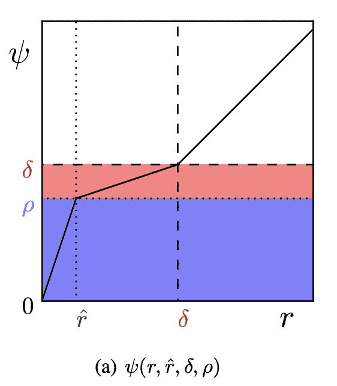

<!--yml

category: 未分类

date: 2024-09-06 19:42:57

-->

# [2211.15596] 深度学习优化器的调查 - 第一和第二阶方法

> 来源：[`ar5iv.labs.arxiv.org/html/2211.15596`](https://ar5iv.labs.arxiv.org/html/2211.15596)

# 深度学习优化器的调查 - 第一和第二阶方法

ROHAN V KASHYAP rohankashyap@iisc.ac.in [1234-5678-9012](https://orcid.org/1234-5678-9012 "ORCID 标识符") 印度科学研究所印度卡纳塔克邦班加罗尔 560012（2023）

###### 摘要。

深度学习优化涉及在权重空间中最小化高维损失函数，通常由于固有困难，如鞍点、局部最小值、Hessian 矩阵的病态和有限的计算资源而被视为困难。在本文中，我们全面回顾了成功在深度学习研究中使用的 $14$ 种标准优化方法，并从优化文献中对数值优化的困难进行了理论评估。

^†^†copyright: acmcopyright^†^†journalyear: 2023^†^†journal: POMACS^†^†journalvolume: 37^†^†journalnumber: 4^†^†article: 111^†^†publicationmonth: 8

## 1\. 介绍

优化在机器学习 (b1,)、统计物理学、纯数学 (b11,; b16,; b30,)、随机矩阵理论以及科学研究中占据着核心地位。深度学习涉及在连续、高维空间中优化非凸损失函数。神经网络训练涉及求解可微且连续的损失函数，使用基于梯度的优化技术来更新其权重参数，从而寻求找到临界点。梯度下降 (b30,)、拟牛顿 (b62,)、BFGS (b59,) 和共轭梯度 (b55,) 方法通常用于执行此类最小化操作并寻找最优解。

定义 1. 给定 $K$ 个权重矩阵 $(\theta_{k})_{k \leq K}$，带有激活函数 $\phi$ 的深度神经网络的输出 $y$ 如下：

| (1) |  | $f(x)=\phi\left(\phi\left(\cdots\phi\left(x\cdot\theta_{1}\right)\cdots\right)\cdot\theta_{K-1}\right)\cdot\theta_{K},$ |  |
| --- | --- | --- | --- |

这里 $x \in R^{d}$ 是模型的输入。让 $\left\{x_{i},y_{i}\right\}_{i=1}^{m}$ 表示训练示例集。原则上，深度学习算法的目标是减少预期的广义误差 $\mathbb{E}(L(f(x;\theta),y))$ 其中 $L$ 是指定的损失函数，如均方误差，$f(x;\theta)$ 是具有参数 $\theta$ 的 $y=f(x)$ 的函数估计。最常见的估计方法是 $\theta$ 的最大似然估计（MLE），定义如下：

|  | $\boldsymbol{\theta}_{\mathrm{ML}}=\underset{\boldsymbol{\theta}}{\arg\max}\hskip 1.99997pt\mathbb{E}_{\mathbf{x}\sim\hat{p}_{\text{data }}}\log p_{\text{model }}(\boldsymbol{x};\boldsymbol{\theta})$ |  |
| --- | --- | --- |

其中 $p_{\text{model }}$ 是模型分布。这意味着最小化经验数据分布 $p_{model}$ 和真实数据分布 $\hat{p}_{\text{data}}$ 之间的 Kullback-Leibler (KL) 散度（一个度量）：

|  | $D_{\mathrm{KL}}\left(\hat{p}_{\text{data }}\&#124;p_{\text{model }}\right)=\mathbb{E}_{\mathbf{x}\sim\hat{p}_{\text{data }}}\left[\log\hat{p}_{\text{data }}(\boldsymbol{x})-\log p_{\text{model }}(\boldsymbol{x})\right]$ |  |
| --- | --- | --- |

由于真实数据分布在很大程度上是未知的，我们最小化训练集上的期望损失——称为经验风险，如下所示：

|  | $\mathbb{E}_{\boldsymbol{x},\mathrm{y}\sim\hat{p}_{\mathrm{data}}(\boldsymbol{x},y)}[L(f(\boldsymbol{x};\boldsymbol{\theta}),y)]=\frac{1}{m}\sum_{i=1}^{m}L\left(f\left(\boldsymbol{x}^{(i)};\boldsymbol{\theta}\right),y^{(i)}\right)$ |  |
| --- | --- | --- |

其中 $L$ 是损失函数，$f(x;\theta)$ 是当输入为 $x$ 时的预测输出，而 $\hat{p}_{data}$ 是经验分布。在监督学习中，$y$ 是目标输出，$p(y|x)$ 是待估计的概率分布。极大似然估计（MLE）在渐近意义上是最佳估计量，并且在 $m\rightarrow\infty$ 时收敛于真实数据分布 $\hat{p}_{\text{data }}$ 的参数。尽管在理论上，这种方法极易过拟合，因为高容量的模型可以简单地记住训练集，但经验结果却令人惊讶地表明相反的情况，并证明模型在其容量范围内具有局部泛化能力，从而能够对测试样本中的未见示例进行泛化。解决方案是向经验风险中添加一个称为正则化项的惩罚项，如下所示：

|  | $\tilde{L}(\boldsymbol{\theta})=\underbrace{\frac{1}{N}\sum_{i=1}^{N}L(y(\mathbf{x},\boldsymbol{\theta}),t)}_{\text{训练损失 }}+\underbrace{\mathcal{R}(\boldsymbol{\theta})}_{\text{正则化项 }}$ |  |
| --- | --- | --- |

其中 $\mathcal{R}(\boldsymbol{\theta})$ 是正则化项，如图 LABEL:fig:regularization 所示的$L1$或$L2$正则化。然而，高维非凸优化技术虽然尚无理论保证，但在图像分类（b64,）、文本处理（b63,）和表示学习（b65,）等众多任务上取得了最先进的结果。此外，深度网络由一系列仿射变换层和逐点非线性激活函数（如 RELU、sigmoid 和 tanh 函数）组成。因此，选择非线性函数变得更加重要，以避免梯度消失和爆炸问题（b33,）。

### 1.1 数学预备知识和符号

设$({x^{(i)},y^{(i)}})$表示训练样本及其对应目标。设$f(.,.;\theta)$表示具有参数$\theta$的神经网络及其损失函数$L$。对于$R^{n}$-值函数，$\nabla$对应于梯度算子。对于本文讨论的所有优化方法，$g$表示计算的跨多个训练样本的梯度向量，$\epsilon$是学习率，$\rho$是衰减率。对于一阶方法，$r$是累积平方梯度，$v$是速度向量。对于二阶方法，我们用$H$表示相对于模型参数$\theta$的损失函数$L$的 Hessian 矩阵，$\lambda_{i}$是相应的特征值。除非另有说明，更新规则为$\theta=\theta-\Delta\theta$，其中$\Delta\theta=\epsilon g$。我们在算法 1 中给出了随机梯度下降算法的基本版本。

1 初始化：初始参数$\theta$，学习率$\epsilon$。2 当*停止准则未满足*时 3       取样$m$个训练样本${x^{(1)},...,x^{(m)}}$及其对应目标$y^{(i)}s$。4       计算梯度估计：$g\leftarrow\left[\frac{1}{m}\sum_{i=1}^{m}L\left(f\left(\boldsymbol{x}^{(i)};\boldsymbol{\theta}+\alpha\boldsymbol{v}\right),\boldsymbol{y}^{(i)}\right)\right]$5       应用更新：$\theta\leftarrow\theta-\epsilon g$。6 结束

算法 1 随机梯度下降

### 1.2 文献综述

机器学习优化中最重要的算法是随机梯度下降法（SGD）。这是对梯度下降法的一种通用扩展，用于处理大规模训练集，而不会像在 Alg 1 中讨论的那样计算开销很大。由于我们在每一步都使用一个小批量的样本进行梯度更新，因此 SGD 的渐近成本为 $O(1)$，作为 $m$ 的函数，其中 m 是训练样本的数量。在这一部分，我们将详细讨论与这种方法相关的各种问题。

图 1\. 平坦和陡峭极小值的示意图。来源 Keskar (b46, )。

### 1.3\. 平坦极小值

Hochreiter 等人 (b45, ) 推测深度网络的泛化能力与收敛解处的损失曲率有关。他们的算法“平坦极小值搜索”利用 Hessian 信息在权重空间中找到一个被称为“平坦极小值”的大区域，在这个区域中所有的解都导致较小的误差函数值。还注意到，当模型被过参数化时，不会出现高误差的局部极小值陷阱，而 Keskar 等人 (b46, ) 证明，大批量方法总是倾向于收敛到陡峭的极小值（大量正特征值），因此泛化效果略差于小批量方法，而小批量方法已知会收敛到平坦极小值，这些平坦极小值的特征是具有许多小特征值，尽管它们的训练准确率相当 (b4, )。

这归因于在 (b13, )、(b45, ) 和 (b46, ) 中讨论的实证证据，即大批量方法被吸引到陡峭极小值区域，而小批量方法找到的盆地则更宽广，由于无法逃脱这些吸引盆地，它们的泛化效果更好。虽然较大的批量大小可以更准确地近似真实梯度，更新步骤中的波动较小，但它在计算上非常昂贵，并且更新步骤较少，而较小的批量大小由于在学习过程中引入的噪声提供了正则化效果。然而，这可能会导致梯度估计的方差较高，因此需要较小的学习率以保持稳定性并收敛到最优解。事实证明，大多数权重空间中的方向具有类似的损失值，因为 Hessian 包含大量接近零的特征值，即使在随机初始化点上也是如此。

图 2\. a. $2-D$ SGD 轨迹的可视化。来源：Shervine (b67,)。b. 投影梯度下降的示意图，其中 $w$ 是当前的参数估计，$w^{\prime}$ 是经过梯度步骤后的更新，$PC(w^{\prime})$ 将其投影到约束集 $C$ 上。来源：Ian Kevin P. Murphy (b44,)

### 1.4\. 线性子空间

Goodfellow 等人 (b47,) 证明了在神经网络训练过程中存在一个没有障碍的线性子空间，并且存在一条平滑的路径连接初始化和最终极小值。此外，他们还展示了 Hessian 的较差条件和梯度估计的方差是 SGD 训练过程中的重要障碍。这些因素可能会使算法完全偏离预期的吸引盆地。因此，SGD 收敛到的最终极小值或参数空间中的最终区域及最终极小值的宽度在很大程度上取决于学习率、批量大小和梯度协方差，同时具有不同的几何特征和泛化属性。

### 1.5\. SGD 轨迹

Felix 等人 (b13,) 构造了递归神经网络中极小值之间的连续路径，并推测这些损失极小值并不是孤立的点，而是基本上形成了一个连续的流形。此外，由于这些路径是平坦的，这意味着存在一个低损失的单一连通流形，而不是一个独立的吸引盆地。更精确地说，当损失保持在某个低阈值以下时，参数空间的部分区域形成了低错误谷的连通区域，如图 3 所示。这反映了网络的泛化能力，因为这提供了证据表明，即使在经历了巨大的结构变化后，大型神经网络也有足够的参数来产生准确的预测。这与当前文献中的观点有很大偏差，后者通常将极小值描述为在特定宽度的严格凸谷底部的点，网络参数由极小值的位置给出。

### 1.6\. SGD 分析

Stanislaw 等人 (b40, ) 推测，SGD 过程依赖于学习率与批量大小的比例，因此决定了终点的宽度及其泛化能力。首先，当我们接近局部极小值时，损失面可以近似为一个二次碗，最小值在零损失处。因此，训练可以近似为 Ornstein-Unhlenbeck ²²2Ornstein-Unhlenbeck $x_{t}$ 过程是一个高斯过程，定义为以下微分方程：$dx_{t}=-\theta x_{t}dt+\sigma dW_{t}$。过程，如第 LABEL:Second-order_methods 节中讨论的。其次，梯度的协方差 $C=\frac{1}{N}\sum_{i=1}^{N}\left(g_{i}-g\right)^{T}\left(g_{i}-g\right)$，其中 $g_{i}$ 是相对于 ($x_{i},y_{i}$) 训练示例的损失函数 $L$ 的梯度，而损失函数 $H$ 的 Hessian 近似相等，这可能是 SGD 逃离全局极小值的原因。由于深度神经网络的损失函数通常是非凸的，具有复杂的结构，并可能具有多个极小值和鞍点，SGD 通常会收敛到参数空间的不同区域，具有不同的几何特征和泛化属性 (b2, ; b3, )，这取决于优化超参数和初始化。

图 3\. 左侧：DenseNet-40-12 在 CIFAR10 上的一百万维训练损失函数的切片以及最低能量路径，如(b13, )中讨论的。该平面由两个极小值和路径节点的均值构成。来源：Felix Draxler (b13, )

### 1.7\. 维度的诅咒

在高维空间中找到良好的下降方向是一个困难的问题，但这远不如在多个低维子空间内具有复杂障碍的误差面上导航那样困难。非凸损失景观很可能包含高能量的局部最小值区域，而全批量方法可能无法避免这些区域。然而，由于其固有噪声和较小的批量大小，随机梯度下降的随机性质并不会受到这个问题的影响，也不会陷入无关的吸引盆地。对于非凸函数，如神经网络，可能会有许多局部最小值。实际上，几乎任何深度模型都保证有极大量的局部最小值。然而，这不一定是一个重大问题。经验上观察到，随着维度 $N$ 的增加，相对于全局最小值的高误差局部最小值出现的概率是 $N$ 的指数级小 (b5,)。这主要是因为神经网络表现出模型可识别性问题，导致极大量的局部最小值，但它们在成本函数值上都是等价的。它们相对于全局最小值没有非常高的误差值，因此是随机梯度下降在训练过程中经常找到的良好解决方案。

### 1.8\. 临界点

临界点³³3A 临界点是其一阶导数为零的点，即 $f^{\prime}(x)=0$。具有高成本的点更可能是鞍点 (b5,)。我们并不完全关注于找到函数的精确最小值，而只是寻求显著减少其值以获得良好的泛化误差。在梯度下降法中，主要问题不是方向，而是沿每个特征向量的步长，因为更新步长与对应的特征值成正比。因此，如果特征值为正，我们就朝向最优点移动；如果为负，则沿这些方向远离最优点，这会减缓学习过程，因为我们可能会绕过一个高误差的高山或平坦区域，或者可能需要很长时间才能远离鞍点。

图 4\. 对于二维情况，误差面 E 的等值线呈椭圆形状。H 的特征向量沿主要和次要轴方向。特征值衡量 E 在每个特征方向上的陡峭程度。来源：Yann LeCun (b1,)

对于一个凸函数，这样的平坦区域对应于全局最小值，但在非凸优化问题中，它可能对应于一个损失函数值较高的点。尽管 Newton 方法通过用 Hessian 的逆矩阵重新缩放每个方向的梯度来解决这种缓慢性问题，但它往往会朝错误的方向前进，并且只要 Hessian 仍为正定矩阵，就会迭代应用。因此，对于局部二次函数，Newton 方法直接跳到最小值，但如果特征值并非全部为正（接近鞍点），那么更新可能会导致我们朝错误的方向移动。此外，由于二阶方法计算量大，计算 Hessian 的时间复杂度为 $O\left(N^{3}\right)$，因此实际上只有参数较少的网络可以通过 Newton 方法进行训练。

为了解决在非凸设置中，特别是当 Hessian 矩阵具有负特征值时的问题，提出了几种方法，如 BFGS 和无鞍点 Newton 方法 (b5, ; b53, ; b54, )。这包括在 Hessian 对角线添加一个常数，这在很大程度上抵消了负特征值。最近，Luke (b48, ) 通过测量递归雅可比矩阵建立了梯度爆炸与初始化点之间的联系。他们发现，在随机初始化的情况下，神经网络的策略表现不佳，并且有许多特征值的范数大于 $1$，因此梯度范数增长。然而，对于稳定初始化（通过乘以 $0.01$ 缩小初始化），这是特意选择以防止梯度爆炸，我们发现许多特征值接近 $1$，因此梯度没有爆炸。Sutskever 等人 (b9, ) 证明了初始化不良且缺乏动量的网络表现不如良好初始化且带有动量的网络。

图 5\. 以 $n$-维流形的并集表示的损失面，被称为 $n$-楔。一个包含 $2$-楔的低损失流形模型，位于 $3$-维空间中。来源：Stanislav (b8, )

### 1.9\. 神经网络优化中的困难

在这些高维空间中，神经网络优化面临的主要挑战包括 Hessian 矩阵的条件变差、条件数差、局部极小值、平台、平坦区域、鞍点的激增，以及局部结构和全局结构之间的对应关系差。大量鞍点的存在会显著减缓学习过程，因为它们是高误差平台的区域，并给人一种局部极小值存在的印象。此外，由于这些关键点被小曲率的平坦区域包围，二阶方法如牛顿法容易被鞍点吸引，从而减慢学习过程 (b5, )。另外，一个常见的观察结果是，在训练过程结束时，梯度的范数 $\nabla f(x)$ 不一定很小，即 $\nabla f(x)<\epsilon$，并且 Hessian $H$ 具有负特征值，表明算法并未收敛到局部极小值 (b23, )。

高容量的模型也可能存在大量的局部极小值，这会增加交互次数，并导致 Hessian 矩阵的条件变差。还有一些宽阔的平坦区域，其中梯度和 Hessian 都为零。这些退化点对优化算法构成了重大挑战。我们推测，大型神经网络往往会收敛到局部极小值，其中大多数是等效的，并在测试集上表现出相似的泛化性能。此外，在高维结构中找到高误差局部极小值的概率是指数级地小，并且随着网络规模的增大迅速减少。

图 6\. a. 批量梯度下降直接向下移动。b. SGD 在噪声方向上采取步骤，但平均而言仍然向下移动。来源：Roger Grosse (b21, )

## 2\. 一阶方法

### 2.1\. 动量

Polyak 等人 (b49, ) 引入了动量方法，以加速基于一阶梯度的方法的学习过程，特别是在高曲率区域。它还解决了 Hessian 矩阵的条件较差以及随机梯度下降过程中的方差问题。该算法通过累积过去梯度的指数衰减移动平均来计算更新步骤，并继续沿其方向移动。动量项对于梯度方向一致的维度会增加，对于梯度方向改变的维度则减少更新，从而实现更快的收敛。虽然它可以应用于全批次和小批次学习方法，但结合小批次和动量项的随机梯度下降已成为深度学习领域获得感知任务优秀结果的黄金法则。它通过结合相反符号的梯度来抑制高曲率方向的振荡，并在低曲率区域提供更大的学习率。它在一致梯度方向上积累速度，从而比最陡下降法更快地遍历。

如果动量接近$1$，这个算法会更快，同时在学习过程开始时确保较小的动量值（接近$0.5$）同样重要。一开始，由于点在权重空间中是随机初始化的，可能会出现较大的梯度，速度项($v$)可能不会完全有利。因此，一旦这些大梯度消失，并且我们找到期望的吸引盆地，我们可以将动量项平滑地增加到其最终值，即$0.9$到$0.99$，以确保学习不会卡住，并且不会在梯度几乎为零的平坦区域浪费计算时间。

|  | $\begin{array}[]{l}\boldsymbol{v}\leftarrow\alpha\boldsymbol{v}-\epsilon\nabla_{\theta}\left(\frac{1}{m}\sum_{i=1}^{m}L\left(\boldsymbol{f}\left(\boldsymbol{x}^{(i)};\boldsymbol{\theta}\right),\boldsymbol{y}^{(i)}\right)\right)\\ \boldsymbol{\theta}\leftarrow\boldsymbol{\theta}+\boldsymbol{v}\end{array}$ |  |
| --- | --- | --- |

动量算法加速了对局部最小值的收敛，比最速下降法所需的迭代次数少，具体来说，迭代次数减少了 $\sqrt{R}$ 倍，其中 R 是局部最小值的曲率条件数。速度项在物理类比中起到加速粒子在参数空间中按强化方向运动的作用，因此速度向量也被称为赋予粒子动量。超参数决定了之前梯度的贡献如何以指数形式衰减。在之前的梯度下降中，步长与梯度的范数成正比。现在，它取决于梯度序列的大小和对齐程度。当许多梯度完全指向相同方向时，步长最大。我们可以把它类比为一个球在曲折的山坡上滚动，每当它下滑到陡峭的部分，它就会加速，并继续沿着那个方向滑动。

### 2.2\. Nesterov 动量

图 7\. Nesterov 动量首先在之前累积的梯度方向上做一个大跳跃，然后在最终位置计算梯度，从而进行修正。来源：Geoffrey Hinton (b29,)

Sutskever (b9,) 引入了一种经典动量（CM）的变体，这种变体与 Nesterov 加速梯度（NAG）方法在优化凸函数方面的工作相一致。更新规则如下：

|  | $\boldsymbol{v}\leftarrow\alpha\boldsymbol{v}-\epsilon\nabla_{\boldsymbol{\theta}}\left[\frac{1}{m}\sum_{i=1}^{m}L\left(f\left(\boldsymbol{x}^{(i)};\boldsymbol{\theta}+\alpha\boldsymbol{v}\right),\boldsymbol{y}^{(i)}\right)\right]$ |  |
| --- | --- | --- |
|  | $\boldsymbol{\theta}\leftarrow\boldsymbol{\theta}+\boldsymbol{v}$ |  |

其中 $\alpha\in[0,1]$ 是一个超参数，决定了多次迭代中之前梯度的贡献。从公式中可以看出，NAG 类似于 CM⁴⁴4CM 是经典动量的缩写，如第 2.1 节所讨论。不同之处在于梯度的评估方式。使用 Nesterov 动量时，梯度在当前速度应用后进行评估。这意味着在 NAG 中，我们首先沿着之前积累的梯度方向大步前进，然后在最终位置计算梯度，从而进行修正。这个基于梯度的修正因子对于稳定的梯度更新至关重要，尤其是在较高的 µ 值下。梯度对速度的修正在 NAG 中响应更快，如果 $\mu v_{t}$ 确实是一个不佳的更新和不适当的速度，那么 NAG 将比 $\nabla f\left(\theta_{t}\right)$ 更强烈地指向 $\theta_{t}$，从而提供比 CM 更大、更及时的对 $v_{t}$ 的修正。因此，它可以避免振荡，并且在高曲率垂直方向上比 CM 更有效。因此，它对比 CM 更能容忍较大的 µ 值。对于凸函数，Nesterov 动量实现了 $O\left(1/K^{2}\right)$ 的收敛率，其中 k 是步骤数。

图 8\. 不同学习率 $\epsilon$ 和动量系数 $\mu$ 对各种超参数的影响。（左）图表示将参数投影到 $1$-D 子空间 $\forall t$ 后，参数值残差的范数。（右）使用 maxout 网络在 MNIST 上训练时 SGD 从主线性路径的偏离。来源：Goodfellow (b35, )

### 2.3\. 自适应学习率

Delta-bar-delta 算法 (b50,) 引入了为每个单独的连接（权重）设置不同的自适应学习率的概念，该学习率通过在每次迭代后观察其梯度来经验性地确定。其思想是，如果梯度保持一致，即符号保持不变，则增加学习率；否则，如果梯度符号发生反转，则降低学习率。直观上，对于深度神经网络，每个权重的适当学习率差异很大。不同层的梯度幅度通常不同，如果权重初始化较小，则早期层的梯度通常小于较深层的梯度。我们从每个权重的局部增益为$1$开始，并根据梯度的符号（小批量）使用小的加性增加或乘法减少。这确保了在震荡开始时，大的增益迅速衰减。必须确保我们将增益限制在合理范围内，并使用更大的小批量，以确保梯度的符号不是由于小批量的采样误差。

Jacobs (b50,) 提出了将自适应学习率与动量结合的方法。他猜测，与其使用当前梯度和前一个梯度之间的符号一致性，不如使用当前梯度和权重的速度，从而结合动量和自适应学习率的优点。由于动量不关心轴对齐效应，它可以处理对角椭圆并在对角方向上快速遍历。

### 2.4\. Adagrad

Adagrad (b51,) 算法通过将所有模型参数的学习率缩放为与梯度历史平方值的和的平方根成反比来实现自适应。

|  | $\boldsymbol{g}\leftarrow\frac{1}{m}\nabla_{\boldsymbol{\theta}}\sum_{i}L\left(f\left(\boldsymbol{x}^{(i)};\boldsymbol{\theta}\right),\boldsymbol{y}^{(i)}\right)$ |  |
| --- | --- | --- |
|  | $\boldsymbol{r}\leftarrow\boldsymbol{r}+\boldsymbol{g}\odot\boldsymbol{g}$ |  |

对于梯度最大的权重参数，其学习率下降幅度最大，而梯度最小的参数，其学习率下降幅度最小。这使得在参数空间的坡度较缓的区域进展更快，并且在梯度稀疏时表现良好。对于非凸优化问题，累积平方梯度可能会导致学习率过早和过度下降。参数更新公式为：

|  | $\Delta\boldsymbol{\theta}=-\frac{\epsilon}{\sqrt{\delta+\boldsymbol{r}}}\odot\boldsymbol{g}$ |  |
| --- | --- | --- |

### 2.5\. RMSProp

RMSProp 算法 (b29,) 通过将累积的平方梯度改为指数加权移动平均来修改 Adagrad。在非凸设置中，由于 Adagrad 使用平方梯度的历史迅速降低学习率，因此可能会在到达期望的吸引盆地或局部凸碗结构之前停止学习。RMSProp 使用平方梯度的指数衰减平均来丢弃过去的历史，并且在找到一个凸碗后可以迅速收敛，因为 AdaGrad 方法旨在对凸函数快速收敛，所以它的行为类似于 AdaGrad 算法的一个实例。

|  | $\boldsymbol{r}\leftarrow\rho\boldsymbol{r}+(1-\rho)\boldsymbol{g}\odot\boldsymbol{g}\vspace{0.5em}$ |  |
| --- | --- | --- |

如果 Hessian 的特征向量是轴对齐的，则 RMSprop 可以修正曲率。由于 RMSProp 缺乏偏差修正项，它通常会导致较大的步长和稀疏梯度的发散。如果 Hessian 的特征向量是轴对齐的（这一假设值得怀疑），则 RMSProp 可以修正曲率。

### 2.6\. Adam

Adam (b18,)（自适应矩）在 RMSProp (b29,) 和动量的基础上进行了调整，具有一些区别，例如对梯度的对角线重缩放的不可变性。首先，在 Adam 中，我们通过计算梯度的偏置一阶矩作为指数衰减的移动平均来结合动量。其次，类似于 RMSProp 算法，我们将梯度的二阶矩结合为指数衰减的平均值。这种组合在凸设置中具有理论保证。由于移动平均值初始化为全零的向量，因此在初始步骤期间，特别是当偏置一阶矩（$s$）和二阶矩（$r$）估计值接近 $1$ 时，矩估计值会有偏差。⁵⁵5$\odot$ 对应于逐元素乘积。

|  | $\boldsymbol{s}\leftarrow\rho_{1}\boldsymbol{s}+\left(1-\rho_{1}\right)\boldsymbol{g};\hskip 10.00002pt\boldsymbol{r}\leftarrow\rho_{2}\boldsymbol{r}+\left(1-\rho_{2}\right)\boldsymbol{g}\vspace{0.5em}$ |  |
| --- | --- | --- |

因此，我们引入偏差修正来考虑动量项和二阶矩（未中心化方差）的初始化。

|  | $\hat{\boldsymbol{s}}\leftarrow\frac{\boldsymbol{s}}{1-\rho_{1}^{t}};\hskip 10.00002pt\hat{\boldsymbol{r}}\leftarrow\frac{\boldsymbol{r}}{1-\rho_{r}^{t}}$ |  |
| --- | --- | --- |

由于 RMSProp 缺少校正因子，它在训练早期有较高的偏差，而 Adam 对超参数的选择具有鲁棒性。由于梯度平方值的累积项是 Fisher 信息矩阵对角线的近似值，它更具适应性，并且收敛速度更快。参数更新公式为：⁶⁶6 在 Adam 优化中，$\delta$ 对应于一个约为 $10^{-6}$ 的小常数，以确保数值稳定性。

|  | $\Delta\boldsymbol{\theta}=-\epsilon\frac{\hat{\boldsymbol{s}}}{\sqrt{\hat{\boldsymbol{r}}}+\delta}$ |  |
| --- | --- | --- |

## 3\. 二阶方法

图 9\. 描述了二次函数的梯度下降和牛顿方法。牛顿方法通过利用 Hessian 矩阵中的曲率信息在单步内收敛（直接路径）。

### 3.1\. 前提条件与动机

对于标量值函数，包含二阶导数的矩阵称为 Hessian 矩阵（$H$）。Hessian $H$ 衡量了函数的曲率或凹凸性，如图 10 所示。对于向量值函数 $f:R^{n}\rightarrow R^{m}$，包含所有一阶导数的矩阵称为 Jacobian 矩阵（$J$）。假设 $f:R^{n}\rightarrow R$（输入为向量，输出为标量），那么 Hessian 矩阵 $H$ 和 Jacobian $J$ 为：

|  | <math   alttext="\mathbf{J}=\begin{bmatrix}\nabla^{\mathrm{T}}f_{1}\\ \vdots\\

\nabla^{\mathrm{T}}f_{m}\end{bmatrix}=\begin{bmatrix}\frac{\partial f_{1}}{\partial x_{1}}&amp;\cdots&amp;\frac{\partial f_{1}}{\partial x_{n}}\\

\vdots&amp;\ddots&amp;\vdots\\

\frac{\partial f_{m}}{\partial x_{1}}&amp;\cdots&amp;\frac{\partial f_{m}}{\partial x_{n}}\end{bmatrix}\quad\mathbf{H}=\begin{bmatrix}\frac{\partial^{2}f}{\partial x_{1}^{2}}&amp;\frac{\partial^{2}f}{\partial x_{1}\partial x_{2}}&amp;\cdots&amp;\frac{\partial^{2}f}{\partial x_{1}\partial x_{n}}\\

\frac{\partial^{2}f}{\partial x_{2}\partial x_{1}}&amp;\frac{\partial^{2}f}{\partial x_{2}^{2}}&amp;\cdots&amp;\frac{\partial^{2}f}{\partial x_{2}\partial x_{n}}\\

\vdots&amp;\vdots&amp;\ddots&amp;\vdots\\

\(\mathbf{J}=\begin{bmatrix}\nabla^{\mathrm{T}}f_{1}\\ \vdots\\ \nabla^{\mathrm{T}}f_{m}\end{bmatrix}=\begin{bmatrix}\frac{\partial f_{1}}{\partial x_{1}}&\cdots&\frac{\partial f_{1}}{\partial x_{n}}\\ \vdots&\ddots&\vdots\\ \frac{\partial f_{m}}{\partial x_{1}}&\cdots&\frac{\partial f_{m}}{\partial x_{n}}\end{bmatrix}\quad\mathbf{H}=\begin{bmatrix}\frac{\partial^{2}f}{\partial x_{1}^{2}}&\frac{\partial^{2}f}{\partial x_{1}\partial x_{2}}&\cdots&\frac{\partial^{2}f}{\partial x_{1}\partial x_{n}}\\ \frac{\partial^{2}f}{\partial x_{2}\partial x_{1}}&\frac{\partial^{2}f}{\partial x_{2}^{2}}&\cdots&\frac{\partial^{2}f}{\partial x_{2}\partial x_{n}}\\ \vdots&\vdots&\ddots&\vdots\\ \frac{\partial^{2}f}{\partial x_{n}\partial x_{1}}&\frac{\partial^{2}f}{\partial x_{n}\partial x_{2}}&\cdots&\frac{\partial^{2}f}{\partial x_{n}^{2}}\end{bmatrix}\vspace{1em}

Hessian 矩阵 $H$ 是实对称的，具有 $H_{ij}=H_{ji}$。同样，Hessian 的条件数定义为最大特征值与最小特征值的比率，即最陡峭的山脊的陡度与最平缓的山脊的陡度之比。由于 Hessian 是对称的且具有实特征值，并且特征向量具有正交基，其矩阵的特征分解为：

|  | $\boldsymbol{H}=\boldsymbol{Q}\operatorname{diag}(\boldsymbol{\lambda})\boldsymbol{Q}^{-1}$ |  |
| --- | --- | --- |

其中 $Q$ 是一个正交矩阵 ($Q^{T}Q=I$)，每列有一个特征向量，$\lambda$ 是一个对角矩阵。在更高维度中，Hessian 的特征分解可用于测试临界点。当 $H$ 是正定的（所有 $\lambda_{i}>0$）时，该点是局部最小值。同样，当 $H$ 是负定的（所有 $\lambda_{i}<0$）时，该点是局部最大值。鞍点具有正负特征值，在一个截面上是局部最小值，而在另一个截面上是局部最大值。

二阶优化方法 (b30, ; b34, ; b52,) 利用二阶导数进行权重更新。牛顿法自然源于函数 $f$ 的二阶泰勒级数近似，忽略了高阶导数，其形式为：

|  | $f(x)\approx f(x_{0})+(x-x_{0}^{\top})\nabla_{x}f(x_{0})+\frac{1}{2}(x-x_{0})^{\top}H(x-x_{0})$ |  |
| --- | --- | --- |

其中 $H$ 是相对于 $x$ 的 $f$ 在 $x_{0}$ 处的 Hessian。求解临界点 $x^{*}$，我们得到牛顿更新规则：

|  | $x^{*}=x_{0}-H(f)(x_{0})^{-1}\nabla_{x}f(x_{0})$ |  |
| --- | --- | --- |

图 10\. 各种曲率的二次函数。虚线表示预期的下降方向和梯度下降所执行的成本函数的下坡值。具有负曲率时，成本函数下降比梯度预测的速度更快，而具有正曲率时，函数下降的速度远低于预期，因此开始上升。在没有曲率的情况下，梯度正确地预测了下降。来源：Ian Goodfellow (b23,)

凸函数具有很强的理论保证，因为它们表现良好并且具有良好的性质。它们没有鞍点，所有局部最小值都对应于全局最小值，特别是因为 Hessian 矩阵$H$是正半定的。对于二次函数，Hessian 矩阵$H$是常数，因此表现良好。关于二次凸函数的详细分析在第 3.2 节讨论。然而，对于非凸函数，Hessian 矩阵$\nabla^{2}f_{k}$可能并不总是正定的，等式 3.1 可能不是一个下降方向。此外，Hessian 矩阵在接近最小值时病态更为严重，因为如果 Hessian 变化过快，我们可能会沿着一个锯齿形路径前进，从而导致次优性能。

为了理解病态问题，我们考虑一个给定的凸二次目标：

|  | $\mathcal{J}(\theta)=\frac{1}{2}\theta^{T}A\theta$ |  |
| --- | --- | --- |

其中$A$是一个正半定对称矩阵。如果目标的 Hessian 矩阵，即$\nabla^{2}\mathcal{J}(\theta)=A$是病态的，那么梯度也会迅速变化，使用梯度下降的更新如下：

<math   alttext="\begin{array}[]{rlr}\theta_{k+1}&amp;\leftarrow\theta_{k}-\alpha\nabla\mathcal{J}\left(\theta_{k}\right)&amp;\\

&amp;=\theta_{k}-\alpha A\theta_{k}&amp;\\

&amp;=(I-\alpha A)\theta_{k}&amp;\\

\Longrightarrow\theta_{k}&amp;=(I-\alpha A)^{k}\theta_{0}&amp;\\

&amp;=\left(I-\alpha Q\Lambda Q^{T}\right)^{k}\theta_{0}&amp;\\

&amp;=\left[Q(I-\alpha\Lambda)Q^{T}\right]^{k}\theta_{0}&amp;\\

&amp;=Q(I-\alpha\Lambda)^{k}Q^{T}\theta_{0}&amp;\end{array}" display="inline"><semantics ><mtable columnspacing="5pt" rowspacing="0pt" ><mtr  ><mtd columnalign="right"  ><msub ><mi >θ</mi><mrow ><mi  >k</mi><mo >+</mo><mn >1</mn></mrow></msub></mtd><mtd columnalign="left"  ><mrow ><mo stretchy="false" >←</mo><mrow ><msub ><mi >θ</mi><mi >k</mi></msub><mo >−</mo><mrow ><mi >α</mi><mo lspace="0.167em" rspace="0em" >​</mo><mrow ><mo rspace="0.167em"  >∇</mo><mi >𝒥</mi></mrow><mo lspace="0em" rspace="0em"  >​</mo><mrow ><mo >(</mo><msub ><mi >θ</mi><mi >k</mi></msub><mo >)</mo></mrow></mrow></mrow></mrow></mtd></mtr><mtr ><mtd columnalign="left"  ><mrow ><mo >=</mo><mrow ><msub ><mi >θ</mi><mi >k</mi></msub><mo >−</mo><mrow ><mi >α</mi><mo lspace="0em" rspace="0em" >​</mo><mi >A</mi><mo lspace="0em" rspace="0em"  >​</mo><msub ><mi >θ</mi><mi >k</mi></msub></mrow></mrow></mrow></mtd></mtr><mtr ><mtd columnalign="left"  ><mrow ><mo >=</mo><mrow ><mrow ><mo stretchy="false" >(</mo><mrow ><mi >I</mi><mo >−</mo><mrow ><mi >α</mi><mo lspace="0em" rspace="0em" >​</mo><mi >A</mi></mrow></mrow><mo stretchy="false"  >)</mo></mrow><mo lspace="0em" rspace="0em"  >​</mo><msub ><mi >θ</mi><mi >k</mi></msub></mrow></mrow></mtd></mtr><mtr ><mtd columnalign="right"  ><mrow ><mo stretchy="false" >⟹</mo><msub ><mi >θ</mi><mi >k</mi></msub></mrow></mtd><mtd columnalign="left"  ><mrow ><mo >=</mo><mrow ><msup ><mrow ><mo stretchy="false" >(</mo><mrow ><mi >I</mi><mo >−</mo><mrow ><mi >α</mi><mo lspace="0em" rspace="0em" >​</mo><mi >A</mi></mrow></mrow><mo stretchy="false"  >)</mo></mrow><mi >k</mi></msup><mo lspace="0em" rspace="0em"  >​</mo><msub ><mi >θ</mi><mn >0</mn></msub></mrow></mrow></mtd></mtr><mtr ><mtd columnalign="left"  ><mrow ><mo >=</mo><mrow ><msup ><mrow ><mo >(</mo><mrow ><mi >I</mi><mo >−</mo><mrow ><mi >α</mi><mo lspace="0em" rspace="0em" >​</mo><mi >Q</mi><mo lspace="0em" rspace="0em"  >​</mo><mi mathvariant="normal"  >Λ</mi><mo lspace="0em" rspace="0em"  >​</mo><msup ><mi >Q</mi><mi >T</mi></msup></mrow></mrow><mo >)</mo></mrow><mi >k</mi></msup><mo lspace="0em" rspace="0em"  >​</mo><msub ><mi >θ</mi><mn >0</mn></msub></mrow></mrow></mtd></mtr><mtr ><mtd columnalign="left"  ><mrow ><mo >=</mo><mrow ><msup ><mrow ><mo >[</mo><mrow ><mi >Q</mi><mo lspace="0em" rspace="0em" >​</mo><mrow ><mo stretchy="false"  >(</mo><mrow ><mi >I</mi><mo >−</mo><mrow ><mi >α</mi><mo lspace="0em" rspace="0em"  >​</mo><mi mathvariant="normal"  >Λ</mi></mrow></mrow><mo stretchy="false"  >)</mo></mrow><mo lspace="0em" rspace="0em"  >​</mo><msup ><mi >Q</mi><mi >T</mi></msup></mrow><mo >]</mo></mrow><mi >k</mi></msup><mo lspace="0em" rspace="0em"  >​</mo><msub ><mi >θ</mi><mn >0</mn></msub></mrow></mrow></mtd></mtr><mtr ><mtd columnalign="left"  ><mrow ><mo >=</mo><mrow ><mi  >Q</mi><mo lspace="0em" rspace="0em"  >​</mo><msup ><mrow ><mo stretchy="false"  >(</mo><mrow ><mi >I</mi><mo >−</mo><mrow ><mi >α</mi><mo lspace="0em" rspace="0em"  >​</mo><mi mathvariant="normal"  >Λ</mi></mrow></mrow><mo stretchy="false"  >)</mo></mrow><mi >k</mi></msup><mo lspace="0em" rspace="0em"  >​</mo><msup ><mi >Q</mi><mi >T</mi></msup><mo lspace="0em" rspace="0em"  >​</mo><msub ><mi >θ</mi><mn >0</mn></msub></mrow></mrow></mtd></mtr></mtable><annotation-xml encoding="MathML-Content" ><matrix ><matrixrow  ><apply ><csymbol cd="ambiguous" >subscript</csymbol><ci >𝜃</ci><apply ><ci >𝑘</ci><cn type="integer" >1</cn></apply></apply><apply ><ci  >←</ci><csymbol cd="latexml"  >absent</csymbol><apply ><apply ><csymbol cd="ambiguous"  >subscript</csymbol><ci >𝜃</ci><ci >𝑘</ci></apply><apply ><ci >𝛼</ci><apply ><ci >∇</ci><ci >𝒥</ci></apply><apply ><csymbol cd="ambiguous"  >subscript</csymbol><ci >𝜃</ci><ci >𝑘</ci></apply></apply></apply></apply><cerror ><csymbol cd="ambiguous" >missing-subexpression</csymbol></cerror></matrixrow><matrixrow ><cerror ><csymbol cd="ambiguous" >missing-subexpression</csymbol></cerror><apply ><csymbol cd="latexml" >absent</csymbol><apply ><apply ><csymbol cd="ambiguous" >subscript</csymbol><ci >𝜃</ci><ci >𝑘</ci></apply><apply ><ci >𝛼</ci><ci >𝐴</ci><apply ><csymbol cd="ambiguous" >subscript</csymbol><ci >𝜃</ci><ci >𝑘</ci></apply></apply></apply></apply><cerror ><csymbol cd="ambiguous" >missing-subexpression</csymbol></cerror></matrixrow><matrixrow ><cerror ><csymbol cd="ambiguous" >missing-subexpression</csymbol></cerror><apply ><csymbol cd="latexml" >absent</csymbol><apply ><apply ><ci >𝐼</ci><apply ><ci >𝛼</ci><ci >𝐴</ci></apply></apply><apply ><csymbol cd="ambiguous" >subscript</csymbol><ci >𝜃</ci><ci >𝑘</ci></apply></apply></apply><cerror ><csymbol cd="ambiguous" >missing-subexpression</csymbol></cerror></matrixrow><matrixrow ><apply ><ci  >⟹</ci><csymbol cd="latexml"  >absent</csymbol><apply ><csymbol cd="ambiguous"  >subscript</csymbol><ci >

其中 $Q\Lambda Q^{T}$ 是 $A$ 的特征分解，如方程 3.1 中讨论的。稳定性条件如下：

1\. $0<\alpha\lambda_{i}\leq 1:$ 以依赖于 $\alpha\lambda_{i}$ 的速率衰减到 $0$。

2\. $1<\alpha\lambda_{i}\leq 2:$ 振荡。

3\. $\alpha\lambda_{i}>2:$ 不稳定（发散）。

其中 $\alpha$ 是算法的学习率，$\lambda_{i}$ 是特征值。因此，我们需要将学习率限制为 $\alpha<2/\lambda_{\max}$ 以防止不稳定。这确保了我们避免超越极小值，并且在具有强正曲率的方向上不会上坡。这也限制了其他方向的进展速率，给出为 $\alpha\lambda_{i}<2\lambda_{i}/\lambda_{\max}$。

给定起始点 $x_{i}$，可以构建目标函数 ($\mathcal{J}(q)$) 的局部二次近似，该近似与该点的第一和第二导数值匹配。然后，我们最小化近似（二次函数）而不是原始目标函数。近似函数的最小值被用作下一步的起始点，并迭代重复这一过程。这确保了搜索方向在几乎所有方向上都考虑了曲率信息，如图所示 12。

在损失面呈现为图中所示的细长二次函数或椭球体的情况下 11，我们可以使用白化变换将其转化为球形，因为 Hessian 逆$H^{-1}$局部地将误差面球化，我们现在可以在新的坐标系中执行梯度下降。

图 11\. 一阶梯度下降法未能利用 Hessian 矩阵中包含的曲率信息。条件数极大地影响了 SGD 路径，我们用一个二次函数 f(x) 来说明，它的 Hessian 矩阵的条件数为 5。这意味着曲率最大的方向的曲率是最小曲率方向的五倍。在这种情况下，曲率最大的方向是 $[1,1]$，而曲率最小的方向是 $[1,-1]$。红线表示梯度下降所经过的路径。这导致了一个椭圆形的二次函数，梯度下降沿着锯齿形路径前进，通常会在峡谷墙上弹跳（因为梯度是垂直于表面的），我们观察到它在下降峡谷墙时花费了大量时间，因为这些墙是最陡峭的特征。这表明梯度下降需要更多的步骤才能收敛，并且在最小值附近，它会来回振荡，直到收敛到局部最小值。如果步长较大，它可能会超越并在下一次迭代中到达对面的峡谷墙，因此不是最佳的搜索方向。Hessian 对应于该方向的特征值较大的正特征值表明该方向的导数快速增加，因此基于 Hessian 的优化算法可以预测最陡方向实际上在这种情况下并不是一个有前途的搜索方向。来源：Ian Goodfellow (b23, )。

### 3.2\. 二次函数优化

对于局部二次函数，通过用 Hessian 矩阵的逆来重新缩放梯度，牛顿法可以直接跳转到最小值，从而在一步内收敛。如果函数接近二次函数，这将是 $f$ 的最小化值的一个很好的估计。由于 $f$ 是二次可微的，当 $x$ 接近局部最小值时，$f$ 的二次模型将非常准确。当 $f$ 不是二次函数但可以被局部近似为正定二次函数时，牛顿法通过使用等式 3.3 进行迭代更新，具有二次收敛速率。以下结果在 (b30, ) 中指出了牛顿法的收敛速率，如下所示。

定理 1\. 设 $f$ 是二次可微的，并且在满足充分条件的解 $x^{*}$ 的邻域内，Hessian $\nabla^{2}f(x)$ 是 Lipschitz 连续的。考虑迭代 $x_{k+1}=x_{k}+p_{k}$，其中 $p_{k}$ 由 $-\nabla^{2}f_{k}^{-1}\nabla f_{k}$ 给出。那么：

(i) 如果起始点 $x_{0}$ 足够接近 $x^{*}$，那么迭代序列将收敛到 $x^{*}$。

(ii) $\left\{x_{k}\right\}$ 的收敛速率是二次的。

(iii) 梯度范数序列 $\left\{\left\|\nabla f_{k}\right\|\right\}$ 二次收敛于零。

1 初始化：初始点 $x_{0}$。2 对于 *$k=0,1,2,\ldots$* 执行 3       对矩阵 $B_{k}=\nabla^{2}f\left(x_{k}\right)+E_{k}$ 进行分解，其中如果 $\nabla^{2}f\left(x_{k}\right)$ 足够正定则 $E_{k}=0$ 4       否则，选择 $E_{k}$ 以确保 $B_{k}$ 足够正定。5       解方程 $B_{k}p_{k}=-\nabla f\left(x_{k}\right)$。6       $x_{k+1}\leftarrow x_{k}+\alpha_{k}p_{k}$ 7 结束循环

算法 2 牛顿方法与 Hessian 修改

### 3.3\. 牛顿方法

在牛顿优化算法中，要找到局部最小值 $x^{*}$，其迭代序列为 $x_{0}\rightarrow x_{1}\rightarrow x_{2}\rightarrow\ldots\ldots..\rightarrow x_{k}$，Hessian $\nabla f^{2}\left(x_{k}\right)$ 必须在 $\forall k$ 迭代步骤中是正定的，否则搜索方向可能不对应实际的下降方向，即 $\nabla f_{k}^{T}p_{k}<0$，其中 $p_{k}$ 是牛顿搜索方向。如果 $f$ 是强凸的，则 $f$ 将以二次速度收敛于 $x^{*}=\arg\min_{x}f(x)$。

|  | $\left\&#124;x_{k+1}-x_{*}\right\&#124;\leq\frac{1}{2}\left\&#124;x_{k}-x_{*}\right\&#124;^{2},\quad\forall k\geq 0.$ |  |
| --- | --- | --- |

更新规则如下：

|  | $\boldsymbol{\theta}\leftarrow\boldsymbol{\theta}-\boldsymbol{H^{-1}g}$ |  |
| --- | --- | --- |

其中 $H$ 是关于 $\theta$ 的损失函数 $L$ 的 Hessian 矩阵。由于 Hessian ($H=\nabla f^{2}(x_{k})$) 是对称的，我们可以使用 Cholesky 分解来确定牛顿更新⁷⁷7 每个对称正定矩阵 $A$ 可以写成 $A=LDL^{T}$，其中 $L$ 是具有单位对角线元素的下三角矩阵，$D$ 是具有正对角线元素的对角矩阵。牛顿方法的一个基本特性是它与坐标的线性变化无关。如果 $H$ 是半正定的，那么没有任何东西能确认迭代器是否已收敛到最小点，因为 $f(x)$ 的高阶导数是未知的。如果 Hessian 不是正定的（$\lambda_{i}\leq 0$ 表示平坦区域或负曲率方向），则算法将发散。

因此，为了确保等式 3.3 对应于一个下降方向，同时保留 $\nabla^{2}f_{k}$ 的二阶信息，并具有超线性收敛速度的方法在以下章节中描述。特别地，Hessian $H$ 的计算是计算量大且易出错的。例如，在准牛顿方法中，每一步使用低秩公式计算 Hessian $B_{k}$ 的逆，而信任区域方法则利用 $\nabla^{2}f_{k}$ 形成一个二次模型，并在当前迭代点 $x_{k}$ 周围的球体中进行最小化。

图 12\. 牛顿法在当前点构造了函数的局部二次近似，向该二次模型的最小化方向移动，然后迭代地朝着全局最小值前进。来源：Nicholas Vieau Alger (b17, )。

### 3.4\. 优化的动态

如 3.3 节中讨论的那样，牛顿法的主要缺点是当 Hessian $H$ 的特征值 $\lambda_{i}$ 为负时，更新步骤可能会朝错误方向移动，即它沿着特征向量沿梯度下降步骤的相反方向移动，从而朝着 $\theta^{*}$ 增加误差的方向移动。为了解决这个问题，使用了广义信任区域 (b30, )、无鞍点牛顿法 (b5, ) 和自然梯度下降方法，简要讨论如下：

+   •

    在信任区域方法中，在 Hessian 的对角线添加了一个阻尼常数 $\alpha$ 以抵消负曲率的方向，这相当于 $\lambda_{i}+\alpha$。然而，为了确保这是一个下降方向，必须确保 $\lambda_{i}+\alpha>0$，这可能会导致沿特征方向的步长较小。

+   •

    尽管截断牛顿法忽略了负曲率的方向，但它可能会在鞍点处卡住。然而，由于自然梯度下降法依赖于费舍尔信息矩阵 $F$ 来纳入参数流形的曲率信息，其更新规则为：

    |  | $w_{t+1}=w_{t}-\eta F\left(w_{t}\right)^{-1}g_{t}$ |  |
    | --- | --- | --- |

+   •

    然而，(b5, ) 认为自然梯度下降法也可能遭遇负曲率，并且当费舍尔矩阵的秩不足时，可能会收敛到非平稳点。无鞍点牛顿法提供了一个优雅的解决方案，其更新规则为：

    |  | $\Delta\theta=-\nabla f&#124;\mathbf{H}&#124;^{-1}$ |  |
    | --- | --- | --- |

+   •

    由于它不像经典方法那样利用二阶泰勒级数近似来利用信息，因此可以在低曲率的方向上移动，逃离鞍点，如图 14 所示。

### 3.5\. 高斯-牛顿和列文贝格-马夸特算法

根据 1.1，我们定义非线性最小二乘问题，考虑一组 $m$ 个点 $(x_{i},y_{i})$ 和曲线 $y=f(x,\theta)$，其中 $\theta\in R^{n}$ 表示模型参数，$i\in[m]$，且 $m\geq n$。我们将非线性最小二乘问题定义为：

|  | $\min_{\theta}\&#124;y_{i}-f(x_{i},\theta)\&#124;_{2}^{2}=\min_{\theta}\sum_{i=1}^{m}\&#124;r_{i}\&#124;_{2}^{2}\vspace{0.3em}$ |  |
| --- | --- | --- |

其中 $r_{i}=y_{i}-f(x_{i},\theta)$ 是残差 $\forall i=1,2,...,m$。高斯-牛顿 (b10, ; b52, ) 方法利用雅可比矩阵的平方（而不是 Hessian），用于最小化非线性最小二乘问题。它可以被视为一种修改的牛顿法带线搜索，其中我们将 Hessian 近似为 $\bigtriangledown f_{k}\approx J_{k}^{T}J_{k}$，其复杂度为 $O\left(N^{3}\right)$。更新规则为：

|  | $\Delta\theta=-(J_{k}^{T}J_{k})J_{k}^{T}r_{i}\vspace{0.4em}$ |  |
| --- | --- | --- |

其中 $J_{i}(x)=\left[\begin{array}[]{c}\nabla r_{1}(x)^{T},\nabla r_{2}(x)^{T},\ldots,\nabla r_{m}(x)^{T}\end{array}\right]^{T}$ 是残差的雅可比矩阵。请注意，高斯-牛顿方法不需要计算单独的残差 Hessians $\bigtriangledown^{2}r_{i}$，从而节省了大量计算时间。此外，由于残差在接近最小值时显著变小，即 $\|r_{i}\|\ \leq\epsilon$，这导致了快速收敛。

Levenberg-Marquardt (b53, ; b54, ) 算法是对高斯-牛顿方法的近似，它使用对角线近似来代替 Hessian 矩阵，并处理曲率的极端方向，从而防止更新方向出错。这解决了当雅可比矩阵 $J(x)$ 是秩缺乏的（即列不线性独立）的问题，同时保持类似的局部收敛性质，因为我们只将线搜索替换为信任域方法。新的更新规则为：

|  | $\Delta\theta=-(J_{k}^{T}J_{k}+\lambda I)J_{k}^{T}r_{i}$ |  |
| --- | --- | --- |

其中 $\mu$ 是正则化参数，$I$ 是单位矩阵。正则化参数用于解决当 Hessian 不是正定的并且存在对应小负特征值的方向时的问题。

图 13\. 四层共享权重网络中的特征值谱。来源：Yann LeCun (b1, )

### 3.6\. 共轭梯度

共轭梯度优化（b55, ; b56,）是一种迭代方法，利用共轭方向即正交方向来执行梯度更新步骤，从而避免显式计算 Hessian 矩阵的逆。这种方法用于克服梯度下降法的不足，通过将当前搜索方向与当前梯度步骤对齐，并通过前几次方向的线性组合提供一个记忆组件。对于二次函数，梯度下降法未能利用 Hessian 矩阵中存在的曲率信息，它通过遵循之字形模式迭代地下降到峡谷中，并通过反复撞击峡谷墙壁浪费了大部分时间，没有取得显著进展。这是因为每个线搜索方向都与之前的方向正交，因为在给定方向上的目标最小值对应于该点的最陡下降方向。

因此，这种下降方向不会保留之前方向上的进展，并会撤销在那个方向上的进展，我们需要重新迭代以最小化在之前方向上取得的进展。因此，我们会得到一个低效的向最优点进展的之字形模式，由于步长过大，它通常会超越最小值。共轭梯度法通过使搜索方向正交来解决这个问题，即当前搜索方向与之前的线搜索方向共轭，它不会破坏在上一次迭代中取得的进展。

该方法仅适用于解决正定系统，即 Hessian 矩阵具有所有正特征值时。正交性条件可以正确找到沿方向 $d_{i}$ 的最小值，因为特征向量 $e_{i+1}$ 与 $d_{i}$ 正交。如果两个方向 $d_{t-1}$ 和 $d_{t}$ 满足以下条件，则它们被定义为共轭方向：

|  | $\boldsymbol{d}_{t}^{\top}\boldsymbol{H}\boldsymbol{d}_{t-1}=0$ |  |
| --- | --- | --- |

其中 $H$ 是 Hessian 矩阵。因此，该方法是 Gram-Schmidt 正交归一化的一个示例，最多在 $k$ 次线搜索中收敛。在训练迭代 $t$ 时，当前搜索方向 $d_{t}$ 按照算法 4 中讨论的方法计算。

1 初始化：初始点 $x_{0}$。 $r_{0}=d_{0}$。2 当 *$r_{k}\neq 0$* 时执行 3       设 $r_{0}\leftarrow Ax_{0}-b_{0}$。4       $\alpha_{i}\leftarrow\frac{r_{i}^{T}r_{i}}{d_{i}^{T}Ad_{i}}$。5       $x_{i+1}\leftarrow x_{i}+\alpha_{i}d_{i}$。6       $r_{i+1}\leftarrow r_{i}-\alpha_{i}Ad_{i}$。7       $\beta_{i+1}\leftarrow\frac{r_{i+1}^{T}r_{i+1}}{r_{i}^{T}r_{i}}$。8       $d_{i+1}\leftarrow r_{i+1}+\beta_{i+1}d_{i}$9 结束循环

算法 3 共轭梯度法

参数$\beta_{t}$控制了之前的方向应该在当前搜索方向中贡献多少。由于这种线搜索方法利用 H 的特征向量来选择$\beta_{t}$，这可能计算上较为昂贵，我们主要使用两种流行的方法(b57,; b58,)来计算$\beta_{t}$，它们如下：

1\. Fletcher-Reeves：

|  | $\beta_{t}=\frac{\nabla_{\boldsymbol{\theta}}J\left(\boldsymbol{\theta}_{t}\right)^{\top}\nabla_{\boldsymbol{\theta}}J\left(\boldsymbol{\theta}_{t}\right)}{\nabla_{\boldsymbol{\theta}}J\left(\boldsymbol{\theta}_{t-1}\right)^{\top}\nabla_{\boldsymbol{\theta}}J\left(\boldsymbol{\theta}_{t-1}\right)}$ |  |
| --- | --- | --- |

2\. Polak-Ribiere：

|  | $\beta_{t}=\frac{\left(\nabla_{\theta}J\left(\theta_{t}\right)-\nabla_{\theta}J\left(\theta_{t-1}\right)\right)^{\top}\nabla_{\theta}J\left(\theta_{t}\right)}{\nabla_{\theta}J\left(\theta_{t-1}\right)^{\top}\nabla_{\theta}J\left(\theta_{t-1}\right)}$ |  |
| --- | --- | --- |

对于非线性共轭梯度法，我们将$\beta_{t}$设为零，即每一步都通过遗忘过去的搜索方向而从当前方向开始，当前方向由该点的未改变梯度给出，以确保其在局部最优，并确保更快的收敛。同时，初始点对收敛所需的步骤数有很大影响，并且观察到，Fletcher-Reeves 方法仅在初始点足够接近所需的最小值时才收敛，因此，Polak-Ribiere 方法收敛得更快。

图 14\. 不同优化方法对各种二次函数的示意图。黄色点表示起点。来源：Pascanu (b5,).

### 3.7\. BFGS

Quasi-Newton Broyden-Fletcher-Goldfarb-Shanno (BFGS) (b59,) 方法在每一步迭代地构建 Hessian 矩阵的逆的近似。BFGS 使用 Hessian 的低秩近似来融入二阶信息，因此类似于共轭梯度法，但没有计算负担。这里不需要显式计算 Hessian，因为我们现在使用割线方程通过连续分析梯度向量来构建近似矩阵。

1 初始化：初始点$x_{0}$，逆 Hessian 近似$B_{0}$，其中$B_{0}$是正定的。2 对于 *$k=0,1,2,\ldots$* 执行 3       通过求解$B_{k}\mathbf{p}_{k}=-\nabla f\left(\mathbf{x}_{k}\right)$确定搜索方向$p_{k}$。4       在这个方向上进行线搜索以确定步长$\varepsilon_{k}^{*}$，满足 Wolfe5       条件。6       定义$s_{k}=x_{k+1}-x_{k}$ 和 $y_{k}=\nabla f(x_{k+1})-\nabla f(x_{k})$。7       应用更新 $x_{k+1}\leftarrow x_{k}+s_{k}$。8       $B_{k+1}=\left(I-\rho_{k}s_{k}y_{k}^{T}\right)B_{k}\left(I-\rho_{k}y_{k}s_{k}^{T}\right)+\rho_{k}s_{k}s_{k}^{T}$，其中 $\rho_{k}=\frac{1}{y_{k}^{T}s_{k}}$。9 结束循环

算法 4 BFGS 方法

我们沿着这个方向进行了一系列的线搜索，由于缺乏对真实逆 Hessian，即$H_{k}=B_{k}^{-1}$的精确近似，收敛需要更多的步骤，如算法 3 所示。BFGS 方法的计算复杂度是$O\left(N^{2}\right)$，因为不需要矩阵求逆。算法 3 中的二阶近似可以被视为对 Hessian $H_{k}$的对角和低秩近似。由于它不只利用二阶信息，有时对于具有超线性收敛速率的非二次函数比牛顿方法更高效，并且每次迭代的成本通常更低。此外，据估计，BFGS 具有自我修正的特性，即当之前的估计不佳且减慢收敛时，BFGS 将在接下来的几步中自我修正。我们主要使用以下方法来计算 Hessian 矩阵$H_{k}$的近似：1\. 有限差分法 2\. Hessian-向量积 3\. 对角计算 4\. 方形雅可比近似。

图 15\. 这是一个二维空间中的径向变换示例，用于说明局部扰动对最小值之间相对平坦性的影响。我们可以看到，只有蓝色和红色区域，即球体 $B_{2}(\hat{\theta},\delta)$ 内部受到影响。这里，$\psi(r,\hat{r},\delta,\rho)=\mathbb{1}(r\notin[0,\delta])r+\mathbb{1}(r\in[0,\hat{r}])\rho\frac{r}{\hat{r}}+\mathbb{1}(r\in]\hat{r},\delta])\left((\rho-\delta)\frac{r-\delta}{\hat{r}-\delta}+\delta\right)$ 表示待考虑的函数 $g^{-1}(\theta)=\frac{\psi\left(\|\theta-\hat{\theta}\|_{2},\hat{r},\delta,\rho\right)}{\|\theta-\hat{\theta}\|_{2}}(\theta-\hat{\theta})+\hat{\theta}$ 是径向基变换。来源：Dinh (b4,)

### 3.8\. L-BFGS

由于存储和操作 Hessian 的逆矩阵的内存成本对于深度神经网络来说过于庞大，我们利用 L-BFGS (b60,) 方法来解决这一问题。它通过仅使用最近 $m$ 次迭代来构建 Hessian 矩阵的简单紧凑的近似，来维持 Hessian 矩阵的简单紧凑近似，其中通常 $3<m<20$。因此，我们不再存储完全密集的 $n^{*}n$ 近似，而是通过隐式地存储一定数量的校正对（$m$），从而仅包括来自 $m$ 次最近迭代的曲率信息（我们仅存储一组 $n$ 长度的向量）。因此，我们在每个阶段添加和删除信息，丢弃过去的 $m$ 个校正对，并用新的 $s_{k},y_{k}$ 对开始新过程。

这确保了最优的收敛速度，并且可能超越了无 Hessian 方法，因为我们只维持一个固定的记忆系统，迭代性地丢弃过去的曲率信息，因为这些信息不太可能影响当前迭代中的 Hessian 行为，从而节省计算存储。更新规则与 BFGS 方法完全相同，如算法 4 中所述。唯一的修改是，我们丢弃存储中的向量对 $\left\{s_{k-m},y_{k-m}\right\}$，而 $s_{k},y_{k}$ 和 $x_{k}$ 的更新遵循算法 4。L-BFGS 的主要弱点是，对于 Hessian 条件不良且包含广泛特征值分布的函数，它的收敛速度较慢。

### 3.9\. ADAHESSIAN

图 16\. 局部和全局曲率的示意图，其中局部曲率信息通过指数移动平均避免。Adahessian 在没有移动平均的情况下需要 $1000$ 次迭代才能收敛，而启用移动平均仅需七次迭代。来源：Zhewei Yao (b34, )

Adahessian (b34, ) 是一种二阶随机近似方法，它利用 Hessian 中存在的曲率信息，以加快收敛速度并减少内存开销，使用：

1\. 使用 Hutchinson 方法的 Hessian 对角近似。

2\. RMSE 指数移动平均以减少 Hessian 对角近似的变化。

3\. 块对角平均以减少 Hessian 对角元素的方差。

如前所述，二阶方法涉及用 Hessian 的逆来预处理梯度，旨在加速学习以解决病态问题，即在某些方向上曲率平坦，在其他方向上曲率陡峭，通过沿每个方向重新缩放梯度向量来处理极端曲率方向，并通过适当的梯度旋转和缩放确保收敛到任何类型的临界点（局部最小值）。因此，它比其他自适应一阶方法更可靠。但这带来了难以承受的成本，因为在每次迭代中计算 Hessian 是计算上不可行的，并且对现代神经网络架构不具有可扩展性。因此，我们将 Hessian 矩阵近似为对角算子，表示为：

|  | $\Delta w=\operatorname{diag}(\mathbf{H})^{-k}\mathbf{g}$ |  |
| --- | --- | --- |

其中 $\Delta w$ 是权重更新，$0\leq k\leq 1$ 是 Hessian 的幂。Hessian 对角线表示为 $D=\operatorname{diag}(\mathrm{H})$，使用 Hutchinson 方法计算。为了在不进行显式计算的情况下获得 Hessian 矩阵 $H$，他们利用 Hessian 自由近似方法，其表示为：

|  | $\frac{\partial\mathbf{g}^{T}z}{\partial\theta}=\frac{\partial\mathbf{g}^{T}}{\partial\theta}z+\mathbf{g}^{T}\frac{\partial z}{\partial\theta}=\frac{\partial\mathbf{g}^{T}}{\partial\theta}z=\mathbf{H}z$ |  |
| --- | --- | --- |

其中 $z$ 是具有 Rademacher 分布的随机向量。Hessian 对角线作为 $z\odot Hz$ 的期望值给出，这对应于各种任务的最佳性能。

|  | $\boldsymbol{D}=\operatorname{diag}(\mathbf{H})=\mathbb{E}[z\odot(\mathbf{H}z)]$ |  |
| --- | --- | --- |

这具有与梯度反向传播步骤相当的计算开销。他们使用移动平均项（空间平均）和 Hessian 动量（更新规则类似于 Adam）来平滑每次迭代中的曲率信息的随机变化。这导致严格和平滑凸函数的更快收敛。

|  | $D^{(s)}[ib+j]=\frac{\sum_{k=1}^{b}D[ib+k]}{b},\text{ for }1\leq j\leq b,0\leq i\leq\frac{d}{b}-1$ |  |
| --- | --- | --- |

其中 $D^{(s)}$ 是空间平均的 Hessian 对角线，$b$ 是块大小。我们对 Hessian 对角线 $H$ 实现了动量，并进行了空间平均，如表 1 所示。

| 项目 | 方程 |
| --- | --- |
| $\overline{\boldsymbol{D}}_{t}$ | $\sqrt{\frac{\left(1-\beta_{2}\right)\sum_{i=1}^{t}\beta_{2}^{t-i}\boldsymbol{D}_{i}^{(s)}\boldsymbol{D}_{i}^{(s)}}{1-\beta_{2}^{t}}}$ |
| $m_{t}$ | $\frac{\left(1-\beta_{1}\right)\sum_{i=1}^{t}\beta_{1}^{t-i}\mathbf{g}_{i}}{1-\beta_{1}^{t}}$ |
| $v_{t}$ | $\left(\overline{\boldsymbol{D}}_{t}\right)^{k}$ |

表 1\. 更新规则

参数更新规则为 $\theta_{t+1}=\theta_{t}-\eta m_{t}/v_{t}$，其中 $m_{t}$ 和 $v_{t}$ 是 AdaHessian 的一阶和二阶矩，且 $0<\beta_{1}<\beta_{2}<1$。

| 优化器 | CIFAR-10 | CIFAR-100 |
| --- | --- | --- |
| SGD | $94.33\pm 0.1$ | $79.12\pm 0.54$ |
| Polyak | $95.62\pm 0.07$ | $78.11\pm 0.37$ |
| Adam | $94.76\pm 0.23$ | $77.24\pm 0.12$ |
| LOOKAHEAD | $\textbf{95.63}\pm\textbf{0.03}$ | $\textbf{79.42}\pm\textbf{0.05}$ |
| Dataset | Cifar10 | ImageNet |
|  | ResNet20 | ResNet32 | ResNet18 |
| SGD | 93.01 $\pm$ 0.05 | $\mathbf{94.23}\pm\mathbf{0.17}$ | 70.01 |
| Adam | 90.73 $\pm$ 0.23 | 91.53 $\pm$ 0.1 | 65.42 |
| AdamW | 91.96 $\pm$ 0.15 | 92.82 $\pm$ 0.1 | 67.82 |
| ADAHESSIAN | $\mathbf{93.11}\pm\mathbf{0.25}$ | 93.08 $\pm$ 0.10 | $\mathbf{70.12}$ |

图 17\. (左) 我们报告在 CIFAR-$10/100$ 数据集上使用不同优化器的测试准确率（+ 标准差），采用 ResNet$18$ 结构。（右）我们报告在 CIFAR-$10/100$ 和 ImageNet 数据集上使用不同优化器的模型准确率（+ 标准差），采用 ResNet$20$ 和 ResNet$32$ 结构。我们将所有模型训练 $200$ 个 epoch，批量大小为 $128$，SGD/Adam/AdamW 的初始学习率分别为 $0.1/0.001/0.01$。对于 Adahessian，我们将块大小设为 $9$，$k=1$，学习率为 $0.15$；对于 Lookahead，我们将 $k=5$，学习率为 $0.1$。训练细节如 (b34, ; b61, ) 所述。

### 3.10\. Newton-CG 方法

线搜索 Newton-CG (b30, ) 方法利用 Hessian-向量乘积 ($\nabla^{2}f_{k}$) 具有吸引人的全局收敛性特征，具备超线性收敛，并在 Hessian 不确定时产生最佳搜索方向。此 Hessian-free (HF) 方法不需要明确知道 Hessian，而是使用有限差分方法在每个点访问实际 Hessian。这里，我们使用有限差分技术计算 Hessian ($\nabla^{2}f_{k}$) 和向量 $d$ 的乘积以获得近似值：

|  | $\nabla^{2}f_{k}d\approx\frac{\nabla f\left(x_{k}+hd\right)-\nabla f\left(x_{k}\right)}{h}$ |  |
| --- | --- | --- |

对于某些小的差分间隔 h。此外，使用高斯-牛顿矩阵代替海森矩阵能得到更好的搜索方向，因为 $G$ 始终是正定的，从而避免了负曲率的问题。CG 设计用于正定系统，而对于离解的点，海森矩阵是不定的；我们可以在检测到负方向时提前终止或使用负方向来解决这个问题。由于 HF 方法无法访问真实的海森矩阵，我们可能会遇到极低曲率甚至负曲率的方向。因此，即使在进行许多函数评估的情况下，搜索方向也只能导致函数值的较小减少。如果我们不小心，这样的方向可能会导致非常大的 CG 步骤，可能会使得离开牛顿近似有效的区域。一个解决方案是给海森矩阵添加一个阻尼参数，设为 $\mathrm{B}=\mathrm{H}+\lambda\mathrm{I}$，其中 $I$ 是单位矩阵。这可以重新调整 $H$，并控制每个 CG 步骤的长度，类似于信赖域方法。

|  | $\rho_{k}=\frac{f\left(x_{k}+p_{k}\right)-f\left(x_{k}\right)}{q_{k}\left(p_{k}\right)-q_{k}(0)}.$ |  |
| --- | --- | --- |
|  | $\text{ 如果 }\rho_{k}<\frac{1}{4},\text{ 那么 }\lambda\leftarrow\alpha\lambda.\hskip 3.99994pt\text{ 如果}\hskip 5.0pt\rho_{k}>\frac{3}{4},\text{ 那么 }\lambda\leftarrow\alpha^{-1}\lambda.$ |  |

这种方法的主要缺点是当 $\nabla f(x_{k})$ 几乎是奇异的时候，通常需要进行许多函数评估而没有显著减少函数值。为了缓解这个困难，可以分别使用信赖域牛顿-CG 方法和牛顿-兰索斯方法。

### 3.11\. Lookahead

Lookahead (b61,) 优化器与之前的方法正交，并提出了一种不同的权重更新方式，其中它维持两组权重，即慢速权重（$\phi$）和快速权重（$\theta$）。它在内循环中使用标准方法（如 SGD 或 Adam）进行 $k$ 步的优化，以迭代更新快速权重，然后进行沿权重空间中的 $\theta-\phi$ 方向的慢速权重线性插值。因此，在每次更新慢速权重后，我们将其重置为新的快速权重，从而在低曲率方向上迅速进展，减少振荡并加快收敛。慢速权重轨迹被描述为指数移动平均，即 Polyak 平均，对快速权重有很强的理论保证。在 $k$ 次内循环步骤后，慢速权重更新如下：

|  | $\displaystyle\phi_{t+1}$ | $\displaystyle=\phi_{t}+\alpha\left(\theta_{t,k}-\phi_{t}\right)$ |  |
| --- | --- | --- | --- |
|  |  | $\displaystyle=\alpha\left[\theta_{t,k}+(1-\alpha)\theta_{t-1,k}+\ldots+(1-\alpha)^{t-1}\theta_{0,k}\right]+(1-\alpha)^{t}\phi_{0}$ |  |

其中 $\alpha$ 是慢速权重 $\phi$ 的学习率。对于优化器 $A$ 和一个包含 $d$ 数据点的小批量，快速权重的更新规则为：

|  | $\theta_{t,i+1}=\theta_{t,i}+A\left(L,\theta_{t,i-1},d\right)$ |  |
| --- | --- | --- |

## 4\. 结论

我们从理论视角总结了一阶和二阶优化方法。由于高错误率，本地极小值陷阱在模型过参数化时不会出现，且相对于全局最小值的高错误率的局部极小值在$N$中出现的概率呈指数级小。高成本的临界点更可能是鞍点。此外，由于二阶方法计算密集，计算赫西矩阵的计算复杂度为$O(N^{3})$，因此实际中只有少量参数的网络可以通过牛顿法进行训练。

## 5\. 致谢

我们感谢匿名评审员的审阅和建议。

## 参考文献

+   (1) LeCun, Y. A., Bottou, L., Orr, G. B., 和 Muller, K. R. (2012). 高效的反向传播。在《神经网络：技巧与诀窍》 (第 9-48 页). Springer, Berlin, Heidelberg.

+   (2) Lee, J. D., Simchowitz, M., Jordan, M. I., 和 Recht, B. (2016 年 6 月). 梯度下降法仅收敛于最小值。在学习理论会议 (第 1246-1257 页). PMLR.

+   (3) Sagun, L., Guney, V. U., Arous, G. B., 和 LeCun, Y. (2014). 高维景观的探索。arXiv 预印本 arXiv:1412.6615。

+   (4) Dinh, L., Pascanu, R., Bengio, S., 和 Bengio, Y. (2017 年 7 月). 锐化极小值可以为深度网络泛化。在国际机器学习会议 (第 1019-1028 页). PMLR.

+   (5) Dauphin, Y. N., Pascanu, R., Gulcehre, C., Cho, K., Ganguli, S., 和 Bengio, Y. (2014). 识别和解决高维非凸优化中的鞍点问题。《神经信息处理系统进展》，27。

+   (6) Martens, James. “通过无赫西优化的深度学习。” ICML. 第 27 卷\. 2010 年。

+   (7) Pascanu, Razvan, 等. “非凸优化的鞍点问题。” arXiv 预印本 arXiv:1405.4604 (2014)。

+   (8) Fort, Stanislav, 和 Stanislaw Jastrzebski. “神经网络损失景观的大规模结构。” 《神经信息处理系统进展》 32 (2019)。

+   (9) Sutskever, Ilya, 等. “深度学习中初始化和动量的重要性。” 国际机器学习会议。PMLR, 2013。

+   (10) Moré, Jorge J., 和 Danny C. Sorensen. 牛顿法。编号 ANL-82-8\. Argonne 国家实验室, IL (USA), 1982\。

+   (11) Fletcher, Roger. 实用的优化方法。John Wiley and Sons, 2013。

+   (12) Choromanska, Anna, 等. “多层网络的损失表面。” 人工智能与统计学。PMLR, 2015。

+   (13) Draxler, F., Veschgini, K., Salmhofer, M., 和 Hamprecht, F. (2018 年 7 月). 神经网络能量景观中基本没有障碍。在国际机器学习会议 (第 1309-1318 页). PMLR.

+   (14) Li, Chunyuan 等. ”测量目标景观的内在维度。” arXiv 预印本 arXiv:1804.08838 (2018)。

+   (15) Jastrzębski, Stanisław 等. ”影响 SGD 最小值的三个因素。” arXiv 预印本 arXiv:1711.04623 (2017)。

+   (16) Yurii, Nesterov. ”《凸优化入门讲义：基础课程》。” (2004)。

+   (17) Alger, Nicholas Vieau. 数据可扩展 Hessian 预处理用于分布式参数 PDE 约束的逆问题。博士论文, 2019。

+   (18) Kingma, Diederik P. 和 Jimmy Ba. ”Adam: 一种用于随机优化的方法。” arXiv 预印本 arXiv:1412.6980 (2014)。

+   (19) Shewchuk, Jonathan Richard. ”一种无痛的共轭梯度法介绍。” (1994): 1。

+   (20) Gill, Philip E. 和 Walter Murray. ”用于无约束和线性约束优化的牛顿型方法。” 《数学编程》 7.1 (1974): 311-350。

+   (21) Roger Grosse 和 Jimmy Ba. ”CSC 421/2516 第 7-8 讲：优化”。

+   (22) Boyd, Stephen, Stephen P. Boyd 和 Lieven Vandenberghe. 《凸优化》。剑桥大学出版社, 2004。

+   (23) Ian Goodfellow, Yoshua Bengio 和 Aaron Courville. ”深度学习”， (2016)。

+   (24) Luenberger, David G. 和 Yinyu Ye. 《线性与非线性编程》。第 2 卷。Reading, MA: Addison-Wesley, 1984。

+   (25) Moré, Jorge J. 和 Danny C. Sorensen. ”在修改的牛顿方法中使用负曲率方向。” 《数学编程》 16.1 (1979): 1-20。

+   (26) Gill, Philip E. 和 Walter Murray. ”用于无约束和线性约束优化的牛顿型方法。” 《数学编程》 7.1 (1974): 311-350。

+   (27) Nesterov, Yu E. ”一种解决凸规划问题的方法，收敛速度为 $Obigl(frac{1}{k^{2}}bigr)$。” 《苏联科学院学报》，第 269 卷，1983 年。

+   (28) Nesterov, Yurii. 《凸优化入门讲义：基础课程》。第 87 卷。Springer Science and Business Media, 2003。

+   (29) Hinton, Geoffrey, Nitish Srivastava 和 Kevin Swersky. ”机器学习中的神经网络讲座 6a 微型批量梯度下降概述。” 引用于 14.8 (2012): 2。

+   (30) Nocedal, Jorge 和 Stephen J. Wright 编. 《数值优化》。纽约，NY: Springer New York, 1999。

+   (31) Bengio, Yoshua, Aaron Courville 和 Pascal Vincent. ”表示学习：综述与新视角。” 《IEEE 模式分析与机器智能交易》 35.8 (2013): 1798-1828。

+   (32) Pascanu, Razvan, Tomas Mikolov 和 Yoshua Bengio. ”训练递归神经网络的难度。” 国际机器学习会议。PMLR, 2013。

+   (33) Bengio, Yoshua, Patrice Simard 和 Paolo Frasconi. ”用梯度下降学习长期依赖性是困难的。” 《IEEE 神经网络交易》 5.2 (1994): 157-166。

+   (34) Yao, Zhewei 等. ”Adahessian: 一种用于机器学习的自适应二阶优化器。” 《美国人工智能协会会议论文集》。第 35 卷，第 12 期，2021 年。

+   (35) Goodfellow, Ian J., Oriol Vinyals, 和 Andrew M. Saxe. ”定性描述神经网络优化问题。” arXiv 预印本 arXiv:1412.6544 (2014).

+   (36) Tan, Hong Hui, 和 King Hann Lim. ”人工神经网络反向传播中的二阶优化技术综述。” 《IOP 会议系列：材料科学与工程》。第 495 卷，第 1 期。IOP 出版社，2019 年。

+   (37) Yinyu Ye. ”二阶优化算法 I 讲义 13”。

+   (38) Battiti, Roberto. ”学习的第一和第二阶方法：在最陡下降和牛顿法之间。” 《神经计算》 4.2 (1992): 141-166.

+   (39) Balestriero, Randall, Jerome Pesenti, 和 Yann LeCun. ”高维学习总是涉及外推。” arXiv 预印本 arXiv:2110.09485 (2021).

+   (40) Jastrzebski, Stanislaw, 等. ”深度神经网络优化轨迹上的盈亏平衡点。” arXiv 预印本 arXiv:2002.09572 (2020).

+   (41) Fort, Stanislav, 和 Adam Scherlis. ”金发姑娘区域：更好地理解神经网络损失景观。” 《AAAI 人工智能会议论文集》。第 33 卷，第 01 期。2019 年。

+   (42) Schmidt, Robin M., Frank Schneider, 和 Philipp Hennig. ”穿越拥挤山谷——深度学习优化器基准测试。” 《国际机器学习会议》。PMLR，2021 年。

+   (43) Xia, Lin, 等. ”正定稀疏精度矩阵估计。” 《纯数学进展》 7.1 (2017): 21-30.

+   (44) Murphy, Kevin P. 《概率机器学习：导论》。MIT 出版社，2022 年。

+   (45) Hochreiter, Sepp, 和 Jürgen Schmidhuber. ”平坦极小值。” 《神经计算》 9.1 (1997): 1-42.

+   (46) Keskar, Nitish Shirish, 等. ”大批量训练深度学习：泛化差距与尖锐极小值。” arXiv 预印本 arXiv:1609.04836 (2016).

+   (47) Goodfellow, Ian J., Oriol Vinyals, 和 Andrew M. Saxe. ”定性描述神经网络优化问题。” arXiv 预印本 arXiv:1412.6544 (2014).

+   (48) Metz, Luke, 等. ”梯度不是你所需的全部。” arXiv 预印本 arXiv:2111.05803 (2021).

+   (49) Polyak, Boris T. ”加速迭代方法收敛的一些方法。” 《苏联计算数学与数学物理》 4.5 (1964): 1-17.

+   (50) Jacobs, Robert A. ”通过学习率自适应提高收敛速度。” 《神经网络》 1.4 (1988): 295-307.

+   (51) Duchi, John, Elad Hazan, 和 Yoram Singer. ”在线学习和随机优化的自适应子梯度方法。” 《机器学习研究杂志》 12.7 (2011).

+   (52) Gauss, Carl Friedrich. 《绕太阳运行的椭圆切割面上天体运动理论》，作者卡尔·弗里德里希·高斯。Frid. Perthes 和 IH Besser 出版，1809 年。

+   (53) Levenberg, Kenneth. ”解决某些非线性最小二乘问题的方法。” 《应用数学季刊》 2.2 (1944): 164-168.

+   (54) Marquardt, Donald W. ”一种非线性参数最小二乘估计的算法。” 工业与应用数学会期刊 11.2 (1963): 431-441.

+   (55) Hestenes, Magnus R., 和 Eduard Stiefel. ”用于求解的共轭梯度法。” 国家标准局研究期刊 49.6 (1952): 409.

+   (56) Straeter, Terry Anthony. 关于将 Davidson-Broyden 等级一的准牛顿最小化方法扩展到无限维希尔伯特空间，并应用于最优控制问题. No. NASA-CR-111975. 1971.

+   (57) Fletcher, Reeves, 和 Colin M. Reeves. ”通过共轭梯度法进行函数最小化。” 计算机期刊 7.2 (1964): 149-154.

+   (58) Polak, Elijah, 和 Gerard Ribiere. ”关于共轭方向法的收敛性说明。” 法国计算机与运筹学评论. 红色系列 3.16 (1969): 35-43.

+   (59) Broyden, Charles George. ”一类双重秩最小化算法的收敛性 1. 一般考虑。” IMA 应用数学期刊 6.1 (1970): 76-90.

+   (60) Liu, Dong C., 和 Jorge Nocedal. ”关于大规模优化的有限记忆 BFGS 方法。” 数学规划 45.1 (1989): 503-528.

+   (61) Zhang, Michael, 等. ”前瞻优化器：向前`k`步，向后 1 步。” 神经信息处理系统进展 32 (2019).

+   (62) Gill, Philip E., 和 Walter Murray. ”无约束优化的准牛顿方法。” IMA 应用数学期刊 9.1 (1972): 91-108.

+   (63) Vaswani, Ashish, 等. ”注意力机制是你所需的一切。” 神经信息处理系统进展 30 (2017).

+   (64) Nichol, Alex, 等. ”Glide: 通过文本引导的扩散模型实现逼真的图像生成和编辑。” (2021).

+   (65) Goodfellow, Ian, 等. ”生成对抗网络。” 神经信息处理系统进展 27 (2014).

+   (66) Rojas, Raul, 和 Raúl Rojas. ”反向传播算法。” 神经网络：系统介绍 (1996).

+   (67) Shervine Amidi. ”CS-229: 机器学习”。
