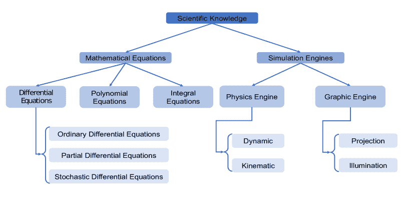

<!--yml

分类：未分类

日期：2024-09-06 19:42:52

-->

# [2212.00017] 知识增强深度学习及其应用：综述

> 来源：[`ar5iv.labs.arxiv.org/html/2212.00017`](https://ar5iv.labs.arxiv.org/html/2212.00017)

# 知识增强深度学习及其应用：综述

孙子俊 高天 卡尔提克·塔拉马杜普拉 和 江强。Z. Cui 和 Q. Ji 在美国纽约州特洛伊的伦斯勒理工学院电气、计算机和系统工程系工作（电子邮件：cuiz3@rpi.edu；jiq@rpi.edu）。T. Gao 和 K. Talamadupula 在 IBM 研究 AI 工作。

###### 摘要

尽管深度学习模型在过去几年在许多不同领域取得了巨大成功，但它们通常需要大量数据，在未见样本上表现不佳，并且缺乏可解释性。目标领域中往往存在各种先验知识，利用这些知识可以缓解深度学习的不足。为了更好地模拟人脑的行为，已经提出了各种先进的方法来识别领域知识并将其集成到深度模型中，以实现数据高效、可泛化和可解释的深度学习，我们称之为知识增强深度学习（KADL）。在这项综述中，我们定义了 KADL 的概念，并介绍了其三个主要任务，即知识识别、知识表示和知识集成。与现有专注于特定类型知识的综述不同，我们提供了一个广泛而完整的领域知识及其表示的分类系统。基于我们的分类系统，我们对现有技术进行了系统的回顾，与现有文献中对知识分类无关的集成方法的综述不同。此综述涵盖了现有的工作，并提供了对知识增强深度学习领域的总体视角。对大量论文的深入和批判性评审不仅有助于了解当前进展，还有助于确定未来的研究方向。

###### 关键词：

领域知识、深度学习、神经符号模型、物理信息深度学习。<svg   height="66.72" overflow="visible" version="1.1" width="604.52"><g transform="translate(0,66.72) matrix(1 0 0 -1 0 0) translate(-122.74,0) translate(0,-7.2) matrix(1.0 0.0 0.0 1.0 127.35 35.71)" fill="#000000" stroke="#000000" stroke-width="0.4pt"><foreignobject width="595.3" height="57.5" transform="matrix(1 0 0 -1 0 16.6)" overflow="visible">©2022 IEEE. 个人使用此材料是被允许的。所有其他用途（包括广告或宣传目的的再版/重新发布、创建新的集体作品、转售或重新分发到服务器或列表，或在其他作品中重复使用任何受版权保护的组件）必须获得 IEEE 的许可。</foreignobject></g></svg>

## I 引言

尽管现有的深度模型在各种领域取得了令人印象深刻的成绩，但它们存在若干严重缺陷，包括高数据依赖性和较差的泛化能力[1]。这些缺陷主要源于模型的数据驱动性质以及它们未能有效利用领域知识。为了解决这些局限性，知识增强的深度学习范式开始引起研究人员的关注，在这种范式下，领域知识和可观测数据协同工作，产生数据高效、具有良好泛化能力和可解释的深度学习算法。

现实世界的领域知识是丰富的。在深度学习的背景下，领域知识主要来源于两个方面：目标知识和测量知识。目标知识决定了我们打算预测的目标变量的行为和属性，而测量知识控制了产生目标变量观测数据的潜在机制。根据其表示方式，我们建议将深度学习中已经探索的领域知识分为两类：科学知识和经验知识。科学知识代表了在某个领域中已经确立的法律或理论，这些法律或理论决定了目标变量的属性或行为。相反，经验知识指的是从长期观察中提取出的知名事实或规则，也可以通过人类的推理进行推断。知识可以以各种格式表示和组织。科学知识通常通过数学方程式严格表示。而经验知识则通常以较不正式的方式表示，如逻辑规则、知识图谱或概率依赖。具有不同表示形式的知识通过不同的整合方法在深度学习框架中与数据集成。

认识到当前深度学习的不足，近期对将先验知识捕捉和编码到深度学习中的兴趣日益增长。两种主流技术是神经-符号整合和物理知识驱动的深度学习。神经-符号整合模型专注于将经验知识编码到传统的符号人工智能模型中，并将符号模型与深度学习模型整合。物理知识驱动的深度学习则专注于将各种理论物理知识编码到深度学习的不同阶段。当前该领域的调查论文范围有限，主要集中于回顾神经-符号模型或物理知识驱动的机器学习方法，而忽略了许多其他相关工作。具体而言，现有关于神经-符号模型的调查主要包括对逻辑规则或知识图谱的讨论，以及它们与深度模型的整合[2, 3]。然而，现有的关于物理知识驱动机器学习的调查则局限于特定科学学科，整合方法通常是任务特定的，例如，物理[4, 5]、网络物理系统[6]、几何[7]和化学[8]。这些调查因此专注于实验室环境下解决科学问题的方法，缺乏对实际应用的讨论。为了解决这一局限性，我们提供了对现有知识增强深度学习工作的全面而系统的回顾。我们调查的贡献有三方面：

+   •

    本调查创建了一个关于领域知识的新分类法，包括科学知识和经验知识。我们的工作涵盖了现有集中于特定学科领域知识子集的研究[4, 5, 6, 7, 8]。

+   •

    本调查涵盖了知识表示和整合的各种方法，并进行了系统的分类。它与现有的关于一般整合技术的调查有所不同，后者对领域知识的分类持中立态度[9, 10, 11, 12, 13]。

+   •

    本调查涵盖了不仅用于实验室环境下科学问题的解决方法，更重要的是，涉及实际应用任务的方法。本调查不限于特定应用任务，涵盖了从计算机视觉到自然语言处理的任务。因此，本调查不仅对深度学习研究人员感兴趣，也对不同领域的深度学习从业者具有吸引力。

我们将本调查组织如下。我们首先在第 II 节介绍 KADL 的概念，其中定义了三个基本任务（即知识识别、知识表示和知识整合）。然后我们回顾 KADL 方法学，其中我们根据其关注的领域知识对不同技术进行分类：1) 第 III 节中涉及科学知识的深度学习和 2) 第 IV 节中涉及经验知识的深度学习。在每个类别中，我们识别领域知识、其表示格式及现有的知识与数据整合方法。表 I 中包含了现有的知识增强深度学习方法概述。

## II 知识增强深度学习

知识增强深度学习的主要任务包括知识识别、知识表示和知识整合到深度模型中。在接下来的章节中，我们将详细介绍每个主要任务。

表 I: 知识增强深度学习概述

| 知识识别 | 知识表示 | 知识整合 |
| --- | --- | --- |
| 数据级 | 架构级 | 训练级 | 决策级 |
| 科学知识 | 数学方程式 | [14] | [15][16][17][18] | [19] [20][21][22] |  |
|  | [23][24][25] | [26][27][28][29] |  |
|  | [30] [31] [32][33] | [34][35] [36] [37] |  |
|  | [38] [39][40][41] | [42][43][44][45] |  |
|  | [46] [47] [48][49] | [50, 51, 52][53] |  |
|  |  | [54] [55] |  |
| 模拟引擎 | [56][57][58][59] |  |  |  |
|  | [60][61] [62][63] |  |  |  |
| 经验知识 | 概率关系 | [14][64][65] | [66][67][68][69] | [70][71][72][73] | [64][14] |
|  | [74] |  |  |
| 逻辑规则 | [22] | [75] | [76][77] |  |
|  | 知识图谱 |  | [78][79][80] | [81][82] | [83][84] |

### II-A 知识识别

知识识别涉及为特定任务识别领域知识。对于某些任务，领域知识容易获得，因此容易识别；而在其他任务中，知识则不那么直观，需要领域专家的努力来识别。在这项调查中，我们将领域知识分为科学知识和经验知识。科学知识是规范性的，主要指精心制定的数学理论或物理定律。这些定律通过科学实验广泛验证，在普遍的环境中是有效的（例如，牛顿定律）。这些定律明确地定义了系统中涉及的不同变量之间的确定性关系。近期在物理信息机器学习领域的工作旨在利用不同学科的各种科学知识来增强深度学习。经验知识是描述性的，主要指来自日常生活的已知事实，表明实体的语义属性或多个实体之间的语义关系。经验知识通常来源于长期观察，也可以来自于已有的研究或理论。后一种经验知识是基于科学的，着重于语义和抽象的描述层面。经验知识通常包含大量碎片化的信息，可能是不确定的、不精确的或模糊的。近期的神经符号模型研究则专注于将经验知识嵌入深度学习中。

### II-B 知识表示

知识表示涉及将识别出的领域知识以良好组织和结构化的格式进行表示。适当的表示方式取决于领域知识的类型。科学知识通常通过方程式表达。此外，模拟引擎也被视为科学知识的一种替代表示方式。相比于科学知识，经验知识形式较少。经验知识可以通过概率关系、逻辑规则或知识图谱来表示。

### II-C 知识整合

知识集成涉及将领域知识整合到深度模型中。通过集成，深度模型可以利用现有数据集和领域知识来完成特定任务。根据知识的类型，可以采用不同的集成方法，主要分为四个级别：数据级、架构级、训练级和决策级，如图 1 所示。

图 1: 四种集成级别：数据级、架构级、训练级和决策级。

数据级集成侧重于通过用基于知识生成的伪数据扩充原始训练数据来整合知识。架构级集成通过修改神经网络架构来嵌入知识。训练级集成通过从知识中推导出的正则化项或主要损失项来规范深度模型的训练。最后，决策级集成将来自先验模型的自上而下的预测与来自深度模型的自下而上的预测相结合，其中编码在先验模型中的知识有助于优化深度学习管道的预测。

每种类型的集成都可能从不同方面带来好处。数据级集成可以帮助缓解许多深度模型面临的数据稀缺问题[56, 57, 58, 59]。此外，通过自动模拟生成数据通常比人工标注成本更低。架构级集成的优点是使深度模型具有可解释性和可解释性，这两个因素对值得信赖的人工智能至关重要[85]。训练级集成由于其直观性，通常被视为最常见的方法。它可以灵活地应用于不同的深度模型框架。训练级集成的灵活性也促进了知识不确定性的量化[53, 54, 45, 55]。决策级集成与前三种方法不同，它利用独立于深度模型训练的知识，并且现有工作对其研究相对较少。

选择集成方法可能既取决于任务，也取决于知识。如果预计知识会以困难的方式进行集成，那么架构级别的集成将是首选。其余三种集成方法（即数据级、训练级或决策级）以柔和的方式将知识引入深度学习流程。其次，如果知识仅涉及目标变量（即神经网络的预测），那么训练级集成将是首选。要执行其他三种类型的集成，知识预计需要涉及测量（例如，中间变量或观察值）和目标变量。最后，如果识别出的知识包含高度非线性和复杂的关系，那么利用成熟的引擎或模拟器进行数据级集成将是首要选择。

## III 深度学习与科学知识

深度学习模型在传统上由机械模型（例如，第一原理模型）主导的先进科学和工程领域中变得越来越重要。这些模型对那些机制未被专家充分理解或精确解决方案计算上不可行的科学问题表现出特别有前景的性能。然而，现有的深度学习需要大量的注释数据，并且在新数据或设置中泛化性能较差。

研究界对将科学和工程中的传统方法与现有数据驱动的深度模型相结合达成了越来越广泛的共识。深度学习与科学知识探索了经典机械模型与现代深度模型之间的连续体。机器学习社区已经在努力将科学知识融入深度学习（也称为物理信息机器学习），以生成物理上一致和可解释的预测，并减少数据依赖。

接下来，我们首先识别科学知识的类型及其表示形式。然后，我们介绍将科学知识与深度模型集成的不同方法。

### III-A 科学知识识别

科学知识是指经过广泛科学实验验证的、在普遍背景下成立的良好数学或物理方程（例如，牛顿定律）。这些定律明确地定义了系统中不同对象之间的确定性和精确关系。

目前的物理知识驱动的深度学习致力于探索经典力学模型的使用。对于动态系统，最广泛考虑的科学知识是牛顿力学，包括运动学和动力学。运动学指的是可观察的运动（如运动轨迹），通常用包含可测量属性（如速度、加速度或位置）的多项式方程来表示。运动学研究运动而不考虑其原因。相比之下，动力学研究运动的原因，通过偏微分方程（PDEs）来捕捉力与可测量属性之间的关系。现有研究探索了动力学在各种物理系统中的应用（如气体和流体动力学[86]以及蛋白质的分子动力学[87, 88]）。通过对动力学的理解，可以更好地预测运动学。牛顿力学因此被应用于实际问题，例如人体行为分析[29, 89, 90]。然而，牛顿力学有时会导致难以求解的运动方程，即使是对于看似简单的系统（如双摆系统）。因此，可以考虑拉格朗日力学或哈密顿力学。作为牛顿力学的重新表述，拉格朗日力学和哈密顿力学都利用广义坐标，使其在理解系统时对坐标的选择更加灵活。在拉格朗日力学中，$L$ 定义为系统的动能 $T$ 和势能 $U$ 的差（即 $L=T-U$）。哈密顿量 $H$ 类似于拉格朗日量 $L$，定义为系统的动能 $T$ 和势能 $U$ 的总和（即 $H=T+U$）。在拉格朗日力学中，位置的时间导数 $\dot{x}$ 被视为广义动量，而在哈密顿力学中，则考虑动量 $p$。对于简单的粒子系统，这些差异是微不足道的，而在更复杂的系统（如磁场）中，动量不再可以简单地作为质量和速度的乘积来计算。拉格朗日系统和哈密顿系统的动态方程在保守力作用下能量随时间保持不变。

对称性在物理学中也得到了广泛的探索。菲利普·安德森著名地指出：“可以说物理学就是对称性的研究，这样的说法不过是稍微夸张了一点”[91]。发现对称性已被证明对加深对物理学的理解和增强机器学习算法的重要性。等变函数或不变函数保持对称性，通常被用于将这些对称性融入深度学习算法中。

光学作为另一种物理知识也被考虑在内。光学研究光的行为和性质。费马原理 [92] 是光学中的基本法则。此外，照明模型 [93] 和渲染方程 [94] 捕捉了三维物体的外观及其图像外观。现有的研究探讨了各种照明模型在不同计算机视觉任务 [95, 96] 和计算机图形任务 [97, 98, 99] 中的应用。

除了物理知识，数学理论，如现有算法的定理（例如排序或排名），以及连续松弛 [100] 也被考虑在内。投影几何理论 [101] 广泛应用于各种计算机视觉任务。

### III-B 科学知识的表示

图 2：科学知识及其表示的分类。

科学知识通常通过方程表示，例如微分方程。科学知识的另一个重要表示工具是仿真。仿真模仿现实世界的物理系统，并被视为对支配现实世界物理系统的物理原则的替代表示。我们在图 2 中可视化了科学知识及其表示的分类。

#### III-B1 数学方程

方程可以包括多项式方程、微分方程和积分方程，其中微分方程是现有研究广泛探讨的。动态规律通常由偏微分方程（PDEs）表示，这些方程指示了不同变量之间的确定性关系。一般来说，PDEs 的形式为

|  | $\begin{split}&amp;\mathcal{N}_{\bm{x}}(u(\bm{x});\bm{\lambda}(\bm{x}))=f(\bm{x}),\quad\bm{x}\in D\\ &amp;\mathcal{B}_{\bm{x}}(u(\bm{x});\bm{\lambda}(\bm{x}))=b(\bm{x}),\quad\bm{x}\in\Gamma\end{split}$ |  | (1) |
| --- | --- | --- | --- |

其中 $\bm{x}=\{x_{1},x_{2},...,x_{N}\}$ 是系统中涉及的$N$个变量。$\mathcal{N}_{\bm{x}}$ 是一个一般的微分算子，而$\mathcal{B}_{\bm{x}}$ 是边界条件算子。$D$ 表示物理领域，$\Gamma=\partial D$ 表示领域的边界。$\bm{\lambda}(\bm{x})$ 表示涉及偏微分方程的物理参数。对于简单系统，物理参数是常数（即$\bm{\lambda}(\bm{x})=\bm{\lambda}$）。$f(\bm{x})$ 是强迫项，$b(\bm{x})$ 指定了边界条件，例如达西流问题的迪里赫特边界条件[54]。$u(\bm{x})$ 是在指定的边界条件下微分方程的解。当只有一个变量存在时，这些方程变成常微分方程（ODEs）。当微分方程中存在经历随机过程的项（例如，物理参数$\bm{\lambda}$）时，这些方程变成随机微分方程（SDEs）。SDEs 的一般形式类似于标准微分方程，但有一个随机事件$\omega$：

|  | $\begin{split}&amp;\mathcal{N}_{\bm{x}}(u(\bm{x};\omega);\bm{\lambda}(\bm{x};\omega))=f(\bm{x};\omega),\quad\bm{x}\in\mathcal{D},\quad\omega\in\Omega\\ &amp;\mathcal{B}_{\bm{x}}(u(\bm{x};\omega);\bm{\lambda}(\bm{x};\omega))=b(\bm{x};\omega),\quad\bm{x}\in\Gamma\end{split}$ |  | (2) |
| --- | --- | --- | --- |

物理参数$\bm{\lambda}(\bm{x};\omega)$和强迫项$f(\bm{x};\omega)$被建模为随机过程，因此解$u(\bm{x};\omega)$遵循由$f$和$\bm{\lambda}$指定的随机过程。

微分方程描述了系统随时间的演化，当我们明确将一个变量设置为时间$t$时，这种情况常见于不同的动态系统。例如，欧拉-拉格朗日方程定义了拉格朗日系统的动力学，

|  | $\frac{\partial L}{\partial x}-\frac{d}{dt}\frac{\partial L}{\partial\dot{x}}=0$ |  | (3) |
| --- | --- | --- | --- |

该方程将拉格朗日量$L$的导数与广义坐标$x$、时间$t$和广义动量$\dot{x}$相关联。现有的研究广泛探讨了微分方程，例如牛顿第二定律[16、34]、在气体和流体动力学中出现的伯杰斯方程[86]、哈密顿动力学中的哈密顿方程[25]、拉格朗日动力学中的欧拉-拉格朗日方程[102]以及描述用于大气对流的非线性混沌系统的洛伦兹方程[103]。

光的规律也可以用方程表示。费马原理考虑了光路径上的积分。在[97]中，瞬态成像系统中的瞬态$I$通过积分来表征，

|  | $I(\tau;\bm{v})=\int_{\bm{x}\in\chi}f(\bm{x};\bm{v})\delta(\tau-\tau({\bm{x};\bm{v}}))dA(p,q)$ |  | (4) |
| --- | --- | --- | --- |

其中$\tau$是行进路径长度，$\bm{v}$是可见点。$A(p,q)$测量表面的单位面积，函数$f$吸收反射率和阴影。表示为积分方程的渲染方程也已被考虑[104]。等式代数方程也已被考虑。根据反射定律，具有反射的图像$I$是玻璃反射回场景$\hat{R}$和玻璃透射前景$\hat{T}$的总和，即，

|  | $I(x,y)=\hat{T}(x,y)+\hat{R}(x,y)$ |  | (5) |
| --- | --- | --- | --- |

这种等式代数方程被证明在反射去除任务中是有帮助的[98]。另一个例子是马吕斯定律，作为代数方程表达，定义了偏振的效果[99]。

#### III-B2 模拟引擎

除了通过方程明确表示物理定律外，使用引擎进行模拟是另一种表示方法。模拟模仿由物理定律支配的真实物理系统，因此被视为知识的替代表示。物理引擎主要编码物理系统的主导动态定律，如刚体、软体和流体。它通过求解运动方程来计算物体的加速度、速度和位移。具体而言，物理引擎模拟给定某些原因后遵循主导动态规则的可观察运动学。为了模拟给定特定力的刚体对象的运动序列，物理引擎被认为是[61, 105, 62, 106, 36, 107]。这些模拟器大多数是不可微分的，使得它们不能在端到端深度学习框架中使用。也存在编码运动学定律用于机器人操控的模拟引擎。然而，这些逆向引擎使用运动学方程估计控制动作，以便达到期望的位置，与底层动态定律无关[35]。图形引擎也已经被探索。图形引擎编码了原则性的投影和照明模型，并通过遵循主导原理渲染真实的 2D 观察。例如，一个由反射定律支配的引擎被提出用于生成真实的图像渲染[98]。

### III-C 深度模型的整合

为了将领域特定的科学知识整合到深度模型中，现有的方法可以分为三类：数据级、架构级和训练级整合，如图 1 所示。科学知识的决策级整合很少被考虑。下面我们回顾了使用这些方法将科学知识整合到深度模型中的方法。

#### III-C1 数据级集成

利用领域知识的一种方法是用从传统力学模型合成的数据来训练深度模型。基于物理的力学模型捕捉了领域知识，作为模拟器用于生成合成数据。这些模拟数据可以与真实数据结合起来，共同训练模型，或者单独使用，通过自监督学习对模型进行预训练。

模拟数据已被广泛用于整个训练过程中，无需额外的真实训练数据。在计算机视觉中，Mottaghi 等人[62] 提出了通过预测物体在 3D 空间中的长期运动作为对力的响应，从静态 2D 图像中理解作用在查询对象上的力。其过程概述见图 3。

图 3：通过模拟从 2D 图像理解物理[62]。游戏引擎以场景配置作为输入，总共生成 66 种牛顿场景，作为真实物理世界的抽象。牛顿神经网络通过将静态图像分类为 66 种可能的牛顿场景之一来学习理解物理。

Blender¹¹1http://www.blender.org/ 游戏引擎由物理引擎和图形引擎组成，用于模拟。具体而言，物理引擎将场景配置作为输入（例如，球在滑梯上滑动），并根据从牛顿第二定律推导出的运动方程将场景向前推进，以生成不同的牛顿场景。物理参数（例如，力的大小）是随机采样的。对于每个牛顿场景，图形引擎从合成的 3D 世界中在不同视角下以透视投影渲染 2D 视频。总共使用 66 个合成视频，涵盖 12 种可能的物理生成场景用于训练。类似地，为了更好地理解人类与物体的交互，Ehsani 等人[61] 提出了通过从视频中推断接触点和力来进行物理理解的方案。给定观察到的视频，应用前向物理模拟来监督力的估计，无需对力进行 GT 标签。特别地，给定估计的力，通过物理模拟（由牛顿第二定律支配）估计移动物体在一段时间内的 3D 接触点。然后应用投影算子，将估计的 3D 关键点转换到 2D 空间。通过最小化估计的和观察到的 2D 接触点之间的差异，获得物理一致的力。为了进行可微分的物理模拟，采用有限差分法进行梯度计算，使用 PyBullet²²2https://pybullet.org/wordpress/ 模拟器，专注于遵循牛顿第二定律的刚体模拟。同样，Tobin 等人[63]展示了通过机器人模拟生成的合成样本在训练深度模型进行物体定位任务中的有效性，这对于机器人操作至关重要。模拟是通过使用 MuJoCo 物理引擎³³3https://mujoco.org/ 进行的，通过其内置图形引擎生成模拟的 2D 图像[108]。特别地，MuJoCo 物理引擎是基于牛顿力学构建的。内置图形引擎通过透视投影根据在 3D 虚拟环境中选择的相机渲染 2D 图像。为了确保足够的模拟变异性，提出了领域随机化策略，其中在模拟过程中，物体的位置和方向等模拟参数都是随机指定的。

深度模型训练通常从预训练阶段开始，然后进行微调。现有研究还表明，预训练影响深度模型的最终表现，主要是因为糟糕的预训练可能导致模型陷入局部最优。通过模拟数据进行预训练已被证明有助于改善参数初始化。贾等人[56，57]介绍了一种物理指导的递归神经网络（PGRNN）来建模湖泊温度动态。PGRNN 在基于物理的机械模拟器生成的合成数据上进行预训练，然后用一些观察数据进行微调。模拟器通过 PDEs 将湖泊温度动态建模为物理参数（例如水的清晰度和风的遮挡）的函数。研究表明，即使使用的是带有不完美物理参数的合成数据，PGRNN 仍然能够取得有竞争力的表现。这种思想在工程学科中也有探索。在机器人技术中，Bousmalis 等人[58] 表示，通过物理指导的初始化，准确物体抓取所需的观察数据显著减少（减少了 50 倍）。在自动驾驶中，Shah 等人[59] 使用通过嵌入物理法则的游戏引擎构建的模拟器生成的合成样本对驾驶算法进行预训练。特别是，该模拟器包括一个车辆模型和一个物理引擎。为了描述虚拟 3D 环境，物理参数，如重力、空气密度、气压和磁场，都是手动指定的。通过这些指定的参数，物理引擎预测运动状态，依据车辆模型估计的力和力矩，并遵循从牛顿第二定律推导出的运动方程。该工作表明，通过模拟样本的预训练，可以显著减少驾驶算法的数据需求。除了通过物理引擎的模拟来扩充数据外，合成数据还可以通过数学方程生成[14]。

#### III-C2 架构级别整合

领域知识也可以通过定制化设计神经网络架构来整合。架构级别的整合可以通过以下方式实现：1）引入具有物理意义的变量或神经网络参数，2）引入源自领域知识的层，3）引入受物理启发的神经元连接。我们将在下面介绍每种方法。

##### 通过变量或参数进行整合

将物理原理嵌入神经网络结构的一种方法是引入物理上有意义的变量到神经网络中。这个变量可以是神经网络的输出节点。执行能量守恒的汉密尔顿功能受到了广泛关注[25, 24, 30, 31]。在物理学中，汉密尔顿算符是建模具有守恒量的动态系统的主要工具。在汉密尔顿力学中，一个经典物理系统由广义坐标$q$和共轭动量$p$来描述。汉密尔顿量$H$计算系统的总能量。定义系统动力学的汉密尔顿方程如下：

|  | $\dot{q}=\frac{\partial H}{\partial p};\quad\dot{p}=-\frac{\partial H}{\partial q}$ |  | (6) |
| --- | --- | --- | --- |

受到汉密尔顿力学的启发，提出了一种汉密尔顿神经网络（HNN），其中输出表示汉密尔顿动力学，从而明确地执行能量守恒[24]。传统神经网络（NN）和 HNN 之间的差异可以很容易理解，如图 4 所示，该图显示传统神经网络学习预测粒子轨迹，而 HNN 学习粒子的汉密尔顿量，从而可以预测轨迹。

图 4：汉密尔顿神经网络（HNN）与传统神经网络（NN）的比较。在动态建模中，HNN 不是直接预测轨迹，而是预测系统的汉密尔顿量$H$，通过这个量可以在能量守恒约束下获得轨迹。

Choudhary 等人 [25] 后来展示了 HNN 通过强制保持总能量的守恒，能够更好地处理混沌系统中的高度非线性动态。为了展示哈密顿形式主义的实际重要性，将哈密顿功能整合到生成网络中，其中哈密顿动态从 2D 观测中学习，而无需域坐标假设，例如图像。所提议的哈密顿生成网络已被应用于密度估计，导致了神经哈密顿流 [24]。通过利用哈密顿形式主义，总概率可以轻松地得到保持，同时密度建模保持表现力。与 HNNs 分享类似的思想，Lagrangian 神经网络（LNN） [32, 33] 探索了一种采用拉格朗日力学的广义能量守恒，其中 LNN 的输出是拉格朗日动态。然而，所有这些现有提出的模型的评估仍然是概念性的，没有实际应用 [38]。

变量也可以是神经网络中的中间变量。Jaques 等人 [16] 提出了一个名为牛顿变分自编码器（NewtonianVAE）的潜在动态学习框架。受到牛顿第二定律的启发，在隐藏空间中定义了一个线性动态系统，特别是通过考虑一个具有 $D$ 自由度的刚体系统，并通过一组坐标 $\bm{x}\in R^{D}$ 来建模该系统的配置。其动态定义为

|  | $\begin{split}&amp;\frac{d\bm{x}}{dt}=\bm{v}\\ &amp;\frac{d\bm{v}}{dt}=A(\bm{x},\bm{v})\cdot\bm{x}+B(\bm{x},\bm{v})\cdot\bm{v}+C(\bm{x},\bm{v})\cdot\bm{u}\end{split}$ |  | (7) |
| --- | --- | --- | --- |

其中 $\bm{u}$ 是给定的激励。为了将上述动态方程融入 VAE，位置 $\bm{x}$ 被视为随机变量，而速度 $\bm{v}$ 作为中间变量。具体地，速度计算为 $\bm{v}_{t}=\frac{\bm{x}-\bm{x}_{t-1}}{\Delta t}$，时间间隔为 $\Delta t$。给定 $\bm{u}_{t}$ 的情况下，$\bm{x}_{t}$ 的条件分布变为

|  | $\begin{split}&amp;p(\bm{x}_{t}&#124;\bm{x}_{t-1},\bm{u}_{t-1};\bm{v}_{t})\sim\mathcal{N}(\bm{x}_{t-1}+\Delta t\cdot\bm{v}_{t},\sigma^{2})\\ &amp;\text{with}\quad\bm{v}_{t}=\bm{v}_{t-1}+\Delta t\cdot(A\bm{x}_{t-1}+B\bm{v}_{t-1}+C\bm{u}_{t-1})\end{split}$ |  | (8) |
| --- | --- | --- | --- |

其中 $A$、$B$ 和 $C$ 通过神经网络 $f$ 估计，$f$ 的输入包括当前系统状态（即 $\{\bm{x}_{t},\bm{v}_{t},\bm{u}_{t}$））。牛顿变分自编码器（VAE）然后根据估计的 $\bm{x}$ 输出 2D 图像。这与现有方法形成对比，现有方法仅假设 $p(\bm{x}_{t}|\bm{x}_{t-1},\bm{u}_{t-1})$ 的高斯分布，而不考虑位置、力和速度之间的基本确定性关系，如 Eq. (8) 所示。类似地，为了纳入由对流扩散 PDE 控制的运输动力学背后的物理学，刘等人 [15] 提出了一个基于自编码器的学习框架，并显式地将对流扩散方程纳入其中。编码器的两个隐藏变量输出具有物理意义，分别表示对流扩散方程中的速度场和扩散场。为了建模湖泊温度，Daw 等人 [17] 引入了一个具有物理意义的中间变量，用于提出的单调性保持长短期记忆（LSTM）架构。具体来说，作为 LSTM 中间变量的密度值被强制随着深度的增加而单调增加，这是湖泊温度的一个关键特征。类似的想法被应用于建模作用在流体中每个粒子上的阻力 [18]。Muralidhar 等人 [18] 提出了一个 PhyNet，其中将受物理约束的中间变量引入卷积神经网络（CNN）架构。具体来说，两个中间变量，分别表征速度场和压力场，被引入 CNN 用于阻力预测。

除了引入具有物理意义的变量外，另一种方法是直接将神经网络的一些参数映射到物理意义的参数。这些物理参数可以在训练过程中不可修改，或者通过从观察中学习进行微调。在地球物理学中，神经网络已被考虑用于建模地震波形反演的动态过程 [23]。为了模拟地震波传播，提出了一种理论引导的递归神经网络（RNN）；RNN 专门设计用于求解主导微分方程，其中一些参数被指定为主导物理方程中的物理参数。特别是，考虑到在时间域离散化的波动方程，下一时间步的波场（即 $u(t+\Delta t)$）是根据两个先前时间步（即 $u(t)$ 和 $u(t-\Delta t)$）计算的

|  |  $\begin{split}u(r,t+\Delta t)&amp;=v^{2}(t)\Delta t^{2}[\nabla^{2}u(r,t)\\ &amp;-s(r,t)\delta(r-r_{s})]+2u(r,t)-u(r,t-\Delta t)\end{split}$  |  | (9) |
| --- | --- | --- | --- |

其中，$\nabla^{2}$是空间拉普拉斯算子，$r$代表位置，$s$是源函数。给定$u(r,t)$和$u(r,t-\Delta t)$，$u(r,t+\Delta t)$的符号计算通过神经网络直接实现，神经网络的可训练参数对应于波动方程（9）中的物理参数$v^{2}\Delta t^{2}$。

##### 通过层整合

通常通过神经网络层整合的最具代表性的知识类型涉及对称性。对称性通常指一组可逆变换$g$，如平移、旋转或缩放。

对称性的代表类型——等变性和不变性已被广泛考虑。不变函数是这样一种映射，使得输出空间不受输入空间对称变换的影响，而等变函数则放宽了不变函数的条件。它表示一种映射，使得输入空间中的对称性可以在输出空间中保持。数学上，假设有一个对称变换$g$和一个从$X$到$Y$的函数$F$。$F$如果满足对$g$的等变性，则称$F$对$g$是等变的，如果

|  | $F(g\cdot x)=g\cdot F(x)$ |  | (10) |
| --- | --- | --- | --- |

输入空间$X$上的对称变换$g$在输出空间$Y$上得以保持。如果$F$不变，则称为不变。

|  | $F(g\cdot x)=F(x)$ |  | (11) |
| --- | --- | --- | --- |

换句话说，输出$y=F(x)$不受作用于输入空间$X$的对称变换$g$的影响。不变性可以是等变性的特例，反之亦然。例如，变换$g$是一个恒等变换，其满足$g\cdot F(x)=F(x)$。

等变或不变神经网络旨在保持对称性。光照不变特征在计算机视觉中进行了探索[47]，在现有深度模型中结合了知识引导的卷积层。考虑到日夜领域适应问题，光照从源领域到目标领域的变化导致了分布偏移。为了解决分布偏移问题，需要具有光照不变性的特征，这可以从 Kubelka-Munk 理论中获得。Kubelka-Munk 理论[109]通过定义从物体的视角反射的光谱来建模材料反射。由 Kubelka-Munk 理论定义的光照不变特征的计算直接通过提出的颜色不变卷积（CIConv）层实现，如图 5 所示。

图 5：一个用于光照不变特征的物理层（标记为红色）[47]。这个新层从输入图像中提取光照不变特征，并基于 Kubelka-Munk 理论定制，称为颜色不变卷积（CIConv）层。

同样，在湍流建模中，旋转不变性表明流体流动的物理性质不依赖于观察者坐标的方向，这是一个基本的物理原理。为了将旋转不变性嵌入神经网络中，Ling 等人[41]定义了一个张量基神经网络（TBNN），其中神经网络架构通过添加一个高阶乘法层进行了修改。特别地，TBNN 有一个额外的输入层接受张量基，其最后一个隐藏层使用这个张量基输入层进行成对乘法以提供输出。修改后的架构确保预测落在旋转不变的张量基上。通过融入旋转不变性，TBNN 在预测归一化雷诺应力各向异性张量时实现了更高的准确性。在分子动力学应用中，Anderson 等人[46]提出了一种旋转不变神经网络，命名为 Cormorant，旨在学习复杂多体物理系统的行为和性质。Cormorant 中的每个神经元都明确对应于一部分原子。在指定神经元的情况下，激活层确保对旋转协变，使得所提出的 Cormorant 保证具有旋转不变性。

也有对等变性的探索。Wang 等人[39]展示了通过等变功能将对称性纳入现有时空深度模型可以提高泛化能力。更具体地，他们考虑了四种类型的等变性：时间和空间平移等变性、旋转等变性、匀速运动等变性和尺度等变性。这些对称性通过定制的等变层被纳入神经网络。通过等变层的功能组合，网络变得具有等变性。

然而，在真实的物理世界中，对称性可能很脆弱。例如，稍微的扰动就能轻易导致动态系统的不连续过渡或打破摆系统的旋转对称性。小扰动经常发生，并且这些扰动会随着时间的推移累积，造成显著差异。因此，通过定制层强制执行等变性作为一种硬性归纳偏置可能会有问题。为了解决这个问题，Finzi 等人[40]最近提出了一种柔性的方法来施加等变性约束，其中提出的神经网络架构由限制性层和灵活层的混合体组成。限制性层受到严格约束，而灵活层则不受约束。通过两种类型层的混合，等变性被引入作为一种灵活的归纳偏置。

##### 通过连接性进行整合

鉴于对象之间的物理依赖性，神经网络神经元之间的连接可以手动指定。为了模拟涉及多个对象的动态，采用物理上合理的交互来设计神经网络的连接。神经物理引擎（NPE）是一种将符号结构与基于梯度的学习相结合的可微分物理模拟器[48]。与基于机械模型的传统物理引擎不同，NPE 作为一种基于学习的神经网络实现，同时保持跨不同场景的通用性。NPE 的开发考虑了物理现象是马尔可夫性的，无论是时间上还是空间上。时间上的马尔可夫性允许 NPE 仅通过考虑当前步骤的状态来预测系统状态。空间上的马尔可夫性允许 NPE 将交互动态分解为成对的交互。NPE 由模仿对象之间成对交互的符号模型结构组成，作为神经网络实现。NPE 以二维观察作为输入，执行前向动态以预测未来对象的运动。一项非常类似的工作也独立开发用于 n 体交互系统[49]。

#### III-C3 训练级别整合

将科学知识整合到深度模型中的一种常见技术是通过对深度模型进行训练。特别地，深度模型输出的约束源自科学知识，并被用作训练深度模型的正则化项。一个增强的训练目标通常表示为

|  | $\mathcal{L}=\mathcal{L}_{TRN}(y^{GT},y^{Pred})+\lambda\mathcal{L}_{PHY}(y^{Pred};x)$ |  | (12) |
| --- | --- | --- | --- |

$\mathcal{L}_{TRN}(y^{GT},y^{Pred})$ 表示给定预测 $y^{Pred}$ 和真实标签 $y^{GT}$ 的标准训练损失。对于分类任务，$\mathcal{L}_{TRN}(y^{GT},y^{Pred})$ 通常基于交叉熵损失来定义。物理学基础的正则化项 $\mathcal{L}_{PHY}(y^{Pred};x)$ 对应于物理约束，具有一个可调节的重要系数 $\lambda$。当物理约束与输入 $x$ 无关时，正则化项简化为 $\mathcal{L}_{PHY}(y^{Pred})$。通过 $\mathcal{L}_{PHY}(y^{Pred};x)$，训练被引导到生成具有物理一致性输出的模型。物理学基础的正则化 $\mathcal{L}_{PHY}(y^{Pred};x)$ 的计算不需要对观察结果进行标注，因此允许在训练中包含未标记的数据，从而减少对数据的依赖。物理学基础的正则化 $\mathcal{L}_{PHY}(y^{Pred};x)$ 也可以直接用于以无标签的方式训练深度模型。

$\mathcal{L}_{PHY}(y^{Pred};x)$ 可以是显式的或隐式的，并可以灵活地应用于不同的深度学习框架。显式正则化是基于领域知识直接定义在深度模型的输出上，而隐式正则化则由嵌入深度学习流程中的物理学基础模型引发。接下来，我们介绍在两种不同的深度模型框架下的知识引导模型正则化：判别深度模型和生成深度模型。

##### 使用判别深度模型的正则化

使用科学知识进行模型正则化在判别深度模型中被广泛应用。在气候建模的背景下，源自物理系统应满足的守恒定律的约束被编码为正则化项。特别地，神经网络 (NN) $f$ 将输入 $x$ 映射到输出 $y$（即 $y=f(x)$）。守恒约束 $\mathcal{C}$ 被总结为一个线性系统（即，<math   alttext="\mathcal{C}=\{C\begin{bmatrix}x\\

$ \mathcal{C} = \{ C \begin{bmatrix}x \\ y \end{bmatrix} = 0 \}$，其中 $C$ 是给定的约束矩阵。这些物理约束随后被编码为神经网络输出上的正则化项：

|  | $\mathcal{L}_{PHY}(x,y)=\| C \begin{bmatrix}x \\ y \end{bmatrix} \|$ |  | (13) |
| --- | --- | --- | --- |

评估结果表明，通过添加这种物理引导的正则化，预测性能得到了提高，以模拟云过程 [19, 20]。类似地，张等人 [21] 提出了通过神经网络对分子动力学进行原子能量参数化，其损失函数考虑了动能和势能的守恒。对于具有非保守力的物理系统，正则化也已被考虑 [22]。在带有摩擦的双摆系统中，由于摩擦的存在，系统的总能量在减少。能量减少被表示为一个约束 $E(\bm{x}_{t+1})<E(\bm{x}_{t})$，其中 $E(\bm{x}_{t})$ 和 $E(\bm{x}_{t+1})$ 分别表示当前时间步和未来时间步的系统总能量。考虑一个神经网络，该网络以当前时间步的状态（即 $\bm{x}_{t}$）作为输入，并输出下一时间步的估计状态（即 $\bm{y}:=\hat{\bm{x}}_{t+1}$），该约束可以通过正则化项集成到神经网络中，如下所示

|  | $\mathcal{L}_{PHY}(\bm{x}_{t},\bm{y})=\mathtt{ReLU}(E(\bm{y})-E(\bm{x}_{t}))$ |  | (14) |
| --- | --- | --- | --- |

其中 $E(\bm{x}_{t})$ 和 $E(\bm{y})$ 分别计算当前和下一时间步的系统能量。根据能量的减少，$E(\bm{y})$ 预计会小于 $E(\bm{x}_{t})$，从而得到上述约束。类似地，在 [26] 中考虑了一组动态系统的常见物理特性，其中每个物理特性都表示为等式或不等式约束。这些物理知情的约束随后通过增广拉格朗日方法被集成到深度模型中作为正则化。

PDEs（如 Eq. (1）所述）已被广泛视为约束，并作为正则化项集成到深度模型中。提出了一种物理信息神经网络（PINN）[27]，利用神经网络解决 PDEs。PINN 通过使用观测数据和 PDEs 来学习解 $u$，其中 PDEs 作为归纳偏置。以粘性 Burgers 方程为例 [28]：

|  | $\frac{\partial u}{\partial t}+u\frac{\partial u}{\partial x}=v\frac{\partial^{2}u}{\partial x^{2}}$ |  | (15) |
| --- | --- | --- | --- |

在 PINN 中，前馈神经网络通过将位置 $x$ 和时间 $t$ 作为输入来预测 PDE 解 $\tilde{u}$。目标函数由数据损失项和 PDE 残差组成，

|  | $\mathcal{L}=\mathcal{L}_{data}+\lambda\mathcal{L}_{PDE}$ |  | (16) |
| --- | --- | --- | --- |

其中 $\mathcal{L}_{data}$ 衡量了预测 PDE 解 $\tilde{u}$ 和给定的 $u$ 在特定位置和时间步长之间的差异（即 $\mathcal{L}_{data}=\sum_{i=1}^{N_{data}}(\tilde{u}(x_{i},t_{i})-u_{i})^{2}$）。$\mathcal{L}_{PDE}$ 衡量了预测解 $\tilde{u}$ 在位置和时间步长下的 PDE 残差：

|  | $\mathcal{L}_{PDE}=\sum_{j=1}^{N_{PDE}}(\frac{\partial\tilde{u}}{\partial t}+u\frac{\partial\tilde{u}}{\partial x}-v\frac{\partial^{2}\tilde{u}}{\partial x^{2}})^{2}&#124;_{(x_{j},t_{j})}$ |  | (17) |
| --- | --- | --- | --- |

通过给定预测解 $\tilde{u}$ 的数值估计器计算偏导数。数据点 $\{(x_{i},t_{i})\}_{i=1}^{N_{data}}$ 用于数据损失，而 $\{(x_{j},t_{j})\}_{j=1}^{N_{PDE}}$ 用于 PDE 残差。$\lambda$ 是正则化项的系数。在 PINN 中，PDEs 通过测量解的残差直接编码为正则化项，以约束模型参数。在人体姿态估计的背景下，使用物理力学来确保物理上合理的估计，其中将表示为常微分方程的欧拉-拉格朗日方程推导出来，并作为模型正则化的软约束进行编码。通过将欧拉-拉格朗日方程集成到数据驱动的深度模型中，确保估计的 3D 身体姿态在物理上是合理的 [29]。

从领域知识中派生的物理指导函数已被用于以无标签的方式训练深度模型。Stewart 和 Ermon [34] 提出了使用物理方程进行无标签监督的方法。本文的目标是通过指定应在输出空间 $f$ 上保持的约束 $g$ 来监督神经网络，而不是使用标签。损失函数因此变为

|  | $\hat{f}^{*}=\arg\min_{f\in F}\sum_{i=1}^{n}g(x_{i},f(x_{i}))+R(f)$ |  | (18) |
| --- | --- | --- | --- |

其中 $R(f)$ 指的是一个额外的正则化项，用于惩罚模型复杂度。论文中提供的一个例子是跟踪一个自由落体的物体。回归网络的训练被表述为一个结构化预测问题，处理一个由 $N$ 张图像组成的序列（即 $(\mathcal{R}^{H\times W\times 3})^{N}\rightarrow\mathcal{R}^{N}$）。牛顿的第二定律（自由落体运动）以代数方程的形式表示，并直接纳入训练的损失函数中。特别地，对于一个自由落体的物体，其在第 $i$ 个时间步的高度，时间间隔为 $\Delta t$，可以计算为 $y_{i}=y_{0}+v_{0}(i\Delta t)+a(i\Delta t)^{2}$，其中 $y_{0}$ 和 $v_{0}$ 分别是初始高度和速度。$a=-9.8m\backslash s^{2}$ 是自由落体物体的固定加速度。因此，任何预测的轨迹 $f(\bm{x})$ 应该适应这样的固定曲率的抛物线。然后定义一个损失函数来衡量拟合残差，

|  | $\begin{split}g(\bm{x},f(\textbf{x}))&amp;=g(f(\bm{x}))=&#124;&#124;\hat{\bm{y}}-f(\bm{x})&#124;&#124;_{1}\\ &amp;=&#124;&#124;\textbf{a}+A(A^{T}A)^{-1}A^{T}(f(\textbf{x})-\textbf{a})-f(\bm{x})&#124;&#124;_{1}\end{split}$ |  | (19) |
| --- | --- | --- | --- |

where

|  | <math   alttext="A=\begin{bmatrix}\triangle t&amp;1\\ 2\triangle t&amp;1\\

3\triangle t&amp;1\\

...\\

N\triangle t&amp;1\end{bmatrix}" display="block"><semantics ><mrow ><mi  >A</mi><mo >=</mo><mrow ><mo  >[</mo><mtable columnspacing="5pt" displaystyle="true" rowspacing="0pt" ><mtr  ><mtd ><mrow ><mi mathvariant="normal" >△</mi><mo lspace="0em" rspace="0em" >​</mo><mi >t</mi></mrow></mtd><mtd ><mn  >1</mn></mtd></mtr><mtr ><mtd ><mrow  ><mn >2</mn><mo lspace="0em" rspace="0em"  >​</mo><mi mathvariant="normal"  >△</mi><mo lspace="0em" rspace="0em"  >​</mo><mi >t</mi></mrow></mtd><mtd ><mn >1</mn></mtd></mtr><mtr ><mtd  ><mrow ><mn >3</mn><mo lspace="0em" rspace="0em" >​</mo><mi mathvariant="normal" >△</mi><mo lspace="0em" rspace="0em" >​</mo><mi >t</mi></mrow></mtd><mtd ><mn  >1</mn></mtd></mtr><mtr ><mtd ><mi mathvariant="normal" >…</mi></mtd></mtr><mtr ><mtd  ><mrow ><mi >N</mi><mo lspace="0em" rspace="0em" >​</mo><mi mathvariant="normal" >△</mi><mo lspace="0em" rspace="0em" >​</mo><mi >t</mi></mrow></mtd><mtd ><mn  >1</mn></mtd></mtr></mtable><mo >]</mo></mrow></mrow><annotation-xml encoding="MathML-Content" ><apply  ><ci >𝐴</ci><apply ><csymbol cd="latexml"  >matrix</csymbol><matrix ><matrixrow ><apply  ><ci >△</ci><ci >𝑡</ci></apply><cn type="integer"  >1</cn></matrixrow><matrixrow ><apply ><cn type="integer" >2</cn><ci >△</ci><ci >𝑡</ci></apply><cn type="integer" >1</cn></matrixrow><matrixrow ><apply  ><cn type="integer"  >3</cn><ci >△</ci><ci >𝑡</ci></apply><cn type="integer"  >1</cn></matrixrow><matrixrow ><ci >…</ci></matrixrow><matrixrow ><apply  ><ci >𝑁</ci><ci >△</ci><ci >𝑡</ci></apply><cn type="integer"  >1</cn></matrixrow></matrix></apply></apply></annotation-xml><annotation encoding="application/x-tex" >A=\begin{bmatrix}\triangle t&1\\ 2\triangle t&1\\ 3\triangle t&1\\ ...\\ N\triangle t&1\end{bmatrix}</annotation></semantics></math> |  | (20) |

并且 $a = [$a\triangle t^{2},a(2\triangle t)^{2},...,a(N\triangle t)^{2}$]，其中 $a=-9.8m\backslash s^{2}$。此外，基于成熟算法推导出的算法监督已用于训练神经网络，这样就不再需要来自真实标注的直接监督 [100]。

对于上述所有相关工作，通用知识和数据信息之间的相对重要性由训练目标的设计预先定义，并且在训练后不可调整。然而，相对重要性可能会随着不同的输入而变化。例如，对于未见过的输入，基于数据的预测不太可靠，知识在最终预测中扮演了更重要的角色。Seo 等人 [22] 提出了一个框架，其中通用知识与数据信息的相对重要性由控制参数 $\alpha$ 调整。控制参数 $\alpha$ 被假设为一个遵循预定义分布 $p(\alpha)$ 的随机变量。从输入数据 $\bm{x}$ 中提取的两组潜在表示 $\bm{z}_{r}$ 和 $\bm{z}_{d}$ 分别对应于通用知识和数据信息。最终的潜在特征被表示为 $\bm{z}=\alpha\bm{z}_{r}\oplus(1-\alpha)\bm{z}_{d}$ 并用于生成最终预测 $\bm{\hat{y}}$。两个损失集 $\mathcal{L}_{rules}$ 和 $\mathcal{L}_{data}$ 分别基于通用知识和来自下游任务的注释定义。$\mathcal{L}_{rules}$ 作为输入 $\bm{x}$ 和输出 $\bm{y}$ 的一个函数，测量基于目标下游任务特定先验知识推导出的规则的违反情况（例如，参见 Eq. 14）。最终训练损失被计算为 $p(\alpha)$ 上的期望损失，即，

|  | $\mathcal{L}=\mathbb{E}_{\alpha\sim p(\alpha)}[\alpha\mathcal{L}_{rule}+\rho(1-\alpha)\mathcal{L}_{data}]$ |  | (21) |
| --- | --- | --- | --- |

其中 $\rho$ 是一个规模参数，用于平衡两个损失项的单位。通过提出的框架，表示相对重要性的 $\alpha$ 在测试过程中成为一个变量。

上述讨论的物理引导正则化项都是在深度模型的输出空间上明确定义的。物理引导正则化项也可以是隐式的（即，通过作为神经网络管道中一个中间原语嵌入的基于物理的模型诱导的）[35, 36, 37]。例如，Wu 等人 [36] 构建了一个系统，用于在没有人工注释的情况下理解物理场景。该系统的核心是一个物理世界表示，该表示首先通过感知模块恢复，然后由模拟引擎使用。感知模块是一个自监督的深度神经网络，没有注释。模拟引擎由物理引擎和图形引擎组成，旨在生成物理预测。

图 6：无需人工注释的物理场景理解 [36]。物理引擎和图形引擎被连接到感知模型中。通过将渲染的 RGB 图像与观察到的图像对齐，感知模型在没有注释的情况下捕捉有意义的物体特征。物理和图形引擎所表示的知识隐式地编码到损失函数中。

所提出的流程在合成台球实验中进行了评估，如图 6 所示。根据感知模型提取的特征，物理引擎通过遵循运动方程预测系统的未来物理状态，而图形引擎则根据预测的物理状态渲染 RGB 图像。通过最大化给定观察序列的估计 RGB 图像的似然性来学习感知模型。

##### 使用生成对抗深度模型进行正则化

除了判别模型，知识也被应用于深度生成模型。为了生成逼真的结果，不同的生成模型探讨了领域知识的使用。例如，为了高效地利用生成对抗网络（GAN）生成 PDE 控制的复杂系统的解，Wu 等人 [44] 提出了一个统计约束 GAN，其中导出了一个统计正则化项，用于测量训练样本和生成样本的协方差结构之间的距离。

|  | $\mathcal{L}_{c}(D,G)=\mathcal{L}(D,G)+\lambda d(\Sigma(p_{data}),\Sigma(p_{G}))$ |  | (22) |
| --- | --- | --- | --- |

其中 $D$ 和 $G$ 分别表示标准的鉴别器和生成器，$L(D,G)$ 代表 GAN 的标准训练损失。$\Sigma(p_{data})$ 和 $\Sigma(p_{G})$ 分别表示训练数据和生成样本的分布的协方差结构。$d(\cdot)$ 表示距离度量，例如 Frobenius 范数。$\lambda$ 表示正则化项的系数。在低维流形（即协方差结构）上引入统计约束有助于减少在高维空间中寻找期望解决方案的搜索范围。因此，数据量不仅减少，而且收敛到解决方案所需的训练时间也缩短了，这在解决湍流 PDE 时得到了验证。在计算材料科学的应用中，Shah 等人[43] 提出了一个名为 InvNet 的深度生成模型，通过该模型生成满足所需物理属性的合成结构样本。InvNet 是传统 GAN 的扩展，引入了一个附加的 invariance checker，以及一个传统的生成器和鉴别器。invariance checker 作为中间原语被引入，在此基础上定义了一个隐式知识引导的正则化项。基于提出的 invariance checker 定义了 invariance loss，用于测量不变性的违反。通过 invariance loss，生成的样本被鼓励满足某些不变性（例如，*motif invariance*，即在所有合成图像的固定位置植入预定义的 *motif*）。除了表示为 PDE 的知识之外，实际的 3D 形状生成还考虑了物理连通性和稳定性。Mezghanni 等人[42] 提出了将物理约束纳入深度生成模型的方法，其中物理约束捕捉了 3D 组件的连通性和 3D 形状的物理稳定性。然后，定义了完全可微的物理损失项，以将物理约束集成到神经网络中。具体而言，提出了一种神经稳定性预测器，作为神经网络分类器实现，并用模拟数据进行预训练，用于强制执行物理稳定性约束。在模拟数据中的每个合成 3D 形状，其稳定性由 Bullet 物理引擎标记。稳定性约束通过预训练的稳定性分类器进行编码，并通过稳定性损失集成到深度模型中。

变分自编码器（VAE）也已与物理知识相结合，用于稳健和可解释的生成建模 [51, 52]。特别地，作为 PDE 表示的物理知识被整合到 VAE 中。VAE 的潜变量受到 PDE 定义的约束。此外，在 [50] 中，假设对 PDE 的完整表达式没有完全访问权限，仅假设 PDE 的一部分是已知的，VAE 的潜变量部分基于已知部分的物理意义进行约束。其余未知的 PDE 以数据驱动的方式建模。

利用概率框架，物理知识驱动的深度模型中已考虑了不确定性量化 [53, 54, 45, 55]。Zhu 等人 [54] 考虑了一个具有不确定性量化的物理知识驱动的 CNN 来求解 PDE。该不确定性源于物理参数 $\bm{\lambda}$ 的随机性，表示为随机向量 $\bm{x}=\{\bm{\lambda}_{1},....,\bm{\lambda}_{n_{s}}\}$，其中 $n_{s}$ 是可能的物理参数设置的总数，可能非常高。相应地，每个可能的物理参数设置下的 PDE 解 $u$ 变为 $\bm{y}=\{u_{1},u_{2},...,u_{n_{s}}\}$。任务是给定一组观测 $\mathcal{D}_{input}=\{\bm{x}^{(i)}\}_{i=1}^{N}$ 进行建模 $p_{\theta}(\bm{y}|\bm{x})$，其中 $\bm{x}^{(i)}\sim p(\bm{x})$。$\bm{\theta}$ 表示待学习的神经网络参数。同时，通过方差 $Var[\bm{y}]$ 对 PDE 解的不确定性进行建模。为了训练神经网络，而不是使用标记数据，基于 PDE 及其边界条件定义了一个基于能量的模型，从中获得参考密度。特别地，参考密度 $p_{\beta}(\bm{y}|\bm{x})$ 遵循玻尔兹曼-吉布斯分布：

|  | $p_{\beta}(\bm{y}&#124;\bm{x})=\frac{\exp(-\beta E(\bm{y,\bm{x}}))}{Z_{\beta}(\bm{x})}$ |  | (23) |
| --- | --- | --- | --- |

其中 $\beta$ 是构建的基于能量的模型的可学习参数。能量函数 $E(\bm{y,\bm{x}})=V_{PDE}(\bm{y},\bm{x})+\lambda V_{boundary}(\bm{y})$ 衡量 PDE 和边界条件的违背程度。$\lambda$ 是一个可调的超参数。物理方程被编码到基于能量的概率模型中。最后，通过最小化估计分布和参考分布之间的 KL 散度来训练神经网络：

|  | $\min_{\beta,\bm{\theta}}D_{KL}(p(\bm{x})p_{\bm{\theta}}(\bm{y}&#124;\bm{x})&#124;&#124;p(\bm{x})p_{\beta}(\bm{y}&#124;\bm{x}))$ |  | (24) |
| --- | --- | --- | --- |

通过训练过程，物理方程被整合进神经网络中。同样地，杨和 Perdikaris [53] 通过考虑方程 (24)的下界，简化了目标函数。类似地，Karumuri 等人 [55] 采用了深度残差网络（ResNet）来以无标签的方式解决椭圆型随机偏微分方程。特别地，物理信息损失函数被定义为随机变量的概率分布上的偏微分方程残差的期望。上述三项工作都集中在时间无关的物理系统上，没有时间演变。Geneva 和 Zabaras [45] 将这一思路扩展到了动态系统，其中采用了自回归网络来预测给定系统状态历史的未来物理状态。

## IV 深度学习与经验知识

除了科学知识，经验知识也被广泛考虑，作为神经符号模型的主要知识来源。经验知识指的是来自日常生活的常识，描述了物体的语义属性或多个物体之间的语义关系。它通常是直观的，并通过长期观察或成熟的研究得出。与科学知识不同，尽管经验知识广泛存在，但它是描述性的和不精确的。包含语义信息的经验知识可以作为深度学习中预测任务（如回归或分类任务）的强大先验知识，特别是在数据量小的数据环境中，当仅靠训练数据不足以捕捉变量之间的关系时 [65]。

### IV-A 经验知识识别

根据应用领域，经验知识可能表现为两种类型：实体属性和实体关系。实体关系揭示了实体之间的语义关系。这些关系可能从命名实体之间的日常事实中推断出来，也可能源自经过充分研究或理论建立的研究，例如解剖学。例如，人类解剖学在计算机视觉中的人体和面部行为分析中被广泛考虑[14, 110, 111]。对于面部行为分析，面部解剖学知识可能提供有关面部肌肉之间关系的信息，以产生自然的面部表情。类似地，身体解剖学可能提供有关身体关节之间关系的信息，以产生稳定且物理上合理的身体姿势和运动。语义关系可以直接给出，也可以从现有关系中间接推断出来。例如，从海伦·米伦在《墨水心》中出演和海伦·米伦赢得最佳女演员奖这两个事实中，可以推断《墨水心》获得提名。然而，推断的事实容易出现错误。实体属性捕捉有关实体属性的知识。它们可以指代描述人类感知世界中概念的层次关系的本体论信息[112]。例如，雨是由水组成的，海洋的同义词是海洋。语言知识作为经验知识的主要来源之一，在[113, 114]中进行了分析。大型语言模型被认为是抽象文本推理任务的归纳偏置[115]。例如，文本解释等语言知识已被探索用于语言模型的改进[116]。

### IV-B 经验知识的表示

图 7：经验知识及其表示的分类。

经验知识的表示方式因领域而异。一般来说，经验知识的表示包括概率依赖性、逻辑规则和知识图谱。这些表示方式捕捉了经验知识揭示的实体之间的关系和属性。我们在图 7 中展示了经验知识及其表示的分类。

#### IV-B1 概率依赖性

由于固有的不确定性，对象之间的语义关系通常通过概率依赖关系表示。对象的状态以概率方式建模，对象之间的关系通过概率依赖关系捕捉。关系可以进一步分为正相关和负相关。以面部动作单位（AUs）为例。根据 FACS [117]，AUs 代表面部肌肉，一个面部肌肉可以控制一个或多个 AUs。当对应的肌肉被激活时，二元 AU 可以开启。AU1（内眉提升肌）和 AU2（外眉提升肌）通常一起出现，因为它们由同一块肌肉——额肌控制。AU15（嘴角下拉肌）和 AU24（嘴唇压缩肌）这一对正相关的例子说明了这一点，因为它们的控制肌肉（即嘴角下拉肌和口轮匝肌）总是一起活动。如果两个变量 $X$ 和 $Y$ 是正相关的（例如，$X$=“AU1” 和 $Y$=“AU2”），且 $X=\{$0, 1$\}$ 和 $Y=\{$0, 1$\}$，那么我们有

|  | $\begin{split}p(X=1,Y=1)&amp;>p(X=1,Y=0)\\ p(X=1,Y=1)&amp;>p(X=0,Y=1)\end{split}$ |  | (25) |
| --- | --- | --- | --- |

考虑负相关，AU12（嘴角提拉肌）和 AU15（嘴角下拉肌）不能同时出现，因为它们对应的肌肉（即颧肌大肌和嘴角下拉肌）不太可能同时被激活。负相关可以以类似的方式表示。如果两个变量 $X$ 和 $Y$ 是负相关的（例如，$X$=“AU12” 和 $Y$=“AU15”），且 $X=\{$0, 1$\}$ 和 $Y=\{$0, 1$\}$，那么我们有

|  | $\begin{split}p(X=1,Y=1)&amp;<p(X=1,Y=0)\\ p(X=1,Y=1)&amp;<p(X=0,Y=1)\end{split}$ |  | (26) |
| --- | --- | --- | --- |

#### IV-B2 一阶逻辑和命题逻辑

逻辑可以分为一阶逻辑和命题逻辑。一阶逻辑（FOL） [118] 使用逻辑规则从现有的经验知识中推导出新的经验知识；它已被用作推理方法来推导不同类型的知识，例如文本解释 [116]。FOL 的公式如下：

|  | $R_{1}(\bm{x})\land R_{2}(\bm{x})\land\cdots\land R_{n}(\bm{x})\Rightarrow H(\bm{x})$ |  | (27) |
| --- | --- | --- | --- |

其中 $R_{1}(\bm{x}),R_{2}(\bm{x}),\cdots R_{n}(\bm{x})$ 表示逻辑原子。每个原子通过谓词捕捉一个已知的对象属性或关系。原子通过连接（例如合取）运算符组合形成逻辑规则的条件部分。$H(\bm{x})$ 是逻辑规则的隐含结果或结论。它代表从逻辑规则中得出的新经验知识。规则的条件部分和结论部分通过蕴涵运算符连接。例如，我们有

|  | $\texttt{Smokes}(x)\Rightarrow\texttt{Cough}(x),\quad\forall x$ |  | (28) |
| --- | --- | --- | --- |

$\texttt{Smokes}(x)$ 是一个原子，其中 Smokes 是谓语，$x$ 是逻辑变量。它捕捉了变量 $x$ 代表的人的吸烟或不吸烟的实体属性知识。$\texttt{Cough}(x)$ 是隐含的结果或推导出的知识，捕捉了该人是否咳嗽的知识。规则表明，如果条件部分 $\texttt{Smokes}(x)$ 为真，则 $\texttt{Cough}(x)$ 也为真。

#### IV-B3 知识图谱

知识图谱是经验知识的另一种符号化表示，主要用于捕捉对象之间的语义关系，其中语义知识以三元组的格式表达：（主语，谓语，宾语）。这些三元组的数量通常非常庞大。在知识图谱中，这些三元组被组织成一个包含节点和边的图。节点表示主语或宾语，例如动物或地点，以及命名实体，如名为玛丽·凯利的人。边表示谓语，并连接节点对，描述它们之间的关系。此外，边还可以表示实体的属性，其中节点代表属性。以三元组（猫，属性，爪子）为例，节点是猫和爪子，关系是属性。这个三元组陈述了一个事实：“猫的属性是爪子”。边可以是有向的或无向的，例如动物之间的食物链关系或人之间的社会关系。知识图谱可以编码大量的常识、规则和领域知识，捕捉关于实体的语义关系和属性。因此，知识图谱是获取经验知识的重要基础资源。例如，物体的语义意义的经验知识可以组织在知识图谱中用于图像分类[119]。微软概念图谱[120]是另一个知识图谱的例子，其中微软概念图谱[120]中的顶点可以代表水果等食物、狗和猫等哺乳动物，或公交车和加油站等设施。边表示基于日常事实的概念之间的关系，例如猫是一种哺乳动物，这反映了猫和哺乳动物之间的关系。

### IV-C 深度模型中的集成

为了将经验知识集成到深度模型中，现有的方法覆盖了四种集成类型：数据层、架构层、训练层和决策层，如图 1 所示。我们在以下小节中介绍每组方法。

#### IV-C1 数据层集成

伪训练数据通常被认为包含了作为概率依赖关系的经验知识，并用于增强现有的训练数据。例如，Teshima 和 Sugiyama [65] 提出了将变量之间的条件独立关系纳入预测建模中。首先从先验知识中提取一组变量之间的条件独立关系。然后，通过生成满足提取的条件独立关系的合成数据来增强训练数据。除了增强训练数据，伪数据还可以用于构建先验知识模型。在面部 AU 识别中，Li 等人 [64] 提出了基于知识生成的伪数据来构建一个无数据的先验模型，该模型捕捉目标变量的先验分布，用于下游任务。首先从通用 AU 知识中推导出参数和变量的约束条件。然后，提出有效的采样方法来生成满足变量和参数约束的伪数据。接着，从伪数据中学习贝叶斯网络，作为无数据的先验模型。类似的思想也被应用于上半身姿态估计任务 [14]。首先从人体解剖学知识中推导出四种类型的约束（即连接约束、身体长度约束、运动学约束和对称性约束）。然后，根据这些约束生成合成数据，并基于这些数据学习先验概率模型。

此外，合成数据还可以从表示为布尔规则的通用知识中生成 [22]。例如，当第 $k$ 个输入特征大于常数 $a$ 时，第 $j$ 类的概率（即 $\hat{\bm{y}}_{j}$）较高。为了将这个布尔规则纳入深度模型中，Seo 等人 [22] 提出了用一对扰动的样本 $\bm{x}_{p}=\bm{x}+\delta\bm{x}$ 来增强每个训练数据点 $\bm{x}$。$\delta\bm{x}$ 是用于扰动的小正值。正则化被定义为

|  |  $\mathcal{L}(\bm{x},\bm{x}_{p},\bm{\hat{y}}_{j},\bm{\hat{y}}_{p,j})=\texttt{ReLU}(\bm{\hat{y}}_{j}-\bm{\hat{y}}_{p,j})\cdot\mathbb{I}(\bm{x}_{k}<a)\cdot\mathbb{I}(\bm{x}_{p,k}>a)$  |  | (29) |
| --- | --- | --- | --- |

如果 $\bm{x}_{k}<a$ 且 $\bm{x}_{p,k}>a$，根据先验知识，我们应该有 $\bm{\hat{y}}_{j}-\bm{\hat{y}}_{p,j}<0$。如果约束得到满足，则 $\mathcal{L}(\bm{x},\bm{x}_{p},\bm{\hat{y}}_{j},\bm{\hat{y}}_{p,j})=0$。否则，$\mathcal{L}(\bm{x},\bm{x}_{p},\bm{\hat{y}}_{j},\bm{\hat{y}}_{p,j})>0$。

#### IV-C2 架构级集成

描述变量之间关系的领域知识可以通过架构设计集成到深度模型中。我们分别讨论了将经验知识（表示为概率依赖、逻辑规则和知识图谱）集成到架构级别的方法。

##### 集成概率依赖的架构设计

一个典型的架构级别集成方法集中于将经验知识表示为概率依赖，其中，从知识构建的概率模型作为先验模型，并被嵌入为神经网络的一个层。因此，变量之间的语义关系可以以概率方式集成到神经网络中。通常，概率模型被连接到神经网络的最后一层。通常采用条件随机场（CRF），它将神经网络中的隐藏特征作为输入，并输出满足 CRF 中编码的知识的最终预测（例如，在 AUs [66]之间）。在[67]中，一个全连接的 CRF 被连接到 CNN 的最后一层，以共同进行面部关键点检测。通过利用全连接的 CNN-CRF，获得了面部关键点位置的概率预测，捕捉了关键点之间的结构依赖关系。在场景图生成[68]中，首先通过基于能量的概率模型捕捉实体和关系之间的结构化关系。基于能量的概率模型将典型场景图生成模型的输出作为输入，并通过最小化能量进行精炼。通过概率模型捕捉的先验知识也可以用于定义图卷积网络的邻接矩阵[69]。对于面部动作单元（AU）密度估计任务，采用贝叶斯网络来捕捉 AU 之间的内在依赖关系。然后提出了一种概率图卷积，其中其邻接矩阵由贝叶斯网络的结构定义。此外，概率模型也可以作为神经网络的可学习中间层引入。提出了一种 CausalVAE [74]，其中在变分自编码器（VAE）的潜在空间中引入了因果层。因果层本质上描述了一个结构性因果模型（SCM）。通过因果层，独立的外生因素被转化为因果内生因素，以进行因果表示学习。

##### 集成逻辑规则的架构设计

通过神经网络的架构集成是一种传统的神经符号方法，用于将符号逻辑规则集成到深度模型中。逻辑规则通过引入逻辑变量或参数被集成到神经网络架构中。这种方法可以追溯到 1990 年代，当时引入了基于知识的人工神经网络（KBANN）[121]和连接主义归纳学习与逻辑编程（CILP）[122]方法。最近，提出了逻辑神经网络（LNN）[123]，其中每个神经元代表逻辑公式中的一个元素，可以是一个概念（例如，猫）或逻辑连接词（例如，AND，OR）。然而，这些工作集中于利用神经网络进行可微分和可扩展的逻辑推理。

提出的工作较少，旨在通过逻辑规则定制深度模型的架构来提高深度模型的性能。为了利用逻辑规则来提高深度模型的性能，将逻辑规则编码到马尔可夫逻辑网络（MLN）中，并将构建的 MLN 作为先验模型嵌入神经网络的输出层，以改进知识图谱的补全任务[75]。特别地，首先识别了四种类型的逻辑规则以捕捉知识图谱中的知识：(1) 组合规则：如果对于任何三个变量$Y_{1}, Y_{2}, Y_{3}$，有$R_{i}(Y_{1}, Y_{2})\land R_{j}(Y_{2}, Y_{2})\Rightarrow R_{k}(Y_{1}, Y_{3})$，则谓词$R_{k}$是由两个谓词$R_{i}$和$R_{j}$组成；(2) 逆规则：如果对于任何两个变量$Y_{1}$和$Y_{2}$，有$R_{i}(Y_{1}, Y_{2})\Rightarrow R_{j}(Y_{2}, Y_{1})$，则谓词$R_{i}$是$R_{j}$的逆；(3) 对称规则：如果对于任何两个变量$Y_{1}$和$Y_{2}$，有$R(Y_{1}, Y_{2})\Rightarrow R(Y_{2}, Y_{1})$，则谓词$R$是对称的；(4) 子集规则：如果对于任何两个变量$Y_{1}$和$Y_{2}$，有$R_{j}(Y_{1}, Y_{2})\Rightarrow R_{i}(Y_{2}, Y_{1})$，则谓词$R_{j}$是$R_{i}$的子集。给定一组识别出的逻辑规则$l\in\mathcal{L}$，马尔可夫逻辑网络（MLN）定义了三元组目标变量$y$的联合分布。

|  | $p(y)\propto\exp(\sum_{l\in\mathcal{L}}w_{l}\sum_{y}\phi_{l}(y_{l}))$ |  | (30) |
| --- | --- | --- | --- |

其中$\phi_{l}$是潜在函数，并根据观察到的三元组进行计算。然后，将这样的 MLN 连接到深度模型的最后一层，其中根据观察到的三元组通过深度模型学习置信度分数$w_{l}$。通过引入 MLN，预测缺失三元组的任务被重新表述为推断遵循编码逻辑规则的未见配置的后验分布。

##### 将知识图谱融入架构设计

知识图谱还可以作为一个层集成到神经网络的架构中。Liang 等人[78] 提出了带有符号推理的图卷积。通过所提出的符号图推理（SGR）层，知识图谱中的先验知识被特别集成到神经网络中，如图 8 所示。

图 8：图像摘自[78]。当前卷积层中的节点首先映射到符号节点。符号节点之间的连接基于知识图谱定义。通过基于知识图谱的图推理，进化的符号节点最终映射到下一个卷积层的节点。

为使提出的 SGR 与卷积层协作，当前卷积层中的局部隐藏特征首先被转移到 SGR 中相应符号节点的特征。SGR 中符号节点之间的连接基于知识图谱中的先验知识定义。在先验知识的指导下，SGR 进行图推理并更新特征。最终，更新后的特征被映射到下一个卷积层的局部特征中。为了在跨视觉领域和文本领域中以无监督方式生成医学报告，提出了一种知识驱动的编码器-解码器模型，以利用知识图谱[79]。知识图谱被编码到编码器中的知识驱动注意模块中。以图像和医学报告作为输入，编码器首先通过标准深度模型分别获取图像嵌入和报告嵌入。然后引入一种注意机制，其中嵌入是查询，知识图谱用于定义查找矩阵。来自注意模块的学习表示通过利用知识图谱桥接视觉和文本领域。在训练过程中，通过最小化生成的和观察到的医学报告之间的重建误差来学习提出的模型。在测试过程中，知识驱动的编码器-解码器模型可以通过利用适用于视觉和文本领域的知识图谱中的经验知识，从医学图像中生成医学报告。

CRF 已被利用来捕捉知识图谱中的经验知识，并作为神经网络的一层进行集成。Luo 等人[80] 提出了一个上下文感知的零样本识别（CA-ZSL）方法。先验的对象间关系从知识图谱中提取，并使用条件随机场（CRF）进行编码。对于包含 $N$ 个对象的图像，每个对象的图像区域和类别分配分别用 $B_{i}$ 和 $c_{i}$ 表示，其中 $i=1,2,...,N$。然后，CRF 模型被定义为

|  | $\begin{split}&amp;P(c_{1},...,c_{N}&#124;B_{1},...,B_{N})\\ &amp;\propto\exp(\sum_{i}\theta(c_{i}&#124;B_{i})+\gamma\sum_{i&#124;\neq j}\phi(c_{i},c_{j}&#124;B_{i},B_{j}))\end{split}$ |  | (31) |
| --- | --- | --- | --- |

单变量潜力 $\theta(c_{i}|B_{i})$ 是根据每个对象的提取特征来估计的。成对潜力 $\phi(c_{i},c_{j}|B_{i},B_{j})$ 是使用提取的特征和知识图谱来估计的。从知识图谱中提取的语义关系被编码到成对潜力函数中，其中 $\gamma$ 是一个可调的超参数。通过最大化对数似然来训练神经网络。在测试过程中，通过在学习的 CRF 模型中进行最大后验（MAP）推断来以上下文感知的方式推断未见对象的标签。

#### IV-C3 训练级别集成

经验知识被视为指导深度模型训练的先验偏置。约束是基于知识获得的，并作为正则化项集成到深度模型中[77, 124, 125, 112]。正则化可以从概率依赖关系、逻辑规则或知识图谱中推导出来，下面的段落中我们将进一步讨论。

##### 具有概率依赖关系的正则化

从语义关系的知识中推导出的概率依赖关系通常通过正则化集成到深度模型中。Srinivas Kancheti 等人[70] 在训练期间考虑了因果领域先验来正则化神经网络，从而通过正则化强制神经网络中的学习因果效应与先验知识中的因果关系相匹配。考虑一个具有 $d$ 个输入和 $C$ 个输出的神经网络 $f$，对于第 $j$ 个输入，$\delta G^{j}$ 是一个 $C\times d$ 矩阵，包含先验因果知识（以梯度的形式）。为了强制 $f$ 与先验知识一致，定义了一个正则化

|  | $R=\frac{1}{N}\sum_{j=1}^{N}\max\{0,&#124;&#124;\nabla_{j}f\odot M-\delta G^{j}&#124;&#124;_{1}-\epsilon\}$ |  | (32) |
| --- | --- | --- | --- |

其中 $M$ 是一个 $C\times d$ 的二进制矩阵，表示先验知识的可用性，$N$ 是总训练样本数。$\nabla_{j}f$ 是相对于第 $j$ 个输入的 $C\times d$ 雅可比矩阵。$\epsilon$ 表示可接受的误差范围，$\odot$ 是逐元素乘积。类似地，Rieger 等人 [71] 提出了通过解释损失来惩罚与先验知识不一致的模型解释。对于 AU 检测任务，AU 之间的概率关系来源于面部解剖学知识。这些概率关系中的每一个都被制定为一个约束。在 [72] 中，相应地定义了一个测量这些约束满足度的损失函数，并用于学习 AU 检测器。不同的是，Cui 等人 [73] 提出了学习一个贝叶斯网络（BN）以紧凑地捕捉大量的 AU 关系约束。然后使用 BN 构造期望交叉熵损失来训练深度神经网络以进行 AU 检测。

##### 逻辑规则的正则化

逻辑知识被编码为模型正则化的约束。通过正则化，如果深度模型的输出违反了从逻辑规则中推导出的约束，则会受到惩罚。Xu 等人 [76] 提出了将命题逻辑的自动推理技术与现有深度学习模型相结合。通过提出的语义损失，命题逻辑被编码在损失函数中。命题逻辑中的句子 $\alpha$ 定义在变量 $\bm{X}=\{X_{1},...,X_{n}\}$ 上。这个句子是对神经网络输出施加的语义约束。假设 $p$ 是一个概率向量，其中每个元素 $p_{i}$ 表示变量 $X_{i}$ 的预测概率，并对应于神经网络的单一输出。语义损失 $L^{s}(\alpha,p)$ 测量给定 $p$ 的情况下 $\alpha$ 的违反程度。

|  | $L^{s}(\alpha,p)\propto-\log\sum_{\bm{x}\models\alpha}\prod_{i:\bm{x}\models X_{i}}p_{i}\prod_{i:\bm{x}\models\neg X_{i}}(1-p_{i})$ |  | (33) |
| --- | --- | --- | --- |

$\bm{x}\models\alpha$ 表示状态 $x$ 满足句子 $\alpha$。状态满足句子的概率越大，语义损失越小。提出的语义损失将神经网络正则化与逻辑推理桥接在一起。它对不同应用有效，如分类和偏好排序。

对于关系预测任务，提出了一种带有语义正则化的逻辑嵌入网络（LENSR）[77]，其中将命题逻辑集成到关系检测模型中。对于给定的图像，首先使用标准视觉关系检测模型估计关系谓词的概率分布。然后，基于给定图像的预定义命题逻辑公式，提出了另一种关系谓词的概率分布。最后，定义了一种语义正则化来对齐这两种概率分布，通过最小化它们之间的差异。

##### 知识图谱的正则化

知识图谱，作为经验知识的图形化表示，也被用于模型正则化。Fang 等人[81] 提出了从知识图谱中提取语义一致性约束，并将其作为正则化项。特别地，通过带有重启的随机游走计算对象 $O$ 和主题 $S$ 之间的一致性分数。

|  | $\mathcal{C}_{O,S}=\lim_{T\rightarrow\infty}p(Y_{T}=Y_{S}&#124;Y_{0}=Y_{O};\alpha)$ |  | (34) |
| --- | --- | --- | --- |

其中 $\mathcal{C}\in R^{|O|\times|S|}$。$|O|$ 和 $|S|$ 代表目标对象和目标主题的总数。$T$ 是总移动步数，$\alpha$ 是重启概率，意味着在每一步移动中，有概率 $\alpha$ 从起始节点重启，而不是移动到节点的邻居之一。计算出的矩阵 $\mathcal{C}$ 被用作语义一致性的约束，并用于正则化用于对象检测任务的神经网络。类似地，Gu 等人[82] 提出了从知识图谱中提取外部知识，并应用图像重建来改进场景图生成，特别是在数据集存在偏差，或注释有噪声或缺失时。从 ConceptNet 中检索对象关系作为外部领域知识，并通过对象到图像生成分支应用于优化对象特征。对象到图像生成分支基于对象特征和有关对象的先验关系知识重建图像。通过最小化重建误差，可以学习到具有语义意义的对象特征。

#### IV-C4 决策级集成

通过联合自上而下和自下而上的预测策略，深度模型和先验知识的预测可以直接结合。通过整合这两组预测，最终的预测可以更准确和稳健。

对于开放领域基于知识的视觉问答，Marino 等人[83]结合了隐式知识和符号知识。隐式知识指的是从数据中学习到的知识（例如，原始文本）。符号知识指的是以图谱形式编码的知识（例如，DBpedia [126] 和 ConceptNet [127]）。所提出的 KRISP 模型包含两个子模块：隐式知识推理和显式知识推理。然后，通过晚期融合策略将这两种知识源结合，以生成最终输出。通过晚期融合策略，来自数据和符号知识的预测结果被直接结合，独立于深度模型的训练。

两组预测可以通过贝叶斯规则以概率的方式结合起来。为了获得基于概率的知识预测，使用了一个捕捉先验知识的 PGM 模型作为先验模型，并通过概率推断获得其预测结果。在 AU 识别任务中，Li 等人[64]考虑了一种自上而下和自下而上的整合方法，其中从通用知识中学习的贝叶斯网络作为自上而下的模型，而数据驱动的模型作为自下而上的模型。然后，通过贝叶斯规则将两个模型的预测结果结合起来，生成最终预测。基于概率的知识预测也可以直接根据知识进行定义。对于知识图谱补全任务，Cui 等人[84]根据类型信息推导了关系的先验分布。然后，通过贝叶斯规则将先验分布与现有嵌入模型的自下而上预测结合，得出最终预测结果。

## V 讨论与未来方向

在这项调查中，我们回顾了传统和当前的知识增强深度学习技术，包括知识识别、知识表示和整合。我们将知识分为两类：科学知识和经验知识。在每一类中，我们介绍了知识识别、表示和在深度学习中的整合。正如我们所讨论的，已经做了大量工作来利用相关的先验知识改进深度学习，以获得数据高效、具有普遍性和可解释性的深度学习模型。为了帮助读者更好地理解和应用 KADL，我们提供了一个基于现有工作的总结的规范树（表 I）。如图 9 所示，规范树作为一种配方，包括了将特定类型的先验知识融入深度模型的不同途径。每条途径包含一个特定的知识类型、知识表示格式和知识整合方法，并附有相关工作的参考文献。

图 9：知识增强深度学习的规范树

尽管做出了这些努力，现有方法仍存在若干不足之处。在以下段落中，我们将讨论现有技术并突出未来值得追求的有前景的方向。

##### 知识的多样性

现有的知识增强深度模型探索了不同类型的领域知识，包括科学知识和经验知识。然而，大多数探索的知识都是物理学中的科学知识和符号化表示的经验知识。将成熟的算法知识注入深度模型已经开始吸引研究人员的注意，通过算法监督而非实际标注对深度模型进行训练[100]。此外，现有的方法通常局限于一种特定类型的知识。对于某些应用任务，科学知识和经验知识可能来自多个来源。因此，可以将多样的知识类型联合起来，以提高深度模型的性能。

##### 有效的知识整合

现有的整合方法利用合成数据、模型架构设计、正则化函数或预测优化。其中，大多数整合方法是在训练过程中进行的。因此，现有的整合技术严重依赖于特定的训练过程，通过该过程，深度模型通过同时考虑两个信息源来进行训练，而不明确区分数据与知识。这个问题可以通过决策级融合来解决。使用先验模型进行决策级知识整合的方法相对较少受到关注。使用先验模型将来自知识的自上而下预测与来自数据的自下而上估计进行整合，在多个方面可能是有益的。首先，先验模型的构建与深度模型无关，深度模型是通过可观察的数据初始化的。由于先验模型和深度模型的构建与整合过程无关，自上而下和自下而上的整合过程可以灵活地应用于任何深度模型和先验模型。其次，知识整合是通过遵循贝叶斯规则以有原则的方式进行的。基于知识的数据预测的优化变得可处理和可解释。

##### 混合整合方法

现有的方法往往将科学知识和经验知识分别整合。此外，它们往往采用一种特定的方法进行知识整合。对于某些应用领域，这两种知识可能同时存在。因此，它们应该共同整合，以进一步提高深度模型的性能。此外，用户总是需要选择一种整合方法。目前没有适用于所有类型知识的通用整合方案，如何以最佳方式自动整合知识与数据仍然是一个未解之谜。因此，鉴于不同整合方法的互补性，同时采用不同的整合方法以发挥各自的优势可能是有益的。

##### 带有不确定性的知识整合

现有的研究探索了以概率方式编码经验知识，例如使用概率图模型捕捉不确定的关系。但总体来说，现有的知识整合方法是确定性的，忽略了潜在的知识不确定性及其对深度模型学习和推理的影响。不确定性不仅存在于经验知识中，也存在于科学知识中。例如，在物理学中，不确定性源于随机的物理参数、未知的物理参数或不完整的观测。沿这条线的现有研究旨在测量支配物理系统的 PDE 解的质量，因此受特定领域假设的影响。概率工具，如概率图模型（PGMs），在捕捉经验知识中的不确定性方面非常强大。然而，关于在科学定律建模中的不确定性使用 PGMs 的工作较少[128，129]。如何有效且系统地建模科学知识中的不确定性以用于实际应用任务，仍然是深度学习社区面临的一个开放问题。

## 参考文献

+   [1] G. Marcus，“深度学习：批判性评估，” *arXiv preprint arXiv:1801.00631*，2018 年。

+   [2] T. R. Besold, A. d. Garcez, S. Bader, H. Bowman, P. Domingos, P. Hitzler, K.-U. Kühnberger, L. C. Lamb, D. Lowd, P. M. V. Lima *等*，“神经符号学习与推理：综述与解读，” *arXiv preprint arXiv:1711.03902*，2017 年。

+   [3] D. Yu, B. Yang, D. Liu 和 H. Wang，“神经符号系统的综述，” *arXiv preprint arXiv:2111.08164*，2021 年。

+   [4] J. Willard, X. Jia, S. Xu, M. Steinbach 和 V. Kumar，“将基于物理的建模与机器学习结合：一项调查，” *arXiv preprint arXiv:2003.04919*，第 1 卷，第 1 期，第 1–34 页，2020 年。

+   [5] J. Han, L. Zhang *等*，“将机器学习与基于物理的建模结合，” *arXiv preprint arXiv:2006.02619*，2020 年。

+   [6] R. Rai 和 C. K. Sahu，“数据驱动还是物理推导？关于以网络物理系统（CPS）为重点的混合物理引导机器学习技术的综述，” *IEEE Access*，第 8 卷，第 71 050–71 073 页，2020 年。

+   [7] M. Rath 和 A. P. Condurache，“用几何先验知识提升深度神经网络：一项调查，” *arXiv preprint arXiv:2006.16867*，2020 年。

+   [8] P. Nowack, P. Braesicke, J. Haigh, N. L. Abraham, J. Pyle 和 A. Voulgarakis，“利用机器学习构建基于温度的臭氧参数化模型以进行气候敏感性模拟，” *Environmental Research Letters*，第 13 卷，第 10 期，第 104016 页，2018 年。

+   [9] C. Deng, X. Ji, C. Rainey, J. Zhang 和 W. Lu，“将机器学习与人类知识整合，” *Iscience*，第 23 卷，第 11 期，第 101656 页，2020 年。

+   [10] L. von Rueden, S. Mayer, K. Beckh, B. Georgiev, S. Giesselbach, R. Heese, B. Kirsch, J. Pfrommer, A. Pick, R. Ramamurthy *等*，“知情机器学习——将知识整合到学习系统中的分类法和调查，” *arXiv 预印本 arXiv:1903.12394*，2019 年。

+   [11] S. W. Kim, I. Kim, J. Lee, 和 S. Lee，“在动态系统中将知识整合到深度学习中的概述和分类法，” *机械科学与技术杂志*，第 35 卷，第 4 期，页码 1331–1342，2021 年。

+   [12] L. von Rueden, S. Mayer, R. Sifa, C. Bauckhage, 和 J. Garcke，“将机器学习和仿真结合成混合建模方法：当前和未来的方向，” 载于 *国际智能数据分析研讨会*。Springer，2020 年，页码 548–560。

+   [13] A. Sagel, A. Sahu, S. Matthes, H. Pfeifer, T. Qiu, H. Rueß, H. Shen, 和 J. Wörmann，“知识作为不变性——知识增强机器学习的历史与展望，” *arXiv 预印本 arXiv:2012.11406*，2020 年。

+   [14] J. Chen, S. Nie, 和 Q. Ji，“无需数据的先验模型用于上半身姿态估计和跟踪，” *IEEE 图像处理汇刊*，第 22 卷，第 12 期，页码 4627–4639，2013 年。

+   [15] P. Liu, L. Tian, Y. Zhang, S. Aylward, Y. Lee, 和 M. Niethammer，“发现运输动力学背后的隐藏物理，” 载于 *IEEE/CVF 计算机视觉与模式识别会议论文集*，2021 年，页码 10 082–10 092。

+   [16] M. Jaques, M. Burke, 和 T. M. Hospedales，“Newtonianvae：通过物理潜空间从像素中进行比例控制和目标识别，” 载于 *IEEE/CVF 计算机视觉与模式识别会议论文集*，2021 年，页码 4454–4463。

+   [17] A. Daw, R. Q. Thomas, C. C. Carey, J. S. Read, A. P. Appling, 和 A. Karpatne，“用于量化湖泊温度建模不确定性的物理引导架构（pga），” 载于 *2020 年 SIAM 国际数据挖掘会议论文集*。SIAM，2020 年，页码 532–540。

+   [18] N. Muralidhar, J. Bu, Z. Cao, L. He, N. Ramakrishnan, D. Tafti, 和 A. Karpatne，“Phynet：用于装配中颗粒拖曳力预测的物理引导神经网络，” 载于 *2020 年 SIAM 国际数据挖掘会议论文集*。SIAM，2020 年，页码 559–567。

+   [19] T. Beucler, S. Rasp, M. Pritchard, 和 P. Gentine，“在气候建模的神经网络模拟器中实现能量守恒，” *arXiv 预印本 arXiv:1906.06622*，2019 年。

+   [20] T. Beucler, M. Pritchard, S. Rasp, J. Ott, P. Baldi, 和 P. Gentine， “在模拟物理系统的神经网络中实施分析约束，” *物理评论快报*，第 126 卷，第 9 期，页码 098302，2021 年。

+   [21] L. Zhang, J. Han, H. Wang, R. Car, 和 E. Weinan，“深度势分子动力学：一种具有量子力学精度的可扩展模型，” *物理评论快报*，第 120 卷，第 14 期，页码 143001，2018 年。

+   [22] S. Seo, S. O. Arik, J. Yoon, X. Zhang, K. Sohn 和 T. Pfister，“使用规则表示控制神经网络”，*arXiv 预印本 arXiv:2106.07804*，2021 年。

+   [23] J. Sun, Z. Niu, K. A. Innanen, J. Li 和 D. O. Trad，“基于理论指导的深度学习地震波形反演的公式化与优化”，*地球物理学*，第 85 卷，第 2 期，第 R87–R99 页，2020 年。

+   [24] P. Toth, D. J. Rezende, A. Jaegle, S. Racanière, A. Botev 和 I. Higgins，“哈密顿生成网络”，*arXiv 预印本 arXiv:1909.13789*，2019 年。

+   [25] A. Choudhary, J. F. Lindner, E. G. Holliday, S. T. Miller, S. Sinha 和 W. L. Ditto，“物理增强神经网络学习秩序与混沌”，*物理评论 E*，第 101 卷，第 6 期，第 062207 页，2020 年。

+   [26] F. Djeumou, C. Neary, E. Goubault, S. Putot 和 U. Topcu，“具有物理信息架构和约束的神经网络用于动态系统建模”，*arXiv 预印本 arXiv:2109.06407*，2021 年。

+   [27] M. Raissi, P. Perdikaris 和 G. E. Karniadakis，“物理信息神经网络：一个解决涉及非线性偏微分方程的正向和反向问题的深度学习框架”，*计算物理学杂志*，第 378 卷，第 686–707 页，2019 年。

+   [28] G. E. Karniadakis, I. G. Kevrekidis, L. Lu, P. Perdikaris, S. Wang 和 L. Yang，“物理信息机器学习”，*自然物理评论*，第 3 卷，第 6 期，第 422–440 页，2021 年。

+   [29] Z. Li, J. Sedlar, J. Carpentier, I. Laptev, N. Mansard 和 J. Sivic，“从单目视频中估计 3D 运动和物体交互的力”，在*IEEE/CVF 计算机视觉与模式识别会议论文集*，2019 年，第 8640–8649 页。

+   [30] S. J. Greydanus, M. Dzumba 和 J. Yosinski，“哈密顿神经网络”，2019 年。

+   [31] Y. D. Zhong, B. Dey 和 A. Chakraborty，“辛几何 ode-net：学习哈密顿动力学与控制”，*arXiv 预印本 arXiv:1909.12077*，2019 年。

+   [32] M. Cranmer, S. Greydanus, S. Hoyer, P. Battaglia, D. Spergel 和 S. Ho，“拉格朗日神经网络”，*arXiv 预印本 arXiv:2003.04630*，2020 年。

+   [33] C. Allen-Blanchette, S. Veer, A. Majumdar 和 N. E. Leonard，“Lagnetvip：一种用于视频预测的拉格朗日神经网络”，*arXiv 预印本 arXiv:2010.12932*，2020 年。

+   [34] R. Stewart 和 S. Ermon，“利用物理和领域知识进行无标签监督神经网络”，在*第三十一届人工智能 AAAI 会议*，2017 年。

+   [35] F. Xie, A. Chowdhury, M. Kaluza, L. Zhao, L. L. Wong 和 R. Yu，“双手机器人操作的深度模仿学习”，*arXiv 预印本 arXiv:2010.05134*，2020 年。

+   [36] J. Wu, E. Lu, P. Kohli, B. Freeman 和 J. Tenenbaum，“通过视觉去动画学习物理”，*神经信息处理系统进展*，第 30 卷，第 153–164 页，2017 年。

+   [37] Y.-L. Qiao, J. Liang, V. Koltun 和 M. Lin，“可微分的软多体系统仿真”，在*第三十五届神经信息处理系统会议*，2021 年。

+   [38] A. Botev, A. Jaegle, P. Wirnsberger, D. Hennes 和 I. Higgins，“哪些先验重要？学习潜在动态的模型基准测试，” 2021 年。

+   [39] R. Wang, R. Walters 和 R. Yu，“将对称性纳入深度动态模型以改善泛化能力，” *arXiv 预印本 arXiv:2002.03061*，2020 年。

+   [40] M. Finzi, G. Benton 和 A. G. Wilson，“用于软等变约束的残差路径先验，” *神经信息处理系统进展*，第 34 卷，2021 年。

+   [41] J. Ling, A. Kurzawski 和 J. Templeton，“使用深度神经网络和嵌入不变性的雷诺平均湍流建模，” *流体力学杂志*，第 807 卷，第 155–166 页，2016 年。

+   [42] M. Mezghanni, M. Boulkenafed, A. Lieutier 和 M. Ovsjanikov，“物理感知生成网络用于 3D 形状建模，” 见 *IEEE/CVF 计算机视觉与模式识别会议论文集*，2021 年，第 9330–9341 页。

+   [43] V. Shah, A. Joshi, S. Ghosal, B. Pokuri, S. Sarkar, B. Ganapathysubramanian 和 C. Hegde，“在深度生成模型中编码不变性，” *arXiv 预印本 arXiv:1906.01626*，2019 年。

+   [44] J.-L. Wu, K. Kashinath, A. Albert, D. Chirila, H. Xiao *等*，“在生成对抗网络中强制统计约束以建模混沌动态系统，” *计算物理学杂志*，第 406 卷，第 109209 页，2020 年。

+   [45] N. Geneva 和 N. Zabaras，“具有物理约束的深度自回归网络建模 PDE 系统的动态，” *计算物理学杂志*，第 403 卷，第 109056 页，2020 年。

+   [46] B. Anderson, T.-S. Hy 和 R. Kondor，“Cormorant: 协变分子神经网络，” *arXiv 预印本 arXiv:1906.04015*，2019 年。

+   [47] A. Lengyel, S. Garg, M. Milford 和 J. C. van Gemert，“具有物理先验的零样本昼夜领域自适应，” 见 *IEEE/CVF 国际计算机视觉会议论文集*，2021 年，第 4399–4409 页。

+   [48] M. B. Chang, T. Ullman, A. Torralba 和 J. B. Tenenbaum，“一种基于对象的组合方法来学习物理动态，” *arXiv 预印本 arXiv:1612.00341*，2016 年。

+   [49] P. W. Battaglia, R. Pascanu, M. Lai, D. Rezende 和 K. Kavukcuoglu，“用于学习物体、关系和物理的互动网络，” *arXiv 预印本 arXiv:1612.00222*，2016 年。

+   [50] N. Takeishi 和 A. Kalousis，“用于稳健和可解释生成建模的物理集成变分自编码器，” *arXiv 预印本 arXiv:2102.13156*，2021 年。

+   [51] Y. Yin, V. Le Guen, J. Dona, E. de Bézenac, I. Ayed, N. Thome 和 P. Gallinari，“通过深度网络增强物理模型以预测复杂动态，” *统计力学杂志：理论与实验*，2021 年。

+   [52] O. Linial, N. Ravid, D. Eytan 和 U. Shalit，“具有已知未知数的生成式常微分方程建模，” 见 *健康、推理与学习会议论文集*，2021 年，第 79–94 页。

+   [53] Y. Yang 和 P. Perdikaris，“在物理信息神经网络中的对抗性不确定性量化，” *计算物理学杂志*，第 394 卷，第 136–152 页，2019 年。

+   [54] Y. Zhu, N. Zabaras, P.-S. Koutsourelakis 和 P. Perdikaris，“无标记数据的物理约束深度学习用于高维替代建模和不确定性量化，” *计算物理学杂志*，第 394 卷，第 56–81 页，2019 年。

+   [55] S. Karumuri, R. Tripathy, I. Bilionis 和 J. Panchal，“使用深度神经网络解决高维随机椭圆偏微分方程的无模拟器解决方案，” *计算物理学杂志*，第 404 卷，第 109120 页，2020 年。

+   [56] X. Jia, J. Willard, A. Karpatne, J. Read, J. Zwart, M. Steinbach 和 V. Kumar，“用于建模动态系统的物理引导 RNN：在模拟湖泊温度剖面中的案例研究，” 见 *2019 SIAM 国际数据挖掘会议论文集*。 SIAM，2019 年，第 558–566 页。

+   [57] X. Jia, J. Willard, A. Karpatne, J. S. Read, J. A. Zwart, M. Steinbach 和 V. Kumar，“用于科学发现的物理引导机器学习：在模拟湖泊温度剖面中的应用，” *ACM/IMS 数据科学学报*，第 2 卷，第 3 期，第 1–26 页，2021 年。

+   [58] K. Bousmalis, A. Irpan, P. Wohlhart, Y. Bai, M. Kelcey, M. Kalakrishnan, L. Downs, J. Ibarz, P. Pastor, K. Konolige *等*，“利用仿真和领域适应提高深度机器人抓取的效率，” 见 *2018 IEEE 国际机器人与自动化会议（ICRA）*。 IEEE，2018 年，第 4243–4250 页。

+   [59] S. Shah, D. Dey, C. Lovett 和 A. Kapoor，“Airsim：用于自动驾驶车辆的高保真视觉和物理仿真，” 见 *领域与服务机器人*。 Springer，2018 年，第 621–635 页。

+   [60] E. Coumans 和 Y. Bai，“Pybullet，一种用于游戏、机器人和机器学习的物理仿真 Python 模块，” 2016。

+   [61] K. Ehsani, S. Tulsiani, S. Gupta, A. Farhadi 和 A. Gupta，“用力，卢克！通过模拟效果学习预测物理力量，” 见 *IEEE/CVF 计算机视觉与模式识别会议论文集*，2020 年，第 224–233 页。

+   [62] R. Mottaghi, H. Bagherinezhad, M. Rastegari 和 A. Farhadi，“牛顿场景理解：揭示静态图像中物体的动态，” 见 *IEEE 计算机视觉与模式识别会议论文集*，2016 年，第 3521–3529 页。

+   [63] J. Tobin, R. Fong, A. Ray, J. Schneider, W. Zaremba 和 P. Abbeel，“领域随机化：将深度神经网络从模拟转移到现实世界，” 见 *2017 IEEE/RSJ 智能机器人与系统国际会议（IROS）*。 IEEE，2017 年，第 23–30 页。

+   [64] Y. Li, J. Chen, Y. Zhao 和 Q. Ji，“面部动作单元识别的数据无关先验模型，” *IEEE 情感计算汇刊*，第 4 卷，第 2 期，第 127–141 页，2013 年。

+   [65] T. Teshima 和 M. Sugiyama， “通过简单的数据增强将因果图先验知识纳入预测建模”， 见 *人工智能中的不确定性*。 PMLR，2021 年，第 86–96 页。

+   [66] C. Corneanu, M. Madadi, 和 S. Escalera， “用于面部动作单元识别的深度结构推断网络”， 见 *欧洲计算机视觉会议论文集*，2019 年。

+   [67] L. Chen, H. Su, 和 Q. Ji， “用于面部关键点检测的深度结构化预测”， *神经信息处理系统进展*，第 32 卷，2019 年。

+   [68] M. Suhail, A. Mittal, B. Siddiquie, C. Broaddus, J. Eledath, G. Medioni, 和 L. Sigal， “用于场景图生成的基于能量的学习”， 见 *IEEE/CVF 计算机视觉与模式识别会议论文集*，2021 年，第 13,936–13,945 页。

+   [69] T. Song, Z. Cui, W. Zheng, 和 Q. Ji， “具有性能驱动结构的混合消息传递用于面部动作单元检测”， 见 *IEEE/CVF 计算机视觉与模式识别会议论文集*，2021 年，第 6267–6276 页。

+   [70] S. Srinivas Kancheti, A. Gowtham Reddy, V. N. Balasubramanian, 和 A. Sharma， “将神经网络的学习因果效应与领域先验匹配”， *arXiv 电子预印本*，第 arXiv–2111 页，2021 年。

+   [71] L. Rieger, C. Singh, W. Murdoch, 和 B. Yu， “解释是有用的：通过惩罚解释使神经网络与先验知识对齐”， 见 *国际机器学习会议*。 PMLR，2020 年，第 8116–8126 页。

+   [72] Y. Zhang, W. Dong, B.-G. Hu, 和 Q. Ji， “具有先验概率的分类器学习用于面部动作单元识别”， 见 *IEEE 计算机视觉与模式识别会议论文集*，2018 年，第 5108–5116 页。

+   [73] Z. Cui, T. Song, Y. Wang, 和 Q. Ji， “知识增强深度神经网络用于联合面部表情和动作单元识别”， *神经信息处理系统进展*，第 33 卷，2020 年。

+   [74] M. Yang, F. Liu, Z. Chen, X. Shen, J. Hao, 和 J. Wang， “Causalvae：通过神经结构因果模型进行解缠表示学习”， 见 *IEEE/CVF 计算机视觉与模式识别会议论文集*，2021 年，第 9593–9602 页。

+   [75] M. Qu 和 J. Tang， “用于推理的概率逻辑神经网络”， *arXiv 预印本 arXiv:1906.08495*，2019 年。

+   [76] J. Xu, Z. Zhang, T. Friedman, Y. Liang, 和 G. Broeck， “具有符号知识的深度学习语义损失函数”， 见 *国际机器学习会议*。 PMLR，2018 年，第 5502–5511 页。

+   [77] Y. Xie, Z. Xu, M. S. Kankanhalli, K. S. Meel, 和 H. Soh， “将符号知识嵌入深度网络”， *arXiv 预印本 arXiv:1909.01161*，2019 年。

+   [78] X. Liang, Z. Hu, H. Zhang, L. Lin, 和 E. P. Xing， “符号图推理遇见卷积”， *神经信息处理系统进展*，第 31 卷，第 1853–1863 页，2018 年。

+   [79] F. Liu, C. You, X. Wu, S. Ge, X. Sun *等*，“用于无监督医学报告生成的自编码知识图谱”，*神经信息处理系统进展*，第 34 卷，2021 年。

+   [80] R. Luo, N. Zhang, B. Han, 和 L. Yang，“上下文感知的零样本识别”，发表于*AAAI 人工智能会议论文集*，第 34 卷，第 07 期，2020 年，第 11 709–11 716 页。

+   [81] Y. Fang, K. Kuan, J. Lin, C. Tan, 和 V. Chandrasekhar，“目标检测与知识图谱的结合”，国际人工智能联合会议，2017 年。

+   [82] J. Gu, H. Zhao, Z. Lin, S. Li, J. Cai, 和 M. Ling，“结合外部知识和图像重建的场景图生成”，发表于*IEEE 计算机视觉与模式识别会议论文集*，2019 年，第 1969–1978 页。

+   [83] K. Marino, X. Chen, D. Parikh, A. Gupta, 和 M. Rohrbach，“Krisp：整合隐式和符号知识以支持开放领域知识基础的视觉问答”，发表于*IEEE/CVF 计算机视觉与模式识别会议论文集*，2021 年，第 14 111–14 121 页。

+   [84] Z. Cui, P. Kapanipathi, K. Talamadupula, T. Gao, 和 Q. Ji，“知识图谱中的类型增强关系预测”，发表于*AAAI 人工智能会议论文集*，第 35 卷，第 8 期，2021 年，第 7151–7159 页。

+   [85] D. Kaur, S. Uslu, K. J. Rittichier, 和 A. Durresi，“值得信赖的人工智能：综述”，*ACM 计算调查（CSUR）*，第 55 卷，第 2 期，第 1–38 页，2022 年。

+   [86] Z. Wang, W. Xing, R. Kirby, 和 S. Zhe，“基于物理的信息深度核学习”，2020 年。

+   [87] M. M. Sultan, H. K. Wayment-Steele, 和 V. S. Pande，“用于增强蛋白质动态采样的可迁移神经网络”，*化学理论与计算期刊*，第 14 卷，第 4 期，第 1887–1894 页，2018 年。

+   [88] O. T. Unke, M. Bogojeski, M. Gastegger, M. Geiger, T. Smidt, 和 K.-R. Müller，“分子波函数和电子密度的 Se (3)不变预测”，*arXiv 预印本 arXiv:2106.02347*，2021 年。

+   [89] Y. Yuan, S.-E. Wei, T. Simon, K. Kitani, 和 J. Saragih，“Simpoe：用于 3D 人体姿态估计的模拟角色控制”，发表于*IEEE/CVF 计算机视觉与模式识别会议论文集*，2021 年，第 7159–7169 页。

+   [90] S. Shimada, V. Golyanik, W. Xu, P. Pérez, 和 C. Theobalt，“具有物理意识的神经单目 3D 人体运动捕捉”，*ACM 图形学会刊（TOG）*，第 40 卷，第 4 期，第 1–15 页，2021 年。

+   [91] P. W. Anderson，“多即不同”，*科学*，第 177 卷，第 4047 期，第 393–396 页，1972 年。

+   [92] M. Born 和 E. Wolf，*光学原理：光的传播、干涉和衍射的电磁理论*。Elsevier，2013 年。

+   [93] M. Oren 和 S. K. Nayar，“兰伯特模型的推广及其对机器视觉的影响”，*计算机视觉国际期刊*，第 14 卷，第 3 期，第 227–251 页，1995 年。

+   [94] J. T. Kajiya, “渲染方程，” 见于 *第十三届计算机图形学与交互技术年会论文集*，1986 年，第 143–150 页。

+   [95] X. Cao, Z. Chen, A. Chen, X. Chen, S. Li, 和 J. Yu, “受形状模型指导的稀疏光度 3D 面部重建，” 见于 *IEEE 计算机视觉与模式识别会议论文集*，2018 年，第 4635–4644 页。

+   [96] H. Wang, S. Z. Li, Y. Wang, 和 W. Zhang, “面部识别中的照明建模和归一化，” 见于 *2003 年 IEEE 国际 SOI 会议论文集（Cat. No. 03CH37443）*。 IEEE，2003 年，第 104–111 页。

+   [97] S. Xin, S. Nousias, K. N. Kutulakos, A. C. Sankaranarayanan, S. G. Narasimhan, 和 I. Gkioulekas, “非视线形状重建的费马路径理论，” 见于 *IEEE 计算机视觉与模式识别会议论文集*，2019 年，第 6800–6809 页。

+   [98] S. Kim, Y. Huo, 和 S.-E. Yoon, “利用物理基础训练图像的单幅图像反射去除，” 见于 *IEEE/CVF 计算机视觉与模式识别会议论文集*，2020 年，第 5164–5173 页。

+   [99] C. Zhou, M. Teng, Y. Han, C. Xu, 和 B. Shi, “通过偏振学习去雾，” 见于 *第三十五届神经信息处理系统会议*，2021 年。

+   [100] F. Petersen, C. Borgelt, H. Kuehne, 和 O. Deussen, “通过连续松弛进行算法监督学习，” 见于 *第三十五届神经信息处理系统会议*，2021 年。

+   [101] R. Hartley 和 A. Zisserman, *计算机视觉中的多视角几何*。 剑桥大学出版社，2003 年。

+   [102] M. Lutter, C. Ritter, 和 J. Peters, “深度拉格朗日网络：利用物理作为深度学习的模型先验，” *arXiv 预印本 arXiv:1907.04490*，2019 年。

+   [103] V. G. Satorras, Z. Akata, 和 M. Welling, “结合生成模型和判别模型进行混合推断，” 2019 年。

+   [104] Y. Zhang, J. Sun, X. He, H. Fu, R. Jia, 和 X. Zhou, “逆向渲染中的间接照明建模，” 见于 *IEEE/CVF 计算机视觉与模式识别会议（CVPR）论文集*，2022 年 6 月，第 18,643–18,652 页。

+   [105] A. Zeng, S. Song, J. Lee, A. Rodriguez, 和 T. Funkhouser, “Tossingbot: 学习用残差物理抛掷任意物体，” *IEEE 机器人学报*，2020 年。

+   [106] R. Mottaghi, M. Rastegari, A. Gupta, 和 A. Farhadi, ““如果发生什么…” 学习预测图像中力的效果，” 见于 *欧洲计算机视觉会议*。 施普林格，2016 年，第 269–285 页。

+   [107] J. Wu, I. Yildirim, J. J. Lim, B. Freeman, 和 J. Tenenbaum, “Galileo: 通过将物理引擎与深度学习整合来感知物理对象属性，” *神经信息处理系统进展*，第 28 卷，第 127–135 页，2015 年。

+   [108] E. Todorov, T. Erez, 和 Y. Tassa, “Mujoco: 一种用于基于模型控制的物理引擎，” 见于 *2012 年 IEEE/RSJ 国际智能机器人与系统会议*。 IEEE，2012 年，第 5026–5033 页。

+   [109] P. Kubelka 和 F. Munk, “关于涂料层光学的文章，” *Z. Tech. Phys*，第 12 卷，第 593-601 期，第 259–274 页，1931 年。

+   [110] M. Haker, M. Böhme, T. Martinetz, 和 E. Barth, “用于姿势估计的自组织地图与飞行时间相机，” *动态 3D 成像研讨会*。 Springer, 2009，第 142–153 页。

+   [111] T. Chen, C. Fang, X. Shen, Y. Zhu, Z. Chen, 和 J. Luo, “基于骨骼姿势分解的解剖学-aware 3D 人体姿态估计，” *IEEE 视频技术电路与系统汇刊*，2021 年。

+   [112] A. Li, T. Luo, Z. Lu, T. Xiang, 和 L. Wang, “大规模少样本学习：通过类别层次结构进行知识迁移，” *IEEE/CVF 计算机视觉与模式识别会议论文集*，2019，第 7212–7220 页。

+   [113] R. Yu, A. Li, V. I. Morariu, 和 L. S. Davis, “通过内部和外部语言知识蒸馏进行视觉关系检测，” *IEEE 计算机视觉国际会议论文集*，2017，第 1974–1982 页。

+   [114] A. Akula, V. Jampani, S. Changpinyo, 和 S.-C. Zhu, “通过语言指导的神经模块网络进行鲁棒的视觉推理，” *神经信息处理系统进展*，第 34 卷，2021 年。

+   [115] C. Rytting 和 D. Wingate, “利用大型语言模型的归纳偏差进行抽象文本推理，” *神经信息处理系统进展*，第 34 卷，2021 年。

+   [116] H. Yao, Y. Chen, Q. Ye, X. Jin, 和 X. Ren, “通过组合解释优化语言模型，” *神经信息处理系统进展*，第 34 卷，2021 年。

+   [117] P. Ekman 和 W. V. Friesen, “面部动作编码系统，” *环境心理学与非语言行为*，1978 年。

+   [118] H. B. Enderton, *逻辑的数学导论*。 Elsevier, 2001 年。

+   [119] C. Menglong, J. Detao, Z. Ting, Z. Dehai, X. Cheng, C. Zhibo, 和 X. Xiaoqiang, “基于图像知识图谱和语义的图像分类，” *2019 IEEE 第 23 届计算机支持的协作设计国际会议（CSCWD）*，2019，第 81–86 页。

+   [120] L. Ji, Y. Wang, B. Shi, D. Zhang, Z. Wang, 和 J. Yan, “微软概念图：挖掘语义概念以理解短文本，” *数据智能*，第 1 卷，第 3 期，第 238–270 页，2019 年。

+   [121] G. G. Towell 和 J. W. Shavlik, “基于知识的人工神经网络，” *人工智能*，第 70 卷，第 1-2 期，第 119–165 页，1994 年。

+   [122] A. S. A. Garcez 和 G. Zaverucha, “连接主义归纳学习与逻辑编程系统，” *应用智能*，第 11 卷，第 1 期，第 59–77 页，1999 年。

+   [123] R. Riegel, A. Gray, F. Luus, N. Khan, N. Makondo, I. Y. Akhalwaya, H. Qian, R. Fagin, F. Barahona, U. Sharma *等*，“逻辑神经网络，” *arXiv 预印本 arXiv:2006.13155*，2020 年。

+   [124] I. Donadello, L. Serafini, 和 A. D. Garcez, “用于语义图像解释的逻辑张量网络，” *arXiv 预印本 arXiv:1705.08968*，2017 年。

+   [125] M. Diligenti, M. Gori 和 C. Sacca，“基于语义的正则化用于学习和推理，” *人工智能*，第 244 卷，页码 143–165，2017 年。

+   [126] J. Lehmann, R. Isele, M. Jakob, A. Jentzsch, D. Kontokostas, P. N. Mendes, S. Hellmann, M. Morsey, P. Van Kleef, S. Auer *等*，“Dbpedia——从维基百科提取的大规模多语言知识库，” *语义网*，第 6 卷，第 2 期，页码 167–195，2015 年。

+   [127] R. Speer, J. Chin 和 C. Havasi，“Conceptnet 5.5：一个开放的多语言一般知识图谱，” 见 *第 31 届 AAAI 人工智能会议*，2017 年。

+   [128] C. G. Enright, M. G. Madden 和 N. Madden，“数学模型的贝叶斯网络：自动构建和高效推理的技术，” *国际近似推理杂志*，第 54 卷，第 2 期，页码 323–342，2013 年。

+   [129] S. Evers 和 P. J. Lucas，“为线性动态系统构建贝叶斯网络，” *BMAW-11 前言*，2011 年。

| Zijun Cui 获得了中国合肥中国科学技术大学物理系的学士学位（2015 年），并在美国罗德岛布朗大学工程学院获得硕士学位（2017 年）。她目前在美国纽约州的伦斯勒理工学院攻读博士学位。她在深度学习和概率图模型方面具有广泛经验。她当前的研究兴趣包括知识增强深度学习、概率图模型上的学习和推理及其在计算机视觉和自然语言处理中的应用。 |
| --- |
| Tian Gao 获得了美国纽约州特洛伊的伦斯勒理工学院电气、计算机与系统工程系的博士和学士学位。他目前是 IBM Research AI 的 T. J. Watson 研究中心的研究人员。他的研究集中在机器学习及其在计算机视觉和自然语言处理中的应用。他曾从事概率图模型、知识提取、因果发现以及机器学习的其他方面。2010 年至 2012 年，他曾担任国家科学基金会 Triple Helix 计划的研究员。 |
| Kartik Talamadupula 是 IBM Research AI 的高级研究科学家和研究经理。他的背景是在自动化规划和顺序决策方面。他将决策技术应用于人机协作 AI、数据驱动对话和人机协作。 |
| 姜琦获得了华盛顿大学电气工程专业的博士学位。他目前是伦斯勒理工学院（RPI）电气、计算机与系统工程系的教授。从 2009 年到 2010 年，他曾在美国弗吉尼亚州阿灵顿的国家科学基金会（NSF）担任项目主任，负责管理 NSF 的计算机视觉和机器学习项目。他还曾在伊利诺伊大学厄本那-香槟分校贝克曼研究所、卡内基梅隆大学机器人研究所、内华达大学里诺分校计算机科学系以及纽约州罗马的空军研究实验室担任教学和研究职位。姜教授目前担任 RPI 智能系统实验室（ISL）的主任。姜教授的研究兴趣包括以人为中心的计算机视觉、概率图模型、概率深度学习及其在各个领域的应用。他已经在同行评审的期刊和会议上发表了 300 多篇论文，并因其工作获得了多个奖项。姜教授曾担任多个相关 IEEE 和国际期刊的编辑，并担任了许多国际会议/研讨会的总主席、程序主席、技术领域主席和程序委员会成员。姜教授是 IEEE 和 IAPR 的会士。 |
