<!--yml

分类：未分类

日期：2024-09-06 19:42:48

-->

# [2212.00253] 分布式深度强化学习：综述与多玩家多代理学习工具箱

> 来源：[`ar5iv.labs.arxiv.org/html/2212.00253`](https://ar5iv.labs.arxiv.org/html/2212.00253)

# 分布式深度强化学习：综述与多玩家多代理学习工具箱

祁悦银，佟佟余，盛琪申，杨俊，梅晶赵，黄凯琪，梁斌，王亮 祁悦银 (qyyin@nlpr.ia.ac.cn)，佟佟余，盛琪申，梅晶赵，黄凯琪和王亮均来自中国科学院自动化研究所，北京，中国，100190。杨俊和梁斌来自清华大学自动化系，北京，中国，100084。通讯作者：kqhuang@nlpr.ia.ac.cn（黄凯琪）；yangjun603@tsinghua.edu.cn（杨俊）

###### 摘要

随着 AlphaGo 的突破，深度强化学习成为解决序列决策问题的公认技术。尽管它享有盛誉，但由于其试错学习机制导致的数据低效，使得深度强化学习在广泛领域中难以实际应用。为提高样本效率，已经开发了大量方法，如环境建模、经验迁移和分布式改进，其中分布式深度强化学习在多个应用中展现了其潜力，如人机对战和智能交通。本文通过比较经典的分布式深度强化学习方法，总结了这一激动人心领域的现状，并研究了实现高效分布式学习的重要组件，从单玩家单代理分布式深度强化学习到最复杂的多玩家多代理分布式深度强化学习。进一步地，我们回顾了最近发布的工具箱，这些工具箱在无需对其非分布式版本进行太多修改的情况下，有助于实现分布式深度强化学习。通过分析这些工具箱的优缺点，我们开发并发布了一个多玩家多代理的分布式深度强化学习工具箱，并在复杂环境 Wargame 上进行了验证，展示了所提工具箱在复杂游戏中的多玩家多代理分布式深度强化学习的可用性。最后，我们尝试指出挑战和未来趋势，希望这篇简要的综述能为对分布式深度强化学习感兴趣的研究人员提供指导或启发。

###### 关键词：

深度强化学习，分布式机器学习，自我博弈，群体博弈，工具箱。

## 1 引言

随着 AlphaGo [1, 2] 的突破，这一在棋类游戏中击败大量职业围棋玩家的代理，引起了大多数研究者对深度强化学习（DRL）的关注，这已成为解决序列决策问题的公认技术。为解决 DRL 与现实世界应用之间的挑战问题，如探索与开发困境、数据低效、多代理合作与竞争，开发了许多算法。在所有这些挑战中，数据低效问题最受批评，因为 DRL 的试错学习机制需要大量交互数据。

为了缓解数据低效问题，开发了几种研究方向[3]。例如，基于模型的深度强化学习构建环境模型以生成虚拟轨迹，从而减少与环境的交互次数。迁移强化学习从源任务中挖掘共享技能、角色或模式，然后利用学到的知识加速目标任务中的强化学习。受到已成功应用于计算机视觉和自然语言处理的分布式机器学习技术的启发[4]，开发了分布式深度强化学习（DDRL），它展示了训练非常成功的代理的潜力，例如 Suphx [5]、OpenAI Five[6] 和 AlphaStar[7]。

通常，训练深度强化学习（DRL）代理包括两个主要部分，即通过与环境交互来生成数据的策略网络参数拉取，以及通过消耗数据来更新策略网络参数。这种结构化模式使得分布式修改 DRL 成为可能，因此开发了许多深度分布式强化学习（DDRL）算法。例如，一般的强化学习架构[8]，可能是第一个 DDRL 架构，将训练系统划分为四个组件，即参数服务器、学习者、演员和重放缓冲区，这启发了更多数据高效的 DDRL 架构。最近提出的 SEED RL [9]，作为 IMPALA [10] 的改进版，声称能够每秒生成和消耗数百万帧，在此基础上，AlphaStar 在 44 天内（192 个 v3 + 12 个 128 核心 TPU，1800 个 CPU）成功训练以击败专业人类玩家。

为使 DRL 的分布式修改能够使用多台机器，必须解决若干工程问题，如机器通信和分布式存储。幸运的是，已经开发和发布了多个有用的工具箱，将 DRL 代码修改为分布式版本通常只需少量代码修改，这在很大程度上推动了 DDRL 的发展。例如，Horovod [11] 由 Uber 发布，充分利用了环形全归约技术，通过仅添加几行代码即可适当地使用多 GPU 进行训练加速，相比于单 GPU 版本。Ray [12] 是由 UC Berkeley RISELab 发布的分布式机器学习框架，为高效 DDRL 提供了 RLlib [13]，由于其强化学习抽象和算法库，使用起来非常方便。

考虑到 DDRL 的重大进展，亟需梳理 DDRL 技术的发展历程、挑战和机遇，以便为未来的研究提供线索。最近，Samsami 和 Alimadad [14] 对 DDRL 进行了简要回顾，但他们的目标是单玩家单代理分布式强化学习框架，而更具挑战性的多代理和多玩家 DDRL 并未涉及。Czech [15] 对分布式强化学习方法进行了简短调查，但只对几个具体算法进行了分类，并没有讨论关键技术、比较和挑战。与之前的总结不同，本文通过比较经典的分布式深度强化学习方法，并研究实现高效分布式学习的重要组成部分，展示了更全面的调查，涵盖了从单玩家单代理分布式深度强化学习到最复杂的多玩家多代理分布式深度强化学习。

论文其余部分的组织结构如下。在第二部分中，我们简要描述了 DRL 的背景、分布式学习以及 DDRL 的典型测试平台。在第三部分中，我们详细阐述了 DDRL 的分类，通过基于学习框架和参与的玩家和代理对当前算法进行分类。在第四部分中，我们比较了当前的 DDRL 工具箱，这些工具箱在实现高效 DDRL 方面发挥了重要作用。在第五部分中，我们介绍了一种新的多玩家多代理 DDRL 工具箱，为复杂游戏提供了有用的 DDRL 工具。在第六部分中，我们总结了 DDRL 的主要挑战和机遇，希望能激发未来的研究。最后，在第七部分中，我们对论文进行了总结。

## 2 背景

### 2.1 深度强化学习

强化学习是一种典型的机器学习范式，其本质是通过互动进行学习。在一般的强化学习方法中，智能体通过采取行动与环境互动，以驱动环境动态，并通过奖励来改善其策略，以追求长期结果。为了学习一个能够进行顺序决策的优秀智能体，有两种典型的算法，即无模型方法和基于模型的方法。大量算法已被提出，读者可以参考[16, 17]以获取更全面的综述。

在现实中，应用自然涉及多个智能体的参与，使得多智能体强化学习成为一个热门话题。一般而言，多智能体强化学习被建模为一个随机游戏，并遵循与传统强化学习类似的学习范式。根据游戏设置，智能体可以是完全合作的、竞争的或两者的混合，这要求强化学习智能体具备匹配目标的能力。多智能体强化学习的各种关键问题已被提出，例如通信和信用分配。读者可以参考[18, 19]以获取详细介绍。

随着深度学习的突破，深度强化学习通过结合深度学习的表示学习能力和强化学习的决策能力，成为一个强大的学习范式，并提出了几个成功的深度强化学习智能体。例如，AlphaGo [1, 2]是一个能够击败职业人类玩家的围棋智能体，基于单智能体深度强化学习。OpenAI Five 是一个在电子竞技中首次击败冠军玩家的 dota2 智能体，依赖于多智能体深度强化学习。接下来，除非另有说明，否则我们不区分单智能体或多智能体深度强化学习。

### 2.2 分布式学习

深度学习的成功离不开海量的数据和计算能力，这导致了对分布式学习的巨大需求，以处理数据密集型和计算密集型的计算。由于深度学习算法的结构化计算模式，提出了一些成功的分布式学习方法，以实现深度学习中的并行性 [20, 21]。早期流行的分布式深度学习框架是 DistBelief [22]，由 Google 设计，其中提出了参数服务器和 A-SGD 的概念。基于 DistBelief，Google 发布了第二代分布式深度学习框架 Tensorflow [23]，这成为了广泛使用的工具。其他典型的分布式深度学习框架，如 PyTorch、MXNet 和 Caffe2，也由研究界和工业界开发和使用。

Ben-Nun 和 Hoefler[24] 对并行和分布式深度学习进行了深入的并发分析。在这项调查中，作者对深度神经网络的不同类型并发进行了阐述，涵盖了底层操作符以及网络推理和训练等关键因素。最后，讨论了异步随机优化、分布式系统架构、通信方案等几个重要话题，为分布式深度学习的未来方向提供了线索。如今，分布式学习在各种领域得到了广泛应用，如无线网络 [25]、AIoT 服务平台 [26] 和人机游戏 [27]。简言之，DDRL 是一种特殊类型的分布式深度学习。与传统深度学习关注数据并行和模型并行不同，DDRL 旨在提高数据吞吐量，因为强化学习的特点。

### 2.3 测试环境

随着 AlphaGo [1] 的巨大成功，DDRL 在游戏中得到了广泛应用，特别是在人人机游戏中。这些游戏为 DDRL 算法或框架的开发提供了理想的测试环境，从单玩家单代理 DDRL 到多玩家多代理 DDRL。

Atari 是一个流行的强化学习测试环境，因为它具有类似于人类的高维视觉输入 [28]。此外，几个环境面临挑战性问题，如长时间的时间范围和稀疏的奖励 [29]。许多 DDRL 算法在 Atari 游戏中进行了比较，显示出与没有并行性的 DRL 相比的训练加速。然而，典型的 Atari 游戏是为单玩家单代理问题设计的。

随着多智能体强化学习在多智能体游戏中的兴起，StarCraft 多智能体挑战（SMAC）[30]成为了单玩家多智能体强化学习的公认测试平台。具体而言，SMAC 是 StarCraft 的一个子任务，专注于微观管理挑战，其中一组单位被控制与内建对手作战。与 SMAC 一起发布了几种典型的多智能体强化学习算法，这些算法支持强化学习中的并行数据收集。

除了上述单玩家单智能体和单玩家多智能体测试环境，还有一些多玩家环境用于深度强化学习算法[31]。尽管在围棋、StarCraft、dota2 和王者荣耀等游戏中取得了巨大成功，这些多玩家环境仅被少数研究者使用，因为游戏复杂性极高。总体而言，这些多玩家单智能体和多智能体环境在很大程度上促进了 DDRL 的发展。

## 3 分布式深度强化学习的分类

### 3.1 分类基础

许多 DDRL 算法或框架已经开发，代表性如 GORILA [8]，A3C [32]，APE-X [33]，IMPALA [10]，分布式 PPO [34]，R2D2 [35]和 Seed RL [9]，基于这些，我们可以绘制出 DDRL 的关键组成部分，如图 1 所示。我们有时使用框架而不是算法或方法，因为这些框架并不针对特定的强化学习算法，更像是用于各种强化学习方法的分布式框架。一般而言，一个基本的 DDRL 算法主要由三个部分组成，形成单玩家单智能体 DDRL 方法：

+   •

    演员：通过与环境互动产生数据（轨迹或梯度）。

+   •

    学习者：消耗数据（轨迹或梯度）以执行神经网络参数更新。

+   •

    协调者：协调数据（参数或轨迹）以控制学习者与演员之间的通信。

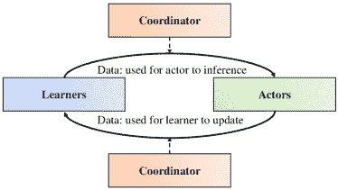

图 1：DDRL 的基本框架。

演员从学习者那里拉取神经网络参数，从环境中接收状态，并进行推理以获得动作，这些动作推动环境的动态到下一个状态。通过重复以上过程，数据吞吐量可以增加，并收集到足够的数据。学习者从演员那里拉取数据，进行梯度计算或后处理，并更新网络参数。多个学习者可以通过利用多个 GPU 和工具（如 ring allreduce 或 parameter-server [11]）缓解 GPU 存储的限制。通过重复上述过程，可以获得最终的强化学习代理。

协调器对于 DDRL 算法非常重要，它们控制学习者和演员之间的通信。例如，当协调器用于同步参数更新和拉取（由演员进行）时，DDRL 算法是同步的。当参数更新和拉取（由演员进行）没有严格协调时，DDRL 算法是异步的。因此，DDRL 算法的基本分类可以基于协调器类型。

+   •

    同步：全局策略参数更新是同步的，演员拉取策略参数也是同步的，即不同的演员共享相同的最新全局策略。

+   •

    异步：全局策略参数的更新是异步的，或者策略更新（由学习者进行）和拉取（由演员进行）是异步的，即演员和学习者通常具有不同的策略参数。

在上述基本框架的基础上，可以设计单玩家单代理的 DDRL 算法。然而，当面对多个代理或多个玩家时，基本框架无法训练出可用的 RL 代理。基于当前支持大型系统级 AI 的 DDRL 算法，如 AlphaStar [7]、OpenAI Five [6] 和 JueWU [36]，构建多个玩家和多个代理的 DDRL 需要两个关键组件，即代理合作和玩家进化，如图 2 所示。

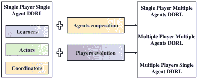

图 2：从单玩家单代理 DDRL 到多个玩家多个代理 DDRL。

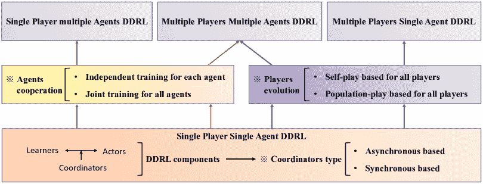

图 3：分布式深度强化学习的分类。

代理合作模块用于基于多代理强化学习算法训练多个代理 [18]。通常，多代理强化学习可以根据代理关系建模的方式分为两类，即独立训练和联合训练。

+   •

    独立训练：通过将其他学习代理视为环境的一部分来独立训练每个代理。

+   •

    联合训练：整体训练所有代理，考虑诸如代理通信、奖励分配和集中式训练与分布式执行等因素。

玩家进化模块设计用于每个玩家的代理迭代，其中其他玩家的代理同时学习，导致每个玩家需要学习多个代的代理，如 AlphaStar 和 OpenAI Five。根据当前主流的玩家进化技术，玩家进化可以分为两种类型：

+   •

    自我对抗基于：不同玩家共享相同的策略网络，玩家通过与其过去版本对抗来更新当前代的策略。

+   •

    基于种群对抗：不同玩家拥有不同的策略网络，或称为种群，玩家通过与其他玩家或/和其过去版本对抗来更新当前代的策略。

最终，基于以上 DDRL 的关键组成部分，DDRL 的分类如图 3 所示。接下来，我们将总结并比较基于主要特征的代表性方法。

### 3.2 协调器类型

根据协调器类型，DDRL 算法可以分为基于异步和基于同步的。对于异步基于的 DDRL 方法，有两种情况：全局策略参数的更新是异步的；全局策略参数更新（由学习者）和拉取（由演员）是异步的。对于同步基于的 DDRL 方法，全局策略参数更新是同步的，拉取策略参数（由演员）是同步的。

#### 3.2.1 基于异步的

Nair 等人[8]提出了可能是第一个用于深度强化学习的广泛分布式架构 Gorila，为后续的 DDRL 算法奠定了基础。如图 4 所示，实现了一个分布式深度 Q 网络（DQN）算法。除了基本的 DQN 算法，主要包括一个 Q 网络和一个目标 Q 网络外，分布在于：并行的演员生成轨迹并将其发送到学习者的 Q 网络和目标 Q 网络，而学习者则基于能够存储分布式神经网络的参数服务器工具计算梯度以更新参数。该算法是异步的，因为学习者的神经网络参数更新和演员的轨迹收集是异步进行的，无需等待。在他们的论文中，实现的分布式 DQN 将大多数 49 个 Atari 游戏所需的墙时间与非分布式 DQN 相比减少了一个数量级。

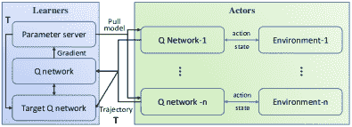

图 4：Gorila 的基本框架。

与[8]类似，Horgan 等人[33]引入了分布式优先经验回放，即 APE-X，以增强基于 Q 学习的分布式强化学习。具体而言，优先经验回放用于采样由所有演员生成的最重要的轨迹。因此，应引入共享经验回放记忆以存储所有生成的轨迹。在实验中，在 Arcade Learning Environment 上实现了一部分实际训练时间。为了进一步增强[33]，Kapturowski 等人[35]提出了分布式强化学习中的递归经验回放，即 R2D2，采用了基于 RNN 的强化学习代理。作者研究了参数滞后和递归状态过时问题对性能的影响，获得了在 57 个 Atari 游戏中有 52 个超越人类水平的第一个代理，并采用了设计的训练策略。

Mnih 等人[32]提出了异步优势演员-评论家（A3C）框架，该框架可以充分利用多核 CPU 而不是 GPU，从而实现对强化学习算法的廉价分布。如图 5 所示，每个演员都计算样本的梯度（主要是用于常规强化学习算法的状态、动作和奖励），然后将它们发送给学习者，然后更新全局策略。更新是异步进行的，不需要对来自不同演员的梯度进行同步。此外，每个演员还会拉取参数（可能不是最新版本）以生成与环境相关的数据。在他们的论文中，他们建立了四种具体的强化学习算法，即异步一步 Q-learning、异步一步 Sarsa、异步 n 步 Q-learning 和异步优势演员-评论家算法。实验表明，在 Atari 领域中，与 GPU 相比，单个多核 CPU 上的时间减少了一半。

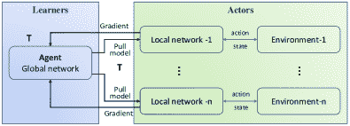

图 5：A3C 的基本架构。

为了充分利用 GPU 的计算能力而不仅仅是像 A3C 中那样使用多核 CPU，Babaeizadeh 等人[37]提出了异步优势演员-评论家 GPU 版本，即 GA3C，它是 A3C 的混合 CPU/GPU 版本。如图 6 所示，学习者包括三个部分：预测者负责出队预测请求，并通过推理得到动作；训练者负责出队路径批次以供代理模型使用；而代理模型用于使用路径更新参数。需要注意的是，预测者和训练者的线程是异步执行的。通过上述多进程、多线程 CPU 执行环境卷积和一个 GPU 的结合，与 A3C 相比，GA3C 实现了显著的加速。

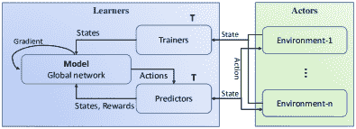

图 6：GA3C 的基本架构。

将梯度计算放在演员端会限制整个 DDRL 系统的数据吞吐量，即每时间单位收集的轨迹数量，因此 Espeholt 等人 [10] 提出了重要性加权演员-学习者架构（IMPALA）以缓解这一问题。如图 7 所示，多个并行演员与环境进行通信，收集轨迹，并将其发送给学习者以更新参数。由于梯度计算放在学习者端，可以通过 GPU 加速，因此该框架被称为可以扩展到数千台机器而不牺牲数据效率。考虑到生成轨迹所用的本地策略由于学习者和演员之间的异步性而落后于学习者中的全局策略，引入了一种 V-trace 离策略演员-评论员算法来修正有害的差异。在 DMLab-30 和 Atari-57 上的实验表明，IMPALA 能够在数据较少的情况下实现比以前的智能体更好的性能。

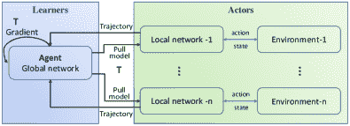

图 7：IMPALA 的基本框架。

通过使用同步采样策略代替 IMPALA 的独立采样，Stooke 和 Abbeel [38] 提出了一个新颖的加速方法，该方法包括两个主要部分，即同步采样和同步/异步多 GPU 优化。如图 8 所示，将每个环境的个体观察收集到一个批次中进行推断，与为每个环境独立生成轨迹的方法相比，这大大减少了推断次数。然而，当不同进程中的不同环境具有较大的执行差异时，这种同步采样可能会受到减速影响，通过均匀分配用于环境的可用 CPU 核心等技巧可以缓解这一问题。对于学习者来说，它们充当参数服务器，其参数由演员推送，然后在其他演员之间异步更新。实现的 PPO 异步版本，即 APPO，在 Acari 游戏中仅需几分钟即可学习成功的策略。

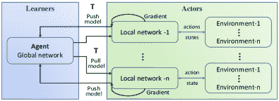

图 8：APPO 的基本框架。

通过[38]中的同步采样，推理时间将大大减少，但当网络规模巨大时，学习者和执行者之间的通信负担将成为一个大问题。Espeholt 等人[9]提出了可扩展的、高效的深度强化学习（SEEDRL），其特点是集中推理和名为 gRPC 的优化通信层。如图 9 所示，学习者和执行者之间的通信仅为状态和动作，这将通过提出的高性能 RPC 库 gRPC 减少延迟。作者实现了基于策略梯度和 Q 学习的算法，并在 Atari-57、DeepMind Lab 和 Google Research Football 环境中进行了测试，获得了 40% 到 80% 的成本降低，显示了显著的改进。

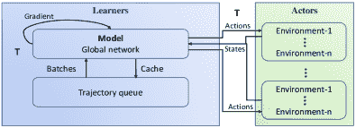

图 9：SEEDRL 的基本框架。

#### 3.2.2 基于同步

作为异步优势演员-评论家（A3C）的替代方案，Clemente 等人[39]发现同步版本，即优势演员-评论家（A2C），可以更好地利用 GPU 资源，这在有更多演员的情况下表现良好。在 A2C 的实现中，即 PAAC，使用协调器等待所有演员的梯度，然后优化全局网络。如图 10 所示，学习者在所有轨迹被收集之前更新策略参数，即演员的工作完成了，当学习者更新策略时，轨迹采样被停止。因此，所有演员被协调以获得相同的全局网络，在接下来的步骤中与环境进行交互。

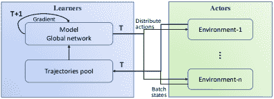

图 10：PAAC 的基本框架。

作为处理连续动作空间的优势演员-评论员（A2C）算法的替代方案，PPO 算法 [40] 由于其信任区域约束展现出巨大潜力。Heess 等人 [34] 提出了分布式 PPO 的大规模强化学习，即 DPPO，该方法有同步和异步两个版本，并且在同步更新时表现更佳。如图 11 所示，DPPO 的实现类似于 A3C，但在更新策略神经网络时进行了同步。然而，由于演员的节奏不同，同步会限制整个系统的吞吐量。作者为必须对学习者可用的演员梯度数量设定了阈值，这使得算法能够扩展到大量演员。

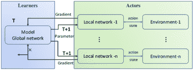

图 11：DPPO 的基本框架。

不同于 DPPO 算法在神经网络更新中使用服务器，Wijmans 等人 [41] 进一步提出了一种去中心化的 DPPO 框架，即 DDPPO，该框架表现出接近线性的 GPU 扩展性。如图 12 所示，学习者和演员被捆绑在一起，作为一个单元，进行轨迹收集和梯度计算。然后，通过一些归约操作（例如环形全规约）将所有单元的梯度汇总在一起，以更新神经网络，确保所有单元的参数相同。需要注意的是，为了减轻在并行单元中进行轨迹收集时的同步开销，使用了类似于 DPPO 的策略，以丢弃几个单元中某些百分比的轨迹。实验表明，在 128 个 GPU 上相较于串行实现，速度提高了 107 倍。

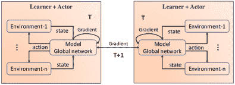

图 12：DDPPO 的基本框架。

#### 3.2.3 讨论

**单机**或**多机**。在开发 DDRL 算法的初期，研究人员将以前的非分布式 DRL 方法使用单台机器进行分布式处理。例如，几个典型的演员-评论家算法的并行设计使用了 CPU 的多进程，例如 A3C [32] 和 PAAC [39]。最近，研究人员致力于提高整个 DDRL 系统的数据吞吐量，例如 IMPALA [10] 和 SEEDRL [9]，这些系统作为训练复杂游戏 AI（如 AlphaStar 和 OpenAI Five）的基础设施。这些系统通常可以利用多台机器。然而，早期设计为单台机器的 DDRL 算法也可以在多台机器上部署，当机器之间的通信问题解决时，这可以通过使用开源工具相对简单地实现（将在第四部分介绍）。

**交换**轨迹或**梯度**。学习者和演员是 DDRL 算法的基本组件，它们之间传输的数据可以是轨迹或梯度，这取决于梯度计算是在演员端还是学习者端进行。例如，A3C [32] 的演员负责轨迹收集和梯度计算，然后将梯度发送给学习者以进行策略更新，这只是执行简单的操作，例如求和。由于梯度计算是时间密集型的，尤其是在策略模型很大的情况下，学习者和演员之间的计算负载会不平衡。因此，越来越多的 DDRL 算法将梯度计算放在学习者端，使用更适合的设备，即 GPU。例如，在像 IMPALA [10] 这样的高数据吞吐量 DDRL 框架中，学习者负责策略更新，演员则负责轨迹收集。

**同步**或**独立**推断。当演员通过与环境交互来收集轨迹时，应该推断出动作。基本上，在环境上执行一步时，应进行一次推断。以前的 DDRL 方法通常为每个演员维护一个环境，其中的动作推断与其他演员和环境是独立进行的。随着收集轨迹的环境数量增加，这会消耗大量资源，特别是在演员端仅使用 CPU 的情况下。将推断放在 GPU 端，资源也会大量浪费，因为推断的批量大小是 1。为了解决上述问题，大多数 DDRL 框架使用一个演员管理多个环境，并进行同步的动作推断。例如，APPO [38] 和 SEEDRL [9] 引入了同步机制，以收集状态并分别分配由环境和演员策略获得的动作。

异步或同步的 DDRL。在基于同步和基于异步的 DDRL 算法中，不同的方法各有优缺点。对于异步 DDRL 算法，全球策略通常不需要等待所有的轨迹或梯度，数据收集通常也不需要等待最新的策略参数。因此，整个 DDRL 系统的数据吞吐量会很大。然而，全球策略和行为策略之间存在延迟，这种延迟通常对基于策略的强化学习算法构成问题。像 IMPALA [10] 这样的 DDRL 框架引入了 V-trace，而 GA3C [37] 引入了小的 $\varepsilon$ 来缓解这个问题，但当延迟较大时，这些方法会变得不稳定。对于同步 DDRL 算法，在更新策略之前需要在轨迹或梯度之间进行同步。因此，当一方在工作时，演员或学习者的等待时间会被浪费。然而，同步使训练更加稳定，并且实现起来更容易，例如 DPPO [34] 和 DDPPO [41]。

其他。通常，多名演员可以在没有数据交换的情况下实现，因为他们的工作，即轨迹收集，可以是独立的。至于学习者，大多数方法仅维持一个学习者，这通常足够，因为模型大小有限，尤其是轨迹批量大小有限。然而，大批量大小被认为对复杂游戏 [6] 很重要，因此多个学习者变得必要。在多个学习者的情况下，通常需要在更新全球策略网络之前进行同步。一般来说，求和操作可以处理同步问题，但当学习者分布在多台机器上时，这会消耗时间。[41] 中提出了一种最佳选择，其中环形 allreduce 操作可以很好地解决同步问题，并且通过使用如 Horovod [11] 这样的工具箱来实现 [41] 非常容易。另一方面，当模型大小很大而 GPU 无法加载整个模型时，基于参数服务器框架 [8, 33] 的学习者可以成为一种选择，这可以与环形 allreduce 操作结合使用，以应对大模型大小和大批量大小的挑战。

简要总结。最后，当需要一个 DDRL 算法时，如何选择一个合适或高效的方法在很大程度上依赖于可用的计算资源、策略模型的资源占用以及环境资源的占用。如果只有一台拥有多个 CPU 核心和 GPU 的机器，除了 CPU 和 GPU 之间的数据交换外，不需要额外的通信。但如果有多台机器，则需要考虑数据交换，这可能是整个系统的瓶颈。当策略模型很大时，机器之间的模型交换是耗时的，因此诸如 SEEDRL [9] 的方法是合适的，因为只交换状态和动作。然而，如果策略模型较小，频繁交换轨迹会耗时，像 DDPPO [41] 这样的算法将是一个选择。当环境资源占用很大时，启动环境需要大量资源，而有限的 GPU 可能足以进行策略更新。因此，像 IMPALA [10] 这样的 DDRL 方法将是合适的，因为可以获得高数据吞吐量。最后，可能没有适用于任何学习环境的最佳 DDRL 方法，研究人员可以选择最适合其任务的方法。

### 3.3 代理合作类型

面对单一代理强化学习时，可以轻松使用之前的 DDRL 算法。但当有多个代理时，需要分布式多代理强化学习算法来同时训练多个代理。因此，之前的 DDRL 算法可能需要修订以处理多代理的情况。基于当前的多代理强化学习训练范式，代理合作类型可以分为两类，即独立训练和联合训练，如图 13 所示。通常，游戏中会添加一个代理管理器来控制所有代理。独立训练通过将其他学习代理视为环境的一部分来训练每个代理，而联合训练则通过使用典型的多代理强化学习算法来整体训练所有代理。

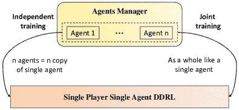

图 13：代理训练的基本框架。

#### 3.3.1 独立训练

独立训练将$n$个智能体的训练视为$n$次独立训练的训练，因此，之前的 DDRL 算法可以通过少量修改后继续使用。智能体管理器主要用于将其他智能体的信息（例如，动作）引入当前智能体的 DDRL 训练中，因为环境的动态应该由所有智能体驱动。考虑到智能体合作的要求，独立训练在促进独立智能体之间的合作方面贡献更多。

Jaderberg 等人[42] 为《Quake III Arena》的夺旗（CTF）模式提出了 FTW 智能体，其中几个智能体合作对抗另一个阵营。为了训练可以与任何其他智能体（即使是未见过的智能体）合作的可扩展智能体，作者独立训练智能体，其中一群独立智能体同时训练，每个智能体参与数千场并行比赛。为了处理数千个并行环境，使用了基于 IMPALA [10] 的框架¹¹主要基于他们发布的代码。关于合作问题，作者基于智能体之间的几个标记设计了奖励，以促进合作的出现。更具体地说，所有智能体共享相同的最终全球奖励，即赢或输。此外，基于几个考虑队友动作的事件，如队友抓取旗帜和队友捡起旗帜，学习中间奖励。

Berner 等人[6] 提出了 OpenAI Five 用于 Dota2，其中五个英雄合作对抗另五个合作的英雄。在他们的 AI 中，每个英雄被建模为一个智能体，并且是独立训练的。为了处理大型并行环境并生成超过一百万个时间步的批量大小，使用了 SEEDRL [9] 框架。与[42] 使用不同策略网络用于不同智能体不同，OpenAI Five 为不同智能体使用相同策略，这可能促进合作的出现。动作的差异在于特征设计，其中 Dota2 中的不同智能体几乎共享相同的特征，但具有特定的特征，如英雄 ID。最后，与[42] 设计奖励以促进合作类似，作者使用了个人奖励和团队奖励的加权和，这些奖励是通过遵循人类玩家的经验而给出的，例如，获得资源和击杀敌人。

Ye 等人 [36] 提出了 JueWu²²2A，荣誉之王中的一个识别名称，这是一款与 Dota2 类似但在移动设备上进行的游戏。与 [6] 类似，采用了 SEEDRL [9] 框架。此外，作者还使用了与 [6] 相同的策略用于不同的智能体。策略网络有所不同，由于对游戏特征的深入考虑，使用了五个价值头。与 [6] 的主要区别在于训练范式，用于扩展到大量的英雄，这不是本文的主要范围，研究人员可以参考原始论文以获取更多细节。

Zha 等人 [43] 提出了 DouZero，用于斗地主，其中一个地主智能体和两个农民智能体进行对抗。三个智能体使用三个策略网络独立训练，如 [42] 所示。使用基于 Gorila [8] 的 DDRL 算法在单个服务器上进行三个智能体的学习。随着训练轮次的增加，农民智能体之间的合作逐渐显现。

Baker 等人 [44] 提出了用于游戏捉迷藏的多智能体自适应课程，以研究工具的涌现使用。与 [6] 类似，采用了 SEEDRL [9] 框架，并对不同的智能体使用相同的策略进行训练。此外，作者测试了对不同智能体使用不同策略的效果，结果显示相似但样本效率有所降低。

#### 3.3.2 联合训练

联合训练将所有智能体作为一个整体使用典型的多智能体强化学习算法进行训练，就像单智能体训练一样。不同之处在于收集的轨迹，其中包含所有智能体的数据而不仅仅是一个智能体。智能体管理器可以设计成处理多智能体问题，例如通信和协调，以进一步加速训练。然而，当前的多智能体 DDRL 算法仅考虑一种简单的方法，即演员并行化以收集足够的轨迹。因此，大多数先前的 DDRL 算法可以很容易地实现。

QMIX [45] 的实现是一个流行的基于 Q 值分解的多智能体强化学习算法，通过多处理实现与环境的交互 [46]。另一个例子是 RLlib [13]，这是开源 Ray 项目 [12] 的一部分，它为 DDRL 提供了抽象，并实现了多个联合训练的多智能体强化学习算法，例如带有集中式评论员的 QMIX 和 PPO。一般来说，联合训练在 DDRL 领域与单智能体训练类似，但考虑到并行化训练的问题，如智能体间的通信和协调，训练速度可能会进一步加快。

#### 3.3.3 讨论

关于独立训练，即使不同的代理被独立训练，不同的方法也会考虑特征工程、奖励重塑等问题，以促进合作。由于不同的代理通过将其他代理作为环境的一部分进行训练，因此可以在没有太多修改的情况下使用传统的 DDR 算法。从成功的代理，如 OpenAI Five 和 JueWu，我们可以看到 SeedRL 或其修订版本是一个不错的选择。至于联合训练，目前还远未令人满意，因为在设计演员和学习者时，需要适当地考虑多代理问题，例如通信，以提高代理之间的并行性。

### 3.4 玩家进化类型

在大多数情况下，我们没有对手来推动玩家的能力增长³³3 这里的玩家指的是游戏的一方，可能控制一个像围棋这样的代理，或者多个像 Dota2 这样的代理。为了解决这个问题，玩家通常会与自己对抗以提升能力，例如 AlphaGo [1]，它利用 DDR 和自我对弈进行超人类 AI 学习。基于当前玩家进化的学习范式，当前的方法可以分为两类，即自我对弈和群体对弈，如图 14 所示。为了维护玩家的进化，需要一个玩家管理器来管理一个或多个玩家的 DDR 算法。自我对弈维护一个玩家及其过去的版本，而群体对弈则维护多个不同的玩家及其过去的版本。

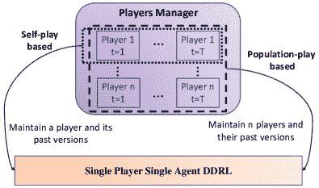

图 14：玩家迭代的基本框架。

#### 3.4.1 基于自我对弈的进化

自我对弈成为一种流行工具，自 AlphaGo 系列成功以来 [1, 2, 47]，它通过与自己对抗来训练一个玩家。在玩家的一个迭代或称为世代中，当前版本是基于以前的 DDR 算法进行训练的，使用一个或一些以前的版本作为对手。玩家管理器决定使用哪些以前的版本作为对手。

在为《王者荣耀》开发的 JueWu [36] 中，使用了相同策略的两个玩家（每个玩家控制五个代理）的简单自我对弈。使用了 SEEDRL [9] DDRL 算法，自我对弈用于固定阵容和随机阵容阶段，以处理大规模英雄池。用于捉迷藏 [44] 的玩家与 JueWu [36] 类似，使用 SEEDRL [9] DDRL 算法和简单自我对弈来证明多代理自动课程。另一个类似的例子是为麻将提出的 Suphx [5]，它使用自我对弈让一个玩家对抗其他三个玩家（使用相同策略）。至于 DDRL 算法，每一代的训练都应用了 IMPALA [10] 框架。

在为 Dota2 设计的 OpenAI Five [6] 中，使用了更复杂的自我对弈方式，其中两个玩家（每个玩家控制五个代理）使用相同的策略。在每一代中，玩家不是像传统自我对弈那样与当前代进行对抗，而是将当前策略在 80% 的游戏中与自身对抗，在 20% 的游戏中与之前的版本对抗。具体而言，设计了一个动态抽样系统，根据动态生成的质量评分选择过去的版本，这被认为可以缓解循环策略的问题。至于基本的 DDRL 算法，所有玩家训练的每一代都使用 SEEDRL [9] 框架。

#### 3.4.2 基于群体对弈的进化

群体对弈可以被视为一种高级自我对弈，其中需要维护多个玩家及其过去的版本以实现玩家进化。它可以用于多种情况：不同玩家使用不同的策略（例如 DouZero 中的一个地主和两个农民玩家）；引入一些辅助玩家以帮助目标玩家克服博弈理论挑战（例如 AlphaStar 中的主要掠夺者和联盟掠夺者玩家）；使用具有一致角色的并行玩家以支持并发训练并减轻自我对弈的不稳定性（例如 FTW 中的群体）。

在为斗地主设计的 DouZero [43] 中，同时训练一个地主和两个农民玩家，这些玩家的当前代相互对抗以收集轨迹并训练玩家。基本的 DDRL 算法是运行在单台机器上的 Gorila [8]，基于此，所有三个玩家都异步训练。

在为星际争霸开发的 AlphaStar [7] 中，玩家管理器维护三名主要玩家，分别对应三种不同的种族，即 Protoss、Terran 和 Zerg。此外，为每个种族设计了几个辅助玩家，即一个主要的利用玩家和两个联赛利用玩家。这些辅助玩家帮助主要玩家发现弱点，并帮助所有玩家找出系统性弱点。作者声称，使用这样的群体解决了星际争霸中的复杂性和博弈论挑战。至于 DDR 算法，利用了 SEEDRL [9] 来支持大规模系统训练。Commander [48] 与 [7] 类似，并使用了更多的利用玩家。

在 FTW [42] 中为 CTF 设计，玩家管理器维持一个玩家群体，这些玩家相互合作和对抗，以学习可扩展的机器人。所有玩家的位置相同，并且设计了一种基于人口的训练方法，以调整表现较差的玩家，从而提升所有玩家的能力。至于基本的 DDR 算法，使用了 IMPALA [10] 方法，以实现大量数据的处理，训练数十名玩家。

#### 3.4.3 讨论

自我对弈在多智能体设置中有着悠久的历史，早期的研究在遗传算法中探索了这一方法 [49]。自 AlphaGo 系列取得成功以来，它变得非常流行 [1, 2]，并被用于像 Libratus [50]、DeepStack [51] 和 OpenAI Five [6] 这样的 AI 系统。结合 DDR， self-play 可以用于解决非常复杂的游戏。另一方面，人口对弈可以看作是高级的自我对弈，它保持更多的玩家以实现能力的提升。目前的工作使用人口对弈来加速训练，克服博弈论挑战，或者处理需要不同玩家的问题。与自我对弈相比，人口对弈更具灵活性，可以处理多样的情况，而自我对弈易于实现，并已在复杂游戏中证明了其潜力。因此，目前尚无结论说明哪种方法更好，研究人员可以根据需求选择自我对弈或人口对弈的 DDR。

## 4 典型的分布式深度强化学习工具箱

DDR 对使用强化学习作为求解器的复杂问题非常重要，已经发布了若干有用的工具箱，帮助研究人员降低开发成本。在这一部分，我们分析了几个典型的工具箱，希望能为研究人员在选择时提供一些线索。

### 4.1 典型工具箱

Ray [12] 是一个分布式框架，包括两个主要部分，即系统层用于任务调度和数据管理，以及应用层提供各种应用的高级 API。使用 Ray，研究人员可以轻松实现 DDRL 方法，而无需考虑节点/机器之间的通信以及如何调度不同的计算。API 友好，通过添加 @ray.remote，用户可以获得一个可以并行执行的远程函数。专门引入了 RLLib [13] 包来处理强化学习问题，如 A3C、APEX 和 IMPALA。此外，还提供了几个内置的多智能体 DDRL 算法，如 QMIX [45] 和 MADDPG [52]。

Acme [53] 旨在促进分布式强化学习的发展，以支持新型 RL 代理及其应用。它涉及许多独立的（并行的）动作、学习，以及诊断和辅助进程，这些都是 DDRL 系统的关键构建块。主要贡献之一是内存存储系统 Reverb，这是一个适用于经验回放的高吞吐量数据系统。为了支持各种规模的代理，实施了大量主流 DDRL 算法，即在线强化学习算法，如 Deep Q-Networks [28]、R2D2 [35] 和 IMPALA [10]，离线强化学习如行为克隆和 TD3 [54]，模仿学习如对抗模仿学习 [55] 和软 Q 模仿学习 [56]。

Tianshou [57] 是一个高度模块化的 Python 库，使用 PyTorch 实现 DDRL。其主要特点是设计了构建模块，支持通过统一接口的分布式版本的 20 多种经典强化学习算法。由于 Tianshou 专注于小到中规模的 DDRL 应用，仅进行并行采样，因此它是一个轻量级的、适合研究的平台。声称 Tianshou 安装简便，用户可以通过 Pip 或 Conda 在 Windows、macOS 和 Linux 平台上完成安装。

TorchBeast [58] 是另一个基于 Pytorch 的 DDRL 工具箱，支持快速、异步和并行训练强化学习代理。作者提供了两个版本，即纯 Python 的 MonoBeast 和一个多机高性能的 PolyBeast，其中几个部分使用 C++ 实现。用户只需 Python 和 Pytorch 即可实现 DDRL 算法。该工具箱支持 IMPALA，并经过经典 Atari 套件的测试。

MALib [59] 是一个可扩展且高效的计算框架，专为基于种群的多代理强化学习算法设计。采用集中式任务调度模型，它支持自生成任务和异质策略组合。此外，通过使用 Actor-Evaluator-Learner 抽象 DDRL 算法，实现了更高的学习和采样并行性。作者还声称，由于多代理强化学习的高层次抽象，具有高效的代码重用和灵活的部署。在发布的代码中，支持了 Google Research Football 和 SMAC 等几个流行的强化学习环境，并实现了典型的基于种群的算法，如政策空间响应预言机 (PSRO) [60] 和 Pipeline-PSRO [61]。

SeedRL [9] 是一个可扩展且高效的深度强化学习工具箱，如 3.2.1 节所述。一般来说，它在张量处理单元 (TPU) 设备上经过验证，这是一种 Google 为机器学习定制的特殊芯片。实现了典型的 DDRL 算法，例如 IMPALA [10] 和 R2D2 [35]，并在四个经典环境中进行了测试，即 Arati、DeepMind lab、Google research football 和 Mujoco。支持使用 Google 的云机器学习引擎进行分布式训练。

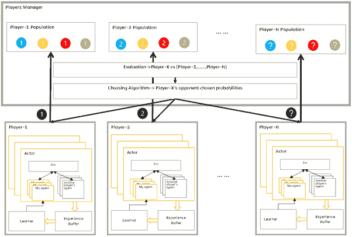

图 15：所提出的多玩家多代理强化学习工具箱 M2RL 的基本框架。

### 4.2 讨论

在比较不同类型的工具箱之前，我们想声明，没有适用于所有需求的最佳 DDRL 工具箱，只有根据特定目标选择的最合适的工具箱。

Tianshou 和 TorchBeast 是支持几种典型 DDRL 算法的轻量级平台。用户可以轻松使用和修改发布的代码来开发基于 PyTorch 深度学习库的强化学习算法。用户友好的特性使这些工具箱很受欢迎。然而，尽管这些工具箱高度模块化，但对大规模机器的可扩展性以进行大规模学习者并行和演员并行尚未经过测试，随着机器数量的增加，可能会出现瓶颈。

Ray、Acme 和 SeedRL 是相对较大的工具箱，理论上可以支持任何需要某些修改的 DDRL 算法。利用它们的开放项目，用户可以使用多台机器实现高数据吞吐量的 DDRL 算法。此外，可以实现多个代理训练和多个玩家演化，如 AlphaStar。然而，由于代码嵌套，修改 DDRL 算法并不容易，尤其是对于自我对弈和种群对弈等复杂函数。

MALib 与 Ray、Acme 和 SeedRL 相似，是一个专门为基于人群的多智能体强化学习设计的 DDRL 工具箱。通过它们的 API，用户可以轻松实现基于人群的多智能体强化学习算法，如虚拟自我对战 [62] 和 PSRO。尽管未对大量机器进行实验，这个工具箱对于 DDRL 算法的各种需求，从单玩家单智能体 DDRL 到多玩家多智能体 DDRL，都是完全功能性的（提供了 API）。

总之，当前的 DDRL 工具箱为 DDRL 算法提供了良好的支持，并且应用了几个典型的测试环境来进行性能验证。然而，这些 DDRL 工具箱要么较轻量，要么较重，且未对复杂游戏进行测试。在接下来的内容中，我们将设计一个新的工具箱，专注于在复杂游戏中进行多玩家和多智能体的 DDRL 训练。

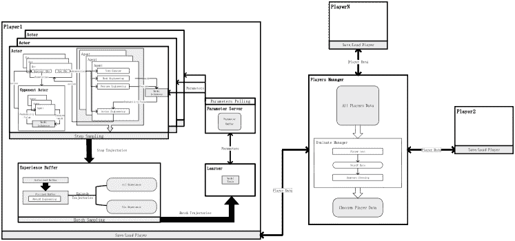

图 16：所提议的多玩家多智能体强化学习工具箱 M2RL 的具体细节。

## 5 多玩家多智能体强化学习工具箱

在本节中，我们推出了一个多玩家多智能体强化学习工具箱 M2RL，以支持复杂游戏中的玩家群体（每个玩家可以控制多个智能体），例如，战争游戏 [63]。请注意，该项目正在进行中，因此主要目的是进行初步介绍，我们将继续改进此项目。项目的超链接是 [m2rl-V1.0](http://turingai.ia.ac.cn/ai_center/show/14)。

### 5.1 总体框架

总体框架如图 15 所示。每个玩家，包括一个或多个智能体，具有三个关键组件：学习者、演员和经验缓冲区。多个同时执行的演员为学习者生成数据，学习者根据玩家管理者的选择使用当前玩家和其他玩家作为对手。经验缓冲区用于存储玩家的轨迹，以支持异步或同步训练。每个玩家的学习者用于更新玩家的参数并将参数发送给演员。除了上述基本因素外，玩家管理者维持自我对战和群体对战，其中包含两个关键部分：评估玩家和为每个玩家选择对手玩家。

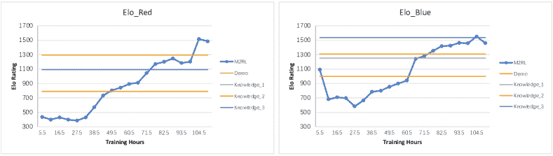

图 17：基于 M2RL 的训练 AI 机器人（红色和蓝色玩家）的 Elo 结果。Knowledge_1、Knowledge_2 和 Knowledge_3 是三个专业水平的 AI 机器人。Demo 是一个具有在可能的情况下选择最高优先级行动策略的 AI。

M2RL 的更多具体细节见图 16。为了使 M2RL 易于用于复杂游戏，我们以相对灵活的方式设计了各个部分。

+   •

    玩家管理器通过对抗结果评估所有保存的玩家（包括他们的过去版本），基于此，可以实现各种对手选择方法以促进玩家的进化，例如 OpenAI Five 中的修订自我对战[6]，以及 AlphaStar 中的优先虚拟自我对战[7]。

+   •

    每个玩家都维护自己的学习者、行动者和经验缓冲区，这使得不同玩家的训练成为可能，例如，《战争游戏》中的红色和蓝色玩家[63]。考虑到游戏的复杂性以及与 OpenAI gym 相比，观察和行动空间的不同，框架中使用了特征工程和掩码工程。此外，经验缓冲区被修订为将未完成的缓冲区更改为已完成的缓冲区，这对异步多智能体协作非常有用[64]。

+   •

    所有代码都基于用户友好的框架 Ray，该框架易于部署、修订和使用。更具体地说，我们可以通过将一个 GPU 划分为多个部分，并将每个部分分配给不同的任务，充分利用计算资源，这对于在有限计算资源下的复杂游戏非常重要。

### 5.2 一个案例

《战争游戏》是类似于 Dota2 和 StarCraft 的复杂游戏，是验证人工智能的热门测试环境[27]。在 Wargame 地图⁴⁴4wargame.ia.ac.cn，ID=2010431153 中，红色玩家控制几个战斗单位来对抗控制几个单位的蓝色玩家。由于玩家拥有不同的策略空间，游戏是不对称的，通常蓝色玩家拥有更多的力量，而红色玩家则具有视野优势。有关《战争游戏》的更多细节，请参见[63]。

我们可以自然地将 Wargame 模型化为一个双玩家多个代理的问题，其中每个作战单位被视为一个代理。为了分别训练红蓝玩家的两个 AI 机器人，我们使用了多个广泛采用的设置，如 OpenAI Five [6]、JueWu [36] 和 AlphaStar [7]，例如，每个代理的共享 PPO 策略、PPO 的双剪辑以及优先虚拟自我对抗。每个玩家使用约 200,000 场游戏来训练其机器人，并用 9,500 场游戏来评估每一代玩家。使用的计算资源包括：2$\times$Intel(R) Xeon(R) Gold 6240R CPU @ 2.40GHz、4$\times$ NVIDIA GeForce RTX 2080 Ti 和 500GB 内存。在上述资源支持下，训练持续了五天，最终为每个玩家获得了 20 代。为了评估这些机器人的表现，我们使用内置的演示代理作为基线，并引入了由研究 Wargame 几年的团队设计的三款专业级 AI 机器人，分别表示为 Knowledge_1、Knowledge_2 和 Knowledge_3。需要注意的是，这些专业 AI 机器人没有参与训练。与 AlphaGo [1] 和 AlphaStar [7] 的评估类似，我们使用 Elo 作为指标。结果如图 17 所示。

从图 17 可以看出，随着玩家演化的增加，每个玩家学习到的策略变得越来越强。由于 Wargame 是一个复杂的游戏，且之前的工具箱并未专门为复杂游戏设计，因此未进行比较，因为这些工具箱的迁移难度较大。总体而言，结果在某种程度上展示了提出的 M2RL 的能力。由于这个项目仍在进行中，所以这一部分的主要目的是介绍，我们将继续改进该项目 ([m2rl-V1.0](http://turingai.ia.ac.cn/ai_center/show/14))。

## 6 个挑战与机遇

提出了大量的 DDRL 算法和工具箱，这在很大程度上促进了强化学习及其应用的研究。我们认为当前的方法仍然面临几个挑战，这些挑战可能是未来的研究方向。首先，当前的方法很少考虑加速复杂的强化学习算法，例如那些研究探索、通信和泛化问题的算法。其次，当前的方法主要使用环形全减少或参数和服务器进行学习，这些方法很少同时处理大模型尺寸和批量尺寸的情况。第三，自我对弈或群体对弈是多玩家和多代理训练的重要方法，这些方法也具有灵活性而没有严格限制，但对其的深入研究仍然不足。第四，虽然开发了一些著名的 DDRL 工具箱，但没有一个经过大规模训练的验证，例如复杂游戏中的数十台机器。

DDRL 与先进的强化学习算法。自从 AlphaGo 成功以来，强化学习的研究和应用显示出爆炸式增长。新话题不断出现，例如分层深度强化学习、基于模型的强化学习、多智能体强化学习、离线强化学习、元强化学习 [16, 18]，但 DDRL 方法很少考虑这些新的研究领域。分布式实现是一种工程技术，但不是简单的操作。例如，在考虑多智能体强化学习算法的信息通信时，代理管理者应合理并行化代理的通信计算，以提高数据吞吐量。因此，如何通过分布式实现来加速先进的强化学习算法是一个重要的方向。

DDRL 使用大模型尺寸和批量尺寸。随着基础模型在计算机视觉和自然语言处理领域的成功，大模型在强化学习中将是一个方向 [27]。这要求 DDRL 方法能够同时处理大模型尺寸和批量尺寸的情况。目前，DDRL 的学习器基于诸如环形全减少或参数服务器等技术，每种技术都有其优点。例如，参数服务器可以将大模型存储在不同的 GPU 中，而环形全减少可以在不同的 GPU 之间快速交换梯度。然而，这些技术尚未应用于强化学习中的大模型尺寸和批量尺寸。因此，如何将这些技术结合起来以适应 DDRL 算法进行高效训练是未来的方向。

基于自我对弈和群体对弈的 DDRL 方法。自我对弈和群体对弈是主流的强化学习代理演化方法，广泛应用于当前的专业人类级 AI 系统，例如 OpenAI Five [6]和 AlphaStar [7]。通常，自我对弈和群体对弈对玩家没有严格的限制，这意味着一个玩家可以与任何过去版本的相同玩家或不同玩家对抗。这些启发式设计使得探索最佳配置成为一个困难的问题，这也使得为工具箱设计模板变得棘手。未来，基于自我对弈和群体对弈的 DDRL 方法值得进一步研究，例如自适应地找出最佳配置。

工具箱的构建和验证。许多著名的科学研究机构，如 DeepMind、OpenAI 和加州大学伯克利分校，已经发布了支持 DDRL 方法的工具箱。它们大多数使用 gym 来测试性能，例如数据吞吐量和线性度。然而，与实际应用中的环境相比，gym 中的环境相对较小。另一方面，大多数测试使用一个或两个节点/机器，并且 CPU 和 GPU 设备数量有限，这使得测试不足以发现工具箱的瓶颈。因此，尽管目前大多数 DDRL 工具箱高度模块化，但对于在复杂环境中执行大规模学习器并行和演员并行的大量机器的可扩展性尚未充分测试。工具箱的未来瓶颈可能会通过大规模测试发现。

## 7 结论

本文对代表性的分布式深度强化学习方法进行了调查。通过总结关键组件形成分布式深度强化学习系统，基于不同类型的协调器比较了单玩家单代理的分布式深度强化学习方法。此外，通过介绍代理合作和玩家演化，详细阐述了多玩家多代理的分布式深度强化学习方法。为了支持简单的代码实现，介绍和讨论了一些流行的分布式深度强化学习工具箱，并基于这些工具箱开发了一个新的多玩家多代理学习工具箱，希望能帮助复杂游戏的学习。最后，我们讨论了这一激动人心领域的挑战和机遇。通过本文，我们希望它能成为研究人员和工程师在探索新型强化学习算法和解决实际强化学习问题时的参考。

## 参考文献

+   [1] D. Silver, A. Huang, C. J. Maddison, A. Guez, L. Sifre *et al.*, “使用深度神经网络和树搜索掌握围棋游戏，” *自然*，第 529 卷，第 484–489 页，2016 年。

+   [2] D. Silver, J. Schrittwieser, K. Simonyan, I. Antonoglou, A. Huang *等*，“在没有人类知识的情况下掌握围棋，” *自然*，第 550 卷，第 354–359 页，2017。

+   [3] Y. Yu，“朝着样本高效的强化学习前进，” 在 *国际人工智能联合大会*，2018，第 5739–5743 页。

+   [4] X. Qiu, T. Sun, Y. Xu, Y. Shao, N. Dai *等*，“自然语言处理的预训练模型：综述，” *科学中国技术科学*，第 1–26 页，2020。

+   [5] J. Li, S. Koyamada, Q. Ye, G. Liu, C. Wang *等*， “Suphx：使用深度强化学习掌握麻将，” *arXiv:2003.13590v2*，2020。

+   [6] C. Berner, G. Brockman, B. Chan, V. Cheung, P. Debiak *等*，“使用大规模深度强化学习的 Dota 2，” *arXiv:1912.06680v1*，2019。

+   [7] O. Vinyals, I. Babuschkin, W. M. Czarnecki, M. Mathieu, A. Dudzik *等*，“使用多智能体强化学习在《星际争霸 II》中达到大师级别，” *自然*，第 575 卷，第 350–354 页，2019。

+   [8] A. Nair, P. Srinivasan, S. Blackwell, C. Alcicek, R. Fearon *等*，“用于深度强化学习的大规模并行方法，” 在 *深度学习研讨会，国际机器学习大会*，2015。

+   [9] L. Espeholt, R. Marinier, P. Stanczyk, K. Wang *等*，“Seed RL：可扩展和高效的深度 RL 与加速的中央推断，” 在 *国际学习表征大会*，2020。

+   [10] L. Espeholt, H. Soyer, R. Munos, K. Simonyan, V. Mnih *等*，“Impala：可扩展的分布式深度 RL 与重要性加权的演员-学习者架构，” *arXiv:1802.01561*，2018。

+   [11] A. Sergeev 和 M. Del Balso，“Horovod：在 TensorFlow 中快速和简单的分布式深度学习，” *arXiv:1802.05799*，2018。

+   [12] P. Moritz, R. Nishihara, S. Wang, A. Tumanov, R. Liaw *等*，“Ray：一个用于新兴 $\{$AI$\}$ 应用的分布式框架，” 在 *第 13 届 $\{$USENIX$\}$ 操作系统设计与实现研讨会 ($\{$OSDI$\}$ 18)*，2018，第 561–577 页。

+   [13] E. Liang, R. Liaw, P. Moritz, R. Nishihara, R. Fox *等*，“Rllib：用于分布式强化学习的抽象，” 在 *国际机器学习大会*，2018。

+   [14] M. R. Samsami 和 H. Alimadad，“分布式深度强化学习：概述，” 在 *强化学习算法：分析与应用*，2021。

+   [15] J. Czech，“强化学习方法综述，” 在 *强化学习算法：分析与应用*，2021。

+   [16] K. Arulkumaran, M. P. Deisenroth, M. Brundage 和 A. A. Bharath，“深度强化学习：简要综述，” *IEEE 信号处理杂志*，第 34 卷，第 6 期，第 26–38 页，2017。

+   [17] T. M. Moerland, J. Broekens 和 C. M. Jonker，“基于模型的强化学习：综述，” *arXiv:2006.16712*，2020。

+   [18] S. Gronauer 和 K. Diepold，“多智能体深度强化学习：综述，” *人工智能评论*，第 55 卷，第 895–943 页，2022。

+   [19] Y. Yang 和 J. Wang，“多智能体深度强化学习：综述”，*arXiv:2011.00583v3*，2021 年。

+   [20] K. Arulkumaran, M. P. Deisenroth, M. Brundage, 和 A. A. Bharath，“揭开并行与分布式深度学习的神秘面纱：深入的并发分析”，*Ben-Num, Tai 和 Torsten, Hoefler*，第 52 卷，第 4 期，第 1–43 页，2020 年。

+   [21] W. Wen, C. Xu, F. Yan, C. Wu, Y. Wang *等人*，“Terngrad：三值梯度以减少分布式深度学习中的通信”，在*神经信息处理系统进展*中，2017 年，第 1509–1519 页。

+   [22] J. Dean, G. Corrado, R. Monga, K. Chen, M. Devin *等人*，“大规模分布式深度网络”，在*神经信息处理系统进展*中，2012 年，第 1232–1240 页。

+   [23] M. Abadi, A. Agarwal, P. Barham, E. Brevdo, Z. Chen *等人*，“Tensorflow：大规模异构分布式系统上的机器学习”，*https://arxiv.org/abs/1603.04467*，2016 年。

+   [24] T. Ben-Nun 和 T. Hoefler，“揭开并行与分布式深度学习的神秘面纱：深入的并发分析”，*ACM 计算调查*，第 52 卷，第 4 期，第 1–43 页，2020 年。

+   [25] J. Park, S. Samarakoon, A. Elgabli, J. Kim, M. Bennis *等人*，“无线网络上的通信高效分布式学习：原理与应用”，*IEEE 汇刊*，第 109 卷，第 5 期，第 796–819 页，2021 年。

+   [26] T.-C. Chiu, Y.-Y. Shih, A.-C. Pang, C.-S. Wang, W. Weng *等人*，“针对 aiot 服务平台的半监督分布式学习与非 iid 数据”，*IEEE 物联网期刊*，第 7 卷，第 10 期，第 9266–9277 页，2020 年。

+   [27] Q. Yin, J. Yang, K. Huang, M. Zhao, W. Ni *等人*，“人机游戏中的 ai：技术、挑战与机会”，*arXiv:2111.07631v2*，2022 年。

+   [28] V. Mnih, K. Kavukcuoglu, D. Silver, A. A. Rusu, 和 J. Veness，“通过深度强化学习实现人类级别的控制”，*自然*，第 518 卷，第 529–533 页，2015 年。

+   [29] Y. Burda, H. Edwards, A. Storkey, 和 O. Klimov，“通过随机网络蒸馏进行探索”，*https://doi.org/10.48550/arXiv.1810.12894*，2018 年。

+   [30] M. Samvelyan, T. Rashid, C. S. d. Witt, G. Farquhar, N. Nardelli *等人*，“星际争霸多智能体挑战”，*https://doi.org/10.48550/arXiv.1902.04043*，2019 年。

+   [31] M. Lanctot, E. Lockhart, J.-B. Lespiau, V. Zambaldi, S. Upadhyay *等人*，“Openspiel：游戏中的强化学习框架”，*arXiv:1908.09453v6*，2020 年。

+   [32] V. Mnih, A. P. Badia, M. Mirza, A. Graves, T. Lillicrap *等人*，“深度强化学习的异步方法”，在*国际机器学习会议*中，2016 年，第 1928–1937 页。

+   [33] D. Horgan, J. Quan, D. Budden, G. Barth-Maron, M. Hessel *等人*，“分布式优先经验回放”，在*国际学习表征会议*中，2018 年。

+   [34] N. Heess, D. TB, S. Sriram, J. Lemmon, J. Merel *等人*，“人机游戏中的 ai：技术、挑战与机会”，*arXiv:1707.02286*，2017 年。

+   [35] S. Kapturowski, G. Ostrovski, J. Quan, R. Munos, 和 W. Dabney，“分布式强化学习中的递归经验回放，”在 *国际学习表征会议*，2019 年。

+   [36] D. Ye, G. Chen, W. Zhang, S. Chen, B. Yuan *等*，“通过深度强化学习玩完整 MOBA 游戏，”在 *神经信息处理系统*，2020 年。

+   [37] M. Babaeizadeh, I. Frosio, S. Tyree, J. Clemons, 和 J. Kautz，“通过 GPU 上的异步优势演员-评论员进行强化学习，”在 *国际学习表征会议*，2017 年。

+   [38] A. Stooke 和 P. Abbeel，“加速的深度强化学习方法，”*arXiv:1803.02811v2*，2019 年。

+   [39] A. V. Clemente, H. N. Castejón, 和 A. Chandra，“深度强化学习的高效并行方法，”*arXiv:1705.04862v2*，2017 年。

+   [40] J. Schulman, F. Wolski, P. Dhariwal, A. Radford, 和 O. Klimov，“近端策略优化算法，”*arXiv:1707.06347*，2017 年。

+   [41] E. Wijmans, A. Kadian, A. Morcos, S. Lee, I. Essa *等*，“Dd-ppo：从 25 亿帧中学习近乎完美的点目标导航器，”在 *国际学习表征会议*，2020 年。

+   [42] M. Jaderberg, W. M. Czarnecki, I. Dunning, L. Marris, G. Lever *等*，“基于人群的强化学习在 3D 多人游戏中的人类水平表现，”*Science*，卷 364，页 859–865，2019 年。

+   [43] D. Zha, J. Xie, W. Ma, S. Zhang, X. Lian, X. Hu, 和 J. Liu，“Douzero：通过自我博弈深度强化学习掌握斗地主，”在 *国际机器学习会议*，2021 年。

+   [44] B. Baker, I. Kanitscheider, T. Markov, Y. Wu, G. Powell *等*，“多智能体自适应课程中涌现的工具使用，”*arXiv:1909.07528*，2019 年。

+   [45] T. Rashid, M. Samvelyan, C. S. d. Witt, G. Farquhar, J. N. Foerster, 和 S. Whiteson，“Qmix：用于深度多智能体强化学习的单调价值函数分解，”在 *国际机器学习会议*，2018 年，页 4292–4301。

+   [46] M. Samvelyan, T. Rashid, C. S. d. Witt, G. Farquhar, N. Nardelli *等*，“星际争霸多智能体挑战，”*arXiv:1902.04043v5*，2019 年。

+   [47] D. Silver, T. Hubert, J. Schrittwieser, I. Antonoglou, M. Lai *等*，“一种通用强化学习算法，通过自我博弈掌握国际象棋、将棋和围棋，”*Science*，卷 362，页 1140–1144，2018 年。

+   [48] X. Wang, J. Song, P. Qi, P. Peng, Z. Tang *等*，“SCC：一个高效的深度强化学习智能体，掌握星际争霸 II 游戏，”在 *国际机器学习会议*，2021 年。

+   [49] J. Paredis，“协同进化计算，”*人工生命*，卷 2，第 4 期，页 355–375，1995 年。

+   [50] N. Brown 和 T. Sandholm，“超人类 AI 在 Heads-up 无限制扑克中的表现：Libratus 击败顶级职业玩家，”*Science*，卷 359，页 418–424，2018 年。

+   [51] M. Moravčík, M. Schmid, N. Burch, V. Lisý, D. Morrill *等*，“Deepstack: 高水平的头对头无限注扑克人工智能，” *Science*，第 356 卷，第 508–513 页，2017 年。

+   [52] R. Lowe, Y. Wu, A. Tamar, J. Harb, P. Abbeel 和 I. Mordatch，“混合合作-竞争环境中的多智能体演员-评论家方法，” *arXiv:1706.02275v4*，2017 年。

+   [53] M. W. Hoffman, B. Shahriari, J. Aslanides, G. Barth-Maron, N. Momchev *等*，“Acme: 一个用于分布式强化学习的研究框架，” *arXiv:2006.00979v2*，2020 年。

+   [54] S. Fujimoto, H. Hoof 和 D. Meger，“解决演员-评论家方法中的函数逼近误差，” 收录于 *International Conference on Machine Learning*，2018 年，第 1587–1596 页。

+   [55] J. Ho 和 S. Ermon，“生成对抗模仿学习，” 收录于 *Advances in Neural Information Processing Systems*，2016 年。

+   [56] S. Reddy, A. D. Dragan 和 S. Levine，“Sqil: 通过稀疏奖励的强化学习进行模仿学习，” *https://doi.org/10.48550/arXiv.1905.11108*，2019 年。

+   [57] J. Weng, H. Chen, D. Yan, K. You, A. Duburcq *等*，“Tianshou: 一个高度模块化的深度强化学习库，” *Journal of Machine Learning Research*，第 23 卷，第 267 号，第 1–6 页，2022 年。

+   [58] H. Küttler, N. Nardelli, T. Lavril, M. Selvatici, V. Sivakumar *等*，“Torchbeast: 一个用于分布式 RL 的 pytorch 平台，” *arXiv:1910.03552v1*，2019 年。

+   [59] M. Zhou, Z. Wan, H. Wang, M. Wen, R. Wu *等*，“Malib: 一个用于基于人群的多智能体强化学习的并行框架，” *arXiv:2106.07551*，2021 年。

+   [60] P. Muller, S. Omidshafiei, M. Rowland, K. Tuyls, J. Perolat *等*，“一种用于多智能体学习的通用训练方法，” *https://doi.org/10.48550/arXiv.1909.12823*，2019 年。

+   [61] S. Mcaleer, J. Lanier, R. Fox 和 P. Baldi，“Pipeline psro: 一种用于在大型游戏中找到近似纳什均衡的可扩展方法，” 收录于 *Advances in Neural Information Processing Systems*，2020 年。

+   [62] J. Heinrich, M. Lanctot 和 D. Silver，“广泛形式游戏中的虚假自我对抗，” 收录于 *International Conference on Machine Learning*，2015 年，第 805–813 页。

+   [63] Q. Yin, M. Zhao, W. Ni, J. Zhang 和 K. Huang，“智能决策技术与战争游戏挑战，” *Acta Automatica Sinica*，第 47 卷，2021 年。

+   [64] H. Jia, Y. Hu, Y. Chen, C. Ren, T. Lv *等*，“Fever basketball: 一个复杂、灵活且异步的体育游戏环境，用于多智能体强化学习，” *arXiv:2012.03204*，2020 年。
