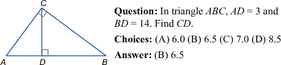
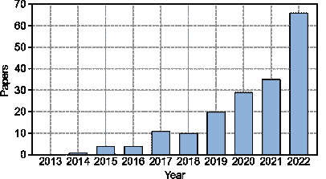

<!--yml

类别：未分类

日期：2024-09-06 19:42:45

-->

# [2212.10535] 数学推理的深度学习调研

> 来源：[`ar5iv.labs.arxiv.org/html/2212.10535`](https://ar5iv.labs.arxiv.org/html/2212.10535)

# 数学推理的深度学习调研

潘璐¹、邱亮¹、余文浩²、肖恩·韦勒克^(3∗)、常凯维^(1∗)

¹加州大学洛杉矶分校，²圣母大学，³华盛顿大学

[`github.com/lupantech/dl4math`](https://github.com/lupantech/dl4math)

###### 摘要

数学推理是人类智能的一个基本方面，适用于科学、工程、金融和日常生活等多个领域。能够解决数学问题和用语言证明定理的人工智能（AI）系统的发展在机器学习和自然语言处理领域引起了广泛关注。例如，数学作为测试强大深度学习模型在推理方面的挑战的试验场，推动了新的算法和建模进展。另一方面，最近在大规模神经语言模型方面的进展为数学推理的深度学习开辟了新的基准和机会。在这篇调研论文中，我们回顾了过去十年数学推理和深度学习交汇处的关键任务、数据集和方法。我们还评估了现有的基准和方法，并讨论了这一领域未来的研究方向。

^($*$)^($*$)脚注：表示共同高级作者。

## 1 引言

“数学的研究，就像尼罗河一样，开始时微小，但最终却壮丽宏伟。”

— 查尔斯·卡勒布·科尔顿，英国作家

数学推理是人类智能的一个关键方面，使我们能够理解和基于数值数据和语言做出决策。它适用于科学、工程、金融和日常生活等多个领域，涵盖了从基本技能如模式识别和数值运算到更高级的技能如问题解决、逻辑推理和抽象思维等各种能力。能够解决数学问题和用语言证明定理的人工智能（AI）系统的发展，一直是机器学习和自然语言处理（NLP）领域的研究重点，这一研究可以追溯到 1960 年代的 Feigenbaum 等人（1963）；Bobrow（1964）。近年来，这一领域的兴趣激增：例如，相关论文数量从 2018 年的大约 10 篇增长到 2022 年的 66 篇（参见附录中的图 3")。

随着深度学习不断革新自然语言处理任务，如问答系统和机器翻译 Sutskever 等 (2014); Devlin 等 (2019)，它在数学推理领域也取得了显著进展 Wang 等 (2017); Yang 和 Deng (2019); Geva 等 (2020); Wei 等 (2022)。然而，尽管这些模型具有令人印象深刻的能力，但仍缺乏对不同类型数学推理任务的明确分类，以及深度学习模型解决这些任务所需的具体能力。

以往的文献讨论仅限于特定方面，例如解决数学语言问题 Bhattacharya (2017); Zhang 等 (2019); Ughade 和 Kumbhar (2019)，表示数字的表示 Thawani 等 (2021)，或解决非正式问题 Meadows 和 Freitas (2022)。此外，随着 GPT-3 Brown 等 (2020) 等大型语言模型的最新进展，理解这些模型在数学推理中的能力和局限性变得越来越重要。因此，对这一快速发展的领域进行全面的调研至关重要，因为它可以提供该领域当前状态和局限性的概述，并指示进一步的研究方向。

{森林}

forked edges, for tree= grow=east, reversed=true, anchor=base west, parent anchor=east, child anchor=west, base=left, font=, rectangle, draw=hidden-black, rounded corners, align=left, minimum width=4em, edge+=darkgray, line width=1pt, s sep=3pt, inner xsep=2pt, inner ysep=3pt, line width=0.8pt, ver/.style=rotate=90, child anchor=north, parent anchor=south, anchor=center, , where level=1text width=6.2em,font=,, where level=2text width=10.5em,font=,, where level=3text width=13.5em,font=,, where level=4text width=12em,font=,,  深度学习在数学推理中的应用, ver [ 任务和

数据集 (§[2)  数学语言问题

解题 (§[A.1)  文本 [ 例如，MathQA Amini 等人 ([2019)，SVAMP Patel 等人 (2021) ，leaf，文本宽度=32em ] ]  多模态 [ 例如，IconQA Lu 等人 ([2021b)，TabMWP Lu 等人 (2022b) ，leaf，文本宽度=32em ] ] ]  定理证明 (§[A.2)  形式 [ 例如，CoqGym Yang 和 Deng ([2019) ，leaf，文本宽度=32em ] ]  非形式 [ 例如，NaturalProofs Welleck 等人 ([2021) ，leaf，文本宽度=32em ] ]  形式 + 非形式 [ 例如，miniF2F+informal Jiang 等人 ([2022a) ，leaf，文本宽度=32em ] ] ]  几何问题

解题 (§[A.3)  无注释 [ 例如，GEOS Seo 等人 ([2015)，GEOS++ Sachan 等人 (2017) ，leaf，文本宽度=32em ] ]  有注释 [ 例如，Geometry3K Lu 等人 ([2021a)，UniGeo Chen 等人 (2022a) ，leaf，文本宽度=32em ] ] ]  数学问题

回答 (§[A.4)  单一基准 [ 例如，DROP Dua 等人 ([2019)，Mathematics Saxton 等人 (2020) ，leaf，文本宽度=32em ] ]  统一基准 [ 例如，Lila Mishra 等人 ([2022a)，TheoremQA Chen 等人 (2023) ，leaf，文本宽度=32em ] ] ]  其他定量

问题 (§[A.5)  图示 [ 例如，FigureQA Kahou 等人 ([2018)，DVQA Kafle 等人 (2018) ，leaf，文本宽度=32em ] ]  财务 [ 例如，ConvFinQA Chen 等人 ([2022c) ，leaf，文本宽度=32em ] ]  科学 [ 例如，ScienceQA Lu 等人 ([2022a) ，leaf，文本宽度=32em ] ]  编程 [ 例如，P3 Schuster 等人 ([2021) ，leaf，文本宽度=32em ] ] ] ]  深度学习

方法 [ 神经网络 (§[3)  基于 Seq2Seq (§[3.1)  例如，DNS Wang 等人 ([2017), AnsRat Ling 等人 (2017) , leaf, text width=32em ] ]  基于图的 (§[3.2)  例如，GTS Xie 和 Sun ([2019), Graph2Tree Li 等人 (2020b) , leaf, text width=32em ] ]  基于注意力的 (§[3.3)  例如，Math-EN Wang 等人 ([2018a), GROUP-ATT Li 等人 (2019) , leaf, text width=32em ] ]  其他 (§[3.4)  例如，CNNTP Loos 等人 ([2017), MathDQN Wang 等人 (2018b) , leaf, text width=32em ] ] ]  预训练语言

模型 (§[4)  自监督学习 (§[4.1)  例如，GenBERT Geva 等人 ([2020), Minerva Lewkowycz 等人 (2022) , leaf, text width=32em ] ]  任务特定微调 (§[4.2)  例如，Scratchpad Nye 等人 ([2021), Bhaskara Mishra 等人 (2022a) , leaf, text width=32em ] ] ]  上下文学习 (§[5)  示例选择 (§[5.1)  例如，Few-shot-CoT Wei 等人 ([2022), PromptPG Lu 等人 (2022b) , leaf, text width=32em ] ]  高质量链 (§[5.2)  例如，Self-Consistency Wang 等人 ([2023), Least-to-most Zhou 等人 (2023) , leaf, text width=32em ] ] ] ]

图 1：数学推理深度学习的分类法。相关任务详述于§2，综合数据集列表见于§A。深度学习方法在§3，§4 和§5 中进一步讨论。

在本文中，我们调查了来自 NLP 和 AI 领域的 180 多篇关于数学推理深度学习的论文。我们研究了各种类型的数学推理问题，例如数学词汇题、定理证明、几何问题解决、数学问答以及其他定量问题（§2，§A）。此外，我们探讨了用于数学推理的不同深度学习架构，包括神经网络（§3），预训练语言模型（§4）以及最近的大型语言模型的上下文学习（§5）。

我们还分析了现有的基准测试，发现对多模态和低资源环境的关注较少（§6.1）。我们的基于证据的研究表明，当前的数字表示不够充分，深度学习方法在数学推理中也不一致（§6.2）。因此，我们建议未来的研究方向包括泛化和鲁棒性、可信推理、从反馈中学习以及多模态数学推理（§7）。

## 2 数学推理任务

在本节中，我们简要介绍了不同的数学推理任务。常用数据集的详细总结和讨论可在表 7 和附录 A 中找到。

数学应用题求解。开发自动解决数学应用题（MWPs）的算法已引起 NLP 研究人员的关注数十年 Feigenbaum 等人 (1963); Bobrow (1964)。如表 1 所示，一个应用题涉及四种基本的算术运算，可能有单步或多步操作。应用题的挑战在于需要语言理解、语义解析以及多种数学推理技能的应用。

| 问题：Bod 有 2 个苹果，David 有 5 个苹果。他们总共有多少个苹果？ |
| --- |
| 理由：$x=2+5$ |
| 解决方案：$7$ |

表 1：典型的数学应用题。

定理证明。自动化定理证明是 AI 中一个长期存在的挑战 Newell 等人 (1957); Feigenbaum 等人 (1963)。问题在于通过一系列逻辑论证（证明）来证明一个数学声明（定理）的真实性。定理证明考验各种技能，例如选择有效的多步骤策略、使用背景知识和进行符号操作。

几何问题求解。自动化几何问题求解（GPS）也是一个长期存在的数学推理任务 Gelernter 等人 (1960); Wen-Tsun (1986)。如图 2 所示，几何问题包括文本描述和图表。多模态输入描述几何元素的实体、属性和关系，目标是找到未知变量的数值解。

图 2：几何问题的示例。

数学问题回答。存在广泛的数学推理相关问题回答（QA）基准，我们称之为数学问题回答（MathQA）。例如，DROP Dua 等人 (2019) 是一个 MathQA 数据集，要求进行离散推理以回答诸如“哪位踢球员踢进了最多的进球？”这样的问题。

## 3 数学推理的神经网络

神经网络已成为数学推理领域中的一种流行工具，与其在自然语言处理中的成功相呼应。近年来，提出了多种不同的神经网络架构用于数学推理任务，包括基于 Seq2Seq 的网络、基于图的网络和基于注意力的网络。这些方法在附录中的表 8 中有更详细的介绍。

### 3.1 基于 Seq2Seq 的数学网络

序列到序列（Seq2Seq）Sutskever 等人 (2014) 的神经网络已成功应用于数学推理任务，例如数学文字题解决 Wang 等人 (2017)、定理证明 Yang 和 Deng (2019)、几何问题解决 Robaidek 等人 (2018) 和数学问答 Tafjord 等人 (2019)。Seq2Seq 模型使用编码器-解码器架构，通常将数学推理形式化为序列生成任务。这种方法的基本思想是将输入序列（例如数学问题）映射到输出序列（例如方程、程序和证明）。常见的编码器和解码器包括长短期记忆网络（LSTM）Hochreiter 和 Schmidhuber (1997)、门控递归单元（GRU）Cho 等人 (2014) 及其双向变体：BiLSTM 和 BiGRU。大量工作已显示 Seq2Seq 模型相较于之前的统计学习方法具有性能优势 Ling 等人 (2017)；Wang 等人 (2018a)；Huang 等人 (2018)；Wang 等人 (2019)；Li 等人 (2019)。

### 3.2 基于图的数学网络

Seq2Seq 方法展示了其在生成数学表达式时不依赖手工特征的优势。值得注意的是，数学表达式可以表示为基于树的结构，例如抽象语法树（ASTs）和基于图的结构，这些结构捕捉了表达式中的结构信息。然而，Seq2Seq 方法并未明确建模这些重要信息。为了克服这一局限性，已经开发了基于图的神经网络以显式建模表达式中的结构。序列到树（Seq2Tree）模型在编码输出序列时明确建模树结构 Xie 和 Sun (2019); Wu 等 (2020); Zaporojets 等 (2021); Qin 等 (2021)。例如，Liu 等 (2019a) 设计了一个 Seq2Tree 模型，以更好地利用方程的 AST 信息。Seq2DAG Cao 等 (2021)，则在生成方程时应用了序列到图（Seq2Graph）框架，因为图解码器能够提取多个变量之间的复杂关系。图形信息也可以在编码输入数学序列时嵌入 Zhang 等 (2020b); Shen 和 Jin (2020); Li 等 (2020b); Wu 等 (2021a)。

### 3.3 基于注意力的数学网络

注意力机制已经成功应用于自然语言处理 Bahdanau 等 (2015) 和视觉问题 Xu 等 (2015); Woo 等 (2018)，在解码过程中考虑了输入的隐藏向量。最近，研究人员一直在探索其在数学推理任务中的有用性，因为它可以用来识别数学概念之间最重要的关系。例如，MATH-EN Wang 等 (2018a) 是一个数学词问题求解器，它受益于通过自注意力学习的长距离依赖信息。基于注意力的方法也被应用于其他数学推理任务，例如几何问题求解 Robaidek 等 (2018); Chen 等 (2021a) 和定理证明 Yang 和 Deng (2019)。各种注意力机制已经被研究以提取更好的表示，例如 Group-ATT Li 等 (2019)，它使用不同的多头注意力来提取各种类型的 MWP 特征，以及应用于 Wu 等 (2020) 的图注意力，用于提取知识感知信息。

### 3.4 其他用于数学的神经网络

深度学习方法在数学推理任务中也可以利用其他神经网络，如卷积神经网络（CNN）和多模态网络。一些研究通过卷积神经网络架构对输入文本进行编码，使模型能够捕捉输入中符号之间的长期关系 Gehring et al. (2017); Wang et al. (2018a, a); Robaidek et al. (2018); Alemi et al. (2016); Loos et al. (2017)。例如，Alemi et al. (2016) 提出的第一个深度神经网络应用于定理证明，依赖于卷积网络进行前提选择。

多模态数学推理任务，如几何问题解决和基于图表的数学推理，被形式化为视觉问答（VQA）问题 Kafle et al. (2018); Chen et al. (2021a); Lu et al. (2021b)。在这一领域，视觉输入使用 ResNet He et al. (2016) 或 Faster-RCNN Ren et al. (2015) 编码，而文本表示则通过 GRU 或 LTSM 获得。随后，使用多模态融合模型学习联合表示，如 BAN Kim et al. (2018), FiLM Perez et al. (2018) 和 DAFA Gao et al. (2019)。

其他深度神经网络结构也可以用于数学推理。Zhang et al. (2022) 使用图神经网络（GNN）进行几何问题解析，利用其在空间推理中的成功。WaveNet 被应用于定理证明 Loos et al. (2017); Bansal et al. (2019)，由于其处理纵向时间序列数据的能力。此外，Transformers 在生成数学方程式方面优于 GRU DDT Meng 和 Rumshisky (2019)。最后，MathDQN Wang et al. (2018b) 是首个探索强化学习用于数学文字问题解决的工作，利用其强大的搜索能力。

## 4 种用于数学推理的预训练语言模型

| 论文 | 基础架构 | 大小 | 语料库 | 预训练任务 |
| --- | --- | --- | --- | --- |
| GPT-f Polu 和 Sutskever (2020) | Transformer (2017) | 774M | 数学 | 因果语言建模 |
| LISA Jiang et al. (2021) | Transformer (2017) | 163M | 数学 | 因果语言建模 |
| MATH-PLM Hendrycks et al. (2021b) | GPT-2 (2020) | 1.5B | 数学 | 因果语言建模 |
| MWP-BERT Liang et al. (2022b) | RoBERTa (2019b) | 123M | 数学 | 8 个算术增强任务 |
| TaPEx Liu et al. (2022b) | BART (2020) | 406M | SQL | 查询结果生成 |
| HTPS Lample 等 (2022) | Transformer (2017) | 600M | 数学 | 掩码 Seq2Seq 建模 |
| Thor Jiang 等 (2022b) | Transformer (2017) | 700M | Github, arXiv | 因果语言建模 |
| PACT Han 等 (2022) | Transformer (2017) | 837M | 数学 | 掩码/因果语言建模 |
| Minerva Lewkowycz 等 (2022) | PaLM (2022) | 540B | 科学与数学 | 因果语言建模 |
| GenBERT Geva 等 (2020) | BERT (2019) | 110M | 数字, 文本 | 掩码/因果语言建模 |
| NF-NSM Feng 等 (2021) | RoBERTa (2019b) | 110M | 数字 | 数字预测 |
| LIME Wu 等 (2021d) | Transformer (2017) | 11B | 数学 | 因果语言建模 |
| Set Wu 等 (2022c) | T5 (2020) | 60M | 数学 | 独特的标记生成 |

表 2: 数学推理的预训练语言模型比较。

预训练语言模型 Devlin 等 (2019); Radford 等 (2020); Brown 等 (2020) 在广泛的 NLP 任务中展示了显著的性能提升。通过在大规模文本语料库上进行预训练，这些模型学习了宝贵的世界知识 Guu 等 (2020)，这些知识可以应用于下游任务。类似的思想也可以应用于与数学相关的问题，之前的研究已展示了预训练语言模型在回答数学应用题 Kim 等 (2020)、辅助定理证明 Wu 等 (2022b) 以及解决其他数学任务 Charton (2022) 中的良好表现。

然而，尽管大型语言模型在建模自然语言方面表现出色，但在数学推理中使用它们仍面临一些挑战。首先，预训练语言模型没有专门针对数学数据进行训练，这可能导致它们在数学相关任务中表现不如自然语言任务。此外，与文本数据相比，用于大规模预训练的数学或科学数据较少。其次，预训练模型的规模不断扩大，使得从头开始训练整个模型以应对特定下游任务变得昂贵。此外，下游任务可能涉及不同的输入格式或模态，例如结构化表格 Zhao 等 (2022) 或图表 Lu 等 (2021b)。为了解决这些挑战，研究人员必须通过在下游任务上微调预训练模型或调整神经网络结构来适应这些挑战。

### 4.1 自监督学习在数学中的应用

自监督学习是一种机器学习方法，其中算法在没有明确提供标记训练数据的情况下学习执行任务。表 2 提供了一些用于数学推理的自监督任务预训练语言模型的列表。

模型规模。近年来，预训练语言模型的规模明显增大了，Devlin 等人（2019）；Lewis 等人（2020）；Raffel 等人（2020）；Radford 等人（2020）；Brown 等人（2020）。Liang 等人（2022a）的最新研究表明，同一模型家族内的模型规模可以可靠地预测模型准确性。该研究还提到了一个有趣的阈值效应：“所有在准确性上赢得头对头模型比较的模型，其参数至少为 50B”。在数学推理领域中，也可以观察到类似的规模增长趋势。例如，MWP-BERT Liang 等人（2022b）使用了 BERT（110M） Devlin 等人（2019）和 RoBERTa（123M） Liu 等人（2019b）作为数学词汇问题的骨干。最近，基于 PaLM Chowdhery 等人（2022）预训练语言模型的 Minerva Lewkowycz 等人（2022），其规模已达 540B 参数。

预训练语料库。数学语言模型的预训练语料库通常有两种类型。（i）来自开放访问源的精心策划的数据集。例如，Hendrycks 等 (2021b) 提出了首个大规模的数学预训练数据集，提供了自然语言和 LaTeX 中的逐步解决方案，称为辅助数学问题与解决方案（AMPS）。AMPS 包含了 Khan Academy 和 Mathematica 的数据。Minerva Lewkowycz 等 (2022) 收集了一个高质量的数据集，包含科学和数学数据，其中包括从网页中筛选的 38.5B 个标记以及从 arXiv 预印本服务器提交的论文。Thor Jiang 等 (2022b) 在 GitHub + arXiv 子集上对 The Pile Gao 等 (2020)进行了语言模型预训练。（ii）基于模板或与引擎交互的合成数据集。近期的工作 Wu 等 (2021d)；Krishna 等 (2021)；Ri 和 Tsuruoka (2022)；Anderson 和 Farrell (2022)；Wu 等 (2022c) 表明，完全合成生成的数据进行预训练——合成预训练实际上可以提供显著的提升。代表性工作包括 TaPEX Liu 等 (2022b)，通过自动合成可执行的 SQL 查询及其执行结果来获得预训练语料库。LISA Jiang 等 (2021) 通过与 Isabelle 标准库和正式证明档案库互动，提取了引理和定理。GenBERT Geva 等 (2020) 基于手工制作和提取的模板生成数值和文本预训练数据集。

预训练任务。一般的预训练语言模型有两种典型的自监督学习任务：（i）掩码语言建模（MLM），在每个序列中随机掩盖一部分单词以预测结果；（ii）因果语言建模（CLM），模型训练以预测序列中下一个标记。按照相同的范式，研究人员在数学或科学语料库上使用 MLM 和 CLM 任务对语言模型进行预训练，以进行下游任务 Polu 和 Sutskever (2020)；Hendrycks 等 (2021b)；Han 等 (2022)；Jiang 等 (2022b)。

还有一些近期的工作设计了定制任务，以将数学推理能力注入语言模型。例如，Liang 等 (2022b) 通过考虑推理逻辑和数值属性，使用一套包含 8 个数值增强任务的工具对语言模型进行预训练。LIME Wu 等 (2021d) 提出了合成预训练任务，以学习三种推理原语：演绎推理、归纳推理和溯因推理，然后再学习更复杂的推理技能，这也可以视为一种课程学习形式。

| 论文 | 基础模型 | 任务 |
| --- | --- | --- |
| EPT (2020) | ALBERT (2019) | MWP |
| Generate & Rank (2021) | BART (2020) | MWP |
| RPKHS (2021b) | RoBERTa (2019b) | MWP |
| PatchTRM (2021b) | ResNet+BERT (2019) | MWP |
| GSM8K-PLM (2021) | GPT-3 (2020) | MWP |
| BERT-TD+CL (2022b) | BERT (2019) | MWP |
| DeductReasoner (2022) | RoBERTa (2019b) | MWP |
| Self-Sampling (2023) | GPT-Neo (2020) | MWP |
| Bhaskara (2022a) | GPT-Neo (2020) | MWP |
| miniF2F-PLM (2022) | GPT-f (2020) | TP |
| NaturalProver (2022a) | GPT-3 (2020) | TP |
| Inter-GPS (2021a) | BART (2020) | GPS |
| UniGeo (2022a) | VL-T5 (2021) | GPS |
| DPE-NGS (2022) | RoBERTa (2019b) | GPS |
| Aristo (2020) | RoBERTa (2019b) | MathQA |
| FinQANet (2021c) | RoBERTa (2019b) | MathQA |
| TAGOP (2021) | RoBERTa (2019b) | MathQA |
| MT2Net (2022) | RoBERTa (2019b) | MathQA |
| Scratchpad (2021) | Transformer (2017) | 混合 |
| LAMT (2022) | Transformer (2017) | 混合 |

表 3: 针对下游数学推理任务的微调预训练语言模型。

### 4.2 针对数学任务的特定微调

特定任务的微调是一种提高预训练语言模型在特定任务上表现的技术。这也是在数据不足以从头训练大型模型时的常见做法。如在表 3 中所示，现有的工作将预训练语言模型微调于各种下游任务，如数学词汇问题 Kim et al. (2020); Shen et al. (2021), MathQA Zhao et al. (2022), 几何问题求解 Lu et al. (2021a), 线性代数 Charton (2022), 和定理证明 Welleck et al. (2022a)。除了微调模型参数，一些工作还将预训练语言模型作为编码器，并与其他模块集成用于下游任务 Lu et al. (2021b)。

## 5 上下文学习用于数学推理

| 模型 | 引擎 | ICL | 理由 | 理由 | 后处理方法 |
| --- | --- | --- | --- | --- | --- |
| （最佳表现） | 来源 | 类型 | 来源 |
| --- | --- | --- | --- |
| Few-shot-CoT Wei et al. (2022) | PaLM (540B) | 随机 | 语言 | 手工制作 | - |
| Self-Consistency-CoT Wang et al. (2023) | Codex (175B) | 随机 | 语言 | 手工设计 | 自我一致性 |
| Least-to-most CoT Zhou et al. (2023) | Codex (175B) | 随机 | 语言 | 手工设计 | - |
| PromptPG-CoT Lu et al. (2022b) | GPT-3 (175B) | 强化学习 | 语言 | 手工设计 | - |
| Retrieval-CoT Zhang et al. (2023) | GPT-3 (175B) | 检索 | 语言 | 自动生成 | - |
| Auto-CoT Zhang et al. (2023) | Codex (175B) | 聚类 | 语言 | 自动生成 | - |
| Complexity-CoT Fu et al. (2023) | GPT-3 (175B) | 复杂性 | 语言 | 手工设计 | 自我一致性 |
| Few-shot-PoT Chen et al. (2022b) | GPT-3 (175B) | 随机 | 代码 | 手工设计 | - |

表 4：用于数学推理的大型语言模型的上下文学习。对于 GPT-3，所有论文使用 $\mathrm{text}$-$\mathrm{davinci}$-$\mathrm{002}$ 版本；对于 Codex，所有论文使用 $\mathrm{code}$-$\mathrm{davinci}$-$\mathrm{002}$。RL 是强化学习的缩写。

大型语言模型（LLMs），例如 GPT-3（Brown et al., 2020），最近在自然语言处理（NLP）领域引发了革命，尤其是由于其强大的少量示例上下文学习能力（Brown et al., 2020）。上下文学习（ICL）使 LLMs 能够通过在推理时提供一些任务示例作为条件来执行目标任务，而无需更新模型参数（Radford et al., 2020）；Brown et al., 2020）。ICL 使用户能够快速构建适用于新用例的模型，而不必担心为每个任务调整和存储大量新参数，因此在少量示例设置中得到了广泛应用（Min et al., 2022）。

一个上下文示例通常包含一个带有一些提示词的输入输出对，例如，请从列表中选择最大的数字。输入：[2, 4, 1, 5, 8]。输出：8，少量示例的工作原理是提供多个示例，然后是最终的输入示例，模型预计会预测输出。然而，这种标准的少量示例提示，在测试时提供 LLM 输入输出对的上下文示例，还未能证明足以在如数学推理等具有挑战性的任务上取得高性能（Rae et al., 2021）。

思维链提示（CoT）Wei et al. (2022) 利用中间自然语言推理作为提示，使 LLMs 首先生成推理链，然后为输入问题预测答案。例如，解决数学文字题的 CoT 提示可能是

> 问题：罗杰有 5 个网球。他又买了 2 罐网球。每罐有 3 个网球。那么，罗杰现在有多少个网球？
> 
> 答案：罗杰开始时有 5 个球。2 罐每罐 3 个网球共 6 个网球。5 + 6 = 11。答案是 11。

除了 Kojima et al. (2022) 显示 LLM 在给定“让我们一步一步思考！”提示时表现出色的零样本推理外，大多数近期工作集中在如何在少样本设置下改进思维链推理。这项工作主要分为两个部分，（i）选择更好的上下文示例和（ii）创建更好的推理链。

### 5.1 上下文示例选择

早期的思维链工作随机或启发式地选择上下文示例。然而，近期研究表明，这种少样本学习在不同的上下文示例选择中可能非常不稳定 Rubin et al. (2022); Liu et al. (2022a)。因此，哪些上下文推理示例最有效仍然是文献中未知的问题。为了解决这个限制，近期的工作调查了各种方法来优化上下文示例选择过程 Rubin et al. (2022); Zhang et al. (2023); Lu et al. (2022b); Yu et al. (2023); Fu et al. (2023)。例如，Rubin et al. (2022) 试图通过检索语义相似的示例来解决这个问题。此外，Fu et al. (2023) 提出了基于复杂度的提示，选择具有复杂推理链的示例，即具有更多推理步骤的链作为提示。PromptPG Lu et al. (2022b) 通过强化学习（RL）从候选池中学习选择最佳的上下文示例。

### 5.2 高质量推理链

早期的思维链工作（例如，Wei et al. (2022)) 主要依赖单一的人工注释推理链作为提示。然而，手动创建推理链有两个缺点。首先，随着任务的复杂化，当前模型可能不足以学习执行所有必要的推理步骤，并且难以轻松泛化到不同的任务。其次，单一的解码过程易受到错误推理步骤的影响，导致最终预测结果错误。为了解决这一局限性，近期研究主要集中在两个方面，（i）手工设计更复杂的示例，我们称之为基于过程的方法 Zhou et al. (2023); Chen et al. (2022b)，（ii）利用类似集成的方法，我们称之为基于结果的方法 Wang et al. (2023); Li et al. (2022a)。

基于过程的方法旨在提高链式思维推理的质量，特别是对于复杂的推理任务。在从少到多的提示中 Zhou et al. (2023)，问题解决过程通过两阶段提示实现：(i) 将复杂问题简化为子问题列表；(ii) 顺序解决这些子问题，从而通过之前解决的子问题的答案来促进解决给定的子问题。类似地，Khot et al. (2022) 利用多样的分解结构，并使用不同的提示来回答每个子问题。除了这些多步骤推理方法，Chen et al. (2022b); Gao et al. (2022) 提出了思维程序（PoT），这是一种替代解决方案，使用大型语言模型将推理过程表达为程序。计算则被交给外部计算机，后者执行生成的程序以得出答案。最近的工作 Chameleon Lu et al. (2023) 集成了不同的工具，以增强 LLMs 在组合推理方面的能力。

基于结果的方法承认单个推理路径可能存在错误，而是使用多个推理路径 Wang et al. (2023); Li et al. (2022a)。自我一致性 Wang et al. (2023) 通过从语言模型中抽样生成一组推理路径，并通过选择最常见的答案来边际化推理路径。除了使用单个提示生成多个推理路径外，Li et al. (2022a) 提出了通过“自我教学”引入多样化的提示，作为产生更高程度多样性的补充解决方案。

## 6 讨论与发现

### 6.1 基准分析

多模态设置尚未充分探索，但正获得越来越多的关注。现有的大多数数学推理基准只针对文本模式。然而，视觉元素可以提供丰富的定量信息，使得多模态数据集在自然图像 Lu et al. (2022a)、抽象图表 Lu et al. (2021b)、图形 Kahou et al. (2018) 和图表 Kafle et al. (2018) 上的定量关系推理中具有重要价值。表格作为日常文档中常见的元素，包含层级结构的信息，也被用于需要在文本和表格上下文中进行定量推理的任务 Chen et al. (2021c); Zhu et al. (2021); Zhao et al. (2022); Lu et al. (2022b)。此外，近期还开发了基于对话的数学推理数据集 Sun et al. (2019); Zhang et al. (2021); Chen et al. (2022c)，以及报告 Chen et al. (2022c)。

在低资源环境下的探索中，开创性的工作正在出现。尽管创建了各种数据集，但低资源环境中的数学推理仍然在很大程度上未被充分探索。开创性研究为金融领域 Chen et al. (2021c); Zhu et al. (2021); Zhao et al. (2022) 和科学领域 Lu et al. (2022a) 开发了数学推理基准。此外，还有尝试为中文 Wang et al. (2017); Qin et al. (2020); Yu et al. (2021a) 和阿拉伯语 Alghamdi et al. (2022) 构建非英语数据集用于数学推理。

多样化的理由注释已被广泛探索。复杂的推理通常涉及多个步骤以得出最终答案。为了弥补这一差距，已经提出了标注有中间理由的数据集，如逻辑形式 Tafjord et al. (2019); Lu et al. (2021a), 程序 Amini et al. (2019); Chen et al. (2021c, a); Cao and Xiao (2022); Chen et al. (2022a), 和推理图 Zhang et al. (2021)，以训练模型进行复杂的推理任务。Python 程序被用作推理注释 Austin et al. (2021); Mishra et al. (2022a)，由于其增强的可访问性和可读性。为了模仿人类的推理过程，更近期的趋势是用自然语言注释解决方案 Ling et al. (2017); Cobbe et al. (2021); Lu et al. (2022b); Hendrycks et al. (2021b); Lu et al. (2022a).

### 6.2 深度学习方法分析

|  | T5 | UnifiedQA | GPT-3 | GPT-3 |
| --- | --- | --- | --- | --- |
|  | (Large) | (Large) | (davinci-002) | (davinci-003) |
| --- | --- | --- | --- | --- |
| 3 balls + 5 balls = | ✗ | 5 balls | 8 balls | 8 balls |
| 23 balls + 145 balls = | ✗ | ✗ | 58 balls | 168 balls |
| 23 balls + 1,855 balls = | ✗ | ✗ | 2,878 balls | 2,988 balls |

表 5: 语言模型在处理大数字时表现挣扎。

当前的数值表示是否足够？深度学习技术的标准做法是将数字处理与词语相同。早期的神经网络方法创建了一个词汇表，将输入的词语和数字映射到标记 ID 上，从而将出现频率较低的数字合并为“UNK”标记。最近的语言模型使用了子词标记化技术 Wu et al. (2016); Sennrich et al. (2016) 将数字拆分为原子标记。最近的研究表明，这些标记化方法是次优的 Wallace et al. (2019); Lin et al. (2020); Zhang et al. (2020d); Thawani et al. (2022).

在同一条或接近的数字线上，两个数字的表面形式可能没有共同的标记。例如，数字 $1598$ 在 GPT-3 中被分词为 “$15$” 和 “$98$”，而另一种格式如 $1,598$ 被拆分为三个不同的标记：“$1$”、“,” 和 “$598$”。这种不一致的表示方式使得深度学习模型在处理数字时可能变得困难，特别是与纯文本相比。数字表示的不充分可能导致分布外（OOD）问题。 表 5 提供了语言模型在处理大数字时容易出现问题的示例。虽然增加模型规模可能有帮助，但即使是最先进的大型语言模型 GPT-3 在处理大数字时表现也不佳。一些近期的研究表明，使用科学记数法 Zhang 等人 (2020d) 和数字级分解 Geva 等人 (2020) 可能有助于改善数字表示，但这仍然是一个未解的问题。

| 问题 | GPT-3 (text-davinci-002) |
| --- | --- |
| John 有 8 个球，他给了 Mary 3 个。John 现在有多少个球？ | John 现在有 5 个球。 |
| John 有 3 个苹果。John 有 8 个球，他给了 Mary 3 个。Mary 现在有多少个球？ | Mary 现在有 5 个球。 |
| John 有 8 个球，他给了 Mary 3 个。谁现在有更多的球？ | John 有更多的球。 |
| John 有 8 个球，他给了 Mary 3 个。John 现在有更多的球吗？ | 不，John 现在有 5 个球。 |
| John 有 8 个球，他给了 Mary 4 个。John 现在有更多的球吗？ | 不，John 现在有 4 个球。 |
| John 有 8 个球，他给了 Mary 4 个。谁现在有更多的球？ | John 有更多的球。 |

表 6：大型语言模型在数学推理方面不一致的示例。

深度学习方法在数学推理方面是否一致？近期深度学习的发展在各种数学推理任务中取得了令人瞩目的成果。Zero-shot-CoT Minerva 540B 在 MMLU-STEM 基准测试 Hendrycks 等人 (2021a) 中得分为 75.0%，该测试评估了科学、技术、工程和数学（STEM）领域的多任务推理能力，包括高中和大学水平。类似地，few-shot-CoT GPT-3 175B 在 MultiArith 任务中取得了 93.0% 的高准确率。然而，问题依然存在，这些方法是否足够先进以解决更复杂的问题。

有强有力的证据表明，深度学习方法在数学推理方面并不鲁棒，容易受到对抗性攻击的影响 Lin 等人 (2020)；Patel 等人 (2021)；Mishra 等人 (2022b, a)；Welleck 等人 (2022b)。SVAMP Patel 等人 (2021) 数据集是一个包含 1-未知算术词题的数据集，涵盖到 4 年级，具有与以前的数据集稍微不同的词汇变体。令人惊讶的是，目前最先进（SOTA）的方法在该数据集上的表现很差，其中 Graph2Tree 仅达到 43.8%的准确率，而 zero-shot-CoT GPT-3 (175B)仅达到 63.7%，略高于“F”级。 表 6 还显示了 zero-shot GPT-3 模型在描述略有不同的场景中的不一致表现，而人类的表现保持不变。这表明，最先进的大型语言模型在数学推理能力上的一致性不足。

## 7 未来工作

### 7.1 泛化和鲁棒性

尽管取得了令人印象深刻的进展，神经模型在推理任务上常常表现出泛化和鲁棒性不足的问题。例如，上面我们讨论了在对更大数字进行泛化时的困难（表 5）或在面对类似问题时保持鲁棒性的问题（表 6），而其他研究发现了模型在泛化到比训练时观察到的更长问题上的失败（例如，Anil 等人 (2022)）。一个方向是探索新的推理时间 Jung 等人 (2022)；Mitchell 等人 (2022) 或微调 Anil 等人 (2022) 策略。

泛化的另一个方面涉及记忆的作用。例如，产生复杂解决方案的能力是否依赖于在训练过程中看到许多类似的解决方案，甚至是记忆解决方案？已知预训练语料库中的术语频率会影响简单算术任务的准确性 Razeghi 等人 (2022) 或事实问答 Kandpal 等人 (2022)。另一方面，Lewkowycz 等人 (2022) 没有发现复杂输出中记忆的证据，但他们的训练集和模型不可供检查。要全面了解这些因素对复杂问题和输出（例如，多步解决方案或证明）的影响，需要更多的分析，以及可访问的数据集和模型。

### 7.2 可信赖的推理

最近的语言模型进展展示了它们在数学推理方面的强大能力。然而，由于可能生成没有根据的答案，Nakano 等人（2021）指出，用户无法始终信任预测结果，或需要付出额外努力进行验证。即使是最近的提示策略，在做出预测之前提供理由，Wei 等人（2022）的研究也发现，语言模型仍然可能产生虚假陈述、产生有缺陷的推理，并输出错误的答案。因此，迫切需要能够实现更可靠推理的新方法。一些潜在的方向包括：（i）使用语言模型提供证据，如定理，以支持推理过程；（ii）加入机制，当模型对答案不确定时做出判断；以及（iii）使用模型自身或其他模块检测和定位模型推理中的错误。

### 7.3 从反馈中学习

另一个进一步改善语言模型在数学推理方面的重要方向是让模型从反馈中学习。这一过程使得模型输出质量和安全性得以持续改进。例如，使用来自人类反馈的强化学习（RLHF）Ouyang 等人（2022）将语言模型与指令对齐。其思想是让人类对语言模型生成的输出进行排序，并使用学到的奖励函数通过策略梯度对语言模型进行微调 Ouyang 等人（2022）；Glaese 等人（2022）；Qiu 等人（2022a）。在数学推理的背景下，反馈不一定直接来自人类。定理证明引擎的结果 Jiang 等人（2021）；Wu 等人（2021d, 2022c）或模型生成脚本的执行结果也可以作为奖励来源 Polu 和 Sutskever（2020）。

### 7.4 多模态数学推理

最近几年，对多模态数学推理的兴趣日益增长，这涉及使用多种信息来源，如文本、表格、自然图像和图示。Kahou 等人 (2018)；Kafle 等人 (2018)；Lu 等人 (2021b, 2022b)。然而，目前在这一领域可用的数据集往往较小，Zhao 等人 (2022)，生成于模板中，Kahou 等人 (2018)，或专注于特定主题，Lu 等人 (2021a)；Chen 等人 (2022a)。当前研究的一个方向是应用基于 VQA 的框架来分析图形和图表，但这种方法可能导致显著的语义差距，因为大多数 VQA 模型都是在自然图像上训练的。未来工作的一个潜在方向是增强多模态数学推理系统解决更复杂和现实问题的能力。这可能涉及创建统一的模型来解释和整合不同的模态，以及开发更好的评估基准来评估这些系统的性能。

## 8 结论

在本文中，我们提供了深度学习在数学推理领域的综合调查。我们回顾了各种任务、数据集和深度学习方法。我们还识别了现有数据集和方法中的几个空白。最后，我们概述了未来研究的方向，并强调了进一步探索这一领域的潜力。我们希望通过本文为对深度学习在数学推理中的发展感兴趣的读者提供一个全面而有用的资源。为了支持这一努力，我们创建了一个阅读列表，并将在 [`github.com/lupantech/dl4math`](https://github.com/lupantech/dl4math) 上持续更新。

## 限制

我们调查工作的一个限制是，它专注于过去十年数学推理与深度学习的交集，可能未涵盖整个领域及其历史。此外，我们对现有基准和方法的评估是基于一组精心挑选的论文，可能未能完全代表该领域的最新技术。此外，由于该领域的快速发展，我们的调查可能未能反映出在调查进行时或接近调查之后出现的最新发展和进展。尽管存在这些限制，我们的调查仍然提供了对数学推理和深度学习领域当前状态和关键趋势的有价值概述，并且可以为从事该领域的研究人员和实践者提供宝贵的资源。

## 更广泛的影响

我们的调查论文关于数学推理与深度学习的交集，具有显著影响人工智能领域的潜力。通过提供过去十年中开发的关键任务、数据集和方法的全面概述，我们为研究人员和从业者提供了当前最先进技术的清晰理解，并帮助他们做出有关自己研究的明智决策。此外，通过评估现有的基准和方法并讨论未来的研究方向，我们旨在识别当前技术状态中的不足，并指导未来的研究和开发工作，朝着更先进和有效的数学推理系统发展。总体而言，我们的调查有可能推动数学推理和深度学习的发展，并对机器学习和自然语言处理产生深远的影响。

## 参考文献

+   Alemi 等人 (2016) Alexander A. Alemi, François Chollet, Niklas Een, Geoffrey Irving, Christian Szegedy, 和 Josef Urban. 2016. [Deepmath - 用于前提选择的深度序列模型](https://arxiv.org/abs/1606.04442)。*神经信息处理系统进展 (NeurIPS)*，29。

+   Alghamdi 等人 (2022) Reem Alghamdi, Zhenwen Liang, 和 Xiangliang Zhang. 2022. [Armath: 解决阿拉伯数学问题的数据集](https://aclanthology.org/2022.lrec-1.37/)。在 *第十三届语言资源与评估会议 (LREC)*，第 351–362 页。

+   Alvin 等人 (2017) Chris Alvin, Sumit Gulwani, Rupak Majumdar, 和 Supratik Mukhopadhyay. 2017. [阴影区域几何问题的解法综合](https://www.aaai.org/ocs/index.php/FLAIRS/FLAIRS17/paper/viewFile/15416/14902)。在 *第三十届国际 Flairs 会议*。

+   Amini 等人 (2019) Aida Amini, Saadia Gabriel, Shanchuan Lin, Rik Koncel-Kedziorski, Yejin Choi, 和 Hannaneh Hajishirzi. 2019. [Mathqa: 通过基于操作的形式主义实现可解释的数学问题解决](https://aclanthology.org/N19-1245/)。在 *2019 年北美计算语言学协会：人类语言技术会议 (NAACL-HLT)*，第 2357–2367 页。

+   Anderson 和 Farrell (2022) Connor Anderson 和 Ryan Farrell. 2022. [改进分形预训练](https://arxiv.org/abs/2110.03091)。在 *IEEE/CVF 计算机视觉应用冬季会议*，第 1300–1309 页。

+   Anderson 等人 (2018) Peter Anderson, Xiaodong He, Chris Buehler, Damien Teney, Mark Johnson, Stephen Gould, 和 Lei Zhang. 2018. [自下而上与自上而下的注意力机制用于图像描述和视觉问答](https://arxiv.org/abs/1707.07998)。在 *IEEE 计算机视觉与模式识别会议 (CVPR)*，第 6077–6086 页。

+   Anil et al. (2022) Cem Anil, Yuhuai Wu, Anders Johan Andreassen, Aitor Lewkowycz, Vedant Misra, Vinay Venkatesh Ramasesh, Ambrose Slone, Guy Gur-Ari, Ethan Dyer, 和 Behnam Neyshabur. 2022. [探索大型语言模型中的长度泛化](https://openreview.net/forum?id=zSkYVeX7bC4). 在 *神经信息处理系统进展 (NeurIPS)*。

+   Austin et al. (2021) Jacob Austin, Augustus Odena, Maxwell Nye, Maarten Bosma, Henryk Michalewski, David Dohan, Ellen Jiang, Carrie Cai, Michael Terry, Quoc Le, 等. 2021. [使用大语言模型进行程序合成](https://arxiv.org/abs/2108.07732). *arXiv 预印本 arXiv:2108.07732*。

+   Bahdanau et al. (2015) Dzmitry Bahdanau, Kyunghyun Cho, 和 Yoshua Bengio. 2015. [通过共同学习对齐和翻译的神经机器翻译](https://arxiv.org/abs/1409.0473). 在 *国际学习表征会议 (ICLR)*。

+   Bansal et al. (2019) Kshitij Bansal, Sarah Loos, Markus Rabe, Christian Szegedy, 和 Stewart Wilcox. 2019. [Holist: 一个用于机器学习高阶逻辑定理证明的环境](https://arxiv.org/abs/1904.03241). 在 *国际机器学习会议 (ICML)*，页码 454–463. PMLR。

+   Barras et al. (1999) Bruno Barras, Samuel Boutin, Cristina Cornes, Judicaël Courant, Yann Coscoy, David Delahaye, Daniel de Rauglaudre, Jean-Christophe Filliâtre, Eduardo Giménez, Hugo Herbelin, 等. 1999. [Coq 证明助手参考手册](https://flint.cs.yale.edu/cs430/coq/pdf/Reference-Manual.pdf). *INRIA, 版本*，6(11)。

+   Berg-Kirkpatrick and Spokoyny (2020) Taylor Berg-Kirkpatrick 和 Daniel Spokoyny. 2020. [上下文化数字预测的实证研究](https://doi.org/10.18653/v1/2020.emnlp-main.385). 在 *2020 年自然语言处理实证方法会议 (EMNLP)* 论文集，页码 4754–4764。

+   Bhattacharya (2017) Arindam Bhattacharya. 2017. [数学和科学问题的问答调查](https://arxiv.org/abs/1705.04530). *arXiv 预印本 arXiv:1705.04530*。

+   Bobrow (1964) Daniel G Bobrow. 1964. [计算机问题解决系统的自然语言输入](http://dspace.mit.edu/handle/1721.1/5922). *AI 技术报告*。

+   Brown et al. (2020) Tom Brown, Benjamin Mann, Nick Ryder, Melanie Subbiah, Jared D Kaplan, Prafulla Dhariwal, Arvind Neelakantan, Pranav Shyam, Girish Sastry, Amanda Askell, 等. 2020. [语言模型是少量学习者](https://arxiv.org/abs/2005.14165). *神经信息处理系统进展 (NeurIPS)*，33:1877–1901。

+   Cao and Xiao (2022) Jie Cao 和 Jing Xiao. 2022. [通过双重平行文本编码的几何问题回答增强基准数据集](https://aclanthology.org/2022.coling-1.130/). 在 *第 29 届计算语言学国际会议 (COLING)*，页码 1511–1520。

+   Cao et al. (2021) Yixuan Cao, Feng Hong, Hongwei Li, 和 Ping Luo. 2021. [一种用于数学词问题的自下而上 DAG 结构提取模型](https://ojs.aaai.org/index.php/AAAI/article/view/16075). 载于*AAAI 人工智能会议论文集*，第 39–46 页。

+   Charton (2022) François Charton. 2022. [变压器线性代数](https://openreview.net/forum?id=Hp4g7FAXXG). *机器学习研究期刊*。

+   Chen et al. (2022a) Jiaqi Chen, Tong Li, Jinghui Qin, Pan Lu, Liang Lin, Chongyu Chen, 和 Xiaodan Liang. 2022a. [Unigeo: 通过重构数学表达统一几何逻辑推理](https://lupantech.github.io/papers/emnlp22_unigeo.pdf). 载于*2022 年自然语言处理经验方法会议（EMNLP）*。

+   Chen et al. (2021a) Jiaqi Chen, Jianheng Tang, Jinghui Qin, Xiaodan Liang, Lingbo Liu, Eric Xing, 和 Liang Lin. 2021a. [Geoqa: 一种面向多模态数值推理的几何问题回答基准](https://aclanthology.org/2021.findings-acl.46.pdf). 载于*计算语言学协会发现论文集（ACL）*，第 513–523 页。

+   Chen et al. (2021b) Mark Chen, Jerry Tworek, Heewoo Jun, Qiming Yuan, Henrique Ponde de Oliveira Pinto, Jared Kaplan, Harri Edwards, Yuri Burda, Nicholas Joseph, Greg Brockman, 等人. 2021b. [评估在代码上训练的大型语言模型](https://arxiv.org/abs/2107.03374). *arXiv 预印本 arXiv:2107.03374*。

+   Chen et al. (2022b) Wenhu Chen, Xueguang Ma, Xinyi Wang, 和 William W Cohen. 2022b. [思维提示程序: 为数值推理任务解开计算与推理的关系](https://arxiv.org/abs/2211.12588). *arXiv 预印本 arXiv:2211.12588*。

+   Chen et al. (2023) Wenhu Chen, Ming Yin, Max Ku, Elaine Wan, Xueguang Ma, Jianyu Xu, Tony Xia, Xinyi Wang, 和 Pan Lu. 2023. Theoremqa: 一个基于定理的问答数据集。*arXiv 预印本 arXiv:2305.12524*。

+   Chen et al. (2021c) Zhiyu Chen, Wenhu Chen, Charese Smiley, Sameena Shah, Iana Borova, Dylan Langdon, Reema Moussa, Matt Beane, Ting-Hao Huang, Bryan R Routledge, 等人. 2021c. [Finqa: 一个关于金融数据的数值推理数据集](https://arxiv.org/abs/2109.00122). 载于*2021 年自然语言处理经验方法会议（EMNLP）论文集*，第 3697–3711 页。

+   Chen et al. (2022c) Zhiyu Chen, Shiyang Li, Charese Smiley, Zhiqiang Ma, Sameena Shah, 和 William Yang Wang. 2022c. [Convfinqa: 探索对话金融问答中的数值推理链](https://arxiv.org/abs/2210.03849). *arXiv 预印本 arXiv:2210.03849*。

+   Chiang and Chen (2019) Ting-Rui Chiang 和 Yun-Nung Chen. 2019. [语义对齐方程生成以解决和推理数学词问题](https://aclanthology.org/N19-1272/). 载于*2019 年北美计算语言学协会: 人类语言技术会议（NAACL-HLT）论文集*，第 2656–2668 页。

+   Cho 等 (2021) Jaemin Cho, Jie Lei, Hao Tan, 和 Mohit Bansal. 2021. [通过文本生成统一视觉与语言任务](https://proceedings.mlr.press/v139/cho21a.html). 见 *第 38 届国际机器学习会议（ICML）论文集*，第 1931–1942 页。

+   Cho 等 (2014) Kyunghyun Cho, Bart van Merrienboer, Caglar Gulcehre, Dzmitry Bahdanau, Fethi Bougares, Holger Schwenk, 和 Yoshua Bengio. 2014. [使用 RNN 编码器-解码器学习短语表示以进行统计机器翻译](https://aclanthology.org/D14-1179/). 见 *2014 年自然语言处理经验方法会议（EMNLP）论文集*，第 1724–1734 页。

+   Chou 等 (1996) Shang-Ching Chou, Xiao-Shan Gao, 和 Jing-Zhong Zhang. 1996. [利用几何不变生成可读证明](https://link.springer.com/article/10.1007/BF00283133). *自动推理杂志*，17(3):325–347。

+   Chowdhery 等 (2022) Aakanksha Chowdhery, Sharan Narang, Jacob Devlin, Maarten Bosma, Gaurav Mishra, Adam Roberts, Paul Barham, Hyung Won Chung, Charles Sutton, Sebastian Gehrmann 等. 2022. [Palm：通过路径扩展语言建模](https://arxiv.org/abs/2204.02311). *arXiv 预印本 arXiv:2204.02311*。

+   Clark 等 (2020) Peter Clark, Oren Etzioni, Tushar Khot, Daniel Khashabi, Bhavana Mishra, Kyle Richardson, Ashish Sabharwal, Carissa Schoenick, Oyvind Tafjord, Niket Tandon 等. 2020. [从‘f’到‘a’在纽约州科学考试中的表现：Aristo 项目概述](https://arxiv.org/abs/1909.01958). *AI 杂志*，41(4):39–53。

+   Cobbe 等 (2021) Karl Cobbe, Vineet Kosaraju, Mohammad Bavarian, Jacob Hilton, Reiichiro Nakano, Christopher Hesse, 和 John Schulman. 2021. [训练验证器以解决数学文字题](https://arxiv.org/abs/2110.14168). *arXiv 预印本 arXiv:2110.14168*。

+   Devlin 等 (2019) Jacob Devlin, Ming-Wei Chang, Kenton Lee, 和 Kristina Toutanova. 2019. [BERT：用于语言理解的深度双向变换器预训练](https://doi.org/10.18653/v1/N19-1423). 见 *2019 年北美计算语言学协会：人类语言技术会议（NAACL-HLT）论文集*，第 4171–4186 页。

+   Dua 等 (2019) Dheeru Dua, Yizhong Wang, Pradeep Dasigi, Gabriel Stanovsky, Sameer Singh, 和 Matt Gardner. 2019. [Drop：需要对段落进行离散推理的阅读理解基准](https://aclanthology.org/N19-1246/). 见 *2019 年北美计算语言学协会：人类语言技术会议（NAACL-HLT）论文集*，第 2368–2378 页。

+   Feigenbaum 等 (1963) Edward A Feigenbaum 等. 1963. [*计算机与思想*](https://mitpress.mit.edu/9780262691338/computers-and-thought/). McGraw-Hill.

+   Feng et al. (2021) 冯宇、张静、张晓康、刘乐茂、李翠平和陈洪。2021 年。[将数字推理技能注入知识库问答模型](https://arxiv.org/abs/2112.06109)。*arXiv 预印本 arXiv:2112.06109*。

+   Ferreira and Freitas (2020a) 黛博拉·费雷拉和安德烈·弗雷塔斯。2020a 年。[自然语言前提选择：寻找数学文本的支持性陈述](https://aclanthology.org/2020.lrec-1.266)。在*第十二届语言资源与评估会议论文集*，第 2175–2182 页。

+   Ferreira and Freitas (2020b) 黛博拉·费雷拉和安德烈·弗雷塔斯。2020b 年。[自然语言数学文本中的前提选择](https://doi.org/10.18653/v1/2020.acl-main.657)。在*第 58 届计算语言学协会（ACL）年会论文集*，第 7365–7374 页。

+   Fu et al. (2023) 傅尧、彭浩、阿希什·萨布哈瓦尔、彼得·克拉克和图沙尔·科特。2023 年。[基于复杂性的多步推理提示](https://arxiv.org/abs/2210.00720)。在*国际学习表示会议（ICLR）*。

+   Gao et al. (2020) 高乐、斯特拉·比德曼、西德·布莱克、劳伦斯·戈尔丁、特拉维斯·霍普、查尔斯·福斯特、贾森·方、霍勒斯·赫、阿尼什·蒂特、诺亚·纳贝希马等。2020 年。[The pile: 一个 800GB 的多样化文本数据集用于语言建模](https://arxiv.org/abs/2101.00027)。*arXiv 预印本 arXiv:2101.00027*。

+   Gao et al. (2022) 高路宇、阿曼·马丹、舒延·周、乌里·阿隆、彭飞·刘、易铭·杨、杰米·卡伦和格雷厄姆·纽比。2022 年。[Pal: 程序辅助语言模型](https://arxiv.org/abs/2211.10435)。*arXiv 预印本 arXiv:2211.10435*。

+   Gao et al. (2019) 高鹏、郑凯·姜、郝轩·游、潘璐、史蒂文·CH·霍伊、肖岗·王和洪生·李。2019 年。[动态融合的视觉问答中的内部和跨模态注意流](https://arxiv.org/abs/1812.05252)。在*IEEE 计算机视觉与模式识别会议（CVPR）*，第 6639–6648 页。

+   Gauthier et al. (2021) 提博·戈蒂耶、切扎里·卡利瑟克、约瑟夫·厄本、拉马纳·库马尔和迈克尔·诺里什。2021 年。[TacticToe: 用战术进行证明学习](https://doi.org/10.1007/s10817-020-09580-x)。*自动推理期刊*。

+   Gehring et al. (2017) 乔纳斯·盖尔林、迈克尔·奥利、大卫·格兰吉尔、德尼斯·亚拉茨和扬·N·道芬。2017 年。[卷积序列到序列学习](https://arxiv.org/abs/1705.03122)。在*国际机器学习会议（ICML）*，第 1243–1252 页。PMLR。

+   Gelernter et al. (1960) 赫伯特·盖伦特、詹姆斯·R·汉森和唐纳德·W·洛夫兰德。1960 年。[几何定理机的实证探索](https://dl.acm.org/doi/10.1145/1460361.1460381)。在*1960 年 5 月 3-5 日的西部联合 IRE-AIEE-ACM 计算机会议论文集*，第 143–149 页。

+   Geva et al. (2020) 莫尔·格瓦、安基特·古普塔、乔纳森·贝兰特。2020 年。 [将数值推理技能注入语言模型](https://arxiv.org/abs/2004.04487)。在*第 58 届计算语言学协会年会（ACL）论文集*中，第 946–958 页。

+   Gimpel et al. (2010) 凯文·金佩尔、迪潘詹·达斯、诺亚·A·史密斯。2010 年。 [自然语言处理的分布式异步在线学习](https://aclanthology.org/W10-2925/)。在*第十四届计算自然语言学习会议论文集*中，第 213–222 页。

+   Glaese et al. (2022) 阿梅利亚·格莱斯、纳特·麦卡利斯、玛雅·特雷巴茨、约翰·阿斯拉尼德斯、弗拉德·费罗尤、蒂莫·埃瓦尔德斯、玛丽贝丝·劳、劳拉·韦丁格、马丁·查德威克、菲比·萨克等。2022 年。 [通过针对性的人类判断改进对话体的对齐](https://arxiv.org/abs/2209.14375)。*arXiv 预印本 arXiv:2209.14375*。

+   Grabowski et al. (2015) 亚当·格拉博夫斯基、阿图尔·科尔尼洛维奇、亚当·瑙莫维奇。2015 年。 [四十年的 Mizar](https://dl.acm.org/doi/abs/10.1007/s10817-015-9345-1)。*自动推理杂志*，55(3):191–198。

+   Guu et al. (2020) 凯尔文·古、肯顿·李、佐拉·通、潘努彭·帕苏帕特、明伟·张。2020 年。 [检索增强语言模型的预训练](https://arxiv.org/abs/2002.08909)。在*国际机器学习会议（ICML）*上，第 3929–3938 页。PMLR。

+   Han et al. (2022) 杰西·迈克尔·汉、杰森·鲁特、余怀吴、爱德华·W·艾尔斯、斯坦尼斯拉斯·波卢。2022 年。 [用语言模型进行定理证明的证明工件共训练](https://arxiv.org/abs/2102.06203)。在*国际学习表征会议（ICLR）*上。

+   Hao et al. (2022) 姚涵、张明亮、尹飞、黄林林。2022 年。 [Pgdp5k: 平面几何问题的图示解析数据集](https://arxiv.org/abs/2205.09947)。在*第 26 届国际模式识别大会（ICPR）*上。

+   He et al. (2016) 何凯明、张祥宇、任少卿、孙剑。2016 年。 [深度残差学习用于图像识别](https://arxiv.org/abs/1512.03385)。在*IEEE 计算机视觉与模式识别会议（CVPR）*论文集中，第 770–778 页。

+   Hendrycks et al. (2021a) 丹·亨德里克斯、科林·伯恩斯、斯蒂芬·巴萨特、安迪·邹、曼塔斯·梅泽卡、唐·宋、雅各布·斯坦赫特。2021 年。 [测量大规模多任务语言理解](https://arxiv.org/abs/2009.03300)。在*国际学习表征会议（ICLR）*上。

+   Hendrycks et al. (2021b) 丹·亨德里克斯、科林·伯恩斯、索拉夫·卡达瓦斯、阿库尔·阿罗拉、斯蒂芬·巴萨特、埃里克·唐、唐·宋、雅各布·斯坦赫特。2021 年。 [利用数学数据集测量数学问题解决能力](https://arxiv.org/abs/2103.03874)。在*第 35 届神经信息处理系统大会（NeurIPS）数据集与基准测试专场*上。

+   Hendrycks et al. (2020) Dan Hendrycks, Xiaoyuan Liu, Eric Wallace, Adam Dziedzic, Rishabh Krishnan, 和 Dawn Song. 2020. [预训练的变换器提高了对分布外样本的鲁棒性](https://arxiv.org/abs/2004.06100)。在 *第 58 届计算语言学协会年会（ACL）会议论文集* 中，第 2744–2751 页。

+   Herzig et al. (2020) Jonathan Herzig, Pawel Krzysztof Nowak, Thomas Mueller, Francesco Piccinno, 和 Julian Eisenschlos. 2020. [Tapas：通过预训练的弱监督表格解析](https://arxiv.org/abs/2004.02349)。在 *第 58 届计算语言学协会年会（ACL）会议论文集* 中，第 4320–4333 页。

+   Hochreiter and Schmidhuber (1997) Sepp Hochreiter 和 Jürgen Schmidhuber. 1997. [长短期记忆](https://ieeexplore.ieee.org/abstract/document/6795963)。*神经计算*，9(8):1735–1780。

+   Hong et al. (2021a) Yining Hong, Qing Li, Daniel Ciao, Siyuan Huang, 和 Song-Chun Zhu. 2021a. [通过修复学习：使用弱监督解决数学文字问题](https://arxiv.org/abs/2012.10582)。在 *AAAI 人工智能会议论文集* 中，第 4959–4967 页。

+   Hong et al. (2021b) Yining Hong, Qing Li, Ran Gong, Daniel Ciao, Siyuan Huang, 和 Song-Chun Zhu. 2021b. [Smart：通过属性语法为代数故事问题构建情境模型](https://arxiv.org/abs/2012.14011)。在 *AAAI* 中，第 13009–13017 页。

+   Hosseini et al. (2014) Mohammad Javad Hosseini, Hannaneh Hajishirzi, Oren Etzioni, 和 Nate Kushman. 2014. [通过动词分类学习解决算术文字问题](https://aclanthology.org/D14-1058)。在 *2014 年自然语言处理实证方法会议（EMNLP）* 中。

+   Huang et al. (2019) Daniel Huang, Prafulla Dhariwal, Dawn Song, 和 Ilya Sutskever. 2019. [Gamepad：用于定理证明的学习环境](https://arxiv.org/abs/1806.00608)。在 *国际学习表征会议（ICLR）* 中。

+   Huang et al. (2018) Danqing Huang, Jing Liu, Chin-Yew Lin, 和 Jian Yin. 2018. [带有强化学习的神经数学文字问题求解器](https://aclanthology.org/C18-1018/)。在 *第 27 届国际计算语言学会议（COLING）* 中，第 213–223 页。

+   Huang et al. (2017) Danqing Huang, Shuming Shi, Chin-Yew Lin, 和 Jian Yin. 2017. [学习精细化表达以解决数学文字问题](https://aclanthology.org/D17-1084/)。在 *自然语言处理实证方法会议（EMNLP）* 中，第 805–814 页。

+   Huang et al. (2016) Danqing Huang, Shuming Shi, Chin-Yew Lin, Jian Yin, 和 Wei-Ying Ma. 2016. [计算机解决数学文字问题的能力如何？大规模数据集的构建与评估](https://aclanthology.org/P16-1084/)。在 *第 54 届计算语言学协会年会（ACL）会议论文集* 中，第 887–896 页。

+   Jiang et al. (2022a) Albert Q. Jiang, Sean Welleck, Jin Peng Zhou, Wenda Li, Jiacheng Liu, Mateja Jamnik, Timothée Lacroix, Yuhuai Wu, 和 Guillaume Lample. 2022a. [草稿、素描和证明：用非正式证明引导形式定理证明器](https://arxiv.org/abs/2210.12283)。在 *提交至第十一届国际学习表征会议*。

+   Jiang et al. (2021) Albert Qiaochu Jiang, Wenda Li, Jesse Michael Han, 和 Yuhuai Wu. 2021. [Lisa: Isabelle 证明的语言模型](http://aitp-conference.org/2021/abstract/paper_17.pdf)。在 *第六届人工智能与定理证明会议（AITP）* 上。

+   Jiang et al. (2022b) Albert Qiaochu Jiang, Wenda Li, Szymon Tworkowski, Konrad Czechowski, Tomasz Odrzygóźdź, Piotr Miłoś, Yuhuai Wu, 和 Mateja Jamnik. 2022b. Thor: 使用锤子将语言模型与自动定理证明器整合。*神经信息处理系统进展（NeurIPS）*，35:8360–8373。

+   Jie et al. (2022) Zhanming Jie, Jierui Li, 和 Wei Lu. 2022. [学习演绎推理：将数学问题解决视为复杂关系提取](https://arxiv.org/abs/2203.10316)。在 *第 60 届计算语言学协会年会（ACL）* 论文集中，5944–5955 页。

+   Jung et al. (2022) Jaehun Jung, Lianhui Qin, Sean Welleck, Faeze Brahman, Chandra Bhagavatula, Ronan Le Bras, 和 Yejin Choi. 2022. [Maieutic prompting: 具有递归解释的逻辑一致推理](https://aclanthology.org/2022.emnlp-main.82)。在 *2022 年自然语言处理经验方法会议（EMNLP）* 论文集中，1266–1279 页。

+   Kafle et al. (2018) Kushal Kafle, Brian Price, Scott Cohen, 和 Christopher Kanan. 2018. [Dvqa: 通过问答理解数据可视化](https://arxiv.org/abs/1801.08163)。在 *IEEE 计算机视觉与模式识别会议（CVPR）* 论文集中，5648–5656 页。

+   Kahou et al. (2018) Samira Ebrahimi Kahou, Vincent Michalski, Adam Atkinson, Ákos Kádár, Adam Trischler, 和 Yoshua Bengio. 2018. [Figureqa: 一个用于视觉推理的注释图像数据集](https://arxiv.org/abs/1710.07300)。在 *国际学习表征会议（ICLR）* 上。

+   Kaliszyk et al. (2017) Cezary Kaliszyk, François Chollet, 和 Christian Szegedy. 2017. [Holstep: 高阶逻辑定理证明的机器学习数据集](https://arxiv.org/abs/1703.00426)。在 *国际学习表征会议（ICLR）* 上。

+   Kalyan et al. (2021) Ashwin Kalyan, Abhinav Kumar, Arjun Chandrasekaran, Ashish Sabharwal, 和 Peter Clark. 2021. [在 EMNLP 2019 期间消耗了多少咖啡？费米问题：AI 的新推理挑战](https://arxiv.org/abs/2110.14207)。在 *2021 年自然语言处理经验方法会议（EMNLP）* 论文集中，7318–7328 页。

+   Kandpal et al. (2022) Nikhil Kandpal, H. Deng, Adam Roberts, Eric Wallace, 和 Colin Raffel. 2022. [大型语言模型在学习长尾知识方面挣扎](https://arxiv.org/abs/2211.08411)。*ArXiv*，abs/2211.08411。

+   Khashabi et al. (2020) Daniel Khashabi, Sewon Min, Tushar Khot, Ashish Sabharwal, Oyvind Tafjord, Peter Clark, 和 Hannaneh Hajishirzi. 2020. [Unifiedqa：通过单一 qa 系统跨越格式边界](https://arxiv.org/abs/2005.00700)。在 *计算语言学协会会议记录（EMNLP）*，第 1896–1907 页。

+   Khot et al. (2022) Tushar Khot, Harsh Trivedi, Matthew Finlayson, Yao Fu, Kyle Richardson, Peter Clark, 和 Ashish Sabharwal. 2022. [分解提示：解决复杂任务的模块化方法](https://arxiv.org/abs/2210.02406)。*arXiv 预印本 arXiv:2210.02406*。

+   Kim et al. (2020) Bugeun Kim, Kyung Seo Ki, Donggeon Lee, 和 Gahgene Gweon. 2020. [指向表达式：使用表达式指针转换器模型解决代数词问题](https://aclanthology.org/2020.emnlp-main.308/)。在 *2020 年自然语言处理经验方法会议（EMNLP）论文集*，第 3768–3779 页。

+   Kim et al. (2018) Jin-Hwa Kim, Jaehyun Jun, 和 Byoung-Tak Zhang. 2018. [双线性注意力网络](https://arxiv.org/abs/1805.07932)。在 *神经信息处理系统进展（NeurIPS）*，第 1571–1581 页。

+   Kim et al. (2021) Wonjae Kim, Bokyung Son, 和 Ildoo Kim. 2021. [Vilt：没有卷积或区域监督的视觉与语言转换器](https://arxiv.org/abs/2102.03334)。在 *第 38 届国际机器学习大会（ICML）论文集*，第 5583–5594 页。

+   Kojima et al. (2022) Takeshi Kojima, Shixiang Shane Gu, Machel Reid, Yutaka Matsuo, 和 Yusuke Iwasawa. 2022. [大型语言模型是零-shot 推理者](https://arxiv.org/abs/2205.11916)。在 *第 36 届神经信息处理系统会议（NeurIPS）*。

+   Koncel-K. et al. (2016) Rik Koncel-K., Subhro Roy, Aida Amini, Nate Kushman, 和 Hannaneh Hajishirzi. 2016. [Mawps：一个数学词问题库](https://aclanthology.org/N16-1136/)。在 *2016 年北美计算语言学协会：人类语言技术会议（NAACL）论文集*，第 1152–1157 页。

+   Koncel-Kedziorski et al. (2015) Rik Koncel-Kedziorski, Hannaneh Hajishirzi, Ashish Sabharwal, Oren Etzioni, 和 Siena Dumas Ang. 2015. [将代数词问题解析为方程](https://aclanthology.org/Q15-1042/)。*计算语言学协会会刊（TACL）*，3:585–597。

+   Krishna et al. (2021) Kundan Krishna, Jeffrey Bigham, 和 Zachary C Lipton. 2021. [预训练总结是否需要知识迁移？](https://aclanthology.org/2021.findings-emnlp.273) 在 *计算语言学协会会议记录：EMNLP 2021*，第 3178–3189 页。

+   Kushman et al. (2014) Nate Kushman, Yoav Artzi, Luke Zettlemoyer, 和 Regina Barzilay. 2014. [学习自动解决代数问题](https://aclanthology.org/P14-1026/)。发表于 *第 52 届计算语言学协会年会论文集（ACL）*，第 271–281 页。

+   Lample and Charton (2020) Guillaume Lample 和 François Charton. 2020. [符号数学的深度学习](https://arxiv.org/abs/1912.01412)。发表于 *国际学习表征会议（ICLR）*。

+   Lample et al. (2022) Guillaume Lample, Timothee Lacroix, Marie-Anne Lachaux, Aurelien Rodriguez, Amaury Hayat, Thibaut Lavril, Gabriel Ebner, 和 Xavier Martinet. 2022. Hypertree 证明搜索用于神经定理证明。*神经信息处理系统进展（NeurIPS）*，35:26337–26349。

+   Lan et al. (2022) Yihuai Lan, Lei Wang, Qiyuan Zhang, Yunshi Lan, Bing Tian Dai, Yan Wang, Dongxiang Zhang, 和 Ee-Peng Lim. 2022. [Mwptoolkit: 一个开源的深度学习数学问题求解框架](https://arxiv.org/abs/2109.00799)。发表于 *AAAI 人工智能会议论文集（AAAI）*，第 13188–13190 页。

+   Lan et al. (2019) Zhenzhong Lan, Mingda Chen, Sebastian Goodman, Kevin Gimpel, Piyush Sharma, 和 Radu Soricut. 2019. [Albert: 一种用于自监督语言表示学习的轻量级 BERT](https://arxiv.org/abs/1909.11942)。*arXiv 预印本 arXiv:1909.11942*。

+   LeCun et al. (1998) Yann LeCun, Léon Bottou, Yoshua Bengio, 和 Patrick Haffner. 1998. [基于梯度的学习应用于文档识别](https://ieeexplore.ieee.org/document/726791)。发表于 *IEEE 会议论文集*，86(11):2278–2324。

+   Lewis et al. (2020) Mike Lewis, Yinhan Liu, Naman Goyal, Marjan Ghazvininejad, Abdelrahman Mohamed, Omer Levy, Veselin Stoyanov, 和 Luke Zettlemoyer. 2020. [BART: 用于自然语言生成、翻译和理解的去噪序列到序列预训练](https://arxiv.org/abs/1910.13461)。发表于 *第 58 届计算语言学协会年会论文集（ACL）*，第 7871–7880 页。

+   Lewkowycz et al. (2022) Aitor Lewkowycz, Anders Johan Andreassen, David Dohan, Ethan Dyer, Henryk Michalewski, Vinay Venkatesh Ramasesh, Ambrose Slone, Cem Anil, Imanol Schlag, Theo Gutman-Solo, 等. 2022. [使用语言模型解决定量推理问题](https://arxiv.org/abs/2206.14858)。发表于 *神经信息处理系统进展（NeurIPS）*。

+   Li et al. (2019) Jierui Li, Lei Wang, Jipeng Zhang, Yan Wang, Bing Tian Dai, 和 Dongxiang Zhang. 2019. [使用不同功能的多头注意力模型化数学问题中的内部关系](https://aclanthology.org/P19-1619/)。发表于 *第 57 届计算语言学协会年会论文集（ACL）*，第 6162–6167 页。

+   Li 等人（2017）Jiwei Li、Alexander H Miller、Sumit Chopra、Marc’Aurelio Ranzato 和 Jason Weston。2017 年。[与人类环节的对话学习](https://arxiv.org/abs/1611.09823)。在 *国际学习表征会议（ICLR）* 上。

+   Li 等人（2020a）Liunian Harold Li、Mark Yatskar、Da Yin、Cho-Jui Hsieh 和 Kai-Wei Chang。2020a。[BERT 与视觉的结合是什么样的？](https://aclanthology.org/2020.acl-main.469/) 在 *计算语言学协会第 58 届年会（ACL）* 上，页面 5265–5275。

+   Li 等人（2020b）Shucheng Li、Lingfei Wu、Shiwei Feng、Fangli Xu、Fengyuan Xu 和 Sheng Zhong。2020b。[图到树神经网络：用于学习结构化输入输出翻译的应用，涉及语义解析和数学问题](https://arxiv.org/abs/2004.13781)。在 *计算语言学协会成果（EMNLP）* 上，页面 2841–2852。

+   Li 等人（2021）Wenda Li、Lei Yu、Yuhuai Wu 和 Lawrence C Paulson。2021 年。[Isarstep: 高层次数学推理的基准](https://arxiv.org/abs/2006.09265)。在 *国际学习表征会议（ICLR）* 上。

+   Li 等人（2022a）Yifei Li、Zeqi Lin、Shizhuo Zhang、Qiang Fu、Bei Chen、Jian-Guang Lou 和 Weizhu Chen。2022a。[提升语言模型推理能力的进展](https://arxiv.org/abs/2206.02336)。*arXiv 预印本 arXiv:2206.02336*。

+   Li 等人（2022b）Zhongli Li、Wenxuan Zhang、Chao Yan、Qingyu Zhou、Chao Li、Hongzhi Liu 和 Yunbo Cao。2022b。[寻找模式，而不仅仅是记忆过程：用于解决数学问题的对比学习](https://arxiv.org/abs/2110.08464)。在 *计算语言学协会成果（ACL）* 上，页面 2486–2496。

+   Liang 等人（2022a）Percy Liang、Rishi Bommasani、Tony Lee、Dimitris Tsipras、Dilara Soylu、Michihiro Yasunaga、Yian Zhang、Deepak Narayanan、Yuhuai Wu、Ananya Kumar 等。2022a。[语言模型的全面评估](https://arxiv.org/abs/2211.09110)。*arXiv 预印本 arXiv:2211.09110*。

+   Liang 和 Klein（2009）Percy Liang 和 Dan Klein。2009 年。[无监督模型的在线 EM](https://aclanthology.org/N09-1069/)。在 *人类语言技术会议：2009 年北美计算语言学协会年会（NAACL）* 上，页面 611–619。

+   Liang 等人（2022b）Zhenwen Liang、Jipeng Zhang、Lei Wang、Wei Qin、Yunshi Lan、Jie Shao 和 Xiangliang Zhang。2022b。[Mwp-bert：增强数理能力的数学问题解决预训练](https://arxiv.org/abs/2107.13435)。在 *计算语言学协会成果（NAACL）* 上，页面 997–1009。

+   Lin 等人（2020）Bill Yuchen Lin、Seyeon Lee、Rahul Khanna 和 Xiang Ren。2020 年。[鸟有四条腿？！numersense：探测预训练语言模型的数字常识知识](https://arxiv.org/abs/2005.00683)。在 *2020 年自然语言处理经验方法会议（EMNLP）* 上，页面 6862–6868。

+   Lin et al. (2021) Xin Lin, Zhenya Huang, Hongke Zhao, Enhong Chen, Qi Liu, Hao Wang, and Shijin Wang. 2021. [Hms: 一种具有依赖增强理解的分层求解器用于数学文字问题](https://ojs.aaai.org/index.php/AAAI/article/view/16547)。在*AAAI 人工智能会议论文集 (AAAI)*，第 4232–4240 页。

+   Ling et al. (2017) Wang Ling, Dani Yogatama, Chris Dyer, and Phil Blunsom. 2017. [通过理由生成进行程序归纳：学习解决和解释代数文字问题](https://arxiv.org/abs/1705.04146)。在*第 55 届计算语言学协会年会 (ACL) 论文集*，第 158–167 页。

+   Liu et al. (2022a) Jiachang Liu, Dinghan Shen, Yizhe Zhang, William B Dolan, Lawrence Carin, and Weizhu Chen. 2022a. [什么是 GPT-3 的好上下文示例？](https://arxiv.org/abs/2101.06804) 在*深入学习内部 (DeeLIO 2022) 论文集：第 3 届深度学习架构知识提取与集成研讨会*，第 100–114 页。

+   Liu et al. (2022b) Qian Liu, Bei Chen, Jiaqi Guo, Morteza Ziyadi, Zeqi Lin, Weizhu Chen, and Jian-Guang Lou. 2022b. [TAPEX: 通过学习神经 SQL 执行器进行表格预训练](https://openreview.net/forum?id=O50443AsCP)。在*国际学习表示会议*。

+   Liu et al. (2020) Qianying Liu, Wenyu Guan, Sujian Li, Fei Cheng, Daisuke Kawahara, and Sadao Kurohashi. 2020. [基于反向操作的数据增强用于解决数学文字问题](https://arxiv.org/abs/2010.01556)。*IEEE 音频、语音与语言处理汇刊*。

+   Liu et al. (2019a) Qianying Liu, Wenyu Guan, Sujian Li, and Daisuke Kawahara. 2019a. [用于解决数学文字问题的树结构解码](https://aclanthology.org/D19-1241/)。在*2019 年自然语言处理经验方法会议与第九届国际联合自然语言处理会议 (EMNLP-IJCNLP) 论文集*，第 2370–2379 页。

+   Liu et al. (2019b) Yinhan Liu, Myle Ott, Naman Goyal, Jingfei Du, Mandar Joshi, Danqi Chen, Omer Levy, Mike Lewis, Luke Zettlemoyer, and Veselin Stoyanov. 2019b. [Roberta: 一种稳健优化的 BERT 预训练方法](https://aclanthology.org/N19-1423)。*2019 年北美计算语言学协会会议：人类语言技术 (NAACL-HLT) 论文集*。

+   Loos et al. (2017) Sarah Loos, Geoffrey Irving, Christian Szegedy, and Cezary Kaliszyk. 2017. [深度网络引导的证明搜索](https://arxiv.org/abs/1701.06972)。*arXiv 预印本 arXiv:1701.06972*。

+   Lu et al. (2021a) Pan Lu, Ran Gong, Shibiao Jiang, Liang Qiu, Siyuan Huang, Xiaodan Liang, and Song-Chun Zhu. 2021a. [Inter-gps: 用正式语言和符号推理进行可解释的几何问题求解](https://aclanthology.org/2021.acl-long.528/)。在*第 59 届计算语言学协会年会 (ACL)*。

+   Lu 等（2022a）潘璐、斯瓦鲁普·米什拉、托尼·夏、梁秋、凯-魏·张、宋春柱、欧文德·塔福德、彼得·克拉克和阿什温·卡利扬。2022a. [**学会解释：通过思维链进行多模态推理以回答科学问题**](https://arxiv.org/abs/2209.09513)。见于 *第 36 届神经信息处理系统会议（NeurIPS）*。

+   Lu 等（2023）潘璐、鲍林·彭、郝程、米歇尔·加利、凯-魏·张、英年·吴、宋春柱和简锋·高。2023. **变色龙：具有大型语言模型的即插即用组合推理**。*arXiv 预印本 arXiv:2304.09842*。

+   Lu 等（2022b）潘璐、梁秋、凯-魏·张、英年·吴、宋春柱、坦梅·拉杰普罗希特、彼得·克拉克和阿什温·卡利扬。2022b. [**通过策略梯度进行动态提示学习以实现半结构化数学推理**](https://arxiv.org/abs/2209.14610)。见于 *国际学习表征会议（ICLR）*。

+   Lu 等（2021b）潘璐、梁秋、贾奇·陈、托尼·夏、易舟·赵、魏章、周宇、肖丹·梁和宋春柱。2021b. [**Iconqa: 一个用于抽象图示理解和视觉语言推理的新基准**](https://arxiv.org/abs/2110.13214)。见于 *第 35 届神经信息处理系统会议（NeurIPS）数据集和基准会议*。

+   Lu 等（2022c）姚璐、马克斯·巴托洛、阿拉斯泰尔·穆尔、塞巴斯蒂安·里德尔和庞图斯·斯特内托普。2022c. [**奇妙排序的提示及其来源：克服少样本提示顺序敏感性**](https://arxiv.org/abs/2104.08786)。见于 *第 60 届计算语言学协会年会（ACL）论文集*，页码 8086–8098。

+   mathlib 社区（2020）mathlib 社区。2020. [**精简数学库**](https://doi.org/10.1145/3372885.3373824)。见于 *CPP 2020 - 第 9 届 ACM SIGPLAN 国际认证程序和证明会议论文集，与 POPL 2020 共同举办*。

+   Meadows 和 Freitas（2022）乔丹·梅多斯和安德烈·弗雷塔斯。2022. [**数学语言处理综述**](https://arxiv.org/abs/2205.15231)。*arXiv 预印本 arXiv:2205.15231*。

+   Megill 和 Wheeler（2019）诺曼·D·梅吉尔和大卫·A·惠勒。2019. [**Metamath: 一个用于数学证明的计算机语言**](https://us.metamath.org/downloads/metamath.pdf)。Lulu Press，北卡罗来纳州莫里斯维尔。 http://us.metamath.org/downloads/metamath.pdf。

+   Meng 和 Rumshisky（2019）袁亮·孟和安娜·鲁姆什基。2019. [**通过双解码器变换器解决数学词题**](https://arxiv.org/abs/1908.10924)。*arXiv 预印本 arXiv:1908.10924*。

+   Miao 等（2020）沈云·苗、赵超春和苏克义。2020. [**用于评估和开发英语数学词题求解器的多样化语料库**](https://arxiv.org/abs/2106.15772)。见于 *第 58 届计算语言学协会年会（ACL）论文集*，页码 975–984。

+   Min 等（2022）Sewon Min、Xinxi Lyu、Ari Holtzman、Mikel Artetxe、Mike Lewis、Hannaneh Hajishirzi 和 Luke Zettlemoyer。2022 年。[重新思考演示的作用：是什么使得上下文学习有效？](https://arxiv.org/abs/2202.12837) *自然语言处理经验方法会议（EMNLP）论文集*。

+   Minaee 等（2021）Shervin Minaee、Nal Kalchbrenner、Erik Cambria、Narjes Nikzad、Meysam Chenaghlu 和 Jianfeng Gao。2021 年。[基于深度学习的文本分类：全面回顾](https://arxiv.org/abs/2004.03705)。*ACM 计算调查（CSUR）*，54(3):1–40。

+   Mishra 等（2022a）Swaroop Mishra、Matthew Finlayson、Pan Lu、Leonard Tang、Sean Welleck、Chitta Baral、Tanmay Rajpurohit、Oyvind Tafjord、Ashish Sabharwal、Peter Clark 和 Ashwin Kalyan。2022a。[Lila: 数学推理的统一基准](https://arxiv.org/abs/2210.17517)。收录于*2022 年自然语言处理经验方法会议（EMNLP）论文集*。

+   Mishra 等（2022b）Swaroop Mishra、Arindam Mitra、Neeraj Varshney、Bhavdeep Sachdeva、Peter Clark、Chitta Baral 和 Ashwin Kalyan。2022b。[Numglue: 一套基础而具有挑战性的数学推理任务](https://aclanthology.org/2022.acl-long.246/)。收录于*第 60 届计算语言学协会年会（ACL）论文集*，页码 3505–3523。

+   Mitchell 等（2022）Eric Mitchell、Joseph J. Noh、Siyan Li、William S. Armstrong、Ananth Agarwal、Patrick Liu、Chelsea Finn 和 Christopher D. Manning。2022 年。[通过 NLI 增强预训练语言模型的一致性和性能](https://ericmitchell.ai/concord.pdf)。收录于*2022 年自然语言处理经验方法会议（EMNLP）论文集*。计算语言学协会。

+   Moura 等（2015）Leonardo de Moura、Soonho Kong、Jeremy Avigad、Floris van Doorn 和 Jakob von Raumer。2015 年。[精简定理证明器（系统描述）](https://link.springer.com/chapter/10.1007/978-3-319-21401-6_26)。收录于*国际自动推理会议*，页码 378–388。Springer。

+   Nakano 等（2021）Reiichiro Nakano、Jacob Hilton、Suchir Balaji、Jeff Wu、Long Ouyang、Christina Kim、Christopher Hesse、Shantanu Jain、Vineet Kosaraju、William Saunders 等。2021 年。[Webgpt: 浏览器辅助的问答系统与人工反馈](https://arxiv.org/abs/2112.09332)。*arXiv 预印本 arXiv:2112.09332*。

+   Newell 等（1957）Allen Newell、John Clifford Shaw 和 Herbert A Simon。1957 年。[逻辑理论机的经验探索：启发式的案例研究](https://doi.org/10.1145/1455567.1455605)。收录于*1957 年西部联合计算机会议论文集，IRE-AIEE-ACM 1957*。

+   Ni 等 (2023) Ansong Ni, Jeevana Priya Inala, Chenglong Wang, Oleksandr Polozov, Christopher Meek, Dragomir Radev 和 Jianfeng Gao. 2023. [从自采样的正确和部分正确程序中学习](https://arxiv.org/abs/2205.14318)。在 *国际学习表征会议 (ICLR)* 上。

+   Nye 等 (2021) Maxwell Nye, Anders Johan Andreassen, Guy Gur-Ari, Henryk Michalewski, Jacob Austin, David Bieber, David Dohan, Aitor Lewkowycz, Maarten Bosma, David Luan 等. 2021. [展示你的工作：用于语言模型的中间计算的草稿板](https://arxiv.org/abs/2112.00114)。*arXiv 预印本 arXiv:2112.00114*。

+   Ouyang 等 (2022) Long Ouyang, Jeff Wu, Xu Jiang, Diogo Almeida, Carroll L Wainwright, Pamela Mishkin, Chong Zhang, Sandhini Agarwal, Katarina Slama, Alex Ray 等. 2022. [训练语言模型以跟随人类反馈的指令](https://arxiv.org/abs/2203.02155)。在 *神经信息处理系统进展 (NeurIPS)* 上。

+   Patel 等 (2021) Arkil Patel, Satwik Bhattamishra 和 Navin Goyal. 2021. [NLP 模型是否真的能够解决简单的数学文字问题？](https://arxiv.org/abs/2103.07191)。在 *2021 年北美计算语言学协会年会：人类语言技术会议 (NAACL-HIT)* 上，页面 2080–2094。

+   Paulson (1994) Lawrence C. Paulson. 1994. [*Isabelle - 一种通用定理证明器 (T. Nipkow 贡献)*](https://doi.org/10.1007/BFb0030541)，*计算机科学讲义笔记* 第 828 卷。Springer。

+   Perez 等 (2018) Ethan Perez, Florian Strub, Harm De Vries, Vincent Dumoulin 和 Aaron Courville. 2018. [Film：具有通用条件层的视觉推理](https://arxiv.org/abs/1709.07871)。在 *AAAI 人工智能会议论文集 (AAAI)* 上。

+   Polu 等 (2023) Stanislas Polu, Jesse Michael Han, Kunhao Zheng, Mantas Baksys, Igor Babuschkin 和 Ilya Sutskever. 2023. [形式数学陈述课程学习](https://arxiv.org/abs/2202.01344)。在 *国际学习表征会议 (ICLR)* 上，卷 abs/2202.01344。

+   Polu 和 Sutskever (2020) Stanislas Polu 和 Ilya Sutskever. 2020. [生成语言建模用于自动定理证明](https://arxiv.org/abs/2009.03393)。*arXiv 预印本 arXiv:2009.03393*。

+   Qin 等 (2021) Jinghui Qin, Xiaodan Liang, Yining Hong, Jianheng Tang 和 Liang Lin. 2021. [具有辅助任务的数学文字问题神经符号求解器](https://arxiv.org/abs/2107.01431)。在 *第 59 届计算语言学协会年会和第 11 届国际联合自然语言处理会议 (ACL)* 上，页面 5870–5881。

+   Qin 等人 (2020) Jinghui Qin, Lihui Lin, Xiaodan Liang, Rumin Zhang 和 Liang Lin. 2020. [语义对齐的通用树状求解器用于数学文字问题](https://arxiv.org/abs/2010.06823)。发表于 *2020 年自然语言处理经验方法会议 (EMNLP)*，第 3780–3789 页。

+   Qiu 等人 (2022a) Liang Qiu, Yizhou Zhao, Jinchao Li, Pan Lu, Baolin Peng, Jianfeng Gao 和 Song-Chun Zhu. 2022a. [Valuenet: 一个用于人类价值驱动对话系统的新数据集](https://arxiv.org/abs/2112.06346)。发表于 *AAAI 人工智能会议论文集 (AAAI)*，第 2468–2484 页。

+   Qiu 等人 (2022b) Liang Qiu, Yizhou Zhao, Yuan Liang, Pan Lu, Weiyan Shi, Zhou Yu 和 Song-chun Zhu. 2022b. [朝着具备心理状态转换和人类价值的社会智能体迈进](https://arxiv.org/abs/2103.07011)。发表于 *第 23 届话语与对话特别兴趣组年会*，第 146–158 页。

+   Qiu 等人 (2020) Xipeng Qiu, Tianxiang Sun, Yige Xu, Yunfan Shao, Ning Dai 和 Xuanjing Huang. 2020. [自然语言处理的预训练模型: 综述](https://arxiv.org/abs/2003.08271)。*科学中国技术科学*，63(10):1872–1897。

+   Radford 等人 (2020) Alec Radford, Jeffrey Wu, Rewon Child, David Luan, Dario Amodei, Ilya Sutskever 等人. 2020. [语言模型是无监督的多任务学习者](https://cdn.openai.com/better-language-models/language_models_are_unsupervised_multitask_learners.pdf)。*OpenAI 博客*。

+   Rae 等人 (2021) Jack W Rae, Sebastian Borgeaud, Trevor Cai, Katie Millican, Jordan Hoffmann, Francis Song, John Aslanides, Sarah Henderson, Roman Ring, Susannah Young 等人. 2021. [扩展语言模型: 方法、分析与训练 Gopher 的见解](https://arxiv.org/abs/2112.11446)。*arXiv 预印本 arXiv:2112.11446*。

+   Raffel 等人 (2020) Colin Raffel, Noam Shazeer, Adam Roberts, Katherine Lee, Sharan Narang, Michael Matena, Yanqi Zhou, Wei Li 和 Peter J Liu. 2020. [通过统一的文本到文本转换器探索迁移学习的极限](https://arxiv.org/abs/1910.10683)。*机器学习研究杂志 (JMLR)*，21:1–67。

+   Ravichander 等人 (2019) Abhilasha Ravichander, Aakanksha Naik, Carolyn Rose 和 Eduard Hovy. 2019. [Equate: 一个用于自然语言推理的定量推理基准评估框架](https://arxiv.org/abs/1901.03735)。发表于 *第 23 届计算自然语言学习会议 (CoNLL)*，第 349–361 页。

+   Razeghi 等人 (2022) Yasaman Razeghi, Robert L Logan IV, Matt Gardner 和 Sameer Singh. 2022. [预训练术语频率对少样本数字推理的影响](https://aclanthology.org/2022.findings-emnlp.59)。发表于 *计算语言学协会会议发现: EMNLP 2022*，第 840–854 页。

+   Ren 等 (2015) Shaoqing Ren、Kaiming He、Ross Girshick 和 Jian Sun. 2015. [Faster R-CNN：利用区域提议网络实现实时目标检测](https://arxiv.org/abs/1506.01497)。*神经信息处理系统进展（NeurIPS）*，28。

+   Ri 和 Tsuruoka (2022) Ryokan Ri 和 Yoshimasa Tsuruoka. 2022. [使用人工语言进行预训练：研究语言模型中的可转移知识](https://arxiv.org/abs/2203.10326)。在 *第 60 届计算语言学协会年会（ACL）论文集*，第 7302–7315 页。

+   Robaidek 等 (2018) Benjamin Robaidek、Rik Koncel-Kedziorski 和 Hannaneh Hajishirzi. 2018. [数据驱动的方法用于解决代数文字题](https://arxiv.org/abs/1804.10718)。*arXiv 预印本 arXiv:1804.10718*。

+   Roy 和 Roth (2015) Subhro Roy 和 Dan Roth. 2015. [解决一般算术文字题](https://arxiv.org/abs/1608.01413)。在 *2015 年自然语言处理经验方法会议（EMNLP）论文集*，第 1743–1752 页。

+   Roy 和 Roth (2017) Subhro Roy 和 Dan Roth. 2017. [单位依赖图及其在算术文字题求解中的应用](https://arxiv.org/abs/1612.00969)。在 *AAAI 人工智能会议论文集*。

+   Roy 和 Roth (2018) Subhro Roy 和 Dan Roth. 2018. [将问题映射到声明性知识以解决文字题](https://arxiv.org/abs/1712.09391)。*计算语言学协会会刊（TACL）*，6:159–172。

+   Roy 等 (2015) Subhro Roy、Tim Vieira 和 Dan Roth. 2015. [关于自然语言中数量的推理](https://aclanthology.org/Q15-1001/)。*计算语言学协会会刊（TACL）*，3:1–13。

+   Rubin 等 (2022) Ohad Rubin、Jonathan Herzig 和 Jonathan Berant. 2022. [学习检索上下文学习的提示](https://arxiv.org/abs/2112.08633)。*北美计算语言学协会年会（NAACL）*。

+   Sachan 等 (2017) Mrinmaya Sachan、Kumar Dubey 和 Eric Xing. 2017. [从教科书到知识：从教科书中提取公理性知识以解决几何问题的案例研究](https://aclanthology.org/D17-1081/)。在 *自然语言处理经验方法会议（EMNLP）论文集*，第 773–784 页。

+   Sachan 和 Xing (2017) Mrinmaya Sachan 和 Eric Xing. 2017. [从教科书中的自然语言示范中学习解决几何问题](https://aclanthology.org/S17-1029/)。在 *第六届词汇与计算语义联合会议论文集*，第 251–261 页。

+   Saxton 等 (2020) David Saxton、Edward Grefenstette、Felix Hill 和 Pushmeet Kohli. 2020. [分析神经模型的数学推理能力](https://arxiv.org/abs/1904.01557)。在 *国际学习表征会议（ICLR）*。

+   Schuster 等（2021）Tal Schuster, Ashwin Kalyan, Alex Polozov, 和 Adam Tauman Kalai。2021。[编程谜题](https://datasets-benchmarks-proceedings.neurips.cc/paper/2021/hash/3988c7f88ebcb58c6ce932b957b6f332-Abstract-round1.html)。见于 *第三十五届神经信息处理系统会议（NeurIPS）数据集与基准轨道*。

+   Sennrich 等（2016）Rico Sennrich, Barry Haddow, 和 Alexandra Birch。2016。[稀有词的神经机器翻译与子词单元](https://arxiv.org/abs/1508.07909)。见于 *第 54 届计算语言学协会年会（ACL）*，第 1715–1725 页。

+   Seo 等（2015）Minjoon Seo, Hannaneh Hajishirzi, Ali Farhadi, Oren Etzioni, 和 Clint Malcolm。2015。[解决几何问题：结合文本和图表解释](https://aclanthology.org/D15-1171/)。见于 *自然语言处理实证方法会议（EMNLP）*，第 1466–1476 页。

+   Shen 等（2021）Jianhao Shen, Yichun Yin, Lin Li, Lifeng Shang, Xin Jiang, Ming Zhang, 和 Qun Liu。2021。[生成与排序：一种多任务框架用于数学文字题](https://arxiv.org/abs/2109.03034)。见于 *计算语言学协会会议（EMNLP）*，第 2269–2279 页。

+   Shen 和 Jin（2020）Yibin Shen 和 Cheqing Jin。2020。[使用多编码器和多解码器解决数学文字题](https://aclanthology.org/2020.coling-main.262/)。见于 *第 28 届国际计算语言学会议（COLING）*，第 2924–2934 页。

+   Shi 等（2015）Shuming Shi, Yuehui Wang, Chin-Yew Lin, Xiaojiang Liu, 和 Yong Rui。2015。[通过语义解析和推理自动解决数字文字题](https://aclanthology.org/D15-1135/)。见于 *2015 年自然语言处理实证方法会议（EMNLP）*，第 1132–1142 页。

+   Song 等（2019）Kaitao Song, Xu Tan, Tao Qin, Jianfeng Lu, 和 Tie-Yan Liu。2019。[Mass：用于语言生成的掩码序列到序列预训练](https://arxiv.org/abs/1905.02450)。见于 *第 36 届国际机器学习会议（ICML）*。

+   Sun 等（2019）Kai Sun, Dian Yu, Jianshu Chen, Dong Yu, Yejin Choi, 和 Claire Cardie。2019。[Dream：基于对话的阅读理解挑战数据集和模型](https://arxiv.org/abs/1902.00164)。*计算语言学协会会刊（TACL）*，7:217–231。

+   Sutskever 等（2014）Ilya Sutskever, Oriol Vinyals, 和 Quoc V Le。2014。[使用神经网络的序列到序列学习](https://arxiv.org/abs/1409.3215)。*神经信息处理系统进展（NeurIPS）*，27。

+   Tafjord 等（2019）Oyvind Tafjord, Peter Clark, Matt Gardner, Wen-tau Yih, 和 Ashish Sabharwal。2019。[Quarel：一个用于回答关于定性关系问题的数据集和模型](https://arxiv.org/abs/1811.08048)。见于 *AAAI 人工智能会议（AAAI）*，第 7063–7071 页。

+   Tai 等人 (2015) Kai Sheng Tai, Richard Socher, 和 Christopher D Manning. 2015. [改进的语义表示来自树结构长短期记忆网络](https://arxiv.org/abs/1503.00075)。在 *第 53 届计算语言学协会年会暨第七届国际联合自然语言处理会议 (ACL)* 中，第 1556–1566 页。

+   Thawani 等人 (2022) Avijit Thawani, Jay Pujara, 和 Ashwin Kalyan. 2022. [无需回归的数字估计](https://mathai2022.github.io/papers/11.pdf)。在 *第 36 届神经信息处理系统会议 (NeurIPS 2022) MATH-AI 研讨会* 中。

+   Thawani 等人 (2021) Avijit Thawani, Jay Pujara, Pedro A Szekely, 和 Filip Ilievski. 2021. [自然语言处理中的数字表示：调查与展望](https://aclanthology.org/2021.naacl-main.53)。在 *2021 年北美计算语言学协会会议：人类语言技术 (NAACL-HIT) 的论文集* 中，第 644–656 页。

+   Ughade 和 Kumbhar (2019) Shounaak Ughade 和 Satish Kumbhar. 2019. [基于自然语言处理的数学词题求解调查](https://ieeexplore.ieee.org/document/8741437)。在 *2019 年信息与通信技术创新国际会议 (ICIICT) 第 1 届会议* 中，第 1–5 页。IEEE。

+   Upadhyay 和 Chang (2015) Shyam Upadhyay 和 Ming-Wei Chang. 2015. [Draw: 一组具有挑战性和多样性的代数词题集合](https://www.microsoft.com/en-us/research/wp-content/uploads/2016/02/tech_rep.pdf)。技术报告，Citeseer。

+   Upadhyay 和 Chang (2017) Shyam Upadhyay 和 Ming-Wei Chang. 2017. [标注推导：一种新的代数词题评估策略和数据集](https://aclanthology.org/E17-1047/)。在 *第十五届欧洲计算语言学协会会议 (ACL)* 中，第 494–504 页。

+   Urban (2006) Josef Urban. 2006. [Mptp 0.2：设计、实现和初步实验](https://link.springer.com/article/10.1007/s10817-006-9032-3)。*自动推理学报*，37(1)：21–43。

+   Vaswani 等人 (2017) Ashish Vaswani, Noam Shazeer, Niki Parmar, Jakob Uszkoreit, Llion Jones, Aidan N Gomez, Łukasz Kaiser, 和 Illia Polosukhin. 2017. [注意力机制即是你所需](https://arxiv.org/abs/1706.03762)。在 *神经信息处理系统进展 (NeurIPS)* 中，第 5998–6008 页。

+   Wallace 等人 (2019) Eric Wallace, Yizhong Wang, Sujian Li, Sameer Singh, 和 Matt Gardner. 2019. [自然语言处理模型是否知道数字？探测嵌入中的数字能力](https://arxiv.org/abs/1909.07940)。在 *2019 年自然语言处理实证方法会议及第九届国际联合自然语言处理会议 (EMNLP-IJCNLP)* 中，第 5307–5315 页。

+   Wang et al. (2018a) Lei Wang, Yan Wang, Deng Cai, Dongxiang Zhang, 和 Xiaojiang Liu. 2018a. [将数学文字问题转换为表达树](https://arxiv.org/abs/1811.05632)。在*2018 年自然语言处理经验方法会议论文集（EMNLP）*上，第 1064–1069 页。

+   Wang et al. (2018b) Lei Wang, Dongxiang Zhang, Lianli Gao, Jingkuan Song, Long Guo, 和 Heng Tao Shen. 2018b. [Mathdqn: 通过深度强化学习解决算术文字问题](https://ojs.aaai.org/index.php/AAAI/article/view/11981)。在*AAAI 人工智能会议论文集（AAAI）*上。

+   Wang et al. (2019) Lei Wang, Dongxiang Zhang, Jipeng Zhang, Xing Xu, Lianli Gao, Bing Tian Dai, 和 Heng Tao Shen. 2019. [基于模板的数学文字问题求解器与递归神经网络](https://ojs.aaai.org/index.php/AAAI/article/view/4697)。在*AAAI 人工智能会议论文集（AAAI）*上，第 7144–7151 页。

+   Wang et al. (2023) Xuezhi Wang, Jason Wei, Dale Schuurmans, Quoc Le, Ed Chi, 和 Denny Zhou. 2023. [自一致性提升语言模型中的思维链推理](https://arxiv.org/abs/2203.11171)。在*国际学习表征会议（ICLR）*上。

+   Wang et al. (2017) Yan Wang, Xiaojiang Liu, 和 Shuming Shi. 2017. [深度神经求解器用于数学文字问题](https://aclanthology.org/D17-1088/)。在*2017 年自然语言处理经验方法会议论文集（EMNLP）*上，第 845–854 页。

+   Wei et al. (2022) Jason Wei, Xuezhi Wang, Dale Schuurmans, Maarten Bosma, Ed Chi, Quoc Le, 和 Denny Zhou. 2022. [思维链提示引发大语言模型中的推理](https://arxiv.org/abs/2201.11903)。*神经信息处理系统进展（NeurIPS）*。

+   Welleck et al. (2021) Sean Welleck, Jiacheng Liu, Ronan Le Bras, Hannaneh Hajishirzi, Yejin Choi, 和 Kyunghyun Cho. 2021. [Naturalproofs: 用自然语言进行数学定理证明](https://arxiv.org/abs/2104.01112)。在*第 35 届神经信息处理系统会议（NeurIPS）数据集与基准跟踪*上。

+   Welleck et al. (2022a) Sean Welleck, Jiacheng Liu, Ximing Lu, Hannaneh Hajishirzi, 和 Yejin Choi. 2022a. [Naturalprover: 使用语言模型生成有根据的数学证明](https://arxiv.org/abs/2205.12910)。在*神经信息处理系统进展（NeurIPS）*上。

+   Welleck et al. (2023) Sean Welleck, Ximing Lu, Peter West, Faeze Brahman, Tianxiao Shen, Daniel Khashabi, 和 Yejin Choi. 2023. [通过学习自我纠正生成序列](https://arxiv.org/abs/2211.00053)。在*国际学习表征会议（ICLR）*上。

+   Welleck et al. (2022b) Sean Welleck, Peter West, Jize Cao, 和 Yejin Choi. 2022b. [序列模型中的符号脆弱性：关于符号数学中的系统性泛化](https://arxiv.org/pdf/2109.13986.pdf)。在*AAAI*上。

+   Wen-Tsun (1986) Wu Wen-Tsun. 1986. [基础几何定理证明的机械原理](https://link.springer.com/article/10.1007/BF02328447)。*自动推理期刊*，2(3):221–252。

+   Whalen (2016) Daniel Whalen. 2016. [Holophrasm: 高阶逻辑的神经自动定理证明器](https://arxiv.org/abs/1608.02644)。*arXiv 预印本 arXiv:1608.02644*。

+   Woo et al. (2018) Sanghyun Woo, Jongchan Park, Joon-Young Lee, 和 In So Kweon. 2018. [Cbam: 卷积块注意力模块](https://arxiv.org/abs/1807.06521)。在*欧洲计算机视觉会议（ECCV）*论文集中，第 3–19 页。

+   Wu et al. (2020) Qinzhuo Wu, Qi Zhang, Jinlan Fu, 和 Xuan-Jing Huang. 2020. [一种知识感知的序列到树网络用于数学词题求解](https://aclanthology.org/2020.emnlp-main.579/)。在*2020 年自然语言处理实证方法会议（EMNLP）*论文集中，第 7137–7146 页。

+   Wu et al. (2021a) Qinzhuo Wu, Qi Zhang, 和 Zhongyu Wei. 2021a. [一种边缘增强的分层图到树网络用于数学词题求解](https://aclanthology.org/2021.findings-emnlp.127/)。在*计算语言学协会发现（EMNLP）*论文集中，第 1473–1482 页。

+   Wu et al. (2021b) Qinzhuo Wu, Qi Zhang, Zhongyu Wei, 和 Xuan-Jing Huang. 2021b. [通过显式数值求解数学词题](https://aclanthology.org/2021.acl-long.455/)。在*第 59 届计算语言学协会年会暨第 11 届国际自然语言处理联合会议（ACL）*论文集中，第 5859–5869 页。

+   Wu et al. (2022a) Xingjiao Wu, Luwei Xiao, Yixuan Sun, Junhang Zhang, Tianlong Ma, and Liang He. 2022a. [机器学习中的人机协作调研](https://arxiv.org/abs/2108.00941)。*未来一代计算机系统*。

+   Wu et al. (2016) Yonghui Wu, Mike Schuster, Zhifeng Chen, Quoc V Le, Mohammad Norouzi, Wolfgang Macherey, Maxim Krikun, Yuan Cao, Qin Gao, Klaus Macherey, 等。2016. [谷歌的神经机器翻译系统：弥合人类和机器翻译之间的差距](https://arxiv.org/abs/1609.08144)。*arXiv 预印本 arXiv:1609.08144*。

+   Wu et al. (2021c) Yuhuai Wu, Albert Jiang, Jimmy Ba, 和 Roger Baker Grosse. 2021c. [Int: 用于评估定理证明中的泛化能力的评估基准](https://arxiv.org/abs/2007.02924)。在*国际学习表征会议（ICLR）*中。

+   Wu et al. (2022b) Yuhuai Wu, Albert Qiaochu Jiang, Wenda Li, Markus Norman Rabe, Charles E Staats, Mateja Jamnik, 和 Christian Szegedy. 2022b. [使用大语言模型的自动形式化](https://openreview.net/forum?id=IUikebJ1Bf0)。在*神经信息处理系统进展（NeurIPS）*中。

+   Wu et al. (2022c) Yuhuai Wu, Felix Li, 和 Percy Liang. 2022c. [通过更简单的合成任务深入了解预训练](https://arxiv.org/abs/2206.10139)。*arXiv 预印本 arXiv:2206.10139*。

+   Wu 等人（2021d）Yuhuai Wu, Markus N Rabe, Wenda Li, Jimmy Ba, Roger B Grosse 和 Christian Szegedy。2021d。[Lime：学习数学推理的基本构件的归纳偏差](https://arxiv.org/abs/2101.06223)。在*国际机器学习大会（ICML）*，第 11251–11262 页。PMLR。

+   Xie 和 Sun（2019）Zhipeng Xie 和 Shichao Sun。2019 年。[一个目标驱动的树结构神经模型用于数学应用题](https://www.ijcai.org/proceedings/2019/736)。在*国际人工智能联合会议（IJCAI）*，第 5299–5305 页。

+   Xu 等人（2015）Kelvin Xu, Jimmy Ba, Ryan Kiros, Kyunghyun Cho, Aaron Courville, Ruslan Salakhudinov, Rich Zemel 和 Yoshua Bengio。2015 年。[展示、关注与讲述：带有视觉注意力的神经图像描述生成](https://arxiv.org/abs/1502.03044)。在*国际机器学习大会（ICML）*，第 2048–2057 页。PMLR。

+   Yang 和 Deng（2019）Kaiyu Yang 和 Jia Deng。2019 年。[通过与证明助手互动来学习证明定理](https://arxiv.org/abs/1905.09381)。在*国际机器学习大会（ICML）*，第 6984–6994 页。PMLR。

+   Ye 等人（2008）Zheng Ye, Shang-Ching Chou 和 Xiao-Shan Gao。2008 年。[Java 几何专家介绍](https://link.springer.com/chapter/10.1007/978-3-642-21046-4_10)。在*国际几何自动推理研讨会*，第 189–195 页。Springer。

+   Yu 等人（2021a）Wei Yu, Mengzhu Wang, Xiaodong Wang, Xun Zhou, Yongfu Zha, Yongjian Zhang, Shuyu Miao 和 Jingdong Liu。2021a。[Geore：一个用于中文几何问题的关系提取数据集](https://mathai4ed.github.io/papers/papers/paper_6.pdf)。在*第 35 届神经信息处理系统会议（NeurIPS）数学人工智能教育研讨会（MATHAI4ED）*。

+   Yu 等人（2021b）Weijiang Yu, Yingpeng Wen, Fudan Zheng 和 Nong Xiao。2021b。[利用预训练知识和层次推理改进数学应用题](https://aclanthology.org/2021.emnlp-main.272/)。在*2021 年自然语言处理经验方法会议（EMNLP）*，第 3384–3394 页。

+   Yu 等人（2023）Wenhao Yu, Dan Iter, Shuohang Wang, Yichong Xu, Mingxuan Ju, Soumya Sanyal, Chenguang Zhu, Michael Zeng 和 Meng Jiang。2023 年。[生成而非检索：大型语言模型是强大的上下文生成器](https://arxiv.org/abs/2209.10063)。在*国际学习表征大会（ICLR）*。

+   Zaporojets 等人（2021）Klim Zaporojets, Giannis Bekoulis, Johannes Deleu, Thomas Demeester 和 Chris Develder。2021 年。[通过递归神经网络评分方程来解决算术应用题](https://arxiv.org/abs/2009.05639)。*应用专家系统*，174:114704。

+   Zhang et al. (2019) Dongxiang Zhang, Lei Wang, Luming Zhang, Bing Tian Dai, 和 Heng Tao Shen. 2019. [语义解析的差距：关于自动数学词汇问题解算器的调查](https://arxiv.org/abs/1808.07290)。*IEEE 模式分析与机器智能学报*，42(9):2287–2305。

+   Zhang et al. (2020a) Jipeng Zhang, Roy Ka-Wei Lee, Ee-Peng Lim, Wei Qin, Lei Wang, Jie Shao, 和 Qianru Sun. 2020a. [具有多个解码器的教师-学生网络用于解决数学词汇问题](https://www.ijcai.org/proceedings/2020/555)。在 *国际人工智能联合会议 (IJCAI)* 中。

+   Zhang et al. (2020b) Jipeng Zhang, Lei Wang, Roy Ka-Wei Lee, Yi Bin, Yan Wang, Jie Shao, 和 Ee-Peng Lim. 2020b. [图到树学习用于解决数学词汇问题](https://aclanthology.org/2020.acl-main.362/)。在 *第 58 届计算语言学协会年会 (ACL)*，第 3928–3937 页。

+   Zhang et al. (2022) Ming-Liang Zhang, Fei Yin, Yi-Han Hao, 和 Cheng-Lin Liu. 2022. [学习理解平面几何图](https://mathai2022.github.io/papers/6.pdf)。在 *第 36 届神经信息处理系统会议 (NeurIPS) MATH-AI 研讨会* 中。

+   Zhang et al. (2021) Qiyuan Zhang, Lei Wang, Sicheng Yu, Shuohang Wang, Yang Wang, Jing Jiang, 和 Ee-Peng Lim. 2021. Noahqa: 具有可解释图问题回答数据集的数字推理。在 *计算语言学协会发现 (EMNLP)*，第 4147–4161 页。

+   Zhang et al. (2020c) Wenhe Zhang, Chi Zhang, Yixin Zhu, 和 Song-Chun Zhu. 2020c. [机器数感：用于抽象和关系推理的视觉算术问题数据集](https://arxiv.org/abs/2004.12193)。在 *AAAI 人工智能大会会议录 (AAAI)*，第 1332–1340 页。

+   Zhang et al. (2020d) Xikun Zhang, Deepak Ramachandran, Ian Tenney, Yanai Elazar, 和 Dan Roth. 2020d. [语言嵌入是否捕捉尺度？](https://aclanthology.org/2020.findings-emnlp.439/) 在 *第三届黑箱自然语言处理研讨会：分析和解释 NLP 神经网络*，第 292–299 页。

+   Zhang et al. (2020e) Xikun Zhang, Deepak Ramachandran, Ian Tenney, Yanai Elazar, 和 Dan Roth. 2020e. [语言嵌入是否捕捉尺度？](https://doi.org/10.18653/v1/2020.blackboxnlp-1.27) 在 *第三届黑箱自然语言处理研讨会：分析和解释 NLP 神经网络*，第 292–299 页。

+   Zhang et al. (2020f) Yizhe Zhang, Siqi Sun, Michel Galley, Yen-Chun Chen, Chris Brockett, Xiang Gao, Jianfeng Gao, Jingjing Liu, 和 Bill Dolan. 2020f. [Dialogpt: 大规模生成预训练用于对话回应生成](https://arxiv.org/abs/1911.00536)。在 *第 58 届计算语言学协会年会：系统展示* 中。

+   Zhang et al. (2023) Zhuosheng Zhang, Aston Zhang, Mu Li, 和 Alex Smola. 2023. [大型语言模型中的自动思维链提示](https://arxiv.org/abs/2210.03493)。在 *国际学习表征会议（ICLR）*。

+   Zhao et al. (2020) Wei Zhao, Mingyue Shang, Yang Liu, Liang Wang, 和 Jingming Liu. 2020. [Ape210k：一个大规模且模板丰富的数学问题数据集](https://arxiv.org/abs/2009.11506)。*arXiv 预印本 arXiv:2009.11506*。

+   Zhao et al. (2022) Yilun Zhao, Yunxiang Li, Chenying Li, 和 Rui Zhang. 2022. [Multihiertt：在多层次表格和文本数据上的数值推理](https://aclanthology.org/2022.acl-long.454/)。在 *第 60 届计算语言学协会年会（ACL）*，第 6588–6600 页。

+   Zhao et al. (2021) Zihao Zhao, Eric Wallace, Shi Feng, Dan Klein, 和 Sameer Singh. 2021. [使用前的校准：提高语言模型的少量样本性能](https://arxiv.org/abs/2102.09690)。在 *国际机器学习会议（ICML）*，第 12697–12706 页。PMLR。

+   Zheng et al. (2022) Kunhao Zheng, Jesse Michael Han, 和 Stanislas Polu. 2022. [Minif2f：一个用于正式奥林匹克水平数学的跨系统基准](https://arxiv.org/abs/2109.00110)。在 *国际学习表征会议（ICLR）*。

+   Zhou et al. (2019) Ben Zhou, Daniel Khashabi, Qiang Ning, 和 Dan Roth. 2019. [“去度假”比“去散步”花的时间更长：关于时间常识理解的研究](https://cogcomp.seas.upenn.edu/papers/ZKNR19.pdf)。在 *自然语言处理实证方法会议（EMNLP）*。

+   Zhou et al. (2023) Denny Zhou, Nathanael Schärli, Le Hou, Jason Wei, Nathan Scales, Xuezhi Wang, Dale Schuurmans, Olivier Bousquet, Quoc Le, 和 Ed Chi. 2023. [最小到最多提示使大型语言模型实现复杂推理](https://arxiv.org/abs/2205.10625)。在 *国际学习表征会议（ICLR）*。

+   Zhu et al. (2021) Fengbin Zhu, Wenqiang Lei, Youcheng Huang, Chao Wang, Shuo Zhang, Jiancheng Lv, Fuli Feng, 和 Tat-Seng Chua. 2021. [Tat-qa：一个针对金融中表格和文本内容混合的问答基准](https://arxiv.org/abs/2105.07624)。在 *第 59 届计算语言学协会年会暨第 11 届国际自然语言处理联合会议（ACL-JCNLP）*，第 3277–3287 页。

## 附录 A 数学推理数据集

图 3：每年发布的深度学习用于数学推理的论文估计数量。自 2018 年以来，该领域经历了快速增长。

在本节中，我们将探讨目前可用于使用深度学习方法研究数学推理的各种数据集。该领域常用数据集的总结可以在表 7 中找到。

### A.1 数学词汇题求解

开发自动解决数学词汇题（MWP）算法一直是自然语言处理（NLP）研究者的兴趣所在，Feigenbaum 等人（1963）；Bobrow（1964）。数学词汇题（也称为代数或算术词汇题）描述了涉及角色、实体和数量的简短叙述。一个数学词汇题的数学关系可以通过一组方程建模，其解答揭示了问题的最终答案。一个典型的例子见于表 1。一个问题涉及四种基本的算术操作：加法、减法、乘法和除法，可能有一个或多个操作步骤。数学词汇题对 NLP 系统的挑战在于需要语言理解、语义解析和多种数学推理技能。

现有的数学词汇题（MWP）数据集涵盖了从在线学习网站爬取的学龄前问题，Koncel-Kedziorski 等人（2015），从教科书中收集的数据，或由人类工作者手动标注的数据，Patel 等人（2021）。早期的数学词汇题数据集相对较小，或限制在少量操作步骤中，Hosseini 等人（2014）；Kushman 等人（2014）；Roy 等人（2015）。一些最近整理的数据集旨在增加问题的多样性和难度水平。例如，Ape210K Zhao 等人（2020）包含 210,000 个基础数学词汇题，这是最大的一份公开数据集。GSM8K Cobbe 等人（2021）中的问题可能涉及多达 8 步的解决过程。SVAMP Patel 等人（2021）是一个基准，测试深度学习模型对简单变体数学词汇题的鲁棒性。最近构建的数据集涉及文本以外的模式。例如，IconQA Lu 等人（2021b）提供了作为视觉背景的抽象图示，而 TabMWP Lu 等人（2022b）则为每个问题提供了表格背景。

大多数 MWP 数据集都提供了注释的方程，解释了解决方案的原理（例如，Table 1）。为了提高学习求解器的性能和可解释性，MathQA Tafjord 等（2019）注释了精确的操作程序，而 MathQA-Python Austin 等（2021）则提供了具体的 Python 程序。另一类数据集使用多步自然语言解决方案来注释问题，被认为更易读 Ling 等（2017）；Cobbe 等（2021）；Lu 等（2022b）。Lila Mishra 等（2022a）利用 Python 程序解释了许多先前提到的 MWP 数据集。

### A.2 定理证明

最近，人们对在正式交互式定理证明器（ITP）中使用语言模型进行定理证明的兴趣增加了（例如，Polu 和 Sutskever（2020）；Han 等（2022）；Polu 等（2023）；Jiang 等（2022b、a）；Lample 等（2022））。ITP 的示例包括 Lean Moura 等（2015）、Isabelle Paulson（1994）、Coq Barras 等（1999）和 Metamath Megill 和 Wheeler（2019）。在 ITP 中证明定理，首先在 ITP 的编程语言中陈述定理，然后通过生成“证明步骤”来简化，直到简化为已知事实。结果是一系列步骤，构成了一个经过验证的证明。

神经定理证明在交互式定理证明器（ITP）中的数据来源包括与 ITP 接口的交互式学习环境，以及从 ITP 库中的证明中得到的数据集。例如，CoqGym Yang 和 Deng（2019）提供了一个交互式环境和 71K 个 Coq ITP 的人工证明。对于 Isabelle，PISA Jiang 等（2021）实现了交互，并提供了一个从 Isabelle 标准库和正式证明档案中提取的 183k 个证明的数据集。对于 Lean，LeanStep Han 等（2022）提供了来自 Lean 数学库的证明步骤数据集以及辅助任务，而 Lean-Gym Polu 等（2023）则提供了一个交互式 REPL。miniF2F Zheng 等（2022）旨在提供跨 ITP 的共享基准，包括从数学竞赛中收集的 488 个问题陈述。

其他资源提供了代理环境或任务。例如，INT Wu 等人（2021c）提供了一个合成证明环境，用于衡量六种不同类型的概括。 Li 等人使用 Isabelle 正式证明档案构建了 IsarStep，并提出了一个填补缺失中间命题的任务。早期深度学习在正式定理证明中的应用主要集中在选择相关前提上，Alemi 等人（2016）。

非正式定理证明提供了一个替代的定理证明媒介，其中声明和证明以自然语言和“标准”数学（例如 LaTeX）中使用的符号混合书写，并由人工检查其正确性。早期工作主要集中在选择相关前提上，Ferreira 和 Freitas（2020b，a）。Welleck 等人（2021）开发了 NaturalProofs，这是一个包含 32k 个非正式数学定理、定义和证明的大规模数据集，并提供了一个通过检索和生成任务进行前提选择的基准。Welleck 等人（2022a）将 NaturalProofs 适配用于完整证明生成，并提供了一个人工评估协议和代理自动化指标。

一个新兴的研究领域旨在结合非正式和正式定理证明的元素。例如，Wu 等人（2022b）探索将非正式声明转化为正式声明，而 Jiang 等人（2022a）发布了一个新增非正式声明和证明的新版本 miniF2F 基准，称为 miniF2F+informal。Jiang 等人（2022a）探索将提供的（或生成的）非正式证明转化为正式证明。

### A.3 几何问题求解

自动几何问题求解（GPS）也是数学推理研究中的一个长期存在的 AI 任务，Gelernter 等人（1960）；Wen-Tsun（1986）；Chou 等人（1996）；Ye 等人（2008）对此任务的关注近年来逐渐增加。与数学应用题不同，几何问题包含自然语言的文本描述和几何图示。如图 2 所示，多模态输入描述了几何元素的实体、属性和关系，目标是找到未知变量的数值解。GPS 对深度学习方法是一个具有挑战性的任务，因为它需要复杂的技能，包括解析多模态信息、进行符号抽象、利用定理知识和进行定量推理。

一些早期的数据集被提出以促进该领域的研究 Seo et al. (2015); Alvin et al. (2017); Sachan et al. (2017); Sachan and Xing (2017)。然而，这些数据集相对较小或未公开，这限制了深度学习方法的发展。为回应这一限制，Lu et al. 创建了 Geometry3K 数据集，该数据集由 3,002 道多选几何问题组成，具有统一的逻辑形式注释，用于多模态输入。最近，已引入更大规模的数据集，如 GeoQA Chen et al. (2021a)、GeoQA+ Cao and Xiao (2022) 和 UniGeo Chen et al. (2022a)，这些数据集已标注了可由神经求解器学习的程序，并执行以获得最终答案。

### A.4 数学问答

数值推理是人类智能中的核心能力，并在许多自然语言处理任务中发挥着重要作用。除了定理证明和年级水平数学题目解决外，还有许多围绕数学推理的问答（QA）基准。在这项工作中，我们将这些任务称为数学问答（MathQA）。最近提出了大量的数据集。例如，QuaRel Tafjord et al. (2019) 是一个涉及 19 种不同类型量的多样故事问题数据集。McTaco Zhou et al. (2019) 研究了时间常识问题，而 Fermi Kalyan et al. (2021) 研究了其答案只能近似估计的 Fermi 问题。

最近的研究表明，最先进的数学推理系统可能会遭遇推理脆弱的问题，即模型依赖于虚假信号和在特定数据集中进行的“套用公式”计算来获得“令人满意”的性能 Hendrycks et al. (2021b); Mishra et al. (2022b)。为了解决这个问题，从不同方面提出了新的基准。数学数据集 Saxton et al. (2020) 包含了许多不同类型的数学问题，涵盖了算术、代数、概率和微积分。该数据集允许测量模型的代数泛化能力。类似地，MATH Hendrycks et al. (2021b) 包含了挑战性的竞赛数学问题，用于测量模型在复杂场景中的问题解决能力。

一些工作将表格上下文纳入问题输入中。例如，FinQA Chen 等人 (2021c)，TAT-QA Zhu 等人 (2021)，以及 MultiHiertt Zhao 等人 (2022) 收集了需要表格理解和数值推理才能回答的问题。其他工作则提出了用于数学推理的大规模统一基准 Mishra 等人 (2022b, a); Chen 等人 (2023)。NumGLUE Mishra 等人 (2022b) 是一个多任务基准，旨在评估模型在八个不同任务上的表现。Mishra 等人 2022a 进一步推动了这一方向，提出了 Lila，其中包括 23 个数学推理任务，涵盖了广泛的数学主题、语言复杂性、问题格式和背景知识要求。

### A.5 其他定量问题

数字是我们日常生活中不可或缺的一部分，我们人类在理解新闻、报告、选举和市场等各种任务中都需要进行数字推理。这使得许多社区成员质疑 AI 系统是否能够有效地在日常场景中进行定量推理。为此，已经开发了各种基准来评估 AI 系统在这一领域的能力。

图示，如图形、图表和绘图，是以简明方式传达大量信息的关键媒介。FigureQA Kahou 等人 (2018)，DVQA Kafle 等人 (2018)，MNS Zhang 等人 (2020c)，PGDP5K Hao 等人 (2022)，以及 GeoRE Yu 等人 (2021a)，发布了用于研究模型在图示中推理定量关系能力的数据集。NumerSense Lin 等人 (2020)，则检查了现有预训练语言模型是否及在何种程度上能够引发数值常识知识。EQUATE Ravichander 等人 (2019) 在自然语言推理框架中形式化了定量推理的各个方面。定量推理在金融、科学和编程等特定领域中可能会频繁出现。例如，ConvFinQA Chen 等人 (2022c) 目标是以对话问答格式进行金融报告的数值推理。ScienceQA Lu 等人 (2022a) 涉及科学领域的数值推理，而 P3 Schuster 等人 (2021) 研究深度学习模型的函数推断能力，以找到使给定程序返回 True 的有效输入。

| 数据集 | 任务 | 规模 | 输入 | 输出 | 理由 | 领域 |
| --- | --- | --- | --- | --- | --- | --- |
| Verb395 (2014) | MWP | 395 | 问题 | 数字 | 方程 | 数学 |
| Alg514 (2014) | MWP | 514 | 问题 | 数字 | 方程 | 数学 |
| IL (2015) | MWP | - | 问题 | 数字 | 方程 | 数学 |
| SingleEQ (2015) | MWP | 508 | 问题 | 数字 | 方程 | 数学 |
| DRAW (2015) | MWP | 1,000 | 问题 | 数字 | 方程 | 数学 |
| Dolphin1878 (2015) | MWP | 1,878 | 问题 | 数字 | 方程 | 数学 |
| Dolphin18K (2016) | MWP | 18,460 | 问题 | 数字 | 方程 | 数学 |
| MAWPS (2016) | MWP | 3,320 | 问题 | 数字 | 方程 | 数学 |
| AllArith (2017) | MWP | 831 | 问题 | 数字 | 方程 | 数学 |
| DRAW-1K (2017) | MWP | 1,000 | 问题 | 数字 | 方程 | 数学 |
| Math23K (2017) | MWP | 23,162 | 问题 | 数字 | 方程 | 数学 |
| AQuA (2017) | MWP | 100,000 | 问题 | 选项 | 自然语言 | 数学 |
| Aggregate (2018) | MWP | 1,492 | 问题 | 数字 | 方程 | 数学 |
| MathQA (2019) | MWP | 37,297 | 问题 | 数字 | 程序 | 数学 |
| ASDiv (2020) | MWP | 2,305 | 问题 | 数字 | 方程 | 数学 |
| HMWP (2020) | MWP | 5,470 | 问题 | 数字 | 方程 | 数学 |
| Ape210K (2020) | MWP | 210,488 | 问题 | 数字 | 方程 | 数学 |
| SVAMP (2021) | MWP | 1,000 | 问题 | 数字 | 方程 | 数学 |
| GSM8K (2021) | MWP | 8,792 | 问题 | 数字 | 自然语言 | 数学 |
| IconQA (2021b) | MWP | 107,439 | 图+问题 | 选项+文本段 | ✗ | 数学 |
| MathQA-Python (2021) | MWP | 23,914 | 问题 | 数字 | Python 程序 | 数学 |
| ArMATH (2022) | MWP | 6,000 | 问题 | 数字 | 方程 | 数学 |
| TabMWP (2022b) | MWP | 38,431 | 表格+问题 | 选项+数字 | 自然语言 | 数学 |
| MML (2015) | TP | 57,882 | 陈述 | 证明步骤 | ✗ | 数学 |
| HolStep (2017) | TP | 2,209,076 | 陈述 | 证明步骤 | ✗ | 数学 |
| Gamepad (2019) | TP | - | 陈述 | 证明步骤 | ✗ | 数学 |
| CoqGym (2019) | TP | 71,000 | 陈述 | 证明步骤 | ✗ | 数学 |
| HOList (2019) | TP | 29,462 | 陈述 | 证明步骤 | ✗ | 数学 |
| IsarStep (2021) | TP | 860,000 | 陈述 | 证明步骤 | ✗ | 数学 |
| PISA (2021) | TP | 183,000 | 陈述 | 证明步骤 | ✗ | 数学 |
| INT (2021c) | TP | - | 陈述 | 证明步骤 | ✗ | 数学 |
| NaturalProofs (2021) | TP | 32,000 | 陈述 | 证明步骤 | ✗ | 数学 |
| NaturalProofs-Gen (2022a) | TP | 14,500 | 陈述 | 证明步骤 | ✗ | 数学 |
| miniF2F (2022) | TP | 488 | 陈述 | 证明步骤 | ✗ | 数学 |
| miniF2F+informal (2022a) | TP | 488 | 陈述 | 证明步骤 | ✗ | 数学 |
| LeanStep (2022) | TP | 21,606,000 | 陈述 | 证明步骤 | ✗ | 数学 |
| GEOS (2015) | GPS | 186 | 图+问题 | 选项 | ✗ | 几何 |
| GeoShader (2017) | GPS | 102 | 图形+问题 | 数字 | ✗ | 几何 |
| GEOS++ (2017) | GPS | 1,406 | 图形+问题 | 数字 | ✗ | 几何 |
| GEOS-OS (2017) | GPS | 2,235 | 图形+问题 | 选项 | 演示 | 几何 |
| Geometry3K (2021a) | GPS | 3,002 | 图形+问题 | 选项 | 逻辑形式 | 几何 |
| GeoQA (2021a) | GPS | 4,998 | 图形+问题 | 选项 | 程序 | 几何 |
| GeoQA+ (2022) | GPS | 12,054 | 图形+问题 | 选项 | 程序 | 几何 |
| UniGeo (2022a) | GPS/TP | 14,541 | 图形+问题 | 选项 | 程序 | 几何 |
| Quarel (2019) | MathQA | 2,771 | 问题 | 选项 | 逻辑形式 | 数学 |
| McTaco (2019) | MathQA | 13,225 | 文本+问题 | 选项 | ✗ | 时间 |
| DROP (2019) | MathQA | 96,567 | 文章+问题 | 数字+文本跨度 | ✗ | 数学 |
| Mathematics (2020) | MathQA | 2,010,000 | 问题 | 自由形式 | 数字 | 数学 |
| FinQA (2021c) | MathQA | 8,281 | 文本+表格+问题 | 数字 | 程序 | 财务 |
| Fermi (2021) | MathQA | 11,000 | 问题 | 数字 | 程序+事实 | 数学 |
| MATH (2021b) | MathQA | 12,500 | 问题 | 数字 | 自然语言 | 数学 |
| TAT-QA (2021) | MathQA | 16,552 | 文本+表格+问题 | 数字+文本跨度 | ✗ | 财务 |
| AMPS (2021b) | MathQA | 5,000,000 | 问题 | - | LaTeX | 数学 |
| MultiHiertt (2022) | MathQA | 10,440 | 文本+表格+问题 | 数字+文本跨度 | 表达式 | 财务 |
| NumGLUE (2022b) | MathQA | 101,835 | 文本+问题 | 数字+文本跨度 | ✗ | 数学 |
| Lila (2022a) | MathQA | 134,000 | 文本+问题 | 自由形式 | Python 程序 | 数学 |
| FigureQA (2018) | VQA | 1,000,000+ | 图形+问题 | 二元 | ✗ | 数学 |
| DVQA (2018) | VQA | 3,487,194 | 图形+问题 | 文本跨度 | 数字+文本跨度 | 数学 |
| DREAM (2019) | ConvQA | 10,197 | 对话+问题 | 选项 | ✗ | 数学 |
| EQUATE (2019) | NLI | - | 前提+假设 | 二元 | ✗ | 数学 |
| NumerSense (2020) | 填空 | 13,600 | 遮蔽问题 | 单词 | ✗ | 数学 |
| MNS (2020c) | IQ 测试 | - | 图形 | 数字 | ✗ | 数学 |
| P3 (2021) | 谜题 | 397 | 文本 | 程序 | ✗ | 数学 |
| NOAHQA (2021) | ConvQA | 21,347 | 对话+问题 | 文本跨度 | 推理图 | 数学 |
| ConvFinQA (2022c) | ConvQA | 3,892 | 报告+对话+问题 | 数字 | 表达式 | 数学 |
| PGDP5K (2022) | 解析 | 5,000 | 图形+问题 | 数字 | ✗ | 几何 |
| GeoRE (2022a) | 解析 | 12,901 | 图形+问题 | 数字 | ✗ | 几何 |
| ScienceQA (2022a) | VQA | 21,208 | 上下文+问题 | 选项 | 自然语言 | 科学 |

表 7：数学推理数据集的总结。

| 论文 | 任务 | 问题 | 网络 | 编码 | 解码 | 注意力 | 描述 |
| --- | --- | --- | --- | --- | --- | --- | --- |
| DNS Wang 等人 (2017) | MWP | 生成 | Seq2Seq | GRU | LSTM | ✗ | 第一个深度 MWP 求解器 |
| AnsRat Ling 等人 (2017) | MWP | 生成 | Seq2Seq | LSTM | LSTM | ✗ | 经过分阶段反向传播训练 |
| Math-EN Wang 等人 (2018a) | MWP | 生成 | Seq2Seq | BiLSTM | LSTM | ✔ | 一个带注意力的标准 Seq2Seq 模型 |
| CASS Huang 等人 (2018) | MWP | 生成 | Seq2Seq | BiGRU | BiGRU | ✔ | 复制和对齐与 RL |
| S-Aligned Chiang 和 Chen (2019) | MWP | 生成 | Seq2Seq | BiLSTM | LSTM | ✔ | 操作符号 |
| T-RNN Wang 等人 (2019) | MWP | 生成 | Seq2Seq | BiLSTM | BiLSTM | ✔ | 预测树结构数学模板 |
| GROUP-ATT Li 等人 (2019) | MWP | 生成 | Seq2Seq | BiLSTM | LSTM | ✔ | 群体注意力 |
| SMART Hong 等人 (2021b) | MWP | 生成 | Seq2Seq | - | - | ✗ | 明确地结合了值 |
| SelfAtt Robaidek 等人 (2018) | GPS | 分类 | Seq2Seq | BiLSTM | - | ✔ | 多跳自注意力 |
| QuaSP+ Tafjord 等人 (2019) | MathQA | 生成 | Seq2Seq | BiLSTM | LSTM | ✗ | 采用属性语法 |
| AST-Dec Liu 等人 (2019a) | MWP | 生成 | Seq2Tree | BiLSTM | 树 | ✔ | 使用前缀顺序解码 |
| GTS Xie 和 Sun (2019) | MWP | 生成 | Seq2Tree | BiGRU | 树 | ✔ | 一种目标驱动的树结构方法 |
| KA-S2T Wu 等人 (2020) | MWP | 生成 | Seq2Tree | BiLSTM | 树 | ✔ | 一种知识感知的方法 |
| TSN-MD Zhang 等人 (2020a) | MWP | 生成 | Seq2Tree | BiGRU | 树 | ✔ | 一个师生网络 |
| T-LSTM Zaporojets 等人 (2021) | MWP | 生成 | Seq2Tree | BiLSTM | 树 | ✗ | 一个子和树-LSTM 模型 |
| NT-LSTM Zaporojets 等人 (2021) | MWP | 生成 | Seq2Tree | BiLSTM | 树 | ✗ | 一个 N-叉树-LSTM 模型 |
| NS-Solver Qin 等人 (2021) | MWP | 生成 | Seq2Tree | BiGRU | 树 | ✔ | 一个带程序的神经符号求解器 |
| NumS2T Wu 等人 (2021b) | MWP | 生成 | Seq2Tree | BiLSTM | 树 | ✔ | 明确地结合了值 |
| HMS Lin 等人 (2021) | MWP | 生成 | Seq2Tree | GRU | 树 | ✔ | 一个词-子句-问题编码器 |
| LBF Hong 等人 (2021a) | MWP | 生成 | Seq2Tree | BiGRU | 树 | ✔ | 一个通过修复学习（LBF）框架 |
| Seq2DAG Cao 等人 (2021) | MWP | 生成 | Seq2Graph | GRU | 图 | ✗ | 一个直接非循环图（DAG）结构 |
| Graph2Tree Zhang 等人 (2020b) | MWP | 生成 | Graph2Tree | 图 | 树 | ✗ | 生成更好的解决方案表达 |
| Multi-E/D Shen 和 Jin (2020) | MWP | 生成 | Graph2Tree | 图 | 树 | ✔ | 图编码器和树状解码器 |
| Graph2Tree Li 等 (2020b) | MWP | 生成 | Graph2Tree | 图 | 树 | ✔ | 图到树的神经网络 |
| EEH-G2T Wu 等 (2021a) | MWP | 生成 | Graph2Tree | 图 | 树 | ✗ | 分层图到树模型 |
| ASTactic Yang 和 Deng (2019) | TP | 生成 | Tree2Seq | TreeLSTM | GRU | ✔ | 生成战术作为程序 |
| MathDQN Wang 等 (2018b) | MWP | 搜索 | DQN | - | - | ✗ | 基于深度 Q 网络（DQN）的 RL |
| DDT Meng 和 Rumshisky (2019) | MWP | 生成 | Transformer | Trm | Trm | ✔ | 基于 Transformer 的模型 |
| DeepMath Alemi 等 (2016) | TP | 分类 | CNN | CNN | - | ✗ | 第一个深度大规模定理证明器 |
| Holophrasm Whalen (2016) | TP | 分类 | BiGRU | BiGRU | - | ✗ | 高阶逻辑的神经证明器 |
| CNNTP Loos 等 (2017) | TP | 分类 | CNN | CNN | - | ✗ | 基于 CNN 的定理证明器 |
| WaveNetTP Loos 等 (2017) | TP | 分类 | WaveNet | WaveNet | - | ✗ | 基于 WaveNet 的定理证明器 |
| DeepHOL Bansal 等 (2019) | TP | 生成 | WaveNet | WaveNet | - | ✗ | 基于 RL 的神经定理证明器 |
| NGS Chen 等 (2021a) | GPS | 生成 | VQA | LSTM* | LSTM | ✔ | 第一个深度几何求解器 |
| PGDPNet Zhang 等 (2022) | 解析 | 生成 | GNN | - | - | ✗ | 基于 GNN 的神经图解析器 |

表 8：数学推理的深度神经网络模型总结。Encod: 编码器，Decod: 解码器，ATT: 注意力机制。LSTM*: ResNet + LSTM，Trm: Transformer
