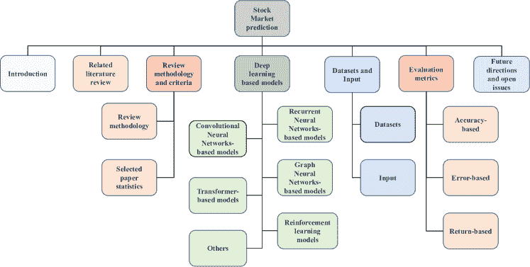
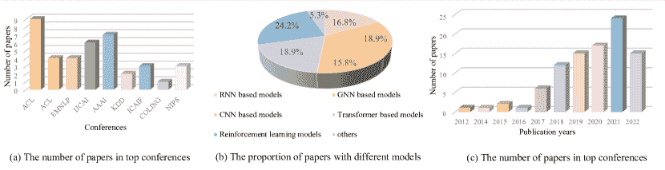
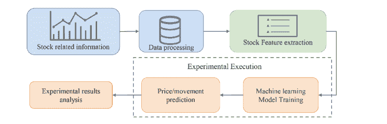
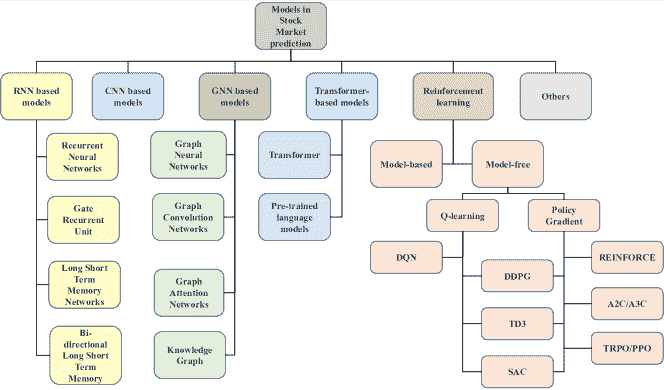
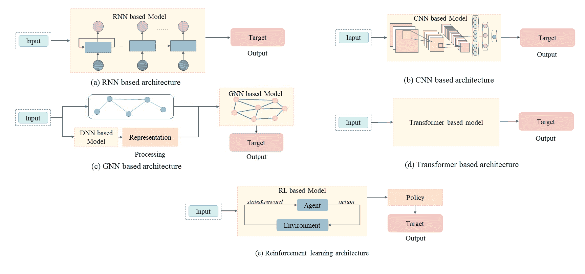
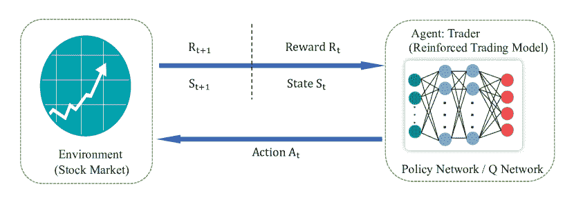

<!--yml

类别：未分类

日期：2024-09-06 19:42:42

-->

# [2212.12717] 基于深度学习技术的股票市场预测：综述

> 来源：[`ar5iv.labs.arxiv.org/html/2212.12717`](https://ar5iv.labs.arxiv.org/html/2212.12717)

\UseRawInputEncoding

# 基于深度学习技术的股票市场预测：综述

Jinan Zou jinan.zou@adelaide.edu.au，Qingying Zhao 阿德莱德大学澳大利亚，Yang Jiao 阿德莱德大学澳大利亚，Haiyao Cao 阿德莱德大学澳大利亚，Yanxi Liu 阿德莱德大学澳大利亚，Qingsen Yan 西北工业大学中国，Ehsan Abbasnejad 阿德莱德大学澳大利亚，Lingqiao Liu 阿德莱德大学澳大利亚和 Javen Qinfeng Shi 阿德莱德大学澳大利亚（2023）

###### 摘要。

现有的股票市场预测调查通常关注传统的机器学习方法，而不是深度学习方法。这激励我们提供对股票市场预测研究的结构化和全面的概述。我们展示了股票市场预测的四个详细子任务，并提出了一种新的分类法来总结基于深度神经网络的最新模型。此外，我们还提供了有关股票市场中常用数据集和评估指标的详细统计信息。最后，我们通过分享一些对股票市场预测的新视角，指出了几个未来的研究方向。

深度学习，机器学习，金融，金融中的人工智能，股票市场预测^†^†版权：acmcopyright^†^†期刊年：2023^†^†doi：XXXXXXX.XXXXXXX^†^†ccs：应用计算 经济学^†^†ccs：计算方法 人工智能；机器学习

## 1\. 引言

金融市场在塑造全球经济发展中发挥着至关重要的作用。随着股票市场在经济领域中的重要性日益增加，它吸引了公众越来越多的关注。一种解释金融资产定价和股票市场波动原因的理论是有效市场假说（Malkiel, 2003）。有效市场假说认为，在一个合法健全、运作良好、透明且具有竞争力的股票市场中，理性投资者可以迅速且理性地对所有市场信息做出反应。因此，股票价格将准确、充分且及时地反映所有重要事实，包括公司当前和未来的价值。然而，股票价格的波动受到复杂因素的影响，包括公司盈利报告、国家政策、影响力股东以及专家对时事的预测。因此，需要利用机器学习技术进行股票市场预测任务，如股票走势预测、股票价格预测、投资组合管理和交易策略。

股市的特点是既有不确定性又有变异性，这使得准确预测市场趋势具有挑战性。为提高预测的准确性并缓解这些困难，已采用机器学习技术进行股价预测。从历史上看，传统模型如基于决策树的模型（Vu et al., 2012; Nugroho et al., 2014; Kamble, 2017）和支持向量机（SVM）（Xie et al., 2013）曾被用于股市预测。

随着深度学习模型的发展，预测股市的方法已经从传统技术转变为先进的深度学习技术，如递归神经网络（RNNs）、长短期记忆网络（LSTM）、门控递归单元（GRUs）、图神经网络（GNNs）和卷积神经网络（CNNs）。最近，研究人员也开始探索基于 Transformer 的模型和强化学习（RL）模型在股市预测中的应用。尽管已有大量关于股市预测的调查，但现有的调查（Atsalakis and Valavanis, 2009; Li and Ma, 2010; Ballings et al., 2015; Tkáč and Verner, 2016）存在一些局限性。例如，一些调查关注传统技术而未对最新进展如 Transformer 模型进行深入审查。此外，一些调查在模型分类上不够明确，也未使用权威标准。此外，许多之前研究中发现的挑战和未解问题已得到解决。本调查旨在填补这些空白，通过提供对最新技术和趋势的全面而有见地的概述来实现。通过审阅顶级会议的高质量论文，本调查总结了 Transformer 和 RL 等技术的最新进展，并提供了深入的分析和讨论。其目的是为研究人员、从业者和教育工作者提供系统的概述和对相关深度学习技术的全面理解，以及未来研究最有前景的方向。

本调查旨在通过对模型进行分类和分析其发表年份，以深入了解股市预测的进展。此外，本调查还旨在提供对每种模型在股市预测中的结构和应用的详细理解。

本调查的三个主要贡献如下：

+   •

    在本调查中，我们详细审查了股市预测，这涵盖了四项不同的任务：股票走势预测、股价预测、投资组合管理和交易策略。为进行这项研究，我们编制了一份包含 94 篇关注这些高度相关主题的论文的文献集。

+   •

    本调查介绍了一种新的深度学习分类系统，用于预测股票市场表现。所审阅的文献按照这一分类法组织，探索了各种深度学习模型，如 RNN、CNN、GNN、Transformer 和 RL。此外，调查汇总了这些研究中使用的数据集、评估技术和模型输入。

+   •

    在这项研究中，我们深入探讨了基于深度学习的股票市场预测所面临的未解决挑战，并对该领域未来的研究方向进行了详细的洞察。

调查组织。该调查分为八个部分。调查的层级结构如图 1 所示。第一部分概述了股票市场预测的背景、研究动机和目标。在第二部分，回顾了该主题的以往调查，并指出了它们的局限性和改进方向。第三部分详细说明了审阅论文所采用的方法，包括分类标准，如会议、模型和出版年份。第四部分讨论了在股票市场预测中使用的各种深度学习模型，并根据模型类型分析了相关论文。第五部分讨论了所审阅方法中使用的数据集和模型输入特征。第六部分介绍了股票市场预测中常用的评估指标。第七部分重点关注该领域的未解决问题和未来可能的发展。调查以第八部分的总结作为结尾。

图 1\. 本调查的层级结构，共分为八个部分。

## 2\. 相关工作

在以往的股票预测研究中，传统方法如 SVM、回归和 KNN 被广泛使用。然而，随着神经网络的发展，股票预测研究逐渐转向利用这些网络。Atsalakis 和 Valavanis（Atsalakis and Valavanis，2009）对 100 篇股票市场预测的论文进行了调查，重点关注神经网络和神经模糊技术。他们通过比较不同的股票市场、输入变量、预测方法和评估指标，对 1990 年至 2006 年间发表的论文进行了分类和分析。Li 和 Ma（Li and Ma，2010）发布了一项关于在金融市场应用中使用人工神经网络的调查，包括股票价格预测和期权定价。Ballings 等（Ballings et al.，2015）关注于股票价格预测中的集成方法的分类器模型和单一分类器模型。集成方法包括随机森林、Adaboost 和 Kernel Factory，而单一分类器模型包括神经网络、线性回归、SVM 和 K-最近邻。这是首次进行广泛基准测试的研究。Tkac 和 Verner（Tkáč and Verner，2016）对 1994 年至 2015 年间发布的 412 篇关于人工神经网络在金融行业商业应用的论文进行了系统概述。该调查的主要应用包括金融困境、破产问题以及股票价格预测的决策支持，重点是分类任务。Cavalcante 等（Cavalcante et al.，2016）回顾了 2009 年至 2015 年在金融应用中使用各种机器学习算法的影响力论文，并讨论了该领域的挑战和未解决的问题。主要的机器学习方法包括人工神经网络、SVM、混合方法、优化方法和集成方法。应用包括预处理和聚类金融数据、预测未来市场趋势以及挖掘金融文本信息。Li 等（Li et al.，2017a）调查了 2007 年至 2016 年 229 篇研究网络媒体与股票市场关系的论文，并提出了进一步研究的方向。他们提出了一种分类法，将机器学习技术分为统计模型、回归模型和基于机器学习的模型。神经网络模型包括贝叶斯分类器和 SVM。Xing、Cambria 和 Welsch（Xing et al.，2018）研究了应用自然语言处理方法于金融预测任务的论文，主要关注三个方面：不同类型的文本来源、算法和基于不同评估指标的结果。文本来源包括新闻、社交媒体、财务报告和留言板。模型类型包括回归、SVM、集成学习和 CNN。Nti、Adekoya 和 Weyori（Nti et al.，2020）回顾了 2007 年至 2018 年的论文，重点关注三类分析：技术分析、基本面分析和综合分析。模型有限，只有三种技术得到充分讨论：决策树、SVM 和 ANN。Ersan、Nishioka 和 Scherp（Ersan et al.，2020）也专注于三种预测模型：KNN、ANN 和 SVM。本调查旨在对 DAX 30 和 S&P 500 数据集在日级和小时级别上各种机器学习方法进行比较。

最近关于股票市场预测的调查主要集中在深度学习技术上，如 CNN、RNN 和 GNN。江（2021）在这方面表现突出，因为它考虑了研究的实施和可重复性。具体而言，论文突出了实施过程中使用的主要工具，包括 Keras、TensorFlow、PyTorch、Theano 和 scikit-learn。还调查了几篇论文的数据和代码可用性，以展示可重复性。这项研究强调了深度学习方法在股票市场预测中的最新进展。Thakkar 和 Chaudhari（Thakkar 和 Chaudhari，2021）考察了基于深度学习的神经网络方法在股票市场预测中的应用。该研究总结并分析了 2017 至 2020 年的论文中提出的需求、挑战和未来方向。Kumbure 等人（Kumbure 等，2022）对 2000 至 2019 年间发表的 138 篇关于股票市场预测的期刊文章进行了文献综述。该调查特别关注数据集中的特征和独特变量。调查将深度学习方法分为两组：有监督和无监督的机器学习方法。然而，一些调查仍未包括最新的技术，如 Transformer 和预训练的 BERT 模型，这些也在本调查中进行了评审。

以前的调查广泛涵盖了传统方法和较旧的神经网络技术，但在理解当前研究趋势方面存在空白。最近的调查未能全面更新以纳入最新技术。此外，一些现有的调查（Thakkar 和 Chaudhari，2021；Kumbure 等，2022；江，2021；李等，2017a；胡等，2021；库马尔等，2021）没有充分按目标分类论文或只关注股票市场预测任务。鉴于对包含最新技术的股票市场预测更新调查的需求，本调查提出了一种新的深度学习模型分类方法，并旨在提供更全面和最新的分析。重点将放在较新的论文和最先进的技术上。

## 3. 综述方法论和标准

图 2. 三个图展示了根据不同标准的论文统计数据。

### 3.1. 综述方法论

在本研究中，我们关注与股市预测相关的文献。为了收集全面的论文，我们实施了以下策略。首先，我们将时间范围限制在过去十年内。接着，我们确定了主要的自然语言处理（NLP）和人工智能（AI）会议，包括 ACL、EMNLP、AAAI、IJCAI、ICAIF、NeurIPS 和 KDD。在这些会议中，我们使用了特定关键词如股票预测、市场、金融和投资组合，通过 Google Scholar 搜索引擎进行检索。我们还包括了深度学习模型的名称作为关键词，如 RNN、LSTM、GNN、Transformer 和 RL。通过使用这些关键词，我们能够找到与股市预测、金融、交易和投资组合相关的论文。随后，我们使用机器学习过滤了预测股市的论文。经过筛选，我们选择了 42 篇与股票预测相关的高质量论文。在排除内容少于两页的论文后，筛选出了 39 篇论文。通过阅读这些 39 篇论文中引用的论文，我们还将期刊和会议中的顶级论文纳入了我们的研究论文列表。总之，这项调查包括了 94 篇涵盖多种深度学习方法的高质量论文。

### 3.2\. 选择的论文统计

本节通过各种图表展示了调查中包括的股票市场预测论文的统计数据。首先，论文按顶级会议进行分组。图 2(a) 显示了来自顶级会议的论文数量，如 ACL¹¹1 计算语言学协会年会、NAACL²²2 北美计算语言学协会会议、EMNLP³³3 自然语言处理中的实证方法、AAAI⁴⁴4 人工智能进步协会、IJCAI⁵⁵5 国际人工智能联合会议、ICAIF⁶⁶6ACM 国际金融人工智能会议、NeurIPS⁷⁷7 神经信息处理系统大会和研讨会、ICML⁸⁸8 国际机器学习会议、ICLR⁹⁹9 学习表示国际会议以及 KDD¹⁰¹⁰10 知识发现与数据挖掘会议。从图 2(a) 可以看出，共包括了 39 篇高质量论文。ACL 和 AAAI 的会议中关于股票市场预测的论文最多。图 2(b) 说明了使用五种不同模型的论文比例。本次调查涵盖了所有提到的模型类型，每种模型的论文数均超过 15 篇。调查包括了先进的模型，如基于 Transformer 的模型和强化学习模型，分别占 18.9%和 24.2%。图 2(c) 显示了按出版年份划分的论文数量。本次调查中最大比例的论文发表于 2021 年，共 24 篇。在 2012 年至 2016 年的五年期间，共有 11 篇论文。

## 4\. 机器学习中的股票市场预测

### 4.1\. 股票预测相关任务

在深入探讨深度学习模型的具体细节之前，我们首先会定义四个关键的股票市场预测任务，并提供与每个任务相关的概念概述。这些任务包括股票价格预测、股票走势预测、投资组合管理和交易策略。这些类别涵盖了现有大多数股票市场预测任务。

+   •

    股票价格预测。利用时间序列数据进行股票价格预测的目标是通过研究人员预测股票和交易所金融资产的未来价值。这一预测的终极目标是实现可观的利润。此外，还有各种因素影响预测过程，包括心理因素以及理性和非理性行为。所有这些因素共同作用，使得股票价格动态且波动。

+   •

    股票走势预测。股票走势预测的任务通常将股票趋势分为三类：上升趋势、下降趋势和横盘趋势。该任务通过分析股票在一定交易日内调整后的收盘价格的差异来形式化。

+   •

    投资组合管理。投资组合管理涉及对投资组合的战略选择和监督，旨在实现财务目标。投资组合管理的目标是以最大化回报的方式分配资源，同时最小化风险。

+   •

    交易策略。交易策略是一套预先制定的指导方针和标准，用于制定交易决策，它是买卖股票的系统方法。交易策略可以从简单到复杂不等，考虑的因素包括投资风格（如价值型与成长型）、市值、技术指标、基本面分析、投资组合多样化程度、风险承受能力和杠杆。在利用深度学习的股票市场预测任务中，常见的交易策略包括事件驱动、数据驱动和政策优化。

上述任务围绕股票市场预测的过程。为了提供对基于深度学习的方法的全面理解，图 3 展示了预测过程。第一步涉及处理输入数据，包括股票数据、图表和文本。之后，选择和收集相关的股票特征。接下来，将提取的特征输入深度学习模型进行训练。最后，将获得并分析模型的实验结果。

图 3。处理框架。

### 4.2\. 基于深度学习的模型

图 4。根据模型对股票市场预测论文的分类方法。

图 5。主流深度学习模型在股市预测中的总体视图。

我们根据模型对论文进行了分类，并在图 4 中展示了不同的模型。图 5 提供了用于股市预测的主流深度学习模型的一般概述。这些模型包括：基于 RNN 的模型（图 5(a)），基于 CNN 的模型（图 5(b)），基于 GNN 的模型（图 5(c)），RL 模型（图 5(d)），基于 Transformer 的模型（图 5(e)），以及其他独特的方法。这些模型的输入可以是股价相关数据、文本数据和公司之间的关系，模型根据论文中概述的目标生成输出。

### 4.3\. 基于递归神经网络的模型

RNN，如 (Rumelhart et al., 1986) 中所述，是一种能够高效处理序列数据的深度学习模型。股票市场数据通常以时间序列形式表示，这使得 RNN 成为通过建模历史数据进行预测的理想选择。然而，RNN 在处理长期数据时存在梯度消失的问题。为了解决这个问题，开发了几种 RNN 变体，包括 LSTM (Hochreiter and Schmidhuber, 1997)、GRU (Cho et al., 2014) 和双向 LSTM (Bi-LSTM) (Graves and Schmidhuber, 2005)。RNN 可以被视为多个相同网络单元的递归组合，其中每个单元的输出作为输入提供给下一个单元 (Lei, 2021)。每个单元包含一组输入、隐藏和输出单元。LSTM 单元有三个门控，更新门、遗忘门和输出门，帮助控制短期和长期记忆。GRU 模型是 LSTM 模型的改进，它将输入门和遗忘门合并为更新门，并添加了重置门来控制需要遗忘的信息 (Cho et al., 2014)。这些模型改进了 RNN，并在股票市场预测中取得了显著进展。

循环神经网络（RNN）。RNN 是一个成熟的深度学习模型，已被应用于股票预测。然而，近年来，研究人员通过探索 RNN 与其他机器学习技术的混合应用来提升其性能。Agarwal 和 Sastry (Rather et al., 2015) 提出了一个新颖且稳健的混合预测模型（HPM），结合了三种预测模型：RNN、指数平滑（ES）和自回归滑动平均模型（ARMA）。他们还使用遗传算法来优化模型，提供最佳权重，从而显著提高预测准确性。另一种方法，由 Zhang、Aggarwal 和 Qi (Zhang et al., 2017) 提出，是基于 RNN 的状态频率记忆（SFM），能够捕捉股票市场中频繁交易模式的波动。

长短期记忆（LSTM）。LSTM 模型具有有效处理文本和时间序列数据的能力，使其成为股票市场预测的理想选择。LSTM 通过使用梯度方法解决了在较长时间间隔内保留信息的问题，相比于 RNN 模型有了改进。例如，Akita 等人（Akita et al., 2016）提出了一种段落向量方法来表示文本信息，并利用 LSTM 进行预测模型。在该实验中，十家公司被表示为十篇文章，其中文章的向量表示为 $P_{t}$。这些公司的价格在单一时间点 $t$ 被表示为 $\{c1,c2…,c10\}$ 并串联为股票价格向量 $N_{t}$。LSTM 的输入是 $P_{t}$ 和 $N_{t}$ 的组合。LSTM 在开盘价格预测上显著优于基线模型，多层感知器（MLP）、支持向量回归（SVR）和简单 RNN。另一个例子，Ma 等人（Ma et al., 2019）提出了 News2vec 模型，其中稠密向量表示新闻特征。他们使用 LSTM 结合自注意力机制作为预测模型。这个文本嵌入模型 News2vec 帮助揭示新闻与事件元素之间的潜在关系。Nelson、Pereira 和 Oliveira（Nelson et al., 2017）使用 LSTM 进行股票运动预测，但模型输入为数值信息，包括股票价格和成交量。

在股票预测研究中，通常将股票价格处理为时间序列分析，但很少有研究者考虑数据的潜在时间依赖性。赵等人（赵等人，2017）提出了一种时间加权 LSTM 模型与趋势回撤，该模型根据数据与待预测数据的时间接近程度为数据分配权重。为了提高预测性能，提出了混合模型，即将 LSTM 与其他模型结合。Polamuri 等人（Polamuri 等人，2021）提出了基于生成对抗网络的混合预测算法（GAN-HPA），用于实现从 GAN 框架开发的 Stock-GAN。该框架接受各种输入，如股票数据集和超参数。使用线性和非线性模型从数据集中提取特征，超参数和预处理结果作为 LSTM 的输入。生成器的输出和原始数据提供给鉴别器，并使用贝叶斯近似调整参数和更新预测结果。王等人（王等人，2021d）通过提出一种从交易数据中动态提取金融市场趋势潜在表示的方法做出了重要贡献。他们提出了一种基于卷积 LSTM 的变分序列到序列模型（CLVSA），该模型结合了卷积 LSTM 单元和具有自注意力和互注意力机制的序列到序列框架。

阮和尹（阮和尹，2019）开发了一种名为相关股票信息深度迁移（DTRSI）的框架，该框架考虑了股票之间的关系来预测股票价格走势。为实现这一目标，作者在大规模数据的预训练中使用了 LSTM 单元来优化参数，然后使用少量目标数据对基础模型进行微调，以获得最终模型。这种方法解决了由于样本量小而导致的过拟合问题，并考虑了股票之间的关系。

对抗训练通过引入扰动来模拟股票价格波动，从而增强股票走势预测的准确性。2019 年，冯等人（冯等人，2018）提出了一种结合了注意力 LSTM 和对抗训练的方法来预测股市走势。另一种同时预测多个股票价格的方法是丁和秦（丁和秦，2020）提出的关联网络模型，该模型由三个分支组成，分别预测开盘价、最低价和最高价。

陈等人（陈等，2019）在其模型中使用 Bi-LSTM 对股票数据和金融新闻表示进行编码，即结构化股票预测模型（SSPM）和多任务结构化股票预测模型（MSSPM）。他们还结合了包含事件角色嵌入的交易事件表示，这些角色是使用$Standford$ $CoreNLP^{2}$工具提取的主语和宾语（Rather 等，2015）。MSSPM 模型独特地在股票预测和事件提取任务上进行训练，因为作者认为这些任务具有内在关系，准确的提取结果将有利于股票预测结果。为了进行时间感知预测，Sawhney 等人（Sawhney 等，2021a）提出了一种名为 FAST 的层次学习方法，用于根据预期利润对股票进行排名。该模型使用时间感知 LSTM 来建模新闻和推文中的时间不规则性。FAST 模型展示了在 S&P 500 和中国 A 股指数的模拟中考虑文本细粒度时间不规则性的积极效果。

李和潘（李和潘，2022）提出股票价格受到多种因素的影响，并提出了一个结合了 LSTM 和 GRU 的集成深度学习模型。他们还通过参考心理学和经济学理论来确定文本信息的窗口大小，以考虑新闻的持久或短暂影响。

门控递归单元（GRU）。GRU 是 LSTM 的一种变体，已被发现对股票市场预测表现良好。它们通过减少单元的数量来解决梯度消失的问题，并提高训练速度（Cho 等，2014）。受到秦等人（秦等，2017）提出的双阶段注意力基于 RNN 的时间序列预测工作的启发，杨等人（杨等，2018b）提出了一种基于 GRU 网络的双层注意力机制用于股票价格预测。该机制根据金融新闻标题对股票价格的影响分配不同的权重，着重解释预测原因，并避免自然语言处理工具的错误。类似地，李、申和朱（李等，2018b）提出了一种新颖的多输入 LSTM（MI-LSTM）模型，利用注意力机制区分主要和辅助因素，并为这些输入分配不同的权重，以防止不相关因素对最终结果的影响。

为了解决混乱新闻的挑战，Hu 等人（Hu et al., 2018）开发了一种混合注意网络（HAN），其中包含自适应学习机制。该方法考虑了金融新闻的可信度和全面性。HAN 由两个注意层组成，一个在新闻层面，另一个在时间层面。还利用了双向 GRU 层对语料向量的时间序列进行编码。经过回测，模拟交易中的年化收益率得到了显著改善。同样，Wang 等人（Wang et al., 2020）提出了一个结合专家意见的股票预测框架。多视角融合网络立场检测模型（MFN）框架利用来自多个视角的文本特征和相关金融领域知识来确定文本的上涨和下跌投资意见。然后使用立场聚合模块，根据动态专家挖掘过程识别和聚合高质量意见。最后，股票预测模块使用从前两个部分输入的专家意见指标来预测个别股票的未来趋势。预测组件利用 GRU 对时间序列特征进行编码，并通过时间感知注意机制动态地结合股票中的隐状态。该模型通过使用真实世界数据集进行了验证，证明了其在投资建议和个别股票预测中的有效性。

为了应对由于动态不平滑和市场复杂依赖性导致的股票趋势预测难题，Wang 等人（Wang et al., 2021c）在 2021 年引入了一种新的分层自适应时间-关系网络（HATR），用于描述和预测股票的演变。HATR 模型通过使用扩展的因果卷积和门控路径，捕捉了股票交易序列的多尺度局部组合中的短期和长期过渡特征。该模型建立在他们之前的工作基础上，后者利用了带有 Hawkes 过程的双重注意机制和特定目标查询，以根据个别股票特征检测关键时间点和尺度。此外，为了揭示股票之间的隐含相互依赖关系，作者还加入了一个多图交互模块，该模块将先验领域知识与数据驱动的自适应学习相结合。

### 4.4. 卷积神经网络基础模型

CNNs 在计算机视觉（CV）和自然语言处理（NLP）任务中的有效性已经得到了广泛研究（Ismail Fawaz et al., 2019）。一个 CNN 模型由几个卷积层和池化层组成，这些层用于特征提取。传统的卷积层使用二维滤波器（核）和激活函数来处理图像特征。然而，在股票预测领域，CNNs 用于处理时间序列数据，这些数据是一维特征。为了适应这种数据形状的差异，时间序列的 CNNs 使用一维滤波器，该滤波器在时间序列上滑动，步幅由数据的粒度决定。

人们普遍认为 CNNs 通过使用卷积层擅长捕捉重要特征，从而在预测股票波动方面表现出色。Selvin 等人（Selvin et al., 2017）支持这一观点。此外，Ding 等人（Ding et al., 2015）通过将 CNN 融入训练输入历史事件嵌入的方法（Ding et al., 2014）来改进事件嵌入方法，其中池化层有效地提取了代表性事件历史特征。基于 CNN 的通用预测器（U-CNN pred）（Hoseinzade et al., 2019）使用分层方法进行训练，其中子 CNN 层按顺序预训练，直到完成所提出的模型结构。由于其浅层结构，该模型显示了合理的结果，并被证明有效，因为较少的权重需要学习，从而降低了过拟合的风险。

为了充分利用工业关系中包含的信息，一些模型将知识图谱与卷积神经网络（CNNs）结合起来，以提高性能。其中一个模型是由 Deng 等人提出的知识驱动时序卷积网络（KDTCN）（Deng et al., 2019）。该模型利用开放信息提取（Open IE）（Etzioni et al., 2008）来提取与知识图谱相关的事件，并做出可解释的股票预测。传统的一维卷积层的一个常见问题是数据泄漏，即时间$t-1$和$t+1$的信息可能会影响时间$t$的数据。为了解决这个问题，KDTCN 模型采用了因果卷积，只使用来自当前和前一个时间步的信息。KDTCN 模型在通过提取价格时间序列中的重要特征来解释突发价格变化方面已被证明有效（Deng et al., 2019）。

CNN 和 LSTM 的结合可以进一步增强时间序列预测。Lu 等人（Lu et al., 2020）提出了一种 CNN-LSTM 模型用于预测每日股票收盘价，其中 CNN 组件从 10 天的历史数据时间序列中提取特征，LSTM 组件进行价格预测。在后续的研究中，Lu 等人（Lu et al., 2021）提出了一种 CNN-BiLSTM-AM 模型，该模型引入了注意力机制，以捕捉历史上影响价格时间序列的股票波动，并提高 CNN 基础模型的性能。Wang 等人（Wang et al., 2021e）也提出了一种 CNN-BiLSTM 模型用于股票收盘价预测，并通过在 Bi-LSTM 的输出门中添加 tanh 函数来提高模型的性能。Mehtab 和 Sen（Mehtab and Sen, 2020）提出了一种单变量卷积 LSTM 模型用于预测印度股票的开盘价，并通过将 10 天时间序列划分为两个 5 天的数据序列来提高模型的性能，从而使卷积层能够提取更多的历史数据特征。此外，最近也有研究表明 GRU 在处理任务中表现高效。Zhou、Zhou 和 Wang（Zhou et al., 2022）提出了一种由 CNN 和双向 GRU 组成的集成股票市场预测模型，该模型基于特征选择。CNN 负责特征提取，而 GRU 负责处理时间序列数据。他们使用股票市场的收盘价作为模型输出，其他所有数据作为输入，得到了比其他基本模型更少的误差。

一些近期研究探讨了知识图谱、LSTM 和 CNN 在股票预测中的集成。Wu 等人（Wu et al.，2020）开发了一个基于 CNN 的框架，利用历史股价和未来数据，如领先的金融指标。在他们的后续工作中（Wu et al.，2021），他们提出了一个基于图的 CNN-LSTM 模型，该模型使用由期权图像、未来图像和历史图像组成的组合图像。该图像包含 30 天的信息，包括特定股票的股价和金融指标。组合图像的行表示时间序列变化，而列表示输入 CNN-LSTM 模型的特征。为了应对模糊系统中的过拟合和收敛缓慢问题，Chandar（Chandar，2022）开发了一个强健的股票交易模型。该模型从历史股市数据中提取了十个技术指标，并将其作为特征向量。通过设置数据范围，提高了收敛速度。这些特征向量随后被转换为图像，作为 CNN 模型的输入，以获取标记的卖点、买点和持有点。CNN 模型中添加的丢弃层有助于防止过拟合。该模型的有效性通过准确率和 F1 分数进行衡量。

### 4.5\. 基于图神经网络的模型

GNN 是一种处理图形数据的人工神经网络，如（Scarselli 等，2008）中所述。它们在股市预测中发挥着重要作用，因为它们能够处理不规则结构的数据，这与为欧几里得结构数据设计的 CNN 不同。GNN 的结构由节点和边组成，这使得它能够建模实体之间的关系。在股市预测的背景下，节点通常代表公司或股票，而边代表它们之间的关系。例如，相关公司的股价往往同时波动，例如在发布好消息时，相应的股票会立即上涨。这突显了在进行预测时考虑关系的重要性。本章将探讨四种主要的基于图的模型：GNN，图卷积网络（GCN）（Kipf 和 Welling，2016），以及图注意力网络（GAT）。

图神经网络（GNN）。松永、铃村和高桥（Matsunaga et al., 2019）采用知识图谱将公司信息与 GNN 模型整合，作为预测个别股票表现的一种手段。知识图谱的使用使得在股票市场预测的背景下能够表示公司实体之间的关系。该论文的一个关键贡献是利用滚动窗口分析的回测方法。类似地，丁等人（Ding et al., 2016）在其之前的事件驱动工作（Ding et al., 2014, 2015）的基础上，引入了一个知识图谱神经张量网络（NTN）模型。该模型对表示提取事件实体之间关系的实体向量进行编码，并将其输入到事件嵌入学习过程中，从而解决了事件嵌入在揭示事件之间句法或语义关系方面的局限性。

徐等人（Xu et al., 2022）通过引入层次图神经网络（HGNN）解决了股票价格涨停预测的挑战。该模型通过构建股票市场关系图，考虑了市场状态的各种属性，并以层次化的方式从节点视图、关系视图和图视图等多个角度提取信息。HGNN 在分类涨停股票类型方面取得了优异的结果，并提高了投资回报率。类似地，李等人（Li et al., 2022b）提出了一种基于 GNN 的模型，通过融合多源异构子图来预测股票市场。该研究使用的数据集包括三种类型的子图，分别表示股票市场指数、股票市场新闻和图形指标之间的关系。将这些子图融合后，转化为一个完全连接的分类层以进行预测。Ang 和 Lim（Xu et al., 2022）利用图编码模块在公司关系之间传播多模态信息。此外，他们引入了一个注意力模块，用于捕捉公司之间关系和不同模态中的全局和局部信息。该模型在三个预测任务和两个实际数据集应用上表现稳健。

图卷积网络（GCN）。GCN 是一种深度学习模型，专门设计用于处理图数据，它使用图卷积层从图中提取特征，并基于图中节点之间的关系进行预测。GCN 通常与其他深度学习模型结合使用。例如，陈和魏（Chen et al., 2018）提出了一种管道预测模型，该模型通过使用 GCN 模型来整合公司之间的关系。在这个模型中，每个公司都被表示为图中的一个节点，边表示公司之间的关系，边的权重表示持股比例。此外，基于 LSTM 的编码层用于编码公司历史特征，从而提高性能。同样，李等人（Li et al., 2021a）提出了一种 LSTM 关系图卷积网络（LSTM-RGCN）模型，处理股票之间的正相关和负相关。公司之间的相关矩阵是基于历史市场数据计算的，RGCN 层中添加的 LSTM 机制有助于缓解预测隔夜股票价格变动时的过平滑问题。同时，引入了一种新颖的门控时间卷积来学习股票特征的时间演变。

一些现有模型旨在捕捉股票价格和新闻信息之间的时间依赖性。然而，它们未能充分利用其他高度相关股票的信息。为了解决这个问题，尹等人（Yin et al., 2021）提出了一种集成了 GCN 和 GRU 的图卷积网络模型。GCN 从具有高度相似性的股票中提取特征，然后将这些特征输入到 GRU 模型中以捕捉时间依赖性。另一种考虑股票之间关系的方法是由冯等人（Feng et al., 2019）提出的关系股票排名（RSR）框架。RSR 框架由三层组成：使用 LSTM 的序列嵌入层、关系嵌入层和预测层。此外，他们提出了一种时间图卷积模型来解决排名问题。Sawhney 等人提出了时空超图卷积网络（STHGCN）（Sawhney et al., 2020b），这是一种显著的方法，使用超图结构来建模股票之间的关系，并应用空间超图卷积。这是首个超图学习方法。

预测个别股票价格的波动可能是一项困难的任务，因为有各种因素，如公司运营和公众意见。然而，股票市场指数提供了一种更可靠的方式来理解特定行业或公司在股票市场上的整体趋势，因为它们不容易受到单一公司变量的影响。在最近的一项研究中，王等人（王等，2022）利用 GCN 分析股票趋势预测中指标的相关性。他们介绍了基于多图卷积神经网络的 MG-Conv 模型，该模型利用由成分股票数据构建的静态图。此外，他们还基于不同投资组合策略的指数趋势相关性创建了动态图，并根据这两种图定义了多图卷积操作。

图注意网络（GAT）。图注意网络（GAT）结合了 GNN 和注意层的优势，以提高在大规模图中的表现。注意机制有助于集中关注最重要的节点，减少复杂背景噪声的影响，提升信噪比。此外，注意机制还可以利用节点间的互连性和层次结构连接，以增强任务相关信息。金等人（金等，2019）提出了使用层次注意网络（HATs）来预测个别股票价格和市场指数波动，利用关系数据。HATs 采用 LSTM 和 GRU 作为这些任务的特征提取模块，通过聚合不同类型的数据并将这些信息添加到每个表示中，比以前的方法取得了更好的结果。类似地，Sawhney 等人（Sawhney 等，2020a）提出了一种多角度注意网络用于股票预测（MAN-SF），该网络融合了来自金融数据、社交媒体和公司间关系的信息，通过层次注意训练 GAT。

预测特定公司的趋势的一种方法是使用基于公司间预先建立关系的 GCN。然而，通过各种公司连接可能发生动量溢出，其重要性可能随着时间的推移而变化。程和李（程和李，2021）引入了一种属性驱动的图注意网络（AD-GAT），以捕捉这些属性驱动的动量溢出。该网络利用未屏蔽的注意机制来推断市场信号中的动态公司关系，利用基于张量的特征提取模块。与 GCN、eLSTM（李等，2021c）和 TGC（冯等，2019）相比，该模型在使用三年 S&P 500 数据的实验中被发现更准确，AUC 更高。

### 4.6. 基于 Transformer 的模型

CNNs 在处理空间数据方面表现出色，通过创建二维信息的内部表示。此外，RNNs 更适合处理涉及时间序列数据的任务，例如金融新闻、推文和股票价格时间序列。然而，RNNs 可能在处理长序列时遇到困难，因为模型可能会遗忘远处位置的内容或混淆相邻位置的内容。变换器通过利用自注意力机制和位置嵌入来处理句子，从而解决了这个问题。因此，变换器模型在各种股票市场预测任务中显示出有希望的结果。

基于变换器的模型。为了提升股票波动模型，Ramos-Pérez 等人（Ramos-Pérez et al., 2021）实施了机器学习和深度学习技术。他们提出了多变换器模型，这是现有变换器模型的一种变体，利用了随机选择各种训练数据子集的策略，并结合多重注意力方法来提高注意力过程的稳定性和准确性。同样，Ding 等人（Ding et al., 2020）介绍了层次多尺度高斯变换器来预测股票走势。他们通过结合多尺度高斯先验和优化局部性来改进传统变换器，并实施正交正则化以防止在多重注意力下出现冗余学习头。此外，他们还为变换器开发了交易间隙分割器，以帮助学习高频金融数据的结构层次。

Transformer 模型已被证明能有效捕捉长期依赖性，使其非常适合解决与时间依赖相关的问题。Li 等人（Li et al., 2022a）提出了一种新型的 Transformer 编码器注意力（TEA）框架，该框架利用注意力机制来解决金融数据中的时间依赖问题，并揭示与社交媒体文本相关的股价隐藏信息。TEA 模型采用了特征提取器和级联处理器架构，包括 Transformer 编码器、注意力机制和归一化技术。特征提取器有效地从过去的文本和股价中收集信息，涵盖五个日历日，以提取关键数据。同样，Zhang 等人（Zhang et al., 2022）引入了基于 Transformer 的注意力网络（TEANet）架构，利用五个日历日的数据来处理时间依赖问题。TEANet 框架包括一个深层文本特征提取器，该提取器利用 Transformer 和连接处理器，能够有效地融合和平衡各种元素的影响，如推文和市场价格。Yoo 等人（Yoo et al., 2021）通过利用多种股票之间的关联提高了预测准确性。为此，他们引入了具有多层上下文的 Data-axis Transformer（DTML）。DTML 模型在端到端的方法中建立了非对称和动态的关联，以学习股票之间的关系，并为所有个别股票提供最终预测。

许多利用基于 Transformer 的模型的研究采用文本信息作为输入，以理解股票相关新闻媒体中的情感。金融新闻情感分析的目标是预测市场对文本中潜在信息的反应（Yang et al., 2020b）。根据 Li et al.（Li et al., 2017b），社会情感在反映公众对股票趋势的观点方面发挥了关键作用。为了收集这些信息，团队从社交平台和金融新闻文章中收集了社会情感和专业意见。这些数据被输入到一个张量 Transformer 中进行模型训练，这有助于消除噪声并捕捉更多的内在关系。经过训练的模型可以用来探讨社会情感对各种数据源的影响和功能。Liu et al.（Liu et al., 2019）认为，现有的基于社交媒体的股票预测算法仅考虑了单个股票的语义和相关性，但未能考虑到广泛社交媒体平台上存在的矛盾信息。他们提出了一种基于 Transformer 编码器的 Capsule 网络（CapTE）作为解决方案，其中包括一个 Transformer 编码器，以捕捉推文中的深层语义特征和结构化关系。Yang et al.（Yang et al., 2020a）提出了一种分层的、基于 Transformer 的多任务（HTML）模型，用于预测短期和长期资产波动。此外，他们除了使用常见的新闻和财务报告外，还利用了音频数据来进行预测。

Chen et al.（Chen et al., 2022）介绍了 Gated Three-Tower Transformer（GT3）作为提取和集成多变量股票时间序列的解决方案。为了解决感受野有限的问题，他们实现了 Shifted Window Tower Encoder（CWTE），以从数据嵌入中捕捉通道级特征。为了提取和聚合多尺度时间信息，团队开发了 Shifted Window Tower Encoder（SWTE），具有多时间尺度聚合。为了进行复杂的文本特征提取，团队使用了基础的 Transformer 编码器作为 Text Tower Encoder（TTE）。此外，还实施了 Cross-Tower Attention 方法，以帮助模型理解市场趋势和社交媒体内容传达的意义。然后通过自适应门控层融合 CWTE、SWTE 和 TTE 的特征，以获得高效且准确的结果。

预训练语言模型。BERT，一种基于 Transformer 架构的语言模型，已成为自然语言处理任务中预训练的热门选择（Devlin et al., 2019）。该模型利用了两种独特的训练方法，即掩蔽语言建模（MLM）和下一个句子预测（NSP）（Devlin et al., 2019），以理解单词之间的关系以及句子之间的长期依赖关系。此外，BERT 的预训练模型可以根据特定的使用场景进行微调。

财经新闻被认为是股票市场分析的重要信息来源，其对股票回报的影响已被充分记录（Li et al., 2014）。Dong 等人（Dong et al., 2020）提出了一种 BERT-LSTM 模型，该模型使用 BERT 根据社交媒体新闻提取股票价格的方向，而自回归 LSTM 将信息特征整合为协变量。该模型还利用历史价格趋势预测未来股票价格的变动。Sonkiya 等人（Sonkiya et al., 2021）使用 BERT 模型对关于苹果公司的新闻和头条进行情感分析。通过分析获得的情感分数作为输入向量用于生成对抗网络（GAN），其中包含了 GRU 和 CNN 作为生成器和判别器。GAN 能够连续生成数据，并区分真实和生成的股票价格样本，从而实现了期望的预测效果。该模型通过将情感分数作为输入来优化早期收敛。Colasanto 等人（Colasanto et al., 2022）通过利用基于 Transformer 的 AlBERTo（Polignano et al., 2019）改进了股票预测，用于对意大利社交媒体的情感分析。该模型计算了市场上可能影响股票的各种事件新闻的情感值。

一些研究者建议，除了依赖文本中的情感进行股票市场预测外，新闻评论也能影响投资者的情感，最终影响他们对市场趋势和投资决策的估计。Li 等（Li et al., 2020）使用了 BERT 预训练模型来评估和分类新闻网站上的投资者评论。他们采用了横截面回归分析方法来验证投资者情绪与股票收益之间的关系，利用两步横截面回归验证（Fama and MacBeth, 1973）来消除数据中的异方差性和一致性问题。Zhao 等（Zhao et al., 2022）也承认专家股票评论对准确预测股票的重要性，因此选择使用 BERT 来更全面准确地翻译专家的评论。他们指出，BERT 固定长度的文本输入可能导致在探索长文本信息时表现不佳。为了克服这一限制，他们采用了滑动窗口技术对原始文本进行分段，增加了样本量并减少了过拟合，从而捕捉长文本中的所有信息。此外，他们从 BERT 模型的每一层中提取了输出特征，并采用了消融策略以从这些特征中提取有用的信息。

BERT 在股票市场的应用不仅限于预测价格或走势。Zhou 等（Zhou et al., 2021）提出了一种基于 BERT 的双层模型，用于检测预定义的交易事件，并通过结合广泛的金融文本进一步增强了该模型。低层模型是一个多标签标记分类器，它为每个短语中的每个标记识别事件。高层模型将低层模型的输出与整篇文章结合，以确定每个事件发生的可能性。最终的交易策略基于识别出的时间和代码，利用字符串匹配来检测事件。Hsu 等（Hsu et al., 2021）采用了一种选择性扰动掩码（SPM）方法进行基于方面的情感分析。SPM 分析句子中每个单词的价值，并使用两种替换策略替换不重要的单词，而不影响方面层级的极性，以解决可读性和语义一致性问题。作者将 SPM 应用于股票价格和风险变化预测，作为情感分析的实际应用场景，并进一步评估了其在方面术语情感分类（ATSC）和方面术语提取（ATE）等子任务中的表现。

### 4.7\. 强化学习模型

图 6。在金融交易领域，代理（交易员）与环境（金融市场）之间的互动至关重要。RL 算法通过将金融市场和交易员分别视为环境和代理，来利用这种互动。在代理内部，不同的 RL 算法可能会结合使用策略网络和 Q 网络。金融数据和回报可以视为 RL 中的状态 $S$ 和奖励 $R$，而交易行为可以视为 RL 中的动作 $A$。

在股市中，RL 被用来设计交易策略和管理投资组合。RL 是一种通过与环境的互动进行学习的框架，如图 6 所示。RL 的关键概念包括马尔可夫决策过程（MDP）（Puterman, 2014）、代理、环境和奖励信号。RL 问题可以表述如下：代理通过与环境的互动来优化其策略。具体来说，代理由状态和策略组成，分别用 $S_{t}$ 和 $\pi$ 表示，在时间 t 时。当代理与环境互动时，会收到奖励 $r$，代理的状态更新为 $S_{t+1}$。如果下一个状态仅依赖于当前状态，则该决策过程被认为是马尔可夫的。

MDP 也可以以元组的形式定义：$\mathcal{M}=\{\mathcal{S},\mathcal{A},\mathcal{R},\mathcal{T},\gamma\}$，其中状态和动作分别由 $\mathcal{S}\in\mathbb{R}^{n}$ 和 $\mathcal{A}\in\mathbb{R}^{m}$ 表示。函数 $\mathcal{R}:\mathcal{S}\times\mathcal{A}\rightarrow\mathbb{R}$ 表示奖励，函数 $\mathcal{T}:\mathcal{S}\times\mathcal{A}\rightarrow\mathcal{S}$ 表示下一个状态。折扣因子 $\gamma$ 用于降低未来奖励的影响。RL 的目标是优化策略，以最大化期望回报。

一般交易过程，包括高频交易和投资组合管理，可以在图 6 中可视化。这个过程可以被形式化为决策过程，用 MDP 表示为$\mathcal{M}={\mathcal{S},\mathcal{A},\mathcal{R},\mathcal{T},\gamma}$。在这个 MDP 中，状态$s$包含公司的基本信息和市场数据，以及智能体持有的位置。动作$a_{t}$是一个连续或离散的向量，表示在给定时间步交易的股票数量。每个时间步的奖励$r$是该步骤获得的利润。状态转移$\mathcal{T}$由状态和动作共同决定。强化学习算法的目标是找到一个策略，以最大化在轨迹$\tau$上的期望回报$R=\underset{\tau}{E}[\sum_{i=1}^{\infty}\gamma^{t-1}r_{t}]$。

#### 4.7.1\. 无模型强化学习

无模型强化学习（RL）算法是近几十年发展起来的一个成熟分支，其中智能体直接与环境互动。在无模型设置中，策略梯度、Q 学习和混合算法在金融市场中广泛应用。

策略梯度。强化学习的目标是最大化期望回报。一种直接的方法是最大化目标函数$J(\pi_{\theta})=E_{\tau\sim\pi_{\theta}}[R(\tau)]$。这个函数的梯度称为策略梯度，记作$\nabla J(\pi_{\theta})$。通过使用对数导数技巧，梯度可以转化为：

| (1) |  | $\nabla_{\theta}J\left(\pi_{\theta}\right)=\underset{\tau\sim\pi_{\theta}}{\mathrm{E}}\left[\sum_{t=0}^{T}\nabla_{\theta}\log\pi_{\theta}\left(a_{t}\mid s_{t}\right)R(\tau)\right].$ |  |
| --- | --- | --- | --- |

REINFORCE 算法（Williams，1992）是基本的策略梯度算法。Advantage Actor-Critic（A2C）（Mnih 等，2016）算法通过添加基准来减少方差，并增加评论家来估计状态值，从而改进了 REINFORCE，评论家可以评估动作代币。为了提高 A2C 的效率，提出了异步优势演员-评论家（A3C）（Mnih 等，2016）算法，该算法使用多个智能体异步训练演员-评论家网络。信任区域策略优化（TRPO）（Schulman 等，2015）和近端策略优化算法（PPO）（Schulman 等，2017）分别对 KL 散度和剪辑设置了约束，限制了旧策略和新策略之间的差异，并在这些约束下采取最大的改进步骤。

REINFORCE 算法因其能够通过梯度上升进行优化而在金融交易领域获得了关注。例如，梁等人（Liang et al., 2018）评估了包括 DDPG、PPO 和 REINFORCE 在内的三种不同的强化学习算法在对抗性训练环境中的有效性，并发现 REINFORCE 表现最佳。这些实验是在中国股票市场进行的，作者建议基于策略梯度的方法特别适合金融场景。此外，通过使用具有递归网络的策略梯度将历史信息纳入状态也是一种有前途的方法。江、徐和梁（Jiang et al., 2017）开发了一种无模型的金融强化学习框架用于投资组合管理，该框架结合了 CNN、RNN 和 LSTM，并建立在确定性策略梯度（DPG）基础上。该框架在加密货币市场进行了测试，并且表现优于其他方法。

基于演员-评论员的方法已经被证明通过结合状态值来有效减少策略方差。李、饶和石（Li et al., 2018a）以及波诺马列夫、奥斯列德萨和齐霍基（Ponomarev et al., 2019）分别采用了演员-评论员方法（A2C 和 A3C）与 CNN 结合，用于分析中国股票市场和 RTS 指数期货。在他们的研究中，李、饶和石（Li et al., 2018a）发现他们提出的深度演员-评论员交易（DACT）策略优于购买持有、DQN 和 REINFORCE 等其他方法。与此同时，波诺马列夫、奥斯列德萨和齐霍基（Ponomarev et al., 2019）取得了令人满意的结果，即使考虑到佣金费用，每年的盈利率仍达到 66%。

几项研究试图通过利用不同股票之间关系的信息来提高量化交易的表现，而不仅仅是专注于改进强化学习（RL）算法。例如，Wang 等人（Wang et al., 2019）开发了 AlphaStock 方法，该方法利用了以夏普比率为导向的策略梯度方法来应对投资组合管理中的挑战，如平衡利润和风险以及避免极端损失。该方法融合了资产之间关系的信息，是首个使用深度强化学习（DRL）实现可解释交易策略的方法。该算法在美国和中国股市进行了测试，结果显示其有效性、鲁棒性和泛化能力。它倾向于选择具有增长趋势和低波动性的股票。在 AlphaStock 的基础上，Wang 等人（Wang et al., 2021b）提出了一种新的策略梯度交易算法，称为 DeepTrader，用于投资组合管理。该算法包括资产评分单元（ASU）和市场评分单元（MSU）。ASU 使用膨胀卷积神经网络（CNN）和注意力机制分别提取跨资产的时间和空间特征，并引入图卷积网络（GCNs）来表示资产之间的相互关系和因果关系。MSU 控制总体的多头和空头头寸，其主要网络是长短期记忆网络（LSTM），用于提取历史市场表现。DeepTrader 在不同股市中进行了测试，与基准相比取得了最有利可图的表现，并且风险较小。

Q-learning 方法。Q-learning 是一种通过更新动作-状态值（用 $Q$ 表示）来获得最佳策略的方法。使用 Bellman 更新来更新 $Q$，直到它收敛到最佳值。然后可以通过贪婪地搜索 $Q$ 值来找到最佳策略。深度 Q-learning 网络（DQN）的出现通过使用深度神经网络来近似 Q 值，将 Q-learning 提升到了一个新水平。在 DQN 之前，金融交易中的许多研究使用了表格 Q-learning 算法（Dempster 等，2001；Jangmin 等，2006；Chen 等，2007；Lee 等，2007；Bertoluzzo 和 Corazza，2012；Eilers 等，2014）。基于 DQN 的模型在这一领域显示出有希望的结果。Carapucco Neves 和 Horta（Carapuço 等，2018）使用基于 DQN 的 RL 代理进行外汇交易，结果是学习和环境构建都很稳定。Lucarelli 和 Borrotti（Lucarelli 和 Borrotti，2019）提出了一种用于加密货币交易的 Double Dueling DQN，并评估了不同奖励函数的表现，例如利润奖励函数和夏普比率奖励函数。Theatre 和 Ernst（Théate 和 Ernst，2021）开发了一种基于 DQN 的交易算法，使用了有限的股票市场数据集，并引入了新的评估指标，包括夏普比率、Sortino 比率和利润或亏损比率。

研究人员越来越关注具有递归网络的 DQN 变体，因为它们能够处理时间序列数据。Huang（Huang，2018）提出了一种结合时间、市场和位置特征的股票交易 MDP 模型，并利用具有小重放记忆和动作扩展的递归 DQN 来解决该模型。Chen 和 Gao（Chen 和 Gao，2019）也使用了 DQN 的一个变体——深度递归 Q 网络（DRQN），用于 S&P 500 ETF 数据的自动交易，并取得了优于其他方法的表现。此外，Tsantekidis 等（Tsantekidis 等，2020）在外汇市场应用了递归 DQN，使用了一种新颖的奖励函数，结合了价格跟踪、利润、夏普比率和最大回撤，以增强算法的简洁性和有效性。

循环算法，如 RNN、LSTM 和 GRU，通常仅依赖于价格信息来预测市场行为。然而，正如 Carta 等（Carta 等，2021）所指出的，仅使用价格信息和监督方法来预测未来市场行为是非常具有挑战性的。为了解决这个问题，作者提出了一种多层和基于集成的交易代理，利用 DQN 算法。该算法利用不同的元学习者在各种迭代中最大化奖励并生成交易信号。此外，所有学习者被融合以做出最终的交易决策。所提出的算法在期货和股票市场中进行了测试，并被发现优于考虑的基准。

混合方法。混合强化学习算法同时学习策略和 Q 函数。其中一个例子是确定性策略梯度方法，它包括一些变种，如深度确定性策略梯度（DDPG）（Lillicrap 等，2015）、双延迟 DDPG（TD3）（Fujimoto 等，2018）和软演员-评论家（SAC）（Haarnoja 等，2018）。特别是，DDPG 利用离策略方法从 Q 函数中学习 Q 值和策略。TD3 结合了如剪切双 Q 学习、延迟策略更新和目标策略平滑等技术，以防止 Q 值的过度估计。另一方面，SAC 将熵正则化与剪切双 Q 学习相结合，并使用 Polyak 平均更新 Q 网络。

DDPG 在金融市场中的应用已被研究人员广泛研究，因为它能够结合策略梯度和 Q 学习在连续动作空间中的优势。Xiong 等（Xiong 等，2018）将 DDPG 算法应用于一个由 30 只道琼斯工业平均指数成分股组成的自定义环境中，以开发股票策略。通过与道琼斯工业平均指数和传统的最小方差投资组合分配策略进行比较，评估了代理的表现。结果表明，所提出的代理表现出卓越的盈利能力。

类似地，Bao 和 Liu（Bao 和 Liu，2019）使用了 DDPG 和多个代理来解决清算问题。这种方法允许代理相互竞争和合作，显著改善了单代理算法的表现。此外，Sawhney 等（Sawhney 等，2021b）引入了 PROFIT 模型，这是一种基于深度强化学习的方法，利用时间感知文本分析来建模市场信息并优化交易动作。该模型在 S&P 500 和中国 A 股指数上在盈利性和风险管理方面超越了竞争方法。

强化学习算法有潜力用于股票交易，但创建和训练一个实用的 RL 算法可能具有挑战性且容易出错。为了解决这个问题，刘等人开发了 FinRL 库（Liu et al., 2020b），该库专注于无模型的 RL 算法，并简化了用户的实现过程。该库包括教程和各种金融环境，如 NASDAQ-100、DJIA、S&P 500、HSI、SSE 50 和 CSI 300，以及流行的 DRL 算法，如 DQN、DDPG、PPO、SAC、A2C 和 TD3。此外，FinRL 还包括用于公平和客观评估的回测指标。作者们还继续通过更新改进平台，例如（Liu et al., 2021b；Li et al., 2021b；Liu et al., 2021a）。

尽管在该领域取得了进展，研究人员仍然继续探索强化学习（RL）的替代方法。刘等人（Liu et al., 2020a）识别出将 RL 应用于定量交易的两个主要挑战：处理噪声较大的高频金融数据和平衡探索与利用。为了解决这些挑战，他们提出了自适应交易方法 iRDPG，该方法将模仿学习与递归确定性策略梯度相结合。这种方法将交易过程视为部分可观察的马尔可夫决策过程（MDP），并使用分钟级数据进行训练，突显了其在不同市场中的稳健性和适应性。同样，王等人（Wang et al., 2021f）认识到现有方法由于忽视价格滑点而不切实际。为了解决这个问题，他们提出了一个分层模型，该模型在较低层次上结合了强化学习算法以实现最大回报，在较高层次上结合了策略梯度算法以生成投资组合权重。低层次的 RL 还利用一步时间差学习来最小化交易成本并进行快速交易。

#### 4.7.2\. 基于模型的强化学习

近年来，基于模型的算法在强化学习（RL）领域获得了更多关注。这些算法利用一个参数化的近似器，记作 $\hat{p}_{\eta}$，来模拟由状态和动作集合 $\mathcal{S,A}$ 定义的马尔可夫决策过程（MDP）的动态。该模型允许在给定特定状态和动作的情况下，对奖励和下一个状态进行近似。与无模型的强化学习算法相比，基于模型的方法提供了几个优点。首先，它们通过解决与实际数据采样相关的挑战，如耗时或对硬件敏感的过程，来提高数据效率。其次，参数化模型允许有趣的探索策略。此外，基于模型的方法可以通过结合局部规划和全局学习来提高性能。此外，动态模型可以应用于新任务，使其在迁移学习场景中非常有用。此外，模型捕捉因果关系的能力可以帮助解决干预问题，即特定动作的影响，以及反事实问题，即在特定情况下不同动作的潜在结果。

基于模型的强化学习（RL）已被用于开发多个交易算法，因为它有潜力改善动态过渡模型的性能。研究人员，如杨、余和阿尔马赫迪（杨等人，2018a），指出投资者情绪在市场中发挥了重要作用，因此尝试设计包含这一情绪的交易系统，使用高斯逆强化学习方法。该方法旨在揭示投资者情绪与市场条件之间的内在映射，并预测未来的市场趋势。虽然不是基于模型的方法，杨等人（2018a）的研究提供了对在交易中使用此类方法的潜力的见解。魏等人（魏等人，2019）采用了不同的方法，通过使用每 0.17 秒一次的限价单簿数据训练世界模型。通过使用动态过渡模型，强化学习代理可以与模拟世界进行优化互动，而不是实际环境。作者还声称，使用该模型训练的交易策略可以直接转移到实际环境中，具有稳定的盈利能力。基于模型的强化学习也已应用于投资组合管理任务。余等人（余等人，2019）提出了一种包括预测模型、生成对抗数据增强模型和策略克隆模型的架构。当与 DDPG 算法结合并在每小时价格数据上进行训练时，该模型表现出了盈利能力和鲁棒性。布里奥拉等人（布里奥拉等人，2021）也采用了基于模型的方法，使用 PPO 算法构建了一个端到端的深度强化学习代理。该代理学习过渡动态并实施规划以实现长期回报。该算法使用有限的订单簿数据，并选择价格变化显著的训练样本。结果显示，所提出的代理能够在非平稳市场中产生稳定的利润。

### 4.8\. 其他深度学习方法

在事件驱动的股票预测领域，使用指标数据源面临两个关键问题：（1）个别来源的可靠性低，和（2）对多个来源之间的互动和相关性的理解不足。为了解决这些挑战，张等人（张等人，2018）开发了一种耦合矩阵和张量分解方法。该方法涉及创建一个定量特征矩阵、构建矩阵、提取事件和情感，以及应用耦合矩阵和张量分解。最终模型能够有效填补稀疏张量中的缺失值，从而通过使用分解的低秩矩阵准确预测市场走势。

在高度随机的股市中，股票运动预测具有挑战性。为了解决这个问题，Xu 和 Cohen（Xu and Cohen, 2018）提出了他们的新型深度生成模型 Stocknet。该模型利用来自 Twitter 数据的文本和价格信号以及前五天的价格数据来预测第六天的股票运动。Stocknet 模型由三个部分组成：市场信息编码器（MIE），用于编码推文和价格；变分运动解码器（VMD），用于解码股票运动；以及注意力时间辅助（ATA），通过注意力机制整合时间损失。

为了解决由于数据和模型的不确定性导致的泛化不足问题，Wang 等人（Wang et al., 2021a）提出了一种基于 copula 的对比预测编码（Co-CPC）方法。Co-CPC 考虑了股票类别、行业和相关宏观经济变量之间的依赖关系，并从微观角度以自监督方式学习股票表示。这使得股票特征能够映射到一个通用的嵌入空间。该系统将微观股票背景与多样的宏观经济因素相结合，并通过最小化数据和模型不确定性的自监督目标捕捉耦合关系。同样，Duan 等人（Duan et al., 2018）提出了一种新颖的针对特定目标的抽象指导新闻文档表示模型，用于提取最有信息量的内容。该模型使用新闻摘要的目标敏感表示来加权新闻内容中的句子，从而选择和组合最具信息量的句子进行市场建模。

因子模型是定量投资策略中常用的资产定价模型。构建高效因子模型的一大障碍是金融数据中的低信噪比。为了解决这一问题，Duan 等人（Duan et al., 2022）提出了 FactorVAE，它将动态因子模型与变分自编码器用于噪声建模相结合。通过利用未来信息对因子后验因子模型进行近似，FactorVAE 可以有效地指导学习过程。

## 5. 数据集和模型输入

在股票预测领域，机器学习模型使用的数据集因不同的股票市场视角而异。最受关注的两个任务是预测股票价格和价格波动。此外，许多利用强化学习（RL）的研究集中于制定交易策略。在模型使用的输入特征方面，数据集可以大致分为两类：内在数据和外在数据。内在数据主要包括从股票数据本身提取的信息，例如历史股票价格、财务指标和其他技术分析数据。由于股票数据本质上是时间序列的，内在数据通常由时间序列数据组成。此外，外在数据可能非常多样化，包括文本、基本数据、行业知识图谱等（Jiang，2021）。此外，该领域使用的数据集可以涵盖从几个月到十年或更长时间的广泛时间段。数据集的另一个显著特征是它们通常来自不同地区，大多数基于美国市场，但也包括来自中国、日本和印度的市场。常用的股票市场缩写及国家信息的列表可以在表 1 中找到。表 LABEL:tab:_dataset 提供了所审阅论文中使用的数据集和模型细节的概述。

表 1\. 介绍的股票市场缩写。

| 缩写 | 国家 | 全名 |
| --- | --- | --- |
| CSI-300 | 中国 | 上海和深圳证券交易所前 300 只股票指数 |
| SSE | 中国 | 上海证券交易所 |
| SZI | 中国 | 深圳成分指数 |
| SZSW | 中国 | 深圳证券交易所 |
| HKEX | 中国 | 香港证券交易所 |
| NSE | 印度 | 印度国家证券交易所 |
| Nifty 50 | 印度 | 印度国家证券交易所基准指数 |
| BSE | 印度 | 孟买证券交易所 |
| Nikkei 225 | 日本 | 东京证券交易所 225 家公司 |
| TOPIX | 日本 | 东京股票价格指数 |
| KOSPI | 韩国 | 韩国综合股价指数 |
| S&P 500 | 美国 | 标准普尔 500 指数 |
| SPX | 美国 | 标准普尔 500 指数 |
| DJIA | 美国 | 道琼斯工业平均指数 |
| NASDAQ | 美国 | 全国证券交易商自动报价股票市场 |
| NYSE | 美国 | 纽约证券交易所 |
| IWD | 美国 | iShares Russell 1000 价值型指数 |
| IWC | 美国 | iShares 微型股指数 |
| SPY | 美国 | SPDR 标准普尔 500 ETF |
| DEM | 美国 | WisdomTree 新兴市场高股息指数 |
| VTI | 美国 | Vanguard 总股票市场 ETF |

1.  (1)

    股票价格。股票价格被视为股票市场表现的最直接反映，常被用作各种模型中的输入特征和预测目标。在这次调查中回顾的文献中，股票价格的使用很普遍，但根据模型设计，它以不同形式出现，如开盘价、最高价、最低价和收盘价。

1.  (2)

    技术分析工具。技术分析工具在传统股票分析中广泛使用，与股票市场表现有很强的相关性。这些工具考虑了如汇率、账面市值比、交易量和其他相关金融指标等因素。

1.  (3)

    宏观经济数据。宏观经济数据反映了特定区域的经济状况。与股票市场相关的两个常用指标是消费者价格指数（CPI）和国内生产总值（GDP）。这些指数提供了当前市场状况的见解，并指示股票市场是否在增长或衰退（Jiang，2021）。

1.  (4)

    基本面数据。基本面数据指的是关于经济实体的综合信息，包括财务状况、公司结构以及与股东共享的其他信息。然而，在深度学习模型中使用这些数据时，由于报告频率低和非结构化的文本信息等限制，只有一小部分被利用。

1.  (5)

    知识图谱。不同的行业可能存在内在联系，例如一个供应链中的公司可能会受到相同新闻的影响。最近的实验表明，将来自开放源的数据的知识图谱与传统股票数据结合可以提高模型的表现。

1.  (6)

    文本信息。文本信息涵盖了广泛的来源，包括但不限于新闻文章、报告、社交媒体帖子和用户评论。由于大多数信息是非结构化的，情感分析是一种广泛采用的技术，用于通过深度机器学习提取见解。这些数据可以被分类为积极、中性或消极，以便进一步分析和利用。

### 5.1\. 输入特征

输入特征的提取和组织是基于预测目标和数据集构成，可以大致分为四类：时间序列、文本、知识图谱和其他。

1.  (1)

    时间序列。时间序列数据在股票预测中很常见，因为许多模型依赖于对股票价格随时间的建模。预测的具体时间范围，如日内或日间，可以决定所使用数据的粒度，从分钟级到日级不等。此外，在强化学习的背景下，时间序列数据可以转化为一个环境，在该环境中，特征可以用于创建状态和奖励。这使得智能体能够与环境互动并不断改进其决策策略。

1.  (2)

    文本。文本信息涵盖了广泛的信息来源，如新闻和文章。这类信息被认为对投资者情绪有涟漪效应。然而，在模型中使用之前，文本信息必须经过预处理和结构化，因为它可能来自不同的语言和来源。

1.  (3)

    图谱。工业知识图谱被广泛应用，不仅用于展示公司之间的直接连接，还用于揭示内部关系，如上游和下游供应链。

1.  (4)

    其他。不同的数据来源在股票预测任务中得到了利用，每种数据来源都提供了独特的视角。这些包括图像数据和音频数据（Yang et al., 2020a）。这些数据作为补充信息使用，例如，声音特征，如语音音调，可以指示说话者的情绪。

表 2\. 综述论文中的数据集和模型。列“输入”指模型输入特征，而“目标”指模型预测目标。

| 作者 | 方法 | 输入 | 目标 | 数据集 | 时间跨度 |
| --- | --- | --- | --- | --- | --- |
| 拉瑟（Rather et al., 2015） | RNN | 价格 | 股票回报 | NSE | 2007 - 2010 |
| 秋田（Rather et al., 2015） | LSTM | 价格，文本 | 股票价格 | 日经 225 | 2001 - 2008 |
| 内尔森（Akita et al., 2016） | LSTM | 价格 | 价格变动 | 巴西证券交易所 | 2014 |
| 赵（Zhao et al., 2017） | LSTM | 价格 | 价格变动 | Yahoo! Finance | 2002 - 2007 |
| 张（Zhang et al., 2017） | RNN | 价格 | 价格变动 | Yahoo! Finance | 2007 - 2016 |
| 杨（Yang et al., 2018b） | GRU | 文本，S&P 500 | 价格变动 | 路透社，彭博社 | 2006 - 2013 |
| 李（Li et al., 2018b） | LSTM | 价格 | 股票价格 | CSI-300 指数 | 2013 - 2017 |
| 胡（Hu et al., 2018） | GRU | 价格，新闻 | 价格变动 | 中国股票数据，经济新闻 | 2014 - 2017 |
| 阮（Nguyen and Yoon, 2019） | LSTM | 股票价格 | 价格变动 | KOSPI 200 和 S&P 500 | 2012 - 2018 |
| 王（Wang et al., 2021d） | LSTM | 价格，指标 | 价格变动 | 油，黄金，天然气，大豆，S&P 500 和 Nasdaq 100 | 2010 - 2017 |
| 冯（冯等，2018） | LSTM | 价格 | 价格波动 | 纳斯达克、纽约证券交易所（NYSE） | 2007 - 2017 |
| 马（马等，2019） | LSTM | 价格、新闻 | 价格波动 | 搜狐、上交所（SSE） | 2009 - 2016 |
| 陈（陈等，2019） | Bi-LSTM | 事件、价格、新闻 | 价格波动 | 与 TOPIX 前 1000 只股票相关的财经新闻 | 2011 - 2017 |
| 丁（丁和秦，2020） | LSTM | 价格 | 股票价格 | 上交所（SSE）、上交所的中国石油、中国电子科技的深交所（SZI） |  |
| 沈（沈等，2012） | 超图 | 价格、指标 | 价格波动 | 上交所（SSE） | 2008 |
| 罗（罗等，2014） | 超图 | 价格 | 价格波动 | 上交所（SSE） | 2008 |
| 陈（陈等，2018） | GCN | 股票数据、图 | 股票价格 | CSI 300 | 2017 - 2017 |
| 金（金等，2019） | GAT | 股票数据、图 | 价格波动 | 美国股票市场、相关 Wikidata | 2013 - 2019 |
| 冯（冯等，2019） | GCN | 股票数据、图 | 收益比率 | 纳斯达克、纽约证券交易所（NYSE） | 2013 - 2017 |
| 松永（松永等，2019） | GNN | 股票数据、图 | 股票价格 | 日经 225 | 2009 - 2019 |
| 索尼（索尼等，2020b） | GCN | 价格、图 | 价格波动 | 标普 500、雅虎财经 | 2013 - 2019 |
| 索尼（索尼等，2020a） | GAT | 价格、图、文本 | 价格波动 | 标普 500、纽约证券交易所（NYSE）、纳斯达克、雅虎财经 | 2014 - 2016 |
| 李（李等，2021a） | GCN | 价格、图、文本 | 价格波动 | TPX500、TPX100 指数、路透金融新闻 | 2018 - 2018 |
| 王（王等，2020） | MFN | 价格、文本 | 股票价格 | Guba | 2017 - 2018 |
| 王（王等，2021c） | 卷积、门控 | 价格、文本 | 价格波动 | 中证 300、标普 500、TOPIX-100 | 2015-2020 |
| 徐（徐等，2022） | HGNN | 股票数据、图 | 价格限制触及股票 | 上交所（SSE）、深交所（SZSE） | 2018 - 2019 |
| 李（李等，2022b） | GNN | 股票、文本、图形指标 | 价格波动 | 上交所（SSE）、CSI、深交所（SZI） | 2013 - 2019 |
| 徐（徐等，2021） | HIST | 股票数据 | 价格波动 | CSI 100、CSI 300 | 2007 - 2020 |
| 丁（丁等，2015） | NTN | 价格、文本 | 价格、指数 | 标普 500、相关新闻 | 1999 |
| 邓（邓等，2019） | KDTCN | 道琼斯工业平均指数（DJIA）、文本 | 价格波动 | 道琼斯工业平均指数（DJIA）、Reddit 新闻、Freebase、Wikidata | 2008 - 2016 |
| 拉希德（拉希德等，2020） | CNN | 价格 | 股票价格 | Amerisource Bergen Corporation、Cardinal Health |  |
| 伊彭（伊彭等，2019） | CNN | 价格 | 股票价格 | 标普 500 挑战数据集在雅虎 | 2008 - 2018 |
| 吴（吴等，2020） | CNN | 价格、指标 | 价格波动 | TSM、纽约证券交易所（NYSE）、纳斯达克 |  |
| 陆（陆等，2021） | CNN-BiLSTM-AM | 价格 | 股票价格 | SCI | 1991 - 2020 |
| 陆（陆等，2020） | CNN-LSTM | 价格 | 股票价格 | SCI | 1991 - 2020 |
| Wu (Wu et al., 2021) | SACLSTM | 价格 | 股票价格 | 美国和台湾的股票价格 |  |
| Wang (Wang et al., 2021e) | CNN-BiSLSTM | 价格 | 股票价格 | SZCI | 1991 - 2020 |
| Mehtab (Mehtab and Sen, 2020) | CNN-LSTM | 股票指数，价格 | 股票价格 | NIFTY 50 | 2009 - 2020 |
| Hoseinzade (Hoseinzade et al., 2019) | U-CNNpred | 股票指数，价格 | 价格波动 | S&P 500 | 2010 - 2017 |
| Zhou (Zhou et al., 2021) | BERT | 价格，文本 | 股票事件 | EDT 数据集，金融文章，S&P 500 指数，ETF | 2020 - 2021 |
| Ding (Ding et al., 2020) | Transformer | 价格，指标 | 价格波动 | NASDAQ，CSI-500 | 2010 - 2019 |
| Dong (Dong et al., 2020) | BERT+LSTM | 股票数据，文本 | 股票价格 | 推文新闻，DJIA 股票 | 2019 - 2020 |
| Yang (Yang et al., 2020a) | Transformer | 价格，文本，音频，视频 | 波动性 | S&P 500 财报电话会议数据集 | 2017 |
| Man (Man et al., 2020) | BERT | 股票数据，文本 | 交易策略 | CSI 300 指数，相关新闻 | 2018 - 2019 |
| Hsu (Hsu et al., 2021) | BERT，seq2seq | 文本 | 价格波动 | Lap14，Rest14，Rest15，Rest16，SST-2，MR | 2014 - 2016 |
| Yoo (Yoo et al., 2021) | Transformer | 价格 | 价格波动 | ACL181，KDD171，NDX100，CSI300，NI225，FTSE100 | 2007 - 2019 |
| Ramos-Pérez (Ramos-Pérez et al., 2021) | Multi‑Transformer | 价格 | 波动性 | S&P 500 | 2016 - 2020 |
| Sonkiya (Sonkiya et al., 2021) | FinBERT，GAN | 股票数据，文本 | 股票价格 | NYSE，NASDAQ，S&P 500，NIFTY 50，SSE，HKI，HKEX，新闻 | 2010 - 2020 |
| Li (Li et al., 2020) | BERT | 价格，文本 | 股票情感 | 东方财富在线评论，月度收益 | 2018 - 2020 |
| Li (Li et al., 2017b) | Tensor Transformer | 价格，文本 | 股票波动 | CSI 100 公司，新闻，社交评论 | 2010 - 2011 |
| Liu (Liu et al., 2019) | Transformer | 价格，文本 | 价格波动 | S&P 500 | 2017 |
| Zhang (Zhang et al., 2022) | Transformer | 价格，文本 | 价格波动 | 股票，Twitter，CHRNN，Stocknet 数据集 | 2008 - 2019 |
| Colasanto (Colasanto et al., 2022) | AlBERTINO，Transformer | 价格，文本 | 股票价格 | FinancialPhrasebank，EssilorLuxottica，Intesa SanPaolo，UnipolSai | 2012 - 2022 |
| Chen (Chen et al., 2022) | Transformer | 价格，文本 | 股票波动 | S&P 500，推文，股票相关数据 | 2014 - 2019 |
| Li (Li et al., 2022a) | Transformer，LSTM | 价格，文本 | 股票波动 | 88 个排名最高的股票 |  |
| Jiang (Jiang et al., 2017) | 确定性策略梯度 | 加密货币价格 | 投资组合 | 可交易加密货币对，加密货币 | 2014 - 2017 |
| 梁（梁等，2018） | 对抗性策略梯度 | 价格 | 投资组合 | 中国股市和美国股市 | – |
| 李（李等，2018a） | A2C | 价格 | 策略 | CSI 300 股票 | 2005 - 2018 |
| 黄（黄，2018） | DQN | 每笔外汇交易 | 策略 | 来自 TrueFX.com 的 12 种货币对 | 2012 - 2017 |
| 熊（熊等，2018） | DDPG | 价格，资产 | 策略 | 30 只道琼斯工业平均指数股票 | 2016 - 2018 |
| 杨（杨等，2018a） | 逆向强化学习 | 股票回报率 | 策略，股票变动 | SPX，IWD，IWC，SPY，DEM，VTI | 2008 - 2015 |
| 陈（陈和高，2019） | DQN | 价格 | 策略 | 标普 500 股票 | 2000 - 2018 |
| Ponomarev（Ponomarev 等，2019） | A3C | 期货价格 | 策略 | RTS 指数期货（MOEX:RTSI）买卖报价 | 2015 - 2016 |
| 王（王等，2019） | 策略梯度 | 交易特征 | 投资组合 | 美国股票市场指标 | 1970 - 2016 |
| 包（包和刘，2019） | DDPG | 股票数据 | 策略 | 仿真环境 | – |
| Tsantekidis（Tsantekidis 等，2020） | PPO，DQN | 外汇价格 | 策略 | 带有货币的工具组合 | 2009 - 2018 |
| 刘（刘等，2020b） | DQN，PPO，TD3，DDPG，SAC，A2C | 平衡股份自有价格 | 策略 | 纳斯达克 100，道琼斯工业平均指数，标普 500，上证 50，CSI 300，香港恒生指数 | - |
| 刘（刘等，2020a） | iRDPG | 指标 | 策略 | SSI 和 SZI 上的 300 只股票 | 2016 - 2019 |
| 王（王等，2021b） | 策略梯度 | 指标 | 投资组合 | 道琼斯工业平均指数 30，香港恒生指数 49，中国证券指数 100 | 1971 - 2019 |
| Carta（Carta 等，2021） | DQN | 价格 | 策略 | 标普 500 期货市场，摩根大通，微软 | 2012 - 2019 |
| 王（王等，2021f） | REINFORCE，DDQN | 股票，状态 | 投资组合 | 23 只道琼斯工业平均指数股票，23 只上证 50 指数股票 | 2000 - 2018 |
| Briola（Briola 等，2021） | PPO，DQN | 成交量，持仓 | 策略 | 市场活动规模描述 | 2019 |
| 刘（刘等，2021b） | DQN，PPO，TD3，DDPG，SAC，A2C | 状态，价格，情绪 | 策略 | 道琼斯 30，纳斯达克 100，标普 500，加密货币，货币，期货 | - |
| 李（李等，2021b） | 集成策略 | 状态，价格，情绪 | 强化学习策略加速 | 纳斯达克股票 | 2019 - 2021 |
| 刘（刘等，2021a） | 基于深度强化学习的策略 | 状态，价格，情绪 | 强化学习环境 | 30 只道琼斯工业平均指数股票，10 种市值加密货币 | - |
| 张（张等，2018） | CMT | 股票数据，文本 | 股票价格 | CSI 100，香港交易所，Wind 数据和新闻，股吧帖子 | 2015 |
| 段（段等，2018） | 双向长短期记忆网络 | 股票回报 | 股票回报 | 纽约证券交易所，阿美利卡交易所，纳斯达克新闻 | 2006 - 2015 |
| 徐（徐和科恩，2018） | 深度生成模型 | 文本，价格 | 股票变动 | 综合企业部门股票 | 2014 - 2016 |
| Sawhney (Sawhney et al., 2021b) | RL | 推文, 新闻, 价格 | 股票价格 | StockNet, 中国, 香港 | 2014-2016 |
| Ang (Ang and Lim, 2022) | GNN | 新闻, 价格 | 股票回报 | IN-NY, IN-NA, BE-NY, BE-NA | 2015-2019 |
| Sawhney (Sawhney et al., 2021a) | LSTM | 推文, 新闻, 价格 | 股票价格 | StockNet, 中国, 香港 | 2014-2016 |
| Zhou (Zhou et al., 2022) | GRU, CNN | 股票数据 | 股票价格 | 中国 | 1991-2020 |
| Chandar (Chandar, 2022) | CNN | 股票数据 | 股票交易 | 纳斯达克和纽约证券交易所 | 2009-2018 |
| Li (Li and Pan, 2022) | LSTM+GRU | 股票数据 + 新闻 | 股票变动 | 标普 500 指数 | 2017-2018 |
| Wang (Wang et al., 2022) | GCN | 股票数据 | 股票交易 | 42 个常用指标 | 2009-2021 |
| Duan (Duan et al., 2022) | VAE | 价格 | 股票回报 | 中国 A 股 | 2017-2020 |
| Wei (Wei et al., 2019) | 基于模型的 RL | LOB, 交易打印 | 交易策略 | 香港证券交易所 | 2018 |
| Yu (Yu et al., 2019) | 基于模型的 RL | 股票价格 | 投资组合 | 美国股票 | 2005-2018 |
| Yin (Yin et al., 2021) | GCN+GRU | 价格, 交易量 | 价格, 价格方向 | 道琼斯工业平均指数, 交易所交易基金 (ETFs) | 2010-2020 |
| Zhao (Zhao et al., 2022) | BERT | 股票价格, 文本 | 股票变动 | 东方财富 | 2020 |

## 6\. 评估

评估措施在评估股市预测模型的性能中起着关键作用。它们用于将不同模型的预测与实际值进行比较。分类模型常用的评估指标包括基于准确率的指标，而回归模型则常用如 MAE 和 RMSE 等基于误差的指标。本文将现有的评估指标分为三类：基于准确率的、基于误差的和基于回报的。基于准确率的和基于回报的指标值越大越好，而基于误差的指标值越小越好。表 3 提供了使用这三种评估指标的论文总结。

表 3\. 典型论文包括三种评估方法：基于准确率的评估、基于误差的评估和基于回报的评估指标。

| 评估方法 | 作者 | 年份 | 会议/期刊名称 | 方法 | 评估方法 |
| --- | --- | --- | --- | --- | --- |
| 基于准确率的 | Nelson et al. (Nelson et al., 2017) | 2017 | IJCNN | LSTM | 准确率, 精确度, 召回率, F1 分数 |
| Zhao et al. (Zhao et al., 2017) | 2017 | ICTAI | LSTM | 准确率 |
| Hu et al. (Hu et al., 2018) | 2018 | WSDM | GRU | 准确率 |
| Chen et al. (Chen et al., 2018) | 2018 | CIKM | GCN | 准确率 |
| Deng et al. (Deng et al., 2019) | 2019 | World Wide Web Conference | KDTCN | Accuracy, F1-score |
| Li et al. (Li et al., 2022a) | 2022 | Complexity | Transformer, LSTM | Accuracy, MCC |
| Error-based | Rather, Agarwal and Sastry (Rather et al., 2015) | 2015 | ESA | RNN | MSE, MAE |
| Zhang et al. (Zhang et al., 2017) | 2017 | KDD | RNN | MSE |
| Li et al. (Li et al., 2017b) | 2017 | MTA | Tensor Transformer | RMSE |
| Li et al. (Li et al., 2018b) | 2018 | PMLR | LSTM | MSE |
| Feng et al. (Feng et al., 2019) | 2019 | TOIS | GCN | MSE |
| Rasheed et al. (Rasheed et al., 2020) | 2020 | IEEE | CNN | MAE, RMSE |
| Eapen et al. (Eapen et al., 2019) | 2019 | IEEE | CNN | MSE |
| Dong et al. (Dong et al., 2020) | 2020 | IEEE | BERT, LSTM | RMSE |
| Return-based | Li Rao and Shi (Li et al., 2018a) | 2018 | ISCID | A2C | SR |
| Xiong et al. (Xiong et al., 2018) | 2018 | NeurIPS | DDPG | SR |
| Feng et al. (Feng et al., 2019) | 2019 | TOIS | GCN | MSE, IRR |
| Sawhney et al. (Sawhney et al., 2020b) | 2020 | ICDM | GCN | SR |
| Li et al. (Li et al., 2022b) | 2022 | MTA | GNN | SR, IR, MD |
| Zhou et al (Zhou et al., 2021) | 2021 | IJCNLP | BERT | Average Return |
| Wang et al. (Wang et al., 2019) | 2019 | AAAI | PG | SR |
| Wang et al. (Wang et al., 2021f) | 2021 | AAAI | REINFORCE, DDQN | AAR, SR |

### 6.1\. 基于准确率的评估指标

在这一部分，我们将澄清一些在整个文档中使用的关键术语。TP 代表“真正例”（True Positive），表示实际类别和模型预测都是正例的情况。TN，或“真负例”（True Negative），表示实际类别和模型预测都是负例的情况。FP，或“假正例”（False Positive），指的是模型预测为正例，但实际类别是负例的情况。最后，FN，或“假负例”（False Negative），表示实际类别为正例，但模型预测为负例的情况。

准确率。准确率评估正确分类预测占总预测数的比例，是分类任务中最常用的指标。它可以用以下公式表示：$Accuracy=\frac{TP+TN}{TP+TN+FP+FN}$。

在多分类混淆矩阵中，正确分类的样本在从左上到右下的对角线上表示。这个指标，称为准确率（Accuracy），评估了模型在识别样本方面的整体表现。例如，在 Hu et al. (2018)进行的研究中，准确率用于测量年化回报率，而在 Chen et al. (2018)的研究中，它被用来评估股票价格预测的结果。然而，重要的是要注意，准确率可能不是处理类别分布不平衡的数据集的合适指标，应该采用额外的指标以提供更准确的模型性能表示。

精确度、召回率、F 值。精确度、召回率和 F1 分数可以表示为方程$Precision=\frac{TP}{TP+FP}$，$Recall=\frac{TP}{TP+FN}$，以及$F1=\frac{2\times Precision\times Recall}{Precision+Recall}=\frac{2\times TP}{2\times TP+FP+FN}$。

在多分类任务中，可以使用精确度、召回率和 F1 分数来评估每个类别的性能。精确度指的是二分类器预测的真正例的数量。这个指标反映了模型在正确识别正样本方面的可靠性。另一方面，召回率衡量的是测试集中被二分类器预测的真正例的数量。它指示了模型检测正样本的能力。F1 分数是精确度和召回率的结合，近年来在(Deng et al., 2019; Nelson et al., 2017; Shen et al., 2012; Yoo et al., 2021; Colasanto et al., 2022)等研究中广泛用于评估神经网络的性能。F1 分数旨在平衡精确度和召回率，以公平评估模型。然而，需要注意的是，当使用精确度、召回率和 F1 分数评估模型性能时，可能会导致不平衡，并忽略真正例。因此，Matthews 相关系数（MCC）也可以作为一种可能的评估策略。

Matthews Correlation Coefficient (MCC)。MCC（Matthews 相关系数）是评估单值分类模型性能的有用工具。它提供了混淆矩阵中信息的总结，混淆矩阵是用来表示分类模型结果的矩阵。混淆矩阵通常以以下格式表示：$MCC=\frac{TP\times TN-FP\times FN}{\sqrt{(TP+FP)(TP+FN)(TN+FP)(TN+FN)}}.$

MCC 是一种衡量预测样本与实际样本之间相关性的指标，其值范围从 -1 到 1。值为 1 表示完全正相关，而值为 -1 表示完全负相关，这种情况发生在分类器错误分类时。与基于准确率的指标相比，MCC 对不平衡类别更具鲁棒性。一些研究，例如 (Li et al., 2022a; Xu and Cohen, 2018; Zhang et al., 2018; Wang et al., 2021a)，使用 MCC 来评估预测结果。

### 6.2\. 基于错误的指标

评估预测模型的性能可以通过比较预测值与实际值来进行。其中一种最广泛使用的方法是测量二者之间的错误。较低的错误值表示更好的性能。在股票市场预测的背景下，常用的基于错误的评估指标包括均绝对误差、均方误差、均方根偏差和均绝对百分比误差。在这些指标中，更高的值表示更好的预测。

平均绝对误差 (MAE)。MAE，即均绝对误差，是计算预测值与实际值之间绝对差异的平均数的指标。一些研究，例如 (Rather et al., 2015; Rasheed et al., 2020)，采用 MAE 作为评估实际值与预测值之间差异的方法。MAE 的公式如下：$MAE=\dfrac{1}{n}{\sum{{i=1}^{n}}\lvert{y{i}-\hat{y_{i}}}\rvert}$。

均方误差 (MSE)。MSE，即均方误差，是用来确定实际值与预测值之间平均平方距离的指标。与计算绝对误差的 MAE（均绝对误差）不同，MSE 通过使用误差平方和来放大误差。一些研究，例如 (Rather et al., 2015; Zhang et al., 2017; Li et al., 2017b; Feng et al., 2019; Eapen et al., 2019)，采用 MSE 方法来评估实际值与预测值之间的差异。MSE 的公式表示为 $MSE=\dfrac{1}{n}\sum{{i=1}^{n}}(y{i}-\hat{y_{i}})^{2}$

均方根误差（RMSE）。均方根误差（RMSE）是用于通过测量预测值与实际值之间差异的平方根的二阶样本矩来评估预测准确性的常用指标。它与均方误差（MSE）类似，唯一的区别是包括了平方根。因此，很难确定哪个评估指标更优。在（Li et al., 2017b; Rasheed et al., 2020）的工作中，作者使用 RMSE 来评估预测值与实际值之间的差异。RMSE 的计算公式为：$RMSE=\sqrt{\frac{\sum_{i=1}^{n}(y_{i}-\hat{y_{i}})^{2}}{n}}$。

平均绝对百分比误差（MAPE）。平均绝对百分比误差（MAPE）是一种用于评估预测模型准确性的指标。它计算预测值与实际值之间绝对百分比差异的平均值。这种方法在文献中被广泛使用，如（Zhou et al., 2022; Ang and Lim, 2022）的研究所示。MAPE 的公式可以表示为：$MAPE=\frac{100\%}{n}\sum_{i=1}^{n}\left|\frac{y_{i}-\hat{y_{i}}}{y_{i}}\right|$，其中$n$是观察数，$y_{i}$是实际值，$\hat{y_{i}}$是预测值。

### 6.3\. 基于收益的评估指标

使用基于收益的评估指标可以有效地评估股市预测的准确性。在金融领域，常用的评估收益的指标有回报率和夏普比率。这些指标的值越高，预测的效果越好。

投资回报率（IRR）。IRR 或内部收益率，是一种用于衡量投资表现的指标。它通过确定资产当前值（$p_{t}$）与前一时间点资产值（$p_{t-1}$）之间的百分比差异，除以前值（$p_{t-1}$）来计算。研究如（Feng et al., 2019; Sawhney et al., 2021a）使用 IRR 作为评估指标来评估投资回报率。IRR 的计算公式为$Returnratio=\frac{p_{t}-p_{t-1}}{p_{t-1}}\times 100\%$。

平均年回报率（AAR）。平均年回报率（AAR）是一种衡量共同基金历史平均回报的百分比指标。与内部收益率（IRR）不同，AAR 以年度为基础计算回报。它对于评估长期投资表现尤其有用。在他们的研究中，Wang 等人（Wang et al., 2021d）使用了 2010 年至 2017 年的七年数据集，并将 AAR 作为评估方法之一，以确定平均年回报率。

夏普比率（SR）。夏普比率（SR）考虑了回报和风险，并计算了相对于无风险利率的每单位波动率的平均回报（Sharpe, 1994）。其表示的公式为：$SR=\frac{R_{t}-R_{f}}{\sigma}{\times 100\%}$，其中$R_{t}$代表回报，$R_{f}$代表无风险利率，而$\sigma$代表回报的标准差（Matsunaga et al., 2019）。若干研究（Li et al., 2018a; Xiong et al., 2018; Sawhney et al., 2020b; Wang et al., 2021f）已经利用 SR 作为评估指标来评估回报比率的表现。

## 未来方向和未解决的问题

股票市场预测任务对机器学习的发展做出了巨大贡献，特别是在自然语言处理（NLP）和强化学习（RL）领域。然而，仍有几个潜在的研究方向和未解的问题需要解决，以进一步改进和发展这一领域。

改善股票市场预测的泛化能力。机器学习模型准确分类或预测未见数据的能力称为泛化。在股票市场预测的背景下，深度学习模型必须具备高度的时效性和强大的泛化能力才能有效。然而，一些先前的方法在现实交易场景中泛化不佳，或在某些未见数据子集上表现不佳。近期研究表明，将自监督学习任务融入分类任务中可以改善泛化，如（Mohseni et al., 2020; Zou et al., 2022; Hendrycks et al., 2019）所示。在这一领域的进一步研究，无论是探索现有方法还是开发新方法，都可能是股票市场预测任务的有前途的方向。未来值得研究自监督方法以增强泛化能力。

将深度学习技术与在线学习方法相结合。在线学习是一种利用在线训练结果作为反馈以优化模型的训练方法。这种方法在缓解股票市场的波动、不确定性和高噪音因素方面特别有用。它在股票市场投资策略中的应用具有重要价值，因为投资者必须根据股价的变化不断调整他们的投资计划。在线学习使模型能够同时更新并自动控制预测结果与期望值之间的差异。在线学习方法在其他应用领域包括处理突然变化的时间序列。例如，Habibi（Prescott Adams 和 MacKay，2007）提出使用贝叶斯设置进行在线变点检测，考虑到道琼斯工业平均指数的日常结果的突变。 这项工作有助于检测时间上的变点，但没有为变化的交易策略提供反馈。我们认为将在线学习与机器学习相结合对股票市场预测具有巨大潜力。

改进股票市场预测的评估和数据集。目前，许多股票市场预测模型仅评估股票走势预测准确性等中间绩效指标。然而，目前并不清楚这些模型对实际交易系统的支持有多好，并且缺乏统一的盈利评估标准。每篇论文通常使用不同的评估指标对不同的数据集进行评估。因此，新的股票市场预测模型应当能够评估与财务相关的指标，包括盈利标准，包括年化收益率（ARR）；风险标准，包括最大回撤（MDD）和年化波动率（AVol）；以及风险-盈利标准，包括卡尔玛比率（CR）、索丁诺比率（SoR）和年化夏普比率（ASR）。此外，股票市场预测任务目前缺乏统一的基准数据集和清晰的任务描述，这极大地阻碍了该领域的进展。

改进时间序列异常检测以用于股票市场预测。这是一个实际的提议，旨在快速有效地从市场上成千上万只股票中识别出表现异常的股票。金融市场的不稳定性给投资者带来了重大风险；不稳定性的例子包括因系统性风险导致的市场崩溃，以及因人为大规模宣传造成的股票价格异常波动。最常见的股票市场预测模型在没有考虑异常离群点存在的情况下，未能捕捉到最佳交易点。时间序列异常检测将促进股票市场预测，以捕捉股票市场交易价格中的离群点，这可以帮助投资者调整策略，降低投资风险。此外，该模型可用于建模多个金融时间序列数据集，并捕捉感兴趣公司的异常情况。为此，设计一种基于时间序列异常检测任务的更好机制以捕捉实际交易中的最佳预测点，将是一种有前途且必要的异常检测方法。

连续学习下的多任务整合用于股票市场预测。连续学习是一种技术，通过在多个任务上连续训练模型，同时保留从先前任务中学到的信息，即使这些任务的数据不再可用。这使得神经网络能够持续积累知识并减轻“灾难性遗忘”，如股票预测任务。然而，目前用于股票预测的深度学习模型通常是在静态、同质分布的数据上训练的，这些数据不能随时间适应或扩展。据我们所知，尚无专门针对股票市场预测设计的连续学习模型，因为股票市场环境的波动要求模型自主获取新技能并适应新情况。现有的股票市场预测方法在单一数据集上评估单一任务，这可能导致对近期输入数据的过拟合。基于参数隔离的连续学习方法可以通过在学习每个任务后冻结一部分参数来克服这一问题，从而允许模型对新任务进行更准确和有效的更新。

利用分布式强化学习进行股票交易。由于金融市场的波动性和噪声，定量交易算法仍然在平衡利润和风险方面面临困难（An et al., 2022；Sun et al., 2021）。一种潜在的解决方案是使用分布式强化学习，这一方法首次由 Bellemare 等人在他们的论文 C51 中提出（Bellemare et al., 2017）。分布式强化学习超越了传统的价值方法，通过利用一个定义好的随机变量，其期望值表示状态-动作值，从而形成分布式贝尔曼方程（Bellemare et al., 2017）。该方程被证明在$p$-Wassertain 距离的度量下是收敛的。许多先进的 Q 学习算法都是分布式的，例如 C51（Bellemare et al., 2017）、分位回归 DQN（QR-DQN）（Dabney et al., 2018b）、隐式分位网络（IQN）（Dabney et al., 2018a）和完全参数化分位函数（FQF）（Yang et al., 2019）。分布式强化学习可以提供关于回报分布的更多信息，这可以帮助算法减少风险或提高鲁棒性。以前的研究已经证明了分布式强化学习在 Atari 游戏中的有效性，其中算法取得了比人类玩家更高的分数。然而，分布式强化学习在金融交易中的应用探索仍然有限。因此，值得调查分布式强化学习在该领域的潜力。

将股票交易视为部分可观测的马尔可夫决策过程。强化学习（RL）算法在金融交易中得到了广泛应用，如第节所述。这些算法包括无模型的方法，如策略梯度、Q 学习和混合方法。然而，这些方法假设了完全可观测的马尔可夫决策过程（MDP），这并不准确反映金融市场的开放和不断变化的特性。为了解决这个问题，未来研究有两个潜在的解决方案。第一个解决方案是收集所有交易数据以使动态完全可观测，这可能需要大量的存储和计算资源。例如，Briola 等人（Briola et al., 2021）使用了小规模的交易数据，这为未来研究提供了一个潜在的方向。另一个解决方案是使用基于模型的 RL 方法来近似动态。研究人员如 Wei 等人（Wei et al., 2019）、Yu 等人（Yu et al., 2019）和 Liu 等人（Liu et al., 2020a）已经证明了转移动态模型的有效性。因此，在金融交易中应用基于模型的方法具有相当大的潜力，值得进一步探索。通过使用转移动态模型，策略可能能够进行更长时间范围的规划。

## 8\. 结论

在本文中，我们对利用深度学习进行股票市场预测的最重要研究进行了全面审查。为帮助理解和组织该领域的前期研究，我们提出了一种分类系统，用于对类似的工作进行分类和分组。此外，我们还提供了股票市场预测中当前主要方法、评估指标和数据集的概述。我们还探讨了未解之谜，并强调了机器学习研究在股票市场预测中的有前景的未来方向。通过这项调查，我们旨在为读者提供对深度学习在股票市场预测中的应用的透彻理解。

## 参考文献

+   （1）

+   Akita 等（2016）Ryo Akita, Akira Yoshihara, Takashi Matsubara, 和 Kuniaki Uehara. 2016. 使用数值和文本信息进行股票预测的深度学习。在*2016 IEEE/ACIS 第 15 届国际计算机与信息科学会议（ICIS）*。IEEE，1–6。

+   An 等（2022）Bo An, Shuo Sun, 和 Rundong Wang. 2022. 用于量化交易的深度强化学习：挑战与机遇。*IEEE Intelligent Systems* 37, 2（2022），23–26。

+   Ang 和 Lim（2022）Gary Ang 和 Ee-Peng Lim. 2022. 带有公司间关系及全球和本地新闻的引导注意力多模态多任务金融预测。在*第 60 届计算语言学协会年会会议记录（第 1 卷：长篇论文）*。6313–6326。

+   Atsalakis 和 Valavanis（2009）George S Atsalakis 和 Kimon P Valavanis. 2009. 股票市场预测技术调查–第二部分：软计算方法。*Expert systems with applications* 36, 3（2009），5932–5941。

+   Ballings 等（2015）Michel Ballings, Dirk Van den Poel, Nathalie Hespeels, 和 Ruben Gryp. 2015. 评估多种分类器用于股票价格方向预测。*Expert systems with Applications* 42, 20（2015），7046–7056。

+   Bao 和 Liu（2019）Wenhang Bao 和 Xiao-yang Liu. 2019. 多智能体深度强化学习用于清算策略分析。*arXiv 预印本 arXiv:1906.11046*（2019）。

+   Bellemare 等（2017）Marc G Bellemare, Will Dabney, 和 Rémi Munos. 2017. 强化学习的分布视角。在*国际机器学习大会*。PMLR，449–458。

+   Bertoluzzo 和 Corazza（2012）Francesco Bertoluzzo 和 Marco Corazza. 2012. 测试不同强化学习配置用于金融交易：介绍及应用。*Procedia Economics and Finance* 3（2012），68–77。

+   Briola 等（2021）Antonio Briola, Jeremy Turiel, Riccardo Marcaccioli, 和 Tomaso Aste. 2021. 用于主动高频交易的深度强化学习。*arXiv 预印本 arXiv:2101.07107*（2021）。

+   Carapuço 等（2018）João Carapuço, Rui Neves, 和 Nuno Horta. 2018. 应用强化学习于外汇交易。*Applied Soft Computing* 73（2018），783–794。

+   Carta 等（2021）Salvatore Carta、Andrea Corriga、Anselmo Ferreira、Alessandro Sebastian Podda 和 Diego Reforgiato Recupero。2021 年。使用深度学习和深度强化学习的多层次多集成股票交易系统。*应用智能* 51, 2（2021），889–905。

+   Cavalcante 等（2016）Rodolfo C Cavalcante、Rodrigo C Brasileiro、Victor LF Souza、Jarley P Nobrega 和 Adriano LI Oliveira。2016 年。计算智能与金融市场：综述及未来方向。*专家系统与应用* 55（2016），194–211。

+   Chandar（2022）S Kumar Chandar。2022 年。使用技术指标的卷积神经网络进行股票交易。*自动化软件工程* 29, 1（2022），1–14。

+   Chen 等（2019）Deli Chen、Yanyan Zou、Keiko Harimoto、Ruihan Bao、Xuancheng Ren 和 Xu Sun。2019 年。将细粒度事件纳入股票走势预测。*arXiv 预印本 arXiv:1910.05078*（2019）。

+   Chen 等（2022）Jia Chen、Tao Chen、Mengqi Shen、Yunhai Shi、Dongjing Wang 和 Xin Zhang。2022 年。基于文本驱动的三塔变压器用于股票市场预测。*多媒体工具与应用*（2022）。[`doi.org/10.1007/s11042-022-11908-1`](https://doi.org/10.1007/s11042-022-11908-1)

+   Chen 和 Gao（2019）Lin Chen 和 Qiang Gao。2019 年。深度强化学习在自动化股票交易中的应用。（2019），29–33。

+   Chen 等（2007）Yan Chen、Shingo Mabu、Kotaro Hirasawa 和 Jinglu Hu。2007 年。使用 sarsa 学习的遗传网络编程及其在创建股票交易规则中的应用。见于 *2007 IEEE 进化计算大会*。IEEE，220–227。

+   Chen 等（2018）Yingmei Chen、Zhongyu Wei 和 Xuanjing Huang。2018 年。通过图卷积神经网络整合公司关系用于股票价格预测。见于 *第 27 届 ACM 国际信息与知识管理会议论文集*。1655–1658。

+   Cheng 和 Li（2021）Rui Cheng 和 Qing Li。2021 年。通过属性驱动的图注意力网络建模动量溢出效应用于股票预测。见于 *AAAI 人工智能会议论文集*，第 35 卷。55–62。

+   Cho 等（2014）Kyunghyun Cho、Bart Van Merriënboer、Dzmitry Bahdanau 和 Yoshua Bengio。2014 年。神经机器翻译的属性：编码器-解码器方法。*arXiv 预印本 arXiv:1409.1259*（2014）。

+   Colasanto 等（2022）Francesco Colasanto、Luca Grilli、Domenico Santoro 和 Giovanni Villani。2022 年。用于股票价格预测的 AlBERTino：一种 Gibbs 采样方法。*信息科学* 597（2022），341–357。 [`doi.org/10.1016/j.ins.2022.03.051`](https://doi.org/10.1016/j.ins.2022.03.051)

+   Dabney 等（2018a）Will Dabney、Georg Ostrovski、David Silver 和 Rémi Munos。2018a 年。用于分布式强化学习的隐式分位数网络。见于 *国际机器学习会议*。PMLR，1096–1105。

+   Dabney 等（2018b）威尔·达布尼、马克·罗兰、马克·贝尔梅尔和雷米·穆诺斯。2018b。基于分位回归的分布强化学习。载于 *AAAI 人工智能会议论文集*，第 32 卷。

+   Dempster 等（2001）迈克尔·AH·登普斯特、汤姆·W·佩恩、雅赞·罗马希和吉尔斯·WP·汤普森。2001 年。使用流行技术指标的日内外汇交易计算学习技术。*IEEE 神经网络交易* 12, 4（2001），744–754。

+   Deng 等（2019）树敏邓、宁宇张、文张、娇颜陈、杰夫·Z·潘和华俊陈。2019 年。基于知识的股票趋势预测与解释，通过时间卷积网络。载于 *2019 年世界互联网大会论文集*。678–685。

+   Devlin 等（2019）雅各布·德夫林、明伟·张、肯顿·李和克里斯蒂娜·托塔诺瓦。2019 年。BERT：用于语言理解的深度双向变换器预训练。载于 *2019 年北美计算语言学协会年会：人类语言技术会议论文集，第 1 卷（长篇与短篇论文）*。计算语言学协会，明尼阿波利斯，明尼苏达州，4171–4186。 [`doi.org/10.18653/v1/N19-1423`](https://doi.org/10.18653/v1/N19-1423)

+   Ding 和 Qin（2020）光宇丁和梁熙秦。2020 年。基于 LSTM 关联网络模型的股价预测研究。*国际机器学习与网络安全杂志* 11, 6（2020），1307–1317。

+   Ding 等（2020）强刚丁、斯凡吴、浩孙、佳东郭和建郭。2020 年。层次多尺度高斯变换器用于股票运动预测。载于 *IJCAI*。4640–4646。

+   Ding 等（2014）肖丁、岳张、丁刘和俊文段。2014 年。使用结构化事件预测股价变动：实证研究。载于 *2014 年自然语言处理实证方法会议论文集（EMNLP）*。1415–1425。

+   Ding 等（2015）肖丁、岳张、丁刘和俊文段。2015 年。基于事件的深度学习股票预测。载于 *第二十四届国际人工智能联合会议*。

+   Ding 等（2016）肖丁、岳张、丁刘和俊文段。2016 年。基于知识的事件嵌入用于股票预测。载于 *COLING 2016，第 26 届计算语言学国际会议：技术论文*。2133–2142。

+   Dong 等（2020）英哲董、大燕、阿卜杜拉提夫·易卜拉欣·阿尔穆达伊费尔、司博·燕、哲姜和杨周。2020 年。BELT：一个基于新闻的股票价格预测管道。载于 *2020 年 IEEE 国际大数据会议（Big Data）*。1137–1146。 [`doi.org/10.1109/BigData50022.2020.9378345`](https://doi.org/10.1109/BigData50022.2020.9378345)

+   Duan 等人（2018）Junwen Duan, Yue Zhang, Xiao Ding, Ching Yun Chang, 和 Ting Liu. 2018. 为累计异常回报预测学习特定目标的金融新闻文档表示。在*第 27 届国际计算语言学会议论文集*。2823–2833.

+   Duan 等人（2022）Yitong Duan, Lei Wang, Qizhong Zhang, 和 Jian Li. 2022. FactorVAE：基于变分自动编码器的概率动态因子模型，用于预测横截面股票收益。 (2022).

+   Eapen 等人（2019）Jithin Eapen, Doina Bein, 和 Abhishek Verma. 2019. 借助 CNN 和双向 LSTM 改进股票市场指数预测的新型深度学习模型。在*2019 年 IEEE 第 9 届年度计算和通信研讨会和会议（CCWC）* 上。IEEE, 0264–0270.

+   Eilers 等人（2014）Dennis Eilers, Christian L Dunis, Hans-Jörg von Mettenheim, 和 Michael H Breitner. 2014. 季节性效应的智能交易：基于强化学习的决策支持算法。*《决策支持系统》* 64 (2014), 100–108.

+   Ersan 等人（2020）Deniz Ersan, Chifumi Nishioka, 和 Ansgar Scherp. 2020. 对金融时间序列预测的机器学习方法进行比较 - 以 DAX 30 和 S&P 500 10 多年的日常和小时数据为例。*《计算社会科学杂志》* 3, 1 (2020), 103–133.

+   Etzioni 等人（2008）Oren Etzioni, Michele Banko, Stephen Soderland, 和 Daniel S Weld. 2008. 从网络中提取开放信息。*ACM 通讯* 51, 12 (2008), 68–74.

+   Fama 和 MacBeth (1973) Eugene Fama 和 James D MacBeth. 1973. 风险、回报和均衡：实证检验。*《政治经济学杂志》* 81, 3 (1973), 607–36. [`EconPapers.repec.org/RePEc:ucp:jpolec:v:81:y:1973:i:3:p:607-36`](https://EconPapers.repec.org/RePEc:ucp:jpolec:v:81:y:1973:i:3:p:607-36)

+   Feng 等人（2018）Fuli Feng, Huimin Chen, Xiangnan He, Ji Ding, Maosong Sun, 和 Tat-Seng Chua. 2018. 采用对抗性训练增强股票走势预测。*arXiv 预印本 arXiv:1810.09936* (2018).

+   Feng 等人（2019）Fuli Feng, Xiangnan He, Xiang Wang, Cheng Luo, Yiqun Liu, 和 Tat-Seng Chua. 2019. 用于股票预测的时间关系排名。*《ACM 信息系统交易》* 37, 2 (2019), 1–30.

+   Fujimoto 等人（2018）Scott Fujimoto, Herke Hoof, 和 David Meger. 2018. 解决演员-评论家方法的函数逼近误差。在*机器学习国际会议* 上。PMLR, 1587–1596.

+   Graves 和 Schmidhuber (2005) Alex Graves 和 Jürgen Schmidhuber. 2005. 双向 LSTM 网络的逐帧音素分类。在*2005 年 IEEE 国际联合神经网络大会论文集*。Vol. 4\. IEEE, 2047–2052.

+   Haarnoja 等人（2018）Tuomas Haarnoja, Aurick Zhou, Pieter Abbeel, 和 Sergey Levine. 2018. 软演员-评论家：带有随机演员的离线最大熵深度强化学习。在*机器学习国际会议* 上。PMLR, 1861–1870.

+   Hendrycks 等 (2019) Dan Hendrycks, Mantas Mazeika, Saurav Kadavath 和 Dawn Song. 2019. 使用自监督学习可以提高模型的鲁棒性和不确定性。*神经信息处理系统进展 (NeurIPS)* (2019)。

+   Hochreiter 和 Schmidhuber (1997) Sepp Hochreiter 和 Jürgen Schmidhuber. 1997. 长短期记忆。*神经计算* 9, 8 (1997), 1735–1780。

+   Hoseinzade 等 (2019) Ehsan Hoseinzade, Saman Haratizadeh 和 Arash Khoeini. 2019. U-cnnpred：一种用于股票市场的通用基于 CNN 的预测器。*arXiv 预印本 arXiv:1911.12540* (2019)。

+   Hsu 等 (2021) Ting-Wei Hsu, Chung-Chi Chen, Hen-Hsen Huang 和 Hsin-Hsi Chen. 2021. 保持语义的数据增强用于基于方面的情感分析。在 *2021 年自然语言处理实证方法会议论文集*。计算语言学协会，线上和多米尼加共和国蓬塔卡纳，4417–4422。 [`doi.org/10.18653/v1/2021.emnlp-main.362`](https://doi.org/10.18653/v1/2021.emnlp-main.362)

+   Hu 等 (2018) Ziniu Hu, Weiqing Liu, Jiang Bian, Xuanzhe Liu 和 Tie-Yan Liu. 2018. 听取混沌的低语：一种面向新闻的股票趋势预测的深度学习框架。在 *第十一届 ACM 国际网络搜索与数据挖掘会议论文集*。261–269。

+   Hu 等 (2021) Zexin Hu, Yiqi Zhao 和 Matloob Khushi. 2021. 使用深度学习的外汇和股票价格预测调查。*应用系统创新* 4, 1 (2021), 9。

+   Huang (2018) Chien Yi Huang. 2018. 财务交易作为游戏：一种深度强化学习方法。*arXiv 预印本 arXiv:1807.02787* (2018)。

+   Ismail Fawaz 等 (2019) Hassan Ismail Fawaz, Germain Forestier, Jonathan Weber, Lhassane Idoumghar 和 Pierre-Alain Muller. 2019. 用于时间序列分类的深度学习：综述。*数据挖掘与知识发现* 33, 4 (2019), 917–963。

+   Jangmin 等 (2006) O Jangmin, Jongwoo Lee, Jae Won Lee 和 Byoung-Tak Zhang. 2006. 使用强化学习的动态资产配置的自适应股票交易。*信息科学* 176, 15 (2006), 2121–2147。

+   Jiang (2021) Weiwei Jiang. 2021. 深度学习在股票市场预测中的应用：近期进展。*专家系统与应用* 184 (2021), 115537。

+   Jiang 等 (2017) Zhengyao Jiang, Dixing Xu 和 Jinjun Liang. 2017. 财务投资组合管理问题的深度强化学习框架。*arXiv 预印本 arXiv:1706.10059* (2017)。

+   Kamble (2017) Rupesh A Kamble. 2017. 使用决策树的短期和长期股票趋势预测。在 *2017 国际智能计算与控制系统会议 (ICICCS)*。IEEE, 1371–1375。

+   Kim 等 (2019) Raehyun Kim, Chan Ho So, Minbyul Jeong, Sanghoon Lee, Jinkyu Kim 和 Jaewoo Kang. 2019. Hats：一种用于股票移动预测的分层图注意网络。*arXiv 预印本 arXiv:1908.07999* (2019)。

+   Kipf and Welling (2016) Thomas N Kipf 和 Max Welling. 2016. 使用图卷积网络进行半监督分类。*arXiv preprint arXiv:1609.02907* (2016)。

+   Kumar et al. (2021) Deepak Kumar, Pradeepta Kumar Sarangi, 和 Rajit Verma. 2021. 使用机器学习和统计技术进行股票市场预测的系统评价。*Materials Today: Proceedings* (2021)。

+   Kumbure et al. (2022) Mahinda Mailagaha Kumbure, Christoph Lohrmann, Pasi Luukka, 和 Jari Porras. 2022. 股票市场预测的机器学习技术和数据：文献综述。*Expert Systems with Applications* (2022), 116659。

+   Lee et al. (2007) Jae Won Lee, Jonghun Park, O Jangmin, Jongwoo Lee, 和 Euyseok Hong. 2007. 一种针对每日股票交易的$q$-学习的多智能体方法。*IEEE Transactions on Systems, Man, and Cybernetics-Part A: Systems and Humans* 37, 6 (2007), 864–877。

+   Lei (2021) Chen Lei. 2021. RNN. 在*Deep Learning and Practice with MindSpore*中。Springer, 83–93。

+   Li et al. (2018b) Hao Li, Yanyan Shen, 和 Yanmin Zhu. 2018b. 使用基于注意力的多输入 LSTM 进行股票价格预测。 在*Asian conference on machine learning*中。PMLR, 454–469。

+   Li et al. (2018a) Jinke Li, Ruonan Rao, 和 Jun Shi. 2018a. 使用深度演员评论方法进行交易学习。 在*2018 11th International Symposium on Computational Intelligence and Design (ISCID)*中，Vol. 2。IEEE, 66–71。

+   Li et al. (2020) Menggang Li, Wenrui Li, Fang Wang, Xiaojun Jia, 和 Guangwei Rui. 2020. 应用 BERT 分析股票市场中的投资者情绪。*Neural Computing and Applications* 33, 10 (2020), 4663–4676. [`doi.org/10.1007/s00521-020-05411-7`](https://doi.org/10.1007/s00521-020-05411-7)

+   Li et al. (2017a) Qing Li, Yan Chen, Jun Wang, Yuanzhu Chen, 和 Hsinchun Chen. 2017a. 网络媒体与股市：从大数据视角的调查及未来方向。*IEEE Transactions on Knowledge and Data Engineering* 30, 2 (2017), 381–399。

+   Li et al. (2021c) Qing Li, Jinghua Tan, Jun Wang, 和 Hsinchun Chen. 2021c. 基于多模态事件驱动的 LSTM 模型用于股票预测的在线新闻。*IEEE Transactions on Knowledge and Data Engineering* 33, 10 (2021), 3323–3337. [`doi.org/10.1109/TKDE.2020.2968894`](https://doi.org/10.1109/TKDE.2020.2968894)

+   Li et al. (2017b) Qing Li, Jun Wang, Feng Wang, Ping Li, Ling Liu, 和 Yuanzhu Chen. 2017b. 社会情感在股市中的作用：来自多信息源联合效应的视角。*Multimedia Tools and Applications* 76, 10 (2017), 12315–12345。

+   Li et al. (2021a) Wei Li, Ruihan Bao, Keiko Harimoto, Deli Chen, Jingjing Xu, 和 Qi Su. 2021a. 使用图网络建模股票关系以预测隔夜股票波动。 在*Proceedings of the Twenty-Ninth International Conference on International Joint Conferences on Artificial Intelligence*中。4541–4547。

+   Li 等 (2022b) 李晓寒、王军、谭靖华、季诗雨 和 贾华定。2022b。基于图神经网络的股票预测方法，利用多源异构数据融合。*多媒体工具与应用* (2022), 1–23。

+   Li 等 (2014) 李晓东、谢浩然、陈莉、王建平 和 邓晓铁。2014。通过情感分析研究新闻对股票价格回报的影响。*知识基础系统* 69 (2014), 14–23。 [`doi.org/10.1016/j.knosys.2014.04.022`](https://doi.org/10.1016/j.knosys.2014.04.022)

+   Li 等 (2022a) 李亚伟、吕舒琪、刘兴华 和 张秋月。2022a。结合 Transformers 和注意力网络进行股票走势预测。*复杂性* 2022 (2022)。

+   Li 和 Ma (2010) 李宇宏 和 马伟华。2010。人工神经网络在金融经济学中的应用：综述。在*2010 国际计算智能与设计研讨会*，第 1 卷。IEEE，211–214。

+   Li 和 Pan (2022) 杨力 和 易攀。2022。基于股票价格和新闻的股票预测新型集成深度学习模型。*国际数据科学与分析杂志* 13, 2 (2022), 139–149。

+   Li 等 (2021b) 李泽楚、刘晓阳、郑佳浩、王钊然、安瓦尔·瓦利德 和 郭剑。2021b。FinRL-Podracer：用于量化金融的高性能和可扩展深度强化学习。在*第二届 ACM 国际金融 AI 会议论文集*。1–9。

+   Liang 等 (2018) 梁志鹏、陈浩、朱军浩、姜康康 和 李燕然。2018。组合管理中的对抗性深度强化学习。*arXiv 预印本 arXiv:1808.09940* (2018)。

+   Lillicrap 等 (2015) 提摩西·P·利利克拉普、乔纳森·J·亨特、亚历山大·普里策尔、尼古拉斯·赫斯、汤姆·埃雷兹、尤瓦尔·塔萨、大卫·席尔弗 和 达安·维尔斯特拉。2015。使用深度强化学习进行连续控制。*arXiv 预印本 arXiv:1509.02971* (2015)。

+   Liu 等 (2019) 刘金涛、林鸿飞、刘西凯、许博、任钰琪、刁玉峰 和 杨亮。2019。基于 Transformer 的胶囊网络用于股票走势预测。在*第一届金融技术与自然语言处理研讨会论文集*。中国澳门，66–73。 [`aclanthology.org/W19-5511`](https://aclanthology.org/W19-5511)

+   Liu 等 (2021a) 刘晓阳、瑞景阳、高洁超、杨柳青、杨宏扬、王钊然、王丹·克里斯蒂娜 和 郭剑。2021a。FinRL-Meta：一个近乎真实市场环境的宇宙，用于量化金融中的数据驱动深度强化学习。*arXiv 预印本 arXiv:2112.06753* (2021)。

+   Liu 等 (2020b) 刘晓阳、杨宏扬、陈倩、张润佳、杨柳青、肖博文 和 王丹·克里斯蒂娜。2020b。FinRL：一个用于量化金融中自动股票交易的深度强化学习库。*arXiv 预印本 arXiv:2011.09607* (2020)。

+   Liu et al. (2021b) 肖阳·刘、洪阳·杨、杰超·高和克里斯蒂娜·丹·王。2021b。FinRL：用于自动化交易的深度强化学习框架。（2021），1–9。

+   Liu et al. (2020a) 杨·刘、齐·刘、洪科·赵、振潘和川仁·刘。2020a。自适应定量交易：一种模仿的深度强化学习方法。在*AAAI 人工智能大会论文集*，第 34 卷。2128–2135。

+   Lu et al. (2020) 温杰·陆、贾征·李、义凡·李、爱军·孙和静杨·王。2020 年。一种基于 CNN-LSTM 的股票价格预测模型。*复杂性* 2020（2020）。

+   Lu et al. (2021) 温杰·陆、贾征·李、静杨·王和乐乐·秦。2021 年。一种用于股票价格预测的 CNN-BiLSTM-AM 方法。*神经计算与应用* 33，10（2021），4741–4753。

+   Lucarelli and Borrotti (2019) 乔治·卢卡雷利和马特奥·博罗蒂。2019 年。一种用于自动化加密货币交易的深度强化学习方法。在*IFIP 国际人工智能应用与创新会议*。施普林格，247–258。

+   Luo et al. (2014) 永根·罗、继成·胡、晓峰·魏、东健·方和恒·邵。2014 年。基于超图建模聚类算法的股票趋势预测。在*2014 年 IEEE 信息学与计算进展国际会议*。IEEE，27–31。

+   Ma et al. (2019) 叶·马、陆·宗、义康·杨和炯龙·苏。2019 年。News2vec：带有子节点信息的新闻网络嵌入。在*2019 年自然语言处理经验方法会议与第九届国际联合自然语言处理会议（EMNLP-IJCNLP）*论文集。4843–4852。

+   Malkiel (2003) 伯顿·G·马尔基尔。2003 年。有效市场假说及其批评者。*经济学视角杂志* 17，1（2003），59–82。

+   Man et al. (2020) 西刘·曼、建武·林和余久·杨。2020 年。Stock-UniBERT：一种基于新闻的成本敏感集成 BERT 模型用于股票交易。在*2020 年 IEEE 第 18 届工业信息学国际会议（INDIN）*，第 1 卷。440–445。 [`doi.org/10.1109/INDIN45582.2020.9442147`](https://doi.org/10.1109/INDIN45582.2020.9442147)

+   Matsunaga et al. (2019) 大树·松永、丰太郎·铃村和敏弘·高桥。2019 年。探索用于股票市场预测的图神经网络与滚动窗口分析。*arXiv 预印本 arXiv:1909.10660*（2019）。

+   Mehtab and Sen (2020) 西德拉·梅塔布和贾伊迪普·森。2020 年。基于 CNN 和 LSTM 的深度学习模型进行股票价格预测。在*2020 年决策辅助科学与应用国际会议（DASA）*。IEEE，447–453。

+   Mnih et al. (2016) 沃洛基米尔·米尼赫、阿德里亚·普伊格多门内赫·巴迪亚、梅赫迪·米尔扎、亚历克斯·格雷夫斯、蒂莫西·利利克拉普、蒂姆·哈雷、戴维·西尔弗和科拉伊·卡武克库奥卢。2016 年。深度强化学习的异步方法。在*国际机器学习大会*。PMLR，1928–1937。

+   Mohseni 等（2020）Sina Mohseni、Mandar Pitale、JBS Yadawa 和 Zhangyang Wang。2020。《用于可泛化的分布外检测的自监督学习》。在 *AAAI 人工智能会议论文集*，第 34 卷。5216–5223。

+   Nelson 等（2017）David MQ Nelson、Adriano CM Pereira 和 Renato A De Oliveira。2017。《使用 LSTM 神经网络进行股票市场价格波动预测》。在 *2017 年国际神经网络联合会议（IJCNN）*。IEEE，1419–1426。

+   Nguyen 和 Yoon（2019）Thi-Thu Nguyen 和 Seokhoon Yoon。2019。《一种利用迁移学习进行短期股价波动预测的新方法》。*应用科学* 9, 22 (2019), 4745。

+   Nti 等（2020）Isaac Kofi Nti、Adebayo Felix Adekoya 和 Benjamin Asubam Weyori。2020。《股票市场预测的基础和技术分析的系统评审》。*人工智能评论* 53, 4 (2020), 3007–3057。

+   Nugroho 等（2014）FX Satriyo D Nugroho、Teguh Bharata Adji 和 Silmi Fauziati。2014。《基于多指标决策树的股票交易决策支持系统》。在 *2014 年第 1 届国际信息技术、计算机与电气工程会议*。IEEE，291–296。

+   Polamuri 等（2021）Subba Rao Polamuri、Kudipudi Srinivas 和 A Krishna Mohan。2021。《用于股票市场价格预测的多模型生成对抗网络混合预测算法（MMGAN-HPA）》。*国王沙特大学计算机与信息科学杂志* (2021)。

+   Polignano 等（2019）Marco Polignano、Pierpaolo Basile、Marco Degemmis、Giovanni Semeraro 和 Valerio Basile。2019。《AlBERTo：意大利 BERT 语言理解模型，用于基于推文的 NLP 挑战任务》。在 *CLiC-it*。

+   Ponomarev 等（2019）ES Ponomarev、Ivan V Oseledets 和 AS Cichocki。2019。《在算法交易问题中使用强化学习》。*通信技术与电子学杂志* 64, 12 (2019), 1450–1457。

+   Prescott Adams 和 MacKay（2007）Ryan Prescott Adams 和 David JC MacKay。2007。《贝叶斯在线变点检测》。*ArXiv 电子预印本* (2007), arXiv–0710。

+   Puterman（2014）Martin L Puterman。2014。*马尔可夫决策过程：离散随机动态规划*。John Wiley & Sons。

+   Qin 等（2017）Yao Qin、Dongjin Song、Haifeng Chen、Wei Cheng、Guofei Jiang 和 Garrison Cottrell。2017。《一种双阶段注意力机制的递归神经网络用于时间序列预测》。*arXiv 预印本 arXiv:1704.02971* (2017)。

+   Ramos-Pérez 等（2021）Eduardo Ramos-Pérez、Pablo J Alonso-González 和 José Javier Núñez-Velázquez。2021。《Multi-transformer：一种用于预测 S&P 波动性的基于神经网络的新架构》。*数学* 9, 15 (2021), 1794。

+   Rasheed 等人 (2020) Jawad Rasheed、Akhtar Jamil、Alaa Ali Hameed、Muhammad Ilyas、Adem Özyavaş 和 Naim Ajlouni。2020。使用 cnn 和 lstm 改进股票预测准确性。发表于 *2020 年国际商业与工业数据分析会议：走向可持续经济 (ICDABI)*。IEEE，1–5。

+   Rather 等人 (2015) Akhter Mohiuddin Rather、Arun Agarwal 和 VN Sastry。2015。用于股票收益预测的递归神经网络和混合模型。*Expert Systems with Applications* 42, 6 (2015)，3234–3241。

+   Rumelhart 等人 (1986) David E Rumelhart、Geoffrey E Hinton 和 Ronald J Williams。1986。通过反向传播误差学习表示。*nature* 323, 6088 (1986)，533–536。

+   Sawhney 等人 (2020a) Ramit Sawhney、Shivam Agarwal、Arnav Wadhwa 和 Rajiv Shah。2020a。基于社交媒体文本和公司关联的深度注意力学习用于股票运动预测。发表于 *2020 年自然语言处理经验方法会议 (EMNLP) 论文集*。8415–8426。

+   Sawhney 等人 (2020b) Ramit Sawhney、Shivam Agarwal、Arnav Wadhwa 和 Rajiv Ratn Shah。2020b。用于股票运动预测的时空超图卷积网络。发表于 *2020 年 IEEE 数据挖掘国际会议 (ICDM)*。IEEE，482–491。

+   Sawhney 等人 (2021a) Ramit Sawhney、Arnav Wadhwa、Shivam Agarwal 和 Rajiv Shah。2021a。FAST：基于金融新闻和推文的时间感知网络用于股票交易。发表于 *第 16 届欧洲计算语言学协会年会：主要卷*。2164–2175。

+   Sawhney 等人 (2021b) Ramit Sawhney、Arnav Wadhwa、Shivam Agarwal 和 Rajiv Shah。2021b。利用强化学习从自然语言中进行量化日间交易。发表于 *2021 年北美计算语言学协会年会：人类语言技术会议论文集*。4018–4030。

+   Scarselli 等人 (2008) Franco Scarselli、Marco Gori、Ah Chung Tsoi、Markus Hagenbuchner 和 Gabriele Monfardini。2008。图神经网络模型。*IEEE 神经网络汇刊* 20, 1 (2008)，61–80。

+   Schulman 等人 (2015) John Schulman、Sergey Levine、Pieter Abbeel、Michael Jordan 和 Philipp Moritz。2015。信任区域策略优化。发表于 *国际机器学习会议*。PMLR，1889–1897。

+   Schulman 等人 (2017) John Schulman、Filip Wolski、Prafulla Dhariwal、Alec Radford 和 Oleg Klimov。2017。近端策略优化算法。*arXiv 预印本 arXiv:1707.06347* (2017)。

+   Selvin 等人 (2017) Sreelekshmy Selvin、R Vinayakumar、EA Gopalakrishnan、Vijay Krishna Menon 和 KP Soman。2017。使用 LSTM、RNN 和 CNN 滑动窗口模型进行股票价格预测。发表于 *2017 年计算、通信与信息学国际会议 (icacci)*。IEEE，1643–1647。

+   Sharpe (1994) 威廉·F·夏普。1994 年。夏普比率。*投资组合管理杂志* 21, 1 (1994), 49–58。 [`doi.org/10.3905/jpm.1994.409501`](https://doi.org/10.3905/jpm.1994.409501) arXiv: https://jpm.pm-research.com/content/21/1/49.full.pdf

+   Shen et al. (2012) 杨申、季成胡、颜南卢和肖峰王。2012 年。通过超图建模预测股票趋势。载于*2012 IEEE 计算机科学与自动化工程国际会议*。IEEE，104–107。

+   Sonkiya et al. (2021) 普里扬克·宋基亚、维卡斯·巴贾帕伊和阿努克里提·班萨尔。2021 年。使用 BERT 和 GAN 进行股票价格预测。*arXiv 预印本 arXiv:2107.09055* (2021)。

+   Sun et al. (2021) 舒阳、润东王和博安。2021 年。用于定量交易的强化学习。*arXiv 预印本 arXiv:2109.13851* (2021)。

+   Thakkar 和 Chaudhari (2021) 安基特·塔卡尔和金贾尔·乔达里。2021 年。深度神经网络在股票市场中的全面调查：需求、挑战和未来方向。*专家系统与应用* 177 (2021), 114800。

+   Théate 和 Ernst (2021) 提博·特伊特和达米恩·恩斯特。2021 年。深度强化学习在算法交易中的应用。*专家系统与应用* 173 (2021), 114632。

+   Tkáč 和 Verner (2016) 米哈尔·特卡奇和罗伯特·维尔纳。2016 年。商业中的人工神经网络：二十年的研究。*应用软计算* 38 (2016), 788–804。

+   Tsantekidis et al. (2020) 阿夫拉姆·詹特基迪斯、尼古拉斯·帕萨利斯、阿纳斯塔西娅-索提利亚·图法斯、康斯坦丁·萨伊塔斯-扎基亚斯、斯特耳吉奥斯·查里斯塔尼迪斯和安纳斯塔西奥斯·特法斯。2020 年。利用深度强化学习进行金融交易的价格跟踪。*IEEE 神经网络与学习系统汇刊* 32, 7 (2020), 2837–2846。

+   Vu et al. (2012) 塔恩·阮、舒·张、光·阮和奈杰尔·科利尔。2012 年。将情感特征集成到推特技术股票预测中的实验。载于*社交媒体数据信息提取与实体分析研讨会论文集*。23–38。

+   Wang et al. (2022) 常海王、慧梁、博王、小徐崔、于伟徐。2022 年。MG-Conv：一种时空多图卷积神经网络用于股票市场指数趋势预测。*计算机与电气工程* 103 (2022), 108285。 [`doi.org/10.1016/j.compeleceng.2022.108285`](https://doi.org/10.1016/j.compeleceng.2022.108285)

+   Wang et al. (2021a) 桂峰王、龙兵曹、宏科赵、祁刘和恩洪陈。2021a 年。结合宏观-行业-微观金融指标以减少不确定性进行股票表示学习。载于*AAAI 人工智能会议论文集*，第 35 卷。4418–4426。

+   Wang et al. (2021c) 何远王、舜李、滕骄王和佳怡郑。2021c 年。用于股票趋势预测的分层自适应时间-关系建模。载于*IJCAI*。3691–3698。

+   Wang et al. (2021e) Haiyao Wang, Jianxuan Wang, Lihui Cao, Yifan Li, Qiuhong Sun, and Jingyang Wang. 2021e. 基于 cnn-bislstm 的股票收盘价预测模型。*Complexity* 2021 (2021)。

+   Wang et al. (2020) Heyuan Wang, Tengjiao Wang, and Yi Li. 2020. 在股票预测中融入基于专家的投资意见信号：一种深度学习框架。见于 *Proceedings of the AAAI Conference on Artificial Intelligence*, Vol. 34. 971–978。

+   Wang et al. (2021d) Jia Wang, Tong Sun, Benyuan Liu, Yu Cao, and Hongwei Zhu. 2021d. CLVSA：一种基于卷积 LSTM 的变分序列到序列模型，带有注意力机制，用于预测金融市场趋势。*arXiv preprint arXiv:2104.04041* (2021)。

+   Wang et al. (2019) Jingyuan Wang, Yang Zhang, Ke Tang, Junjie Wu, and Zhang Xiong. 2019. Alphastock: 使用可解释的深度强化注意力网络的买赢家卖输家投资策略。见于 *Proceedings of the 25th ACM SIGKDD international conference on knowledge discovery & data mining*. 1900–1908。

+   Wang et al. (2021f) Rundong Wang, Hongxin Wei, Bo An, Zhouyan Feng, and Jun Yao. 2021f. 佣金费用不足：一个层次化强化框架用于投资组合管理。见于 *Proceedings of the AAAI Conference on Artificial Intelligence*, Vol. 35. 626–633。

+   Wang et al. (2021b) Zhicheng Wang, Biwei Huang, Shikui Tu, Kun Zhang, and Lei Xu. 2021b. DeepTrader：一种深度强化学习方法用于风险-收益平衡的投资组合管理，包含市场条件。见于 *Proceedings of the AAAI Conference on Artificial Intelligence*, Vol. 35. 643–650。

+   Wei et al. (2019) Haoran Wei, Yuanbo Wang, Lidia Mangu, and Keith Decker. 2019. 基于模型的强化学习用于限价单簿的预测与控制。*arXiv preprint arXiv:1910.03743* (2019)。

+   Williams (1992) Ronald J Williams. 1992. 用于连接主义强化学习的简单统计梯度跟随算法。*Machine learning* 8, 3 (1992), 229–256。

+   Wu et al. (2021) Jimmy Ming-Tai Wu, Zhongcui Li, Norbert Herencsar, Bay Vo, and Jerry Chun-Wei Lin. 2021. 一种基于图的 CNN-LSTM 股票价格预测算法与领先指标。*Multimedia Systems* (2021), 1–20。

+   Wu et al. (2020) Jimmy Ming-Tai Wu, Zhongcui Li, Gautam Srivastava, Jaroslav Frnda, Vicente Garcia Diaz, and Jerry Chun-Wei Lin. 2020. 基于 CNN 的股票价格趋势预测结合期货和历史价格。见于 *2020 International Conference on Pervasive Artificial Intelligence (ICPAI)*. IEEE, 134–139。

+   Xie et al. (2013) Boyi Xie, Rebecca Passonneau, Leon Wu, and Germán G Creamer. 2013. 语义框架预测股票价格波动。见于 *Proceedings of the 51st annual meeting of the association for computational linguistics*. 873–883。

+   Xing et al. (2018) Frank Z Xing, Erik Cambria, and Roy E Welsch. 2018. 基于自然语言的金融预测：综述。*Artificial Intelligence Review* 50, 1 (2018), 49–73。

+   Xiong et al. (2018) 朱然·熊、刘晓阳、钟杉、杨洪阳和安瓦尔·瓦利德。2018。股票交易的实用深度强化学习方法。*arXiv 预印本 arXiv:1811.07522* (2018)。

+   Xu et al. (2022) 徐聪、黄慧玲、应晓婷、高建良、李钊、张鹏、肖杰、张佳润和罗江坚。2022。HGNN：用于预测价格限制触及股票分类的层次图神经网络。*信息科学* (2022)。

+   Xu et al. (2021) 许文涛、刘伟庆、汪乐文、夏英策、边江、尹剑和刘铁岩。2021。HIST：通过挖掘概念导向的共享信息进行股票趋势预测的图形框架。*arXiv 预印本 arXiv:2110.13716* (2021)。

+   Xu and Cohen (2018) 许宇墨和肖·B·科恩。2018。基于推文和历史价格的股票走势预测。收录于*第 56 届计算语言学协会年会论文集（第 1 卷：长篇论文）*。1970–1979。

+   Yang et al. (2019) 德里克·杨、赵力、林子川、秦涛、边江和刘铁岩。2019。用于分布式强化学习的完全参数化分位数函数。*神经信息处理系统进展* 32 (2019)。

+   Yang et al. (2020a) 杨琳一、简·洛克·詹姆斯·吴、巴里·斯密斯和董瑞海。2020a。*HTML：基于层次变压器的多任务学习用于波动预测*。计算机协会，纽约，NY，USA，441–451。 [`doi.org/10.1145/3366423.3380128`](https://doi.org/10.1145/3366423.3380128)

+   Yang et al. (2018b) 杨琳一、郑张、苏熊、魏利瑞、詹姆斯·吴、徐丽娜和董瑞海。2018b。可解释的文本驱动神经网络用于股票预测。收录于*2018 年第五届 IEEE 国际云计算与智能系统会议（CCIS）*。IEEE，441–445。

+   Yang et al. (2018a) 史蒂夫·Y·杨、杨阳和苏阿尔马赫迪。2018a。基于投资者情绪奖励的交易系统使用高斯逆强化学习算法。*专家系统应用* 114 (2018), 388–401。

+   Yang et al. (2020b) 杨怡、马克·克里斯托弗·西伊·UY 和艾伦·黄。2020b。FinBERT：一种用于金融通讯的预训练语言模型。arXiv:2006.08097

+   Yin et al. (2021) 尹星坤、严达、阿卜杜拉提夫·阿尔穆代弗、阮斯博和周杨。2021。利用股票相关图预测股票价格：一种图卷积网络方法。收录于*2021 国际神经网络联合会议（IJCNN）*。1–8。 [`doi.org/10.1109/IJCNN52387.2021.9533510`](https://doi.org/10.1109/IJCNN52387.2021.9533510)

+   Yoo et al. (2021) Jaemin Yoo, Yejun Soun, Yong-chan Park, 和 U Kang. 2021. 通过数据轴 Transformer 与多层次上下文进行准确的多变量股票走势预测。见 *第 27 届 ACM SIGKDD 知识发现与数据挖掘大会论文集* (虚拟会议，新加坡) *(KDD ’21)*. 计算机协会, 纽约, NY, 美国, 2037–2045. [`doi.org/10.1145/3447548.3467297`](https://doi.org/10.1145/3447548.3467297)

+   Yu et al. (2019) Pengqian Yu, Joon Sern Lee, Ilya Kulyatin, Zekun Shi, 和 Sakyasingha Dasgupta. 2019. 基于模型的深度强化学习用于动态投资组合优化。*arXiv 预印本 arXiv:1901.08740* (2019)。

+   Zhang et al. (2017) Liheng Zhang, Charu Aggarwal, 和 Guo-Jun Qi. 2017. 通过发现多频交易模式进行股票价格预测。见 *第 23 届 ACM SIGKDD 国际知识发现与数据挖掘会议论文集*. 2141–2149。

+   Zhang et al. (2022) Qiuyue Zhang, Chao Qin, Yunfeng Zhang, Fangxun Bao, Caiming Zhang, 和 Peide Liu. 2022. 基于 Transformer 的注意力网络进行股票走势预测。*应用专家系统* 202 (2022), 117239. [`doi.org/10.1016/j.eswa.2022.117239`](https://doi.org/10.1016/j.eswa.2022.117239)

+   Zhang et al. (2018) Xi Zhang, Yunjia Zhang, Senzhang Wang, Yuntao Yao, Binxing Fang, 和 S Yu Philip. 2018. 通过异质信息融合提高股票市场预测。*知识基础系统* 143 (2018), 236–247。

+   Zhao et al. (2022) Feng Zhao, Xinning Li, Yating Gao, Ying Li, Zhiquan Feng, 和 Caiming Zhang. 2022. BERT 模型的多层特征消融及其在股票趋势预测中的应用。*应用专家系统* 207 (2022), 117958. [`doi.org/10.1016/j.eswa.2022.117958`](https://doi.org/10.1016/j.eswa.2022.117958)

+   Zhao et al. (2017) Zhiyong Zhao, Ruonan Rao, Shaoxiong Tu, 和 Jun Shi. 2017. 具有重新定义标签的时间加权 LSTM 模型用于股票趋势预测。见 *2017 IEEE 第 29 届国际人工智能工具会议 (ICTAI)*. IEEE, 1210–1217。

+   Zhou et al. (2022) Qihang Zhou, Changjun Zhou, 和 Xiao Wang. 2022. 基于双向门控循环单元与卷积神经网络及特征选择的股票预测。*Plos one* 17, 2 (2022), e0262501。

+   Zhou et al. (2021) Zhihan Zhou, Liqian Ma, 和 Han Liu. 2021. 事件交易：基于新闻的事件驱动交易的公司事件检测。*arXiv 预印本 arXiv:2105.12825* (2021)。

+   Zou et al. (2022) Jinan Zou, Haiyao Cao, Lingqiao Liu, Yuhao Lin, Ehsan Abbasnejad, 和 Javen Qinfeng Shi. 2022. Astock: 基于股票特定新闻分析模型的新数据集与自动化股票交易。 [`doi.org/10.48550/ARXIV.2206.06606`](https://doi.org/10.48550/ARXIV.2206.06606)
