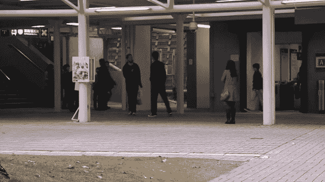
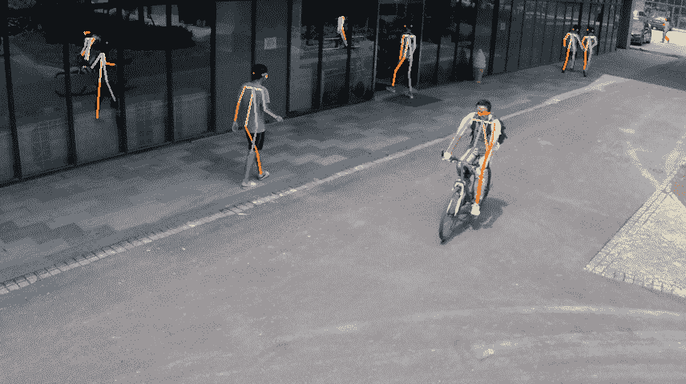

<!--yml

类别：未分类

日期：2024-09-06 19:42:39

-->

# [2301.00114] 使用深度学习的骨架视频异常检测：综述、挑战与未来方向

> 来源：[`ar5iv.labs.arxiv.org/html/2301.00114`](https://ar5iv.labs.arxiv.org/html/2301.00114)

# 使用深度学习的骨架视频异常检测：综述、挑战与未来方向

Pratik K. Mishra, Alex Mihailidis, Shehroz S. Khan Pratik K. Mishra, Alex Mihailidis, 和 Shehroz S. Khan 均来自多伦多大学生物医学工程研究所，加拿大多伦多，并且也与 KITE – 多伦多康复研究所、大学健康网络，加拿大多伦多有联系（电子邮件：pratik.mishra@mail.utoronto.ca; alex.mihailidis@utoronto.ca; shehroz.khan@uhn.ca）。

###### 摘要

现有的视频异常检测方法大多利用包含可识别面部和外观特征的视频。使用可识别面部的视频引发了隐私问题，特别是在医院或社区环境中使用时。基于外观的特征也可能对像素噪声敏感，迫使异常检测方法在建模背景变化时面临挑战，使得难以集中注意力于前景中的人类行为。以骨架形式描述视频中人类运动的结构信息能够保护隐私，并且可以克服一些基于外观特征所带来的问题。本文介绍了使用从视频中提取的骨架进行隐私保护深度学习异常检测方法的综述。我们提出了一种基于各种学习方法的算法新分类法。我们得出结论，基于骨架的异常检测方法可以成为视频异常检测的一个可行的隐私保护替代方案。最后，我们识别了主要的开放研究问题并提供了应对这些问题的指南。

###### 索引词：

骨架，身体关节，人类姿势，异常检测，视频。^(^(©2024 IEEE。本材料的个人使用是被允许的。所有其他用途，包括在任何当前或未来的媒体中转载/重刊本材料用于广告或宣传目的、创建新的集体作品、转售或再分发到服务器或列表中，或在其他作品中重用本作品的任何版权组件，都必须获得 IEEE 的许可。)

## I 引言

异常事件指的是不寻常或不正常的行为、举动或情况，这些可能导致健康、安全和经济风险[1]。根据定义，异常事件大多是未被发现的，并且事先对其了解甚少[2]。由于其稀有性、多样性和不频繁性，收集标记数据可能非常困难或昂贵[1, 3]。由于缺乏预定类别和标记数据，训练监督学习模型可能非常困难[1]。因此，大多数异常检测算法的通用方法是训练一个可以最佳代表“正常”事件或行为的模型，任何偏离此模型的情况都可以被标记为未见异常[4]。人类的异常行为可以归因于个体层面（例如，跌倒[5]）或场景中的多人（例如，行人过马路[6]，拥挤商场中的暴力行为[7]）。在基于视频的异常检测中，一般方法是训练一个模型来学习正常活动视频中个体的行为模式、背景和其他语义信息，并在测试视频中识别出显著的偏差作为异常。然而，由于标签的缺乏以及异常定义的不明确，异常检测是一项具有挑战性的任务[2]。

大多数基于视频的异常检测方法使用的是 RGB 视频，其中场景中的人物可以被识别。虽然在公共场所（例如商场、机场）使用 RGB 摄像头系统通常是可以接受的，但在个人住宅、社区、居住或临床环境中情况可能会大相径庭[8]。在家庭或居住环境（例如养老院）中，个人或患者可能会在其个人空间中被监控，这可能侵犯他们的隐私。缺乏应对个人隐私的措施可能会成为异常检测系统采纳和部署的瓶颈[9]。然而，监测身体、认知或老龄化问题的人群对于提高他们的生活质量和护理也是重要的。因此，作为一种折衷，隐私保护的视频模式可以填补这一空白，并在这些环境中使用以挽救生命和改善患者护理。可穿戴设备在某些人群中面临合规问题，人们可能会忘记或在某些情况下拒绝佩戴它们[10]。过去用于涉及人的异常检测的一些隐私保护摄像机模式包括深度摄像机[5, 11]、热成像摄像机[12]和红外摄像机[13, 14]。虽然这些模式可以部分或完全遮蔽个人身份，但它们需要专门的硬件或摄像头，并且普通人群使用时可能会很昂贵。利用姿态估计算法从 RGB 摄像机流中提取的骨架提供了一种适合隐私保护的解决方案，优于 RGB 和其他类型的摄像头[15]。骨架跟踪仅关注身体关节，忽略面部身份、全身扫描或背景信息。RGB 视频中的像素特征会掩盖场景中的重要信息，对光照、视角和背景杂乱所造成的噪声非常敏感，这可能会导致检测异常时的误报[16]。此外，由于这些特征中存在冗余信息（例如背景），方法在建模这些区域的变化时负担加重，而不是集中在前景中人类的动作上。提取特定于人类行为的信息不仅可以提供隐私保护的解决方案，还可以帮助过滤视频中的背景噪声，并帮助模型专注于检测与人类行为相关的异常事件的关键信息。骨架表示了一种有效的方式来建模人体关节位置随时间的变化，并且对复杂背景、光照变化和动态摄像机场景具有鲁棒性[17]。除了保护隐私外，骨架特征还具有紧凑、结构良好、语义丰富和对人类动作和运动高度描述的优点[17]。使用骨架跟踪进行异常检测是一个新兴的研究领域，因为对个人隐私及其数据的关注日益增加。然而，基于骨架的方法可能不足以应对需要面部信息进行分析的情况，包括情感识别[18, 19]、疼痛检测[20]或远程心脏监测[21]等。

表 I：综述论文总结。

| 学习方法 | 论文 | 使用的数据集 | 实验设置 | 场景中的人数 | 异常类型 | 姿态估计算法 | 模型输入 | 模型类型 | 异常分数 | 评估指标 AUC(ROC)（或其他） |
| --- | --- | --- | --- | --- | --- | --- | --- | --- | --- | --- |
| 重建 | Gatt 等人 [22] | UTD-MHAD | 室内 | 单一 | 不规则体态 | Openpose，Posenet | 骨架关键点 | 1DConv-AE，LSTM-AE | 重建误差 | AUC(PR)=0.91，F 分数=0.98 |
| Temuroglu 等人 [23] | 自定义 | 室外 | 多种 | 醉酒行走 | Openpose | 骨架关键点 | AE | 重建误差 | 召回率和特异性的平均值=0.91 |
| Suzuki 等人 [24] | 自定义 | — | 单一 | 儿童动作不良 | Openpose | 动作时间序列图像 | CAE | 重建误差 | 准确率=99.3，F 分数=0.99 |
| Jiang 等人 [25] | 自定义 | 室外 | 多种 | 等级交叉口的异常行人行为 | Alphapose | 骨架关键点 | GRU 编码器-解码器 | 重建误差 | 0.82 |
| Song 等人 [26] | 自定义 | 室外 | 多种 | 等级交叉口的异常行人行为 | Openpose | 骨架关键点 | GAN | 判别器分数 | 0.89 |
| Fan 等人 [27] | 香港中文大学大道，明尼苏达大学 | 室内和室外 | 多种 | 异常人类行为 | Alphapose | 视频帧，骨架关键点 | GAN | 视频帧重建误差 | 0.88 0.99 |
| 预测 | Rodrigues 等人 [28] | IITB-走廊，上海科技大学，香港中文大学大道 | 室外 | 多种 | 异常人类活动 | Openpose | 骨架关键点 | 多时间尺度 1DConv 编码器-解码器 | 不同时间尺度的预测误差 | 0.67 0.76 0.83 |
| Luo 等人 [16] | 上海科技大学，香港中文大学大道 | 室外 | 多种 | 不规则体态 | Alphapose | 骨架关节图 | 时空 GCN | 预测误差 | 0.74 0.87 |
| Zeng 等人 [29] | UCSD 行人，上海科技大学，香港中文大学大道，IITB-走廊 | 室外 | 多种 | 异常人类行为 | HRNet | 骨架关节图 | 分层时空 GCN | 不同层次的预测误差加权和 | 0.98 0.82 0.87 0.7 |
| Fan 等人 [30] | 上海科技大学，香港中文大学大道 | 室外 | 多种 | 异常人类行为 | Alphapose | 骨架关键点 | GRU 前馈网络 | 预测误差 | 0.83 0.92 |
| Pang 等人 [31] | 上海科技大学，香港中文大学大道 | 室外 | 多种 | 异常人类行为 | Alphapose | 骨架关键点 | Transformer | 预测误差 | 0.77 0.87 |
| Huang 等人 [32] | 上海科技大学，香港中文大学大道，IITB-走廊 | 室外 | 多种 | 异常人类行为 | HRNet | 骨架关节图 | 时空图 Transformer | 局部和全局图的预测误差最大值 | 0.83 0.89 0.77 |
| 重构+预测 | Morais 等人 [17] | 上海科技大学, CUHK Avenue | 户外 | 多个 | 异常人类动作 | Alphapose | 骨架关键点 | GRU 编码器-解码器 | 重构和预测误差的加权和 | 0.73 0.86 |
| Boekhoudt 等人 [7] | 上海科技大学, HR Crime | 室内和户外 | 多个 | 与人类和犯罪相关的异常 | Alphapose | 骨架关键点 | GRU 编码器-解码器 | 重构和预测误差的加权和 | 0.73 0.6 |
| 李和张 [33] | 上海科技大学 | 户外 | 多个 | 异常行人行为 | Alphapose | 骨架关键点 | GRU 编码器-解码器 | 重构和预测误差的加权和 | 0.75 |
| 李等人 [34] | 上海科技大学, CUHK Avenue | 户外 | 多个 | 人相关的异常事件 | Alphapose | 骨架关节图 | 嵌入 LSTM 的 GCAE | 最大重构和预测误差之和 | 0.76, EER=30.7 0.84, EER=20.7 |
| 吴等人 [35] | 上海科技大学, CUHK Avenue | 户外 | 多个 | 异常人类动作 | Alphapose | 骨架关节图, 置信度分数 | GCN | 置信度评分加权的重构、预测和 SVDD 误差之和 | 0.77 0.85 |
|  | 罗等人 [36] | 上海科技大学, IITB-走廊 | 户外 | 多个 | 人相关的视频异常 | — | 骨架关节图 | 记忆增强型时空 GCAE | 最大重构和预测误差之和 | 0.78 0.69 |
|  | 李等人 [37] | 上海科技大学, CUHK Avenue | 户外 | 多个 | 人相关的异常事件 | Alphapose | 骨架关键点 | 记忆增强型 GAN | 最大重构和预测误差之和 | 0.75, EER=31.7 0.84, EER=22.6 |

表 II：审阅论文的总结（续）。

| 学习方法 | 论文 | 使用的数据集 | 实验设置 | 场景中的人数 | 异常类型 | 姿势估计算法 | 模型输入 | 模型类型 | 异常分数 | 评估指标 AUC(ROC)（或其他） |
| --- | --- | --- | --- | --- | --- | --- | --- | --- | --- | --- |
| 重构+聚类 | Markovitz 等人 [38] | 上海科技大学, NTU-RGB+D, Kinetics-250 | 室内和户外 | 多个 | 异常人类动作 | Alphapose, Openpose | 骨架关节图 | GCAE, 深度聚类 | Dirichlet 过程混合模型评分 | 0.75 0.85 0.74 |
| 崔等人 [39] | 上海科技大学 | 户外 | 多个 | 人体姿势异常 | — | 骨架关节图 | GCAE, 深度聚类 | Dirichlet 过程混合模型评分 | 0.77 |
| 刘等人 [40] | 上海科技大学, CUHK Avenue | 户外 | 多个 | 异常人类行为 | Alphapose | 骨架关节图 | GCAE, 深度聚类 | Dirichlet 过程混合模型评分 | 0.79 0.88 |
|  | 陈等人 [41] | 上海科技大学, CUHK Avenue | 户外 | 多目标 | 异常的人类行为 | Alphapose | 骨骼关节图 | 多尺度时空注意力 GCN | 骨骼簇异常分数 | 0.76, EER=31.1 0.88, EER=19.2 |
|  | 闫等人 [42] | 上海科技大学, UCF-Crime, NTU-RGB+D | 户外 | 多目标 | 异常的人类动作 | Openpose | 骨骼关节图 | GCAE, 深度聚类 | 骨骼簇异常分数 | 0.77 0.76 0.77 |
| 聚类 | 杨等人 [43] | UCSD 行人 2, 上海科技大学 | 户外 | 多目标 | 异常的人类行为和物体 | Alphapose | 骨骼关节图，数值特征 | GCN | 骨骼簇 + 物体异常分数 | 0.93 0.82 |
| 贾维德等人 [44] | 上海科技大学, UCF-Crime, NTU-RGB+D | 户外 | 多目标 | 异常的人类动作 | — | 视频帧，骨骼关节图 | GCN, 深度聚类 | Dirichlet 过程混合模型分数 | 0.81 0.86 0.88 |
| 迭代自我训练 | 南俊等人 [45] | 上海科技大学, CUHK Avenue | 户外 | 多目标 | 与人类相关的异常事件 | Alphapose | 骨骼关节图，数值特征 | GCN | 自我训练的全连接层输出 | 0.72, EER=34.1 0.82, EER=23.9 |
| 多变量高斯分布 | 谭和柴田 [46] | 上海科技大学 | 户外 | 多目标 | 异常的人类行为 | Openpose | 骨骼关节图 | GCN, 多变量高斯分布 | Mahalanobis 距离 | 0.77 |
| 提示指导的零样本学习 | 佐藤等人 [47] | RWF-2000 Kinetics-250 | 户外 | 多目标 | 异常人类行为事件 | PPN HRNet | 骨骼关键点 | 残差多层感知机 | 联合概率分数 | 准确率=90.3 0.79 |

近年来，深度学习方法已被开发用于利用骨架进行各种应用，如动作识别 [48]、医学诊断 [24] 和体育分析 [49]。在视频中利用骨架进行异常检测仍是一个未被充分探索的领域，需要集中研究 [24]。人类骨架可以帮助开发隐私保护解决方案，用于私人住宅、拥挤/公共区域、医疗环境、康复中心和长期护理机构，以检测影响个人健康和安全的异常事件。这种方法的使用可以提高视频监控系统在家庭和住宅环境中的采用。然而，关于理解现有利用骨架进行异常检测的方法的文献相对稀缺。我们识别了这一文献空白，并提出了其中之一的首个调查，涉及利用骨架进行视频异常检测的最新进展。我们识别了现有工作的主要主题，并提出了一种基于这些方法如何学习检测异常事件的新型分类法。我们还讨论了这些方法被应用的场景，以理解它们在个人住宅或长期护理情境中的潜力。

## II 文献综述

我们在这项工作中采用了叙述性文献综述的方法。以下关键词（及其组合）被用来搜索相关论文——骨架、人体姿态、身体姿态、身体关节、异常检测和视频。这些关键词在学术数据库中进行了搜索，包括 Google Scholar、IEEE Xplore、Elsevier 和 Springer。我们主要审阅了 2016 年至 2023 年间的论文，因此，这份列表可能并不全面。在这次综述中，我们只关注基于深度学习的骨架视频异常检测算法，并不包括传统的基于机器学习的方法。虽然有一些工作[50、51]使用监督方法来检测异常行为，但这些超出了本综述的范围，因为本综述关注的是无监督异常检测方法。我们没有采用系统性或范围性综述搜索协议，因此我们的文献综述可能并不详尽。然而，我们尽力包括了该领域的最新发展，以便能够总结它们的潜力并识别挑战。在本节中，我们提供了骨架深度学习视频异常检测方法的调查。我们提出了一种新的分类法，将骨架视频异常检测方法基于学习方法分为四大类，即重建、预测、它们的组合以及其他特定方法。表格 I 和 II 总结了基于我们文献搜索的分类法找到的 29 篇相关论文。除非另有说明，表格最后一列的值指的是审阅论文中每个数据集对应的 AUC(ROC)值。六篇论文使用重建方法，六篇论文使用预测方法，七篇论文使用重建和预测方法的组合，五篇论文使用重建和聚类方法的组合，五篇论文使用其他特定方法。

### II-A 重建方法

在重建方法中，一般情况下，自动编码器（AE）或其变体模型只在正常人类活动的骨架信息上进行训练。在训练过程中，模型学习以低重建误差重建代表正常活动的样本。因此，当模型在测试时遇到异常样本时，预计会给出较高的重建误差。

Gatt 等人 [22] 使用了基于长短期记忆（LSTM）和一维卷积（1DConv）的自编码器（AE）模型来检测异常的人类活动，包括但不限于摔倒，利用从公开数据集视频中估算的骨架。Temuroglu 等人 [23] 提出了一个处理遮挡的骨架轨迹表示方法和一个用于行人异常行为检测的 AE 框架。该工作使用的行人视频数据集由作者收集，其中训练数据集由正常步态组成，测试数据集则由正常步态和醉酒步态组成。通过提出的表示方法处理遮挡的姿态骨架被组合成序列以训练 AE。他们比较了处理遮挡的骨架关键点输入与未标记遮挡的关键点、关键点图像热图和原始行人图像输入的结果。由于数据集不平衡，作者使用了召回率和特异性的平均值来评估模型，并发现处理遮挡的输入取得了最高的结果。Suzuki 等人 [24] 训练了一个卷积自编码器（CAE）来检测儿童的良好粗大运动，并将差的肢体运动检测为异常。运动时间序列图像 [52] 从估算的幼儿园儿童视频中获得。这些运动时间序列图像被作为输入送入 CAE 中，CAE 仅在正常数据上进行训练。输入和重建像素之间的差异用于定位异常帧中的差的身体运动。Jiang 等人 [25] 提出了一个消息传递的门控循环单元（GRU）编码解码网络，以检测和定位在铁路道口捕获的视频中的异常行人行为。现场收集的数据集包含了在两个不同相机角度的选择道口处超过 50 小时的视频录制。骨架被估算并分解为全局和局部组件，然后作为输入送入编码解码网络。通过识别重建误差高于经验阈值的骨架来定位帧中的异常行人。他们手动移除了错误检测的虚假骨架，因为他们声称错误检测问题只在一个道口出现。然而，在许多实际应用中，由于数据量非常大，手动移除虚假骨架的方法不切实际，因此需要一个自动化的虚假骨架识别和移除步骤。在随后的工作 [26] 中，作者使用基于生成对抗网络（GAN）的框架提高了铁路道口异常行人行为检测的性能。生成器中的两个基于 LSTM 的分支用于同时分析局部和全局运动模式，在时间域中重建相应的输入。判别器是一个全连接神经网络，生成一个表示输入为异常可能性的分数。Fan 等人 [27] 提出了一个由两对生成器和判别器组成的异常检测框架。生成器被训练以重建正常视频帧和相应的骨架。判别器被训练以区分原始和重建的视频帧以及原始和重建的骨架。视频帧和相应提取的骨架作为框架训练期间的输入；然而，在测试时，决策仅基于视频帧的重建误差。

##### 挑战

自编码器或其变体在许多基于视频的异常检测方法中被广泛使用[5]。选择合适的架构来建模骨架非常重要。此外，由于在正常数据上训练，它们预计会对异常输入产生比正常输入更高的重建误差，这已被采用作为识别异常的标准。然而，这一假设在实践中并不总是成立，即自编码器可能表现得很好，也能重建异常，导致假阴性[53]。

### II-B 预测方法

在预测方法中，网络通常通过使用表示正常人类行为的骨架来预测下一时间步的骨架，从而学习正常的人类行为。在测试期间，高预测误差的测试样本被标记为异常，因为网络仅被训练来预测代表正常行为的骨架。

Rodrigues 等人 [28] 提出异常的人类活动可以在不同的时间尺度上发生，固定时间尺度（基于帧或视频片段）的方法无法捕捉到不同时间持续的广泛异常。他们提出了一个多时间尺度的 1DConv 编码器-解码器网络，其中中间层负责生成不同时间尺度的未来和过去预测。该网络被训练以对正常活动骨架输入进行预测。所有时间尺度的预测误差被结合起来，得到一个异常分数用于检测异常活动。Luo 等人 [16] 提出了一种基于时空图卷积网络（GCN）的预测方法用于骨架视频异常检测。身体关节被估计并构建成骨架图，其中身体关节构成图的节点。空间边连接骨架的不同关节，时间边连接跨时间的相同关节。网络末端使用了一个全连接层来预测未来的骨架。Zeng 等人 [29] 提出了一种层次化时空 GCN，其中高级表示编码了人员的轨迹和多个身份之间的互动，而低级骨架图表示编码了每个人的局部身体姿态。该方法旨在检测稀疏和密集场景中的异常人类行为。输入被组织成时空骨架图，其中的节点是来自多个帧的人体关节，并输入到网络中。网络在正常活动的输入骨架图表示上进行训练。光流场和骨架边界框的大小用于确定稀疏和密集场景。对于拥挤的密集场景，高级表示被分配了更高的权重，而对于稀疏场景，则增加了低级图表示的权重。在测试过程中，不同分支的预测误差被加权和结合以获得最终的异常分数。Fan 等人 [30] 提出了一个 GRU 前馈网络，该网络被训练以使用过去的骨架序列预测下一个骨架，并且损失函数结合了预测骨架的范围和速度。Pang 等人 [31] 提出了一种骨架变换器来预测视频帧中的未来姿态组件，并将预测姿态组件与相应期望值之间的误差视为异常分数。他们应用了多头自注意模块以捕捉任意成对姿态组件之间的长期依赖关系，并使用时间卷积层集中于局部时间信息。Huang 等人 [32] 提出了一种时空图变换器，用于编码人类骨架的层次化图嵌入，以联合建模个体之间的互动以及单个个体内的身体关节之间的关联。变换器的输入包括全球图和局部图。全球图中的每个节点编码了个体的速度以及个体之间的相对位置和互动关系。每个局部图编码了个体的姿态。

##### 挑战

在这些方法中，很难选择预测应当向未来（或过去）多远进行，以实现最佳结果。这可能可以通过经验确定；然而，在缺乏验证集的情况下，这些解决方案仍然难以实现。基于未来预测的方法可能对过去数据中的噪声非常敏感 [54]。过去的任何小变化都可能导致预测的显著变化，并且这些变化并非所有都表示异常情况。

### II-C 学习方法的组合

在本节中，我们讨论了现有的方法，这些方法利用了不同学习方法的组合，即重建和预测方法，以及重建和聚类方法。

#### II-C1 重建和预测方法的组合

一些骨架视频异常检测方法利用包含重建和预测误差的多目标损失函数，以学习骨架特征，这些特征代表正常行为，并将具有大误差的骨架识别为异常。Morais 等人 [17] 提出了一个方法，通过使用人类骨架及其在场景中的相对位置来建模监控视频中的正常人类动作。人类骨架被分解为两个子组件：全局身体运动和局部身体姿势。全局运动跟踪场景中整个身体的动态，而局部姿势描述骨架配置。这两个组件被作为输入传递到基于消息传递 GRU 单编码器双解码器的网络的不同分支中。这些分支分别处理它们的数据，并在每个时间步通过跨分支消息传递进行交互。每个分支都有一个编码器、一个基于重建的解码器和一个基于预测的解码器。该网络使用正常数据进行训练，在测试期间，通过汇总一帧中所有骨架的异常分数来生成帧级异常分数，以识别异常帧。为了避免因视频帧中骨架检测不准确而导致的误差，作者排除了无法通过姿态估计算法估计的骨架的视频帧。因此，这项工作的结果并不能很好地代表真实世界场景，真实场景通常由复杂的场景、遮挡物和人群重叠运动组成。Boekhoudt 等人 [7] 使用了 Morais 等人 [17] 提出的网络来检测视频中的基于犯罪的人类异常，使用了新提出的基于犯罪的视频监控数据集。与 Morais 等人 [17] 的工作类似，Li 和 Zhang [33] 提出了一个双分支单编码器双解码器 GRU 网络，该网络在从行人视频中估计的正常行为骨架上进行训练。这两个解码器分别负责重建输入骨架和预测未来骨架。然而，与 Morais 等人 [17] 的工作不同的是，两个分支之间没有提供消息传递。Li 等人 [34] 提出了一个基于时空图卷积自编码器 (GCAE) 的单编码器双解码器架构，该架构在隐藏层中嵌入了 LSTM 网络。这两个解码器分别用于重建输入骨架序列和预测未见过的未来序列，从通过编码器投影的潜在向量中获得。所有骨架在一帧中的最大重建和预测误差之和被用作异常分数，以检测异常帧。Wu 等人 [35] 提出了一个基于图卷积网络 (GCN) 的编码器-解码器架构，该架构使用正常动作骨架图和关键点置信度分数作为输入进行训练，以检测监控视频中的异常人类动作。骨架图输入被分解为全局和局部组件。网络由三个编码器-解码器管道组成：全局管道、局部管道和置信度分数管道。全局和局部编码器-解码器管道分别学习重建和预测全局和局部组件。置信度分数管道学习重建置信度分数。此外，使用基于支持向量数据描述 (SVDD) 的损失来学习正常动作全局和局部管道编码器输出在潜在特征空间中的边界。网络使用多目标损失函数进行训练，由骨架图重建和预测损失、置信度分数重建损失以及多中心 SVDD 损失的加权和组成。Luo 等人 [36] 提出了一个单编码器双解码器的记忆增强时空 GCAE 网络，其中使用时空图卷积来编码骨架图在空间和时间域中的区分特征。记忆模块记录正常行为骨架的模式。此外，编码的表示没有直接输入到重建和预测解码器中，而是作为查询用于检索最相关的记忆项。记忆模块用于限制网络在异常情况下的重建和预测能力。Li 等人 [37] 提出了基于梯度惩罚的记忆增强 Wasserstein GAN，以从给定的过去预测未来的人类骨架轨迹，并同时重建给定的过去。虽然判别器试图拟合真实样本和生成样本之间的 Wasserstein 距离，但生成器则试图最小化 Wasserstein 距离，以使真实样本和生成样本的分布更接近。生成器中应用了记忆模块，以缓解强泛化能力。

#### II-C2 重建与聚类方法的结合

一些骨架视频异常检测方法利用两阶段的方法，通过时空骨架图来识别异常的人体动作。在第一个预训练阶段，基于 GCAE 的模型被训练以最小化输入骨架图上的重构损失。在第二个微调阶段，由预训练的 GCAE 编码器生成的潜在特征被送入一个聚类层，并使用狄利克雷过程混合模型来估计特征向量到聚类的软分配的分布。最后，在测试时，使用狄利克雷正态性得分来识别异常样本。Markovitz 等人 [38] 发现异常动作可以大致分为两类：细粒度异常和粗粒度异常。细粒度异常检测是指检测动作的异常变化，例如，异常的行走类型。粗粒度异常检测是指定义特定的正常动作，并将其他动作视为异常，例如，将跳舞定义为正常，将体操定义为异常。他们利用时空 GCAE 将代表正常动作的骨架图映射到潜在空间，然后使用深度聚类层将其软分配到聚类。软分配表示从狄利克雷模型中抽象出了数据类型（细粒度或粗粒度）。在 GCAE 的预训练后，通过最小化由重构损失和聚类损失组成的多目标损失函数，对编码器和聚类进行微调。他们利用了上海科技大学 [55] 数据集来测试他们提出的方法在细粒度异常上的性能，NTU-RGB+D [56] 和 Kinetics-250 [57] 数据集用于粗粒度异常检测性能评估。Cui 等人 [39] 提出了一种基于半监督原型生成的视频异常检测方法，以减少与图嵌入网络相关的计算成本。正常动作的骨架图从视频中估计出来，并作为输入送入一个移位时空 GCAE 以生成特征。尚不清楚使用了哪种姿态估计算法来从视频帧中估计骨架。生成的特征被送入提出的原型生成模块，该模块旨在将特征映射到原型，并在训练阶段更新它们。在预训练步骤中，GCAE 和原型生成模块通过由重构损失和原型生成损失组成的损失函数进行优化。在微调步骤中，整个网络使用由重构损失、原型生成损失和聚类损失组成的多目标损失函数进行微调。随后，Liu 等人 [40] 使用自注意力增强的图卷积来检测基于骨架图的异常人体行为。骨架图作为输入送入一个时空自注意力增强的 GCAE，并从训练好的 GCAE 的编码器部分提取潜在特征。在 GCAE 的预训练后，整个网络使用由重构损失和聚类损失组成的多目标损失函数进行微调。Chen 等人 [41] 提出了一个多尺度时空注意力 GCN，其中包括一个编码器用于提取特征，一个重构解码器分支用于优化编码器，以及一个聚类层分支用于获取异常得分。在训练过程中，解码器用于通过最小化重构误差来优化编码器。然而，在测试过程中，解码器被丢弃，仅使用聚类层来生成异常得分。它使用了三种尺度的人体骨架图，即关节、部件和肢体。在每个尺度上进行了空间注意力图卷积操作，并对三种尺度的输出特征进行了加权和求和，以构成多尺度骨架特征。Yan 等人 [42] 提出了基于 GCAE 的深度记忆存储聚类方法，以实现伪标签和网络参数的实时更新。它包括特征提取、自动编码器、聚类、记忆存储、自监督和评分模块。特征提取模块 [38] 和自动编码器模块用于形成重构的姿态序列。重构序列随后被发送到记忆存储模块进行存储，并通过 k 均值聚类方法 [58] 对每个样本进行软聚类分配。自动编码器、聚类和记忆存储模块用于迭代更新伪标签和网络参数。

##### 挑战

基于组合的方法可能会受到单一学习方法的限制，如在第 II-A 和 II-B 节中所述。此外，在缺乏验证集的情况下，很难确定多目标损失函数中组合系数的最佳值。

### II-D 其他方法

本节讨论了利用预训练深度学习模型从输入骨架中编码潜在特征的方法，并结合如聚类和多元高斯分布等方法，用于检测视频中的基于人类动作的异常。

杨等人[43] 提出了一个双流融合方法，用于检测与身体运动和物体位置相关的异常。YOLOv3 [59] 被用来检测视频帧中的人和物体。随后，从视频帧中估计出骨架，并作为输入传递给时空 GCN，接着通过基于聚类的全连接层生成骨架的异常分数。与检测到的物体的边界框坐标和置信度分数相关的信息被用来生成物体异常分数。最后，将骨架和物体的正常性分数结合起来，以生成帧的最终异常分数。南君等人[45] 使用从视频中估计的骨架特征，利用迭代自训练策略进行行人异常检测。训练集由未标记的正常和异常视频序列组成。骨架被分解为全局和局部组件，这些组件被作为输入传递给无监督异常检测器 iForest [60]，以生成伪异常和正常骨架集。伪集用于训练一个异常评分模块，该模块由空间 GCN 和带有单一输出单元的全连接层组成。作为自训练策略的一部分，使用先前训练的异常评分模块生成新的异常分数，以更新骨架样本在骨架集中的隶属关系。然后，使用更新后的骨架集重新训练评分模块，直到获得最佳评分模型。然而，论文没有讨论决定最佳评分模型的标准。Tani 和 Shibata [46] 提出了一个训练逐帧自适应 GCN (AGCN) 的框架，用于利用单帧骨架进行动作识别，并使用从 AGCN 中提取的特征来训练异常检测模型。作为提议的框架的一部分，使用预训练的动作识别模型 [61] 识别 Kinetics-skeleton 数据集 [62] 中的大时间注意帧作为训练 AGCN 的动作帧。此外，训练好的 AGCN 被用来从上海科技大学校园数据集 [17] 中识别的正常行为骨架中提取特征，以建模多变量高斯分布。在测试期间，使用马氏距离计算多变量高斯分布下的异常分数。Sato 等人[47] 提出了一个用户提示指导的零样本学习框架，用于检测异常人类行为事件。一个多层感知机特征提取器在大规模动作识别数据集 [63, 64] 上使用对比学习进行预训练，对比骨架特征和从动作类别名称中提取的文本嵌入。在训练期间，冻结特征提取器的权重，并对正常动作的骨架特征分布进行建模。在推理期间，使用分布和未见动作的文本提示计算异常分数。Javed 等人[44] 提出了一个统一框架，用于学习合适的兴趣帧，以减少冗余数据，并结合骨架图和视频帧特征的超门控融合模型。随后，通过聚类层处理软分配，其中将概率分配给实例，并使用 Dirichlet 过程混合模型 [65] 计算正常性分数。

##### 挑战

这些方法的性能依赖于深度学习模型的预训练策略，用于学习潜在特征，以及随后的机器学习模型的训练参数选择。

表 III：骨骼视频异常检测数据集的特点。

| 数据集 | 总帧数 | 训练帧数 | 测试帧数 | 异常事件 | 相机视角 | 可用注释 | 异常 |
| --- | --- | --- | --- | --- | --- | --- | --- |
| CUHK 大道[66] | 30652 | 15328 | 15324 | 47 | 1 | 时间，像素级，轨迹-ID | 投掷物体，孩子跳跃，错误方向，草地上的包 |
| IITB 走廊[28] | 483566 | 301999 | 181567 | 108278 帧 | 1 | 时间 | 示威，遗留行李，骑自行车者，打架，追逐，徘徊，疑似物体，隐藏，玩球 |
| 上海科技大学[55] | 317398 | 274515 | 42883 | 130 | 13 | 时间，像素级 | 投掷物体，跳跃，推搡，骑自行车者，徘徊，攀爬 |
| UCF-犯罪[67] | 1900 视频 | 1610 视频 | 290 视频 | 950 视频 | — | 时间 | 虐待，逮捕，纵火，袭击，事故，盗窃，爆炸，打架，抢劫，射击，偷窃，扒窃，破坏 |
| UCSD 行人[6] | 18560 | 9350 | 9210 | 77 | 2 | 时间，像素级，轨迹-ID | 骑自行车者，滑冰者，手推车，轮椅，过人行道 |
| UMN[68] | 3855 | — | — | 11 | — | 时间 | 被遗弃或投掷的物体，不寻常的人群活动，相机篡改 |

\stackunder

[2pt]CUHK 大道（正常） \stackunder[2pt]IITB 走廊（正常） \stackunder[2pt]上海科技大学（正常）

\stackunder

[2pt]CUHK 大道（投掷物体） \stackunder[2pt]IITB 走廊（打架） \stackunder[2pt]上海科技大学（骑自行车）

\stackunder

[2pt]UCF-犯罪（正常） \stackunder[2pt]UCSD peds1（正常） \stackunder[2pt]UMN（正常）

\stackunder

[2pt]UCF-犯罪（袭击） \stackunder[2pt]UCSD peds1（骑自行车） \stackunder[2pt]UMN（投掷物体）

图 1：每个骨骼视频异常检测数据集中的一个正常帧和一个异常帧。

## III 讨论

本节利用表格 I 和 II，综合现有关于骨骼视频异常检测的研究成果，提炼出信息和趋势。

### III-A 数据集

上海科技大学 [55] 和香港中文大学大道 [66] 是评估骨架视频异常检测方法性能时最常用的视频数据集。上海科技大学数据集包含了在上海科技大学校园内人们沿人行道行走的视频，而异常帧中包含骑自行车者、滑板者和打架的人。该数据集有 330 个训练视频和 107 个测试视频。然而，并非所有异常活动都与人类有关。一个只包含与人类相关的异常活动的上海科技大学数据集子集被称为 HR ShanghaiTech，并在许多论文中使用。CUHK Avenue 数据集由短视频片段组成，这些片段展示了建筑物侧面行人的经过。建筑物中的混凝土柱造成了一些遮挡。该数据集包含 16 个训练视频和 21 个测试视频。异常事件包括“扔纸”，“扔包”，“孩子跳跃”，“错误方向”和“包在草地上”。类似地，包含只与人类相关的异常活动的 CUHK Avenue 数据集子集，称为 HR Avenue，也用于评估这些方法。其他已使用的视频数据集包括 UTD-MHAD [69]，UMN [68]，UCSD Pedestrian[6]，IITB-Corridor [28]，UCF-Crime[67]，HR Crime[7]，NTU-RGB+D[56]，RWF-2000[70] 和 Kinetics-250[57]。表格 III 总结了这些数据集的特点，图 1 展示了这些数据集中一个正常帧和一个异常帧。在被审阅的论文中使用的数据集中，有些数据集最初并非用于视频异常检测任务，而是被采用于此。因此，我们仅提供最初用于视频异常检测的数据集的详细信息，如表 III 和图 1 所示。从这些数据集中存在的异常类型可以推断出现有的骨架视频异常检测方法主要评估了基于个体人类行为的异常。因此，目前尚不清楚这些方法在检测涉及多个个体或人与物体互动的异常时表现如何。

### III-B 场景中的人数

大多数论文（29 篇中的 27 篇）检测了视频场景中多人的异常行为。另有两篇论文分别检测了单人视频场景中的不规则身体姿势和身体动作不良。通常的方法是使用姿态估计算法来估计场景中人的骨架，并计算每个骨架的异常分数。在一帧中所有骨架中的最大异常分数被用来识别异常帧。单个视频帧可能包含多个人，其中并非所有人都在执行异常动作。因此，取所有骨架中的最大异常分数有助于消除正常动作的人的影响，从而影响对帧的最终决策。此外，为个体骨架计算异常分数有助于在帧内定位异常源。

### III-C 应用领域

异常人类行为的定义在不同应用中可能有所不同。虽然大多数现有论文关注于一般情况下异常人类行为的检测，但有五篇论文专注于特定应用中的异常行为检测，包括醉酒行走[23]、儿童身体动作不良[24]、铁路道口的异常行人行为[25, 26]以及基于犯罪的异常[7]。此外，异常行为的性质可能会因多种因素而异，例如时间跨度、拥挤场景和特定动作异常。一些论文识别并解决了检测特定类型异常的需求，即发生在不同时间段的多时间尺度异常[28]、在稀疏和拥挤场景中的异常[29]、细粒度和粗粒度异常[38]以及身体运动和物体位置异常[43]。

### III-D 姿态估计算法选择

Alphapose [71] 和 Openpose [72] 是提取场景中人物骨架的最常用的姿态估计算法。其他使用过的姿态估计方法包括 Posenet[73]、PPN[74] 和 HRNet[75]。然而，总的来说，这些论文没有提供其选择姿态估计算法的理由。

### III-E 模型类型

论文中使用的模型类型可以大致分为两类，即基于序列的模型和基于图的模型。使用过的基于序列的模型包括`1DConv-AE`、`LSTM-AE`、`GRU`和`Transformer`。这些模型将单个人在多个帧中的骨架关键点视为时间序列输入。使用过的基于图的模型包括`GCAE`和`GCN`。基于图的模型接收单个人的时空骨架图作为输入。这些时空图通过将身体关节视为图的节点来构建。空间边连接骨架的不同关节，而时间边连接在时间上相同的关节。

### III-F 评估指标

适合的异常检测阈值选择可能因应用不同而异，因为大多数应用对误报和漏报有不同的成本[76, 77]。因此，拥有一个能够评估异常检测方法在不同应用场景下表现的指标，或者说，在各种决策阈值下的指标是非常理想的。接收者操作特征（ROC）曲线下的面积（AUC）计算了检测到的异常的比例，该比例在整个决策阈值范围内取平均。它是异常检测中使用的标准评估指标[76]，也是评估现有骨架视频异常检测方法表现的最常用指标。表 I 和 II 中报告的常用上海科技 [55] 和 CUHK Avenue [66] 数据集的最高 AUC(ROC) 值分别为 0.83 和 0.92。由于实验设置和训练-测试划分的差异，直接比较可能不可行；然而，这些结果对骨架视频异常检测方法的可行性提供了一些信心。其他性能评估指标包括 F 分数、准确率、等误差率（EER）和精确-召回（PR）曲线的 AUC。EER 表示在 ROC 曲线中，假阳性率等于漏检率时的错误分类帧百分比。虽然 AUC(ROC) 能够在不同阈值下提供分类器性能的良好估计，但在数据不平衡的情况下，它可能会产生误导[78]。在异常检测场景中，测试数据通常不平衡，因为异常行为发生的频率较低，特别是在许多医疗应用中[79, 80]。AUC(PR) 值提供了分类器在不平衡数据集上的良好估计[78]；然而，只有一篇论文使用了 AUC(PR) 作为评估指标。

\stackunder

[2pt] \stackunder[2pt] \stackunder[2pt]

\stackunder

[2pt] \stackunder[2pt] \stackunder[2pt]

图 2：Openpose（上排）和 alphapose（下排）在不同数据集上的输出。

## IV 挑战

### IV-A 姿态估计算法

通常，骨架视频异常检测算法的效率取决于姿态估计算法估计的骨架的准确性。如果姿态估计算法遗漏某些关节或在场景中产生伪影，那么可能会增加误报的数量。估计视频帧中的骨架存在各种挑战 [81]： (i) 复杂的身体配置导致自遮挡和复杂的姿势，(ii) 多样的外观，包括衣物，以及 (iii) 复杂的环境，包含场景中其他人的遮挡、各种视角、距离相机的远近和相机视图中的部件截断。这可能导致骨架的近似不佳，进而负面影响异常检测算法的性能。此外，使用深度学习方法提取骨架所需的强大硬件成本也很高。一些方法已被提出以应对这些挑战 [82, 83]；然而，在复杂环境中提取骨架仍然是一个困难的问题。综述论文中最常用的两种姿态估计算法是 Openpose [72] 和 Alphapose [71]。多人的姿态估计可以分为自上而下和自下而上方法 [81]。自上而下方法 [71, 84] 通常使用人类检测器来获取输入帧中的人类边界框，然后利用现有的单人姿态估计器来预测身体关节。这种方法高度依赖于人类检测算法的精度，并且运行时间与输入帧中的人数成正比。自下而上方法 [72] 直接近似输入帧中所有人的所有身体关节，并将它们组装成单独的骨架。然而，在复杂场景中关节的分组是一项具有挑战性的任务。Openpose 是一种自下而上的方法，Alphapose 是一种自上而下的方法。图 2 展示了 openpose 和 alphapose 在不同数据集帧上的骨架输出。一些现有的方法手动去除不准确和错误的骨架 [17, 25] 以训练模型，但在许多实际应用中数据量非常大，这种方法并不现实。因此，在从视频中估计骨架时，需要一个自动的假骨架识别和去除步骤。

### IV-B 异常类型

感兴趣的异常人类行为及其检测难度可能因异常的定义、应用、异常行为的时间跨度以及场景中是否有单个人/多人而异。例如，在驾驶员异常检测应用中，异常行为可能包括打电话、打瞌睡或饮酒[14]。异常行为的时间跨度可以从几秒到几小时或几天不等，例如，跳跃和跌倒[85]是短期异常，而闲逛和社交孤立[86]则是长期事件。需要更多关注于开发能够识别短期和长期异常的方法。稀疏场景异常可以描述为人较少的场景中的异常，而密集场景异常则可以描述为人多的拥挤场景中的异常[29]。由于需要跟踪多人并找到其各自的异常分数，因此在密集场景中识别异常行为比在稀疏场景中更具挑战性[17]。因此，需要开发能够有效识别稀疏和密集场景异常的方法。随着处理不同类型异常的算法的发展，需要特定类型异常的数据集，以确保高效的训练和评估。这可以通过为特定类型的异常提供单独的数据集或提供多种类型异常分布的一般数据集来处理。

### IV-C 硬件

使用微软 Kinect（深度）摄像头收集的骨架曾在过去的研究中使用过[87, 88]。然而，微软 Kinect 摄像头的停产[89]导致了骨架异常检测方法进一步发展的硬件限制。其他商业产品包括配备光学传感器的 Vicon [90]和配备多个摄像头的 TheCaptury [91]。但它们在非常受限的环境中运行或需要在人体上使用特殊标记。新的摄像头，如 AltumView 的‘Sentinare 2’ [92]，通过直接处理普通 RGB 摄像头上的视频并实时传输骨架信息，绕过了这些硬件要求。

### IV-D 跟踪骨架

现有的骨架视频异常检测方法包括时空骨架图[16]或时间序列[17]，这些图是通过跟踪个体在多个帧中的位置构建的。然而，当场景中有多人时，这种方法非常具有挑战性。人们的进出、移动中的重叠以及遮挡物的存在使得跨帧跟踪人群变得非常困难。

### IV-E 阈值选择

这些方法可能存在部署问题，因为阈值的选择不明确。在异常检测设置中，缺少包含正常和未见异常的验证集时，仅使用训练数据（仅包含正常活动）来微调操作阈值非常困难。为了解决这些情况，可以将正常活动中的离群点作为未见异常的代理[85, 93]；然而，不恰当的选择可能导致误报增加或漏报。可以利用领域专长来调整阈值，但在许多情况下，这种专长可能无法获得。

### IV-F 决策粒度

需要解决与骨架视频异常检测方法在实时应用中的粒度和决策时间相关的挑战。现有方法大多数在帧级别上输出决策，当方法的输入是每秒多帧的实时连续视频流时，这会成为一个问题。这可能导致警报每秒多次响起，这会适得其反。一个解决方案是让方法基于时间窗口做决策，每个窗口具有指定持续时间。然而，这带来了每个决策窗口的最佳长度的问题。短窗口不切实际，因为它可能导致频繁和重复的警报，而长窗口可能导致漏报、响应和干预延迟。可以利用领域知识来决定决策窗口的长度。

## V 未来方向

可以将骨架与光流[94]结合使用，以开发保护隐私的方法，从时间和结构模态中共同学习。基于联邦学习的方法（不结合个人数据，只结合模型）可以进一步提升这些方法的隐私性[95]。可以结合骨架使用分割掩膜[96]，在捕捉与场景和人体运动相关的信息的同时遮蔽人类，从而开发保护隐私的异常检测方法。

骨架表示视频中每个人的运动和姿势信息；然而，它们缺乏关于人际互动和人机互动的信息。有关人与人之间以及人与环境中物体互动的信息，对于如暴力检测 [7]、盗窃检测 [7] 和焦虑检测 [80] 等应用在养老院环境中是重要的。骨架可以用来替代参与者的身体，同时保留视频帧中的背景信息 [97]，以分析人际互动和人机互动异常。此外，可以将对象边界框与人体骨架结合使用，以在保持场景中人类隐私的同时建模人机互动。其他模态的信息（例如可穿戴设备）与骨架特征结合使用，可以开发多模态异常检测方法，以提高检测性能。此外，相关的监督学习方法生成的嵌入 [98, 99] 可以用于微调骨架视频异常检测模型。

如表格 I 和 II 所示，现有的骨骼视频异常检测方法和数据集主要集中在检测不规则的身体姿势 [16] 和异常的人类行为 [31]，主要是在户外环境中，而不是在适当的医疗环境中，如个人家中和长期护理院。这是向现实世界部署的一个缺口，因为需要扩展使用骨骼检测异常行为的范围到家庭和护理院环境中，这里隐私是一个非常重要的关注点。这可以用于解决重要的应用问题，如跌倒检测 [100]、激动检测 [80, 97] 和独立辅助生活。这将有助于开发支持性的家庭和社区，并鼓励日益增长的老年人群体和护理院中的痴呆居民的自主性和独立性。虽然利用骨骼有助于摆脱面部身份和外观信息，但重要的是要问骨骼是否可以被认为是足够隐私的 [101, 102]，以及可以采取哪些步骤来进一步匿名化骨骼。另一个用于隐私保护异常检测系统的现实世界部署的潜在研究领域是实时进行视频数据采集、骨骼跟踪（例如，MediaPipe [103]）和模型推断。然而，可能会面临集成云服务、芯片内嵌入 AI 算法、反应时间延迟、互联网稳定性和误报率等挑战。

## VI 结论

在本文中，我们提供了对利用视频中估计的骨架或身体关节进行异常检测的最新工作的综述。骨架隐藏了人们的面部身份和整体外观，并可以提供关于关节角度[104]、步态速度[105]以及与场景中其他人的互动[17]的重要信息。我们的文献综述显示，许多基于深度学习的方法利用重建、预测误差及其其他组合，以隐私保护的方式成功检测异常。此综述建议了提高以隐私为中心的设备（和算法）在住宅或公共环境中应用的初步步骤。这将进一步改善异常检测系统的部署，以提升人们的安全和护理。基于骨架的异常检测方法可用于设计隐私保护技术，以支持老年人在护理环境中的辅助生活[106]，或使老年人在自己的家中独立生活，以应对日益增长的长期护理需求[107]。使用骨架特征的隐私保护方法可以用于辅助骨架基础的康复锻炼监测[108]，或用于机器人-人类互动的社交机器人[109]，以协助老年人完成日常活动。

## VII 致谢

这项工作得到了 AGE-WELL NCE Inc、阿尔茨海默氏症协会、自然科学与工程研究委员会以及阿联酋战略研究基金的支持。

## 参考文献

+   [1] S. S. Khan 和 M. G. Madden, “单类分类：研究分类及技术综述，” *知识工程评论*，第 29 卷，第 3 期，第 345–374 页，2014 年。

+   [2] V. Chandola, A. Banerjee, 和 V. Kumar, “异常检测：综述，” *ACM 计算调查（CSUR）*，第 41 卷，第 3 期，第 1–58 页，2009 年。

+   [3] C. Gautam, P. K. Mishra, A. Tiwari, B. Richhariya, H. M. Pandey, S. Wang, M. Tanveer, A. D. N. Initiative *et al.*, “最小方差嵌入的深度核正则化最小二乘法用于单类分类及其在生物医学数据中的应用，” *神经网络*，第 123 卷，第 191–216 页，2020 年。

+   [4] P. K. Mishra, C. Gautam, 和 A. Tiwari, “最小方差嵌入的自关联核极限学习机用于单类分类，” *神经计算与应用*，第 33 卷，第 19 期，第 12 973–12 987 页，2021 年。

+   [5] J. Nogas, S. S. Khan, 和 A. Mihailidis, “Deepfall: 利用深度时空卷积自编码器进行非侵入式跌倒检测，” *医疗信息学研究杂志*，第 4 卷，第 1 期，第 50–70 页，2020 年。

+   [6] W. Li, V. Mahadevan, 和 N. Vasconcelos, “拥挤场景中的异常检测与定位，” *IEEE 模式分析与机器智能学报*，第 36 卷，第 1 期，第 18–32 页，2013 年。

+   [7] K. Boekhoudt, A. Matei, M. Aghaei, 和 E. Talavera, “Hr-crime：监控视频中的人类相关异常检测”，发表于*计算机图像与模式分析国际会议*。Springer，2021 年，第 164–174 页。

+   [8] A. Senior, *视频监控中的隐私保护*。Springer，2009 年，第 1 卷。

+   [9] P. Climent-Pérez 和 F. Florez-Revuelta, “在 RGB 摄像头拍摄的视频中保护视觉隐私，用于主动和辅助生活应用”，*多媒体工具与应用*，第 80 卷，第 15 期，第 23 649–23 664 页，2021 年。

+   [10] B. Ye, S. S. Khan, B. Chikhaoui, A. Iaboni, L. S. Martin, K. Newman, A. Wang, 和 A. Mihailidis, “在临床环境中收集大数据的挑战：使用多模态传感器平台的研究经验教训”，*科学与工程伦理*，第 25 卷，第 5 期，第 1447–1466 页，2019 年。

+   [11] P. Schneider, J. Rambach, B. Mirbach, 和 D. Stricker, “基于飞行时间深度图像的无监督异常检测”，发表于*IEEE/CVF 计算机视觉与模式识别会议论文集*，2022 年，第 231–240 页。

+   [12] V. Mehta, A. Dhall, S. Pal, 和 S. S. Khan, “基于热成像的运动和区域感知对抗学习用于跌倒检测”，发表于*2020 年第 25 届国际模式识别大会（ICPR）*。IEEE，2021 年，第 6321–6328 页。

+   [13] S. Denkovski, S. S. Khan, B. Malamis, S. Y. Moon, B. Ye, 和 A. Mihailidis, “多视觉模态跌倒检测数据集”，*IEEE Access*，第 10 卷，第 106 422–106 435 页，2022 年。

+   [14] O. Kopuklu, J. Zheng, H. Xu, 和 G. Rigoll, “驾驶员异常检测：数据集与对比学习方法”，发表于*IEEE/CVF 冬季计算机视觉应用会议论文集*，2021 年，第 91–100 页。

+   [15] T. Golda, D. Guaia, 和 V. Wagner-Hartl, “对智能视频监控系统的风险和实用性的感知”，*应用科学*，第 12 卷，第 20 期，第 10435 页，2022 年。

+   [16] W. Luo, W. Liu, 和 S. Gao, “正常图：基于空间时间图卷积网络的骨架视频异常检测预测网络”，*神经计算*，第 444 卷，第 332–337 页，2021 年。

+   [17] R. Morais, V. Le, T. Tran, B. Saha, M. Mansour, 和 S. Venkatesh, “学习骨架轨迹中的规律性用于视频异常检测”，发表于*IEEE/CVF 计算机视觉与模式识别大会论文集*，2019 年，第 11 996–12 004 页。

+   [18] A. Dhall, O. Ramana Murthy, R. Goecke, J. Joshi, 和 T. Gedeon, “基于视频和图像的情感识别挑战：Emotiw 2015”，发表于*2015 年 ACM 国际多模态互动会议论文集*，2015 年，第 423–426 页。

+   [19] B. Taati, S. Zhao, A. B. Ashraf, A. Asgarian, M. E. Browne, K. M. Prkachin, A. Mihailidis, 和 T. Hadjistavropoulos, “临床人群中的算法偏见——评估和改进老年痴呆症患者面部分析技术”，*IEEE Access*，第 7 卷，第 25 527–25 534 页，2019 年。

+   [20] G. Menchetti, Z. Chen, D. J. Wilkie, R. Ansari, Y. Yardimci, 和 A. E. Çetin, “利用两阶段深度学习从面部视频中检测疼痛”，发表于*2019 IEEE 全球信号与信息处理大会（GlobalSIP）*。IEEE，2019 年，第 1–5 页。

+   [21] X. Chen, J. Cheng, R. Song, Y. Liu, R. Ward, 和 Z. J. Wang, “基于视频的心率测量：近期进展与未来展望”，*IEEE 仪器与测量汇刊*，第 68 卷，第 10 期，第 3600–3615 页，2018 年。

+   [22] T. Gatt, D. Seychell, 和 A. Dingli, “通过视频生成模型检测人类异常行为”，发表于*2019 年第 11 届国际图像与信号处理与分析研讨会（ISPA）*。IEEE，2019 年，第 264–270 页。

+   [23] O. Temuroglu, Y. Kawanishi, D. Deguchi, T. Hirayama, I. Ide, H. Murase, M. Iwasaki, 和 A. Tsukada, “用于异常行为检测的遮挡感知骨架轨迹表示”，发表于*计算机视觉前沿国际研讨会*。Springer，2020 年，第 108–121 页。

+   [24] S. Suzuki, Y. Amemiya, 和 M. Sato, “利用卷积自编码器对儿童粗大运动评估中不良身体动作进行骨架可视化”，发表于*2021 IEEE 国际机电一体化会议（ICM）*。IEEE，2021 年，第 1–6 页。

+   [25] Z. Jiang, G. Song, Y. Qian, 和 Y. Wang, “用于检测和定位铁路道口异常行人行为的深度学习框架”，*神经计算与应用*，第 1–15 页，2022 年。

+   [26] G. Song, Y. Qian, 和 Y. Wang, “基于半监督生成对抗网络的铁路道口异常行人行为分析”，*应用智能*，第 1–16 页，2023 年。

+   [27] Z. Fan, S. Yi, D. Wu, Y. Song, M. Cui, 和 Z. Liu, “基于骨架特征的 CycleGAN 视频异常检测”，*视觉通信与图像表示期刊*，第 85 卷，第 103508 页，2022 年。

+   [28] R. Rodrigues, N. Bhargava, R. Velmurugan, 和 S. Chaudhuri, “用于异常人类活动检测的多时间尺度轨迹预测”，发表于*IEEE/CVF 计算机视觉应用冬季会议论文集*，2020 年，第 2626–2634 页。

+   [29] X. Zeng, Y. Jiang, W. Ding, H. Li, Y. Hao, 和 Z. Qiu, “用于视频异常检测的分层时空图卷积神经网络”，*IEEE 电路与系统视频技术汇刊*，第 33 卷，第 1 期，第 200–212 页，2023 年。

+   [30] B. Fan, P. Li, S. Jin, 和 Z. Wang, “基于姿态估计和 GRU-FFN 的异常检测”，发表于*2021 IEEE 可持续电力与能源会议（iSPEC）*。IEEE，2021 年，第 3821–3825 页。

+   [31] W. Pang, Q. He, 和 Y. Li, “使用骨架变换器预测骨架轨迹以进行视频异常检测”，*多媒体系统*，第 1–14 页，2022 年。

+   [32] C. Huang, Y. Liu, Z. Zhang, C. Liu, J. Wen, Y. Xu, 和 Y. Wang，“通过时空变换器进行的分层图嵌入姿态规则学习用于异常行为检测”，在*第 30 届 ACM 国际多媒体会议论文集*，2022 年，第 307–315 页。

+   [33] Y. Li 和 Z. Zhang，“基于人体骨架信息和 GRU 的视频异常行为检测”，在*国际智能机器人与应用会议*上。 Springer，2022 年，第 450–458 页。

+   [34] N. Li, F. Chang, 和 C. Liu，“通过嵌入长短期记忆网络的时空图卷积自编码器进行与人相关的异常事件检测”，*神经计算*，2021 年。

+   [35] T.-H. Wu, C.-L. Yang, L.-L. Chiu, T.-W. Wang, G. J. Faure, 和 S.-H. Lai，“信心感知的人类动作异常检测”，在*亚洲模式识别会议*上。 Springer，2022 年，第 240–254 页。

+   [36] S. Luo, S. Wang, Y. Wu, 和 C. Jin，“记忆增强的时空图卷积自编码器用于与人相关的视频异常检测”，在*中国模式识别与计算机视觉会议（PRCV）*上。 Springer，2022 年，第 665–677 页。

+   [37] N. Li, F. Chang, 和 C. Liu，“通过记忆增强的 Wasserstein 生成对抗网络及梯度惩罚进行与人相关的异常事件检测”，*模式识别*，第 138 卷，第 109398 页，2023 年。

+   [38] A. Markovitz, G. Sharir, I. Friedman, L. Zelnik-Manor, 和 S. Avidan，“图嵌入姿态聚类用于异常检测”，在*IEEE/CVF 计算机视觉与模式识别大会论文集*，2020 年，第 10 539–10 547 页。

+   [39] T. Cui, W. Song, G. An, 和 Q. Ruan，“基于原型生成的偏移图卷积网络用于半监督异常检测”，在*中国图像与图形技术会议*上。 Springer，2021 年，第 159–169 页。

+   [40] C. Liu, R. Fu, Y. Li, Y. Gao, L. Shi, 和 W. Li，“一种自注意力增强的图卷积聚类网络用于基于骨架的视频异常行为检测”，*应用科学*，第 12 卷，第 1 期，第 4 页，2022 年。

+   [41] X. Chen, S. Kan, F. Zhang, Y. Cen, L. Zhang, 和 D. Zhang，“多尺度时空注意图卷积网络用于基于骨架的异常行为检测”，*视觉通信与图像表示学报*，第 90 卷，第 103707 页，2023 年。

+   [42] M. Yan, Y. Xiong, 和 J. She，“用于监控摄像头视频中人类动作异常检测的记忆聚类自编码器方法”，*IEEE 传感器学报*，2023 年。

+   [43] Y. Yang, Z. Fu, 和 S. M. Naqvi，“一种双流信息融合方法用于视频异常事件检测”，在*ICASSP 2022-2022 IEEE 国际声学、语音与信号处理会议（ICASSP）*上。 IEEE，2022 年，第 5787–5791 页。

+   [44] M. H. Javed, Z. Yu, T. Li, N. Anwar, 和 T. M. Rajeh，“利用兴趣帧和无解码器深度嵌入聚类学习异常人类行为”，*国际机器学习与网络安全学报*，第 1–15 页，2023 年。

+   [45] N. Li, F. Chang, 和 C. Liu, “用于复杂场景中无监督人体相关异常事件检测的自训练空间图卷积网络”，*IEEE 认知与发展系统汇刊*，2022。

+   [46] H. Tani 和 T. Shibata, “基于骨架的异常行为检测的逐帧动作识别训练框架”，发表于 *图像分析与处理国际会议*。 Springer，2022，页 312–323。

+   [47] F. Sato, R. Hachiuma, 和 T. Sekii, “使用预训练深度骨架特征的提示引导零样本异常动作识别”，发表于 *IEEE/CVF 计算机视觉与模式识别会议论文集*，2023，页 6471–6480。

+   [48] L. Song, G. Yu, J. Yuan, 和 Z. Liu, “人体姿态估计及其在动作识别中的应用：综述”，*视觉通信与图像表示杂志*，第 76 卷，页 103055，2021。

+   [49] A. Badiola-Bengoa 和 A. Mendez-Zorrilla, “基于摄像头的人体姿态估计在体育和身体锻炼领域应用的系统综述”，*传感器*，第 21 卷，第 18 期，页 5996，2021。

+   [50] K. Boekhoudt 和 E. Talavera, “用于监控视频中犯罪识别的时空变换器”，发表于 *2022 第 18 届 IEEE 国际高级视频与信号监测会议 (AVSS)*。 IEEE，2022，页 1–8。

+   [51] W. Du, Y. Wang, 和 Y. Qiao, “Rpan：用于视频中动作识别的端到端递归姿态注意网络”，发表于 *IEEE 国际计算机视觉会议论文集*，2017，页 3725–3734。

+   [52] S. Suzuki, Y. Amemiya, 和 M. Sato, “通过运动时间序列图像转换提高儿童粗大动作识别能力”，发表于 *2020 IEEE/SICE 国际系统集成研讨会 (SII)*。 IEEE，2020，页 225–230。

+   [53] D. Gong, L. Liu, V. Le, B. Saha, M. R. Mansour, S. Venkatesh, 和 A. v. d. Hengel, “通过记忆正常性来检测异常：用于无监督异常检测的记忆增强深度自编码器”，发表于 *IEEE/CVF 国际计算机视觉会议论文集*，2019，页 1705–1714。

+   [54] Y. Tang, L. Zhao, S. Zhang, C. Gong, G. Li, 和 J. Yang, “将预测和重建结合用于异常检测”，*模式识别快报*，第 129 卷，页 123–130，2020。

+   [55] W. Luo, W. Liu, 和 S. Gao, “在堆叠 RNN 框架中对基于稀疏编码的异常检测的重新审视”，发表于 *IEEE 国际计算机视觉会议论文集*，2017，页 341–349。

+   [56] A. Shahroudy, J. Liu, T.-T. Ng, 和 G. Wang, “Ntu rgb+ d：用于 3D 人体活动分析的大规模数据集”，发表于 *IEEE 计算机视觉与模式识别会议论文集*，2016，页 1010–1019。

+   [57] W. Kay, J. Carreira, K. Simonyan, B. Zhang, C. Hillier, S. Vijayanarasimhan, F. Viola, T. Green, T. Back, P. Natsev *等*，“Kinetics 人体动作视频数据集”，*arXiv 预印本 arXiv:1705.06950*，2017。

+   [58] S. S. Khan 和 A. Ahmad，“k-means 聚类的簇中心初始化算法，” *模式识别通讯*，第 25 卷，第 11 期，第 1293–1302 页，2004 年。

+   [59] J. Redmon 和 A. Farhadi，“Yolov3: 一种增量改进，” *arXiv 预印本 arXiv:1804.02767*，2018 年。

+   [60] F. T. Liu, K. M. Ting 和 Z.-H. Zhou，“基于隔离的异常检测，” *ACM 知识发现数据的交易 (TKDD)*，第 6 卷，第 1 期，第 1–39 页，2012 年。

+   [61] L. Shi, Y. Zhang, J. Cheng 和 H. Lu，“用于骨架基于动作识别的双流自适应图卷积网络，” 见于 *IEEE/CVF 计算机视觉与模式识别会议论文集*，2019 年，第 12 026–12 035 页。

+   [62] S. Yan, Y. Xiong 和 D. Lin，“基于骨架的动作识别的时空图卷积网络，” 见于 *第三十二届 AAAI 人工智能会议*，2018 年。

+   [63] J. Carreira 和 A. Zisserman，“Quo vadis, 行为识别？一种新模型及其 Kinetics 数据集，” 见于 *IEEE 计算机视觉与模式识别会议论文集*，2017 年，第 6299–6308 页。

+   [64] J. Liu, A. Shahroudy, M. Perez, G. Wang, L.-Y. Duan 和 A. C. Kot，“NTU RGB+D 120: 一个用于 3D 人体活动理解的大规模基准，” *IEEE 模式分析与机器智能汇刊*，第 42 卷，第 10 期，第 2684–2701 页，2019 年。

+   [65] D. M. Blei 和 M. I. Jordan，“Dirichlet 过程混合模型的变分推断，” *贝叶斯分析*，第 1 卷，第 1 期，第 121–144 页，2006 年。

+   [66] C. Lu, J. Shi 和 J. Jia，“在 Matlab 中以 150 fps 进行异常事件检测，” 见于 *IEEE 国际计算机视觉会议论文集*，2013 年，第 2720–2727 页。

+   [67] W. Sultani, C. Chen 和 M. Shah，“监控视频中的现实世界异常检测，” 见于 *IEEE 计算机视觉与模式识别会议论文集*，2018 年，第 6479–6488 页。

+   [68] “UMN，” http://mha.cs.umn.edu/proj_events.shtml。

+   [69] C. Chen, R. Jafari 和 N. Kehtarnavaz，“UTD-MHAD: 一个利用深度相机和可穿戴惯性传感器的人体动作识别多模态数据集，” 见于 *2015 IEEE 国际图像处理会议 (ICIP)*。IEEE，2015 年，第 168–172 页。

+   [70] M. Cheng, K. Cai 和 M. Li，“RWF-2000: 一个开放的大规模视频数据库用于暴力检测，” 见于 *2020 第 25 届国际模式识别大会 (ICPR)*，2021 年，第 4183–4190 页。

+   [71] H.-S. Fang, S. Xie, Y.-W. Tai 和 C. Lu，“RMPE: 区域多人姿态估计，” 见于 *IEEE 国际计算机视觉会议论文集*，2017 年，第 2334–2343 页。

+   [72] Z. Cao, T. Simon, S.-E. Wei 和 Y. Sheikh，“使用部分关联场的实时多人二维姿态估计，” 见于 *IEEE 计算机视觉与模式识别会议论文集*，2017 年，第 7291–7299 页。

+   [73] G. Papandreou, T. Zhu, N. Kanazawa, A. Toshev, J. Tompson, C. Bregler, 和 K. Murphy，“朝着准确的野外多人姿态估计迈进，” 载于 *IEEE 计算机视觉与模式识别会议论文集*，2017 年，第 4903–4911 页。

+   [74] T. Sekii，“姿态提议网络，” 载于 *欧洲计算机视觉会议（ECCV）论文集*，2018 年，第 342–357 页。

+   [75] K. Sun, B. Xiao, D. Liu, 和 J. Wang，“用于人体姿态估计的深度高分辨率表示学习，” 载于 *IEEE/CVF 计算机视觉与模式识别会议论文集*，2019 年，第 5693–5703 页。

+   [76] L. Ruff, J. R. Kauffmann, R. A. Vandermeulen, G. Montavon, W. Samek, M. Kloft, T. G. Dietterich, 和 K.-R. Müller，“深度与浅层异常检测的统一综述，” *IEEE 会议论文集*，第 109 卷，第 5 期，第 756–795 页，2021 年。

+   [77] S. S. Khan 和 J. Hoey，“dtfall：用于报告未见跌倒的决策理论框架。” 载于 *普适健康*，2016 年，第 146–153 页。

+   [78] T. Saito 和 M. Rehmsmeier，“在评估不平衡数据集上的二分类器时，精确度-召回率图比 ROC 图更具信息量，” *PloS One*，第 10 卷，第 3 期，第 e0118432 页，2015 年。

+   [79] Y. M. Galvão, L. Portela, J. Ferreira, P. Barros, O. A. D. A. Fagundes, 和 B. J. Fernandes，“用于异常检测的框架应用于跌倒检测，” *IEEE Access*，第 9 卷，第 77,264–77,274 页，2021 年。

+   [80] S. S. Khan, P. K. Mishra, N. Javed, B. Ye, K. Newman, A. Mihailidis, 和 A. Iaboni，“使用无监督深度学习从老年痴呆症患者的视频中检测激动，” *IEEE Access*，第 10 卷，第 10,349–10,358 页，2022 年。

+   [81] Y. Chen, Y. Tian, 和 M. He，“单目人体姿态估计：基于深度学习方法的综述，” *计算机视觉与图像理解*，第 192 卷，第 102897 页，2020 年。

+   [82] Y. Cheng, B. Yang, B. Wang, W. Yan, 和 R. T. Tan，“考虑遮挡的网络用于视频中的 3D 人体姿态估计，” 载于 *IEEE/CVF 国际计算机视觉会议论文集*，2019 年，第 723–732 页。

+   [83] S. Gong, T. Xiang, 和 S. Hongeng，“在拥挤人群中学习人体姿态，” 载于 *第 1 届 ACM 国际多模态普适视频分析研讨会*，2010 年，第 47–52 页。

+   [84] U. Iqbal 和 J. Gall，“带有局部关节到人员关联的多人姿态估计，” 载于 *欧洲计算机视觉会议*。  Springer，2016 年，第 627–642 页。

+   [85] S. S. Khan, M. E. Karg, D. Kulić, 和 J. Hoey，“使用 X 因素隐马尔可夫模型检测跌倒，” *应用软计算*，第 55 卷，第 168–177 页，2017 年。

+   [86] S. A. Boamah, R. Weldrick, T.-S. J. Lee, 和 N. Taylor，“长期护理中的老年人社会孤立：范围评估，” *老龄化与健康杂志*，第 33 卷，第 7-8 期，第 618–632 页，2021 年。

+   [87] T.-N. Nguyen, H.-H. Huynh, 和 J. Meunier，“基于骨架的异常步态检测，” *Sensors*，第 16 卷，第 11 期，第 1792 页，2016 年。

+   [88] R. Baptista, G. Demisse, D. Aouada 和 B. Ottersten，“基于变形的异常运动检测使用 3D 骨架，” 在 *2018 年第八届图像处理理论、工具与应用国际会议（IPTA）* 上。IEEE，2018 年，第 1–6 页。

+   [89] T. Warren，“微软停产 Kinect，停止生产，” https://www.theverge.com/2017/10/25/16542870/microsoft-kinect-dead-stop-manufacturing，2017 年，[在线；访问日期：2022 年 2 月 23 日]。

+   [90] “Vicon，” https://www.vicon.com/，2019 年。

+   [91] “Thecaptury，” https://thecaptury.com/，2019 年。

+   [92] AltumView，“Sentinare 2，” https://altumview.ca/，2022 年，[在线；访问日期：2022 年 2 月 24 日]。

+   [93] S. S. Khan, P. K. Mishra, B. Ye, K. Newman, A. Iaboni 和 A. Mihailidis，“在痴呆症护理单元中对监控视频进行空间-时间自编码器的经验阈值处理，” 在 *机器人与视觉会议* 上，待发表。

+   [94] E. Duman 和 O. A. Erdem，“使用光流和卷积自编码器进行视频异常检测，” *IEEE Access*，第 7 卷，第 183 914–183 923 页，2019 年。

+   [95] A. Abedi 和 S. S. Khan，“Fedsl：分布式递归神经网络上的联邦分割学习，” *arXiv 预印本 arXiv:2011.03180*，2020 年。

+   [96] J. Yan, F. Angelini 和 S. M. Naqvi，“基于图像分割的隐私保护人类动作识别用于异常检测，” 在 *ICASSP 2020-2020 IEEE 国际声学、语音与信号处理会议（ICASSP）* 上。IEEE，2020 年，第 8931–8935 页。

+   [97] P. K. Mishra, A. Iaboni, B. Ye, K. Newman, A. Mihailidis 和 S. S. Khan，“使用视频进行痴呆症患者风险检测的隐私保护行为，” *生物医学工程在线*，第 22 卷，第 1 期，第 1–17 页，2023 年。

+   [98] C. Zheng, S. Zhu, M. Mendieta, T. Yang, C. Chen 和 Z. Ding，“使用空间和时间变换器的 3D 人体姿态估计，” 在 *IEEE/CVF 国际计算机视觉会议论文集*，2021 年，第 11 656–11 665 页。

+   [99] C.-L. Zhang, J. Wu 和 Y. Li，“Actionformer：使用变换器定位动作的时刻，” 在 *欧洲计算机视觉大会* 上。Springer，2022 年，第 492–510 页。

+   [100] W. Feng, R. Liu 和 M. Zhu，“基于视觉的家居监控环境中的老人跌倒检测，使用单目摄像机，” *信号、图像与视频处理*，第 8 卷，第 6 期，第 1129–1138 页，2014 年。

+   [101] H. Wang 和 L. Wang，“学习内容与风格：基于人体骨架的联合动作识别和个人身份识别，” *模式识别*，第 81 卷，第 23–35 页，2018 年。

+   [102] R. Liao, S. Yu, W. An 和 Y. Huang，“基于模型的步态识别方法结合身体姿态和人体先验知识，” *模式识别*，第 98 卷，第 107069 页，2020 年。

+   [103] C. Lugaresi, J. Tang, H. Nash, C. McClanahan, E. Uboweja, M. Hays, F. Zhang, C.-L. Chang, M. G. Yong, J. Lee *等*，“Mediapipe：构建感知管道的框架，” *arXiv 预印本 arXiv:1906.08172*，2019 年。

+   [104] Q. Guo 和 S. S. Khan，“用于评估物理康复的运动特定特征提取方法，”发表于*第 4 届 IJCAI 老龄化、康复与智能辅助生活工作坊*。IJCAI, 2021。

+   [105] J. Kovač 和 P. Peer，“基于人类骨架模型的动态特征用于步态识别的步速不变性，”*工程中的数学问题*，第 2014 卷，2014 年。

+   [106] A. A. Chaaraoui, P. Climent-Pérez 和 F. Flórez-Revuelta，“关于应用于环境辅助生活的人的行为分析的视觉技术的综述，”*专家系统与应用*，第 39 卷，第 12 期，pp. 10 873–10 888，2012 年。

+   [107] Y. Hbali, S. Hbali, L. Ballihi 和 M. Sadgal，“基于骨架的人类活动识别用于老年人监控系统，”*IET 计算机视觉*，第 12 卷，第 1 期，pp. 16–26，2018 年。

+   [108] Š. Obdržálek, G. Kurillo, F. Ofli, R. Bajcsy, E. Seto, H. Jimison, 和 M. Pavel，“在老年人辅导背景下的 Kinect 姿态估计的准确性和鲁棒性，”发表于*2012 年 IEEE 医学与生物工程学会年会*。IEEE, 2012, pp. 1188–1193。

+   [109] M. Garcia-Salguero, J. Gonzalez-Jimenez 和 F.-A. Moreno，“使用倾斜摄像机进行社交移动机器人互动的三维人类姿态估计，”*传感器*，第 19 卷，第 22 期，p. 4943，2019 年。

| ![[未说明的图像]](img/9dd1c9f6c92656c35a6ab9f60aa983cb.png) | Pratik K. Mishra 于 2020 年获得印度理工学院（IIT）印度印度尔计算机科学与工程硕士学位。他目前在多伦多大学生物医学工程研究所攻读博士学位，并致力于应用计算机视觉检测痴呆症患者的风险行为。之前，他曾在加拿大多伦多康复研究所担任研究志愿者，并在 IBM 印度私人有限公司担任数据管理支持专家。 |
| --- | --- |
| ![[未标注的图片]](img/29185591c3bf0d6be095f8ee08c270c7.png) | Alex Mihailidis 博士，PEng，是多伦多大学健康网络/KITE 研究所的 Barbara G. Stymiest 康复技术研究主席。他是 AGE-WELL 卓越中心网络的科学主任，该网络专注于为老年人开发新技术和服务。他是多伦多大学（U of T）职业科学与职业治疗系以及生物医学工程研究所的教授，同时在 U of T 计算机科学系也担任交叉任命。Mihailidis 在康复工程领域非常活跃，是北美康复工程与辅助技术学会（RESNA）的前任会长，并于 2014 年被授予 RESNA 会士称号，这是该领域研究与实践中的最高荣誉之一。他的研究学科包括生物医学与生物化学工程、计算机科学、老年医学和职业治疗。Alex 是技术与老龄化领域国际公认的研究者，已在该领域发表了 150 多篇期刊和会议论文，并共同编辑了两本书籍：《医疗保健中的普适计算》和《技术与老龄化》。 |

| ![[未标注的图片]](img/9f157cabe153e15c388bc9bf80fad244.png) | Shehroz S. Khan 于 1997 年、2010 年和 2016 年获得计算机科学的学士、硕士和博士学位。他目前在加拿大健康网络多伦多康复研究所（KITE – Toronto Rehabilitation Institute, TRI）担任科学家，同时还在多伦多大学生物医学工程研究所（Institute of Biomedical Engineering, UofT）担任助理教授。他曾在 UofT 和 TRI 担任博士后研究员。在进入学术界之前，他在工业界和政府部门担任了多种科学和研究角色。他是《康复与辅助技术期刊》的副编辑，并组织了四届与顶级 AI 会议（ICDM 和 IJCAI）共同举办的同行评审研讨会，主题为“AI 在老龄化、康复和智能辅助生活中的应用”，时间为 2017 至 2021 年。他的研究获得了来自加拿大及海外多个资助机构的资助，包括 NSERC、CIHR、AGEWELL、SSHRC、CABHI、AMS Healthcare、JP Bickell Foundation、阿联酋大学和 LG 电子。他已发表了$49$篇同行评审的研究论文，其研究重点是开发用于解决老龄化相关健康问题的 AI 算法。 |)
