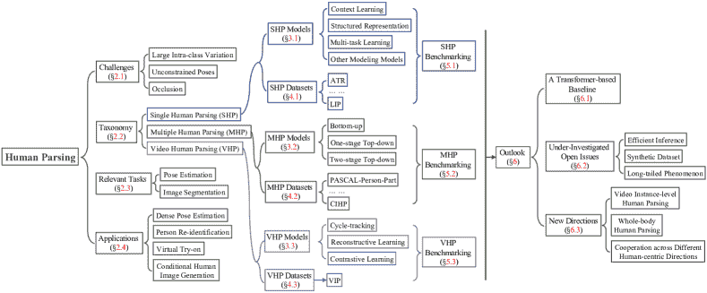
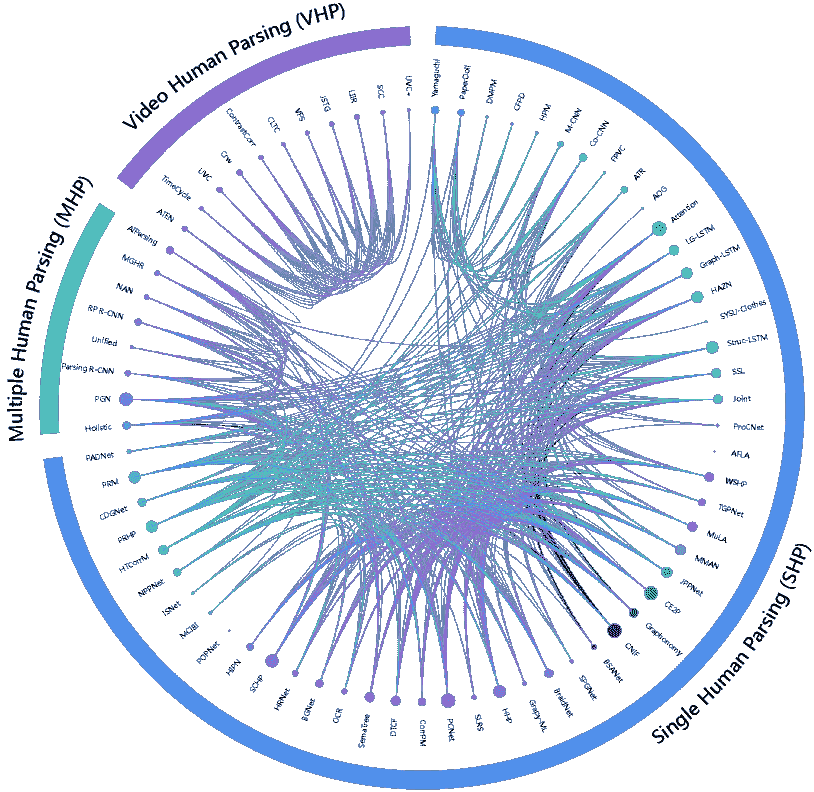

<!--yml

分类：未分类

日期：2024-09-06 19:42:35

-->

# [2301.00394] 用于人类解析的深度学习技术：综述与展望

> 来源：[`ar5iv.labs.arxiv.org/html/2301.00394`](https://ar5iv.labs.arxiv.org/html/2301.00394)

# 《用于人类解析的深度学习技术：综述与展望》

陆阳、贾文赫、李珊、宋青均来自北京邮电大学，北京，100876，中国（电子邮件：soeaver@bupt.edu.cn；jiawh@bupt.edu.cn；ls1995@bupt.edu.cn；priv@bupt.edu.cn）通讯作者：宋青（电子邮件：priv@bupt.edu.cn）

###### 摘要

人类解析旨在将图像或视频中的人分割成多个像素级语义部分。在过去十年中，这一领域在计算机视觉社区中引起了显著的关注，并已被广泛应用于安全监控、社交媒体、视觉特效等各种实际应用中。尽管基于深度学习的人类解析解决方案取得了显著成就，但许多重要概念、现有挑战以及潜在的研究方向仍然令人困惑。在这项综述中，我们全面回顾了三个核心子任务：单个人类解析、多个人类解析和视频人类解析，介绍了它们各自的任务设置、背景概念、相关问题和应用、代表性文献及数据集。我们还对所评审的方法在基准数据集上的定量性能进行了比较。此外，为了促进社区的可持续发展，我们提出了一种基于变换器的人类解析框架，通过通用、简洁和可扩展的解决方案，为后续研究提供了高性能的基准。最后，我们指出了该领域的一组尚未充分研究的开放问题，并提出了未来研究的新方向。我们还提供了一个定期更新的项目页面，以持续跟踪这一快速发展的领域的最新进展：[`github.com/soeaver/awesome-human-parsing`](https://github.com/soeaver/awesome-human-parsing)。

###### 关键词：

人类解析，人类解析数据集，深度学习，文献综述

## 1 引言

人类解析[1, 2, 3, 4, 5]，被视为以人为中心的视觉理解的基本任务[6]，旨在对图像或视频中的人类部位和衣物配件进行像素级分类。由于其在广泛应用领域中的关键作用，例如安全监控、自动驾驶、社交媒体、电子商务、视觉特效、艺术创作，已进行了大量研究，产生了各种优秀的人类解析解决方案和应用。

图 1：本综述中回顾的人类解析任务：（a）单人类解析 (SHP) [7]；（b）多人人类解析 (MHP) [8]；（c）视频人类解析 (VHP) [9]。

早在本世纪初，一些研究尝试在非常有限的情况下识别上半身服装的层次[10]、服装的语法表示[11]和身体轮廓的变形[12]。这些早期研究促进了对像素级人类部件和服装识别的研究，即人类解析任务。随后，一些传统的机器学习和计算机视觉技术被用于解决人类解析问题，例如，结构化模型[13, 14, 1]，聚类算法[15]，语法模型[16, 17]，条件随机场[18, 19, 20]，模板匹配[21, 22]和超像素[23, 24, 25]。此后，深度学习和卷积神经网络[26, 27, 28, 29, 30, 31, 32]的繁荣进一步促进了人类解析的蓬勃发展。注意力机制[33, 34, 35, 36]，尺度感知特征[37, 38, 39, 40]，树结构[3, 41]，图结构[42, 4, 43]，边缘感知学习[44, 45, 46]，姿态感知学习[2, 47, 48]和其他技术[49, 50, 51, 52]极大地提高了人类解析的性能。然而，一些现存的挑战和未被充分研究的问题使得人类解析仍然是一个值得进一步探索的任务。

图 2：本调查的概述。

随着人类解析技术的快速发展，已产生了若干文献综述。然而，现有的综述既不精确也不深入：有些综述仅从宏观时尚/社交媒体视角提供了对人类解析的表面介绍[53, 54]，或者仅从微观面部解析的角度回顾了人类解析的一个子任务[55]。此外，由于分类模糊和方法多样性，迫切需要全面且深入的调查。为此，我们提供了首个系统介绍背景概念、最新进展及对人类解析的展望的综述。

### 1.1 范围

本调查从全面的角度回顾了人体解析，包括单一人体解析（图 1 (a)）、多人体解析（图 1 (b)）以及视频人体解析（图 1 (c)）。在技术层面，本调查重点关注了过去十年基于深度学习的人体解析方法和数据集。为了提供必要的背景，还介绍了一些来自非深度学习和其他领域的相关文献。在实践层面，对各种方法的优缺点进行了比较，并给出了详细的性能比较。除了总结和分析现有工作外，我们还展望了人体解析的未来机会，并提出了一种基于新型变换器的基线，以促进社区的可持续发展。整理的人体解析方法和数据集列表以及所提出的基于变换器的基线可以在 [`github.com/soeaver/awesome-human-parsing`](https://github.com/soeaver/awesome-human-parsing) 找到。

### 1.2 组织结构

图 2 展示了本次调查的概要。§2 简要介绍了问题表述与挑战 (§2.1)、人类解析分类 (§2.2)、相关任务 (§2.3)和人类解析的应用 (§2.4)。§3 详细回顾了代表性深度学习基础的人类解析研究。经常使用的数据集和性能比较在§4 和§5 中进行了回顾。人类解析的未来机会展望在§6 中呈现，包括新的基于变换器的基线 (§6.1)、几个未被充分研究的开放问题 (§6.2)和新的研究方向 (§6.3)。结论将在§7 中得出。

## 2 前言

### 2.1 问题表述与挑战

正式地，我们使用$x$表示输入的以人为中心的数据，$y$表示像素级的监督目标，$\mathcal{X}$和$\mathcal{Y}$表示输入数据和监督目标的空间。人类解析的任务是将数据$x$映射到目标$y$：$\bm{\mathcal{X}}\mapsto\bm{\mathcal{Y}}$。该问题的表述与图像分割[56]一致，但$\mathcal{X}$限于以人为中心的空间。因此，在许多文献中，人类解析被视为细粒度的图像分割。

人体解析的核心问题是如何建模人体结构。众所周知，人体呈现出高度结构化的层次结构，所有部位自然地相互作用。大多数解析器希望显式或隐式地构建这种相互作用。然而，以下挑战使得问题变得更加复杂：

$\bullet$ 类内大变异。在人体解析中，具有大视觉外观差异的物体可能属于相同的语义类别。例如，“上衣”是一个抽象概念，没有严格的视觉约束。许多种颜色、纹理和形状的物体都属于这个类别，导致类内变异显著。照明变化、不同视角、噪声污染、低图像分辨率和滤波失真可能会带来进一步的挑战。类内大变异将增加分类器学习决策边界的难度，导致预测中的语义不一致。

$\bullet$ 不受约束的姿势。在早期的人体解析基准 [1, 25, 14, 37] 中，数据通常来自时尚媒体。在这些数据中，人们通常站立或有有限数量的简单姿势。然而，在实际场景中，人类姿势是不受约束的，表现出极大的多样性。因此，越来越多的研究开始关注现实世界中的人体解析。不受约束的姿势将几何地增加目标的状态空间，这给人体语义表示带来了极大的挑战。此外，人体解析中的左右辨别问题非常普遍（*例如*，左臂与右臂，左腿与右腿），它也受到不受约束姿势的严重影响 [49, 44, 57]。

$\bullet$ 遮挡。遮挡主要表现为两种模式：（1）人与物体之间的遮挡；（2）人与人之间的遮挡。前者会破坏人体部位或衣物的连贯性，导致目标的显著信息不完整，形成局部语义丧失，并容易引起歧义 [37, 39]。后者则是一个更为严重的挑战。除了连贯性的破坏，它通常还会导致前景混淆。在人体解析中，只有被遮挡的目标人体被视为前景，而其他人则被视为背景。然而，它们有相似的外观，使得确定哪个部分属于前景变得困难 [58]。

备注。除了上述挑战外，一些基于场景的挑战也阻碍了人体解析的进展，例如在拥挤场景中的推理效率与准确性之间的权衡、运动模糊以及运动场景中的相机位置变化。

### 2.2 人体解析分类

根据输入空间 $\mathcal{X}$ 的特征（人类数量，数据模态），人类解析可以分为三类子任务（见图 1）：单人解析、多人人解析和视频人类解析。

$\bullet$ 单人解析（SHP）。SHP 是人类解析的基石，假设图像中只有一个前景人类实例。因此，$y$ 只包含像素级别的语义类别监督。简单直接的任务定义使得大多数相关研究集中于如何建模稳健且具有泛化能力的人体部件关系。除了作为人类解析的基石，SHP 还经常用作某些任务的辅助监督，例如，*人物重识别*、*人体网格重建*、*虚拟试穿*。

$\bullet$ 多人解析（MHP）。多人解析，也称为实例级别的人类解析，旨在一次性解析多个人体实例。除了类别信息，$y$ 还提供像素级别的实例监督，即每个像素的人物身份。MHP 的核心问题是如何区分不同的人体实例以及如何在拥挤的场景中全面学习每个人体特征。此外，推理效率也是 MHP 的一个重要关注点。理想情况下，推理应实时进行，并且与人体实例的数量无关。除了作为独立任务，MHP 有时还与其他人类视觉理解任务以多任务学习的方式联合，例如姿态估计 [59, 60]、密集姿态 [61] 或全景分割 [62]。

$\bullet$ 视频人类解析（VHP）。VHP 需要解析视频数据中的每个人体，这可以看作是一个复杂的视觉任务，结合了视频分割和图像级别的人体解析。目前的 VHP 研究主要采用无监督的视频对象分割设置 [63]，即在训练阶段 $y$ 是未知的，而在推理阶段提供第一帧的真实数据。时间上的对应关系只能根据 $x$ 进行近似。相对于 SHP 和 MHP，VHP 面临更多在视频分割设置中不可避免的挑战，例如，*运动模糊* 和 *摄像头位置变化*。得益于视频数据的逐渐普及，VHP 具有广泛的应用潜力，典型案例包括智能监控和视频编辑。

备注。近年来，一些潜在的研究方向也受到了关注，包括弱监督人类解析 [64, 51, 48]、单次人类解析 [65, 66] 和交互式人类解析 [67]。

### 2.3 相关任务

在计算机视觉研究中，有一些任务与人体解析有很强的相关性，这些任务在以下内容中做了简要描述。

$\bullet$ 姿态估计。姿态估计的目的是定位人体部位并从输入数据中构建身体表示（例如骨架）。人体解析和姿态估计共享相同的输入空间 $\mathcal{X}$，但在监督目标上存在一些差异。最关键的区别在于人体解析是一个密集预测任务，需要预测每个像素的类别。而姿态估计是一个稀疏预测任务，仅关注有限数量的关键点的位置。这两个任务也常常在多任务学习中呈现，或者其中一个作为另一个的指导条件。例如，作为指导的人体解析可以帮助姿态估计减少衣物对人体外观的影响 [19]。

$\bullet$ 图像分割。图像分割是图像处理和计算机视觉中的一个基础主题。它主要包括语义分割和实例分割。作为一个基本的视觉任务，有许多研究方向可以视为分支，而人体解析就是其中之一。在深度学习前时代，图像分割关注颜色、纹理和边缘的连续性，而人体解析更关注身体拓扑建模。在深度学习时代，这两个领域的方法表现出更多的相似性。然而，越来越多的人体解析文献选择将部分关系建模作为目标，这与图像分割的一般目标显著不同。因此，人类解析和图像分割是紧密相关但独立的问题。

注释。通常，大多数以人为中心的密集预测任务与人体解析呈现出积极相关性，*例如*，人类抠图 [68, 69]，人类网格重建 [70, 71] 和面部/手部解析 [72, 73]。

图 3：2012 至 2022 年代表性人体解析工作的时间线。上部分表示人体解析的数据集（§4），下部分表示人体解析的模型（§3）。

### 2.4 人体解析的应用

作为计算机视觉中的一个关键任务，基于人体解析的应用有很多。我们将在下面介绍一些常见的应用。

$\bullet$ **密集姿态估计**。密集姿态估计的目标是将 RGB 图像中的所有人体像素映射到人体的 3D 表面[74]。人体解析是一个重要的前提条件，可以限制密集点的映射。目前，主流的密集姿态估计方法明确地整合了人体解析监督，例如**DensePose R-CNN**[74]、**Parsing R-CNN**[61]和**SimPose**[75]。因此，人体解析的性能将直接影响密集姿态估计结果。

$\bullet$ **行人重识别**。行人重识别旨在预测来自不同摄像头的两张图像是否属于同一个人。人体的显著特征是影响准确性的一个重要因素。人体解析可以提供像素级的语义信息，帮助重识别模型感知人体部位/衣物的位置和组成。各种研究已经显式或隐式地将人体解析引入重识别方法，这在多个方面提高了模型性能，*例如*，局部视觉线索[76, 77]、空间对齐[78, 79, 80]、背景偏差消除[81]、领域适应[82]、换衣服[83, 84]。

$\bullet$ **虚拟试衣**。虚拟试衣是视觉和图形社区中的一个新兴且有趣的应用[85, 86, 87, 88, 89, 90, 91, 92]。大多数研究遵循三个过程：人体解析、外观生成和优化。因此，人体解析是获得衣物遮罩、外观约束和姿态维护的必要步骤。最近，一些研究开始探索**无解析虚拟试衣**[93, 94, 95]。通过教师-学生学习、基于解析的预训练等技术，可以在推理过程中无需人体解析图即可实现虚拟试衣。然而，这些工作中的大多数仍在训练过程中引入了解析结果，因此生成质量与基于解析的方法存在差距。

$\bullet$ 条件人类图像生成。近年来，图像生成/合成领域取得了很大进展[96，97，98，99]。大量高质量但虚构的图像可以被创建出来。其中，由于其丰富的下游应用，人类图像生成受到了关注。与无条件生成相比，有条件生成可以根据需要产生相应的输出，而人体关键点图是最常用的先决条件之一。在基于解析的有条件生成人类图像方面有很多优秀的作品，*例如*，CPFNet[100]和 InsetGAN[101]。

备注。除了以上情况，在一般情况下，大部分以人为中心的生成应用可以借助人类解析的帮助构建，*例如*，deepfakes[102，103]，风格转换[104，105，106]，服装编辑[107，108，109]。

## 3 基于深度学习的人类解析

现有的人类解析可以分为三个子任务：单人解析、多人解析和视频人体解析，分别侧重于部件关系建模、人体实例区分和时间对应学习。根据这个分类法，我们整理出代表性作品（图 3 的下部分）并对其进行详细审查。

### 3.1 单人解析(SHP)模型

SHP 通过部件关系建模提取人类特征。根据建模策略，SHP 模型可以分为三个主要类别：上下文学习、结构化表示和多任务学习。此外，考虑到一些特殊但有趣的方法，我们将对其进行“其他建模模型”的回顾。表 I Models ‣ 3 Deep Learning Based Human Parsing ‣ Deep Learning Technique for Human Parsing: A Survey and Outlook")总结了评审的 SHP 模型的特点。

表 I：总结了评审的 SHP 模型基本特征（§3.1 Models ‣ 3 Deep Learning Based Human Parsing ‣ Deep Learning Technique for Human Parsing: A Survey and Outlook")）。训练数据集以及是否开源也在列表中列出。详细描述数据集，请参见§4。这些注释也适用于其他表格。

|   |  |  | 上下文 | 结构化 | 多任务 | 其他 |  |  |
| --- | --- | --- | --- | --- | --- | --- | --- | --- |
| 年份 | 方法 | 发表 | 注意力 | 尺度感知 | 树状 | 图形 | 边缘 | 姿势 | 降噪 | 对抗性 | 数据集 | 开源 |
| 2012 | Yamaguchi [1] | CVPR | - | - | - | - | - | ✓ | - | - | FS | - |
| 2013 | DMPM [14] | ICCV | - | - | ✓ | - | - | - | - | - | FS/DP | - |
| PaperDoll [20] | ICCV | - | - | - | - | - | ✓ | - | - | FS | - |
| CFPD [25] | TMM | - | - | - | - | - | ✓ | - | - | CFPD | - |
| 2014 | HPM [17] | CVPR | - | - | ✓ | - | - | ✓ | - | - | FS/DP | - |
| 2015 | M-CNN [110] | CVPR | - | - | - | ✓ | - | - | - | - | ATR | - |
| Co-CNN [37] | ICCV | - | ✓ | - | - | - | - | - | - | FS/ATR | - |
| FPVC [111] | TMM | - | - | - | - | - | ✓ | - | - | FS/DP | - |
| ATR [22] | TPAMI | - | - | ✓ | - | - | - | - | - | FS/DP | - |
| 2016 | AOG [112] | AAAI | - | - | ✓ | - | - | ✓ | - | - | - | - |
| Attention [33] | CVPR | ✓ | ✓ | - | - | - | - | - | - | PPP | ✓ |
| LG-LSTM [34] | CVPR | ✓ | - | - | - | - | - | - | - | FS/ATR/PPP | - |
| Graph-LSTM [113] | ECCV | ✓ | - | - | ✓ | - | - | - | - | FS/ATR/PPP | - |
| HAZN [38] | ECCV | - | ✓ | - | - | - | - | - | - | PPP | - |
| SYSU-Clothes [114] | TMM | - | - | - | ✓ | - | - | - | - | SYSU-Clothes | - |
| 2017 | Struc-LSTM [115] | CVPR | ✓ | - | ✓ | ✓ | - | - | - | - | ATR/PPP | - |
| SSL [116] | CVPR | - | - | - | - | - | ✓ | - | - | LIP/PPP | ✓ |
| Joint [117] | CVPR | - | - | - | - | - | ✓ | - | - | PPP | - |
| 2018 | ProCNet [118] | AAAI | - | - | ✓ | - | - | - | - | - | PPP | - |
| AFLA [49] | AAAI | - | - | - | - | - | - | - | ✓ | LIP | - |
| WSHP [64] | CVPR | - | - | - | - | - | ✓ | - | - | PPP | - |
| TGPNet [119] | MM | - | ✓ | - | - | - | - | - | - | ATR | ✓ |
| MuLA [47] | ECCV | - | - | - | - | - | ✓ | - | - | LIP/PPP | - |
| MMAN [50] | ECCV | - | - | - | - | - |  | - | ✓ | LIP/PPP/PPSS | ✓ |
| JPPNet [2] | TPAMI | - | - | - | - | - | ✓ | - | - | LIP/PPP | ✓ |
| 2019 | CE2P [44] | AAAI | - | ✓ | - | - | ✓ | - | - | - | LIP | ✓ |
| Graphonomy [42] | CVPR | - | - | ✓ | ✓ | - | - | - | - | ATR/PPP | ✓ |
| CNIF [3] | ICCV | - | - | ✓ | - | - | - | - | - | ATR/LIP/PPP | ✓ |
| BSANet [120] | ICCV | - | ✓ | - | - | ✓ | - | - | - | PPP | - |
| SPGNet [36] | ICCV | ✓ | - | - | - | - | - | - | - | PPP | - |
| BraidNet [57] | MM | - | ✓ | - | - | - | - | - | - | LIP | - |
| 2020 | Grapy-ML [121] | AAAI | ✓ | - | ✓ | ✓ | - | - | - | - | ATR/PPP | ✓ |
| HHP [4] | CVPR | - | - | ✓ | ✓ | - | - | - | - | ATR/LIP/PPP/PPSS | ✓ |
| SLRS [51] | CVPR | - | - | - | ✓ | ✓ | - | ✓ | - | ATR/LIP | - |
| PCNet [39] | CVPR | - | ✓ | - | ✓ | - | - | - | - | LIP/PPP | - |
| CorrPM [45] | CVPR | - | - | - | - | ✓ | ✓ | - | - | ATR/LIP | ✓ |
| DTCF [46] | MM | - | ✓ | - | - | ✓ | - | - | - | LIP/PPP | - |
| SemaTree [41] | ECCV | ✓ | - | ✓ | - | - | - | - | - | LIP | ✓ |
| OCR [122] | ECCV | ✓ | ✓ | - | - | - | - | - | - | LIP | ✓ |
| BGNet [123] | ECCV | - | - | ✓ | ✓ | - | - | - | - | LIP/PPP/PPSS | - |
| HRNet [124] | TPAMI | - | ✓ | - | - | - | - | - | - | LIP | ✓ |
| SCHP [52] | TPAMI | - | - | - | - | ✓ | - | ✓ | - |

&#124; ATR/LIP/PPP &#124;

| ✓ |
| --- |
| 2021 | HIPN [125] | AAAI | - | - | - | - | - | - | ✓ | - | LIP/PPP | - |
| POPNet [65] | AAAI | ✓ | - | - | - | - | - | - | - | ATR-OS | ✓ |
| MCIBI [126] | ICCV | ✓ | - | - | - | - | - | - | - | LIP | ✓ |
| ISNet [127] | ICCV | ✓ | - | - | - | - | - | - | - | LIP | ✓ |
| NPPNet [128] | ICCV | - | ✓ | - | - | - | ✓ | - | - | LIP/PPP | ✓ |
| HTCorrM [129] | TPAMI | ✓ | - | - | - | ✓ | ✓ | - | - | ATR/LIP | - |
| PRHP [130] | TPAMI | - | - | ✓ | ✓ | - | - | - | - | ATR/LIP/PPP/PPSS | ✓ |
| 2022 | CDGNet [131] | CVPR | ✓ | - | - | - | ✓ | - | - | - | ATR/LIP | ✓ |
| HSSN [5] | CVPR | - | ✓ | ✓ | - | - | - | - | - | LIP/PPP | ✓ |
| PRM [43] | TMM | - | - | - | ✓ | - | - | - | - | LIP/PPP | - |
| PADNet [48] | TPAMI | - | - | - | - | - | ✓ | - | - | PPP | - |

#### 3.1.1 上下文学习

上下文学习作为单人解析的主流范式，旨在学习局部和全局特征之间的联系，以建模人体部位之间的关系。最近的研究开发了多种上下文学习方法来处理单人解析问题，包括注意力机制和尺度感知特征。

$\bullet$ 注意力机制。最初的倡议在 [33] 中提出，应用注意力机制进行部件关系建模。具体而言，注意力机制学习的软权重用于加权不同尺度的特征并将其合并。几乎同时，LG-LSTM [34]、Graph-LSTM [113] 和 Struc-LSTM [115] 通过长短期记忆 (LSTM) [132] 开发了复杂的局部和全局上下文信息，取得了非常有竞争力的结果。随后，[36] 提出了一个语义预测引导 (SPG) 模块，该模块通过像素级语义预测的指导来学习重新加权局部特征。随着图模型的兴起，研究人员认识到注意力机制能够建立图模型节点之间的关联。例如，[121] 引入了图金字塔互学习 (Grapy-ML) 来解决跨数据集的人体解析问题，其中自注意力用于建模上下文节点之间的相关性。尽管注意力机制在以前的工作中取得了很好的结果，但由于缺乏明确的先验监督，全球上下文依赖性不能完全理解。CDGNet [131] 采用了在水平和垂直方向上积累的人体解析标签作为监督，旨在学习人体部件的位置分布，并通过注意力机制将其加权到全局特征中，以实现准确的部件关系建模。

$\bullet$ 尺度感知特征。最直观的上下文学习方法是直接使用尺度感知特征（*例如*，多尺度特征 [133, 134]，特征金字塔网络 [135, 136]），这些方法已在语义分割 [56] 中得到广泛验证。最早的努力可以追溯到 CoCNN [37]。它将跨层上下文、全局图像级上下文、超像素上下文和跨超像素邻域上下文整合到一个统一的架构中，解决了 FCN [31] 中低分辨率特征在建模部件关系时的障碍。随后，[38] 提出了分层自适应缩放网络 (HAZN)，它自适应地将预测图像区域缩放到适当的尺度以细化解析。TGPNet [119] 认为标签碎片化和复杂的注释在人体解析数据集中是阻碍准确部件关系建模的不可忽视的问题，尝试通过监督多尺度上下文信息来缓解这一限制。PCNet [39] 进一步研究了自适应上下文特征，并通过提出的部件类别模块、关系聚合模块和关系分散模块，捕获了代表性的全局上下文，通过挖掘人体部件的相关语义。

#### 3.1.2 结构化表示

结构化表示的目的是学习人类各部分的固有组合或分解模式，以便建模各部分之间的关系。该领域的研究主要沿着两个方向进行：使用树形结构表示身体与部件之间的层次关系，以及使用图形结构表示不同部件之间的连接关系。这两个思路是相辅相成的，因此在一些最近的工作中经常被同时采用。

$\bullet$ 树形结构。DMPM [14] 和 HPM [17] 通过使用解析表示解决了单一人体解析问题，该表示通过低级过度分割算法构建一组可解析的片段，并将这些片段表示为叶节点，然后搜索最佳图配置以获得语义人体解析结果。同样，[22] 将人体解析公式化为一个主动模板回归（ATR）问题，其中每个人体部件被表示为学习到的掩膜模板的线性组合，并通过主动形状参数变形为更精确的掩膜。然后，人体解析结果由掩膜模板系数和主动形状参数生成。在同一工作方向上，ProCNet [118] 将人体解析视为一个逐步识别任务，通过定位整个身体然后逐渐分割层次组件来建模结构化部件关系。CNIF [3] 进一步扩展了人体树形结构，将人体表示为多层次语义部件的层次结构，将人体解析视为一个多源信息融合过程。[41] 中开发了一种更高效的解决方案，该方案使用树形结构对人体生理组成进行编码，然后设计了一个粗到细的级联过程，以生成准确的解析结果。

$\bullet$ 图结构。图结构是一种出色的关系建模方法。一些研究人员考虑将其引入到人体解析网络中以进行部件关系推理。[114] 设计了一个服装共解析系统，该系统将分割区域作为顶点。它结合了服装配置的多个上下文来构建多图像图形模型。为了解决跨数据集的人体解析问题，Graphonomy [42] 提出了一个通用的人体解析代理，引入了层次图传输学习以编码潜在的标签语义元素并传播相关的语义信息。BGNet [123] 希望通过图结构提高在类似或杂乱场景下的人体解析准确性。它利用人体固有的层次结构以及不同人体部位之间的关系，采用级联和并行的语法规则来纠正容易混淆的人体部位的分割性能。Wang *et al*.[4, 130] 提出了这一领域的一个标志性工作。构建了一个层次化人体解析器（HHP），通过分解、组合和依赖三种部件关系来表示层次化的人体结构。此外，HHP 使用消息传递反馈推理方案的视角来有效推理人体结构。沿着这一思路，[43] 提出了部件感知关系建模（PRM）来处理人体解析，为各种大小和形状的人体部件生成具有自适应上下文的特征。

#### 3.1.3 多任务学习

辅助监督可以帮助解析器更好地理解部件之间的关系，例如部件边缘或人体姿态。因此，多任务学习已经成为单一人体解析的重要范式。

$\bullet$ 边缘感知学习。边缘信息在人体解析数据集中是隐含的。因此，边缘感知的监督或特征可以在没有额外标注成本的情况下引入到人体解析器中。特别是，边缘感知学习可以增强模型区分相邻部件的能力，并改善部件边界的精细度。典型的工作是 [44]，提出了一种具有边缘感知的上下文嵌入（CE2P）框架，使用边缘感知模块将对象轮廓的特征融入以细化部件边界。由于其优异的性能和可扩展性，CE2P 已成为许多后续工作的基准。CorrPM [45] 和 HTCorrM [129] 是建立在 CE2P 上的，进一步利用部件边缘帮助模型处理部件关系。它们构建了一个异质非局部模块，将边缘、姿态和语义特征混合成一个混合表示，并探索混合表示与解析特征图在所有位置之间的空间亲和力。BSANet [120] 认为边缘信息有助于消除部件级别的模糊性，提出了一个具有边界和语义感知的联合解析框架来解决这个问题。具体而言，采用一个边界感知模块使中间级特征专注于部件边界以实现准确定位，然后将其与高层特征融合以实现高效的部件识别。为了进一步丰富边缘感知特征，[46] 中开发了一个双任务级联框架（DTCF），该框架隐式地整合了解析和边缘特征，以逐步细化人体解析结果。

$\bullet$ 姿态感知学习。人体解析和姿态估计都试图预测密集和结构化的人体表示，它们之间存在高度的内在关系。因此，一些研究尝试使用姿态感知学习来辅助部件关系建模。早在 2012 年，Yamaguchi *et al*. [1, 20] 探索了服装与身体姿态之间的关系，研究了将穿着服装的人准确解析为其组成衣物片段的技术。几乎立即，Liu *et al*. [25] 将人体姿态估计模块与基于 MRF 的颜色/类别推断模块和超像素类别分类器模块结合，用于解析图像中的时尚物品。随后，Liu *et al*. [111] 将这一思想扩展到半监督人体解析，收集大量未标记的视频，使用跨帧上下文进行人体姿态共同估计，然后进行视频联合人体解析。SSL [116] 和 JPPNet [2] 选择将人体姿态结构强加到解析结果中，而不依赖额外的监督，并采用多任务学习方式探索有效的人体部件关系建模。类似的工作由 [47] 开发，该工作提出了一种互学习适应模型（MuLA），用于联合人体解析和姿态估计。MuLA 可以通过整合来自相关模型的信息，快速调整解析和姿态模型，以提供更强健和准确的结果。与上述工作不同，Zeng *et al*. [128] 专注于如何自动设计一个统一模型并同时执行两个任务以相互受益。受到 NAS [137] 的启发，他们提出了搜索高效网络架构（NPPNet），分别搜索编码器-解码器架构，并将 NAS 单元嵌入多尺度特征交互和高级特征融合中。为了摆脱标注像素级人体部件掩码，PADNet [48] 提出了一个弱监督人体解析方法。他们开发了一个迭代训练框架，将姿态知识转化为部件先验，从而在训练过程中只需要姿态注释，大大减轻了标注负担。

表 II: SHP 模型的部件关系建模方法的亮点 (§3.1)。每种方法的代表性工作也有所给出。

|   方法 |
| --- |

&#124; 代表性 &#124;

&#124; 工作 &#124;

| 亮点 |
| --- |
| 注意 |

&#124; [33, 34, 113] &#124;

&#124; [115, 36, 121] &#124;

&#124; [131] &#124;

|

&#124; 有助于定位感兴趣的人的部分， &#124;

&#124; 抑制无用的背景信息。 &#124;

|

| 规模感知 |
| --- |

&#124; [37, 38, 119] &#124;

&#124; [39] &#124;

|

&#124; 低级纹理与高级语义融合 &#124;

&#124; 特征，帮助解析小的人体部位。 &#124;

|

| 树 |
| --- |

&#124; [14, 17, 22] &#124;

&#124; [118, 3, 41] &#124;

|

&#124; 模拟组成和分解 &#124;

&#124; 人体部位与身体之间的关系。 &#124;

|

| 图 |
| --- |

&#124; [114, 42, 123] &#124;

&#124; [4, 130, 43] &#124;

|

&#124; 建模解析结果与身体结构之间的相关性和差异 &#124;

&#124; 人体部位。 &#124;

|

| 边缘 |
| --- |

&#124; [44, 45, 129] &#124;

&#124; [120, 46] &#124;

|

&#124; 解决边界上的像素混淆问题 &#124;

&#124; 生成更精细的边界。 &#124;

|

| 姿态 |
| --- |

&#124; [1, 20, 25] &#124;

&#124; [111, 116, 2] &#124;

&#124; [47, 128, 48] &#124;

|

&#124; 作为上下文线索以提高语义一致性 &#124;

&#124; 解析结果与身体结构之间的差异。 &#124;

|

| 去噪 |
| --- |

&#124; [51, 52, 125] &#124;

|

&#124; 缓解超像素或标注的影响 &#124;

&#124; 错误，提高鲁棒性。 &#124;

|

| 对抗 |
| --- |

&#124; [49, 50] &#124;

|

&#124; 减少训练数据与测试数据之间的领域差异 &#124;

&#124; 数据和测试数据，提高泛化能力。 &#124;

|

#### 3.1.4 其他建模模型

其他工作尝试使用上述分类之外的技术，如去噪和对抗学习，这些技术也对人体部位关系建模做出了特定贡献，值得单独探讨。

$\bullet$ 去噪。为了降低标注成本，主流 SHP 数据集中存在大量噪声[22, 116]，因此，针对准确人体部件关系建模的去噪学习也受到了关注。SCHP [52] 是最具代表性的工作。它从使用不准确的解析标签作为初始化开始，并设计了一个循环学习调度器，以推断更可靠的伪标签。在同一时期，Li *et al*. [51] 尝试将去噪学习与半监督学习相结合，提出了用于人体解析的自学习与矫正（SLR）策略。SLR 生成伪标签用于未标记的数据，以重新训练解析模型，并引入一种可训练的图推理方法来修正伪标签中的典型错误。基于 SLR，HIPN [125] 进一步探索将去噪学习与半监督学习相结合，发展了噪声容忍混合学习，利用正负学习来更好地处理噪声伪标签。

$\bullet$ 对抗学习。早期，受到生成对抗网络（GAN）[96]的启发，一些研究利用对抗学习解决部件关系建模中的问题。例如，为了解决领域适应问题，AFLA [49] 提出了一个跨领域人体解析网络，引入了一个判别特征对抗网络和一个结构化标签对抗网络，以消除视觉外观和环境条件的跨领域差异。MMAN [50] 希望解决像素级分类损失中的低级局部和高级语义不一致问题。它包含两个判别器：Macro D，作用于低分辨率标签图，惩罚语义不一致；Micro D，专注于高分辨率标签图，抑制局部不一致。

备注。实际上，许多单一的人体解析模型使用了各种部件关系建模方法。因此，我们上述的分类仅介绍了每种模型的核心方法。表 II Models ‣ 3 Deep Learning Based Human Parsing ‣ Deep Learning Technique for Human Parsing: A Survey and Outlook") 总结了每种部件关系建模方法的亮点。

### 3.2 多人类解析（MHP）模型

MHP 旨在定位和解析图像平面上的每个人。任务设置类似于实例分割，因此也被称为实例级人体解析。我们根据区分人体实例的管道将 MHP 分为三个范式：自下而上、一阶段自上而下和两阶段自上而下。所评审的 MHP 模型的基本特征在表 III Models ‣ 3 Deep Learning Based Human Parsing ‣ Deep Learning Technique for Human Parsing: A Survey and Outlook")中进行了说明。

表 III：审查的 MHP 模型的主要特征总结（§3.2）。“BU”表示自下而上；“1S-TD”表示单阶段自上而下；“2S-TD”表示双阶段自上而下。

|   年份 | 方法 | 出版 | 流程 | 数据集 | 开源 |
| --- | --- | --- | --- | --- | --- |
| 2017 | Holistic [138] | BMVC | 1S-TD | PPP | - |
| 2018 | PGN [8] | ECCV | BU | PPP/CIHP | ✓ |
| 2019 | CE2P [44] | AAAI | 2S-TD | CIHP/MHP-v2.0 | ✓ |
| Parsing R-CNN [61] | CVPR | 1S-TD | CIHP/MHP-v2.0 | ✓ |
| BraidNet [57] | MM | 2S-TD | CIHP | - |
| Unified [139] | BMVC | 1S-TD | PPP/CIHP | - |
| 2020 | RP R-CNN [140] | ECCV | 1S-TD | CIHP/MHP-v2.0 | ✓ |
| SemaTree [41] | ECCV | 2S-TD | CIHP/MHP-v2.0 | ✓ |
| NAN [141] | IJCV | BU | MHP-v1.0/MHP-v2.0 | ✓ |
| SCHP [52] | TPAMI | 2S-TD | CIHP/MHP-v2.0/VIP | ✓ |
| 2021 | MGHR [59] | CVPR | BU |

&#124; PPP/MHP-v2.0 &#124;

&#124; /COCO-DP &#124;

| ✓ |
| --- |
| 2022 | AIParsing [142] | TIP | 1S-TD | CIHP/MHP-v2.0/VIP | - |

$\bullet$ 自下而上的方法。自下而上的范式将多人体解析视为细粒度语义分割任务，预测每个像素的类别，并将其分组为相应的人体实例。在一项开创性的工作[8]中，Gong *等人* 提出了一个无检测的部件分组网络（PGN），将多人体解析重新定义为两个双胞胎子任务（语义部件分割和实例感知边缘检测），这些子任务可以通过统一的网络共同学习和相互优化。其中，实例感知边缘检测任务可以将语义部件分组为不同的人体实例。然后，NAN [141] 提出了一个深度嵌套对抗网络用于多人体解析。NAN 由三个类似 GAN 的子网络组成，分别执行语义显著性预测、实例无关解析和实例感知聚类。最近，Zhou *等人* [59] 提出了一个新的自下而上的模式，以联合和端到端的方式学习类别级别的多人体解析及姿态估计，称为多粒度人体表示（MGHR）学习。MGHR 利用不同人体粒度的结构信息，将困难的像素分组问题转化为较易的多人体联合组装任务，以简化人体实例区分的难度。

$\bullet$ 一阶段自上而下。 一阶段自上而下是多人体解析的主流范式。它首先在图像平面上定位每个人体实例，然后以端到端的方式对每个人体部位进行分割。早期尝试是 Holistic [138]，它包括一个人体检测网络和一个部位语义分割网络，然后将两个网络的结果传递给实例 CRF [143] 进行多人体解析。受 Mask R-CNN [144] 启发，Qin *et al*. [139] 提出了一个自上而下的统一框架，该框架同时进行人体检测和单人人体解析，识别实例并在拥挤场景中解析人体部位。杨 *et al* 提出了一个里程碑式的一阶段自上而下的多人体解析模型，该模型在各个方面增强了 Mask R-CNN，并提出了 Parsing R-CNN [61] 网络，简洁地大幅提高了多人体解析的准确性。随后，杨 *et al* 提出了 Parsing R-CNN 的改进版，称为 RP R-CNN [140]，将全局语义增强特征金字塔网络和解析重新评分网络引入高性能管道，实现了更好的性能。后来，AIParsing [142] 将无锚检测器 [145] 引入一阶段自上而下范式，用于区分人体实例，避免了由锚点引起的超参数敏感性。

$\bullet$ 二阶段自上而下。一阶段自上而下和二阶段自上而下范式在操作流程上基本相同。它们的区别在于检测器是否与分割子网络一起以端到端的方式训练。所有的二阶段自下而上的多人体解析方法都包括一个人体检测器和一个单人体解析器。最早的尝试是 CE2P [44]，它设计了一个名为 M-CE2P 的框架，该框架基于 CE2P 和 Mask R-CNN，对检测到的人体实例进行裁剪，然后将其发送到单人体解析器，最后将所有实例的解析结果组合成多人体解析预测。后续工作，如 BraidNet [57]、SemaTree [41] 和 SCHP [52]，基本上继承了这一流程。

备注。自下而上的一阶段自上而下的优势是效率，而二阶段自上而下的优势是准确性。但作为非端到端管道，二阶段自上而下的推理速度与人体实例的数量正相关，这也限制了其实际应用价值。三种人体实例区分方法的详细亮点总结在表 IV Models ‣ 3 Deep Learning Based Human Parsing ‣ Deep Learning Technique for Human Parsing: A Survey and Outlook")。

表 IV: MHP 模型的人类实例区分方法的亮点 (§3.2 Models ‣ 3 Deep Learning Based Human Parsing ‣ Deep Learning Technique for Human Parsing: A Survey and Outlook")）。每种方法的代表性工作也给出。

|   方法 |
| --- |

&#124; 代表性 &#124;

&#124; 工作 &#124;

| 亮点 |
| --- |
| 自下而上 |

&#124; [8, 141, 59] &#124;

|

&#124; 良好的模型效率，像素级的准确性较高 &#124;

&#124; 分割，且实例的准确性较差 &#124;

&#124; 区分. &#124;

|

|

&#124; 一阶段 &#124;

&#124; 自上而下 &#124;

|

&#124; [138, 61, 139] &#124;

&#124; [140, 142] &#124;

|

&#124; 模型效率与准确性之间的更好折衷. &#124;

&#124; 但像素级分割，尤其是部件 &#124;

&#124; 边界不够精细. &#124;

|

|

&#124; 两阶段 &#124;

&#124; 自上而下 &#124;

|

&#124; [44, 57, 41] &#124;

&#124; [52] &#124;

|

&#124; 准确性良好但效率差，模型推理 &#124;

&#124; 时间与人类实例的数量成正比. &#124;

|

### 3.3 视频人类解析（VHP）模型

现有的 VHP 研究主要集中在通过相似度矩阵将第一帧传播到整个视频中，该矩阵表示从原始视频数据中学习到的时间对应关系。考虑到无监督学习范式，我们可以将它们分为三类：循环跟踪、重建学习和对比学习。我们在表 V Models ‣ 3 Deep Learning Based Human Parsing ‣ Deep Learning Technique for Human Parsing: A Survey and Outlook") 中总结了回顾的 VHP 模型的基本特征。

表 V: 回顾的 VHP 模型的基本特征总结 (§3.3 Models ‣ 3 Deep Learning Based Human Parsing ‣ Deep Learning Technique for Human Parsing: A Survey and Outlook")）。“循环”表示循环跟踪；“重建”表示重建学习；“对比”表示对比学习。所有模型都在 VIP 数据集上进行测试。

|   年份 | 方法 | 出版 |
| --- | --- | --- |

&#124; 循环. &#124;

|

&#124; 重建. &#124;

|

&#124; 对比. &#124;

| 开源 |
| --- |
| 2018 | ATEN [9] | MM | ✓ | - | - | ✓ |
| 2019 | TimeCycle [146] | CVPR | ✓ | - | - | ✓ |
| UVC [147] | NeurIPS | ✓ | ✓ | - | ✓ |
| 2020 | CRW [148] | NeurIPS | ✓ | - | - | ✓ |
| 2021 | ContrastCorr [149] | AAAI | ✓ | ✓ |  | ✓ |
| CLTC [150] | CVPR | - | - | ✓ | - |
| VFS [151] | ICCV | - | - | ✓ | ✓ |
| JSTG [152] | ICCV | ✓ | - | ✓ | - |
| 2022 | LIIR [153] | CVPR | - | ✓ | - | ✓ |
| SCC [154] | CVPR | ✓ | - | ✓ | - |
| UVC+ [155] | ArXiv | ✓ | ✓ | ✓ | - |

$\bullet$ 循环跟踪。早期的 VHP 方法主要通过视频帧的循环一致性来建模无监督学习目标，*即*，像素/补丁在经过一轮前向-后向跟踪后应落在相同位置。ATEN[9] 首次利用卷积门控递归单元来编码时间特征级变化，非关键帧的光流与时间记忆结合以生成其特征。TimeCycle [146] 在视频中前向-后向跟踪参考补丁。跟踪周期结束时，参考补丁和跟踪补丁在空间坐标和特征表示上都被认为是一致的。同时，UVC [147] 通过共享亲和矩阵执行区域级跟踪和像素级对应，跟踪补丁特征和区域对应的子亲和矩阵用于重建参考补丁。然后将目标和参考补丁的角色交换，以将亲和矩阵正则化为正交，从而满足循环一致性约束。其后续版本 UVC+ [155] 将基于图像的任务学到的特征与基于视频的任务特征结合起来，进一步提升性能。最近，CRW [148] 将视频表示为图，其中节点是补丁，边是相邻帧中节点之间的亲和力。交叉熵损失指导图步行在特征空间中双向跟踪初始节点，经过一系列循环路径后被视为目标节点。然而，[146]、[148] 中的循环一致性严格假设目标补丁在连续帧中可见。一旦它被遮挡或消失，对应关系将被错误分配，从而在视频帧之间留下一个最优传输问题。

表 VI：VHP 模型时间对应学习方法的重点 (§3.3)。每种方法的代表性工作也被列出。

|   方法 |
| --- |

&#124; 代表性 &#124;

&#124; 工作 &#124;

| 亮点 |
| --- |

|

&#124; 循环- &#124;

&#124; 跟踪 &#124;

|

&#124; [146, 147] &#124;

&#124; [155, 148] &#124;

|

&#124; 捕捉时间变化，可能产生 &#124;

&#124; 遮挡发生时错误的对应关系。 &#124;

|

|

&#124; 重建 &#124;

&#124; 学习 &#124;

|

&#124; [149, 153] &#124;

|

&#124; 精细时间对应建模 &#124;

&#124; 并指导关注部件细节。 &#124;

|

|

&#124; 对比 &#124;

&#124; 学习 &#124;

|

&#124; [150, 151] &#124;

&#124; [152, 154] &#124;

|

&#124; 寻找区分性特征以进行分割 &#124;

&#124; 相似或位置变换的人体实例。 &#124;

| 

图 4：不同 SHP、MHP 和 VHP 方法的关联（§3.4）。我们通过弧边之间的连接来总结人体解析方法之间的关联，每条连接线代表一个使用这两种方法的研究。弧的长度越长，说明这种方法的数量越多，连接线的宽度也相同。这种关联总结揭示了各种人体解析方法的普及程度。

$\bullet$ 重建学习。由于视频内容在时间上平滑过渡，“查询”帧中的像素可以视为其他参考帧中一组像素的副本[156, 157]。沿袭 UVC [147]建立像素级对应关系，提出了几种方法[149, 153]，通过重建相关帧来完全学习时间对应关系。随后，ContrastCorr [149]不仅从视频内部自监督中学习，还进一步引入了视频间变换作为负对应关系。视频间的区分强制特征提取器在保留视频内部帧对之间细粒度匹配特征的同时，学习视频之间的区分。基于视频内外关联，LIIR [153]引入了一个位置感知重建框架，该框架编码位置信息，并将空间紧凑性融入到视频内对应关系学习中，以实现位置感知和高效视觉跟踪。

图 5：不同 SHP、MHP 和 VHP 研究的关联（§3.4）。我们通过点列出所有涉及的人体解析研究，并使用连接线表示它们的引用关系。这里的引用关系指的是实验比较中的引用，以避免背景介绍中低关联的引用。由于每条线代表两个研究之间的引用，因此点越大，引用次数越多。这些关联突出了相对突出的研究。

$\bullet$ 对比学习。遵循将正样本对拉近并将负样本对推远的思路，许多 VHP 算法采用对比学习作为训练目标。为了解决最优传输问题，CLTC [150] 提出了通过一致性估计和动态难度区分分别挖掘正样本和半硬负样本的对应关系。明确的正负像素对防止了来自不一致正样本和过硬/过易负样本对对比学习的副作用。具体而言，与大多数在补丁级别进行对比学习的方法不同，VFS [151] 在帧级别学习视觉对应关系。结合图像级对比学习的数据显示增强 [158] 和精心设计的时间采样策略，VFS 鼓励卷积特征找到类似物体和部分之间的对应关系。最近，[152, 154] 扩展了具有邻节点空间关系的视频图，这决定了来自帧内邻居的聚合强度。所提出的时空图更加关注中心-邻居对的关联，从而显著帮助学习部分实例之间的对应关系。SCC [154] 结合了顺序贝叶斯滤波器，以制定从一帧到其他帧跟踪节点的最佳路径，从而缓解随机遮挡造成的对应关系丢失。

备注。就我们的调查范围而言，目前的 VHP 研究基本上遵循无监督半自动视频对象分割设置。但考虑到潜在需求，更期待充分利用标注并通过实例区分的方式解决 VHP 问题，即细粒度视频实例分割任务。VHP 时间对应学习方法的亮点见表 VI Models ‣ 3 Deep Learning Based Human Parsing ‣ Deep Learning Technique for Human Parsing: A Survey and Outlook")。

### 3.4 摘要

通过详细审查，我们将 SHP、MHP 和 VHP 研究细分为多种方法，并讨论了它们的特征。为了进一步探讨人类解析社区的发展情况，我们总结了方法的相关性，如图 4 Models ‣ 3 Deep Learning Based Human Parsing ‣ Deep Learning Technique for Human Parsing: A Survey and Outlook") 和涉及研究的相关性，如图 5 Models ‣ 3 Deep Learning Based Human Parsing ‣ Deep Learning Technique for Human Parsing: A Survey and Outlook")。

图 4 Models ‣ 3 Deep Learning Based Human Parsing ‣ Deep Learning Technique for Human Parsing: A Survey and Outlook")展示了研究方法之间的相关性，即，如果一项研究使用了两个方法作为其技术组件，则这两种方法之间会有连接线，弧线的长度代表使用它们的研究数量。连接线的分布首先明显显示，SHP 的图（结构）、Attention（机制）和边缘（学习）与多个其他方法的相关性较高，这表明它们与其他方法的兼容性以及在社区中的普及程度。值得注意的是，尽管树（结构）与其他方法有许多相关性，但其中大部分与图方法相关。这一现象表明，与图、Attention 和边缘方法相比，树方法的普遍性要低得多。遗憾的是，VHP 与其他方法之间的微不足道的关系表明，当前的 VHP 研究尚未深入到部分关系建模或人类实例区分的研究中。

人类解析研究的相关性以引用关系的形式呈现，如图 5 Models ‣ 3 Deep Learning Based Human Parsing ‣ Deep Learning Technique for Human Parsing: A Survey and Outlook")所示，每一条线代表两项研究之间的引用。为了可靠的统计数据，我们只考虑所有研究中的实验比较中出现的引用。从引用关系中，我们可以很容易地观察到，Attention [33]、JPPNet [2]、CE2P [44]、CNIF [3] 和 PGN [8] 拥有最大的点，即它们被大多数其他研究实验比较，这表明它们被社区认可为具有重要性的基准研究。此外，由于 CE2P 提出通过 2S-TD 流程处理 MHP 子任务并取得了里程碑，许多 SHP 研究开始将其算法与 MHP 研究进行比较，这一趋势打破了人类解析两个子任务之间的障碍。最后，类似于方法相关性，VHP 研究的引用严格按照它们自己的提出顺序排列，这再次表明 VHP 研究没有专注于以人为中心的数据。

综合详细的评审和相关分析，我们可以得出一些关于人体解析模型历史演变的结论。首先，研究重点逐渐从**SHP**转向**MHP**和**VHP**。作为更具挑战性的任务，后两者也具有更大的应用潜力。随着高质量标注数据集的出现和计算能力的提高，它们受到了越来越多的关注。其次，技术多样性不足，近年来表示学习的成果尚未完全惠及人体解析领域。最后，开源工作的数量显著增加，但仍然不足。希望后续研究者能够尽可能开源代码和模型，以造福后续研究人员。

## 4 人体解析数据集

在过去的几十年里，已经发布了各种视觉数据集用于人体解析（图 3 的上半部分）。我们在表 VII 中总结了经典和常用的数据集，并从多个角度进行了详细评审。

表 VII：现有人体解析数据集的统计信息。有关详细描述，请参见§4.1 Datasets ‣ 4 Human Parsing Datasets ‣ Deep Learning Technique for Human Parsing: A Survey and Outlook") - §4.3 Datasets ‣ 4 Human Parsing Datasets ‣ Deep Learning Technique for Human Parsing: A Survey and Outlook")。这 14 个数据集根据人体解析分类法分为 3 组。“实例”表示提供了实例级别的人体标签；“时间”表示提供了视频级别的标签；“超像素”表示使用超像素进行标注。

|   数据集 | 年份 | 期刊 | 图片数量 | 训练/验证/测试 | 类别数 | 目的 | 实例 | 时间 | 超像素 | 其他标注 |
| --- | --- | --- | --- | --- | --- | --- | --- | --- | --- | --- |
| Fashionista [1] | 2012 | CVPR | 685 | 456/-/299 | 56 | 服装 | - | - | ✓ | 服装标签 |
| CFPD [25] | 2013 | TMM | 2,682 | 1,341/-/1,341 | 23 | 服装 | - | - | ✓ | 颜色分割 |
| DailyPhotos [14] | 2013 | ICCV | 2,500 | 2,500/-/- | 19 | 服装 | - | - | ✓ | 服装标签 |
| PPSS [159] | 2013 | ICCV | 3,673 | 1,781/-/1,892 | 6 | 人体 | - | - | - | - |
| ATR [22] | 2015 | TPAMI | 7,700 | 6,000/700/1,000 | 18 | 人体 | - | - | - | - |
| Chictopia10k [37] | 2015 | ICCV | 10,000 | 10,000/-/- | 18 | 服装 | - | - | - | 服装标签 |
| SYSU-Clothes [114] | 2016 | TMM | 2,682 | 2,682/-/- | 57 | 服装 | - | - | ✓ | 服装标签 |
| LIP [116] | 2017 | CVPR | 50,462 | 30,462/10,000/10,000 | 20 | 人体 | - | - | ✓ | - |
| HRHP [7] | 2021 | CVPRW | 7,500 | 6,000/500/1,000 | 20 | 人体 | - | - | - | - |
| PASCAL-Person-Part [160] | 2014 | CVPR | 3,533 | 1,716/-/1,817 | 7 | 人体 | ✓ | - | - | 人体-框 |
| MHP-v1.0 [161] | 2017 | ArXiv | 4,980 | 3,000/1,000/980 | 19 | 人体 | ✓ | - | - | 人体-框 |
| MHP-v2.0 [162] | 2018 | MM | 25,403 | 15,403/5,000/5,000 | 59 | 人体 | ✓ | - | - | 人体-框 |
| COCO-DensePose [74] | 2018 | CVPR | 27,659 | 26,151/-/1,508 | 15 | 人体 | ✓ | - | - |

&#124; 人体-框/ &#124;

&#124; 关键点/密集点 &#124;

|

| CIHP [8] | 2018 | ECCV | 38,280 | 28,280/5,000/5,000 | 20 | 人体 | ✓ | - | - | 人体-框 |
| --- | --- | --- | --- | --- | --- | --- | --- | --- | --- | --- |
| VIP [9] | 2018 | MM | 21,246 | 18,468/-/2,778 | 20 | 人体 | ✓ | ✓ | - | 人体-框/身份 |

### 4.1 单一人体解析 (SHP) 数据集

$\bullet$ Fashionista (FS) [1] 由从 Chictopia.com 收集的 685 张照片组成，这是一个时尚博主的社交网络网站。共有 456 张训练图像和 299 张测试图像，标注了 56 类语义标签，同时也提供了服装项目和造型的文本标签。Fashionista 曾是主要的单一人体/服装解析数据集，但由于规模限制，现在很少使用。

$\bullet$ Colorful Fashion Parsing Data (CFPD) [25] 也来自 Chictopia.com，提供了 23 类噪声语义标签和 13 类颜色标签。标注的图像通常被分为 1,341/1,341 用于训练/测试。

$\bullet$ DailyPhotos (DP) [14] 包含 2,500 张高分辨率图像，这些图像是按照与 Fashionista 数据集相同的策略爬取的，并标注了 19 个类别。

$\bullet$ PPSS [159] 包含了从 171 个不同监控场景的视频中收集的 3,673 个标注样本，并为头发、面部、上衣/下衣、手臂和腿提供了像素级标注。它呈现了多种真实世界的挑战，例如姿态变化、光照变化和遮挡。训练图像有 1,781 张，测试图像有 1,892 张。

$\bullet$ ATR [22] 包含的数据来源于三个小型基准数据集：Fashionista [1]（包含 685 张图像）、CFPD [25]（包含 2,682 张图像）和 DailyPhotos [14]（包含 2,500 张图像）。标签合并了 Fashionista 和 CFPD 数据集，形成了 18 个类别。为了增加多样性，还收集并标注了另外 1,833 张具有挑战性的图像，以构建“野外人体解析”（HPW）数据集。最终合并的数据集包含 7,700 张图像，其中 6,000 张用于训练，1,000 张用于测试，700 张作为验证集。

$\bullet$ Chictopia10k [37] 包含来自 Chictopia.com 的 10,000 张真实世界的人物图片，按照 [22] 的方法进行逐像素标注。该数据集主要包含自然环境中的图像（*例如*，更具挑战性的姿势、遮挡和服装）。

$\bullet$ SYSU-Clothes [114] 包含 2,098 张高分辨率的时尚照片（平均约 800$\times$500），这些照片来自购物网站。在该数据集中，收集了六类服装属性（*例如*，服装类别、服装颜色、服装长度、服装形状、领口形状和袖子长度）以及所有类别的 124 种属性类型。

$\bullet$ Look into Person (LIP) [116] 是最受欢迎的单人解析数据集，标注了 19 个语义人体部位标签和一个背景标签的逐像素注释。LIP 包含 50,462 张标注图像，并分为 30,462/10,000/10,000 用于训练/验证/测试。LIP 数据集中的图像是从 COCO [163] 的训练和验证集中裁剪出的人物实例。

备注。ATR 和 LIP 是这些单人解析数据集中主流的基准。在近年来，研究目的已从“服装”转变为“人体”，数据规模和注释质量也得到了显著提升。

### 4.2 多人解析 (MHP) 数据集

$\bullet$ PASCAL-Person-Part (PPP) [160] 从 PASCAL-VOC-2010 [164] 中标注而来，包含 3,533 张多人人物图像，具有挑战性的姿势，并分为 1,716 张训练图像和 1,817 张测试图像。每张图像都以 7 个类别逐像素标注，即头部、躯干、上/下臂、上/下腿和背景类别。

$\bullet$ MHP-v1.0 [161] 包含 4,980 张多人人物图像，具有逐像素的详细注释。对于每个人，定义了 7 个身体部位、11 类服装/配饰类别和一个背景标签。训练/验证/测试集分别包含 3,000/1,000/980 张图像。

$\bullet$ MHP-v2.0 [162] 是 MHP-v1.0 [161] 的扩展版本，提供了更多的图像和更丰富的类别。MHP-v2.0 包含 25,403 张图像，在图像分辨率（从 85$\times$100 到 4,511$\times$6,919）和人物实例数量（从 2 到 26 人）上具有很大的多样性。这些图像被分为 15,403/5,000/5,000 用于训练/验证/测试，共有 59 个类别。

$\bullet$ COCO-DensePose (COCO-DP) [74] 旨在建立 RGB 图像中所有人类像素与人体 3D 表面之间的映射，包含 27,659 张图像（26,151/1,508 用于训练/测试拆分），这些图像收集自 COCO [163]。该数据集提供了 15 个逐像素的人体部位密集关键点标注。

$\bullet$ Crowd Instance-level Human Parsing (CIHP) [8] 是迄今为止最大的多人解析数据集。该数据集包含 38,280 张多样的真实世界图像，对每个人进行了 20 类的像素级标注。它包括 28,280 张训练图像和 5,000 张验证图像，标注信息公开可用，以及 5,000 张测试图像，标注信息被保留用于基准测试。CIHP 数据集中的所有图像都包含两个或更多实例，平均每图像 3.4 个实例。

备注。到目前为止，几个人类解析数据集具有高质量的标注和可观的数据规模。除了像素级解析标注外，许多数据集还提供了其他丰富的标注，如框、关键点/地标和风格。PPP、CIHP 和 MHP-v2.0 是广泛研究的数据集，大多数经典的多人解析方法已在这些数据集上得到验证。

### 4.3 视频人类解析 (VHP) 数据集

$\bullet$ Video Instance-level Parsing (VIP) [9] 是第一个视频人类解析数据集。VIP 包含 404 个多人人物的全高清序列，这些序列从 Youtube 收集，具有很大的多样性。在每个序列的每 25 帧中，有一帧进行了 20 类和身份的密集标注。所有序列分为 354/50 进行训练/测试，分别包含 18,468/2,778 个标注帧。

备注。由于视频人类解析近年来才引起关注，目前公开可用的数据集很少，其数据规模和丰富度仍需要社区持续投入。

### 4.4 总结

通过表 VII，我们可以观察到人类解析数据集显示出几个发展趋势。首先，数据集的规模不断增加，从早期的数百个到现在的数万个。其次，标注质量不断提高。一些早期数据集使用超像素 [1, 114, 116] 来降低标注成本，而近年来已采用像素级准确标注。最后，标注维度越来越多样化，*例如*，COCO-DensePose [74] 除了解析外，还提供了框、关键点和 UVs 标注。

## 5 性能比较

为了提供更直观的比较，我们列出了几种先前讨论的模型的性能。需要注意的是，每项研究的实验设置并不完全一致（*例如*，骨干网络、输入大小、训练周期）。因此，我们建议仅将这些比较作为参考，更具体的分析需要深入研究原始文章。

### 5.1 SHP 性能基准测试

我们选择 ATR [22] 和 LIP [116] 作为单人解析性能比较的基准，分别比较了 14 个和 26 个模型。

#### 5.1.1 评估指标

单人解析的评估指标基本上与语义分割 [31] 一致，包括像素准确率、平均像素准确率和平均 IoU。此外，前景像素准确率和 F-1 分数也是 ATR 数据集中常用的指标。

$\bullet$ 像素准确率 (pixAcc) 是最简单直观的指标，它表示在总体像素中正确预测的像素比例。

$\bullet$ 前景像素准确率 (FGAcc) 仅计算前景人部分的像素准确率。

$\bullet$ 平均像素准确率 (meanAcc) 是像素准确率的简单改进，它计算每个类别中正确预测像素的比例。

$\bullet$ 平均 IoU (mIoU) 是“平均交并比”的简称，它计算两个集合的交集和并集的比例。这两个集合分别是每个类别的真实值和预测结果。

$\bullet$ F-1 分数 (F-1) 是精确率和召回率的调和平均数，是一种常见的评估指标。

表 VIII：ATR 测试中的定量 SHP 结果 (§5.1)，以像素准确率 (pixAcc)、前景像素准确率 (FGAcc) 和 F-1 分数 (F-1) 为标准。前三个最佳分数分别用红色、蓝色和绿色标记。

|   年份 | 方法 | 发表 | 基础网络 | 输入尺寸 | 轮次 | pixAcc | FGAcc | F-1 |
| --- | --- | --- | --- | --- | --- | --- | --- | --- |
| 2012 | Yamaguchi [1] | CVPR | - | - | - | 84.38 | 55.59 | 41.80 |
| 2013 | Paperdoll [20] | ICCV | - | - | - | 88.96 | 62.18 | 44.76 |
| 2015 | M-CNN [110] | CVPR | - | - | 50 | 89.57 | 73.98 | 62.81 |
| Co-CNN [37] | ICCV | - | 150$\times$100 | 90 | 95.23 | 80.90 | 76.95 |
| ATR [22] | TPAMI | - | 227$\times$227 | 120 | 91.11 | 71.04 | 64.38 |
| 2016 | LG-LSTM [34] | CVPR | VGG16 | 321$\times$321 | 60 | 96.18 | 84.79 | 80.97 |
| Graph-LSTM [113] | ECCV | VGG16 | 321$\times$321 | 60 | 97.60 | 91.42 | 83.76 |
| 2017 | Struc-LSTM [115] | CVPR | VGG16 | 321$\times$321 | 60 | 97.71 | 91.76 | 87.88 |
| 2018 | TGPNet [119] | MM | VGG16 | 321$\times$321 | 35 | 96.45 | 87.91 | 81.76 |
| 2019 | CNIF [3] | ICCV | ResNet101 | 473$\times$473 | 150 | 96.26 | 87.91 | 85.51 |
| 2020 | CorrPM [45] | CVPR | ResNet101 | 384$\times$384 | 150 | 97.12 | 90.40 | 86.12 |
| HHP [4] | CVPR | ResNet101 | 473$\times$473 | 150 | 96.84 | 89.23 | 87.25 |
| SCHP [52] | TPAMI | ResNet101 | 473$\times$473 | 150 | 96.25 | 87.97 | 85.55 |
| 2022 | CDGNet [131] | CVPR | ResNet101 | 512$\times$512 | 250 | 97.39 | 90.19 | 87.16 |

表 IX：LIP 验证集上的定量 SHP 结果（§5.1），包括像素准确率（pixAcc）、平均像素准确率（meanAcc）和平均 IoU（mIoU）。前三个最佳得分分别用红色、蓝色和绿色标记。

|   年份 | 方法 | 发表 | 主干网络 | 输入大小 | 轮数 | 像素准确率 | 平均准确率 | 平均 IoU |
| --- | --- | --- | --- | --- | --- | --- | --- | --- |
| 2017 | SSL [116] | CVPR | VGG16 | 321$\times$321 | 50 | - | - | 46.19 |
| 2018 | HSP-PRI [76] | CVPR | InceptionV3 | - | - | 85.07 | 60.54 | 48.16 |
| MMAN [50] | ECCV | ResNet101 | 256$\times$256 | 30 | 85.24 | 57.60 | 46.93 |
| MuLA [47] | ECCV | Hourglass | 256$\times$256 | 250 | 88.50 | 60.50 | 49.30 |
| JPPNet [2] | TPAMI | ResNet101 | 384$\times$384 | 60 | 86.39 | 62.32 | 51.37 |
| 2019 | CE2P [44] | AAAI | ResNet101 | 473$\times$473 | 150 | 87.37 | 63.20 | 53.10 |
| CNIF [3] | ICCV | ResNet101 | 473$\times$473 | 150 | 88.03 | 68.80 | 57.74 |
| BraidNet [57] | MM | ResNet101 | 384$\times$384 | 150 | 87.60 | 66.09 | 54.42 |
| 2020 | CorrPM [45] | CVPR | ResNet101 | 384$\times$384 | 150 | - | - | 55.33 |
| SLRS [51] | CVPR | ResNet101 | 384$\times$384 | 150 | 88.33 | 66.53 | 56.34 |
| PCNet [39] | CVPR | ResNet101 | 473$\times$473 | 120 | - | - | 57.03 |
| HHP [4] | CVPR | ResNet101 | 473$\times$473 | 150 | 89.05 | 70.58 | 59.25 |
| DTCF [46] | MM | ResNet101 | 473$\times$473 | 200 | 88.61 | 68.89 | 57.82 |
| SemaTree [41] | ECCV | ResNet101 | 384$\times$384 | 200 | 88.05 | 66.42 | 54.73 |
| OCR [122] | ECCV | HRNetW48 | 473$\times$473 | $\scriptstyle\sim$100 | - | - | 56.65 |
| BGNet [123] | ECCV | ResNet101 | 473$\times$473 | 120 | - | - | 56.82 |
| HRNet [124] | TPAMI | HRNetW48 | 473$\times$473 | $\scriptstyle\sim$150 | 88.21 | 67.43 | 55.90 |
| SCHP [52] | TPAMI | ResNet101 | 473$\times$473 | 150 | - | - | 59.36 |
| 2021 | HIPN [125] | AAAI | ResNet101 | 473$\times$473 | 150 | 89.14 | 71.09 | 59.61 |
| MCIBI [126] | ICCV | ResNet101 | 473$\times$473 | 150 | - | - | 55.42 |
| ISNet [127] | ICCV | ResNet101 | 473$\times$473 | 160 | - | - | 56.96 |
| NPPNet [128] | ICCV | NAS | 384$\times$384 | 120 | - | - | 58.56 |
| HTCorrM [129] | TPAMI | HRNetW48 | 384$\times$384 | 180 | - | - | 56.85 |
| 2022 | CDGNet [131] | CVPR | ResNet101 | 473$\times$473 | 150 | 88.86 | 71.49 | 60.30 |
| HSSN [5] | CVPR | ResNet101 | 480$\times$480 | $\scriptstyle\sim$84 | - | - | 60.37 |
| PRM [43] | TMM | ResNet101 | 473$\times$473 | 120 | - | - | 58.86 |

#### 5.1.2 结果

表 VIII 展示了所评审的 SHP 方法在 ATR 测试集上的表现。Struc-LSTM [115] 实现了最佳表现，获得了 91.71% 的像素准确率和 87.88% 的 F-1 分数，远远超过了其他方法。表 IX 显示了自 2017 年以来在 LIP 基准测试上的方法结果。总体而言，HIPN [125] 和 HSSN [5] 在各种指标上取得了显著的成绩，其中 HIPN 得分 89.14% 的像素准确率，HSSN 得分 60.37% 的 mIoU。

### 5.2 MHP 性能基准测试

我们选择了在 PASCAL-Person-Part [160] 上实验的 7 个模型、在 CIHP [8] 上实验的 9 个模型和在 MHP-v2 [162] 上实验的 8 个模型，以比较多人解析的性能。

表 X：PASCAL-Person-Part 测试的定量 MHP 结果 (§5.2) 以 mIoU、AP${}^{\text{r}}_{\text{vol}}$ 和 AP${}^{\text{r}}_{\text{50}}$ 为标准。我们只用红色标记最佳分数。

|   年份 | 方法 | 发表 | 流程 | 主干网络 | 训练轮数 | mIoU | AP${}^{\text{r}}_{\text{vol}}$ | AP${}^{\text{r}}_{\text{50}}$ |
| --- | --- | --- | --- | --- | --- | --- | --- | --- |
| 2017 | Holistic [138] | BMVC | 1S-TD | ResNet101 | 100 | 66.34 | 38.40 | 40.60 |
| 2018 | PGN [8] | ECCV | BU | ResNet101 | $\scriptstyle\sim$80 | 68.40 | 39.20 | 39.60 |
| 2019 | Parsing R-CNN [61] | CVPR | 1S-TD | ResNet50 | 75 | 62.70 | 40.40 | 43.70 |
| Unified [139] | BMVC | 1S-TD | ResNet101 | $\scriptstyle\sim$600 | - | 43.10 | 48.10 |
| 2020 | RP R-CNN [140] | ECCV | 1S-TD | ResNet50 | 75 | 63.30 | 40.90 | 44.10 |
| NAN [141] | IJCV | BU | - | 80 | - | 52.20 | 59.70 |
| 2021 | MGHR [59] | CVPR | BU | ResNet101 | 150 | - | 55.90 | 59.00 |

#### 5.2.1 评估指标

一般来说，多人解析使用 mIoU 来衡量语义分割性能，使用 AP${}^{\text{r}}_{\text{vol}}$/AP${}^{\text{r}}_{\text{50}}$ 或 AP${}^{\text{p}}_{\text{vol}}$/AP${}^{\text{p}}_{\text{50}}$ 来衡量实例区分性能。

$\bullet$ 基于区域的平均精度 (AP${}^{\text{r}}_{\text{vol}}$/AP${}^{\text{r}}_{\text{50}}$) [165] 类似于物体检测中的 AP 指标 [163]。如果预测部件与真实部件之间的 IoU 高于某个阈值，则预测被认为是正确的，并计算平均精度。定义的 AP${}^{\text{r}}_{\text{vol}}$ 是重叠阈值从 0.1 到 0.9 以 0.1 为增量的 AP 分数的平均值，AP${}^{\text{r}}_{\text{50}}$ 是阈值为 0.5 时的 AP 分数。

$\bullet$ 基于部件的平均精度 (AP${}^{\text{p}}_{\text{vol}}$/AP${}^{\text{p}}_{\text{50}}$) [161, 141] 被用来评估实例级的人体解析性能。AP${}^{\text{p}}$ 的计算方式与 AP${}^{\text{r}}$ 非常相似，唯一不同的是它计算整个身体的 mIoU。

#### 5.2.2 结果

PASCAL-Person-Part 基准是多人人体解析中的经典基准。表 X 汇总了 7 种模型在 PASCAL-Person-Part 测试集上的结果。PGN [8] 在 mIoU 指标中排名第一。在 AP${}^{\text{r}}_{\text{vol}}$/AP${}^{\text{r}}_{\text{50}}$ 指标中，MGHR [59] 和 NAN [141] 目前是最好的两种方法。CIHP 验证集上的结果总结在表 XI 中。如图所示，SCHP [52] 在所有指标上表现最佳，分别取得了 67.67% 的 mIoU，52.74% 的 AP${}^{\text{r}}_{\text{vol}}$ 和 58.95% 的 AP${}^{\text{r}}_{\text{50}}$。表 XII 总结了 8 种模型在 MHP-v2 验证集上的表现。SCHP 再次取得了最佳的 mIoU。在 AP${}^{\text{p}}_{\text{vol}}$/AP${}^{\text{p}}_{\text{50}}$ 指标方面，RP R-CNN [140] 迄今为止获得了最佳结果。

表 XI：CIHP 验证集上的定量 MHP 结果 (§5.2)，涵盖了 mIoU、AP${}^{\text{r}}_{\text{vol}}$ 和 AP${}^{\text{r}}_{\text{50}}$。我们只用红色标记最佳得分。

|   年份 | 方法 | 发表 | 流水线 | 主干网络 | 训练轮次 | mIoU | AP${}^{\text{r}}_{\text{vol}}$ | AP${}^{\text{r}}_{\text{50}}$ |
| --- | --- | --- | --- | --- | --- | --- | --- | --- |
| 2018 | PGN [8] | ECCV | BU | ResNet101 | $\scriptstyle\sim$80 | 55.80 | 33.60 | 35.80 |
| 2019 | CE2P [44] | AAAI | 2S-TD | ResNet101 | 150 | 59.50 | 42.80 | 48.70 |
| Parsing R-CNN [61] | CVPR | 1S-TD | ResNet50 | 75 | 56.30 | 36.50 | 40.90 |
| BraidNet [57] | MM | 2S-TD | ResNet101 | 150 | 60.62 | 43.59 | 48.99 |
| Unified [139] | BMVC | 1S-TD | ResNet101 | $\scriptstyle\sim$36 | 53.50 | 37.00 | 41.80 |
| 2020 | RP R-CNN [140] | ECCV | 1S-TD | ResNet50 | 150 | 60.20 | 42.30 | 48.20 |
| SemaTree [41] | ECCV | 2S-TD | ResNet101 | 200 | 60.87 | 43.96 | 49.27 |
| SCHP [52] | TPAMI | 2S-TD | ResNet101 | 150 | 67.47 | 52.74 | 58.94 |
| 2022 | AIParsing [142] | TIP | 1S-TD | ResNet101 | 75 | 60.70 | - | - |

表 XII：MHP-v2 验证集上的定量 MHP 结果（§5.2），以 mIoU、AP${}^{\text{p}}_{\text{vol}}$ 和 AP${}^{\text{p}}_{\text{50}}$ 为指标。我们仅用红色标记最佳分数。

|   年份 | 方法 | 发表 | 流水线 | 主干网络 | #Epoch | mIoU | AP${}^{\text{p}}_{\text{vol}}$ | AP${}^{\text{p}}_{\text{50}}$ |
| --- | --- | --- | --- | --- | --- | --- | --- | --- |
| 2019 | CE2P [44] | AAAI | 2S-TD | ResNet101 | 150 | 41.11 | 42.70 | 34.47 |
| Parsing R-CNN [61] | CVPR | 1S-TD | ResNet50 | 75 | 36.20 | 38.50 | 24.50 |
| 2020 | RP R-CNN [140] | ECCV | 1S-TD | ResNet50 | 150 | 38.60 | 46.80 | 45.30 |
| SemaTree [41] | ECCV | 2S-TD | ResNet101 | 200 | - | 42.51 | 34.36 |
| NAN [141] | IJCV | BU | - | 80 | - | 41.78 | 25.14 |
| SCHP [52] | TPAMI | 2S-TD | ResNet101 | 150 | 45.21 | 45.25 | 35.10 |
| 2021 | MGHR [59] | CVPR | BU | ResNet101 | 150 | 41.40 | 44.30 | 39.00 |
| 2022 | AIParsing [142] | TIP | 1S-TD | ResNet101 | 75 | 40.10 | 46.60 | 43.20 |

### 5.3 VHP 性能基准测试

VIP 数据集广泛用于视频人体解析的基准测试。自 2018 年以来，我们选择了 11 个模型。

#### 5.3.1 评价指标

类似于多人体解析，mIoU 和 AP${}^{\text{r}}_{\text{vol}}$ 也被用于视频人体解析性能评估。

#### 5.3.2 结果

表 XIII 显示了 VIP 验证集上近期方法的结果。显然，LIIR [59] 和 UVC+ [155] 在 mIoU 和 AP${}^{\text{r}}_{\text{vol}}$ 指标上分别达到了最佳性能。

### 5.4 摘要

通过上述性能比较，我们可以观察到几个明显的现象。首先也是最重要的是实验设置的公平性。对于单人解析和多人解析，许多研究未给出详细的实验设置，或者在几个关键超参数上存在较大差异，导致公平比较变得不可能。其次，大多数方法未给出参数数量和推理时间，这使得某些方法通过增加模型容量在比较中占据优势，同时也给一些计算敏感的应用场景带来困扰，例如社交媒体和自动驾驶。

除了上述现象外，我们还可以总结出一些积极的信号。首先，近年来，人类解析研究呈上升趋势，特别是从 2020 年开始。其次，尽管一些研究在 LIP、CIHP 和 VIP 上取得了高性能，这些基准测试仍未饱和。因此，社区仍需继续努力。第三，一些特定问题和热点问题逐渐引起了人们的关注，这将进一步促进整个领域的进步。

表 XIII：VIP 验证集上量化的 VHP 结果（§5.2），以 mIoU 和 AP${}^{\text{r}}_{\text{vol}}$为衡量标准。三项最佳成绩分别用红色、蓝色和绿色标记。

| 年份 | 方法 | 发表 | 骨干网络 | mIoU | AP${}^{\text{r}}_{\text{vol}}$ |
| --- | --- | --- | --- | --- | --- |
| 2019 | TimeCycle [146] | CVPR | ResNet50 | 28.9 | 15.6 |
| UVC [147] | NeurIPS | ResNet18 | 34.1 | 17.7 |
| 2020 | CRW [148] | NeurIPS | ResNet18 | 38.6 | - |
| 2021 | ContrastCorr [149] | AAAI | ResNet18 | 37.4 | 21.6 |
| CLTC [150] | CVPR | ResNet18 | 37.8 | 19.1 |
| VFS [151] | ICCV | ResNet18 | 39.9 | - |
| JSTG [152] | ICCV | ResNet18 | 40.2 | - |
| 2022 | LIIR [153] | CVPR | ResNet18 | 41.2 | 22.1 |
| SCC [154] | CVPR | ResNet18 | 40.8 | - |
| UVC+ [155] | ArXiv | ResNet18 | 38.3 | 22.2 |

## 6 展望：未来的人体解析机遇

在十年的长期发展中，经过整个社区的努力，人类解析取得了显著成就，但也遇到了瓶颈。在这一部分，我们将从多个角度讨论下一时代的人体解析机遇，希望能够促进该领域的进步。

图 6：所提议的 M2FP 的架构 (§6.1)。通过明确构建背景、部件和人类查询，我们可以建模人类与部件之间的关系，并预测高质量的掩码。

### 6.1 基于 Transformer 的人类解析基线

尽管一些主流的人类解析基准尚未达到饱和，但准确率的增长已减缓。我们认为原因在于，深度学习的一些进展尚未对人类解析任务产生好处 (*例如*，transformer [166, 167, 168]，无监督表示学习 [169, 158, 170, 171])，以及缺乏一个简洁且易于扩展的代码库。因此，社区迫切需要一个新的强基线。

我们认为，一个新的人的解析基线应该具备以下四个特点：a) 通用性，可以应用于所有主流的人类解析任务，包括 SHP、MHP 和 VIP；b) 简洁性，基线方法不应过于复杂；c) 可扩展性，完整的代码库，易于修改或扩展其他模块或方法；d) 高性能，在公平的实验设置下，能够在主流基准上实现最先进的或至少是可比的性能。基于以上观点，我们设计了一个新的基于 Transformer 的人类解析基线。所提的新基线基于 Mask2Former [172] 架构，并做了一些适应人类解析的改进，称为用于解析的 Mask2Former (M2FP)。M2FP 可以适应几乎所有人类解析任务并产生惊人的性能。¹¹1 代码和模型可以在 [`github.com/soeaver/M2FP`](https://github.com/soeaver/M2FP) 找到。

#### 6.1.1 用于解析的 Mask2Former

$\bullet$  将人类建模为组查询。为了解决三个人体解析子任务，我们需要同时建模部件关系和区分人体实例。DETR 系列工作[168, 173, 174, 172]将物体视为查询，并将物体检测或实例分割任务转化为直接的集合预测问题。一个简单的想法是将人体部件视为查询，然后使用掩码分类来预测每个部件的类别和掩码。然而，这会产生两个不可忽视的问题。首先，仅建模部件会使得学习部件与人体之间的全局关系变得困难；其次，部件与人体实例之间的从属关系未知，导致不适应 MHP 任务。因此，我们将身体层次结构引入查询中，并利用变换器的强大序列编码能力建立部件与人体之间的多层次关系。具体来说，我们明确将查询分为三组：背景查询、部件查询和人体查询。通过自注意力机制的关系建模能力，除了基本的部件-部件关系，还建模了部件-人体、人体-人体以及部件/人体-背景关系。由于直接建模部件和引入多层次粒度，M2FP 可以应用于所有有监督的人体解析任务。

$\bullet$  架构与流程。所提出的 M2FP 的架构如图 6 所示。我们尽量对 Mask2Former 进行最小的修改。使用编码器提取图像或视频特征，该编码器由骨干网和像素解码器[173]组成。然后将特征展平并送入变换器解码器。变换器解码器由多个重复的单元组成，每个单元依次包含掩码注意力模块、自注意力模块和共享前馈网络（FFN）。分组查询和展平特征通过变换器解码器进行充分的信息交换，最后使用二分匹配器在查询和真实值之间进行唯一匹配。对于 SHP，在推理阶段，背景和部件掩码与其类别预测结合，通过矩阵乘法计算最终的语义分割预测。对于 MHP，计算语义分割预测和人体掩码的交集比率，以获得最终的实例级人体解析预测。M2FP 还可以扩展到有监督的 VHP 任务。根据[175]，视频中的背景、部件和人体可以视为 3D 时空掩码，并利用变换器的序列编码能力进行端到端预测。

#### 6.1.2 实验

$\bullet$ 实验设置。我们在多个主流基准上验证了 M2FP，包括 LIP、PASCAL-Person-Part、CIHP 和 MHP-v2。所有模型在 8 个 NVIDIA V100 GPU 上以几乎相同的超参数进行训练。具体而言，我们使用 AdamW [176] 优化器，迷你批量大小为 16，初始学习率为 0.0004，采用多项式（LIP）或步长（PASCAL-Person-Part、CIHP 和 MHP-v2）学习率调度，然后训练每个模型 150 个周期。还使用了范围为 [0.1, 2.0] 的大规模抖动和典型的数据增强技术，例如固定大小随机裁剪（LIP 为 512$\times$384，PASCAL-Person-Part、CIHP 和 MHP-v2 为 800$\times$800）、从 [-40°, +40°] 随机旋转、随机颜色抖动和水平翻转。为了公平比较，测试期间采用水平翻转，并且对 LIP 使用多尺度测试。默认的骨干网络是 ResNet-101，预训练于 ImageNet-1K [177]。

图 7：M2FP 与以往人体解析最先进模型的比较。M2FP 在所有人体解析子任务上都达到了最先进（PPP、CIHP 和 MHP-v2）或可比的性能（LIP）。

$\bullet$ 结果。正如表格 XIV 和图 7 所示，M2FP 在广泛的人体解析基准中达到了最先进或可比的性能。对于 SHP，M2FP 仅次于 HIPN [125] 和 CDGNet [131]，取得了 88.93% 的像素准确率（pixAcc）和 59.86% 的平均交并比（mIoU），在部件关系建模方面展现了巨大的潜力。对于 MHP，M2FP 展现了惊人的表现，在所有指标上大幅超越了现有方法，甚至超越了最先进的两阶段自上而下方法，即 SCHP [52]。具体而言，M2FP 在 PASCAL-Person-Part 上的 mIoU 超过 PGN [8] 4.14 点，并在 AP${}^{\text{r}}_{\text{vol}}$ 上超越 MGHR [59] 0.56 点。在更具挑战性的 CIHP 和 MHP-v2 上，M2FP 在 mIoU 上超过了 SCHP，同时以端到端的方式运行。与此同时，M2FP 在 AP${}^{\text{r}}_{\text{vol}}$（CIHP）上领先 SCHP 7.96 点，在 AP${}^{\text{p}}_{\text{vol}}$（MHP-v2）上领先 RP R-CNN [140] 5.97 点。这些结果表明 M2FP 在简洁、有效和通用的方式上超越了几乎所有的人体解析方法，并且可以被视为下一个时代的新基准。

表 XIV：M2FP 在各种人体解析基准测试中的结果概述。      表示之前的最先进结果。粗体结果表示 M2FP 达到了新的最先进水平。

|   | LIP | PPP | CIHP | MHP-v2 |
| --- | --- | --- | --- | --- |
| 方法 | pixAcc. | mIoU | mIoU | AP${}^{\text{r}}_{\text{vol}}$ | mIoU | AP${}^{\text{r}}_{\text{vol}}$ | mIoU | AP${}^{\text{p}}_{\text{vol}}$ |
| HIPN [125] | 89.14 | 59.61 | - | - | - | - | - | - |
| HSSN [5] | - | 60.37 | - | - | - | - | - | - |
| PGN [8] | - | - | 68.40 | 39.20 | 55.80 | 33.60 | - | - |
| MGHR [59] | - | - | - | 55.90 | - | - | 41.40 | 44.30 |
| SCHP [52] | - | - | - | - | 67.47 | 52.74 | 45.21 | 45.25 |
| RP R-CNN [140] | - | - | 63.30 | 40.90 | 60.20 | 42.30 | 38.60 | 46.80 |
| M2FP（我们的方法） | 88.93 | 59.86 | 72.54 | 56.46 | 69.15 | 60.47 | 47.64 | 53.36 |

### 6.2 未充分研究的开放问题

基于回顾的研究，我们列出了一些未充分研究的开放问题，我们认为这些问题应该继续深入探讨。

$\bullet$ 高效推理。在实际应用中，人体彩绘模型通常需要实时甚至更快的推理速度。目前的研究尚未对此问题给予足够关注，尤其是多人人体彩绘研究。尽管一些文献 [59, 142] 讨论了模型效率，但无法实现实时推理，也没有针对这一目的设计的人体解析器。因此，从实际应用的角度来看，设计一个高效推理的人体彩绘模型是一个未充分研究的开放问题。

$\bullet$ 合成数据集。在许多领域，使用合成数据集来训练模型并将其转移到实际场景中是一种常见做法。通过 CG 技术（*例如*，NVIDIA Omniverse²²2[`developer.nvidia.com/nvidia-omniverse`](https://developer.nvidia.com/nvidia-omniverse)），我们可以以非常低的成本获得几乎无限的合成人体数据以及解析注释。考虑到人体解析数据集的标注成本，这是一个非常有吸引力的方案。Wood *et al*. 在面部解析任务上进行了初步尝试，并取得了非常优秀的性能 [178]，但目前在人体彩绘领域的研究仍然不足。

$\bullet$ 长尾现象。长尾分布是现实世界中最常见的现象，同时也存在于人体解析领域。例如，MHP-v2.0 的基尼系数高达 0.747 [179]，超出了某些人工创建的长尾数据集，但这一问题目前被忽视。因此，现有的方法在面对现实世界时往往脆弱，无法有效地适应和处理尾部类别。这呼吁需要一个更通用的人体解析模型，能够适应现实世界中的长尾分布。

### 6.3 新方向

考虑到一些潜在应用，我们揭示了几个可能的研究方向。

$\bullet$ 视频实例级人类解析。目前的 VHP 研究基本上遵循无监督半自动视频对象分割设置，这种方法大大降低了标注成本，但也带来了准确性的显著损失。然而，大多数视频人类解析的实际需求要求极高的精度。因此，充分利用标注，通过实例区分的方法解决 VHP 问题，*即*，细粒度视频实例分割任务，具有广阔的研究前景。

$\bullet$ 全身人类解析。除了人类解析，面部解析和手部解析 [72, 73] 也是重要问题。为了全面理解自然环境中人类的像素级时空属性，有必要同时解析身体、面部和手部，这意味着一个新的方向是端到端地解析全身：全身人类解析。自然层次标注和大规模变化给现有解析技术带来了新的挑战。因此，针对性的数据库和全身解析器是必要的。

$\bullet$ 不同人本视觉方向的合作。一些人本视觉任务（*例如*，人类属性识别 [180]，姿态估计 [181]，人类网格重建 [70]）面临与人类解析类似的挑战。虽然这些领域的发展是独立的，不同任务之间仍可以积极促进彼此的发展。此外，不同人本视觉任务的设置是相关的，但目前尚无统一框架对这些任务进行建模。因此，我们呼吁在不同人本视觉任务之间加强合作。

## 7 结论

据我们所知，这是第一项全面回顾人类解析中的深度学习技术的调查，涵盖了三个子任务：SHP、MHP 和 VHP。我们首先向读者提供了必要的知识，包括任务设置、背景概念、相关问题和应用。之后，我们根据人类解析分类法总结了主流的深度学习方法，并根据理论背景、技术贡献和解决策略进行了分析。我们还回顾了 14 个流行的人类解析数据集，并对 6 个最广泛使用的数据集进行了基准测试。为了促进可持续的社区发展，我们讨论了尚未充分研究的开放问题，并提供了新的方向洞见。我们还提出了一种基于变换器的人类解析新框架，通过通用、简洁和可扩展的解决方案，为后续研究提供高性能基准。总之，我们希望这项调查能够有效地理解当前最先进的人类解析模型，并促进该研究领域的可持续发展。

## 参考文献

+   [1] K. Yamaguchi, M. H. Kiapour, L. E. Ortiz, 和 T. L. Berg，“时尚照片中的服装解析”，发表于*IEEE 计算机视觉与模式识别会议论文集*，2012 年，页码 3570–3577。

+   [2] X. Liang, K. Gong, X. Shen, 和 L. Lin，“观察人物：联合人体解析姿态估计网络和新基准”，*IEEE 模式分析与机器智能汇刊*，第 41 卷，第 4 期，页码 871–885，2018 年。

+   [3] W. Wang, Z. Zhang, S. Qi, J. Shen, Y. Pang, 和 L. Shao，“用于人体解析的组合神经信息融合学习”，发表于*IEEE/CVF 国际计算机视觉会议论文集*，2019 年，页码 5703–5713。

+   [4] W. Wang, H. Zhu, J. Dai, Y. Pang, J. Shen, 和 L. Shao，“基于类型化部分关系推理的层次化人体解析”，发表于*IEEE/CVF 计算机视觉与模式识别会议论文集*，2020 年，页码 8929–8939。

+   [5] L. Li, T. Zhou, W. Wang, J. Li, 和 Y. Yang，“深度层次语义分割”，发表于*IEEE/CVF 计算机视觉与模式识别会议论文集*，2022 年，页码 1246–1257。

+   [6] L. Lin, D. Zhang, 和 W. Zuo，*以人为本的深度学习视觉分析*。新加坡：Springer，2020 年。

+   [7] “有限或不完善数据学习（l2id）研讨会”，[`l2id.github.io/challenge_localization.html`](https://l2id.github.io/challenge_localization.html)，2021 年。

+   [8] K. Gong, X. Liang, Y. Li, Y. Chen, M. Yang, 和 L. Lin，“通过部分分组网络进行实例级人体解析”，发表于*欧洲计算机视觉会议论文集*，2018 年，页码 770–785。

+   [9] Q. Zhou, X. Liang, K. Gong, 和 L. Lin，“用于视频实例级人体解析的自适应时间编码网络”，发表于*第 26 届 ACM 国际多媒体会议论文集*，2018 年，页码 1527–1535。

+   [10] A. Borras, F. Tous, J. Llados, 和 M. Vanrell，“基于颜色-纹理和结构特征的高级服装描述”，发表于*伊比利亚模式识别与图像分析会议*，2003 年，页码 108–116。

+   [11] H. Chen, Z. Xu, Z. Liu, 和 S.-C. Zhu，“用于服装建模和素描的复合模板”，发表于*IEEE 计算机视觉与模式识别会议论文集*，2006 年，页码 943–950。

+   [12] P. Guan, O. Freifeld, 和 M. J. Black，“穿着特征服装的二维人体模型”，发表于*欧洲计算机视觉会议论文集*，2010 年，页码 285–298。

+   [13] Y. Yang 和 D. Ramanan，“具有灵活部件混合的关节姿态估计”，发表于*IEEE 计算机视觉与模式识别会议论文集*，2011 年，页码 1385–1392。

+   [14] J. Dong, Q. Chen, W. Xia, Z. Huang, 和 S. Yan，“带有解析片段的可变形混合解析模型”，发表于*IEEE 国际计算机视觉会议论文集*，2013 年，页码 3408–3415。

+   [15] M. Caron、P. Bojanowski、A. Joulin 和 M. Douze，“用于无监督视觉特征学习的深度聚类”，发表于 *欧洲计算机视觉会议论文集*，2018 年，页码 139–156。

+   [16] L. Zhu、Y. Chen、Y. Lu、C. Lin 和 A. Yuille，“用于解析人体的最大边际和/或图学习”，发表于 *IEEE 计算机视觉与模式识别会议论文集*，2008 年，页码 1–8。

+   [17] J. Dong、Q. Chen、X. Shen、J. Yang 和 S. Yan，“朝着统一的人体解析和姿态估计”，发表于 *IEEE 计算机视觉与模式识别会议论文集*，2014 年，页码 843–850。

+   [18] A. Kae、K. Sohn、H. Lee 和 E. Learned-Miller，“通过布尔兹曼机形状先验增强 CRF 进行图像标注”，发表于 *IEEE 计算机视觉与模式识别会议论文集*，2013 年，页码 2019–2026。

+   [19] L. Ladicky、P. H. Torr 和 A. Zisserman，“使用联合像素级和部件级公式进行人体姿态估计”，发表于 *IEEE 计算机视觉与模式识别会议论文集*，2013 年，页码 3578–3585。

+   [20] K. Yamaguchi、M. Hadi Kiapour 和 T. L. Berg，“纸娃娃解析：检索类似风格以解析服装项目”，发表于 *IEEE 国际计算机视觉会议论文集*，2013 年，页码 3519–3526。

+   [21] Y. Bo 和 C. C. Fowlkes，“基于形状的行人解析”，发表于 *IEEE 计算机视觉与模式识别会议论文集*，2011 年，页码 2265–2272。

+   [22] X. Liang、S. Liu、X. Shen、J. Yang、L. Liu、J. Dong、L. Lin 和 S. Yan，“基于主动模板回归的深度人体解析”，*IEEE 模式分析与机器智能学报*，第 37 卷，第 12 期，页码 2402–2414，2015 年。

+   [23] B. Fulkerson、A. Vedaldi 和 S. Soatto，“利用超像素邻域的类别分割和物体定位”，发表于 *IEEE 国际计算机视觉会议论文集*，2009 年，页码 670–677。

+   [24] J. Tighe 和 S. Lazebnik，“超级解析：具有超像素的可扩展非参数图像解析”，发表于 *欧洲计算机视觉会议论文集*，2010 年，页码 352–365。

+   [25] S. Liu、J. Feng、C. Domokos、H. Xu、J. Huang、Z. Hu 和 S. Yan，“带有弱颜色类别标签的时尚解析”，*IEEE 多媒体学报*，第 16 卷，第 1 期，页码 253–265，2013 年。

+   [26] A. Krizhevsky、I. Sutskever 和 G. Hinton，“使用深度卷积神经网络进行 Imagenet 分类”，发表于 *神经信息处理系统进展*，2012 年。

+   [27] R. Girshick、J. Donahue、T. Darrell 和 J. Malik，“用于准确目标检测和语义分割的丰富特征层次结构”，发表于 *IEEE 计算机视觉与模式识别会议论文集*，2014 年，页码 580–587。

+   [28] Y. Jia、E. Shelhamer、J. Donahue、S. Karayev、J. Long、R. Girshick、S. Guadarrama 和 T. Darrell，“Caffe：用于快速特征嵌入的卷积架构”，发表于 *第 22 届 ACM 国际多媒体会议论文集*，2014 年，页码 675–678。

+   [29] Y. LeCun, Y. Bengio, 和 G. Hinton，“深度学习，”*自然*，第 521 卷，第 7553 期，第 436–444 页，2015 年。

+   [30] C. Szegedy, W. Liu, Y. Jia, P. Sermanet, S. Reed, D. Anguelov, D. Erhan, V. Vanhoucke, 和 A. Rabinovich，“通过卷积深入研究，”发表于*IEEE 计算机视觉与模式识别会议论文集*，2015 年，第 1–9 页。

+   [31] E. Shelhamer, J. Long, 和 T. Darrell，“用于语义分割的全卷积网络，”*IEEE 模式分析与机器智能汇刊*，第 39 卷，第 4 期，第 640–651 页，2016 年。

+   [32] K. He, X. Zhang, S. Ren, 和 J. Sun，“用于图像识别的深度残差学习，”发表于*IEEE 计算机视觉与模式识别会议论文集*，2016 年，第 770–778 页。

+   [33] L.-C. Chen, Y. Yang, J. Wang, W. Xu, 和 A. L. Yuille，“关注尺度：尺度感知的语义图像分割，”发表于*IEEE 计算机视觉与模式识别会议论文集*，2016 年，第 3640–3649 页。

+   [34] X. Liang, X. Shen, D. Xiang, J. Feng, L. Lin, 和 S. Yan，“具有局部-全局长短期记忆的语义对象解析，”发表于*IEEE 计算机视觉与模式识别会议论文集*，2016 年，第 3185–3193 页。

+   [35] L. Yang, Q. Song, Y. Wu, 和 M. Hu，“激发接收场网络以学习不变表示，”*IEEE 神经网络与学习系统汇刊*，第 30 卷，第 6 期，第 1744–1755 页，2018 年。

+   [36] B. Cheng, L.-C. Chen, Y. Wei, Y. Zhu, Z. Huang, J. Xiong, T. S. Huang, W.-M. Hwu, 和 H. Shi，“Spgnet：场景解析的语义预测指导，”发表于*IEEE/CVF 国际计算机视觉会议论文集*，2019 年，第 5218–5228 页。

+   [37] X. Liang, C. Xu, X. Shen, J. Yang, S. Liu, J. Tang, L. Lin, 和 S. Yan，“基于上下文化卷积神经网络的人类解析，”发表于*IEEE 国际计算机视觉会议论文集*，2015 年，第 1386–1394 页。

+   [38] F. Xia, P. Wang, L.-C. Chen, 和 A. L. Yuille，“放大以更清晰地看到：具有层次化自动缩放网络的人类和对象解析，”发表于*欧洲计算机视觉会议论文集*，2016 年，第 648–663 页。

+   [39] X. Zhang, Y. Chen, B. Zhu, J. Wang, 和 M. Tang，“面部意识上下文网络用于人类解析，”发表于*IEEE/CVF 计算机视觉与模式识别会议论文集*，2020 年，第 8971–8980 页。

+   [40] L. Yang, Q. Song, Z. Wang, Z. Liu, S. Xu, 和 Z. Li，“质量感知网络用于人类解析，”*arXiv 预印本 arXiv:2103.05997*，2021 年。

+   [41] R. Ji, D. Du, L. Zhang, L. Wen, Y. Wu, C. Zhao, F. Huang, 和 S. Lyu，“学习语义神经树用于人类解析，”发表于*欧洲计算机视觉会议论文集*，2020 年，第 205–221 页。

+   [42] K. Gong, Y. Gao, X. Liang, X. Shen, M. Wang, 和 L. Lin，“Graphonomy: 通过图转移学习进行通用人类解析，”发表于*IEEE/CVF 计算机视觉与模式识别会议论文集*，2019 年，第 7450–7459 页。

+   [43] X. Zhang, Y. Chen, M. Tang, J. Wang, X. Zhu, 和 Z. Lei, “具有部位感知关系建模的人体解析,” *IEEE 多媒体汇刊*, 2022 年。

+   [44] T. Ruan, T. Liu, Z. Huang, Y. Wei, S. Wei, 和 Y. Zhao, “细节中的恶魔：朝向准确的单人和多人解析,” 见于 *AAAI 人工智能会议论文集*, 2019 年，第 4814–4821 页。

+   [45] Z. Zhang, C. Su, L. Zheng, 和 X. Xie, “边缘、姿态与解析的关联,” 见于 *IEEE/CVF 计算机视觉与模式识别会议论文集*, 2020 年，第 8900–8909 页。

+   [46] Y. Liu, L. Zhao, S. Zhang, 和 J. Yang, “使用边缘引导区域互信息损失的混合分辨率网络进行人体解析,” 见于 *第 28 届 ACM 国际多媒体会议论文集*, 2020 年，第 1670–1678 页。

+   [47] X. Nie, J. Feng, 和 S. Yan, “互学习适应于联合人体解析和姿态估计,” 见于 *欧洲计算机视觉会议论文集*, 2018 年，第 502–517 页。

+   [48] Y. Zhao, J. Li, Y. Zhang, 和 Y. Tian, “从姿态到部分：弱监督姿态演化用于人体部位分割,” *IEEE 模式分析与机器智能汇刊*, 2022 年。

+   [49] S. Liu, Y. Sun, D. Zhu, G. Ren, Y. Chen, J. Feng, 和 J. Han, “通过对抗特征和标签适应进行跨领域人体解析,” 见于 *AAAI 人工智能会议论文集*, 2018 年，第 7146–7153 页。

+   [50] Y. Luo, Z. Zheng, L. Zheng, T. Guan, J. Yu, 和 Y. Yang, “用于人体解析的宏观-微观对抗网络,” 见于 *欧洲计算机视觉会议论文集*, 2018 年，第 418–434 页。

+   [51] T. Li, Z. Liang, S. Zhao, J. Gong, 和 J. Shen, “具有校正策略的自学习用于人体解析,” 见于 *IEEE/CVF 计算机视觉与模式识别会议论文集*, 2020 年，第 9263–9272 页。

+   [52] P. Li, Y. Xu, Y. Wei, 和 Y. Yang, “人体解析的自我修正,” *IEEE 模式分析与机器智能汇刊*, 2020 年。

+   [53] M. Mameli, M. Paolanti, R. Pietrini, G. Pazzaglia, E. Frontoni, 和 P. Zingaretti, “从社交媒体提取时尚知识的深度学习方法：综述,” *IEEE Access*, 2021 年。

+   [54] W. Cheng, S. Song, C.-Y. Chen, S. C. Hidayati, 和 J. Liu, “时尚与计算机视觉的结合：综述,” *ACM 计算机调查*, 第 54 卷，第 4 期，第 1–41 页, 2021 年。

+   [55] K. Khan, R. U. Khan, K. Ahmad, F. Ali, 和 K.-S. Kwak, “面部分割：从经典到深度学习范式的历程、方法、趋势和方向,” *IEEE Access*, 第 8 卷，第 58 683–58 699 页, 2020 年。

+   [56] S. Minaee, Y. Boykov, F. Porikli, A. Plaza, N. Kehtarnavaz, 和 D. Terzopoulos, “使用深度学习的图像分割：综述,” *IEEE 模式分析与机器智能汇刊*, 2021 年。

+   [57] X. Liu, M. Zhang, W. Liu, J. Song, 和 T. Mei, “Braidnet：编织语义和细节以实现准确的人体解析,” 见于 *第 27 届 ACM 国际多媒体会议论文集*, 2019 年，第 338–346 页。

+   [58] L. Yang, Z. Liu, T. Zhou, 和 Q. Song，“用于人体解析的部分分解与细化网络，” *IEEE/CAA 自动化学报*，2022 年。

+   [59] T. Zhou, W. Wang, S. Liu, Y. Yang, 和 L. V. Gool，“可微分的多粒度人体表示学习用于实例感知的人体语义解析，” 见 *IEEE/CVF 计算机视觉与模式识别会议论文集*，2021 年，页 1622–1631。

+   [60] Z. Liu, X. Zhu, L. Yang, X. Yan, M. Tang, Z. Lei, G. Zhu, X. Feng, Y. Wang, 和 J. Wang，“用于准确 3D 人体姿态和形状估计的多初始化优化网络，” 见 *第 29 届 ACM 国际多媒体会议论文集*，2021 年，页 1976–1984。

+   [61] L. Yang, Q. Song, Z. Wang, 和 M. Jiang，“用于实例级人体分析的解析 R-CNN，” 见 *IEEE/CVF 计算机视觉与模式识别会议论文集*，2019 年，页 364–373。

+   [62] D. de Geus, P. Meletis, C. Lu, X. Wen, 和 G. Dubbelman，“部分感知全景分割，” 见 *IEEE/CVF 计算机视觉与模式识别会议论文集*，2021 年，页 5485–5494。

+   [63] W. Wang, T. Zhou, F. Porikli, D. Crandall, 和 L. V. Gool，“关于视频分割的深度学习技术综述，” *arXiv 预印本 arXiv:2107.01153*，2021 年。

+   [64] H.-S. Fang, G. Lu, X. Fang, J. Xie, Y.-W. Tai, 和 C. Lu，“通过姿态引导的知识迁移进行弱监督和半监督人体部件解析，” 见 *IEEE 计算机视觉与模式识别会议论文集*，2018 年，页 70–78。

+   [65] H. He, J. Zhang, B. Thuraisingham, 和 D. Tao，“渐进式一次性人体解析，” 见 *AAAI 人工智能会议论文集*，2021 年，页 1522–1530。

+   [66] H. He, J. Zhang, B. Zhuang, J. Cai, 和 D. Tao，“端到端一次性人体解析，” *arXiv 预印本 arXiv:2105.01241*，2021 年。

+   [67] Y. Gao, L. Liang, C. Lang, S. Feng, Y. Li, 和 Y. Wei，“点击很重要: 走向交互式人体解析，” *IEEE 多媒体汇刊*，2022 年。

+   [68] Q. Chen, T. Ge, Y. Xu, Z. Zhang, X. Yang, 和 K. Gai，“语义人体抠图，” 见 *第 26 届 ACM 国际多媒体会议论文集*，2018 年，页 618–626。

+   [69] J. Liu, Y. Yao, W. Hou, M. Cui, X. Xie, C. Zhang, 和 X.-S. Hua，“利用粗略注释提升语义人体抠图，” 见 *IEEE/CVF 计算机视觉与模式识别会议论文集*，2020 年，页 8563–8572。

+   [70] R. A. Guler 和 I. Kokkinos，“Holopose: 野外环境下的整体 3D 人体重建，” 见 *IEEE/CVF 计算机视觉与模式识别会议论文集*，2019 年，页 10 884–10 894。

+   [71] Z. Zheng, T. Yu, Y. Wei, Q. Dai, 和 Y. Liu，“Deephuman: 从单张图像重建 3D 人体，” 见 *IEEE/CVF 国际计算机视觉会议论文集*，2019 年，页 7739–7749。

+   [72] H. Liang, J. Yuan, 和 D. Thalmann，“深度图像中的手部解析，” *IEEE 多媒体汇刊*，第 16 卷，第 5 期，页 1241–1253，2014 年。

+   [73] J. Lin, H. Yang, D. Chen, M. Zeng, F. Wen, 和 L. Yuan，“使用 ROI tanh-warping 进行面部解析，”在*IEEE/CVF 计算机视觉与模式识别会议论文集*，2019 年，5654–5663 页。

+   [74] R. A. Guler, N. Neverova, 和 I. Kokkinos，“Densepose：在实际环境中的密集人体姿态估计，”在*IEEE 计算机视觉与模式识别会议论文集*，2018 年，7297–7306 页。

+   [75] T. Zhu, P. Karlsson, 和 C. Bregler，“Simpose：从模拟数据中有效学习 Densepose 和表面法线，”在*欧洲计算机视觉会议论文集*，2020 年，225–242 页。

+   [76] M. M. Kalayeh, E. Basaran, M. Gokmen, M. E. Kamasak, 和 M. Shah，“用于人物重新识别的语义解析，”在*IEEE 计算机视觉与模式识别会议论文集*，2018 年，1062–1071 页。

+   [77] W. Yang, H. Huang, Z. Zhang, X. Chen, K. Huang, 和 S. Zhang，“通过类别激活图增强实现丰富特征发现以进行人物重新识别，”在*IEEE/CVF 计算机视觉与模式识别会议论文集*，2019 年，1389–1398 页。

+   [78] Y. Sun, L. Zheng, Y. Li, Y. Yang, Q. Tian, 和 S. Wang，“学习基于部分的卷积特征以进行人物重新识别，”*IEEE 模式分析与机器智能汇刊*，第 43 卷，第 3 期，902–917 页，2019 年。

+   [79] H. Huang, W. Yang, J. Lin, G. Huang, J. Xu, G. Wang, X. Chen, 和 K. Huang，“通过部件感知学习改进人物重新识别，”*2*，第 29 卷，7468–7481 页，2020 年。

+   [80] Z. Li, J. Lv, Y. Chen, 和 J. Yuan，“带有部件预测对齐的人物重新识别，”*计算机视觉与图像理解*，第 205 卷，2021 年。

+   [81] M. Tian, S. Yi, H. Li, S. Li, X. Zhang, J. Shi, J. Yan, 和 X. Wang，“消除背景偏差以实现稳健的人物重新识别，”在*IEEE 计算机视觉与模式识别会议论文集*，2018 年，5794–5803 页。

+   [82] Y. Chen, X. Zhu, 和 S. Gong，“基于实例的上下文渲染用于跨域人物重新识别，”在*IEEE/CVF 国际计算机视觉大会论文集*，2019 年，232–242 页。

+   [83] S. Yu, S. Li, D. Chen, R. Zhao, J. Yan, 和 Y. Qiao，“Cocas：用于重新识别的大规模换衣数据集，”在*IEEE/CVF 计算机视觉与模式识别会议论文集*，2020 年，3400–3409 页。

+   [84] X. Qian, W. Wang, L. Zhang, F. Zhu, Y. Fu, X. Tao, Y.-G. Jiang, 和 X. Xue，“长期换衣人员重新识别，”在*亚洲计算机视觉大会论文集*，2020 年，71–88 页。

+   [85] X. Han, Z. Wu, Z. Wu, R. Yu, 和 L. S. Davis，“Viton：基于图像的虚拟试穿网络，”在*IEEE 计算机视觉与模式识别会议论文集*，2018 年，7543–7552 页。

+   [86] B. Wang, H. Zheng, X. Liang, Y. Chen, L. Lin, 和 M. Yang, “面向特征保留的基于图像的虚拟试衣网络，” 见于 *欧洲计算机视觉会议论文集*，2018，第 589–604 页。

+   [87] R. Yu, X. Wang, 和 X. Xie, “Vtnfp: 一种基于图像的虚拟试衣网络，具有身体和服装特征保留，” 见于 *IEEE/CVF 国际计算机视觉会议论文集*，2019，第 10 511–10 520 页。

+   [88] Z. Wu, G. Lin, Q. Tao, 和 J. Cai, “M2e-try on net: 从模型到每个人的时尚，” 见于 *第 27 届 ACM 国际多媒体会议论文集*，2019，第 293–301 页。

+   [89] H. Dong, X. Liang, X. Shen, B. Wang, H. Lai, J. Zhu, Z. Hu, 和 J. Yin, “面向多姿势引导的虚拟试衣网络，” 见于 *IEEE/CVF 国际计算机视觉会议论文集*，2019，第 9026–9035 页。

+   [90] G. Liu, D. Song, R. Tong, 和 M. Tang, “通过地标引导的形状匹配实现逼真的虚拟试衣，” 见于 *AAAI 人工智能会议论文集*，2021，第 2118–2126 页。

+   [91] Z. Xie, X. Zhang, F. Zhao, H. Dong, M. Kampffmeyer, H. Yan, 和 X. Liang, “Was-vton: 用于虚拟试衣网络的变形架构搜索，” 见于 *第 29 届 ACM 国际多媒体会议论文集*，2021，第 3350–3359 页。

+   [92] F. Zhao, Z. Xie, M. Kampffmeyer, H. Dong, S. Han, T. Zheng, T. Zhang, 和 X. Liang, “M3d-vton: 单目到三维虚拟试衣网络，” 见于 *IEEE/CVF 国际计算机视觉会议论文集*，2021，第 13 239–13 249 页。

+   [93] T. Issenhuth, J. Mary, 和 C. Calauzenes, “不要掩盖你不需要掩盖的东西: 无解析器虚拟试衣，” 见于 *欧洲计算机视觉会议论文集*，2020，第 619–635 页。

+   [94] Y. Chang, T. Peng, R. He, X. Hu, J. Liu, Z. Zhang, 和 M. Jiang, “Pf-vton: 面向高质量无解析器虚拟试衣网络，” 见于 *多媒体建模国际会议*，2022，第 28–40 页。

+   [95] C. Lin, Z. Li, S. Zhou, S. Hu, J. Zhang, L. Luo, J. Zhang, L. Huang, 和 Y. He, “Rmgn: 一种区域掩码引导网络用于无解析器虚拟试衣，” *arXiv 预印本 arXiv:2204.11258*，2022。

+   [96] I. Goodfellow, J. Pouget-Abadie, M. Mirza, B. Xu, D. Warde-Farley, S. Ozair, A. Courville, 和 Y. Bengio, “生成对抗网络，” 见于 *神经信息处理系统进展*，2014。

+   [97] T. Karras, S. Laine, 和 T. Aila, “基于风格的生成器架构用于生成对抗网络，” 见于 *IEEE/CVF 计算机视觉与模式识别会议论文集*，2019，第 4401–4410 页。

+   [98] M. Niemeyer 和 A. Geiger, “Giraffe: 将场景表示为组合生成神经特征场，” 见于 *IEEE/CVF 计算机视觉与模式识别会议论文集*，2021，第 11 453–11 464 页。

+   [99] A. Nichol, P. Dhariwal, A. Ramesh, P. Shyam, P. Mishkin, B. McGrew, I. Sutskever, 和 M. Chen，“Glide: Towards photorealistic image generation and editing with text-guided diffusion models，” *arXiv 预印本 arXiv:2112.10741*，2021 年。

+   [100] B. Wu, Z. Xie, X. Liang, Y. Xiao, H. Dong, 和 L. Lin，“图像舞动着与协作解析流视频合成，” *IEEE 图像处理学报*，第 30 卷，第 9259–9269 页，2021 年。

+   [101] A. Fruhstuck, K. K. Singh, E. Shechtman, J. Mitra, Niloy, P. Wonka, 和 J. Lu，“Insetgan 用于全身图像生成，” *arXiv 预印本 arXiv:2203.07293*，2022 年。

+   [102] R. Chen, X. Chen, B. Ni, 和 Y. Ge，“Simswap: 高保真面部交换的高效框架，” 收录于 *第 28 届 ACM 国际多媒体会议论文集*，2020 年，第 2003–2011 页。

+   [103] L. Yang, Q. Song, 和 Y. Wu，“利用注意力对抗攻击生成网络对先进面部识别系统的攻击，” *多媒体工具与应用*，第 80 卷，第 1 期，第 855–875 页，2021 年。

+   [104] Y. Liu, W. Chen, L. Liu, 和 M. S. Lew，“Swapgan: 一种用于人对人时尚风格转移的多阶段生成方法，” *IEEE 多媒体学报*，第 21 卷，第 9 期，第 2209–2222 页，2019 年。

+   [105] J. Huo, S. Jin, W. Li, J. Wu, Y.-K. Lai, Y. Shi, 和 Y. Gao，“用于语义对齐风格转移的流形对齐，” 收录于 *IEEE/CVF 国际计算机视觉会议论文集*，2021 年，第 14 861–14 869 页。

+   [106] Z. Ma, T. Lin, X. Li, F. Li, D. He, E. Ding, N. Wang, 和 X. Gao，“用于语义对齐图像风格转移的双亲和风格嵌入网络，” *IEEE 神经网络与学习系统学报*，2022 年。

+   [107] B.-K. Kim, G. Kim, 和 S.-Y. Lee，“用于时尚图像操作的风格控制的服装分段合成，” *IEEE 多媒体学报*，第 22 卷，第 2 期，第 298–310 页，2019 年。

+   [108] E. Ntavelis, A. Romero, I. Kastanis, L. V. Gool, 和 R. Timofte，“Sesame: 通过添加、操控或擦除对象进行场景的语义编辑，” 收录于 *欧洲计算机视觉会议论文集*，2020 年，第 394–411 页。

+   [109] H.-Y. Tseng, M. Fisher, J. Lu, Y. Li, V. Kim, 和 M.-H. Yang，“艺术工作流程建模用于图像生成与编辑，” 收录于 *欧洲计算机视觉会议论文集*，2020 年，第 158–174 页。

+   [110] S. Liu, X. Liang, L. Liu, X. Shen, J. Yang, C. Xu, 和 L. Lin，“匹配-cnn 遇上 knn: 准参数人类解析，” 收录于 *IEEE 计算机视觉与模式识别会议论文集*，2015 年，第 1419–1427 页。

+   [111] S. Liu, X. Liang, L. Liu, K. Lu, L. Lin, X. Cao, 和 S. Yan，“基于视频上下文的时尚解析，” *IEEE 多媒体学报*，第 17 卷，第 8 期，第 1347–1358 页，2015 年。

+   [112] F. Xia, J. Zhu, P. Wang, 和 A. L. Yuille，“通过姿态图和/或图进行姿态引导的人类解析，” *AAAI 人工智能会议论文集*，第 3632–3640 页，2016 年。

+   [113] X. 梁，X. 沈，J. 冯，L. 林，和 S. 严，"具有图 graph LSTM 的语义对象解析"，载于 *欧洲计算机视觉会议论文集*，2016 年，pp. 125–143。

+   [114] X. 梁，L. 林，W. 杨，P. 罗，J. 黄，和 S. 严，"通过联合图像分割和标记进行服装协同解析，并应用于服装检索"，*IEEE 多媒体交易*，卷 18，第 6 期，2016 年，pp. 1175–1186。

+   [115] X. 梁，L. 林，X. 沈，J. 冯，S. 严，和 E. P. 辛，"可解释的结构演进 LSTM"，载于 *计算机视觉和模式识别 IEEE 会议论文集*，2017 年，pp. 1010–1019。

+   [116] K. 龚，X. 梁，D. 张，X. 沈，和 L. 林，"探究人体：自监督的结构敏感学习和人体解析新基准"，载于 *计算机视觉和模式识别 IEEE 会议论文集*，2017 年，pp. 932–940。

+   [117] F. 夏，P. 王，X. 陈，和 A. L.于因，"联合多人姿势估计和语义部分分割"，载于 *计算机视觉和模式识别 IEEE 会议论文集*，2017 年，pp. 6769–6778。

+   [118] B. 朱，Y. 陈，M. 唐，和 J. 王，"渐进的认知人体解析"，载于 *人工智能 AAAI 会议论文集*，2018 年，pp. 7607–7614。

+   [119] X. 罗，Z. 苏，和 J. 郭，"人体解析的可信引导金字塔网络"，载于 *ACM 多媒体国际会议论文集*，2018 年，pp. 654–662。

+   [120] Y. 赵，J. 李，Y. 张，和 Y. 田，"具有联合边界-语义意识的多类部分解析"，载于 *计算机视觉 IEEE/CVF 国际会议论文集*，2019 年，pp. 9177–9186。

+   [121] H. 何，J. 张，Q. 张，和 D. 陶，"图金字塔相互学习实现跨数据集人体解析"，载于 *人工智能 AAAI 会议论文集*，2020 年，pp. 10 949–10 956。

+   [122] Y. 袁，X. 陈，和 J. 王，"语义分割的对象-背景表示"，载于 *欧洲计算机视觉会议论文集*，2020 年，pp. 173–190。

+   [123] X. 张，Y. 陈，B. 朱，J. 王，和 M. 唐，"人体解析的混合语法网络"，载于 *欧洲计算机视觉会议论文集*，2020 年，pp. 189–205。

+   [124] J. 王，K. 孙，T. 程，B. 蒋，C. 邓，Y. 赵，D. 刘，Y. 穆，M. 谭，X. 王，W. 刘，和 B. 肖，"用于视觉识别的深度高分辨率表示学习"，*IEEE 图像与机器智能交易*，卷 43，第 10 期，2020 年，pp. 3349–3364。

+   [125] Y. 刘，S. 张，J. 杨，和 P. 袁，"基于分层信息传递的半监督人体解析的噪声容忍混合学习"，载于 *人工智能 AAAI 会议论文集*，2021 年，pp. 2207–2215。

+   [126] Z. Jin, T. Gong, D. Yu, Q. Chu, J. Wang, C. Wang, 和 J. Shao，“挖掘超越图像的上下文信息用于语义分割，”发表于 *IEEE/CVF 国际计算机视觉会议论文集*，2021 年，第 7231–7241 页。

+   [127] Z. Jin, B. Liu, Q. Chu, 和 N. Yu，“Isnet：整合图像级和语义级上下文用于语义分割，”发表于 *IEEE/CVF 国际计算机视觉会议论文集*，2021 年，第 7189–7198 页。

+   [128] D. Zeng, Y. Huang, Q. Bao, J. Zhang, C. Su, 和 W. Liu，“用于联合人体解析和姿态估计的神经架构搜索，”发表于 *IEEE/CVF 国际计算机视觉会议论文集*，2021 年，第 11 385–11 394 页。

+   [129] Z. Zhang, C. Su, L. Zheng, X. Xie, 和 Y. Li，“边缘、姿态与解析之间的相关性，”*IEEE 模式分析与机器智能学报*，2021 年。

+   [130] W. Wang, T. Zhou, S. Qi, J. Shen, 和 S.-C. Zhu，“具有全面部分关系建模的分层人类语义解析，”*IEEE 模式分析与机器智能学报*，2021 年。

+   [131] K. Liu, O. Choi, J. Wang, 和 W. Hwang，“Cdgnet：用于人体解析的类分布引导网络，”发表于 *IEEE/CVF 计算机视觉与模式识别会议论文集*，2021 年，第 4473–4482 页。

+   [132] S. Hochreiter 和 J. Schmidhuber，“长短期记忆，”*神经计算*，第 9 卷，第 8 期，第 1735—1780 页，1997 年。

+   [133] H. Zhao, J. Shi, X. Qi, X. Wang, 和 J. Jia，“金字塔场景解析网络，”发表于 *IEEE 计算机视觉与模式识别会议论文集*，2017 年，第 2881–2890 页。

+   [134] L.-C. Chen, G. Papandreou, I. Kokkinos, K. Murphy, 和 A. L. Yuille，“Deeplab：通过深度卷积网络、空洞卷积和全连接 CRF 进行语义图像分割，”*IEEE 模式分析与机器智能学报*，第 40 卷，第 4 期，第 834–848 页，2017 年。

+   [135] T.-Y. Lin, P. Dollar, R. Girshick, K. He, B. Hariharan, 和 S. Belongie，“用于目标检测的特征金字塔网络，”发表于 *IEEE 计算机视觉与模式识别会议论文集*，2017 年，第 2117–2125 页。

+   [136] A. Kirillov, R. Girshick, K. He, 和 P. Dollar，“全景特征金字塔网络，”发表于 *IEEE/CVF 计算机视觉与模式识别会议论文集*，2019 年，第 6399–6408 页。

+   [137] J. Fang, Y. Sun, Q. Zhang, Y. Li, W. Liu, 和 X. Wang，“用于更灵活神经架构搜索的密集连接搜索空间，”发表于 *IEEE/CVF 计算机视觉与模式识别会议论文集*，2020 年，第 10 628–10 637 页。

+   [138] Q. Li, A. Arnab, 和 P. H. Torr，“整体的实例级人体解析，”发表于 *英国机器视觉会议*，2017 年。

+   [139] H. Qin, W. Hong, W.-C. Hung, Y.-H. Tsai, 和 M.-H. Yang，“一个自上而下的统一框架用于实例级人体解析，”发表于 *英国机器视觉会议*，2019 年。

+   [140] L. Yang, Q. Song, Z. Wang, M. Hu, C. Liu, X. Xin, W. Jia, 和 S. Xu, “改进解析 r-cnn 以实现准确的多人人体解析，” 见于 *Proceedings of the European Conference on Computer Vision*, 2020, 第 421–437 页。

+   [141] J. Zhao, J. Li, H. Liu, S. Yan, 和 J. Feng, “细粒度多人人体解析，” *International Journal of Computer Vision*, 卷 128，第 8 期，第 2185–2203 页, 2020。

+   [142] S. Zhang, X. Cao, G.-J. Qi, Z. Song, 和 J. Zhou, “Aiparsing: 无锚点实例级人体解析，” *IEEE Transactions on Image Processing*, 2022。

+   [143] M. Kiefel 和 P. Gehler, “使用部件场的人体姿态估计，” 见于 *Proceedings of the European Conference on Computer Vision*, 2014, 第 331–346 页。

+   [144] K. He, G. Gkioxari, P. Dollar, 和 R. Girshick, “Mask r-cnn，” 见于 *Proceedings of the IEEE International Conference on Computer Vision*, 2017, 第 2961–2969 页。

+   [145] Z. Tian, C. Shen, H. Chen, 和 T. He, “Fcos: 一种简单且强大的无锚目标检测器，” *IEEE Transactions on Pattern Analysis and Machine Intelligence*, 卷 44，第 4 期，第 1922–1933 页, 2020。

+   [146] X. Wang, A. Jabri, 和 A. A. Efros, “从时间的循环一致性中学习对应关系，” 见于 *Proceedings of the IEEE/CVF Conference on Computer Vision and Pattern Recognition*, 2019, 第 2566–2576 页。

+   [147] X. Li, S. Liu, S. D. Mello, X. Wang, J. Kautz, 和 M.-H. Yang, “用于时间对应的联合任务自监督学习，” 见于 *Advances in Neural Information Processing Systems*, 2019, 第 318–328 页。

+   [148] A. A. Jabri, A. Owens, 和 A. A. Efros, “作为对比随机游走的时空对应关系，” 见于 *Advances in Neural Information Processing Systems*, 2020, 第 19 545–19 560 页。

+   [149] N. Wang, W. Zhou, 和 H. Li, “自监督对应学习的对比变换，” 见于 *Proceedings of the AAAI Conference on Artificial Intelligence*, 2021, 第 10 174–10 182 页。

+   [150] S. Jeon, D. Min, S. Kim, 和 K. Sohn, “为时间对应的对比学习挖掘更好的样本，” 见于 *Proceedings of the IEEE/CVF Conference on Computer Vision and Pattern Recognition*, 2021, 第 1034–1044 页。

+   [151] J. Xu 和 X. Wang, “重新思考自监督对应学习：从视频帧级相似性的视角出发，” 见于 *Proceedings of the IEEE/CVF International Conference on Computer Vision*, 2021, 第 10 075–10 085 页。

+   [152] Z. Zhao, Y. Jin, 和 P.-A. Heng, “在时空图中建模邻域关系以进行视频对应学习，” 见于 *Proceedings of the IEEE/CVF International Conference on Computer Vision*, 2021, 第 9960–9969 页。

+   [153] L. Li, T. Zhou, W. Wang, L. Yang, J. Li, 和 Y. Yang, “面向自监督对应学习的局部性感知视频间和视频内重建，” 见于 *Proceedings of the IEEE/CVF Conference on Computer Vision and Pattern Recognition*, 2022。

+   [154] J. Son, “通过自循环一致性进行时空对应的对比学习，” 收录于 *IEEE/CVF 计算机视觉与模式识别会议论文集*，2022 年，第 14 679–14 688 页。

+   [155] D. Mckee, Z. Zhan, B. Shuai, D. Modolo, J. Tighe, 和 S. Lazebnik, “表示迁移到视频标签传播：实现因素的重要性，” *arXiv 预印本 arXiv:2203.05553*，2022 年。

+   [156] C. Vondrick, A. Shrivastava, A. Fathi, S. Guadarrama, 和 K. Murphy, “通过为视频着色来实现跟踪，” 收录于 *欧洲计算机视觉会议论文集*，2018 年，第 391–408 页。

+   [157] S. Liu, G. Zhong, S. D. Mello, J. Gu, V. Jampani, M.-H. Yang, 和 J. Kautz, “可切换时间传播网络，” 收录于 *欧洲计算机视觉会议论文集*，2018 年，第 87–102 页。

+   [158] K. He, H. Fan, Y. Wu, S. Xie, 和 R. Girshick, “用于无监督视觉表示学习的动量对比，” 收录于 *IEEE/CVF 计算机视觉与模式识别会议论文集*，2020 年，第 9729–9738 页。

+   [159] P. Luo, X. Wang, 和 X. Tang, “通过深度分解网络进行行人解析，” 收录于 *IEEE 国际计算机视觉会议论文集*，2013 年，第 2648–2655 页。

+   [160] X. Chen, R. Mottaghi, X. Liu, S. Fidler, R. Urtasun, 和 A. Yuille, “检测你能检测到的：使用整体模型和身体部件进行对象检测和表示，” 收录于 *IEEE 计算机视觉与模式识别会议论文集*，2014 年，第 1971–1978 页。

+   [161] J. Li, J. Zhao, Y. Wei, C. Lang, Y. Li, T. Sim, S. Yan, 和 J. Feng, “野外的多人体解析，” *arXiv 预印本 arXiv:1705.07206*，2017 年。

+   [162] J. Zhao, J. Li, Y. Cheng, T. Sim, S. Yan, 和 J. Feng, “在拥挤场景中理解人类：深度嵌套对抗学习与多人体解析的新基准，” 收录于 *第 26 届 ACM 国际多媒体会议论文集*，2018 年，第 792–800 页。

+   [163] T.-Y. Lin, M. Maire, S. Belongie, J. Hays, P. Perona, D. Ramanan, P. Dollár, 和 C. L. Zitnick, “Microsoft coco：背景中的常见物体，” 收录于 *欧洲计算机视觉会议论文集*，2014 年，第 740–755 页。

+   [164] M. Everingham, L. Van Gool, C. K. Williams, J. Winn, 和 A. Zisserman, “Pascal 视觉目标分类（voc）挑战，” *计算机视觉国际期刊*，第 88 卷，第 2 期，第 303–338 页，2010 年。

+   [165] B. Hariharan, P. Arbelaez, R. Girshick, 和 J. Malik, “同时检测和分割，” 收录于 *欧洲计算机视觉会议论文集*，2014 年，第 297–312 页。

+   [166] A. Vaswani, N. Shazeer, N. Parmar, J. Uszkoreit, L. Jones, A. N. Gomez, L. Kaiser, 和 I. Polosukhin, “注意力机制是你所需的一切，” 收录于 *神经信息处理系统进展*，2017 年，第 6000–6010 页。

+   [167] A. Dosovitskiy, L. Beyer, A. Kolesnikov, D. Weissenborn, X. Zhai, T. Unterthiner, M. Dehghani, M. Minderer, G. Heigold, S. Gelly, J. Uszkoreit, 和 N. Houlsby，“一张图像等于 16x16 个单词：大规模图像识别的变换器，”发表于 *国际学习表征会议论文集*，2020 年。

+   [168] N. Carion, F. Massa, G. Synnaeve, N. Usunier, A. Kirillov, 和 S. Zagoruyko，“基于变换器的端到端目标检测，”发表于 *欧洲计算机视觉会议论文集*，2020 年，第 213–229 页。

+   [169] J. Devlin, M.-W. Chang, K. Lee, 和 K. Toutanova，“Bert：用于语言理解的深度双向变换器的预训练，”发表于 *北美计算语言学协会年会：人类语言技术*，2019 年，第 4171–4186 页。

+   [170] H. Bao, L. Dong, S. Piao, 和 F. Wei，“Beit：图像变换器的 Bert 预训练，”发表于 *国际学习表征会议论文集*，2022 年。

+   [171] K. He, X. Chen, S. Xie, Y. Li, P. Dollar, 和 R. Girshick，“掩码自编码器是可扩展的视觉学习器，”发表于 *IEEE/CVF 计算机视觉与模式识别会议论文集*，2022 年。

+   [172] B. Cheng, I. Misra, A. G. Schwing, A. Kirillov, 和 R. Girdhar，“用于通用图像分割的掩码注意力掩码变换器，”发表于 *IEEE/CVF 计算机视觉与模式识别会议论文集*，2022 年。

+   [173] X. Zhu, W. Su, L. Lu, B. Li, X. Wang, 和 J. Dai，“可变形 DETR：用于端到端目标检测的可变形变换器，”发表于 *国际学习表征会议论文集*，2021 年。

+   [174] B. Cheng, A. G. Schwing, 和 A. Kirillov，“逐像素分类并非语义分割所需的一切，”发表于 *神经信息处理系统进展*，2021 年，第 17 864–17 875 页。

+   [175] B. Cheng, A. Choudhuri, I. Misra, A. Kirillov, R. Girdhar, 和 A. G. Schwing，“用于视频实例分割的 Mask2former，”*arXiv 预印本 arXiv:2112.10764*，2021 年。

+   [176] I. Loshchilov 和 F. Hutter，“解耦权重衰减正则化，”发表于 *国际学习表征会议论文集*，2018 年。

+   [177] O. Russakovsky, J. Deng, H. Su, J. Krause, S. Satheesh, S. Ma, Z. Huang, A. Karpathy, A. Khosla, M. Bernstein, A. C. Berg, 和 F.-F. Li，“ImageNet 大规模视觉识别挑战，”*计算机视觉国际期刊*，第 115 卷，第 3 期，第 211–252 页，2015 年。

+   [178] E. Wood, T. Baltrusaitis, C. Hewitt, S. Dziadzio, M. Johnson, V. Estellers, T. J. Cashman, 和 J. Shotton，“伪造直到成功：仅用合成数据进行野外面部分析，”发表于 *IEEE/CVF 计算机视觉与模式识别会议论文集*，2021 年，第 3681–3691 页。

+   [179] L. Yang, H. Jiang, Q. Song, 和 J. Guo，“关于长尾视觉识别的调查，”*计算机视觉国际期刊*，2022 年。

+   [180] L. Yang, Q. Song, Z. Wang, M. Hu 和 C. Liu，“Hier r-cnn：实例级人体部件检测及新基准”，*IEEE 图像处理汇刊*，第 30 卷，第 39–54 页，2020 年。

+   [181] C. Zheng, W. Wu, T. Yang, S. Zhu, C. Chen, R. Liu, J. Shen, N. Kehtarnavaz 和 M. Shah，“基于深度学习的人体姿态估计：综述”，*arXiv 预印本 arXiv:2012.13392*，2020 年。
