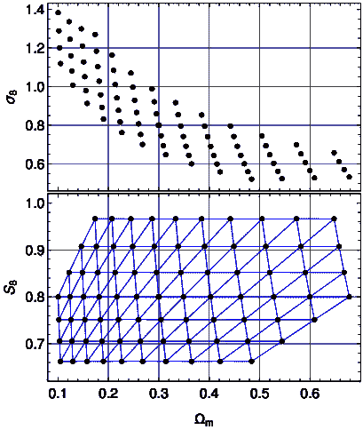

<!--yml

类别：未分类

日期：2024-09-06 19:42:31

-->

# [2301.01354] 利用深度学习从 HSC 调查第一年的数据中获得的宇宙学约束

> 来源：[`ar5iv.labs.arxiv.org/html/2301.01354`](https://ar5iv.labs.arxiv.org/html/2301.01354)

# 利用深度学习从 HSC 调查第一年的数据中获得的宇宙学约束

[Tianhuan Lu](https://orcid.org/0000-0003-1040-2639) 哥伦比亚大学天文学系，美国纽约，NY 10027 [Zoltán Haiman](https://orcid.org/0000-0003-3633-5403) 哥伦比亚大学天文学系，美国纽约，NY 10027 哥伦比亚大学物理学系，美国纽约，NY 10027 [Xiangchong Li](https://orcid.org/0000-0003-2880-5102) 卡内基梅隆大学麦克威廉斯宇宙学中心，美国宾夕法尼亚州匹兹堡，PA 15213

###### 摘要

我们展示了利用卷积神经网络（CNNs）和传统汇总统计，从 Subaru Hyper Suprime-Cam (HSC) 第一年的弱引力透镜剪切目录中获得的宇宙学约束。我们从第一年数据中裁剪出 19 个$3\times 3\,\mathrm{{deg}^{2}}$子区域，将红移$0.3\leq z\leq 1.5$的星系划分为四个等间隔的红移区间，并进行层析分析。我们开发了一个管道，从宇宙学$N$-体模拟中生成模拟的收敛图，同时考虑到内在对准（IAs）、重子物质、光度红移误差和点扩散函数误差等因素，以匹配真实目录的特征。我们训练了能够从模拟图中预测基础参数的 CNN，并利用它们构建贝叶斯分析的似然函数。在$\Lambda$冷暗物质模型中，具有两个自由的宇宙学参数$\Omega_{\mathrm{m}}$和$\sigma_{8}$，我们发现$\Omega_{\mathrm{m}}=0.278_{-0.035}^{+0.037}$，$S_{8}\equiv(\Omega_{\mathrm{m}}/0.3)^{0.5}\sigma_{8}=0.793_{-0.018}^{+0.017}$，IA 幅度$A_{\mathrm{IA}}=0.20_{-0.58}^{+0.55}$。在一个具有四个额外自由重子参数的模型中，我们发现$\Omega_{\mathrm{m}}=0.268_{-0.036}^{+0.040}$，$S_{8}=0.819_{-0.024}^{+0.034}$，以及$A_{\mathrm{IA}}=-0.16_{-0.58}^{+0.59}$，重子参数没有得到很好的约束。我们还发现 CNNs 对参数的统计不确定性比功率谱的要小（$S_{8}$小 5-24％，$\Omega_{\mathrm{m}}$小 2.5-3.0 倍），显示了 CNNs 在从 HSC 数据中揭示额外宇宙学信息方面的有效性。考虑重子物质后，HSC 第一年数据与 Planck 2018 之间的$S_{8}$差异从$\sim 2.2\,\sigma$减少到$0.3\text{--}0.5\,\sigma$。

引力透镜：弱 – 宇宙学：理论 – 宇宙学参数 – 宇宙的大尺度结构

## 1 引言

根据广义相对论，来自遥远星系的光会被前景物质分布中的不均匀性弯曲，这通常导致星系的视形出现微小的扭曲——这种效应称为弱引力透镜。通过对数百万个星系形状的测量，我们可以重建我们宇宙中物质密度的加权投影，并利用这些投影推断潜在的宇宙学模型。弱引力透镜已被提议作为一种强有力的工具，用于约束一些宇宙学参数，例如 $\Omega_{\mathrm{m}}$ 的平均物质密度和 $\Lambda$ 冷暗物质 ($\Lambda$CDM) 宇宙中的物质波动归一化 $\sigma_{8}$（参见，例如 Bartelmann & Schneider，2001；Refregier，2003；Kilbinger，2015 的综述），以及其他探测方法，如宇宙微波背景（例如 Hinshaw 等，2013；Planck 协作组等，2020）和重子声学振荡（例如 Anderson 等，2014；Alam 等，2017）。当前的弱引力透镜调查被称为“第三阶段”调查，如暗能量调查（DES；Abbott 等，2016），超广角相机（HSC）调查（Aihara 等，2018a），以及千度调查（KiDS；Kuijken 等，2015）。由于其大规模的调查区域和深度，这些调查目前能够以 $\lesssim 5\text{ percent}$ 的相对误差对参数 $S_{8}\equiv(\Omega_{\mathrm{m}}/0.3)^{0.5}\sigma_{8}$ 施加约束（参见例如 Hikage 等，2019；Hamana 等，2020；Heymans 等，2021；Abbott 等，2022）。

通常，宇宙学参数是通过将观测数据拟合到理论模型来约束的，这些模型通过一些汇总统计来描述。其中最广泛使用的是两点统计量，如两点关联函数（2PCF）和引力透镜剪切的功率谱，这些被认为是在从弱引力透镜信号中提取高斯信息方面最优的（见例如 Fu et al., 2014; Köhlinger et al., 2016; Hikage et al., 2019; Hamana et al., 2020; Heymans et al., 2021; Abbott et al., 2022）。这些两点统计量的一个局限性是它们无法充分利用小尺度上的非高斯信息（小于几角分）。因此，许多非高斯汇总统计被提出，并显示出相对于 2PCF 和功率谱的某些改进，例如三点函数（Takada & Jain, 2003; Vafaei et al., 2010），双谱（Takada & Jain, 2004; Dodelson & Zhang, 2005），峰值计数（Jain & Van Waerbeke, 2000; Dietrich & Hartlap, 2010; Kratochvil et al., 2010; Kilbinger, 2015; Liu et al., 2015; Martinet et al., 2018），以及 Minkowski 泛函（Munshi et al., 2011; Kratochvil et al., 2012; Petri et al., 2013）。

从弱引力透镜信号中提取信息的另一种方法是使用机器学习，其中算法旨在从信号中识别特征，通常以引力透镜剪切图或收敛图的形式出现，并利用这些特征来估计参数。卷积神经网络（CNNs; LeCun et al., 1998）由于其在图像分类和物体检测任务中的成功，被认为是最有前景的方法之一（Krizhevsky et al., 2012; He et al., 2016; Ren et al., 2015; Redmon et al., 2016）。在弱引力透镜的背景下，多项近期研究调查了使用 CNNs（具有不同网络架构），并显示它们可以超越手工制作的汇总统计。使用理想化的无噪声模拟收敛图，Gupta et al. (2018) 表明，CNN 实现的$\Omega_{\mathrm{m}}\text{--}\sigma_{8}$约束比功率谱的约束紧五倍。Ribli et al. (2019) 发现，在类似 LSST 的调查中，CNNs 对噪声图像的约束比功率谱紧$2.4–2.8$倍。在首次应用于实际观测中，Fluri et al. (2019) 分析了 KiDS-450 调查，使用 CNNs 对$S_{8}$的约束比功率谱提高了 30%。Fluri et al. (2022) 随后使用 KiDS-1000 数据发现了 16%的改进。

尽管使用卷积神经网络（CNNs）提取弱引力透镜信号的信息可以提供更紧的约束，但也面临两个挑战。首先，我们需要建立一个管道来模拟透镜剪切图或收敛图。通常，需要运行大量涵盖整个参数空间的宇宙学模拟，并从中生成与目标调查匹配的假模拟透镜图。这与 2PCF 和功率谱不同，后者的理论预测可以通过少量模拟（例如 Kilbinger et al., 2009; Takahashi et al., 2012）校准的非线性物质功率谱来计算。其次，由于我们对 CNNs 关注的特征几乎没有控制，我们需要仔细考虑每个像素级别的系统误差，以确保 CNNs 不会基于在模拟图中错误呈现的特征做出预测。

在这项研究中，我们对来自 HSC Subaru 战略计划（HSC SSP; Aihara et al., 2018b）的数据应用 CNNs 进行弱引力透镜分析。目前，这项调查提供了$137\,\mathrm{{deg}^{2}}$的星系剪切测量。在我们的模拟管道中，我们基于大规模$N$体模拟套件生成假模拟剪切目录和收敛图，并融入包括内在对准、宇宙学影响、光度红移估计不确定性、剪切测量偏差和点扩散函数（PSF）建模误差等系统效应。

本文的组织结构如下。在第二部分中，我们描述了如何准备 HSC 首年目录，以及如何从 Takahashi 等人（2017）的模拟中生成模拟目录。在第三部分中，我们详细介绍了我们自己的模拟流程，包括 $N$-体模拟、射线追踪、重子模型、内在对齐和其他系统误差的处理。在第四部分中，我们描述了传统总结统计量的计算—功率谱和峰值计数—以及 CNNs，我们认为这可以被视为一种不同类型的总结统计量。随后在第五部分中，我们描述了使用贝叶斯分析进行参数推断的过程，并在第六部分中展示了使用各种模型得到的宇宙学约束。在第七部分中，我们讨论了 CNN 超参数的影响、平滑尺度的选择、非高斯信息的来源，并将我们的约束与 Planck 2018 结果进行比较。最后，我们在第八部分中总结了我们的主要结论。

## 2 目录准备

### 2.1 HSC 首年目录

图 1：HSC 首年剪切目录中的星系数密度。红色方块显示了从目录中裁剪出的 19 个子区域，这些区域用于与我们的射线追踪模拟进行前向建模。

图 2：每个红移区间内，ephor_AB $z_{\mathrm{best}}$ 和分配的射线追踪红移 $z_{\mathrm{rt}}$ 之间的关系。每个区间内的浅灰色阴影表示围绕 $z_{\mathrm{rt}}=z_{\mathrm{best}}$ 的 $\pm 1\sigma_{\Delta z}$ 范围。

本工作的宇宙学推断基于 Mandelbaum 等人（2018a）准备的 HSC 第一年剪切目录。除了由于亮星而被遮罩的区域外，该目录覆盖了$136.9\,\mathrm{{deg}^{2}}$的天空区域，未加权的星系数密度为$24.6\,\mathrm{{arcmin}^{-2}}$（Mandelbaum 等人，2018a），如图 1 所示。为了方便我们的$N$-body 模拟和光线追踪流程，我们从目录中裁剪了 19 个子区域，每个区域可以通过平面天空投影（Coxeter & Coxeter, 1989; Liu 等人，2015）投影到$3\times 3\,\mathrm{{deg}^{2}}$的地图上：

|  | $\displaystyle x$ | $\displaystyle=$ | $\displaystyle r^{-1}\cos\alpha\sin(\delta-\delta_{0}),$ |  | (1) |
| --- | --- | --- | --- | --- | --- |
|  | $\displaystyle y$ | $\displaystyle=$ | $\displaystyle r^{-1}\left(\cos\alpha_{0}\sin\alpha-\sin\alpha_{0}\cos\alpha\cos(\delta-\delta_{0})\right),$ |  | (2) |
|  | $\displaystyle r$ | $\displaystyle=$ | $\displaystyle\sin\alpha_{0}\sin\alpha+\cos\alpha_{0}\cos\alpha\cos(\delta-\delta_{0}),$ |  | (3) |

其中 $(\alpha,\delta)$ 是星系的 $(\mathrm{RA},\mathrm{Dec})$ 坐标，$(\alpha_{0},\delta_{0})$ 是子区域的中心，$(x,y)$ 是星系的投影位置。图 1 显示了这些子区域的边界，标记为红色方框。

为了进行断层分析，我们从 HSC photo-$z$目录中收集了星系的光度红移（photo-$z$）（见 Tanaka 等，2018）。根据 Hikage 等（2019）的方法，我们将红移在$z=0.3$和$z=1.5$之间的星系按其目录中的 ephor_AB $z_{\mathrm{best}}$ 分为四个等间距的红移区间。超出此红移范围的星系将不会在本文中使用。在原始目录中的 1190 万颗星系中，29%因子田切割（5%）和红移分箱（24%）而被丢弃，剩余 850 万颗星系。

此外，我们的管道依赖于每个区间内星系的红移分布。请注意，虽然 $z_{\mathrm{best}}$ 估计被认为是每个星系的*最佳*估计，但所有 $z_{\mathrm{best}}$ 估计的分布是对真实红移分布的有偏估计，这可能会降低宇宙学约束（参见例如 Abruzzo & Haiman, 2019）。为了解决这个问题，我们采用了 Hikage et al. (2019) 提出的 COSMOS (Laigle et al., 2016) 重新加权方法来获得可靠的红移分布。加权的 COSMOS 光度-$z$ 目录¹¹1https://hsc-release.mtk.nao.ac.jp/doc/index.php/s17a-wide-cosmos/ 包含 30 波段的光度-$z$ 估计，比 HSC 5 波段光度-$z$ 更加准确，但相比于完整的剪切目录，它们只适用于少量星系。因此，我们为这些星系分配权重，以使所有星系的颜色-亮度分布与第一年剪切目录中的分布匹配。对于第 $b$ 个红移区间（$b=1,2,3,4$），我们选择既在第 $b$ 个区间中又在 COSMOS 目录中的代表性星系，并认为它们加权后的 30 波段光度-$z$ 分布是对真实红移分布 $p_{b}(z)$ 的良好估计。

使用 $z_{\mathrm{best}}$ 和 $p_{b}(z)$，我们现在通过以下步骤将*射线追踪红移*（$z_{\mathrm{rt}}$）分配给星系。首先，我们从 $p_{b}(z)$ 中随机抽取 $N_{b}$ 个候选 $z_{\mathrm{rt}}$ 值，其中 $N_{b}$ 是该区间中的星系数量。然后，将第 $i$ 个最小的 $z_{\mathrm{rt}}$ 分配给第 $i$ 个最小的 $z_{\mathrm{best}}$ 所对应的星系，其中 $i=1,2,\cdots,N_{b}$。这样的分配确保了 $z_{\mathrm{rt}}$ 的分布重现了该区间内星系的真实红移分布，并且由于 $z_{\mathrm{rt}}$ 与 $z_{\mathrm{best}}$ 具有相同的排序，距离信息得到了部分保留。图 2 显示了从 $z_{\mathrm{best}}$ 到 $z_{\mathrm{rt}}$ 的映射。与一种替代方法相比，该方法将 $z_{\mathrm{rt}}$ 随机分配而不考虑 $z_{\mathrm{best}}$，根据我们的测试，我们发现对 HSC 第一年的数据而言，透镜信号的统计特性差异微乎其微。

### 2.2 T17 模拟剪切目录

与对真实 HSC 数据的宇宙学分析同步，我们对基于 $N$-体模拟和 T17 全天射线追踪的模拟目录进行分析。使用外部目录的目的是检查我们的管道的有效性——与模拟宇宙学一致的宇宙学约束表明我们的算法实现是正确的。他们的模拟使用了一个平坦的 $\Lambda$CDM 宇宙学模型，具有以下宇宙学参数：$h=0.7$，$\Omega_{\mathrm{m}}=0.279$，$\Omega_{\mathrm{b}}=0.046$，$\sigma_{8}=0.82$，$n_{\mathrm{s}}=0.97$。

为了生成模拟目录，我们首先下载 $N_{\mathrm{side}}=8192$ 的前四个射线追踪模拟，这是具有多个实现的最高分辨率。对于每个模拟目录实现，我们从射线追踪实现中随机裁剪 19 个 $3\times 3\,\mathrm{{deg}^{2}}$ 子区域，并提取在位置 $\boldsymbol{x}\equiv(x,y)$ 和红移 $z$ 处的剪切 $\boldsymbol{\gamma}\equiv(\gamma_{1},\gamma_{2})$ 和收敛度 $\kappa$。由于 T17 的射线追踪模拟中的快照是在离散的红移下拍摄的，我们在相邻快照之间进行线性插值，以获得任意红移下的剪切和收敛度，即

|  | $\displaystyle\kappa(\boldsymbol{x},z)=\frac{z_{i+1}-z}{z_{i+1}-z_{i}}\kappa(\boldsymbol{x},z_{i})+\frac{z-z_{i}}{z_{i+1}-z_{i}}\kappa(\boldsymbol{x},z_{i+1}),$ |  | (4) |
| --- | --- | --- | --- |
|  | $\displaystyle\boldsymbol{\gamma}(\boldsymbol{x},z)=\frac{z_{i+1}-z}{z_{i+1}-z_{i}}\boldsymbol{\gamma}(\boldsymbol{x},z_{i})+\frac{z-z_{i}}{z_{i+1}-z_{i}}\boldsymbol{\gamma}(\boldsymbol{x},z_{i+1}),$ |  | (5) |

其中 $z_{i}$ 表示第 $i^{\text{th}}$ 个快照的红移，且 $z_{i}\leq z\leq z_{i+1}$。这个随机裁剪子区域并提取剪切的过程在每个射线追踪模拟上重复十次，总共生成 40 个 T17 模拟目录实现。

## 3 模拟管道

图 3：我们模拟管道的概述（绿色）。一些操作也用于处理真实数据（黄色）。

从概念上讲，我们的模拟管道是一个前向建模过程，它接受一组描述宇宙学、星际物质模型和系统误差的参数，并生成弱透镜效应 $\kappa$ 图的随机实现。模拟图具有与真实数据图类似的统计特性，因此通过改变输入的宇宙学参数，可以利用模拟图中观测量的分布来约束真实宇宙的宇宙学模型。此外，我们使用这些模拟图来训练可以预测其潜在参数的深度学习模型，训练好的模型可以应用于另一组模拟图或来自数据的真实图，方式相同。

图 3 显示了我们分析流程的流程图，在本节中，我们详细描述了这些步骤。

### 3.1 N-体模拟设置

图 4：我们$N$-体模拟套件中的宇宙学参数$(\Omega_{\mathrm{m}},\sigma_{8})$，其中$S_{8}$定义为$(\Omega_{\mathrm{m}}/0.3)^{0.5}\sigma_{8}$。红点表示基准宇宙学$\Omega_{\mathrm{m}}=0.3,\sigma_{8}=0.8$。浅蓝色三角形图案显示了用于插值的网格的德劳内三角剖分。

我们的模拟套件包含 79 个仅 DM 的$N$-体模拟，采用平坦的$\Lambda$CDM 宇宙学模型。每个模拟都有其独特的$(\Omega_{\mathrm{m}},\sigma_{8})$对，其余的宇宙学参数则取自 Planck 2018 结果的边际均值（TT,TE,EE+lowE+lensing）：$h_{0}=0.6736$，$n_{\mathrm{s}}=0.9649$，和$\Omega_{\mathrm{b}}=0.0493$（Planck Collaboration 等，2020）。我们的$\Omega_{\mathrm{m}}$和$\sigma_{8}$选择如图 4 所示，放置在常数$S_{8}$值上，这接近于大多数弱透镜分析中的最佳约束参数组合。选择范围$0.662\leq S_{8}\leq 0.966$以涵盖近期调查（包括 HSC Y1（Hikage 等，2019；Hamana 等，2020），DES Y1（Troxel 等，2018）和 KiDS-1000（Asgari 等，2021））的后验分布。

对于每组宇宙学参数，我们使用 music（Hahn & Abel，2011）生成初始条件，模拟开始时$z_{\mathrm{start}}=50$，盒子大小为$500h^{-1}\mathrm{Mpc}$，包含$1024^{3}$粒子。然后，我们使用 pkdgrav3（Potter 等，2017）将模拟盒子从$z=50$演化到$z=0$，共 500 个时间步长。我们选择默认的开角参数调度：$z>20$时$\theta=0.4$，$2<z<20$时$\theta=0.55$，$z<2$时$\theta=0.7$，其中较大的$\theta$表示更高的力精度。详细解释请参见 Potter 等人（2017）。

| 索引 | $z_{\mathrm{snap}}$ | $\chi_{\mathrm{fid}}$ | 索引 | $z_{\mathrm{snap}}$ | $\chi_{\mathrm{fid}}$ | 索引 | $z_{\mathrm{snap}}$ | $\chi_{\mathrm{fid}}$ |
| --- | --- | --- | --- | --- | --- | --- | --- | --- |
|  |  | [$h^{-1}\mathrm{Mpc}$] |  |  | [$h^{-1}\mathrm{Mpc}$] |  |  | [$h^{-1}\mathrm{Mpc}$] |
| --- | --- | --- | --- | --- | --- | --- | --- | --- |
| 1 | 0.020 | 60 | 13 | 0.579 | 1500 | 25 | 1.413 | 2940 |
| 2 | 0.060 | 180 | 14 | 0.635 | 1620 | 26 | 1.504 | 3060 |
| 3 | 0.102 | 300 | 15 | 0.693 | 1740 | 27 | 1.600 | 3180 |
| 4 | 0.145 | 420 | 16 | 0.753 | 1860 | 28 | 1.700 | 3300 |
| 5 | 0.188 | 540 | 17 | 0.815 | 1980 | 29 | 1.806 | 3420 |
| 6 | 0.232 | 660 | 18 | 0.879 | 2100 | 30 | 1.917 | 3540 |
| 7 | 0.278 | 780 | 19 | 0.946 | 2220 | 31 | 2.034 | 3660 |
| 8 | 0.325 | 900 | 20 | 1.016 | 2340 | 32 | 2.158 | 3780 |
| 9 | 0.373 | 1020 | 21 | 1.089 | 2460 | 33 | 2.290 | 3900 |
| 10 | 0.422 | 1140 | 22 | 1.164 | 2580 | 34 | 2.429 | 4020 |
| 11 | 0.473 | 1260 | 23 | 1.244 | 2700 | 35 | 2.576 | 4140 |
| 12 | 0.525 | 1380 | 24 | 1.327 | 2820 | 36 | 2.733 | 4260 |

表 1：快照的索引、红移和共动距离（标准宇宙学）。

我们在$z=0.020$到$z=2.733$之间的所有宇宙学模型中，在固定红移下进行 36 个快照，如表 1 所列。红移$z_{\mathrm{snap}}^{(i)}$的选择使得其对应的共动距离在标准宇宙学模型下（$\Omega_{\mathrm{m}}=0.3$, $\sigma_{8}=0.8$）为

|  | $\chi_{\mathrm{fid}}^{(i)}=(i-0.5)\times 120h^{-1}\mathrm{Mpc}\;(i=1,2,\cdots,36).$ |  | (6) |
| --- | --- | --- | --- |

我们注意到，由于快照只能在时间步的末尾进行，因此实际的红移低于表 1 中的值。但由于步数较多，偏差非常小：$|\Delta z|\sim 0.003$ 和 $|\Delta\chi|\sim 5h^{-1}\mathrm{Mpc}$，与估计的 photo-$z$系统误差相比可以忽略不计（见第 3.2 节）。

### 3.2 光线追踪

图 5：板块厚度作为板块索引和$\Omega_{\mathrm{m}}$的函数。当$\Omega_{\mathrm{m}}=0.3$时，所有板块的厚度恒定为$120h^{-1}\mathrm{Mpc}$。

在实际宇宙中，由于广义相对论，$z_{\mathrm{s}}$处的星系形状会受到$z=0$和$z=z_{\mathrm{s}}$之间前景物质分布的扭曲。*光线追踪*通过追踪光线穿过来自$N$体模拟的物质分布来再现这一过程。光线追踪对于从小角尺度进行宇宙学推断是必要的，使用的是超越高斯统计的方法（Petri 等，2017）。多镜面平面算法（Jain 等，2000；Hilbert 等，2009）是光线追踪的一个流行实现。在这个算法中，前景物质分布被离散化为多个密度层，这些层取自模拟快照。然后，每个层被视为一个位于其厚度中心的薄平面。当光线从$z=0$的观测者处追踪到源星系时，它们仅在这些平面的位置发生弯曲。

给定快照的红移$z_{\mathrm{snap}}^{(i)}$，我们可以通过以下公式计算第$i^{\text{th}}$层的期望厚度

|  | $\Delta\chi^{(i)}=\frac{1}{2}\left[\chi_{\mathrm{snap}}^{(i+1)}-\chi_{\mathrm{snap}}^{(i-1)}\right],$ |  | (7) |
| --- | --- | --- | --- |

其中，$\chi_{\mathrm{snap}}^{(i)}$表示$z_{\mathrm{snap}}^{(i)}$处的共动距离。我们注意到，层的厚度依赖于宇宙学：对于基准宇宙学，由于快照在共动距离上均匀间隔，层的厚度在所有红移下均为$120h^{-1}\mathrm{Mpc}$；而对于其他宇宙学，高红移处的厚度可能会从$80h^{-1}\mathrm{Mpc}$变到$200h^{-1}\mathrm{Mpc}$，如图 5 所示。我们从每个快照沿三个轴中的每一个剪切出两个到六个层，具体取决于层的厚度。然后，我们通过在$8192\times 8192$网格上计算柱密度来生成密度平面，接着通过求解二维泊松方程生成潜在平面。

我们的光线追踪算法实现严格遵循 Petri 等人（2013）提出的方法。每次光线追踪运行从创建一个潜在平面的堆栈开始，其中每个红移的平面被随机选择、翻转、旋转（以$90^{\circ}$的倍数）和移动。我们从观测者开始追踪光线，朝向每个星系的方向，直到其光线追踪红移$z_{\mathrm{rt}}$，并计算镜像剪切$\boldsymbol{\gamma}$和收敛度$\kappa$的总扭曲。

### 3.3 红移分布不确定性

在第 2.1 节中，我们使用 COSMOS 再加权方法估计了红移分布 $p_{b}(z)$ 并将光线追踪红移 $z_{\mathrm{rt}}$ 指派给星系，这些红移在 § 3.2 中作为它们的源红移使用。虽然这种方法解决了单个红移的不确定性，但整个分布的不确定性仍然可能是一个问题。在图 2 中，可以发现 ephor_AB $z_{\mathrm{best}}$ 和 $z_{\mathrm{rt}}$ 之间存在系统性差异，表明由于我们选择的光学红移算法，$p_{b}(z)$ 可能在红移轴上存在系统性偏差。此外，虽然使用相同的 COSMOS 30 波段红移进行训练，但不同的光学红移算法在平均 $z_{\mathrm{best}}$ 上存在差异，这表明光学红移算法与固有统计误差相关（Tanaka 等人，2018; Hikage 等人，2019; Hamana 等人，2020）。

在这项工作中，我们跟随 Hikage 等人 (2019) 模拟每个红移分布的不确定性。$p_{b}(z)$ 的不确定性通过 $\Delta z_{b}$ 的平移来参数化：

|  | $\tilde{p}_{b}(z)=p_{b}(z+\Delta z_{b}),$ |  | (8) |
| --- | --- | --- | --- |

因此，

|  | $\tilde{z}_{\mathrm{rt}}=z_{\mathrm{rt}}+\Delta z_{b},$ |  | (9) |
| --- | --- | --- | --- |

其中，$\tilde{p}_{b}(z)$ 表示没有整体红移误差的红移分布，而 $\tilde{z}_{\mathrm{rt}}$ 是从 $\tilde{p}_{b}(z)$ 采样得到的光线追踪红移。$\Delta z_{b}$ 的先验遵循正态分布 $\mathcal{N}(0,\sigma_{\Delta z_{b}})$，Hikage 等人 (2019) 已经估计了 $\sigma_{\Delta z_{b}}$ 的值为：0.0285 ($0.3<z<0.6$)、0.0135 ($0.6<z<0.9$)、0.0383 ($0.9<z<1.2$)、和 0.0376 ($1.2<z<1.5$)，如图 2 所示。Hamana 等人 (2020) 表明 HSC 第一年的目录的两点相关函数无法比它们的先验提供更好的 $\Delta z_{b}$ 约束。因此，我们不将 $\Delta z_{b}$ 作为自由参数，而是在光线追踪过程中随机添加采样得到的 $\Delta z_{b}$ 值到 $z_{\mathrm{rt}}$ 中——有效地对 $\Delta z_{b}$ 的先验进行边际化。

### 3.4 重子模型

| 参数 | 基准值 | 先验 |
| --- | --- | --- |
| 宇宙学和重子参数 |
| $\Omega_{\mathrm{m}}$ | $0.3$ | 在模拟宇宙学的边界内保持平坦 |
| $\sigma_{8}$ | $0.8$ | 在模拟宇宙学边界内均匀分布 |
| $A_{\mathrm{IA}}$ | $0$ | 均匀 $[-3,3]$ |
| $M_{\mathrm{c}}$ | $3.3\times 10^{13}h^{-1}\mathrm{M}_{\odot}$ | 对数均匀 $[10^{12}h^{-1}\mathrm{M}_{\odot},10^{16}h^{-1}\mathrm{M}_{\odot}]$ |
| $M_{1,0}$ | $8.63\times 10^{11}h^{-1}\mathrm{M}_{\odot}$ | 对数均匀 $[10^{10}h^{-1}\mathrm{M}_{\odot},10^{13}h^{-1}\mathrm{M}_{\odot}]$ |
| $\eta$ | $0.54$ | 对数均匀 $[10^{-0.7},10^{0.5}]$ |
| $\beta$ | $0.12$ | 对数均匀 $[10^{-1.0},10^{0.5}]$ |
| 额外参数 |
| $\Delta z_{1}$ | $-$ | 高斯分布 $\mathcal{N}(0,0.0285)$ |
| $\Delta z_{2}$ | $-$ | 高斯分布 $\mathcal{N}(0,0.0135)$ |
| $\Delta z_{3}$ | $-$ | 高斯分布 $\mathcal{N}(0,0.0383)$ |
| $\Delta z_{4}$ | $-$ | 高斯分布 $\mathcal{N}(0,0.0376)$ |
| $\Delta m$ | $-$ | 高斯分布 $\mathcal{N}(0,0.01)$ |
| $\alpha_{\mathrm{psf}}$ | $-$ | 高斯分布 $\mathcal{N}(0.030,0.015)$ |
| $\beta_{\mathrm{psf}}$ | $-$ | 高斯分布 $\mathcal{N}(-0.89,0.70)$ |

表 2：所有参数的先验分布。

我们采用了重子修正模型（BCM, Aricò 等，2020，参见 Schneider & Teyssier 2015）对模拟的密度场进行修改，以模拟冷却、星形成和反馈在星系形成过程中的影响。除了重子密度参数 $\Omega_{\mathrm{b}}$ 外，BCM 有四个自由参数：两个特征晕质量 $M_{\mathrm{c}}$ 和 $M_{1,0}$，气体从晕中喷射的最大距离 $\eta$，以及气体分数与晕质量之间的对数斜率 $\beta$。在保持每个晕的总质量不变的情况下，这四个参数控制有无重子的密度分布的差异。

本工作中 BCM 的实现与我们之前的工作完全相同（参见 Lu & Haiman，2021；Lu et al.，2022）。我们在这里简要介绍过程，详细描述请参见 Lu & Haiman (2021)。在包含银河物质效应的分析中，BCM 应用于光线追踪前的密度平面。在每个光晕中，质量的固定部分（$\Omega_{\mathrm{b}}/\Omega_{\mathrm{m}}$）由根据光晕质量、浓度参数和银河物质参数计算出的密度剖面替代。银河物质参数的基准值为：$M_{\mathrm{c}}=3.3\times 10^{13}h^{-1}\mathrm{M}_{\odot}$，$M_{1,0}=8.63\times 10^{11}h^{-1}\mathrm{M}_{\odot}$，$\eta=0.54$，$\beta=0.12$，我们对所有四个参数采用对数均匀先验，范围见表 2。请注意，本工作中的先验范围与 Aricò et al. (2020) 中的不同，因为我们使用其他观测（参见例如 Schneider & Teyssier，2015；Lu & Haiman，2021）的约束作为参考，而不是使用水动力学模拟的最佳拟合。

### 3.5 模拟的椭圆率

实际剪切目录中呈现的测量星系椭圆率是多个因素的结果，其中 § 3.2 中计算的透镜剪切仅是其中之一。在本节中，我们介绍了考虑其他两个主要因素——形状噪声和剪切测量偏差——的椭圆率模拟方法，作为前向建模过程的一部分。

形状噪声指的是由星系的固有形状贡献的椭圆率部分，忽略了固有形状之间的相关性。为了生成用于添加到模拟剪切中的形状噪声，一种简单的经验方法是随机旋转测量的椭圆率 $\boldsymbol{e}\equiv(e_{1},e_{2})$。这确保了（1）形状噪声的水平几乎与实际目录中的相同（因为对于单个星系来说，$|\boldsymbol{\gamma}|\ll|\boldsymbol{e}|$），以及（2）随机旋转移除了椭圆率中的透镜信号。

剪切测量偏差，特别是乘法偏差 $m$ 和加法偏差 $\boldsymbol{c}\equiv(c_{1},c_{2})$，描述了真实剪切 $\boldsymbol{\gamma}^{\mathrm{(true)}}$ 和测量剪切 $\boldsymbol{\gamma}^{\mathrm{(mea)}}$ 之间的关系：

|  | $\boldsymbol{\gamma}^{\mathrm{(mea)}}=(1+m)\boldsymbol{\gamma}^{\mathrm{(true)}}+\boldsymbol{c}.$ |  | (10) |
| --- | --- | --- | --- |

存在剪切偏差的原因有多种，例如 PSF 解卷积算法的局限性，或者模型未能准确描述银河的形状。Mandelbaum 等人（2018b）通过图像模拟对剪切偏差进行了详细调查，并提供了 HSC 剪切目录中每个银河的$m$和$\boldsymbol{c}$估计值。在去除所有校准偏差后，Mandelbaum 等人（2018b）表明，剩余乘法偏差$\Delta m$的不确定性控制在 1 个百分点水平。

在我们的处理流程中，银河的模拟椭圆度是按照 Bernstein & Jarvis（2002）和 Shirasaki 等人（2019）的方式计算的，但我们忽略了二阶项，因为我们发现生成的地图几乎没有差别：

|  | $\displaystyle\boldsymbol{e}^{\mathrm{(sim)}}=e^{i\phi}\boldsymbol{e}^{\mathrm{(mea)}}+(1+\Delta m)(1+m_{\mathrm{tot}})\frac{2\boldsymbol{\gamma}\mathcal{R}}{1-\kappa}+\boldsymbol{c},$ |  | (11) |
| --- | --- | --- | --- |
|  | $\displaystyle\mathcal{R}\equiv 1-{\frac{1}{2}\left\|\boldsymbol{e}^{\mathrm{(mea)}}\right\|}^{2}\frac{e_{\mathrm{RMS}}^{2}}{e_{\mathrm{RMS}}^{2}+\sigma_{\mathrm{e}}^{2}},$ |  | (12) |
|  | $\displaystyle m_{\mathrm{tot}}\equiv m+m_{\mathrm{sel}}+m_{\mathcal{R}},$ |  | (13) |

其中$\boldsymbol{e}^{\mathrm{(mea)}}$表示目录中的测量椭圆度，$e^{i\phi}\boldsymbol{e}^{\mathrm{(mea)}}$为带有随机旋转的测量椭圆度，$m$和$\boldsymbol{c}$为 HSC 目录中的估计偏差，$e_{\mathrm{RMS}}$为目录中估计的固有均方根（RMS）椭圆度，$\sigma_{\mathrm{e}}$为目录中估计的测量误差。按照 Hikage 等人（2019）的方法，由于银河大小选择产生的乘法偏差$m_{\mathrm{sel}}$在四个红移区间分别为 0.0086、0.0099、0.0091 和 0.0091，由于红移依赖的响应校正产生的乘法偏差$m_{\mathcal{R}}$在四个区间分别为 0.000、0.000、0.015 和 0.030，扰动参数$\Delta m$从正态分布$\mathcal{N}(0,0.01)$中随机采样，应用于所有模拟椭圆度。模拟椭圆度的一个实现可以看作具有类似于真实目录的特征，除了底层模型参数和在地图转换后需要解决的一些系统性问题。

### 3.6 剪切图

图 6：HSC 子场在 GAMA09H 中的场掩码、剪切图和收敛图。剪切图和收敛图使用$\sigma_{\mathrm{G}}=2\,\mathrm{arcmin}$的平滑尺度生成。

使用在子场和红移区间内模拟的所有星系的椭圆度，我们可以在$104\times 104$的方格上生成一个$3\times 3\,\mathrm{{deg}^{2}}$的剪切图，并在图像的四边添加 12 个像素的填充，以更好地保持平滑时边缘附近的透镜信号（见下文）。因此，完整图像的大小为$3.69\times 3.69\,\mathrm{{deg}^{2}}$，维度为$128\times 128$，每个像素的大小为$\Delta x=1.73\,\mathrm{arcmin}$。

在 HSC 目录中，由于亮星的存在，有些区域没有星系，我们需要为每个子场找到这个*场掩模* $\sigma_{\mathrm{mask}}(\boldsymbol{x})$，它将在剪切图的生成中使用。请注意，场掩模不依赖于红移区间，因此星系的数密度足够高，使我们能够在$0.87\,\mathrm{arcmin}$的分辨率下计算掩模，即在$208\times 208$的网格上计算$3\times 3\,\mathrm{{deg}^{2}}$的子场。在所有至少有一个星系的像素中，子场平均每个像素有 10 到 15 个星系，基于此，我们认为少于四个星系的像素被掩模覆盖（$\sigma_{\mathrm{mask}}(\boldsymbol{x})=1$）。然后，场掩模按剪切图的分辨率下采样二倍，示例见图 6。

剪切图的计算遵循 Mandelbaum 等人（2018a）附录 3 中的剪切估计程序。像素中心在$\boldsymbol{x}\equiv(x,y)$的值为

|  | $\boldsymbol{\gamma}(\boldsymbol{x})=\frac{1}{1+m_{\mathrm{tot}}(\boldsymbol{x})}\left[\frac{\boldsymbol{e}(\boldsymbol{x})}{2(1-e_{\mathrm{RMS}}^{2}(\boldsymbol{x}))}-\boldsymbol{c}(\boldsymbol{x})\right].$ |  | (14) |
| --- | --- | --- | --- |

右侧字段的定义如下

|  | $\displaystyle\phi(\boldsymbol{x})=\frac{\phi_{w}(\boldsymbol{x})}{w(\boldsymbol{x})},$ |  | (15) |
| --- | --- | --- | --- |
|  | $\displaystyle\phi_{w}(\boldsymbol{x})=\left(\sum_{\boldsymbol{x}_{i}\in A(\boldsymbol{x})}{w_{i}\phi_{i}}\right)+\sigma_{\mathrm{mask}}(\boldsymbol{x})\langle w\rangle\langle\phi\rangle,$ |  | (16) |
|  | $\displaystyle w(\boldsymbol{x})=\left(\sum_{\boldsymbol{x}_{i}\in A(\boldsymbol{x})}{w_{i}}\right)+\sigma_{\mathrm{mask}}(\boldsymbol{x})\langle w\rangle,$ |  | (17) |
|  | $\displaystyle\langle w\rangle=\frac{1}{N}\sum_{i}{w_{i}},\;\langle\phi\rangle=\frac{1}{N}\sum_{i}{\phi_{i}},$ |  | (18) |

其中$\phi$是$\{e_{\mathrm{RMS}}^{2},m_{\mathrm{tot}},\boldsymbol{c},\boldsymbol{e}\}$中的一个，$N$是子区域和红移区间中的星系数量，$w_{i}$是目录中第$i^{\text{th}}$个星系的引力权重，$\boldsymbol{x}_{i}\in A(\boldsymbol{x})$表示第$i^{\text{th}}$个星系位于以$\boldsymbol{x}$为中心的像素中。我们通过假设$\langle\boldsymbol{c}\rangle=\langle\boldsymbol{e}\rangle=0$进一步简化了计算。请注意，由于方程（16）和（17）中的第二项，平均值（例如剪切和偏差）被分配到图像的遮罩区域，以使得$\phi(\boldsymbol{x})$和$\boldsymbol{\gamma}(\boldsymbol{x})$在整个图像上定义良好。当需要对剪切图进行平滑时，将高斯核应用于$\phi_{w}(\boldsymbol{x})$和$w(\boldsymbol{x})$，例如

|  | $w(\boldsymbol{x}_{0})\rightarrow\iint\mathrm{d}\boldsymbol{x}\,\frac{\exp\left(-{&#124;\boldsymbol{x}&#124;}^{2}/2\sigma_{\mathrm{G}}^{2}\right)}{\sqrt{2\pi\sigma_{\mathrm{G}}}}w(\boldsymbol{x}_{0}+\boldsymbol{x}).$ |  | (19) |
| --- | --- | --- | --- |

从真实 HSC 目录生成剪切图的过程与从模拟目录生成的过程相同。图中展示了一个来自真实 HSC 数据的剪切图示例，经过平滑处理，如图 6 所示。

### 3.7 收敛图

我们使用凯泽–斯奎尔斯方法（Kaiser & Squires, 1993）将前一步的剪切图转换为收敛图$\kappa(\boldsymbol{x})$。在傅里叶空间中，剪切$\hat{\boldsymbol{\gamma}}(\boldsymbol{\ell})$和收敛$\hat{\kappa}(\boldsymbol{\ell})$之间的关系为

|  | $\hat{\kappa}(\boldsymbol{\ell})=\frac{\ell_{1}^{2}-\ell_{2}^{2}}{\ell_{1}^{2}+\ell_{2}^{2}}\hat{\gamma_{1}}(\boldsymbol{\ell})+\frac{2\ell_{1}\ell_{2}}{\ell_{1}^{2}+\ell_{2}^{2}}\hat{\gamma_{2}}(\boldsymbol{\ell}).$ |  | (20) |
| --- | --- | --- | --- |

同样的转换也应用于真实 HSC 剪切图。如图 6 所示的一个 HSC 数据的收敛图示例。我们所有的宇宙学分析将基于收敛图进行。

### 3.8 内在对准

§ 3.2 中的光学剪切通过光线追踪方法再现了源星系光线与前景物质分布之间的相互作用，且星系的内在椭圆度是随机分配的。但在实际宇宙中，星系之间可以通过两种机制存在内在对准（IA）：(1) 物理上相互靠近的星系往往具有相似的椭圆度（内在-内在，或 II），以及 (2) 前景星系与局部物质分布相关，这种物质分布在正交方向上扭曲了背景星系（引力-内在，或 GI）。在这项工作中，我们采用了非线性对准模型（Hirata & Seljak, 2004; Bridle & King, 2007），该模型预测 IA 信号的功率谱为

|  | $\displaystyle P_{\mathrm{IA}}(k,z)$ | $\displaystyle=$ | $\displaystyle P_{\mathrm{II}}(k,z)+P_{\mathrm{GI}}(k,z)$ |  | (21) |
| --- | --- | --- | --- | --- | --- |
|  |  | $\displaystyle=$ | $\displaystyle F^{2}(z)P_{\delta}(k,z)+F(z)P_{\delta}(k,z),$ |  |

其中

|  | $F(z)=-A_{\mathrm{IA}}C_{1}\bar{\rho}(z)\frac{D(z)}{D(0)}\left(\frac{1+z}{1+z_{0}}\right)^{\eta}\left(\frac{\bar{L}}{L_{0}}\right)^{\beta}.$ |  | (22) |
| --- | --- | --- | --- |

在方程 (22)中，$A_{\mathrm{IA}}$ 表示一个控制 IA 振幅的自由参数，$C_{1}=5\times 10^{-14}h^{-2}\mathrm{M}_{\odot}^{-1}\mathrm{Mpc}^{3}$ 是一个归一化常数，$\bar{\rho}(z)$ 是红移 $z$ 时宇宙的平均物质密度，$D(z)$ 是线性增长因子，$\bar{L}$ 是源样本的加权平均光度。根据 Fluri 等人 (2019) 和 Hildebrandt 等人 (2017)，我们通过设定 $\eta=\beta=0$ 来忽略红移和光度相关的项。

对于 IA 引起的收敛场，自然的简单选择是与物质分布相关。具体来说，我们遵循 Fluri 等人 (2019) 的方法并采用

|  | $\kappa_{\mathrm{IA}}^{(b)}(\boldsymbol{x})=\int\mathrm{d}z\,F(z)n_{\mathrm{g}}^{(b)}(z)\delta(\boldsymbol{x},z),$ |  | (23) |
| --- | --- | --- | --- |

其中$n_{\mathrm{g}}^{(b)}(z)$表示每个红移区间$b$内的星系数量，经过$\int\mathrm{d}z\,n_{\mathrm{g}}^{(b)}(z)=1$标准化，以及$\delta(\boldsymbol{x},\chi)$是密度对比度。这种 IA 估计方法在构造上给出了正确的 IA 功率谱，并且可以轻松地纳入我们的光线追踪子例程。我们可以跟踪每个星系的$\kappa_{\mathrm{IA}}(\boldsymbol{x})$以及$\boldsymbol{\gamma}_{\mathrm{IA}}(\boldsymbol{x})$。我们注意到$\kappa_{\mathrm{IA}}$和$\boldsymbol{\gamma}_{\mathrm{IA}}$与$A_{\mathrm{IA}}$线性成正比，因此我们只需用$A_{\mathrm{IA}}=1$来跟踪它们，以获得$\tilde{\kappa}_{\mathrm{IA}}(\boldsymbol{x})$和$\tilde{\boldsymbol{\gamma}}_{\mathrm{IA}}(\boldsymbol{x})$——任何其他$A_{\mathrm{IA}}$的结果可以通过

|  | $\kappa_{\mathrm{IA}}(\boldsymbol{x})=A_{\mathrm{IA}}\tilde{\kappa}_{\mathrm{IA}}(\boldsymbol{x}),\;\boldsymbol{\gamma}_{\mathrm{IA}}(\boldsymbol{x})=A_{\mathrm{IA}}\tilde{\boldsymbol{\gamma}}_{\mathrm{IA}}(\boldsymbol{x}).$ |  | (24) |
| --- | --- | --- | --- |

在我们分析中，当 IA 被纳入模型时，我们通过以下替换修改了方程式中的模拟椭率计算（11）。

|  | $\frac{2\boldsymbol{\gamma}\mathcal{R}}{1-\kappa}\rightarrow\frac{2(\boldsymbol{\gamma}+A_{\mathrm{IA}}\tilde{\boldsymbol{\gamma}}_{\mathrm{IA}})\mathcal{R}}{1-(\kappa+A_{\mathrm{IA}}\tilde{\kappa}_{\mathrm{IA}})}.$ |  | (25) |
| --- | --- | --- | --- |

### 3.9 PSF 误差

图 7：(a) PSF 残差项的自相关和交叉相关函数，以及 (b) PSF 残差项的自相关和交叉功率谱，其中$\tilde{\alpha}_{\mathrm{psf}}=0.030$和$\tilde{\beta}_{\mathrm{psf}}=-0.89$。虚线表示值为负数。

通过地面望远镜观察星系的形状时，会受到大气扰动和仪器特性等效应的污染。它们可以通过点扩散函数（PSF）建模，PSF 通过卷积修改源的形状。去除星系形状中的 PSF 的典型方法包括两个步骤：（1）使用附近的恒星图像预测星系位置的 PSF 形状，（2）应用 PSF 去卷积算法，如 HSC 管道中的再高斯化方法。然而，这两个步骤仍然可能在星系形状中留下小的残余 PSF：（1）恒星的数量密度远小于星系，因此 PSF 在小角度尺度上的变化不能被准确预测，（2）PSF 去卷积算法可能存在缺陷，将 PSF 形状泄漏到去卷积的星系形状中（Mandelbaum et al., 2018a）。我们遵循 Hikage et al. (2019) 和 Hamana et al. (2020) 将 PSF 残余建模为这两种效应的线性组合：

|  | $\delta\boldsymbol{\gamma}=\alpha_{\mathrm{psf}}\boldsymbol{\gamma}^{\mathrm{p}}+\beta_{\mathrm{psf}}\boldsymbol{\gamma}^{\mathrm{q}},$ |  | (26) |
| --- | --- | --- | --- |

其中 $\boldsymbol{\gamma}^{\mathrm{p}}=\boldsymbol{e}^{\mathrm{psf}}/2$ 表示与预测的 PSF 形状相关的剪切，而 $\boldsymbol{\gamma}^{\mathrm{q}}=\boldsymbol{\gamma}^{\mathrm{p}}-\boldsymbol{\gamma}_{\mathrm{true}}^{\mathrm{p}}$ 是预测的 PSF 剪切和无法追踪的真实 PSF 剪切之间的差异。

由于 PSF 的小尺度变化不可恢复，因此无法重现具有与真实数据相同特征的 $\boldsymbol{\gamma}^{\mathrm{q}}$ 场。我们因此采用一种替代方法，将 PSF 残余建模为高斯随机场，可以根据 Hamana et al. (2020) 测量的 $\boldsymbol{\gamma}^{\mathrm{p}}$ 和 $\boldsymbol{\gamma}^{\mathrm{q}}$ 之间的自相关函数和交叉相关函数生成这些场。我们选择相关函数是因为它们在角尺度分辨率上比 Hikage et al. (2019) 测量的功率谱更高。我们将分析模型拟合到 Hamana et al. (2020) 图 20 中呈现的相关函数，并通过汉克尔变换推导它们的功率谱对应物（$C^{\mathrm{pp}}$, $C^{\mathrm{pq}}$, 和 $C^{\mathrm{qq}}$）。

|  | $C^{ij}(\ell)=2\pi\int\mathrm{d}\theta\,\theta\,\xi_{+}^{ij}(\theta)J_{0}(\ell\theta).$ |  | (27) |
| --- | --- | --- | --- |

相关函数和功率谱的可视化显示在图 7 中。总的 PSF 误差功率谱是三个分量的线性组合：

|  | $C^{\mathrm{psf}}(\ell)=\alpha_{\mathrm{psf}}^{2}C^{\mathrm{pp}}(\ell)+2\alpha_{\mathrm{psf}}\beta_{\mathrm{psf}}C^{\mathrm{pq}}(\ell)+\beta_{\mathrm{psf}}^{2}C^{\mathrm{qq}}(\ell),$ |  | (28) |
| --- | --- | --- | --- |

其中干扰参数 $\alpha$ 和 $\beta$ 具有源自 Hamana 等人（2020）图 21 的高斯先验，涵盖所有角尺度：

|  | $\alpha_{\mathrm{psf}}\sim\mathcal{N}(0.030,0.015),\;\beta_{\mathrm{psf}}\sim\mathcal{N}(-0.89,0.70).$ |  | (29) |
| --- | --- | --- | --- |

在生成真实化的收敛地图之后（见第 3.7 节），我们从其先验分布中抽样 $\alpha_{\mathrm{psf}}$ 和 $\beta_{\mathrm{psf}}$，为每个子区域生成一个 PSF 收敛地图，并将其添加到所有红移区间的收敛地图中。

## 4 汇总统计量

### 4.1 卷积神经网络

#### 4.1.1 概述

考虑到我们的模拟流程是一个从参数生成地图的函数：

|  | $\textrm{pipeline: }(\boldsymbol{\theta},\boldsymbol{\nu},\boldsymbol{r})\rightarrow\kappa,$ |  | (30) |
| --- | --- | --- | --- |

其中 $\boldsymbol{\theta}\equiv(p_{1},\cdots,p_{N})$ 表示感兴趣的参数，$\boldsymbol{\nu}$ 表示干扰参数，$\boldsymbol{r}$ 表示随机变量，我们训练一个 *汇总 CNN*，使其成为一个可以根据地图预测感兴趣参数的函数：

|  | $\textrm{CNN: }\kappa\rightarrow\boldsymbol{y},$ |  | (31) |
| --- | --- | --- | --- |

其中 CNN 的权重经过调整，以便 $\boldsymbol{y}$ 接近 $\boldsymbol{\theta}$，或者更严格地说，最小化 *损失函数* $L(\boldsymbol{y},\boldsymbol{\theta})$。在这里，我们指出，尽管 CNN 的训练目标是通过其输出重现输入地图的参数，这些输出通常伴随有较大的偏差（例如见 Gupta 等人，2018；Ribli 等人，2019；Lu 等人，2022），因此不应将其用作这些参数的估计。相反，我们将 CNN 的输出视为另一种汇总统计量，并从预测中推导出似然函数 $\mathcal{L}(\boldsymbol{y}|\boldsymbol{\theta})$，无论其输出的意义如何，实际上是对干扰参数和随机性的边际化。基于神经网络的汇总统计量的工作方式类似于传统统计量，如功率谱和峰值计数，它们都以收敛地图（或地图集）作为输入，并生成一组数字作为输出。不同之处在于，神经网络有数百万个自由参数（称为“权重”），需要通过训练过程确定。以这种方式使用 CNN 已在多项研究中进行过调查（见 Gupta 等人，2018；Ribli 等人，2019；Fluri 等人，2019，2022；Lu 等人，2022）。

CNN 通常在一个有限数量的地图数据集上进行多轮训练。网络可能会过拟合训练集，即学习到一些与训练集无关的随机特征。因此，我们使用一组网络从未见过的不同地图来推导似然函数，这一点非常重要。

#### 4.1.2 地图平滑

在非常小的角尺度上，弱透镜信号通常会被丢弃，原因有几个：（1）对重子效应的建模不够清楚，（2）非线性对准模型在小尺度上低估了 IA 信号，（3）在低红移下，PSF 建模误差与透镜信号相当，以及（4）由于形状噪声，极小尺度的信息量不大（Fang & Haiman，2007；Singh et al.，2015；Hikage et al.，2019；Aricò et al.，2020）。例如，Hikage et al.（2019）在其基准分析中采用了$\ell_{\mathrm{max}}=1900$（$\theta_{\mathrm{min}}\sim 6\,\mathrm{arcmin}$），而 Hamana et al.（2020）为$\xi_{+}(\theta)$采用了$\theta_{\mathrm{min}}=7\,\mathrm{arcmin}$。为了与这两个研究保持一致，我们对模拟地图应用了高斯滤波器进行平滑（见第 3.6 节），以便 CNN 不会学习到那些不易理解的小尺度波动。我们的基准分析使用了平滑半径$\sigma_{\mathrm{G}}=4\,\mathrm{arcmin}$，在$\ell=1400$时抑制了 90%的功率（即剩余 10%的功率），在$\ell=2000$时抑制了 99%，这与 Hikage et al.（2019）的基准分析相当。我们还将使用其他平滑尺度$\sigma_{\mathrm{G}}=1\text{--}8\,\mathrm{arcmin}$（在$\ell=8000\text{--}1000$时抑制 99%）进行分析，以观察统计误差的变化。

#### 4.1.3 架构

| 层/ | 核心 | 步幅 | 输出 |
| --- | --- | --- | --- |
| 块 | 大小 |  | 维度 |
| （输入） |  |  | $4\times 104\times 104$ |
| 卷积 | $7\times 7$ | 2 | $n_{\mathrm{ch}}\times 52\times 52$ |
| 残差块 1 | $-$ | $-$ | $n_{\mathrm{ch}}\times 52\times 52$ |
| $\vdots$ |  |  |  |
| 残差块 $n_{\mathrm{block}}$ | $-$ | $-$ | $n_{\mathrm{ch}}\times 52\times 52$ |
| 池化 | $2\times 2$ | 2 | $n_{\mathrm{ch}}\times 26\times 26$ |
| 卷积 | $3\times 3$ | 1 | $(2\,n_{\mathrm{ch}})\times 24\times 24$ |
| 池化 | $2\times 2$ | 2 | $(2\,n_{\mathrm{ch}})\times 12\times 12$ |
| 卷积 | $3\times 3$ | 1 | $(4\,n_{\mathrm{ch}})\times 10\times 10$ |
| 池化 | $2\times 2$ | 2 | $(4\,n_{\mathrm{ch}})\times 5\times 5$ |
| 卷积 | $3\times 3$ | 1 | $(8\,n_{\mathrm{ch}})\times 3\times 3$ |
| 池化 | $3\times 3$ | 2 | $(8\,n_{\mathrm{ch}})\times 1\times 1$ |
| 线性 | $-$ | $-$ | $256$ |
| ReLU | $-$ | $-$ | $256$ |
| Linear | $-$ | $-$ | $N_{\theta}$ |

表 3：CNN 的架构。这里 $n_{\mathrm{ch}}$（通道数）和 $n_{\mathrm{block}}$（残差块数）是超参数。卷积层，除了残差块中的层外，隐式地跟随批量归一化层和 ReLU 层。

类似于我们之前的工作（Lu 等，2022），我们使用了具有残差块的 CNN 架构（He 等，2016），如表 3 所示。一个残差块包括一个 $3\times 3$ 卷积层、一个批量归一化层、一个修正线性（ReLU）层、另一个 $3\times 3$ 卷积层、一个批量归一化层和一个 ReLU 层，按序列排列，具有一个跳跃连接，该连接将残差块的输入添加到最后一个 ReLU 层之前的中间结果中。

CNN 的输入是去除填充后的四个红移箱的收敛图，因此它是一个维度为 $4\times 104\times 104$ 的数组，表示一个 $3\times 3\,\mathrm{{deg}^{2}}$ 大小的子区域。CNN 的输出是一个 $N_{\theta}$ 数字的列表，其中 $N_{\theta}=3$ 当我们采用一个只有宇宙学参数（$\Omega_{\mathrm{m}}$、$\sigma_{8}$、$A_{\mathrm{IA}}$）自由的模型时，或 $N_{\theta}=7$ 当我们采用一个具有四个额外自由的星系参数（$M_{\mathrm{c}}$、$M_{1,0}$、$\eta$、$\beta$）的模型时。网络有两个超参数：残差块中的图像通道数 $n_{\mathrm{ch}}$ 和残差块的数量 $n_{\mathrm{block}}$。我们的主要模型如第六部分和第七部分所示，使用了 $n_{\mathrm{ch}}=64$ 和 $n_{\mathrm{block}}=10$；其他选择的模型在第 7.1 节中讨论。

CNN 的损失函数是

|  | $L(\boldsymbol{y},\boldsymbol{\theta})=\frac{1}{N_{\theta}}\sum_{i=1}^{N_{\theta}}{\left(y_{i}-\theta_{i}\right)^{2}},$ |  | (32) |
| --- | --- | --- | --- |

其中$N_{\theta}$表示参数的数量（3 或 7），$\theta_{i}$表示第$i$个参数的值，具体归一化如下：（a）$\Omega_{\mathrm{m}}$保持其原始值，（b）$\sigma_{8}$被$S_{8}$替代，（c）$A_{\mathrm{IA}}$除以一个$10$的因子，（d）天体物理参数（$M_{\mathrm{c}}$、$M_{1,0}$、$\eta$、$\beta$）进行缩放，使其先验范围在取对数后映射到$[0.0,0.5]$。通过归一化，所有参数的值范围都在 0.5 左右，这有助于网络的收敛。

#### 4.1.4 训练

对于没有天体物理效应的分析或使用固定天体物理模型（$N_{\theta}=3$），我们为每种宇宙学生成 800 个光线追踪实现（总共$1.2\times 10^{6}$张图像）用于训练。对于具有自由天体物理参数的分析，我们生成 1600 个光线追踪实现（总共$2.4\times 10^{6}$张图像），其中天体物理参数根据 Sobol 序列（Sobol’，1967）在 4 维超立方体中随机选择，以使每个参数在其先验范围内遵循对数均匀分布。后处理步骤，包括添加形状噪声、IA、$\Delta m$和 PSF 误差，是实时应用的，这意味着在每次访问相同的光线追踪实现时，会生成不同的图像。

网络使用 Adam 优化器（Kingma & Ba，2014），其中$\beta_{1}=0.9$和$\beta_{2}=0.999$，训练了八个周期：前五个周期使用学习率$\alpha=10^{-3}$，然后在其余三个周期的开始时，将学习率减少一个 10 倍。我们已验证，对于本研究中使用的网络，这些训练周期的数量足以使训练损失在每个学习率阶段收敛。在每个训练步骤中，网络处理 256 个断层收敛图像的批次，分布在四个图形处理单元（GPU）上。训练在 TACC Frontera 集群上进行，使用四个 Quadro RTX 5000 GPU，每次训练持续三到五小时，具体取决于网络超参数。

### 4.2 交叉功率谱和断层峰值计数

除了 CNN，我们还对同一组收敛图像进行交叉功率谱和断层峰值计数分析，以便公平比较它们的质量。

两个红移区间$j$和$k$（$1\leq j\leq k\leq 4$）的收敛图像之间的交叉功率谱由以下公式测量：

|  | $C^{jk}(i)=\frac{1}{N_{\mathrm{mode},i}}\sum_{\ell_{i}\leq \boldsymbol{\ell} <\ell_{i+1}}C^{jk}(\boldsymbol{\ell}),$ |  | (33) |
| --- | --- | --- | --- |

其中 $i=1,\cdots,8$ 表示多极子箱的索引，$\ell_{i}=10^{2.4+i/10}$ 表示箱的边界，$N_{\mathrm{mode},i}$ 表示第 $i^{\mathrm{th}}$ 个箱中的多极子模式数量，$C^{jk}(\boldsymbol{\ell})$ 表示多极子 $\boldsymbol{\ell}$ 处的交叉功率谱。测量的交叉功率谱的多极子范围是 $316<\ell<1995$，与 Hikage 等人 (2019) 的研究相当。在所有十对红移箱中，天文测光图的交叉功率谱生成一个包含 80 个数字的数据向量。

红移箱中天文测光图的峰值计数定义为图中所有峰值的直方图，其中一个像素被认为是峰值当且仅当其 $\kappa$ 值大于所有八个邻居。我们通过半径为 $\sigma_{\mathrm{G}}=2\,\mathrm{arcmin}$ 的高斯核对图像进行平滑，以去除小尺度波动。通过检查基准宇宙学的天文测光图，我们发现四个红移箱（从低到高）中 $\kappa$ 的典型标准差分别为 $\sigma_{\kappa}=0.015,0.016,0.019,0.025$。然后在 $-1\,\sigma_{\kappa}^{(b)}\leq\kappa\leq 4\,\sigma_{\kappa}^{(b)}$ 范围内，按 20 个等距的 $\kappa$ 箱计数峰值，每个箱的宽度为 $0.25\,\sigma_{\kappa}^{(b)}$。

## 5 参数推断

在这一部分，我们将详细描述使用总结统计量推断宇宙学参数和某些分析中重子参数的过程。我们通过将目标数据向量（可以来自模拟或实际数据）与我们模拟管道中的模型进行比较来推断参数。请注意，这一过程不同于 Hikage 等人 (2019) 和 Hamana 等人 (2020)，他们主要依赖理论预测来构建模型。

我们首先从我们的管道中为每个宇宙学模型生成 800 次射线追踪实现，涵盖每种重子建模的变化（无重子、基准参数和自由参数）。我们注意到，这些实现集与第 4.1.4 节中用于训练 CNN 的实现集不同。然后，我们对所有模拟的天文测光图应用总结统计量，并计算每次实现的一个数据向量：

|  | $\boldsymbol{y}_{r}(\boldsymbol{\theta})=\frac{1}{N_{\mathrm{field}}}\sum_{s=1}^{N_{\mathrm{field}}}f\left(\kappa_{r}^{(s)}(\boldsymbol{\theta},\boldsymbol{x})\right),$ |  | (34) |
| --- | --- | --- | --- |

其中 $N_{\mathrm{field}}=19$ 表示子区域的数量，$f$ 为总结统计量，$\kappa_{r}^{(s)}(\boldsymbol{\theta},\boldsymbol{x})$ 为模型中第 $r^{\text{th}}$ 实现和第 $s^{\text{th}}$ 子区域的层析收敛图，参数为 $\boldsymbol{\theta}$。我们在以下离散的 $\theta$ 值下评估 $\boldsymbol{y}_{r}(\boldsymbol{\theta})$：

+   •

    对于所有 $r$，$(\Omega_{\mathrm{m}},\sigma_{8})$ 是第 3.1 节中模拟的宇宙学模型之一。

+   •

    对于所有 $r$，$A_{\mathrm{IA}}=-3.0,-2.5,-2.0,\cdots,3.0$；

+   •

    对于特定的 $r$，四个重子参数取 Sobol 序列中第 $r^{\text{th}}$ 项的值，如第 4.1.4 节中所述。

此外，目标数据向量 $\boldsymbol{y}$ 以相同的方式计算。

我们将观察数据向量 $\boldsymbol{y}$ 在给定参数 $\boldsymbol{\theta}$ 的情况下的似然建模为多维正态分布：

|  | $\displaystyle p(\boldsymbol{y} | \boldsymbol{\theta})\propto\frac{1}{\sqrt{\det\boldsymbol{\mathsf{C}}(\boldsymbol{\theta})}}\exp\left(-\frac{1}{2}\Delta\boldsymbol{y}^{\mathrm{T}}\tilde{\boldsymbol{\mathsf{C}}}^{-1}\Delta\boldsymbol{y}\right),$ |  | (35) |
| --- | --- | --- | --- | --- |
|  | $\displaystyle\Delta\boldsymbol{y}=\boldsymbol{y}-\langle\boldsymbol{y}_{r}\rangle(\boldsymbol{\theta}),$ |  | (36) |
|  | $\displaystyle\tilde{\boldsymbol{\mathsf{C}}}^{-1}\equiv\frac{N_{\mathrm{sim}}-N_{\mathrm{theta}}-2}{N_{\mathrm{sim}}-1}\boldsymbol{\mathsf{C}}(\boldsymbol{\theta})^{-1},$ |  | (37) |

其中 $\boldsymbol{\mathsf{C}}(\boldsymbol{\theta})$ 是 $\boldsymbol{y}_{r}(\boldsymbol{\theta})$ 的协方差，$N_{\mathrm{sim}}=800$ 是模拟实现的数量，$N_{\mathrm{theta}}$ 是数据向量的维度（CNN 为 3 或 7，功率谱和峰值计数为 80）。单个 $500h^{-1}\mathrm{Mpc}$ $N$-body 模拟的 800 个实现的总结统计量可以认为是统计独立的（Petri 等，2016），方程（37）中的预因子是 Anderson-Hartlap 校正因子（Hartlap 等，2007），使得精度矩阵 $\tilde{\boldsymbol{\mathsf{C}}}^{-1}$ 无偏。先前的研究（见例如 Lin & Kilbinger，2015；Gupta 等，2018；Lu 等，2022）表明，数据向量遵循多维正态分布是从峰值计数或 CNN 输出中进行参数推断的合理假设。

由于$\boldsymbol{y}_{r}(\boldsymbol{\theta})$仅在离散的$\boldsymbol{\theta}$值处可用，我们需要在它们之间进行插值，以便$\langle\boldsymbol{y}_{r}\rangle$和$\boldsymbol{\mathsf{C}}$能够覆盖整个参数空间。为了避免数值不稳定性，我们在协方差矩阵的 Cholesky 分解中进行插值，并可以通过

|  | $\hat{\boldsymbol{\mathsf{C}}}(\boldsymbol{\theta})=\hat{\boldsymbol{\mathsf{L}}}(\boldsymbol{\theta})\hat{\boldsymbol{\mathsf{L}}}^{\mathrm{T}}(\boldsymbol{\theta}),$ |  | (38) |
| --- | --- | --- | --- |

其中$\hat{\boldsymbol{\mathsf{L}}}(\boldsymbol{\theta})$是插值后的 Cholesky 分解。对于没有自由边际参数的模型，我们发现对每个宇宙学模型中的每个元素进行二次多项式拟合是足够的：

|  | $v_{i}(A_{\mathrm{IA}})=a_{i}+b_{i}A_{\mathrm{IA}}+c_{i}A_{\mathrm{IA}}^{2}+\epsilon,$ |  | (39) |
| --- | --- | --- | --- |

其中$v_{i}$是插值后的值之一，$(a_{i},b_{i},c_{i})$是多项式系数，$\epsilon$是一个小的未指定误差项。然后，$a_{i}$、$b_{i}$和$c_{i}$通过 Delaunay 三角剖分在不同宇宙学模型之间进行线性插值（见图 4）。对于有自由边际参数的模型，向多项式中添加了相对于边际参数的额外线性项，以拟合$\langle\boldsymbol{y}_{r}\rangle$

|  | $\displaystyle v_{i}(A_{\mathrm{IA}},M_{\mathrm{c}},M_{1,0},\eta,\beta)=a_{i}+b_{i}A_{\mathrm{IA}}+c_{i}A_{\mathrm{IA}}^{2}$ |  |
| --- | --- | --- |
|  | $\displaystyle+d_{i}M_{\mathrm{c}}+e_{i}M_{1,0}+f_{i}\eta+g_{i}\beta+\epsilon,$ |  | (40) |

其中多项式系数在不同宇宙学模型之间进行插值。对于协方差矩阵，我们重新使用从基准边际模型插值得到的值，这意味着协方差在边际参数上是恒定的。

在计算了似然函数$p(\boldsymbol{y}|\boldsymbol{\theta})$后，我们使用贝叶斯定理推导后验分布

|  | $p(\boldsymbol{\theta}&#124;\boldsymbol{y})\propto p(\boldsymbol{y}&#124;\boldsymbol{\theta})\,p(\boldsymbol{\theta}),$ |  | (41) |
| --- | --- | --- | --- |

其中$p(\boldsymbol{\theta})$是先验分布，如表 2 所总结的。我们使用$5\times 10^{6}$步的蒙特卡洛马尔科夫链（MCMC）对后验分布进行抽样，这足以使链收敛。

## 6 宇宙学约束

| 名称 | 目标数据向量 | 概要 | 边际 | IA | $\Delta z$,$\Delta m$, | 其他 | 部分 |
| --- | --- | --- | --- | --- | --- | --- | --- |
|  | 使用计算 | 统计 | 模型 |  | PSF | 处理 |  |
| 模拟 | T17 模拟目录 | 全部 | 无 |  |  |  | 6.1 |
| 无系统误差 | 我们的基准目录 | 全部 | 无 |  |  |  | 6.1 |
| hsc-default | HSC 目录 | 全部 | 无 | ✓ | ✓ |  | 6.2 |
| hsc-no-ia | HSC 目录 | 全部 | 无 |  | ✓ |  | 6.2 |
| hsc-fid-baryon | HSC 目录 | 全部 | 基准 | ✓ | ✓ |  | 6.2 |
| hsc-free-baryon | HSC 目录 | 全部 | 自由 | ✓ | ✓ |  | 6.2 |
| 自助采样 | 我们的基准目录 | 全部 | 无 | ✓ | ✓ |  | 7 |
| 高斯 | 我们的基准目录 | CNN | 无 | ✓ | ✓ | 转换为 GRF | 7.3 |
| 平滑 | 我们的基准目录 | CNN | 无 | ✓ | ✓ | 各种平滑尺度 | 7.2 |

表 4：MCMC 采样运行的配置。

在本节中，我们展示了使用我们管道在第三部分中提出的宇宙学和重子约束以及第五部分中的参数推断方法。除了真实的 HSC 目录外，我们还将使用 T17 模拟目录（见第 2.2 节）和来自标准宇宙学的我们自己模拟的目录来构建目标数据向量（方程(36)中的$\boldsymbol{y}$），以便验证我们的模型和测试方法及效果。从此以后，我们将使用“带有 HSC 目录”，“带有 T17 模拟目录”和“带有我们标准目录”这几个术语来分别表示这些目标数据向量的选择。所有 MCMC 采样运行的规格总结在表 4 中。在这项工作中，我们通过后验分布中的$16^{\text{th}}$百分位$a$，中位数$b$，和$84^{\text{th}}$百分位$c$的形式$b_{a-b}^{c-b}$来表征参数的约束，统计误差指的是$c-a$的差异，这与正态分布中$-1\sigma$和$+1\sigma$之间的差异相对应。

### 6.1 使用 T17 模拟目录的约束

图 8：与目标数据向量的后验分布，这些数据向量来自我们自己的目录（标准宇宙学（$\Omega_{\mathrm{m}}=0.3$, $S_{8}=0.8$））和来自 T17 模拟目录（$\Omega_{\mathrm{m}}=0.279$, $S_{8}=0.791$）。实线和虚线分别表示 68 百分位和 95 百分位可信轮廓。

首先，我们通过用在第 2.2 节中生成的 T17 模拟目录来约束宇宙学参数，将我们的模拟流程与 T17 模拟进行比较。具体来说，我们计算每个模拟目录实现的数据向量，并使用平均数据向量作为方程(36)中的目标数据向量。²²2 通过将目标数据向量设置为每次实现的数据向量，并总结后验分布的属性，而不是使用单一的平均数据向量，可以进行更严格的比较。我们在图 8 中展示了后验分布，并展示了数据向量是使用我们自己模拟目录在基准宇宙学中计算的约束。在这里，我们使用了 mock 和 no-systematics 配置，其中不包括 IA、重子和其他系统误差，因为这些都没有添加到 T17 模拟目录中。为了使轮廓更易于阅读，我们在图 8 及以后使用$S_{8}$而不是$\sigma_{8}$。

我们发现，从我们的基准目录和 T17 模拟中得到的后验分布非常相似，除了小的平移。在$S_{8}$的边际分布方面，T17 模拟目录中的$S_{8}$中位数值比我们的基准宇宙学模型低$3.5\times 10^{-3}$、$6.4\times 10^{-3}$和$3.7\times 10^{-3}$，分别对应于功率谱、峰值计数和 CNN。相比之下，模拟中宇宙学参数的实际$S_{8}$差异是$\Delta S_{8}=9.2\times 10^{-3}$——这个差异相对于$S_{8}$的统计误差非常小。我们得出结论，我们的模型预测和参数推断流程通过了这一验证步骤。

此外，我们注意到来自我们标准目录的轮廓（图 8 中的实线轮廓）通常不集中在 $\Omega_{\mathrm{m}}=0.3$ 和 $S_{8}=0.8$ 周围。特别是对于功率谱，最大似然值出现在 $(\Omega_{\mathrm{m}}=0.290,S_{8}=0.786)$。原因在于协方差矩阵的行列式在宇宙学参数空间中变化，这影响了方程 (35) 中的前因子中的后验概率。这一现象在功率谱中特别显著，因为当 $S_{8}$ 从 0.796 增加到 0.804（增加 1%）时，行列式减少了一半。

### 6.2 使用 HSC 目录的约束

图 9：基于无重子模型的 HSC 数据的后验分布（顶部面板），以及条件分布 $A_{\mathrm{IA}}=0$（底部面板）。

图 10：基于具有标准重子参数的 HSC 数据的后验分布。

图 11：基于具有自由重子参数的 HSC 数据的后验分布。

| 模型 | 总结统计 | $\Omega_{\mathrm{m}}$ | $S_{8}$ | $A_{\mathrm{IA}}$ |
| --- | --- | --- | --- | --- |
| 默认（无重子） | 功率谱 | ${0.211}_{-0.072}^{+0.105}\;(1.00)$ | ${0.787}_{-0.023}^{+0.023}\;(1.00)$ | ${-0.07}_{-0.99}^{+0.75}\;(1.00)$ |
| 峰值计数 | ${0.254}_{-0.042}^{+0.072}\;(0.64)$ | ${0.800}_{-0.023}^{+0.025}\;(1.03)$ | ${1.10}_{-1.31}^{+1.15}\;(1.41)$ |
| CNN | ${0.278}_{-0.035}^{+0.037}\;(0.41)$ | ${0.793}_{-0.017}^{+0.018}\;(0.76)$ | ${0.20}_{-0.58}^{+0.55}\;(0.65)$ |
| 无 IA（$A_{\mathrm{IA}}=0$） | 功率谱 | ${0.235}_{-0.063}^{+0.111}\;(1.00)$ | ${0.794}_{-0.022}^{+0.022}\;(1.00)$ | – |
| 峰值计数 | ${0.218}_{-0.039}^{+0.049}\;(0.51)$ | ${0.803}_{-0.024}^{+0.025}\;(1.12)$ | – |
| CNN | ${0.281}_{-0.029}^{+0.031}\;(0.35)$ | ${0.793}_{-0.017}^{+0.018}\;(0.80)$ | – |
| 标准重子模型 | 功率谱 | ${0.290}_{-0.087}^{+0.115}\;(1.00)$ | ${0.820}_{-0.026}^{+0.025}\;(1.00)$ | ${0.18}_{-0.82}^{+0.61}\;(1.00)$ |
| 峰值计数 | ${0.278}_{-0.051}^{+0.063}\;(0.57)$ | ${0.819}_{-0.026}^{+0.029}\;(1.08)$ | ${1.11}_{-1.28}^{+1.14}\;(1.70)$ |
| CNN | ${0.250}_{-0.031}^{+0.036}\;(0.33)$ | ${0.826}_{-0.019}^{+0.020}\;(0.77)$ | ${-0.04}_{-0.61}^{+0.58}\;(0.83)$ |
| 自由重子模型 | 功率谱 | ${0.259}_{-0.083}^{+0.139}\;(1.00)$ | ${0.816}_{-0.030}^{+0.031}\;(1.00)$ | ${0.08}_{-0.98}^{+0.68}\;(1.00)$ |
| 峰值计数 | ${0.268}_{-0.047}^{+0.082}\;(0.58)$ | ${0.822}_{-0.029}^{+0.034}\;(1.04)$ | ${1.07}_{-1.32}^{+1.19}\;(1.51)$ |
| CNN | ${0.268}_{-0.036}^{+0.040}\;(0.35)$ | ${0.819}_{-0.024}^{+0.034}\;(0.95)$ | ${-0.16}_{-0.58}^{+0.59}\;(0.71)$ |

表 5：使用 HSC 目录在不同模型中的宇宙学约束。括号中的数字显示了约束的统计误差，相对于功率谱的误差。

在我们的基准分析（hsc-default）中，我们包含了除重子效应之外的所有系统效应，如 Hikage 等人（2019）所示。三种方法的 $\Omega_{\mathrm{m}}$、$\sigma_{8}$ 和 $A_{\mathrm{IA}}$ 的后验分布如图 9 所示。请注意，我们在图中再次用 $S_{8}$ 替代了 $\sigma_{8}$ 以便清晰地展示轮廓。我们发现功率谱得到的 $S_{8}=0.787_{-0.023}^{+0.023}$，峰值计数得到的 $S_{8}=0.800_{-0.023}^{+0.025}$，以及 CNN 得到的 $S_{8}=0.793_{-0.018}^{+0.017}$。这些值介于先前 HSC 研究的结果之间—$S_{8}(\alpha=0.5)=0.780_{-0.033}^{+0.030}$（Hikage 等人，2019）和 $S_{8}=0.823_{-0.028}^{+0.032}$（Hamana 等人，2020）。但我们发现，在这项工作中，功率谱方法的统计不确定性比 Hikage 等人（2019）的结果小 20-30%。我们怀疑这可能是因为 Hikage 等人（2019）建模了八个参数，而我们基准分析中只有三个。虽然额外的参数似乎与 $S_{8}$ 不相关，也没有比其先验约束更好，但它们可能会导致 $S_{8}$ 的统计误差。

尽管这三种方法的后验分布非常一致，但 CNN 在每个参数的统计误差最小。具体而言，CNN 给出的 $S_{8}=0.793_{-0.018}^{+0.017}$、$\Omega_{\mathrm{m}}=0.278_{-0.035}^{+0.037}$ 和 $A_{\mathrm{IA}}=0.20_{-0.58}^{+0.55}$，比功率谱分别提高了 1.3、2.5 和 1.5 倍。我们注意到功率谱中 $\Omega_{\mathrm{m}}$ 的边际分布有轻微的多模态。我们推测这可能是由于宇宙学网格（见图 4）在 $\Omega_{\mathrm{m}}$ 方向上相对粗糙，导致插值产生小的误差。这可以通过增加未来工作的模拟数量来验证和改进。

图 9 还显示了$A_{\mathrm{IA}}=0$（hsc-no-ia）的条件分布。与基准分析相比，$S_{8}$的边际分布几乎保持不变——中位数值仅变化了不到$\sim 0.3\,\sigma$，但由于$\Omega_{\mathrm{m}}$与$A_{\mathrm{IA}}$之间的退化，$\Omega_{\mathrm{m}}$的约束略有变化。

图 10 显示了基准重子模型（hsc-fid-baryon）的后验分布。我们发现，包含重子参数将$S_{8}$的约束值提高了 0.02-0.03。这样的差异是预期的，因为重子的整体效果是降低小物理尺度上的物质波动，这与$S_{8}$的较高值负相关。

图 11 显示了具有自由重子参数的模型（hsc-free-baryon）的后验分布，总共有七个自由参数。CNN 提供的宇宙学约束是$\Omega_{\mathrm{m}}=0.268_{-0.036}^{+0.040}$，$S_{8}=0.819_{-0.024}^{+0.034}$，以及$A_{\mathrm{IA}}=-0.16_{-0.58}^{+0.59}$。除了$S_{8}$与$M_{\mathrm{c}}$之间的轻微退化和功率谱偏好低$M_{\mathrm{c}}$的模型外，没有其他方法能从图像中提取足够的信息来约束重子参数。根据 Lu 等人（2022）的基于模拟的预测，这些方法仅在完整的 HSC 调查区域下才应有边际约束重子参数，因此我们无法在较小的第一年调查区域中约束重子参数并不奇怪。由于自由重子参数的影响，$S_{8}$的统计误差在三种方法中比在基准重子模型中的误差增加了 15-30％，但中位数$S_{8}$值几乎没有变化。

上述 HSC 约束的可信区间总结在表 5 中。

## 7 讨论

### 7.1 CNN 超参数

| $n_{\mathrm{block}}$ | $n_{\mathrm{ch}}$ | $\sigma_{\mathrm{G}}$ | 统计误差 |
| --- | --- | --- | --- |
|  |  |  | $\Omega_{\mathrm{m}}$ | $S_{8}$ | $A_{\mathrm{IA}}$ |
| 5 | 32 | $4^{\prime}$ | 0.0778 | 0.0351 | 1.15 |
| 10 | 32 | $4^{\prime}$ | 0.0769 | 0.0351 | 1.15 |
| 15 | 32 | $4^{\prime}$ | 0.0782 | 0.0354 | 1.15 |
| 5 | 64 | $4^{\prime}$ | 0.0776 | 0.0354 | 1.14 |
| 10 | 64 | $\mathbf{4^{\prime}}$ | 0.0767 | 0.0355 | 1.16 |
| 15 | 64 | $4^{\prime}$ | 0.0756 | 0.0351 | 1.16 |
| 5 | 96 | $4^{\prime}$ | 0.0779 | 0.0355 | 1.15 |
| 10 | 96 | $4^{\prime}$ | 0.0761 | 0.0349 | 1.15 |
| 15 | 96 | $4^{\prime}$ | 0.0765 | 0.0353 | 1.13 |
| 10 | 64 | $8^{\prime}$ | 0.0918 | 0.0389 | 1.20 |
| 10 | 64 | $\mathbf{4^{\prime}}$ | 0.0767 | 0.0355 | 1.16 |
| 10 | 64 | $2^{\prime}$ | 0.0696 | 0.0338 | 1.13 |
| 10 | 64 | $1^{\prime}$ | 0.0696 | 0.0338 | 1.13 |

表 6：使用不同 CNN 架构和平滑尺度的参数统计误差。

在我们的基准分析中，我们使用了$n_{\mathrm{block}}=10$和$n_{\mathrm{ch}}=64$的 CNN 架构，在这一部分中，我们训练了八个额外的 CNN，组合了$n_{\mathrm{block}}=5,10,15$和$n_{\mathrm{ch}}=32,64,96$。在表 6 中，我们展示了所有 CNN 在我们的基准目录（自助法）下对$\Omega_{\mathrm{m}}$、$S_{8}$和$A_{\mathrm{IA}}$的统计误差。我们发现我们测试的所有 CNN 架构表现相似，这意味着这些架构都足够复杂，可以从地图中提取信息。

### 7.2 地图平滑尺度

图 12：HSC 或 T17 模拟峰值计数与我们模拟的峰值计数的比较。左侧面板显示了四个红移区间的断层峰值计数，右侧面板显示了具有两个平滑尺度的非断层峰值计数。误差条是根据泊松分布计算的。$\kappa/\sigma_{\kappa}$范围的边界在 Liu et al. (2022)和我们的分析中分别以黑色和绿色虚线显示。

在我们的基准分析中，通过 CNN 获得的收敛图经过了高斯核平滑处理，$\sigma_{\mathrm{G}}=4\,\mathrm{arcmin}$。在这里，我们在其他平滑尺度下（平滑尺度：$\sigma_{\mathrm{G}}=1,2,\text{and }8\,\mathrm{arcmin}$）对收敛图训练了更多的 CNN。这些 CNN 的三个参数的统计误差列在表格 6 中。我们发现，减少平滑尺度会降低参数的统计误差，因为较小尺度上的信息变得可用。但当达到某个平滑尺度时，形状噪声主导了信号，进一步减少平滑尺度将不会改善约束。从我们的测试来看，这个关键平滑尺度对于 CNNs 是$2\textrm{--}4\,\mathrm{arcmin}$：从$\sigma_{\mathrm{G}}=4\,\mathrm{arcmin}$到$\sigma_{\mathrm{G}}=2\,\mathrm{arcmin}$（$\Omega_{\mathrm{m}}$减少 9%，$S_{8}$减少 5%）统计误差的减少很小，从$\sigma_{\mathrm{G}}=2\,\mathrm{arcmin}$到$\sigma_{\mathrm{G}}=1\,\mathrm{arcmin}$则几乎可以忽略不计。Hikage 等人（2019）也发现了类似的结果，即从$\ell_{\mathrm{max}}=1900$扩展到$\ell_{\mathrm{max}}=3500$，对$S_{8}$的误差仅减少了 10%。

虽然较小的平滑尺度可以给我们更紧的约束，但它使结果更容易受到未被充分理解或未被考虑的系统效应的影响。在这里，我们展示了一个示例，在该示例中，我们发现 HSC 数据中的高峰数量与我们模拟中的高峰数量存在差异。在图 12 中，我们展示了 $\sigma_{\mathrm{G}}=2\,\mathrm{arcmin}$（在我们的分析中使用）下的层析峰计数和 $\sigma_{\mathrm{G}}=1\,\mathrm{arcmin}$ 和 $2\,\mathrm{arcmin}$ 下的非层析峰计数。每个 bin 中的峰值数量按模拟结果进行归一化，假设第六部分中约束的宇宙学参数（HSC 为 $\Omega_{\mathrm{m}}=0.254,\sigma_{8}=0.800,A_{\mathrm{IA}}=1.10$；T17 mock 为 $\Omega_{\mathrm{m}}=0.313,\sigma_{8}=0.785,A_{\mathrm{IA}}=0$）。由于每个地图上的星系数密度较高，非层析地图是在 $208\times 208$ 的更高分辨率网格上计算的。我们发现，当 $\sigma_{\mathrm{G}}=1\,\mathrm{arcmin}$ 且 $\kappa/\sigma_{\kappa}>4$ 时，HSC 数据中的非层析峰计数始终低于我们模拟中的计数。这种效应在 $\sigma_{\mathrm{G}}=2\,\mathrm{arcmin}$ 时（如果存在的话）具有较低的统计显著性。我们推测，这种行为是由于我们忽略了由于星系的聚集造成的提升因子和稀释效应，而这两个因素是高峰的主要系统效应之一。根据 Liu 等人（2022）的研究，考虑到提升因子和稀释效应可以使高峰数量（$\kappa/\sigma_{\kappa}>4.5$）在 $\sigma_{\mathrm{G}}=1.5\,\mathrm{arcmin}$ 的非层析地图中减少约 30–50%，这与图 12 中的结果相当。虽然可以进行 $\kappa$ 剪切以防止这些系统效应影响我们的峰计数分析，但要修改 $\sigma_{\mathrm{G}}=1\,\mathrm{arcmin}$ 地图以防止 CNN 学习高峰特征则困难得多。

考虑到上述两个因素，我们得出了与 Hikage 等人（2019）相似的结论，即 $\sigma_{\mathrm{G}}=4\,\mathrm{arcmin}$ ($\ell\lesssim 2000$) 的平滑尺度是一个保守的选择，可以提供可靠的约束。

### 7.3 非高斯信息

图 13：基于基准宇宙学的后验分布。虚线轮廓显示了 CNN 对去除非高斯信息的地图的约束。

第六部分中的结果表明，CNN 能够提供比功率谱更紧密的约束，尤其是在 $\Omega_{\mathrm{m}}$ 上，这表明 CNN 可以有效地从地图中提取非高斯信息。但由于很难完全分析 CNN 的内部工作机制，我们需要进行测试以确保它不会通过过拟合训练地图来低估统计误差。

在第五部分中，我们提到可以通过使用两个不同的地图集来避免过拟合，一个用于训练，另一个用于构建似然函数。在这里，我们使用高斯随机场 (GRFs) 进行直接测试，以检查过拟合的可能性，类似于 Gupta 等人 (2018) 的测试。在该测试中，我们通过在傅里叶空间中随机化相位，去除每个模拟的层析收敛地图中的非高斯信息；正式地，

|  | $\hat{\kappa}^{(b)}(\boldsymbol{\ell})\rightarrow e^{i\varphi(\boldsymbol{\ell})}\hat{\kappa}^{(b)}(\boldsymbol{\ell}),$ |  | (42) |
| --- | --- | --- | --- |

其中 $\hat{\kappa}^{(b)}$ 是傅里叶空间中第 $b^{\text{th}}$ 红移区间的收敛映射，而 $\varphi$ 是在所有红移区间上遵循均匀分布 $\mathcal{U}(-\pi,\pi)$ 的随机相位，并满足 $\varphi(-\boldsymbol{\ell})=-\varphi(\boldsymbol{\ell})$。假设弱透镜场是各向同性的，这一操作保持了功率谱的完整性——此外，生成的 GRFs 含有与功率谱提取出的信息完全相同的量。因此，任何总结统计量，包括 CNN，在这些地图上的表现都不应优于功率谱。

图 13 显示了 CNN 对 GRFs（高斯）和我们基准目录（自助法）中功率谱的后验分布。除了由于行列式变化导致的 $S_{8}$ 方向的小幅偏移外，这两种轮廓几乎完全相同。图 13 还显示了 CNN 在原始地图（自助法，含非高斯信息）上的后验分布，其中轮廓完全包围在 CNN 对 GRFs 的轮廓内。这些结果表明，这种 CNN 架构在提取信息方面表现良好——它不会低估 GRFs 上的统计误差，并且能够在可用时提取额外的非高斯信息。

### 7.4 与 Planck 2018 结果的比较

图 14：通过不同重子模型的 CNNs 和 Planck Collaboration et al. (2020) 约束的 $\Omega_{\mathrm{m}}$ 和 $S_{8}$ 的后验分布，边际化其他参数。

许多之前的研究发现，WL 对 $S_{8}$ 的约束低于来自宇宙微波背景的约束，并且探讨了可能的原因（Hikage et al., 2019; Troxel et al., 2018; Hildebrandt et al., 2017; Joudaki et al., 2016; Leauthaud et al., 2017）。在这里，我们展示了通过不同重子模型的 CNNs 对 $\Omega_{\mathrm{m}}$ 和 $S_{8}$ 的约束，并与 Planck Collaboration et al. (2020) (TT,TE,EE+lowE+lensing) 的约束进行比较，如图 14 所示。与 Hikage et al. (2019) 的分析相反，其中认为重子效应在约束 $S_{8}$ 时并不重要，我们发现它们对 CNN 有显著影响（hsc-fid-baryon 高出 $\sim 1.7\,\sigma$），因为在这项工作中测得的 $S_{8}$ 偏移比 Hikage et al. (2019) 高出 $\sim 50\text{ percent}$，而 $S_{8}$ 的统计误差小了 23%。与 Planck 2018 相比，我们发现没有重子的 $S_{8}$ 约束低于 Planck 2018 约 $\sim 2.2\,\sigma$，但有重子的情况下，差异要小得多（对于基准重子模型约 $\sim 0.3\,\sigma$，对于基准重子模型约 $\sim 0.5\,\sigma$）。如果我们的研究中包括了额外的宇宙学参数，$S_{8}$ 的统计误差可能会略大（见第 6.2 节），在所有情况下张力可能会减少。我们还注意到，由于第一年的 HSC 数据无法提供对重子参数的约束，更好的重子参数先验分布可能需要依赖外部观测，但这超出了本研究的范围。尽管如此，很明显重子效应至少占据了一部分，甚至可能是与 Planck 2018 $S_{8}$ 约束差异的全部。之前的研究使用其他重子模型也得出了类似的结果：Troxel et al. (2018) 显示，通过包含重子，$S_{8}$ 从 $0.782_{-0.027}^{+0.027}$ 增加到 $0.798_{-0.028}^{+0.026}$，而 Hildebrandt et al. (2017) 显示，通过包含重子，$S_{8}$ 增加了 $0.3\text{--}1.0\,\sigma$。

## 8 结论

在这项研究中，我们使用 CNNs 作为摘要统计方法，展示了来自第一年 HSC 数据的宇宙学约束（Mandelbaum et al.，2018a），应用于从公开 HSC 剪切目录创建的透镜图。我们将这些约束与来自透镜收敛功率谱和峰值计数的约束进行了比较。约束来自我们对 8.4 百万个位于$0.3\leq z\leq 1.5$红移范围的星系进行的 4-bin 层析分析，并且这些数据分布在 19 个面积为$3\times 3\,\mathrm{{deg}^{2}}$的子区域上。

我们开发了一个模拟管道来生成模拟收敛图，并创建与观测数据尽可能接近的前向模型。该管道从运行 79 个仅包含暗物质的$N$-体模拟开始，模拟中$\Omega_{\mathrm{m}}$和$\sigma_{8}$有所不同。模拟的星系剪切通过模拟进行射线追踪，我们根据真实目录添加了形状噪声。最后，我们将真实和模拟的剪切转换为收敛图。在此过程中，添加了本征对齐、重子效应、光度红移估计不确定性、剪切测量偏差和 PSF 建模误差。

我们已经训练了卷积神经网络（CNNs），从模拟的收敛图中预测潜在的宇宙学、本征对齐和重子参数。训练图经过高斯核平滑，$\sigma_{\mathrm{G}}=4\,\mathrm{arcmin}$，以便 CNNs 无法访问最小尺度的信息（$\ell\gtrsim 2000$），这与功率谱的$\ell$范围一致。然后，我们使用训练好的网络以与其他摘要统计方法相同的方式推导似然函数，并将其应用于 HSC 收敛图以推导参数估计，这些估计被视为其他统计量。我们已经使用 MCMC 进行贝叶斯推断以采样后验分布。

在具有两个自由宇宙学参数$\Omega_{\mathrm{m}}$和$\sigma_{8}$的$\Lambda$CDM 模型中，我们发现$\Omega_{\mathrm{m}}=0.278_{-0.035}^{+0.037}$，$S_{8}=0.793_{-0.018}^{+0.017}$，以及 IA 幅度$A_{\mathrm{IA}}=0.20_{-0.58}^{+0.55}$。通过加入具有基准参数的重子效应，我们发现$\Omega_{\mathrm{m}}=0.250_{-0.031}^{+0.036}$，$S_{8}=0.826_{-0.019}^{+0.020}$，以及$A_{\mathrm{IA}}=-0.04_{-0.61}^{+0.58}$。在具有自由参数的重子模型中，我们发现重子参数约束较差，$\Omega_{\mathrm{m}}=0.268_{-0.036}^{+0.040}$，$S_{8}=0.819_{-0.024}^{+0.034}$，以及$A_{\mathrm{IA}}=-0.16_{-0.58}^{+0.59}$，当对重子参数进行边际化时。

CNNs 对约束的统计不确定性小于功率谱和峰值计数的统计不确定性。与功率谱相比，CNNs 对$\Omega_{\mathrm{m}}$的统计误差小了 2.5–3.0 倍，对$S_{8}$的统计误差则减少了 5–24％，这显示了 CNNs 在从透镜信号中提取非高斯信息方面的有效性。我们注意到，如果在建模中包含更多的宇宙学参数，$S_{8}$的统计误差可能会更大，这一点通过本研究与 Hikage 等人（2019）对功率谱约束的比较得到了提示。我们还发现，当考虑到重子物质时，$S_{8}$的中位值增加了 0.02–0.03。考虑重子物质后，我们的 CNN 约束与 Planck 2018 结果之间的$S_{8}$差异从$\sim 2.2\,\sigma$减少到$0.3\text{--}0.5\,\sigma$。

## 致谢

我们感谢 Jia Liu 和 José Zorrilla Matilla 的有益讨论，以及 Cyrille Doux 的评论，这些评论帮助我们澄清了手稿内容。我们感谢 NASA ATP 资助（80NSSC18K1093）、NSF XSEDE 设施 Stampede2 的使用，用于本研究中的模拟和数据分析。

Hyper Suprime-Cam (HSC)合作包括日本和台湾的天文学界以及普林斯顿大学。HSC 的仪器和软件由日本国立天文台（NAOJ）、宇宙物理与数学研究所（Kavli IPMU）、东京大学、高能加速器研究组织（KEK）、台湾中央研究院天文与天体物理研究所（ASIAA）以及普林斯顿大学开发。资金由日本内阁府 FIRST 计划、教育文化体育科学技术省（MEXT）、日本学术振兴会（JSPS）、日本科学技术振兴机构（JST）、东丽科学基金会、NAOJ、Kavli IPMU、KEK、ASIAA 和普林斯顿大学提供。

本论文使用了为大视场巡天望远镜开发的软件。我们感谢 LSST 项目将其代码作为免费软件提供，网址是 http://dm.lsst.org

Pan-STARRS1 调查（PS1）的实现得益于以下机构的贡献：天文学研究所、夏威夷大学、Pan-STARRS 项目办公室、马克斯·普朗克学会及其参与机构、海德堡的马克斯·普朗克天文研究所和加尔兴的马克斯·普朗克外星物理研究所、约翰斯·霍普金斯大学、达勒姆大学、爱丁堡大学、贝尔法斯特女王大学、哈佛-史密森天体物理中心、拉斯坎布雷斯天文台全球望远镜网络公司、台湾中央大学、空间望远镜科学研究所、国家航空航天局（NASA）通过行星科学部门发放的资助编号 NNX08AR22G、国家科学基金会资助编号 AST-1238877、马里兰大学、厄尔特大学和洛斯阿拉莫斯国家实验室。

部分基于在 Subaru 望远镜收集的数据，并从由 Subaru 望远镜和日本国立天文台天文学数据中心运营的 HSC 数据存档系统中检索。

## 数据可用性

本文的数据来源于 Stampede2。研究中生成的衍生数据将根据合理请求与通讯作者共享。

## 参考文献

+   Abbott 等（2016）Abbott, T., Abdalla, F., Allam, S., 等 2016, 《物理评论 D》，94, 022001

+   Abbott 等（2022）Abbott, T., Aguena, M., Alarcon, A., 等 2022, 《物理评论 D》，105, 023520

+   Abruzzo 和 Haiman（2019）Abruzzo, M. W., & Haiman, Z. 2019, 皇家天文学会月报, 486, 2730

+   Aihara 等（2018a）Aihara, H., Arimoto, N., Armstrong, R., 等 2018a, 《日本天文学会出版物》，70, S4

+   Aihara 等（2018b）Aihara, H., Armstrong, R., Bickerton, S., 等 2018b, 《日本天文学会出版物》，70, S8

+   Alam 等（2017）Alam, S., Ata, M., Bailey, S., 等 2017, 皇家天文学会月报, 470, 2617

+   Anderson 等（2014）Anderson, L., Aubourg, É., Bailey, S., 等 2014, 皇家天文学会月报, 441, 24

+   Aricò 等（2020）Aricò, G., Angulo, R. E., Hernández-Monteagudo, C., 等 2020, 皇家天文学会月报, 495, 4800

+   Asgari 等（2021）Asgari, M., Lin, C.-A., Joachimi, B., 等 2021, 《天文学与天体物理学》，645, A104

+   Bartelmann 和 Schneider（2001）Bartelmann, M., & Schneider, P. 2001, 《物理学报告》，340, 291

+   Bernstein 和 Jarvis（2002）Bernstein, G., & Jarvis, M. 2002, 《天文学杂志》，123, 583

+   Bridle 和 King（2007）Bridle, S., & King, L. 2007, 《新物理学杂志》，9, 444

+   Coxeter 和 Coxeter（1989）Coxeter, H., & Coxeter, H. 1989, 《几何学导论》，Wiley 经典图书馆（Wiley）。[`books.google.com/books?id=c0ld-crynsIC`](https://books.google.com/books?id=c0ld-crynsIC)

+   Dietrich & Hartlap（2010）Dietrich, J. P., & Hartlap, J. 2010，《MNRAS》，402, 1049, doi: [10.1111/j.1365-2966.2009.15948.x](http://doi.org/10.1111/j.1365-2966.2009.15948.x)

+   Dodelson & Zhang（2005）Dodelson, S., & Zhang, P. 2005，《物理评论 D》，72, 083001

+   Fang & Haiman（2007）Fang, W., & Haiman, Z. 2007，《物理评论 D》，75, 043010

+   Fluri 等（2019）Fluri, J., Kacprzak, T., Lucchi, A., 等. 2019，《物理评论 D》，100, 063514

+   Fluri 等（2022）—. 2022，《物理评论 D》，105, 083518

+   Fu 等（2014）Fu, L., Kilbinger, M., Erben, T., 等. 2014，《皇家天文学会月刊》，441, 2725

+   Gupta 等（2018）Gupta, A., Matilla, J. M. Z., Hsu, D., & Haiman, Z. 2018，《物理评论 D》，97, 103515

+   Hahn & Abel（2011）Hahn, O., & Abel, T. 2011，《皇家天文学会月刊》，415, 2101

+   Hamana 等（2020）Hamana, T., Shirasaki, M., Miyazaki, S., 等. 2020，《日本天文学会出版物》，72, 16

+   Hartlap 等（2007）Hartlap, J., Simon, P., & Schneider, P. 2007，《天文学与天体物理学》，464, 399

+   He 等（2016）He, K., Zhang, X., Ren, S., & Sun, J. 2016，《IEEE 计算机视觉与模式识别会议论文集》，770–778

+   Heymans 等（2021）Heymans, C., Tröster, T., Asgari, M., 等. 2021，《天文学与天体物理学》，646, A140

+   Hikage 等（2019）Hikage, C., Oguri, M., Hamana, T., 等. 2019，《日本天文学会出版物》，71, 43

+   Hilbert 等（2009）Hilbert, S., Hartlap, J., White, S., & Schneider, P. 2009，《天文学与天体物理学》，499, 31

+   Hildebrandt 等（2017）Hildebrandt, H., Viola, M., Heymans, C., 等. 2017，《皇家天文学会月刊》，465, 1454

+   Hinshaw 等（2013）Hinshaw, G., Larson, D., Komatsu, E., 等. 2013，《天体物理学杂志补编》，208, 19

+   Hirata & Seljak（2004）Hirata, C. M., & Seljak, U. 2004，《物理评论 D》，70, 063526

+   Jain 等（2000）Jain, B., Seljak, U., & White, S. 2000，《天体物理学杂志》，530, 547

+   Jain & Van Waerbeke（2000）Jain, B., & Van Waerbeke, L. 2000，《天体物理学杂志》，530, L1

+   Joudaki 等（2016）Joudaki, S., Blake, C., Heymans, C., 等. 2016，《皇家天文学会月刊》，stw2665

+   Kaiser & Squires（1993）Kaiser, N., & Squires, G. 1993，《天体物理学杂志》，404, 441

+   Kilbinger（2015）Kilbinger, M. 2015，《物理学进展报告》，78, 086901, doi: [10.1088/0034-4885/78/8/086901](http://doi.org/10.1088/0034-4885/78/8/086901)

+   Kilbinger 等（2009）Kilbinger, M., Benabed, K., Guy, J., 等. 2009，《天文学与天体物理学》，497, 677

+   Kingma & Ba（2014）Kingma, D. P., & Ba, J. 2014，arXiv 预印本 arXiv:1412.6980

+   Köhlinger 等（2016）Köhlinger, F., Viola, M., Valkenburg, W., 等. 2016，《皇家天文学会月刊》，456, 1508

+   Kratochvil 等（2010）Kratochvil, J. M., Haiman, Z., & May, M. 2010，《物理评论 D》，81, 043519

+   Kratochvil et al. (2012) Kratochvil, J. M., Lim, E. A., Wang, S., et al. 2012, Physical Review D, 85, 103513

+   Krizhevsky et al. (2012) Krizhevsky, A., Sutskever, I., & Hinton, G. E. 2012, Advances in neural information processing systems, 25, 1097

+   Kuijken et al. (2015) Kuijken, K., Heymans, C., Hildebrandt, H., et al. 2015, Monthly Notices of the Royal Astronomical Society, 454, 3500

+   Laigle et al. (2016) Laigle, C., McCracken, H. J., Ilbert, O., et al. 2016, The Astrophysical Journal Supplement Series, 224, 24

+   Leauthaud et al. (2017) Leauthaud, A., Saito, S., Hilbert, S., et al. 2017, Monthly Notices of the Royal Astronomical Society, 467, 3024

+   LeCun et al. (1998) LeCun, Y., Bottou, L., Bengio, Y., & Haffner, P. 1998, Proceedings of the IEEE, 86, 2278

+   Lin & Kilbinger (2015) Lin, C.-A., & Kilbinger, M. 2015, Astronomy & Astrophysics, 583, A70

+   Liu et al. (2015) Liu, J., Petri, A., Haiman, Z., et al. 2015, Physical Review D, 91, 063507

+   Liu et al. (2022) Liu, X., Yuan, S., Pan, C., et al. 2022, Monthly Notices of the Royal Astronomical Society, doi: [10.1093/mnras/stac2971](http://doi.org/10.1093/mnras/stac2971)

+   Lu & Haiman (2021) Lu, T., & Haiman, Z. 2021, Monthly Notices of the Royal Astronomical Society, 506, 3406, doi: [10.1093/mnras/stab1978](http://doi.org/10.1093/mnras/stab1978)

+   Lu et al. (2022) Lu, T., Haiman, Z., & Zorrilla Matilla, J. M. 2022, Monthly Notices of the Royal Astronomical Society, 511, 1518

+   Mandelbaum et al. (2018a) Mandelbaum, R., Miyatake, H., Hamana, T., et al. 2018a, Publications of the Astronomical Society of Japan, 70, S25

+   Mandelbaum et al. (2018b) Mandelbaum, R., Lanusse, F., Leauthaud, A., et al. 2018b, Monthly Notices of the Royal Astronomical Society, 481, 3170

+   Martinet et al. (2018) Martinet, N., Schneider, P., Hildebrandt, H., et al. 2018, Monthly Notices of the Royal Astronomical Society, 474, 712

+   Munshi et al. (2011) Munshi, D., van Waerbeke, L., Smidt, J., & Coles, P. 2011, MNRAS, submitted, e-print arXiv:1103.1876. [`arxiv.org/abs/1103.1876`](https://arxiv.org/abs/1103.1876)

+   Petri et al. (2013) Petri, A., Haiman, Z., Hui, L., May, M., & Kratochvil, J. M. 2013, Physical Review D, 88, 123002

+   Petri et al. (2016) Petri, A., Haiman, Z., & May, M. 2016, Physical Review D, 93, 063524

+   Petri et al. (2017) Petri, A., Haiman, Z., & May, M. 2017, Phys. Rev. D, 95, 123503, doi: [10.1103/PhysRevD.95.123503](http://doi.org/10.1103/PhysRevD.95.123503)

+   Planck Collaboration et al. (2020) Planck Collaboration, Aghanim, N., Akrami, Y., et al. 2020, A&A, 641, A6, doi: [10.1051/0004-6361/201833910](http://doi.org/10.1051/0004-6361/201833910)

+   Potter et al. (2017) Potter, D., Stadel, J., & Teyssier, R. 2017, Computational Astrophysics and Cosmology, 4, 1

+   Redmon et al. (2016) Redmon, J., Divvala, S., Girshick, R., & Farhadi, A. 2016, in Proceedings of the IEEE conference on computer vision and pattern recognition, 779–788

+   Refregier (2003) Refregier, A. 2003, Annual Review of Astronomy and Astrophysics, 41, 645

+   Ren 等（2015）Ren, S., He, K., Girshick, R., & Sun, J. 2015，《神经信息处理系统进展》，28，91

+   Ribli 等（2019）Ribli, D., Pataki, B. Á., Zorrilla Matilla, J. M., 等。2019，《皇家天文学会月刊》，490，1843

+   Schneider & Teyssier（2015）Schneider, A., & Teyssier, R. 2015，《宇宙学与宇宙粒子物理学期刊》，2015，049

+   Shirasaki 等（2019）Shirasaki, M., Hamana, T., Takada, M., Takahashi, R., & Miyatake, H. 2019，《皇家天文学会月刊》，486，52

+   Singh 等（2015）Singh, S., Mandelbaum, R., & More, S. 2015，《皇家天文学会月刊》，450，2195

+   Sobol’（1967）Sobol’, I. M. 1967，《计算数学与数学物理期刊》，7，784

+   Takada & Jain（2003）Takada, M., & Jain, B. 2003，《皇家天文学会月刊》，344，857

+   Takada & Jain（2004）—。2004，《皇家天文学会月刊》，348，897

+   Takahashi 等（2017）Takahashi, R., Hamana, T., Shirasaki, M., 等。2017，《天体物理学杂志》，850，24

+   Takahashi 等（2012）Takahashi, R., Sato, M., Nishimichi, T., Taruya, A., & Oguri, M. 2012，《天体物理学杂志》，761，152

+   Tanaka 等（2018）Tanaka, M., Coupon, J., Hsieh, B.-C., 等。2018，《日本天文学会刊》，70，S9

+   Troxel 等（2018）Troxel, M. A., MacCrann, N., Zuntz, J., 等。2018，《物理评论 D》，98，043528

+   Vafaei 等（2010）Vafaei, S., Lu, T., van Waerbeke, L., 等。2010，《宇宙粒子物理学》，32，340
