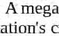
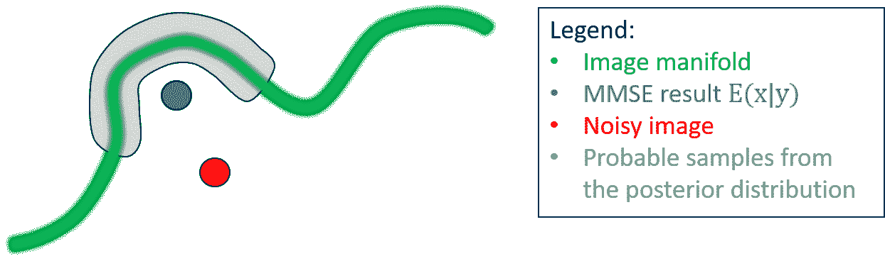
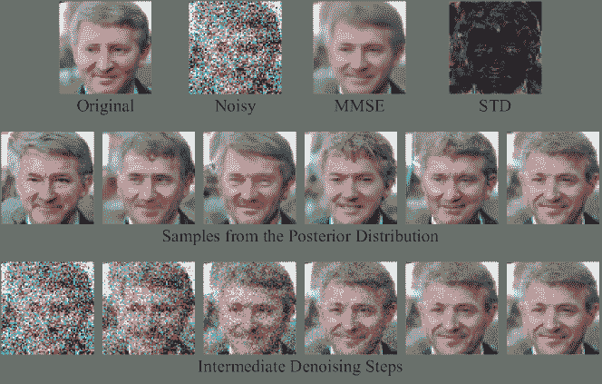

<!--yml

分类：未分类

日期：2024-09-06 19:42:25

-->

# [2301.03362] 图像去噪：深度学习革命及其超越 – 一篇综述论文 –

> 来源：[`ar5iv.labs.arxiv.org/html/2301.03362`](https://ar5iv.labs.arxiv.org/html/2301.03362)

\headers

图像去噪：深度学习革命及其超越 M. Elad, B. Kawar 和 G. Vaksman

# 图像去噪：深度学习革命及其超越

– 一篇综述论文 –

Michael Elad    Bahjat Kawar 和 Gregory Vaksman

计算机科学系    以色列理工学院

电子邮件：{elad    bahjat.kawar    grishavak}@cs.technion.ac.il

###### 摘要

图像去噪——从图像中去除加性白噪声——是图像处理领域最古老和研究最广泛的问题之一。经过数十年的广泛研究，产生了数千篇相关论文和许多高效的算法。确实，十年前，这些成就使一些研究人员怀疑“去噪已死”，即在这个领域能取得的所有成果已经得到。然而，随着深度学习（DL）渗透到图像处理领域，这一说法被证明是远非事实。DL 时代给图像去噪带来了革命，不仅在噪声抑制能力方面领先于今天的技术，而且扩展了去噪问题的处理范围。我们的论文首先描述了这一演变，特别强调了经典方法与现代人工智能（AI）替代方法在图像去噪器设计中的张力和协同作用。

图像去噪领域的近期变革远超出设计更好去噪器的能力。本文的第二部分重点关注近期发现的图像去噪器的能力和前景。我们揭示了将图像去噪器用于其他问题的可能性，例如正则化一般逆问题，以及在基于扩散的图像合成中作为主要引擎的可能性。我们还揭示了一个（奇怪的？）想法，即去噪和其他逆问题可能没有唯一解，这与常见算法的观点相矛盾。相反，我们描述了生成随机和多样化高感知质量结果的建设性方法，这些都得益于深度学习（DL）对图像去噪的进展。

这是一篇综述论文，其主要目标是提供图像去噪领域及相关图像处理主题的广泛历史视角。我们的目的是为最近的发现和人工智能革命在我们领域中的影响提供更好的背景。

###### 关键词：

图像去噪，逆问题，MMSE 估计，插拔式先验（PnP），通过去噪正则化（RED），朗之万动力学，扩散模型，图像合成，感知质量，感知-失真权衡。

## 1 引言

在图像处理和计算成像的广泛领域中，图像去噪任务在过去几十年中得到了特别大的关注。事实上，图像中的噪声抑制是这些领域中最古老和最研究的问题之一，许多论文提供了各种算法，对这一任务的不同形式进行分析或扩展¹¹1 见图 1，展示了多年间去噪相关论文的数量。提出的去噪技术中有相当一部分致力于从图像中去除加性白噪声（AWGN），而其他贡献则针对不同的噪声分布，如泊松噪声、盐和胡椒噪声等。

从图像中去除噪声是几乎每个成像传感器都会遇到的实际需求 [191]。然而，对这个问题的兴趣远超实际需求——图像去噪是最简单的逆问题，因此多年来被认为是评估新思路的理想测试平台，这些新思路通常会被引入图像处理领域。近年来，这种吸引力进一步扩大，因为认识到去噪器可以满足其他成像需求 [295, 231, 260]。

1980 年至 2010 年间，去噪算法持续改进，其中许多依赖于贝叶斯视角。这一进展得益于图像先验的演变，这些先验构成了图像处理整体进展的基础。这一过程，我们将其称为*经典时代*，从早期基于$L_{2}$的正则化开始，经过鲁棒统计，引入小波，到后来的偏微分方程在成像任务中的应用，最终发展到稀疏建模、基于块的方法和低秩结构假设²²2 由于引用过长，我们在后续章节提供了这些的具体引用。多年来的大量工作导致了许多表现良好的去噪算法，并形成了一个引人注目且丰富的科学领域。实际上，十年前，这些辉煌的成就使得一些研究人员考虑到“去噪已死”的可能性，认为现有解决方案已经接近可实现的性能上限 [45, 162, 163]。

过去十年，由于人工智能（AI）革命的兴起，数据处理领域发生了范式转变。这一深度学习（DL）趋势的巨大成功也引入了对广泛的图像处理领域，尤其是图像去噪的改革。这些新风潮催生了设计更高性能去噪器的创新技术[50, 330, 167, 332, 270, 159, 8, 339, 165]，并发现了部署这些技术的新方法，扩展了它们的应用范围[1, 170, 323, 288, 102, 166, 146, 212, 113]。如今，基于深度学习的去噪器在图像噪声抑制能力方面处于领先地位（参见例如[330, 165, 322]，几乎没有竞争余地给经典的替代方法）。

与上述内容平行且看似与深度学习活动无关，图像去噪也成为了另一种风格的调查和发现的主题：将去噪器引擎用于其他成像任务。这一探索始于一个令人惊讶的想法，即一个表现良好的去噪器可以作为先验，提供对逆问题的高度有效正则化[295, 231, 28, 139, 283, 268, 192, 280, 49, 55]。这一研究继续发现，这些去噪器还可以用于通过提供实际的图像先验分布采样来随机合成图像，这为生成对抗网络（GANs）和其他图像生成方法提供了强有力的竞争[260, 261, 262, 120, 287, 68, 122, 143, 121]。

对上述综合揭示的一个有趣的后续是，逆问题的解决方案可以被重新审视，并作为从图像后验分布中进行采样的任务，这样又将图像去噪器作为获取这些解决方案的手段。这一非常新的研究方向揭示了一个大胆的想法，即去噪和其他逆问题可能没有唯一解，如常见算法所相信的那样[212, 146, 138, 145, 211]。相反，这种采样方法已被证明能产生随机化和多样化的*高感知质量*结果，作为副产品暴露了此类任务中的内在不确定性。

所有这些成就都受到了深度学习（DL）对图像去噪带来的进展的强烈影响和推动。从更广阔的角度来看，如今的图像去噪有了新的视野，如果从这些近期的成就中得出任何结论，那就是这个领域是一个充满挑战和前景的充满活力的游乐场。本文旨在揭示和详细描述上述引人注目的故事。我们的主要目标是提供一个图像去噪领域及其相关图像处理主题的广泛历史视角，为近期发现提供更好的背景，并突出人工智能革命在我们领域的影响。

我们在第二部分开始我们的旅程，通过明确定义图像去噪任务、讨论其病态特性并展示其多年来的吸引力。我们在第三部分和第四部分中描述了图像去噪器的演变，从经典时代到基于深度学习的替代方案。第五部分强调了经典方法和现代人工智能（AI）替代方案在图像去噪器设计中的紧张关系和可能的协同作用。

在论文的第二部分，我们切换主题，讨论三项将图像去噪器作为其他需求构建块的近期发现。我们在第六部分中广泛地定义了去噪器引擎及其属性，为这三项发现的展示奠定基础。接着在第七部分中讨论了将这些引擎用于规范化反问题的能力。第八部分揭示了使用这些去噪器合成图像的可能性，第九部分介绍了通过从后验分布中采样来实现图像去噪和反问题中的完美感知质量结果的概念。我们在第十部分中总结了论文，尝试指出开放问题和潜在的研究方向。

*免责声明：* 虽然本论文旨在综述图像去噪领域多年来经历的各种波折，但要全面覆盖这一领域的所有已发表文献几乎是不可能的。如果一些论文在我们的参考文献中被遗漏，我们表示歉意，因为我们尝试标记这一领域历史上的关键里程碑。感兴趣的读者可以参考[156, 197, 130, 18, 92, 281]了解不同方向的其他综述。

## 2 图像去噪 – 背景

### 2.1 问题定义

我们的故事必须从对去噪问题的适当定义开始，这也将为后续符号的定义提供依据。一个理想的图像³³为了简化讨论，假设我们指的是灰度图像。颜色问题在第四部分中简要讨论。假设${\mathbf{x}}\in\mathbb{R}^{N}$来自于图像流形，由概率密度函数$p({\mathbf{x}})$表示。我们的测量是向量${\mathbf{y}}\in\mathbb{R}^{N}$，给出为

| (1) |  | $\displaystyle{\mathbf{y}}={\mathbf{x}}+{\mathbf{v}},$ |  |
| --- | --- | --- | --- |

其中 ${\mathbf{v}}\in\mathbb{R}^{N}$ 是零均值的独立同分布（i.i.d.）高斯噪声，即 ${\mathbf{v}}\sim{\cal N}({\mathbf{0}},\sigma^{2}{\mathbf{I}})$。去噪任务是从 ${\mathbf{y}}$ 中恢复 ${\mathbf{x}}$，并且去噪器因此是形式为 $\hat{{\mathbf{x}}}=D({\mathbf{y}},\sigma)$ 的函数。

尽管有许多方法可以评估这种去噪器的性能，但最常见的方法是均方误差（MSE）度量，

| (2) |  | $\displaystyle MSE=\mathbb{E}\left(\&#124;{\mathbf{x}}-{\hat{\mathbf{x}}}\&#124;_{2}^{2}\right)=\mathbb{E}\left(\&#124;{\mathbf{x}}-D({\mathbf{y}},\sigma)\&#124;_{2}^{2}\right),$ |  |
| --- | --- | --- | --- |

其中，期望是对图像分布进行的。估计理论中的一个著名结果指出，相对于这一度量，最佳的去噪（即，达到最小均方误差，称为 MMSE）由[217]给出，

| (3) |  | $\displaystyle{\hat{\mathbf{x}}}_{MMSE}=\mathbb{E}\left({\mathbf{x}}&#124;{\mathbf{y}}\right).$ |  |
| --- | --- | --- | --- |

这个公式在其简洁形式中具有误导性，因为设计一个达到 MMSE 的去噪器是非常具有挑战性的，往往几乎是不可能的。顺便说一下，好奇的读者可能会想知道为什么我们强调 MSE 度量和 MMSE 去噪器。答案将在论文的后续部分中详细展开，这些选择发挥了关键作用。关于此的简要说明将在本节后面出现。

去噪图像有多困难？这可能有多复杂？再说一次，问题定义的简单性是虚幻的，因为这个任务非常困难，实际上是病态的。一个人可以很容易地设计一种滤波方法来减轻和抑制 ${\mathbf{y}}$ 中的噪声，但这种过程很可能也会破坏图像内容，丢失细节，牺牲边缘，损坏细腻纹理等等。

### 2.2 高斯性假设

在上述问题定义中，我们专注于零均值 i.i.d. 高斯噪声污染的一个非常具体的情况。自然的问题是，为什么我们要将讨论限制在这种情况？对图像去噪文献的简要检查显示，这种噪声模型非常流行，被大多数开发的算法覆盖。这种流行性来源于哪里？有几个答案浮现在脑海中：

+   •

    中心极限定理：成像中的噪声可能由于许多物理原因而产生，它们的积累通常会导致上述形式的高斯分布，作为中心极限定理的经验表现[277, 127]。因此，与其建模复杂的噪声来源，不如使用高斯假设，这为后续分析和算法开发提供了一个有利的简化。

+   •

    泊松替代：有人可能会正确地认为，处理成像噪声的适当分布是泊松分布，因为成像传感器本质上是计数光子，其到达具有泊松性质 [59]。虽然这个论点确实正确，但当光子计数较高时，泊松分布会变成高斯分布 [26]。如果计数较低，像*Anscombe* [7]这样的方差稳定变换可以将这些测量转变为加性高斯污染，再次回到高斯性范畴 [81, 325, 233, 184, 12, 272, 334]。

+   •

    数学优雅：高斯情况容易建模，相应的公式变得简单而优雅。这适用于对数似然函数 $p({\mathbf{y}}|{\mathbf{x}})$ 以及后续部分将展示的其他相关推导。

+   •

    MMSE 去噪引擎：我们对高斯假设的最后一个论点对许多领域的人来说是相当惊讶且不熟悉的。事实证明，去除零均值独立同分布高斯噪声的 MMSE 去噪器具有极大的理论重要性。这种引擎具有关键属性，使其能够作为逆问题的先验（见第七部分）进行部署。此外，更重要的是，这些去噪器与*评分函数* [260]有着强烈的理论联系，这一点将在第 8-9.2 节中突出并利用。

### 2.3 图像去噪的扩展

上述核心图像去噪任务有许多变体。这些变体可以大致分为四个子类别：(i) 处理不同的噪声统计；(ii) 解决结构化噪声去除；(iii) 考虑不同和各种视觉内容；以及 (iv) 提出不同的问题假设和设置。我们简要描述每一类。

对上述原始去噪问题的自然扩展是考虑其他噪声统计，如泊松噪声（也称为 shot-noise）去噪[93, 248, 100, 65, 325, 291, 233, 184, 226, 12]，盐和胡椒噪声去除[40, 264, 75, 300, 210]，处理泊松噪声和高斯噪声的混合[176, 326, 184]，以及其他。其他扩展考虑结构化噪声，例如压缩伪影去除中的量化噪声[206, 176, 297, 63, 106]，胶卷颗粒去除[312, 311, 62]，以及纹理或其他彩色噪声[108, 193, 3, 219]。另一个具有挑战性的任务是在噪声在空间上不均匀的情况下进行去噪，例如空间上变化的白噪声$\sigma$[187, 332, 344, 148]。修补问题[90, 182, 306, 134]可以看作是这样一种特殊情况，其中图像的部分区域缺失，需要恢复。这些缺失的像素可以视为受到非常强噪声的污染，而图像的其他区域则被可靠测量。

去噪任务可能会在视觉内容形式不同的情况下假设完全不同的设置。例如，快照中的噪声减少[173, 102, 198, 189, 86, 166, 80]，其中多个图像一起处理。类似但又不同的是视频去噪任务[179, 9, 10, 275, 276, 290, 259, 180, 322, 161]，在这种任务中，我们可能需要对输入的帧进行在线滤波。处理特定成像类型（如显微镜成像[223, 25, 13, 103, 340, 186, 158, 188]，CT 成像[164, 48, 318, 316, 70, 314]和 PET/SPECT 成像[51, 82, 105, 227, 343, 266]等），算法设计可能需要对数据格式（如处理 3D 体积[294, 336, 324, 64, 178]）或捕获方式进行适当调整。

最后一类扩展涉及在处理去噪任务时我们先前的知识。盲去噪[131, 169, 157, 47, 201, 256, 342, 321, 114] 指的是噪声已知为独立同分布的高斯噪声，但$\sigma$未知，甚至可能是空间变化的。更复杂的情况是噪声统计完全未知[345, 8, 2, 307]。在这种情况下，近年来一个特别引人关注的情况是从数字相机（例如手机）拍摄的图像中去除真实噪声[298, 149, 170, 285, 301, 128]。

### 2.4 图像去噪的兴趣

图 1 展示了一张图表，显示了每年在图像去噪主题上发表的论文数量。总体而言，Clarivate Web-Of-Science (WoS) 识别出近$30,000$篇此类论文，主要发表在过去的 25 年中。因此，这显然是图像处理领域中研究最为深入的主题之一，也可能是精确科学中的一个重要话题。从这张图表中还可以明显看出，这一主题的持续增长趋势。这种受欢迎程度来自哪里？

图 1：图像去噪主题上的论文数量随时间的变化。这张图表对应于 2022 年 12 月 1 日在 Clarivate Web-of-Science (WoS)上执行的搜索主题=((image or video ) and (denoising or (noise and remov) or clean))。请注意，2022 年较低的数量并不代表一种新趋势，而是由于新论文报告的延迟所致。

研究图像去噪的主要原因在于其对成像系统的实际相关性。从获取的视觉信息中去除噪声是几乎每个成像传感器都会面临的实际需求[191]。因此，已经开发了各种算法用于图像处理软件包和 ISP（图像信号处理器）中的实现——从原始采集数据开始，最终生成高质量图像——每台数码相机[23, 30, 298, 338, 124]。

除了上面明显的实际动机之外，对图像去噪的兴趣还有其他更深刻的根源。图像去噪是最简单的反问题，因此多年来被认为是评估常常被引入图像处理的新想法的理想平台。事实上，图像处理中的所有主要里程碑性进展都始于去噪实验，以探索它们对视觉数据的有效性。提赫诺夫-阿尔赛宁的正则化理论就是这种情况[282, 104]，小波[185]，基于偏微分方程的非线性滤波[302, 111]，数据的稀疏建模[31, 88]等等。所有这些以及图像科学中的许多其他子领域都将图像去噪视为它们进入广泛图像处理任务的关键第一步。我们将在下一节更详细地讨论这些问题。

上述两个图像去噪受欢迎的原因可能解释了这一领域中许多已发表的论文。然而，我们选择撰写本文的原因与第三个，非常不同的受欢迎原因有关。近年来，图像去噪因意识到去噪器可以满足其他图像需求这一令人惊讶的发现而引起了广泛的兴趣和吸引力，从而扩大了它们的范围和影响[295, 231, 260, 120, 145]。这一发现依赖于图像的先验分布与去噪器之间的基础理论联系[200, 265, 84]。这一联系为图像处理中新旧任务提供了扎实而有动机的方法。事实上，这正是我们将在本文的后面部分重点突出讨论的主题。因此，我们将把对这些想法的更详细解释推迟到后面。

## 3 图像去噪 - 经典时代

到目前为止，我们已经讨论了图像去噪器，但并没有具体深入探讨它们构造的实际问题。那么，我们如何设计一个图像去噪器呢？出人意料的是，这个问题的答案随着积累的知识和信号处理和图像处理的进展而不断演变和改变。而且，我们可以广义地将图像去噪器的设计进展分为两个时代 - 从 70 年代开始的经典时代，到过去十年结束的时期，以及从 2012 年左右开始且至今非常活跃的人工智能革命时代。在本节中，我们将重点讨论经典算法，特别是在它们的创建中起关键作用的贝叶斯观点。

### 3.1 设计去噪器的贝叶斯观点

从方程 (1) 开始，给定有噪声的图像 ${\mathbf{y}}$ 并知道 ${\mathbf{v}}\sim{\cal N}({\mathbf{0}},\sigma^{2}{\mathbf{I}})$，我们的目标是估计 ${\mathbf{x}}$。一种简单的方法是最大似然估计 (MLE) [205, 235]，寻求使条件概率 $p({\mathbf{y}}|{\mathbf{x}})$ 最大化的 $\hat{{\mathbf{x}}}$，本质上是最大化给定测量 ${\mathbf{y}}$ 的似然。由于噪声的高斯性，这个概率很容易得到

| (4) |  | $\displaystyle p({\mathbf{y}}&#124;{\mathbf{x}})=\operatorname*{const}\cdot\exp\left\{\frac{-\&#124;{\mathbf{x}}-{\mathbf{y}}\&#124;_{2}^{2}}{2\sigma^{2}}\right\},$ |  |
| --- | --- | --- | --- |

最大化它等同于平凡且徒劳的解：${\hat{\mathbf{x}}}_{MLE}={\mathbf{y}}$。这一结果直接反映了去噪问题的不适定性，暴露了其解需要更多信息的需求。

| (5) |  | $\displaystyle p({\mathbf{x}}&#124;{\mathbf{y}})=\frac{p({\mathbf{y}}&#124;{\mathbf{x}})\cdot p({\mathbf{x}})}{p({\mathbf{y}})}=\operatorname*{const}\cdot\exp\left\{\frac{-\&#124;{\mathbf{x}}-{\mathbf{y}}\&#124;_{2}^{2}}{2\sigma^{2}}\right\}\cdot p({\mathbf{x}}).$ |  |
| --- | --- | --- | --- |

在最后的等式中，我们将分母 $p({\mathbf{y}})$ 吸收到常数中，因为它与 ${\mathbf{x}}$ 无关。虽然这个表达式是对 MLE 的简单修改（将似然乘以先验 $p({\mathbf{x}})$），但实际上这是一个重要的变化，因为它对从 ${\mathbf{y}}$ 到 ${\mathbf{x}}$ 的反演过程进行了正则化。

两个常用的估计量利用了 $p({\mathbf{x}}|{\mathbf{y}})$，分别是 MAP 和 MMSE。第一个通过最大化这一后验得到，即最大后验概率 (MAP) 估计 [205, 235]，由⁴⁴4 此最小化通过对上述表达式取 $-\log$ 得到。

| (6) |  | $\displaystyle{\hat{\mathbf{x}}}_{MAP}=\operatorname*{arg\,min}_{{\mathbf{x}}}\left[\frac{\&#124;{\mathbf{x}}-{\mathbf{y}}\&#124;_{2}^{2}}{2\sigma^{2}}-\log\left(p({\mathbf{x}})\right)\right].$ |  |
| --- | --- | --- | --- |

与 MLE 相对的是，${\hat{\mathbf{x}}}_{MAP}$ 受两个力量的支配，第一个将其拉向 ${\mathbf{y}}$，而另一个则寻求一个“表现良好”的结果，从而导致 $-\log\left(p({\mathbf{x}})\right)$ 的低值——这正是上述的正则化。

类似地，MMSE 估计 [132] 也依赖于获得的后验概率，如方程 (3) 所示，通过⁵⁵5 参见附录 A 以推导此声明。

| (7) |  | $\displaystyle{\hat{\mathbf{x}}}_{MMSE}=\mathbb{E}\left({\mathbf{x}}&#124;{\mathbf{y}}\right)=\int_{\mathbf{x}}{\mathbf{x}}p({\mathbf{x}}&#124;{\mathbf{y}})d{\mathbf{x}}.$ |  |
| --- | --- | --- | --- |

尽管这个表达式非常简洁明了，但由于需要分区函数——该分布的标准化因子——其操作被证明相当具有挑战性。这也解释了为什么在经典方法中基于 MAP 的方法非常流行。

无论是 MAP 还是 MMSE，贝叶斯观点都需要访问 $p({\mathbf{x}})$ 或其代理。这将我们引向下一个讨论，即图像处理中的先验演变及其对去噪器设计的影响。

### 3.2 先验的演变

图像处理中的一个关键角色是先验 $p({\mathbf{x}})$，即图像分布的概率密度函数。对 $p({\mathbf{x}})$ 的建模及其在视觉数据处理问题中的应用构成了我们领域的骨架，并定义了其多年来的发展轨迹。下面我们概述了建模 $p({\mathbf{x}})$ 演变的核心里程碑。

需要记住的一个关键主题是，出现在流行的 MAP 估计中的表达式 $-\log(p({\mathbf{x}}))$（参见方程 (6）），应假设为封闭形式，以便进行可管理的数值优化。因此，大多数尝试表征 $p({\mathbf{x}})$ 的方法选择使用 Gibbs 分布形式 [132]，即 $p({\mathbf{x}})=c\cdot\exp\{-\rho({\mathbf{x}})\}$，将我们的重点从 $p({\mathbf{x}})$ 转移到能量函数 $\rho({\mathbf{x}})$。

那么，$\rho({\mathbf{x}})$ 应该是什么才能准确描述图像分布？为了简洁讨论，我们在表 1 中展示了这个函数的可能分析表达式的简要列表，而不深入探讨它们的含义、相互关系和效果。这些表达式的详细解释见附录 B。请记住，选择 $\rho({\mathbf{x}})$ 的表达式这一幼稚的方法绝非一项简单的任务——我们真的可以期望一个简单的公式来把握图像内容分布的丰富性吗？

表 1 中的思想演变特点是几个主要且相互关联的趋势——从熟悉的高斯分布迁移到不太直观的重尾分布，从 $L_{2}$ 离开到诸如 $L_{1}$ 的稀疏促进度量，从线性近似技术（例如 PCA）漂移到非线性技术（例如小波和稀疏建模），最重要的是，用学习到的先验替代公理表达。

表 1: 图像先验的演变。

| 年份 | 核心概念 | $\rho(\cdot)$ 的公式 |
| --- | --- | --- |
| $\sim$ 1970 | 能量正则化 | $\&#124;{\mathbf{x}}\&#124;_{2}^{2}$ |
| 1975-1985 | 空间平滑度 | $\&#124;{\mathbf{L}}{\mathbf{x}}\&#124;_{2}^{2}$ 或 $\&#124;{\mathbf{D}}_{v}{\mathbf{x}}\&#124;_{2}^{2}+\&#124;{\mathbf{D}}_{h}{\mathbf{x}}\&#124;_{2}^{2}$ |
| 1980-1985 | 最优学习变换 | $\&#124;{\mathbf{T}}{\mathbf{x}}\&#124;_{2}^{2}={\mathbf{x}}^{T}{\mathbf{R}}^{-1}{\mathbf{x}}$（通过 PCA） |
| 1980-1990 | 加权平滑度 | $\&#124;{\mathbf{L}}{\mathbf{x}}\&#124;_{{\mathbf{W}}}^{2}$ |
| 1990-2000 | 鲁棒统计 | ${\mathbf{1}}^{T}\mu\{{\mathbf{L}}{\mathbf{x}}\}$ 例如，Hubber-Markov |
| 1992-2005 | 总变差 | $\int_{v\in\Omega}&#124;\nabla{\mathbf{x}}(v)&#124;dv={\mathbf{1}}^{T}\sqrt{&#124;{\mathbf{D}}_{v}{\mathbf{x}}&#124;^{2}+&#124;{\mathbf{D}}_{h}{\mathbf{x}}&#124;^{2}}$ |
| 1987-2005 | 其他基于 PDE 的选项 | $\int_{v\in\Omega}g\left[\nabla{\mathbf{x}}(v),\nabla^{2}{\mathbf{x}}(v)\right]dv$ |
| 2005-2009 | 专家领域 | $\sum_{k}\lambda_{k}{\mathbf{1}}^{T}\mu_{k}\{{\mathbf{L}}_{k}{\mathbf{x}}\}$ |
| 1993-2005 | 小波稀疏性 | $\&#124;{\mathbf{W}}{\mathbf{x}}\&#124;_{1}$ |
| 2000-2010 | 自相似性 | $\sum_{k}\sum_{j\in\Omega(k)}d\{{\mathbf{R}}_{k}{\mathbf{x}},{\mathbf{R}}_{j}{\mathbf{x}}\}$ |
| 2002-2012 | 稀疏性方法 | $\&#124;\alpha\&#124;_{0}~{}s.t.~{}{\mathbf{x}}={\mathbf{D}}\alpha$ |
| 2010-2017 | 低秩假设 | $\sum_{k}\&#124;{\mathbf{X}}_{\Omega(k)}\&#124;_{*}$ |

### 3.3 其他经典去噪方法

尽管上述描述的贝叶斯方法已经证明相当有效，产生了多种去噪方法，但对于这类算法也考虑了替代性和更直接的设计技术。在这里，我们提到几种这样的方法，有些方法依赖于图像内容的空间自适应平滑的普遍概念，而其他方法则利用图像中常常存在的自相似性。

考虑以下粗略的激励想法：回忆一下，去噪器应当在保持图像内容的同时减弱随机独立同分布的高斯噪声。当在一个嘈杂像素 $y[i,j]$ 上操作时，我们的直观策略是围绕它打开一个邻域 $\Omega[i,j]$，以进行平均。如果 $\Omega[i,j]$ 中的局部图像内容像一个倾斜的平面，则简单地对这些邻域像素进行平均可以提供完美的局部噪声抑制。当局部行为偏离这种简单结构时，平均掩模应考虑这一点并做出相应的调整。

这正是双边滤波器[284, 87]和贝尔特拉米流[255]背后的思想，其中平均权重考虑了两个因素——（i）加权像素到邻域中心的距离；以及（ii）该像素的值与中心像素值的接近程度，表明它对平均的相关性。为每个像素 $y[i,j]$ 计算这些权重，并将它们归一化使其总和为一，创建了用于应用的局部平均核。这样，如果 $\Omega[i,j]$ 涵盖了两个区域之间的边缘，则平均将限制在“相关”像素上，同时丢弃其他像素。非局部均值[32]将这种方法更进一步，通过将 $\Omega[i,j]$ 扩展到半局部区域，并通过块匹配而非标量值比较来评估像素对平均的相关性。这样，我们保留了空间自适应平均的概念，但使其更具鲁棒性，并使其成为非局部的。核回归[271]也是一种空间自适应平均技术，但依赖于 $\Omega[i,j]$ 中像素灰度值的局部参数估计。一个二维高斯分布被拟合到 $\Omega[i,j]$ 中的像素，决定了其方向和跨度，从而沿边缘而非跨边缘进行平滑。

另一个值得我们特别关注的直接图像去噪声方法，特别是由于其卓越的性能，是 BM3D 算法[61]。该技术依赖于对自然图像中 2D-DCT 变换后的局部块的稀疏性期望。此外，通过从整个图像区域收集类似的块，这种变换后的稀疏性应对齐于支持中。因此，BM3D 为每个像素$y[i,j]$构建一个类似块的 3D 立方体，统一变换该立方体并强制产生联合稀疏结果。在经典的去噪声算法中，BM3D 被认为是 MSE 结果方面最好的方法之一。在这种背景下，我们还提到加权核范数最小化（WNNM）去噪声方法[110]及其后续研究（例如[310]）。这些方法依赖于与 BM3D 类似的原理，但将联合稀疏性替换为低秩假设。

### 3.4 去噪声死了吗？

论文《去噪声死了吗？》，由 Chatterjee 和 Milanfar 于 2009 年发表[45]，揭示了当时我们社区中许多人共同的担忧——怀疑我们在去噪声能力方面已触及上限。这种印象依赖于前几年去噪声算法设计的显著进展，以及发现对这个问题的不同方法往往能达到相似的去噪声效果。Levin 和 Nadler 于 2011-2012 年的后续研究[162, 163]也探讨了同样的问题。这两方面的研究均建议推导噪声去除能力的 MSE 近似下界。在不深入讨论其推导细节的情况下，我们应该提到两者都得出结论，尽管这一说法并未被建设性地提出，但仍有一些改进空间，使得如何获得更好技术的问题仍然模糊不清。

从实际角度来看，尽管这些乐观结论，2010-2011 年后的去噪声性能进展非常缓慢，且回报递减。实际上，图 1 中的图表显示了 2010 年左右图像去噪声论文数量的减少。然而，这一挫折主要适用于上述讨论的经典方法。深度神经网络的出现给我们领域带来了巨大的变化，打破了关于这一领域结束的普遍信念，以及关于已达到性能极限的民间传说。

确实，深度学习为设计高效的图像去噪器带来了新的方法，领先于今天图像噪声抑制的能力。然而，AI 革命对图像去噪任务产生了更广泛的影响，开启了前所未有的可能性和能力的新视野。在众多方向中，这些包括（i）图像适应；（ii）真实噪声去除；以及（iii）应对新的去噪目标。在接下来的章节中，我们将更详细地讨论这些内容。

虽然过去十年无疑可以被称为 AI 革命的时代，但在图像处理领域还有另一场革命，也许规模更大，并且与之平行进行——即发现图像去噪器可以服务于其他任务。从开创性的《Plug-and-Play Priors》[295]论文，到《Regularization by Denoising》论文[231]，以及最近令人兴奋的基于扩散的图像合成[260, 120]，图像去噪器在图像处理中的角色变得更加新颖和激动人心。由于这是本文的主要主题，我们将在第六部分及之后的部分详细展开这一工作方向。

因此，总结一下，对于“去噪是否已经过时？”这一问题，我们的回答是“绝对没有！”，这归功于深度学习的巨大影响以及其他新方向为这一领域带来的新生命。本文其余部分将专门描述这些发展及其影响和前景。

## 4 图像去噪——深度学习革命

最近发现的有效训练深度神经网络进行分类、回归和其他任务的能力不容小觑。这一过程中的任何环节都不够被理解或合理化。事实上，情况正好相反——由于网络的过度参数化和高度非凸的目标函数，这样的网络竟然能够学习和泛化，确实令人惊讶。然而，它们做到了！这正是 AI 革命的本质，它已经进入了许多领域，并以深远的方式影响着每个领域。

图像处理和计算成像是另一个深受 AI 革命影响的领域。今天的图像处理实践和理论与仅仅 10 年前所考虑的完全不同。确实，由于这些新的变革，图像处理的本科生和研究生课程也不得不发生了剧变。

所有这些将我们带入了图像去噪的新纪元。在第三部分中，我们探讨了如何设计图像去噪器，并给出了依赖于经典贝叶斯方法的答案。现在我们回到这个问题，提供一个完全不同的答案——一个基于监督深度学习的方法。该方法包括以下步骤：

1.  1.

    开始时，收集一个大规模的干净图像数据集——我们所期望去噪的图像种类。我们将这个集合表示为 ${\cal X}=\{{\mathbf{x}}_{k}\}_{k=1}^{M}$。为简单起见，假设所有图像的大小相同。如果不是这种情况，可以通过随机切片提取过程将给定数据转换为这种所需的结构。

1.  2.

    请记住，我们的目标是设计一个去噪器，以去除特定强度 $\sigma$ 的加性白噪声。因此，下一步是创建 ${\cal X}$ 的噪声实例，即 ${\cal Y}=\{{\mathbf{y}}_{k}\}_{k=1}^{M}$，其中对于 $1\leq k\leq M,~{}{\mathbf{y}}_{k}={\mathbf{x}}_{k}+{\mathbf{v}}_{k}$ 且 ${\mathbf{v}}_{k}\sim{\cal N}(0,\sigma^{2}{\mathbf{I}})$。实际上，每个示例 ${\mathbf{x}}_{k}$ 可能会被几个噪声实现污染，从而丰富训练集。

1.  3.

    定义一个参数化去噪架构 ${\hat{\mathbf{x}}}=D_{\Theta}({\mathbf{y}},\sigma)$，该架构应进行训练以执行去噪任务。这个阶段必然模糊，因为构建这样的架构有很多选择，并且似乎没有明确的结构指南。确实，文献提供了各种通过试错法构思的选项，例如。以下是关于这一微妙阶段的更多细节和讨论。

1.  4.

    定义训练损失——一个利用 ${\cal X}$ 和 ${\cal Y}$ 以及定义的参数化去噪器 $D_{\Theta}({\mathbf{y}},\sigma)$ 的惩罚函数，设定一个需要最小化的成本值，以鼓励去噪图像接近其对应的理想图像。这样的函数形式可以是

    | (8) |  | $\displaystyle{\cal L}(\Theta)=\sum_{k=1}^{M}\operatorname*{dist}\left({\mathbf{x}}_{k},{\hat{\mathbf{x}}}_{k}\right)=\sum_{k=1}^{M}\operatorname*{dist}\left({\mathbf{x}}_{k},D_{\Theta}({\mathbf{y}}_{k},\sigma)\right),$ |  |
    | --- | --- | --- | --- |

    其中 $\operatorname*{dist}({\mathbf{x}},{\hat{\mathbf{x}}})$ 是理想图像与去噪图像之间的距离函数，如 MSE – $\operatorname*{dist}({\mathbf{x}},{\hat{\mathbf{x}}})=\|{\mathbf{x}}-{\hat{\mathbf{x}}}\|_{2}^{2}$。

1.  5.

    通过在小批量训练对$({\mathbf{x}}_{k},{\mathbf{y}}_{k})$上应用随机梯度下降法 [24]，并利用反向传播 [242]，来最小化${\cal L}(\Theta)$相对于$\Theta$的值。

一旦完成所有上述步骤，去噪器${\hat{\mathbf{x}}}=D_{\Theta}({\mathbf{y}},\sigma)$就可以部署到新来的图像上，去噪效果可能会因训练集的大小和质量、待去噪图像与训练集之间的相似性、选择的架构以及优化过程的质量和超参数而有所不同。

上述的一种变体是盲去噪，其中$\sigma$是未知的。处理这个任务的直接方法是暴力学习。这意味着对于每一个理想图像${\mathbf{x}}$，我们生成一系列噪声版本${\mathbf{y}}_{k}^{\sigma}$，其$\sigma$值在我们目标覆盖的范围内变化。然后，通过最小化一个对所有噪声水平进行积分的损失来完成学习。

| (9) |  | $\displaystyle{\cal L}(\Theta)=\int_{\sigma}\sum_{k=1}^{M}dist\left({\mathbf{x}}_{k},D_{\Theta}({\mathbf{y}}_{k}^{\sigma})\right).$ |  |
| --- | --- | --- | --- |

请注意，在这种情况下，去噪器$D_{\Theta}$仅接收带噪图像而没有$\sigma$。在[201]中发现了一个有趣的替代方案，表明无偏架构对噪声功率具有鲁棒性，因此仅针对单一值$\sigma$的简单训练能够很好地推广到其他噪声水平。

上述描述的一个惊人后果是：所有对图像先验的辉煌研究，这些研究推动了经典去噪器和其他图像处理工具的设计，似乎已经变得完全过时。请注意，在这种监督式深度学习方法中，我们不需要也没有空间来容纳那些在几十年的广泛研究和工程工作中积累的所有知识和技术。这是否是我们领域当前状况的公正描述？在很大程度上，令人遗憾的答案是肯定的，而对这一结论的某些保留意见将在第五部分中讨论。

深度学习技术及其新能力的出现带来了图像去噪器设计和范围的新进展。虽然相关文献丰富而广泛，但我们在下文中描述了几个关键趋势，试图揭示获得的新能力以及伴随而来的新思想。这些新趋势体现在多个方面：

+   •

    更好的去噪器：通过深度学习提高图像去噪能力已成为一个自然的新领域，其目标是在达成一致的测试图像语料库上取得更好的峰值信噪比（PSNR）。这体现在从简单的前馈卷积神经网络（CNN） [330] 到更高级的结构，如 UNet [234, 115]，再到最近引入的 Transformers [78, 165, 322] 的架构演变中。在图 2 中，我们通过呈现一张图表来展示这一趋势，显示了在著名的 BSD68 数据集 [190] 上去噪 PSNR 的进展。有关这些算法的更多详细信息见附录 C。

    

    图 2：在 BSD68 数据集 [190] 上的去噪性能，$\sigma=25$（K-SVD [89]、BM3D [61]、FoE [237]、LSSC [181]、EPLL [347]、MLP [33]、CSF [252]、WNNM [110]、TNRD [50]、DnCNN [330]、IRCNN [331]、NLRN [167]、MVCNN [168]、N3Net [218]、FFDNet [332]、FOCNet [133]、RIDNet [8]、GCDN [292]、SwinIR [165]、DRUNet [329])。

+   •

    不同的训练方案：我们上述描述了最明显的监督训练策略，即收集理想图像及其噪声版本的配对。也有多种无监督替代方案被开发用于此任务，例如 Noise2Noise [160]、Noise2Void [152]、Noise2Self [16]、基于 SURE 的去噪 [337, 175, 207] 等，它们的目标是直接处理噪声图像而无需访问其清晰版本。然而，应该明确的是，这些技术仅在噪声不遵循已知解析结构的情况下才变得相关，否则，监督替代方案将更受欢迎。另一种采用无监督去噪器训练的有吸引力的方法是“深度图像先验”（DIP） [286]，其中网络在单张图像上进行训练，以最佳拟合自身。研究表明，提前停止这种学习可以产生有效的去噪，揭示了 UNet 架构的正则化能力。

+   •

    真正噪声去除：我们之前提到了 Noise2X 系列的工作 [160, 152, 16]，它使得在没有干净图像的情况下去噪成为可能。这种能力在处理具有未建模和未知噪声统计的图像时尤为重要。在这种情况下，学习应该依赖于更基本的力量，例如图像中的自相似性、回归神经网络从噪声中再现噪声的缓慢趋势、存在于图像帧突发中的联合信息等。更广泛地说，从图像中去除真正的噪声是图像去噪中的一个相对较新的主题，因为在经典时代由于其显而易见的复杂性，几乎没有被涉及。借助先进的自监督和无监督学习技术，创造了新的令人印象深刻的能力 [298, 149, 170, 285, 301, 128]。

+   •

    图像适应：这指的是将已经设计/训练好的去噪器调整，使其在处理与训练集不同的独特图像时表现更好。这样，通用去噪器在处理扫描文档、天文图像、卡通图像等时可以得到提升。适应本身可以通过多种方式完成，其中最自然的一种是以下方法[289]：给定一张嘈杂而独特的图像进行清理，首先应用现有的去噪器 $D_{\Theta_{0}}$ 并获得 ${\hat{\mathbf{x}}}_{0}=D_{\Theta_{0}}({\mathbf{y}},\sigma)$。然后，通过最小化 $dist\left({\hat{\mathbf{x}}}_{0},D_{\Theta}({\mathbf{y}},\sigma)\right)$ 来重新训练去噪器（即更新参数 $\Theta$）。类似于 Noise2Noise [160] 和 DIP [286] 的核心思想，这种最小化的几个梯度步骤预计会朝着正确的方向发展，从而生成更具信息性和相关性的去噪器，从而提高该特定图像的结果。最终结果是通过 ${\hat{\mathbf{x}}}=D_{\Theta}({\mathbf{y}},\sigma)$ 获得，使用稍微更新的参数 $\Theta$。

+   •

    解决不同目标：在描述去噪器的监督学习策略时，我们提供了考虑 PSNR 性能的$L_{2}$损失。多年来，这种质量度量在大多数论文中占据了主导地位，尽管它存在已知的缺陷。确实，我们的社区一直在不断努力追求 MMSE 去噪器，如果不能在实体上，至少在精神上，这从多年来几乎所有关于图像去噪的论文中出现的 PSNR 性能表中可以看出。正如我们在第 9.1 节中稍后讨论的那样，尽管 MMSE 去噪器本身具有很大价值，但它们的结果并不一定具有视觉吸引力，因为它是对许多潜在解决方案的平均。

    考虑到这一点，学习范式为服务“新主宰”创造了新的机会——请记住，学习损失函数是高度非凸的，但我们在训练神经网络时对其复杂性并不感到害怕。因此，我们可以轻松地用更复杂或更合适的惩罚来替代令人愉悦的$L_{2}$。立刻想到的替代方案是 SSIM [299]，它通过考虑结构相似性提供了图像之间更鲁棒的距离度量。我们还可以进一步考虑诸如 LPIPS [335]这样的感知损失，这通过学习的表示进一步增强了鲁棒性，以公平地评估图像之间的接近度。这种趋势可以被描述为试图从去噪器中产生视觉上令人愉悦和清晰的图像，这些图像将超越 MMSE 替代方案。朝着这个方向迈出的第一步是将生成对抗网络（GANs）应用于去噪 [69, 67, 212]。这个想法是挑战去噪器的输出，通过将其输入到一个分类器中，该分类器应该区分真实图像和去噪图像。通过利用这个分类器的指导，去噪器可以学会产生更好看的图像。我们将在第 9.1 节中回到这个想法，提供一种改进的方法，旨在获得完美的感知质量结果。

上述描述仅仅提供了一个对图像去噪领域非常活跃且丰富的文献的初步了解，该领域将图像去噪视为一个有吸引力的研究领域。尽管如此，我们在这里停止对深度学习在去噪中的调查，因为我们的主要目标是去噪器本身以及建立在其上的算法。

最后一点，请注意，所有关于经典和现代去噪器设计的讨论都是在没有提及彩色图像的情况下进行的。确实，本文中的公式考虑的是灰度图像${\mathbf{x}}$，然而大多数去噪器，无论新旧，通常需要处理彩色（红绿蓝）图像。上述一些现有方法可以通过对三个色度通道联合操作来轻松扩展到彩色图像。例如，NLM[32]和 K-SVD 去噪[89]通过将 RGB 图像块展平为更长的向量来直接操作。另一种方法是转向 YUV 或 YCbCr 色彩空间，独立操作亮度（Y）和色度（Cb/Cr 或 U/V）层，就像 BM3D 所做的那样[61]。基于深度神经网络的去噪器通常通过将 RGB 图像作为 3 维张量输入网络，并通过随后的 3D 卷积进行处理来直接处理彩色图像。确实存在更复杂的方法，这些方法对色彩层之间的几何相互作用进行了更充分的考虑[255]。

## 经典与深度学习的协同作用

根据上述描述，读者可能会（有理由地！）产生这样的印象：在经典时代积累的大量关于图像去噪的知识在深度学习方法出现后已经变得过时。然而，这种说法并不完全正确。实际上，经典算法研究和推广的主题仍然是构建深度学习去噪器的基础，尽管这种应用可能是隐性的，这些基础主要体现在所使用的架构选择上。为说明这一点，我们提到了一些经典图像去噪算法的著名关键概念，并展示它们对深度学习架构的影响：

+   •

    局部性：去噪中恢复像素值的大多数相关信息都包含在其局部邻域中。在经典算法中，这一概念通过块处理、本地滤波、本地图像先验等体现出来。而在深度学习方案中，许多去噪器选择卷积层作为主要处理路径，这导致了具有小到中等感受野的架构[308, 330, 332]。

+   •

    适当变换下的稀疏性：使用某些二维变换表示时，局部图像块被期望是稀疏的。在经典方法中，表格 1 列出的几个先验属于稀疏性促进类别。在深度学习方面，可以观察到类似的处理，其中常用的 ReLU 激活通过使负激活的神经元为零来促进稀疏性[101]。

+   •

    自相似性：大多数图像补丁在同一图像的其他位置具有类似的双胞胎。尽管经典算法通常通过收集相似的补丁并将其联合处理来利用这一特性，但一些最近的深度学习方案利用自注意力层来发挥自相似性[165、317]。

不幸的是，这些以及其他从经典时代继承的概念并没有对深度学习面临的主要问题提供建设性的答案：我们应该如何选择适合去噪任务的架构？面对这个问题的研究人员通常会选择以下两种方案之一：（i）复制：采用已经在类似任务中被证明效果良好的现有架构（例如，DnCNN、UNet、ResNet 等）[330、234、117]。通常，这种采用会伴随一些小的修改，比如更改通道数或层数等；或（ii）试错：通过将卷积、步幅、批归一化步骤、ReLU、全连接层、下采样和上采样、跳跃连接等已知构建块混合起来，逐步构建一个架构。

这两种方案似乎效果都很好，导致网络获得了非常好的实际结果——见[330、332、165]。然而，这种蛮力方法通常会导致沉重而繁琐的架构，依赖于数百万个可训练参数，使得结果网络使用成本高且训练困难。这种架构的另一个缺点是缺乏可解释性。虽然这可能看起来不重要，但没有可解释性的黑箱去噪器意味着无法将其应用于其他任务（例如，图像分离[199、91、153]），或者无法用来识别图像中处理不当区域的故障来源。更广泛地说，对于去噪器的架构设计，蛮力方法可能需要漫长的试错过程，最终可能会遇到性能瓶颈。

近期文献中出现了一种替代复制或猜测架构的方法，称为*展开* [109, 341, 250, 83, 204]。这种方法构建神经网络以模拟一个合理算法的计算阶段。展开一词与许多经典图像去噪方法涉及迭代算法有关，因此模仿这些方法的网络应将其迭代展开为前向计算路径。这种方法通常产生简洁且完全可解释的网络，无论是在学习参数还是获得的激活上，都更易于训练。此外，这样的网络往往很容易而且有效地适应不同的数据。文献中有各种展开方法的例子，例如用于各种回归任务的展开方法，如 [313, 58, 328, 125, 289, 250, 204]。在这里，我们简要描述两种用于举例的方法：深度 K-SVD [250]和 LIDIA [289]。它们都提出了将一个经典去噪算法转换为深度神经网络架构的方法。

### 5.1 深度 K-SVD

图 3：深度 K-SVD 网络的端到端架构 [250]。

深度 K-SVD [250]是 K-SVD 图像去噪算法的展开版本 [89]。我们先简要解释原始 K-SVD 方法，然后转而描述它的展开。

K-SVD 去噪是基于稀疏表示理论构建图像先验 [4]。考虑一幅干净图像$\mathbf{x}$和提取操作符$\left\{\mathbf{R}_{k}\right\}_{k}$，使得$\mathbf{R}_{k}\mathbf{x}\in\mathbb{R}^{n}$是从图像位置$k$取得的大小为$\sqrt{n}\times\sqrt{n}$的图像块。稀疏先验假设任何这样的图像块，$\mathbf{R}_{k}\mathbf{x}$，可以表示为冗余字典${\mathbf{D}}\in\mathbb{R}^{n\times p}$中*少数*列（也称为原子）的线性组合（冗余性暗示$p>n$），即，

| (10) |  | $\mathbf{R}_{k}\mathbf{x}={\mathbf{D}}\alpha_{k}\;,$ |  |
| --- | --- | --- | --- |

其中$\alpha_{k}\in\mathbb{R}^{p}$是一个稀疏向量，$\left\|\alpha_{i}\right\|_{0}\ll n$。 在这个假设的基础上，K-SVD 提出了以下最小化问题：

| (11) |  | $\min_{\left\{\alpha_{k}\right\}_{k},\mathbf{x}}\quad\frac{\mu}{2}\left\&#124;\mathbf{x}-\mathbf{y}\right\&#124;_{2}^{2}+\sum_{k}\left(\lambda_{k}\left\&#124;\alpha_{k}\right\&#124;_{0}+\frac{1}{2}\left\&#124;{\mathbf{D}}\alpha_{k}-\mathbf{R}_{k}\mathbf{x}\right\&#124;_{2}^{2}\right)\;,$ |  |
| --- | --- | --- | --- |

其中$\mathbf{y}$是给定的带噪图像，$\mu$和$\lambda_{k}$是超参数。在这个表达式中，第一个项是对数似然度，要求重建图像$\mathbf{x}$与带噪图像$\mathbf{y}$之间的接近度。第二和第三项表示稀疏表示先验，要求每个位置$k$中的图像块$\mathbf{R}_{k}\mathbf{x}$有一个近似的稀疏表示$\alpha_{k}$。

K-SVD 算法通过以下两步迭代地解决这个最小化问题：（i）固定${\mathbf{x}}$（初始化为${\mathbf{x}}={\mathbf{y}}$），并更新向量$\left\{\alpha_{k}\right\}_{k}$；（ii）更新${\mathbf{x}}$，同时冻结稀疏表示向量。第一步被称为稀疏编码阶段，在这一阶段，每个块通过正交匹配追踪（OMP）贪婪算法获得稀疏表示[214]。第二步变成一个二次最小化任务，其解是基于块的均值的简单变体。研究表明，以上两步的一次迭代足以获得非常好的结果[89]，多次重复这个过程可以进一步提高结果[347]。上述过程中的字典${\mathbf{D}}$可以是通用的——预训练以最有效地稀疏化自然图像内容，或者是图像自适应的——在上述优化过程中更新到图像${\mathbf{y}}$本身。

现在我们来描述 Deep K-SVD 算法，它采用了通用字典的方法。单轮的端到端架构如图 3 所示。该神经网络由三个主要模块组成：块分解、块去噪和块平均，所有模块都紧密遵循上述相同的步骤，并进行了适当的调整。块分解将输入图像$\mathbf{y}$分解为一组完全重叠的块$\left\{\mathbf{z}_{k}\right\}_{k}=\left\{\mathbf{R}_{k}\mathbf{y}\right\}_{k}$。下一个模块，块去噪，是逐块应用的，但将 OMP 替换为 LISTA[109]，其中$\mathbf{z}_{k}$通过可微分的收缩迭代算法进行稀疏编码[109]。这些内部迭代也被展开，创建了一个前向计算路径，从$\mathbf{z}_{k}$开始，到$\mathbf{\hat{z}}_{k}={\mathbf{D}}\alpha_{k}$结束。由于 OMP 和 LISTA 之间的差距，一个全连接层的子网络计算传入块${\mathbf{z}}_{k}$的$\lambda_{k}$值。最后一个模块，块平均，通过使用学习到的权重对清洁的块$\mathbf{\hat{z}}_{k}$进行平均，重建出重建图像$\mathbf{\hat{x}}$。

这个深度 K-SVD 网络通过最小化一组 $M$ 训练图像的理想图像和去噪图像之间的 MSE 距离进行端到端的训练，

| (12) |  | $\mathcal{L}\left(\Theta\right)=\sum_{k=1}^{M}\left\|\mathbf{x}_{k}-\mathbf{\hat{x}}_{k}\right\|_{2}^{2}=\sum_{k=1}^{M}\left\|\mathbf{x}_{k}-D_{\Theta}\left(\mathbf{y}_{k}\right)\right\|_{2}^{2}\;,$ |  |
| --- | --- | --- | --- |

其中 $\left\{{\mathbf{x}}_{k},y_{k}\right\}_{k}$ 是用于训练的一组干净和噪声图像对。$D_{\Theta}$ 是去噪网络，其中 $\Theta$ 代表所有可训练的参数，包括字典 ${\mathbf{D}}$、评估 $\lambda_{k}$ 的子网络参数以及收缩阈值。

尽管原始算法与其展开版本之间有很大的相似性，但后者表现更好 [250]，超越了经典方法，并与基于深度学习的技术对齐。这并不令人惊讶，因为展开的去噪器 $D_{\Theta}$ 以监督的方式进行训练，充分了解其服务的任务，而原始算法依赖于“猜测”的图像先验。有趣的是，$D_{\Theta}$ 获得的通用字典与原始 K-SVD 去噪方法离线训练的字典明显不同，这再次证明了这两种设计策略之间的重大差异。

### 5.2 LIDIA - 轻量化学习图像去噪

另一个基于展开的去噪示例是 LIDIA [289]，它模拟了 BM3D [61] 的计算阶段。如第 3.3 节所述，BM3D 利用稀疏性和自相似性这两种主要力量来实现去噪目标。首先，依赖于局部图像补丁在 2D-DCT 空间变换下的稀疏性；其次，通过对相似补丁组进行联合操作，强制稀疏性再次通过这些补丁之间的变换。

图 4: LIDIA 去噪计算路径。

图 5: Transform-ReLU-Transform 块。应用矩阵 $\mathbf{T}_{1}$ 和 $\mathbf{T}_{2}$ 将输入 $\mathbf{Z}_{k}$ 转换到一个补丁应该是稀疏的空间中；矩阵 $\mathbf{T}_{3}$ 和 $\mathbf{T}_{4}$ 将结果转换到像素域中。注意，应用于 $\mathbf{Z}_{k}$ 的变换是可分离的 – $\mathbf{T}_{1}$ 在补丁内应用，而 $\mathbf{T}_{2}$ 在补丁间操作。这使得矩阵 $\mathbf{T}_{1},\dots,\mathbf{T}_{4}$ 的大小得以缩小，从而使其可以进行训练。

LIDIA 的核心计算路径如图 4 所示。这个神经网络首先将输入图像 $\mathbf{y}$ 切分成一组完全重叠的补丁 $\left\{\mathbf{z}_{k}\right\}_{k}$，每个补丁的大小为 $\sqrt{n}\times\sqrt{n}$。然后，每个补丁 $\mathbf{z}_{k}\in\mathbb{R}^{n}$ 会被增强，加入其 $m-1$ 个最近邻的补丁，形成一个大小为 $n\times m$ 的矩阵 $\mathbf{Z}_{k}$。滤波是逐补丁应用的 —— 每个矩阵 $\mathbf{Z}_{k}$ 会经过一系列的块，这些块由一个可分离变换、ReLU 和另一个可分离变换组成，如图 5 所示。这一过程模拟了 BM3D 操作，通过将输入矩阵变换到一个局部补丁被认为是稀疏的空间，利用 ReLU 层强制稀疏性，然后将结果变换回像素域。与 BM3D 不同的是，这些变换是可训练的，并且不必互为逆矩阵，也不强制要求是方阵。此外，LIDIA 还包括了多尺度处理，同时在多个尺度上处理补丁。在处理过程中，不同尺度的对应补丁通过一个学习的联合变换进行融合。最后，通过将去噪后的补丁还原到其原始位置并利用学习到的权重平均重叠部分，从而获得重建的图像。

LIDIA 网络通过最小化 MSE 损失（与方程 12 中的损失类似），在一组 $M$ 个训练图像上进行端到端的训练（不包括最近邻部分）。该网络可以针对特定的噪声水平 $\sigma$ 进行训练，也可以进行盲训练，旨在服务于一系列的 $\sigma$ 值。由于 LIDIA 使用的是学习得到的变换而非固定变换，因此它的表现比原始 BM3D 算法要好。与其他深度学习技术相比，LIDIA 达到了可比的结果，同时使用了典型的少量学习参数。

在第四部分中，我们提到将给定的去噪器适应于新出现的偏离训练集的图像的能力。这种适应从应用训练好的去噪器开始，然后利用输出结果通过几个梯度步骤来微调去噪器参数。这一原理已经在 LIDIA 中成功演示，图 6 中展示了两个这样的示例结果。

(a) 清晰

(b) 噪声, ${\sigma=50}$

(c) 去噪, $24.22$dB

(d) 适应, $26.34$dB

<svg version="1.1" width="598" height="373" overflow="visible"><g transform="translate(0,373) scale(1,-1)"><g  transform="translate(0,0)"><g transform="translate(0,373) scale(1, -1)"><foreignobject width="598" height="373" overflow="visible"></foreignobject></g></g></g></svg>

(e) 清晰

<svg version="1.1" width="598" height="373" overflow="visible"><g transform="translate(0,373) scale(1,-1)"><g  transform="translate(0,0)"><g transform="translate(0,373) scale(1, -1)"><foreignobject width="598" height="373" overflow="visible"></foreignobject></g></g></g></svg>

(f) 噪声, ${\sigma=50}$

<svg version="1.1" width="598" height="373" overflow="visible"><g transform="translate(0,373) scale(1,-1)"><g  transform="translate(0,0)"><g transform="translate(0,373) scale(1, -1)"><foreignobject width="598" height="373" overflow="visible"></foreignobject></g></g></g></svg>

(g) 去噪, $22.10$dB

<svg version="1.1" width="598" height="373" overflow="visible"><g transform="translate(0,373) scale(1,-1)"><g  transform="translate(0,0)"><g transform="translate(0,373) scale(1, -1)"><foreignobject width="598" height="373" overflow="visible"></foreignobject></g></g></g></svg>

(h) 适应, $25.82$dB

图 6: 通过 LIDIA 进行图像适应：原始的去噪网络是针对通用内容图像进行训练的，对于天文学和扫描文档输入表现良好。由于这两个示例偏离了训练集，因此在去噪性能上获得了显著提升。

### 5.3 总结 - 经典方法依然存在

我们描述了两个展开实例，其中经典去噪算法提供了其架构以供学习网络使用。这些以及其他类似方法 [341、250、83、204]，针对各种图像恢复任务，提供了一条建设性路径，通向有充分动机的、低复杂度且可解释的神经架构。在经典去噪方法与新颖深度学习替代方案之间寻找协同效应时，这可能是最自然的体现。

## 6 图像去噪 – 向近期发现迁移

从以上讨论中可以得出明确的结论：针对 AWGN 去噪的高效图像去噪算法 $D({\mathbf{y}},\sigma)$ 确实触手可及，而更好的算法很可能是基于深度学习的算法。为了说明这些观点，图 7 和 8 展示了两张测试图像的去噪结果，噪声水平为两个 ($\sigma=15,50$) 和几种去噪算法 – NLM [32]、BM3D [61]、DnCNN [330] 和 SwinIR（基于变换器的去噪网络） [165]。可以看出，结果非常令人印象深刻，尤其是后来的深度神经网络解决方案。

<svg version="1.1" width="598" height="484" overflow="visible"><g transform="translate(0,484) scale(1,-1)"><g  transform="translate(0,0)"><g transform="translate(0,78) scale(1, -1)"><foreignobject width="664" height="78" overflow="visible"></foreignobject></g></g></g></svg>

(a) 清晰

<svg version="1.1" width="598" height="484" overflow="visible"><g transform="translate(0,484) scale(1,-1)"><g  transform="translate(0,0)"><g transform="translate(0,78) scale(1, -1)"><foreignobject width="664" height="78" overflow="visible"></foreignobject></g></g></g></svg>

(b) 含噪，${\sigma=50}$

<svg version="1.1" width="598" height="484" overflow="visible"><g transform="translate(0,484) scale(1,-1)"><g  transform="translate(0,0)"><g transform="translate(0,78) scale(1, -1)"><foreignobject width="664" height="78" overflow="visible"></foreignobject></g></g></g></svg>

(c) NLM，$24.67$dB

<svg version="1.1" width="598" height="484" overflow="visible"><g transform="translate(0,484) scale(1,-1)"><g  transform="translate(0,0)"><g transform="translate(0,78) scale(1, -1)"><foreignobject width="664" height="78" overflow="visible"></foreignobject></g></g></g></svg>

(d) BM3D，$26.31$dB

<svg version="1.1" width="598" height="484" overflow="visible"><g transform="translate(0,484) scale(1,-1)"><g  transform="translate(0,0)"><g transform="translate(0,78) scale(1, -1)"><foreignobject width="664" height="78" overflow="visible"></foreignobject></g></g></g></svg>

(e) DnCNN，$26.70$dB

<svg version="1.1" width="598" height="484" overflow="visible"><g transform="translate(0,484) scale(1,-1)"><g  transform="translate(0,0)"><g transform="translate(0,78) scale(1, -1)"><foreignobject width="664" height="78" overflow="visible"></foreignobject></g></g></g></svg>

(f) SwinIR，$27.31$dB

图 7：几种去噪方法的演示（1）：（NLM [32]，BM3D [61]，DnCNN [330]，SwinIR [165]）。

<svg version="1.1" width="598" height="484" overflow="visible"><g transform="translate(0,484) scale(1,-1)"><g  transform="translate(0,0)"><g transform="translate(0,78) scale(1, -1)"><foreignobject width="664" height="78" overflow="visible"></foreignobject></g></g></g></svg>

(a) 清晰

<svg version="1.1" width="598" height="484" overflow="visible"><g transform="translate(0,484) scale(1,-1)"><g  transform="translate(0,0)"><g transform="translate(0,78) scale(1, -1)"><foreignobject width="664" height="78" overflow="visible"></foreignobject></g></g></g></svg>

(b) 噪声，${\sigma=15}$

<svg version="1.1" width="598" height="484" overflow="visible"><g transform="translate(0,484) scale(1,-1)"><g  transform="translate(0,0)"><g transform="translate(0,78) scale(1, -1)"><foreignobject width="664" height="78" overflow="visible"></foreignobject></g></g></g></svg>

(c) NLM，$33.82$dB

<svg version="1.1" width="598" height="484" overflow="visible"><g transform="translate(0,484) scale(1,-1)"><g  transform="translate(0,0)"><g transform="translate(0,78) scale(1, -1)"><foreignobject width="664" height="78" overflow="visible"></foreignobject></g></g></g></svg>

(d) BM3D，$36.23$dB

<svg version="1.1" width="598" height="484" overflow="visible"><g transform="translate(0,484) scale(1,-1)"><g  transform="translate(0,0)"><g transform="translate(0,78) scale(1, -1)"><foreignobject width="664" height="78" overflow="visible"></foreignobject></g></g></g></svg>

(e) DnCNN，$36.33$dB

<svg version="1.1" width="598" height="484" overflow="visible"><g transform="translate(0,484) scale(1,-1)"><g  transform="translate(0,0)"><g transform="translate(0,78) scale(1, -1)"><foreignobject width="664" height="78" overflow="visible"></foreignobject></g></g></g></svg>

(f) SwinIR, $37.17$dB

图 8：几种去噪方法的演示（2）：（NLM [32]，BM3D [61]，DnCNN [330]，SwinIR [165]）。

我们现在转向提出更为大胆的问题，关注这些去噪器的其他任务应用。更具体地说，我们讨论了三个这样的问提，每个问题都对应于成像科学领域的最新发现：

+   •

    发现 1：我们能否利用去噪器 $D({\mathbf{y}},\sigma)$ 来解决一般线性反问题？如我们将要看到的，答案是肯定且具有建设性的，为恢复算法的设计及其正则化开辟了新视野。

+   •

    发现 2：我们能否利用去噪器 $D({\mathbf{y}},\sigma)$ 合成（幻觉）高质量图像，这些图像来自先验概率密度函数 $p({\mathbf{x}})$？在这里，答案同样是肯定且具有建设性的，为机器学习领域提供了激动人心的新方向。

+   •

    发现 3：如果完美图像的幻觉是可以实现的，那么我们能否重新审视一般线性反问题的主题，并利用去噪器 $D({\mathbf{y}},\sigma)$ 解决这些问题，同时瞄准*完美的感知质量*结果？在这里，我们同样给出了肯定的答案，并引领了一个新的、激发人心的反问题研究分支，提供了对其处理的新视角。

接下来我们将详细讨论这些发现。我们真诚地相信，这些发现共同构成了我们领域最激动人心的时代之一，标志着图像处理认知和实践的重大转变。

## 发现 1：通过图像去噪器解决反问题

给定一个去噪器 $D({\mathbf{y}},\sigma):\mathbb{R}^{N}\rightarrow\mathbb{R}^{N}$，我们的目标是以某种方式利用它来解决形式为的线性反问题

| (13) |  | $\displaystyle{\mathbf{y}}={\mathbf{H}}{\mathbf{x}}+{\mathbf{v}},$ |  |
| --- | --- | --- | --- |

其中 ${\mathbf{H}}\in\mathbb{R}^{M\times N}$ 是已知矩阵，${\mathbf{v}}\in\mathbb{R}^{M}$ 是加性高斯白噪声，${\mathbf{y}}\in\mathbb{R}^{M}$ 是给定的测量向量。注意到 ${\mathbf{H}}={\mathbf{I}}$ 代表去噪问题。因此，当前讨论将我们的视野扩展到成像科学中更广泛的任务，涵盖去模糊、修补、去马赛克、超分辨率、断层重建、压缩感知等应用。

根据第三部分的推导，特别是方程(6)，我们可以采用贝叶斯观点并获得这个问题系列的最大后验估计：

| (14) |  | $\displaystyle{\hat{\mathbf{x}}}_{MAP}=\operatorname*{arg\,min}_{{\mathbf{x}}}\left[\frac{\&#124;{\mathbf{H}}{\mathbf{x}}-{\mathbf{y}}\&#124;_{2}^{2}}{2\sigma^{2}}-\log\left(p({\mathbf{x}})\right)\right].$ |  |
| --- | --- | --- | --- |

将 Gibbs 分布形式的先验代入，$p({\mathbf{x}})\sim\exp\{-\rho({\mathbf{x}})\}$，这变成了

| (15) |  | $\displaystyle{\hat{\mathbf{x}}}_{MAP}=\operatorname*{arg\,min}_{{\mathbf{x}}}\left[\&#124;{\mathbf{H}}{\mathbf{x}}-{\mathbf{y}}\&#124;_{2}^{2}+c\cdot\rho({\mathbf{x}})\right].$ |  |
| --- | --- | --- | --- |

显然，上述最大谜团与能量函数$\rho({\mathbf{x}})$的身份有关。去噪器是否可以通过提供与$\rho({\mathbf{x}})$的连接或替代来统一处理所有线性反问题？令人惊讶的是，这个问题的答案是肯定的，并且具有建设性。Venkatakrishnan、Bouman 和 Wohlberg 的开创性工作[295]首次提供了这样的答案⁷⁷7 我们应该注意到，另一种紧密相关的推导是从近似消息传递的角度提供的，见[196]。其后由 RED（通过去噪进行正则化）[231]进行跟进和改进。这些及其各种扩展和变体在成像科学领域创造了一个生动且激动人心的子领域[28, 139, 283, 34, 268, 41, 192, 280, 5, 49, 55]，在其中去噪器扮演了核心角色。下面我们将更详细地描述 PnP 和 RED，然后转向描述另一种可能更有基础的去噪器与能量函数$\rho({\mathbf{x}})$之间的桥梁，通过*评分函数*。这将为我们迈向扩散模型的下一步提供基础，因为它们在第八部分及以后展现。

### 7.1 插拔式先验（PnP）

PnP [295]建议以下步骤来处理方程(15)中提出的最小化问题：我们首先通过定义${\mathbf{z}}={\mathbf{x}}$来拆分变量${\mathbf{x}}$，并用不同的变量表达两个惩罚项：

| (16) |  | $\displaystyle{\hat{\mathbf{x}}}_{MAP}=\operatorname*{arg\,min}_{{\mathbf{x}},{\mathbf{z}}}\left[\&#124;{\mathbf{H}}{\mathbf{x}}-{\mathbf{y}}\&#124;_{2}^{2}+c\cdot\rho({\mathbf{z}})\right]~{}~{}\operatorname*{s.t.}~{}~{}{\mathbf{z}}={\mathbf{x}}.$ |  |
| --- | --- | --- | --- |

下一步是形成上述问题的增广拉格朗日形式，将约束转换为惩罚项，

| (17) |  | $\displaystyle L({\mathbf{x}},{\mathbf{z}},{\mathbf{u}})=\&#124;{\mathbf{H}}{\mathbf{x}}-{\mathbf{y}}\&#124;_{2}^{2}+c\cdot\rho({\mathbf{z}})+\lambda\&#124;{\mathbf{z}}-{\mathbf{x}}+{\mathbf{u}}\&#124;_{2}^{2}-\lambda\&#124;{\mathbf{u}}\&#124;_{2}^{2},$ |  |
| --- | --- | --- | --- |

其中 ${\mathbf{u}}$ 是缩放的对偶变量，$\lambda$ 是一个（任意的）惩罚权重（见更多内容于 [295]）。第三步和最后一步应用 ADMM [27] 来最小化 $L({\mathbf{x}},{\mathbf{z}},{\mathbf{u}})$，在更新 ${\mathbf{u}}$ 的同时相对于 ${\mathbf{x}}$ 和 ${\mathbf{z}}$ 进行优化。这些是通过在固定其他变量的同时交替处理每个变量来获得的：

| (18) |  | $\displaystyle{\mathbf{x}}$ | $\displaystyle\leftarrow$ | $\displaystyle\operatorname*{arg\,min}_{{\mathbf{x}}}\left[\&#124;{\mathbf{H}}{\mathbf{x}}-{\mathbf{y}}\&#124;_{2}^{2}+\lambda\&#124;{\mathbf{z}}-{\mathbf{x}}+{\mathbf{u}}\&#124;_{2}^{2}\right]=\left[{\mathbf{H}}^{T}{\mathbf{H}}+\lambda{\mathbf{I}}\right]^{-1}\left[{\mathbf{H}}^{T}{\mathbf{y}}+{\mathbf{z}}-{\mathbf{u}}\right],$ |  |
| --- | --- | --- | --- | --- | --- |
| (19) |  | $\displaystyle{\mathbf{z}}$ | $\displaystyle\leftarrow$ | $\displaystyle\operatorname*{arg\,min}_{{\mathbf{z}}}\left[c\cdot\rho({\mathbf{z}})+\lambda\&#124;{\mathbf{z}}-{\mathbf{x}}+{\mathbf{u}}\&#124;_{2}^{2}\right],$ |  |
| (20) |  | $\displaystyle{\mathbf{u}}$ | $\displaystyle\leftarrow$ | $\displaystyle{\mathbf{u}}+({\mathbf{x}}-{\mathbf{z}}).$ |  |

在上述内容中，第一个更新方程相当于一个简单的最小二乘问题，不涉及 $\rho({\mathbf{x}})$。真正的难点在第二个更新公式中——观察它与公式 (6) 的相似之处，这个公式制定了一个图像去噪任务。确实，与其选择/猜测/学习 $\rho({\mathbf{x}})$，我们可以应用我们喜欢的去噪器 ${\hat{\mathbf{z}}}=D({\mathbf{x}}-{\mathbf{u}},\sigma_{0})$，其中 $\sigma_{0}$ 应与 $\lambda/c$ 成反比。这样，PnP 提供了一个有吸引力的迭代算法，重复应用去噪器来处理任何潜在的逆问题，正如承诺的那样。

尽管原始的 PnP 论文没有深入探讨上述 ADMM 算法的收敛问题，也没有对去噪器提出支持这种保证的条件，但后续的研究提供了这样的理论讨论——我们建议感兴趣的读者参见 [42, 309, 269, 155]。

### 7.2 通过去噪进行正则化 (RED)

对于 $\rho({\mathbf{x}})$ 与图像去噪之间关系的另一种角度在 [231] 中提出。核心思想非常简单，使用以下依赖于去噪器的 $\rho({\mathbf{x}})$ 明确公式：

| (21) |  | $\displaystyle\rho({\mathbf{x}})={\mathbf{x}}^{T}\left[{\mathbf{x}}-D({\mathbf{x}},\sigma_{0})\right].$ |  |
| --- | --- | --- | --- |

理解这个表达式的直观方法是考虑去噪过程的线性化形式，$D({\mathbf{x}},\sigma_{0})=S({\mathbf{x}}){\mathbf{x}}$，其中$S({\mathbf{x}})$是一个图像依赖的矩阵，表示去噪过程中应用的平滑。这样，选择的能量函数变为$\rho({\mathbf{x}})={\mathbf{x}}^{T}\left[{\mathbf{I}}-S({\mathbf{x}})\right]{\mathbf{x}}$，这是类似于第三部分中描述的拉普拉斯平滑先验，尽管它是自适应图像的（因此效果更佳）。

工作[231]表明，如果去噪器$D({\mathbf{x}},\sigma_{0})$是可微的、被动的且具有对称雅可比矩阵，则方程 (21 ‣ 7 Discovery 1: Solving Inverse Problems via Image Denoisers ‣ Image Denoising: The Deep Learning Revolution and Beyond – A Survey Paper –"))中选择的能量函数保证是凸的。如果此外去噪器满足局部同质性属性⁸⁸8 参见[231]了解这些成分的确切定义及其含义的证明，则以下关系成立：

| (22) |  | $\displaystyle\nabla_{{\mathbf{x}}}\rho({\mathbf{x}})=2\left[{\mathbf{x}}-D({\mathbf{x}},\sigma_{0})\right].$ |  |
| --- | --- | --- | --- |

这种关系是构建多个 RED 算法的核心。在将方程 (21 ‣ 7 Discovery 1: Solving Inverse Problems via Image Denoisers ‣ Image Denoising: The Deep Learning Revolution and Beyond – A Survey Paper –")) 中选择的$\rho({\mathbf{x}})$代入方程 (15)时，这个泛函的梯度容易获取，只需激活一次选择的去噪器。关键是，这个梯度不需要对$D({\mathbf{x}},\sigma_{0})$进行求导，这将需要更多的计算能力和内存消耗。因此，可以应用各种基于梯度的优化策略来计算${\hat{\mathbf{x}}}_{MAP}$，所有这些策略都保证收敛到 MAP 惩罚的全局最小值。我们再次得到迭代算法，在每一步中应用简单的线性操作和去噪器，旨在解决一般线性逆问题。

关于上述内容，一个引人入胜的问题是，在 RED 中使用的去噪器的身份。它应该是一个 MMSE 去噪器吗？它应该设计为去除 AWGN 吗？这些选择会导致上述所提到的所需属性（可微性、对称性、无源性、齐次性）吗？$\sigma_{0}$ 应该是多少？这些问题的部分答案由下文对*得分函数*的讨论给出。

### 7.3 得分函数及其对逆问题的相关性

从方程 (14) 和 (15) 出发，我们现在提出了一种非常不同的方法来获得相同的 RED 公式，通过去噪器对逆问题进行正则化。假设我们的目标是通过最速下降（SD）找到 ${\hat{\mathbf{x}}}_{MAP}$，因此我们的迭代公式应为

| (23) |  | $\displaystyle{\hat{\mathbf{x}}}_{k+1}={\hat{\mathbf{x}}}_{k}-\mu\left[{\mathbf{H}}^{T}({\mathbf{H}}{\hat{\mathbf{x}}}_{k}-{\mathbf{y}})-c\cdot\nabla_{{\mathbf{x}}}\log p({\mathbf{x}})&#124;_{{\hat{\mathbf{x}}}_{k}}\right].$ |  |
| --- | --- | --- | --- |

在统计文献中，术语 $\nabla_{{\mathbf{x}}}\log p({\mathbf{x}})$ 被称为*得分函数*，它是一个描述对先验对数的最优上升方向的流场。一个古老的数学结果，通常归因于 Miyasawa [200]、Stein [265] 或 Tweedie [84]，并在 [138] 中重新提出，证明了

| (24) |  | $\nabla_{\mathbf{y}}\log p(\mathbf{y})=\frac{D(\mathbf{y},\sigma_{0})-\mathbf{y}}{\sigma_{0}^{2}},$ |  |
| --- | --- | --- | --- |

其中 ${\mathbf{y}}={\mathbf{x}}+{\mathbf{v}}$ 是 ${\mathbf{x}}$ 的带噪声版本，${\mathbf{v}}\sim{\cal N}({\mathbf{0}},\sigma_{0}^{2}{\mathbf{I}})$，$D(\mathbf{y},\sigma_{0})$ 应该是最优的最小均方误差（MMSE）去噪器，$\mathbb{E}(\mathbf{x}|\mathbf{y})$。这一结果的证明见附录 D。

虽然无法获得 MMSE 去噪器（因为 $p(\mathbf{x})$ 是未知的），但现代基于深度学习的去噪器表现非常出色（参见图 2），因此可以很好地近似 MMSE 去噪器。因此，尽管方程 (23) 期望使用指向 $p({\mathbf{x}})$ 的分数函数，去噪器可以提供其近似值，该近似值考虑了略微模糊的概率密度函数⁹⁹9 参见附录 D 以验证此声明。 $p({\mathbf{y}})=p({\mathbf{x}})\otimes{\cal N}({\mathbf{0}},\sigma_{0}^{2}{\mathbf{I}})$。当 $\sigma_{0}$ 足够小¹⁰¹⁰10RED [231] 建议对于 $256\times 256$ 灰度图像使用 $\sigma_{0}\approx 3-5$，这种近似变得非常有效，所得算法具有以下更新规则：

| (25) |  | $\displaystyle{\hat{\mathbf{x}}}_{k+1}={\hat{\mathbf{x}}}_{k}-\mu\left[{\mathbf{H}}^{T}({\mathbf{H}}{\hat{\mathbf{x}}}_{k}-{\mathbf{y}})+c\left({\mathbf{x}}_{k}-D({\hat{\mathbf{x}}}_{k},\sigma_{0})\right)\right],$ |  |
| --- | --- | --- | --- |

这正是 RED [231] 的 SD 版本。

### 7.4 总结：用于解决逆问题的去噪器

图 9 和 10 展示了 PnP [295]、RED [231] 和 NCSR [74] 在去模糊和单图像超分辨率中的示例结果。请注意，尽管 NCSR 是专门设计来处理这两个应用的，PnP 和 RED 对底层任务并不知情，只是使用了给定的去噪器。所展示的测试使用了简单的中值滤波器和 TNRD 去噪器 [50]。令人惊讶的是，即使是普通的去噪器如中值滤波器也能提供一定的恢复效果。有关这些实验的更多细节和结果，请参见 [231]。

(a) 真实图像

(b) 输入 $20.83$dB

(c) RED (中值) $25.87$dB

(d) NCSR $28.39$dB

(e) PnP (TNRD) $28.43$dB

(f) RED (TNRD) $28.82$dB

图 9：PnP 和 RED 的去模糊结果的视觉比较。NCSR[50] 被用作对比参考。

(a) 真实情况

(b) 双三次插值 $20.68$dB

(c) RED (Median) $24.44$dB

(d) NCSR $26.79$dB

(e) PnP (TNRD) $26.61$dB

(f) RED (TNRD) $27.39$dB

图 10：PnP 和 RED 的超分辨率 (3:1) 结果的视觉比较。NCSR[50] 被用作对比参考。

PnP 和 RED 在我们社区中已经引起了很多关注。后续工作包括对这两种方法的理论分析[42, 278, 225, 94, 309, 269]，在各种应用中的算法部署[263, 28, 139, 49]，这两种方法的新变种的创建[283, 279, 268, 280, 267, 123, 56]，以及更多。这项工作的一个吸引人的方向回到第五部分中讨论的展开思路：PnP/RED 可以用来定义用于解决一般逆问题的良好动机架构，通过展开提出的算法，然后训练重复的去噪器以最佳方式共同解决一系列逆问题。这样，通过插入退化操作符${\mathbf{H}}$，一个单一的网络可以处理图像处理中的各种任务，围绕一个核心学习的去噪引擎构建[194, 229, 73, 192, 333]。

## 8 发现 2：通过图像去噪器进行图像合成

深度学习革命使得一些先前被认为在实践上不可能的能力成为现实。其中最引人注目的能力之一是*图像合成* - 在不依赖于任何输入或初始化的情况下生成各种自然的图像。更正式地说，图像合成的目标是获得一个随机生成器，其输出遵循图像的先验分布$\mathbf{x}\sim p(\mathbf{x})$。成功完成这项任务将证明我们已经掌握了图像的真实分布，这可能有助于解决各种成像任务。

定义这种图像生成器的一个常见主题是需要设计一个学习的机器$G_{\Theta}({\mathbf{z}})$，它接受一个简单分布的输入向量${\mathbf{z}}$（例如，${\mathbf{z}}\sim{\cal N}(0,{\mathbf{I}})$），并将其转换为来自$p({\mathbf{x}})$的有效样本。$G_{\Theta}({\mathbf{z}})$是由$\Theta$参数化的神经网络，过去十年中构思出了各种学习$\Theta$以最佳拟合合成结果与目标 PDF 的技术。在这种情况下，引起图像合成热门的主要工具称为 GAN - 生成对抗网络[107]。尽管 GAN 的替代方案存在，比如变分自动编码器（VAE）[151], 正则流（NF）技术[228, 150], 自回归模型[293], 以及基于能量的方法[118, 79], GAN 通常处于图像生成的前列。自它们的引入直到最近,GAN 已经经历了各种改进[222, 11, 112, 327], 并取得了出色的性能[29, 141, 249]。但是，随着*扩散模型*的到来，情况发生了戏剧性的变化[257, 260, 120].

GANs 和上述其他生成模型与图像去噪的话题无关。相比之下，*扩散模型*严重依赖于*得分函数*，因此依赖于图像去噪器来解决图像合成的任务。最近开始受到关注的这一系列工作，被恰当地命名为基于分数的生成模型[260, 261]或*去噪扩散概率模型*[257, 120]，利用基于深度学习的去噪器来逼近得分函数，然后在迭代算法中使用它们获得图像$\mathbf{x}$，这些图像是来自 PDF $p({\mathbf{x}})$的公平样本。

在这种情况下用于生成的迭代算法很大程度上基于 Langevin 动力学[230, 19], 这是一个具有以下转移规则的马尔可夫链蒙特卡洛方法：

| (26) |  | $\mathbf{x}_{t+1}=\mathbf{x}_{t}+\alpha\nabla_{\mathbf{x}_{t}}\log p(\mathbf{x}_{t})+\sqrt{2\alpha}\mathbf{z}_{t},$ |  |
| --- | --- | --- | --- |

其中$\mathbf{z}_{t}\sim\mathcal{N}(0,\mathbf{I})$，$\alpha$是一个适当的小常数。随机初始化后，在足够多的迭代次数之后，并且在对$p({\mathbf{x}})$的某些温和条件下，该过程收敛到一个从分布$p(\mathbf{x})$中采样的过程，其评分函数被使用[230]。直观上，该算法遵循对数概率的梯度方向，从一个图像爬升到更可能的图像。这是一个梯度上升过程，每次迭代中添加噪声以提供随机性，这有效地导致从$p(\mathbf{x})$中采样，而不是收敛到局部最大值。

虽然在 Langevin 动力学中使用真实数据分布的评分函数很有诱惑力，但一些问题阻止了这种使用[260]。主要问题之一在于著名的基数流形假设[239]，该假设依赖于自然图像在其嵌入空间中位于低维流形上的观察。因此，对于$\mathbf{x}_{0}$的随机初始化，$p(\mathbf{x}_{0})=0$的概率为$1$，这使得评分函数至多是未定义的，并且在后续迭代中没有向图像流形漂移的能力。一种可能的解决方案是通过其稍微模糊的对应物$p(\mathbf{y})$来近似$p(\mathbf{x})$，其中${\mathbf{y}}={\mathbf{x}}+{\mathbf{v}}$，${\mathbf{v}}\sim{\cal N}(0,\sigma^{2}{\mathbf{I}})$，$\sigma$非常小[296]。这解决了上述问题，因为高斯噪声分布具有无限的尾部。然而，在实践中，这种 Langevin 采样算法需要数千次迭代才能收敛[155]，这限制了其实际应用性。

[260] 的作者建议使用*退火 Langevin 动力学*（ALD）算法¹¹¹¹11 一个非常相似的算法已经由 [120] 平行提出。在这两个工作之前，有 [257] 报告的工作，提出了一个类似的过程，但依赖于来自统计物理学的不同原理，它考虑了一系列高斯噪声图像分布 ${p_{0}(\mathbf{y}),p_{1}(\mathbf{y}),\dots,p_{L-1}(\mathbf{y}),p_{L}(\mathbf{y})}$，其中标准差为 ${\sigma_{0}>\sigma_{1}>\dots>\sigma_{L-1}>\sigma_{L}}$。对每个分布应用几次 Langevin 动力学，从非常大的 $\sigma_{0}$ 开始，到非常小的 $\sigma_{L}$ 结束，可以实现更快的收敛。每一步使用一个估计评分函数的去噪器，并且每个过程的输出用于初始化下一个过程。这意味着合成创建了一系列噪声逐渐减小的图像，从纯经典高斯噪声开始，逐渐雕刻出图像内容。直观地说，这相当于从宽分布中抽取样本，然后逐渐缩小它，从而实现更快的采样和更好的图像生成性能。算法 1 展示了这种图像采样器：外部循环遍历 $L+1$ 个 $\sigma$ 值，而内部循环对每个值应用 $T$ 次 Langevin 步骤。评分函数 $\nabla_{{\mathbf{x}}}\log p_{i}({\mathbf{x}})$，表示 $\sigma_{i}$ 模糊的 ${\mathbf{x}}$ 的 PDF，通过以下公式近似：

| (27) |  | $\displaystyle\nabla_{{\mathbf{x}}}\log p_{i}({\mathbf{x}})=\frac{D({\mathbf{x}},\sigma_{i})-{\mathbf{x}}}{\sigma_{i}^{2}}.$ |  |
| --- | --- | --- | --- |

请注意，在这个过程中，步长 $\alpha$ 被修改，并选择为与 $\sigma_{i}^{2}$ 成正比。这与较大的 $\sigma$ 值意味着更规则和平滑的概率密度函数（PDF）这一事实相一致，这样更容易进行采样。¹²¹²12 对于选择步长的不同解释见于 [260]，其动机是希望更好地平衡 Langevin 更新公式中的评分与加性噪声的范数。图 11 展示了在 ALD 过程中从纯高斯噪声开始到结束时的高质量合成图像的若干时间步例子。

输入：$\left\{\sigma_{i}\right\}_{i=0}^{L}$, $\epsilon$, $T$初始化 $\mathbf{x}_{0}\sim{\cal N}(0,{\mathbf{I}})$对 *$i$ $\leftarrow$ $0$ 到 $L$* 执行       $\alpha_{i}\leftarrow\epsilon\cdot\sigma_{i}^{2}/\sigma_{L}^{2}$      对 *$t$ $\leftarrow$ $1$ 到 $T$* 执行             生成 ${\mathbf{z}}_{t}\sim\mathcal{N}\left(0,\mathbf{I}\right)$             ${\mathbf{x}}_{t}$ $\leftarrow$ ${\mathbf{x}}_{t-1}+\alpha_{i}\left[D({\mathbf{x}}_{t-1},\sigma_{i})-{\mathbf{x}}_{t-1}\right]/\sigma_{i}^{2}+\sqrt{2\alpha_{i}}{\mathbf{z}}_{t}$       结束执行      $\mathbf{x}_{0}\leftarrow\mathbf{x}_{T}$结束对 *$i$ $\leftarrow$ $0$ 到 $L$* 执行输出：$\mathbf{x}_{0}$

算法 1 熔融朗之万动力学 (ALD) 算法

ALD 算法引发了一波相关工作的浪潮[261, 120, 262, 208, 287, 68, 122, 143, 121]，这些工作不断提升了生成*扩散模型*的性能，最终超过了 GANs[68]。我们在图 12 中展示了它们的一些结果。尽管如此，这些迭代算法仍然比 GANs 慢得多，因此投入了大量工作以提高其速度，而不显著影响生成质量[258, 135, 247]，通常实现了显著的加速水平。扩散模型此后在许多应用中变得普遍[142, 209, 21, 116, 6, 253, 254, 144]，促使研究人员准备了关于它们对图像处理领域及其他领域影响的调查[315, 60, 36]。

图 11：熔融朗之万动力学[260] 算法沿 3 条独立合成路径的时间步骤，使用在 LSUN 卧室[319] 图像上训练的去噪器[261]。

图 12：使用基于评分的去噪扩散生成模型[262, 68] 生成的 CelebA-HQ[172] (左) 和 ImageNet[66] (右) 的图像结果。

## 9 发现 3: 高感知质量图像恢复

我们现在进入图像去噪故事中最后一个也是我们认为最令人兴奋的话题之一——解决一般的线性逆问题，同时追求完美的感知质量，并通过 MMSE 去噪器实现这一目标。我们从最简单的逆问题——图像去噪本身——开始，然后扩展到更一般的恢复任务。

### 9.1 重新审视图像去噪问题

我们回到经典的图像去噪问题，其中 ${\mathbf{y}}={\mathbf{x}}+{\mathbf{v}}$ 是给定的噪声图像，${\mathbf{x}}\sim p({\mathbf{x}})$ 是其理想来源，而 ${\mathbf{v}}\sim{\cal N}(0,\sigma_{{\mathbf{y}}}^{2})$ 是加性高斯白噪声（AWGN）。我们的目标是恢复 ${\mathbf{x}}$，但现在我们改变了游戏规则，期望获得高感知质量的结果。这如何实现？

在经典的去噪时代以及现代 AI 时代，去噪器大多使用均方误差（MSE）度量（见方程 2（或紧密相关的度量，如峰值信噪比 – PSNR）进行评估。正如图 2 所示，MSE 一直是并且仍然是去噪器的常用性能度量。MSE 具有几个明显的优点：当去噪器完美恢复图像时，它为零，易于理解，并且在理论分析以及实际应用中（例如优化时的易于微分）产生数学上优雅的结果。

然而，MSE 失真度量存在一个关键缺陷：正如在第 2.1 节和附录 A 中讨论的那样，无论使用何种去噪方法来近似 MSE（MMSE），其最佳结果都依赖于条件期望，

| (28) |  | $\displaystyle{\hat{\mathbf{x}}}_{MMSE}=\operatorname*{arg\,min}_{{\hat{\mathbf{x}}}}\mathbb{E}\left(\&#124;{\mathbf{x}}-{\hat{\mathbf{x}}}\&#124;_{2}^{2}\right)=\int_{{\mathbf{x}}}{\mathbf{x}}p({\mathbf{x}}&#124;{\mathbf{y}})d{\mathbf{x}}=\mathbb{E}\left({\mathbf{x}}&#124;{\mathbf{y}}\right).$ |  |
| --- | --- | --- | --- |

换句话说，当优化均方误差（MSE）时，我们的主要目标是使期望值尽可能接近原始图像，这意味着需要对所有可能的解决方案进行加权平均，权重由其后验概率决定。因此，根据图像流形的几何结构和噪声的严重程度，MMSE 解决方案可能会过于模糊，并且相对低概率 $p({\hat{\mathbf{x}}}_{MMSE})$，从而超出了所需的流形。我们在图 13 中展示了这一现象的二维示例。

图 13：一个二维定性演示 MMSE 去噪的缺点。给定一张噪声图像，MMSE 去噪器会落在图像流形之外，而后验采样器则会必然采样位于其上的点。这会导致去噪结果的感知质量更好。

实际上，MMSE 去噪实现最佳 $L_{2}$ 失真必然意味着*感知*质量受到了妥协。[22] 的作者证明了“感知-失真权衡”的存在：失真（无论哪种形式！）与感知质量相互对立，优化其中一个必然会恶化另一个。在这种情况下，感知质量被定义为原始图像分布 $p(\mathbf{x})$ 与去噪图像分布 $p(\hat{\mathbf{x}})$ 之间的接近程度。图 14 展示了 [22] 中这些发现的精髓。

图 14：感知-失真权衡 [22]：任何恢复算法必然在蓝色曲线或其上方运行。在感知-失真界限曲线上，左上角的点指代 MMSE 估计，而右下角的点（或右侧点 – 参见 [22]）则由后验采样器获得。当使用 MSE 失真度量时，两者之间存在 $3$dB 的差距。

考虑到视觉质量和失真之间的这种紧张关系，近年来开发了针对 MSE 的替代方法，旨在实现高感知质量的去噪 [69, 67, 212, 146]。一种这样的技术是从后验分布中采样：给定一张噪声图像 ${\mathbf{y}}$，我们的目标是开发一个去噪器，该去噪器输出 $\hat{\mathbf{x}}\sim p(\mathbf{x}|\mathbf{y})$，*即*，从给定噪声测量的原始图像的后验分布中采样。一个成功的后验采样器将实现完美的感知质量，因为在对 $\mathbf{y}$ 进行边际化时，我们得到 $p(\hat{\mathbf{x}})=p(\mathbf{x})$。值得注意的是，这种技术涉及一个微妙的范式转变——去噪器不再是噪声输入 $\mathbf{y}$ 的确定性函数，而是一个随机函数，这意味着存在大量可能的解决方案。在接下来的部分中，我们介绍两种实用的方法来逼近后验采样行为。

为了遍历感知-失真权衡，可以使用基于噪声图像的 Waserstein 对抗网络（WGAN）[22, 69]。这样的网络由两个主要元素组成：一个 *生成器*，它将噪声图像和随机向量作为输入，并输出去噪图像；以及一个 *鉴别器*，其任务是区分去噪图像和原始图像。鉴别器被训练以区分生成器的输出和原始图像，而生成器则优化两个损失函数：相对于原始图像的均方误差（MSE）和“欺骗”鉴别器的能力，从而鼓励其输出在鉴别器看来“像真实图像”。这两个损失，如 [22] 中所证明，是相互矛盾的，调节它们在总损失函数中的权重可以实现感知-失真权衡。[212] 进一步改进了这一思想：要求不再是单个生成器样本的低失真，而是它们的均值。这导致了一个鼓励生成器作为后验分布的采样器的损失函数，从而在保持对输入图像忠实的同时，实现接近完美的感知质量。

一种替代的后验采样方法是使用前一节中介绍的退火 Langevin 动力学算法[260]，它与 MMSE 去噪器重新连接。回顾一下，ALD 使用评分函数 $\nabla_{{\tilde{\mathbf{x}}}}\log p_{i}({\tilde{\mathbf{x}}})$ 从先验分布 $p_{i}({\tilde{\mathbf{x}}})$ 中进行采样。在这些符号中，$p_{i}$ 表示原始先验 $p({\mathbf{x}})$ 的 $\sigma_{i}$-模糊 PDF 版本，而 ${\tilde{\mathbf{x}}}$ 是一个包含方差为 $\sigma_{i}^{2}$ 的退火高斯噪声的临时合成图像。 在 [146] 中，常规 ALD 算法被扩展为通过对噪声输入 $\mathbf{y}$ 进行解析性条件化来处理图像去噪——有效地从后验分布 $p_{i}({\tilde{\mathbf{x}}}|\mathbf{y})$ 中采样。该算法以噪声输入 $\mathbf{y}$ 初始化，然后利用条件评分函数逐步去噪，条件评分函数是通过贝叶斯规则获得的，

| (29) |  | $\nabla_{{\tilde{\mathbf{x}}}}\log p_{i}({\tilde{\mathbf{x}}}&#124;{\mathbf{y}})=\nabla_{{\tilde{\mathbf{x}}}}\log\frac{p({\mathbf{y}}&#124;{\tilde{\mathbf{x}}})p_{i}({\tilde{\mathbf{x}}})}{p({\mathbf{y}})}=\nabla_{{\tilde{\mathbf{x}}}}\log p_{i}({\tilde{\mathbf{x}}})+\nabla_{{\tilde{\mathbf{x}}}}\log p(\mathbf{y}&#124;\mathbf{x}_{t}).$ |  |
| --- | --- | --- | --- |

术语 $\nabla_{{\tilde{\mathbf{x}}}}\log p_{i}({\tilde{\mathbf{x}}})$ 是常规评分函数，可以通过均方误差（MSE）训练的去噪器进行近似。至于另一个术语 $\nabla_{{\tilde{\mathbf{x}}}}\log p({\mathbf{y}}|{\tilde{\mathbf{x}}})$，请注意，这个似然函数可以利用两个事实重新表达：（i）${\mathbf{y}}={\mathbf{x}}+{\mathbf{v}}$ 是带噪图像（${\mathbf{v}}\sim{\cal N}(0,\sigma_{{\mathbf{y}}}^{2}{\mathbf{I}}$），以及（ii）${\tilde{\mathbf{x}}}={\mathbf{x}}+{{\mathbf{z}}}$ 是退火解（${{\mathbf{z}}}\sim{\cal N}(0,\sigma_{i}^{2}{\mathbf{I}})$），因此

|  | $\displaystyle p({\mathbf{y}}&#124;{\tilde{\mathbf{x}}})$ | $\displaystyle=$ | $\displaystyle p({\mathbf{y}}-{\tilde{\mathbf{x}}}&#124;{\tilde{\mathbf{x}}})$ |  |
| --- | --- | --- | --- | --- |
|  |  | $\displaystyle=$ | $\displaystyle p({\mathbf{x}}+{\mathbf{v}}-{\mathbf{x}}-{\mathbf{z}}&#124;{\tilde{\mathbf{x}}})$ |  |
|  |  | $\displaystyle=$ | $\displaystyle p({\mathbf{v}}-{\mathbf{z}}&#124;{\tilde{\mathbf{x}}}).$ |  |

如果我们假设测量噪声与退火噪声之间的统计独立性，那么 ${\mathbf{v}}-{\mathbf{z}}$ 就成为一个普通的高斯向量。然而，基于对 ${\tilde{\mathbf{x}}}$ 的知识进行条件化会导致困境，因为这个图像中包含了 ${\mathbf{z}}$。另一种方法，如在[146]中开发的，是构造退火噪声，使得 ${\mathbf{v}}-{\mathbf{z}}$ 与 ${\mathbf{z}}$ 和 ${\tilde{\mathbf{x}}}$ 都是统计独立的。这可以通过将测量噪声 ${\mathbf{v}}$ 分解为小的片段来实现，并假设它们的部分积累构成了每个阶段的退火噪声。因此，${\mathbf{v}}-{\mathbf{z}}$ 是一种白噪声，与噪声 ${\mathbf{z}}$ 以及目标图像 ${\mathbf{x}}$ 没有相关性。换句话说，当考虑 $\mathbf{y}$ 为 ${\tilde{\mathbf{x}}}$ 的一个更嘈杂的版本时，这个似然表达变得简单。这反过来使得 $p(\mathbf{y}|{\tilde{\mathbf{x}}})$ 成为形式为 ${\cal N}(0,(\sigma_{{\mathbf{y}}}^{2}-\sigma_{i}^{2}){\mathbf{I}}$ 的简单白噪声分布。因此，

| (31) |  | $\nabla_{{\tilde{\mathbf{x}}}}\log p_{i}({\tilde{\mathbf{x}}}&#124;\mathbf{y})=\nabla_{{\tilde{\mathbf{x}}}}\log p_{i}({\tilde{\mathbf{x}}})+\frac{\mathbf{y}-{\tilde{\mathbf{x}}}}{\sigma_{\mathbf{y}}^{2}-\sigma_{i}^{2}}.$ |  |
| --- | --- | --- | --- |

将这种修改引入 ALD 会将算法 1 转变为图像去噪器。除了能够达到近乎完美的感知质量之外，这种方法还有一个优点，即不需要任何特殊的模型训练。关键是，这一发现表明简单的 MSE 去噪器训练比最初认为的更强大——它不仅可以近似 MMSE 去噪器行为，还可以通过朗之万动力学方案进行后验采样去噪。图 15 展示了上述方法的去噪结果。从该图中可以得出以下几项观察：

+   •

    生成的结果确实具有非常高的感知质量；

+   •

    多次运行 ALD 会得到不同的解决方案，所有方案都有效且各具多样性——请参阅 STD 图像，展示了解决任务中的不确定性；

+   •

    通过 $D({\mathbf{y}},\sigma_{{\mathbf{y}}})$ 直接去噪 ${\mathbf{y}}$ 可以获得更好的 MMSE，但感知质量较差；

+   •

    该图还显示了 ALD 步骤中的演变解决方案，可以看出，${\mathbf{y}}$ 中的噪声被有效地逐层去除。

图 15: 使用改进版的退火朗之万动力学进行图像去噪 [146]。顶部行（从左到右）：原始图像、其噪声版本 ($\sigma_{{\mathbf{y}}}=100$)、MMSE 优化去噪器的结果以及采样解决方案的 STD。中间行：6 个 ALD 去噪解决方案。底部行：ALD 算法中的 6 个中间步骤。

### 9.2 高感知质量的逆问题解决方案

我们现在通过回到一般线性逆问题 ${\mathbf{y}}={\mathbf{H}}{\mathbf{x}}+{\mathbf{v}}$ 扩展我们的讨论，其中 ${\mathbf{H}}\in\mathbb{R}^{M\times N}$ 是已知矩阵，${\mathbf{v}}\in\mathbb{R}^{M}$ 是 AWGN，${\mathbf{y}}\in\mathbb{R}^{M}$ 是给定的测量向量。我们的目标是提出这些问题的新颖解决方案，同时追求高感知质量。

上述关于感知-失真权衡的讨论不仅限于图像去噪，还适用于更一般的逆问题[22]。在这些问题中，潜在的求解器需要在失真度量（如 MSE）和感知度量（如真实图像与获得解之间的分布差异）之间做权衡。实际上，由于逆问题的病态性，MSE 作为优化目标可能变得更加困难。例如，考虑一个修复问题，其中图像的下半部分已知，而目标是恢复上半部分。在这种情况下，MMSE 解决方案必然会对所有可能的完成结果取平均，从而导致非常模糊的结果。更广泛地说，在这种背景下优化 MSE 会导致明显的均值回归，这在欠定的逆问题中比在图像去噪中更为显著。

成功的逆问题求解器，例如第七部分提到的 Plug-and-Play Prior [295] 和 RED [231] 算法，旨在对当前逆问题进行最大后验（MAP）求解，而不是 MMSE。尽管这些方法取得了令人印象深刻的结果，但在不牺牲失真性能的情况下，MAP 解决方案的感知质量可以得到改善[22]。这是由于 MAP 求解器的确定性特征——一个旨在最佳感知质量的求解器必须是随机的，以考虑到给定问题的多种可能解决方案[211]。

图 16：使用 SNIPS [145] 比较 MMSE 结果与后验分布样本。注意从 MMSE 到后验样本的感知质量的微妙改进，特别是在发丝等细节上。比较是在来自 CelebA [172] 的 $64\times 64$ 像素图像上进行的，涉及压缩感知、修复和 $4\times$ 超分辨率（从上到下）。

与图像去噪情况类似，从后验分布中进行随机采样在一般逆问题中通常能达到完美的感知质量。按照上一节铺垫的思路，一种近似此类采样的吸引方式是遵循方程 (29)，使用生成扩散模型，并通过一个条件于观察测量$\mathbf{y}$的解析项来增强分数。这个想法最初由[262, 138]提出用于处理无噪声线性逆问题，后来扩展到更一般的情况[145, 142, 54, 53, 195]。下面我们描述了 SNIPS 中提出方法的精髓[145]。此方法在多个逆问题中的视觉示例见于图 16。

我们的目标是获得方程中的项$\nabla_{{\tilde{\mathbf{x}}}}\log p({\mathbf{y}}|{\tilde{\mathbf{x}}})$的闭式表达式 (29)。我们使用以下两个关系：(i) ${\mathbf{y}}={\mathbf{H}}{\mathbf{x}}+{\mathbf{v}}$ 是带噪测量 (${\mathbf{v}}\sim{\cal N}\left(0,\sigma_{{\mathbf{y}}}^{2}{\mathbf{I}}\right)$)，以及 (ii) ${\tilde{\mathbf{x}}}={\mathbf{x}}+{\mathbf{z}}$ 是退火解 (${\mathbf{z}}\sim{\cal N}(0,\sigma_{i}^{2}{\mathbf{I}})$)。似然函数可以简化为

|  | $\displaystyle p({\mathbf{y}}&#124;{\tilde{\mathbf{x}}})$ | $\displaystyle=$ | $\displaystyle p({\mathbf{y}}-{\mathbf{H}}{\tilde{\mathbf{x}}}&#124;{\tilde{\mathbf{x}}})$ |  |
| --- | --- | --- | --- | --- |
|  |  | $\displaystyle=$ | $\displaystyle p({\mathbf{H}}{\mathbf{x}}+{\mathbf{v}}-{\mathbf{H}}{\mathbf{x}}-{\mathbf{H}}{\mathbf{z}}&#124;{\tilde{\mathbf{x}}})$ |  |
|  |  | $\displaystyle=$ | $\displaystyle p({\mathbf{v}}-{\mathbf{H}}{\mathbf{z}}&#124;{\mathbf{x}}+{\mathbf{z}}).$ |  |

与方程 (9.1) 中的去噪情况类似，由于依赖于 ${\tilde{\mathbf{x}}}$，${\mathbf{v}}$ 和 ${\mathbf{z}}$ 之间不能假设统计独立。SNIPS [145] 提出的替代方法再次依赖于这两个随机实体之间的微妙联系，通过对退化矩阵 $\mathbf{H}={\mathbf{U}}\bm{\Sigma}{\mathbf{V}}^{T}$ 进行奇异值分解 (SVD) 来实现测量方程的解耦：

|  | $\displaystyle p({\mathbf{y}}&#124;{\tilde{\mathbf{x}}})$ | $\displaystyle=$ | $\displaystyle p({\mathbf{v}}-{\mathbf{H}}{\mathbf{z}}&#124;{\mathbf{x}}+{\mathbf{z}})$ |  |
| --- | --- | --- | --- | --- |
|  |  | $\displaystyle=$ | $\displaystyle p({\mathbf{U}}^{T}{\mathbf{v}}-\bm{\Sigma}{\mathbf{V}}^{T}{\mathbf{z}}&#124;{\mathbf{V}}^{T}{\mathbf{x}}+{\mathbf{V}}^{T}{\mathbf{z}})$ |  |
|  |  | $\displaystyle=$ | $\displaystyle p({\hat{\mathbf{v}}}-\bm{\Sigma}{\hat{\mathbf{z}}}&#124;{\hat{\mathbf{x}}}+{\hat{\mathbf{z}}})$ |  |
|  |  | $\displaystyle=$ | $\displaystyle\prod_{k}p({\hat{v}}_{k}-s_{k}{\hat{z}}_{k}&#124;{\hat{x}}_{k}+{\hat{z}}_{k}).$ |  |

上述方程的第二行是通过矩阵 ${\mathbf{U}}^{T}$ 对项 ${\mathbf{v}}-{\mathbf{H}}{\mathbf{z}}$ 进行变换得到的，并通过与 ${\mathbf{V}}^{T}$ 的乘法类似地对 ${\mathbf{x}}+{\mathbf{z}}$ 进行变换。由于这些是单位矩阵，所施加的变换不会改变统计量。考虑到变换后的向量 ${\mathbf{U}}^{T}{\mathbf{y}}={\hat{\mathbf{y}}}$、${\mathbf{V}}^{T}{\mathbf{x}}={\hat{\mathbf{x}}}$、${\mathbf{V}}^{T}{\mathbf{z}}={\hat{\mathbf{z}}}$ 和 ${\mathbf{U}}^{T}{\mathbf{v}}={\hat{\mathbf{v}}}$ 得到上述方程中的第三行。如果我们选择每个条目 ${\hat{v}}_{k}-s_{k}{\hat{z}}_{k}$ 与 ${\hat{z}}_{k}$ 独立，就像在去噪案例中一样，并且这次考虑到奇异值 $s_{k}$，则这个联合概率可以被分解成一个可分离的高斯分布。这个算法在[145]中有详细描述，在多个逆问题中表现出显著的成功（参见图 16），并且已经有了几个后续工作 [142, 54, 53, 195]。

我们应该提到，所有上述方法中存在一种替代方案，其中将损坏的测量值$\mathbf{y}$作为输入直接添加到去噪模型中，从而有效地将整个生成过程条件化于$\mathbf{y}$[245, 243, 303]。这种方法需要为每个逆问题设计和训练一个单独的去噪器，因为去噪器需要隐式学习图像与其对应测量之间的连接。值得注意的是，这种方法在训练时需要图像对$\mathbf{x}$和$\mathbf{y}$，但不利用降解模型本身的知识（例如，矩阵$\mathbf{H}$）。这一特性使得这种替代方法能够超越明确制定的逆问题进行泛化，并处理诸如风格化、JPEG 去块等任务。

图 17：使用 DALL-E 2[224]的合成图像示例，它是一个文本到图像生成去噪扩散模型。输入的条件文本写在每张图像下方。

一个特别有趣的情况是，当$\mathbf{y}$是图像内容的文本描述时。通过对这种文本进行去噪模型的条件设定，生成扩散过程允许用户执行*文本到图像生成*[224, 244, 232, 14]。这一前所未有的能力迅速流行开来，因为用户可以仅通过自然语言描述所需的结果来合成高质量图像，如我们在图 17 中所示。这些模型已成为一个持续快速发展的研究领域的核心，因为它们已被适用于图像编辑[147, 202]、对象重定位[241, 95]、3D 对象生成[220]等更多应用[119, 129, 213, 346]。

## 10 结论

从图像中去除白色加性高斯噪声是一个引人入胜的主题，既因为它提出了一个非常有趣的工程挑战，更因为它在图像处理和机器学习中创造了新的机会。在本文中，我们强调了这两个活动分支。论文的前半部分集中于这类去噪器的设计，特别关注人工智能革命对这一领域的影响。论文的后半部分展示了这些图像去噪器在处理其他任务时的有用性，如图像合成和解决逆问题，同时目标是高感知质量的解决方案。图 18 通过框图概括了这一部分内容。

在这个领域还有很多工作要做，以更好地理解如何设计合适的 MMSE 去噪器，并将其应用于本文所述之外的其他任务，如压缩、分割等。更广泛地说，了解、设计和提出图像去噪器的创新使用还有许多机会和挑战。

图 18：本文主要信息的总结：MMSE 去噪器在图像合成和解决逆问题中是关键的。有趣的是，PnP 和 RED 算法之间存在很大的未被探索的接近性 [295, 231]，以及更近期的基于扩散的技术，这些技术用于获取逆问题的高感知质量解决方案 [145, 53, 195]。

## 附录 A MMSE 估计的推导

考虑一个从概率密度函数 $p({\mathbf{x}})$ 中抽取的理想图像 ${\mathbf{x}}$，并假设我们得到了与其相关的测量 ${\mathbf{y}}$，通过条件概率 $p({\mathbf{y}}|{\mathbf{x}})$ 关联。我们的目标是找到一个估计器 ${\hat{\mathbf{x}}}=f({\mathbf{y}})$，以最小化期望均方误差，

| (34) |  | $\displaystyle MSE=\mathbb{E}\left(\left\|{\mathbf{x}}-{\hat{\mathbf{x}}}\right\|_{2}^{2}~{} | ~{}{\mathbf{y}}\right)=\mathbb{E}\left(\left\|{\mathbf{x}}-f({\mathbf{y}})\right\|_{2}^{2}~{} | ~{}{\mathbf{y}}\right)=\int\left\|{\mathbf{x}}-f({\mathbf{y}})\right\|_{2}^{2}p({\mathbf{x}} | {\mathbf{y}})d{\mathbf{x}}.$ |  |
| --- | --- | --- | --- | --- | --- | --- |

注意到这个期望是关于未知图像 ${\mathbf{x}}$ 计算的，同时考虑 ${\mathbf{y}}$ 为已知。为了最小化上述度量，我们对这个表达式关于 $f({\mathbf{y}})$ 求导并使其为零，

| (35) |  | $\displaystyle\frac{d}{df({\mathbf{y}})}\int\left\|{\mathbf{x}}-f({\mathbf{y}})\right\|_{2}^{2}p({\mathbf{x}} | {\mathbf{y}})d{\mathbf{x}}=-2\int\left({\mathbf{x}}-f({\mathbf{y}})\right)p({\mathbf{x}} | {\mathbf{y}})d{\mathbf{x}}=0.$ |  |
| --- | --- | --- | --- | --- | --- |

结果是

| (36) |  | $\displaystyle\int{\mathbf{x}}p({\mathbf{x}}&#124;{\mathbf{y}})d{\mathbf{x}}=\int f({\mathbf{y}})p({\mathbf{x}}&#124;{\mathbf{y}})d{\mathbf{x}}=f({\mathbf{y}})\int p({\mathbf{x}}&#124;{\mathbf{y}})d{\mathbf{x}}=f({\mathbf{y}}).$ |  |
| --- | --- | --- | --- |

右侧的最后一步依赖于$\int p({\mathbf{x}}|{\mathbf{y}})d{\mathbf{x}}=1$。因此，我们得到了 MMSE 估计的熟悉闭式解[217]，

| (37) |  | $\displaystyle f_{MMSE}({\mathbf{y}})=\int_{\mathbf{x}}{\mathbf{x}}p({\mathbf{x}}&#124;{\mathbf{y}})d{\mathbf{x}}=\mathbb{E}\left({\mathbf{x}}&#124;{\mathbf{y}}\right).$ |  |
| --- | --- | --- | --- |

最后一步，由于后验分布不可直接访问，我们可以使用贝叶斯规则[137]进行书写

| (38) |  | $\displaystyle f_{MMSE}({\mathbf{y}})=\int_{\mathbf{x}}{\mathbf{x}}\frac{p({\mathbf{y}}&#124;{\mathbf{x}})p({\mathbf{x}})}{p({\mathbf{y}})}d{\mathbf{x}}=\int_{\mathbf{x}}{\mathbf{x}}\frac{p({\mathbf{y}}&#124;{\mathbf{x}})p({\mathbf{x}})}{\int_{\mathbf{x}}p({\mathbf{y}}&#124;{\mathbf{x}})p({\mathbf{x}})d{\mathbf{x}}}d{\mathbf{x}},$ |  |
| --- | --- | --- | --- |

这个公式使用了我们开始时的成分——$p({\mathbf{y}}|{\mathbf{x}})$和$p({\mathbf{x}})$。

## 附录 B 更深入地了解先验的演变

使用吉布斯分布形式，$p({\mathbf{x}})=c\cdot\exp\{-\rho({\mathbf{x}})\}$，我们将注意力从概率密度函数$p({\mathbf{x}})$转移到其对应的能量函数$\rho({\mathbf{x}})$。表 1 列出了图像处理文献中$\rho({\mathbf{x}})$的可能分析表达式。下面我们简要描述这些选项，采用求解形式为${\mathbf{y}}={\mathbf{H}}{\mathbf{x}}+{\mathbf{v}}$的通用线性反问题的背景，假设${\mathbf{v}}\sim{\cal N}({\mathbf{0}},\sigma^{2}{\mathbf{I}})$，并且${\mathbf{H}}$是一个已知的满秩矩阵，大小为$m\times N$（$m<N$）。在这种情况下，MAP 估计由下式给出

|  | $\displaystyle{\hat{\mathbf{x}}}_{MAP}$ | $\displaystyle=$ | $\displaystyle\operatorname*{arg\,min}_{{\mathbf{x}}}\left[\frac{\&#124;{\mathbf{H}}{\mathbf{x}}-{\mathbf{y}}\&#124;_{2}^{2}}{2\sigma^{2}}-\log\left(p({\mathbf{x}})\right)\right]$ |  |
| --- | --- | --- | --- | --- |
|  |  | $\displaystyle=$ | $\displaystyle\operatorname*{arg\,min}_{{\mathbf{x}}}\left[\&#124;{\mathbf{H}}{\mathbf{x}}-{\mathbf{y}}\&#124;_{2}^{2}+c\cdot\rho({\mathbf{x}})\right].$ |  |

注意 $2\sigma^{2}$ 被吸收到常数中：$c=2\sigma^{2}$。掌握了这个表达式后，让我们考虑表 1 中的每一个选项并探索其含义。在深入探讨这些选项之前，请注意，没有 $\rho({\mathbf{x}})$ 提供的正则化，上述优化变成了一个病态的最小二乘问题，可能有无限多的解。因此，增加的先验作为重要的正则化，有助于推向单一（并且希望是有意义的）解。

+   •

    能量正则化：如果 ${\mathbf{H}}^{T}{\mathbf{H}}$ 不能被逆，则最明显的代数补救办法是向其对角线添加一个常数，从而得到正则化解 ${\hat{\mathbf{x}}}_{MAP}=({\mathbf{H}}^{T}{\mathbf{H}}+c{\mathbf{I}})^{-1}{\mathbf{H}}^{T}{\mathbf{y}}$。这正是选择 $\rho({\mathbf{x}})=\|{\mathbf{x}}\|_{2}^{2}$ 提供的解，当常数 $c$ 取 $0$ 时，会得到熟悉的伪逆解 ${\hat{\mathbf{x}}}_{MAP}={\mathbf{H}}^{\dagger}{\mathbf{y}}$。虽然数学上很有吸引力，但这个选项并未产生令人满意的视觉效果 [251]。

+   •

    空间平滑性：众所周知，自然图像中的相邻像素更可能具有平滑变化的值。因此，对这种平滑性特征的偏离进行惩罚似乎是合理的 [15, 154]。将选项 $\rho({\mathbf{x}})=\|{\mathbf{L}}{\mathbf{x}}\|_{2}^{2}$ 代入 MAP 表达式，得到封闭形式的解 ${\hat{\mathbf{x}}}_{MAP}=({\mathbf{H}}^{T}{\mathbf{H}}+c{\mathbf{L}}^{T}{\mathbf{L}})^{-1}{\mathbf{H}}^{T}{\mathbf{y}}$，这与著名的维纳滤波器密切相关 [304]。

+   •

    最优学习变换：给定足够大的图像数据集，我们可以通过调整二阶矩来拟合一个多变量高斯分布${\cal N}({\mathbf{0}},{\mathbf{R}})$。假设的零均值可以通过从给定数据中减去均值图像来轻松获得。PCA [215] 或卡尔霍嫩-洛埃夫变换（KLT）[174, 140, 37, 136] 提供了一个清晰的计算路径，来得到这个矩阵${\mathbf{R}}$，它作为可用数据的自相关矩阵。当表达式$\rho({\mathbf{x}})={\mathbf{x}}^{T}{\mathbf{R}}^{-1}{\mathbf{x}}$被代入到 MAP 估计中时，我们回到维纳滤波器，这次是${\hat{\mathbf{x}}}_{MAP}=({\mathbf{H}}^{T}{\mathbf{H}}+c{\mathbf{R}}^{-1})^{-1}{\mathbf{H}}^{T}{\mathbf{y}}$。注意，从这个公式中也可以得出相同的处理方式——$\rho({\mathbf{x}})=\|{\mathbf{T}}{\mathbf{x}}\|_{2}^{2}={\mathbf{x}}^{T}{\mathbf{R}}^{-1}{\mathbf{x}}$，其中${\mathbf{T}}$是应应用于${\mathbf{x}}$的相应变换，显然${\mathbf{T}}^{T}{\mathbf{T}}={\mathbf{R}}^{-1}$。

+   •

    加权平滑：以上所有选项都存在相同的困难——它们产生了过于平滑的结果。回顾来看，原因显而易见：非平滑行为受到严重惩罚，因此不被鼓励，这导致了边缘模糊。克服这一困难的方法是生成一个描述局部平滑倾向的权重图——平滑被认为是正确的区域应分配高权重，而对可能有纹理或边缘的区域应给予低权重 [246, 52]。通过构建一个对角矩阵${\mathbf{W}}$，其中包含上述权重作为主对角线，并使用选择& $\rho({\mathbf{x}})=\|{\mathbf{L}}{\mathbf{x}}\|_{{\mathbf{W}}}^{2}$，MAP 估计变为${\hat{\mathbf{x}}}_{MAP}=({\mathbf{H}}^{T}{\mathbf{H}}+c{\mathbf{L}}^{T}{\mathbf{W}}{\mathbf{L}})^{-1}{\mathbf{H}}^{T}{\mathbf{y}}$。这是一种空间自适应的解决方案，依赖于局部权重。可以考虑一种迭代方法，其中临时解${\hat{\mathbf{x}}}_{MAP}$被用来更新权重，然后重新计算${\hat{\mathbf{x}}}_{MAP}$。这一有趣的选项引出了接下来的稳健统计替代方法 [20]。

在继续讨论其他先验选项之前，我们希望提醒读者注意到，上述所有选择都对应于核心假设，即概率密度函数$p({\mathbf{x}})$是多变量高斯分布。这些技术的视觉结果揭示了这一高斯假设是不充分的，实际上，后来的图像处理研究转向了非高斯和重尾的替代分布，我们将在接下来讨论。

+   •

    稳健统计：这里有一个简单的实验——取任何自然图像，对其应用拉普拉斯算子，并收集结果值的直方图。这个直方图很可能看起来像 $c\cdot\exp(-|x|^{\alpha})$ 形式的重尾概率密度函数，其中 $\alpha\ll 2$。这正是上述提到的偏离高斯性的现象。因此，稳健统计替代方案[126, 97, 96, 44, 238]建议将 ${\mathbf{L}}{\mathbf{x}}$ 的 $L_{2}$ 范数替换为 $L_{1}$，或者更广泛地说，替换为形式为 ${\mathbf{1}}^{T}\mu\{{\mathbf{L}}{\mathbf{x}}\}$ 的函数（例如 $\mu(x)=|x|^{\alpha}$）。请注意，从此处开始，不能获得闭式 MAP 解，必须采用迭代最小化策略。

    采用不同的视角，稳健统计将边缘和纹理区域的像素视为高斯分布的异常值，从而使用稳健估计技术进行更好的处理。

+   •

    总变分 (TV)：与上述描述相同的动机导致了这种出色的 PDE 空间平滑度公式 $\rho({\mathbf{x}})=\int_{v\in\Omega}|\nabla{\mathbf{x}}(v)|dv$，它累积了空间梯度的长度而不是它们的平方[240]。在其离散形式中，其处理方式与稳健统计选项非常相似。然而，TV 有着非常不同的根源，提供了一种几何导向的保边缘平滑度量——请参见[17, 99, 39, 3]中此工作方向的各种扩展。

+   •

    其他基于 PDE 的选项：虽然 TV 对空间梯度应用了 $L_{1}$ 范数，但可以设想更一般的选项，其中累积是空间自适应的、方向敏感的、几何上真实的，并且更加[216, 38, 255, 302, 111]。从 Perona 和 Malik 的开创性各向异性扩散方法[216]开始，提出并完善了多种此类方法，其形式为 $\rho({\mathbf{x}})=\int_{v\in\Omega}g\left[\nabla{\mathbf{x}}(v),\nabla^{2}{\mathbf{x}}(v)\right]dv$，形成了一个令人兴奋的数学导向图像处理子领域，依赖于偏微分方程的广泛知识。

+   •

    Field-of-Experts (FoE): 让我们回到上述提到的强大统计选项，并通过考虑这种分布的混合来丰富它，即 $\rho({\mathbf{x}})=\sum_{k}\lambda_{k}{\mathbf{1}}^{T}\mu_{k}\{{\mathbf{L}}_{k}{\mathbf{x}}\}$。这意味着需要定义一系列函数 $\mu_{k}$ 及其对应的权重 $\lambda_{k}$。FoE 建议从图像数据集中学习这些元素，从而更好地将假设的先验拟合到自然图像上。尽管早期关于 FoE 的工作[236] 提出了基于补丁的最大似然学习方法，但后来的努力[50] 带来了深度学习替代工具。

+   •

    小波稀疏性：依赖变换系数来构造 $\rho({\mathbf{x}})$ 的思想已经在 KLT 的背景下进行了探索。20 世纪 80 年代末小波变换的出现带来了对信号和图像的新思考方式，提供了一种优雅且更有效的多尺度表示，这种表示依赖于非线性逼近[77, 76, 57, 98, 185, 177, 43, 221, 175, 325, 108]。小波提供了用尽可能少的系数对数据的简明描述，从而孕育了稀疏性的核心概念。这很好地转化为提出的先验 $\rho({\mathbf{x}})=\|{\mathbf{W}}{\mathbf{x}}\|_{1}$，它促进了更少的非零主导小波系数。

    作为一个有趣的附带说明，如果我们处理的是图像去噪问题——即方程 (B) 中的 ${\mathbf{H}}={\mathbf{I}}$——并且小波变换矩阵 ${\mathbf{W}}$ 是酉的，则解 ${\hat{\mathbf{x}}}_{MAP}$ 有一个封闭形式的解，通过软阈值方法获得[77, 76]。

+   •

    自相似性：到目前为止，我们描述了推动图像内容简洁性的两种主要力量——空间平滑性和表示稀疏性。自相似性是第三种被系列贡献认为是核心的力量，始于开创性的非局部均值 (NLM) 算法[32]，并且在著名的 BM3D[61] 和其他算法[181, 274, 187, 46, 297, 203, 273, 248, 167] 中被广泛依赖。自相似性代表了一个假设，即图像中任何给定的（足够小的）补丁很可能在图像支持中找到非常相似的补丁，因此将这些补丁一起处理可能会导致更好的恢复。更具体地说，这里提供的表达作为一个例子，

    | (40) |  | $\displaystyle\rho({\mathbf{x}})=\sum_{k}\sum_{j\in\Omega(k)}d\{{\mathbf{R}}_{k}{\mathbf{x}},{\mathbf{R}}_{j}{\mathbf{x}}\},$ |  |
    | --- | --- | --- | --- |

    在图像支持中扫描，通过操作符 ${\mathbf{R}}_{k}{\mathbf{x}}$ 提取位置 $k$ 的块，并找到所有相应的匹配 $j\in\Omega(k)$。强制 ${\mathbf{R}}_{k}{\mathbf{x}}$ 和块 ${\mathbf{R}}_{j}{\mathbf{x}}$ 之间的接近性对未知图像 ${\mathbf{x}}$ 施加了强正则化。

+   •

    稀疏性方法：虽然稀疏性的概念已经通过小波得到了应用，但后来工作通过考虑冗余和学习表示来增强了这一思想。在假设理想图像可以描述为预设字典 ${\mathbf{D}}$ 的原子线性组合，即 ${\mathbf{x}}={\mathbf{D}}\alpha$ 的前提下，通过 $\|\alpha\|_{0}$ 强制表示的稀疏性，为 $\rho({\mathbf{x}})$ 提供了一个有吸引力且计算上可行的选择 [31, 88]。在这些方向上做了大量工作，考虑了全局字典和后来的局部（基于块）字典，导致了各种非常成功的恢复算法 [89, 90, 4, 183, 182, 181, 81, 320, 71, 74, 100, 72, 85]。

+   •

    低秩假设：最后一个进入图像处理图像先验的成员依赖于类似块组的低秩假设。这个想法与上述自相似性强制密切相关，实际上建立在其基础上。给定一组紧密相关的块，而不是强制它们之间的接近性，可以将这些块作为矩阵的列，并强制低秩结构，这意味着所有这些块由少数主要方向张成。几种非常强大的恢复算法以各种形式利用了这一思想，同时利用了将低秩要求与核范数相关联的理论分析 [305, 35]。通过对这些组的范数求和，$\rho({\mathbf{x}})=\sum_{k}\|{\mathbf{X}}_{\Omega(k)}\|_{*}$，获得了一种非常有效的正则化 [110, 310]。

表 2：图像先验的演变。

| 年份 | 核心概念 | $\rho(\cdot)$ 的公式 | 代表性文献 |
| --- | --- | --- | --- |
|  |  |  | 参考文献 |
| $\sim$ 1970 | 能量正则化 | $\&#124;{\mathbf{x}}\&#124;_{2}^{2}$ | [251] |
| 1975-1985 | 空间平滑性 | $\&#124;{\mathbf{L}}{\mathbf{x}}\&#124;_{2}^{2}$ 或 $\&#124;{\mathbf{D}}_{v}{\mathbf{x}}\&#124;_{2}^{2}+\&#124;{\mathbf{D}}_{h}{\mathbf{x}}\&#124;_{2}^{2}$ | [154] |
| 1980-1985 | 最优学习变换 | $\&#124;{\mathbf{T}}{\mathbf{x}}\&#124;_{2}^{2}={\mathbf{x}}^{T}{\mathbf{R}}^{-1}{\mathbf{x}}$ | [37] |
|  |  | 其中 ${\mathbf{T}}/{\mathbf{R}}$ 通过 PCA 学习得出 |  |
| 1980-1990 | 加权平滑 | $\&#124;{\mathbf{L}}{\mathbf{x}}\&#124;_{{\mathbf{W}}}^{2}$ | [246] |
| 1990-2000 | 鲁棒统计 | ${\mathbf{1}}^{T}\mu\{{\mathbf{L}}{\mathbf{x}}\}$ | [20] |
|  |  | 例如，Hubber-Markov |  |
| 1992-2005 | 总变差 | $\int_{v\in\Omega}&#124;\nabla{\mathbf{x}}(v)&#124;dv$ | [240] |
|  |  | 或 ${\mathbf{1}}^{T}\sqrt{&#124;{\mathbf{D}}_{v}{\mathbf{x}}&#124;^{2}+&#124;{\mathbf{D}}_{h}{\mathbf{x}}&#124;^{2}}$ |  |
| 1987-2005 | 其他基于 PDE 的选项 | $\int_{v\in\Omega}g\left[\nabla{\mathbf{x}}(v),\nabla^{2}{\mathbf{x}}(v)\right]dv$ | [302] |
| 2005-2009 | 专家领域 | $\sum_{k}\lambda_{k}{\mathbf{1}}^{T}\mu_{k}\{{\mathbf{L}}_{k}{\mathbf{x}}\}$ | [237] |
| 1993-2005 | 小波稀疏性 | $\&#124;{\mathbf{W}}{\mathbf{x}}\&#124;_{1}$ | [76] |
| 2000-2010 | 自相似性 | $\sum_{k}\sum_{j\in\Omega(k)}d\{{\mathbf{R}}_{k}{\mathbf{x}},{\mathbf{R}}_{j}{\mathbf{x}}\}$ | [32, 61] |
| 2002-2012 | 稀疏性方法 | $\&#124;\alpha\&#124;_{0}~{}s.t.~{}{\mathbf{x}}={\mathbf{D}}\alpha$ | [31] |
| 2010-2017 | 低秩假设 | $\sum_{k}\&#124;{\mathbf{X}}_{\Omega(k)}\&#124;_{*}$ | [110] |

总结来说，上述描述的先验演变构成了图像处理的骨架，形成了这一领域多年来的一致进展。这种演变具有四个主要的相互关联的趋势：

1.  1.

    从熟悉的高斯分布迁移到不那么直观的重尾分布；

1.  2.

    从 $L_{2}$ 到稀疏促进范数的转变，例如 $L_{1}$；

1.  3.

    从线性近似技术（例如 PCA）转向非线性技术（例如小波和稀疏建模）；最重要的是，

1.  4.

    用学习得到的表达替代公理表达。

## 附录 C 多年来的地标去噪器

在图 2 中，我们展示了地标去噪算法在多年中的 PSNR 性能图。下面我们提供了这些技术的更多信息，以补充本研究。对于每一个，我们提供完整的参考文献，描述核心算法思想，并提供在 BSD68 数据集上的 PSNR 去噪性能（$\sigma=25$）。我们应该注意，在选择包含在此列表中的方法时，我们将范围限制在报告 BSD68 结果的方法上。

+   •

    KSVD [89] [28.28dB]: Elad, M., & Aharon, M. (2006). 通过稀疏和冗余表示在学习字典上进行图像去噪。IEEE 图像处理汇刊, 15(12), 3736-3745。

    该方法将噪声图像分解为完全重叠的图块，并通过稀疏逼近（使用 OMP [214]）对每个图块进行去噪，同时学习一个超完备字典。去噪图像通过将清理后的图块返回到其原始位置并对重叠部分进行平均，同时结合噪声图像的加权版本来获得。

+   •

    BM3D [61] [28.57dB]: Dabov, K., Foi, A., Katkovnik, V., & Egiazarian, K. (2007). 通过稀疏 3-D 变换域协同滤波进行图像去噪. 《IEEE 图像处理交易》，16(8), 2080-2095.

    该算法从噪声图像中提取所有完全重叠的图块，并将相似的图块收集到 3D 块中。去噪通过转换这些块、强制稀疏性，然后将稀疏结果转换回图像域来执行。去噪图像通过将图块返回到其原始位置并对重叠部分进行平均来获得。这个过程进行两次，第一次用于初步清理，以改善后续回合中的图块对应关系。

+   •

    FoE [237] [27.77dB]: Roth, S., & Black, M. J. (2009). 专家领域. 《计算机视觉国际杂志》，82(2), 205-229.

    FoE（最初出现在 2005 [236])建立了一个混合了多个正则化器（称为“专家”）的通用先验。该先验的参数通过对比散度惩罚和 MCMC 采样进行学习。图像去噪本身通过一个迭代算法计算 MAP 估计来获得。

+   •

    LSSC [181] [28.70dB]: Mairal, J., Bach, F., Ponce, J., Sapiro, G., & Zisserman, A. (2009). 用于图像恢复的非局部稀疏模型. CVPR (pp. 2272-2279).

    该算法结合了稀疏表示（如 KSVD）和非局部相似性（如 BM3D）概念。它将噪声图像分解为完全重叠的图块，并将相似图块分组。这些图块组通过联合稀疏逼近去噪，强制在学习的字典上保持相同的支持。去噪图像通过将图块返回到其原始位置并对重叠部分进行平均来获得。

+   •

    EPLL [347] [28.71]: Zoran, D., & Weiss, Y. (2011). 从学习自然图像块模型到整体图像恢复. ICCV (pp. 479-486).

    EPLL 将图像块的分布建模为高斯混合模型（GMM），并通过干净图像的数据集离线学习其参数。使用 EPLL 进行去噪是一个 MAP 估计，表现为一个包含图块对数似然和的正则化最小化问题。这个任务通过应用二次半分裂和迭代进行图块去噪及整体图像累积步骤来解决。

+   •

    MPL [33] [28.96dB]: Burger, H. C., Schuler, C. J., & Harmeling, S. (2012, June). 图像去噪：普通神经网络能与 BM3D 竞争吗？. CVPR (pp. 2392-2399).

    这是第一种基于深度学习的有效图像去噪方法。该方法像经典算法一样提取所有完全重叠的图像块，并通过应用多层感知器（全连接网络）来滤波每个图像块。重建的图像是通过将图像块还原到其位置并对重叠区域进行平均获得的。

+   •

    CSF [252] [28.74dB]: 施密特、罗斯 (2014)。用于有效图像恢复的收缩场。CVPR（第 2774-2781 页）。

    该算法提出了一个 MAP 估计问题，使用级联收缩函数的乘积作为局部先验。这些函数的参数是从数据集中学习的，如 FoE 方法。该算法通过半二次分裂法解决获得的优化问题，并在局部和全局优化步骤之间迭代。

+   •

    WNNM [110] [28.83dB]: 顾帅、张磊、左伟、冯晓 (2014)。加权核范数最小化及其在图像去噪中的应用。CVPR（第 2862-2869 页）。

    该方法将输入图像分解为完全重叠的图像块，并将相似的图像块分组，排列成矩阵的列。通过最小化矩阵核范数来强制构造的矩阵的秩较小，从而进行图像块的去噪。重建的图像是通过将图像块还原到原始位置并平均重叠部分获得的。

+   •

    TNRD [50] [28.92dB]: 陈勇、波克 (2016)。可训练非线性反应扩散：用于快速有效图像恢复的灵活框架。IEEE 模式分析与机器智能汇刊，39(6)，1256-1272。

    该方法基于 FoE 方法，通过展开其先验的最小化，从而定义了一个参数化的可训练网络。一旦架构定义完成，TNRD 以监督方式使用干净/噪声图像对对该神经网络进行端到端训练。去噪是对结果机器的简单推理。

+   •

    DnCNN [330] [29.23dB]: 张凯、左伟、陈勇、孟迪、张磊 (2017)。超越高斯去噪器：深度卷积神经网络的残差学习用于图像去噪。IEEE 图像处理汇刊，26(7)，3142-3155。

    这是第一种通过显著差距超越经典算法的深度学习方法。它通过应用卷积神经网络来滤波图像。网络架构由卷积层、批归一化层和 ReLU 激活层组成。该网络使用包含噪声/清晰图像对的数据集进行端到端的训练。

+   •

    IRCNN [331] [29.15dB] 张凯、左伟、顾帅、张磊 (2017)。学习深度 CNN 去噪器先验用于图像恢复。CVPR（第 3929-3938 页）。

    该方法类似于 DnCNN，但在架构中使用扩张卷积以扩大感受野，从而创造出非局部处理的机会。网络使用包含噪声/清晰图像对的数据集进行端到端训练。

+   •

    NLRN [167] [29.41dB]: Liu, D., Wen, B., Fan, Y., Loy, C. C., & Huang, T. S. (2018). 非局部递归网络图像恢复。NeurIPS。

    该方法以显式方式将非局部相似性概念融入卷积递归神经网络中。去噪通过在特征空间中递归地应用卷积和加权平均相似区域（如 NLM [32]）来完成。网络使用包含噪声/清晰图像对的数据集进行端到端训练。

+   •

    MVCNN [168] [29.41dB]: Liu, P., Zhang, H., Zhang, K., Lin, L., & Zuo, W. (2018). 多级小波-CNN 图像恢复。CVPR Workshop (第 773-782 页)。

    该算法通过将 U-Net 架构与多级小波变换相结合，将小波稀疏性概念融入深度学习方法中。它用 2$D$离散小波变换及其逆变换替换了 U-Net 的下采样和上采样层。网络使用包含噪声/清晰图像对的数据集进行端到端训练。

+   •

    N3Net [218] [29.30dB]: Plötz, T., & Roth, S. (2018). 神经最近邻网络。NeurIPS。

    该方法将深度学习方法与非局部自相似性概念相结合。该方法引入了$k$-最近邻（KNN）选择规则的可微分连续松弛，并将其作为神经网络中的一个构建模块。N3Net 的架构将卷积块与 KNN 松弛块交错。卷积块执行去噪，而 KNN 部分通过将特征图分解成补丁、应用补丁匹配和为每个补丁找到$k$-最近邻来增强特征图。网络使用包含噪声/清晰图像对的数据集进行端到端训练。

+   •

    FFDNet [332] [29.19dB]: Zhang, K., Zuo, W., & Zhang, L. (2018). FFDNet: 面向 CNN 图像去噪的快速灵活解决方案。IEEE Transactions on Image Processing, 27(9), 4608-4622。

    尽管该深度学习方法的架构类似于 DnCNN，但它通过将输入图像重塑为四个下采样的子图像并同时输入网络，从而扩大了感受野。网络使用包含噪声/清晰图像对的数据集进行端到端训练。

+   •

    FOCNet [133] [29.38dB] Jia, X., Liu, S., Feng, X., & Zhang, L. (2019). Focnet: 图像去噪的分数最优控制网络。CVPR (第 6054-6063 页)。

    这个算法提出了一种新颖的架构来替代 DnCNN 所使用的架构，依赖于将残差神经网络解释为动态系统的求解器。虽然 DnCNN 指的是整数阶常微分方程，但 FOCNet 的架构提出了一个分数阶最优控制（FOC）问题，这转化为更好的连接性。求解方程的算法通过使用前馈卷积神经网络来实现，该网络的参数通过图像数据集进行学习。

+   •

    RIDNet[8] [29.34dB]: Anwar, S., & Barnes, N. (2019). 具有特征注意力的真实图像去噪。CVPR（第 3155-3164 页）。

    这个算法将注意力模块引入到一个包括卷积层和跳跃连接的神经网络中。这个注意力模块旨在捕捉特征依赖关系，并增强重要对应关系的权重。该网络通过使用干净/噪声图像对的数据集进行端到端训练。

+   •

    GCDN[292] [29.35dB]: Valsesia, D., Fracastoro, G., & Magli, E. (2020). 深度图卷积图像去噪。IEEE 图像处理汇刊，29，8226-8237。

    这种方法将深度学习方法与图建模结合起来。GCDN 架构包括卷积层和图卷积层。常规卷积层捕捉像素之间的局部关系，而图卷积层则设计用于捕捉非局部依赖关系。每个图卷积层动态应用非局部聚合（图卷积）。图是通过$k$-最近邻构建的，其中顶点是特征向量。每个顶点与$k$个在$L_{2}$范数上最相似的顶点相连。该网络使用图像数据集进行训练。

+   •

    SwinIR[165] [29.50dB]: Liang, J., Cao, J., Sun, G., Zhang, K., Van Gool, L., & Timofte, R. (2021). Swinir：使用 Swin Transformer 进行图像恢复。CVPR（第 1833-1844 页）。

    这个算法将非局部性引入到卷积深度学习架构中，使用了移动窗口（Swin）Transformer 模块[171]。这些模块旨在计算在移动窗口中的局部自注意力，从而利用非局部自相似性。SwinIR 架构通过使用噪声/干净图像对的数据集进行端到端训练。

+   •

    DRUNet[329] [29.48dB]: Zhang, K., Li, Y., Zuo, W., Zhang, L., Van Gool, L., & Timofte, R. (2021). 使用深度去噪器先验的即插即用图像恢复。IEEE 模式分析与机器智能汇刊。

    这个去噪器是一个无偏见的[201]神经网络，结合了 ResNet[117]和 U-Net[234]。它的架构包括卷积、下采样和上采样层，以及跳跃连接。该网络使用图像数据集进行训练。

## 附录 D 使用 MMSE 去噪器对*评分函数*的近似

在第七部分中，我们介绍了*评分函数*的定义，$\nabla_{{\mathbf{x}}}\log p({\mathbf{x}})$，及其通过去噪器的近似。这里我们给出这个结果的推导，参考了 Miyasawa [200]、Stein [265] 和 Tweedie [84] 的工作。

考虑一个理想图像${\mathbf{x}}\in\mathbb{R}^{N}$，它是从概率密度函数 (PDF) $p({\mathbf{x}})$ 中抽取的。假设${\mathbf{y}}$是它的噪声版本，${\mathbf{y}}={\mathbf{x}}+{\mathbf{v}}$，其中${\mathbf{v}}\sim{\cal N}({\mathbf{0}},\sigma_{0}^{2}{\mathbf{I}})$。可以通过边缘化得到${\mathbf{y}}$的 PDF，

| (41) |  | $\displaystyle p({\mathbf{y}})=\int_{{\mathbf{x}}}p({\mathbf{y}}&#124;{\mathbf{x}})p({\mathbf{x}})d{\mathbf{x}}=\left[\frac{1}{2\pi\sigma_{0}^{2}}\right]^{N/2}\int_{{\mathbf{x}}}\exp\left\{\frac{-1}{2\sigma_{0}^{2}}\&#124;{\mathbf{y}}-{\mathbf{x}}\&#124;_{2}^{2}\right\}p({\mathbf{x}})d{\mathbf{x}}.$ |  |
| --- | --- | --- | --- |

在上述推导中，我们使用了 $p({\mathbf{y}}|{\mathbf{x}})\sim{\cal N}({\mathbf{x}},\sigma_{0}^{2}{\mathbf{I}})$ 这一事实。得到的关系式将 $p({\mathbf{y}})$ 表示为原始先验 $p({\mathbf{x}})$ 和宽度为 $\sigma_{0}$ 的各向同性零均值高斯分布的卷积。对两边关于 ${\mathbf{y}}$ 求导得到以下结果：

|  | $\displaystyle\nabla_{{\mathbf{y}}}p({\mathbf{y}})$ | $\displaystyle=$ | $\displaystyle\left[\frac{1}{2\pi\sigma_{0}^{2}}\right]^{N/2}\int_{{\mathbf{x}}}\nabla_{{\mathbf{y}}}\exp\left\{\frac{-1}{2\sigma_{0}^{2}}\&#124;{\mathbf{y}}-{\mathbf{x}}\&#124;_{2}^{2}\right\}p({\mathbf{x}})d{\mathbf{x}}$ |  |
| --- | --- | --- | --- | --- |
|  |  | $\displaystyle=$ | $\displaystyle\frac{1}{\sigma_{0}^{2}}\cdot\left[\frac{1}{2\pi\sigma_{0}^{2}}\right]^{N/2}\int_{{\mathbf{x}}}({\mathbf{y}}-{\mathbf{x}})\exp\left\{\frac{-1}{2\sigma_{0}^{2}}\&#124;{\mathbf{y}}-{\mathbf{x}}\&#124;_{2}^{2}\right\}p({\mathbf{x}})d{\mathbf{x}}$ |  |
|  |  | $\displaystyle=$ | $\displaystyle\frac{1}{\sigma_{0}^{2}}\int_{{\mathbf{x}}}({\mathbf{y}}-{\mathbf{x}})p({\mathbf{y}}&#124;{\mathbf{x}})p({\mathbf{x}})d{\mathbf{x}}.$ |  |

对两边同时除以 $p({\mathbf{y}})$ 得到

|  | $\displaystyle\frac{\nabla_{{\mathbf{y}}}p({\mathbf{y}})}{p({\mathbf{y}})}=\nabla_{{\mathbf{y}}}\log p({\mathbf{y}})$ | $\displaystyle=$ | $\displaystyle\frac{1}{\sigma_{0}^{2}}\int_{{\mathbf{x}}}({\mathbf{x}}-{\mathbf{y}})\frac{p({\mathbf{y}}&#124;{\mathbf{x}})p({\mathbf{x}})}{p({\mathbf{y}})}d{\mathbf{x}}$ |  |
| --- | --- | --- | --- | --- |
|  |  | $\displaystyle=$ | $\displaystyle\frac{1}{\sigma_{0}^{2}}\int_{{\mathbf{x}}}({\mathbf{x}}-{\mathbf{y}})p({\mathbf{x}}&#124;{\mathbf{y}})d{\mathbf{x}}.$ |  |

对上述表达式进行展开和重新排列，得出我们的最终结果：

| (44) |  | $\nabla_{{\mathbf{y}}}\log p({\mathbf{y}})=\frac{1}{\sigma_{0}^{2}}\left[\int_{{\mathbf{x}}}{\mathbf{x}}p({\mathbf{x}}&#124;{\mathbf{y}})d{\mathbf{x}}-{\mathbf{y}}\int_{{\mathbf{x}}}p({\mathbf{x}}&#124;{\mathbf{y}})d{\mathbf{x}}\right]=\frac{1}{\sigma_{0}^{2}}\left[D(\mathbf{y},\sigma_{0})-\mathbf{y}\right],$ |  |
| --- | --- | --- | --- |

其中 $D(\mathbf{y},\sigma_{0})$ 应该是最优的最小均方误差 (MMSE) 去噪器，$\mathbb{E}(\mathbf{x}|\mathbf{y})$。因此，可以通过使用一个小值 $\sigma_{0}$ 以及使用给定去噪器来评估上述表达式，从而获得对得分函数 $\nabla_{{\mathbf{x}}}\log p({\mathbf{x}})$ 的近似。

## 参考文献

+   [1] A. Abdelhamed, S. Lin 和 M. S. Brown, 高质量智能手机相机去噪数据集, 发表在 2018 年 IEEE 计算机视觉与模式识别会议论文集, 第 1692–1700 页。

+   [2] A. Abdelhamed, R. Timofte 和 M. S. Brown, Ntire 2019 挑战赛真实图像去噪: 方法与结果, 发表在 2019 年 IEEE/CVF 计算机视觉与模式识别会议研讨会论文集。

+   [3] H. K. Aggarwal 和 A. Majumdar, 使用时空总变差的高光谱图像去噪, IEEE 地球科学与遥感快报, 13 (2016), 第 442–446 页。

+   [4] M. Aharon, M. Elad 和 A. Bruckstein, K-SVD: 用于稀疏表示的过完备字典设计算法, IEEE 信号处理杂志, 54 (2006), 第 4311–4322 页。

+   [5] R. Ahmad, C. A. Bouman, G. T. Buzzard, S. Chan, S. Liu, E. T. Reehorst 和 P. Schniter, 用于磁共振成像的即插即用方法: 使用去噪器进行图像恢复, IEEE 信号处理杂志, 37 (2020), 第 105–116 页。

+   [6] T. Amit, E. Nachmani, T. Shaharbany 和 L. Wolf, Segdiff: 使用扩散概率模型的图像分割, arXiv 预印本 arXiv:2112.00390, (2021)。

+   [7] F. J. Anscombe, 泊松、二项式和负二项式数据的变换, 生物统计学, 35 (1948), 第 246–254 页。

+   [8] S. Anwar 和 N. Barnes, 使用特征注意力的真实图像去噪, 发表在 2019 年 IEEE/CVF 国际计算机视觉会议论文集, 第 3155–3164 页。

+   [9] P. Arias 和 J.-M. Morel, 通过空间-时间补丁的经验贝叶斯估计进行视频去噪, 数学成像与视觉杂志, 60 (2018), 第 70–93 页。

+   [10] P. Arias 和 J.-M. Morel, 用于帧递归视频去噪的 Kalman 滤波, 发表在 2019 年 IEEE/CVF 计算机视觉与模式识别研讨会论文集, 第 0–0 页。

+   [11] M. Arjovsky, S. Chintala 和 L. Bottou, Wasserstein 生成对抗网络, 发表在第 34 届国际机器学习大会, 机器学习研究论文集第 70 卷, PMLR, 2017 年 8 月 6–11 日, 第 214–223 页。

+   [12] L. Azzari 和 A. Foi, 在迭代泊松去噪中的噪声+估计组合的方差稳定化, IEEE 信号处理快报, 23 (2016), 第 1086–1090 页。

+   [13] U. Bal, 基于双树复数小波变换的光学显微镜图像降噪, 生物医学光学快报, 3 (2012), 页码 3231–3239。

+   [14] Y. Balaji, S. Nah, X. Huang, A. Vahdat, J. Song, K. Kreis, M. Aittala, T. Aila, S. Laine, B. Catanzaro 等, eDiff-I: 带有专家降噪器的文本到图像扩散模型, arXiv 预印本 arXiv:2211.01324, (2022)。

+   [15] M. R. Banham 和 A. K. Katsaggelos, 数字图像恢复, IEEE 信号处理杂志, 14 (1997), 页码 24–41。

+   [16] J. Batson 和 L. Royer, Noise2self: 通过自监督进行盲降噪, 发表在国际机器学习大会, PMLR, 2019, 页码 524–533。

+   [17] A. Beck 和 M. Teboulle, 基于梯度的快速算法用于约束的全变差图像降噪和去模糊问题, IEEE 图像处理汇刊, 18 (2009), 页码 2419–2434。

+   [18] M. Bertalmío, 照片图像和视频的降噪：基础、开放挑战和新趋势, Springer, 2018。

+   [19] J. Besag, 马尔可夫链蒙特卡洛法在统计推断中的应用, 统计与社会科学中心, 9 (2001), 页码 24–25。

+   [20] M. J. Black, G. Sapiro, D. H. Marimont 和 D. Heeger, 稳健的各向异性扩散, IEEE 图像处理汇刊, 7 (1998), 页码 421–432。

+   [21] T. Blau, R. Ganz, B. Kawar, A. Bronstein 和 M. Elad, 与威胁模型无关的对抗防御使用扩散模型, arXiv 预印本 arXiv:2207.08089, (2022)。

+   [22] Y. Blau 和 T. Michaeli, 感知-失真权衡, 发表在 IEEE 计算机视觉与模式识别会议论文集, 2018, 页码 6228–6237。

+   [23] A. Bosco, R. Bruna, D. Giacalone, S. Battiato 和 R. Rizzo, 使用多次采集的传感器噪声表征进行信号依赖的原始图像降噪, 发表在数字摄影 VI, 卷. 7537, SPIE, 2010, 页码 34–43。

+   [24] L. Bottou 等, 神经网络中的随机梯度学习, Neuro-Nımes 会议论文集, 91 (1991), 页码 12。

+   [25] J. Boulanger, C. Kervrann, P. Bouthemy, P. Elbau, J.-B. Sibarita 和 J. Salamero, 基于补丁的非局部函数用于降噪荧光显微镜图像序列, IEEE 医学成像汇刊, 29 (2009), 页码 442–454。

+   [26] C. Bouman 和 K. Sauer, 一种用于边缘保留图像估计的广义高斯图像模型, IEEE 图像处理汇刊, 2 (1993), 页码 296–310。

+   [27] S. Boyd, N. Parikh, E. Chu, B. Peleato, J. Eckstein 等, 通过交替方向乘子法的分布式优化与统计学习, Foundations and Trends® in Machine learning, 3 (2011), 页码 1–122。

+   [28] A. Brifman, Y. Romano 和 M. Elad, 使用插件和播放先验将降噪器转变为超分辨率器, 发表在 2016 IEEE 国际图像处理会议 (ICIP), IEEE, 2016, 页码 1404–1408。

+   [29] A. Brock, J. Donahue 和 K. Simonyan, 大规模 GAN 训练用于高保真自然图像合成, 发表在国际学习表征会议, 2018。

+   [30] T. Brooks, B. Mildenhall, T. Xue, J. Chen, D. Sharlet 和 J. T. Barron，《为学习的原始去噪处理图像》，发表于 IEEE/CVF 计算机视觉与模式识别会议论文集，2019 年，第 11036–11045 页。

+   [31] A. M. Bruckstein, D. L. Donoho 和 M. Elad，《从方程组的稀疏解到信号和图像的稀疏建模》，《SIAM 评论》，第 51 卷（2009 年），第 34–81 页。

+   [32] A. Buades, B. Coll 和 J.-M. Morel，《一种非局部图像去噪算法》，发表于 IEEE CVPR，第 2 卷，2005 年，第 60–65 页。

+   [33] H. C. Burger, C. J. Schuler 和 S. Harmeling，《图像去噪：普通神经网络能否与 BM3D 竞争？》，发表于 IEEE CVPR，2012 年，第 2392–2399 页。

+   [34] G. T. Buzzard, S. H. Chan, S. Sreehari 和 C. A. Bouman，《插拔即用：使用共识均衡的无优化重建》，《SIAM 成像科学期刊》，第 11 卷（2018 年），第 2001–2020 页。

+   [35] E. J. Candès, X. Li, Y. Ma 和 J. Wright，《稳健主成分分析？》，《ACM 期刊（JACM）》，第 58 卷（2011 年），第 1–37 页。

+   [36] H. Cao, C. Tan, Z. Gao, G. Chen, P.-A. Heng 和 S. Z. Li，《生成扩散模型综述》，arXiv 预印本 arXiv:2209.02646，（2022 年）。

+   [37] K. R. Castleman，《数字图像处理》，Prentice Hall 出版社，1996 年。

+   [38] F. Catté, P.-L. Lions, J.-M. Morel 和 T. Coll，《通过非线性扩散的图像选择性平滑和边缘检测》，《SIAM 数值分析期刊》，第 29 卷（1992 年），第 182–193 页。

+   [39] A. Chambolle 和 T. Pock，《适用于成像的凸问题的一阶原始-对偶算法》，《数学成像与视觉期刊》，第 40 卷（2011 年），第 120–145 页。

+   [40] R. H. Chan, C.-W. Ho 和 M. Nikolova，《通过中位数类型噪声检测器和细节保留正则化去除盐和胡椒噪声》，《IEEE 图像处理汇刊》，第 14 卷（2005 年），第 1479–1485 页。

+   [41] S. H. Chan，《插拔即用 ADMM 的性能分析：一种图信号处理的视角》，《IEEE 计算成像汇刊》，第 5 卷（2019 年），第 274–286 页。

+   [42] S. H. Chan, X. Wang 和 O. A. Elgendy，《图像恢复的插拔即用 ADMM：固定点收敛性及应用》，《IEEE 计算成像汇刊》，第 3 卷（2016 年），第 84–98 页。

+   [43] S. G. Chang, B. Yu 和 M. Vetterli，《自适应小波阈值化用于图像去噪和压缩》，《IEEE 图像处理汇刊》，第 9 卷（2000 年），第 1532–1546 页。

+   [44] P. Charbonnier, L. Blanc-Féraud, G. Aubert 和 M. Barlaud，《计算成像中的确定性边缘保留正则化》，《IEEE 图像处理汇刊》，第 6 卷（1997 年），第 298–311 页。

+   [45] P. Chatterjee 和 P. Milanfar，《去噪已死？》，《IEEE 图像处理汇刊》，第 19 卷（2009 年），第 895–911 页。

+   [46] P. Chatterjee 和 P. Milanfar，《基于块的近最优图像去噪》，《IEEE 图像处理汇刊》，第 21 卷（2011 年），第 1635–1649 页。

+   [47] C. Chen, Z. Xiong, X. Tian 和 F. Wu，《深度提升图像去噪》，发表于欧洲计算机视觉会议（ECCV），2018 年，第 3–18 页。

+   [48] H. Chen, Y. Zhang, W. Zhang, P. Liao, K. Li, J. Zhou, 和 G. Wang，《低剂量 CT 去噪与卷积神经网络》，载于 2017 IEEE 第 14 届生物医学成像国际研讨会（ISBI 2017），IEEE，2017，第 143–146 页。

+   [49] W. Chen, D. Wipf, 和 M. Rodrigues，《基于插拔式先验框架的线性逆问题深度学习》，载于 ICASSP 2021-2021 IEEE 国际声学、语音与信号处理会议（ICASSP），IEEE，2021，第 8098–8102 页。

+   [50] Y. Chen 和 T. Pock，《可训练的非线性反应扩散：一种快速有效的图像恢复灵活框架》，《IEEE 模式分析与机器智能汇刊》，39 (2016)，第 1256–1272 页。

+   [51] B. T. Christian, N. T. Vandehey, J. M. Floberg, 和 C. A. Mistretta，《使用 hypr 处理的动态 PET 去噪》，《核医学杂志》，51 (2010)，第 1147–1154 页。

+   [52] C. Chu, I. Glad, F. Godtliebsen, 和 J. Marron，《用于图像处理的边缘保留平滑器》，《美国统计协会杂志》，93 (1998)，第 526–541 页。

+   [53] H. Chung, J. Kim, M. T. Mccann, M. L. Klasky, 和 J. C. Ye，《用于一般噪声逆问题的扩散后验采样》，arXiv 预印本 arXiv:2209.14687，（2022）。

+   [54] H. Chung, B. Sim, D. Ryu, 和 J. C. Ye，《使用流形约束改进逆问题的扩散模型》，arXiv 预印本 arXiv:2206.00941，（2022）。

+   [55] R. Cohen, Y. Blau, D. Freedman, 和 E. Rivlin，《它具有潜力：梯度驱动去噪器用于逆问题的收敛解》，《神经信息处理系统进展》，34 (2021)，第 18152–18164 页。

+   [56] R. Cohen, M. Elad, 和 P. Milanfar，《通过固定点投影（RED-PRO）进行正则化去噪》，《SIAM 成像科学杂志》，14 (2021)，第 1374–1406 页。

+   [57] R. R. Coifman 和 D. L. Donoho，《平移不变去噪》，载于《小波与统计》，Springer，1995，第 125–150 页。

+   [58] M.-C. Corbineau, C. Bertocchi, E. Chouzenoux, M. Prato, 和 J.-C. Pesquet，《通过展开近端内点算法学习图像去模糊》，载于 2019 IEEE 国际图像处理会议（ICIP），IEEE，2019，第 4664–4668 页。

+   [59] R. Costantini 和 S. Susstrunk，《虚拟传感器设计》，载于《科学、工业与数字摄影应用的传感器和相机系统 V》，第 5301 卷，SPIE，2004，第 408–419 页。

+   [60] F.-A. Croitoru, V. Hondru, R. T. Ionescu, 和 M. Shah，《视觉中的扩散模型：综述》，arXiv 预印本 arXiv:2209.04747，（2022）。

+   [61] K. Dabov, A. Foi, V. Katkovnik, 和 K. Egiazarian，《通过稀疏三维变换域协同过滤进行图像去噪》，《IEEE 图像处理汇刊》，16 (2007)，第 2080–2095 页。

+   [62] J. Dai, O. C. Au, C. Pang, W. Yang, 和 F. Zou，《视频编码中的胶卷颗粒噪声去除与合成》，载于 2010 IEEE 国际声学、语音与信号处理会议，IEEE，2010，第 890–893 页。

+   [63] Y. Dar, A. M. Bruckstein, M. Elad 和 R. Giryes, 通过序列去噪进行压缩图像的后处理，《IEEE 图像处理学报》，25（2016），第 3044–3058 页。

+   [64] P. Das, C. Pal, A. Chakrabarti, A. Acharyya 和 S. Basu, 使用基于局部方差的估计器对 3D 体积 MR 图像进行自适应去噪，《生物医学信号处理与控制》，59（2020），第 101901 页。

+   [65] C.-A. Deledalle, F. Tupin 和 L. Denis, 泊松非局部均值：用于泊松噪声的无监督非局部均值，见于 2010 年 IEEE 国际图像处理会议，IEEE，2010，第 801–804 页。

+   [66] J. Deng, W. Dong, R. Socher, L.-J. Li, K. Li 和 L. Fei-Fei, ImageNet：大规模层次化图像数据库，见于 2009 年 IEEE 计算机视觉与模式识别会议，2009，第 248–255 页。

+   [67] R. Dey, D. Bhattacharjee 和 M. Nasipuri, 使用生成对抗网络进行图像去噪，见于《智能计算：基于图像处理的应用》，Springer，2020，第 73–90 页。

+   [68] P. Dhariwal 和 A. Q. Nichol, 扩散模型在图像合成中的表现优于 GANs，见于第 35 届神经信息处理系统会议，2021。

+   [69] N. Divakar 和 R. Venkatesh Babu, 通过 CNN 进行图像去噪：一种对抗性方法，见于 IEEE 计算机视觉与模式识别会议工作坊论文集，2017，第 80–87 页。

+   [70] M. Diwakar, P. Kumar 和 A. K. Singh, 使用非局部均值和方法噪声阈值的 CT 图像去噪，《多媒体工具与应用》，79（2020），第 14449–14464 页。

+   [71] W. Dong, X. Li, L. Zhang 和 G. Shi, 基于稀疏性的图像去噪：通过字典学习和结构聚类，见于 CVPR 2011，2011，第 457–464 页。

+   [72] W. Dong, G. Shi, Y. Ma 和 X. Li, 通过同时稀疏编码进行图像恢复：结构稀疏性与高斯尺度混合的结合，《计算机视觉国际杂志》，114（2015），第 217–232 页。

+   [73] W. Dong, P. Wang, W. Yin, G. Shi, F. Wu 和 X. Lu, 基于去噪先验驱动的深度神经网络进行图像恢复，《IEEE 模式分析与机器智能学报》，41（2018），第 2305–2318 页。

+   [74] W. Dong, L. Zhang, G. Shi 和 X. Li, 用于图像恢复的非局部集中稀疏表示，《IEEE 图像处理学报》，22（2012），第 1620–1630 页。

+   [75] Y. Dong 和 S. Xu, 一种新的方向加权中值滤波器用于去除随机值冲击噪声，《IEEE 信号处理快报》，14（2007），第 193–196 页。

+   [76] D. L. Donoho, 通过软阈值去噪，《IEEE 信息理论学报》，41（1995），第 613–627 页。

+   [77] D. L. Donoho 和 J. M. Johnstone, 通过小波收缩的理想空间适应，《生物统计学》，81（1994），第 425–455 页。

+   [78] A. Dosovitskiy, L. Beyer, A. Kolesnikov, D. Weissenborn, X. Zhai, T. Unterthiner, M. Dehghani, M. Minderer, G. Heigold, S. Gelly 等，《图像的价值相当于 16x16 个单词：用于大规模图像识别的变换器》，见于国际学习表示会议，2020。

+   [79] Y. Du 和 I. Mordatch, 使用基于能量的模型进行隐式生成和建模，发表于《神经信息处理系统进展》，第 32 卷，2019 年。

+   [80] A. Dudhane, S. W. Zamir, S. Khan, F. S. Khan, 和 M.-H. Yang, 突发图像修复和增强，发表于 IEEE/CVF 计算机视觉与模式识别会议论文集，2022 年，第 5759–5768 页。

+   [81] F.-X. Dupé, J. M. Fadili, 和 J.-L. Starck, 一种用于解卷积泊松噪声图像的近端迭代方法，发表于 IEEE 图像处理期刊，18 (2009)，第 310–321 页。

+   [82] J. Dutta, R. M. Leahy, 和 Q. Li, 动态 PET 图像的非局部均值去噪，《PloS one》，8 (2013)，第 e81390 页。

+   [83] S. Dutta, A. Basarab, B. Georgeot, 和 D. Kouamé, 通过量子交互补丁进行图像去噪的深度展开，发表于 2022 年 IEEE 国际图像处理会议（ICIP），IEEE，2022 年，第 491–495 页。

+   [84] B. Efron, Tweedie 公式和选择偏差，《美国统计协会期刊》，106 (2011)，第 1602–1614 页。

+   [85] K. Egiazarian 和 V. Katkovnik, 通过 BM3D 稀疏编码进行单图像超分辨率，发表于 IEEE 欧洲信号处理会议（EUSIPCO），2015 年，第 2849–2853 页。

+   [86] T. Ehret, A. Davy, P. Arias, 和 G. Facciolo, 通过细化原始图像的突发图像进行联合去马赛克和去噪，发表于 IEEE/CVF 国际计算机视觉会议论文集，2019 年，第 8868–8877 页。

+   [87] M. Elad, 关于双边滤波器的起源及其改进方法，发表于 IEEE 图像处理期刊，11 (2002)，第 1141–1151 页。

+   [88] M. Elad, 稀疏和冗余表示：从理论到信号和图像处理的应用，第 2 卷，Springer，2010 年。

+   [89] M. Elad 和 M. Aharon, 通过在学习字典上进行稀疏和冗余表示进行图像去噪，发表于 IEEE 图像处理期刊，15 (2006)，第 3736–3745 页。

+   [90] M. Elad, J.-L. Starck, P. Querre, 和 D. L. Donoho, 使用形态学成分分析（MCA）进行同时卡通和纹理图像修补，《应用与计算谐波分析》，19 (2005)，第 340–358 页。

+   [91] M. J. Fadili, J.-L. Starck, J. Bobin, 和 Y. Moudden, 使用稀疏表示的图像分解和分离：概述，发表于 IEEE 期刊，98 (2009)，第 983–994 页。

+   [92] L. Fan, F. Zhang, H. Fan, 和 C. Zhang, 图像去噪技术的简要回顾，《视觉计算在工业、生物医学和艺术中的应用》，2 (2019)，第 1–12 页。

+   [93] M. A. Figueiredo 和 J. M. Bioucas-Dias, 使用交替方向优化进行泊松图像恢复，发表于 IEEE 图像处理期刊，19 (2010)，第 3133–3145 页。

+   [94] A. K. Fletcher, P. Pandit, S. Rangan, S. Sarkar, 和 P. Schniter, 高维线性逆问题中的插件估计：一种严格分析，发表于《神经信息处理系统进展》，2018 年，第 7440–7449 页。

+   [95] R. Gal, Y. Alaluf, Y. Atzmon, O. Patashnik, A. H. Bermano, G. Chechik, 和 D. Cohen-Or, 一张图胜过千言万语：通过文本反演个性化文本到图像生成，arXiv 预印本 arXiv:2208.01618, (2022)。

+   [96] D. Geman 和 G. Reynolds, 约束恢复和不连续性的恢复，IEEE Transactions on Pattern Analysis and Machine Intelligence, 14 (1992), 页码 367–383。

+   [97] S. Geman, 随机放松、吉布斯分布与图像的贝叶斯恢复。IEEE Transactions, Pattn. Anal. Mach. Intell., 6 (1984), 页码 721–741。

+   [98] S. Ghael, A. M. Sayeed, 和 R. G. Baraniuk, 通过经验维纳滤波改进小波去噪, 在 SPIE 技术会议上讨论小波应用于信号处理，1997 年。

+   [99] G. Gilboa 和 S. Osher, 非局部算子在图像处理中的应用，Multiscale Modeling & Simulation, 7 (2009), 页码 1005–1028。

+   [100] R. Giryes 和 M. Elad, 基于稀疏性的泊松去噪与字典学习，IEEE Transactions on Image Processing, 23 (2014), 页码 5057–5069。

+   [101] X. Glorot, A. Bordes, 和 Y. Bengio, 深度稀疏整流神经网络, 在第十四届国际人工智能与统计学会议论文集中，JMLR Workshop and Conference Proceedings, 2011 年，页码 315–323。

+   [102] C. Godard, K. Matzen, 和 M. Uyttendaele, 深度爆发去噪, 在欧洲计算机视觉会议 (ECCV) 论文集中，2018 年，页码 538–554。

+   [103] Y. E. Gökdağ, F. Şansal, 和 Y. D. Gökdel, 使用 2D 小波算法对高斯污染共聚焦显微图像进行去噪，Biomedical Signal Processing and Control, 54 (2019), 文章编号 101594。

+   [104] G. H. Golub, P. C. Hansen, 和 D. P. O’Leary, 提赫诺夫正则化与总最小二乘，SIAM Journal on Matrix Analysis and Applications, 21 (1999), 页码 185–194。

+   [105] K. Gong, J. Guan, C.-C. Liu, 和 J. Qi, 使用深度神经网络通过微调进行宠物图像去噪，IEEE Transactions on Radiation and Plasma Medical Sciences, 3 (2018), 页码 153–161。

+   [106] M. Gonzalez, J. Preciozzi, P. Musé, 和 A. Almansa, 使用 CNN 正则化的联合去噪与解压，在 IEEE 计算机视觉与模式识别会议研讨会论文集中，2018 年，页码 2598–2601。

+   [107] I. Goodfellow, J. Pouget-Abadie, M. Mirza, B. Xu, D. Warde-Farley, S. Ozair, A. Courville, 和 Y. Bengio, 生成对抗网络，神经信息处理系统进展, 27 (2014)。

+   [108] B. Goossens, A. Pizurica, 和 W. Philips, 通过在小波域中建模感兴趣信号来去除相关噪声，IEEE Transactions on Image Processing, 18 (2009), 页码 1153–1165。

+   [109] K. Gregor 和 Y. LeCun, 学习稀疏编码的快速近似, 在第 27 届国际机器学习会议论文集中，2010 年，页码 399–406。

+   [110] S. Gu、L. Zhang、W. Zuo 和 X. Feng，带权核范数最小化及其在图像去噪中的应用，发表于《IEEE 计算机视觉与模式识别会议论文集》，2014 年，第 2862–2869 页。

+   [111] F. Guichard、L. Moisan 和 J. M. Morel，图像处理和图像分析中的 PDE 模型综述，发表于《物理学期刊 IV》，12 (2002)，第 137–154 页。

+   [112] I. Gulrajani、F. Ahmed、M. Arjovsky、V. Dumoulin 和 A. C. Courville，改进的 Wasserstein GANs 训练方法，发表于《神经信息处理系统进展》，30 (2017)。

+   [113] S. Guo、Z. Liang 和 L. Zhang，针对真实世界突发图像的联合去噪和去马赛克方法，发表于《IEEE 图像处理汇刊》，30 (2021)，第 6930–6942 页。

+   [114] S. Guo、Z. Yan、K. Zhang、W. Zuo 和 L. Zhang，面向真实照片的卷积盲去噪方法，发表于《IEEE 计算机视觉与模式识别会议论文集》，2019 年，第 1712–1722 页。

+   [115] J. Gurrola-Ramos、O. Dalmau 和 T. E. Alarcón，一种用于图像去噪的残差密集 U-Net 神经网络，《IEEE Access》，9 (2021)，第 31742–31754 页。

+   [116] X. Han、H. Zheng 和 M. Zhou，CARD：分类与回归扩散模型，arXiv 预印本 arXiv:2206.07275，(2022)。

+   [117] K. He、X. Zhang、S. Ren 和 J. Sun，图像识别的深度残差学习，发表于《IEEE 计算机视觉与模式识别会议论文集》，2016 年，第 770–778 页。

+   [118] G. E. Hinton，通过最小化对比散度训练专家产品，《神经计算》，14 (2002)，第 1771–1800 页。

+   [119] J. Ho、W. Chan、C. Saharia、J. Whang、R. Gao、A. Gritsenko、D. P. Kingma、B. Poole、M. Norouzi、D. J. Fleet 等，Imagen 视频：基于扩散模型的高分辨率视频生成，arXiv 预印本 arXiv:2210.02303，(2022)。

+   [120] J. Ho、A. Jain 和 P. Abbeel，去噪扩散概率模型，发表于《神经信息处理系统进展》，第 33 卷，Curran Associates, Inc.，2020 年，第 6840–6851 页。

+   [121] J. Ho、C. Saharia、W. Chan、D. J. Fleet、M. Norouzi 和 T. Salimans，高保真图像生成的级联扩散模型，《机器学习研究期刊》，23 (2022)，第 1–33 页。

+   [122] J. Ho 和 T. Salimans，无分类器的扩散引导，发表于《NeurIPS 2021 深度生成模型及下游应用研讨会》，2021 年。

+   [123] T. Hong、Y. Romano 和 M. Elad，通过向量外推加速 RED，《视觉通信与图像表示期刊》，63 (2019)，第 102575 页。

+   [124] X. Hu、R. Ma、Z. Liu、Y. Cai、X. Zhao、Y. Zhang 和 H. Wang，伪 3D 自相关网络用于真实图像去噪，发表于《IEEE/CVF 计算机视觉与模式识别会议论文集》，2021 年，第 16175–16184 页。

+   [125] Y. Huang、S. Li、L. Wang、T. Tan 等，盲超分辨率交替优化的展开，发表于《神经信息处理系统进展》，33 (2020)，第 5632–5643 页。

+   [126] P. Huber，《鲁棒统计学》，纽约：John Wiley and Sons, HuberRobust statistics1981，（1981）。

+   [127] I. A. Ibragimov, I. V. Linnik 和 J. F. C. Kingman，《独立与平稳的随机变量序列》，《纯数学与应用数学专著》，Wolters-Noordhoff., 1971。

+   [128] A. Ignatov, K. Byeoung-Su, R. Timofte 和 A. Pouget，《在移动 GPU 上使用深度学习进行快速相机图像去噪》，《移动 AI 2021 挑战：报告》，《IEEE/CVF 计算机视觉与模式识别会议论文集》，2021，第 2515–2524 页。

+   [129] A. Jain, A. Xie 和 P. Abbeel，《Vectorfusion：通过抽象像素级扩散模型的文本到 SVG》，arXiv 预印本 arXiv:2211.11319，（2022）。

+   [130] P. Jain 和 V. Tyagi，《边缘保持图像去噪方法综述》，《信息系统前沿》，18（2016），第 159–170 页。

+   [131] V. Jain 和 S. Seung，《使用卷积网络进行自然图像去噪》，《神经信息处理系统进展》，21（2008）。

+   [132] E. T. Jaynes，《概率论：科学的逻辑》，剑桥大学出版社，2003。

+   [133] X. Jia, S. Liu, X. Feng 和 L. Zhang，《Focnet：一种用于图像去噪的分数最优控制网络》，2019 IEEE/CVF 计算机视觉与模式识别会议（CVPR），（2019），第 6047–6056 页。

+   [134] K. H. Jin 和 J. C. Ye，《基于消除滤波器的低秩汉克尔矩阵图像修复方法》，《IEEE 图像处理汇刊》，24（2015），第 3498–3511 页。

+   [135] A. Jolicoeur-Martineau, K. Li, R. Piché-Taillefer, T. Kachman, 和 I. Mitliagkas，生成数据时使用基于分数的模型要快速，arXiv 预印本 arXiv:2105.14080，（2021）。

+   [136] I. T. Jolliffe 和 J. Cadima，《主成分分析：综述与近期进展》，《皇家学会 A 卷：数学、物理与工程科学哲学论文集》，374（2016），第 20150202 页。

+   [137] J. Joyce 和 E. N. Zalta，《贝叶斯定理》，《斯坦福哲学百科全书》，28（2003）。

+   [138] Z. Kadkhodaie 和 E. Simoncelli，《使用去噪器中隐含的先验的线性逆问题的随机解》，《神经信息处理系统进展》，34（2021），第 13242–13254 页。

+   [139] U. S. Kamilov, H. Mansour 和 B. Wohlberg，《用于解决非线性成像逆问题的即插即用先验方法》，《IEEE 信号处理快报》，24（2017），第 1872–1876 页。

+   [140] K. Karhunen，《概率论中的线性方法》，《芬兰科学院院刊》，A137（1947）。

+   [141] T. Karras, S. Laine, M. Aittala, J. Hellsten, J. Lehtinen 和 T. Aila，《分析与改进 StyleGAN 的图像质量》，《IEEE/CVF 计算机视觉与模式识别会议论文集》，2020，第 8110–8119 页。

+   [142] B. Kawar, M. Elad, S. Ermon 和 J. Song，《去噪扩散恢复模型》，《神经信息处理系统进展》，2022。

+   [143] B. Kawar, R. Ganz 和 M. Elad，《通过鲁棒分类器引导增强基于扩散的图像合成》，arXiv 预印本 arXiv:2208.08664，（2022 年）。

+   [144] B. Kawar, J. Song, S. Ermon 和 M. Elad，《使用去噪扩散恢复模型的 JPEG 伪影修正》，发表于神经信息处理系统（NeurIPS）工作坊，2022 年。

+   [145] B. Kawar, G. Vaksman 和 M. Elad，《SNIPS：以随机方式解决噪声逆问题》，《神经信息处理系统进展》，34（2021 年），页码 21757–21769。

+   [146] B. Kawar, G. Vaksman 和 M. Elad，《通过从后验分布中采样进行随机图像去噪》，发表于 IEEE/CVF 国际计算机视觉会议工作坊，2021 年，页码 1866–1875。

+   [147] B. Kawar, S. Zada, O. Lang, O. Tov, H. Chang, T. Dekel, I. Mosseri 和 M. Irani，《Imagic：基于文本的真实图像编辑与扩散模型》，arXiv 预印本 arXiv:2210.09276，（2022 年）。

+   [148] S. A. Khowaja, B. N. Yahya 和 S.-L. Lee，《级联和递归卷积网络（crcnn）：一种有效且灵活的图像去噪方法》，《信号处理：图像通信》，99（2021 年），页码 116420。

+   [149] S.-U. Kim，《一种用于手机摄像头的图像去噪算法》，《韩国电子通信科学研究所学报》，9（2014 年），页码 601–608。

+   [150] D. P. Kingma 和 P. Dhariwal，《Glow：具有可逆 1x1 卷积的生成流》，《神经信息处理系统进展》，31（2018 年）。

+   [151] D. P. Kingma 和 M. Welling，《自编码变分贝叶斯》，发表于国际学习表征会议，2014 年。

+   [152] A. Krull, T.-O. Buchholz 和 F. Jug，《Noise2void：从单张噪声图像中学习去噪》，发表于 IEEE/CVF 计算机视觉与模式识别会议，2019 年，页码 2129–2137。

+   [153] G. Kutyniok 和 W.-Q. Lim，《使用小波和剪切波的小波图像分离》，发表于国际曲线与曲面会议，Springer，2010 年，页码 416–430。

+   [154] R. L. Lagendijk 和 J. Biemond，《图像恢复和识别的基本方法》，发表于《图像处理的基本指南》，Elsevier，2009 年，页码 323–348。

+   [155] R. Laumont, V. De Bortoli, A. Almansa, J. Delon, A. Durmus 和 M. Pereyra，《使用插件与播放先验的贝叶斯成像：当 Langevin 遇上 Tweedie》，arXiv 预印本 arXiv:2103.04715，（2021 年）。

+   [156] M. Lebrun, M. Colom, A. Buades 和 J.-M. Morel，《图像去噪的秘密》，《数值学报》，21（2012 年），页码 475–576。

+   [157] M. Lebrun, M. Colom 和 J.-M. Morel，《噪声诊所：一种通用盲去噪算法》，发表于 2014 年 IEEE 国际图像处理会议（ICIP），IEEE，2014 年，页码 2674–2678。

+   [158] S. Lee, M. Negishi, H. Urakubo, H. Kasai 和 S. Ishii，《Mu-net：用于双光子显微镜图像去噪和恢复的多尺度 u-net》，《神经网络》，125（2020 年），页码 92–103。

+   [159] S. Lefkimmiatis, 通用去噪网络: 一种新型 CNN 架构用于图像去噪, 见于 IEEE 计算机视觉与模式识别会议论文集, 2018, 页码 3204–3213。

+   [160] J. Lehtinen, J. Munkberg, J. Hasselgren, S. Laine, T. Karras, M. Aittala, 和 T. Aila, Noise2noise: 无需清洁数据的图像恢复学习, 见于国际机器学习会议, PMLR, 2018, 页码 2965–2974。

+   [161] C. Lei, Y. Xing, 和 Q. Chen, 通过深度视频先验进行盲视频时间一致性, ArXiv, abs/2010.11838 (2020)。

+   [162] A. Levin 和 B. Nadler, 自然图像去噪: 最优性和固有界限, 见于 IEEE CVPR, 2011, 页码 2833–2840。

+   [163] A. Levin, B. Nadler, F. Durand, 和 W. T. Freeman, 贴片复杂度、有限像素相关性和最优去噪, 见于欧洲计算机视觉会议, Springer, 2012, 页码 73–86。

+   [164] Z. Li, L. Yu, J. D. Trzasko, D. S. Lake, D. J. Blezek, J. G. Fletcher, C. H. McCollough, 和 A. Manduca, 基于局部噪声水平的自适应非局部均值滤波用于 CT 去噪, 医学物理, 41 (2014), 页码 011908。

+   [165] J. Liang, J. Cao, G. Sun, K. Zhang, L. Van Gool, 和 R. Timofte, SwinIR: 使用 Swin Transformer 进行图像恢复, 见于 IEEE/CVF 国际计算机视觉会议论文集, 2021, 页码 1833–1844。

+   [166] Z. Liang, S. Guo, H. Gu, H. Zhang, 和 L. Zhang, 一种用于真实世界爆发去噪的解耦学习方案, 见于欧洲计算机视觉会议, Springer, 2020, 页码 150–166。

+   [167] D. Liu, B. Wen, Y. Fan, C. C. Loy, 和 T. S. Huang, 非局部递归网络用于图像恢复, 见于神经信息处理系统进展, 2018, 页码 1673–1682。

+   [168] P. Liu, H. Zhang, K. Zhang, L. Lin, 和 W. Zuo, 多级小波 CNN 用于图像恢复, 2018 IEEE/CVF 计算机视觉与模式识别会议研讨会 (CVPRW), (2018), 页码 886–88609。

+   [169] X. Liu, M. Tanaka, 和 M. Okutomi, 单图像噪声水平估计用于盲去噪, IEEE 图像处理汇刊, 22 (2013), 页码 5226–5237。

+   [170] Y. Liu, Z. Qin, S. Anwar, P. Ji, D. Kim, S. Caldwell, 和 T. Gedeon, 可逆去噪网络: 一种轻量化的真实噪声去除解决方案, 见于 IEEE/CVF 计算机视觉与模式识别会议论文集, 2021, 页码 13365–13374。

+   [171] Z. Liu, Y. Lin, Y. Cao, H. Hu, Y. Wei, Z. Zhang, S. Lin, 和 B. Guo, Swin Transformer: 使用移位窗口的层次化视觉变换器, 2021 IEEE/CVF 计算机视觉国际会议 (ICCV), (2021), 页码 9992–10002。

+   [172] Z. Liu, P. Luo, X. Wang, 和 X. Tang, 深度学习面部属性识别, 见于 IEEE 国际计算机视觉会议论文集, 2015, 页码 3730–3738。

+   [173] Z. Liu, L. Yuan, X. Tang, M. Uyttendaele, 和 J. Sun, 快速爆发图像去噪, ACM 图形学汇刊 (TOG), 33 (2014), 页码 1–9。

+   [174] M. Loéve, 二阶随机函数, 巴黎科学院公报, 220 (1945)。

+   [175] F. Luisier, T. Blu 和 M. Unser, 一种新的图像去噪方法：跨尺度正交小波阈值化，《IEEE 图像处理学报》，16 (2007)，第 593–606 页。

+   [176] F. Luisier, T. Blu 和 M. Unser, 混合泊松-高斯噪声下的图像去噪，《IEEE 图像处理学报》，20 (2010)，第 696–708 页。

+   [177] F. Luisier, C. Vonesch, T. Blu 和 M. Unser, 快速跨尺度小波去噪泊松污染图像，《信号处理》，90 (2010)，第 415–427 页。

+   [178] S. Luo 和 W. Hu, 基于评分的点云去噪，发表于 IEEE/CVF 计算机视觉国际会议（ICCV），2021 年 10 月，第 4583–4592 页。

+   [179] M. Maggioni, G. Boracchi, A. Foi 和 K. Egiazarian, 使用可分离的 4D 非局部时空变换的视频去噪，发表于《图像处理：算法与系统 IX》，第 7870 卷，国际光学和光子学学会，2011 年，第 787003 页。

+   [180] M. Maggioni, Y. Huang, C. Li, S. Xiao, Z. Fu 和 F. Song, 高效的多阶段视频去噪与递归时空融合，2021 IEEE/CVF 计算机视觉与模式识别大会（CVPR），（2021 年），第 3465–3474 页。

+   [181] J. Mairal, F. Bach, J. Ponce, G. Sapiro 和 A. Zisserman, 用于图像恢复的非局部稀疏模型，发表于 IEEE 第十二届计算机视觉国际会议，2009 年，第 2272–2279 页。

+   [182] J. Mairal, M. Elad 和 G. Sapiro, 彩色图像恢复的稀疏表示，《IEEE 图像处理学报》，17 (2008)，第 53–69 页。

+   [183] J. Mairal, G. Sapiro 和 M. Elad, 使用学习字典的多尺度稀疏图像表示，发表于 2007 IEEE 国际图像处理会议，第 3 卷，IEEE，1997 年，第 III–105 页。

+   [184] M. Makitalo 和 A. Foi, 低计数泊松图像去噪中的 Anscombe 变换的最佳逆变，《IEEE 图像处理学报》，20 (2010)，第 99–109 页。

+   [185] S. Mallat, 《信号处理的小波之旅》，Elsevier，1999 年。

+   [186] B. Manifold, E. Thomas, A. T. Francis, A. H. Hill 和 D. Fu, 通过深度学习去噪刺激拉曼散射显微镜图像，《Biomedical Optics Express》，10 (2019)，第 3860–3874 页。

+   [187] J. V. Manjón, P. Coupé, L. Martí-Bonmatí, D. L. Collins 和 M. Robles, 自适应非局部均值去噪具有空间变化噪声水平的 MR 图像，《磁共振成像杂志》，31 (2010)，第 192–203 页。

+   [188] V. Mannam, Y. Zhang, Y. Zhu, E. Nichols, Q. Wang, V. Sundaresan, S. Zhang, C. Smith, P. W. Bohn 和 S. S. Howard, 使用 ImageJ 在荧光显微镜图像中实时去噪混合泊松-高斯噪声，《Optica》，9 (2022)，第 335–345 页。

+   [189] T. Marinč, V. Srinivasan, S. Gül, C. Hellge 和 W. Samek, 用于去噪爆发图像的多核预测网络，发表于 2019 IEEE 国际图像处理会议（ICIP），IEEE，2019 年，第 2404–2408 页。

+   [190] D. R. Martin, C. C. Fowlkes, D. Tal, 和 J. Malik, 《人类分割自然图像数据库及其在评估分割算法和测量生态统计中的应用》，发表于第八届 IEEE 国际计算机视觉会议论文集，ICCV 2001, 2 (2001), 第 416–423 页，第 2 卷。

+   [191] E. Martinec, 《噪声、动态范围和数字单反的位深度》，芝加哥大学，（2008）。

+   [192] G. Mataev, P. Milanfar, 和 M. Elad, 《DeepRED: 由 RED 驱动的深度图像先验》，发表于 IEEE 国际计算机视觉会议工作坊论文集，2019, 第 0–0 页。

+   [193] M. Matrecano, G. Poggi, 和 L. Verdoliva, 《改进的 bm3d 用于相关噪声去除》，发表于 VISAPP (1), 2012, 第 129–134 页。

+   [194] T. Meinhardt, M. Moller, C. Hazirbas, 和 D. Cremers, 《学习邻近算子：使用去噪网络对逆成像问题进行正则化》，发表于 IEEE 国际计算机视觉会议论文集，2017, 第 1781–1790 页。

+   [195] X. Meng 和 Y. Kabashima, 《基于扩散模型的噪声线性逆问题的后验采样》，arXiv 预印本 arXiv:2211.12343, (2022)。

+   [196] C. A. Metzler, A. Maleki, 和 R. G. Baraniuk, 《从去噪到压缩感知》，IEEE 信息理论汇刊，62 (2016), 第 5117–5144 页。

+   [197] P. Milanfar, 《现代图像滤波的巡礼：新的见解和方法，包括实用和理论方面》，IEEE 信号处理杂志，30 (2012), 第 106–128 页。

+   [198] B. Mildenhall, J. T. Barron, J. Chen, D. Sharlet, R. Ng, 和 R. Carroll, 《使用内核预测网络的爆发去噪》，发表于 IEEE 计算机视觉与模式识别会议论文集，2018, 第 2502–2510 页。

+   [199] J. Miskin 和 D. J. MacKay, 《盲图像分离和解卷积的集成学习》，发表于独立成分分析的进展，Springer，2000, 第 123–141 页。

+   [200] K. Miyasawa, 《正态总体均值的经验贝叶斯估计》，《统计学国际公报》，38 (1961), 第 181–188 页。

+   [201] S. Mohan, Z. Kadkhodaie, E. P. Simoncelli, 和 C. Fernandez-Granda, 《通过无偏卷积神经网络实现鲁棒和可解释的盲图像去噪》，发表于国际学习表征会议，2019。

+   [202] R. Mokady, A. Hertz, K. Aberman, Y. Pritch, 和 D. Cohen-Or, 《用于编辑真实图像的空文本反转，通过引导扩散模型》，arXiv 预印本 arXiv:2211.09794, (2022)。

+   [203] I. Mosseri, M. Zontak, 和 M. Irani, 《结合内部和外部去噪的力量》，发表于 IEEE 国际计算摄影会议（ICCP），IEEE，2013, 第 1–9 页。

+   [204] C. Mou, Q. Wang, 和 J. Zhang, 《用于图像恢复的深度广义展开网络》，发表于 IEEE/CVF 计算机视觉与模式识别会议论文集，2022, 第 17399–17410 页。

+   [205] K. P. Murphy, 《机器学习：一种概率观点》，MIT 出版社，2012。

+   [206] S. Neville 和 N. Dimopoulos，《粗量化信号的波形去噪》，《IEEE 仪器与测量汇刊》，55 (2006)，第 892–901 页。

+   [207] H. V. Nguyen、M. O. Ulfarsson 和 J. R. Sveinsson，《使用基于确定性下界的无监督卷积神经网络进行高光谱图像去噪》，《IEEE 地球科学与遥感汇刊》，59 (2020)，第 3369–3382 页。

+   [208] A. Q. Nichol 和 P. Dhariwal，《改进的去噪扩散概率模型》，发表于国际机器学习会议，PMLR，2021，第 8162–8171 页。

+   [209] W. Nie、B. Guo、Y. Huang、C. Xiao、A. Vahdat 和 A. Anandkumar，《对抗性净化的扩散模型》，发表于国际机器学习会议（ICML），2022。

+   [210] M. Nikolova，《一种去除离群点和冲击噪声的变分方法》，《数学成像与视觉杂志》，20 (2004)，第 99–120 页。

+   [211] G. Ohayon、T. Adrai、M. Elad 和 T. Michaeli，《随机估计器优于确定性估计器的原因：鲁棒性、一致性与感知质量》，arXiv 预印本 arXiv:2211.08944，（2022）。

+   [212] G. Ohayon、T. Adrai、G. Vaksman、M. Elad 和 P. Milanfar，《使用后验采样 CGAN 进行高感知质量图像去噪》，发表于《IEEE/CVF 国际计算机视觉会议论文集》，2021，第 1805–1813 页。

+   [213] Z. Pan、X. Zhou 和 H. Tian，《通过学习扩散模型中的文本嵌入进行极端生成图像压缩》，arXiv 预印本 arXiv:2211.07793，（2022）。

+   [214] Y. C. Pati、R. Rezaiifar 和 P. S. Krishnaprasad，《正交匹配追踪：递归函数逼近及其在小波分解中的应用》，发表于第 27 届 Asilomar 信号、系统与计算会议论文集，IEEE，1993，第 40–44 页。

+   [215] K. Pearson，《空间点系统的最佳拟合直线和平面的研究》，《伦敦、爱丁堡与都柏林哲学杂志及科学期刊》，2 (1901)，第 559–572 页。

+   [216] P. Perona 和 J. Malik，《使用各向异性扩散的尺度空间与边缘检测》，《IEEE 模式分析与机器智能汇刊》，12 (1990)，第 629–639 页。

+   [217] H. Pishro-Nik，《概率、统计与随机过程导论》，（2014）。

+   [218] T. Plötz 和 S. Roth，《神经最近邻网络》，发表于《神经信息处理系统》，2018。

+   [219] N. N. Ponomarenko、V. V. Lukin、A. A. Zelensky、J. T. Astola 和 K. O. Egiazarian，《基于 DCT 的自适应图像滤波处理空间相关噪声》，发表于《图像处理：算法与系统 VI》，卷 6812，SPIE，2008，第 285–295 页。

+   [220] B. Poole、A. Jain、J. T. Barron 和 B. Mildenhall，《Dreamfusion：使用二维扩散的文本到三维》，arXiv 预印本 arXiv:2209.14988，（2022）。

+   [221] J. Portilla、V. Strela、M. J. Wainwright 和 E. P. Simoncelli，《在小波域中使用高斯尺度混合进行图像去噪》，《IEEE 图像处理汇刊》，12 (2003)，第 1338–1351 页。

+   [222] A. Radford, L. Metz 和 S. Chintala, 使用深度卷积生成对抗网络进行无监督表示学习，第四届国际表示学习会议，ICLR，2016。

+   [223] J. Rajan, K. Kannan 和 M. Kaimal, 改进的混合模型用于分子图像去噪，数学成像与视觉杂志，31 (2008)，第 73–79 页。

+   [224] A. Ramesh, P. Dhariwal, A. Nichol, C. Chu 和 M. Chen, 基于 CLIP 潜变量的分层文本条件图像生成，arXiv 预印本 arXiv:2204.06125，(2022)。

+   [225] E. T. Reehorst 和 P. Schniter, 通过去噪进行正则化：澄清与新解释，IEEE 计算成像学报，5 (2018)，第 52–67 页。

+   [226] T. Remez, O. Litany, R. Giryes 和 A. M. Bronstein, 类别感知全卷积高斯和泊松去噪，IEEE 图像处理学报，27 (2018)，第 5707–5722 页。

+   [227] M. P. Reymann, T. Würfl, P. Ritt, B. Stimpel, M. Cachovan, A. H. Vija 和 A. Maier, 用于 SPECT 图像去噪的 U-net，2019 IEEE 核科学会议与医学成像会议（NSS/MIC），IEEE，2019，第 1–2 页。

+   [228] D. Rezende 和 S. Mohamed, 使用归一化流的变分推断，国际机器学习会议，PMLR，2015，第 1530–1538 页。

+   [229] J. Rick Chang, C.-L. Li, B. Poczos, B. Vijaya Kumar 和 A. C. Sankaranarayanan, 一网打尽：使用深度投影模型解决线性逆问题，IEEE 国际计算机视觉会议论文集，2017，第 5888–5897 页。

+   [230] G. O. Roberts, R. L. Tweedie 等，Langevin 分布及其离散近似的指数收敛，Bernoulli，2 (1996)，第 341–363 页。

+   [231] Y. Romano, M. Elad 和 P. Milanfar, 那台小引擎：通过去噪进行正则化（RED），SIAM 成像科学学报，10 (2017)，第 1804–1844 页。

+   [232] R. Rombach, A. Blattmann, D. Lorenz, P. Esser 和 B. Ommer, 使用潜在扩散模型的高分辨率图像合成，IEEE/CVF 计算机视觉与模式识别会议论文集，2022，第 10684–10695 页。

+   [233] A. Rond, R. Giryes 和 M. Elad, 通过插拔式方案解决泊松逆问题，视觉通信与图像表示杂志，41 (2016)，第 96–108 页。

+   [234] O. Ronneberger, P. Fischer 和 T. Brox, U-net: 用于生物医学图像分割的卷积网络，国际医学图像计算与计算机辅助干预会议，Springer，2015，第 234–241 页。

+   [235] R. J. Rossi, 数学统计学：基于似然的推断导论，John Wiley & Sons，2018。

+   [236] S. Roth 和 M. J. Black, 专家领域：图像先验学习的框架，2005 IEEE 计算机视觉与模式识别会议（CVPR’05），2 (2005)，第 860–867 页，第 2 卷。

+   [237] S. Roth 和 M. J. Black, 专家领域，计算机视觉国际期刊，82 (2009)，第 205–229 页。

+   [238] P. J. Rousseeuw, F. R. Hampel, E. M. Ronchetti, 和 W. A. Stahel, 鲁棒统计学: 基于影响函数的方法, 约翰·威利父子公司, 2011。

+   [239] D. L. Ruderman, 自然图像的统计特征, 网络: 神经系统计算, 5 (1994), 第 517–548 页。

+   [240] L. I. Rudin, S. Osher, 和 E. Fatemi, 基于非线性全变差的噪声去除算法, 物理学 D: 非线性现象, 60 (1992), 第 259–268 页。

+   [241] N. Ruiz, Y. Li, V. Jampani, Y. Pritch, M. Rubinstein, 和 K. Aberman, Dreambooth: 针对主体驱动生成的文本到图像扩散模型的微调, arXiv 预印本 arXiv:2208.12242, (2022)。

+   [242] D. E. Rumelhart, G. E. Hinton, 和 R. J. Williams, 通过反向传播误差学习表示, 自然, 323 (1986), 第 533–536 页。

+   [243] C. Saharia, W. Chan, H. Chang, C. Lee, J. Ho, T. Salimans, D. Fleet, 和 M. Norouzi, Palette: 图像到图像的扩散模型, 在 ACM SIGGRAPH 2022 会议论文集, 2022, 第 1–10 页。

+   [244] C. Saharia, W. Chan, S. Saxena, L. Li, J. Whang, E. Denton, S. K. S. Ghasemipour, B. K. Ayan, S. S. Mahdavi, R. G. Lopes, 等, 具有深度语言理解的逼真文本到图像扩散模型, arXiv 预印本 arXiv:2205.11487, (2022)。

+   [245] C. Saharia, J. Ho, W. Chan, T. Salimans, D. J. Fleet, 和 M. Norouzi, 通过迭代细化实现图像超分辨率, IEEE 计算机视觉与模式识别汇刊, (2022)。

+   [246] P. Saint-Marc, J.-S. Chen, 和 G. Medioni, 自适应平滑: 早期视觉的通用工具, IEEE 模式分析与机器智能汇刊, 13 (1991), 第 514–529 页。

+   [247] T. Salimans 和 J. Ho, 逐步蒸馏用于快速采样扩散模型, arXiv 预印本 arXiv:2202.00512, (2022)。

+   [248] J. Salmon, Z. Harmany, C.-A. Deledalle, 和 R. Willett, 使用非局部 PCA 的泊松噪声去除, 数学成像与视觉杂志, 48 (2014), 第 279–294 页。

+   [249] A. Sauer, K. Schwarz, 和 A. Geiger, StyleGAN-XL: 将 StyleGAN 扩展到大规模多样化数据集, arXiv 预印本 arXiv:2202.00273, (2022)。

+   [250] M. Scetbon, M. Elad, 和 P. Milanfar, 深度 K-SVD 去噪, IEEE 图像处理汇刊, 30 (2021), 第 5944–5955 页。

+   [251] R. W. Schafer, R. M. Mersereau, 和 M. A. Richards, 约束迭代恢复算法, IEEE 汇刊, 69 (1981), 第 432–450 页。

+   [252] U. Schmidt 和 S. Roth, 用于有效图像恢复的收缩场, 2014 IEEE 计算机视觉与模式识别会议, (2014), 第 2774–2781 页。

+   [253] Y. Shi, V. De Bortoli, G. Deligiannidis, 和 A. Doucet, 使用扩散薛定谔桥进行条件模拟, arXiv 预印本 arXiv:2202.13460, (2022)。

+   [254] A. Sinha, J. Song, C. Meng, 和 S. Ermon, D2c: 用于少样本条件生成的扩散解码模型, 神经信息处理系统进展, 34 (2021), 第 12533–12548 页。

+   [255] N. Sochen, R. Kimmel 和 R. Malladi，《低层次视觉的通用框架》，《IEEE 图像处理学报》，7 (1998)，第 310–318 页。

+   [256] J. W. Soh 和 N. I. Cho，《深度通用盲图像去噪》，发表于 2020 年第 25 届国际模式识别大会（ICPR），IEEE，2021，第 747–754 页。

+   [257] J. Sohl-Dickstein, E. Weiss, N. Maheswaranathan 和 S. Ganguli，《利用非平衡热力学的深度无监督学习》，发表于国际机器学习会议，PMLR，2015，第 2256–2265 页。

+   [258] J. Song, C. Meng 和 S. Ermon，《去噪扩散隐式模型》，发表于国际学习表征会议，2021 年 4 月。

+   [259] M. Song, Y. Zhang 和 T. O. Aydin，《Tempformer：用于视频去噪的时间一致性变换器》，发表于欧洲计算机视觉会议，2022。

+   [260] Y. Song 和 S. Ermon，《通过估计数据分布梯度进行生成建模》，发表于神经信息处理系统进展，2019，第 11918–11930 页。

+   [261] Y. Song 和 S. Ermon，《改进的评分基生成模型训练技术》，发表于神经信息处理系统进展，33，2020。

+   [262] Y. Song, J. Sohl-Dickstein, D. P. Kingma, A. Kumar, S. Ermon 和 B. Poole，《基于评分的生成建模通过随机微分方程》，发表于国际学习表征会议，2021。

+   [263] S. Sreehari, S. V. Venkatakrishnan, B. Wohlberg, G. T. Buzzard, L. F. Drummy, J. P. Simmons 和 C. A. Bouman，《用于亮场电子断层扫描和稀疏插值的插拔先验》，《IEEE 计算成像学报》，2 (2016)，第 408–423 页。

+   [264] K. Srinivasan 和 D. Ebenezer，《一种新的快速高效的基于决策的高密度脉冲噪声去除算法》，《IEEE 信号处理快报》，14 (2007)，第 189–192 页。

+   [265] C. M. Stein，《多元正态分布均值的估计》，《统计年鉴》，(1981)，第 1135–1151 页。

+   [266] J. Sun, Y. Du, C. Li, T.-H. Wu, B. Yang 和 G. S. Mok，《用于低剂量心肌灌注 SPECT 去噪的 Pix2pix 生成对抗网络》，《医学与手术定量成像》，12 (2022)，第 3539 页。

+   [267] Y. Sun, J. Liu 和 U. Kamilov，《通过去噪的块坐标正则化》，发表于神经信息处理系统进展，2019，第 380–390 页。

+   [268] Y. Sun, B. Wohlberg 和 U. S. Kamilov，《一种用于正则化图像重建的在线插拔算法》，《IEEE 计算成像学报》，5 (2019)，第 395–408 页。

+   [269] Y. Sun, Z. Wu, X. Xu, B. Wohlberg 和 U. S. Kamilov，《可扩展的插拔 ADMM 及其收敛保证》，《IEEE 计算成像学报》，7 (2021)，第 849–863 页。

+   [270] Y. Tai, J. Yang, X. Liu 和 C. Xu，《Memnet：一种用于图像恢复的持久记忆网络》，发表于 IEEE 国际计算机视觉会议论文集，2017，第 4539–4547 页。

+   [271] H. Takeda, S. Farsiu 和 P. Milanfar，图像处理和重建的核回归，IEEE 图像处理期刊，16（2007），pp. 349–366。

+   [272] H. Talbot, H. Phelippeau, M. Akil 和 S. Bara，摄影的高效泊松去噪，2009 年第 16 届 IEEE 国际图像处理大会（ICIP），IEEE，2009 年，pp. 3881–3884。

+   [273] H. Talebi 和 P. Milanfar，全局图像去噪，IEEE 图像处理期刊，23（2013），pp. 755–768。

+   [274] T. Tasdizen，非局部均值图像去噪的主邻域字典，IEEE 图像处理期刊，18（2009），pp. 2649–2660。

+   [275] M. Tassano, J. Delon 和 T. Veit，DVDnet：用于深度视频去噪的快速网络，2019 年 IEEE 国际图像处理大会（ICIP），IEEE，2019 年，pp. 1805–1809。

+   [276] M. Tassano, J. Delon 和 T. Veit，Fastdvdnet：实时无需流估计的深度视频去噪，IEEE/CVF 计算机视觉与模式识别会议论文集，2020，pp. 1354–1363。

+   [277] P. Tchebycheff，关于概率的两个定理，数学学报，14（1890），pp. 305–315。

+   [278] A. M. Teodoro, J. M. Bioucas-Dias 和 M. A. Figueiredo，具有收敛保证的场景自适应即插即用算法，IEEE 机器学习信号处理国际研讨会论文集（MLSP），2017 年，pp. 1–6。

+   [279] A. M. Teodoro, J. M. Bioucas-Dias 和 M. A. Figueiredo，使用场景自适应高斯混合去噪的收敛图像融合算法，IEEE 图像处理期刊，28（2018），pp. 451–463。

+   [280] A. M. Teodoro, J. M. Bioucas-Dias, and M. A. Figueiredo，使用有针对性的即插即用先验对图像进行恢复和重建，IEEE 图像处理期刊，5（2019），pp. 675–686。

+   [281] C. Tian, L. Fei, W. Zheng, Y. Xu, W. Zuo 和 C.-W. Lin，图像去噪的深度学习：综述，神经网络，131（2020），pp. 251–275。

+   [282] A. Tikhonov 和 V. Arsenin，逆问题的解，华盛顿：Winston & Sons 出版社，1977 年。

+   [283] T. Tirer 和 R. Giryes，通过迭代去噪和反投影进行图像恢复，IEEE 图像处理期刊，28（2018），pp. 1220–1234。

+   [284] C. Tomasi 和 R. Manduchi，灰度和彩色图像的双边滤波，计算机视觉国际会议论文集（IEEE Cat. No. 98CH36271），IEEE，1998 年，pp. 839–846。

+   [285] L. D. Tran, S. M. Nguyen 和 M. Arai，基于 GAN 的真实图像去噪模型，亚洲计算机视觉会议论文集，2020 年。

+   [286] D. Ulyanov, A. Vedaldi 和 V. Lempitsky，深度图像先验，IEEE CVPR 会议论文集，2018 年，pp. 9446–9454。

+   [287] A. Vahdat, K. Kreis 和 J. Kautz，潜在空间中基于得分的生成建模，神经信息处理系统大会（NeurIPS），2021 年。

+   [288] G. Vaksman 和 M. Elad，相关图像去噪的自监督补丁合成训练，arXiv 预印本 arXiv:2211.09919，（2022）。

+   [289] G. Vaksman, M. Elad 和 P. Milanfar, LIDIA：轻量级学习图像去噪与实例适配, 见于《IEEE/CVF 计算机视觉与模式识别大会工作坊论文集》，2020 年，第 524–525 页。

+   [290] G. Vaksman, M. Elad 和 P. Milanfar, 补丁工艺：通过深度建模和补丁匹配的视频去噪, 2021 IEEE/CVF 国际计算机视觉大会 (ICCV)，(2021)，第 2137–2146 页。

+   [291] G. Vaksman, M. Zibulevsky 和 M. Elad, 作为图像处理逆问题正则化的补丁排序, 《SIAM 成像科学期刊》，9 (2016)，第 287–319 页。

+   [292] D. Valsesia, G. Fracastoro 和 E. Magli, 深度图卷积图像去噪, 《IEEE 图像处理汇刊》，29 (2019)，第 8226–8237 页。

+   [293] A. Van Den Oord, N. Kalchbrenner 和 K. Kavukcuoglu, 像素递归神经网络, 见于《国际机器学习会议》，PMLR，2016 年，第 1747–1756 页。

+   [294] M. Vatsa, R. Singh 和 A. Noore, 3D 脑部图像的去噪和分割, IPCV, 9 (2009)，第 561–567 页。

+   [295] S. V. Venkatakrishnan, C. A. Bouman 和 B. Wohlberg, 基于模型重建的即插即用先验, 见于 2013 年 IEEE 全球信号与信息处理大会，IEEE，2013 年，第 945–948 页。

+   [296] P. Vincent, 评分匹配与去噪自编码器之间的联系, 《神经计算》，23 (2011)，第 1661–1674 页。

+   [297] C. Wang, J. Zhou 和 S. Liu, 用于图像去块的自适应非局部均值滤波器, 《信号处理：图像通信》，28 (2013)，第 522–530 页。

+   [298] Y. Wang, H. Huang, Q. Xu, J. Liu, Y. Liu 和 J. Wang, 移动设备上的实用深度原始图像去噪, 见于《欧洲计算机视觉大会》，Springer，2020 年，第 1–16 页。

+   [299] Z. Wang, A. C. Bovik, H. R. Sheikh 和 E. P. Simoncelli, 图像质量评估：从错误可见性到结构相似性, 《IEEE 图像处理汇刊》，13 (2004)，第 600–612 页。

+   [300] Z. Wang 和 D. Zhang, 用于去除高度污染图像中的脉冲噪声的渐进切换中值滤波器, 《IEEE 电路与系统 II：模拟与数字信号处理汇刊》，46 (1999)，第 78–80 页。

+   [301] K. Wei, Y. Fu, J. Yang 和 H. Huang, 基于物理的噪声形成模型用于极低光照原始图像去噪, 见于《IEEE/CVF 计算机视觉与模式识别大会论文集》，2020 年，第 2758–2767 页。

+   [302] J. Weickert, 图像处理中的各向异性扩散, 斯图加特：Teubner，1998 年。

+   [303] J. Whang, M. Delbracio, H. Talebi, C. Saharia, A. G. Dimakis 和 P. Milanfar, 通过随机细化去模糊, 见于《IEEE/CVF 计算机视觉与模式识别大会论文集》，2022 年，第 16293–16303 页。

+   [304] N. Wiener, 静态时间序列的外推、插值和平滑：工程应用，第 113 卷，MIT 出版社，剑桥，MA，1949 年。

+   [305] J. Wright, A. Ganesh, S. Rao, Y. Peng, 和 Y. Ma, 稳健主成分分析：通过凸优化准确恢复被破坏的低秩矩阵，《神经信息处理系统进展》，22 (2009)。

+   [306] J. Xie, L. Xu, 和 E. Chen, 利用深度神经网络进行图像去噪和修复，发表于 NIPS，2012 年。

+   [307] J. Xu, L. Zhang, 和 D. Zhang, 一种用于真实世界图像去噪的三边加权稀疏编码方案，发表于欧洲计算机视觉会议（ECCV），2018 年，第 20–36 页。

+   [308] Q. Xu, C. Zhang, 和 L. Zhang, 去噪卷积神经网络，发表于 2015 年 IEEE 国际信息与自动化会议，IEEE，2015 年，第 1184–1187 页。

+   [309] X. Xu, Y. Sun, J. Liu, B. Wohlberg, 和 U. S. Kamilov, 带有 MMSE 去噪器的即插即用先验的可证明收敛性，arXiv 预印本 arXiv:2005.07685，(2020)。

+   [310] N. Yair 和 T. Michaeli, 多尺度加权核范数图像恢复，发表于 IEEE 计算机视觉与模式识别会议论文集，2018 年，第 3165–3174 页。

+   [311] J. C. K. Yan, P. Campisi, 和 D. Hatzinakos, 彩色图像的胶卷颗粒噪声去除与生成，发表于 1998 年 IEEE 国际声学、语音与信号处理会议论文集，ICASSP’98（目录号 98CH36181），第 5 卷，IEEE，1998 年，第 2957–2960 页。

+   [312] J. C. K. Yan 和 D. Hatzinakos, 基于高阶统计量的信号相关胶卷颗粒噪声去除与生成，发表于 IEEE 高阶统计信号处理研讨会论文集，(1997)，第 77–81 页。

+   [313] D. Yang 和 J. Sun, Proximal dehaze-net：一种基于先验学习的深度网络用于单幅图像去雾，发表于欧洲计算机视觉会议（ECCV），2018 年，第 702–717 页。

+   [314] L. Yang, Z. Li, R. Ge, J. Zhao, H. Si, 和 D. Zhang, 通过正弦图内结构变换器进行低剂量 CT 去噪，《IEEE 医学影像学汇刊》，(2022)。

+   [315] L. Yang, Z. Zhang, Y. Song, S. Hong, R. Xu, Y. Zhao, Y. Shao, W. Zhang, B. Cui, 和 M.-H. Yang, 扩散模型：方法与应用的全面调查，arXiv 预印本 arXiv:2209.00796，(2022)。

+   [316] Q. Yang, P. Yan, Y. Zhang, H. Yu, Y. Shi, X. Mou, M. K. Kalra, Y. Zhang, L. Sun, 和 G. Wang, 使用生成对抗网络及 Wasserstein 距离和感知损失的低剂量 CT 图像去噪，《IEEE 医学影像学汇刊》，37 (2018)，第 1348–1357 页。

+   [317] C. Yao, S. Jin, M. Liu, 和 X. Ban, 用于图像去噪的密集残差变换器，《电子学》，11 (2022)，第 418 页。

+   [318] X. Yi 和 P. Babyn, 使用条件生成对抗网络的清晰度感知低剂量 CT 去噪，《数字成像杂志》，31 (2018)，第 655–669 页。

+   [319] F. Yu, Y. Zhang, S. Song, A. Seff, 和 J. Xiao, Lsun：利用深度学习构建大规模图像数据集，人为参与其中，arXiv 预印本 arXiv:1506.03365，(2015)。

+   [320] G. Yu，G. Sapiro 和 S. Mallat，《使用分段线性估计器解决逆问题：从高斯混合模型到结构稀疏性》，《IEEE 图像处理汇刊》，21 (2011)，页码 2481–2499。

+   [321] Z. Yue，H. Yong，Q. Zhao，D. Meng 和 L. 张，《变分去噪网络：盲噪声建模与去除》，《神经信息处理系统进展》，32 (2019)。

+   [322] S. W. Zamir，A. Arora，S. Khan，M. Hayat，F. S. Khan 和 M.-H. Yang，《Restormer：高分辨率图像恢复的高效变换器》，发表于 IEEE/CVF 计算机视觉与模式识别会议录，2022 年，页码 5728–5739。

+   [323] S. W. Zamir，A. Arora，S. Khan，M. Hayat，F. S. Khan，M.-H. Yang 和 L. Shao，《多阶段渐进图像恢复》，发表于 IEEE/CVF 计算机视觉与模式识别会议录，2021 年，页码 14821–14831。

+   [324] J. Zeng，G. Cheung，M. Ng，J. Pang 和 C. Yang，《使用图拉普拉斯正则化的低维流形模型进行 3D 点云去噪》，《IEEE 图像处理汇刊》，PP (2018)。

+   [325] B. 张，J. M. Fadili 和 J.-L. Starck，《小波、脊波和曲波用于泊松噪声去除》，《IEEE 图像处理汇刊》，17 (2008)，页码 1093–1108。

+   [326] B. 张，M. Fadili，J.-L. Starck 和 J.-C. Olivo-Marin，《用于混合泊松-高斯过程的多尺度方差稳定变换及其在生物成像中的应用》，发表于 2007 年 IEEE 国际图像处理会议，卷 6，IEEE，2007 年，页码 VI–233。

+   [327] H. 张，I. Goodfellow，D. Metaxas 和 A. Odena，《自注意生成对抗网络》，发表于国际机器学习会议，PMLR，2019 年，页码 7354–7363。

+   [328] K. 张，L. V. Gool 和 R. Timofte，《用于图像超分辨率的深度展开网络》，发表于 IEEE/CVF 计算机视觉与模式识别会议录，2020 年，页码 3217–3226。

+   [329] K. 张，Y. Li，W. 左，L. 张，L. V. Gool 和 R. Timofte，《具有深度去噪器先验的即插即用图像恢复》，《IEEE 模式分析与机器智能汇刊》，44 (2020)，页码 6360–6376。

+   [330] K. 张，W. 左，Y. Chen，D. Meng 和 L. 张，《超越高斯去噪器：深度 CNN 的残差学习用于图像去噪》，《IEEE 图像处理汇刊》，26 (2017)，页码 3142–3155。

+   [331] K. 张，W. 左，S. 顾 和 L. 张，《学习深度 CNN 去噪器先验以进行图像恢复》，发表于 IEEE CVPR 会议录，2017 年，页码 3929–3938。

+   [332] K. 张，W. 左 和 L. 张，《FFDNet：针对 CNN 基于图像去噪的快速灵活解决方案》，《IEEE 图像处理汇刊》，27 (2018)，页码 4608–4622。

+   [333] K. 张，W. 左 和 L. 张，《深度即插即用超分辨率用于任意模糊核》，发表于 IEEE 计算机视觉与模式识别会议录，2019 年，页码 1671–1681。

+   [334] M. Zhang, F. Zhang, Q. Liu 和 S. Wang，《VST-net：一种受方差稳定变换启发的网络用于泊松去噪》，视觉通信与图像表示期刊，62（2019 年），第 12–22 页。

+   [335] R. Zhang, P. Isola, A. A. Efros, E. Shechtman 和 O. Wang，《深度特征作为感知度量的非理性有效性》，发表于 IEEE 计算机视觉与模式识别会议论文集，2018 年，第 586–595 页。

+   [336] X. Zhang, Z. Xu, N. Jia, W. Yang, Q. Feng, W. Chen 和 Y. Feng，《通过使用高阶奇异值分解去噪 3D 磁共振图像》，医学图像分析，待刊（2014 年）。

+   [337] X.-P. Zhang 和 M. D. Desai，《基于 SURE 风险的自适应去噪》，IEEE 信号处理通讯，5（1998 年），第 265–267 页。

+   [338] Y. Zhang, H. Qin, X. Wang 和 H. Li，《重新思考原始图像去噪中的噪声合成与建模》，发表于 IEEE/CVF 国际计算机视觉会议论文集，2021 年，第 4593–4601 页。

+   [339] Y. Zhang, Y. Tian, Y. Kong, B. Zhong 和 Y. Fu，《用于图像恢复的残差密集网络》，IEEE 模式分析与机器智能汇刊，（2020 年）。

+   [340] Y. Zhang, Y. Zhu, E. Nichols, Q. Wang, S. Zhang, C. Smith 和 S. Howard，《一个包含真实荧光显微镜图像的泊松-高斯去噪数据集》，发表于 IEEE/CVF 计算机视觉与模式识别会议论文集，2019 年，第 11710–11718 页。

+   [341] Z. Zhang, Y. Liu, J. Liu, F. Wen 和 C. Zhu，《Amp-net：基于去噪的深度展开用于压缩图像感测》，IEEE 图像处理汇刊，30（2020 年），第 1487–1500 页。

+   [342] H. Zhao, W. Shao, B. Bao 和 H. Li，《一种简单且鲁棒的深度卷积盲图像去噪方法》，发表于 IEEE/CVF 国际计算机视觉研讨会论文集，2019 年。

+   [343] L. Zhou, J. D. Schaefferkoetter, I. W. Tham, G. Huang 和 J. Yan，《利用 Cyclegan 的监督学习进行低剂量 FDG PET 图像去噪》，医学图像分析，65（2020 年），第 101770 页。

+   [344] Y. Zhou, J. Jiao, H. Huang, Y. Wang, J. Wang, H. Shi 和 T. Huang，《当基于 AWGN 的去噪器遇到真实噪声时》，发表于 AAAI 人工智能会议论文集，第 34 卷，2020 年，第 13074–13081 页。

+   [345] F. Zhu, G. Chen 和 P.-A. Heng，《从噪声建模到盲图像去噪》，发表于 IEEE 计算机视觉与模式识别会议论文集，2016 年，第 420–429 页。

+   [346] Z. Zhu, Y. Wei, J. Wang, Z. Gan, Z. Zhang, L. Wang, G. Hua, L. Wang, Z. Liu 和 H. Hu，《探索离散扩散模型用于图像描述》，arXiv 预印本 arXiv:2211.11694，（2022 年）。

+   [347] D. Zoran 和 Y. Weiss，《从自然图像块的学习模型到整个图像恢复》，发表于 IEEE 国际计算机视觉会议，2011 年，第 479–486 页。
