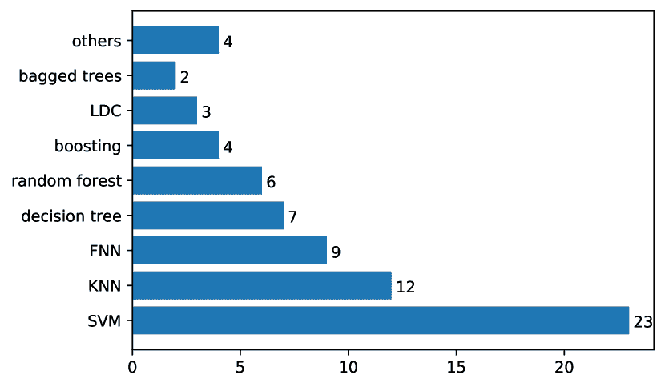

<!--yml

类别：未分类

日期：2024-09-06 19:42:13

-->

# [2301.09362] 《深度学习时代的心音分析全面调查》

> 来源：[`ar5iv.labs.arxiv.org/html/2301.09362`](https://ar5iv.labs.arxiv.org/html/2301.09362)

# 《深度学习时代的心音分析全面调查》

Zhao Ren    \IEEEmembershipMember, IEEE    Yi Chang    Thanh Tam Nguyen    Yang Tan    Kun Qian    \IEEEmembershipSenior Member, IEEE    和 Björn W. Schuller    \IEEEmembershipFellow, IEEE 本研究部分由德国联邦教育和研究部（BMBF）资助，项目名称为 LeibnizKILabor，资助编号为 01DD20003；中华人民共和国科学技术部资助了 STI2030-重大项目（编号：2021ZD0201900）；中国国家自然科学基金（编号：62272044）；以及北京理工大学的 Teli Young Fellow Program。(*通讯作者*：Zhao Ren 和 Kun Qian.) Z. Ren 现为德国汉诺威大学 L3S 研究中心成员（zren@l3s.de）。Y. Chang 和 B. W. Schuller 现为英国帝国理工学院 GLAM 语言、音频与音乐组成员（y.chang20@imperial.ac.uk, schuller@ieee.org）。T. T. Nguyen 现为澳大利亚格里菲斯大学成员（t.nguyen19@griffith.edu.au）。Y. Tan 和 K. Qian 现为中国北京理工大学医药技术学院成员（qian@bit.edu.cn）。B. W. Schuller 还担任德国奥格斯堡大学健康与福祉嵌入式智能主席。本工作已提交给 IEEE 以待可能的出版。版权可能在未经通知的情况下转让，转让后此版本可能不再可访问。

###### 摘要

心音听诊已被证明对早期筛查心血管疾病具有临床价值。由于听诊对专业人员的要求很高，依托信号处理和机器学习的自动听诊可以辅助诊断并减少培训专业医生的负担。然而，经典机器学习在大数据时代的性能提升有限。深度学习在许多研究领域中已表现出比经典机器学习更好的性能，因为它采用了更复杂的模型架构，具有更强的有效表征提取能力。近年来，深度学习已成功应用于心音分析。由于大多数关于心音分析的综述工作在 2017 年之前完成，本综述首次全面总结了 2017 年至 2022 年间深度学习在心音分析中的论文。我们介绍了经典机器学习和深度学习的对比，并进一步提供了深度学习在心音分析中的进展和未来研究方向的见解。

{IEEEkeywords}

自动听诊、计算机听音、深度学习、心音、数字健康

## 1 引言

\IEEEPARstart

心脏听诊，即听取和解读心音，是临床检查患者的重要且不可或缺的部分 [1]。作为一种低成本且非侵入性的检查方法，心脏听诊在发现心脏疾病以及提供其严重程度、发展和预后的估计方面具有重要价值 [2]。准确的心脏听诊可能决定是否需要计划更昂贵的检查 [2]。然而，由于诊断舒张期杂音的困难，心脏听诊的整体敏感性较差（即，范围从 0.21 到 1.00） [1]。此外，心脏听诊依赖于医生的技能，而这些技能随着时间的推移已经显示出下降 [3]。差的心脏听诊技能可能会遗漏重要的病理信息，导致病情恶化，或过度诊断病理，从而导致不必要的昂贵心脏超声检查 [1]。

为了解决上述心脏听诊问题，经典机器学习（ML）已被广泛用于自动化心音分析，包括去噪、分割和分类。例如，支持向量机（SVMs）用于检测噪声音频片段 [4]，隐马尔可夫模型（HMMs）用于心音分割 [5]，分类器如 SVMs 和决策树用于心音分类 [6, 7]。经典机器学习通常将声学特征作为输入，而选择有用特征需要大量人力。此外，经典机器学习通常在小规模数据上表现良好，但在大数据上的模型性能一直是经典机器学习的瓶颈。

最近，深度学习（DL）已展示出比经典机器学习更强大的心音分析能力 [8]。DL 模型通常以原始音频信号或从心音中提取的时间-频率表示作为输入 [9, 10]，因此通过跳过手工选择声学特征来提高效率。深度学习模型中的更复杂模型结构也增强了模型从大规模数据集中学习抽象表示的能力。

表 1：现有心音分析调查的比较。

| 调查 | 深度学习 | 心音去噪 | 心音分割 | 心音分类 | 心音解释 |
| --- | --- | --- | --- | --- | --- |
| Bhoi 等人 [11] | ✗ | 仅提及 | ✓ | ✓ | ✗ |
| Chakrabarti 等人 [12] | ✗ | ✓ | ✓ | ✓ | ✗ |
| Nabih-Ali 等人 [13] | ✗ | ✓ | ✓ | ✓ | ✗ |
| Clifford 等人 [14] | ✓ | ✓ | ✓ | ✓ | ✗ |
| Ghosh 等人[15] | 仅提到 | ✓ | ✓ | ✓ | ✗ |
| Majhi 等人[16] | – | – | – | ✓ | – |
| Dwivedi 等人[17] | ✗ | ✗ | ✓ | ✓ | ✗ |
| 本调查 | ✓ | ✓ | ✓ | ✓ | ✓ |

### 1.1 本调查与以往的差异

有几篇关于心脏声音分析的综述研究。特征提取和基本的机器学习模型（例如 SVMs）在[11]中介绍。心脏声音的波形特征和浅层人工神经网络在[12]中概述。心脏声音去噪和分割在[13]中讨论。在[14]中，总结了提交到 PhysioNet 2016 挑战的心脏声音分类方法。[15]的研究总结了用于心脏声音分析的方法，从心脏声音分割和特征提取到心脏声音分类。[16]总结并分析了心脏声音分类的方法。与以上这些研究不同，我们将回顾所有关于心脏声音分割和分类的深度学习技术。此外，还会总结和讨论有关深度学习模型可解释性的最新方法（见表 1）。我们还将讨论潜在的研究问题和未来的研究方向，促进心脏声音分析研究的发展。

### 1.2 心脏声音分析中的挑战

许多机器学习和深度学习方法已应用于心脏声音分析。然而，这个研究领域仍面临许多技术挑战。

第一个挑战是去噪，旨在去除心脏声音中的噪音。由于录制环境可能存在环境噪音和语音干扰，去噪是一个必不可少的预处理步骤，以改善音频质量，提高分割和分类的性能。其他的预处理步骤，如分离（来自肺音）[18, 19, 20]，这里不做介绍，因为它们主要处理信号处理方法。

第二个挑战是分割，它的目标是将心脏声音信号分割成多个部分，即心脏周期或更小的分段（S1，收缩，S2 和舒张）。心脏声音分割通常是心脏声音分类的预处理过程。

第三个挑战是分类，它预测心脏声音的严重程度或心脏异常，可以帮助在初级保健中对心脏疾病进行早期筛查。

最后一项是解释心音分析中的深度学习模型。由于其复杂的结构，深度学习模型对人类来说是“黑箱”，尽管它们在心音分析中的性能提升方面很有前景。由于数字健康是一个敏感领域，可解释的深度学习模型对于临床医生提供及时和适当的治疗至关重要。因此，临床医生和患者的信任可以促进可解释深度学习模型在现实生活中的应用。

### 1.3 本调查的贡献

本调查预计将有以下贡献。

*深度学习在心音分析中的第一次全面调查。* 除了总结心音去噪、分割和分类的机器学习技术外，我们还回顾了心音分析的最先进深度学习拓扑，特别是分割和分类。

*资源总结。* 我们总结了用于心音分析的公开数据集，特别是分类数据集。我们还提供了开源深度学习算法的汇总，并讨论了可能的评估指标。

*未来研究方向。* 我们讨论了当前心音分类深度学习方法的局限性，并指出了该领域潜在的未来研究课题。我们还讨论了可解释的深度学习模型在心音分类中的重要性、当前进展以及未来方向。

## 2 背景

图 1：心音分析框架。经过去噪和分割后，训练一个分类器来生成预测结果及相应的解释（供临床医生和患者使用）。✓ 表示正常预测，而 ✗ 表示预测异常。破折号‘- - -’表示可选程序。

### 2.1 心音

在人类心脏系统中，一个正常的心动周期包含两个心音：第一心音 S1 和第二心音 S2。额外的声音表示疾病：出现的第三心音 S3 可能是心力衰竭的迹象；杂音可能表明瓣膜缺陷或隔膜上的孔洞[21]。S1 和 S2 的频率范围为 20–200 Hz，而 S3 和 S4 的频率范围为 15–65 Hz[22]。

例如，由心脏系统中的湍流血流引起的杂音被识别为异常声音。它们对于验证心血管疾病的诊断时机和音调非常重要[3]。杂音往往是诊断瓣膜心脏病的唯一依据[23]。临床上，杂音包括两种类型：收缩期杂音和舒张期杂音。主动脉狭窄、二尖瓣返流和三尖瓣返流发生在收缩期；二尖瓣狭窄和三尖瓣狭窄发生在舒张期[3]。

### 2.2 心血管疾病的诊断

目前，有几种非侵入性心血管疾病诊断工具。心电图（ECG）通过检测 P-QRS-T 波来描绘心脏的电活动 [24]，是一种便宜且常用的心脏疾病筛查工具。然而，它在检测心脏瓣膜结构异常和以心杂音为特征的缺陷方面存在困难 [25]。此外，一些医学影像工具能够可视化心血管系统。例如，超声心动图（echo）是一种超声扫描，可以创建心脏的动态图像。它可以提供有关心脏的大小、形状、结构和功能的信息 [26]。心脏计算机断层扫描（CT）使用 X 射线创建心脏及其血管的详细图像 [26]。心脏磁共振成像（CMRI）通过创建静态和动态图像来评估心脏和主要血管的功能和结构 [26]。然而，上述影像仪器价格昂贵且需要医疗专业人员操作，从而限制了其在诊所以及中小型医院中的应用。

相较于上述诊断仪器，心脏听诊成本低且在初步体检中至关重要。用心音图（PCG）记录的心音信号已被证明在儿科心脏病学、心脏病学和内科疾病中非常重要 [27]。电子听诊器的最新进展通过整合传感器设计、信号处理和机器学习技术，促进了计算机辅助听诊 [27]。电子听诊器的低成本和便携优势使得将计算机辅助听诊应用于基层医疗和远程/居家医疗成为可能。图 1 描绘了心音分析的流程。心音经过去噪、分割和分类处理后，临床医生和患者在基层医疗中接收预测和解释。在现实生活中，心音被预测为异常的患者将建议进行进一步的专业医学检查以获得准确诊断。

## 3 心音分析任务

图 2：心音分析方法的分类。粗体文本为深度学习方法。

本节的目标是描述任务并总结每个问题的经典机器学习技术。具体而言，去噪和分割是许多研究中用于心音分类的两个预处理步骤。在 图。2 中，我们总结了 2017–2022 年期间用于四个任务的方法。我们可以看到，经典机器学习在过去几年仍被使用，而深度学习主要应用于分割和分类，以及解释方法。为了比较心音分析中使用的机器学习和深度学习，本节介绍了任务和经典机器学习方法，深度学习将在第四部分中讨论。由于解释方面的工作较少，我们将在本调查的讨论部分讨论心音解释（参见第六部分）。因此，我们将以下三个任务（去噪、分割和分类）描述为独立的部分，以便详细讨论。

### 3.1 去噪

一般来说，记录的心音包含许多种噪声[28]，包括白噪声和录音环境中的其他声音，例如人类的语音。噪声可能会降低心音的分割和分类性能[28]。在这方面，许多研究已经调查了去噪方法，以便在心音分割和分类任务中获得更好的性能。

**滤波器**。作为心音分类的预处理程序，许多去噪方法采用信号滤波器来去除嘈杂心音中的噪声[9, 29, 30]。高通滤波器[31, 32] 被用来消除低频噪声。带通滤波器具有缓解高频和低频噪声的能力，因此更常用于心音去噪[33, 34, 35]。Butterworth 带通滤波器在许多研究中取得了成功应用[36, 37, 38, 39, 40, 41, 42, 43]。Butterworth 带通滤波器的截止频率设置为低频，以滤除非常低频的噪声，以及高频，以滤除高频噪声。一系列具有不同阶数的 Butterworth 带通滤波器已应用于不同的截止频率设置。例如，4 阶 Butterworth 滤波器在[44]中设置为 25-400 Hz 的截止频率，而 5 阶 Butterworth 滤波器在[45]中设计为 25-500 Hz 的截止频率，在[46]中设计为 25-250 Hz 的截止频率。6 阶 Butterworth 滤波器在[47, 48]中设计为 50–950 Hz 的截止频率，在[49]中设计为 30-900 Hz。此外，还使用了其他几种滤波器来去噪心音，如 Savitzky–Golay 滤波器[50, 51]、Chebyshev 低通滤波器[52, 53]和 Notch 滤波器[54]。

**基于频谱的去噪**。为了去除噪声，频谱图通常选择-30、-45、-60 或-75 dB 的阈值[55]。然而，在不同的心音中寻找合适的阈值是非常耗时的。一种更灵活的方法是频谱减法[56]，该方法用于估计噪声并从心音中去除它[43]。

**尖峰去除**。摩擦尖峰是心音幅度中的冗余部分。在几项研究中[44, 38]，在心音预处理过程中检测并去除了摩擦尖峰（即，用零替换）。

选择无噪声段。除了从心音中去除噪声外，使用无噪声的心音段被证明对心音分析很有帮助。*小波熵*被用于评估心音段中的噪声[7]，因为干净的心音具有相对较高的小波熵，而噪声心音的熵较低。在另一项研究中，*经验小波变换*被用于分离心音、杂音、低频伪影和高频噪声[57]。此外，经典的*机器学习*也被用于检测无噪声的心音段。在[4]中，应用了支持向量机（SVM）将心音信号的质量分类为二类（即‘不可接受’和‘可接受’）或三类（即‘不可接受’、‘良好’、‘优秀’），而不进行基于十种多领域特征的分割。

### 3.2 分割

图 3：来自 PhysioNet/CinC 数据库的*正常*心音录音[58]。图中中间的帧标有四种状态（即 S1、收缩期、S2 和舒张期）。

心音分割用于将音频样本分割成一组较小的音频段，这些段可以等于或短于完整的心动周期[39, 59, 60]。短于心动周期的段可能包括 S1、收缩期、S2 和舒张期，如图 3 所示。

基于能量的分割。由于心音在不同状态下具有不同的能量，因此信号能量被用于定位 S1 和 S2 峰值[61, 29, 30, 62]。根据心音的频率信息（例如，*小波变换（WT）*），在[63]中检测到的小波系数的能量峰值用于定位 S1 和 S2。

基于包络的分割。除了能量外，心音分割还可以基于包络[64, 46]。例如，在[9]中，基于香农能量包络和心音的零交叉实现了心音分割。在另外两项研究中[47, 48]，基于香农能量包络检测了第一个心动周期的 S1，并通过滑动心动周期窗口检测了下一个 S1 心音。

基于响度的分割。响度已经证明其在分割心音方面的潜力 [53, 65]。具体来说，从心音中提取的声谱图首先被转换为 Bark 量表，并用 Hanning 窗口进行平滑。在每个时间帧中，通过所有频带幅度的均值来计算响度感受：$L(t)=\frac{\sum_{t=1}^{T}A(t)}{T}$，其中 $A(t)$ 是第 $t$ 时刻的幅度，$T$ 是时间帧的总数。此外，为了获得峰值，还计算了响度函数的导数。因此，收缩期和舒张期可以被定位，因为它们具有不同的时间长度。

用于分割的经典机器学习。已有机器学习模型被提出，用于比上述规则基础的分割方法更精确的心音分割。用于分割的机器学习模型主要在监督学习框架中进行训练。也有一些工作采用无监督学习。以下介绍了无监督学习和监督学习的方法。

*无监督学习* 鉴于心音数据集的有限可用性，[66] 的作者采用了基于高斯核相似性的无监督谱聚类技术来获得帧标签（例如，S1 和 S2），这些标签进一步用于分割心音。

*监督学习* 特别是，隐马尔可夫模型（HMM）已经广泛用于这一目的 [5]。我们假设心脏状态为 $S=\{s_{1},s_{2},s_{3},s_{4}\}=\{S1,\mbox{收缩期},S2,\mbox{舒张期}\}$，观察值 $O=\{o_{1},o_{2},...,o_{T}\}$ 为原始心音或声学特征。传输矩阵 $A=\{a_{ij}\}$ 表示状态 $s_{i}$ 在第 $t$ 时刻转移到状态 $s_{j}$ 在第 $(t+1)$ 时刻的概率。观察值 $o_{t}$ 由状态 $s_{i}$ 生成的概率密度分布为 $B={b_{i}(o_{t})}=P[o_{t}|s_{i}]$，其中 $P$ 代表概率。初始状态分布为 $\pi=\{\pi_{i}\}$，表示在开始时刻状态 $s_{i}$ 的概率。给定 $A$、$B$、$\pi$ 和 $O$，HMM 模型旨在优化状态序列。维特比算法通常用于此目的 [67]，更多详细信息可以在 [5] 中找到。

为了更好地捕捉 PCG 信号中的突变，信号的包络线在[68]中被提取出来，并计算了包络线的峭度以获取冲击般的特征，然后将其通过零频率滤波器以获取纯冲击信息。结合心音标签，提取的特征被输入到隐藏的半马尔可夫模型（HSMM）中。为了更好地适应 PCG 记录中心周期持续时间（HCD）的变化，在[69]中引入了基于多中心持续时间的 HSMM，其中在 PCG 的不同实例中估计 HCD，以获取最大可能的持续时间值，并将这些最接近的值聚集成簇以指代每个中心。通过更准确的状态持续时间信息，HSMM 实现了更好的分割性能。类似地，考虑到患者之间的变异性，通过改进的 HSMM 中的高斯混合模型（GMM）以无监督和自适应的方式估计了每个患者的发射概率分布[70]。此外，[71]中开发的期望最大化算法为每个受试者搜索了 HSMM 的停留时间分布参数。许多研究[6, 72, 73, 74, 75, 40, 41, 76, 43, 31, 77, 78, 79]使用了[80]中提出的基于逻辑回归的 HSMM（LR-HSMM）进行心音分割。LR 被用来预测$P[s_{j}|o_{t}]$的概率，然后用贝叶斯规则计算$B$。还有其他改进的 HMM 方法，如*依赖于持续时间的 HMM*[67, 81]，它考虑了每个状态下持续时间的概率密度函数。另一项研究[38]提出了一种用于心音分割的马尔可夫切换模型。

### 3.3 分类

自动听诊的目标任务是心音分类，包括 i）异常心音检测（如，杂音，二尖瓣狭窄等）和 ii）心血管疾病的严重程度（正常/轻度/中度）。

特征工程。在去噪和分割之后，通常会进行特征提取以训练分类器。低级描述符（LLDs）和函数特征通常作为声学特征提取。LLDs 是在短时间段分析上的分段特征（见表 2），而函数特征是从 LLDs 投影得到的超段特征向量。函数特征通常是统计特征，如均值、最大值、标准差等。

我们主要列出了 表 2 中用于心音分类的低级特征。除了时域低级特征外，频域低级特征也广泛用于心音分类。具体而言，频域特征包括基于傅里叶变换的光谱特征、Mel 标度的光谱特征和小波特征。还有一些预先存在的特征集用于心音分类，包括 ComParE 特征集 [82] 和 eGeMAPS 特征集 [83]。这两个特征集可以使用开源工具包 openSMILE 提取 [84]。

除了前述的手工特征，深度表示最近也得到了研究（见 表 2）。由于深度学习模型在提取抽象特征方面具有强大的能力，深度表示有潜力提高手工特征的性能。

表 2：用于心音分类的手工特征和深度表示。我们展示了手工特征中的各种低级描述符（LLDs）。

| 组 | 特征 | 描述 | 参考文献 |
| --- | --- | --- | --- |
| 时域 | 包络 | 信号的包络 | [85, 57] |
|  | 幅度 | 信号的幅度 | [63] |
|  | 能量 | 信号的能量 | [46, 32, 62] |
|  | 熵 | 信号熵 | [86, 32] |
|  | 响度 | 声音强度的感知 | [53] |
|  | 峰值幅度 | 峰值的幅度 | [40] |
| 频谱 | 频谱幅度 | 傅里叶变换 | [7, 87, 46, 88, 86, 33, 32, 89, 38] |
|  | 主频值 | 导致最大光谱的频率 | [87, 88] |
|  | 主频比 | 最大能量与总能量的比率 | [87, 88] |
|  | 能量 | 频谱能量 | [38] |
|  | 频谱滚降 | 低于总频谱能量特定百分比的频率 | [32] |
|  | 频谱质心 | 每帧幅度光谱图的平均值 | [32, 89] |
|  | 频谱流量 | 功率谱的变化速度 | [32] |
|  | 功率谱密度 (PSD) | 频谱成分中的功率分布 | [46, 85, 89] |
|  | 频谱熵 | PSD 的香农熵 | [87, 88, 86, 54] |
|  | 瞬时频率 | 非平稳信号的频率 | [90] |
|  | 分数傅里叶变换熵 | 分数傅里叶变换的谱熵 | [91] |
|  | 谱图 | 短时傅里叶变换（STFT） | [47, 48] |
|  | 倒谱 | 对信号谱的对数进行傅里叶逆变换 | [33] |
| Mel 频率 | Mel 频率 | Mel 尺度频率 | [92, 73] |
|  | Mel 频率倒谱系数（MFCCs） | Mel 尺度谱图的离散余弦变换 | [38, 93, 87, 86, 79, 94, 75, 95] |
|  | 基于分数傅里叶变换的 Mel 频率 | 从分数傅里叶变换得到的 Mel 频率 | [43] |
| 小波 | 小波变换 | 在不同尺度下的信号频率分析 | [85, 59, 89] |
|  | 小波散射变换 | “具有非线性模量和平均缩放函数的小波卷积”¹¹1https://de.mathworks.com/help/wavelet/ug/wavelet-scattering.html（平移不变性和弹性变形稳定性[96]） | [97, 96] |
|  | 小波同步压缩变换 | 小波系数的重新分配 | [35] |
|  | 可调质量小波变换 | “具有用户指定 Q 因子的多尺度小波分析，Q 因子是滤波器中心频率与带宽的比率”²²2https://de.mathworks.com/help/wavelet/ug/tunable-q-factor-wavelet-transform.html | [98, 52] |
|  | 小波熵 | 基于小波系数的时间能量分布 | [7] |
| 特征集 | ComParE | 计算语言学挑战特征集 | [92] |
|  | eGeMAPS | 扩展的日内瓦最简声学参数集 | [92] |
| 深度表示 | 基于图的特征 | Petersen 图模式 | [99] |
|  | 稀疏系数 | 稀疏编码的结果 | [6] |
|  | 基于自编码器的特征 | 从手工设计特征中提取的自编码器特征 | [100, 55] |

经典机器学习用于分类。

图 4：2017–2022 年使用辨别式机器学习模型进行心音分类的文献统计。FNN：前馈神经网络；KNN：$k$-最近邻；LDC：线性判别分类器。

基于规则的分类方法在 [57, 101] 中被提出用于心音分类。为了更好的性能，大多数研究采用了机器学习（ML）进行心音分类。我们将在下文中简要介绍生成模型和判别模型这两组分类器。

*生成模型*旨在生成联合概率分布 $P(X,y)$，给定特征 $X$ 和标签 $y$。后验概率 $P(y|X)$ 通过贝叶斯规则 $P(y|X)=\frac{P(X,y)}{P(X)}=\frac{P(X|y)P(y)}{P(X)}$ 计算，其中 $P(X|y)$ 是似然概率分布。朴素贝叶斯分类器 [102, 91, 41, 103] 由于其易于使用的优势而广泛用于心音分类。高斯混合模型（GMMs） [95, 53] 用于通过优化高斯混合成分的权重以及每个成分的均值和方差来估计数据分布。基于高斯混合的 HMM [38] 被用于心音分类，考虑了四种顺序心脏状态，即 S1、收缩期、S2 和舒张期。

*判别模型* 旨在直接预测后验概率 $P(y|X)$ 给定 $X$。图 4 展示了 2017 年到 2022 年使用经典机器学习模型进行心音分类的近期工作统计。支持向量机（SVMs）由于通过学习类间的支持超平面而被广泛用于心音分类 [6, 47, 48, 91, 93, 97, 46, 99, 40, 75, 41, 95, 60, 43, 92, 100, 55, 103, 33, 79, 64, 85, 96]。除了在数据样本和标签之间进行线性投影外，SVMs 还可以通过非线性核（如径向基函数）在非线性数据上学习分隔超平面。

此外，$k$-最近邻（KNNs）在心音分类中表现良好，其思想是根据数据样本的$k$-最近邻的类别进行分类[91, 93, 46, 40, 75, 85, 90, 41, 60, 43, 103, 104]。此外，决策树也被成功应用于心音分类[7, 99, 40, 88, 75, 41, 103]。一个原因是限制决策节点的数量可以帮助避免过拟合[7]，另一个原因是决策树的结构可以展示分类的内部逻辑。袋装树[99, 40]将多个决策树组合成更复杂的模型架构，因此有可能实现更好的性能。随机森林[93, 88, 90, 103, 79, 35]通过在分裂每个节点时使用更少的特征来进一步改进袋装树。

近年来，前馈神经网络（FNNs）已开始应用于心音分类[63, 52, 87, 75, 55, 32, 94, 30, 89]。FNNs 能够自动学习声学特征与标签之间的非线性映射。尽管与其他分类器如支持向量机（SVMs）和决策树相比，FNNs 缺乏可解释性，但它们在产生良好性能方面具有潜力。

还有其他几种机器学习模型，如线性判别分类器[99, 55, 103]，逻辑回归[103]，二次判别分析[46]，提升方法[88, 59, 79, 98]，以及其他[86, 54]。最后，与单一模型相比，多个分类器可以进一步组合以提高性能[93, 75, 59, 43, 85]。

## 4 先进的研究

由于强大的有效表示提取能力，深度学习已成功应用于各种声学任务，例如，*语音情感识别*[105]、*呼吸声分类*[106]、*打鼾声分类*[107]等。在近期的进展中，深度学习也被用于处理心音信号，并取得了良好的性能[8]。在这方面，本文介绍和讨论了深度学习方法在心音分析任务中的应用。值得注意的是，由于在这一背景下针对去噪的深度学习工作较少，我们在本节中介绍了用于分割和分类的深度学习拓扑结构。

### 4.1 深度学习在分割中的应用

各种深度学习（DL）模型已经被提出用于心音分割。我们将它们分为卷积神经网络（CNNs）和递归神经网络（RNNs），分别用于提取空间和序列表示。

卷积神经网络。受到深度卷积神经网络（CNNs）在图像分割中成功应用的启发，近年来深度 CNNs 已被应用于心音分割的研究[108]。例如，[108]中提出并比较了几种基于 CNN 的分割算法，包括具有序列最大时间建模的 CNNs，以及用于建模观察值概率密度分布的具有 HMM 或 HSMM 的 CNNs。

递归神经网络。递归神经网络（RNNs）已证明了其在序列数据中利用时间信息的能力。因此，RNNs 也可以帮助定位心音的状态。在[109]中，作者将分割视为事件检测任务，并基于频谱图和包络特征开发了双向门控递归单元（GRU）-RNNs。由于包络特征无法有效建模心周期的内在持续时间信息，[110]提出了一种持续时间 LSTM，将持续时间向量集成到标准 LSTM 单元中，以包络特征获得更好的分割性能。具体来说，持续时间参数包括心周期持续时间和从包络自相关估计的收缩期持续时间。在没有包络和时频特征的情况下，[111]的作者利用双向 GRU-RNNs 直接对心音进行分割。考虑到心音信号中的噪声和不规则序列，[112]引入了一种基于注意力的 RNN 框架。具体来说，在最终分类层之前，利用双向 LSTM 返回的隐藏表示，应用了一个线性层来学习每个隐藏状态的权重分数。这些权重分数值与隐藏表示相乘，用于最终分类。

CNNs + RNNs。在[113]中提出了一种端到端的模型，其中 CNNs 和 LSTM 递归神经网络（RNNs）被集成以直接从音频中学习丰富且高效的特征。每个 LSTM 单元的门控结构在[114]中进行了效率优化。

### 4.2 深度学习在分类中的应用

图 5：心音的 DL 模型流程图。 “1”表示迁移学习；“2”表示对时频表示的深度学习；“3”表示端到端学习。这三条分支可以并行运行，也可以在特征/决策级别进行组合。DL 也可以用于处理原始音频信号和时频表示之外的特征。关于 DL 在其他特征上的处理，可以参考第 4.2 节。

与经典机器学习不同，DL 通过具有更多参数的模型从原始心音或简单时频表示中学习有效表示。DL 通常在许多声学任务中表现非常好，这得益于其强大的能力。除了图 5 中所示的流程，我们总结了深度学习方法在心音分类中的进展。

对时频表示的深度学习。由于从原始心音信号中提取有效表示具有挑战性，2D 时频表示已被广泛用作 2D CNNs 的输入以进行心音分类[72, 73, 50, 39, 115, 81, 76, 116, 117, 49, 77, 42, 118, 61, 29, 119]。通过 STFT 从心音中提取的频谱图被输入到 ResNet 中用于异常心音检测[120]。多域特征被认为在反映所有心音类别特征方面更为全面。在[50]中，频谱图、Mel 频谱图和 MFCCs 被提取作为 VGG 模型的输入，最终预测通过集成学习获得。

除了擅长提取空间特征的 CNNs 外，RNNs 更能够从序列信号中提取时间特征。LSTM 网络被应用于处理离散小波变换和 MFCCs 用于心音分类[36, 75]。Deng 等人使用了卷积递归神经网络，将 CNNs 和 RNNs 相结合[121]。

此外，还有其他用于心音分类的分类器，如堆叠稀疏自编码器深度神经网络[122]和半非负矩阵分解分类器[78]。更多细节可以在列出的参考文献中找到。

深入学习其他特征。除了上述关于时间频率表示的深度学习优秀工作外，从心音中提取的其他特征也被用作深度学习模型的输入。

i) *时域特征*。类似于经典机器学习中的特征，1D 时域特征也可以输入到深度学习模型中进行心音分类。例如，提取了心音的瞬时能量，并用作堆叠自编码器网络的输入[62]。从每个完整心音片段中的所有 75 ms 段中提取了多种统计特征（如均值、中位数、方差等），并输入到双向 LSTM (BiLSTM) 网络中进行分类[123]。

ii) *1D 频率特征*。1D CNNs 或前馈 DNN 模型均可用于处理 1D 特征。将一般频率特征和 Mel 域特征输入到 1D CNNs 中，然后将多个 CNNs 组装进行最终预测[119]。此外，Mel 光谱图和 MFCC 被用于进一步提取特征作为 5 层前馈 DNN 模型的输入[9]。

iii) *2D 频率特征*。与上述时间频率表示不同，这里列出了 2D 频率特征，包括 (a) 从音频片段直接提取的多个 1D 频率特征，而不是 STFT 领域中的窗口函数，以及 (b) 从时间频率特征计算出的特征。钱等人利用小波计算了一组短声学片段的波小波能量特征，并进一步使用 GRU-RNNs 作为分类器[124]。董等人提取了心音片段的对数 Mel 特征及相应的函数，并实现了分类 LSTM-RNNs 和 GRU-RNNs[92]。在他们的实验中，对数 Mel 特征的表现优于 MFCCs 和其他 LLDs[92]。张等人提取了通过平均幅度差函数从光谱图中计算的时间准周期特征，并应用 LSTM-RNNs 探索特征之间的依赖关系[125]。在[126]中，使用去噪自编码器从光谱图中提取深层表示作为 1D CNN 分类器的输入。

端到端学习。近年来，由于时间频率表示和其他特征仍然需要人工选择特征，使用端到端网络从心音中学习表示变得越来越流行。基于原始心音信号，已经提出并应用了各种 1D CNN 架构用于心音分类任务 [10, 39, 51, 34, 127]。此外，刘等人引入了一种时间卷积网络（TCN），它在心音分类中表现出了高敏感度 [74]，因为 TCN 通过扩张卷积和因果卷积在处理序列数据时比典型的 CNN 更为合适。一个由残差块组成的 1D CNN 模型也被开发用于心音分类 [128]。除了 CNN，GRU-RNN 也被用于处理原始心音信号，以筛查心力衰竭 [129]。

一些研究还提到了 CNN 和 RNN 在学习心音的频域和时域特征方面的能力。例如，Shuvo 等人提出了一种 CardioXNet 模型，该模型采用了表示学习后跟序列残差学习，而无需任何预处理 [130]。在表示学习阶段，构建了三条并行的 1D CNN 路径，从心音信号中提取时间不变的特征；在序列残差学习阶段，采用了 BiLSTM 网络以学习序列表示。研究[45]试图自动学习时间频率特征，即通过 1D CNN 提取频域特征，通过 GRU-RNN 提取时域特征。进一步使用自注意力机制融合这两种特征以进行最终分类。在[131, 132]中，时间卷积（tConv）层被实现于网络的前端，以学习有限脉冲响应滤波器。

迁移学习。由于医疗领域的数据收集必须遵循极其严格的规定，心音数据集通常没有其他计算机听觉领域的数据集那么大。迁移学习尝试利用在大规模数据集上优化的预训练深度学习（DL）模型。在最近的研究中，预训练模型主要在图像数据集（例如，ImageNet [133]）和音频数据集（例如，AudioSet [134]）上进行学习。尽管心音作为音频信号呈现，与 ImageNet 的数据类型不同，但在 ImageNet 上训练的深度学习模型在从心音中提取的时频表示的心音分类中表现良好。ImageNet 上的典型深度学习模型，如 AlexNet [135]和 VGG [136]，已成功用于心音分类 [44, 31, 137, 8]。与 ImageNet 相比，AudioSet 包含多种类型的声学信号，因此在数据类型方面更接近心音。在 [138]中，使用了在 AudioSet 上训练的预训练音频神经网络（PANNs）来分类心音，输入的是时频表示。PANNs 的表现优于基于 ImageNet 的模型 [138]，包括 VGG、MobileNet V2 [139]、ResNet [140]和 ResNeXt [141]。

在通过预训练模型提取表示后，迁移学习使用各种类型的分类器进行分类，主要包括经典的机器学习分类器和前馈神经网络。例如，SVM 被应用于 [44, 137, 31]中由 AlexNet、VGG16 和 VGG19 提取的表示。其他分类器如 KNN 也在 [44]中使用。预训练的 VGG 模型在 [8]中被冻结，并在其后添加了全连接层。

此外，在迁移学习中，微调预训练模型也表现出了良好的心音分类效果。经过微调的预训练 AlexNet 为心音分类提供了有效的表示 [44, 31]。类似地，PANNs 也在 [138]中进行了微调。微调模型甚至超越了预训练模型，因为它们适应了心音数据集的数据分布。在 [8]中，当使用支持向量机（SVM）作为分类器时，微调后的 VGG 在心音分类中的表现优于预训练的 VGG。

## 5 发表的心音分析资源

### 5.1 发表的数据集

近年来，已收集了多个心脏声音数据库。这里简要介绍了以下可访问的数据库，详见表 3。

PASCAL 挑战数据库[142]被分为两个集合 A 和 B。在数据集 A 中，使用 iStethoscope Pro iPhone 应用程序记录了 176 个心脏声音（0.393 小时），并标注为 S1 和 S2 声音以进行心脏声音分割。数据集 A 中的每个心脏声音还被标注为四类之一：*正常*、*杂音*、*额外心音*和*伪影*。数据集 B 包含 656 个录音（1.194 小时），被标注为三类：*正常*、*杂音*和*额外收缩*。

PhysioNet/CinC 数据库[58]，用于 PhysioNet/CinC 挑战赛 2016[143]，由多个数据库组成，这些数据库由不同的数据收集者记录。特别是，公开的训练集包括从健康个体和患者那里收集的五个数据库。训练集包括 3,240 个录音（总时长 20.216 小时），来自 764 名以上的受试者。任务是将每个数据样本分类为三类：*正常*、*异常*和*噪声*。

心脏声音深圳（HSS）语料库[92]，在 INTERSPEECH 计算语言学挑战赛（ComParE）2018 中使用，由深圳大学附属医院收集。共有 170 名受试者（女：55，男：115）参与了数据收集，使用电子听诊器，共记录了 845 个心脏声音样本，总时长为 7.047 小时。每个音频样本被标注为以下三类之一：*正常*、*轻度*、*中度/重度*。

在 GitHub 上的一个开放心脏声音数据库[144]包含了 1,000 个音频文件（总时长 0.679 小时）。这些音频录音被平衡分为五类：*正常*、*主动脉狭窄*、*二尖瓣返流*、*二尖瓣狭窄*、*二尖瓣脱垂*。

密歇根心脏声音数据库³³3https://open.umich.edu/find/open-educational-resources/medical/heart-sound-murmur-library⁴⁴4https://www.med.umich.edu/lrc/psb_open/html/repo/primer_heartsound/

primer_heartsound.html 提供了来自不同区域和姿势的心脏声音样本：受试者仰卧时的心尖区、左侧卧时的心尖区、坐位时的主动脉区，以及仰卧时的肺动脉区。总共记录了 23 个心脏声音，时长为 0.413 小时。这些心脏声音被标注为*正常*和多种*病理*状态。

CirCor DigiScope 数据库 [145]，用于 2022 年 George B. Moody PhysioNet 挑战 [146]，是从 21 岁及以下的儿科人群中收集的。心音从一个或多个位置记录：肺动脉瓣，主动脉瓣，二尖瓣，三尖瓣等。公开可用的训练集包括 3,163 个音频样本，总时长 20.094 小时，来自 942 名参与者。目标有两个分类任务：i) *正常* 和 *异常*，ii) *存在杂音*、*不存在杂音* 和 *杂音情况不明确*。

表 3: 已发布的心音分类数据集。AS: 主动脉狭窄，MR: 二尖瓣反流，MS: 二尖瓣狭窄，MVP: 二尖瓣脱垂。特别注意，本表中的统计数据仅考虑了可访问的数据集。

| 数据集 | 挑战 | 样本数量 | 持续时间 (小时) | 受试者数量 | 任务 |
| --- | --- | --- | --- | --- | --- |
| PASCAL 数据库 [142] | PASCAL 挑战 [142] | 176 | 0.393 | unknown | 数据集 A: 正常，杂音，额外心音，伪影 |
| 656 | 1.194 | unknown | 数据集 B: 正常，杂音，早搏 |
| PhysioNet/CinC 数据库 [58] | PhysioNet/CinC 挑战 2016 [143] | 3,240 | 20.216 | 764+ | 正常，异常，过于嘈杂或模糊 |
| HSS [92] | ComParE 挑战 2018 [82] | 845 | 7.047 | 170 | 正常，轻度，中度/重度 |
| GitHub 上的数据[144] | – | 1,000 | 0.679 | unknown | 正常，AS，MR，MS，MVP |
| 密歇根心音数据库⁵⁵5[`open.umich.edu/find/open-educational-resources/medical/heart-sound-murmur-library`](https://open.umich.edu/find/open-educational-resources/medical/heart-sound-murmur-library)[`www.med.umich.edu/lrc/psb_open/html/repo/primer_heartsound/primer_heartsound.html`](https://www.med.umich.edu/lrc/psb_open/html/repo/primer_heartsound/primer_heartsound.html) | – | 23 | 0.413 | unknown | 正常，病理 |
| CirCor DigiScope 数据库 [145] | George B. Moody PhysioNet 挑战 2022 [146] | 3,163 | 20.094 | 942 | 正常，异常；存在、不存在或不明确的杂音 |

表 4: 评估指标。 $k$ 是所有 $K$ 类中的第 $k$ 类；$N_{k}$、$\hat{N_{k}}$ 和 $\tilde{N_{k}}$ 分别是第 $k$ 类的样本总数、预测样本总数以及正确预测的样本数量。 $N$ 是所有样本的总数。TPR: 真阳性率，FPR: 假阳性率，AUC: 曲线下面积，ROC: 接收者操作特征，PR: 精确度-召回率。

| 评估指标 | 描述 | 公式 |
| --- | --- | --- |
| 灵敏度 | 实际阳性病例中被正确分类的比例，即真阳性率 (TPR) | $\frac{\mbox{真阳性}}{\mbox{真阳性}+\mbox{假阴性}}$ |
| 特异性 | 正确分类的实际负样本比例，即真正负率（TNR） | $\frac{\mbox{真正负样本}}{\mbox{真正负样本}+\mbox{假阳性样本}}$ |
| 平均准确率 | 敏感性和特异性的算术平均值 | $\frac{\mbox{敏感性}+\mbox{特异性}}{2}$ |
| Youden 指数 | 衡量平衡敏感性和特异性的能力的指标 | $\mbox{敏感性}+\mbox{特异性}-1$ |
| 精确率 | 基于所有预测为$k$的案例的正确分类案例比例 | $\frac{\tilde{N_{k}}}{\hat{N_{k}}}$ |
| 召回率 | 基于类别$k$中所有案例的正确分类案例比例。 | $\frac{\tilde{N_{k}}}{N_{k}}$ |
| UAR | 无权重平均召回率 | $\frac{\sum_{k=1}^{K}\mbox{召回率}_{k}}{K}$ |
| WAR | 加权平均召回率，即准确率 | $\sum_{k=1}^{K}\frac{N_{k}}{N}\mbox{召回率}_{k}$ |
| F1-Score | 精确率和召回率的调和均值 | $2\times\frac{\mbox{精确率}\times\mbox{召回率}}{\mbox{精确率}+\mbox{召回率}}$ |
| AUC-ROC | 在各种概率阈值下绘制 TPR 对 FPR 的概率曲线下的面积 | —— |
| AUC-PR | 在各种概率阈值下绘制精确率对召回率的概率曲线下的面积 | —— |
| 平均精确率 | 将精确率-召回率曲线总结为每个阈值下精确率的加权平均值 | $\sum_{n}(\mbox{召回率}_{n}-\mbox{召回率}_{n-1})\times\mbox{精确率}_{n}$ |

### 5.2 评估指标

表 4 总结了可用于评估心音分类模型性能的评价指标。

类别-wise 评估指标。在二分类任务中，敏感性和特异性关注于计算正确分类的正样本和负样本的比例。为了平衡敏感性和特异性，使用了平均准确率和 Youden 指数。对于多类别分类任务中评估模型在特定类别上的表现，通常使用精确率和召回率。对于特定类别，精确率计算基于所有预测为该类别的案例中的正确分类案例的比例，而召回率量化基于该类别所有案例中的正确分类案例的比例。通常，精确率和召回率之间存在逆相关关系。因此，结合它们（例如，F1 分数，平均精确率）来更好地评估模型性能。值得注意的是，在多类别分类中，召回率是敏感性的扩展。

多类别评估指标。除了类别逐一评估外，还有其他跨类别的指标，例如加权平均召回率（WAR）和未加权平均召回率（UAR）。WAR，也被称为准确率，如其名称所示，往往会高估模型，特别是当模型在主要类别上表现更好时。因此，在数据集不平衡的情况下，UAR 更为适用。UAR 是跨类别的平均召回率，不包括基于实例的加权。通过各种概率决策阈值，我们还可以绘制 AUC-ROC 和精准度-召回率曲线。此外，我们还希望提到在 PhysioNet Challenge 2022 中设计的基于成本的指标[146]，其中成本计算涉及模型预筛选、专家筛选、治疗和诊断错误。这样，可以开发出更多在临床上实用的模型，特别是在资源有限的情况下。

### 5.3 发布的算法

我们讨论了在第 4.2 节中提到的论文以及 2017-2022 年期间在开放获取存储库中发布的其他论文中的公开代码。近年来公开可用的代码较少，而 2016 年发布的代码数量较多，这得益于 PhysioNet 挑战赛 2016[58]。特别地，我们未列出 2016 年的代码，因为我们希望列出过去六年中最前沿的研究。

在[144]中，作者发布了一段 Matlab 代码⁶⁶6https://github.com/yaseen21khan/Classification-of-Heart-Sound-Signal-Using-Multiple-Features-，用于训练具有多个特征输入（包括 MFCCs 和离散小波变换）的机器学习深度神经网络。在[131]中，使用 Python 实现了一个包含时间卷积单元的 CNN 模型，这些单元模拟有限脉冲响应滤波器，代码链接为⁷⁷7https://github.com/mhealthbuet/heartnet。ResNets 在线性和对数谱图像特征上的实现见 Python 代码⁸⁸8https://github.com/mHealthBuet/CepsNET，研究出处为[147]。[148]中发布了一段 Matlab 代码⁹⁹9https://github.com/uit-hdl/heart-sound-classification，用于从心音和超声心动图中检测瓣膜性心脏病。

## 6 未来研究方向和开放问题

### 6.1 发现

在主要关注心脏病筛查的分类任务中，分割通常被视为在分类心音之前的预处理过程。分割是否对分类有帮助仍然是一个未解的问题。

分段 + 分类。许多研究在分类过程中应用了分段技术或提供了分段信息。例如，分段的心动周期被用作 DL 模型的输入[131]。在[129]中，使用了从 S1 心音开始、固定长度为 1.6 秒的片段进行分类。在[149]中，证明了分段在异常心音检测中的重要性。与没有分段信息的模型相比，分段在实验中并没有显著提高模型性能[149]。原因可能是模型已经足够强大和稳健，因此，分段可以由中间模型层自动完成。[149]中的作者通过使用 SHapley Additive exPlanations (SHAP)解释模型来证明这一点[150]。发现 S1 和 S2 声音在心音片段中的贡献大于其他片段。因此，分段要么作为不够强大的分类器的额外程序，或作为强大分类器的内部程序。

无分段。还有许多方法提议使用未分段的心音，因此可以降低自动听诊的复杂性[10, 52, 44, 90, 115]。除了将完整的心音样本输入神经网络外，心音还被分段成长度相等的短片段用于模型训练[50]。例如，在[7, 85, 93, 37]中，选择了每个音频样本的前 5 秒作为模型输入，分段的 5 秒片段也被用于[91, 88, 116]。大多数研究使用的音频片段时长为 2 秒到 6 秒[45, 34, 49, 51]。

### 6.2 限制与展望

硬件开发。在诊所中，超声心动图通过发射高频声波的小探头获取超声扫描，因此，医生可以通过观察心脏和血管以及血流来进行诊断¹⁰¹⁰10https://www.nhs.uk/conditions/echocardiogram/。然而，超声心动图要求专业人员具备良好的技能，这限制了它在初级医疗中的使用。传统的听诊器也需要医生和护士经过培训。为此，初级医疗中对电子听诊器的需求很高。近年来，电子听诊器被开发和生产出来，以记录心音并将其传输到计算机或手机上进行进一步分析[26]。大多数电子听诊器只能实现基本功能，如放大和可视化心音，而无法进行诊断。最近有一些研究和硬件致力于自动化诊断。例如，一种现场可编程门阵列（FPGA）被设计用于通过 LSTM-RNN 模型对心音进行分类[151]。“HD Steth with ECG”¹¹¹¹11https://www.stethoscope.com/hd-steth-with-ecg/ 将人工智能（AI）嵌入电子听诊器中，以检测多种心脏异常。如本概述所述，人工智能在诊断心音异常方面具有很大潜力，从而减少对高技能专业人员的需求。能够高精度诊断心脏疾病的设备将对推动初级医疗和家庭护理的早期筛查非常有帮助。

性能提升。尽管自动听诊理想上应替代人工分析，但模型性能可能成为将自动听诊应用于临床的瓶颈。假阴性预测可能导致治疗延迟或遗漏，病情加重。在未来的工作中，i) 自动听诊需要实现非常好的性能，并考虑个体差异以适应个性化医疗。当前的研究大多基于心音，而许多类型的个体信息，如年龄，可能会影响模型性能[152]。因此，如何整合个体信息将是性能提升的一个问题。ii) 在机器学习和深度学习方面，我们目前见证了基础模型的出现和应用[153]（在大数据上进行的预训练）。我们已经看到并列出了几种使用预训练的自监督学习模型的方法。然而，预计会出现更大的模型，这些模型有可能出现与心音分析直接相关的能力作为“下游”任务。另一方面，预计基础模型的新时代将以同质化为特征，未来几年内，心音分析方法的多样性是否会收敛到少数几个大数据训练模型中仍有待观察[153]。iii) 此外，人机协作将非常有前景，以提高系统性能，为患者提供更准确的诊断和及时的治疗。人机分类可以是一种解决方案，结合机器的预测和人类（众包工作者和专家）的预测，以实现更精确的诊断[154]。在[154]中，高不确定性预测的数据样本被送往众包工作者进行多数投票；类似地，根据众包预测的确定性阈值，样本将被送给专家。

### 6.3 可解释的、可靠的、可操作的深度心音分析

可解释深度学习已成为许多应用中的关键话题，特别是在医疗领域。构建可解释的深度学习模型可以帮助医生和患者信任预测结果。在过去的一项研究中[155]，使用了注意力机制来可视化每个特征单元对心音最终预测的贡献。类似地，SHAP 也被用来计算每个特征单元的贡献[150]。上述解释方法都是局部解释，它们逐个案例解释深度学习模型，缺乏能够揭示模型隐藏分类规则或总结每个心音类别特征的全局解释。可解释的深度学习模型，如深度神经决策树[156]，有望从结构的角度解释模型本身。学习或搜索的原型、批评和反事实数据样本[106, 157]可以呈现每个类别的典型特征，因此医生可以将新样本与这些心音进行比较，以便更好地理解和分析。具体而言，通过分析批评的模式，医生可以潜在地减少假阴性的数量，这在医疗领域至关重要。最近，音频化被提出用于解释深度学习模型，以改善人机交互[158]。除了可视化，音频化可以通过听觉提供解释模型的新视角。

此外，考虑到健康影响，AI 对心音分析的可靠性显得尤为重要[159]。虽然已有机制，但仍需要更多的应用领域适配或新算法的设计。最终，可靠性将是心脏监测解决方案可信度的主要推动因素——在日常使用中，可信度是赢得用户的关键因素。

此外，为了使深度学习模型在实际生活中具有可操作性，数据隐私已成为保护用户数据免受泄露或外部攻击的另一个新兴研究话题。机器遗忘[160]和联邦学习方法[161]可以帮助医疗机构以安全的方式更好地组织患者的私人数据，而不会丧失诊断准确性。此外，对心音分析的 AI 攻击也可能出现，例如对抗性攻击，需要加以应对。总之，深度学习模型有望指导医疗提供者在日常实践中采取行动，以为患者提供更好的护理。未来，不仅需要从性能方面改进深度学习模型，还需要从以人为本的角度进行改进。

## 7 结论

在这项工作中，我们总结了 2017–2022 年间应用于心音分析的经典机器学习和深度学习技术，包括去噪、分割和分类。我们介绍了这些任务所用的数据库及其评估指标，并列出了公开发布的心音分类实现代码。此外，我们分析了心音分类的一些发现和局限性，并讨论了可能的未来研究工作。最后，我们讨论了在深度学习背景下心音解读的重要性。此项工作预计将呈现心音分析的进展总结，提供有益的讨论，并指出对社区有帮助的有前景的研究方向。

## 参考文献

+   [1] U. Alam, O. Asghar, S. Q. Khan, S. Hayat 和 R. A. Malik，“心脏听诊：一种日益下降的重要临床技能，”《英国心脏病学杂志》，第 17 卷，第 1 期，第 8 页，2010 年。

+   [2] I. R. Hanna 和 M. E. Silverman，“心脏听诊的历史及其一些贡献者，”《美国心脏病学杂志》，第 90 卷，第 3 期，第 259–267 页，2002 年。

+   [3] A. M. Noor 和 M. F. Shadi，“心脏听诊：从声音到图形，”《工程与技术杂志》，第 4 卷，第 2 期，第 73–84 页，2013 年。

+   [4] H. Tang, M. Wang, Y. Hu, B. Guo 和 T. Li，“通过新特征和在开放公共数据集中的评估进行心音信号的自动信号质量评估，”《生物医学研究国际》，第 30 卷，第 1–15 页，2021 年。

+   [5] L. R. Rabiner，“隐马尔可夫模型及其在语音识别中的选择性应用教程，”《IEEE 会议录》，第 77 卷，第 2 期，第 257–286 页，1989 年。

+   [6] B. M. Whitaker, P. B. Suresha, C. Liu, G. D. Clifford 和 D. V. Anderson，“结合稀疏编码和时域特征进行心音分类，”《生理测量》，第 38 卷，第 8 期，第 1701 页，2017 年。

+   [7] P. Langley 和 A. Murray，“从未分段的心音图中分类心音，”《生理测量》，第 38 卷，第 8 期，第 1658 页，2017 年。

+   [8] Z. Ren, N. Cummins, V. Pandit, J. Han, K. Qian 和 B. Schuller，“基于图像的心音分类学习，”在 DH 会议录，（法国里昂），第 143–147 页，2018 年。

+   [9] T. H. Chowdhury, K. N. Poudel 和 Y. Hu，“心音信号的时频分析、去噪、压缩、分割和分类，”《IEEE Access》，第 8 卷，第 160882–160890 页，2020 年。

+   [10] B. Xiao, Y. Xu, X. Bi, J. Zhang 和 X. Ma，“使用一种新型的 1-D 卷积神经网络进行心音分类，具有极低的参数消耗，”《神经计算》，第 392 卷，第 153–159 页，2020 年。

+   [11] A. K. Bhoi, K. S. Sherpa 和 B. Khandelwal，“心音的多维分析研究：综述，”《国际生物自动化杂志》，第 19 卷，第 3 期，第 351–376 页，2015 年。

+   [12] T. Chakrabarti, S. Saha, S. Roy, 和 I. Chel, “心音图信号分析：实践、趋势与挑战：一项关键评审”，发表于 Proc. IEMCON，（加拿大温哥华），第 1–4 页，2015 年。

+   [13] M. Nabih-Ali, E.-S. A. El-Dahshan, 和 A. S. Yahia, “智能系统在心音信号分析中的应用回顾”，《医学工程与技术杂志》，第 41 卷，第 7 期，第 553–563 页，2017 年。

+   [14] G. D. Clifford 等, “心音分析的最新进展”，《生理测量》，第 38 卷，第 E10–E25 页，2017 年。

+   [15] S. K. Ghosh, P. R. Nagarajan, 和 R. K. Tripathy, 《心音数据采集与预处理技术：一项回顾》。IGI Global，2020 年。

+   [16] B. Majhi 和 A. Kashyap, “软计算技术在心音分类中的应用：十年的回顾”，《医疗保健中的软计算应用与技术》，第 113–138 页，2020 年。

+   [17] A. K. Dwivedi, S. A. Imtiaz, 和 E. Rodriguez-Villegas, “自动分析与分类心音的算法–系统回顾”，《IEEE Access》，第 7 卷，第 8316–8345 页，2018 年。

+   [18] A. J. Muñoz-Montoro, D. Suarez-Dou, R. Cortina, F. J. Cañadas-Quesada, 和 E. F. Combarro, “心肺声音的并行源分离系统”，《超级计算期刊》，第 77 卷，第 8 期，第 8135–8150 页，2021 年。

+   [19] K.-H. Tsai, W.-C. Wang, C.-H. Cheng, C.-Y. Tsai, J.-K. Wang, T.-H. Lin, S.-H. Fang, L.-C. Chen, 和 Y. Tsao, “基于周期编码深度自编码器的心肺声音盲单耳源分离”，《IEEE 生物医学与健康信息学期刊》，第 24 卷，第 11 期，第 3203–3214 页，2020 年。

+   [20] E. Grooby, J. He, D. Fattahi, L. Zhou, A. King, A. Ramanathan, A. Malhotra, G. A. Dumont, 和 F. Marzbanrad, “一种新的非负矩阵共因子分解方法用于噪声新生儿胸部声音分离”，发表于 2021 年第 43 届 IEEE 医学与生物学学会年会（EMBC），第 5668–5673 页，2021 年。

+   [21] C. Ahlström, 《心音图信号处理：智能听诊器的方法》。博士论文，医学技术系，2006 年。

+   [22] H. Naseri 和 M. Homaeinezhad, “基于专家频率-能量度量的心音检测与边界识别”，《生物医学工程年鉴》，第 41 卷，第 2 期，第 279–292 页，2013 年。

+   [23] D. S. Gerbarg, A. Taranta, M. Spagnuolo, 和 J. J. Hofler, “计算机分析心音图”，《心血管疾病进展》，第 5 卷，第 393–405 页，1963 年。

+   [24] R. J. Martis, U. R. Acharya, 和 H. Adeli, “心电图特征化的现有方法”，《生物医学与医学中的计算机》，第 48 卷，第 133–149 页，2014 年。

+   [25] P. S. Molcer, I. Kecskes, V. Delić, E. Domijan, 和 M. Domijan, “心脏杂音的形式频率进一步分类的研究”，发表于 Proc. SISY，（塞尔维亚苏博蒂察），第 575–578 页，2010 年。

+   [26] S. Leng, R. San Tan, K. T. C. Chai, C. Wang, D. Ghista, 和 L. Zhong, “电子听诊器，”《生物医学工程在线》，第 14 卷，第 1 期，第 1–37 页，2015 年。

+   [27] E. Delgado-Trejos, A. Quiceno-Manrique, J. Godino-Llorente, M. Blanco-Velasco, 和 G. Castellanos-Dominguez, “数字听诊分析用于心脏杂音检测，”《生物医学工程年鉴》，第 37 卷，第 2 期，第 337–353 页，2009 年。

+   [28] Y. Tsao, T.-H. Lin, F. Chen, Y.-F. Chang, C.-H. Cheng, 和 K.-H. Tsai, “基于光谱恢复和多风格训练的稳健 s1 和 s2 心音识别，”《生物医学信号处理与控制》，第 49 卷，第 173–180 页，2019 年。

+   [29] O. Deperlioglu, “利用卷积神经网络对分段心音图进行分类，”《脑——人工智能与神经科学广泛研究》，第 10 卷，第 2 期，第 5–13 页，2019 年。

+   [30] Ö. DEPERLİĞLU, “利用人工神经网络对分段心音进行分类，”《应用数学电子与计算机国际期刊》，第 6 卷，第 4 期，第 39–44 页，2018 年。

+   [31] H. Alaskar, N. Alzhrani, A. Hussain, 和 F. Almarshed, “在 PCG 分类中应用预训练的 AlexNet，”在 ICIC 会议上，（西班牙圣塞巴斯蒂安），第 784–794 页，2019 年。

+   [32] N. M. Khan, M. S. Khan, 和 G. M. Khan, “利用时间频率特征从未分段的心音图信号中自动分类心音，”《计算机与信息工程国际期刊》，第 12 卷，第 8 期，第 598–603 页，2018 年。

+   [33] A. Yadav, M. K. Dutta, C. M. Travieso, 和 J. B. Alonso, “利用傅里叶变换自动分类正常与异常 PCG 录音的心音，”在 IWOBI 会议上，（哥斯达黎加阿拉胡埃拉省），第 1–9 页，2018 年。

+   [34] Q. Hu, J. Hu, X. Yu, 和 Y. Liu, “使用一维深度神经网络进行自动心音分类，”在《计算、通信和存储中的安全、隐私和匿名国际会议》上，第 200–208 页，2020 年。

+   [35] S. K. Ghosh, R. K. Tripathy, R. Ponnalagu, 和 R. B. Pachori, “利用时间-频率幅值和相位特征从 PCG 信号中自动检测心脏瓣膜疾病，”《IEEE 传感器快报》，第 3 卷，第 12 期，第 1–4 页，2019 年。

+   [36] B. Ahmad, F. A. Khan, K. N. Khan, 和 M. S. Khan, “使用长短期记忆网络自动分类心音，”在 ICOSST 会议上，（虚拟活动），第 1–6 页，2021 年。

+   [37] S. A. Singh, T. G. Meitei, 和 S. Majumder, “基于深度学习的短期 PCG 分类，”在《生物医学与健康信息学的深度学习技术》一书中，第 141–164 页，Elsevier 出版社，2020 年。

+   [38] F. Noman, S.-H. Salleh, C.-M. Ting, S. B. Samdin, H. Ombao, 和 H. Hussain, “基于马尔可夫切换模型的心音分段与分类方法，”《IEEE 生物医学与健康信息学期刊》，第 24 卷，第 3 期，第 705–716 页，2019 年。

+   [39] F. Noman, C.-M. Ting, S.-H. Salleh 和 H. Ombao，“使用深度卷积神经网络集成进行短段心音分类”，发表于 Proc. ICASSP，（英国布莱顿），第 1318–1322 页，2019 年。

+   [40] J. Dastagir, F. A. Khan, M. S. Khan 和 K. N. Khan，“使用多域时间和频率特征的计算机辅助心音图分类”，发表于 Proc. ICAI，（巴基斯坦伊斯兰堡），第 50–55 页，2021 年。

+   [41] A. Bourouhou, A. Jilbab, C. Nacir 和 A. Hammouch，“心音信号分段和多类别分类”，《国际在线与生物医学工程期刊》，第 16 卷，第 15 期，第 64–79 页，2020 年。

+   [42] A. Meintjes, A. Lowe 和 M. Legget，“使用连续小波变换和卷积神经网络的基本心音分类”，发表于 Proc. EMBC，（夏威夷檀香山），第 409–412 页，2018 年。

+   [43] Z. Abduh, E. A. Nehary, M. A. Wahed 和 Y. M. Kadah，“基于分数傅里叶变换的梅尔频率谱系数及传统分类器的心音分类”，《生物医学信号处理与控制》，第 57 卷，第 101788 页，2020 年。

+   [44] S. A. Singh, S. Majumder 和 M. Mishra，“基于深度学习的短暂未分段心音分类”，发表于 Proc. I2MTC，（新西兰奥克兰），第 1–6 页，2019 年。

+   [45] S. Li, F. Li, S. Tang 和 F. Luo，“基于轻量级神经网络的心音分类特征融合”，《IEEE 仪器与测量学报》，第 70 卷，第 1–9 页，2021 年。

+   [46] N. Ibrahim, N. Jamal, M. N. A.-H. Sha’abani 和 L. F. Mahadi，“基于时间、谱和几何特征的心音信号分类比较研究”，发表于 Proc. IECBES，（马来西亚兰卡威），第 24–29 页，2020 年。

+   [47] W. Zhang, J. Han 和 S. Deng，“基于缩放谱图和张量分解的心音分类”，《应用系统与应用》，第 84 卷，第 220–231 页，2017 年。

+   [48] W. Zhang, J. Han 和 S. Deng，“基于缩放谱图和偏最小二乘回归的心音分类”，《生物医学信号处理与控制》，第 32 卷，第 20–28 页，2017 年。

+   [49] M. Banerjee 和 S. Majhi，“使用 2D 卷积神经网络进行多类别心音分类”，发表于 Proc. ICCCS，（中国广州），第 1–6 页，2020 年。

+   [50] J. M.-T. Wu, M.-H. Tsai, Y. Z. Huang, S. H. Islam, M. M. Hassan, A. Alelaiwi 和 G. Fortino，“应用 Savitzky–Golay 滤波器的卷积神经网络集成构建心音图预测模型”，《应用软计算》，第 78 卷，第 29–40 页，2019 年。

+   [51] P. T. Krishnan, P. Balasubramanian 和 S. Umapathy，“基于深度神经网络的未分段心音分类系统”，《物理与工程医学科学》，第 43 卷，第 2 期，第 505–515 页，2020 年。

+   [52] W. Zeng, J. Yuan, C. Yuan, Q. Wang, F. Liu, 和 Y. Wang, “一种使用 TQWT、VMD 和神经网络检测异常心音信号的新方法，” *人工智能评论*，第 54 卷，第 3 期，页码 1613–1647，2021 年。

+   [53] M. V. Shervegar 和 G. V. Bhat, “使用高斯混合模型的心音分类，” *波尔图生物医学期刊*，第 3 卷，第 1 期，页码 1–7，2018 年。

+   [54] B. Al-Naami, H. Fraihat, N. Y. Gharaibeh, 和 A.-R. M. Al-Hinnawi, “使用高阶统计和自适应神经模糊推理系统对 PhysioNet 挑战 2016 中的心音信号进行分类的框架，” *IEEE 访问*，第 8 卷，页码 224852–224859，2020 年。

+   [55] A. I. Humayun, M. Khan, S. Ghaffarzadegan, Z. Feng, T. Hasan, 等， “用于病理心音分类的转移学习、半监督学习和监督学习方法的集成，” 在 *INTERSPEECH 会议论文集*，(印度海得拉巴)，页码 127–131，2018 年。

+   [56] S. Boll, “使用谱减法抑制语音中的噪声，” *IEEE 声学、语音与信号处理学报*，第 27 卷，第 2 期，页码 113–120，1979 年。

+   [57] V. N. Varghees 和 K. Ramachandran, “使用经验小波变换和瞬时相位进行有效的心音分割和杂音分类，以用于电子听诊器，” *IEEE 传感器期刊*，第 17 卷，第 12 期，页码 3861–3872，2017 年。

+   [58] C. Liu, D. Springer, 等， “用于评估心音算法的开放访问数据库，” *生理测量*，第 37 卷，第 12 期，页码 2181，2016 年。

+   [59] M. Baydoun, L. Safatly, H. Ghaziri, 和 A. El Hajj, “使用集成学习分析心音异常，” *生物医学信号处理与控制*，第 62 卷，页码 102019，2020 年。

+   [60] P. Upretee 和 M. E. Yüksel, “通过单一时间变化光谱特征进行疾病诊断的准确心音分类：初步结果，” 在 *EBBT 会议论文集*，(土耳其伊斯坦布尔)，页码 1–4，2019 年。

+   [61] J. X. Low 和 K. W. Choo, “使用 softmax 回归和卷积神经网络进行心音分类，” 在 *ICCET 会议论文集*，(纽约, NY)，页码 18–21，2018 年。

+   [62] O. Deperlioglu, “基于信号瞬时能量和堆叠自编码器网络的心音分类，” *生物医学信号处理与控制*，第 64 卷，页码 102211，2021 年。

+   [63] G. Eslamizadeh 和 R. Barati, “基于小波变换和人工神经网络与改进邻域退火方法的协同作用的心脏杂音检测，” *医学中的人工智能*，第 78 卷，页码 23–40，2017 年。

+   [64] M. U. Akram, A. Shaukat, F. Hussain, S. G. Khawaja, W. H. Butt, 等， “利用质量评估和同态滤波器分析 PCG 信号，以实现心音的定位和分类，” *计算机方法与生物医学程序*，第 164 卷，页码 143–157，2018 年。

+   [65] M. V. Shervegar 和 G. V. Bhat, “利用心脏事件的发生进行心音图的自动分割，” *医学信息解锁*，第 9 卷，页码 6–10，2017 年。

+   [66] S. Das, S. Pal, 和 M. Mitra，"基于声学特征的心音事件检测的无监督方法"，《计算生物医学》，第 126 卷，页码 103990，2020 年。

+   [67] S. E. Schmidt, C. Holst-Hansen, C. Graff, E. Toft, 和 J. J. Struijk，"基于持续时间依赖的隐马尔可夫模型的心音录音分割"，《生理测量》，第 31 卷，第 4 期，页码 513，2010 年。

+   [68] S. Shukla, S. K. Singh, 和 D. Mitra，"一种高效的心音分割方法，使用峭度和零频滤波器特征"，《生物医学信号处理与控制》，第 57 卷，页码 101762，2020 年。

+   [69] A. P. Kamson, L. Sharma, 和 S. Dandapat，"基于多中心舒张期持续时间分布的 HSMM 用于心音分割"，《生物医学信号处理与控制》，第 48 卷，页码 265–272，2019 年。

+   [70] J. Oliveira, F. Renna, 和 M. Coimbra，"一种以主体为驱动的无监督隐半马尔可夫模型和高斯混合模型用于心音分割"，《IEEE 选择主题信号处理期刊》，第 13 卷，第 2 期，页码 323–331，2019 年。

+   [71] J. Oliveira, F. Renna, T. Mantadelis, 和 M. Coimbra，"用于心音分割的自适应停留时间 HSMM"，《IEEE 生物医学与健康信息学期刊》，第 23 卷，第 2 期，页码 642–649，2019 年。

+   [72] J. Rubin, R. Abreu, A. Ganguli, S. Nelaturi, I. Matei, 和 K. Sricharan，"使用深度学习识别异常心音"，arXiv 预印本 arXiv:1707.04642，2017 年。

+   [73] V. Maknickas 和 A. Maknickas，"使用深度卷积神经网络和梅尔频率谱系数识别正常与异常的心音信号"，《生理测量》，第 38 卷，第 8 期，页码 1671，2017 年。

+   [74] K. Liu, L. Yuan, C. Huang, W. Wu, Q. Wang, 和 G. Wu，"使用时间卷积网络检测异常心音"，在《IPEC 会议录》上，（德国波茨坦），页码 1026–1029，2022 年。

+   [75] F. A. Khan, A. Abid, 和 M. S. Khan，"基于时间和频率特征的自动心音分类，针对分割/未分割的心音图信号"，《生理测量》，第 41 卷，第 5 期，页码 055006，2020 年。

+   [76] Y. Chen, S. Wei, 和 Y. Zhang，"基于改进频率小波变换和卷积神经网络的心音分类"，《医学与生物工程与计算》，第 58 卷，第 9 期，页码 2039–2047，2020 年。

+   [77] W. Han, Z. Yang, J. Lu, 和 S. Xie，"基于监督阈值的心音分类算法"，《生理测量》，第 39 卷，第 11 期，页码 115011，2018 年。

+   [78] W. Han, S. Xie, Z. Yang, S. Zhou, 和 H. Huang，"使用 SNMFNet 分类器进行心音分类"，《生理测量》，第 40 卷，第 10 期，页码 105003，2019 年。

+   [79] J. F. Chen 和 X. Dang，"基于扩展特征和相关因素的心音分析"，在《SSCI 会议录》上，（中国厦门），页码 2189–2194，2019 年。

+   [80] D. B. Springer, L. Tarassenko, 和 G. D. Clifford，“基于逻辑回归-HSMM 的心音分割，” IEEE 生物医学工程学报，卷 63，第 4 期，页 822–832，2015 年。

+   [81] A. Duggento, A. Conti, M. Guerrisi, 和 N. Toschi，“通过多实例学习对真实世界病理心音图进行分类，” 在 EMBC 会议论文集中，（虚拟活动），页 771–774，2021 年。

+   [82] B. Schuller 等，“INTERSPEECH 2018 计算言语学挑战：非典型和自我评估情感、哭泣与心跳，” 在 INTERSPEECH 会议论文集中，（印度海德拉巴），页 122–126，2018 年。

+   [83] F. Eyben, K. R. Scherer, B. W. Schuller 等，“日内瓦简约声学参数集（gemaps）用于语音研究和情感计算，” IEEE 情感计算学报，卷 7，第 2 期，页 190–202，2015 年。

+   [84] F. Eyben, M. Wöllmer, 和 B. Schuller，“Opensmile：慕尼黑通用快速开源音频特征提取器，” 在 ACM 多媒体会议论文集中，（意大利佛罗伦萨），页 1459–1462，2010 年。

+   [85] S. A. Singh 和 S. Majumder，“使用 KNN 分类器对未分段心音记录进行分类，” 机械医学与生物学期刊，卷 19，第 04 期，页 1950025，2019 年。

+   [86] E. Soares, P. Angelov, 和 X. Gu，“用于心音分类的自主学习多模型零阶分类器，” 应用软计算，卷 94，页 106449，2020 年。

+   [87] S. Khaled, M. Fakhry, H. Esmail, A. Ezzat, 和 E. Hamad， “NARX 神经网络中训练优化算法的分析用于心音信号分类，” 国际科学与工程研究期刊，卷 13，第 2 期，页 382–390，2022 年。

+   [88] V. Arora, R. Leekha, R. Singh, 和 I. Chana，“利用机器学习和心音图进行心音分类，” 现代物理学快报 B，卷 33，第 26 期，页 1950321，2019 年。

+   [89] M. Sotaquirá, D. Alvear, 和 M. Mondragón，“利用深度神经网络和加权概率比较进行心音图分类，” 医学工程与技术期刊，卷 42，第 7 期，页 510–517，2018 年。

+   [90] A. M. Alqudah，“基于瞬时频率特征对非分段心音记录进行分类，” 医学工程与技术期刊，卷 43，第 7 期，页 418–430，2019 年。

+   [91] Y. Tan, Z. Wang, K. Qian, B. Hu, S. Zhao, B. W. Schuller, 和 Y. Yamamoto，“基于分数傅里叶变换熵的心音分类，” 在 LifeTech 会议论文集中，（日本大阪），页 588–589，2022 年。

+   [92] F. Dong, K. Qian, Z. Ren, A. Baird, X. Li, Z. Dai, B. Dong, F. Metze, Y. Yamamoto, 和 B. Schuller，“心脏状态监测的机器听觉：介绍和基准测试 HSS——心音深圳语料库，” IEEE 生物医学与健康信息学学报，卷 24，页 2082–2092，2019 年 11 月。

+   [93] J. Chen, X. Dang, 和 M. Li，“基于集成学习的心音分类方法，” 在 ICSP 会议论文集中，（中国北京），页 8–13，2022 年。

+   [94] M. Rahmandani, H. A. Nugroho, 和 N. A. Setiawan，“使用 Mel 频率倒谱系数（MFCC）和人工神经网络（ANN）进行心音分类，”发表于 ICITISEE 会议论文集，（印度尼西亚，日惹），第 22–26 页，2018 年。

+   [95] M. Adiban, B. BabaAli, 和 S. Shehnepoor，“心音分类的统计特征嵌入，”《电气工程学报》，第 70 卷，第 4 期，第 259–272 页，2019 年。

+   [96] J. Li, L. Ke, Q. Du, X. Ding, X. Chen, 和 D. Wang，“心音信号分类算法：小波散射变换与双支持向量机的结合，”《IEEE Access》，第 7 卷，第 179339–179348 页，2019 年。

+   [97] N. Mei, H. Wang, Y. Zhang, F. Liu, X. Jiang, 和 S. Wei，“基于质量评估和小波散射变换的心音分类，”《生物医学计算机》，第 137 卷，第 104814 页，2021 年。

+   [98] N. K. Sawant, S. Patidar, N. Nesaragi, 和 U. R. Acharya，“使用 Fano 因子约束可调质量小波变换进行异常心音信号的自动检测，”《生物网络与生物医学工程》，第 41 卷，第 1 期，第 111–126 页，2021 年。

+   [99] T. Tuncer, S. Dogan, R.-S. Tan, 和 U. R. Acharya，“使用 Petersen 图模式技术进行基于 PCG 信号的心脏瓣膜疾病自动检测，”《信息科学》，第 565 卷，第 91–104 页，2021 年。

+   [100] S. Amiriparian, M. Schmitt, N. Cummins, K. Qian, F. Dong, 和 B. Schuller，“用于异常心音分类的深度无监督表示学习，”发表于 EMBC 会议论文集，（美国，夏威夷），第 4776–4779 页，2018 年。

+   [101] M. E. Karar, S. H. El-Khafif, 和 M. A. El-Brawany，“使用基于规则的分类树进行自动心音诊断，”《医学系统杂志》，第 41 卷，第 4 期，第 1–7 页，2017 年。

+   [102] F. Plesinger, I. Viscor, J. Halamek, J. Jurco, 和 P. Jurak，“使用概率评估的心音分析，”《生理测量》，第 38 卷，第 8 期，第 1685 页，2017 年。

+   [103] R. F. Ibarra-Hernández, N. Bertin, M. A. Alonso-Arévalo, 和 H. A. Guillén-Ramírez，“基于稀疏分解的心音分类系统基准测试，”发表于 SIPAIM 会议论文集，第 10975 卷，（墨西哥，Mazatlan），第 26–38 页，2018 年。

+   [104] A. Sofwan, I. Santoso, H. Pradipta, M. Arfan 等，“使用线性预测编码和 k-最近邻方法进行正常和杂音心音分类，”发表于 ICICoS 会议论文集，（印尼，Semarang），第 1–5 页，2019 年。

+   [105] Z. Ren, J. Han, N. Cummins, 和 B. Schuller，“通过终身学习增强黑箱对抗攻击的可迁移性，用于语音情感识别模型，”发表于 INTERSPEECH 会议论文集，（中国，上海），第 496–500 页，2020 年。

+   [106] Z. Ren, T. T. Nguyen, 和 W. Nejdl，“用于可解释的呼吸音分析的原型学习，”发表于 ICASSP 会议论文集，（新加坡），第 9087–9091 页，2022 年。

+   [107] K. Qian, C. Janott, M. Schmitt, Z. Zhang, C. Heiser, W. Hemmert, Y. Yamamoto, 和 B. W. Schuller，“机器学习能否帮助定位打鼾声音的激发点？一项综述”，IEEE 生物医学与健康信息学杂志，卷 25，第 4 期，第 1233–1246 页，2020 年。

+   [108] F. Renna, J. Oliveira, 和 M. T. Coimbra，“用于心音分割的深度卷积神经网络”，IEEE 生物医学与健康信息学杂志，卷 23，第 6 期，第 2435–2445 页，2019 年。

+   [109] E. Messner, M. Zöhrer, 和 F. Pernkopf，“心音分割—基于深度递归神经网络的事件检测方法”，IEEE 生物医学工程学报，卷 65，第 9 期，第 1964–1974 页，2018 年。

+   [110] Y. Chen, J. Lv, Y. Sun, 和 B. Jia，“通过长短期记忆神经网络进行心音分割”，应用软计算，卷 95，第 106540 页，2020 年。

+   [111] T. Fan, J. Zhu, Y. Cheng, Q. Li, D. Xue, 和 R. Munnoch，“一种新的双向 GRU 心音分割方法”，发表于 ICAC 会议，（英国纽卡斯尔），第 1–5 页，2018 年。

+   [112] T. Fernando, H. Ghaemmaghami, S. Denman, S. Sridharan, N. Hussain, 和 C. Fookes，“使用双向 LSTM 与注意力机制的心音分割”，IEEE 生物医学与健康信息学杂志，卷 24，第 6 期，第 1601–1609 页，2020 年。

+   [113] Y. Chen, Y. Sun, J. Lv, B. Jia, 和 X. Huang，“使用深度卷积递归网络的端到端心音分割”，复杂智能系统，卷 7，第 2103–2117 页，2021 年。

+   [114] C. Xu, J. Zhou, L. Li, J. Wang, D. Ying, 和 Q. Li，“基于 SMGU-RNN 的心音分割”，发表于 BIBE 会议，（中国杭州），第 126–132 页，2019 年。

+   [115] S. Takezaki 和 K. Kishida，“使用数据增强构建用于异常心音检测的 CNNs”，发表于 IMECS 会议，（香港），第 1–6 页，2021 年。

+   [116] X. Cheng, J. Huang, Y. Li, 和 G. Gui，“简洁心音神经网络的设计与应用”，IEEE Access，卷 7，第 124417–124425 页，2019 年。

+   [117] A. M. Alqudah, H. Alquran, 和 I. A. Qasmieh，“使用双谱分析方法图像和深度学习进行短时间心音记录分类”，健康信息学与生物信息学网络建模分析，卷 9，第 66 期，第 1–16 页，2020 年。

+   [118] M. S. Wibawa, I. M. D. Maysanjaya, N. K. D. P. Novianti, 和 P. N. Crisnapati，“基于心音光谱图的异常心律检测使用卷积神经网络”，发表于 CITSM 会议，（印度尼西亚北苏门答腊省 Parapat），第 1–4 页，2018 年。

+   [119] K. Ranipa, W.-P. Zhu, 和 M. Swamy，“具有多特征的多模态 CNN 融合架构用于心音分类”，发表于 ISCAS 会议，（大邱寿城区），第 1–5 页，2021 年。

+   [120] A. Balamurugan, S. G. Teo, J. Yang, Z. Peng, Y. Xulei, 和 Z. Zeng，“ResHNet：基于光谱图的高效心音分类使用堆叠残差网络”，发表于 BHI 会议，（美国伊利诺伊州芝加哥），第 1–4 页，2019 年。

+   [121] M. Deng, T. Meng, J. Cao, S. Wang, J. Zhang, 和 H. Fan，“基于改进的 MFCC 特征和卷积递归神经网络的心音分类”，《神经网络》，第 130 卷，第 22–32 页，2020 年。

+   [122] Z. Abduh, E. A. Nehary, M. A. Wahed, 和 Y. M. Kadah，“使用基于分数傅里叶变换的梅尔频率谱系数和堆叠自编码器深度神经网络进行心音分类”，《医学成像与健康信息学杂志》，第 9 卷，第 1 期，第 1–8 页，2019 年。

+   [123] M. Fakhry 和 A. F. Brery，“关于 bilstm 神经网络中训练优化算法的比较研究，用于 pcg 信号分类”，见于 Proc. IRASET，（梅克内斯，摩洛哥），第 1–6 页，2022 年。

+   [124] K. Qian, Z. Ren, F. Dong, W.-H. Lai, B. Schuller, 和 Y. Yoshiharu，“用于心音分类的深度小波变换”，见于 Proc. ISPACS，（台北，台湾），2019 年。2 页。

+   [125] W. Zhang, J. Han, 和 S. Deng，“利用时间准周期特征和长短期记忆网络进行异常心音检测，无需分割”，《生物医学信号处理与控制》，第 53 卷，第 101560 页，2019 年。

+   [126] F. Li, M. Liu, Y. Zhao, L. Kong, L. Dong, X. Liu, 和 M. Hui，“使用 1d 卷积神经网络进行心音特征提取和分类”，《EURASIP 信号处理进展杂志》，第 2019 卷，第 1 期，第 1–11 页，2019 年。

+   [127] R. Avanzato 和 F. Beritelli，“基于原始数据和卷积神经网络的心音多类分析”，《IEEE 传感器快报》，第 4 卷，第 12 期，第 1–4 页，2020 年。

+   [128] S. L. Oh, V. Jahmunah, C. P. Ooi, R.-S. Tan, E. J. Ciaccio, T. Yamakawa, M. Tanabe, M. Kobayashi, 和 U. R. Acharya，“使用新型深度 WaveNet 模型进行心音信号分类”，《计算机方法与生物医学程序》，第 196 卷，第 1–9 页，2020 年。

+   [129] S. Gao, Y. Zheng, 和 X. Guo，“基于门控递归单元的心音分析用于心力衰竭筛查”，《生物医学工程在线》，第 19 卷，第 1 期，第 1–17 页，2020 年。

+   [130] S. B. Shuvo, S. N. Ali, S. I. Swapnil, M. S. Al-Rakhami, 和 A. Gumaei，“CardioXNet：一种新型轻量级深度学习框架，用于使用心音录音进行心血管疾病分类”，《IEEE Access》，第 9 卷，第 36955–36967 页，2021 年。

+   [131] A. I. Humayun, S. Ghaffarzadegan, M. I. Ansari, Z. Feng, 和 T. Hasan，“使用可学习滤波器组进行领域不变的心音异常检测”，《IEEE 生物医学与健康信息学期刊》，第 24 卷，第 8 期，第 2189–2198 页，2020 年。

+   [132] A. I. Humayun, S. Ghaffarzadegan, Z. Feng, 和 T. Hasan，“利用卷积神经网络学习前端滤波器组参数用于异常心音检测”，见于 Proc. EMBC，（檀香山，夏威夷），第 1408–1411 页，2018 年。

+   [133] J. Deng, W. Dong, R. Socher, L.-J. Li, K. Li, 和 L. Fei-Fei，“ImageNet：一个大规模层次图像数据库”，见于 Proc. CVPR，（迈阿密，FL），第 248–255 页，2009 年。

+   [134] J. F. Gemmeke, D. P. Ellis, D. Freedman, A. Jansen, W. Lawrence, R. C. Moore, M. Plakal, 和 M. Ritter, “音频集：一个用于音频事件的本体和人工标注数据集”，在 Proc. ICASSP，（新奥尔良），第 776–780 页，2017 年。

+   [135] A. Krizhevsky, I. Sutskever, 和 G. E. Hinton, “使用深度卷积神经网络进行 ImageNet 分类”，《ACM 通讯》，第 60 卷，第 6 期，第 84–90 页，2017 年。

+   [136] K. Simonyan 和 A. Zisserman, “用于大规模图像识别的非常深的卷积网络”，（圣地亚哥，加州），第 1–14 页，2015 年。

+   [137] F. Demir, A. Şengür, V. Bajaj, 和 K. Polat, “基于卷积深度神经网络的心音分类研究”，《健康信息科学与系统》，第 7 卷，第 1 期，第 1–9 页，2019 年。

+   [138] T. Koike, K. Qian, Q. Kong, M. D. Plumbley, B. W. Schuller, 和 Y. Yamamoto, “音频对音频更好？关于用于心音分类的迁移学习模型的研究”，在 Proc. EMBC，（虚拟活动），第 74–77 页，2020 年。

+   [139] A. G. Howard, M. Zhu, B. Chen, D. Kalenichenko, W. Wang, T. Weyand, M. Andreetto, 和 H. Adam, “MobileNets：用于移动视觉应用的高效卷积神经网络”，arXiv 预印本 arXiv:1704.04861，2017 年。

+   [140] K. He, X. Zhang, S. Ren, 和 J. Sun, “用于图像识别的深度残差学习”，在 Proc. CVPR，（拉斯维加斯，内华达州），第 770–778 页，2016 年。

+   [141] S. Xie, R. Girshick, P. Dollár, Z. Tu, 和 K. He, “深度神经网络的聚合残差变换”，在 Proc. CVPR，（檀香山，夏威夷），第 1492–1500 页，2017 年。

+   [142] P. Bentley, G. Nordehn, M. Coimbra, 和 S. Mannor, “PASCAL 心音分类挑战 2011（CHSC2011）结果。” [`www.peterjbentley.com/heartchallenge/index.html`](http://www.peterjbentley.com/heartchallenge/index.html)

+   [143] A. Goldberger, L. Amaral, L. Glass, J. Hausdorff, P. Ivanov, R. Mark, J. Mietus, G. Moody, C. Peng, 和 H. Stanley, “PhysioBank, PhysioToolkit, 和 PhysioNet：新的复杂生理信号研究资源的组成部分”，2000 年。

+   [144] G.-Y. Son 和 S. Kwon, “使用多个特征的心音信号分类”，《应用科学》，第 8 卷，第 12 期，第 2344 页，2018 年。

+   [145] J. Oliveira, F. Renna, P. D. Costa, M. Nogueira, C. Oliveira, C. Ferreira, A. Jorge, S. Mattos, T. Hatem, T. Tavares 等, “CirCor DigiScope 数据集：从心杂音检测到心杂音分类”，《IEEE 生物医学与健康信息学期刊》，第 26 卷，第 6 期，第 2524–2535 页，2021 年。

+   [146] M. A. Reyna 等, “从心音图录音中检测心脏杂音：乔治·B·穆迪 PhysioNet 挑战 2022”，medRxiv，2022 年。

+   [147] F. B. Azam, M. Ansari, I. Mclane, T. Hasan 等, “考虑加性噪声和卷积失真的心音分类”，arXiv 预印本 arXiv:2106.01865，2021 年。

+   [148] P. N. Waaler, H. Melbye 等, “从心音预测瓣膜性心脏病的算法，在一个未选定的队列中”，medRxiv，2022 年。

+   [149] T. Dissanayake, T. Fernando, S. Denman, S. Sridharan, H. Ghaemmaghami, 和 C. Fookes，“一种鲁棒的可解释深度学习分类器用于无分割的心脏异常检测，”IEEE 生物医学与健康信息学期刊，第 25 卷，第 6 期，第 2162–2171 页，2020 年。

+   [150] S. M. Lundberg 和 S.-I. Lee，“统一解释模型预测的方法，”在 Proc. NIPS，（美国，加州长滩），第 4768–4777 页，2017 年。

+   [151] W.-S. Jhong, S.-I. Chu, Y.-J. Huang, T.-Y. Hsu, W.-C. Lin, P. Huang, 和 J.-J. Wang，“心音分类的深度学习硬件/软件协同设计，”在 Proc. ISOCC，（韩国，丽水），第 27–28 页，2020 年。

+   [152] W. R. Thompson, A. J. Reinisch, M. J. Unterberger, 和 A. J. Schriefl，“人工智能辅助的心脏杂音听诊：通过虚拟临床试验验证，”《儿科心脏病学》，第 40 卷，第 3 期，第 623–629 页，2019 年。

+   [153] R. Bommasani, D. A. Hudson, E. Adeli, R. Altman, S. Arora, S. von Arx, M. S. Bernstein, J. Bohg, A. Bosselut, E. Brunskill 等，“关于基础模型的机会与风险，”arXiv 预印本 arXiv:2108.07258，2021 年。

+   [154] W. Callaghan, J. Goh, M. Mohareb, A. Lim, 和 E. Law，“Mechanicalheart: 一个人机框架用于心音图的分类，”《ACM 人机交互会议论文集》，第 2 卷，第 CSCW 期，第 1–17 页，2018 年。

+   [155] Z. Ren, K. Qian, F. Dong, Z. Dai, W. Nejdl, Y. Yamamoto, 和 B. W. Schuller，“基于深度注意力的神经网络用于可解释的心音分类，”《应用机器学习》，第 100322 页，2022 年。

+   [156] Y. Yang, I. G. Morillo, 和 T. M. Hospedales，“深度神经决策树，”在 Proc. ICML WHI，（瑞典，斯德哥尔摩），第 34–40 页，2018 年。

+   [157] Y. Chang, Z. Ren, T. T. Nguyen, W. Nejdl, 和 B. Schuller，“基于示例的解释与对呼吸音分析的对抗攻击，”在 Proc. INTERPSEECH，（韩国，仁川），第 4003–4007 页，2022 年。

+   [158] B. W. Schuller, T. Virtanen, M. Riveiro, G. Rizos, J. Han, A. Mesaros, 和 K. Drossos，“朝向多模态和用户友好的可解释人工智能的声化，”在 Proc. ICMI，第 788–792 页，2021 年。

+   [159] M. Pelillo 和 T. Scantamburlo，《我们信任的机器：关于可靠人工智能的观点》。MIT 出版社，2021 年。

+   [160] V. Gupta, C. Jung, S. Neel, A. Roth, S. Sharifi-Malvajerdi, 和 C. Waites，“自适应机器遗忘，”在 Advances in Neural Information Processing Systems，第 34 卷，第 16319–16330 页，2021 年。

+   [161] W. Qiu 等，“一种用于心音分类的联邦学习范式，”在 Proc. EMBC，（英国，格拉斯哥），第 1045–1048 页，2022 年。

+   [162] C. T. Williams，“关于拉恩内克和听诊器发展的讲座，”《英国医学杂志》，第 2 卷，第 2427 期，第 6–8 页，1907 年。

+   [163] B. Silverman 和 M. Balk，“数字听诊器——床边听诊的改进，”《美国心脏病学杂志》，第 123 卷，第 6 期，第 984–985 页，2019 年。

+   [164] M. E. Tavel, “心脏听诊：辉煌的过去——它确实有未来！，” 《循环》，第 113 卷，第 9 期，第 1255–1259 页，2006 年。

+   [165] M. Abella, J. Formolo, 和 D. G. Penney, “六种常见听诊器的声学特性比较，” 《美国声学学会杂志》，第 91 卷，第 4 期，第 2224–2228 页，1992 年。

+   [166] N. K. Bakshi 和 A. K. Acharya, “无线电子听诊器，” 《国际工程研究与技术期刊》，第 03 卷，第 459–462 页，2014 年。

+   [167] J. E. Schenthal, J. W. Sweeney, 和 J. Nettleton, Wilson, “大规模电子数据处理设备的临床应用：I. 电子数字计算机在临床使用中的新概念，” 《美国医学会杂志》，第 173 卷，第 6–11 页，1960 年 5 月。

+   [168] H. R. Warner, A. F. Toronto, L. G. Veasey, 和 R. Stephenson, “医学诊断的数学方法：应用于先天性心脏病，” 《JAMA》，第 177 卷，第 177–183 页，1961 年 7 月。

+   [169] L. Taback, E. Marden, H. L. Mason, 和 H. V. Pipberger, “心电图数据的数字录制，以供数字计算机分析，” 《IRE 医学电子学交易》，第 ME-6 卷，第 3 期，第 167–171 页，1959 年。

+   [170] C. A. CACERES, “计算机系统下的心电图分析，” 《内科学档案》，第 111 卷，第 196–202 页，1963 年 2 月。

+   [171] H. B. Sprague, “心音图的历史与现状，” 《IRE 医学电子学交易》，第 2–3 页，1957 年。

+   [172] W. Evans, “心脏听音器在临床心脏病学中的使用，” 《英国心脏杂志》，第 10 卷，第 2 期，第 92–98 页，1948 年。

+   [173] A. Quiceno-Manrique, J. Godino-Llorente, M. Blanco-Velasco, 和 G. Castellanos-Dominguez, “基于时频表示的动态特征选择，用于从心音图信号中检测心脏杂音，” 《生物医学工程年鉴》，第 38 卷，第 1 期，第 118–137 页，2010 年。

+   [174] L. J. Nowak 和 K. M. Nowak, “电子听诊器与传统听诊器的声音差异，” 《生物医学工程在线》，第 17 卷，第 104 期，第 1–11 页，2018 年。

+   [175] J. Y. Shin, S. L’Yi, D. H. Jo, J. H. Bae, 和 T. S. Lee, “基于智能手机的听诊器系统开发，” 见于《ICCAS 会议录》，（韩国釜山），第 1288–1291 页，2013 年。

+   [176] S. Hadiyoso, D. R. Mardiyah, D. N. Ramadan, 和 A. Ibrahim, “电子听诊器的在线远程监测实施，配合移动应用，” 《电气工程与信息学公告》，第 9 卷，第 4 期，第 1595–1603 页，2020 年。

+   [177] C. Yang, W. Zhang, Z. Pang, J. Zhang, D. Zou, X. Zhang, S. Guo, J. Wan, K. Wang, 和 W. Pang, “一种低成本的耳接触式电子听诊器，由 Raspberry Pi 驱动，用于 COVID-19 患者的听诊：原型开发与可行性研究，” 《JMIR 医学信息学》，第 9 卷，第 1 期，第 e22753 页，2021 年。

\附录

## 8 历史

在 19 世纪之前，医生将耳朵直接贴在病人胸部进行即刻听诊的做法因其社会和技术方面的含义而不被喜欢[2]。即刻听诊甚至因病人的年龄和性别而在一定程度上不可接受[2]。因此，体格检查通常仅限于视诊和触诊，而在某些情况下如体脂过多时，触诊也不适用[2]。直到 1816 年，临床医生雷内·西奥菲勒·海森·拉内克发明了最早的听诊器（希腊语：stethos = 胸部，skopein = 观察或查看），这开启了间接听诊的新纪元[2]。在拉内克的圆柱形听诊器之后，心脏听诊在体格检查中被广泛应用，听诊器的结构也得到了改进。查尔斯·J·B·威廉姆斯设计了一种带喇叭状头部的柔性单耳听诊器[2]。亚瑟·利尔德于 1851 年宣称发明了一种双耳听诊器以提供更多灵活性[162]，而乔治·卡门于 1852 年进一步发明了一种用于商业生产的双耳听诊器[163]。此后，听诊器作为一种关键的诊断工具被成功并广泛使用。然而，使用这种传统的声学听诊器存在一些困难。首先，声学听诊器无法记录、回放和处理心音，因此限制了听诊教学[164]。其次，声学听诊器需要医生具备大量的临床经验，但听诊是一项需要多年才能掌握和提高的困难技能[27, 26]。第三，人耳的性能受到其物理限制的制约[27]。尽管许多声学听诊器能明显放大声音，但人耳在 100 Hz 以下频率的灵敏度逐渐下降仍然是听诊中的一个问题[165]。最后，声学听诊器的声音水平非常低，因此在嘈杂环境中不太适用[166]。为此，开发计算机辅助听诊的设备和技术是克服声学听诊器局限性的必要手段。

早在 1950 年代末和 1960 年代，数字电子计算机的计算能力促进了其在心脏病诊断中的应用[167, 23]。一种方向是处理临床数据，如基于临床征象、症状和心电图发现的先天性心脏病诊断[168]。与处理‘消化’后的临床数据相比，分析原始生理记录（如心电图）是一种更自动化的方向，可以节省医生的时间和精力[23, 169, 170]。此外，另一种类似于医生心脏听诊的自动化方法是分析心音和杂音的磁带录音[23]。自动分析记录的心音和杂音有望解决声学听诊器的上述问题。

心音图设备在 1930 年代和 1940 年代被开发出来[171]。记录的 PCG 信号可以被客观地分析和解释。早期的研究[171]报告称，心音图在判断和解释个体的心音是否包含异常声音，如心房声音、开瓣音和奔马律方面非常有用。心音图也被描述为在研究杂音方面有价值，特别是在二尖瓣病和先天性心脏病中[172, 171]。在过去几十年中，由于数字技术的发展，计算机辅助的 PCG 信号听诊在儿科心脏病学、内科疾病和评估先天性心脏缺陷中发挥了重要作用[173]。特别是，作为一种轻型心音图设备的电子听诊器在自动感知、处理和分析心音方面优于声学听诊器。电子听诊器中的心音会被电子放大，以克服声学听诊器的低声音水平[174]。一般来说，电子听诊器记录的 PCG 信号会被传输到计算机上进行可视化和进一步分析[26]。最近，便携式电子听诊器被开发为可以连接到其他移动设备，例如手机，或通过蓝牙/无线接口无线传输到远程处理单元[26]。因此，电子听诊器能够应用于多种场景，如实时/远程监测和诊断[175, 176]。在 2021 年，设计了一种耳部无接触的电子听诊器用于听诊 2019 冠状病毒病患者[177]。
