<!--yml

类别: 未分类

日期: 2024-09-06 19:42:10

-->

# [2301.12416] 深度学习在人体解析中的应用：综述

> 来源：[`ar5iv.labs.arxiv.org/html/2301.12416`](https://ar5iv.labs.arxiv.org/html/2301.12416)

# 深度学习在人体解析中的应用：综述

张晓梅，朱向宇，唐明，张晓梅、朱向宇和唐明均在中国科学院自动化研究所模式识别国家实验室，北京 100190，中国，同时也在中国科学院大学人工智能学院，北京 100049，中国（电子邮件：xiaomei.zhang@nlpr.ia.ac.cn；xiangyu.zhu.chen@nlpr.ia.ac.cn；tangm@nlpr.ia.ac.cn）。雷振在中国科学院自动化研究所模式识别国家实验室（NLPR），北京 100190，中国，同时也在中国科学院大学人工智能学院（UCAS），北京 100190，中国，以及中国科学院香港科技创新中心人工智能与机器人中心，香港，中国（电子邮件：zlei@nlpr.ia.ac.cn）。稿件收到时间：2023 年 xx 月。

###### 摘要

人体解析是图像处理中的一个关键话题，应用广泛，如监控分析、人机交互、人物搜索和服装类别分类等。近年来，由于深度学习在计算机视觉中的成功，许多工作致力于利用深度学习模型开发人体解析算法。随着方法的提出，对该主题进行全面综述显得尤为重要。在本综述中，我们对最先进的人体解析方法进行了分析，涵盖了语义人体解析的广泛开创性工作。我们介绍了五个有洞察力的类别：(1) 结构驱动的架构利用不同人体部位之间的关系和人体的固有层次结构，(2) 基于图的网络捕捉全局信息，以实现高效而全面的人体分析，(3) 情境感知网络探索所有像素的有用上下文，以特征化相应类别的像素，(4) 基于 LSTM 的方法可以结合短距离和长距离的空间依赖性，更好地利用丰富的局部和全局上下文，(5) 结合辅助信息的方法使用相关任务或监督来提高网络性能。我们还讨论了每种类别方法的优缺点以及不同类别方法之间的关系，审查了最广泛使用的数据集，报告了性能，并探讨了该领域有前景的未来研究方向。

###### 关键词:

人体解析，深度学习，结构驱动架构，基于图的网络，情境感知网络，基于 LSTM 的方法，结合辅助信息的方法。

## I 引言

人体解析是许多视觉理解系统中的一个重要组成部分。其目标是将人类图像划分为多个具有细粒度语义的人体部件，并有助于对图像的详细理解，如图 1 所示。人体解析在广泛的应用中发挥着核心作用，包括人机友好的机器人 [1]、行人重识别 [2]、人类行为分析 [3]、服装风格识别和检索 [4] 等。文献中已经开发了许多人类解析算法，在早期阶段，如马尔可夫随机场 [5]、支持向量机 [6]、级联图像结构模型 [7]、基于部件的树 [8]、二次变形成本 [9]、二元随机变量 [10]。近年来，基于深度学习的人体解析取得了显著的性能提升，尤其是 FCNet [11] 的提出。

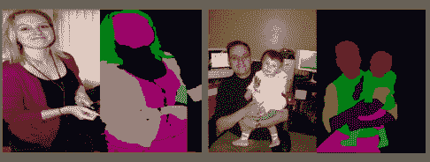

图 1：人体解析的目标是将人类图像划分为多个具有细粒度语义的人体部件，并有助于对图像的详细理解。

在本文中，我们的动机是专注于人体解析的最新研究，并讨论截至 2022 年提出的基于深度学习的 2D 解析方法。我们对这些方法的不同方面进行全面回顾和深入分析，包括网络架构、训练数据、主要贡献及其局限性。基于深度学习的人体解析方法可以根据其主要技术贡献分为以下几类：（1）结构驱动的架构，（2）基于图的网络，（3）上下文感知网络，（4）基于 LSTM 的方法，（5）结合辅助信息的方法，包括基于姿态的辅助方法、基于边缘的辅助方法和基于检测的辅助方法，以及（6）其他模型。此外，我们回顾了一些最流行的人体解析数据集及其用于评估方法的性能指标。最后，我们讨论了深度学习人类解析方法的几个潜在未来方向和应用。

我们调查的一些关键贡献可以总结如下：

+   1.

    我们的调查重点关注近年来有关人体解析的论文，并概述了截至 2022 年提出的基于深度学习的人体解析算法。

+   2.

    本调查提供了对人体解析方法的深入了解，包括网络架构、训练数据、主要贡献及其局限性。

+   3.

    我们回顾了流行的人体解析数据集，并提供了对所评审方法在流行基准上的属性和性能的比较总结。

+   4.

    我们讨论了深度学习基础的人体解析方法的几个潜在未来方向和应用。

表 I：头部姿态估计方法的分类

| 方法 | 亮点 | 代表性作品 |
| --- | --- | --- |
| 结构驱动的架构 | 利用不同人体部位之间的关系和人体的内在层次结构。 | A-AOG [12], PCNet *等* [13] |
| 基于图的网络 | 捕获全局信息以实现高效且完整的人体分析。 | Graphonomy [14, 15], CNIF [16], HHP [17] |
| 上下文感知网络 | 探索所有像素的有用上下文，以表征相应类别的像素。 | ATR [18], M-CNN [19], Co-CNN [20], SCHP [21] |
| 基于 LSTM 的方法 | 结合短距离和长距离空间依赖关系，以更好地利用丰富的局部和全局上下文。 | LG-LSTM [22], Graph LSTM [23], 结构演化 LSTM [24] |
| 结合辅助信息的方法 | 利用相关任务或监督来提高网络性能。 | 基于姿态的 (JMPE [25], SSL [26], MuLA [27]), 基于边缘的 (CorrPM [28], CE2P [29]), 基于检测的 (HAZN [30], Li *等* [31]) |

论文的其余部分组织如下：第二部分提供了基于深度学习的人体解析方法的全面概述，按照其主要技术贡献进行分类。我们还讨论了这些方法的优缺点。第三部分介绍了一些最流行的人体解析数据集和评估指标。第四部分讨论了几个应用和潜在的未来方向。最后，第五部分给出了结论。

## II 深度学习基础的人体解析

本节提供了对截至 2022 年提出的基于深度学习的人体解析方法的详细回顾。我们根据这些方法的模型架构将它们分为五类。表 I 提供了每一类别的代表性系统列表。

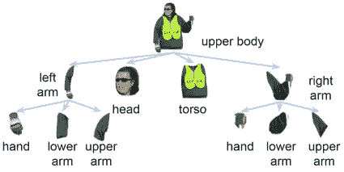

图 2：短语结构语法基于成分语法，该语法定义了将节点拆分为其组成部分的规则。 来源于 [12]。

### II-A 结构驱动的架构

人体是一个自然的层次结构，如何利用先验知识来分割不同的人体部位是一个迫切需要解决的问题。Park 等人\[12\]提出了一种属性与或文法（A-AOG）模型，用于推断分层表示中的人体部位，同时还联合表示人体姿势和人体属性。A-AOG 明确地表示了身体部位的分解和关节，并考虑了部位之间的相关性。该网络使用短语结构文法表示人体从整体到部分的分层分解，并采用依存语法来模拟几何关节。

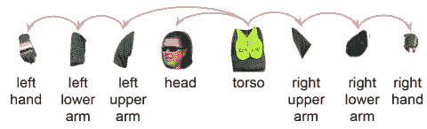

图 3：依存语法定义连接部位几何形状及其依赖部位的相邻关系。来自于[12]。

短语结构文法基于成分关系以粗粒度的方法表示人体部位。该文法定义如下：

|  | $\begin{split}&amp;a\rightarrow a_{1}&#124;a_{2}&#124;a_{3},\\ \end{split}$ |  | (1) |
| --- | --- | --- | --- |

其中一个典型的非终结节点$a\in v_{n}$，$a_{i}$是$v_{n}\cup v_{t}$中的节点字符串，$v_{n}，v_{t}$代表人体部位。图 2 是一个例子。根节点是上半身，分解为手臂、头部和躯干。手臂进一步分解为上臂、下臂和手。依存语法在自然语言处理中被广泛用于句法分析。图 3 是上半身的一种解析文法。根节点是躯干部分，因为它是身体的中心，并与其他部分相连。上臂和头部是躯干的子节点。

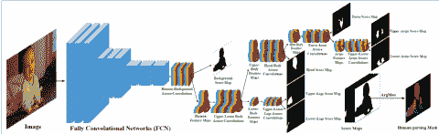

图 4：PCNet 的框架。来自于[13]。

Zhu 等人\[13\]提出了一种渐进的认知结构来分割人体部位。在分层网络中，后续层继承前一层的信息，并注重更细的组成部分。如图 4 所示，给定图像被送入 FCN 以提取原始特征。然后将图像级（原始）特征分解为背景得分图和人体级特征。人体级特征进一步分解为上半身特征和下半身特征，重复以上步骤直到所有部分被分割。

结构驱动的人体解析方法根据人体的先验知识探讨人体部位之间的固有关系。这些方法可以使网络更加关注感兴趣的人体本身，并减少背景和冗余信息的干扰。然而，这些方法容易导致错误累积。例如，如果根节点出现错误，错误会传递到后续节点，导致错误累积。

### II-B 基于图的网络

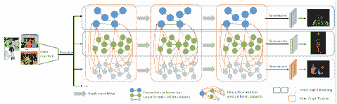

图 5: Graphonomy 的框架。来源于[14]。

图卷积[32]可以有效地探索人体部位之间的语义关系，因此一些研究[14, 15]将图卷积引入人体解析任务。如图 5 所示，Gong *et al* [14, 15] 设计了一种基于图的人体解析网络，名为“Graphonomy”，它利用图卷积捕捉全局信息和语义一致性。深度卷积网络提取的图像特征被投射到高级图表示中，其中身体部位为节点，部位之间的关系为边。Graphonomy 首先通过图内推理学习并传播数据集中各部位之间的紧凑高级图表示，然后通过图间传输将语义信息转移到不同的数据集中。这样，Graphonomy 充分利用了不同粒度的标注数据。然而，训练过程中需要多个数据集，这消耗了大量计算资源。

Wang *et al* [16] 提出了一种通过使用图卷积网络探索人体结构层次的方法。这种方法实现了高效且完整的人体分析，称为信息融合框架。该模型建模了三种推理过程：直接推理（直接使用图像信息预测人体的每个部位）、自下而上推理（从组成部件中汇集知识）和自上而下推理（利用父节点的上下文）。

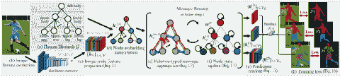

图 6: 人体解析任务的层次图示。来源于[17]。

此外，王*等人* [17] 为人体解析任务表示了一个层次化图。该方法用三种不同的图网络完全而准确地描述了三种部件关系，即分解、组合和依赖。该方法将人体语义结构表示为一个有向的层次图 $g=(\upsilon,\varepsilon,y)$。如图 6 所示，节点集 $\upsilon=\bigcup^{3}_{l=3}\upsilon_{l}$ 表示三个不同语义层次中的人体部件，包括叶子节点 $\upsilon_{1}$，两个中间层节点 $\upsilon_{2}$ 和一个根节点 $\upsilon_{3}$。边集 $\varepsilon\in(^{\upsilon}_{2})$ 表示人体部件（节点）之间的关系，即有向边。$y$ 表示真实标签图。给定一张输入图像，完全卷积网络首先提取图像特征并投影到节点（部件）特征上。然后将节点特征输入到层次化图中，以捕捉表达性的关系信息并预测不同粒度的结果。整个网络在图学习方法中进行训练，监督数据为人体解析数据集。

在基于图的人工解析网络中，不同部件的语义关系被引入解析模型中，这可以通过相互交流来修正累计的错误。通常，身体部件是节点，部件之间的关系是边。由于人体部件的尺度、遮挡、变形和姿势的多样性，这种方法难以获取丰富的上下文信息，从而影响模型的识别能力。

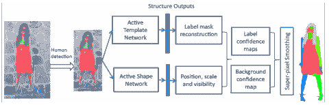

图 7：活动模板回归模型的框架。来源 [18]。

### II-C 上下文感知网络

由于先进的 CNN 架构和训练技术的发展，以及最近发布的人体解析数据集，基于上下文的方法越来越受到关注。如图 7 所示，梁*等人*[18]首次将卷积神经网络应用于人体解析任务，称为主动模板回归模型。该方法基于输入人体图像与人体解析结构输出之间的端到端关系。第一个 CNN 网络（主动模板网络）具有最大池化，并设计用于预测每个标签掩码的模板系数；第二个网络（主动形状网络）不使用最大池化，以保持对标签掩码位置的敏感性并生成主动形状参数。给定一张图像，两种网络的输出被融合，以生成每个像素的每个类别的概率，最后使用超像素平滑来细化人体解析预测。大量实验表明，ATR 框架在人体解析方面显著优于其他同时期的技术。

随后，梁*等人*[19]设计了一种准参数方法，结合了参数和非参数方法，即来自标注数据的监督和使用新标注图像的灵活性。在经典的基于 K 最近邻（KNN）的非参数框架下，提出了参数匹配卷积神经网络（M-CNN）来预测分割结果。如图 8 所示，给定一张测试图像，从人工标注的图像库中检索其 KNN 图像。然后，将输入图像与每个 KNN 图像的语义区域配对，每对图像分别输入到 M-CNN 中。M-CNN 预测输入图像对之间的匹配置信度和位移。所有对应的标签图被合并，以生成每个像素的概率图，并通过超像素平滑进一步细化。

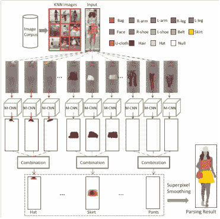

图 8：准参数网络的架构。来源于[19]。

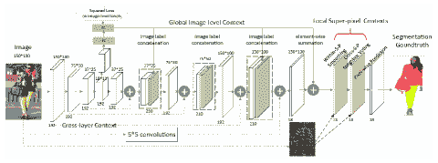

图 9：上下文卷积神经网络的框架。来源于[20]。

为了在人体解析任务中有效地将各种上下文整合到一个统一的模型中，梁*等*[20]提出了一种新型的上下文化卷积神经网络（Co-CNN）。该网络集成了跨层上下文、全局图像级上下文、超像素内上下文和跨超像素邻域上下文，以获得丰富的上下文，提高人体解析的性能（图 9）。跨层上下文由基本结构捕获，该结构分层地结合了不同层次的全局语义和局部细节。然后，全局图像级上下文作为中间层的辅助对象，引导后续特征学习。最后，本地超像素上下文、超像素内上下文和跨超像素邻域上下文被构建为自然的子组件，以实现局部标签的一致性。

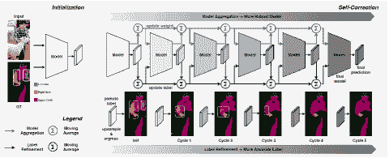

图 10：自我校正的人体解析框架。来自[21]。

李*等*设计了一种抗噪方法，名为自我校正的人体解析（SCHP）[21]，以逐步提升监督标签和学习模型的可靠性。如图 10 所示，SCHP 首先以训练有误标签的模型作为初始化，然后使用周期性学习调度器通过在线方式迭代聚合模型来推断更可靠的伪掩码。此外，经过校正的标签反过来又提升了模型的性能。通过这种方式，模型和标签将相互变得更具鲁棒性和准确性。基于上下文的人体解析方法可以获得丰富的语义和细节，扩展有效的感受野。然而，这种方法可能会导致信息衰减，因为网络过于深层。

### II-D 基于 LSTM 的方法

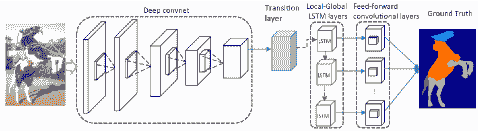

图 11：LG-LSTM 网络的架构。来自[22]。

长短期记忆（LSTM）[33]使用记忆单元独立读取、写入和遗忘一些信息，同时保留主要信息。它可以减缓信息的衰减。因此，梁*等人*将 LSTM 引入到人体解析任务中。首先，梁*等人*[22]提出了一种新型的局部-全局长短期记忆（LG-LSTM），用于结合短距离和长距离的空间依赖关系（见图 11）。LG-LSTM 层从邻近位置获得局部指导，从整个图像获得全局指导，然后对每个位置施加这些指导，以更好地利用丰富的局部和全局上下文。给定一张输入图像，骨干网络获取其原始特征。然后，这些特征被送入过渡层和若干堆叠的 LG-LSTM 层，以提高特征的能力。随后附加前馈卷积层以生成预测。

然后，梁*等人*进一步设计了图形长短期记忆（Graph Long Short-Term Memory，Graph LSTM）[23]来改进 LSTM，这是一种将 LSTM 从序列数据或多维数据推广到一般图结构数据的技术。Graph LSTM 将每个任意形状的超像素视为语义一致的节点，并为每张图像自适应地构建一个无向图，其中超像素的空间关系自然地作为边。Graph LSTM 层的节点更新顺序由信心驱动方案确定，然后 Graph LSTM 层可以顺序更新所有超像素节点的隐藏状态。

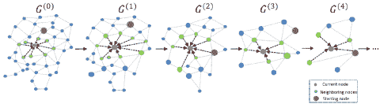

图 12：结构演变 LSTM 的示意图。来源于[24]。

在另一项工作中，梁*等人*提出了一种以渐进方式学习中间可解释的多层图结构的方法，称为结构演变 LSTM[24]（见图 12）。在每个 LSTM 层中，我们从其对应的 LSTM 门输出中估计两个连接节点的兼容性，这用于生成合并概率。然后，相应地生成候选图结构，其中节点按其合并概率被分组为团体。网络通过 Metropolis-Hasting 算法生成新的图结构，该算法通过接受概率的随机采样来缓解陷入局部最优的风险。一旦图结构被接受，就通过将划分的团体作为节点来构建更高级的图。

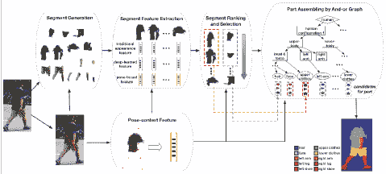

图 13：通过使用姿势上下文特征的与或图进行姿势引导的人体解析。来源于[34]。

### II-E 结合辅助信息方法

人体解析是一个像素级细分类任务，要求丰富而有效的特征表达。结合人体检测、人体姿态估计和人体边缘信息可以大大提高特征的表达能力和人体分析的性能。

基于姿态的辅助方法。在计算机视觉领域，人类解析和人体姿态估计是两个互补的任务。关节可以为人体解析提供对象级别的形状信息，而像素级分析可以约束姿态位置的变化。

Xia *等人* 提出了一个人类解析方法，该方法使用人体姿态位置作为线索，为语义部分提供姿态引导的分段建议[34]，如图 13 所示。这些分段建议通过称为姿态上下文的标准外观线索进行排名。通过使用与或图选择并组装这些建议，输出一个处理大范围人体外观变异的解析。给定一个行人图像，网络首先使用姿态估计获取人体姿态关节。然后，基于这些关节和修改后的 RIGOR 算法[35]，生成与物体边界对齐的分段。人体姿态关节进一步获得姿态上下文特征，将分段组合以提取分段特征。分段建议模型选择并排序这些部分。最后，部分组装生成配对结果。基于此方法[34]，Xia *等人* 进一步改进了基于人体姿态估计的人体解析方法，并设计了一个网络[25]。该网络训练两个完全卷积神经网络，以同时优化这两个任务。

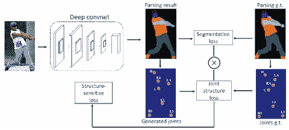

图 14: 自监督结构敏感学习（SSL）的人体解析框架。来自 [26]。

Gong *等人* 开发了一种新颖的自监督结构敏感学习（SSL）方法[26]，该方法将人体姿态结构引入解析中，而无需额外监督（图 14）。请注意，在模型训练中无需特别标注人体关节。该框架可以注入任何先进的网络，以帮助结合来自关节的丰富高级知识并改进解析结果。给定一张图像，骨干网络生成解析结果。通过计算解析图中的相应区域的中心点来获得生成的关节和关节标签。结构敏感损失通过用关节结构损失加权分段损失生成。

随后，聂*等*提出了一种互学习适应模型（MuLA），用于联合人类解析和姿态估计[27]。MuLA 通过反复利用来自并行任务的指导信息来预测动态任务特定模型参数。因此，MuLA 结合了解析和姿态模型的优点，通过结合对方的信息提供更强大的表示，从而生成更准确的结果。

这两个任务可以相互改善特征表示，增强模型的准确性。然而，这两个任务关注点不同。人体姿态估计主要关注全局特征，无法为每个像素提供唯一的标签。因此，对人体解析任务的帮助有限。同时，两个优化方法不同，这会影响准确性的提升。

基于边缘的辅助方法。在图像中，低频区域是语义相似的区域，而高频区域通常是区域块语义变换比例较大的区域。人体的边缘用于描述人体前景和背景的转变区域，这些区域具有区域性差异。在 Co-CNN[20]的基础上，梁*等*[36]增加了一个分支，通过人体边缘的信息引导前景和背景区域的分离，提高了模型对不同语义区域的识别能力。先进的语义边界被用来引导像素级标注，提高模型的准确性。

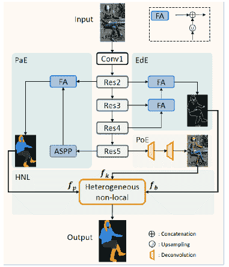

图 15：相关性解析机器（CorrPM）框架。来源于[28]。

张*等*提出了一种相关性解析机器（CorrPM）[28]，用于研究人类语义边界和关键点位置如何共同改善人类解析（图 15）。CorrPM 使用异质非局部块来发现来自边缘、姿态和解析的特征图之间的空间关联。输入图像经过主干网络生成不同阶段的特征。第二和第五阶段的特征被送入配对编码器以获取粗略分割图。第二、第三和第四阶段的特征被送入边缘编码器生成语义边界。五个阶段的特征被送入姿态编码器以预测关节位置。异质非局部块被附加用于探索三个因素之间的关联，并生成精细的结果。

刘*等人*[29]设计了一个简单而有效的上下文嵌入与边缘感知（CE2P）框架，该框架结合了特征分辨率、全局上下文和边缘细节。CE2P 为单个人体解析任务带来了高性能的提升，并作为未来单/多人体解析研究的坚实基线。

人体的边缘标签可以通过边缘处理（例如，Canny [37]) 从解析标签中获得。这种自然信息不需要额外的标注，且成本效益高。但边缘所占的像素数量相对于整体图像较少。目前，通常使用平均交集比来评估模型的性能，而在这种计算方法中，边缘准确性几乎没有优势。通常，模型边缘的效果已显著改善，但人体解析的分析准确性并未提升。因此，边缘信息不能有效提高网络性能的评估值。

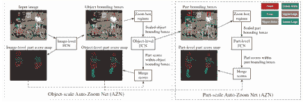

图 16：层次化自动缩放网络（HAZN）框架的框架。来自[30]。

基于检测的辅助方法。由于复杂场景和相似背景的干扰，提取完整准确的前景非常困难。检测人体可以减少背景信息的干扰，使网络更加关注前景，从而提高网络分析的精度。如图 16 所示，夏*等人*[30]设计了一种适用于目标解析的层次化自动缩放网络（HAZN），它适应于对象及其部分的局部尺度。HAZN 是两个自动缩放网络（AZNs）的序列，每个网络有两个任务：第一个任务是预测对象实例（第一个 AZN）或其部分（第二个 AZN）的位置信息和尺度；第二个任务是估计预测的对象实例或部分区域的分数。给定一张图像，其部分分数由三个具有不同粒度的 FCNs 预测和细化，即图像级、对象级和部分级。在每个级别，FCN 输出分数图，并生成下一层级的位置和尺度。

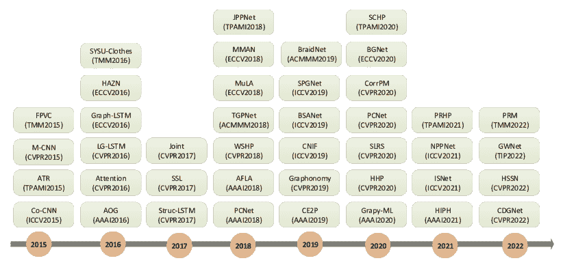

图 17：基于深度学习的人体解析算法的时间线，从 2015 年到 2022 年。

Li *等人* [31] 通过在实例级别对物体部分进行分割来解决人类解析任务，使得图像中的每一个像素都被分配一个部件标签，以及它所属的物体的身份。输入图像被送入一个人体检测网络和一个身体部位语义分割网络，分别产生 $D$ 个人体检测和分割结果。这些结果用于形成一个实例 CRF 的一元势，该 CRF 通过将标记的像素与人体检测关联来执行实例分割。

这些检测方法可以减少背景信息的干扰，使网络更专注于人体，但这种方法也有两个缺点。一方面，即使检测方法完全正确，背景信息的干扰也不能完全避免，仍需要人体解析方法从背景中提取前景。在分析结果时，前景与身体本身越接近，就越容易造成干扰。另一方面，如果检测方法不正确，后续的人体解析将继承这个错误，导致错误的累积。因此，基于检测模型的人体分析方法存在一些缺陷。

### II-F 其他模型

除了上述方法，还有一些其他深度学习方法用于人类解析，例如：CDGNet [38] 将复杂的空间人类解析问题简化为人体部位的水平和垂直位置。因此，该方法在水平和垂直方向上构建了类别分布标签，作为来自原始人类解析标签的新监督信号。Liu *et al* [39] 通过在 HRNet 上添加反卷积和多尺度监督，提出了一个混合分辨率网络（HyRN），仅需额外的计算开销。HyRN 汇聚丰富的高分辨率表示，以预测更准确的解析结果，特别是对小组件的改进超过了 4 个百分点。Lin *et al* [40] 引入了一个有效的框架，称为带姿态的领域互补学习，利用真实和合成图像中的信息进行多人的部件分割。SYSU-Clothes [41] 通过联合图像分割和标签解析衣物。BSANet [42] 提出了解决在较少被探索的多类设置下的对象部件解析问题，并设计了一个统一的网络架构来解决这个重要问题。Grapy-ML [43] 提出了一个新颖的图形金字塔模块，该模块通过基于自注意力的图形推理和逐步特征优化，显式地将层次结构的先验信息纳入特征学习中。PRM [44] 旨在生成具有自适应上下文的特征，以适应各种尺寸和形状的人体部件。HSSN [45] 旨在以类别层次结构的方式对视觉观察进行结构化、逐像素的描述。HIPN [46] 提出了一个新的半监督人类解析方法，该方法仅需要少量标签即可进行训练。ISNet [47] 提出了通过分别聚合图像级和语义级上下文信息来增强像素表示的方法。AFLA [48] 提出了一个新颖而高效的跨领域人类解析模型，以桥接视觉外观和环境条件方面的跨领域差异。

实例级人类解析 [49] 是一项有趣的任务，旨在一次性解析多个人体实例。在这一方向上已经有几个有趣的工作，包括 PNG [49]、NAN [50]、Holistic [31]、Parsing R-CNN [51]、AIParsing [52]、M-CE2P [29]。

视频人体解析 [53, 54]也是一个相关任务，它解析视频数据中的每个人体，这可以视为将视频分割与实例级人体解析整合起来。ATEN [53]首次利用卷积门控递归单元来编码时间特征级变化，非关键帧的光流与时间记忆一起封装以生成其特征。随后有 TimeCycle [16]、UVC [55]、CRW [56]、CLTC [57]、LIIR [58]等。

图 17 展示了一些具有里程碑意义的人体解析方法。鉴于近年来开发了大量的工作，我们仅展示了一些最具代表性的方法。

### II-G 基于深度学习的语义分割

我们回顾了一些最杰出的基于深度学习的语义分割方法。在人体解析社区中，许多工作将语义分割模型用作方法的图像编码器，并从这些初始权重重新训练他们的模型。这种方式加速了网络的收敛。根据它们的架构，我们将其分为四组，例如，全卷积网络、编码器-解码器模型、多尺度网络、扩张卷积模型和 deeplab 系列。值得注意的是，许多方法共享一些部分，例如编码器和解码器过程、跳跃连接以及扩张卷积。

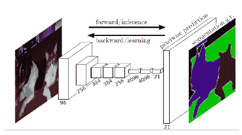

图 18：全卷积网络，它可以学习用于语义分割的密集像素级预测。来源 [11]。

全卷积网络。全卷积网络（FCN） [11]观察到全连接层丧失了空间信息，并将其从流行的架构中移除（例如，AlexNet [59]、VGG [60]、GoogLeNet [61]）。通过这种方式，FCN 仅包括卷积层，这使得它可以应用于任何分辨率的图像，如图 18 所示。该方法在多个图像分割数据集上取得了同时期最先进的结果，并被认为是该领域最具影响力的工作之一。

跳跃连接通过求和或拼接连接非相邻层的输出，这结合了深层的语义和浅层的细节，从而获得准确的分割结果。FCN 增加了将最终预测层与步幅较小的低层结合的链接（图 19）。最广泛使用的架构 'FCN-32s'、'FCN16s' 和 'FCN8s' 是通过在不同层进行跳跃连接获得的。为各种应用提出了更密集的跳跃连接 [62]。

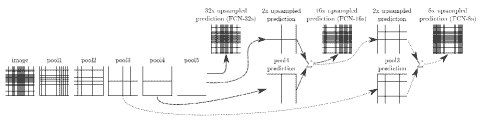

图 19：跳跃连接结合了深层的语义和浅层的细节，从而获得准确的预测。来自 [11]。

尽管 FCN 可以在任何尺寸的图像上以端到端的方式进行训练，但由于其计算量大，不适合在移动设备或其他便携平台上部署。为了解决这一问题，提出了 ENet [63]，这是最早的实时语义分割模型之一。ENet 包含一个较大的编码器和非常简单的解码器，由几个瓶颈残差块变体组成，这些块包括降维、卷积，并以更少的参数提供类似或更好的精度。

FCNs 在许多方面被认为是革命性的。由于其高性能和易于部署，它们促进了医学（例如，脑肿瘤分割 [64, 65]）、无人驾驶（例如，ERFNet [66]）等领域的进步。

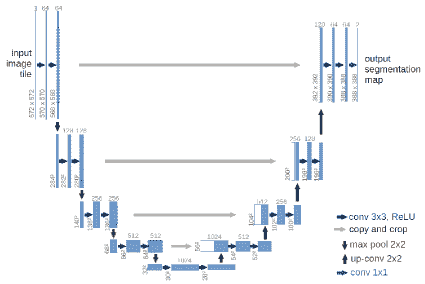

图 20：U-net 模型（$572\times 572$ 分辨率的输入图像示例）。来自 [67]。

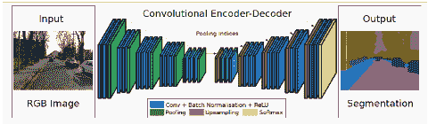

图 21：SegNet 架构。解码器通过使用来自编码器的池化索引对其输入进行上采样。来自 [68]。

基于编码器-解码器的模型。FCN 的池化层创建的层次特征可能会部分丢失一些定位信息。因此，我们讨论了其他流行的基于编码器-解码器的模型，它们提供了更精细的预测。

编码器-解码器模型（也称为 U-net）由两个组件组成（即编码器网络和解码器网络）。编码器通过池化或卷积层逐渐减少空间维度，而解码器通过上采样恢复分辨率。解码器使用在对应编码器的最大池化步骤中计算的池化索引进行上采样，并连接解码器的对应特征。U-Net[67]（图 20）和 SegNet[68]（图 21）是著名的编码器-解码器算法。在这种架构中，网络通过编码器和解码器之间的跳跃连接获取丰富的细节和语义。

这一类别中的另一个流行模型是高分辨率网络（HRNets）[69, 70]，如图 22 所示。与 U-Net 和 SegNet 不同，它们首先减少空间维度，然后再恢复。HRNet 通过将高到低分辨率的卷积流并行连接，并反复交换不同分辨率的信息，从而在编码过程中保持高分辨率表示。许多关于语义分割、检测和面部特征点检测的近期研究都利用 HRNet 作为骨干网络。

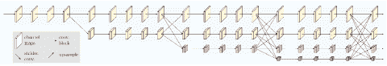

图 22：高分辨率网络的简单示例。HRNetV1 和 HRNetV2 之间的主要区别在于最终阶段的输出。HRNetV1 仅生成高分辨率特征，而 HRNetV2 则输出所有分辨率特征。摘自[70]。

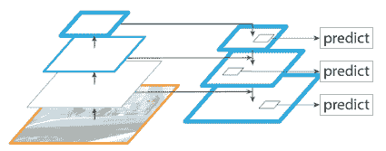

图 23：FPN 涉及自下而上的路径、从上而下的路径以及横向连接。摘自[71]。

基于多尺度和金字塔网络的网络。多尺度是图像处理中的一种传统方法，广泛应用于许多计算机视觉任务。其中一个最突出的模型是特征金字塔网络（FPN）[71]（图 23），它主要用于目标检测，并且也应用于分割[72, 65]。许多方法使用复杂的网络结构来捕捉固有的多尺度上下文。FPN 设计了一种简单而有效的方法，包含一个自下而上的路径，一个自上而下的路径和横向连接。拼接的特征图会送入一个$3\times 3$卷积以生成每个阶段的输出。最后，每个自上而下路径的阶段都会产生一个预测以检测目标。

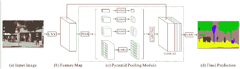

图 24：PSPNet 的概览。金字塔池化模块通过在不同步幅中采用不同大小的池化核来提取不同的子区域。上采样和拼接用于形成最终的像素级预测。来自[73]。

PSPNet[73] 使用金字塔池化模块来捕捉用于场景解析的多尺度全局上下文，如图 24 所示。给定一张输入图像，PSPNet 首先使用 CNN 提取特征，然后将这些特征送入金字塔池化模型，以收集不同尺度的模式表示。共有四种不同的尺度，每种尺度对应一个金字塔层级，并跟随一个$1\times 1$卷积层以减少维度。金字塔池化模块的输出通过上采样和与原始特征拼接，能够获得局部和全局上下文信息。最后，这些表示会传入卷积层以生成最终的像素级预测。

其他模型使用多尺度分析进行语义分割，例如 LRR（拉普拉斯金字塔重建）[74] 设计了用于语义分割的拉普拉斯金字塔，RefineNet[75] 提出了用于精确预测的多路径细化网络，而多尺度上下文交织（MSCI）[76] 则采用多尺度上下文进行分割。

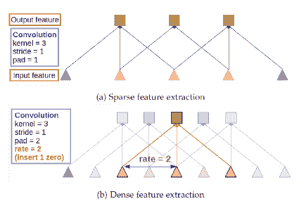

图 25：扩张卷积的示例。（a）使用标准卷积进行稀疏特征提取。（b）使用扩张卷积（扩张率为 2）进行密集特征提取。来自[77]。

膨胀卷积模型和 DeepLab 系列。连续层的堆叠池化和步幅会降低特征的分辨率，在最近的 DCNN 中通常每个方向降低 32 倍，这影响了小物体的分割精度。DeepLabv1 [78] 引入了空洞卷积（即膨胀卷积），它可以在任何所需分辨率下计算任意层的响应。与普通卷积相比，空洞卷积增加了一个额外的参数，即速率参数 $r$，它对应于输入信号的步幅。定义如下：

|  | $\begin{split}&amp;y[i]=x[i+r\cdot k]w[k],\\ \end{split}$ |  | (2) |
| --- | --- | --- | --- |

其中输出 $y[i]$ 是对 1-d 输入信号 $x[i]$ 使用长度为 $k$ 的滤波器 $w[k]$ 的空洞卷积。参见图 25 以了解示例，例如，使用膨胀率为 2 的 $3\times 3$ 核心将具有与 $5\times 5$ 核心相同大小的感受野，同时仅使用 9 个参数，从而在计算成本几乎不增加的情况下扩大感受野。

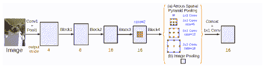

图 26：带有图像级特征的 DeepLabv3 模型。来自 [79]。

DeepLab 系列基于 FCN 概念。DeepLab 系列有四个版本，分别为 DeepLabv1 [78]、DeepLabv2 [77]、DeepLabv3 [79] 和 DeepLabv3+ [80]。DeepLabv1 为其他方法奠定了基础。DeepLabv1 有两个贡献。首先，它使用空洞卷积来解决网络中分辨率下降的问题，并在不增加计算量的情况下扩大感受野。其次，它将最终 dcnn 层的响应与全连接条件随机场（crf）结合，处理深度网络的定位精度差的问题。DeepLabv2 提出了空洞空间金字塔池化（Aspp），以稳健地在多个尺度上分割物体。Aspp 使用多个采样率和有效视场的滤波器探测输入的卷积特征层，从而在多个尺度上捕捉物体和上下文。

随后，DeepLabv3 [79] 结合了级联和并行的空洞卷积模块。并行卷积模块在 Aspp 中分组，与图像级特征编码全球上下文，并进一步提升性能，如图 26 所示。所有输出被拼接并通过 $1\times 1$ 卷积处理，以生成最终预测。

DeepLabv3+ 采用了编码器-解码器架构。它使用 DeepLabv3 作为编码器，并在 xception 主干上增加了更多的层。此外，它使用膨胀深度可分离卷积替代了最大池化和批量归一化。解码器首先从网络主干中提取低级特征作为输入，然后将 Aspp 的输出进行拼接。这个简单却有效的解码器模块沿着物体边界细化分割结果。

## III 人体解析数据集及评估指标

在过去几十年中，已经做出了重大努力来开发各种人体解析方法。介绍一些公开可用的基准数据集和评估指标是很重要的。我们还提供了有前景的模型在流行数据集上的定量性能。

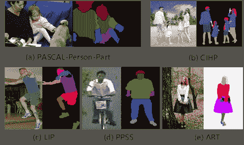

图 27：来自 PASCAL-Person-Part、LIP、CIHP、PPSS 和 ATR 的五个样本图像及其相应的真实标签。来源 [81, 26, 49, 82, 18]。

### III-A 数据集

PASCAL-Person-Part [81] 是人体解析任务中最具代表性和广泛使用的数据集之一。该数据集中包含了在不受约束的环境下的多个人体出现。其图像主要来自 PASCAL VOC [81] 数据集的图像语义分割。此人体解析数据集有 7 个类别：背景、头部、躯干、上臂、下臂、大腿和小腿。该数据集分为两个部分，训练集和测试集，分别包含 1716 张和 1817 张图像。图 Fig. 27 显示了一个示例图像及其逐像素标签。

LIP [26] 是该任务中最受欢迎的数据集之一，是一个单人数据集。其图像捕捉了更广泛的视角、遮挡和复杂背景。LIP 定义了 19 个人体部位（衣物）标签，包括帽子、头发、太阳镜、上衣、连衣裙、大衣、袜子、裤子、手套、围巾、裙子、连体裤、脸、右臂、左臂、右腿、左腿、右鞋和左鞋，以及一个背景类别。共有 50,462 张图像，其中 30,362 张用于训练，10,000 张用于测试，10,000 张用于验证。测试集的注释未公开，模型在测试集上的精度需要通过在线评估获得。

CIHP [49] 是一个新的大规模多人人物基准，具有 19 个语义部分标签的像素级标注，每张图像包含大约三个人。图像采集自实际场景，包含具有挑战性的姿势和视角、严重遮挡以及各种分辨率。该基准分为三个集合，训练集包含 28280 张图像，验证集包含 5000 张图像，测试集包含 5000 张图像。实际挑战还有一个私有测试集。

PPSS [82] 收集自 171 段监控视频，它能够反映实际场景中的阴影和光照变化。数据集中包含八个类别，包括头发、脸部、上衣、下装、手臂、腿部和鞋子。该数据集中有 3673 张标注图像，其中包括 1781 张训练图像和 1892 张测试图像。

Fashionista [83] 由从 Chictopia.com 收集的 158,235 张图像组成，这是一个针对时尚博主的社交网络网站。选择了 685 张全身可见的图像用于训练和评估，并分为十个文件夹，其中 9 个文件夹作为训练集，其余 1 个文件夹作为测试集。该数据集总共有 56 个类别，其中 53 个是常见的服装类别（例如连衣裙、包、夹克、裙子、靴子、毛衣），其余三个是头发、皮肤和背景。

Colorful Fashion Parsing Data (CFPD) [84] 是一个包含服装颜色属性和部分类别的数据集。该数据集有 13 种颜色和 23 个类别的标签。为了平衡标注效率和准确性，他们首先将每张图像过度分割为大约 400 个补丁。最终 CFPD 由 2682 张照片组成，随机选择一半的图像作为训练集，另一半作为测试集。

Daily Photos dataset [85] 由 2500 张图像组成，所有图像中的像素都被彻底标注了 18 种标签。训练与测试的比例为 2:1。

ATR [18] 是一个来自四个主要来源的综合数据集：Fashionista 的 685 张图像；CFPD 的 2682 张图像；每日照片的 2500 张图像和来自 Human Parsing in the Wild (HPW)的 1833 张图像。数据集中有 18 个类别，包括脸部、太阳镜、帽子、围巾、头发、衣物、左臂、右臂、腰带、裤子、左腿、右腿、裙子、左鞋、右鞋、包、连衣裙，以及其他 17 个常见类别和 1 个背景。该数据集包含 7700 张标注图像，其中包括 6000 张用于训练，700 张用于验证，1000 张用于测试。

Fashion Clothing 数据集 [86] 包含来自 Clothing Co-Parsing (CCP) [87]、Fashionista [83] 和 Colorful Fashion Parsing Data (CFPD) [84] 的总计 4,371 张图像。该数据集更侧重于人类服装细节，包括一个背景和 17 个标签，分别代表珠宝、包、外套、西装、连衣裙、眼镜、头发、裤子、鞋子、衬衫、皮肤、裙子、上衣、背心和内衣。这个数据集能够相对反映网络解析物体细节的能力。

### III-B 分割模型指标

我们介绍了评估人类解析方法准确性的最常用指标。

像素准确率是指在索引数据集中正确分类的像素数量与总像素数量之间的比率。计算公式如下：

|  | $PA=\frac{{\sum\limits_{i}^{C}{{t_{ii}}}}}{{\sum\limits_{i}^{C}{\sum\limits_{j}^{C}{{t_{ij}}}}}},$ |  | (3) |
| --- | --- | --- | --- |

其中 $C$ 表示类别数，$t_{ii}$ 表示像素 $i$ 被准确分类为 $i$，$t_{ij}$ 表示像素 $i$ 对于 $j$ 类的真实标签。像素准确率范围从 0 到 1，值越高，效果越好。

平均像素准确率 (MPA) 是 PA 的扩展版本，它对所有类别的 PA 进行平均，从而获得最终值。

交并比 (IoU) 或 Jaccard 指数是人类解析中最常用的指标之一。它计算预测类别区域与真实标签类别区域之间的交集和并集的比率。对于 $k$ 类，IoU 定义如下：

|  | $IoU=\frac{A\cap B}{A\cup B},$ |  | (4) |
| --- | --- | --- | --- |

其中 $A$ 和 $B$ 分别表示真实标签和预测分割图。

平均交并比 (mIoU) 是 IoU 的扩展版本，它对所有类别的平均值进行计算。它在报告现代人类解析算法性能时被广泛使用。

F-1 分数 (F-1) 是一种常用的度量模型准确性的指标。它结合了精确度和召回率进行统一测量，并通过两者指标的调和平均来计算。

|  | $F-1=2\cdot\frac{Precision\cdot Recall}{Precision+Recall}.$ |  | (5) |
| --- | --- | --- | --- |

前景像素准确率 (FGAcc) 仅计算前景人类部位的像素准确率。

### III-C 方法的定量性能

在本节中，我们概述了几种之前方法在流行分割基准上的表现。由于一些模型没有在标准数据集上报告其性能，因此很难进行全面的比较。以下表格总结了几种主要模型在不同数据集上的表现。表 II 重点关注 PASCAL-Person-Part 测试集。自从 FCN 基于模型引入以来，性能得到了大幅提升。表 III 重点关注 LIP 验证集。在该数据集上，最新模型在 mIoU 指标上比原始模型提高了 32.01%。表 IV 重点关注 CIHP 测试集。该数据集比 PASCAL-Person-Part 数据集更具挑战性，这两个数据集都是多人体数据集。表 V 重点关注 ATR 测试集。最新模型在 F-1 指标上达到了 87.16。最后，表 VI 总结了几种模型在时尚服装数据集上的表现。

表 II：PASCAL-Person-Part 测试集上的定量结果，以均值像素交并比（mIoU）（%）为指标

| 方法 | 年份 | 发表 | 骨干网络 | mIoU |
| --- | --- | --- | --- | --- |
| HAZA [30] | 2016 | ECCV | VGG16 | 57.54 |
| LIP [26] | 2017 | CVPR | ResNet101 | 59.36 |
| MMAN [88] | 2018 | ECCV | ResNet101 | 59.91 |
| Graph LSTM [23] | 2016 | ECCV | VGG16 | 60.61 |
| SE LSTM [24] | 2017 | CVPR | VGG16 | 63.57 |
| Joint [25] | 2017 | CVPR | ResNet101 | 64.39 |
| MuLA [27] | 2018 | ECCV | VGG16 | 65.1 |
| PCNet [13] | 2018 | AAAI | PSPNet101 | 65.90 |
| Holistic [31] | 2017 | BMVC | ResNet101 | 66.3 |
| WSHP [89] | 2018 | CVPR | VGG16 | 67.60 |
| SPGNet [90] | 2019 | ICCV | ResNet-101 | 68.36 |
| PGN [49] | 2018 | ECCV | ResNet101 | 68.40 |
| RefineNet [75] | 2017 | CVPR | ResNet101 | 68.6 |
| CNIF [16] | 2019 | ICCV | ResNet101 | 70.76 |
| DTCF [39] | 2020 | ACMMM | ResNet101 | 70.80 |
| Graphonomy [14] | 2019 | CVPR | DeepLab v3+ | 71.14 |
| DPC [91] | 2018 | NeurIPS | - | 71.34 |
| SNT [92] | 2020 | ECCV | ResNet101 | 71.59 |
| NPPNet [93] | 2021 | ICCV | ResNet101 | 71.73 |
| CDCL [40] | 2021 | TCSVT | ResNet101 | 72.82 |
| PRHP [94] | 2021 | TPAMI | ResNet101 | 72.82 |
| BGNet [95] | 2020 | ECCV | ResNet101 | 73.12 |
| GWNet [96] | 2022 | TIP | ResNet101 | 74.67 |

表 III：在 LIP 验证集上以像素交并比 (mIoU) (%) 衡量的定量结果

| 方法 | 年份 | 发布 | 主干 | mIoU |
| --- | --- | --- | --- | --- |
| FCN-8s [11] | 2015 | CVPR | VGG16 | 28.29 |
| DeepLabV2 [77] | 2017 | TPAMI | ResNet101 | 41.64 |
| Attention [97] | 2016 | CVPR | VGG16 | 42.92 |
| DeepLab-ASPP [77] | 2017 | TPAMI | VGG16 | 44.03 |
| LIP [26] | 2017 | CVPR | ResNet101 | 44.73 |
| MMAN [88] | 2018 | ECCV | VGG16 | 46.81 |
| JPPNet [98] | 2018 | TPAMI | PSPNet101 | 51.37 |
| CE2P [29] | 2019 | AAAI | ResNet101 | 53.10 |
| BraidNet [99] | 2019 | ACMMM | PSPNet | 54.4 |
| SNT [92] | 2020 | ECCV | ResNet101 | 54.8 |
| CorrPM [28] | 2020 | CVPR | ResNet101 | 55.33 |
| SLRS [21] | 2020 | CVPR | ResNet101 | 56.34 |
| BGNet [95] | 2020 | ECCV | ResNet101 | 56.82 |
| GWNet [96] | 2022 | TIP | ResNet101 | 57.26 |
| CNIF [16] | 2019 | ICCV | ResNet101 | 57.74 |
| DTCF [39] | 2020 | ACMMM | ResNet101 | 57.82 |
| NPPNet [93] | 2021 | ICCV | ResNet101 | 58.56 |
| HHP [17] | 2020 | CVPR | DeepLabV3 | 59.25 |
| SCHP [21] | 2020 | TPAMI | ResNet101 | 59.36 |
| CDGNet [38] | 2022 | CVPR | ResNet101 | 60.30 |

表 IV：在 CIHP 测试集上以像素交并比 (mIoU) (%) 衡量的定量结果

| 方法 | 年份 | 发布 | 主干 | mIoU |
| --- | --- | --- | --- | --- |
| PGN [49] | 2018 | ECCV | ResNet101 | 55.80 |
| Graphonomy [14] | 2019 | CVPR | DeepLab v3+ | 58.58 |
| M-CE2P [29] | 2019 | AAAI | ResNet101 | 59.50 |
| CorrPM [28] | 2020 | CVPR | ResNet101 | 60.18 |
| BraidNet [99] | 2019 | ACMMM | PSPNet | 60.62 |
| SNT [92] | 2020 | ECCV | ResNet101 | 60.87 |
| PCNet [100] | 2020 | CVPR | ResNet101 | 61.05 |
| CDGNet [38] | 2022 | CVPR | ResNet101 | 65.56 |

表 V：在 ATR 测试集上以前景像素准确度 (FGAcc) 和 F-1 分数衡量的定量结果

| 方法 | 年份 | 发布 | 主干 | F.G.Acc | F-1 |
| --- | --- | --- | --- | --- | --- |
| ATR [97] | 2015 | TPAMI | - | 71.04 | 64.38 |
| 注意力 [97] | 2016 | CVPR | VGG16 | 85.71 | 77.23 |
| Co-CNN [20] | 2015 | ICCV | VGG16 | 83.57 | 80.14 |
| LG-LSTM [22] | 2016 | CVPR | VGG16 | 84.79 | 80.97 |
| TGPNet [86] | 2018 | ACMMM | VGG16 | 87.91 | 81.76 |
| CNIF [16] | 2019 | ICCV | ResNet101 | 85.51 |
| CorrPM [28] | 2020 | CVPR | ResNet101 | 90.40 | 86.12 |
| HHP [17] | 2020 | CVPR | DeepLabV3 | 89.23 | 87.25 |
| CDGNet [38] | 2022 | CVPR | ResNet101 | 90.19 | 87.16 |

表 VI: 关于时尚服装测试的定量结果，涉及前景像素准确率（FGAcc）和 F-1 分数（F-1）。

| 方法 | 年份 | 发表 | 主干网络 | 前景准确率 | F-1 |
| --- | --- | --- | --- | --- | --- |
| DeepLabV2 [77] | 2018 | TPAMI | VGG16 | 56.08 | 37.09 |
| Attention [97] | 2016 | CVPR | VGG16 | 64.47 | 48.68 |
| TGPNet [86] | 2018 | ACMMM | VGG16 | 66.37 | 51.92 |
| CNIF [94] | 2021 | TPAMI | ResNet101 | 68.59 | 58.12 |
| PRHP [94] | 2021 | TPAMI | ResNet101 | 70.57 | 60.19 |

## IV 机会与应用

人类解析由于深度学习取得了显著进展。我们将介绍一些有前途的研究方向，以进一步推动人类解析算法的发展。

### IV-A 弱监督与无监督学习

尽管有监督的人类解析方法已展现出令人印象深刻的结果，但其性能高度依赖于训练数据的数量和质量。这些数据的收集是一个劳动密集型的过程，耗费大量时间和金钱。弱监督和半监督 [101] 正成为非常活跃的研究领域。这些方法专注于知识转移，通过将具有语义标签的特征迁移到难以收集标签的区域，从而减少数据的标注，并扩大应用范围。例如，Fang *et al* 介绍了用于人类解析的姿态引导转移 [89]。无监督学习是另一个有前途的方向，在各个领域都受到广泛关注。在分割领域，它通过语义一致性自适应地划分不同的语义部分，无需标注数据。Zhang *et al* [102] 和 Liu *et al* [103] 设计了专注于简单手势的无监督人类解析方法，但无法处理复杂手势或缺失部分。需要进一步发现和应用更准确的方法。

### IV-B 全身人类解析

社会交往是人类运动的关键功能[104]。人们通过最微妙的动作[105]，如一个眼神或一个微笑，传达大量信息。然而，目前没有现有系统同时包含人类解析、面部解析和手部解析[106, 107]，以充分理解现实世界中人类的像素级空间属性。在这一任务中，最大的挑战是全身人类解析数据集。标注一个完整且准确的像素级数据集是一个巨大的任务。一个简单的方法是首先通过高精度面部解析和手部解析方法生成一些错误的面部和手部标签。然后，错误标签和人类解析的真实标签构成全身标签。因此，需要开发集成数据集和全身人类解析方法。

### IV-C 现实世界中的开放集方法

在现实世界的人类解析任务中，由于各种客观因素的限制，难以收集到涵盖所有部分的训练样本。因此，大多数方法无法在实际场景中保证持续良好的性能。一个更现实的场景是开放集识别（OSR）[108]，即在训练时存在不完整的世界知识，未知类别可以在测试期间提交给算法，这要求分类器不仅准确分类已见类别，还有效处理未见类别。最近，一些开放集方法被提出用于语义分割。例如，DMLNet[109]利用增量少样本学习模块来检测分布内和分布外的对象，并将这些 OOD 对象逐步纳入其现有知识库。人体有各种姿势和许多衣物类型，定义它们所有的种类很困难。因此，现实世界的开放集方法是必要的。

### IV-D 内存高效与实时方法

许多应用，如移动终端，对于具有较少内存和/或能够接近实时运行的解析模型至关重要。为减少内存，可以通过使用更简单的模型、模型压缩技术，甚至先训练一个复杂模型，然后使用知识蒸馏技术将其压缩成一个更小、更节省内存的网络，以模仿复杂模型来实现。实时处理与少量内存相关，这加快了推断速度，并允许处理不少于每秒 25 帧，从而实现实时。

### IV-E 可解释深度模型

基于深度学习的人体解析方法是一系列建模方法，用于计算机根据数据提高预测或行为。目前基于机器学习的决策支持系统相较于传统的规则基础方法有了很大改进。尽管机器学习模型具有优势，用户经常因为缺乏可解释性而质疑其决策。为了提高机器学习模型的透明度，建立用户与机器学习模型之间的信任，并减少应用中的潜在风险，如模型的偏见，提供模型解释是非常必要的。

### IV-F 应用场景

人体解析已广泛应用于许多领域，如行人重识别、姿态估计和服装检测。

行人重识别。行人重识别 [110] 旨在关联由不同摄像头从不同视角捕获的行人图像，这引起了学术界和工业界越来越多的关注。然而，部分遮挡和不准确的行人检测会显著改变图像中行人的视觉外观，极大地增加了这一检索问题的难度。一些方法 [111, 112, 113] 通过引入额外的部分语义信息来实现像素级的部分对齐。通过这种方式，人体解析为重识别模型提供了语义信息，帮助模型感知人体外观的位置。

姿态估计。姿态估计和人体解析是 2D 单目图像中人体配置的两个关键且具有挑战性的任务，这两项任务高度相关，并且可以为彼此提供有益的信息。人体解析可以帮助在困难场景中定位身体关节。例如，MuLA [27] 通过结合来自其对应模型的信息，快速适配解析和姿态模型，提供更强大的表征，给出更稳健和准确的姿态结果。密集姿态估计旨在将 RGB 图像中的所有人体像素映射到人体的 3D 表面 [114]。主流的密集姿态估计方法明确整合了人体解析监督，例如 DensePose R-CNN [114]、Parsing R-CNN [51]。

Dress People。通过图像进行的 3D 重建和人体建模是计算机视觉中的一个核心问题[115]。然而，许多方法[116，117，118]缺乏真实感和控制力。Multi-Garment Network (MGN) [115] 首先将推断的人体和分层服装分别建模为从图像直接获得的独立网格。人体解析为穿衣者提供了精细的服装细节。此外，Adaptive Content Generating and Preserving Network (ACGPN) [119] 预测试穿后参考图像的语义布局，然后根据预测的语义布局确定其图像内容是否需要生成或保留。此外，Zhang *et al*. 提出了一个 Decompose-and-aggregate Network (DaNet) [120]，该网络密集地建立了 2D 像素与 3D 顶点之间的桥梁，以促进 3D 重建的学习。

## V 结论

我们调查了基于深度学习模型的最新人体解析算法，这些算法取得了令人印象深刻的性能，并将它们分为五类，包括结构驱动架构、基于图的网络、上下文感知方法、基于 LSTM 的方法以及结合辅助信息的方法。然后，我们回顾了这些模型在一些流行基准上的定量性能分析，如 PASCAL-Person-Part、LIP、CIHP、ATR 和 Fashion Clothing 数据集。最后，我们介绍了一些有前景的研究方向，以进一步改进人体解析算法以及人体解析任务的应用场景。

## 参考文献

+   [1] I. Ulku 和 E. Akagündüz，“基于深度学习的 2D 图像语义分割架构调查，” *应用人工智能*，第 1-45 页，2022 年。

+   [2] M. Farenzena, L. Bazzani, A. Perina, V. Murino, 和 M. Cristani，“通过对称驱动的局部特征积累进行人员重新识别，”在 *IEEE 计算机视觉与模式识别会议论文集*，2010 年，第 2360-2367 页。

+   [3] Y. Wang, T. Duan, Z. Liao, 和 D. Forsyth，“用于人体解析和动作识别的区分性分层部件模型，” *机器学习研究期刊*，第 13 卷，第 1 期，第 3075-3102 页，2012 年。

+   [4] K. Yamaguchi, M. H. Kiapour, 和 T. L. Berg，“纸娃娃解析：检索相似风格以解析服装项，”在 *IEEE 计算机视觉国际会议论文集*，2013 年，第 3519-3526 页。

+   [5] J. J. Tompson, A. Jain, Y. LeCun, 和 C. Bregler，“卷积网络与图形模型联合训练用于人体姿态估计，” *神经信息处理系统的进展*，第 27 卷，2014 年。

+   [6] L. Bourdev 和 J. Malik，“Poselets：使用 3D 人体姿态注释训练的身体部位检测器，”在 *2009 年 IEEE 第 12 届国际计算机视觉会议*。IEEE，2009 年，第 1365-1372 页。

+   [7] B. Sapp, A. Toshev, 和 B. Taskar，“用于关节姿态估计的级联模型，”在 *欧洲计算机视觉会议*。Springer，2010 年，第 406-420 页。

+   [8] F. Wang 和 Y. Li, “超越物理连接: 人体姿态估计中的树模型，” 见于 *IEEE 计算机视觉与模式识别会议论文集*，2013 年，页码 596–603。

+   [9] B. Sapp 和 B. Taskar, “Modec: 用于人体姿态估计的多模态可分解模型，” 见于 *IEEE 计算机视觉与模式识别会议论文集*，2013 年，页码 3674–3681。

+   [10] M. Kiefel 和 P. V. Gehler, “使用部件场进行人体姿态估计，” 见于 *欧洲计算机视觉会议*。 斯普林格，2014 年，页码 331–346。

+   [11] J. Long, E. Shelhamer, 和 T. Darrell, “用于语义分割的全卷积网络，” 见于 *IEEE 计算机视觉与模式识别会议论文集*，2015 年，页码 3431–3440。

+   [12] S. Park, B. X. Nie, 和 S.-C. Zhu, “用于联合解析人体姿态、部件和属性的属性与或语法，” *IEEE 模式分析与机器智能学报*，第 40 卷，第 7 期，页码 1555–1569，2018 年。

+   [13] B. Zhu, Y. Chen, M. Tang, 和 J. Wang, “渐进式认知人体解析，” *见于 AAAI 会议*，2018 年。

+   [14] K. Gong, Y. Gao, X. Liang, X. Shen, M. Wang, 和 L. Lin, “Graphonomy: 通过图转移学习进行通用人体解析，” 见于 *IEEE 计算机视觉与模式识别会议论文集*，2019 年。

+   [15] L. Lin, Y. Gao, K. Gong, M. Wang, 和 X. Liang, “Graphonomy: 通过图推理和转移进行通用图像解析，” *IEEE 模式分析与机器智能学报*，2020 年。

+   [16] W. Wang, Z. Zhang, S. Qi, J. Shen, Y. Pang, 和 L. Shao, “学习用于人体解析的组合神经信息融合，” 见于 *IEEE 国际计算机视觉会议*，2019 年。

+   [17] W. Wang, H. Zhu, J. Dai, Y. Pang, J. Shen, 和 L. Shao, “带有类型化部件关系推理的分层人体解析，” 见于 *IEEE/CVF 计算机视觉与模式识别会议论文集*，2020 年，页码 8929–8939。

+   [18] L. X, L. S, S. X, Y. J, L. L, D. J, L. L, 和 Y. S, “深度人体解析与主动模板回归。” *见于 IEEE TPAMI*，第 37 卷，第 12 期，页码 2402–2414，2015 年。

+   [19] S. Liu, X. Liang, L. Liu, X. Shen, J. Yang, C. Xu, L. Lin, X. Cao, 和 S. Yan, “匹配-cnn 遇见 knn: 准参数化人体解析，” 见于 *IEEE 计算机视觉与模式识别会议论文集*，2015 年，页码 1419–1427。

+   [20] X. Liang, C. Xu, X. Shen, J. Yang, S. Liu, J. Tang, L. Lin, 和 S. Yan, “使用上下文化卷积神经网络进行人体解析，” 见于 *IEEE 国际计算机视觉会议论文集*，2015 年，页码 1386–1394。

+   [21] T. Li, Z. Liang, S. Zhao, J. Gong, 和 J. Shen, “带有修正策略的自学习用于人体解析，” 见于 *IEEE/CVF 计算机视觉与模式识别会议论文集*，2020 年，页码 9263–9272。

+   [22] X. Liang, X. Shen, D. Xiang, J. Feng, L. Lin, 和 S. Yan, “使用局部-全局长短期记忆进行语义对象解析，” 见于 *IEEE 计算机视觉与模式识别会议论文集*，2016 年，页码 3185–3193。

+   [23] X. Liang, X. Shen, J. Feng, L. Lin, 和 S. Yan，“使用图 LSTM 的语义对象解析，” 在 *欧洲计算机视觉会议论文集*，2016 年，第 125–143 页。

+   [24] X. Liang, L. Lin, X. Shen, J. Feng, S. Yan, 和 E. P. Xing，“可解释的结构演变 LSTM，” 在 *IEEE 计算机视觉与模式识别会议论文集*，2017 年，第 2175–2184 页。

+   [25] F. Xia, P. Wang, X. Chen, 和 A. Yuille，“联合多人的姿态估计与语义部分分割，” 在 *IEEE 计算机视觉与模式识别会议论文集*，2017 年，第 6080–6089 页。

+   [26] K. Gong, X. Liang, D. Zhang, X. Shen, 和 L. Lin，“探究人类：自监督结构敏感学习及人类解析的新基准。” 在 *IEEE 计算机视觉与模式识别会议论文集*，第 2 卷，第 5 期，2017 年，第 6 页。

+   [27] X. Nie, J. Feng, 和 S. Yan，“互学以适应联合人类解析和姿态估计，” 在 *欧洲计算机视觉会议论文集*，2018 年，第 502–517 页。

+   [28] Z. Zhang, C. Su, L. Zheng, 和 X. Xie，“关联边缘、姿态与解析，” 在 *IEEE 计算机视觉与模式识别会议论文集*，2020 年 6 月。

+   [29] T. Liu, T. Ruan, Z. Huang, Y. Wei, S. Wei, Y. Zhao, 和 H. Thomas，“细节中的魔鬼：实现准确的单人及多人解析，” *AAAI 会议论文集*，2019 年。

+   [30] F. Xia, P. Wang, L. C. Chen, 和 A. L. Yuille，“更好的缩放以更清晰地观察：使用层次自适应缩放网络的人类和物体解析，” 在 *IEEE 国际计算机视觉会议论文集*，2015 年，第 648–663 页。

+   [31] Q. Li, A. Arnab, 和 P. H. Torr，“整体的实例级人类解析，” *arXiv 预印本 arXiv:1709.03612*，2017 年。

+   [32] J. Bruna, W. Zaremba, A. Szlam, 和 Y. LeCun，“图上的谱网络和局部连接网络，” *arXiv 预印本 arXiv:1312.6203*，2013 年。

+   [33] P. He, W. Huang, Y. Qiao, C. C. Loy, 和 X. Tang，“在深度卷积序列中读取场景文本，” 在 *第三十届 AAAI 人工智能会议*，2016 年。

+   [34] F. Xia, J. Zhu, P. Wang, 和 A. Yuille，“基于姿态上下文特征的姿态引导人类解析和/或图，” 在 *AAAI 人工智能会议论文集*，第 30 卷，第 1 期，2016 年。

+   [35] A. Humayun, F. Li, 和 J. M. Rehg，“Rigor：在图切割中重用推理以生成对象区域，” 在 *IEEE 计算机视觉与模式识别会议论文集*，2014 年，第 336–343 页。

+   [36] X. Liang, C. Xu, X. Shen, J. Yang, S. Liu, J. Tang, L. Lin, 和 S. Yan，“带有上下文卷积神经网络的人类解析，” *IEEE TPAMI*，第 39 卷，第 1 期，第 115–127 页，2017 年。

+   [37] J. Canny，“边缘检测的计算方法，” *IEEE 模式分析与机器智能学报*，第 6 期，第 679–698 页，1986 年。

+   [38] K. Liu, O. Choi, J. Wang, 和 W. Hwang，“Cdgnet：用于人类解析的类别分布指导网络，” 在 *IEEE/CVF 计算机视觉与模式识别会议论文集*，2022 年，第 4473–4482 页。

+   [39] Y. Liu, L. Zhao, S. Zhang, 和 J. Yang，“使用边缘引导区域互信息损失的混合分辨率网络进行人体解析”，发表于 *第 28 届 ACM 国际多媒体会议论文集*，2020 年，页码 1670–1678。

+   [40] K. Lin, L. Wang, K. Luo, Y. Chen, Z. Liu, 和 M.-T. Sun，“使用姿势进行多人的部分分割的跨域互补学习”，*IEEE 电路与系统视频技术学报*，2020 年。

+   [41] X. Liang, L. Lin, W. Yang, P. Luo, J. Huang, 和 S. Yan，“通过联合图像分割和标注进行服装共同解析，并应用于服装检索”，*IEEE 多媒体学报*，第 18 卷，第 6 期，页码 1175–1186，2016 年。

+   [42] Y. Zhao, J. Li, Y. Zhang, 和 Y. Tian，“具有联合边界-语义感知的多类部分解析”，发表于 *IEEE/CVF 国际计算机视觉会议论文集*，2019 年，页码 9177–9186。

+   [43] H. He, J. Zhang, Q. Zhang, 和 D. Tao，“Grapy-ml：用于跨数据集人体解析的图形金字塔互学习”，发表于 *AAAI 人工智能会议论文集*，第 34 卷，第 07 期，2020 年，页码 10 949–10 956。

+   [44] X. Zhang, Y. Chen, M. Tang, J. Wang, X. Zhu, 和 Z. Lei，“具有部件感知关系建模的人体解析”，*IEEE 多媒体学报*，2022 年。

+   [45] L. Li, T. Zhou, W. Wang, J. Li, 和 Y. Yang，“深度层次语义分割”，发表于 *IEEE/CVF 计算机视觉与模式识别会议论文集*，2022 年，页码 1246–1257。

+   [46] Y. Liu, S. Zhang, J. Yang, 和 P. Yuen，“基于层次信息传递的噪声容忍混合学习用于半监督人体解析”，发表于 *AAAI 人工智能会议论文集*，第 35 卷，第 3 期，2021 年，页码 2207–2215。

+   [47] Z. Jin, B. Liu, Q. Chu, 和 N. Yu，“ISNet：整合图像级和语义级上下文进行语义分割”，发表于 *IEEE/CVF 国际计算机视觉会议论文集*，2021 年，页码 7189–7198。

+   [48] S. Liu, Y. Sun, D. Zhu, G. Ren, Y. Chen, J. Feng, 和 J. Han，“通过对抗特征和标签适配进行跨域人体解析”，发表于 *AAAI 人工智能会议论文集*，第 32 卷，第 1 期，2018 年。

+   [49] K. Gong, X. Liang, Y. Li, Y. Chen, M. Yang, 和 L. Lin，“通过部件分组网络进行实例级别的人体解析”，发表于 *欧洲计算机视觉会议论文集*，2018 年，页码 770–785。

+   [50] J. Zhao, J. Li, H. Liu, S. Yan, 和 J. Feng，“细粒度多人体解析”，*计算机视觉国际期刊*，第 128 卷，第 8 期，页码 2185–2203，2020 年。

+   [51] L. Yang, Q. Song, Z. Wang, 和 M. Jiang，“解析 r-cnn 进行实例级别的人体分析”，发表于 *IEEE/CVF 计算机视觉与模式识别会议论文集*，2019 年，页码 364–373。

+   [52] S. Zhang, X. Cao, G.-J. Qi, Z. Song, 和 J. Zhou，“AIParsing：无锚点实例级别的人体解析”，*IEEE 图像处理学报*，第 31 卷，页码 5599–5612，2022 年。

+   [53] Q. Zhou, X. Liang, K. Gong 和 L. Lin， “用于视频实例级人类解析的自适应时间编码网络，” 在 *第 26 届 ACM 国际多媒体会议论文集* 中，2018 年，pp. 1527–1535。

+   [54] S. Liu, X. Liang, L. Liu, K. Lu, L. Lin 和 S. Yan， “结合视频上下文的时尚解析，” 在 *第 22 届 ACM 国际多媒体会议论文集* 中，2014 年，pp. 467–476。

+   [55] X. Li, S. Liu, S. De Mello, X. Wang, J. Kautz 和 M.-H. Yang， “用于时间对应的联合任务自监督学习，” *神经信息处理系统进展*，第 32 卷，2019 年。

+   [56] A. Jabri, A. Owens 和 A. Efros， “作为对比随机游走的时空对应，” *神经信息处理系统进展*，第 33 卷，pp. 19 545–19 560，2020 年。

+   [57] S. Jeon, D. Min, S. Kim 和 K. Sohn， “为对比学习时间对应挖掘更好的样本，” 在 *IEEE/CVF 计算机视觉与模式识别会议论文集* 中，2021 年，pp. 1034–1044。

+   [58] L. Li, T. Zhou, W. Wang, L. Yang, J. Li 和 Y. Yang， “用于自监督对应学习的局部性感知视频间和视频内重建，” 在 *IEEE/CVF 计算机视觉与模式识别会议论文集* 中，2022 年，pp. 8719–8730。

+   [59] A. Krizhevsky, I. Sutskever 和 G. E. Hinton， “使用深度卷积神经网络的 Imagenet 分类，” *ACM 通讯*，第 60 卷，第 6 期，pp. 84–90，2017 年。

+   [60] K. Simonyan 和 A. Zisserman， “用于大规模图像识别的非常深度卷积网络，” *arXiv 预印本 arXiv:1409.1556*，2014 年。

+   [61] C. Szegedy, W. Liu, Y. Jia, P. Sermanet, S. Reed, D. Anguelov, D. Erhan, V. Vanhoucke 和 A. Rabinovich， “通过卷积深入探索，” 在 *IEEE 计算机视觉与模式识别会议论文集* 中，2015 年，pp. 1–9。

+   [62] Z. Zhong, J. Li, W. Cui 和 H. Jiang， “用于建筑物和道路提取的全卷积网络：初步结果，” 在 *2016 IEEE 国际地球科学与遥感研讨会（IGARSS）* 中。 IEEE，2016 年，pp. 1591–1594。

+   [63] A. Paszke, A. Chaurasia, S. Kim 和 E. Culurciello， “Enet：一种用于实时语义分割的深度神经网络架构，” *arXiv 预印本 arXiv:1606.02147*，2016 年。

+   [64] G. Wang, W. Li, S. Ourselin 和 T. Vercauteren， “使用级联各向异性卷积神经网络的自动脑肿瘤分割，” 在 *国际 MICCAI 脑病损研讨会* 中。 Springer，2017 年，pp. 178–190。

+   [65] S. Minaee, Y. Y. Boykov, F. Porikli, A. J. Plaza, N. Kehtarnavaz 和 D. Terzopoulos， “使用深度学习的图像分割：综述，” *IEEE 模式分析与机器智能学报*，2021 年。

+   [66] C. J. Holder 和 M. Shafique， “高效实时语义分割：综述，” *arXiv 预印本 arXiv:2206.08605*，2022 年。

+   [67] O. Ronneberger, P. Fischer 和 T. Brox，“U-net：用于生物医学图像分割的卷积网络”，在 *医学图像计算与计算机辅助手术国际会议*。Springer，2015 年，页 234–241。

+   [68] V. Badrinarayanan, A. Kendall 和 R. Cipolla，“Segnet：用于场景分割的深度卷积编码解码器架构”，*发表于 IEEE TPAMI*，第 PP 卷，第 99 期，页 2481–2495，2017 年。

+   [69] K. Sun, B. Xiao, D. Liu 和 J. Wang，“用于人体姿态估计的深度高分辨率表示学习”，在 *IEEE/CVF 计算机视觉与模式识别会议论文集*，2019 年，页 5693–5703。

+   [70] K. Sun, Y. Zhao, B. Jiang, T. Cheng, B. Xiao, D. Liu, Y. Mu, X. Wang, W. Liu 和 J. Wang，“用于标记像素和区域的高分辨率表示”，*arXiv 预印本 arXiv:1904.04514*，2019 年。

+   [71] T.-Y. Lin, P. Dollár, R. Girshick, K. He, B. Hariharan 和 S. Belongie，“用于目标检测的特征金字塔网络”，在 *IEEE 计算机视觉与模式识别会议论文集*，2017 年，页 2117–2125。

+   [72] S. Zheng, J. Lu, H. Zhao, X. Zhu, Z. Luo, Y. Wang, Y. Fu, J. Feng, T. Xiang, P. H. Torr *等*，“从序列到序列的视角重新思考语义分割，采用变换器”，在 *IEEE/CVF 计算机视觉与模式识别会议论文集*，2021 年，页 6881–6890。

+   [73] H. Zhao, J. Shi, X. Qi, X. Wang 和 J. Jia，“金字塔场景解析网络”，在 *IEEE 计算机视觉与模式识别会议论文集*，2017 年。

+   [74] G. Ghiasi 和 C. C. Fowlkes，“拉普拉斯金字塔重建与优化用于语义分割”，在 *欧洲计算机视觉会议*。Springer，2016 年，页 519–534。

+   [75] G. Lin, A. Milan, C. Shen 和 I. Reid，“Refinenet：用于高分辨率语义分割的多路径优化网络”，在 *IEEE 计算机视觉与模式识别会议论文集*，2017 年，页 1925–1934。

+   [76] D. Lin, Y. Ji, D. Lischinski, D. Cohen-Or 和 H. Huang，“用于语义分割的多尺度上下文交织”，在 *欧洲计算机视觉会议论文集（ECCV）*，2018 年，页 603–619。

+   [77] L. C. Chen, G. Papandreou, I. Kokkinos, K. Murphy 和 A. L. Yuille，“Deeplab：使用深度卷积网络、空洞卷积和全连接 CRF 的语义图像分割”，*IEEE 计算机学会模式分析与机器智能学报*，第 40 卷，第 4 期，页 834–848，2017 年。

+   [78] L.-C. Chen, G. Papandreou, I. Kokkinos, K. Murphy 和 A. L. Yuille，“使用深度卷积网络和全连接 CRF 的语义图像分割”，*arXiv 预印本 arXiv:1412.7062*，2014 年。

+   [79] L.-C. Chen, G. Papandreou, F. Schroff 和 H. Adam，“重新思考空洞卷积在语义图像分割中的应用”，*arXiv 预印本 arXiv:1706.05587*，2017 年。

+   [80] L.-C. Chen, Y. Zhu, G. Papandreou, F. Schroff 和 H. Adam，“带有空洞可分离卷积的编码解码器用于语义图像分割”，在 *欧洲计算机视觉会议论文集*，2018 年，页 801–818。

+   [81] X. Chen, R. Mottaghi, X. Liu, S. Fidler, R. Urtasun, 和 A. Yuille，“检测你能检测到的：使用整体模型和身体部位检测和表示对象”，见于*Proc. IEEE Conf. Comput. Vis. Pattern Recognit.*，2014 年，第 1979–1986 页。

+   [82] P. Luo, X. Wang, 和 X. Tang，“通过深度分解网络进行行人解析”，见于*Proceedings of the IEEE international conference on computer vision*，2013 年，第 2648–2655 页。

+   [83] K. Yamaguchi，“解析时尚摄影中的服装”，见于*CVPR*，2012 年，第 3570–3577 页。

+   [84] S. Liu, J. Feng, C. Domokos, H. Xu, J. Huang, Z. Hu, 和 S. Yan，“使用弱颜色类别标签的时尚解析”，*IEEE Transactions on Multimedia*，第 16 卷，第 1 期，第 253–265 页，2013 年。

+   [85] J. Dong, Q. Chen, W. Xia, Z. Huang, 和 S. Yan，“具有解析子集的可变形混合解析模型”，见于*CVPR*，2014 年，第 3408–3415 页。

+   [86] X. Luo, Z. Su, J. Guo, G. Zhang, 和 X. He，“用于人体解析的可信引导金字塔网络”，见于*ACM MM*。ACM，2018 年，第 654–662 页。

+   [87] W. Yang, P. Luo, 和 L. Lin，“通过联合图像分割和标注进行服装共同解析”，见于*Proceedings of the IEEE conference on computer vision and pattern recognition*，2014 年，第 3182–3189 页。

+   [88] Y. Luo, Z. Zheng, L. Zheng, T. Guan, J. Yu, 和 Y. Yang，“用于人体解析的宏微对抗网络”，见于*Proc. Eur. Conf. Comput. Vis.*，2018 年。

+   [89] H.-S. Fang, G. Lu, X. Fang, J. Xie, Y.-W. Tai, 和 C. Lu，“通过姿态引导知识迁移进行弱监督和半监督人体部位解析”，*arXiv 预印本 arXiv:1805.04310*，2018 年。

+   [90] B. Cheng, L.-C. Chen, Y. Wei, Y. Zhu, Z. Huang, J. Xiong, T. S. Huang, W.-M. Hwu, 和 H. Shi，“Spgnet：场景解析的语义预测引导”，见于*Proceedings of the IEEE/CVF International Conference on Computer Vision*，2019 年，第 5218–5228 页。

+   [91] L.-C. Chen, M. Collins, Y. Zhu, G. Papandreou, B. Zoph, F. Schroff, H. Adam, 和 J. Shlens，“寻找高效的多尺度架构以进行密集图像预测”，见于*Proc. Adv. Neural Inf. Process. Syst.*，2018 年，第 8699–8710 页。

+   [92] R. Ji, D. Du, L. Zhang, L. Wen, Y. Wu, C. Zhao, F. Huang, 和 S. Lyu，“用于人体解析的语义神经树”，见于*Proc. Eur. Conf. Comput. Vis.*，2020 年。

+   [93] D. Zeng, Y. Huang, Q. Bao, J. Zhang, C. Su, 和 W. Liu，“用于联合人体解析和姿态估计的神经架构搜索”，见于*Proceedings of the IEEE/CVF International Conference on Computer Vision*，2021 年，第 11 385–11 394 页。

+   [94] W. Wang, T. Zhou, S. Qi, J. Shen, 和 S.-C. Zhu，“通过全面的部分关系建模进行分层人体语义解析”，*IEEE Transactions on Pattern Analysis and Machine Intelligence*，2021 年。

+   [95] X. Zhang, Y. Chen, B. Zhu, J. Wang, 和 M. Tang，“用于人体解析的混合语法网络”，见于*Proc. Eur. Conf. Comput. Vis.*，2020 年，第 189–205 页。

+   [96] X. Zhang, Y. Chen, M. Tang, Z. Lei, 和 J. Wang，“用于人体解析的语法诱导小波网络”，*IEEE Transactions on Image Processing*，第 31 卷，第 4502–4514 页，2022 年。

+   [97] L.-C. Chen, Y. Yang, J. Wang, W. Xu 和 A. L. Yuille, “关注尺度：尺度感知语义图像分割，” 在 *IEEE 计算机视觉与模式识别会议论文集*，2016 年。

+   [98] X. Liang, K. Gong, X. Shen 和 L. Lin, “看向人：联合体解析与姿态估计网络及新基准，” *IEEE 模式分析与机器智能学报*，2018 年。

+   [99] X. Liu, M. Zhang, W. Liu, J. Song 和 T. Mei, “Braidnet：将语义和细节编织在一起以实现准确的人体解析，” 在 *ACM 国际多媒体会议*，2019 年，页码 338–346。

+   [100] X. Zhang, Y. Chen, B. Zhu, J. Wang 和 M. Tang, “部分感知上下文网络用于人体解析，” 在 *IEEE 计算机视觉与模式识别会议论文集*，2020 年，页码 8971–8980。

+   [101] Z.-H. Zhou, “弱监督学习简介，” *国家科学评论*，第 5 卷，第 1 期，页码 44–53，2018 年。

+   [102] X. Zhang, F. Pan, K. Xiang, X. Zhu, C. Yu, Z. Wang 和 Z. Lei, “用于无监督人类解析的对比性和一致性学习，” 在 *中国生物识别大会*。   Springer，2022 年，页码 226–236。

+   [103] S. Liu, L. Zhang, X. Yang, H. Su 和 J. Zhu, “通过解缠外观和形状进行无监督部分分割，” 在 *IEEE/CVF 计算机视觉与模式识别会议论文集*，2021 年，页码 8355–8364。

+   [104] R. L. Birdwhistell, *身体语言与背景：关于身体动作交流的论文*。   宾夕法尼亚大学出版社，2010 年。

+   [105] H. Joo, T. Simon 和 Y. Sheikh, “全面捕捉：用于追踪面部、手部和身体的 3D 变形模型，” 在 *IEEE 计算机视觉与模式识别会议论文集*，2018 年，页码 8320–8329。

+   [106] H. Liang, J. Yuan 和 D. Thalmann, “深度图像中的手部解析，” *IEEE 多媒体学报*，第 16 卷，第 5 期，页码 1241–1253，2014 年。

+   [107] J. Lin, H. Yang, D. Chen, M. Zeng, F. Wen 和 L. Yuan, “使用 ROI tanh 变形的面部解析，” 在 *IEEE/CVF 计算机视觉与模式识别会议论文集*，2019 年，页码 5654–5663。

+   [108] C. Geng, S.-j. Huang 和 S. Chen, “开放集识别的最新进展：综述，” *IEEE 模式分析与机器智能学报*，第 43 卷，第 10 期，页码 3614–3631，2020 年。

+   [109] J. Cen, P. Yun, J. Cai, M. Y. Wang 和 M. Liu, “开放世界语义分割的深度度量学习，” 在 *IEEE/CVF 国际计算机视觉会议论文集*，2021 年，页码 15 333–15 342。

+   [110] K. Zhu, H. Guo, Z. Liu, M. Tang 和 J. Wang, “基于身份的语义解析用于行人重识别，” 在 *欧洲计算机视觉会议*。   Springer，2020 年，页码 346–363。

+   [111] M. M. Kalayeh, E. Basaran, M. Gökmen, M. E. Kamasak 和 M. Shah, “用于行人重识别的人类语义解析，” 在 *IEEE 计算机视觉与模式识别会议论文集*，2018 年，页码 1062–1071。

+   [112] C. Song, Y. Huang, W. Ouyang, 和 L. Wang，“基于掩模引导的对比注意力模型用于人物再识别，” *IEEE 计算机视觉与模式识别会议论文集*，2018 年，第 1179–1188 页。

+   [113] Z. Li, J. Lv, Y. Chen, 和 J. Yuan，“通过部分预测对齐进行人物再识别，” *计算机视觉与图像理解*，第 205 卷，第 103172 页，2021 年。

+   [114] R. A. Güler, N. Neverova, 和 I. Kokkinos，“Densepose：野外的稠密人体姿态估计，” *IEEE 计算机视觉与模式识别会议论文集*，2018 年，第 7297–7306 页。

+   [115] B. L. Bhatnagar, G. Tiwari, C. Theobalt, 和 G. Pons-Moll，“多衣物网络：从图像中学习为 3D 人物穿衣，” *IEEE/CVF 国际计算机视觉会议论文集*，2019 年，第 5420–5430 页。

+   [116] T. Alldieck, M. Magnor, B. L. Bhatnagar, C. Theobalt, 和 G. Pons-Moll，“从单个 RGB 摄像头学习重建穿着衣物的人物，” *IEEE/CVF 计算机视觉与模式识别会议论文集*，2019 年，第 1175–1186 页。

+   [117] T. Alldieck, M. Magnor, W. Xu, C. Theobalt, 和 G. Pons-Moll，“从单目视频中生成详细的人体头像，” *2018 年国际三维视觉会议（3DV）*，IEEE，2018 年，第 98–109 页。

+   [118] ——，“基于视频的 3D 人物模型重建，” *IEEE 计算机视觉与模式识别会议论文集*，2018 年，第 8387–8397 页。

+   [119] H. Yang, R. Zhang, X. Guo, W. Liu, W. Zuo, 和 P. Luo，“通过自适应生成-保留图像内容实现照片级真实虚拟试穿，” *IEEE/CVF 计算机视觉与模式识别会议论文集*，2020 年，第 7850–7859 页。

+   [120] H. Zhang, J. Cao, G. Lu, W. Ouyang, 和 Z. Sun，“从稠密体部件学习 3D 人体形状和姿态，” *IEEE 模式分析与机器智能汇刊*，2020 年。
