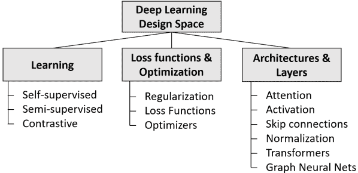

<!--yml

类别：未分类

日期：2024-09-06 19:42:05

-->

# [2302.00722] 深度学习综述：从激活到 Transformer

> 来源：[`ar5iv.labs.arxiv.org/html/2302.00722`](https://ar5iv.labs.arxiv.org/html/2302.00722)

# 深度学习综述：从激活到 Transformer

Johannes Schneider¹ 和 Michalis Vlachos²

¹ 列支敦士登大学，瓦杜兹，列支敦士登

² 瑞士洛桑大学，洛桑，瑞士

邮箱：johannes.schneider@uni.li, michalis.vlachos@unil.ch

###### 摘要

在过去的十年中，深度学习取得了巨大的进展。其中一个关键的成功因素是大量的架构、层、目标和优化技术。它们包括与注意力、规范化、跳连接、Transformer 和自监督学习方案相关的众多变体，仅举几例。我们对这些领域内最重要的最新研究工作提供了全面的概述，面向那些对深度学习有基本了解的人。我们希望对有影响力的最新工作进行全面和统一的处理，帮助研究人员在深度学习的不同领域之间建立新的联系。我们确定并讨论了多个总结过去十年中许多成功创新的关键策略的模式，以及可能被视为新星的作品。我们还包括了对最近基于商业构建的闭源模型的讨论，如 OpenAI 的 GPT-4 和 Google 的 PaLM 2。

## 1 引言

深度学习被广泛认为是人工智能的推动力。其模型在计算机视觉、语音和自然语言处理等多个领域中都取得了顶级排行榜的成绩。深度学习的主要优势之一是其分层的、模块化的结构，这使得可以以灵活的方式从单个组件构建模型。研究人员创建了大量的层、架构和目标。跟上深度学习各方面的持续发展是一项困难的任务。尽管有特定的调查可用，但目前没有涵盖深度学习多个方面（如学习、层和架构）的综合概述。存在多个狭义关注的综述，例如大语言模型（例如 [Min et al., 2021]）和卷积神经网络（例如 [Khan et al., 2020]）。以前的研究 [Alom et al., 2019, Shrestha and Mahmood, 2019, Dong et al., 2021, Alzubaidi et al., 2021] 广泛关注的往往忽视了变换器和监督学习等新发展。然而，从更全面、更整体的角度来看各种学科可能是极具优势的：例如，自然语言处理和计算机视觉常常相互影响；卷积神经网络最初是在计算机视觉中引入的，但后来被应用于自然语言处理，而变换器则是在自然语言处理中的引入，后来被适用于计算机视觉。因此，打破学科之间的障碍可能会非常有益。本文以这种动机，通过整体视角调查了深度学习的最新进展，而不是专注于特定的小领域。我们还相信这是一个必要的步骤，因为重大创新在某些方面已经放缓，即现在大多数架构都基于自 2017 年起源的变换器架构[Vaswani et al., 2017]。

由于每年发表的大量文章和相关话题的不断增加，例如最近才流行的变换器和自监督学习，提供全面的领域概述是困难的，甚至是不可能的。我们的策略是通过（i）使用统计数据和（ii）专业调查来选择有影响力的工作。我们还提供了对成功领域之间共享设计模式的振奋人心的讨论。

图 1：深度学习的分类及调查中涉及的领域

## 2 概述

图 1 提供了本调查所涵盖领域的概述。我们调查了深度学习设计，包括目标和训练。我们还特别关注了基于流行平台“Paperswithcode.com”的使用统计数据已有一定基础的工作。虽然利用这些平台的数据存在缺陷，但我们相信它提供了与传统调查方法相比的新视角，这些传统方法往往选择更具随意性。我们仅包括了从 2016 年起发布的最具影响力的工作以及在短时间内获得显著流行的“新星”（从 2020 年或更新）的论文。

每个主题的覆盖程度取决于最近进行的研究数量及其基础性质。我们不讨论数据或计算方面的内容，如数据增强、模型压缩和分布式机器学习。由于空间有限，我们在模型家族的选择上必须有所取舍，遗漏了一些相关的模型，如多模态模型和自编码器。

## 3 损失函数与优化

我们讨论了常见的损失函数和优化器。

### 3.1 损失函数

损失函数（见 [Wang et al., 2020]）通常包含多个加上正则化项的项。损失函数往往是任务特定的，但一些通用思想在各任务中都适用。通常，多个损失项以加权方式进行汇总。许多论文通过使用不同的损失函数（简单地）改进了之前的工作。

Triplet Loss [Dong and Shen, 2018] 被引入用于 Siamese 网络（其起源更早 [Schultz and Joachims, 2003]）。其核心思想是将给定的输入与正输入和负输入进行比较，最大化正相关输入之间的关联，同时最小化负相关输入之间的关联。它处理输入对 $(x,y)$，每对由一个独立但相同的网络处理。它最大化所有对 $(x,y)$ 的联合概率 $p(x,y)$：

|  | $\displaystyle L(\mathcal{V}_{p},\mathcal{V}_{n})$ | $\displaystyle=-\frac{1}{ | \mathcal{V}_{p} | \cdot | \mathcal{V}_{n} | }\sum_{x\in\mathcal{V}_{p}}\sum_{y\in\mathcal{V}_{n}}\log p(x,y)$ |  | (1) |
| --- | --- | --- | --- | --- | --- | --- | --- | --- |
|  |  | $\displaystyle=-\frac{1}{ | \mathcal{V}_{p} | \cdot | \mathcal{V}_{n} | }\sum_{x\in\mathcal{V}_{p}}\sum_{y\in\mathcal{V}_{n}}\log(1+e^{x-y})$ |  | (2) |

在这里，$\mathcal{V}_{p}$ 和 $\mathcal{V}_{n}$ 分别是正评分集和负评分集。

Focal Loss[Lin et al., 2017] 通过改变交叉熵损失来将学习集中在难以分类的样本上。它添加了一个因子 $(1-p)^{\gamma}$，其中 $p$ 表示样本的交叉熵损失概率，$\gamma$ 是一个可调参数。

|  | $\displaystyle L(p)=(1-p)^{\gamma}\log(p)$ |  | (3) |
| --- | --- | --- | --- |

循环一致性损失[Zhu et al., 2017] 针对生成对抗网络中的无配对图像到图像翻译而设计。对于两个图像域 $X$ 和 $Y$，该损失支持映射 $G:X\rightarrow Y$ 和 $F:Y\rightarrow X$ 的学习，使得一个映射可以反转另一个，即 $F(G(x))\approx x$ 和 $G(F(y))\approx y$。

|  | $\displaystyle L(G,F)$ | $\displaystyle=\mathbb{E}_{x\sim p_{data}(x)}[&#124;&#124;F(G(x))-x&#124;&#124;_{1}]$ |  | (4) |
| --- | --- | --- | --- | --- |
|  |  | $\displaystyle+\mathbb{E}_{y\sim p_{data}(y)}[&#124;&#124;G(F(y))-y&#124;&#124;_{1}]$ |  | (5) |

监督对比损失[Khosla et al., 2020] 将同一类别的点集群拉近，并将不同类别的样本分开。它旨在比交叉熵损失更有效地利用标签信息。

|  | $\displaystyle\mathcal{L}_{i}^{sup}$ | $\displaystyle=\frac{-1}{2N_{\boldsymbol{\tilde{y}}_{i}}-1}\cdot$ |  | (6) |
| --- | --- | --- | --- | --- |
|  |  | $\displaystyle\sum_{j=1}^{2N}\mathbf{1}_{i\neq j}\cdot\mathbf{1}_{\boldsymbol{\tilde{y}}_{i}=\boldsymbol{\tilde{y}}_{j}}\cdot\log{\frac{\exp{(\boldsymbol{z}_{i}\cdot\boldsymbol{z}_{j}/\tau)}}{\sum_{k=1}^{2N}\mathbf{1}_{i\neq k}\cdot\exp{(\boldsymbol{z}_{i}\cdot\boldsymbol{z}_{k}/\tau)}}}$ |  | (7) |

其中 $N_{\boldsymbol{\tilde{y}}_{i}}$ 是在小批量中具有与锚点 $i$ 相同标签 $\boldsymbol{\tilde{y}}_{i}$ 的图像总数。总损失是所有锚点 $i$ 的损失之和，即 $\mathcal{L}=\sum_{i}\mathcal{L}_{i}^{sup}$。该损失具有适合监督学习的重要属性：

+   •

    任意数量正样本的泛化

+   •

    对比能力随着负样本的增加而增加。

### 3.2 正则化

机器学习中的正则化技术（在[Moradi et al., 2020]中进行了调查）已被证明对深度学习非常有帮助。显式正则化在数据 $(x_{i},y_{i})$ 的损失函数 $L(x)$ 中为网络 $f$ 添加了一个损失项 $R(f)$，并具有权衡参数 $\lambda$。

|  | $\displaystyle\min_{f}\sum_{i}L(x_{i},y_{i})+\lambda R(f)$ |  | (8) |
| --- | --- | --- | --- |

隐式正则化是所有其他正则化方法，例如早停或使用稳健的损失函数。经典的 $L2$ 正则化和 dropout[Srivastava et al., 2014]，其中随机一组神经元的激活被置为 0，是最广泛使用的正则化方法之一。

$R_{1}$ 正则化[Mescheder et al., 2018] 用于根据梯度对生成对抗网络中的判别器进行惩罚，以稳定训练：

|  | $\displaystyle R_{1}(\psi)=\frac{\gamma}{2}E_{p_{D}(x)}[&#124;&#124;\nabla{D_{\psi}(x)}&#124;&#124;^{2}]$ |  | (9) |
| --- | --- | --- | --- |

从技术上讲，正则化项惩罚与数据流形正交的梯度。

熵正则化[Mnih et al., 2016]旨在促进多样性。具体而言，深度强化学习的异步方法[Williams and Peng, 1991, Mnih et al., 2016]。[Mnih et al., 2016]确保强化学习中的行动多样性，即防止对环境的某小部分进行过度优化。熵简单地计算策略$\pi(x)$给定的动作概率分布上的熵：

|  | $\displaystyle H(x)=\sum_{x}\pi(x)\cdot\log(\pi(x))$ |  | (10) |
| --- | --- | --- | --- |

路径长度正则化[Karras et al., 2020a]用于生成对抗网络，旨在确保潜在空间中的固定大小步长与图像中的固定幅度变化匹配。其思想是鼓励潜在空间$\mathcal{W}$中的固定大小步长在图像中产生非零、固定幅度的变化。目标是确保 GANs 的更好条件，简化架构搜索和生成器反演。来自图像空间中随机方向的关于$\mathbf{w}\in\mathcal{W}$的梯度应在长度上几乎相等，无论$\mathbf{w}$或图像空间方向如何。生成器$g:\mathcal{W}\rightarrow\mathcal{Y}$的局部度量缩放特性由雅可比矩阵$\mathbf{J_{w}}=\delta{g}(\mathbf{w})/\delta{\mathbf{w}}$捕捉。正则化项变为：

|  | $\displaystyle\mathbb{E}_{\mathbf{w},\mathbf{y}\sim\mathcal{N}(0,\mathbf{I})}(&#124;&#124;\mathbf{J}^{\mathbf{T}}_{\mathbf{w}}\mathbf{y}&#124;&#124;_{2}-a)^{2}$ |  | (11) |
| --- | --- | --- | --- |

其中$y$是像素值服从正态分布的随机图像，$w\sim f(z)$，其中$z$也服从正态分布。常数$a$是$||\mathbf{J}^{\mathbf{T}}_{\mathbf{w}}\mathbf{y}||_{2}$的指数移动平均。论文进一步避免了计算开销大的雅可比矩阵显式计算。

DropBlock[Ghiasi et al., 2018]会丢弃特征图中的相关区域，而不是独立选择要丢弃的特征。这对于特征图展示空间相关性的卷积神经网络尤其适用，其中一个（现实世界的）特征通常对应于特征图中的连续空间区域。

### 3.3 优化

优化（详见[Sun, 2020]）是估计所有网络参数以最小化损失函数的过程。最广为人知的两种技术是随机梯度下降（SGD）和 Adam。没有一种方法在所有情况下的泛化性能都能严格超越其他方法。SGD 至少可以追溯到 50 年代[Kiefer and Wolfowitz, 1952]，而 Adam 源自 2014 年[Kingma and Ba, 2014]。

Adafactor [Shazeer 和 Stern, 2018] 通过仅保持参数矩阵的行和列统计信息，而不是每个元素的信息，来减少 Adam 优化的内存需求。

分层自适应大批量优化 (LAMB)[You 等, 2019] 基于 Adam 构建，通过使用大批量加速训练。它执行每维和每层的归一化。

双时间尺度更新规则 (TTUR)：对于使用随机梯度下降训练的生成对抗网络，TTUR[Heusel 等, 2017] 为判别器和生成器使用不同的学习率。对于固定的生成器，判别器达到局部最小值。如果生成器收敛较慢，例如使用较小的学习率，这一点仍然成立。这有助于 GAN 的收敛，并且可以提高性能，因为生成器在将其推向新区域之前更深刻地捕捉到判别器的反馈。

AdamW[Loshchilov 和 Hutter, 2017] 是基于一个简单的观察和实现。原始的 Adam 优化在计算梯度后会由于 (L2-)正则化而改变权重。但直观地说，梯度的移动平均不应该包括正则化。

RAdam 和 AMSGrad：这两种技术都解决了 Adam 的收敛问题。Rectified Adam[Liu 等, 2019a] 校正了自适应学习率的方差，该方差最初较大。因此，类似于预热启发式，小的初始学习率可能会有帮助。AMSGrad [Reddi 等, 2019] 使用过去平方梯度的最大值，而不是指数平均值。

随机权重平均：在随机梯度下降过程中对不同周期的权重进行简单平均，使用常量或循环学习率可以提高性能。 [Izmailov 等, 2018 ]

鲜明度感知最小化[Foret 等, 2020] 通过最小化损失值和鲜明度来改善泛化。它找到具有低损失值邻域的参数（而不仅仅是具有低损失值的参数）。损失函数为：

|  | $\displaystyle\min_{w}\max_{&#124;&#124;\epsilon&#124;&#124;_{p}\leq\rho}L(w+\epsilon)$ |  | (12) |
| --- | --- | --- | --- |

## 4 自我、半监督和对比学习

半监督学习利用大量未标记的数据，基于少量标记数据（参见 [Yang et al., 2022] 的调查）。自监督学习受益于来自人工任务的自生成（伪）标签。两者都减少了收集（人工）标记数据的负担。自监督（预）训练结合（小型）人工标注数据集的微调可以取得最先进的结果。近年来，该范式得到了广泛发展（在 [Ericsson et al., 2022] 中进行了调查）。它通常与对比学习相结合。在对比学习中，目标是学习区分相似和不相似的数据。由于数据可以被自动扭曲到不同的程度，因此为自监督学习创建“伪标签”数据可以很简单。

对比学习的简单框架（SimCLR）[Chen et al., 2020] 最大化通过不同的方式增强相同数据样本所产生的两个输入之间的一致性。增强可以是随机裁剪、颜色扭曲和高斯模糊。为了获得表示向量，使用了标准的 ResNet[He et al., 2016]。在应用对比损失之前，表示会进一步通过一个简单的 MLP 进行处理。

自助式潜在（BYOL）[Grill et al., 2020] 使用一个在线网络和一个目标网络。两者具有相同的架构，包括一个编码器、一个投影器和一个预测器，但它们不共享权重。目标网络的参数是在线网络参数的指数移动平均。在线网络需要根据（相同的）输入的增强预测目标网络的表示。

Barlow Twins[Zbontar et al., 2021] 依赖于一个目标函数，该函数旨在将一组图像 $Y^{A}$ 及其扭曲版本 $Y^{B}$ 之间的交叉相关 $C$ 尽可能接近身份矩阵，即，损失（包括 $\lambda$ 作为调整参数）为：

|  | $\displaystyle L=\sum_{i}(1-C_{i,i})^{2}+\lambda\cdot\sum_{i}\sum_{j\neq i}C_{i,j}^{2}$ |  | (13) |
| --- | --- | --- | --- |

动量对比（MoCo）[He et al., 2020] 构建了一个由编码器表示的动态字典，使用无监督对比学习。训练过程中执行查找，并强制编码查询应与其匹配的编码键相似，而与其他键不相似。字典是一个数据样本队列。对于每个小批次，编码样本会被添加，最旧的小批次会被出队。键编码器是查询编码器的基于动量的移动平均，这有助于保持一致性。

Noisy Student: 论文[Xie et al., 2020]描述了在标记数据上训练一个 (EfficientNet) 模型。该模型被用作教师，为未标记图像生成伪标签。一个更大的 (EfficientNet) 模型在所有数据的并集中进行训练。这个过程会重复，即学生成为新学生的教师。在学生训练期间，应用了如 dropout 和数据增强等噪声，使得学生的学习更加困难，从而可以超越教师。

FixMatch [Sohn et al., 2020]预测一个弱增强图像的标签。如果标签的置信度超过阈值，则模型被训练以对图像的强增强版本产生相同的标签。

## 5 架构与层

我们详细阐述了四种重要的层类型，即激活层、跳跃层、归一化层和注意力层，随后介绍了基于变换器和图神经网络的众多现代架构。

### 5.1 激活

激活函数通常是非线性的。它们对梯度流和学习有深远的影响。早期激活函数（如 sigmoid 和 tanh）从 1960 年代到 2000 年代初期常被使用，当这些函数饱和时，梯度消失使得深度网络的训练变得困难。2010 年 $ReLU$ 的引入[Nair and Hinton, 2010]标志着一个突破性的成果。虽然其原始版本仍然被广泛使用，但变换器架构已经普及了其他激活函数和 ReLU 的变体。大多数它们仍然在质上共享 ReLU 的行为，即对于负输入，输出幅度较小，而对于正输入，则没有界限（参见 [Apicella et al., 2021] 以获取综述）。

高斯误差线性单元（GELU）[Hendrycks and Gimpel, 2016]通过其百分位数对输入进行加权（ReLU 仅使用符号）。激活是输入和标准高斯累积分布函数 $\Phi(x)$ 的乘积，即：

|  | $\displaystyle GELU(x)=x\cdot\Phi(x)$ |  | (14) |
| --- | --- | --- | --- |

Mish 激活[Misra, 2019]源于受到 Swish 和 ReLU 启发的系统实验：

|  | $\displaystyle f(x)=x\cdot\tanh(soft^{+}(x))$ |  | (15) |
| --- | --- | --- | --- |
|  | $\displaystyle\text{ with }soft^{+}(x):=\ln(1+e^{x})$ |  | (16) |

相比之下，Swish 激活[Ramachandran et al., 2017]是：

|  | $\displaystyle f(x)=x\cdot sigmoid(\beta x)$ |  | (17) |
| --- | --- | --- | --- |

这里 $\beta$ 是一个可学习的参数。

### 5.2 跳跃连接

跳跃连接起源于残差网络[He et al., 2016]。在最简单的形式中，具有跳跃连接的单层 $L$（或一组少数层）对输入 $x$ 的输出 $y$ 为 $y(x)=L(x)+x$。原始论文使用了“残差”一词，因为层 $L$ 需要学习一个残差 $L(x)=H(x)-x$，而不是期望的映射 $H$ 本身。从那时起，跳跃连接已经在许多变体中使用。

反向残差块[Sandler et al., 2018]：通过将通道宽度从原始的宽-窄-宽顺序逆转为窄-宽-窄层序列，并结合对宽层的深度卷积，减少了参数，并使残差块执行得更快。

稠密块[Huang et al., 2017]从所有先前层（具有匹配的特征图大小）接收输入，并连接到所有后续层（具有匹配的特征图大小）。

ResNeXt 块[Xie et al., 2017]：这种分裂-变换-合并的方法对于残差块涉及并行评估多个残差块，并将它们汇总回一个单一输出。

### 5.3 归一化

自从引入批量归一化[Ioffe and Szegedy, 2015]以来，归一化已成为提高神经网络训练速度、稳定性和泛化能力的一个非常成功的概念。然而，其必要性也存在争议[Shao et al., 2020]，例如，对于某些应用，仔细的初始化和学习率调整可能使其至少部分多余。归一化的思想是将一个值 $x$ 转换为归一化值 $\tilde{x}$，方法是减去均值 $\mu$ 并按标准差 $\sigma$ 进行缩放，即 $\tilde{x}=\frac{x-\mu}{\sigma}$。归一化方法在 $\mu$ 和 $\sigma$ 的计算上有所不同，例如，$\mu$ 和 $\sigma$ 可以在不同的通道之间计算。

层归一化：给定总输入，计算层 $L$ 的归一化统计量[Ba et al., 2016]，其中 $|L|$ 为神经元数量：

|  | $\displaystyle\mu=\frac{1}{\vert L \vert}\sum_{i=0}^{\vert L \vert-1}a_{i}\text{\phantom{abcd}}\sigma=\sqrt{\frac{1}{\vert L \vert}\sum_{i=0}^{\vert L \vert-1}(a_{i}-\mu)^{2}}$ |  | (18) |
| --- | --- | --- | --- |

与批量归一化相比，它对批量大小没有限制，并且批量之间没有依赖关系。特别是，它可以与批量大小为 1 的情况一起使用。

实例归一化[Ulyanov et al., 2016] 针对一个四维输入进行计算，例如一个高度为 $H$、宽度为 $W$、通道为 $C$ 和批量大小为 $T$ 的图像：

|  | $\displaystyle\mu_{t,c}=\frac{1}{HWT}\sum_{t<T,w<W,h<H}x_{t,c,w,h}$ |  | (19) |
| --- | --- | --- | --- |
|  | $\displaystyle\sigma_{t,c}=\sqrt{\frac{1}{HWT}\sum_{t<T,w<W,h<H}(x_{t,c,w,h}-\mu_{t,c})^{2}}$ |  | (20) |

它可以用来，例如，归一化图像的对比度。它有多个版本，例如，根据权重范数进行缩放的版本 [Karras 等, 2020b]。

LayerScale [Touvron 等, 2021] 是在 transformers 的背景下引入的，它通过对残差块输出与对角矩阵进行逐通道乘法：

|  | $\displaystyle x_{l^{\prime}}=x_{l}+diag(\lambda_{1},...,\lambda_{d})\cdot SA(\eta(x))$ |  | (21) |
| --- | --- | --- | --- |
|  | $\displaystyle x_{l+1}=x_{l^{\prime}}+diag(\lambda_{1},...,\lambda_{d})\cdot FFN(\eta(x))$ |  | (22) |

$SA$ 是自注意力层，$FFN$ 是前馈网络，而 $\eta$ 是层归一化（参见图 2）。

### 5.4 注意力

注意力机制（见[Brauwers 和 Frasincar, 2021, Guo 等, 2022b]）允许对输入的相关性进行学习，类似于认知注意力的工作方式。输入的某些部分可以被认为是高度重要的，而其他部分则被忽略为不相关的。特定输入的相关性通常可以通过上下文信息来确定，例如，文本文件中一个词的相关性通常依赖于附近的词。

缩放点积多头注意力 [Vaswani 等, 2017]：结合点积和下缩放已被证明在计算注意力分数方面非常成功。注意力机制将查询 $Q$、键 $K$ 和值 $V$ 作为输入，并输出一个注意力分数：

|  | $\displaystyle\text{Att}(Q,K,V)=\text{softmax}\big{(}\frac{QK^{T}}{\sqrt{d_{k}}}\big{)}\cdot V$ |  | (23) |
| --- | --- | --- | --- |

使用多个独立的注意力机制并行处理可以关注输入的不同方面。形式上，在多头注意力中，我们学习矩阵 W：

|  | $\displaystyle\text{MultiHead}(\textbf{Q},\textbf{K},\textbf{V})=[\text{h}_{0},\dots,\text{h}_{n-1}]\textbf{W}_{0}$ |  | (24) |
| --- | --- | --- | --- |
|  | $\displaystyle\text{其中 }\text{head h}_{i}=\text{Att}(\textbf{Q}\textbf{W}_{i}^{Q},\textbf{K}\textbf{W}_{i}^{K},\textbf{V}\textbf{W}_{i}^{V})$ |  | (25) |

分解（自）注意力 [Child 等, 2019] 减少了注意力的计算和内存开销。虽然（完整的）自注意力 [Vaswani 等, 2017] 允许关注每个之前的输入元素，但分解自注意力仅允许关注其中的一个子集。形式上，给定输入嵌入矩阵 $X$ 和连接模式 $S=\{S_{1},...,S_{n}\}$ 计算输出矩阵，其中 $S_{i}$ 是第 $i$ 个输出向量所关注的输入向量的索引集。

|  | $\displaystyle\text{FacAtt}(X,S)=(A(\mathbf{x}_{i},S_{i}))_{i\in[1,n]}$ |  | (26) |
| --- | --- | --- | --- |
|  | $\displaystyle a(\mathbf{x}_{i},S_{i})=\text{softmax}(\frac{(W_{q}\mathbf{x}_{i})K^{T}_{S_{i}}}{\sqrt{d}})\cdot V_{S_{i}}$ |  | (27) |
|  | $\displaystyle K_{Si}=(W_{k}\mathbf{x}_{j})_{j\in{S_{i}}}\text{\phantom{abc}}V_{S_{i}}=(W_{v}\mathbf{x}_{j})_{j\in{S_{i}}}$ |  | (28) |

对于完整的自注意力 $S^{F}_{i}:=\{j|j\neq i\}$（索引到 $i$ 的先前输入）。相比之下，分解自注意力有 $p$ 个独立的注意力头，其中第 $m$ 个头定义了一个子集 $A_{i}^{(m)}\subset S^{F}_{i}$ 并且让 $S_{i}=A_{i}^{(m)}$。对于步幅自注意力：

|  | $\displaystyle A_{i}^{(1)}=\{t,t+1,...i\}\text{ for }t=\max(0,i-l)$ |  | (29) |
| --- | --- | --- | --- |
|  | $\displaystyle A_{i}^{(2)}=\{j:(i-j)\mod l=0\}$ |  | (30) |

当结构与步幅类似的图像对齐时，这种模式是合适的。对于没有周期性结构的数据，如文本，固定注意力可能更为合适：

|  | $\displaystyle A_{i}^{(1)}=\{j:\lfloor j/l\rfloor=\lfloor i/l\rfloor\}$ |  | (31) |
| --- | --- | --- | --- |
|  | $\displaystyle A_{i}^{(2)}=\{j:j\mod l\in\{t,t+1,...l\}\}$ |  | (32) |

其中 $t=l-c$ 且 $c$ 是一个超参数。例如，对于步幅 128 和 $c=8$，所有大于 128 的未来位置可以关注于位置 120-128，所有大于 256 的位置可以关注于 248-256，等等。

残差注意力网络（RAN）[Wang et al., 2017] 模块利用了跳过连接的思想。它由一个掩码和一个主干分支组成。主干分支执行特征处理。它可以是任何网络。掩码分支表示特征权重。注意力模块的输出是

|  | $\displaystyle H_{i,c}(x)=(1+M_{i,c}(x))\cdot F_{i,c}(X)$ |  | (33) |
| --- | --- | --- | --- |

这里 $i$ 是空间位置，$c$ 是通道。$M(x)$ 应该接近 0，$H(x)$ 接近原始特征 $F(x)$。

大核注意力[Guo et al., 2022a]将大规模卷积分解为三个较小规模的卷积，使用常见的思想，即深度可分卷积、非扩张深度卷积和通道方向的 1x1 卷积。对于这些卷积的输出，学习了一个注意力图。

滑动窗口注意力[Beltagy et al., 2020]旨在提高注意力机制的时间和内存复杂度。它减少了考虑的输入对的数量。更准确地说，对于给定的窗口大小 $w$，每个标记关注于每侧的 $\frac{w}{2}$ 个标记。

### 5.5 Transformer

Transformer 已迅速成为深度学习中的主流架构。结合对大数据集的自监督训练，它们在许多 NLP（参见 [Liu et al., 2023] 的综述）和计算机视觉（在 [Han et al., 2022, Khan et al., 2022] 中进行了综述）基准测试中达到了最先进水平。自 2017 年引入以来[Vaswani et al., 2017]，出现了无数个版本，解决了原始 transformer 的问题，如计算开销和数据效率。

变换器被认为比其他架构（如卷积神经网络和递归网络）具有更少的归纳偏置，从而更加灵活。因此，它们也需要更多的训练数据来弥补归纳偏置的缺乏。由于大量标注数据难以获得，变换器通常采用自监督学习，即伪标签进行训练。最初的变换器[Vaswani et al., 2017]，为自然语言处理开发，采用了类似于早期递归神经网络的编码器和解码器。它在彼此之上堆叠多个变换器块，如图 2 所示。关键元素包括多头注意力、层归一化和跳跃连接。此外，位置编码和输入的嵌入也起着重要作用。[Vaswani et al., 2017]中的位置绝对编码$PE$使用频率变化的正弦和余弦函数：

|  | $\displaystyle\text{PE}(pos,2i)=\sin(pos/10000^{2i/d})$ |  | (34) |
| --- | --- | --- | --- |
|  | $\displaystyle\text{PE}(pos,2i+1)=\cos(pos/10000^{(2i)/d})$ |  | (35) |

其中$i$是编码的维度，$d$是维度的数量。选择这一点的原因是相对位置可能与绝对位置同样相关，是绝对位置编码的线性函数。

图 2：顶部四个基本块和底部的编码器和解码器的变换器

双向编码器表示变换器（BERT）[Devlin et al., 2018]利用变换器架构的编码器生成上下文词嵌入。它依赖于掩蔽语言模型预训练目标和自监督学习。模型必须根据其上下文预测随机选择的掩蔽输入标记。因此，模型具有双向信息，即，它接收掩蔽词之前和之后的标记。在经典的下一个词预测中，无法获取预测词之后的标记。作为第二个预测任务，模型必须预测句子对$(A,B)$是否由某些文档中的两个连续句子$A$和$B$组成（或两个可能不相关的句子）。基于自监督训练的预训练模型可以通过标注数据进行下游任务的微调。

原始的 BERT 模型自那时以来在许多方面得到了改进，例如[Sanh et al., 2019]减少了 BERT 的计算负担，[Liu et al., 2019b]在更长的序列上用更大的批次和更多的数据训练了模型等。这导致了更稳健和更具泛化能力的表示。

从 GPT 到 GPT-3 再到 ChatGPT 和 GPT-4：GPT 基于变换器的解码器顺序预测标记。GPT[Radford et al., 2018]首先以无监督的方式进行预训练，然后应用有监督的微调。预训练在大量标记$U=(u_{0},u_{1},...,u_{n-1})$上进行，通过最大化给定先前标记的下一个标记的可能性：

|  | $\displaystyle L(U)=\sum_{i}p(u_{i}\mid u_{i-k},...,u_{i-1})$ |  | (36) |
| --- | --- | --- | --- |

其中$k$是上下文窗口的大小，条件概率通过神经网络建模，即使用多层变换器解码器[Liu et al., 2018]，并在[Vaswani et al., 2017]中省略了编码器。与仅仅根据输入预测下一个标记不同，该模型还被训练以预测输入标记。此外，注意力机制的内存占用降低了。GPT-2 [Radford et al., 2019] 在 GPT 的基础上进行了少量修改，例如层归一化的位置被改变（移动到每个子块的输入处，并在最终的自注意力块之后增加了额外的归一化），残差权重的初始化进行了缩放，并且词汇表、上下文和批量大小都增加了。GPT-3 的[Brown et al., 2020]架构几乎与 GPT-2 相同，但参数数量大了 100 倍以上，并且在（训练数据的）量上有所不同。ChatGPT[OpenAI, 2022] 是 InstructGPT[Ouyang et al., 2022]的兄弟，后者优化了对用户意图的响应。InstructGPT 通过两个步骤对 GPT-3 进行微调：（i）基于标注者演示的监督学习，（ii）基于对模型输出的人工排名使用强化学习。ChatGPT 遵循相同的程序，即，（i）在监督学习中，人类 AI 训练师通过扮演人类用户和 AI 助手提供对话。结果对话数据集经过增强，结合了 InstructGPT 数据集，并转换为对话格式。（ii）对 AI 训练师与 ChatGPT 的对话进行排名，即，对于随机选择的模型生成的消息，AI 训练师对多个替代完成进行了排名。排名数据集用于强化学习。这个过程重复了多次。

ChatGPT 的继任者，即 GPT-4 的技术细节尚未披露[OpenAI, 2023]。提供的技术报告指出，它与 ChatGPT 类似。GPT-4 是多模态的，即它也可以处理图像，但具体细节未知。报告仅指出在训练效率方面有重大改进。成就是通过使用小规模模型（可能训练在较少的数据上）的性能来预测大规模模型的性能。这一点非常重要，因为计算成本和时间可能是大型深度学习模型的关键因素。

Text-to-Text Transfer Transformer (T5)[Raffel et al., 2020] 将每个基于文本的语言模型视为从给定的输入文本生成输出文本。它与 BERT[Devlin et al., 2018]的不同之处在于在训练期间使用了因果掩码以预测目标。因果掩码防止网络访问目标的“未来”标记。T5 在预训练任务上也有所不同。

BART[Lewis et al., 2020] 是一种用于预训练序列到序列模型的去噪自编码器，采用了标准的基于变换器的机器翻译架构。它已被证明对语言生成、翻译和理解非常有效。训练是基于用噪声函数破坏文本，这些噪声函数包括从标记删除、掩码到句子置换和文档旋转。学习源于从其破坏版本重建原始文本。噪声选项的灵活性归因于 BART 对 BERT 和 GPT 等先前工作的推广，即编码器是双向的（如 BERT），而解码器是自回归的（如 GPT）。

XLNet [Yang et al., 2019] 结合了自回归建模（如 GPT）预测下一个标记的优点和去噪自编码 BERT[Devlin et al., 2018] 通过重建$x$给定一个通过掩蔽词的嘈杂输入$\hat{x}$。它通过使用排列语言模型来实现，这个模型对序列$(0,1,2,...,T-1)$的$Z={z_{0},z_{1},...,z_{T-1}}$进行排列，从而达到目标：

|  | $\displaystyle\max p(u_{z_{T}}&#124;u_{z_{0}},...,u_{z_{T-1})}$ |  | (37) |
| --- | --- | --- | --- |

实际上没有输入的排列，这会是不自然的（且不会发生在后续的微调任务中）。相反，排列影响注意力掩码，以确保按$Z$的因式分解顺序保持。

Vision Transformer [Dosovitskiy et al., 2020] 在很大程度上依赖于原始变换器。图像被划分为小块，这些小块被展平并与位置嵌入线性嵌入。标准的变换器编码器随后处理每个小块创建的向量。

Swin Transformer [Liu et al., 2021] 用于计算机视觉，构建层次特征图，而不是仅仅构建单一（分辨率）特征图。它还仅在局部窗口内计算自注意力，从而减少计算时间。

PaLM (2): 原始 PaLM[Chowdhery et al., 2022] 是一个包含 5400 亿参数的大型语言模型，类似于其他更突出的模型如 GPT-3。讨论的技术创新主要集中在模型训练的扩展上，即单个模型可以高效地在成千上万的加速器芯片上进行训练。原始变换器架构[Vaswani et al., 2017] 也略有调整，例如，使用了 SwiGLU 激活函数，即，

|  | $\displaystyle Swish(xW)\cdot xV$ |  | (38) |
| --- | --- | --- | --- |

，其中 Swish 由 Eq. 17 给出，不同的位置信息嵌入（更适合长序列），以及多查询注意力（更快的计算），无偏差（更好的训练稳定性），以及共享输入-输出嵌入。

PaLM 2[Google, 2023] 是 PaLM 的表现更好的继任者，在数据集混合方面有所不同，例如，使用更多样化的语言以及领域（例如编程语言、数学）。它也使用经典的变换器架构。然而，它使用比第一个 PaLM 版本更小的模型，但需要更多的训练计算。它还依赖于更多样化的预训练目标（而非简单的下一个词或掩蔽词预测）。

### 5.6 图神经网络

图神经网络（在[Wu et al., 2020]中进行了综述）可以视为 CNNs 和变换器的推广。它们在图数据上操作，即连接的节点。我们讨论图模型，包括用于获取可以用于下游任务的节点嵌入的模型。

Graph Convolutional Networks[Kipf and Welling, 2016] 使用 CNNs 进行半监督学习。他们使用 $k$ 阶多项式来近似谱图卷积，而 CNN 可以通过 $k$ 个线性层来计算。

Graph Attention Networks[Veličković et al., 2017] 依赖于掩蔽自注意力层，允许节点灵活地关注其邻域的特征，即节点 $j$ 为节点 $i$ 的特征获取重要性评分。掩蔽允许仅考虑实际连接的节点对之间的边缘。与 GCN 不同，可以为同一邻域中的节点分配不同的重要性。此外，它不依赖于代价高昂的矩阵运算进行特征分解。

Graph Transformer[Dwivedi and Bresson, 2020] 通过对每个节点的邻域连接使用注意力机制，将原始变换器扩展到图形中，概括了位置编码，替换了层归一化为批归一化，并学习边缘表示（除了节点表示）。

TuckER[Balažević et al., 2019] 执行知识图谱中的链接预测因式分解。知识表示为（主体、关系、对象）三元组，任务是预测两个实体是否相关。图可以表示为一个二元张量，其中主体、关系和对象作为维度。他们使用 Tucker 分解将二元张量分解为核心矩阵和主体、关系以及对象的嵌入矩阵的乘积。

通过关系旋转（RotatE）[Sun et al., 2019]进行知识图谱中的缺失链接预测（如先前描述的 TuckER[Balažević et al., 2019]），以建模更多的关系属性，如组合和逆转。他们将实体嵌入到复数空间中，并将关系视为元素级旋转，优化以使得从一个实体到另一个实体。

网络的可扩展特征学习（Node2Vec）[Grover and Leskovec, 2016]学习保留节点邻域的特征向量。他们使用随机游走生成样本邻域，从而根据节点的角色或其所属社区来观察节点。

## 6 讨论

我们的调查集中在构建深度学习模型的关键设计元素上。采取实用的方法，我们选择忽略理论工作，这些工作应在未来的研究中进一步探讨。我们的发现表明，尽管自原始 Transformer 架构以来出现了许多小而创新的改进，但没有任何显著的“突破性”发现导致了更好的排行榜结果。过去几年以现有网络的扩展（如 GPT）、数据量（及质量）的增加和自监督学习的转变为特征。这可能表明需要更大胆的研究方法，而不是对现有工作的逐步改进。结合本文中概述的不同元素可能是一种实现这一目标的方法。

此外，我们注意到了一些在多个领域中已被证明有效的一般模式：

+   •

    “Multi-X”，即在并行中多次使用相同的元素，例如使用多个残差块（ResNeXt）或多头注意力。这一思想也与“集成学习”密切相关。

+   •

    “高阶层”，即经典的卷积神经网络（CNNs）和多层感知机（MLPs）仅应用线性层和简单的 ReLU，但像 Mish 或注意力层这样的层执行更复杂的操作。

+   •

    “移动平均”，即对权重进行平均，例如 SGD 和 BYOL。

+   •

    “分解”，即分解矩阵，例如 TuckER 和大核注意力。

+   •

    “加权函数”，即使用参数化的输入加权函数，这可以在注意力机制中看到，也可以用于 GELU 单元。因此，输入不是简单地聚合，而是被加权和聚合。权重可能来自具有学习参数的函数。这些函数也可以视为“门”，仅允许在某些输入参数范围内的信息流动。

我们的调查也故意针对了较新的研究成果，但仍包括了经过充分验证的工作；这可能被视为一种优势或局限性。论文和领域的选择受到一个提供排行榜的突出平台的驱动。虽然寻求“什么效果好，什么非常有前景”的读者会从这种方法中受益，但这可能会排除一些充满激动人心的想法的工作，这些想法需要更多研究才能揭示其全部潜力。这可能被视为 perpetuating “赢家通吃”的范式，强化了已经成功的想法。然而，由于论文数量庞大，为了进行全面的深度学习调查，选择是必要的。我们承认，提供排行榜等在线平台对研究社区非常有益，并且应该进一步发展。然而，我们发现手动验证（例如，通过 Google Scholar 引用的双重检查相关性和阅读调查与论文）是必要的，因为我们发现了一些在平台上未正确列出的工作和方法。

## 7 结论

我们呈现了一个简短但全面的深度学习设计景观概述。我们总结了近年来出现的各种重要领域的关键工作。我们相信，我们在一篇论文中的整体概述可以建立联系，激发新的想法。我们还识别出了四种特征许多改进的模式。为了进一步推动深度学习的发展，我们需要生成根本新的成功方法，因为过去几年中的改进虽然众多且常常非常有创意，但主要是渐进的。

## 参考文献

+   Alom 等，2019 Alom, M. Z., Taha, T. M., Yakopcic, C., Westberg, S., Sidike, P., Nasrin, M. S., Hasan, M., Van Essen, B. C., Awwal, A. A., 和 Asari, V. K.（2019）。深度学习理论和架构的最新调查。电子学。

+   Alzubaidi 等，2021 Alzubaidi, L., Zhang, J., Humaidi, A. J., Al-Dujaili, A., Duan, Y., Al-Shamma, O., Santamaría, J., Fadhel, M. A., Al-Amidie, M., 和 Farhan, L.（2021）。深度学习回顾：概念、CNN 架构、挑战、应用、未来方向。大数据杂志。

+   Apicella 等，2021 Apicella, A., Donnarumma, F., Isgrò, F., 和 Prevete, R.（2021）。现代可训练激活函数的调查。神经网络。

+   Ba 等，2016 Ba, J. L., Kiros, J. R., 和 Hinton, G. E.（2016）。层归一化。arXiv:1607.06450。

+   Balažević 等，2019 Balažević, I., Allen, C., 和 Hospedales, T. M.（2019）。Tucker：用于知识图谱补全的张量分解。arXiv:1901.09590。

+   Beltagy 等，2020 Beltagy, I., Peters, M. E., 和 Cohan, A.（2020）。Longformer：长文档变换器。arXiv:2004.05150。

+   Brauwers 和 Frasincar，2021 Brauwers, G. 和 Frasincar, F.（2021）。深度学习中注意力机制的全面调查。知识与数据工程学报。

+   Brown 等人，2020 Brown, T., Mann, B., Ryder, N., Subbiah, M., Kaplan, J. D., Dhariwal, P., Neelakantan, A., Shyam, P., Sastry, G., Askell, A., 等 (2020). 语言模型是少样本学习者。神经信息处理系统进展。

+   Chen 等人，2020 Chen, T., Kornblith, S., Norouzi, M., 和 Hinton, G. (2020). 一种简单的视觉表示对比学习框架。在国际机器学习会议上。

+   Child 等人，2019 Child, R., Gray, S., Radford, A., 和 Sutskever, I. (2019). 使用稀疏变换器生成长序列。arXiv:1904.10509。

+   Chowdhery 等人，2022 Chowdhery, A., Narang, S., Devlin, J., Bosma, M., Mishra, G., Roberts, A., Barham, P., Chung, H. W., Sutton, C., Gehrmann, S., 等 (2022). Palm: 通过路径扩展语言建模。arXiv 预印本 arXiv:2204.02311。

+   Devlin 等人，2018 Devlin, J., Chang, M.-W., Lee, K., 和 Toutanova, K. (2018). Bert: 用于语言理解的深度双向变换器预训练。arXiv:1810.04805。

+   Dong 等人，2021 Dong, S., Wang, P., 和 Abbas, K. (2021). 深度学习及其应用的综述。计算机科学评论。

+   Dong 和 Shen，2018 Dong, X. 和 Shen, J. (2018). 在孪生网络中使用三元组损失进行目标跟踪。在欧洲计算机视觉会议 (ECCV) 上。

+   Dosovitskiy 等人，2020 Dosovitskiy, A., Beyer, L., Kolesnikov, A., Weissenborn, D., Zhai, X., Unterthiner, T., Dehghani, M., Minderer, M., Heigold, G., Gelly, S., 等 (2020). 一张图片胜过 16x16 个词：用于大规模图像识别的变换器。arXiv:2010.11929。

+   Dwivedi 和 Bresson，2020 Dwivedi, V. P. 和 Bresson, X. (2020). 将变换器网络推广到图形的概括。arXiv:2012.09699。

+   Ericsson 等人，2022 Ericsson, L., Gouk, H., Loy, C. C., 和 Hospedales, T. M. (2022). 自监督表示学习：介绍、进展和挑战。信号处理杂志。

+   Foret 等人，2020 Foret, P., Kleiner, A., Mobahi, H., 和 Neyshabur, B. (2020). 针对高效提升泛化能力的尖锐度感知最小化。arXiv:2010.01412。

+   Ghiasi 等人，2018 Ghiasi, G., Lin, T.-Y., 和 Le, Q. V. (2018). Dropblock: 一种用于卷积网络的正则化方法。神经信息处理系统进展。

+   Google，2023 Google (2023). Palm 2 技术报告。https://ai.google/static/documents/palm2techreport.pdf。

+   Grill 等人，2020 Grill, J.-B., Strub, F., Altché, F., Tallec, C., Richemond, P., Buchatskaya, E., Doersch, C., Avila Pires, B., Guo, Z., Gheshlaghi Azar, M., 等 (2020). 引导你自己的潜在变量——一种新的自监督学习方法。神经信息处理系统进展。

+   Grover 和 Leskovec，2016 Grover, A. 和 Leskovec, J. (2016). node2vec: 网络的可扩展特征学习。在 ACM SIGKDD 知识发现与数据挖掘国际会议上。

+   Guo 等人，2022a Guo, M.-H., Lu, C.-Z., Liu, Z.-N., Cheng, M.-M., 和 Hu, S.-M. (2022a). 视觉注意力网络。arXiv:2202.09741。

+   Guo 等，2022b Guo, M.-H., Xu, T.-X., Liu, J.-J., Liu, Z.-N., Jiang, P.-T., Mu, T.-J., Zhang, S.-H., Martin, R. R., Cheng, M.-M., 和 Hu, S.-M. (2022b). 计算机视觉中的注意机制：综述。计算视觉媒体。

+   Han 等，2022 Han, K., Wang, Y., Chen, H., Chen, X., Guo, J., Liu, Z., Tang, Y., Xiao, A., Xu, C., Xu, Y., 等 (2022). 视觉变换器的综述。模式分析与机器智能杂志。

+   He 等，2020 He, K., Fan, H., Wu, Y., Xie, S., 和 Girshick, R. (2020). 用于无监督视觉表示学习的动量对比。会议论文：计算机视觉与模式识别。

+   He 等，2016 He, K., Zhang, X., Ren, S., 和 Sun, J. (2016). 用于图像识别的深度残差学习。会议论文：计算机视觉与模式识别。

+   Hendrycks 和 Gimpel, 2016 Hendrycks, D. 和 Gimpel, K. (2016). 高斯误差线性单元（gelus）。arXiv:1606.08415。

+   Heusel 等，2017 Heusel, M., Ramsauer, H., Unterthiner, T., Nessler, B., 和 Hochreiter, S. (2017). 由双时间尺度更新规则训练的生成对抗网络收敛到局部纳什均衡。神经信息处理系统进展。

+   Huang 等，2017 Huang, G., Liu, Z., Van Der Maaten, L., 和 Weinberger, K. Q. (2017). 密集连接卷积网络。会议论文：计算机视觉与模式识别。

+   Ioffe 和 Szegedy, 2015 Ioffe, S. 和 Szegedy, C. (2015). 批量归一化：通过减少内部协方差偏移来加速深度网络训练。国际机器学习会议论文。

+   Izmailov 等，2018 Izmailov, P., Podoprikhin, D., Garipov, T., Vetrov, D., 和 Wilson, A. G. (2018). 权重平均导致更广泛的最优解和更好的泛化能力。arXiv:1803.05407。

+   Karras 等，2020a Karras, T., Laine, S., Aittala, M., Hellsten, J., Lehtinen, J., 和 Aila, T. (2020a). 分析和改进 stylegan 的图像质量。会议论文：计算机视觉与模式识别。

+   Karras 等，2020b Karras, T., Laine, S., Aittala, M., Hellsten, J., Lehtinen, J., 和 Aila, T. (2020b). 分析和改进 stylegan 的图像质量。会议论文：计算机视觉与模式识别。

+   Khan 等，2020 Khan, A., Sohail, A., Zahoora, U., 和 Qureshi, A. S. (2020). 深度卷积神经网络的最新架构综述。人工智能评论。

+   Khan 等，2022 Khan, S., Naseer, M., Hayat, M., Zamir, S. W., Khan, F. S., 和 Shah, M. (2022). 视觉中的变换器：综述。ACM 计算调查（CSUR）。

+   Khosla 等，2020 Khosla, P., Teterwak, P., Wang, C., Sarna, A., Tian, Y., Isola, P., Maschinot, A., Liu, C., 和 Krishnan, D. (2020). 监督对比学习。神经信息处理系统进展。

+   Kiefer 和 Wolfowitz, 1952 Kiefer, J. 和 Wolfowitz, J. (1952). 回归函数最大值的随机估计。数学统计年鉴。

+   Kingma and Ba, 2014 Kingma, D. P. and Ba, J. (2014). Adam：一种随机优化方法。arXiv:1412.6980。

+   Kipf and Welling, 2016 Kipf, T. N. and Welling, M. (2016). 使用图卷积网络的半监督分类。arXiv:1609.02907。

+   Lewis et al., 2020 Lewis, M., Liu, Y., Goyal, N., Ghazvininejad, M., Mohamed, A., Levy, O., Stoyanov, V., and Zettlemoyer, L. (2020). BART：用于自然语言生成、翻译和理解的去噪序列到序列预训练。发表于第 58 届计算语言学协会年会论文集，第 7871–7880 页。

+   Lin et al., 2017 Lin, T.-Y., Goyal, P., Girshick, R., He, K., and Dollár, P. (2017). 用于密集目标检测的焦点损失。发表于国际计算机视觉会议。

+   Liu et al., 2019a Liu, L., Jiang, H., He, P., Chen, W., Liu, X., Gao, J., and Han, J. (2019a). 自适应学习率的方差及其超越。arXiv:1908.03265。

+   Liu et al., 2023 Liu, P., Yuan, W., Fu, J., Jiang, Z., Hayashi, H., and Neubig, G. (2023). 预训练、提示和预测：自然语言处理中的提示方法系统调查。ACM 计算调查。

+   Liu et al., 2018 Liu, P. J., Saleh, M., Pot, E., Goodrich, B., Sepassi, R., Kaiser, L., and Shazeer, N. (2018). 通过总结长序列生成维基百科。arXiv:1801.10198。

+   Liu et al., 2019b Liu, Y., Ott, M., Goyal, N., Du, J., Joshi, M., Chen, D., Levy, O., Lewis, M., Zettlemoyer, L., and Stoyanov, V. (2019b). Roberta：一种强健优化的 BERT 预训练方法。arXiv:1907.11692。

+   Liu et al., 2021 Liu, Z., Lin, Y., Cao, Y., Hu, H., Wei, Y., Zhang, Z., Lin, S., and Guo, B. (2021). Swin Transformer：使用移动窗口的分层视觉变换器。发表于国际计算机视觉会议。

+   Loshchilov and Hutter, 2017 Loshchilov, I. and Hutter, F. (2017). 解耦权重衰减正则化。arXiv:1711.05101。

+   Mescheder et al., 2018 Mescheder, L., Geiger, A., and Nowozin, S. (2018). 哪些 GAN 训练方法实际上会收敛？发表于国际机器学习会议。

+   Min et al., 2021 Min, B., Ross, H., Sulem, E., Veyseh, A. P. B., Nguyen, T. H., Sainz, O., Agirre, E., Heinz, I., and Roth, D. (2021). 通过大型预训练语言模型的自然语言处理的最新进展：一项调查。arXiv 预印本 arXiv:2111.01243。

+   Misra, 2019 Misra, D. (2019). Mish: 一种自我正则化的非单调激活函数。arXiv:1908.08681。

+   Mnih et al., 2016 Mnih, V., Badia, A. P., Mirza, M., Graves, A., Lillicrap, T., Harley, T., Silver, D., and Kavukcuoglu, K. (2016). 深度强化学习的异步方法。发表于国际机器学习会议。

+   Moradi et al., 2020 Moradi, R., Berangi, R., and Minaei, B. (2020). 深度模型的正则化策略综述。人工智能评论。

+   Nair and Hinton, 2010 Nair, V. and Hinton, G. E. (2010). 经过修正的线性单元改进了限制玻尔兹曼机。发表于国际机器学习会议（ICML-）。

+   OpenAI, 2022 OpenAI (2022). Chatgpt: 优化对话的语言模型。https://openai.com/blog/chatgpt/。

+   OpenAI, 2023 OpenAI (2023). GPT-4 技术报告。

+   Ouyang 等, 2022 Ouyang, L., Wu, J., Jiang, X., Almeida, D., Wainwright, C. L., Mishkin, P., Zhang, C., Agarwal, S., Slama, K., Ray, A., 等. (2022). 通过人类反馈训练语言模型以遵循指令。arXiv:2203.02155。

+   Radford 等, 2018 Radford, A., Narasimhan, K., Salimans, T., Sutskever, I., 等. (2018). 通过生成预训练改进语言理解。

+   Radford 等, 2019 Radford, A., Wu, J., Child, R., Luan, D., Amodei, D., Sutskever, I., 等. (2019). 语言模型是无监督多任务学习者。OpenAI 博客。

+   Raffel 等, 2020 Raffel, C., Shazeer, N., Roberts, A., Lee, K., Narang, S., Matena, M., Zhou, Y., Li, W., 和 Liu, P. J. (2020). 通过统一的文本到文本变换器探索迁移学习的极限。机器学习研究杂志。

+   Ramachandran 等, 2017 Ramachandran, P., Zoph, B., 和 Le, Q. V. (2017). 搜索激活函数。arXiv 预印本 arXiv:1710.05941。

+   Reddi 等, 2019 Reddi, S. J., Kale, S., 和 Kumar, S. (2019). 关于 Adam 的收敛性及其超越。arXiv:1904.09237。

+   Sandler 等, 2018 Sandler, M., Howard, A., Zhu, M., Zhmoginov, A., 和 Chen, L.-C. (2018). Mobilenetv2: 反向残差和线性瓶颈。在计算机视觉与模式识别会议上。

+   Sanh 等, 2019 Sanh, V., Debut, L., Chaumond, J., 和 Wolf, T. (2019). DistilBERT, BERT 的蒸馏版本: 更小、更快、更便宜、更轻便。arXiv:1910.01108。

+   Schultz 和 Joachims, 2003 Schultz, M. 和 Joachims, T. (2003). 从相对比较中学习距离度量。神经信息处理系统进展, 16。

+   Shao 等, 2020 Shao, J., Hu, K., Wang, C., Xue, X., 和 Raj, B. (2020). 规范化是否对训练深度神经网络不可或缺？神经信息处理系统进展。

+   Shazeer 和 Stern, 2018 Shazeer, N. 和 Stern, M. (2018). Adafactor: 具有亚线性内存成本的自适应学习率。国际机器学习会议。

+   Shrestha 和 Mahmood, 2019 Shrestha, A. 和 Mahmood, A. (2019). 深度学习算法和架构的综述。IEEE access。

+   Sohn 等, 2020 Sohn, K., Berthelot, D., Carlini, N., Zhang, Z., Zhang, H., Raffel, C. A., Cubuk, E. D., Kurakin, A., 和 Li, C.-L. (2020). Fixmatch: 通过一致性和自信简化半监督学习。神经信息处理系统进展。

+   Srivastava 等, 2014 Srivastava, N., Hinton, G., Krizhevsky, A., Sutskever, I., 和 Salakhutdinov, R. (2014). Dropout: 防止神经网络过拟合的一种简单方法。机器学习研究杂志。

+   Sun, 2020 Sun, R.-Y. (2020). 深度学习优化概述。中国运筹学会。

+   Sun 等，2019 Sun, Z., Deng, Z.-H., Nie, J.-Y., 和 Tang, J. (2019). Rotate: 通过复数空间中的关系旋转进行知识图谱嵌入。arXiv:1902.10197。

+   Touvron 等，2021 Touvron, H., Cord, M., Sablayrolles, A., Synnaeve, G., 和 Jégou, H. (2021). 使用图像变换器深入探索。发表于国际计算机视觉会议。

+   Ulyanov 等，2016 Ulyanov, D., Vedaldi, A., 和 Lempitsky, V. (2016). 实例归一化：快速风格化的缺失成分。arXiv:1607.08022。

+   Vaswani 等，2017 Vaswani, A., Shazeer, N., Parmar, N., Uszkoreit, J., Jones, L., Gomez, A. N., Kaiser, Ł., 和 Polosukhin, I. (2017). 注意力即你所需的一切。神经信息处理系统进展。

+   Veličković等，2017 Veličković, P., Cucurull, G., Casanova, A., Romero, A., Lio, P., 和 Bengio, Y. (2017). 图注意网络。arXiv:1710.10903。

+   Wang 等，2017 Wang, F., Jiang, M., Qian, C., Yang, S., Li, C., Zhang, H., Wang, X., 和 Tang, X. (2017). 用于图像分类的残差注意网络。发表于计算机视觉与模式识别会议。

+   Wang 等，2020 Wang, Q., Ma, Y., Zhao, K., 和 Tian, Y. (2020). 机器学习中损失函数的全面调查。数据科学年鉴。

+   Williams 和 Peng，1991 Williams, R. J. 和 Peng, J. (1991). 使用连接主义强化学习算法进行函数优化。连接科学。

+   Wu 等，2020 Wu, Z., Pan, S., Chen, F., Long, G., Zhang, C., 和 Philip, S. Y. (2020). 关于图神经网络的全面调查。神经网络与学习系统汇刊。

+   Xie 等，2020 Xie, Q., Luong, M.-T., Hovy, E., 和 Le, Q. V. (2020). 带噪声学生的自我训练提升了 ImageNet 分类性能。发表于计算机视觉与模式识别会议。

+   Xie 等，2017 Xie, S., Girshick, R., Dollár, P., Tu, Z., 和 He, K. (2017). 深度神经网络的聚合残差变换。发表于计算机视觉与模式识别会议。

+   Yang 等，2022 Yang, X., Song, Z., King, I., 和 Xu, Z. (2022). 深度半监督学习的调查。知识与数据工程汇刊。

+   Yang 等，2019 Yang, Z., Dai, Z., Yang, Y., Carbonell, J., Salakhutdinov, R. R., 和 Le, Q. V. (2019). XLNet: 用于语言理解的广义自回归预训练。神经信息处理系统进展。

+   You 等，2019 You, Y., Li, J., Reddi, S., Hseu, J., Kumar, S., Bhojanapalli, S., Song, X., Demmel, J., Keutzer, K., 和 Hsieh, C.-J. (2019). 深度学习的大批量优化：76 分钟内训练 BERT。arXiv:1904.00962。

+   Zbontar 等，2021 Zbontar, J., Jing, L., Misra, I., LeCun, Y., 和 Deny, S. (2021). Barlow twins: 通过冗余减少进行自监督学习。发表于国际机器学习会议。

+   Zhu 等，2017 Zhu, J.-Y., Park, T., Isola, P., 和 Efros, A. A. (2017). 使用循环一致对抗网络的无配对图像到图像转换。发表于国际计算机视觉会议。
