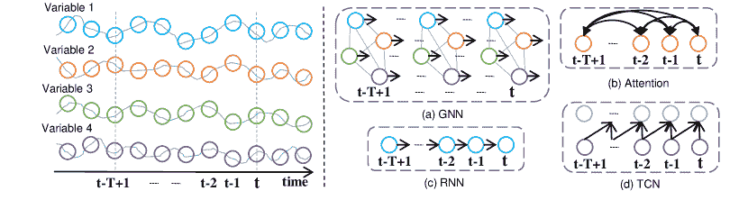
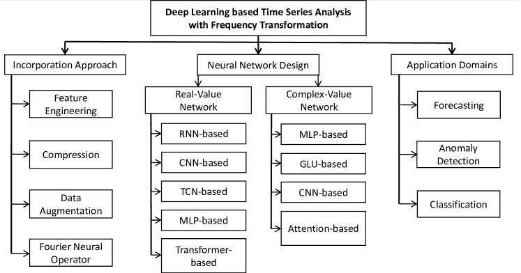

<!--yml

类别: 未分类

日期: 2024-09-06 19:42:02

-->

# [2302.02173] 关于基于深度学习的时间序列分析中的频率变换的调查

> 来源：[`ar5iv.labs.arxiv.org/html/2302.02173`](https://ar5iv.labs.arxiv.org/html/2302.02173)

# 关于基于深度学习的时间序列分析中的频率变换的调查

孔毅 yikun@bit.edu.cn 北京理工大学 北京 中国，  张琪 zhangqi˙cs@tongji.edu.cn 同济大学 上海 中国，  曹龙兵 longbing.cao@mq.edu.au 麦考瑞大学 悉尼 澳大利亚，  王守金, 龙国栋 shoujin.wang,guodong.long@uts.edu.au 悉尼科技大学 悉尼 澳大利亚，  胡亮 milkrain@gmail.com 同济大学 上海 中国，  贺辉, 牛振东 hehui617,zniu@bit.edu.cn 北京理工大学 北京 中国，  范伟 weifan@knights.ucf.edu 中佛罗里达大学 奥兰多 美国 和  熊辉 xionghui@ust.hk 香港科技大学 广州 中国 (2023)

###### 摘要。

最近，频率变换（FT）越来越多地被纳入深度学习模型中，以显著提高时间序列分析的最先进准确性和效率。FT 的优势，如高效率和全局视角，已在各种时间序列任务和应用中被迅速探索和利用，展示了 FT 作为一种新的深度学习范式在时间序列分析中的广阔前景。尽管这个新兴领域的关注度不断上升，研究也在增多，但目前仍缺乏关于基于深度学习的时间序列模型与 FT 的系统综述和深入分析。为什么 FT 能提升时间序列分析及其在该领域的局限性仍不清楚。为填补这些空白，我们提供了一个全面的综述，系统调查并总结了基于深度学习的时间序列分析中 FT 的最新研究进展。具体来说，我们探讨了当前模型中使用 FT 的主要方法、利用 FT 的神经网络类型以及在深度时间序列分析中代表性的 FT 装备模型。我们提出了一种新颖的分类法，以分类该领域现有的方法，为将 FT 纳入深度学习模型的时间序列分析提供结构化概述。最后，我们强调了 FT 在时间序列建模中的优势和局限性，并确定了可能的未来研究方向，以进一步贡献于时间序列分析的社区。

时间序列，神经网络，频率变换^†^†版权：acmcopyright^†^†期刊年份：2023^†^†doi：XXXXXXX.XXXXXXX^†^†期刊：JACM^†^†期刊卷号：37^†^†期刊号：4^†^†文章：111^†^†出版月份：8^†^†ccs：一般和参考 调查和概述^†^†ccs：信息系统 信息系统应用

## 1\. 引言

时间序列数据是最普遍的数据类型之一，几乎渗透到我们日常生活的每一个角落（Dama 和 Sinoquet，2021），例如，电子商务中的用户-项目交互序列和金融中随时间变化的股价序列。近年来，时间序列分析在学术界和工业界引起了迅速增长的关注，特别是在时间序列预测（Benidis 等，2022）、异常检测（Darban 等，2022）和分类（Fawaz 等，2019b）等领域。时间序列分析在各种实际应用中发挥了关键作用，以应对我们周围长期存在的重要挑战，例如交通监控（Bai 等，2020）、金融分析（Feng 等，2019）和 COVID-19 预测（Chen 等，2022c）。然而，由于复杂的系列间相关性和系列内依赖性，时间序列分析极具挑战性。

图 1\. 展示了应用于时间序列数据的各种工作机制。我们以四个变量和$T$个时间戳为例，如图的左侧部分所示。 (a) GNN 为每个时间戳构建一个连接变量的图。 (b) 自注意力为每个变量建立时间连接。 (c) RNN 创建一个递归周期以捕捉时间过渡。 (d) TCN 由时间戳上的因果卷积层堆叠而成。

之前基于深度学习的时间序列模型致力于在时间域中建模复杂的序列内和序列间依赖关系，以提升下游任务。代表性的序列模型，如递归神经网络（RNNs）(Lai et al., 2018; Hundman et al., 2018)、时间卷积网络（TCNs）(Bai et al., 2018)和注意力网络（Wu et al., 2021）用于捕捉序列内依赖关系，而卷积网络，如卷积神经网络（CNNs）(Li et al., 2018)和图神经网络（GNNs）(Chen et al., 2022a)则更倾向于关注序列间相关性。尽管取得了良好结果，这些网络在时间域建模中存在固有缺陷，限制了它们在捕捉时间序列分析关键模式方面的能力。例如，GNNs 是基于变量级连接构建的，如图 1(a)所示，而序列模型（即 Transformer、RNN 和 TCN）则基于时间戳级连接，如图 1(b)、(c)和(d)所示。这些建模方法考虑了点对点（例如变量/时间戳级）连接，但未能关注整体或子时间序列。因此，它们通常无法建模时间序列中的常见但复杂的全球模式，如季节性周期模式（Yang et al., 2022; Woo et al., 2022a）。这些固有缺陷激发了研究人员从不同角度解决时间序列的复杂序列间相关性和序列内依赖关系的兴趣。

最近，利用频率变换（FT）（Roberts 和 Mullis，1987）的深度学习方法，例如离散傅里叶变换（DFT）（Winograd，1976），离散余弦变换（DCT）（Ahmed 等，1974），以及离散小波变换（DWT）（Shensa 等，1992），在机器学习领域引起了广泛的关注（Xu 等，2020；Chi 等，2020；Guibas 等，2022；Zhou 等，2022c）。这些结合频率变换的神经模型在时间序列分析中展示了高效的学习范式，并在效率和有效性方面都达到了最先进的性能（Wu 等，2021；Zhou 等，2022b；Zhang 等，2022b）。这可以归因于 FT 的独特优势（见 6.1 节），即 FT 生成的频谱包含丰富的关键模式，例如季节性趋势，并提供了时间序列特征的全局视图。此外，FT 有助于获得时间序列的多尺度表示和多频率分量，以捕捉信息丰富的表示和模式。这促使我们系统地总结和分析 FT 的优势，以指导该领域的研究人员，并提供对新兴领域的全面调查，即基于 FT 的深度学习时间序列分析，从而启发时间序列社区。尽管文献中包含了从不同角度讨论时间序列分析的各种研究（Fakhrazari 和 Vakilzadian，2017；Benidis 等，2022；Fawaz 等，2019a；Chen 等，2021，2022b；Schäfer 等，2021），但关于 FT 时间序列分析的综合总结仍然不足。根据我们所知，缺乏涵盖基于 FT 的现有神经时间序列模型最新研究进展的评述。此外，FT 能够提升时间序列分析的原因尚未总结，其局限性也未被彻底分析。这些空白阻碍了 FT 时间序列分析的理论发展和实际应用。

本文旨在通过回顾现有的深度学习时间序列分析方法和频率变换（FT），填补上述空白。具体而言，我们的主要目标是回答四个关键问题：i) 当前神经时间序列模型在结合神经网络和 FT 时所采用的策略；ii) 与 FT 结合使用的具体神经网络类型；iii) 在时间序列应用中常用的代表性 FT-equipped 神经模型；以及 iv) 探索 FT 如何增强神经模型的原因，以及在时间序列分析中的局限性分析。通过回答这些问题，我们为神经时间序列分析和 FT 领域提供了宝贵的见解。据我们所知，本文是首个全面且系统地回顾神经时间序列分析与 FT 的工作，并提出了这一新兴领域的新分类法，如图 2 所示。

本文的后续部分结构如下：2 节最初介绍了时间序列分析和频率变换的基本概念。接着，3 节总结了现有的频率变换（FT）模型，重点介绍了如何将 FT 融入时间序列分析中，以提高准确性或效率。4 节则深入探讨了这些模型的实际实现，并研究了与 FT 结合使用的神经网络类型。5 节对基于频率的方法进行分类，涵盖了预测、异常检测和分类等常见时间序列任务。6 节讨论了频率域的优缺点。最后，在 7 节中，我们展望了时间序列分析的未来发展方向。

图 2\. 基于频率变换的深度学习时间序列分析的分类。

## 2\. 基础知识

### 2.1\. 时间序列分析

在这一部分，我们在深入探讨使用傅里叶变换（FT）的神经时间序列分析之前，简要介绍时间序列分析的三个基本任务。

#### 2.1.1. 预测

时间序列预测是将时间序列外推到未来的任务（Benidis et al., 2022）。对于给定的时间序列 $\mathbf{X}=[{X}_{1},{X}_{2},\cdots,{X}_{T}]\in\mathbb{R}^{N\times T}$，其中 $N$ 是序列的数量，$T$ 是时间戳的数量，${X}_{t}\in\mathbb{R}^{N}$ 表示时间戳 $t$ 上 $N$ 个不同序列的多变量值。我们考虑在时间戳 $t$ 上长度为 $L$ 的时间序列回溯窗口，即 $\mathbf{X}_{t}=[{X}_{t-L+1},{X}_{t-L+2},\cdots,{X}_{t}]\in\mathbb{R}^{N\times L}$；此外，我们考虑在时间戳 $t$ 上长度为 $\tau$ 的预测目标窗口，记为 $\mathbf{Y}_{t}=[{X}_{t+1},{X}_{t+2},\cdots,{X}_{t+\tau}]\in\mathbb{R}^{N\times\tau}$。然后，时间序列预测任务是利用历史观测值 $\mathbf{X}_{t}$ 来预测未来值 $\hat{\mathbf{Y}}_{t}$，典型的预测模型 $f_{\theta}$ 由 $\theta$ 参数化，通过 $\hat{\mathbf{Y}}_{t}=f_{\theta}(\mathbf{X}_{t})$ 生成预测结果。

#### 2.1.2. 分类

时间序列分类旨在为数据集中的每个序列分配标签（Fawaz et al., 2019a）。通常，对于一个时间序列数据集 $D=\{(X_{1},Y_{1}),(X_{2},Y_{2}),\cdots,(X_{N},Y_{N})\}$，其中 $X_{i}\in\mathbb{R}^{T}$ 是一个具有 $T$ 个时间戳的时间序列，$Y_{i}$ 是其对应的 one-hot 向量标签。对于包含 $K$ 类别的数据集 $D$，$Y_{i}$ 是一个长度为 $K$ 的向量，其中每个元素 $j\in[1,K]$ 如果 $X_{i}$ 的类别是 $j$ 则等于 1，否则为 0。然后，分类任务是训练一个由 $\theta$ 参数化的分类器 $f_{\theta}$，以便将可能的输入空间映射到类别变量标签的概率分布，公式为 $Y_{i}=f_{\theta}(X_{i})$。

#### 2.1.3. 异常检测

时间序列异常检测旨在发现序列中的异常子序列（Chen et al., 2021）。目标是开发能够有效区分正常行为和异常行为的算法或模型，从而提供早期检测和警报，以应对时间序列数据中的异常事件或行为。给定一个时间序列 $X=[x_{1},x_{2},\cdots,x_{T}]$，其中 $T$ 是时间戳的数量，$x_{i}$ 代表时间索引 $i$ 的数据点，异常检测的任务是识别一个数据点子集 $X_{s}\subseteq X$，该子集表示异常或异常实例。

### 2.2. 频率变换

在本节中，我们简要介绍了常用的频域变换，将时域数据转换为频域，包括离散傅里叶变换（DFT）、离散余弦变换（DCT）和离散小波变换（DWT）。此外，我们还描述了卷积定理，它是频域中的一个基本性质。

#### 2.2.1\. 离散傅里叶变换

离散傅里叶变换（DFT）(Winograd，1976) 在数字信号处理领域发挥着重要作用。给定长度为 N 的序列 $x[n]$，DFT 通过以下方式将 $x[n]$ 转换到频域：

| (1) |  | $\mathcal{X}[k]=\sum_{n=0}^{N-1}x[n]e^{-j(2\pi/N)kn},\ \text{其中}\ k=0,1,...,N-1$ |  |
| --- | --- | --- | --- |

其中 $j$ 是虚数单位，$\mathcal{X}[k]$ 表示频率 $\omega_{k}=2\pi k/N$ 下的 $x[n]$ 的谱。谱 $\mathcal{X}\in\mathbb{C}^{k}$ 由实部 $\operatorname{Re}=\sum_{n=0}^{N-1}x[n]\cos{(2\pi/N)kn}\in\mathbb{R}^{k}$ 和虚部 $\operatorname{Im}=-\sum_{n=0}^{N-1}x[n]\sin{(2\pi/N)kn}\in\mathbb{R}^{k}$ 组成：

| (2) |  | $\mathcal{X}=\operatorname{Re}+j\operatorname{Im}$ |  |
| --- | --- | --- | --- |

$\mathcal{X}$ 的幅度部分 $A$ 和相位部分 $\theta$ 定义为：

| (3) |  | $A=\sqrt{\operatorname{Re}^{2}+\operatorname{Im}^{2}}$ |  |
| --- | --- | --- | --- |
| (4) |  | $\theta=\arctan(\frac{\operatorname{Im}}{\operatorname{Re}})$ |  |

#### 2.2.2\. 离散余弦变换

离散余弦变换（DCT）(Ahmed 等，1974) 已成为大多数视觉系统中的事实上的图像变换。数据序列 $x[n]$ 的最常见的 1-D DCT $C(k)$ 定义为

| (5) |  | $C(k)=\alpha(k)\sum_{n=0}^{N-1}x[n]\cos\left[\frac{\pi(2n+1)k}{2N}\right]$ |  |
| --- | --- | --- | --- |

其中 $k=0,1,...,N-1$，且 $\alpha(k)$ 定义为

| (6) |  | $\alpha(k)=\left\{\begin{matrix}\sqrt{\frac{1}{N}},\quad \text{当}\ k=0\\ \sqrt{\frac{2}{N}},\quad \text{当}\ k\neq 0\end{matrix}\right.$ |  |
| --- | --- | --- | --- |

DCT 仅保留 DFT 的实部，且大致等于长度为 DFT 两倍的 DFT。它通常在具有偶对称性的实数据上执行，或在一些变体中输入或输出数据偏移半个样本。

#### 2.2.3\. 离散小波变换

离散小波变换（DWT）(Shensa 等，1992) 已被证明是进行时频分析的适当工具。它将给定信号分解为多个集合，每个集合是描述信号在相应频段时间演变的系数时间序列。

对于信号 $x(t)$，小波变换 $\operatorname{WT}$ 可以表示为 $\operatorname{WT}(a,b)=\int_{-\infty}^{\infty}x(t)\Psi_{a,b}(t)\mathrm{d}t=\left\langle x(t),\Psi_{a,b}(t)\right\rangle$，其中 $\Psi$ 是小波基函数。基函数生成可以定义为 $\Psi_{a,b}(t)=\frac{1}{\sqrt{a}}\Psi\left(\frac{t-b}{a}\right)$，其中 $a$ 和 $b$ 分别是尺度因子和平移因子。$\operatorname{DWT}$ 将尺度因子 $a$ 和平移因子 $b$ 离散化为 $a=a_{0}^{m},b=ka_{0}^{m}b_{0},m,k\in\mathbb{Z}$。通常，$a_{0}$ 设为 2，$b_{0}$ 设为 1。因此，$\operatorname{DWT}$ 可以定义为：

| (7) |  | $\operatorname{DWT}(a,b)=a_{0}^{-m/2}\int_{-\infty}^{\infty}x(t)\Psi(a_{0}^{-m}t-kb_{0})(t)\mathrm{d}t$ |  |
| --- | --- | --- | --- |

与 $\operatorname{DFT}$ 和 $\operatorname{DCT}$ 相比，小波变换具有识别包含观察到的频率内容的位置的能力，而 DFT 和 DCT 只能从信号中提取纯频率。因此，$\operatorname{DWT}$ 可以执行时间-频率分析。此外，$\operatorname{DWT}$ 可以通过改变尺度和翻译因子获得不同分辨率的表示 (Mallat, 1989)。在表 1 中，我们比较了三种频率分析方法及其优缺点。

表 1\. DFT、DCT 和 DWT 在时间序列分析中的比较。

| FT | 基函数 | 值类型 | 时间-频率 | 优点 | 缺点 |
| --- | --- | --- | --- | --- | --- |
| DFT | 正弦+余弦 | 复数 | 否 | 移位不变 | 泄漏效应 缺乏时间局部化 |
| DCT | 余弦 | 实数 | 否 | 计算效率高 | 无相位信息 缺乏时间局部化 |
| DWT | 小波变换 | 实数 | 是 | 多分辨率分析 时间和频率的局部化 | 计算复杂度 |

#### 2.2.4\. 卷积定理

卷积定理 (Soliman 和 Srinath, 1990) 说明两个信号的循环卷积的傅里叶变换等于它们傅里叶变换的点乘。给定一个信号 $x[n]$ 和一个滤波器 $h[n]$，卷积定理可以定义如下：

| (8) |  | $\mathcal{F}(x[n]*h[n])=\mathcal{F}(x)\mathcal{F}(h)$ |  |
| --- | --- | --- | --- |

其中 $x[n]*h[n]=\sum_{m=0}^{N-1}h[m]x[(n-m)_{N}]$，$(n-m)_{N}$ 表示 $(n-m)$ 模 N，$\mathcal{F}(x)$ 和 $\mathcal{F}(h)$ 分别表示 $x[n]$ 和 $h[n]$ 的离散傅里叶变换。

根据卷积定理，两个序列的频谱点乘等价于它们在时间域上的循环卷积，其中具有更大感受野的整体序列的乘积能够更好地捕捉总体特征（例如周期性），并且计算成本更低 (Alaa 等, 2021)。

## 3\. 融合方法

在本节中，我们系统地总结和讨论了将频率变换应用于增强时间序列分析的研究分类和进展。

### 3.1. 特征工程

以前的工作利用频率变换（DFT、DCT 和 DWT）作为特征工程工具来获取频域模式。基本上，它们利用频率变换来捕获三种主要的信息类型：周期模式、多尺度模式和全局依赖关系。

##### 周期性

与时间域相比，频域可以为时间序列提供重要的信息，例如周期性信息。以前的模型利用频域信息进行周期性分析，并将其作为时间域信息的重要补充。（Yang 等， 2022）提出了一种频域块，用于捕获时间序列数据的动态和复杂周期模式，并将深度学习网络与频率模式结合。（Zhang 等， 2022b）利用频域分析分支来检测复杂模式异常，例如周期性异常。（Woo 等， 2022a）在时间域中学习趋势表示，而季节性表示则通过频域中的傅里叶层进行学习。（Sun 和 Boning， 2022）是一个基于频域的神经网络模型，建立在基线模型之上，以增强其性能。（Woo 等， 2022b）利用 DFT 设计了一种频率注意机制来替代自注意机制，以识别季节性模式。（Woo 等， 2023）利用一种新型的串联傅里叶特征模块，高效学习时间序列中的高频模式。

##### 多尺度

时间序列分析面临的一个重大挑战是时间序列数据之间存在复杂的纠缠的时间动态。为了应对这一挑战，一些方法尝试在频率域中解决它。它们通过将时间序列数据分解为不同的频率分量来解开时间模式。(Hu 和 Qi, 2017) 将 RNN 的记忆状态分解为不同的频率状态，以便它们可以明确地学习低频和高频模式的依赖关系。(Zhang 等, 2017)  explicitly 将交易模式分解为各种频率分量，每个分量模型代表了潜在的交易模式的特定频率，这些模式在股票价格波动中潜藏。最近，基于小波的模型显示出竞争力，因为小波变换能够保留时间和频率信息，并获得多分辨率表示。(Wang 等, 2018) 提出了一个基于小波的神经网络结构，用于构建频率感知的深度学习模型以进行时间序列分析。(Wen 等, 2021a) 应用最大重叠离散小波变换将时间序列解耦为多个级别的小波系数，然后在每个级别检测单一的周期性。(Wang 等, 2023) 设计了一种新型的数据依赖小波注意机制，用于非平稳时间序列分析的动态频率分析。(Yang 等, 2023) 提出了一个端到端的图增强小波学习框架，用于长序列预测，该框架利用 DWT 在小波域中表示 MTS。

##### 全局依赖关系

现有的时间域方法基于逐点连接构建其模型（见图 1），这使得它们无法捕捉系列级别的模式，例如时间序列的总体特征。通过利用频域的全局视角属性，一些研究利用频率信息来关注系列级别的模式。（Zhou et al., 2022b）将傅里叶分析与 Transformer 相结合，帮助 Transformer 更好地捕捉时间序列的全局属性。（Zhang et al., 2022b）将频域分析分支与时间域分析分支结合起来，并在频域中检测季节性异常。此外，一些研究引入频域分析以改进神经网络，以解决其固有的缺陷。现代深度网络中的普通卷积已知是局部操作，这导致在连接网络中两个远程位置时效率较低。为了解决卷积的局部限制，（Chi et al., 2019）将数据转换到频域，并提出了谱残差学习以实现完全的全局感受野，而（Chi et al., 2020）利用傅里叶谱理论设计了一个操作单元，以利用频率信息扩大普通卷积的感受野。

### 3.2\. 压缩

之前的研究利用频率变换获得稀疏表示，并在频域中去除冗余信息。此外，由于噪声信号通常表现为高频，因此在频域中很容易将其过滤掉。例如，在（Zhou et al., 2022a）中，作者从序列压缩的角度看待时间序列预测，并应用傅里叶分析来保留与低频傅里叶分量相关的表示部分，以去除噪声的影响。（Rippel et al., 2015）提出了谱池化，通过截断频域中的表示来执行降维，因为能量在低频部分高度集中。（Xu et al., 2020）提出了一种基于学习的频率选择方法，用于识别微不足道的频率分量，同时去除冗余信息。

### 3.3\. 数据增强

最近，一些研究从频域角度探讨了时间序列的数据增强（Wen et al., 2021b）。由于频域包含时间序列分析的一些关键性信息，如周期性模式，现有方法将频域特征与时间域特征结合，以增强时间序列表示。例如，CoST（Woo et al., 2022a）结合了一种新颖的频域对比损失，鼓励区分季节性表示，并绕过了确定时间序列数据中季节性模式周期的问题。BTSF（Yang and Hong, 2022）融合了时间和光谱特征，以增强表示的区分性和表现力。TS-TFC（Liu et al., 2023）提出了一种时间-频率联合训练模型，用于时间序列半监督学习，利用来自两个不同视角的互补信息进行无标签数据学习。

最近，不同于在时间域中增强样本后应用 DFT 的 CoST 和 BTSF，一种名为 TF-C（Zhang et al., 2022a）的新方法引入了直接扰动频谱的频域增强。它发展了基于频率的对比增强，以利用丰富的光谱信息，并直接扰动频谱，以利用频率不变性进行对比学习。与直接在频率域中进行数据增强（例如，TF-C）相比，在时间域中增强样本后应用 FFT（例如，CoST 和 BTSF）可能会导致信息丢失。

### 3.4\. 傅里叶神经算子学习

根据卷积定理，微分在傅里叶域中等同于乘法（Li et al., 2021）。这一效率特性使得离散傅里叶变换（DFT）在解决微分方程时被频繁使用。

最近，傅里叶神经算子（FNOs）（Li et al., 2021），目前是最有前景的神经算子之一（Kovachki et al., 2021），被提出作为解决偏微分方程（PDEs）的有效框架。更近期，FNO 已被引入时间序列预测。 (Zhou et al., 2022b) 提出了傅里叶增强块和小波增强块，通过频域映射捕捉时间序列中的重要结构。(Yi et al., 2022) 在频域中重新表述了图卷积算子，并高效地计算超图上的图卷积，表示任意两个变量在任意两个时间戳之间的非静态相关性。

## 4\. 神经网络设计

在本节中，我们将**深入探讨**利用特定类型神经网络来利用频率信息的现有相关模型。考虑到频率变换输出可以是复数值或实数值（如表 1 所示），每种值类型需要不同的处理方法，我们将从这两种值类型的角度讨论这些模型。

### 4.1\. 复数值数据

DFT 输出值是复数，可以通过两种方式表示。一种表示方式是通过实部和虚部（如方程 (2 中所示），另一种表示方式是通过幅度和相位部分（如方程 (3 和 (4) 中所示）。虽然可以通过保留其中一个部分来简化计算，例如丢弃虚部 (Godfrey and Gashler, 2018)，这种方法可能会导致信息丢失。

实际上，主要有两种方法在复数值上执行神经网络。一种方法是将复数值的每个部分作为特征，然后分别输入神经网络。之后，将相应网络的输出结合为复数类型（例如，像方程 (2 中所示），然后执行逆 DFT 并传输到时域。例如，StemGNN (Cao et al., 2020) 对实部和虚部分别进行 GLU (Dauphin et al., 2017)，然后将它们连接为复数值并应用 IDFT。ATFN (Yang et al., 2022) 使用两个线性层分别处理幅度部分和相位部分，然后将它们组合为整体。另一种方法是在频域中直接进行复数乘法。例如，FEDformer (Zhou et al., 2022b) 随机抽取一些频率，并使用结合了注意力架构的参数化核进行复数乘法。

### 4.2\. 实值数据

DCT 和 DWT 的输出值类型为实数，因此常见的网络结构可以直接应用于它们，例如 RNN 和 CNN。此外，虽然 DFT 的输出值类型为复数，但一些工作会舍弃其中一部分，如相位部分 （Zhang 等， 2017），因此它们的网络设计也属于实值网络。然而，除了捕捉频率模式外，与其他网络设计相比，基于频率的模型网络设计的一个主要目的就是选择频率成分，以决定哪些成分具有判别性或关键性。

例如，（Xu 等， 2020）通过 DCT 将输入转换到频域，并将相同频率的成分分到一个通道中，然后提出了一种基于学习的动态通道选择方法，以识别微不足道的频率成分。（Qin 等， 2021）建议将全局平均池化推广到 DCT 的更多频率成分，并设计了三种频率成分选择标准。RobustPeriod （Wen 等， 2021a）应用 DWT 将时间序列解耦为多个级别的小波系数，然后提出了一种在每个级别上稳健地计算无偏小波方差并排名周期性可能性的方法。

## 5\. 应用

在本节中，我们回顾了具有代表性的 FT 装备神经时间序列模型。我们将它们分为三大类应用，包括预测、异常检测和分类。在表 2 中，我们从六个维度进一步比较了这些模型。

表 2\. 具有代表性的 FT 装备神经模型在时间序列分析中的总结。

| 模型 | 频率变换 | 融合方法 | 值类型 | 神经网络 | 应用领域 | 利用的优势 |
| --- | --- | --- | --- | --- | --- | --- |
| SFM （Zhang 等， 2017） | DFT | 特征工程 | 实数值 | RNN | 预测 | 分解 |
| StemGNN （Cao 等， 2020） | DFT | 特征工程 | 复数值 | GLU | 预测 | 分解 |
| Autoformer （Wu 等， 2021） | DFT | 特征工程 | 复数值 | 注意力网络 | 预测 | 全局视角效率 |
| AFTN （Yang 等， 2022） | DFT | 特征工程 | 复数值 | MLP | 预测 | 分解 |
| DEPTS （Fan 等， 2022） | DCT | 特征工程 | 实数值 | MLP | 预测 | 分解 |
| FEDformer （Zhou 等， 2022b） | DFT | 特征工程 | 复数值 | 注意力网络 | 预测 | 全局视角效率 |
| CoST （Woo 等， 2022a） | DFT | 数据增强 | 复数值 | MLP | 预测 | 分解 |
| FiLM （Zhou 等， 2022a） | DFT | 压缩 | 复数值 | MLP | 预测 | 稀疏表示 |
| EV-FGN (Yi et al., 2022) | DFT | 操作学习 | 复数值 | MLP | 预测 | 效率 |
| FreDo (Sun and Boning, 2022) | DFT | 特征工程 | 复数值 | MLP | 预测 | 分解 |
| WAVEFORM (Yang et al., 2023) | DWT | 特征工程 | 实数值 | GCN | 预测 | 分解 |
| SR-CNN (Ren et al., 2019) | DFT | 特征工程 | 实数值 | CNN | 异常检测 | 分解 |
| RobustTAD (Gao et al., 2020) | DFT | 数据增强 | 复数值 | CNN | 异常检测 | 分解 |
| TFAD (Zhang et al., 2022b) | DWT | 特征工程 | 实数值 | TCN | 异常检测 | 分解 |
| RCF (Wang et al., 2018) | DWT | 特征工程 | 实数值 | CNN | 分类 | 分解 |
| WD (Khan and Yener, 2018) | DWT | 特征工程 | 实数值 | CNN | 分类 | 分解 |
| BTSF (Yang and Hong, 2022) | DFT | 数据增强 | 实数值 | CNN | 分类 预测 | 分解 |
| TF-C (Zhang et al., 2022a) | DFT | 数据增强 | 实数值 | Transformer | 分类 | 分解 |

### 5.1\. 时间序列预测

时间序列预测在决策制定和金融分析等各个领域中至关重要。最近，一些方法利用频率信息来提高时间序列预测的准确性或效率。SFM (Zhang et al., 2017) 将记忆单元的隐状态分解为多个频率分量，并建模多频率交易模式。StemGNN (Cao et al., 2020) 学习在 DFT 之后更易于识别的谱表示。Autoformer (Wu et al., 2021) 利用 FFT 高效计算自相关。DEPTS (Fan et al., 2022) 执行 DCT 提取周期特征，然后将这些特征应用于多层感知机，以捕捉时间序列中的周期性依赖关系。FEDformer (Zhou et al., 2022b) 捕捉时间序列在频域中的全局视图。CoST (Woo et al., 2022a) 学习频域中的季节性表示。FiLM (Zhou et al., 2022a) 利用傅里叶分析保持低频傅里叶分量。

### 5.2\. 时间序列异常检测

近年来，基于频率的模型在异常检测中得到了应用。SR（Ren et al., 2019）在频率域中提取谱残差以检测异常。RobustTAD（Gao et al., 2020）探索了频率域中的数据增强方法，以进一步增加标记数据。PFT（Park et al., 2021）提出了一种部分傅里叶变换用于异常检测，具有显著的速度提升而不牺牲准确性。TFAD（Zhang et al., 2022b）利用频率域分析来处理季节性异常。

### 5.3\. 时间序列分类

时间序列分类是时间序列分析中的一个重要且具有挑战性的问题。最近，一些模型考虑了频率域信息来执行这一任务。RCF（Wang et al., 2018）从 DWT 分解结果中提取区分特征。WD（Khan and Yener, 2018）使用具有可调尺度参数的小波函数直接从信号中学习谱分解。BTSF（Yang and Hong, 2022）融合了时间和频谱信息，以增强表示的区分性和表达能力。TF-C（Zhang et al., 2022a）开发了基于频率的对比增强技术，以利用丰富的谱信息并探索时间-频率一致性。

## 6\. 频率变换总结

在这一部分，为了探讨为什么 FT 可以增强神经模型以及它在时间序列分析中的限制，我们总结了频率变换的优势和局限性。

### 6.1\. 优势

##### 分解

频率变换可以将原始时间序列分解为不同的频率成分，这些成分体现了时间序列的重要信息，例如季节性的周期模式。特别是，DWT 可以将时间序列分解为一组频率从高到低排序的子序列，并获得多尺度表示。通过将时间域中的时间序列分解为频率域中的不同成分，这自然有助于发现和获取对时间序列分析有益的信息。

##### 全局视角

根据方程式（1）、（5）和（7），频谱是通过对所有信号在时间上的求和来计算的。因此，频率域中的每个频谱元素都涉及时间域中的所有时间戳，说明频谱具有对整个时间序列的全局视角。此外，根据卷积定理（见方程式（8）），频率谱的点积也捕捉了整个序列的全局特征，这激发了在频率域中对全局可学习滤波器的参数化。

##### 稀疏表示

频率变换使得为序列提供稀疏表示成为可能。以离散傅里叶变换（DFT）为例，大量系数接近于零，这表明我们可以使用较少的系数来表示整个序列。换句话说，频率域中的对应表示具有能量压缩的特性。例如，使用离散小波变换（DWT）捕获信号的重要特征通常比原始信号要小得多。具体而言，使用 DWT 时，最终得到的系数数量与原始信号相同，其中许多系数可能接近于零。因此，我们可以仅用少量非零系数有效地表示原始信号。

##### 效率

如前所述，频率变换通常会导致稀疏表示，其中大量系数接近于零。利用这种稀疏性可以通过丢弃或压缩微不足道的系数来实现高效计算，从而减少内存需求并加快处理速度。此外，根据卷积定理，时间域中的卷积对应于频率域中的 Hadamard 点积，这使得在频率域中计算卷积更加高效。因此，考虑到卷积定理的等价性，在频率域计算卷积涉及的计算操作显著减少。

### 6.2\. 局限性

##### 时间信息的丢失

频率变换技术，包括 DFT 和 DCT，主要强调捕捉时间序列的频率特征。虽然这些技术提供了频率域的宝贵见解，但它们可能忽视或不足以表示时间信息。时间序列中固有的某些时间模式或动态可能未能在频率域中充分捕捉，从而限制了对时间方面的全面分析和理解（Godfrey 和 Gashler，2018）。

##### 对预定义参数的依赖

频率变换技术通常需要设置参数，例如窗口大小、采样率或频率带宽。选择合适的参数值可能具有挑战性，不当选择可能导致频率表示不准确或遗漏重要的频率成分（Khan 和 Yener，2018；Michau 等，2022）。因此，参数调优和优化是确保频率变换在时间序列分析中有效性的必要步骤。

## 7\. 未来机会讨论

在本节中，我们探讨了频率变换在神经时间序列分析中的未来研究前景。我们首先概述了频率变换的当前局限性，并提出了克服这些挑战的创新方向。随后，我们深入讨论了时间序列分析领域中的开放研究问题和新兴趋势，这些问题和趋势可以通过利用频率变换来解决。

### 7.1\. 从频率变换的角度

#### 7.1.1\. 利用新型正交变换技术

最近的研究表明，正交变换作为神经网络中的插件操作在频率分析和多项式家族中表现出了高效性和有效性。一些新的正交变换技术已经在神经网络中得到应用并取得了良好成果。例如，FiLM（Zhou 等，2022a）利用 Legendre 投影，这是一种正交多项式，用于更新时间序列的表示。（Park 等，2021）提出了部分傅里叶变换（PFT），将复杂度从$O(N\log{N})$降低到$O(N+M\log{M})$，其中$M\ll N$。分数傅里叶变换（FrFT）已被证明适用于噪声去除，并能增强异常与背景之间的区分（Tao 等，2019）。在（Zhao 等，2022a）中，作者利用 FrFT 增强了高效特征融合和综合特征提取。（Zhao 等，2022b）利用 FrFT 实现了对全球上下文和序列光谱信息的灵活提取。未来，将更多新型正交变换技术融入时间序列分析的深度学习中，如正交多项式、DCT 和 FrFT，将是一个有前景的方向。

#### 7.1.2\. 将频率变换与深度学习结合

在频率变换中使用的基函数，如正弦、余弦和小波函数，在不同领域中都是固定的。因此，通过这些基函数提取的频率特征是领域不变的。换句话说，这些特征对意外噪声或变化条件不敏感。

为了减轻限制，之前的研究很少将频率变换与神经网络的学习能力结合。mWDN（Wang 等，2018）提出了一种基于小波的神经网络结构，其中所有参数可以微调以适应不同学习任务的训练数据。（Khan 和 Yener，2018）提出了一种在神经网络框架中基于小波变换的光谱分解参数的高效优化方法。（Michau 等，2022）模拟了利用深度学习框架的快速 DWT 级联结构。这些方法显示了有前景的性能，未来频率变换与深度学习的结合值得进一步探讨。

#### 7.1.3\. 在时间和频率领域的联合学习

频率领域只使用周期性成分，因此无法准确建模信号的非周期性方面，如线性趋势（Godfrey 和 Gashler，2018）。此外，根据不确定性原理（Zhang 等，2022b），设计一个能够同时捕捉时间和频率模式的单一结构模型是困难的。

因此，将来的一个有趣方向是利用时间和频率领域学习的对应特征来提高时间序列分析的准确性和效率。目前很少有研究尝试分别在时间和频率领域学习表示。例如，CoST（Woo 等，2022a）在时间领域学习趋势表示，在频率领域学习季节性表示。然而，它仅在时间领域进行数据增强，并且分别学习时间和频率表示。未来需要更多的时间-频率表示学习方法。

### 7.2\. 从时间序列分析的角度

#### 7.2.1\. 应用频率变换来增强时间序列应用

将频率变换技术应用于更广泛的时间序列应用，有潜力揭示宝贵的见解，并增强各个领域的决策能力。无论是在检测生理信号中的异常、揭示金融数据中的市场周期，还是识别环境参数中的模式，频率变换都能深入理解复杂的时间模式和趋势。通过利用频率分析的力量，研究人员和从业者可以揭示隐藏的关系，提高预测准确性，优化资源管理，推动各个领域的知识进步，*最终推动创新并实现基于数据的决策*。

#### 7.2.2. 可扩展性

可扩展性（Keogh and Kasetty, 2003）是时间序列分析中的关键考虑因素。结合频率变换技术时，它提供了对大规模时间序列数据进行高效和可扩展分析的潜力。频率变换允许提取频率成分，减少数据的维度，从而实现更高效的处理。维度的减少可以显著提高时间序列分析算法的可扩展性，因为它减少了计算复杂性和内存需求。结合频率变换的可扩展时间序列分析可以为分析和提取来自大数据时间序列应用的见解铺平道路，适用于物联网（IoT）、金融市场或传感器网络等领域。

#### 7.2.3. 可解释性和解释能力

可解释性和解释能力（Ribeiro et al., 2016; Lundberg and Lee, 2017）是时间序列分析中的关键方面，尤其是在实际应用中。从直观上讲，频率变换能够将时间序列转化为频域中更直观、易于解释的表示，提供对潜在模式和行为的有价值见解。从变换中获得的频率成分可以进行分析，以理解数据中表现出的主要频率、周期性或重要事件。这不仅提升了分析的可解释性，还能够从频率模式的角度解释观察到的现象和异常。频率变换下的时间序列分析的可解释性和解释能力提供了宝贵的优势，使分析师和领域专家能够获得更深入的见解，并建立对分析结果的信任。

#### 7.2.4. 隐私保护

利用频率变换提供了一种强大的数据隐私保护方法（Dwork 等，2016）在时间序列分析中。通过应用频率变换，时间序列数据可以被转化为频率域表示，而不揭示底层的原始数据。这种变换允许提取频率成分和模式，同时保持原始信息的机密性。使用频率变换技术保护隐私可以确保个人隐私和数据机密性，并促进协作分析、数据共享和研究合作，同时减少隐私风险。这种方法在数据敏感性至关重要的领域（如医疗、金融或个人监控）尤其有价值，允许利用频率分析的同时保护涉及的个人或组织的隐私。

## 8\. 结论

在本文中，我们提供了基于深度学习的时间序列分析与频率变换的综合调查。我们从整合方法、神经网络设计和应用领域的角度组织了所审阅的方法，并总结了频率变换在时间序列分析中的优缺点。根据我们所知，本文是首次全面系统地回顾了具有频率变换的神经时间序列分析，这将极大地惠及时间序列社区。此外，我们还提供了一个精选的资源集合，可在[`github.com/BIT-Yi/time_series_frequency`](https://github.com/BIT-Yi/time_series_frequency)访问，以进一步帮助研究社区。

## 参考文献

+   (1)

+   Ahmed 等（1974）Nasir Ahmed, T_ Natarajan, 和 Kamisetty R Rao. 1974. 《离散余弦变换》。*IEEE transactions on Computers* 100, 1（1974），90–93。

+   Alaa 等（2021）Ahmed M. Alaa, Alex James Chan, 和 Mihaela van der Schaar. 2021. 《利用傅里叶流的生成时间序列建模》。发表于*ICLR*。OpenReview.net。

+   Bai 等（2020）Lei Bai, Lina Yao, Can Li, Xianzhi Wang, 和 Can Wang. 2020. 《用于交通预测的自适应图卷积递归网络》。发表于*NeurIPS*。

+   Bai 等（2018）Shaojie Bai, J. Zico Kolter, 和 Vladlen Koltun. 2018. 《对序列建模的通用卷积和递归网络的实证评估》。*CoRR* abs/1803.01271（2018）。

+   Benidis 等（2022）Konstantinos Benidis, Syama Sundar Rangapuram, Valentin Flunkert, Yuyang Wang, Danielle Maddix, Caner Turkmen, Jan Gasthaus, Michael Bohlke-Schneider, David Salinas, Lorenzo Stella, François-Xavier Aubet, Laurent Callot, 和 Tim Januschowski. 2022. 《时间序列预测中的深度学习：教程和文献综述》。*Comput. Surveys* 55（2022）。

+   Cao 等 (2020) Defu Cao、Yujing Wang、Juanyong Duan、Ce Zhang、Xia Zhu、Congrui Huang、Yunhai Tong、Bixiong Xu、Jing Bai、Jie Tong 和 Qi Zhang。2020。用于多变量时间序列预测的光谱时序图神经网络。发表于 *NeurIPS*。

+   Chen 等 (2022b) Irene Y. Chen、Rahul G. Krishnan 和 David A. Sontag。2022b。用于疾病表型化的区间删失时间序列聚类。发表于 *AAAI*。AAAI Press，6211–6221。

+   Chen 等 (2022c) Yuzhou Chen、Ignacio Segovia-Dominguez、Baris Coskunuzer 和 Yulia Gel。2022c。TAMP-S2GCNets：将时间感知的多持久知识表示与空间超图卷积网络耦合用于时间序列预测。发表于 *ICLR*。

+   Chen 等 (2022a) Zekai Chen、Dingshuo Chen、Xiao Zhang、Zixuan Yuan 和 Xiuzhen Cheng。2022a。使用 Transformer 学习图结构以实现物联网中的多变量时间序列异常检测。*IEEE Internet Things J.* 9, 12 (2022)，9179–9189。

+   Chen 等 (2021) Zhipeng Chen、Zhang Peng、Xueqiang Zou 和 Haoqi Sun。2021。基于深度学习的多维时间序列异常检测：综述。发表于 *CNCERT* *(计算机与信息科学通讯，卷 1506)*。Springer，71–92。

+   Chi 等 (2020) Lu Chi、Borui Jiang 和 Yadong Mu。2020。快速傅里叶卷积。发表于 *NeurIPS*。

+   Chi 等 (2019) Lu Chi、Guiyu Tian、Yadong Mu、Lingxi Xie 和 Qi Tian。2019。基于光谱残差学习的快速非局部神经网络。发表于 *ACM Multimedia*。ACM，2142–2151。

+   Dama 和 Sinoquet (2021) Fatoumata Dama 和 Christine Sinoquet。2021。分析和建模以预测时间序列：系统评价。*CoRR* abs/2104.00164 (2021)。

+   Darban 等 (2022) Zahra Zamanzadeh Darban、Geoffrey I. Webb、Shirui Pan、Charu C. Aggarwal 和 Mahsa Salehi。2022。用于时间序列异常检测的深度学习：综述。*CoRR* abs/2211.05244 (2022)。

+   Dauphin 等 (2017) Yann N. Dauphin、Angela Fan、Michael Auli 和 David Grangier。2017。使用门控卷积网络进行语言建模。发表于 *ICML* *(机器学习研究论文集，卷 70)*。PMLR，933–941。

+   Dwork 等 (2016) Cynthia Dwork、Frank McSherry、Kobbi Nissim 和 Adam D. Smith。2016。私密数据分析中的噪声与敏感度校准。*J. Priv. Confidentiality* 7, 3 (2016)，17–51。

+   Fakhrazari 和 Vakilzadian (2017) Amin Fakhrazari 和 Hamid Vakilzadian。2017。时间序列数据挖掘综述。发表于 *EIT*。IEEE，476–481。

+   Fan 等 (2022) Wei Fan、Shun Zheng、Xiaohan Yi、Wei Cao、Yanjie Fu、Jiang Bian 和 Tie-Yan Liu。2022。DEPTS：用于周期性时间序列预测的深度扩展学习。发表于 *ICLR*。OpenReview.net。

+   Fawaz 等 (2019a) Hassan Ismail Fawaz、Germain Forestier、Jonathan Weber、Lhassane Idoumghar 和 Pierre-Alain Muller。2019a。用于时间序列分类的深度学习：综述。*Data Min. Knowl. Discov.* 33, 4 (2019)，917–963。

+   Fawaz et al. (2019b) **哈桑·伊斯梅尔·法瓦兹**、**热尔曼·福雷斯捷**、**乔纳森·韦伯**、**拉萨内·伊杜姆加赫** 和 **皮埃尔-阿兰·穆勒**。2019b。深度学习在时间序列分类中的应用：综述。*数据挖掘与知识发现* 33 (2019)。

+   Feng et al. (2019) **冯丽**、**贺翔南**、**王翔**、**罗成**、**刘一群** 和 **蔡达生**。2019。时间关系排序用于股票预测。*ACM Trans. Inf. Syst.* 37, 2 (2019), 27:1–27:30。

+   Gao et al. (2020) **高靖昆**、**宋小敏**、**温青松**、**王毗超**、**孙梁** 和 **徐焕**。2020。RobustTAD：通过分解和卷积神经网络进行鲁棒时间序列异常检测。*CoRR* abs/2002.09545 (2020)。

+   Godfrey and Gashler (2018) **卢克·B·戈弗雷** 和 **迈克尔·S·盖什勒**。2018。时间序列数据的神经分解以实现有效泛化。*IEEE Trans. Neural Networks Learn. Syst.* 29, 7 (2018), 2973–2985。

+   Guibas et al. (2022) **约翰·圭巴斯**、**莫尔特扎·马尔达尼**、**李宗义**、**安德鲁·陶**、**安尼玛·安南德库马尔** 和 **布莱恩·卡坦扎罗**。2022。自适应傅里叶神经算子：高效的变换器令牌混合器。在 *ICLR*。

+   Hu and Qi (2017) **胡浩** 和 **戈俊琪**。2017。状态-频率记忆递归神经网络。在 *ICML* *(机器学习研究的会议论文集，第 70 卷)*。PMLR, 1568–1577。

+   Hundman et al. (2018) **凯尔·亨德曼**、**瓦伦蒂诺·康斯坦丁努**、**克里斯托弗·拉波特**、**伊恩·科尔韦尔** 和 **汤姆·索德斯特伦**。2018。使用 LSTM 和非参数动态阈值检测航天器异常。在 *KDD*。ACM, 387–395。

+   Keogh and Kasetty (2003) **艾蒙·J·基奥赫** 和 **舒鲁蒂·卡塞提**。2003。时间序列数据挖掘基准的必要性：一项调查和实证演示。*数据挖掘与知识发现* 7, 4 (2003), 349–371。

+   Khan and Yener (2018) **海达尔·汗** 和 **比伦特·耶纳**。2018。使用小波学习谱分解的滤波器宽度。在 *NeurIPS*。4606–4617。

+   Kovachki et al. (2021) **尼古拉·B·科瓦奇基**、**李宗义**、**布里格德·刘**、**卡姆亚尔·阿齐兹代内什利**、**考希克·巴塔查亚**、**安德鲁·M·斯图尔特** 和 **安尼玛·安南德库马尔**。2021。神经算子：学习函数空间之间的映射。*CoRR* abs/2108.08481 (2021)。

+   Lai et al. (2018) **赖国坤**、**张伟诚**、**杨弥明** 和 **刘汉晓**。2018。使用深度神经网络建模长短期时间模式。在 *SIGIR*。95–104。

+   Li et al. (2018) **李亚光**、**于玫瑰**、**赛勒斯·沙哈比** 和 **刘燕**。2018。扩散卷积递归神经网络：数据驱动的交通预测。在 *ICLR (海报)*。

+   Li et al. (2021) **李宗义**、**尼古拉·博里斯拉沃夫·科瓦奇基**、**卡姆亚尔·阿齐兹代内什利**、**布里格德·刘**、**考希克·巴塔查亚**、**安德鲁·M·斯图尔特** 和 **安尼玛·安南德库马尔**。2021。用于参数偏微分方程的傅里叶神经算子。在 *ICLR*。

+   Liu et al. (2023) **刘震**、**马千里**、**马培田** 和 **王灵浩**。2023。时间-频率共同训练用于时间序列半监督学习。在 *AAAI*。AAAI Press, 8923–8931。

+   Lundberg 和 Lee（2017）Scott M. Lundberg 和 Su-In Lee. 2017. 统一的模型预测解释方法。发表于 *NIPS*。4765–4774。

+   Mallat（1989）Stéphane Mallat. 1989. 多分辨率信号分解理论：小波表示。*IEEE Trans. Pattern Anal. Mach. Intell.* 11, 7 (1989), 674–693。

+   Michau 等（2022）Gabriel Michau, Gaetan Frusque 和 Olga Fink. 2022. 完全可学习的深度小波变换用于无监督高频时间序列监控。*Proceedings of the National Academy of Sciences* 119, 8 (2022)。

+   Park 等（2021）Yong-chan Park, Jun-Gi Jang 和 U Kang. 2021. 时间序列数据的快速准确部分傅里叶变换。发表于 *KDD*。ACM, 1309–1318。

+   Qin 等（2021）Zequn Qin, Pengyi Zhang, Fei Wu 和 Xi Li. 2021. FcaNet：频率通道注意力网络。发表于 *ICCV*。IEEE, 763–772。

+   Ren 等（2019）Hansheng Ren, Bixiong Xu, Yujing Wang, Chao Yi, Congrui Huang, Xiaoyu Kou, Tony Xing, Mao Yang, Jie Tong 和 Qi Zhang. 2019. 微软的时间序列异常检测服务。发表于 *KDD*。ACM, 3009–3017。

+   Ribeiro 等（2016）Marco Túlio Ribeiro, Sameer Singh 和 Carlos Guestrin. 2016. “我为什么要相信你？”：解释任何分类器的预测。发表于 *KDD*。ACM, 1135–1144。

+   Rippel 等（2015）Oren Rippel, Jasper Snoek 和 Ryan P. Adams. 2015. 卷积神经网络的谱表示。发表于 *NIPS*。2449–2457。

+   Roberts 和 Mullis（1987）Richard A Roberts 和 Clifford T Mullis. 1987. *数字信号处理*。Addison-Wesley Longman Publishing Co., Inc.

+   Schäfer 等（2021）Patrick Schäfer, Arik Ermshaus 和 Ulf Leser. 2021. ClaSP - 时间序列分割。发表于 *CIKM*。ACM, 1578–1587。

+   Shensa 等（1992）Mark J Shensa 等. 1992. 离散小波变换：结合 a trous 和 Mallat 算法。*IEEE Transactions on signal processing* 40, 10 (1992), 2464–2482。

+   Soliman 和 Srinath（1990）S. S. Soliman 和 MD Srinath. 1990. 连续和离散信号及系统。*Prentice Hall,*（1990）。

+   Sun 和 Boning（2022）Fan-Keng Sun 和 Duane S. Boning. 2022. FreDo：基于频域的长期时间序列预测。*CoRR* abs/2205.12301（2022）。

+   Tao 等（2019）Ran Tao, Xudong Zhao, Wei Li, Heng-Chao Li 和 Qian Du. 2019. 通过分数傅里叶熵进行高光谱异常检测。*IEEE J. Sel. Top. Appl. Earth Obs. Remote. Sens.* 12, 12 (2019), 4920–4929。

+   Wang 等（2018）Jingyuan Wang, Ze Wang, Jianfeng Li 和 Junjie Wu. 2018. 用于可解释时间序列分析的多层小波分解网络。发表于 *KDD*。ACM, 2437–2446。

+   Wang 等（2023）Jingyuan Wang, Chen Yang, Xiaohan Jiang 和 Junjie Wu. 2023. WHEN：一种用于异构时间序列分析的 Wavelet-DTW 混合注意力网络。发表于 *KDD*。ACM, 2361–2373。

+   Wen 等（2021a）Qingsong Wen, Kai He, Liang Sun, Yingying Zhang, Min Ke 和 Huan Xu. 2021a. RobustPeriod：用于多周期性检测的鲁棒时频挖掘。发表于 *SIGMOD Conference*。ACM, 2328–2337。

+   Wen 等（2021b）Qingsong Wen、Liang Sun、Fan Yang、Xiaomin Song、Jingkun Gao、Xue Wang 和 Huan Xu。2021b。深度学习中的时间序列数据增强：综述。见 *IJCAI*。ijcai.org，4653–4660。

+   Winograd（1976）Shmuel Winograd。1976。离散傅里叶变换的计算。*国家科学院院刊* 73, 4（1976），1005–1006。

+   Woo 等（2022a）Gerald Woo、Chenghao Liu、Doyen Sahoo、Akshat Kumar 和 Steven C. H. Hoi。2022a。CoST：用于时间序列预测的对比学习分解季节-趋势表示。见 *ICLR*。OpenReview.net。

+   Woo 等（2022b）Gerald Woo、Chenghao Liu、Doyen Sahoo、Akshat Kumar 和 Steven C. H. Hoi。2022b。ETSformer：用于时间序列预测的指数平滑变换器。*CoRR* abs/2202.01381（2022）。

+   Woo 等（2023）Gerald Woo、Chenghao Liu、Doyen Sahoo、Akshat Kumar 和 Steven C. H. Hoi。2023。用于时间序列预测的深度时间索引模型学习。见 *ICML*（*机器学习研究论文集，第 202 卷*）。PMLR，37217–37237。

+   Wu 等（2021）Haixu Wu、Jiehui Xu、Jianmin Wang 和 Mingsheng Long。2021。Autoformer：用于长期序列预测的分解变换器与自相关。见 *NeurIPS*。22419–22430。

+   Xu 等（2020）Kai Xu、Minghai Qin、Fei Sun、Yuhao Wang、Yen-Kuang Chen 和 Fengbo Ren。2020。在频域中学习。见 *CVPR*。1737–1746。

+   Yang 等（2023）Fuhao Yang、Xin Li、Min Wang、Hongyu Zang、Wei Pang 和 Mingzhong Wang。2023。WaveForM：用于多变量时间序列长序列预测的图增强小波学习。见 *AAAI*。AAAI Press，10754–10761。

+   Yang 和 Hong（2022）Ling Yang 和 Shenda Hong。2022。基于迭代双线性时间-频谱融合的无监督时间序列表示学习。见 *ICML*（*机器学习研究论文集，第 162 卷*）。PMLR，25038–25054。

+   Yang 等（2022）Zhangjing Yang、Weiwu Yan、Xiaolin Huang 和 Lin Mei。2022。用于时间序列预测的自适应时间-频率网络。*IEEE Trans. Knowl. Data Eng.* 34, 4（2022），1576–1587。

+   Yi 等（2022）Kun Yi、Qi Zhang、Liang Hu、Hui He、Ning An、Longbing Cao 和 Zhendong Niu。2022。用于多变量时间序列预测的边变傅里叶图网络。*CoRR* abs/2210.03093（2022）。

+   Zhang 等（2022b）Chaoli Zhang、Tian Zhou、Qingsong Wen 和 Liang Sun。2022b。TFAD：一种具有时间-频率分析的分解时间序列异常检测架构。见 *CIKM*。ACM，2497–2507。

+   Zhang 等（2017）Liheng Zhang、Charu C. Aggarwal 和 Guo-Jun Qi。2017。通过发现多频率交易模式进行股价预测。见 *KDD*。ACM，2141–2149。

+   Zhang 等（2022a）Xiang Zhang、Ziyuan Zhao、Theodoros Tsiligkaridis 和 Marinka Zitnik。2022a。通过时间-频率一致性进行时间序列的自监督对比预训练。见 *NeurIPS*。

+   Zhao 等人（2022a）Xudong Zhao、Ran Tao、Wei Li、Wilfried Philips 和 Wenzhi Liao. 2022a. 分数 Gabor 卷积网络用于多源遥感数据分类。*IEEE Trans. Geosci. Remote. Sens.* 60（2022），1–18。

+   Zhao 等人（2022b）Xudong Zhao、Mengmeng Zhang、Ran Tao、Wei Li、Wenzhi Liao、Lianfang Tian 和 Wilfried Philips. 2022b. 分数傅里叶图像变换器用于多模态遥感数据分类。*IEEE Trans. Neural Networks Learn. Syst.*（2022），1–13。

+   Zhou 等人（2022c）Kun Zhou、Hui Yu、Wayne Xin Zhao 和 Ji-Rong Wen. 2022c. 过滤器增强的 MLP 是序列推荐所需的一切。发表于*WWW*，2388–2399。

+   Zhou 等人（2022a）Tian Zhou、Ziqing Ma、Xue Wang、Qingsong Wen、Liang Sun、Tao Yao、Wotao Yin 和 Rong Jin. 2022a. FiLM: 频率改进的 Legendre 记忆模型用于长期时间序列预测。发表于*NeurIPS*。

+   Zhou 等人（2022b）Tian Zhou、Ziqing Ma、Qingsong Wen、Xue Wang、Liang Sun 和 Rong Jin. 2022b. FEDformer: 频率增强的分解变换器用于长期序列预测。发表于*ICML*。
