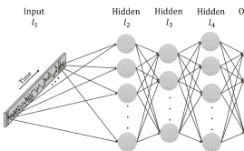
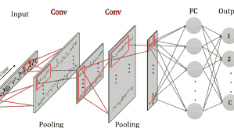
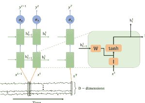
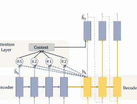
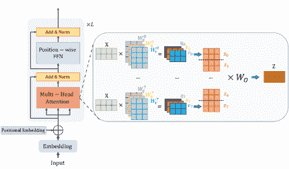

<!--yml

类别：未分类

date: 2024-09-06 19:42:00

-->

# [2302.02515] 深度学习在时间序列分类和外部回归中的应用：当前调查

> 来源：[`ar5iv.labs.arxiv.org/html/2302.02515`](https://ar5iv.labs.arxiv.org/html/2302.02515)

# 深度学习在时间序列分类和外部回归中的应用：当前调查

Navid Mohammadi Foumani navid.foumani@monash.edu.com [0000-0003-2475-6040](https://orcid.org/0000-0003-2475-6040 "ORCID identifier") 莫纳什大学 澳大利亚，Lynn Miller lynn.miller1@monash.edu 莫纳什大学 澳大利亚，Chang Wei Tan chang.tan@monash.edu 莫纳什大学 澳大利亚，Geoffrey I. Webb geoff.webb@monash.edu 莫纳什大学 澳大利亚，Germain Forestier germain.forestier@uha.fr 莫纳什大学 澳大利亚 IRIMAS，奥特-阿尔萨斯大学 法国和 Mahsa Salehi mahsa.salehi@monash.edu 莫纳什大学 澳大利亚（2023）

###### 摘要。

时间序列分类和外部回归是重要且具有挑战性的机器学习任务。深度学习已经彻底改变了自然语言处理和计算机视觉，并在其他领域如时间序列分析中展现出巨大的潜力，其中相关特征常常需要从原始数据中抽象出来，而这些特征在事先并不为人所知。本文调查了深度学习在时间序列分类和外部回归领域的最新进展。我们回顾了这些任务中使用的不同网络架构和训练方法，并讨论了将深度学习应用于时间序列数据时面临的挑战和机遇。我们还总结了时间序列分类和外部回归的两个关键应用，即人类活动识别和卫星地球观测。

深度学习，时间序列，分类，外部回归，综述^†^†版权：acmcopyright^†^†期刊年份：2023^†^†doi：XXXXXXX.XXXXXXX^†^†ccs：计算方法 机器学习方法^†^†ccs：计算方法 监督学习

## 1\. 引言

时间序列分析已被认定为 21 世纪数据挖掘领域十大最具挑战性的研究问题之一 (yang200610, )。时间序列分类（TSC）是一个关键的时间序列分析任务 (esling2012time, )。TSC 构建一个机器学习模型，以预测由有序的实值属性集合组成的数据的类别标签。时间序列分析的许多应用包括人类活动识别 (nweke2018deep, ; wang2019deep, ; chen2021deep, )、基于电子健康记录的诊断 (schirrmeister2017deep, ; rajkomar2018scalable, )，以及系统监控问题 (bagnall2018uea, )。加州大学河滨分校（UCR） (dau2019ucr, )和东安格利亚大学（UEA） (bagnall2018uea, )基准档案中数据集类型的广泛多样性进一步展示了 TSC 应用的广度。时间序列外生回归（TSER） (tan2021time, )是 TSC 的对应方法，其输出为数值而非类别。需要注意的是，TSER 不是预测方法，而是理解时间序列与外生变量之间关系的方法。TSER 是一个新兴领域，具有广泛的应用潜力。

深度学习取得了显著成功，尤其是在计算机视觉和自然语言处理方面。许多现代应用都整合了深度学习。深度学习可以从原始数据中自动学习信息特征，消除了手动特征工程的需求。因此，由于其能够学习相关的潜在特征表示，开发深度 TSC 和 TSER 受到了极大的关注。值得注意的是，大多数 TSC 和 TSER 的研究集中在非深度学习方法上。一项最新的基准测试 (middlehurst2023bake, )显示，深度学习方法（InceptionTime (fawaz2020inceptiontime, )）具有竞争力，但在基准档案中的表现未超越现有技术。一个原因是流行的 UCR 和 UEA 基准档案并未为深度学习模型设计。特别是，它们相对较小，而深度学习通常在数据量大的情况下表现更佳。深度学习还可以从与当前硬件，特别是 GPU 的高度兼容中受益，从而实现快速高效的执行。其卓越的可扩展性进一步允许无缝处理不断增长的数据量和计算复杂性，增强了其在处理大数据集中的多功能性。确实，最近的一种用于 TSC 的深度架构 ConvTran (Foumani2023, )在训练样本超过 1 万的情况下，在速度和准确性方面超越了最快的传统模型 ROCKET (dempster2019rocket, )。

一篇关于基于深度学习的 TSC 的高度影响力综述论文（fawaz2019deep）于 2019 年发表。然而，该研究领域发展迅速，之前的综述未能涵盖当前的最新技术。例如，它没有包括 InceptionTime（fawaz2020inceptiontime），这一系统在性能上始终优于 ResNet（wang2017time），即之前综述中表现最佳的系统。此外，它也未涉及注意力模型，这些模型近年来受到极大关注，并展示了建模顺序数据中长期依赖关系的优异能力，非常适合时间序列建模（wen2022transformers）。许多注意力变体已经提出，以应对时间序列建模中的特定挑战，并成功应用于 TSC（hao2020new；zerveas2021transformer；Foumani2023）。此外，之前的综述未包括自监督学习，这一新兴范式（liu2021self）通过设计前置任务来引导监督，而不是依赖预定义的先验知识，并在低标签数据集上表现出非常有前景的结果（eldele2021time；yang2021voice2series；yue2022ts2vec；foumani2023series2vec）。

随着注意力机制、自监督学习和各种新的时间序列分类（TSC）网络配置的出现，对深度学习在 TSC 中的系统性和全面性调查将极大地惠及时间序列社区。本文旨在填补这一空白，通过总结基于深度学习的时间序列分析的最新进展，特别是 TSC 和时间序列回归（TSER）。在定义和对时间序列分类及外部回归任务的简要介绍之后，我们提出了一种基于不同方法学视角的新分类法。讨论了多层感知器（MLP）、卷积神经网络（CNN）、递归神经网络（RNN）、图神经网络（GNN）和基于注意力的模型等多种架构，并对提升性能所做的改进进行了探讨。此外，还探讨了各种自监督学习前置任务，例如对比学习和自我预测。我们还回顾了适用于时间序列数据的有用数据增强和迁移学习策略。此外，我们还总结了 TSC 和 TSER 的两个关键应用，即人类活动识别和地球观测。

## 2\. 背景与定义

本节首先提供了理解训练深度神经网络（DNNs）用于时间序列分类（TSC）和时间序列回归（TSER）任务的必要定义和背景信息。我们从定义关键术语和概念开始，如时间序列数据和时间序列监督学习。最后，我们提出了用于 TSC 和 TSER 任务的不同深度学习方法的分类法。

### 2.1\. 时间序列

时间序列数据是按时间索引的数据点序列。

###### 定义 2.1。

时间序列 $X$ 是 $T$ 对测量和时间戳的有序集合，

$X=\{(x_{1},t_{1}),(x_{2},t_{2}),...,(x_{T},t_{T})\}$，其中 $x_{i}\in\mathbb{R}^{D}$ 且 $t_{1}$ 到 $t_{T}$ 是一些测量 $x_{1}$ 到 $x_{T}$ 的时间戳。

每个 $x_{i}$ 是一个 $D$ 维值向量，表示序列中捕获的每个特征。当 $D=1$ 时，序列称为 *单变量*。当 $D>1$ 时，序列称为 *多变量*。

### 2.2\. 时间序列监督学习任务

本文关注两个时间序列学习任务：时间序列外部回归和时间序列分类。分类和回归都是监督学习任务，它们学习目标变量与一组时间序列之间的关系。我们考虑从一个数据集 $D=\left\{(X_{1},Y_{1}),(X_{2},Y_{2}),...,(X_{N},Y_{N})\right\}$ 中学习，该数据集包含 $N$ 个时间序列，其中 $Y_{i}$ 表示每个 $X_{i}$ 的目标变量。需要注意的是，为了便于描述，我们在讨论中假设序列长度相同，但大多数方法可以轻松扩展到长度不等的序列情况。TSER 和 TSC 之间的主要区别在于，TSC 从有限类别集合中为时间序列预测一个类别值，而 TSER 为输入时间序列外部的变量预测一个连续值。通常 $Y_{i}$ 是一个用于 TSC 的 one hot 编码向量或用于 TSER 的数值。

在深度学习的背景下，监督学习模型是一个神经网络，它执行以下函数将输入时间序列映射到目标变量：

| (1) |  | $f_{L}(\theta_{L},X)=f_{L-1}(\theta_{L-1},f_{L-2}(\theta_{L-2},\ldots,f_{1}(\theta_{1},X)))$ |  |
| --- | --- | --- | --- |

其中 $f_{i}$ 代表非线性函数，$\theta_{i}$ 表示第 $i$ 层的参数。对于 TSC，神经网络模型被训练来将时间序列数据集 $D$ 映射到一组包含 $C$ 个类别标签的 $Y$。训练后，神经网络输出一个包含 $C$ 个值的向量，估计序列 $X$ 属于每个类别的概率。这通常通过神经网络最后一层的 softmax 激活函数来实现。softmax 函数为所有相关类别估计概率，使它们在所有类别中总和为 1。交叉熵损失通常用于训练具有 softmax 输出或分类类型的神经网络。

另一方面，TSER 训练神经网络模型，将时间序列数据集 $D$ 映射到一组数值 $Y$。与输出概率不同，回归神经网络为时间序列输出一个数值。它通常在神经网络的最终层使用线性激活函数。然而，也可以使用任何具有单一值输出的非线性函数，如 sigmoid 或 ReLU。回归神经网络通常使用均方误差或均绝对误差损失函数进行训练。然而，根据目标变量的分布和最终激活函数的选择，也可以使用其他损失函数。

### 2.3. TSC 和 TSER

TSC 是一个快速发展的领域，每年都有数百篇论文发表（bagnall2018uea；dau2019ucr；bagnall2017great；fawaz2019deep；ruiz2020great）。TSC 中大多数工作不基于深度学习。在这项调查中，我们关注于深度学习方法，并将有兴趣的读者参考附录 A 和基准论文（middlehurst2023bake；bagnall2017great；ruiz2020great），以获取更多有关非深度学习方法的细节。大多数深度学习方法在 TSC 中具有实值输出，这些输出被映射到类别标签上。TSER（tan2021time；tan2020monash）是一个研究较少的任务，其中预测值为数值而非类别值。尽管本调查中涵盖的大多数架构是为 TSC 设计的，但需要注意的是，将它们大多数适配于 TSER 是很简单的。

基于深度学习的 TSC 方法可以分为两种主要类型：生成型和判别型（langkvist2014review）。在 TSC 社区中，生成型方法通常被认为是基于模型的（bagnall2017great），旨在理解和建模输入序列 $X$ 和输出标签 $Y$ 的联合概率分布，表示为 $p(X,Y)$。另一方面，判别模型则专注于建模给定输入序列 $X$ 时输出标签 $Y$ 的条件概率，表示为 $p(Y|X)$。

生成模型，如堆叠去噪自编码器（SDAE），由 Bengio 等人提出（bengio2013generalized,），用于识别输入数据分布的显著结构，Hu 等人（hu2016transfer,）在为时间序列任务训练分类器之前，使用了相同的模型进行预训练。已经开发了一个通用神经网络编码器，将可变长度的时间序列转换为固定长度的表示（serra2018towards,）。此外，结合转移学习方法的深度置信网络（DBN）以无监督的方式建模时间序列的潜在特征（banerjee2019deep,）。回声状态网络（ESN）用于通过重建原始原始时间序列来学习适当的时间序列表示，然后训练分类器（aswolinskiy2018time,）。生成对抗网络（GANs）是流行的生成模型之一，通过学习区分真实和合成示例来生成新示例。各种 GANs 已被开发用于时间序列，并在最近的调查中进行了回顾（GanSurvey2021,）。通常，实现生成方法更复杂，因为它需要额外的训练步骤。此外，生成方法通常不如判别方法高效，后者直接将原始时间序列映射到类别概率分布。由于这些障碍，研究人员往往集中于判别方法。因此，本调查主要关注端到端的判别方法。

### 2.4\. 深度学习在 TSC 和 TSER 中的分类

{森林}

对于树=父节点 锚点=子节点，子节点锚点=父节点，锚点=北，绘制，对齐=左，内边距=1.75pt，圆角=2pt，字体=， ，其中级别=0 的间隔=10pt，填充=红色!5!白色!80!绿色!40，其中级别=1 的间隔=6pt，填充=红色!60!白色!80!黄色!40，其中级别=2 的间隔=2pt，填充=红色!40!白色!80!蓝色!40，其中级别=3 的间隔=2pt，填充=红色!10!白色!80!蓝色!40，其中级别=4 填充=红色!5!白色!80!绿色!40，分叉边，时间序列分类和外部回归的深度学习方法，[监督（第[3 节），名称=S，间隔=6pt，[多层

感知机，名称=MLP，旋转=0，锚点=北] [卷积

神经网络，名称=CNN，对于树=生长’=0，文件夹，绘制，[适应的

卷积

神经网络，名称=ACNN] [成像时间

系列，名称=ITS] [多尺度

操作，名称=MSO] ] [递归

神经

网络，名称=RNN，对于树=生长’=0，文件夹，绘制，[原始递归

神经网络，名称=RRN] [长短期记忆，名称=LSTM] [门控递归单元，名称=GRU] [混合，名称=RCNN] ] [图神经

网络，名称=GNN，旋转=0，锚点=北] [注意力，名称=Attn，对于树=生长’=0，文件夹，绘制，[自注意力，名称=SA] [变换器，名称=Trans] ] ] 自监督

(Sec.[4), name=SS, for tree=grow’=0,folder,draw, [自预测，name=SSCNN] [对比-

学习，name=SSAttn] [其他前提

任务，name=SSGNN, ] ] 数据

增强

(Sec.[5), name=DA, for tree=grow’=0,folder,draw, [随机

变换，name=RT] [窗口方法，name=WM] [平均方法，name=AM] ] 迁移

学习

(Sec.[6), name=TL,rotate=0,anchor=north ] ]

图 1\. 从网络配置和应用领域的角度来看，时间序列分类/外部回归的深度学习（DL）分类学。

为了提供对现有时间序列分类（TSC）深度学习模型的有组织总结，我们提出了一种分类法，根据深度学习方法和应用领域对这些模型进行分类。该分类法在图 1 中进行了说明。在第三部分中，我们回顾了用于 TSC 的各种网络架构，包括多层感知器、卷积神经网络、递归神经网络、图神经网络以及基于注意力的模型。我们还讨论了对这些模型进行的改进，以提高它们在时间序列任务上的性能。此外，第四部分探讨了各种类型的自监督学习前置任务，如对比学习和自我预测。我们还在第 5 和 6 节中回顾了时间序列数据的有用数据增强和迁移学习策略。除了方法，我们在第七部分总结了 TSC 和 TSER 的关键应用。这些应用包括人类活动识别和卫星地球观测，这些任务重要且具有挑战性，可以从深度学习模型的使用中受益。总体而言，我们提出的分类法以及这些章节中的讨论提供了关于时间序列分析深度学习的现状的全面概述，并概述了未来的研究方向。

## 3\. 监督模型

本节回顾了基于深度学习的 TSC 模型，并通过突出其优缺点来讨论它们的架构。有关深度模型架构及其对时间序列数据的适应的更多细节，请参见附录 B。

### 3.1\. 多层感知器（MLP）

最直接的神经网络架构是全连接网络（FC），也称为多层感知器（MLP）。在 MLP 模型中，层数和神经元的数量被定义为超参数。然而，诸如自适应 MLP (del2021auto,)等研究已经尝试根据训练时间序列数据的性质自动确定隐藏层中的神经元数量。这使得网络能够适应训练数据的特性，并优化其在当前任务上的表现。

使用多层感知器（MLPs）处理时间序列数据的主要限制之一是它们不适合捕捉这种数据中的时间依赖性。MLP 是前馈网络，以固定和预定的顺序处理输入数据，而不考虑输入值之间的时间关系。各种研究将 MLP 与其他特征提取器如动态时间规整（DTW）一起使用以解决这个问题 (iwana2016robust, ; iwana2020dtw,)。DTW-NN 是一个前馈神经网络，它利用 DTW 的弹性匹配能力，将层的输入动态对齐到权重，而不是使用固定的输入到权重的映射。这种权重对齐用 DTW 替代了神经元中的标准点积。通过这种方式，DTW-NN 能够解决时间序列识别中的困难，如时间扭曲和前馈架构中的可变模式长度 (iwana2020dtw,)。类似地，符号聚合近似（SAX）被用来将时间序列转换为符号表示，并基于符号表示生成单词序列 (tabassum2022time,)。这些基于符号时间序列的单词随后被用作训练一个两层 MLP 进行分类的输入。

尽管上述模型尝试解决 MLP 模型在捕捉时间依赖性方面的不足，但它们在捕捉时间不变特征方面仍然存在其他限制 (wang2017time,)。此外，MLP 模型无法以层次化或多尺度的方式处理输入数据。时间序列数据通常在不同尺度上展示模式和结构，例如长期趋势和短期波动。MLP 模型无法捕捉这些模式，因为它们只能以单一的、固定长度的表示处理输入数据。此外，当面对不规则采样的时间序列数据时，MLP 可能会遇到困难，其中观测数据并不是在均匀的时间间隔内记录的。许多其他深度学习模型更适合处理时间序列数据，例如递归神经网络（RNNs）、卷积神经网络（CNNs）和专门设计用于捕捉时间序列数据中的时间依赖性和模式的变换器。

### 3.2\. 基于 CNN 的模型

自 2012 年 AlexNet 取得成功以来，CNN 已经进行了一些改进（krizhevsky2012imagenet,），例如使用更深的网络、应用更小且更高效的卷积滤波器、添加池化层以减少特征图的维度，以及利用批量归一化来提高训练的稳定性（gu2018recent,）。这些改进在许多领域，如计算机视觉、语音识别和自然语言处理问题中已经证明非常成功（lecun2015deep,；gu2018recent,）。由于 CNN 架构在这些不同领域的成功，研究人员也开始将其应用于时间序列分类（TSC）。请参见表 1，了解本文中评审的 CNN 模型列表。

#### 3.2.1\. 适应性 CNN 用于 TSC 和 TSER

本节介绍第一个类别，我们称之为针对 TSC 和 TSER 的适应性 CNN。这里讨论的论文主要是一些没有特定预处理或数学特征的适应性改编，例如将系列转换为图像或使用多尺度卷积，因此不适合其他类别。

第一个针对 TSC 的 CNN 是多通道深度卷积神经网络（MC-DCNN）（zheng2014time,）。它通过独立地对每个输入通道应用卷积来处理多变量数据。每个输入维度经历两个卷积阶段，使用 ReLU 激活，然后进行最大池化。每个维度的输出被连接并传递给一个全连接层，然后输入最终的 softmax 分类器进行分类。类似于 MC-DCNN，提出了一种用于人体活动识别的三层卷积神经网络（MC-CNN）（yang2015deep,）。与 MC-DCNN 不同，这个模型在早期阶段同时对所有输入通道应用 1D 卷积，以捕捉时间和空间关系。MC-CNN 架构的 2 阶段版本被赵等人（zhao2017convolutional,）用于 UCR 时间序列数据挖掘档案的最早版本。作者还进行了消融研究，以评估具有不同数量卷积滤波器和池化类型的 CNN 模型的性能。

全

除了调整网络架构外，一些研究还专注于修改卷积核以更好地适应 TSC 任务。膨胀卷积神经网络（DCNNs）(li2018csrnet, ) 是一种使用膨胀卷积来增加网络接收场的 CNN，但不增加参数数量的网络。膨胀卷积在卷积过程中在卷积核的元素之间创建间隙，从而覆盖输入的更大区域。这使得网络能够捕捉数据中的长距离依赖关系，使其非常适合 TSC 任务 (yazdanbakhsh2019multivariate, )。最近，Disjoint-CNN (foumani2021disjoint, ) 表明将 1D 卷积核分解为不相交的时间和空间组件，可以提高准确性而几乎没有额外的计算成本。应用不相交的时间卷积然后进行空间卷积的效果类似于倒置瓶颈 (sandler2018mobilenetv2, )。与倒置瓶颈类似，时间卷积扩展了输入通道的数量，而空间卷积则将扩展的隐藏状态投影回原始大小，以捕捉时间和空间的交互关系。

#### 3.2.2\. 成像时间序列

在 TSC 中，一种常见的方法是将时间序列数据转换为固定长度的表示，如向量或矩阵，然后将其输入到深度学习模型中。然而，对于长度不同或具有复杂时间依赖关系的时间序列数据，这可能是具有挑战性的。解决这个问题的一种方法是将时间序列数据表示为类似图像的格式，其中每个时间步骤被视为图像中的一个单独通道。这使得模型能够从数据中的空间关系中学习，而不仅仅是时间关系。在这种情况下，空间一词指的是时间序列中单个时间步骤内不同变量或特征之间的关系。

作为使用原始时间序列数据作为输入的替代方案，王和奥茨将单变量时间序列数据编码成不同类型的图像，然后由常规卷积神经网络（wang2015encoding）处理。这个基于图像的框架开启了时间序列深度学习方法的新分支，将图像变换视为特征工程技术之一。王和奥茨提出了将时间序列转化为图像的两种方法。第一种生成一个 Gramian Angular Field（GAF），而第二种生成一个 Markov Transition Field（MTF）。GAF 在极坐标系中表示时间序列数据，并使用各种操作将这些角度转换为对称矩阵，而 MTF 使用数据点从一个时间步到另一个时间步的转移概率对矩阵条目进行编码（wang2015encoding）。在这两种情况下，图像生成增加了时间序列的大小，使得图像可能变得过于庞大。因此，他们提出了在不丢失太多信息的情况下减少图像大小的策略。随后，将这两种图像合并为一个双通道图像，然后用以生成比单独使用每张图像时更好的结果。最后，应用一个 Tiled CNN 模型来对时间序列图像进行分类。在其他研究中，提出了多种转换方法，包括 Recurrence Plots（RP）（hatami2018classification）、Gramian Angular Difference Field（GADF）（karimi2018scalable）、双线性插值（zhao2019classify）和 Gramian Angular Summation Field（GASF）（yang2019sensor），旨在将时间序列转换为输入图像，以期望二维图像能够揭示在原始时间序列的一维序列中未发现的特征和模式。

Hatami et al. (hatami2018classification, ) 提出了一种基于 RP (kamphorst1987recurrence, )的表示方法，将时间序列转换为 2D 图像，并使用 CNN 模型进行时间序列分类。在他们的研究中，时间序列被视为不同的递归行为，如周期性和不规则的周期性，这些都是动态系统的典型现象。使用 RP 方法的主要思想是揭示某些轨迹在何处返回到先前的状态。最后，应用了两阶段卷积和两个全连接层来分类 RP 生成的图像。随后，使用预训练的 Inception v3 (szegedy2016rethinking, )将 GADF 图像映射到 2048 维向量空间。最终阶段使用了一个包含三层隐藏层的 MLP，后接 softmax 激活函数 (karimi2018scalable, )。按照相同的框架，陈和石 (chen2019deep, ) 采用了相对位置矩阵和 VGGNet（RPMCNN）来使用转换 2D 图像对时间序列数据进行分类。他们的结果显示，通过将单变量时间序列数据转换为使用两个时间戳之间的相对位置的 2D 图像，取得了良好的效果。按照惯例，使用了三种图像编码方法：GASF、GADF 和 MTF，将多变量时间序列数据编码为二维图像 (yang2019sensor, )。结果表明，ConvNet 的简单结构足以进行分类，因为其表现与 VGGNet 的复杂结构一样出色。

总体而言，将时间序列数据表示为 2D 图像可能很困难，因为在数据中保留时间关系和模式可能具有挑战性。这种转换也可能导致信息丢失，使得模型难以准确分类数据。陈和石 (chen2019deep, ) 也展示了在此过程中使用的 GASF、GADF 和 MTF 等特定转换方法并未显著改善预测结果。

| 模型 | 年份 | 基线架构 | 其他特性 |
| --- | --- | --- | --- |
| 改编 |
| MC-DCNN (zheng2014time, ) | 2014 | 2 阶段卷积 | 每个通道独立卷积 |
| MC-CNN (yang2015deep, ) | 2015 | 3 阶段卷积 | 在所有通道上进行 1D 卷积 |
| Zhao et al. (zhao2017convolutional, ) | 2015 | 2 阶段卷积 | 与 MC-CNN 结构相似 |
| FCN (wang2017time, ) | 2017 | FCN | 使用 GAP 代替 FC 层 |
| ResNet (wang2017time, ) | 2017 | ResNet 9 | 使用 3 个残差块 |
| Res-CNN (zou2019integration, ) | 2019 | RezNet+FCN | 使用 1 个残差块+FCN |
| DCNNs (yazdanbakhsh2019multivariate, ) | 2019 | 4 阶段卷积 | 使用膨胀卷积 |
| Disjoint-CNN (wang2017time, ) | 2021 | 4 阶段卷积 | 不同的时间和空间卷积 |
| 序列到图像 |
| Wang&Oates(wang2015encoding, ) | 2015 | 瓦片 CNN | GAF, MT |
| Hatami et al.(hatami2018classification, ) | 2017 | 2 级卷积 | 递归图 |
| Karimi et al.(karimi2018scalable, ) | 2018 | Inception V3 | GADF |
| Zhao et al. (zhao2019classify, ) | 2019 | ResNet18, ShuffleNet V2 | 双线性插值 |
| RPMCNN (chen2019deep, ) | 2019 | VGGNet, 2 级卷积 | 相对位置矩阵 |
| Yang et al. (yang2019sensor, ) | 2019 | VGGNet | GASF, GADF, MTF |
| 多尺度操作 |
| MCNN (cui2016multi, ) | 2016 | 2 级卷积 | 恒等映射、平滑、降采样 |
| t-LeNet (le2016data, ) | 2016 | 2 级卷积 | 压缩和扩张 |
| MVCNN (liu2018time, ) | 2019 | 4 级卷积 | 基于 Inception V1 |
| Brunel et al. (brunel2019cnn, ) | 2019 | Inception V1 |  |
| InceptionTime (fawaz2020inceptiontime, ) | 2019 | Inception V4 | 集成 |
| EEG-inception (sun2021prototypical, ) | 2021 | InceptionTime |  |
| Inception-FCN (usmankhujaev2021time, ) | 2021 | InceptionTime + FCN |  |
| KDCTime (gong2022kdctime, ) | 2022 | InceptionTime | 知识蒸馏、标签平滑 |
| LITE (ismail2023lite, ) | 2023 | InceptionTime | 多路复用、扩张和自定义滤波器 |

表 1\. 时间序列分类和外部回归的 CNN 模型总结

#### 3.2.3\. 多尺度操作

这里讨论的论文应用了多尺度卷积核来处理输入序列或在不同尺度上对输入序列进行常规卷积。多尺度 CNN（MCNN） (cui2016multi, )和时间 LeNet（t-LeNet） (le2016data, )被认为是首批将输入序列预处理以应用多尺度卷积而非原始序列的模型。MCNN 和 t-LeNet 的设计灵感来自计算机视觉模型，这意味着它们是从最初为图像识别任务开发的模型中改编而来的。这些模型可能不太适合 TSC 任务，性能可能不如专门为此目的设计的模型。一个潜在的原因是这些模型中使用的渐进池化层，这在计算机视觉模型中很常见，用于减少输入数据的大小并使其更易处理。然而，当这些池化层应用于时间序列数据时，效果可能不如预期，可能会限制模型的性能。

MCNN 具有简单的架构，包括两个卷积层和一个池化层，之后是一个全连接层和一个 softmax 层。然而，这种方法涉及大量的数据预处理。具体来说，在任何训练之前，他们使用滑动窗口提取时间序列子序列，随后，这些子序列将经历三种转换：（1）身份映射，（2）下采样，以及（3）平滑，这导致将单变量输入时间序列转换为多变量序列。最后，转换后的输出被输入到 CNN 模型中以训练分类器 (cui2016multi, )。t-LeNet 使用两种数据增强技术：窗口切割（WS）和窗口扭曲（WW），以防止过拟合 (le2016data, )。WS 方法与 MCNN 的数据增强相同。第二种数据增强技术 WW，使用一种扭曲技术来压缩或扩展时间序列。WS 还用于确保提取的子序列具有相同的长度，以便训练网络处理不同长度的时间序列。因此，给定的长度为$L$的输入时间序列首先通过 WW 扩展 $(\times 2)$，然后通过 WW 压缩 $(\times 1/2)$，生成三条长度为$L,2L,1/2L$的时间序列，这些时间序列被输入到 WS 中以提取相等长度的子序列进行训练。最后，由于 MCNN 和 t-LeNet 都对每个提取的子序列进行分类预测，因此采用多数投票来获得整个时间序列的类别预测。

Inception 最早由 Szegedy 等人提出 (szegedy2015going, ) 用于端到端的图像分类。现在，该网络已经发展成为 Inception-v4，其中 Inception 与残差连接结合，以进一步提高性能 (szegedy2017inception, )。受到 Inception 架构的启发，设计了一个多变量卷积神经网络（MVCNN），使用多尺度卷积核来寻找最佳局部构造 (liu2018time, )。MVCNN 使用三种尺度的滤波器，包括$2\times 2$、$3\times 3$和$5\times 5$，来提取传感器之间的交互特征。一维 Inception 模型被用于超新星分类，利用空间区域的光流作为网络的输入 MTS (brunel2019cnn, )。然而，作者将他们的 Inception 架构的概念限制在这个模型的第一个版本 (szegedy2015going, )。Inception-ResNet (ronald2021isplinception, )架构包括卷积层，接着是 Inception 模块和残差块。Inception 模块用于学习数据的多种尺度和方面，使网络能够捕捉到更复杂的模式。残差块用于学习网络输入和输出之间的残差或差异，从而提高其性能。

InceptionTime (fawaz2020inceptiontime, ) 探索了比任何先前提出的网络更大的滤波器，以在 UCR 基准上达到最先进的性能。InceptionTime 是五个随机初始化的 inception 网络模型的集成，每个模型由两个 inception 模块块组成。每个 inception 模块首先使用长度和步幅为 1 的瓶颈层减少多变量时间序列的维度，同时保持相同的长度。然后，对瓶颈层的输出应用不同长度的 1D 卷积，以提取不同大小的模式。与此同时，对原始时间序列应用一个最大池化层，之后是一个瓶颈层，以提高模型对小扰动的鲁棒性。卷积层和最大池化层的输出被堆叠形成一个新的多变量时间序列，然后传递到下一层。每个 inception 块之间使用残差连接以减少梯度消失效应。第二个 inception 块的输出被传递到 GAP 层，然后输入到 softmax 分类器中。

InceptionTime 的强大性能激发了许多扩展。像 InceptionTime 一样，EEG-inception (sun2021prototypical, ) 使用几个 inception 层和残差连接作为其骨干。此外，提出了基于噪声添加的数据增强 EEG 信号的方法，这提高了平均准确性。InceptionFCN (usmankhujaev2021time, ) 专注于结合两个著名的深度学习技术，即 Inception 模块和全卷积网络 (usmankhujaev2021time, )。在 KDCTime (gong2022kdctime, ) 中，引入了标签平滑（LSTime）和知识蒸馏（KDTime），这些在压缩推理模型时自动生成。此外，KDCTime 中的带校准的知识蒸馏（KDC）提供了两种校准策略：通过翻译的 KDC（KDCT）和通过重新排序的 KDC（KDCR）。LITE (ismail2023lite, ) 解决了 InceptionTime 的复杂性，同时保持了其 TSC 性能。利用 DepthWise 可分离卷积，LITE 结合了多路复用、扩张卷积和自定义滤波器 (ismail2022deep, ) 以提高效率。

### 3.3\. 递归神经网络

递归神经网络是内置内存的神经网络类型，用于处理时间序列和顺序数据。概念上类似于前馈神经网络（FFNs），RNNs 在处理可变长度输入和生成可变长度输出方面有所不同。

#### 3.3.1\. 原始递归神经网络（Vanilla RNNs）

针对时间序列分类（TSC）已经提出了递归神经网络（RNN）的方案（husken2003recurrent）。利用 RNN，输入序列根据其动态行为进行了分类。他们使用了序列到序列的架构，在该架构中，输入序列的每个子序列在第一步被分类。然后将`argmax`函数应用于整个输出，最终，具有最高值的神经元指定了分类结果。为了提高模型的并行化和容量，dennis2019shallow 提出了一个两层 RNN。在第一层中，输入序列被拆分为多个独立的 RNN，以提高并行化，然后第二层利用第一层的输出捕捉长期依赖关系（dennis2019shallow）。此外，RNN 也被用于一些层次结构（fernandez2007sequence；hermans2013training）。Hermans 和 Schrauwen 展示了更深版本的递归神经网络能够对复杂的时间任务进行层次处理，并比浅层版本更自然地捕捉时间序列结构（hermans2013training）。RNN 通常通过一种称为时间反向传播（BPTT）的过程进行迭代训练。当在时间上展开时，RNN 看起来像是具有共享参数的非常深的网络。在 RNN 的更深神经层中，由于链式法则，梯度在每个时间步上被求和以训练模型。因此，梯度由于链式法则而经历连续的矩阵乘法，要么指数级地缩小并具有小值，称为消失梯度，要么膨胀到非常大的值，称为爆炸梯度（pascanu2013difficulty）。这些问题促使了名为长短期记忆（LSTM）（hochreiter1997long）和门控递归单元（GRU）（chung2014empirical）的深度架构的二阶方法的发展。

#### 3.3.2\. 长短期记忆网络（LSTM）

LSTM 通过将记忆单元和门控控制集成到状态动态中，解决了普通 RNN 中的常见梯度消失/爆炸问题 (hochreiter1997long, )。由于其设计特性，LSTM 适用于涉及序列数据的问题，如语言翻译 (sutskever2014sequence, )、视频表示学习 (donahue2015long, ) 和图像描述生成 (karpathy2015deep, )。TSC 问题也不例外，主要采用类似于语言翻译的模型 (sutskever2014sequence, )。序列到序列模型与注意力机制（S2SwA） (tang2016sequence, )在 TSC 中包含两个 LSTM，一个编码器和一个解码器，以序列到序列的方式工作。在这个模型中，编码器 LSTM 接受任意长度的输入时间序列，并从原始数据中提取信息，基于这些信息解码器 LSTM 构建固定长度的序列，这些序列可以视为用于分类的自动提取特征。

#### 3.3.3\. 门控循环单元（GRU）

GRU 是另一种广泛使用的 RNN 变体，其在控制信息流和记忆跨多个时间步的上下文方面与 LSTM 相似 (chung2014empirical, )。类似于 S2SwA (tang2016sequence, )，基于 GRU 的序列自动编码器（SAE）也被定义用来处理 TSC 问题 (malhotra2017timenet, )。通过使用 GRU 作为编码器和解码器处理各种输入长度，从而生成固定大小的输出。通过在大量未标记数据上预训练参数，模型的准确性也得到了提高。

#### 3.3.4\. 混合模型

CNN 和 RNN 经常结合使用于 TSC，因为它们具有互补的优势。如前所述，CNN 非常适合从数据中的空间关系中学习，例如时间序列中不同时间步之间的通道模式和相关性。这使得它们能够从时间序列数据中学习有用的特征，从而帮助提高分类性能。另一方面，RNN 非常适合从数据中的时间依赖性中学习，例如时间序列的过去值，这些值可以帮助预测未来值。这使得它们能够捕捉时间序列数据的动态特性，并做出更准确的预测。结合 CNN 和 RNN 的优势，使得可以从时间序列数据中学习空间和时间特征，从而提高 TSC 模型的性能。此外，这两种模型可以一起训练，使它们能够相互学习，提高模型的整体性能。

后来提出了各种扩展，如 MLSTM-FCN (karim2019multivariate, )、TapNet (zhang2020tapnet, ) 和 SMATE (zuo2021smate, ) 来处理时间序列数据。MLSTM-FCN 将单变量 LSTM-FCN 模型 (karim2017lstm, ) 扩展到多变量情况。与 LSTM-FCN 类似，多变量版本包含 LSTM 块和完全卷积块，用于从输入序列中提取特征。FCN 块中还添加了一个 squeeze 和 excite 块，可以对前面层的输出特征图执行自注意力形式 (karim2019multivariate, )。另外两个多变量 TSC 的提案是时间序列注意力原型网络（TapNet）和半监督时空（SMATE） (zhang2020tapnet, ; zuo2021smate, )。这些方法结合了传统基于距离的方法和深度学习方法的相对优势。

MLSTM-FCN、TapNet 和 SMATE 采用了双网络架构。输入被分别送入 CNN 和 RNN 模型，然后在最终任务的全连接层之前进行集中处理。然而，由于最终分类结果是通过连接两个分支的输出生成的，一个分支无法完全利用另一个分支的隐藏状态进行特征提取。这激发了不同类型的架构，尝试逐层整合 CNN 和 RNN 模型。这催生了不同的架构，例如 GCRNN (lin2017gcrnn, ) 和 CNN-LSTM (mutegeki2020cnn, )，旨在逐层整合 CNN 和 RNN。

虽然递归神经网络通常用于时间序列预测，但仅有少数研究将其应用于 TSC，主要由于以下四个原因：（1）RNN 通常面临梯度消失和爆炸问题，因其在长时间序列上进行训练 (pascanu2012understanding, )。（2）RNN 被认为难以训练和并行化，因此研究人员不太可能使用它们，因为它们计算成本高 (pascanu2013difficulty, )。（3）递归架构主要是从以前的数据中学习以对未来进行预测 (langkvist2014review, )。（4）RNN 模型可能无法有效捕捉和利用长序列中的长期依赖关系 (tang2016sequence, )。

### 3.4\. 基于注意力的模型

尽管 CNN 模型在捕获局部时空相关性方面表现出色，但这些模型无法有效捕获和利用长程依赖关系。此外，它们只考虑数据点的局部顺序，而不是所有数据点的整体顺序。因此，许多最近的研究都嵌入了循环神经网络（RNN），如 LSTMs，以捕获这些信息（karim2017lstm, ; karim2019multivariate, ; zhang2020tapnet, ）。基于 RNN 的模型的缺点是计算开销大，并且它们捕获长程依赖性的能力受到限制（vaswani2017attention, ; hao2020new,）。另一方面，注意力模型可以捕获长程依赖性，并且它们更广泛的感受野提供了更多的上下文信息，这可以提高模型的学习能力。注意力机制旨在通过聚焦于关键特征并抑制不必要的特征来增强网络的表示能力。不足为奇的是，在注意力模型在自然语言处理中取得成功后（vaswani2017attention, ; devlin2018bert,），许多先前的研究尝试将注意力模型的能力引入到各种领域，如计算机视觉（dosovitskiy2020image,）和时间序列分析（hao2020new, ; li2019enhancing, ; zhou2021informer, ; zerveas2021transformer, ; kostas2021bendr,）。表 2 列出了本文中审查的基于注意力的模型的列表。

#### 3.4.1\. 自注意力

自注意力由于能够捕捉文本中的长期依赖，在各种自然语言处理任务中已被证明有效 (vaswani2017attention, )。最近，它在 TSC 任务中也被证明是有效的 (hao2020new, ; yuan2018muvan, ; hsieh2021explainable, ; chen2021multi, )。正如我们所提到的，自注意力模块被嵌入到编码器-解码器模型中以提高模型性能。然而，TSC 任务中只使用了编码器和自注意力模块。早期的 TSC 模型遵循与自然语言处理模型相同的骨干结构，使用基于递归的模型，如 RNN (yuan2018novel, ), GRU(yuan2018muvan, ) 和 LSTM(liang2018geoman, ; hu2020multistage, ) 对输入序列进行编码。例如，Multi-View Attention Network (MuVAN) 将双向 GRU 独立应用于每个输入维度作为编码器，然后将所有表示输入到自注意力块中 (yuan2018muvan, )。

由于 CNN 模型的出色表现，许多研究尝试在应用注意力机制之前使用 CNN 对时间序列进行编码 (hao2020new, ; hsieh2021explainable, ; cheng2020novel, ; xiao2021rtfn, )。Cross Attention Stabilized Fully Convolutional Neural Network (CA-SFCN) (hao2020new, ) 和 Locality Aware eXplainable Convolutional ATtention network (LAXCAT) (hsieh2021explainable, ) 将自注意力机制应用于 MTSC 任务，以利用长期依赖。CA-SFCN 结合了 FCN 和两种类型的自注意力——时间注意力 (TA) 和变量注意力 (VA)，它们相互作用以捕捉长期依赖和变量交互。LAXCAT 也使用了时间注意力和变量注意力，以识别信息量大的变量及其在分类中有用的时间间隔。WaveletDTW Hybrid attEntion Networks (WHEN) (wang2023wavelet, ) 将两种注意力机制，即小波注意力和 DTW 注意力，集成到 BiLSTM 中，以增强模型性能。在小波注意力中，他们利用小波计算注意力分数，特别是针对非平稳时间序列中动态频率成分的分析。同时，DTW 注意力使用 DTW 距离来计算注意力分数，解决了多时间序列中时间失真的问题。

为了提高网络性能，已经开发了几种自注意力模型（jaderberg2015spatial, ; woo2018cbam, ），包括专注于通道注意力的 Squeeze-and-Excitation (SE) (hu2018squeeze, ），这通常用于对时间序列数据进行分类（karim2019multivariate, ; chen2021multi, ; wang2021time, ）。SE 块使整个网络能够利用全局信息，有选择地关注信息丰富的特征图，并抑制不那么重要的特征图（hu2018squeeze, ）。更重要的是，SE 块可以提高早期层中共享低级表示的质量，并在后期层对不同输入响应时变得越来越专业。每个特征图的权重在网络的每一层中自动学习，SE 块可以提升整个网络中的特征辨别能力。多尺度注意力卷积神经网络（MACNN） (chen2021multi, )应用不同核大小的卷积来捕捉沿时间轴的不同尺度信息，通过生成不同尺度的特征图。然后使用 SE 块来增强有用的特征图，并通过自动学习每个特征图的重要性来抑制不太有用的特征图。

#### 3.4.2\. 变换器

多头注意力的显著性能促使了大量将多头注意力适应于时间序列分类（TSC）领域的尝试。用于分类的变换器通常采用由注意力和前馈层组成的简单编码器结构。SAnD（Simply Attend and Diagnose） (song2018attend, )架构采用了一种类似于原始变换器的多头注意力机制（vaswani2017attention, ），首次用于临床时间序列分类。该模型使用位置编码和稠密插值嵌入技术将时间顺序融入到表示学习中。在另一个研究中（jin2021end, ），对振动信号的分类中，使用了时间频率特征，如频率系数和短时傅里叶变换（STFT）谱，作为变换器的输入嵌入。一个基于多头注意力的模型被应用于原始光学卫星 TSC，使用高斯过程插值（Rasmussen2004, ）嵌入，并且优于卷积和递归神经网络（allam2021paying, ）。

Gated Transformer Networks (GTN) (liu2021gated, ) 使用双塔多头注意力捕捉输入序列中的判别信息。此外，它们使用一个可学习的矩阵命名为 gating 来合并两个塔的输出。为了增强变换器对时间序列分类的局部感知，灵活的多头线性注意力 (FMLA) (zhao2022rethinking, ) 集成了可变形卷积块和在线知识蒸馏，以及随机掩码以减少噪声。对于每个时间序列分类数据集，AutoTransformer 在将输出送入多头注意力块之前使用神经架构搜索 (NAS) 算法搜索合适的网络架构。ConvTran (Foumani2023, ) 目前在多变量时间序列分类中处于**最先进**水平。他们对现有的绝对和相对位置编码方法进行了综述。基于当前位置编码在时间序列中的限制，他们分别引入了两个新的编码方式，称为 tAPE 和 eRPE，用于绝对位置和相对位置。将这些提出的位置编码集成到变换器块中，并与卷积层结合，他们提出了一种新的深度学习框架用于多变量时间序列分类—ConvTran。

| 模型 | 年份 | 嵌入 | 注意力 |
| --- | --- | --- | --- |
| MuVAN (yuan2018muvan, ) | 2018 | Bi-GRU | 自注意力 |
| ChannelAtt (yuan2018novel, ) | 2018 | RNN | 自注意力 |
| GeoMAN (liang2018geoman, ) | 2018 | LSTM | 自注意力 |
| Multi-Stage-Att (hu2020multistage, ) | 2020 | LSTM | 自注意力 |
| CT_CAM (cheng2020novel, ) | 2020 | FCN + Bi-GRU | 自注意力 |
| CA-SFCN (hao2020new, ) | 2020 | FCN | 自注意力 |
| RTFN (xiao2021rtfn, ) | 2021 | CNN + LSTM | 自注意力 |
| LAXCAT (hsieh2021explainable, ) | 2021 | CNN | 自注意力 |
| MACNN (chen2021multi, ) | 2021 | 多尺度 CNN | Squeeze-and-Excitation |
| WHEN (wang2023wavelet, ) | 2023 | CNN + BiLSTM | 自注意力 |
| SAnD (song2018attend, ) | 2018 |

&#124; 线性嵌入 &#124;

| 多头 |
| --- |
| T2 (allam2021paying, ) | 2021 |

&#124; 高斯过程回归 + 1D 卷积 &#124;

| 多头 |
| --- |
| GTN (liu2021gated, ) | 2021 | 线性嵌入 | 多头 |
| TRANS_tf (jin2021end, ) | 2021 | 时间-频率特征 | 多头 |
| FMLA (zhao2022rethinking, ) | 2022 | 可变形 CNN | 多头 |
| AutoTransformer (ren2022autotransformer, ) | 2022 | 多尺度 CNN + NAS | 多头 |
| ConvTran (Foumani2023, ) | 2023 | 不相交的 CNN | 多头 |

表 2\. 基于注意力的时间序列分类与外部回归模型总结

### 3.5\. 图神经网络

虽然 CNNs 和 RNNs 在欧几里得数据上表现良好，但许多时间序列问题中的数据更自然地表示为图形 (Jin2023graph, )。例如，在传感器网络中，传感器可能不规则分布，而不是形成一个规则的网格。通过该网络收集的数据的图形表示比使用欧几里得空间更准确地建模这种不规则布局。然而，使用标准深度学习算法从图结构中学习具有挑战性 (Wu2021graph, )。例如，节点可能具有不同数量的邻近节点，这使得应用卷积操作变得困难。

图神经网络 (GNNs) (Scarselli2009graph, ) 是将深度学习技术适配于图领域的方法。早期使用 GNNs 进行时间序列分析的研究主要集中在预测任务上 (Jin2023graph, )。然而，近期的研究开始考虑 GNNs 在 TSC (Xi2023graph, ; Liu2023graph, ) 和 TSER (Bloemheuvel2023graph, ) 任务中的应用。本文评审的 GNN 模型列表见表 3。Time2Graph+ (Cheng2021graph, ) 将每个时间序列转换为形状图。形状从时间序列中提取，并形成图节点。图的边缘基于两个形状之间的转移概率加权。一旦构建了输入图，就使用图注意力网络创建时间序列的表示，然后输入到分类器中。

| 模型 | 年份 | GNN 类型 | 其他组件 |
| --- | --- | --- | --- |
| TGCN (covert2019temporal, ) | 2019 | 图卷积网络 | 1D-CNN |
| DGCNN (Song2020graph, ) | 2020 | 图卷积网络 | 1x1 CNN |
| GraphSleepNet (jia2020graphsleepnet, ) | 2020 | 图卷积网络 | 时间注意力 |
| T-GCN (ma2021deep, ) | 2021 | 图卷积网络 | GRU |
| MRF-GCN (li2020multireceptive, ) | 2021 | 图卷积网络 | 快速傅里叶变换 (FFT) |
| Nhu et al. (nhu2021graph, ) | 2021 | 图卷积网络 | 1D-CNN |
| DCRNN (Tang2021graph, ) | 2021 | 图卷积网络 | GRU |
| Time2Graph+ (Cheng2021graph, ) | 2021 | 图注意力 | 形状变换 |
| RAINDROP (Zhang2021graph, ) | 2021 | 图导向网络 | 时间注意力 |
| STEGON (Censi2021graph, ) | 2021 | 图注意力 | 1D-CNN |
| Azevedo et al. (Azevedo2022graph, ) | 2022 | 图网络块与池化 | 1D-CNN |
| MTPool (Duan2022graph, ) | 2022 | 变分图池化 | 1D-CNN |
| SimTSC (Zha2022graph, ) | 2022 | 图卷积网络 | DTW, ResNet |
| Tulczyjew 等人 (Tulczyjew2022graph, ) | 2022 | 图卷积网络 | 自适应池化 |
| C-DGAM (Sun2023graph, ) | 2023 | 图注意力 | 带注意力的 1D-CNN |
| Dufourg 等人 (Dufourg2023graph, ) | 2023 | 时空图 | 简单线性迭代聚类 |
| TISER-GCN (Bloemheuvel2023graph, ) | 2023 | 图卷积网络 | 1D-CNN |
| TodyNet (Liu2023graph, ) | 2023 | 动态图神经网络 | 1D-CNN |
| LB-SimTSC (Xi2023graph, ) | 2023 | 图卷积网络 | 下界 DTW, ResNet |

表 3\. 时间序列分类和外部回归的图神经网络模型总结

SimTSC (Zha2022graph, ) 构建了一个成对相似性图，其中每个时间序列形成一个节点，边的权重基于 DTW 距离度量计算。节点属性通过特征向量编码器生成。使用 GNN 操作根据相邻时间序列之间的相似性来增强节点特征。这些表示随后用于最终分类步骤，为每个节点生成分类。LB-SimTSC (Xi2023graph, ) 用 LB-Keogh 下界方法 (Keogh2005exact, ) 替代了昂贵的 DTW 计算。

时空 GNN 通过两个模块同时建模空间（或变量间）和时间依赖性。空间模块通过对 GNN（图卷积网络或 GCNs (Kipf2016graph, )）应用图卷积来建模时间序列之间的依赖关系。时间模块使用 RNN (ma2021deep, ; Tang2021graph, ), 1D-CNN (Censi2021graph, ; Azevedo2022graph, ), Attention (Zhang2021graph, ; Sun2023graph, )，或这些的组合 (Jin2023graph, ) 来建模时间序列内的依赖性。然后，将从图层中提取的特征输入到分类或回归层，以生成单一预测 (Tang2021graph, ; Azevedo2022graph, ; Zhang2021graph, ; Sun2023graph, ) 或每个节点的预测 (ma2021deep, ; Censi2021graph, )。

时空 GCNs 通常用于分析传感器阵列，其中图结构模型表示传感器的物理布局。一个常见的例子是脑电图（EEG）数据，其中 EEG 电极的位置被表示为一个图，用于分析 EEG 信号。这些应用包括癫痫检测 (nhu2021graph, )、发作检测 (covert2019temporal, ; Tang2021graph, )、情感识别 (Song2020graph, )和睡眠分类 (jia2020graphsleepnet, )。除了 EEG，GCNs 还被应用于工程应用，如机器故障诊断 (li2020multireceptive, )、坡度变形预测 (ma2021deep, )和地震活动预测 (Bloemheuvel2023graph, )。MTPool (Duan2022graph, )使用时空 GCN 进行多变量时间序列分类。在这项研究中，时间序列中的每个通道由图中的一个节点表示，图的边缘建模通道之间的相关性。GCN 与时间卷积和分层图池化技术相结合。时空 GNNs 还被用于基于对象的图像分析 (Censi2021graph, )和图像时间序列的语义分割 (Tulczyjew2022graph, )。然而，这些方法假设标签和空间关系在时间上是静态的。在许多情况下，这些可能会发生变化。时空*图*（STGs），包括时间边缘和空间边缘，可以建模这些动态关系 (Dufourg2023graph, )。在 STGs 中，每个节点表示一个时间戳下的对象。空间边缘将对象连接到相邻对象，而时间边缘连接到连续图像中的两个对象，如果它们具有共同的像素。

## 4\. 自监督模型

获取大型时间序列数据集的标记数据面临重大成本和挑战。与在标记稀少的数据集、小型数据集或没有监督的数据集上训练的模型相比，在大规模标记时间序列数据集上训练的机器学习模型通常表现出更优越的性能，这导致了各种时间序列机器学习任务中的亚最佳性能 (yue2022ts2vec, ; yang2022unsupervised, )。因此，研究人员和从业者越来越倾向于将注意力转向时间序列的自监督表示学习，而不是依赖于大规模数据集的高质量标注。

自监督表示学习是机器学习的一个子领域，专注于从数据中学习表示，而不需要明确的监督（foumani2023series2vec）。与依赖标记数据的监督学习不同，自监督学习方法利用数据的固有结构以无监督的方式学习有价值的表示。学到的表示可以用于各种下游任务，包括分类、异常检测和预测。本调查特别强调分类作为下游任务。我们根据前提将 TSC 的自监督学习方法分为三组。表 4 列出了本文回顾的自监督模型。

### 4.1\. 对比学习

对比学习涉及模型学习区分正负时间序列示例。时间对比学习（TCL）（hyvarinen2016unsupervised）、可扩展表示学习（SRL 或 T-Loss）（franceschi2019unsupervised）和时间邻域编码（TNC）（tonekaboni2021unsupervised）应用了基于子序列的采样，并假设远离的段是负对，邻近的段是正对。TNC 利用信号生成过程的局部平滑性，定义具有平稳特性的时间邻域，以进一步提高对比损失函数的采样质量。TS2Vec（yue2022ts2vec）使用对比学习层次性地获得每个时间戳的鲁棒上下文表示。它涉及从输入中随机采样两个重叠的子序列，并鼓励公共段上的上下文表示的一致性。编码器通过时间对比损失和实例对比损失进行优化。

除了基于子序列的方法外，其他模型采用基于实例的采样 (eldele2021time, ; wickstrom2022mixing, ; yang2022timeclr, ; yang2022unsupervised, ; zhang2022self, ; meng2023mhccl, )，将每个样本单独处理，以生成用于对比损失的正负样本。时间序列时间和上下文对比（TS-TCC） (eldele2021time, ) 使用弱增强和强增强将输入序列转换为两个视图，然后使用时间对比模块学习稳健的时间表示。对比上下文模块则基于时间对比模块的上下文构建，旨在最大化相同样本上下文之间的相似性，同时最小化不同样本上下文之间的相似性。同样，TimeCLR (yang2022timeclr, ) 引入了 DTW 数据增强，以增强对相位偏移和幅度变化现象的鲁棒性。双线性时间-频谱融合（BTSF） (yang2022unsupervised, ) 使用简单的 dropout 作为增强方法，旨在将频谱信息融入特征表示。同样，时间-频率一致性（TF-C） (zhang2022self, ) 是一种自监督学习方法，利用频率域实现更好的表示。它提出，基于时间的和基于频率的表示，从相同时间序列样本中学习的，应该在时间-频率空间中彼此更相似，而不是不同时间序列样本的表示。

| 模型 | 年份 | 编码器骨干 |  |
| --- | --- | --- | --- |
| 对比学习 |  |  | 其他特性 |
| TCL (hyvarinen2016unsupervised, ) | 2016 | MLP | 基于序列的对比 |
| T-Loss/SRL (franceschi2019unsupervised, ) | 2019 | 因果卷积神经网络 | 基于序列的对比 |
| TNC (tonekaboni2021unsupervised, ) | 2021 | 双向 RNN | 基于序列的对比 |
| TS-TCC (eldele2021time, ) | 2021 | CNN + Transformer | 基于实例/序列的对比 |
| MCL (wickstrom2022mixing, ) | 2021 | FCN | 基于实例的对比 |
| TimeCLR (yang2022timeclr, ) | 2021 | InceptionTime | 基于实例的对比 |
| TS2Vec (yue2022ts2vec, ) | 2021 | 膨胀卷积神经网络 | 基于序列的对比 |
| BTSF (yang2022unsupervised, ) | 2022 | 因果卷积神经网络 | 基于实例的对比 |
| TF-C (zhang2022self, ) | 2022 | ResNet | 基于实例的对比 |
| MHCCL (meng2023mhccl, ) | 2023 | ResNet | 基于实例的对比 |
| 自我预测 |
| BENDR (kostas2021bendr, ) | 2021 | CNN + Transformer | 序列掩码 |
| Voice2Series (yang2021voice2series, ) | 2021 | CNN+Transformer | 二值掩码 |
| TST (zerveas2021transformer, ) | 2021 | Transformers | 二进制掩蔽 |
| TARNet (chowdhury2022tarnet, ) | 2022 | Transformers | 二进制掩蔽 |
| TimeMAE (cheng2023timemae, ) | 2023 | CNN + Transformers | 序列掩蔽 |
| CRT (zhang2023self, ) | 2023 | Transformers | 序列掩蔽 |
| 其他预训练任务 |
| PHIT (ismail2023finding, ) | 2023 | H-InceptionTime |  |
| Series2Vec (foumani2023series2vec, ) | 2023 | 不相交 CNN | 基于相似性的表示学习 |

表 4\. 时间序列分类和外部回归的自监督模型总结

### 4.2\. 自预测

自预测基础的自监督模型的主要目标是重建输入或输入数据的表示。研究探讨了使用基于变压器的自监督学习方法进行时间序列分类（kostas2021bendr, ; yang2021voice2series, ; zerveas2021transformer, ; chowdhury2022tarnet, ; cheng2023timemae, ; zhang2023self, ），借鉴了像 BERT（devlin2018bert, ）这样的模型的成功。受 BERT 启发的神经数据表示（BENDER）（kostas2021bendr, ）使用变压器结构来建模 EEG 序列，并表明它可以有效处理使用不同硬件记录的大量 EEG 数据。另一项研究，基于变压器的语音处理模型（V2Sa）（yang2021voice2series, ）利用大规模预训练的语音处理模型进行时间序列分类。

基于变压器的框架（TST）（zerveas2021transformer, ）和 TARNet (chowdhury2022tarnet, ）将普通变压器适应于多变量时间序列领域，并使用基于自预测的自监督预训练方法，数据被掩蔽。这些研究展示了使用基于变压器的自监督学习方法进行时间序列分类的潜力。

### 4.3\. 其他预训练任务

尽管自监督学习中的许多预训练任务通常是对比性的或自预测性的，但某些任务是专门为时间序列数据量身定制的。在基于图像的自监督学习中，会创建图像的合成变换（数据增强），模型通过对比图像及其变换与训练数据中的其他图像来学习，这对于对象解释效果良好。然而，时间序列分析在定义有意义的自监督学习任务方面与视觉或自然语言处理根本不同。

在这一见解的指导下，Foumani 等人（foumani2023series2vec）介绍了 Series2Vec，这是一种新颖的自监督表示学习方法。与时间序列中的其他对比自监督方法不同，这些方法可能存在正样本变体与锚样本的相似度低于负样本集中的序列的风险，Series2Vec 通过自监督任务训练来预测两个序列在时间域和频谱域中的相似度。Series2Vec 主要依赖于无监督相似度步骤的一致性，而非相似度测量的固有质量，无需手工设计的数据增强。预训练的 H-InceptionTime（PHIT）(ismail2023finding）使用一种新颖的前置任务进行预训练，该任务旨在识别每个时间序列样本的来源数据集。其目标是生成可以在不同数据集上应用的灵活卷积滤波器。此外，PHIT 展示了其在小数据集上缓解过拟合的能力。

## 5\. 数据增强

在深度学习领域，数据增强的概念已成为提高性能的重要工具，特别是在训练数据有限的情况下（shorten2019survey）。最初提出于计算机视觉领域，数据增强包括对图像进行各种变换，如裁剪、旋转、翻转以及应用模糊和锐化等滤镜。这些变换旨在引入训练数据中的多样化场景，从而有助于开发更强大和更具泛化能力的模型。然而，将这些基于图像的增强技术直接应用于时间序列数据通常被证明是不足够或不适当的。像旋转这样的操作可能会破坏时间序列数据的固有时间结构。

过拟合的挑战在时间序列分类（TSC）深度学习模型领域尤为明显。这些模型的特点是具有大量的可训练参数，这可能导致模型在训练数据上表现良好，但在未见过的数据上泛化能力不足。在这种情况下，数据增强可能是一种有价值的策略。它提供了一个替代收集额外真实世界数据的高成本且有时不切实际的方法。通过从现有数据集中生成合成样本，我们可以有效地增加训练数据的数量和多样性。以下详细介绍了几种用于数据增强的合成时间序列生成方法。

#### 随机变换

多种增强方法已被开发用于幅度域。Jittering，如 Um 等人研究的 (um2017data,)，涉及向时间序列中添加随机噪声。另一种方法，翻转 (rashid2019window,)，反转时间序列值。缩放是一种将时间序列乘以来自高斯分布的因子的技术。幅度扭曲与缩放类似，它沿着平滑变化的曲线扭曲序列。对于时间域变换，排列算法扮演着重要角色。例如，切片变换涉及从序列中移除子序列。还有各种扭曲方法，如 Random Warping (iwana2021time,)、Time Warping (um2017data,)、Time Stretching (nguyen2020improving,) 和 Time Perturbation (vachhani2018data,)，每种方法都引入了对时间序列的不同形式的扭曲。最后，在频率域中，变换通常利用傅里叶变换。例如，Gao 等人 (gao2020robusttad,) 引入了对幅度和相位谱的扰动，之后进行傅里叶变换。

#### 窗口方法

窗口方法中的一种主要方法是通过将来自同一类别的不同序列的片段组合来创建新的时间序列。这种技术有效地丰富了数据池中的样本种类。窗口切片，如 Cui 等人提出的 (cui2016multiscale,)，涉及将时间序列划分为较小的片段，每个片段保留原始序列的类别标签。这些片段随后用于训练分类器，提供对数据的详细视图。在分类过程中，每个片段单独评估，最终标签通过片段间的投票系统达成集体决定。另一种技术是窗口扭曲，基于 DTW 算法。这种方法沿时间轴调整时间序列的片段，进行拉伸或压缩。这引入了数据时间维度的变异性。Le Guennec 等人 (leguennec2016data,) 的研究提供了窗口切片和窗口扭曲应用的例子，展示了它们在增强时间序列数据集多样性和代表性方面的有效性。

#### 平均方法

时间序列数据增强中的平均方法将多个序列结合形成一个新的统一序列。这一过程比看起来更复杂，因为它需要仔细考虑数据在时间和幅度方面的噪声和失真因素。在这个背景下，由 Forestier 等人提出的加权动态时间规整（DTW）重心平均（wDBA）方法通过对齐时间序列以考虑其时间动态，提供了一种平均方法。wDBA 的实际应用在 Ismail Fawaz 等人的研究中得到了说明，研究中它与 ResNet 分类器结合使用，展示了其有效性。此外，Terefe 等人的研究使用自编码器对一组时间序列进行平均。这种方法代表了时间序列数据增强中的一种更先进的方法，利用自编码器学习和重建数据的能力来生成时间序列的平均表示。

#### 数据增强方法选择

选择适当的数据增强技术至关重要，必须根据数据集的特定特征和使用的神经网络架构进行调整。Iwana 等人、Pialla 等人和 Gao 等人的研究突出了这一任务的复杂性。这些研究表明，增强技术的有效性在不同的数据集和神经网络架构之间可能会有显著差异。因此，在一种场景下有效的方法在另一种场景中可能不会产生相似的结果。为此，TSC 领域的从业者必须进行仔细和知情的方法选择与调整过程。虽然可用的数据增强技术提供了应对数据有限和过拟合挑战的全面工具，但其成功应用在很大程度上依赖于对这些方法及任务具体需求的细致理解。

## 6\. 迁移学习

转移学习最初在计算机视觉领域受到关注，现在在时序分类（TSC）领域越来越相关。在计算机视觉中，这种方法涉及使用预训练的网络，通常是在像 ImageNet 这样的大型数据集上训练的（deng2009imagenet），作为起点，而不是从随机网络权重开始。这种方法也与基础模型或基础模型的概念相关，这些模型是在广泛的数据上训练的大规模机器学习模型，通常使用自监督或半监督学习。这些模型可以适应各种任务，展示了它们的多功能性。转移学习的原理也与领域适应密切相关，领域适应专注于将训练在源数据分布上的模型应用到不同但相关的目标数据分布上。这种方法在利用预训练模型进行各种应用，特别是在数据稀缺或特定领域的场景中至关重要。

在 TSC 的背景下，Ismail Fawaz 等人（fawaz2018transfer）的研究提供了洞见，他们使用了 UCR 归档数据进行研究。他们的大量实验表明，转移学习可能导致积极或消极的结果，取决于选择的转移数据集。这一发现突显了源数据集和目标数据集之间关系在转移学习效果中的重要性。Ismail Fawaz 等人（fawaz2018transfer）还引入了一种方法，通过使用 DTW 来测量数据集之间的相似性，预测转移学习在 TSC 中的成功。这一度量标准作为选择最合适的源数据集用于给定目标数据集的指南，从而在大多数情况下提高了准确性。

其他研究人员也探索了在时间序列分类（TSC）中的迁移学习。Spiegel (spiegel2016transfer,) 在利用异质性空间丰富 TSC 特征表示方面的工作为采用非常规数据源设立了先例。这种通过多样数据类型增强学习的方法与 Li 等人 (li2020deep,) 的方法相呼应，该方法利用来自各个领域的传感器模态标签来训练深度网络，强调了多功能数据在迁移学习中的重要性。在数据多样性的概念基础上，Rotem 等人 (rotem2022transfer,) 更进一步，通过生成一个用于迁移学习的合成单变量时间序列数据集来推动研究进展。这个用于回归任务的合成数据集突显了人工数据在克服真实数据集局限性方面的潜力。此外，Senanayaka 等人 (senanayaka2022similarity,) 引入了基于相似性的多源迁移学习（SiMuS-TL）方法。通过建立一个“混合领域”来建模各种来源之间的相似性，Senanayaka 等人展示了精心选择的相关数据源在迁移学习中的有效性。最后，Kashiparekh 等人 (kashiparekh2019convtimenet,) 的 ConvTimeNet (CTN) 关注于预训练网络在不同时间尺度上的适应性。

尽管这些研究共同推进了我们对 TSC 中迁移学习的理解，但该领域仍然需要进一步的探索。一个关键挑战是确定最合适的源模型进行迁移，这一任务因时间序列分析中大规模、精心策划和标注数据集相对稀缺而复杂。与计算机视觉领域相比，这限制了迁移学习在 TSC 中的实用性，因为开发强大且具有通用性的模型需要大量且多样的数据集。此外，如何开发足够通用的过滤器，以便在广泛应用中有效仍然没有解决。这一方面对于迁移学习的成功至关重要，因为预训练模型对新任务的适用性取决于其学习特征的普遍性。此外，是否在迁移过程中冻结某些网络层，或者对整个网络进行微调的策略也是另一个值得深入探讨的领域。

## 7\. 应用 - 最近的发展与挑战

TSC 和 TSER 技术已被应用于分析和建模时间依赖数据，涉及的应用范围广泛，包括人类活动识别、地球观测、医疗诊断（如脑电图（EEG）(MerlinPraveena2022app, )和心电图（ECG）(Liu2021app, )监测）、空气质量和污染预测（Zaini2022app, ; Zhang2022app, ）、结构与机器健康监测（Toh2020app, ; Thoppil2021app, ）、工业物联网（IIOT）（Ren2023app, ）、能源消耗和异常检测（Himeur2021app, ）以及生物声学（Stowell2022app, ）。

由于 TSC 和 TSER 应用范围广泛，难以在一篇综述中详尽覆盖所有应用。因此，在本调查中，我们仅关注两个应用领域——人类活动识别和卫星地球观测。（对于上述提到的其他应用，已提供了近期综述的参考文献。）这两个领域都很重要，但各有不同，选择它们是为了让读者了解时间序列在深度学习中的多样性。以下部分将概述 TSC 和 TSER 的应用、最新进展以及这两个应用中的挑战。

### 7.1\. 人类活动识别

人类活动识别（HAR）是通过分析传感器或其他仪器收集的数据来识别或监测人类活动（Gupta2022survey, ）。近年来，可穿戴技术和物联网的迅猛发展不仅导致了大量活动数据的收集（Ramanujam2021survey, ），还使得利用这些数据的应用得以轻松部署，从而改善人类生活的安全性和质量（chen2021deep, ; Gupta2022survey, ）。因此，HAR 是一个重要的研究领域，其应用包括医疗保健、健身监测、智能家居（Lockhart2012appl, ）和辅助生活（Tapia2004appl, ）。

收集 HAR 数据的设备可以分为视觉设备或传感器设备 (chen2021deep, ; wang2019deep, )。传感器设备可以进一步分为物体传感器（例如嵌入物体中的 RFID）、环境传感器（固定位置的运动传感器、WiFi 或蓝牙设备）和可穿戴传感器 (wang2019deep, )，包括智能手机 (nweke2018deep, )。然而，大多数 HAR 研究使用的是来自可穿戴传感器或视觉设备的数据 (Gupta2022survey, )。此外，从视觉设备数据中进行人类活动识别需要使用计算机视觉技术，因此超出了本综述的范围。因此，本节回顾了基于可穿戴传感器的 HAR 方法。有关基于视觉的 HAR 综述，请参考 Kong 和 Fu (Kong2022vision, ) 或 Zhang 等 (Zhang2019vision, )。

可穿戴设备中使用的主要传感器是加速度计、陀螺仪和磁力传感器 (Ordonez2016deep, )，这些传感器各自收集三维空间数据。惯性测量单元（IMUs）是将所有三种传感器集成在一个单元中的可穿戴设备 (Reiss2012pamap, ; Zhang2012uschad, )。可穿戴设备研究通常从身体不同部位的多个 IMUs 收集数据 (Roggen2010opp, ; Sztyler2017position, )。为了创建适合 HAR 建模的数据集，传感器数据被分割成（通常是大小相等的）时间窗口 (Lara2013survey, )。任务是学习一个函数，将每个时间窗口的多变量传感器数据映射到一组活动。因此，这些数据形成了适合时间序列分类（TSC）的多变量时间序列。

鉴于我们调查的广泛范围，本节仅提供了使用深度学习进行 HAR 研究的简要概述。然而，还有几篇综述提供了有关机器学习和深度学习在 HAR 中应用的更深入审查。Lara 和 Labrador (Lara2013survey, ) 提供了 HAR 的综合介绍，包括所用的机器学习方法以及主要问题和挑战。Nweke 等 (nweke2018deep, ) 和 Wang 等 (wang2019deep, ) 对深度学习方法进行了总结，突出了它们的优点和局限性。Chen 等 (chen2021deep, ) 讨论了 HAR 中的挑战以及应对每个挑战的深度学习方法。他们还提供了公开可用的 HAR 数据集的综合列表。Gu 等 (Gu2022survey, ) 重点关注深度学习方法，回顾了预处理和评估技术以及深度学习模型。

深度学习方法用于 HAR 中包括 CNN 和 RNN 以及混合的 CNN-RNN 模型。尽管一些模型包含注意力模块，但我们没有找到任何提出完整注意力或转换器模型的研究。表格 5 给出了审查的研究和构建模型的类型的摘要。Hammerla 等（Hammerla2016deep，）对 HAR 进行了几个深度学习模型的比较，包括三个 LSTM 变体、一个 CNN 模型和一个 DNN 模型。他们发现在重视长期效应的自然数据集上，双向 LSTM 表现最好。然而，他们发现一些应用需要关注短期运动模式，并建议 CNN 更适合这些应用。因此，全面研究所有模型类型有利于 HAR 应用模型的持续发展。

| Model | Year | Embedding | Other features |
| --- | --- | --- | --- |
| Zeng et al. (Zeng2014cnn, ) | 2014 | CNN |  |
| DCNN (Jiang2015cnn, ) | 2015 | CNN | Discrete Fourier Transform |
| Yang et al. (Yang2015cnn, ) | 2015 | CNN |  |
| DeepConvLSTM (Ordonez2016deep, ) | 2016 | CNN, LSTM |  |
| Hammerla et al. (Hammerla2016deep, ) | 2016 | CNN, LSTM | Bi-directional |
| Ronao et al. (Ronao2016har, ) | 2016 | CNN |  |
| Guan and Plötz (Guan2017ensemble, ) | 2017 | LSTM | Ensemble |
| Lee et al. (Lee2017har, ) | 2017 | CNN |  |
| Murad and Pyun (Murad2017deep, ) | 2017 | LSTM | Uni- & bi-directional |
| Ignatov (Ignatov2018realtime, ) | 2018 | CNN | Statistical features |
| Moya Rueda et al. (Rueda2018cnn, ) | 2018 | CNN |  |
| Yao et al. (Yao2018cnn, ) | 2018 | CNN | Fully convolutional |
| Zeng et al. (Zeng2018rnn, ) | 2018 | LSTM | 2 attention layers |
| AttnSense (Ma2019attnsense, ) | 2019 | CNN, GRU | Fast Fourier Transform, 2 attention layers |
| InnoHAR (Xu2019innohar, ) | 2019 | CNN, GRU | Inception |
| Zhang et al. (Zhang2020novel, ) | 2020 | CNN | Attention |
| Challa et al. (Challa2021multi, ) | 2021 | CNN, LSTM | Bi-directional |
| CNN-biGRU (Mekruksavanich2021deep, ) | 2021 | CNN, GRU | Bi-directional |
| DEBONAIR (Chen2021har, ) | 2021 | ConvLSTM |  |
| Mekruksavanich and Jitpattanakul (Mekruksavanich2021lstm, ) | 2021 | CNN, LSTM |  |
| Mekruksavanich and Jitpattanakul (Mekruksavanich2021biometric, ) | 2021 | CNN, LSTM | Ensemble |
| Nafea et al. (Nafea2021sensor, ) | 2021 | CNN, LSTM | Bi-directional |
| Singh 等人 (Singh2021convlstm, ) | 2021 | CNN, LSTM | Attention |
| Wang 等人 (Wang2022deep, ) | 2022 | CNN |  |
| Xu 等人 (Xu2022deform, ) | 2022 | CNN, Resnet | 可变形卷积 |

表 5\. HAR 深度学习模型总结

本节回顾的许多论文使用了常用的数据集来构建和评估其模型。最常用的数据集总结见附录的 C.1 部分。

#### 7.1.1\. 卷积神经网络

HAR 中最常见的卷积核类型之一是 $k\times 1$ 卷积核。该卷积核将 $k$ 个时间步的特征进行卷积，依次沿着输入特征中的每个时间序列移动 (Wang2022deep, )，因此虽然输入特征之间的权重是共享的，但特征之间没有混合。最终卷积层的输出被展平，并通过全连接层进行处理，然后进行最终分类。Ronao 等人 (Ronao2016har, ) 对 HAR 的 CNN 模型进行了全面评估，评估了更改层数、滤波器数量和滤波器大小的影响。输入数据来自智能手机的加速度计和陀螺仪传感器。Ignatov (Ignatov2018realtime, ) 使用了一个单层 CNN，并在传递到全连接层之前用统计特征增强了提取的特征。该架构在短时间序列（1 秒）上有效，因此适用于实时活动建模。

上述方法的一个缺点是，它强制所有输入特征之间的权重共享。这可能不是最优的，特别是当使用来自多个设备的数据时。在这种情况下，为每个设备使用单独的 CNN (Rueda2018cnn, ) 允许对特征进行独立加权。同样，由于每个传感器通常是三轴的，因此可以为每个轴使用单独的 CNN (Zeng2014cnn, ; Zhang2020novel, )。每个 CNN 提取的特征随后被拼接，并通过全连接层 (Zeng2014cnn, ) 或注意力头 (Zhang2020novel, ) 进行处理。

虽然上述两种方法是最常见的，但其他研究也提出了用于 HAR 的替代 CNN。DCNN (Jiang2015cnn, ) 使用离散傅里叶变换对传感器数据进行预处理，将 IMU 数据转换为频率信号，然后使用二维卷积提取时间和频率特征的组合。Lee 等人 (Lee2017har, ) 将三轴加速度计数据预处理为一个幅度向量，然后用不同卷积核大小的 CNN 并行处理，提取不同尺度的特征。Xu 等人 (Xu2022deform, ) 在 2D-CNN 和 ResNet 模型中使用了可变形卷积 (Dai2017deform, )，发现这些模型的表现优于它们的非可变形对应物。Yao 等人 (Yao2018cnn, ) 提出了一个完全卷积模型，使用二维时间和特征卷积。该模型有两个优点：(1) 它处理任意长度的输入序列，(2) 它对每个时间步进行预测，避免了将数据预处理成窗口的需求，并能检测活动之间的过渡。

#### 7.1.2\. 循环神经网络

针对 HAR（人类活动识别），已经提出了几种长短期记忆（LSTM）模型。Murad 和 Pyun (Murad2017deep, ) 设计并比较了三种多层 LSTM 模型：单向 LSTM、双向 LSTM 和一个“级联”LSTM，该模型具有一个双向的第一层，之后是单向层。在每种情况下，所有时间步的输出都作为分类层的输入。Zeng 等人 (Zeng2018rnn, ) 在 LSTM 中增加了两个注意力层，一个是在 LSTM 之前的传感器注意力层，另一个是在 LSTM 之后的时间注意力层。他们包含了一个名为“连续注意力”的正则化项，以平滑注意力权重之间的过渡。Guan 和 Plötz (Guan2017ensemble, ) 通过在每个训练周期保存模型，然后根据验证集结果选择最佳的“M”个模型，创建了一个 LSTM 模型的集成，旨在减少模型的方差。

#### 7.1.3\. 混合模型

最近的许多研究集中在混合模型上，结合了 CNN 和 RNN。DeepConvLSTM (Ordonez2016deep,) 包含四个时间卷积层，后接两个 LSTM 层，作者发现它的表现优于等效的 CNN（将 LSTM 层替换为全连接层）。由于 LSTM 层的参数比全连接层少，DeepConvLSTM 模型也更小。Singh 等人 (Singh2021convlstm,) 使用 CNN 对空间数据（即每个时间戳的传感器读数）进行编码，然后用一个 LSTM 层对时间数据进行编码，再用一个自注意力层对时间步骤进行加权。他们发现这种模型的表现优于在 CNN 层中使用时间卷积的等效模型。Challa 等人 (Challa2021multi,) 提出了使用三个具有不同卷积核大小的 1D-CNN 并行处理，随后是两个双向 LSTM 层和一个全连接层。Nafea 等人 (Nafea2021sensor,) 也使用了不同卷积核大小的 1D-CNN 和双向 LSTM。然而，他们为 CNN 和 LSTM 使用了不同的分支，将每个分支提取的特征合并用于最终的全连接层。Mekruksavanich 和 Jitpattanakul (Mekruksavanich2021lstm,) 比较了一个 4 层 CNN-LSTM 模型与一个较小的 CNN-LSTM 模型和 LSTM 模型，发现额外的卷积层提高了性能。DEBONAIR (Chen2021har,) 是另一个多层模型。它使用并行的 1D-CNN，每个具有不同的卷积核、滤波器和池化大小，以提取与不同类型活动相关的不同特征。接着是一个组合的 1D-CNN，然后是两个 LSTM 层。Mekruksavanich 和 Jitpattanakul (Mekruksavanich2021biometric,) 集成了四种不同的模型：CNN、LSTM、CNN-LSTM 和 ConvLSTM 模型。他们的目标是生成一个生物识别用户识别模型，不仅能够识别正在进行的活动，还能识别执行活动的参与者。

一些混合模型使用 GRUs 代替 LSTMs。InnoHAR（Xu2019innohar,）是一个修改版的 DeepConvLSTM（Ordonez2016deep,），将四层 CNN 替换为 Inception 层，并将两层 LSTM 替换为 GRU 层。作者发现该 Inception 模型的表现优于原始的 DeepConvLSTM 模型和直接的 CNN 模型（Yang2015cnn,）。AttnSense（Ma2019attnsense,）使用快速傅里叶变换生成频率特征，然后分别为每个时间步进行卷积。注意力层用于加权提取的频率特征。这些特征随后通过具有时间注意力的 GRU 提取时间特征。CNN-BiGRU（Mekruksavanich2021deep,）使用 CNN 层从传感器数据中提取空间特征，然后一个或多个 GRU 层提取时间特征。模型的最后部分是一个全连接模块，由一个或多个隐藏层和一个 softmax 输出层组成。

### 7.2\. 卫星地球观测

自 1972 年 NASA 发射首颗 Landsat 卫星以来（Wulder2008landsat,），地球观测卫星一直在记录地球表面的图像，提供了 50 年的连续地球观测（EO）数据，这些数据可以用来估算环境变量，从而告知我们地球的状态。卫星上的仪器记录来自地球表面和植被的反射或辐射的电磁辐射（Emery2017emr,）。这些仪器的定期、重复观测形成了卫星图像时间序列（SITS），这对分析一些变量的动态特性如植物物候很有用。用于 SITS 分析的主要方法是多光谱光谱仪和光谱辐射计，这些仪器观察可见光和红外（IR）频率，以及合成孔径雷达（SAR）系统，它们发射微波信号并测量回波。关于在回顾的研究中使用的主要卫星和仪器的列表见附录 C.2 的第七节。

卫星仪器收集的原始数据在用于机器学习之前需要进行预处理。这通常由数据提供者完成，以生成分析准备好的数据集（ARD）。随着来自 Google Earth Engine (Gorelick2017gee,) 和各种数据立方体 (Giuliani2017cube, ; Lewis2017cube,) 的兼容 ARD 数据集的日益增加，结合来自多个数据源的数据（多模态）变得越来越普遍。这些数据源使得获取共同注册的数据（空间对齐且具有相同分辨率和投影）变得简单，从而避免了复杂的预处理。

卫星图像时间序列可以处理为（1）二维的时间和光谱数据，独立处理每个像素并忽略空间维度，或（2）四维数据，包括两个空间维度，从而模型提取时空特征。后者方法允许在像素、区域或对象层面进行估计，但需要更复杂的模型，或在预处理步骤中提取空间特征。特征提取可以简单到提取每个波段的平均值。然而，聚类（TASSEL, (Ienco2020tassel,)) 和基于神经网络的方法，如 Pixel-Set Encoder (Garnot2020tae,)，已被用于更复杂的特征提取。

SITS 深度学习最常见的用途是按土地覆盖和作物类型分类地球表面和农业用地。使用的分类可以从非常广泛的土地覆盖类别（如森林、草地、农业）到具体的作物类型。其他分类任务包括识别特定特征，如沉降坑 (Kulshrestha2022hole,)、烧焦区域 (Ban2020fire,)、洪水区域 (Rambour2020flood,)、道路 (KamdemDeTeyou2020road,)、森林砍伐 (Matosak2022forest,)、植被质量 (Minh2017vege,) 和森林下层植被及枯枝落叶类型 (Labenski2022under,)。

外在回归任务不如分类任务常见，但最近的几项研究已探讨了估计植被水分含量的方法，这些方法通过变量实时燃料湿度含量（LFMC）来衡量 (Rao2020lfmc, ; Zhu2020lfmc, ; Miller2022lfmc, ; Xie2022lfmc,)。其他回归任务包括通过结合时间序列的 Sentinel-2 图像和单个 LiDAR 图像的混合 CNN-MLP 模型估计森林木材体积 (Lahssini2022wood,) 和使用 CNN 和 LSTM 的混合模型来预测作物产量 (Sun2020yield,)。

针对 SITS 数据的学习已经研究了多种不同的方法，包括使用所有主要的深度学习架构，调整它们以适应多模态学习，并在混合和集成模型中组合架构。本节其余部分回顾了用于建模 SITS 数据的架构。这些论文和架构的总结见表格 6。

| 模型 | 年份 | 嵌入 | 其他特征 |
| --- | --- | --- | --- |
| 作物类型分类 |
| TAN (Li2019tan, ) | 2019 | 2D-CNN & GRU | 注意力 — 时间 |
| TGA (Li2020tga, ) | 2020 | 2D-CNN | 注意力 — 压缩与激励 |
| 3D-CNN (Ji20183dcnn, ) | 2018 | 3D-CNN |  |
| DCM (Xu2020dcm, ) | 2020 | LSTM | 自注意力 |
| HierbiLSTM (Barriere2022lstm, ) | 2022 | LSTM | 自注意力 |
| L-TAE (Garnot2020ltae, ) | 2020 | MLP | 注意力 — 时间 |
| PSE-TAE (Garnot2020tae, ; Ofori-Ampofo2021att, ) | 2020 | MLP | 注意力 — 时间（可选）多模态 |
| SITS-BERT (Yuan2021sitsbert, ) | 2021 |  | 预训练变换器 |
| 土地覆盖分类 |
| 1D-CNN (DiMauro2017tiselc, ) | 2017 | 1D-CNN & MLP | 混合模型 |
| 1D & 2D-CNNs (Kussul2017cnn, ) | 2017 | 1D-CNN；2D-CNN | 集成模型 |
| TempCNN (Pelletier2019tempcnn, ) | 2019 | 1D-CNN |  |
| TASSEL (Ienco2020tassel, ) | 2020 | 1D-CNN | 自注意力 |
| TSI (Dou2021tsi, ) | 2021 | 1D-CNN；LSTM | 集成模型 |
| TWINNS (Ienco2019twinns, ) | 2019 | 2D-CNN & GRU | 注意力 — 时间；多模态 |
| DuPLO (Interdonato2019duplo, ) | 2019 | 2D-CNN & GRU | 注意力 — 时间 |
| 顺序 RNN (Russwurm2018seqrnn, ) | 2018 | 2D-FCN & LSTM | 混合模型 |
| FG-UNET (Stoian2019fgunet, ) | 2019 | UNet & 2D-CNN | 混合模型 |
| LSTM (Ienco2017rnn, ) | 2017 | LSTM |  |
| HOb2sRNN (Gbodjo2020hob2srnn, ) | 2020 | GRU | 注意力 — 时间 |
| OD2RNN (Ienco2019od2rnn, ) | 2019 | GRU | 注意力 — 时间；多模态 |
| SITS-Former (Yuan2022sitsformer, ) | 2022 | 3D-CNN | 预训练变换器 |
| 其他分类任务 |
| 森林砍伐 (Matosak2022forest, ) | 2022 | U-Net & LSTM | 混合模型 |
| 洪水检测 (Rambour2020flood, ) | 2020 | Resnet & GRU | 混合模型 |
| 森林下层 (Labenski2022under, ) | 2022 | 2D-CNN & LSTM | 集成模型 |
| 道路检测 (KamdemDeTeyou2020road, ) | 2020 | U-Net & convLSTM | 混合模型 |
| 植被质量 (Minh2017vege, ) | 2017 | LSTM；GRU |  |
| 外部回归任务 |
| TempCNN-LFMC (Zhu2020lfmc, ) | 2021 | 1D-CNN |  |
| Multi-tempCNN (Miller2022lfmc, ) | 2022 | 1D-CNN | 多模态、集成模型 |
| LFMC 估计 (Rao2020lfmc, ) | 2020 | LSTM | 多模态 |
| LFMC 估计 (Xie2022lfmc, ) | 2022 | 1D-CNN & LSTM | 多模态、混合、集成 |
| MLDL-net (Sun2020yield, ) | 2020 | 2D-CNN & LSTM | 混合模型 |
| SSTNN (Qiao2021yield, ) | 2021 | 3D-CNN & LSTM | 混合模型 |
| MMFVE (Lahssini2022wood, ) | 2022 | 2D-CNN | 混合模型 |

表 6\. SITS 深度学习模型汇总

#### 7.2.1\. 循环神经网络 (RNNs)

其中一篇使用 RNN 进行土地覆盖分类的早期论文是 Ienco 等人 (Ienco2017rnn, )，他们展示了 LSTM 模型的表现优于随机森林 (RF) 和支持向量机 (SVM) 等非深度学习方法。然而，他们也表明，如果在由 LSTM 模型提取的特征上训练，RF 和 SVM 的性能会有所提高，有时比直接使用 LSTM 模型更为准确。Rao 等人 (Rao2020lfmc, ) 使用了一种外部回归 LSTM 模型来估计美国西部的 LFMC。

更常见的是，RNN 被与注意力层结合，以使模型能够专注于最重要的时间步骤。OD2RNN 模型 (Ienco2019od2rnn, ) 使用了独立的 GRU 层，之后是注意力层来处理 Sentinel-1 和 Sentinel-2 数据，将每个源提取的特征结合到最终的全连接层中。HOb2sRNN (Gbodjo2020hob2srnn, ) 通过使用土地覆盖分类的层次结构来改进 OD2RNN；该模型首先使用广泛的土地覆盖分类进行预训练，然后使用更细化的分类进一步训练。DCM (Xu2020dcm, ) 和 HierbiLSTM (Barriere2022lstm, ) 都使用双向 LSTM，处理双向时间序列，然后使用自注意力变换器进行像素级作物映射模型。所有这些研究发现，添加注意力层可以改善模型性能，相比直接使用 GRU 或 LSTM 模型有显著提升。

#### 7.2.2\. 卷积神经网络 (CNNs)

虽然许多作者声称 RNN 在土地覆盖和作物类型分类上优于 CNN，但大多数这些比较都是针对忽略 SITS 数据时间顺序的二维 CNN（2D-CNN）进行的 (Pelletier2019tempcnn, )。然而，其他研究表明，使用一维 CNN（1D-CNN）提取时间信息或使用三维 CNN（3D-CNN）提取时空信息都是从 SITS 数据中学习的有效方法。TempCNN (Pelletier2019tempcnn, ) 由三层 1D 卷积层组成。最终卷积层的输出通过一个全连接层，然后经过最终的 softmax 分类层。TASSEL (Ienco2020tassel, ) 是对 TempCNN 的适配，用于 OBIA 分类，使用 TempCNN 模型处理从对象中提取的特征，随后通过注意力层加权卷积特征。TempCNN 还被适配用于外部回归 (Zhu2020lfmc, ) 并用于 LFMC 估计 (Zhu2020lfmc, ; Miller2022lfmc, ; Xie2022lfmc, )。

2D-CNN 主要用于提取空间或时空特征，用于像素和对象分类。模型输入通常是 4 维的，数据在空间上进行卷积，主要有两种方法用于处理时间维度。在第一种方法中，每个时间步单独进行卷积，并在模型的后续阶段合并提取的特征 (Li2020tga, )。在第二种方法中，将时间步和通道展平形成大型多变量图像 (Kussul2017cnn, ; Lahssini2022wood, )。FG-UNet (Stoian2019fgunet, ) 是一个完全卷积的模型，结合了上述两种方法，首先将时间步分组为三，生成具有 30 个通道（10 光谱 $\times$ 3 时间）的图像，然后通过 U-Net 和 2D-CNN 层进行处理。

Ji 等人 (Ji20183dcnn, ) 使用了三维卷积神经网络（3D-CNN）将空间和时间维度进行卷积，结合了 1D-CNN 和 2D-CNN 的优势。研究发现，3D-CNN 作物分类模型的表现显著优于 2D-CNN，再次显示了时间特征的重要性。另一项研究，SSTNN (Qiao2021yield, ) 通过使用 3D-CNN 卷积空间和光谱维度，为每个时间步提取了时空光谱特征，从而获得了良好的作物产量预测结果。这些特征随后由 LSTM 层处理以进行时间建模。

#### 7.2.3\. Transformer 和注意力模型

作为包含注意力层的 CNN 或 RNN 的替代方案，一些研究设计了仅使用注意力层处理时间信息的模型。PSE-TAE (Garnot2020tae, ) 使用了一种称为时间注意力编码器（TAE）的修改版变压器进行作物映射，并发现 TAE 的表现优于 CNN 或 RNN。L-TAE (Garnot2020ltae, ) 用一种轻量级的变压器取代了 TAE，这种变压器在计算效率和准确性上都优于完整的 TAE。Ofori-Ampofo 等人 (Ofori-Ampofo2021att, ) 将 TAE 模型调整为多模态输入，利用 Sentinel-1 和 Sentinel-2 数据进行作物类型映射。Rußwurm 和 Körner(Russwurm2020att, ) 比较了自注意力模型与 RNN 和 CNN 架构。他们发现该模型对噪声的鲁棒性优于 RNN 或 CNN，并建议自注意力适合处理原始的、受云影响的卫星数据。

在预训练变压器（如 BERT (devlin2018bert, )）在自然语言处理（NLP）中的成功基础上，已经提出了用于地球观测（EO）任务的预训练变压器 (Yuan2021sitsbert, )。地球观测任务特别适合使用预训练模型，因为大量的 EO 数据随时可用，而标记数据可能难以获取 (Tuia2016da, )，尤其是在偏远地区。SITS-BERT (Yuan2021sitsbert, ) 是 BERT (devlin2018bert, ) 的一种改编，专用于基于像素的 SITS 分类。对于前置任务，在像素中添加随机噪声，并训练模型识别和去除这些噪声。然后，进一步训练预训练模型以完成诸如作物类型或土地覆盖映射等任务。SITS-Former (Yuan2022sitsformer, ) 修改了 SITS-BERT 以进行块分类，通过使用 3D-Conv 层来编码空间-光谱信息，然后将其传递通过时间注意力层。SITS-Former 使用的前置任务是预测随机掩盖的像素。

#### 7.2.4\. 混合模型

混合模型的一个常见用途是使用 CNN 提取空间特征，使用 RNN 提取时间特征。Garnot 等人 (Garnot2019time, ) 比较了一个纯 2D-CNN 模型（因此忽略了时间方面），一个纯 GRU 模型（因此忽略了空间方面）和一个结合 2D-CNN 和 GRU 的模型（因此同时使用空间和时间信息），发现结合模型给出了最佳结果，证明了空间和时间维度都提供了有用的信息用于土地覆盖映射和作物分类。DuPLO (Interdonato2019duplo, ) 是第一个利用这种方法的模型之一，平行运行 CNN 和 ConvGRU 模型，然后使用全连接网络融合输出作为最终分类器。在训练期间，使用了每个组件的辅助分类器来增强区分能力。TWINNS (Ienco2019twinns, ) 将 DuPLO 扩展为一个多模态模型，使用 Sentinel-1 (SAR) 和 Sentinel-2 (光学) 图像的时间序列。每种模态通过单独的 CNN 和 convGRU 模型处理，然后融合所有四个模型的输出特征进行分类。

其他混合模型包括 Li 等人 (Li2019tan, )，他们使用 CNN 对 Landsat-8 和 Sentinel-2 图像进行空间和光谱统一，然后由 GRU 进行处理。MLDL-Net (Sun2020yield, ) 是一个 2D-CNN 外部回归模型，使用 CNN 提取时间步特征，然后通过 LSTM 模型提取时间特征。全连接层将特征集合并以预测作物产量。Rußwurm 和 Körner (Russwurm2018seqrnn, ) 首先使用双向 LSTM 提取时间特征，然后使用全卷积 2D-CNN 来融入空间信息，并对输入块中的每个像素进行分类。

#### 7.2.5\. 集成模型

集成深度学习模型的一个最简单方法是训练多个同质模型，这些模型仅在随机权重初始化上有所不同 (Fawaz2019ensembles, )。Di Mauro 等人 (DiMauro2017tiselc, ) 通过平均 softmax 预测，将 100 个不同权重初始化的 LULC 模型进行集成。他们发现这样可以产生一个更稳定、更强的分类器，超越了单独的模型。Multi-tempCNN (Miller2022lfmc, ) 是一个用于 LFMC 估计的模型，它是一个用于外部回归的同质模型集成。作者还建议，作为额外的好处，单个模型预测的方差可以用来获得估计的不确定性测量。TSI (Dou2021tsi, ) 也集成了一组同质模型，但不是依赖于随机权重初始化来引入模型多样性，而是将时间序列进行分段，并在每个段上训练模型。

其他方法创建了异质模型的集成。Kussul 等人 (Kussul2017cnn,) 比较了用于土地覆盖分类的 1D-CNN 和 2D-CNN 模型的集成。集成中的每个模型使用了不同数量的滤波器，因此找到不同的特征集对分类有用。Xie 等人 (Xie2022lfmc,) 集成了三种异质模型——因果时间卷积神经网络（TCN）、LSTM 和混合 TCN-LSTM 模型——用于估计 LFMC 的外部回归模型。集成使用了堆叠方法 (Wolpert1992stack,)。作者将此方法与提升其 TCN-LSTM 模型的方法进行了比较，使用 Adaboost (Freund1996ada,) 创建了一个三成员的集成，并发现堆叠多样化模型集的表现优于提升方法。

#### 7.2.6\. EO 调查和回顾

这项调查是为数不多的专门关注使用 SITS 数据进行深度学习 TSC 和 TSER 任务的文献之一。然而，还有其他评论提供了关于相关主题的更多信息。Gomez 等人 (Gomez2016review,) 是一篇较早的评论，强调了 SITS 数据在土地覆盖分类中的重要作用。Zhu 等人 (Zhu2017review,) 回顾了深度学习在遥感中的进展和挑战，以及可用的资源，这些资源可能对帮助深度学习解决一些人类面临的主要挑战有帮助。Ma 等人 (Ma2019review,) 研究了深度学习在地球观测中使用遥感数据的作用，涵盖了包括图像融合、图像分割、基于对象的分析以及分类任务在内的广泛任务。Yuan 等人 (Yuan2020review,) 提供了对遥感深度学习应用的回顾，比较了深度学习与环境变量物理建模的作用，并强调了需要解决的遥感深度学习中的挑战。Chaves 等人 (Chaves2020review,) 回顾了使用 Landsat 8 和/或 Sentinel-2 数据进行土地覆盖制图的最新研究。虽然不专注于 SITS 深度学习方法，但该评论指出了这些方法日益重要的趋势。Moskolai 等人 (Moskolai2021apps,) 是一篇使用 SITS 数据进行预测应用的评论，分析了与分类和预测相关的主要深度学习架构。

## 8\. 结论

总结而言，这篇综述论文讨论了多种用于时间序列分类和外部回归任务的深度网络架构，包括多层感知器、卷积神经网络、递归神经网络和基于注意力的模型。我们还突出了为提高这些模型在时间序列任务中的表现所做的改进。此外，我们讨论了时间序列分类和回归的两个关键应用：人类活动识别和卫星地球观测。总体而言，使用深度网络架构和改进已经在时间序列分类领域取得了显著进展，并将继续在解决各种现实问题中发挥重要作用。我们希望这篇综述能够激发进一步使用深度学习技术进行时间序列分类和外部回归的研究。此外，我们提供了精心策划的资源集合，供研究社区进一步支持，[`github.com/Navidfoumani/TSC_Survey`](https://github.com/Navidfoumani/TSC_Survey)。

###### 致谢。

本研究得到了澳大利亚政府研究培训计划（RTP）奖学金的资助。

## 参考文献

+   (1) Q. Yang 和 X. Wu, “数据挖掘研究中的 10 个挑战性问题，” *国际信息技术与决策制定期刊*, 第 5 卷，第 04 期，第 597–604 页, 2006 年。

+   (2) P. Esling 和 C. Agon, “时间序列数据挖掘，” *ACM 计算机调查（CSUR）*, 第 45 卷，第 1 期，第 1–34 页, 2012 年。

+   (3) H. F. Nweke, Y. W. Teh, M. A. Al-Garadi, 和 U. R. Alo, “基于移动和可穿戴传感器网络的人类活动识别深度学习算法：现状与研究挑战，” *专家系统与应用*, 第 105 卷，第 233–261 页, 2018 年。

+   (4) J. Wang, Y. Chen, S. Hao, X. Peng, 和 L. Hu, “传感器基础活动识别的深度学习：综述，” *模式识别快报*, 第 119 卷，第 3–11 页, 2019 年。

+   (5) K. Chen, D. Zhang, L. Yao, B. Guo, Z. Yu, 和 Y. Liu, “传感器基础人类活动识别的深度学习：概述、挑战与机遇，” *ACM 计算机调查（CSUR）*, 第 54 卷，第 4 期，第 1–40 页, 2021 年。

+   (6) R. T. Schirrmeister, J. T. Springenberg, L. D. J. Fiederer, M. Glasstetter, K. Eggensperger, M. Tangermann, F. Hutter, W. Burgard, 和 T. Ball, “使用卷积神经网络进行 EEG 解码和可视化的深度学习，” *人脑映射*, 第 38 卷，第 11 期，第 5391–5420 页, 2017 年。

+   (7) A. Rajkomar, E. Oren, K. Chen, A. M. Dai, N. Hajaj, M. Hardt, P. J. Liu, X. Liu, J. Marcus, M. Sun *等*, “使用电子健康记录的可扩展和准确的深度学习，” *NPJ 数字医学*, 第 1 卷，第 1 期，第 1–10 页, 2018 年。

+   (8) A. Bagnall, H. A. Dau, J. Lines, M. Flynn, J. Large, A. Bostrom, P. Southam, 和 E. Keogh, “UEA 多变量时间序列分类档案，2018 年，” *arXiv 预印本:1811.00075*, 2018 年。

+   (9) H. A. Dau, A. Bagnall, K. Kamgar, C.-C. M. Yeh, Y. Zhu, S. Gharghabi, C. A. Ratanamahatana, 和 E. Keogh，“UCR 时间序列档案，” *IEEE/CAA 自动化学报*，第 6 卷，第 6 期，页 1293–1305，2019 年。

+   (10) C. W. Tan, C. Bergmeir, F. Petitjean, 和 G. I. Webb，“时间序列外在回归，” *数据挖掘与知识发现*，第 35 卷，第 3 期，页 1032–1060，2021 年。

+   (11) M. Middlehurst, P. Schäfer, 和 A. Bagnall，“比赛回顾：对近期时间序列分类算法的综述和实验评估，” *arXiv 预印本 arXiv:2304.13029*，2023 年。

+   (12) H. I. Fawaz, B. Lucas, G. Forestier, C. Pelletier, D. F. Schmidt, J. Weber, G. I. Webb, L. Idoumghar, P.-A. Muller, 和 F. Petitjean，“Inceptiontime：为时间序列分类寻找 AlexNet，” *数据挖掘与知识发现*，第 34 卷，第 6 期，页 1936–1962，2020 年。

+   (13) N. M. Foumani, C. W. Tan, G. I. Webb, 和 M. Salehi，“改进变换器的位置编码以用于多变量时间序列分类，” *数据挖掘与知识发现*，2023 年 9 月。

+   (14) A. Dempster, F. Petitjean, 和 G. I. Webb，“ROCKET: 使用随机卷积核进行异常快速且准确的时间序列分类，” *数据挖掘与知识发现*，第 34 卷，第 5 期，页 1454–1495，2020 年。

+   (15) H. I. Fawaz, G. Forestier, J. Weber, L. Idoumghar, 和 P.-A. Muller，“时间序列分类中的深度学习：综述，” *数据挖掘与知识发现*，第 33 卷，第 4 期，页 917–963，2019 年。

+   (16) Z. Wang, W. Yan, 和 T. Oates，“从零开始的时间序列分类与深度神经网络：一个强基线，” 在 *2017 年国际神经网络联合会议（IJCNN）*，IEEE，2017 年，页 1578–1585。

+   (17) Q. Wen, T. Zhou, C. Zhang, W. Chen, Z. Ma, J. Yan, 和 L. Sun，“时间序列中的变换器：综述，” *arXiv 预印本:2202.07125*，2022 年。

+   (18) Y. Hao 和 H. Cao，“一种用于多变量时间序列分类的新型注意力机制，” 在 *第 29 届国际联合人工智能会议*，2020 年。

+   (19) G. Zerveas, S. Jayaraman, D. Patel, A. Bhamidipaty, 和 C. Eickhoff，“基于变换器的多变量时间序列表示学习框架，” 在 *第 27 届 ACM SIGKDD 知识发现与数据挖掘会议*，2021 年，页 2114–2124。

+   (20) X. Liu, F. Zhang, Z. Hou, L. Mian, Z. Wang, J. Zhang, 和 J. Tang，“自监督学习：生成还是对比，” *IEEE 知识与数据工程学报*，第 35 卷，第 1 期，页 857–876，2021 年。

+   (21) E. Eldele, M. Ragab, Z. Chen, M. Wu, C. K. Kwoh, X. Li, 和 C. Guan，“通过时间和上下文对比进行时间序列表示学习，” 在 *第三十届国际联合人工智能会议（IJCAI-21）论文集*，2021 年，页 2352–2359。

+   (22) C.-H. H. Yang, Y.-Y. Tsai, 和 P.-Y. Chen，“Voice2series：为时间序列分类重新编程声学模型，” 在 *国际机器学习会议*，PMLR，2021 年，页 11,808–11,819。

+   (23) Z. Yue, Y. Wang, J. Duan, T. Yang, C. Huang, Y. Tong, 和 B. Xu，“Ts2vec：迈向时间序列的通用表示，” 发表在 *AAAI*，第 36 卷，第 8 期，2022 年，第 8980–8987 页。

+   (24) N. M. Foumani, C. W. Tan, G. I. Webb, 和 M. Salehi，“Series2vec：基于相似性的自监督学习用于时间序列分类，” *arXiv 预印本 arXiv:2312.03998*，2023 年。

+   (25) A. Bagnall, J. Lines, A. Bostrom, J. Large, 和 E. Keogh，“伟大的时间序列分类大赛：对近期算法进展的综述与实验评估，” *数据挖掘与知识发现*，第 31 卷，第 3 期，第 606–660 页，2017 年。

+   (26) A. P. Ruiz, M. Flynn, J. Large, M. Middlehurst, 和 A. Bagnall，“伟大的多变量时间序列分类大赛：对近期算法进展的综述与实验评估，” *数据挖掘与知识发现*，第 1–49 页，2020 年。

+   (27) C. W. Tan, C. Bergmeir, F. Petitjean, 和 G. I. Webb，“莫纳什大学、UEA、UCR 时间序列回归档案，” *arXiv 预印本:2006.10996*，2020 年。

+   (28) M. Längkvist, L. Karlsson, 和 A. Loutfi， “无监督特征学习和深度学习在时间序列建模中的综述，” *模式识别快报*，第 42 卷，第 11–24 页，2014 年。

+   (29) Y. Bengio, L. Yao, G. Alain, 和 P. Vincent，“作为生成模型的广义去噪自编码器，” *神经信息处理系统进展*，第 26 卷，2013 年。

+   (30) Q. Hu, R. Zhang, 和 Y. Zhou，“基于深度神经网络的短期风速预测中的迁移学习，” *可再生能源*，第 85 卷，第 83–95 页，2016 年。

+   (31) J. Serrà, S. Pascual, 和 A. Karatzoglou，“迈向通用神经网络编码器以处理时间序列。” 发表在 *CCIA*，2018 年，第 120–129 页。

+   (32) D. Banerjee, K. Islam, K. Xue, G. Mei, L. Xiao, G. Zhang, R. Xu, C. Lei, S. Ji, 和 J. Li，“一种改进创伤后应激障碍诊断的深度迁移学习方法，” *知识与信息系统*，第 60 卷，第 3 期，第 1693–1724 页，2019 年。

+   (33) W. Aswolinskiy, R. F. Reinhart, 和 J. Steil，“在储层和模型空间中的时间序列分类，” *神经处理快报*，第 48 卷，第 2 期，第 789–809 页，2018 年。

+   (34) E. Brophy, Z. Wang, Q. She, 和 T. Ward，“时间序列中的生成对抗网络：系统文献综述，” *ACM 计算机调查*，第 55 卷，第 10 期，2023 年 2 月。 [在线]. 可用：[`doi.org/10.1145/3559540`](https://doi.org/10.1145/3559540)

+   (35) F. A. Del Campo, M. C. G. Neri, O. O. V. Villegas, V. G. C. Sánchez, H. d. J. O. Domínguez, 和 V. G. Jiménez，“用于单变量时间序列分类的自适应多层感知机，” *专家系统应用*，第 181 卷，115147，2021 年。

+   (36) B. K. Iwana, V. Frinken, 和 S. Uchida，“一种稳健的基于不相似性的神经网络用于时间模式识别，” 发表在 *2016 年第 15 届国际手写识别前沿会议（ICFHR）*。IEEE，2016 年，第 265–270 页。

+   (37) ——, “DTW-NN：一种用于时间序列识别的新型神经网络，通过输入和权重之间的动态对齐，” *Knowledge-Based Systems*, 第 188 卷, 页码 104971, 2020 年。

+   (38) N. Tabassum, S. Menon, 和 A. Jastrzebska, “使用 SAFE 进行时间序列分类：一种简单且快速的基于分段词嵌入的神经时间序列分类器，” *信息处理与管理*, 第 59 卷, 第 5 期, 页码 103044, 2022 年。

+   (39) A. Krizhevsky, I. Sutskever, 和 G. E. Hinton, “使用深度卷积神经网络进行 Imagenet 分类，” *Advances neural inf. process. syst.*, 第 25 卷, 页码 1097–1105, 2012 年。

+   (40) J. Gu, Z. Wang, J. Kuen, L. Ma, A. Shahroudy, B. Shuai, T. Liu, X. Wang, G. Wang, J. Cai *等*, “卷积神经网络的最新进展，” *模式识别*, 第 77 卷, 页码 354–377, 2018 年。

+   (41) Y. LeCun, Y. Bengio, 和 G. Hinton, “深度学习，” *自然*, 第 521 卷, 第 7553 期, 页码 436–444, 2015 年。

+   (42) Y. Zheng, Q. Liu, E. Chen, Y. Ge, 和 J. L. Zhao, “使用多通道深度卷积神经网络进行时间序列分类，” 见 *国际网页信息管理会议*。Springer, 2014 年, 页码 298–310。

+   (43) J. Yang, M. N. Nguyen, P. P. San, X. L. Li, 和 S. Krishnaswamy, “用于人类活动识别的多通道时间序列上的深度卷积神经网络，” 见 *第二十四届国际人工智能联合会议*，2015 年。

+   (44) B. Zhao, H. Lu, S. Chen, J. Liu, 和 D. Wu, “用于时间序列分类的卷积神经网络，” *系统工程与电子学杂志*, 第 28 卷, 第 1 期, 页码 162–169, 2017 年。

+   (45) J. Long, E. Shelhamer, 和 T. Darrell, “用于语义分割的全卷积网络，” 见 *IEEE 计算机视觉与模式识别会议*，2015 年, 页码 3431–3440。

+   (46) K. He, X. Zhang, S. Ren, 和 J. Sun, “用于图像识别的深度残差学习，” 见 *IEEE 计算机视觉与模式识别会议*，2016 年, 页码 770–778。

+   (47) B. Zhou, A. Khosla, A. Lapedriza, A. Oliva, 和 A. Torralba, “学习深度特征以进行区分性定位，” 见 *IEEE 计算机视觉与模式识别会议*，2016 年, 页码 2921–2929。

+   (48) X. Zou, Z. Wang, Q. Li, 和 W. Sheng, “残差网络与卷积神经网络的集成，以及各种激活函数和全局池化用于时间序列分类，” *Neurocomputing*, 第 367 卷, 页码 39–45, 2019 年。

+   (49) Y. Li, X. Zhang, 和 D. Chen, “Csrnet：用于理解高度拥挤场景的膨胀卷积神经网络，” 见 *IEEE 计算机视觉与模式识别会议*，2018 年, 页码 1091–1100。

+   (50) O. Yazdanbakhsh 和 S. Dick, “使用膨胀卷积神经网络进行多变量时间序列分类，” *arXiv 预印本:1905.01697*，2019 年。

+   (51) S. N. M. Foumani, C. W. Tan, 和 M. Salehi, “用于多变量时间序列分类的 Disjoint-cnn，” 见 *2021 年国际数据挖掘会议研讨会（ICDMW）*。IEEE, 2021 年, 页码 760–769。

+   (52) M. Sandler, A. Howard, M. Zhu, A. Zhmoginov, 和 L.-C. Chen，“MobileNet-V2：倒置残差和线性瓶颈，”发表于 *IEEE 计算机视觉与模式识别会议*，2018 年，第 4510–4520 页。

+   (53) Z. Wang 和 T. Oates，“将时间序列编码为图像以便视觉检查和分类，使用平铺卷积神经网络，”发表于 *第二十九届 AAAI 人工智能会议研讨会*，2015 年。

+   (54) N. Hatami, Y. Gavet, 和 J. Debayle，“使用深度卷积神经网络的时间序列图像分类，”发表于 *第十届国际机器视觉会议 (ICMV 2017)*，第 10696 卷，SPIE，2018 年，第 242–249 页。

+   (55) S. Karimi-Bidhendi, F. Munshi, 和 A. Munshi，“单变量和多变量时间序列的可扩展分类，”发表于 *2018 IEEE 大数据国际会议 (Big Data)*，IEEE，2018 年，第 1598–1605 页。

+   (56) Y. Zhao 和 Z. Cai，“通过深度神经网络图像分类分类多变量时间序列，”发表于 *2019 第二届中国认知计算与混合智能研讨会 (CCHI)*，IEEE，2019 年，第 93–98 页。

+   (57) C.-L. Yang, Z.-X. Chen, 和 C.-Y. Yang，“通过将多变量时间序列编码为二维彩色图像使用卷积神经网络进行传感器分类，”*传感器*，第 20 卷，第 1 期，第 168 页，2019 年。

+   (58) J.-P. E. S. O. Kamphorst, D. Ruelle *等*，“动态系统的重复图，”*欧物理快报*，第 4 卷，第 9 期，第 17 页，1987 年。

+   (59) C. Szegedy, V. Vanhoucke, S. Ioffe, J. Shlens, 和 Z. Wojna，“重新思考用于计算机视觉的 Inception 架构，”发表于 *IEEE 计算机视觉与模式识别会议*，2016 年，第 2818–2826 页。

+   (60) W. Chen 和 K. Shi，“基于相对位置矩阵和卷积神经网络的时间序列分类深度学习框架，”*神经计算*，第 359 卷，第 384–394 页，2019 年。

+   (61) Z. Cui, W. Chen, 和 Y. Chen，“用于时间序列分类的多尺度卷积神经网络，”*arXiv 预印本:1603.06995*，2016 年。

+   (62) A. Le Guennec, S. Malinowski, 和 R. Tavenard，“使用卷积神经网络进行时间序列分类的数据增强，”发表于 *ECML/PKDD 时间数据高级分析与学习研讨会*，2016 年。

+   (63) C.-L. Liu, W.-H. Hsaio, 和 Y.-C. Tu，“基于多变量卷积神经网络的时间序列分类，”*IEEE 工业电子学报*，第 66 卷，第 6 期，第 4788–4797 页，2018 年。

+   (64) A. Brunel, J. Pasquet, J. PASQUET, N. Rodriguez, F. Comby, D. Fouchez, 和 M. Chaumont，“一种适应时间序列的 CNN 用于超新星分类，”*电子成像*，第 2019 卷，第 14 期，第 90–1 页，2019 年。

+   (65) J. Sun, S. Takeuchi, 和 I. Yamasaki，“具有交叉分支注意力的原型 Inception 网络用于时间序列分类，”发表于 *2021 年国际联合神经网络大会 (IJCNN)*，IEEE，2021 年，第 1–7 页。

+   (66) S. Usmankhujaev, B. Ibrokhimov, S. Baydadaev 和 J. Kwon，“使用 inceptionfcn 进行时间序列分类”，*传感器*，第 22 卷，第 1 期，页码 157，2021 年。

+   (67) X. Gong, Y.-W. Si, Y. Tian, C. Lin, X. Zhang 和 X. Liu，“Kdctime：基于校准的知识蒸馏用于时间序列分类”，*信息科学*，第 613 卷，页码 184–203，2022 年。

+   (68) A. Ismail-Fawaz, M. Devanne, S. Berretti, J. Weber 和 G. Forestier，“Lite：使用提升技术进行时间序列分类的轻量级 inception”，见 *2023 IEEE 第十届数据科学与高级分析国际会议 (DSAA)*，IEEE，2023 年，页码 1–10。

+   (69) C. Szegedy, W. Liu, Y. Jia, P. Sermanet, S. Reed, D. Anguelov, D. Erhan, V. Vanhoucke 和 A. Rabinovich，“通过卷积进行更深入的探索”，见 *IEEE 计算机视觉与模式识别会议*，2015 年，页码 1–9。

+   (70) C. Szegedy, S. Ioffe, V. Vanhoucke 和 A. A. Alemi，“Inception-v4, inception-resnet 及残差连接对学习的影响”，见 *第 31 届 AAAI 人工智能会议*，2017 年。

+   (71) M. Ronald, A. Poulose 和 D. S. Han，“isplinception：一种用于人类活动识别的 inception-resnet 深度学习架构”，*IEEE 访问*，第 9 卷，页码 68,985–69,001，2021 年。

+   (72) A. Ismail-Fawaz, M. Devanne, J. Weber 和 G. Forestier，“使用新手工设计的卷积滤波器进行时间序列分类的深度学习”，见 *2022 IEEE 国际大数据会议 (Big Data)*，IEEE，2022 年，页码 972–981。

+   (73) M. Hüsken 和 P. Stagge，“用于时间序列分类的递归神经网络”，*神经计算*，第 50 卷，页码 223–235，2003 年。

+   (74) D. Dennis, D. A. E. Acar, V. Mandikal, V. S. Sadasivan, V. Saligrama, H. V. Simhadri 和 P. Jain，“浅层 RNN：在资源受限设备上进行准确的时间序列分类”，*神经信息处理系统进展*，第 32 卷，2019 年。

+   (75) S. Fernández, A. Graves 和 J. Schmidhuber，“在结构化领域中使用层次递归神经网络进行序列标注”，见 *第 20 届国际人工智能联合会议，IJCAI 2007*，2007 年。

+   (76) M. Hermans 和 B. Schrauwen，“训练和分析深层递归神经网络”，*神经信息处理系统进展*，第 26 卷，2013 年。

+   (77) R. Pascanu, T. Mikolov 和 Y. Bengio，“训练递归神经网络的难点”，见 *国际机器学习会议*，PMLR，2013 年，页码 1310–1318。

+   (78) S. Hochreiter 和 J. Schmidhuber，“长短期记忆”，*神经计算*，第 9 卷，第 8 期，页码 1735–1780，1997 年。

+   (79) J. Chung, C. Gulcehre, K. Cho 和 Y. Bengio，“门控递归神经网络在序列建模中的经验评估”，*arXiv 预印本：1412.3555*，2014 年。

+   (80) I. Sutskever, O. Vinyals 和 Q. V. Le，“使用神经网络进行序列到序列学习”，*神经信息处理系统进展*，第 27 卷，2014 年。

+   (81) J. Donahue, L. Anne Hendricks, S. Guadarrama, M. Rohrbach, S. Venugopalan, K. Saenko, 和 T. Darrell，“用于视觉识别和描述的长期递归卷积网络，” 收录于 *IEEE 计算机视觉与模式识别会议*，2015 年，第 2625–2634 页。

+   (82) A. Karpathy 和 L. Fei-Fei，“用于生成图像描述的深度视觉-语义对齐，” 收录于 *IEEE 计算机视觉与模式识别会议*，2015 年，第 3128–3137 页。

+   (83) Y. Tang, J. Xu, K. Matsumoto, 和 C. Ono，“具有注意力的序列到序列模型用于时间序列分类，” 收录于 *2016 IEEE 第 16 届国际数据挖掘研讨会 (ICDMW)*。 IEEE，2016 年，第 503–510 页。

+   (84) P. Malhotra, V. TV, L. Vig, P. Agarwal, 和 G. Shroff，“Timenet: 用于时间序列分类的预训练深度递归神经网络，” *arXiv 预印本:1706.08838*，2017 年。

+   (85) F. Karim, S. Majumdar, H. Darabi, 和 S. Harford，“用于时间序列分类的多变量 LSTM-FCNs，” *神经网络*，第 116 卷，第 237–245 页，2019 年。

+   (86) X. Zhang, Y. Gao, J. Lin, 和 C.-T. Lu，“Tapnet: 带有注意力原型网络的多变量时间序列分类，” 收录于 *AAAI 人工智能会议*，第 34 卷，第 04 期，2020 年，第 6845–6852 页。

+   (87) J. Zuo, K. Zeitouni, 和 Y. Taher，“Smate: 对多变量时间序列的半监督时空表示学习，” 收录于 *2021 IEEE 国际数据挖掘会议 (ICDM)*。 IEEE，2021 年，第 1565–1570 页。

+   (88) F. Karim, S. Majumdar, H. Darabi, 和 S. Chen，“用于时间序列分类的 LSTM 完全卷积网络，” *IEEE Access*，第 6 卷，第 1662–1669 页，2017 年。

+   (89) S. Lin 和 G. C. Runger， “Gcrnn: 组约束卷积递归神经网络，” *IEEE 神经网络与学习系统汇刊*，第 29 卷，第 10 期，第 4709–4718 页，2017 年。

+   (90) R. Mutegeki 和 D. S. Han，“CNN-LSTM 方法用于人类活动识别，” 收录于 *2020 IEEE 国际计算智能与通信技术会议 (ICAIIC)*。 IEEE，2020 年，第 362–366 页。

+   (91) R. Pascanu, T. Mikolov, 和 Y. Bengio，“理解梯度爆炸问题，” *CoRR, abs/1211.5063*，第 2 卷，第 417 期，第 1 页，2012 年。

+   (92) A. Vaswani, N. Shazeer, N. Parmar, J. Uszkoreit, L. Jones, A. N. Gomez, Ł. Kaiser, 和 I. Polosukhin，“注意力即你所需，” *神经信息处理系统进展*，第 30 卷，2017 年。

+   (93) J. Devlin, M.-W. Chang, K. Lee, 和 K. Toutanova，“BERT: 用于语言理解的深度双向变换器的预训练，” 收录于 *NAACL-HLT 2019 会议录*，第 1 卷。 斯特劳斯堡，PA，美国：计算语言学协会，2019 年，第 4171–4186 页。

+   (94) A. Dosovitskiy, L. Beyer, A. Kolesnikov, D. Weissenborn, X. Zhai, T. Unterthiner, M. Dehghani, M. Minderer, G. Heigold, S. Gelly *等*，“一张图像值 16x16 个词：用于大规模图像识别的变换器，” *arXiv 预印本:2010.11929*，2020 年。

+   (95) S. Li, X. Jin, Y. Xuan, X. Zhou, W. Chen, Y.-X. Wang, 和 X. Yan, “增强变换器在时间序列预测中的局部性和打破记忆瓶颈”，*神经信息处理系统进展*，第 32 卷，2019 年。

+   (96) H. Zhou, S. Zhang, J. Peng, S. Zhang, J. Li, H. Xiong, 和 W. Zhang, “Informer：超越高效变换器的长序列时间序列预测”，见于*AAAI 会议论文集*，2021 年。

+   (97) D. Kostas, S. Aroca-Ouellette, 和 F. Rudzicz, “Bendr：利用变换器和对比自监督学习任务从大量脑电数据中学习”，*前沿人类神经科学*，第 15 卷，2021 年。

+   (98) Y. Yuan, G. Xun, F. Ma, Y. Wang, N. Du, K. Jia, L. Su, 和 A. Zhang, “Muvan：用于多变量时间数据的多视角注意力网络”，见于*2018 年 IEEE 国际数据挖掘会议（ICDM）*。 IEEE，2018 年，第 717–726 页。

+   (99) T.-Y. Hsieh, S. Wang, Y. Sun, 和 V. Honavar, “可解释的多变量时间序列分类：一个深度神经网络，它学会关注重要变量及时间间隔”，见于*第 14 届 ACM 国际网络搜索与数据挖掘会议*，2021 年，第 607–615 页。

+   (100) W. Chen 和 K. Shi, “多尺度注意力卷积神经网络用于时间序列分类”，*神经网络*，第 136 卷，第 126–140 页，2021 年。

+   (101) Y. Yuan, G. Xun, F. Ma, Q. Suo, H. Xue, K. Jia, 和 A. Zhang, “一种新颖的通道感知注意力框架用于多通道脑电癫痫检测，通过多视角深度学习”，见于*2018 年 IEEE EMBS 国际生物医学与健康信息学会议（BHI）*。 IEEE，2018 年，第 206–209 页。

+   (102) Y. Liang, S. Ke, J. Zhang, X. Yi, 和 Y. Zheng, “Geoman：用于地理传感时间序列预测的多级注意力网络”，见于*IJCAI*，第 2018 卷，2018 年，第 3428–3434 页。

+   (103) J. Hu 和 W. Zheng, “多阶段注意力网络用于多变量时间序列预测”，*神经计算*，第 383 卷，第 122–137 页，2020 年。

+   (104) X. Cheng, P. Han, G. Li, S. Chen, 和 H. Zhang, “一种新颖的通道和时间注意力在卷积网络中用于多变量时间序列分类”，*IEEE Access*，第 8 卷，第 212247–212257 页，2020 年。

+   (105) Z. Xiao, X. Xu, H. Xing, S. Luo, P. Dai, 和 D. Zhan, “Rtfn：一种稳健的时间特征网络用于时间序列分类”，*信息科学*，第 571 卷，第 65–86 页，2021 年。

+   (106) J. Wang, C. Yang, X. Jiang, 和 J. Wu, “When：用于异质时间序列分析的 Wavelet-DTW 混合注意力网络”，见于*第 29 届 ACM SIGKDD 知识发现与数据挖掘会议论文集*，2023 年，第 2361–2373 页。

+   (107) M. Jaderberg, K. Simonyan, A. Zisserman *等*，“空间变换网络”，*神经信息处理系统进展*，第 28 卷，2015 年。

+   (108) S. Woo, J. Park, J.-Y. Lee, 和 I. S. Kweon, “Cbam：卷积块注意力模块”，见于*欧洲计算机视觉会议*，2018 年，第 3–19 页。

+   (109) J. Hu, L. Shen 和 G. Sun，“挤压与激励网络”，发表于 *IEEE 计算机视觉与模式识别会议*，2018 年，页码 7132–7141。

+   (110) T. Wang, Z. Liu, T. Zhang 和 Y. Li，“基于多尺度动态卷积特征和距离特征的时间序列分类”，发表于 *2021 年第二届亚洲信号处理研讨会（ASSP）*。   IEEE，2021 年，页码 239–246。

+   (111) H. Song, D. Rajan, J. Thiagarajan 和 A. Spanias，“关注与诊断：使用注意力模型进行临床时间序列分析”，发表于 *AAAI 人工智能会议*，第 32 卷，第 1 期，2018 年。

+   (112) C.-c. Jin 和 X. Chen，“结合时间–频率专家知识与改进变换器网络的端到端框架用于振动信号分类”，*专家系统应用*，第 171 卷，页码 114570，2021 年。

+   (113) C. E. Rasmussen，*机器学习中的高斯过程*。   柏林，海德堡：Springer Berlin Heidelberg，2004 年，页码 63–71。

+   (114) T. Allam Jr 和 J. D. McEwen，“关注天文瞬变：利用时间序列变换器进行光度分类”，*arXiv 预印本:2105.06178*，2021 年。

+   (115) M. Liu, S. Ren, S. Ma, J. Jiao, Y. Chen, Z. Wang 和 W. Song，“用于多变量时间序列分类的门控变换器网络”，*arXiv 预印本:2103.14438*，2021 年。

+   (116) B. Zhao, H. Xing, X. Wang, F. Song 和 Z. Xiao，“重新思考时间序列分类中的注意机制”，*arXiv 预印本:2207.07564*，2022 年。

+   (117) Y. Ren, L. Li, X. Yang 和 J. Zhou，“自变换器：用于时间序列分类的自动变换器架构设计”，发表于 *亚太知识发现与数据挖掘会议*。   Springer，2022 年，页码 143–155。

+   (118) M. Jin, H. Y. Koh, Q. Wen, D. Zambon, C. Alippi, G. I. Webb, I. King 和 S. Pan，“图神经网络在时间序列中的调查：预测、分类、插补和异常检测”，*arXiv*，第 14 卷，第 8 期，页码 1–27，2023 年 7 月。 [在线] 可用：[`arxiv.org/abs/2307.03759`](http://arxiv.org/abs/2307.03759)

+   (119) Z. Wu, S. Pan, F. Chen, G. Long, C. Zhang 和 P. S. Yu，“图神经网络的综合调查”，*IEEE 神经网络与学习系统汇刊*，第 32 卷，第 1 期，页码 4–24，2021 年 1 月。

+   (120) F. Scarselli, M. Gori, A. C. Tsoi, M. Hagenbuchner 和 G. Monfardini，"图神经网络模型"，*IEEE 神经网络汇刊*，第 20 卷，第 1 期，页码 61–80，2009 年 1 月。

+   (121) W. Xi, A. Jain, L. Zhang 和 J. Lin，“LB-SimTSC：一种高效的相似性感知图神经网络用于半监督时间序列分类”，*arXiv*，2023 年 1 月。

+   (122) H. Liu, X. Liu, D. Yang, Z. Liang, H. Wang, Y. Cui 和 J. Gu，“TodyNet: 用于多变量时间序列分类的时间动态图神经网络”，*arXiv*，第 XX 卷，第 Xx 期，页码 1–10，2023 年 4 月。

+   (123) S. Bloemheuvel, J. van den Hoogen, D. Jozinović, A. Michelini, 和 M. Atzmueller, “用于多变量时间序列回归的图神经网络及其在地震数据中的应用，” *数据科学与分析国际期刊*，第 16 卷，第 3 期，第 317–332 页，2023 年 9 月。

+   (124) Z. Cheng, Y. Yang, S. Jiang, W. Hu, Z. Ying, Z. Chai, 和 C. Wang, “Time2Graph+: 通过多重注意力桥接时间序列和图表示学习，” *IEEE 知识与数据工程学报*，第 35 卷，第 2 期，第 1–1 页，2021 年。

+   (125) I. C. Covert, B. Krishnan, I. Najm, J. Zhan, M. Shore, J. Hixson, 和 M. J. Po, “用于自动癫痫检测的时序图卷积网络，” 见于 *医疗保健会议中的机器学习*。PMLR，2019，第 160–180 页。

+   (126) T. Song, W. Zheng, P. Song, 和 Z. Cui, “使用动态图卷积神经网络的脑电图情感识别，” *IEEE 情感计算学报*，第 11 卷，第 3 期，第 532–541 页，2020 年 7 月。

+   (127) Z. Jia, Y. Lin, J. Wang, R. Zhou, X. Ning, Y. He, 和 Y. Zhao, “Graphsleepnet: 自适应空间-时间图卷积网络用于睡眠阶段分类。” 见于 *IJCAI*，2020 年，第 1324–1330 页。

+   (128) Z. Ma, G. Mei, E. Prezioso, Z. Zhang, 和 N. Xu, “基于时间序列位移数据的图卷积网络深度学习方法用于坡度变形预测，” *神经计算与应用*，第 33 卷，第 21 期，第 14,441–14,457 页，2021 年。

+   (129) T. Li, Z. Zhao, C. Sun, R. Yan, 和 X. Chen, “用于机器故障诊断的多感受野图卷积网络，” *IEEE 工业电子学报*，第 68 卷，第 12 期，第 12,739–12,749 页，2020 年。

+   (130) D. Nhu, M. Janmohamed, P. Perucca, A. Gilligan, P. Kwan, T. O’Brien, C. Tan, 和 L. Kuhlmann, “用于脑电图中广泛癫痫异常检测的图卷积网络，” 见于 *2021 IEEE 医学与生物学信号处理研讨会（SPMB）*。IEEE，2021，第 1–6 页。

+   (131) S. Tang, J. A. Dunnmon, K. Saab, X. Zhang, Q. Huang, F. Dubost, D. L. Rubin, 和 C. Lee-Messer, “自监督图神经网络以改进脑电图癫痫分析，” *ICLR 2022 - 第 10 届国际学习表征会议*，第 1–23 页，2021 年 4 月。

+   (132) X. Zhang, M. Zeman, T. Tsiligkaridis, 和 M. Zitnik, “用于不规则采样多变量时间序列的图引导网络，” *ICLR 2022 - 第 10 届国际学习表征会议*，第 1–21 页，2021 年 10 月。

+   (133) A. M. Censi, D. Ienco, Y. J. E. Gbodjo, R. G. Pensa, R. Interdonato, 和 R. Gaetano, “用于从多时相遥感数据中进行土地覆盖映射的关注空间时序图 CNN，” *IEEE Access*，第 9 卷，第 23,070–23,082 页，2021 年。

+   (134) T. Azevedo, A. Campbell, R. Romero-Garcia, L. Passamonti, R. A. Bethlehem, P. Liò, 和 N. Toschi, “用于建模静息态功能 MRI 数据中的时空动态的深度图神经网络架构，” *医学图像分析*，第 79 卷，第 102471 页，2022 年 7 月。

+   (135) Z. Duan, H. Xu, Y. Wang, Y. Huang, A. Ren, Z. Xu, Y. Sun, 和 W. Wang，“带有分层变分图池化的多变量时间序列分类，” *神经网络*，第 154 卷，第 481–490 页，2022 年 10 月。

+   (136) D. Zha, K.-h. Lai, K. Zhou, 和 X. Hu，“面向相似性感知的时间序列分类，” 收录于 *2022 年 SIAM 国际数据挖掘会议（SDM）*，费城，PA，2022 年 1 月，第 199–207 页。

+   (137) L. Tulczyjew, M. Kawulok, N. Longepe, B. Le Saux, 和 J. Nalepa，“图神经网络从哨兵-2 图像序列中提取高分辨率耕地地图，” *IEEE 地球科学与遥感快报*，第 19 卷，第 1–5 页，2022 年。

+   (138) L. Sun, C. Li, B. Liu, 和 Y. Zhang，“面向移动健康数字双胞胎的多标签时间序列分类的类别驱动图注意力网络，” *IEEE 选择领域通信杂志*，第 41 卷，第 10 期，第 3267–3278 页，2023 年。

+   (139) C. Dufourg, C. Pelletier, S. May, 和 S. Lefèvre，“图动态地球网：卫星图像时间序列的时空图基准测试，” 收录于 *IGARSS 2023 - 2023 年 IEEE 国际地球科学与遥感研讨会*。 IEEE，2023 年 7 月，第 7164–7167 页。

+   (140) E. Keogh 和 C. A. Ratanamahatana，“动态时间规整的精确索引，” *知识与信息系统*，第 7 卷，第 3 期，第 358–386 页，2005 年。

+   (141) T. N. Kipf 和 M. Welling，“基于图卷积网络的半监督分类，” *第五届国际学习表示大会，ICLR 2017 - 会议论文集*，第 1–14 页，2016 年 9 月。

+   (142) L. Yang 和 S. Hong，“基于迭代双线性时间-频谱融合的无监督时间序列表示学习，” 收录于 *ICML*，2022 年，第 25 038–25 054 页。

+   (143) A. Hyvarinen 和 H. Morioka，“通过时间对比学习和非线性 ICA 进行无监督特征提取，” *神经信息处理系统进展*，第 29 卷，2016 年。

+   (144) J.-Y. Franceschi, A. Dieuleveut, 和 M. Jaggi，“无监督的可扩展多变量时间序列表示学习，” *NeurIPS*，第 32 卷，2019 年。

+   (145) S. Tonekaboni, D. Eytan, 和 A. Goldenberg，“用于时间序列的无监督表示学习与时间邻域编码，” *arXiv 预印本 arXiv:2106.00750*，2021 年。

+   (146) K. Wickstrøm, M. Kampffmeyer, K. Ø. Mikalsen, 和 R. Jenssen，“混合对比学习：时间序列的自监督表示学习，” *模式识别快报*，第 155 卷，第 54–61 页，2022 年。

+   (147) X. Yang, Z. Zhang, 和 R. Cui，“Timeclr: 自监督对比学习框架用于单变量时间序列表示，” *知识基础系统*，第 245 卷，第 108606 页，2022 年。

+   (148) X. Zhang, Z. Zhao, T. Tsiligkaridis, 和 M. Zitnik，“基于时间-频率一致性的自监督对比预训练时间序列，” 收录于 *NeurIPS 神经信息处理系统会议论文集*，2022 年。

+   (149) Q. Meng, H. Qian, Y. Liu, L. Cui, Y. Xu, 和 Z. Shen，“Mhccl：用于多变量时间序列的遮蔽分层集群对比学习”，发表于*AAAI 人工智能会议论文集*，第 37 卷，第 8 期，2023 年，第 9153–9161 页。

+   (150) R. R. Chowdhury, X. Zhang, J. Shang, R. K. Gupta, 和 D. Hong，“Tarnet：任务感知重建的时间序列变换器”，发表于*第 28 届 ACM SIGKDD 知识发现与数据挖掘会议，华盛顿特区，美国*，2022 年，第 14–18 页。

+   (151) M. Cheng, Q. Liu, Z. Liu, H. Zhang, R. Zhang, 和 E. Chen，“Timemae：使用解耦遮蔽自编码器的时间序列自监督表示”，*arXiv 预印本 arXiv:2303.00320*，2023 年。

+   (152) W. Zhang, L. Yang, S. Geng, 和 S. Hong，“通过交叉重构变换器进行自监督时间序列表示学习”，*IEEE 神经网络与学习系统汇刊*，2023 年。

+   (153) A. Ismail-Fawaz, M. Devanne, S. Berretti, J. Weber, 和 G. Forestier，“寻找用于时间序列分类的基础模型及其预文本任务”，*arXiv 预印本 arXiv:2311.14534*，2023 年。

+   (154) C. Shorten 和 T. M. Khoshgoftaar，“关于深度学习的图像数据增强调查”，*大数据期刊*，第 6 卷，第 1 期，第 1–48 页，2019 年。

+   (155) T. T. Um, F. M. Pfister, D. Pichler, S. Endo, M. Lang, S. Hirche, U. Fietzek, 和 D. Kulić，“使用卷积神经网络进行帕金森病监测的可穿戴传感器数据增强”，发表于*第 19 届 ACM 国际多模态交互会议论文集*，2017 年，第 216–220 页。

+   (156) K. M. Rashid 和 J. Louis，“Window-warping：用于施工设备活动识别的 IMU 数据时间序列数据增强”，发表于*国际自动化与机器人建设研讨会（ISARC）*，第 36 卷。IAARC 出版物，2019 年，第 651–657 页。

+   (157) B. K. Iwana 和 S. Uchida，“通过时间扭曲与判别教师进行神经网络的时间序列数据增强”，发表于*2020 年第 25 届国际模式识别会议（ICPR）*。IEEE，2021，第 3558–3565 页。

+   (158) T.-S. Nguyen, S. Stueker, J. Niehues, 和 A. Waibel，“通过即时数据增强改善序列到序列的语音识别训练”，发表于*ICASSP 2020-2020 IEEE 国际声学、语音与信号处理会议（ICASSP）*。IEEE，2020 年，第 7689–7693 页。

+   (159) B. Vachhani, C. Bhat, 和 S. K. Kopparapu，“使用健康语音进行的言语数据增强以提升构音障碍言语识别。”发表于*Interspeech*，2018 年，第 471–475 页。

+   (160) J. Gao, X. Song, Q. Wen, P. Wang, L. Sun, 和 H. Xu，“Robusttad：通过分解和卷积神经网络进行稳健的时间序列异常检测”，2020 年。

+   (161) Z. Cui, W. Chen, 和 Y. Chen，“用于时间序列分类的多尺度卷积神经网络”，2016 年。

+   (162) A. Le Guennec, S. Malinowski 和 R. Tavenard, “使用卷积神经网络的时间序列分类数据增强,” 收录于*ECML/PKDD 时间数据高级分析与学习*，2016.

+   (163) G. Forestier, F. Petitjean, H. A. Dau, G. I. Webb 和 E. Keogh, “生成合成时间序列以增强稀疏数据集,” 收录于*2017 IEEE 国际数据挖掘大会（ICDM）*。 IEEE, 2017, 页. 865–870.

+   (164) H. I. Fawaz, G. Forestier, J. Weber, L. Idoumghar 和 P.-A. Muller, “使用合成数据进行时间序列分类的数据增强与深度残差网络,” 2018.

+   (165) T. Terefe, M. Devanne, J. Weber, D. Hailemariam 和 G. Forestier, “使用多任务自编码器的时间序列平均,” 收录于*2020 IEEE 第 32 届国际人工智能工具大会（ICTAI）*。 IEEE, 2020, 页. 1065–1072.

+   (166) B. K. Iwana 和 S. Uchida, “基于神经网络的时间序列分类数据增强的实证调研,” *Plos one*, 卷. 16, 期. 7, 页. e0254841, 2021.

+   (167) G. Pialla, M. Devanne, J. Weber, L. Idoumghar 和 G. Forestier, “使用深度学习模型的时间序列分类数据增强,” 收录于*国际时间数据高级分析与学习研讨会*。 Springer, 2022, 页. 117–132.

+   (168) Z. Gao, L. Li 和 T. Xu, “时间序列分类的数据增强: 大规模实证研究与综合调查,” *arXiv 预印本 arXiv:2310.10060*, 2023.

+   (169) J. Deng, W. Dong, R. Socher, L.-J. Li, K. Li 和 L. Fei-Fei, “Imagenet: 一个大规模的层次图像数据库,” 收录于*2009 IEEE 计算机视觉与模式识别大会*。 Ieee, 2009, 页. 248–255.

+   (170) H. I. Fawaz, G. Forestier, J. Weber, L. Idoumghar 和 P.-A. Muller, “时间序列分类的转移学习,” 收录于*2018 IEEE 国际大数据大会（Big Data）*。 IEEE, 2018, 页. 1367–1376.

+   (171) S. Spiegel, “在不相似空间中的时间序列分类转移学习,” *AALTD 会议论文集*, 卷. 78, 2016.

+   (172) F. Li, K. Shirahama, M. A. Nisar, X. Huang 和 M. Grzegorzek, “基于传感器模态分类的深度转移学习用于时间序列数据,” *传感器*, 卷. 20, 期. 15, 页. 4271, 2020.

+   (173) Y. Rotem, N. Shimoni, L. Rokach 和 B. Shapira, “利用合成数据生成的转移学习用于时间序列分类,” 收录于*国际网络安全、密码学与机器学习研讨会*。 Springer, 2022, 页. 232–246.

+   (174) A. Senanayaka, A. Al Mamun, G. Bond, W. Tian, H. Wang, S. Fuller, T. Falls, S. Rahimi 和 L. Bian, “基于相似性的多源转移学习方法用于时间序列分类,” *国际预警与健康管理杂志*, 卷. 13, 期. 2, 2022.

+   (175) K. Kashiparekh, J. Narwariya, P. Malhotra, L. Vig, 和 G. Shroff, “Convtimenet: 用于时间序列分类的预训练深度卷积神经网络，” 收录于 *2019 国际联合神经网络大会 (IJCNN)*. IEEE, 2019, pp. 1–8。

+   (176) D. Merlin Praveena, D. Angelin Sarah, 和 S. Thomas George, “用于 EEG 信号应用的深度学习技术综述，” *IETE 研究杂志*, vol. 68, no. 4, pp. 3030–3037, 2022 年。

+   (177) X. Liu, H. Wang, Z. Li, 和 L. Qin, “ECG 诊断中的深度学习：综述，” *知识基础系统*, vol. 227, p. 107187, 2021 年。

+   (178) N. Zaini, L. W. Ean, A. N. Ahmed, 和 M. A. Malek, “时间序列空气质量预测的深度学习神经网络系统文献综述，” *环境科学与污染研究*, vol. 29, no. 4, pp. 4958–4990, 2022 年 1 月。

+   (179) B. Zhang, Y. Rong, R. Yong, D. Qin, M. Li, G. Zou, 和 J. Pan, “空气污染物浓度预测的深度学习综述，” *大气环境*, vol. 290, p. 119347, 2022 年 12 月。

+   (180) G. Toh 和 J. Park, “基于振动的结构健康监测的深度学习综述，” *应用科学*, vol. 10, no. 5, p. 1680, 2020 年。

+   (181) N. M. Thoppil, V. Vasu, 和 C. S. P. Rao, “用于机器健康预测的深度学习算法综述：基于时间序列数据，” *振动工程与技术杂志*, vol. 9, no. 6, pp. 1123–1145, 2021 年 9 月。

+   (182) L. Ren, Z. Jia, Y. Laili, 和 D. Huang, “IIoT 中时间序列预测的深度学习：进展、挑战与前景，” *IEEE 神经网络与学习系统汇刊*, vol. PP, pp. 1–20, 2023 年。

+   (183) Y. Himeur, K. Ghanem, A. Alsalemi, F. Bensaali, 和 A. Amira, “基于人工智能的建筑能源消耗异常检测：综述、当前趋势及新视角，” *应用能源*, vol. 287, p. 116601, 2021 年。

+   (184) D. Stowell, “深度学习的计算生物声学：综述与路线图，” *PeerJ*, vol. 10, p. e13152, 2022 年 3 月。

+   (185) N. Gupta, S. K. Gupta, R. K. Pathak, V. Jain, P. Rashidi, 和 J. S. Suri, “人工智能框架中的人类活动识别：叙述性综述，” *人工智能综述*, vol. 55, no. 6, pp. 4755–4808, 2022 年 8 月。

+   (186) E. Ramanujam, T. Perumal, 和 S. Padmavathi, “使用深度学习技术的智能手机和可穿戴传感器进行人类活动识别：综述，” *IEEE 传感器杂志*, vol. 21, no. 12, pp. 13 029–13 040, 2021 年 6 月。

+   (187) J. W. Lockhart, T. Pulickal, 和 G. M. Weiss, “移动活动识别的应用，” 收录于 *2012 年 ACM 普及计算会议 - UbiComp ’12*. 纽约, 美国: ACM Press, 2012, p. 1054。

+   (188) E. M. Tapia, S. S. Intille, 和 K. Larson, “使用简单而普遍的传感器在家庭中进行活动识别，” 收录于 *计算机科学讲义*.  柏林, 海德堡: Springer, 2004, vol. 3001, pp. 158–175。

+   (189) Y. Kong 和 Y. Fu，“人类动作识别与预测：综述，” *国际计算机视觉期刊*，第 130 卷，第 5 期，第 1366–1401 页，2022 年 5 月。

+   (190) H.-B. Zhang, Y.-X. Zhang, B. Zhong, Q. Lei, L. Yang, J.-X. Du 和 D.-S. Chen，“基于视觉的人类动作识别方法综述，” *Sensors*，第 19 卷，第 5 期，第 1005 页，2019 年 2 月。

+   (191) F. Ordóñez 和 D. Roggen，“用于多模态可穿戴活动识别的深度卷积和 LSTM 递归神经网络，” *Sensors*，第 16 卷，第 1 期，第 115 页，2016 年 1 月。

+   (192) A. Reiss 和 D. Stricker，“引入一个新的活动监测基准数据集，” 见于 *第 16 届可穿戴计算国际研讨会*，2012 年，第 108–109 页。

+   (193) M. Zhang 和 A. A. Sawchuk，“USC-HAD：用于普遍活动识别的每日活动数据集，利用可穿戴传感器，” 见于 *2012 ACM 计算机普及会议 - UbiComp ’12*。纽约，纽约，美国：ACM Press，2012 年，第 1036 页。

+   (194) D. Roggen, A. Calatroni, M. Rossi, T. Holleczek, K. Förster, G. Tröster, P. Lukowicz, D. Bannach, G. Pirkl *等*，“在高度丰富的网络传感器环境中收集复杂活动数据集，” 见于 *第七届网络传感系统国际会议*。IEEE，2010 年，第 233–240 页。

+   (195) T. Sztyler, H. Stuckenschmidt 和 W. Petrich，“基于可穿戴设备的位置信息感知活动识别，” *Pervasive and Mobile Computing*，第 38 卷，第 281–295 页，2017 年 7 月。

+   (196) O. D. Lara 和 M. A. Labrador，“基于可穿戴传感器的人类活动识别综述，” *IEEE Communications Surveys & Tutorials*，第 15 卷，第 3 期，第 1192–1209 页，2013 年。

+   (197) F. Gu, M.-H. Chung, M. Chignell, S. Valaee, B. Zhou 和 X. Liu，“关于人类活动识别的深度学习综述，” *ACM Computing Surveys*，第 54 卷，第 8 期，第 1–34 页，2022 年 11 月。

+   (198) N. Y. Hammerla, S. Halloran 和 T. Ploetz，“用于人类活动识别的深度卷积和递归模型，” *IJCAI 国际人工智能联合会议*，第 2016-Janua 卷，第 1533–1540 页，2016 年 4 月。

+   (199) M. Zeng, L. T. Nguyen, B. Yu, O. J. Mengshoel, J. Zhu, P. Wu 和 J. Zhang，“利用移动传感器的卷积神经网络进行人类活动识别，” 见于 *第六届移动计算、应用与服务国际会议*。ICST，2014 年，第 718–737 页。

+   (200) W. Jiang 和 Z. Yin，“利用可穿戴传感器通过深度卷积神经网络进行人类活动识别，” 见于 *第 23 届 ACM 国际多媒体会议*。纽约，NY，美国：ACM，2015 年 10 月，第 1307–1310 页。

+   (201) J. B. Yang, M. N. Nguyen, P. P. San, X. L. Li 和 S. Krishnaswamy，“基于多通道时间序列的深度卷积神经网络进行人类活动识别，” *IJCAI 国际人工智能联合会议*，第 2015-Janua 卷，第 3995–4001 页，2015 年。

+   (202) C. A. Ronao 和 S.-B. Cho，“利用深度学习神经网络通过智能手机传感器进行人类活动识别”，*应用专家系统*，第 59 卷，第 235–244 页，2016 年 10 月。

+   (203) Y. Guan 和 T. Plötz，“用于活动识别的深度 LSTM 学习器集成，基于可穿戴设备”，*ACM 互动、移动、可穿戴与普适技术*，第 1 卷，第 2 期，第 1–28 页，2017 年 6 月。

+   (204) S.-M. Lee, S. M. Yoon, 和 H. Cho，“利用卷积神经网络从加速度计数据中进行人类活动识别”，在 *2017 IEEE 国际大数据与智能计算会议 (BigComp)*，第 83 卷。IEEE，2017 年 2 月，第 131–134 页。

+   (205) A. Murad 和 J.-Y. Pyun，“用于人类活动识别的深度递归神经网络”，*传感器*，第 17 卷，第 11 期，第 2556 页，2017 年 11 月。

+   (206) A. Ignatov，“利用卷积神经网络从加速度计数据中进行实时人类活动识别”，*应用软计算*，第 62 卷，第 915–922 页，2018 年 1 月。

+   (207) F. Moya Rueda, R. Grzeszick, G. Fink, S. Feldhorst, 和 M. ten Hompel，“利用体穿传感器的卷积神经网络进行人类活动识别”，*信息学*，第 5 卷，第 2 期，第 26 页，2018 年 5 月。

+   (208) R. Yao, G. Lin, Q. Shi, 和 D. C. Ranasinghe，“使用全卷积网络高效地对来自可穿戴设备的人类活动序列进行密集标注”，*模式识别*，第 78 卷，第 252–266 页，2018 年 6 月。

+   (209) M. Zeng, H. Gao, T. Yu, O. J. Mengshoel, H. Langseth, I. Lane, 和 X. Liu，“通过持续关注理解和改进递归网络用于人类活动识别”，在 *ACM 国际可穿戴计算机研讨会*，纽约，美国，2018 年，第 56–63 页。

+   (210) H. Ma, W. Li, X. Zhang, S. Gao, 和 S. Lu，“AttnSense：用于多模态人类活动识别的多层次注意机制”，在 *第二十八届国际人工智能联合会议*，加州，2019 年，第 3109–3115 页。

+   (211) C. Xu, D. Chai, J. He, X. Zhang, 和 S. Duan，“InnoHAR：用于复杂人类活动识别的深度神经网络”，*IEEE Access*，第 7 卷，第 9893–9902 页，2019 年。

+   (212) H. Zhang, Z. Xiao, J. Wang, F. Li, 和 E. Szczerbicki，“一种新颖的 IoT 感知人类活动识别（HAR）方法，基于多头卷积注意力”，*IEEE 物联网期刊*，第 7 卷，第 2 期，第 1072–1080 页，2020 年 2 月。

+   (213) S. K. Challa, A. Kumar, 和 V. B. Semwal，“用于人类活动识别的多分支 CNN-BiLSTM 模型，基于可穿戴传感器数据”，*视觉计算*，第 0123456789 号，2021 年 8 月。

+   (214) S. Mekruksavanich 和 A. Jitpattanakul，“结合递归神经网络的深度卷积神经网络用于复杂活动识别，基于腕戴可穿戴传感器数据”，*电子学*，第 10 卷，第 14 期，第 1685 页，2021 年 7 月。

+   (215) L. Chen, X. Liu, L. Peng, 和 M. Wu，“基于深度学习的多模态复杂人类活动识别，使用可穿戴设备”，*应用智能*，第 51 卷，第 6 期，第 4029–4042 页，2021 年 6 月。

+   (216) S. Mekruksavanich 和 A. Jitpattanakul，“使用智能手机数据的 LSTM 网络用于智能家居中的基于传感器的人类活动识别，” *传感器*，第 21 卷，第 5 期，页 1636，2021 年 2 月。

+   (217) ——，“基于可穿戴传感器的人类活动识别的生物识别用户身份验证：使用深度学习模型的实验，” *电子学*，第 10 卷，第 3 期，页 308，2021 年 1 月。

+   (218) O. Nafea, W. Abdul, G. Muhammad, 和 M. Alsulaiman，“基于传感器的人类活动识别与时空深度学习，” *传感器*，第 21 卷，第 6 期，页 2141，2021 年 3 月。

+   (219) S. P. Singh, M. K. Sharma, A. Lay-Ekuakille, D. Gangwar, 和 S. Gupta，“具有自注意力的深度 ConvLSTM 用于可穿戴传感器的人类活动解码，” *IEEE 传感器学报*，第 21 卷，第 6 期，页 8575–8582，2021 年 3 月。

+   (220) X. Wang, L. Zhang, W. Huang, S. Wang, H. Wu, J. He, 和 A. Song，“具有可调速度–准确度权衡的深度卷积网络用于基于可穿戴设备的人类活动识别，” *IEEE 仪器与测量学报*，第 71 卷，页 1–12，2022 年。

+   (221) S. Xu, L. Zhang, W. Huang, H. Wu, 和 A. Song，“用于多模态人类活动识别的可变形卷积网络，使用可穿戴传感器，” *IEEE 仪器与测量学报*，第 71 卷，页 1–14，2022 年。

+   (222) J. Dai, H. Qi, Y. Xiong, Y. Li, G. Zhang, H. Hu, 和 Y. Wei，“可变形卷积网络”，见 *2017 IEEE 国际计算机视觉会议 (ICCV)*，2017 年，页 764–773。

+   (223) M. A. Wulder, J. C. White, S. N. Goward, J. G. Masek, J. R. Irons, M. Herold, W. B. Cohen, T. R. Loveland, 和 C. E. Woodcock，“Landsat 的连续性：土地覆盖监测的问题与机会，” *环境遥感*，第 112 卷，第 3 期，页 955–969，2008 年 3 月。

+   (224) W. Emery 和 A. Camps，“基本电磁概念及其在光学传感器中的应用，”见 *卫星遥感简介*，W. Emery 和 A. Camps 编辑，Elsevier，2017 年 1 月，第二章，页 43–83。

+   (225) N. Gorelick, M. Hancher, M. Dixon, S. Ilyushchenko, D. Thau, 和 R. Moore，“Google Earth Engine：为每个人提供的行星级地理空间分析，” *环境遥感*，第 202 卷，页 18–27，2017 年 12 月。

+   (226) G. Giuliani, B. Chatenoux, A. De Bono, D. Rodila, J.-P. Richard, K. Allenbach, H. Dao, 和 P. Peduzzi，“构建地球观测数据立方体：瑞士数据立方体 (SDC) 在生成分析就绪数据 (ARD) 中的经验教训，” *大地数据*，第 1 卷，第 1-2 期，页 100–117，2017 年 12 月。

+   (227) A. Lewis, S. Oliver, L. Lymburner, B. Evans, L. Wyborn, N. Mueller, G. Raevksi, J. Hooke, R. Woodcock, J. Sixsmith *等*，“澳大利亚地球科学数据立方体——基础与经验教训，” *环境遥感*，第 202 卷，页 276–292，2017 年。

+   (228) D. Ienco, Y. J. E. Gbodjo, R. Interdonato, 和 R. Gaetano，“基于空间解释的对象级卫星图像时间序列数据的注意力弱监督土地覆盖映射，” *arXiv*，页 1–12，2020 年。

+   (229) V. Sainte Fare Garnot, L. Landrieu, S. Giordano 和 N. Chehata, “使用像素集编码器和时间自注意力的卫星图像时间序列分类，” 在 *2020 IEEE/CVF 计算机视觉与模式识别会议（CVPR）*。 IEEE，2020 年 6 月，第 12 322–12 331 页。

+   (230) A. Kulshrestha, L. Chang 和 A. Stein, “使用 LSTM 进行与地面沉降相关的异常检测和 InSAR 变形时间序列分类，” *IEEE 应用地球观测与遥感精选话题期刊*，第 15 卷，第 4559–4570 页，2022 年。

+   (231) Y. Ban, P. Zhang, A. Nascetti, A. R. Bevington 和 M. A. Wulder, “利用 Sentinel-1 SAR 时间序列和深度学习进行近实时野火进展监测，” *科学报告*，第 10 卷，第 1 期，第 1322 页，2020 年 12 月。

+   (232) C. Rambour, N. Audebert, E. Koeniguer, B. Le Saux, M. Crucianu 和 M. Datcu, “时间序列光学和 SAR 图像中的洪水检测，” *国际摄影测量、遥感与空间信息科学档案*，第 XLIII-B2-2 卷，第 B2 期，第 1343–1346 页，2020 年 8 月。

+   (233) G. Kamdem De Teyou, Y. Tarabalka, I. Manighetti, R. Almar 和 S. Tripodi, “用于时间序列光学卫星图像特征自动提取的深度神经网络，” *国际摄影测量、遥感与空间信息科学档案*，第 43 卷，2020 年。

+   (234) B. M. Matosak, L. M. G. Fonseca, E. C. Taquary, R. V. Maretto, H. D. N. Bendini 和 M. Adami, “基于混合深度学习架构和中等空间分辨率卫星时间序列的 Cerrado 地区森林砍伐映射，” *遥感*，第 14 卷，第 1 期，第 1–22 页，2022 年。

+   (235) D. Ho Tong Minh, D. Ienco, R. Gaetano, N. Lalande, E. Ndikumana, F. Osman 和 P. Maurel, “基于多时相 SAR Sentinel-1 的冬季植被质量映射的深度递归神经网络，” *IEEE 地球科学与遥感通讯快报*，第 15 卷，第 3 期，第 464–468 页，2018 年 3 月。

+   (236) P. Labenski, M. Ewald, S. Schmidtlein 和 F. E. Fassnacht, “基于森林立木照片和卫星时间序列的地表燃料类型分类使用深度学习，” *国际应用地球观测与地理信息学期刊*，第 109 卷，第 102799 页，2022 年 5 月。

+   (237) K. Rao, A. P. Williams, J. F. Flefil 和 A. G. Konings, “增强合成孔径雷达的实时燃料湿度内容映射，” *遥感环境*，第 245 卷，第 111797 页，2020 年。

+   (238) L. Zhu, G. I. Webb, M. Yebra, G. Scortechini, L. Miller 和 F. Petitjean, “基于 MODIS 的实时燃料湿度内容估计：一种深度学习方法，” *国际摄影测量与遥感学报*，第 179 卷，第 81–91 页，2021 年 9 月。

+   (239) L. Miller, L. Zhu, M. Yebra, C. Rüdiger 和 G. I. Webb, “用于实时燃料湿度估计的多模态时间卷积神经网络，” *环境建模与软件*，第 156 卷，第 105467 页，2022 年 10 月。

+   (240) J. Xie, T. Qi, W. Hu, H. Huang, B. Chen 和 J. Zhang, “基于多源遥感数据和集成深度学习模型的实时燃料湿度内容检索，” *遥感*，第 14 卷，第 17 期，第 4378 页，2022 年 9 月。

+   (241) K. Lahssini, F. Teste, K. R. Dayal, S. Durrieu, D. Ienco 和 J.-M. Monnet，“结合 LiDAR 度量和 Sentinel-2 影像，通过神经网络估算复杂森林环境中的基面积和木材体积”，*IEEE J. Selected Topics Applied Earth Obs. Remote Sens.*，第 15 卷，第 4337–4348 页，2022 年。

+   (242) J. Sun, Z. Lai, L. Di, Z. Sun, J. Tao 和 Y. Shen，“用于美国玉米带县级玉米产量估算的多层次深度学习网络”，*IEEE Journal of Selected Topics in Applied Earth Observations and Remote Sensing*，第 13 卷，第 5048–5060 页，2020 年。

+   (243) Z. Li, G. Chen 和 T. Zhang，“用于多时相多传感器作物分类的时序注意力网络”，*IEEE Access*，第 7 卷，第 134677–134690 页，2019 年。

+   (244) Z. Li, G. Zhou 和 Q. Song，“一种用于多时相多传感器作物分类的时序组注意力方法”，*Infrared Physics and Technology*，第 105 卷，第 103152 页，2020 年。

+   (245) S. Ji, C. Zhang, A. Xu, Y. Shi 和 Y. Duan，“使用多时相遥感图像的 3D 卷积神经网络进行作物分类”，*Remote Sensing*，第 10 卷，第 2 期，第 75 页，2018 年 1 月。

+   (246) J. Xu, Y. Zhu, R. Zhong, Z. Lin, J. Xu, H. Jiang, J. Huang, H. Li 和 T. Lin，“DeepCropMapping：一种具有改进空间泛化能力的多时相深度学习方法，用于动态玉米和大豆映射”，*Remote Sensing of Environment*，第 247 卷，第 111946 页，2020 年 9 月。

+   (247) V. Barriere 和 M. Claverie，“多模态作物类型分类，融合多光谱卫星时间序列与农民作物轮作和本地作物分布”，*arXiv preprint:2208.10838*，2022 年。

+   (248) V. S. F. Garnot 和 L. Landrieu，“用于卫星图像时间序列分类的轻量级时序自注意力”，发表于 *Lecture Notes in Computer Science*。施普林格国际出版公司，2020 年，第 12588 卷 LNAI，第 171–181 页。

+   (249) S. Ofori-Ampofo, C. Pelletier 和 S. Lang，“基于注意力的深度学习从光学和雷达时间序列中进行作物类型映射”，*Remote Sensing*，第 13 卷，第 22 期，第 4668 页，2021 年 11 月。

+   (250) Y. Yuan 和 L. Lin，“用于卫星图像时间序列分类的自监督变换器预训练”，*IEEE Journal of Selected Topics in Applied Earth Observations and Remote Sensing*，第 14 卷，第 474–487 页，2021 年。

+   (251) N. Di Mauro, A. Vergari, T. M. A. Basile, F. G. Ventola 和 F. Esposito，“端到端学习深度时空表示，用于卫星图像时间序列分类”，发表于 *DC@ PKDD/ECML*，2017 年。

+   (252) N. Kussul, M. Lavreniuk, S. Skakun 和 A. Shelestov，“基于深度学习的土地覆盖和作物类型分类，使用遥感数据”，*IEEE Geoscience and Remote Sensing Letters*，第 14 卷，第 5 期，第 778–782 页，2017 年 5 月。

+   (253) C. Pelletier, G. Webb 和 F. Petitjean，“用于卫星图像时间序列分类的时序卷积神经网络”，*Remote Sensing*，第 11 卷，第 5 期，第 523 页，2019 年 3 月。

+   (254) P. Dou, H. Shen, Z. Li, 和 X. Guan， “基于深度学习和多分类器系统结合的时间序列遥感图像分类框架，” *国际应用地球观测与地理信息期刊*，第 103 卷，第 102477 页，2021 年。

+   (255) D. Ienco, R. Interdonato, R. Gaetano, 和 D. Ho Tong Minh， “结合 Sentinel-1 和 Sentinel-2 卫星图像时间序列，通过多源深度学习架构进行土地覆盖映射，” *ISPRS 摄影测量与遥感期刊*，第 158 卷，第 11–22 页，2019 年。

+   (256) R. Interdonato, D. Ienco, R. Gaetano, 和 K. Ose， “DuPLO：一种用于时间序列分类的双视点深度学习架构，” *ISPRS 摄影测量与遥感期刊*，第 149 卷，第 91–104 页，2019 年 3 月。

+   (257) M. Rußwurm 和 M. Körner， “利用序列递归编码器进行多时相土地覆盖分类，” *ISPRS 国际地理信息期刊*，第 7 卷，第 4 期，第 129 页，2018 年 3 月。

+   (258) A. Stoian, V. Poulain, J. Inglada, V. Poughon, 和 D. Derksen， “利用高分辨率卫星图像时间序列和卷积神经网络生成土地覆盖图：操作系统的适应性和局限性，” *遥感*，第 11 卷，第 17 期，第 1–26 页，2019 年。

+   (259) D. Ienco, R. Gaetano, C. Dupaquier, 和 P. Maurel， “通过深度递归神经网络利用多时相空间数据进行土地覆盖分类，” *IEEE 地球科学与遥感快报*，第 14 卷，第 10 期，第 1685–1689 页，2017 年 10 月。

+   (260) Y. J. E. Gbodjo, D. Ienco, L. Leroux, R. Interdonato, R. Gaetano, 和 B. Ndao， “基于对象的多时相和多源土地覆盖映射，利用层次化类别关系，” *遥感*，第 12 卷，第 17 期，第 2814 页，2020 年 8 月。

+   (261) D. Ienco, R. Gaetano, R. Interdonato, K. Ose, 和 D. Ho Tong Minh， “通过 RNN 结合 Sentinel-1 和 Sentinel-2 时间序列进行基于对象的土地覆盖分类，” 见于 *IGARSS 2019 - 2019 IEEE 国际地球科学与遥感研讨会*。 IEEE，2019 年 7 月，第 4881–4884 页。

+   (262) Y. Yuan, L. Lin, Q. Liu, R. Hang, 和 Z.-G. Zhou， “SITS-Former：一种用于 Sentinel-2 时间序列分类的预训练时空光谱表示模型，” *国际应用地球观测与地理信息期刊*，第 106 卷，第 102651 页，2022 年 2 月。

+   (263) M. Qiao, X. He, X. Cheng, P. Li, H. Luo, L. Zhang, 和 Z. Tian， “基于递归 3D 卷积神经网络的多光谱、多时间遥感影像作物产量预测，” *国际应用地球观测与地理信息期刊*，第 102 卷，第 102436 页，2021 年。

+   (264) M. Rußwurm 和 M. Körner， “用于原始光学卫星时间序列分类的自注意力机制，” *ISPRS 摄影测量与遥感期刊*，第 169 卷，第 421–435 页，2020 年。

+   (265) D. Tuia, C. Persello, 和 L. Bruzzone， “遥感数据分类的领域适应：近期进展概述，” *IEEE 地球科学与遥感杂志*，第 4 卷，第 2 期，第 41–57 页，2016 年。

+   (266) V. S. F. Garnot, L. Landrieu, S. Giordano, 和 N. Chehata，“用于作物分类的深度学习模型中的时间-空间权衡，基于卫星多光谱图像时间序列，” 在 *IGARSS 2019-2019 IEEE 国际地球科学与遥感研讨会*。 IEEE, 2019 年，pp. 6247–6250。

+   (267) H. Ismail Fawaz, G. Forestier, J. Weber, L. Idoumghar, 和 P.-A. Muller，“时间序列分类的深度神经网络集成，” 在 *2019 国际神经网络联合会议（IJCNN）*，vol. 2019 年 7 月。 IEEE, 2019 年 7 月，pp. 1–6。

+   (268) D. H. Wolpert，“堆叠泛化，” *Neural Networks*, vol. 5, no. 2, pp. 241–259, 1992 年 1 月。

+   (269) Y. Freund 和 R. E. Schapire，“一种新的提升算法实验，” 在 *第 13 届国际机器学习会议*，1996 年，pp. 148–156。

+   (270) C. Gómez, J. C. White, 和 M. A. Wulder，“用于土地覆盖分类的光学遥感时间序列数据：综述，” *ISPRS J. Photogramm. Remote Sens.*, vol. 116, pp. 55–72, 2016 年。

+   (271) X. X. Zhu, D. Tuia, L. Mou, G. S. Xia, L. Zhang, F. Xu, 和 F. Fraundorfer，“遥感中的深度学习：综合评述与资源列表，” *IEEE Geoscience and Remote Sensing Magazine*, vol. 5, no. 4, pp. 8–36, 2017 年。

+   (272) L. Ma, Y. Liu, X. Zhang, Y. Ye, G. Yin, 和 B. A. Johnson，“深度学习在遥感应用中的应用：元分析与综述，” *ISPRS J. Photogramm. Remote Sens.*, vol. 152, pp. 166–177, 2019 年 6 月。

+   (273) Q. Yuan, H. Shen, T. Li, Z. Li, S. Li, Y. Jiang, H. Xu, W. Tan, Q. Yang, J. Wang, J. Gao, 和 L. Zhang，“环境遥感中的深度学习：成就与挑战，” *Remote Sensing of Environment*, vol. 241, p. 111716, 2020 年 5 月。

+   (274) M. E. D. Chaves, M. C. A. Picoli, 和 I. D. Sanches，“Landsat 8/OLI 和 Sentinel-2/MSI 在土地利用和土地覆盖制图中的近期应用：系统评述，” *Remote Sensing*, vol. 12, no. 18, p. 3062, 2020 年 9 月。

+   (275) W. R. Moskolaï, W. Abdou, A. Dipanda, 和 Kolyang，“深度学习架构在卫星图像时间序列预测中的应用：综述，” *Remote Sensing*, vol. 13, no. 23, p. 4822, 2021 年 11 月。

+   (276) J. Lines 和 A. Bagnall，“使用弹性距离度量的时间序列分类集成，” *Data Min. Knowl. Discov.*, vol. 29, no. 3, pp. 565–592, 2015 年。

+   (277) C. W. Tan, F. Petitjean, 和 G. I. Webb，“FastEE: 用于时间序列分类的快速弹性距离集成，” *Data Min. Knowl. Discov.*, vol. 34, no. 1, pp. 231–272, 2020 年。

+   (278) M. Herrmann 和 G. I. Webb，“Amercing: 一种直观、优雅且有效的动态时间扭曲约束，” *arXiv preprint:2111.13314*, 2021 年。

+   (279) A. Bagnall, M. Flynn, J. Large, J. Lines, 和 M. Middlehurst，“关于基于变换的集成的层次投票集合版本 1.0（hive-cote v1.0）的使用与性能，” 在 *国际高级分析与时间数据学习研讨会*，2020 年，pp. 3–18。

+   (280) M. Middlehurst, J. Large, M. Flynn, J. Lines, A. Bostrom, 和 A. Bagnall，“HIVE-COTE 2.0：一种新的时间序列分类元集成，” *机器学习*，第 110 卷，第 11 期，第 3211–3243 页，2021 年。

+   (281) A. Bagnall, J. Lines, J. Hills, 和 A. Bostrom，“使用 COTE 进行时间序列分类：基于转换的集成的集合，” *IEEE 知识与数据工程汇刊*，第 27 卷，第 9 期，第 2522–2535 页，2015 年。

+   (282) J. Lines, S. Taylor, 和 A. Bagnall，“使用 HIVE-COTE 进行时间序列分类：基于转换的集成的层次投票集合，” *ACM 知识发现与数据期刊*，第 12 卷，第 5 期，2018 年。

+   (283) ——，“Hive-Cote：用于时间序列分类的基于转换的集成的层次投票集合，” 载于 *2016 IEEE 第 16 届国际数据挖掘会议 (ICDM)*，IEEE，2016 年，第 1041–1046 页。

+   (284) R. J. Kate，“使用动态时间规整距离作为特征以改进时间序列分类，” *数据挖掘与知识发现*，第 30 卷，第 2 期，第 283–312 页，2016 年。

+   (285) A. Bostrom 和 A. Bagnall，“用于多类时间序列分类的二进制形状变换，” 载于 *国际大数据分析与知识发现会议*，Springer，2015 年，第 257–269 页。

+   (286) P. Schäfer，“在存在噪声的情况下，老板关心时间序列分类，” *数据挖掘与知识发现*，第 29 卷，第 6 期，第 1505–1530 页，2015 年。

+   (287) J. Hills, J. Lines, E. Baranauskas, J. Mapp, 和 A. Bagnall，“通过形状变换对时间序列进行分类，” *数据挖掘与知识发现*，第 28 卷，第 4 期，第 851–881 页，2014 年。

+   (288) H. Deng, G. Runger, E. Tuv, 和 M. Vladimir，“用于分类和特征提取的时间序列森林，” *信息科学*，第 239 卷，第 142–153 页，2013 年。

+   (289) M. G. Baydogan, G. Runger, 和 E. Tuv，“一种用于分类时间序列的特征袋框架，” *IEEE 模式分析与机器智能汇刊*，第 35 卷，第 11 期，第 2796–2802 页，2013 年。

+   (290) A. Dempster, D. F. Schmidt, 和 G. I. Webb，“Minirocket：一种非常快速（几乎）确定性的时间序列分类变换，” 载于 *第 27 届 ACM SIGKDD 知识发现与数据挖掘大会*，2021 年，第 248–257 页。

+   (291) C. W. Tan, A. Dempster, C. Bergmeir, 和 G. I. Webb，“MultiRocket：用于快速有效的时间序列分类的多重池化操作符和变换，” *数据挖掘与知识发现*，2022 年 6 月。

+   (292) A. Dempster, D. F. Schmidt, 和 G. I. Webb，“Hydra：用于快速和准确的时间序列分类的竞争卷积核，” *数据挖掘与知识发现*，第 1–27 页，2023 年。

+   (293) B. Lucas, A. Shifaz, C. Pelletier, L. O’Neill, N. Zaidi, B. Goethals, F. Petitjean, 和 G. I. Webb，“邻近森林：一种有效且可扩展的基于距离的时间序列分类器，” *数据挖掘与知识发现*，第 33 卷，第 3 期，第 607–635 页，2019 年。

+   (294) M. Herrmann、C. W. Tan、M. Salehi 和 G. I. Webb， “Proximity Forest 2.0：一种新型有效且可扩展的基于相似性的时间序列分类器，” *arXiv 预印本 arXiv:2304.05800*，2023。

+   (295) K. Fukushima 和 S. Miyake， “Neocognitron：一种用于视觉模式识别机制的自组织神经网络模型，” 在 *神经网络中的竞争与合作*。  Springer，1982，第 267–285 页。

+   (296) D. H. Hubel 和 T. N. Wiesel， “猫视觉皮层中的感受野、双眼交互和功能结构，” *生理学杂志*，第 160 卷，第 1 期，第 106 页，1962。

+   (297) Y. LeCun、L. Bottou、Y. Bengio 和 P. Haffner， “应用于文档识别的基于梯度的学习，” *IEEE 会议录*，第 86 卷，第 11 期，第 2278–2324 页，1998。

+   (298) V. Nair 和 G. E. Hinton， “修正线性单元提高了限制玻尔兹曼机的性能，” 在 *Icml*，2010。

+   (299) S. Hihi 和 Y. Bengio， “用于长期依赖的层次递归神经网络，” *神经信息处理系统进展*，第 8 卷，1995。

+   (300) R. Pascanu、C. Gulcehre、K. Cho 和 Y. Bengio， “如何构建深度递归神经网络，” *arXiv 预印本:1312.6026*，2013。

+   (301) K. Kawakami， “使用递归神经网络进行监督序列标注，” 博士学位论文，慕尼黑工业大学，2008。

+   (302) D. Bahdanau、K. Cho 和 Y. Bengio， “通过联合学习对齐和翻译的神经机器翻译，” *arXiv 预印本:1409.0473*，2014。

+   (303) K. Cho、B. Van Merriënboer、C. Gulcehre、D. Bahdanau、F. Bougares、H. Schwenk 和 Y. Bengio， “使用 RNN 编码器-解码器学习短语表示以进行统计机器翻译，” *arXiv 预印本:1406.1078*，2014。

+   (304) M.-T. Luong、H. Pham 和 C. D. Manning， “基于注意力的神经机器翻译的有效方法，” *arXiv 预印本:1508.04025*，2015。

+   (305) J. Bruna、W. Zaremba、A. Szlam 和 Y. LeCun， “图上的谱网络和局部连接网络，” 第 1–14 页，2013。 [在线]. 可用: [`arxiv.org/abs/1312.6203`](http://arxiv.org/abs/1312.6203)

+   (306) D. I. Shuman、S. K. Narang、P. Frossard、A. Ortega 和 P. Vandergheynst， “图上的信号处理新兴领域：将高维数据分析扩展到网络和其他不规则领域，” *IEEE 信号处理杂志*，第 30 卷，第 3 期，第 83–98 页，2013。 [在线]. 可用: [`ieeexplore.ieee.org/document/6494675/`](http://ieeexplore.ieee.org/document/6494675/)

+   (307) A. Longa、V. Lachi、G. Santin、M. Bianchini、B. Lepri、P. Lio、F. Scarselli 和 A. Passerini， “用于时间图的图神经网络：现状、开放挑战和机会，” 2023。 [在线]. 可用: [`arxiv.org/abs/2302.01018`](http://arxiv.org/abs/2302.01018)

+   (308) M. Bachlin, D. Roggen, G. Troster, M. Plotnik, N. Inbar, I. Meidan, T. Herman, M. Brozgol, E. Shaviv, N. Giladi, 和 J. M. Hausdorff，“针对帕金森病患者步态冻结综合征的可穿戴助手增强上下文感知的潜力，”在 *2009 国际可穿戴计算机研讨会* 中。 IEEE，2009 年 9 月，第 123–130 页。

+   (309) D. Micucci, M. Mobilio, 和 P. Napoletano，“UniMiB SHAR：一个用于基于智能手机加速度数据的人类活动识别数据集，” *应用科学*，第 7 卷，第 10 期，第 1101 页，2017 年 10 月。

+   (310) P. Zappi, C. Lombriser, T. Stiefmeier, E. Farella, D. Roggen, L. Benini, 和 G. Tröster，“基于身体传感器的活动识别：通过动态传感器选择实现准确性与功耗的权衡，”在 *欧洲无线传感器网络会议* 中。 Springer，2008 年，第 17–33 页。

+   (311) R. Chavarriaga, H. Sagha, A. Calatroni, S. T. Digumarti, G. Tröster, J. D. R. Millán, 和 D. Roggen，“机会挑战：一个用于基于身体传感器活动识别的基准数据库，” *模式识别通讯*，第 34 卷，第 15 期，第 2033–2042 页，2013 年 11 月。

+   (312) A. Reiss 和 D. Stricker，“创建和基准测试一个新的身体活动监测数据集，”在 *第五届与辅助环境相关的普适技术国际会议 - PETRA ’12* 中。 纽约，美国：ACM 出版社，2012 年，第 1 页。

+   (313) D. Anguita, A. Ghio, L. Oneto, X. Parra, 和 J. L. Reyes-Ortiz，“用于人类活动识别的公共领域数据集，”在 *第 21 届欧洲人工神经网络、计算智能与机器学习研讨会（ESANN）* 中，比利时布鲁日，2013 年，第 437–442 页。

+   (314) J. R. Kwapisz, G. M. Weiss, 和 S. A. Moore，“使用手机加速度计进行活动识别，” *ACM SIGKDD 探索通讯*，第 12 卷，第 2 期，第 74–82 页，2011 年 3 月。

+   (315) 美国地质调查局，“Landsat 卫星任务。” [在线]. 可用： [`www.usgs.gov/landsat-missions/landsat-satellite-missions`](https://www.usgs.gov/landsat-missions/landsat-satellite-missions)

+   (316) NASA，“MODIS 中分辨率成像光谱仪。” [在线]. 可用： [`modis.gsfc.nasa.gov/`](https://modis.gsfc.nasa.gov/)

+   (317) 欧洲航天局，“哨兵在线，” 2019\. [在线]. 可用： [`sentinel.esa.int/web/sentinel/home`](https://sentinel.esa.int/web/sentinel/home)

+   (318) ——，“昴星团 - 地球在线。” [在线]. 可用： [`earth.esa.int/eogateway/missions/pleiades`](https://earth.esa.int/eogateway/missions/pleiades)

+   (319) 国家太空组织，“福尔摩沙二号，” 2020\. [在线]. 可用： [`www.nspo.narl.org.tw/history{_}prog.php?c=20030402{&}ln=en`](https://www.nspo.narl.org.tw/history%7B_%7Dprog.php?c=20030402%7B&%7Dln=en)

+   (320) EoPortal，“高分一号，” 2014\. [在线]. 可用： [`www.eoportal.org/satellite-missions/gaofen-1`](https://www.eoportal.org/satellite-missions/gaofen-1)

+   (321) ——，“高分二号，”2015 年。[在线]. 可用：[`www.eoportal.org/satellite-missions/gaofen-2`](https://www.eoportal.org/satellite-missions/gaofen-2)

## 附录

## 附录 A 非深度学习时间序列分类

在这一部分，我们旨在简要介绍 TSC 领域并讨论其当前状态。我们建议感兴趣的读者参考“对比”论文（bagnall2017great；middlehurst2023bake；ruiz2020great），这些论文详细描述了 TSC 方法并对其进行了基准测试。

TSC 研究始于基于距离的方法，这些方法通过寻找时间序列的形状中的区分模式。基于距离的方法通常包括将 1-最近邻（1NN）分类器与时间序列距离度量结合使用（lines2015time；tan2020fastee）。在使用标准距离度量（如欧几里得距离）测量时间序列之间的距离时，时间序列中的小扭曲可能导致错误匹配（lines2015time）。时间序列距离度量旨在通过对齐两个时间序列来补偿这些扭曲，从而最小化两个序列之间的对齐成本。文献中提出了许多时间序列距离；其中，动态时间规整（$DTW$）距离是许多时间序列任务中最受欢迎的选择之一，因为它在对齐两个时间序列时具有直观性和有效性。1NN-$DTW$已成为 TSC 的首选方法已有几十年。然而，通过比较几种时间序列距离度量，工作（lines2015time）表明，截至 2015 年，没有一种距离在与 1NN 分类器结合使用时显著优于$DTW$。最近的 Amerced $DTW$（herrmann2021amercing）距离是第一个显著比$DTW$更准确的距离。这些具有不同距离的单独 1NN 分类器可以组合成一个集成体，如弹性距离集成（EE），显著优于每个单独的分类器（tan2020fastee；lines2015time）。然而，由于大多数距离的复杂度为$O(L^{2})$，其中$L$是序列的长度，进行最近邻搜索变得非常昂贵。因此，基于距离的方法被认为是 TSC 最慢的方法之一（bagnall2020usage；middlehurst2021hive）。

由于 EE 的结果，近期的研究主要集中在开发显著超越 1NN-$DTW$的集成方法上（tan2020fastee, ; bagnall2020usage, ; middlehurst2021hive, ; bagnall2015time, ; lines2018time, ; lines2016hive, ; kate2016using, ; bostrom2015binary, ; schafer2015boss, ; hills2014classification, ; deng2013time, ; baydogan2013bag,）。这些方法要么使用基于树的方法的集成（baydogan2013bag, ; deng2013time,），要么使用不同类型的判别分类器的集成，例如具有多种距离的 NN 和在一个或多个特征空间上的支持向量机（SVM）（bagnall2015time, ; bostrom2015binary, ; schafer2015boss, ; kate2016using,）。所有这些方法都有一个共同的特点——数据变换阶段，在这个阶段，时间序列被转换到一个新的特征空间，如形状变换（bostrom2015binary,）或 DTW 特征（kate2016using,）。利用这一概念发展出了基于变换的集成的层次投票集体（HIVE-COTE）（lines2016hive, ; middlehurst2021hive,）。HIVE-COTE 是一个用于时间序列分类（TSC）的元集成，它由多个领域的集成分类器组成。自 2016 年推出以来（lines2016hive,），HIVE-COTE 经历了几次迭代。最近，提出了最新版本的 HIVE-COTE，HIVE-COTEv2.0（HC2）（middlehurst2021hive,）。它由 4 个集成成员组成，每个成员在其各自领域中都代表了当时的最先进技术。目前，它是单变量和多变量 TSC 任务中最准确的分类器之一（middlehurst2021hive,）。尽管在 26 个多变量和 142 个单变量 TSC 基准数据集上表现准确，这些数据集相对较小，但 HC2 在具有长时间序列的大型数据集以及具有大量通道的数据集上扩展性较差。

已经做了各种工作来加速 TSC 方法而不牺牲准确性（dempster2019rocket ; dempster2021minirocket ; tan2020fastee ; tan2021multirocket ; dempster2023hydra ; lucas2019proximity ; herrmann2023proximity）。最近的突破是 Rocket 的开发（dempster2019rocket），它能够在不到 4 小时内处理 109 个单变量时间序列数据集，而之前最快的方法需要几天时间。Rocket 利用大量随机卷积滤波器从每个序列中提取可能与分类相关的特征。然后，这些特征会传递给线性模型进行分类。Rocket 已经改进为更快的 Minirocket（dempster2021minirocket）和更准确的 Multirocket（tan2021multirocket）以及 Hydra（dempster2023hydra）。Hydra 与 Multirocket 结合后，现已成为 TSC 中最快和最准确的方法之一。

## 附录 B 时间序列的 DNN 架构

在本节中，我们提供了基于深度学习的 TSC 模型的描述性概述。重点在于阐明它们的架构，并概述它们对时间序列数据特定特征的适应。

### B.1\. 多层感知器（MLP）

最简单的神经网络架构是全连接网络（FC），也称为多层感知器（MLP）。如图 2 ‣ Appendix B DNN Architectures for Time Series ‣ Deep Learning for Time Series Classification and Extrinsic Regression: A Current Survey") 所示，第 $l-1$ 层的所有神经元都与下一层 $l$ 的所有神经元相连，其中 $l\in[1,L]$。权重用于建模神经网络中的这些连接。将非线性应用于输入 $A^{l-1}$ 的通用方程是：

| (2) |  | $A^{l}=f(W^{l}\times A^{l-1}+b)$ |  |
| --- | --- | --- | --- |

其中 $A^{l}$ 是第 $l$ 层神经元的激活值，其中 $A^{1}$ 等于输入序列 $X$。此外，$W$ 和 $b$ 分别是神经元的权重和偏置，$f$ 是非线性激活函数。

图 2\. 单变量时间序列分类的多层感知器。

使用多层感知器（MLPs）处理时间序列数据的主要限制之一是它们不适合捕捉这种数据中的时间依赖性。MLPs 是前馈网络，它们以固定的预定顺序处理输入数据，而不考虑输入值之间的时间关系。如图 2 ‣ Appendix B DNN Architectures for Time Series ‣ Deep Learning for Time Series Classification and Extrinsic Regression: A Current Survey") 所示，每个时间步都被单独加权，时间序列元素彼此独立对待。

### B.2\. 卷积神经网络（CNNs）

卷积神经网络（CNN）首次由福岛邦彦在 1982 年提出（fukushima1982neocognitron,）。其灵感来源于动物的视觉皮层结构和功能，特别是猫的皮层，这一点由大卫·休伯尔和托斯滕·维塞尔在他们 1962 年的重要工作中描述过（hubel1962receptive,）。卷积神经网络被广泛应用于视觉模式识别，但在 GPU 技术出现之前，其处理大图像的能力受到计算限制。随着图形处理单元（GPU）技术的发展，克里热夫斯基等人（krizhevsky2012imagenet,）实现了一个高效的基于 GPU 的程序，并在 2012 年赢得了 ImageNet 竞赛，使卷积神经网络重新成为焦点。

文献中提出了许多 CNN 架构的变体，但它们的主要组成部分非常相似。以 LeNet-5（lecun1998gradient,）为例，它由三种类型的层组成：卷积层、池化层和全连接层。卷积层的目的是学习输入的特征表示。图 3 ‣ Appendix B DNN Architectures for Time Series ‣ Deep Learning for Time Series Classification and Extrinsic Regression: A Current Survey")展示了 t-LeNet 网络的架构，这是 LeNet 的时间序列特定版本。该图显示，卷积层由多个卷积核（或滤波器）组成，用于计算不同的特征图。特别是，特征图的每个神经元与前一层中称为感受野的相邻神经元区域相连接。特征图可以通过首先将输入与学习到的卷积核进行卷积，然后对卷积结果应用逐元素的非线性激活函数来创建。需要注意的是，输入的所有空间位置为每个特征图共享内核，并且使用多个内核来获取整个特征图。

在位置$(i,j)$的$k$^(th)特征图的$l$^(th)层的特征值通过以下公式获得：

| (3) |  | $Z^{l}_{i,j,k}={\textbf{W}^{l}_{k}}^{T}\textbf{A}^{l-1}_{i,j}+b^{l}_{k}$ |  |
| --- | --- | --- | --- |

其中$\textbf{W}^{l}_{k}$和$b^{l}_{k}$分别是$l$^(th)层的$k$^(th)滤波器的权重向量和偏置项，$\textbf{A}^{l-1}_{i,j}$是$l$层在位置$(i,j)$处以$(i,j)$为中心的输入块。请注意，生成特征图$Z^{l}_{:,:,k}$的内核$\textbf{W}^{l}_{k}$是共享的。权重共享机制具有多个优点，例如降低模型复杂度并使网络更易于训练。令$f\left(.\right)$表示非线性激活函数。卷积特征$Z^{l}_{i,j,k}$的激活值可以通过以下公式计算：

| (4) |  | $\textbf{A}^{l}_{i,j,k}=f(Z^{l}_{i,j,k})$ |  |
| --- | --- | --- | --- |

最常见的激活函数是 sigmoid、tanh 和 ReLU (nair2010rectified,)。如图 3 所示，通常在两个卷积层之间放置一个池化层，以减少特征图的分辨率并实现平移不变性。在几个卷积阶段之后——这个阶段包括卷积、激活和池化，称为卷积 $stage$——可能会有一个或多个全连接层，旨在进行高层次的推理。如在 3.1 节中讨论的那样，前一层中的每个神经元都连接到当前层中的每个神经元，以生成全局语义信息。在 CNN 的最后一层中，通常使用 Softmax 操作符进行分类任务 (gu2018recent,)。

图 3\. t-LeNet 网络的架构（LeNet 的时间序列特定版本）

### B.3\. 循环神经网络（RNN）

RNN 是专门设计用于处理时间序列和其他顺序数据的神经网络类型。RNN 在概念上类似于前馈神经网络（FFN）。虽然 FFN 将固定大小的输入映射到固定大小的输出，RNN 可以处理可变长度的输入并生成可变长度的输出。这种能力是通过在个别层之间的定向连接上共享参数来实现的。针对时间序列分类的 RNN 模型可以根据其输出被分类为序列到序列或序列到单一输出架构。图 4 显示了 RNN 模型的序列到序列架构，每个输入子序列都有一个输出。另一方面，在序列到单一输出架构中，仅使用 $y^{T}$ 进行决策，忽略其他输出。

图 4\. 两层循环神经网络的架构

在每个时间步 $t$，RNN 维护一个隐藏向量 $h$，其更新如下 (hihi1995hierarchical, ; pascanu2013construct,)：

| (5) |  | $h_{t}=tanh(Wh_{t-1}+Ix^{t})$ |  |
| --- | --- | --- | --- |

其中 $X=\left\{x^{1},...,x^{t-1},x^{t},...,x^{T}\right\}$ 包含了所有观测值，$tanh$ 表示双曲正切函数，递归权重和投影矩阵分别由 $W$ 和 $I$ 表示。隐藏层之间的连接还模拟了短期时间依赖关系。隐藏状态 $h$ 用于进行预测，如下所示：

| (6) |  | $y^{t}=\sigma_{s}(Wh_{t-1})$ |  |
| --- | --- | --- | --- |

其中 $\sigma_{s}$ 是 softmax 函数，提供了可能类别的标准化概率分布。如图 4 ‣ 附录 B DNN 架构用于时间序列 ‣ 深度学习用于时间序列分类和外部回归：当前调查") 所示，隐藏状态 $h$ 可用于堆叠 RNN 以构建更深的网络：

| (7) |  | $h_{t}^{l}=\sigma(Wh^{l}_{t-1}+Ih^{l-1}_{t})$ |  |
| --- | --- | --- | --- |

其中 $\sigma$ 是逻辑 sigmoid 函数。作为将每个时间步输入 RNN 的替代方案，可以将数据分成 $\omega$ 个观测的时间窗口，并可选择可变重叠。每个时间窗口都标记为窗口内多数响应标签。

#### B.3.1\. 长短期记忆 (LSTM)

LSTM 通过将门控记忆单元引入状态动态中，处理标准递归神经网络中常见的梯度消失/爆炸问题 (hochreiter1997long, )。如图 5 ‣ B.3\. 递归神经网络 (RNN) ‣ 附录 B DNN 架构用于时间序列 ‣ 深度学习用于时间序列分类和外部回归：当前调查") (a) LSTM 使用隐藏向量 $h$ 和记忆向量 $m$ 来控制每个时间步的状态更新和输出。具体来说，时间步 $t$ 的计算公式如下 (kawakami2008supervised, ):

| (8) |  | <math   alttext="\begin{split}&amp;\Gamma^{c}=tanh(W^{c}h_{t-1}+I^{c}x^{t})\\ &amp;\Gamma^{u}=\sigma(W^{u}h_{t-1}+I^{u}x^{t})\\

&amp;\Gamma^{f}=\sigma(W^{f}h_{t-1}+I^{f}x^{t})\\

&amp;\Gamma^{o}=\sigma(W^{o}h_{t-1}+I^{o}x^{t})\\

&amp;m_{t}=\Gamma^{f}\otimes m_{t-1}+\Gamma^{u}\otimes\Gamma^{c}\\

&amp;Γ^{c}=tanh(W^{c}h_{t-1}+I^{c}x^{t})\\ &Γ^{u}=\sigma(W^{u}h_{t-1}+I^{u}x^{t})\\ &Γ^{f}=\sigma(W^{f}h_{t-1}+I^{f}x^{t})\\ &Γ^{o}=\sigma(W^{o}h_{t-1}+I^{o}x^{t})\\ &m_{t}=Γ^{f}⊗m_{t-1}+Γ^{u}⊗Γ^{c}\\ &h_{t}=tanh(Γ^{o}⊗m_{t})

其中 $\Gamma^{c}$ 是细胞状态门，$\Gamma^{u},\Gamma^{f}$ 和 $\Gamma^{o}$ 分别是输入门、遗忘门和输出门的激活向量。$\sigma$ 是逻辑 sigmoid 函数，$\otimes$ 表示逐元素乘积。$W^{u},W^{f},W^{o},W^{c}$ 代表递归权重矩阵，$I^{u},I^{f},I^{o},I^{c}$ 代表投影矩阵。

#### B.3.2\. 门控递归单元（GRU）

GRU 是 RNN 的另一种广泛使用的变体，类似于 LSTM，它能够控制信息流，如记住多时间步的上下文 (chung2014empirical, )。虽然 GRU 比 LSTM 推出的时间晚，但其架构更简单。如图 5 ‣ B.3\. Recurrent Neural Networks (RNN) ‣ Appendix B DNN Architectures for Time Series ‣ Deep Learning for Time Series Classification and Extrinsic Regression: A Current Survey") (b) 所示，与 LSTM 相比，GRU 具有两个门控：重置门和更新门，这些门控计算更高效，并且需要更少的数据来进行泛化，其定义如下：

| (9) |  | <math   alttext="\begin{split}&amp;\Gamma^{z}=\sigma(W^{z}h_{t-1}+I^{z}x^{t})\\ &amp;\Gamma^{r}=\sigma(W^{r}h_{t-1}+I^{r}x^{t})\\

&amp;\widetilde{h}_{t}=tanh(W[h_{t-1}\otimes\Gamma^{r},x^{t}])\\

&amp;h_{t}=(1-\Gamma^{z})\otimes h_{t-1}+\Gamma^{z}\otimes\widetilde{h}_{t}\end{split}" display="block"><semantics ><mtable columnspacing="0pt" displaystyle="true" rowspacing="0pt"  ><mtr ><mtd  columnalign="left" ><mrow  ><msup ><mi mathvariant="normal" >Γ</mi><mi >z</mi></msup><mo >=</mo><mrow ><mi  >σ</mi><mo lspace="0em" rspace="0em"  >​</mo><mrow ><mo stretchy="false" >(</mo><mrow ><mrow  ><msup ><mi >W</mi><mi  >z</mi></msup><mo lspace="0em" rspace="0em"  >​</mo><msub ><mi >h</mi><mrow  ><mi >t</mi><mo >−</mo><mn  >1</mn></mrow></msub></mrow><mo >+</mo><mrow ><msup ><mi  >I</mi><mi >z</mi></msup><mo lspace="0em" rspace="0em"  >​</mo><msup ><mi >x</mi><mi >t</mi></msup></mrow></mrow><mo stretchy="false" >)</mo></mrow></mrow></mrow></mtd></mtr><mtr ><mtd columnalign="left"  ><mrow ><msup  ><mi mathvariant="normal"  >Γ</mi><mi >r</mi></msup><mo >=</mo><mrow ><mi  >σ</mi><mo lspace="0em" rspace="0em"  >​</mo><mrow ><mo stretchy="false" >(</mo><mrow ><mrow  ><msup ><mi >W</mi><mi  >r</mi></msup><mo lspace="0em" rspace="0em"  >​</mo><msub ><mi >h</mi><mrow ><mi  >t</mi><mo >−</mo><mn >1</mn></mrow></msub></mrow><mo >+</mo><mrow ><msup ><mi  >I</mi><mi >r</mi></msup><mo lspace="0em" rspace="0em"  >​</mo><msup ><mi >x</mi><mi >t</mi></msup></mrow></mrow><mo stretchy="false" >)</mo></mrow></mrow></mrow></mtd></mtr><mtr ><mtd columnalign="left"  ><mrow ><msub  ><mover accent="true"  ><mi >h</mi><mo >~</mo></mover><mi >t</mi></msub><mo >=</mo><mrow ><mi  >t</mi><mo lspace="0em" rspace="0em"  >​</mo><mi >a</mi><mo lspace="0em" rspace="0em"  >​</mo><mi >n</mi><mo lspace="0em" rspace="0em"  >​</mo><mi >h</mi><mo lspace="0em" rspace="0em"  >​</mo><mrow ><mo stretchy="false" >(</mo><mrow ><mi  >W</mi><mo lspace="0em" rspace="0em"  >​</mo><mrow ><mo stretchy="false" >[</mo><mrow ><msub ><mi  >h</mi><mrow ><mi >t</mi><mo >−</mo><mn >1</mn></mrow></msub><mo lspace="0.222em" rspace="0.222em"  >⊗</mo><msup ><mi mathvariant="normal"  >Γ</mi><mi >r</mi></msup></mrow><mo >,</mo><msup ><mi  >x</mi><mi >t</mi></msup><mo stretchy="false"  >]</mo></mrow></mrow><mo stretchy="false"  >)</mo></mrow></mrow></mrow></mtd></mtr><mtr ><mtd columnalign="left"  ><mrow ><msub  ><mi >h</mi><mi >t</mi></msub><mo >=</mo><mrow ><mrow  ><mrow ><mo stretchy="false" >(</mo><mrow ><mn  >1</mn><mo >−</mo><msup ><mi mathvariant="normal" >Γ</mi><mi  >z</mi></msup></mrow><mo rspace="0.055em" stretchy="false"  >)</mo></mrow><mo rspace="0.222em"  >⊗</mo><msub ><mi >h</mi><mrow ><mi >t</mi><mo >−</mo><mn >1</mn></mrow></msub></mrow><mo >+</mo><mrow ><msup  ><mi mathvariant="normal"  >Γ</mi><mi >z</mi></msup><mo lspace="0.222em" rspace="0.222em"  >⊗</mo><msub ><mover accent="true" ><mi >h</mi><mo >~</mo></mover><mi >t</mi></msub></mrow></mrow></mrow></mtd></mtr></mtable><annotation-xml encoding="MathML-Content" ><apply ><apply  ><apply ><csymbol cd="ambiguous" >superscript</csymbol><ci >Γ</ci><ci  >𝑧</ci></apply><apply ><ci >𝜎</ci><apply  ><apply ><apply ><csymbol cd="ambiguous" >superscript</csymbol><ci >𝑊</ci><ci  >𝑧</ci></apply><apply ><csymbol cd="ambiguous" >subscript</csymbol><ci >ℎ</ci><apply ><ci  >𝑡</ci><cn type="integer"  >1</cn></apply></apply></apply><apply ><apply ><csymbol cd="ambiguous" >superscript</csymbol><ci >𝐼</ci><ci >𝑧</ci></apply><apply ><csymbol cd="ambiguous" >superscript</csymbol><ci >𝑥</ci><ci >𝑡</ci></apply></apply></apply><apply ><csymbol cd="ambiguous" >superscript</csymbol><ci >Γ</ci><ci  >𝑟</ci></apply></apply></apply><apply ><apply ><ci  >𝜎</ci><apply ><apply ><apply  ><csymbol cd="ambiguous"  >superscript</csymbol><ci >𝑊</ci><ci >𝑟</ci></apply><apply ><csymbol cd="ambiguous" >subscript</csymbol><ci >ℎ</ci><apply ><ci  >𝑡</ci><cn type="integer"  >1</cn></apply></apply></apply><apply ><apply ><csymbol cd="ambiguous" >superscript</csymbol><ci >𝐼</ci><ci >𝑟</ci></apply><apply ><csymbol cd="ambiguous" >superscript</csymbol><ci >𝑥</ci><ci >𝑡</ci></apply></apply></apply><apply ><csymbol cd="ambiguous" >subscript</csymbol><apply ><ci  >~</ci><ci >ℎ</ci></apply><ci >𝑡</ci></apply></apply></apply><apply ><apply  ><apply ><csymbol cd="latexml" >tensor-product</csymbol><apply ><cn type="integer"  >1</cn><apply ><csymbol cd="ambiguous" >superscript</csymbol><ci >Γ</ci><ci >𝑧</ci></apply></apply><apply ><csymbol cd="ambiguous" >subscript</csymbol><ci >ℎ</ci><apply ><ci >𝑡</ci><cn type="integer" >1</cn></apply></apply></apply><apply ><csymbol cd="latexml" >tensor-product</csymbol><apply ><csymbol cd="ambiguous" >superscript</csymbol><ci >Γ</ci><ci >𝑧</ci></apply><apply ><csymbol cd="ambiguous" >subscript</csymbol><apply ><ci  >~</ci><ci >ℎ</ci></apply><ci >𝑡</ci></apply></apply></apply></apply></apply></annotation-xml><annotation encoding="application/x-tex" >\begin{split}&\Gamma^{z}=\sigma(W^{z}h_{t-1}+I^{z}x^{t})\\ &\Gamma^{r}=\sigma(W^{r}h_{t-1}+I^{r}x^{t})\\ &\widet

其中$W^{z}$和$W^{r}$是与门相关的权重矩阵，$\Gamma^{z}$和$\Gamma^{r}$分别表示更新门和重置门。函数$\sigma$表示逻辑 sigmoid，$\otimes$表示逐元素乘积。

图 5\. LSTM (a) 和 GRU (b) 单元的架构

### B.4\. 基于注意力的模型

#### B.4.1\. 自注意力

注意力机制由 (bahdanau2014neural,) 引入，以提高编码器-解码器模型 (cho2014learning,) 在神经机器翻译中的性能。神经机器翻译中的编码器-解码器将源句子编码为潜在空间中的一个向量，并将潜在向量解码为目标语言句子。如图 6 所示，注意力机制允许解码器通过上下文向量$c_{t}$关注源句子的各个片段。对于这个模型，通过将当前目标隐藏状态$h_{t}$与每个源隐藏状态$\overline{h}_{s}$进行比较，得到一个等于源时间步骤数量的可变长度注意力向量$\alpha_{t}$ (luong2015effective,)：

| (10) |  | $\alpha_{t}(s)=\frac{{exp(score(h_{t},\overline{h}_{s})})}{\sum_{s^{\prime}}exp(score(h_{t},\overline{h}_{s^{\prime}}))}$ |  |
| --- | --- | --- | --- |

术语$score$被称为对齐模型，用于将目标隐藏状态$h_{t}$与每个源隐藏状态$\overline{h}_{s}$进行比较，并且结果被归一化以生成注意力权重（在源位置上的分布）。评分函数有多种选择：

| (11) |  | $score(h_{t},\overline{h}_{s})=\begin{cases}h_{t}^{T}W\overline{h}_{s}\\ v_{\alpha}^{T}tanh(W_{\alpha}[h_{t};\overline{h}_{s}])\end{cases}$ |  |
| --- | --- | --- | --- |

这些分数影响注意力分布，进而影响模型在预测过程中如何关注输入序列的不同部分。如上所示，评分函数被参数化为一个前馈神经网络，与模型的其他组件一起进行联合训练。模型直接计算软注意力，使得成本函数的梯度可以被反向传播 (bahdanau2014neural,)。

给定对齐向量作为权重，上下文向量$c_{t}$被计算为所有源隐藏状态的加权平均：

| (12) |  | $c_{t}=\sum_{s}\alpha_{ts}\overline{h}_{s}$ |  |
| --- | --- | --- | --- |

相应地，计算路径从 $h_{t}\rightarrow\alpha_{t}\rightarrow c_{t}\rightarrow\widetilde{h}_{t}$ 然后使用 $Softmax$ 函数进行预测 (luong2015effective,)。请注意，$\widetilde{h}_{t}$ 是一个精炼的隐藏状态，它结合了原始隐藏状态 $h_{t}$ 和通过注意力机制获得的上下文信息 $c_{t}$。

图 6\. 自注意力机制

#### B.4.2\. Transformers

与自注意力和其他竞争性的神经序列模型类似，最初为 NLP 开发的 transformer（以下简称 vanilla transformer）具有一个编码器-解码器结构，它以源语言的单词序列为输入，然后生成目标语言中的翻译 (vaswani2017attention,)。编码器和解码器都由多个相同的模块组成。每个编码器模块包括一个多头自注意力模块和一个位置-wise 前馈网络（FFN），而每个解码器模块在多头自注意力模块和位置-wise 前馈网络（FFN）之间插入交叉注意力模型。与 RNN 不同，Transformers 不使用递归，而是通过输入嵌入中的位置编码来建模序列信息。

Transformer 架构基于使用点积在各种输入片段之间寻找关联或相关性。如图 7 所示，transformer 中的注意力操作从输入 $x_{i}$ 构建三个不同的线性加权向量，这些向量分别称为查询（$q_{i}$）、键（$k_{i}$）和值（$v_{i}$）：

| (13) |  | $\textbf{q}_{i}=W_{q}\textbf{x}_{i},\quad\textbf{k}_{i}=W_{k}\textbf{x}_{i},\quad\textbf{v}_{i}=W_{v}\textbf{x}_{i}$ |  |
| --- | --- | --- | --- |

其中 $W_{q},W_{k}$ 和 $W_{v}$ 是可学习的权重矩阵。输出向量 $\textbf{z}_{i}$ 由以下公式给出：

| (14) |  | $\textbf{z}_{i}=\sum_{j}softmax\left(\frac{\textbf{q}_{i}^{T}\textbf{k}_{j}}{\sqrt{d_{q}}}\right)\textbf{v}_{i}$ |  |
| --- | --- | --- | --- |

注意，值向量 $\textbf{v}_{i}$ 的加权依赖于查询向量 $\textbf{q}_{i}$ 在位置 $i$ 和键向量 $\textbf{k}_{j}$ 在位置 $j$ 之间的映射相关性。点积的值随着查询和键向量的大小增加而增加。由于 softmax 函数对大值敏感，注意力权重被缩放为查询和键向量大小 $d_{q}$ 的平方根。输入数据可能包含多个层次的相关信息，学习过程可能会受益于以多种不同方式处理输入数据。引入了多个注意力头，这些头在相同输入上并行操作，并使用不同的权重矩阵 $W_{q}$、$W_{k}$ 和 $W_{v}$ 提取输入数据之间的各种层次的相关性。

图 7. 多头注意力块：该示例由八个头组成，输入序列包含两个时间步。

### B.5. 图神经网络

图由一组节点和一组边组成，每条边连接两个节点。节点和边可能有与之相关的属性。边可以是有向或无向的，并且可以加权。图对表示不能用欧几里得空间表示的数据很有用，例如分子结构、社交网络和时空数据（例如脑电图（EEG）或交通监控网络）。

图神经网络（GNNs）最初由 Scarcelli 等人 (Scarselli2009graph,) 提出，以直接从数据的图表示中学习。在使用 GNNs 之前，诸如递归神经网络和马尔可夫链（随机游走模型）等技术被用来融入图结构。然而，这些方法需要预处理步骤，而不是直接从图结构中学习。GNNs 接收图结构及任何相关的节点和边属性作为输入。根据任务的需求，GNN 输出可以是每个节点、每条边或每个图的单一输出 (Wu2021graph,)。

Scarcelli 等人提出的 GNN 结合了递归神经网络和马尔可夫链，直接处理图结构，无需任何预处理要求。虽然网络结构是预定义的，但边权重是训练过程中学习的参数。在训练期间，单元交换信息并更新其状态，直到达到平衡。

图卷积网络（GCN）由 Bruna 等人提出（Bruna2013graph,），并将 CNN 扩展到图结构。Bruna 等人提出了两种构建图的方法，空间和谱方法。空间技术简单地将卷积操作应用于每个节点的局部邻域，然后进行池化操作。虽然这会减少空间分辨率，但后续层通过增加滤波器的数量来弥补这一点。谱构建首先将图转换为矩阵 V，该矩阵由图拉普拉斯算子的特征向量组成，按特征值排序。特征向量表示原始图的频率分量，因此低阶特征向量变化缓慢，相邻节点的值相似。高阶特征向量变化更快，连接的节点可能具有不同的值（Shuman2013graph,）。

许多现实世界中的图数据集会随着时间的推移而演变——边和节点可能会出现、消失或属性值可能会发生变化。动态或时间图将这些信息纳入图结构中，例如通过使用时间节点和边，包括初始和最终时间戳（Longa2023graph,）。另外，时空图神经网络（GNN）在不同的层中建模空间和时间方面，使用 GCN 层来学习空间表示，使用 RNN 或 1D-CNN 层来学习时间表示（Wu2021graph,）。

## 附录 C 数据集

### C.1\. HAR 数据集

在回顾使用深度学习进行人类活动识别时间序列的子章节中，许多研究使用了公开可用的数据集。表 7 列出了最常用的数据集，包括参与者人数、用于收集数据的传感器、记录的活动描述以及使用每个数据集的研究参考文献。更大的数据集列表可以在（chen2021deep, ; Ramanujam2021survey, ）中找到。常见的活动集包括日常生活活动（ADL）或基本活动（例如步行、跑步、坐着、站立、上下楼梯）。然而，还收集了更专业事件的活动数据，如帕金森病患者的步态冻结（Bachlin2009daphnet,）、跌倒（Micucci2017unimib,）和制造活动（Zappi2008skoda,）。

| 名称 | 参与者 | 传感器 | 活动/描述 | 使用者 |
| --- | --- | --- | --- | --- |
| DAPHNet FoG (Bachlin2009daphnet, ) | 10 | 3 个加速度计附着在身体上 | 检测帕金森病患者的步态冻结事件。 | (Murad2017deep, ; Zeng2018rnn, ; Hammerla2016deep, ) |
| Opportunity challenge (Chavarriaga2013opp, ; Roggen2010opp, ) | 4 | 5 个配备 3 个传感器的穿戴 IMU | 各种日常生活活动。 | (Ordonez2016deep, ; Wang2022deep, ; Rueda2018cnn, ; Zeng2014cnn, ; Xu2022deform, )  (Yao2018cnn, ; Murad2017deep, ; Guan2017ensemble, ; Yang2015cnn, ; Hammerla2016deep, ) |
| PAMAP2 (Reiss2012pamap, ; Reiss2012pamap2, ) | 9 | 3 个 IMU 和心率监测器 | 18 种基础和日常生活活动。 | (Wang2022deep, ; Rueda2018cnn, ; Zeng2018rnn, ; Guan2017ensemble, ) (Challa2021multi, ; Chen2021har, ; Ma2019attnsense, ; Hammerla2016deep, ) |
| Skoda (Zappi2008skoda, ) | 1 | 19 个佩戴式传感器 | 10 种汽车生产厂的质量保证活动。 | (Ordonez2016deep, ; Zeng2014cnn, ; Murad2017deep, ) (Zeng2018rnn, ; Guan2017ensemble, ; Ma2019attnsense, ) |
| UCI-HAR (Anguita2013ucihar, ) | 30 | 智能手机加速度计和陀螺仪 | 6 种基础活动。 | (Wang2022deep, ; Ronao2016har, ; Ignatov2018realtime, ; Jiang2015cnn, ; Murad2017deep, ) (Challa2021multi, ; Nafea2021sensor, ; Mekruksavanich2021lstm, ; Mekruksavanich2021biometric, ) |
| UniMiB SHAR (Micucci2017unimib, ) | 30 | 智能手机加速度计 | 日常生活活动和跌倒。 | (Wang2022deep, ; Xu2022deform, ) |
| USC-HAD (Zhang2012uschad, ) | 14 | 运动节点（加速度计、陀螺仪和磁力计）附着在臀部 | 12 种基础活动。 | (Jiang2015cnn, ; Xu2022deform, ; Murad2017deep, ; Singh2021convlstm, ; Mekruksavanich2021biometric, ) |
| WISDM (Kwapisz2011wisdm, ) | 29 | 智能手机加速度计 | 6 种基础活动。 | (Wang2022deep, ; Ignatov2018realtime, ; Zhang2020novel, ; Xu2022deform, ) (Singh2021convlstm, ; Challa2021multi, ; Nafea2021sensor, ) |

表 7\. 常用的人体活动识别数据集

### C.2\. 地球观测卫星和仪器

表 8 列出了用于本次调查中回顾研究的主要卫星和仪器。表格列出了每个来源的参考文献，提供了有关收集的数据的更多细节，以及使用每个来源的研究列表。

机构 卫星 & 仪器 类型 NASA Landsat-7 ETM+ (USGALandsat, ) 光学 (Xu2020dcm, ; Dou2021tsi, ) NASA Landsat-8 OLI (USGALandsat, ) 光学 (Xu2020dcm, ; Dou2021tsi, ; Li2019tan, ; Li2020tga, ; Kussul2017cnn, ),

(DiMauro2017tiselc, ; Matosak2022forest, ; Rao2020lfmc, ; Xie2022lfmc, ) NASA Terra/Aqua MODIS (NASAMODIS, ) 光学 (Xie2022lfmc, ; Zhu2020lfmc, ; Miller2022lfmc, ; Sun2020yield, ; Qiao2021yield, ) ESA Sentinel-1A/1B

SAR-C (ESA2019Sentinel, ) 微波

SAR (Kussul2017cnn, ; Rao2020lfmc, ; Xie2022lfmc, ; Ofori-Ampofo2021att, ; Ienco2019twinns, ; Gbodjo2020hob2srnn, ),

(Ienco2019od2rnn, ; Ban2020fire, ; Rambour2020flood, ; Kulshrestha2022hole, ; Minh2017vege, ) ESA Sentinel-2A/2B MSI (ESA2019Sentinel, ) 光学 (Li2019tan, ; Li2020tga, ; Matosak2022forest, ; Ofori-Ampofo2021att, ; Ienco2019twinns, ; Ienco2019od2rnn, ; Rambour2020flood, ),

(Garnot2019time, ; Garnot2020tae, ; Garnot2020ltae, ; Yuan2021sitsbert, ; Ienco2020tassel, ; Interdonato2019duplo, ; Barriere2022lstm, ), (Russwurm2018seqrnn, ; Russwurm2020att, ; Yuan2022sitsformer, ; Stoian2019fgunet, ; Labenski2022under, ; KamdemDeTeyou2020road, ; Lahssini2022wood, ) CNES (法国) Pléiades-1A/1B HiRI (ESAPleiades, ) 光学 (Ienco2017rnn, ) NSPO (台湾) Formosat-2 RSI (NSPO2020Formosat, ) 光学 (Pelletier2019tempcnn, ) CRESDA (中国) Gaofen-1/2 MUX, PAN,

WFV (EoPortal2014Gaofen1, ; EoPortal2015Gaofen2, ) 光学 (Ji20183dcnn, )

表 8\. 地球观测卫星和仪器，用于收集研究中使用的数据。
