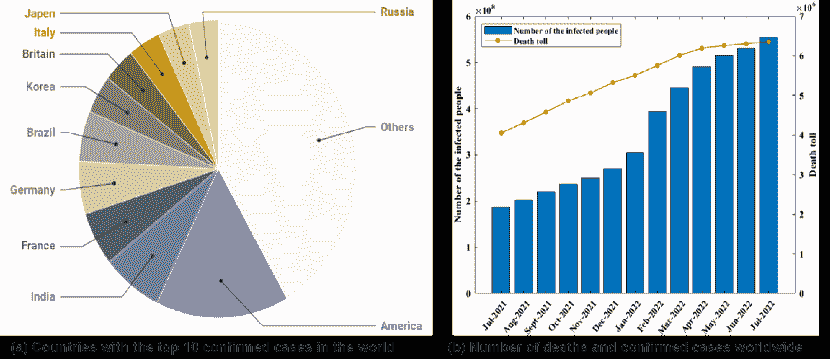
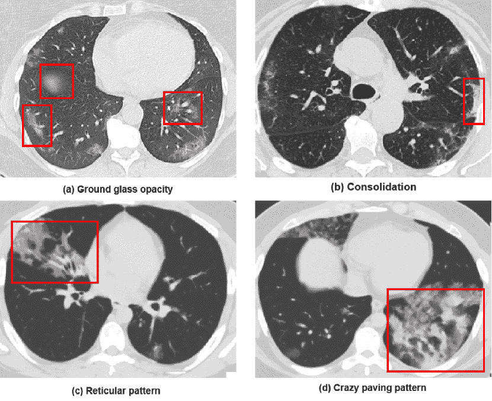
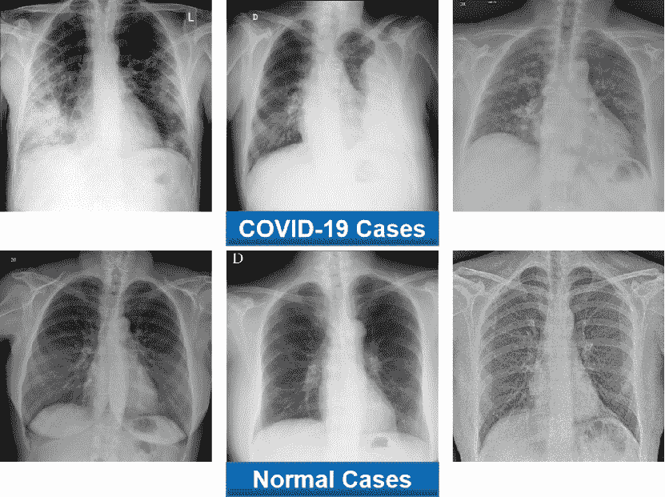
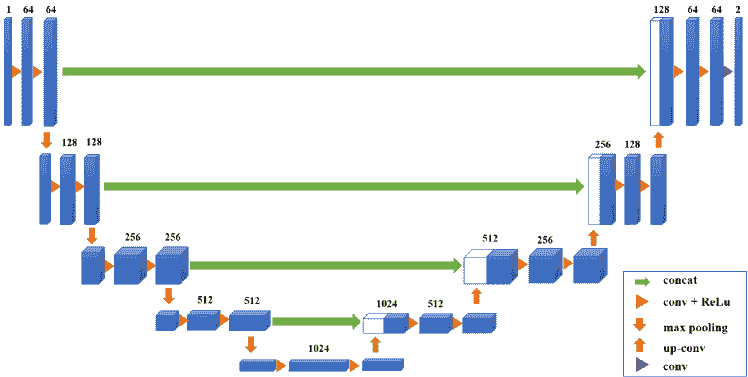
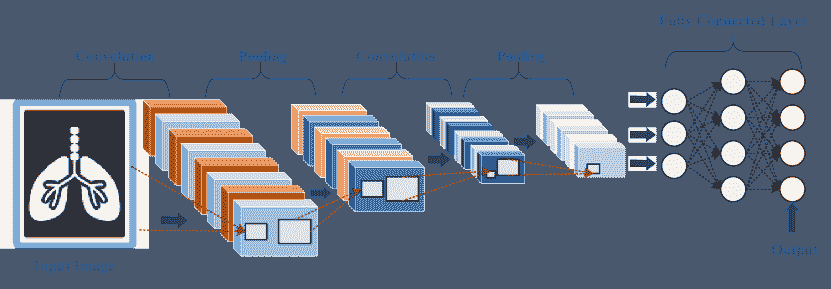
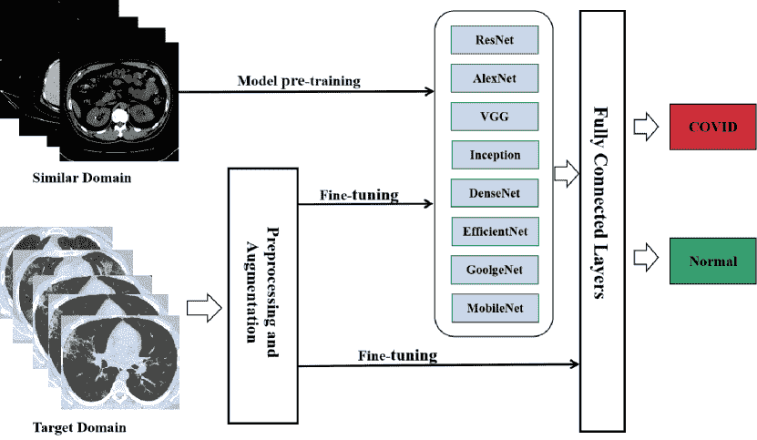
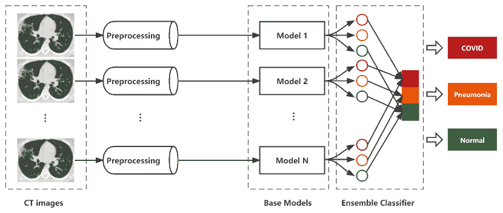
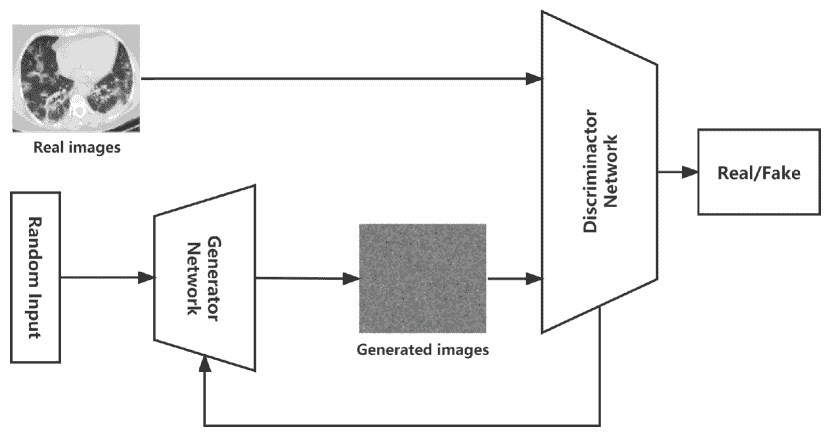
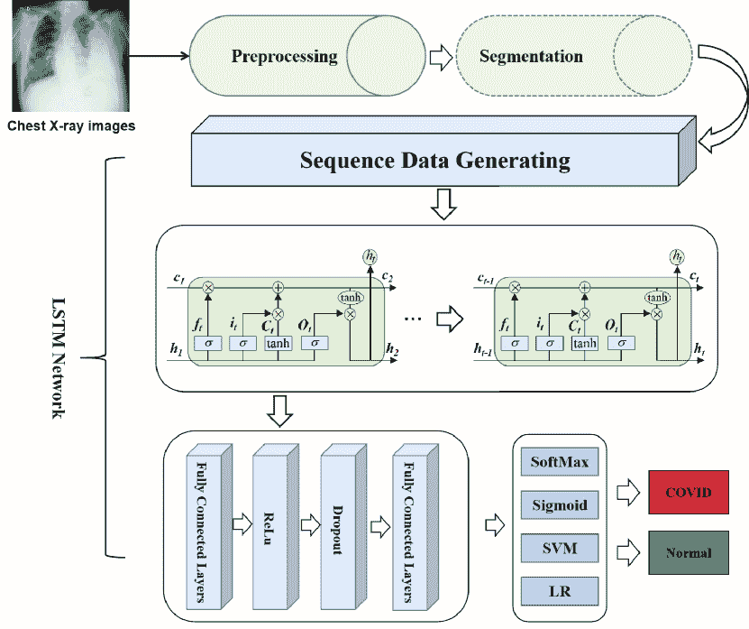

<!--yml

分类: 未分类

日期: 2024-09-06 19:41:57

-->

# [2302.06611] 深度学习与医学影像在 COVID-19 诊断中的应用: 综合调查

> 来源：[`ar5iv.labs.arxiv.org/html/2302.06611`](https://ar5iv.labs.arxiv.org/html/2302.06611)

# 深度学习与医学影像在 COVID-19 诊断中的应用: 综合调查

宋武 SongWu.uestc@outlook.com [0000-0003-0147-1907](https://orcid.org/0000-0003-0147-1907 "ORCID identifier") ，  任亚洲 yazhou.ren@uestc.edu.cn ，  杨傲迪 aodi.yang@outlook.com ，  陈心悦 martinachen2580@gmail.com ，  蒲晓荣 puxiaor@uestc.edu.cn 计算机科学与工程学院，深圳高级研究院，中国电子科技大学中国 ，  何晶 lotusjing@gmail.com 牛津大学临床神经科学系英国 ，  聂李强 nieliqiang@gmail.com 计算机科学与技术学院，哈尔滨工业大学（深圳）中国  及  余平 psyu@uic.edu 伊利诺伊大学芝加哥分校计算机科学系美国（2023）

###### 摘要

COVID-19（2019 冠状病毒病）自爆发以来迅速传播，对全球金融市场和医疗系统产生了影响。世界各国已采取多项非常措施以限制病毒传播，其中早期 COVID-19 诊断至关重要。医学影像，如 X 光片和计算机断层扫描，正成为对抗 COVID-19 的主要诊断工具之一，借助深度学习系统的帮助。在这项调查中，我们从图像分类、病灶定位和严重程度量化等方面探讨了深度学习应用于医学影像在抗击 COVID-19 中的主要贡献，并回顾了不同的深度学习架构以及一些图像预处理技术，以实现更精确的诊断。我们还总结了用于 COVID-19 检测的 X 光和 CT 图像数据集。最后讨论了深度学习在抗击 COVID-19 中的关键困难和潜在应用。这项工作总结了使用医学影像进行 COVID-19 诊断的最新深度学习方法，突出了挑战，并激励更多的研究继续利用深度学习的优势来对抗 COVID-19。

深度学习、医学影像、COVID-19^†^†版权: acmcopyright^†^†期刊年份: 2023^†^†doi: XXXXXXX.XXXXXXX^†^†ccs: 计算方法 人工智能^†^†ccs: 应用计算 生命和医学科学^†^†ccs: 一般和参考 调查与概述

## 1\. 引言

COVID-19（2019 冠状病毒病），一种由新型冠状病毒引起的急性呼吸道感染，首次于 2019 年 12 月在中国武汉报告（Qin et al., 2020; Kannan et al., 2020）。它具有高度传染性，世界卫生组织（WHO）于 2020 年 1 月 30 日宣布此次疫情为国际关注的公共卫生紧急事件（PHEIC），一个半月后，宣布为全球大流行。从疫情爆发以来，确诊和死亡病例迅速增加，如图 1 所示（WHO, 2022）。截至 2022 年 7 月 31 日，已记录超过 5.74 亿例确诊病例和超过 630 万例死亡病例，对人们的日常生活造成了严重影响。许多国家的医疗系统濒临崩溃，全球金融市场也遭受了负面影响（Torales et al., 2020; Pak et al., 2020; Nicola et al., 2020; Shorten et al., 2021）。为了打破病毒传播的循环，早期筛查和 COVID-19 患者的严重性评估是至关重要的（Tayarani, 2020; Das et al., 2022; Farhat et al., 2020）。

图 1. 全球感染和死亡人数，以及前 10 个感染国家（2022 年 10 月 22 日）。

RT-PCR（逆转录聚合酶链反应）是一种结合 RNA 的逆转录（RT）和 cDNA 的聚合酶链反应（PCR）技术（Mak et al., 2020; He et al., 2020）。由于其高灵敏度、宽动态范围和准确检测，RT-PCR 在识别 COVID-19 患者中被广泛使用（Singanayagam et al., 2020; Wu et al., 2020; Huggett et al., 2005）。然而，它也有很多局限性。首先，样本采集质量对 RT-PCR 结果有显著影响，假阴性率极高（Shah et al., 2021a; Wang et al., 2020; Zhou et al., 2021c; Mukherjee et al., 2021）。其次，RT-PCR 的反应时间通常较长，测试认证标准相当高（Rahman et al., 2021b）。第三，疑似患者在 RT-PCR 检测过程中容易交叉感染，这将加剧病毒传播（Alafif et al., 2021）。

为了解决上述问题，医学成像是一种可用的诊断方法，可以被视为 COVID-19 检测中 RT-PCR 的重要补充。它可以显示不同感染程度的病变表现，帮助医生做出适当的诊断（Mei 等，2020；Pascual 等，2021）。与此同时，许多研究尝试使用深度学习技术和医学成像进行 COVID-19 的早期筛查，这可以大大防止疫情的进一步传播。而基于深度学习的诊断方法在图像分类、病变定位和严重程度评估方面显示出了巨大的潜力（Srivastava，2022；Polat 等，2021；Rahman 等，2021b；Alyasseri 等，2022；Agrawal 等，2022）。

关于使用深度学习和医学成像来对抗 COVID-19 的调查有一些（Bhattacharya 等，2021；Hryniewska 等，2021；Liu 等，2022；Soomro 等，2021）。Bhattacharya 等（Bhattacharya 等，2021）总结了与基于医学图像处理的深度学习应用相关的近期研究，并讨论了它们对抗 COVID-19 的潜力。Hryniewska 等（Hryniewska 等，2021）总结了使用医学图像进行 COVID-19 诊断的深度神经网络方法，并展示了如何在这些模型中使用可解释的人工智能技术。Soomro 等（Soomro 等，2021）基于 CT 和 X 射线图像进行图像分析，涵盖了传统图像系统和人工智能系统方向，并总结了人工智能在 COVID-19 诊断中的各种应用。Liu 等（Liu 等，2022）回顾了现有的深度学习模型和医学图像分析方法，用于 COVID-19 诊断，并将其与深度学习研究中的热点问题相关联，包括可解释的深度学习和公平的深度学习。虽然这些调查大多数集中于使用医学图像进行深度学习在抗击 COVID-19 中的各种应用，但关于如何利用深度学习技术实现更精确的诊断的讨论仍然不足。因此，总结最近使用深度学习和医学成像来诊断 COVID-19 的研究，并探索如何利用现有的深度学习模型实现更准确的诊断是有意义的。

本文的贡献总结如下：

+   $\bullet$

    首先，我们收集了在各种研究中使用的开源医学图像数据集，这些数据集主要包含 CT 和 X 射线图像，以帮助新研究快速找到相关和可靠的医学图像。

+   $\bullet$

    第二，我们系统地总结了使用医学图像进行 COVID-19 诊断的各种深度学习应用。回顾了不同的深度学习架构以及用于提高深度模型性能的方法。

+   $\bullet$

    第三，我们讨论了使用深度学习技术诊断 COVID-19 的局限性和未来工作。我们希望深度学习在未来对抗 COVID-19 中能发挥关键作用。

## 2. COVID-19 数据集及医学图像表现

深度学习（DL）在医学图像处理方面展示了卓越的能力。然而，深度学习模型的表现受注释数据质量的显著影响（Ker 等，2017；Chen 等，2021；Naudé，2020）。大量优质注释数据可以提高网络性能并避免过拟合（Bhattacharya 等，2021；Zhou 等，2021b）。由于疫情的突然爆发，现有的数据集有限且仍处于开发阶段（Kim 等，2021）。因此，收集开源医学图像数据集是一项困难但重要的工作。在本节中，我们总结了不同论文中用于 COVID-19 诊断的各种医学图像数据集，主要包含 CT 和 X 光图像。此外，我们描述了 CT 和 X 光图像的表现及这些图像提供的病变信息。

### 2.1. COVID-19 的 CT 表现及资源描述

计算机断层扫描（CT）是医学技术中的一项标志性进展，为放射科医师提供了有用的成像工具。一些病理表现，如“磨玻璃样”影（GGO）和实变（C），通常在 COVID-19 患者中出现（Ye 等，2020；Kwee 和 Kwee，2020）。此外，胸部 CT 图像可能会随着 COVID-19 患者病情的发展显示出不同的放射特征或模式。在疾病的早期，病变主要表现为“磨玻璃样”影（GGO）和小血管的增厚。在某些情况下可能会发生实变（Bao 等，2020）。严重的患者开始发展成网状模式，伴有肺叶间隔增厚，实变影将出现在肺部的外围和中央区域（Li 等，2021b）。当患者的病情进一步恶化时，CT 图像中可见白肺，病变表现为多发性弥漫性 GGO 和实变。COVID-19 患者的典型 CT 表现见图 2。

许多研究尝试使用 CT 图像来诊断 COVID-19，因为这些图像提供了丰富的病理表现，而基于 CT 图像的深度学习模型在 COVID-19 诊断方面表现出色（Shi 等， 2021b；Kiruthika 等，2021；Shi 等，2021a）。为了探索这些 CT 图像，Nivetha 等（Nivetha 和 Inbarani，2022）使用了一个公共的 COVID-19 CT 扫描数据集，其中包含 349 个 COVID-19 阳性病例和 397 张阴性胸部 CT 图像。他们提出的 NRNN 模型在实验中分别达到了 0.98、0.92、1.00、1.00 的准确率。Choudhary 等（Choudhary 等，2022）使用了一个公开的 SARS-CoV2 CT 扫描数据集，该数据集包含 1,252 个 COVID-19 阳性病例和 1,230 张阴性胸部 CT 图像。他们修剪过的 ResNet-34 模型达到了 0.9547 的准确率、0.9216 的灵敏度、0.9567 的 F-score 和 0.9942 的特异性。Ahrabi 等（Sarv Ahrabi 等，2022）建立了一个包含 4,000 张 COVID-19 病例 CT 图像的训练数据集，这些图像来自 500 多名患者。他们提出的方法达到了 0.9712 的准确率、0.9741 的精确度、0.9659 的召回率和 0.9696 的 F-score。

图 2\. COVID-19 患者的典型 CT 图像表现，包括 (a) GGO (b) 实变 (c) 网状模式 (d) 疯狂铺砖模式。

此外，一些最受欢迎的数据集来自权威医院。Song 等（Song 等，2021）从三家医院收集他们的数据集，即武汉大学人民医院和广州中山大学的两家附属医院。Shi 等（Shi 等，2021b）从三家医院建立了他们的数据集，即华中科技大学同济医院、复旦大学上海公共卫生临床中心和吉林大学中日友好医院。为了方便新的研究获取可用和权威的 COVID-19 CT 数据集，各种论文中使用的数据集被收集并列在表 1 中。

表 1\. 用于 COVID-19 检测的不同数据集总结。

| 类型 | 数据集名称 | 数据集来源 | 论文 |
| --- | --- | --- | --- |
| CT | SARS-COV-2 Ct-Scan 数据集 | [`www.kaggle.com/datasets/plameneduardo/sarscov2-ctscan-dataset`](https://www.kaggle.com/datasets/plameneduardo/sarscov2-ctscan-dataset) | (Soares 等，2020) |
| CT | COVID-CT | [`github.com/UCSD-AI4H/COVID-CT`](https://github.com/UCSD-AI4H/COVID-CT) | (Yang 等，2020) |
| CT | COVIDx CT | [`www.kaggle.com/datasets/hgunraj/covidxct`](https://www.kaggle.com/datasets/hgunraj/covidxct) | (Gunraj 等，2020) |
| CT | 胸部 CT 扫描图像数据集 | [`www.kaggle.com/datasets/mohamedhanyyy/chest-ctscan-images`](https://www.kaggle.com/datasets/mohamedhanyyy/chest-ctscan-images) | (Sarv Ahrabi 等，2022) |
| CT | COVID-19 CT 分割数据集 | [`medicalsegmentation.com/COVID19/`](http://medicalsegmentation.com/COVID19/) | (Zhou 等，2020) |
| CT | COVID-19 | [`radiopaedia.org/articles/covid-19-3`](https://radiopaedia.org/articles/covid-19-3) | (Apostolopoulos 等，2020) |
| CT | NSCC | [`ai.nscc-tj.cn/thai/deploy/public/pneumoniact`](https://ai.nscc-tj.cn/thai/deploy/public/pneumoniact) | (Wang 等，2021a) |
| X-ray | COVID-19 X 射线 | [`www.kaggle.com/datasets/andrewmvd/convid19-x-rays`](https://www.kaggle.com/datasets/andrewmvd/convid19-x-rays) | (Apostolopoulos 和 Bessiana，2020) |
| X-ray | COVID 胸部 X 射线数据集 | [`github.com/ieee8023/covid-chestxray-dataset`](https://github.com/ieee8023/covid-chestxray-dataset) | (Yasar 和 Ceylan，2021b; Cohen 等，2020) |
| X-ray | 胸部 X 射线图像（肺炎） | [`www.kaggle.com/datasets/paultimothymooney/chest-xray-pneumonia`](https://www.kaggle.com/datasets/paultimothymooney/chest-xray-pneumonia) | (Miao 等，2021) |
| X-ray | COVID-19 放射数据库 | [`www.kaggle.com/datasets/tawsifurrahman/covid19-radiography-database`](https://www.kaggle.com/datasets/tawsifurrahman/covid19-radiography-database) | (Al-Antari 等，2021) |
| X-ray | 开源 COVID-19 | [`github.com/WeileiZeng/Open-Source-COVID-19`](https://github.com/WeileiZeng/Open-Source-COVID-19) | (Shuja 等，2021) |
| X-ray | RSNA 肺炎检测挑战 | [`www.kaggle.com/c/rsna-pneumonia-detection-challenge/data`](https://www.kaggle.com/c/rsna-pneumonia-detection-challenge/data) | (Dev 等，2021) |
| X-ray | ActualMed COVID-19 胸部 X 射线数据集 | [`github.com/agchung/Actualmed-COVID-chestxray-dataset`](https://github.com/agchung/Actualmed-COVID-chestxray-dataset) | (Farooq 和 Hafeez，2020) |
| X-ray | COVID-19 数据库 | [`www.sirm.org/category/senza-categoria/COVID-19/`](https://www.sirm.org/category/senza-categoria/COVID-19/) | (Hall 等，2020) |
| X-ray | COVID-CAPS | [`github.com/ShahinSHH/COVID-CAPS`](https://github.com/ShahinSHH/COVID-CAPS) | (Heidarian 等，2021) |
| X-ray | NIH 胸部 X 射线 | [`www.kaggle.com/datasets/nih-chest-xrays/data`](https://www.kaggle.com/datasets/nih-chest-xrays/data) | (Basu 等，2020) |
| X 射线 | COVID-19 | [`github.com/muhammedtalo/COVID-19`](https://github.com/muhammedtalo/COVID-19) | (Brunese et al., 2020) |

### 2.2\. COVID-19 的 X 射线表现和资源描述

尽管 CT 扫描为放射科医生提供了更多关于病变的信息，但它们更昂贵，并且让患者接触更多的辐射。正常与 COVID-19 的 X 射线图像见图 3。外周肺部不透明（PLO）和磨玻璃样不透明（GGO）是这些异常表现中的两种（Kim et al., 2020; Jacobi et al., 2020）。COVID-19 患者的胸部 X 射线图像在早期或轻度阶段可能看起来正常。大约 10 到 12 天后，症状变得更加明显。病变通常分布在下部、外周和双侧区域（Weinstock et al., 2020; Yoon et al., 2020）。在参考文献 (Nagarajan et al., 2021) 中，他们回顾性地评估了 593 名 COVID-19 患者的 X 射线图像。实验表明，异常大多出现在中下部区域（88% 的病例），磨玻璃样不透明（GGO）是异常 X 射线中最常见的发现（75% 的病例）。其次常见的发现是外周肺部不透明（PLO）和融合性实变，这通常表示症状较为严重。

图 3\. COVID-19 病例的代表性 X 射线图像与正常病例的比较。

X 光图像数据集比 CT 图像数据集更易获取，因为拍摄 X 光图像比 CT 图像更方便且成本更低。因此，许多研究尝试使用 X 光图像而不是 CT 扫描来诊断 COVID-19（Shi 等人，2021a；Tang 等人，2021a）。关于这些 X 光图像，Dev 等人（Dev 等人，2021）使用 COVIDx 数据集，其中包含 55,328 个正常病例、8,066 个细菌性肺炎病例和 358 个 COVID-19 病例。他们的 HCN-FM 和 HCN-DML 分别达到 95.33% 和 96.67% 的准确率。Annavarapu 等人（Annavarapu 等人，2021）使用一个公开的 COVID-19 胸部 X 光数据集，该数据集包含 2,905 张图像。他们的模型获得了 95% 的准确率和 97% 的特异性。Turkoglu（Turkoglu，2021）从多个公共数据集中收集了 6,092 张 X 光图像。他们提出的模型达到了 99.18% 的准确率，超越了大多数先前的研究。Miao 等人（Miao 等人，2021）使用三个公开的 COVID-19 X 光数据集和其他肺炎数据集构建了两个实验数据集。Jain 等人（Jain 等人，2021）从 Kaggle 仓库收集了 6,432 张胸部 X 光图像。不同论文中使用的各种 COVID-19 X 光数据集列在表 1 中，以便新的研究能够快速找到可用的资源。

## 3\. 图像预处理技术

大多数 COVID-19 数据集包含一些模糊、重复且无关的图像，这会降低深度模型的性能（Shah 等人，2021a）。图像预处理通常是利用深度学习技术诊断 COVID-19 的第一步。它消除图像中的无关信息，恢复有用的真实信息，从而提高诊断算法的可靠性和性能（Loew，2022；Heidari 等人，2020）。Nivetha 等人（Nivetha 和 Inbarani，2022）使用中值滤波器处理来自公开数据集的 COVID-19 患者的 CT 图像。通过这种方式，COVID 图像的质量得到改善，噪声减少，同时重要信息没有丢失。Joshi 等人（Joshi 等人，2022）将所有图像调整为 224×224 以保持数据一致性，并采用四种类型的变换来预处理图像。Ahrabi 等人（Sarv Ahrabi 等人，2022）使用来自两个公开数据集的 4,000 张 COVID-19 CT 图像。所有图像都被裁剪和调整大小以去除无关区域。在这一部分，我们将深入讨论广泛使用的图像预处理技术及其特点。

+   $\bullet$

    调整大小

    调整大小是深度学习应用中图像预处理阶段的一个重要步骤。它统一了来自不同数据集的图像大小。Tao 等人（Zhou et al., 2021c）将所有 CT 图像调整为统一大小（64×64），以建立用于模型训练的 COVID-19 数据集。Shah 等人（Shah et al., 2021b）将 COVID-19 病例的 CT 图像调整为 128×128×3 或 224×224×3，以适应不同深度模型的输入大小。Garain 等人（Garain et al., 2021）将每张图像调整为 32×32 的尺寸，并将图像转换为灰度图。

+   $\bullet$

    翻转和旋转

    翻转和旋转是常用的数据增强方法，这可以确保深度学习模型以任何角度的图像进行训练，从而能够做出更好的预测（Annavarapu et al., 2021）。充足的图像也可以帮助深度模型避免过拟合。Sedik 等人（Sedik et al., 2022）使用一个包含 288 例 COVID-19 病例和 288 例正常病例的数据集。数据集通过若干旋转和缩放操作进行增强。Keles 等人（Keles et al., 2021）采用了三种增强方法，包括水平/垂直翻转、旋转和移动。Ahuja 等人（Ahuja et al., 2021）随机旋转训练数据，旋转范围在[-90°, 90°]之间，以解决过拟合问题。

+   $\bullet$

    裁剪

    裁剪是指裁剪给定的图像以去除无关区域。它大大减少了无关信息的干扰，并大幅提高了深度学习模型的性能和鲁棒性。Balaha 等人（Balaha et al., 2022）将图像数据预处理为适合 CNN 的格式，以进一步学习潜在特征。图像使用边界矩形裁剪，以保留感兴趣区域。Madaan 等人（Madaan et al., 2021）在其模型中使用了两个胸部 X 射线图像数据集。采用裁剪来减少噪声，并且所有图像都被调整大小。Zhang 等人（Zhang et al., 2021b）裁剪了图像右侧的标尺和底部的文字，这些都是无关信息，会影响模型性能。

+   $\bullet$

    对比度调整

    医学图像在成像过程和数据采集过程中可能对比度较差。增强图像对比度对于帮助深度模型从感兴趣区域提取有意义的信息至关重要。Dhaka 等人（Dhaka et al., 2021）提出，通过改变 X 射线图像的对比度可以提高深度模型的性能。Tahir 等人（Tahir et al., 2022）使用对比度限制自适应直方图均衡化（CLAHE）来增强原始 X 射线图像的对比度。与其他对比度增强方法相比，产生的图像更自然。Habib 等人（Habib et al., 2022）使用直方图均衡化（HE）和 CLAHE 来增强对比度。

+   $\bullet$

    去噪

    图像噪声指的是存在于图像中的不必要或不需要的干扰信息。噪声会严重影响图像的质量。因此，在下游图像处理任务之前，进行去噪是必要的。Mahendran 等（Mahendran 和 Kavitha，2022）使用 DnCNN 算法在图像分类之前对 CT 图像进行去噪。Balaha 等（Balaha 等，2022）将所有图像转换为灰度图像，并应用高斯模糊以消除不必要的噪声。Mishra 等（Mishra，2021）使用高斯滤波器对图像进行平滑处理，背景噪声可以通过二维中值滤波器进行消除。

应用适当的预处理方法需要考虑多个因素，例如数据集的大小、图像质量、模型的输入以及应用场景。我们调查了过去三年中使用深度学习和医学成像来诊断 COVID 的各种论文。我们在表 2 中总结了具有代表性的预处理技术。

表 2\. 各种预处理技术在不同论文中的总结。

| 预处理方法 | 论文 | 数量 |
| --- | --- | --- |
| 调整大小 | (Nivetha 和 Inbarani，2022；Khurana 和 Soni，2022；Sarv Ahrabi 等，2022；Kumari 和 Jagadesh，2022；Balaha 等，2022；Madaan 等，2021；Zhou 等，2021c；Shah 等，2021b；Garain 等，2021；Mishra，2021；Ravi 等，2022；Annavarapu 等，2021；Yasar 和 Ceylan，2021a；Singh 等，2021b；Zhang 等，2021b；Abraham 和 Nair，2022；Tan 等，2021；Elpeltagy 和 Sallam，2021；Dhaka 等，2021；Ahuja 等，2021；Zhang 等，2021c；Shiri 等，2022；Hasan 等，2021；Akbarimajd 等，2022；Kogilavani 等，2022；Baghdadi 等，2022；Zhang 等，2022b；Zhao 等，2021b) | 28 |
| 翻转与旋转 | (Joshi 等，2022；Madaan 等，2021；Sedik 等，2022；Mishra，2021；Annavarapu 等，2021；Heidarian 等，2021；Zhang 等，2021b；Keles 等，2021；Jangam 等，2022；Huang 等，2021a；Ahuja 等，2021；Aslan 等，2022；Kogilavani 等，2022；Baghdadi 等，2022；Zhao 等，2021b) | 15 |
| 裁剪 | (Sarv Ahrabi et al., 2022; Balaha et al., 2022; Madaan et al., 2021; Mishra, 2021; Zhang et al., 2021b; Jangam et al., 2022; Shiri et al., 2022; Aslan et al., 2022; Kogilavani et al., 2022; Zhang et al., 2022b; Lian et al., 2022) | 11 |
| 对比度调整 | (Tahir et al., 2022; Habib et al., 2022; Mishra, 2021; Dhaka et al., 2021; Baghdadi et al., 2022) | 5 |
| 去噪 | (Nivetha and Inbarani, 2022; Mahendran and Kavitha, 2022; Balaha et al., 2022; Mishra, 2021; Zhang et al., 2022b) | 5 |

## 4\. 图像分割

在 COVID-19 患者的医疗图像中，肺部及感染的准确分割在 COVID-19 的诊断中起着至关重要的作用（Ma et al., 2021; Shiri et al., 2022）。具体来说，图像分割从给定的医疗图像中识别感兴趣区域（RoI），并将医疗图像划分为多个部分（Liu et al., 2021; Zhao et al., 2019）。分割出的区域可以帮助医生和深度学习模型更好地理解肺部疾病的类型和严重程度（Ter-Sarkisov, 2022; Khan et al., 2022; Shi et al., 2020）。Punn et al.（Punn and Agarwal, 2022）提出了一种基于深度学习的语义层次分割器（CHS-Net），用于从胸部 CT 图像中识别 COVID-19 感染区域。他们应用了一个带有光谱空间和深度注意力网络（SSD）的残差 Inception U-Net 模型，以有效地编码和解码语义和变化的图像信息，最终分割出肺部的 COVID-19 感染区域。Wang et al.（Wang et al., 2021b）提出了一种病灶边缘检测模型（COVID Edge-Net），它由一个边缘检测骨干网和两个新颖模块组成，即多尺度残差双重注意力（MSRDA）模块和 Canny 算子模块。MSRDA 模块可以捕捉丰富的上下文关联，生成增强的特征表示，然后与从 Canny 算子模块中学习到的 Canny 特征合并，以提取更准确、更清晰、更锐利的边缘。

Chen 等（Chen et al., 2022）提出了一种基于无监督领域适应（UDA）的分割网络，以提高 CT 图像中感染区域的分割性能。通过一种新颖的领域适应模块，该网络显著提高了分割网络的泛化能力，使两个领域对齐。他们提出的方法在肺部分割中表现出色，并证明他们提出的模型也适用于大面积器官或组织。Lashchenova 等（Lashchenova et al., 2021）认为，影响分割模型实际性能的一个重要因素是模型将肺部和真实肺部之外的肺病灶分割开来。为检测这一点，需要计算每个类别的连通组件，并检查每个组件是否与真实肺部有交集。

### 4.1\. U-net 架构

U-net 是一个流行的图像分割网络，主要用于医学图像分割。它基于卷积神经网络（CNN）构建，并进行了升级，以实现更好的分割性能（Shirato et al., 2020; Minaee et al., 2022; Siddique et al., 2021）。如图 4 所示，U-Net（Ronneberger et al., 2015）网络呈 U 形，主要包括左侧的下采样层和右侧的上采样过程。结构从左到右对称。此外，U-Net 使用的编码器-解码器结构和跳跃连接是核心设计，用于实现上下文信息的更有效组合，以进行精确的像素级判断。

Alirr（Alirr, 2022）设计了一种肺部图像分割方法，以提取感兴趣区域，该方法通过升级的残差块和连接跳跃连接修改了 U-net。此外，分割区域采用边缘增强扩散滤波（EED）来提高感染区域的对比度。他们提出的方法在肺部和感染区域分割中的 Dice 重叠评分分别为 96.1%和 78.0%。Diniz 等（Diniz et al., 2021）旨在自动识别 COVID-19 引起的感染并评估感染区域的定量分数。他们通过批归一化、泄漏 ReLU、dropout 和残差块技术修改了传统的 U-net 架构，提出了一个模型。该模型的平均 Dice 值为 77.1%，平均特异性为 99.8%。

图 4\. 用于图像分割任务的代表性 U-net 架构（Ronneberger et al., 2015）。

赵等人(Zhao 等人，2021b) 提出了一种新颖的扩张双重注意力 U-Net(D2A U-Net)来分割 COVID-19 病灶区域，采用双重注意力策略和混合扩张卷积。前述的双重注意力策略包含两个注意力模块，用于增强特征图并减小不同级别特征图之间的语义差异。后者的混合扩张卷积用于获得更大的感受野。他们的方法达到了 0.73 的 Dice 分数和 0.71 的召回分数。Lian 等人(Lian 等人，2022) 提出了一种端对端 DRD U-Net(扩张残差和深度监督 U-Net)网络，用于分割肺部病变。他们在每个通道层添加了残差模块以加速收敛和避免梯度消失。为了提取更丰富的特征信息，他们利用扩展卷积单元来增加感受野而不增加参数数量。在实验中，他们的模型表现出令人印象深刻的分割性能，与原始 U-Net 相比，错误显著减少。

U-net 在图像分割领域展现了巨大的潜力。一些遵循 U-net 核心思想的变体已经被提出，包括注意力 U-net(Schlemper 等人，2019)和残差 U-net(Das 等人，2019)，用于完成更复杂的分割任务。除了 U-Net 架构外，其他分割方法，如 V-Net、ResU-Net、Dense-Net 和 DeepLab，也被用于不同论文中 COVID-19 感染区域的分割。表 3 显示了不同论文采用的各种分割技术。

表 3。不同论文中使用的各种分割方法总结。

| 分割方法 | 论文 | 数量 |
| --- | --- | --- |
| U-Net | (马等人，2021; Lashchenova 等人，2021; Diniz 等人，2021; 萧等人，2022; Voulodimos 等人，2021a; Jadhav 等人，2021; Avetisian 等人，2021; Punn 和 Agarwal，2022; Alirr，2022; 周等人，2021a; Elharrouss 等人，2022; Kuchana 等人，2021; Trivizakis 等人，2020; Shan 等人，2021; Tahir 等人，2022; Saood，2021; Lian 等人，2022; Voulodimos 等人，2021b) | 18 |
| V-Net | (Voulodimos 等人，2021a; 赵等人，2021a; Milletari 等人，2016) | 3 |
| ResU-Net | (Diniz 等人，2021; Jadhav 等人，2021; Avetisian 等人，2021) | 3 |
| Dense-Net | (Al-Antari 等人，2021; Elharrouss 等人，2022) | 2 |
| UNet++ | (Zhou et al., 2021a; Elharrouss et al., 2022) | 2 |
| Deeplab | (Diniz et al., 2021; Amin et al., 2022) | 2 |
| Attention-UNet | (Zhao et al., 2021b; Elharrouss et al., 2022) | 2 |
| SAUNet++ | (Xiao et al., 2022) | 1 |
| COVSeg-NET | (Zhang et al., 2021c) | 1 |

### 4.2. 损失函数

损失函数是分割模型的另一个重要组成部分。它可以指导分割模型朝特定方向学习，并分割所需的感染区域。Xiao et al. (Xiao et al., 2022) 使用了聚焦 Tversky 损失 (FTL) 和广义 Dice 损失 (GDL)。GDL 可以减少病变大小与 Dice 损失之间的相关性，并有效指导模型分割小区域。Elharrouss et al. (Elharrouss et al., 2022) 使用二元交叉熵作为损失函数，他们的模型在 Dice 上达到了 78.6%，在敏感度指标上达到了 71.1%，在特异性上达到了 99.3%，在精度上达到了 85.6%。Alirr (Alirr, 2022) 使用 Dice 损失作为损失函数，并平均每个类别的 DSC 以生成最终得分。Diniz et al. (Diniz et al., 2021) 使用 Dice 损失作为损失函数，他们提出的模型在 Dice 上达到了 77.1%，在平均特异性上达到了 99.76%。本节将介绍几种在医学图像分割任务中常用的具有代表性的损失函数。

A. 二元交叉熵

像素级交叉熵损失通常用于图像分割任务。对于给定的随机变量，这个损失函数将逐个像素检查，并比较两个概率分布之间的差异。二元交叉熵定义为 (Yi-de et al., 2004)：

| (1) |  | $L_{CE}(y,\hat{y})=-\left(y\log\left(\hat{y}\right)+\left(1-y\right)\log\left(1-\hat{y}\right)\right),$ |  |
| --- | --- | --- | --- |

其中 $y$ 和 $\hat{y}$ 分别表示真实值和预测值。

B. 加权二元交叉熵

加权二元交叉熵 (WCE) (Pihur et al., 2007) 是二元交叉熵的一种变体，旨在解决医学图像中病变信息分布不均的问题。WCE 定义为：

| (2) |  | $L_{WCE}(y,\hat{y})=-\left(\beta*y\log\left(\hat{y}\right)+\left(1-y\right)\log\left(1-\hat{y}\right)\right),$ |  |
| --- | --- | --- | --- |

其中 $\beta$ 用于调整假阴性和假阳性。如果我们想减少假阴性的数量，可以将 $\beta$ 设置为 >1。相反，将 $\beta$ 设置为 <1 可以减少假阳性的数量。

C. 平衡交叉熵

平衡交叉熵 (BCE) (Xie and Tu, 2015) 与 WCE 类似，它对正例和负例进行适当加权。平衡交叉熵定义为：

| (3) |  | $L_{BCE}(y,\hat{y})=-\left(\beta*y\log\left(\hat{y}\right)+(1-\beta)\left(1-y\right)\log\left(1-\hat{y}\right)\right).$ |  |
| --- | --- | --- | --- |

D. 聚焦损失

Focal 损失（Lin 等，2017）常用于处理样本分类不平衡的问题。它通过根据样本区分难度来加权损失。对于呈现小病灶信息的医学图像，focal 损失为正像素分配更大的权重，可以取得优异的表现。其定义为：

| (4) |  | $L_{fl}=-\alpha_{t}\left(1-p_{t}\right)^{\gamma}\log\left(p_{t}\right),$ |  |
| --- | --- | --- | --- |

其中 $\gamma$ 是一个调节参数，且 $\gamma > 0$。$\alpha_{t}$ 通常范围在 [0,1] 之间，用于处理类别不平衡。Focal 损失定义 $p_{t}$ 为：

| (5) |  | $p_{t}=\begin{cases}\hat{p}&\text{ if }y=1\\ 1-\hat{p}&\text{ otherwise }\end{cases},$ |  |
| --- | --- | --- | --- |

其中 $\hat{p}$ 表示像素分类的预测值，$y$ 表示真实值。

E. Dice 损失

Dice 损失（Sudre 等，2017）用于计算两幅图像之间的相似性，并用于指导图像分割方法的训练过程。Dice 损失定义为：

| (6) |  | $DL(y,\hat{p})=1-\frac{2y\hat{p}+1}{y+\hat{p}+1}.$ |  |
| --- | --- | --- | --- |

在分子和分母中添加 1 以确保在 $y=\hat{p}=0$ 的边界情况下函数不至于未定义。

F. 广义 Dice 损失

Dice 损失不适合预测小目标。当小目标的一些像素被错误预测时，Dice 系数可能会大幅波动。为了解决这些问题，GDL 使用与病灶区域成反比的权重，以更好地分割小区域（Xiao 等，2022）。当类别数为 2 时，广义 Dice 损失定义为：

| (7) |  | $GDL=1-2\frac{\sum_{l=1}^{2}w_{l}\sum_{n}r_{ln}p_{l_{n}}}{\sum_{l=1}^{2}w_{l}\sum_{n}r_{ln}+p_{l_{n}}},$ |  |
| --- | --- | --- | --- |

其中 $r_{ln}\in\{0,1\}$ 和 $p_{l_{n}}\in[0,1]$ 分别表示第 $n$ 个位置的真实体素值和预测为类别 $l$ 的相关概率。$w_{l}$ 代表类别 $l$ 的权重，定义为：

| (8) |  | $w_{l}=\frac{1}{\left(\sum_{n=1}^{N}r_{ln}\right)^{2}+\varepsilon},$ |  |
| --- | --- | --- | --- |

其中 $N$ 是像素的总数，$\varepsilon$ 通常设置为 $10^{-5}$ 以防止损失函数除以 0。

G. Tversky 损失

Tversky 损失（Salehi 等，2017）被认为是 Dice 损失的一个推广，其中系数 $\beta$ 是一个超参数，用于控制假阴性 (FN) 和假阳性 (FP) 之间的平衡。Tversky 损失定义为：

| (9) |  | $TL(p,\hat{p})=\frac{p\hat{p}}{p\hat{p}+\beta(1-p)\hat{p}+(1-\beta)p(1-\hat{p})},$ |  |
| --- | --- | --- | --- |

其中 $p$ 和 $\hat{p}$ 分别表示真实值和预测值。当 $\beta$ = 0.5 时，可以化简为常规的 Dice 系数。

H. Focal Tversky 损失

类似于焦点损失，焦点 Tversky 损失（Abraham and Khan, 2019）被提出用于处理类别不平衡。它利用系数$\gamma$来专注于学习困难样本。焦点 Tversky 损失常用于小区域的分割，其定义为：

| (10) |  | $FTL=\sum_{c}\left(1-TI_{c}\right)^{\gamma},$ |  |
| --- | --- | --- | --- |

其中超参数$\gamma$的范围可以是[1,3]，$TI_{c}$（Tversky 指数）定义为：

| (11) |  | $TI_{c}=\frac{\sum_{i=1}^{N}p_{ic}g_{ic}}{\sum_{i=1}^{N}p_{ic}g_{ic}+\alpha\sum_{i=1}^{N}p_{i\bar{c}}g_{ic}+\beta\sum_{i=1}^{N}p_{ic}g_{i\bar{c}}},$ |  |
| --- | --- | --- | --- |

其中$p_{ic}$和$p_{i\bar{c}}$分别是像素$i$属于病灶类别$c$和非病灶类别$\bar{c}$的概率。$g_{ic}$和$g_{i\bar{c}}$表示另一类别的概率。$N$是像素的总数。

## 5\. 基于深度学习的 COVID-19 诊断方法的总体分析

COVID-19 的手动检测（RT-PCR），具有极高的准确性和特异性，始终被认为是 COVID-19 检测的金标准（Pu et al., 2022; Rabaan et al., 2021）。然而，RT-PCR 检测过程耗时较长，并且在检测过程中疾病的传播风险和易感性大大增加（Rahman et al., 2021b; Peng et al., 2022）。因此，许多研究专注于使用医学影像进行 COVID-19 诊断，试图找到一种可以保证高准确性并显著减少检测过程中人为接触的诊断方法（Krishnamoorthy et al., 2021; Xu et al., 2022; Ibrahim et al., 2021; Shorfuzzaman, 2021）。在众多检测方法中，使用医学影像的深度学习模型表现出色，因此广泛应用于图像分类、病灶分割和严重程度量化，以对抗 COVID-19，例如卷积神经网络（CNN）（Singh et al., 2021a; Pouyanfar et al., 2018; Rahman et al., 2021a）、生成对抗网络（GAN）（Bargshady et al., 2022; Kim et al., 2021）和长短期记忆网络（LSTM）（Demir, 2021; Naeem and Bin-Salem, 2021; Sheykhivand et al., 2021）。在本节中，我们将介绍深度学习模型在 COVID-19 诊断中的不同应用。

### 5.1\. COVID-19 诊断中的 CNN 模型

卷积神经网络（CNN）是一种多层有监督的神经网络，其中隐藏的卷积层和池化层是实现特征提取功能的核心模块（Anwar et al., 2018; Alzubaidi et al., 2021）。CNN 使用梯度下降法来最小化损失函数，并采用误差反向传播（BP）逐层调整网络层中的权重参数（Mishra and Kane, 2022）。CNN 模型在医学图像处理方面展现了巨大潜力，成为识别 COVID-19 和定位病变的流行方法。如图 5 所示，代表性的 CNN 模型用于 COVID-19 诊断通常包括输入、卷积层、池化层、全连接层和输出（Bhattacharya et al., 2021）。此外，我们尝试记录一些高质量研究中使用的深度学习方法和模型评估指标，更多详细信息见表 4。

Wang 等（Wang et al., 2020）设计了一种基于深度学习的自动 COVID-19 诊断方法。他们的模型使用预训练的 U-Net 对肺部区域进行分割。分割后的 3D 肺部区域输入到 3D 深度神经网络中，以预测感染的可能性。最后，分类网络中的激活区域与无监督的连通组件一起用于定位 COVID-19 病变。他们提出的方法获得了 0.90 的准确率，0.84 的阳性预测值，以及 0.98 的高阴性预测值。Turkoglu（Turkoglu, 2021）提出了一种名为 COVIDetectioNet 的专家设计系统，该系统由三个基本组件组成。首先，从预训练的 AlexNet 架构中获得深度特征。其次，采用 relief 选择算法从预先学习的深度特征中选择最有效的特征。第三，使用支持向量机（SVM）方法进行最终分类。他们提出的模型通过将 6,092 张 X 射线图像分类为正常（健康）、COVID-19 和肺炎病例来进行验证。在实验结果中，他们提出的模型达到了 99.18% 的准确率和 97.1% 的灵敏度。

图 5\. 使用 CNN 模型识别 COVID-19 与正常病例的代表性工作流程。

Singh 等人 (Singh et al., 2021a) 提出了一个自动化的 COVID-19 筛查模型。该模型采用一些预训练的 CNN 模型，如 DenseNet201、ResNet152V2 和 VGG16，用于早期检测 COVID-19 患者。预测输出被输入到集成 DCCNs 中，这些 DCCNs 设计用于将怀疑对象诊断为四个类别，包括 COVID-19 病例、结核病、肺炎和健康受试者。他们提出的模型达到了 98.94% 的准确率、98.94% 的敏感性和 98.93% 的特异性，优于竞争模型。此外，Aslan 等人 (Aslan et al., 2022) 首次使用基于 ANN 的自动分割方法来提取 X 射线图像中的感兴趣区域。其次，在数据增强阶段后使用各种 CNN 进行特征提取。最后，将每个 CNN 模型学到的特征输入到四种不同的机器学习 (ML) 算法中进行分类。每种 ML 算法的超参数通过贝叶斯优化确定。最终，DenseNet201 模型与 SVM 算法获得了最高性能。

Kogilavani 等人 (Kogilavani et al., 2022) 探讨了各种卷积神经网络 (CNN) 模型在检测 COVID-19 中的表现，尝试找到合适的深度模型，包括 VGG16、DenseNet121、MobileNet、NASNet、Xception 和 EfficientNet。VGG16 的准确率为 97.68%，DenseNet121 为 97.53%，MobileNet 为 96.38%，NASNet 为 89.51%，Xception 为 92.47%，而 EfficientNet 为 80.19%。根据性能分析，VGG16 架构相较于其他架构达到了最佳准确率。Akbarimajd 等人 (Akbarimajd et al., 2022) 提出了一个新颖的 CNN 方法，应用自适应卷积，旨在提升噪声 X 射线图像中的 COVID-19 识别能力，而不减少噪声。具体来说，在传统 CNN 框架上添加了冲击噪声图层和自适应调整图层。设计了一种利用噪声 X 射线图像的学习增强策略，以改善深度模型的泛化能力。一些预训练的网络如 SqueezeNet、ResNet18 和 ResNet50 被修改以提高对冲击噪声的鲁棒性。

表 4\. 使用 CNN 模型诊断 COVID-19 的深度学习方法及结果评估。

| 参考文献 | 数据 | 深度学习方法 | 分类 | 准确率 | 敏感性 | 特异性 |
| --- | --- | --- | --- | --- | --- | --- |
| Tang 等人 (Tang et al., 2021a) | X 射线 | 集成学习，COVID-Net | 多类别 | 95.0% | 96.0% | — |
| Yamaç 等人 (Yamaç et al., 2021) | X 射线 | CheXNet, CSEN | 多类别 | 95.9% | 98.5% | 95.7% |
| Pathak 等人 (Pathak et al., 2020) | CT | CNN，迁移学习 | 二分类 | 93.0% | 91.5% | 94.9% |
| Rathinasamy 等人 (R et al., 2022) | X 射线 | CNN，集成学习 | 二分类 | 99.0% | — | — |
| Khan 等人（Khan et al., 2021） | X 射线 | COVID-RENet、SVM | 二分类 | 98.5% | 99.0% | — |
| Wang 等人（Wang et al., 2020） | CT | DeCoVNet、U-net | 二分类 | 90.1% | 90.7% | 91.1% |
| Zhou 等人（Zhou et al., 2021c） | CT | AlexNet、GoogleNet、ResNet、集成学习 | 多类别 | 99.1% | 99.1% | 99.6% |
| Zheng 等人（Zheng et al., 2022） | CT | ResNet50、MAB、FAB | 二分类 | 98.2% | 98.8% | 97.3% |
| Choudhary 等人（Choudhary et al., 2022） | CT | VGG16、ResNet34 | 二分类 | 95.5% | 92.2% | 99.4% |
| Singh 等人（Singh et al., 2021a） | CT | CNN、集成学习、迁移学习 | 多类别 | 98.8% | 98.8% | 98.8% |
| Balaha 等人（Balaha et al., 2022） | CT | CNN、迁移学习、GAN | 二分类 | 98.7% | — | — |
| Turkoglu（Turkoglu, 2021） | X 射线 | AlexNet、迁移学习、SVM | 多类别 | 99.2% | 97.1% | — |
| Aslan 等人（Aslan et al., 2022） | X 射线 | CNN、迁移学习、贝叶斯优化 | 多类别 | 96.3% | 96.4% | 98.1% |
| Zhang 等人（Zhang et al., 2022b） | CT | CNN、迁移学习、贝叶斯优化 | 二分类 | 92.1% | — | 91.2% |

一些现有的卷积神经网络架构已被证明在医学图像特征提取中至关重要，例如 ResNet（He et al., 2016）、AlexNet（Krizhevsky et al., 2017）、SqueezeNet（Iandola et al., 2016）、Inception（Szegedy et al., 2015）、DenseNet（Huang et al., 2017）、VGG（Simonyan and Zisserman, 2014）和 EfficientNet（Tan and Le, 2019）。表 5 列出了用于 COVID-19 诊断的不同论文中使用的各种 CNN 模型。ResNet 是检测 COVID-19 的最流行网络模型，有 34 篇论文使用 ResNet 作为骨干网络。此外，DenseNet 和 VGG 也被许多研究用于检测 COVID-19。总之，选择合适的 CNN 模型作为骨干网络对 COVID-19 诊断至关重要，需要考虑数据类型、实际规模、应用场景等因素。

### 5.2\. 迁移学习用于 COVID-19 诊断

迁移学习是一种机器学习技术，可以将现有知识从一个领域（源领域）转移到另一个领域（目标领域）（Zhuang et al., 2020）。源领域通常有足够的标注数据，许多现有模型已经学习了出色的特征提取能力。目标领域缺乏大规模的标注样本，获得标注样本的成本过高（Guan 和 Liu, 2021；Morid 等人，2021）。迁移学习旨在利用从源领域学习到的知识帮助目标学习者实现更好的性能。目标领域和源领域之间的关系越接近，迁移学习的效果越好（Das et al., 2022）。否则，迁移学习可能会更困难，甚至会有负迁移，带来有害的影响。如图 6 所示，预训练模型在源领域获得了出色的泛化性能，然后使用来自目标领域的小规模数据进行微调（Chen et al., 2021）。由于捕获 COVID-19 患者 CT 或 X 光图像的成本高昂，已经采用了各种预训练的深度学习模型来进行 COVID-19 诊断。

Kabe 等人（Kashala Kabe et al., 2021）提出了一种新型的领域迁移学习模型，用于分类 COVID-19 病例，名为特征融合、分解和迁移（FFDT）。他们提出的 FFDT 通过将来自远离领域的特征组合到一个特征空间中，从而获得特征增强，并减少了分布不匹配。此外，他们采用了改进的卷积神经网络（MCNN）来提取特征，并使用类别重构来揭示数据分布的局部结构。他们的模型实现了 94.5%的分类准确率。Lu 等人（Lu et al., 2021）建议，迁移学习可以用来从胸部 CT 图像中提取特征，因为从头训练一个 CNN 模型复杂度很高。预训练的 ResNet-18 和 ResNet-50 模型被选为提取 CT 图像特征的骨干。为了创建精细的图像特征，使用判别相关分析结合检索到的特征。最后，为了获得更可靠的分类性能，使用改进的特征训练了三个随机神经网络，并将它们的预测结果结合起来。

图 6. 使用迁移学习方法进行 COVID-19 诊断的深度学习应用。

Vogado 等（Vogado et al., 2021）评估了五种预训练 CNN 架构（VGG-16, VGG-19, ResNet-50, Xception 和 DenseNet-121）中的迁移学习技术。具体而言，他们使用 1,436 张与 COVID-19 病例相关的图像、1,932 张健康图像和 3,651 张其他病理图像进行训练。预训练的 ResNet50 在提取深层特征方面表现最佳，而 MLP 分类器在使用 ResNet50 提取的特征时显示了最佳结果。Makris 等（Makris et al., 2020）使用了一组公开的 X 光图像，这些图像来自确诊 COVID-19 病例、常见细菌性肺炎和健康病例。迁移学习用于解决样本不足的问题。为了对图像进行分类，使用了 VGG16、VGG19、MobileNet V2、Inception V3、Xception、InceptionResNet V2、DenseNet201 和 ResNet152 V2，并进行了比较以探索 COVID-19 诊断的最佳模型。具体而言，VGG16 和 VGG19 表现最佳，总体准确率达到 95%。

Pathak 等（Pathak et al., 2020）采用深度迁移学习技术对 COVID-19 感染患者进行分类。选择 ResNet-50 作为骨干网络，并使用迁移学习调整深层的初始参数。经过少量训练样本微调的预训练模型能够从胸部 CT 图像中提取正确的深层特征以检测 COVID-19 感染患者。他们提出的模型在训练和测试中的准确率分别达到了 96.23%和 93.02%，优于比较的深度模型。为了通过医学图像检测 COVID-19，Shamsi 等（Shamsi et al., 2021）提出了一种新颖的深度不确定性感知迁移学习框架。预训练的 CNN 用于从胸部 X 光片和 CT 图像中提取特征。提取的特征随后用于通过各种机器学习和统计建模技术识别 COVID-19 病例。研究发现，CT 图像可以提供更优的诊断，因为它们比 X 光图像包含更多的信息。

表 5\. 各种 CNN 模型在 COVID-19 检测中的应用总结。

| CNN 模型 | 论文 | 数量 |
| --- | --- | --- |
| ResNet | (Zheng 等, 2022; Khurana 和 Soni, 2022; Tahir 等, 2022; Canayaz 等, 2022; Habib 等, 2022; Balaha 等, 2022; Dev 等, 2021; Zhou 等, 2021c; Madhavan 等, 2021; Shorfuzzaman, 2021; Shah 等, 2021b; Singh 等, 2021a; Annavarapu 等, 2021; Ilhan 等, 2022; Huang 等, 2021b; Keles 等, 2021; Elpeltagy 和 Sallam, 2021; Jangam 等, 2022; Ahuja 等, 2021; Jain 等, 2021; Turkoglu, 2021; Huang, 2020; Hira 等, 2021; Wang 等, 2020; Zhang 等, 2021a; Pathak 等, 2020; Sen 等, 2021; Chakraborty 等, 2021; Zebin 和 Rezvy, 2021; Song 等, 2021; Kundu 等, 2022; Paul 等, 2022; Akbarimajd 等, 2022; Aslan 等, 2022) | 34 |
| DenseNet | (Tahir 等, 2022; Habib 等, 2022; Dev 等, 2021; Shorfuzzaman, 2021; Shah 等, 2021b; Singh 等, 2021a; Mishra, 2021; Zhang 等, 2021b; Jangam 等, 2022; Hira 等, 2021; Sen 等, 2021; Kundu 等, 2022; Paul 等, 2022; Hasan 等, 2021; Aslan 等, 2022; Kogilavani 等, 2022) | 16 |
| VGG | (Khurana 和 Soni, 2022; Balaha 等, 2022; Shah 等, 2021b; Singh 等, 2021a; Ilhan 等, 2022; Tan 等, 2021; Jangam 等, 2022; Vidyun 等, 2021; Turkoglu, 2021; Huang, 2020; Sen 等, 2021; Chakraborty 等, 2021; Zebin 和 Rezvy, 2021; Paul 等, 2022; Karacı, 2022; Kogilavani 等, 2022) | 16 |
| MobileNet | (Canayaz 等, 2022; Mahendran 和 Kavitha, 2022; Balaha 等, 2022; Mishra, 2021; Ilhan 等, 2022; Abraham 和 Nair, 2022; Yasar 和 Ceylan, 2021b; Akbarimajd 等, 2022; Aslan 等, 2022; Kogilavani 等, 2022; Baghdadi 等, 2022; Zhang 等, 2022b) | 12 |
| Inception | (Tahir et al., 2022; Balaha et al., 2022; Shah et al., 2021b; Ilhan et al., 2022; Jain et al., 2021; Turkoglu, 2021; Hira et al., 2021; Sen et al., 2021; Kundu et al., 2022; Paul et al., 2022; Aslan et al., 2022) | 11 |
| AlexNet | (Zhang et al., 2022a; Zhou et al., 2021c; Ibrahim et al., 2021; Hira et al., 2021; Wang et al., 2020; Yasar and Ceylan, 2021b; Chakraborty et al., 2021; Aslan et al., 2022) | 8 |
| GoolgeNet | (Dev et al., 2021; Zhou et al., 2021c; Hira et al., 2021; Zhang et al., 2021a; Chakraborty et al., 2021; Akbarimajd et al., 2022; Aslan et al., 2022) | 7 |
| Xception | (Balaha et al., 2022; Shorfuzzaman, 2021; Ilhan et al., 2022; Abraham and Nair, 2022; Jain et al., 2021; Kogilavani et al., 2022) | 6 |
| EfficientNet | (Khurana and Soni, 2022; Balaha et al., 2022; Ravi et al., 2022; Abraham and Nair, 2022; Zebin and Rezvy, 2021; Kogilavani et al., 2022) | 6 |
| SqueezeNet | (Tahir et al., 2022; Dev et al., 2021; Akbarimajd et al., 2022) | 3 |
| Darknet | (Dev et al., 2021; Abraham and Nair, 2022) | 2 |

### 5.3\. COVID-19 诊断的集成学习

集成学习是一种机器学习方法，它将多个学习者结合起来完成复杂的学习任务（Dong 等，2020；Mienye 和 Sun，2022）。它训练多个基础学习者并将它们结合起来，以获得比单个基础学习者更好的泛化能力（Mienye 等，2020）。目前，生成基础学习者的常用方法可以分为两类：一类是应用不同类型的学习模型在相同大小但不同样本的情况下，这些样本来自同一数据集（Zhang 等，2018）。通过这种方法生成的基础学习者称为异质学习者。另一类是对不同的训练集应用相同的学习模型。通过这种方法生成的基础学习者称为同质学习者。此外，基础学习者的组合策略主要包括简单平均法、加权平均法、主要投票、多数投票和加权投票。图 7 展示了集成学习在 COVID-19 诊断中的代表性应用。多个基础模型通过医学图像学习诊断 COVID-19 并输出分类结果。集成分类器接收基础模型的输入以做出最终决策。

Chaudhary 等人（Chaudhary 和 Qiang，2021）训练了三个基础模型（两个具有不同初始预训练权重的 Efficient-Net 和 SE-ResNext），这些模型可以将 X 射线图像分类为 COVID-19、肺炎和正常情况。最终结果通过对这三个不同模型分别产生的分类结果进行平均来计算。他们提出的方法在准确率为 0.9592、敏感性为 0.9592 和特异性为 0.9597 的情况下，表现出色。已证明集成模型的准确性大于三个单独训练模型的准确性。Tang 等人（Tang 等，2021a）提出了 EDL-COVID 模型，该模型使用深度学习和集成学习。它训练多个基础模型，通过组合它们的预测输出来克服单一模型的不足。深度学习网络通过快照生成多个模型快照，并将多个模型快照整合以产生更精确的模型，最终分类是使用加权平均方法进行的。他们的 EDL-COVID 模型实现了 95% 的准确率。

Abraham 等人（Abraham 和 Nair, 2022）使用了五种预训练的卷积神经网络（MobilenetV2、Shufflenet、Xception、Darknet53 和 EfficientnetB0）来提取特征。然后将这些特征进行组合，并使用集成分类器内核支持向量机来诊断 COVID-19 病例。他们提出的模型实现了 0.916 的准确率、0.8305 的 Kappa 评分、0.91 的 F 值、0.917 的灵敏度以及 0.904 的阳性预测值。Zhou 等人（Zhou 等人, 2021c）使用了三种深度预训练模型（AlexNet、GoogleNet 和 ResNet）作为基学习器。然后将三种预训练模型的预测结果输入到集成分类器 EDL-COVID 中，并使用相对多数投票来确定最终结果。最终，通过将集成分类器与三种组件分类器在一些特定性能指标上进行比较，证明了集成模型比三种深度预训练模型获得了更有效的性能。

图 7\. 使用集成学习方法进行 COVID-19 诊断的深度学习应用。

### 5.4\. 用于 COVID-19 诊断的 GAN 模型

性能差和欠拟合的主要原因之一是标注的 COVID-19 图像数量不足（Rahman 等人, 2021b；Chen 等人, 2021）。而且收集 COVID-19 感染图像的成本过于昂贵。为了解决这些问题，许多研究采用了生成对抗网络（GAN）来生成假 COVID-19 感染图像，以应对数据不足的问题（Saxena 和 Cao, 2021；Acar 等人, 2021）。GAN 主要由两个系统组成：生成器和判别器，如图 8 所示。

+   $\bullet$

    生成器网络：生成器从特定分布（均匀分布和高斯分布）中提取噪声样本，并生成类似于真实训练数据的结果。它试图生成假图像，以便在训练后成功欺骗判别器。

+   $\bullet$

    判别网络：将真实数据和生成的数据混合并输入判别器。判别器区分样本是否属于真实数据或生成的数据。如果样本来自真实数据，则输出的概率较高，否则概率较低。

姜等人（Jiang et al., 2021）构建了一个公共 COVID-19 CT 数据集，包括 1,186 张通过 CycleGAN 从大规模肺癌 CT 数据集中合成的 CT 图像。他们提出的模型能够学习 COVID-19 的 GGO 风格，使得合成图像与真实分布紧密相似。Goel 等人（Goel et al., 2021）在数据增强阶段使用生成对抗网络（GAN）生成合成的胸部 CT 图像。鲸鱼优化算法（WOA）用于优化 GAN 的超参数。他们提出的基于 GAN 的模型达到了 99.22%的准确率。

Bargshady 等人（Bargshady et al., 2022）应用生成对抗网络（GAN）和半监督 CycleGAN（SSA-CycleGAN）来增强 X 光图像的训练数据集。他们提出的 Inception-CycleGAN 模型达到了 94.2%的准确率和 92.2%的曲线下面积。Serte 等人（Serte et al., 2022）通过使用生成对抗网络（GAN）增加了可用的 CT 图像数量。通过将传统深度学习方法与他们提出的使用数据高效方法（GAN）进行比较，结果表明，他们提出的数据高效模型优于所有其他传统深度学习模型。ResNet-18 和 MobileNetV2 获得了最佳性能。

图 8\. GAN 的典型架构。生成器从给定输入生成合成数据，判别器将生成器的输出与真实数据区分开来。

除了在数据增强中的流行，GAN 还基于其对抗训练特性应用于其他领域。Bhattacharyya 等人（Bhattacharyya et al., 2022）使用 C-GAN 对 COVID-19 胸部 X 光图像进行分割。X 光图像作为输入被送入生成器，生成器网络尝试生成掩膜图像。判别器则尝试区分假图像对（输入 X 光图像和生成的掩膜图像）与真实图像对。此外，Doraiswami 等人（Doraiswami et al., 2022）提出了一种有效的预测机制，在提取特征时使用局部三值模式（LTP），并在获得特征后通过他们提出的 Jaya-TSA 基于 GAN 的模型进行 COVID-19 患者的预测。他们提出的方法达到了 0.87 的准确率、0.85 的敏感性和 0.89 的特异性。

基于 GAN 模型的深度学习应用及其结果如表 6 所示。在大多数研究中，GAN 通常用于模型训练前的数据增强，以大幅增加训练样本空间，从而显著提高模型的性能（Menon et al., 2020；Li et al., 2021a；Serte et al., 2022）。在参考文献（Menon et al., 2020）中，定量分析表明他们提出的 MTT-GAN 显著提高了二分类器和多分类器的准确性。在参考文献（Li et al., 2021a）中，原始 CNN 模型与生成对抗网络（GAN）结合后，准确率提高了 2% 到 3%，召回率提高了 2% 到 4%，精确率提高了 1% 到 3%。

表 6\. 使用 GAN 模型诊断 COVID-19 的深度学习方法及结果评估。

| 参考文献 | 数据 | 方法 | 功能 | 准确率 | 召回率 | 精确率 |
| --- | --- | --- | --- | --- | --- | --- |
| Zhang 等（Zhang et al., 2021d） | CT | GAN, U-net | 分割 | 93.2% | 69.8% | — |
| Bargshady 等（Bargshady et al., 2022） | X-ray | CycleGAN, Inception V3 | 分类 | 94.2% | 95.5% | 91.4% |
| Acar 等（Acar et al., 2021） | CT | GAN, CNN | 分类 | 95.0% | 94.2% | 95.3% |
| Goel 等（Goel et al., 2021） | CT | GAN, WOA, ResNet-50 | 分类 | 99.2% | 99.8% | 97.8% |
| Menon 等（Menon et al., 2020） | X-ray | GAN, CNN, 迁移学习 | 分类 | 96.3% | 100.0% | 93.2% |
| Li 等（Li et al., 2021a） | CT | GAN, DenseNet | 分类 | 93.0% | 96.0% | — |
| Serte 等（Serte et al., 2022） | CT | GAN, CNN, 迁移学习 | 分类 | 74.0% | 88.0% | 68.0% |
| Bhattacharyya 等（Bhattacharyya et al., 2022） | X-ray | C-GAN, CNN, ML | 分割 | 96.6% | 95.0% | 97.4% |

### 5.5\. 用于 COVID-19 诊断的 LSTM 模型

长短期记忆（LSTM）是一种强大的递归神经网络，旨在解决神经网络处理序列数据时的重大局限性（Hasan et al., 2020）。针对传统 RNN 结构在处理长序列时表现不佳的问题，LSTM 模型能够大大缓解梯度消失问题，从而支持处理序列数据时的长期依赖（Sherstinsky, 2020; Meraihi et al., 2022）。它已被广泛应用于 COVID-19 诊断和预测 COVID-19 患者的预后。在本节中，我们将介绍 LSTM 模型在 COVID-19 检测中的应用，并列出一些使用 LSTM 模型进行 COVID-19 诊断的高质量研究，这些研究列在表 7 中。

图 9\. 使用 LSTM 模型进行 COVID-19 诊断的深度学习应用。

患有 COVID-19 的患者往往情况动态变化。从一张 CT 图像或 X 光片中获得的信息通常有限。相反，CT 或 X 光序列能够提供更多的医疗信息，帮助模型或医生对 COVID-19 患者进行更精确的诊断（Xu et al., 2022）。因此，许多研究应用 LSTM 模型和图像序列来诊断 COVID-19。图 9 展示了用于 COVID-19 诊断的 LSTM 模型的典型架构（Demir, 2021）。Er（Er, 2022）提出了一种混合方法，将长短期记忆（LSTM）与一些预训练的深度网络相结合，用于 COVID-19 分类。在预处理阶段首先将对比度增强方法应用于 X 光图像。然后，利用预训练的 CNN 和 LSTM 模型从对比度增强的胸部 X 光图像中学习特征。最后，通过 softmax 对 COVID-19、正常（健康）和肺炎病例进行分类。他们提出的模型达到了 98.97% 的准确率、98.80% 的精确率和 98.70% 的灵敏度。

Hasan 等人（Hasan et al., 2020）对 CT 图像进行预处理，以减少强度变化的影响。然后，使用直方图阈值分割 CT 肺部区域。每个 CT 图像使用 Q-变形熵（QDE）和卷积神经网络（CNN）提取特征。然后，将获得的特征进行融合，并输入长短期记忆（LSTM）分类器以识别 COVID-19 案例。对收集的数据集进行分类的最高准确率为 99.68%。Sheykhivand 等人（Sheykhivand et al., 2021）提出了一种高效的深度神经网络用于 COVID-19 自动检测。首先，使用 GAN 模型生成足够的训练样本以增强数据。随后，预训练模型（Inception）从 X 射线图像中获得特征向量。然后，将特征向量拆分为较短的向量序列，作为 LSTM 模型的输入，以识别 COVID-19。所提出的模型在大多数场景下的准确率超过 90%，并在区分 COVID-19 和健康组时准确率达到 99%。

Xu 等人（Xu et al., 2022）开发了一种结合多实例学习和 LSTM 架构（三维多实例学习模型，3DMTM）的三维算法，用于从社区获得性肺炎（CAP）中识别 COVID-19。3DMTM 模型使用基于肺炎分割模型的病变实例生成器生成许多病变实例，然后将这些实例与临床信息结合并输入 LSTM 进行最终分类。所提出的模型在相对较大数据的条件下，取得了 0.956 的 AUC、0.862 的灵敏度和 0.98 的特异性。Demir（Demir, 2021）提出了一种新型的基于 LSTM 的模型，用于自动识别 COVID-19 案例，使用 X 射线图像。所提出的模型是从零开始训练的。特别地，首先对原始图像应用 Sobel 梯度和标记控制的分水岭分割操作。然后，将处理后的图像转换为序列数据，输入到 LSTM 层中以生成特征向量。最后，将特征向量输入到 Softmax 层中以识别 COVID-19 案例。在实验中，所提出的方法在准确率、灵敏度、特异性和 F 分数方面表现出色。

## 6\. 量化 COVID-19 患者的严重程度

从患者的 CT 图像或 X 光图像中早期识别 COVID-19 是 COVID-19 诊断中的首要且关键的步骤。之后，需要妥善管理大量确认和疑似病例，并给予适当治疗，这对医疗资源分配是一个巨大的挑战 (Tang et al., 2021b; Sheela 和 Arun, 2022; Vasilev et al., 2022)。为了解决这些问题，量化 COVID-19 患者的严重程度是 COVID-19 诊断的另一个关键环节，这可以帮助医生更好地掌握患者的感染情况，制定最合理的治疗方案，从而最大限度地合理分配医疗资源。

Rana 等人 (Rana et al., 2022) 设计了一种严重程度估计 SSD 网络，使用从检测实验中收集的图像作为训练集。基于 COVID-19 阳性图像，他们提出的模型预测不同的特征类别和边界框坐标。然后，评估模块使用前 36 个预测类别（忽略背景类别）来推导严重程度估计。最后，根据 COVID-19 患者的严重程度创建了三种分类，主要包括初期型、中期型和重型。

Shan 等人 (Shan et al., 2021) 开发了一种基于深度学习的分割方法，使用 VB-Net 来分割 CT 图像中的 COVID-19 感染区域。通过建议的 HIMI（人工参与模型迭代）改进每个训练案例的自动标注。胸部 CT 扫描首先被输入到提议的分割模型中。然后，利用定量指标，例如整个肺部、肺叶和支气管肺段中的感染体积和 POI，来估计 CT 图像中感染的位置。

Chamberlin 等人 (Chamberlin et al., 2022) 试图评估一个先前训练过的可解释深度学习算法，用于 COVID-19 的诊断和预后。三位接受过心胸科培训的放射科医师系统性地评估每张胸部 X 光片，并根据气道疾病区域生成严重程度评分。然后将评估结果与人工智能生成的相同评分进行比较。结果显示，预期的严重程度评分与专业评估相符，AI 模型正确预测了关键的临床后果。

Zhou 等人（Zhou et al., 2022）提出了一种多模态特征学习和融合模型，用于预测 COVID-19 患者的严重程度。该模型使用 CT 图像和电子病历（EMR）进行多模态特征提取。提出了高阶分解网络（HoFN）以学习来自电子病历（EMR）的一组临床特征的影响。最后，这些特征被连接起来作为全连接层的输入，以评估患者的严重程度。总体而言，根据临床症状和医学图像数据，他们提出的模型将患者的严重程度分类为轻度、中度、重度或致命。

表 7\. 使用 LSTM 模型进行 COVID-19 诊断的深度学习方法及结果评估。

| 参考文献 | 数据 | 方法 | 准确率 | 灵敏度 | 特异性 |
| --- | --- | --- | --- | --- | --- |
| Naeem 等人（Naeem and Bin-Salem, 2021) | CT 和 X 射线 | CNN, LSTM | 98.9% | 99.0% | — |
| Aslan 等人（Aslan et al., 2020) | X 射线 | AlexNet, LSTM | 98.7% | 98.8% | 99.3% |
| Hamza 等人（Hamza et al., 2022) | X 射线 | Efficient Net, LSTM | 93.4% | 93.3% | — |
| Demir（Demir, 2021) | X 射线 | LSTM | 97.6% | 100.0% | 96.0% |
| Sheykhivand 等人（Sheykhivand et al., 2021) | X 射线 | CNNs, GAN, LSTM | 99.5% | 100.0% | 99.0% |
| Hasan 等人（Hasan et al., 2020) | CT | LSTM, Q-变形熵 | 99.7% | — | — |
| Xu 等人（Xu et al., 2022) | X 射线 | LSTM, SVM | 95.3% | 86.2% | 98.0% |
| Er（Er, 2022) | X 射线 | CNN,LSTM | 99.0% | 98.7% | — |

## 7\. 挑战与未来工作

深度学习技术已被证明在抗击 COVID-19 方面具有巨大潜力，并被广泛用于诊断和量化。然而，深度学习在 COVID-19 诊断中的应用仍处于起步阶段，存在许多不足之处。在本节中，我们将详细说明在应用深度学习技术进行 COVID-19 诊断时面临的挑战和未来的工作。

### 7.1\. 挑战

目前，基于医学图像的深度学习应用于 COVID-19 诊断主要面临八个挑战：

+   $\bullet$

    多类别分类的准确性。虽然基于医学图像的深度学习模型可以从正常病例中识别 COVID-19，但通过不同类型的肺炎区分 COVID-19 仍然具有挑战性，这远不如 RT-PCR 准确。

+   $\bullet$

    大规模注释数据的不可用性。大多数深度学习方法的性能依赖于大规模的注释数据。尽管一些研究提出了自己的数据集，但可用的数据仍然不足。此外，数据注释费时且需要许多专业医疗人员。

+   $\bullet$

    数据不平衡。由于疫情的迅速爆发，阳性 COVID-19 样本远少于正常样本。这种数据不平衡会影响深度学习模型在 COVID-19 诊断中的表现。

+   $\bullet$

    图像质量。数据集或成像方法中常常出现伪影和噪声，或者用于捕获图像的设备中存在伪影和噪声，这可能干扰深度模型的学习方向，导致错误判断。因此，需要研究更有效的噪声减少方法和数据集清理技术。

+   $\bullet$

    缺乏基于多模态的系统。大多数研究仅使用医学影像中的一种（CT 或 X 射线影像）来诊断 COVID-19，这在复杂的感染情况中是不够的。基于多模态的系统可以利用所有模态的优势，满足更复杂的诊断要求。

+   $\bullet$

    对 3D 图像的研究不足。随着医学影像学的发展，3D 图像已经应用于更丰富的医学信息。然而，大多数先进的深度学习模型在 2D 图像上进行训练，这可能忽略了许多重要特征。

+   $\bullet$

    计算机科学与医学领域的交叉。深度学习在抗击 COVID-19 中的应用需要计算机科学、医学影像学、生物信息学、病毒学以及许多其他相关领域的深度合作。

+   $\bullet$

    数据隐私。面对 COVID-19 的爆发，大多数研究需要一系列数据，如个人信息、图像和患者的临床记录。值得思考的问题是，如何在基于深度学习的 COVID-19 抗击中有效保护患者的隐私和人权。

### 7.2\. 未来工作

为了更好地利用医学图像和深度学习抗击 COVID-19，未来的研究可以从以下不同的角度研究 COVID-19 诊断。

+   $\bullet$

    多类别分类。为了更好地应对 COVID-19 并应对复杂的感染情况，未来的诊断模型应考虑多类别分类的方向。只有当深度学习技术在多类别分类中具有非常高的准确性时，它才可能超越现有的 RT-PCR。

+   $\bullet$

    非接触检测。在 CXR 和 CT 图像检查过程中，非接触图像获取可以显著减少 COVID-19 大流行期间放射科医师与患者之间的感染风险。

+   $\bullet$

    数据融合。深度学习模型需要大量标注样本，而不同医院和机构的数据收集协议不同，收集的数据类型和格式可能有显著差异。因此，使用数据融合方法构建大规模数据集是一个非常有意义的方向。

+   $\bullet$

    迁移学习。大多数研究采用的小规模数据集可能导致模型欠拟合和性能差。迁移学习值得研究，以通过从相似领域转移知识来加速模型训练并提高性能。

+   $\bullet$

    增量学习。在抗击 COVID-19 的几乎所有领域中，数据集和新研究稳步增长。值得注意的一个问题是如何在吸收新知识的同时提高优化旧知识的能力。因此，我们建议所有模型应以增量方式实现。

+   $\bullet$

    多模态。基于单一模态的预测系统通常具有有限的预测性能。未来，我们可以考虑整合多个图像信息，甚至结合临床信息，这将大大提高模型的性能和可解释性。

+   $\bullet$

    优化。深度学习中的许多问题都是优化问题，现有方法如梯度下降往往会陷入局部最优。利用全局搜索算法来训练用于 COVID-19 诊断的深度学习模型是一个有趣的未来方向。

+   $\bullet$

    可解释性。深度学习在诊断 COVID-19 方面取得了优异的表现。然而，它仍然是一个黑箱，很难理解某些预测的原因。因此，可解释的深度学习模型值得研究，是使 AI 技术真正有效的关键。

## 8\. 结论

自 2019 年冠状病毒病（COVID-19）爆发以来，它对全球医疗系统和金融市场产生了重大影响。为了遏制病毒传播，医学影像已被证明是早期 COVID-19 检测和严重性评估的重要工具。在这项调查中，我们研究了基于医学影像的深度学习应用在诊断 COVID-19 方面的主要范围和贡献。虽然基于医学影像的深度学习模型在当前阶段无法替代现有的 RT-PCR 检测，但它在诊断 COVID-19 方面显示出了巨大潜力，并成为 RT-PCR 的重要补充。同时，我们汇总了用于诊断 COVID-19 的可用数据集，并指出适当的图像预处理技术可以提高模型的泛化性能。随后，我们介绍了现有的用于诊断 COVID-19 的深度学习应用，包括病灶分割、图像分类和严重性量化。同时，讨论了用于提高深度模型性能的一些方法。最后，我们讨论了使用深度学习技术和医学图像处理技术来诊断 COVID-19 的一些挑战和未来方向。我们相信，借助深度学习和图像处理技术以及许多其他学科，COVID-19 的爆发将得到更好的管理。我们真诚地希望这篇论文能成为一个良好的参考，并推动更多关于深度学习和医学影像的新研究，以应对 COVID-19 疫情和未来的呼吸道疾病爆发。

## 参考文献

+   (1)

+   Abraham 和 Nair（2022）Bejoy Abraham 和 Madhu S Nair。2022 年。基于 CNN 和 KSVM 分类器集成的计算机辅助 COVID-19 检测。*信号、图像与视频处理* 16, 3（2022），587–594。

+   Abraham 和 Khan（2019）Nabila Abraham 和 Naimul Mefraz Khan。2019 年。一种新型的焦点 Tversky 损失函数与改进的注意力 U-Net 用于病变分割。在 *2019 IEEE 第十六届生物医学成像国际研讨会（ISBI 2019）* 中，IEEE，683–687 页。

+   Acar 等（2021）Erdi Acar、Engin Şahin 和 İhsan Yılmaz。2021 年。提高从计算机断层扫描（CT）图像中检测 COVID-19 的不同深度学习模型的有效性。*神经计算与应用* 33, 24（2021），17589–17609。

+   Agrawal 等（2022）Shrishtee Agrawal、Abhishek Singh、Abhishek Tiwari、Anushri Mishra 和 Abhinandan Tripathi。2022 年。关于利用深度学习技术和放射学模式进行 COVID-19 检测和诊断的系统性调查。在 *2022 年第十四届当代计算国际会议论文集* 中，446–452 页。

+   Ahuja 等（2021）Sakshi Ahuja、Bijaya Ketan Panigrahi、Nilanjan Dey、Venkatesan Rajinikanth 和 Tapan Kumar Gandhi。2021 年。基于深度迁移学习的自动化 COVID-19 检测系统，从肺部 CT 扫描切片中检测。*应用智能* 51, 1（2021），571–585。

+   Akbarimajd 等（2022）Adel Akbarimajd、Nicolas Hoertel、Mohammad Arafat Hussain、Ali Asghar Neshat、Mahmoud Marhamati、Mahdi Bakhtoor 和 Mohammad Momeny。2022 年。学习增强集成噪声鲁棒深度卷积神经网络用于在噪声 X 光图像中检测 COVID-19。*计算科学杂志* 63（2022），101763–101763。

+   Al-Antari 等（2021）Mugahed A Al-Antari、Cam-Hao Hua、Jaehun Bang 和 Sungyoung Lee。2021 年。基于数字胸部 X 光图像的快速深度学习计算机辅助 COVID-19 诊断。*应用智能* 51, 5（2021），2890–2907。

+   Alafif 等（2021）Tarik Alafif、Abdul Muneeim Tehame、Saleh Bajaba、Ahmed Barnawi 和 Saad Zia。2021 年。机器学习和深度学习在 COVID-19 诊断和治疗中的应用：调查、挑战与未来方向。*国际环境研究与公共卫生杂志* 18, 3（2021），1117。

+   Alirr（2022）Omar Ibrahim Alirr。2022 年。用于 COVID-19 感染量化的自动化深度学习系统在胸部 CT 图像中的应用。*多媒体工具与应用* 81, 1（2022），527–541。

+   Alyasseri 等（2022）Zaid Abdi Alkareem Alyasseri、Mohammed Azmi Al-Betar、Iyad Abu Doush、Mohammed A Awadallah、Ammar Kamal Abasi、Sharif Naser Makhadmeh、Osama Ahmad Alomari、Karrar Hameed Abdulkareem、Afzan Adam、Robertas Damasevicius 等。2022 年。基于机器学习和深度学习方法的 COVID-19 诊断模型综述。*专家系统* 39, 3（2022），e12759。

+   Alzubaidi 等 (2021) Laith Alzubaidi, Jinglan Zhang, Amjad J Humaidi, Ayad Al-Dujaili, Ye Duan, Omran Al-Shamma, José Santamaría, Mohammed A Fadhel, Muthana Al-Amidie 和 Laith Farhan. 2021. 深度学习综述：概念、CNN 架构、挑战、应用、未来方向。*大数据杂志* 8, 1 (2021), 1–74。

+   Amin 等 (2022) Javeria Amin, Muhammad Almas Anjum, Muhammad Sharif, Amjad Rehman, Tanzila Saba 和 Rida Zahra. 2022. 使用集成卷积神经网络对 COVID-19 感染进行显微镜分割和分类。*显微镜研究与技术* 85, 1 (2022), 385–397。

+   Annavarapu 等 (2021) Chandra Sekhara Rao Annavarapu 等. 2021. 基于深度学习的改进快照集成技术用于 COVID-19 胸部 X 光分类。*应用智能* 51, 5 (2021), 3104–3120。

+   Anwar 等 (2018) Syed Muhammad Anwar, Muhammad Majid, Adnan Qayyum, Muhammad Awais, Majdi Alnowami 和 Muhammad Khurram Khan. 2018. 使用卷积神经网络的医学图像分析：综述。*医学系统杂志* 42, 11 (2018), 1–13。

+   Apostolopoulos 等 (2020) Ioannis D. Apostolopoulos, Sokratis Aznaouridis 和 Mpesiana Tzani. 2020. 利用深度学习方法和与肺部疾病相关的图像数据从 X 射线图像中提取可能的代表性 COVID-19 生物标志物。*医学与生物工程杂志* 40 (2020), 462 – 469。

+   Apostolopoulos 和 Bessiana (2020) Ioannis D. Apostolopoulos 和 Tzani Bessiana. 2020. COVID-19：利用卷积神经网络进行 X 射线图像的自动检测的迁移学习。*医学中的物理与工程科学* 43 (2020), 635 – 640。

+   Aslan 等 (2022) Muhammet Fatih Aslan, Kadir Sabanci, Akif Durdu 和 Muhammed Fahri Unlersen. 2022. 使用最先进的 CNN 架构特征和贝叶斯优化进行 COVID-19 诊断。*生物医学与计算机* 142 (2022), 105244 – 105244。

+   Aslan 等 (2020) Muhammet Fatih Aslan, Muhammed Fahri Unlersen, Kadir Sabanci 和 Akif Durdu. 2020. 基于 CNN 的迁移学习–BiLSTM 网络：一种用于 COVID-19 感染检测的新方法。*应用软计算* 98 (2020), 106912 – 106912。

+   Avetisian 等 (2021) Manvel Avetisian, Ilya Burenko, Konstantin Egorov, Vladimir Kokh, Aleksandr Nesterov, Aleksandr Nikolaev, Alexander Ponomarchuk, Elena Sokolova, Alex Tuzhilin 和 Dmitry Umerenkov. 2021. CoRSAI：一个用于通过深度学习稳健解读 COVID-19 患者 CT 扫描的系统。*ACM 管理信息系统事务 (TMIS)* 12, 4 (2021), 1–16。

+   Baghdadi 等 (2022) Nadiah A Baghdadi, Amer Malki, Sally F. Abdelaliem, Hossam Magdy Balaha, Mahmoud Mohammed Badawy 和 Mostafa A. Elhosseini. 2022. 基于迁移学习的卷积神经网络从胸部 CT 图像中自动诊断和分类 COVID-19。*生物医学与计算机* 144 (2022), 105383 – 105383。

+   Balaha 等 (2022) Hossam Magdy Balaha、Eman M El-Gendy 和 Mahmoud M Saafan. 2022. 基于深度迁移学习和特征分类方法的 COVID-19 患者准确识别和预后完整框架。*人工智能评论* (2022)，1–46。

+   Bao 等 (2020) Cuiping Bao、Xuehuan Liu、Han Zhang、Yiming Li 和 Jun Liu. 2020. 冠状病毒病 2019 (COVID-19) CT 发现：系统评估和荟萃分析。*美国放射学院杂志* 17, 6 (2020)，701–709。

+   Bargshady 等 (2022) Ghazal Bargshady、Xujuan Zhou、Prabal Datta Barua、Raj Gururajan、Yuefeng Li 和 U Rajendra Acharya. 2022. 应用 CycleGAN 和迁移学习技术自动检测 COVID-19 使用 X 射线图像。*模式识别通讯* 153 (2022)，67–74。

+   Basu 等 (2020) Sanhita Basu、Sushmita Mitra 和 Nilanjan Saha. 2020. 使用胸部 X 射线图像筛查 COVID-19 的深度学习方法。*2020 IEEE 计算智能研讨会系列 (SSCI)* (2020)，2521–2527。

+   Bhattacharya 等 (2021) Sweta Bhattacharya、Praveen Kumar Reddy Maddikunta、Quoc-Viet Pham、Thippa Reddy Gadekallu、Chiranji Lal Chowdhary、Mamoun Alazab、Md Jalil Piran 等. 2021. 深度学习和医学图像处理在冠状病毒 (COVID-19) 大流行中的应用：一项综述。*可持续城市与社会* 65 (2021)，102589。

+   Bhattacharyya 等 (2022) Abhijit Bhattacharyya、Divyanshu Bhaik、Sunil Kumar、Prayas Thakur、Rahul Sharma 和 Ram Bilas Pachori. 2022. 基于深度学习的自动检测 COVID-19 案例的方法，使用胸部 X 射线图像。*生物医学信号处理与控制* 71 (2022)，103182。

+   Brunese 等 (2020) Luca Brunese、Francesco Mercaldo、Alfonso Reginelli 和 Antonella Santone. 2020. 可解释的深度学习用于从 X 射线检测肺部疾病和冠状病毒 COVID-19。*计算机方法与生物医学程序* 196 (2020)，105608 – 105608。

+   Canayaz 等 (2022) Murat Canayaz、Sanem Şehribanoğlu、Recep Özdağ 和 Murat Demir. 2022. 基于贝叶斯优化的深度神经网络和机器学习算法对 CT 图像中 COVID-19 的诊断。*神经计算与应用* 34, 7 (2022)，5349–5365。

+   Chakraborty 等 (2021) Mainak Chakraborty、Sunita Vikrant Dhavale 和 Jitendra Ingole. 2021. Corona-Nidaan：用于基于胸部 X 射线的 COVID-19 感染检测的轻量级深度卷积神经网络。*应用智能* 51, 5 (2021)，3026–3043。

+   Chamberlin 等 (2022) Jordan H Chamberlin、Gilberto Aquino、Sophia Nance、Andrew Wortham、Nathan Leaphart、Namrata Paladugu、Sean Brady、Henry Baird、Matthew Fiegel、Logan Fitzpatrick 等. 2022. 从初次急诊室胸部 X 射线图像中使用深度学习进行 COVID-19 肺炎的自动诊断和预后。*BMC 感染病* 22, 1 (2022)，1–13。

+   Chaudhary 和 Qiang (2021) Suman Chaudhary 和 Yan Qiang. 2021. 基于胸部 X 射线的 Covid-19 检测的集成深度学习方法。在 *2021 伦理与负责任数据科学解释性研讨会 (EE-RDS)*。IEEE，1–3。

+   Chen 等 (2022) Han Chen, Yifan Jiang, Murray Loew 和 Hanseok Ko. 2022. 基于无监督领域自适应的 COVID-19 CT 感染分割网络。*应用智能 (荷兰多德雷赫特)* 52 (2022), 6340 – 6353。

+   Chen 等 (2021) Jianguo Chen, Kenli Li, Zhaolei Zhang, Keqin Li 和 Philip S Yu. 2021. 人工智能在抗击 COVID-19 中应用的综述。*ACM 计算调查 (CSUR)* 54, 8 (2021), 1–32。

+   Choudhary 等 (2022) Tejalal Choudhary, Shubham Gujar, Anurag Goswami, Vipul Mishra 和 Tapas Badal. 2022. 基于深度学习的仅重要权重转移学习方法用于 COVID-19 CT 扫描分类。*应用智能* (2022), 1–15。

+   Cohen 等 (2020) Joseph Paul Cohen, Paul Morrison 和 Lan Dao. 2020. COVID-19 图像数据收集。*ArXiv* abs/2003.11597 (2020)。

+   Das 等 (2022) Dolly Das, Saroj Kumar Biswas 和 Sivaji Bandyopadhyay. 2022. 使用胸部图像进行 COVID-19 检测的 AI 系统的视角：综述。*多媒体工具与应用* (2022), 1–31。

+   Das 等 (2019) Sushmita Das, Ankur Deka, Yuji Iwahori, Manas Kamal Bhuyan, Takashi Iwamoto 和 Jun Ueda. 2019. 轮廓感知残差 W-Net 用于核分割。在 *国际知识基础智能信息与工程系统大会*。

+   Demir (2021) Fatih Demir. 2021. DeepCoroNet：一种深度 LSTM 方法，用于从胸部 X 射线图像中自动检测 COVID-19 病例。*应用软计算* 103 (2021), 107160。

+   Dev 等 (2021) Kapal Dev, Sunder Ali Khowaja, Ankur Singh Bist, Vaibhav Saini 和 Surbhi Bhatia. 2021. 使用层次卷积网络从胸部 X 射线图像中进行潜在 COVID-19 患者的分类。*神经计算与应用* (2021), 1–16。

+   Dhaka 等 (2021) Vijaypal Singh Dhaka, Geeta Rani, Meet Ganpatlal Oza, Tarushi Sharma 和 Ankit Misra. 2021. 一种用于 COVID-19 大规模筛查的深度学习模型。*成像系统与技术国际期刊* 31, 2 (2021), 483–498。

+   Diniz 等 (2021) João OB Diniz, Darlan BP Quintanilha, Antonino C Santos Neto, Giovanni LF da Silva, Jonnison L Ferreira, Stelmo Netto, José DL Araújo, Luana B Da Cruz, Thamila FB Silva, Caio M da S Martins 等. 2021. 使用肺部血管提取和深度学习进行 COVID-19 感染的分割和量化。*多媒体工具与应用* 80, 19 (2021), 29367–29399。

+   Dong 等 (2020) Xibin Dong, Zhiwen Yu, Wenming Cao, Yifan Shi 和 Qianli Ma. 2020. 集成学习的综述。*计算机科学前沿* 14, 2 (2020), 241–258。

+   Doraiswami 等 (2022) Palanivel Rajan Doraiswami, Velliangiri Sarveshwaran, Iwin Thanakumar Joseph Swamidason 和 Sona Chandra Devadass Sorna. 2022. 基于 Jaya-刺囊群算法的生成对抗网络，用于胸部计算机断层扫描图像的 COVID-19 预测。*Concurrency and Computation: Practice and Experience* (2022), e7211。

+   Elharrouss 等 (2022) Omar Elharrouss, Nandhini Subramanian 和 Somaya Al-Maadeed. 2022. 一种基于编码器-解码器的方法，用于 CT 图像中 COVID-19 肺部感染的分割。*SN Computer Science* 3, 1 (2022), 1–12。

+   Elpeltagy 和 Sallam (2021) Marwa Elpeltagy 和 Hany Sallam. 2021. 使用修改版 ResNet50 从胸部影像中自动预测 COVID-19。*Multimedia tools and applications* 80, 17 (2021), 26451–26463。

+   Er (2022) Mehmet Bilal Er. 2022. 基于预训练深度网络和使用 X 射线图像增强对比度的 LSTM 模型的 COVID-19 检测，结合人工蜂群算法。*Expert Systems* (2022)。

+   Farhat 等 (2020) Hanan Farhat, George E Sakr 和 Rima Kilany. 2020. 深度学习在肺部医学影像中的应用：COVID-19 的最新更新和见解。*Machine vision and applications* 31, 6 (2020), 1–42。

+   Farooq 和 Hafeez (2020) Muhammad Shoaib Farooq 和 Abdul Hafeez. 2020. COVID-ResNet: 一种用于从 X 射线影像筛查 COVID-19 的深度学习框架。*ArXiv* abs/2003.14395 (2020)。

+   Garain 等 (2021) Avishek Garain, Arpan Basu, Fabio Giampaolo, Juan D Velasquez 和 Ram Sarkar. 2021. 从 CT 扫描图像中检测 COVID-19：一种基于脉冲神经网络的方法。*Neural Computing and Applications* 33, 19 (2021), 12591–12604。

+   Goel 等 (2021) Tripti Goel, R Murugan, Seyedali Mirjalili 和 Deba Kumar Chakrabartty. 2021. 使用优化的生成对抗网络进行 COVID-19 的自动筛查。*Cognitive computation* (2021), 1–16。

+   Guan 和 Liu (2021) Hao Guan 和 Mingxia Liu. 2021. 医学影像分析的领域适应：一项综述。*IEEE Transactions on Biomedical Engineering* 69, 3 (2021), 1173–1185。

+   Gunraj 等 (2020) Hayden Gunraj, Linda Wang 和 Alexander Wong. 2020. COVIDNet-CT: 一种为从胸部 CT 图像中检测 COVID-19 病例而量身定制的深度卷积神经网络设计。*Frontiers in Medicine* 7 (2020)。

+   Habib 等 (2022) Mohammed Habib, Muhammad Ramzan 和 Sajid Ali Khan. 2022. 一种基于深度学习和手工制作的计算智能技术，用于从 X 射线/CT 扫描影像中有效检测 COVID-19。*Journal of Grid Computing* 20, 3 (2022), 1–20。

+   Hall 等 (2020) Lawrence O. Hall, Rahul Paul, Dmitry B. Goldgof 和 Gregory M. Goldgof. 2020. 利用深度学习在小数据集上从胸部 X 射线中发现 COVID-19。*ArXiv* abs/2004.02060 (2020)。

+   Hamza 等（2022）Ameer Hamza、Muhammad Attique Khan、Shuihua Wang、Abdullah Alqahtani、Shtwai Alsubai、Adel Binbusayyis、Hany S. Hussein、Thomas Martinetz 和 Hammam A. Alshazly。2022。使用胸部 X 光图像进行 COVID-19 分类：CNN-LSTM 框架及改进的最大值飞蛾优化。*公共卫生前沿* 10（2022）。

+   Hasan 等（2020）Ali M Hasan、Mohammed M Al-Jawad、Hamid A Jalab、Hadil Shaiba、Rabha W Ibrahim 和 Ala’a R AL-Shamasneh。2020。利用 Q 变形熵和深度学习特征对 CT 扫描中的 Covid-19 冠状病毒、肺炎和健康肺进行分类。*熵* 22, 5（2020），517。

+   Hasan 等（2021）Najmul Hasan、Yukun Bao、Ashadullah Shawon 和 Yanmei Huang。2021。应用 DenseNet 卷积神经网络预测 COVID-19 使用 CT 图像。*SN 计算机科学* 2, 5（2021），1–11。

+   He 等（2020）Jian-Long He、Lin Luo、Zhen-Dong Luo、Jian-Xun Lyu、Ming-Yen Ng、Xin-Ping Shen 和 Zhibo Wen。2020。CT 与初始实时 RT-PCR 在中国武汉以外临床怀疑 2019 冠状病毒病（COVID-19）患者中的诊断性能比较。*呼吸医学* 168（2020），105980。

+   He 等（2016）Kaiming He、Xiangyu Zhang、Shaoqing Ren 和 Jian Sun。2016。用于图像识别的深度残差学习。在 *IEEE 计算机视觉与模式识别会议论文集*。770–778。

+   Heidari 等（2020）Morteza Heidari、Seyedehnafiseh Mirniaharikandehei、Abolfazl Zargari Khuzani、Gopichandh Danala、Yuchen Qiu、Bin Zheng（俄克拉荷马大学电气与计算机工程学院，诺曼，美国，加州大学圣克鲁斯分校电气系，圣克鲁斯，美国）。2020。通过预处理算法提高 CNN 预测 COVID-19 可能性的性能。*国际医学信息学杂志* 144（2020），104284 – 104284。

+   Heidarian 等（2021）Shahin Heidarian、Parnian Afshar、Nastaran Enshaei、Farnoosh Naderkhani、Moezedin Javad Rafiee、Faranak Babaki Fard、Kaveh Samimi、S Farokh Atashzar、Anastasia Oikonomou、Konstantinos N Plataniotis 等。2021。Covid-fact：基于全自动胶囊网络的 COVID-19 案例识别框架。*人工智能前沿* 4（2021），598932。

+   Hira 等（2021）Swati Hira、Anita Bai 和 Sanchit Hira。2021。基于 CNN 架构的自动方法检测胸部 X 光图像中的 COVID-19 疾病。*应用智能* 51, 5（2021），2864–2889。

+   Hryniewska 等（2021）Weronika Hryniewska、Przemyslaw Bombinski、Patryk Szatkowski、Paulina Tomaszewska、Artur Przelaskowski 和 Przemysław Biecek。2021。基于 COVID-19 检测研究的医学图像负责任深度学习建模检查表。*模式识别* 118（2021），108035 – 108035。

+   Huang et al. (2017) Gao Huang, Zhuang Liu, Laurens Van Der Maaten, 和 Kilian Q Weinberger. 2017. 密集连接卷积网络。在 *IEEE 计算机视觉与模式识别会议论文集*。4700–4708。

+   Huang (2020) Huishi Huang. 2020. 基于多阶段迁移学习的 COVID-19 CT 图像识别。在 *2020 年航空安全与信息技术国际会议论文集*。682–688。

+   Huang et al. (2021b) Ling Huang, Su Ruan, 和 Thierry Denoeux. 2021b. 基于深度神经网络和信念函数的 COVID-19 分类。在 *第五届生物信息与生物医学工程国际会议*。1–4。

+   Huang et al. (2021a) Zhenxing Huang, Xinfeng Liu, Rongpin Wang, Mudan Zhang, Xianchun Zeng, Jun Liu, Yongfeng Yang, Xin Liu, Hairong Zheng, Dong Liang, 等. 2021a. FaNet：基于 3D CT 成像和临床症状的快速评估网络用于新型冠状病毒 (COVID-19) 肺炎。*应用智能* 51, 5 (2021), 2838–2849。

+   Huggett et al. (2005) J Huggett, K Dheda, S Bustin, 和 A Zumla. 2005. 实时 RT-PCR 标准化；策略与考虑。*基因与免疫* 6, 4 (2005), 279–284。

+   Iandola et al. (2016) Forrest N Iandola, Song Han, Matthew W Moskewicz, Khalid Ashraf, William J Dally, 和 Kurt Keutzer. 2016. SqueezeNet：AlexNet 水平的准确度，参数减少 50 倍且模型大小仅为 0.5 MB。*arXiv 预印本 arXiv:1602.07360* (2016)。

+   Ibrahim et al. (2021) Abdullahi Umar Ibrahim, Mehmet Ozsoz, Sertan Serte, Fadi Al-Turjman, 和 Polycarp Shizawaliyi Yakoi. 2021. 使用深度学习从胸部 X 射线图像中分类肺炎。*认知计算* (2021), 1–13。

+   Ilhan et al. (2022) Hamza Osman Ilhan, Gorkem Serbes, 和 Nizamettin Aydin. 2022. 从公共 COVID-19 数据集中提取的深度特征的决策和特征级融合。*应用智能* 52, 8 (2022), 8551–8571。

+   Jacobi et al. (2020) Adam Jacobi, Michael Chung, Adam Bernheim, 和 Corey Eber. 2020. 可携带的胸部 X 射线在冠状病毒病-19 (COVID-19) 中的应用：一项图示回顾。*临床影像* 64 (2020), 35–42。

+   Jadhav et al. (2021) Shreeraj Jadhav, Gaofeng Deng, Marlene Zawin, 和 Arie E Kaufman. 2021. COVID-view：使用胸部 CT 诊断 COVID-19。*IEEE 可视化与计算机图形学汇刊* 28, 1 (2021), 227–237。

+   Jain et al. (2021) Rachna Jain, Meenu Gupta, Soham Taneja, 和 D Jude Hemanth. 2021. 基于深度学习的 COVID-19 胸部 X 射线图像检测与分析。*应用智能* 51, 3 (2021), 1690–1700。

+   Jangam et al. (2022) Ebenezer Jangam, Aaron Antonio Dias Barreto, 和 Chandra Sekhara Rao Annavarapu. 2022. 使用深度学习、迁移学习和堆叠的自动 COVID-19 检测。*应用智能* 52, 2 (2022), 2243–2259。

+   Jiang 等 (2021) Hao Jiang, Shiming Tang, Weihuang Liu, 和 Yang Zhang. 2021. 深度学习在 COVID-19 胸部 CT (计算机断层扫描) 图像分析中的应用：从肺癌中汲取的经验。*计算与结构生物技术期刊* 19 (2021), 1391–1399。

+   Joshi 等 (2022) Amogh Manoj Joshi, Deepak Ranjan Nayak, Dibyasundar Das, 和 Yu-Dong Zhang. 2022. LiMS-Net：一种轻量级多尺度 CNN 用于从胸部 CT 扫描中检测 COVID-19。*ACM 管理信息系统交易 (TMIS)* (2022)。

+   Kannan 等 (2020) SPAS Kannan, P Shaik Syed Ali, A Sheeza, 和 K Hemalatha. 2020. COVID-19 (新型冠状病毒 2019)——最新趋势。*欧洲医学药理学评论* 24, 4 (2020), 2006–2011。

+   Karacı (2022) Abdulkadir Karacı. 2022. VGGCOV19-NET：使用修改后的 VGG19 CNN 架构和 YOLO 算法自动检测 X 射线图像中的 COVID-19 病例。*神经计算与应用* 34, 10 (2022), 8253–8274。

+   Kashala Kabe 等 (2021) Gedeon Kashala Kabe, Yuqing Song, 和 Zhe Liu. 2021. 一种新颖的远程领域迁移学习方法用于从 X 射线图像中分类 COVID-19。载于 *2021 年第五届算法、计算与系统国际会议*。127–134。

+   Keles 等 (2021) Ayturk Keles, Mustafa Berk Keles, 和 Ali Keles. 2021. COV19-CNNet 和 COV19-ResNet：用于 COVID-19 早期检测的诊断推理引擎。*认知计算* (2021), 1–11。

+   Ker 等 (2017) Justin Ker, Lipo Wang, Jai Rao, 和 Tchoyoson Lim. 2017. 医学图像分析中的深度学习应用。*IEEE Access* 6 (2017), 9375–9389。

+   Khan 等 (2022) Azrin Khan, Rachael Garner, Marianna La Rocca, Sana Salehi, 和 Dominique Duncan. 2022. 一种基于阈值的分割方法用于定量化 COVID-19 肺部异常。*信号、图像与视频处理* (2022), 1–8。

+   Khan 等 (2021) Saddam Hussain Khan, Anabia Sohail, Asifullah Khan, Mehdi Hassan, Yeon Soo Lee, Jamshed Alam, Abdul Basit, 和 Saima Zubair. 2021. 使用深度增强混合学习在胸部 X 射线图像中检测 COVID-19。*生物医学计算机* 137 (2021), 104816. [`doi.org/10.1016/j.compbiomed.2021.104816`](https://doi.org/10.1016/j.compbiomed.2021.104816)

+   Khurana 和 Soni (2022) Yashika Khurana 和 Umang Soni. 2022. 通过胸部影像利用深度学习进行 COVID-19 诊断。*神经计算与应用* (2022), 1–10。

+   Kim 等 (2021) Ga Young Kim, Jae Yong Kim, Chae Hyeon Kim, 和 Sung Min Kim. 2021. 深度学习在 COVID-19 诊断中的评估：图像数据集组织的影响。*应用临床医学物理学期刊* 22, 7 (2021), 297–305。

+   Kim 等 (2020) Hyunjoong W Kim, KM Capaccione, Gen Li, Lyndon Luk, Reginald S Widemon, Ozair Rahman, Volkan Beylergil, Ryan Mitchell, Belinda M D’Souza, Jay S Leb 等. 2020. 初始胸部 X 射线在疫情期间对怀疑 COVID-19 患者的分诊作用。*急诊放射学* 27, 6 (2020), 617–621。

+   Kiruthika et al. (2021) S Kiruthika, V Masilamani, 和 Pratik Joshi. 2021. 图像质量评估与迁移学习融合用于使用 CT 扫描图像检测 COVID-19。发表于 *第 12 届印度计算机视觉、图形与图像处理会议，ICVGIP 2021*。

+   Kogilavani et al. (2022) Shanmuga Vadivel Kogilavani, J. Prabhu, Raman Sandhiya, M. Sandeep Kumar, Umashankar Subramaniam, Alagar Karthick, Muhammad Muhibbullah, 和 Sharmila Banu Sheik Imam. 2022. 基于深度学习技术的 COVID-19 检测方法，基于肺部 CT 扫描。*计算与数学医学方法* 2022 (2022)。

+   Krishnamoorthy et al. (2021) Sabitha Krishnamoorthy, Sudhakar Ramakrishnan, Lanson Brijesh Colaco, Akshay Dias, Indu K Gopi, Gautham AG Gowda, KC Aishwarya, Veena Ramanan, 和 Manju Chandran. 2021. 比较深度学习模型与放射科医生在胸部 X 光片上检测 Covid-19 特征的诊断性能。*印度放射学与影像学杂志* 31, S 01 (2021), S53–S60。

+   Krizhevsky et al. (2017) Alex Krizhevsky, Ilya Sutskever, 和 Geoffrey E Hinton. 2017. 使用深度卷积神经网络进行 Imagenet 分类。*计算机协会通讯* 60, 6 (2017), 84–90。

+   Kuchana et al. (2021) Maheshwar Kuchana, Amritesh Srivastava, Ronald Das, Justin Mathew, Atul Mishra, 和 Kiran Khatter. 2021. 使用深度学习对胸部 CT 扫描进行 COVID-19 诊断和恢复追踪的 AI 辅助方法。*多媒体工具与应用* 80, 6 (2021), 9161–9175。

+   Kumari and Jagadesh (2022) L Kanya Kumari 和 B Naga Jagadesh. 2022. 基于深度卷积神经网络的 COVID-19 胸部 CT 扫描图像分类。发表于 *高性能计算与网络*。Springer, 603–612。

+   Kundu et al. (2022) Rohit Kundu, Pawan Kumar Singh, Massimiliano Ferrara, Ali Ahmadian, 和 Ram Sarkar. 2022. ET-NET：一个用于通过胸部 CT 扫描图像预测 COVID-19 感染的迁移学习模型集成。*多媒体工具与应用* 81, 1 (2022), 31–50。

+   Kwee and Kwee (2020) Thomas C Kwee 和 Robert M Kwee. 2020. COVID-19 胸部 CT：放射科医生需要知道的事项。*放射学图谱* 40, 7 (2020), 1848。

+   Lashchenova et al. (2021) D Lashchenova, A Gromov, Anton Konushin, 和 A Mesheryakova. 2021. 改善 COVID-19 患者 CT 扫描中肺部病变和胸膜积液的分割。*编程与计算机软件* 47, 4 (2021), 327–333。

+   Li et al. (2021b) Xue-Ying Li, Yang Zhou, Zi-Xuan Kong, Mei-Dan Hou, Ning Luo, Wei-Hang Sun, Nan Huang, Chao Yang, Ao-Dan Zhang, 和 Yu-Shi Li. 2021b. 探索新型冠状病毒肺炎不同临床类型的 CT 表现。*姑息医学年鉴* 10 (2021), 37–44。

+   Li et al. (2021a) Zonggui Li, Junhua Zhang, Bo Li, Xiaoying Gu, 和 Xudong Luo. 2021a. 基于生成对抗网络和带有注意机制的级联特征金字塔网络的 CT 扫描图像 COVID-19 诊断。*医学物理学* 48 (2021), 4334 – 4349。

+   Lian 等人 (2022) Luoyu Lian, Xin Luo, Canyu Pan, Jinlong Huang, Wen juan Hong, 和 Zhendong Xu. 2022. 基于 DRD U-Net 和结合 WGAN 的深度神经网络的肺部图像分割。*生物医学计算方法与程序* 226 (2022), 107097 – 107097。

+   Lin 等人 (2017) Tsung-Yi Lin, Priya Goyal, Ross Girshick, Kaiming He, 和 Piotr Dollár. 2017. 用于密集目标检测的焦点损失。在 *IEEE 国际计算机视觉会议论文集*。2980–2988。

+   Liu 等人 (2022) Tianming Liu, Eliot Siegel, 和 Dinggang Shen. 2022. 深度学习和医学图像分析用于 COVID-19 诊断和预测。*生物医学工程年鉴* (2022)。

+   Liu 等人 (2021) Xiangbin Liu, Liping Song, Shuai Liu, 和 Yudong Zhang. 2021. 基于深度学习的医学图像分割方法综述。*可持续性* (2021)。

+   Loew (2022) Murray H Loew. 2022. SPIE 医学成像中的图像处理简史。*医学成像杂志* 9, S1 (2022), S12209。

+   Lu 等人 (2021) Siyuan Lu, Di Wu, Zheng Zhang, 和 Shui-Hua Wang. 2021. 通过迁移学习和判别相关分析的 COVID-19 肺炎可解释框架。*ACM 多媒体计算、通信和应用交易* 17, 3s (2021), 1–16。

+   Ma 等人 (2021) Jun Ma, Yixin Wang, Xingle An, Cheng Ge, Ziqi Yu, Jianan Chen, Qiongjie Zhu, Guoqiang Dong, Jian He, Zhiqiang He, 等. 2021. 朝着数据高效学习：COVID-19 CT 肺部和感染分割的基准测试。*医学物理* 48, 3 (2021), 1197–1210。

+   Madaan 等人 (2021) Vishu Madaan, Aditya Roy, Charu Gupta, Prateek Agrawal, Anand Sharma, Cristian Bologa, 和 Radu Prodan. 2021. XCOVNet: 使用卷积神经网络进行 COVID-19 早期检测的胸部 X 射线图像分类。*新一代计算* 39, 3 (2021), 583–597。

+   Madhavan 等人 (2021) Mangena Venu Madhavan, Aditya Khamparia, Deepak Gupta, Sagar Pande, Prayag Tiwari, 和 M Shamim Hossain. 2021. Res-CovNet: 一个基于医疗健康物联网驱动的 COVID-19 框架，使用迁移学习。*神经计算与应用* (2021), 1–14。

+   Mahendran 和 Kavitha (2022) N Mahendran 和 S Kavitha. 2022. MobileNet-V2 COVID-19：使用 CT/CXR 图像的 COVID-19 多类别分类。在 *电气与计算机技术进展*。Springer, 727–738。

+   Mak 等人 (2020) Gannon CK Mak, Peter KC Cheng, Stephen SY Lau, Kitty KY Wong, CS Lau, Edman TK Lam, Rickjason CW Chan, 和 Dominic NC Tsang. 2020. 快速抗原检测评估 SARS-CoV-2 病毒。*临床病毒学杂志* 129 (2020), 104500。

+   Makris 等人 (2020) Antonios Makris, Ioannis Kontopoulos, 和 Konstantinos Tserpes. 2020. 使用深度学习和卷积神经网络从胸部 X 射线图像中检测 COVID-19。在 *第 11 届希腊人工智能会议*。60–66。

+   Mei et al. (2020) Xueyan Mei, Hao-Chih Lee, Kai-yue Diao, Mingqian Huang, Bin Lin, Chenyu Liu, Zongyu Xie, Yixuan Ma, Philip M Robson, Michael Chung 等. 2020. 人工智能支持的 COVID-19 患者快速诊断。*Nature medicine* 26, 8 (2020), 1224–1228。

+   Menon et al. (2020) Sumeet Menon, Joshua Galita, David Chapman, Aryya Gangopadhyay, Jayalakshmi Mangalagiri, Phuong Nguyen, Yaacov Yesha, Yelena Yesha, Babak Saboury 和 Michael Morris. 2020. 使用均值教师+迁移学习 GAN 生成逼真的 COVID-19 X 光片。*ArXiv* abs/2009.12478 (2020)。

+   Meraihi et al. (2022) Yassine Meraihi, Asma Benmessaoud Gabis, Seyedali Mirjalili, Amar Ramdane-Cherif 和 Fawaz E Alsaadi. 2022. 基于机器学习的 COVID-19 检测、诊断和预测研究综述。*SN Computer Science* 3, 4 (2022), 1–35。

+   Miao et al. (2021) Rui Miao, Xin Dong, Sheng-Li Xie, Yong Liang 和 Sio-Long Lo. 2021. UMLF-COVID：一种专门设计用于识别 COVID-19 患者 X 光图像的无监督元学习模型。*BMC medical imaging* 21, 1 (2021), 1–16。

+   Mienye and Sun (2022) Ibomoiye Domor Mienye 和 Yanxia Sun. 2022. 集成学习综述：概念、算法、应用和前景。*IEEE Access* 10 (2022), 99129–99149。

+   Mienye et al. (2020) Ibomoiye Domor Mienye, Yanxia Sun 和 Zenghui Wang. 2020. 基于 densenet 的改进预测稀疏分解方法用于肺癌预测。*Int. J. Comput* 1 (2020), 533–541。

+   Milletari et al. (2016) Fausto Milletari, Nassir Navab 和 Seyed-Ahmad Ahmadi. 2016. V-net：用于体积医学图像分割的全卷积神经网络。发表于*2016 第四届国际 3D 视觉会议 (3DV)*。IEEE, 565–571。

+   Minaee et al. (2022) Shervin Minaee, Yuri Boykov, Fatih Murat Porikli, Antonio J. Plaza, Nasser Kehtarnavaz 和 Demetri Terzopoulos. 2022. 使用深度学习的图像分割：综述。*IEEE Transactions on Pattern Analysis and Machine Intelligence* 44 (2022), 3523–3542。

+   Mishra (2021) Shreyas Mishra. 2021. 基于深度迁移学习的 COVID-19 诊断框架：利用胸部 CT 扫描和临床信息。*SN Computer Science* 2, 5 (2021), 1–11。

+   Mishra and Kane (2022) Vidyanand Mishra 和 Lalit Kane. 2022. 基于进化算法设计卷积神经网络的综述。*Artificial Intelligence Review* (2022), 1–38。

+   Morid et al. (2021) Mohammad Amin Morid, Alireza Borjali 和 Guilherme Del Fiol. 2021. 基于 ImageNet 的医学图像分析迁移学习研究的范围评估。*Computers in biology and medicine* 128 (2021), 104115。

+   Mukherjee et al. (2021) Himadri Mukherjee, Subhankar Ghosh, Ankita Dhar, Sk Md Obaidullah, KC Santosh 和 Kaushik Roy. 2021. 深度神经网络检测 COVID-19：一种适用于 CT 扫描和胸部 X 光片的架构。*Applied Intelligence* 51, 5 (2021), 2777–2789。

+   Naeem 和 Bin-Salem (2021) Hamad Naeem 和 Ali Abdulqader Bin-Salem. 2021. 一种基于多级特征提取的 CNN-LSTM 网络用于从 CT 扫描和 X 射线图像中自动检测冠状病毒。*应用软计算* 113 (2021), 107918。

+   Nagarajan 等 (2021) Bhagyam Nagarajan, Gayatri Autkar, Aarav Monga, 和 Nikhil Toshniwal. 2021. COVID-19 在胸部放射影像上的肺部表现——印度高容量专用 COVID 中心的经验。*SN 综合临床医学* 3, 1 (2021), 16–21。

+   Naudé (2020) Wim Naudé. 2020. 人工智能 vs COVID-19：局限性、约束和陷阱。*人工智能与社会* 35, 3 (2020), 761–765。

+   Nicola 等 (2020) Maria Nicola, Zaid Alsafi, Catrin Sohrabi, Ahmed Kerwan, Ahmed Al-Jabir, Christos Iosifidis, Maliha Agha, 和 Riaz Agha. 2020. 冠状病毒大流行 (COVID-19) 的社会经济影响：综述。*国际外科杂志* 78 (2020), 185–193。

+   Nivetha 和 Inbarani (2022) S Nivetha 和 H Hannah Inbarani. 2022. 邻域粗糙神经网络方法用于 COVID-19 图像分类。*神经处理通讯* (2022), 1–23。

+   Pak 等 (2020) Anton Pak, Oyelola A Adegboye, Adeshina I Adekunle, Kazi M Rahman, Emma S McBryde, 和 Damon P Eisen. 2020. COVID-19 疫情的经济后果：对流行病准备的需求。*公共卫生前沿* 8 (2020), 241。

+   Pascual 等 (2021) Elisa Aguirre Pascual, David Coca Robinot, C. Gallego Herrero, María Navallas Irujo, Miguel Rasero Ponferrada, 和 M. Pont Vilalta. 2021. COVID-19 大流行期间的儿科胸部 X 射线。*放射学* (2021)。

+   Pathak 等 (2020) Yadunath Pathak, Prashant Kumar Shukla, Akhilesh Tiwari, Shalini Stalin, 和 Saurabh Singh. 2020. 基于深度迁移学习的 COVID-19 疾病分类模型。*IRBM* (2020)。

+   Paul 等 (2022) Ashis Paul, Arpan Basu, Mufti Mahmud, M Shamim Kaiser, 和 Ram Sarkar. 2022. 基于倒钟形曲线的深度学习模型集成用于从胸部 X 射线中检测 COVID-19。*神经计算与应用* (2022), 1–15。

+   Peng 等 (2022) Yong Peng, Enbin Liu, Shanbi Peng, Qikun Chen, Dangjian Li, 和 Dianpeng Lian. 2022. 使用人工智能技术抗击 COVID-19：综述。*人工智能评论* (2022), 1–37。

+   Pihur 等 (2007) Vasyl Pihur, Susmita Datta, 和 Somnath Datta. 2007. 集群验证措施的加权排序聚合：一种蒙特卡洛交叉熵方法。*生物信息学* 23, 13 (2007), 1607–1615。

+   Polat 等 (2021) Hasan Polat, Mehmet Siraç Özerdem, Faysal Ekici, 和 Veysi Akpolat. 2021. 使用轴向计算机断层扫描图像和深度卷积神经网络的 COVID-19 肺炎的自动检测与定位。*国际成像系统与技术杂志* 31, 2 (2021), 509–524。

+   Pouyanfar 等（2018）Samira Pouyanfar，Saad Sadiq，Yilin Yan，Haiman Tian，Yudong Tao，Maria Presa Reyes，Mei-Ling Shyu，Shu-Ching Chen，和 S. S. Iyengar。2018。深度学习调查：算法、技术与应用。*ACM 计算机调查* 51，5，文章 92（2018 年 9 月），36 页。 [`doi.org/10.1145/3234150`](https://doi.org/10.1145/3234150)

+   Pu 等（2022）Ruiyang Pu，Sha Liu，Xiaoyu Ren，Dian Shi，Yupei Ba，Yanbei Huo，Wenling Zhang，Lingling Ma，Yanyan Liu，Yan Yang 等。2022。RT-LAMP 和 RT-PCR 在 COVID-19 诊断中的筛查价值：系统评价与 Meta 分析。*病毒学方法杂志* 300（2022），114392。

+   Punn 和 Agarwal（2022）Narinder Singh Punn 和 Sonali Agarwal。2022。Chs-net：一种基于深度学习的 COVID-19 CT 图像层次分割方法。*神经处理信件*（2022），1–22。

+   秦等（2020）秦川，医学博士，卢秋琪，医学博士，紫薇，杨胜，医学博士，余涛，博士，崔红，医学博士，博士，科，和马，医学博士，博士，尚。2020。武汉，中国 COVID-19 患者免疫反应失调；《临床感染病》；牛津学术。*临床感染病*（2020）。

+   R 等（2022）Sakthivel R，I. Sumaiya Thaseen，Vanitha M，Deepa M，Angulakshmi M，Mangayarkarasi R，Anand Mahendran，Waleed Alnumay，和 Puspita Chatterjee。2022。基于深度学习模型集成的高效硬件架构用于 COVID-19 预测。*可持续城市与社会* 80（2022），103713。 [`doi.org/10.1016/j.scs.2022.103713`](https://doi.org/10.1016/j.scs.2022.103713)

+   Rabaan 等（2021）Ali A Rabaan，Raghavendra Tirupathi，Anupam A Sule，Jehad Aldali，Abbas Al Mutair，Saad Alhumaid，Nitin Gupta，Thoyaja Koritala，Ramesh Adhikari，Muhammad Bilal 等。2021。病毒动态与 COVID-19 中实时 RT-PCR Ct 值与疾病严重性相关。*诊断* 11，6（2021），1091。

+   Rahman 等（2021a）Md Rahman，Ahashan Habib Niloy，Shammi Akhter Shiba，SM Fahim，Faizun Nahar Faria，Emtiaz Hussain，Mohammad Zavid Parvez 等。2021a。CoroPy：一种基于深度学习的 COVID-19 检测和分类中的 X 射线与 CT 扫描图像比较。*国际生物工程与生物医学信号与图像处理会议*。Springer，392–404。

+   Rahman 等（2021b）Sejuti Rahman，Sujan Sarker，Md Abdullah Al Miraj，Ragib Amin Nihal，AKM Nadimul Haque，和 Abdullah Al Noman。2021b。基于深度学习的 COVID-19 自动检测：比较分析。*认知计算*（2021），1–30。

+   Rana 等（2022）Ashish Rana，Harpreet Singh，Ravimohan Mavuduru，Smita Pattanaik，和 Prashant Singh Rana。2022。基于深度学习的 CT 胸部图像分析中 COVID-19 患者预后严重性量化。*多媒体工具与应用* 81，13（2022），18129–18153。

+   Ravi 等（2022）Vinayakumar Ravi, Harini Narasimhan, Chinmay Chakraborty 和 Tuan D Pham. 2022. 基于深度学习的元分类器方法，用于使用 CT 扫描和胸部 X 射线图像进行 COVID-19 分类。*Multimedia Systems* 28, 4 (2022), 1401–1415。

+   Ronneberger 等（2015）Olaf Ronneberger, Philipp Fischer 和 Thomas Brox. 2015. U-Net: 用于生物医学图像分割的卷积网络。*ArXiv* abs/1505.04597 (2015)。

+   Salehi 等（2017）Seyed Sadegh Mohseni Salehi, Deniz Erdogmus 和 Ali Gholipour. 2017. 用于图像分割的 Tversky 损失函数，基于 3D 全卷积深度网络。在 *国际医学影像机器学习研讨会*。Springer, 379–387。

+   Saood（2021）Adnan Saood. 2021. 使用深度学习方法进行 COVID-19 肺部 CT 图像分割：U-Net 与 SegNet 的比较。*BMC Medical Imaging* 21 (2021)。

+   Sarv Ahrabi 等（2022）Sima Sarv Ahrabi, Lorenzo Piazzo, Alireza Momenzadeh, Michele Scarpiniti 和 Enzo Baccarelli. 2022. 利用深度卷积自编码器潜在空间的概率密度函数进行可靠的 COVID-19 检测。*The Journal of Supercomputing* 78, 9 (2022), 12024–12045。

+   Saxena 和 Cao（2021）Divya Saxena 和 Jiannong Cao. 2021. 生成对抗网络（GANs）的挑战、解决方案和未来方向。*ACM Computing Surveys (CSUR)* 54, 3 (2021), 1–42。

+   Schlemper 等（2019）Jo Schlemper, Ozan Oktay, Michiel Schaap, Mattias P. Heinrich, Bernhard Kainz, Ben Glocker 和 Daniel Rueckert. 2019. 注意力门控网络：学习利用医学图像中的显著区域。*Medical Image Analysis* 53 (2019), 197 – 207。

+   Sedik 等（2022）Ahmed Sedik, Mohamed Hammad, Abd El-Samie, E Fathi, Brij B Gupta, Abd El-Latif 和 A Ahmed. 2022. 高效深度学习方法用于增强冠状病毒病的检测。*Neural Computing and Applications* 34, 14 (2022), 11423–11440。

+   Sen 等（2021）Shibaprasad Sen, Soumyajit Saha, Somnath Chatterjee, Seyedali Mirjalili 和 Ram Sarkar. 2021. 基于胸部 CT 图像的 COVID-19 预测的双阶段特征选择方法。*Applied Intelligence* 51, 12 (2021), 8985–9000。

+   Serte 等（2022）Sertan Serte, Mehmet Alp Dirik 和 Fadi Al-Turjman. 2022. 用于 COVID-19 检测的深度学习模型。*Sustainability* 14, 10 (2022). [`doi.org/10.3390/su14105820`](https://doi.org/10.3390/su14105820)

+   Shah 等（2021a）Faisal Muhammad Shah, Sajib Kumar Saha Joy, Farzad Ahmed, Tonmoy Hossain, Mayeesha Humaira, Amit Saha Ami, Shimul Paul, Md Abidur Rahman Khan Jim 和 Sifat Ahmed. 2021a. 基于医学图像的 COVID-19 检测的综合调查。*SN Computer Science* 2, 6 (2021), 1–22。

+   Shah 等（2021b）Vruddhi Shah, Rinkal Keniya, Akanksha Shridharani, Manav Punjabi, Jainam Shah 和 Ninad Mehendale. 2021b. 使用 CT 扫描图像和深度学习技术诊断 COVID-19。*Emergency Radiology* 28, 3 (2021), 497–505。

+   Shamsi 等 (2021) Afshar Shamsi, Hamzeh Asgharnezhad, Shirin Shamsi Jokandan, Abbas Khosravi, Parham Mohsenzadeh Kebria, Darius Nahavandi, Saeid Nahavandi 和 Dipti Srinivasan. 2021. 一种基于不确定性感知转移学习的 COVID-19 诊断框架。*IEEE Transactions on Neural Networks and Learning Systems* 32 (2021), 1408–1417。

+   Shan 等 (2021) Fei Shan, Yaozong Gao, Jun Wang, Weiya Shi, Nannan Shi, Miaofei Han, Zhong Xue, Dinggang Shen 和 Yuxin Shi. 2021. 基于深度学习的 COVID-19 患者胸部 CT 图像异常肺部定量及其在严重程度预测中的应用。*Medical physics* 48, 4 (2021), 1633–1645。

+   Sheela 和 Arun (2022) M. Sahaya Sheela 和 Chintamani Atish Arun. 2022. 用于 Covid-19 筛查和定量的混合 PSO–SVM 算法。*International Journal of Information Technology* 14 (2022), 2049 – 2056。

+   Sherstinsky (2020) Alex Sherstinsky. 2020. 循环神经网络 (RNN) 和长短期记忆 (LSTM) 网络的基础。*Physica D: Nonlinear Phenomena* 404 (2020), 132306。

+   Sheykhivand 等 (2021) Sobhan Sheykhivand, Zohreh Mousavi, Sina Mojtahedi, Tohid Yousefi Rezaii, Ali Farzamnia, Saeed Meshgini 和 Ismail Saad. 2021. 开发用于自动检测 COVID-19 的高效深度神经网络，基于胸部 X 射线图像。*Alexandria Engineering Journal* 60, 3 (2021), 2885–2903。

+   Shi 等 (2020) Feng Shi, Jun Wang, Jun Shi, Ziyan Wu, Qian Wang, Zhenyu Tang, Kelei He, Yinghuan Shi 和 Dinggang Shen. 2020. 人工智能技术在 COVID-19 影像数据获取、分割和诊断中的综述。*IEEE reviews in biomedical engineering* 14 (2020), 4–15。

+   Shi 等 (2021b) Feng Shi, Liming Xia, Fei Shan, Bin Song, Dijia Wu, Ying Wei, Huan Yuan, Huiting Jiang, Yichu He, Yaozong Gao 等. 2021b. 大规模筛查以区分 COVID-19 和社区获得性肺炎，使用感染规模感知分类。*Physics in medicine & Biology* 66, 6 (2021), 065031。

+   Shi 等 (2021a) Wenqi Shi, Mitali S Gupte 和 May D Wang. 2021a. 通过对比学习从异质数据中学习：在多源 COVID-19 放射摄影中的应用。在 *2021 IEEE EMBS 国际生物医学与健康信息学会议 (BHI)*。IEEE，1–4。

+   Shirato 等 (2020) Kazuya Shirato, Naganori Nao, Harutaka Katano, Ikuyo Takayama, Shinji Saito, Fumihiro Kato, Hiroshi Katoh, Masafumi Sakata, Yuichiro Nakatsu, Yoshio Mori 等. 2020. 在日本开发新型冠状病毒 2019 (nCoV-2019) 的基因诊断方法。*Japanese journal of infectious diseases* (2020), JJID–2020。

+   Shiri et al. (2022) Isaac Shiri, Hossein Arabi, Yazdan Salimi, Amirhossein Sanaat, Azadeh Akhavanallaf, Ghasem Hajianfar, Dariush Askari, Shakiba Moradi, Zahra Mansouri, Masoumeh Pakbin, 等. 2022. COLI-Net：深度学习辅助的完全自动化 COVID-19 肺部及感染性肺炎病灶检测与分割，基于胸部计算机断层扫描图像。*International journal of imaging systems and technology* 32, 1 (2022), 12–25。

+   Shorfuzzaman (2021) Mohammad Shorfuzzaman. 2021. 基于物联网的深度神经网络堆叠集成用于 COVID-19 的诊断，利用胸部 CT 扫描。*Computing* (2021), 1–22。

+   Shorten et al. (2021) Connor Shorten, Taghi M Khoshgoftaar, 和 Borko Furht. 2021. COVID-19 的深度学习应用。*Journal of big Data* 8, 1 (2021), 1–54。

+   Shuja et al. (2021) Junaid Shuja, Eisa A. Alanazi, Waleed S. Alasmary, 和 Abdulaziz S. Alashaikh. 2021. COVID-19 开放源数据集：全面调查。*Applied Intelligence (Dordrecht, Netherlands)* 51 (2021), 1296 – 1325。

+   Siddique et al. (2021) Nahian Alam Siddique, Sidike Paheding, Colin P. Elkin, 和 Vijay Kumar Devabhaktuni. 2021. U-Net 及其变体在医学图像分割中的应用：理论与应用的综述。*IEEE Access* 9 (2021), 82031–82057。

+   Simonyan and Zisserman (2014) Karen Simonyan 和 Andrew Zisserman. 2014. 用于大规模图像识别的非常深度卷积网络。*arXiv preprint arXiv:1409.1556* (2014)。

+   Singanayagam et al. (2020) Anika Singanayagam, Monika Patel, André Charlett, Jamie Lopez Bernal, Vanessa Saliba, Joanna Ellis, Shamez N. Ladhani, Maria Zambon, 和 Robin Gopal. 2020. COVID-19 的传染期及与 RT-PCR 循环阈值的相关性，英国，2020 年 1 月至 5 月。*Eurosurveillance* 25 (2020)。

+   Singh et al. (2021b) Asu Kumar Singh, Anupam Kumar, Mufti Mahmud, M Shamim Kaiser, 和 Akshat Kishore. 2021b. 基于混合社会群体优化和支持向量分类器的胸部 X 光图像 COVID-19 感染检测。*Cognitive Computation* (2021), 1–13。

+   Singh et al. (2021a) Dilbag Singh, Vijay Kumar, 和 Manjit Kaur. 2021a. 基于密集连接卷积网络的 COVID-19 筛查模型。*Applied Intelligence* 51, 5 (2021), 3044–3051。

+   Soares et al. (2020) Eduardo A. Soares, Plamen P. Angelov, Sarah Biaso, Michele Higa Froes, 和 Daniel Kanda Abe. 2020. SARS-CoV-2 CT 扫描数据集：一个用于 SARS-CoV-2 识别的大型真实患者 CT 扫描数据集。*medRxiv* (2020)。

+   Song et al. (2021) Ying Song, Shuangjia Zheng, Liang Li, Xiang Zhang, Xiaodong Zhang, Ziwang Huang, Jianwen Chen, Ruixuan Wang, Huiying Zhao, Yutian Chong, 等. 2021. 深度学习使 COVID-19 的新型冠状病毒的 CT 图像准确诊断成为可能。*IEEE/ACM transactions on computational biology and bioinformatics* 18, 6 (2021), 2775–2780。

+   Soomro 等人（2021 年）Toufique A Soomro, Lihong Zheng, Ahmed J Afifi, Ahmed Ali, Ming Yin, 和 Junbin Gao. 2021 年。人工智能（AI）在医疗影像中的应用以抗击冠状病毒病（COVID-19）：一项详细综述及未来研究方向。*人工智能评论*（2021），1–31。

+   Srivastava（2022 年）Varad Srivastava. 2022 年。使用基于 AI 的医学图像分析诊断 COVID-19。发表于*第五届国际数据科学与数据管理联合会议（第九届 ACM IKDD CODS 和第 27 届 COMAD）*。204–212。

+   Sudre 等人（2017 年）Carole H Sudre, Wenqi Li, Tom Vercauteren, Sebastien Ourselin, 和 M Jorge Cardoso. 2017 年。作为深度学习损失函数的广义骰子重叠，用于高度不平衡的分割。发表于*医学图像分析中的深度学习与临床决策支持的多模态学习*。Springer，240–248。

+   Szegedy 等人（2015 年）Christian Szegedy, Wei Liu, Yangqing Jia, Pierre Sermanet, Scott Reed, Dragomir Anguelov, Dumitru Erhan, Vincent Vanhoucke, 和 Andrew Rabinovich. 2015 年。深入卷积网络。发表于*IEEE 计算机视觉与模式识别会议论文集*。1–9。

+   Tahir 等人（2022 年）Anas M Tahir, Yazan Qiblawey, Amith Khandakar, Tawsifur Rahman, Uzair Khurshid, Farayi Musharavati, MT Islam, Serkan Kiranyaz, Somaya Al-Maadeed, 和 Muhammad EH Chowdhury. 2022 年。用于可靠分类 COVID-19、MERS 和 SARS 的深度学习，基于胸部 X 光图像。*认知计算*（2022 年），1–21。

+   Tan 和 Le（2019 年）Mingxing Tan 和 Quoc Le. 2019 年。Efficientnet：重新思考卷积神经网络的模型扩展。发表于*国际机器学习会议*。PMLR，6105–6114。

+   Tan 等人（2021 年）Wenjun Tan, Pan Liu, Xiaoshuo Li, Yao Liu, Qinghua Zhou, Chao Chen, Zhaoxuan Gong, Xiaoxia Yin, 和 Yanchun Zhang. 2021 年。基于重建超分辨率图像和 VGG 神经网络的胸部 CT 图像 COVID-19 肺炎分类。*健康信息科学与系统* 9, 1（2021 年），1–12。

+   Tang 等人（2021a 年）Shanjiang Tang, Chunjiang Wang, Jiangtian Nie, Neeraj Kumar, Yang Zhang, Zehui Xiong, 和 Ahmed Barnawi. 2021a 年。EDL-COVID：基于胸部 X 光图像的 COVID-19 病例检测的集成深度学习。*IEEE 工业信息学报* 17, 9（2021 年），6539–6549。

+   Tang 等人（2021b 年）Zhenyu Tang, Wei Zhao, Xingzhi Xie, Zheng Zhong, Feng Shi, Tianmin Ma, Jun Liu, 和 Dinggang Shen. 2021b 年。使用 CT 图像特征和实验室指标评估 COVID-19 的严重程度。*医学与生物物理学* 66, 3（2021 年），035015。

+   Tayarani（2020 年）Mohammad Tayarani. 2020 年。人工智能在抗击 COVID-19 中的应用：文献综述。*混沌、孤立子与分形*（2020 年）。

+   Ter-Sarkisov（2022 年）Aram Ter-Sarkisov. 2022 年。Covid-ct-mask-net：使用区域特征预测 CT 扫描中的 COVID-19。*应用智能*（2022 年），1–12。

+   Torales et al. (2020) Julio Torales, Marcelo O’Higgins, João Mauricio Castaldelli-Maia, 和 Antonio Ventriglio. 2020. COVID-19 冠状病毒的爆发及其对全球心理健康的影响。*国际社会精神病学杂志* 66, 4 (2020), 317–320。

+   Trivizakis et al. (2020) Eleftherios Trivizakis, Nikos Tsiknakis, Evangelia E Vassalou, Georgios Z Papadakis, Demetrios A Spandidos, Dimosthenis Sarigiannis, Aristidis Tsatsakis, Nikolaos Papanikolaou, Apostolos H Karantanas, 和 Kostas Marias. 2020. 通过强大的预处理和多机构开放库计算机断层扫描数据集的整合推动 COVID-19 差异化。*实验与治疗医学* 20, 5 (2020), 1–1。

+   Turkoglu (2021) Muammer Turkoglu. 2021. COVIDetectioNet: 基于从预学习深度特征集选择的特征的 X 光图像 COVID-19 诊断系统。*应用智能* 51, 3 (2021), 1213–1226。

+   Vasilev et al. (2022) IA Vasilev, MI Petrovskiy, IV Mashechkin, 和 LL Pankratyeva. 2022. 基于机器学习方法预测 COVID-19 诱发的肺损伤。*程序设计与计算机软件* 48, 4 (2022), 243–255。

+   Vidyun et al. (2021) AS Vidyun, B Srinivasa Rao, 和 J Harikiran. 2021. 基于 CT 图像的 COVID-19 自动检测与分类。 在*人工智能与机器学习的应用*。Springer, 419–426。

+   Vogado et al. (2021) Luis Vogado, Pablo Vieira, Pedro Santos Neto, Lucas Lopes, Gleison Silva, Flávio Araújo, 和 Rodrigo Veras. 2021. 使用深度卷积神经网络的迁移学习在胸部 X 光图像中检测 COVID-19。在*第 36 届年度 ACM 应用计算研讨会论文集*。629–636。

+   Voulodimos et al. (2021a) Athanasios Voulodimos, Eftychios Protopapadakis, Iason Katsamenis, Anastasios Doulamis, 和 Nikolaos Doulamis. 2021a. 用于 CT 图像中 COVID-19 感染区域分割的深度学习模型。在*第十四届与辅助环境相关的普适技术会议*。404–411。

+   Voulodimos et al. (2021b) Athanasios Voulodimos, Eftychios E. Protopapadakis, Iason Katsamenis, Anastasios D. Doulamis, 和 Nikolaos D. Doulamis. 2021b. 用于 CT 图像中 COVID-19 感染区域分割的少量样本 U-Net 深度学习模型。*传感器 (巴塞尔, 瑞士)* 21 (2021)。

+   Wang et al. (2021b) Kang Wang, Yang Zhao, Yong Dou, Dong Wen, 和 Zikai Gao. 2021b. COVID Edge-Net: 胸部 CT 图像中 COVID-19 肺病变边缘检测的自动化。在*ECML/PKDD*。

+   Wang et al. (2021a) Shuai Wang, Bo Kang, Jinlu Ma, Xianjun Zeng, Mingming Xiao, Jia Guo, Meng Cai, Jingyi Yang, Yaodong Li, Xiangfei Meng, 和 Bo Xu. 2021a. 使用 CT 图像筛查冠状病毒病 (COVID-19) 的深度学习算法。*欧洲放射学* 31 (2021), 6096 – 6104。

+   Wang et al. (2020) Xinggang Wang, Xianbo Deng, Qing Fu, Qiang Zhou, Jiapei Feng, Hui Ma, Wenyu Liu, 和 Chuansheng Zheng. 2020. 一种弱监督框架用于 COVID-19 分类和胸部 CT 病灶定位。*IEEE 医学影像汇刊* 39, 8 (2020), 2615–2625。

+   Weinstock et al. (2020) Michael B Weinstock, ANA Echenique, JW Russell, ARI Leib, J Miller, D Cohen, Stephen Waite, A Frye, 和 F Illuzzi. 2020. 在 636 名前往急诊中心的 COVID-19 门诊患者中的胸部 X 射线发现：正常的胸部 X 射线并不能保证正常。*急诊医学杂志* 14, 7 (2020), 13–18。

+   WHO (2022) WHO. 2022. 冠状病毒病 2019 (covid-19). [`www.worldometers.info/coronavirus/`](https://www.worldometers.info/coronavirus/). 最后访问于 21.10.22。

+   Wu et al. (2020) Jianguo Wu, Jiasheng Liu, Shijun Li, Zhiyang Peng, Zhe man Xiao, Xufeng Wang, Ruicheng Yan, 和 Jianfei Luo. 2020. COVID-19 患者各种生物样本中核酸的检测与分析。*旅行医学与传染病* 37 (2020), 101673 – 101673。

+   Xiao et al. (2022) Hanguang Xiao, Zhiqiang Ran, Shingo Mabu, Yuewei Li, 和 Li Li. 2022. SAUNet++：一种自动分割 COVID-19 病变的 CT 切片模型。*视觉计算机* (2022), 1–14。

+   Xie and Tu (2015) Saining Xie 和 Zhuowen Tu. 2015. 全面嵌套边缘检测。见 *IEEE 国际计算机视觉会议论文集*。1395–1403。

+   Xu et al. (2022) Fangyi Xu, Kaihua Lou, Chao Chen, Qingqing Chen, Dawei Wang, Jiangfen Wu, Wenchao Zhu, Weixiong Tan, Yong Zhou, Yongjiu Liu, 等. 2022. 使用有限数据的原创深度学习模型用于 COVID-19 鉴别：一项多中心研究。*医学物理* (2022)。

+   Yamaç et al. (2021) Mehmet Yamaç, Mete Ahishali, Aysen Degerli, Serkan Kiranyaz, Muhammad E. H. Chowdhury, 和 Moncef Gabbouj. 2021. 基于卷积稀疏支持估计的 COVID-19 从 X 射线图像识别。*IEEE 神经网络与学习系统汇刊* 32, 5 (2021), 1810–1820. [`doi.org/10.1109/TNNLS.2021.3070467`](https://doi.org/10.1109/TNNLS.2021.3070467)

+   Yang et al. (2020) Xingyi Yang, Jinyu Zhao, Yichen Zhang, Xuehai He, 和 Pengtao Xie. 2020. COVID-CT-Dataset：一个关于 COVID-19 的 CT 扫描数据集。*ArXiv* abs/2003.13865 (2020)。

+   Yasar and Ceylan (2021a) Huseyin Yasar 和 Murat Ceylan. 2021a. 基于深度学习的方法改进从 CT 图像诊断 COVID-19 的分类参数。*认知计算* (2021), 1–28。

+   Yasar and Ceylan (2021b) Huseyin Yasar 和 Murat Ceylan. 2021b. 一项新的比较研究，通过纹理分析、机器学习和深度学习方法在 CT 肺部图像中检测 Covid-19。*多媒体工具与应用* 80, 4 (2021), 5423–5447。

+   Ye et al. (2020) Zheng Ye, Yun Zhang, Yi Wang, Zixiang Huang, 和 Bin Song. 2020. 新冠状病毒病 2019 (COVID-19) 的胸部 CT 表现：一项图示回顾。*欧洲放射学* 30, 8 (2020), 4381–4389。

+   Yi-de 等（2004）马义德、刘青和钱志白。2004。基于交叉熵的改进 PCNN 模型的自动图像分割。见于 *2004 国际智能多媒体、视频和语音处理研讨会论文集，2004*。IEEE，743–746。

+   Yoon 等（2020）孙浩·尹、京熙·李、晋勇·金、杨京·李、洪锡·高、奇焕·金、昌民·朴和云贤·金。2020。2019 新型冠状病毒病（COVID-19）的胸部放射学和 CT 发现：分析在韩国治疗的九名患者。*韩国放射学杂志* 21, 4（2020），494–500。

+   Zebin 和 Rezvy（2021）塔赫敏娜·泽宾和沙哈达特·雷兹维。2021。COVID-19 检测和疾病进展可视化：基于胸部 X 射线的深度学习用于分类和粗略定位。*应用智能* 51, 2（2021），1010–1021。

+   Zhang 等（2021d）朱张、伦端余、德成陈、卫东潘、超石、燕牛、欣伟姚、晓斌徐和云程。2021d。基于密集 GAN 和多层注意力的 COVID-19 CT 图像病灶分割方法。*生物医学信号处理与控制* 69（2021），102901。 [`doi.org/10.1016/j.bspc.2021.102901`](https://doi.org/10.1016/j.bspc.2021.102901)

+   Zhang 等（2022a）欣张、思远·陆、水华·王、向宇、苏静·王、伦·姚、义·潘和余东张。2022a。通过一种新颖的深度学习架构诊断 COVID-19 肺炎。*计算机科学与技术杂志* 37, 2（2022），330–343。

+   Zhang 等（2021c）晓青张、广宇王和树光赵。2021c。COVSeg-NET：用于 COVID-19 肺部 CT 图像分割的深度卷积神经网络。*国际成像系统与技术杂志* 31, 3（2021），1071–1086。

+   Zhang 等（2022b）小睿·张、杰·周、魏·孙和苏尼尔·库马尔·贾。2022b。一种基于迁移学习的轻量级 CNN 用于 COVID-19 诊断。*计算机、材料与连续体*（2022）。

+   Zhang 等（2021a）余东张、苏雷什·钱德拉·萨塔帕西、帅琦刘和广润李。2021a。具有随机池化的五层深度卷积神经网络用于基于胸部 CT 的 COVID-19 诊断。*机器视觉与应用* 32, 1（2021），1–13。

+   Zhang 等（2021b）余东张、苏雷什·钱德拉·萨塔帕西、欣张和水华·王。2021b。通过 DenseNet 和迁移学习设置优化进行 COVID-19 诊断。*认知计算*（2021），1–17。

+   Zhang 等（2018）甄张、易冰·李、超王、梅宇·王、雅·图和金王。2018。一种用于无线多媒体设备识别的集成学习方法。*安全与通信网络* 2018（2018）。

+   Zhao 等（2021a）陈赵、燕徐、卓赫、金山·唐、宜君·张、俊刚·韩、玉新·石和伟华·周。2021a。基于胸部 CT 图像的放射组学特征的肺部分割和 COVID-19 自动检测。*模式识别* 119（2021），108071 – 108071。

+   Zhao et al. (2021b) Xiangyu Zhao, Peng Zhang, Fan Song, Guangda Fan, Yangyang Sun, Yujia Wang, Zheyuan Tian, Luqi Zhang, and Guanglei Zhang. 2021b. D2A U-Net: 基于双重注意力和混合扩张卷积的 COVID-19 CT 切片自动分割。*生物医学计算机* 135 (2021), 104526 – 104526。

+   Zhao et al. (2019) Zhong-Qiu Zhao, Peng Zheng, Shou-tao Xu, and Xindong Wu. 2019. 深度学习中的目标检测：综述。*IEEE 神经网络与学习系统交易* 30, 11 (2019), 3212–3232。

+   Zheng et al. (2022) BingBing Zheng, Yu Zhu, Qin Shi, Dawei Yang, Yanmei Shao, and Tao Xu. 2022. MA-Net: 针对 COVID-19 诊断的 CT 图像互斥注意力网络。*应用智能* (2022), 1–16。

+   Zhou et al. (2022) Jinzhao Zhou, Xingming Zhang, Ziwei Zhu, Xiangyuan Lan, Lunkai Fu, Haoxiang Wang, and Hanchun Wen. 2022. 结合多模态特征学习与融合进行 COVID-19 患者严重性预测。*IEEE 视频技术电路与系统交易* 32 (2022), 2535–2549。

+   Zhou et al. (2021b) S Kevin Zhou, Hayit Greenspan, Christos Davatzikos, James S Duncan, Bram Van Ginneken, Anant Madabhushi, Jerry L Prince, Daniel Rueckert, and Ronald M Summers. 2021b. 医学成像中深度学习的综述：成像特征、技术趋势、案例研究进展亮点及未来承诺。*IEEE 会议录* 109, 5 (2021), 820–838。

+   Zhou et al. (2020) Tongxue Zhou, Stéphane Canu, and Su Ruan. 2020. 基于 U-Net 和注意力机制的自动 COVID-19 CT 分割。*arXiv: 图像和视频处理* (2020)。

+   Zhou et al. (2021a) Tongxue Zhou, Stéphane Canu, and Su Ruan. 2021a. 使用集成空间和通道注意力机制的 U-Net 自动 COVID-19 CT 分割。*成像系统与技术国际期刊* 31, 1 (2021), 16–27。

+   Zhou et al. (2021c) Tao Zhou, Huiling Lu, Zaoli Yang, Shi Qiu, Bingqiang Huo, and Yali Dong. 2021c. 用于新型 COVID-19 的 CT 图像的集成深度学习模型。*应用软计算* 98 (2021), 106885。

+   Zhuang et al. (2020) Fuzhen Zhuang, Zhiyuan Qi, Keyu Duan, Dongbo Xi, Yongchun Zhu, Hengshu Zhu, Hui Xiong, and Qing He. 2020. 转移学习的综合调查。*IEEE 会议录* 109, 1 (2020), 43–76。
