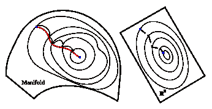
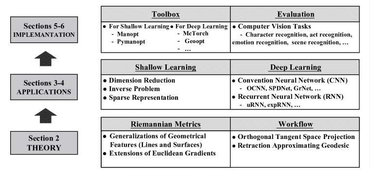

<!--yml

category: 未分类

date: 2024-09-06 19:41:53

-->

# [2302.08210] 深度学习的几何优化调查：从欧几里得空间到黎曼流形

> 来源：[`ar5iv.labs.arxiv.org/html/2302.08210`](https://ar5iv.labs.arxiv.org/html/2302.08210)

# 深度学习的几何优化调查：从欧几里得空间到黎曼流形

颜洪飞、魏贤、刘英杰、李正宇、陈铭松

软件工程研究所，华东师范大学

###### 摘要

尽管深度学习（DL）在复杂的人工智能（AI）任务中取得了成功，但由于在欧几里得空间中更新参数无法充分利用解空间的几何结构，它仍然面临各种恶名昭彰的问题（例如特征冗余以及梯度消失或爆炸）。作为一种有前景的替代解决方案，基于黎曼几何的深度学习利用几何优化在黎曼流形上更新参数，并能够利用底层几何信息。因此，本文提供了对在深度学习中应用几何优化的全面调查。首先，本文介绍了几何优化的基本过程，包括各种几何优化器和一些黎曼流形的概念。随后，本文调查了几何优化在各种人工智能任务中的不同深度学习网络中的应用，例如卷积神经网络、递归神经网络、迁移学习和最优传输。此外，本文还讨论了实现流形优化的典型公共工具箱。最后，本文在图像识别场景下对不同的深度几何优化方法进行了性能比较。

## 1 介绍

随着计算能力的提升，在欧几里得空间中优化的深度神经网络在从计算机视觉到自然语言处理（例如，自主驾驶和蛋白质结构预测）方面取得了显著成功[1, 2]。然而，为了充分利用数据中隐藏的有价值信息，大多数深度学习模型倾向于增加网络的容量，通常是通过扩展现有层或添加更多层[3, 4, 5]。例如，模型通常包含数百个卷积层和池化层，具有各种激活函数以及多个全连接层，在训练过程中产生数百万或数十亿的参数。这些与复杂模型架构相关的大量参数对深度学习网络的优化提出了挑战。作为一种替代范式，黎曼流形上的优化通过利用参数的几何特性来发掘隐藏的有价值信息，而不是增加网络容量。因此，几何优化可以缓解过度参数化和特征冗余问题。例如，在正交流形上训练的深度学习模型具有较少相关的参数，使得特征冗余大大减少[6]。

大多数深度学习方法中的优化目标可以被表述为

|  |  | $\displaystyle\operatorname*{argmin}_{\boldsymbol{\theta}\in\mathcal{D}}\ f_{\boldsymbol{\theta}}(\mathbf{x}),\ s.t.\ C(\boldsymbol{\theta}),$ |  | (1) |
| --- | --- | --- | --- | --- |

其中，$\mathcal{D}$ 表示预定义的可接受搜索空间，$f$ 表示一个需要通过可训练参数 $\boldsymbol{\theta}$ 最小化的实值优化函数（例如，损失函数），$C(\boldsymbol{\theta})$ 表示 $\boldsymbol{\theta}$ 所满足的约束（例如，正交性[6]和单位行和[7]）。大多数深度学习方法将搜索空间 $\mathcal{D}$ 定义为欧几里得空间。然而，满足约束的参数在流形上，流形是一个低维子空间，仅占据欧几里得空间的一小部分。因此，为了消除约束并减少参数，几何优化[8, 9, 10, 11] 将搜索空间从欧几里得空间缩小到一个光滑的流形。因此，方程式（1）被转化为在黎曼流形上的可微优化函数 $f:\mathcal{M}\rightarrow\mathcal{R}$，即，

|  | $\operatorname*{argmin}_{\theta\in\mathcal{M},M=\{\theta\mid C(\theta)\}}\ f_{\boldsymbol{\theta}}(\mathbf{x}).$ |  | (2) |
| --- | --- | --- | --- |

如方程 (2) 所示，选择一个由满足方程 (1) 中约束 $C(\boldsymbol{\theta})$ 的点组成的流形，可以将欧几里得空间中大量受限的深度学习问题优化为黎曼流形上的无约束且凸的问题 [10]，这有助于确保收敛性。例如，一个典型的降维问题可以定义如下

|  |  | $\displaystyle\operatorname*{argmin}_{\boldsymbol{\theta}\in{E}}f_{\boldsymbol{\theta}}(\mathbf{x})=-tr(\boldsymbol{\theta}^{T}x^{T}x\boldsymbol{\theta}),\ s.t.\ \ \boldsymbol{\theta}^{T}\boldsymbol{\theta}=I,$ |  | (3) |
| --- | --- | --- | --- | --- |

其中 $E$ 代表欧几里得空间，$I$ 代表单位矩阵，参数 $\boldsymbol{\theta}$ 被约束为正交。由于所有满足正交性的矩阵组成 Stiefel 流形，方程 (3) 可以视作 Stiefel 流形上的无约束问题，这是一种黎曼流形。

图 1：几何优化与欧几里得优化路径的比较。蓝色中心点是全局最优点。红色曲线描述了黎曼优化路径收敛到全局最优目标，总是沿着流形上的曲线。相比之下，绿色虚线表示欧几里得梯度下降路径朝向最优目标，存在偏离流形的风险。

图 1 描绘了任意欧几里得空间和黎曼流形上优化过程的直观范式。传统的欧几里得空间优化方法可能忽视了应用几何优化策略的优势。例如，后者可以从不同的独特流形结构中获得更丰富的几何信息，并将约束优化问题转化为无约束问题。此外，几何优化可以实现更快的收敛速度，减轻深度学习中的梯度爆炸和消失问题，详细内容将在第四部分中介绍。由于上述潜力，近年来几何优化已被应用于各种深度神经网络，如卷积神经网络（CNN）[12, 6, 13]，递归神经网络（RNN）[14]和视觉变换器（ViT）[15]。例如，正交参数化被用于 CNN 中以减少滤波器相似性，使光谱均匀[16]，并在不同网络层中稳定激活分布[17]。然而，缺乏专注于应用几何优化的深度学习方法的综合调查。为了探讨几何优化的好处，本文旨在对近期在深度学习中应用几何优化的进展进行全面回顾。

图 2: 本文中心思想的概述。

¹¹1*符号* 在这项工作中，向量和矩阵分别用粗体小写字母和大写字母表示。设$\mathbb{R}$为实数集，$\mathbb{C}$为复数集，$\nabla f$表示欧几里得梯度。

概述与文章组织。在本文中，介绍了深度学习几何优化技术的综述，包括几何优化的理论和应用。图 2 展示了本文的核心思想。由于优化理论是统一的且与模型无关，本文首先阐述了理论，包括各种几何梯度下降优化器（第二部分）。几何优化在经典机器学习中的动机和技术与在深度学习中的有所不同。因此，本文分别回顾了如何将几何优化应用于浅层学习（第三部分）和深度学习（第四部分）。特别地，本文调查了具有代表性的流形优化工具箱（第五部分），随后比较了不同几何深度学习方法在图像识别任务上的性能（第六部分）。最后，我们总结了本文并突出未来的挑战和研究趋势（第七部分）。

## 2 几何优化理论

优化问题的本质是寻找成本函数的最大值或最小值。无约束优化问题可以使用传统的优化方法（例如，最速下降法、共轭梯度法和牛顿法）来找到最优解[18]。然而，在计算机视觉任务中发生的广泛优化问题被称为有约束优化问题。在这种情况下，找到成本函数的封闭形式是困难的。为了使用上述传统的优化技术，可以通过使用拉格朗日乘子法或障碍惩罚函数将有约束问题转化为无约束形式[18]。然而，上述方法几乎无法利用潜在的流形结构。它们仅仅将有约束问题视为“黑箱”，并通过代数操作进行求解。

作为一种替代方案，几何优化方法被开发出来以利用目标函数参数的内在几何结构。通过利用成本函数的基础几何结构，几何优化方法可以将约束优化问题的搜索空间从欧几里得空间缩小到平滑的黎曼流形。黎曼流形具有可微分的结构，并配备了平滑的内积和黎曼梯度，这些都不同于欧几里得空间，并为几何优化奠定了基础。基于黎曼内积和黎曼梯度，广泛的欧几里得空间中的传统优化技术可以在平滑的流形上找到其对应的技术[19、20、21、8]，包括最速下降法[19、20、21]、共轭梯度下降法[22、23、24]、信赖域方法[8、25]和牛顿法[26、8]。因此，几何优化方法可以使用黎曼优化器来寻找目标函数的最优解。

在接下来的各节中，本文首先阐述了黎曼流形上的模型无关优化过程，涵盖与几何优化相关的基本概念（第 2.1 节）。接着，本文简要介绍了实现几何优化的各种黎曼梯度下降优化器，这些优化器是欧几里得空间中优化器的对应物（第 2.2 节）。最后，本文介绍了一系列在深度几何学习方法中常用的流形结构（第 2.3 节）。

<svg height="181.84" overflow="visible" version="1.1" width="300.69"><g transform="translate(0,181.84) matrix(1 0 0 -1 0 0) translate(112.31,0) translate(0,50.3)" fill="#000000" stroke="#000000"><g stroke-width="0.4pt"><g transform="matrix(1.0 0.0 0.0 1.0 18.46 -35.73)" fill="#000000" stroke="#000000"><foreignobject width="12.68" height="9.46" transform="matrix(1 0 0 -1 0 16.6)" overflow="visible">$\mathcal{M}$</foreignobject></g><g transform="matrix(1.0 0.0 0.0 1.0 -20.13 8.7)" fill="#000000" stroke="#000000"><foreignobject width="20.42" height="12.36" transform="matrix(1 0 0 -1 0 16.6)" overflow="visible">$\bm{\Theta}^{(j)}$</foreignobject></g><g transform="matrix(1.0 0.0 0.0 1.0 -4.72 -9.19)" fill="#000000" stroke="#000000"><foreignobject width="34.24" height="12.93" transform="matrix(1 0 0 -1 0 16.6)" overflow="visible">$T_{\bm{\Theta}^{(j)}}\mathcal{M}$</foreignobject></g><g transform="matrix(1.0 0.0 0.0 1.0 -13.45 58.23)" fill="#000000" stroke="#000000"><foreignobject width="8.3" height="7.56" transform="matrix(1 0 0 -1 0 16.6)" overflow="visible">$\mathbf{H}$</foreignobject></g><g transform="matrix(1.0 0.0 0.0 1.0 -2.82 119.18)" fill="#000000" stroke="#000000"><foreignobject width="104.84" height="15.05" transform="matrix(1 0 0 -1 0 16.6)" overflow="visible">Update: $\bm{\Theta}^{(j)}+\gamma\mathbf{H}$</foreignobject></g><g transform="matrix(1.0 0.0 0.0 1.0 65.85 98.24)" fill="#000000" stroke="#000000"><foreignobject width="122.53" height="13.86" transform="matrix(1 0 0 -1 0 16.6)" overflow="visible">Retraction: $\mathfrak{R}_{\bm{\Theta}^{(j)}}(\gamma\mathbf{H})$</foreignobject></g><g transform="matrix(1.0 0.0 0.0 1.0 -78.01 -37.67)" fill="#000000" stroke="#000000"><foreignobject width="56.8" height="12.66" transform="matrix(1 0 0 -1 0 16.6)" overflow="visible">$\operatorname{grad}{f}(\bm{\Theta}^{(j)})$</foreignobject></g> <g transform="matrix(1.0 0.0 0.0 1.0 -96.65 60.31)" fill="#000000" stroke="#000000"><foreignobject width="44.47" height="12.66" transform="matrix(1 0 0 -1 0 16.6)" overflow="visible">$\nabla{f}(\bm{\Theta}^{(j)})$</foreignobject></g> <g transform="matrix(1.0 0.0 0.0 1.0 44.48 41.89)" fill="#000000" stroke="#000000"><foreignobject width="42.49" height="11.08" transform="matrix(1 0 0 -1 0 16.6)" overflow="visible">$\Gamma_{\bm{\Theta}^{(j)}}(\gamma\mathbf{H})$</foreignobject></g> <g transform="matrix(1.0 0.0 0.0 1.0 115.06 31.02)" fill="#000000" stroke="#000000"><foreignobject width="30.32" height="12.36" transform="matrix(1 0 0 -1 0 16.6)" overflow="visible">$\bm{\Theta}^{(j+1)}$</foreignobject></g></g></g></svg>

图 3：几何梯度下降算法中的更新过程。它展示了从点 $\bm{\Theta}^{(j)}$ 到点 $\bm{\Theta}^{(j+1)}$ 的更新过程，在搜索方向 $\mathbf{H}\in T_{\bm{\Theta}^{(j)}}\mathcal{M}$ 上沿测地线曲线 $\Gamma_{\bm{\Theta}^{(j)}}(\gamma\mathbf{H})$ 进行。此外，它描述了如何通过使用回缩 $\mathfrak{R}_{\bm{\Theta}^{(j)}}(\gamma\mathbf{H})$ 来近似测地线 $\Gamma_{\bm{\Theta}^{(j)}}(\gamma\mathbf{H})$。

### 2.1 流形上的几何优化过程

图 3 通过梯度下降示例描绘了几何优化中的更新过程[27]。图中展示了流形 $\mathcal{M}$ 上的两个相邻点 $\Theta^{(j)}$ 和 $\Theta^{(j+1)}` 以及在 $\Theta^{(j)}$ 处的切空间（参见图 3 中绿色区域）。流形上的每个点 $\Theta$ 都有其对应的切空间 $T_{\Theta}\mathcal{M}$，它是欧几里得空间中切平面的推广，并且包含了通过 $\Theta$ 的所有切向量 [28]。每个切空间都有一个内积，这对向量的度量（如长度和角度）至关重要。内积空间进一步帮助引入正交性的概念，这是在更高维度中垂直性的扩展。黎曼梯度 $grad\,f(\Theta)$ 对于几何优化是切空间 $T_{\Theta}\mathcal{M}$ 上的一个切向量，指向流形上代价函数上升最陡的方向 [28]。图 3 显示了梯度 $\nabla f(\Theta)$ 是在环境欧几里得空间中计算的。由于流形在局部上同构于欧几里得空间，因此 $grad\,f(\Theta)$ 可以通过将欧几里得梯度 $\nabla f(\Theta)$ 投影到适当的切空间 $T_{\Theta}\mathcal{M}$ 来实现，即，

|  | $grad\ f(\Theta)=\Pi_{T_{\Theta}\mathcal{M}}(\nabla f(\Theta)),$ |  | (4) |
| --- | --- | --- | --- |

其中 $\Pi$ 表示正交投影。

作为欧几里得直线的对应物，测地线是在流形上两个点之间的局部最短路径。因此，沿着正确的测地线达到最优目标是最短的。形式上，测地线 $\Gamma_{\bm{\Theta}}(\gamma\mathbf{H})$ 是流形上的光滑曲线，从 $\Theta$ 沿切向量 $\mathbf{H}\in T_{\Theta}\textit{M}$ 的方向前进，步长为 $\gamma\in\mathbb{R^{+}}$ [23]。由于每个切向量是特定测地线曲线的方向向量，它可以唯一确定一条测地线曲线。特别是，由负黎曼梯度定义的测地线揭示了优化方向上的下一点。一个点可以通过指数映射从切空间映射到流形上。在实践中，为了减轻指数映射的高计算成本，通常使用回缩操作 $\mathfrak{R}_{\bm{\Theta}}(\gamma\mathbf{H})$ 作为近似 [29]：

|  | $\mathfrak{R}_{\bm{\Theta}}(\gamma\mathbf{H}):T_{p}\mathcal{M}\rightarrow\mathcal{M},\ \gamma\mathbf{H}\rightarrow\Gamma_{\bm{\Theta}}(\gamma\mathbf{H}),$ |  | (5) |
| --- | --- | --- | --- |

其中 $\mathbf{H}$ 表示黎曼梯度的相反向量。因此，$\mathbf{H}$ 指向优化函数的最陡下降方向。因此，如果参数 $\Theta$ 沿着 $\mathbf{H}$ 的方向在测地线曲线上更新，优化函数将会最小化。总之，以步长 $\gamma$，从当前参数 $\Theta^{(j)}$ 到下一个参数 $\Theta^{(j+1)}$ 的优化过程可以表示为

|  | $\Theta^{(j+1)}=\Gamma_{\bm{\Theta}^{(j)}}(\gamma\mathbf{H})\approx\mathfrak{R}_{\bm{\Theta}^{(j)}}(\gamma\mathbf{H})=\mathfrak{R}_{\bm{\Theta}^{(j)}}(-\gamma grad\,f(\Theta^{(j)})).$ |  | (6) |
| --- | --- | --- | --- |

### 2.2 梯度下降优化器

在欧几里得空间中定义的优化问题可以抽象化为

|  | ${\min}\{f_{\boldsymbol{\theta}}(\mathbf{x}):\boldsymbol{\theta}\in\mathbb{E}\},$ |  | (7) |
| --- | --- | --- | --- |

其中 $\boldsymbol{\theta}$ 是可训练参数，$E$ 表示欧几里得空间。对于方程 (7) 有多种标准优化器。梯度下降法是一种最基本的优化策略。它可以通过随机梯度下降（SGD）进行改进，从而加速收敛。梯度下降法的其他两个典型变体是随机梯度下降-动量（SGD-M）和均方根传播（RMSProp）。为了解决 SGD 遇到的谷底振荡和鞍点停滞问题，SGD-M 被开发出来以保持前一步的惯性。根据不同参数的经验判断，RMSProp 可以自适应地确定参数的学习率，即更新频率低的参数可以具有较大的学习率，而更新频率高的参数则可以减小步长。让 $\boldsymbol{\theta}^{(k)}$ 代表迭代 $k$ 时的参数，$\boldsymbol{\theta}^{(k+1)}$ 代表迭代 $k+1$ 时的参数，本节首先解释上述欧几里得梯度下降优化器，然后展示如何将其推广到黎曼流形以进行几何优化。²²2 为简便起见，本文在 2.2 节中使用 ${\nabla}f$ 来表示 $\frac{\partial f_{\boldsymbol{\theta}}(x)}{\partial\boldsymbol{\theta}}$。

梯度下降法。梯度下降法的形式如下

|  | $\boldsymbol{\theta}^{(k+1)}=\boldsymbol{\theta}^{(k)}-{\lambda}{\nabla}f(\boldsymbol{\theta}^{(k)}),$ |  | (8) |
| --- | --- | --- | --- |

其中 $\lambda$ 是表示步长的超参数。梯度 ${\nabla}f(\boldsymbol{\theta}^{(k)})$ 的负方向具有一个重要的属性，即它是优化问题的下降方向。因此，优化过程是沿梯度的负方向迭代更新可训练参数，直到收敛。

随机梯度下降（SGD）。SGD 的主要思想是使用随机的小批量训练数据来更新优化问题的参数，这本质上减少了计算工作量。尽管参数可能不会每次都沿着最陡下降方向更新，但通过多轮更新，总体更新方向仍然是最陡下降方向。因此，SGD 可以大大加快优化过程。

随机梯度下降-动量（SGD-M）。受到物理中动量概念的启发，SGD-M 在当前更新中施加上一次更新的影响，以减缓振荡并加速收敛。令 $m^{(k)}$ 表示施加在 $\boldsymbol{\theta}^{(k-1)}$ 上的更新，$\nabla f$ 表示时间 $k$ 时的梯度，施加在 $\boldsymbol{\theta}^{(k)}$ 上的更新 $m^{(k+1)}$ 可以通过以下方式实现

|  | $m^{(k+1)}=\lambda_{0}\ m^{(k)}+\lambda_{1}\nabla f,$ |  | (9) |
| --- | --- | --- | --- |

其中 $\lambda_{0}$ 和 $\lambda_{1}$ 是超参数。参数 $\boldsymbol{\theta}^{(k)}$ 通过 $m^{(k+1)}$ 被更新为 $\boldsymbol{\theta}^{(k+1)}$，具体如下

|  | $\boldsymbol{\theta}^{(k+1)}=\boldsymbol{\theta}^{(k)}-m^{(k+1)}.$ |  | (10) |
| --- | --- | --- | --- |

均方根传播（RMSProp）。类似于 SGD-M，RMSProp 在计算即将到来的更新时考虑上一次更新的影响。令 $m^{(k)}$ 为上一次的更新，$\nabla f$ 为当前的梯度，RMSProp 将即将到来的更新 $m^{(k+1)}$ 设计如下

|  | $m^{(k+1)}=\lambda\ m^{(k)}+(1-\lambda)(\nabla f\odot\nabla f),$ |  | (11) |
| --- | --- | --- | --- |

其中 $\lambda$ 是一个超参数，$\odot$ 表示 $Hadamard$ 乘积 [29]，即逐元素乘积。RMSProp 以以下方式将 $\boldsymbol{\theta}^{(k)}$ 更新为 $\boldsymbol{\theta}^{(k+1)}$，即：

|  | $\boldsymbol{\theta}^{(k+1)}=\boldsymbol{\theta}^{(k)}-\eta\frac{\nabla f}{\sqrt{m^{(k+1)}+\epsilon}},$ |  | (12) |
| --- | --- | --- | --- |

其中 $\eta$ 是一个超参数，$\epsilon$ 是正数，以防止分母为零。通过逐元素的平方根和除法操作，RMSProp 确保梯度 $\nabla f$ 中的不同元素具有不同的系数，这些系数表示深度学习中的学习率。因此，RMSProp 使得参数能够具有不同的学习率 [29]，从而使优化过程更加灵活。

基于上述流形上的优化过程（第 2.1 节），方程(8 中的欧几里得梯度下降算法可以转移到黎曼流形中，如下所示

|  | $\theta^{(k+1)}=\mathfrak{R}_{{\theta}^{(k)}}(-\lambda grad\,f(\theta^{(k)})),$ |  | (13) |
| --- | --- | --- | --- |

其中 $\mathfrak{R}_{{\theta}^{(k)}}$ 代表在点 ${\theta}^{(k)}$ 的回撤操作，而 $grad\,f$ 代表黎曼梯度。为了更好地理解，本文以约束 SGD-M 和约束 RMSProp 为例，解释如何将梯度下降优化器从欧几里得空间推广到流形。通过执行正交投影和回撤，其他欧几里得梯度下降优化器也可以类似地转化为黎曼优化器。

约束 SGD-M [29]。约束 SGD-M 是对流形上的 SGD-M 优化器的推广。在第 $k$ 次迭代中，$m^{(k)}$ 表示在切空间 $T_{\boldsymbol{\theta}^{(k-1)}}M$ 上的一个切向量，而 $m^{(k+1)}$ 表示在切空间 $T_{\boldsymbol{\theta}^{(k)}}M$ 上的另一个向量。由于 $\nabla f$ 在周围的欧几里得空间中，它需要正交投影到切空间 $T_{\boldsymbol{\theta}^{(k)}}M$，即当前黎曼梯度 $grad\,f$ 通过以下方式获得

|  | $grad\,f=\Pi_{T_{\boldsymbol{\theta}^{(k)}}M}(\nabla f).$ |  | (14) |
| --- | --- | --- | --- |

从与点 $p$ 相关的切空间到与点 $q$ 相关的另一个切空间的传输称为平行传输，即 $\Gamma_{p\rightarrow q}:\ T_{p}M\rightarrow T_{q}M$。在将欧几里得梯度 $\nabla f$ 投影到切空间 $T_{\boldsymbol{\theta}^{(k)}}M$ 并将 $m^{(k)}$ 从 $T_{\boldsymbol{\theta}^{(k-1)}}M$ 传输到 $T_{\boldsymbol{\theta}^{(k)}}M$ 后，方程 (9) 被转化为：

|  | $m^{(k+1)}=\lambda_{0}\,\Gamma_{\boldsymbol{\theta}^{(k-1)}\rightarrow\boldsymbol{\theta}^{(k)}}(m^{(k)})+\lambda_{1}\,\Pi_{T_{\boldsymbol{\theta}^{(k)}}M}(\nabla f).$ |  | (15) |
| --- | --- | --- | --- |

基于回撤操作，优化参数 $\boldsymbol{\theta}^{(k+1)}$ 可以通过沿着 $m^{(k+1)}$ 的负方向在测地线上搜索来从 $\boldsymbol{\theta}^{(k)}$ 更新，即迭代优化可以表示为

|  | $\boldsymbol{\theta}^{(k+1)}=\mathfrak{R}_{\boldsymbol{\theta}^{(k)}}(-m^{(k+1)}).$ |  | (16) |
| --- | --- | --- | --- |

约束 RMSProp [29]。类似于约束 SGD-M，在将 $m^{(k)}$ 从切空间 $T_{\boldsymbol{\theta}^{(k-1)}}M$ 传送到 $T_{\boldsymbol{\theta}^{(k)}}M$ 并将 $\nabla f\odot\nabla f$ 正交投影到相应的切空间后，方程 (11) 可以转化为：

|  | $m^{(k+1)}=\lambda\Gamma_{\boldsymbol{\theta}^{(k-1)}\rightarrow\boldsymbol{\theta}^{(k)}}(m^{(k)})+(1-\lambda)\Pi_{T_{\boldsymbol{\theta}^{(k)}}M}(\nabla f\odot\nabla f).$ |  | (17) |
| --- | --- | --- | --- |

优化目标的参数$\boldsymbol{\theta}^{(k+1)}$可以在流形上以确定的方向$-\eta\,\frac{\Pi_{T_{\boldsymbol{\theta}^{(k)}}M}(\nabla f)}{\sqrt{m^{(k+1)}+\epsilon}}$进行迭代搜索，即，

|  | $\boldsymbol{\theta}^{(k+1)}=\mathfrak{R}_{\boldsymbol{\theta}^{(k)}}(-\eta\,\frac{\Pi_{T_{\boldsymbol{\theta}^{(k)}}M}(\nabla f)}{\sqrt{m^{(k+1)}+\epsilon}}).$ |  | (18) |
| --- | --- | --- | --- |

### 2.3 流形示例

不同种类的矩阵流形具有不同的几何结构和约束条件，在将几何优化应用于深度学习时带来不同的优势。例如，倾斜流形在字典学习中发挥了重要作用，因为它的单位范数列的特性，而 Stiefel 流形对优化 RNN 有积极影响，因为 Stiefel 流形上的矩阵具有正交且不相关的列，这有助于缓解 RNN 中的特征冗余问题。由于空间有限，本节仅介绍常见的流形结构³³3 有关矩阵流形的更多介绍，请感兴趣的读者访问网站 https://www.Pymanopt.org。例如 Stiefel 流形、倾斜流形和 Grassmann 流形，它们都广泛应用于现有的几何优化技术，这些技术在第三部分和第四部分中讨论。

乘积流形和商流形。设$\mathcal{A}$和$\mathcal{B}$是两个维度分别为$d_{A}$和$d_{B}$的流形，对于$\mathcal{A}$和$\mathcal{B}$的任意一对图$(U,\phi)$和$(V,\varphi)$，映射$\Phi$在$U\times V$上定义为$\Phi(x,y)=(\phi(x),\varphi(y))$。它在乘积空间$\mathcal{A}\times\mathcal{B}$上指定了一个光滑的乘积流形结构。商流形是一个抽象空间，具有在同一流形中相似的子集。这些子集可以用等价关系描述。$\mathcal{A}$表示一个配备有等价关系$\sim$的流形，满足三种属性，即自反性、对称性和传递性[8]。一个点$x$的等价类由所有与之等价的元素组成，即，

|  | $[x]:=\{y\in\mathcal{A}:y\sim x\},$ |  | (19) |
| --- | --- | --- | --- |

其中$[x]$表示$x$的等价类。流形$\mathcal{A}$通过关系$\sim$的商定义如下

|  | $\mathcal{A}/\sim\ :=\{[x]:x\in\mathcal{A}\},$ |  | (20) |
| --- | --- | --- | --- |

通过投影 $\pi:\mathcal{A}\rightarrow\mathcal{A}/\sim$，用 $x\rightarrow[x]$ 表示。当 $\pi$ 是一个沉浸投影，且 $\mathcal{A}$ 是一个光滑流形 [8, 30] 时，$\mathcal{A}/\sim$ 具有一个唯一的光滑流形结构 $B$，即 $\mathcal{A}$ 的商流形。

对称正定流形 [29]。它由对称正定（SPD）矩阵 $M\in\mathbb{R}^{p\times p}$ 组成，配备有如下的仿射不变黎曼度量 (*AIRM*)。

|  | $S_{++}^{p}\triangleq\{M\in\mathbb{R}^{p\times p}:v^{T}Mv>0,\forall v\in\mathbb{R}^{p}-\{0_{p}\}\}.$ |  | (21) |
| --- | --- | --- | --- |

SPD 流形在计算机视觉中取得了巨大成功，因为它对图像和视频具有强大的统计表示。例如，SPD 矩阵用于构建行人检测的区域协方差矩阵 [31]，动作识别的联合协方差描述符 [32]，以及面部识别的图像集协方差矩阵 [33]。

Stiefel 流形 [29]。Stiefel 流形 $St(p,n)$ 由正交矩阵 $W\in\mathbb{R}^{n\times p}(p\leq n)$ 组成，配备有如下的 Frobenius 内积。

|  | $St(p,n)\triangleq\{W\in\mathbb{R}^{n\times p}:W^{T}W=I_{p}\},$ |  | (22) |
| --- | --- | --- | --- |

其中 $I_{p}$ 表示 $\mathbb{R}^{p\times p}$ 单位矩阵。紧致 Stiefel 流形上的优化函数具有上界，这使其能够实现最优解。

球面流形和斜面流形。单位 Frobenius 范数的 $n\times m$ 矩阵集合用球面 $\mathbb{S}^{nm-1}$ 表示。它可以被视为嵌入在欧几里得空间 $\mathbb{R}^{n\times m}$ 中的黎曼子流形，配备有通常的内积 $\langle H_{1},H_{2}\rangle=\operatorname{trace}(H_{1}^{T}H_{2})$。斜面流形 $\mathcal{OB}(n,m)$ 是单位范数列的 $n\times m$ 矩阵集合。它具有与球面乘积流形 $\prod_{i=0}^{m}\mathbb{S}^{n-1}$ 相同的几何结构。

Graßmann 流形 [29]。Graßmann 流形 $\mathcal{G}(n,p)$ 包含由正交矩阵 $X\in\mathbb{R}^{n\times p}(p\leq n)$ 张成的子空间集合，如下所示。

|  | $\mathcal{G}(n,p)\triangleq\{Span(X):X\in\mathbb{R}^{n\times p},X^{T}X=I_{p}\}.$ |  | (23) |
| --- | --- | --- | --- |

注意到 Graßmann 流形与 Stiefel 流形不同，即 Stiefel 流形上的一个点代表一个子空间的基，而 Graßmann 流形上的一个点代表一个整个子空间。此外，Graßmann 流形是线性子空间的集合，可用于执行几何感知的维度减少。

单位流形。单位矩阵是正交矩阵在复数域的扩展，即，

|  | $U(n)\triangleq\{U\in\mathbb{C}^{n\times n}:U^{\ast}U=I_{n}\},$ |  | (24) |
| --- | --- | --- | --- |

其中 $U^{\ast}$ 表示共轭转置矩阵，$I_{n}$ 代表大小为 $n\times n$ 的单位矩阵。正交或单位 ary 矩阵可以保持向量的范数，即，当 $W$ 是一个正交或单位 ary 矩阵时，$\|Wh\|_{2}$ = $\|h\|_{2}$。因此，当参数在正交或单位 ary 流形上优化时，可以缓解深度临时网络中的梯度爆炸和消失问题，这将在第 4.2 节中详细讨论。

李群 [13]。李群是具有群结构的实数或复数流形。存在两个紧致且连通的李群，即特殊正交群，公式如下

|  | $SO(n)=\{B\in\mathbb{R}^{n\times n} \mid B^{T}B=I, \det(B)=1\},$ |  | (25) |
| --- | --- | --- | --- |

和单位 ary 群的公式如下

|  | $U(n)=\{B\in\mathbb{C}^{n\times n} \mid B^{\ast}B=I\}.$ |  | (26) |
| --- | --- | --- | --- |

李群在单位元素处的切空间被称为它的 $Lie\ algebra$。对于特殊正交群和单位 ary 群，它们的李代数分别由以下公式给出

|  | $\displaystyle\mathfrak{so}(n)$ | $\displaystyle=\{A\in\mathbb{R}^{n\times n} \mid A + A^{T}=0\},$ |  | (27) |
| --- | --- | --- | --- | --- |
|  | $\displaystyle\mathfrak{u}(n)$ | $\displaystyle=\{A\in\mathbb{C}^{n\times n} \mid A + A^{\ast}=0\}.$ |  |

$\mathfrak{so}(n)$ 被称为反对称矩阵，而 $\mathfrak{u}(n)$ 是反厄米矩阵。对一个连通的、紧致的李群，李指数映射（$exp:\mathfrak{g}\rightarrow G$，其中 $G$ 表示李群，$\mathfrak{g}$ 表示其李代数）是满射的。因此，李群上的优化问题可以转换为欧几里得空间中的优化问题，在那里可以直接使用欧几里得梯度下降优化器。

## 3 经典机器学习中的应用

经典的机器学习方法在解决人工智能问题（例如，维度约简、逆问题、稀疏表示、分析算子学习和时间模型）方面取得了成就。尽管现代计算设施的计算能力不断提高，但在欧几里得空间中解决大量约束的经典机器学习问题仍然困难。为了降低解决难度，几何优化关注约束问题的特殊结构，将其视为黎曼流形上的无约束问题 [10]。

### 3.1 维度约简

通过使用映射 $\mu\colon\mathbb{R}^{m}\to\mathbb{R}^{l}$ 其中 $l<m$，降维（DR）旨在找到给定数据样本 $x_{i}\in\mathbb{R}^{m}$ 的低维表示 $y_{i}\in\mathbb{R}^{l}$。最流行的 DR 范式使用线性投影，而其他方法则采用非线性变换以约束数据之间的局部性质。表 1 总结了主流 DR 方法的主要特性（例如，线性判别分析（LDA） [34]，主成分分析（PCA） [35, 36, 37]，多维尺度分析（MDS） [38, 39]，等距特征映射（ISOMAP） [40]，局部线性嵌入（LLE） [41]，拉普拉斯特征映射（LE） [42]，和保持局部性的投影（LPP） [43])。

在 DR 方法中使用的映射 $\mu\colon\mathbb{R}^{m}\to\mathbb{R}^{l}$ 通常被限制为正交投影，即，

|  | $\mu(\mathbf{x}):=\mathbf{V}^{\top}\mathbf{x},$ |  | (28) |
| --- | --- | --- | --- |

其中，正交矩阵 $\mathbf{V}\in\mathbb{R}^{m\times l}$ 属于 *Stiefel* 流形 ${St}(l,m):=\big{\{}\mathbf{V}\in\mathbb{R}^{m\times l}|\mathbf{V}^{\top}\mathbf{V}=\mathbf{I}_{l}\big{\}}$。寻找一个最优的 $\mathbf{V}\in St(l,m)$ 的一种通用算法框架可以被表述为一个最大化问题，即，

|  | $\operatorname*{argmax}_{\mathbf{V}\in St(l,m)}\,\frac{\operatorname{tr}(\mathbf{V}^{\top}\mathbf{A}\mathbf{V})}{\operatorname{tr}(\mathbf{V}^{\top}\mathbf{B}\mathbf{V})+\sigma},$ |  | (29) |
| --- | --- | --- | --- |

其中矩阵 $A,B\in\mathbb{R}^{m\times m}$ 通常是对称矩阵或正定矩阵。公式 (29) 被称为*迹商*或*迹比*。注意常数 $\sigma>0$ 可以防止分母为零。矩阵 $A$ 和 $B$ 被构建用来根据特定问题测量数据点之间的相似性。$V$ 并不是唯一的，且与选择的特征值密切相关。公式 (29) 的解是旋转不变的，即，设 $\mathbf{V}^{*}\in St(l,m)$ 为问题的一个解，则对于任何正交矩阵 $\boldsymbol{\Theta}\in\mathbb{R}^{l\times l}$，$\mathbf{V}^{*}\boldsymbol{\Theta}$ 也是公式 (29) 的解。换句话说，公式 (29) 的解集是 $\mathbb{R}^{m}$ 中所有 $l$ 维线性子空间的集合，可以用 Graßmann 流形表示，即，

|  | $\mathfrak{Gr}(l,m):=\left\{\mathbf{V}\mathbf{V}^{\top} \mid \mathbf{V}\in St(l,m)\right\}.$ |  | (30) |
| --- | --- | --- | --- |

如上所示，大多数线性降维方法从解决 $tr(V^{T}AV)$ 开始，而非线性降维方法通过连接邻近点构建图，这捕捉了数据局部邻域结构的信息，并形成类似的优化问题。以非线性降维方法 LE 为例，与邻域图相关的拉普拉斯矩阵 [44] 可以视为公式 (29) 中的对称矩阵 $A$。

[b]

表 1: 降维算法总结

| 方法 | $线性/非线性^{1}$ | $全局/局部^{2}$ | 属性 |
| --- | --- | --- | --- |
| LDA | 线性 | 全局 | 是有监督的，使用类别的先验知识，限制于高斯分布样本 |
| PCA | 线性 | 全局 | 是无监督的，使用正交主成分消除各成分之间的相互作用 |
| MDS | 非线性 | 全局 | 计算简单，保留了原始空间中的数据关系，适合可视化，错误地假设每个维度有相同的贡献 |
| ISOMAP | 非线性 | 全局 | 适用于具有平坦内部的低维流形，而不是具有大内曲率的流形，计算成本高 |
| LLE | 非线性 | 局部 | 适用于非封闭的局部线性低维流形，计算复杂度小，限于稠密均匀数据集，对最近邻样本的数量敏感 |
| LE | 非线性 | 局部 | 保留局部特征，对离群点和噪声的敏感性较小，嵌入稳定 |
| LPP | 线性 | 局部 | 在空间中的任何点定义，即可以推广到测试集而不仅限于训练集 |

+   1

    线性表示线性投影映射，而非线性表示非线性投影映射。

+   2

    全局/局部代表输入数据的几何关系。

### 3.2 逆问题

旨在从现象中探索内部模式 [45]，逆问题对实际应用具有重要影响。例如，以下实际问题可以被建模为逆问题：i) 从 X 光中推导人体结构信息；ii) 从地震波推测地层的内部外观。逆问题可以被视为从输出重建输入，如下所示，

|  | $\mathbf{y}=\bm{{W}}{\mathbf{x}},$ |  | (31) |
| --- | --- | --- | --- |

其中 $\mathbf{y}\in\mathbb{R}^{l}$ 是给定的输出，而 $\bm{{W}}$ 是一个将输入数据 $\mathbf{x}$ 映射到输出数据 $\mathbf{y}$ 的矩阵。方程中的逆问题（31）的目标是在 $\mathbf{y}$ 是先验已知的前提下恢复 $\mathbf{x}$。虽然获取精确解是具有挑战性的，但可以通过将参数矩阵 $\bm{{W}}$ 限制在光滑的黎曼流形上来获得近似解。让矩阵 $\bm{{W}}$ 中同一行的元素之和恰好为 1，方程（31）可以通过在所有具有单位行和的斜截流形 $\mathcal{M}$ 上进行优化来解决 [7]，即，

|  | $\min_{\bm{{W}}\in\mathcal{M}}\left\&#124;\mathbf{y}-\bm{{W}}\mathbf{x}\right\&#124;_{2}^{2}.$ |  | (32) |
| --- | --- | --- | --- |

### 3.3 字典学习

作为一个具体的逆问题，字典学习已被广泛用于获取输入数据中最重要的特征 [23]。设 $X\in R_{n\times k}$ 表示输入样本，在字典学习中，$X$ 被扩展为线性组合如下

|  | $X=D_{1}\phi_{1}+\cdots+D_{n}\phi_{n},$ |  | (33) |
| --- | --- | --- | --- |

其中 $D_{1},\cdots,D_{n}$ 代表从输入中学习到的最重要特征，而 $\phi_{1},\cdots,\phi_{n}$ 表示特征 $D_{1},\cdots,D_{n}$ 的组合系数。设 $D\in R_{k\times n}$ 表示字典集 $\{D_{1},\cdots,D_{n}\}$，$\Phi\in R_{n\times r}$ 表示集合 $\{\phi_{1},\cdots,\phi_{n}\}$，方程 (33) 可以简化为如下，

|  | $X=D\Phi,$ |  | (34) |
| --- | --- | --- | --- |

其中 $D$ 和 $\Phi$ 可以有多种组合方式。字典学习旨在学习一个 $D$ 使得系数 $\Phi$ 为零或接近零，即样本 $X$ 的稀疏表示。字典 $D$ 和稀疏系数 $\Phi$ 是交替计算的。当 $\Phi$ 固定时，字典学习部分与方程 (31) 的形式相同，这是重建 $D$ 的反问题。设 $\left\|\phi\right\|_{0}$ 表示 $\Phi$ 中非零条目的数量，字典 $D$ 满足 $\left\|D_{1}\right\|=...=\left\|D_{n}\right\|=1$。因此，上述字典学习问题可以转化为在斜流形上的以下最小化问题：

|  | $\operatorname*{argmin}_{D\in\textit{OB}(k,n)}\left\|X-D\Phi\right\|_{2}^{2}+\lambda\left\|\Phi\right\|_{0}.$ |  | (35) |
| --- | --- | --- | --- |

### 3.4 分析算子学习

分析算子学习假设几个算子足以表示观察到的高维变量[46]。然而，这些算子是隐含的且不可观察的，例如，存储环境和服务质量是隐藏在观察变量“价格”背后的潜在算子。分析算子学习的目标是找出这些隐形的算子，因为低维算子可以简化原始的高维变量。

设 $X$ 为原始高维变量，$F$ 为低维潜在算子，分析算子学习通常可以表述为如下

|  | $X=AF,$ |  | (36) |
| --- | --- | --- | --- |

其中 $A$ 表示算子载荷矩阵，其中元素 $A_{ij}$ 表示变量 $x_{i}$ 在因子 $f_{j}$ 上的载荷。已经证明参数 $A$ 可以是正的[47]，因此分析算子学习可以转化为在正流形 $\mathcal{M}$ 上的优化问题，如下所示

|  | $\min_{A\in\mathcal{M}}\left\|X-AF\right\|_{2}^{2}.$ |  | (37) |
| --- | --- | --- | --- |

### 3.5 时间模型

时间概率模型由描述状态随时间演变的转移模型和描述观测过程的传感器模型组成[27]。时间模型有助于处理滤波、预测和光滑。在转移模型中，下一状态 $z_{t+1}$ 是从当前状态 $z_{t}$ 转移过来的，与之前的状态无关。给定时间相关的转移概率 $A(t)$，状态的转移过程可以被建模为

|  | $z_{t+1}=A(t)\cdot z_{t}+\epsilon(t),$ |  | (38) |
| --- | --- | --- | --- |

其中噪声 $\epsilon(t)$ 遵循高斯分布。

状态是不可见的，隐藏状态可以通过发射概率表现为特定的观测。当前观测 $x_{t}$ 仅由当前状态 $z_{t}$ 定义，与之前的状态和观测无关。给定时间变化的发射概率 $C(t)$，观测过程可以被建模为

|  | $x_{t}=C(t)\cdot z_{t}+\delta(t),$ |  | (39) |
| --- | --- | --- | --- |

其中噪声 $\delta(t)$ 遵循高斯分布。

作为方程 (38) 和方程 (39) 的混合，时间模型可以分为隐马尔可夫模型和线性动态系统。隐马尔可夫模型具有离散的隐藏状态变量，而线性动态系统的隐藏状态和观测变量遵循高斯分布。设 $n$ 代表时间序列的大小，观测序列 $E[x_{0},x_{1},x_{2}\cdots]$ 的期望可以推导为：

|  | $[C(t),C(t)A(t),C(t)A(t)^{2}\cdots C(t)A(t)^{n-1}]\,z_{0},$ |  | (40) |
| --- | --- | --- | --- |

其中 $z_{0}$ 是初始隐藏状态。它可以被视为由对应时间的发射和转移矩阵列所张成的子空间序列[48]。如 2.3 节中提到的，Graßmann 流形上的一点是一个子空间。因此，时间模型可以在 Graßmann 流形上进行数学优化。

## 4 深度学习中的应用

随着对几何优化的关注日益增加，越来越多的深度学习方法开始与之结合。几何优化技术在不同的深度学习骨干网络（如 CNN、RNN 和 GNN）中有所不同。因此，本节将深度学习中的应用分类为以下几类：即 i) 几何 CNN；ii) 几何 RNN；iii) 几何 GNN 以及 iv) 针对其他深度学习方法（如迁移学习和最优传输）的几何优化。正交流形在几何 CNN 中广泛应用以减少特征冗余。示例包括在正交 CNN 中利用核正交性[6]，在 CNN 中对卷积核的子流形进行优化[49]，以及在训练深度 CNN 时通过正交性正则化卷积核[12]。此外，几何 CNN 可以利用 Stiefel 流形[50]和 Graßmann 流形[51]的独特结构。几何 RNN 利用正交和单位流形的范数保持特性，以缓解梯度爆炸和消失问题。示例包括单位进化递归神经网络中的复单位矩阵[14]，以及在《便宜的正交约束：正交和单位群的简单参数化》中使用的特殊正交群和单位群[13]。几何 GNN 特别关注双曲流形，并广泛用于结构捕获。示例包括双曲 GNN[52]和一个将欧几里得空间与双曲几何结合的几何神经网络[53]。

### 4.1 几何 CNN

深度 CNN 在各种计算机视觉任务中取得了巨大成功，如图像识别[54]和分割任务[55]。CNN 通过利用卷积、激活和池化这三种基本结构，从大规模数据中自动学习特征[10]。尽管 CNN 运作高效，但在整个欧几里得空间中搜索最优解会导致一些问题（例如，训练不稳定和特征冗余），这些问题阻碍了进一步的发展。为了解决这些问题，几何优化方法通过在合适的黎曼流形上进行核空间、几何正则化和带有流形参数的准 CNN 架构来优化 CNN。

核空间。低维流形通常嵌入在高维欧几里得空间中。核函数可以将原始特征映射到更高维的空间。因此，借助核函数，流形上的计算成本低的操作可以表示欧几里得空间中的复杂操作。核空间可以利用拓扑光滑流形进行描述。例如，正定核，也被称为 Graßmann 流形上的 Graßmann 核，可以用来将流形映射到希尔伯特空间[56]。Zhang 等人[57] 设计了一种基于典型相关性的新的 Graßmann 核，以更准确地区分不同类别。Liu 等人[58] 设计了用于线性子空间、协方差矩阵和高斯分布的 RBF 核，以优化在黎曼流形上的情感视频识别。Hariri 等人[59] 定义了一种基于 SPD 协方差矩阵的核，用于指示两个面部图像的相似性，以进行人脸匹配。

基于非线性数据构建的核空间有助于学习固有的流形结构。Yuan 等人[60] 将流形核空间与深度学习架构结合用于场景识别。为了保持输入场景图像的几何结构并实现更强的表示能力，[60] 定义了低级特征层 $X$ 和一个隐藏的流形核空间 $Y$ 作为基础单元。此外，深度架构是逐单元构建的，$Y_{k}$ 作为另一个基础单元的输入，用于生成下一个隐藏空间 $Y_{k+1}$。比较实验评估了流形正则化深度网络在大规模场景数据集上的性能。

Ozay 等人[49] 将 CNN 中的核估计问题视为对嵌入或浸入的核子流形的优化。[49] 探索了 CNN 中卷积核空间的几何性质，并揭示了不同的核归一化方法会引入不同的几何特性。例如，正交归一化方式意味着 Stiefel 流形，而归一化为单位范数的核则位于球面流形上。此外，[49] 提出了一个针对核子流形的 SGD 优化算法。对三个核子流形进行的实验确认了上述方法可以提升传统 CNN 训练的性能。

几何正则化。正则化作为优化函数的惩罚项。它用于对优化函数的参数施加限制。常用的几何正则化是正交约束，旨在将参数限制在正交流形上。回顾在第 2.3 节中介绍的正交矩阵 $W^{T}W=I$，正交正则化方法大致分为硬正交性，如下所示

|  | $\|W^{T}W-I\|_{F}^{2}$ |  | (41) |
| --- | --- | --- | --- |

和软正交性作为

|  | $\lambda\|W^{T}W-I\|_{F}^{2}$ |  | (42) |
| --- | --- | --- | --- |

其中 $\|\cdot\|_{F}$ 表示 Frobenius 范数，$\lambda$ 表示一个松弛系数。基于软正交性，我们可以实现双重软正交性作为

|  | $\lambda(\|W^{T}W-I\|_{F}^{2}+\|WW^{T}-I\|_{F}^{2}).$ |  | (43) |
| --- | --- | --- | --- |

基于观察到核正交性对于正交卷积是必要但不充分的，Wang 等人[6] 提出了一种方法，通过直接对卷积层进行正交性约束进行正则化。在训练过程中，卷积滤波器$K$被转换为双重块 Toeplitz（DBT）矩阵，并且谱被正则化为均匀，这需要行或列的正交性。对 DBT 矩阵的正交性约束有助于缓解梯度爆炸和消失的问题，使训练更加稳定。此外，许多实验表明，它能够实现惊人的性能，例如更强的鲁棒性和更好的泛化能力。

Bansal 等人[12] 观察到正交性可以稳定 CNN 中激活值的能量分布，并提高训练效率。[12] 比较了不同的正交性正则化方法，例如软正交性、双重软正交性以及通过降低列相关性来强制正交性的互相关正则化。同时，[12] 设计了一种名为谱受限等距特性正则化的新型正交性正则化器，该正则化器专注于最小化 $W^{T}W-I$ 的谱范数。显著的实验结果表明，将正交性正则化作为训练深度 CNN 的标准工具能够提供更好的准确性和稳定性。

为了在复杂背景或各种方向等挑战性情况下估计人脸姿势，洪等人[61]提出了流形正则化卷积层（MRCL），以增强 CNN 参数的非线性局部约束。MRCL 位于传统 CNN 的池化和激活操作之上，可以恢复潜在数据的低秩流形结构以实现更好的优化。通过采用低秩学习的多任务学习，可以将不同数据表示的多模态信息结合起来预测面部姿态。对比实验验证了对传统卷积层施加流形正则化的好处。

Roufosse 等人[62]提出了一种谱无监督功能图网络（SURFMNet），其中形状匹配网络从一个形状到另一个形状的匹配被约束到正交流形。SURFMNet 使用无监督学习计算 3D 形状之间的对应关系，即在没有真实数据的情况下建立形状对应关系。实验证据支持 SURFMNet 在与最先进的无监督形状匹配方法相比具有一致的优势。实验结果还显示 SURFMNet 与监督方法相当。

不同于现有的浅层学习 Lie 群特征的方法，黄等人[63]在深度人体动作识别网络中引入了 Lie 群结构到参数矩阵。所提议的基于骨架的人体模型$(V,E)$是一个二元关系，其中$V$代表由身体关节$(v_{1},\dots,v_{N})$组成的顶点集合，而$E$代表由身体骨骼$(e_{1},\dots,e_{M})$组成的边集合。旋转矩阵通过基于骨架的轴角模型表示，形成了特殊的正交群。为了保留输入旋转矩阵的 Lie 群结构，上述人体动作识别网络在 Lie 群流形上进行优化，并映射到切空间进行最终分类。

类似于上述动作识别网络[63]，陈等人[64]提出了一种深度流形学习（DML）框架，以学习动作视频的流形信息和深度表示。[64]研究表明，利用深度学习中的几何信息有助于提高动作识别的准确性和效率。为了提取更多表达特征，DML 框架在前一层、标签信息和流形参数上应用了流形正则化器。此外，将 DML 框架适应于限制玻尔兹曼机可以缓解过拟合问题并提高识别准确性。

拟 CNN 架构。核方法和正交正则化并不改变基本的 CNN 组件（例如，卷积和池化操作）。将几何优化应用于深度学习的另一种方法是模仿传统的 CNN 架构并建立一种适合流形结构的新架构。在本文中，上述架构被称为拟 CNN 架构。卷积和激活层被重建以在拟 CNN 架构中引入几何优化。为了实现这个目标，拟 CNN 架构中的参数被设计为位于紧致斯蒂弗尔流形上。为了更直观地解释，本文以深度 SPD 矩阵网络（SPDNet）[50]和深 Graßmann 神经网络架构（GrNet）[51]为例。 

让$X$作为输入，$W$作为紧致斯蒂弗尔流形上的转换参数。首先，SPDNet 是为在 SPD 流形上进行优化而设计的。双线性映射（BiMap）层$f_{b}=WXW^{T}$扮演着传统 CNN 中卷积层的角色。基于特征值分解$X$ = $U\Sigma U$，特征值修正（ReEig）层$f_{r}=Umax(\epsilon I,\Sigma)U^{T}$被设计来替换非线性激活层，其中$\epsilon$是激活阈值。SPDNet 设计了特征值对数（LogEig）层以将黎曼流形展平到一个平坦空间，从而可以应用经典的欧氏计算。GrNet 是为了在正交流形上进行优化而设计的。全秩映射（FRMap）层$f_{fr}=WX$在 GrNet 中取代了传统 CNN 中的卷积层。受 QR 分解$X=QR$的启发，其中$Q$是正交矩阵，GrNet 设计了重正交化（ReOrth）层$f_{fo}=XR^{-1}=Q$以实现正交输出。与 SPDnet 中的 LogEig 层不同，GrNet 使用内积$XX^{T}$将流形降低到一个平坦的欧氏空间。在对得到的欧氏数据进行池化操作后，GrNet 设计了正交映射（OrthMap）层$f_{om}=U_{1:q}$以将输出矩阵转换回正交流形，其中$U_{1:q}$表示特征值分解获得的前$q$个最大特征向量。

### 4.2 几何循环神经网络

RNN 是为了处理序列数据而设计的，因为它们可以捕捉顺序输入之间的空间和时间依赖关系。因此，RNN 可以应用于诸如语音识别、文本预测和机器翻译等任务。给定长度为$\tau$的输入序列$X_{\tau}={x_{1},x_{2},\cdots,x_{\tau}}$ ($x_{i}\in\mathbb{R}^{n}$)，基本 RNN 框架旨在生成长度为$\tau$的输出序列$Y_{\tau}={y_{1},y_{2},\cdots,y_{\tau}}$ ($y_{i}\in\mathbb{R}^{p}$)。通过隐藏状态$h$在每个时间步长递归地传递到模型中，RNN 的输出预测$o_{i}\in\mathbb{R}^{p}$如下计算[65]：

| | $\displaystyle h_{i}$ | $\displaystyle=\sigma(Ux_{i}+Wh_{i-1}+b),$ | | (44) |
| --- | --- | --- | --- | --- |
|  | $\displaystyle o_{i}$ | $\displaystyle=Vh_{i}+c,$ |  |

其中 $U\in\mathbb{R}^{m\times n}$ 是输入权重矩阵，$W\in\mathbb{R}^{m\times m}$ 是递归权重矩阵，$h_{i-1}\in\mathbb{R}^{m}$ 是前一个隐藏状态，$b\in\mathbb{R}^{m}$ 是输入偏置，$\sigma(\cdot)$ 是一个点对点的非线性函数，$h_{i}\in\mathbb{R}^{m}$ 是当前隐藏状态，$V\in\mathbb{R}^{p\times m}$ 是输出权重矩阵，$c\in\mathbb{R}^{p}$ 是输出偏置。

#### 4.2.1 正交 RNN (ORNN)

设 $\mathcal{L}$ 为需要最小化的目标函数，隐藏状态的损失函数的梯度计算为：

|  | $\displaystyle\frac{\partial\mathcal{L}}{\partial h_{i}}$ | $\displaystyle=\frac{\partial\mathcal{L}}{\partial h_{\tau}}\cdot\frac{\partial h_{\tau}}{\partial h_{i}}=\frac{\partial\mathcal{L}}{\partial h_{\tau}}\cdot\prod_{j=i}^{\tau-1}\frac{\partial h_{j+1}}{\partial h_{j}}=\frac{\partial\mathcal{L}}{\partial h_{\tau}}(\prod_{j=i}^{\tau-1}D_{j+1}W^{T}),$ |  | (45) |
| --- | --- | --- | --- | --- |

其中 $D_{j+1}\in\mathbb{R}^{m\times m}$ 是一个对角矩阵，其元素由激活函数的导数组成。公式中点对点的非线性函数 $\sigma(\cdot)$ (44) 被建议使用修正线性单元（ReLU）函数 [66, 67]，其输出的最小值为 $0$。输入 $D_{j+1}$ 在所有 $j$ 中至少有一个非零的导数值。对公式 (45 ‣ 4.2 几何 RNN ‣ 4 深度学习应用 ‣ 深度学习几何优化调查：从欧几里得空间到黎曼流形")) 两边进行欧几里得 $l_{2}-norm$ 操作，我们得到：

|  | $\displaystyle\left\&#124;\frac{\partial\mathcal{L}}{\partial h_{i}}\right\&#124;_{2}$ | $\displaystyle\leqslant(\prod_{j=i}^{\tau-1}\left\&#124;D_{j+1}W^{T}\right\&#124;_{2})\left\&#124;\frac{\partial\mathcal{L}}{\partial h_{\tau}}\right\&#124;_{2}=(\prod_{j=i}^{\tau-1}\left\&#124;W\right\&#124;_{2})\left\&#124;\frac{\partial\mathcal{L}}{\partial h_{\tau}}\right\&#124;_{2}$ |  | (46) |
| --- | --- | --- | --- | --- |

如果 $\|W\|_{2}$ 大于一，$\left\|\frac{\partial\mathcal{L}}{\partial h_{i}}\right\|_{2}$ 会随着 $\tau$ 的增加而指数级增长。因此，方程中 $\left\|\frac{\partial\mathcal{L}}{\partial h_{i}}\right\|_{2}$ 的范数揭示了著名的梯度爆炸问题，这会阻碍 RNN 的训练 [68]。如果 $\|W\|_{2}$ 小于一，$\left\|\frac{\partial\mathcal{L}}{\partial h_{i}}\right\|_{2}$ 会随着 $\tau$ 的增加而指数级下降，这导致梯度消失问题 [68]。

最近一系列的 ORNN 对 RNN 的隐藏到隐藏变换施加了正交约束。递归权重变换矩阵 $W$ 被限制在正交流形上。设 $A$ 为一个正交矩阵，对于每个向量 $X$，其经过正交变换后的范数为：

|  | $(AX)^{T}(AX)=X^{T}A^{T}AX=X^{T}X,$ |  | (47) |
| --- | --- | --- | --- |

这意味着正交变换不会改变原始向量的范数。因此，当方程中的变换矩阵 $W$ (46 ‣ 4.2 几何 RNN ‣ 4 深度学习中的应用 ‣ 深度学习几何优化的调查：从欧几里得空间到黎曼流形")) 是正交的时，$\left\|\frac{\partial\mathcal{L}}{\partial h_{i}}\right\|_{2}$ 可以在 ORNN 中保持不变。因此，RNN 的梯度爆炸和消失问题可以得到缓解。此外，正交约束可以在复数域中推广到单位 ary 约束。

#### 4.2.2 ORNN 的最新进展

uRNN [14] 通过简单的参数单位 ary 矩阵构造了一个大型单位 ary 矩阵，即，单位 ary 隐藏到隐藏矩阵 $W$ 由以下部分组成，

|  | $\displaystyle W=D_{3}R_{2}F^{-1}D_{2}\Pi R_{1}FD_{1},$ |  | (48) |
| --- | --- | --- | --- |

其中 $D$ 是一个对角矩阵，其对角元素 $D_{j,j}=e^{iw_{j}}$ 由虚数单位 $i$ 和参数 $w_{j}\in\mathbb{R}$ 定义，$R=I-\ 2\frac{vv^{\ast}}{\|v\|^{2}}$ 是一个反射矩阵，$v\in\mathbb{C}^{n}$ 是复数向量，$\Pi$ 是一个固定的随机索引置换矩阵，$F$ 和 $F^{-1}$ 分别是傅里叶变换和反傅里叶变换。在类似于方程中的矩阵构造策略中 (48)，参数、内存和计算开销的增加速度大致为线性。因此，可以降低大隐藏层的训练成本。在 uRNN 中，提出了一种名为 modReLU 的非线性激活函数 ReLU 的变体，以保持复数值隐藏状态的相位：

|  | $\sigma_{modReLU}(z)=\left\{\begin{aligned} &amp;(&#124;z&#124;+b)\frac{z}{&#124;z&#124;},\quad&amp;如果\ &#124;z&#124;+b\geq 0\\ &amp;0,\quad&amp;如果\ &#124;z&#124;+b\leq 0\end{aligned}\right.$ |  | (49) |
| --- | --- | --- | --- |

其中 $b$ $\in\mathbb{R}$ 是一个偏置参数。uRNN 定义一个矩阵 $U$ 将复值隐藏状态 $h_{t}$ 映射到实值输出以进行预测。相应的损失函数计算如下：

|  | $o_{t}=U\left(\begin{aligned} Re(h_{t})\\ Im(h_{t})\end{aligned}\right)+b_{o},$ |  | (50) |
| --- | --- | --- | --- |

其中 $b_{o}$ 是输出偏置，$Re(h_{t})$ 和 $Im(h_{t})$ 分别表示 $h_{t}$ 的实部和虚部。

然而，Wisdom 等人 [69] 注意到方程 (48) 的单位参数构造不能覆盖所有 $N\times N$ 单位矩阵，对于 $N>7$ 的情况，即至少存在一个 $N\times N$ 单位矩阵不能以方程 (48) 的形式表示。为了解决这个问题，[69] 设计了一种方法来测量结构化 $N\times N$ 单位矩阵的表示能力。[69] 提出了一个观点，即由 $P$ 个实值参数参数化的单位矩阵对于 $P\geq N^{2}$ 是全容量的，这意味着它可以覆盖所有 $N\times N$ 单位矩阵。

与生成复合正交矩阵不同，李代数指数映射可以实现隐藏到隐藏变换的正交约束 [13]。特殊正交群上的连通主观指数映射 $exp:\mathfrak{g}$ $\rightarrow$ G 定义为：

|  | $\displaystyle exp(A):=I\ +\ A+\ \frac{1}{2}A^{2}+\ \dots.$ |  | (51) |
| --- | --- | --- | --- |

由于这是一个主观问题，对于每一个属于特殊正交群或单位群的隐藏到隐藏的变换矩阵 $W$，必须存在一个满足 $exp(A)=W$ 的反对称（或反厄米矩阵）$A$。因此，隐藏到隐藏的变换 $h_{t+1}=\sigma(Wh_{t}\ +Tx_{t+1})$ 等价于 $h_{t+1}=\sigma(exp(A)h_{t}\ +Tx_{t+1})$。也就是说，正交或单位流形上的优化可以转化为欧几里得空间中的优化。因此，经典的梯度下降优化器如 Adam 可以应用于最小化损失函数，同时满足正交约束。因此，李代数指数映射可以实现低计算开销并缓解梯度爆炸和消失问题。

另一种方法 [70] 基于李群，定义了一个基 $\{T_{j}\}_{j=\{1,\cdots,n^{2}\}}$ 和系数 $\{\lambda_{j}\}_{j=\{1,\cdots,n^{2}\}}$ 来构造元素 $L\in\mathfrak{u}(n)$，如下所示

|  | $L=\Sigma_{j=1}^{n^{2}}\lambda_{j}T_{j}.$ |  | (52) |
| --- | --- | --- | --- |

通过使用指数映射，对应单位李群 $U(n)$ 的元素 $U$ 可以表示为：

|  | $U=exp(L)=exp(\Sigma_{j=1}^{n^{2}}\lambda_{j}T_{j}).$ |  | (53) |
| --- | --- | --- | --- |

此外，Hyland 等人 [70] 提出了一个论点，认为上述参数化有助于将单位 RNN 推广到任意单位矩阵，并解决长时记忆任务。

在深度神经网络（DNN）中学习正交滤波器可以被表述为一个优化问题，涉及多个相关的 Stiefel 流形（OMDSM） [71]。正交线性模块可以替代 DNN 中的标准线性模块，以稳定激活分布并规范化网络。令 $W_{k}$ 和 $b_{k}$ 为可学习的权重矩阵和偏置，参数 $\theta$ 为 $\{W_{k},b_{k}|k=1,2,\dots K\}$，深度神经网络可以表示为 $f(x,\theta):x\rightarrow\hat{y}$，其中 $x$ 是输入特征，$\hat{y}$ 是 DNN 的输出预测。损失函数通常设计为标签 $y$ 和预测值之间的差异：$\mathcal{L}(y,f(x,\theta))$。最终，优化问题被表述为

|  | $\displaystyle\theta^{\ast}=argmin_{\theta}\mathbb{E}_{(x,y)\in D}[\mathcal{L}(y,f(x,\theta))].$ |  | (54) |
| --- | --- | --- | --- |

OMDSM 在每一层使用正交权重矩阵 $W_{k}$ 训练深度神经网络（DNN）。因此，优化问题被重新表述为

|  | $\displaystyle\theta^{\ast}=argmin_{\theta}\mathbb{E}_{(x,y)\in D}[\mathcal{L}(y,f(x,\theta))]$ |  | (55) |
| --- | --- | --- | --- |
|  | $\displaystyle s.t.\ W_{k}\in\mathbb{O}_{k}^{n_{k}\times d_{k}},k=1,2,\dots K,$ |  |

其中矩阵族 $\mathbb{O}_{k}^{n_{k}\times d_{k}}=\{W_{k}\in\mathbb{R}^{n_{k}\times d_{k}}|W_{k}W_{k}^{T}=I\}$ 由多个真实的 Stiefel 流形组成，这些流形是 $\mathbb{R}^{n_{k}\times d_{k}}$ 的一个嵌入子流形。每个独立的正交滤波器 $W\in\mathbb{R}^{n\times d}$ 由代理参数 $V\in\mathbb{R}^{n\times d}$ 给出，如下所示

|  | $W=PV,$ |  | (56) |
| --- | --- | --- | --- |

其中 $n$ 是输出通道的数量，$d$ 是输入通道的数量，$P\in\mathbb{R}^{n\times n}$ 是线性变换的系数。首先，通过 $V_{C}$ 对 $V$ 进行中心化：

|  | $V_{C}=V-c{1_{d}^{T}},$ |  | (57) |
| --- | --- | --- | --- |

其中 $c=\frac{1}{d}V1_{d}$，$1_{d}$ 是全为 1 的 $d$ 维向量。此外，协方差矩阵 $V_{C}{V_{C}}^{T}$ 的特征值 $\wedge$ 和特征向量 $D$ 用于构造 $P$：

|  | $P=D\wedge^{-1/2}D^{T}.$ |  | (58) |
| --- | --- | --- | --- |

最终，$W$ 被表述为

|  | $W=D\wedge^{-1/2}D^{T}V_{C}.$ |  | (59) |
| --- | --- | --- | --- |

已有研究探讨了软正交约束的影响 [72]。通过允许 $S$ 的对角元素在 1 附近浮动，正交变换矩阵 $W$ 被放宽为

|  | $W=USV^{T},$ |  | (60) |
| --- | --- | --- | --- |

其中 $U$ 和 $V$ 是严格的正交矩阵。

上述方法主要受到 $O(n^{3})$ 时间复杂度的限制，或者依赖于复杂矩阵 [73]。发现正交矩阵 $W\subseteq O(2n)$ 具有双倍的隐藏尺寸，可以替代 $\mathbb{C}^{n\times n}$ 中的复杂或单位矩阵。受上述发现的启发，[73] 提出了利用 Householder 矩阵实现正交过渡矩阵的参数化。因此，复杂矩阵不再需要，时间复杂度降低，而效果类似于单位约束。

正交矩阵的保持范数特性可能使 ORNN 难以对无关信息保持较低关注 [74]。为缓解这个问题，Jing 等人 [74] 提出了门控正交递归单元（GORU），以在学习长期依赖性时忽略无关或噪声信息。通过添加门控机制，实验结果表明 GORU 在自然语言处理任务（如问答任务）以及长期依赖任务（如去噪和复制任务）中优于单位 RNN。

总之，uRNN [14] 通过组合简单的单位矩阵来参数化单位隐藏到隐藏矩阵。然而，上述参数化无法涵盖所有 $N\times N$ 单位矩阵。为弥补这一点，提出了全容量 uRNN [69]。与 uRNN 不同，expRNN [13] 利用指数映射更容易实现正交约束。此外，OMDSM 创新性地使用重新参数化来优化 DNN 在多个相关 Stiefel 流形上，而不是一个流形 [71]。此外，研究探讨了如何放宽 RNN 上的硬正交约束 [72]。通过创造性地引入 Householder 矩阵，可以减轻参数化单位矩阵的巨大时间复杂度 [73]。最后但同样重要的是，GORU [74] 设计了一个遗忘门，使 ORNN 可以减少对无关信息的关注。

### 4.3 几何 GNN

GNN 可以用于构建基于不规则图的学习网络。每个图由顶点和边表示，这描述了顶点之间的关系。GNN 将顶点编码为特征向量，将边建模为顶点之间的关系矩阵。在 GNN 中，图卷积在关系矩阵和特征矩阵之间进行。因此，GNN 可以利用图结构并迭代更新每个顶点的特征信息。将欧几里得 GNN 赋予超曲面几何可以使其在捕捉图结构方面更具优势[52]。最近，大量几何 GNN 研究探讨了如何将 GNN 与超曲面流形结合，以从具有高度组织结构的邻域中受益。

为了充分利用图中的丰富几何信息，几何交互学习（GIL）[53]通过指数和对数变换将欧几里得空间与超曲面几何结合起来。此外，学习型消息传递参数在$M\ddot{o}bius$流形上进行优化。为了让每个节点自由地确定每个几何空间的重要性，GIL 框架采用了灵活的双空间来建模低维规则数据和复杂的层次结构。广泛的实验表明，GIL 方法适用于节点分类和链接预测任务。

观察到 GCN 无法应对静态结构信息的变化，Liu 等人[75]提出了一种流形正则化动态图卷积网络（MRDGCN），该网络将流形正则化集成到 GCN 中以建模动态结构信息。MRDGCN 在收敛之前自动更新结构信息，这弥补了 GCN 在学习过程中无法保持最佳的不足。大量关于人类活动数据集和引文网络数据集的比较实验评估了 MRDGCN 在性能上优于 GCN 和其他半监督学习方法。

### 4.4 其他深度学习方法的几何优化

鲁棒时间序列预测。考虑到噪声和异常值在系统建模中不可避免且重要，Feng 等人[76]提出了一种用于大规模噪声干扰时间序列预测的鲁棒流形广义学习系统（RM-BLS）。RM-BLS 应用低秩约束，使得被扰动损坏的特征可以通过特征选择被舍弃。此外，RM-BLS 还可以舍弃不满足低维流形嵌入的特征。除了低秩流形之外，[76]还考虑了 Stiefel 流形优化，并通过 Cayley 变换和曲线搜索算法满足正交约束。

医学重建。几何优化在医学领域发挥了重要作用，例如用于心脏诊断的磁共振成像（MRI）。动态 MR 可以在低秩张量流形上进行优化 [77]，以把握动态信号之间强大的时间关联。此外，迭代重建过程被转化为一个神经网络进行加速，称为 Manifold-Net。为了恢复自由呼吸和未门控的心脏 MRI 数据，Biswas 等人 [78] 创造性地将 CNN 与流形上的光滑性正则化（SToRM）先验结合起来。SToRM 中的拉普拉斯矩阵 $L$ 在流形上定义 $tr(X^{T}LX)$ 以建模数据之间超越环境空间的相似性。为了利用流形结构和患者特定信息，基于 CNN 和 SToRM 的数据去噪以及共轭梯度（CG）步骤交替进行。实验表明，将 CNN 与 SToRM 结合能够实现快速和高质量的 MRI 数据重建，即使下采样频率小于每片 8.2 秒的采集时间。

迁移学习。为了最大化有限计算资源的利用，迁移学习旨在重用为任务 $A$ 训练的神经网络来处理类似的任务 $B$。知识蒸馏（KD）旨在将模型知识从一个经过良好训练的模型（教师）传递到一个紧凑模型（学生），并使用软标签。Zhang 等人 [79] 设计了一个端到端的深度流形到流形变换网络（DMT-Net）用于判别特征学习。然而，从原始流形重建出一个更具判别性的 SPD 流形具有挑战性。DMT-Net 设计了一个局部 SPD 卷积层和非线性 SPD 激活层来应对这一挑战。Huang 等人 [80] 设计了一个流形到流形的变换矩阵 $W$ 并将优化约束在 SPD 流形上。此外，在 $W$ 下建立了类内和类间相似性图。因此，它们可以表示局部几何结构并学习 SPD 数据的判别特征。

最优传输。最优传输旨在通过使用传输计划 $\Gamma$ 和成本矩阵 $C$ 来测量两个概率分布之间的距离，即，

|  | $\min_{\Gamma\in\Pi(\mu_{1},\mu_{2})}trace(\Gamma^{T}C),$ |  | (61) |
| --- | --- | --- | --- |

其中 $\Pi(\mu_{1},\mu_{2})$ 由边际分布 $\mu_{1}$ 和 $\mu_{2}$ 组成。假设 $\mu_{1}$ 有 $m$ 个点，$\mu_{2}$ 有 $n$ 个点，则 $\Gamma$ 和 $C$ 的大小均为 $m\times n$。已有研究探讨了几何优化在最优传输问题中的应用 [81]。通过使用黎曼梯度下降 (RGD) 算法，[82] 探讨了如何将具有不同正则化的最优传输问题转化为耦合矩阵流形 (CMM) 上的优化问题。为明确几何优化过程，[82] 以经典的最优传输问题（例如，熵正则化 [83] 和幂正则化最优传输问题 [84]）作为示例。观察到受约束的集合 $\Pi(\mu_{1},\mu_{2})$ 具有可微流形结构，[85] 和 [86] 在广义双重随机流形上解决了最优传输问题，拓宽了流形几何在非线性最优传输问题中的应用。除了普通问题外，[86] 还讨论了如何将上述几何优化框架适应于特定问题，如稀疏最优传输映射问题和如何同时学习多个传输计划的问题。

机器人。贝叶斯优化是一项对机器人非常重要的技术，因为它在解决优化问题方面非常有效，如控制器调优、策略适应和机器人设计。贝叶斯优化基于高斯过程，这一过程依赖于领域知识的探索。因此，几何感知的贝叶斯优化作为一种有前景的范式出现，它可以将领域几何信息纳入优化算法中。在高斯过程中，有许多常用的核函数，其中 Matérn 核用于研究几何感知高斯过程和贝叶斯优化。欧几里得 Matérn 核定义如下，

|  | $K(x,x^{\prime})=exp(-\frac{\&#124;x-x^{\prime}\&#124;^{2}}{2\sigma^{2}}),$ |  | (62) |
| --- | --- | --- | --- |

其中 $\sigma$ 是一个自由参数。Matérn 核函数是在构建平稳高斯过程时常用的核函数。Borovitskiy 等人 [87] 指出，仅通过用测地距离 $d_{g}(x-x^{\prime})$ 替换欧几里得范数 $\|x-x^{\prime}\|^{2}$ 来将 Matérn 核推广到黎曼流形，无法产生一个明确定义的核函数。为了构造由随机偏微分方程定义的黎曼 Matérn 核，Borovitskiy 等人提出了获取特定流形的 Laplace–Beltrami 特征对并近似无限和的方法，这为机器人上的几何感知贝叶斯优化奠定了基础。然而，上述方法存在两个问题 [88]，即 i) 计算量随着流形维度的增加而呈指数增长； ii) 该方法不适用于非紧流形。为了解决这些问题，Jaquier 等人 [88] 观察到了 Matérn 核的通用表达式，这有助于将其推广到圆环和球面流形。更重要的是，Matérn 核可以通过使用通用表达式推广到非紧流形（如 SPD 矩阵流形和双曲空间）。

持续学习。持续学习旨在记住和利用以前任务的经验来学习新任务，这对神经网络的记忆能力提出了更高的要求。Chaudhry 等人 [89] 提出了在低秩正交流形上实现持续学习的目标。该方法的核心思想是通过在最后一层引入任务特定的投影矩阵，将梯度投影到不相交的低秩正交子空间，从而使不同任务之间的梯度正交，并缓解灾难性遗忘。梯度正交性的概念最早在 [90] 中提出。灾难性遗忘的根本原因是学习新任务会影响在旧任务上学到的参数。在与旧任务梯度正交的方向上更新参数，不仅可以学习新任务，还能保持旧任务的损失，从而减轻灾难性遗忘。在深度神经网络中，链式导数过程可以近似看作梯度的线性变换，这会破坏早期层梯度的正交性，并导致灾难性遗忘。为了确保不同任务之间梯度的正交性，[89] 将参数限制在 Stiefel 流形上，使得这一线性变换成为正交变换。

## 5 工具箱

Tensorflow 平台和 PyTorch 框架在深度学习中的成功表明，工具箱可以方便地帮助构建神经网络。有价值的工具箱被设计用于快速设置流形优化。Manopt [91]、Pymanopt [92]、McTorch [93] 和 Geomstats [94] 是实现流形几何和优化算法的经典工具箱。此外，它们用户友好且节省时间。表 2 从适用流形和几何操作的角度比较了这些工具箱。

Manopt 是建立在 Matlab 上的，是处理各种几何约束（例如，2.3 中介绍的不同流形结构）的有用工具。Manopt [91] 中的黎曼优化被设计为一个包含流形结构的问题，搜索空间被限制在这些结构内。成本函数或优化目标也包含在上述优化问题中。如果需要，问题结构还可以涵盖目标函数的导数。在 Manopt 中，求解器是给黎曼优化算法提供通用实现的函数，包括最速下降、共轭梯度和黎曼信任域算法。由于 Manopt 中的求解器旨在最小化成本函数，因此如果是最大化问题，则应将成本函数乘以负数。

Pymanopt [92] 将 Manopt 扩展到了 Python。与 Matlab 中使用 Manopt 类似，Pymanopt 中的黎曼优化应当以预定义的流形和成本函数初始化。配备了不同的求解器，优化过程和结果可能有所不同。Pymanopt 涵盖了各种平滑流形，如斜流形、球面流形和格拉斯曼流形。包括许多优化算法作为求解器，例如，Pymanopt 包含信任域、共轭梯度和最速下降算法。

Manopt 和 Pymanopt 仅限于浅层学习优化，不适用于深度学习优化。为了弥补 Manopt 和 Pymanopt 的不足，McTorch 被通过扩展 Pytorch [93] 实现了，这是一种适用于深度学习的方便框架。因此，它为流形上的深度学习优化实现了一般解决方案。与 Manopt 和 Pymanopt 不同，McTorch 中的黎曼优化不需要定义问题、流形和求解器。类似于 Pytorch，McTorch 中的黎曼优化只需要定义模块和优化器，例如 Adam。继承自 $torch.nn.module$ 的网络模块用流形和前向函数初始化层。

Geoopt [95]，它是在 Pytorch 上实现的，基础设施成本低于 McTorch。从 $torch.nn.Module.parameters$ 扩展，Geoopt 支持流形上的张量和参数。此外，Geoopt 提供了黎曼优化器，例如，$RiemannianSGD$ 和 $RiemannianAdam$，它们分别继承自 $torch.optim.SGD$ 和 $torch.optim.Adam$ [95]。

另一个工具箱 Geomstats 由两个核心模块组成，即几何和学习 [94]。前者实现了黎曼度量，包括测地距离。后者实现了从 Scikit-Learn 类中继承的统计和学习算法，如 *K-Means* 和 PCA。与 Geomstats 相比，提到的其他工具箱模块化程度较低，且缺乏统计学习算法。以聚类为例，Geomstats 封装了带有 *metric* 参数的 *Online K-Means* 类。为了执行聚类操作，用户只需初始化黎曼度量，并像在 Scikit-Learn 中一样调用 *Online K-Means* 类的 *fit* 函数，这非常简单方便。

TheanoGeometry [96] 使用 Theano，这是一个基于 Python 的研究导向框架，用于实现微分几何和非线性统计问题。由于 TheanoGeometry 可以处理符号计算，因此优于其他流形工具箱。因此，可以直接从符号表达式生成 Theano 代码，其中非线性符号统计可以通过极少量的代码进行优化。TheanoGeometry 进一步超越了高效的符号计算。它实现了包括测地线方程、平行运输和曲率在内的黎曼几何，并具有自动微分功能 [97]。

表 2：按流形和几何进行的工具箱比较

| 工具箱 | 流形 | 几何 |
| --- | --- | --- |
| Manopt [91] | 欧几里得流形，对称矩阵，球面，复圆，SO (n)，Stiefel，Graßmannian，斜流形，SPD (n)，固定秩 PSD 矩阵 | 指数和对数映射，切空间投影，回缩，向量运输，egrad2rgrad，ehess2rhess，向量，度量，距离，范数 |
| Pymanopt [92] | 与 Manopt 相同 | 与 Manopt 相同 |
| McTorch [93] | Stiefel，SPD (n) | 与 Manopt 相同 |
| Geoopt [95] | 欧几里得流形，球面，Stiefel，庞加莱球 | 与 Manopt 相同 |
| Geomstats [94] | 欧几里得流形，闵可夫斯基和双曲空间，球面，SO (n)，SE (n)，GL (n)，Stiefel，Graßmannian，SPD (n)，离散曲线，地标 | 指数和对数映射，平行运输，内积，距离，范数，Levi-Civita 连接，测地线，不变度量 |
| TheanoGeometry [96] | 球面、椭球面、SPD (n)、标志点、GL (n)、SO (n)、SE (n) | 内积、指数和对数映射、平行运输、Christoffel 符号、黎曼、里奇和标量曲率、测地线、Fréchet 均值 |

## 6 性能评估

表 4、5、6、7、8 比较了前述几何优化方法在各种视觉任务（例如，字符识别、情感识别、动作识别和场景识别任务）上的性能。不同视觉任务中使用的每个图像数据集汇总在表 3 中。

表 3: 不同视觉任务的数据集

| 视觉任务 | 数据集 | 总样本数 | 类别 | 图像尺寸 |
| --- | --- | --- | --- | --- |
| 字符识别 | MNIST [98] | 70000 | 10 | 32 $\times$ 32 |
| 情感识别 | AFEW [99] | 1345 | 7 | 400 $\times$ 400 |
| NABU3DFE [100] | 2500 | 6 | NA |
| Bosphorus 数据集 [101] | 4666 | 6 | NA |
| 动作识别 | HDM05 [98] | 18000 | 130 | 93 $\times$93 |
| 人脸验证 | PaSC [102] | 12529 | NA | $401\times 401$ |
| 场景识别 | Scene15 [103] | NA | 15 | $300\times 250$ |
| 八个运动事件类别 [104] | NA | 8 | NA |
| SUN [105, 106] | 899 | NA | NA |

表 4 显示，GORU [74] 在 MNIST 数据集上表现优于其他 ORNN。GORU 添加了一个遗忘门，使 ORNN 能够过滤掉无关信息。利用射影指数映射，expRNN [13] 实现了更简单的正交参数化。与 expRNN 不同，uRNN [14] 使用简单的单位矩阵构造单位隐藏到隐藏的矩阵。然而，这种矩阵构造方法无法表示所有 $N\times N$ 单位矩阵。因此，Scott Wisdom 等人 [69] 提出了全容量 uRNN 以克服 uRNN 的瓶颈。通过正则化项实现正交参数化，soRNN [72] 探索了软正交约束对 RNN 的影响。ORNN [73] 利用 Householder 矩阵对 RNN 强制实施正交约束，从而减轻了单位矩阵的巨大时间复杂度。表 4 显示，将遗忘门或噪声滤波器与 ORNN 结合可以提高 ORNN 的性能。

表 4: 字符识别的比较结果

| 数据集 | 方法 | 准确率 |
| --- | --- | --- |
| MNIST [98] | uRNN [14] | 97.6% |
| 全容量 uRNN [69] | 96.9% |
| expRNN [13] | 98.7% |
| soRNN [72] | 97.3% |
| ORNN [73] | 97.2% |
| GORU [74] | 98.9% |

表 5: 情感识别的比较结果

| 数据集 | 方法 | 准确率 |
| --- | --- | --- |
| AFEW [99] | STM-ExpLet [107] | 31.73% |
| RSR-SPDML [32] | 30.12% |
| DeepO2P [108] | 28.54% |
| DCC [109] | 25.78% |
| GDA [56] | 29.11% |
| GGDA [56] | 29.45% |
| PML [110] | 28.98% |
| SPDNet [50] | 34.23% |
| GrNet [51] | 34.23% |
| BU-3DFE [100] | Tree-PNN [111] | 93.23% |
| Berretti 等人 [112] | 77.53% |
| Huynh 等人 [113] | 92.73% |
| Azazi 等人 [114] | 85.71% |
| Hariri 等人 [59] | 93.50% |
|  | CSLBP [115] | 76.98% |
| CLBP [116] | 76.56% |
| Bosphorus | ZernikeMoments [117] | 60.53% |
|   [101] | Azazi 等人 [114] | 84.10% |
|  | Hariri 等人 [59] | 90.01% |

表 5 显示，SPDNet [50] 和 GrNet [51] 在 AFEW 数据集 [99] 上可以比最先进的方法实现更好的分类结果。以下方法用于比较，它们是应用流形结构的浅层学习方法：Spatio-Temporal Manifold 上的 Expressionlets (STM-ExpLet) [107]、结合流形学习的流形上 Riemannian 稀疏表示 (RSR-SPDML) [32]、判别典型相关性 (DCC) [109]、Graßmann 判别分析 (GDA) [56]、Grassmannian 图嵌入判别分析 (GGDA) [118] 和投影度量学习 (PML) [110]。Deep Second-order Pooling (DeepO2P) [108] 是一个使用标准优化方法的传统 CNN 模型。SPDNet 通过 BiMap 层利用 Stiefel 流形参数化，并通过 ReEig 层将非线性引入网络。实验证明，使用流形几何在深度学习优化中可以提高网络性能。LogEig 层对黎曼计算至关重要，并有助于 SPDNet 在情感分类中的成功。GrNet 的成功表明，在 Graßmann 流形上进行优化和构建一个具有几何感知的深度学习网络，对于学习具有代表性的特征和以较高精度分类情感具有重要意义。

表 5 显示，Hariri 等人提出的基于流形的分类方法在 BU-3DFE 和 Bosphorus 数据集上达到了最高的精度。Hariri 等人使用了 Graph-Matching 核，并用 SPD 协方差描述符对面部表情数据进行了分类。该方法在 BU-3DFE 数据集上的表现优于 Tree-PNN [111] 和 XP Huynh [113]，而后两者使用传统的 CNN。Hariri 等人提出的基于流形的方法在 BU-3DFE 数据集上的表现远远超过了 Stefano Berretti [112] 和 Amal Azazi [114] 提出的的方法，分别高出约 15% 和 8%。特别地，后两种方法应用了 SIFT 和 Speed Up Robust Features 描述符。在 Bosphorus 数据集上，Hariri 等人方法 [59] 的分类准确率几乎远高于所有最先进的方法。例如，它比 ZernikeMoments [117] 高出 30%。低精度的方法使用局部特征而不是 SPD 协方差矩阵。总体而言，这些结果表明，使用几何约束对于特征表示和情感识别至关重要。

表 6 显示，SPDNet 在动作识别任务中达到了最高的准确率，其次是 GrNet。正如表 7 所示，SPDNet 和 GrNet 在面部识别任务中优于最先进的方法。SPDNet 中的特征值分解引入了非线性，而 GrNet 中的 QR 分解执行了重新正交化，这两者都促进了分类准确性。因此，使用矩阵分解对于探索流形约束参数至关重要。深度流形网络在动作识别和面部识别任务上的成功表明，优化流形上的深度学习有助于学习有利的特征并更好地分类人类动作。

表 6: 动作识别的比较结果

| 数据集 | 方法 | 准确率 |
| --- | --- | --- |
| HDM05 [98] | RSR-SPDML [32] | 48.01% |
| DCC [109] | 41.74% |
| GDA [56] | 46.25% |
| GGDA [118] | 46.87% |
| PML [110] | 47.25% |
| SPDNet [50] | 61.45% |
| GrNet [51] | 59.23% |

表 7: 面部识别的比较结果

|  | 准确率 |
| --- | --- |
| 方法 | PaSC1 [102] | PaSC2 [102] |
| VGGDeepFace [119] | 78.82% | 68.24% |
| DeepO2P [108] | 68.76% | 60.14% |
| DCC [109] | 75.83% | 67.04% |
| GDA [56] | 71.38% | 67.49% |
| GGDA [118] | 66.71% | 68.41% |
| PML [110] | 73.45% | 68.32% |
| SPDNet [50] | 80.12% | 72.83% |
| GrNet [51] | 80.52% | 72.76% |

如表 8 所示，流形正则化深度学习架构 (SRMR) [60] 在所有三个场景识别数据集上的表现优于最先进的非流形方法。 Lazebnik 等 [120] 将图像划分为细小子区域进行图像匹配。 Dixit 等 [121] 为场景图像分类制定了贝叶斯适应。 Kwitt 等 [122] 在统计（语义）流形上识别场景图像。从信息几何的角度来看，他们可以将参数向量视为黎曼流形。 Goh 等 [123] 使用 SIFT 描述符并以向量形式表示图像识别。 Li 等 [104] 解释了图像的语义组件。 Wu 和 Rehg [124] 使用直方图交集核 (HIK) 进行体育比赛分类。 Donahue 等 [124] 使用提取的特征进行新颖的通用任务。 SRMR 在场景识别任务中的巨大成功表明，流形正则化对提高深度学习的分类准确性至关重要。

表 8：场景识别的比较结果

| 数据集 | 方法 | 准确率 |
| --- | --- | --- |
| Scene15 [103] | Lazebnik 等 [120] | 81.2% |
| Dixit 等 [121] | 82.3% |
| Kwitt 等 [122] | 85.4% |
| Goh 等 [123] | 85.4% |
| SRMR [60] | 86.9% |
| 八个体育赛事类别 [104] | Li 等 [104] | 73.4% |
| Kwitt 等 [122] | 83.0% |
| Wu 和 Rehg [124] | 84.3% |
| SRMR [60] | 86.1% |
|  | Xiao 等 [105] | 27.2% |
| SUN | Kwitt 等 [122] | 28.9% |
| [105] | Donahue 等 [125] | 30.14% |
|  | SRMR [60] | 30.3% |

实验结果因相同流形约束方法下不同的网络架构设置而异。例如，SPDNet [50] 有四种不同的架构配置：i) SPDNet-0BiRe 不使用 BiMap/ReEig 块，ii) SPDNet-1BiRe 使用 $1$ 个 BiMap/ReEig 块，iii) SPDNet-2BiRe 使用 $2$ 个 BiMap/ReEig 块，iv) SPDNet-3BiRe 使用 $3$ 个 BiMap/ReEig 块。GrNet [51] 有三种不同的配置：i) GrNet-0Block 不使用 Projection-Pooling 块，ii) GrNet-1Block 使用 $1$ 个 Projection-Pooling 块，iii) GrNet-2Block 使用 $2$ 个 Projection-Pooling 块。这些方法研究了不同架构设置如何影响分类准确性。请注意，我们的文章遵循了来自相关文章的原始设置。因此，本文未展示不同架构配置下的分类准确性。

## 7 结论与未来工作

本文对应用几何优化于深度学习的最新进展进行了综述。本文回顾了根据深度学习骨干网络的分类（例如，CNN、RNN 和 GNN）在流形上优化深度学习网络的进展。特别地，本文讨论了几何优化的理论和工具箱。尽管几何优化为深度学习方法带来了各种优势，但仍面临以下挑战。

1.  -

    面向数据集的几何优化。各种方法（例如，uRNN [14] 和神经网络中的便宜正交约束 [13]）利用小型图像数据集如 MNIST 手写数字来验证几何优化的有效性。几何优化是否能在如 Penn Tree Bank (PTB) 等庞大而复杂的数据集上取得良好性能仍需进一步研究。这促使研究人员使用更多具有挑战性的数据集来验证应用几何优化后的深度学习技术的性能。

1.  -

    面向模型的几何优化。尽管在黎曼流形上优化深度学习网络如 CNN 和 RNN 已被证明成功，但几何优化尚未应用于所有深度学习方法。例如，关于在流形上优化强化学习和联邦学习的研究仍然不足，这在自动控制和隐私保护中至关重要。这迫使研究人员进一步**挖掘**从几何角度优化更多深度学习网络的潜力和好处。

1.  -

    流形导向的几何优化。流形几何在几何优化中发挥着重要作用，不同的流形具有不同的应用。例如，正交流形可以用来缓解特征冗余，而倾斜流形可以用于优化字典学习。然而，某些流形如中心矩阵流形在文献中的应用仍然空白。这激励研究人员尽可能多地利用流形结构进行几何优化应用。

本文展示了几何优化可以利用搜索空间的几何信息，加快优化过程，并缓解梯度爆炸和消失问题。然而，考虑到未探索的深度学习方法如强化学习，以及未使用的流形结构如中心矩阵流形，推动几何优化在深度学习中的边界仍然是一个巨大的挑战。

## 参考文献

+   [1] Ian Goodfellow、Yoshua Bengio、Aaron Courville 和 Yoshua Bengio。深度学习。2016。

+   [2] Raphael JL Townshend、Stephan Eismann、Andrew M Watkins、Ramya Rangan、Maria Karelina、Rhiju Das 和 Ron O Dror。RNA 结构的几何深度学习。《科学》，373(6558)：1047–1051，2021。

+   [3] Mingxing Tan 和 Quoc Le。Efficientnet：重新思考卷积神经网络的模型扩展。在国际机器学习会议（ICML），页码 6105–6114，2019。

+   [4] Zhen He、Shaobing Gao、Liang Xiao、Daxue Liu、Hangen He 和 David Barber。更宽更深，更便宜更快：用于序列学习的张量化 LSTM。在神经信息处理系统进展，页码 1–11，2017。

+   [5] David Rolnick 和 Max Tegmark。深度网络在表达自然函数方面的力量。在国际学习表征会议（ICLR），2018。

+   [6] Jiayun Wang、Yubei Chen、Rudrasis Chakraborty 和 Stella X Yu。正交卷积神经网络。在 IEEE 计算机视觉与模式识别会议（CVPR）论文集中，页码 11505–11515，2020。

+   [7] M. Storath 和 A. Weinmann。流形值数据的变分正则化。信息与推断：IMA 期刊，10(1)：195–230，2021。

+   [8] P-A Absil、Robert Mahony 和 Rodolphe Sepulchre。矩阵流形上的优化算法。2008。

+   [9] Nicolas Boumal。光滑流形上的优化简介。在线提供，2020 年 8 月。

+   [10] Jiang Hu、Xin Liu、Zai-Wen Wen 和 Ya-Xiang Yuan。流形优化简要介绍。《中国运筹学会期刊》，8(2)：199–248，2020。

+   [11] Xian Wei。基于稀疏先验的图像和视频表示学习。2017。

+   [12] Nitin Bansal, Xiaohan Chen, 和 Zhangyang Wang. 我们能从训练深度卷积神经网络中的正交正则化中获得更多收益吗？发表于国际神经信息处理系统会议论文集，页面 4266–4276，2018 年。

+   [13] Mario Lezcano-Casado 和 David Martınez-Rubio. 神经网络中的便宜正交约束：正交和单位群的简单参数化。发表于国际机器学习会议（ICML），页面 3794–3803，2019 年。

+   [14] Martin Arjovsky, Amar Shah, 和 Yoshua Bengio. 单位演化递归神经网络。发表于国际机器学习会议（ICML），页面 1120–1128，2016 年。

+   [15] Yanhong Fei, Yingjie Liu, Xian Wei, 和 Mingsong Chen. O-vit: 正交视觉变换器。arXiv 预印本 arXiv:2201.12133，2022 年。

+   [16] J. Zhou, M. N. Do, 和 J Kovačević. IEEE 图像处理学报 1 专辑：伪单位矩阵、凯利变换和多维正交滤波器组。IEEE 图像处理学报，14(6):760，2008 年。

+   [17] P Rodríguez, J Gonzàlez, G. Cucurull, J. M. Gonfaus, 和 X. Roca. 使用局部约束去相关的卷积神经网络正则化方法。2017 年。

+   [18] Jorge Nocedal 和 Stephen Wright. 数值优化。2006 年。

+   [19] David G Luenberger, Yinyu Ye 等. 线性与非线性规划，第 2 卷。1984 年。

+   [20] Daniel Gabay. 在微分流形上最小化可微函数。优化理论与应用期刊，37(2):177–219，1982 年。

+   [21] Roger W Brockett. 微分几何与梯度算法的设计。发表于美国数学学会纯数学研讨会论文集，页面 69–92，1993 年。

+   [22] Alan Edelman, Tomás A Arias, 和 Steven T Smith. 带正交约束的算法几何。SIAM 矩阵分析与应用期刊，20(2):303–353，1998 年。

+   [23] Simon Hawe, Matthias Seibert, 和 Martin Kleinsteuber. 可分字典学习。发表于 IEEE 计算机视觉与模式识别会议论文集（CVPR），页面 438–445，2013 年 6 月。

+   [24] Xian Wei, Hao Shen, 和 Martin Kleinsteuber. 跟踪商遇到稀疏性：一种学习低维图像表示的方法。发表于 IEEE 计算机视觉与模式识别会议论文集（CVPR），页面 5268–5277，2016 年。

+   [25] P-A Absil, Christopher G Baker, 和 Kyle A Gallivan. 在黎曼流形上的信任域方法。计算数学基础，7(3):303–330，2007 年。

+   [26] Jean-Pierre Dedieu, Pierre Priouret, 和 Gregorio Malajovich. 在黎曼流形上的牛顿法：协变α理论。IMA 数值分析期刊，23(3):395–419，2003 年。

+   [27] Xian Wei, Yuanxiang Li, Hao Shen, Fang Chen, Martin Kleinsteuber, 和 Zhongfeng Wang. 通过联合视频字典学习进行动态纹理建模。IEEE 图像处理学报，26(6):2929–2943，2017 年。

+   [28] Simon Alois Hawe. 通过几何优化学习稀疏数据模型及其在图像处理中的应用。博士论文，慕尼黑工业大学，2013 年。

+   [29] S. Kumar, Z. Mhammedi, 和 M. Harandi. 面向几何的约束优化技术用于深度学习。在 IEEE 计算机视觉与模式识别会议（CVPR）论文集中, 页码 4460–4469, 2018。

+   [30] John M Lee. 光滑流形。在《光滑流形导论》中, 页码 1–31\. Springer, 2013。

+   [31] Diego Tosato, Michela Farenzena, Mauro Spera, Vittorio Murino, 和 Marco Cristani. 利用黎曼流形进行多类分类的视频监控。在 ECCV, 页码 378–391, 2010。

+   [32] Mehrtash T Harandi, Mathieu Salzmann, 和 Richard Hartley. 从流形到流形：几何感知的 SPD 矩阵降维。在欧洲计算机视觉会议（ECCV）, 页码 17–32, 2014。

+   [33] Zhiwu Huang, Ruiping Wang, Shiguang Shan, Xianqiu Li, 和 Xilin Chen. 对称正定流形上的对数欧几里得度量学习及其在图像集分类中的应用。在国际机器学习会议（ICMR）论文集中, 第 37 卷, 页码 720–729, 2015。

+   [34] Jieping Ye 和 Qi Li. Lda/qr: 一种高效且有效的降维算法及其理论基础。模式识别, 37(4):851–854, 2004。

+   [35] John NR Jeffers. 主成分分析应用的两个案例研究。皇家统计学会杂志：C 系列（应用统计），16(3):225–236, 1967。

+   [36] Svante Wold, Kim Esbensen, 和 Paul Geladi. 主成分分析。化学计量学与智能实验室系统, 2(1-3):37–52, 1987。

+   [37] Hui Zou 和 Lingzhou Xue. 稀疏主成分分析的选择性概述。IEEE 汇刊, 106(8):1311–1320, 2018。

+   [38] Frank Rehm, Frank Klawonn, 和 Rudolf Kruse. Mds polar: 一种用于高维数据可视化的新方法。在国际智能数据分析研讨会, 页码 316–327, 2005。

+   [39] Andreas Buja, Deborah F Swayne, Michael L Littman, Nathaniel Dean, Heike Hofmann, 和 Lisha Chen. 使用多维尺度进行数据可视化。计算与图形统计学杂志, 17(2):444–472, 2008。

+   [40] Mingyu Fan, Hong Qiao, Bo Zhang, 和 Xiaoqin Zhang. 等距多流形学习用于特征提取。在数据挖掘国际会议上, 页码 241–250. IEEE, 2012。

+   [41] Yepeng Ni, Jianping Chai, Yan Wang, 和 Weidong Fang. 一种快速的无线局域网指纹定位系统中的自适应局部线性嵌入 (LLE) 和基于图的标签传播合并的方法。传感器, 20(3):767, 2020。

+   [42] Bo Li, Yan-Rui Li, 和 Xiao-Long Zhang. 基于拉普拉斯特征映射的流形学习方法综述。神经计算, 335:336–351, 2019。

+   [43] Rong Wang, Feiping Nie, Richang Hong, Xiaojun Chang, Xiaojun Yang, 和 Weizhong Yu. 快速且正交的局部保持投影用于降维。IEEE 图像处理汇刊, 26(10):5019–5030, 2017。

+   [44] Effrosini Kokiopoulou, Jie Chen 和 Yousef Saad. 迹优化和维度减少方法中的特征值问题。数值线性代数及其应用, 18(3):565–602, 2011。

+   [45] Albert Tarantola. 逆问题理论与模型参数估计方法。2005。

+   [46] Simon Hawe, Martin Kleinsteuber 和 Klaus Diepold. 分析算子学习及其在图像重建中的应用。IEEE 图像处理学报, 22(6):2138–2150, 2013。

+   [47] W. P. Krijnen. 从正协方差矩阵中提取的正加载和因子相关性。心理计量学, 69(4):655–660, 2004。

+   [48] Pavan Turaga 和 Rama Chellappa. 使用 Grassmann 流形上的轨迹的人类活动局部时间不变模型。在 IEEE 计算机视觉与模式识别会议 (CVPR) 论文集中, 页 2435–2441, 2009。

+   [49] M. Ozay 和 Takayuki Okatani. 卷积核在卷积神经网络中的子流形优化。ArXiv, abs/1610.07008:arXiv–1610, 2016。

+   [50] Z. Huang 和 L. Gool. 一种用于 SPD 矩阵学习的黎曼网络。在第 31 届 AAAI 人工智能会议 (AAAI) 论文集中, 页 2036–2042, 2017。

+   [51] Z. Huang, Jiqing Wu 和 L. Gool. 在 Grassmann 流形上构建深度网络。在 AAAI 人工智能会议 (AAAI) 论文集中, 页 3279–3286, 2018。

+   [52] Qi Liu, Maximilian Nickel 和 Douwe Kiela. 双曲图神经网络。神经信息处理系统进展, 32:8230–8241, 2019。

+   [53] Shichao Zhu, Shirui Pan, Chuan Zhou, Jia Wu, Yanan Cao 和 Bin Wang. 图几何交互学习。在神经信息处理系统进展, 第 33 卷, 页 7548–7558, 2020。

+   [54] Rahul Chauhan, Kamal Kumar Ghanshala 和 RC Joshi. 用于图像检测和识别的卷积神经网络 (cnn)。在国际安全网络计算与通信会议 (ICSCCC) 论文集中, 页 278–282. IEEE, 2018。

+   [55] Aliasghar Mortazi 和 Ulas Bagci. 自动设计医学图像分割的 cnn 架构。在医学成像中的机器学习国际研讨会论文集中, 页 98–106, 2018。

+   [56] Jihun Hamm 和 Daniel D Lee. Grassmann 判别分析：基于子空间学习的统一视角。在第 25 届国际机器学习会议 (ICML) 论文集中, 页 376–383, 2008。

+   [57] Lei Zhang, Xiantong Zhen, Ling Shao 和 Jingkuan Song. 在 Grassmann 流形上学习匹配核用于动作识别。IEEE 图像处理学报, 28(1):205–215, 2019。

+   [58] Mengyi Liu, Ruiping Wang, Shaoxin Li, Shiguang Shan, Zhiwu Huang 和 Xilin Chen. 在黎曼流形上结合多核方法进行野外情感识别。在国际多模态交互会议论文集中, 页 494–501, 2014。

+   [59] Walid Hariri 和 Nadir Farah. 使用协方差描述符的高效图形核用于 3D 面部表情分类. 载于《国际智能系统与模式识别会议论文集》，第 7–11 页，2020 年。

+   [60] Yuan Yuan, Lichao Mou, 和 Xiaoqiang Lu. 通过流形正则化深度学习架构进行场景识别. 《IEEE 神经网络与学习系统汇刊》，26(10):2222–2233，2015 年。

+   [61] Chaoqun Hong, Jun Yu, Jian Zhang, Xiongnan Jin, 和 Kyong-Ho Lee. 多模态人脸姿势估计与多任务流形深度学习. 《IEEE 工业信息学汇刊》，15(7):3952–3961，2018 年。

+   [62] Jean-Michel Roufosse, Abhishek Sharma, 和 Maks Ovsjanikov. 用于结构化形状匹配的无监督深度学习. 载于《IEEE/CVF 国际计算机视觉会议论文集》，第 1617–1627 页，2019 年。

+   [63] Zhiwu Huang, Chengde Wan, Thomas Probst, 和 Luc Van Gool. 在 Lie 群上进行深度学习以实现基于骨架的动作识别. 载于《IEEE 计算机视觉与模式识别会议论文集》，第 6099–6108 页，2017 年。

+   [64] Xin Chen, Jian Weng, Wei Lu, Jiaming Xu, 和 Jiasi Weng. 结合卷积神经网络的深度流形学习用于动作识别. 《IEEE 神经网络与学习系统汇刊》，29(9):3938–3952，2017 年。

+   [65] Razvan Pascanu, Çaglar Gülçehre, Kyunghyun Cho, 和 Yoshua Bengio. 如何构建深度递归神经网络. ArXiv, abs/1312.6026:arXiv–1312，2014 年。

+   [66] Xavier Glorot, Antoine Bordes, 和 Yoshua Bengio. 深度稀疏整流神经网络. 载于《国际人工智能与统计学会议论文集》，第 315–323 页，2011 年。

+   [67] Vinod Nair 和 Geoffrey E. Hinton. 整流线性单元改善限制玻尔兹曼机. 载于《国际机器学习会议论文集》，第 807–814 页，2010 年。

+   [68] Sekitoshi Kanai, Yasuhiro Fujiwara, 和 Sotetsu Iwamura. 防止门控递归单元中的梯度爆炸. 载于《第 31 届国际神经信息处理系统会议论文集》，第 435–444 页，2017 年。

+   [69] Scott Wisdom, Thomas Powers, John Hershey, Jonathan Le Roux, 和 Les Atlas. 全容量单位递归神经网络. 2016 年 10 月。

+   [70] Stephanie L Hyland 和 Gunnar Rätsch. 在 U(n)的帮助下学习单位算符. 载于《第 31 届 AAAI 人工智能会议论文集》，第 2050–2058 页，2017 年。

+   [71] Lei Huang, Xianglong Liu, Bo Lang, Adams Wei Yu, Yongliang Wang, 和 Bo Li. 正交权重归一化：解决深度神经网络中多个相关斯蒂费尔流形上的优化问题. 载于《AAAI 人工智能会议论文集》，第 3271–3278 页，2018 年。

+   [72] Eugene Vorontsov、Chiheb Trabelsi、Samuel Kadoury 和 Chris Pal。关于正交性和学习具有长期依赖的递归网络。国际机器学习大会（ICML），页面 3570–3578, 2017 年。

+   [73] Zakaria Mhammedi、Andrew Hellicar、Ashfaqur Rahman 和 James Bailey。利用 Householder 反射的递归神经网络的高效正交参数化。国际机器学习大会（ICML），页面 2401–2409。PMLR，2017 年。

+   [74] 李静、Caglar Gulcehre、John Peurifoy、Yichen Shen、Max Tegmark、Marin Soljacic 和 Yoshua Bengio。门控正交递归单元：关于学习遗忘。Neural Computation, 31(4):765–783, 2019。

+   [75] 刘伟锋、傅思超、周逸聪、查政军 和 聂立强。通过流形正则化的动态图卷积网络进行人类活动识别。Neurocomputing, 444:217–225, 2021。

+   [76] 冯寿博、任伟杰、韩敏 和 陈燕伟。用于大规模噪声混沌时间序列预测的鲁棒流形广泛学习系统：一种扰动视角。神经网络，117:179–190, 2019 年。

+   [77] 纪文、崔卓旭、黄文琪、程晶、贾生、王海峰、刘欣、郑海容、Leslie Ying、朱艳洁 和 梁栋。动态 MRI 成像的深度流形学习。ArXiv, abs/2104.01102:arXiv–2104, 2021 年。

+   [78] Sampurna Biswas、Hemant K Aggarwal 和 Mathews Jacob。使用基于模型的深度学习和风暴先验的动态 MRI：MODL-STORM。医学磁共振，82(1):485–494, 2019 年。

+   [79] 张彤、郑文名、崔震 和 李超龙。深度流形到流形的变换网络。2018 年第 25 届 IEEE 国际图像处理大会（ICIP），页面 4098–4102, 2018。

+   [80] 黄志武、王瑞平、李显秋、刘文贤、单世光、Luc Van Gool 和 陈曦林。基于 SPD 流形的几何感知相似性学习用于视觉识别。IEEE Transactions on Circuits and Systems for Video Technology, 28(10):2513–2523, 2018。

+   [81] L. Ambrosio、意大利，和 Scuola Normale Superiore）。关于蒙日最优传输问题的调查。2009 年。

+   [82] Dai Shi、Junbin Gao、Xia Hong、S. T. Boris Choy 和 Zhiyong Wang。辅以矩阵流形优化的最优传输问题优化。机器学习, 110(3):533–558, 2021 年。

+   [83] B. K. Abid 和 R. M. Gower。用于熵正则化最优传输问题的贪婪随机算法。2018 年。

+   [84] Arnaud Dessein、Nicolas Papadakis 和 Jean Luc Rouas。正则化最优传输和 ROT 移动者的距离。机器学习研究杂志，19, 2016 年。

+   [85] B. Mishra、Ntvs Dev、H. Kasai 和 P. Jawanpuria。最优传输的流形优化。2021 年。

+   [86] Bamdev Mishra、N T V Satyadev、Kasai Hiroyuki 和 Pratik Jawanpuria。非线性最优传输问题的流形优化。2021 年。

+   [87] Viacheslav Borovitskiy, Alexander Terenin, Peter Mostowsky 和 Marc Deisenroth (他/他). 在黎曼流形上的马特恩高斯过程. 见神经信息处理系统进展, 第 33 卷, 页 12426–12437, 2020.

+   [88] Noémie Jaquier, Viacheslav Borovitskiy, Andrei Smolensky, Alexander Terenin, Tamim Asfour 和 Leonel Dario Rozo. 使用黎曼马特恩核的机器人几何感知贝叶斯优化. 见 CoRL, 2021.

+   [89] Arslan Chaudhry, Naeemullah Khan, Puneet Dokania 和 Philip Torr. 低秩正交子空间中的持续学习. 神经信息处理系统进展, 33:9900–9911, 2020.

+   [90] Guanxiong Zeng, Yang Chen, Bo Cui 和 Shan Yu. 神经网络中上下文相关处理的持续学习. 自然机器智能, 1(8):364–372, 2019.

+   [91] Nicolas Boumal, Bamdev Mishra, Pierre Antoine Absil 和 Rodolphe J Sepulchre. Manopt，一个用于流形上优化的 MATLAB 工具箱. 机器学习研究期刊, 15(1):1455–1459, 2014.

+   [92] Niklas Koep 和 Sebastian Weichwald. Pymanopt: 一个用于在流形上进行优化的 Python 工具箱，使用自动微分. 机器学习研究期刊, 17:1–5, 2016.

+   [93] Mayank Meghwanshi, Pratik Jawanpuria, Anoop Kunchukuttan, Hiroyuki Kasai 和 Bamdev Mishra. Mctorch，一个用于深度学习的流形优化库. 技术报告, arXiv 预印本 arXiv:1810.01811, 2018.

+   [94] Nina Miolane, Nicolas Guigui, Alice Le Brigant, Johan Mathe, Benjamin Hou, Yann Thanwerdas, Stefan Heyder, Olivier Peltre, Niklas Koep, Hadi Zaatiti 等. Geomstats: 用于机器学习中的黎曼几何的 Python 包. 机器学习研究期刊, 21(223):1–9, 2020.

+   [95] Max Kochurov, Rasul Karimov 和 Sergei Kozlukov. Geoopt: PyTorch 中的黎曼优化. ArXiv, abs/2005.02819:arXiv–2005, 2020.

+   [96] Kühnel 和 Stefan Sommer. Theano 中的计算解剖学. 见《生物医学图像分析中的图形，计算解剖学和成像遗传学》，页 4098–4102, 2017.

+   [97] Line Kühnel, Stefan Sommer 和 Alexis Arnaudon. 利用深度学习数值计算的微分几何和随机动力学. 应用数学与计算, 356:411–437, 2019.

+   [98] M. Müller, T. Röder, M. Clausen, B. Eberhardt, B. Krüger 和 A. Weber. 文档 mocap 数据库 hdm05. 技术报告 CG-2007-2, 波恩大学, 2007 年 6 月.

+   [99] Abhinav Dhall, Roland Goecke, Jyoti Joshi, Karan Sikka 和 Tom Gedeon. 2014 年“野外情感识别挑战”：基线、数据和协议. 见第 16 届多模态交互国际会议论文集, 页 461–466, 2014.

+   [100] Lijun Yin, Xiaozhou Wei, Yi Sun, Jun Wang 和 M.J. Rosato. 用于面部行为研究的 3D 面部表情数据库. 见第七届自动面部与手势识别国际会议 (FGR06), 页 211–216, 2006.

+   [101] Arman Savran, Neşe Alyüz, Hamdi Dibeklioğlu, Oya Çeliktutan, Berk Gökberk, Bülent Sankur, 和 Lale Akarun. Bosphorus 数据库用于 3D 面部分析。发表于欧洲生物特征识别与身份管理研讨会，页码 47–56，2008 年。

+   [102] J Ross Beveridge, P Jonathon Phillips, David S Bolme, Bruce A Draper, Geof H Givens, Yui Man Lui, Mohammad Nayeem Teli, Hao Zhang, W Todd Scruggs, Kevin W Bowyer 等. 数码快拍相机面部识别的挑战。发表于生物特征识别国际会议：理论、应用与系统 (BTAS)，页码 1–8\. IEEE，2013 年。

+   [103] Li Fei-Fei 和 Pietro Perona. 学习自然场景类别的贝叶斯层次模型。发表于 IEEE 计算机视觉与模式识别会议 (CVPR) 论文集，卷 2，页码 524–531，2005 年。

+   [104] Li-Jia Li 和 Li Fei-Fei. 什么、哪里和谁？通过场景和对象识别对事件进行分类。发表于 IEEE 计算机视觉与模式识别会议 (CVPR) 论文集，页码 1–8\. IEEE，2007 年。

+   [105] Jianxiong Xiao, James Hays, Krista A Ehinger, Aude Oliva, 和 Antonio Torralba. Sun 数据库：从修道院到动物园的大规模场景识别。发表于 2010 年 IEEE 计算机学会计算机视觉与模式识别会议，页码 3485–3492，2010 年。

+   [106] Jianxiong Xiao, Krista A Ehinger, James Hays, Antonio Torralba, 和 Aude Oliva. Sun 数据库：探索大规模场景类别集合。计算机视觉国际期刊，119(1):3–22，2016 年。

+   [107] Mengyi Liu, Shiguang Shan, Ruiping Wang, 和 Xilin Chen. 在时空流形上学习表达式以进行动态面部表情识别。发表于 IEEE 计算机视觉与模式识别会议 (CVPR) 论文集，页码 1749–1756，2014 年。

+   [108] Catalin Ionescu, Orestis Vantzos, 和 Cristian Sminchisescu. 用于具有结构层的深度网络的矩阵反向传播。发表于 IEEE 国际计算机视觉会议论文集，页码 2965–2973，2015 年。

+   [109] Tae-Kyun Kim, Josef Kittler, 和 Roberto Cipolla. 使用典型相关性进行图像集类别的辨别学习和识别。IEEE 模式分析与机器智能学报，29(6):1005–1018，2007 年。

+   [110] Zhiwu Huang, Ruiping Wang, Shiguang Shan, 和 Xilin Chen. 在 Grassmann 流形上进行投影度量学习并应用于基于视频的面部识别。发表于 IEEE 计算机视觉与模式识别会议 (CVPR) 论文集，页码 140–149，2015 年。

+   [111] Hamit Soyel 和 Hasan Demirel. 使用粗到细分类的 3D 面部表情识别的最优特征选择。土耳其电气工程与计算机科学学报，18(6):1031–1040，2010 年。

+   [112] Stefano Berretti, Alberto Del Bimbo, Pietro Pala, Boulbaba Ben Amor, 和 Mohamed Daoudi. 用于 3D 面部表情识别的选定 SIFT 特征集合。发表于模式识别国际会议，页码 4125–4128\. IEEE，2010 年。

+   [113] Xuan-Phung Huynh, Tien-Duc Tran, 和 Yong-Guk Kim. 使用 BU-3DFE 数据库的面部表情识别的卷积神经网络模型。发表于信息科学与应用会议（ICISA）2016，第 441–450 页，2016。

+   [114] Amal Azazi, Syaheerah Lebai Lutfi, Ibrahim Venkat, 和 Fernando Fernández-Martínez. 面向鲁棒情感识别：3D 面部的自动面部表情识别。《专家系统与应用》，42(6)：3056–3066，2015。

+   [115] Soon-Yong Chun, Chan-Su Lee, 和 Sang-Heon Lee. 使用扩展的 3D 曲率局部二值模式进行面部表情识别。发表于多媒体与普适工程会议，第 1005–1012 页，2013。

+   [116] Yiding Wang, Meng Meng, 和 Qingkai Zhen. 学习编码面部曲率信息以进行 3D 面部情感识别。发表于 2013 年第 7 届国际图像与图形会议，第 529–532 页，2013。

+   [117] Nicholas Vretos, Nikos Nikolaidis, 和 Ioannis Pitas. 使用 Zernike 矩在深度图像上进行 3D 面部表情识别。发表于 2011 年第 18 届 IEEE 国际图像处理会议，第 773–776 页，2011。

+   [118] Jihun Hamm 和 Daniel D Lee. 用于子空间学习的扩展 Grassmann 核。发表于神经信息处理系统（NIPS）进展，第 601–608 页，2009。

+   [119] Omkar M Parkhi, Andrea Vedaldi, 和 Andrew Zisserman. 深度人脸识别。2015。

+   [120] Svetlana Lazebnik, Cordelia Schmid, 和 Jean Ponce. 超越特征袋：用于识别自然场景类别的空间金字塔匹配。发表于 IEEE 计算机视觉与模式识别会议（CVPR），第 2 卷，第 2169–2178 页，IEEE，2006。

+   [121] Mandar Dixit, Nikhil Rasiwasia, 和 Nuno Vasconcelos. 图像分类的自适应高斯模型。发表于计算机视觉与模式识别大会（CVPR），第 937–943 页，IEEE，2011。

+   [122] Roland Kwitt, Nuno Vasconcelos, 和 Nikhil Rasiwasia. 基于语义流形的场景识别。发表于欧洲计算机视觉大会（ECCV），第 359–372 页，2012。

+   [123] Hanlin Goh, Nicolas Thome, Matthieu Cord, 和 Joo-Hwee Lim. 学习深度层次视觉特征编码。《IEEE 神经网络与学习系统汇刊》，25(12)：2212–2225，2014。

+   [124] Jianxin Wu 和 James M Rehg. 超越欧几里得距离：使用直方图交集核创建有效的视觉词典。发表于 IEEE 国际计算机视觉会议，第 630–637 页，2009。

+   [125] Jeff Donahue, Yangqing Jia, Oriol Vinyals, Judy Hoffman, Ning Zhang, Eric Tzeng, 和 Trevor Darrell. Decaf：一种用于通用视觉识别的深度卷积激活特征。发表于国际机器学习大会（ICML），第 647–655 页，2014。
