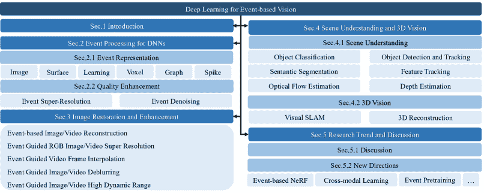
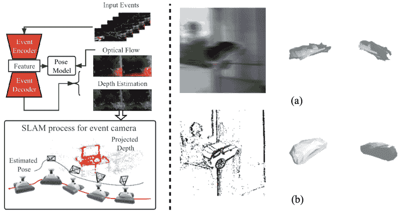

<!--yml

类别：未分类

日期：2024-09-06 19:41:50

-->

# [2302.08890] 基于事件的视觉深度学习：综合调查与基准测试

> 来源：[`ar5iv.labs.arxiv.org/html/2302.08890`](https://ar5iv.labs.arxiv.org/html/2302.08890)

# 基于事件的视觉深度学习：

综合调查与基准测试

徐征^∗, 刘叶欣^∗, 吕云凡, 华同言, 潘天博, 张伟明, 陶大程, 王林^†

###### 摘要

事件摄像头是生物启发的传感器，它们异步捕捉每个像素的强度变化，并生成事件流，编码强度变化的时间、像素位置和极性（符号）。事件摄像头相较于传统的帧摄像头具有众多优势，如高时间分辨率、高动态范围、低延迟等。由于能够在复杂的视觉条件下捕捉信息，事件摄像头有可能克服计算机视觉和机器人学领域中帧摄像头的局限性。近年来，深度学习（DL）被引入到这一新兴领域，激发了对其潜力的积极研究。然而，针对基于事件的视觉的 DL 技术仍缺乏分类法。我们首先审视了典型事件表示及其质量增强方法，因为它们在 DL 模型中作为输入发挥了关键作用。接着，我们为现有的 DL 方法提供了一个全面的分类法，将其结构性地分为两个主要类别：1）图像重建与恢复；2）基于事件的场景理解和 3D 视觉。重要的是，我们对一些代表性研究方向（如物体识别）的现有方法进行了基准实验，以识别一些关键见解和问题。最后，我们对挑战进行了重要讨论，并提供了新的视角，以激发更多的研究工作。

###### 索引词：

事件摄像头，深度学习，计算机视觉与机器人学，分类，调查。

## 1 引言

神经形态工程的突破最近拓展了感知领域，并引入了一种模仿生物视觉的新范式。生物启发的传感器也被称为事件摄像头[1]。不同之处在于，摄像头中的每个像素独立操作，仅在亮度发生变化（即事件）时触发响应，这种变化可能是由运动或其他视觉变化引起的[2]。实际上，事件摄像头捕捉到的事件流是稀疏的，主要集中在物体边界上，但也存在于连续纹理梯度区域，使得摄像头具有低延迟的优点。相比之下，经典的基于帧的摄像头以固定帧率记录完整的图像或视频。事件摄像头还具有其他一些优点，如高时间分辨率和高动态范围[3]。这意味着事件摄像头可以在极端光照或高速运动条件下捕捉高质量数据[4]。因此，事件摄像头有潜力克服计算机视觉和机器人领域中基于帧的摄像头的局限性，并帮助社区解决各种下游任务，例如角点跟踪[5, 6, 7, 8, 9]，同时定位与地图构建（SLAM）[10, 11, 12, 13, 14, 15]，图像和视频修复[16, 17, 18, 19]，以及物体检测和分割[20, 21, 22, 23, 24, 25, 4]。

图 1：基于事件的视觉与深度学习的结构和层次分类。

动机：事件相机的首个应用是在一个名为 CAVIAR 的硬件基础深度神经网络（DNN）系统中 [26]，这一系统的出现大约比计算机视觉社区的第一个软件基础 DNN 系统早十年。这个早期发展还包括来自固态电路论文的重要贡献，这些论文详细描述了相机芯片的设计和初步应用 [27, 28, 29]。最近，深度学习（DL）在这一新兴领域受到了广泛关注，各种基于不同目的开发的技术也随之出现。例如，基于 DL 的特征跟踪器 [30] 相比于非 DL 方法具有更好的准确性（参见表 IX）。我们在考察代表性方法时，探讨了一些驱动这一研究领域的基本问题。例如，如何将事件数据输入到 DNN 中，因为它们是为图像或张量类输入设计的？为什么 DL 相比于基于优化的方法在学习事件时更具优势？我们是否真的需要非常深的模型来从事件中学习视觉特征？在应用 DL 模型时，如何平衡事件相机的不同特性，例如低延迟？我们是否真的需要卷积操作来过滤事件，就像处理图像数据时那样？

针对这些问题，本论文对基于事件的视觉领域的当前趋势进行了深入调查。我们专注于分析、分类和基准测试基于深度学习（DL）的方法，并重点关注最近的进展。特别地，我们通过系统地讨论技术细节、挑战和潜在方向来审视和深入剖析这一有前景的领域。之前，Gallego 等人 [1] 提供了基于事件的视觉的首次概述，特别关注原理和传统算法。然而，近年来深度学习几乎重振了每个基于事件的视觉领域，并取得了显著的进展。因此，迫切需要一份更为最新且富有洞见的调查报告，以捕捉研究趋势，同时澄清挑战和潜在方向。

我们通过关注三个重要方面来调查基于深度学习的方法：1）如何利用深度神经网络学习事件——事件表示和质量提升（Sec. 2）；2）当前研究亮点，通常分析两个热门领域，图像修复和增强（Sec.3），场景理解和 3D 视觉（Sec. 4）；3）潜在的未来方向，例如用于 3D 重建的事件基础神经辐射、跨模态学习和基于事件的模型预训练。

贡献：总而言之，本文的主要贡献有五点：（I）我们提供了现有事件表示以及事件质量提升方法的全面概述。（II）我们总结了现有基于深度学习的事件视觉方法如何应对挑战，并为计算机视觉社区提供了见解，包括图像修复和增强以及高级场景理解任务。（III）我们讨论了一些基于事件的深度学习的开放问题和挑战，并确定了未来的研究方向，为该领域的未来发展提供指导。（IV）我们提出并讨论了一些广泛关注的问题以及一些潜在问题，以回应关切并深入探讨基于事件的视觉。此外，我们创建了一个开源仓库，提供了所有提及论文的分类和代码链接。我们的开源仓库将定期更新最新的研究进展，希望这项工作能为该领域的研究带来灵感。仓库链接是 [`github.com/vlislab2022/Event-Deep-Learning-Survey`](https://github.com/vlislab2022/Event-Deep-Learning-Survey)。同时，我们对一些代表性的基于事件和事件引导的视觉任务进行了基准测试和突出显示，例如在表格 VI 和 X 中，以识别未来研究的关键见解和问题。由于篇幅限制，一些实验结果可以在补充材料中找到。

大纲：在接下来的章节中，我们讨论和分析了事件驱动视觉中深度学习（DL）方法的最新进展。本文的结构和层次分类如图 1 所示。在第二部分中，我们系统地总结了现有的事件表示方法，并比较了不同任务上各种表示的优缺点。本节还总结了质量增强方法。在第三部分中，我们回顾并分析了图像恢复和增强方法，包括图像和视频重建、超分辨率、视频帧插值、图像和视频去模糊以及高动态范围（HDR）图像和视频重建。在第四部分中，我们总结了现有的基于事件的深度学习方法在场景理解任务中的应用，包括物体分类、物体检测与跟踪、语义分割、特征跟踪、光流估计和深度估计。本节主要讨论了使用事件相机进行这些计算机视觉任务的深度学习流程。在第 5.1 节中，我们提出并讨论了一些广泛关注的问题以及一些潜在的问题，以回答现有的关注点，并深入探讨基于事件的视觉技术。我们还在第 5.2 节中讨论了一些开放问题和新的应用方向，确定了未来的研究方向，为该领域的未来发展提供指导。

## 2 DNNs 的事件处理

事件相机在单个像素检测到相对对数强度变化时生成事件。因此，会生成稀疏和异步的事件流。这种固有的稀疏性带来了即时的优势，例如低延迟和对后处理系统的低计算要求 [31]。事件相机在成像范式中引入了显著的变化，即视觉信息的捕获方式，使得直接应用处理图像或张量输入的 DNN 模型变得不可能。因此，我们首先分析用于 DNN 输入的事件表示（第 2.1 节）。此外，由于事件数据通常受到噪声（特别是在低光照条件下）和有限空间分辨率（特别是对 DAVIS 相机）的影响，我们分析了可以超分辨率和去噪事件流的深度学习方法，以改善学习性能（第 2.2 节）。

### 2.1 事件表示

我们首先回顾了事件相机如何异步响应每个独立像素并生成事件流。事件被解释为一个元组 $(\textbf{u},t,p)$，当对数强度 $L$ 的变化超过常数值（阈值） $C$ 时触发，如下所示：

|  | <math   alttext="p=\left\{\begin{aligned} +1,&amp;L(\textbf{u},t)-L(\textbf{u},t-\Delta t)\geq C\\ -1,&amp;L(\textbf{u},t)-L(\textbf{u},t-\Delta t)\leq-C\\

0,&amp;other\\

\end{aligned}\right." display="block"><semantics ><mrow ><mi >p</mi><mo >=</mo><mrow ><mo >{</mo><mtable columnspacing="0pt" displaystyle="true" rowspacing="0pt" ><mtr ><mtd  columnalign="right" ><mrow ><mrow ><mo >+</mo><mn >1</mn></mrow><mo >,</mo></mrow></mtd><mtd  columnalign="left" ><mrow ><mrow ><mrow ><mi >L</mi><mo lspace="0em" rspace="0em" >​</mo><mrow ><mo stretchy="false" >(</mo><mtext >u</mtext><mo >,</mo><mi >t</mi><mo stretchy="false" >)</mo></mrow></mrow><mo >−</mo><mrow ><mi >L</mi><mo lspace="0em" rspace="0em" >​</mo><mrow ><mo stretchy="false" >(</mo><mtext >u</mtext><mo >,</mo><mrow ><mi >t</mi><mo >−</mo><mrow ><mi mathvariant="normal" >Δ</mi><mo lspace="0em" rspace="0em" >​</mo><mi >t</mi></mrow></mrow><mo stretchy="false" >)</mo></mrow></mrow></mrow><mo >≥</mo><mi >C</mi></mrow></mtd></mtr><mtr ><mtd  columnalign="right" ><mrow ><mrow ><mo >−</mo><mn >1</mn></mrow><mo >,</mo></mrow></mtd><mtd columnalign="left" ><mrow ><mrow ><mrow ><mi >L</mi><mo lspace="0em" rspace="0em" >​</mo><mrow ><mo stretchy="false" >(</mo><mtext >u</mtext><mo >,</mo><mi >t</mi><mo stretchy="false" >)</mo></mrow></mrow><mo >−</mo><mrow ><mi >L</mi><mo lspace="0em" rspace="0em" >​</mo><mrow ><mo stretchy="false" >(</mo><mtext >u</mtext><mo >,</mo><mrow ><mi >t</mi><mo >−</mo><mrow ><mi mathvariant="normal" >Δ</mi><mo lspace="0em" rspace="0em" >​</mo><mi >t</mi></mrow></mrow><mo stretchy="false" >)</mo></mrow></mrow></mrow><mo >≤</mo><mrow ><mo >−</mo><mi >C</mi></mrow></mrow></mtd></mtr><mtr ><mtd columnalign="right" ><mrow ><mn >0</mn><mo >,</mo></mrow></mtd><mtd columnalign="left" ><mrow ><mi >o</mi><mo lspace="0em" rspace="0em" >​</mo><mi >t</mi><mo lspace="0em" rspace="0em" >​</mo><mi >h</mi><mo lspace="0em" rspace="0em" >​</mo><mi >e</mi><mo lspace="0em" rspace="0em" >​</mo><mi >r</mi></mrow></mtd></mtr></mtable></mrow></mrow><annotation encoding="application/x-tex" >p=\left\{\begin{aligned} +1,&L(\textbf{u},t)-L(\textbf{u},t-\Delta t)\geq C\\ -1,&L(\textbf{u},t)-L(\textbf{u},t-\Delta t)\leq-C\\ 0,&other\\ \end{aligned}\right.</annotation></semantics></math> |  | (1) |

其中 $\textbf{u}=(x,y)$ 是像素位置，$t$ 是时间戳，$p\in\{-1,1\}$ 是极性，表示亮度变化的符号（1 和 -1 分别代表正事件和负事件），而 $p=0$ 表示没有事件。 $\Delta t$ 是自上一个事件以来在像素 $\textbf{u}=(x,y)$ 处的时间间隔。可以表示为一组（或一串）触发的事件：

|  | $\mathcal{E}=\{e_{i}\}_{i=1}^{N}=\{\textbf{u}_{i},t_{i},p_{i}\},i\in N,$ |  | (2) |
| --- | --- | --- | --- |

关于事件生成模型的更多细节，我们请读者参考[1]。简而言之，这种特定类型的数据使得应用主要为帧基相机设计的深度神经网络模型变得困难。因此，利用有效的事件数据替代表示来挖掘其视觉信息和能力是至关重要的[32]。接下来，我们回顾了具有代表性的事件表示方法，这些方法可以分为六类：基于图像的、基于表面的、基于学习的、基于体素的、基于图的和基于脉冲的表示，如表 I 所示。

表 I：代表性的事件表示，作为事件驱动深度神经网络模型的输入。（SP: 驾驶预测; OF: 光流估计; 分类: 分类; 角点检测: 角点检测; GR: 手势识别; 重建: 重建; DE: 深度估计; 不适用: 不可用。）

| 类别 | 事件表示 | 任务 | 尺寸 | 描述 | 特性 |
| --- | --- | --- | --- | --- | --- |
| 图像 | Maqueda et al.[33] | 驾驶预测 | (2,H,W) | 正负事件的通道 | 特性 |
| EV-FlowNet [34] | 光流 | (4,H,W) | 事件计数图像 | 丢弃时间信息 |
| 事件图像 [35] | 分类 | (4,H,W) | 事件计数图像 | 四通道事件图像 |
| AMAE[36] | 分类 | (2,H,W) | 使用时间戳的双通道图像 | 语义信息不可区分 |
| Bai et al.[37] | 分类 | (3,H,W) | 三通道事件表示 | 基于数量的事件计数通道 |
|  | MVF-Net [38] | 分类 | 不适用 | 多视角 2D 地图 | 空间-时间补充 |
| 学习 | EST [39] | 分类&光流 | (2,B,H,W) | 4 网格卷积 | 将时间量化信息分成 B 个区间 |
| Matrix-LSTM [40] | 分类&光流 | (B,H,W) | 端到端事件表面 | 将时间量化信息分成 B 个区间 |
| Surface | 时间戳图像 [41] | 分类 | 不适用 | 空间和时间下采样 | 不适用 |
| SAE [42] | 分类 | (2,H,W) | 最新时间戳图像 | 丢弃所有先前时间戳 |
| 时间表面 [43] | 分类 | (2,H,W) | 最新时间戳的指数 | 丢弃所有先前时间戳 |
| Sorted Time Surface [7] | 分类 | (2,H,W) | 排序后的最新时间戳 | 保留时间关系 |
| 事件直方图 [33] | 分类 | (2,H,W) | 事件计数图像 | 丢弃时间信息 |
| HATS [44] | 分类 | (2,H,W) | 聚合最新时间戳 | 丢弃时间信息 |
| IETS [45] | 分类 | (3,H,W) | 过滤后的时间戳图像与事件计数 | 丢弃时间信息 |
| SITS [46] | 角点检测 | (2,H,W) | 速度不变时间表面 | 丢弃绝对时间戳 |
| Chain SAE [32] | Cls | (2,H,W) | 时间表面链更新策略 | 保留时间关系 |
| DS [47] | OP | (H,W) | 到活动像素的空间距离图像 | 丢弃时间/极性信息 |
| DiST [48] | Cls | (2,H,W) | 排序的折扣时间戳 | 保留时间关系 |
| TORE [3] | Cls | (2,K,H,W) | 最后 K 个时间戳的 4D 网格 | 保留最后 K 个事件的所有信息 |
| Voxel | Zhu et al.[49] | 光流 | (B,H,W) | 通过离散化时间域生成 | 时间量化信息分为 B 个 bin |
| Rebecq et al.[50] | 重建 | (B,H,W) | 通过离散化时间域生成 | 时间量化信息分为 B 个 bin |
| Ye et al.[51] | DE&OF | (B,H,W) | 通过离散化时间域生成 | 时间量化信息分为 B 个 bin |
| TORE [3] | 重建等 | (2,K,H,W) | 最后 K 个时间戳的 4D 网格 | 保留最后 K 个事件的所有信息 |
| Graph | RG-CNN [52] | Cls | 不适用 | 使用图卷积神经网络的端到端学习 | 不适用 |
| EV-VGCNN [53] | Cls | (H,W,A) | 使用体素级顶点而非点级输入 | 使用补偿系数 A 对时间维度进行归一化 |
| Spike | Lee et al.[54] | Cls | 不适用 | 一种针对 SNN 的新型监督学习方法 | 不适用 |
| Tactilesgnet [50] | Cls | 不适用 | 设计脉冲图卷积网络 | 不适用 |
| Botzheim et al.[55] | GR | 不适用 | 使用脉冲神经网络和分类学习 | 不适用 |
| Amiret al.[56] | GR | 不适用 | 完全基于事件的手势识别系统 | 不适用 |

#### 2.1.1 基于图像的表示

采用事件到现有深度学习方法的直接解决方案是将事件堆叠（或转换）为同步的 2D 图像表示（类似于基于帧的相机），作为深度神经网络（DNN）的输入。例如，Moeys et al. [57] 提出了第一个由 DVS 帧驱动的 CNN，用于解决捕食者-猎物机器人场景中的模糊问题。这项研究还标志着首次使用事件计数 DVS 图像来指导使用 DVS 数据的 DNN。基于图像的表示的通道通常设置为保留极性、时间戳和事件计数 [33, 34, 39, 36, 37, 38, 57]。根据图像的形成方式，我们将现有方法分为四种类型。

基于极性的堆叠：Maqueda et al.[33] 建立了两个独立的通道来评估正负事件的直方图，从而获得两个通道的事件图像，最终将这些图像合并为同步事件帧。

基于时间戳的堆叠：为了考虑事件计数和时间戳对整体信息的重要性，[36, 37, 17] 考虑了事件的时间戳。

基于事件数量的堆叠：由于在固定时间间隔内事件触发的不均匀性，提出了一种新的堆叠策略来在固定常数数量的事件中进行采样和堆叠[58, 59, 17]。

基于时间戳和极性的堆叠：在 Ev-gait [35]中，事件流被转换为类似帧的表示，包含四个通道，其中两个通道包含正或负极性，另外两个通道包含时间特性。此外，一些研究集中于事件驱动系统中的曝光时间控制。刘等人[60, 61]探讨了曝光时间和切片间时间间隔的动态控制，以优化切片特征的质量。这种自适应控制有助于确保模型在动态场景中具有鲁棒性，适应不同的运动速度和场景结构。详细的数学公式可见于补充材料的第 1.1 节。

#### 2.1.2 基于表面的表示

第一个基于表面的表示，即主动事件表面（SAE）[42]，它将事件流映射到时间依赖的表面，并跟踪最新事件 $e_{i}$ 的空间位置周围的活动。与利用强度图像提供上下文内容的基本图像表示不同，SAE 从完全不同的角度，即时间-空间角度来实现这一点。具体而言，第 $i$ 个事件 $e_{i}$ 的时间表面可以被表述为作用于 $e_{i}$ 邻域的空间算子：

|  | $\tau_{i}([x_{n},y_{n}]^{T},p)=\underset{j\leq i}{max}\{t_{j}&#124;[x_{i}+x_{n},y_{i}+y_{n}],p_{j}=p\}$ |  | (3) |
| --- | --- | --- | --- |

其中 $x_{n}\in\{-r,r\}$ 是 $e_{i}$ 的水平坐标，$y_{n}\in\{-r,r\}$ 是 $e_{i}$ 的垂直坐标，$p_{j}\in\{-1,1\}$ 是第 $j$ 个事件 $e_{j}$ 的极性，$t_{j}$ 是 $e_{j}$ 的时间戳，$r$ 是用于获取时间表面的邻域半径。如公式 3 所示，时间表面 $\tau_{i}([x_{n},y_{n}]^{T},p)$ 编码了 $e_{i}$ 的 $(2r+1)\times(2r+1)$ 邻域区域中的时间上下文，从而保持了下游任务所需的时间和空间信息。

然而，事件的时间戳单调增加，这导致表面上的时间值从 0 到无穷大 [32]。因此，需要适当的归一化方法通过将时间戳映射到 $[0,1]$ 来保持原始 SAE 的时间不变数据表示。基本的归一化方法直接应用于时间表面 [7, 43, 62, 63]，例如 min-max [7]、时间窗口 [63] 等。

所有这些归一化方法依赖于经验参数调整，从而导致额外的计算成本。为避免这个问题，Alzugaray 等人 [7] 采用了排序归一化方法，在每个像素处对 SAE 中的所有时间戳进行排序。然而，尽管这种方法缓解了对参数调整的依赖，但时间复杂度的副作用妨碍了整个过程的效率。为了构建高效的 SAE 并实现稳健的速度不变特性，Manderscheid 等人 [46] 引入了一种归一化方案，以获得速度不变时间表面 (SITS)。SITS 根据其半径 $r$ 的邻域更新每个到达事件的时间表面。总体而言，当采用较大的 $r$ 时，SITS 在新事件触发时更新时间表面，从而导致按需任务的低效。Lin 等人 [32] 建议通过使用链式更新策略来解决和缓解归一化与事件数量之间的不平衡。

#### 2.1.3 基于体素的表示

基于体素的表示将原始事件映射到时间桶内的最近时间网格。第一个时空体素网格在 [49] 中提出，通过线性加权积累将事件插入体积，以改善时间域的分辨率。这个时空体素网格在一些后续工作中也被使用 [64, 51]。最近，[3] 中提出了一种时间排序最近事件 (TORE) 体积，旨在以最小的信息损失紧凑地保持原始尖峰时间信息。

#### 2.1.4 基于图的表示

针对保持事件稀疏性的目标，基于图的方法将时间窗口内的原始事件流转换为一组连接的节点。Bi 等人首次提出了一种残差图 CNN 架构，以获得用于对象分类的紧凑图表示 [65, 52]。图 CNN 保留了输入事件的时空一致性，同时避免了较大的计算成本。最近，Deng 等人提出了一种体素图 CNN，旨在利用事件数据的稀疏性 [53]。提出的 EV-VGCNN [53] 是一种轻量级体素图 CNN，同时以非常低的模型复杂度实现了 SOTA 分类准确率。

#### 2.1.5 基于尖峰的表示

由于事件流的稀疏性和异步性，上述大部分表示方法考虑了时间戳。不同于标准的 DNN 模型，尖峰神经网络（SNNs）[66, 67, 56, 50, 54, 55] 的优势在于它们将时间概念融入到操作模型中。因此，SNNs 通过使用脉冲（不连续值）的形式传递视觉信息，更好地契合了生物神经机制。SNNs 被应用于异步提取事件特征，以解决多种任务，如对象分类[54, 50]和手势识别[56, 55]。然而，由于尖峰的复杂动态和不可微性质，存在两个挑战：1）现有的反向传播方法无法应用于训练过程，导致训练时间长和成本高；2）缺乏专门有效的硬件和算法。因此，其准确性无法超过 SOTA 方法。未来的研究可以在这方面进一步探索。

#### 2.1.6 基于学习的表示

上述事件表示方法主要针对特定任务设计，不能普遍和灵活地应用于其他任务。为此，Gehrig 等人[39] 提出了第一种基于学习的方法，将异步原始事件转换为类似张量的输入，这些输入可以灵活地应用于各种下游任务。特别是，采用多层感知器（MLP）来学习事件的坐标和时间戳，以获得网格状表示。此外，一些方法[68, 40] 使用长短期记忆（LSTM）从事件中提取特征。一种代表性的方法 Matrix-LSTM [40]，利用 LSTM 单元的网格在时间轴上整合信息。这种方法遵循完全可微的过程，提取最相关的事件表示用于下游任务。

#### 2.1.7 备注

表格 I 概述了 DNNs 的六种主流表示方法。不同的事件表示在应用于各种任务时提供了独特的优势和考虑因素。基于图像的表示方法能够与传统深度学习算法无缝集成，应用于目标检测、分割和特征提取。基于表面的表示方法提供了时空背景，并在一定程度上保留了时间信息。基于体素的表示方法通过将原始事件映射到时间网格中来增强分辨率并保留原始脉冲时间信息。基于图的表示方法在保持稀疏性和连贯性的同时，最小化计算成本，实现了高分类准确度。基于脉冲的表示方法在 SNNs 的支持下，在异步处理、效率、噪声鲁棒性以及与神经形态硬件的兼容性方面具有优势。基于学习的表示方法旨在发现最佳事件表示，适应任务特定要求。然而，实践中的计算复杂性和数据可用性等因素应予以考虑。总体而言，事件表示的选择应根据任务需求进行考虑，并权衡复杂性、计算效率和可解释性之间的利弊。进一步的研究和探索亟需以发现适用于更广泛任务的通用事件表示方法。

### 2.2 事件质量提升

事件相机，例如 DAVIS346 [69]，具有相对较低的分辨率—346$\times$240，而一些事件相机，例如 Prophesse ¹¹1https://www.prophesee.ai/，显示出更高的空间分辨率，例如 640$\times$480。这些相机通常在捕捉的事件数据中遭遇意外噪声，尤其在具有挑战性的视觉条件和事件表示过程中。此外，其空间分辨率仍低于基于帧的相机。这些问题通常妨碍了深度学习在基于事件的视觉中的应用。因此，近期研究已致力于提高事件的空间分辨率并对事件进行去噪，以实现更高质量的结果。

#### 2.2.1 事件超分辨率

与图像超分辨率（SR）不同，事件 SR 需要在空间和时间维度上进行分布估计。Li 等人[70]首次提出解决 LR 事件图像的空间-时间 SR 问题。随后，Wang 等人[71]提出通过联合图像滤波来桥接强度图像和来自动态视觉传感器（DVS）的事件，从而获得运动补偿的高分辨率（HR）事件帧且噪声较少。Duan 等人[72]提出了首个基于 DL 的方法，通过使用多分辨率事件记录系统和基于 3D U-Net 的框架，称为 EventZoom，来解决联合去噪和 SR 问题。特别地，它结合了事件到图像的重建以实现分辨率增强。此外，Li 等人[73]提出了一种具有约束学习机制的 SNN 框架，以同时学习事件流的空间和时间分布。最近，Weng 等人[74]引入了一种递归神经网络（RNN），利用时间传播和空间-时间融合网络来确保细粒度事件细节的恢复能力，而无需任何辅助的高质量和 HR 帧。

备注：尽管这些方法取得了可信的 SR 结果，但空间-时间分布估计会导致大因素 SR（例如，$\times 16$）的高延迟。未来的研究可以集中在减少推理延迟和轻量化网络设计上。

#### 2.2.2 事件去噪

随机噪声的存在，如热噪声和结漏电流，会导致背景活动（BA），在这种情况下，事件的生成没有任何对数强度变化。为解决这一问题，已经开发了各种方法，包括基于滤波的方法、基于 DL 的方法和基于模拟器的方法。

基于滤波的方法利用各种类型的滤波器来消除背景活动。这些方法包括生物启发式滤波器[75]、基于硬件的滤波器[76, 77]、空间滤波器[42, 78, 79]和时间滤波器[45, 45, 71]。然而，在具有多个噪声源的复杂环境中，这些方法往往无法取得令人满意的结果。为解决这些问题，Guo 等人[80]引入了一种新颖的框架，通过使用已知的信号和噪声 DVS 事件的混合来量化去噪算法的效果。有关不同滤波器方法的实验结果，请参见补充材料中的图 6。

基于深度学习的方法也已在[81, 82]中介绍。其中一个代表性框架是由 Baldwin 等人提出的 EDnCNN[81]。该框架将邻近的事件转换为体素，并使用事件概率掩码（EPM）来区分噪声。然而，人工正则化操作，例如体素转换，可能会损害事件数据的固有属性。为解决这个问题，AEDNet[82]将 DVS 信号分解为时间相关性和空间亲和性，利用时间延续性和空间离散性的属性。这些信号随后通过独特的特征提取模块分别处理。有关详细的定性和定量实验结果，请参见补充材料中的图 5 和表 4。另一种方法，即基于模拟器的方法，专注于将噪声效应纳入事件模拟器。通过从模拟事件数据中学到的知识，转移到真实数据上，以减少噪声的影响[83, 84, 25, 85]。

备注：一些事件样本在事件计数通道中具有异常的像素值。不同特征区域的异常像素会导致特征学习性能下降，影响后续任务。因此，去噪方法是基于事件视觉的基础之一。在未来的研究中，值得探索一种更通用的基于深度学习的去噪流程，可以应用于各种基于事件的视觉任务。

## 3 图像恢复与增强

事件相机在 HDR 图像和高帧率视频的重建与恢复中具有巨大的潜力。然而，它们独特的成像模式在应用为帧基础相机设计的视觉算法时带来了挑战。为了解决这个挑战并弥合基于事件的视觉与标准计算机视觉之间的差距，已经提出了许多方法来从事件中重建强度视频帧或图像。

在本文中，我们将现有方法分为两大类：基于事件的图像（或视频）重建（仅以事件为输入）和事件引导的图像恢复（事件和帧的混合输入）。对于前者，主要问题是如何利用深度神经网络（DNNs）从事件中充分挖掘视觉信息，例如边缘，以重建高质量的强度图像或视频帧；而后者则探讨如何在利用事件优势（例如 HDR）的同时融合帧和事件，从而有利于图像恢复过程。我们将在接下来的章节中回顾最新的技术（SOTA）。

### 3.1 基于事件的图像/视频重建

洞察：该任务学习从事件流到单个强度图像或图像序列（即视频）的映射。映射结果允许应用针对基于帧的相机开发的 DL 算法到学习下游任务。根据我们的评论，已经有大量的研究致力于实现这一任务，如图 3, 图 2, 和表 II 中总结的内容。

早期的方法依赖于对场景结构（或运动动态）的假设[86, 87]或带有正则项的事件集成[88]来重建强度图像。然而，这些方法由于直接事件集成而遭受到了伪影，重建的强度图像不够逼真。相比之下，基于 DL 的方法带来了显著的精度提升。在本文中，我们分析了基于挑战的 SOTA 深度学习方法：1）缺乏大规模训练深度网络的数据集；2）高计算复杂度和低延迟；3）重建图像或视频的质量较低，例如相对较低的分辨率和模糊图像。

表 II：一些图像重建方法[89]在事件数据集[12]上的定性比较结果。

| 方法 | 类型 | MSE $\downarrow$ | SSIM $\uparrow$ | LPIPS $\downarrow$ | 时间 |
| --- | --- | --- | --- | --- | --- |
| E2VID  [90] | 基于 DL | 0.069 | 0.395 | 0.438 | 0.2448 秒 |
| ECNN [91] | 基于 D | 0.056 | 0.416 | 0.442 | 0.2839 秒 |
| BTEB [92] | 基于 DL | 0.090 | 0.357 | 0.520 | 0.4059 秒 |
| Tikhonov  [89] | 基于模型 | 0.121 | 0.356 | 0.485 | 0.4401 秒 |
| TV [89] | 基于模型 | 0.113 | 0.386 | 0.502 | 4.0443 秒 |

| CNN [89] | 基于 DL | 0.080 | 0.437 | 0.485 | 28.3904 秒 | 

图 2：事件驱动图像/视频重建方法。

表 III：代表性事件引导的视频帧插值（VFI）方法的比较。

| 出版物 | 方法 | 重点 | 事件表示 | 光流 | 去模糊 | 监督 | 主干 | 数据集 |
| --- | --- | --- | --- | --- | --- | --- | --- | --- |
| CVPR 2021 | TimeLens[93] | 基于合成和基于流 | 体素网格[49] | ✓ | ✗ | ✓ | CNN | HQF,Vimeo90k,GoPro,Middlebury,HS-ERGB |
| CVPR 2021 | EFI-Net[94] | 不同的空间分辨率 | 体素网格[49] | ✗ | ✗ | ✓ | CNN | 三星 GE3 DVS |
| ICCV 2021 | Yu 等人[95] | 弱监督 | 基于图像 | ✓ | ✗ | ✗ | ViT+CNN | GoPro, SloMo-DVS |
| CVPR 2022 | Time Replayer[96] | 无监督循环一致性风格 | 4 通道帧[41] | ✓ | ✗ | ✗ | CNN | GoPro, Adobe240, Vimeo90k |
| CVPR 2022 | TimeLens++[97] | 多尺度特征级融合 | 体素网格[49] | ✓ | ✗ | ✓ | CNN | BS-ERGB, HS-ERGB |
| ECCV 2022 | $A^{2}OF$[98] | 光流调整 | 四通道帧[41] | ✓ | ✗ | ✓ | CNN | Adobe240, GoPro, Middlebury, HS-ERGB, HQF |
| ECCV2020 | Lin 等人[99] | 物理模型启发 | 流式和基于帧 | ✗ | ✓ | ✓ | CNN | GoPro, Blur-DVS |
| CVPR 2022 | E-CIR[100] | 参数化强度函数 | 多项式[100] | ✗ | ✓ | ✓ | CNN | REDS |

| CVPR 2022 | Zhang 等人[101] | 去模糊和帧插值 | 事件流 | ✗ | ✓ | ✗ | CNN | GoPro, HQF, RBE | 

图 3：一些视频重建 SOTA 方法的视觉示例（E2VID [90]，EF [91]，RCNN [102]）。

图 4：代表性的 VFI 方法，包括例如，(a) TimeLens [93]，第一个事件引导的 VFI 方法；(b) TimeLens++[97]，SOTA 事件基础 VFI 方法；(c) TimeReplayer[96]，第一个无监督事件引导的 VFI 方法。

对于第一个挑战，[103] 和 [104] 是利用生成对抗网络（GANs）弥合事件与 RGB 图像之间的知识转移的代表性工作，以缓解标注数据稀缺的问题。此外，Stoffregen 等人[91] 发现对比度阈值是合成数据与真实事件数据匹配的关键因素。进一步地，Vallés 等人[92] 探索了事件相机的理论基础，并提出了自监督学习，以减少对地面真实视频（包括合成数据）的依赖，这基于事件的光度一致性。

为了解决第二个挑战，Scheerlinck 等人[19] 采用了递归连接来构建时间上的状态，这使得一个更小的递归神经网络能够重用先前重建的结果。有趣的是，Duwek 等人[105] 结合了基于拉普拉斯预测和泊松积分的 CNNs 和 SNNs 来实现视频重建，并且参数更少。为了解决第三个挑战，GANs、双重积分模型[106] 和 RNNs 被应用于避免生成模糊结果，并从事件中获得高速和 HDR 视频[17, 102, 90, 89]。至于从事件中生成超分辨率（SR）图像/视频，我们将现有的工作分为三类，包括基于优化的方法[70]、监督学习方法[72, 107, 108, 71] 和对抗学习方法[109, 110]。基于优化的方法，例如[70]，采用了一个两阶段框架来解决基于非齐次泊松点过程的 SR 图像重建问题。监督学习方法要么利用残差连接来防止网络模型在生成 SR 图像时出现梯度消失的问题，要么估计光流和时间约束来学习运动线索，从而重建 SR 视频。对于对抗学习方法，Wang 等人[109] 提出了一个代表性的端到端 SR 图像重建框架，无需访问真实值（GT），即 HR 图像。

备注：在本节中，我们讨论了基于事件的图像/视频重建的各种技术。然而，我们也承认需要进行简要的比较，以确定哪种技术更适合不同的场景。尽管基于深度学习的方法在准确性和真实感方面相比于早期依赖假设和正则化的方法显示了显著的精度提升，但它们也伴随着更高的计算复杂度。另一方面，基于直接事件集成的传统方法可能会遭遇伪影，并且产生较少的照片真实感结果。此外，事件表示的选择仍然是一个未解的问题，现有的学习模型通常表现出有限的泛化能力。事件数据中的噪声也构成了一个重大挑战，而从事件中重建彩色图像/视频是一个特别困难的问题。未来的研究工作可以集中在解决这些方面，以提高重建结果的质量和保真度。

### 3.2 事件引导的图像/视频超分辨率（SR）

洞察：目标是探索视觉信息，例如边缘和事件的高时间分辨率，这些信息与低分辨率（LR）图像/视频融合，以恢复高分辨率（HR）图像/视频，如表 IV ‣ 3 Image Restoration and Enhancement ‣ Deep Learning for Event-based Vision: A Comprehensive Survey and Benchmarks")所示。

图像 SR：eSL-Net [111]是第一个引入事件指导图像 SR 的工作。它提出了一个统一的事件指导的稀疏学习框架，以端到端的学习方式同时对低质量的活跃像素传感器（APS）²²²这种基于帧的传感器嵌入在 DAVIS 事件相机中的图像进行去噪、去模糊和超分辨。然而，由于稀疏编码的局限性，这种方法在更复杂的数据集上表现不佳 [111, 112]。EvIntSR [112]通过两个步骤实现图像 SR 的目标：1）通过组合事件和模糊的 LR 帧合成一系列潜在帧；2）合并潜在帧获得清晰的 HR 帧。总的来说，EvIntSR 比 eSL 更直接地探索了事件的独特属性，并在模拟数据集上取得了更好的 SR 结果。然而，这种方法有两个缺点：1）误差在两阶段训练过程中累积；2）在第二阶段较少探索事件的视觉信息。

视频 SR：与图像 SR 相比，视频 SR 更加关注多个帧之间的关系。E-VSR [108]是第一个具有事件的 VSR 框架。与 EvIntSR 类似，它也由两个子任务组成：视频帧插值和视频 SR，并受到累积误差的限制。最近，EG-VSR [113]采用隐式函数来学习视频的连续表示。该方法使得可以在任意比例下进行端到端的上采样，在视频 SR 任务中具有优势。

表 IV: 代表性事件指导图像/视频 SR 方法的比较。

| 出版物 | 方法 | 亮点 | 主干 |
| --- | --- | --- | --- |
| ECCV 2020 | eSL-Net [111] | 稀疏学习 | CNN |
| ICCV 2021 | EvIntSR [112] | 两步方法 | CNN |
| CVPR 2021 | E-VSR [108] | 两步方法 | CNN |
| CVPR 2023 | EG-VSR [113] | 任意尺度的 SR | ViT+CNN |

备注：虽然在这个任务上取得了显著进展，包括能够在任意尺度上进行上采样，但仍然有需要进一步研究的地方。例如，研究忽略了事件和 RGB 帧之间的明显模态差异。因此，直接融合两种模态的特征可能会降低 SR 的性能，因为事件常常受到意外噪音的干扰，例如在低光场景中。未来的研究可以更深入地探索以解决这些问题。 

图 5：三种不同方法的 VFI 视觉结果。（TimeLens[93]、TimeReplayer[96]、$A^{2}OF$[98]）

.

图 6：代表性的去模糊方法，包括，例如，（a）基于交互的方法，（b）基于事件融合的方法，以及（c）基于事件选择的方法。

### 3.3 事件引导的视频帧插值 (VFI)

见解：该任务利用事件的高时间分辨率，旨在估计帧间的非线性运动信息，以在两个连续帧之间插入潜在帧。根据 VFI 框架的学习方式，我们将其分为三种类型：监督式、弱监督式和无监督式方法，如表格 III 所示。一些代表性方法的 VFI 结果在图 5 ‣ 3 Image Restoration and Enhancement ‣ Deep Learning for Event-based Vision: A Comprehensive Survey and Benchmarks") 中得到了可视化。

监督式方法：TimeLens [93] 是第一个且具有代表性的工作，它采用了四个模块来融合特征，以实现基于变形和合成的插值（见图 4(a)）。还发布了一个具有空间对齐事件和高速视频的数据集。然而，它有以下局限性：1) 从事件中估计的光流限制了变形帧；2) 嘈杂的事件限制了光流的质量；3) 它是顺序学习的（即非端到端方式）。因此，训练 TimeLens 较为困难，错误会累积，从而降低性能。这些问题在后来由 Timelens++[97]、$A^{2}OF$ [98] 和 EFI-Net[94] 得到了更好的解决。

特别是，Timelens++[97] 提出了一个框架，包括四个模块：运动估计、变形编码器、合成编码器和融合模块，如图 4(b) 所示。该方法引入了多尺度特征级融合，并计算一次性非线性帧间运动，这可以有效地基于事件和帧进行图像变形采样。$A^{2}OF$ [98] 关注于从事件生成各向异性光流。然而，这种方法无法建模真实场景中的复杂运动；因此，$A^{2}OF$ 利用事件的分布掩码来实现复杂的中间运动插值。

值得注意的是，上述方法使用的事件具有与 RGB 帧相同的空间分辨率。不幸的是，在实际场景中，将 RGB 传感器的分辨率与事件传感器匹配是相当昂贵的。因此，EFI-Net[94] 提出了一个多阶段 CNN 基础框架，可以融合具有不同空间分辨率的帧和事件。总的来说，监督方法依赖于具有高帧率视频和事件的配对数据。HS-ERGB [93] 和 BS-ERGB[97] 是具有代表性的数据集。然而，这些数据集在事件和帧之间的像素对齐要求严格，且采集成本高。因此，最近提出了一些弱监督和无监督方法。

弱监督方法：Yu 等人[95] 提出了首个基于事件的弱监督视频帧插值（VFI）方法。在实践中，该方法从事件中提取补充信息以纠正图像外观，并利用注意力机制支持低分辨率特征图上的对应关系搜索。同时，还发布了一个真实世界数据集，即 SloMo-DVS。

无监督方法：TimeReplayer [96] 是首个以循环一致的方式训练的无监督方法，如图 4 (c) 所示。它直接估计关键帧和输入帧之间的光流，而不是计算作为输入帧之间计算的光流比例的中间帧。这样，可以估计复杂的运动。然后，可以通过关键帧和逆光流重建输入帧。总体来说，这种循环一致性方法不仅建模复杂的非线性运动，还避免了对大量配对的高速帧和事件的需求。

上述方法都假设 RGB 帧的曝光时间非常短，并且帧中没有模糊伪影。然而，这一假设过于严格，因为实际的曝光时间可能很长，并且会导致帧中的模糊伪影，特别是在复杂的光照场景中。当曝光时间较长时，需要重新审视插值问题。因此，[99、101、100] 共同解决了插值问题和去模糊问题。例如，E-CIR [100] 将模糊图像转换为清晰的视频，并将其表示为事件的时间-强度参数函数。类似地，Zhang 等人 [101] 使用可学习的双重积分网络，通过事件指导将模糊帧映射到清晰的潜在图像。Lin 等人 [99] 强调模糊图像与清晰图像之间的残差是事件积分。基于这一观点，他们提出了一个网络，利用事件估计残差以恢复清晰帧。

备注：通过我们的综述，大多数方法基于监督学习，弱监督或无监督方法仍有很大的研究空间。例如，可以通过事件与插值帧之间的成像关系进行相互监督，从而减轻对真实标注数据的需求，即用于训练的高帧率视频。此外，事件估计的稠密光流[114] 可以用作插值结果之间的约束，从而以无监督的方式提高 VFI 的准确性。

### 3.4 基于事件的图像/视频去模糊

见解：该任务受到事件的无运动模糊特性启发，旨在在事件的指导下从模糊的图像/视频序列中恢复清晰的图像/视频。由于监督方法通常能够实现更高的 PSNR 和 SSIM [96, 93]。传统的去模糊方法依赖于物理事件生成模型 [71]。特别是，Pan 等人 [106] 提出了一个基于事件的双重积分模型用于恢复潜在的强度图像。基于该模型，通过在恶劣视觉条件下解决非凸优化问题，可以生成清晰的图像和视频。然而，它存在由采样过程中的噪声引起的累积误差问题。相比之下，基于学习的方法直接探索模糊图像与清晰图像之间的关系，借助事件显示出更可信的去模糊结果。在本文中，我们将基于学习的方法分为三类：1）基于交互的方法；2）基于融合的方法；3）基于选择的方法（见图 6 ‣ 3 Image Restoration and Enhancement ‣ Deep Learning for Event-based Vision: A Comprehensive Survey and Benchmarks")）。一些代表性方法的去模糊结果显示在表 V。

表 V：基于 GoPro 和 HQF 数据集的去模糊方法的定性比较，来自 [101]。‘N/A’表示没有结果。

| 方法 | GoPro | HQF | 参数 |
| --- | --- | --- | --- |
| PSNR$\uparrow$ | SSIM $\uparrow$ | LPIPS $\downarrow$ | PSNR $\uparrow$ | SSIM $\uparrow$ | LPIPS$\downarrow$ |
| LEVS  [115] | 20.84 | 0.5473 | 0.1111 | 20.08 | 0.5629 | 0.0998 | 18.21M |
| EDI  [106] | 21.29 | 0.6402 | 0.1104 | 19.65 | 0.5909 | 0.1173 | N/A |
| eSL-Net  [111] | 17.80 | 0.5655 | 0.1141 | 21.36 | 0.6659 | 0.0644 | 0.188M |
| LEDVDI  [99] | 25.38 | 0.8567 | 0.0280 | 22.58 | 0.7472 | 0.0578 | 4.996M |
| RED [116] | 25.14 | 0.8587 | 0.0425 | 24.48 | 0.7572 | 0.0475 | 9.762M |
| EVDI [101] | 30.40 | 0.9058 | 0.0144 | 24.77 | 0.7664 | 0.0423 | 0.393M |

基于交互的方法通常将模糊图像和事件输入到两个不同的网络中，然后在对每个分支中的特征进行编码后进行信息交互，以改善去模糊效果（见图 6 ‣ 3 Image Restoration and Enhancement ‣ Deep Learning for Event-based Vision: A Comprehensive Survey and Benchmarks") (a)）。例如，在 [116] 中，提出了一个自监督框架，以减少模拟数据和真实世界数据之间的领域差距。具体来说，他们首先估计光流，并利用模糊和光度一致性来实现去模糊网络上的自监督。Lin 等人[99] 引入了一个 CNN 框架，用于预测清晰图像和模糊图像之间的残差进行去模糊，以及清晰帧之间的残差用于插值。Jiang 等人[117] 探索了长期的、局部的外观/运动线索和新颖的事件边界先验，以解决运动去模糊问题。Zhang 等人[101] 利用事件的低延迟来减轻运动模糊，并促进中间帧的预测。

基于融合的方法旨在设计一个有原则的视频去模糊和事件引导去模糊框架[111]，如图 6 ‣ 3 Image Restoration and Enhancement ‣ Deep Learning for Event-based Vision: A Comprehensive Survey and Benchmarks")(b) 所示。例如，Shang 等人[118] 提出了一个双流框架，以探索非连续模糊帧，并弥合事件引导和视频去模糊之间的差距。

基于选择的方法，如 [119]，通过考虑视频帧获取过程中的未知曝光和读出时间来制定事件引导的运动去模糊。主要挑战是如何通过估计模糊帧特征和事件之间的跨模态相关性来有选择地使用事件特征。因此，提出的事件选择模块巧妙地选择有用的事件，而融合模块有效地融合所选择的事件特征和模糊帧，如图 6 ‣ 3 Image Restoration and Enhancement ‣ Deep Learning for Event-based Vision: A Comprehensive Survey and Benchmarks") (c) 所示。

备注：上述去模糊方法大多局限于特定场景。在一些大幅度或快速运动的场景中，模型的准确性可能会显著下降。

表 VI：代表性方法在事件目标分类上的实验。N/A 表示没有结果可用。

| 发表文章 | 方法 | 数据集 |  | 参数 |
| --- | --- | --- | --- | --- |
| N-MINIST [120] | MINIST-DVS [121] | N-Caltech101 [120] | CIFAR10-DVS [122] | N-Cars [44] | ASL-DVS [65] | N-ImageNet [48] |
| TPAMI 2015 | HFirst [66] | 0.712 | N/A | 0.054 | N/A | 0.561 | N/A | N/A | 21.79M |
| TPAMI 2016 | HOTS [43] | 0.808 | 0.803 | 0.210 | 0.271 | 0.624 | N/A | N/A | 21.79M |
| CVPR 2018 | HATS [44] | 0.991 | 0.984 | 0.642 | 0.524 | 0.902 | N/A | 0.471 | 21.79M |
| ICCV 2019 | EST [39] | N/A | N/A | 0.817 | N/A | 0.925 | N/A | 0.489 | 21.79M |
| ICCV 2019 | RG-CNNs [52] | 0.990 | 0.986 | 0.657 | 0.540 | 0.914 | 0.901 | N/A | 19.46M |
| TPAMI 2019 | DART [123] | 0.979 | 0.985 | 0.664 | 0.658 | N/A | N/A | N/A | N/A |
| ECCV 2020 | Matrix-LSTM [40] | 0.989 | N/A | 0.843 | N/A | 0.943 | 0.997 | 0.322 | 25.56M |
| ECCV 2020 | ASCN [59] | N/A | N/A | 0.745 | N/A | 0.944 | N/A | N/A | 9.47M |
| ICCV 2021 | EvS  [124] | N/A | 0.991 | 0.761 | 0.680 | 0.931 | N/A | N/A | N/A |
| ICCV 2021 | DiST [48] | N/A | N/A | N/A | N/A | N/A | N/A | 0.484 | 21.79M |
| TCSVT 2021 | MVF-Net [38] | 0.993 | N/A | 0.871 | 0.663 | 0.968 | 0.996 | N/A | 21.79M |
| CVPR 2022 | AEGNNs [125] | N/A | N/A | 0.668 | N/A | 0.945 | N/A | N/A | N/A |
| CVPR 2022 | EV-VGCNN [53] | 0.994 | N/A | 0.748 | N/A | 0.953 | 0.983 | N/A | 21.79M |
| TPAMI 2022 | TORE [3] | 0.994 | N/A | 0.798 | N/A | 0.977 | 0.996 | N/A | 5.94M |

### 3.5 基于事件的深度图像/视频 HDR

见解：事件的高动态范围（HDR）使得重建 HDR 图像/视频自然具有更多优势。主要方法可以分为两大类：基于事件的 HDR 图像/视频 HDR 方法 [90, 102, 17] 和事件引导的图像/视频 HDR 方法（事件和帧数据的混合） [126, 127, 18]。

基于事件的图像/视频 HDR 通常采用事件到图像的转换思想——从事件重建 HDR 图像，如第 3.1 节中提到的那样。代表性工作基于递归神经网络 (RNNs) [90, 102]（见图 7 (a)）或生成对抗网络 (GANs) [17]（见图 7 (b)）。然而，由于事件稀疏且依赖于运动，重建的 HDR 结果在静态场景中本质上缺乏纹理细节。

图 7: 代表性的基于深度学习的 HDR 成像方法。 (a) 基于 RNN 的方法 [90, 102] 和 (b) 仅使用事件的 GAN 方法 [17]，以及 (c) 事件-帧融合 [126, 127, 18]。 (潜在嵌入表示由特征提取器、滤波器等学到的信息。)

事件引导的图像/视频 HDR：HDR 成像方法分为两类：单次曝光 HDR 和多次曝光 HDR（详见 [128]）。事件引导的图像/视频也遵循这两种模式。 [126, 127, 18] 探索了将事件和帧融合的潜力，如图 7 (c) 所示。特别地，Han 等 [126] 提出了第一个单次曝光 HDR 成像框架，通过添加由事件生成的低分辨率强度图来恢复高分辨率 HDR 图像。该框架解决了混合传感器系统在空间分辨率、动态范围和颜色表示方面的差距，旨在实现更好的融合。相比之下，EHDR [18] 是第一个多次曝光 HDR 成像框架，它结合了分段的 LDR 图像和同步事件来恢复 HDR 图像。为了减轻曝光之间场景运动的影响，EHDR 利用事件学习可变形卷积核，从而对齐不同曝光时间的图像特征图。相比之下，HDRev-Net [129] 通过在共享的潜在空间中对齐多模态表示并用信心引导的融合模块融合它们，隐式减轻了多模态表示的错位。

备注：根据回顾，目前仅有两个研究工作提出了深度 HDR 成像。最可能的原因是，收集用于训练的配对数据集在实践中相当困难，特别是对于多曝光 HDR 成像。未来的方向可以考虑直接融合 LDR 图像和事件，并学习一个统一的 HDR 成像框架，而无需依赖图像/视频重建。此外，探索如何利用事件指导彩色图像 HDR 成像也很有前景。

## 4 场景理解与 3D 视觉

### 4.1 场景理解

#### 4.1.1 物体分类

Insight: 基于事件的物体分类旨在根据物体的视觉特征识别和分类对象。这允许实时物体分类，具有高时间分辨率和低延迟，使其适用于机器人、自动驾驶车辆和其他移动系统的应用。从直观上讲，我们根据输入事件表示和 DNN 类型将基于事件的分类方法分为三类：1) 基于学习的；2) 基于图的；3) 异步模型的。

基于学习的方法 Gehrig 等人 [39] 提出了第一个端到端框架，用于学习事件表示以进行物体分类。特别是，它通过一系列可微操作将事件流转换为类似网格的张量，即事件尖峰张量（EST）。尽管 EST 实现了高准确率，但也带来了冗余计算成本和高延迟。为了解决这个问题，Cannici 等人 [40] 提出了 Matrix-LSTM，通过 LSTM 的记忆机制自适应地整合和利用事件信息。这使得能够高效地汇聚事件数据的时间信息。

基于图的方法 一些研究还利用图来表示事件，以提高图卷积神经网络（Graph CNNs）的计算效率。Yin 等人 [65] 提出了一个将事件数据表示为图的代表性方法，并引入了残差图卷积神经网络（RG-CNNs）。

异步模型的方法 尽管基于学习的方法获得了可行的分类结果，但它们未能充分挖掘事件数据的固有异步性和稀疏性。因此，Nico 等人 [59] 将在同步帧状事件表示上训练的分类模型转换为以异步事件作为输入的模型。

表 VII：现有代表性事件分类基准的比较。MR 表示监控录制。MR 是捕捉计算机显示器或屏幕上显示的视觉输出的过程。

| 数据集 | 样本数量 | 类别数量 | 来源 | 配对 RGB 数据 |
| --- | --- | --- | --- | --- |
| N-Cars [44] | 24029 | 2 | 真实 | 无 |
| N-Caltech101 [120] | 8709 | 101 | MR | Caltech101 |
| CIFAR10-DVS [122] | 10000 | 10 | MR | CIFAR10 |
| ASL-DVS [65] | 100800 | 24 | 真实 | 无 |
| N-MNIST [120] | 70000 | 10 | MR | MNIST |
| MNIST-DVS [121] | 30000 | 10 | MR | MNIST |
| N-ImageNet [48] | 1781167 | 1000 | MR | ImageNet |

另外，为了适应稀疏事件数据，VMV-GCN [130] 首先考虑图的顶点之间的关系，然后根据原始输入和特征空间中的接近程度对顶点进行分组。此外，为了提高计算效率，AEGNN [125] 提出了将事件以稀疏和异步的方式处理为时间演变图。同时，EV-VGCNN [53] 利用体素级的顶点而非点级输入，明确利用事件流的区域 2D 语义，同时保持准确性和模型复杂性之间的平衡。

表 VIII: 现有代表性事件物体检测方法的比较。

| 发表论文 | 方法 | 表示 | 突出 | 主干 | 帧图像 | 多模态 |
| --- | --- | --- | --- | --- | --- | --- |
| CVPR 2019 | YOLE [131] | 基于表面的 | 基于事件的神经网络组件 | CNN | ✗ | ✗ |
| WACV 2022 | PointConv [132] | 基于图像的 | 点云特征提取器 | CNN | ✗ | ✗ |
| MFI 2022 | GFA-Net [133] | 基于图像的 | 事件帧间的边缘信息与时间信息 | CNN & ViT | ✗ | ✗ |
| ECCV 2020 | NGA [23] | 基于图像的 | 为新型传感器植入预训练深度网络 | CNN | ✗ | ✓ |
| NeurIPS 2020 | RED [23] | 基于图像的 | 循环架构和时间一致性 | RNN | ✗ | ✗ |
| TIP 2022 | ASTMNet [134] | 基于图像的 | 使用轻量级 RNN 的连续事件流 | RNN | ✗ | ✗ |
| ICRA 2019 | Mixed-Yolo [135] | 基于图像的 | 混合 APS 帧和 DVS 帧 | CNN | ✓ | ✗ |
| ICME 2019 | JDF [136] | 基于脉冲的 | 与事件流和帧的联合检测 | CNN & SNN | ✓ | ✗ |
| ICRA 2022 | FPN-融合事件 [137] | 基于图像的 | 结合 RGB 和基于事件的传感器的鲁棒检测 | CNN | ✗ | ✓ |

基准数据集是事件驱动视觉发展的重要基础，因为由于事件传感器的创新，实际的事件数据稀缺。现有的事件数据集可以根据捕获的场景大致分为两类，即真实和模拟的。Gehrig 等人 [25] 提出了通过自适应上采样和使用事件相机模拟器（ESIM） [85] 将视频数据集转换为事件数据集。基于模拟数据集训练的模型在真实数据上表现良好。最近，N-ImageNet [48] 成为第一个真实的大规模细粒度基准，提供了各种验证集来测试事件驱动物体识别方法在运动或光照变化中的鲁棒性。我们在表格 VII 中总结了现有的事件识别数据集，并在表格 VI 中对具有代表性的事件驱动分类方法进行了基准评估。

备注：事件驱动物体分类的准确性总是受到标注数据集不足的限制。因此，已尝试使用 ESIM 模拟事件数据或从显示器显示的图像观察生成事件数据。此外，还需要将基于合成数据训练的模型适应于真实世界的事件数据 [138, 139]。另一个研究方向可以集中在利用大量未标记的数据或主动学习上，其中分类器可以根据需要请求额外的标记数据以提高其准确性。

#### 4.1.2 特征跟踪

见解：近年来，研究人员关注事件驱动特征跟踪，因为其在快速运动捕捉和极端光照条件下的鲁棒性 [30, 5]。早期的事件驱动特征跟踪器将事件视为点集，并使用迭代最近点（ICP） [140] 来跟踪特征 [141, 142, 143, 144]，也有使用 B-splines [145] 和其他技术来获得特征轨迹的研究 [5, 146, 7, 147, 148]。

最近，基于深度学习的方法，即事件驱动特征跟踪的基于数据的方法已被提出。其中最具代表性的是 [30]，这项工作首次引入了一个针对事件相机的数据驱动特征跟踪器，利用低延迟事件跟踪在灰度帧中检测到的特征。该数据驱动跟踪器在相对特征年龄上比现有的非深度学习方法高出多达 120%，同时保持最低的延迟。

备注: 从我们的审查中，我们发现深度学习刚刚被引入事件驱动的特征跟踪中，这一方向值得进一步探索。

表 IX: 评估跟踪器在 EDS 和 EC 数据集上的定量结果以稳定轨迹的“特征年龄 (FA)”和“预期 FA”进行报告，其中“预期 FA”是特征年龄与表中轨迹数量与初始特征数量比率的乘积。该表来源于 [30]。

| 方法 | EDS | EC |
| --- | --- | --- |
| 特征年龄 (FA) | 预期 FA | 特征年龄 (FA) | 预期 FA |
| ICP [140] | 0.060 | 0.040 | 0.256 | 0.245 |
| EM-ICP [143] | 0.161 | 0.120 | 0.337 | 0.334 |
| HASTE [147] | 0.096 | 0.063 | 0.442 | 0.427 |
| EKLT [5] | 0.325 | 0.205 | 0.811 | 0.775 |
| DDFT [30] (零样本) | 0.549 | 0.451 | 0.811 | 0.787 |
| DDFT [30] (微调) | 0.576 | 0.472 | 0.825 | 0.818 |

#### 4.1.3 对象检测与跟踪

对象检测：事件相机在处理对象检测中的挑战（如运动模糊、遮挡和极端光照条件）方面带来了新的视角。实际上，基于 RGB 的检测在图像损坏或极端天气条件下无法实现稳健感知。与此同时，辅助传感器如 LiDAR 体积庞大且昂贵 [137]。因此，引入事件驱动的检测器以克服这一困境，特别是在具有挑战性的视觉条件下 [133]。在这项工作中，我们根据输入数据格式和数据表示，将事件驱动的对象检测方法分为三类，如表 VIII 中总结的。

第一类方法简单地将原始事件数据转换为基于帧的图像 [22, 149, 131, 135, 136, 133, 132, 150]，例如，递归视觉变换器（RVT） [150] 采用时间段内的 2 通道帧。然而，这种方法会丢失事件流中的原始时空信息。因此，第二类方法中使用了事件体积和一些其他针对目标检测器量身定制的格式。一些工作 [58, 23] 通过采用线性或卷积核将异步事件整合到相等的时间体积内，从而获得事件体积。

然而，事件体积仍然遵循类似帧的 2D 表示，且关键信息会丢失。最近，ASTMNet  [134] 通过直接处理异步事件而不是 2D 帧状表示来利用时空信息。此外，它也是第一个用于连续目标检测的端到端管道。值得注意的是，一些研究通过整合递归神经网络层引入了时间线索，从而显著提高了检测准确性 [150, 23, 134]。第三类尝试结合了事件图像和 RGB 图像的优点 [135, 136, 151, 152]。Tomy 等 [137] 提出了一个代表性框架，将事件摄像头和帧摄像头的信息融合，以提高正常情况下的检测准确性和在极端场景中的鲁棒性。

目标跟踪：跟踪动态物体是移动机器人中的一项重要任务，它需要障碍物避让的基本功能。基于 RGB 摄像头的跟踪器对高速和动态物体的表现不佳，因为运动模糊和时间延迟传输。在这种情况下，引入事件摄像头来解决这个问题具有重要价值。

对于移动机器人，早期的方法提出了在几何先验条件[153]、已知形状[154]、[154] 和运动补偿模型[21]、[155]下跟踪移动物体。最近，许多为经典图像数据设计的深度学习（DL）方法经历了范式转变，并成功应用于事件数据。例如，广泛采用的目标检测器——Yolo 和目标跟踪器——卡尔曼滤波器，已被应用于事件数据，并显示出令人满意的结果[156]。更多的努力被用来提升深度学习模型的车载推理能力。例如，EVDodge [157] 特别地通过引入两个面对地面和前方的事件相机，解耦网络以分别预测障碍物运动和自我运动，展示了它优于其单眼相机的单相机对比方法。此外，EVReflex [158] 提议使用额外的激光雷达传感器，而不是额外的事件相机，展现出比 EVDodge 更高的准确性。EV-Catcher [159] 训练一个小型 CNN 处理单通道事件图像，实现了 2ms 的推理速度，比其前身快了很多[160]。由于 EV-Catcher 仅回归 DNNs 的实时目标位置及其 x 坐标的不确定性，进一步的击中位置和时间的估计基于线性运动假设。其他方法倾向于以端到端的方式解决这一问题，显示出边际效益。

表 X: 代表性方法在基于事件的光流估计上的实验来自[161]。

UL: 无监督学习。SL: 监督学习。MB: 基于模型的方法。($\cdot$): 在 outdoor_day1 和 outdoor_day2 序列上的评估。[$\cdot$]: 在 outdoor_day2 序列上的评估。不适用表示没有结果。没有括号的结果表示没有在 MVSEC 的任何序列上进行训练。

| 类型 | 方法 | 指标 | indoor_flying1 | indoor_flying2 | indoor_flying3 | outdoor_day1 | 参数 |
| --- | --- | --- | --- | --- | --- | --- | --- |
| EPE | %丢失 | EPE | %丢失 | EPE | %丢失 | EPE | %丢失 |
| UL | Ev-FlowNet [34] | 稀疏 | (1.03) | (2.2) | (1.72) | (15.1) | (1.53) | (11.9) | [0.49] | [0.2] | 不适用 |
| Zhu et al. [162] | 稀疏 | (0.58) | (0.0) | (1.02) | (4.0) | (0.87) | (3.0) | [0.32] | [0.0] | 不适用 |
| Matrix-LSTM [40] | 稀疏 | (0.82) | (0.53) | (1.19) | (5.59) | (1.08) | (4.81) | 不适用 | 不适用 | 不适用 |
| Spike-FLowNet [163] | 稀疏 | [0.84] | 不适用 | [1.28] | 不适用 | [1.11] | 不适用 | [0.49] | 不适用 | 13.039M |
| Paredes et al. [92] | 稀疏 | (0.79) | (1.2) | (1.40) | (10.9) | (1.18) | (7.4) | [0.92] | [5.4] | 不适用 |
| LIF-EV-FlowNet [164] | 稀疏 | 0.71 | 1.41 | 1.44 | 12.75 | 1.16 | 9.11 | 0.53 | 0.33 | 不适用 |
| Deng et al. [165] | 稀疏 | (0.89) | (0.66) | (1.31) | (6.44) | (1.13) | (3.53) | 不适用 | 不适用 | 不适用 |
| Li et al. [166] | 稀疏 | (0.59) | (0.83) | (0.64) | (2.26) | 不适用 | 不适用 | [0.31] | [0.03] | 不适用 |
| STE-FlowNet [167] | 稀疏 | [0.57] | [0.1] | [0.79] | [1.6] | [0.72] | [1.3] | [0.42] | [0.0] | 不适用 |
| SL | Stoffregen et al. [91] | 密集 | 0.56 | 1.00 | 0.66 | 1.00 | 0.59 | 1.00 | 0.68 | 0.99 | 不适用 |
| EST [39] | 稀疏 | (0.97) | (0.91) | (1.38) | (8.20) | (1.43) | (6.47) | 不适用 | 不适用 | 不适用 |
| DCEIFlow [161] | 密集 | 0.56 | 0.28 | 0.64 | 0.16 | 0.57 | 0.12 | 0.91 | 0.71 | 不适用 |
| DCEIFlow [161] | 稀疏 | 0.57 | 0.30 | 0.70 | 0.30 | 0.58 | 0.15 | 0.74 | 0.29 | 不适用 |
| MB | Pan et al. [168] | 稀疏 | 0.93 | 0.48 | 0.93 | 0.48 | 0.93 | 0.48 | 0.93 | 0.48 | 不适用 |
| Shiba [169] | 稀疏 | 0.42 | 0.10 | 0.60 | 0.59 | 0.50 | 0.28 | 0.30 | 0.10 | 不适用 |
| $\text{Fusion-FlowNet}_{Early}$ [170] | 密集 | (0.56) | 不适用 | (0.95) | 不适用 | (0.76) | 不适用 | [0.59] | 不适用 | 12.269M |

| $\text{Fusion-FlowNet}_{Late}$ [170] | 稀疏 | (0.57) | 不适用 | (0.99) | 不适用 | (0.79) | 不适用 | [0.55] | 不适用 | 7.549M | 

图 8：语义分割的可视化结果，包括 (a) 事件, (b) 伪标签, (c) Ev-Transfer [171], (d) 图像, (e) ESS [172], (f) E2VID [90]。

备注：总体而言，值得深入探讨如何构建有效的目标检测器，利用事件相机克服基于帧的检测器在极端视觉条件下的不足，例如高速运动或黑暗夜晚。同时，将现有的基于深度学习的目标检测器（如递归视觉变换器 [150]）应用于事件相机是有前景的。此外，尽管事件相机展示了明显的优势，但 RGB 相机仍主导着主流目标检测任务。直观上，将事件和帧数据融合有助于提高检测准确性，尤其是在事件暂时缺失的场景中，例如静态运动场景。在目标检测和跟踪中，多模态传感器融合越来越受到关注。此外，可以探索纯事件基础的解决方案，以免除额外昂贵的传感器，如激光雷达，同时实现可比或更好的性能。

#### 4.1.4 语义分割

图像分割[173]是一项基础的视觉任务，具有许多关键应用[174、175、176]，包括机器人感知、场景理解、增强现实等。在这些实际场景中，分割模型常常在非理想的天气和光照条件下失败[4]，导致智能系统的场景感知效果不佳。基于事件的语义分割，首次在 Ev-SegNet[24]中提出，通过利用异步事件数据实现了显著的改进。Ev-SegNet 还引入了从 DDD17 数据集[177]扩展的数据集。然而，分割任务的分辨率和图像质量仍然不令人满意。

为了解决这个问题，Gehrig 等人[25]提出将视频数据转换为合成事件。这项工作解锁了大量现有视频数据集在基于事件的语义分割中的使用。受到这一合成数据源的启发，Wang 等人[178、179]建议在跨模态知识蒸馏设置中结合有标签的 RGB 数据和无标签的事件数据，以缓解标注真实事件数据的短缺。为了获得更高的分割结果，Zhang 等人[4]通过利用事件和 RGB 分支中的互补信息，构建了一个多模态分割基准模型。最近，ESS[172]提出了一个无监督领域适应（UDA）框架，该框架利用没有配对事件和帧的静态图像。

备注：由于缺乏精确注释的大规模真实事件数据集，现有工作大多集中于生成伪标签。然而，这些标签的精确度不足，使得学习到的分割模型不够稳健，如图 8 中的视觉结果所示。未来的工作可以进一步探索从 RGB 数据到事件数据的多模态领域适应，以提高语义分割的效果。

#### 4.1.5 光流估计

见解：光流估计是估算图像序列中的运动场的过程。传统的基于 RGB 的方法在极端光照条件下仍然表现不佳，例如在夜间和高速运动中。为克服这些限制，引入了事件相机。光流估计的最先进事件基础方法可以分为两类：传统方法和基于深度学习（DL）的方法。基于 DL 的方法进一步包括监督和无监督方法。表格 X 展示了该领域几种代表性方法所取得的结果。

图 9：代表性的光流估计方法，包括监督方法 [39, 44, 33]，（a）基于相关的方法，（b）多任务学习方法，以及无监督学习方法 [162, 51]，（c）多任务学习方法，（d）自监督学习方法，以及（e）基于 SNN 的方法。

传统方法：近期的研究深入探讨了事件数据的原理和特征，这些数据有助于估计过程。这些研究特别关注利用对比度最大化方法来准确估计光流 [180, 181, 169]。此外，还有针对设计创新事件相机平台的持续研究，这些平台专门针对自适应块匹配光流的硬件实现。这些平台作为这种方法有效性的实际展示 [61]。

监督方法：在 [39, 44, 33]中，事件流首先被转换为基于图像或基于表面的表示，然后通过标准卷积神经网络（CNN）进行训练。Kepple 等人[182] 提出了同时生成区域的局部流和预测的可靠性。Gehrig 等人[114] 提出了一个基于 RNN 的框架，该框架利用成本体积并学习事件体素网格的特征相关性，以估计光流。

一些研究利用 SNNs 进行光流估计 [183, 184, 163]。例如，Haessig 等人 [183] 介绍了一种使用 IBM 的 TrueNorth 神经突触系统的 Barlow 和 Levick 模型的 SNN 变体。然而，深度 SNNs 遭遇了脉冲消失问题。为此，[163] 将 SNNs 和 CNNs 以端到端的方式结合在一起估计光流，而 [184] 提出了用于特征提取和局部及全局运动感知的分层 SNN 架构。未来的研究可以探索将 SNNs 和 transformer [152] 结合起来，以从事件中学习全局和局部视觉信息。

无监督方法：近期研究集中在无监督学习以解决数据稀缺问题。Zhu 等人 [162] 介绍了一种新型事件表示，包含两个通道用于编码正负事件的数量，以及两个通道用于编码最近正负事件的时间戳。他们利用灰度图像（即 APS 图像）作为自监督信号来训练网络。Ye 等人 [51] 使用两个相应的神经网络同时预测密集深度和光流。在深度图的指导下，光流是基于邻近帧的姿态和中间帧的深度来计算的。然而，这些方法仍然基于光度一致性原则，而在某些不利的视觉条件下（例如高速运动）这一假设可能不成立。为此，Zhu 等人 [162] 提出了离散化的体积事件表示，以保持事件的时间分布，处理后的事件数据用于预测运动并去除运动模糊。

备注：虽然光流可能没有独立的实用性，但它在驱动其他计算或计算机视觉任务中的闭环控制方面是一个宝贵的工具。它估计运动模式的能力为目标跟踪、视觉里程计、视频稳定、动作识别和基于运动的分割等任务提供了关键的信息。

#### 4.1.6 深度估计

图 10：基于事件的深度估计方法，包括 (a) 单目事件方法 [185]，(b) 单目事件-帧基方法 [186]，(c) 立体事件方法 [187, 188]，(d) 立体事件-帧基方法 [189, 190, 191]。

见解：事件流反映了丰富的边缘信息、高动态范围和高时间分辨率，这对深度估计任务特别是在极端条件下大有裨益。深度可以从单目（单个）输入或立体（场景的多视图）输入中学习。在这个框架下，我们根据事件的使用和学习方式对深度估计方法进行了分类。

单目深度估计：根据事件是否单独使用或与强度帧结合，我们将单目深度估计方法分为两类。1) 仅事件方法：[185] 是一种采用递归网络 [64] 从网格状事件输入中学习时间信息的代表性方法，如图 10 (a) 所示。然而，由于从事件中进行单目深度估计是一个不适定的问题，这使得这样的学习框架难以实现高精度的深度估计。此外，由于事件仅在运动时被触发，这种学习范式可能无法在静态场景中预测深度。2) 事件加帧方法：RAM [186] 采用与 [185] 相同的 RNN，但结合事件和帧（即彼此互补），以异步方式从多模态输入中学习预测深度，如图 10 (b) 所示。然而，递归网络不可避免地伴随着长期的记忆成本。

立体深度估计：由于在立体设置中使用了左、右事件相机的视觉线索，因此学习管道的模型复杂性和内存成本变得更加高昂。[187, 188] 是两个在立体深度估计领域的开创性工作，如图 10 (c) 所示。特别地，DDES [187] 是首个基于学习的立体匹配方法，而 [188] 提出了第一个无监督学习框架。这两种方法将事件存储在每个位置作为先进先出队列，实现了并发的时间和极性保留。为了从稀疏数据中自适应地提取特征，Zhang 等 [192] 提出了连续时间卷积和离散时间卷积，以编码高维的时空事件数据。

相比之下，一些研究探讨了在不同设置下的多模态融合，以利用每种模态的优点。HDES[193]通过引入混合金字塔注意力模块来减轻来自不同视点的数据之间的模态差距，从而实现多模态数据融合。EIS[189]是一个结合事件和帧的代表性工作，采用了回收网络，如图 10（d）所示。然而，由于事件是稀疏的，事件堆叠是影响融合和深度预测质量的重要因素，因为堆叠不适当的事件量可能导致信息覆盖或丢失问题。为此，[190、191]提出了选择模块，以筛选更多有用的事件。具体而言，Nam 等[190]将具有不同密度的事件堆叠在一起，然后自适应地学习这些堆叠，以突出表现良好的事件的贡献。此外，考虑到摄像机的持续运动，SCSNet[191]引入了可微分事件选择网络，以提取更可靠的事件，并将特征与事件和图像的邻域区域相关联，从而直观地减少不良对齐的干扰。

备注：从我们的审查中来看，摄像机间的空间相关性是事件与帧之间内容匹配的关键。尽管[189、190、191]将事件与帧结合起来，但仍然值得探讨事件在多模态特征融合和对齐中贡献的部分。此外，使用事件摄像机和基于帧的摄像机进行立体深度估计也是可能的。未来的研究可以考虑探索这些方向。

### 4.2 3D 视觉

#### 4.2.1 视觉 SLAM

见解：这是各种应用中的一个关键模块，例如机器人导航和虚拟现实。视觉 SLAM 接收信号，例如 2D 图像，作为自我运动估计的来源，并构建 3D 地图，这通常可以定义为跟踪线程和映射线程。基于事件的视觉 SLAM 具有类似的精神，并从事件摄像机对光照变化和快速移动条件的鲁棒性中获益。

图 11：（左）通过深度学习的事件基础 SLAM 的通用框架示意图，关键元素摘自[194、195、51、162]。彩色点云是从不同传感器视角（绿色轨迹）重建的事件数据地图，以机器人位置（红色方向轨迹）为基准。（右）从（a）模糊 RGB 图像和（b）事件中的 3D 重建可视化，来自[196]。

在传统的 SLAM 中，可以通过三角测量和随后的局部姿态估计（例如，通过 Perspective-N-Points）来轻松估计深度和自我运动。近年来，学习-based 方法也被应用于 SLAM，例如，[51、162]提出了统一框架——采用编码器-解码器结构——用于光流、深度和自我运动的估计。

尤其是在[51]中，提出了一个统一框架来估计稀疏光流、深度和自我运动，其中采用了编码器-解码器结构来进行稀疏深度估计。这个框架的核心思想是，通过光流变形最大化事件帧对比度，可以提供自然的高质量边缘图，并使得应用多视角立体损失以学习度量姿态和深度成为可能。该框架下的两个子网络分别用于光流和深度的预测。相比之下，Zhu 等人[162]提出了直接从多视角强度帧中学习 6 自由度姿态的方法，而不是像[51]那样从光流和深度中推导。近期的 EAGAN [197]采用了视觉变换器[198]来提升光流估计的准确性，但对深度估计没有进行优化。然而，EAGAN 在学习参数的数量上相较于[162、51]方法有所增加，并且未考虑自我运动估计。

此外，一类研究将基于事件的 SLAM 视为重新定位问题。这种范式提出直接从提取的深度特征中以端到端的可训练方式学习相机姿态。例如，Nguyen 等人[199]提出了一个框架，结合了 CNN 和在 PoseNet [200]完全连接层之后的四个 LSTM 块，以直接从事件图像中回归 6 自由度姿态。这首次揭示了事件数据在解决大规模重新定位问题上的潜力。随后，在[201]中引入了额外的去噪模块，以进一步提高姿态估计的准确性。

备注：目前，采用深度学习的事件驱动 SLAM 系统通常被解耦为独立模块，而不是传统视觉 SLAM 中的跨事件帧和姿态图联合估计。一些尝试 [162, 51] 生成帧关联（作为光流的一种形式）、姿态估计和深度图，使用统一的网络架构。然而，全球一致性仍然是一个未解决的问题。对于前端，将 DNN 应用于帧内关联目的是一项具有挑战性的问题。这留下了探索的空间，因为许多基于帧的 SLAM 系统已经证明，跨帧特征关联得到的姿态是非常精确的。另一个有趣的研究方向是从事件数据中进行稠密地图或网格重建，这些数据用作 SLAM 的映射。我们已经看到网格重建的精度非常有限，且设计用于小尺寸物体（见 Sec.XI），因此基于学习的场景重建仍然是一个未解决的问题。

#### 4.2.2 3D 重建

表 XI：现有代表性事件驱动 3D 重建方法的比较。

| 发表文献 | 方法 | 任务 | 表征 | 帧输入 | 实时 | 多摄像头 |
| --- | --- | --- | --- | --- | --- | --- |
| Arxiv 2020 | E3D [196] | 3D 重建 | 基于图像 | ✓ | ✗ | ✗ |
| ECCV 2020 | Stereo-event PTV [202] | 3D 流体流动重建 | 基于流 | ✗ | ✗ | ✓ |
| ICCV 2021 | EventHands [203] | 3D 手部姿态估计 | 基于表面 | ✗ | ✓ | ✗ |
| ECCV 2022 | EvAC3D [204] | 3D 重建 | 基于表面 | ✗ | ✗ | ✗ |

见解：事件相机捕捉到主要的场景特征，例如边缘和轮廓，使得它们比基于帧的数据更适合某些 3D 重建方法（见图 11）。

与传统的基于帧的 RGB 和深度相机在三维重建中广泛探索[205]不同，事件相机享有固有的优势，如低延迟和 HDR[206, 207]。直观上，由于数据格式的不同，专为之前的 RGB 和深度数据设计的方法不能直接应用于事件数据。因此，已经有研究致力于将事件转换为稀疏、半密集的点云和全帧深度图，以适应现有的基于 RGB 的流程[202, 208, 209, 206, 186]。这些方法致力于利用为 RGB 输入构建的现成三维重建流程，同时忽略了事件相机的独特优势。在一些后续研究中[14, 196]，事件相机与 RGB 相机结合，以利用两种传感器的优势。例如，Vidal 等人[14]提出在 SLAM 流程中同时结合事件数据、强度图像和惯性测量单元（IMU）数据，以实现比纯事件方法更高的准确性。此外，还有一些方法将事件相机与其他类型的传感器结合，例如使用激光点投影仪和事件相机的 ELS[210]。

为了直接利用事件数据，Wang 等人[211]提出了从事件生成维度流的方法，而不是使用基于图像的重建方法[212]来进行三维流体流动重建。最近，EvAC3D[204]探索了从连续事件流中直接重建网格的方法，同时将物体的边界定义为显著轮廓事件，并持续雕刻出高保真度的网格。现有代表性的基于事件的三维重建方法的比较见于表 XI。

备注：最近的研究提供了有关如何利用事件来理解三维世界的重要见解。然而，期望能够有一个通用的统一流程，这留待未来的研究。将 RGB 和事件相机融合也有助于实现更好的重建结果。

#### 4.2.3 三维人体姿态和形状估计

见解：捕捉动态运动的能力使事件相机在估计三维移动物体方面优于其他设备，特别是在三维人体姿态和形状估计（3D HPE）方面（见图 12）。

在过去几年中，3D HPE 在深度学习时代通过 RGB 图像和视频得到了广泛探索[213, 214]。3D HPE 中最具挑战性的场景通常与高速运动有关[215]，这一点在许多实际应用中至关重要，例如运动表现评估。然而，RGB 相机存在不可避免的基本问题[216]，包括帧率不令人满意和数据冗余。相比之下，事件相机在快速运动场景中更为适宜。

DHP19 [217] 是第一个基于 DL 的管道，并提供了第一个用于事件驱动 3D HPE 的数据集。为了利用基于帧的 DL 算法，事件流通过在 [217] 中积累固定数量的事件转化为 DVS 帧。同时，DHP19 捕捉了由多个校准相机捕获的事件。最近，EventCap [216] 是第一个通过单个事件相机捕捉高速人类运动的工作，并且借助灰度图像的指导。为了减少对帧输入的依赖，随后的研究 EventHPE [218] 提出了从唯一的事件输入源推断 3D HPE，给定来自强度图像流的第一帧的初始形状。

图 12：来自 [218] 的 3D HPE 方法的定性比较。(a) VIBE [215]; (b) EventCap [216]; (c) EventHPE [218]

.

备注：这些方法的一个局限性是它们需要灰度图像进行初始化。未来的研究值得探讨如何仅从事件信号中推断 3D HPE 而不依赖额外的先验知识。同时，这也有望结合 RGB 和事件传感器的优点，设计多模态学习框架，以实现更强健的 3D HPE。

## 5 研究趋势与讨论

### 5.1 讨论

我们真的需要深度网络来学习事件吗？受到深度学习（DL）方法在基于帧的图像计算机视觉中的广泛应用和成功的激励，越来越多的研究关注将 DL 应用于事件数据。与传统的事件视觉算法相比，基于 DL 的方法在准确性上有显著提高。例如，最近的一个基于 DL 的特征跟踪器[30] 优于非 DL 方法。此外，基于 DL 的方法在 3D 人体姿态估计中表现优于多视角模型，展示了 DL 技术的有效性[217]。然而，采用 DL 技术也带来了一些挑战。例如，SNN[43, 33, 68] 自然适应事件流，并以低计算成本实现异步推理。然而，训练 SNN 很困难，且支持的硬件基础设施尚未完善，限制了其在计算机视觉领域的应用。最近，DNN 已被引入处理事件视觉任务[39]。然而，现有方法忽视了事件数据的独特特性，主要旨在弥合 RGB 和基于事件的视觉之间的领域差距。需要进一步探索原始事件数据与网格化输入之间的转换（例如，各种事件表示）。此外，一个紧迫的挑战是确定适合利用原始事件的 DNN 学习管道。

我们是否真的需要卷积操作来过滤事件，就像处理图像数据一样？由于经典卷积仅在空间角度上操作，简单地将二维卷积模块应用于事件流忽略了事件的时间相关性，从而导致了次优的网络设计。直观地，我们建议 1) 使用图形来描述事件流 [53]; 2) 引入基于自注意力的变换器以处理时间信息 [219, 220]; 3) 应用递归网络 [221]。

事件相机的低延迟与深度神经网络的高计算量：事件相机的一大优点是低延迟，使得事件相机能够进行实时应用。然而，神经网络的计算复杂度通常非常高，可能会抵消事件低延迟的优势。一个重要的研究问题是如何在事件领域加速神经网络。我们建议从三个角度进行研究。1) 利用轻量级网络架构，如 MobileNet[222, 223] Shuffle Net[224, 225]。2) 利用网络量化和压缩技术[226]。3) 构建基于脉冲神经网络（SNN）[227]的网络，具有低延迟和稀疏性。

如何更好地处理带噪声的事件？由于多种原因，事件的触发过程可能会引入随机噪声。因此，去噪过程对于准确捕捉信息是必要的。根据现有的去噪方法，见 Sec. 2.2.2，我们建议分三步处理带噪声的事件：1) 制定原始事件的空间和时间分布；2) 从空间和时间两个角度分别去噪，例如在空间邻域和当前事件表面上的操作；3) 进一步考虑空间和时间分布之间的关联，旨在保持时空关联。

事件的高时间分辨率能否被深度神经网络（DNNs）充分反映？无论使用什么样的事件表示，概述见于 Sec. 2.1，作为 DNN 的输入，网格状张量总是会丢失一些原始事件的部分信息，例如基于图像的表示中的时间信息[33, 34, 39, 36, 37, 38]。显然，现有的 DNN 无法充分反映事件的高时间分辨率，因为这些 DNN 是为解决基于帧的视觉而提出的。微秒级时间分辨率主要被融合到类似帧的表示中用于下游任务。脉冲神经网络（SNNs）可以根据其架构解决此问题，但在将 SNNs 应用于实际应用中仍然存在技术难题。因此，直接为事件数据设计的特定神经网络是未来的展望。

事件是否包含足够的视觉信息来学习鲁棒的 DNN 模型？

在黑暗中，基于事件的视觉模型的准确性较低。低光条件下带来的噪声主要由于光强变化不足以生成事件。这些噪声可以简要地称为“孔”或假阴性。这导致了事件相机对场景理解的不可靠。利用深度学习（DL）进行事件数据噪声消除是一种有前景的方法[71]。此外，多传感器融合也是一个有价值的方向。例如，热传感器在黑暗中已被广泛使用[228]。因此，开发以热数据和事件数据为输入的基于 DL 的方法值得探索。

基于深度学习的方法是否比基于优化的方法更有优势？基于优化的方法更适用于边缘计算[229]，但仍然不太可能达到全局最优，更可能陷入鞍点[230]。相比之下，DNNs 在灵活学习多维数据和提取更好特征表示方面表现优越。直观地，DNNs 有潜力从事件中学习时空信息。在探索事件的时间相关性方面，文献中的各种 DNNs 已展示出优越的结果[219, 220, 221]。此外，由于数值稳定性和效率，DNNs 允许隐藏状态编码，以便在各种任务中进行有效预测。例如，在事件基础的 SLAM 中，事件流的隐式编码比简单跟踪触发像素具有更高的时空一致性，能够共同估计自我运动和 3D 场景重建，而基于优化的方法显示出显著较低的准确性。

在事件相机中，RGB 与事件像素之间的焦距对准是否必要？事件相机已成为捕捉运动信息的高效替代方案。最近的研究强调了深度神经网络（DNNs）在利用 RGB 和事件数据来增强图像方面的潜力，这使得去模糊和视频帧插值等关键任务成为可能。这一能力在增强现实和虚拟现实等领域具有重要的实际应用。然而，实现所需的图像质量需要 RGB 特性与先进移动 RGB 传感器相当，并且要求传感器上 RGB 与事件像素之间的焦距精准对准。为解决这些挑战，一个有前景的方法是开发混合型传感器，将高帧率事件像素与先进的移动 RGB 像素无缝集成[231, 232, 233]。

### 5.2 新方向

用于事件驱动神经渲染的 NeRF：NeRF [234] 是一种代表性的神经隐式 3D 表示方法，利用体积渲染技术合成 3D 对象。现有的大多数 NeRF 研究都是基于 RGB 相机，这些相机在不利的光照条件下存在不可避免的缺点，例如低动态范围和运动模糊。因此，最近的关注已转向事件相机在 NeRF 中的使用 [235, 236, 237]。首个相关工作是 EventNeRF [235]，它采用纯事件驱动的监督进行训练。研究表明，从单个快速移动的事件相机在不利情景下（例如，快速移动的物体、运动模糊或光线不足）进行 NeRF 估计是可行的，而基于帧的方法则失败了。此外，E-NeRF [236] 通过结合颜色帧和事件，充分利用 RGB 和事件相机的优点，实现了清晰和上色的重建结果。

从近期进展的回顾来看，基于事件的 NeRF 方法显示出比基于帧的 NeRF 方法更优越的能力。由于基于事件的 NeRF 是一个新兴方向，未来的研究可以集中于改进技术流程和更轻量的 DNN 以适应移动应用。

基于事件的视觉的多模态和跨模态学习：在实际场景中，事件相机通常作为辅助角色，在许多前述计算机视觉任务中提供多模态指导，例如，图像和视频 SR [112, 111, 108]。随着事件相机的发展，基于事件的视觉将在研究和行业中占据越来越主导的位置。特别是在一些特定领域，已经有尝试利用纯事件数据来促进任务精度，例如从纯事件数据重建 RGB 图像和视频 [17, 64, 102, 90]，等。因此，如何将基于帧的视觉领域知识利用到新兴的基于事件的视觉中，值得更深入的研究。最近，CTN [238] 被提出作为将知识从基于帧的视觉转移到基于事件的视觉的早期尝试。

基于事件的模型预训练：在深度学习时代，预训练的神经网络几乎是所有下游任务模型的基础。对于基于帧的视觉，基于 ImageNet 的预训练权重被广泛应用于模型的卓越准确性提升。随着对事件视觉的兴趣不断增长，许多下游任务中收集了各种数据集。因此，需要统一的大规模数据预训练权重以获得更好的准确性。由于事件数据是一种完全不同的包含时空信息的格式，因此需要一种可靠高效的预训练方法来应对各种应用。最近，在 [239] 中，Yang 等人提出了第一个处理事件摄像机数据的预训练管道，包括各种事件数据增强、掩蔽样本策略和对比学习方法。此外，Hu 等人 [58] 提出了网络嫁接算法，该算法用处理非常规视觉输入的新网络替换预训练深度神经网络的前端网络。通过使用同步记录的强度帧和新传感器数据进行自监督训练，该算法最大化了预训练网络和嫁接网络之间的特征相似性。这增强了预训练网络从多样化输入源中处理和提取有意义特征的能力。未来的研究可以集中在如何充分利用各种事件表示（总结见第 2.1 节），以实现更好的基于事件的预训练。更多关于新方向的细节可以在补充材料中找到。

## 参考文献

+   [1] G. Gallego, T. Delbrück, G. Orchard, C. Bartolozzi, B. Taba, A. Censi, S. Leutenegger, A. J. Davison, J. Conradt, K. Daniilidis *等人*, “基于事件的视觉：一项综述，” *TPAMI*, 2020。

+   [2] M. Davies, A. Wild, G. Orchard, Y. Sandamirskaya, G. A. F. Guerra, P. Joshi, P. Plank 和 S. R. Risbud, “通过 Loihi 推进类脑计算：结果和展望的综述，” *IEEE 会议录*, 2021。

+   [3] R. Baldwin, R. Liu, M. M. Almatrafi, V. K. Asari 和 K. Hirakawa, “为事件摄像机提供时间排序的近期事件体积，” *TPAMI*, 2022。

+   [4] J. Zhang, K. Yang 和 R. Stiefelhagen, “ISSAFE：通过融合基于事件的数据来改善事故中的语义分割。” IEEE, 2021。

+   [5] D. Gehrig, H. Rebecq, G. Gallego 和 D. Scaramuzza, “EKLT：利用事件和帧进行异步光度特征跟踪，” *IJCV*, 2020。

+   [6] I. Alzugaray 和 M. Chli, “实时事件摄像机的异步角点检测与跟踪，” *RAL*, 2018。

+   [7] Alzugaray, Ignacio 和 Chli, Margarita, “ACE：一种高效的事件摄像机异步角点跟踪器，” 在 *3DV* 中。 IEEE, 2018。

+   [8] R. Li, D. Shi, Y. Zhang, K. Li 和 R. Li, “FA-Harris: 一种适用于事件相机的快速和异步角点检测器”，在 *IROS*。IEEE，2019 年。

+   [9] A. Glover, A. Dinale, L. D. S. Rosa, S. Bamford 和 C. Bartolozzi, “LuvHarris: 一种适用于事件相机的实用角点检测器”，*TPAMI*，2021 年。

+   [10] Henri, Rebecq, Timo, Horstschaefer, Guillermo, Gallego, Davide 和 Scaramuzza, “EVO: 一种几何方法用于实时事件基础的 6 自由度平行跟踪和映射”，*RAL*，2017 年。

+   [11] J. Hidalgo-Carrió, G. Gallego 和 D. Scaramuzza, “事件辅助的直接稀疏里程计”，在 *CVPR*，2022 年。

+   [12] E. Mueggler, H. Rebecq, G. Gallego, T. Delbruck 和 D. Scaramuzza, “事件相机数据集和模拟器：用于姿态估计、视觉里程计和 SLAM 的事件基础数据”，*Int J Rob Res.*，2017 年。

+   [13] M. Milford, H. Kim, S. Leutenegger 和 A. Davison, “迈向基于事件相机的视觉 SLAM”，在 *与 RSS 联合举办的移动传感器问题研讨会*，2015 年。

+   [14] A. R. Vidal, H. Rebecq, T. Horstschaefer 和 D. Scaramuzza, “终极 SLAM？结合事件、图像和 IMU 实现 HDR 和高速场景下的鲁棒视觉 SLAM”，*RAL*，2018 年。

+   [15] J. Jiao, H. Huang, L. Li, Z. He, Y. Zhu 和 M. Liu, “基于事件相机的 SLAM 中表征的比较”，2021 年。

+   [16] Z. Chen, Q. Zheng, P. Niu, H. Tang 和 G. Pan, “使用事件相机进行室内照明估计”，在 *CVPR*，2021 年。

+   [17] S. M. M. Isfahani, L. Wang, Y.-S. Ho 和 K. jin Yoon, “基于事件的高动态范围图像和超高帧率视频生成使用条件生成对抗网络”，*CVPR*，2018 年。

+   [18] N. Messikommer, S. Georgoulis, D. Gehrig, S. Tulyakov, J. Erbach, A. Bochicchio, Y. Li 和 D. Scaramuzza, “使用事件相机的多支架高动态范围成像”，在 *CVPR*，2022 年。

+   [19] C. Scheerlinck, H. Rebecq, D. Gehrig, N. Barnes, R. Mahony 和 D. Scaramuzza, “使用事件相机进行快速图像重建”，在 *WACV*，2020 年。

+   [20] A. Mondal, J. H. Giraldo, T. Bouwmans, A. S. Chowdhury *等人*, “使用图谱谱聚类的事件基础视觉中的移动对象检测”，在 *ICCV*，2021 年。

+   [21] A. Mitrokhin, C. Fermüller, C. Parameshwara 和 Y. Aloimonos, “基于事件的移动对象检测和跟踪”，在 *IROS*。IEEE，2018 年。

+   [22] M. Iacono, S. Weber, A. Glover 和 C. Bartolozzi, “基于事件的目标检测迈向现成深度学习”，在 *IROS*，2018 年。

+   [23] E. Perot, P. de Tournemire, D. Nitti, J. Masci 和 A. Sironi, “使用 1 百万像素事件相机学习检测对象”，*Adv Neural Inf Process Syst.*，2020 年。

+   [24] I. Alonso 和 A. C. Murillo, “EV-SegNet: 事件基础相机的语义分割”，在 *CVPRW*，2019 年。

+   [25] D. Gehrig, M. Gehrig, J. Hidalgo-Carrió 和 D. Scaramuzza, “视频转事件：回收视频数据集用于事件相机”，在 *CVPR*，2020 年。

+   [26] R. Serrano-Gotarredona, M. Oster, P. Lichtsteiner, A. Linares-Barranco, R. Paz-Vicente, F. Gómez-Rodríguez, L. Camuñas-Mesa, R. Berner, M. Rivas-Pérez, T. Delbruck *等*，“CAVIAR: 一个 45k 神经元，5M 突触，12G 连接/s 的 AER 硬件感知处理学习执行系统，用于高速视觉物体识别和跟踪，”*IEEE 神经网络汇刊*，2009。

+   [27] T. Delbrück, B. Linares-Barranco, E. Culurciello, 和 C. Posch, “基于活动的事件视觉传感器，”发表于*2010 IEEE 国际电路与系统研讨会论文集*，2010。

+   [28] P. Lichtsteiner, C. Posch, 和 T. Delbruck, “一个 128×128 120 dB 15 us 延迟的异步时间对比视觉传感器，”*IEEE 固态电路杂志*，2008。

+   [29] P. U. Diehl, D. Neil, J. Binas, M. Cook, S.-C. Liu, 和 M. Pfeiffer, “通过权重和阈值平衡实现快速分类的高精度尖峰深度网络，”发表于*国际神经网络联合会议*。IEEE，2015。

+   [30] N. Messikommer, C. Fang, M. Gehrig, 和 D. Scaramuzza, “基于数据的特征跟踪用于事件相机，”发表于*CVPR*，2023。

+   [31] S.-C. Liu, B. Rueckauer, E. Ceolini, A. Huber, 和 T. Delbruck, “用于高效感知的事件驱动传感：视觉和听觉算法，”*IEEE 信号处理杂志*，2019。

+   [32] S. Lin, F. Xu, X. Wang, W. Yang, 和 L. Yu, “事件相机的高效空间-时间归一化 SAE 表示，”*RAL*，2020。

+   [33] A. I. Maqueda, A. Loquercio, G. Gallego, N. García, 和 D. Scaramuzza, “基于事件的视觉与深度学习结合在自驾驶汽车的转向预测中，”发表于*CVPR*，2018。

+   [34] A. Z. Zhu, L. Yuan, K. Chaney, 和 K. Daniilidis, “EV-FlowNet: 自监督光流估计用于基于事件的摄像头，”发表于*机器人学：科学与系统*，2018。

+   [35] Y. Wang, B. Du, Y. Shen, K. Wu, G. Zhao, J. Sun, 和 H. Wen, “EV-Gait: 使用动态视觉传感器的基于事件的鲁棒步态识别，”发表于*CVPR*，2019。

+   [36] Y. Deng, Y. Li, 和 H. Chen, “AMAE: 自适应运动无关编码器用于基于事件的物体分类，”*RAL*，2020。

+   [37] W. Bai, Y. Chen, R. Feng, 和 Y. Zheng, “准确且高效的基于帧的事件表示用于 AER 物体识别，”发表于*IJCNN*，2022。

+   [38] Y. Deng, H. Chen, 和 Y. Li, “MVF-Net: 一个用于基于事件的物体分类的多视角融合网络，”*TCSVT*，2021。

+   [39] D. Gehrig, A. Loquercio, K. G. Derpanis, 和 D. Scaramuzza, “用于异步基于事件的数据的端到端学习表示，”发表于*ICCV*，2019。

+   [40] M. Cannici, M. Ciccone, A. Romanoni, 和 M. Matteucci, “一个用于异步事件数据的可微分递归表面，”发表于*ECCV*。Springer，2020。

+   [41] P. K. Park, B. H. Cho, J. M. Park, K. Lee, H. Y. Kim, H. A. Kang, H. G. Lee, J. Woo, Y. Roh, W. J. Lee *等*，“使用时空去马赛克技术提升基于深度学习的手势识别性能，”发表于*ICIP*。IEEE，2016。

+   [42] R. Benosman, C. Clercq, X. Lagorce, S.-H. Ieng 和 C. Bartolozzi, “基于事件的视觉流，” *TNNLS*, 2013。

+   [43] X. Lagorce, F. Orchard, Garrick 和 Galluppi, B. E. Shi 和 R. B. Benosman, “Hots：一种事件驱动时间表面的层次结构用于模式识别，” *TPAMI*, 2016。

+   [44] A. Sironi, M. Brambilla, N. Bourdis, X. Lagorce 和 R. Benosman, “HATS：用于稳健事件驱动对象分类的平均时间表面直方图，”发表于 *CVPR*, 2018。

+   [45] R. W. Baldwin, M. Almatrafi, J. R. Kaufman, V. Asari 和 K. Hirakawa, “用于对象分类的初步事件时间表面，基于神经形态相机，”发表于 *ICIAR*, 2019。

+   [46] J. Manderscheid, A. Sironi, N. Bourdis, D. Migliore 和 V. Lepetit, “用于学习检测角点的速度不变时间表面，基于事件的相机，”发表于 *CVPR*, 2019。

+   [47] M. Almatrafi, R. Baldwin, K. Aizawa 和 K. Hirakawa, “事件驱动光流的距离表面，” *TPAMI*, 2020。

+   [48] J. Kim, J. Bae, G. Park, D. Zhang 和 Y. M. Kim, “N-imagenet：朝着利用事件相机进行鲁棒、细粒度对象识别的方向迈进，”发表于 *ICCV*, 2021。

+   [49] A. Zihao Zhu, L. Yuan, K. Chaney 和 K. Daniilidis, “使用运动补偿的无监督事件驱动光流，”发表于 *ECCVW*, 2018。

+   [50] F. Gu, W. Sng, T. Taunyazov 和 H. Soh, “Tactilesgnet：一种用于事件驱动触觉对象识别的脉冲图神经网络，”发表于 *IROS*, 2020。

+   [51] C. Ye, A. Mitrokhin, C. Fermüller, J. A. Yorke 和 Y. Aloimonos, “通过事件驱动传感器无监督学习密集光流、深度和自运动，”发表于 *IROS*, 2020。

+   [52] Y. Bi, A. Chadha, A. Abbas, E. Bourtsoulatze 和 Y. Andreopoulos, “基于图的时空特征学习用于神经形态视觉传感，” *TIP*, 2020。

+   [53] Y. Deng, H. Chen, H. Liu 和 Y. Li, “用于事件相机的体素图 CNN 进行对象分类，”发表于 *CVPR*, 2022。

+   [54] J. H. Lee, T. Delbruck 和 M. Pfeiffer, “使用反向传播训练深度脉冲神经网络，” *FRONT NEUROSCI-SWITZ*, 2016。

+   [55] J. Botzheim, T. Obo 和 N. Kubota, “通过脉冲神经网络和分类学习进行人类手势识别，用于机器人伙伴，”发表于 *SCIS*, 2012。

+   [56] A. Amir, B. Taba, D. Berg, T. Melano, J. McKinstry, C. Di Nolfo, T. Nayak, A. Andreopoulos, G. Garreau 和 M. Mendoza *et al.*, “一个低功耗、完全基于事件的手势识别系统，”发表于 *CVPR*, 2017。

+   [57] D. P. Moeys, F. Corradi, E. Kerr, P. Vance, G. Das, D. Neil, D. Kerr 和 T. Delbrück, “使用混合帧/事件驱动卷积神经网络控制掠食者机器人，”发表于 *2016 年第二届事件驱动控制、通信和信号处理国际会议 (EBCCSP)*。IEEE, 2016。

+   [58] Y. Hu, T. Delbruck 和 S.-C. Liu, “通过使用移植网络学习利用多种视觉模态，”发表于 *ECCV*。Springer, 2020。

+   [59] N. Messikommer, D. Gehrig, A. Loquercio 和 D. Scaramuzza, “基于事件的异步稀疏卷积网络，”发表于 *ECCV*, 2020。

+   [60] M. Liu 和 T. Delbruck, “用于动态视觉传感器的自适应时间切片块匹配光流算法。” BMVC, 2018。

+   [61] Liu, Min 和 Delbruck, Tobi, “EDFLOW：具有关键点检测和自适应块匹配的事件驱动光流相机，” *IEEE 视听技术电路与系统期刊*, 2022。

+   [62] B. R. Pradhan, Y. Bethi, S. Narayanan, A. Chakraborty, 和 C. S. Thakur, “N-HAR：一种使用记忆表面的神经形态事件驱动的人类活动识别系统，”在 *ISCAS*, 2019。

+   [63] S. Afshar, T. J. Hamilton, J. Tapson, A. Van Schaik, 和 G. Cohen, “基于事件的表面在高速检测、无监督特征提取和目标识别中的研究，” *前沿神经科学*, 2019。

+   [64] H. Rebecq, R. Ranftl, V. Koltun, 和 D. Scaramuzza, “事件到视频：将现代计算机视觉带到事件相机，”在 *CVPR*, 2019。

+   [65] Y. Bi, A. Chadha, A. Abbas, E. Bourtsoulatze, 和 Y. Andreopoulos, “用于神经形态视觉传感的图形化目标分类，”在 *ICCV*, 2019。

+   [66] G. Orchard, C. Meyer, R. Etienne-Cummings, C. Posch, N. Thakor, 和 R. Benosman, “HFirst：一种时间性物体识别方法，” *IEEE 模式分析与机器智能期刊*, 2015。

+   [67] B. Zhao, R. Ding, S. Chen, B. Linares-Barranco, 和 H. Tang, “在尖峰神经网络中使用类似皮层的特征进行气流运动事件的前馈分类，” *TNNLS*, 2014。

+   [68] D. Neil, M. Pfeiffer, 和 S.-C. Liu, “相位 LSTM：加速长序列或事件驱动序列的递归网络训练，” *NeurIPS*, 2016。

+   [69] C. Brandli, L. Muller, 和 T. Delbruck, “使用帧和事件驱动的 Davis 传感器进行实时高速视频解压，”在 *Proc. IEEE Int. Symp. Circuits Syst.* IEEE, 2014。

+   [70] H. Li, G. Li, 和 L. Shi, “时空事件流图像的超分辨率，” *神经计算*, 2019。

+   [71] Z. W. Wang, P. Duan, O. Cossairt, A. Katsaggelos, T. Huang, 和 B. Shi, “强度图像和神经形态事件的联合滤波用于高分辨率噪声鲁棒成像，”在 *CVPR*, 2020。

+   [72] P. Duan, Z. W. Wang, X. Zhou, Y. Ma, 和 B. Shi, “Eventzoom：学习去噪和超分辨神经形态事件，”在 *CVPR*, 2021。

+   [73] S. Li, Y. Feng, Y. Li, Y. Jiang, C. Zou, 和 Y. Gao, “通过时空约束学习进行事件流超分辨率，”在 *ICCV*, 2021。

+   [74] W. Weng, Y. Zhang, 和 Z. Xiong, “通过递归神经网络提升事件流超分辨率，”在 *ECCV*, 2022。

+   [75] J. Barrios-Avilés, A. Rosado-Muñoz, L. D. Medus, M. Bataller-Mompeán, 和 J. F. Guerrero-Martínez, “对事件驱动传感器的少量数据同样信息：一种仿生过滤和数据压缩算法，” *传感器*, 2018。

+   [76] A. Khodamoradi 和 R. Kastner, “用于减少神经形态视觉传感器噪声的$o(n)$空间时空滤波器，” *TETC*, 2018。

+   [77] H. Liu, C. Brandli, C. Li, S.-C. Liu, 和 T. Delbruck，“用于事件相机的时空相关滤波器设计，” 发表在*ISCAS*。IEEE，2015 年。

+   [78] D. Czech 和 G. Orchard，“评估基于事件的异步变化检测图像传感器的噪声过滤，” 发表在*BioRob*。IEEE，2016 年。

+   [79] T. Delbruck，“无帧动态数字视觉，” 发表在*国际安全电子学研讨会，质量生活和社会的先进电子学*，2008 年。

+   [80] S. Guo 和 T. Delbruck，“低成本和延迟事件相机背景活动去噪，” 发表在*IEEE Transactions on Pattern Analysis and Machine Intelligence*，2022 年。

+   [81] R. Baldwin, M. Almatrafi, V. Asari, 和 K. Hirakawa，“事件概率掩膜（epm）和用于神经形态相机的事件去噪卷积神经网络（edncnn），” 发表在*CVPR*，2020 年。

+   [82] H. Fang, J. Wu, L. Li, J. Hou, W. Dong, 和 G. Shi，“Aednet：利用不规则数据的时空相关性进行异步事件去噪，” 发表在*ACM MM*，2022 年。

+   [83] S. Lin, Y. Ma, Z. Guo, 和 B. Wen，“Dvs-voltmeter：基于随机过程的事件模拟器，用于动态视觉传感器，” 发表在*ECCV*。Springer，2022 年。

+   [84] Y. Hu, S.-C. Liu, 和 T. Delbruck，“v2e：从视频帧到逼真的 DVS 事件，” 发表在*CVPR*，2021 年。

+   [85] H. Rebecq, D. Gehrig, 和 D. Scaramuzza，“Esim：一个开放的事件相机模拟器，” 发表在*CoRL*，2018 年。

+   [86] H. Kim, A. Handa, R. Benosman, S.-H. Ieng, 和 A. J. Davison，“事件相机的同时拼接和跟踪，” 发表在*J. Solid State Circ*，2008 年。

+   [87] M. Cook, L. Gugelmann, F. Jug, C. Krautz, 和 A. Steger，“快速视觉解释的交互式地图，” 发表在*IJCNN*，2011 年。

+   [88] G. Munda, C. Reinbacher, 和 T. Pock，“使用流形正则化的事件相机实时强度图像重建，” 发表在*IJCV*，2018 年。

+   [89] Z. Zhang, A. Yezzi, 和 G. Gallego，“将基于事件的图像重建表述为线性逆问题，使用光流进行深度正则化，” 发表在*TPAMI*，2022 年。

+   [90] Rebecq, Henri 和 Ranftl, René 和 Koltun, Vladlen 和 Scaramuzza, Davide，“使用事件相机的高速和高动态范围视频，” 发表在*TPAMI*，2019 年。

+   [91] T. Stoffregen, C. Scheerlinck, D. Scaramuzza, T. Drummond, N. Barnes, L. Kleeman, 和 R. Mahony，“减少事件相机的模拟与现实差距，” 发表在*ECCV*。Springer，2020 年。

+   [92] F. Paredes-Vallés 和 G. C. de Croon，“回到事件基础：通过光度一致性自监督学习图像重建的事件相机，” 发表在*CVPR*，2021 年。

+   [93] S. Tulyakov, D. Gehrig, S. Georgoulis, J. Erbach, M. Gehrig, Y. Li, 和 D. Scaramuzza，“时间透镜：基于事件的视频帧插值，” 发表在*CVPR*，2021 年。

+   [94] G. Paikin, Y. Ater, R. Shaul, 和 E. Soloveichik，“EFI-Net：从事件和帧融合的视频帧插值，” 发表在*CVPR*，2021 年。

+   [95] Z. Yu, Y. Zhang, D. Liu, D. Zou, X. Chen, Y. Liu, 和 J. S. Ren，“使用事件训练弱监督视频帧插值，” 发表在*ICCV*，2021 年。

+   [96] W. He, K. You, Z. Qiao, X. Jia, Z. Zhang, W. Wang, H. Lu, Y. Wang, 和 J. Liao，“Timereplayer: 解锁事件相机在视频插值中的潜力，”发表于 *CVPR*，2022 年。

+   [97] S. Tulyakov, A. Bochicchio, D. Gehrig, S. Georgoulis, Y. Li, 和 D. Scaramuzza，“Time Lens++：基于事件的帧插值与参数非线性流和多尺度融合，”发表于 *CVPR*，2022 年。

+   [98] S. Wu, K. You, W. He, C. Yang, Y. Tian, Y. Wang, Z. Zhang, 和 J. Liao，“通过事件驱动的各向异性调整光流进行视频插值，”发表于 *ECCV*。Springer，2022 年。

+   [99] S. Lin, J. Zhang, J. Pan, Z. Jiang, D. Zou, Y. Wang, J. Chen, 和 J. Ren，“学习事件驱动的视频去模糊和插值，”发表于 *ECCV*。Springer，2020 年。

+   [100] C. Song, Q. Huang, 和 C. Bajaj，“E-cir：事件增强的连续强度恢复，”发表于 *CVPR*，2022 年。

+   [101] X. Zhang 和 L. Yu，“用事件统一运动去模糊和帧插值，”发表于 *CVPR*，2022 年。

+   [102] Y. Zou, Y. Zheng, T. Takatani, 和 Y. Fu，“学习从事件中重建高速和高动态范围视频，”发表于 *CVPR*，2021 年。

+   [103] L. Yu, W. Yang *等*，“基于事件的高帧率视频重建与新颖的周期事件网络，”发表于 *ICIP*。IEEE，2020 年。

+   [104] A. Z. Zhu, Z. Wang, K. Khant, 和 K. Daniilidis，“Eventgan：利用大规模图像数据集进行事件相机研究，”发表于 *ICCP*。IEEE，2021 年。

+   [105] H. C. Duwek, A. Shalumov, 和 E. E. Tsur，“使用拉普拉斯预测和泊松积分与脉冲和人工神经网络进行神经形态事件相机的图像重建，”发表于 *CVPR*，2021 年。

+   [106] L. Pan, C. Scheerlinck, X. Yu, R. Hartley, M. Liu, 和 Y. Dai，“用事件相机在高帧率下恢复模糊帧，”发表于 *CVPR*，2019 年。

+   [107] J. Choi, K.-J. Yoon *等*，“学习从事件中超分辨率强度图像，”发表于 *CVPR*，2020 年。

+   [108] Y. Jing, Y. Yang, X. Wang, M. Song, 和 D. Tao，“将频率转化为分辨率：通过事件相机的视频超分辨率，”发表于 *CVPR*，2021 年。

+   [109] L. Wang, T.-K. Kim, 和 K.-J. Yoon，“EventSR：通过端到端对抗学习从异步事件到图像重建、恢复和超分辨率，”发表于 *CVPR*，2020 年。

+   [110] M. Mostafavi, L. Wang, 和 K.-J. Yoon，“从事件中学习重建 HDR 图像，应用于深度和流预测，” *IJCV*，2021 年。

+   [111] B. Wang, J. He, L. Yu, G.-S. Xia, 和 W. Yang，“事件增强的高质量图像恢复，”发表于 *ECCV*，2020 年。

+   [112] J. Han, Y. Yang, C. Zhou, C. Xu, 和 B. Shi，“Evintsr-net：事件引导的多潜在帧重建与超分辨率，”发表于 *ICCV*，2021 年。

+   [113] Y. Lu, Z. Wang, M. Liu, H. Wang, 和 L. Wang，“为事件引导的视频超分辨率学习时空隐式神经表示，”发表于 *CVPR*，2023 年。

+   [114] M. Gehrig, M. Millhäusler, D. Gehrig, 和 D. Scaramuzza，“E-raft：从事件相机获取密集光流，”发表于 *3DV*。IEEE，2021 年。

+   [115] M. Jin, G. Meishvili, 和 P. Favaro, “从单个运动模糊图像中学习提取视频序列，” 在 *CVPR*, 2018。

+   [116] F. Xu, L. Yu, B. Wang, W. Yang, G.-S. Xia, X. Jia, Z. Qiao, 和 J. Liu, “利用真实事件进行运动去模糊处理，” 在 *ICCV*, 2021。

+   [117] Z. Jiang, Y. Zhang, D. Zou, J. Ren, J. Lv, 和 Y. Liu, “基于事件的运动去模糊学习，” 在 *CVPR*, 2020。

+   [118] W. Shang, D. Ren, D. Zou, J. S. Ren, P. Luo, 和 W. Zuo, “将事件引入视频去模糊处理中的非连续模糊帧，” 在 *ICCV*, 2021。

+   [119] T. Kim, J. Lee, L. Wang, 和 K.-J. Yoon, “事件引导的未知曝光时间视频去模糊处理，” 在 *ECCV*, 2022。

+   [120] G. Orchard, A. Jayawant, G. K. Cohen, 和 N. Thakor, “使用眼动将静态图像数据集转换为脉冲神经形态数据集，” *Frontiers in Neuroscience*, 2015。

+   [121] T. Serrano-Gotarredona 和 B. Linares-Barranco, “Poker-DVS 和 MNIST-DVS。它们的历史，它们是如何制作的以及其他细节，” *Frontiers in Neuroscience*, 2015。

+   [122] H. Li, H. Liu, X. Ji, G. Li, 和 L. Shi, “Cifar10-dvs: 一种用于物体分类的事件流数据集，” *Frontiers in Neuroscience*, 2017。

+   [123] B. Ramesh, H. Yang, G. Orchard, N. A. Le Thi, S. Zhang, 和 C. Xiang, “Dart: 面向事件的摄像机的分布感知视网膜变换，” *TPAMI*, 2019。

+   [124] Y. Li, H. Zhou, B. Yang, Y. Zhang, Z. Cui, H. Bao, 和 G. Zhang, “基于图的异步事件处理用于快速物体识别，” 在 *ICCV*, 2021。

+   [125] S. Schaefer, D. Gehrig, 和 D. Scaramuzza, “AEGNN: 异步事件驱动的图神经网络，” 在 *CVPR*, 2022。

+   [126] J. Han, C. Zhou, P. Duan, Y. Tang, C. Xu, C. Xu, T. Huang, 和 B. Shi, “神经形态相机引导的高动态范围成像，” *CVPR*, 2020。

+   [127] Z. Wang, Y. Ng, C. Scheerlinck, 和 R. E. Mahony, “一种异步卡尔曼滤波器用于混合事件相机，” *ICCV*, 2020。

+   [128] L. Wang 和 K.-J. Yoon, “HDR 成像的深度学习：最新进展与未来趋势，” *TPAMI*, 2021。

+   [129] Y. Yang, J. Han, J. Liang, I. Sato, 和 B. Shi, “基于事件引导的高动态范围视频重建，” 在 *CVPR*, 2023, 第 13,924–13,934 页。

+   [130] B. Xie, Y. Deng, Z. Shao, H. Liu, 和 Y. Li, “VMV-GCN: 基于体积多视角的图形 CNN 用于事件流分类，” *RAL*, 2022。

+   [131] M. Cannici, M. Ciccone, A. Romanoni, 和 M. Matteucci, “用于神经形态相机中的物体检测的异步卷积网络，” 在 *CVPRW*, 2019。

+   [132] N. Salvatore 和 J. Fletcher, “基于学习的事件视觉感知用于改进空间物体检测，” 在 *WACV*, 2022。

+   [133] Z. Liang, H. Cao, C. Yang, Z. Zhang, 和 G. Chen, “基于事件的物体检测中的全局-局部特征聚合，在 EventKITTI 上，” 在 *MFI*, 2022。

+   [134] J. Li, J. Li, L. Zhu, X. Xiang, T. Huang, 和 Y. Tian, “用于连续事件驱动物体检测的异步时空记忆网络，” *TIP*, 2022。

+   [135] Z. Jiang, P. Xia, K. Huang, W. Stechele, G. Chen, Z. Bing, 和 A. Knoll, “混合帧-/事件驱动的快速行人检测，” 收录于 *ICRA*, 2019。

+   [136] J. Li, S. Dong, Z. Yu, Y. Tian, 和 T. Huang, “事件增强视觉：自动驾驶中的联合检测框架，” 收录于 *ICME*, 2019。

+   [137] A. Tomy, A. Paigwar, K. S. Mann, A. Renzaglia, 和 C. Laugier, “融合基于事件和 RGB 相机以在恶劣条件下进行鲁棒对象检测，” 收录于 *ICRA*。IEEE, 2022。

+   [138] J. Kim, I. Hwang, 和 Y. M. Kim, “Ev-TTA: 事件基础对象识别的测试时适应，” 收录于 *CVPR*, 2022。

+   [139] M. Planamente, C. Plizzari, M. Cannici, M. Ciccone, F. Strada, A. Bottino, M. Matteucci, 和 B. Caputo, “Da4event: 通过领域适应缩小事件相机的模拟到现实差距，” *RAL*, 2021。

+   [140] P. J. Besl 和 N. D. McKay, “3D 形状配准的方法，” 收录于 *Sens. Fusion*。Spie, 1992。

+   [141] B. Kueng, E. Mueggler, G. Gallego, 和 D. Scaramuzza, “基于事件的特征跟踪的低延迟视觉里程计，” 收录于 *IROS*。IEEE, 2016。

+   [142] Z. Ni, A. Bolopion, J. Agnus, R. Benosman, 和 S. Régnier, “基于异步事件的视觉形状跟踪用于微型机器人中的稳定触觉反馈，” *IEEE Trans. Robot.*, 2012。

+   [143] A. Z. Zhu, N. Atanasov, 和 K. Daniilidis, “基于事件的特征跟踪与概率数据关联，” 收录于 *IEEE ICRA*。IEEE, 2017。

+   [144] Y. Dong 和 T. Zhang, “标准与事件相机融合用于特征跟踪，” 收录于 *Int. Conf. Mach. Vis. Appl.*, 2021。

+   [145] J. Chui, S. Klenk, 和 D. Cremers, “基于事件的特征跟踪在连续时间中的滑动窗口优化。” [在线]。可用链接: [`arxiv.org/abs/2107.04536.`](http://arxiv.org/abs/2107.04536.)

+   [146] H. Seok 和 J. Lim, “使用贝塞尔映射的 DVS 事件流中的鲁棒特征跟踪，” 收录于 *WACV*, 2020。

+   [147] I. Alzugaray 和 M. Chli, “Haste: 多假设异步加速事件跟踪，” 收录于 *BMVC*, 2020。

+   [148] S. Hu, Y. Kim, H. Lim, A. J. Lee, 和 H. Myung, “eCDT: 用于同时特征检测和跟踪的事件聚类，” 收录于 *IROS*。IEEE, 2022。

+   [149] “伪标签用于动态视觉传感器数据的监督学习，应用于自我运动下的对象检测，作者=Chen, Nicholas FY，” 收录于 *CVPRW*, 2018。

+   [150] M. Gehrig 和 D. Scaramuzza, “用于事件相机的对象检测的递归视觉变换器，” 收录于 *CVPR*, 2023。

+   [151] H. Cao, G. Chen, J. Xia, G. Zhuang, 和 A. Knoll, “基于事件相机的车辆检测的融合特征注意力门组件，” *IEEE Sensors Journal*, 2021。

+   [152] M. Liu, N. Qi, Y. Shi, 和 B. Yin, “一种基于事件的车辆目标检测的注意力融合网络，” 收录于 *ICIP*。IEEE, 2021。

+   [153] “基于事件的球体检测与视线固定，作者=Glover, Arren 和 Bartolozzi, Chiara，” 收录于 *IROS*。IEEE, 2016。

+   [154] V. Vasco, A. Glover, E. Mueggler, D. Scaramuzza, L. Natale, 和 C. Bartolozzi，"使用事件驱动摄像头的独立运动检测"，发表于*ICAR*。IEEE，2017 年。

+   [155] T. Stoffregen, G. Gallego, T. Drummond, L. Kleeman, 和 D. Scaramuzza，"通过运动补偿的基于事件的运动分割"，发表于*ICCV*，2019 年。

+   [156] R. Jiang, X. Mou, S. Shi, Y. Zhou, Q. Wang, M. Dong, 和 S. Chen，"基于事件摄像头的目标跟踪与离线–在线学习"，*CAAI 智能技术期刊*，2020 年。

+   [157] N. J. Sanket, C. M. Parameshwara, C. D. Singh, A. V. Kuruttukulam, C. Fermüller, D. Scaramuzza, 和 Y. Aloimonos，"EVDodgeNet: 使用事件摄像头的深度动态障碍物规避"，发表于*ICRA*。IEEE，2020 年。

+   [158] C. Walters 和 S. Hadfield，"Evreflex: 基于事件的障碍物规避的密集时间到影响预测"，发表于*IROS*，2021 年。

+   [159] Z. Wang, F. C. Ojeda, A. Bisulco, D. Lee, C. J. Taylor, K. Daniilidis, M. A. Hsieh, D. D. Lee, 和 V. Isler，"EV-Catcher: 使用低延迟事件驱动神经网络的高速物体捕捉"，*RAL*，2022 年。

+   [160] A. Bisulco, F. C. Ojeda, V. Isler, 和 D. D. Lee，"使用时空神经网络和动态视觉传感器进行快速运动理解"，发表于*ICRA*。IEEE，2021 年。

+   [161] Z. Wan, Y. Dai, 和 Y. Mao，"从事件摄像头学习密集且连续的光流"，*TIP*，2022 年。

+   [162] A. Z. Zhu, L. Yuan, K. Chaney, 和 K. Daniilidis，"基于事件的光流、深度和自我运动的无监督学习"，发表于*CVPR*，2019 年。

+   [163] C. Lee, A. K. Kosta, A. Z. Zhu, K. Chaney, K. Daniilidis, 和 K. Roy，"Spike-flownet: 使用能效混合神经网络的基于事件的光流估计"，发表于*ECCV*。Springer，2020 年。

+   [164] J. Hagenaars, F. Paredes-Vallés, 和 G. De Croon，"基于事件的光流自监督学习与脉冲神经网络"，2021 年。

+   [165] Y. Deng, H. Chen, H. Chen, 和 Y. Li，"从图像中学习：事件摄像头的蒸馏学习框架"，*TIP*，2021 年。

+   [166] Z. Li, J. Shen, 和 R. Liu，"一个轻量级网络以从事件数据中学习光流"，发表于*ICPR*。IEEE，2021 年。

+   [167] Z. Ding, R. Zhao, J. Zhang, T. Gao, R. Xiong, Z. Yu, 和 T. Huang，"基于事件的光流估计的时空递归网络"，发表于*AAAI*，2022 年。

+   [168] L. Pan, M. Liu, 和 R. Hartley，"使用事件摄像头的单幅图像光流估计"，发表于*CVPR*。IEEE，2020 年。

+   [169] S. Shiba, Y. Aoki, 和 G. Gallego，"基于事件的光流的秘密"，发表于*ECCV*。Springer，2022 年。

+   [170] C. Lee, A. K. Kosta, 和 K. Roy，"Fusion-FlowNet: 使用传感器融合和深度融合脉冲模拟网络架构的能效光流估计"，发表于*ICRA*。IEEE，2022 年。

+   [171] N. Messikommer, D. Gehrig, M. Gehrig, 和 D. Scaramuzza，"通过无监督领域适应弥合事件与帧之间的差距"，*RAL*，2022 年。

+   [172] Z. Sun, N. Messikommer, D. Gehrig, 和 D. Scaramuzza, “ESS：从静态图像中学习事件驱动的语义分割,” 在 *ECCV*。   Springer, 2022。

+   [173] S. Minaee, Y. Boykov, F. Porikli, A. Plaza, N. Kehtarnavaz, 和 D. Terzopoulos, “使用深度学习的图像分割：综述,” *CVPR*, 2021。

+   [174] S. Jia, “事件相机综述及其在语义分割中的扩展应用,” 在 *IPMV*, 2022。

+   [175] A. Deliege, A. Cioppa, S. Giancola, M. J. Seikavandi, J. V. Dueholm, K. Nasrollahi, B. Ghanem, T. B. Moeslund, 和 M. Van Droogenbroeck, “Soccernet-v2：用于全方位理解广播足球视频的数据集和基准,” 在 *CVPR*, 2021。

+   [176] J. Zhang, K. Yang, 和 R. Stiefelhagen, “探索事件驱动的动态上下文用于事故场景分割,” *TITS*, 2021。

+   [177] J. Binas, D. Neil, S.-C. Liu, 和 T. Delbruck, “DDD17：端到端 DAVIS 驾驶数据集,” *arXiv:1711.01458*, 2017。

+   [178] L. Wang, Y. Chae, S.-H. Yoon, T.-K. Kim, 和 K.-J. Yoon, “Evdistill：通过双向重建引导的跨模态知识蒸馏实现异步事件到最终任务学习,” 在 *CVPR*, 2021。

+   [179] L. Wang, D. Li, Y. Zhu, L. Tian, 和 Y. Shan, “用于语义分割的双重超分辨率学习,” 在 *CVPR*, 2020。

+   [180] G. Gallego, H. Rebecq, 和 D. Scaramuzza, “统一对比度最大化框架用于事件相机，应用于运动、深度和光流估计,” 在 *CVPR*, 2018。

+   [181] T. Stoffregen 和 L. Kleeman, “事件相机、对比度最大化和奖励函数：分析,” 在 *CVPR*, 2019。

+   [182] D. R. Kepple, D. Lee, C. Prepsius, V. Isler, I. M. Park, 和 D. D. Lee, “从事件相机中联合学习视觉运动和置信度,” 在 *ECCV*。   Springer, 2020。

+   [183] G. Haessig, A. Cassidy, R. Alvarez, R. Benosman, 和 G. Orchard, “用于事件驱动传感器的脉冲光流，基于 IBM 的 TrueNorth 神经突触系统,” *T BIOMED CIRC S*, 2018。

+   [184] F. Paredes-Vallés, K. Y. Scheper, 和 G. C. De Croon, “用于光流估计的无监督学习层次脉冲神经网络：从事件到全局运动感知,” *TPAMI*, 2019。

+   [185] J. Hidalgo-Carrió, D. Gehrig, 和 D. Scaramuzza, “从事件中学习单目密集深度,” 在 *3DV*。   IEEE, 2020。

+   [186] D. Gehrig, M. Rüegg, M. Gehrig, J. Hidalgo-Carrió, 和 D. Scaramuzza, “结合事件和帧使用递归异步多模态网络进行单目深度预测,” *RAL*, 2021。

+   [187] S. Tulyakov, F. Fleuret, M. Kiefel, P. Gehler, 和 M. Hirsch, “学习事件序列嵌入用于密集事件驱动的深度立体视觉,” *ICCV*, 2019。

+   [188] S. M. N. Uddin, S. H. Ahmed, 和 Y. J. Jung, “无监督深度事件立体视觉用于深度估计,” *TCSVT*, 2022。

+   [189] S. M. M. Isfahani, K.-J. Yoon, 和 J. Choi, “事件强度立体视觉：通过两者兼得来估计深度,” *ICCV*, 2021。

+   [190] Y. Nam, S. M. M. Isfahani, K.-J. Yoon 和 J. Choi，“来自事件相机的立体深度：集中并关注未来”，*CVPR*，2022 年。

+   [191] H. Cho 和 K.-J. Yoon，“事件图像深度立体的选择与交叉相似性”，在 *ECCV*，2022 年。

+   [192] K. Zhang, K. Che, J. Zhang, J. Cheng, Z. Zhang, Q. Guo 和 L. Leng，“用于快速事件基础立体的离散时间卷积”，*CVPR*，2022 年。

+   [193] Y. Zuo, L. Cui, X.-Z. Peng, Y. Xu, S. Gao, X. Wang 和 L. Kneip，“来自混合事件-RGB 立体设置的准确深度估计”，*IROS*，2021 年。

+   [194] B. Alsadik 和 S. Karam，“同时定位与地图构建（SLAM）概述”，*Surv. Geospat. Eng. J*，2021 年。

+   [195] Y. Z., G. G., H. R., L. K., H. L. 和 D. S.，“使用立体事件相机的半稠密 3D 重建”，在 *ECCV*，2018 年。

+   [196] A. Baudron, Z. W. Wang, O. Cossairt 和 A. K. Katsaggelos，“E3D：基于事件的 3D 形状重建”，*arXiv*，2020 年。

+   [197] X. Lin, C. Yang, X. Bian, W. Liu 和 C. Wang，“EAGAN：用于光流和深度估计的基于事件的注意力生成对抗网络”，2022 年。

+   [198] A. Vaswani, N. Shazeer, N. Parmar, J. Uszkoreit, L. Jones, A. N. Gomez, Ł. Kaiser 和 I. Polosukhin，“注意力机制就是你所需的一切”，*NeurIPS*，2017 年。

+   [199] A. Nguyen, T. T. Do, D. G. Caldwell 和 N. G. Tsagarakis，“基于事件相机的实时 6 自由度姿态重新定位与堆叠空间 LSTM 网络”，2017 年。

+   [200] A. Kendall 和 R. Cipolla，“用于相机姿态回归的几何损失函数与深度学习”，在 *CVPR*，2017 年。

+   [201] Y. Jin, L. Yu, G. Li 和 S. Fei，“基于 CNN-LSTM 和图像去噪的 6 自由度事件相机重新定位系统”，*EXPERT SYST APPL*，2020 年。

+   [202] L. Steffen, S. Ulbrich, A. Roennau 和 R. Dillmann，“基于事件数据的自组织映射的多视图 3D 重建”，在 *ICAR*，2019 年。

+   [203] V. Rudnev, V. Golyanik, J. Wang, H. Seidel, F. Mueller, M. Elgharib 和 C. Theobalt，“EventHands：来自事件流的实时神经 3D 手部姿态估计”，在 *ICCV*，2021 年。

+   [204] Z. Wang, K. Chaney 和 K. Daniilidis，“EvAC3D：通过连续视觉轮廓从基于事件的明显轮廓到 3D 模型”，在 *ECCV*，2022 年。

+   [205] X.-F. Han, H. Laga 和 M. Bennamoun，“基于图像的 3D 物体重建：深度学习时代的现状与趋势”，*TPAMI*，2019 年。

+   [206] H. Rebecq, G. Gallego 和 D. Scaramuzza，“EMVS：基于事件的多视图立体”，2016 年。

+   [207] H. Kim, S. Leutenegger 和 A. J. Davison，“使用事件相机的实时 3D 重建和 6 自由度跟踪”，在 *ECCV*，2016 年。

+   [208] K. Chaney, A. Zihao Zhu 和 K. Daniilidis，“从平面和视差中学习基于事件的高度”，在 *CVPR*，2019 年。

+   [209] Y. Xue, H. Li, S. Leutenegger 和 J. Stückler，“基于事件的非刚性轮廓重建”，*reconstruction*，2022 年。

+   [210] M. Muglikar, G. Gallego 和 D. Scaramuzza，“ESL：基于事件的结构光”，在 *3DV*，2021 年。

+   [211] Y. Wang, R. Idoughi, 和 W. Heidrich，“基于立体事件的粒子跟踪测速用于 3D 流体流动重建”，见于 *ECCV*，2020。

+   [212] I. Ihrke 和 M. Magnor，“基于图像的火焰断层重建”，*ACM*，2004。

+   [213] J. Wang, S. Tan, X. Zhen, S. Xu, F. Zheng, Z. He, 和 L. Shao，“深度 3D 人体姿态估计：综述”，*Comput Vis Image Underst.*，2021。

+   [214] Y. Desmarais, D. Mottet, P. Slangen, 和 P. Montesinos，“无标记运动捕捉的 3D 人体姿态估计算法综述”，*CVIU*，2021。

+   [215] M. Kocabas, N. Athanasiou, 和 M. J. Black，“Vibe: 视频推理用于人体姿态和形状估计”，见于 *CVPR*，2020。

+   [216] L. Xu, W. Xu, V. Golyanik, M. Habermann, L. Fang, 和 C. Theobalt，“Eventcap: 使用事件相机进行高速度人体动作的单目 3D 捕捉”，见于 *CVPR*，2020。

+   [217] E. Calabrese, G. Taverni, C. Awai Easthope, S. Skriabine, F. Corradi, L. Longinotti, K. Eng, 和 T. Delbruck，“DHP19: 动态视觉传感器 3D 人体姿态数据集”，见于 *CVPRW*，2019。

+   [218] S. Zou, C. Guo, X. Zuo, S. Wang, P. Wang, X. Hu, S. Chen, M. Gong, 和 L. Cheng，“EventHPE: 基于事件的 3D 人体姿态和形状估计”，见于 *ICCV*，2021。

+   [219] J. Zhang, B. Dong, H. Zhang, J. Ding, F. Heide, B. Yin, 和 X. Yang，“用于基于事件的单对象跟踪的尖峰变换器”，见于 *CVPR*，2022。

+   [220] W. Weng, Y. Zhang, 和 Z. Xiong，“基于事件的视频重建使用变换器”，见于 *ICCV*，2021。

+   [221] X. Liu, J. Li, X. Fan, 和 Y. Tian，“基于事件的单目稠密深度估计与递归变换器”，*CoRR*，2022。

+   [222] M. Sandler, A. Howard, M. Zhu, A. Zhmoginov, 和 L.-C. Chen，“Mobilenetv2: 反向残差和线性瓶颈”，见于 *CVPR*，2018。

+   [223] A. Howard, M. Sandler, G. Chu, L.-C. Chen, B. Chen, M. Tan, W. Wang, Y. Zhu, R. Pang, V. Vasudevan *等*，“寻找 mobilenetv3”，见于 *CVPR*，2019。

+   [224] X. Zhang, X. Zhou, M. Lin, 和 J. Sun，“Shufflenet: 一种极为高效的卷积神经网络用于移动设备”，见于 *CVPR*，2018。

+   [225] N. Ma, X. Zhang, H.-T. Zheng, 和 J. Sun，“Shufflenet v2: 高效 CNN 架构设计的实用指南”，见于 *ECCV*，2018。

+   [226] R. Krishnamoorthi，“量化深度卷积网络以提高推理效率：白皮书”，*arXiv*，2018。

+   [227] A. Tavanaei, M. Ghodrati, S. R. Kheradpisheh, T. Masquelier, 和 A. Maida，“尖峰神经网络中的深度学习”，*NN*，2019。

+   [228] J. Zhang, X. Yang, Y. Fu, X. Wei, B. Yin, 和 B. Dong，“通过联合利用帧和事件域进行对象跟踪”，见于 *ICCV*，2021。

+   [229] R. Battiti，“学习的一级和二级方法：在最陡下降与牛顿法之间”，*Neural Comput.*，1992。

+   [230] I. Goodfellow, Y. Bengio, 和 A. Courville，*深度学习*。MIT Press，2016。

+   [231] A. Niwa, F. Mochizuki, R. Berner, T. Maruyarma, T. Terano, K. Takamiya, Y. Kimura, K. Mizoguchi, T. Miyazaki, S. Kaizu *等人*，“一种具有共享像素前端电路和低噪声强度读出模式的 2.97 $\mu$m 像素间距事件驱动视觉传感器”，发表于 *2023 IEEE 国际固态电路会议（ISSCC）*。IEEE, 2023。

+   [232] M. Guo, S. Chen, Z. Gao, W. Yang, P. Bartkovjak, Q. Qin, X. Hu, D. Zhou, M. Uchiyama, S. Fukuoka *等人*，“一种具有 4.6 GEvent/s 读出、像素内 TDC 和片上 ISP 及 ESP 功能的 3 片叠层混合 15MPixel CIS+1 MPixel EVS”，发表于 *2023 IEEE 国际固态电路会议（ISSCC）*。IEEE, 2023。

+   [233] K. Kodama, Y. Sato, Y. Yorikado, R. Berner, K. Mizoguchi, T. Miyazaki, M. Tsukamoto, Y. Matoba, H. Shinozaki, A. Niwa *等人*，“1.22 $\mu$m 35.6 Mpixel RGB 混合事件驱动视觉传感器，具有 4.88 $\mu$m 像素间距和通过事件稀疏性自适应控制的最高 10K 事件帧率”，发表于 *2023 IEEE 国际固态电路会议（ISSCC）*。IEEE, 2023。

+   [234] B. Mildenhall, P. P. Srinivasan, M. Tancik, J. T. Barron, R. Ramamoorthi, 和 R. Ng，“Nerf: 作为神经辐射场表示场景以进行视图合成”，*ACM 通讯*，2021。

+   [235] V. Rudnev, M. Elgharib, C. Theobalt, 和 V. Golyanik，“EventNeRF: 来自单一彩色事件摄像机的神经辐射场”，*CVPR*，2022。

+   [236] S. Klenk, L. Koestler, D. Scaramuzza, 和 D. Cremers，“E-NeRF: 来自移动事件摄像机的神经辐射场”，*RAL*，2022。

+   [237] I. Hwang, J. Kim, 和 Y. M. Kim，“Ev-NeRF: 基于事件的神经辐射场”，*WACV*，2022。

+   [238] J. Zhao, S. Zhang, 和 T. Huang，“基于变换器的事件数据分类领域适应”，发表于 *ICASSP*，2022。

+   [239] Y. Yang, L. Pan, 和 L. Liu，“事件摄像机数据预训练。” [在线]. 可用: [`arxiv.org/abs/2301.01928.`](http://arxiv.org/abs/2301.01928.)

| ![[未标注图片]](img/83ab03d1b95826d31d0140ecafc11779.png) | 徐政是香港科技大学广州分校（HKUST-GZ）人工智能方向视觉学习与智能系统实验室的博士生。他的研究兴趣包括基于事件的视觉、3D 视觉等。 |
| --- | --- |
| ![[未标注图片]](img/2a6e293cb71c8f46fda139b658a01ca0.png) | 刘业欣是香港科技大学广州分校（HKUST-GZ）人工智能方向视觉学习与智能系统实验室的硕士研究生。他的研究兴趣包括红外和基于事件的视觉，以及无监督领域适应。 |
| ![[未标注的图片]](img/97cba95341b311a800aad8e65cdf35dd.png) | 吕云凡是香港科技大学（广州）人工智能方向视觉学习与智能系统实验室的博士生。他的研究兴趣包括低级视觉（事件相机、去模糊、超分辨率）、模式识别（图像分类、目标检测）和深度学习（迁移学习、无监督学习）。 |
| ![[未标注的图片]](img/7b5e9f866be8d4a883613cc4adb7fbd7.png) | 华童燕是香港科技大学（广州）人工智能方向视觉学习与智能系统实验室的研究助理。她的研究兴趣包括机器人视觉、同时定位与地图构建（SLAM）、深度学习等。 |
| ![[未标注的图片]](img/8f87c6ef36e63b2ec2311c28282503ab.png) | 潘天博是香港科技大学（广州）人工智能方向视觉学习与智能系统实验室的硕士生。他的研究兴趣包括事件驱动视觉、同时定位与地图构建（SLAM）、3D 视觉等。 |
| ![[未标注的图片]](img/d7595ede50696b0b7f080915ab66b9fa.png) | 张伟明是香港科技大学（广州）人工智能方向视觉学习与智能系统实验室的研究助理。他的研究兴趣包括事件驱动视觉、深度学习等。 |
| ![[未标注的图片]](img/7d35cabf58fc086d1889176113ac995b.png) | 陶大程（IEEE 会士）是京东探索学院的首任院长及京东的高级副总裁。他还是悉尼大学数字科学计划的顾问及首席科学家。他主要将统计学和数学应用于人工智能和数据科学，他的研究成果详细记载在一本专著和 200 多篇发表在著名期刊及领先会议论文集中。他获得了 2015 年澳大利亚 Scopus-Eureka 奖、2018 年 IEEE ICDM 研究贡献奖和 2021 年 IEEE 计算机学会 McCluskey 技术成就奖。他是澳大利亚科学院、美国科学促进会、ACM 和 IEEE 的会士。 |
| ![[未标注的图片]](img/2057381ce4adb7b6d18493949a93f485.png) | 王林（IEEE 会员）是香港科技大学（广州）人工智能方向的助理教授，香港科技大学 FYTRI 的助理教授，并在香港科技大学计算机科学与工程系担任副教授。他在韩国科学技术院（KAIST）完成了博士后研究，并获得了 KAIST 的博士（荣誉）和硕士学位。他有丰富的跨学科研究经验，涵盖了机械、工业和计算机工程。他的研究兴趣包括计算机和机器人视觉、机器学习、智能系统（XR、HCI 视觉）等。 |
