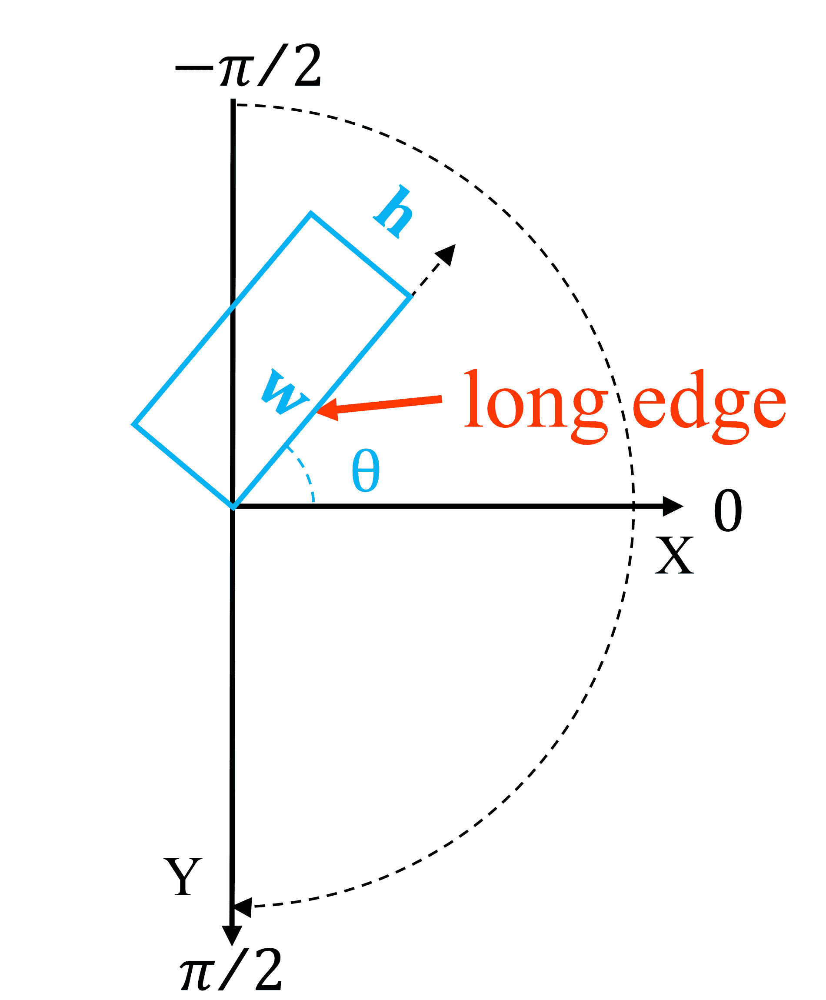
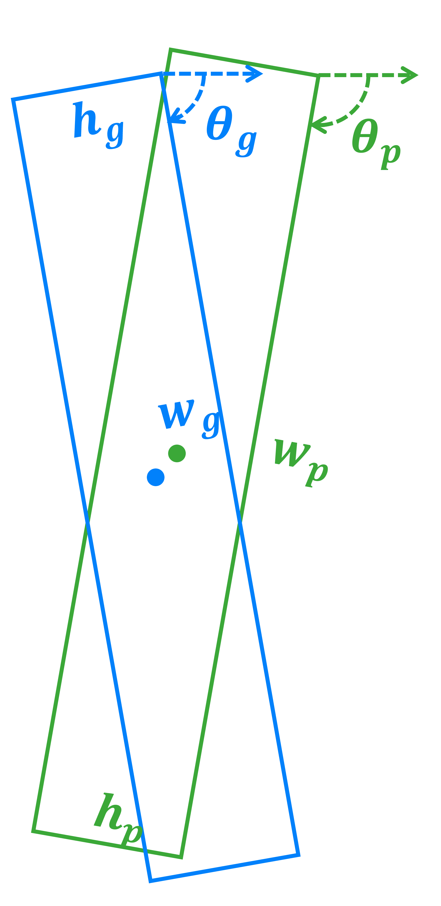

<!--yml

分类：未分类

日期：2024-09-06 19:41:41

-->

# [2302.10473] 基于深度学习的光学遥感图像中的定向目标检测：综述

> 来源：[`ar5iv.labs.arxiv.org/html/2302.10473`](https://ar5iv.labs.arxiv.org/html/2302.10473)

\cormark

[1] \cormark[1] \cormark[2]

\cortext

[合著者]贡献相等。 \cortext[cor1]通讯作者。电子邮件地址：lizhang08@nudt.edu.cn。

# 基于深度学习的光学遥感图像中的定向目标检测：综述

孙昆    王子    张莉    苏昂    滕西超    刘敏浩    于启峰 国防科技大学航天学院，中国长沙，410000 湖南省图像测量与视觉导航重点实验室，中国长沙，410000

###### 摘要

定向目标检测是遥感领域中最基础和具有挑战性的任务之一，旨在定位多个预定义目标类别中的定向目标。最近，基于深度学习的方法在光学遥感图像中的定向目标检测中取得了显著的成果。然而，目前尚未出现对遥感领域文献的全面综述。因此，我们对近期的进展进行了全面的综述，涵盖了定向目标检测的许多方面，包括问题定义、常用数据集、评估协议、检测框架、定向目标表示和特征表示。此外，我们还分析和讨论了最先进的方法。最后，我们讨论了未来的研究方向，并提出了一些有用的研究指导。我们相信，这份综述将对学术界和工业界的研究人员具有重要价值。

###### 关键词：

定向目标检测 \sep 遥感 \sep 深度学习

## 1 引言

随着遥感（RS）技术的快速发展，卫星或无人机（UAV）可以轻松获取越来越多分辨率不同、光谱多样的图像。自然地，研究界迫切需要调查各种先进技术，以自动高效地处理和分析大量遥感图像。作为自动分析遥感图像的一个关键基石，目标检测旨在从给定图像中识别预定义类别的目标，并回归每个目标实例的精确定位（例如，通过定向边界框）。遥感图像中的目标检测是广泛应用的关键步骤，包括智能监测（赵等，2018；萨尔沃尔迪等，2022）、城市规划（布罗钦等，2014）、港口管理（张等，2021a）和军事侦察（刘等，2022）。

(a) OBB 表示。

(b) HBB 表示。

图 1：OBB 和 HBB 的比较 (Xia et al., 2018; Ding et al., 2022)。 (a) 是物体的 OBB 表示。 (b) 是 HBB 表示的失败案例，与 (a) 相比带来了较高的重叠。

如图 1 所示，根据物体的表示方式，遥感（RS）物体检测可以分为两种类型：水平物体检测和定向物体检测（也称为旋转物体检测）。前者使用水平边界框（HBB）来表示检测到的物体，格式为 $(x,y,w,h)$ (Everingham et al., 2010; Lin et al., 2014; Russakovsky et al., 2015)，其中 $(x,y)$ 表示边界框中心的坐标，$w$ 和 $h$ 分别表示边界框的宽度和高度。后者使用定向边界框（OBB）来定位检测到的物体，格式为 $(x,y,w,h,\theta)$，其中 $\theta$ 表示相对于水平方向的旋转角度。因此，后者通过利用额外的方向信息来描绘更准确的位置。

传统的检测器依赖于手工制作的描述符 (Dalal and Triggs, 2005; Fei-Fei and Perona, 2005; Wright et al., 2009; Blaschke, 2010; Leitloff et al., 2010; Stankov and He, 2013; Blaschke et al., 2014)，由于特征浅层，性能通常有限。近年来，随着深度神经网络（DNN） (Hinton and Salakhutdinov, 2006; LeCun et al., 2015; Chen et al., 2018; He et al., 2016; Krizhevsky et al., 2012, 2017) 的进步，计算机视觉取得了显著的进展。得益于计算资源的持续改进，DNN 可以从大规模数据集中以端到端的方式学习高级模式。因此，基于 DNN 的方法可以利用具有代表性和区分性的特征。近年来，提出了各种基于 DNN 的检测器，并主导了最新技术的发展。大多数这些方法专注于设计自然场景图像的水平物体检测器 (Girshick et al., 2014; Girshick, 2015; Ren et al., 2017; Liu et al., 2016a; Lin et al., 2020; Redmon et al., 2016; Redmon and Farhadi, 2017; Hei and Jia, 2020; Duan et al., 2019; Zhou et al., 2019; Yang et al., 2019b)，这些图像是从水平视角拍摄的。相比之下，RS 图像通常从鸟瞰视角（BEV）拍摄，这为检测任务带来了额外的挑战 (Xia et al., 2018)：

(a) 任意方向。

(b) 密集排列。

(c) 大纵横比。

图 2：遥感图像挑战的示意图 (Xia 等，2018；Ding 等，2022)。 (a) (c) 分别是任意方向、密集排列和大纵横比的示例。

任意方向。在 BEV 中，遥感图像中的物体可能以任意方向出现，从而对检测性能产生不利影响，如图 2(a)所示。

密集排列。在某些特定场景中，可能会有许多小物体密集分布，例如港口中的船只和停车场中的车辆，如图 2(b)所示。因此，由检测器预测的一个水平框可能包含多个拥挤的物体，多个物体之间的相互干扰可能会带来巨大挑战。

大纵横比。如图 2(c)所示，遥感图像通常包含一些纵横比极大的类别，如桥梁、船只、港口等。这些类别的定位精度对方向错误非常敏感。

因此，尽管这些水平物体检测器在自然场景图像中表现良好，但它们不适合用于遥感图像中具有任意方向的物体。HBB 无法描绘物体方向，并且包含背景中的冗余信息。此外，在密集排列的场景中（尤其是对具有极大纵横比的物体），HBB 与相邻 HBB 之间的交并比（IoU）可能非常大，如图 1(b)所示。因此，非极大值抑制（NMS）技术往往会导致漏检。为了应对这些挑战，更多的努力被投入到定向目标检测中。因为 OBB 可以精确地包围物体，并将物体与密集排列的相邻物体区分开来。一些里程碑式的方法和广泛使用的数据集如图 3 所示。

尽管存在大量的定向物体检测方法，但对这一主题的全面综述仍然缺乏。鉴于该领域的持续成熟和日益关注，本文尝试对近期的努力进行深入分析，并系统总结其成果。通过回顾定向物体检测领域的大量贡献，我们的综述涵盖了以下几个方面：问题定义、常用数据集、评估协议、检测框架、OBB 表示和特征表示。此外，还提供了简要的结论和对未来研究的展望。

图 3：里程碑方法和著名数据集的时间顺序概述。

### 1.1 相关综述

在物体检测领域，近年来发表了许多重要的综述。几项工作专注于特定类别，如人脸检测 (Zafeiriou et al., 2015; Wang et al., 2018a; Wu and Ji, 2019; Du et al., 2022)、文本检测 (Ye and Doermann, 2015; Yin et al., 2016)、行人检测 (Brunetti et al., 2018) 和船舶检测 (Li et al., 2021)。还有更多综述关注通用水平物体检测，旨在检测自然场景中多个预定义类别的物体 (Jiao et al., 2019; Liu et al., 2020; Wu et al., 2020; Zhao et al., 2019b; Xiao et al., 2020a)。这些工作涵盖了通用水平物体检测的各个方面，包括基于深度学习的检测框架、训练策略、特征表示、评估指标和典型应用领域。此外，还有关于特定条件下通用水平物体检测的综述，包括小物体检测 (Tong et al., 2020; Han et al., 2021c; Liu et al., 2021a) 和伪装物体检测 (Mondal, 2020)。尽管有少数综述 (Cheng and Han, 2016; Li et al., 2020) 分析和总结了遥感物体检测，但它们仅关注传统方法和水平物体检测。因此，以上综述都没有涉及定向物体检测。据我们所知，这是第一篇尝试全面覆盖遥感场景下定向物体检测的深度学习方法的综述论文。本综述重点介绍了定向物体检测的主要进展，并包括了水平物体检测的重要工作，以确保完整性和可读性。

### 1.2 贡献

本工作的主要贡献总结如下：

(1) 对定向目标检测的深度学习的近期和先进进展的全面综述。我们系统总结了定向目标检测中常用的数据集、深度学习网络框架以及最先进的方法。

(2) 对定向目标表示和特征表示的深入分析和讨论。我们讨论了定向目标表示的挑战及相应的解决方案，包括度量和损失之间的不一致、角界断裂和方形问题、以及顶点排序问题。此外，我们分析并比较了现有的定向目标检测特征表示方法，包括增强型和旋转不变特征表示。

(3) 对未来潜在趋势的概述。我们从七个方面探讨未来可能的发展方向：领域适应、规模适应、长尾定向目标检测、多模态信息融合、轻量级方法、视频目标检测和目标实例分割。

本文的结构安排如下。我们首先在第二部分介绍定向目标检测的问题定义。然后，我们在第三部分概述常用的数据集，并详细说明评估协议。第四部分回顾基于深度神经网络的框架，接着在第五部分和第六部分分别讨论 OBB 表示和特征表示。此外，第七部分分析并比较了最新的技术。最后，第八部分讨论了未来潜在的研究方向。

## 2 问题定义

目标检测包括定位（预定义类别的物体在给定图像中的位置？）和识别（这些物体属于哪些预定义类别？）。因此，检测器需要通过预测精确的定位和正确的类别标签来区分给定图像中的预定义类别物体。具体而言，预测物体的类别标签表示为 $C+1$ 维的概率分布，其格式为 $c=(p_{0},p_{1},\cdots,p_{C})$，其中 $C$ 是预定义类别的数量，$p_{0}$ 和 $p_{1},\cdots,p_{C}$ 分别表示一个背景类别和 $C$ 个预定义类别的概率。由有向检测器预测的定位表示为 OBB。为了更好地理解，我们提供了基于深度学习的有向目标检测问题的常见表述。

给定输入图像 $\mathbf{I}\in\mathbb{R}^{H\times W\times 3}$，我们假设有 $N$ 个标注或真实（GT）物体属于预定义类别：

|  | $\mathcal{T}=\{(c_{1}^{t},b_{1}^{t}),(c_{2}^{t},b_{2}^{t}),\cdots,(c_{N}^{t},b_{N}^{t})\}$ |  | (1) |
| --- | --- | --- | --- |

其中 $c_{n}^{t}$ 和 $b_{n}^{t}$ 分别表示第 $n$ 个物体的类别标签和 GT OBB。此格式也适用于检测器的预测：

|  | $\mathcal{P}=\{(c_{1}^{p},b_{1}^{p}),(c_{2}^{p},b_{2}^{p}),\cdots,(c_{N_{p}}^{p},b_{N_{p}}^{p})\}$ |  | (2) |
| --- | --- | --- | --- |

其中 $N_{p}$ 表示预测结果的数量，$c_{n}^{p}$ 表示由 sigmoid 函数计算的第 $n$ 个预定义类别的概率分布，$b_{n}^{p}$ 表示第 $n$ 个回归的 OBB。

为了训练检测器，每个预测首先被分配一个正标签或负标签。仅当存在至少一个 GT 物体与其的 RIoU（两个 OBB 的交集与并集的比值）重叠高于预设阈值 $T_{RIoU}$ 时，预测才被视为正样本。阈值 $T_{RIoU}$ 通常设定为 0.5。否则，预测为负样本。回归的 OBB $b^{p}$ 和 GT OBB $b^{t}$ 之间的 RIoU 可以计算为：

|  | $RIoU(b^{p},b^{t})=\frac{Area(b^{p}\cap b^{t})}{Area(b^{p}\cup b^{t})}$ |  | (3) |
| --- | --- | --- | --- |

其中 $\cap$ 和 $\cup$ 分别表示交集和并集。然后，对于每个正样本预测 $(c_{n}^{p},b_{n}^{p})$，我们将与其具有最高 RIoU 重叠的 GT 物体 $(\hat{c}_{n}^{t},\hat{b}_{n}^{t})$ 分配给它。请注意，一个标注物体可能会被分配到多个预测中。最后，通过最小化目标函数，即多任务损失来训练检测器：

|  | $L(\mathcal{T},\mathcal{P})=\frac{1}{N_{pos}}\sum_{n=1}^{N_{pos}}obj_{n}\cdot L_{reg}(b_{n}^{p},\hat{b}_{n}^{t})+\frac{\lambda}{N_{p}}\sum_{n=1}^{N_{p}}L_{cls}(c_{n}^{p},\hat{c}_{n}^{t})$ |  | (4) |
| --- | --- | --- | --- |

其中 $(\hat{c}_{n}^{t},\hat{b}_{n}^{t})\in\mathcal{T}$ 是与预测 $(c_{n}^{p},b_{n}^{p})\in\mathcal{P}$ 相关联的标注对象。$obj_{n}$ 对于正预测和负预测分别为 1 和 0。$N_{pos}$ 和 $N_{p}$ 分别表示正预测和预测结果的数量。$L_{reg}$ 和 $L_{cls}$ 分别表示回归损失和分类损失。术语 $obj_{n}\cdot L_{reg}(b_{n}^{p},\hat{b}_{n}^{t})$ 表示回归损失仅对正预测激活，其他情况下禁用。一个平衡参数 $\lambda$ 控制分类和回归之间的权衡。

损失函数的主要目的是量化预测与实际值之间的差异，并指导检测器的训练过程。因此，损失函数对检测性能有显著影响。作为通用水平目标检测的扩展，定向目标检测也在分类任务中采用了交叉熵损失（de Boer et al., 2005）或焦点损失（Lin et al., 2020）。另一方面，尽管在通用水平目标检测中被广泛使用，但平滑 $L_{1}$ 损失（Girshick, 2015）不适用于定向目标检测，因为它需要预测物体的方向。有关损失函数的更多细节将在第五部分中讨论。

## 3 数据集和性能评估

### 3.1 数据集

作为一种数据驱动的技术，深度学习与各种数据集密不可分。在基于深度学习的目标检测的发展过程中，数据集不仅在模型训练中发挥了不可或缺的作用，还作为常见的基准来评估和验证模型性能（Liu et al., 2020）。在具有挑战性的数据集的帮助下，目标检测不断向日益复杂和困难的场景发展。在水平目标检测中，出现了大量的数据集，包括 PASCAL VOC（Everingham et al., 2010）、ImageNet（Russakovsky et al., 2015）、Microsoft COCO（Lin et al., 2014）和 Open Images（Kuznetsova et al., 2020），这些数据集推动了基于深度学习的方法取得了巨大的成功。

随着地球观测技术的快速发展，大量高质量的遥感图像可以轻松获取，以构建大规模数据集来研究基于深度学习的遥感目标检测算法。近年来，多个研究小组已发布了他们的公共遥感图像数据集。这里不包括仅用 HBBs 标注的数据集，如 DIOR （Li 等，2020）、LEVIR （Zou 和 Shi，2018）、NWPU VHR-10 （Cheng 等，2014）、RSOD （Xiao 等，2015; Long 等，2017）、xView （Lam 等，2018）和 HRRSD （Zhang 等，2019）。在本小节中，我们仅重点介绍用 OBBs 标注的遥感图像数据集，包括 SZTAKI-INRIA （Benedek 等，2012）、3K vehicle （Liu 和 Mattyus，2015）、UCAS-AOD （Zhu 等，2015）、VEDAI （Razakarivony 和 Jurie，2016）、HRSC2016 （Liu 等，2016b）、DOTA （Xia 等，2018; Ding 等，2022）、ShipRSImageNet （Zhang 等，2021b）和 DIOR-R （Cheng 等，2022a）。我们将详细介绍上述数据集：

SZTAKI-INRIA （Benedek 等，2012）包含了 9 张来自不同城市的 665 栋建筑的多传感器航拍或卫星图像。由于数据量较小，该数据集用于评估传统的目标检测算法。

3K vehicle （Liu 和 Mattyus，2015）为车辆检测而创建，包括 20 张图像和 14,235 辆车辆。这些图像的分辨率为 5616 $\times$ 3744，由 DLR 相机系统在距地面 1,000 米的高度拍摄。因此，地面采样距离（GSD）约为 13 厘米，导致规模变化较小。此外，这些图像背景类似。因此，该数据集被排除在复杂场景算法的评估之外。

VEDAI （Razakarivony 和 Jurie，2016）同样用于车辆检测，包含更多类别和更广泛的背景，例如田野、草地、山脉、城市区域等，使得检测更加复杂。它包含 1,210 张分辨率为 $1,024\times 1,024$ 的图像。这些图像是从分辨率为 12.5 厘米的非常高分辨率（VHR）卫星图像中裁剪而来的。然而，该数据集仅包含 3,640 个实例，因为图像中过于密集的车辆被排除。值得一提的是，每张图像都有四个颜色通道，包括三个可见通道和一个 8 位近红外通道。

UCAS-AOD （Zhu 等，2015）包含 7,482 架飞机的 1,000 张图像、7,114 辆汽车的 510 张图像，以及 910 张负样本图像。该数据集中的所有图像均为从 Google Earth 航拍图像中裁剪而来。特别地，这些实例经过仔细选择，以确保其方向分布均匀。

HRSC2016 (Liu et al., 2016b) 是一个广泛使用的船舶检测数据集。它包含 1,070 张图像和 2,976 个实例，这些数据来自 Google Earth。图像分辨率范围从 300 $\times$ 300 到 1,500 $\times$ 900。此外，该数据集包含超过 25 类船舶，具有大范围的尺度、方向、外观、形状和背景（例如海洋、港口）。目前，它是评估面向对象检测算法的最受欢迎的数据集之一。

(a) 斜视图

(b) 低前景比

图 4：DOTA-V2.0 的特征（Ding et al., 2022）。

图 5：DOTA-V1.0、V1.5 和 V2.0 训练和验证子集中每个类别的实例数量（Xia et al., 2018; Ding et al., 2022）

(a) 每个类别的尺寸分布

(b) 每个类别的比例分布

图 6：DOTA-V1.0、V1.5 和 V2.0 训练和验证子集中每个类别的尺寸和比例分布（Xia et al., 2018; Ding et al., 2022）

DOTA (Xia et al., 2018; Ding et al., 2022) 包含大量具有相当多样的方向、尺度和外观的对象。这些图像选自不同的传感器和平台，包括 Google Earth、GF-2 卫星和无人机。图像的尺寸范围从 $800\times 800$ 到 $20,000\times 20,000$ 像素。此外，该数据集有三个版本。

表 1：DOTA 三个版本的比较。统计每个拆分子集的图像数量和实例数量。

|  | V1.0 | V1.5 | V2.0 |
| --- | --- | --- | --- |
| 图像 | 训练 | 1,411 | 1,830 |
| 验证 | 458 | 593 |
| 测试/测试开发 | 937 | 2,792 |
| 测试挑战 | - | 6,053 |
| 总计 | 2,806 | 11,268 |
| 实例 | 训练 | 98,990 | 210,631 | 268,627 |
| 验证 | 28,853 | 69,565 | 81,048 |
| 测试/测试开发 | 60,439 | 121,893 | 353,346 |
| 测试挑战 | - | - | 1,090,637 |
| 总计 | 188,282 | 403,318 | 1,793,658 |

三个版本的 DOTA 中图像和实例的数量汇总在表格 1 中。DOTA-V1.0（Xia et al., 2018）和 DOTA-V1.5 使用相同的图像，这些图像被划分为训练集、验证集和测试集。作为 DOTA-V1.0 的扩展，DOTA-V1.5 注释了极小的实例，其大小等于或小于 10 像素。此外，DOTA-V1.5 扩展了一个新类别，即集装箱起重机。因此，实例数量从 188,282 增加到 403,318。与以前的版本相比，DOTA-V2.0（Ding et al., 2022）包含了更多从 Google Earth、GF-2 卫星和空中平台收集的图像。此外，大量图像是在倾斜视角和较低前景比下拍摄的，以接近实际应用场景，如图 4 所示。它进一步增加了两个新类别，包括机场和直升机停机坪。实例数量增加到约 180 万。此外，它包含两个测试子集，即 test-dev 和 test-challenge。后者包括更多的目标实例（约 110 万）和更复杂的场景，使得任务更加具有挑战性。

图 5 显示了 DOTA-V1.0、V1.5 和 V2.0 中训练和验证子集的每个类别的实例数量。需要注意的是，不同类别的分布严重不平衡。小型车辆和船舶的实例数量较多，而其他几乎一半的类别数量少于 1,000，包括飞机、棒球场、跑道、篮球场、足球场、环形交叉路口、直升机、集装箱起重机、机场和直升机停机坪。严重的类别不平衡使得模型在许多实例类别上严重过拟合，而在少量实例类别上则表现不佳 (Gupta et al., 2019; Cui et al., 2019; Wang et al., 2021b)。图 6 进一步总结了 DOTA 三个版本中每个类别的大小和比例分布。如图 6(a) 所示，每个类别的最小尺寸比最大尺寸小 $3-4$ 个数量级。此外，类别之间的尺寸差异范围也很大。类内和类间的尺寸变化使得检测任务更加具有挑战性。图 6(b) 表明，不同类别的纵横比差异很大。此外，一些类别具有极大的纵横比，例如桥梁、港口和机场。至今，DOTA 是最具挑战性的定向目标检测数据集，因其巨大的目标实例、较大的纵横比、显著的尺寸变化和复杂的空中场景。

FGSD (Chen et al., 2020) 是一个基于 HRSC2016 扩展的新型细粒度船舶检测数据集。该数据集包含 2,612 张遥感图像和来自全球 17 个大型港口的 5,634 个船舶实例。这些实例被分为 43 类，进一步划分为 4 个高级类别，包括潜艇、航母、民用船舶和军舰。除了船舶之外，该数据集还标注了一个名为“码头”的新类别，以便于未来的研究。

ShipRSImageNet (Zhang 等, 2021b) 是用于船舶检测的最大 RS 数据集。它包含了从 xView (Lam 等, 2018)、HRSC2016 (Liu 等, 2016b)、FGSD (Chen 等, 2020)、Airbus Ship Detection Challenge 和中国卫星中收集的 3,435 张图片。大多数图像被切割成大约 $930\times 930$。总共有 17,573 艘船分为 50 类。在此数据集中，存在多样的空间分辨率、尺度、长宽比、背景和方向。

DIOR-R (Cheng 等, 2022a) 包含 192,518 个实例和 23,463 张图像。这些图像与 DIOR (Li 等, 2020) 中的图像相同，而实例则以 OBB 格式注释。GSD 范围从 0.5m 到 30m。DIOR-R 中有 20 个常见类别，包括飞机、机场、棒球场、篮球场、桥梁、烟囱、高速公路服务区、高速公路收费站、水坝、高尔夫球场、田径场、港口、立交桥、船舶、体育场、储罐、网球场、火车站、车辆和风车。

表 2：公共 RS 图像数据集的比较。

| 数据集 | 类别 | 数量 | 实例 | GSD | 分辨率 |
| --- | --- | --- | --- | --- | --- |
| SZTAKI-INRIA (Benedek 等, 2012) | 1 | 9 | 665 | - | $600\times 500\sim 1400\times 800$ |
| 3K vehicle (Liu 和 Mattyus, 2015) | 1 | 20 | 14235 | 0.13m | $5516\times 3744$ |
| VEDAI (Razakarivony 和 Jurie, 2016) | 9 | 1210 | 3640 | 0.125m | $1024\times 1024$ |
| UCAS-AOD (Zhu 等, 2015) | 2 | 2420 | 14596 | - | $1280\times 659$ |
| HRSC2016 (Liu 等, 2016b) | 25 | 1070 | 2976 | 0.4$\sim$2m | $300\times 300\sim 1500\times 900$ |
| DOTA-V1.0 (Xia 等, 2018) | 15 | 2806 | 188282 | 0.1$\sim$4.5m | $800\times 800\sim 20000\times 20000$ |
| DOTA-V1.5 | 16 | 2806 | 403318 | 0.1$\sim$4.5m | $800\times 800\sim 20000\times 20000$ |
| DOTA-V2.0 (Ding 等, 2022) | 18 | 11268 | 1793658 | 0.1$\sim$4.5m | $800\times 800\sim 29200\times 27620$ |
| FGSD (Chen 等, 2020) | 43 | 5634 | 2612 | 0.12$\sim$1.93m | $930\times 930$ |
| ShipRSImageNet (Zhang 等, 2021b) | 50 | 3435 | 17573 | 0.12$\sim$6m | $930\times 930\sim 1400\times 1000$ |
| DIOR-R (Cheng 等, 2022a) | 20 | 23463 | 192518 | 0.5$\sim$30m | $800\times 800$ |

表格 2 列出了上述 RS 数据集的参数，便于直观比较。作为早期的大规模数据集，具有大量实例和多种类别，DOTA-V1.0 (Xia 等，2018) 已被广泛用于比较各种检测器的性能。此外，由于船舶通常具有较大的纵横比，早期的船舶数据集 HRSC2016 (Liu 等，2016b) 也被用于评估不同的检测器。

### 3.2 评估协议

准确性和效率都是评估有向目标检测器性能最关键的标准。OBB 的评估协议与 HBB 的协议不同，因为 IoU 被 RIoU 取代。另一方面，效率是用每秒帧数（FPS）来评估的，它表示检测器每秒处理的图像帧数。准确性评价同时考虑了精确度和召回率。对于准确性评价，有两个公认的度量标准，即平均精度（AP）和 F 度量。

对于目标检测任务，检测器输出预测结果列表${(b_{j},c_{j},s_{j})}_{j=1}^{M}$，其中每个项目包含一个 OBB $b_{j}$，一个类别标签 $c_{j}$ 和一个置信度分数 $s_{j}$。$j$是目标顺序的索引，$M$表示预测结果的数量。然后，预测结果中置信度大于预定义的置信度阈值$T_{s}$的部分被分配给 GT 对象${(b_{k}^{*},c_{k}^{*})}_{k=1}^{N}$，基于 RIoU 和类别，其中$b_{k}^{*}$，$c_{k}^{*}$和上标$*$分别表示 OBB、类别标签和 GT。为了计算检测器的精确度和召回率，需要真阳性（TP）的数量。如果满足以下条件，分配给 GT 对象$(b^{*},c^{*})$的预测结果$(b,c,s)$被判定为 TP：

(1) 预测标签$c$等于 GT 对象的标签$c^{*}”。

(2) 预测 OBB $b$和 GT OBB $b^{*}$之间的 RIoU，用 RIoU $(b,b^{*})$表示，不小于预定义的 RIoU 阈值$T_{RIoU}$，一般设置为 0.5。

否则，它被视为假阳性（FP）。

精确度是指在所有预测结果中正确预测的实例占总预测结果的比例，而召回率是指在所有 GT 对象中被检测器预测的所有正例实例占总 GT 对象的比例。其公式定义如下：

|  | $Prec(T_{s})=\frac{N_{TP}}{N_{TP}+N_{FP}}$ |  | (5) |
| --- | --- | --- | --- |
|  | $Rec(T_{s})=\frac{N_{TP}}{N_{TP}+N_{FN}}=\frac{N_{TP}}{N}$ |  | (6) |

其中 $N_{TP}$、$N_{FP}$ 和 $N_{FN}$ 分别表示 TP、FP 和假阴性（FN）的数量，这些数量由 $T_{s}$ 和 $T_{RIoU}$ 决定。请注意，精度和召回率是置信度阈值 $T_{s}$ 的函数，且 $T_{RIoU}$ 固定。

更重要的是，精度和召回率都不能独立地评估检测器的准确性，而 F-measure 是一个结合精度和召回率的单一度量，使用加权调和平均值：

|  | $F_{\alpha}=\frac{(1+\alpha^{2})Prec(T_{s})Rec(T_{s})}{\alpha^{2}Prec(T_{s})+Rec(T_{s})}$ |  | (7) |
| --- | --- | --- | --- |

其中 $\alpha\in\mathbb{R}^{+}$ 是一个加权参数。$\alpha$ 的值通常设置为 1，以平衡精度和召回率的重要性。在最近的研究中，AP 是最常用的准确性评估指标，通常是针对每个类别单独计算的。对于每个类别，AP 是通过精度 $Prec(T_{s})$ 和召回率 $Rec(T_{s})$ 得出的。具体来说，通过将置信度阈值 $T_{s}$ 从 1.0 逐渐降低到 0.0，召回率随着 $N_{TP}$ 的增加而增加，可以获得一系列的 $(Prec,Rec)$ 对。这使得精度可以被视为召回率的离散函数。这个离散函数被称为精度-召回曲线（PRC），记作 $P(R)$。AP 值是通过计算从 $R=0.0$ 到 $R=1.0$ 区间内精度 $P(R)$ 的平均值得到的：

|  | $AP=\frac{1}{N}\sum_{n=0}^{Rec(0)}\max_{R\geq\frac{n}{N}}P(R)$ |  | (8) |
| --- | --- | --- | --- |

因此，AP 也可以视为 PRC 下的面积。最后，为了评估所有类别的整体准确性，采用了所有类别的平均 AP（mAP）作为最终的评估指标。

## 4 检测框架

许多定向目标检测方法是建立在通用水平目标检测方法之上的。因此，主流的定向目标检测的深度学习模型也可以大致分为基于锚点的方法和无锚点的方法。

图 7：双阶段定向检测器的基本架构（Ren et al., 2017; Ding et al., 2019）。

### 4.1 基于锚点的

基于锚点的方法通过回归模式定位物体，这些方法可以进一步分为两阶段（或多阶段）和单阶段检测框架。在两阶段检测器的流程中，第一阶段生成一组稀疏的类别无关的区域提议，这些提议可能包含物体（Chavali et al., 2016; Hosang et al., 2016）。在第二阶段，从每个提议的特征图中提取感兴趣区域（RoI）的特征，然后用于分类和精细回归。最后，采用后处理操作，如 NMS，来输出检测结果。相比之下，单阶段检测器没有区域提议生成，直接使用 DCNNs 定位和分类物体。因此，单阶段检测器的流程更简单。然而，单阶段检测器的准确性低于两阶段检测器（Ding et al., 2019; Xie et al., 2021; Lin et al., 2020; Yang et al., 2021b）。单阶段检测器的主要优势是快速推理速度，这在实时应用中是需要的。几种两阶段和单阶段检测框架的属性总结见表 3 和表 4。

#### 4.1.1 两阶段

表 3：典型两阶段检测框架的属性总结

| 方法 | 基线 | 骨干网络 | mAP¹ | 亮点 |
| --- | --- | --- | --- | --- |
| 旋转 Faster RCNN | Faster RCNN | R-101² | 54.13 | 一个经典的两阶段框架和大多数两阶段旋转检测器的典型基线。 |
| (Ren et al., 2017) |
| RRPN | 旋转 Faster RCNN | R-101 | 61.01 | 使用旋转锚点生成旋转建议。 |
| (Ma et al., 2018) |
|  | 旋转 Faster RCNN | R-101 | 69.56 | 提出一种 RRoI 学习器，将 HRoIs 转换为 RRoIs，并使用 RPS RoI 对齐提取空间旋转不变的特征图。 |
| RoI Transformer |
| (Ding et al., 2019) |
|  | RoI Transformer | ReR-50 | 80.10 | 使用旋转等变网络和 RiRoI 对齐在空间和方向维度上提取旋转不变特征。 |
| ReDet |
| (Han et al., 2021a) |
|  | ReDet | ReR-50 | 80.37 | 设计一个动态增强锚点网络，以生成更多合格的正样本并提高小物体的性能。 |
| DEA |
| (Liang et al., 2022) |
|  | Rotated Faster RCNN | R-50 | 80.87 | 设计一个轻量级模块来生成定向提议和中点偏移表示。在高级两阶段检测器方面实现有竞争力的准确性，并达到一阶段检测器的近似效率。 |
| Oriented RCNN |
| (Xie et al., 2021) |
| KFIoU | RoI Transformer | Swin-T | 80.93 | 设计了基于卡尔曼滤波器的 KFIoU 损失，以实现与 RIoU 的最佳趋势级别对齐。 |
| (Yang et al., 2022) |
|  | Oriented RCNN | ViTAE | 81.24 | 使用 MAE (He et al., 2022) 预训练普通的 ViTAE transformer。采用 RVSA 以数据驱动的方式学习自适应的窗口大小和方向。 |
| RVSA |
| (Wang et al., 2022) |

+   1

    “mAP” 列指示在将 RIoU 阈值设为 0.5 时在 DOTA-V1.0 (Xia et al., 2018) 上的 mAP。这些方法的结果是相应论文中报告的最佳结果。

+   2

    R-101 表示 ResNet-101，R-50、R-152 同理。ReR-50 表示旋转等变 ResNet-50 (Han et al., 2021a)。Swin-T 和 ViTAE 表示 Swin Transformer 的迷你版本 (Liu et al., 2021b) 和 Vision Transformer (Dosovitskiy et al., 2021; Xu et al., 2021b; Zhang et al., 2023)(以下同)。

旋转 Faster RCNN。最近，Faster RCNN (Ren et al., 2017)作为一个经典的两阶段通用水平目标检测框架，显示出了高精度和高效率，受到了广泛关注。因此，基于 Faster RCNN 的各种改进和扩展工作相继提出，包括 FPN (Lin et al., 2017)，级联 RCNN (Cai and Vasconcelos, 2018)，Mask RCNN (He et al., 2020b) 和 DetectoRS (Qiao et al., 2021)。FPN 可以通过自顶向下的架构和横向连接在不同尺度上提取丰富的高层语义信息，同时在多级特征图上检测区域提议。Faster RCNN 和 FPN 的结合在多尺度检测方面显示出显著改进，特别是对于小物体。因此，Faster RCNN 配备 FPN 成为了目标检测任务的基准。通过为每个物体添加额外的输出通道来回归每个物体的方向，其扩展工作，称为 Faster RCNN OBB 或 Rotated Faster RCNN (Ren et al., 2017; Xia et al., 2018)，可以轻松用于定向目标检测，并且也可以作为基准。如图 7 所示，Rotated Faster RCNN 的框架包括以下流程：

(1) 特征图生成。由 CNN 模块和 FPN 结构组成的骨干网络被用来提取多尺度下具有强语义信息的多级特征图，这些特征图也广泛应用于单阶段框架中。

(2) 区域提议网络（RPN）。RPN 以任意大小的特征图作为输入，并通过在输入特征图上滑动一个小型网络生成一组水平区域提议。在特征图的每个滑动位置，RPN 首先初始化总共$k$个不同尺度和纵横比的参考框，其中$k=N_{scales}\texttimes N_{ratios}$，$N_{scales}$和$N_{ratios}$分别表示尺度和纵横比的数量。输入特征图的每个锚点被映射到一个低维特征向量，然后输入到两个兄弟全连接（FC）层：一个二分类层估计物体存在的概率，另一个回归层粗略地调整锚点的位置。因此，RPN 在每个滑动位置同时预测$k$个区域提议。然而，负锚点将占主导地位，因为只有少数位置包含物体，并且在训练过程中主导梯度。为了解决这个问题，采用了随机采样操作符，使正负锚点的比例达到 1:1。总之，RPN 输出一定数量的水平区域提议，位置较粗略。

(3) 带有 CNN 特征的区域（RCNN）。采用 RoI 操作符，如 RoI Pooling（Ren et al., 2017）、RoI Align（He et al., 2020b）或可变形 RoI Pooling（Dai et al., 2017），将不同空间范围内的任何区域提议中的特征图转换为固定大小的小特征图。然后，将每个固定大小的特征图输入到两个兄弟 FC 层中：一个对所有类别加背景进行概率估计，另一个回归方向并细化 RPN 建议的粗略位置。

然而，由于原始的 RPN 仅生成一组水平区域建议（即 RoIs），因此 HBBs 和旋转物体之间存在不可忽视的错位。特别是，几个定向且拥挤的物体可能被一个水平 RoI（HRoI）包含。因此，这些 HRoIs 的特征图包含了无关的信息，使得分类和定位更加具有挑战性，但也激发了后续的创新。

最近在两阶段定向目标检测中的许多进展得益于**旋转 Faster RCNN**框架，从而带来了大量改进的检测方法。一些典型的两阶段定向目标检测方法包括 RRPN (Ma et al., 2018; Yang et al., 2018a; Zhang et al., 2018)、RoI Transformer (Ding et al., 2019)、定向 RCNN (Xie et al., 2021) 和 DODet (Cheng et al., 2022b)。

图 8：单阶段定向检测器的基本架构 (Lin et al., 2020)。

旋转 RPN (RRPN)。由于水平锚点和 HRoI 对于 RS 图像中的定向目标检测不够充分，因此 RRPN (Ma et al., 2018; Yang et al., 2018a; Zhang et al., 2018) 设计了旋转锚点，以适应不同方向的目标并生成旋转提议。具体而言，除了尺度和长宽比，还添加了不同的方向参数，以进一步生成额外的锚点，然后将这些锚点输入到 OBB 回归层中以细化旋转区域提议。为了消除不相关的干扰信息，设计了旋转 RoI (RRoI) 操作符，包括 RRoI-Pooling 或 RRoI Align (Yang et al., 2018a)，以根据旋转提议提取固定大小的特征图。得益于旋转锚点和 RRoI 操作符，RRPN 在召回率方面实现了更好的性能。然而，RRPN 仍然存在几个显著缺点：（1）为了在方向覆盖和计算复杂性之间保持平衡，方向样本的数量有限。因此，难以获得准确的 RRoI 来与所有旋转目标配对。（2）密集旋转锚点的数量是 RPN 生成的锚点数量的 $N_{orientations}$ 倍，这导致计算和内存消耗昂贵，其中 $N_{orientations}$ 表示方向数量。（3）大量的旋转锚点降低了与 GT 目标匹配提议的效率，因为存在大量冗余的 RIoU，且 RIoU 的计算比 IoU 更复杂。

RoI Transformer。为了减少旋转锚点的数量，RoI Transformer（Ding 等人，2019）保留了一个简单的 RPN 结构，并引入了一个轻量级的可学习模块，名为 RoI Learner。为了直接将 HRoIs 转换为 RRoIs，RRoI Learner 由三个组件组成：一个位置敏感的 RoI Align（Dai 等人，2016）用于提取 HRoI 特征，一个轻量级 FC 层用于回归 GT OBB 和 HRoI 之间的偏移，以及一个 OBB 解码器通过解码 HRoI 和偏移来输出 RRoI。然后，一个旋转位置敏感的 RoI Align（RPS RoI Align）接收这些 RRoIs，并进一步提取空间旋转不变的特征图，这些特征图用于最终的分类和回归任务。这种设计在不需要大量旋转锚点的情况下生成精确的 RRoIs，从而提高了效率和准确性。

定向 RCNN。尽管 RoI Transformer 显著提升了准确性和效率，但它涉及一个额外的阶段来生成 RRoIs，这使得网络复杂且沉重。因此，Xie 等人（2021）设计了一种更简单的结构，名为定向 RPN，以从水平锚点生成高质量的 RRoIs。为了减少计算成本，定向 RPN 仅包含一个 $3\times 3$ 的卷积层和两个同级的 $1\times 1$ 卷积层。这个轻量级模块得益于提出的新型 OBB 表示法，称为中点偏移表示。对于定向对象，其中点偏移表示由六个参数 $(x,y,w,h,\Delta\alpha,\Delta\beta)$ 组成，其中 $(x,y,w,h)$ 代表其外部 HBB，$\Delta\alpha,\Delta\beta$ 分别表示相对于外部 HBB 顶部和右侧中点的偏移。外部 HBB 可以为 OBB 提供有界约束，而偏移量 $\Delta\alpha,\Delta\beta$ 可以避免角度（PoA）问题。得益于定向 RPN 和中点偏移表示的设计，定向 RCNN 可以实现与先进的两阶段检测器相媲美的准确性，并达到与单阶段检测器相近的效率。

DODet。为了避免水平提议与定向物体之间的空间和特征错位，程等人（2022b）设计了双对齐定向检测器（DODet），由定向提议网络（OPN）和定位引导检测头（LDH）组成。OPN 是一个轻量级网络，用于生成高质量的旋转提议。此外，设计了一种新的 OBB 表示方法，更好地适应具有大长宽比的物体，替代了宽度和高度，用长宽比和面积代替。LDH 用于解决回归与分类之间的特征错位。首先采用回归头生成更准确的 OBBs，然后这些 OBBs 作为指导来细化分类特征。通过新的 OBB 表示方法和特征对齐设计，DODet 能够显著提高大长宽比物体的检测效果，并在 HRSC2016 数据集上达到$97.14\%$的 mAP。

#### 4.1.2 一阶段

表 4：典型一阶段检测框架属性总结

| 方法 | 基线 | 主干网络 | mAP | 亮点 |
| --- | --- | --- | --- | --- |
| 旋转版 RetinaNet | RetinaNet | R-50 | 68.43 | 设计了焦点损失以缓解类别不平衡。大多数一阶段旋转检测器的典型基线。 |
| (林等人，2020) |
| R³Det | 旋转版 RetinaNet | R-152 | 76.47 | 使用 FRM 细化特征，并设计可微分的 SkewIoU 损失。 |
| (杨等人，2021b) |
|  | 可变形 DETR | R-50 | 79.22 | 一个端到端的基于变压器的旋转检测器。使用 OPG 生成定向提议，并设计 OPR 来细化这些定向提议。 |
| AO2-DETR |
| (戴等人，2022) |
| S²A-Net | 旋转版 RetinaNet | R-50 | 79.42 | 使用 FAM 对齐特征，并采用 ODM 提取定向敏感特征。 |
| (韩等人，2022a) |
| GWD | R³Det | R-152 | 首次提出基于高斯 Wasserstein 距离的损失，以建模两个 OBBs 之间的偏差。 |
| (杨等人，2021c) |
| KLD | R³Det | R-152 | 类似于 GWD，采用 KLD 代替 GWD 以实现更准确的检测。 |
| 杨等人（2021d） |
| KFIoU | R³Det | R-152 | 81.03 | 基于卡尔曼滤波器设计 KFIoU 损失，以实现与 RIoU 的最佳趋势级对齐。 |
| (杨等人，2022) |

与以粗到细的范式工作的两阶段检测框架不同，一阶段检测器直接预测类别概率和物体的位置，无需使用区域提议网络和 RoI 操作符。因此，一阶段检测器更高效，更适合实时检测。最近，出现了一系列经典的一阶段算法并取得了显著进展，包括旋转版 RetinaNet（林等人，2020）、R³Det（杨等人，2021b）和 S²A-Net（韩等人，2022a）。

旋转 RetinaNet。Lin 等（2020）提出了带有焦点损失的 RetinaNet，有效缓解了训练过程中的类别不平衡，实现了与两阶段检测器相媲美的准确性。因此，基于 RetinaNet 的旋转检测器，名为旋转 RetinaNet，被用作基准。如图 8 所示，旋转 RetinaNet 首先通过具有 FPN 的 CNN 模块提取多层级特征图。然后，初始化一定数量的锚点。对于每个空间位置的锚点，回归头预测锚点与 GT OBB 之间的相对偏移。同时，分类头预测每个锚点的类别概率。与仅区分每个锚点背景和前景的类别无关的 RPN 相比，分类头对所有类别进行概率预测。此外，这两个头部比 RPN 更深且不共享参数。

尽管其架构简单且计算高效，但旋转 RetinaNet 在准确性方面仍落后于当前先进的两阶段面向检测器。第一个原因是水平锚点无法紧密覆盖面向物体，导致物体与锚点之间的错位。此外，卷积特征通常是轴对齐的，并且具有固定的感受野，而物体分布具有任意的方向和各种尺度。因此，锚点的相应特征无法准确表示物体，尤其是当物体具有极端长宽比时。为了解决这些问题，提出了许多精细化检测器（Yang 等，2021b；Han 等，2022a），它们使用全卷积块代替需要大量时间消耗的区域处理的 RoI 操作，以对齐物体和锚点。

精细化旋转 RetinaNet（R³Det）。R³Det（Yang 等，2021b）通过使用特征精炼模块（FRM）对旋转 RetinaNet 进行改进。它采用粗到细的工作模式。具体而言，R³Det 首先生成多层级的特征图，然后将水平锚点转换为精细化的旋转锚点，这可以提供更准确的位置信息。为了对齐和重建特征图，FRM 采用逐像素特征插值，从相应的精细化旋转锚点的五个位置（即一个中心和四个角落）中采样特征并进行累加。此外，设计了一种近似 RIoU 损失，称为 SkewIoU 损失，用于解决 RIoU 的不可微分问题，从而实现稳定的训练和准确的定位。

单次对齐网络（S²A-Net）。与 R³Det 类似，S²A-Net（Han et al., 2022a）也选择了 Rotated RetinaNet 作为基线。为了实现特征对齐并缓解回归与分类之间的不一致，设计了特征对齐模块（FAM）和方向检测模块（ODM）。FAM 首先通过锚点精炼网络从水平锚点生成高质量的旋转锚点。然后，它通过对齐卷积（AlignConv）自适应地对齐特征。具体来说，AlignConv 是可变形卷积（Dai et al., 2017）的一种变体，它根据精炼的旋转锚点推断偏移量，以提取旋转网格分布特征。虽然分类任务需要方向无关的特征，但回归任务受益于方向敏感的特征，导致回归与分类之间的不一致。因此，受旋转敏感回归检测器（Liao et al., 2018）的启发，ODM 采用了主动旋转滤波器（Zhou et al., 2017）来提取用于回归的方向敏感特征。然后，采用池化操作从方向敏感特征中提取方向无关特征以用于分类。

### 4.2 锚点自由

(a) 基于关键点的锚点自由检测器。

(b) 基于中心的锚点自由检测器。

图 9：基于关键点和基于中心的锚点自由检测器的基本架构。

尽管基于锚点的方法在物体检测中扮演了非常重要的角色，并且在性能上取得了显著的改善，但它们仍然存在一些关键的缺陷。首先，预定义的锚点是手动设计的，具有多个手工设计的组件，包括尺度、长宽比，甚至方向，这些在训练过程中是固定的，无法自适应调整。其次，手工设计的锚点在匹配具有不同尺度或方向的物体时遇到困难。第三，大多数锚点都是负样本，导致正负样本之间的不平衡。为了应对这些问题，开发了一系列无锚点的方法来在没有预设锚点的情况下寻找物体。这些无锚点的方法消除了与锚点相关的超参数，并且在性能上与基于锚点的方法相当，显示了在广泛应用中的潜力 （Zhang et al., 2020c）。根据 OBB 的表示，无锚点的方法可以分为基于关键点的方法 （Guo et al., 2021；Wei et al., 2020）和基于中心的方法 （Guan et al., 2021；He et al., 2021；Lin et al., 2019；Xiao et al., 2020b；Yi et al., 2021；Zhang et al., 2022；Zhou et al., 2020；Zhao et al., 2021）。

基于关键点的方法首先定位一组自适应或自约束的关键点，然后勾画出物体的空间范围，如图 9(a). O²-DNet （Wei 等，2020）首先通过回归从中心点的偏移量来定位 OBB 四个边的中点。然后，将两组相对的中点连接起来，形成两条互相垂直的中线，可以解码得到 OBB 的表示。此外，设计了一个自监督损失来约束两条中线之间的垂直关系以及中心点与两相对中点之间的共线关系。继 RepPoints （Yang 等，2019b）之后，CFA （Guo 等，2021）利用可变形卷积 （Dai 等，2017）为每个定向物体生成凸包。凸包由一组不规则的样本点表示，这些点界定了物体的空间范围，由设计的凸包交集（CIoU）损失确定。为了缓解密集物体之间的特征混叠，设计了凸包集拆分和特征抗混叠策略，以细化凸包并自适应地优化特征分配。为了预测高质量的定向重叠点，Oriented RepPoints （Li 等，2022b）进一步设计了自适应点评估与分配（APAA）方案来衡量重叠点的质量。该方案从分类、定位、方向对齐和逐点相关性四个方面评估每组重叠点。因此，通过 APAA 获得的高质量重叠点使 Oriented RepPoints 在无锚方法中实现了最先进的性能。

基于中心的方法通常生成多个概率热图和一系列特征图。如图 9(b) 所示，热图提供了一组候选点（峰值点）作为粗略的中心点。同时，特征图回归变换参数以准确表示边界框（OBB）。热图记作 $M_{p}\in[0,1]^{(\frac{H}{s}\times\frac{W}{s}\times C)}$，其中 $W$ 和 $H$ 分别表示原始图像的宽度和高度，$C$ 代表预定义类别的数量，$s$ 是尺度因子。GT 热图 $M_{g}\in[0,1]^{(\frac{H}{s}\times\frac{W}{s}\times C)}$ 通过在每个物体的中心点附近生成局部高能量区域来形成。热图上每个物体的中心点的值设为 1，中心点附近的值由高斯核确定，其余区域设为 $0$。基于中心的方法的处理流程包括两个步骤。首先，从概率热图中选择一些峰值点作为粗略的中心点。然后，在每个粗略中心点的位置的对应特征图上回归变换参数，包括中心点的偏移、物体的大小和角度。然而，基于中心的方法通常遵循单阶段范式，并倾向于预测粗略的位置，而最先进的方法通常包含一个或多个细化阶段以提高性能。因此，一个有效的性能提升方案是利用无锚点的方法生成粗略建议，然后通过细化生成高质量的建议或检测结果，例如 AOPG (Cheng et al., 2022a)、DEA (Liang et al., 2022)。这可以归因于无锚点的旋转建议生成方案不仅可以生成准确的建议，还可以避免水平锚点带来的问题。然而，纯基于中心的定向方法与其他最先进方法之间仍存在显著的性能差距，需要进一步的未来研究。

### 4.3 基于锚点的方法与无锚点的方法

尽管基于锚点的方法和无锚点的方法各有优缺点，但在特定场景中也存在不足。例如，对于小物体，基于锚点的方法由于小物体与预定义锚点之间的 IoU 低而难以获得正样本。相比之下，无锚点的方法只需选择一个点作为小物体的正样本。另一方面，无锚点的方法对大尺寸和极端长宽比的物体表现较差。

为了应对上述困境，合适的 OBB 表示法和强大的方向对象特征表示法也得到了广泛研究，因为它们可以无缝集成到基于锚点和无锚点的框架中。接下来，我们将在第五部分和第六部分中分别讨论 OBB 表示法和特征表示法。

## 5 OBB 表示法

图 10：基于 $\theta$ 的表示法定义。顶部/底部行中描绘的 OBBs 是相同的。 (a) OpenCV 定义（$\theta\in(0,\frac{\pi}{2}]$）（顶部：高度长于宽度。底部：宽度长于高度）。 (b) 长边定义，角度范围为 $-\frac{\pi}{2},\frac{\pi}{2})$。 (c) 长边定义，角度范围为 $[-\frac{\pi}{4},\frac{3\pi}{4})$。

OBB 表示方法中最常用的是基于 $\theta$ 的表示法和四边形表示法，分别由五个和八个参数组成。

### 5.1 基于 $\theta$ 的表示法

基于 $\theta$ 的表示采用格式为 $(x,y,w,h,\theta)$ 的向量来定义 OBB。目前的方法根据角度 $\theta$ 的定义可以分为两种类型，包括 OpenCV 定义（遵循 OpenCV 协议）和长边定义。如图 [10 所示，前者将 $\theta$ 定义为 OBB 与 $x$-轴之间的锐角（即直角），导致 $\theta\in(0,\frac{\pi}{2}]$。请注意，宽度 $w$ 定义为锐角的边，可能比高度 $h$ 短，如图 10 顶部所示。为了解决这个问题，提出了长边定义，通过将 $\theta$ 设为 OBB 长边与 $x$-轴之间的角度。因此，角度范围为 $-\frac{\pi}{2},\frac{\pi}{2})$（Ding et al., [2019; Han et al., 2021a）或 $-\frac{\pi}{4},\frac{3\pi}{4})$（Han et al., [2022b），分别如图 10 和图 10 所示。如图 10 底部所示，同一 OBB 的参数在不同 OBB 表示中存在显著差异。

基于精心设计的水平检测器，大多数定向物体检测器以回归方式预测 OBB。在基于 $\theta$ 的 OBB 表示中，给定一个由 $b_{a}=(x_{a},y_{a},w_{a},h_{a},\theta_{a})$ 表示的锚框，神经网络首先预测预测 OBB 与锚框之间的偏移量：

|  | $\displaystyle t_{x}^{p}$ | $\displaystyle=\frac{x_{p}-x_{a}}{w_{a}},t_{y}^{p}=\frac{y_{p}-y_{a}}{h_{a}},$ |  | (9) |
| --- | --- | --- | --- | --- |
|  | $\displaystyle t_{w}^{p}$ | $\displaystyle=\log\frac{w_{p}}{w_{a}},t_{h}^{p}=\log\frac{h_{p}}{h_{a}},t_{\theta}^{p}=f\left(\frac{\theta_{p}-\theta_{a}}{\pi}\right)$ |  |

其中 $b_{p}=(x_{p},y_{p},w_{p},h_{p},\theta_{p})$ 表示预测的 OBB。$f(\cdot)$ 用于确保角度差异保持在预设范围内，从而避免 PoA 的影响。类似地，GT 偏移量表示为：

|  | $\displaystyle t_{x}^{g}$ | $\displaystyle=\frac{x_{g}-x_{a}}{w_{a}},t_{y}^{g}=\frac{y_{g}-y_{a}}{h_{a}},$ |  | (10) |
| --- | --- | --- | --- | --- |
|  | $\displaystyle t_{w}^{g}$ | $\displaystyle=\log\frac{w_{g}}{w_{a}},t_{h}^{g}=\log\frac{h_{g}}{h_{a}},t_{\theta}^{g}=f\left(\frac{\theta_{g}-\theta_{a}}{\pi}\right)$ |  |

其中 $b_{g}=(x_{g},y_{g},w_{g},h_{g},\theta_{g})$ 表示 GT OBB。因此，回归任务的目标函数为：

|  | $L_{reg}=\sum_{i\in\{x,y,w,h,\theta\}}L_{n}(t_{i}^{p}-t_{i}^{g})$ |  | (11) |
| --- | --- | --- | --- |

其中 $L_{n}(\cdot)$ 表示 $L_{n}$ 范数，平滑的 $L_{1}$ 损失（Girshick，2015）被广泛采用。由于 PoA（Qian 等，2021，2022；Yang 等，2021c，2022b），OBB 回归将面临以下挑战。

#### 5.1.1 度量和损失之间的不一致

尽管大多数检测器采用平滑 L1 损失作为回归的目标函数，但最常用的定位度量是 RIoU，这在第二部分中介绍。因此，损失函数和评估指标之间存在不一致，并且回归任务的最佳选择可能无法保证在 RIoU 方面的高定位精度。此外，一个好的回归损失函数应考虑中心点距离、长宽比和重叠区域，这已被证明在水平目标检测中有效（Rezatofighi 等，2019；Zheng 等，2020）。然而，平滑 L1 损失很容易忽略长宽比和重叠区域。

图 11：度量和损失之间的比较（Qian 等，2021，2022；Yang 等，2021c）。(a) 角度和长宽比（AR）变化引起的 RIoU 变化示意图。(b) 和 (c) 分别描绘了回归损失和 RIoU 随长宽比和角度差异的变化。

我们在图 11 中展示了度量与损失之间的不一致。如图 11 所示，上下两行的角度差异不同，而左侧的 OBBs 的长宽比与右侧的不同。同时，四种情况的中心点、宽度和高度是相同的。橙色区域表示 OBBs 之间的 IoU。请注意，回归损失对角度变化敏感，但对不同的长宽比保持不变。具体而言，当长宽比变化时，两 OBBs 的并集会变化，但交集保持不变，从而导致 RIoU 的变化。从图 11 中可以得出相同的结论，该图展示了在不同角度差异下，RIoU 和光滑 L1 损失随长宽比变化的曲线。请注意，RIoU 变化剧烈，但光滑 L1 损失保持不变。此外，图 11 展示了在不同长宽比下，RIoU 和光滑 L1 损失随角度变化的曲线。在接近 0 的邻域中，两种损失在单调性上是一致的，但在凸性上则不一致。当角度差异接近零时，RIoU 的变化比光滑 L1 损失更为剧烈。

鉴于光滑 L1 损失的上述局限性，许多由 IoU 引发的损失函数在水平检测器中被提出，如 GIoU (Rezatofighi et al., 2019) 和 DIoU (Zheng et al., 2020)。然而，这些 IoU 引发的损失不能直接纳入定向目标检测，因为 RIoU 的不可微分特性 (Yang et al., 2021c)。为了解决这个问题，设计了几种可微分函数来逼近 RIoU 损失 (Yang et al., 2021b, 2019a, 2022a)。Chen et al. (2020b) 提出了 PIoU，通过引入可微分的核函数来累积内部重叠像素的贡献，以逼近交集区域。其他解决方案 (Yang et al., 2019a, 2022a, 2021b) 将 RIoU 集成作为光滑 L1 损失的权重：

|  | $L_{RIoU}=\frac{L_{reg}}{\left | L_{reg}\right | }\cdot\left | g(RIoU)\right | $ |  | (12) |
| --- | --- | --- | --- | --- | --- | --- | --- |

回归损失$L_{reg}$在公式 11 中定义，并采用平滑 L1 损失。$g(\cdot)$是与 RIoU 相关的损失函数，例如$log(\cdot)$。与平滑 L1 损失相比，IoU-平滑 L1 损失可以分为两部分：一个归一化的回归损失$\frac{L_{reg}}{\left|L_{reg}\right|}$用于控制梯度传播方向，和一个标量$\left|-\log RIoU\right|$用于调整梯度幅度。当 RIoU 接近 1 时，$g(RIoU)\approx 0$，且$L_{reg}$大约等于 0，这可以有效缓解度量与回归损失之间的不一致。然而，角回归仍然面临 PoA 的问题。因此，损失函数只能缓解这一问题的影响，尚未从理论上解决。

#### 5.1.2 角界面不连续性和类似方形的问题

图 12：角界面不连续性的示意图（杨等，2021c）。预测的和 GT 的 OBB 分别用绿色和蓝色表示。(a) OBB 表示的理想形式。两个 OBB 仅在角度和中心点上有微小差异。(b) 使用 OpenCV 定义的 OBB 表示，遇到边缘的 PoA 和可交换性（EoE）。(c) 使用长边定义的 OBB 表示，遇到显著的角度差异。

由于 PoA 问题（Yang 等人，2021c，d，2022；Qian 等人，2021，2022），平滑 L1 损失存在角边界不连续的问题，如图 12 所示。具体而言，当角值接近角边界范围时，小的角度差异可能会导致损失变化较大。图 12 展示了一个理想的 OBB 表示，其中预测的 OBB 和 GT OBB 在角度和中心点方面仅有微小差异。对于 OpenCV 定义的 OBB，角值必须是锐角或直角，即$\theta\in(0,\frac{\pi}{2}]$，如图 12 所示。因此，当角值接近 0 或$\frac{\pi}{2}$时，两 OBB 之间的角度差异急剧增加。此外，预测 OBB 的宽度是短边，而 GT OBB 的宽度是长边，导致宽度和高度的回归损失显著。对于长边定义下角度范围为$-\frac{\pi}{2},\frac{\pi}{2})$的 OBB，角边界不连续性会导致显著的角度差异，即$|\theta_{g}-\theta_{p}|\approx\pi$，如图[12 所示。当角度值接近$-\frac{\pi}{4}$或$\frac{3\pi}{4}$时，角度范围为$-\frac{\pi}{4},\frac{3\pi}{4})$的长边定义下也会出现此问题。

此外，对于类似方形的物体，包括储罐和环形交叉口，由于角度参数的差异，长边定义会遇到所谓的方形问题（Yang et al., [2021c, d, 2022）。如图 13 所示，当纵横比接近 1 但预测 OBB 的长度和宽度与 GT 相反时，相应的角度会相差约 $\frac{\pi}{2}$，即使 RIoU 约为 1，也会导致较大的回归损失。

(a) GT OBB

(b) 预测的 OBB

图 13：方形问题示意（Yang et al., 2021c, a）。

边界不连续性和方形问题都可能严重困扰网络，导致训练不稳定。因此，已经提出了几种方法来解决这些问题，可以分为三种类型：

调制旋转损失（Qian et al., 2021, 2022）。调制旋转损失是为 OpenCV 定义下的 OBB 表示设计的，它在简单回归损失 $L_{reg}$ 基础上添加了额外的损失项，以消除边界不连续性。具体来说，可以表达为：

|  | $L_{mr}=\min\left\{L_{reg},L_{reg-EoE}\right\}$ |  | (13) |
| --- | --- | --- | --- |

这里，$L_{reg}$ 和 $L_{reg-EoE}$ 可以按如下方式计算：

|  | $\displaystyle L_{reg}=$ | $\displaystyle\sum_{i\in\{x,y,w,h,\theta\}}L_{1}(t_{i}^{p}-t_{i}^{g})$ |  | (14) |
| --- | --- | --- | --- | --- |
|  | $\displaystyle L_{reg-EoE}=$ | $\displaystyle\sum_{j=\{x,y\}}L_{1}(t_{j}^{p},t_{j}^{g})+L_{1}(t_{w}^{p},t_{h}^{g}+log(r_{a}))$ |  |
|  |  | $\displaystyle+L_{1}(t_{h}^{p}+log(r_{a}),t_{w}^{g})+\left\|L_{1}(t_{\theta}^{p},t_{\theta}^{g})-\frac{\pi}{2}\right\|$ |  |

其中 $L_{1}(\cdot)$ 代表 L1 损失函数。$\{t_{j}^{p}\}_{j=x,y,w,h,\theta}$ 和 $\{t_{j}^{g}\}_{j=x,y,w,h,\theta}$ 的定义与 Eq. 9 和 Eq. 10 相同。$r_{a}=\frac{h_{a}}{w_{a}}$ 代表长宽比。加入 $L_{reg-EoE}$ 项的动机是交换边界并消除 PoA 问题。当角度值接近边界范围时，$L_{reg}$ 可能会突然增加，这比 $L_{reg-EoE}$ 大得多。因此，$L_{reg-EoE}$ 可以有效消除边界不连续性，使损失连续。然而，尽管调制损失可以保证损失连续性，但度量和损失之间的差距仍然存在。

角度编码器（杨和颜，2020；杨等，2021a；余和达，2022）。杨和颜（2020）通过将角度回归任务转化为分类问题提出了一种新的基线。角度被离散化为一定数量的区间，然后通过分类预测一个离散角度。随后，设计了圆形平滑标签（CSL）技术，它包含具有周期性的圆形标签编码来处理 PoA 问题。使用窗口函数的标签平滑技术增加了对邻近角度的误差容忍度。尽管 CSL 消除了边界不连续性，但其繁重的预测层损害了效率，类似方形的问题仍未解决。为了解决这些问题，杨等人（2021a）进一步采用了稠密编码标签（DCL），通过引入轻量级预测层，减少了代码长度。DCL 在准确性和速度方面取得了显著改进。此外，设计了角度距离和长宽比敏感加权（ADARSW）来提高方形对象的准确性。然而，超参数对 CSL 和 DCL 的性能有显著影响。更糟糕的是，不同数据集上的最佳设置也不同。因此，需要费力的调优才能在不同数据集上获得最佳性能。为了解决这个问题，余和达（2022）设计了一种可微分的角度编码器，称为相位位移编码器（PSC）。PSC 将角度编码为周期性相位，以解决边界不连续性问题。此外，为了进一步解决方形问题，提出了 PSCD 通过将角度映射到不同频率的相位中，这是 PSC 的高级双频版本。

基于高斯分布的方法（杨等，2021c，d，2022，2022b）。基于高斯分布的方法提供了一个统一而优雅的解决方案，解决了边界不连续和类似方形的问题。首先，将 OBB $b=(x,y,w,h,\theta)$ 转换为二维高斯分布 $\mathcal{N}(m,\Sigma)$，其公式如下：

|  | $\displaystyle m$ | $\displaystyle=(x,y)$ |  | (15) |
| --- | --- | --- | --- | --- |
|  | $\displaystyle\Sigma^{\frac{1}{2}}$ | $\displaystyle=R\Lambda R^{T}$ |  |

|  |  | <math   alttext="\displaystyle=\left[\begin{array}[]{cc}\cos{\theta}&amp;-\sin{\theta}\\ \sin{\theta}&amp;\cos{\theta}\end{array}\right]\left[\begin{array}[]{cc}\frac{w}{2}&amp;0\\

0&amp;\frac{h}{2}\end{array}\right]\left[\begin{array}[]{cc}\cos{\theta}&amp;\sin{\theta}\\

$\displaystyle=\left[\begin{array}[]{cc}\cos{\theta}&-\sin{\theta}\\ \sin{\theta}&\cos{\theta}\end{array}\right]\left[\begin{array}[]{cc}\frac{w}{2}&0\\ 0&\frac{h}{2}\end{array}\right]\left[\begin{array}[]{cc}\cos{\theta}&\sin{\theta}\\ -\sin{\theta}&\cos{\theta}\end{array}\right]$

| $\displaystyle=\left[\begin{array}[]{cc}\frac{w}{2}\cos^{2}{\theta}+\frac{h}{2}\sin^{2}{\theta}&\frac{w-h}{2}\cos{\theta}\sin{\theta}\\ \frac{w-h}{2}\cos{\theta}\sin{\theta}&\frac{h}{2}\cos^{2}{\theta}+\frac{w}{2}\sin^{2}{\theta}\end{array}\right]$ |
| --- |

其中 $R$ 和 $\Lambda$ 分别表示旋转矩阵和特征值对角矩阵。如在公式 15 所示，角度和长宽比被编码到高斯分布方法中的 $\Lambda$ 矩阵中。因此，其优点是有效解决了 PoA 和边界不连续性问题。结果，边缘可交换性（EoE）和类似方形问题被消除。

然后，使用距离函数来衡量两个高斯分布，例如高斯瓦瑟斯坦距离（GWD）（Yang 等， 2021c）或 Kullback-Leibler 散度（KLD）（Yang 等，2021d）。与优化所有参数独立的平滑 L1 损失相比，GWD 是一种半耦合度量，可以联合优化宽度、高度和角度。同时，中心点 $(x,y)$ 是独立优化的，这可能导致回归的 OBB 稍微偏移。此外，GWD 不具备尺度不变性，这使得其在检测多尺度物体时不够鲁棒。KLD 可以解决上述问题，其表达式为：

|  | $\displaystyle D_{kld}(\mathcal{N}_{g}&#124;&#124;\mathcal{N}_{p})$ | $\displaystyle=\frac{1}{2}[(m_{p}-m_{g})^{T}\Sigma_{p}^{-1}(m_{p}-m_{g})$ |  | (16) |
| --- | --- | --- | --- | --- |
|  |  | $\displaystyle+Tr\left(\Sigma_{p}^{-1}\Sigma_{g}\right)+In\frac{&#124;\Sigma_{p}&#124;}{&#124;\Sigma_{g}&#124;}]-1$ |  |

注意，KLD 是所有参数的链式耦合，并且对尺度不变。因此，KLD 可以联合优化所有参数，并且在训练过程中是自我调节的。

最后，为了使度量与回归损失之间保持一致，高斯分布之间的距离通过非线性变换转换为近似的 IoU 损失：

|  | $L_{reg-gauss}=1-\frac{1}{\tau+f(D)}$ |  | (17) |
| --- | --- | --- | --- |

其中 $D$ 表示高斯分布之间的距离，$f(\cdot)$ 代表非线性函数，例如 $f(D)=\sqrt{D}$ 或 $f(D)=\ln(D+1)$。超参数 $\tau$ 调节整个损失。

然而，GWD 和 KLD 仅维持 RIoU 和回归损失之间的值级一致性，而非趋势级一致性。为了解决这个问题，Yang 等（2022）基于卡尔曼滤波器设计了 KFIoU 损失，以实现与 RIoU 的最佳趋势级对齐，该方法是可微的且不需要额外的超参数。基于 RIoU 的机制，KFIoU 通过卡尔曼滤波器计算两个高斯分布之间的重叠区域。得益于趋势级对齐策略，KFIoU 比 GWD 和 KLD 实现了更好的性能。

### 5.2 四边形表示

(a) 注释对象的顶点排序。

(b) 检测过程中的顶点排序。

图 14：四边形表示的定义。顶部：相对于对象方向的左上角顶点被选为起点。底部：最左侧的顶点被选为起点。

四边形表示将 OBB 表示为一个向量 $(x_{1},y_{1},x_{2},y_{2},x_{3},y_{3},x_{4},y_{4})$，其中 $(x_{i},y_{i})$ 表示按顺时针顺序排列的第 $i$ 个顶点的图像坐标 (Xu et al., 2021a)。这种表示方法可以紧凑地包围具有大变形的定向对象，并已广泛用于标注大规模 RS 数据集中的对象，包括 DOTA (Xia et al., 2018; Ding et al., 2022) 和 HRSC2016 (Liu et al., 2016b)。重要的是，相对于对象方向的左上角顶点被选为起始点 $(x_{1},y_{1}$)，如图 14(a) 所示。

对于四边形表示，检测器输出一个向量 $(\Delta x_{1}^{p},\Delta y_{1}^{p},\Delta x_{2}^{p},\Delta y_{2}^{p},\Delta x_{3}^{p},\Delta y_{3}^{p},\Delta x_{4}^{p},\Delta y_{4}^{p})$，其中 $(\Delta x_{i}^{p},\Delta y_{i}^{p})$ 代表预测 OBB 的第 $i$ 个顶点与相应锚框之间的相对偏移量。然后，预测的偏移量用于近似 GT 坐标偏移量 $(\Delta x_{1}^{g},\Delta y_{1}^{g},\Delta x_{2}^{g},\Delta y_{2}^{g},\Delta x_{3}^{g},\Delta y_{3}^{g},\Delta x_{4}^{g},\Delta y_{4}^{g})$，这些偏移量表示 GT OBB 的第 $i$ 个顶点与锚框的顶点之间的偏移量。四边形 OBB 表示的回归损失可以表示为：

|  | $L_{reg}=\sum_{i=1}^{4}\left[L_{n}\left(\Delta x_{i}^{p}-\Delta x_{i}^{g}\right)+L_{n}\left(\Delta y_{i}^{p}-\Delta y_{i}^{g}\right)\right]$ |  | (18) |
| --- | --- | --- | --- |

通常，锚框在图像中选择左上角作为起始点。为了确保一致性，选择预测的 OBB 和相应的 GT OBB 的最左端点作为起始点，如图 14(b)所示。然而，不恰当的顶点排序可能导致锚框和 GT OBB 顶点序列之间的不一致，这被称为顶点排序问题或角点排序问题 (Qian 等，2021，2022；Xu 等，2021a)。图 15 显示了这个问题的一个案例。锚框和 GT OBB 分别用蓝色和绿色表示，虚线和实线表示回归过程中的实际和理想顶点匹配。在理想情况下，锚框到 GT 的顶点匹配是：${\color[rgb]{0,0,1}\definecolor[named]{pgfstrokecolor}{rgb}{0,0,1}(x_{1},y_{1})}\rightarrow{\color[rgb]{0,1,0}\definecolor[named]{pgfstrokecolor}{rgb}{0,1,0}(x_{2},y_{2})},{\color[rgb]{0,0,1}\definecolor[named]{pgfstrokecolor}{rgb}{0,0,1}(x_{2},y_{2})}\rightarrow{\color[rgb]{0,1,0}\definecolor[named]{pgfstrokecolor}{rgb}{0,1,0}(x_{3},y_{3})},{\color[rgb]{0,0,1}\definecolor[named]{pgfstrokecolor}{rgb}{0,0,1}(x_{3},y_{3})}\rightarrow{\color[rgb]{0,1,0}\definecolor[named]{pgfstrokecolor}{rgb}{0,1,0}(x_{4},y_{4})},{\color[rgb]{0,0,1}\definecolor[named]{pgfstrokecolor}{rgb}{0,0,1}(x_{4},y_{4})}\rightarrow{\color[rgb]{0,1,0}\definecolor[named]{pgfstrokecolor}{rgb}{0,1,0}(x_{1},y_{1})}$。然而，在实际回归中，顶点匹配是：<math alttext="{\color[rgb]{0,0,1}\definecolor[named]{pgfstrokecolor}{rgb}{0,0,1}(x_{1},y_{1})}\rightarrow{\color[rgb]{0,1,0}\definecolor[named]{pgfstrokecolor}{rgb}{0,1,0}(x_{1},y_{1})},{\color[rgb]{0,0,1}\definecolor[named]{pgfstrokecolor}{rgb}{0,0,1}(x_{2},y_{2})}\rightarrow{\color[rgb]{0,1,0}\definecolor[named]{pgfstrokecolor}{rgb}{0,1,0}(x_{2},y_{2})},{\color[rgb]{0,0,1}\definecolor[named]{pgfstrokecolor}{rgb}{0,0,1}(x_{3},y_{3})}\rightarrow{\color[rgb]{0,1,0}\definecolor[named]{pgfstrokecolor}{rgb}{0,1,0}(x_{3},y_{3})},\\

这种不一致性会导致较大的回归损失，在训练过程中使网络感到困惑。因此，提前确定顶点的顺序对稳定训练过程至关重要。

图 15：顶点排序问题的示意图。虚线和实线分别代表实际和理想回归形式。

为解决上述问题，设计了一种八参数版本的调制损失 (Qian et al., 2021, 2022)。具体来说，预测框的四个顶点的顺序分别顺时针和逆时针移动一个位置。因此，可以通过以下公式计算相应的损失：

|  | $\displaystyle L_{reg}^{{}^{\prime}}=$ | $\displaystyle\sum_{i=1}^{4}\left[L_{1}\left(t_{x_{(i+3)\%4}}^{p},t_{x_{i}}^{g}\right)+L_{1}\left(t_{y_{(i+3)\%4}}^{p},t_{y_{i}}^{g}\right)\right]$ |  | (19) |
| --- | --- | --- | --- | --- |
|  | $\displaystyle L_{reg}^{{}^{\prime\prime}}=$ | $\displaystyle\sum_{i=1}^{4}\left[L_{1}\left(t_{x_{(i+1)\%4}}^{p},t_{x_{i}}^{g}\right)+L_{1}\left(t_{y_{(i+1)\%4}}^{p},t_{y_{i}}^{g}\right)\right]$ |  |

其中 $(t_{x_{i}}^{p},t_{y_{i}}^{p})$ 和 $(t_{x_{i}}^{g},t_{y_{i}}^{g})$ 分别表示预测 OBB 的第 $i$ 个顶点和 GT OBB 之间的偏移量。调制损失的公式可以表示为：

|  | $L_{mr}^{{}^{\prime}}=\min\left\{L_{reg},L_{reg}^{{}^{\prime}},L_{reg}^{{}^{\prime\prime}}\right\}$ |  | (20) |
| --- | --- | --- | --- |

在这里，$L_{reg}$ 在公式 18 中定义，并采用 L1 损失。

Xu 等人 (2021a) 提出了避免排序顶点的有效方法，该方法在每个相应的侧面上滑动水平锚点的顶点。具体而言，它回归四个长度比，表示每个相应侧面的滑动偏移，这可以消除由顶点排序引起的混淆。

### 5.3 $\theta$-基于表示与四边形表示

如本节所述，大量的研究工作致力于解决 $\theta$-基于表示和四边形表示所遇到的挑战。由于 $\theta$-基于表示从水平物体表示中改进而来，并且能够表示矩形框，因此比四边形表示受到更多关注。相反，基于四边形表示的检测器通常无法在没有后处理操作员的情况下生成矩形框，因此四边形表示不适合包含 RRoI 操作员的两阶段检测器。因此，$\theta$-基于表示在定向目标检测中似乎是更合理的表示方法。然而，四边形表示可以更准确地表示物体，因为并非所有物体都是矩形的。

## 6 特征表示

提取强大的特征表示在高精度检测中起着至关重要的作用 （Dalal and Triggs, 2005；Girshick et al., 2014；Simonyan and Zisserman, 2015；He et al., 2016；Zhu et al., 2016），因为稳健的特征表示可以显著提高定位精度和分类准确性。早期的工作集中于设计局部特征表示，例如 HOG （Dalal and Triggs, 2005）、BoW （Fei-Fei and Perona, 2005）和 Haar （Leitloff et al., 2010）。这些特征需要精细的手工特征工程和相当的领域知识。近年来，越来越多具有强大特征表示能力的深度学习网络不断涌现，它们设计了更好的网络架构以增强特征表示能力，例如 AlexNet （Krizhevsky et al., 2012，2017）、VGGNet （Simonyan and Zisserman, 2015）、GoogLeNet （Szegedy et al., 2015）、Inception 系列 （Ioffe and Szegedy, 2015；Szegedy et al., 2016，2017）、ResNet （He et al., 2016）、DenseNet （Huang et al., 2017）。对于定向目标检测，极大的努力被投入到通过提取旋转不变特征和特征增强来改善特征表示。

### 6.1 旋转不变特征

为了获得旋转不变特征，RRoI 操作符和数据增强方法已被充分探索。具体而言，已经提出了多种 ROI 操作符来从特征图中提取旋转不变特征，包括 RRoI Pooling （Ma et al., 2018）、RRoI Align （Yang et al., 2018a；Ding et al., 2019）和对齐卷积 （Han et al., 2022a）。然而，由于常规 CNN 基块仅对平移不变，这些基块提取的特征图对旋转敏感。因此，由常规 CNN 和 RRoI 操作符组成的流水线是次优的，即使通过采用在大量样本上训练的大型网络也可以提取大致旋转不变的特征。为了解决上述缺陷，在网络训练期间采用了基于随机旋转的数据增强，因为它可以增强训练样本的旋转变化。虽然可以改善全局泛化，但在使用随机旋转时，局部旋转信息在一定程度上被忽略了 （Worrall et al., 2017）。此外，量化和解释通过旋转基础数据增强训练的 CNN 基块提取的旋转信息也很困难 （Lenc and Vedaldi, 2015）。

因此，上述方法无法精确提取旋转不变特征（Han 等，2021c）。最近，提出了群等变卷积神经网络（G-CNN）（Cohen 和 Welling，2016）以实现旋转等变性。G-CNN 利用不同的通道来表示来自不同方向的特征信息，在图像分类任务中展现出强大的旋转不变特征提取能力。此外，还提出了几种基于 G-CNN 的变体（Worrall 等，2017；Marcos 等，2017；Weiler 和 Cesa，2019；Weiler 等，2018），旨在扩展旋转等变性，并在旋转 MNIST（Liu 等，2003；Larochelle 等，2007）数据集上取得了良好的表现。G-CNN 及其变体的理念是将图像 $x$ 通过变换 $T$ 进行转换，然后传递通过网络 $f$ 应该得到与首先由网络提取图像特征再对特征图进行变换相同的结果，可以表达为：

|  | $f\left[T(x)\right]=T^{*}\left[f(x)\right]$ |  | (21) |
| --- | --- | --- | --- |

其中 $T$ 和 $T^{*}$ 表示变换，而 $x$ 和 $f$ 表示输入图像和神经网络（Cohen 和 Welling，2016）。请注意，变换 $T$ 和 $T^{*}$ 不必相同。

最近，受到等变网络在图像分类中取得的成就的启发，一些工作将旋转等变网络整合到目标检测器中，包括 ReDet（Han 等，2021a）、CHPDet（Zhang 等，2022）。基于 RoI Transformer（Ding 等，2019）的框架，ReDet 采用旋转等变网络代替普通的 ResNet 模块（He 等，2016）作为骨干网。与采用平移权重共享以实现平移等变性的 CNN 相比，旋转等变网络进一步在滤波器方向上共享权重以编码旋转等变性。因此，可以获得不同方向的方向依赖响应，这对定向目标检测非常有用。此外，旋转权重共享可以大大减少模型大小。为了从旋转等变特征中获得在空间和方向维度上的旋转不变特征，设计了一种旋转不变 RoI（RiRoI）对齐算子。具体来说，根据 RoI Transformer（Ding 等，2019）预测的方向，采用方向通道的圆形切换和插值将旋转等变特征转换为旋转不变特征。

### 6.2 增强的特征表示

为了适应尺度、方向、外观、姿态和背景的变化，投入了大量精力来增强对象特征表示。

如第四部分所讨论的，两阶段和单阶段框架采用深度 CNN 模块和 FPN 架构来学习鲁棒的多层次特征表示。这种组合集成了来自不同层次的语义和空间信息，以在多尺度上检测目标。为了充分利用骨干网络提取的多层次特征表示，最近的工作在有向目标检测任务中改进了 FPN 架构。Yang 等（2018b）设计了一种旋转密集特征金字塔网络，称为 R-DFPN，通过密集连接来增强特征融合和复用特征。为了确保特征图的区分性，RDD（Zhong 和 Ao，2020）在上采样特征图之前添加了一个 $1\times 1$ 卷积层，并在求和相邻层特征图之后添加了一个 $3\times 3$ 卷积层。此外，还有一系列通用目标检测方面的工作提出了 FPN 架构的变体，包括 PANet（Liu 等，2018）、ASFF（Liu 等，2019）、M2Det（Zhao 等，2019a）、NAS-FPN（Ghiasi 等，2019）、BiFPN（Tan 等，2020b）和 Recursive FPN（Qiao 等，2021）。

另一方面，注意力机制在建模长程依赖关系方面显示出了有希望的表现。它已广泛应用于图像分类（Mnih 等，2014）、自然语言处理（Vaswani 等，2017）和通用目标检测（Yoo 等，2015；Li 等，2019；Tian 等，2022；Yu 和 Ji，2022；Wang 等，2019）。近年来，提出了几种注意力方法（Pan 等，2020；Yang 等，2019a，2022a）来捕获更有效的特征表示，这些方法通常结合了像素级注意力网络和通道级注意力网络，以抑制噪声并增强目标信息。SCRDet（Yang 等，2019a）采用像素注意力网络生成可以将前景与背景分离的显著性图，并使用 Squeeze-and-Excitation (SE) 模块（Hu 等，2020）作为通道注意力网络进一步增强显著性图。Pan 等（2020）设计了一个特征选择模块来自适应调整感受野，提出了一个通道注意力网络，通过自适应地融合不同大小、纵横比和方向的内核提取的特征。

Transformer 首次应用于自然语言处理（Vaswani 等，2017），主要采用自注意力机制以捕捉全局特征表示。最近，这种架构在计算机视觉领域取得了显著成功（Dosovitskiy 等，2021；Liu 等，2021b；Han 等，2023）。得益于出色的特征表示能力，越来越多基于 Transformer 的方法被提出用于通用目标检测，并取得了令人印象深刻的表现，这些方法主要分为两类（Han 等，2023）：

1) 基于 Transformer 的集合预测，利用集合预测来解决检测任务，从而去除手工设计的组件（例如锚点和 NMS），包括 DETR（Carion 等，2020）及其变体（Zhu 等，2021；Sun 等，2021；Gao 等，2021）；基于 DETR（Carion 等，2020），O²DETR（Ma 等，2021）被提出用于面向目标检测任务。此外，引入了深度可分离卷积（Sifre 和 Mallat，2013；Chollet，2017；Haase 和 Amthor，2020）以替代计算复杂的自注意力机制，使网络更加轻量化并加速训练。然而，基于 Transformer 的检测器存在几个问题，包括错位、密集分布和匹配限制。为了解决这些问题，Dai 等（2022）提出了基于可变形 DETR（Zhu 等，2021）的 AO2-DETR，包括三个组件：用于生成面向区域提案的面向提案生成（OPG）机制；用于对齐卷积特征并调整面向提案的自适应面向提案细化（OPR）模块；以及旋转感知集合匹配损失，以确保预测的 OBB 和真实值之间的正确匹配。

基于 Transformer 的特征表示，通过将现有检测框架的一些组件替换为 Transformer 或重新设计的 Transformer 架构，如主干网络 (Han et al., 2021b; Wang et al., 2021c)、FPN 架构 (Zhang et al., 2020b) 和预测头 (Hu et al., 2018; Chi et al., 2020)。为了减少 ViT 中全注意力的计算成本和内存占用 (Dosovitskiy et al., 2021; Xu et al., 2021b; Zhang et al., 2023)，Wang et al. (2022) 设计了局部旋转窗口注意力，即旋转可变大小窗口注意力 (RVSA)。RVSA 能够学习可训练的尺度、偏移量和方向，自适应地获取不同大小、位置和角度的局部定向窗口，从而提取更多有用的特征表示。此外，为了探索无监督预训练的有效性，MAE (He et al., 2022) 被用于在 MillionAID 数据集 (Long et al., 2021) 上预训练模型。借助预训练方法 MAE 和 RVSA，该检测器超越了所有先前的方法，在 DOTA-V1.0 和 DIOR-R 数据集上分别实现了 $81.24\%$ 和 $71.05\%$ 的 mAP。然而，与 CNN 相比，Transformer 的主要限制是较长的训练收敛时间和较高的计算成本。未来需要探索 Transformer 在定向目标检测中的潜力，并解决速度瓶颈问题。

学习有效且丰富的特征表示在定向目标检测领域扮演着至关重要的角色。尽管当前的特征表示算法近年来展示了有效且强大的性能，但仍然存在巨大的进一步发展潜力。

## 7 最先进的方法

作为关于定向物体检测的全面调查，本文介绍了最新的进展，并基于元框架、OBB 表示和特征呈现提供了结构化分类，分别见于章节 4、5 和 6。在这一部分，我们选择了几种公开的检测器，以统一的方式进行比较。具体来说，我们选取了 DOTA-V1.0 数据集，因为它包含了几乎所有典型的挑战，包括任意方向、大尺度变化和大纵横比。我们在表格 5 中报告了最新检测器在 mAP 方面的表现。每个类别的前三名得分分别用粗体、红色和蓝色标记。根据性能比较和前述讨论，我们集中关注定向物体检测中的关键元素，包括检测框架、特征表示、损失函数和数据增强。

(1) 检测框架：双阶段与单阶段。

双阶段检测器在 mAP 方面表现最佳，因为它们可以提取准确的基于区域的特征，这些特征更适合分类和回归任务。典型的双阶段定向物体检测方法通常设计了旋转提议生成方案，以获得更准确的提议，例如 RoI Transformer (Ding et al., 2019) 和 Oriented RCNN (Xie et al., 2021)。类似地，大多数单阶段检测器引入了一个精细化阶段来对齐特征，包括 R³Det (Yang et al., 2021b)、S²ANet (Han et al., 2022a)、CFA (Guo et al., 2021) 和 Oriented RepPoints (Li et al., 2022b)。得益于额外的精细化阶段和先进的损失函数，单阶段检测器也能达到接近双阶段检测器的精度。

(2) 特征表示：CNN 与 Transformer。

作为定向目标检测中最重要的组成部分之一，骨干网络在学习高级语义特征表示中起着关键作用。最广泛使用的骨干网络包括 ResNet (He et al., 2016; Xie et al., 2017) 系列和 Transformer 架构 (Dosovitskiy et al., 2021; Xu et al., 2021b; Zhang et al., 2023; Liu et al., 2021b)。基于 ResNet 的骨干网通常与 FPN 结合使用。尽管基于 Transformer 的方法在大多数计算机视觉任务中占据主导地位，但在定向目标检测中，它们仅略微超越了基于 CNN 的对应方法。具体而言，作为基于 Transformer 的顶级检测器，Oriented RCNN-RVSA (Wang et al., 2022) 仅在 mAP 指标上超越了 Oriented RCNN (Xie et al., 2021) $0.37\%$。此外，与 CNN 相比，Transformer 的训练收敛时间较长且计算成本较高。

(3) 损失函数。

高级损失函数有助于缓解方向参数造成的问题，并在一阶段检测器中实现更好的回归，包括 GWD (Yang et al., 2021c)、KLD (Yang et al., 2021d) 和 KFIoU (Yang et al., 2022)。从多尺度训练和测试结果可以看出，以 ResNet-152 作为骨干网的 R³Det-GWD、R³Det-KLD 和 R³Det-KFIoU 在 mAP 指标上分别超越了 R³Det (Yang et al., 2021b) $3.76\%$、$4.16\%$ 和 $4.56\%$。特别是对于具有大长宽比的物体，如桥梁（BR）和港口（HB），以及具有大尺度的物体，如地面跟踪场（GTF）和环形交叉路口（RA），R³Det 通过高级损失函数可以实现约 $10\%$ 的 mAP 改进。原因可能是基于高斯分布的方法可以联合优化 OBB 参数。

(4) 数据增强。

多尺度训练和测试（MS）通常首先将原始图像调整为三种尺度，即 $\{0.5,1.0,1.5\}$，然后裁剪为 $1,024\times 1,024$ 的块，步幅为 524。相比之下，单尺度训练和测试（SS）仅将原始图像裁剪为 $1,024\times 1,024$ 的块，步幅为 824。正如表 5 所示，使用 MS 的检测器在 mAP 方面通常平均提高了约 $3\%$。对于大尺度物体，如地面跟踪场（GTF）和足球场（SBF），以及小尺度和特征弱的物体，如直升机（HC），MS 在 mAP 方面将检测器性能提升了 $6\sim 8\%$。大量实验已证明 MS 是缓解尺度变化的有效策略。然而，MS 训练和推理时间极长，大约是 SS 的 10 倍。

表 5：DOTA-V1.0 上的先进方法比较。

|  | 方法 | 主干网络 | PL¹ | BD | BR | GTF | SV | LV | SH | TC | BC | ST | SBF | RA | HA | SP | HC | mAP |
| --- | --- | --- | --- | --- | --- | --- | --- | --- | --- | --- | --- | --- | --- | --- | --- | --- | --- | --- |
| 单尺度 |
| 单阶段 | R³Det（Yang 等， 2021b） | R-101 | 88.76 | 83.09 | 50.91 | 67.27 | 76.23 | 80.39 | 86.72 | 90.78 | 84.68 | 83.24 | 61.98 | 61.35 | 66.91 | 70.63 | 53.94 | 73.79 |
| S²ANet（Han 等， 2022a） | R-101 | 88.70 | 81.41 | 54.28 | 69.75 | 78.04 | 80.54 | 88.04 | 90.69 | 84.75 | 86.22 | 65.03 | 65.81 | 76.16 | 73.37 | 58.86 | 76.11 |
| CFA^∗（Guo 等， 2021） | R-152 | 89.08 | 83.20 | 54.37 | 66.87 | 81.23 | 80.96 | 87.17 | 90.21 | 84.32 | 86.09 | 52.34 | 69.94 | 75.52 | 80.76 | 67.96 | 76.67 |
| R³Det-KLD（Yang 等， 2021d） | R-50 | 88.90 | 84.17 | 55.80 | 69.35 | 78.72 | 84.08 | 87.00 | 89.75 | 84.32 | 85.73 | 64.74 | 61.80 | 76.62 | 78.49 | 70.89 | 77.36 |
| R³Det-GWD（Yang 等， 2021c） | R-152 | 88.74 | 82.63 | 54.88 | 70.11 | 78.87 | 84.59 | 87.37 | 89.81 | 84.79 | 86.47 | 66.58 | 64.11 | 75.31 | 78.43 | 70.87 | 77.57 |
| Oriented RepPoints^∗（Li 等， 2022b） | Swin-T | 89.11 | 82.32 | 56.71 | 74.95 | 80.70 | 83.73 | 87.67 | 90.81 | 87.11 | 85.85 | 63.60 | 68.60 | 75.95 | 73.54 | 63.76 | 77.63 |
| 两阶段 | ROI 转换（Ding 等， 2019） | R-101 | 88.64 | 78.52 | 43.44 | 75.92 | 68.81 | 73.68 | 83.59 | 90.74 | 77.27 | 81.46 | 58.39 | 53.54 | 62.83 | 58.93 | 47.67 | 69.56 |
| SCRDet（Yang 等， 2019a） | R-101 | 89.98 | 80.65 | 52.09 | 68.36 | 68.36 | 60.32 | 72.41 | 90.85 | 87.94 | 86.86 | 65.02 | 66.68 | 66.25 | 68.24 | 65.21 | 72.61 |
| Gliding Vertex（Xu 等， 2021a） | R-50 | 89.64 | 85.00 | 52.26 | 77.34 | 73.01 | 73.14 | 86.82 | 90.74 | 79.02 | 86.81 | 59.55 | 70.91 | 72.94 | 70.86 | 57.32 | 75.02 |
| AOPG^∗ (Cheng et al., 2022a) | R-101 | 89.14 | 82.74 | 51.87 | 69.28 | 77.65 | 82.42 | 88.08 | 90.89 | 86.26 | 85.13 | 60.60 | 66.30 | 74.05 | 67.76 | 58.77 | 75.39 |
| DODet (Cheng et al., 2022b) | R-101 | 89.61 | 83.10 | 51.43 | 72.02 | 79.16 | 81.99 | 87.71 | 90.89 | 86.53 | 84.56 | 62.21 | 65.38 | 71.98 | 70.79 | 61.93 | 75.89 |
| SCRDet++ (Yang et al., 2022a) | R-101 | 89.77 | 83.90 | 56.30 | 73.98 | 72.60 | 75.63 | 82.82 | 90.76 | 87.89 | 86.14 | 65.24 | 63.17 | 76.05 | 68.06 | 70.24 | 76.20 |
| ReDet (Han et al., 2021a) | ReR-50 | 88.79 | 82.64 | 53.97 | 74.00 | 78.13 | 84.06 | 88.04 | 90.89 | 87.78 | 85.75 | 61.76 | 60.39 | 75.96 | 68.07 | 63.59 | 76.25 |
| Oriented RCNN (Xie et al., 2021) | R-101 | 88.86 | 83.48 | 55.27 | 76.92 | 74.27 | 82.10 | 87.52 | 90.90 | 85.56 | 85.33 | 65.51 | 66.82 | 74.36 | 70.15 | 57.28 | 76.28 |
| AO2-DETR (Dai et al., 2022) | R-50 | 89.27 | 84.97 | 56.67 | 74.89 | 78.87 | 82.73 | 87.35 | 90.50 | 84.68 | 85.41 | 61.97 | 69.96 | 74.68 | 72.39 | 71.62 | 77.73 |
| Oriented RCN-RVSA (Wang et al., 2022) | ViTAE | 89.38 | 84.26 | 59.39 | 73.19 | 79.99 | 85.36 | 88.08 | 90.87 | 88.50 | 86.53 | 58.93 | 72.24 | 77.31 | 79.59 | 71.24 | 78.99 |
| Multi-scale |
| One-stage | R³Det (Yang et al., 2021b) | R-152 | 89.80 | 83.77 | 48.11 | 66.77 | 78.76 | 83.27 | 87.84 | 90.82 | 85.38 | 85.51 | 65.67 | 62.68 | 67.53 | 78.56 | 72.62 | 76.47 |
| R³Det-DCL (Yang et al., 2021a) | R-152 | 89.26 | 83.60 | 53.54 | 72.76 | 79.04 | 82.56 | 87.31 | 90.67 | 86.59 | 86.98 | 67.49 | 66.88 | 73.29 | 70.56 | 69.99 | 77.37 |
| S²ANet (Han et al., 2022a) | R-50 | 88.89 | 83.60 | 57.74 | 81.95 | 79.94 | 83.19 | 89.11 | 90.78 | 84.87 | 87.81 | 70.30 | 68.25 | 78.30 | 77.01 | 69.58 | 79.42 |
| R³Det-GWD (Yang et al., 2021c) | R-152 | 89.66 | 84.99 | 59.26 | 82.19 | 78.97 | 84.83 | 87.70 | 90.21 | 86.54 | 86.85 | 73.47 | 67.77 | 76.92 | 79.22 | 74.92 | 80.23 |
| R³Det-KLD (Yang et al., 2021d) | R-152 | 89.92 | 85.13 | 59.19 | 81.33 | 78.82 | 84.38 | 87.50 | 89.80 | 87.33 | 87.00 | 72.57 | 71.35 | 77.12 | 79.34 | 78.68 | 80.63 |
| R³Det-KFIoU (Yang et al., 2022) | R-152 | 88.89 | 85.14 | 60.05 | 81.13 | 81.78 | 85.71 | 88.27 | 90.87 | 87.12 | 87.91 | 69.77 | 73.70 | 79.25 | 81.31 | 74.56 | 81.03 |
| Two-stage | SCRDet++ (Yang et al., 2022a) | R-101 | 90.05 | 84.39 | 55.44 | 73.99 | 77.54 | 71.11 | 86.05 | 90.67 | 87.32 | 87.08 | 69.62 | 68.90 | 73.74 | 71.29 | 65.08 | 76.81 |
| AO2-DETR (Dai et al., 2022) | R-50 | 89.95 | 84.52 | 56.90 | 74.83 | 80.86 | 83.47 | 88.47 | 90.87 | 86.12 | 88.55 | 63.21 | 65.09 | 79.09 | 82.88 | 73.46 | 79.22 |
| ReDet (Han et al., 2021a) | ReR-50 | 88.81 | 82.48 | 60.83 | 80.82 | 78.34 | 86.06 | 88.31 | 90.87 | 88.77 | 87.03 | 68.65 | 66.90 | 79.26 | 79.71 | 74.67 | 80.10 |
| ReDet-DEA (Liang et al., 2022) | ReR-50 | 89.92 | 83.84 | 59.65 | 79.88 | 80.11 | 87.96 | 88.17 | 90.31 | 88.93 | 88.46 | 68.93 | 65.94 | 78.04 | 79.69 | 75.78 | 80.37 |
| DODet (Cheng et al., 2022b) | R-50 | 89.96 | 85.52 | 58.01 | 81.22 | 78.71 | 85.46 | 88.59 | 90.89 | 87.12 | 87.80 | 70.50 | 71.54 | 82.06 | 77.43 | 74.47 | 80.62 |
| AOPG^∗ (Cheng et al., 2022a) | R-50 | 89.88 | 85.57 | 60.90 | 81.51 | 78.70 | 85.29 | 88.85 | 90.89 | 87.60 | 87.65 | 71.66 | 68.69 | 82.31 | 77.32 | 73.10 | 80.66 |
| Oriented RCNN (Xie et al., 2021) | R-50 | 89.84 | 85.43 | 61.09 | 79.82 | 79.71 | 85.35 | 88.82 | 90.88 | 86.68 | 87.73 | 72.21 | 70.80 | 82.42 | 78.18 | 74.11 | 80.87 |
| RoI Trans.-KFIoU (Yang et al., 2022) | Swin-T | 89.44 | 84.41 | 62.22 | 82.51 | 80.10 | 86.07 | 88.68 | 90.90 | 87.32 | 88.38 | 72.80 | 71.95 | 78.96 | 74.95 | 75.27 | 80.93 |
| Oriented RCNN-RVSA(Wang et al., 2022) | ViTAE | 88.97 | 85.76 | 61.46 | 81.27 | 79.98 | 85.31 | 88.30 | 90.84 | 85.06 | 87.50 | 66.77 | 73.11 | 84.75 | 81.88 | 77.58 | 81.24 |

+   1

    PL: 平面。BD: 棒球场。BR: 桥梁。GTF: 路面跑道。SV: 小型车辆。LV: 大型车辆。SH: 船。TC: 网球场。BC: 棒球场。ST: 储罐。SBF: 足球场。RA: 环形交叉口。HA: 港口。SP: 游泳池。HC: 直升机。

+   2

    这些方法的结果是相应论文中报告的最佳结果。^∗表示无锚方法。

## 8 结论与未来方向

在遥感图像中的方向性物体检测是遥感领域一个重要且具有挑战性的任务，并且已受到积极研究。正如本调查总结的那样，近年来各种方法迅速发展，取得了显著进展。在本调查中，我们首先回顾了问题定义，并总结了常用的数据集和评估指标。然后，我们提供了检测框架的结构分类，并突出了里程碑式的检测器。我们还详细阐述了基于 OBB 的表示和特征表示。最后，我们讨论并比较了近年来出现的优秀方法。

尽管方向性物体检测有助于缓解由任意方向、密集排列、大长宽比等引起的困难，但遥感中的以下常见挑战仍远未解决：

复杂背景。由于广阔的视野和复杂的地球表面，遥感图像通常包含多种复杂背景，导致检测中出现显著干扰。显而易见，物体经常被不同背景包围，这要求检测器具有足够的辨别能力。此外，背景中可能包含与物体相似的纹理和形状，导致大量虚警。

环境条件变化。图像质量容易受到环境条件变化的影响，例如光照、天气、季节和云层。原本清晰的图像可能会出现阴影、遮挡、模糊和噪声，从而增加了检测的难度。

尺度变化。由于传感器的地面采样距离（GSD）可以从几厘米到几百米不等，因此不同传感器在同一场景下拍摄的 RS 图像通常具有较大的尺度变化。此外，虽然不同类型的对象可能具有较大的尺度变化，但同一类别的实例大小也会有所不同。因此，类间和类内尺度变化带来了额外的挑战。

不平衡问题。首先，不同类别的数量可能不平衡，即前景-前景不平衡。因此，实例较多的类别将在训练过程中主导梯度，导致性能下降。其次，RS 图像中只有小区域包含对象，而大多数属于背景，造成极端的前景-背景不平衡。因此，大多数位置是背景，无法提供有用的信息，导致训练效率低下。第三，对象的位置分布不均匀，目前的大多数检测器假设图像的每个部分具有相等的权重。

因此，基于这些挑战，我们提供了一些面向未来的 RS 目标检测的发展方向。

域自适应。传统深度学习模型的训练过程通常基于 i.i.d.假设，即训练样本和测试样本具有相同且独立的分布（Schölkopf 等，2007）。通常，作为数据驱动技术，传统深度学习方法在很大程度上依赖于训练数据的多样性来适应不同的场景。然而，收集和标注足够的所有可能领域的遥感图像用于模型训练是昂贵的、耗时的，甚至是无法实现的，特别是在军事领域（Wang 和 Deng，2018；Wang 等，2021a）。在现实世界的遥感应用中，面向目标的检测器可能需要处理在不同时间（白天或夜晚，夏季或冬季）、不同传感器（例如，SAR、光学、LIDAR、红外）或不同条件（天气、光照、相机姿态、图像质量）下收集的各种图像，这会导致训练图像和测试图像之间的领域分布差异，并在测试时降低性能。为此，研究有用且高效的领域自适应理论和技术，以指导模型设计并增强检测器的泛化能力，是非常有价值的。最近，大量有价值且具有指导性的领域自适应方法在视觉任务中取得了许多鼓舞人心的成果，包括基于差异的方法（Yosinski 等，2014）、基于对抗的方法（Goodfellow 等，2014；Tzeng 等，2017）和基于重建的方法（Ghifary 等，2015，2016）。未来的工作中，将上述领域自适应技术应用于面向目标的检测是一个有前景的研究方向。

尺度适应。遥感图像中各种物体的显著尺度变化对物体检测提出了很大挑战。尤其是，最关键的挑战主要集中在小物体检测上，原因如下：1) 特征信息不足。这主要是由于小物体仅占图像的很小区域。2) 定位不准确。主干网络的下采样操作会导致定位不准确，特别是在对角度回归误差高度敏感的定向物体检测任务中。近年来，已经提出了大量有效的策略来增强检测器对各种尺度物体的鲁棒性和适应性，主要包括：1) 强大的主干网络，FPN (Lin et al., 2017) 及其变体，可以生成语义强的高分辨率特征。2) 数据增强方法，例如，通过多次复制粘贴小物体来增强小物体的多样性 (Kisantal et al., 2019)，以及对小物体进行多尺度训练和测试以提高其尺度 (Singh and Davis, 2018; Singh et al., 2018)。尽管取得了这些进展，但小物体与中等或大型物体的检测精度之间仍存在显著差距。此外，由于计算成本，直接将上述技术应用于实际应用中仍然困难。因此，尺度适应方法的开发仍有很大的空间。

长尾定向物体检测。为了解决现实场景中广泛存在的极端类别不平衡问题，最近一些研究开始关注长尾物体检测 (Gupta et al., 2019; Wang et al., 2021b; Li et al., 2022a)。常见的方法可以分为数据重采样和损失重加权。前者通过对尾部类别进行过采样或对头部类别进行欠采样来实现。因此，当遇到极端类别不平衡时，它的效果有限 (Shen et al., 2016; Gupta et al., 2019; Wang et al., 2020)。后者是一种流行的方法，通过修改损失函数来强调尾部类别的影响 (Tan et al., 2020a; Wang et al., 2021b; Li et al., 2022a)。尽管取得了显著成功，但几乎所有这些方法都是针对水平物体检测器开发的。因此，在同样面临严重类别不平衡的遥感场景中，如图 5 所示，长尾定向物体检测尚未得到探索。

多模态信息融合。随着各种遥感技术如全球定位系统（GPS）、惯性测量单元（IMU）、无人机、卫星和各种传感器的迅速发展，多模态数据在军事和民用领域变得易于获取。近年来，最受欢迎的多模态信息融合方法基于注意力机制（Nam et al., 2017）和双线性池化（Ben-younes et al., 2017），这些方法在图像描述（Vinyals et al., 2015）、文本到图像生成（Zhu et al., 2019）和视觉问答（Wang et al., 2018b）等应用中提供了显著的改进。尽管多模态信息融合方法正受到越来越多的关注（Zhang et al., 2020a），但在遥感和定向目标检测领域仍然存在许多具有挑战性的问题尚未解决。第一个问题是如何整合各种多模态遥感信息，包括传感器的姿态、多光谱数据和点云，以提高检测性能，因为这些数据自然差异巨大。此外，多模态信息融合技术在将定向目标检测扩展到其他遥感应用中也很重要，包括实例分割（Chen et al., 2019）和目标跟踪（Wen et al., 2021）。最后，将经过良好训练的检测器转移到其他模态也是一个具有挑战性的任务。

轻量化方法。对资源受限的移动设备上部署实时物体检测器的需求迅速增长。因此，实现检测器在准确性和效率之间的更好权衡至关重要。为此，提出了各种轻量化架构，以减少计算复杂性和空间复杂性而不损害准确性。一些研究尝试基于手工设计技术（Jiang et al., 2022）或神经架构搜索（Xiong et al., 2021）重新设计轻量化网络架构。另一个研究方向提出了多种网络压缩方案，包括参数剪枝（Hanson and Pratt, 1988; Han et al., 2015）、量化（Song et al., 2016）和知识蒸馏（Hinton et al., 2015）。优秀的轻量化通用物体检测方法（Xiong et al., 2021; Jiang et al., 2022; Mehta and Rastegari, 2021）依赖于轻量化特征提取网络的巧妙设计和高效的信息传递机制。这些做法为定向物体检测提供了巨大的参考价值。此外，不同的轻量化方法可能具有协同和互补作用。因此，合理的设计和组合可以实现卓越的性能。轻量化方法的发展有助于推动定向物体检测在遥感领域的推广和实际应用，进而推动进一步研究的需求。

视频导向的物体检测。旨在利用不同帧之间的时间上下文信息，视频导向物体检测器（VO²D）估计视频每一帧中不同物体的位置。对于实时应用，如安全监控和跟踪，一个准确高效的视频物体检测方法至关重要。然而，VO²D 受到运动模糊、视频失焦、尺度变化和遮挡等因素造成的图像质量下降的影响。此外，无人机姿态变化导致的视角和尺度变化也会产生不利影响，使任务更加具有挑战性。为解决上述问题，开发了大量技术，包括 LSTM（Hochreiter 和 Schmidhuber，1997；Zhu 和 Liu，2018），特征流（Zhu 等，2017），特征校准（Wang 等，2018c），以及特征聚合（Shvets 等，2019；Chen 等，2020a；He 等，2020a）。然而，现有的视频物体检测数据集（Russakovsky 等，2015；Damen 等，2018）仅包含自然场景图像，并用 HBBs 标注物体。因此，现有的视频物体检测器不适用于 RS 场景，因为它们具有挑战性的特征，包括尺度变化、视角变化、复杂背景和任意方向。因此，迫切需要推动 RS 数据集的建设和发展视频导向物体检测算法。

物体实例分割。遥感图像中存在大量不规则物体，如道路和建筑，仅使用 OBB 进行标注是不精确的。为了更深入、详细地理解物体，需要研究像素级物体分割。最近，Segment Anything Model (SAM) 的成功展示了其在计算机视觉任务中的巨大潜力（Kirillov 等，2023）。在 SAM 的支持下，获得了像素级语义标签，并构建了大规模的分割 RS 数据集（Wang 等，2023）。总之，这是遥感领域一个非常有前景的研究方向，并且在潜在应用中具有重要意义。

## 参考文献

+   Ben-younes 等（2017）Ben-younes, H., Cadene, R., Cord, M., Thome, N., 2017. Mutan: 多模态塔克融合用于视觉问答，见：IEEE 国际计算机视觉会议论文集，第 2631–2639 页。doi:10.1109/ICCV.2017.285。

+   Benedek 等 (2012) Benedek, C., Descombes, X., Zerubia, J., 2012. 使用随机出生-死亡动态监测多时相遥感图像对中的建筑物发展。IEEE 模式分析与机器智能学报，34，33–50。doi:10.1109/TPAMI.2011.94。

+   Blaschke (2010) Blaschke, T., 2010. 面向遥感的基于对象的图像分析。ISPRS 摄影测量与遥感杂志，65，2–16。doi:10.1016/j.isprsjprs.2009.06.004。

+   Blaschke 等 (2014) Blaschke, T., Hay, G.J., Kelly, M., Lang, S., Hofmann, P., Addink, E., Queiroz Feitosa, R., van der Meer, F., van der Werff, H., van Coillie, F., Tiede, D., 2014. 基于地理对象的图像分析——迈向新范式。ISPRS 摄影测量与遥感杂志，87，180–191。doi:10.1016/j.isprsjprs.2013.09.014。

+   de Boer 等 (2005) de Boer, P.T., Kroese, D.P., Mannor, S., 2005. 交叉熵方法教程。运筹学年鉴，134，19–67。doi:10.1007/s10479-005-5724-z。

+   Brunetti 等 (2018) Brunetti, A., Buongiorno, D., Trotta, G.F., Bevilacqua, V., 2018. 用于行人检测和跟踪的计算机视觉与深度学习技术：综述。神经计算，300，17–33。doi:10.1016/j.neucom.2018.01.092。

+   Burochin 等 (2014) Burochin, J.P., Vallet, B., Brédif, M., Mallet, C., Brosset, T., Paparoditis, N., 2014. 从高度重叠的广角航拍图像中检测盲建筑立面。ISPRS 摄影测量与遥感杂志，96，193–209。doi:10.1016/j.isprsjprs.2014.07.011。

+   Cai 和 Vasconcelos (2018) Cai, Z., Vasconcelos, N., 2018. Cascade r-cnn: 深入探讨高质量目标检测，载于：IEEE/CVF 计算机视觉与模式识别会议论文集，第 6154–6162 页。doi:10.1109/CVPR.2018.00644。

+   Carion 等 (2020) Carion, N., Massa, F., Synnaeve, G., Usunier, N., Kirillov, A., Zagoruyko, S., 2020. 基于变换器的端到端目标检测，载于：欧洲计算机视觉会议论文集，第 213–229 页。doi:10.1007/978-3-030-58452-8_13。

+   Chavali 等 (2016) Chavali, N., Agrawal, H., Mahendru, A., Batra, D., 2016. 对象提议评估协议是‘可操控的’，载于：IEEE 计算机视觉与模式识别会议论文集，第 835–844 页。doi:10.1109/CVPR.2016.97。

+   Chen 等（2019） Chen, K., Pang, J., Wang, J., Xiong, Y., Li, X., Sun, S., Feng, W., Liu, Z., Shi, J., Ouyang, W., Loy, C.C., Lin, D., 2019. 实例分割的混合任务级联，见：IEEE/CVF 计算机视觉与模式识别会议论文集，第 4969–4978 页。doi:10.1109/CVPR.2019.00511。

+   Chen 等（2020） Chen, K., Wu, M., Liu, J., Zhang, C., 2020. FGSD：高分辨率卫星图像中细粒度船只检测数据集。arXiv 电子预印本。 , arXiv:2003.06832。

+   Chen 等（2018） Chen, L.C., Papandreou, G., Kokkinos, I., Murphy, K., Yuille, A.L., 2018. Deeplab：基于深度卷积网络、膨胀卷积和完全连接的 CRF 的语义图像分割。IEEE 模式分析与机器智能学报。40, 834–848. doi:10.1109/TPAMI.2017.2699184。

+   Chen 等（2020a） Chen, Y., Cao, Y., Hu, H., Wang, L., 2020a. 增强记忆的全局-局部聚合用于视频对象检测，见：IEEE/CVF 计算机视觉与模式识别会议论文集，第 10334–10343 页。doi:10.1109/CVPR42600.2020.01035。

+   Chen 等（2020b） Chen, Z., Chen, K., Lin, W., See, J., Yu, H., Ke, Y., Yang, C., 2020b. Piou 损失：在复杂环境中实现准确的定向对象检测，见：欧洲计算机视觉会议论文集，第 195–211 页。doi:10.1007/978-3-030-58558-7_12。

+   Cheng 和 Han（2016） Cheng, G., Han, J., 2016. 光学遥感图像中的对象检测综述。ISPRS 摄影测量与遥感学报。117, 11–28. doi:10.1016/j.isprsjprs.2016.03.014。

+   Cheng 等（2014） Cheng, G., Han, J., Zhou, P., Guo, L., 2014. 基于部分检测器集合的多类别地理空间对象检测和地理图像分类。ISPRS 摄影测量与遥感学报 98, 119–132. doi:10.1016/j.isprsjprs.2014.10.002。

+   Cheng 等（2022a） Cheng, G., Wang, J., Li, K., Xie, X., Lang, C., Yao, Y., Han, J., 2022a. 无锚定向提议生成器用于对象检测。IEEE 地球科学与遥感学报。60, 1–11. doi:10.1109/TGRS.2022.3183022。

+   Cheng 等（2022b） Cheng, G., Yao, Y., Li, S., Li, K., Xie, X., Wang, J., Yao, X., Han, J., 2022b. 双重对齐定向检测器。IEEE 地球科学与遥感学报。60, 1–11. doi:10.1109/TGRS.2022.3149780。

+   Chi 等人（2020）Chi, C., Wei, F., Hu, H., 2020. Relationnet++：通过变换器解码器桥接视觉表示以进行目标检测，载于《神经信息处理系统进展》，第 13564–13574 页。URL: [`proceedings.neurips.cc/paper/2020/file/9d684c589d67031a627ad33d59db65e5-Paper.pdf`](https://proceedings.neurips.cc/paper/2020/file/9d684c589d67031a627ad33d59db65e5-Paper.pdf)。

+   Chollet（2017）Chollet, F., 2017. Xception：深度学习与深度可分卷积，载于《IEEE 计算机视觉与模式识别会议论文集》，第 1800–1807 页。doi：10.1109/CVPR.2017.195。

+   Cohen 和 Welling（2016）Cohen, T.S., Welling, M., 2016. 群体等变卷积网络，载于《第 33 届国际机器学习会议论文集》，第 2990–2999 页。URL: [`proceedings.mlr.press/v48/cohenc16.html`](https://proceedings.mlr.press/v48/cohenc16.html)。

+   Cui 等人（2019）Cui, Y., Jia, M., Lin, T.Y., Song, Y., Belongie, S., 2019. 基于有效样本数量的类别平衡损失，载于《IEEE/CVF 计算机视觉与模式识别会议论文集》，第 9260–9269 页。doi：10.1109/CVPR.2019.00949。

+   Dai 等人（2016）Dai, J., Li, Y., He, K., Sun, J., 2016. R-fcn：基于区域的全卷积网络进行目标检测，载于《第 30 届神经信息处理系统国际会议论文集》，第 379–387 页。doi：10.5555/3157096.3157139。

+   Dai 等人（2017）Dai, J., Qi, H., Xiong, Y., Li, Y., Zhang, G., Hu, H., Wei, Y., 2017. 形变卷积网络，载于《IEEE 国际计算机视觉会议论文集》，第 764–773 页。doi：10.1109/ICCV.2017.89。

+   Dai 等人（2022）Dai, L., Liu, H., Tang, H., Wu, Z., Song, P., 2022. Ao2-detr：任意定向目标检测变换器。《IEEE 电路与视频技术汇刊》，1–1。doi：10.1109/TCSVT.2022.3222906。

+   Dalal 和 Triggs（2005）Dalal, N., Triggs, B., 2005. 面向人类检测的梯度方向直方图，载于《IEEE 计算机视觉与模式识别会议论文集》，第 886–893 页。doi：10.1109/CVPR.2005.177。

+   Damen 等人（2018）Damen, D., Doughty, H., Farinella, G.M., Fidler, S., Furnari, A., Kazakos, E., Moltisanti, D., Munro, J., Perrett, T., Price, W., Wray, M., 2018. 缩放自我中心视角：数据集，载于《欧洲计算机视觉会议论文集》，第 753–771 页。doi：10.1007/978-3-030-01225-0_44。

+   Ding 等（2019）Ding, J., Xue, N., Long, Y., Xia, G.S., Lu, Q., 2019. 学习 ROI Transformer 以进行空中图像中的定向目标检测，见：IEEE/CVF 计算机视觉与模式识别会议论文集，第 2844–2853 页。 doi:10.1109/CVPR.2019.00296。

+   Ding 等（2022）Ding, J., Xue, N., Xia, G.S., Bai, X., Yang, W., Yang, M.Y., Belongie, S., Luo, J., Datcu, M., Pelillo, M., Zhang, L., 2022. 空中图像中的目标检测：大规模基准和挑战。IEEE 模式分析与机器智能汇刊 44，7778–7796。 doi:10.1109/TPAMI.2021.3117983。

+   Dosovitskiy 等（2021）Dosovitskiy, A., Beyer, L., Kolesnikov, A., Weissenborn, D., Zhai, X., Unterthiner, T., Dehghani, M., Minderer, M., Heigold, G., Gelly, S., 2021. 一幅图像胜过 16x16 个词：大规模图像识别中的 Transformers，见：国际学习表征会议论文集。

+   Du 等（2022）Du, H., Shi, H., Zeng, D., Zhang, X.P., Mei, T., 2022. 端到端深度人脸识别的要素：近期进展的综述。ACM 计算机调查。54，1–42。 doi:10.1145/3507902。

+   Duan 等（2019）Duan, K., Bai, S., Xie, L., Qi, H., Huang, Q., Tian, Q., 2019. Centernet：用于目标检测的关键点三元组，见：IEEE/CVF 国际计算机视觉会议论文集，第 6568–6577 页。 doi:10.1109/ICCV.2019.00667。

+   Everingham 等（2010）Everingham, M., Gool, L.V., Williams, C.K.I., Winn, J., Zisserman, A., 2010. Pascal 视觉目标类别（VOC）挑战。国际计算机视觉期刊。88，303–338。 doi:10.1007/s11263-009-0275-4。

+   Fei-Fei 和 Perona（2005）Fei-Fei, L., Perona, P., 2005. 用于学习自然场景类别的贝叶斯层次模型，见：IEEE 计算机学会计算机视觉与模式识别会议论文集，第 524–531 页。 doi:10.1109/CVPR.2005.16。

+   Gao 等（2021）Gao, P., Zheng, M., Wang, X., Dai, J., Li, H., 2021. 基于空间调制的共同注意力机制的快速收敛，见：IEEE/CVF 国际计算机视觉会议论文集，第 3601–3610 页。 doi:10.1109/ICCV48922.2021.00360。

+   Ghiasi 等（2019）Ghiasi, G., Lin, T.Y., Le, Q.V., 2019. NAS-FPN：学习可扩展的特征金字塔架构用于目标检测，见：IEEE/CVF 计算机视觉与模式识别会议论文集，第 7029–7038 页。 doi:10.1109/CVPR.2019.00720。

+   Ghifary 等 (2015) Ghifary, M., Kleijn, W.B., Zhang, M., Balduzzi, D., 2015. 基于多任务自编码器的物体识别领域泛化，见：IEEE 国际计算机视觉会议论文集，第 2551–2559 页。doi:10.1109/ICCV.2015.293。

+   Ghifary 等 (2016) Ghifary, M., Kleijn, W.B., Zhang, M., Balduzzi, D., Li, W., 2016. 用于无监督领域自适应的深度重建分类网络，见：欧洲计算机视觉会议论文集，第 597–613 页。doi:10.1007/978-3-319-46493-0_36。

+   Girshick (2015) Girshick, R., 2015. Fast R-CNN，见：IEEE 国际计算机视觉会议论文集，第 1440–1448 页。doi:10.1109/ICCV.2015.169。

+   Girshick 等 (2014) Girshick, R., Donahue, J., Darrell, T., Malik, J., 2014. 用于准确物体检测和语义分割的丰富特征层次结构，见：IEEE 计算机视觉与模式识别会议论文集，第 580–587 页。doi:10.1109/CVPR.2014.81。

+   Goodfellow 等 (2014) Goodfellow, I.J., Pouget-Abadie, J., Mirza, M., Xu, B., Warde-Farley, D., Ozair, S., Courville, A., Bengio, Y., 2014. 生成对抗网络，见：第 27 届国际神经信息处理系统会议论文集 - 第 2 卷，第 2672–2680 页。doi:10.5555/2969033.2969125。

+   Guan 等 (2021) Guan, Q., Qu, Z., Zeng, M., Shen, J., Du, J., 2021. CGP Box：一种有效的方向表示策略，用于遥感图像中的定向物体检测。国际遥感期刊，第 42 卷，第 6666–6687 页。doi:10.1080/01431161.2021.1941389。

+   Guo 等 (2021) Guo, Z., Liu, C., Zhang, X., Jiao, J., Ji, X., Ye, Q., 2021. 超越边界框：面向和密集排列物体检测的凸包特征适配，见：IEEE/CVF 计算机视觉与模式识别会议 (CVPR) 论文集，第 8788–8797 页。doi:10.1109/CVPR46437.2021.00868。

+   Gupta 等 (2019) Gupta, A., Dollár, P., Girshick, R., 2019. Lvis：一个用于大词汇量实例分割的数据集，见：IEEE/CVF 计算机视觉与模式识别会议论文集，第 5351–5359 页。doi:10.1109/CVPR.2019.00550。

+   Haase 和 Amthor (2020) Haase, D., Amthor, M., 2020. 重新思考深度可分离卷积：如何通过内核相关性提升 Mobilenet，见：IEEE/CVF 计算机视觉与模式识别会议论文集，第 14588–14597 页。doi:10.1109/CVPR42600.2020.01461。

+   Han 等 (2022a) Han, J., Ding, J., Li, J., Xia, G.S., 2022a. 对准深度特征以进行面向目标检测。《IEEE 地球科学与遥感学报》。60, 1–11. doi:10.1109/TGRS.2021.3062048。

+   Han 等 (2022b) Han, J., Ding, J., Li, J., Xia, G.S., 2022b. 对准深度特征以进行面向目标检测。《IEEE 地球科学与遥感学报》。60, 1–11. doi:10.1109/TGRS.2021.3062048。

+   Han 等 (2021a) Han, J., Ding, J., Xue, N., Xia, G.S., 2021a. Redet: 一种用于空中目标检测的旋转等变检测器，见：《IEEE/CVF 计算机视觉与模式识别会议论文集》，第 2785–2794 页。doi:10.1109/CVPR46437.2021.00281。

+   Han 等 (2023) Han, K., Wang, Y., Chen, H., Chen, X., Guo, J., Liu, Z., Tang, Y., Xiao, A., Xu, C., Xu, Y., Yang, Z., Zhang, Y., Tao, D., 2023. 关于视觉变换器的综述。《IEEE 模式分析与机器智能》45, 87–110. doi:10.1109/TPAMI.2022.3152247。

+   Han 等 (2021b) Han, K., Xiao, A., Wu, E., Guo, J., XU, C., Wang, Y., 2021b. 变换器中的变换器，见：《神经信息处理系统大会论文集》，第 15908–15919 页。网址: [`proceedings.neurips.cc/paper/2021/file/854d9fca60b4bd07f9bb215d59ef5561-Paper.pdf`](https://proceedings.neurips.cc/paper/2021/file/854d9fca60b4bd07f9bb215d59ef5561-Paper.pdf)。

+   Han 等 (2015) Han, S., Pool, J., Tran, J., Dally, W.J., 2015. 为高效神经网络学习权重和连接，见：《第 28 届国际神经信息处理系统大会论文集 - 第 1 卷》，第 1135–1143 页。doi:10.5555/2969239.2969366。

+   Han 等 (2021c) Han, W., Chen, J., Wang, L., Feng, R., Li, F., Wu, L., Tian, T., Yan, J., 2021c. 光学高分辨率遥感图像中小型、弱目标检测的方法：进展与挑战的综述。《IEEE 地球科学与遥感学杂志》。9, 8–34. doi:10.1109/MGRS.2020.3041450。

+   Hanson 和 Pratt (1988) Hanson, S.J., Pratt, L.Y., 1988. 比较最小网络构建的偏差与反向传播，见：《第 1 届国际神经信息处理系统大会论文集》，第 177–185 页。doi:10.5555/2969735.2969756。

+   He 等 (2020a) He, F., Gao, N., Li, Q., Du, S., Zhao, X., Huang, K., 2020a. 强化时间上下文的特征聚合用于视频目标检测，见：《AAAI 人工智能大会论文集》，第 10941–10948 页。doi:10.1609/aaai.v34i07.6727。

+   He 等（2022）He, K., Chen, X., Xie, S., Li, Y., Dollár, P., Girshick, R., 2022. **掩码自编码器是可扩展的视觉学习者**，载于《IEEE/CVF 计算机视觉与模式识别会议论文集》，第 15979–15988 页。doi:10.1109/CVPR52688.2022.01553。

+   He 等（2020b）He, K., Gkioxari, G., Dollár, P., Girshick, R., 2020b. **掩码 R-CNN**。《IEEE 模式分析与机器智能汇刊》，42, 386–397。doi:10.1109/TPAMI.2018.2844175。

+   He 等（2016）He, K., Zhang, X., Ren, S., Sun, J., 2016. **用于图像识别的深度残差学习**，载于《IEEE 计算机视觉与模式识别会议论文集》，第 770–778 页。doi:10.1109/CVPR.2016.90。

+   He 等（2021）He, X., Ma, S., He, L., Ru, L., Wang, C., 2021. **学习旋转内接椭圆以进行遥感图像中的定向物体检测**。《遥感》，13。doi:10.3390/rs13183622。

+   Hei 和 Jia（2020）Hei, L., Jia, D., 2020. **Cornernet：将物体检测为配对关键点**。《计算机视觉国际期刊》，128, 642–656。doi:10.1007/s11263-019-01204-1。

+   Hinton 和 Salakhutdinov（2006）Hinton, G., Salakhutdinov, R., 2006. **用神经网络减少数据的维度**。《科学》，313, 504–507。doi:10.1126/science.1127647。

+   Hinton 等（2015）Hinton, G., Vinyals, O., Dean, J., 2015. **在神经网络中提炼知识**。arXiv 电子打印，arXiv:1503.02531。

+   Hochreiter 和 Schmidhuber（1997）Hochreiter, S., Schmidhuber, J., 1997. **长短期记忆**。《神经计算》，9, 1735–1780。doi:10.1162/neco.1997.9.8.1735。

+   Hosang 等（2016）Hosang, J., Benenson, R., Dollár, P., Schiele, B., 2016. **什么因素使检测建议有效？**。《IEEE 模式分析与机器智能汇刊》，38, 814–830。doi:10.1109/TPAMI.2015.2465908。

+   Hu 等（2018）Hu, H., Gu, J., Zhang, Z., Dai, J., Wei, Y., 2018. **用于物体检测的关系网络**，载于《IEEE/CVF 计算机视觉与模式识别会议论文集》，第 3588–3597 页。doi:10.1109/CVPR.2018.00378。

+   Hu 等（2020）Hu, J., Shen, L., Albanie, S., Sun, G., Wu, E., 2020. **挤压与激励网络**。《IEEE 模式分析与机器智能汇刊》，42, 2011–2023。doi:10.1109/TPAMI.2019.2913372。

+   Huang 等（2017）Huang, G., Liu, Z., Van Der Maaten, L., Weinberger, K.Q., 2017. **密集连接卷积网络**，载于《IEEE 计算机视觉与模式识别会议论文集》，第 2261–2269 页。doi:10.1109/CVPR.2017.243。

+   Ioffe 和 Szegedy（2015）Ioffe, S., Szegedy, C., 2015. 批量归一化：通过减少内部协变量偏移加速深度网络训练，载于：第 32 届国际机器学习大会论文集，页码 448–456. URL: [`proceedings.mlr.press/v37/ioffe15.html`](https://proceedings.mlr.press/v37/ioffe15.html)。

+   Jiang 等（2022）Jiang, Y., Tan, Z., Wang, J., Sun, X., Lin, M., Li, H., 2022. GiraffeDet: 一种用于物体检测的重颈架构。arXiv e-prints. , arXiv:2202.04256。

+   Jiao 等（2019）Jiao, L., Zhang, F., Liu, F., Yang, S., Li, L., Feng, Z., Qu, R., 2019. 基于深度学习的物体检测综述。IEEE Access. 7, 128837–128868. doi:10.1109/ACCESS.2019.2939201。

+   Kirillov 等（2023）Kirillov, A., Mintun, E., Ravi, N., Mao, H., Rolland, C., Gustafson, L., Xiao, T., Whitehead, S., Berg, A.C., Lo, W.Y., Dollár, P., Girshick, R., 2023. 任何分割。arXiv e-prints , arXiv:2304.02643。

+   Kisantal 等（2019）Kisantal, M., Wojna, Z., Murawski, J., Naruniec, J., Cho, K., 2019. 小物体检测的增强方法。arXiv e-prints. , arXiv:1902.07296。

+   Krizhevsky 等（2012）Krizhevsky, A., Sutskever, I., Hinton, G.E., 2012. 使用深度卷积神经网络进行 Imagenet 分类，载于：国际神经信息处理系统会议论文集，Curran Associates Inc., Red Hook, NY, USA. 页码 1097–1105。

+   Krizhevsky 等（2017）Krizhevsky, A., Sutskever, I., Hinton, G.E., 2017. 使用深度卷积神经网络进行 Imagenet 分类。ACM 通讯. 60, 84–90. doi:10.1145/3065386。

+   Kuznetsova 等（2020）Kuznetsova, A., Rom, H., Alldrin, N., Uijlings, J., Krasin, I., Pont-Tuset, J., Kamali, S., Popov, S., Malloci, M., Kolesnikov, A., Duerig, T., Ferrari, V., 2020. 开放图像数据集 v4：统一的图像分类、物体检测和视觉关系检测。计算机视觉国际杂志。 , 1956–1981 doi:10.1007/S11263-020-01316-Z。

+   Lam 等（2018）Lam, D., Kuzma, R., McGee, K., Dooley, S., Laielli, M., Klaric, M., Bulatov, Y., McCord, B., 2018. xView：高空影像中的上下文物体。arXiv e-prints. , arXiv:1802.07856。

+   Larochelle 等（2007）Larochelle, H., Erhan, D., Courville, A., Bergstra, J., Bengio, Y., 2007. 在具有许多变化因素的问题上的深度架构的实证评估，载于：第 24 届国际机器学习大会论文集，页码 473–480。

+   LeCun 等（2015）LeCun, Y., Bengio, Y., Hinton, G., 2015. 深度学习。自然. 521, 436–444. doi:10.1038/nature14539。

+   Leitloff 等（2010）Leitloff, J., Hinz, S., Stilla, U., 2010. 在城市区域的超高分辨率卫星图像中进行车辆检测。IEEE 地球科学与遥感汇刊。48, 2795–2806。doi：10.1109/TGRS.2010.2043109。

+   Lenc 和 Vedaldi（2015）Lenc, K., Vedaldi, A., 2015. 通过测量图像表示的等变性和等价性来理解图像表示，发表于：IEEE 计算机视觉与模式识别会议，页码 991–999。doi：10.1109/CVPR.2015.7298701。

+   Li 等（2021）Li, B., Xie, X., Wei, X., Tang, W., 2021. 从光学遥感图像中进行船舶检测与分类：综述。中国航空学报。34, 145–163。doi：10.1016/j.cja.2020.09.022。

+   Li 等（2022a）Li, B., Yao, Y., Tan, J., Zhang, G., Yu, F., Lu, J., Luo, Y., 2022a. 针对密集长尾物体检测的均衡焦点损失，发表于：IEEE/CVF 计算机视觉与模式识别会议，页码 6980–6989。doi：10.1109/CVPR52688.2022.00686。

+   Li 等（2020）Li, K., Wan, G., Cheng, G., Meng, L., Han, J., 2020. 光学遥感图像中的物体检测：综述与新基准。ISPRS 摄影测量与遥感杂志。159, 296–307。doi：10.1016/j.isprsjprs.2019.11.023。

+   Li 等（2019）Li, L., Xu, M., Wang, X., Jiang, L., Liu, H., 2019. 基于注意力的青光眼检测：大规模数据库和 CNN 模型，发表于：IEEE/CVF 计算机视觉与模式识别会议，页码 10563–10572。doi：10.1109/CVPR.2019.01082。

+   Li 等（2022b）Li, W., Chen, Y., Hu, K., Zhu, J., 2022b. 面向定向的 Reppoints 用于空中物体检测，发表于：IEEE/CVF 计算机视觉与模式识别会议，页码 1819–1828。doi：10.1109/CVPR52688.2022.00187。

+   Liang 等（2022）Liang, D., Geng, Q., Wei, Z., Vorontsov, D.A., Kim, E.L., Wei, M., Zhou, H., 2022. 通过模型交互进行锚点修整以实现空中图像中的稳健物体检测。IEEE 地球科学与遥感汇刊。60, 1–13。doi：10.1109/TGRS.2021.3136350。

+   Liao 等（2018）Liao, M., Zhu, Z., Shi, B., Xia, G.s., Bai, X., 2018. 面向方向的回归用于定向场景文本检测，发表于：IEEE/CVF 计算机视觉与模式识别会议，页码 5909–5918。doi：10.1109/CVPR.2018.00619。

+   Lin et al. (2017) Lin, T.Y., Dollár, P., Girshick, R., He, K., Hariharan, B., Belongie, S., 2017. 特征金字塔网络用于物体检测，见：IEEE 计算机视觉与模式识别会议（CVPR）论文集，第 936–944 页。doi:10.1109/CVPR.2017.106。

+   Lin et al. (2020) Lin, T.Y., Goyal, P., Girshick, R., He, K., Dollář, P., 2020. 用于密集物体检测的焦点损失。IEEE 模式分析与机器智能汇刊，42，318–327。doi:10.1109/TPAMI.2018.2858826。

+   Lin et al. (2014) Lin, T.Y., Maire, M., Belongie, S., Hays, J., Perona, P., Ramanan, D., Dollář, P., Zitnick, C.L., 2014. Microsoft coco: 语境中的常见物体，见：欧洲计算机视觉会议论文集，第 740–755 页。doi:10.1007/978-3-319-10602-1_48。

+   Lin et al. (2019) Lin, Y., Feng, P., Guan, J., Wang, W., Chambers, J., 2019. IENet：用于定向航空物体检测的交互式分支单阶段无锚检测器。arXiv 预印本，arXiv:1912.00969。

+   Liu et al. (2003) Liu, C.L., Nakashima, K., Sako, H., Fujisawa, H., 2003. 手写数字识别：最新技术的基准测试。模式识别，36，2271–2285。doi:`doi.org/10.1016/S0031-3203(03)00085-2`00085-2)。

+   Liu and Mattyus (2015) Liu, K., Mattyus, G., 2015. 航拍图像中的快速多类车辆检测。IEEE 地球科学与遥感快报，12，1938–1942。doi:10.1109/LGRS.2015.2439517。

+   Liu et al. (2020) Liu, L., Ouyang, W., Wang, X., Fieguth, P., Chen, J., Liu, X., Pietikäinen, M., 2020. 通用物体检测的深度学习：综述。国际计算机视觉杂志，128，261–318。doi:10.1007/s11263-019-01247-4。

+   Liu et al. (2019) Liu, S., Huang, D., Wang, Y., 2019. 学习空间融合以进行单次检测。arXiv 预印本。

+   Liu et al. (2018) Liu, S., Qi, L., Qin, H., Shi, J., Jia, J., 2018. 实例分割的路径聚合网络，见：IEEE/CVF 计算机视觉与模式识别会议论文集，第 8759–8768 页。doi:10.1109/CVPR.2018.00913。

+   Liu et al. (2016a) Liu, W., Anguelov, D., Erhan, D., Szegedy, C., Reed, S., Fu, C.Y., Berg, A.C., 2016a. SSD：单次多框检测器，见：欧洲计算机视觉会议论文集，第 21–37 页。doi:10.1007/978-3-319-46448-0_2。

+   Liu et al. (2022) Liu, W., Zhang, T., Huang, S., Li, K., 2022. 一种用于无人机侦察任务规划的混合优化框架。计算机与工业工程，173，108653。doi:10.1016/j.cie.2022.108653。

+   Liu 等（2021a）Liu, Y., Sun, P., Wergeles, N., Shang, Y., 2021a. 小物体检测的深度学习方法的综述和性能评估。专家系统应用。172, 114602. doi:10.1016/j.eswa.2021.114602.

+   Liu 等（2021b）Liu, Z., Lin, Y., Cao, Y., Hu, H., Wei, Y., Zhang, Z., Lin, S., Guo, B., 2021b. Swin transformer：使用移动窗口的分层视觉 transformer，见：IEEE/CVF 国际计算机视觉会议论文集，第 9992–10002 页。doi:10.1109/ICCV48922.2021.00986.

+   Liu 等（2016b）Liu, Z., Wang, H., Weng, L., Yang, Y., 2016b. 船舶旋转边界框空间用于从具有复杂背景的高分辨率光学卫星图像中提取船舶。IEEE 地球科学与遥感学会快报。13, 1074–1078. doi:10.1109/LGRS.2016.2565705.

+   Long 等（2017）Long, Y., Gong, Y., Xiao, Z., Liu, Q., 2017. 基于卷积神经网络的遥感图像中的准确物体定位。IEEE 地球科学与遥感学会期刊 55, 2486–2498. doi:10.1109/TGRS.2016.2645610.

+   Long 等（2021）Long, Y., Xia, G.S., Li, S., Yang, W., Yang, M.Y., Zhu, X.X., Zhang, L., Li, D., 2021. 创建用于航空图像解读的基准数据集：综述、指导和百万援助。IEEE 应用地球观测与遥感学会期刊。14, 4205–4230. doi:10.1109/JSTARS.2021.3070368.

+   Ma 等（2018）Ma, J., Shao, W., Ye, H., Wang, L., Wang, H., Zheng, Y., Xue, X., 2018. 基于旋转提议的任意定向场景文本检测。IEEE 多媒体期刊。20, 3111–3122. doi:10.1109/TMM.2018.2818020.

+   Ma 等（2021）Ma, T., Mao, M., Zheng, H., Gao, P., Wang, X., Han, S., Ding, E., Zhang, B., Doermann, D., 2021. 使用 Transformer 进行定向物体检测。arXiv e-prints. , arXiv:2106.03146.

+   Marcos 等（2017）Marcos, D., Volpi, M., Komodakis, N., Tuia, D., 2017. 旋转等变向量场网络，见：IEEE 国际计算机视觉会议论文集，第 5058–5067 页。doi:10.1109/ICCV.2017.540.

+   Mehta 和 Rastegari（2021）Mehta, S., Rastegari, M., 2021. MobileViT：轻量级、通用且适用于移动设备的视觉 transformer。arXiv e-prints. , arXiv:2110.02178.

+   Mnih 等（2014）Mnih, V., Heess, N., Graves, A., Kavukcuoglu, K., 2014. 视觉注意力的递归模型，见：第 27 届神经信息处理系统国际会议论文集 - 卷 2，第 2204–2212 页.

+   Mondal（2020）Mondal, A., 2020. 伪装物体检测与跟踪：综述。国际图像与图形期刊。20, 2050028. doi:10.1142/S021946782050028X.

+   Nam 等（2017）Nam, H., Ha, J.W., Kim, J., 2017. 《用于多模态推理和匹配的双重注意力网络》，发表于：IEEE 计算机视觉与模式识别会议论文集，页码 2156–2164。doi：10.1109/CVPR.2017.232。

+   Pan 等（2020）Pan, X., Ren, Y., Sheng, K., Dong, W., Yuan, H., Guo, X., Ma, C., Xu, C., 2020. 《面向导向和密集堆叠目标检测的动态精细化网络》，发表于：IEEE/CVF 计算机视觉与模式识别会议论文集，页码 11204–11213。doi：10.1109/CVPR42600.2020.01122。

+   Qian 等（2021）Qian, W., Yang, X., Peng, S., Yan, J., Guo, Y., 2021. 《用于旋转目标检测的调制损失学习》，发表于：AAAI 人工智能会议论文集，页码 2458–2466。doi：10.1609/aaai.v35i3.16347。

+   Qian 等（2022）Qian, W., Yang, X., Peng, S., Zhang, X., Yan, J., 2022. 《Rsdet++：基于点的调制损失以实现更准确的旋转目标检测》。IEEE 视频技术电路与系统汇刊。32，7869–7879。doi：10.1109/TCSVT.2022.3186070。

+   Qiao 等（2021）Qiao, S., Chen, L.C., Yuille, A., 2021. 《检测器：使用递归特征金字塔和可切换的空洞卷积进行目标检测》，发表于：IEEE/CVF 计算机视觉与模式识别会议论文集，页码 10208–10219。doi：10.1109/CVPR46437.2021.01008。

+   Razakarivony 和 Jurie（2016）Razakarivony, S., Jurie, F., 2016. 《航拍图像中的车辆检测：小目标检测基准》。视觉通信与图像表示杂志。34，187–203。doi：10.1016/j.jvcir.2015.11.002。

+   Redmon 等（2016）Redmon, J., Divvala, S., Girshick, R., Farhadi, A., 2016. 《你只看一次：统一的实时目标检测》，发表于：IEEE 计算机视觉与模式识别会议论文集，页码 779–788。doi：10.1109/CVPR.2016.91。

+   Redmon 和 Farhadi（2017）Redmon, J., Farhadi, A., 2017. 《Yolo9000：更好、更快、更强》，发表于：IEEE 计算机视觉与模式识别会议论文集，页码 6517–6525。doi：10.1109/CVPR.2017.690。

+   Ren 等（2017）Ren, S., He, K., Girshick, R., Sun, J., 2017. 《Faster R-CNN：基于区域提议网络的实时目标检测》，IEEE 模式分析与机器智能汇刊。39，1137–1149。doi：10.1109/TPAMI.2016.2577031。

+   Rezatofighi 等人（2019）Rezatofighi, H., Tsoi, N., Gwak, J., Sadeghian, A., Reid, I., Savarese, S., 2019. 广义交并比：一种用于边界框回归的度量和损失，见：IEEE/CVF 计算机视觉与模式识别会议，pp. 658–666. doi:10.1109/CVPR.2019.00075.

+   Russakovsky 等人（2015）Russakovsky, O., Deng, J., Su, H., Krause, J., Satheesh, S., Ma, S., Huang, Z., Karpathy, A., Khosla, A., Bernstein, M., Berg, A.C., Fei-Fei, L., 2015. Imagenet 大规模视觉识别挑战。《计算机视觉国际期刊》, 115, 211–252. doi:10.1007/s11263-015-0816-y.

+   Salvoldi 等人（2022）Salvoldi, M., Cohen-Zada, A.L., Karnieli, A., 2022. 使用 venµs 超光谱相机检测移动车辆。《国际摄影测量与遥感学杂志》, 192, 33–48. doi:10.1016/j.isprsjprs.2022.08.005.

+   Schölkopf 等人（2007）Schölkopf, B., Platt, J., Hofmann, T., 2007. 域适应表示分析，见：神经信息处理系统进展会议，pp. 137–144.

+   Shen 等人（2016）Shen, L., Lin, Z., Huang, Q., 2016. 用于有效学习深度卷积神经网络的继电反向传播，见：Leibe, B., Matas, J., Sebe, N., Welling, M.（编），欧洲计算机视觉会议论文集，pp. 467–482. doi:10.1007/978-3-319-46478-7_29.

+   Shvets 等人（2019）Shvets, M., Liu, W., Berg, A., 2019. 利用提案之间的长时间序列关系进行视频对象检测，见：IEEE/CVF 国际计算机视觉会议，pp. 9755–9763. doi:10.1109/ICCV.2019.00985.

+   Sifre 和 Mallat（2013）Sifre, L., Mallat, S., 2013. 旋转、缩放和变形不变的散射用于纹理区分，见：IEEE 计算机视觉与模式识别会议，pp. 1233–1240. doi:10.1109/CVPR.2013.163.

+   Simonyan 和 Zisserman（2015）Simonyan, K., Zisserman, A., 2015. 用于大规模图像识别的非常深卷积网络，见：国际学习表征会议.

+   Singh 和 Davis（2018）Singh, B., Davis, L.S., 2018. 对对象检测中的尺度不变性的分析 - snip，见：IEEE/CVF 计算机视觉与模式识别会议，pp. 3578–3587. doi:10.1109/CVPR.2018.00377.

+   Singh 等（2018 年）Singh, B., Najibi, M., Davis, L.S., 2018. Sniper：高效的多尺度训练，载于：神经信息处理系统进展会议论文集。URL: [`proceedings.neurips.cc/paper/2018/file/166cee72e93a992007a89b39eb29628b-Paper.pdf`](https://proceedings.neurips.cc/paper/2018/file/166cee72e93a992007a89b39eb29628b-Paper.pdf)。

+   Song 等（2016 年）Song, H., Mao, H., Dally, W.J., 2016. 深度压缩：通过剪枝、训练量化和霍夫曼编码压缩深度神经网络，载于：国际学习表征会议论文集。

+   Stankov 和 He（2013 年）Stankov, K., He, D.C., 2013. 使用命中或遗漏变换在极高空间分辨率多光谱图像中进行建筑物检测。IEEE 地球科学与遥感通讯快报，第 10 期，86–90 页。doi：10.1109/LGRS.2012.2193552。

+   Sun 等（2021 年）Sun, Z., Cao, S., Yang, Y., Kitani, K., 2021. 重新思考基于 Transformer 的集合预测在目标检测中的应用，载于：IEEE/CVF 国际计算机视觉会议论文集，第 3591–3600 页。doi：10.1109/ICCV48922.2021.00359。

+   Szegedy 等（2017 年）Szegedy, C., Ioffe, S., Vanhoucke, V., Alemi, A., 2017. Inception-v4、Inception-ResNet 及残差连接对学习的影响，载于：AAAI 人工智能会议论文集。doi：10.1609/aaai.v31i1.11231。

+   Szegedy 等（2015 年）Szegedy, C., Liu, W., Jia, Y., Sermanet, P., Reed, S., Anguelov, D., Erhan, D., Vanhoucke, V., Rabinovich, A., 2015. 通过卷积深入研究，载于：IEEE 计算机视觉与模式识别会议论文集，第 1–9 页。doi：10.1109/CVPR.2015.7298594。

+   Szegedy 等（2016 年）Szegedy, C., Vanhoucke, V., Ioffe, S., Shlens, J., Wojna, Z., 2016. 重新思考计算机视觉中的 Inception 架构，载于：IEEE 计算机视觉与模式识别会议论文集，第 2818–2826 页。doi：10.1109/CVPR.2016.308。

+   Tan 等（2020 年 a）Tan, J., Wang, C., Li, B., Li, Q., Ouyang, W., Yin, C., Yan, J., 2020a. 长尾目标识别的均衡损失，载于：IEEE/CVF 计算机视觉与模式识别会议论文集，第 11659–11668 页。doi：10.1109/CVPR42600.2020.01168。

+   Tan 等（2020 年 b）Tan, M., Pang, R., Le, Q.V., 2020b. EfficientDet：可扩展且高效的目标检测，载于：IEEE/CVF 计算机视觉与模式识别会议论文集，第 10778–10787 页。doi：10.1109/CVPR42600.2020.01079。

+   Tian 等人（2022） Tian, S., Kang, L., Xing, X., Tian, J., Fan, C., Zhang, Y., 2022. 一种关系增强的嵌入图注意力网络用于遥感目标检测。IEEE 地球科学与遥感学报。60, 1–18. doi:10.1109/TGRS.2021.3073269.

+   Tong 等人（2020） Tong, K., Wu, Y., Zhou, F., 2020. 基于深度学习的小物体检测的最新进展：综述。图像与视觉计算。97, 103910. doi:10.1016/j.imavis.2020.103910.

+   Tzeng 等人（2017） Tzeng, E., Hoffman, J., Saenko, K., Darrell, T., 2017. 对抗性判别领域适应，见：IEEE 计算机视觉与模式识别会议论文集，第 2962–2971 页。doi:10.1109/CVPR.2017.316.

+   Vaswani 等人（2017） Vaswani, A., Shazeer, N., Parmar, N., Uszkoreit, J., Jones, L., Gomez, A.N., Kaiser, L., Polosukhin, I., 2017. 注意力机制即是你所需要的，见：第 31 届国际神经信息处理系统会议论文集，第 6000–6010 页.

+   Vinyals 等人（2015） Vinyals, O., Toshev, A., Bengio, S., Erhan, D., 2015. 展示与讲述：一种神经图像描述生成器，见：IEEE 计算机视觉与模式识别会议论文集，第 3156–3164 页。doi:10.1109/CVPR.2015.7298935.

+   Wang 等人（2023） Wang, D., Zhang, J., Du, B., Tao, D., Zhang, L., 2023. 使用 Segment Anything 模型扩展遥感分割数据集。arXiv e-prints , arXiv:2305.02034.

+   Wang 等人（2022） Wang, D., Zhang, Q., Xu, Y., Zhang, J., Du, B., Tao, D., Zhang, L., 2022. 将普通视觉变换器推进到遥感基础模型。IEEE 地球科学与遥感学报。 , 1–1 doi:10.1109/TGRS.2022.3222818.

+   Wang 等人（2021a） Wang, J., Lan, C., Liu, C., Ouyang, Y., Qin, T., 2021a. 泛化到未见领域：领域泛化综述，见：第三十届国际人工智能联合会议论文集，第 4627–4635 页。doi:10.24963/ijcai.2021/628.

+   Wang 和 Deng（2018） Wang, M., Deng, W., 2018. 深度视觉领域适应：综述。Neurocomputing. 312, 135–153. doi:10.1016/j.neucom.2018.05.083.

+   Wang 等人（2018a） Wang, N., Gao, X., Tao, D., Yang, H., Li, X., 2018a. 面部特征点检测：综合调查。Neurocomputing. 275, 50–65. doi:10.1016/j.neucom.2017.05.013.

+   Wang 等人（2018b） Wang, P., Wu, Q., Shen, C., Dick, A., van den Hengel, A., 2018b. Fvqa：基于事实的视觉问答。IEEE 模式分析与机器智能学报。40, 2413–2427. doi:10.1109/TPAMI.2017.2754246.

+   Wang 等（2018c）Wang, S., Zhou, Y., Yan, J., Deng, Z., 2018c. 完全运动感知网络用于视频目标检测，发表于：欧洲计算机视觉会议论文集，页码 557–573. doi：10.1007/978-3-030-01261-8_33。

+   Wang 等（2020）Wang, T., Li, Y., Kang, B., Li, J., Liew, J., Tang, S., Hoi, S., Feng, J., 2020. 分类中的魔鬼：长尾实例分割的简单框架，发表于：Vedaldi, A., Bischof, H., Brox, T., Frahm, J.M.（编），欧洲计算机视觉会议论文集，页码 728–744. doi：10.1007/978-3-030-58568-6_43。

+   Wang 等（2021b）Wang, T., Zhu, Y., Zhao, C., Zeng, W., Wang, J., Tang, M., 2021b. 长尾物体检测的自适应类抑制损失，发表于：IEEE/CVF 计算机视觉与模式识别会议，页码 3102–3111. doi：10.1109/CVPR46437.2021.00312。

+   Wang 等（2021c）Wang, W., Xie, E., Li, X., Fan, D.P., Song, K., Liang, D., Lu, T., Luo, P., Shao, L., 2021c. Pyramid vision transformer: 一种通用的密集预测骨干网络，无需卷积，发表于：IEEE/CVF 国际计算机视觉大会论文集，页码 548–558. doi：10.1109/ICCV48922.2021.00061。

+   Wang 等（2019）Wang, X., Cai, Z., Gao, D., Vasconcelos, N., 2019. 通过领域注意力实现通用物体检测，发表于：IEEE/CVF 计算机视觉与模式识别会议（CVPR）论文集，页码 7281–7290. doi：10.1109/CVPR.2019.00746。

+   Wei 等（2020）Wei, H., Zhang, Y., Chang, Z., Li, H., Wang, H., Sun, X., 2020. 定向物体作为中线对。ISPRS 摄影测量与遥感杂志。169, 268–279. doi：`doi.org/10.1016/j.isprsjprs.2020.09.022`。

+   Weiler 和 Cesa（2019）Weiler, M., Cesa, G., 2019. 一般的 e(2)-等变可控卷积神经网络，发表于：神经信息处理系统进展论文集。网址：[`proceedings.neurips.cc/paper/2019/file/45d6637b718d0f24a237069fe41b0db4-Paper.pdf`](https://proceedings.neurips.cc/paper/2019/file/45d6637b718d0f24a237069fe41b0db4-Paper.pdf)。

+   Weiler 等（2018）Weiler, M., Hamprecht, F.A., Storath, M., 2018. 学习用于旋转等变卷积神经网络的可控滤波器，发表于：IEEE/CVF 计算机视觉与模式识别会议论文集，页码 849–858. doi：10.1109/CVPR.2018.00095。

+   Wen 等（2021）Wen, L., Du, D., Zhu, P., Hu, Q., Wang, Q., Bo, L., Lyu, S., 2021. 在人群中检测、跟踪和计数无人机：基准测试，发表于：IEEE/CVF 计算机视觉与模式识别会议论文集，页码 7808–7817. doi：10.1109/CVPR46437.2021.00772。

+   沃勒尔等（2017）沃勒尔, D.E., 加尔宾, S.J., 图尔穆罕贝托夫, D., 布罗斯托, G.J., 2017. 和谐网络：深度平移和旋转等变性，发表于：IEEE 计算机视觉与模式识别会议论文集，第 7168–7177 页。doi:10.1109/CVPR.2017.758。

+   怀特等（2009）怀特, J., 杨, A.Y., 加内什, A., 萨斯特里, S.S., 马, Y., 2009. 通过稀疏表示进行稳健的人脸识别。IEEE 模式分析与机器智能汇刊。31, 210–227. doi:10.1109/TPAMI.2008.79。

+   吴等（2020）吴, X., 萨胡, D., 霍伊, S.C., 2020. 深度学习在目标检测中的最新进展。神经计算。396, 39–64. doi:10.1016/j.neucom.2020.01.085。

+   吴与季（2019）吴, Y., 季, Q., 2019. 面部关键点检测：文献综述。国际计算机视觉杂志。127, 115–142. doi:10.1007/s11263-018-1097-z。

+   夏等（2018）夏, G.S., 白, X., 丁, J., 朱, Z., 贝隆吉, S., 罗, J., 达图, M., 佩里洛, M., 张, L., 2018. Dota：一个大规模的航空图像目标检测数据集，发表于：IEEE/CVF 计算机视觉与模式识别会议论文集，第 3974–3983 页。doi:10.1109/CVPR.2018.00418。

+   肖等（2020a）肖, Y., 田, Z., 余, J., Y., Z., S., D., X., L., 2020a. 基于深度学习的目标检测综述。多媒体工具与应用。79, 23729–23791. doi:10.1007/s11042-020-08976-6。

+   肖等（2015）肖, Z., 刘, Q., 唐, G., 翟, X., 2015. 基于椭圆傅里叶变换的方向梯度直方图用于遥感图像中的旋转不变目标检测。国际遥感杂志 36, 618–644. doi:10.1080/01431161.2014.999881。

+   肖等（2020b）肖, Z., 钱, L., 邵, W., 谭, X., 王, K., 2020b. 用于航空图像中目标检测的轴学习。遥感。12. doi:10.3390/rs12060908。

+   谢等（2017）谢, S., 吉尔希克, R., 多拉, P., 涂, Z., 贺, K., 2017. 深度神经网络的聚合残差变换，发表于：IEEE 计算机视觉与模式识别会议论文集，第 5987–5995 页。doi:10.1109/CVPR.2017.634。

+   谢等（2021）谢, X., 程, G., 王, J., 姚, X., 韩, J., 2021. 用于目标检测的方向 r-cnn，发表于：IEEE/CVF 国际计算机视觉会议论文集，第 3500–3509 页。doi:10.1109/ICCV48922.2021.00350。

+   Xiong et al. (2021) Xiong, Y., Liu, H., Gupta, S., Akin, B., Bender, G., Wang, Y., Kindermans, P.J., Tan, M., Singh, V., Chen, B., 2021. Mobiledets: 为移动加速器搜索目标检测架构，载于《IEEE/CVF 计算机视觉与模式识别会议论文集》，第 3824–3833 页。doi:10.1109/CVPR46437.2021.00382。

+   Xu et al. (2021a) Xu, Y., Fu, M., Wang, Q., Wang, Y., Chen, K., Xia, G.S., Bai, X., 2021a. 用于多方向目标检测的水平边界框上的滑动顶点。IEEE 《模式分析与机器智能学报》，43，1452–1459。doi:10.1109/TPAMI.2020.2974745。

+   Xu et al. (2021b) Xu, Y., Zhang, Q., Zhang, J., Tao, D., 2021b. Vitae: 通过探索内在归纳偏差来增强视觉变换器，载于《神经信息处理系统进展会议论文集》。网址: [`openreview.net/pdf?id=_RnHyIeu5Y5`](https://openreview.net/pdf?id=_RnHyIeu5Y5)。

+   Yang et al. (2021a) Yang, X., Hou, L., Zhou, Y., Wang, W., Yan, J., 2021a. 边界不连续旋转检测的密集标签编码，载于《IEEE/CVF 计算机视觉与模式识别会议论文集》，第 15814–15824 页。doi:10.1109/CVPR46437.2021.01556。

+   Yang et al. (2018a) Yang, X., Sun, H., Fu, K., Yang, J., Sun, X., Yan, M., Guo, Z., 2018a. 基于多尺度旋转密集特征金字塔网络的复杂场景自动船舶检测，来自 Google Earth 的遥感图像。遥感。10。doi:10.3390/rs10010132。

+   Yang et al. (2018b) Yang, X., Sun, H., Fu, K., Yang, J., Sun, X., Yan, M., Guo, Z., 2018b. 基于多尺度旋转密集特征金字塔网络的复杂场景自动船舶检测，来自 Google Earth 的遥感图像。遥感。10。doi:10.3390/rs10010132。

+   Yang and Yan (2020) Yang, X., Yan, J., 2020. 基于圆形平滑标签的任意方向目标检测，载于《欧洲计算机视觉会议论文集》，第 677–694 页。doi:10.1007/978-3-030-58598-3_40。

+   Yang et al. (2021b) Yang, X., Yan, J., Feng, Z.and He, T., 2021b. R3det: 具有特征精炼的改进单阶段检测器，用于旋转物体，载于《AAAI 人工智能会议论文集》，第 3163–3171 页。doi:10.1609/aaai.v35i4.16426。

+   Yang et al. (2022a) Yang, X., Yan, J., Liao, W., Yang, X., Tang, J., He, T., 2022a. Scrdet++: 通过实例级特征去噪和旋转损失平滑检测小型、杂乱和旋转物体。IEEE 《模式分析与机器智能学报》，1–1，doi:10.1109/TPAMI.2022.3166956。

+   Yang 等（2021c）Yang, X., Yan, J., Ming, Q., Wang, W., Zhang, X., Tian, Q., 2021c. 重新审视旋转物体检测中的高斯瓦瑟斯坦距离损失，载于：第 38 届国际机器学习会议论文集，第 11830–11841 页。URL: [`proceedings.mlr.press/v139/yang21l.html`](https://proceedings.mlr.press/v139/yang21l.html)。

+   Yang 等（2019a）Yang, X., Yang, J., Yan, J., Zhang, Y., Zhang, T., Guo, Z., Sun, X., Fu, K., 2019a. Scrdet: 旨在提高对小型、杂乱和旋转物体的检测鲁棒性，载于：IEEE/CVF 计算机视觉国际会议论文集，第 8231–8240 页。doi：10.1109/ICCV.2019.00832。

+   Yang 等（2021d）Yang, X., Yang, X., Yang, J., Ming, Q., Wang, W., Tian, Q., Yan, J., 2021d. 通过 Kullback-Leibler 散度学习高精度边界框用于旋转物体检测，载于：神经信息处理系统进展论文集，第 18381–18394 页。URL: [`proceedings.neurips.cc/paper/2021/file/98f13708210194c475687be6106a3b84-Paper.pdf`](https://proceedings.neurips.cc/paper/2021/file/98f13708210194c475687be6106a3b84-Paper.pdf)。

+   Yang 等（2022b）Yang, X., Zhang, G., Yang, X., Zhou, Y., Wang, W., Tang, J., He, T., Yan, J., 2022b. 将旋转物体检测为高斯分布及其三维推广。IEEE 模式分析与机器智能学报，1–18。doi：10.1109/TPAMI.2022.3197152。

+   Yang 等（2022）Yang, X., Zhou, Y., Zhang, G., Yang, J., Wang, W., Yan, J., Zhang, X., Tian, Q., 2022. 用于旋转物体检测的 KFIoU 损失。arXiv e-prints，arXiv:2201.12558。

+   Yang 等（2019b）Yang, Z., Liu, S., Hu, H., Wang, L., Lin, S., 2019b. Reppoints: 用于物体检测的点集表示，载于：IEEE/CVF 计算机视觉国际会议论文集，第 9656–9665 页。doi：10.1109/ICCV.2019.00975。

+   Ye 和 Doermann（2015）Ye, Q., Doermann, D., 2015. 图像中的文本检测与识别：综述。IEEE 模式分析与机器智能学报，37，1480–1500。doi：10.1109/TPAMI.2014.2366765。

+   Yi 等（2021）Yi, J., Wu, P., Liu, B., Huang, Q., Qu, H., Metaxas, D., 2021. 具有边界感知向量的航拍图像中的定向物体检测，载于：IEEE 冬季计算机视觉应用会议论文集，第 2149–2158 页。doi：10.1109/WACV48630.2021.00220。

+   Yin 等（2016）Yin, X.C., Zuo, Z.Y., Tian, S., Liu, C.L., 2016. 视频中的文本检测、跟踪和识别：综合调查。IEEE 图像处理学报，25，2752–2773。doi：10.1109/TIP.2016.2554321。

+   Yoo 等（2015）Yoo, D., Park, S., Lee, J.Y., Paek, A.S., Kweon, I.S., 2015. Attentionnet: 聚合弱方向以实现准确的目标检测, 见：IEEE 国际计算机视觉会议论文集, 第 2659–2667 页。doi:10.1109/ICCV.2015.305。

+   Yosinski 等（2014）Yosinski, J., Clune, J., Bengio, Y., Lipson, H., 2014. 深度神经网络中的特征可迁移性如何？见：第 27 届国际神经信息处理系统大会 - 卷 2, 第 3320–3328 页。doi:10.5555/2969033.2969197。

+   Yu 和 Ji（2022）Yu, D., Ji, S., 2022. 一种新的空间导向目标检测框架用于遥感图像。IEEE 地球科学与遥感学报。60, 1–16。doi:10.1109/TGRS.2021.3127232。

+   Yu 和 Da（2022）Yu, Y., Da, F., 2022. Phase-Shifting Coder：预测定向物体检测中的准确方向。arXiv 预印本。arXiv:2211.06368。

+   Zafeiriou 等（2015）Zafeiriou, S., Zhang, C., Zhang, Z., 2015. 一项关于野外人脸检测的综述：过去、现在和未来。计算机视觉与图像理解。138, 1–24。doi:10.1016/j.cviu.2015.03.015。

+   Zhang 等（2020a）Zhang, C., Yang, Z., He, X., Deng, L., 2020a. 多模态智能：表示学习、信息融合与应用。IEEE 选定信号处理主题杂志。14, 478–493。doi:10.1109/JSTSP.2020.2987728。

+   Zhang 等（2020b）Zhang, D., Zhang, H., Tang, J., Wang, M., Hua, X., Sun, Q., 2020b. 特征金字塔变换器, 见：欧洲计算机视觉会议论文集, 第 323–339 页。doi:10.1007/978-3-030-58604-1_20。

+   Zhang 等（2022）Zhang, F., Wang, X., Zhou, S., Wang, Y., Hou, Y., 2022. 通过中心头点提取进行任意方向船舶检测。IEEE 地球科学与遥感学报。60, 1–14。doi:10.1109/TGRS.2021.3120411。

+   Zhang 等（2023）Zhang, Q., Xu, Y., Zhang, J., Tao, D., 2023. Vitaev2：通过探索归纳偏差来提升视觉变换器在图像识别及其他领域的应用。国际计算机视觉杂志。1573–1405。doi:10.1007/s11263-022-01739-w。

+   Zhang 等（2020c）Zhang, S., Chi, C., Yao, Y., Lei, Z., Li, S.Z., 2020c. 通过自适应训练样本选择弥合基于锚点和无锚点检测之间的差距, 见：IEEE/CVF 计算机视觉与模式识别会议论文集, 第 9756–9765 页。doi:10.1109/CVPR42600.2020.00978。

+   Zhang 等（2021a）Zhang, T., Zhang, X., Liu, C., Shi, J., Wei, S., Ahmad, I., Zhan, X., Zhou, Y., Pan, D., Li, J., Su, H., 2021a. 基于合成孔径雷达遥感图像的船只检测平衡学习。ISPRS 摄影测量与遥感学杂志。182, 190–207. doi:10.1016/j.isprsjprs.2021.10.010。

+   Zhang 等（2019）Zhang, Y., Yuan, Y., Feng, Y., Lu, X., 2019. 用于超高分辨率遥感目标检测的分层且稳健的卷积神经网络。IEEE 地球科学与遥感学汇刊。57, 5535–5548. doi:10.1109/TGRS.2019.2900302。

+   Zhang 等（2018）Zhang, Z., Guo, W., Zhu, S., Yu, W., 2018. 基于旋转区域提议和判别网络的任意方向船只检测。IEEE 地球科学与遥感学快报。15, 1745–1749. doi:10.1109/LGRS.2018.2856921。

+   Zhang 等（2021b）Zhang, Z., Zhang, L., Wang, Y., Feng, P., He, R., 2021b. Shiprsimagenet：一个大规模的细粒度数据集，用于高分辨率光学遥感图像中的船只检测。IEEE 应用地球观测与遥感学汇刊。14, 8458–8472. doi:10.1109/JSTARS.2021.3104230。

+   Zhao 等（2018）Zhao, F., Xia, L., Kylling, A., Li, R., Shang, H., Xu, M., 2018. 从 Landsat 8 OLI 数据中检测飞行器。ISPRS 摄影测量与遥感学杂志。141, 176–184. doi:10.1016/j.isprsjprs.2018.05.001。

+   Zhao 等（2021）Zhao, P., Qu, Z., Bu, Y., Tan, W., Guan, Q., 2021. Polardet：一种快速且更精确的旋转目标检测器，应用于航空图像。国际遥感学杂志。42, 5831–5861. doi:10.1080/01431161.2021.1931535。

+   Zhao 等（2019a）Zhao, Q., Sheng, T., Wang, Y., Tang, Z., Chen, Y., Cai, L., Ling, H., 2019a. M2det：一种基于多层特征金字塔网络的单次目标检测器，发表于：第三十三届 AAAI 人工智能会议论文集，pp. 9259–9266. doi:10.1609/aaai.v33i01.33019259。

+   Zhao 等（2019b）Zhao, Z.Q., Zheng, P., Xu, S.T., Wu, X., 2019b. 基于深度学习的目标检测：综述。IEEE 神经网络与学习系统汇刊。30, 3212–3232. doi:10.1109/TNNLS.2018.2876865。

+   Zheng 等（2020）Zheng, Z., Wang, P., Liu, W., Li, J., Ye, R., Ren, D., 2020. Distance-iou 损失：更快更好的边界框回归学习，发表于：AAAI 人工智能会议论文集，pp. 12993–13000. doi:10.1609/aaai.v34i07.6999。

+   Zhong and Ao (2020) Zhong, B., Ao, K., 2020. 单阶段旋转解耦检测器用于定向物体。遥感。12. doi:10.3390/rs12193262。

+   Zhou et al. (2020) Zhou, L., Wei, H., Li, H., Zhao, W., Zhang, Y., Zhang, Y., 2020. 基于极坐标的遥感图像中任意方向物体检测。IEEE Access. 8, 223373–223384. doi:10.1109/ACCESS.2020.3041025。

+   Zhou et al. (2019) Zhou, X., Zhuo, J., Krähenbühl, P., 2019. 通过分组极端点和中心点进行自下而上的物体检测，见：IEEE/CVF 计算机视觉与模式识别会议论文集，第 850–859 页。doi:10.1109/CVPR.2019.00094。

+   Zhou et al. (2017) Zhou, Y., Ye, Q., Qiu, Q., Jiao, J., 2017. 定向响应网络，见：IEEE 计算机视觉与模式识别会议论文集，第 4961–4970 页。doi:10.1109/CVPR.2017.527。

+   Zhu et al. (2015) Zhu, H., Chen, X., Dai, W., Fu, K., Ye, Q., Jiao, J., 2015. 使用深度卷积神经网络在航空图像中进行方向鲁棒物体检测，见：2015 年 IEEE 国际图像处理会议论文集，第 3735–3739 页。doi:10.1109/ICIP.2015.7351502。

+   Zhu and Liu (2018) Zhu, M., Liu, M., 2018. 使用时序感知特征图的移动视频物体检测，见：IEEE/CVF 计算机视觉与模式识别会议论文集，第 5686–5695 页。doi:10.1109/CVPR.2018.00596。

+   Zhu et al. (2019) Zhu, M., Pan, P., Chen, W., Yang, Y., 2019. Dm-gan: 用于文本到图像合成的动态记忆生成对抗网络，见：IEEE/CVF 计算机视觉与模式识别会议论文集，第 5795–5803 页。doi:10.1109/CVPR.2019.00595。

+   Zhu et al. (2021) Zhu, X., Su, W., Lu, L., Li, B., Wang, X., Dai, J., 2021. Deformable detr: 用于端到端物体检测的可变形变换器，见：国际学习表征会议论文集。

+   Zhu et al. (2016) Zhu, X., Vondrick, C., Fowlkes, C.C., Ramanan, D., 2016. 我们需要更多的训练数据吗？计算机视觉国际期刊。119, 76–92. doi:10.1007/s11263-015-0812-2。

+   Zhu et al. (2017) Zhu, X., Xiong, Y., Dai, J., Yuan, L., Wei, Y., 2017. 用于视频识别的深度特征流，见：IEEE 计算机视觉与模式识别会议论文集，第 4141–4150 页。doi:10.1109/CVPR.2017.441。

+   Zou and Shi (2018) Zou, Z., Shi, Z., 2018. 随机存取记忆：一种用于高分辨率航空遥感图像目标检测的新范式。IEEE 图像处理汇刊。27, 1100–1111. doi:10.1109/TIP.2017.2773199。
