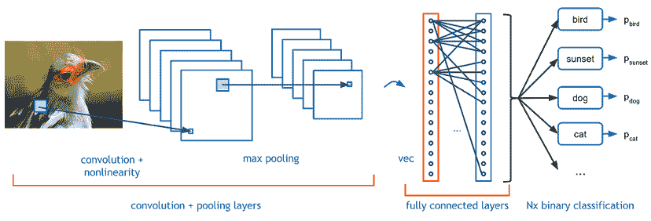
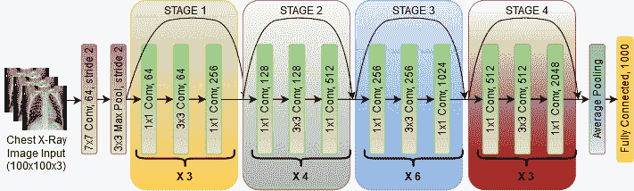
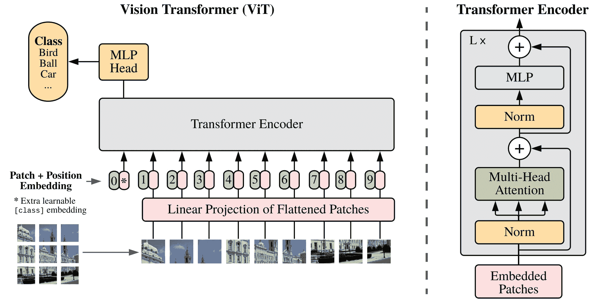
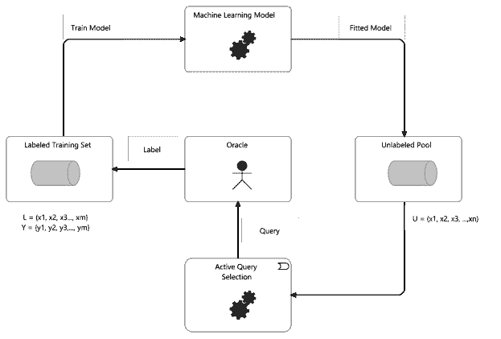
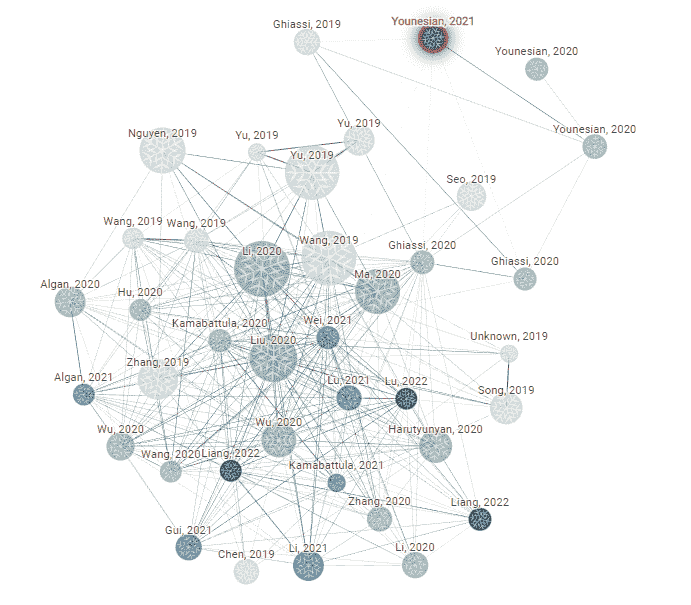
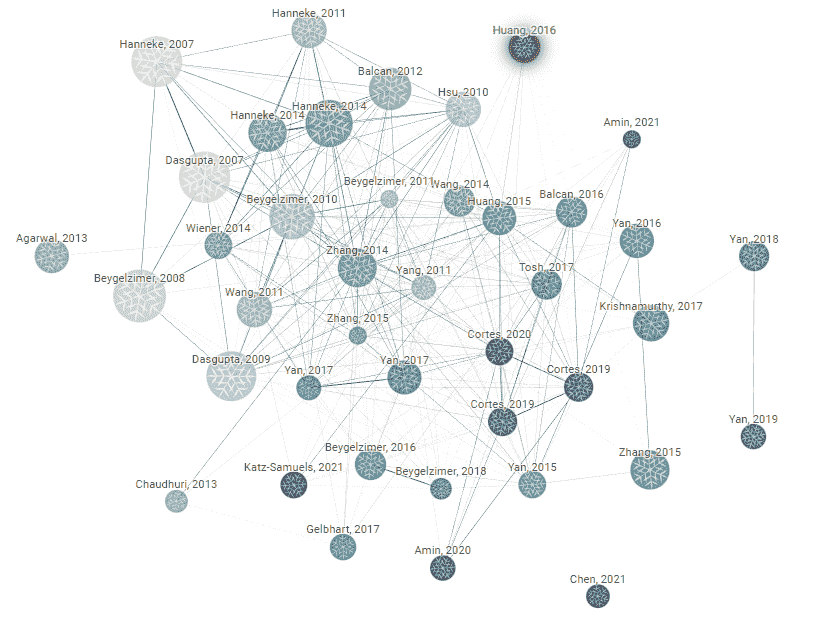
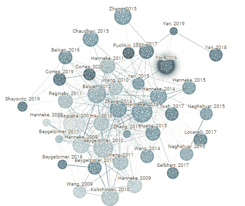
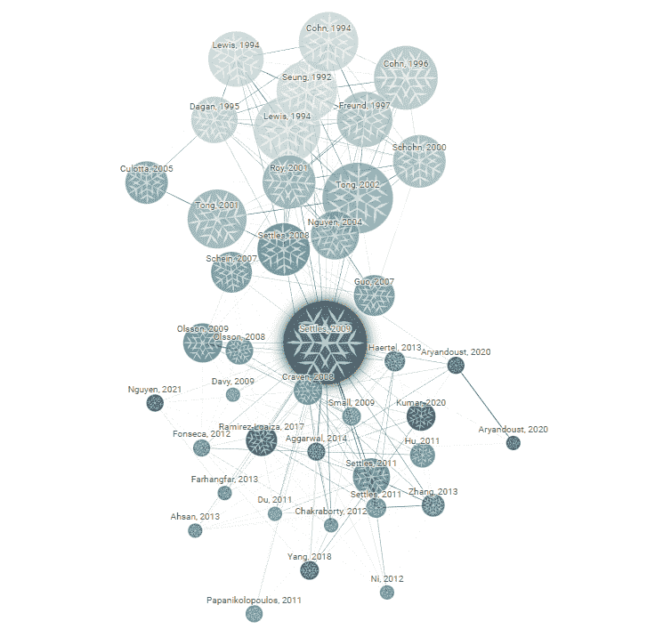

<!--yml

分类：未分类

日期：2024-09-06 19:41:25

-->

# [2302.11075] 标签噪声存在下的深度主动学习：综述

> 来源：[`ar5iv.labs.arxiv.org/html/2302.11075`](https://ar5iv.labs.arxiv.org/html/2302.11075)

# 标签噪声存在下的深度主动学习：综述

[![[未标注图像]](img/8bd0f2a4e588027ad9558380fab4a30d.png) 莫塞利·莫特索赫利](https://orcid.org/0000-0002-9191-0565)

信息与计算机科学系

夏威夷大学马诺阿分校

夏威夷檀香山 96822

moselim@hawaii.edu

\And[![[未标注图像]](img/8bd0f2a4e588027ad9558380fab4a30d.png) 京任·贝克](https://orcid.org/0000-0000-0000-0000)

信息与计算机科学系

夏威夷大学马诺阿分校

夏威夷檀香山 96822

kyungim@hawaii.edu

###### 摘要

深度主动学习作为一种在预定义标签预算内训练深度学习模型的强大工具逐渐兴起。这些模型在离线设置下的表现已相当可比。然而，深度主动学习在处理含有噪声标签的分类数据集时面临重大挑战。在这篇文献综述中，我们讨论了在标签噪声存在下深度主动学习的现状，强调了独特的方法及其优缺点。鉴于视觉变换器在图像分类任务中的近期成功，我们提供了一个简要概述，并考虑了如何利用变换器层和注意力机制来增强查询到预言机的多样性、重要性和不确定性基础的选择。我们进一步建议探索对比学习方法，以获取良好的图像表示，这可以帮助在主动学习设置中选择高价值样本进行标注。我们还强调了需要为图像分类中标签噪声存在下的深度主动学习创建统一的基准和标准化数据集，以促进研究的可重复性。综述最后建议了该领域未来研究的方向。

*关键词* 主动学习  $\cdot$ 标签噪声  $\cdot$ 图像分类  $\cdot$ 视觉变换器

## 1 引言

机器学习算法是人工智能的一个子类，通过从数据中学习来执行预定义的任务，如分类、回归或聚类。在众多机器学习算法中，人工神经网络，特别是深度神经网络，在涉及复杂数据表示（如图像、文本和声音）的任务中表现尤为出色。这主要是因为如果你拥有足够大的数据集，你可以构建更广泛、更复杂的模型，而几乎没有过拟合的风险。虽然在理论上是这样，但实际应用中存在主要缺陷，如需要标注的训练示例，其成本因标注数据所需的时间、非常专业领域的高劳动成本或运行生成真实数据集的模拟的成本而非常高。解决方案是深度主动学习（DAL）算法，它们致力于让学习算法以迭代方式从较大的未标注数据集中挑选需要标注的数据示例，以这种方式实现：(1) 较小的标注训练集，(2) 代表底层数据分布的数据集，从而得到近似最优的学习者，(3) 不超过标注预算的数据标注方案。

虽然这对于大多数使用场景效果良好，但实际世界中的数据集标注存在固有的标签噪声，这可能是由于各种因素，例如冗余观察被标注为不同的标签、最佳人工专家分类性能较低，或使用像 Mechanical Turk 这样的自动标注软件。这对这些深度主动学习（DAL）算法的性能产生了不利影响，而现有的 DAL 文献大多数集中在无噪声的设置中。我们探讨了在标签噪声存在的情况下使用 DAL 算法的问题。我们特别感兴趣的是在图像分类领域，使用不同的深度表示学习框架，如卷积神经网络（CNNs）和视觉变换器网络。

在 2 节中，我们简要讨论了深度学习及其在图像分类中使用的架构。3 节介绍了主动学习的主要思想以及数据集中存在噪声标签时出现的问题。4 节详细介绍了用于图像分类任务的主动学习常用数据集以及评估指标。5 节则是对具有标签噪声的图像分类任务中主动学习文献的详细分析。最后，我们探讨了在标签噪声下视觉任务中的 DAL 未来研究的可能方向。

## 2 深度学习

深度学习（DL）是指使用具有多个隐藏层的人工神经网络（ANNs）（Ivakhnenko 和 Lapa (1965)），以近似已知或未知的函数。多层神经网络建立在 1958 年罗森布拉特（Rosenblatt (1958)）介绍的感知器基础上。多年来，开发了不同领域特定的 DL 架构，以增强从不同数据模态中学习到的表示的质量。早期的研究集中在改进优化、自定义层和连接、激活函数、损失函数以及多层感知器的超参数调整技术，以提高在不同数据模态上的性能。对于表格数据，基于树的集成学习算法如随机森林（Breiman (2001)）、XGBoost（Chen 和 Guestrin (2016)）和 CatBoost（Prokhorenkova 等 (2018)）由于其优越的性能和资源效率而优于 DL。对表格数据有趣的神经网络适配器的非详尽选择包括 Schäfl 等 (2022)；Roman 等 (2022)；Popov 等 (2020)；Arik 和 Pfister (2021)；Baohua 等 (2019)。在自然语言处理领域，早期的工作涉及在无监督环境下使用浅层神经网络学习词和句子的表示（Pennington 等 (2014)；Novák 等 (2020)；Grave 等 (2018)）。直到广泛采用基于注意力的转换器语言模型（Vaswani 等 (2017)；See 等 (2017)），词和句子级别的嵌入被输入到具有递归连接的 DL 模型中，如长短期记忆（LSTM）网络（Hochreiter 和 Schmidhuber (1997)），以在下游文本分类、句子完成、命名实体识别或摘要任务中取得最先进的结果。对于非时间序列视觉任务，如图像分类、对象检测、分割和姿势估计（Artacho 和 Savakis (2020)），基于 CNN 的架构具有专门的输出层和大量的训练数据仍然是最广泛采用的方法。在这些复杂任务中，数据注释过程面临不同的挑战，这些挑战引入了不同程度的标签噪声。

虽然本节讨论的深度学习方法已经应用于其他监督学习视觉任务，如检测和分割，但我们在本节中重点关注图像分类的方法。我们简要概述了在视觉任务中取得巨大进展的**卷积神经网络（CNN）**。然后，我们突出了更复杂的 CNN 在图像分类中的应用，最后探索了有关最先进的基于空间注意力的模型（视觉变换器）的文献，涉及图像分类（Kolesnikov et al. (2021)）。

### 2.1 卷积神经网络

卷积神经网络由**Yann Lecun**和**Yashua Bengio**提出，是对训练多层神经网络在空间数据上的人工特征提取的改进（Lecun et al. (1998)）。使用反向传播训练完全连接的前馈神经网络（FFNN）用于计算机视觉任务的关键缺陷在于效率和变换（旋转、平移）不变性。使用标准输入神经元处理高维图像数据既复杂又低效。考虑到低分辨率图像数据集通常为 $28\times 28$，初始输入层使用 FFNN 将包含 $784$ 个神经元。如果随后的隐藏层只有 $100$ 个神经元，则 2 层完全连接的网络立即有超过 $78400$ 的权重和偏置项连接这两层。网络的权重存储在高维矩阵中，前向和反向传递中的信息流是通过矩阵运算完成的。使用 FFNN 对高分辨率图像进行复杂的图像到类别映射的准确逼近所需的输入神经元数量和隐藏层深度非常大。

图 1：[来源：[标准 CNN](https://towardsdatascience.com/covolutional-neural-network-cb0883dd6529)]。CNN 用于将图像分类到鸟类、日落、狗、猫以及更多常见物体中的一个类别。

CNN 特别擅长处理图像数据，主要有三个原因；首先，卷积操作使用滑动滤波器来识别和突出像素之间的局部关系，这些关系代表了重要特征。通过这种方式，我们隐式捕捉表达线条、边缘和角点的特征。其次，在 CNN 中，输入图像不会像使用 FFNN 时那样被展平为一个数组。这意味着像素在网格格式中的相对位置被保留，因此我们不会因为像素的重新排列而丢失信息。最后，在 CNN 中，滤波器具有自己的权重，但相同的滤波器被用来滑过图像，这意味着学到的特征对图像上补丁的位置是不变的，因为卷积操作学习的是像素之间的局部关系。此外，这样 CNN 能够使用比考虑像素在图像上的绝对位置和捕获位置编码时更少的权重。图 1 描述了一个简单的 CNN，包括卷积、池化和全连接层，并具有用于图像分类的非线性激活函数。

更高级的 CNN 架构已被引入，这些架构大多相似，具有多个卷积和池化块（早期层捕捉低级特征，更深层捕捉高级特征）。其中最著名的有 GoogLeNet Szegedy 等人 (2015)，VGG Simonyan 和 Zisserman (2015)，ResNet He 等人 (2016)，DenseNet Huang 等人 (2017) 和 EfficientNet M. Tan (2019)。例如，ResNet 如图 2 所示，展示了残差连接（也称为跳跃连接）的概念。残差连接将一层的输入直接传递到下一个卷积块，以便为后续层提供较低级的上下文，从而对抗非常深的网络中的梯度消失问题。另一方面，DenseNet 具有一个密集的构建块，其中块中的所有层彼此直接连接，允许在网络中更有效地重用特征。此外，通过所有层的连接，产生了正则化效果，使网络不会学习冗余的表示，从而对抗过拟合。

图 2：Resnet50 架构具有不同滤波器大小的卷积块和最大池化。残差连接作为记忆单元，弓形架设在块上方，将初始信息传递到最终层 He 等人 (2016)。

不同的层通过非线性激活函数连接，如流行的 ReLU 和 Elu Nair 和 Hinton (2010); Clevert 等人 (2016)。CNN 已经是过去十年大部分时间内计算机视觉基准的主导方法，主要由于其从图像中提取有意义的空间特征的能力。推动这一发展的主要因素按重要性排序是：大规模标注训练数据集的可用性、计算硬件的进步，以及训练深度神经网络（DNN）时计算成本的降低。在 ImageNet 之后 Jia 等人 (2009)，基于 CNN 的模型在非常大的标注数据集上进行训练，并被用于大多数不同视觉任务的最先进方法中的特征提取和预训练步骤。

### 2.2 视觉变换器

在语言领域的全变换器模型之前，最好的 LSTM 模型使用低维向量表示来将信息从编码器网络传递到解码器网络，同时使用注意力机制。在这种情况下，注意力用于学习输入序列中哪些部分在预测输出的不同部分时最为重要。在原始论文“注意力是你需要的一切” Vaswani 等人 (2017) 中，Vaswani 等人展示了长时间依赖关系可以在无需递归的情况下进行学习。变换器网络中的三个基本组件是词的位置信息编码、注意力和自注意力机制。输入和输出令牌的位置信息编码通过根据令牌/词在输入和输出序列中的相对位置分配整数值来实现。与 LSTM 不同，学习词的进展和输入输出词之间关系的工作是由网络隐式完成的，而不是通过设计具有递归单元和顺序处理的网络。自注意力使得在足够大的文本集合下，通过掩蔽令牌并让网络学习任何给定输入序列中缺失的词，从而能够学习大多数语言的良好表示。这些学习到的表示然后用于下游任务，尽管标记数据较少。由于变换器不按顺序处理输入令牌，因此它们非常适合并行 GPU 训练。

图 3：视觉变换器架构显示了一个输入图像被分割成 14 x 14 的块，并线性投影到标准变换器输入空间。图像最右侧显示了标准变换器块的组件，包括多头注意力机制 Kolesnikov 等人 (2021)。

像大多数伟大的创新一样，变压器的基本思想已经被纳入到 CNN 中，如 Wortsman 等人（2022）；Zihang 等人（2021）；Srinivas1 等人（2021），在某些情况下，完全取代了 CNN，例如 Touvron 等人（2020）；Liu 等人（2021）；Chen 等人（2022），在各种计算机视觉基准测试中取得了最先进的结果。在 Kolesnikov 等人（2021）中，Kolesnikov 等人展示了最早超越最先进 CNN 的视觉变压器（ViT），在大多数图像分类基准测试中表现优异。他们展示了在大数据集的情况下，ViT 实现了更高的分类准确率，更具计算效率，并且与 ResNet 和 EfficientNet 等 CNN 相比，没有饱和迹象。自然语言处理（NLP）变压器和视觉变压器之间的主要区别在于输入的编码方式。对于视觉变压器，它们从图像中提取 14 乘 14 的图块，将其展平，并应用线性投影到一个高维空间，这个空间与 NLP 变压器的原始输入空间相等。图块的空间邻近关系被隐式地留给变压器通过以下方式学习：它们为每个图块的线性投影添加一个可训练的 1D 位置编码向量。位置表示按图块的顺序组织，从图像的左上角到右下角，如图 3 所示。除了输入编码，ViT 的其余架构类似于用于分类任务的语言变压器。

论文有趣地表明，通过注意力机制，变换器层能够像深度卷积神经网络（CNNs）一样，随着深度的增加学习相同的低到高层特征。其他在没有标签噪声的情况下用于图像分类的 ViTs 显著实现包括 Yu 等人（2022）；Chen 等人（2022）；Liu 等人（2021）。ViTs 被纳入此综述，并在第六部分中进一步讨论，因为我们认为它们是未来研究的一个非常重要的领域。这是因为它们正逐渐成为主导的多模态方法，但在将其应用于 DAL（深度主动学习）和带标签噪声的图像分类方面，相关工作非常有限。这些模型以模块化的方式设计，可以轻松学习语言和图像表示，适用于图像描述、分类、场景文本理解和视觉问答 Yu 等人（2022）。这尤其有趣，因为作者提出了联合对比损失（图像到文本和文本到图像）、图像分类损失和图像到语言描述损失，允许高效训练一个单一网络来完成多个任务，并将学习到的表示转移到不同的下游任务和数据集。

在下一节中，将描述机器学习的主动学习（AL）框架，包括在干净标签情况下，针对标注预算训练深度学习模型的关键方法，最后，为标签噪声和处理噪声标签的文献奠定基础。

## 3 主动学习

在大多数监督式机器学习使用案例中，初始数据收集和标注的成本，包括金钱和时间，都是不可避免的。在某些领域和任务中，由于各种原因，数据集本质上很难进行标注，这意味着即使是专家级的人类标注员也需要更多的时间来为每个样本分配标签。在其他情况下，雇佣专家标注员的成本很高，例如在医疗成像中 Górriz et al. (2017); Konyushkova et al. (2017)，或者生产样本的成本很高，例如在实验物理学中，观察结果来自非常昂贵的望远镜或粒子加速器。这给机器学习系统在实际应用中带来了挑战，特别是随着未标记数据集规模的增加。主动学习是一种机器学习范式，如图 4 所示，它试图通过让学习算法迭代地从更大的未标记数据集$U^{n}$（大小为$n:m\leq n$）中选择一个子集$L^{m}$（大小为$m$），由 oracle $O$进行标注以供训练，来解决这个问题。主动学习的口号可以表述为：在显著较小的标注数据集上训练机器学习模型，测试性能几乎没有下降，同时保持在预定的标注预算$B$之内。

图 4：标准主动学习框架的五个主要组成部分。这些组成部分可能会根据要学习的数据复杂性和可用资源的不同而有所变化。大多数主动学习的研究工作集中在查询选择算法的开发上，这些算法能够生成高度信息化且多样的数据样本，供 oracle 进行标注。

深度主动学习算法（DAL），虽然有重叠，但可以大致分为基于池的方法、基于密度的方法和数据扩展方法。基于池的方法从未标记的池中选择样本进行标记，基于当前训练模型在样本$U^{n}$上的不确定性、用于训练当前模型的标记集$L^{m}$中样本的多样性或两者的结合 Lewis 和 Gale (1994)；McCallum 和 Nigam (1998)；C.Shui 等 (2020)。基于池的方法在形成和实现上比较简单，但对于大规模的高维数据集（如图像）可能计算成本高昂。由于基于池的方法主要依赖于对整个未标记数据集进行的度量来选择新的候选样本，这对需要低延迟的应用并不理想。基于密度的方法旨在捕捉基础数据分布的关键特征。这是通过选择一个足够代表整个数据集的核心样本集进行标记来完成的，从而实现良好的泛化 Sener 和 Savarese (2018)；Phillips 和 Tai (2018)；Phillips (2016)。更近期的文献将池和密度基方法结合起来，以利用每种方法的优点。这些方法因此能够训练出高效且稳健的模型，这些模型在包含多样化样本的核心集合上进行训练，从而最大化对象类别之间的间隔 Har-Peled 等 (2007)；Geifman 和 El-Yaniv (2017)。这种方法中的一些使用了在图像数据上训练自监督任务得到的隐藏层表示，而不是原始像素。这些方法包括图像方向的预训练、随机($90,180,270,360)\degree$ 旋转分类或自监督对比学习，其目标是图像中相邻像素的任意补丁 Chen 等 (2020)；Du 等 (2021)；Wang 等 (2021a)。数据扩展方法旨在通过生成合理现实的合成数据样本来扩展训练数据集，以增强学习算法在真实测试数据集上的表现 Chen 等 (2020)。自其引入以来，生成对抗网络（GANs）及其变体 Goodfellow 等 (2014)；Gonog 和 Zhou (2019)；Sinha 等 (2019a) 一直是生成合成数据的首选方法。然而，GANs 的训练不稳定，样本往往不现实，而且很难评估这些样本的质量 Barnett (2018)；Mescheder 等 (2018)。

### 3.1 标签噪声

标签噪声指的是数据标签被破坏的情况，无论是有意还是无意，因此我们无法对其正确性保持$100\%$的信心。标签噪声与特征噪声不同，后者通常指的是向特征值中添加高斯噪声。标签噪声对学习算法的负面影响比特征噪声更大，而且更难处理，参考 Chicheng 和 Kamalika (2015)；Wei 等人 (2022)；Algan 和 Ulusoy (2021)；Cordeiro 和 Carneiro (2020)。标签噪声是数据收集和处理生命周期中的固有问题。大多数现实世界的数据集都受到标签噪声源的影响，这取决于数据如何收集、整理和存储。实践中的标签噪声主要来源于 (1) 不正确的众包标签，其中注释者是非专家，如 Worker (2022) 和 Amazon (2022) 的情况，(2) 由于数据复杂性导致的不正确专家注释，如在医学领域中常见 Górriz 等人 (2017)，(3) 自动标签系统（如 Scale.ai (2022)）和网页爬虫软件引入的标签错误，(4) 多个专家或非专家对同一样本进行不同标注所引入的噪声。

学习噪声标签尤其困难，因为代价函数通常比特征提取层复杂得多。标签噪声可以被分组，通常基于对噪声生成分布的了解来处理（Nagarajan 等人 (2013)）。一些数据集包含来自已知且可量化生成分布的标签噪声，而在其他情况下，对于噪声转换矩阵的了解过少或完全不了解。标签噪声可以是类无关的或类相关的。类无关标签噪声是最容易生成的。生成过程可以总结为：对于每个样本，类标签以固定概率 $1/N$ 被替换为随机类标签，其中 $N$ 是类别的数量（Patrinin 等人 (2017)）。类相关标签噪声通常是专家人工标注的结果。它是由于非常相似或不可区分的类偶尔被错误标记（Han 等人 (2018a)）。例如，真正的大型猫偶尔被标记为小狗，反之亦然。训练深度学习模型的常用方法包括首先过滤掉具有高概率为噪声的样本，然后在一个带有可信标签的数据集上进行迭代训练，直到达到阈值。大多数文献中的过滤过程涉及训练两个不同的神经网络，使用自定义损失，并监控它们在预测上意见不一致的样本。这种方法效果良好，因为已证明这些网络首先训练在较强的信号上，这在一个主要由干净标签组成的数据集中是常见的。这种方法的代表性方法包括非主动学习方式训练的 Decoupling（Malach 和 Shalev-Shwartz (2017)）和 Co-teaching（Han 等人 (2018b)）。这两种方法的主要实现差异在于两个网络权重的更新方式。Decoupling 基于网络预测错误更新每个网络的权重，而 Co-teaching 则交叉更新权重，并使用另一个网络的错误信号。与 Decoupling 不同，Co-teaching 通过使网络能够查看彼此的隐藏状态，明确解决了噪声标签问题，同时减少了每个网络过拟合噪声输入的风险。

我们介绍了深度学习、主动学习和带有标签噪声的学习。有关进一步阅读，我们建议参考 Algan 和 Ulusoy (2021) 的综述论文；Ren 等人 (2020) 关于带有噪声标签的图像分类，以及 DAL 关于干净标签的论文。带有噪声标签的 DAL 方法在第五部分中介绍。

## 4 评估数据集和指标

在本节中，我们介绍了在主动学习和带标签噪声学习中常用的数据集和评估指标。关于零标签噪声数据集的最先进的 DAL 方法包括 Górriz 等（2017）；Konyushkova 等（2017）；Sener 和 Savarese（2018）；Phillips 和 Tai（2018）；Phillips（2016）。提供了与 AL 和 DL 在标签噪声中的相关数据集及其元数据。我们通过探讨常见基准数据集上 DAL 对噪声数据的评估指标来结束本节。

### 4.1 数据集

如前所述，DL 算法的迅猛发展在很大程度上归因于大规模标记训练数据集的可用性。在图像分类中，最著名的数据集包括 MNIST LeCun 等（2010）、ImageNet Jia 等（2009）、CIFAR-100 Krizhevsky 等（2009）、CALTECH-101 Fei-Fei 等（2004）、SVHN Netzer 等（2011）以及 MS COCO Lin 等（2014）。公共评估数据集促进了对预定义任务的算法集中评估。这些数据集可以从其网站或不同的 DL 框架（如 PyTorch、TensorFlow、Jax 和 Theano）中下载。最佳性能的模型及其在这些数据集上的结果通常会在公共排行榜上展示。在对图像分类任务的 DAL 数据集进行评估时，标准做法是使用与全数据集图像分类相同的数据集，但我们会监控在预定义数量的标记示例后的性能提升。虽然在实践中，所有标签可能不会像使用完全标记的数据集那样一次性可用，但在这些完整数据集上应用 DAL 算法的训练周期实质上模拟了从一个预设预算的实时未标记数据流中获取标签的过程。

数据集在大小、类别数量以及区分类别的复杂性方面差异很大。在所有常用的 AL 数据集中，MNIST 最简单，只有 10 个类别的手写数字，单通道$28\times 28$图像。CALTECH-101、ImageNet 和 CIFAR-100 是更高分辨率的图像数据集。这些数据集包含比 MNIST 更多的类别，其中一些类别较难区分。在被动学习中，模型会看到每个类别的所有可用训练样本，但在 DAL 设置中，根据查询算法和类别的稀缺程度，算法可能永远无法看到某些欠采样类别的三分之一以上的样本。这导致验证性能差。

大规模高分辨率图像数据集在 DAL 算法中也会引发计算问题，这些算法根据与所有其他未标记图像的距离度量来选择多样化的样本。这在时间和硬件资源需求上都是极其昂贵的。因此，这些数据集上报告的 DAL 算法性能低于非主动学习算法，因为研究人员对在大数据集上测试复杂的 DAL 算法的动力较低。表格 1 包含了一个常用的图像分类数据集的非详尽列表，用于主动学习和带有标签噪声的学习。

| 数据集 | 年份 | 样本数量 | 类别 | DAL 论文 | 标签噪声论文 |
| --- | --- | --- | --- | --- | --- |
| ImageNet | 2012 | 1,431,167 | 1000 | Yi 等 (2022) | Hataya 和 Nakayama (2018) |
| SVHN | 2011 | 660,000 | 10 | Gupta 等 (2020); Wang 等 (2021b); Sener 和 Savarese (2018) | Gupta 等 (2020); Xia 等 (2020) |
| MNIST | 2010 | 70,000 | 10 | Li 等 (2022); Haußmann 等 (2019); Gupta 等 (2020) | Younesian 等 (2020); Gupta 等 (2020) |
| CIFAR(10,100) | 2009 | 60,000 | (10,100) | Du 等 (2021); Younesian 等 (2020); Wei 等 (2022); Li 等 (2022); Shui 等 (2020); Haußmann 等 (2019); Gupta 等 (2020); Younesian 等 (2021) | Younesian 等 (2020); Han 等 (2018a); Hataya 和 Nakayama (2018); Gupta 等 (2020); Younesian 等 (2021) |
| Caltech101 | 2004 | 9,000 | 101 | Li 等 (2022); Yi 等 (2022) | - |

表 1：常用于深度主动学习和带有噪声标签的 DL 训练的图像分类数据集

ImageNet 和 SVHN 作为这些数据集中较大的数据集，并不适合 DAL，因为在大数据集上训练单个 DL 模型计算开销大，耗时也很长。由于 DAL 算法的迭代特性，计算复杂度更高。在 ImageNet 或 SVHN 数据集上反复训练大型模型非常耗时。这在文献中反映为作者不愿意使用这些大型数据集进行 DAL 分类，而倾向于使用相对较小的数据集，如 CALTECH-101 和 CIFAR-100。

处理噪声标签的算法开发和训练遵循两种路径之一：使用在第 3.1 节中列出的一个或多个噪声源引入噪声标签的数据集，或者使用通过扰动现有可信标签而注入可测量标签噪声的无噪声数据集。在现有文献中，常用于图像分类的相同数据集（MNIST、CIFAR-100、CALTECH-100）也用于带噪声标签的分类，标签交换的概率是预先确定的。这个概率也叫做噪声率，噪声率越高，数据集在噪声注入后变得越腐蚀。在文献中，通常在训练前注入$30\%-60\%$的随机对称标签噪声，同时保持一个不含标签噪声的测试集。

像 ImageNet 这样具有大量类别（1000）的数据集通常也不适合用于评估解决标签噪声下学习的 DAL 方法。原因在于，类别标签越多，数据集创建时发生类别相关标记错误的可能性越高。注入到数据集中的有意噪声是类别无关的，并且是可测量的，而类别相关噪声可能在数据收集和标注过程中固有。类别相关标签噪声使得训练深度学习模型变得更加困难，并且对用于评估的测试集标签的正确性信心较低。

### 4.2 评估指标

针对带有噪声标签的 DAL 算法的通用评估方法与用于图像分类的标准数据集相同。Top-1 准确率是最常用的度量指标。在现有的大多数工作中，对底层类别分布的考虑并不多，因此探索类别不平衡如何在标签噪声存在的情况下影响 DAL 算法将是有趣的。由于 DAL 还关注预算下的性能，因此测量预算效率是有意义的，这是一种在文献中常常未被充分记录的度量。

鉴于主动学习涉及对每批接收的标签训练模型几次，显然 DAL 算法的计算成本应该是一个重要考虑因素。在 Yoo 等人（2017）的研究中，Yoo 等人提议使用小型网络进行查询选择，以便重新训练和标记周期更快。一旦标签预算耗尽，就使用获得的标签训练一个更大、更强大的网络。尽管这种方法在时间至关重要的情况下非常有用，但它有一个重大缺点。弱点在于，使用较弱的学习者进行样本选择可能会导致样本多样性降低，因为较弱的学习者在理解特征空间中类别之间的边界时表现不佳。

在 Sinha 等人（2019b）的研究中，Signha 等人展示了在 DAL 设置中使用迁移学习以快速提取有用表示的方法。他们表明，使用大型预训练模型并仅对 DAL 任务进行微调可以在标记样本显著减少的情况下取得良好结果。这意味着，在相同预算下，他们的方法比从头开始训练的模型具有更高的标签效率。这也意味着，对于给定的目标性能，他们需要较少的计算资源和时间来适应目标，通过利用良好的预训练模型权重。Settles 的工作（2009）包含了对主动学习算法计算成本的全面调查。这项工作的主要发现是，成本主要受数据集规模的影响，包括样本数量和每个样本的大小。Settles 还指出，查询选择算法的复杂性以及每批样本的数量是 DAL 总体计算成本中的重要因素。在带有标签噪声的 DAL 情况下，我们对潜在标签噪声的良好理解是至关重要的，以确保测试集保持干净。虽然这在开发 DAL 算法时在知名数据集上效果良好，但在实践中如何保证测试集的完整性仍然不清楚。如果无法保证测试标签的正确性，评估方法如 top-1 精度、精确度和召回率无法提供对网络泛化性能的可靠衡量。

在本节中，我们探讨了在比较 DAL 算法时常用的数据集和评估指标，特别是在标签噪声的情况下。下一节是本工作的主要重点。我们探讨了在主动学习框架中利用深度神经网络的多样性的方法，其中标签预算是一个重要指标，同时我们面临着标签噪声的挑战。

## 5 种用于噪声标签的深度主动学习算法

在本节中，我们关注本文的主要贡献：探讨在标签噪声存在的情况下用于图像分类的 DAL 算法文献。值得指出的是，尽管在离线设置中处理标签噪声的理论方法丰富，但针对主动学习算法的研究非常有限。通过建模潜在生成分布和过滤训练集中噪声标签样本来实现更好性能的方法寥寥无几。我们预见到在这一领域将会有大量的工作投入，并期待了解迭代过程如何最佳地近似噪声标签分布。我们还对了解低样本数量如何影响标签噪声分布感兴趣。这些想法在文献中尚未被探讨。

本节的方法主要独立于噪声分布，通过使用定制的模型架构、损失函数或训练程序来寻求噪声鲁棒的主动训练。在 Gupta 等人(2020)的研究中，Gupta 等人建议使用标准样本多样性和重要性查询策略，并辅以模型对样本的置信度分数。他们认为，DNN 通常在训练的早期对类别之间的决策边界不确定。带有标签噪声的训练会加剧这个问题，因为基于错误标记的样本可能会形成临时和虚构的边界，通过多样性采样，这些边界可能会传播到影响模型不确定性和样本重要性的关键查询批次中。作者使用了 Gal 等人(2017)提出的 BALD 分数（不要与 Cao 和 Tsang(2021)的论文混淆）作为重要性分数，以确保每批次标记样本的信息内容是最佳的，并且能够很好地代表整个数据集。样本选择查询中模型不确定性的纳入，确保标记批次将包括当前模型非常不确定的样本，并且这些样本在假设标签准确度令人满意的情况下，能够改善在标签噪声下的整个 DAL 周期。

包含高度不确定的样本只是他们在噪声 oracle 下稳健学习方法新颖性的半部分。他们在网络中加入了一个去噪层。去噪层的解释如下：将原始分类器的 softmax 输出输入到去噪层，模型在去噪层上进行训练，去噪层表示在给定真实标签的情况下预测特定标签的非零概率。这个最终的去噪层的权重，与正常的最终 softmax 输出不同，被限制以确保在训练期间噪声标签的影响很小。在测试时，使用倒数第二层的输出而不是去噪层进行预测。通过这种方式，去噪层作为一个严格的老师，为学生提供了一个噪声鲁棒的模型，用于测试和部署。

Gupta 等人展示了他们的方法在无噪声设置下，表现与常见的基线 DAL 方法类似，例如原始的 BALD Cao 和 Tsang (2021)、核心集、基于熵的选择和随机样本选择，在 MNIST、CIFAR10 和 SVHN 数据集上。我们将这些结果完全归因于在选择样本时加入模型不确定性以增强多样性和信息增益。我们认为，文中描述的去噪层如果 oracle 仅提供干净标签则没有意义，因此无噪声设置下的结果更准确地表述为：“在无噪声设置中，添加去噪层没有性能损失或提升”。在 $10\%$ 和 $30\%$ 标签噪声下，他们的方法在所有三个数据集上都优于报告的标准基准，证明了他们去噪机制的有效性。虽然这些结果很好，但它们未能展示该方法如何与为噪声标签量身定制的类似最先进的 DAL 方法进行比较，以及将相同的去噪层添加到仅基于熵或随机样本选择的 DAL ResNets 上与他们的方法进行比较。该论文还缺乏对训练设置的重要细节，如使用的硬件、确切的深度学习架构、是否使用了预训练权重以及训练周期的数量，这些都是重现性的关键。

与 Gupta 等人 (2020) 类似，Younesian 等人 (2020) 引入了一个用于训练噪声标签的 DAL 框架（DuoLab），利用弱和强神谕。CIFAR10 和 CIFAR100 被用于训练和测试 CNN，标签噪声分别为 $30\%$ 和 $60\%$。他们采用了类似于 Gupta 等人 (2020) 的查询选择标准，即使用信息增益和不确定性。弱神谕和强神谕指的是人类标注者在泛化能力和标注质量上的固有差异。假设弱神谕更便宜，更容易产生错误标签，而强神谕则相对较少产生错误标签，因此该方法的创新性在于现实世界中总是需要减少支付给神谕的标注费用。然而，在他们的工作中，使用两个神谕似乎并未影响 DAL 分类器的整体性能，而是提供了预算补贴。

处理噪声标签时，与其增强模型的鲁棒性，Younesian 等人选择通过过滤掉怀疑存在噪声标签的样本来解决问题。他们的 DAL 方法从一个初始标记的数据集开始训练分类器，但他们偏离了传统的使用随机样本批次进行初始训练的方法。他们的整体方法依赖于一个关键且可能存在缺陷的假设，即存在一个小而干净的训练样本批次，可以用来最初训练模型。虽然在实践中我们可以乐观地假设有可能推动物理数据和标签的边界，从而使初始的干净样本集可用，但该论文在无法以“100%”的确定性说出来自神谕的具体标签是否正确的情况下，缺乏最低限度的理论保证。如果我们最初假设某些标签是“100%”正确的，论文没有明确说明在神谕的噪声率高达 $60\%$ 的情况下，如何验证这些标签的正确性。一旦模型在初始干净样本上训练完成，模型将预测未标记池中所有样本的类别，并使用模型在前 2 个类别上的置信度分数来决定样本是否为噪声。他们测量每个样本的前 2 个类别概率的差异，并将前 k 个 margin 最低的样本声明为潜在噪声，因此不适合用来训练网络。

很明显，这种方法会导致一定数量的假阳性和假阴性，并可能影响模型在难以区分的类别上的整体性能。另一个问题是，训练于大数据集的非常小子集上的模型可能在顶级类别预测的置信度很高，但如果训练时几乎没有看到该类别的样本，它的预测可能完全错误。他们通过在所有干净样本用尽后重新使用噪声标签来应对这一问题。噪声样本根据训练模型对每个噪声样本的倒数第二层表示进行聚类。然后，按信息量对每个聚类中的样本进行排名，每个聚类中的前$K$个样本被选中用于进一步训练模型。这些样本的训练批次并非随机的，而是有序的，使得最具信息量的样本在首批训练中，信息量最少的样本在最后一批中。尚不清楚这一过程如何绕过对实际真实标签的需求，以及如何使得在噪声标签上进行的进一步训练不会对最初在干净标签上训练的模型性能产生负面影响。报告的测试准确率结果表明，DuoLab 在 CIFAR 10 和 100 上的表现优于噪声鲁棒基线，标签噪声为$30\%$。

在 Younesian 等人（2021）的研究中，Younesian 等人提出了 QActor，这种方法沿用了他们在 Younesian 等人（2020）的早期工作中的相同思路：识别和重用可能噪声标签。除此之外，本文介绍了一种噪声感知的信息量度，并首次展示了如何动态分配每个查询的标记预算，以相比于将预算均等分配到查询周期中的常规方法，能够带来更好的性能。本文假设有一小部分干净的初始训练数据和干净的测试数据是 readily available 的。DAL 算法决定哪些样本应发送给 oracle 进行标记。他们还将决定每次迭代中符合选择标准的样本数量以及标记的任务交给 DAL 算法。在每次迭代中，一批根据熵测量为高度信息量的样本被送到 oracle 进行标记，然后将标签与当前模型的预测进行比较。那些存在分歧的样本被送到可疑数据集合中。这些样本随后根据信息量进行排名，并重新发送给 oracle 进行重新标记，同时保留之前分配的标签。作者认为，对模型不确定且可能被 oracle 错误标记的样本进行重新标记能带来模型性能的最大提升，因为这些样本可能是易于混淆的类别样本。

在黄等人（2016）的研究中，黄等人以一种不同于此前大多数讨论的工作的方法处理了具有神谕噪声的 DAL。他们的复杂性分析证明了在神谕启示下，DAL 是可能和可行的。他们解释说，实证证据表明，神谕通常会延迟对不确定样本提供标签，直到更多相关样本呈现给神谕，此时它们会有启示，并能为这些样本提供更有信心的标签。在从一个大型渔业数据集中手动标记 1000 张图像的经验基础上，我们同意作者的观点，即神谕的回避和启示是现实的考虑因素。论文中提到的一个有趣的想法是，为具有$N$类的分类问题增加一个可能的类别标签，使得神谕有$N+1$个可能的类别选择。这个类别标签可以是："我不知道" 或 "不确定"。添加这一选择可以减轻神谕在面对难以标记的样本图像时在两个或三个最可能的标签之间猜测的冲动，从而提高实际提供的类别标签的整体正确性。在一个理想的世界中，神谕必须是绝对真理的源泉，因此我们不关心神谕是否能正确猜测的情况。如果允许神谕提供对其猜测的信心度量，那么神谕的猜测将会更有用。

在他们的方法中，他们使用马尔可夫链来建模某个类别的顿悟何时发生，这在以前很难标记给 oracle。该工作的两个主要假设是：1）oracle 是诚实的，并且对他/她决定标记为“尚不确定”以外的样本 100%准确。2）鉴于 oracle 是诚实的，一旦发生顿悟，所有被避免的样本将会有正确的标签。对于这两个假设，作者进一步假设一旦发生顿悟，oracle 的标签分配将不会发生剧烈变化。虽然这些假设听起来合理，但值得指出的是，在现实世界中，一个时间受限的 oracle 优化其收益不太可能避免为他们不确定的样本分配标签。特别是如果他们早期了解到他们标记为“尚不确定”的样本总是会返回，要求更多的时间。假设 oracle 对他们标记的样本 100%准确也是非常不现实的，没有考虑到人类在标记方面的广泛能力。作者如果说明如何保证或测试顿悟后的 100% oracle 标签准确性会更有用。将这种方法与 Younesian 等人（2021, 2020）的工作进行比较，可以绘制出计算机与人类在标签噪声过滤中的参与谱。在一个极端，Huang 等人将 oracle 作为标签不确定性的唯一决策者，而在更混合的设置中，Younesian 等人结合当前训练的分类器的置信度评分与 oracle 的标签作为潜在噪声标签的过滤器。仅模型方法的噪声过滤使用了 Gupta 等人（2020）使用的前两类预测的置信度评分边际。在 Younesian 等人和 Huang 等人方法中，“不确定”的样本会被送回重新标记。

在 Amin 等人（2021）的研究中，Amin 等人提出了双重目的学习框架。尽管他们并未明确关注或解决标签噪声问题，但他们结合的 DAL 和弃权学习方法提供了对 DAL 和弃权复杂性的宝贵见解，这些是 Huang 等人（2016）未严格讨论的重要组成部分。这两个研究也有不同之处，Amin 等人调查了 DAL 和弃权设置的一般化界限，并有趣地发现，即使在无限标签预算和没有标签噪声的情况下，处于被动学习情况下的可观测一般化损失的上界也无法得到保证，尤其是当使用 oracle 弃权时。然而，作者没有提供其方法与最先进 DAL 算法的经验比较，也没有详细说明其独特的双重方法在应用于这些高性能算法时会如何影响性能。Yan 等人（2016）的工作是对 Amin 等人工作的更一般性方法，因为他们考虑了在不完美标注者下的 DAL，并允许弃权。Yan 等人进一步展示了在对决策边界的维度、弃权和接近决策边界的噪声率的严格假设下，他们的方法能够推广到类似 Amin 等人（2021）的算法的下界。他们工作的一个重要贡献是证明了他们的算法无需了解标签噪声率或弃权率。在标签噪声和弃权率在决策边界周围分布的限制下，他们的算法表现显著优于以前的方法。

## 6 结论与未来研究方向

总结文献： (1) 许多工作已经在离线环境中处理噪声标签的深度学习模型训练上完成。 (2) 在无标签噪声的情况下，关于深度主动学习（DAL）方法的文献也非常丰富。 (3) 尽管这是一个具有实际应用和财务影响的研究领域，但在深度主动学习和标签噪声交集处的工作非常有限。值得注意的是，视觉 Transformer（ViTs）的能力在深度主动学习中的应用还没有像在完全标注的图像分类数据集那样被充分探索，因此我们看到通过利用 ViTs 在图像分类任务中的独特特性来提升深度主动学习的巨大潜力。对 Transformer 层的探索以及如何利用注意力机制理解多样性、重要性和不确定性对我们特别吸引。在第三部分中，使用自监督预训练的工作展示了图像的良好低维表示。这些表示被证明能在主动学习框架中提供良好的核心样本集。进一步探索对比学习方法作为获得良好图像表示的手段非常重要，这些表示可以用于提高多样性、重要性和基于不确定性的查询选择，以便发送到标注的 oracle。

在处理噪声标签的深度主动学习（DAL）方面，第五部分中描述的 Younesian 等、Huang 等和 Gupta 等的工作代表了在深度主动学习中具有重要影响的方法和思想。在所有这些方法中，噪声的过滤得到了很好的解决，但有很多值得怀疑的假设。建立统一的深度主动学习和标签噪声基准及数据集将增加很多价值，并确保未来的方法符合对训练过程和 oracle 的现实假设。在所有解决此问题的方法中，仅使用了 CNNs，性能也只是与基线深度主动学习方法进行比较，而不是与最先进的深度主动学习方法进行更有说服力的比较。我们希望能够对使用 ViTs 处理标签噪声的深度主动学习方法进行相同的分析，并与最好的深度主动学习方法进行对比。这一点尤其重要，因为 ViTs 最近在图像分类中是最主流的架构选择。了解深度主动学习方法对噪声标签的关键假设如何影响结果，并在理论上建立收敛性和复杂性保证也至关重要。这意味着，仅通过实验来理解处理噪声标签的深度主动学习是不够的，还需要在理论层面上做一些工作来建立收敛性保证。

在所有现有领域文献中，据我们所知，oracle 没有收到反馈。探索 oracle 与模型之间的循环反馈环如何改善两者将非常有趣。我们直觉上假设，通过旋转或补丁预测等方式训练的对比学习模型，可以在没有实际问题领域标签的情况下训练，从而没有噪声，这样从这一步学到的表示可以用于在 oracle 可以弃权之前向其提出类似样本。通过这种方式，oracle 可能比在文献中列出的框架中更早地获得顿悟。我们还会考虑回答一个问题，即一个已知或未知噪声率的真实人类标注者是否能在这种设置下改善，并且改善的程度如何。

由于可重复性和鲁棒性是深度学习（DL）和主动学习（AL）持续发展的关键因素，我们有兴趣在存在标签噪声的情况下，对开箱即用的 DL 模型进行广泛的训练。这不仅确保研究人员了解不同模型在没有任何超参数调整的情况下的预期效果，还建立了特定于有标签噪声的 DAL 的基准。我们希望涵盖尽可能多的图像分类数据集，使用多种 CNN 和 ViT 基础模型、不同的 AL 算法、不同的噪声处理算法以及不同的损失函数。这对该领域至关重要，因为它鼓励对模式和训练条件作出清晰而简洁的陈述，并确保未来的方法在一个公平的环境中进行比较。

最后，一个关键的考虑因素是计算。在这一领域的大多数工作并未明确说明和讨论方法的计算复杂性。在一个日益关注降低碳足迹的世界中，我们需要能够在准确性之外评估噪声标签上的 DAL 方法的计算需求。如果考虑到近期关于训练大型语言模型的工作表明，在计算操作需求、模型性能、架构选择以及表示大小方面存在显著的权衡和收益，这将是一个有趣的研究方向。其中一些结果挑战了已建立的结论 Xiaoqi 等 (2020); Clark 等 (2020)。

## 参考文献

+   Ivakhnenko 和 Lapa [1965] G.V. Ivakhnenko 和 V.M. Lapa。《数据处理的组方法》。*自动化与遥控*，26(6):895–902，1965。

+   Rosenblatt [1958] F. Rosenblatt. 感知机: 一种用于信息存储和大脑组织的概率模型。发表于 *心理学评论*，第 65 卷，页码 386–408，1958 年。

+   Breiman [2001] L. Breiman. 随机森林。*机器学习期刊*，45:5–32，2001。doi:[10.1023/A:1010933404324](https://doi.org/10.1023/A:1010933404324)。

+   Chen and Guestrin [2016] T. Chen 和 C. Guestrin. Xgboost: 一种可扩展的树提升系统。发表于 *第 22 届 ACM SIGKDD 国际知识发现与数据挖掘大会*，页码 785–794，2016 年 8 月。doi:[10.1145/2939672.2939785](https://doi.org/10.1145/2939672.2939785)。

+   Prokhorenkova et al. [2018] L. Prokhorenkova, G. Gleb, A. Vorobev, A.V. Dorogush 和 A. Gulin. Catboost: 使用类别特征的无偏提升。发表于 S. Bengio, H. Wallach, H. Larochelle, K. Grauman, N. Cesa-Bianchi 和 R. Garnett 编辑的 *第 32 届国际神经信息处理系统大会论文集*，第 31 卷，页码 6639–6649。Curran Associates, Inc.，2018。

+   Schäfl et al. [2022] B. Schäfl, L. Gruber, A. Bitto-Nemling 和 S. Hochreiter. Hopular: 现代 Hopfield 网络用于表格数据。*ArXiv*，abs/2206.00664，2022。

+   Roman et al. [2022] L. Roman, C. Valeriia, S. Avi, B. Arpit, C. Bruss, G. Tom, W. Andrew 和 G. Micah. 深度表格模型的迁移学习。2022 年 6 月。doi:[10.48550/arXiv.2206.15306](https://doi.org/10.48550/arXiv.2206.15306)。

+   Popov et al. [2020] S. Popov, S. Morozov 和 A. Babenko. 用于表格数据深度学习的神经遗忘决策集。*ArXiv*，abs/1909.06312，2020。

+   Arik and Pfister [2021] S.O. Arik 和 T. Pfister. Tabnet: 具有注意力机制的可解释表格学习。发表于 *AAAI 人工智能会议论文集*，第 35 卷，页码 6679–6687，2021。doi:[10.1609/aaai.v35i8.16826](https://doi.org/10.1609/aaai.v35i8.16826)。

+   Baohua et al. [2019] S. Baohua, Y. Lin, Z. Wenhan, L. Michael, D. Patrick, Y. Charles 和 D. Jason. Supertml: 用于结构化表格数据的二维词嵌入预测。发表于 *2019 IEEE/CVF 计算机视觉与模式识别会议工作坊*，页码 2973–2981，2019 年 6 月。doi:[10.1109/CVPRW.2019.00360](https://doi.org/10.1109/CVPRW.2019.00360)。

+   Pennington et al. [2014] J. Pennington, R. Socher 和 C. Manning. Glove: 全球词向量表示。发表于 *2014 年自然语言处理经验方法会议（EMNLP）*，页码 1532–1543，2014 年 10 月。doi:[10.3115/v1/D14-1162](https://doi.org/10.3115/v1/D14-1162)。网址 [`www.aclweb.org/anthology/D14-1162`](http://www.aclweb.org/anthology/D14-1162)。

+   Novák 等 [2020] A. Novák, L. Laki, 和 B. Novák. CBOW-tag: 一种用于从注释语料库生成嵌入模型的修改版 CBOW 算法. 载于 *第十二届语言资源与评估会议论文集*，第 4798–4801 页。欧洲语言资源协会，2020 年 9 月。ISBN 979-10-95546-34-4。网址 [`aclanthology.org/2020.lrec-1.590`](https://aclanthology.org/2020.lrec-1.590)。

+   Grave 等 [2018] E. Grave, P. Bojanowski, P. Gupta, A. Joulin, 和 T. Mikolov. 为 157 种语言学习词向量. 载于 *Proceedings of the International Conference on Language Resources and Evaluation (LREC 2018)*，2018 年。

+   Vaswani 等 [2017] A. Vaswani, N. Shazeer, N. Parmar, J. Uszkoreit, L. Jones, A. Gomez, L. Kaiser, 和 I. Polosukhin. Attention is all you need. 载于 *Advances in Neural Information Processing Systems*，第 30 卷，2017 年。网址 [`arxiv.org/pdf/1706.03762.pdf`](https://arxiv.org/pdf/1706.03762.pdf)。

+   See 等 [2017] A. See, P. Liu, 和 C. Manning. 直击要点：使用指针生成网络进行摘要. 载于 *第 55 届计算语言学协会年会会议录*，第 1 卷，第 1073–1083 页，2017 年。

+   Hochreiter 和 Schmidhuber [1997] S. Hochreiter 和 J. Schmidhuber. 长短期记忆. 载于 *Neural Computation*，第 9 卷，第 1735–1780 页，1997 年。

+   Artacho 和 Savakis [2020] B. Artacho 和 A.E. Savakis. Unipose: 统一的人体姿态估计在单张图像和视频中. 载于 *2020 IEEE/CVF Conference on Computer Vision and Pattern Recognition (CVPR)*，第 7033–7042 页，2020 年。

+   Kolesnikov 等 [2021] A. Kolesnikov, A. Dosovitskiy, D. Weissenborn, G. Heigold, J. Uszkoreit, L. Beyer, M. Minderer, M. Dehghani, N. Houlsby, S. Gelly, T. Unterthiner, 和 X. Zhai. 一张图像的价值相当于 16x16 个词：用于大规模图像识别的变换器. 载于 *第九届国际学习表征会议，ICLR 2021*，2021 年。网址 [`openreview.net/forum?id=YicbFdNTTy`](https://openreview.net/forum?id=YicbFdNTTy)。

+   Lecun 等 [1998] Y. Lecun, L. Bottou, Y. Bengio., 和 P. Haffner. 基于梯度的学习应用于文档识别. *Proceedings of the IEEE*，86(11):2278–2324，1998 年 9 月。ISSN 0018-9219。doi:[10.1109/5.726791](https://doi.org/10.1109/5.726791)。

+   Szegedy 等 [2015] C. Szegedy, W. Liu, Y. Jia, P. Sermanet, S. Reed, D. Anguelov, D. Erhan, V. Vanhoucke, 和 A. Rabinovich. 深度卷积网络. 载于 *Proceedings of the IEEE Conference on Computer Vision and Pattern Recognition (CVPR)*，2015 年 6 月。

+   Simonyan 和 Zisserman [2015] K. Simonyan 和 A. Zisserman. 用于大规模图像识别的非常深的卷积网络. *International Conference on Learning Representations*，abs/1409.1556，2015 年。

+   He 等 [2016] K. He, X. Zhang, S. Ren, 和 J. Sun. 用于图像识别的深度残差学习. 载于 *IEEE Conference on Computer Vision and Pattern Recognition (CVPR)*，第 770–778 页，2016 年。

+   Huang 等 [2017] G. Huang, Z. Liu, L. Van Der Maaten, 和 K. Weinberger. 密集连接卷积网络。在 *2017 IEEE 计算机视觉与模式识别会议 (CVPR)*，页 2261–2269，2017。doi:[10.1109/CVPR.2017.243](https://doi.org/10.1109/CVPR.2017.243)。

+   M. Tan [2019] Q.V. Le M. Tan. Efficientnet: 重新思考卷积神经网络的模型缩放。在 *国际机器学习会议*，页 6105–6114\. PMLR，2019。

+   Nair 和 Hinton [2010] V. Nair 和 G.E. Hinton. 线性整流单元提升限制玻尔兹曼机的性能。在 *第 27 届国际机器学习会议*，ICML’10，页 807–814，威斯康星州麦迪逊，美国，2010\. Omnipress。ISBN 9781605589077。

+   Clevert 等 [2016] D. Clevert, T. Unterthiner, 和 S. Hochreiter. 通过指数线性单元（elus）实现快速而准确的深度网络学习。在 Y. Bengio 和 Y. LeCun 编辑的 *第 4 届国际学习表示会议，ICLR 2016，会议记录*，2016。网址 [`arxiv.org/abs/1511.07289`](http://arxiv.org/abs/1511.07289)。

+   Jia 等 [2009] D. Jia, D. Wei, S. Richard, L. Li-Jia, L. Kai, 和 L. Fei-Fei. Imagenet: 一个大规模分层图像数据库。在 *IEEE 计算机视觉与模式识别会议*，页 248–255，2009 年 6 月。doi:[10.1109/CVPR.2009.5206848](https://doi.org/10.1109/CVPR.2009.5206848)。

+   Wortsman 等 [2022] M. Wortsman, G. Ilharco, S.Y. Gadre, R. Roelofs, R. Gontijo-Lopes, A.S Morcos, H. Namkoong, A. Farhadi, Y. Carmon, S. Kornblith, 和 L. Schmidt. 模型汤：通过平均多个微调模型的权重提高准确性，而不会增加推理时间。在 *国际机器学习会议*，页 23965–23998\. PMLR，2022。

+   Zihang 等 [2021] D. Zihang, L. Hanxiao, L. Quoc, 和 T. Mingxing. Coatnet: 结合卷积和注意力以适应所有数据大小。在 *第 35 届神经信息处理系统会议*，2021 年 6 月。

+   Srinivas1 等 [2021] A. Srinivas1, T. Lin, N. Parmar, J. Shlens, P. Abbeel, 和 A. Vaswani. 用于视觉识别的瓶颈变换器。在 *2021 计算机视觉与模式识别会议*，2021。

+   Touvron 等 [2020] Herve Touvron, Joao Caballero, Matthieu Guillaumin, 和 Hervé Jégou. 使用变换器深入研究：一种用于图像分类的深度多头注意力模型研究。在 *国际计算机视觉会议 (ICCV)*，2020。

+   Liu 等 [2021] H. Liu, G. Cheng, W. Lin, J. Yang, J. Yang, H. Zhang, Z. Zhang, 和 W. Wu. Swin transformer: 使用移位窗口的分层视觉变换器。在 *国际计算机视觉会议 (ICCV)*，2021。

+   Chen 等人 [2022] X. Chen, X. Wang, S. Changpinyo, A. Piergiovanni, P. Padlewski, D. Salz, S. Goodman, A. Grycner, B. Mustafa, L. Beyer, A. Kolesnikov, J. Puigcerver, N. Ding, K. Rong, H. Akbari, G. Mishra, L. Xue, A. Thapliyal, J. Bradbury, W. Kuo, M. Seyedhosseini, C. Jia, B. Ayan, C. Riquelme, A. Steiner, A. Angelova, X. Zhai, N. Houlsby, 和 R. Soricut. Pali: 一个联合尺度的多语言图像-语言模型。发表于 *Arxiv*，2022 年。

+   Yu 等人 [2022] J. Yu, Z. Wang, V. Vasudevan, L. Yeung, M. Seyedhosseini, 和 Y. Wu. Coca: 对比性描述生成模型是图像-文本基础模型。 *机器学习研究论文集*，abs/2205.01917，2022 年。

+   Górriz 等人 [2017] M. Górriz, A. Carlier, E. Faure, 和 X. Giró i Nieto. 成本效益高的主动学习用于黑色素瘤分割。 *ArXiv*，abs/1711.09168，2017 年。

+   Konyushkova 等人 [2017] K. Konyushkova, R. Sznitman, 和 P. Fua. 从数据中学习主动学习。发表于 *NIPS*，2017 年。

+   Lewis 和 Gale [1994] D. Lewis 和 W. Gale. 用于训练文本分类器的序列算法。发表于 *SIGIR ’94*，第 3-12 页，伦敦，1994 年。Springer London。

+   McCallum 和 Nigam [1998] A. McCallum 和 K. Nigam. 采用 EM 和基于池的主动学习进行文本分类。发表于 *国际机器学习会议*，1998 年。

+   C.Shui 等人 [2020] C.Shui, F.Zhou, C.Gagn’e, 和 B.Wang. 深度主动学习：统一而有原则的查询与训练方法。发表于 *国际人工智能与统计会议*，2020 年。

+   Sener 和 Savarese [2018] O. Sener 和 S. Savarese. 卷积神经网络的主动学习：核心集方法。 *学习表征国际会议（海报）*，2018 年。网址 [`dblp.uni-trier.de/db/conf/iclr/iclr2018.html#SenerS18`](http://dblp.uni-trier.de/db/conf/iclr/iclr2018.html#SenerS18)。

+   Phillips 和 Tai [2018] J. Phillips 和 W.M. Tai. 近似最优的核密度估计核心集。发表于 *第 34 届计算几何国际研讨会，SoCG 2018，2018 年 6 月 11-14 日，匈牙利布达佩斯*，*LIPIcs* 第 99 卷，第 66:1–66:13 页。Schloss Dagstuhl - Leibniz-Zentrum für Informatik，2018 年。doi：[10.4230/LIPIcs.SoCG.2018.66](https://doi.org/10.4230/LIPIcs.SoCG.2018.66)。网址 [`doi.org/10.4230/LIPIcs.SoCG.2018.66`](https://doi.org/10.4230/LIPIcs.SoCG.2018.66)。

+   Phillips [2016] J. Phillips. 核心集与草图。 *CoRR*，abs/1601.00617，2016 年。网址 [`arxiv.org/abs/1601.00617`](http://arxiv.org/abs/1601.00617)。

+   Har-Peled 等人 [2007] S. Har-Peled, D. Roth, 和 D. Zimak. 最大边际核心集用于主动和噪声容忍学习。发表于 *国际人工智能联合会议*，2007 年。

+   Geifman 和 El-Yaniv [2017] Y. Geifman 和 R. El-Yaniv. 深度主动学习与长尾问题。 *ArXiv*，abs/1711.00941，2017 年。

+   Chen 等 [2020] T. Chen、S. Kornblith、M. Norouzi 和 G. Hinton. 一种简单的视觉表示对比学习框架。发表于 *第 37 届国际机器学习会议论文集*，ICML’20，第 1597–1607 页。JMLR.org，2020 年。

+   Du 等 [2021] P. Du、S. Zhao、H. Chen、S. Chai、H. Chen 和 C. Li. 在类别分布不匹配下的对比编码用于主动学习。发表于 *IEEE/CVF 国际计算机视觉会议（ICCV）*，第 8907–8916 页，2021 年。doi：[10.1109/ICCV48922.2021.00880](https://doi.org/10.1109/ICCV48922.2021.00880)。

+   Wang 等 [2021a] C. Wang、A. Singla 和 Y. Chen. 用对比示例教导主动学习者。发表于 *神经信息处理系统的进展*，2021 年。

+   Goodfellow 等 [2014] I. Goodfellow、J. Pouget-Abadie、M. Mirza、B. Xu、D. Warde-Farley、S. Ozair、A. Courville 和 Y. Bengio. 生成对抗网络。由 Z. Ghahramani、M. Welling、C. Cortes、N. Lawrence 和 K.Q. Weinberger 编辑，*神经信息处理系统的进展*，第 27 卷。Curran Associates, Inc.，2014 年。URL [`proceedings.neurips.cc/paper/2014/file/5ca3e9b122f61f8f06494c97b1afccf3-Paper.pdf`](https://proceedings.neurips.cc/paper/2014/file/5ca3e9b122f61f8f06494c97b1afccf3-Paper.pdf)。

+   Gonog 和 Zhou [2019] L. Gonog 和 Y. Zhou. 综述：生成对抗网络。发表于 *第 14 届 IEEE 工业电子与应用会议（ICIEA）*，第 505–510 页，2019 年。doi：[10.1109/ICIEA.2019.8833686](https://doi.org/10.1109/ICIEA.2019.8833686)。

+   Sinha 等 [2019a] S. Sinha、S. Ebrahimi 和 T. Darrell. 变分对抗主动学习。发表于 *IEEE/CVF 国际计算机视觉会议（ICCV）*，第 5971–5980 页，美国加利福尼亚州洛斯阿拉米托斯，2019 年 3 月。IEEE 计算机学会。doi：[10.1109/ICCV.2019.00607](https://doi.org/10.1109/ICCV.2019.00607)。URL [`doi.ieeecomputersociety.org/10.1109/ICCV.2019.00607`](https://doi.ieeecomputersociety.org/10.1109/ICCV.2019.00607)。

+   Barnett [2018] S. Barnett. 生成对抗网络（GANs）的收敛问题。*ArXiv*，abs/1806.11382，2018 年。

+   Mescheder 等 [2018] L. Mescheder、A. Geiger 和 S. Nowozin. 哪些训练方法对于 GANs 实际上会收敛？发表于 *第 35 届国际机器学习会议*，2018 年。

+   Chicheng 和 Kamalika [2015] Z. Chicheng 和 C. Kamalika. 从弱标注者和强标注者中进行主动学习。由 C. Cortes、N. Lawrence、D. Lee、M. Sugiyama 和 R. Garnett 编辑，*神经信息处理系统的进展*，第 28 卷。Curran Associates, Inc.，2015 年。URL [`proceedings.neurips.cc/paper/2015/file/eba0dc302bcd9a273f8bbb72be3a687b-Paper.pdf`](https://proceedings.neurips.cc/paper/2015/file/eba0dc302bcd9a273f8bbb72be3a687b-Paper.pdf)。

+   Wei 等 [2022] J. Wei、Z. Zhu、H. Cheng、T. Liu、G. Niu 和 Y. Liu. 重新审视带噪声标签的学习：使用真实世界人类注释的研究。*第 10 届国际学习表示会议*，2022 年。

+   Algan 和 Ulusoy [2021] G. Algan 和 I. Ulusoy. 在标签噪声存在下的深度学习图像分类：一项调查。*ArXiv*，abs/1912.05170，2021 年。

+   Cordeiro 和 Carneiro [2020] F. Cordeiro 和 G. Carneiro. 噪声标签下的深度学习调查：当你无法信任标注时如何训练模型？见于 *第 33 届 SIBGRAPI 图形、模式与图像会议*，第 9–16 页，2020 年 11 月。doi:[10.1109/SIBGRAPI51738.2020.00010](https://doi.org/10.1109/SIBGRAPI51738.2020.00010)。

+   Worker [2022] Click Worker. Clickworker，2022 年。网址 [`www.clickworker.com`](https://www.clickworker.com)。

+   Amazon [2022] Amazon. Amazon 机械土耳其，2022 年。网址 [`www.mturk.com/`](https://www.mturk.com/)。

+   Scale.ai [2022] Scale.ai. Scale ai，2022 年。网址 [`scale.com/`](https://scale.com/)。

+   Nagarajan 等 [2013] N. Nagarajan, D. Inderjit, R. Pradeep, 和 T. Ambuj. 学习带噪声标签的数据。见于 *神经信息处理系统进展*，第 26 卷。Curran Associates, Inc.，2013 年。网址 [`proceedings.neurips.cc/paper/2013/file/3871bd64012152bfb53fdf04b401193f-Paper.pdf`](https://proceedings.neurips.cc/paper/2013/file/3871bd64012152bfb53fdf04b401193f-Paper.pdf)。

+   Patrinin 等 [2017] G. Patrinin, A. Rozza, A. Menon, R. Nock, 和 L. Qu. 使深度神经网络对标签噪声具有鲁棒性：一种损失修正方法。见于 *2017 IEEE 计算机视觉与模式识别会议 (CVPR)*，第 2233–2241 页，2017 年 7 月。doi:[10.1109/CVPR.2017.240](https://doi.org/10.1109/CVPR.2017.240)。

+   Han 等 [2018a] B. Han, J. Yao, G. Niu, M. Zhou, I. Tsang, Y. Zhang, 和 M. Sugiyama. Masking: 噪声监督的新视角。见于 *神经信息处理系统进展*，2018 年 5 月。

+   Malach 和 Shalev-Shwartz [2017] E. Malach 和 S. Shalev-Shwartz. 将“何时更新”与“如何更新”解耦。见于 *第 31 届国际神经信息处理系统会议论文集*，NIPS’17，第 961–971 页，纽约红钩，美国，2017 年。Curran Associates Inc. ISBN 9781510860964。

+   Han 等 [2018b] B. Han, Q. Yao, X. Yu, G. Niu, M. Xu, W. Hu, I. Tsang, 和 M. Sugiyama. Co-teaching: 用极度噪声标签进行深度神经网络的鲁棒训练。见于 *神经信息处理系统进展*，2018 年。

+   Ren 等 [2020] P. Ren, Y. Xiao, X. Chang, P. Huang, Z. Li, X. Chen, 和 X. Wang. 深度主动学习调查。*ACM 计算调查 (CSUR)*，54:1 – 40，2020 年。

+   LeCun 等 [2010] Y. LeCun, C. Cortes, 和 C.J. Burges. Mnist 手写数字数据库。*ATT Labs [在线]。可用： http://yann.lecun.com/exdb/mnist*，第 2 卷，2010 年。

+   Krizhevsky 等 [2009] A. Krizhevsky, V. Nair, 和 G. Hinton. Cifar-100（加拿大高级研究所）。2009 年。网址 [`www.cs.toronto.edu/~kriz/cifar.html`](http://www.cs.toronto.edu/~kriz/cifar.html)。

+   Fei-Fei 等人 [2004] L. Fei-Fei, M. Andreetto, M. Ranzato, 和 P. Perona. 从少量训练示例中学习生成视觉模型：一种增量贝叶斯方法，测试于 101 个物体类别，2004。

+   Netzer 等人 [2011] Y. Netzer, T. Wang, A. Coates, A. Bissacco, B. Wu, 和 A. Ng. 使用无监督特征学习读取自然图像中的数字。发表于*NIPS 深度学习和无监督特征学习研讨会*，2011。

+   Lin 等人 [2014] T. Lin, M. Maire, S. Belongie, L. Bourdev, R. Girshick, J. Hays, P. Perona, D. Ramanan, P. Doll’ar, 和 C.L. Zitnick. Microsoft COCO：背景中的常见对象。*CoRR*，abs/1405.0312，2014。URL [`arxiv.org/abs/1405.0312`](http://arxiv.org/abs/1405.0312)。

+   Yi 等人 [2022] J.S Yi, M. Seo, J. Park, 和 D. Choi. 使用自监督预训练任务进行主动学习。发表于*欧洲计算机视觉会议*，2022。

+   Hataya 和 Nakayama [2018] R. Hataya 和 H. Nakayama. 研究标签噪声下 CNN 的学习表示。发表于*国际学习表征会议*，2018。

+   Gupta 等人 [2020] G. Gupta, A.K. Sahu, 和 W. Lin. 带有确定性退火的噪声批量主动学习。发表于*arXiv: Learning*，2020。

+   Wang 等人 [2021b] T. Wang, X. Li, P. Yang, G. Hu, X. Zeng, S. Huang, C. Xu, 和 M. Xu. 通过提高测试性能来增强主动学习。发表于*AAAI 人工智能会议*，2021b。

+   Xia 等人 [2020] X. Xia, T. Liu, B. Han, N. Wang, M. Gong, H. Liu, G. Niu, D. Tao, 和 M. Sugiyama. 部分依赖标签噪声：朝着实例依赖标签噪声迈进。发表于*第 34 届国际神经信息处理系统会议*，NIPS’20，美国纽约 Red Hook，2020。Curran Associates Inc. ISBN 9781713829546。

+   Li 等人 [2022] X. Li, P. Yang, T. Wang, X. Zhan, M. Xu, D. Dou, 和 C. Xu. 具有噪声稳定性的深度主动学习。发表于*国际学习表征会议*，2022 年 5 月。doi:[10.48550/arXiv.2205.13340](https://doi.org/10.48550/arXiv.2205.13340)。

+   Haußmann 等人 [2019] M. Haußmann, F. Hamprecht, 和 M. Kandemir. 带有自适应获取的深度主动学习。发表于*第 28 届国际人工智能联合会议*，IJCAI’19，第 2470–2476 页。AAAI Press，2019。ISBN 9780999241141。

+   Younesian 等人 [2020] T. Younesian, D.H. Epema, 和 L. Chen. 使用弱标注者和强标注者对噪声数据流进行主动学习。*ArXiv*，abs/2010.14149，2020。

+   Shui 等人 [2020] C. Shui, F. Zhou, C. Gagn’e, 和 B. Wang. 深度主动学习：统一和原则性的方法用于查询和训练。发表于*AISTATS*，2020。

+   Younesian 等人 [2021] T. Younesian, Z. Zhao, A. Ghiassi, R. Birke, 和 L. Chen. Qactor: 噪声标签上的主动学习。在 Vineeth N. Balasubramanian 和 Ivor Tsang 编辑的*第 13 届亚洲机器学习会议论文集*中，*机器学习研究论文集*第 157 卷，页码 548–563。PMLR，2021 年 11 月 17–19 日。网址 [`proceedings.mlr.press/v157/younesian21a.html`](https://proceedings.mlr.press/v157/younesian21a.html)。

+   Yoo 等人 [2017] S. Yoo, H. Kim, I. Kim, M. Kim, 和 S. Hwang. 深度神经网络的主动学习。在*第 34 届国际机器学习会议-第 70 卷*，页码 2070–2079。JMLR.org，2017 年。

+   Sinha 等人 [2019b] K. Sinha, Y. Zhang, P. Doshi, 和 I. Dhillon. 深度神经网络的高效主动学习。在*第 36 届国际机器学习会议论文集*，页码 3560–3568，2019b 年。

+   Settles [2009] B. Settles. 主动学习文献综述。在*ECML PKDD 主动学习与实验设计研讨会*，页码 11–46，2009 年。

+   Gal 等人 [2017] Y. Gal, R. Islam, 和 Z. Ghahramani. 基于图像数据的深度贝叶斯主动学习。在*国际机器学习会议*上，第 abs/1703.02910 卷，页码 1183–1192，2017 年。

+   Cao 和 Tsang [2021] X. Cao 和 I. Tsang. 通过争议进行贝叶斯主动学习: 几何视角。*ArXiv*，abs/2105.02543，2021 年。

+   Huang 等人 [2016] T. Huang, L. Lihong, A. Vartanian, S. Amershi, 和 X.J. Zhu. 带有 oracle 顿悟的主动学习。在 D. Lee, M. Sugiyama, U. Luxburg, I. Guyon, 和 R. Garnett 编辑的*神经信息处理系统进展*中，第 29 卷。Curran Associates, Inc.，2016 年。网址 [`proceedings.neurips.cc/paper/2016/file/299fb2142d7de959380f91c01c3a293c-Paper.pdf`](https://proceedings.neurips.cc/paper/2016/file/299fb2142d7de959380f91c01c3a293c-Paper.pdf)。

+   Amin 等人 [2021] K. Amin, G. DeSalvo, 和 A. Rostamizadeh. 通过标注诱导的弃权进行学习。在 M. Ranzato, A. Beygelzimer, Y. Dauphin, P.S. Liang, 和 J. Wortman Vaughan 编辑的*神经信息处理系统进展*中，第 34 卷，页码 12576–12586。Curran Associates, Inc.，2021 年。网址 [`proceedings.neurips.cc/paper/2021/file/689041c2baed0f6d91050495d632d6e0-Paper.pdf`](https://proceedings.neurips.cc/paper/2021/file/689041c2baed0f6d91050495d632d6e0-Paper.pdf)。

+   Yan 等人 [2016] S. Yan, K. Chaudhuri, 和 T. Javidi. 从不完美标注者中进行主动学习。在*第 30 届国际神经信息处理系统会议论文集*，NIPS’16，第 2136–2144 页，美国纽约州雷德胡克，2016 年。Curran Associates Inc. ISBN 9781510838819。

+   Xiaoqi 等人 [2020] J. Xiaoqi, Y. Yichun, S. Lifeng, J. Xin, C. Xiao, L. Linlin, W. Fang, 和 L. Qun。TinyBERT：为自然语言理解蒸馏 BERT。在 *计算语言学协会会议记录：EMNLP 2020*，第 4163-4174 页，在线，2020 年。计算语言学协会。网址 [`aclanthology.org/2020.findings-emnlp.372`](https://aclanthology.org/2020.findings-emnlp.372)。

+   Clark 等人 [2020] K. Clark, M. Luong, Q.V. Le, 和 C.D. Manning。Electra：将文本编码器作为判别器而非生成器进行预训练。在 *第八届国际学习表示会议，ICLR 2020，埃塞俄比亚亚的斯亚贝巴，2020 年 4 月 26-30 日*。OpenReview.net，2020。网址 [`openreview.net/forum?id=r1xMH1BtvB`](https://openreview.net/forum?id=r1xMH1BtvB)。

+   Eitan 等人 [2019] A. Eitan, E. Smolyansky, I. Harpaz, 和 S. Perets。Connected papers，2019。网址 [`www.connectedpapers.com/`](https://www.connectedpapers.com/)。

## 附录

### .1 文献网络

下面我们展示了与本综述最相关的文献的视觉图示，重点关注用于图像分类的噪声标签的深度主动学习。我们以网络图的形式展示这些视图，其中节点代表论文，边表示文章之间的相似性。节点越大，文章对相关文献的影响越大；任意两篇论文之间的连接越粗，说明这些文章的相关性越高。这些图是使用 Connected Papers 视觉化工具 Eitan 等人 [2019] 创建的。

图 5: 与 Younesian 等人工作的深度主动学习噪声标签文献密切相关。Younesian 等人 [2021]

图 6: 与 Huang 等人工作的深度主动学习噪声标签相关的论文。Huang 等人 [2016]

图 7: 与 Yan 等人工作的深度主动学习噪声标签相关的论文。Yan 等人 [2016]

图 8: 与 Settles 综述手稿密切相关的主动学习工作。Settles [2009]
