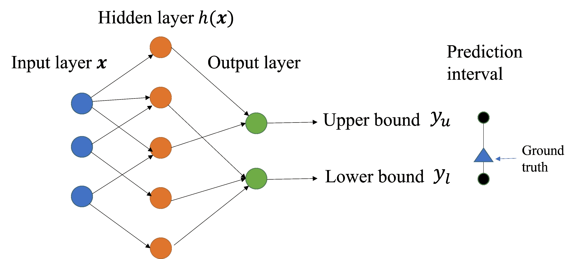
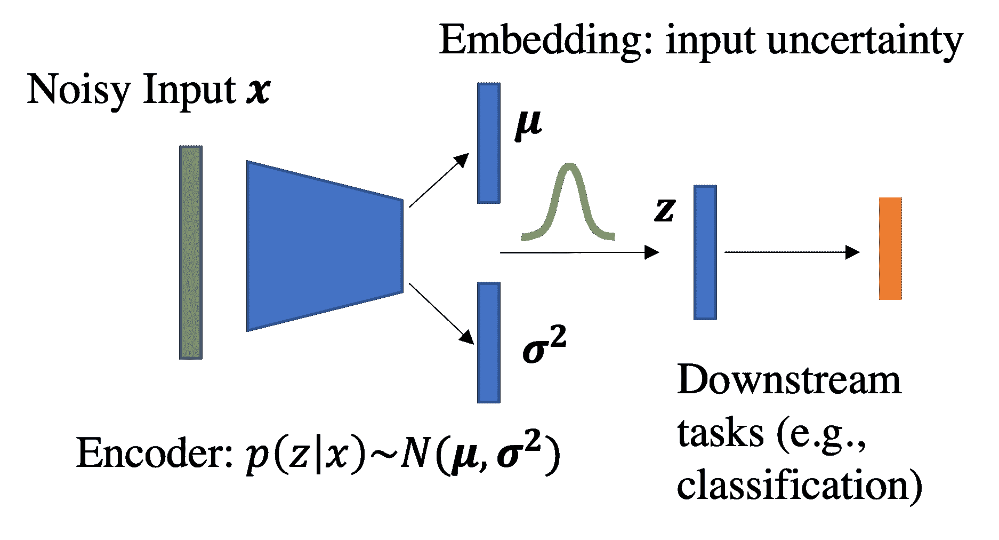

<!--yml

分类：未分类

日期：2024-09-06 19:41:22

-->

# [2302.13425] 深度神经网络的不确定性量化方法综述：从不确定性来源的视角

> 来源：[`ar5iv.labs.arxiv.org/html/2302.13425`](https://ar5iv.labs.arxiv.org/html/2302.13425)

# 深度神经网络的不确定性量化方法综述：从不确定性来源的视角

温崇赫 whe2@ufl.edu 和 赵哲 zhe.jiang@ufl.edu 佛罗里达大学盖恩斯维尔 FL 美国 32611

###### 摘要。

深度神经网络（DNNs）在计算机视觉、自然语言处理以及科学和工程领域取得了巨大成功。然而，也众所周知，DNNs 有时会做出意外的、不正确但过于自信的预测。这在高风险应用中，如自动驾驶、医疗诊断和灾难响应，可能会导致严重后果。不确定性量化（UQ）的目标是估计 DNN 预测的信心，超越预测准确性。近年来，许多 UQ 方法已被开发用于 DNNs。系统地对这些 UQ 方法进行分类并比较其优缺点具有重要的实际价值。然而，现有的综述大多侧重于从神经网络架构或贝叶斯视角对 UQ 方法进行分类，忽略了每种方法可以包含的不确定性来源，使得在实际应用中选择适当的 UQ 方法变得困难。为填补这一空白，本文基于不确定性来源（数据不确定性与模型不确定性）提出了 DNNs UQ 方法的系统分类。我们总结了每个类别方法的优缺点。我们展示了我们的方法学分类如何在不同的机器学习问题（例如主动学习、鲁棒性和强化学习）中指导选择 UQ 方法。我们还识别了当前的研究空白并提出了若干未来研究方向。

深度神经网络、不确定性量化、数据不确定性、模型不确定性、可信赖的 AI。^†^†ccs: 计算方法学 不确定性量化^†^†ccs: 计算方法学 机器学习方法^†^†ccs: 计算方法学 知识表示与推理^†^†ccs: 应用计算 物理科学与工程^†^†ccs: 信息系统 数据挖掘

## 1\. 引言

深度神经网络（DNN）模型在计算机视觉、自然语言处理以及科学和工程领域取得了显著成功（Pandey et al.，2022；LeCun et al.，2015；Deng et al.，2009）。现有的流行 DNN 模型在很大程度上可以被视为一种确定性函数，通过层次表示学习（Bengio et al.，2013）将输入特征映射到目标预测。虽然这些 DNN 模型通常在整体预测准确性上表现强劲，但也普遍认识到它们有时会做出意外的、错误的，但过于自信的预测，尤其是在复杂的现实环境中（Reichstein et al.，2019）。这在高风险应用中可能造成严重后果，例如自动驾驶（Choi et al.，2019）、医疗诊断（Begoli et al.，2019）和灾难响应（Alam et al.，2017）。在这方面，DNN 模型应当意识到其未知的内容，以避免过度自信的预测。例如，在医疗领域，当基于 DNN 的自动诊断系统遇到不确定的情况时，应该将患者转诊给医疗专家进行更深入的分析，以避免致命的错误。在自动驾驶车辆中，如果 DNN 模型知道在什么场景（例如恶劣天气）下它倾向于在估计路况时出错，它可以警告司机接管控制，避免潜在的碰撞。

“了解 DNN 模型不知道什么”归结于在其预测中放置适当的不确定性分数，也称为不确定性量化（UQ）。DNN 中的不确定性可能来自不同类型的来源，包括数据不确定性和模型不确定性（Yarin，2016）。数据不确定性（也称为偶然不确定性）是数据的固有特性，源于数据的随机性和随机波动（例如，传感器噪声）或训练标签之间的冲突证据（例如，类别重叠）。数据不确定性通常被认为是不可减少的，因为我们无法通过添加更多的训练样本来减少它。另一方面，模型不确定性（也称为认识不确定性）来自于模型训练或对新测试样本预测时缺乏证据或知识，例如，有限的训练样本、次优的 DNN 模型架构或参数学习，以及分布外（OOD）样本。

近年来，研究人员为深度神经网络（DNN）模型开发了越来越多的不确定性量化（UQ）方法。然而，如图 1 所示，现有的 DNN UQ 方法的调查要么是从神经网络架构的角度，要么是从贝叶斯视角出发，忽略了不确定性来源的类型。具体而言，（Gawlikowski 等，2021）根据 DNN 模型架构的类型对现有 UQ 方法进行了分类，包括贝叶斯神经网络、集成模型和单一模型架构，但没有讨论 DNN 模型架构与其所包含的不确定性来源类型之间的关系。其他调查仅关注贝叶斯视角。例如，（Mena 等，2021）全面回顾了贝叶斯神经网络用于 UQ 的情况，但忽视了来自频率主义视角的现有方法（例如，预测区间、集成方法）。（Abdar 等，2021）涵盖了集成和其他频率主义方法，但没有比较它们的优缺点。据我们所知，现有的 UQ 方法调查常常忽略了它们所包含的不确定性来源类型。这一视角对于选择适合不同应用的 UQ 方法至关重要，因为某一类型的不确定性可能会主导其他类型。

图 1\. 现有的 DNN 模型 UQ 调查

为了填补这一空白，我们提供了首个从不确定性来源视角出发的 DNN UQ 方法调查。具体而言，我们基于所包含的不确定性来源类型，为 DNN 不确定性量化方法创建了系统的分类法。我们总结了不同方法在技术方法上的特点，并在处理不同类型的不确定性来源时比较了它们的优缺点。我们还将这一分类法与 UQ 方法在一些主要深度学习主题中的重要性相连接，包括 OOD 检测、主动学习和深度强化学习。最后，我们识别了研究空白，并指出了若干未来的研究方向。

## 2\. 问题定义

给定训练数据集$\mathcal{D}_{tr}=\{\boldsymbol{x}_{i},{y}_{i}\}_{i=1}^{n}$，其中输入特征为$\mathbf{X}=\{\boldsymbol{x}_{i}\}_{i=1}^{n}$，$\boldsymbol{x}_{i}\in\mathbb{R}^{d}$，目标标签为$\mathbf{Y}=\{{y}_{i}\}_{i=1}^{n}$，学习问题是找到一个参数化的神经网络模型$y=f(\boldsymbol{x};\boldsymbol{\boldsymbol{\theta}})$，使其能够在训练数据上拟合（并且在未见的测试数据上潜在地表现良好）。通过最小化经验风险来学习该模型，经验风险定义为训练数据上的平均损失：（Murphy，2012）：

| (1) |  | $\operatorname*{arg\,min}_{f}R(\mathcal{D}_{tr},f),\ \text{where}\ R(\mathcal{D}_{tr},f)=\frac{1}{n}\sum_{i=1}^{n}{l}(y_{i},f(\boldsymbol{x}_{i}))$ |  |
| --- | --- | --- | --- |

除了做出准确的预测外，UQ 的目标还包括获得一个参数不确定性框架 $g$，该框架输出一个反映模型预测的不确定性估计 $u=g(\boldsymbol{x};\boldsymbol{\phi})\in\mathbb{R^{+}}$，反映了模型预测的置信度。为此，我们将问题表述为一个优化问题，最小化一个新的损失函数，该函数是经验风险和预期校准误差（ECE）（Nixon 等，2019）的组合。

| (2) |  | $\small\begin{split}\operatorname*{arg\,min}_{f,g}\hat{R}(\mathcal{D},f,g),\ \text{where}\ \hat{R}(\mathcal{D},f,g)=R(\mathcal{D}_{tr},f)+\text{ECE}(\mathcal{D}_{tr},f,g)\end{split}$ |  |
| --- | --- | --- | --- |

ECE 用于衡量预测误差与预测不确定性之间的一致性。具体而言，将不确定性区间分组到固定的区间中，并比较每个区间中的不确定性与误差之间的差值的平均值。ECE 鼓励在误差较大的预测中有更高的不确定性。

给定样本 $\boldsymbol{x}$，目标是预测目标和相关的不确定性 $(y,u)=(f_{\boldsymbol{\theta}}(\boldsymbol{x}),g_{\boldsymbol{\phi}}(\boldsymbol{x}))$。预测和不确定性估计被规划为两个独立的模型，$f$ 和 $g$，以区分两个概念。然而，一些方法可能将两者都表示为一个单一的连贯框架。

## 3\. 不确定性来源的类型

在本节中，我们提供了两种主要类型不确定性的背景：数据不确定性和模型不确定性。具体而言，我们讨论了每种类型的潜在来源及其表征方式。

### 3.1\. 数据不确定性

#### 3.1.1\. 数据不确定性的来源

(a) 具有清晰可分边界的类分布（低不确定性）

(b) 例子 a 的熵

(c) 具有模糊边界的类分布（高不确定性）

(d) 例子 c 的熵

图 2\. 数据不确定性可视化示例（不同颜色代表不同类别的样本）

数据的不确定性（即 aleatoric 不确定性）源于数据的固有随机性、噪声或不同类别中的特征分布重叠，即使提供更多训练数据也无法减少（Yarin，2016）。数据中的随机性或噪声可能发生在数据采集过程中。数据采集过程中的不确定性可能由于仪器误差、不适当的数据采集频率以及数据传输错误（Hariri 等人，2019）而产生。例如，某些数据采集设备在复杂环境中（如恶劣的天气条件）可能无法正常工作。另一方面，不适当的采样方法、数据存储、数据表示方法和插值技术等因素也会影响数据处理过程中的不确定性（Yarin，2016）。

例如，对于从各种空间和空中平台（如 CubeSat、无人机）收集的时空数据，数据的不确定性不仅可能来源于与数据采集设备相关的传感器误差，还可能源于数据以数字格式（本质上是离散的）进行采集（Cheng 等人，2014），尽管其基础现象是连续的。对象运动的表示的不确定性还受到位置样本采集频率的影响，即样本率（Pfoser 和 Jensen，1999）。数据中的不确定性还可以从多个来源积累，并可能传播到模型中。

#### 3.1.2\. 数据不确定性表示

考虑一个训练数据集 $\mathcal{D}_{tr}$，从 $d$ 维输入特征 $\boldsymbol{x}\in\mathbb{R}^{d}$ 和目标类别标签 $y\in\{\omega_{1},...,\omega_{k}\}$（用于 $k$ 类分类问题）或 $y\in\mathbb{R}^{k}$（用于回归模型）的分布 ${p_{tr}(\boldsymbol{x},y)}$ 中抽取。在区分分类任务的背景下，给定特定输入实例 $\boldsymbol{x}$ 的类别变量 $y$ 的不确定性定义为真实条件类别分布的熵 $\mathcal{H}[p_{tr}(y|\boldsymbol{x})]$，如 Eq. 3 所示。条件熵描述了由于不同类别样本间特征值重叠导致的类别分布的随机性。

| (3) |  | $\mathcal{H}[p_{tr}(y\mid\boldsymbol{x})]=-\sum_{i=1}^{k}p_{tr}(y=\omega_{i}\mid\boldsymbol{x})\log(p_{tr}(y=\omega_{i}\mid\boldsymbol{x}))$ |  |
| --- | --- | --- | --- |

对于分类问题，数据的不确定性来源于数据的自然复杂性以及特征空间中类边界的结构。以图 2 为例，该图由两个正态分布的簇（用两种颜色表示）组成。每个簇代表一个独立的类别。一个类边界更清晰的数据集具有较低的数据不确定性，如图 2（a）所示。除了接近类边界的样本外，大多数样本的熵较低。相反，如果特征空间中类之间的重叠较大，则数据不确定性较高，如图 2（c）所示。边界样本的熵高于图 2（a）中的示例。

与分类问题不同，对于回归问题，数据的不确定性来源于数据生成或收集过程中的固有噪声（变异性）：`$y=f(\boldsymbol{x})+\epsilon(\boldsymbol{x})$`，其中`$\epsilon(\boldsymbol{x})$`是数据集中的观测或测量噪声。噪声分为两类：稳态噪声和异方差噪声（Kendall 和 Gal，2017）。稳态噪声假设所有输入`$\boldsymbol{x}$`的观测噪声是恒定的。另一方面，异方差噪声将观测噪声建模为输入的函数`$\epsilon(\boldsymbol{x})\sim p(\epsilon|\boldsymbol{x})$`（例如，异方差高斯噪声）。异方差噪声模型在噪声水平因样本不同而变化的情况下非常有用。

### 3.2\. 模型不确定性

#### 3.2.1\. 模型不确定性的来源

模型不确定性（又称为随机不确定性）代表了与模型训练过程不完善相关的模型预测的不确定性（例如，由于对基于当前输入数据的模型选择缺乏知识）。给定更多的训练数据，这种不确定性是可以减少的。模型不确定性可以分为三种类型：模型架构的不确定性；模型参数的不确定性；由于训练数据集和测试数据集分布不匹配导致的不确定性。对于第一种类型，模型架构不确定性源于对哪种模型架构最适合数据的理解不足。例如，对于深度学习模型，存在关于神经网络层数和每层神经元数量对给定数据集的最佳配置的不确定性。一个过于复杂的模型可能会导致过拟合问题（模型在训练数据集上表现良好，但在测试数据集上无法很好地推广）。模型参数的不确定性是由于对所选模型架构的最佳参数未知，这可能源于不适当的训练策略、训练实例不足，或非凸问题的局部最优问题。没有保证收敛的权重值对应于损失函数的全局最小值。最后一种模型不确定性是由数据分布漂移引起的，这意味着测试样本分布与训练样本分布不同。这个问题在深度学习模型的实际部署中并不罕见，也称为分布外（OOD）数据（Schwaiger et al., 2020），因为现实世界的测试案例可能非常复杂。

#### 3.2.2\. 模型不确定性表示

与数据不确定性相比，模型不确定性更难以估计，因为模型不确定性的来源可以从三个不同方面产生：模型参数、模型架构和数据集分布的变化。通常，对于每种类型的模型不确定性，采用不同的方法进行表示。首先，模型参数的不确定性可以通过贝叶斯神经网络（BNN）来估计（Jospin et al., 2022）。BNN 假设模型参数具有先验分布，并旨在推断模型参数的后验分布，以反映参数的不确定性。其次，来自模型架构的不确定性通过神经网络的集成（深度集成）来估计。直觉是构建一个神经网络架构的集成，每个模型单独训练。集成对输入的预测形成目标变量的分布。因此，目标变量预测的方差可以作为预测不确定性的估计。第三种类型是数据集分布变化带来的不确定性，这由训练数据集分布和测试样本的分布不匹配引起。新测试样本与训练样本的距离越远，模型的不确定性越大。

总结来说，我们强调了两种主要的不确定性类型，并讨论了它们的潜在来源和表示方式。如图 3 所示，数据不确定性源自输入数据特征和标签的固有属性，而模型不确定性则源于模型架构、参数的误设以及数据集分布的变化。根据应用的性质，主要的不确定性类型可能会有所不同，可能需要特定的方法来应对这些不确定性。这些不确定性突显了在各个领域中对数据和模型输出进行稳健分析和解释的重要性。

图 3\. 两种不确定性来源

## 4\. 应用领域

在本节中，我们讨论了深度学习模型不确定性量化的若干应用领域。对于每个应用领域，我们讨论了开发具备不确定性意识模型的动机、数据的性质、不确定性的来源以及与不确定性量化相关的挑战。

医学诊断：深度神经网络模型在各种医学应用中取得了巨大成功，包括医学影像、临床诊断支持和治疗规划（Oh et al., 2020; Van Tulder 和 De Bruijne, 2016; Cireşan et al., 2013）。然而，在医学领域部署深度学习系统时，一个关键问题是神经网络预测的可信度，因为深度学习模型往往过于自信，即使预测错误（Loftus et al., 2022）。这一问题在医学应用中尤为重要，因为错误的决定可能危及生命。在这方面，一个值得信赖的深度神经网络模型应该能够传达其预测的不确定性。医学领域存在数据不确定性和模型不确定性。数据不确定性来自于医学设备的噪声测量、模糊的类别标签（例如，不同放射科医生之间影像中的肿瘤边界标注的不一致），以及不同时间或不同设备拍摄的医学影像之间的配准误差（Gong et al., 2022）。模型不确定性也存在，因为测试病例中的患者可能在训练集中没有得到很好的代表。医学领域中开发不确定性量化方法存在若干挑战。首先，数据的多个来源具有不同的噪声或不确定性。例如，在 MRI 影像中，测量误差是一个重要的因素，而在临床记录中，语义不确定性（模糊性）则更为重要。需要考虑特定问题的独特不确定性来源。其次，提高模型不确定性量化的可解释性也很重要。目前，深度学习在医学领域的可解释性仍然是一个开放的研究领域。许多针对医学领域不确定性感知深度学习模型的研究存在。这些研究大致可以分为与医学影像相关的和与非医学影像应用相关的（Loftus et al., 2022）。在医学影像领域，已经研究了大量的深度影像分割或分类方法用于 MRI、超声和计算机断层扫描（CT）影像（Kohl et al., 2018; Edupuganti et al., 2020）。这些研究通常关注于由于 MRI 图像中物体标签边界模糊导致的数据不确定性（Natekar et al., 2020; Qin et al., 2021），以及由于不同帧或传感器之间的配准误差导致的配准不确定性（Chen et al., 2021a）。第二类，非医学影像应用，主要涉及从电子健康记录（EHR）中提供的临床诊断支持和治疗规划。EHR 包含患者的时间健康记录（例如药物、实验室订单、临床记录）和全局背景特征（例如性别、年龄、种族、身体指数）。递归神经网络和图神经网络已被应用于 EHR 数据，以预测患者疾病和可能的治疗（例如个性化医疗）（Zhang et al., 2020）。患者特定预测和最佳决策的显著变异性（Dusenberry et al., 2020）要求模型在临床决策系统中捕捉预测的不确定性。这使得模型能够将高度不确定的病例转交给临床医生进行进一步诊断。图 4 显示了不确定性感知自动临床系统的流程图。

图 4\. 不确定性引导的临床诊断

地球科学：随着 GPS 和遥感技术的进步，来自空间、空中、海上和陆地平台的时空数据量迅速增长（Shekhar et al., 2015; NASA Goddard, 2019; Florida and Wildlife, 2021）。例如，小型卫星（称为 CubeSats）每天都会收集覆盖全球的高分辨率地球影像。新兴的时空大数据、计算能力的提升（如 GPU）以及深度学习技术的最新进展为我们深入了解地球系统提供了令人兴奋的新机会（Reichstein et al., 2019）。例如，深度学习已被用于预测河流流量和温度（Jia et al., 2021），以及预测飓风路径（Kim et al., 2019）。由于许多问题涉及高风险决策（如基于飓风追踪的疏散计划），地球科学中深度学习的不确定性量化非常重要。因此，在飓风追踪中，科学家们通常不仅提供最可能的登陆点，还提供一个“不确定性锥”来表示其他可能的影响点和未来的风暴轨迹。

地球科学问题中的不确定性量化面临若干挑战，这些挑战源于时空数据的独特特性。首先，时空数据具有各种空间、时间和光谱分辨率，并且噪声和误差的来源多种多样（例如，遥感信号中的噪声和大气效应（Licata and Mehta, 2022），GPS 误差）。其次，当将不同层次的地理空间数据对齐到同一空间参考系统时，可能会存在空间配准误差和不确定性（He et al., 2022）。这可能导致地球影像像素或像素标签的位置信息不确定。第三，时空数据是异质的，即数据分布在不同区域或时间段内往往存在差异（Jiang et al., 2019）。因此，在一个区域（或时间）训练的深度学习模型可能无法很好地泛化到另一个区域（或时间），因为数据分布发生了变化。一个关注不确定性的模型可以通过在将预训练模型应用到新的测试位置时提供置信度测量，从而潜在地缓解异质性问题。当空间观察样本在连续空间中稀疏分布时，这一问题尤为重要，因为这会导致在推断其他位置的观察数据时的不确定性（Hengl et al., 2017）。

交通：应用于来自地面传感器和道路网络视频摄像头的交通数据的深度学习技术提供了独特的机会来监控交通状况、分析交通模式并改进决策。例如，时间图神经网络用于预测交通流量（Zhao et al., 2019）。深度神经网络模型还用于提取交通动态的见解并识别潜在风险，如拥堵或事故（Mo and Fu, 2022）。自动驾驶是另一种应用，它使用激光雷达传感器和光学摄像头来检测道路车道和其他车辆或行人。然而，交通数据由于时间动态、对外部因素的敏感性以及噪声和不确定性的存在（例如遗漏、稀疏的传感器覆盖、错误或固有偏差）而具有独特性。例如，高度拥挤的事件可以扰乱道路网络上的正常交通流。

现有的轨迹不确定性研究考虑了由于稀疏或不足的训练数据导致的数据不确定性（Zhou et al., 2022），以及由于信号丢失导致的错误或缺失测量（Markos et al., 2021）。其他研究将天气影响等外部因素（Pang et al., 2021; Zhu et al., 2022; Lempert et al., 2022; Wang et al., 2019a）纳入不确定性量化。短期交通状态预测（如流量、旅行速度和占用率）需要考虑由随机环境和模型训练引起的不确定性（Wang et al., 2014）。对于长期交通建模，现有研究集中在交通流量的外生因素（例如可能影响预测不确定性的暴雨和雪暴）（Li et al., 2022）。

生物化学工程：传统的生物化学发现主要基于实验，这些实验既昂贵又耗时（Bower 和 Bolouri，2001）。随着计算科学的迅速发展，研究人员转向模拟和数据驱动的方法来辅助科学发现（Brunton 和 Kutz，2022）。模拟方法基于基本原理创建数学模型，例如微生物生长和产品合成的动力学、生物反应器中的流体动力学，以及新蛋白质和酶的设计（Mowbray 等，2021）。然而，这些模型可能计算密集且需要对生物化学系统有深入的理解。相比之下，基于深度学习的模型利用神经网络和大量的生物化学数据直接提取知识并学习复杂的关系。然而，常见的数据驱动的深度神经网络（DNN）模型对领域知识不甚了解，面临着表示生物化学系统复杂性的挑战，例如微生物群体的异质性和遗传环境变化。这通常会导致不可靠的输出，需要人工专家进行验证，增加了额外的劳动（Hie 等，2020）。几个因素导致了数据驱动的生物化学工程的不确定性。例如，研究人员通常仅对复杂的生物机制和细胞释放的高分子有部分了解，而且由于遗传和环境变化，微生物群体的异质性难以量化。对于不同的任务，这些因素可能在神经网络模型的 UQ（不确定性量化）中发挥不同的作用。在蛋白质工程中，蛋白质功能预测（基于蛋白质序列、蛋白质结构和蛋白质-蛋白质相互作用）具有挑战性，因为蛋白质折叠的多样性很大且对蛋白质结构的理解不完整（Bradford 等，2018）。在生物反应器工程中，生物反应器系统性能的预测受到生物反应器操作因素（例如，pH、温度和底物浓度）之间的内在相互作用的影响。迭代方法已被用来使模型不确定性的传播能够进行多步预测（Mowbray 等，2021）。

## 5\. 深度神经网络不确定性量化方法的分类

在这一部分，我们提供了一种基于每种方法能够捕捉的不确定性来源类型的新分类方法。如前所述，DNN 预测中存在两种主要的不确定性来源，对于不同的领域应用，这些来源可能在影响模型预测中发挥主要作用。因此，了解每种方法可以解决哪种类型的不确定性来源是至关重要的。一般而言，我们将现有工作根据不确定性来源分为三类，如图 5 所示：模型不确定性、数据不确定性以及两者的结合。我们简要介绍每一类别如下：

+   •

    模型不确定性：在这一类别中，方法考虑了由参数（BNN）、架构（集成方法）或样本密度（深度高斯过程）引起的模型不确定性。

+   •

    数据不确定性：这一类别的方法旨在考虑数据中固有的随机性或噪声带来的不确定性。总体思路是对预测构建一个分布。这些方法进一步分为深度判别模型和深度生成模型。

+   •

    模型和数据不确定性的结合：许多方法旨在在一个框架中捕捉总体不确定性，即模型和数据不确定性的结合。直接的方法是将数据和模型不确定性的方法结合起来，形成一个连贯的框架，但这会引入更多的计算和存储需求。另一种称为证据深度学习的框架通过单个神经网络模型克服了计算挑战。

接下来，介绍这三种类型的主要直观和方法，并讨论它们的主要优缺点。

图 5\. 现有 DNN UQ 文献的分类

### 5.1\. 模型不确定性

本小节回顾了现有的 DNN 模型不确定性框架。我们将方法分为三类：贝叶斯神经网络、集成模型和样本密度感知模型。我们将详细介绍每一子类。

#### 5.1.1\. 贝叶斯神经网络

从频率主义的角度来看，存在一组参数$\boldsymbol{\boldsymbol{\theta}}*$能够最适合 DNN 模型，其中$\boldsymbol{\theta}*=\operatorname*{arg\,min}_{\boldsymbol{\theta}}\mathcal{L}(\mathbf{Y},f(\mathbf{X},\boldsymbol{\theta}))$，$\mathcal{L}$是损失函数。然而，DNN 参数的点估计往往会出现过拟合和过度自信的情况（Thulasidasan et al., 2019）。另一方面，贝叶斯神经网络（BNN）对神经网络参数$p(\boldsymbol{\theta})$施加了先验，并旨在学习这些参数的后验分布$p(\boldsymbol{\theta}|\mathbf{X},\mathbf{Y})$。

| (4) |  | $p(\boldsymbol{\theta}&#124;\mathbf{X},\mathbf{Y})=\frac{p(\mathbf{Y}&#124;\mathbf{X},\boldsymbol{\theta})p(\boldsymbol{\theta})}{p(\mathbf{Y}&#124;\mathbf{X})}$ |  |
| --- | --- | --- | --- |

这个项是条件于训练数据集的模型参数的后验分布。这个分布反映了我们的模型能够捕捉训练数据模式的程度。假设模型参数服从高斯分布，分布的方差越大，模型中的不确定性也越大。这种不确定性可能由少量的训练数据或不合适的神经网络结构配置引起。

对于新样本$\boldsymbol{x}*$的推断，我们可以通过以下方式边际化模型参数：

| (5) |  | $p(y*&#124;x*,\mathbf{X},\mathbf{Y})=\int p(y*&#124;\boldsymbol{x}*,\boldsymbol{\theta})p(\boldsymbol{\theta}&#124;\mathbf{X},\mathbf{Y})d\boldsymbol{\theta}$ |  |
| --- | --- | --- | --- |

测试样本的不确定性将通过预测分布的方差反映出来。

然而，这种方法在解析上是不可处理的，没有闭式解，因此必须对贝叶斯神经网络（BNN）的预测进行近似。为了估计神经网络参数的后验分布，已经提出了各种方法来近似参数后验分布的简化形式，以便以可处理的方式求解。一些近似方法定义了一个参数化的分布类$\mathcal{Q}$，从中选择一个近似$ q_{\phi}(\boldsymbol{\theta})$来表示后验分布。例如，$\mathcal{Q}$可以是所有因子化的高斯分布的集合，$\phi$是均值和对角方差的参数。根据某些优化标准选择分布$q_{\phi}(\boldsymbol{\theta})\in\mathcal{Q}$来近似后验分布。两种常见的优化方法是变分推断（Blei et al., 2017）和拉普拉斯近似（Friston et al., 2007）。除了用解析方法近似后验分布外，另一种方法是通过蒙特卡洛采样来解决这个问题，这种方法称为马尔科夫链蒙特卡洛采样。接下来，我们将详细回顾这三种子类别中的现有方法。

变分推断 (VI)：在(Hinton 和 Van Camp, 1993; Graves, 2011)中，作者提出通过最大化对数边际似然的证据下界 (ELBO) 来找到对贝叶斯后验分布的变分近似。难以处理的后验$p(\boldsymbol{\theta}|\mathbf{X},\mathbf{Y})$用一个参数分布$q_{\boldsymbol{\phi}}(\boldsymbol{\theta})$来近似。

| (6) |  | $\footnotesize\begin{split}\log p(\mathbf{Y}&#124;\mathbf{X})&\geq\mathbb{E}_{\boldsymbol{\theta}\sim q_{\phi}(\boldsymbol{\theta})}\log\frac{p(\mathbf{Y}&#124;\mathbf{X},\boldsymbol{\theta})p(\boldsymbol{\theta})}{q_{\phi}(\boldsymbol{\theta})}\\ & =\mathbb{E}_{\boldsymbol{\theta}\sim q_{\phi}(\boldsymbol{\theta})}\log p(\mathbf{Y}&#124;\mathbf{X},\boldsymbol{\theta})-\mathcal{KL}(q_{\phi}(\boldsymbol{\theta})&#124;&#124;p(\boldsymbol{\theta}))\end{split}$ |  |
| --- | --- | --- | --- |

其中，第一个项$\mathbb{E}_{\boldsymbol{\theta}\sim q_{\phi}(\boldsymbol{\theta})}\log p(\mathbf{Y}|\mathbf{X},\boldsymbol{\theta}))$是神经网络模型在训练数据上的对数似然。这个项随着模型准确率的提高而增加。第二项是模型参数后验估计与先验的 Kullback-Leibler (KL) 散度，它控制神经网络模型的复杂性。最大化方程 6 相当于在预测准确性和模型复杂性之间找到一个权衡。因此，后验推断问题变成了对参数$\boldsymbol{\phi}$的优化问题。

变分推断的一个挑战在于选择参数化分布类 $q_{\boldsymbol{\phi}}(\boldsymbol{\theta})$。原始方法依赖于使用对角协方差矩阵的高斯近似分布（均值场变分推断）（Hinton 和 Van Camp，1993；Posch 等，2019）。该方法为优化提供了一个简单的下界，但近似能力有限。为了捕捉参数之间的后验相关性，第二类方法将对角协方差扩展到一般协方差矩阵，同时通过最大化上述 ELBO 仍然得到一个可处理的算法（Posch 和 Pilz，2020）。然而，全协方差矩阵不仅增加了可训练参数的数量，还为深度神经网络带来了巨大的内存和计算开销。为了减少计算量，第三类方法旨在通过某些假设简化协方差矩阵结构。一些方法假设层之间的独立性，导致块对角结构协方差矩阵（Sun 等，2017；Zhang 等，2018）。其他研究发现，对于使用高斯变分推断训练的各种深度贝叶斯神经网络，后验在收敛后始终表现出强烈的低秩结构（Swiatkowski 等，2020），他们提出将密集协方差矩阵分解为低秩因式以简化计算。此外，（Mishkin 等，2018）假设协方差矩阵具有“对角加低秩”结构，以实现更灵活和更快的近似。另一方向的工作通过层次后验引入稀疏不确定性结构，或采用低维辅助变量的归一化流（Ritter 等，2021；Louizos 和 Welling，2017）来减少计算。

变分高斯近似在深度神经网络参数中的缺点是，为了捕捉模型潜在权重之间的全部相关性，它需要优化大量的变分参数，这与模型中的潜在权重数量呈平方关系。现有工作旨在通过某些假设简化协方差结构，同时仍能捕捉神经网络参数之间的相关性，以优化计算速度。

拉普拉斯近似：拉普拉斯近似的理念是通过神经网络权重的“最大后验”（MAP）估计器，获得围绕高斯分布的近似后验，该估计器基于神经网络似然函数的二阶导数（MacKay，1992）。该方法可以在预训练的神经网络模型后应用。

| (7) |  | $p(\boldsymbol{\theta} \mid \mathbf{X}, \mathbf{Y}) \approx p(\boldsymbol{\hat{\theta}} \mid \mathbf{X}, \mathbf{Y}) \exp\left(-\frac{1}{2} (\boldsymbol{\theta} - \boldsymbol{\hat{\theta}})^{T} \mathbf{H} (\boldsymbol{\theta} - \boldsymbol{\hat{\theta}})\right)$ |  |
| --- | --- | --- | --- |

因此，后验分布被近似为高斯分布：

| (8) |  | $p(\boldsymbol{\theta} \mid \mathbf{X}, \mathbf{Y}) = \mathcal{N}(\boldsymbol{\hat{\theta}}, \mathbf{H}^{-1})$ |  |
| --- | --- | --- | --- |

其中 $\boldsymbol{\hat{\theta}}$ 是最大后验（MAP）估计，$\mathbf{H}$ 是海森矩阵。它是关于模型权重的神经网络似然函数的二阶导数，即 $\mathbf{H}_{ij} = -\frac{\partial^{2}}{\partial \boldsymbol{\theta}_{i} \partial \boldsymbol{\theta}_{j}} \log p(\mathbf{Y} \mid \mathbf{X}, \boldsymbol{\theta})$。图 6 (a) 说明了拉普拉斯近似的直觉，其中蓝色密度函数是实际的后验分布，橙色高斯分布是拉普拉斯近似。这种方法可以在局部近似后验分布，从而简化后验分布的计算，但缺点是它无法捕捉到具有多个模态的多模态分布，因为它是围绕 MAP 模态的局部估计。

图 6\. 拉普拉斯近似

此外，对于深度神经网络（DNN），计算所有参数的海森矩阵的逆仍然不可行，这通常是数百万的级别。以前关于使用拉普拉斯近似进行神经网络不确定性量化的工作主要旨在利用海森矩阵近似技术来简化计算。一种简单的解决方案是忽略权重之间的协方差，只提取海森矩阵的对角线。这样的办法受到神经网络曲率的克罗内克因子近似的启发，该方法（Ritter 等人，2018b）将海森矩阵分解为两个较小矩阵的克罗内克积（矩阵运算，结果是一个块矩阵）。该方法降低了海森矩阵的求逆成本，并且可以扩展到深度卷积网络，并高效地应用于贝叶斯在线学习（Ritter 等人，2018a）。然而，该方法引入了一个额外的假设，即神经网络的每一层是独立的（忽略了层间的协方差），这可能会导致在某些方向上对方差（不确定性）的高估。

使拉普拉斯近似能够对现代深度神经网络进行不确定性量化的另一个挑战是校准预测不确定性。一种标准做法是调整高斯先验在模型权重上的先验精度（Ritter 等，2018b）。这对真实 Hessian 的近似以及拉普拉斯近似本身都有正则化效果，可能将概率质量放在真实后验的低概率区域。然而，这些参数需要根据验证数据集上的预测不确定性性能进行优化，可能在新的测试数据上无法很好地推广。为了克服这一缺点，另一种方法引入了一个更灵活的框架，通过向 MLP 训练的网络的隐藏层添加一些额外的“隐藏单元”来调整拉普拉斯近似的 BNNs 的不确定性（Kristiadi 等，2021）。该框架以不确定性感知的目标进行训练，以改善拉普拉斯近似的不确定性校准。然而，这种方法的限制在于它只能应用于 MLP 训练的网络，无法推广到其他模型，例如卷积神经网络。

总结而言，以前的方法采用了基于优化的方案，如变分推断和后验的拉普拉斯近似。在这样做的过程中，对后验的形式施加了强假设和限制。常见的做法是用高斯分布来近似后验。施加的限制通常被认为会导致预测和不确定性量化性能中的不准确性。两种近似之间的区别在于，拉普拉斯近似是在 MAP 估计附近的局部近似，并且可以应用于预训练的神经网络，以获得不确定性量化，而不会影响神经网络的性能。另一方面，变分推断是用于训练中的全局优化，可能会影响模型的预测性能。

马尔可夫链蒙特卡洛近似：马尔可夫链蒙特卡洛（MCMC）是一种从难以处理的分布中进行采样的通用方法。MCMC 构造一个遍历性的马尔可夫链，其平稳分布是后验分布 $p(\boldsymbol{\theta}|\mathbf{X},\mathbf{Y})$。然后我们可以从平稳分布中进行采样。贝叶斯神经网络（BNN）的推断步骤（公式 5）可以近似为以下方程：

| (9) |  | $\footnotesize p(y*&#124;x*,\mathbf{X},\mathbf{Y})=\int p(y*&#124;\boldsymbol{x}*,\boldsymbol{\theta})p(\boldsymbol{\theta}&#124;\mathbf{X},\mathbf{Y})d\boldsymbol{\theta}\approx\frac{1}{N}\sum_{i=1}^{N}p(y*&#124;x*,\boldsymbol{\theta}_{i})$ |  |
| --- | --- | --- | --- |

其中 $\boldsymbol{\theta}_{i}\sim p(\boldsymbol{\theta}|\mathbf{X},\mathbf{Y})$ 是从 MCMC 中采样得到的。这个过程通过一个状态空间上的马尔可夫链生成样本，每个样本仅依赖于前一个样本的状态。这个依赖关系用提议分布 $T(\boldsymbol{\theta}^{\prime}|\boldsymbol{\theta})$ 来描述，该分布指定了从给定样本 $\boldsymbol{\theta}$ 转移到新样本 $\boldsymbol{\theta}^{\prime}$ 的概率密度。一些接受标准基于在后验分布下评估的两个连续样本的相对密度（能量），以决定是接受新样本还是保留之前的样本。最简单的实现是通过 Metropolis-Hastings 算法（Murphy, 2012）来完成的，该算法使用高斯提议分布 $T(\boldsymbol{\theta}^{\prime}|\boldsymbol{\theta})\sim\mathcal{N}(\boldsymbol{\theta},\Sigma)$。具体而言，在每次迭代中，该算法在 $\boldsymbol{\theta}$ 的状态空间上构建马尔可夫链，并使用提议密度分布。提议样本通过接受概率 $\alpha(\boldsymbol{\theta}^{\prime},\boldsymbol{\theta})=\frac{T(\boldsymbol{\theta}^{\prime}|\boldsymbol{\theta})p(\boldsymbol{\theta}^{\prime}|x)}{T(\boldsymbol{\theta}|\boldsymbol{\theta}^{\prime})p(\boldsymbol{\theta}|\boldsymbol{x})}$ 被随机接受，随机变量 $\mu$ 从区间 $[0,1]$ 中均匀抽取 ($\mu\sim\text{Unif}(0,1)$)。如果我们拒绝提议样本，我们保留之前的样本 $\boldsymbol{\theta}$。这个策略确保样本的平稳分布在经过足够多的迭代后收敛到真实后验分布。然而，各向同性高斯提议分布表现出随机游走行为，可能导致样本空间探索缓慢和高拒绝率。因此，需要更长的时间才能收敛到平稳分布。由于现代深度神经网络的高维参数空间，这个问题更为严重，并阻碍了 MCMC 在神经网络参数采样中的应用（Neal, 2012）。

现代 DNN 的 MCMC 近期发展主要集中在如何更高效地采样和减少收敛迭代次数。例如，一种方向是将 MCMC 采样与变分推断相结合（Salimans 等，2015; Wolf 等，2016），以发挥两者的优势。由于变分推断通过将后验的优化问题公式化来近似后验，而变分后验从固定的分布家族中选择。这种方法通过确保对变分后验格式的一些约束可以加快速度，但即使在非常低的 ELBO 损失下，它们可能对真实后验的近似效果较差。另一方面，MCMC 对近似后验的形状没有任何约束，并且可以在足够多的迭代下任意好地近似准确后验。Markov Chain Variational Inference (MCVI) 通过将迭代的 Markov 链 $q(\boldsymbol{\theta}|x)=q(\boldsymbol{\theta}_{0})\prod_{t=1}^{T}q(\boldsymbol{\theta}_{t}|\boldsymbol{\theta}_{t-1},x)$ 解释为扩展空间中的变分近似，从而弥合 MCMC 和 VI 之间的准确度和速度差距。在这个扩展空间中，$\boldsymbol{\theta}_{0},...\boldsymbol{\theta}_{T-1}$。因此，它们不是构建一个顺序的 Markov 链来采样 $\boldsymbol{\theta}_{0},...\boldsymbol{\theta}_{T-1}$，而是使用另一个辅助变分推断分布 $r(\boldsymbol{\theta}_{0},...,\boldsymbol{\theta}_{T-1})$ 来以一些灵活的参数形式近似真实分布。通过用神经网络优化变分分布参数的下界，我们可以获得 Markov 链样本。

MCMC 方法的优势在于它提供的样本在经过足够多的迭代后可以保证收敛到准确的后验。这一特性使我们能够控制采样准确度与计算之间的权衡。然而，这种方法的缺点是我们不知道多少次迭代才足够收敛，并且可能需要过多的时间和计算资源。

(a) MC dropout

图 7\. 模型不确定性的示意图

Monto-Carlo (MC) dropout：MC dropout 方法（Gal 和 Ghahramani, 2016）由于其简单性和易于实现，当前在许多领域中是 DNN 不确定性量化的最流行方法。该方法表明，通过带有 dropout 层的神经网络的优化，可以等同于通过对参数 Bernoulli 分布进行变分推断来近似 BNN（Gal 和 Ghahramani, 2016）。不确定性估计可以通过计算不同 dropout 掩码（关闭一些神经元激活）的多个随机前向预测的方差来获得，如图 7 所示。具有各种权重 dropout 的平均预测可以解释为对模型权重进行近似积分（如等式 5）其变分分布遵循 Bernoulli 分布。MC dropout 的优点是：首先，它对现有 DNN 架构设计几乎没有修改要求，这使得在实践中易于实现。其次，它通过牺牲预测准确性来缓解表示不确定性的问题，因为这些方法仅影响推断步骤。然而，尽管从变分近似的角度对 MC dropout 的概率解释有理论依据，但在许多不确定性基准数据集中，MC dropout 往往比其他基线 UQ 方法校准度差（Guo 等人，2017）。

总结来说，我们总结了几种关于 BNN 的近似方法，这些方法旨在减少 BNN 的计算和内存负担，并使其能够扩展到现代深度神经网络。这些近似方法在一定程度上可以捕捉与参数相关的模型不确定性。然而，缺点是该过程需要近似，这可能导致不准确的不确定性估计。

#### 5.1.2. 集成模型

集成模型在预测过程中结合了多个神经网络模型。集成预测形成一个输出分布。集成模型的预测变异性可以作为模型不确定性的衡量标准（例如，较大的方差意味着较大的不确定性）。为了捕捉来自不同方面的模型不确定性，可以采用几种构建集成的策略，这些策略总结为三大类：第一类是通过自助法（Lakshminarayanan et al., 2017）。这是一种从原始数据集中随机抽样并替换的策略。构建一个神经网络模型的集成，每个模型在不同的自助样本上进行训练。训练完成后，通过集成的聚合进行推理，并从预测方差（回归）或平均熵（分类）中获得不确定性。第二种策略是构建不同的神经网络架构（层数、隐藏神经元、激活函数类型）（Mallick et al., 2022）。这种策略可以考虑到来自模型误指定的不确定性。其他策略包括参数的不同初始化以及数据集的随机洗牌。这比自助法策略更好，因为每个模型利用了更多的样本。第三种类型是超集成（Wenzel et al., 2020）。这种方法构建具有不同超参数的集成，如学习率、优化策略和训练策略。

尽管集成模型简单且可以扩展到现代神经网络的大型数据集，但这种方法有几个局限性：首先，计算开销较大，因为它需要训练多个独立的网络，并且在推理过程中需要保持所有这些网络在内存中。其次，模型多样性是确保集成模型多样性以提供准确的不确定性估计的必要要求。否则，集成模型可能会收敛到相同的局部最小值。

#### 5.1.3\. 样本密度感知神经网络

由于 BNN 模型的理论可靠性和深度集成模型的简单性，它们是现代 DNN 不确定性量化的流行方法。然而，BNN 和集成模型的计算挑战使其在实际应用中不可行。此外，这些方法可以解决与参数、模型架构和训练过程随机性相关的模型不确定性，但无法推广到来自低样本密度的模型不确定性，即样本远离训练集支持区域时可能会显示过度自信的结果。在这方面，许多方法被激发出来以开发样本密度感知神经网络，以捕捉由于低训练样本密度导致的模型不确定性。

高斯过程混合神经网络：

关于高斯过程的总结：高斯过程（GP）是随机过程的一种变体，其中任何有限的随机变量集合都遵循多元高斯分布（Williams 和 Rasmussen，2006）。给定一组点 $\boldsymbol{x}_{1},...\boldsymbol{x}_{n}$，GP 定义了函数 $y_{i}=f(\boldsymbol{x}_{i})$ 的先验，并假设 $p(y_{1},...,y_{n})$ 遵循高斯分布 $\mathcal{N}(\boldsymbol{\mu}(\boldsymbol{x}),\boldsymbol{\Sigma}(\boldsymbol{x}))$，其中 $\boldsymbol{\mu}(\boldsymbol{x})$ 是均值函数，$\boldsymbol{\Sigma}(\boldsymbol{x})$ 是协方差函数，给定 $\boldsymbol{\Sigma}_{ij}=\kappa(\boldsymbol{x}_{i},\boldsymbol{x}_{j})$。$\kappa$ 是一个正定核函数（径向基函数），用于衡量任何输入样本对之间的相似性。核函数还在控制 GP 的平滑度方面发挥作用。对于 GP 推断，给定新的样本 $\boldsymbol{x_{*}}$，新样本预测 $y_{*}$ 和训练样本目标变量 $y$ 之间的联合分布具有以下形式

| (10) |  | <math   alttext="\begin{pmatrix}\mathbf{y}\\ y_{*}\end{pmatrix}=\mathcal{N}\Bigg{(}\begin{pmatrix}\boldsymbol{\mu}\\

\mu_{*}\end{pmatrix},\begin{pmatrix}\mathbf{K}_{n}&amp;\mathbf{K}_{\boldsymbol{x}}\\

\mathbf{K}_{\boldsymbol{x}}^{T}&amp;K_{*}\end{pmatrix}\Bigg{)}" display="block"><semantics ><mrow  ><mrow ><mo  >(</mo><mtable displaystyle="true" rowspacing="0pt"  ><mtr ><mtd ><mi  >𝐲</mi></mtd></mtr><mtr ><mtd ><msub  ><mi >y</mi><mo >∗</mo></msub></mtd></mtr></mtable><mo >)</mo></mrow><mo >=</mo><mrow  ><mi >𝒩</mi><mo lspace="0em" rspace="0em"  >​</mo><mrow ><mo maxsize="260%" minsize="260%" >(</mo><mrow ><mo  >(</mo><mtable displaystyle="true" rowspacing="0pt"  ><mtr ><mtd ><mi  >𝝁</mi></mtd></mtr><mtr ><mtd ><msub  ><mi >μ</mi><mo >∗</mo></msub></mtd></mtr></mtable><mo >)</mo></mrow><mo >,</mo><mrow  ><mo >(</mo><mtable columnspacing="5pt" displaystyle="true" rowspacing="0pt"  ><mtr ><mtd ><msub  ><mi >𝐊</mi><mi >n</mi></msub></mtd><mtd ><msub ><mi  >𝐊</mi><mi >𝒙</mi></msub></mtd></mtr><mtr ><mtd ><msubsup  ><mi >𝐊</mi><mi >𝒙</mi><mi >T</mi></msubsup></mtd><mtd ><msub ><mi  >K</mi><mo >∗</mo></msub></mtd></mtr></mtable><mo >)</mo></mrow><mo maxsize="260%" minsize="260%"  >)</mo></mrow></mrow></mrow><annotation-xml encoding="MathML-Content" ><apply  ><apply ><csymbol cd="latexml" >matrix</csymbol><matrix  ><matrixrow ><ci >𝐲</ci></matrixrow><matrixrow ><apply  ><csymbol cd="ambiguous"  >subscript</csymbol><ci >𝑦</ci></apply></matrixrow></matrix></apply><apply ><ci >𝒩</ci><interval closure="open" ><apply  ><csymbol cd="latexml"  >matrix</csymbol><matrix ><matrixrow ><ci  >𝝁</ci></matrixrow><matrixrow ><apply ><csymbol cd="ambiguous" >subscript</csymbol><ci >𝜇</ci></apply></matrixrow></matrix></apply><apply ><csymbol cd="latexml" >matrix</csymbol><matrix  ><matrixrow ><apply ><csymbol cd="ambiguous" >subscript</csymbol><ci >𝐊</ci><ci >𝑛</ci></apply><apply ><csymbol cd="ambiguous" >subscript</csymbol><ci >𝐊</ci><ci >𝒙</ci></apply></matrixrow><matrixrow ><apply  ><csymbol cd="ambiguous"  >superscript</csymbol><apply ><csymbol cd="ambiguous" >subscript</csymbol><ci >𝐊</ci><ci >𝒙</ci></apply><ci >𝑇</ci></apply><apply ><csymbol cd="ambiguous" >subscript</csymbol><ci >𝐾</ci></apply></matrixrow></matrix></apply></interval></apply></apply></annotation-xml><annotation encoding="application/x-tex" >\begin{pmatrix}\mathbf{y}\\ y_{*}\end{pmatrix}=\mathcal{N}\Bigg{(}\begin{pmatrix}\boldsymbol{\mu}\\ \mu_{*}\end{pmatrix},\begin{pmatrix}\mathbf{K}_{n}&\mathbf{K}_{\boldsymbol{x}}\\ \mathbf{K}_{\boldsymbol{x}}^{T}&K_{*}\end{pmatrix}\Bigg{)}</annotation></semantics></math> |  |

其中 $\mathbf{K}_{n}$ 是 $n$ 个训练样本之间的协方差矩阵，$\mathbf{K}_{\boldsymbol{x}}$ 是测试样本与训练样本之间的协方差向量。 $K_{*}$ 是测试样本的先验方差。

图 8\. 高斯过程推断示例：绿色线条是预测样本分布

然后，对新的测试输入样本 $\boldsymbol{x}_{*}$ 的预测是通过计算条件在训练数据 $\mathcal{D}_{\text{tr}}$ 下的后验分布来实现的，如 Eq. 11 所示。预测分布的均值项可以被解释为训练集标签的加权平均。权重取决于输入样本在特征空间中通过核函数测量的相似性。除了均值函数的点估计外，预测不确定性由推断分布的方差表示。如果测试样本位于训练样本丰富的区域（如图 8 中的中间部分），GP 推断会给出较低的不确定性，否则会导致较高的不确定性（图 8 的边界部分）。这一特性对分布外（OOD）数据非常重要，因为 OOD 数据在特征空间中远离训练样本，这可以通过 GP 高效检测出来。

| (11) |  | $p(y_{*}&#124;x_{*},\mathcal{D}_{\text{train}},\boldsymbol{\theta})=\mathcal{N}(y&#124;\mathbf{K}_{\boldsymbol{x}}^{T}\mathbf{K}_{n}^{-1}\boldsymbol{y},K_{x*}-\mathbf{K}_{\boldsymbol{x}}^{T}\mathbf{K}_{n}\mathbf{K}_{\boldsymbol{x}}),$ |  |
| --- | --- | --- | --- |

稀疏高斯过程：尽管具有固有不确定性估计的有趣特性，但 GP 对于大数据集来说是不可行的，因为协方差矩阵的求逆需要$\mathcal{O}(n^{3})$复杂度（$n$是训练样本的总数），这在大数据集上的训练和推断需要高计算和存储成本。在这方面，许多方法（Snelson 和 Ghahramani，2005；Titsias，2009）试图对完整的 GP 进行稀疏近似，以将计算降低到$\mathcal{O}(m^{2}n)$（$m$是诱导变量的数量且$m\ll n$）。诱导变量可以在输入域中的任何位置，而不必限制为训练数据的子集，这表示为输入-输出对$\{\hat{\boldsymbol{x}}_{i},\hat{y}_{i}\}_{i=1}^{m}$。然后，可以用诱导变量的低秩近似替代原始协方差矩阵$\mathbf{K}_{n}$的求逆，这只需要对$m\times m$矩阵$\mathbf{K}_{m}$进行求逆。接下来，问题变成了如何选择$m$个最佳诱导变量以代表训练数据集。常见的方法假设最佳的代表性诱导变量是那些最大化训练数据的似然（ML）的变量（Snelson 和 Ghahramani，2005）。然后，诱导变量的位置和 GP 的超参数通过 ML 同时优化。训练数据的似然可以通过在训练数据和诱导变量的联合分布上对诱导变量进行边际化来获得。另一种变体稀疏 GP 通过将诱导变量的位置视为变分参数（Titsias，2009）来优化精确似然的变分下界。为了进一步减少计算以实现对大数据集的更大规模推断，论文（Wilson 和 Nickisch，2015）提出了一种通过对诱导变量施加网格约束来利用协方差结构的可扩展结构化 GP 方法的核插值方法。通过这种方式，核矩阵$\mathbf{K}_{m}$承认 Kronecker 结构，计算求逆变得更为简单。

深度高斯过程：除了计算挑战，GP 的另一个限制是目标变量上的联合高斯分布假设限制了模型在捕捉大数据集中实例之间多样化关系的能力。此外，GP 在计算样本间相似性时严重依赖核函数，通过将输入特征转换为高维流形。然而，对于高维结构化数据，构造适当的核函数以提取层次特征以计算样本间相似性具有挑战性。为了解决这些限制，提出了两种研究方向：深度核学习和深度高斯过程。

深度核学习（Wilson 等，2016）旨在将深度神经网络的结构特征学习能力与高斯过程结合起来，以学习更灵活的表示。其动机是深度神经网络可以从高维数据中自动发现有意义的表示，这可以缓解高斯过程固定核的限制，提高其表达能力。具体来说，深度核学习将核 $\mathbf{K}_{\boldsymbol{\theta}}(\boldsymbol{x}_{i},\boldsymbol{x}_{j})$ 转换为 $\mathbf{K}_{\boldsymbol{\theta}}(g(\boldsymbol{x}_{i};\boldsymbol{w}),g(\boldsymbol{x}_{j};\boldsymbol{w}))$，其中 $g(\cdot;\boldsymbol{w})$ 是以 $\boldsymbol{w}$ 参数化的神经网络，$\mathbf{K}_{\boldsymbol{\theta}}$ 是高斯过程的基础核函数（例如，径向基函数）。深度学习转换可以捕捉高维数据中的非线性和层次结构。高斯过程与基础核函数应用于深度神经网络的最终层，并基于学习到的潜在特征进行推断，如图 9(a) 所示。这个理念已成功应用于时空作物产量预测，其中高斯过程在考虑样本间时空自相关方面发挥了作用（You 等，2017），这种自相关不能通过深度神经网络特征反映出来。

(a) 深度核学习

(b) 深度高斯过程

图 9\. 模型不确定性的示意图

另一类深度高斯过程是组合高斯过程（Damianou，2015），它专注于受深度神经网络架构启发的函数组合。在这个模型中，每一层都是一个高斯过程模型，其输入由另一个高斯过程的输出决定，如图 9(b) 所示。高斯过程的递归组合导致了对目标变量预测的更复杂分布，这克服了原始高斯过程的联合高斯分布限制。前向传播和联合概率分布可以写成：

| (12) |  | $\begin{split}&amp;\boldsymbol{y}=\boldsymbol{f}_{L}(\boldsymbol{f}_{L-1}(...\boldsymbol{f}_{1}(\boldsymbol{x})))\\ &amp;p(y,\boldsymbol{f}_{L},...\boldsymbol{f}_{1} | \boldsymbol{x})\sim p(\boldsymbol{y} | \boldsymbol{f}_{L})\prod_{i=2}^{L}p(\boldsymbol{f}_{i} | \boldsymbol{f}_{i-1})p(\boldsymbol{f}_{1} | \boldsymbol{x})\end{split}$ |  |
| --- | --- | --- | --- | --- | --- | --- | --- |

每个函数 $\boldsymbol{f}_{i}(\cdot)$ 是一个高斯过程模型。中间分布遵循高斯分布，但最终分布将捕捉目标变量 $\boldsymbol{y}$ 的更复杂的分布。组合也允许不确定性从输入通过每个中间层传播。然而，组合高斯过程面临的挑战是：为了最大化 $p(\boldsymbol{y}|\boldsymbol{x})$ 的数据似然，隐藏变量 $\boldsymbol{f}_{i}$ 的直接边际化是不可处理的。为克服这一挑战，通过在每个隐藏层引入诱导点并优化变分分布 $q(\boldsymbol{f}_{i})$ 进行变分推断。然后，可以通过在每一层前向变分传播来获得边际似然下界 (Ustyuzhaninov 等，2020)。此外，该框架还允许通过在输入变量 $\boldsymbol{x}\sim\mathcal{N}(\mu_{\boldsymbol{x}},\Sigma_{\boldsymbol{x}})$ 上放置先验，并逐层传播不确定性，将部分或不确定观察值纳入模型 (Damianou 等，2016)。

表 1\. 模型不确定性方法比较

| 模型 | 方法 | 优点 | 缺点 |
| --- | --- | --- | --- |
| BNN: 优点: 捕捉参数不确定性 缺点: 高计算成本 |

&#124; 变分 &#124;

&#124; 推断中捕捉不确定性 &#124;

&#124; (Posch 等，2019; Louizos 和 Welling，2017) &#124;

|

&#124; 在 &#124;

&#124; 变分分布格式 &#124;

|

&#124; 需要对 &#124;

&#124; 协方差格式进行 &#124;

&#124; 权衡计算。 &#124;

|

|

&#124; 拉普拉斯 &#124;

&#124; 近似 &#124;

&#124; (Ritter 等，2018b，a; Kristiadi 等，2021) &#124;

|

&#124; 不影响 &#124;

&#124; 神经网络性能进行近似。 &#124;

|

&#124; 需要进行近似的 &#124;

&#124; 协方差格式和 &#124;

&#124; 无法捕捉 &#124;

&#124; 多模态后验 &#124;

|

|

&#124; MCMC &#124;

&#124; 近似 &#124;

&#124; (Neal，2012; Salimans 等，2015; Wolf 等，2016) &#124;

|

&#124; 收敛到精确后验。 &#124;

&#124; 对 &#124;

&#124; 分布形式。 &#124;

| 难以收敛 |
| --- |

|

&#124; MC dropout &#124;

&#124; (Gal 和 Ghahramani，2016; Guo 等，2017) &#124;

|

&#124; 简单且与 &#124;

&#124; 现代神经网络中更具灵活性。 &#124;

|

&#124; 缺乏严格的 &#124;

&#124; 理论分析 &#124;

|

| 集成 优点: 从多个角度捕捉模型不确定性。 缺点: 高计算和存储成本。 |
| --- |

&#124; 网络 &#124;

&#124; 集成 (Mallick 等，2022) &#124;

|

&#124; 从 &#124;

&#124; 错误规范的 &#124;

&#124; 模型架构. &#124;

|

&#124; 需要设计各种 &#124;

&#124; 网络架构 &#124;

|

|

&#124; 引导 &#124;

&#124; 集成 (Lakshminarayanan 等人, 2017) &#124;

|

&#124; 捕捉来自 &#124;

&#124; 低训练数据集. &#124;

| 使用较少的数据集进行训练。 |
| --- |

|

&#124; 超- &#124;

&#124; 集成 (Wenzel 等人, 2020) &#124;

|

&#124; 捕捉来自 &#124;

&#124; 训练超参数. &#124;

|

&#124; 难以选择合适的 &#124;

&#124; 不确定性量化的超参数. &#124;

|

| 样本密度感知模型 优点：捕捉数据集转移的不确定性。 缺点：难以确保某些特性 |
| --- |

&#124; 深度 &#124;

&#124; 高斯过程 &#124;

&#124; (Wilson 等人, 2016; You 等人, 2017; Damianou, 2015) &#124;

|

&#124; 利用能力 &#124;

&#124; 高斯过程和 &#124;

&#124; DNN 模型. &#124;

|

&#124; 计算复杂性 &#124;

&#124; 推理的成本较高. &#124;

|

|

&#124; 距离感知 &#124;

&#124; DNN &#124;

&#124; (Liu 等人, 2020; Van Amersfoort 等人, 2020; van Amersfoort 等人, 2021) &#124;

|

&#124; 确保隐藏的 &#124;

&#124; 特征距离反映 &#124;

&#124; 样本距离在 &#124;

&#124; 特征空间. &#124;

|

&#124; 难以确保 &#124;

&#124; bi-Lipschitz 约束. &#124;

|

距离感知神经网络：尽管现代神经网络具有从大规模数据集中提取代表性特征的能力，但它们并不了解新测试样本与训练数据集之间的区别程度。因此，为了描述由样本特征密度引起的不确定性，许多方法旨在将样本之间的距离感知纳入基于高斯过程的神经网络设计过程中 (Liu 等人, 2020)。假设输入数据流形配备了一个度量 $||\cdot||_{\mathcal{X}}$，可以量化特征空间中样本之间的距离。距离感知神经网络的直觉是利用深度神经网络 (DNN) 的特征提取能力来学习一个隐藏表示 $h(\boldsymbol{x})$，它反映了数据流形中的有意义距离 $||\boldsymbol{x}-\boldsymbol{x^{\prime}}||_{\mathcal{X}}$。然而，一个显著的问题是无约束的 DNN 模型中的特征崩溃，这意味着 DNN 特征提取可以将分布内的数据（训练样本）和分布外的数据（距离训练数据更远）映射到类似的潜在表示。因此，基于 DNN 提取特征的高斯过程可能对那些距离训练样本较远的样本过于自信。

图 10. 距离感知神经网络特征学习示意图（改编自 (Liu 等人, 2020））

为了避免特征崩溃问题，已经对模型提出了几种约束条件：敏感性和平滑性（Van Amersfoort 等，2020；van Amersfoort 等，2021）。敏感性意味着输入的微小变化应该导致特征表示的微小变化，这可以确保不同样本被映射到不同的潜在特征。平滑性意味着输入的微小变化不能导致输出的剧烈变化。通常，这两个约束可以通过 bi-Lipschitz 约束来确保（Liu 等，2022），这意味着隐藏特征表示 $h_{\boldsymbol{\theta}}(\boldsymbol{x})$ 的相对变化受限于输入空间的变化，如公式 13 所示。

| (13) |  | $L_{1}*&#124;\boldsymbol{x}-\boldsymbol{x}^{\prime}&#124;_{\mathcal{X}}<&#124;h_{\boldsymbol{\theta}}(\boldsymbol{x})-h_{\boldsymbol{\theta}}(\boldsymbol{x}^{\prime})&#124;_{\mathcal{H}}<L_{2}*&#124;\boldsymbol{x}-\boldsymbol{x}^{\prime}&#124;_{\mathcal{X}}$ |  |
| --- | --- | --- | --- |

为了强制执行 DNN 的 bi-Lipschitz 约束，提出了两种方法：光谱归一化和梯度惩罚。光谱归一化（Liu 等，2020）声称，通过对每一层的权重矩阵进行光谱范数归一化，可以确保 bi-Lipschitz 常数 $L$ 小于一。这种方法快速且在实际中有效。另一种方法叫做梯度惩罚（Van Amersfoort 等，2020），它引入了另一个损失惩罚：每个输入样本的平方梯度 $\nabla_{\boldsymbol{x}}^{2}h_{\boldsymbol{\theta}}(\boldsymbol{x})$。这将对神经网络添加一个软约束，以限制 Lipschitz 系数。与光谱归一化相比，梯度惩罚是软约束，需要更多的计算来实现。

总结来说，我们总结并比较了现有的模型不确定性量化工作的成果。每种方法的优缺点都在表格 1 中得出结论。BNN 模型能够捕捉由参数估计引起的模型不确定性，但通常具有较高的计算成本。集成模型可以从多个角度捕捉不确定性，例如模型架构错误、训练数据集不足和超参数问题。该方法也具有高计算成本。另一方面，样本密度感知模型能够捕捉数据集偏移的不确定性，但通常很难学习到距离感知特征空间，并且需要对神经网络模型添加约束。

### 5.2\. 数据不确定性

在本节中，我们讨论了量化 DNN 模型数据不确定性的现有方法。一般来说，数据不确定性由分布$p(y|\boldsymbol{x},\boldsymbol{\theta})$表示，其中$\boldsymbol{\theta}$是神经网络参数。为了学习这个分布，我们将方法分为深度判别模型和深度生成模型。深度判别模型根据分布格式进一步划分为参数模型和非参数模型。深度生成模型根据生成框架分为基于 VAE 的模型和基于 GAN 的模型。

#### 5.2.1\. 深度判别模型

为了量化数据不确定性，判别模型直接使用神经网络输出预测分布。具体来说，该分布可以由参数化或非参数化模型表示。参数模型假设输出具有一个明确参数化的概率分布族，其参数（例如，Gaussian 分布的均值和方差）通过神经网络进行预测，而非参数模型则对基础分布没有任何假设。我们将详细讨论每个类别的现有工作。

参数模型：量化数据不确定性的标准方法是直接学习一个参数化模型来表示$p(y|\boldsymbol{x},\boldsymbol{\theta})$。从频率主义的角度来看，存在一组单一的最优参数$\boldsymbol{\theta}*$。

对于分类问题，$p(y|\boldsymbol{x},\boldsymbol{\theta})$是对$k$类的参数化类别分布，分布参数$\boldsymbol{\pi}=(\pi_{1},...,\pi_{K})$从神经网络输出中预测，如等式 14 所示。

| (14) |  | $\footnotesize p(y\mid\boldsymbol{x},\boldsymbol{\theta})=\text{Categorical}(y;\boldsymbol{\boldsymbol{\pi}})\ ,\ \boldsymbol{\pi}=f(\boldsymbol{x};\boldsymbol{\theta}),\ \sum_{c=1}^{K}\pi_{c}=1,\ \pi_{c}>0$ |  |
| --- | --- | --- | --- |

为了获得类别分布参数，一种直接的方法是将 softmax 概率输出作为 $\pi_{i}=\frac{\exp(h_{i}(x;\boldsymbol{\theta}))}{\sum_{c=1}^{k}\exp(h_{c}(x;\boldsymbol{\theta}))}$ 作为预测值来表示不确定性，但这些方法往往过于自信，因为 softmax 操作将预测概率压缩到极端值（零或一），对于大多数 $h_{i}$ 的范围（Hendrycks 和 Gimpel，2016）。后续工作（Guo 等，2017）通过温度缩放校准了 softmax 不确定性，该方法在 softmax 计算中简单地添加了一个超参数 $T$，计算公式为 $p=\frac{\exp(h_{i}(x)/T)}{\sum_{c=1}^{k}\exp(h_{c}(x)/T)}$ 以克服过度自信的输出。这种方法实现起来比较简单，但由于缺乏约束，仍然可能面临过度自信的问题，并且需要在温度参数上进行事后校准。

对于回归问题，数据不确定性假设来源于训练数据中的固有噪声（或测量误差、人为标注误差）。一般来说，训练数据被建模为独立的加性高斯噪声，其样本相关的方差为$\sigma(\boldsymbol{x})$，这表明目标变量为$y_{i}=f_{\boldsymbol{\theta}}(\boldsymbol{x}_{i})+\epsilon(\boldsymbol{x}_{i})$。$\epsilon(\boldsymbol{x}_{i})$是独立的异质高斯噪声，代表每个样本的不确定性。这样，输出将是一个参数化的连续高斯分布，如 Eq. 15 所示。均值和方差由神经网络预测（Kendall 和 Gal，2017）。均值表示模型的预测，方差表示样本预测的不确定性。为了优化神经网络参数 $\boldsymbol{\theta}$，对均值和方差进行联合最大似然估计，如 Eq. 15 所示。这也称为异方差回归，它假设观察噪声水平随不同样本而变化。这适用于一些样本具有较高噪声（不确定性），而其他样本则较低的情况。除了高斯分布，神经网络还可以参数化为许多其他种类的分布，例如混合高斯分布（Guillaumes，2017），该分布通过混合密度网络（MDN）（Bishop，1994）实现，假设预测具有多个模式。MDN 的优势在于能够考虑来自多个预测模式的不确定性，但消耗更多计算资源。选择合适的参数化分布很重要，这取决于问题的性质。

| (15) |  | $\footnotesize\begin{split}&amp;p(y&#124;\boldsymbol{x},\boldsymbol{\theta})=\mathcal{N}(f_{\boldsymbol{\theta}}(\boldsymbol{x}),\sigma_{\boldsymbol{\theta}}(\boldsymbol{x})),\\ &amp;\mathcal{L}_{\text{NN}}(\boldsymbol{\theta})=\frac{1}{n}\sum_{i=1}^{n}\frac{1}{2\sigma_{\boldsymbol{\theta}}(\boldsymbol{x}_{i})}^{2}&#124;&#124;y_{i}-f_{\boldsymbol{\theta}}(\boldsymbol{x_{i}})&#124;&#124;^{2}+\frac{1}{2}\log\sigma_{\boldsymbol{\theta}}(\boldsymbol{x}_{i})^{2}\end{split}$ |  |
| --- | --- | --- | --- |

预测分布的优点在于它很容易将这种方法添加到现有的神经网络架构中，并且对训练和推断过程的修改很少。然而，显式参数化形式需要选择合适的分布来准确捕捉潜在的不确定性，这在没有数据的先验信息的情况下可能很困难。

非参数模型：另一种广泛使用的方法是通过预测区间（PI）（Pearce et al., 2018; Wu et al., 2021）来表示数据的不确定性。对于回归问题，预测区间输出一个下界和上界 $[y_{l},y_{u}]$，我们期望真实值 $y$ 以规定的置信水平 $1-\alpha$ 落在该区间内，即 $p(y\in[y_{l},y_{u}])>1-\alpha$。这种方法不需要对预测变量进行显式分布，并且更加灵活。传统的预测区间通过两个步骤来构建：第一步是学习目标变量的点估计，通过最小化基于误差的损失函数（即均方误差）获得，然后估计围绕局部最优预测的预测方差。这个策略试图最小化预测误差，但不是优化预测区间的质量。最近一篇论文明确构造了一个下界和上界估计（LUBE）来改进 PI 特性，即宽度和覆盖概率。基本的直觉是 PI 应该以某个预定义的概率（置信水平）覆盖真实值，但应尽可能窄。这种方法提高了构建的 PI 的质量，但新的成本函数是不可微分的，需要模拟退火（SA）采样来获得最佳的神经网络参数。

(a) 预测分布示例

(b) 预测区间示例

图 11\. 参数化和非参数模型的神经网络架构

为了克服 LUBE 的不可微分限制，另一种方法提出了基于覆盖宽度的损失函数（Pearce et al., 2018），目标与 LUBE 相似，如公式 16 所示。平均预测区间宽度（MPIW）等于 $|y_{u}-y_{l}|$，预测区间覆盖宽度（PICP）表示 PI 覆盖真实值的平均概率。总损失鼓励 PI 尽可能窄，同时具有比规定的置信水平 $\alpha$ 更高的覆盖概率。

| (16) |  | $\text{损失}=\text{MPIW}+\lambda*\max(0,(1-\alpha)-\text{PICP})^{2}$ |  |
| --- | --- | --- | --- |

近年来的方法提出了将预测区间学习作为一种经验约束优化问题的方案。对此优化问题有两种不同的观点：原始视角和对偶视角。原始视角将优化目标视为在保证 PI 区间覆盖概率大于置信水平的约束下，最小化 PI 区间（Chen et al., 2021b），表达式如下：

| (17) |  | $\footnotesize\min_{L,U\in\mathcal{H},L<U}\mathbb{E}_{\boldsymbol{x}\sim\pi(\boldsymbol{x})}(U(\boldsymbol{x})-L(\boldsymbol{x}))\ \text{使得}\ p_{\pi}(y\in[L(\boldsymbol{x}),U(\boldsymbol{x})])>1-\alpha$ |  |
| --- | --- | --- | --- |

其中 $\mathbb{E}_{\boldsymbol{x}\sim\pi(\boldsymbol{x})}$ 表示相对于输入样本 $\boldsymbol{x}$ 的边际分布的期望，$p_{\pi}$ 表示输入和输出对分布的概率。为了确保优化问题的最优性和可行性，通过研究该方法的两个特征：Lipschitz 连续模型类（Virmaux 和 Scaman，2018）和 Vapnik–Chervonenkis (VC)-子图类（Chen et al., 2021b），开发了权衡。另一方面，对偶视角将学习目标构建为在批量设置中最大化 PI 覆盖概率，同时固定全局预算约束（平均 PI 宽度）（Rosenfeld et al., 2018）。

| (18) |  | $\footnotesize\min_{f\in\mathcal{F}}\mathbb{E}_{(\boldsymbol{x},y)\sim\pi(\boldsymbol{x},y)}L(y,U(\boldsymbol{x}),L(\boldsymbol{x}))\ \text{使得}\ \sum_{i}(U(\boldsymbol{x}_{i})-L(\boldsymbol{x})_{i})<B$ |  |
| --- | --- | --- | --- |

他们提出了一个判别学习框架，该框架在区间大小的预算约束下优化期望错误率。通过这种方式，该方法避免了单点损失，并能够提供整个数据集的泛化能力的统计保证。与原始设置相比，对偶视角的批量学习可以同时构建一组测试点的预测区间，并避免了原始问题中的计算开销。

#### 5.2.2\. 深度生成模型

深度生成模型（DGM）是一类概率模型，旨在利用 DNN 学习复杂的高维数据分布 $p_{\text{data}}(\boldsymbol{x})$。DGM 能够从大量独立且相同的观察样本 $\{\boldsymbol{x}_{i}\}_{i=1}^{m}$ 中学习高维特征空间 $\mathcal{X}\in\mathbb{R}^{n}$ 中难以处理的数据分布。具体而言，它们学习从一些潜变量 $\boldsymbol{z}\in\mathbb{R}^{d}$（遵循可处理分布，如 $\mathcal{N}(\mathbf{0},\mathbf{I})$）到数据分布 $p_{\text{data}}(\boldsymbol{x})$ 的概率映射。数学上，生成模型可以定义为一个映射函数 $g_{\boldsymbol{\theta}}(\cdot):\mathbb{R}^{d}\rightarrow\mathbb{R}^{n}$，其中 $d$ 和 $n$ 分别是潜变量和原始数据的维度。深度生成模型学习难以处理的分布的能力使其在不确定性量化中非常有用。

基本思想是利用 DGM 学习给定监督训练数据对 $\{(\boldsymbol{x}_{i},y_{i})\}_{i=1}^{m}$ 的预测分布 $p(y|\boldsymbol{x})$。需要注意的是，如果我们旨在学习预测分布而不是特征空间中的数据分布，应使用条件深度生成模型（cDGM）（Sohn 等，2015）。一般而言，基于 cDGM 的不确定性量化模型学习在输入特征 $\boldsymbol{x}$ 给定下的预测 $y$ 的条件密度。这相当于学习一个模型 $g_{\boldsymbol{\theta}}(\boldsymbol{z},\cdot):\mathbb{X}\rightarrow\mathbb{Y}$，使得生成模型 $g(\boldsymbol{z},\boldsymbol{x})$ 在 $\boldsymbol{z}\sim p(\boldsymbol{z})$ 下近似分布为真实的未知分布 $p_{\text{true}}(y|\boldsymbol{x})$。预测分布 $p(y|\boldsymbol{x})$ 的变异性被编码到潜变量 $\boldsymbol{z}$ 和生成模型中。在推断过程中，对于任何 $\boldsymbol{x}\in\mathbb{X}$，我们可以生成 $m$ 个样本，具有 $y_{i}=g_{\boldsymbol{\theta}}(\boldsymbol{z}_{i},\boldsymbol{x})$ 和 $\boldsymbol{z}_{i}\sim p(\boldsymbol{z})$，并从样本 $\{y_{i}\}_{i=1}^{m}$ 中量化预测不确定性。

在以下小节中，我们考虑两种类型的深度生成模型：变分自编码器（VAE）（Kingma 和 Welling，2013）和生成对抗网络（GAN）（Goodfellow 等，2020）。VAE 属于基于似然的生成模型，通过最大化似然函数的证据下界（ELBO）进行训练。GAN 模型是一种隐式生成模型，通过双玩家零和游戏方法进行训练。我们将探讨这两种框架如何用于预测不确定性估计。

基于 VAE 的模型：VAE 模型由两个模块组成：编码器和解码器。编码器网络 $q_{\phi}(\boldsymbol{z}|\boldsymbol{x})$ 旨在将高维结构输出 $\boldsymbol{x}$ 嵌入到低维代码 $\boldsymbol{z}$ 中，以捕捉输入数据的固有模糊性或噪声。解码器 $p_{\boldsymbol{\theta}}(\boldsymbol{x}|\boldsymbol{z})$ 旨在重建输入特征。VAE 模型在结构化输出不确定性方面非常受欢迎，尤其是在图像数据任务中，因为它们能够建模规则网格图像中的全局和局部结构依赖性。具体而言，已经提出了两种基于 VAE 模型的框架来考虑输入噪声和目标输出噪声带来的数据不确定性：第一类旨在捕捉输入样本中的噪声。基本思想是将每个样本嵌入为高斯分布，而不是低维潜在空间中的确定性嵌入，其中均值代表特征嵌入，方差代表嵌入的不确定性（Chang et al., 2020）。该方法考虑了数据集中固有的不同噪声水平，这在许多现实世界的数据集中是普遍存在的，即面部图像识别（Chang et al., 2020）、医学图像重建（Edupuganti et al., 2020）。概率嵌入框架利用 VAE 模型架构同时估计嵌入和不确定性。第二类旨在捕捉目标输出中的噪声，这也意味着真实值是不完美的、模糊的或被破坏的。这种情况在医学领域很常见（Lee et al., 2020），其中图像中的物体模糊，专家可能无法就物体的类别达成共识（大不确定性）。因此，对于分割或分类任务，模型应注意预测不确定性。为了捕捉目标输出中的预测不确定性，采用了条件 VAE（cVAE）（Sohn et al., 2015）框架。具体而言，cVAE 将预测分布表示为对潜在嵌入 $\boldsymbol{z}$ 的积分，

| (19) |  | $\footnotesize p(y&#124;\boldsymbol{x})=\int p(y&#124;\boldsymbol{x},\boldsymbol{z})p(z&#124;\boldsymbol{x})d\boldsymbol{z}\approx\sum_{j=1}^{n}p(y&#124;\boldsymbol{x},\boldsymbol{z}_{j}),\ \text{where}\ z_{j}\sim p(z)$ |  |
| --- | --- | --- | --- |

cVAE 模型通过最大化似然的证据下界来训练。然后在推断过程中，可以从先验分布中抽取多个潜在特征$\boldsymbol{z}_{j}$，并且通过采样分布来近似潜在$\boldsymbol{z}$的积分（Prokudin et al., 2018）。概率 U-Net 模型（Kohl et al., 2018）通过将 U-Net 模型视为编码器来生成概率分割图，从而结合了 cVAE 和 U-Net 模型的架构。U-Net 模型能够捕捉低维潜在空间中的多尺度特征表示，以编码分割图中的潜在变异性。

总之，基于 VAE 的框架可以考虑来自输入噪声或目标输出噪声的数据不确定性，并且可以将当前最先进的神经网络架构适配到其框架中，使其对多种应用更具灵活性。成功的关键在于建模图像中所有样本（像素）的联合概率。该方法适用于结构化不确定性量化（例如，图像网格结构、图结构等），通过学习结构上的隐式联合分布。

(a) 输入不确定性

(b) 目标预测不确定性

图 12. 用于不确定性量化的 VAE 框架

基于 GAN 的生成模型：GAN 是一种通过双人零和游戏训练的生成模型。它由一个生成器和一个判别器组成。在条件 GAN（cGAN）中，生成器以输入 $x$ 和随机噪声 $\boldsymbol{z}$ 为输入，生成目标变量 $y$：$\mathcal{G}:(\boldsymbol{x},\boldsymbol{z})\rightarrow y$。判别器的训练目标是区分生成的样本和真实样本。这一思想已被应用于许多领域。例如，在交通领域，他们采用基于 GAN 的方法预测交通流量（Mo 和 Fu，2022）。流模型被集成到 GAN 中，以实现似然估计和更好的不确定性量化。另一种方法（Oberdiek 等，2022；Gao 和 Ng，2022）进一步扩展了该方法，利用基于梯度惩罚的 Wasserstein GAN（Arjovsky 等，2017）以改进模型收敛。深度生成建模用于不确定性量化的关键优点在于它们直接参数化深度神经网络以表示预测分布，而不需要显式的分布格式。此外，它可以集成物理信息神经网络，以更好地估计物理科学中的不确定性（Daw 等，2021）。然而，缺点是深度生成模型的训练难度更大，特别是对于基于 GAN 的模型。模型学习的收敛性无法保证。

表 2\. 数据不确定性方法比较

| 模型 | 方法 | 优点 | 缺点 |
| --- | --- | --- | --- |
| 深度判别模型 优点：兼容现有网络架构。 缺点：对结构化不确定性较难处理 |

&#124; 参数化：预测&#124;

&#124; 分布（Kendall 和 Gal，2017；Guillaumes，2017）&#124;

|

&#124; 可利用&#124;

&#124; 现有的 DNN&#124;

&#124; 训练框架。&#124;

|

&#124; 需要选择&#124;

&#124; 适当的参数化&#124;

&#124; 分布。&#124;

|

|

&#124; 非参数化：&#124;

&#124; 预测区间&#124;

&#124; （Pearce 等，2018；Wu 等，2021；Rosenfeld 等，2018；Chen 等，2021b）&#124;

|

&#124; 无需&#124;

&#124; 选择特定的&#124;

&#124; 分布格式。&#124;

|

&#124; 需要设计新的&#124;

&#124; 损失/训练策略。&#124;

|

| 深度生成模型 优点：捕捉结构化不确定性。 缺点：需要对现有架构进行修改且训练困难 |
| --- |

&#124; 基于 VAE 的模型&#124;

&#124; （Chang 等，2020；Edupuganti 等，2020；Prokudin 等，2018；Kohl 等，2018）&#124;

|

&#124; 捕捉&#124;

&#124; 结构化数据&#124;

&#124; 来自&#124;

&#124; 输入噪声&#124;

&#124; 和模糊标签。&#124;

|

&#124; 需要修改神经&#124;

&#124; 网络结构 &#124;

|

|

&#124; 基于 GAN 的模型 &#124;

&#124; (Oberdiek 等，2022；Gao 和 Ng，2022；Mo 和 Fu，2022) &#124;

|

&#124; 捕获结构 &#124;

&#124; 数据不确定性。&#124;

|

&#124; GAN 模型难以 &#124;

&#124; 进行训练。&#124;

|

### 5.3\. 模型和数据不确定性

除了分别考虑数据和模型的不确定性外，许多框架试图将这两种不确定性联合考虑，以实现更准确的量化。在这一部分，我们将回顾旨在同时量化这两种不确定性的现有方法。

#### 5.3.1\. 结合数据和模型不确定性的方法

一种直接考虑数据和模型不确定性的方法是选择每个类别中的一种方法，并将它们结合在一个框架中。下面我们将介绍一些主要的结合数据和模型不确定性的方法及其潜在的缺点。

结合 BNN 模型与预测分布：该方法旨在通过将 BNN 和预测分布结合在一个框架中来捕捉数据和模型的不确定性（Kendall 和 Gal，2017）。模型不确定性通过 BNN 近似方法来捕获。具体而言，由于其实现简单，采用了 MC dropout。对于每个 dropout 前向传播，从权重分布近似 $\mathbf{W}_{t}\sim\text{Bernoulli}(p)$ 中抽取一个权重样本，其中 $p$ 是 dropout 率，然后用该权重进行前向预测 $y_{t}=p(y|\boldsymbol{x},\mathbf{W}_{t})$。为了获得数据不确定性，输出被表述为参数化的高斯分布，而不是点估计 $[y_{t},\sigma_{t}^{2}]=p(y|\boldsymbol{x};\mathbf{W}_{t})$，其中 $y_{t}$ 是目标变量的均值预测，$\sigma_{t}^{2}$ 是单次前向预测的方差。通过多次 dropout 前向传播，我们得到了 $T$ 个预测样本 $\{y_{t},\sigma^{2}_{t}\}_{t=1}^{T}$。结合模型中的预测不确定性可以通过总方差定律来近似，表示为 $\text{Var}(y)$，如公式 20。这个方程的直观理解是，总不确定性来自两个部分，最后的 $\frac{1}{T}\sum_{t=1}^{T}\sigma_{t}^{2}$ 代表平均数据不确定性，第一部分 $\frac{1}{T}\sum_{t=1}^{T}y_{t}^{2}-(\frac{1}{T}\sum_{t=1}^{T}y_{t})^{2}$ 代表 $T$ 个 MC-dropout 模型之间的分歧，捕获了模型不确定性。

| (20) |  | $\text{Var}(y)\approx\frac{1}{T}\sum_{t=1}^{T}y_{t}^{2}-(\frac{1}{T}\sum_{t=1}^{T}y_{t})^{2}+\frac{1}{T}\sum_{t=1}^{T}\sigma_{t}^{2}$ |  |
| --- | --- | --- | --- |

将集成模型与预测分布结合：这种方法（Lakshminarayanan 等，2017）将集成方法与预测分布相结合。深度集成方法构建了一个 DNN 模型的集成 $\mathcal{M}=\{\mathcal{M}_{i}\}_{i=1}^{K}$，其中每个模型 $\mathcal{M}_{i}$ 可以设置不同的参数或架构选择等。模型不确定性表示为集成的方差或“分歧”。这样，每个模型的输出被修改为参数化分布以捕获数据不确定性。类似于 MC-dropout，我们有一个预测分布的集成 $\{p(y\mid\boldsymbol{x},\mathcal{M}_{i})\}_{i=1}^{K}$。在这一部分，我们以分类问题为例，其中预测分布是参数化的类别分布。总的不确定性通过平均预测分布的熵 $\mathcal{H}(\mathbb{E}_{p(\mathcal{M}_{i})}p(y\mid\boldsymbol{x},\mathcal{M}_{i}))$ 来捕获，而数据不确定性是每个模型的平均熵，表示为 $\mathbb{E}_{p(\mathcal{M}_{i})}\mathcal{H}(p(y\mid\boldsymbol{x},\mathcal{M}_{i}))$。模型不确定性可以用预测与集成模型之间的互信息来表达，即 Eq. 21。

| (21) |  | $\text{MI}(y,\mathcal{M})=\mathcal{H}(\mathbb{E}_{p(\mathcal{M}_{i})}p(y\mid\boldsymbol{x},\mathcal{M}_{i}))-\mathbb{E}_{p(\mathcal{M}_{i})}\mathcal{H}(p(y\mid\boldsymbol{x},\mathcal{M}_{i}))$ |  |
| --- | --- | --- | --- |

将集成模型与预测区间结合：由于某些方法构建的预测区间仅考虑了数据噪声方差，而未考虑模型不确定性。为了提高总的不确定性估计，采用了集成方法与预测区间相结合，以考虑来自模型结构误设、参数初始化等的模型不确定性（Pearce 等，2018）。具体来说，给定一个使用不同模型规格或训练数据集的子采样训练的模型集成，其中模型预测区间记作 $[y^{ij}_{l},y^{ij}_{u}]$，对于样本 $i=\{1,...,n\}$ 和模型 $j=\{1,...,m\}$，模型不确定性可以通过下限方差 $\sigma_{l}^{(i)^{2}}$ 和上限方差 $\sigma_{u}^{(i)^{2}}$ 来捕获。例如，下限不确定性为：

| (22) |  | $\begin{split}&amp;\sigma_{l}^{(i)^{2}}=\frac{1}{m-1}\sum_{j=1}^{m}(y_{l}^{(ij)}-\hat{y}_{l}^{(i)})^{2},\ \text{其中}\ \hat{y}_{l}^{(i)}=\frac{1}{m}\sum_{j=1}^{m}y_{l}^{(ij)}\\ &amp;\sigma_{u}^{(i)^{2}}=\frac{1}{m-1}\sum_{j=1}^{m}(y_{u}^{(ij)}-\hat{y}_{u}^{(i)})^{2},\ \text{其中}\ \hat{y}_{u}^{(i)}=\frac{1}{m}\sum_{j=1}^{m}y_{u}^{(ij)}\end{split}$ |  |
| --- | --- | --- | --- |

然后，新的预测区间 $[\tilde{y}_{l},\tilde{y}_{u}]$ 在 $95\%$ 置信水平下可以构造为：

| (23) |  | $\begin{split}&amp;\tilde{y}_{l}=y_{l}-1.96\sigma_{l}^{(i)^{2}},\ \text{和}\ \tilde{y}_{u}=y_{u}+1.96\sigma_{u}^{(i)^{2}}\end{split}$ |  |
| --- | --- | --- | --- |

构造的区间可以反映数据不确定性和模型不确定性，但其局限性在于模型不确定性仅仅是从集成的上下界的方差中构造的，这因为独立考虑两个边界而缺乏理论依据。为了克服这一局限性，最近一种方法提出了分裂正态聚合方法，将预测区间集成到最终区间中（Salem 等，2020）。具体而言，该方法将分裂正态分布（两个正态分布）拟合到每个预测区间上，然后最终预测将成为分裂正态分布的混合体。预测区间可以从累计分布的 $1-\alpha$ 分位数中得出。

总之，为了同时捕捉数据和模型的不确定性，现有文献可以结合这两类方法。然而，这种组合方法存在几个限制：首先，BNN 或集成模型需要多次前向传递来进行预测，这引入了计算开销和额外的存储需求，效率成为一个问题。其次，数据和模型不确定性的简单组合缺乏理论保证，这需要对模型进行事后校准。

#### 5.3.2\. 证据深度学习

图 13\. 证据深度学习架构

为了克服组合方法的计算挑战，提出了证据深度学习，它使用一个确定性模型来捕捉数据和模型的不确定性，而无需对神经网络进行多次前向传递（Malinin 和 Gales，2018；Charpentier 等，2020；Sensoy 等，2018；Bao 等，2021）。证据深度学习的直觉是预测类别证据，而不是直接预测类别概率。接下来，我们回顾这些方法的技术、优点和缺点。

如前述章节所讨论，对于分类问题，现有的基于深度学习的模型显式或隐式地通过 DNN 参数化的 softmax 层来预测类别概率（类别分布参数），以量化预测不确定性。然而，softmax 预测的不确定性往往过于自信（Hendrycks 和 Gimpel，2016）。证据深度学习的提出是为了克服这一限制，通过将证据理论（JSANG，2018）引入神经网络框架。证据深度学习的动机是基于证据构建预测，并预测 Dirichlet 密度的参数。例如，考虑到三类分类问题，一个普通神经网络直接预测类别 $\pi={\pi_{1},\pi_{2},\pi_{3}}$ 上的类别分布，其中 $\sum_{i}\pi_{i}=1$。然而，这种方法只能表示预测分布的点估计。另一方面，证据深度学习旨在预测每个类别的证据 $\boldsymbol{\alpha}=\{\alpha_{1},\alpha_{2},\alpha_{3}\}$，其中有约束条件 $\boldsymbol{\alpha}>0$，这可以视为 Dirichlet 分布的参数（Sensoy 等，2018）。该框架如图 13 所示，其中输出是每个类别的证据 $\boldsymbol{\alpha}$，预测分布是从 Dirichlet 分布中采样的。每个类别的期望预测分布为 $p_{i}=\frac{\alpha_{i}}{\sum_{c=1}^{3}\alpha_{c}}$，其熵反映了数据的不确定性。另一方面，模型的不确定性通过总证据 $\sum_{i}\alpha_{i}$ 反映，这意味着我们收集的证据越多，模型的信心也越强。

从数学上讲，证据深度学习旨在学习类别分布参数的先验分布，这种分布由**Dirichlet 分布**表示。Dirichlet 分布由其集中参数$\boldsymbol{\alpha}$（证据）参数化，其中$\alpha_{0}$是所有$\alpha_{i}$的总和，被称为 Dirichlet 分布的精度。$\alpha_{0}$的值越高，会导致分布越尖锐，模型的不确定性越低。如 Eq.24 中所示，$\text{Dir}(\boldsymbol{\mu}|\boldsymbol{\alpha})$定义了 k 维随机变量$\boldsymbol{\mu}=[{\mu_{1}},...,{\mu}_{k}]$上的概率密度函数，其中$k$是类别的数量，$\boldsymbol{\mu}$属于标准的$k-1$单纯形（${\mu_{1}}+...+{\mu}_{k}=1$且${\mu}_{i}\in[0,1]$对于所有$i\in{1,...,k}$），可以视为类别分布参数。Dirichlet 分布与不确定性量化之间的关系可以通过 2-单纯形来说明，如图 14 所示。随机变量$\boldsymbol{\mu}=[{\mu}_{1},{\mu}_{2},{\mu}_{3}]$在图 14（a）中以其重心坐标表示在 2-单纯形上。重心坐标是一种坐标系统，其中点位于单纯形内部，每个坐标中的值可以解释为放置在单纯形相应顶点上的质量的分数。图 14（b）展示了证据参数相等的情况，导致三个类别无法区分，意味着数据的不确定性很高（采样的$\boldsymbol{\mu}$的熵很高）。随着总证据$\sum_{i}\alpha_{i}$的增加，密度变得更加集中，这意味着模型不确定性减少，而数据不确定性保持不变。图 14（c）展示了模型不确定性固定的情况，因为证据参数的总和保持不变。当证据变得不平衡时，密度会更集中到一个类别，从而减少数据的不确定性。

| (24) |  | $\text{Dir}(\boldsymbol{\mu}&#124;\boldsymbol{\alpha})=\frac{\mathrm{T}(\alpha_{0})}{\prod_{c=1}^{K}\mathrm{T}(\alpha_{c})}\prod_{c=1}^{K}{\mu}_{c}^{\alpha_{c}-1},\alpha_{c}>0,\ \alpha_{0}=\sum_{c=1}^{K}\alpha_{c}$ |  |
| --- | --- | --- | --- |

(a) 重心坐标

(b) 保持数据不确定性不变，模型不确定性从左到右减少。

(c) 保持模型不确定性不变，数据不确定性从左到右减少（类别分布的熵减少）。

图 14\. Dirichlet 分布密度可视化

由于 Dirichlet 分布的独特性质，证据深度学习直接预测 Dirichlet 密度的参数。例如，Dirichlet 先验网络（DPN）（Malinin 和 Gales，2018）学习 Dirichlet 分布的浓度参数 $\boldsymbol{\alpha}$，其中 $\boldsymbol{\alpha}=\boldsymbol{f}(\boldsymbol{x},\boldsymbol{\theta})$。然后，可以从 Dirichlet 分布中绘制类别分布参数为 $p(\boldsymbol{\mu}|\boldsymbol{x},\boldsymbol{\theta})=\text{Dir}(\boldsymbol{\mu}|\boldsymbol{\alpha})$。类别概率的预测是对可能的 $\boldsymbol{\mu}$ 的平均值。

| (25) |  | $p(w_{c}&#124;\boldsymbol{x},\boldsymbol{\theta})=\int p(w_{c}&#124;\boldsymbol{\mu})p(\boldsymbol{\mu}&#124;\boldsymbol{x},\boldsymbol{\theta})=\frac{\alpha_{c}}{\alpha_{0}}$ |  |
| --- | --- | --- | --- |

为了测量 Dirichlet 分布中的不确定性，总不确定性是平均预测分布的熵，而数据不确定性是每个 $\boldsymbol{\mu}$ 实现中的熵的平均值。一些方法已将先验网络扩展为回归模型，并且还提出了后验网络以实现更可靠的不确定性估计。

证据深度学习的优点是该方法在推理过程中只需要一次前向传播，计算效率高得多。该方法还以原理性方式明确区分数据和模型不确定性。缺点是训练阶段更复杂，并且无法保证获得与普通网络相同或类似的预测精度，且不能利用 DNN 中的现有进展。此外，训练阶段需要 OOD 样本以良好地学习表示，并增加训练数据集的数量。

表 3\. 同时模型和数据不确定性方法比较

| 模型 | 方法 | 优点 | 缺点 |
| --- | --- | --- | --- |
| 现有方法的组合 优点：易于实现。 缺点：计算和存储成本高。 |

&#124; 结合 BNN &#124;

&#124; 带预测 &#124;

&#124; 分布 (Kendall 和 Gal, 2017) &#124;

|

&#124; 捕捉不确定性 &#124;

&#124; 来自数据噪声 &#124;

&#124; 和模型参数。 &#124;

|

&#124; 需要多个 &#124;

&#124; 前向传播 &#124;

&#124; 在推断过程中。 &#124;

|

|

&#124; 结合集成 &#124;

&#124; 与预测 &#124;

&#124; 分布（Lakshminarayanan 等，2017）&#124;

|

&#124; 捕捉不确定性 &#124;

&#124; 来自数据噪声 &#124;

&#124; 和模式架构。 &#124;

|

&#124; 需要更多 &#124;

&#124; 计算和 &#124;

&#124; 存储需求。 &#124;

|

|

&#124; 结合集成 &#124;

&#124; 与预测 &#124;

&#124; 区间（Pearce 等，2018；Salem 等，2020）&#124;

|

&#124; 捕捉数据和 &#124;

&#124; 模型不确定性和 &#124;

&#124; 不需要显式的 &#124;

&#124; 参数分布 &#124;

&#124; 形式。 &#124;

|

&#124; 需要修改 &#124;

&#124; 在现有 DNN 上 &#124;

&#124; 训练过程。 &#124;

|

|

&#124; 证据深度 &#124;

&#124; 学习 &#124;

|

&#124; 证据深度 &#124;

&#124; 学习（Malinin 和 Gales，2018；Charpentier 等，2020；Sensoy 等，2018；Bao 等，2021）&#124;

| 计算效率。 |
| --- |

&#124; 无法保证 &#124;

&#124; 相似的准确性 &#124;

&#124; 与 &#124;

&#124; 原始的深度神经网络（DNN）模型。 &#124;

&#124; 仅捕捉 OOD &#124;

&#124; 不确定性 &#124;

|

## 6\. 各种机器学习问题中的不确定性估计

在本节中，我们讨论了几个主要的机器学习问题，其中不确定性量化（UQ）可以发挥关键作用。对于每个问题，我们讨论以下四个方面，包括应用中的数据性质、不确定性的来源、不确定性量化相关的挑战以及针对具体问题的现有文献。

### 6.1\. 分布外检测

对于深度神经网络而言，一个基本假设是测试数据分布与训练数据分布 $p_{\text{train}}(x)\approx p_{\text{test}}(x)$ 相似。然而，在实际任务中，DNN 可能会遇到许多分布外（OOD）数据，这些数据来自与训练数据不同的分布。在这种情况下，DNN 的性能可能会显著下降，并且给出不可靠的预测。模型应该能够意识到这种情况，以避免对 OOD 样本做出过度自信的预测。

给定一个训练数据分布 $p(x)$，OOD 数据是指那些在训练数据分布下不太可能出现或在 $p(x)$ 的支持范围之外的样本。准确检测 OOD 样本对于安全关键应用（例如自动驾驶（Shafaei 等，2018），医学图像分析（Ghoshal 等，2021）至关重要。由于 OOD 样本远离训练样本，训练好的模型可能无法很好地泛化，并且对这些样本产生多样且不稳定的预测。模型参数或架构可能不适用于 OOD 样本。因此，OOD 样本预计会有更高的模型不确定性。OOD 数据的主要不确定性与模型不确定性有关，因为训练过的模型可能无法很好地泛化到其他领域。在量化不确定性时，使模型意识到样本密度是很重要的。

现有方法：从上述分析可以看出，模型不确定性对于 OOD 检测更加重要。因此，现有的方法中，利用模型不确定性框架的方法更加流行。例如，基于 drop-out 的 BNN 方法已经应用于 OOD 检测，并通过使用 dropout BNN 中间层引发的随机化嵌入提高了性能（Nguyen 等，2022a）；深度集成方法简单但在 OOD 检测中表现良好（Lakshminarayanan 等，2017；Ovadia 等，2019）。最近的进展试图通过对特征提取过程施加约束，开发距离感知 DNN，以实现更准确的 OOD 检测（Liu 等，2020；van Amersfoort 等，2021）。近期在证据深度学习框架中的发展也展示了其在许多基准数据集上进行 OOD 检测的能力，因为该框架明确区分了两种类型的不确定性（Malinin 和 Gales，2018；Charpentier 等，2020；Sensoy 等，2018；Bao 等，2021）。

### 6.2\. 主动学习

对于深度学习模型，获得标记数据可能是费力且耗时的。主动学习（Ren 等，2021）旨在通过从少量数据中学习，并由模型选择需要用户标记的数据，迭代地重新训练模型，来解决数据标记问题。其目标是尽可能减少学习所需的标记示例数量，这意味着需要一种策略来选择哪个样本更值得为模型标记。利用预测不确定性是一种流行的策略，那些预测最大不确定的实例是最有用的。

主动学习的关键目标是选择那些获取标签$y$能够提升学习性能的观察样本$\boldsymbol{x}$。如背景中所讨论的，添加数据不确定性大的样本无法改善训练模型，因为其固有的随机性是不可减少的，而更多的模型不确定性样本可以提升模型性能。在这方面，模型不确定性对主动学习更为重要（Nguyen et al., 2022b）。主动学习的关键挑战在于区分数据不确定性和模型不确定性，并利用模型不确定性来选择新的样本。

现有方法：类似于 OOD 检测，模型不确定性检测的方法可以通过考虑来自参数、模型架构和样本密度稀疏的分歧来适应主动学习框架。例如，BNN 框架考虑那些能最大程度减少$p(\boldsymbol{\theta}|\mathcal{D}_{\text{tr}},\{\boldsymbol{x},y\})$熵的样本最为有用（Depeweg, 2019）。深度集成和 MC-dropout 方法也可以是量化主动学习中模型不确定性的直接方式（Hein et al., 2022）。最近的方法提出了基于边际的不确定性采样方案，并提供了收敛分析（Raj and Bach, 2022）。

### 6.3\. 深度强化学习

深度强化学习（DRL）的目的是训练一个与环境互动的代理，以最大化其总奖励（Sutton and Barto, 2018）。DRL 可以被看作是通过马尔可夫决策过程进行学习，该过程由元组$\{S,A,R,P\}$定义，其中$S$是状态集（环境条件），$A$是动作集（代理），$R$是将状态-动作对映射到奖励的函数，$P$是转移概率（在当前状态下执行动作后的下一状态的概率）。DRL 的目标是学习策略$\pi$（将给定状态映射到动作的函数），以最大化折扣未来奖励的总和$J(\pi)=\mathbb{E}[\sum_{i}\gamma^{i}R(s_{i},a_{i})]$，其中$\gamma$是对未来奖励的折扣因子（即未来的奖励重要性较低）（Sutton and Barto, 2018）。在深度 Q 学习中，DNN 模型被用来学习每个给定状态下的动作的价值函数（期望奖励）。

由于代理和环境条件的复杂性以及训练状态的有限性，还存在两种不确定性来源：数据不确定性和模型不确定性。数据不确定性可能源于代理与环境之间交互的内在随机性，这导致奖励$R$、转移函数$P$以及下一状态值分布的随机性。为了表征这些来源的数据显示的不确定性，分布式强化学习（Bellemare et al., 2017）从概率的角度学习奖励函数，而不是仅仅近似值的期望。因此，该方法可以实现对代理的风险感知行为。类似的方法被提出用于量化 DRL 中的数据不确定性，旨在应对不可预测的转移中的好奇心驱动学习（Mavor-Parker et al., 2022）。以下工作（Dabney et al., 2018）将参数化分布扩展到非参数预测区间方法，以量化数据不确定性并避免显式的参数化格式。这种方法对应于我们在第 5.1 节讨论的文献。另一方面，鉴于有限的训练状态空间，存在较高的模型不确定性。DNN 模型可能无法学习到最佳政策函数，并且可能遗漏一些尚未探索的状态空间，这些状态空间可能带来更高的奖励。这意味着 DRL 模型面临利用和探索之间的权衡。利用指的是使用模型已经学到的知识，并选择最佳策略以最大化未来奖励。探索指的是选择未探索的状态以学习更多可能的高状态-动作对。有效探索的挑战与模型不确定性相关。模型不确定性越高，模型在给定状态上的学习效果越差，需要对该样本进行更多的探索。例如，深度集成 Q 网络（Chen et al., 2021c）被提出以将模型不确定性注入 Q 学习，从而实现更高效的探索采样。为了减少计算开销，提出了使用 MC-dropout 进行模型不确定性量化的 Dropout Q-functions 方法（Hiraoka et al., 2021）。以下工作（Osband et al., 2018）展示了之前的集成和 dropout 方法在状态密度与真实不确定性不相关的情况下可能产生对模型不确定性的较差近似。为了克服这一缺点，他们建议在集成 DQN 中加入随机先验。

总结来说，数据和模型不确定性是强化学习（DRL）中提高政策学习和探索效率的重要方面。许多从深度神经网络（DNN）不确定性量化中获得灵感的研究已被提出，以提高 DRL 的性能。

## 7\. 未来方向

我们识别出一些研究空白，并列出当前文献尚未探索或覆盖较少的未来方向，包括方法论和应用视角。

### 7.1\. 将不确定性量化与深度神经网络可解释性结合

对深度神经网络（DNN）模型预测的解释变得越来越重要，因为它提供了理解和诊断模型预测的工具。最近，许多可解释性方法，即解释器（Vu 和 Thai，2020），在局部特征归因方法类别中被提出。这些方法会返回每个数据样本特征的实值评分，表示该特征对样本预测的相对重要性。这些解释是局部的，因为每个数据样本可能有不同的解释。因此，使用局部特征归因方法可以帮助用户更好地理解非线性和复杂的黑箱模型。不确定性量化和解释对于构建一个可靠和值得信赖的人工智能模型都很重要。目前的方法论分别考虑了这两个方向，我们认为如果将它们结合起来，可能会使人工智能系统更可信。虽然已经提出了许多方法来更精确地量化不确定性，但很少有技术尝试解释为什么预测中存在不确定性。

结合解释和不确定性量化的可能方向有两个：首先，现有的解释方法在考虑预测不确定性后可能会有所改进，因为这些不确定样本的解释可能不可信并且可以被忽略。其次，从另一个角度来看，在获得不确定性量化后，我们可以利用现有的后验解释方法来理解模型不确定的原因。例如，令人感兴趣的问题是为什么预测存在不确定性，哪些输入特征或哪些特征集存在不确定性，或由于模型的哪一层存在缺陷。

### 7.2\. 结构化不确定性量化

结构化预测涉及对结构化对象进行学习，其中样本彼此相关，违反了大多数机器学习问题中的独立同分布（i.i.d）假设。已经开发了许多用于结构化学习的方法（BakIr 等，2007），如条件随机场、隐马尔可夫模型和图神经网络。其直观理解是利用变量或样本之间的概率图模型，显式地利用依赖结构进行预测。不仅目标变量的预测相关，而且预测的不确定性也可能与模型固有的结构化依赖有关。然而，大多数方法忽略了不确定性结构，这对于许多任务中的校准不确定性量化至关重要。接下来，我们简要介绍三种结构化数据的不确定性，即图像、图和时空数据。

#### 7.2.1\. 成像与逆问题

成像过程的目标是从测量中重建未知图像，这是一种在医学成像（例如磁共振成像和 X 射线计算机断层扫描）和地球物理反演（例如地震反演）中常用的逆问题（Fessler, 2010; Edupuganti et al., 2020; Sun et al., 2021）。然而，由于用于确定原始图像的有限且噪声较大的信息，这一过程具有挑战性，导致重建图像中相邻像素之间存在结构性不确定性和相关性（Kendall and Gal, 2017）。为了克服这个问题，当前在逆问题不确定性量化方面的研究采用了条件深度生成模型，如 cVAE、cGAN 和条件正则化流模型（Dorta et al., 2018; Adler and Öktem, 2018; Denker et al., 2020）。这些方法利用低维潜在空间进行图像生成，但可能忽略了独特的数据特征，如某些类型图像数据中的领域物理结构约束，例如遥感图像、MRI 图像或地质地下图像（Jiang and Shekhar, 2017; Shih et al., 2022; Sun et al., 2021）。使用物理信息模型可能改善这些情况下的不确定性量化。将物理约束纳入不确定性量化过程是非常有前景的。

#### 7.2.2\. 时空数据

时空数据是对空间和时间的测量（Shekhar 等，2015；Jiang，2018；Jiang 等，2022b）。它们之所以特殊，是因为它们违反了样本遵循相同且独立分布的常见假设。时空深度学习的不确定性量化面临几个独特的挑战。首先，时空数据的分析需要将不同的地图（例如，点、线、多边形、地理光栅）配准到相同的空间坐标系统中。由于 GPS 错误或地图生成中的注释错误，整个过程会受到配准不确定性的影响（Jiang 等，2022a，2021）。例如，河流的矢量注释标签可能与高分辨率地球影像中的相应河流像素不对齐（例如，由于注释错误或解释低分辨率背景影像）。这种配准不确定性在训练深度神经网络时会造成问题。量化矢量注释的配准不确定性或矢量标签与光栅特征之间的配准不确定性并非易事，因为这涉及到建模一个连续的线（或多边形）（He 等，2022）。其次，连续空间和时间中存在隐式依赖结构（例如，空间和时间自相关、时间动态）。因此，不确定性量化过程应考虑不同位置和时间之间预测的动态依赖结构。第三，时空数据是非平稳的，即样本分布在空间和时间上会发生变化。因此，基于一个区域中的样本训练的深度神经网络可能无法很好地泛化到新区域的测试样本。解决这个问题需要对由于时空非平稳性造成的分布外样本进行表征（例如，时空异常值）（Shekhar 等，2015；Jiang，2018）。此外，即使在收集训练样本的同一区域，新测试位置的模型预测也可能会根据附近训练样本的密度表现出不同的误差水平。例如，在空气质量预测中，现实世界中的传感器通常分布不均。观察数量较少的子区域往往更不确定。传统上，高斯过程用于量化这种不确定性。然而，对于深度神经网络模型，需要考虑非空间特征空间和地理空间中的样本密度的新技术。为了应对上述挑战，需要开发新型的不确定性量化方法。

#### 7.2.3. 图数据

图数据是一种具有节点和边连接的一般结构化数据类型。图神经网络（GNNs）已被广泛用于与节点分类和边（链接）预测相关的图应用。然而，GNN 模型的不确定性量化（UQ）研究较少。一些工作利用现有的 UQ 技术应用于 GNN 模型（Feng et al., 2021），但没有考虑其独特特征。首先，图上的预测是结构化的，因此 UQ 模块需要考虑这种结构依赖性。其次，许多 GNN 模型假设训练和测试实例的图拓扑是固定的（例如，基于谱的方法（Defferrard et al., 2016））。由于图拓扑从训练图到测试图的变化，GNN 预测中存在不确定性。同样，当图通过移除节点和边而被扰动时，也存在不确定性。最后，许多现实世界的图问题同时具有时空特征（例如，道路网络上的交通流预测）。因此，与时空深度学习相关的不确定性量化挑战也适用于图。

### 7.3\. 物理感知的 DNN 模型的不确定性量化

众所周知，许多科学应用可以用某种物理原理来描述，例如，扩散过程的守恒定律以偏微分方程（PDE）的形式表示。鉴于深度学习在计算机视觉（CV）和自然语言处理（NLP）中提取复杂模式的惊人能力，许多科学领域旨在利用大量观察数据来推动科学发现。然而，由于神经网络的黑箱特性，深度学习模型不一定遵循驱动现实世界现象的系统的基本物理原理（Kashinath et al., 2021）。为了解决这一挑战，物理信息神经网络（PINN）（Krishnapriyan et al., 2021; Yang and Perdikaris, 2019; Li et al., 2020; Karniadakis et al., 2021）尝试将物理原理和理论理解中的领域知识融入深度学习模型中，以建立物理一致的预测模型。例如，考虑一个由 PDE 驱动的物理系统中的时空观察 $\mathcal{D}\times\mathcal{T}$ 形式

| (26) |  | $u_{t}(x,t)+\mathcal{N}_{x}u(x,t)=0,x\in\mathcal{D},t\in\mathcal{T}$ |  |
| --- | --- | --- | --- |

其中 $u(x,t)$ 是待建模的有趣物理变量，可以用神经网络进行参数化，即 $u(x,t)=f_{\boldsymbol{\theta}}(x,t)$，$x$ 代表空间坐标，$t$ 是时间坐标，而 $\mathcal{N}_{x}$ 是非线性微分算子。PINN 模型的直观概念是构建一个神经网络，该网络明确地将方程 26 编码为残差损失，即 $r_{\boldsymbol{\theta}}(x,t)=\partial_{t}{f_{\boldsymbol{\theta}}(x,t)}-\mathcal{N}_{x}f_{\boldsymbol{\theta}}(x,t)$，以控制神经网络的优化空间 (Karniadakis et al., 2021)。因此，物理约束可以作为软惩罚被纳入模型训练过程中。

对于许多物理系统，生成样本的基本物理原理可能是非确定性的或未知的。系统本质上是混沌和随机的。例如，在天气预报和气候预测问题中，系统的状态对初始条件非常敏感，在非线性系统中，初始的小扰动可以导致后续状态的巨大差异（即蝴蝶效应） (Kashinath et al., 2021)。即使在确定性的初始条件下，驱动系统的未知物理方程（例如 PDE）也可能是随机的，这由随机微分方程描述。为了提高预测的可靠性，特别是在分布变化下，量化不确定性至关重要。总结来说，物理系统建模的不确定性可能来源于以下几个方面。首先，物理系统的初始和边界条件是非确定性的，系统可能是混沌的，即在天气预报中，小的扰动可能会在未来预测中引入大的偏差 (Wang et al., 2019b)。其次，固有的物理原理可能不是完全已知的，或支配方程的参数可能是随机的，即在一个不完美的物理系统中，热量的守恒定律可能在一个非封闭系统中被违反 (Yang and Perdikaris, 2019)。最后，物理系统可能是不均匀的，数据分布是非平稳的 (Daw et al., 2021)。

这些案例表明，对于随机物理系统，存在固有的数据不确定性。因此，将分布建模并将随机性和不确定性纳入神经网络的自然方式是通过概率模型。由于物理数据的独特特性，量化 PINN 中的不确定性面临几个挑战。首先，系统需要同时考虑物理原理及其不确定性。引入物理约束可以显著减少数据和模型的不确定性。其次，不确定性来源多种多样，可能来自固有的物理系统随机性、测量误差以及对物理控制方程的有限知识。

对于物理信息神经网络（PINN），不确定性量化的一个方向是建立一个概率神经网络 $p_{\boldsymbol{\theta}}(\boldsymbol{u}|\boldsymbol{x},t,\boldsymbol{z})$，以传播来自各种来源的不确定性，其中 $\boldsymbol{u}(\boldsymbol{x},t)$ 代表具有解释性空间变量 $\boldsymbol{x}$ 和时间变量 $t$ 的时空随机场。$\boldsymbol{z}$ 是一个遵循先验分布 $p(\boldsymbol{z})$ 的潜变量，旨在将高维观察 $\boldsymbol{u}$ 的变异性编码到低维嵌入中。许多基于深度生成模型的不确定性量化方法已被提出，以利用其对结构化输出的概率建模能力（Oberdiek 等， 2022；Gao 和 Ng，2022；Daw 等，2021）。

## 8\. 结论

本文针对基于不确定性来源类型的深度神经网络（DNN）不确定性量化进行了系统的调查。我们将现有文献分为三类：模型不确定性、数据不确定性以及两者的结合。此外，我们还分析了每种方法对应的不确定性源子类型的优缺点。不同领域和机器学习问题中各种应用的不确定性来源和独特挑战也进行了总结。我们列出了几个未来的研究方向。

###### 致谢。

本材料基于国家科学基金会（NSF）资助的工作，资助号为 IIS-2147908、IIS-2207072、CNS-1951974、OAC-2152085，以及马里兰大学国家海洋和大气管理局资助的 NA19NES4320002（CISESS）。

## 参考文献

+   （1）

+   Abdar 等（2021）Moloud Abdar, Farhad Pourpanah, Sadiq Hussain, Dana Rezazadegan, Li Liu, Mohammad Ghavamzadeh, Paul Fieguth, Xiaochun Cao, Abbas Khosravi, U Rajendra Acharya 等。2021 年。深度学习中的不确定性量化综述：技术、应用与挑战。*信息融合* 76 (2021), 243–297。

+   Adler 和 Öktem（2018）Jonas Adler 和 Ozan Öktem。2018 年。深度贝叶斯反演。*arXiv 预印本 arXiv:1811.05910*（2018）。

+   Alam et al. (2017) Firoj Alam, Muhammad Imran, 和 Ferda Ofli. 2017. Image4act：灾难响应的在线社交媒体图像处理。见 *2017 年 IEEE/ACM 国际社交网络分析与挖掘会议论文集*。601–604.

+   Arjovsky et al. (2017) Martin Arjovsky, Soumith Chintala, 和 Léon Bottou. 2017. Wasserstein 生成对抗网络。见 *国际机器学习会议*。PMLR, 214–223.

+   BakIr et al. (2007) Gökhan BakIr, Thomas Hofmann, Alexander J Smola, Bernhard Schölkopf, 和 Ben Taskar. 2007. *结构化数据预测*。麻省理工学院出版社。

+   Bao et al. (2021) Wentao Bao, Qi Yu, 和 Yu Kong. 2021. 开放集动作识别的证据深度学习。见 *IEEE/CVF 国际计算机视觉会议论文集*。13349–13358.

+   Begoli et al. (2019) Edmon Begoli, Tanmoy Bhattacharya, 和 Dimitri Kusnezov. 2019. 机器辅助医疗决策中对不确定性量化的需求。*自然机器智能* 1, 1 (2019), 20–23.

+   Bellemare et al. (2017) Marc G Bellemare, Will Dabney, 和 Rémi Munos. 2017. 强化学习的分布视角。见 *国际机器学习会议*。PMLR, 449–458.

+   Bengio et al. (2013) Yoshua Bengio, Aaron Courville, 和 Pascal Vincent. 2013. 表示学习：综述与新视角。*IEEE 模式分析与机器智能学报* 35, 8 (2013), 1798–1828.

+   Bishop (1994) Christopher M Bishop. 1994. 混合密度网络。 (1994).

+   Blei et al. (2017) David M Blei, Alp Kucukelbir, 和 Jon D McAuliffe. 2017. 变分推断：统计学家的综述。*美国统计协会杂志* 112, 518 (2017), 859–877.

+   Bower and Bolouri (2001) James M Bower 和 Hamid Bolouri. 2001. *遗传和生化网络的计算建模*。麻省理工学院出版社。

+   Bradford et al. (2018) Eric Bradford, Artur M Schweidtmann, Dongda Zhang, Keju Jing, 和 Ehecatl Antonio del Rio-Chanona. 2018. 使用多元高斯过程对可持续藻类生产进行动态建模与优化。*计算机与化学工程* 118 (2018), 143–158.

+   Brunton and Kutz (2022) Steven L Brunton 和 J Nathan Kutz. 2022. *数据驱动的科学与工程：机器学习、动态系统与控制*。剑桥大学出版社。

+   Chang et al. (2020) Jie Chang, Zhonghao Lan, Changmao Cheng, 和 Yichen Wei. 2020. 面部识别中的数据不确定性学习。见 *IEEE/CVF 计算机视觉与模式识别会议论文集*。5710–5719.

+   Charpentier et al. (2020) Bertrand Charpentier, Daniel Zügner, 和 Stephan Günnemann. 2020. 后验网络：通过基于密度的伪计数进行无 OOD 样本的不确定性估计。*神经信息处理系统进展* 33 (2020), 1356–1367.

+   Chen 等（2021b）Haoxian Chen、Ziyi Huang、Henry Lam、Huajie Qian 和 Haofeng Zhang。2021b。回归预测区间的学习：泛化与校准。发表于 *国际人工智能与统计会议*。PMLR，第 820–828 页。

+   Chen 等（2021a）Xiang Chen、Andres Diaz-Pinto、Nishant Ravikumar 和 Alejandro F Frangi。2021a。医学图像配准中的深度学习。*生物医学工程进展* 3，第 1 期（2021），012003。

+   Chen 等（2021c）Xinyue Chen、Che Wang、Zijian Zhou 和 Keith Ross。2021c。随机集成双 Q 学习：在没有模型的情况下快速学习。*arXiv 预印本 arXiv:2101.05982*（2021）。

+   Cheng 等（2014）Reynold Cheng、Tobias Emrich、Hans-Peter Kriegel、Nikos Mamoulis、Matthias Renz、Goce Trajcevski 和 Andreas Züfle。2014。空间和时空数据中的不确定性管理。发表于 *2014 IEEE 第 30 届数据工程国际会议*。IEEE，第 1302–1305 页。

+   Choi 等（2019）Jiwoong Choi、Dayoung Chun、Hyun Kim 和 Hyuk-Jae Lee。2019。高斯 yolov3：一种利用定位不确定性进行自主驾驶的准确而快速的目标检测器。发表于 *IEEE/CVF 国际计算机视觉会议论文集*。第 502–511 页。

+   Cireşan 等（2013）Dan C Cireşan、Alessandro Giusti、Luca M Gambardella 和 Jürgen Schmidhuber。2013。使用深度神经网络在乳腺癌组织图像中检测有丝分裂。发表于 *医学图像计算与计算机辅助手术国际会议*。Springer，第 411–418 页。

+   Dabney 等（2018）Will Dabney、Mark Rowland、Marc Bellemare 和 Rémi Munos。2018。使用分位回归的分布式强化学习。发表于 *AAAI 人工智能会议论文集*，第 32 卷。

+   Damianou（2015）Andreas Damianou。2015。*深度高斯过程与不确定性的变分传播*。博士论文。谢菲尔德大学。

+   Damianou 等（2016）Andreas C Damianou、Michalis K Titsias 和 Neil Lawrence。2016。高斯过程中的潜变量和不确定输入的变分推断。（2016）。

+   Daw 等（2021）Arka Daw、M Maruf 和 Anuj Karpatne。2021。PID-GAN：基于物理信息判别器的 GAN 框架，用于物理学中的不确定性量化。发表于 *第 27 届 ACM SIGKDD 知识发现与数据挖掘会议论文集*。第 237–247 页。

+   Defferrard 等（2016）Michaël Defferrard、Xavier Bresson 和 Pierre Vandergheynst。2016。带有快速局部谱滤波的图卷积神经网络。*神经信息处理系统进展* 29（2016）。

+   Deng 等（2009）Jia Deng、Wei Dong、Richard Socher、Li-Jia Li、Kai Li 和 Li Fei-Fei。2009。Imagenet：大规模层次图像数据库。发表于 *2009 IEEE 计算机视觉与模式识别会议*。IEEE，第 248–255 页。

+   Denker et al. (2020) Alexander Denker, Maximilian Schmidt, Johannes Leuschner, Peter Maass, 和 Jens Behrmann. 2020. *低剂量计算机断层扫描图像重建的条件归一化流*。*arXiv 预印本 arXiv:2006.06270* (2020)。

+   Depeweg (2019) Stefan Depeweg. 2019. *利用贝叶斯神经网络和潜变量建模认知和随机不确定性*。博士论文。慕尼黑工业大学。

+   Dorta et al. (2018) Garoe Dorta, Sara Vicente, Lourdes Agapito, Neill DF Campbell, 和 Ivor Simpson. 2018. *结构化不确定性预测网络*。在 *IEEE 计算机视觉与模式识别会议论文集* 中，5477–5485。

+   Dusenberry et al. (2020) Michael W Dusenberry, Dustin Tran, Edward Choi, Jonas Kemp, Jeremy Nixon, Ghassen Jerfel, Katherine Heller, 和 Andrew M Dai. 2020. *分析模型不确定性在电子健康记录中的作用*。在 *ACM 健康、推断与学习会议论文集* 中，204–213。

+   Edupuganti et al. (2020) Vineet Edupuganti, Morteza Mardani, Shreyas Vasanawala, 和 John Pauly. 2020. *深度 MRI 重建中的不确定性量化*。*IEEE 医学成像学报* 40, 1 (2020), 239–250。

+   Feng et al. (2021) Boyuan Feng, Yuke Wang, 和 Yufei Ding. 2021. Uag: 不确定性感知注意图神经网络用于防御对抗攻击。 在 *AAAI 人工智能会议论文集* 中，第 35 卷。7404–7412。

+   Fessler (2010) Jeffrey A Fessler. 2010. *基于模型的 MRI 图像重建*。*IEEE 信号处理杂志* 27, 4 (2010), 81–89。

+   Florida and Wildlife (2021) Fish Florida 和 Conservation Commission Wildlife. 2021. *佛罗里达州鱼类和野生动物保护委员会数据*。 (2021)。 10.5067/ORBVIEW-2/SEAWIFS/L2/OC/2018

+   Friston et al. (2007) Karl Friston, Jérémie Mattout, Nelson Trujillo-Barreto, John Ashburner, 和 Will Penny. 2007. *变分自由能和拉普拉斯近似*。*Neuroimage* 34, 1 (2007), 220–234。

+   Gal and Ghahramani (2016) Yarin Gal 和 Zoubin Ghahramani. 2016. *Dropout 作为贝叶斯近似：在深度学习中表示模型不确定性*。在 *国际机器学习会议* 中。PMLR, 1050–1059。

+   Gao and Ng (2022) Yihang Gao 和 Michael K Ng. 2022. *物理信息神经网络中的 Wasserstein 生成对抗不确定性量化*。*J. Comput. Phys.* 463 (2022), 111270。

+   Gawlikowski et al. (2021) Jakob Gawlikowski, Cedrique Rovile Njieutcheu Tassi, Mohsin Ali, Jongseok Lee, Matthias Humt, Jianxiang Feng, Anna Kruspe, Rudolph Triebel, Peter Jung, Ribana Roscher 等。2021. *深度神经网络中的不确定性调查*。*arXiv 预印本 arXiv:2107.03342* (2021)。

+   Ghoshal et al. (2021) Biraja Ghoshal, Allan Tucker, Bal Sanghera, 和 Wai Lup Wong. 2021. 在医学图像分割和疾病检测中为临床医生报告置信度的深度学习不确定性估计. *计算智能* 37, 2 (2021), 701–734。

+   Gong et al. (2022) Xuan Gong, Luckyson Khaidem, Wentao Zhu, Baochang Zhang, 和 David Doermann. 2022. 面向无监督可变形医学图像配准的不确定性学习. 在 *IEEE/CVF 冬季计算机视觉应用大会论文集* 中。2484–2493。

+   Goodfellow et al. (2020) Ian Goodfellow, Jean Pouget-Abadie, Mehdi Mirza, Bing Xu, David Warde-Farley, Sherjil Ozair, Aaron Courville, 和 Yoshua Bengio. 2020. 生成对抗网络. *Commun. ACM* 63, 11 (2020), 139–144。

+   Graves (2011) Alex Graves. 2011. 神经网络的实用变分推断. *神经信息处理系统进展* 24 (2011)。

+   Guillaumes (2017) Axel Brando Guillaumes. 2017. *用于分布和不确定性估计的混合密度网络*. 博士学位论文。加泰罗尼亚理工大学。巴塞罗那计算机学院。

+   Guo et al. (2017) Chuan Guo, Geoff Pleiss, Yu Sun, 和 Kilian Q Weinberger. 2017. 现代神经网络的校准问题. 在 *国际机器学习会议* 中。PMLR, 1321–1330。

+   Hariri et al. (2019) Reihaneh H Hariri, Erik M Fredericks, 和 Kate M Bowers. 2019. 大数据分析中的不确定性: 调查、机会和挑战. *大数据杂志* 6, 1 (2019), 1–16。

+   He et al. (2022) Wenchong He, Zhe Jiang, Marcus Kriby, Yiqun Xie, Xiaowei Jia, Da Yan, 和 Yang Zhou. 2022. 量化和减少地球影像上空间向量标签的配准不确定性. 在 *第 28 届 ACM SIGKDD 知识发现与数据挖掘会议论文集* 中。554–564。

+   Hein et al. (2022) Alice Hein, Stefan Röhrl, Thea Grobel, Manuel Lengl, Nawal Hafez, Martin Knopp, Christian Klenk, Dominik Heim, Oliver Hayden, 和 Klaus Diepold. 2022. 图像分类中的主动学习不确定性量化方法比较. 在 *2022 国际联合神经网络大会（IJCNN）* 中。IEEE, 1–8。

+   Hendrycks and Gimpel (2016) Dan Hendrycks 和 Kevin Gimpel. 2016. 检测神经网络中错误分类和分布外样本的基线. *arXiv 预印本 arXiv:1610.02136* (2016)。

+   Hengl et al. (2017) Tomislav Hengl, Jorge Mendes de Jesus, Gerard BM Heuvelink, Maria Ruiperez Gonzalez, Milan Kilibarda, Aleksandar Blagotić, Wei Shangguan, Marvin N Wright, Xiaoyuan Geng, Bernhard Bauer-Marschallinger, 等. 2017. SoilGrids250m: 基于机器学习的全球网格土壤信息. *PLoS one* 12, 2 (2017), e0169748。

+   Hie et al. (2020) Brian Hie, Bryan D Bryson, 和 Bonnie Berger. 2020. 利用机器学习中的不确定性加速生物发现和设计. *细胞系统* 11, 5 (2020), 461–477。

+   Hinton 和 Van Camp (1993) Geoffrey E Hinton 和 Drew Van Camp. 1993. 通过最小化权重描述长度来保持神经网络的简单性。收录于 *第六届年度计算学习理论会议论文集*。5–13。

+   Hiraoka 等 (2021) Takuya Hiraoka, Takahisa Imagawa, Taisei Hashimoto, Takashi Onishi 和 Yoshimasa Tsuruoka. 2021. 用于双重高效强化学习的 Dropout Q-函数。*arXiv 预印本 arXiv:2110.02034*（2021）。

+   Jia 等 (2021) Xiaowei Jia, Jacob Zwart, Jeffrey Sadler, Alison Appling, Samantha Oliver, Steven Markstrom, Jared Willard, Shaoming Xu, Michael Steinbach, Jordan Read 等. 2021. 基于物理指导的递归图模型用于预测河流网络中的流量和温度。收录于 *2021 年 SIAM 国际数据挖掘会议 (SDM) 论文集*。SIAM, 612–620。

+   Jiang (2018) Zhe Jiang. 2018. 空间预测方法综述。*IEEE 知识与数据工程学报* 31, 9 (2018), 1645–1664。

+   Jiang 等 (2021) Zhe Jiang, Wenchong He, Marcus Kirby, Sultan Asiri 和 Da Yan. 2021. 基于不完美向量标签与配准误差的弱监督空间深度学习。收录于 *第 27 届 ACM SIGKDD 知识发现与数据挖掘会议论文集*。767–775。

+   Jiang 等 (2022a) Zhe Jiang, Wenchong He, Marcus Stephen Kirby, Arpan Man Sainju, Shaowen Wang, Lawrence V Stanislawski, Ethan J Shavers 和 E Lynn Usery. 2022a. 基于不完美折线标签的弱监督空间深度学习用于地球图像分割。*ACM 智能系统与技术学报 (TIST)* 13, 2 (2022), 1–20。

+   Jiang 等 (2019) Zhe Jiang, Arpan Man Sainju, Yan Li, Shashi Shekhar 和 Joseph Knight. 2019. 处理类模糊的异质地理数据的空间集成学习。*ACM 智能系统与技术学报 (TIST)* 10, 4 (2019), 1–25。

+   Jiang 和 Shekhar (2017) Zhe Jiang 和 Shashi Shekhar. 2017. 《空间大数据科学》。*瑞士：Springer International Publishing AG*（2017）。

+   Jiang 等 (2022b) Zhe Jiang, Liang Zhao, Xun Zhou, Robert N Stewart, Junbo Zhang, Shashi Shekhar 和 Jieping Ye. 2022b. DeepSpatial’22: 第三届国际深度学习空间时间数据、应用和系统研讨会。收录于 *第 28 届 ACM SIGKDD 知识发现与数据挖掘会议论文集*。4878–4879。

+   Jospin 等 (2022) Laurent Valentin Jospin, Hamid Laga, Farid Boussaid, Wray Buntine 和 Mohammed Bennamoun. 2022. 实用贝叶斯神经网络——深度学习用户教程。*IEEE 计算智能杂志* 17, 2 (2022), 29–48。

+   JSANG (2018) AUDUN. JSANG. 2018. *主观逻辑：不确定性推理的形式化方法*。Springer。

+   Karniadakis 等 (2021) George Em Karniadakis, Ioannis G Kevrekidis, Lu Lu, Paris Perdikaris, Sifan Wang 和 Liu Yang. 2021. 物理信息机器学习。*自然评论物理* 3, 6 (2021), 422–440。

+   Kashinath et al. (2021) K·卡辛纳特、M·穆斯塔法、A·阿尔伯特、JL·吴、C·姜、S·埃斯梅伊尔扎德赫、K·阿齐兹代内什赫利、R·王、A·查托帕迪亚、A·辛格等。2021 年。物理信息机器学习：天气和气候建模的案例研究。*皇家学会哲学会刊 A* 379, 2194 (2021), 20200093。

+   Kendall and Gal (2017) 亚历克斯·肯德尔和亚林·加尔。2017 年。计算机视觉中的贝叶斯深度学习需要哪些不确定性？*神经信息处理系统进展* 30 (2017)。

+   Kim et al. (2019) 金素京、金孝真、李俊锡、尹相雄、萨米拉·伊布拉希米·卡侯、卡尔提克·卡辛纳特、普拉巴特。2019 年。深度飓风追踪器：极端气候事件的跟踪与预测。发表于*2019 IEEE 冬季计算机视觉应用会议 (WACV)*。IEEE, 1761–1769。

+   Kingma and Welling (2013) 迪德里克·P·金马和马克斯·威林。2013 年。自动编码变分贝叶斯。*arXiv 预印本 arXiv:1312.6114* (2013)。

+   Kohl et al. (2018) 西蒙·科尔、贝尔纳迪诺·罗梅拉-帕雷德斯、克莱门斯·迈耶、杰弗里·德·福、约瑟夫·R·莱萨姆、克劳斯·迈尔-海因、SM·埃斯拉米、达尼洛·吉门内斯·雷泽德、奥拉夫·罗内伯格。2018 年。一种用于模糊图像分割的概率 u-net。*神经信息处理系统进展* 31 (2018)。

+   Krishnapriyan et al. (2021) 阿迪提·克里什纳普里扬、阿米尔·戈拉米、山点·哲、罗伯特·柯比、迈克尔·W·马霍尼。2021 年。物理信息神经网络中的可能失败模式特征化。*神经信息处理系统进展* 34 (2021), 26548–26560。

+   Kristiadi et al. (2021) 阿古斯丁努斯·克里斯提亚迪、马蒂亚斯·海因、菲利普·亨尼。2021 年。拉普拉斯近似下的可学习不确定性。发表于*人工智能中的不确定性*。PMLR, 344–353。

+   Lakshminarayanan et al. (2017) 巴拉吉·拉克什米纳拉扬、亚历山大·普里策尔、查尔斯·布伦德尔。2017 年。使用深度集成的简单且可扩展的预测不确定性估计。*神经信息处理系统进展* 30 (2017)。

+   LeCun et al. (2015) 杨·勒昆、约书亚·本吉奥、杰弗里·辛顿。2015 年。深度学习。*自然* 521, 7553 (2015), 436–444。

+   Lee et al. (2020) 李洪柱、金正勋、李尚敏、金学久、罗永满。2020 年。用于医学图像的结构边界保留分割。发表于*IEEE/CVF 计算机视觉与模式识别会议论文集*。4817–4826。

+   Lempert et al. (2022) 罗伯特·J·伦珀特、史蒂文·W·波普、卡洛斯·卡尔沃·埃尔南德斯等。2022 年。*不确定时代的交通规划：面向 MPOs 的深度不确定性下的决策实用指南*。技术报告。美国。联邦公路管理局。

+   Li et al. (2022) 李一群、柴松建、王贵宾、张贤、邱静。2022 年。基于 PI-ConvLSTM 网络的长期交通预测不确定性量化。*IEEE 智能交通系统汇刊* 23, 11 (2022), 20429–20441。

+   Li 等（2020）Zongyi Li, Nikola Kovachki, Kamyar Azizzadenesheli, Burigede Liu, Kaushik Bhattacharya, Andrew Stuart, 和 Anima Anandkumar。2020。用于参数偏微分方程的傅里叶神经算子。*arXiv 预印本 arXiv:2010.08895*（2020）。

+   Licata 和 Mehta（2022）Richard J Licata 和 Piyush M Mehta。2022。数据驱动空间天气建模的不确定性量化技术：热层密度应用。*科学报告* 12, 1（2022），7256。

+   Liu 等（2020）Jeremiah Liu, Zi Lin, Shreyas Padhy, Dustin Tran, Tania Bedrax Weiss, 和 Balaji Lakshminarayanan。2020。通过距离感知进行简单而有原则的确定性深度学习不确定性估计。*神经信息处理系统进展* 33（2020），7498–7512。

+   Liu 等（2022）Jeremiah Zhe Liu, Shreyas Padhy, Jie Ren, Zi Lin, Yeming Wen, Ghassen Jerfel, Zachary Nado, Jasper Snoek, Dustin Tran, 和 Balaji Lakshminarayanan。2022。通过距离感知改进单模型深度不确定性的简单方法。*机器学习研究杂志* 23（2022），1–63。

+   Loftus 等（2022）Tyler J Loftus, Benjamin Shickel, Matthew M Ruppert, Jeremy A Balch, Tezcan Ozrazgat-Baslanti, Patrick J Tighe, Philip A Efron, William R Hogan, Parisa Rashidi, Gilbert R Upchurch Jr, 等。2022。医疗保健中的不确定性感知深度学习：范围评估。*PLOS 数字健康* 1, 8（2022），e0000085。

+   Louizos 和 Welling（2017）Christos Louizos 和 Max Welling。2017。用于变分贝叶斯神经网络的乘法归一化流。在*国际机器学习会议*。PMLR，2218–2227。

+   MacKay（1992）David JC MacKay。1992。用于反向传播网络的实用贝叶斯框架。*神经计算* 4, 3（1992），448–472。

+   Malinin 和 Gales（2018）Andrey Malinin 和 Mark Gales。2018。通过先验网络进行预测性不确定性估计。*神经信息处理系统进展* 31（2018）。

+   Mallick 等（2022）Tanwi Mallick, Prasanna Balaprakash, 和 Jane Macfarlane。2022。基于深度集成的不确定性量化用于交通预测中的时空图神经网络。*arXiv 预印本 arXiv:2204.01618*（2022）。

+   Markos 等（2021）Christos Markos, JQ James, 和 Richard Yi Da Xu。2021。使用贝叶斯深度学习捕捉无监督 GPS 轨迹分割中的不确定性。在*AAAI 人工智能会议论文集*，第 35 卷。390–398。

+   Mavor-Parker 等（2022）Augustine Mavor-Parker, Kimberly Young, Caswell Barry, 和 Lewis Griffin。2022。在避免嘈杂电视的同时保持好奇心，使用随机不确定性估计。在*国际机器学习会议*。PMLR，15220–15240。

+   Mena 等（2021）José Mena, Oriol Pujol, 和 Jordi Vitrià。2021。从贝叶斯视角对深度学习分类系统中的不确定性估计进行调查。*ACM 计算调查（CSUR）* 54, 9（2021），1–35。

+   Mishkin 等（2018）Aaron Mishkin, Frederik Kunstner, Didrik Nielsen, Mark Schmidt 和 Mohammad Emtiyaz Khan。2018 年。Slang：用于贝叶斯深度学习的自然梯度下的快速结构化协方差近似。*神经信息处理系统进展* 31（2018）。

+   Mo 和 Fu（2022）Zhaobin Mo 和 Yongjie Fu。2022 年。TrafficFlowGAN：基于物理的流量生成对抗网络用于不确定性量化。在 *欧洲机器学习与数据挖掘会议（ECML PKDD）*。

+   Mowbray 等（2021）Max Mowbray, Thomas Savage, Chufan Wu, Ziqi Song, Bovinille Anye Cho, Ehecatl A Del Rio-Chanona 和 Dongda Zhang。2021 年。生物化学工程中的机器学习：综述。*生物化学工程期刊* 172（2021），108054。

+   Murphy（2012）Kevin P Murphy。2012 年。*机器学习：概率视角*。MIT 出版社。

+   NASA 戈达德（2019）空间飞行中心 NASA 戈达德。2019 年。海洋观测宽视场传感器（SeaWiFS）海洋颜色数据。（2019）。[`doi.org/10.5067/ORBVIEW-2/SEAWIFS/L2/OC/2018`](https://doi.org/10.5067/ORBVIEW-2/SEAWIFS/L2/OC/2018)

+   Natekar 等（2020）Parth Natekar, Avinash Kori 和 Ganapathy Krishnamurthi。2020 年。解密脑肿瘤分割网络：可解释性和不确定性分析。*计算神经科学前沿* 14（2020），6。

+   Neal（2012）Radford M Neal。2012 年。*神经网络的贝叶斯学习*。第 118 卷。Springer Science & Business Media。

+   Nguyen 等（2022a）Andre T Nguyen, Fred Lu, Gary Lopez Munoz, Edward Raff, Charles Nicholas 和 James Holt。2022a。使用 dropout 贝叶斯神经网络进行分布外数据检测。*arXiv 预印本 arXiv:2202.08985*（2022）。

+   Nguyen 等（2022b）Vu-Linh Nguyen, Mohammad Hossein Shaker 和 Eyke Hüllermeier。2022b。如何测量主动学习中的不确定性抽样中的不确定性。*机器学习* 111, 1（2022），89–122。

+   Nixon 等（2019）Jeremy Nixon, Michael W Dusenberry, Linchuan Zhang, Ghassen Jerfel 和 Dustin Tran。2019 年。深度学习中的测量校准。见于 *CVPR 研讨会*，第 2 卷。

+   Oberdiek 等（2022）Philipp Oberdiek, Gernot A Fink 和 Matthias Rottmann。2022 年。UQGAN：通过条件 GAN 训练的深度分类器的不确定性量化统一模型。*arXiv 预印本 arXiv:2201.13279*（2022）。

+   Oh 等（2020）Shu Lih Oh, Yuki Hagiwara, U Raghavendra, Rajamanickam Yuvaraj, N Arunkumar, M Murugappan 和 U Rajendra Acharya。2020 年。一种基于深度学习的帕金森病诊断方法，基于 EEG 信号。*神经计算与应用* 32, 15（2020），10927–10933。

+   Osband 等（2018）Ian Osband, John Aslanides 和 Albin Cassirer。2018 年。深度强化学习的随机先验函数。*神经信息处理系统进展* 31（2018）。

+   Ovadia 等人（2019）Yaniv Ovadia、Emily Fertig、Jie Ren、Zachary Nado、David Sculley、Sebastian Nowozin、Joshua Dillon、Balaji Lakshminarayanan 和 Jasper Snoek。2019。你能相信模型的不确定性吗？在数据集变化下评估预测不确定性。*神经信息处理系统进展* 32 (2019)。

+   Pandey 等人（2022）Mohit Pandey、Michael Fernandez、Francesco Gentile、Olexandr Isayev、Alexander Tropsha、Abraham C Stern 和 Artem Cherkasov。2022。GPU 计算和深度学习在药物发现中的变革性作用。*自然机器智能* 4, 3 (2022)，211–221。

+   Pang 等人（2021）Yutian Pang、Xinyu Zhao、Hao Yan 和 Yongming Liu。2021。基于数据的轨迹预测与天气不确定性：一种贝叶斯深度学习方法。*运输研究 C 部分：新兴技术* 130 (2021)，103326。

+   Pearce 等人（2018）Tim Pearce、Alexandra Brintrup、Mohamed Zaki 和 Andy Neely。2018。深度学习的高质量预测区间：一种无分布、集成的方法。在 *国际机器学习大会*。PMLR，4075–4084。

+   Pfoser 和 Jensen（1999）Dieter Pfoser 和 Christian S Jensen。1999。捕捉移动对象表示的不确定性。在 *空间数据库国际研讨会*。Springer，111–131。

+   Posch 和 Pilz（2020）Konstantin Posch 和 Juergen Pilz。2020。相关参数以准确测量深度神经网络中的不确定性。*IEEE 神经网络与学习系统汇刊* 32, 3 (2020)，1037–1051。

+   Posch 等人（2019）Konstantin Posch、Jan Steinbrener 和 Jürgen Pilz。2019。变分推断用于测量深度神经网络中的模型不确定性。*arXiv 预印本 arXiv:1902.10189* (2019)。

+   Prokudin 等人（2018）Sergey Prokudin、Peter Gehler 和 Sebastian Nowozin。2018。深度方向统计：带有不确定性量化的姿态估计。在 *欧洲计算机视觉会议（ECCV）论文集*。534–551。

+   Qin 等人（2021）Yu Qin、Zhiwen Liu、Chenghao Liu、Yuxing Li、Xiangzhu Zeng 和 Chuyang Ye。2021。超分辨率 q-空间深度学习与不确定性量化。*医学图像分析* 67 (2021)，101885。

+   Raj 和 Bach（2022）Anant Raj 和 Francis Bach。2022。不确定性采样在主动学习中的收敛性。在 *国际机器学习大会*。PMLR，18310–18331。

+   Reichstein 等人（2019）Markus Reichstein、Gustau Camps-Valls、Bjorn Stevens、Martin Jung、Joachim Denzler 和 Nuno Carvalhais。2019。深度学习和过程理解用于数据驱动的地球系统科学。*自然* 566, 7743 (2019)，195–204。

+   Ren 等人（2021）Pengzhen Ren、Yun Xiao、Xiaojun Chang、Po-Yao Huang、Zhihui Li、Brij B Gupta、Xiaojiang Chen 和 Xin Wang。2021。深度主动学习的调查。*ACM 计算机调查* 54, 9 (2021)，1–40。

+   Ritter 等（2018a）Hippolyt Ritter, Aleksandar Botev, 和 David Barber. 2018a. 在线结构化拉普拉斯近似以克服灾难性遗忘。发表于 *第 32 届国际神经信息处理系统大会论文集*。3742–3752。

+   Ritter 等（2018b）Hippolyt Ritter, Aleksandar Botev, 和 David Barber. 2018b. 用于神经网络的可扩展拉普拉斯近似。发表于 *第 6 届国际学习表征会议，ICLR 2018-会议轨道论文集*，第 6 卷。国际表征学习会议。

+   Ritter 等（2021）Hippolyt Ritter, Martin Kukla, Cheng Zhang, 和 Yingzhen Li. 2021. 深度学习中的稀疏不确定性表示与诱导权重。*神经信息处理系统进展* 34（2021），6515–6528。

+   Rosenfeld 等（2018）Nir Rosenfeld, Yishay Mansour, 和 Elad Yom-Tov. 2018. 预测区间的辨别学习。发表于 *国际人工智能与统计会议*。PMLR，347–355。

+   Salem 等（2020）Tárik S Salem, Helge Langseth, 和 Heri Ramampiaro. 2020. 预测区间：从质量驱动的深度集成中分裂的正态混合模型。发表于 *人工智能不确定性会议*。PMLR，1179–1187。

+   Salimans 等（2015）Tim Salimans, Diederik Kingma, 和 Max Welling. 2015. 马尔可夫链蒙特卡洛与变分推断：弥合差距。发表于 *国际机器学习会议*。PMLR，1218–1226。

+   Schwaiger 等（2020）Adrian Schwaiger, Poulami Sinhamahapatra, Jens Gansloser, 和 Karsten Roscher. 2020. 深度学习中的不确定性量化是否足够用于分布外检测？发表于 *Aisafety@ ijcai*。

+   Sensoy 等（2018）Murat Sensoy, Lance Kaplan, 和 Melih Kandemir. 2018. 证据深度学习用于量化分类不确定性。*神经信息处理系统进展* 31（2018）。

+   Shafaei 等（2018）Sina Shafaei, Stefan Kugele, Mohd Hafeez Osman, 和 Alois Knoll. 2018. 机器学习中的不确定性：自动驾驶的安全视角。发表于 *计算机安全、可靠性和安全性：SAFECOMP 2018 研讨会，ASSURE，DECSoS，SASSUR，STRIVE，和 WAISE，瑞典 Västerås，2018 年 9 月 18 日，会议录第 37 期*。Springer，458–464。

+   Shekhar 等（2015）Shashi Shekhar, Zhe Jiang, Reem Y Ali, Emre Eftelioglu, Xun Tang, Venkata MV Gunturi, 和 Xun Zhou. 2015. 时空数据挖掘：一种计算视角。*ISPRS 国际地理信息杂志* 4, 4（2015），2306–2338。

+   Shih 等（2022）Shu-Fu Shih, Sevgi Gokce Kafali, Kara L Calkins, 和 Holden H Wu. 2022. 面向不确定性的物理驱动深度学习网络，用于使用自激励的径向堆叠 MRI 进行自由呼吸的肝脏脂肪和 R2* 量化。*医学磁共振*（2022）。

+   Snelson 和 Ghahramani（2005）Edward Snelson 和 Zoubin Ghahramani. 2005. 使用伪输入的稀疏高斯过程。*神经信息处理系统进展* 18（2005）。

+   Sohn et al. (2015) Kihyuk Sohn, Honglak Lee, 和 Xinchen Yan. 2015. 使用深度条件生成模型学习结构化输出表示。*神经信息处理系统进展* 28 (2015)。

+   Sun et al. (2021) Jian Sun, Kristopher A Innanen, 和 Chao Huang. 2021. 物理指导的深度学习用于地震反演，具有混合训练和不确定性分析。*地球物理学* 86, 3 (2021), R303–R317。

+   Sun et al. (2017) Shengyang Sun, Changyou Chen, 和 Lawrence Carin. 2017. 在贝叶斯神经网络中学习结构化权重不确定性。发表于 *人工智能与统计*。PMLR, 1283–1292。

+   Sutton and Barto (2018) Richard S Sutton 和 Andrew G Barto. 2018. *强化学习：导论*。MIT 出版社。

+   Swiatkowski et al. (2020) Jakub Swiatkowski, Kevin Roth, Bastiaan Veeling, Linh Tran, Joshua Dillon, Jasper Snoek, Stephan Mandt, Tim Salimans, Rodolphe Jenatton, 和 Sebastian Nowozin. 2020. k-绑正常分布：贝叶斯神经网络中高斯均值场后验的紧凑参数化。发表于 *国际机器学习会议*。PMLR, 9289–9299。

+   Thulasidasan et al. (2019) Sunil Thulasidasan, Gopinath Chennupati, Jeff A Bilmes, Tanmoy Bhattacharya, 和 Sarah Michalak. 2019. 关于 mixup 训练：改善深度神经网络的校准和预测不确定性。*神经信息处理系统进展* 32 (2019)。

+   Titsias (2009) Michalis Titsias. 2009. 稀疏高斯过程中的诱导变量变分学习。发表于 *人工智能与统计*。PMLR, 567–574。

+   Ustyuzhaninov et al. (2020) Ivan Ustyuzhaninov, Ieva Kazlauskaite, Markus Kaiser, Erik Bodin, Neill Campbell, 和 Carl Henrik Ek. 2020. 深度高斯过程中的组成不确定性。发表于 *人工智能不确定性会议*。PMLR, 480–489。

+   van Amersfoort et al. (2021) Joost van Amersfoort, Lewis Smith, Andrew Jesson, Oscar Key, 和 Yarin Gal. 2021. 关于单次前向传播不确定性的特征崩溃与深度核学习。*arXiv 预印本 arXiv:2102.11409* (2021)。

+   Van Amersfoort et al. (2020) Joost Van Amersfoort, Lewis Smith, Yee Whye Teh, 和 Yarin Gal. 2020. 使用单个深度确定性神经网络进行不确定性估计。发表于 *国际机器学习会议*。PMLR, 9690–9700。

+   Van Tulder and De Bruijne (2016) Gijs Van Tulder 和 Marleen De Bruijne. 2016. 结合生成与判别表示学习用于肺部 CT 分析的卷积限制玻尔兹曼机。*IEEE 医学成像汇刊* 35, 5 (2016), 1262–1272。

+   Virmaux and Scaman (2018) Aladin Virmaux 和 Kevin Scaman. 2018. 深度神经网络的 Lipschitz 正则性：分析与高效估计。*神经信息处理系统进展* 31 (2018)。

+   Vu 和 Thai（2020）敏·Vu 和 My T·Thai。2020。PGM-explainer：图神经网络的概率图模型解释。*神经信息处理系统进展* 33（2020），12225–12235。

+   Wang 等（2019b）汪斌、陆杰、严征、罗怀韶、李天瑞、郑宇和张广泉。2019b。深度不确定性量化：一种用于天气预测的机器学习方法。在 *第 25 届 ACM SIGKDD 国际知识发现与数据挖掘大会论文集*。2087–2095。

+   Wang 等（2014）简·王、魏·邓和云涛·郭。2014。用于短期交通流量预测的新贝叶斯组合方法。*运输研究 C 部分：新兴技术* 43（2014），79–94。

+   Wang 等（2019a）彭跃王、李燕、沙希·谢卡和威廉·F·诺斯罗普。2019a。利用分布式强化学习进行不确定性估计在智能交通系统中的应用：一个案例研究。在 *2019 IEEE 智能交通系统大会（ITSC）*。IEEE，3822–3827。

+   Wenzel 等（2020）弗洛里安·温策尔、贾斯帕·斯诺克、达斯汀·特兰和罗多尔夫·杰纳通。2020。用于鲁棒性和不确定性量化的超参数集合。*神经信息处理系统进展* 33（2020），6514–6527。

+   Williams 和 Rasmussen（2006）克里斯托弗·KI·威廉姆斯和卡尔·爱德华·拉斯穆森。2006。*机器学习中的高斯过程*。第 2 卷。麻省理工学院出版社，剑桥，MA。

+   Wilson 和 Nickisch（2015）安德鲁·威尔逊和汉内斯·尼基施。2015。可扩展结构高斯过程的核插值（KISS-GP）。在 *国际机器学习大会*。PMLR，1775–1784。

+   Wilson 等（2016）安德鲁·戈登·威尔逊、朱婷·胡、鲁斯兰·萨拉胡丁诺夫和埃里克·P·邢。2016。深度核学习。在 *人工智能与统计学*。PMLR，370–378。

+   Wolf 等（2016）克里斯托弗·沃尔夫、马克西米利安·卡尔和帕特里克·范·德·斯马赫特。2016。使用哈密顿蒙特卡洛的变分推断。*arXiv 预印本 arXiv:1609.08203*（2016）。

+   Wu 等（2021）吴冬霞、高力尧、马泰奥·奇纳齐、熊鑫月、亚历山德罗·维斯皮尼亚尼、马义安和玫瑰·余。2021。深度时空预测中的不确定性量化。在 *第 27 届 ACM SIGKDD 知识发现与数据挖掘会议论文集*。1841–1851。

+   Yang 和 Perdikaris（2019）杨亿博和帕里斯·佩尔迪卡里斯。2019。物理信息神经网络中的对抗性不确定性量化。*计算物理学杂志* 394（2019），136–152。

+   Yarin（2016）盖尔·雅林。2016。深度学习中的不确定性。*剑桥大学，剑桥*（2016）。

+   You 等（2017）贾轩·游、肖程·李、梅尔文·洛、戴维·洛贝尔和斯特凡诺·埃尔蒙。2017。基于遥感数据的作物产量预测深度高斯过程。在 *第三十一届 AAAI 人工智能大会*。

+   Zhang et al. (2018) Guodong Zhang, Shengyang Sun, David Duvenaud, 和 Roger Grosse. 2018. Noisy natural gradient as variational inference. 见于*国际机器学习会议*。PMLR, 5852–5861。

+   Zhang et al. (2020) Xianli Zhang, Buyue Qian, Shilei Cao, Yang Li, Hang Chen, Yefeng Zheng, 和 Ian Davidson. 2020. INPREM: An interpretable and trustworthy predictive model for healthcare. 见于*第 26 届 ACM SIGKDD 国际知识发现与数据挖掘会议论文集*。450–460。

+   Zhao et al. (2019) Ling Zhao, Yujiao Song, Chao Zhang, Yu Liu, Pu Wang, Tao Lin, Min Deng, 和 Haifeng Li. 2019. T-gcn: A temporal graph convolutional network for traffic prediction. *IEEE 智能交通系统汇刊* 21, 9 (2019), 3848–3858。

+   Zhou et al. (2022) Weitao Zhou, Zhong Cao, Yunkang Xu, Nanshan Deng, Xiaoyu Liu, Kun Jiang, 和 Diange Yang. 2022. Long-Tail Prediction Uncertainty Aware Trajectory Planning for Self-driving Vehicles. 见于*2022 IEEE 第 25 届国际智能交通系统会议（ITSC）*。IEEE, 1275–1282。

+   Zhu et al. (2022) Yuanshao Zhu, Yongchao Ye, Yi Liu, 和 JQ James. 2022. Cross-area travel time uncertainty estimation from trajectory data: a federated learning approach. *IEEE 智能交通系统汇刊* 23, 12 (2022), 24966–24978。
