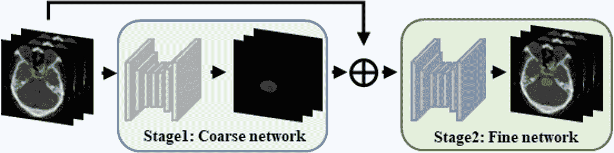

<!--yml

分类: 未分类

日期: 2024-09-06 19:41:15

-->

# [2303.00232] 朝着更精确的自动分析：深度学习基础的多脏器分割的综合调查

> 来源：[`ar5iv.labs.arxiv.org/html/2303.00232`](https://ar5iv.labs.arxiv.org/html/2303.00232)

# 朝着更精确的自动分析：深度学习基础的多脏器分割的综合调查

刘晓宇、曲林浩、谢紫月、赵佳月、石永宏和宋智坚 X. 刘、L. 曲、Z. 谢、J. 赵、Y. 石和 Z. 宋均隶属于复旦大学基础医学院数字医学研究中心，并与上海市医学影像计算与计算机辅助干预重点实验室（中国上海，200032）相关。(电子邮件: (liuxiaoyu21, zyxie22, jiayuezhao22) @m.fudan.edu.cn; (lhqu20, yonghong.shi, zjsong) @fudan.edu.cn); X. 刘和 L. 曲为共同第一作者。Y. 石和 Z. 宋为共同通讯作者。

###### 摘要

从医学图像中准确分割头部、颈部、胸部和腹部的多个脏器是计算机辅助诊断、外科导航和放射治疗中的一个重要步骤。在过去几年中，利用数据驱动的特征提取方法和端到端训练，自动深度学习基础的多脏器分割方法已经远远超越了传统方法，并成为一个新的研究课题。本综述系统地总结了该领域的最新研究。首次从完整和不完整注释的角度，我们全面编制了 161 项关于深度学习基础的多脏器分割研究，涵盖头部和颈部、胸部和腹部等多个区域，总共包含 214 个相关参考文献。基于完整注释的方法从网络架构、网络维度、网络专用模块和网络损失函数四个方面总结了现有的方法。基于不完整注释的方法从弱注释方法和半注释方法两个方面总结了现有的方法。我们还总结了多脏器分割中常用的数据集，并讨论了该领域的新挑战和新研究趋势。

###### 索引词：

腹部多脏器，胸部多脏器，深度学习，头部和颈部多脏器，多脏器分割。

## I 引言

从医学图像中准确分割头部和颈部、胸部、腹部以及其他部位的多个脏器对于计算机辅助诊断、外科导航和放射治疗至关重要[1, 2]。例如，放射治疗针对肿瘤团块和高风险肿瘤扩散的微观区域，是癌症患者的常见治疗选择[3]。然而，放射治疗可能对肿瘤周围的正常脏器带来很大的风险，这些脏器被称为风险脏器（OARs）。因此，准确分割肿瘤轮廓和 OARs 是必要的[4, 5]。

早期的分割过程严重依赖医生手动标记，这是一项劳动密集且耗时的过程。例如，一位经过培训的专家可能需要花费超过四个小时手动标记一个病例，这不仅对医疗系统造成了沉重的负担，还可能导致患者放射治疗的延误。此外，不同的医生或医院会有不同的标记结果 [6, 7, 8, 9]。因此，临床实践中迫切需要准确的自动化多脏器分割方法。

多脏器分割是一项具有挑战性的任务。首先，图像中解剖结构的轮廓高度可变，这难以用统一的数学规则表达。其次，由于图像噪声和低强度对比度，图像中不同器官或组织区域之间的边界往往模糊，这些边界难以通过传统数字图像处理技术识别。第三，使用不同的扫描仪、扫描协议和对比剂会导致获得图像中器官强度分布的差异，这对模型的泛化能力提出了很大挑战。最后，考虑到安全和伦理问题，许多医院不公开其数据集。许多分割方法在私人数据集上进行训练和验证，使得不同方法的比较变得困难。因此，设计准确且稳健的多脏器分割模型是一项非常困难且昂贵的任务。

传统方法[10、11、12、13]通常利用手动提取的图像特征进行图像分割，例如阈值[14]方法、图割[15]方法和区域生长[16]方法。由于手动提取的图像特征数量庞大以及非鲁棒性阈值或种子的选择，这些方法的分割结果通常不稳定，往往只能得到粗略的分割结果或仅适用于特定器官。基于知识的方法可以从标注的数据集中获取不同器官的解剖信息，减少手动特征提取的负担，并提高多器官分割的鲁棒性和准确性，这些方法通常包括多图谱标签融合[17、18]和统计形状模型[19、20]。基于多图谱标签融合的方法使用图像配准将预定义的结构轮廓对齐到待分割图像上，该方法通常包括多个步骤。因此，该方法的性能可能受到每个步骤中涉及的各种相关因素的影响。基于图谱的方法仍然非常流行，但由于使用了固定的图谱，处理不同患者之间器官的解剖变异比较困难。此外，它计算密集且完成配准任务的时间较长。统计形状模型利用不同器官之间的位置关系，并将统计空间中器官的形状作为约束来规范化分割结果。然而，这种方法的准确性在很大程度上依赖于形状模型的可靠性和可扩展性，而基于正常解剖结构的模型在不规则结构的分割中效果非常有限。

采用数据驱动的特征提取方法和端到端训练的深度学习（DL）方法已在图像分类 [21]、目标检测 [22]、图像分割 [23, 24]、图像融合 [25]、图像配准 [26] 等领域得到广泛研究。基于深度学习的分割方法已成为医学图像处理领域的主流方法。然而，多脏器深度学习分割任务面临两大主要困难。首先，如图 1 所示的头部和颈部、图 2 的腹部、图 3 的胸部以及图 4 的各部分多脏器尺寸统计，器官尺寸之间差异非常大，不同器官尺寸的严重不平衡会导致训练的分割网络对小器官的分割性能差。其次，由于 CT 技术的成像原理和人体复杂的解剖结构，器官与其周围组织之间的对比度通常较低，这导致分割网络对器官边界的分割不准确。因此，开发能够同时准确分割小器官和大器官的深度多脏器分割方法已成为新的研究热点。

图 1：头部和颈部器官示意图，数字按顺序排列：（1）脑干，（2）左眼，（3）右眼，（4）左晶状体，（5）右晶状体，（6）左视神经，（7）右视神经，（8）视交叉，（9）左颞叶，（10）右颞叶，（11）垂体，（12）左腮腺，（13）右腮腺，（14）左颞骨岩部，（15）右颞骨岩部，（16）左颞骨，（17）右颞骨，（18）左下颌髁，（19）右下颌髁，（20）脊髓，（21）左下颌骨，（22）右下颌骨。

图 2：胸腔器官示意图，数字按顺序排列：（1）左肺，（2）右肺，（3）心脏，（4）食道，（5）气管，以及（6）脊髓。

图 3：腹部器官示意图，其中数字按顺序排列：（1）肝脏，（2）肾脏，（3）脾脏，（4）胰腺，（5）主动脉，（6）下腔静脉，（7）胃，（8）胆囊，（9）食管，（10）右肾上腺，（11）左肾上腺，以及（12）腹腔动脉。

图 4：头颈部（a）、胸部（b）和腹部（c）各器官体素百分比的示意图。

最近，提出了大量基于深度学习的多脏器分割方法，这些方法性能显著提升[27]。Fu 等人[28] 对 2020 年前基于深度学习的医学图像多脏器分割方法进行了系统综述，按网络架构分类。然而，随着深度学习技术的迅猛发展，提出了更多具有代表性的新技术和方法，如基于变换器的多脏器分割方法和不完美标注的方法。对这些技术和方法进行更全面的综述和总结对该领域的发展至关重要。

本文回顾了 2016 至 2022 年间基于深度学习的头部、颈部、胸部和腹部的多脏器分割方法。在 Google Scholar 上，使用“Multi Organ Segmentation”和“Deep Learning”关键词的搜索初步获得了 287 篇文章，按摘要和关键词删除了 73 篇文章，最终获得了 161 篇高度相关的研究，并包含总计 214 条相关参考文献。图 5 总结了所有当前最先进的基于深度学习的多脏器分割方法，按照完全标注和不完美标注架构进行分类。在完全标注方法中，我们从网络架构、网络维度、网络专用模块和网络损失函数四个方面总结了现有方法。在不完美标注方法中，我们从弱标注和半标注两个方面总结了现有方法，以探讨它们的创新、贡献和挑战。

图 5：概览的框架图。

本文组织结构如下。第 II 节阐述了多脏器分割的数学定义及相应的评估指标。第 III 节总结了多脏器分割的数据集。第 IV 节描述了基于完整注释方法的文献，涉及四个部分：网络架构（第 IV.A 节）、网络维度（第 IV.B 节）、网络专用模块（第 IV.C 节）以及网络损失函数（第 IV.D 节）。第 V 节分析了基于不完全注释方法的文章，包括两个部分：弱注释方法（第 V.A 节）和半注释方法（第 V.B 节）。我们在第 VI 节讨论现有方法及其未来展望，并在第 VII 节总结全文。

## II 定义与评估指标

设$\boldsymbol{X}$表示输入图像中多个器官区域的并集，$\boldsymbol{G}$表示输入图像中多个器官的真实标签的并集，$\boldsymbol{P}$表示输出图像中多个器官的预测标签的并集，$\boldsymbol{x_{i}^{c}\in X,g_{i}^{c}\in G,p_{i}^{c}\in P,i=1,\cdots N}$，以及$\boldsymbol{c=1,\cdots C}$，其中$\boldsymbol{N}$表示图像中的像素数量，$\boldsymbol{C}$表示像素所属的类别数量，$\boldsymbol{f}$表示神经网络，$\boldsymbol{\theta}$表示神经网络优化的参数，其中$\boldsymbol{P=f(X;\theta)}$。

损失函数表示预测值与真实值之间的差距。在多脏器分割任务中，常见的损失函数包括交叉熵损失和 Dice 损失。第 IV-D 节提供了关于损失函数的具体细节。

给定一个多脏器分割任务，$\left\{\boldsymbol{\Psi}\right\}$ 表示要分割的器官类别集合。$\left\{\boldsymbol{x}\right\}_{\ast}$ 表示在 $\boldsymbol{x}$ 中标注的器官集合。根据现有的标注，可以通过三种学习范式实现多脏器分割：完全标注学习、弱标注学习和半标注学习。后两者称为不完全标注方法，如图 6 所示。完全标注学习意味着所有器官的标签都已给出，这表示 $\forall\boldsymbol{x}\in\boldsymbol{X},\{\boldsymbol{x}\}_{*}=\{\boldsymbol{\Psi}\}$。弱标注通常意味着数据来自 $\boldsymbol{n}$ 个不同的数据集。然而，每个数据集提供一个或多个器官的标注，而不是所有器官，这意味着 $\boldsymbol{X=X_{1}\cup X_{2}\cup\cdots\cup X_{n},\forall x_{k,i}\in X_{k},k=1,2,\ldots n}$，$\boldsymbol{\left\{x_{k,i}\right\}_{*}<\{\Psi\},\bigcup_{k=1}^{n}\left\{x_{k,i}\right\}_{*}=\{\Psi\}}$。这里，$\boldsymbol{x_{k,i}}$ 表示 $\boldsymbol{X_{k}}$ 中的第 $\boldsymbol{i}$ 张图像。半标注方法表示一些训练数据集是完全标注的，而其他数据集是未标注的，$\boldsymbol{X}=\boldsymbol{X}_{\boldsymbol{l}}\cup\boldsymbol{X_{u}}\cdot\boldsymbol{X}_{\boldsymbol{l}}$。$\boldsymbol{X_{l}}$ 表示完全标注的数据集，$\boldsymbol{X_{u}}$ 表示未标注的数据集，这表示 $\forall\boldsymbol{x_{l}\in X}_{\boldsymbol{l}},\left\{\boldsymbol{x}_{\boldsymbol{l}}\right\}_{*}=\{\boldsymbol{\Psi}\}$ 和 $\forall\boldsymbol{x}_{\boldsymbol{u}}\in\boldsymbol{X}_{\boldsymbol{u}},\left\{\boldsymbol{x}_{\boldsymbol{u}}\right\}_{*}=\boldsymbol{\phi}$，且 $\boldsymbol{X_{l}}$ 的规模远小于 $\boldsymbol{X_{u}}$。

图 6：本文回顾的学习范式的总体概述。

通常使用 Dice 相似系数 (DSC)、95% Hausdorff 距离 (HD95) 和均值表面距离 (MSD) 来评估分割方法的性能。DSC 是预测标签和真实标签之间体积重叠的度量，HD95 和 MSD 是预测标签和真实标签之间表面距离的度量。

|  | $\boldsymbol{DSC=\dfrac{2\times\left&#124;P^{c}\cap G^{c}\right&#124;}{\left&#124;P^{c}\right&#124;+\left&#124;G^{c}\right&#124;}}$ |  | (1) |
| --- | --- | --- | --- |
|  | $\boldsymbol{HD95=\max_{95\%}\left[d\left(P_{s}^{c},G_{s}^{c}\right),d\left(G_{s}^{c},P_{s}^{c}\right)\right]}$ |  | (2) |
|  | $MSD=\frac{1}{\left&#124;P_{s}^{c}\right&#124;+\left&#124;G_{s}^{c}\right&#124;}\left(\sum_{p_{s}^{c}\in P_{s}^{c}}d\left(p_{s}^{c},G_{s}^{c}\right)+\sum_{g_{s}^{c}\in G_{s}^{c}}d\left(g_{s}^{c},P_{s}^{c}\right)\right)$ |  | （3） |

其中 $\boldsymbol{P}^{\boldsymbol{c}}$ 和 $\boldsymbol{G}^{\boldsymbol{c}}$ 分别表示 $\boldsymbol{c}$ 类器官的预测像素集合和真实像素集合；$\boldsymbol{P_{s}^{c}}$ 和 $\boldsymbol{G_{s}^{c}}$ 分别表示 $\boldsymbol{c}$ 类器官表面的预测像素集合和真实像素集合；$\boldsymbol{d\left(p_{s}^{c},G_{s}^{c}\right)=\min_{g_{s}^{c}\in G_{s}^{c}}^{c}\left\|p_{s}^{c}-g_{s}^{c}\right\|_{2}}$ 表示点 $\boldsymbol{p_{s}^{c}}$ 到表面 $\boldsymbol{G_{s}^{c}}$ 的最小距离。评审报告了基于 DSC 值的各种方法。

## III 多器官分割数据集

为了获得高质量的器官分割数据集，许多研究团队与医疗组织进行了多次合作。表 I 总结了用于多器官分割方法开发和验证的常见头颈部、胸部和腹部数据集。表 I 还显示了用于深度学习研究的注释数据量仍然非常低。

表 I：常用的多器官分割数据集

| 年份 | 数据集 | 模态 | 部位 | 器官数量（具体器官） | 数量 | 标记状态 | 图像尺寸 |
| --- | --- | --- | --- | --- | --- | --- | --- |
| 2015 | MICCAI 脑颅外多图谱标注（BTCV） [29] | CT | 腹部 | 13（脾脏、右肾、左肾、胆囊、食道、肝脏、胃、主动脉、下腔静脉、门静脉和脾静脉、胰腺、右肾上腺、左肾上腺） | 50（30 个用于训练，20 个用于测试） | 训练集已标记，测试集未标记 | 512 × 512 × [85$\sim$198] |
| 2015 | MICCAI 头颈部自动分割挑战（HNC） [30] | CT | 头颈部 | 9（脑干、下颌骨、视交叉、左侧视神经、右侧视神经、左侧腮腺、右侧腮腺、左侧下颌腺、右侧下颌腺） | 35（25 个用于训练，10 个离线测试，5 个现场测试） | 已标记 | 512 × 512 × [110$\sim$190] |
| 2015 |

&#124; Synapse 多- &#124;

&#124; 器官分割 &#124;

&#124; 数据集（Synapse） &#124;

| CT | 腹部 | 13（脾脏、右肾、左肾、胆囊、食道、肝脏、胃、主动脉、下腔静脉、门静脉和脾静脉、胰腺、右肾上腺、左肾上腺） | 50（30 个用于训练，20 个用于测试） | 已标记 | 512 × 512 × [85$\sim$198] |
| --- | --- | --- | --- | --- | --- |
| 2015 | 计算解剖学公共领域数据库（PDDCA） [30] | CT | 头部和颈部 | 9（脑干、下颌骨、视交叉、左侧视神经、右侧视神经、左腮腺、右腮腺、左颌下腺、右颌下腺） | 48（25 训练，8 额外训练，10 离线和 5 现场测试） | 标记 | 512 × 512 × [110$\sim$190] |
| 2017 | 胸部自动分割挑战（AAPM） [31] | CT | 胸部 | 5（左肺、右肺、心脏、食道、脊髓） | 60（36 训练，12 离线测试，12 现场测试） | 标记 | 512 × 512 × [103$\sim$279] |
| 2019 | 组合（CT-MR）健康腹部器官分割（CHAOS） [32] | CT | 腹部 | 4（左肾、右肾、肝脏、脾脏） | 40（20 训练和 20 测试） | 标记训练集和未标记测试集 | 512 × 512 × [78$\sim$294] |
| MR | 40（20 训练，20 测试） × 3 序列 | 标记训练集和未标记测试集 | 256 × 256 × [26$\sim$50] |
| 2019 | SegTHOR 挑战：CT 图像中的胸部风险器官分割（SegTHOR） [33] | CT | 胸部 | 5（左右肺、心脏、食道、脊髓） | 60（36 训练，12 离线测试，12 现场测试） | 标记 | 512 × 512 × N |
| 2019 | 基于 MICCAI LITS 数据集的身体器官定位标注 [34] | CT | 胸部 | 11（心脏、左肺、右肺、肝脏、脾脏、胰腺、左肾、右肾、膀胱、左股骨头、右股骨头） | 201（131 训练和 70 测试） | 边界框标记 | 512 × 512 × N |
| 2019 | 2019 年放射治疗规划挑战自动结构分割（StructSeg） | CT | 头部和颈部 | 22（左眼、右眼、左晶状体、右晶状体、左视神经、右视神经、视交叉、脑垂体、脑干、左颞叶、右颞叶、脊髓、左腮腺、右腮腺、左内耳、右内耳、左中耳、右中耳、左颞下颌关节、右颞下颌关节、左下颌骨、右下颌骨） | 60（50 训练，10 测试） | 标记训练集和未标记测试集 | 512 × 512 × [98$\sim$140] |
| 胸部 | 6（左肺、右肺、脊髓、食道、心脏、气管） | 60（50 训练，10 测试） |
| 2020 | OpenKBP：开放获取的知识基础规划大挑战及数据集 [35] | CT | 头部和颈部 | 7（脑干、脊髓、右侧腮腺、左侧腮腺、喉、食道、下颌骨） | 340（200 训练，40 验证，100 测试） | 标记 | 128×128×128 |
| 2021 | Abdomenct-1k [36] | CT | 腹部 | 5（肝脏、左右肾脏、脾脏、胰腺） | 1112 | 标记 | 512 × 512 × N |

## IV 完全标注方法

基于全标注的方法意味着多脏器分割任务的所有脏器都已完全标注。现有的方法可以从四个部分进行分析：网络架构、网络维度、网络专用模块和网络损失函数。在这些方法中，网络架构部分总结了常见的神经网络架构及不同架构的组合或级联。在网络维度部分，现有方法根据使用的图像维度分为 2D、3D 和多视角方法。网络专用模块部分描述了在多脏器分割中常用的模块，以提高分割性能。网络损失函数部分总结了如何围绕多脏器分割对常见损失函数进行创新。

### IV-A 网络架构

根据网络架构的设计，多脏器分割方法可以分为单阶段和多阶段实现。单阶段方法包括基于 CNN（卷积神经网络）、GAN（生成对抗网络）、transformer 或混合网络的方法。多阶段方法包括粗到精的方法、定位和分割方法，或其他级联方法。表格 II- IV 总结了基于 DSC 指标的头颈部、腹部和胸部多脏器分割的单阶段方法的文献。由于头颈部和腹部的脏器数量较多，本文主要报告了头颈部的 9 个脏器和腹部的 7 个脏器。补充材料中的表格 XI- XII 总结了其他脏器的 DSC 值。

#### IV-A1 基于 CNN 的方法

卷积神经网络（CNN）是一种前馈神经网络，能够自动提取图像的深层特征。多个神经元与下一层的每个神经元相连接，每一层可以执行复杂的任务，如卷积、池化或损失计算[37]。CNN 已成功应用于医学图像，如脑部[38、39]和胰腺[40]的分割任务。

##### 早期的基于 CNN 的方法

早期基于 CNN 的方法主要使用卷积层提取特征，然后经过池化层和全连接层得到最终的预测结果。Ibragimov 和 Xing[41]首次使用深度学习方法对头颈部 CT 图像中的 OAR 进行分割，为 13 个 OAR 训练了 13 个 CNN，并显示这些 CNN 在脊髓、下颌骨、喉部、咽部、眼睛和视神经等器官的分割准确度上优于或与先进算法相当，但在分割如腮腺、下颌腺和视交叉等器官时表现较差。Fritscher 等人[42]结合了形状位置及强度与 CNN 用于腮腺、下颌腺和视神经的分割。Moeskops 等人[43]探讨了是否可以使用单一的 CNN 对脑部 MR 图像中的六种组织、乳腺 MR 图像中的胸肌和心脏 CTA 图像中的冠状动脉进行分割。结果表明，单一的 CNN 不仅可以在单一模态上分割多个器官，还可以在多种模态上进行分割。

##### 基于 FCN 的方法

早期基于 CNN 的方法在分割准确度上相较于传统方法有所提升。然而，CNN 在卷积操作中涉及多个相同的重叠体素计算，这可能导致一定的性能损失。此外，当卷积特征输入到最终的全连接网络层时，图像的空间信息会丢失。因此，Shelhamer 等人[44]提出了全卷积网络（FCN），该网络通过使用转置卷积层使预测图像的大小与输入图像的大小匹配，从而实现端到端的分割。Wang 等人[45]将 FCN 与一种新的样本选择策略相结合，分割了腹部的 16 个器官，而 Trullo 等人[83]则使用 FCN 的变体 SharpMask[46]，对胸腔中的食管、心脏、气管和主动脉进行分割，结果显示所有四个器官的分割结果相比普通 FCN 有所改善。

##### 基于 U-Net 的方法

基于 FCN，Ronneberger 等人[47] 提出了经典的 U-Net 架构，该架构由一个用于下采样的编码器和一个用于上采样的解码器组成，并通过跳跃连接逐层连接，使得从下采样层提取的特征可以直接传输到上采样层，以融合多尺度特征进行分割。U-Net 已成为多脏器分割领域中最常用的架构之一[48, 49, 50, 51, 52, 53, 54]。Roth 等人[52] 将 U-Net 架构应用于腹主动脉、门静脉、肝脏、脾脏、胃、胆囊和胰腺的分割。通过对七个脏器的平均 Dice 值达到 0.893，实现了多脏器的先进分割性能。Lambert 等人[55] 提出了一个简化版 U-Net，用于分割胸部的心脏、气管、主动脉和食道。结果表明，与普通 U-Net 相比，添加 dropout 和使用双线性插值可以显著提高心脏、主动脉和食道的分割性能。除了 U-Net，V-Net[56] 提出了基于体积的 3D 图像分割方法，该方法基于完全卷积神经网络。通过引入残差连接并使用卷积层代替原 U-Net 中的池化层，该方法可以直接处理 3D 医学数据。Gibson 等人[57] 使用密集 V-Net 对腹部的胰腺、食道、胃、肝脏、脾脏、胆囊、左肾和十二指肠进行分割。Xu 等人[58] 提出了一个新的概率 V-Net 模型，该模型结合了条件变分自编码器（cVAE）和层次空间特征变换（HSPT）用于腹部多脏器分割。nnU-Net [101] 是一个基于 U-Net 架构的新型框架，增加了自适应预处理、数据增强和后处理技术，并在许多公开数据集中对不同生物医学分割挑战展示了最先进的结果[59, 60, 61, 62]。Podobnik 等人[59] 报告了使用 nnU-Net 架构结合 CT 和 MR 图像对 31 个头颈部 OARs 进行分割的结果。

#### IV-A2 基于 GAN 的方法

一个典型的生成对抗网络（GAN） [63] 包括一对竞争网络，即生成器和判别器。生成器试图通过生成虚假数据来欺骗判别器，而判别器则努力区分虚假数据而不被生成器欺骗；经过交替优化训练，两个网络的性能最终可以得到提升。近年来，提出了许多基于 GAN 的多器官分割方法，并实现了高分割准确性 [64, 65, 66, 67, 68, 69, 70]。

Dong 等人 [66] 将 GAN 与一组 U-Nets 作为生成器和一组 FCNs 作为判别器联合训练，用于从胸部 CT 图像中分割左肺、右肺、脊髓、食管和心脏。结果表明，大多数器官的分割性能在对抗网络的帮助下有所提高，以上五个 OAR 的平均 DSC 值最终分别为 0.970、0.970、0.900、0.750 和 0.870。Tong 等人 [64] 提出了一个形状约束 GAN（SC-GAN）用于自动分割头颈部 OARs 从 CT 和低场 MRI 图像中。它使用 DenseNet，一个深度监督全卷积网络进行器官分割预测，并使用 CNN 作为判别器网络来纠正预测误差。结果表明，GAN 和 DenseNet 的结合可以进一步提高基于 CNN 的原始形状约束的分割性能。

GAN 可以通过其对抗损失提高准确性。然而，由于生成器需要与判别器达到纳什均衡，GAN 网络的训练既困难又耗时。其对抗损失作为形状修正器只能在分割形状规则且独特的器官（如肝脏和心脏）时实现更高的分割准确性，但可能对不规则或管状结构（如胰腺和主动脉）效果不佳。

#### IV-A3 基于 Transformer 的方法

基于 CNN 的方法在许多任务中可以很好地进行多器官分割，但卷积层感知领域的固有缺陷导致 CNN 无法建模全局关系，从而阻碍了模型的性能。Transformer 的自注意力机制 [71] 可以很好地解决长期依赖问题，在许多任务中，如自然语言处理（NLP）或计算机视觉 [72]，取得了比 CNN 更好的结果。使用 Transformer 的医学图像分割网络的性能也接近甚至优于当前最先进的方法 [73, 74, 75, 76]。

Cao 等人[77] 将 Transformer 与 U 型架构集成，以探索纯 Transformer 模型在腹部多器官分割中的潜力。结果显示，该方法具有良好的分割精度。然而，该方法需要使用在 ImageNet 上训练的 Swin Transformer 的权重来初始化网络编码器和解码器。Huang 等人[78] 介绍了一种高效且强大的医学图像分割架构 MISSFormer，其中提出的增强混合块可以有效克服卷积引起的特征识别限制问题。此外，与 Swin-UNet 相比，该模型不需要在大规模数据集上进行预训练即可实现可比的分割结果。

基于 Transformer 的方法能够捕捉长期依赖关系，并在许多任务中比 CNN 实现更好的性能。然而，多脏器分割问题涉及许多微小器官的分割，而纯 Transformer 网络专注于全球上下文建模。这导致低分辨率特征缺乏详细的定位信息。因此，通常会得到较粗的分割结果。

#### IV-A4 混合网络

CNN 卷积操作可以很好地提取局部特征，但很难获得全球特征。Transformer 的自注意机制可以有效捕捉长距离的特征依赖关系，但会丢失局部特征细节，这可能导致小器官的分割精度较差。因此，一些研究人员结合了 CNN 和 Transformer，以克服这两种架构的局限性[79, 74, 80, 81, 82, 83]。

Suo 等人[84] 提出了一个通过结合 CNN 和 Transformer 提取的特征进行内尺度和跨尺度协作学习的网络（I2-Net），用于分割腹部的多个器官，这提高了小型和中型器官的分割性能，分别提高了 4.19%和 1.83%-3.8%。Kan 等人[85] 提出了 ITUnet，它将 Transformer 提取的特征添加到基于 CNN 的编码器的每个块的输出中，这样可以获得由图像的局部和全球信息提供的分割结果。ITUnet 比其他方法具有更好的准确性和鲁棒性，尤其是在镜头等困难器官上。Chen 等人[86] 提出了一个新的网络架构，TransUNet，它使用 Transformer 进一步编码 CNN 编码器，以构建更强的编码器，并报告了头部和颈部多器官分割的竞争性结果。Hatamizadeh 等人[87] 提出了一个新的架构 U-net transformer（UNETR），它使用 Transformer 作为编码器，CNN 作为解码器，通过捕捉全球和局部依赖关系实现了更好的分割精度。

除了结合 CNN 和 transformer 的方法，还有一些其他的混合框架。例如，Chen 等人[88]结合了 U-Net 和长短期记忆（LSTM）来实现胸部五个器官的分割，所有五个器官的 DSC 值均在 0.8 以上。Chakravarty 等人[89]提出了一种结合 CNN 和 RNN 的混合架构来分割视盘、核和左心房。基于混合架构的方法可以结合并利用这两种架构的优点，以准确分割中小型器官，这是未来研究的一个关键方向。

#### IV-A5 级联网络

由于大多数器官在图像中只占有很小的体积，分割模型容易对大器官进行分割，而忽略小器官，这促使研究人员提出了级联多阶段方法。多阶段方法可以根据初级网络提供给次级网络的信息分为两大类。第一类被称为粗到细的多器官分割方法，其中第一个网络执行粗略分割，并将结果传递给另一个网络以实现精细分割。第二类被称为基于定位和分割的多器官分割方法，其中每个器官的候选框由配准方法或定位网络确定，然后输入到第二级网络中进行精细分割。此外，第一个网络还可以提供其他信息，如形状位置或比例，以更好地指导第二个网络的分割。表格 V-X 总结了基于 DSC 指标的头颈部、胸部和腹部级联方法的相关文献，而补充材料中的表格 VIII-IX 总结了其他器官的 DSC 指标。

##### 粗到细的基于方法

基于粗到细的方法首先将原始图像及其对应的标签输入到第一个网络中。经过训练后，第一级网络获得粗分割概率图，该图将与原始图像相乘，然后结果将输入到第二个网络中以细化粗略分割。这个过程如图 7 所示。近年来，已经提出了许多用于多器官分割的粗到细方法 [90, 91, 92, 93, 94, 95, 96, 97, 98, 99]，参考文献见表 VI-VIII。

图 7：基于粗到细的分割方法。

Trullo 等人 [100] 提出了两种协同深度架构，以共同分割所有器官，包括食管、心脏、主动脉和气管。第一阶段获得的概率图被传递到第二阶段以学习解剖约束，然后在第二阶段训练四个网络来区分背景与每个目标器官，并进行单独的精细化。Zhang 等人 [94] 提出了一个新的级联网络模型，在两个级联网络之间使用了块级跳跃连接（BLSC）。这种架构使第二阶段的网络能够捕捉到第一阶段网络中每个块学习到的特征，并加速了第二阶段网络的收敛。Xie 等人 [95] 提出了一个名为递归显著性转换网络（RSTN）的新框架。该框架使粗尺度分割掩膜可以作为空间权重传递到细尺度阶段，同时梯度可以从损失层反向传播到整个网络，从而实现两个阶段的联合优化，提高了小目标的分割精度。Ma 等人 [92] 提出了一个新的端到端粗到细分割模型，用于自动分割头颈部 CT 图像中的多个 OAR。该模型使用预定阈值将粗阶段的初步结果分类为大 OAR 和小 OAR，然后设计了不同的模块来细化分割结果。

这种粗到细的方法有效减少了背景的复杂性，并增强了目标结构的区分信息。与单阶段方法相比，这种粗到细的方法改进了小器官的分割结果，但由于至少需要训练两个网络，因此在内存和训练时间上存在一定的限制。

##### 基于定位和分割的方法

定位和分割方法也是多阶段级联方法。在这里，第一级网络提供位置相关信息，返回一个候选框，并根据位置信息裁剪图像的感兴趣区域，然后将其作为第二个网络的输入。通过这种方式，当第二个网络进行分割时，可以针对一个器官，排除其他器官或背景噪声的干扰，从而提高分割的准确性。该过程如图 8 所示。第一个阶段的器官位置可以通过注册或定位网络获得。基于位置和分割的多阶段方法的相关文献列在表格 VIII-X 中，其他器官的 DSC 值列在表格 XV-XVI 中。

图 8：基于定位和分割的方法。

Wang 等人 [101]、Men 等人 [102]、Lei 等人 [103]、Francis 等人 [104] 和 Tang 等人 [105] 提出了将 OARs 分割分解为定位和分割两个阶段的方法。第一阶段使用边界框定位目标 OARs，第二阶段在边界框内分割目标 OARs，两阶段都使用神经网络。其中，Wang 等人 [101] 和 Francis 等人 [104] 在两个阶段都使用了 3D U-net。Lei 等人 [103] 在第一阶段使用了 Faster RCNN 自动定位器官的 ROI。Korte 等人 [106] 证明了 CNN 是自动分割 HNC 患者 MRI 图像中腮腺和下颌腺的合适方法。通过级联定位 CNNs、裁剪和分割高分辨率 CNNs 可以提高腮腺和下颌腺的分割精度。FocusNet [69, 107] 提出了一个新颖的深度神经网络来解决头颈 OARs 分割中的类别不平衡问题。首先，通过器官定位网络定位小器官。然后，将每个小器官的高分辨率信息结合在一起，输入到分割网络中，从而准确分割小器官。

Larsson 等人 [108]、Zhao 等人 [109]、Ren 等人 [110] 和 Huang 等人 [111] 的器官定位是通过注册方法获得的，随后应用卷积神经网络进行分割。在这些研究中，Ren 等人 [110] 设计了交错的 3D-CNNs 连续体来分割每个感兴趣的结构。由于相邻组织在生理和解剖上通常高度相关，使用特定组织的初始分割结果可以帮助优化其他邻近组织的分割。Zhao 等人 [109] 提出了一个新的灵活的知识辅助卷积神经网络，它结合了深度学习和传统方法，以提高第二阶段的分割精度。

绝大多数方法要求在分割网络训练之前通过不同的定位方法确定目标区域。例如，Ren 等人 [110] 通过基于多图谱的方法定位器官区域。Wang 等人 [101] 使用独立的 CNN 定位候选区域。也就是说，他们的目标器官区域定位与器官分割是独立构建的，这会阻碍这两个相关学习任务之间的信息传递。在此基础上，Liang 等人 [112] 提出了一个基于多视角空间聚合的多器官分割框架，该框架结合了器官定位子网络和分割子网络的学习，以减少背景区域和输入数据中相邻相似结构的影响。此外，基于 ROI 的细粒度表示可以提高不同大小器官的分割准确性，特别是对小器官的分割结果。

多阶段方法提高了器官分割的准确性，特别是对小器官的分割，这大大减少了背景的干扰。然而，这种两步过程对内存和训练时间有一定要求，且分割准确性在很大程度上也依赖于区域定位的准确性。未来的研究方向仍然是更好地定位器官并提高分割准确性。

##### 其他级联方法

除了概率图和定位信息外，第一个网络还可以提供其他类型的信息，如尺度信息和形状先验。例如，Tong 等人 [113] 将 FCNN 和形状表示模型（SRM）结合用于头部和颈部 OARs 的分割。第一级网络是 SRM，用于学习头部和颈部器官的高度代表性形状特征。FCNN 与不带 SRM 的直接比较表明，SRM 显著提高了九个不同大小、形态复杂性和 CT 对比度不同的器官的分割准确性。Roth 等人 [114] 提出了一个多尺度 3D FCN 方法，通过两个级联的 FCN 实现，其中低分辨率的 3D FCN 预测被上采样、裁剪，并连接到更高分辨率的 3D FCN 输入。在这种情况下，主网络为次网络提供尺度信息。该方法使用尺度空间金字塔和自动上下文来执行高分辨率语义图像分割，同时考虑来自较低分辨率级别的大量上下文信息。

### IV-B 网络维度

考虑到输入图像和卷积核的维度，多器官分割神经网络可以分为 2D、2.5D 和 3D 架构，如图 9 所示，三种架构之间的差异将在其后讨论。

图 9：不同的网络尺寸。

#### IV-B1 基于 2D 和 3D 方法

2D 多器官分割神经网络的输入是三维医学图像的切片，卷积核也是二维的。Men 等人[115]，Trullo 等人[100]，Gibson 等人[57]，Chen 等人[116]，Zhang 等人[51]，Chen 等人[117]使用了 2D 网络进行多器官分割。2D 架构可以减少 GPU 内存负担，但 CT 或 MRI 图像本质上是 3D 的。此外，将图像切片成 2D 往往会忽视整个图像体元中的丰富信息，因此 2D 模型无法分析医学图像中复杂的 3D 结构。

3D 多器官分割神经网络架构使用 3D 卷积核，可以直接从 3D 医学图像中提取特征信息。Roth 等人[52]，Zhu 等人[48]，Gou 等人[50]和 Jain 等人[118]使用了 3D 架构进行多器官分割。然而，由于 GPU 内存限制，3D 架构可能面临计算密集和内存不足的问题，因此大多数 3D 网络方法使用滑动窗口在补丁上操作。Zhu 等人[48]提出了一个名为 AnatomyNet 的深度学习模型，它接收全容量头颈 CT 图像作为输入，并一次生成所有需要分割器官的蒙版。AnatomyNet 只在第一个编码块中使用了一个下采样层，以考虑 GPU 内存使用和网络学习能力之间的权衡，可以比其他网络结构占用更少的 GPU 内存，同时保留有关小解剖结构的信息。

#### IV-B2 基于多视图方法

在医学图像分割中，充分利用医学图像切片之间的空间信息至关重要。直接将 3D 图像输入网络，3D 图像会占用大量内存；或者将 3D 图像转换为 2D 图像，医学图像切片之间的空间信息将被直接丢弃。因此，出现了多视图的想法，即使用多个 2D 切片的 2.5D 神经网络，并结合 2D 卷积和 3D 卷积。

2.5D 多器官分割神经网络架构仍使用 2D 卷积核，但网络的输入是多个切片，这些切片可以是使用切片间信息的相邻切片堆叠 [119, 120]，或沿三个正交方向的切片（轴向、冠状面和矢状面） [41, 42, 91, 121]。这种 2.5D 方法节省了计算资源，并很好地利用了空间信息。它在基于半监督的方法中也得到了广泛应用，这些方法在第 V-B 节中进行了回顾。Zhou 等人 [122] 通过对三个正交方向的切片（2D 图像）进行 3D CT 案例采样，使用 FCN 对每个 2D 切片进行分割，然后将分割输出（即 2D 切片结果）组装回 3D。Chen 等人 [117] 采用了 4:1:1 的比例在不同视角（轴向、冠状面和矢状面）上进行多视图训练，并应用多数投票策略将三种预测结合成最终的分割结果。结果表明，该方法可以去除单视图输出中的一些错误分割区域，特别是对于小肠和十二指肠。Wang 等人 [123] 使用统计融合方法结合来自三种视角的分割结果，并将 2D 视图的结构相似性与原始 3D 图像相关联。Liang 等人 [121] 对三个视图中的每一个进行了基于上下文的迭代细化训练，并在最后一次迭代中汇总了三个正交视图的所有预测概率图，以获得最终的分割结果。实验表明，这种多视图框架优于三个单独视图的分割结果。

Tang 等人 [124] 提出了一个将 3D 和 2D 模型结合的新框架，该框架通过高分辨率的 2D 卷积实现分割，并通过低分辨率的 3D 卷积提取空间上下文信息。用于指导 2D 分割的相应 3D 特征由自注意机制控制，结果表明这种方法始终优于现有的 2D 和 3D 模型。Chen 等人 [116] 提出了一个混合卷积神经网络 OrganNet2.5D，它可以充分利用 3D 图像信息处理不同平面和深度图像分辨率。OrganNet2.5D 结合了 2D 卷积和 3D 卷积，以提取清晰的基础边缘特征和丰富的高级语义特征。

一些当前的研究仅处理 2D 图像，这虽然避免了内存和计算问题，但未能充分利用 3D 图像信息。2.5D 方法可以更好地利用来自多个视角的信息，并且相较于 2D 网络改进了单视角分割，但它们提取的空间上下文信息仍然有限。此外，目前用于多脏器分割的 2.5D 方法是在结果层面聚合三个视角，而中间过程是彼此独立的；更好地利用中间学习过程也是一个待研究的方向[125, 126, 127]。一些研究已经进行了 3D 卷积，但需要处理局部补丁。例如，处理全体积 3D CT 图像的网络，如 AnatomyNet，仅使用一个下采样层来保留关于小解剖结构的信息，因此这些网络的感受野有限。为了解决这个问题，引入了具有四个扩展率（3,6,12,18）的 DenseASPP 到 FocusNet 中[107]；然而，当级联扩展卷积的扩展率具有公因子关系时，可能会出现影响分割准确性的网格问题。纯 3D 网络也面临参数和计算负担增加的问题，这限制了网络的深度和性能。因此，考虑到内存和计算负担，更好地结合多视角信息以实现更准确的多脏器分割仍然是未来的研究方向。

### IV-C 网络专用模块

网络架构对于提高多脏器分割的准确性非常重要，但其设计过程复杂。在多脏器分割任务中，有许多特殊机制可以提高脏器分割的准确性，例如扩张卷积模块、特征金字塔模块和注意力模块。它们通过增加感知场、聚合不同尺度的特征以及将网络集中在分割区域上来提高多脏器分割的准确性。Cheng 等人[128]研究了每个网络模块相较于基础 U-Net 网络在头颈部分割任务中的性能提升。

#### IV-C1 形状先验模块

形状先验比自然图像更适合医学图像，因为医学图像中内部结构之间的空间关系相对固定。因此，在多脏器分割任务中考虑解剖先验将显著提高多脏器分割的性能。

当前使用解剖学先验的方法主要分为两类。一类基于统计学的思想，该方法计算一个完全标注数据集中器官的平均分布，以使预测结果尽可能接近器官的平均分布[42, 40, 66, 129, 130]。另一类是训练形状表示模型，该模型利用训练数据集的标注进行预训练，然后将其作为正则化项，在训练过程中约束分割网络的预测结果[64, 113]。研究表明，生成模型也可以学习解剖学先验[131]。因此，未来的研究方向是考虑使用生成模型（例如，近年来流行的扩散模型[132, 133]）来更好地获得解剖学先验知识，以提高分割性能。

#### IV-C2 扩张卷积模块

在传统的卷积神经网络（CNN）中，通常使用下采样和池化操作来减少计算量并扩展感受野，这会导致空间信息丢失并使图像重建变得困难。扩张卷积（也称为“Atrous”卷积）在卷积层中引入了另一个参数，即扩张率，它可以扩展感受野以提取更大空间范围的特征，而无需增加计算成本。扩张卷积是多器官分割任务中常用的方法[134, 40, 53, 135, 120]，它增加了采样空间的大小，使神经网络能够在更大的感受野中提取特征，从而捕捉多尺度的上下文信息。这些上下文特征能够捕捉更精细的结构信息，这对准确定位器官位置至关重要。Gibson 等人[40]使用带有扩张卷积的 CNN 网络准确地分割了肝脏、胰腺、胃和食道。Men 等人[115]提出了一种基于深度扩展卷积神经网络（DDCNN）的方法，用于快速且一致的自动分割临床靶区（CTV）和器官在放射治疗中的（OAR）。Vesal 等人[135]将扩张卷积引入到 2D U-Net 中，用于分割食道、心脏、主动脉和胸部气管。

#### IV-C3 多尺度模块

神经网络逐层提取目标特征。低层网络具有较小的感受野和较强的几何细节信息表示，它们具有更高的分辨率，但语义信息表示较弱。高层网络具有较大的感受野和较强的语义信息表示，但特征图的分辨率较低，几何信息表示较弱，导致小目标的信息丢失。常见的多尺度融合模块包括自下而上、自上而下以及横向连接的特征金字塔（FPNs）[136]、结合膨胀卷积和多尺度融合的空间池化金字塔（ASPPs）[137]等。在多器官分割任务中，由于目标器官的大小不同，多尺度特征融合已被广泛应用。贾和魏 [53] 将特征金字塔引入多器官分割网络，采用了两种对立的特征金字塔形式：自上而下和自下而上，这能有效处理多尺度变化，并提高小目标的分割准确率。石等 [120] 利用编码器和解码器之间的横向连接的金字塔结构捕捉多尺度的上下文信息。斯里瓦斯塔瓦等 [138] 提出了一个名为 OARFocalFuseNet 的新分割架构，该架构使用焦点调制方案在特定分辨率流中聚合多尺度上下文进行多尺度融合。

#### IV-C4 注意力模块

注意力模块可以通过动态加权来突出重要特征。这种新颖的注意力机制允许探讨网络的固有自注意性，并且对于多器官分割任务至关重要 [65, 139]。常见的注意力机制包括通道注意力、空间注意力和自注意力。

压缩与激励（SE）模块 [140] 是一种典型的通道注意力模块，它通过生成一个通道注意力张量来关注图像的关键部分。AnatomyNet [48] 使用 3D SE 残差块对头部和颈部的 OARs 进行分割，从 CT 图像中直接提取 3D 特征，并自适应地校准每个特征通道内残差特征的映射。刘等人 [141] 提出了一个新的跨层空间注意力图融合网络（CSAF-CNN），用于胸部多个器官的分割，它可以有效地整合网络中不同空间注意力图的权重，从而获得更有用的注意力图。头部和颈部 22 个器官的平均 DSC 为 72.50%，显著优于 U-Net（63.9%）和 SE-UNet（67.9%）。郭等人 [50] 设计了一种自通道空间注意力神经网络（SCSA-Net）用于 3D 头部和颈部 OARs 分割，它可以自适应地增强通道和空间特征。与 SE-Res-Net 和 SE-Net 相比，SCSA-Net 提高了视神经和下颌腺的 DSC 分别为 0.06 和 0.03 以及 0.05 和 0.04。林等人 [142] 建议将方差不确定性嵌入注意力架构，并提出了一个方差感知注意力 U-Net 网络，以提高对多器官分割中易出错区域（如边界区域）的关注。与现有方法相比，小器官和结构不规则器官（如十二指肠、食管、胆囊和胰腺）的分割结果显著提高。张等人 [51] 提出了一个新的混合网络（编织注意力 U-Net，WAU-Net），其 U-Net++ [143] 结构使用 CNN 提取基础特征，并使用轴向注意力块在网络的不同层级上高效建模全局关系，在头部和颈部多器官分割任务中取得了竞争性的性能。

#### IV-C5 其他模块

稠密块 [144] 可以高效利用中间层的信息，残差块 [145] 可以防止反向传播过程中梯度消失。这两个模块通常嵌入到基础分割框架中。可变形卷积 [146] 的卷积核可以适应实际情况，更好地提取输入特征。Heinrich 等人 [147] 提出了一个 3D 腹部多脏器分割架构，使用稀疏可变形卷积（OBELISK-Net），并展示了与传统 CNN 的结合可以进一步提高对形状变化大的小脏器（例如胰腺、食管）的分割效果。Shen 等人 [148] 提出的可变形卷积块可以通过为不同脏器生成合理的感受野以及额外的可训练偏移来处理脏器的形状和大小变化。条带池化（strip pooling） [149] 模块可以通过使用长池化代替传统的方形池化来针对长条形结构（例如食管和脊髓），以避免合并来自无关区域的污染信息，并更好地捕捉各向异性和远程上下文信息。例如，Zhang 等人 [150] 使用了具有三种不同方向感受野的各向异性条带池化来捕捉腹部多个脏器之间的空间关系。与网络架构相比，网络模块因其相对简单的设计过程和嵌入各种架构的相对容易性而被广泛利用。

### IV-D 网络损失函数

众所周知，除了网络架构或网络模块外，分割准确性还取决于所选择的损失函数。在多脏器分割任务中，选择合适的损失函数可以减少深度学习中的类别不平衡，提高小脏器的分割准确性。

Jadon [151] 总结了语义分割中常用的损失函数，这些函数被分类为基于分布的损失函数、基于区域的损失函数、基于边界的损失函数和复合损失函数。用于多脏器分割的常见损失函数包括 CE 损失 [152]、Dice 损失 [153]、Tversky 损失 [154]、focal 损失 [155] 及其组合损失函数。

#### IV-D1 CE 损失

CE 损失（交叉熵损失函数）[152] 是一种信息理论度量方法，用于计算网络预测与真实标签之间的差异。Men 等人 [115]、Moeskops 等人 [43] 和 Zhang 等人 [51] 使用 CE 损失进行多脏器分割。然而，当前景像素数量远小于背景时，CE 损失会严重偏向背景，从而导致分割结果较差。加权 CE 损失 [156] 在每个类别中添加了权重参数，相比于原始的 CE 损失，在样本数量不平衡的情况下能获得更好的结果。由于多脏器分割中存在显著的类别不平衡问题，即不同器官中的体素数量差异非常大，使用加权 CE 损失相比于仅使用 CE 损失能取得更好的结果。Trullo 等人 [100] 使用加权 CE 损失对胸部图像中的心脏、食道、气管和主动脉进行分割；Roth 等人 [52] 将加权 CE 损失应用于腹部多脏器分割。

#### IV-D2 Dice 损失

Milletari 等人 [56] 提出了 Dice 损失作为基于体积的重叠度量，将体素度量转换为语义标签重叠度量，并成为分割任务中的常用损失函数。Ibragimov 和 Xing [41] 使用 Dice 损失对头颈部的多个器官进行分割。然而，仅使用 Dice 损失无法消除神经网络固有的对大体积器官有利的问题。受到加权 CE 损失的启发，Sudre 等人 [153] 引入了加权 Dice 分数（GDSC），根据当前类别大小自适应地调整其 Dice 值。Shen 等人 [157] 研究了三种不同类型的 GDSC，基于类别标签频率（均匀、简单和平方）并评估了它们对分割精度的影响。Gou 等人 [50] 使用 GDSC 进行头颈部多脏器分割。Tappeiner 等人 [158] 引入了类别自适应 Dice 损失，以进一步补偿基于 nnU-Net 的高不平衡问题，结果表明该方法能提高类别不平衡分割任务的性能。

#### IV-D3 其他损失

Tversky 损失 [154] 是 Dice 损失的一个推广，通过调整参数来优化，以控制假阳性和假阴性之间的平衡。Focal 损失 [155] 在目标检测领域中提出，用于增强对难以分割样本的关注。类似于 focal 损失，focal Tversky 损失 [159] 通过减少简单样本损失的权重来专注于分割困难样本。Berzoini 等人 [54] 在小型器官上使用了 focal Tversky 损失，从而平衡了不同大小器官之间的指标，提高了难以分割的小样本的权重，最终解决了由肾脏和膀胱引起的类别不平衡问题。受到指数对数损失（ELD-Loss） [160] 的启发，Liu 等人 [141] 引入了 top-k 指数对数损失（TELD-Loss）来解决头颈部的类别不平衡问题。结果表明，使用这种损失函数在处理误标记方面具有强大的能力。

#### IV-D4 组合损失

每种类型的损失函数都有其优缺点。将多种函数结合可以用于多器官分割。一种更常见的方法是 Dice 损失和 CE 损失的加权和，这种方法试图用 Dice 损失解决类别不平衡问题，同时使用 CE 损失进行曲线平滑。Isensee 等人 [101] 提出了将 Dice 损失和 CE 损失结合起来，以测量体素状预测结果和真实情况的重叠。Isler 等人 [134]、Srivastava 等人 [138]、Xu 等人 [58]、Lin 等人 [142] 和 Song 等人 [161] 使用了 Dice 损失和 CE 损失的加权组合进行多器官分割。当涉及小物体时，仅使用 Dice 损失会导致较低的准确性；当预测区域与标注区域不重叠时，使用 CE 损失可以使预测尽可能接近标签。Zhu 等人 [48] 专门研究了针对不平衡头颈部区域的不同损失函数，并指出 Dice 损失和 focal 损失的组合优于普通的 Dice 损失。Cheng 等人 [128] 和 Chen 等人 [116] 都使用了这种组合损失函数。

传统的 Dice 损失对较小的结构是不利的，因为少量的体素误分类会导致 Dice 分数的大幅下降。应用指数对数损失或将焦点损失与 Dice 损失结合可以解决这个问题。使用这种损失函数不需要对网络进行大量调整，但会降低区域中困难体素的分割准确性。在此基础上，Lei 等人 [162] 提出了一个新的硬度感知损失函数，能够更专注于困难体素以实现准确的分割。神经网络优化的终极目标是损失函数，设计一个合适的损失函数以便网络能够提高对各种器官的分割准确性仍然是一个研究方向。

## V 不完美标注基础的方法

目前，多器官分割领域的大多数方法是基于完全标注的方法。然而，医学图像数据通常难以获取和标注。特别是对于多器官分割任务，获取完全标注的数据集是相当困难的，这启发了使用不完美标注的想法。在本文中，不完美标注被分为两类。第一类是弱标注方法，其中弱标注表示数据标注在每个案例中是不完整或不准确的。例如，在多器官分割中，每张图像仅标注了一种器官；每张图像没有像素级标注，而只有类别标注；或者标注是潦草的或包含噪声。另一类是半监督方法，其中半监督表示仅对总数据的一小部分进行了标注，其余大部分数据未标注。接下来，我们介绍这两种方法在多器官分割中的应用。

### V-A 弱标注基础的方法

在医学图像分割中，同时在同一组图像上获取多个器官的标注是一项困难的任务。例如，许多现有的单器官数据集，如 LiTS [163]、KiTS [164] (p19) 和胰腺数据集 [165]，只能提供单个器官的标注。然而，仅基于这些单器官标注的数据集无法有效训练多器官分割网络。因此，许多研究开始探索从部分标注数据集中学习统一的多器官分割网络。根据实现方法，我们将当前的研究分为基于模型的方法和基于伪标签的方法。

#### V-A1 基于模型的方法

模型基础方法的核心思想是实现一个统一的网络来处理多个部分标注的器官。陈等人[166] 引入了一个具有共享编码器和八个解码器的多分支解码器结构，以解决部分标注问题。然而，这种结构的灵活性不足，难以扩展到新的类别。德米特里耶夫和考夫曼[167] 提出了条件 CNN，用于学习多器官分割模型，将器官类别的信息集成到分割网络中。张和谢等人[168, 169] 提出了 DoDNet 的概念。类似于条件 CNN，他们将任务编码与编码器提取的特征拼接，并在分割头中引入了动态参数机制。张等人[103] 使用了领先的框架 nn-UNet[170] 作为骨干模型，将任务编码添加为 nn-UNet 解码器的支持信息，并结合深度监督机制进一步优化不同大小器官的输出。吴等人[171] 提出了 TGNet，由任务引导的注意模块和任务引导的残差块组成，该网络可以在特征提取过程中突出与任务相关的特征，同时抑制与任务无关的信息。刘等人[172] 首次引入了增量学习（IL），以阶段性地聚合部分标注数据集，并验证了不同部分标注数据集的分布会误导 IL 过程。徐和燕[173] 提出了一个新的联邦多编码 U-Net（Fed-MENU）方法，该方法可以有效利用具有不同部分标签的独立数据集来训练一个用于多器官分割的统一模型。该模型优于任何单一数据集训练的模型，以及所有数据集合并训练的模型。方和燕[174] 和史等人[175] 通过设计新网络和提出特定损失函数，在部分标注数据集上训练了统一模型。

#### V-A2 基于伪标签的方法

基于伪标签的方法通过使用在部分标注数据集上训练的部分器官分割模型来生成未标注器官的伪标签，这些伪标签可以转化为完全监督的方法。Zhou 等人 [129] 提出了一个**先验感知神经网络**（PaNN），该网络利用从完全标注数据集中获得的先验统计信息来指导基于部分标注数据集的训练过程。Huang 等人 [176] 提出了一个**权重平均联合训练框架**，该框架可以纠正伪标签中的噪声，从而学习一个更为稳健的模型。Zhang 等人 [177] 提出了一个**多教师知识蒸馏框架**，该框架利用在部分标注数据集上训练的教师模型预测的伪标签来训练学生模型，以实现多器官分割。Lian 等人 [130] 提出了一个基于单一和多个器官解剖先验的多器官分割模型（PRIMP）。该模型首先为每个部分标注数据集生成伪标签，以获得一组带有伪标签的多器官数据集。然后在该数据集上训练多器官分割模型，并在另一个新的数据集上进行测试。首次，该方法考虑了部分标注数据集与测试的多器官数据集之间的领域差异。

除了部分标注外，弱标注还包括图像级标注、稀疏标注和噪声标注 [178]。针对多器官分割任务，Kanavati 等人 [179] 提出了一个基于分类森林的弱监督器官分割方法，适用于肝脏、脾脏和肾脏，其中标签是手动标记在器官上的。

### V-B 半监督基础方法

半监督多器官分割方法充分利用未标注数据来提高分割性能，从而减少对大量标注的需求。近年来，半监督学习在医学图像分割中被广泛应用，例如心脏分割 [180, 181, 182]，胰腺分割 [183]，以及肿瘤靶区分割 [184]。Jiao 等人 [185] 详细回顾了医学图像中的半监督学习，他们将半监督医学图像分割方法分为三种范式：伪标签基础方法、一致性正则化基础方法和知识先验基础方法。在这篇综述中，我们关注半监督多器官分割方法。

Ma 等人 [36] 建立了一个新的半监督腹部多脏器分割基准，开发了一种基于伪标签的方法。首先在标记数据上训练教师模型，并为未标记数据生成伪标签。然后，在真实标记数据和伪标记数据上训练学生模型。最后，用学生模型替换教师模型完成训练。对肝脏、肾脏、

多视角方法也广泛用于半监督多脏器分割，其中模型以协作训练的方式学习，从多个平面（例如矢状面、冠状面和轴面）提取有用信息，然后使用多平面融合生成更可靠的伪标签，从而训练更好的分割网络。Zhou 等人 [186] 设计了一个系统框架 DMPCT，用于通过在训练过程中融合未标记数据的多平面信息来进行腹部 CT 扫描的多脏器分割。该框架使用多平面融合模块来综合推断并迭代更新多个配置的未标记数据的伪标签。Xia 等人 [187] 提出了基于不确定性感知的多视角协作训练（UMCT）方法，该方法首先通过空间变换如旋转和对齐获取多个视角，然后在每个视角上训练 3D 深度分割网络，并通过对未标记数据实施多视角一致性进行联合训练。

除了协作训练方法，多脏器分割也适用于基于一致性的学习，因为有大量的潜在类别和器官密集分布。一致性学习通过具有不同参数的网络鼓励一致的输出。Lai 等人 [188] 开发了一种基于半监督学习的 DLUNet 用于腹部多脏器分割，该方法在训练阶段包含两个轻量级的 U-Net。此外，对于未标记数据，两个网络生成的输出用于相互监督，从而提高这些未标记数据的准确性。最终，它在腹部 13 个器官上实现了 0.8718 的平均 DSC。

此外，还有其他半监督的多脏器分割方法。Lee 等人[189]提出了一种基于人工环路质量保证（QA）的判别模块，以监督未标注数据的学习。他们使用 QA 分数作为未标注数据的损失函数。Raju Cheng 等人[190]提出了一种强大的半监督脏器分割方法 CHASe，用于肝脏和病变分割。它将协同训练和异质学习整合到一个共同异质训练框架中。该框架在一个小的单相数据集上进行训练，并可以适应无标注的多中心和多阶段临床数据。

## VI 讨论与未来趋势

本文从完整标注和不完美标注两个角度系统性地回顾了深度学习方法在多脏器分割中的应用。完整标注方法的主要创新集中在网络架构设计、网络维度组合、网络模块创新和新损失函数的提出。在网络架构设计方面，随着 transformer[75]架构的发展，更好地利用这些先进架构进行多脏器分割是一个有前景的方向，以及通过神经网络架构搜索（NAS）[191]自动搜索每个脏器的最佳架构。在网络维度方面，优化组合 2D 和 3D 架构是一个值得研究的方向。在网络模块方面，需要设计更多专门的模块以提高分割精度，以适应多脏器分割任务。在损失函数方面，针对类别不平衡、几何先验或引入对抗学习损失将具有设计更全面和多样化损失函数的巨大潜力。

完整标注方法依赖于完全标注和高质量的数据集。在过去两年中，已经提出了许多不完美标注方法用于医学图像分割，包括前面提到的基于弱标注方法的多脏器分割和半标注方法。然而，相较于完整标注方法，不完美标注方法的研究较少。如果不完美标注方法能够更加充分地使用，从而实现接近完整标注方法的性能，这将是未来的研究重点。

深度学习在多脏器分割任务中已经发挥了重要作用，但未来仍然面临许多挑战，概述如下：

### VI-A 更高的分割精度

目前的多器官分割方法在解决大型器官和具有标准轮廓的器官的分割时更为有效，例如头颈部的脑干和下颌骨；胸部的左右肺和心脏；以及腹部的肝脏、脾脏和胃。此外，各种方法的 DSC（Dice Similarity Coefficient）基本上可以达到 0.8 或更高，而对于小型器官，如头颈部的视交叉（参见图 1(8)），左右视神经（参见图 1(6 和 7)），DSC 只能达到约 0.7；对于腹部的胰腺等不规则器官（图 2(4)），以及脊髓等长条形器官（图 2(6)），分割结果也不太令人满意。未来的研究方向是通过使用更先进的自动分割框架来提高这些类型器官的分割准确性。

### VI-B 更全面的公共数据集

目前，覆盖多个器官的公共数据集仍不够充分。绝大多数方法在其私人数据集上进行了验证，这使得模型的泛化能力难以验证。因此，未来需要建立具有大数据量、广泛覆盖和强临床相关性的多中心多器官分割公共数据集。

### VI-C 更好地利用不完美的标注

目前绝大多数方法都基于完全标注的方法。由于医疗影像数据通常不易收集，且在同一张影像上标注所有器官是一个耗时且劳动密集的工作。进一步的研究可以更好地利用不完美的标注[192、193]，包括使用弱标注数据集和半标注数据集。

### VI-D 转移学习模型的研究

现有的深度学习模型通常在身体的一个部分上训练，当迁移到其他数据集或应用于身体其他部位时，通常会获得较差的结果。因此，未来需要探索迁移学习模型。例如，Fu 等人[194]提出了一种称为领域自适应关系推理（DARR）的方法。该方法用于将 3D 多脏器分割模型推广到来自不同领域的医学数据。此外，与其他自然图像相比，医学图像面临一个非常显著的问题，即许多私人数据集未公开，许多医院只发布训练好的模型。因此，无源领域自适应问题将成为未来一个非常重要的研究方向。例如，Hong 等人[195]提出了一种无源的无监督领域自适应跨模态方法用于腹部多脏器分割。

## VII 结论

在本文中，我们系统回顾了 214 项基于深度学习的多脏器分割研究，这些研究分为两个广泛类别，即基于全标注的方法和基于不完全标注的方法，包括头颈部、胸部和腹部。在完全标注的方法中，我们根据网络架构、网络模块、网络维度和损失函数总结了现有的方法。在不完全标注的方法中，我们总结了弱标注方法和半标注方法。在此基础上，我们还提出了一些针对当前领域困难和不足的定制解决方案，并阐述了未来的趋势。综合调查表明，基于深度学习的多脏器分割算法正迅速发展进入一个更准确、更详细和更自动化的新时代。

## 致谢

本研究得到了中国国家自然科学基金资助，资助编号 82072021。 本研究还得到了复旦大学医学-产业融合项目资助，资助编号 XM03211181。

## 参考文献

+   [1] B. Van Ginneken, C. M. Schaefer-Prokop, 和 M. Prokop, “计算机辅助诊断：如何从实验室转向临床，” *《放射学》*，第 261 卷，第 3 期，第 719–732 页，2011 年。

+   [2] J. Sykes, “关于商业自动化分割系统在临床实践中现状的反思，”第 131–134 页，2014 年。

+   [3] D. G. Pfister, S. Spencer, D. Adelstein, D. Adkins, Y. Anzai, D. M. Brizel, J. Y. Bruce, P. M. Busse, J. J. Caudell, A. J. Cmelak *等*，“头颈癌，版本 2.2020，nccn 肿瘤学临床实践指南，” *《国家综合癌症网络杂志》*，第 18 卷，第 7 期，第 873–898 页，2020 年。

+   [4] J. K. Molitoris, T. Diwanji, J. W. Snider III, S. Mossahebi, S. Samanta, S. N. Badiyan, C. B. Simone, P. Mohindra *等*，“在肺癌辐射治疗中使用运动管理和影像引导的进展”，*Journal of thoracic disease*，第 10 卷，附录 21，页 S2437–S2450，2018。

+   [5] M. A. Vyfhuis, N. Onyeuku, T. Diwanji, S. Mossahebi, N. P. Amin, S. N. Badiyan, P. Mohindra 和 C. B. Simone，“肺癌中质子治疗的进展”，*Therapeutic advances in respiratory disease*，第 12 卷，页 1753466618783878，2018。

+   [6] C. W. Hurkmans, J. H. Borger, B. R. Pieters, N. S. Russell, E. P. Jansen 和 B. J. Mijnheer，“乳腺 CT 扫描中靶体积划定的变异性”，*International Journal of Radiation Oncology Biology Physics*，第 50 卷，第 5 期，页 1366–1372，2001。

+   [7] C. Rasch, R. Steenbakkers 和 M. van Herk，“前列腺、头部和颈部的靶区定义”，见于 *Seminars in radiation oncology*，第 15 卷，第 3 期。Elsevier，2005，页 136–145。

+   [8] J. Van de Steene, N. Linthout, J. De Mey, V. Vinh-Hung, C. Claassens, M. Noppen, A. Bel 和 G. Storme，“肺癌中肿瘤体积的定义：观察者间变异性”，*Radiotherapy and oncology*，第 62 卷，第 1 期，页 37–49，2002。

+   [9] J. Breunig, S. Hernandez, J. Lin, S. Alsager, C. Dumstorf, J. Price, J. Steber, R. Garza, S. Nagda, E. Melian *等*，“一种用于辐射治疗计划中正常组织划定的持续质量改进系统”，*International Journal of Radiation Oncology Biology Physics*，第 83 卷，第 5 期，页 e703–e708，2012。

+   [10] X. Chen 和 L. Pan，“基于图割/图搜索的医学图像分割综述”，*IEEE reviews in biomedical engineering*，第 11 卷，页 112–124，2018。

+   [11] I. El Naqa, D. Yang, A. Apte, D. Khullar, S. Mutic, J. Zheng, J. D. Bradley, P. Grigsby 和 J. O. Deasy，“通过主动轮廓进行的多模态图像分割用于放射治疗计划”，*Medical physics*，第 34 卷，第 12 期，页 4738–4749，2007。

+   [12] A. Pratondo, C.-K. Chui 和 S.-H. Ong，“用于医学图像分割的鲁棒边缘停止函数”，*IEEE Signal Processing Letters*，第 23 卷，第 2 期，页 222–226，2015。

+   [13] A. Tsai, A. Yezzi, W. Wells, C. Tempany, D. Tucker, A. Fan, W. E. Grimson 和 A. Willsky，“一种基于形状的医学影像分割方法，使用水平集”，*IEEE transactions on medical imaging*，第 22 卷，第 2 期，页 137–154，2003。

+   [14] A. M. Saranathan 和 M. Parente，“用于高光谱图像的基于阈值的分割方法”，见于 *2013 5Th workshop on hyperspectral image and signal processing: evolution in remote sensing (WHISPERS)*。Gainesville: IEEE，2013，页 1–4。

+   [15] J. Shi 和 J. Malik，“归一化切割与图像分割”，*IEEE Transactions on pattern analysis and machine intelligence*，第 22 卷，第 8 期，页 888–905，2000。

+   [16] A. J. Vyavahare 和 R. Thool, “基于 CLAHE 的区域生长算法在医学图像中的分割，” 见于 *第四届国际通信与计算最近技术进展会议 (ARTCom2012)*。班加罗尔，印度：IET，2012 年，页码 182–185。

+   [17] I. Isgum, M. Staring, A. Rutten, M. Prokop, M. A. Viergever, 和 B. Van Ginneken, “基于多图谱的分割与局部决策融合—应用于心脏和主动脉在 CT 扫描中的分割，” *IEEE 医学影像学事务*, 第 28 卷，第 7 期，页码 1000–1010, 2009 年。

+   [18] P. Aljabar, R. A. Heckemann, A. Hammers, J. V. Hajnal, 和 D. Rueckert, “基于多图谱的脑图像分割：图谱选择及其对准确性的影响，” *Neuroimage*, 第 46 卷，第 3 期，页码 726–738, 2009 年。

+   [19] O. Ecabert, J. Peters, H. Schramm, C. Lorenz, J. von Berg, M. J. Walker, M. Vembar, M. E. Olszewski, K. Subramanyan, G. Lavi *等*, “心脏在 CT 图像中的自动模型基分割，” *IEEE 医学影像学事务*, 第 27 卷，第 9 期，页码 1189–1201, 2008 年。

+   [20] A. A. Qazi, V. Pekar, J. Kim, J. Xie, S. L. Breen, 和 D. A. Jaffray, “头颈部 CT 图像中正常和目标结构的自动分割：基于特征驱动的模型方法，” *医学物理学*, 第 38 卷，第 11 期，页码 6160–6170, 2011 年。

+   [21] E. A. Smirnov, D. M. Timoshenko, 和 S. N. Andrianov, “用于 ImageNet 分类的深度卷积神经网络的正则化方法比较，” *Aasri Procedia*, 第 6 卷，页码 89–94, 2014 年。

+   [22] A. Mobiny 和 H. Van Nguyen, “用于肺癌筛查的快速 CapsNet，” 见于 *医学图像计算与计算机辅助手术–MICCAI 2018: 第 21 届国际会议，西班牙格拉纳达，2018 年 9 月 16-20 日，会议论文集，第二部分 11*。查姆：Springer，2018 年，页码 741–749。

+   [23] M. Z. Alom, C. Yakopcic, M. Hasan, T. M. Taha, 和 V. K. Asari, “用于医学图像分割的递归残差 U-Net，” *医学影像学杂志*, 第 6 卷，第 1 期，页码 014006, 2019 年。

+   [24] R. Wang, T. Lei, R. Cui, B. Zhang, H. Meng, 和 A. K. Nandi, “使用深度学习的医学图像分割：综述，” *IET 图像处理*, 第 16 卷，第 5 期，页码 1243–1267, 2022 年。

+   [25] B. Huang, F. Yang, M. Yin, X. Mo, 和 C. Zhong, “多模态医学图像融合技术综述，” *计算与数学方法医学*, 第 2020 卷，页码 8279342, 2020 年。

+   [26] Y. Fu, Y. Lei, T. Wang, W. J. Curran, T. Liu, 和 X. Yang, “医学图像配准中的深度学习：综述，” *医学与生物学物理学*, 第 65 卷，第 20 期，页码 20TR01, 2020 年。

+   [27] Y. Lei, Y. Fu, T. Wang, R. L. Qiu, W. J. Curran, T. Liu, 和 X. Yang, “多脏器分割中的深度学习，” *arXiv 预印本 arXiv:2001.10619*, 2020 年。

+   [28] Y. Fu, Y. Lei, T. Wang, W. J. Curran, T. Liu, 和 X. Yang, “基于深度学习的医学图像多脏器分割方法综述，” *物理医学*, 第 85 卷，页码 107–122, 2021 年。

+   [29] B. Landman, Z. Xu, J. E. Igelsias, M. Styner, T. Langerak, 和 A. Klein, “颅外分割挑战，” *突触*, 2015.

+   [30] P. F. Raudaschl, P. Zaffino, G. C. Sharp, M. F. Spadea, A. Chen, B. M. Dawant, T. Albrecht, T. Gass, C. Langguth, M. Lüthi *等人*, “头颈部 CT 分割方法评估：2015 年自动分割挑战，” *医学物理*, vol. 44, no. 5, pp. 2020–2036, 2017.

+   [31] J. Yang, H. Veeraraghavan, S. G. Armato III, K. Farahani, J. S. Kirby, J. Kalpathy-Kramer, W. van Elmpt, A. Dekker, X. Han, X. Feng *等人*, “胸部放射治疗计划的自动分割：AAPM 2017 年大挑战，” *医学物理*, vol. 45, no. 10, pp. 4568–4581, 2018.

+   [32] A. E. Kavur, N. S. Gezer, M. Barış, S. Aslan, P.-H. Conze, V. Groza, D. D. Pham, S. Chatterjee, P. Ernst, S. Özkan *等人*, “混合（CT-MR）健康腹部器官分割挑战，” *医学影像分析*, vol. 69, p. 101950, 2021.

+   [33] X. Feng, K. Qing, N. J. Tustison, C. H. Meyer, 和 Q. Chen, “用于分割胸部风险器官的深度卷积神经网络——使用裁剪的 3D 图像，” *医学物理*, vol. 46, no. 5, pp. 2169–2180, 2019.

+   [34] X. Xu, F. Zhou, B. Liu, 和 X. Bai, “基于 MICCAI LITS 数据集的身体器官定位注释，” *IEEE Dataport*, 2018.

+   [35] A. Babier, B. Zhang, R. Mahmood, K. L. Moore, T. G. Purdie, A. L. McNiven, 和 T. C. Chan, “Openkbp：开放访问知识基础规划大挑战和数据集，” *医学物理*, vol. 48, no. 9, pp. 5549–5561, 2021.

+   [36] J. Ma, Y. Zhang, S. Gu, C. Zhu, C. Ge, Y. Zhang, X. An, C. Wang, Q. Wang, X. Liu *等人*, “Abdomenct-1k: 腹部器官分割是否已解决问题？” *IEEE 模式分析与机器智能学报*, vol. 44, no. 10, pp. 6695–6714, 2021.

+   [37] Y. LeCun, B. Boser, J. S. Denker, D. Henderson, R. E. Howard, W. Hubbard, 和 L. D. Jackel, “反向传播应用于手写邮政编码识别，” *神经计算*, vol. 1, no. 4, pp. 541–551, 1989.

+   [38] R. Karthik, R. Menaka, A. Johnson, 和 S. Anand, “神经影像学和深度学习用于脑中风检测——近期进展和未来前景综述，” *计算机方法与程序在生物医学*, vol. 197, p. 105728, 2020.

+   [39] X. Zhao, K. Chen, G. Wu, G. Zhang, X. Zhou, C. Lv, S. Wu, Y. Chen, G. Xie, 和 Z. Yao, “深度学习在脑出血、脑室扩展和外围水肿的自动分割和体积测量方面表现出良好的可靠性，” *欧洲放射学*, vol. 31, no. 7, pp. 5012–5020, 2021.

+   [40] E. Gibson、F. Giganti、Y. Hu、E. Bonmati、S. Bandula、K. Gurusamy、B. R. Davidson、S. P. Pereira、M. J. Clarkson 和 D. C. Barratt，“面向图像引导的胰腺和胆道内镜：基于密集扩张网络的腹部 CT 自动多器官分割”，在*医学图像计算与计算机辅助干预–MICCAI 2017*：第二十届国际会议，加拿大魁北克市，2017 年 9 月 11-13 日，论文集，第 I 部分 20”。 瑞士查姆：施普林格，2017 年，第 728-736 页。

+   [41] B. Ibragimov 和 L. Xing，“使用卷积神经网络进行头颈部 CT 图像的器官风险分割”，*医学物理*，第 44 卷，第 2 期，第 547-557 页，2017 年。

+   [42] K. Fritscher、P. Raudaschl、P. Zaffino、M. F. Spadea、G. C. Sharp 和 R. Schubert，“用于快速分割 3D 医学图像的深度神经网络”，在*医学图像计算与计算机辅助干预–MICCAI 2016*：第十九届国际会议，希腊雅典，2016 年 10 月 17-21 日，论文集，第 II 部分 19”。 瑞士查姆：施普林格，2016 年，第 158-165 页。

+   [43] P. Moeskops、J. M. Wolterink、B. H. Van Der Velden、K. G. Gilhuijs、T. Leiner、M. A. Viergever 和 I. Išgum，“多任务医学图像分割的深度学习：*医学图像计算与计算机辅助干预–MICCAI 2016*：第十九届国际会议，希腊雅典，2016 年 10 月 17-21 日，论文集，第 II 部分 19”。 瑞士查姆：施普林格，2016 年，第 478-486 页。

+   [44] Long, Jonathan、Shelhamer, Evan、Darrell 和 Trevor，“用于语义分割的全卷积网络”，*IEEE 模式分析与机器智能学报*，第 39 卷，第 4 期，第 640-651 页，2017 年。

+   [45] Y. Wang、Y. Zhou、P. Tang、W. Shen、E. K. Fishman 和 A. L. Yuille，“通过松弛的上置信界进行样本选择来训练多器官分割网络”，在*医学图像计算与计算机辅助干预–MICCAI 2018*：第二十一届国际会议，西班牙格拉纳达，2018 年 9 月 16-20 日，论文集，第 IV 部分 11”。 瑞士查姆：施普林格，2018 年，第 434-442 页。

+   [46] P. O. Pinheiro、T.-Y. Lin、R. Collobert 和 P. Dollár，“学习精细化物体分割”，在*计算机视觉–ECCV 2016*：第十四届欧洲会议，荷兰阿姆斯特丹，2016 年 10 月 11-14 日，论文集，第 I 部分 14”。 瑞士查姆：施普林格，2016 年，第 75-91 页。

+   [47] O. Ronneberger、P. Fischer 和 T. Brox，“U-net：用于生物医学图像分割的卷积网络”，在*医学图像计算与计算机辅助干预–MICCAI 2015*：第十八届国际会议，德国慕尼黑，2015 年 10 月 5-9 日，论文集，第 III 部分 18”。 瑞士查姆：施普林格，2015 年，第 234-241 页。

+   [48] W. Zhu、Y. Huang、L. Zeng、X. Chen、Y. Liu、Z. Qian、N. Du、W. Fan 和 X. Xie，“Anatomynet：用于快速和完全自动化头颈部解剖结构全体积分割的深度学习”，*医学物理*，第 46 卷，第 2 期，第 576-589 页，2019 年。

+   [49] W. van Rooij, M. Dahele, H. R. Brandao, A. R. Delaney, B. J. Slotman, 和 W. F. Verbakel, “基于深度学习的头颈部风险器官轮廓描绘：几何和剂量学评估，” *国际放射肿瘤学生物物理学期刊*，第 104 卷，第 3 期，页 677–684，2019 年。

+   [50] S. Gou, N. Tong, S. Qi, S. Yang, R. Chin, 和 K. Sheng, “用于自动化多器官分割的自通道与空间注意力神经网络，应用于头颈部 CT 图像，” *医学与生物学物理学*，第 65 卷，第 24 期，页 245034，2020 年。

+   [51] Z. Zhang, T. Zhao, H. Gay, W. Zhang, 和 B. Sun, “编织注意力 u-net：一种新颖的混合 cnn 和基于注意力的方法，用于头颈部 CT 图像中的风险器官分割，” *医学物理学*，第 48 卷，第 11 期，页 7052–7062，2021 年。

+   [52] H. R. Roth, C. Shen, H. Oda, M. Oda, Y. Hayashi, K. Misawa, 和 K. Mori, “深度学习及其在医学图像分割中的应用，” *医学成像技术*，第 36 卷，第 2 期，页 63–71，2018 年。

+   [53] C. Jia 和 J. Wei, “Amo-net：在 MRI 中使用扩展 u-net 的腹部多器官分割，” 见 *2021 年 IEEE 第 4 届先进信息管理、通信、电子和自动化控制会议（IMCEC）*，第 4 卷。 重庆，中国：IEEE，2021 年，页 1770–1775。

+   [54] R. Berzoini, A. A. Colombo, S. Bardini, A. Conelli, E. D’Arnese, 和 M. D. Santambrogio, “优化的 u-net 用于不平衡的多器官分割，” 见 *2022 年第 44 届 IEEE 医学与生物学工程年会（EMBC）*。 格拉斯哥，苏格兰：IEEE，2022 年，页 3764–3767。

+   [55] Z. Lambert, C. Petitjean, B. Dubray, 和 S. Kuan, “Segthor：CT 图像中胸部器官风险的分割，” 见 *2020 年第十届图像处理理论、工具和应用国际会议（IPTA）*。 巴黎，法国：IEEE，2020 年，页 1–6。

+   [56] F. Milletari, N. Navab, 和 S.-A. Ahmadi, “V-net：用于体积医学图像分割的全卷积神经网络，” 见 *2016 年第四届国际 3D 视觉会议（3DV）*。 斯坦福，加州：IEEE，2016 年，页 565–571。

+   [57] E. Gibson, F. Giganti, Y. Hu, E. Bonmati, S. Bandula, K. Gurusamy, B. Davidson, S. P. Pereira, M. J. Clarkson, 和 D. C. Barratt, “使用密集 v 网络的腹部 CT 自动多器官分割，” *IEEE 医学成像学报*，第 37 卷，第 8 期，页 1822–1834，2018 年。

+   [58] M. Xu, H. Guo, J. Zhang, K. Yan, 和 L. Lu, “一种新的概率 v-net 模型，具有分层空间特征变换，用于高效的腹部多器官分割，” *arXiv 预印本 arXiv:2208.01382*，2022 年。

+   [59] G. Podobnik, B. Ibragimov, P. Strojan, P. Peterlin, 和 T. Vrtovec, “从 CT 和 MR 图像中分割头颈部的风险器官：基线结果，” 见 *2022 年 IEEE 第 19 届生物医学成像国际研讨会（ISBI）*。 加尔各答，印度：IEEE，2022 年，页 1–4。

+   [60] F. Isensee, P. F. Jäger, P. M. Full, P. Vollmuth 和 K. H. Maier-Hein，“用于脑肿瘤分割的 nnu-net”，收录于 *脑病变：胶质瘤、多发性硬化症、中风和创伤性脑损伤：第 6 届国际研讨会，BrainLes 2020，与 MICCAI 2020 同期举行，秘鲁利马，2020 年 10 月 4 日，修订精选论文集，第 II 部分第 6 卷*。瑞士，Cham：Springer，2021 年，页码 118–132。

+   [61] G. Zhang, Z. Yang, B. Huo, S. Chai 和 S. Jiang，“基于条件 nnu-net 的部分标注数据集中的多器官分割”，*计算机生物医学*，第 136 卷，页码 104658，2021 年。

+   [62] N. Altini, A. Brunetti, V. P. Napoletano, F. Girardi, E. Allegretti, S. M. Hussain, G. Brunetti, V. Triggiani, V. Bevilacqua 和 D. Buongiorno，“基于可变形超椭圆和 nnu-net 的前列腺癌融合活检框架”，*生物工程*，第 9 卷，第 8 期，页码 343，2022 年。

+   [63] I. Goodfellow, J. Pouget-Abadie, M. Mirza, B. Xu, D. Warde-Farley, S. Ozair, A. Courville 和 Y. Bengio，“生成对抗网络”，*arXiv 预印本 arXiv:1406.2661*，2014 年。

+   [64] N. Tong, S. Gou, S. Yang, M. Cao 和 K. Sheng，“用于头颈部 CT 和低场 MR 图像的多器官分割的形状约束全卷积 densenet 结合对抗训练”，*医学物理学*，第 46 卷，第 6 期，页码 2669–2682，2019 年。

+   [65] J. Cai, Y. Xia, D. Yang, D. Xu, L. Yang 和 H. Roth，“用于腹部器官深度分割的端到端对抗形状学习”，收录于 *医学影像中的机器学习：第 10 届国际研讨会，MLMI 2019，与 MICCAI 2019 同期举行，中国深圳，2019 年 10 月 13 日，论文集第 10 卷*。瑞士，Cham：Springer，2019 年，页码 124–132。

+   [66] X. Dong, Y. Lei, T. Wang, M. Thomas, L. Tang, W. J. Curran, T. Liu 和 X. Yang，“使用 u-net-gan 在胸部 CT 图像中进行自动多器官分割”，*医学物理学*，第 46 卷，第 5 期，页码 2157–2168，2019 年。

+   [67] R. Trullo, C. Petitjean, B. Dubray 和 S. Ruan，“使用距离感知对抗网络的多器官分割”，*医学影像学杂志*，第 6 卷，第 1 期，页码 014001，2019 年。

+   [68] F. Mahmood, D. Borders, R. J. Chen, G. N. McKay, K. J. Salimian, A. Baras, 和 N. J. Durr，“用于组织病理图像中多器官细胞核分割的深度对抗训练”，*IEEE 医学成像事务*，第 39 卷，第 11 期，页码 3257–3267，2019 年。

+   [69] Y. Gao, R. Huang, Y. Yang, J. Zhang, K. Shao, C. Tao, Y. Chen, D. N. Metaxas, H. Li 和 M. Chen，“Focusnetv2：具有对抗形状约束的不平衡大小器官分割用于头颈部 CT 图像”，*医学图像分析*，第 67 卷，页码 101831，2021 年。

+   [70] H. Fang, Y. Fang 和 X. Yang，“具有对抗性能验证器的多器官分割网络”，*arXiv 预印本 arXiv:2204.07850*，2022 年。

+   [71] A. Vaswani, N. Shazeer 和 N. Parmar，“注意力机制才是你所需要的”，*arXiv:170603762*，2021 年。

+   [72] I. Bello，“Lambdanetworks: 无需注意力机制的长距离交互建模”，*arXiv 预印本 arXiv:2102.08602*，2021 年。

+   [73] Y. Gao, M. Zhou, 和 D. N. Metaxas，“Utnet: 一种用于医学图像分割的混合变换器架构”，见于 *Medical Image Computing and Computer Assisted Intervention–MICCAI 2021: 第 24 届国际会议，法国斯特拉斯堡，2021 年 9 月 27 日–10 月 1 日，论文集，第三部分第 24 卷*。   柴姆，瑞士: Springer，2021 年，第 61–71 页。

+   [74] C. Yao, M. Hu, G. Zhai, 和 X. Zhang，“Transclaw u-net: 具有变换器的爪形 u-net 用于医学图像分割”，*arXiv 预印本 arXiv:2107.05188*，2021 年。

+   [75] J. M. J. Valanarasu, P. Oza, I. Hacihaliloglu, 和 V. M. Patel，“医学变换器: 用于医学图像分割的门控轴向注意力”，见于 *Medical Image Computing and Computer Assisted Intervention–MICCAI 2021: 第 24 届国际会议，法国斯特拉斯堡，2021 年 9 月 27 日–10 月 1 日，论文集，第一部分第 24 卷*。   Springer，2021 年，第 36–46 页。

+   [76] S. Pan, Y. Lei, T. Wang, J. Wynne, C.-W. Chang, J. Roper, A. B. Jani, P. Patel, J. D. Bradley, T. Liu *等*，“使用基于 token 的变换器 vnet 进行男性骨盆多器官分割”，*Physics in Medicine & Biology*，第 67 卷，第 20 期，第 205012 页，2022 年。

+   [77] H. Cao, Y. Wang, J. Chen, D. Jiang, X. Zhang, Q. Tian, 和 M. Wang，“Swin-unet: 类似 u-net 的纯变换器用于医学图像分割”，*arXiv 预印本 arXiv:2105.05537*，2021 年。

+   [78] X. Huang, Z. Deng, D. Li, 和 X. Yuan，“Missformer: 一种有效的医学图像分割变换器”，*arXiv 预印本 arXiv:2109.07162*，2021 年。

+   [79] Y. Xie, J. Zhang, C. Shen, 和 Y. Xia，“Cotr: 高效地连接 cnn 和变换器用于 3D 医学图像分割”，见于 *Medical Image Computing and Computer Assisted Intervention–MICCAI 2021: 第 24 届国际会议，法国斯特拉斯堡，2021 年 9 月 27 日–10 月 1 日，论文集，第三部分第 24 卷*。   柴姆，瑞士: Springer，2021 年，第 171–180 页。

+   [80] H. Wang, P. Cao, J. Wang, 和 O. R. Zaiane，“Uctransnet: 从通道级视角重新思考 u-net 中的跳跃连接与变换器”，见于 *Proceedings of the AAAI conference on artificial intelligence*，第 36 卷，第 3 期，2022 年，第 2441–2449 页。

+   [81] H. Wang, S. Xie, L. Lin, Y. Iwamoto, X.-H. Han, Y.-W. Chen, 和 R. Tong，“用于医学图像分割的混合变换器 u-net”，见于 *ICASSP 2022-2022 IEEE 国际声学、语音与信号处理会议（ICASSP）*。   新加坡: IEEE，2022 年，第 2390–2394 页。

+   [82] G. Xu, X. Wu, X. Zhang, 和 X. He，“Levit-unet: 利用变换器加速编码器用于医学图像分割”，*arXiv 预印本 arXiv:2107.08623*，2021 年。

+   [83] Y. Zhang, H. Liu, 和 Q. Hu，“Transfuse: 融合变换器和 cnn 用于医学图像分割”，见于 *Medical Image Computing and Computer Assisted Intervention–MICCAI 2021: 第 24 届国际会议，法国斯特拉斯堡，2021 年 9 月 27 日–10 月 1 日，论文集，第一部分第 24 卷*。   柴姆，瑞士: Springer，2021 年，第 14–24 页。

+   [84] C. Suo, X. Li, D. Tan, Y. Zhang, 和 X. Gao, “I2-net：用于腹部多器官分割的尺度内外协作学习网络”，见于 *2022 年国际多媒体检索会议论文集*，纽约，NY，2022，第 654–660 页。

+   [85] H. Kan, J. Shi, M. Zhao, Z. Wang, W. Han, H. An, Z. Wang, 和 S. Wang, “Itunet: 转换器与 Unet 集成用于危险器官分割”，见于 *2022 年第 44 届国际 IEEE 医学与生物学工程学会年会（EMBC）*。IEEE，2022，第 2123–2127 页。

+   [86] J. Chen, Y. Lu, Q. Yu, X. Luo, E. Adeli, Y. Wang, L. Lu, A. L. Yuille, 和 Y. Zhou, “Transunet：转换器使医学图像分割变得强大”，*arXiv 预印本 arXiv:2102.04306*，2021 年。

+   [87] A. Hatamizadeh, Y. Tang, V. Nath, D. Yang, A. Myronenko, B. Landman, H. R. Roth, 和 D. Xu, “Unetr：用于 3D 医学图像分割的转换器”，见于 *IEEE/CVF 计算机视觉应用冬季会议论文集*，Waikoloa, HI，2022，第 574–584 页。

+   [88] P.-H. Chen, C.-H. Huang, S.-K. Hung, L.-C. Chen, H.-L. Hsieh, W.-Y. Chiou, M.-S. Lee, H.-Y. Lin, 和 W.-M. Liu, “用于 CT 图像器官分割的注意力 LSTM 融合 U-Net 架构”，见于 *2020 年计算机、消费电子与控制国际研讨会（IS3C）*。台湾台中市：IEEE，2020，第 304–307 页。

+   [89] A. Chakravarty 和 J. Sivaswamy, “Race-net：一种用于生物医学图像分割的递归神经网络”，*IEEE 生物医学与健康信息学期刊*，第 23 卷，第 3 期，第 1151–1162 页，2018 年。

+   [90] E. Tappeiner, S. Pröll, M. Hönig, P. F. Raudaschl, P. Zaffino, M. F. Spadea, G. C. Sharp, R. Schubert, 和 K. Fritscher, “头颈部区域的多器官分割：一种高效的分层神经网络方法”，*计算机辅助放射学与外科国际期刊*，第 14 卷，第 5 期，第 745–754 页，2019 年。

+   [91] Y. Pu, S.-I. Kamata, 和 Y. Wang, “头颈部图像中多器官分割的粗到细框架”，见于 *2020 年联合第 9 届信息学、电子学与视觉国际会议（ICIEV）和 2020 年第 4 届成像、视觉与模式识别国际会议（icIVPR）*。日本北九州：IEEE，2020，第 1–6 页。

+   [92] Q. Ma, C. Zu, X. Wu, J. Zhou, 和 Y. Wang, “鼻咽癌放射治疗中危险器官的粗到细分割”，见于 *医学图像计算与计算机辅助干预–MICCAI 2021：第 24 届国际会议，法国斯特拉斯堡，2021 年 9 月 27 日–10 月 1 日，会议录，第 I 部分第 24 卷*。瑞士 Cham：Springer，2021，第 358–368 页。

+   [93] P. Hu, F. Wu, J. Peng, Y. Bao, F. Chen, 和 D. Kong, “利用深度卷积神经网络和时间隐式水平集的自动腹部多器官分割”，*计算机辅助放射学与外科国际期刊*，第 12 卷，第 3 期，第 399–411 页，2017 年。

+   [94] L. Zhang, J. Zhang, P. Shen, G. Zhu, P. Li, X. Lu, H. Zhang, S. A. Shah 和 M. Bennamoun, “跨级联 V-net 的块级跳跃连接用于多脏器分割，” *IEEE 医学影像学会期刊*，第 39 卷，第 9 期，页 2782–2793，2020 年。

+   [95] L. Xie, Q. Yu, Y. Zhou, Y. Wang, E. K. Fishman 和 A. L. Yuille, “腹部 CT 扫描中用于微小目标分割的递归显著性变换网络，” *IEEE 医学影像学会期刊*，第 39 卷，第 2 期，页 514–525，2019 年。

+   [96] H. H. Lee, Y. Tang, S. Bao, R. G. Abramson, Y. Huo 和 B. A. Landman, “Rap-net：具有单一随机解剖先验的粗到细多脏器分割，” 在 *2021 IEEE 第十八届生物医学影像国际研讨会 (ISBI)*。   尼斯，法国：IEEE，2021 年，页 1491–1494。

+   [97] P. F. Christ, M. E. A. Elshaer, F. Ettlinger, S. Tatavarty, M. Bickel, P. Bilic, M. Rempfler, M. Armbruster, F. Hofmann, M. D’Anastasi *等*，“使用级联全卷积神经网络和 3D 条件随机场的 CT 自动肝脏和病变分割，” 在 *国际医学图像计算与计算机辅助干预会议*。   查姆，瑞士：施普林格，2016 年，页 415–423。

+   [98] D. Lachinov, E. Vasiliev 和 V. Turlapov, “使用级联 Unet 的胶质瘤分割，” 在 *脑损伤：胶质瘤、多发性硬化症、中风和创伤性脑损伤：第四届国际研讨会，BrainLes 2018，与 MICCAI 2018 同期举行，西班牙格拉纳达，2018 年 9 月 16 日，修订选择论文，第二部分 4*。   查姆，瑞士：施普林格，2019 年，页 189–198。

+   [99] S. Li, Y. Chen, S. Yang 和 W. Luo, “用于 MR 图像前列腺分割的级联密集 Unet，” 在 *智能计算理论与应用：第十五届国际会议，ICIC 2019，中国南昌，2019 年 8 月 3–6 日，论文集，第一部分 15*。   查姆，瑞士：施普林格，2019 年，页 481–490。

+   [100] R. Trullo, C. Petitjean, S. Ruan, B. Dubray, D. Nie 和 D. Shen, “使用 SharpMask 架构和条件随机场的胸部 CT 图像中的风险器官分割，” 在 *2017 IEEE 第十四届生物医学影像国际研讨会 (ISBI 2017)*。   墨尔本，澳大利亚：IEEE，2017 年，页 1003–1006。

+   [101] Y. Wang, L. Zhao, M. Wang 和 Z. Song, “基于 3D U-net 的头颈 CT 图像中的风险器官分割的双阶段分割框架，” *IEEE Access*，第 7 卷，页 144 591–144 602，2019 年。

+   [102] K. Men, H. Geng, C. Cheng, H. Zhong, M. Huang, Y. Fan, J. P. Plastaras, A. Lin 和 Y. Xiao, “利用卷积神经网络级联在放射治疗中更准确高效的风险器官分割，” *医学物理*，第 46 卷，第 1 期，页 286–292，2019 年。

+   [103] Y. Lei, J. Zhou, X. Dong, T. Wang, H. Mao, M. McDonald, W. J. Curran, T. Liu 和 X. Yang, “使用 U-faster-rcnn 的头颈 MRI 中的多脏器分割，” 在 *医学影像 2020：图像处理*，第 113133A 卷。   休斯顿，TX：SPIE，2020 年，页 826–831。

+   [104] S. Francis, P. Jayaraj, P. Pournami, M. Thomas, A. T. Jose, A. J. Binu, 和 N. Puzhakkal，"Thoraxnet：基于 3d u-net 的两阶段框架用于胸部 CT 图像中的 OAR 分割"，*物理与工程医学科学*，第 45 卷，第 1 期，页码 189–203，2022 年。

+   [105] H. Tang, X. Chen, Y. Liu, Z. Lu, J. You, M. Yang, S. Yao, G. Zhao, Y. Xu, T. Chen *等*，"适用于 CT 图像中风险器官 delineation 的临床可用深度学习框架"，*自然机器智能*，第 1 卷，第 10 期，页码 480–491，2019 年。

+   [106] J. C. Korte, N. Hardcastle, S. P. Ng, B. Clark, T. Kron, 和 P. Jackson，"用于头颈癌患者的级联深度学习自动分割：T2 加权磁共振成像中的风险器官"，*医学物理学*，第 48 卷，第 12 期，页码 7757–7772，2021 年。

+   [107] Y. Gao, R. Huang, M. Chen, Z. Wang, J. Deng, Y. Chen, Y. Yang, J. Zhang, C. Tao, 和 H. Li，"Focusnet：用于头颈 CT 图像中不平衡大小器官分割的端到端深度神经网络"，在 *医学图像计算与计算机辅助干预–MICCAI 2019：第 22 届国际会议，深圳，中国，2019 年 10 月 13–17 日，会议论文集，第三部分 22*。  Cham，瑞士：施普林格，2019 年，页码 829–838。

+   [108] M. Larsson, Y. Zhang, 和 F. Kahl，"使用区域卷积神经网络进行鲁棒的腹部器官分割"，*应用软计算*，第 70 卷，页码 465–471，2018 年。

+   [109] Y. Zhao, H. Li, S. Wan, A. Sekuboyina, X. Hu, G. Tetteh, M. Piraud, 和 B. Menze，"知识辅助卷积神经网络用于小器官分割"，*IEEE 生物医学与健康信息学杂志*，第 23 卷，第 4 期，页码 1363–1373，2019 年。

+   [110] X. Ren, L. Xiang, D. Nie, Y. Shao, H. Zhang, D. Shen, 和 Q. Wang，"交错 3d-cnn 用于头颈 CT 图像中小体积结构的联合分割"，*医学物理学*，第 45 卷，第 5 期，页码 2063–2075，2018 年。

+   [111] B. Huang, Y. Ye, Z. Xu, Z. Cai, Y. He, Z. Zhong, L. Liu, X. Chen, H. Chen, 和 B. Huang，"用于头颈癌 CT 图像中风险器官同时配准和分割的 3d 轻量级网络"，*IEEE 医学成像汇刊*，第 41 卷，第 4 期，页码 951–964，2021 年。

+   [112] S. Liang, F. Tang, X. Huang, K. Yang, T. Zhong, R. Hu, S. Liu, X. Yuan, 和 Y. Zhang，"基于深度学习的鼻咽癌 CT 图像中风险器官的检测与分割，用于放射治疗规划"，*欧洲放射学*，第 29 卷，第 4 期，页码 1961–1967，2019 年。

+   [113] N. Tong, S. Gou, S. Yang, D. Ruan, 和 K. Sheng，"使用形状表示模型约束的全卷积神经网络进行头颈癌放射治疗的全自动多器官分割"，*医学物理学*，第 45 卷，第 10 期，页码 4558–4567，2018 年。

+   [114] H. R. Roth, H. Oda, Y. Hayashi, M. Oda, N. Shimizu, M. Fujiwara, K. Misawa, 和 K. Mori, “用于多器官分割的分层 3D 全卷积网络，”*arXiv 预印本 arXiv:1704.06382*，2017 年。

+   [115] K. Men, J. Dai, 和 Y. Li, “使用深度扩张卷积神经网络自动分割直肠癌规划 CT 中的临床靶体积和风险器官，”*医学物理*，第 44 卷，第 12 期，第 6377–6389 页，2017 年。

+   [116] Z. Chen, C. Li, J. He, J. Ye, D. Song, S. Wang, L. Gu, 和 Y. Qiao, “一种新型混合卷积神经网络，用于 3D 头颈 CT 图像中器官的准确分割，”发表于*医学图像计算与计算机辅助手术–MICCAI 2021：第 24 届国际会议，法国斯特拉斯堡，2021 年 9 月 27 日至 10 月 1 日，会议录，第 I 部分 24*。瑞士查姆：Springer，2021 年，第 569–578 页。

+   [117] Y. Chen, D. Ruan, J. Xiao, L. Wang, B. Sun, R. Saouaf, W. Yang, D. Li, 和 Z. Fan, “基于深度神经网络的腹部磁共振成像完全自动化多器官分割，”*医学物理*，第 47 卷，第 10 期，第 4971–4982 页，2020 年。

+   [118] R. Jain, A. Sutradhar, A. K. Dash, 和 S. Das, “使用深度 U-Net 模型对腹部 CT 扫描进行自动多器官分割，”发表于*2021 年第 19 届 OITS 国际信息技术会议（OCIT）*。印度布巴内斯瓦尔：IEEE，2021 年，第 48–53 页。

+   [119] Y. Ahn, J. S. Yoon, S. S. Lee, H.-I. Suk, J. H. Son, Y. S. Sung, Y. Lee, B.-K. Kang, 和 H. S. Kim, “一种深度学习算法，用于通过门静脉期 CT 图像自动分割和体积测量肝脏和脾脏，”*韩国放射学杂志*，第 21 卷，第 8 期，第 987–997 页，2020 年。

+   [120] J. Shi, K. Wen, X. Hao, X. Xue, H. An, 和 H. Zhang, “一种新颖的 u 型网络用于胸腔器官的分割，”发表于*2020 IEEE 第 17 届国际生物医学成像研讨会（ISBI 研讨会）*。爱荷华城，IA：IEEE，2020 年，第 1–4 页。

+   [121] S. Liang, K.-H. Thung, D. Nie, Y. Zhang, 和 D. Shen, “用于头颈 CT 图像中风险器官联合定位和分割的多视图空间聚合框架，”*IEEE 医学成像汇刊*，第 39 卷，第 9 期，第 2794–2805 页，2020 年。

+   [122] X. Zhou, R. Takayama, S. Wang, T. Hara, 和 H. Fujita, “基于 FCN 投票方法的 3D CT 图像截面外观深度学习，用于解剖结构分割，”*医学物理*，第 44 卷，第 10 期，第 5221–5233 页，2017 年。

+   [123] Y. Wang, Y. Zhou, W. Shen, S. Park, E. K. Fishman, 和 A. L. Yuille, “基于器官注意网络和统计融合的腹部多器官分割，”*医学图像分析*，第 55 卷，第 88–102 页，2019 年。

+   [124] H. Tang, X. Liu, K. Han, X. Xie, X. Chen, H. Qian, Y. Liu, S. Sun, 和 N. Bai, “用于多器官分割的空间上下文感知自注意力模型，”发表于*IEEE/CVF 冬季计算机视觉应用会议论文集*，怀科罗阿，HI，2021 年，第 939–949 页。

+   [125] T. Qu, X. Wang, C. Fang, L. Mao, J. Li, P. Li, J. Qu, X. Li, H. Xue, Y. Yu *等*，“M³net：基于跨阶段非局部注意力的多尺度多视角多相胰腺分割框架，”*医学图像分析*，第 75 卷，第 102232 页，2022 年。

+   [126] Y. Ding, W. Zheng, J. Geng, Z. Qin, K.-K. R. Choo, Z. Qin, 和 X. Hou，“MVFUSFRA：用于多模态脑肿瘤分割的多视角动态融合框架，”*IEEE 生物医学与健康信息学期刊*，第 26 卷，第 4 期，第 1570–1581 页，2021 年。

+   [127] A. Ouaknine, A. Newson, P. Pérez, F. Tupin, 和 J. Rebut，“多视角雷达语义分割，”发表于*IEEE/CVF 国际计算机视觉会议论文集*，蒙特利尔，QC，2021 年，第 15 671–15 680 页。

+   [128] Z. S. Cheng, T. Y. Zeng, S. J. Huang, 和 X. Yang，“用于头颈部风险器官分割的新型混合网络，”发表于*第 5 届国际生物医学信号与图像处理会议论文集*，苏州，中国，2020 年，第 7–13 页。

+   [129] Y. Zhou, Z. Li, S. Bai, C. Wang, X. Chen, M. Han, E. Fishman, 和 A. L. Yuille，“基于先验的神经网络用于部分监督的多脏器分割，”发表于*IEEE/CVF 国际计算机视觉会议论文集*，首尔，韩国，2019 年，第 10 672–10 681 页。

+   [130] S. Lian, L. Li, Z. Luo, Z. Zhong, B. Wang, 和 S. Li，“通过单脏器数据集的部分和互先验学习多脏器分割，”*生物医学信号处理与控制*，第 80 卷，第 104339 页，2023 年。

+   [131] O. Oktay, E. Ferrante, K. Kamnitsas, M. Heinrich, W. Bai, J. Caballero, S. A. Cook, A. De Marvao, T. Dawes, D. P. O‘Regan *等*，“解剖约束神经网络（ACNNs）：应用于心脏图像增强和分割，”*IEEE 医学影像学交易*，第 37 卷，第 2 期，第 384–395 页，2017 年。

+   [132] J. Ho, A. Jain, 和 P. Abbeel，“去噪扩散概率模型，”*神经信息处理系统进展*，第 33 卷，第 6840–6851 页，2020 年。

+   [133] J. Song, C. Meng, 和 S. Ermon，“去噪扩散隐式模型，”*arXiv 预印本 arXiv:2010.02502*，2020 年。

+   [134] I. Isler, C. Lisle, J. Rineer, P. Kelly, D. Turgut, J. Ricci, 和 U. Bagci，“通过改进的深度神经网络增强器官风险分割，”发表于*医学影像 2022：图像处理*，第 12032 卷。  圣地亚哥，CA：SPIE，2022 年，第 814–820 页。

+   [135] S. Vesal, N. Ravikumar, 和 A. Maier，“用于胸部 CT 多脏器分割的 2D 膨胀残差 U-Net，”*arXiv 预印本 arXiv:1905.07710*，2019 年。

+   [136] T.-Y. Lin, P. Dollár, R. Girshick, K. He, B. Hariharan, 和 S. Belongie，“用于目标检测的特征金字塔网络，”发表于*IEEE 计算机视觉与模式识别会议论文集*，檀香山，HI，2017 年，第 2117–2125 页。

+   [137] L.-C. Chen, G. Papandreou, I. Kokkinos, K. Murphy 和 A. L. Yuille， “Deeplab: 使用深度卷积网络、空洞卷积和全连接 CRF 进行语义图像分割，” *IEEE 模式分析与机器智能汇刊*，第 40 卷，第 4 期，第 834–848 页，2017 年。

+   [138] A. Srivastava, D. Jha, E. Keles, B. Aydogan, M. Abazeed 和 U. Bagci， “一种高效的多尺度融合网络用于 3D 风险器官 (OAR) 分割，” *arXiv 预印本 arXiv:2208.07417*，2022 年。

+   [139] O. Oktay, J. Schlemper, L. L. Folgoc, M. Lee, M. Heinrich, K. Misawa, K. Mori, S. McDonagh, N. Y. Hammerla, B. Kainz *等*，“注意力 u-net: 学习在哪里寻找胰腺，” *arXiv 预印本 arXiv:1804.03999*，2018 年。

+   [140] S. Hu *等*，“Hu j., shen l., albanie s., sun g., wu e，” *压缩与激励网络，IEEE 模式分析与机器智能汇刊*，第 42 卷，第 8 期，第 2011–2023 页，2019 年。

+   [141] Z. Liu, H. Wang, W. Lei 和 G. Wang， “CSAF-CNN: 用于头颈 CT 图像中的风险器官分割的跨层空间注意力图融合网络，” 见于 *2020 IEEE 第 17 届生物医学成像国际研讨会 (ISBI)*。    爱荷华城，IA：IEEE，2020 年，第 1522–1525 页。

+   [142] H. Lin, Z. Li, Z. Yang 和 Y. Wang， “面向多脏器分割的方差感知注意力 u-net，” *医学物理*，第 48 卷，第 12 期，第 7864–7876 页，2021 年。

+   [143] Z. Zhou, M. M. Rahman Siddiquee, N. Tajbakhsh 和 J. Liang， “Unet++: 一种用于医学图像分割的嵌套 u-net 架构，” 见于 *医学图像分析中的深度学习与临床决策支持的多模态学习：2018 年国际研讨会 DLMIA 和 ML-CDS 第 4 届和第 8 届会议，与 MICCAI 2018 共同举办，格拉纳达，西班牙，2018 年 9 月 20 日，会议录 4*。    Cham，瑞士：施普林格，2018 年，第 3–11 页。

+   [144] G. Huang, Z. Liu, L. Van Der Maaten 和 K. Q. Weinberger， “密集连接卷积网络，” 见于 *IEEE 计算机视觉与模式识别会议论文集*，檀香山，HI，2017 年，第 4700–4708 页。

+   [145] K. He, X. Zhang, S. Ren 和 J. Sun， “深度残差学习用于图像识别，” 见于 *IEEE 计算机视觉与模式识别会议论文集*，圣胡安，PR，2016 年，第 770–778 页。

+   [146] J. Dai, H. Qi, Y. Xiong, Y. Li, G. Zhang, H. Hu 和 Y. Wei， “可变形卷积网络，” 见于 *IEEE 国际计算机视觉会议论文集*，威尼斯，意大利，2017 年，第 764–773 页。

+   [147] M. P. Heinrich, O. Oktay 和 N. Bouteldja， “Obelisk-net: 通过稀疏可变形卷积减少层数以解决 3D 多脏器分割问题，” *医学图像分析*，第 54 卷，第 1–9 页，2019 年。

+   [148] N. Shen, Z. Wang, J. Li, H. Gao, W. Lu, P. Hu 和 L. Feng， “基于空间注意力和可变形卷积的腹部 CT 图像多脏器分割网络，” *专家系统与应用*，第 211 卷，第 118625 页，2023 年。

+   [149] Q. 侯，L. 张，M.-M. 程 和 J. 冯，“条带池化：重新思考场景解析的空间池化，”在 *IEEE/CVF 计算机视觉与模式识别会议论文集*，西雅图，WA，2020 年，页码 4003–4012。

+   [150] F. 张，Y. 王 和 H. 杨，“用于腹部多脏器分割的高效上下文感知网络，” *arXiv 预印本 arXiv:2109.10601*，2021 年。

+   [151] S. 贾登，“语义分割损失函数综述，”在 *2020 IEEE 生物信息学与计算生物学计算智能会议（CIBCB）*。 玛尔，智利：IEEE，2020 年，页码 1–7。

+   [152] M. 易德，L. 青 和 Q. 智白，“基于交叉熵改进的 PCNN 模型的自动图像分割，”在 *2004 国际智能多媒体、视频和语音处理研讨会论文集，2004 年*。 香港，中国：IEEE，2004 年，页码 743–746。

+   [153] C. H. 苏德雷，W. 李，T. 维尔科滕，S. 奥尔塞林 和 M. 乔治·卡多索，“作为深度学习损失函数的广义骰子重叠用于高度不平衡的分割，”在 *医学图像分析中的深度学习与临床决策支持的多模态学习：第三届国际研讨会，DLMIA 2017，以及第七届国际研讨会，ML-CDS 2017，与 MICCAI 2017 同时举行，加拿大魁北克市，2017 年 9 月 14 日，论文集 3*。 尚，瑞士：施普林格，2017 年，页码 240–248。

+   [154] S. S. M. 萨莱希，D. 埃尔多斯 和 A. 戈利波尔，“基于 3D 全卷积深度网络的 Tversky 损失函数用于图像分割，”在 *医学影像中的机器学习：第 8 届国际研讨会，MLMI 2017，MICCAI 2017 会议期间举办，加拿大魁北克市，2017 年 9 月 10 日，论文集 8*。 尚，瑞士：施普林格，2017 年，页码 379–387。

+   [155] T.-Y. 林，P. 戈亚尔，R. 吉尔希克，K. 贺 和 P. 多拉， “用于密集物体检测的焦点损失，”在 *IEEE 国际计算机视觉会议论文集*，威尼斯，意大利，2017 年，页码 2980–2988。

+   [156] V. 皮赫，S. 达塔 和 S. 达塔，“加权排名聚合簇验证度量：蒙特卡罗交叉熵方法，” *生物信息学*，第 23 卷，第 13 期，页码 1607–1615，2007 年。

+   [157] C. 沈，H. R. 罗思，H. 小田，M. 小田，Y. 林，K. 美沢 和 K. 森，“骰子损失函数对腹部 CT 多类器官分割的影响，使用 3D 全卷积网络，” *arXiv 预印本 arXiv:1801.05912*，2018 年。

+   [158] E. 塔佩纳，M. 韦尔克 和 R. 舒伯特，“应对深度学习基础的头颈部器官分割中的类别不平衡问题，” *国际计算机辅助放射学与外科杂志*，第 17 卷，第 11 期，页码 2103–2111，2022 年。

+   [159] N. 亚伯拉罕 和 N. M. 可汗，“一种改进的注意力 U-Net 的新型焦点 Tversky 损失函数用于病灶分割，”在 *2019 IEEE 第 16 届生物医学影像国际研讨会（ISBI 2019）*。 威尼斯，意大利：IEEE，2019 年，页码 683–687。

+   [160] K. C. Wong, M. Moradi, H. Tang 和 T. Syeda-Mahmood, “使用指数对数损失进行的 3D 分割以处理高度不平衡的目标大小，” 见于 *Medical Image Computing and Computer Assisted Intervention–MICCAI 2018: 第 21 届国际会议，西班牙格拉纳达，2018 年 9 月 16-20 日，会议录，第 III 部分第 11 篇*。   瑞士查姆：Springer，2018 年，页码 612–619。

+   [161] J. Song, X. Chen, Q. Zhu, F. Shi, D. Xiang, Z. Chen, Y. Fan, L. Pan 和 W. Zhu, “用于医学图像分割的全局和局部特征重建，” *IEEE Transactions on Medical Imaging*，第 41 卷，第 9 期，页码 2273–2284，2022 年。

+   [162] W. Lei, H. Mei, Z. Sun, S. Ye, R. Gu, H. Wang, R. Huang, S. Zhang, S. Zhang 和 G. Wang, “使用可分离卷积神经网络和硬区域加权损失的头颈部 CT 器官风险自动分割，” *Neurocomputing*，第 442 卷，页码 184–199，2021 年。

+   [163] P. Bilic, P. Christ, H. B. Li, E. Vorontsov, A. Ben-Cohen, G. Kaissis, A. Szeskin, C. Jacobs, G. E. H. Mamani, G. Chartrand *等*，“肝脏肿瘤分割基准（lits），” *Medical Image Analysis*，第 84 卷，页码 102680，2023 年。

+   [164] N. Heller, N. Sathianathen, A. Kalapara, E. Walczak, K. Moore, H. Kaluzniak, J. Rosenberg, P. Blake, Z. Rengel, M. Oestreich *等*，“kits19 挑战数据：300 个肾脏肿瘤病例，包括临床背景、CT 语义分割和手术结果，” *arXiv 预印本 arXiv:1904.00445*，2019 年。

+   [165] A. L. Simpson, M. Antonelli, S. Bakas, M. Bilello, K. Farahani, B. Van Ginneken, A. Kopp-Schneider, B. A. Landman, G. Litjens, B. Menze *等*，“用于分割算法开发和评估的大型标注医学图像数据集，” *arXiv 预印本 arXiv:1902.09063*，2019 年。

+   [166] S. Chen, K. Ma 和 Y. Zheng, “Med3d: 3D 医学图像分析的迁移学习，” *arXiv 预印本 arXiv:1904.00625*，2019 年。

+   [167] K. Dmitriev 和 A. E. Kaufman, “从单类数据集中学习多类分割，” 见于 *IEEE/CVF 计算机视觉与模式识别会议论文集*，加利福尼亚州长滩，2019 年，页码 9501–9511。

+   [168] J. Zhang, Y. Xie, Y. Xia 和 C. Shen, “Dodnet: 从多个部分标记的数据集中学习分割多脏器和肿瘤，” 见于 *IEEE/CVF 计算机视觉与模式识别会议论文集*，田纳西州纳什维尔，2021 年，页码 1195–1204。

+   [169] Y. Xie, J. Zhang, Y. Xia 和 C. Shen, “从部分标记数据中学习多脏器和肿瘤分割，” *arXiv 预印本 arXiv:2211.06894*，2022 年。

+   [170] F. Isensee, P. F. Jaeger, S. A. Kohl, J. Petersen 和 K. H. Maier-Hein, “nnu-net: 一种自配置的深度学习生物医学图像分割方法，” *Nature methods*，第 18 卷，第 2 期，页码 203–211，2021 年。

+   [171] H. Wu, S. Pang, 和 A. Sowmya，“Tgnet: 一种任务引导的网络架构，用于从部分标记数据集中进行多脏器和肿瘤分割，”在*2022 IEEE 第 19 届国际生物医学成像研讨会（ISBI）*。印度加尔各答：IEEE，2022，第 1–5 页。

+   [172] P. Liu, L. Xiao, 和 S. K. Zhou，“在部分标记数据集上进行多脏器分割的增量学习，”*arXiv 预印本 arXiv:2103.04526*，2021 年。

+   [173] X. Xu 和 P. Yan，“具有部分标记数据的联邦多脏器分割，”*arXiv 预印本 arXiv:2206.07156*，2022 年。

+   [174] X. Fang 和 P. Yan，“通过多尺度特征抽象对部分标记数据集进行多脏器分割，”*IEEE 医学成像汇刊*，第 39 卷，第 11 期，第 3619–3629 页，2020 年。

+   [175] G. Shi, L. Xiao, Y. Chen, 和 S. K. Zhou，“部分监督多脏器分割的边际损失和排除损失，”*医学图像分析*，第 70 卷，第 101979 页，2021 年。

+   [176] R. Huang, Y. Zheng, Z. Hu, S. Zhang, 和 H. Li，“通过从少数脏器数据集中共同训练的加权平均模型进行多脏器分割，”在*医学图像计算与计算机辅助干预–MICCAI 2020：第 23 届国际会议，秘鲁利马，2020 年 10 月 4–8 日，会议论文集，第 IV 部分 23 卷*。瑞士查姆：Springer，2020，第 146–155 页。

+   [177] L. Zhang, S. Feng, Y. Wang, Y. Wang, Y. Zhang, X. Chen, 和 Q. Tian，“用于多脏器分割的无监督集成蒸馏，”在*2022 IEEE 第 19 届国际生物医学成像研讨会（ISBI）*。印度加尔各答：IEEE，2022，第 1–5 页。

+   [178] Q. Wu, Y. Chen, N. Huang, 和 X. Yue，“具有形状先验和模型指示的弱监督脑血管分割网络，”在*2022 年国际多媒体检索会议论文集*，美国新泽西州纽瓦克，2022，第 668–676 页。

+   [179] F. Kanavati, K. Misawa, M. Fujiwara, K. Mori, D. Rueckert, 和 B. Glocker，“用于弱监督脏器分割的联合超体素分类森林，”在*医学成像中的机器学习：第八届国际研讨会，MLMI 2017，与 MICCAI 2017 联合举办，加拿大魁北克市，2017 年 9 月 10 日，会议论文集第 8 卷*。瑞士查姆：Springer，2017，第 79–87 页。

+   [180] W. Bai, O. Oktay, M. Sinclair, H. Suzuki, M. Rajchl, G. Tarroni, B. Glocker, A. King, P. M. Matthews, 和 D. Rueckert，“用于基于网络的心脏 MR 图像分割的半监督学习，”在*医学图像计算与计算机辅助干预- MICCAI 2017：第 20 届国际会议，加拿大魁北克市，2017 年 9 月 11-13 日，会议论文集，第二部分 20 卷*。瑞士查姆：Springer，2017，第 253–260 页。

+   [181] X. Luo, M. Hu, T. Song, G. Wang, 和 S. Zhang，“通过 CNN 和 Transformer 之间的交叉教学进行半监督医学图像分割，”在*国际深度学习医学成像会议*。瑞士苏黎世：PMLR，2022，第 820–833 页。

+   [182] J. Chen, J. Zhang, K. Debattista, 和 J. Han，“通过任务关联一致性进行半监督非配对医学图像分割，”*IEEE 医学成像汇刊*，2022 年。

+   [183] Y. Wu, Z. Ge, D. Zhang, M. Xu, L. Zhang, Y. Xia, 和 J. Cai，“用于半监督医学图像分割的互一致性学习，”*医学图像分析*，第 81 卷，第 102530 页，2022 年。

+   [184] X. Luo, W. Liao, J. Chen, T. Song, Y. Chen, S. Zhang, N. Chen, G. Wang, 和 S. Zhang，“通过不确定性校正金字塔一致性实现的高效半监督鼻咽癌总靶体积分割，”发表于*医学图像计算与计算机辅助手术–MICCAI 2021：第 24 届国际会议，斯特拉斯堡，法国，2021 年 9 月 27 日至 10 月 1 日，论文集，第 II 部分第 24 卷*。尚，瑞士：Springer，2021，第 318–329 页。

+   [185] R. Jiao, Y. Zhang, L. Ding, R. Cai, 和 J. Zhang，“有限标注下的学习：深度半监督学习在医学图像分割中的调查，”*arXiv 预印本 arXiv:2207.14191*，2022 年。

+   [186] Y. Zhou, Y. Wang, P. Tang, S. Bai, W. Shen, E. Fishman, 和 A. Yuille，“通过深度多平面协同训练的半监督 3D 腹部多脏器分割，”发表于*2019 IEEE 冬季计算机视觉应用会议（WACV）*。威科洛亚，HI: IEEE，2019，第 121–140 页。

+   [187] Y. Xia, D. Yang, Z. Yu, F. Liu, J. Cai, L. Yu, Z. Zhu, D. Xu, A. Yuille, 和 H. Roth，“不确定性感知的多视图协同训练用于半监督医学图像分割和领域适应，”*医学图像分析*，第 65 卷，第 101766 页，2020 年。

+   [188] H. Lai, T. Wang, 和 S. Zhou，“Dlunet：基于半监督学习的双光 UNet 用于多脏器分割，”发表于*快速低资源半监督腹部脏器分割：MICCAI 2022 挑战赛，FLARE 2022，与 MICCAI 2022 同时举办，新加坡，2022 年 9 月 22 日，论文集*。Springer，2023，第 64–73 页。

+   [189] H. H. Lee, Y. Tang, O. Tang, Y. Xu, Y. Chen, D. Gao, S. Han, R. Gao, M. R. Savona, R. G. Abramson *等*，“通过质量保证监督的半监督多脏器分割，”发表于*医学成像 2020：图像处理*，第 11313 卷。休斯顿，TX：SPIE，2020，第 363–369 页。

+   [190] A. Raju, C.-T. Cheng, Y. Huo, J. Cai, J. Huang, J. Xiao, L. Lu, C. Liao, 和 A. P. Harrison，“来自多源多阶段 CT 影像数据的共异质适应性分割：对病理肝脏和病变分割的研究，”发表于*计算机视觉–ECCV 2020：第 16 届欧洲会议，格拉斯哥，英国，2020 年 8 月 23–28 日，论文集，第 XXIII 部分*。尚，瑞士：Springer，2020，第 448–465 页。

+   [191] D. Guo, D. Jin, Z. Zhu, T.-Y. Ho, A. P. Harrison, C.-H. Chao, J. Xiao, 和 L. Lu，“头颈癌的风险器官分割：使用分层学习和神经结构搜索，”发表于*IEEE/CVF 计算机视觉与模式识别会议论文集*，西雅图，WA，2020，第 4223–4232 页。

+   [192] N. Tajbakhsh, L. Jeyaseelan, Q. Li, J. N. Chiang, Z. Wu 和 X. Ding，“拥抱不完美数据集：医学图像分割深度学习解决方案综述”，*医学图像分析*，第 63 卷，第 101693 页，2020 年。

+   [193] L. Qu, S. Liu, X. Liu, M. Wang 和 Z. Song，“朝向标签高效的自动诊断和分析：先进深度学习基础的弱监督、半监督和自监督技术在组织病理图像分析中的综合调查”，*医学与生物学物理*，第 67 卷，第 20 期，第 20TR01 页，2022 年。

+   [194] S. Fu, Y. Lu, Y. Wang, Y. Zhou, W. Shen, E. Fishman 和 A. Yuille，“用于 3D 多脏器分割的领域自适应关系推理”，发表于 *医学图像计算与计算机辅助干预–MICCAI 2020：第 23 届国际会议，秘鲁利马，2020 年 10 月 4-8 日，会议论文集，第 I 部分 23*。 瑞士查姆：施普林格，2020 年，第 656-666 页。

+   [195] J. Hong, Y.-D. Zhang 和 W. Chen，“无源无监督领域适应用于跨模态腹部多脏器分割”，*基于知识的系统*，第 250 卷，第 109155 页，2022 年。

+   [196] Y. Liu, Y. Lei, Y. Fu, T. Wang, J. Zhou, X. Jiang, M. McDonald, J. J. Beitler, W. J. Curran, T. Liu *等*，“通过合成 MRI 辅助的头颈部多脏器自动分割”，*医学物理*，第 47 卷，第 9 期，第 4294-4302 页，2020 年。

+   [197] S. Cros, E. Vorontsov 和 S. Kadoury，“在头颈癌患者的多脏器 CT 分割中管理类别不平衡”，发表于 *2021 IEEE 第 18 届生物医学成像国际研讨会 (ISBI)*。 法国尼斯：IEEE，2021 年，第 1360-1364 页。

+   [198] J. Jiang, S. Elguindi, S. L. Berry, I. Onochie, L. Cervino, J. O. Deasy 和 H. Veeraraghavan，“用于 CT 图像多脏器分割的嵌套块自注意力多分辨率残差网络”，*医学物理*，第 49 卷，第 8 期，第 5244-5257 页，2022 年。

+   [199] S. Francis, G. Pooloth, S. B. S. Singam, N. Puzhakkal, P. Pulinthanathu Narayanan 和 J. Pottekkattuvalappil Balakrishnan，“SABOS-NET：基于自监督注意力的网络用于头颈 CT 图像的自动器官分割”，*国际成像系统与技术杂志*，第 33 卷，第 1 期，第 175-191 页，2023 年。

+   [200] K. Clark, B. Vendt, K. Smith, J. Freymann, J. Kirby, P. Koppel, S. Moore, S. Phillips, D. Maffitt, M. Pringle *等*，“癌症影像档案库 (TCIA)：维护和运营公共信息库”，*数字成像杂志*，第 26 卷，第 6 期，第 1045-1057 页，2013 年。

+   [201] H. R. Roth, L. Lu, A. Farag, H.-C. Shin, J. Liu, E. B. Turkbey 和 R. M. Summers，“DeepOrgan：用于自动化胰腺分割的多层深度卷积网络”，发表于 *医学图像计算与计算机辅助干预–MICCAI 2015：第 18 届国际会议，德国慕尼黑，2015 年 10 月 5-9 日，会议论文集，第 I 部分 18*。 瑞士查姆：施普林格，2015 年，第 556-564 页。

+   [202] V. Kumar, M. K. Sharma, R. Jehadeesan, B. Venkatraman, 和 D. Sheet，“从腹部多序列 MRI 中进行多器官分割的对抗训练深度卷积神经网络”，载于 *2021 国际智能技术会议 (CONIT)*。   印度哈布利：IEEE，2021，第 1–6 页。

+   [203] B. Rister, D. Yi, K. Shivakumar, T. Nobashi, 和 D. L. Rubin，“CT-ORG，一种用于计算机断层扫描中多器官分割的新数据集”，*科学数据*，第 7 卷，第 1 期，第 381 页，2020 年。

+   [204] C. C. Vu, Z. A. Siddiqui, L. Zamdborg, A. B. Thompson, T. J. Quinn, E. Castillo, 和 T. M. Guerrero，“用于自动分割放射肿瘤学中胸部风险器官的深度卷积神经网络–非领域迁移学习的应用”，*应用临床医学物理学杂志*，第 21 卷，第 6 期，第 108–113 页，2020 年。

+   [205] M. S. K. Gali, N. Garg, S. Vasamsetti *等*，“基于扩张 U-Net 的胸部 CT 图像风险器官分割”，载于 *SegTHOR@ ISBI*，2019 年。

+   [206] H. Mahmood, S. M. S. Islam, J. Hill, 和 G. Tay，“使用 U-Net 架构的快速胸部器官分割”，载于 *2021 数字图像计算：技术与应用 (DICTA)*。   澳大利亚黄金海岸：IEEE，2021，第 1–6 页。

+   [207] F. Zhang, Q. Wang, A. Yang, N. Lu, H. Jiang, D. Chen, Y. Yu, 和 Y. Wang，“基于修改版 DenseNet 深度学习网络的非小细胞肺癌放射治疗中风险器官 (OARs) 自动描绘的几何和剂量学评估”，*肿瘤学前沿*，第 12 卷，第 861857 页，2022 年。

+   [208] J. Ma, Y. Zhang, S. Gu, X. An, Z. Wang, C. Ge, C. Wang, F. Zhang, Y. Wang, Y. Xu *等*，“快速且低 GPU 内存的腹部 CT 器官分割：FLARE 挑战”，*医学图像分析*，第 82 卷，第 102616 页，2022 年。

+   [209] H. Kakeya, T. Okada, 和 Y. Oshiro，“3D U-JAPA-Net：用于腹部多器官 CT 分割的卷积网络混合”，载于 *医学图像计算与计算机辅助手术–MICCAI 2018：第 21 届国际会议，西班牙格拉纳达，2018 年 9 月 16-20 日，会议论文集，第四部分 11*。   瑞士查姆：施普林格，2018，第 426–433 页。

+   [210] R. Trullo, C. Petitjean, D. Nie, D. Shen, 和 S. Ruan，“在 CT 图像中使用两个协作深度架构的多胸部器官联合分割”，载于 *深度学习在医学图像分析中的应用及临床决策支持的多模态学习：第三届国际研讨会，DLMIA 2017，以及第七届国际研讨会，ML-CDS 2017，MICCAI 2017 附带举办，魁北克市，加拿大，2017 年 9 月 14 日，会议论文集 3*，第 10553 卷。   施普林格，2017，第 21–29 页。

+   [211] Z. Cao, B. Yu, B. Lei, H. Ying, X. Zhang, D. Z. Chen, 和 J. Wu，“用于胸部风险器官分割的级联 SE-ResUNet”，*神经计算*，第 453 卷，第 357–368 页，2021 年。

+   [212] Q. Yang, S. Zhang, X. Sun, J. Sun, 和 K. Yuan, “通过多模态 CNNs 自动分割头颈部器官用于放射治疗，” *2019 国际医学影像物理与工程会议（ICMIPE）*。 深圳，中国: IEEE, 2019, pp. 1–5.

+   [213] C. E. Cardenas, A. S. Mohamed, J. Yang, M. Gooding, H. Veeraraghavan, J. Kalpathy-Cramer, S. P. Ng, Y. Ding, J. Wang, S. Y. Lai *等*，“通过专家手动分割确定 t2 加权磁共振成像中自动分割准确性的头颈癌患者图像，” *医学物理*, vol. 47, no. 5, pp. 2317–2322, 2020.

+   [214] O. Jimenez-del Toro, H. Müller, M. Krenn, K. Gruenberg, A. A. Taha, M. Winterstein, I. Eggel, A. Foncubierta-Rodríguez, O. Goksel, A. Jakab *等*，“基于云的解剖结构分割和标志检测算法评估：内脏解剖基准，” *IEEE 医学影像学杂志*, vol. 35, no. 11, pp. 2459–2475, 2016.

## 补充材料

表 II: 基于 DSC 的头颈部多器官单状态分割方法文献总结

| Ref | Backbone | 数据集 | 数量 | 器官类型 | 脑干 | 下颌骨 | 腮腺 | 下颌下腺 | 视神经 | 视交叉 |
| --- | --- | --- | --- | --- | --- | --- | --- | --- | --- | --- |
| 左 | 右 | 左 | 右 | 左 | 右 |
| --- | --- | --- | --- | --- | --- |
| Ibragimov 和 Xing [41] | 2.5D CNN | 私有（CT） | 50 | 13 | - | 0.895 | 0.766 | 0.779 | 0.697 | 0.730 | 0.639 | 0.645 | 0.374 |
| Fritscher 等人 [42] | 2.5D CNN | HNC (CT) [30] | 30 | 3 | - | - | 0.810 | - | 0.650 | - | - | - | 0.520 |
| Zhu 等人 [48] | 3D U-Net | 私有（CT） | 261 | 9 | 0.867 | 0.925 | 0.881 | 0.874 | 0.814 | 0.813 | 0.721 | 0.706 | 0.532 |
| Van Rooij 等人 [49] | 3D U-Net | 私有（CT） | 157 | 11 | 0.640 | - | 0.830 | 0.830 | 0.820 | 0.810 | - | - | - |
| Tong 等人 [64] | 3D GAN | PDDCA (CT) [30] | 48 | 9 | 0.867 | 0.939 | 0.855 | 0.858 | 0.807 | 0.819 | 0.664 | 0.699 | 0.592 |
| Tong 等人 [64] | 3D GAN | 私有（MRI） | 25 | 9 | 0.916 | 0.816 | 0.865 | 0.825 | - | - | 0.717 | 0.693 | 0.589 |
| Gou 等人 [50] | 3D U-Net | HNC (CT) [30] | 48 | 9 | 0.880 | 0.940 | 0.870 | 0.860 | 0.780 | 0.810 | 0.720 | 0.710 | 0.610 |
| Liu 等人 [196] | 3D U-Net | 私有（MRI & CT） | 45 | 19 | 0.880 | 0.890 | 0.890 | 0.880 | - | - | 0.720 | 0.720 | 0.760 |
| Liu 等人 [196] | 3D U-Net | HNC (CT) [30] | 48 | 9 | 0.910 | 0.960 | 0.880 | 0.880 | 0.860 | 0.850 | 0.780 | 0.780 | 0.730 |
| Chen 等人 [116] | 2.5D U-Net | 私有（CT） | 307 | 24 | - | - | - | - | - | - | 0.711 | 0.712 | 0.598 |
| Chen 等人 [116] | 2.5D U-Net | HNC (CT) [30] | 48 | 9 | 0.872 | 0.922 | 0.867 | 0.858 | 0.821 | 0.821 | 0.750 | 0.741 | 0.663 |
| Liu 等人 [141] | 2D U-Net | StructSeg (CT) | 50 | 22 | 0.864 | 0.906 | 0.802 | 0.826 | - | - | 0.770 | 0.647 | 0.712 |
| Cros 等人 [197] | 3D U-Net | 私有 (CT) | 200 | 12 | - | 0.900 | 0.760 | 0.760 | 0.740 | - | - | - | - |
| Lei 等人 [162] | 2.5D U-Net | StructSeg (CT) | 50 | 22 | 0.897 | 0.914 | 0.857 | 0.873 | - | - | 0.680 | 0.663 | 0.566 |
| Lei 等人 [162] | 2.5D U-Net | Hybrid HAN (CT) | 165 | 7 | 0.874 | 0.900 | 0.847 | 0.846 | - | - | 0.624 | 0.621 | 0.290 |
| Zhang 等人 [51] | 2D U-Net | HNC (CT) [30] | 48 | 9 | 0.840 | 0.900 | 0.820 | 0.830 | 0.820 | 0.810 | 0.670 | 0.710 | 0.660 |
| Srivastava 等人 [138] | 3D U-Net | OpenKBP (CT) [35] | 188 | 5 | 0.803 | 0.883 | 0.799 | 0.773 | - | - | - | - | - |
| Podobnik 等人 [59] | 2D nnU-net | 私有 (CT&MR) | 56 | 31 | 0.836 | 0.898 | 0.817 | 0.765 | 0.716 | 0.670 | 0.572 | 0.604 | 0.387 |
| Kan 等人 [85] | 3D Transformer 和 U-Net | 私有 (CT) | 94 | 18 | 0.871 | 0.925 | 0.821 | 0.844 | - | - | 0.717 | 0.679 | 0.328 |
| Jiang 等人 [198] | 2D U-Net | PDDCA (CT) [30] | 16 | 6 | 0.920 | 0.950 | 0.880 | 0.880 | 0.820 | 0.830 |  |  |  |
| Francis 等人 [199] | 3D U-Net | 私有 (CT) | 232 | 7 | 0.890 | 0.932 | 0.852 | 0.870 |  |  | 0.744 | 0.764 | 0.635 |
| HNC (CT) [30] | 48 | 7 | 0.862 | 0.940 | 0.885 | 0.885 |  |  | 0.728 | 0.723 | 0.620 |
| Isler 等人 [134] | 2D U-Net | HNC (CT) [30] | 48 | 6 | 0.830 | - | 0.790 | 0.760 | - | - | 0.580 | 0.540 | 0.520 |
| OpenKBP (CT) [35] | 188 | 5 | 0.800 | 0.860 | 0.750 | 0.760 | - | - | - | - | - |

表 III：基于 DSC 的腹部多脏器单阶段分割方法文献总结

| 参考 | 骨干网络 | 数据集 | 数量 | 器官类型 | 肝脏 | 脾脏 | 肾脏 | 胰腺 | 胆囊 | 胃 |
| --- | --- | --- | --- | --- | --- | --- | --- | --- | --- | --- |
| 左 | 右 |
| Gibson 等人 [40] | 3D CNN |

&#124; TCIA [200, 201] & &#124;

&#124; BTCV [29] (CT) &#124;

| 72 | 4 | 0.920 | - | - | - | 0.660 | - | 0.830 |
| --- | --- | --- | --- | --- | --- | --- | --- | --- |
| Men 等人 [115] | 2D CNN | 私有 (CT) | 278 | 5 | - | - | - | - | - | - | - |
| Shen 等人 [157] | 3D U-Net | 私有 (CT) | 377 | 7 | 0.965 | 0.947 | - | - | 0.847 | 0.808 | 0.963 |
| Gibson 等人 [57] | 3D V-Net |

&#124; TCIA [200, 201] & &#124;

&#124; BTCV [29] (CT) &#124;

| 90 | 8 | 0.960 | 0.960 | 0.950 | - | 0.780 | 0.840 | 0.900 |
| --- | --- | --- | --- | --- | --- | --- | --- | --- |
| Roth 等人 [52] | 3D U-Net | 私有 (CT) | 377 | 7 | 0.971 | 0.977 | - | - | 0.849 | 0.851 | 0.961 |
| Cai 等 [65] | 2D FCN | 私有 (CT) | 120 | 16 | 0.96 | 0.951 | 0.956 | 0.954 | 0.785 | 0.797 | 0.909 |
| Cai 等 [65] | 3D GAN | 私有 (CT) |

&#124; 131（肝脏）+281（脾脏） &#124;

&#124; +41（胰腺） &#124;

| 3 | 0.944 | 0.960 | - | - | 0.743 | - | - |
| --- | --- | --- | --- | --- | --- | --- | --- |
| Heinrich 等 [147] | 3D U-Net | TCIA (CT) [200, 201] | 43 | 8 | 0.954 | 0.944 | - | - | 0.702 | 0.753 | 0.868 |
| 私有 (CT) | 10 | 7 |  |  |  |  |  |  |  |
| Ahn 等 [119] | 2.5D CNN | 私有 (CT) | 813+150 | 2 | 0.973 | 0.974 | - | - | - | - | - |
| 私有 (CT) | 813+50 | 2 | 0.983 | 0.968 | - | - | - | - | - |
| Fu 等 [194] | 3D V-Net | Synapse (CT) [2] | 90 | 8 |

&#124; 主动脉、胆囊、左肾、右肾、肝脏、胰腺、脾脏和 &#124;

&#124; 胃平均 DSC: 0.698 &#124;

|

| Hatamizadeh 等 [87] |
| --- |

&#124; 3D Transformer &#124;

&#124; 和 U-Net &#124;

| BTCV (CT) [29] | 30 | 13 | 0.983 | 0.972 | 0.954 | 0.942 | 0.799 | 0.825 | 0.945 |
| --- | --- | --- | --- | --- | --- | --- | --- | --- | --- |
| Chen 等 [117] | 2.5D U-Net | 私有 (MR) | 102 | 10 | 0.963 | 0.946 | 0.954 | 0.954 | 0.880 | 0.732 | 0.923 |
| Tang 等 [124] | 2.5D U-Net | ABD-110 (CT) [124] | 110 | 11 | 0.964 | 0.959 | 0.960 | 0.957 | 0.821 | 0.822 | 0.875 |
| Jia 和 Wei [53] | 3D U-Net | CHAOS (CT [32] | 20 | 4 | 0.934 | 0.896 | 0.937 | 0.949 | - | - | - |
| Lin 等 [142] | 3D U-Net |

&#124; TCIA [200, 201] & &#124;

&#124; BTCV [29] (CT) &#124;

| 90 | 8 | 0.953 | 0.920 | 0.902 | - | 0.742 | 0.760 | 0.862 |
| --- | --- | --- | --- | --- | --- | --- | --- | --- |
| Cao 等 [77] | 2D Transformer | Synapse (CT) [2] | 30 | 8 | 0.943 | 0.907 | 0.833 | 0.796 | 0.566 | 0.665 | 0.766 |
| Chen 等 [86] |

&#124; 2D Transformer &#124;

&#124; 和 U-Net &#124;

| Synapse (CT) [2] | 30 | 8 | 0.941 | 0.851 | 0.819 | 0.770 | 0.559 | 0.631 | 0.756 |
| --- | --- | --- | --- | --- | --- | --- | --- | --- | --- |
| Song 等 [161] | 2D CNN | Synapse (CT) [2] | 30 | 8 | 0.959 | 0.926 | 0.906 | 0.892 | 0.687 | 0.671 | 0.839 |
| Kumar 等 [202] | 2D GAN | CHAOS (CT) [32] | 40 | 4 | 肝脏、左肾、右肾和脾脏平均 DSC: 0.970 |
| Huang 等 [78] | 2D Transformer | Synapse (CT) [2] | 30 | 8 | 0.944 | 0.919 | 0.852 | 0.820 | 0.657 | 0.687 | 0.808 |
| Suo 等 [84] |

&#124; 2D Transformer &#124;

&#124; 和 U-Net &#124;

| Synapse (CT) [2] | 30 | 8 | 0.951 | 0.914 | 0.890 | 0.851 | 0.699 | 0.720 | 0.826 |
| --- | --- | --- | --- | --- | --- | --- | --- | --- | --- |
| Xu 等 [58] | 3D V-Net |

&#124; AbdomenCT-1K [36] &#124;

&#124; +私有 (CT) &#124;

| 1112+100 | 4 | 0.953 | 0.920 | 0.914 | 0.747 | - | - |
| --- | --- | --- | --- | --- | --- | --- | --- |

|

&#124; AbdomenCT-1K [36] &#124;

&#124; +TCIA [200, 201] & &#124;

&#124; BTCV (CT) [29] &#124;

| 1112+90 | 4 | 0.961 | 0.954 | 0.918 | - | 0.784 | - | - |
| --- | --- | --- | --- | --- | --- | --- | --- | --- |
| Berzoini et al. [54] | 2D U-Net |

&#124; Open-source CT-org &#124;

&#124; dataset [203] &#124;

| 140 | 5 | 0.922 | - | 0.837 | - | - | - |
| --- | --- | --- | --- | --- | --- | --- | --- |
| Shen et al. [148] | 2D U-Net | TCIA (CT) [200, 201] | 42 | 5 | 0.960 | - | - | - | 0.754 | 0.805 | 0.889 |
| Hong et al. [195] | 2D U-Net |

&#124; BTCV [29] & CHAOS &#124;

&#124; [32] (CT) &#124;

| 30+20 | 4 | 0.884 | 0.911 | 0.864 | 0.891 | - | - | - |
| --- | --- | --- | --- | --- | --- | --- | --- | --- |
| Xie et al. [79] |

&#124; 3D CNN And &#124;

&#124; Transformer &#124;

| BTCV [29] (CT) | 30 | 11 | 0.971 | 0.963 | 0.939 | 0.831 | 0.666 | 0.882 |
| --- | --- | --- | --- | --- | --- | --- | --- | --- |
| Srivastava et al. [138] | 3D U-Net | Synapse (CT) [2] | 30 | 8 | 0.950 | 0.870 | 0.842 | 0.824 | 0.681 | 0.675 | 0.760 |
| Jiang et al. [198] | 2D U-Net | BTCV (CT) [29] | 30 | 12 | 0.969 | 0.958 | 0.943 | 0.921 | 0.798 | 0.786 | 0.906 |

TABLE IV: 基于 DSC 的多脏器单态分割方法文献综述

| Ref | Backbone | Dataset | Quantity | Organ type | Heart | Esophagus | Trachea | Aorta | Spinal cord | Stomach |
| --- | --- | --- | --- | --- | --- | --- | --- | --- | --- | --- |
| Left | Right |
| Trullo et al. [100] | 2D FCN | Private (CT) | 30 | 4 | 0.900 | 0.670 | 0.820 | - | - | 0.860 | - |
| Dong et al. [66] | 3D GAN | AAPM (CT) [31] | 35 | 4 | 0.870 | 0.750 | - | 0.970 | 0.970 | - | 0.900 |
| Vu et al. [204] | 2D U-Net | Private (CT) | 22411(2D) | 5 | 0.910 | 0.630 | - | 0.960 | 0.960 | - | 0.710 |

|

&#124; Lambert et al. [55] &#124;

&#124; Gali et al. [205] &#124;

|

&#124; 2D U-Net &#124;

&#124; 2D U-Net &#124;

|

&#124; SegTHOR (CT) [33] &#124;

&#124; SegTHOR (CT) [33] &#124;

|

&#124; 60 &#124;

&#124; 60 &#124;

|

&#124; 4 &#124;

&#124; 4 &#124;

|

&#124; 0.930 &#124;

&#124; 0.860 &#124;

|

&#124; 0.820 &#124;

&#124; 0.469 &#124;

|

&#124; 0.850 &#124;

&#124; 0.643 &#124;

|

&#124; - &#124;

&#124; - &#124;

|

&#124; - &#124;

&#124; - &#124;

|

&#124; 0.910 &#124;

&#124; 0.854 &#124;

|

&#124; - &#124;

&#124; - &#124;

|

| Vesal et al. [135] | 2D U-Net | SegTHOR (CT) [33] | 60 | 4 | 0.941 | 0.858 | 0.926 | - | - | 0.938 | - |
| --- | --- | --- | --- | --- | --- | --- | --- | --- | --- | --- | --- |
| Shi et al. [120] | 2.5D U-Net | StructSeg (CT) [1] | 50 | 5 | 0.941 | 0.821 | 0.882 | 0.968 | 0.971 | - | 0.902 |
| Mahmood et al. [206] | 2D U-Net | AAPM (CT) [31] | 60 | 5 | 0.880 | 0.660 | - | 0.970 | 0.970 | - | 0.800 |
| Zhang et al. [207] | 2D FCN | Private (CT) | 36 | 6 | 0.860 | 0.670 | 0.910 | 0.950 | 0.960 | - | 0.890 |

TABLE V: 基于 DSC 的头部和颈部多脏器粗细分割方法文献综述

| 参考文献 | 粗分割 | 细分割 | 数据集 | 数量 | 脏器类型 | 脑干 | 下颌骨 | 唾液腺 | 腮腺 | 视神经 | 视交叉 |
| --- | --- | --- | --- | --- | --- | --- | --- | --- | --- | --- | --- |
| 左 | 右 | 左 | 右 | 左 | 右 |
| --- | --- | --- | --- | --- | --- |
| Ren 等 [110] | 3D CNN | 3D CNN | HNC (CT) [30] | 48 | 3 | - | - | - | - | - | - | 0.720 | 0.700 | 0.580 |
| Tappeiner 等 [90] | 3D CNN | 3D CNN | HNC (CT) [30] | 40 | 7 | 0.820 | 0.910 | 0.800 | 0.810 | - | - | 0.640 | 0.630 | 0.420 |
| Pu 等 [91] | 2.5D U-Net | 3D U-Net | HNC (CT) [30] | 48 | 9 | 0.880 | 0.940 | 0.860 | 0.865 | 0.788 | 0.802 | 0.743 | 0.768 | 0.612 |
| Ma 等 [92] | 3D U-Net |  | HNC (CT) [30] | 48 | 9 | 0.879 | 0.945 | 0.892 | 0.884 | 0.829 | 0.815 | 0.753 | 0.747 | 0.659 |
| Fang 等 [70] | 2D FCN | 3D U-Net | HNC (CT) [30] | 32 | 9 | 0.849 | 0.924 | 0.842 | 0.849 | 0.734 | 0.782 | 0.676 | 0.684 | 0.547 |
| 私有 (CT) | 56 | 14 | 0.863 | 0.905 | 0.582 | 0.687 | 0.668 | 0.575 |  |  |  |

表 VI：基于 DSC 的多脏器粗到细分割方法文献汇总（腹部）

| 参考文献 | 粗分割 | 细分割 | 数据集 | 数量 | 类别 | 肝脏 | 脾脏 | 肾脏 | 胰腺 | 胆囊 | 胃 |
| --- | --- | --- | --- | --- | --- | --- | --- | --- | --- | --- | --- |
| 左 | 右 |
| --- | --- |
| Hu 等 [93] | 3D FCN | 精细化模型 | 私有 (CT) | 140 | 4 | 0.960 | 0.942 | 0.954 |  | - | - | - |
| Roth 等 [114] | 3D FCN | 3D FCN | 私有 (CT) | 331 | 3 | 0.932 | 0.906 | - | - | 0.631 | 0.706 | 0.843 |
| Wang 等 [123] | 2.5D FCN | 2.5D FCN | 私有 (CT) | 236 | 13 | 0.980 | 0.971 | 0.968 | 0.984 | 0.878 | 0.905 | 0.952 |
| Zhang 等 [94] | 3D V-Net | 3D V-Net | BTCV (CT) [29] | 30 | 13 | 0.945 | 0.915 | 0.909 | 0.919 | 0.694 | 0.682 | 0.784 |
| Xie 等 [95] | 2.5D FCN | 2.5D FCN | 私有 (CT) | 200 | 16 | 0.969 | 0.968 | 0.962 | 0.960 | 0.877 | 0.894 | 0.951 |
| Zhang 等 [150] | 3D U-Net | 3D U-Net |

&#124; FLARE &#124;

&#124; 2021 (CT) [208] &#124;

| 511 | 4 | 0.954 | 0.942 | 0.936 | 0.753 | - | - |
| --- | --- | --- | --- | --- | --- | --- | --- |
| Lee 等 [96] | 3D U-Net | 3D U-Net | 私有 (CT) | 100 | 13 | 0.960 | 0.965 | 0.945 | 0.920 | 0.766 | 0.793 | 0.833 |
| Kakeya 等 [209] | 3D U-Net | 3D U-Net | 私有 (CT) | 47 | 8 | 0.971 | 0.969 | 0.984 | 0.975 | 0.861 | 0.918 | - |

表 VII：基于 DSC 的多脏器粗到细分割方法文献汇总（胸部）

| 参考文献 | 粗分割 | 细分割 | 数据集 | 数量 | 类别 | 心脏 | 食道 | 气管 | 肺 | 主动脉 | 脊髓 |
| --- | --- | --- | --- | --- | --- | --- | --- | --- | --- | --- | --- |
| 左 | 右 |
| --- | --- |
| Trullo 等人 [210] | 2D FCN | 2D FCN | 私有 (CT) | 30 | 4 | 0.900 | 0.690 | 0.870 | - | - | 0.89 | - |
| Cao 等人 [211] | 2D U-Net | 2D U-Net | SegTHOR (CT) [33] | 50 | 6 | 0.945 | 0.850 | 0.807 | 0.97 | 0.966 | - | 0.91 |
| Zhang 等人 [94] | 3D V-Net | 3D V-Net | SegTHOR (CT) [33] | 50 | 4 | 0.930 | 0.785 | 0.890 | - | - | 0.916 | - |

表 VIII: 基于 DSC 的头颈部多器官定位和分割方法文献综述

| 参考 | 定位 | 分割 | 数据集 | 数量 | 类别 | 脑干 | 下颌骨 | 腮腺 | 颌下腺 | 视神经 | 视交叉 |
| --- | --- | --- | --- | --- | --- | --- | --- | --- | --- | --- | --- |
| 左 | 右 | 左 | 右 | 左 | 右 |
| --- | --- | --- | --- | --- | --- |
| Wang 等人 [101] | 3D U-Net | 3D U-Net | HNC (CT) [30] | 48 | 9 | 0.875 | 0.930 | 0.864 | 0.848 | 0.758 | 0.733 | 0.737 | 0.736 | 0.451 |
| Men 等人 [102] | 3D U-Net | 3D U-Net | TCIA (CT) [200, 201] | 100 | 7 | 0.900 | 0.920 | 0.860 | 0.860 | - | - | - | - | - |
| Tang 等人 [105] | 3D U-Net | 3D U-Net | 私有 (CT) | 215 | 28 | 0.863 | 0.931 | 0.849 | 0.849 | 0.807 | 0.825 | 0.757 | 0.761 | 0.642 |
| Tang 等人 [105] | 3D U-Net | 3D U-Net | PDDCA (CT) [30] | 48 | 9 | 0.875 | 0.95 | 0.887 | 0.875 | 0.823 | 0.815 | 0.748 | 0.723 | 0.615 |
| Yang 等人 [212] | 3D CNN | 2D U-Net | 私有 (CT) | 88 | 17 | 0.831 | 0.875 | 0.807 | 0.811 | - | - | 0.638 | 0.675 | - |
| Liang 等人 [112] | 2D CNN | 2D CNN | 私有 (CT) | 185 | 18 | 0.896 |

&#124; 左: 0.914; &#124;

&#124; 右: 0.912 &#124;

| 0.852 | 0.85 | - | - | 0.661 | 0.717 | - |
| --- | --- | --- | --- | --- | --- | --- |
| Gao 等人 [107] | 3D CNN | 3D CNN | 私有 (CT) | 50 | 18 | 0.858 | - | 0.772 | 0.800 | - | - | 0.639 | 0.617 | 0.638 |
| Gao 等人 [107] | 3D CNN | 3D CNN | HNC (CT) [30] | 48 | 9 | 0.875 | 0.935 | 0.863 | 0.879 | 0.798 | 0.801 | 0.735 | 0.744 | 0.596 |
| Liang 等人 [121] | 2.5D CNN | 2.5D CNN | HNC (CT) [30] | 48 | 9 | 0.923 | 0.941 | 0.876 | 0.808 | 0.736 | 0.713 |
| Liang 等人 [121] | 2.5D CNN | 2.5D CNN | 私有 (CT) | 96 | 11 | - |

&#124; 左: 0.911; &#124;

&#124; 右: 0.914 &#124;

| 0.883 | 0.868 | - | - | 0.871 | 0.874 | - |
| --- | --- | --- | --- | --- | --- | --- |
| Lei 等人 [103] | 3D CNN | 3D U-Net | 私有 (CT) | 15 | 8 | - | 0.850 | 0.820 | 0.810 | - | - | - | - | - |
| Huang 等人 [111] | 3D CNN | 3D CNN | HNC (CT) [30] | 48 | 9 | 0.879 | 0.916 | 0.884 | 0.878 | 0.801 | 0.776 | 0.677 | 0.706 | 0.643 |
| Huang 等人 [111] | 3D CNN | 3D CNN | StructSeg (CT) [1] | 15 | 7 | 0.769 | 0.807 | 0.802 | 0.802 | - | - | 0.499 | 0.534 | 0.211 |
| Huang et al. [111] | 3D CNN | 3D CNN | 私有（CT） | 15 | 9 | 0.957 | 0.848 | 0.962 | 0.946 | 0.846 | 0.808 | 0.824 | 0.843 | 0.434 |
| Korte et al. [106] | 3D U-Net | 3D U-Net |

&#124; 公共 RT-MAC 数据集 &#124;

&#124; (MRI) [213] &#124;

| 31 | 8 | - | - | 0.860 | 0.857 | 0.830 | 0.785 | - | - | - |
| --- | --- | --- | --- | --- | --- | --- | --- | --- | --- | --- |
| Korte et al. [106] | 3D U-Net | 3D U-Net | 私有（MRI） | 10 | 8 | - | - | 0.730 | 0.775 | 0.537 | 0.435 | - | - | - |
| Gao et al. [69] | 3D CNN | 3D CNN | 私有（CT） | 1164 | 22 | 0.891 |

&#124; 左侧：0.924; &#124;

&#124; 右侧：0.925 &#124;

| 0.846 | 0.87 | - | - | 0.713 | 0.753 | 0.612 |
| --- | --- | --- | --- | --- | --- | --- |
| Gao et al. [69] | 3D CNN | 3D CNN | HNC（CT）[30] | 48 | 9 | 0.882 | 0.947 | 0.898 | 0.881 | 0.840 | 0.838 | 0.790 | 0.817 | 0.713 |

表 IX：基于 DSC 的腹部多脏器定位与分割方法文献总结

| 参考文献 | 定位 | 分割 | 数据集 | 数量 | 分类 | 肝脏 | 脾脏 | 肾脏 | 胰腺 | 胆囊 | 胃 |
| --- | --- | --- | --- | --- | --- | --- | --- | --- | --- | --- | --- |
| 左侧 | 右侧 |
| --- | --- |
| Larsson et al. [108] | 多模板 | 3D FCN | BTCV（CT）[29] | 30 | 13 | 0.949 | 0.936 | 0.911 | 0.897 | 0.646 | 0.613 | 0.764 |
| Zhao et al. [109] | 配准 | 2D U-Net |

&#124; VISCERAL 挑战数据集未增强版 &#124;

&#124; CT (CTwb) [214] &#124;

| 20 | 4 | - | - | - | - | 0.583 | 0.473 | - |
| --- | --- | --- | --- | --- | --- | --- | --- | --- |
| Zhao et al. [109] | 配准 | 2D U-Net |

&#124; VISCERAL 挑战数据集增强版 &#124;

&#124; CT (CTce) [214] &#124;

| 20 | 4 | - | - | - | - | 0.588 | 0.624 | - |
| --- | --- | --- | --- | --- | --- | --- | --- | --- |

表 X：基于 DSC 的胸部多脏器定位与分割方法文献总结

| 参考文献 | 定位 | 分割 | 数据集 | 数量 | 分类 | 心脏 | 食道 | 气管 | 肺 | 主动脉 | 脊髓 |
| --- | --- | --- | --- | --- | --- | --- | --- | --- | --- | --- | --- |
| 左侧 | 右侧 |
| --- | --- |
| Francis et al. [211] | 3D U-Net | 两个 3D U-Net | AAPM（CT）[31] | 60 | 5 | 0.941 | 0.738 | - | 0.979 | 0.973 | - | 0.899 |
| Feng et al. [104] | 3D U-Net | 3D U-Net | AAPM（CT）[31] | 60 | 5 | 0.925 | 0.726 | - | 0.979 | 0.972 | - | 0.893 |
| Feng et al. [104] | 3D U-Net | 3D U-Net | 私有（CT） | 30 | 5 | 0.86 | 0.685 | - | 0.976 | 0.977 | - | 0.852 |

表 XI：基于 DSC 的头部和颈部多脏器单状态分割方法文献总结（补充材料）

| 参考文献 | 主干 | 数据集 | 数量 | 器官类型 | 其他器官 |
| --- | --- | --- | --- | --- | --- |
| Ibragimov and Xing [41] | 2.5D CNN | 私有（CT） | 50 | 13 | 咽部：0.856；左眼球：0.884；右眼球：0.877；脊髓：0.870；喉部：0.693 |
| Van Rooij 等人 [49] | 3D U-Net | Private (CT) | 157 | 11 | 喉部: 0.780; 咽部收缩肌: 0.680; 环咽部: 0.730; 上食管括约肌: 0.810; 食管: 0.600; 口腔: 0.780 |
| Tong 等人 [64] | 3D GAN | Private (MRI) | 25 | 9 | 咽部: 0.706; 喉部: 0.799 |
| Liu 等人 [196] | 3D U-Net | Private (MRI & CT) | 45 | 19 | 咽部: 0.740; 脊髓: 0.840; 左耳蜗: 0.760; 右耳蜗: 0.750; 食管: 0.850; 口腔: 0.900; 左眼: 0.890; 右眼: 0.870; 左晶状体: 0.730; 右晶状体: 0.730; 喉部: 0.900; 大脑: 0.950 |
| Chen 等人 [116] | 2.5D U-Net | Private (CT) | 307 | 24 | 垂体: 0.756; 左中耳: 0.869; 右中耳: 0.859; 左晶状体: 0.844; 右晶状体: 0.839; 左颞下颌关节: 0.838; 右颞下颌关节: 0.829 |
| Liu 等人 [141] | 2D U-Net | StructSeg (CT) | 50 | 22 | 左眼: 0.858; 右眼: 0.882; 脊髓: 0.804; 垂体: 0.503; 左中耳: 0.825; 右中耳: 0.717; 左晶状体: 0.898; 右晶状体: 0.786; 左颞下颌关节: 0.723; 右颞下颌关节: 0.824 |
| Cros 等人 [197] | 3D U-Net | Private (CT) | 200 | 12 | 髓腔: 0.870; 外髓腔: 0.860; 口腔: 0.660; 食管: 0.600; 气管: 0.670; 主干: 0.670; 外主干: 0.700; 内耳: 0.710; 眼睛: 0.770; 下颌腺: 0.740 |
| Lei 等人 [162] | 3D U-Net | StructSeg (CT) | 50 | 22 | 左眼: 0.886; 右眼: 0.873; 脊髓: 0.830; 垂体: 0.661; 左中耳: 0.826; 右中耳: 0.783; 左晶状体: 0.815; 右晶状体: 0.754; 左颞下颌关节: 0.757; 右颞下颌关节: 0.772 |
| Srivastava 等人 [138] | 3D U-Net | OpenKBP (CT) [36] | 188 | 5 | 脊髓: 0.740 |
| Podobnik 等人 [59] | 2D nnU-net | Private (CT & MRI) | 56 | 31 | 脊髓: 0.812; 咽部收缩肌: 0.617; 口腔: 0.845; 喉上部: 0.728; 喉声门: 0.615; 嘴唇: 0.728; 甲状腺: 0.721; 垂体: 0.658; 泪腺（左）: 0.621; 泪腺（右）: 0.636; 左眼: 0.887; 右眼: 0.884; 左晶状体: 0.723; 右晶状体: 0.763; 颈部食管: 0.559; 环咽开口: 0.517; 耳蜗（左）: 0.558; 耳蜗（右）: 0.514; 颈动脉（左）: 0.624; 颈动脉（右）: 0.618; 面颊粘膜: 0.661; 会厌: 0.474 |
| Kan 等人 [85] | 3D Transformer 和 U-Net | Private (CT) | 94 | 18 | 脊髓: 0.897; 垂体: 0.608; 口腔: 0.908; 左眼: 0.907; 右眼: 0.902; 左晶状体: 0.724; 右晶状体: 0.689; 左颞下颌关节: 0.789; 右颞下颌关节: 0.778; 左颞叶: 0.803; 右颞叶: 0.802 |
| Isler 等人 [134] | 2D U-Net | OpenKBP (CT) [36] | 188 | 5 | 脊髓: 0.750 |

表 XII: 基于 DSC 的腹部多器官单状态分割方法文献综述-附加材料

| 参考 | 网络 | 数据集 | 数量 | 器官类型 | 其他器官 |
| --- | --- | --- | --- | --- | --- |
| Gibson 等人 [40] | 3D CNN | TCIA [200, 201] &BTCV [29] (CT) | 72 | 4 | 食管: 0.730 |
| Men 等人 [115] | 2D CNN | 私有 (CT) | 278 | 5 | 膀胱: 0.934; 肠道: 0.653; 左股骨头: 0.921; 右股骨头: 0.923; 结肠: 0.618 |
| Shen 等人 [157] | 3D U-Net | 私有 (CT) | 377 | 7 | 动脉: 0.892; 静脉: 0.793 |
| Gibson 等人 [57] | 3D V-Net | TCIA [200, 201] &BTCV [29] (CT) | 90 | 8 | 十二指肠: 0.630; 食管: 0.760 |
| Roth 等人 [52] | 3D U-Net | 私有 (CT) | 377 | 7 | 动脉: 0.835; 静脉: 0.805 |
| Cai 等人 [65] | 2D FCN | 私有 (CT) | 120 | 16 | 主动脉: 0.810; 肾上腺: 0.368; 腹腔主动脉: 0.385; 十二指肠: 0.649; 结肠: 0.776; 下腔静脉: 0.786; 肠系膜上动脉: 0.496; 小肠: 0.729; 静脉: 0.651 |
| Heinrich 等人 [147] | 3D U-Net | TCIA (CT) [200, 201] | 43 | 8 | 左肾上腺: 0.942; 十二指肠: 0.538; 食管: 0.633 |
|  |  | 私有 (CT) | 10 | 7 | 脾脏、胰腺、肾脏、胆囊、食管、肝脏、胃和十二指肠平均 DSC: 0.823 |
| Hatamizadeh 等人 [87] | 3D Transformer 和 U-Net | BTCV (CT) [29] | 30 | 13 | 食管: 0.864; 主动脉: 0.948; 下腔静脉: 0.890; 静脉: 0.858 |
| Chen 等人 [117] | 2.5D U-Net | 私有 (MR) | 102 | 10 | 十二指肠: 0.801; 小肠: 0.870; 脊髓: 0.904; 椎体: 0.900 |
| Tang 等人 [124] | 2.5D U-Net | ABD-110 (CT) [124] | 110 | 11 | 大肠: 0.825; 小肠: 0.765; 十二指肠: 0.707; 脊髓: 0.908 |
| Jia 和 Wei [53] | 3D U-Net | CHAOS (CT) [32] | 20 | 4 | - |
| Lin 等人 [142] | 3D U-Net | TCIA [200, 201] & BTCV(CT) [29] | 90 | 8 | 十二指肠: 0.637; 食管: 0.733 |
| Cao 等人 [77] | 2D Transformer | Synapse (CT) [2] | 30 | 8 | 主动脉: 0.855 |
| Chen 等人 [86] | 2D Transformer 和 U-Net | Synapse (CT) [2] | 30 | 8 | 主动脉: 0.872 |
| Song 等人 [161] | 2D CNN | Synapse (CT) [2] | 30 | 8 | 主动脉: 0.903 |
| Huang 等人 [78] | 2D Transformer | Synapse (CT) [2] | 30 | 8 | 主动脉: 0.870 |
| Suo 等人 [84] | 2D Transformer 和 U-Net | Synapse (CT) [2] | 30 | 8 | 主动脉: 0.881 |
| Berzoini 等人 [54] | 2D U-Net | 开源 CT-org 数据集 [203] | 140 | 6 | 肺: 0.967; 膀胱: 0.836; 骨: 0.944 |
| Shen 等人 [148] | 2D U-Net | TCIA (CT) [200, 201] | 42 | 5 | 十二指肠：0.615 |
| Xie 等人 [79] | 3D CNN 和 Transformer | BTCV (CT) [29] | 30 | 11 | 食管：0.780；主动脉：0.912；下腔静脉：0.880；门静脉和脾静脉：0.781 |
| Srivastava 等人 [138] | 3D U-Net | Synapse (CT) [2] | 30 | 8 | 主动脉：0.909 |
| Jiang 等人 [198] | 2D U-Net | BTCV (CT) [29] | 30 | 12 | 食管：0.807；主动脉：0.913；下腔静脉：0.850；门静脉和脾静脉：0.809；肾上腺：0.691 |

表 XIII：基于 DSC 的头部和颈部多脏器粗细分割方法文献综述——附加材料

| Ref | 粗分割 | 精细分割 | 数据集 | 数量 | 器官类型 | 其他器官 |
| --- | --- | --- | --- | --- | --- | --- |
| Fang 等人 [70] | 2D FCN | 3D U-Net | Private (CT) | 56 | 14 | 右眼球：0.634；左眼球：0.636；嘴唇：0.676；口腔：0.829；喉咙：0.389；食管：0.735；甲状腺：0.642；脊髓：0.782 |

表 XIV：基于 DSC 的腹部多脏器粗细分割方法文献综述

| Ref | 粗分割网络 | 精细分割网络 | 数据集 | 数量 | 类别 | 其他器官 |
| --- | --- | --- | --- | --- | --- | --- |
| Roth [103] | 3D FCN | 3D FCN | Private (CT) | 331 | 3 | 动脉：0.796；静脉：0.731 |
| Wang [111] | 2.5D FCN | 2.5D FCN | Private (CT) | 236 | 13 | 主动脉：0.918；结肠：0.830；十二指肠：0.754；下腔静脉：0.870；小肠：0.801；静脉：0.807 |
| Zhang [123] | 3D V-Net | 3D V-Net | BTCV (CT) [29] | 30 | 13 | 食管：0.691；主动脉：0.877；下腔静脉：0.865；门静脉和脾静脉：0.688；右肾上腺：0.651；左肾上腺：0.619 |
| Xie [94] | 2.5D FCN | 2.5D FCN | Private (CT) | 200 | 16 | 主动脉：0.937；肾上腺：0.630；腹腔：0.620；十二指肠：0.735；下腔静脉：0.837；血管：0.742；小肠：0.751；静脉：0.748；结肠：0.800 |
| Lee [114] | 3D U-Net | 3D U-Net | BTCV (CT) [29] | 47 | 8 | 食管：0.783；主动脉：0.916；下腔静脉：0.856；门静脉和脾静脉：0.762；RAD：0.741；LAD：0.746 |
| Kakeya [108] | 3D U-Net | 3D U-Net | Private (CT) | 47 | 8 | 下腔静脉：0.908；主动脉：0.969 |

表 XV：基于 DSC 的头部和颈部多脏器定位和分割方法文献综述——附加材料

| Ref | 定位 | 分割 | 数据集 | 数量 | 类别 | 其他器官 |
| --- | --- | --- | --- | --- | --- | --- |
| Men 等人 [102] | 3D U-Net | 3D U-Net | TCIA (CT) [200, 201] | 100 | 7 | 脊髓：0.910；左眼：0.930；右眼：0.920 |
| Tang et al. [105] | 3D U-Net | 3D U-Net | 私有（CT） | 215 | 28 | 臂丛神经: 0.562; 咽部收缩肌: 0.755; 左耳: 0.773; 右耳: 0.786; 左眼: 0.925; 右眼: 0.925; 垂体: 0.639; 喉部: 0.893; 左镜片: 0.819; 右镜片: 0.830; 口腔: 0.908; 脊髓: 0.856; 舌下腺: 0.460; 左颞叶: 0.848; 右颞叶: 0.841; 甲状腺: 0.856; 左颞下颌关节: 0.880; 右颞下颌关节: 0.869; 气管: 0.813 |
| Yang et al. [212] | 3D CNN | 2D U-Net | 私有（CT） | 88 | 17 | 左眼: 0.875; 右眼: 0.889; 左镜片: 0.747; 右镜片: 0.698; 小脑: 0.936; 垂体: 0.672; 甲状腺: 0.844; 左颞叶: 0.762; 右颞叶: 0.784; 大脑: 0.976; 头部: 0.943 |
| Liang et al. [112] | 2D CNN | 2D CNN | 私有（CT） | 185 | 18 | 左眼: 0.932; 右眼: 0.936; 左镜片: 0.930; 右镜片: 0.842; 喉部: 0.870; 口腔: 0.928; 左乳突: 0.821; 右乳突: 0.824; 脊髓: 0.884; 左颞下颌关节: 0.846; 右颞下颌关节: 0.844; |
| Gao et al. [107] | 3D CNN | 3D CNN | 私有（CT） | 50 | 18 | 左眼: 0.876; 右眼: 0.912; 口腔: 0.792; 喉部: 0.658; 脊髓: 0.874; 左镜片: 0.808; 右镜片: 0.790; 垂体: 0.769; 左中耳: 0.567; 右中耳: 0.522; 左颞下颌关节: 0.584; 右颞下颌关节: 0.572 |
| 私有（CT） | 96 | 11 | 左眼: 0.930; 右眼: 0.930; 脊髓: 0.900; 左镜片: 0.872; 右镜片: 0.883; |
| Lei et al. [103] | 3D CNN | 3D U-Net | 私有（CT） | 15 | 8 | 食道: 0.840; 咽部: 0.790; 口腔: 0.890; 咽喉: 0.850; 脊髓: 0.890 |
| Korte et al. [106] | 3D U-Net | 3D U-Net |

&#124; 公共 RT-MAC 数据集 &#124;

&#124; （MRI） [213] &#124;

| 43 | 8 | 次级淋巴结（左）: 0.708; 次级淋巴结（右）: 0.715; 三级淋巴结（左）: 0.561; 三级淋巴结（右）: 0.573; |
| --- | --- | --- |
| 私有（MRI） | 10 | 8 | 次级淋巴结（左）: 0.553; 次级淋巴结（右）: 0.525; 三级淋巴结（左）: 0.304; 三级淋巴结（右）: 0.189; |
| Gao et al. [69] | 3D CNN | 3D CNN | 私有（CT） | 1164 | 22 | 左眼: 0.897; 右眼: 0.895; 左镜片: 0.819; 右镜片: 0.825; 垂体: 0.722; 左颞叶: 0.877; 右颞叶: 0.883; 脊髓: 0.831; 左内耳: 0.864; 右内耳: 0.855; 左中耳: 0.857; 右中耳: 0.843; 左颞下颌关节: 0.764; 右颞下颌关节: 0.789; |

表 XVI: 基于 DSC 的腹部多器官定位和分割方法文献总结-补充材料

| 引用 | 定位 | 分割 | 数据集 | 数量 | 类别 | 其他器官 |
| --- | --- | --- | --- | --- | --- | --- |
| Larsson 等 [108] | 多模态 | 3D FCN | BTCV (CT) [29] | 30 | 13 | 食管：0.588；主动脉：0.870；下腔静脉：0.758；门静脉和脾静脉：0.715；右侧肾上腺：0.630；左侧肾上腺：0.631 |
| Zhao 等 [109] | 配准 | 2D U-Net |

&#124; VISCERAL 挑战数据集 未增强 &#124;

&#124; CT (CTwb) [214] &#124;

| 20 | 4 | 左侧肾上腺：0.472；右侧肾上腺：0.390 |
| --- | --- | --- |

|

&#124; VISCERAL 挑战数据集 增强 &#124;

&#124; CT (CTce) [214] &#124;

| 20 | 4 | 左侧肾上腺：0.403；右侧肾上腺：0.434 |
| --- | --- | --- |
