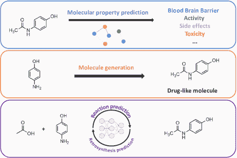
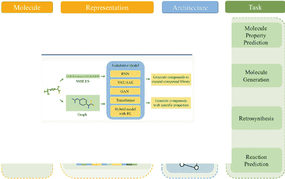
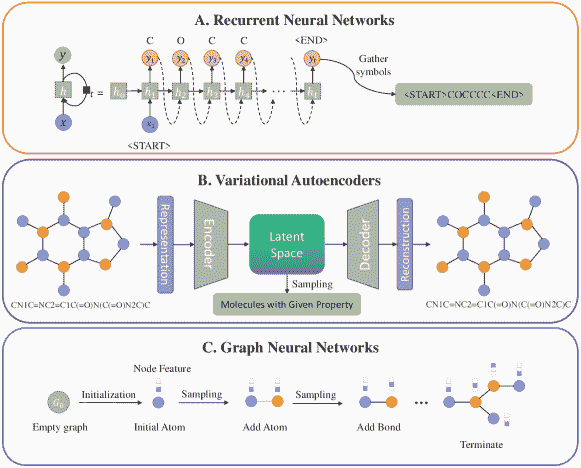
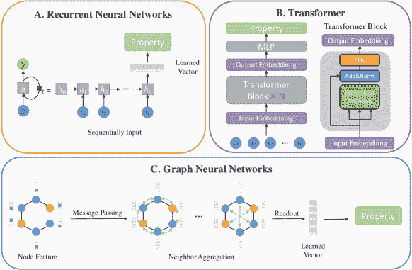
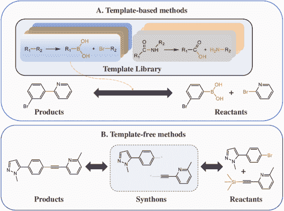

<!--yml

类别：未分类

日期：2024-09-06 19:41:09

-->

# [2303.00313] 小分子药物发现的深度学习方法：综述

> 来源：[`ar5iv.labs.arxiv.org/html/2303.00313`](https://ar5iv.labs.arxiv.org/html/2303.00313)

# 小分子药物发现的深度学习方法：综述

伍文浩^∗    刘颖颖^∗    陈轩宇    柴文浩    陈航跃    王宏伟^†    \IEEEmembershipMember, IEEE 和 王高昂^†    \IEEEmembershipMember, IEEE ^∗ 等贡献.^† 通讯作者：王宏伟和王高昂。伍文浩、刘颖颖、陈轩宇和柴文浩均为浙江大学-伊利诺伊大学厄本那-香槟分校研究所成员，浙江大学，中国（电子邮件：wenhao.21@intl.zju.edu.cn, yingying.19@intl.zju.edu.cn, xuanyu.19@intl.zju.edu.cn, wenhaochai.19@intl.zju.edu.cn）。王宏伟和王高昂为浙江大学-伊利诺伊大学厄本那-香槟分校研究所及计算机科学与技术学院成员，浙江大学，中国（电子邮件：hongweiwang@intl.zju.edu.cn, gaoangwang@intl.zju.edu.cn）。陈航跃为杭州电子科技大学成员，中国（电子邮件：chy@hdu.edu.cn）。

###### 摘要

随着计算机辅助技术的发展，包括生物化学和深度学习在内的研究社区已经投入了超过十年的药物发现领域。深度学习的各种应用在药物发现中引起了广泛关注，如分子生成、分子属性预测、逆合成预测和反应预测。尽管大多数现有综述仅关注其中一个应用，这限制了研究人员的视野。在本文中，我们全面回顾了上述四个方面，并讨论了不同应用之间的关系。最新文献和经典基准被呈现，以便更好地理解各种方法的发展。

我们首先总结了这些研究中的分子表示格式，然后介绍了每个任务的近期提出的方法。此外，我们回顾了各种常用的数据集和评估指标，并比较了基于深度学习的模型的性能。最后，我们通过识别剩余的挑战并讨论药物发现中深度学习方法的未来趋势来做出总结。

{IEEEImpStatement}

随着人工智能的不断进步，越来越多的深度学习算法被提出，以利用大量实验数据来加快耗时且昂贵的药物发现过程。与以往那些专注于药物发现单一方面的调查不同，我们提供了一个更全面的调查，涵盖了利用深度学习技术的药物发现四个领域，包括分子生成、分子性质预测、逆合成以及反应预测。在介绍主要方法之前，我们从分子数据表示开始，这对深度学习算法也至关重要。此外，我们展示了针对深度学习基础的药物发现的最新基准测试，涵盖了 9 个广泛使用的数据库。

{IEEEkeywords}

深度学习，药物发现。

图 1：药物发现的深度学习方法框架。

## 1 引言

\IEEEPARstart

药物发现是一个非常漫长的过程，涉及广泛的实验和不同的阶段。发现一种新药可能需要十年以上的时间，并花费约 26 亿美元[1]。现有的分子数量已超过 1.3 亿，这导致有效药物分子的搜索空间相当巨大[2]。随着人工智能的出现，越来越多的算法和方法被提出，以利用化学实验室的广泛实验数据来加速耗时且昂贵的药物发现过程。深度学习可以应用于药物发现的不同阶段。其中，有几个关键方面的应用在提高性能方面非常有帮助。在本调查中，我们重点关注以下应用：1）分子生成，2）分子性质预测，3）逆合成，以及 4）反应预测，如图 1 所示。

分子生成是理性药物设计的基础，是获取新药物分子的起点。核心问题是从庞大的化学空间中获得满足特定属性和药物可用性的候选分子。在数学上，分子生成通常被定义为优化问题，其中通过神谕函数预测所需的分子属性。首先，从大量的分子中学习分子特性。然后，从学习到的分布中获得新的候选分子，并以预定义的神谕函数作为限制。在分子生成的早期阶段，可以通过结合现有化合物的片段来构建具有新结构的分子[3、4]。这需要化学实验的辅助，效率相对较低。遗传算法[5]等优化算法也被考虑用于解决分子生成问题。基于进化原则，遗传算法通过改变种群的参数获得具有特定属性的分子。然而，早期的方法依赖于随机步骤，难以捕捉化学设计的约束[6]。深度学习带来了从大量数据中学习的能力，并为药物设计带来了超越化学直觉的潜力，将$10^{60}$大小的化学空间缩小到数十个有效的候选化合物。

分子属性预测是药物开发中的关键部分，其主要目的是预测候选化合物的药物活性、吸收、毒性和其他属性。分子属性预测有两个主要应用：定量构效关系（QSPR）和虚拟筛选。QSPR 模型通常定义为回归或分类模型，通过建立分子结构与属性之间的关系来预测属性。早期的机器学习方法，如随机森林[7]、k 近邻[8]、支持向量机[9]，已被用于 QSPR 问题。这些方法在一些特定问题实例中仍优于现代深度学习方法[10、11、12、13、14]。例如，使用极端随机树的算法在小数据集上进行有机分子能量预测时，比深度学习方法表现更好[15]。

虚拟筛选的目的是搜索分子库，以识别那些最有可能与靶蛋白结合的药物配体结构[16, 17]。传统的虚拟筛选方法需要合成大量化合物进行生物实验，整个过程成本高、周期长、成功率低。通过深度学习进行药物虚拟筛选有望取代传统的活性筛选方法，加快中间步骤并显著降低成本。例如，一个特别成功的应用是基于深度学习的评分函数，它可以高精度地预测蛋白结合配体的亲和力[18]。更具体地说，AtomNet 将蛋白-配体复合物的 3D 结构特征纳入 CNNs [19]。Feng 等人[20] 将指纹图谱和图表示作为配体特征。这一模型在 Davis [21]、Metz [22] 和 KIBA [23] 基准数据集上表现出更好的性能。Gao 等人[24] 使用 LSTM 循环神经网络处理蛋白质序列，使用 GCN 处理配体结构。

逆合成分析和反应预测是药物合成中的关键环节。反应预测探索由给定反应物合成的可能产物分子[25]。与反应预测相对，逆合成是从产物分子反向推断出可获得的起始材料[26]。早期的计算机辅助合成规划主要依赖于人工编码的反应规则，这些规则只能应用于特定反应[27]。通过神经网络，可以从现有的大量化学反应数据中学习分子的反应模式和化学键的断裂规则。这些规则被应用于药物分子的逆合成分析和反应预测中，可以显著加快新药的合成速度。

许多现有的调查研究集中于 AI 时代的药物发现。Lavecchia [28] 分析了机器学习技术在配体基础虚拟筛选中的应用。Gawehn 等人 [29] 以几个经典深度神经网络为例，介绍了潜在的应用领域。一些研究展示了机器学习如何利用大数据来改进传统方法以及在药物发现各个阶段的应用 [30]。虽然这些研究集中于药物发现的通用方面，但其他调查则强调特定任务，并分析了针对特定应用的最先进（SOTA）模型。对于属性预测，一些论文回顾了主要方法，介绍了几种基本的机器学习技术，并从数据角度分析了性能 [31, 32]。对于分子设计，Tong 等人 [33] 总结了生成模型并列出了几种使用这些模型的工具，而 Elton 等人 [34] 关注于先导分子的生成，对模型进行分类并比较其性能。对于合成过程，一些调查讨论了回溯合成和反应预测的数据集、模型和工具，并指出了潜在的发展方向 [26, 35]。

据我们所知，我们的调查首次整合了上述四个应用。主要贡献总结如下：

+   •

    我们总结了四个应用领域的最新文献和经典基准，并根据分子表示对其进行分类。

+   •

    我们列举了常用的数据集和评估指标，并比较了现有模型的结果。

+   •

    我们提出了现有方法的问题，并分析了未来的发展方向。

根据深度学习的三个主要组成部分：表示、模型和数据 [36]，我们对论文的组织结构如下：我们首先简要介绍深度学习中用于表示分子结构的格式，在第二部分中，包括指纹、简化分子输入线条系统（SMILES）和分子图。

之后，第三部分、第四部分、第五部分和第六部分分别介绍了分子生成、分子性质预测、逆合成和反应预测。此外，第七部分提供了四项任务的标准数据集、现有基准平台和常用评价指标。最后，第八部分讨论了挑战和可能的发展方向。

## 2 分子表示

图 2：用于药物发现的深度神经网络方法的分类。

为了将分子结构转换为计算机可读的信息，有几种方法可以表示分子。本节重点介绍三种常见的表示方法：指纹、SMILES 字符串和分子图。在介绍数据表示后，我们在图 2 中展示了根据不同表示方法的药物发现深度学习方法的分类。

### 2.1 指纹

分子指纹是一种位字符串，编码了分子的结构信息。两种广泛用于分子表示的指纹类型是基于关键的指纹和哈希指纹。

基于关键的指纹，包括分子 ACCess 系统（MACCS）[37]和 PubChem 指纹[38]，具有预定义的片段库，使每个分子可以根据其子结构编码成二进制位流。MACCS 包含 166 个预定义片段，这些片段键在许多化学信息学软件包中实现，包括 RDKit[39]、OpenBabel[40]和 CDK[41]。PubChem 指纹具有 881 位，表示元素计数、环系统类型、原子配对、最近邻等信息。

哈希指纹，如 Morgan 指纹和功能类指纹，没有预定义的子结构。相反，它们从给定的数据集中提取片段并将其转换为数值。

由于分子亚结构的提取和匹配过程，获得分子指纹相当复杂。同时，二进制分子指纹的表示能力有限。尽管分子指纹仍在 SMILES[42]和分子图[43]中使用，但近年来以分子指纹作为表示方法的工作较少。

### 2.2 SMILES

简化分子输入行系统（SMILES）[44]是使用字符串表示分子结构的方法。复杂的分子配置被转换为向量形式的序列，这很容易获得。与此同时，随着自然语言处理技术的发展，SMILES 字符串可以被视为分子表示的句子[45, 46, 47]。然而，SMILES 表示也有一定的局限性。SMILES 表示的长度随分子大小变化，这对设计通用模型提出了重大挑战。此外，句子的性质使得表示分子的三维信息具有挑战性。

### 2.3 分子图

图形是分子的现实表示，保留了拓扑和几何结构的严谨细节。图中的节点可以表示原子的属性和价态，而图中的边包含化学键的类型和长度等信息。图的深度学习方法，特别是图神经网络（GNNs），在许多任务中，如属性预测和反应预测，具有良好的前景。

与序列中的 SMILES 和手动设计的指纹相比，图形表示形式减轻了序列形式中存在的顺序模糊性。它保留了丰富的结构信息，如原子之间的距离和键之间的角度。陈等人[48]强调了边缘特征的重要性，激发了通过 GNN 的传播来保留原子和键信息的更多探索。

## 3 分子生成

图 3: 分子生成中 (A) 递归神经网络、(B) 变分自编码器和 (C) 图神经网络的示意图。

### 3.1 基于字符串

基于这种分子表示方法，一些处理序列信息的标准深度学习模型，如递归神经网络（RNNs）、变分自编码器（VAEs）和遗传算法，被应用于分子生成模型。这些方法在深度学习的许多领域中表现良好。

循环神经网络（RNN）。RNN 根据前一步的输入生成输出符号，然后将这些符号汇总形成生成的分子（图 3A）。Olivecrona 等人[49] 开发了一种基于策略的 RL 方法，以微调预训练的 RNN 网络。Segler 等人[50] 为虚拟筛选活动生成大规模的多样化分子集合，然后生成较小的、专注的库，丰富可能具有活性的分子以用于特定目标。堆叠 RNN 层用于生成新的分子 SMILES 表示。这项工作展示了 RNN 在分子生成模型中的鲁棒性和迁移性。Gupta 等人[51] 也遵循了在大规模分子数据集上预训练和在小规模数据集上微调以生成特定属性的分子的思路。这项工作还突显了基于 RNN 的生成模型在从分子片段完成具有特定属性的分子方面的潜力。Grisoni 等人[52] 提出了一个从序列的两个方向进行生成和数据增强的方法。由于分子序列不像 NLP 序列那样具有方向性，这种尝试在实验中表现优于单向 RNN。

许多工作还使用长短期记忆（LSTM）网络。Bjerrum 等人[53] 在两个数据集上训练基于 LSTM 的分子生成模型，这些数据集包括片段状和药物状分子。Ertl 等人[54] 使用基于 LSTM 的分子生成模型，在短时间内生成大量新分子，这些分子的结构特征和功能基团仍然保持在由 ChEMBL 的生物活性分子定义的药物状空间内。

变分自编码器（VAE）。VAE 将高维、离散的化学空间编码到低维、连续的潜在空间中，可以用于采样具有给定属性的分子（图 3B）。Schiff 等人[55] 仅使用 SMILES 表示，而不是基于图的分子表示。这种方法通过将 3D 几何信息融入 VAE 中表现良好。Alperstein 等人[56] 考虑到分子 SMILES 表达的非唯一性，并提出对单一分子的多个 SMILES 字符串进行编码。VAE 有效地学习不同 SMILES 表示之间的隐藏信息，并在完全监督和半监督的情况下在分子生成和优化中表现良好。

除了常用的 RNN 和 VAE 模型外，Nigam 等人 [57] 将传统的遗传算法与深度神经网络结合起来。基于 DNN 的鉴别器提高了生成分子的多样性，并增加了遗传算法的可解释性。Moss 等人 [58] 首次在贝叶斯优化循环中使用了字符串核和遗传算法。大多数贝叶斯优化方法需要将原始字符串输入转换为固定大小的向量，而这种架构可以直接处理原始字符串。

总之，基于字符串的分子生成将输入和目标分子视为序列数据。像 RNN、VAE 和遗传算法这样的深度学习模型在生成任务中取得了很大的成功。然而，基于字符串的方法仍然存在局限性，因为它可能会丢失分子的复杂几何信息。因此，目前大多数研究工作都集中在基于图的方法上。

### 3.2 基于图的方法

Motif，也称为骨架或合理性，是指分子片段。Motif 对应于化学中的官能团概念，与分子的化学性质密切相关。因此，在生成具有特定属性的分子时，motif 可以提供更多的先验知识。同时，motif 已经具有特定的有效结构。通过涉及 motif，可以在一定程度上避免生成无效分子。基于 motif 的分子生成将分子视为片段的集合。然后，将子结构拼接以生成新分子。非 motif 分子生成是逐个原子生成分子（见图 3C）。

基于基序的分子生成。Jin 等人 [43] 使用变分自编码器生成分子图。他们首先从训练集中提取有效的化学子结构以生成树状支架，然后使用这些子图作为构建块并将其组合形成分子图。与逐节点方法相比，这种结构-结构的方法在每一步都保持了化学有效性。Jin 等人 [59] 进一步将变分自编码器与对抗训练方法结合，以获得多样且有效的输出分布。包含对抗正则化，以使生成的图的分布与有效目标的分布对齐。Jin 等人 [60] 提出了一个层次图编码-解码器，可以生成如聚合物等大型分子。每个分子从原子级到基序级都有精细到粗略的表示。与 [43] 类似，Maziarz 等人 [61] 使用提取的基序生成分子。同时，他们将此方法与逐原子生成结合起来。You 等人 [62] 通过强化学习开发了图卷积网络。生成过程被视为马尔可夫决策过程，并将领域特定的奖励纳入模型。Yang 等人 [63] 还提出了一种强化学习框架，该框架生成具有显著对接分数的药物化学可接受分子。该方法基于给定的分子状态选择化学上现实且药物化学上可接受的片段。为了生成具有多个属性约束的分子，Jin 等人 [64] 提取每个属性的理由并将其结合为多属性理由。然后实现图完成模型，以从理由中生成完整的分子。基于 [64]，Chen 等人 [65] 提出了类似于期望最大化的算法。在 E 步骤中，一个可解释模型从候选分子中提取理由。而在 M 步骤中，理由被完成以生成具有更高属性分数的分子。Xie 等人 [66] 采用退火马尔可夫链蒙特卡洛采样方法 [67] 来搜索化学空间。他们进一步基于采样结果训练图神经网络，以选择合适的候选编辑。Fu 等人 [68] 提出了可微分的支架树，这是一种基于梯度的优化方法。图卷积网络将离散的化学空间转换为局部可微分空间。此外，通过从目标处的梯度反向传播来优化分子。

非模式分子生成。周等人[69]利用双重 Q 学习技术逐个原子生成分子。这种方法不需要预训练，因此训练集不会限制探索能力。结合自回归和基于流的方法，施等人[70]开发了一种基于流的自回归图生成模型，允许在训练过程中进行并行计算。该模型生成与当前图相关的边和节点。在每个生成步骤中，可以利用诸如价键规则等化学知识来检查分子的有效性。对于分子优化问题，科罗维娜等人[71]开发了一种专注于小型有机分子的贝叶斯优化模型。陈等人[72]提出了一种在潜在空间中具有成本效益的进化策略。将进化算法引入潜在空间中以搜索所需的分子。吴等人[73]提出了精炼图注意力策略网络，旨在基于用户定义的目标优化分子结构。引入了一种空间图注意力机制，考虑了节点和边属性的自注意力。

除了探索二维分子生成，许多工作也集中在三维分子生成任务上。Simm 等人 [74] 将条件变分自编码器与欧几里得距离几何算法结合。这种方法使用原子之间的一组成对距离来描述分子构象，而不是笛卡尔坐标。继[74]之后，Xu 等人 [75] 首次提出了一种用于分子构象预测的端到端条件变分自编码器框架。在这项工作中，通过双层规划同时优化距离预测问题和距离几何问题。Shi 等人 [76] 直接估计原子坐标的对数密度梯度场。估计的梯度场可以通过朗之万动力学直接生成构象，从而减少计算误差。Zhu 等人 [77] 设计了一种对构象坐标的旋转-平移以及分子中对称原子的排列不变的损失函数。Xu 等人 [78] 将构象生成类比为热力学中的扩散过程。原子首先在特定构象中稳定，然后扩散到噪声分布中。反向过程被视为马尔可夫链，用于解决构象生成问题。Luo 等人 [79] 提出了一个自回归流模型，该模型可以生成三维分子。这种方法直接生成原子的距离、角度和扭转角，而不是三维坐标。一旦生成了分子，原子之间的相对距离和角度就会被确定，从而确保了不变性和等变性。Mansimov 等人 [80] 提出了一个条件深度生成图神经网络，用于学习分子构象的能量函数。与传统的分子力场方法相比，该模型可以直接生成支持能量的分子构象，而无需多次迭代。Guan 等人 [81] 还提出了一种受能量启发的神经优化公式。通过能量表面，分子构象通过梯度下降优化三维坐标。Xu 等人 [82] 提出了一种结合流基模型和能量基模型的方法。流基模型用于从高斯先验生成距离矩阵。然后，能量基模型搜索并优化分子的三维坐标。

## 4 分子性质预测

图 4：分子性质预测中(A)递归神经网络、(B)变换器和(C)图神经网络的插图。

### 4.1 基于 SMILES

基于 SMILES 的方法利用各种架构，如 RNN、VAE 和变换器，具体如下所示。

循环神经网络（RNN）。RNN 被证明是对顺序输入如文本数据的有效设计。因此，RNN 及其两个变体，LSTM [83]和 GRU [84]，被应用于从 SMILES 中学习化学属性（见图 4A）。

Mayr 等人[85]使用长短期记忆网络构建 SmilesLSTM 架构，该架构利用 SMILES 字符串作为输入。受到 RNN 在序列到序列语言翻译中成功的启发，Goh 等人提出了一种序列到向量模型 SMILES2vec [86]，其中序列是 SMILES，向量是测量属性。他们没有显式地从 SMILES 中的元素组成中编码分子信息，而是探索了四种基于 CNN 和 RNN 的架构以直接学习所需的特征。同时，开发了一个解释掩码以定位最重要的字符，从而提高了模型的可解释性。

虽然 Goh 等人[86]坚持使用常用的规范 SMILES，这保持了分子到字符串的一对一映射，但 Li 等人[87]利用单个分子的多个 SMILES 字符串作为数据增强，这有助于学习更好的语法特征。所提出的模型从多个 SMILES 序列生成分子表示，首先将其转换为一热向量，然后遵循堆叠 CNN 和 RNN 架构中的消息传递过程。

考虑到化学信息能够规范化 SMILES 字符串，Peng 等人[88]利用了一个叫做 TOP 的框架，结合了 SMILES 和预定义属性的使用，包括根原子位置和异构特征。采用基于双向门控递归单元的 RNN（BiGRU）处理 SMILES 字符串，以捕捉局部和全局上下文信息。同时，使用全连接神经网络（FCN）处理理化特征向量。在平衡数据集上执行时，TOP 显著优于其他方法，包括 SMILES2vec [86]、CheMixNet [89]和 Chemception [90]，后者仅使用从 SMILES 解码的 2D 分子图像。

变分自编码器（VAE）。VAE 模型与 RNN 基础架构中提到的编码器-解码器结构具有类似的结构。然而，它在假设嵌入空间遵循高斯分布上有所不同。在现有架构中，VAEs 更关注基于分子的潜在表示，而不是指定预测任务。采用在 [91] 中设计的 SSVAE，Kang 和 Cho 将 SMILES 作为输入变量，其连续值属性向量作为输出。编码器和解码器网络执行 SMILES 的恢复任务，将学习到的潜在分子表示作为两个阶段之间的中介。一旦 SSVAE 被训练，剩余的 RNN 则充当预测网络。ALL SMILES VAE [56] 通过使用多个 SMILES 并通过递归结构在分子图的跨越树之间隐式执行消息传递，确保学到的潜在分子表示能够捕捉到分子特征，而不是其 SMILES 实现。

Transformer。Transformer 架构遵循类似的编码器-解码器过程，但不像 RNNs 那样使用递归连接，因此在长文本和大规模语料库上趋于更稳定的收敛，并且在特征化方面优于 RNNs (图 4B) [45, 46]。为了确保学到的分子表示能够成功转移到众多下游任务中，大规模 SMILES 语料库上的预训练策略脱颖而出。SMILES-GPT [46] 延续了预训练方法，在每个注意力块之后应用了轻量级适配器网络，在 GPT-2 [47] 设计上学习特定的任务模式。这样，它缓解了将预训练模型转移到单独下游任务时的领域知识损失。

语言表示模型 BERT [92] 引入了掩码语言模型（MLM）预训练技术，这些技术缓解了来自单向上下文的约束。由于 MLM 与分子中原子掩码的相似性，BERT 风格的架构已经成为分子表示学习中的一种强大技术。BERT 类似架构，如 RoBERTa [93]，经过广泛数据库训练后被证明能够实现相对较高的分类准确性 [94]。通过仔细探索预训练数据集规模、分词器和字符串表示，来自 RoBERTa [93] 的 ChemBERTa [95] 再次强调了大规模预训练在分子属性预测中的效率。

### 4.2 基于指纹的

指纹作为另一类分子表示方法，也有利于分子预测任务。Unterthiner 等人 [96] 在分子性质预测中使用了多任务学习，利用深度神经网络的力量生成化合物的层次表示。与此同时，Mayr 等人 [97] 引入了 DeepTox 流水线。DeepTox 采用归一化技术生成标准化的化学表示，并随后计算大量化学描述符，这些描述符作为机器学习算法的输入。传统的手工制作指纹也作为 SMILES 字符串的补充来提供分子特征信息。这样，模型的性能不再因 SMILES 字符串的长度剧烈波动。Paul 等人 [89] 将两种成功的属性预测架构，包括 SMILES2vec 和 MLP，融合成一个多输入单输出 (MISO) 架构 CheMixNet。该模型同时接受 SMILES 字符串和 MACCS 指纹作为输入。利用这两种分子结构表示作为并行输入，提高了模型的泛化能力。Schimunek 等人 [98] 提出了一种新颖的少量样本方法，通过结合已知上下文或参考分子的 信息来增强分子的表示。

然而，由于手工设计方法的限制，传统指纹在预测任务中的表现并不理想。例如，基于哈希的指纹由于其不可逆性，带来了有限的任务特定信息。随着深度学习技术的发展，已经发明了生成基于深度学习的指纹以进行属性预测的新方法。

循环神经网络 (RNN)。基于 RNN 的无监督指纹方法被提出以解决标签数据稀缺的问题。深度神经网络被应用于利用大量未标记的数据。受到在 seq-to-seq 语言翻译中应用模型取得突破性成功的启发，编码器-解码器结构的神经网络在基于序列型 SMILES 字符串生成指纹方面变得流行。Xu 等人 [42] 在将 SMILES 字符串映射到期望向量并将其翻译回原始字符串的过程中，提取了固定大小的分子特征向量作为 seq2seq 指纹。提取的指纹与 SMILES 标签结合后，经过分类器或回归器等监督方法进行预测任务的训练，例如多层感知机。基于设计，Zhang 等人 [99] 将其修改为第一个端到端框架，将恢复和推理任务耦合在名为 seq3seq 指纹的模型中。

Transformer。受到自注意力机制在语言任务中优异表现的启发，Transformer 被认为在丰富的无标注分子数据上也能有良好的表现。通过采用在 NLP 领域显示出良好结果的预训练方法，SMILES transformer [45] 被提出通过在标准 SMILES 上的大规模预训练来学习分子指纹。数据驱动提取的指纹与简单的多层感知器效果良好，这显示了在属性预测中利用无监督预训练的巨大潜力。

BERT，与 Transformer 的编码器类似，也是一个有前途的结构。SMILES-BERT [100] 采用了 BERT 方法，将输入 SMILE 中随机选择的标记遮盖为遮盖标记、词典中的任何其他标记，或按照 85/10/5 的比例保持不变。实验表明，从 MLM 策略生成的指纹在一个相当大的数据集上具有比一些代表性指纹更高的预测准确性，这些指纹包括圆形指纹 [101]、神经指纹 [102] 和 seq2seq 指纹 [42]。

### 4.3 基于图的方法

图卷积网络 (GCN)。图卷积网络 (GCN) [103] 总是被视为应用中的常见基线选择。该模型专注于学习节点状态并聚合邻居消息（图 4C）。由于其轻量级计算和对大图的可扩展性，GCNs 在分子表示学习中的应用广泛。

标记数据集，例如 QM9 数据集 [104] 由通过昂贵的方法如密度泛函理论来近似的分子性质组成。因此，GCNs 的邻域聚合方案经常被用来利用整体高阶表示学习来处理分子。[105] 提出的多层次图卷积神经网络通过保留构象信息（原子级、对级等）和引入径向基函数层来学习节点表示，以获得稳健的距离张量。有效结合自我特征与来自邻居的收集消息的交互层被应用于高阶原子表示。

由于注释标签成本高昂，现实世界应用中的数据集常常是部分标注的，这常常带来挑战。基于有限标注数据的训练容易导致过拟合，并使得与训练数据不同的分子性能较差。为了应对任务特定标签稀缺和分布外预测的问题，研究人员在预训练方面做出了巨大努力，以利用未标注数据并提升 GNN 的泛化能力。预训练的关键在于找到一个合适且有效的任务来利用许多未标注的结构 [106]，然而选择有效的预训练策略具有挑战性，因为所选属性必须与特定下游任务的兴趣对齐。否则，如上所述，“负迁移”效应可能会严重影响将预先学习的知识转移到新下游任务的泛化能力 [107]。

预训练是卷积神经网络（CNN）常见且有效的策略，尽管这种强大的方案在图神经网络（GNN）上直到最近几年才被探索。胡等人 [107] 进行了首次系统的大规模 GNN 预训练策略调查。他们在节点级别提出了自监督上下文预测和属性掩蔽方法，并针对领域特定信息解码提出了监督任务预测。除了对属性预测模型的预训练策略的首要介绍外，胡等人 [107] 还在来自 MoluculeNet 的八个数据集上应用了上下文预测和属性掩蔽，验证了节点级策略的有效性。这些方法为 GNN 预训练方案开辟了新的途径，但仍远未令人满意。荣等人 [109] 认为图级任务受限于标签的数量，并引入了下游任务的负迁移风险。此外，将上下文和节点类型预测作为标签使得难以保留局部结构知识或处理高频原子。为了实现更好的泛化性，一些研究者在数据增强方面做出了巨大努力。提出的模型 GraphCL [110] 通过最大化不同数据增强方法生成的潜在空间中的两个增强表示之间的互信息来进行预训练。

受这些通用技术的启发，王等人[111]介绍了特定的分子设计模型 MolCLR，该模型通过对比学习处理图增强的 GNN 预训练。它以类似于 GraphCL[110]的方式，通过最大化来自两个随机增强的潜在增强向量之间的距离。然而，增强方法设计得更为细致，并且针对分子进行了更具体的优化。尽管存在原子遮蔽和子图移除，该模型利用键删除而非随机扰动来模拟化学键的反应，以学习更有价值的特征。然而，研究人员仍对数据增强在预训练中的有效性表示怀疑。李等人[112]认为，原子和边缘的随机修改可能会破坏自然结构。刘等人[113]提出了 N-gram 图，这是一种用于分子的无监督表示方法。该方法首先将分子图中的顶点嵌入，然后通过在图内的短步行中汇总顶点嵌入，创建图的简洁表示。Altae 等人[114]开发了一种将迭代优化的长短期记忆与图卷积神经网络相结合的架构。这种一次性学习方法可以显著减少进行准确预测所需的数据量。

消息传递神经网络（MPNN）。在推断分子性质时，键类型和原子距离的影响不容忽视。尽管 GCNs 考虑了邻域聚合，但不能区分不同的边类型。为更好地处理边特征，Gilmer 等人[115]正式提出了一种消息传递神经网络（MPNN），用于学习具有节点特征和加权边信息的图级嵌入。该框架包括两个阶段，一个是消息传递阶段，另一个是读取阶段。通过将原子建模为节点，键建模为边，节点和边的特征向量作为初始化输入到模型中。进一步地，消息通过多层消息传递从邻近节点聚合。读取阶段则总结整个图的特征向量，以针对下游的分子性质预测任务。基于 MPNN[115]的变体取得了显著进展，例如在[109]中使用注意机制的消息传递、用于 3D 分子图的球面消息传递[116]等。尽管专注于节点状态，重要的键（边）信息的保留也被考虑在内，以提高性能[48]。

消息传递方案在分子属性预测中表现出了优越的性能。郝等人[117]首次尝试以半监督的方式使用这一强大的框架进行分子属性预测。这一新颖的策略通过在未标记集中过滤出最具多样性的子集，并持续将其添加到标记数据集中进行训练，缓解了过拟合以及标记和未标记分子之间的不平衡问题。

在消息传递神经网络的假设下，同一邻域中的两个原子应该具有类似的表示，而忽略了它们在分子中的位置是不同的。因此，MPNNs 通常配备位置编码来缓解这些限制。Dwivedi 等人[118]引入了节点的位置编码（PE），并利用这些信息作为输入信息，以同时学习位置和结构特征表示。将 PE 与 MPNNs 结合有助于更稳健的节点嵌入，因为它填补了节点的标准定位中的空白。

虽然二维分子图提供了丰富的拓扑信息，但三维几何视角在预测分子特性中也发挥着重要作用。基于原始的消息传递网络[115]，刘等人[116]提出了球面消息传递和 SphereNet 用于三维分子学习。该模型在球面坐标系统中执行消息传递，并使用相对的三维信息和扭转计算来推广旋转和位移的不变预测。此外，研究表明三维几何视角显著有助于稳健的表示学习。在 GeomGCL [112]中，三维几何的效率被证明优于其他限制于拓扑结构的方法。李等人[112]设计了一种方法，通过利用二维和三维配对信息来提高泛化能力。双通道几何消息传递架构允许二维和三维视角之间的协同监督。为了进一步利用局部空间相关性，应用了一个角度域的正则化器，以便在类似属性预测上进行泛化。这些策略有助于实现捕捉化学语义信息和几何信息的目标。

图同构网络（GIN）。捕捉统计依赖性在分子表示中至关重要，而对比方法是获取特征的最有效方法之一[119]。借鉴了互信息神经估计器（MINE）的思想，深度信息最大化（DIM）[120] 被引入以最大化输入和输出之间的信息内容。受到 DIM 的启发，深度图信息最大化（DGI）[119] 训练一个对比节点编码器，使用 GCN 最大化局部互信息以捕捉全局信息。然而，GCN 卷积编码未能区分一些图结构。需要更加精细的邻居聚合设计，以便为图表示提供更强的区分能力，而不是简单的均值和最大值聚合。

图同构网络（GIN）[121] 随后被提出，并且展示了其与 Weisfeiler-Lehman 图同构测试具有同等的强大能力，该测试用于确定两个图是否在拓扑上相同。使用求和聚合的结构在区分图实例方面具有更好的性能。Sun 等人[122] 用 GIN 替换了图卷积编码器，并在半监督学习方案中扩展了互信息的思想，使用“学生-教师”模型来训练整个图级嵌入。

GINs 最近在用于分子应用的 2D GNN 设计中频繁用作骨干模型。Liu 等人[106] 考虑了 3D 几何视图用于预训练，并通过消息传递，旨在训练 2D 分子 GIN 编码器以在一定程度上恢复其 3D 对应物。通过最大化 2D 拓扑结构与 3D 空间和几何信息之间的互信息，预训练模型可以从隐式的 3D 几何先验信息中受益，即使下游任务中没有提供 3D 结构。同时，在 [106] 中还对 GraphCL [110] 和 GraphMVP 两个预训练模型进行了比较，显示结合 2D 拓扑和 3D 几何信息更具竞争力。

循环图神经网络。循环神经网络，如 RNNs、GRUs 和 LSTMs，是处理不同大小序列的强大工具。将图转换为序列是解决分子图固定大小矩阵问题的一个潜在解决方案。流行的循环单元，GRUs 和 LSTMs，在分子生成中得到了广泛应用。此外，循环单元在消息聚合和构象保持中发挥着重要作用。

门控递归单元负责更新消息传递中节点的隐藏表示。当边缘网络从节点的 1-hop 邻居中汇聚消息时，GRU 使用基于先前状态的汇聚消息结果来更新节点状态，从而允许信息通过连接的键传播。该架构还允许保留久远的信息。Li 等人[123]提出了一种与构象相关的架构，称为 HamNet。在消息计算中进行修改后，HamNet 结合了 GRU 生成的原子表示中的相对位置和动量。

GCN 的消息传递方案遵循相邻原子处于相同化学环境的原则，即邻域应该具有相似的表示。虽然深度神经网络可以捕捉局部和全局结构，但它可能无法区分在具有相同邻域的情况下执行不同角色的原子。因此，通常需要通过利用位置编码技术[118]或有序 SMILES 表示来引入拓扑顺序。通过对 GCN 输出进行 LSTM 处理，可以通过控制 LSTM 中与规范 SMILES[123、124]一致的原子顺序来确定原子的唯一位置。

Transformer。多个先前的研究在分子应用中应用了 transformer 风格的架构。训练于序列表示、SMILES 和指纹上的 transformer 的表现力已经得到了显著探索[45, 93, 95]，该架构也被适配于分子图结构，以增强表征能力。Maziarka 等人[125]提出了一种新颖的预训练分子注意力 transformer，该模型从预文本任务中学习领域知识，然后利用这些知识来增强自注意力。该模型的关键创新在于将整合分子图和原子间距的分子多头自注意力层替换为自注意力层。从图结构中提取的两种信息进一步提高了性能。Rong 等人[109]遵循了类似的预训练思路，并更加关注从分子图中提取的双层信息，以更好地保留领域知识并避免负迁移。动态消息传递网络被应用于从节点嵌入中提取局部子图信息，同时分别为节点和边引入 transformer 模块，以提取节点的全局关系。带有动态消息传递机制的 transformer 风格架构在捕捉结构信息方面表现出色，并增强了 GNN 的表现力。未来的工作可能会探索更好的预训练任务，以帮助 transformer 风格架构在各种下游分子任务中表现更佳。

## 5 逆合成

图 5: （A）基于模板的方法和（B）无模板方法在逆合成和反应预测中的示意图。

逆合成的目标是将一个复杂的目标产品分解，以找到一组具有相对简单结构的反应物分子。这是合成规划和药物制造中的一个基本任务。例如，一种常见的处方药——阿司匹林，可以被分解为两个合成子，这两个合成子可以通过亲核加成-消除反应轻松获得。然而，对于所有可能组合的巨大潜在搜索空间导致了计算复杂度的高成本。随着人工智能的显著发展，科学家们致力于寻找高效有效的计算机辅助逆合成分析方法。

本节分析了应用机器学习方法解决逆合成预测的问题。我们将介绍一些基于反应模板的早期方法，然后分析每个任务的无模板模型。

### 5.1 基于模板的

基于模板的方法依赖于编码反应模板或规则，这些模板是从当前存在的数据库中手动或自动生成的。这些模板用于推导逆合成前体。由于一个目标分子可能有不同的反应模板，人们开发了各种算法，这些算法考虑了化学背景、可能的权衡和反应性，以决定最合适的规则（图 5A）。

基于字符串的方法。基于字符串的方法将分子转换为指纹或 SMILES，然后将它们输入到网络中。Segler 和 Waller [126] 提出了一个神经符号模型，该模型使用深度神经网络来预测可能的反应模板。由于编码的反应模板是有限的，他们将逆合成分析视为一个多类分类任务。他们将输入目标分子表示为 Morgan 指纹，输出的转换将应用于目标分子，以获得逆合成前体。由于相似的分子可能具有相似的反应，Coley 等人 [127] 引入了一种基于相似性的的方法。这种方法使用相似性作为度量来确定先前的反应，这些反应用于寻找目标分子的合适反应位点。然后，它应用相应的模板以生成候选前体，并通过进一步应用相似性计算将其转换为反应分子。Baylon 等人 [128] 提出了一个多尺度方法，结合深度高速公路网络，该方法根据化学相似性对反应规则进行分组，而无需监督。该模型在两个阶段确定反应规则。首先，它决定目标分子属于哪个组，然后预测指定的转化规则。Segler 等人 [129] 将逆合成视为一个马尔可夫决策过程。他们将蒙特卡洛树搜索与不同的神经网络结合起来，这些网络指导搜索并选择合适的逆合成方向。Seidl 等人 [130] 提出了一种使用现代 Hopfield 网络的单步逆合成建模的新方法。他们的基于模板的模型利用了分子和反应模板的编码表示，以准确预测模板与给定分子的相关性。

基于图的方法。图形模型利用神经网络的表现力和可扩展性来提取有用的信息。戴等人 [131] 应用了条件图逻辑网络，将化学模板视为逻辑规则。在逻辑规则中，分子和子图的图形结构被视为逻辑变量。然后，将预测结果公式化为反应物和规则的联合概率。陈等人 [132] 提出了 LocalRetro，而不是全球预测反应物，LocalRetro 专注于局部反应模板。每个原子和键使用消息传递神经网络来学习局部反应性，并应用几个特定的层来学习远程化学知识。根据预测的原子和键，然后应用局部反应模板以获得最终的反应物。

### 5.2 无模板

随着深度学习在近年来的显著发展，一些基于深度学习策略的无模板方法变得越来越受欢迎。无模板方法将化学结构从一种转换为另一种，而不依赖任何反应规则（图 5B）。

基于字符串的方法。由于机器翻译和逆合成将源语言或分子转换为目标语言或分子，研究人员提出了各种基于这种类比的模型。这些模型利用 SMILES 符号表示分子为字符串。刘等人 [133] 构建了一个基于 LSTM 的序列到序列模型，其中输入为目标分子和特定的反应类型，输出为最可能的对应反应物。变压器的出现为研究其各种应用提供了激动人心的机会。卡尔波夫等人 [134] 利用变压器模型，并应用权重平均和快照学习来完成任务。为了使预测更具通用性和多样性，陈等人 [135] 提出了一些预训练方法，这些方法通过随机断开键或遵循模板来生成新示例。他们还使用了一个具有许多潜在变量的混合模型，以增加可能结果反应物的多样性。石黑等人 [136] 通过将数据传输的思想应用于逆合成进一步改进了 seq2seq 模型。他们考虑了不同的方法，包括联合训练、自我训练、预训练和微调，并使用增强数据集评估其性能。郑等人 [137] 开发了一种自我修正的逆合成预测器，该预测器应用反应预测器来获取原始候选反应物。它使用另一个模拟语法纠错器的变压器来修正分子语法错误。

Zhao 等人[138]利用了在化学反应过程中不会改变的反应感知子结构来预测回溯合成转化。与之前的工作类似，他们利用双重变换器编码器结构来获取产品与候选反应物的映射。他们进一步根据指纹从这些候选反应物中隔离出不变的子结构，并使用序列到序列模型来预测输出。

基于图的。除了序列模型的流行外，还提出了各种图形模型，这些模型在子图结构的表达能力和图神经网络的快速发展方面具有独特的优势。Sacha 等人[139]提出了分子编辑图注意力网络，该网络将回溯合成视为图编辑过程的序列。编码器-解码器结构模型输出一组图操作，包括编辑和添加原子、键或环。这些操作随后应用于目标分子，以生成所需的反应物。与将回溯合成作为单步任务执行不同，Shi 等人[140]提出的 G2Gs 将其拆分为两部分。他们的模型首先通过对原子对的反应性评分进行排名来找到反应中心，然后将输入的目标分子图切割成多个子图。通过应用一系列变换图翻译以及用于增加多样性的潜在空间，它从这些合成体生成反应物图。Somnath 等人[141]构建的 GraphRetro 也利用了两步框架。与评分原子对不同，GraphRetro 通过消息传递网络对键和原子进行排名，以预测可能的合成体。与直接将图转换为图的 G2Gs 不同，该模型将从合成体生成反应物的过程视为分类问题，并从预计算的半模板中选择离去基团以完成合成体。另一个模型 Semi-Retro[142]进一步将合成体的局部结构添加到半模板中，并提出了一个定向关系图注意力层以识别反应中心。

图形和字符串的结合。为了融合图形表示和序列表示的知识，一些研究人员提出了平衡这两种属性的方法。比如 G2Gs，Yan 等人[143]提出了 RetroXpert，它将逆合成分为两个阶段。RetroXpert 使用增强边图注意力网络来找到反应中心，并且具有预测断裂数量的辅助任务。在第二阶段，它将合成图转换为 SMILE 符号表示，以应用序列模型生成最终的反应物。Sun 等人[144]提出了一种基于能量的框架，用于图形和序列模型，通过设计不同的能量函数。基于正向反应和逆合成的对偶性，他们还开发了一个对偶 EBM 变体模型。Seo 等人[145]提出的图形截断注意力通过将分子图信息添加到变换器的注意力层，平滑地结合了两种表示，而不引入额外的参数。另一种选择是 Wan 等人[146]提出的 Retroformer，它使用局部注意力头，整合图形和序列信息，以同时学习局部反应性和全局上下文。

## 6 反应预测

尽管反应的逆过程为化学工业带来了极大的便利，化学反应的正向合成也引起了巨大的兴趣。作为合成规划中的另一项基础任务，反应预测旨在预测给定反应物、试剂和溶剂的可能化合物。反应预测不仅有助于逆合成的评估，还能帮助减少昂贵且耗时的实验，尤其是那些对实验室技术人员可能有害的实验。

### 6.1 基于模板

类似于逆合成分析，基于模板的反应预测模型建立在反应模板之上。由于给定反应物生成化合物的搜索空间非常大，计算成本也很高，反应模板通过限制空间来解决这个问题。预测模型采用不同的方法来匹配适当的模板，并通过各种程序来决定最终的产物分子。

基于字符串。一些基于模板的模型将分子表示为字符串，然后使用基于字符串的模型预测结果。以反应物和试剂的指纹表示作为输入，Wei 等人[147]提出了一个模型，该模型首次探索了机器学习在这项任务中的应用。该模型预测可能的反应类型作为输出，但在他们的工作中只考虑了 16 种反应。通过获取更大范围的反应模板，提出了更多的研究。如前一节所述，Segler 和 Waller[126]提出的模型可以应用于逆合成分析和反应预测。具体而言，他们的模型利用神经网络处理 Morgan 指纹，并使用概率作为标准来决定最可能的反应规则应用于输入分子。Coley 等人[148]还提出了一个合成框架，该框架将所有可能的反应模板应用于反应物，以生成所有可能的候选反应，并使用 softmax 层对所有候选进行评分和排序。

基于图的。与 Segler 和 Waller[126]使用指纹来构建反应模板不同，Coley 等人[148]关注反应核心作为表示。通过将反应预测形式化为找到反应物分子之间的缺失链接，反应预测也可以解释为预测给定化学知识图谱中的缺失节点和边。在这种理解的基础上，Segler 和 Waller[149]使用数据库中的数百万个现有反应和分子构建了一个知识图谱。他们不仅将分子构建为节点，反应构建为边，还将分子和反应都构建为节点，并为边分配不同的角色。相应的图匹配算法可以执行产品预测和条件预测。

### 6.2 无模板

另一方面，近年来不使用反应模板的模型也变得越来越普遍。当研究人员执行反应预测任务时，他们通常首先找到反应性位点，然后进行比较以获得最终产品。一些无模板模型模仿了这个过程。

基于图的 Jin 等人[150] 提出了一个基于 Weisfeiler-Lehman 网络的模型。它采用类似于专家的两步策略，使用两个独立的模型。第一个模型用于通过预测配对原子的反应性得分来找到反应中心。基于化学约束，将为那些可能是反应位点的原子对生成键。最后，第二个模型将应用于对这些候选产物进行排序。后来，他们通过用图卷积网络替换 Weisfeiler-Lehman 网络来改进他们的工作[151]，然后将反应中心预测和候选产物评分结合为一个单一任务。Qian 等人[152] 也提出了一个两阶段模型，使用图卷积网络，但在识别反应位点时考虑了氢计数和正式电荷等因素。他们具体利用消息传递神经网络获取每个原子的分子嵌入，并使用基于卷积的共同估计网络预测反应位点。最后，他们使用整数线性规划来搜索产物空间。

虽然上述模型以“人类方式”设计，具有多步骤的特点，但也存在端到端模型。Sacha 等人[139] 提出的图卷积网络架构用于反应预测和逆合成，通过一系列图编辑生成反应，这在前面的部分已经讨论过。Bradshaw 等人[153] 提出了一个名为 ELECTRO 的端到端生成模型，专注于预测反应机制而不是直接预测反应产物。具有线性电子流机制的反应被表示为电子步骤的序列。Do 等人[154] 将强化学习与图形模型相结合，提出了一个图变换策略网络，致力于使用更少的化学知识来解决问题。该模型有三个部分：一个图神经网络用于表示输入分子，包括反应物和试剂，一个节点对预测网络用于输出反应三元组，以及一个策略网络用于生成中间分子。Bi 等人[155] 提出了非自回归电子重分配框架，该框架将边的变化视为分子中的流动电子。像其他方法一样，他们使用图神经网络来表示分子，但他们预测的是电子的流动，而不是分子键的生成或断裂。

基于字符串的方法。除了各种图形模型外，完全数据驱动的基于序列的模型也得到了很好的提出。Schwaller 等人[156]提出了一种将反应预测视为翻译问题的模型，从而应用神经机器翻译模型。该模型由两个递归神经网络组成。第一个用于编码分子的序列表示，第二个是解码器，用于生成产物及其对应的概率。后来，在变换器出现之后，他们进一步开发了一种多头注意力分子变换器模型[2]，该模型利用了注意力机制。

基于模板的方法具有其独特的优势。寻找可能存在的反应规则的过程类似于化学家完成这一任务的方式。这些方法本质上增强了模型的可解释性。基于模板模型中最重要的部分是模板的生成，因为反应模板的质量和数量直接影响模型的表现。模板生成会带来一些问题。首先，由于这些模型在测试阶段无法应用模板库中未覆盖的反应规则或转换，一般化成为一个巨大问题。其次，一些手工编码的规则和转换存在偏差，因为它们是从少量化学家[147]那里生成的，因此不够准确。此外，一些早期使用指纹作为输入的模型[126, 127, 128, 129]存在数据方面的局限性。指纹不包含太多信息，特别是在子结构、连接性[132]和局部背景上。在后期，完全数据驱动的模板生成算法解决了第二个问题，但计算资源限制问题仍然存在。这导致了模板数量的限制，进一步对模型的覆盖范围、可扩展性和多样性产生负面影响。正如 Schwaller 等人[2]在他们的文章中指出的，那些自动生成算法在逻辑上存在缺陷。这些模板提取算法基于原子映射，源自模板库。这创造了一个逻辑上的环，因此不够可靠和准确。

另一方面，无模板模型克服了上述提到的缺陷。图形模型使用图形表示，它在可解释性方面具有出色的优势。由于原子和化学键可以直接转换为节点和边，这些图形和子图在化学上是可以解释的。通过使用图神经网络，局部信息可以聚合到每个节点和边上。由于图神经网络学习任务特定的嵌入，对于反合成和反应预测，许多基于图形的模型采用了两阶段策略。通过修改层级并专注于潜在空间，一些模型如陈等人[136]也增强了模型的多样性。尽管图形模型具有良好的结果、出色的可解释性和可扩展性，但它们在训练阶段需要原子映射的数据集[147]。与基于模板的模型的问题类似，它们隐式使用预定义的反应模板，因此可能不如真实数据可靠。基于序列的模型利用了变换器的优势，并在这些任务上表现良好；然而，它缺乏可解释性，因为字符串难以揭示三维结构分子的局部信息。将包含图形结构的序列模型作为输入信息[141, 142, 143, 144]结合了双方的优点，但仍然无法绕过原子映射数据集的缺点。

## 7 数据集和基准

### 7.1 数据集

PubChem。PubChem [157] 是国家卫生研究院（NIH）提供的一个开放化学数据库。数据库中的大多数样本是小分子，但也存在核苷酸、碳水化合物、脂质、肽和化学修饰的大分子。分子的相关信息和注释包括化学结构、标识符、化学和物理性质、生物活性、专利、健康、安全、毒性数据等。PubChem 包含 93.9 百万条化合物条目（2014 年 9 月为 54 百万），包括纯化合物和已表征化合物；236 百万条分子条目（2014 年 9 月为 163 百万），以及混合物、提取物、复合物和未表征物质。

ChEMBL。ChEMBL [158] 是一个手动整理的具有药物性质的生物活性分子数据库。它汇集了化学、生物活性和基因组数据，以帮助将基因组信息转化为有效的新药。截至 2022 年 2 月，它包含 14,885 个靶点和 2,157,379 种不同的化合物。ChEMBL 的注释主要包括化合物对相应靶点的正面和负面效果。

ZINC。ZINC [159] 是一个用于虚拟筛选的免费商业化合物数据库。ZINC 包含超过 2.3 亿种可购买的化合物，格式为准备对接的 3D 形式，以及超过 7.5 亿种可购买的化合物。

GDB。GDB [160] 是最大公开可用的小有机分子数据库。GDB 数据集是 SMILES 字符串的集合，GDB-11 [161] 有 1 亿个分子，GDB-13 [162] 有 10 亿个分子，GDB-17 [163] 有 1600 亿个分子。后缀中的数字表示数据集中分子的最大原子数。

QM9。QM9 [104] 是一个基准数据集，包含 134K 稳定的有机分子。QM9 记录了几何、能量、电子和热力学性质。GEOM-QM9 是 QM9 的一个子集，包括具有小分子质量和少量可旋转键的 3D 几何结构。所有分子均基于 DFT 方法建模，计算的量子力学性质也相同。记录的性质描述见表 TABLE 1。

表 1：QM9 数据集中的性质描述

| Properties | 描述 |
| --- | --- |
| $U_{0}$ | 0K 时的内能 |
| $U$ | 298.15K 时的内能 |
| $G$ | 298.15K 时的自由能 |
| $H$ | 298.15K 时的焓 |
| $C_{v}$ | 298.15K 时的热容量 |
| $\epsilon_{HOMO}(HOMO)$ | HOMO 的能量 |
| $\epsilon_{LUMO}(LUMO)$ | LUMO 的能量 |
| $\epsilon_{gap}(gap)$ | Gap ($\epsilon_{LUMO}-\epsilon_{HOMO}$) |
| ZPVE | 零点振动能量 |
| $<R^{2}>$ | 电子空间范围 |
| $\mu$ | 偶极矩 |
| $\alpha$ | 各向同性极化率 |

GEOM-Drugs。GEOM-Drugs [164] 是一个提供较大药物分子 3D 分子几何结构的数据集，最多可达 181 个原子（91 个重原子）。它还包含每个分子的多个构象，具有较大的结构变化。

USPTO。USPTO [165] 是一个开源化学反应数据库，包含约 370 万个反应。最受欢迎的反应和逆合成预测数据集来自 USPTO。常用的数据集包括 USPTO-50K（包含 50k 个反应）、USPTO-MIT、USPTO-15k（包含 50k 个反应）和 USPTO-FULL（包含 1M 个反应）。在这些数据集中，最常用的是 USPTO-50K。它从美国专利中随机选取 50000 个反应，并且所有反应都被分配到特定的反应类型。对于单步逆合成，USPTO-50K 通常作为基准。然而，反应类别的分布并不均匀，一些专利合成未通过实验验证，因此可能存在缺陷。

Reaxys。Reaxys [165] 是一个供专注于反应预测的学者使用的数据库。它拥有全球最大的物理和化学性质、实际反应数据库以及药物化学数据库。该数据库包含 253M 种物质、58M 个反应、96M 份文献、32M 项专利和 42M 项生物活性。尽管 Reaxys 内容丰富、规模庞大且历史悠久，但为了从数据库中提取有用信息并应用于模型，研究人员在数据预处理（筛选）上需要额外的努力。

MoleculeNet。MoleculeNet [166] 是一个专门用于评估分子预测模型的数据集合。数据集包括超过 700,000 种具有各种属性的化合物，主要分为四类：量子力学、物理化学、生物物理学和生理学。前两类用于回归任务测试，而后两类则用于分类任务。量子力学类是通过 DFT 方法确定的电子性质信息。物理化学类中的 ESOL、FreeSolv 和 Lipophilicity 分别包含溶解度、溶剂化自由能和水中分布系数的数据。生理学集合包括与药物相关和毒理学的数据，而生物物理学集合则由如结合亲和力和测量生物活性等生物属性数据组成，是上述文章中用于属性预测模型评估的最常用数据集。

ExcapeDB。ExcapeDB [167] 是一个综合数据集，整合了来自 PubChem 和 ChEMBL 的活性和非活性化合物。它作为数据中心，为全球研究人员提供标准化化学基因组数据集的便捷访问，数据和附带的软件都可以在开放许可证下获取。

LSC。LSC [85] 是一个从 ChEMBL 数据库汇编的大型基准数据集，能够准确评估用于化合物靶点预测的机器学习方法。该数据集包含超过 500,000 种化合物和 1000 多个测定，代表了各种靶点类别，包括酶、离子通道和受体。

### 7.2 评估指标

评估分子生成的指标有多个。新颖性表示生成的分子与训练集中分子的不同百分比[168]。多样性是基于对分子对的 Tanimoto 相似性计算的，衡量生成分子的多样性。属性分数是前 100 个分子的平均分数。成功率是生成的分子中满足所有目标函数的百分比[49]。对于 3D 分子生成问题，使用生成的分子和参考分子集进行评估。覆盖度（COV）分数[82]测量一个集合中由另一个集合覆盖的分子构象的百分比。匹配（MAT）分数测量两个集合之间最近邻的距离。“-P”和“-R”分别表示精确度指标和召回率指标。

平均绝对误差（MAE）、均方根误差（RMSE）和 ROC-AUC 分数是分子属性预测中最常用的评估指标。性能可以在分类或回归任务中进行测量，其中 QM 数据集和来自 MoleculeNet 的数据集[166]常用于评估。如果将属性预测视为分类任务（这通常是情况），则在训练后在一组给定标签上评估模型。对于分子属性预测，回归任务比分类任务更具挑战性，需要一个具有竞争力的模型来预测分子属性的精确数值[111]。监督模型通常在评估过程中作为基准引入。

表 2：选定模型的数据集和评估指标

| 任务和数据集 | 模型 | 年份 | 评估指标 |
| --- | --- | --- | --- |
| 2D 分子生成 |  |  | 多样性 ↑ | 属性分数 ↑ | 成功率 ↑ |  |  |
| ZINC | GCPN [62] | 2018 | 0.596 | 0.450 | - |  |  |
|  | MolDQN [69] | 2019 | 0.597 | 0.365 | - |  |  |
|  | LSTM [50] | 2019 | 0.706 | 0.672 | - |  |  |
|  | BOSS [58] | 2020 | 0.561 | 0.504 | - |  |  |
|  | ChemBO [71] | 2020 | 0.701 | 0.648 | - |  |  |
|  | DST [68] | 2022 | 0.755 | 0.752 | - |  |  |
| ChEMBL | REINVENT [49] | 2017 | 0.666 | - | 46.6% |  |  |
|  | JT-VAE [43] | 2018 | 0.277 | - | 5.4% |  |  |
|  | GA+D [57] | 2019 | 0.363 | - | 85.7% |  |  |
|  | RationaleRL [64] | 2020 | 0.706 | - | 75.0% |  |  |
|  | MARS [66] | 2021 | 0.719 | - | 92.3% |  |  |
|  | MolEvol [65] | 2021 | 0.681 | - | 93.0% |  |  |
| 3D 分子生成 |  |  | COV-R (%) ↑ | MAT-R (Å) ↓ | COV-P (%) ↑ | MAT-P (%) ↓ |
|  |  | 平均 | 中位数 | 平均 | 中位数 | 平均 | 中位数 | 平均 | 中位数 |
| GEOM-Drugs | CVGAE [80] | 2019 | 0.00 | 0.00 | 3.0702 | 2.9937 | - | - | - | - |
|  | GRAPHDG [74] | 2020 | 8.27 | 0.00 | 1.9722 | 1.9845 | 2.08 | 0.00 | 2.4340 | 2.4100 |
|  | CGCF [82] | 2021 | 53.96 | 57.06 | 1.2487 | 1.2247 | 21.68 | 13.72 | 1.8571 | 1.8066 |
|  | CONFVAE [75] | 2021 | 55.20 | 59.43 | 1.2380 | 1.1417 | 22.96 | 14.05 | 1.8287 | 1.8159 |
|  | CONFGF [76] | 2021 | 62.15 | 70.93 | 1.1629 | 1.1596 | 23.42 | 15.52 | 1.7219 | 1.6863 |
|  | GEOMOL [77] | 2022 | 67.16 | 71.71 | 1.0875 | 1.0586 | - | - | - | - |
|  | GEODIFF [78] | 2022 | 89.13 | 97.88 | 0.8629 | 0.8529 | 61.47 | 64.55 | 1.1712 | 1.1232 |
| GEOM-QM9 | CVGAE [80] | 2019 | 0.09 | 0.00 | 1.6713 | 1.6088 | - | - | - | - |
|  | GRAPHDG [74] | 2020 | 3.33 | 84.21 | 0.4245 | 0.3973 | 43.90 | 35.33 | 0.5809 | 0.5823 |
|  | CGCF [82] | 2021 | 78.05 | 82.48 | 0.4219 | 0.3900 | 36.49 | 33.57 | 0.6615 | 0.6427 |
|  | CONFVAE [75] | 2021 | 77.84 | 88.20 | 0.4154 | 0.3739 | 38.02 | 34.67 | 0.6215 | 0.6091 |
|  | GEOMOL [77] | 2022 | 71.26 | 72.00 | 0.3731 | 0.3731 | - | - | - | - |
|  | CONFGF [76] | 2021 | 88.49 | 94.31 | 0.2673 | 0.2685 | 46.43 | 43.41 | 0.5224 | 0.5124 |
|  | GEODIFF [78] | 2022 | 90.07 | 93.39 | 0.2090 | 0.1988 | 52.79 | 50.29 | 0.4448 | 0.4267 |
| Retrosynthesis Prediction |  |  | 准确率 (%) ↑ |
|  |  | Top-1 | Top-3 | Top-5 | Top-10 |
| USPTO-50k | SCROP [137] | 2019 | 59.0 | 74.8 | 78.1 | 81.1 |
|  | GLN [131] | 2019 | 63.2 | 77.5 | 83.4 | 89.1 |
|  | G2Gs [140] | 2020 | 61.0 | 81.3 | 86.0 | 88.7 |
|  | RetroXpert [143] | 2020 | 70.4 | 83.4 | 85.3 | 86.8 |
|  | Dual [144] | 2020 | 65.7 | 81.9 | 84.7 | 85.9 |
|  | MEGAN [139] | 2021 | 60.7 | 82.0 | 87.5 | 91.6 |
|  | GraphRetro [141] | 2021 | 63.9 | 81.5 | 85.2 | 88.1 |
|  | LocalRetro [132] | 2021 | 63.9 | 86.8 | 92.4 | 96.3 |
|  | Retroformer [146] | 2022 | 64.0 | 82.5 | 86.7 | 90.2 |
| USPTO-full | RetroSim [127] | 2017 | 32.8 | - | - | 56.1 |
|  | MEGAN [139] | 2021 | 33.6 | - | - | 63.9 |
|  | GLN [131] | 2019 | 39.3 | - | - | 63.7 |
|  | GTA [145] | 2021 | 46.6 | - | - | 70.4 |
|  | Reaction-Aware [138] | 2022 | 51.6 | - | - | 70.7 |
| Reaction Prediction |  |  | 覆盖率 (%) ↑ |  | 准确率 (%) ↑ |
|  |  | C@6 | C@8 | C@10 |  | Top-1 | Top-2 | Top-3 | Top-5 |
| USPTO-15k | WLDN [150] | 2017 | 81.6 | 86.1 | 89.1 |  | - | - | - | - |
|  | GTPN [154] | 2019 | 88.9 | 92.0 | 93.6 |  | - | - | - | - |
| USPTO-MIT | WLDN [150] | 2017 | - | - | - |  | 79.6 | - | 87.7 | 89.2 |
|  | GTPN [154] | 2019 | - | - | - |  | 83.2 | - | 86.0 | 86.5 |
|  | Molecular Transformer [2] | 2019 | - | - | - |  | 90.4 | 93.7 | 94.6 | 95.3 |
|  | MEGAN [139] | 2021 | - | - | - |  | 89.3 | 92.7 | 94.4 | 95.6 |
|  | NERF [155] | 2021 | - | - | - |  | 90.7 | 92.3 | 93.3 | 93.7 |

表 3：所选模型的数据集和评估指标

| 任务和数据集 | 模型 | 年份 | 评估指标 |  |  |
| --- | --- | --- | --- | --- | --- |
| 属性预测 |  |  | MAE ↓ |
|  |  | $U_{0}$(eV) | $U$(eV) | $G$(eV) | $H$(eV) | $C_{v}$($\frac{cal}{molK}$) | $HOMO$(eV) |
| QM9 | InfoGraph [122] | 2019 | 0.1410 | 0.1702 | 0.1592 | 0.1552 | 0.1965 | 0.1605 |
|  | MGCN [105] | 2019 | 0.0129 | 0.0144 | 0.0146 | 0.0162 | 0.0380 | 0.0421 |
|  | ASGN [117] | 2020 | 0.0562 | 0.0594 | 0.0560 | 0.0583 | 0.0984 | 0.1190 |
|  | SphereNet [116] | 2021 | 0.0062 | 0.0064 | 0.0078 | 0.0063 | 0.0215 | 0.0228 |
|  |  |  | MAE ↓ |
|  |  | $LUMO$(eV) | $gap$(eV) | $ZPVE$(eV) | $R^{2}$ ($a_{0}^{2}$) | $\mu$(D) | $\alpha$ ($a_{0}^{3}$) |
| QM9 | InfoGraph [122] | 2019 | 0.1659 | 0.2421 | 0.00036 | 4.92 | 0.3168 | 0.5444 |
|  | MGCN [105] | 2019 | 0.0574 | 0.0642 | 0.00112 | 0.11 | 0.0560 | 0.0300 |
|  | ASGN [117] | 2020 | 0.1061 | 0.2012 | 0.00017 | 1.38 | 0.1947 | 0.2818 |
|  | SphereNet [116] | 2021 | 0.0189 | 0.0311 | 0.00110 | 0.27 | 0.0245 | 0.0449 |
|  |  |  | MAE ↓ |
|  |  | FreeSolv | ESOL | Lipo | QM7 | QM8 |  |
| MoleculeNet | MPNN [115] | 2017 | 2.185 | 1.167 | 0.672 | 113.0 | 0.0150 |  |
|  | MGCN [105] | 2019 | 3.349 | 1.266 | 1.113 | 77.6 | 0.0220 |  |
|  | GROVER [109] | 2020 | 1.544 | 0.831 | 0.560 | 72.6 | 0.0125 |  |
|  | multiple SMILES[87] | 2022 | 0.786 | 0.445 | 0.548 | - | - |  |
|  | ChemNet [124] | 2021 | - | - | - | 60.1 | 0.0100 |  |
|  | PhysChem [124] | 2021 | - | - | - | 59.6 | 0.0101 |  |
|  |  |  | RMSE ↓ |
|  |  | FreeSolv | ESOL | Lipo |  |  |  |
| MoleculeNet | N-Gram [113] | 2019 | 2.51 | 1.10 | 0.88 |  |  |  |
|  | GROVER [109] | 2020 | 2.48 | 0.99 | 0.66 |  |  |  |
|  | MolCLR [111] | 2022 | 2.20 | 1.11 | 0.65 |  |  |  |
|  |  |  | ROC-AUC ↑ |
|  |  | BBBP | SIDER | ClinTox | BACE | Tox21 | ToxCast |
| MoleculeNet | AttrMasking [107] | 2019 | 0.702 | 0.604 | 0.686 | 0.772 | 0.742 | 0.625 |
|  | ContextPred [107] | 2019 | 0.712 | 0.593 | 0.737 | 0.786 | 0.733 | 0.628 |
|  | InfoGraph [122] | 2019 | 0.692 | 0.592 | 0.751 | 0.739 | 0.730 | 0.620 |
|  | GraphCL [110] | 2020 | 0.675 | 0.601 | 0.789 | 0.687 | 0.750 | 0.628 |
|  | GROVER [109] | 2020 | 0.718 | 0.637 | 0.843 | 0.822 | 0.765 | 0.635 |
|  | ChemBERTa [46] | 2021 | 0.643 | - | 0.733 | - | 0.728 | - |
|  | GraphMVP [106] | 2021 | 0.724 | 0.639 | 0.791 | 0.812 | 0.759 | 0.631 |
|  |  |  | AUC ↑ |
|  |  | ClinTox | Tox21 |  |  |  |  |
| MoleculeNet | Chemception [90] | 2017 | 0.745 | 0.766 |  |  |  |  |
|  | SMILES2vec [86] | 2017 | 0.693 | 0.810 |  |  |  |  |
|  | CheMixNet [89] | 2018 | 0.944 | 0.920 |  |  |  |  |
|  | TOP [88] | 2019 | 0.946 | - |  |  |  |  |

回溯合成和反应预测的标准评估指标是 top-k 准确率，这是一个源自概率的概念。该指标将计算正确答案出现在最高 k 排名分数中的百分比。参考在回溯合成预测和反应预测中的应用，将计算真实反应物（或产品）与预测结果的匹配程度。基于这种精确匹配，然后应用 top-k 准确率。k 的选择从 1 到 50 不等，取决于不同的工作。另一个在反应预测中使用的评估指标是 Coverage@k，它是所有实际原子对在预测原子对集合中的比例。

### 7.3 基准分析

根据表格 2 中的 2D 分子生成模型评估数据，我们可以得出结论，像 DST [68]、MARS [66]和 MolEvol [65]这样的图模型比 SMILES 模型如 GA+D [57]和 LSTM [169]表现更好。这可能是因为 SMILES 字符串无法表示原子之间的距离。例如，在 SMILES 字符串中接近的原子在实际结构中可能相距很远。同时，使用像 MolEvol [65]、MARS [66]和 RationaleRL [64]这样的模式概念的模型显示出比逐原子生成模型更高的成功率。然而，这些模型的创新性有限，因为模式是从训练集中提取的。对于 3D 分子生成，变分自编码器和流是之前工作中常用的两种技术。GEODIFF [78]将扩散模型与分子生成任务结合，达到了最先进的结果。因此，寻找更好地匹配 3D 分子不变特征的模型对 3D 分子生成任务来说是一个挑战。

比较 QM9 数据集上的模型表现，我们发现利用未标记数据似乎是预测大量分子的有效解决方案[117, 105]。ASGN 通过权重转移提高了迁移性，而 MGCN 将小分子的知识转移到大分子上以解决数据集的结构短缺。这些稳健的模型在属性上实现了超过 50$\%$ 的减少，如 $U_{0}$、$C_{v}$、$\alpha$，相比依赖有限标记数据的基线，显示出提高通用性和迁移性的巨大需求。结合多层次信息，特别是空间位置 [105, 116]，被证明有助于更好的性能。与其简单地使用 3D 信息，如角度，不如使用球面消息传递 (SMP) [116] 生成准确、完整且物理上有意义的数据表示在 3D 图中。这一进展在几乎所有属性上都显示出显著的改进。

如在分子生成任务中发现的那样，MoleculeNet 数据集的整体表现揭示了图模型相较于字符串模型的压倒性优势，特别是对于涉及多层次结构细节的任务[109]。TOP [88] 在 ClinTox 数据集上的卓越表现展示了与 SMILES2vec [86] 相比，结合多种指纹的优势。特别设计的混合表示结合了 SMILES 字符串和物理化学性质，展示了其在 ClinTox 数据集上的优越毒性预测能力。将属性与学习到的结构特征结合的创新为克服现有探索的不足提供了见解。

MoleculeNet 数据集上的整体模型表现还表明，自监督预训练任务会带来性能提升。虽然监督预训练任务引入了负迁移的风险 [107]，但精心设计的自监督预训练模型在学习隐含领域知识方面展示了竞争力的表现 [109, 110, 111]。然而，一些涉及分子结构改变的任务，如子图移除 [111]，在对拓扑变化敏感的数据集（如 BBBP 数据集）上表现不佳。此外，不同增强策略的组合未必表现更好，因为移除各种子结构可能容易导致重要结构信息的丢失。此外，涉及 3D 信息的模型在量子力学性质的数据集上表现优越。尽管 MGCN [105] 在其他数据集上未显示出明显优势，但在 QM7 和 QM8 数据集上的结果与那些预训练技术相比仍具有竞争力。

对于逆合成预测，RetroXpert [143] 和 Reaction-Aware [138] 结合了图形表示和序列表示的信息，并表现良好。一般来说，无模板模型的表现更好。然而，基于模板的模型 LocalRetro [132] 超越了其他模型。这可能是由于模型设计不仅严格约束模板，还考虑了全局结构。对于反应预测，GTPN [154]、Molecular Transformer [2] 和 NERF [155] 等利用其他应用中最先进的模型的模型在这一任务中也取得了良好结果。

## 8 个挑战和未来趋势

### 8.1 挑战

数据。尽管讨论了上述所有机器学习模型，但必须强调数据是药物发现中的限制因素。数据必须具有足够的数量和高质量，才能使模型有用且实用。虽然现有数据库包含大量分子，但某些任务的数据量可能非常稀疏[170, 114, 171]。例如，生成具有特定属性的聚合物的训练数据特别有限[172]。与此同时，数据集的质量仍需改进。USPTO 数据集因其完整性和可访问性而成为逆合成中最受欢迎的数据集。然而，USPTO 数据集仍然存在原子映射不准确和嘈杂的立体化学数据问题[173]。数据不一致也是药物设计中的一个关键问题[174]。例如，来自不同中心的数据不一致导致大规模药物基因组研究中药物反应存在重大差异[175]。

评价指标。目前使用的评价指标需要改进。Renz 等人[176]已显示，通过在训练 SMILES 字符串中插入一个碳原子可以轻松最大化“有效性”。目前的逆合成评价指标也具有误导性含义[177, 178, 179]。因此，尽管提供了大量评价指标，但由于计算复杂性，这些指标被简化，并在某种程度上与实际定义有所不同。如何平衡计算复杂性与实际定义仍然是一个未解决的问题，需要不断努力改进评价方法。

可解释性。可解释性问题是药物发现中的另一个挑战。尽管现有模型表现良好，但其背后的原因仍不清楚。例如，逆合成可以预测初始产物。然而，如果能提供逆合成背后的机制，这将有助于化学反应的研究。更具体地说，有四个方面需要涵盖[180]：1) 透明度，即了解系统如何得出特定答案；2) 解释，即阐明模型提供的答案为何是可接受的；3) 信息量，即向人类决策者提供新信息；4) 不确定性估计，即量化预测的可靠性。一个可解释的模型有很多优势。它可以帮助专家分析模型表现不佳时的原因，并提供进一步改进的方向。当模型的解释与先验知识一致时，可以提高模型的信心[181]。尽管通过案例研究[68, 182, 183]对可解释性进行了探索，但如何定量评估可解释性仍然是一个挑战[184]。

不确定性量化。大多数工作集中在提高模型准确性上，而不确定性量化则需要更多关注[185]。模型准确性只能代表整个模型的可靠性。然而，不确定性量化在一定置信水平下预测给定分子的性质区间，估计实例级别的可靠性[186]。通过将模型的预测结果与不确定性量化结合，可以筛选出具有良好性质的可靠分子，从而提高药物设计的效率。此外，使用不确定性量化的算法在探索训练数据分布之外的领域时具有鲁棒性，这对模型在巨大而多样的化学空间中进行探索至关重要[187]。

### 8.2 未来趋势

对于分子生成任务，分子表示框架逐渐从 SMILES 序列转向图神经网络。与 SMILES 序列相比，图神经网络能更好地表示分子结构，特别是环状结构。然而，图神经网络只能将原子关系分配给图上的节点和边。将原子之间的约束与神经网络结合仍需探索。同时，本调查关注于结构化小分子的生成。其他如蛋白质、基因和晶体等具有更复杂数据结构的化合物也可能从这里讨论的方法中受益。

对于分子属性预测任务，目前利用二维拓扑和三维几何的趋势将会持续。互信息最大化和 MPNN 框架似乎将继续作为基本主题。虽然大多数架构侧重于分子表示，但由于分子属性预测通常被视为下游任务，转移到下游任务需要更多关注以避免“负迁移”效应。新颖的预训练策略将继续成为一个强有力的趋势，因为这些策略在一定程度上解决了标签数据有限和分布外预测问题。将分子属性（例如化学反应和分子动力学）结合的新策略将会被探索，特别关注多维结构。

对于回溯合成和反应预测任务，这两类任务的方法可以分为基于模板和无模板两类。由于多步模板模型的泛化能力较弱，因此发展空间有限。同时，由于无模板模型具有出色的覆盖性、可扩展性和多样性，越来越多的无模板模型被提出。

然而，大多数提出的方法缺乏关于条件的信息，例如试剂、催化剂、溶剂、温度。虽然最近开发的算法在这方面进行了初步尝试[177, 188, 189]，但未来应更多关注算法向实验程序的转化[188]。

尽管针对不同任务分别提出了模型和算法，但这些任务之间具有内在关系。例如，在生成模型产生分子后，专家需要了解该分子的一些基本性质（例如，是否有毒，是否能被人体吸收）以及如何合成该分子。这就是属性预测和回溯合成算法发挥作用的地方。因此，将不同任务联系起来并整合它们可能是未来的趋势。此外，大多数现有模型基于理论，缺乏实验验证。模型的结果对实验具有指导作用，实验获得的数据也可以反馈以改进模型。理论模型与实际实验闭环的潜力是相当深远的[190]。

## 9 结论

在本综述中，我们全面回顾了在深度学习设置下的分子生成、分子属性预测、逆合成和反应预测任务。我们根据现有模型所使用的分子表示方法进行分类。此外，我们深入探讨了数据集和评价指标，并分析了基准模型的性能。最后，我们突出了挑战，并概述了利用深度学习方法进行药物发现的未来趋势。

## 致谢

本研究得到了中国国家自然科学基金（62106219）和浙江省自然科学基金（QY19E050003）的支持。

## 参考文献

+   [1] J. Deng, Z. Yang, I. Ojima, D. Samaras, 和 F. Wang, “药物发现中的人工智能：应用与技术，” *生物信息学简报*，第 23 卷，第 1 期，第 bbab430 页，2022 年。

+   [2] P. Schwaller, T. Laino, T. Gaudin, P. Bolgar, C. A. Hunter, C. Bekas, 和 A. A. Lee, “分子变换器：不确定性校准化学反应预测模型，” *ACS 中央科学*，第 5 卷，第 9 期，第 1572–1583 页，2019 年。

+   [3] A. Kumar, A. Voet, 和 K. Zhang, “基于片段的药物设计：从实验到计算方法，” *当前药物化学*，第 19 卷，第 30 期，第 5128–5147 页，2012 年。

+   [4] C. Sheng 和 W. Zhang, “片段信息学和基于片段的药物设计：概述与更新，” *药物研究评论*，第 33 卷，第 3 期，第 554–598 页，2013 年。

+   [5] R. P. Sheridan 和 S. K. Kearsley, “利用遗传算法建议组合库，” *化学信息与计算科学期刊*，第 35 卷，第 2 期，第 310–320 页，1995 年。

+   [6] D. Schwalbe-Koda 和 R. Gómez-Bombarelli, “自动化化学设计的生成模型，” 见于 *机器学习遇见量子物理*。Springer，2020 年，第 445–467 页。

+   [7] V. Svetnik, A. Liaw, C. Tong, J. C. Culberson, R. P. Sheridan, 和 B. P. Feuston, “随机森林：用于化合物分类和 QSAR 建模的分类和回归工具，” *化学信息与计算科学期刊*，第 43 卷，第 6 期，第 1947–1958 页，2003 年。

+   [8] L. Zhang, H. Zhu, T. I. Oprea, A. Golbraikh, 和 A. Tropsha, “不同有机化合物的血脑屏障通透性 QSAR 建模，” *药物研究*，第 25 卷，第 8 期，第 1902–1914 页，2008 年。

+   [9] H. Fröhlich, J. K. Wegner, F. Sieker, 和 A. Zell, “属性分子图的核函数——一种基于相似性的 ADME 预测新方法，” *QSAR 与组合科学*，第 25 卷，第 4 期，第 317–326 页，2006 年。

+   [10] D. Chen, S. Liu, P. Kingsbury, S. Sohn, C. B. Storlie, E. B. Habermann, J. M. Naessens, D. W. Larson, 和 H. Liu, “深度学习和替代学习策略在回顾性真实世界临床数据中的应用，” *NPJ 数字医学*，第 2 卷，第 1 期，第 1–5 页，2019 年。

+   [11] V. Borisov, T. Leemann, K. Seßler, J. Haug, M. Pawelczyk, 和 G. Kasneci，“深度神经网络与表格数据：一项调查，” *arXiv 预印本 arXiv:2110.01889*，2021 年。

+   [12] H. Li, K.-H. Sze, G. Lu, 和 P. J. Ballester，“基于结构的虚拟筛选的机器学习评分函数，” *Wiley 跨学科评论：计算分子科学*，第 11 卷，第 1 期，第 e1478 页，2021 年。

+   [13] A. Bomane, A. Gonçalves, 和 P. J. Ballester，“利用 DNA 甲基化和 miRNA 数据的可解释多变量分类器预测紫杉醇反应，” *遗传学前沿*，第 10 卷，第 1041 页，2019 年。

+   [14] L. Grinsztajn, E. Oyallon, 和 G. Varoquaux，“为何基于树的模型仍然在表格数据上优于深度学习？” *arXiv 预印本 arXiv:2207.08815*，2022 年。

+   [15] A. Paul, A. Furmanchuk, W.-k. Liao, A. Choudhary, 和 A. Agrawal，“使用极端随机树进行光伏应用的有机供体分子性质预测，” *分子信息学*，第 38 卷，第 11-12 期，第 1900038 页，2019 年。

+   [16] U. Rester，“从虚拟到现实——在先导发现和先导优化中的虚拟筛选：一种药物化学视角。” *药物发现与开发的当前观点*，第 11 卷，第 4 期，第 559–568 页，2008 年。

+   [17] J. M. Rollinger, H. Stuppner, 和 T. Langer，“用于发现生物活性天然产物的虚拟筛选，” *天然化合物作为药物 第 I 卷*，第 211–249 页，2008 年。

+   [18] G. Ghislat, T. Rahman, 和 P. J. Ballester，“机器学习在基于结构的虚拟筛选中的前景应用的最新进展，” *化学生物学的当前观点*，第 65 卷，第 28–34 页，2021 年。

+   [19] I. Wallach, M. Dzamba, 和 A. Heifets，“Atomnet：用于基于结构药物发现中的生物活性预测的深度卷积神经网络，” *arXiv 预印本 arXiv:1510.02855*，2015 年。

+   [20] Q. Feng, E. Dueva, A. Cherkasov, 和 M. Ester，“Padme：一个基于深度学习的药物-靶点相互作用预测框架，” *arXiv 预印本 arXiv:1807.09741*，2018 年。

+   [21] M. I. Davis, J. P. Hunt, S. Herrgard, P. Ciceri, L. M. Wodicka, G. Pallares, M. Hocker, D. K. Treiber, 和 P. P. Zarrinkar，“激酶抑制剂选择性的综合分析，” *自然生物技术*，第 29 卷，第 11 期，第 1046–1051 页，2011 年。

+   [22] J. T. Metz, E. F. Johnson, N. B. Soni, P. J. Merta, L. Kifle, 和 P. J. Hajduk，“导航 kinome，” *自然化学生物学*，第 7 卷，第 4 期，第 200–202 页，2011 年。

+   [23] J. Tang, A. Szwajda, S. Shakyawar, T. Xu, P. Hintsanen, K. Wennerberg, 和 T. Aittokallio，“理解大规模激酶抑制剂生物活性数据集：比较与综合分析，” *化学信息与建模期刊*，第 54 卷，第 3 期，第 735–743 页，2014 年。

+   [24] K. Y. Gao, A. Fokoue, H. Luo, A. Iyengar, S. Dey, P. Zhang *等*，“使用深度神经表示进行可解释的药物靶点预测。” 收录于 *IJCAI*，2018 年第 2018 卷，第 3371–3377 页。

+   [25] Q. Yang, V. Sresht, P. Bolgar, X. Hou, J. L. Klug-McLeod, C. R. Butler *等*，“分子变换器统一了药物化学空间中的反应预测和逆合成，” *化学通讯*，第 55 卷，第 81 期，第 12 152–12 155 页，2019 年。

+   [26] J. Dong, M. Zhao, Y. Liu, Y. Su, 和 X. Zeng，“逆合成规划中的深度学习：数据集、模型和工具，” *生物信息学简报*，第 23 卷，第 1 期，第 bbab391 页，2022 年。

+   [27] A. Cook, A. P. Johnson, J. Law, M. Mirzazadeh, O. Ravitz, 和 A. Simon，“计算机辅助合成设计：40 年来，” *威利跨学科评论：计算分子科学*，第 2 卷，第 1 期，第 79–107 页，2012 年。

+   [28] A. Lavecchia，“药物发现中的机器学习方法：方法与应用，” *药物发现今日*，第 20 卷，第 3 期，第 318–331 页，2015 年。

+   [29] E. Gawehn, J. A. Hiss, 和 G. Schneider，“药物发现中的深度学习，” *分子信息学*，第 35 卷，第 1 期，第 3–14 页，2016 年。

+   [30] R. Gupta, D. Srivastava, M. Sahu, S. Tiwari, R. K. Ambasta, 和 P. Kumar，“从人工智能到深度学习：药物发现的机器智能方法，” *分子多样性*，第 25 卷，第 3 期，第 1315–1360 页，2021 年。

+   [31] A. Nigam, R. Pollice, M. F. Hurley, R. J. Hickman, M. Aldeghi, N. Yoshikawa, S. Chithrananda, V. A. Voelz, 和 A. Aspuru-Guzik，“为分子属性预测赋予信心，” *药物发现专家意见*，第 16 卷，第 9 期，第 1009–1023 页，2021 年。

+   [32] O. Wieder, S. Kohlbacher, M. Kuenemann, A. Garon, P. Ducrot, T. Seidel, 和 T. Langer，“基于图神经网络的分子属性预测紧凑综述，” *药物发现今日：技术*，第 37 卷，第 1–12 页，2020 年。

+   [33] X. Tong, X. Liu, X. Tan, X. Li, J. Jiang, Z. Xiong, T. Xu, H. Jiang, N. Qiao, 和 M. Zheng，“用于 de novo 药物设计的生成模型，” *药物化学期刊*，第 64 卷，第 19 期，第 14 011–14 027 页，2021 年。

+   [34] D. C. Elton, Z. Boukouvalas, M. D. Fuge, 和 P. W. Chung，“分子设计中的深度学习——前沿综述，” *分子系统设计与工程*，第 4 卷，第 4 期，第 828–849 页，2019 年。

+   [35] T. J. Struble, J. C. Alvarez, S. P. Brown, M. Chytil, J. Cisar, R. L. DesJarlais, O. Engkvist, S. A. Frank, D. R. Greve, D. J. Griffin *等*，“人工智能在药物化学合成中的当前和未来角色，” *药物化学期刊*，第 63 卷，第 16 期，第 8667–8682 页，2020 年。

+   [36] M. R. Dobbelaere, P. P. Plehiers, R. Van de Vijver, C. V. Stevens, 和 K. M. Van Geem，“化学工程中的机器学习：优势、劣势、机会与威胁，” *工程学*，第 7 卷，第 9 期，第 1201–1211 页，2021 年。

+   [37] J. L. Durant, B. A. Leland, D. R. Henry, 和 J. G. Nourse，“MDL 键的重新优化用于药物发现，” *化学信息与计算科学期刊*，第 42 卷，第 6 期，第 1273–1280 页，2002 年。

+   [38] “Pubchem 子结构指纹”，[`ftp.ncbi.nlm.nih.gov/pubchem/specifications/pubchem_fingerprints.pdf`](https://ftp.ncbi.nlm.nih.gov/pubchem/specifications/pubchem_fingerprints.pdf)，访问日期：2022 年 9 月。

+   [39] “Rdkit”，[`www.rdkit.org/`](https://www.rdkit.org/)，访问日期：2022 年 9 月。

+   [40] N. M. O’Boyle, M. Banck, C. A. James, C. Morley, T. Vandermeersch, 和 G. R. Hutchison，“Open Babel：一个开放的化学工具箱”，*化学信息学期刊*，第 3 卷，第 1 期，第 1–14 页，2011 年。

+   [41] “化学开发工具包 (cdk)”，[`cdk.github.io/`](https://cdk.github.io/)，访问日期：2022 年 9 月。

+   [42] Z. Xu, S. Wang, F. Zhu, 和 J. Huang，“Seq2seq 指纹：一种用于药物发现的无监督深度分子嵌入”，发表于 *第八届 ACM 国际生物信息学、计算生物学和健康信息学会议论文集*，2017 年，第 285–294 页。

+   [43] W. Jin, R. Barzilay, 和 T. Jaakkola，“用于分子图生成的连接树变分自编码器”，发表于 *ICML*。   PMLR，2018 年，第 2323–2332 页。

+   [44] D. Weininger，“Smiles，一种化学语言和信息系统。1. 方法论和编码规则简介”，*化学信息与计算科学期刊*，第 28 卷，第 1 期，第 31–36 页，1988 年。

+   [45] S. Honda, S. Shi, 和 H. R. Ueda，“Smiles 转换器：用于数据稀缺药物发现的预训练分子指纹”，*arXiv 预印本 arXiv:1911.04738*，2019 年。

+   [46] S. Adilov，“分子生成预训练”，2021 年。

+   [47] A. Radford, J. Wu, R. Child, D. Luan, D. Amodei, I. Sutskever *等*，“语言模型是无监督的多任务学习者”，*OpenAI 博客*，第 1 卷，第 8 期，第 9 页，2019 年。

+   [48] P. Chen, W. Liu, C.-Y. Hsieh, G. Chen, 和 S. Zhang，“通过变分信息最大化在图神经网络中利用边缘特征”，*arXiv 预印本 arXiv:1906.05488*，2019 年。

+   [49] M. Olivecrona, T. Blaschke, O. Engkvist, 和 H. Chen，“通过深度强化学习进行分子新设计”，*化学信息学期刊*，第 9 卷，第 1 期，第 1–14 页，2017 年。

+   [50] M. H. Segler, T. Kogej, C. Tyrchan, 和 M. P. Waller，“通过递归神经网络生成针对药物发现的聚焦分子库”，*ACS 中央科学*，第 4 卷，第 1 期，第 120–131 页，2018 年。

+   [51] A. Gupta, A. T. Müller, B. J. Huisman, J. A. Fuchs, P. Schneider, 和 G. Schneider，“用于新药设计的生成递归网络”，*分子信息学*，第 37 卷，第 1-2 期，第 1700111 页，2018 年。

+   [52] F. Grisoni, M. Moret, R. Lingwood, 和 G. Schneider，“使用递归神经网络的双向分子生成”，*化学信息与建模期刊*，第 60 卷，第 3 期，第 1175–1183 页，2020 年。

+   [53] E. J. Bjerrum 和 R. Threlfall，“使用递归神经网络 (rnns) 的分子生成”，*arXiv 预印本 arXiv:1705.04612*，2017 年。

+   [54] P. Ertl, R. Lewis, E. Martin, 和 V. Polyakov，“使用 LSTM 神经网络进行计算机生成的新型药物化学物质”，*arXiv 预印本 arXiv:1712.07449*，2017 年。

+   [55] Y. Schiff, V. Chenthamarakshan, S. C. Hoffman, K. N. Ramamurthy, 和 P. Das, “通过拓扑数据分析表示增强分子深度生成模型，” 见 *ICASSP 2022-2022 IEEE 国际声学、语音与信号处理会议 (ICASSP)*。IEEE，2022 年，第 3783–3787 页。

+   [56] Z. Alperstein, A. Cherkasov, 和 J. T. Rolfe, “所有 smiles 变分自编码器，” *arXiv 预印本 arXiv:1905.13343*，2019 年。

+   [57] A. Nigam, P. Friederich, M. Krenn, 和 A. Aspuru-Guzik, “通过深度神经网络增强遗传算法以探索化学空间，” *arXiv 预印本 arXiv:1909.11655*，2019 年。

+   [58] H. Moss, D. Leslie, D. Beck, J. Gonzalez, 和 P. Rayson, “Boss: 在字符串空间上的贝叶斯优化，” *神经信息处理系统进展*，第 33 卷，第 15,476–15,486 页，2020 年。

+   [59] W. Jin, K. Yang, R. Barzilay, 和 T. Jaakkola, “学习用于分子优化的多模态图对图翻译，” *arXiv 预印本 arXiv:1812.01070*，2018 年。

+   [60] W. Jin, R. Barzilay, 和 T. Jaakkola, “使用结构模体的分子图层次生成，” 见 *ICML*。PMLR，2020 年，第 4839–4848 页。

+   [61] K. Maziarz, H. Jackson-Flux, P. Cameron, F. Sirockin, N. Schneider, N. Stiefl, M. Segler, 和 M. Brockschmidt, “学习扩展分子骨架与结构模体，” *arXiv 预印本 arXiv:2103.03864*，2021 年。

+   [62] J. You, B. Liu, Z. Ying, V. Pande, 和 J. Leskovec, “用于目标导向分子图生成的图卷积策略网络，” *神经信息处理系统进展*，第 31 卷，2018 年。

+   [63] S. Yang, D. Hwang, S. Lee, S. Ryu, 和 S. J. Hwang, “通过探索性 RL 和基于片段的分子生成发现命中和先导化合物，” *神经信息处理系统进展*，第 34 卷，2021 年。

+   [64] W. Jin, R. Barzilay, 和 T. Jaakkola, “使用可解释子结构的多目标分子生成，” 见 *ICML*。PMLR，2020 年，第 4849–4859 页。

+   [65] B. Chen, T. Wang, C. Li, H. Dai, 和 L. Song, “通过可解释进化进行分子优化，” 见 *ICLR*，2021 年。

+   [66] Y. Xie, C. Shi, H. Zhou, Y. Yang, W. Zhang, Y. Yu, 和 L. Li, “Mars: 用于多目标药物发现的马尔可夫分子采样，” *arXiv 预印本 arXiv:2103.10432*，2021 年。

+   [67] C. Andrieu, N. De Freitas, A. Doucet, 和 M. I. Jordan, “机器学习中的 MCMC 入门，” *机器学习*，第 50 卷，第 1 期，第 5–43 页，2003 年。

+   [68] T. Fu, W. Gao, C. Xiao, J. Yasonik, C. W. Coley, 和 J. Sun, “用于分子优化的可微分骨架树，” *arXiv 预印本 arXiv:2109.10469*，2021 年。

+   [69] Z. Zhou, S. Kearnes, L. Li, R. N. Zare, 和 P. Riley, “通过深度强化学习优化分子，” *科学报告*，第 9 卷，第 1 期，第 1–10 页，2019 年。

+   [70] C. Shi, M. Xu, Z. Zhu, W. Zhang, M. Zhang, 和 J. Tang, “Graphaf: 用于分子图生成的基于流的自回归模型，” *arXiv 预印本 arXiv:2001.09382*，2020 年。

+   [71] K. Korovina, S. Xu, K. Kandasamy, W. Neiswanger, B. Poczos, J. Schneider, 和 E. Xing, “Chembo: 小型有机分子的贝叶斯优化与可合成推荐，” 见 *International Conference on Artificial Intelligence and Statistics*。PMLR，2020 年，第 3393–3403 页。

+   [72] Z. Chen, X. Fang, F. Wang, X. Fan, H. Wu, 和 H. Wang, “Cells: 成本效益的潜在空间进化用于目标导向的分子生成，” *arXiv preprint arXiv:2112.00905*，2021 年。

+   [73] Y. Wu, N. Choma, A. Chen, M. Cashman, É. T. Prates, M. Shah, V. G. M. Vergara, A. Clyde, T. S. Brettin, W. A. de Jong *等*，“用于抗病毒药物发现的空间图注意力和好奇心驱动策略，” *arXiv preprint arXiv:2106.02190*，2021 年。

+   [74] G. N. Simm 和 J. M. Hernández-Lobato, “用于分子距离几何的生成模型，” *arXiv preprint arXiv:1909.11459*，2019 年。

+   [75] M. Xu, W. Wang, S. Luo, C. Shi, Y. Bengio, R. Gomez-Bombarelli, 和 J. Tang, “通过双层编程生成分子构象的端到端框架，” 见 *ICML*。PMLR，2021 年，第 11 537–11 547 页。

+   [76] C. Shi, S. Luo, M. Xu, 和 J. Tang, “学习梯度场用于分子构象生成，” 见 *ICML*。PMLR，2021 年，第 9558–9568 页。

+   [77] J. Zhu, Y. Xia, C. Liu, L. Wu, S. Xie, T. Wang, Y. Wang, W. Zhou, T. Qin, H. Li *等*，“直接分子构象生成，” *arXiv preprint arXiv:2202.01356*，2022 年。

+   [78] M. Xu, L. Yu, Y. Song, C. Shi, S. Ermon, 和 J. Tang, “Geodiff: 一种几何扩散模型用于分子构象生成，” *arXiv preprint arXiv:2203.02923*，2022 年。

+   [79] Y. Luo 和 S. Ji, “从头开始的 3D 分子几何生成的自回归流模型，” 见 *ICLR*，2021 年。

+   [80] E. Mansimov, O. Mahmood, S. Kang, 和 K. Cho, “使用深度生成图神经网络进行分子几何预测，” *Scientific reports*，第 9 卷，第 1 期，第 1–13 页，2019 年。

+   [81] J. Guan, W. W. Qian, W.-Y. Ma, J. Ma, J. Peng *等*，“受能量启发的分子构象优化，” 见 *ICLR*，2021 年。

+   [82] M. Xu, S. Luo, Y. Bengio, J. Peng, 和 J. Tang, “学习神经生成动态以进行分子构象生成，” *arXiv preprint arXiv:2102.10240*，2021 年。

+   [83] S. Hochreiter 和 J. Schmidhuber, “长短期记忆，” *Neural computation*，第 9 卷，第 8 期，第 1735–1780 页，1997 年。

+   [84] K. Cho, B. Van Merriënboer, D. Bahdanau, 和 Y. Bengio, “神经机器翻译的属性：编码器-解码器方法，” *arXiv preprint arXiv:1409.1259*，2014 年。

+   [85] A. Mayr, G. Klambauer, T. Unterthiner, M. Steijaert, J. K. Wegner, H. Ceulemans, D.-A. Clevert, 和 S. Hochreiter, “针对 Chembl 上药物靶点预测的大规模机器学习方法比较，” *Chemical science*，第 9 卷，第 24 期，第 5441–5451 页，2018 年。

+   [86] G. B. Goh, N. O. Hodas, C. Siegel, 和 A. Vishnu, “Smiles2vec: 一种可解释的通用深度神经网络用于预测化学性质，” *arXiv preprint arXiv:1712.02034*，2017 年。

+   [87] C. Li, J. Feng, S. Liu, 和 J. Yao，"一种新型分子表征学习用于基于多重 smiles 的分子属性预测"，*计算智能与神经科学*，第 2022 卷，2022 年。

+   [88] Y. Peng, Z. Zhang, Q. Jiang, J. Guan, 和 S. Zhou，"Top：通过深度分子表征学习实现更好的毒性预测"，在 *2019 年 IEEE 国际生物信息学与生物医学会议*。IEEE，2019 年，第 318–325 页。

+   [89] A. Paul, D. Jha, R. Al-Bahrani, W.-k. Liao, A. Choudhary, 和 A. Agrawal，"Chemixnet：使用多重分子表征的混合 DNN 架构预测化学属性"，*arXiv 预印本 arXiv:1811.08283*，2018 年。

+   [90] G. B. Goh, C. Siegel, A. Vishnu, N. O. Hodas, 和 N. Baker，"Chemception：一个具备最少化学知识的深度神经网络与专家开发的 QSAR/QSPR 模型的表现相匹配"，*arXiv 预印本 arXiv:1706.06689*，2017 年。

+   [91] D. P. Kingma, S. Mohamed, D. Jimenez Rezende, 和 M. Welling，"使用深度生成模型的半监督学习"，*神经信息处理系统进展*，第 27 卷，2014 年。

+   [92] J. Devlin, M.-W. Chang, K. Lee, 和 K. Toutanova，"Bert：用于语言理解的深度双向变换器预训练"，*arXiv 预印本 arXiv:1810.04805*，2018 年。

+   [93] Y. Liu, M. Ott, N. Goyal, J. Du, M. Joshi, D. Chen, O. Levy, M. Lewis, L. Zettlemoyer, 和 V. Stoyanov，"Roberta：一种强优化的 BERT 预训练方法"，*arXiv 预印本 arXiv:1907.11692*，2019 年。

+   [94] D. R. Rahimovich, S. R. Abdiqayum o’g, A. S. Qaxramon o’g’li *等*，"基于 roberta 的化学品活性和属性预测"，在 *2021 年信息科学与通信技术国际会议（ICISCT）*。IEEE，2021 年，第 1–4 页。

+   [95] S. Chithrananda, G. Grand, 和 B. Ramsundar，"Chemberta：用于分子属性预测的大规模自监督预训练"，*arXiv 预印本 arXiv:2010.09885*，2020 年。

+   [96] T. Unterthiner, A. Mayr, G. Klambauer, M. Steijaert, J. K. Wegner, H. Ceulemans, 和 S. Hochreiter，"深度学习在虚拟筛选中的机遇"，在 *NIPS 深度学习研讨会论文集*，第 27 卷，2014 年，第 1–9 页。

+   [97] A. Mayr, G. Klambauer, T. Unterthiner, 和 S. Hochreiter，"Deeptox：使用深度学习进行毒性预测"，*环境科学前沿*，第 3 卷，第 80 页，2016 年。

+   [98] J. Schimunek, P. Seidl, L. Friedrich, D. Kuhn, F. Rippmann, S. Hochreiter, 和 G. Klambauer，"上下文增强的分子表征改善了少量样本药物发现"，2022 年。

+   [99] X. Zhang, S. Wang, F. Zhu, Z. Xu, Y. Wang, 和 J. Huang，"Seq3seq 指纹：朝着端到端的半监督深度药物发现"，在 *2018 年 ACM 国际生物信息学、计算生物学与健康信息学会议论文集*，2018 年，第 404–413 页。

+   [100] S. Wang, Y. Guo, Y. Wang, H. Sun 和 J. Huang，“Smiles-bert：大规模无监督预训练用于分子属性预测，” 在 *第 10 届 ACM 国际生物信息学、计算生物学和健康信息学会议论文集*，2019 年，第 429–436 页。

+   [101] R. C. Glen, A. Bender, C. H. Arnby, L. Carlsson, S. Boyer 和 J. Smith，“循环指纹：灵活的分子描述符，从物理化学到 ADME 的应用，” *IDrugs*，第 9 卷，第 3 期，第 199 页，2006 年。

+   [102] D. Bahdanau, K. Cho 和 Y. Bengio，“通过联合学习对齐和翻译的神经机器翻译，” *arXiv 预印本 arXiv:1409.0473*，2014 年。

+   [103] T. N. Kipf 和 M. Welling，“基于图卷积网络的半监督分类，” *arXiv 预印本 arXiv:1609.02907*，2016 年。

+   [104] R. Ramakrishnan, P. O. Dral, M. Rupp 和 O. A. Von Lilienfeld，“134 千分子量的量子化学结构和性质，” *科学数据*，第 1 卷，第 1 期，第 1–7 页，2014 年。

+   [105] C. Lu, Q. Liu, C. Wang, Z. Huang, P. Lin 和 L. He，“分子属性预测：一种多层次量子交互建模视角，” 在 *AAAI 人工智能会议论文集*，第 33 卷，第 01 期，2019 年，第 1052–1060 页。

+   [106] S. Liu, H. Wang, W. Liu, J. Lasenby, H. Guo 和 J. Tang，“使用 3D 几何进行分子图表示的预训练，” *arXiv 预印本 arXiv:2110.07728*，2021 年。

+   [107] W. Hu, B. Liu, J. Gomes, M. Zitnik, P. Liang, V. Pande 和 J. Leskovec，“图神经网络预训练策略，” *arXiv 预印本 arXiv:1905.12265*，2019 年。

+   [108] X. Zeng, H. Xiang, L. Yu, J. Wang, K. Li, R. Nussinov 和 F. Cheng，“使用自监督图像表示学习框架对分子属性和药物靶点进行准确预测，” *自然机器智能*，第 1–13 页，2022 年。

+   [109] Y. Rong, Y. Bian, T. Xu, W. Xie, Y. Wei, W. Huang 和 J. Huang，“大规模分子数据上的自监督图变换器，” *神经信息处理系统进展*，第 33 卷，第 12 559–12 571 页，2020 年。

+   [110] Y. You, T. Chen, Y. Sui, T. Chen, Z. Wang 和 Y. Shen，“带增强的图对比学习，” *神经信息处理系统进展*，第 33 卷，第 5812–5823 页，2020 年。

+   [111] Y. Wang, J. Wang, Z. Cao 和 A. Barati Farimani，“通过图神经网络的分子对比学习表示，” *自然机器智能*，第 4 卷，第 3 期，第 279–287 页，2022 年。

+   [112] S. Li, J. Zhou, T. Xu, D. Dou 和 H. Xiong，“Geomgcl：用于分子属性预测的几何图对比学习，” *arXiv 预印本 arXiv:2109.11730*，2021 年。

+   [113] S. Liu, M. F. Demirel 和 Y. Liang，“N-gram 图：图的简单无监督表示，及其在分子中的应用，” *神经信息处理系统进展*，第 32 卷，2019 年。

+   [114] H. Altae-Tran, B. Ramsundar, A. S. Pappu, 和 V. Pande，“通过单次学习进行低数据药物发现，” *ACS 中央科学*，第 3 卷，第 4 期，第 283–293 页，2017 年。

+   [115] J. Gilmer, S. S. Schoenholz, P. F. Riley, O. Vinyals, 和 G. E. Dahl，“用于量子化学的神经消息传递，”发表于 *ICML*。PMLR，2017 年，第 1263–1272 页。

+   [116] Y. Liu, L. Wang, M. Liu, Y. Lin, X. Zhang, B. Oztekin, 和 S. Ji，“用于三维分子图的球面消息传递，”发表于 *ICLR*，2021 年。

+   [117] Z. Hao, C. Lu, Z. Huang, H. Wang, Z. Hu, Q. Liu, E. Chen, 和 C. Lee，“Asgn: 一种用于分子属性预测的主动半监督图神经网络，”发表于 *第 26 届 ACM SIGKDD 国际知识发现与数据挖掘会议论文集*，2020 年，第 731–752 页。

+   [118] V. P. Dwivedi, A. T. Luu, T. Laurent, Y. Bengio, 和 X. Bresson，“具有可学习结构和位置表示的图神经网络，” *arXiv 预印本 arXiv:2110.07875*，2021 年。

+   [119] P. Velickovic, W. Fedus, W. L. Hamilton, P. Liò, Y. Bengio, 和 R. D. Hjelm，“深度图信息最大化。” *ICLR（海报）*，第 2 卷，第 3 期，第 4 页，2019 年。

+   [120] R. D. Hjelm, A. Fedorov, S. Lavoie-Marchildon, K. Grewal, P. Bachman, A. Trischler, 和 Y. Bengio，“通过互信息估计和最大化学习深度表示，” *arXiv 预印本 arXiv:1808.06670*，2018 年。

+   [121] K. Xu, W. Hu, J. Leskovec, 和 S. Jegelka，“图神经网络有多强大？” *arXiv 预印本 arXiv:1810.00826*，2018 年。

+   [122] F.-Y. Sun, J. Hoffmann, V. Verma, 和 J. Tang，“Infograph：通过互信息最大化进行无监督和半监督图级表示学习，” *arXiv 预印本 arXiv:1908.01000*，2019 年。

+   [123] Z. Li, S. Yang, G. Song, 和 L. Cai，“基于哈密顿神经网络的构象引导分子表示，”发表于 *ICLR*，2020 年。

+   [124] S. Yang, Z. Li, G. Song, 和 L. Cai，“通过融合物理和化学信息进行深度分子表示学习，” *神经信息处理系统进展*，第 34 卷，2021 年。

+   [125] Ł. Maziarka, T. Danel, S. Mucha, K. Rataj, J. Tabor, 和 S. Jastrzębski，“分子注意力变换器，” *arXiv 预印本 arXiv:2002.08264*，2020 年。

+   [126] M. H. Segler 和 M. P. Waller，“用于逆合成和反应预测的神经符号机器学习，” *化学–欧洲杂志*，第 23 卷，第 25 期，第 5966–5971 页，2017 年。

+   [127] C. W. Coley, L. Rogers, W. H. Green, 和 K. F. Jensen，“基于分子相似性的计算机辅助逆合成，” *ACS 中央科学*，第 3 卷，第 12 期，第 1237–1245 页，2017 年。

+   [128] J. L. Baylon, N. A. Cilfone, J. R. Gulcher, 和 T. W. Chittenden，“利用多尺度反应分类增强逆合成反应预测的深度学习，” *化学信息与建模杂志*，第 59 卷，第 2 期，第 673–688 页，2019 年。

+   [129] M. H. Segler, M. Preuss, 和 M. P. Waller，“使用深度神经网络和符号人工智能规划化学合成，” *自然*，第 555 卷，第 7698 期，第 604–610 页，2018 年。

+   [130] P. Seidl, P. Renz, N. Dyubankova, P. Neves, J. Verhoeven, J. K. Wegner, M. Segler, S. Hochreiter, 和 G. Klambauer, “使用现代霍普菲尔德网络改进少样本和零样本反应模板预测,” *化学信息与建模期刊*, vol. 62, no. 9, pp. 2111–2120, 2022。

+   [131] H. Dai, C. Li, C. Coley, B. Dai, 和 L. Song, “使用条件图逻辑网络进行回溯合成预测,” *神经信息处理系统进展*, vol. 32, 2019。

+   [132] S. Chen 和 Y. Jung, “使用局部反应性和全局注意力的深度回溯合成反应预测,” *JACS Au*, vol. 1, no. 10, pp. 1612–1620, 2021。

+   [133] B. Liu, B. Ramsundar, P. Kawthekar, J. Shi, J. Gomes, Q. Luu Nguyen, S. Ho, J. Sloane, P. Wender, 和 V. Pande, “使用神经序列到序列模型进行回溯合成反应预测,” *ACS central science*, vol. 3, no. 10, pp. 1103–1113, 2017。

+   [134] P. Karpov, G. Godin, 和 I. V. Tetko, “用于回溯合成的变换器模型,” 在 *国际人工神经网络会议*. Springer, 2019, pp. 817–830。

+   [135] B. Chen, T. Shen, T. S. Jaakkola, 和 R. Barzilay, “学习生成可推广和多样化的回溯合成预测,” *arXiv 预印本 arXiv:1910.09688*, 2019。

+   [136] K. Ishiguro, K. Ujihara, R. Sawada, H. Akita, 和 M. Kotera, “数据迁移方法以改进 seq-to-seq 回溯合成,” *arXiv 预印本 arXiv:2010.00792*, 2020。

+   [137] S. Zheng, J. Rao, Z. Zhang, J. Xu, 和 Y. Yang, “使用自我纠正变换器神经网络预测回溯合成反应,” *化学信息与建模期刊*, vol. 60, no. 1, pp. 47–55, 2019。

+   [138] M. Zhao, L. Fang, L. Tan, J.-G. Lou, 和 Y. Lepage, “利用反应感知子结构进行回溯合成和反应预测,” *arXiv 预印本 arXiv:2204.05919*, 2022。

+   [139] M. Sacha, M. Błaz, P. Byrski, P. Dabrowski-Tumanski, M. Chrominski, R. Loska, P. Włodarczyk-Pruszynski, 和 S. Jastrzebski, “分子编辑图注意网络: 将化学反应建模为图编辑序列,” *化学信息与建模期刊*, vol. 61, no. 7, pp. 3273–3284, 2021。

+   [140] C. Shi, M. Xu, H. Guo, M. Zhang, 和 J. Tang, “用于回溯合成预测的图到图框架,” 在 *ICML*. PMLR, 2020, pp. 8818–8827。

+   [141] V. R. Somnath, C. Bunne, C. Coley, A. Krause, 和 R. Barzilay, “学习图模型进行回溯合成预测,” *神经信息处理系统进展*, vol. 34, 2021。

+   [142] Z. Gao, C. Tan, L. Wu, 和 S. Z. Li, “Semiretro: 半模板框架提升深度回溯合成预测,” *arXiv 预印本 arXiv:2202.08205*, 2022。

+   [143] C. Yan, Q. Ding, P. Zhao, S. Zheng, J. Yang, Y. Yu, 和 J. Huang, “Retroxpert: 像化学家一样分解回溯合成预测,” *神经信息处理系统进展*, vol. 33, pp. 11 248–11 258, 2020。

+   [144] R. Sun, H. Dai, L. Li, S. Kearnes, 和 B. Dai，“基于能量的回溯合成视角，” *arXiv 预印本 arXiv:2007.13437*，2020 年。

+   [145] S.-W. Seo, Y. Y. Song, J. Y. Yang, S. Bae, H. Lee, J. Shin, S. J. Hwang, 和 E. Yang，“GTA：用于回溯合成的图截断注意力，” 在 *AAAI 人工智能会议论文集*，第 35 卷，第 1 期，2021 年，页码 531–539。

+   [146] Y. Wan, B. Liao, C.-Y. Hsieh, 和 S. Zhang，“Retroformer：推动可解释的端到端回溯合成变换器的极限，” *arXiv 预印本 arXiv:2201.12475*，2022 年。

+   [147] J. N. Wei, D. Duvenaud, 和 A. Aspuru-Guzik，“用于预测有机化学反应的神经网络，” *ACS Central Science*，第 2 卷，第 10 期，页码 725–732，2016 年。

+   [148] C. W. Coley, R. Barzilay, T. S. Jaakkola, W. H. Green, 和 K. F. Jensen，“使用机器学习预测有机反应结果，” *ACS Central Science*，第 3 卷，第 5 期，页码 434–443，2017 年。

+   [149] M. H. Segler 和 M. P. Waller，“建模化学推理以预测和发明反应，” *化学–欧洲杂志*，第 23 卷，第 25 期，页码 6118–6128，2017 年。

+   [150] W. Jin, C. Coley, R. Barzilay, 和 T. Jaakkola，“使用 Weisfeiler-Lehman 网络预测有机反应结果，” *神经信息处理系统进展*，第 30 卷，2017 年。

+   [151] C. W. Coley, W. Jin, L. Rogers, T. F. Jamison, T. S. Jaakkola, W. H. Green, R. Barzilay, 和 K. F. Jensen，“用于化学反应预测的图卷积神经网络模型，” *Chemical Science*，第 10 卷，第 2 期，页码 370–377，2019 年。

+   [152] W. W. Qian, N. T. Russell, C. L. Simons, Y. Luo, M. D. Burke, 和 J. Peng，“将深度神经网络与符号推理结合用于有机反应性预测，” 2020 年。

+   [153] J. Bradshaw, M. J. Kusner, B. Paige, M. H. Segler, 和 J. M. Hernández-Lobato，“电子路径生成模型，” *arXiv 预印本 arXiv:1805.10970*，2018 年。

+   [154] K. Do, T. Tran, 和 S. Venkatesh，“用于化学反应预测的图变换策略网络，” 在 *第 25 届 ACM SIGKDD 国际知识发现与数据挖掘会议论文集*，2019 年，页码 750–760。

+   [155] H. Bi, H. Wang, C. Shi, C. Coley, J. Tang, 和 H. Guo，“用于反应预测的非自回归电子重分配建模，” 在 *ICML*。 PMLR，2021 年，页码 904–913。

+   [156] P. Schwaller, T. Gaudin, D. Lanyi, C. Bekas, 和 T. Laino，“‘翻译中的发现’：使用神经序列到序列模型预测复杂有机化学反应的结果，” *Chemical Science*，第 9 卷，第 28 期，页码 6091–6098，2018 年。

+   [157] S. Kim, J. Chen, T. Cheng, A. Gindulyte, J. He, S. He, Q. Li, B. A. Shoemaker, P. A. Thiessen, B. Yu *等*，“2021 年的 Pubchem：新数据内容和改进的网络界面，” *Nucleic Acids Research*，第 49 卷，第 D1 期，页码 D1388–D1395，2021 年。

+   [158] A. Gaulton, L. J. Bellis, A. P. Bento, J. Chambers, M. Davies, A. Hersey, Y. Light, S. McGlinchey, D. Michalovich, B. Al-Lazikani *等*，“Chembl：一个用于药物发现的大规模生物活性数据库，” *核酸研究*，第 40 卷，第 D1 期，页 D1100–D1107，2012 年。

+   [159] T. Sterling 和 J. J. Irwin，“锌 15–配体发现，适用于所有人，” *化学信息与建模期刊*，第 55 卷，第 11 期，页 2324–2337，2015 年。

+   [160] T. Fink, H. Bruggesser 和 J.-L. Reymond，“160 daltons 以下的小分子化学宇宙的虚拟探索，” *应用化学国际版*，第 44 卷，第 10 期，页 1504–1508，2005 年。

+   [161] T. Fink 和 J.-L. Reymond，“对包含 11 个 C、N、O、F 原子的化学宇宙的虚拟探索：组装 2640 万个结构（110.9 百万立体异构体）并分析新环系统、立体化学、物理化学性质、化合物类别及药物发现，” *化学信息与建模期刊*，第 47 卷，第 2 期，页 342–353，2007 年。

+   [162] L. C. Blum 和 J.-L. Reymond，“970 百万个药物样小分子用于化学宇宙数据库 gdb-13 的虚拟筛选，” *美国化学学会期刊*，第 131 卷，第 25 期，页 8732–8733，2009 年。

+   [163] L. Ruddigkeit, R. Van Deursen, L. C. Blum 和 J.-L. Reymond，“化学宇宙数据库 gdb-17 中的 1660 亿有机小分子的枚举，” *化学信息与建模期刊*，第 52 卷，第 11 期，页 2864–2875，2012 年。

+   [164] S. Axelrod 和 R. Gomez-Bombarelli，“Geom，具有能量注释的分子构象用于性质预测和分子生成，” *科学数据*，第 9 卷，第 1 期，页 1–14，2022 年。

+   [165] N. Schneider, N. Stiefl 和 G. A. Landrum，“什么是什么：关于反应角色分配的（几乎）权威指南，” *化学信息与建模期刊*，第 56 卷，第 12 期，页 2336–2346，2016 年。

+   [166] Z. Wu, B. Ramsundar, E. N. Feinberg, J. Gomes, C. Geniesse, A. S. Pappu, K. Leswing 和 V. Pande，“Moleculenet：分子机器学习的基准测试，” *化学科学*，第 9 卷，第 2 期，页 513–530，2018 年。

+   [167] J. Sun, N. Jeliazkova, V. Chupakhin, J.-F. Golib-Dzib, O. Engkvist, L. Carlsson, J. Wegner, H. Ceulemans, I. Georgiev, V. Jeliazkov *等*，“Excape-db：一个集成的大规模数据集，促进化学基因组学中的大数据分析，” *化学信息学期刊*，第 9 卷，页 1–9，2017 年。

+   [168] W. P. Walters 和 M. Murcko，“评估生成性 AI 对药物化学的影响，” *自然生物技术*，第 38 卷，第 2 期，页 143–145，2020 年。

+   [169] N. Brown, M. Fiscato, M. H. Segler 和 A. C. Vaucher，“Guacamol：新分子设计模型的基准测试，” *化学信息与建模期刊*，第 59 卷，第 3 期，页 1096–1108，2019 年。

+   [170] M. Stanley, J. F. Bronskill, K. Maziarz, H. Misztela, J. Lanini, M. Segler, N. Schneider, 和 M. Brockschmidt, “Fs-mol: 一种少量学习的分子数据集，” 见 *第三十五届神经信息处理系统会议 数据集和基准跟踪（第 2 轮）*，2021 年。

+   [171] G. Subramanian, B. Ramsundar, V. Pande, 和 R. A. Denny, “使用基于配体的方法计算建模$\beta$-secretase 1 (bace-1) 抑制剂，” *Journal of chemical information and modeling*, 第 56 卷，第 10 期，页码 1936–1949，2016 年。

+   [172] M. Guo, V. Thost, B. Li, P. Das, J. Chen, 和 W. Matusik, “数据高效的图语法学习用于分子生成，” *arXiv 预印本 arXiv:2203.08031*，2022 年。

+   [173] B. Chen, C. Li, H. Dai, 和 L. Song, “Retro*: 使用神经引导的 a*搜索进行逆合成规划学习，” 见 *ICML*. PMLR, 2020 年，页码 1608–1616。

+   [174] P. Sidorov, S. Naulaerts, J. Ariey-Bonnet, E. Pasquier, 和 P. J. Ballester, “使用 nci-almanac 数据预测癌症药物组合的协同作用，” *Frontiers in chemistry*, 第 7 卷，页码 509，2019 年。

+   [175] Z. Safikhani, P. Smirnov, M. Freeman, N. El-Hachem, A. She, Q. Rene, A. Goldenberg, N. J. Birkbak, C. Hatzis, L. Shi *等*，“重审大型药理基因组研究中的不一致性，” *F1000Research*, 第 5 卷，2016 年。

+   [176] P. Renz, D. Van Rompaey, J. K. Wegner, S. Hochreiter, 和 G. Klambauer, “分子生成和优化中的失败模式，” *Drug Discovery Today: Technologies*, 第 32 卷，页码 55–63，2019 年。

+   [177] P. Schwaller, R. Petraglia, V. Zullo, V. H. Nair, R. A. Haeuselmann, R. Pisoni, C. Bekas, A. Iuliano, 和 T. Laino, “使用基于变换器的模型和超图探索策略预测逆合成路径，” *Chemical science*, 第 11 卷，第 12 期，页码 3316–3325，2020 年。

+   [178] A. Thakkar, T. Kogej, J.-L. Reymond, O. Engkvist, 和 E. J. Bjerrum, “数据集及其对药物领域计算机辅助合成规划工具发展的影响，” *Chemical science*, 第 11 卷，第 1 期，页码 154–168，2020 年。

+   [179] M. E. Fortunato, C. W. Coley, B. C. Barnes, 和 K. F. Jensen, “数据增强和预训练用于计算机辅助合成规划中的基于模板的逆合成预测，” *Journal of chemical information and modeling*, 第 60 卷，第 7 期，页码 3398–3407，2020 年。

+   [180] J. Jiménez-Luna, F. Grisoni, 和 G. Schneider, “利用可解释的人工智能进行药物发现，” *Nature Machine Intelligence*, 第 2 卷，第 10 期，页码 573–584，2020 年。

+   [181] J. Vamathevan, D. Clark, P. Czodrowski, I. Dunham, E. Ferran, G. Lee, B. Li, A. Madabhushi, P. Shah, M. Spitzer *等*，“机器学习在药物发现和开发中的应用，” *Nature reviews Drug discovery*, 第 18 卷，第 6 期，页码 463–477，2019 年。

+   [182] K. Preuer, G. Klambauer, F. Rippmann, S. Hochreiter, 和 T. Unterthiner, “药物发现中的可解释深度学习，” *Explainable AI: interpreting, explaining and visualizing deep learning*, 页码 331–345，2019 年。

+   [183] Y. Du, X. Guo, A. Shehu, 和 L. Zhao, “通过单调约束的可解释分子图生成，” 见 *2022 SIAM 国际数据挖掘会议 (SDM) 论文集*。 SIAM, 2022, 页码 73–81。

+   [184] Y. Du, T. Fu, J. Sun, 和 S. Liu, “Molgensurvey: 机器学习模型在分子设计中的系统性调查，” *arXiv 预印本 arXiv:2203.14500*, 2022。

+   [185] L. H. Mervin, S. Johansson, E. Semenova, K. A. Giblin, 和 O. Engkvist, “药物设计中的不确定性量化，” *药物发现今日*，第 26 卷，第 2 期，页码 474–489, 2021。

+   [186] S. Hernández-Hernández, S. Vishwakarma, 和 P. Ballester, “癌细胞系中小分子药物抗性的符合性预测，” 见 *符合性和概率预测及其应用*。 PMLR, 2022, 页码 92–108。

+   [187] B. Hie, B. D. Bryson, 和 B. Berger, “利用机器学习中的不确定性加速生物发现和设计，” *细胞系统*，第 11 卷，第 5 期，页码 461–477, 2020。

+   [188] A. C. Vaucher, P. Schwaller, J. Geluykens, V. H. Nair, A. Iuliano, 和 T. Laino, “从基于文本的化学反应表示中推断实验程序，” *自然通讯*，第 12 卷，第 1 期，页码 1–11, 2021。

+   [189] X. Wang, Y. Qian, H. Gao, C. W. Coley, Y. Mo, R. Barzilay, 和 K. F. Jensen, “通过蒙特卡洛树搜索和强化学习实现绿色合成路径的高效发现，” *化学科学*，第 11 卷，第 40 期，页码 10 959–10 972, 2020。

+   [190] A. B. Henson, P. S. Gromski, 和 L. Cronin, “设计算法以辅助化学机器人发现，” *ACS 中央科学*，第 4 卷，第 7 期，页码 793–804, 2018。
