<!--yml

分类：未分类

日期：2024-09-06 19:41:07

-->

# [2303.02063] 物理知识驱动的深度学习用于交通状态估计：调查与展望

> 来源：[`ar5iv.labs.arxiv.org/html/2303.02063`](https://ar5iv.labs.arxiv.org/html/2303.02063)

{textblock}

17(1.5,0.1) 发表在*算法*，2023 年。最终版可在[`www.mdpi.com/1999-4893/16/6/305`](https://www.mdpi.com/1999-4893/16/6/305)获取。

请引用本文为：

Di, X., Shi, R., Mo, Z. 和 Fu, Y., 2023\. 物理知识驱动的深度学习用于交通状态估计：

调查与展望。算法，16(6)，第 305 页。

# 物理知识驱动的深度学习用于交通状态估计：调查与展望

Xuan Di    \IEEEmembershipMember, IEEE    Rongye Shi    \IEEEmembershipMember, IEEE    Zhaobin Mo 和 Yongjie Fu 本工作得到 NSF CPS-2038984 的支持。（通讯作者：Xuan Di。）Xuan Di, Rongye Shi, Zhaobin Mo 和 Yongjie Fu 均在哥伦比亚大学土木工程与工程力学系，美国纽约，10027（电子邮件：sharon.di@columbia.edu; rongyes@alumni.cmu.edu; zm2302@columbia.edu; yf2578@columbia.edu）。Xuan Di 还在哥伦比亚大学数据科学研究所工作。Rongye Shi 和 Zhaobin Mo 贡献相等。

###### 摘要

由于其强大的预测能力（相比纯物理模型）和样本高效训练（相比纯深度学习模型），物理知识驱动的深度学习（PIDL），这一将物理模型与深度神经网络（DNN）相结合的范式，在科学和工程领域蓬勃发展。应用 PIDL 到各个领域和问题中的一个关键挑战是设计一个融合物理学和 DNN 的计算图。换句话说，就是物理如何被编码到 DNN 中，以及物理与数据组件如何被表示。在本文中，我们提供了 PIDL 计算图的各种架构设计，以及这些结构如何针对交通状态估计（TSE），这一交通工程中的核心问题进行定制。当观测数据、问题类型和目标变化时，我们展示了 PIDL 计算图的潜在架构，并使用相同的真实世界数据集比较这些变体。

{IEEEImpStatement}

尽管物理信息深度学习（PIDL）在稳健和高效模式学习方面有其优势，但如何将物理学融入神经网络（NN）仍未得到充分探索，并且因情况和领域的不同而有所差异。我们将总结并建立一个系统化的设计流程，以促进物理学与神经网络的集成。对混合 PIDL 范式的模块化设计的见解以及建立的可视化工具不仅将有助于指导交通研究人员追求 PIDL，还能帮助广大研究人员更好地理解和拆解应用于各自领域的 PIDL 问题。希望这能在各领域之间开启关于建立统一 PIDL 范式的讨论。

{IEEE 关键词}

物理信息深度学习（PIDL），计算图，不确定性量化

\IEEEpeerreviewmaketitle

## 1 引言

\IEEEPARstart

物理信息深度学习（PIDL）[1]，也称为“理论指导的数据科学”[2]、“模型指导的机器学习”[3]，或“物理信息机器学习”[4]，在各类科学和工程领域中获得了越来越多的关注。其基本原理是利用物理基础和数据驱动方法的优点，同时弥补各自的缺点。物理基础方法指的是对观测现象背后物理规律的科学假设，如第一原理。通常，科学家或工程师首先提出一个关于如何从其他物理量计算感兴趣量的先验假设。然后设计实验室或现场实验以收集数据，这些数据用于校准相关参数。相对而言，数据驱动方法不具备关于事物如何运作及不同量之间如何关联的先验知识。相反，它们依赖于机器学习（ML）技术，如深度学习（DL），从数据中学习和推断模式。前者数据高效且可解释，但可能无法对未观察到的数据进行泛化；后者虽可泛化，但依赖于大量的训练样本，并可能无法提供推理见解。因此，PIDL 范式开辟了一个有前景的研究方向，利用物理基础和数据驱动方法的优势。图 1 总结了每种范式使用的数据量（x 轴）和科学理论（y 轴）。基于模型的方法在系统发现中严重依赖于领域知识发现的科学理论和少量数据，而机器学习方法则主要依赖于数据进行机制发现。相对而言，PIDL 利用少量数据（即“少量数据”[4]）进行模式发现，同时利用一定的科学知识施加物理一致性约束。PIDL 的“甜蜜点”在于少量数据和部分知识的范围。换句话说，PIDL 在小数据和部分领域知识下实现了最佳的准确性和鲁棒性。在本文中，我们将利用交通应用验证 PIDL 的优势，并通过一系列实验使用相同的真实世界数据集与传统的物理基础模型进行对比。

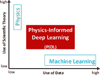

图 1：纯物理基础、数据驱动和混合范式的比较（改编自 [2]）。

PIDL 可能有多种结构设计。这里我们主要关注由*混合计算图*（HCG）表示的 PIDL 框架，该框架由两个图组成：一个物理信息计算图（PICG）和一个物理无信息神经网络（PUNN）。尽管 PIDL 有许多好处，但仍有许多未解的问题需要回答，包括 HCG 的构建、物理选择及 PICG 的架构、PUNN 的架构、损失函数和训练算法。在这些问题中，如何将物理编码到（深度）神经网络（DNN）中仍然未被深入探讨，并且在不同领域和案例中有所不同。在本文中，我们将主要建立一个系统的混合计算图设计流程，以促进物理与深度学习的结合。为此，我们将回顾交通状态估计（TSE）问题中的 PIDL 架构的最新进展。这篇综述论文可以作为研究人员在考虑使用 PIDL 解决手头问题时的指南。

我们已经看到越来越多的研究将 PIDL 应用于物理和生物系统[4, 5]。然而，它在社会系统，特别是人类决策过程（例如驾驶行为）中的可行性仍未得到充分开发。人类的决策涉及复杂的认知过程，伴随着感知误差、噪声观测和输出随机性。此外，人类驾驶行为表现出高度不稳定和非线性的模式，导致停停走走的交通波和交通拥堵[6, 7, 8]。因此，单一的模型驱动或数据驱动方法不足以高精度和鲁棒性地预测这些行为。因此，我们坚信一种结合模型驱动和数据驱动方法优点的混合方法是有前景的[9, 10]。

关于 TSE 的文献非常丰富[11, 12]，PIDL 的文献也同样如此[4, 5]。为了区别于其他 TSE 的综述论文，我们主要关注数据驱动的方法，特别是 PIDL。由于 TSE 的 PIDL 研究相较于基于物理的模型较少，现有文献主要集中在单一道路上，我们将主要考察沿链接的 TSE，并将涉及道路网络的研究（包括链接和节点模型）留待未来研究。为了与其他 PIDL 综述区分开来，我们主要关注混合 PIDL 范式的*模块化设计*，并展示如何定制各种设计，以准确和稳健地识别交通动态模式。这里的*模块化设计*指的是图中每个组件的架构设计以及这些组件如何连接，换句话说，就是如何将物理规律注入到 DNN 中。PIDL 的通用架构包括两个计算图：一个 DNN（即数据驱动组件）用于预测未知解，而另一个（即基于物理的组件），其中表现了物理规律，用于评估预测是否符合给定的物理规律。编码了物理的计算图可以作为另一个深度神经网络的正则化项，以防止过拟合，即高方差。总之，混合这两个组件克服了各自单独引发的高偏差和高方差，使得在模型准确性和数据效率方面能够利用基于物理和数据驱动方法的优势。

PIDL 在 TSE 中的应用是一个相对较新的领域。我们希望对混合 PIDL 范式的模块化设计的洞察以及已建立的可视化工具不仅能为交通研究人员提供指导，推动他们探索 PIDL，同时也能帮助广泛的研究人员更好地理解 PIDL 在他们自己应用领域中的管道。

总体而言，本文提供了使用 PIDL 在 TSE 领域的最新进展的全面概述，同时努力提供有关实施 PIDL 的管道的见解，从架构设计、训练到测试。特别是，

1.  1.

    提出一种可视化 PIDL 中物理和数据组件的计算图；

1.  2.

    建立一种通用的设计 PIDL 计算图每个模块的方式，以进行预测和不确定性量化；

1.  3.

    使用相同的真实世界数据集对各种 PIDL 模型进行基准测试，并识别 PIDL 在“小数据”环境下的优势。

本文其余部分的组织结构如下：第二部分介绍了交通状态估计（TSE）的初步知识及其最新进展。第 3.1 节概述了 PIDL 用于 TSE 的框架。第 3 至第四部分详细讨论了 TSE 的两种问题，即确定性预测和不确定性量化。第五部分总结了我们的工作，并展望了这一前景广阔领域的未来研究方向。

## 2 初步概述及相关工作

### 2.1 PIDL

###### 定义 2.1

物理信息深度学习的通用框架。定义位置 $x\in[0,L]$ 和时间 $t\in[0,T]$ 以及 $L,T\in\mathbb{R}^{+}$。则感兴趣的时空（ST）领域是一个连续的点集：${\cal D}=\{(x,t)|x\in[0,L],t\in[0,T]\}$。将状态表示为 $\mathbf{s}$ 及其观测量表示为 $\hat{\mathbf{s}}$。将（标记的）观测 ${\cal O},{\cal B},{\cal I}$ 和（未标记的）位置点 ${\cal C}$ 表示如下：

|  | <math   alttext="\small\left\{{\begin{array}[]{*{20}l}\ {\cal O}=\{(\mathbf{x}^{(i)},t^{(i)};\hat{\mathbf{s}}^{(i)})\}_{i=1}^{N_{o}}：*领域内观测*，\vspace{0.3em}\\ \ {\cal B}=\{t^{(i_{b})};\hat{\mathbf{s}}^{(i_{b})}\}_{i_{b}=1}^{N_{b}}：*边界观测*，\vspace{0.3em}\\

\ {\cal I}=\{\mathbf{x}^{(i_{0})};\hat{\mathbf{s}}^{(i_{0})}\}_{i_{0}=1}^{N_{0}}：*初始观测*，\vspace{0.3em}\\

\ {\cal C}=\{(\mathbf{x}^{(j)},t^{(j)})\}_{j=1}^{N_{c}}:\textit{配点},\end{array}}\right.\ \vspace{-0.3em}" display="block"><semantics ><mrow ><mo >{</mo><mtable columnspacing="5pt" displaystyle="true" rowspacing="0pt"  ><mtr ><mtd  columnalign="left" ><mrow  ><mrow ><mrow ><mi  mathsize="90%" >𝒪</mi><mo mathsize="90%"  >=</mo><msubsup ><mrow ><mo maxsize="90%" minsize="90%" >{</mo><mrow ><mo maxsize="90%" minsize="90%" >(</mo><msup ><mi mathsize="90%"  >𝐱</mi><mrow ><mo maxsize="90%" minsize="90%"  >(</mo><mi mathsize="90%"  >i</mi><mo maxsize="90%" minsize="90%"  >)</mo></mrow></msup><mo mathsize="90%"  >,</mo><msup ><mi mathsize="90%"  >t</mi><mrow ><mo maxsize="90%" minsize="90%"  >(</mo><mi mathsize="90%"  >i</mi><mo maxsize="90%" minsize="90%"  >)</mo></mrow></msup><mo mathsize="90%"  >;</mo><msup ><mover accent="true"  ><mi mathsize="90%"  >𝐬</mi><mo mathsize="90%"  >^</mo></mover><mrow ><mo maxsize="90%" minsize="90%"  >(</mo><mi mathsize="90%"  >i</mi><mo maxsize="90%" minsize="90%"  >)</mo></mrow></msup><mo maxsize="90%" minsize="90%"  >)</mo></mrow><mo maxsize="90%" minsize="90%" rspace="0.278em" >}</mo></mrow><mrow ><mi mathsize="90%" >i</mi><mo mathsize="90%" >=</mo><mn mathsize="90%" >1</mn></mrow><msub ><mi mathsize="90%" >N</mi><mi mathsize="90%" >o</mi></msub></msubsup></mrow><mo mathsize="90%" rspace="0.278em"  >:</mo><mtext mathsize="90%"  >域内观测</mtext></mrow><mo mathsize="90%"  >,</mo></mrow></mtd></mtr><mtr ><mtd  columnalign="left" ><mrow ><mrow  ><mrow ><mi mathsize="90%"  >ℬ</mi><mo mathsize="90%"  >=</mo><msubsup ><mrow ><mo maxsize="90%" minsize="90%" >{</mo><msup ><mi mathsize="90%" >t</mi><mrow ><mo maxsize="90%" minsize="90%" >(</mo><msub ><mi mathsize="90%" >i</mi><mi mathsize="90%" >b</mi></msub><mo maxsize="90%" minsize="90%" >)</mo></mrow></msup><mo mathsize="90%"  >;</mo><msup ><mover accent="true"  ><mi mathsize="90%"  >𝐬</mi><mo mathsize="90%"  >^</mo></mover><mrow ><mo maxsize="90%" minsize="90%"  >(</mo><msub ><mi mathsize="90%" >i</mi><mi mathsize="90%"  >b</mi></msub><mo maxsize="90%" minsize="90%"  >)</mo></mrow></msup><mo maxsize="90%" minsize="90%" rspace="0.278em" >}</mo></mrow><mrow ><msub ><mi mathsize="90%" >i</mi><mi mathsize="90%" >b</mi></msub><mo mathsize="90%" >=</mo><mn mathsize="90%"  >1</mn></mrow><msub ><mi mathsize="90%"  >N</mi><mi mathsize="90%"  >b</mi></msub></msubsup></mrow><mo mathsize="90%" rspace="0.278em"  >:</mo><mtext mathsize="90%"  >边界观测</mtext></mrow><mo mathsize="90%"  >,</mrow></mtd></mtr><mtr ><mtd  columnalign="left" ><mrow ><mrow  ><mrow ><mi mathsize="90%"  >ℐ</mi><mo mathsize="90%"  >=</mo><msubsup ><mrow ><mo maxsize="90%" minsize="90%"  >{</mo><msup ><mi mathsize="90%"  >𝐱</mi><mrow ><mo maxsize="90%" minsize="90%"  >(</mo><msub ><mi mathsize="90%" >i</mi><mn mathsize="90%"  >0</mn></msub><mo maxsize="90%" minsize="90%"  >)</mo></mrow></msup><mo mathsize="90%"  >;</mo><msup ><mover accent="true"  ><mi mathsize="90%"  >𝐬</mi><mo mathsize="90%"  >^</mo></mover><mrow ><mo maxsize="90%" minsize="90%"  >(</mo><msub ><mi mathsize="90%" >i</mi><mn mathsize="90%"  >0</mn></msub><mo maxsize="90%" minsize="90%"  >)</mo></mrow></msup><mo maxsize="90%" minsize="90%" rspace="0.278em" >}</mo></mrow><mrow ><msub ><mi mathsize="90%" >i</mi><mn mathsize="90%" >0</mn></msub><mo mathsize="90%" >=</mo><mn mathsize="90%"  >1</mn></mrow><msub ><mi mathsize="90%"  >N</mi><mn mathsize="90%"  >0</mn></msub></msubsup></mrow><mo mathsize="90%" rspace="0.278em"  >:</mo><mtext mathsize="90%" >初始观测</mtext></mrow><mo mathsize="90%"  >,</mrow></mtd></mtr><mtr ><mtd  columnalign="left" ><mrow ><mrow  ><mrow ><mi mathsize="90%"  >𝒞</mi><mo mathsize="90%"  >=</mo><msubsup ><mrow ><mo maxsize="90%" minsize="90%"  >{</mo><mrow ><mo maxsize="90%" minsize="90%"  >(</mo><msup ><mi mathsize="90%"  >𝐱</mi><mrow ><mo maxsize="90%" minsize="90%"  >(</mo><mi mathsize="90%"  >j</mi><mo maxsize="90%" minsize="90%"  >)</mo></mrow></msup><mo mathsize="90%"  >,</mo><msup ><mi mathsize="90%"  >t</mi><mrow ><mo maxsize="90%" minsize="90%"  >(</mo><mi mathsize="90%"  >j</mi><mo maxsize="90%" minsize="90%"  >)</mo></mrow></msup><mo maxsize="90%" minsize="90%"  >)</mo></mrow><mo maxsize="90%" minsize="90%" rspace="0.278em" >}</mo></mrow><mrow ><mi mathsize="90%" >j</mi><mo mathsize="90%" >=</mo><mn mathsize="90%" >1</mn></mrow><msub ><mi mathsize="90%" >N</mi><mi mathsize="90%" >c</mi></msub></msubsup></mrow><mo mathsize="90%" rspace="0.278em"  >:</mo><mtext mathsize="90%" >配点</mtext></mrow><mo mathsize="90%"  >,</mrow></mtd></mtr></mtable></mrow><annotation-xml encoding="MathML-Content" ><apply ><csymbol cd="latexml"  >cases</csymbol><matrix ><matrixrow ><apply  ><ci >:</ci><apply ><ci >𝒪</ci><apply ><csymbol cd="ambiguous" >superscript</csymbol><apply ><csymbol cd="ambiguous" >subscript</csymbol><set ><vector ><apply ><csymbol cd="ambiguous" >superscript</csymbol><ci >𝐱</ci><ci >𝑖</ci></apply

其中，$i$ 和 $j$ 分别是观察点和配点的索引。$i_{b},i_{0}$ 分别是边界数据和初始数据的索引。观察数据、边界和初始条件以及配点状态的数量分别用 $N_{o},N_{b},N_{0},N_{c}$ 表示。下标 $b,0$ 分别表示边界和初始条件的索引。

我们设计了一个 *混合计算图* (HCG)，由两个计算图组成：(1) 一个 PUNN，表示为 $f_{\theta}(\mathbf{x},t)$，用于近似映射 $\mathbf{s}^{(i)}$，以及 (2) 一个 PICG，表示为 $f_{\lambda}(\mathbf{x},t)$，用于计算 $\mathbf{s}^{(j)}$ 从配点得到的交通状态。总之，一个通用的 PIDL 模型，表示为 $f_{\theta,\lambda}(\mathbf{x},t)$，用于训练 PUNN 的最优参数集 $\theta^{*}$ 和物理模型的最优参数集 $\lambda^{*}$。用解 $\theta^{*}$ 参数化的 PUNN 可以用于预测新的观察 ST 点集 ${\cal O}_{new}\subseteq{\cal D}$ 上的交通状态 $\hat{\mathbf{s}}_{new}$，而 $\lambda^{*}$ 是描述观察数据内在物理的最可能模型参数。

PIDL 的一个重要应用是解决通用的偏微分方程 (PDE)。我们将简要介绍其基本原理。定义一个 ST 域上的 PDE 为：

|  | $\displaystyle\mathbf{s}_{t}(x,t)+\mathcal{N}_{x}[\mathbf{s}(x,t)]=0,(x,t)\in{\cal D},$ |  | (2) |
| --- | --- | --- | --- |
|  | $\displaystyle\small{\mathcal{B}}[\mathbf{s}(x,t)]=0,\ (x,t)\in\partial{\cal D},$ |  |
|  | $\displaystyle\small{\mathcal{I}}[\mathbf{s}(x,0)]=0,\vspace{-1em}$ |  |

其中，$\mathcal{N}_{x}(\cdot)$ 是非线性微分算子，$\mathcal{B},\mathcal{I}$ 分别是边界条件和初始条件算子，$\partial{\cal D}=\{(0,t)|t\in[0,T]\}\cup\{(L,t)|t\in[0,T]\}$ 是域 ${\cal D}$ 边界上的 ST 点集，$\mathbf{s}(x,t)$ 是 PDE 的精确解。现在我们将通过一个由 $\theta$ 参数化的 DNN，即 $f_{\theta}(x,t)$，来近似 PDE 解 $\mathbf{s}(x,t)$，这个 DNN 是 PUNN。如果这个 PUNN 与 PDE 解完全等价，那么我们有

|  | $\small f_{\theta}(x,t)+\mathcal{N}_{x}[f_{\theta}(x,t)]=0,(x,t)\in D.$ |  | (3) |
| --- | --- | --- | --- |

否则我们定义残差函数 $r_{c}(x,t)=[f_{\theta}(x,t)]_{t}+\mathcal{N}_{x}[f_{\theta}(x,t)]$。如果 PUNN 训练良好，则残差需要尽可能接近零。图 2 描述了使用 PUNN 近似 PDE 解的示意图。

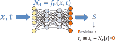

图 2：PDE 解近似的示意图。

物理通常在训练 PUNNs 时被编码为 *控制方程*、*物理约束* 或 *正则项* [13]。当实施“软正则化”时 [14]，PIDL 的损失是两个距离度量的加权和：一个是观察到的动作和预测动作之间的距离（即 *数据差异*），另一个是从物理计算得到的动作和预测动作之间的距离（即 *物理差异*）。其具体形式将在第 3-4 节详细介绍。

### 2.2 交通状态估计

交通状态推断是交通工程中的一个核心问题，并且是交通运营和管理的基础。

###### 定义 2.2.

交通状态估计（TSE）在单车道或多车道的高速公路或干线段上推断交通状态，涵盖一段时间内，使用来自稀疏交通传感器的噪声观测数据来表示交通密度（*辆/公里/车道*，用 $\rho$ 表示）、交通速度（*公里/车道/小时*，用 $u$ 表示）和交通流量或体积（*辆/车道/小时*，用 $q$ 表示）[12]。TSE 的最终目标是建立在推断的交通状态上的交通管理和控制。

###### 备注。

1.  1.

    三种交通量通过一个通用公式连接：

    |  | $\small q=\rho u.\vspace{-0.5em}$ |  | (4) |
    | --- | --- | --- | --- |

    知道其中两个参数会自动推导出另一个。因此，在本文中，我们将主要关注 $\rho,u$，并且 $q$ 可以通过公式 4 推导。

1.  2.

    $q\in[0,q_{max}],\rho\in[0,\rho_{jam}],u\in[0,u_{max}]$，其中 $q_{max}$ 是道路的容量，$\rho_{jam}$ 是拥堵密度（即车距紧密的交通情况），$u_{max}$ 是最高速度（通常表示为速度限制）。如何校准这些参数见表格 1。

TSE 本质上是从 ST 域到标签的端到端学习。表示一个由 $\theta$ 参数化的映射为 $f_{\theta}(\cdot)$，从 ST 域 $(\mathbf{x},t)\in{\cal D}$ 到交通状态 $\mathbf{s}=\{\rho,u\}$：

|  | $\small f_{\theta}:(\mathbf{x},t)\longrightarrow\mathbf{s}=\{\rho,u\}.\vspace{-0.5em}$ |  | (5) |
| --- | --- | --- | --- |

关键问题是找到一组参数 $\theta^{*}$ 和函数形式 $f_{\theta}(\cdot)$，使得它们最符合观测数据。

###### 备注。

TSE 可以使用监督学习来实现，如本文所示，其中基于物理的模型用于规范数据驱动模型的训练。TSE 还可以被制定为无监督学习，例如矩阵/张量完成，用于估计未知的交通状态 [15, 16]。与使用基于物理的模型不同，矩阵/张量完成方法利用低秩属性等先验知识来规范估计。我们希望指出，这种先验知识的规范化也可以通过在 PIDL 损失函数中包含预测交通状态矩阵的秩来集成到我们的框架中。

交通传感器范围从放置在路边基础设施上的传统传感器（欧拉坐标），如感应环路探测器、路边闭路电视（CCTV）或监控摄像头，到车载传感器（拉格朗日坐标），包括全球定位系统（GPS）、车载摄像头、激光雷达和智能手机。预计安装在联网和自动化车辆（CAVs）上的新兴交通传感器将生成数 TB 的流数据 [17]，这些数据可以作为“探测车辆”或“漂浮汽车”进行交通测量。未来城市将被物联网（IoT）彻底改变，它将通过通信网络（如 5G [19]、DSRC [20, 21]、x-haul 光纤网络 [22]、边缘云 [23] 和云服务器）为物理基础设施、移动资产、人与控制系统之间提供无处不在的连接。

图 3 展示了 TSE 的观测数据类型。基于单个车辆轨迹，我们可以汇总每个离散单元和时间间隔的速度和密度。随着高分辨率多模态数据的可用性，我们还应该考虑开发可以直接使用个体轨迹或图像作为输入的 TSE 解耦方法。

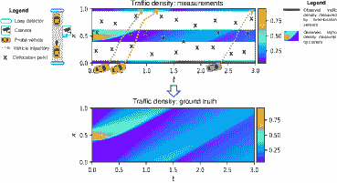

图 3：TSE 的数据类型（改编自 [12]，包括固定位置传感器（蓝色六边形）、路边摄像头和配点（黑色十字））。

在 TSE 问题中，基于物理的方法指的是关于微观、中观和宏观尺度交通流演变的科学假设；而 ML 方法则指的是使用深度神经网络、强化学习、模仿学习和其他先进数据科学方法来模拟人类智能的数据驱动模型 [6]。

#### 2.2.1 基于物理的模型

交通领域得到了丰富理论和模型的支持，这些理论和模型可以追溯到早在 1930 年代[24]。从那时起，成功开发了大量理论，用于解释现实世界的交通现象，预测和诊断操作与管理中的异常，并为规划和管理做出预测。

这些模型充分利用了关于交通系统的科学知识和理论，涵盖了从闭式解到数值模型和模拟的广泛应用。交通模型在过去几十年中展示了其分析和预测能力。例如，微观车-following 模型和宏观交通流模型成功地捕捉了瞬态交通行为，包括冲击波和停走现象。

基于模型的方法依赖于单车道或多车道、单类别或多类别交通流模型。交通模型包括一阶模型，如 Lighthill-Whitham-Richards（LWR）[25, 26]，以及二阶模型，如 Payne-Whitham（PW）[27, 28]和 Aw-Rascle-Zhang（ARZ）[29, 30]。

需要满足的第一个本构定律是守恒定律（CL）或运输方程，意味着在没有源或汇的情况下，流入等于流出。数学上，

|  | $\small(CL)\ \ \ \ \ \ \rho_{t}+(\rho u)_{x}=0,\ (x,t)\in{\cal D}.\vspace{-0.5em}$ |  | (6) |
| --- | --- | --- | --- |

第二个方程规定了$\rho,u$之间的关系，可以是基础图（FD）（用于一阶交通流模型）或动量方程（用于二阶交通流模型）：

|  | $\displaystyle(FD)\ \ \ \ u=U(\rho),\mbox{ (first-order)}$ |  | (7) |
| --- | --- | --- | --- |
|  | $\displaystyle\ \ \ \ \ \ \ \ u_{t}+uu_{x}=g(U(\rho)),\mbox{ (second-order)}.$ |  |

其中$U(\cdot)$是基础图，它是从交通密度到速度的映射，而$g(U(\rho))$是$U(\rho)$的非线性函数。基础图也可以是从密度到体积/流量的映射，如图 4 中通过真实世界交通数据集校准的示例所示。在文献中，提出了几种 FD 函数，有兴趣的读者可以参考[31]以获取全面的调查。

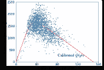

图 4：基础图（红线）与数据（蓝点）。

当选择一个交通流模型作为基础动态系统时，会使用数据同化来找到“最可能的状态”，并利用观测数据来修正模型预测，包括扩展卡尔曼滤波器（EKF）[32, 33, 34]，无迹卡尔曼滤波器（UKF）[35]，集合卡尔曼滤波器（EnKF）[36]，以及粒子滤波器[37]。

为了量化 TSE 问题的不确定性，基于模型的方法通常通过在确定性交通流模型上加入布朗运动，来对交通状态的分布做出先验假设，从而得到高斯随机交通流模型。还有另一类文献则通过更复杂的概率分布推导内在的随机交通流模型[38, 39, 34, 40]。有了随机交通流模型，就可以应用大规模近似或流体极限，提取随机过程的第一和第二矩，以便于应用滤波方法。

#### 2.2.2 数据驱动方法

数据驱动方法旨在直接从数据中学习交通动态。机器学习从大量数据中自动提取知识、模式和模型。自 2006 年以来，深度学习，尤其是深度神经网络，重新引起了科学界的关注[41]。在 TSE 中使用机器学习主要集中在利用时间或空间相关性进行数据填补，包括自回归积分滑动平均[42]、概率图模型[43]、k 最近邻[44]、主成分分析[45, 46]、长短期记忆模型[47]。这些方法大多数假设某时间间隔或某单元内的交通量依赖于其历史值或邻近值，而不考虑交通流的物理特性。因此，数据驱动方法不如基于模型的方法流行，也没有达到基于模型方法的高精度[12]。更近期的机器学习技术旨在建模交通动态中的非线性，利用深层隐藏层以及稀疏自回归技术[48]和模糊神经网络[49]。结合了模型和数据驱动方法的优势，考虑在 TSE 中使用混合方法是很自然的。

#### 2.2.3 PIDL

在开创性的工作[50, 51]中，PIDL 被提出作为 PDEs 的替代求解器。自诞生以来，PIDL 已成为在各种工程领域中用于数据驱动解决或发现非线性动态系统的工具[52, 53, 54, 55, 56]。虽然 PIDL 在各种领域中逐渐展示了其预测能力，但交通建模在将物理和数据方面结合上仍然滞后。

### 2.3 两类问题

现有文献中的 PIDL 旨在解决两类问题：（1）PDE 解推断，和（2）不确定性量化。在接下来的两节中，我们将逐一详细说明这两个问题。

## 3 PIDL 用于确定性 TSE

### 3.1 PIDL 用于交通状态估计（PIDL-TSE）

###### 定义 3.1。

PIDL 用于交通状态估计（PIDL-TSE）的目标是通过整合基于物理的方法和深度学习方法来推断交通状态的时空场。

定义（标记的）观察集为${\cal O}_{d},{\cal O}_{p}$，边界和初始观察集为${\cal B},{\cal I}$，以及（未标记的）配准点集为${\cal C}$如下：

|  | <math   alttext="\small\left\{{\begin{array}[]{*{20}l}\ {\cal O}_{s}=\{(\mathbf{x}^{(i_{s})},t^{(i_{s})});(\hat{\rho}^{(i_{s})},\hat{u}^{(i_{s})})\}_{i_{s}=1}^{N_{o_{s}}}:\textit{静态传感器},\vspace{0.3em}\\ \ {\cal O}_{m}=\{\{\mathbf{X}(n,t^{(i_{m})})\}_{i_{m}=1}^{N_{o_{m}}}\}_{n=1}^{N_{n}}:\textit{移动轨迹},\vspace{0.3em}\\

\ {\cal B}=\{t^{(i_{b})};(\hat{\rho}^{(i_{b})},\hat{u}^{(i_{b})})\}_{i_{b}=1}^{N_{b}}:\textit{边界观察},\vspace{0.3em}\\

\ {\cal I}=\{\mathbf{x}^{(i_{0})};(\hat{\rho}^{(i_{0})},\hat{u}^{(i_{0})})\}_{i_{0}=1}^{N_{0}}:\textit{初始观察},\vspace{0.3em}\\

\ {\cal C}=\{(\mathbf{x}^{(j)},t^{(j)})\}_{j=1}^{N_{c}}:\textit{配点}.\end{array}}\right.\ \vspace{-0.5em}" display="block"><semantics ><mrow ><mo >{</mo><mtable columnspacing="5pt" displaystyle="true" rowspacing="0pt"  ><mtr ><mtd  columnalign="left" ><mrow  ><mrow ><mrow ><msub  ><mi mathsize="90%" >𝒪</mi><mi mathsize="90%" >s</mi></msub><mo mathsize="90%" >=</mo><msubsup ><mrow ><mo maxsize="90%" minsize="90%" >{</mo><mrow ><mo maxsize="90%" minsize="90%" >(</mo><msup ><mi mathsize="90%"  >𝐱</mi><mrow ><mo maxsize="90%" minsize="90%"  >(</mo><msub ><mi mathsize="90%" >i</mi><mi mathsize="90%"  >s</mi></msub><mo maxsize="90%" minsize="90%"  >)</mo></mrow></msup><mo mathsize="90%"  >,</mo><msup ><mi mathsize="90%"  >t</mi><mrow ><mo maxsize="90%" minsize="90%"  >(</mo><msub ><mi mathsize="90%" >i</mi><mi mathsize="90%"  >s</mi></msub><mo maxsize="90%" minsize="90%"  >)</mo></mrow></msup><mo maxsize="90%" minsize="90%"  >)</mo></mrow><mo mathsize="90%"  >;</mo><mrow ><mo maxsize="90%" minsize="90%"  >(</mo><msup ><mover accent="true"  ><mi mathsize="90%"  >ρ</mi><mo mathsize="90%"  >^</mo></mover><mrow ><mo maxsize="90%" minsize="90%"  >(</mo><msub ><mi mathsize="90%" >i</mi><mi mathsize="90%"  >s</mi></msub><mo maxsize="90%" minsize="90%"  >)</mo></mrow></msup><mo mathsize="90%"  >,</mo><msup ><mover accent="true"  ><mi mathsize="90%"  >u</mi><mo mathsize="90%"  >^</mo></mover><mrow ><mo maxsize="90%" minsize="90%"  >(</mo><msub ><mi mathsize="90%" >i</mi><mi mathsize="90%"  >s</mi></msub><mo maxsize="90%" minsize="90%"  >)</mo></mrow></msup><mo maxsize="90%" minsize="90%"  >)</mo></mrow><mo maxsize="90%" minsize="90%" rspace="0.278em" >}</mo></mrow><mrow ><msub ><mi mathsize="90%" >i</mi><mi mathsize="90%" >s</mi></msub><mo mathsize="90%" >=</mo><mn mathsize="90%"  >1</mn></mrow><msub ><mi mathsize="90%"  >N</mi><msub ><mi mathsize="90%"  >o</mi><mi mathsize="90%"  >s</mi></msub></msub></msubsup></mrow><mo mathsize="90%" rspace="0.278em"  >:</mo><mtext mathsize="90%"  >固定传感器</mtext></mrow><mo mathsize="90%"  >,</mo></mrow></mtd></mtr><mtr ><mtd  columnalign="left" ><mrow ><mrow  ><mrow ><msub ><mi  mathsize="90%" >𝒪</mi><mi mathsize="90%"  >m</mi></msub><mo mathsize="90%"  >=</mo><msubsup ><mrow ><mo maxsize="90%" minsize="90%" >{</mo><msubsup ><mrow ><mo maxsize="90%" minsize="90%" >{</mo><mrow ><mi mathsize="90%"  >𝐗</mi><mo lspace="0em" rspace="0em"  >​</mo><mrow ><mo maxsize="90%" minsize="90%" >(</mo><mi mathsize="90%" >n</mi><mo mathsize="90%" >,</mo><msup ><mi mathsize="90%"  >t</mi><mrow ><mo maxsize="90%" minsize="90%"  >(</mo><msub ><mi mathsize="90%" >i</mi><mi mathsize="90%"  >m</mi></msub><mo maxsize="90%" minsize="90%"  >)</mo></mrow></msup><mo maxsize="90%" minsize="90%" >)</mo></mrow></mrow><mo maxsize="90%" minsize="90%"  >}</mo></mrow><mrow ><msub ><mi mathsize="90%"  >i</mi><mi mathsize="90%"  >m</mi></msub><mo mathsize="90%"  >=</mo><mn mathsize="90%"  >1</mn></mrow><msub ><mi mathsize="90%"  >N</mi><msub ><mi mathsize="90%"  >o</mi><mi mathsize="90%"  >m</mi></msub></msub></msubsup><mo maxsize="90%" minsize="90%" rspace="0.278em" >}</mo></mrow><mrow ><mi mathsize="90%" >n</mi><mo mathsize="90%" >=</mo><mn mathsize="90%" >1</mn></mrow><msub ><mi mathsize="90%" >N</mi><mi mathsize="90%" >n</mi></msub></msubsup></mrow><mo mathsize="90%" rspace="0.278em"  >:</mo><mtext mathsize="90%"  >移动轨迹</mtext></mrow><mo mathsize="90%"  >,</mrow></mtd></mtr><mtr ><mtd  columnalign="left" ><mrow ><mrow  ><mrow ><mi mathsize="90%"  >ℬ</mi><mo mathsize="90%"  >=</mo><msubsup ><mrow ><mo maxsize="90%" minsize="90%"  >{</mo><msup ><mi mathsize="90%"  >t</mi><mrow ><mo maxsize="90%" minsize="90%"  >(</mo><msub ><mi mathsize="90%" >i</mi><mi mathsize="90%"  >b</mi></msub><mo maxsize="90%" minsize="90%"  >)</mo></mrow></msup><mo mathsize="90%"  >;</mo><mrow ><mo maxsize="90%" minsize="90%"  >(</mo><msup ><mover accent="true"  ><mi mathsize="90%"  >ρ</mi><mo mathsize="90%"  >^</mo></mover><mrow ><mo maxsize="90%" minsize="90%"  >(</mo><msub ><mi mathsize="90%"  >i</mi><mi mathsize="90%"  >b</mi></msub><mo maxsize="90%" minsize="90%"  >)</mo></mrow></msup><mo mathsize="90%"  >,</mo><msup ><mover accent="true"  ><mi mathsize="90%"  >u</mi><mo mathsize="90%"  >^</mo></mover><mrow ><mo maxsize="90%" minsize="90%"  >(</mo><msub ><mi mathsize="90%"  >i</mi><mi mathsize="90%"  >b</mi></msub><mo maxsize="90%" minsize="90%"  >)</mo></mrow></msup><mo maxsize="90%" minsize="90%"  >)</mo></mrow><mo maxsize="90%" minsize="90%" rspace="0.278em" >}</mo></mrow><mrow ><msub ><mi mathsize="90%" >i</mi><mi mathsize="90%" >b</mi></msub><mo mathsize="90%" >=</mo><mn mathsize="90%"  >1</mn></mrow><msub ><mi mathsize="90%"  >N</mi><mi mathsize="90%"  >b</mi></msub></msubsup></mrow><mo mathsize="90%" rspace="0.278em"  >:</mo><mtext mathsize="90%" >边界观测</mtext></mrow><mo mathsize="90%"

其中，$i_{s},i_{m}$ 分别是从静态和移动传感器收集的数据的索引；$i_{b},i_{0}$ 分别是从边界和初始条件收集的数据的索引；$j$ 仍然是配点的索引。静态传感器数据、移动数据、边界和初始条件以及配点的数量分别表示为 $N_{o_{s}},N_{o_{m}},N_{b},N_{0},N_{c}$。移动轨迹的数量表示为 $N_{n}$。$\mathbf{X}(n,t^{(i_{m})})$ 是第 $n^{th}$ 车辆在时间 $t^{(i_{m})}$ 的位置。${\cal O}$ 中的观测数据仅限于交通传感器放置的时间和位置。相比之下，配点 ${\cal C}$ 没有测量要求或位置限制，因此是可控的。

在接下来的两个部分中，我们将详细阐述 PIDL-TSE 框架在 HCG 架构和训练方法上的应用。

### 3.2 混合计算图 (HCG)

HCG 是我们发明的工具，用于促进两个组件，即 PUNN 和 PICG 的可视化以及它们如何连接。在 HCG 上，可以直观地定义 PUNN 和 PICG 的架构、用于训练 PUNN 的损失函数以及训练范式。计算图建立了跨尺度的数学一致性，是一个标记的有向图，其节点是（不可）观测的物理量，表示输入信息、中间量和目标目标。连接物理量的有向边表示目标变量对源变量的依赖，携带从源量到目标量的数学或 ML 映射。从源到可观测输出量的路径表示模型的一种配置。模型配置是在 HCG 内建立一条路径 [57]。

### 3.3 训练范式

一旦选择了物理模型，我们需要确定在 PUNN 训练之前或期间的参数校准顺序。前者对应于仅推断时间依赖的交通流场，后者对应于交通状态的系统识别 [51]。

#### 3.3.1 顺序训练

顺序训练旨在首先校准 PICG 的参数（即参数校准），然后将已知的物理学编码到 PUNN 中进行训练。参数校准在 TSE 中已经使用非线性编程 [58]、遗传算法 [59]、最小二乘拟合 [60, 61, 62, 63] 和核平滑[64] 进行了广泛研究。基于物理的参数包括 $\rho_{max},u_{max}$ 和其他名义参数。表 1 总结了现有的模型发现方法。

表 1：最先进的参数校准方法

| 方法 | 描述 | $\rho_{max}$ | $\rho_{critical}$ | $u_{max}$ |
| --- | --- | --- | --- | --- |
|  | 最大密度 | 临界密度 | 最大速度 |
| 顺序训练 | 分别校准每个参数 | 每个参数具有一定的物理意义 | 段长度除以平均车辆长度 | 车辆容量的交通密度 | 速度限制或最大值 |
|  | 联合校准参数和预测状态 | 使用 DA 估算的参数增强状态 [38, 39, 34, 40] | 与 DNN 中的其他超参数一起调整 |
|  | 校准 FD | 与预选 FD 相关的参数拟合 [60, 61, 62, 59, 65, 58, 64] | 在$u=0$处的密度 | 在$\max q$处的密度 | 最大速度 |
| 联合训练 | 校准 FD | 与预选 FD 及 DNN 参数一起拟合 [66, 67, 68] | 在$u=0$处的密度 | 在$\max q$处的密度 | 最大速度 |
|  | ML 代理 | 减少变量和参数的大小，同时保持最小的物理相关性 [69, 70, 71] | 在 DNN 中参数化 |

顺序训练是大多数 PIDL 相关研究中的默认范式，重点在于如何在涉及大规模神经网络和复杂的物理信息损失函数时，使训练变得稳健和稳定。越来越多的研究旨在开发更为稳健的神经网络架构和训练算法。例如，可以通过在 PUNN 的某些层引入可伸缩的超参数来使用自适应激活函数，以提高收敛速度和解的准确性 [72]。自适应激活函数也被应用于 DeLISA（基于深度学习的迭代方案近似），它采用隐式多步法和 Runge-Kutta 方法进行时间迭代方案，以构建 PUNN 训练时的学习损失 [73]。为了在训练阶段实现高效且稳定的收敛，[74] 通过使用神经切线核（NTK）理论来研究训练动态，并提出了一种 NTK 引导的梯度下降算法，以自适应调整每个损失组件的超参数。改进一般 PIDL 训练的新算法和计算框架目前是一个热门的研究领域，我们参考了 Karniadakis 等人提出的[4]，以获取该主题的详细综述。

#### 3.3.2 联合训练

在训练过程中，PUNN 和 PICG 的物理参数和超参数同时或迭代地更新。现有的所有关于 PIDL-TSE 的文献都采用了 PICG 和 PUNN 相关的所有参数的同时更新，这将是我们下面关注的重点。然而，我们要指出的是，越来越多的研究对迭代训练两个模块感兴趣[75]，这可能是提高 PIDL-TSE 训练效率的未来方向。

##### 挑战

PIDL 中的 PUNN 是一个典型的深度学习组件，大多数训练技术都可以应用。相比之下，由于 PICG 具有未知物理参数而产生的训练挑战并非微不足道，因此需要大量的研究和额外的自适应努力。

首先，一些交通流模型可能包括在 TSE 中需要发现的大量物理参数，同时训练所有参数是一项挑战。例如，第 3.4 节中的三参数 LWR 模型涉及 5 个参数，据报道，使用真实世界噪声数据直接联合训练所有参数会导致不满意的结果[71]。为了解决这个问题，交替方向乘子法（ADMM）[76]是一种提高训练稳定性的选项，即一次训练一个物理参数子集，其余保持固定。高级 ADMM 变体——深度学习 ADMM（dlADMM），可能进一步解决非凸优化中的全局收敛问题，并具有更快的学习效率[77]。

其次，一个高度复杂的交通流模型可能包含对基于微分学习不友好的复杂术语，这使得模型参数发现对真实数据的效果不佳。在这种情况下，PICG 的结构设计在使框架可训练方面发挥了重要作用。具体而言，需要在编码之前进行额外的努力，如变量转换、分解和因式分解，以使结构可学习，并使损失收敛。或者，如将在第 3.3.2 节中讨论的，可以使用机器学习替代模型，如小型神经网络，来表示 PICG 中的复杂术语，以避免直接处理它们[71]。

##### 机器学习替代模型

当物理模型和 PUNN 共同训练时，图 5 进一步展示了在物理模型中同时调整参数和在 PUNN 中调整超参数的流程。顶部蓝色框包含对损失函数有贡献的数据驱动组件，底部红色框包含基于物理的组件。

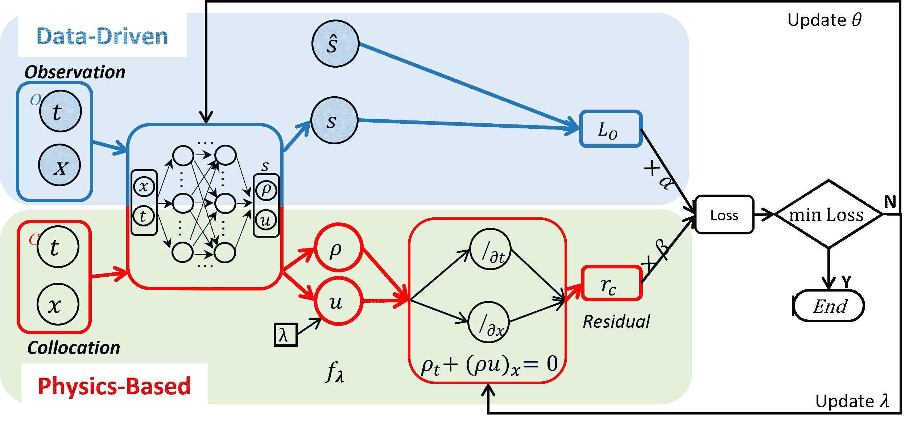

图 5：PIDL 联合训练的流程图。

请注意在图 5 中，我们省略了关于$\rho$和$u$在 PUNN 中如何交互的细节。这两个量可以顺序生成或并行生成。当$\rho$先生成时，可以通过一个规定$\rho$和$u$之间关系的 FD 推导出$u$。否则，一个 PUNN 可以被训练生成$\rho$和$u$，或者训练两个 PUNN 分别生成$\rho$和$u$。由于$\rho$和$u$需要满足 CL，但 PUNN 生成的结果不能保证该约束。因此，$\rho$和$u$被送入物理组件以施加此约束。

为了向 PIDL 中注入如方程 6 中定义的普遍 CL 等最少量的知识，并排除基于假设的知识，如方程 7 中定义的 FD，我们提出了一种 ML 代理模型，该模型将交通密度到速度的映射替换为 DNN，并从数据中学习这两个量之间的关系。

建立$\rho$和$u$之间关系的基本图，可以视为交通流模型中的嵌入物理组件。根据实证研究，$\rho$和$u$之间的关系通常不是一对一的映射，特别是在拥挤状态下。因此，使用 ML 代理组件来表征这两个交通量之间的互动是自然的。我们可以进一步探讨代理的添加在多大程度上影响性能，以及 ML 代理的适用范围。

表 2 总结了使用 PIDL 进行 TSE 的现有研究。利用 PIDL 解决 TSE 问题的提议最早由黄等人[65]和施等人[67, 68, 71]同时且独立地提出。

表 2：先进的 PIDL-TSE

| 物理 | 数据 | 描述 | 参考文献 |
| --- | --- | --- | --- |
| 一阶模型 | LWR | 合成（Lax-Hopf 方法） | 将基于 Greenshields 的 LWR 整合到 PIDL 中，并通过环形检测器以及随机布置的传感器进行验证 | [65] |
| LWR | 数值，NGSIM | 提出了使用 PIDL 解决基于 Greenshields 和三参数 LWR 模型的问题，并通过真实世界数据集展示了其优势 | [67] |
| LWR | 数值 | 研究了交通流量估计的一般部分状态重建问题，并使用编码为 LWR 的 PIDL 来平衡少量的探测车辆数据 | [78] |
| FL1, LWR | SUMO 仿真 | 整合了一个耦合的微观-宏观模型，将跟随者（FL1）模型和 LWR 模型结合到 PIDL 中用于 TSE，可以使用探测车辆的速度信息 | [70, 66] |
| 二阶模型 | LWR & ARZ | 数值，NGSIM | 将基于 PIDL 的 TSE 应用于二阶 ARZ，并从环形检测器和探测车辆中获取观测数据，平行估计 $\rho$ 和 $u$ | [68] |
|  | 提出了将机器学习代理（例如，神经网络）整合到基于物理的 PICG 组件中，以表示复杂的 FD 关系。实现了估计准确度的提高，并学习了未知的 FD 关系 | [71] |

接下来，我们将展示如何设计 PIDL 的架构及相应的 PICG。我们将首先展示一个数值示例，以演示如何将三参数 LWR 的物理定律注入 PICG 中，以指导 PUNNs 的训练，然后在真实世界数据集上比较所有现有架构。

### 3.4 基于三参数的 LWR 的数值数据验证

在这个例子中，我们展示了 PIDL 在由三参数 LWR 交通流模型支配的环形道路上的交通动态中的能力。从数学上看，

|  | $\small\rho_{t}+(Q(\rho))_{x}=\epsilon\rho_{xx},\ x\in[0,1],\ t\in[0,3],$ |  | (9) |
| --- | --- | --- | --- |

其中 $\epsilon=0.005$。初始条件和边界条件分别为 $\rho(x,0)=0.1+0.8e^{-25(x-0.5)^{2}}$ 和 $\rho(0,t)=\rho(1,t)$。

在这个模型中，采用了三参数通量函数 [60]：$Q(\rho)=\rho U(\rho)=\sigma(a+(b-a)\frac{\rho}{\rho_{max}}-\sqrt{1+y^{2}})$，其中 $a=\sqrt{1+(\delta p)^{2}}$，$b=\sqrt{1+(\delta(1-p))^{2}}$，$y=\delta(\frac{\rho}{\rho_{max}}-p)$。在模型中，$\delta$、$p$ 和 $\sigma$ 是作为函数名称的三个自由参数。参数 $\sigma$ 和 $p$ 分别控制最大流量和临界密度（流量最大时的密度）。$\delta$ 控制 $Q(\rho)$ 的圆滑程度。除了上述三个参数，我们还有 $\rho_{max}$ 和扩散系数 $\epsilon$ 作为模型参数的一部分。在这个数值示例中，我们设置 $\delta=5$、$p=2$、$\sigma=1$、$\rho_{max}=1$ 和 $\epsilon=0.005$。

给定钟形初始密度条件，我们应用 Godunov 方法在 240（空间）$\times$ 960（时间）网格点上求解方程 9，这些网格点均匀分布在 $[0,1]\times[0,3]$ 区域内。

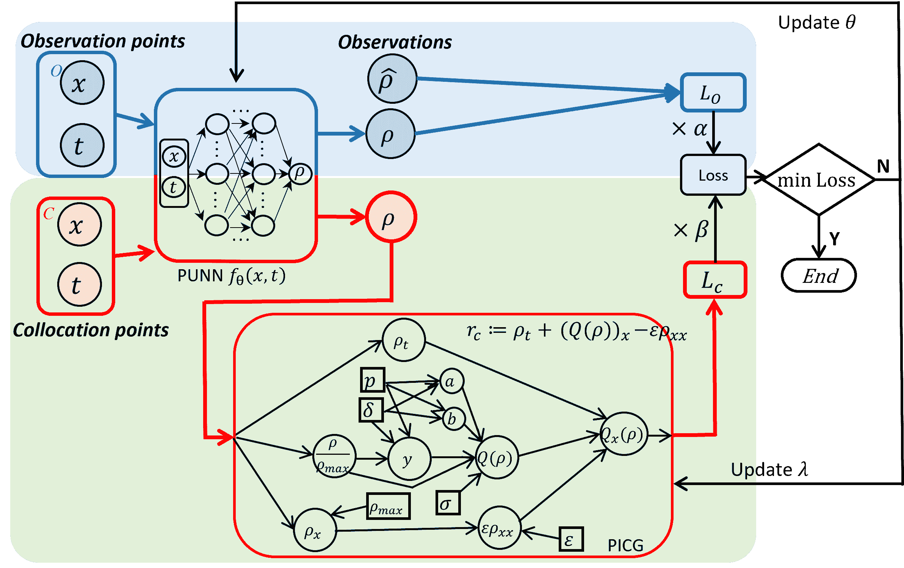

图 6：基于三参数的 LWR 的 PIDL 流程图，包括一个用于交通密度估计的 PUNN 和一个用于计算残差的 PICG，其中 $\lambda=(\delta,p,\sigma,\rho_{max},\epsilon)$。

编码 LWR 模型的 PIDL 架构如图 6 所示。该架构包括一个用于交通密度估计的 PUNN，随后是一个 PICG，用于在配点上计算残差 $r_{c}:=\rho_{t}+(Q(\rho))_{x}-\epsilon\rho_{xx}$。估计的交通密度 $\rho$ 是通过 PUNN $f_{\theta}(x,t)$ 计算的，$f_{\theta}(x,t)$ 是一个神经网络，将时空点 $(x,t)$ 直接映射到 $\rho$，即 $\rho=f_{\theta}(x,t)$。PUNN $f_{\theta}(x,t)$ 由 $\theta$ 参数化，设计为一个具有 8 个隐藏层和每层 20 个隐藏节点的全连接前馈神经网络。双曲正切函数（tanh）被用作隐藏神经元的激活函数。将 $\rho$ 替换为 $f_{\theta}$，我们在这种情况下有 $r_{c}:=[f_{\theta}]_{t}+(Q(f_{\theta}))_{x}-\epsilon[f_{\theta}]_{xx}$。通过估计的 $\rho$ 和观测点上的观测值 $\hat{\rho}$，我们可以得到数据损失 $L_{o}$。相比之下，在 PICG 中，连接权重是固定的，每个节点的激活函数被设计为进行特定的非线性操作，以计算 $r_{c}$ 的中间值。物理误差 $L_{c}$ 是配点上 $r_{c}$ 的均方值。

为了将 PIDL 的训练定制为方程 9，我们需要额外引入边界协同点${\cal C}_{B}=\{(0,t^{(i_{b})})|i_{b}=1,...,N_{b}\}\cup\{(1,t^{(i_{b})})|i_{b}=1,...,N_{b}\}$，用于学习两个边界条件。与方程 8 ‣ 3 PIDL 用于确定性 TSE ‣ 物理信息深度学习在交通状态估计中的应用与展望")中的$\mathcal{B}$不同，${\cal C}_{B}$中不需要边界点的观察。然后，我们得到以下损失：

|  | $\small Loss_{\theta}=\alpha\cdot L_{o}+\beta\cdot L_{c}+\gamma\cdot L_{b},\vspace{-0.7em}$ |  | (10) |
| --- | --- | --- | --- |
|  | $\displaystyle\text{where,}\ \ L_{o}=\frac{\alpha}{N_{o}}\sum_{i=1}^{N_{o}}&#124;f_{\theta}(x^{(i)},t^{(i)})-\hat{\rho}^{(i)}&#124;^{2}\ \ (数据\ 损失),$ |  |
|  | $\displaystyle L_{c}=\frac{\beta}{N_{c}}\sum_{j=1}^{N_{c}}&#124;r_{c}(x^{(j)},t^{(j)})&#124;^{2}\ \ (物理\ 损失),$ |  |
|  | $\displaystyle L_{b}=\frac{\gamma}{N_{b}}\sum_{i_{b}=1}^{N_{b}}&#124;f_{\theta}(0,t^{(i_{b})})-f_{\theta}(1,t^{(i_{b})})&#124;^{2}\ \ (边界\ 损失).$ |  |

注意，因为$r_{c}:=[f_{\theta}]_{t}+(Q(f_{\theta}))_{x}-\epsilon[f_{\theta}]_{xx}$，所以$r_{c}$受$\theta$的影响。此外，边界协同点用于计算边界损失$L_{b}$。由于$L_{b}$可能会因不同情况而变化，为了简化起见，在图 6 中忽略了$L_{b}$。

TSE 和使用环形探测器的系统识别：在这个实验中，五个模型变量$\delta$、$p$、$\sigma$、$\rho_{max}$和$\epsilon$被编码为图 6 中所示的 PICG 中的学习变量。定义$\lambda=(\delta,p,\sigma,\rho_{max},\epsilon)$，残差$r_{c}$受到$\theta$和$\lambda$的共同影响，从而得到目标$Loss_{\theta,\lambda}$。我们现在使用来自环形探测器的观察，即仅观察到安装有环形探测器的某些位置的交通密度。默认情况下，环形探测器均匀分布在道路上。

我们使用$N_{c}=150,000$个配准点，其他实验配置见补充材料 A1。我们使用不同数量的环路检测器进行基于 PIDL 的 TSE 实验，以解决$(\theta^{*},\lambda^{*})=\mathrm{argmin}_{\theta,\lambda}\ Loss_{\theta,\lambda}$。除了$\rho(x,t;\theta^{*})$的交通密度估计误差外，我们还使用$\mathbb{L}^{2}$相对误差（RE）评估估计的模型参数$\lambda^{*}$，并以百分比形式呈现。图 7 展示了 PIDL 估计的交通密度$\rho$（左半部分）和交通速度（右半部分）的可视化结果。在某些时间点的比较结果也被展示。请注意，图 6 中的 PUNN 并不直接预测$u$，而是在后处理时通过$Q(\rho)/\rho$计算得到。

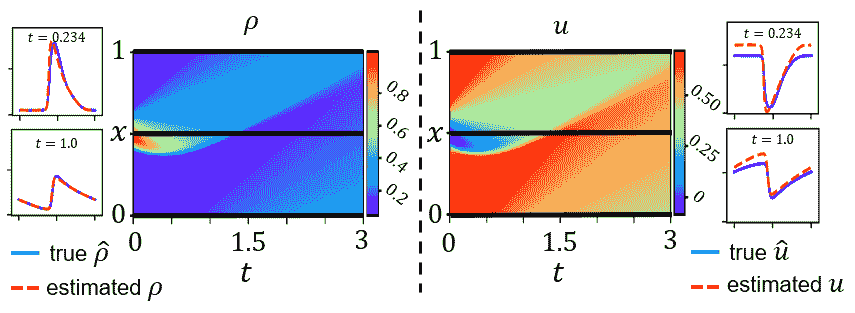

图 7：当环路检测器数量为 3 时，PIDL 估计的交通密度$\rho$（左半部分）和交通速度$u$（右半部分），热图中的水平黑线表示传感器位置。在每一半中，展示了预测热图和某些时间点的快照。请注意，PUNN 并不直接预测$u$，而是在后处理时通过$Q(\rho)/\rho$计算得到。

更多结果见补充表 I，观察结果表明，图 6 中的 PIDL 架构，使用五个环路检测器，在交通密度估计和系统识别方面都能取得令人满意的性能。一般来说，更多的环路检测器有助于提高我们模型的 TSE 准确性，并且更接近真实模型参数。具体来说，对于五个环路检测器，得到的估计误差为$3.186\times 10^{-2}$，模型参数收敛到$\delta^{*}=4.86236$、$p^{*}=0.19193$、$\sigma^{*}=0.10697$、$\rho^{*}_{max}=1.00295$和$\epsilon^{*}=0.00515$，这些参数与真实值相当接近。观察结果表明，PIDL 可以处理由三参数 LWR 控制的交通动态的 TSE 和系统识别任务。

我们对不同数量的配点以及它们如何被识别进行了敏感性分析。详细信息见补充表 II。较大的配点率（即配点数量与网格点数量的比率）对 TSE 和系统识别都有利，因为它可以通过对学习过程施加更多约束，使配点的估计在物理上保持一致。经验上，更多的配点会导致更长的训练时间，并且当达到一定的配点率时，性能不会有太大改善。

### 3.5 现实世界数据验证

看到基于物理或数据驱动方法的最先进技术的表现将很有趣，以更好地量化所提议方法类别的附加值。我们将使用一个广泛使用的现实世界开放数据集，即下一代模拟（NGSIM）数据集，详见表 3。图 8 展示了使用从 US 101 高速公路收集的数据绘制的交通密度热图。

图 9 展示了 2 个基线模型和 4 个 PIDL 变体在确定性 TSE 中的性能。如 y 轴所示，使用了交通密度和速度的 REs 进行评估。比较是在代表性探测车比例（见 x 轴）和环形探测器数量（见子图标题）的组合下进行的。我们分别实现了 EKF 和纯 NN 模型作为代表性的纯数据驱动和物理驱动基线方法。EKF 在进行估计时利用了基于三参数的 LWR 作为核心物理模型。NN 仅包含图 6 中的 PUNN 组件，并使用公式 10 中的第一项作为训练损失。在 PIDL 变体中，PIDL-LWR 和 PIDL-ARZ 是分别将基于三参数的 LWR 和 Greenshields 基于 ARZ 编码到 PICG 中的 PIDL 模型。PIDL-LWR-FDL 和 PIDL-ARZ-FDL 是 PIDL-LWR 和 PIDL-ARZ 的变体模型，通过将 PICG 中的 FD 组件替换为嵌入的神经网络（即 FD 学习器）。注意，FD 学习器技术是由[71]介绍的。

表 3：真实世界数据描述。

| 站点 | 位置 | 日期 | 长度 (米) | 采样频率 (秒) | 车道数量 |
| --- | --- | --- | --- | --- | --- |
| US101¹¹1www.fhwa.dot.gov/publications/research/operations/07030/index.cfm. | 洛杉矶，加州 | 2005 年 6 月 15 日 | 640 | .1 | 5 |

+   •

    注：车辆信息包括位置、速度、加速度、占用车道和车辆类别。时间段包括早上 7:50-8:05，8:05-8:20，8:20-8:35。我们对所有车道的交通状态进行平均。

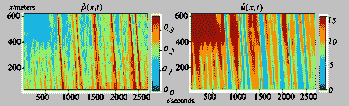

图 8：US 101 高速公路上的平均交通密度和速度。交通密度热图（左）和速度热图（右）。

基线模型的性能：从实验结果中观察到，所有模型的性能随着数据量的增加而提高。EKF 方法的表现优于 NN 方法，尤其是在观察次数较少时。结果是合理的，因为 EKF 是一种以物理为驱动的方法，充分利用交通流模型在数据有限时适当地估计未观察值。然而，该模型无法完全捕捉现实世界中复杂的交通动态，随着数据量的增加性能提升缓慢。当数据相对较大时（见 loop=2 和 ratio=3.0$\%$ 的情况），NN 能够赶上 EKF。然而，其数据效率低，需要大量数据才能获得准确的 TSE。

PIDL 基于模型的比较：PIDL 基于的方法通常优于基线模型。PIDL-ARZ 的误差低于 PIDL-LWR，因为 ARZ 模型是一个二阶模型，可以捕捉更复杂的交通动态，并以更复杂的方式告知 PIDL。

使用 FDL 的效果：将带有 FD 学习器的模型（PIDL-LWR-FDL 和 PIDL-ARZ-FDL）与不带的模型（PIDL-LWR 和 PIDL-ARZ）进行比较，前者通常显示出更好的数据效率。在 PIDL-LWR-FDL 和 PIDL-ARZ-FDL 中，FD 方程被一个内部小型神经网络替代，用于学习真实交通动态的隐藏 FD 关系。内部神经网络的适当集成可以避免直接编码 PIDL 中的复杂项，并在模型驱动的 PIDL 复杂性与训练灵活性之间取得平衡，使框架更适合 TSE 问题。

PIDL-FDL 基于模型的比较：PIDL-LWR-FDL 的误差低于 PIDL-ARZ-FDL，这意味着复杂的交通模型不一定能提供更好的性能，因为模型可能包含复杂的项，使得 TSE 性能对 PIDL 结构设计敏感。使用 NGSIM 数据时，PIDL-LWR-FDL 能更好地平衡 PIDL 的复杂性与训练灵活性。

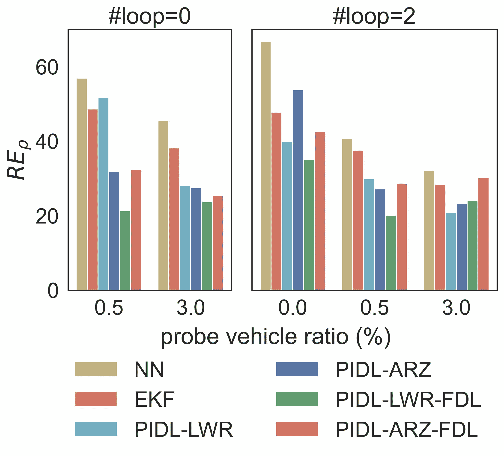

(a)

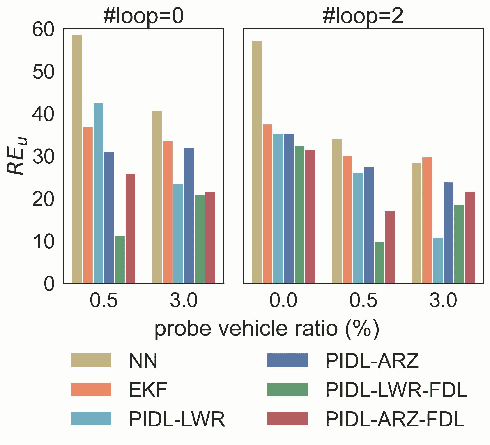

(b)

图 9：NGSIM 数据集的确定性 PIDL 模型结果。

从纯物理驱动到数据驱动 TSE 模型的过渡：可以通过调整方程 10 中的超参数$\alpha$和$\beta$来控制物理驱动和数据驱动组件的贡献。图 10 显示了随着数据量增加，最佳$\beta/\alpha$比率的变化。x 轴是回路探测器的数量，代表训练数据的大小。y 轴是最佳$\beta/\alpha$，对应于图 9 中显示的 PIDL-LWR 方法的最小可达估计误差。调整超参数的特性使得基于 PIDL 的方法能够平滑地从纯物理驱动转变为纯数据驱动的 TSE 模型：在充分数据情况下，通过使用小的$\beta/\alpha$比率，PIDL 表现得更像纯数据驱动 TSE 模型，充分利用交通数据，缓解了实际动态不能被一些简单 PDEs 轻易建模的问题；而在“少量”数据情况下，通过使用较大的比率，PIDL 则表现得像纯物理驱动模型，更好地推广到未观察到的领域。

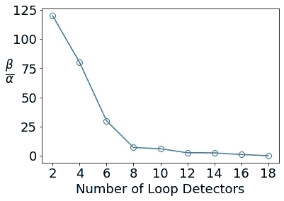

图 10：物理基础组件和数据驱动组件对 PINN 的最佳性能的贡献比例。

## 4 PIDL 用于 UQ

量化不确定性在动态系统中如何传播，可能导致级联错误、不可靠的预测，最糟糕的是，非最优的操作和管理策略，是一种广泛认为的建模和计算挑战。因此，描述交通状态估计器中的不确定性以及依赖于 TSE 预测器的交通管理是不容忽视的。使用 PIDL 进行 TSE 的 UQ 仍处于初期阶段。

###### 定义 4.1.

不确定性量化（UQ）的目标是通过估计具有输入特征和边界条件的量的概率密度来评估开发模型的稳健性，并界定动态系统的预测误差[79]。随机效应和不确定性可能源于各种因素，包括测量的变异性和误差、各种实体的动态作用、模型偏差，以及离散化和算法误差。总的来说，在 TSE 的背景下，不确定性有两种类型[79, 80]：

1.  1.

    随机不确定性（或数据不确定性）：数据的内生属性，因此是不可减少的，来自测量噪声、不完整数据、训练数据与测试数据之间的不匹配。

1.  2.

    认知不确定性（或知识不确定性、系统性不确定性、模型差异）：由于对交通状态知识不足而产生的模型属性。例如，交通通常由多类车辆（如乘用车、摩托车和商用车）构成。单一模型可能导致捕捉多样化行为的不足。

不确定性量测（UQ）“和概率与统计学的学科一样古老”[79]。近年来，得益于大数据和新计算模型及架构的发展，UQ 在大规模应用中的爆炸性增长得到了支持。传统的 UQ 技术包括但不限于：灵敏度分析和鲁棒优化[81]; 概率集成方法和具有多层次变体的蒙特卡洛方法[82, 83, 84]; 随机谱方法[79]; 以及基于 Frobenius-Perron 和 Koopman 算子的动态系统方法[85, 86]。

由于模型差异产生的认知不确定性，通常带有偏差，可以通过改进领域知识来补偿，这一点受到越来越多的关注，特别是在 PIDL 的进展下。在 PIDL 的计算架构中，数据组件可以视为对物理基础组件提供的不准确或偏差物理的补偿项。因此，将 PIDL 推广到 UQ 是自然的，其中物理基础组件在高非线性模型中传播随机性时提供部分领域知识，而数据驱动组件则学习来自数据和模型错误的额外随机性。

###### 定义 4.2。

用于交通状态估计的不确定性量测（UQ-TSE）旨在通过概率模型捕捉交通状态的随机性$\hat{\mathbf{s}}=\{\hat{\rho},\hat{u}\}$。假设$\hat{\mathbf{s}}$遵循观测分布，即$\hat{\mathbf{s}}\sim p_{\text{data}}(\hat{\mathbf{s}}|x,t)$。UQ-TSE 问题的目标是训练一个由$\theta$参数化的概率模型$G_{\theta}$，使得预测分布$\mathbf{s}\sim p_{\theta}(\mathbf{s}|x,t)$类似于观测分布$\hat{\mathbf{s}}\sim p_{\text{data}}(\hat{\mathbf{s}}|x,t)$。一种广泛使用的量化$p_{\text{data}}$和$p_{\theta}$之间差异的度量是反向 Kullback-Leibler（KL）散度。

由于大多数关于 UQ-PIDL 的文献采用深度生成模型，包括生成对抗网络（GAN）[87]、归一化流 [88] 和变分自编码器（VAE）[89]，这里我们将重点关注如何利用深度生成模型解决 UQ 问题。其中，物理信息生成对抗网络（PhysGAN）是最广泛使用的模型，已被应用于求解随机微分方程 [90, 91, 92] 和在多个领域量化不确定性 [93, 71]。关于使用物理信息 VAE 解决 UQ-TSE 问题的研究较少，这可以成为未来的研究方向。

### 4.1 PIDL-UQ 用于 TSE

#### 4.1.1 物理信息生成对抗网络（PhysGAN）

一种制定 UQ-TSE 问题的方法是使用生成对抗网络（GAN）[87]，它模仿数据分布而无需指定明确的密度分布，并且能够克服非高斯似然的计算挑战 [52]，这与使用高斯过程 [94, 95] 相对。

现在我们将在条件 GAN 的背景下制定 UQ 问题。生成器 $G_{\theta}$ 学习从输入 $(x,t)$ 和随机噪声 $z$ 映射到交通状态 $\mathbf{s}$，即 $G_{\theta}:(x,t,z)\rightarrow\mathbf{s}$，其中 $\theta$ 是生成器的参数。生成器 $G_{\theta}$ 的目标是欺骗一个对抗训练的判别器 $D_{\phi}:(x,t,\mathbf{s})\rightarrow[0,1]$。GAN 的损失函数如下所示：

|  |  | $\displaystyle Loss_{\theta}\ \ (generator\ loss)$ |  | (11) |
| --- | --- | --- | --- | --- |
|  |  | $\displaystyle=\mathbb{E}_{x,t,\mathbf{z}}\left[D_{\phi}(x,t,\mathbf{s})\right]\simeq\frac{1}{N_{o}}\sum_{i=1}^{N_{o}}D_{\phi}(x^{(i)},t^{(i)},\mathbf{s}^{(i)}),$ |  |
|  |  | $\displaystyle Loss_{\phi}\ \ (discriminator\ loss)$ |  | (12) |
|  |  | $\displaystyle=-\mathbb{E}_{x,t,\mathbf{z}}\left[\ln D_{\phi}(x,t,\mathbf{s})\right]-\mathbb{E}_{x,t,\hat{\mathbf{s}}}\left[\ln(1-D_{\phi}(x,t,\hat{\mathbf{s}}))\right],$ |  |
|  |  | $\displaystyle\simeq-\frac{1}{N_{o}}\sum_{i=1}^{N_{o}}\ln D_{\phi}(x^{(i)},t_{o}^{(i)},\mathbf{s}^{(i)})+\ln(1-D_{\phi}(x^{(i)},t^{(i)},\hat{\mathbf{s}}^{(i)})),$ |  |

其中 $\mathbf{s}^{(i)}=G_{\theta}(x^{(i)},t^{(i)},z^{(i)})$ 是预测的交通状态，$\hat{\mathbf{s}}$ 是真实值。施加物理信息后，生成器损失与公式 10 形式相同，数据损失 $L_{o}$ 和边界损失 $L_{b}$ 变为：

|  | $\displaystyle L_{o}$ | $\displaystyle=\frac{1}{N_{o}}\sum\limits_{i=1}^{N_{o}}D_{\phi}(x^{(i)},t^{(i)},\mathbf{s}^{(i)}),$ |  | (13) |
| --- | --- | --- | --- | --- |
|  | $\displaystyle L_{b}$ | $\displaystyle=\frac{1}{N_{b}}\sum\limits_{i_{b}=1}^{N_{b}}D_{\phi}(x^{(i_{b})},t^{(i_{b})},\mathbf{s}^{(i_{b})}).$ |  |

不同的 PhysGAN 变体采用不同的方式将物理融入到 GAN 中，$L_{c}$ 的具体形式也随之变化。下面我们将介绍 PhysGAN 的总体结构及其四种变体。

PhysGAN 的总体结构如图 11 ‣ 4.1 PIDL-UQ for TSE ‣ 4 PIDL for UQ ‣ Physics-Informed Deep Learning For Traffic State Estimation: A Survey and the Outlook") 所示。顶部蓝色框包含数据驱动组件，该组件是由生成器 $G_{\theta}$ 和判别器 $D_{\phi}$ 组成的 GAN 模型。这里我们省略了 $\rho$ 和 $u$ 在生成器内如何交互的细节。这两个量可以通过共享相同的神经网络生成，也可以通过不同的神经网络生成。PICG 可以用 LWR 或 ARZ 方程进行编码。

PI-GAN [91, 96, 97, 90] 基于残差 $r_{c}$ 计算物理损失 $L_{c}$，如图 11 ‣ 4.1 PIDL-UQ for TSE ‣ 4 PIDL for UQ ‣ Physics-Informed Deep Learning For Traffic State Estimation: A Survey and the Outlook") (a) 的分支 $B_{1}$ 所示。$L_{c}$ 通过加权和的方式添加到 PUNN 的损失 $L_{o}$ 中。该模型是第一个也是最广泛使用的将物理编码到生成器中的模型。

PID-GAN [92] 将残差 $r_{c}$ 输入到判别器 $D_{\phi}$ 中，以提供预测是否偏离物理方程的额外信息，这有助于判别器区分预测和真实值。这种集成物理的方式在图 11 ‣ 4.1 PIDL-UQ for TSE ‣ 4 PIDL for UQ ‣ Physics-Informed Deep Learning For Traffic State Estimation: A Survey and the Outlook") (a) 的分支 $B_{2}$ 中有所说明。值得一提的是，PID-GAN 和 PI-GAN 共享相同的数据驱动组件结构。它们在物理的融入方式上有所不同，即通知生成器（分支 $B_{1}$）或判别器（分支 $B_{2}$）。[92] 显示，通过通知判别器，PID-GAN 可以缓解 PI-GAN 的梯度不平衡问题。

上述两个 PhysGAN 变体使用确定性物理，即物理方程中的参数是确定的。

Mean-GAN [98] 将随机微分方程纳入物理组件（如图 11 ‣ 4.1 PIDL-UQ for TSE ‣ 4 PIDL for UQ ‣ Physics-Informed Deep Learning For Traffic State Estimation: A Survey and the Outlook") (a) 所示的 PICG），其中物理参数被假定为服从高斯分布。物理参数中的随机性是认识不确定性的来源，这导致残差 $r_{c}$ 的随机性。物理损失是基于 $r_{c}$ 的均方误差计算的，即 $|\frac{1}{N_{k}}\sum_{i=1}^{N_{k}}r_{c}|^{2}$，其中 $N_{k}$ 是物理参数样本的数量。然后，物理损失通过加权求和的方式纳入 PUNN 的损失函数中。

在图 11 ‣ 4.1 PIDL-UQ for TSE ‣ 4 PIDL for UQ ‣ Physics-Informed Deep Learning For Traffic State Estimation: A Survey and the Outlook") (a) 中的 PICG 内，我们还可以用 ML 代理替代参数化的 FD，这在 PI-GAN-FDL[91, 99] 中有所应用。

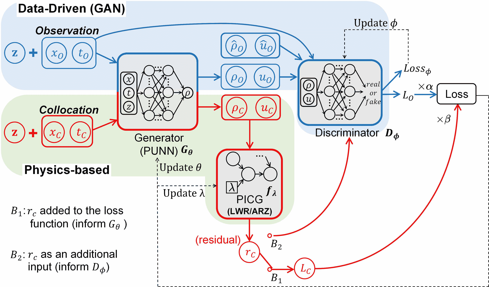

(a)

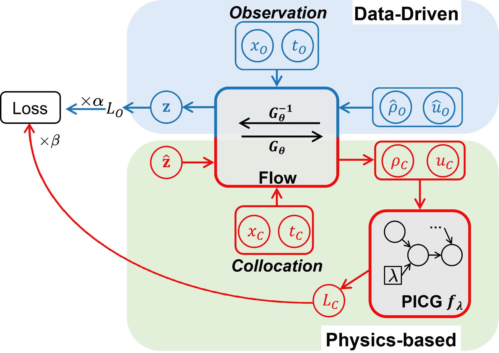

(b)

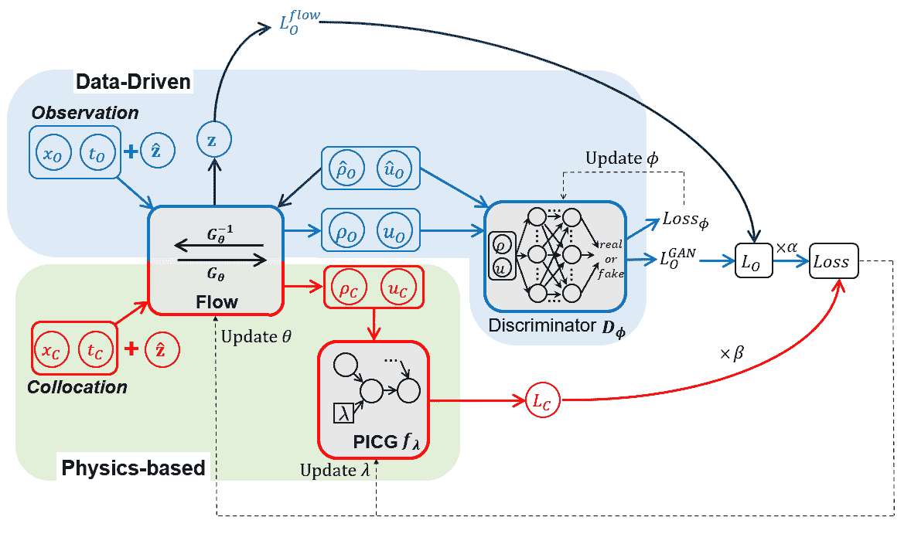

(c)

图 11：用于 UQ-TSE 的 PIDL 架构。PhysGAN (a) 包括一个生成器、一个判别器和一个 PICG。PhysFlow (b) 包括一个正则化流和一个 PICG。PhysFlowGAN (c) 包括一个正则化流、一个判别器和一个 PICG。

#### 4.1.2 物理信息正则化流（PhysFlow）

PhysFlow [100] 采用正则化流作为与 GAN 对应的生成模型。正则化流显式地估计似然，因此相比于 GAN 模型，训练更为直接。它通过构建一个可逆函数 $G_{\theta}$，将高斯先验 $\hat{z}$ 转换为交通状态 $\mathbf{s}$，从而估计似然。PhysFlow 的结构，即 PI-Flow，如图 11 ‣ 4.1 PIDL-UQ for TSE ‣ 4 PIDL for UQ ‣ Physics-Informed Deep Learning For Traffic State Estimation: A Survey and the Outlook") (b) 所示。顶部的蓝色框包含由正则化流模型组成的数据驱动组件。逆函数 $G_{\theta}^{-1}$ 以交通状态为输入，输出预测的先验 $z$。训练目标是使 $z$ 服从高斯分布，这可以通过最大似然估计来实现。底部的红色框包含物理组件，与 PI-GAN 相同。

#### 4.1.3 物理信息流基础的 GAN（PhysFlowGAN）

PhysFlowGAN 结合了 GAN、归一化流和 PIDL 的优点。它使用归一化流作为生成器进行显式似然估计，同时利用对抗训练与判别器确保样本质量。PhysFlowGAN 的结构如图 11 ‣ 4.1 PIDL-UQ for TSE ‣ 4 PIDL for UQ ‣ 交通状态估计中的物理信息深度学习：综述与展望") (c)所示，包括一个归一化流、一个判别器和一个 PICG。数据损失$L_{o}$由两部分组成，即从判别器计算的$L_{o}^{GAN}$和从归一化流计算的$L_{o}^{flow}$。物理损失的计算方式与 PI-GAN 相同。一个 PhyFlowGAN 模型，TrafficFlowGAN [99]，已应用于 UQ-TSE 问题。

表 4 ‣ 4.1 PIDL-UQ for TSE ‣ 4 PIDL for UQ ‣ 交通状态估计中的物理信息深度学习：综述与展望")总结了用于 UQ-TSE 的混合架构。

表 4: 用于 UQ-TSE 的架构。

| 模型 | 描述 | 优点 | 参考文献 |
| --- | --- | --- | --- |
| PhysGAN | PI-GAN | $L_{c}=\frac{1}{N_{c}}\sum_{i=1}^{N_{c}}&#124;r_{c}&#124;^{2}$ 被添加到生成器损失函数中，采用加权和 | 使用最广泛 | [91, 96, 97, 90] |
| PID-GAN | 残差输入到判别器中：$D_{\phi}(x^{(j)},t^{(j)},\mathbf{s}^{(j)},e^{-&#124;r_{c}^{(j)}&#124;^{2}})$，然后在配点上进行平均以计算$L_{c}$ | 能减轻梯度不平衡问题 | [92] |
| Mean-GAN | 残差在物理参数$\lambda$上进行平均：$L_{c}=\frac{1}{N_{c}}\sum_{i=1}^{N_{c}}&#124;\frac{1}{N_{k}}\sum_{i=1}^{N_{k}}r_{c}&#124;^{2}$ | 能编码随机物理模型 | [98] |
| PI- GAN -FDL | $\rho-u$ 关系由机器学习代理近似；物理损失$L_{c}$与 PI-GAN 相同 | 需要最少的物理信息 | [91, 99] |
| PhysFlow | PI-Flow | 归一化流模型用作生成器进行显式似然计算；物理损失$L_{c}$与 PI-GAN 相同 | 结构简单；易于训练 | [100] |
| PhysFlowGAN | 交通流 GAN | 归一化流模型用作生成器进行显式似然计算；卷积神经网络用作判别器以确保高样本质量，物理损失$L_{c}$与 PI-GAN 相同 | 结合了 PhysGAN 和 PhysFlow 的优点 | [99] |

### 4.2 基于 Greenshields 的 ARZ 的数值数据验证

由于 PI-GAN 是最广泛使用的 UQ-TSE 模型，我们进行了使用 PI-GAN 的数值实验进行演示。在下一小节中，我们将使用真实数据比较上述 UQ-TSE 模型的性能。

ARZ 数值数据是从基于 Greenshields 的 ARZ 交通流模型生成的环形道路上的数据：

|  | $\displaystyle\rho_{t}+(Q(\rho))_{x}=0,\ x\in[0,1],\ t\in[0,3],$ |  | (14) |
| --- | --- | --- | --- |
|  | $\displaystyle\partial_{t}(u+h(\rho))+u\cdot\partial_{x}(u+h(\rho))=(U_{eq}(\rho)-u)/\tau,$ |  |
|  | $\displaystyle h(\rho)=U_{eq}(0)-U_{eq}(\rho).$ |  |

$U_{eq}=u_{max}(1-\rho/\rho_{max})$是 Greenshields 速度函数，其中$\rho_{max}=1.13$和$u_{max}=1.02$；$\tau$是松弛时间，设置为 0.02。边界条件为$\rho(0,t)=\rho(1,t)$。$\rho$和$u$的初始条件分别为$\rho(x,0)=0.1+0.8e^{-25(x-0.5)^{2}}$和$u(x,0)=0.5$。添加了遵循$\mathcal{N}(0,0.02)$分布的高斯噪声以引入随机性。将 PI-GAN 应用于 ARZ 数值数据的结果见附录表 IV。图 12 展示了当环形探测器数量为 3 时，PI-GAN 的预测交通密度（左半部分）和速度（右半部分）。在采样时间点的快照显示了预测与真实值之间的良好一致性。

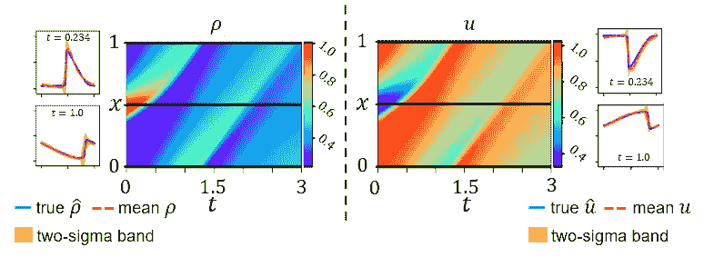

图 12：当环形探测器数量为 3 时，PI-GAN 的估计交通密度$\rho$（左半部分）和交通速度（右半部分），其中热图中的水平黑线表示环形探测器的位置。在每一半中，展示了预测热图和某些时间点的快照。

### 4.3 真实数据验证

我们将 PIDL-UQ 模型应用于 NGSIM 数据集。我们使用了 4 种模型类型，即 PI-GAN、PI-GAN-FDL、PI-Flow 和 TrafficFlowGAN 进行演示。每种模型可以由 LWR 或 ARZ 方程提供信息，总共产生 8 种模型变体。EKF 和 GAN 作为基线。EKF 使用三参数 LWR 作为物理模型。结果如图 13 所示。如 y 轴所示，上面板为交通密度和速度的 RE，下方面板为交通密度和速度的 Kullback-Leibler 散度（KL）。在代表性的探测车辆比例（见 x 轴）和环形探测器数量（见子图标题）的组合下进行比较。我们从三个角度解释结果：

循环数据的效果。当探测车辆比例固定为 0.5% 时，随着循环次数从 0 增加到 2，所有模型的性能显著提升，因为循环数据提供了更多的信息。当探测车辆比例为 3% 时，这种改进并不显著，因为探测数据本身已提供了足够的信息。

使用 FDL 的效果。当循环次数为 2 且探测车辆比例为 0.5% 时，与 PI-GAN 和 PI-Flow 相比，PI-GAN-FDL 实现了显著更低的 RE 和 KL，而当数据稀疏时，这一优势变得不那么明显。这是因为 ML 替代模型需要更多的数据进行训练。此外，PI-GAN-FDL 通常比 PI-GAN 实现了更低的 KL，表明 PI-GAN-FDL 更能有效捕捉不确定性。

ARZ 基于模型与 LWR 基于模型的比较。总体而言，ARZ 基于模型优于 LWR 基于模型，这表明二阶物理模型更适用于现实世界场景。

PIDL-UQ 模型的比较。随着数据量的增加，性能得到改善，模型间的性能差异变小。在所有 PIDL 基于模型中，TrafficFlowGAN 通常在 RE 和 KL 方面表现出最低的误差，因为它结合了 PhysGAN 和 PhysFlow 的优点。在图 13(e) 中，我们总结了所有模型在不同训练数据集下的 $RE$（x 轴，即预测值和真实值均值之间的相对差异）和 $KL$（y 轴，即预测值和真实值分布之间的统计差异），这些数据在图 13(a-d) 中展示。每个点表示将一种模型类型应用于一个训练数据集所产生的指标组合。我们通过将这些点分配到 4 个区域来进行解释：

+   •

    区域 A（最佳 RE 和 KL）：该区域的大多数点属于 TrafficFlowGAN 模型类型（以星号标记），这表明 PI-GAN 和 PI-Flow 的结合有助于在 RE 和 KL 方面实现最佳性能。

+   •

    区域 B（低 RE 和高 KL）：该区域的大多数点属于 GAN（以倒三角形标记）和 PI-GAN（以点标记），这表明基于 GAN 的模型容易出现模式崩溃。

+   •

    区域 C（平衡的 RE 和 KL）：该区域的大多数点属于 PI-Flow 模型类型，表明明确估计数据似然有助于平衡 RE 和 KL。

+   •

    区域 D（高 RE 和低 KL）：该区域的大多数点属于 EKF（以三角形标记）和 PI-GAN-FDL（以方形标记），这表明这两种类型的模型比均值更能有效捕捉不确定性。

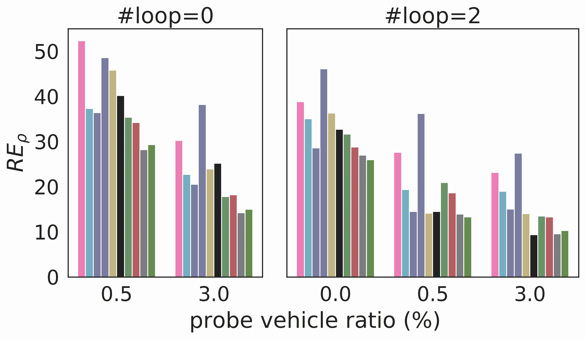

(a)

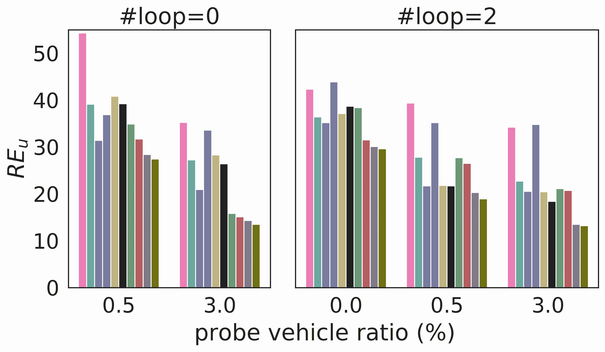

(b)

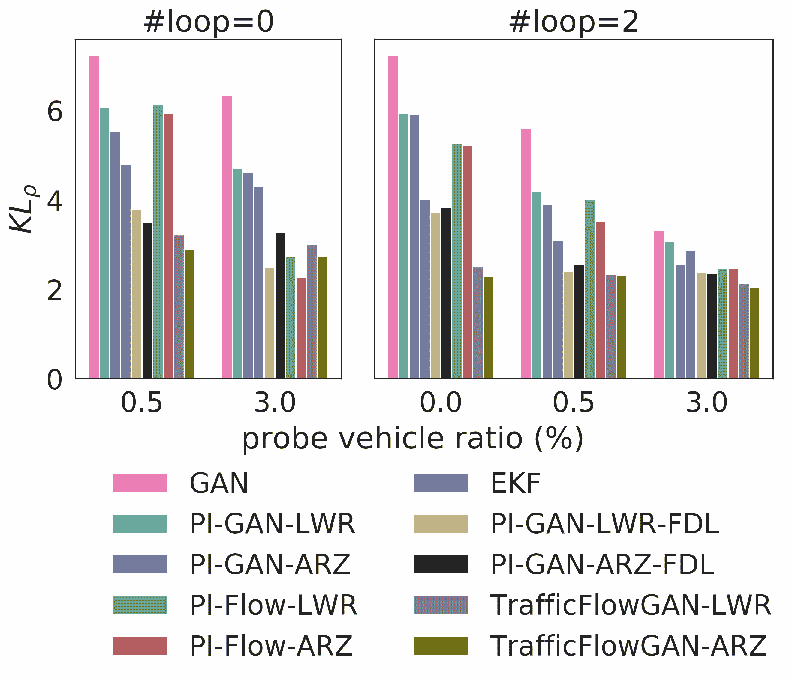

(c)

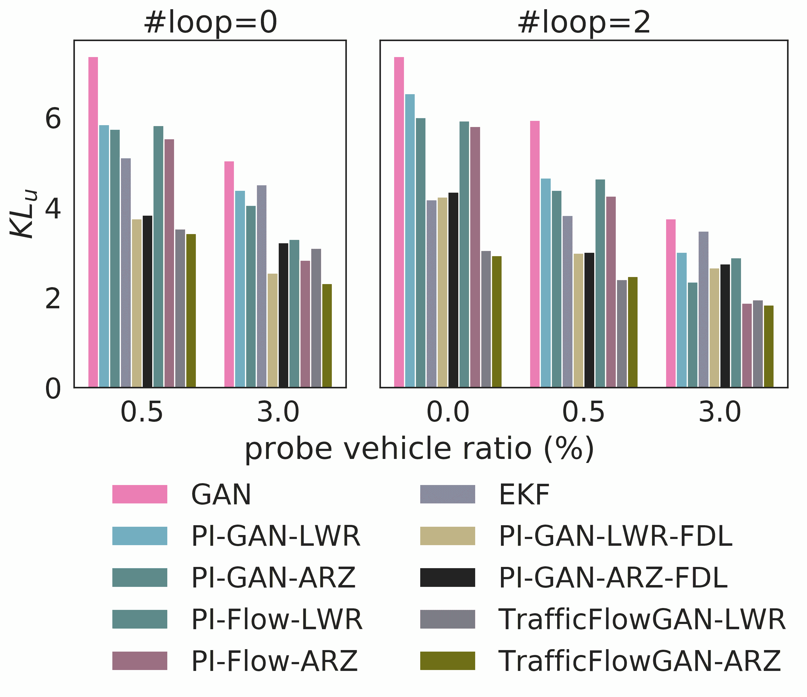

(d)

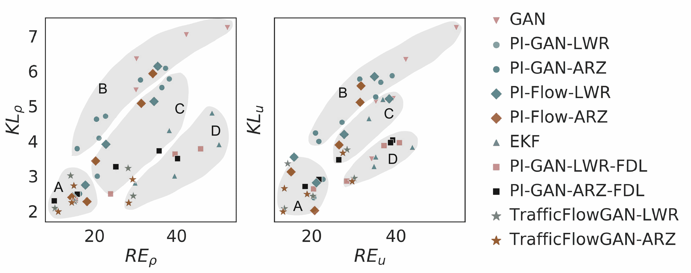

(e)

图 13：PIDL-UQ 模型在 NGSIM 数据集上的结果。

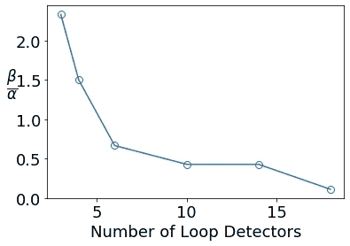

图 14：物理基础组件和数据驱动组件对 TraifficFlowGAN 最佳训练的贡献比例。$\beta$ 和 $\alpha$ 是公式 10 中的超参数，分别控制物理基础和数据驱动组件的贡献。

从纯物理驱动模型过渡到数据驱动 TSE 模型：图 14 显示了不同循环探测器数量下 TrafficFlowGAN 的最佳 $\beta/\alpha$ 比率。最佳 $\beta/\alpha$ 的趋势与图 10 中展示的确定性 TSE 问题的趋势类似。

## 5 结论与未来工作

### 5.1 结论

本文为 TSE 问题中的 PIDL 方法学范式奠定了基础，包括交通状态推断和不确定性量化。我们提出了集成 PUNN 和 PICG 的 HCG 概念。在 TSE 问题中，我们展示了各种架构设计。对于交通状态推断问题，PUNN 和 PICG 可以顺序或并行连接，这取决于是否通过 FDs 从交通密度计算交通速度，或者是否同时从 PUNN(s)计算速度和密度。对于 UQ 问题，提出了基于 GAN 和非 GAN 的对抗生成模型，以刻画测量不确定性对交通状态的影响。介绍了包括 PI-GAN、PID-GAN、Mean-GAN、PI-GAN-FDL、PI-Flow 和 TrafficFlowGAN 在内的架构变体。这是首个使用相同实际数据集比较 PIDL 模型变体的研究，为模型比较提供了基准平台。通过比较各种 PIDL 模型，我们展示了这一范式在“小数据”环境下相较于纯物理或数据驱动方法的优势，并且允许通过调整损失函数中的超参数实现从纯物理驱动到数据驱动模型的平滑过渡。表格 5 总结了 PIDL-TSE 中使用的现有混合架构类型。

表格 5：物理基础组件中的配置。

| <svg version="1.1" height="43.5" width="237.8" overflow="visible"><g transform="translate(0,43.5) scale(1,-1)"><g  transform="translate(0,0)"><g transform="translate(0,21.75) scale(1, -1)"><foreignobject width="118.9" height="21.75" overflow="visible">PUNN-    PICG 拓扑 <g  transform="translate(164.46,21.75)"><g transform="translate(0,21.75) scale(1, -1)"><foreignobject width="73.34" height="21.75" overflow="visible">PUNN 层次</foreignobject></g></g></foreignobject></g></g></g></svg> | 共享 | 分离 |
| --- | --- | --- |
| 顺序 | [67, 68, 70, 65, 92, 91, 97, 98, 99] | [71, 66, 78, 100, 91, 96, 90] |
| 并行 | [9, 10] | - |

+   •

    注：PUNN-PICG 拓扑指的是 PUNN 和 PICG 之间的布局，可以是“顺序”（即 PUNN 的输出作为 PICG 的输入，因此 PICG 跟随 PUNN）或“并行”（即 PUNN 和 PICG 并排输出预测以计算损失）。PUNN 层次指的是用于分别预测$\rho$和$u$的 NN 布局。“共享”表示仅使用一个 NN 输出$\rho,u$，而“分离”则表示使用两个 NN 分别输出$\rho,u$。

### 5.2 展望

展望未来，我们将指出几个有前景的研究方向，希望能指导研究人员开发这一尚未充分开发的领域。

#### 5.2.1 物理表示

选择哪种物理模型取决于数据的真实性、模型的可靠性以及可用的计算资源。

尽管已经有大量的模型来描述微观[101, 102]、中观[103, 104]和宏观尺度[105, 26, 29, 30]的交通动态，但未来在于发现一种多尺度交通模型（即从多尺度测量到不同尺度交通状态的映射），该模型能够综合各种测量来推断交通状态。分析性多尺度模型在生物学[13]和材料科学[106]等领域已经得到了充分研究，但在交通建模中仍未得到充分利用。开发多尺度交通模型的驱动因素有两个：（1）传感器数据存在不同的尺度。收集的交通数据包括高分辨率的个体轨迹和低分辨率的汇总信息，涵盖了不同的时空粒度。不同尺度上的交通测量本质上测量的是同一系统和现象。因此，能够整合各种尺度测量的多尺度模型可以用更小的数据集更准确地描述交通动态。（2）交通优化和管理策略需要依赖不同尺度的多样化模型和数据。个体轨迹通常使用 ODE 建模，而汇总交通模式则使用 PDE 建模。一个集成的 ODE-PDE 物理模型有可能同时适应微观和宏观尺度的这些测量[107]。多尺度交通模型还可以帮助降低模型复杂性，并加快实时应用的模拟速度。

然而，多尺度交通模型由于维度诅咒（即高维输入输出对）而面临计算挑战。因此，利用降维建模技术和多忠实度建模[108, 109]非常重要。

改进物理表示的一个新兴方向是考虑代理模型。例如，符号回归已被证明能够学习相对简单的物理形式来描述复杂的物理系统 [110, 111]。交通工程师已经花费了几十年时间发现各种物理定律来描述人类行为模型，从跟车、变道到其他驾驶场景和任务。是否有可能开发出一种系统方法来选择数学模型？例如，模型选择可以重新表述为在 PICG 上找到从输入到输出的最佳路径 [112]。因此，模型选择被转化为优化问题。机器学习方法，如神经架构搜索 [113] 和网络架构的自动模块化 [114]，可能使 PICG 和 PUNN 的自动架构设计成为可能。

#### 5.2.2 模式中的学习不连续性

交通模式，特别是拥堵交通，主要受基础物理驱动，因此，如何学习围绕冲击波的模式，这对应于梯度不存在的不连续性，仍然是 PIDL 中的一个活跃研究领域。有少量文献讨论了使用 PIDL 处理含有冲击和波动解的非线性 PDE 的这种限制。一种解决方案是添加粘性项 [115, 68, 71] 以平滑不连续性。

由于最先进的方法主要集中于“软”方法，这种方法将物理约束作为损失函数的一部分，物理约束的满足不能得到保证，从而导致在冲击和波动中的预测效果差。因此，“硬”方法来强制执行物理约束可能是一种根本的解决办法。一个选项是使用变分公式 [116] 转换 TSE 问题，并定义一个基于能量的损失函数 [117]，这自然采用了变分公式中的目标函数。

#### 5.2.3 转移学习与元学习

对于工程师而言，一个重要的问题是，如果我们使用从城市 $A$ 收集的数据训练了一个 PUNN，我们能否直接将预测结果推广到使用来自城市 $B$ 的数据？来自两个城市的交通数据集在基础交通动态（如旧金山和孟买的司机行为异质性）、交通环境、道路条件、初始和边界条件以及交通需求等方面可能存在巨大差异。为了解决这一挑战，我们必须修改 PUNN 的输入，不使用 $(x,t)$，而使用其他在数据集中变化的属性，包括但不限于道路类型、几何形状、车道宽度、车道数量、限速、旅行需求、交通组成等。

满足转移需求的另一个方向是询问，我们如何训练一系列相关的基于物理的 PDE（如 LWR 和 ARZ），并将调整过的超参数推广到其他物理模型？对 PIDL 管道中涉及的参数进行元学习可能是一个潜在的解决方案 [118]。

#### 5.2.4 IoT 数据在城市交通管理中的应用

我们如何充分利用多模态、多保真度的 IoT 数据，包括但不限于个体轨迹、摄像头图像、雷达热图和激光雷达点云？现有的做法是通过计算机视觉预处理这些多模态、多保真度的测量数据，并提取出以交通速度和/或密度为单位的汇总交通信息，数据范围划分在离散的空间单元和时间间隔内。与其将这些数据格式转换为传统的格式，我们应该跳出框架，潜在地重新定义整个 TSE 框架。这要求我们在交通状态的定义上转变思维模式，将个体轨迹和图像作为输入。换句话说，单纯使用汇总的交通速度、密度和流量来描述交通状态是否足够？汇总交通测量在几十年前引入，当时感应环检测器用于测量累计交通计数。交通流量长期以来被视为类似流体的现象，因此，应用流体力学理论来建模交通流动动态是自然的。将定义为流体的物理量适应于交通流动是合乎逻辑的。然而，交通系统并非物理系统，而是社会系统，在这些系统中，道路使用者构成了一个复杂的交通环境，并与建成环境持续互动。情境信息对驾驶行为和交通动态有重大影响。因此，当我们描述交通状态并旨在优化交通管理策略时，交通情境信息（由 DNN 表示）是否有助于补充那些广泛使用的定量测量，特别是当这种信息由于 IoT 和智能城市技术变得更加广泛可用时？

此外，如果 TSE 模型可以通过多模态数据进行丰富，那么在依赖交通状态推断的交通控制和优化模型中，新的挑战和机会是什么？当存在未观测到的混淆变量时，已经有大量关于因果发现和因果推断的研究[119, 120]。然而，利用物理知识中的显性因果关系来改进 PIDL 的工作还很少。例如，物理动态的反事实分析关注于识别各种干预措施的因果效应，包括交通控制和环境中其他代理人的序列决策[121, 122, 123]。在没有进行额外的风险和不安全的实验的情况下，我们如何利用物联网数据提供的新信息来设计和验证交通管理策略？

#### 5.2.5 网络中的 TSE

随着智能城市中传感器的普及，大规模道路网络上的交通状态估计将变得更加可行和有用。为了从单一的道路段推广到网络，挑战在于图的空间表示以及交通动态的时间演变。当 PIDL 在传感信息稀疏的网络中应用时，我们需要理清现有物理模型可以纳入的表示方式，换句话说，我们应该如何将链路上的交通状态和交汇点的状态编码到深度学习模型中。[124]预测网络流量，使用了一种将交通潜能场演变的微分方程网络集成到深度神经网络中的时空微分方程网络（STDEN）。

还有许多未解的问题。随着这一领域的不断发展，我们希望留给读者思考：

1.  1.

    我们如何利用各种观测数据来充分发挥 PIDL 的优势？

1.  2.

    什么类型的传感器和传感数据可以丰富 PIDL 的应用领域并更好地发挥其优势？

1.  3.

    是否存在一种跨领域的通用混合计算图架构？

1.  4.

    针对基准模型，PIDL 模型的稳健评估方法和指标有哪些？

## 参考文献

+   [1] M. Raissi, P. Perdikaris, 和 G. E. Karniadakis, “物理信息神经网络：用于解决涉及非线性偏微分方程的正向和反向问题的深度学习框架，” *计算物理学杂志*，第 378 卷，第 686–707 页，2019 年。

+   [2] A. Karpatne, G. Atluri, 等, “理论指导的数据科学：从数据中进行科学发现的新范式，” *IEEE 知识与数据工程学报*，第 29 卷，第 10 期，第 2318–2331 页，2017 年。

+   [3] T. Yu, E. J. Canales-Rodríguez, M. Pizzolato, G. F. Piredda, T. Hilbert, E. Fischi-Gomez, M. Weigel, M. Barakovic, M. B. Cuadra, C. Granziera *等*, “基于模型的机器学习用于多组分 T2 弛豫测量，” *Medical Image Analysis*, 卷 69, 页 101940, 2021 年。

+   [4] G. E. Karniadakis, I. G. Kevrekidis, L. Lu, P. Perdikaris, S. Wang, 和 L. Yang, “物理信息机器学习，” *Nature Reviews Physics*, 卷 3，第 6 期，页 422–440, 2021 年。

+   [5] S. Cuomo, V. S. Di Cola, F. Giampaolo, G. Rozza, M. Raissi, 和 F. Piccialli, “通过物理信息神经网络的科学机器学习：我们的位置与未来方向，” *arXiv 预印本 arXiv:2201.05624*, 2022 年。

+   [6] X. Di 和 R. Shi, “混合自主时代下的自动驾驶车辆控制调查：从基于物理的到 AI 指导的驾驶策略学习，” *Transportation Research Part C: Emerging Technologies*, 卷 125, 页 103008, 2021 年。

+   [7] K. Huang, X. Di, Q. Du, 和 X. Chen, “通过自动驾驶车辆稳定交通：一种连续均场博弈方法，” *第 22 届 IEEE 国际智能交通系统大会（ITSC）（DOI: 10.1109/ITSC.2019.8917021）*，2019 年。

+   [8] ——, “在混合自主中使用连续模型进行可扩展交通稳定性分析，” *Transportation Research Part C: Emerging Technologies*, 卷 111, 页 616–630, 2020 年。

+   [9] Z. Mo, R. Shi, 和 X. Di, “一种物理信息深度学习范式用于车-following 模型，” *Transportation Research Part C: Emerging Technologies*, 卷 130, 页 103240, 2021 年。

+   [10] Z. Mo 和 X. Di, “车-following 行为的不确定性量化：物理信息生成对抗网络，” 在 *第 28 届 ACM SIGKDD 与第 11 届国际城市计算研讨会（UrbComp2022）*，2022 年。

+   [11] Y. Wang 和 M. Papageorgiou, “基于扩展卡尔曼滤波器的实时高速公路交通状态估计：一种通用方法，” *Transportation Research Part B: Methodological*, 卷 39，第 2 期，页 141–167, 2005 年。

+   [12] T. Seo, A. M. Bayen, T. Kusakabe, 和 Y. Asakura, “高速公路交通状态估计：全面调查，” *Annual Reviews in Control*, 卷 43, 页 128–151, 2017 年。

+   [13] M. Alber, A. B. Tepole, W. R. Cannon, S. De, S. Dura-Bernal, K. Garikipati, G. Karniadakis, W. W. Lytton, P. Perdikaris, L. Petzold, 和 E. Kuhl, “整合机器学习和多尺度建模——生物学、生物医学和行为科学中的视角、挑战与机遇，” *npj Digital Medicine*, 卷 2，第 1 期，页 1–11，2019 年。

+   [14] A. Krishnapriyan, A. Gholami, S. Zhe, R. Kirby, 和 M. W. Mahoney, “特征化物理信息神经网络中的可能失败模式，” *Advances in Neural Information Processing Systems*, 卷 34, 2021 年。

+   [15] X. Chen, M. Lei, N. Saunier, 和 L. Sun, “低秩自回归张量完成用于时空交通数据填补，” *IEEE Transactions on Intelligent Transportation Systems*, 2021 年。

+   [16] X. Chen, J. Yang, 和 L. Sun，“一种用于时空交通数据补全的非凸低秩张量完成模型，” *交通运输研究 C 部分：新兴技术*，第 117 卷，第 102673 页，2020 年。

+   [17] SAS，“联网车辆：大数据，大机会，” [`www.sas.com/content/dam/SAS/en_us/doc/whitepaper1/connected-vehicle-107832.pdf`](https://www.sas.com/content/dam/SAS/en_us/doc/whitepaper1/connected-vehicle-107832.pdf)，2015 年，[在线；访问时间 2022 年 4 月 30 日]。

+   [18] K. Chopra, K. Gupta, 和 A. Lambora，“未来互联网：物联网——文献综述，” 收录于 *2019 年国际机器学习、大数据、云计算与并行计算会议（COMITCon）*，2019 年，第 135–139 页。

+   [19] L. Chettri 和 R. Bera，“关于物联网（IoT）向 5G 无线系统发展的全面调查，” *IEEE 物联网期刊*，第 7 卷，第 1 期，第 16–32 页，2020 年。

+   [20] K. Abboud, H. A. Omar, 和 W. Zhuang，“DSRC 与蜂窝网络技术在 V2X 通信中的互操作性：一项调查，” *IEEE 车辆技术学报*，第 65 卷，第 12 期，第 9457–9470 页，2016 年。

+   [21] C. J. Meinrenken, Z. Shou, 和 X. Di，“使用 GPS 数据确定最佳电动车范围：一项密歇根州的案例研究，” *交通运输研究 D 部分：运输与环境*，第 78 卷，第 102203 页，2020 年。

+   [22] J. Elbers 和 J. Zou，“5G 及以后的灵活 X-haul 网络，” 收录于 *2019 年第 24 届光电子与通信会议（OECC）和 2019 年国际光子学交换与计算会议（PSC）*，2019 年，第 1–3 页。

+   [23] P. Porambage, J. Okwuibe, M. Liyanage, M. Ylianttila, 和 T. Taleb，“关于物联网实现的多接入边缘计算调查，” *IEEE 通信调查与教程*，第 20 卷，第 4 期，第 2961–2991 页，2018 年。

+   [24] B. Greenshields, W. Channing, H. Miller *等*，“交通容量研究，” 收录于 *公路研究委员会会议录*，第 1935 卷。国家研究委员会（美国），公路研究委员会，1935 年。

+   [25] M. J. Lighthill 和 G. B. Whitham，“关于运动波 II. 长拥挤道路上的交通流理论，” *伦敦皇家学会学报 A 系列：数学与物理科学*，第 229 卷，第 1178 期，第 317–345 页，1955 年。

+   [26] P. I. Richards，“公路上的冲击波，” *运筹学*，第 4 卷，第 1 期，第 42–51 页，1956 年。

+   [27] H. J. Payne，“高速公路交通与控制模型，” *公共系统数学模型*，第 51–61 页，1971 年。

+   [28] G. B. Whitham，“线性与非线性波，” *约翰·威利父子公司*，第 42 卷，1974 年。

+   [29] A. Aw, A. Klar, M. Rascle, 和 T. Materne，“从微观跟随者模型推导连续体交通流模型，” *SIAM 应用数学期刊*，第 63 卷，第 1 期，第 259–278 页，2002 年。

+   [30] H. M. Zhang，“一种不具备气体行为的非平衡交通模型，” *交通运输研究 B 部分：方法学*，第 36 卷，第 3 期，第 275–290 页，2002 年。

+   [31] D. S. Turner，*交通流理论的基础图 75 年：Greenshields 研讨会：2008 年 7 月 8-10 日，马萨诸塞州伍兹霍尔*。运输研究委员会，2011 年。

+   [32] Y. Wang、M. Papageorgiou 和 A. Messmer，“基于扩展卡尔曼滤波器的实时高速公路交通状态估计：自适应能力和实际数据测试，” *交通研究 A 部分：政策与实践*，第 42 卷，第 10 期，第 1340–1358 页，2008 年。

+   [33] Y. Wang、M. Papageorgiou、A. Messmer、P. Coppola、A. Tzimitsi 和 A. Nuzzolo，“自适应高速公路交通状态估计器，” *自动化*，第 45 卷，第 1 期，第 10–24 页，2009 年。

+   [34] X. Di、H. Liu 和 G. Davis，“用于信号化干道交通密度估计的混合扩展卡尔曼滤波方法：全球定位系统数据的使用，” *交通研究记录*，第 2188 期，第 165–173 页，2010 年。

+   [35] L. Mihaylova、R. Boel 和 A. Hegiy，“用于高速公路交通估计的无迹卡尔曼滤波器，”见 *第 11 届 IFAC 交通系统控制研讨会论文集*，荷兰代尔夫特，2006 年。

+   [36] S. Blandin、A. Couque、A. Bayen 和 D. Work，“关于标量宏观交通流模型的序列数据同化，” *物理学 D：非线性现象*，第 241 卷，第 17 期，第 1421–1440 页，2012 年。

+   [37] L. Mihaylova 和 R. Boel，“用于高速公路交通估计的粒子滤波器，”见 *第 43 届 IEEE 决策与控制会议（CDC）*，巴哈马拿骚，2004 年，第 2106–2111 页。

+   [38] G. A. Davis 和 J. G. Kang，“城市高速公路上特定目的地交通密度的估计，用于高级交通管理，” *交通研究记录*，第 1457 期，第 143–148 页，1994 年。

+   [39] J.-G. Kang，*使用交通流的 Markov 模型估计城市高速公路上的特定目的地交通密度并识别参数*。明尼苏达大学，1995 年。

+   [40] S. E. Jabari 和 H. X. Liu，“交通流的随机模型：理论基础，” *交通研究 B 部分：方法论*，第 46 卷，第 1 期，第 156–174 页，2012 年。

+   [41] G. E. Hinton、S. Osindero 和 Y.-W. Teh，“一种快速学习算法用于深度信念网络，” *神经计算*，第 18 卷，第 7 期，第 1527–1554 页，2006 年。

+   [42] M. Zhong、P. Lingras 和 S. Sharma，“使用因子、遗传、神经和回归技术估计缺失的交通计数，” *交通研究 C 部分：新兴技术*，第 12 卷，第 2 期，第 139–166 页，2004 年。

+   [43] D. Ni 和 J. D. Leonard，“使用贝叶斯网络进行不完整智能交通系统数据的 Markov 链蒙特卡罗多重插补，” *交通研究记录*，第 1935 卷，第 1 期，第 57–67 页，2005 年。

+   [44] S. Tak、S. Woo 和 H. Yeo，“用于道路链接分段单元交通数据的数据驱动插补方法，” *IEEE 智能交通系统汇刊*，第 17 卷，第 6 期，第 1762–1771 页，2016 年。

+   [45] L. Li, Y. Li 和 Z. Li，“考虑时间和空间依赖的交通流缺失数据高效填补”，*交通研究 C 部分：新兴技术*，第 34 卷，第 108–120 页，2013 年。

+   [46] H. Tan, Y. Wu, B. Cheng, W. Wang 和 B. Ran，“考虑非负性和道路容量的鲁棒缺失交通流填补”，*工程中的数学问题*，2014 年。

+   [47] X. Ma, Z. Tao, Y. Wang, H. Yu 和 Y. Wang，“基于远程微波传感器数据的交通速度预测的长短期记忆神经网络”，*交通研究 C 部分：新兴技术*，第 54 卷，第 187–197 页，2015 年。

+   [48] N. G. Polson 和 V. O. Sokolov，“短期交通流预测的深度学习”，*交通研究 C 部分：新兴技术*，第 79 卷，第 1–17 页，2017 年。

+   [49] J. Tang, X. Zhang, W. Yin, Y. Zou 和 Y. Wang，“基于模糊神经网络与粗糙集理论结合的交通流缺失数据填补”，*智能交通系统杂志*，第 1–16 页，2020 年。

+   [50] M. Raissi，“深度隐含物理模型：非线性偏微分方程的深度学习”，*机器学习研究杂志*，第 19 卷，第 1 期，第 932–955 页，2018 年。

+   [51] M. Raissi 和 G. E. Karniadakis，“隐含物理模型：非线性偏微分方程的机器学习”，*计算物理学杂志*，第 357 卷，第 125–141 页，2018 年。

+   [52] Y. Yang 和 P. Perdikaris，“物理信息神经网络中的对抗性不确定性量化”，*计算物理学杂志*，第 394 卷，第 136–152 页，2019 年。

+   [53] M. Raissi, Z. Wang, M. S. Triantafyllou 和 G. E. Karniadakis，“涡旋诱发振动的深度学习”，*流体力学杂志*，第 861 卷，第 119–137 页，2019 年。

+   [54] Z. Fang 和 J. Zhan，“用于 3D 表面上偏微分方程的物理信息神经网络框架：时间无关问题”，*IEEE Access*，2020 年。

+   [55] M. Raissi, A. Yazdani 和 G. E. Karniadakis，“隐含流体力学：从流动可视化中学习速度和压力场”，*科学*，第 367 卷，第 6481 期，第 1026–1030 页，2020 年。

+   [56] R. Rai 和 C. K. Sahu，“由数据驱动还是通过物理推导？聚焦于网络物理系统（CPS）的混合物理引导机器学习技术综述”，*IEEE Access*，第 8 卷，第 71 050–71 073 页，2020 年。

+   [57] K. Wang, W. Sun 和 Q. Du，“用于自动第三方校准、验证和伪造本构定律的非合作元建模博弈，配合并行对抗攻击”，*计算方法在应用力学与工程*，第 373 卷，第 113514 页，2021 年。

+   [58] T. Seo, T. Kusakabe 和 Y. Asakura，“使用数据同化的高级探测车进行交通状态估计”，见*2015 年 IEEE 第 18 届智能交通系统国际会议*，IEEE，2015 年，第 824–830 页。

+   [59] M. Cremer 和 M. Papageorgiou，“交通流模型的参数识别”，*自动化*，第 17 卷，第 6 期，第 837–843 页，1981 年。

+   [60] S. Fan 和 B. Seibold, “数据拟合的第一阶交通模型及其第二阶推广：通过轨迹和传感器数据进行比较，” *运输研究记录*，第 2391 卷，第 1 期，第 32–43 页，2013 年。

+   [61] A. A. Kurzhanskiy 和 P. Varaiya, “道路网络的主动交通管理：宏观方法，” *皇家学会 A 卷：数学、物理与工程科学*，第 368 卷，第 1928 期，第 4607–4626 页，2010 年。

+   [62] S. Fan, M. Herty, 和 B. Seibold, “数据拟合的广义 aw-rascle-zhang 模型的比较模型准确性，” *arXiv 预印本 arXiv:1310.8219*，2013 年。

+   [63] W. Deng, H. Lei, 和 X. Zhou, “基于异质数据源的交通状态估计与不确定性量化：三探测器方法，” *运输研究 B 部分：方法论*，第 57 卷，第 132–157 页，2013 年。

+   [64] D. Ngoduy, “适用于交通流模型动态校准的核平滑方法，” *计算机辅助土木与基础设施工程*，第 26 卷，第 6 期，第 420–432 页，2011 年。

+   [65] J. Huang 和 S. Agarwal, “用于交通状态估计的物理知识驱动深度学习，” 在 *IEEE 第 23 届国际智能交通系统会议（ITSC）*，2020 年 9 月 20-23 日，第 3487–3492 页。

+   [66] M. Barreau, M. Aguiar, J. Liu, 和 K. H. Johansson, “基于物理知识的学习用于交通密度的识别和状态重建，” 在 *第 60 届 IEEE 决策与控制会议（CDC）*，2021 年 12 月 13-15 日，第 2653–2658 页。

+   [67] R. Shi, Z. Mo, K. Huang, X. Di, 和 Q. Du, “用于交通状态估计的物理知识驱动深度学习，” *arXiv 预印本 arXiv:2101.06580*，2021 年 1 月 17 日。

+   [68] R. Shi, Z. Mo, 和 X. Di, “用于交通状态估计的物理知识驱动深度学习：一种基于第二阶交通模型的混合范式，” 在 *AAAI 人工智能会议论文集*，第 35 卷，第 1 期，2021 年 5 月，第 540–547 页。

+   [69] S. L. Brunton, J. L. Proctor, 和 J. N. Kutz, “通过稀疏识别非线性动态系统从数据中发现控制方程，” *美国国家科学院院刊*，第 113 卷，第 15 期，第 3932–3937 页，2016 年。

+   [70] J. Liu, M. Barreau, M. Čičić, 和 K. H. Johansson, “基于学习的交通状态重建使用探测车辆，” *IFAC-PapersOnLine*，第 54 卷，第 2 期，第 87–92 页，2021 年。

+   [71] R. Shi, Z. Mo, K. Huang, X. Di, 和 Q. Du, “一种用于交通状态和基本图估计的物理知识驱动深度学习范式，” *IEEE 智能交通系统汇刊*，第 23 卷，第 8 期，第 11,688–11,698 页，2022 年 8 月。

+   [72] A. D. Jagtap, K. Kawaguchi, 和 G. E. Karniadakis, “自适应激活函数加速深度与物理知识驱动神经网络的收敛，” *计算物理学杂志*，第 404 卷，第 109136 页，2020 年。

+   [73] Y. Li, Z. Zhou, 和 S. Ying，“Delisa：基于深度学习的迭代方案近似，用于求解偏微分方程，” *计算物理学杂志*，第 451 卷，页 110884，2022 年。

+   [74] S. Wang, X. Yu, 和 P. Perdikaris，“PINNs 训练失败的时机和原因：一种神经切线核视角，” *计算物理学杂志*，第 449 卷，页 110768，2022 年。

+   [75] G. Zhang, Z. Yu, D. Jin, 和 Y. Li，“物理驱动的机器学习用于人群模拟，” *第 28 届 ACM SIGKDD 知识发现与数据挖掘会议论文集*，2022 年，页 2439–2449。

+   [76] S. Boyd, N. Parikh, E. Chu, B. Peleato, 和 J. Eckstein，“通过交替方向乘子法进行分布式优化和统计学习，” *机器学习基础与趋势*，第 3 卷，第 1 期，页 1–122，2011 年。

+   [77] J. Wang, F. Yu, X. Chen, 和 L. Zhao，“ADMM 用于具有全局收敛性的高效深度学习，” *第 25 届 ACM SIGKDD 国际知识发现与数据挖掘大会（KDD）论文集*，2019 年，页 111–119。

+   [78] M. Barreau, J. Liu, 和 K. H. Johanssoni，“基于学习的标量双曲偏微分方程状态重构，采用噪声拉格朗日传感，” *第 3 届动态与控制学习会议（L4DC）*，2021 年 6 月 7-8 日，页 34–46。

+   [79] R. C. Smith, *不确定性量化：理论、实施和应用*。Siam，2013 年，第 12 卷。

+   [80] M. Abdar, F. Pourpanah, S. Hussain, D. Rezazadegan, L. Liu, M. Ghavamzadeh, P. Fieguth, X. Cao, A. Khosravi, U. R. Acharya *等*，“深度学习中的不确定性量化综述：技术、应用和挑战，” *信息融合*，第 76 卷，页 243–297，2021 年。

+   [81] D. Bertsimas, D. B. Brown, 和 C. Caramanis，“鲁棒优化的理论与应用，” *SIAM 评论*，第 53 卷，第 3 期，页 464–501，2011 年。

+   [82] M. B. Giles，“多级蒙特卡洛路径模拟，” *运筹学*，第 56 卷，第 3 期，页 607–617，2008 年。

+   [83] Q. Sun, Q. Du, 和 J. Ming，“适用于随机均质化的渐近兼容方案，” *SIAM 数值分析杂志*，第 56 卷，第 3 期，页 1942–1960，2018 年。

+   [84] Y. Efendiev, T. Hou, 和 W. Luo，“使用粗尺度模型对马尔科夫链蒙特卡洛模拟进行预处理，” *SIAM 科学计算杂志*，第 28 卷，第 2 期，页 776–803，2006 年。

+   [85] S. L. Brunton, B. W. Brunton, J. L. Proctor, 和 J. N. Kutz，“控制的库普曼不变子空间和非线性动力系统的有限线性表示，” *PloS one*，第 11 卷，第 2 期，2016 年。

+   [86] F. Dietrich, T. N. Thiem, 和 I. G. Kevrekidis，“关于算法的库普曼算子，” *SIAM 应用动力学系统杂志*，第 19 卷，第 2 期，页 860–885，2020 年。

+   [87] I. Goodfellow，“Nips 2016 教程：生成对抗网络，” *arXiv 预印本 arXiv:1701.00160*，2016 年。

+   [88] L. Dinh, J. Sohl-Dickstein, 和 S. Bengio，“使用真实 NVP 的密度估计，” *arXiv 预印本 arXiv:1605.08803*，2016 年。

+   [89] D. P. Kingma 和 M. Welling, “自编码变分贝叶斯，” *arXiv 预印本 arXiv:1312.6114*，2013 年。

+   [90] L. Yang, D. Zhang, 和 G. E. Karniadakis, “面向物理的生成对抗网络用于随机微分方程，” *SIAM 科学计算期刊*，第 42 卷，第 1 期，页码 A292–A317，2020 年。

+   [91] Y. Yang 和 P. Perdikaris, “面向物理的神经网络中的对抗性不确定性量化，” *计算物理学杂志*，第 394 卷，页码 136–152，2019 年。

+   [92] A. Daw, M. Maruf, 和 A. Karpatne, “Pid-gan：基于物理信息判别器的不确定性量化 gan 框架，” 见 *第 27 届 ACM SIGKDD 知识发现与数据挖掘会议*，2021 年，页码 237–247。

+   [93] B. Siddani, S. Balachandar, W. C. Moore, Y. Yang, 和 R. Fang, “用于物理信息生成的分散多相流的机器学习，利用生成对抗网络，” *理论与计算流体动力学*，第 35 卷，第 6 期，页码 807–830，2021 年。

+   [94] I. Bilionis 和 N. Zabaras, “多输出局部高斯过程回归：不确定性量化的应用，” *计算物理学杂志*，第 231 卷，第 17 期，页码 5718–5746，2012 年。

+   [95] C. Bajaj, L. McLennan, T. Andeen, 和 A. Roy, “物理信息神经网络的鲁棒学习，” *arXiv 预印本 arXiv:2110.13330*，2021 年。

+   [96] D. Zhang, L. Lu, L. Guo, 和 G. E. Karniadakis, “量化物理信息神经网络在求解正向和逆向随机问题中的总不确定性，” *计算物理学杂志*，第 397 卷，页码 108850，2019 年。

+   [97] L. Yang, S. Treichler, T. Kurth, K. Fischer, D. Barajas-Solano, J. Romero, V. Churavy, A. Tartakovsky, M. Houston, M. Prabhat *等*，“高可扩展性、面向物理的 gans 用于学习随机偏微分方程的解，” 见 *2019 IEEE/ACM 第三届超级计算机深度学习研讨会 (DLS)*。 IEEE，2019 年，页码 1–11。

+   [98] Z. Mo, Y. Fu, 和 X. Di, “使用生成对抗网络量化交通状态估计的不确定性，” 见 *2022 IEEE 第 25 届国际智能交通系统大会 (ITSC)*。 IEEE，2022 年，页码 2769–2774。

+   [99] Z. Mo, Y. Fu, D. Xu, 和 X. Di, “Trafficflowgan：基于物理的流动生成对抗网络用于不确定性量化，” *第十届欧洲机器学习与数据库知识发现会议*，2022 年。

+   [100] L. Guo, H. Wu, 和 T. Zhou, “规范化场流：使用面向物理的流模型解决正向和逆向随机微分方程，” *计算物理学杂志*，页码 111202，2022 年。

+   [101] M. Treiber, A. Hennecke, 和 D. Helbing, “经验观察和微观模拟中的拥堵交通状态，” *物理评论 E*，第 62 卷，第 2 期，页码 1805，2000 年。

+   [102] A. Kesting, M. Treiber, M. Schönhof, 和 D. Helbing，“用于主动拥堵避免的自适应巡航控制设计，” *交通运输研究 C 部分：新兴技术*，第 16 卷，第 6 期，第 668–683 页，2008 年。

+   [103] X. Zhou 和 J. Taylor，“Dtalite：一种基于排队的介观交通模拟器，用于快速模型评估和校准，” *Cogent 工程*，第 1 卷，第 1 期，第 961345 页，2014 年。

+   [104] M. Di Gangi, G. E. Cantarella, R. Di Pace, 和 S. Memoli，“基于介观动态流模型的网络流量控制，” *交通运输研究 C 部分：新兴技术*，第 66 卷，第 3–26 页，2016 年。

+   [105] M. J. Lighthill 和 G. B. Whitham，“关于运动波 II：长拥挤道路上的交通流理论，” *伦敦皇家学会会报 A*，第 229 卷，第 1178 期，第 317–345 页，1955 年。

+   [106] F. Chinesta, E. Cueto, E. Abisset-Chavanne, J. L. Duval, 和 F. El Khaldi，“虚拟、数字和混合双胞胎：数据驱动工程与工程数据的新范式，” *计算方法工程档案*，第 1–30 页，2018 年。

+   [107] M. L. Delle Monache, T. Liard, B. Piccoli, R. Stern, 和 D. Work，“使用自动驾驶车辆进行交通重建，” *SIAM 应用数学杂志*，第 79 卷，第 5 期，第 1748–1767 页，2019 年。

+   [108] B. Peherstorfer, K. Willcox, 和 M. Gunzburger，“不确定性传播、推断和优化中的多保真度方法综述，” *Siam 评审*，第 60 卷，第 3 期，第 550–591 页，2018 年。

+   [109] M. Penwarden, S. Zhe, A. Narayan, 和 R. M. Kirby，“用于物理信息神经网络（PINNs）的多保真度建模，” *计算物理学杂志*，第 451 卷，第 110844 页，2022 年。

+   [110] M. Schmidt 和 H. Lipson，“从实验数据中提炼自由形式自然法则，” *科学*，第 324 卷，第 5923 期，第 81–85 页，2009 年。

+   [111] M. Cranmer, A. Sanchez Gonzalez, P. Battaglia, R. Xu, K. Cranmer, D. Spergel, 和 S. Ho，“从深度学习中发现符号模型及归纳偏置，” *神经信息处理系统进展*，第 33 卷，第 17 429–17 442 页，2020 年。

+   [112] K. Wang, W. Sun, 和 Q. Du，“一种用于自动学习弹塑性知识图谱和模型的合作博弈，结合 AI 指导的实验，” *计算力学*，第 64 卷，第 2 期，第 467–499 页，2019 年。

+   [113] T. Elsken, J. H. Metzen, 和 F. Hutter，“神经网络架构搜索：综述，” *机器学习研究杂志*，第 20 卷，第 1 期，第 1997–2017 页，2019 年。

+   [114] Y. Chen, A. L. Friesen, F. Behbahani, A. Doucet, D. Budden, M. Hoffman, 和 N. de Freitas，“带收缩的模块化元学习，” *神经信息处理系统进展*，第 33 卷，第 2858–2869 页，2020 年。

+   [115] O. Fuks 和 H. A. Tchelepi，“物理信息机器学习在非线性双相输运中的局限性，” *机器学习建模与计算杂志*，第 1 卷，第 1 期，2020 年。

+   [116] C. F. Daganzo， “运动波的变分形式：基本理论与复杂边界条件，” *运输研究 B 部分：方法论*，第 39 卷，第 2 期，页 187–196，2005 年。

+   [117] E. Samaniego, C. Anitescu, S. Goswami, V. M. Nguyen-Thanh, H. Guo, K. Hamdia, X. Zhuang, 和 T. Rabczuk， “通过机器学习解决计算力学中的偏微分方程的能量方法：概念、实施与应用，” *应用力学与工程计算方法*，第 362 卷，页 112790，2020 年。

+   [118] A. F. Psaros, K. Kawaguchi, 和 G. E. Karniadakis， “元学习 pinn 损失函数，” *计算物理学杂志*，第 458 卷，页 111121，2022 年。

+   [119] P. Spirtes, C. N. Glymour, R. Scheines, 和 D. Heckerman， *因果关系、预测与搜索*。 MIT 出版社，2000 年。

+   [120] J. Pearl， *因果性*。 剑桥大学出版社，2009 年。

+   [121] C. Meng, S. Seo, D. Cao, S. Griesemer, 和 Y. Liu， “当物理遇上机器学习：物理信息机器学习的调查，” *arXiv 预印本 arXiv:2203.16797*，2022 年。

+   [122] K. Ruan 和 X. Di， “通过顺序因果模仿学习学习人类驾驶行为，” *第 36 届 AAAI 人工智能会议*，2022 年。

+   [123] K. Ruan, J. Zhang, X. Di, 和 E. Bareinboim， “通过逆向强化学习的因果模仿学习，” *第 11 届国际学习表征会议*，2022 年。

+   [124] J. Ji, J. Wang, Z. Jiang, J. Jiang, 和 H. Zhang， “Stden：面向交通流预测的物理引导神经网络，” 2022 年。
