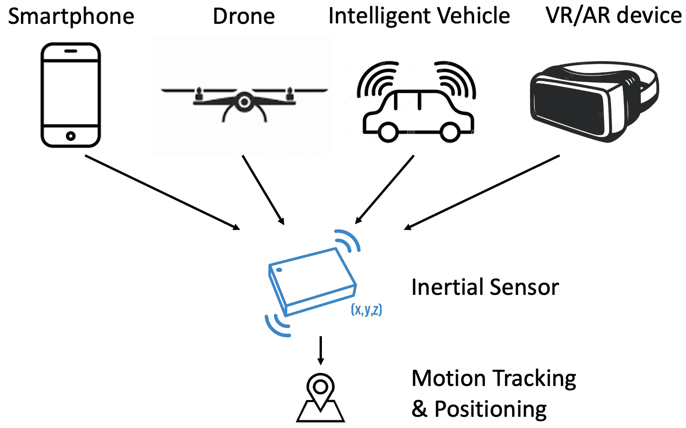
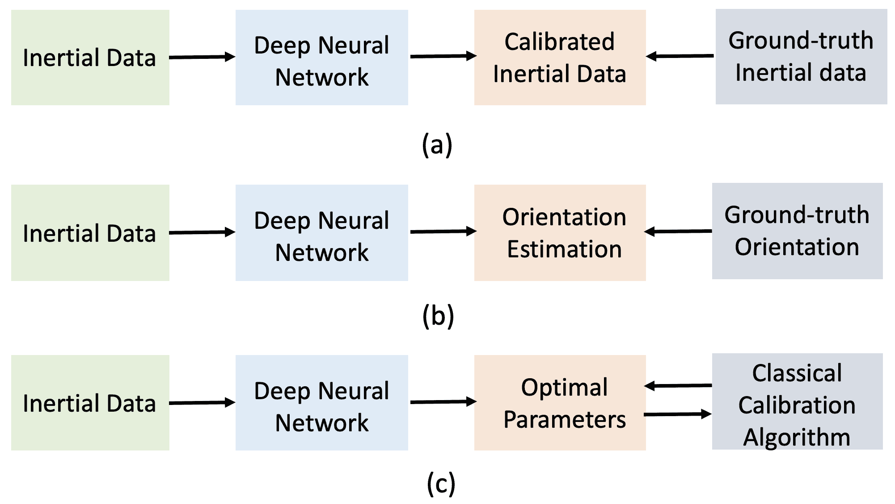
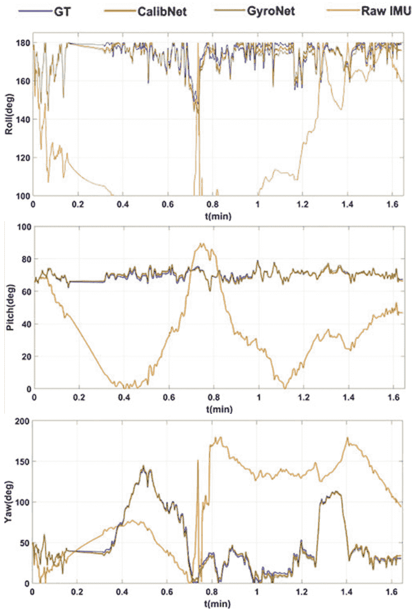
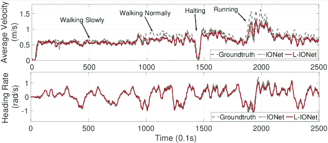
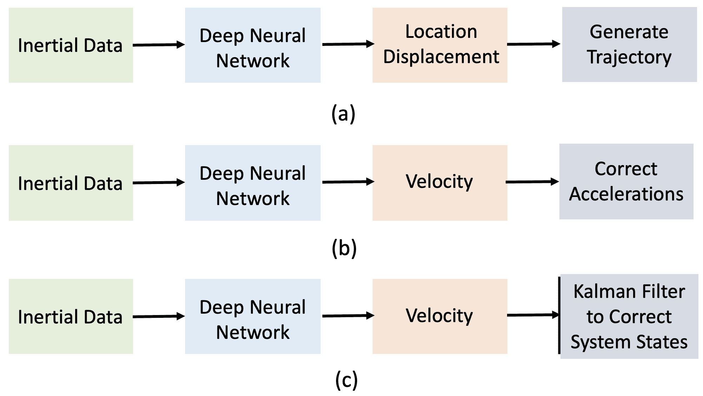
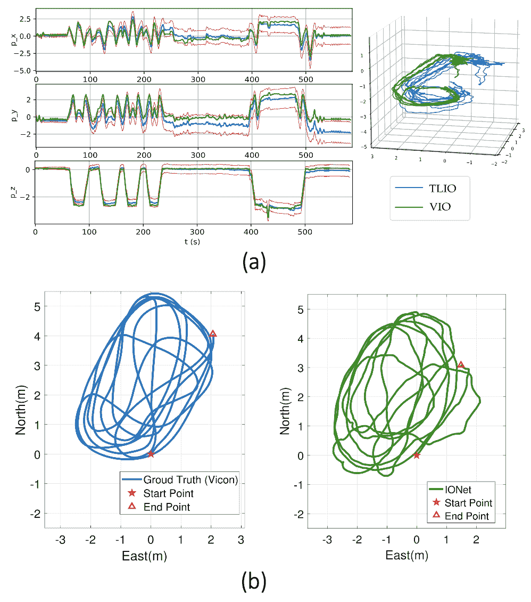
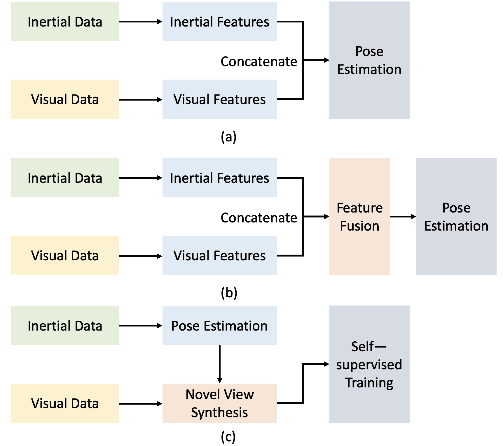

<!--yml

分类：未分类

日期：2024-09-06 19:40:59

-->

# [2303.03757] 深度学习在惯性定位中的应用：综述

> 来源：[`ar5iv.labs.arxiv.org/html/2303.03757`](https://ar5iv.labs.arxiv.org/html/2303.03757)

# 深度学习在惯性定位中的应用：综述

Changhao Chen 和 Xianfei Pan 作者隶属于国防科技大学智能科学与技术学院，中国长沙，410073。Changhao Chen 和 Xianfei Pan 是共同第一作者。Changhao Chen 是通讯作者。（电子邮件：changhao.chen66@outlook.com）本工作得到了中国国家自然科学基金（NFSC）资助，资助号为 62103427、62073331、62103430、62103429。

###### 摘要

惯性传感器在智能手机、无人机、机器人和物联网设备中被广泛使用，在实现普遍和可靠的定位中发挥了关键作用。基于惯性传感器的定位在个人导航、基于位置的安全性和人机交互等各种应用中至关重要。然而，低成本 MEMS 惯性传感器的测量不可避免地受到各种误差源的干扰，导致在传统惯性导航算法中进行双重积分时出现无界漂移，使惯性定位面临误差漂移的问题。近年来，随着传感器数据和计算能力的快速增长，深度学习技术得到了发展，引发了大量研究以解决惯性定位的问题。该领域的相关文献涵盖了移动计算、机器人技术和机器学习等多个领域。本文对基于深度学习的惯性定位及其在行人、无人机、车辆和机器人的跟踪应用中的应用进行了全面回顾。我们将不同领域的努力联系起来，讨论深度学习如何应用于解决传感器校准、定位误差漂移减少和多传感器融合等问题。本文旨在吸引包括研究人员和实践者在内的各类读者，特别是对深度学习技术在解决惯性定位问题方面的潜力感兴趣的读者。我们的回顾展示了深度学习带来的令人兴奋的可能性，并为未来在这一领域的研究提供了路线图。

###### 索引词：

惯性导航，深度学习，惯性传感器校准，行人推测，传感器融合，视觉-惯性里程计

## I 引言

惯性测量单元（IMU）广泛应用于智能手机、无人机、虚拟现实/增强现实设备、机器人和物联网（IoT）设备。它持续测量线性速度和角速度，并跟踪这些平台的运动，如图 1 所示。随着微电机械系统（MEMS）技术的发展，今天的 MEMS IMU 体积小、能效高、成本低。惯性定位（导航）基于惯性测量计算姿态、速度和位置，使其在各种基于位置的应用中至关重要，包括在公共场所（如大学、购物中心、机场）定位和导航个人、支持安全服务（如协助急救人员）、实现智能城市/基础设施，以及促进人机交互。与其他定位解决方案如视觉或无线电相比，惯性定位完全以自我为中心，能在室内和室外工作，并且不易受到复杂光照条件和场景动态等环境因素的影响。

图 1：惯性传感器在现代平台中无处不在，如智能手机、无人机、智能车辆和虚拟现实/增强现实设备。它们在实现完全自我中心的运动跟踪和定位方面发挥了关键作用，使其在各种应用中不可或缺。

不幸的是，低成本 MEMS IMU 获得的测量值受到多个误差源的影响，如偏置误差、温度依赖误差、随机传感器噪声和随机游走噪声。在经典惯性导航机制中，角速度被积分为方向，并根据获得的姿态将加速度测量转换为导航框架。最后，转换后的加速度被双重积分到位置 [1, 2]。传统的惯性导航算法使用具体的物理和数学规则进行设计和描述。在理想条件下，传感器误差足够小，使得手工设计的惯性导航算法能产生准确可靠的姿态估计。然而，在实际应用中，不可避免的测量误差会导致惯性定位系统出现重大问题，系统可能在几秒钟内失败。在这个过程中，即使是微小的误差也可能被指数放大，导致无界的误差漂移。

以前的研究者尝试通过引入领域特定知识或其他传感器来解决惯性导航中的误差漂移问题。在行人跟踪的背景下，利用人体步态的周期性是重要的，行人自动定位（PDR）过程包括检测步伐、估计步长和方向，并更新用户的位置，以将误差漂移从指数增长减小为线性增长[3]。零速度更新（ZUPT）涉及将 IMU 附着到用户的脚上，并检测零速度阶段，然后在卡尔曼滤波中使用这一阶段来校正惯性导航状态[4]。配备其他传感器如相机或 LiDAR 的无人机或机器人平台可以通过有效地将惯性传感器与这些模式融合来显著提升纯惯性解决方案的性能[5, 6, 7]。然而，这些解决方案在特定应用领域存在局限性，无法解决惯性导航的根本问题。

最近，深度学习在计算机视觉、机器人技术和信号处理等多个领域表现出了令人印象深刻的性能[8]。它也被引入以应对惯性定位的挑战。深度神经网络模型被用于校准惯性传感器噪声，减少惯性导航机制的漂移，并将惯性数据与其他传感器信息融合。这些研究工作吸引了大量关注，因为它们展示了利用海量数据生成数据驱动模型的潜力，而不是依赖于具体的物理或数学模型。随着深度学习技术的迅速发展，基于学习的惯性解决方案变得更加有前景。

在本次调查中，我们提供了基于深度学习的惯性定位方法的全面回顾，包括测量校准、惯性定位算法和传感器融合。我们讨论了现有工作的优点和局限性，并识别了该研究方向中的挑战和未来机会。与其他深度学习调查相比，例如那些专注于物体检测[9]、语义分割[10]和机器人技术[11]的调查，基于深度学习的惯性定位调查相对稀缺且难以找到。虽然存在更广泛的机器学习增强惯性传感的调查[12]，但我们的调查将重点缩小到基于深度学习的惯性定位，提供了对过去五年（2018-2022）该领域快速发展的深入见解和分析。其他相关调查，如那些专注于惯性步态定位[3]、室内定位[13]、步长估计[14]和步态推测[15]的调查，并未涵盖最新的基于深度学习的解决方案。根据我们所知，本文是第一个彻底且深入讨论基于深度学习的惯性定位的调查。

本次调查的其余部分组织如下：第 II 节简要介绍了经典惯性导航机制。第 III、IV 和 V 节调查了基于深度学习的传感器校准、惯性导航算法和传感器融合。第 VII 节最后讨论了益处、挑战和机会。

## II 经典惯性导航机制

本节提供了经典惯性导航机制的概述，并突出其局限性。它首先介绍了惯性测量模型和经典的带式惯性导航方法。随后，讨论了旨在减少惯性导航系统漂移的两种解决方案，即步态推测（PDR）和零速更新（ZUPT），并特别关注它们在步态跟踪场景中的适用性。最后，本节介绍了将惯性数据与其他传感器信息集成的传感器融合方法。

### II-A 惯性测量模型

从低成本 MEMS IMU 获得的惯性测量数据通常受到各种错误源的影响，导致在带式惯性导航系统（SINS）中积分时出现不受限的误差漂移。这些错误源可以分为两类：确定性误差和随机误差[16]。确定性误差包括偏差误差、非正交误差、对准误差、尺度因子误差和温度依赖误差。另一方面，随机误差包括随机传感器噪声和由于长期操作产生的随机游走噪声，这些噪声很难建模和消除。

原始 IMU 测量值，即加速度$\hat{\mathbf{a}}$和角速度$\hat{\bm{\omega}}$，可以表示为

|  | $\hat{\mathbf{a}}=\mathbf{a}+\mathbf{b}_{a}+\mathbf{n}_{a}$ |  | (1) |
| --- | --- | --- | --- |
|  | $\hat{\bm{\omega}}=\bm{\omega}+\mathbf{b}_{\omega}+\mathbf{n}_{\omega}$ |  | (2) |

其中$\mathbf{b}_{a}$和$\mathbf{b}_{\omega}$分别是加速度偏差和陀螺仪偏差，$\mathbf{n}_{a}$和$\mathbf{n}_{\omega}$是加速度计和陀螺仪上的加性噪声。

传统上，在运行涉及将惯性数据集成到系统状态中的惯性导航算法之前，对惯性传感器进行校准非常重要。实现这一目标的一个有效工具是 Allan 方差方法[17]，该方法对惯性传感器误差的随机过程进行建模。

### II-B 固定惯性导航系统

惯性传感器测量附加用户身体在时间步长$t$上的线性加速度$\mathbf{a}_{b}(t)$和角速度$\bm{\omega}_{b}^{n}(t)$。$b$表示身体坐标系，而$n$表示导航（世界）坐标系，即导航坐标系。$\bm{\omega}_{b}^{n}(t)$表示身体坐标系相对于导航坐标系的角速度。为了简化惯性运动模型，本文假设传感器在方程 1 和 2 中的偏差和噪声已在惯性传感器校准阶段被去除。$(\mathbf{R},\mathbf{p})$是定义的方向和位置变量。根据 IMU 的运动学模型，我们可以得到

|  | <math   alttext="\begin{cases}\mathbf{R}_{b}^{n}(t+1)=\mathbf{R}_{b}^{n}(t)\mathbf{R}_{b_{t+1}}^{b_{t}}\\ \mathbf{v}_{n}(t+1)=\mathbf{v}_{n}(t)+\mathbf{a}_{n}(t)dt\\

\mathbf{p}_{n}(t+1)=\mathbf{p}_{n}(t)+\mathbf{v}_{n}(t)dt+\frac{1}{2}\mathbf{a}_{n}(t)dt^{2}\end{cases}" display="block"><semantics ><mrow  ><mo >{</mo><mtable columnspacing="5pt" displaystyle="true" rowspacing="0pt"  ><mtr ><mtd  columnalign="left" ><mrow ><mrow  ><msubsup ><mi >𝐑</mi><mi >b</mi><mi >n</mi></msubsup><mo lspace="0em" rspace="0em" >​</mo><mrow ><mo stretchy="false" >(</mo><mrow ><mi >t</mi><mo >+</mo><mn >1</mn></mrow><mo stretchy="false"  >)</mo></mrow></mrow><mo >=</mo><mrow ><msubsup  ><mi >𝐑</mi><mi >b</mi><mi >n</mi></msubsup><mo lspace="0em" rspace="0em"  >​</mo><mrow ><mo stretchy="false" >(</mo><mi >t</mi><mo stretchy="false" >)</mo></mrow><mo lspace="0em" rspace="0em"  >​</mo><msubsup ><mi >𝐑</mi><msub ><mi >b</mi><mrow ><mi >t</mi><mo >+</mo><mn >1</mn></mrow></msub><msub ><mi  >b</mi><mi >t</mi></msub></msubsup></mrow></mrow></mtd></mtr><mtr ><mtd  columnalign="left" ><mrow ><mrow  ><msub ><mi >𝐯</mi><mi >n</mi></msub><mo lspace="0em" rspace="0em" >​</mo><mrow ><mo stretchy="false" >(</mo><mrow ><mi >t</mi><mo >+</mo><mn >1</mn></mrow><mo stretchy="false"  >)</mo></mrow></mrow><mo >=</mo><mrow ><mrow  ><msub ><mi >𝐯</mi><mi >n</mi></msub><mo lspace="0em" rspace="0em" >​</mo><mrow ><mo stretchy="false" >(</mo><mi >t</mi><mo stretchy="false" >)</mo></mrow></mrow><mo >+</mo><mrow ><msub ><mi  >𝐚</mi><mi >n</mi></msub><mo lspace="0em" rspace="0em"  >​</mo><mrow ><mo stretchy="false" >(</mo><mi >t</mi><mo stretchy="false" >)</mo></mrow><mo lspace="0em" rspace="0em"  >​</mo><mi >d</mi><mo lspace="0em" rspace="0em"  >​</mo><mi >t</mi></mrow></mrow></mrow></mtd></mtr><mtr ><mtd  columnalign="left" ><mrow ><mrow  ><msub ><mi >𝐩</mi><mi >n</mi></msub><mo lspace="0em" rspace="0em" >​</mo><mrow ><mo stretchy="false" >(</mo><mrow ><mi >t</mi><mo >+</mo><mn >1</mn></mrow><mo stretchy="false"  >)</mo></mrow></mrow><mo >=</mo><mrow ><mrow  ><msub ><mi >𝐩</mi><mi >n</mi></msub><mo lspace="0em" rspace="0em" >​</mo><mrow ><mo stretchy="false" >(</mo><mi >t</mi><mo stretchy="false" >)</mo></mrow></mrow><mo >+</mo><mrow ><msub ><mi  >𝐯</mi><mi >n</mi></msub><mo lspace="0em" rspace="0em"  >​</mo><mrow ><mo stretchy="false" >(</mo><mi >t</mi><mo stretchy="false" >)</mo></mrow><mo lspace="0em" rspace="0em"  >​</mo><mi >d</mi><mo lspace="0em" rspace="0em"  >​</mo><mi >t</mi></mrow><mo >+</mo><mrow ><mstyle displaystyle="false" ><mfrac ><mn >1</mn><mn >2</mn></mfrac></mstyle><mo lspace="0em" rspace="0em"  >​</mo><msub ><mi >𝐚</mi><mi >n</mi></msub><mo lspace="0em" rspace="0em" >​</mo><mrow ><mo stretchy="false" >(</mo><mi >t</mi><mo stretchy="false" >)</mo></mrow><mo lspace="0em" rspace="0em"  >​</mo><mi >d</mi><mo lspace="0em" rspace="0em"  >​</mo><msup ><mi >t</mi><mn >2</mn></msup></mrow></mrow></mrow></mtd></mtr></mtable></mrow><annotation-xml encoding="MathML-Content" ><apply  ><csymbol cd="latexml"  >cases</csymbol><apply ><apply ><apply  ><csymbol cd="ambiguous"  >superscript</csymbol><apply ><csymbol cd="ambiguous"  >subscript</csymbol><ci >𝐑</ci><ci >𝑏</ci></apply><ci >𝑛</ci></apply><apply ><ci >𝑡</ci><cn type="integer" >1</cn></apply></apply><apply ><apply  ><csymbol cd="ambiguous"  >superscript</csymbol><apply ><csymbol cd="ambiguous"  >subscript</csymbol><ci >𝐑</ci><ci >𝑏</ci></apply><ci >𝑛</ci></apply><ci >𝑡</ci><apply ><csymbol cd="ambiguous" >superscript</csymbol><apply ><csymbol cd="ambiguous" >subscript</csymbol><ci >𝐑</ci><apply ><csymbol cd="ambiguous" >subscript</csymbol><ci >𝑏</ci><apply ><ci >𝑡</ci><cn type="integer" >1</cn></apply></apply></apply><apply ><csymbol cd="ambiguous" >subscript</csymbol><ci >𝑏</ci><ci >𝑡</ci></apply></apply></apply></apply><ci ><mtext >否则</mtext></ci><apply ><apply ><apply  ><csymbol cd="ambiguous"  >subscript</csymbol><ci >𝐯</ci><ci >𝑛</ci></apply><apply ><ci >𝑡</ci><cn type="integer" >1</cn></apply></apply><apply ><apply  ><apply ><csymbol cd="ambiguous"  >subscript</csymbol><ci >𝐯</ci><ci >𝑛</ci></apply><ci >𝑡</ci></apply><apply ><apply ><csymbol cd="ambiguous" >subscript</csymbol><ci >𝐚</ci><ci >𝑛</ci></apply><ci >𝑡</ci><ci  >𝑑</ci><ci >𝑡</ci></apply></apply></apply><ci ><mtext >否则</mtext></ci><apply ><apply ><apply  ><csymbol cd="ambiguous"  >subscript</csymbol><ci >𝐩</ci><ci >𝑛</ci></apply><apply ><ci >𝑡</ci><cn type="integer" >1</cn></apply></apply><apply ><apply  ><apply ><csymbol cd="ambiguous"  >subscript</csymbol><ci >𝐩</ci><ci >𝑛</ci></apply><ci >𝑡</ci></apply><apply ><apply ><csymbol cd="ambiguous" >subscript</csymbol><ci >𝐯</ci><ci >𝑛</ci></apply><ci >𝑡</ci><ci  >𝑑</ci><ci >𝑡</ci></apply><apply ><apply ><cn type="integer" >1</cn><cn type="integer" >2</cn></apply><apply ><csymbol cd="ambiguous" >subscript</csymbol><ci >𝐚</ci><ci >𝑛</ci></apply><ci >𝑡</ci><ci  >𝑑</ci><apply ><csymbol cd="ambiguous"  >superscript</csymbol><ci >𝑡</

其中$\mathbf{a}_{n}$、$\mathbf{v}_{n}$、$\mathbf{p}_{n}$分别是导航框架中的加速度、速度和位置，$\mathbf{R}_{b}^{n}$表示从机体框架到导航框架的旋转。

首先，通过罗德里格斯公式推断旋转矩阵$\bm{\Omega(t)}$来更新方向：

|  | $\begin{split}\bm{\Omega}(t)&amp;=\mathbf{R}_{b_{t+1}}^{b_{t}}\\ &amp;=\mathbf{I}+\sin(\bm{\sigma})\frac{[\bm{\sigma}\times]}{\bm{\sigma}}+(1-\cos(\bm{\sigma}))\frac{[\bm{\sigma}\times]^{2}}{\bm{\sigma}^{2}},\end{split}$ |  | (4) |
| --- | --- | --- | --- |

其中旋转向量$\bm{\sigma}=\bm{\omega}(t)dt$。

要更新速度，导航框架中的加速度可以表示为测量加速度的函数，即：

|  | $\mathbf{a}_{n}(t)=\mathbf{R}_{b}^{n}(t-1)\mathbf{a}_{b}(t)-\mathbf{g}_{n}$ |  | (5) |
| --- | --- | --- | --- |

然后，将导航框架中的加速度$\mathbf{a}_{n}(t)$积分到导航框架中的速度$\mathbf{v}_{n}(t)$中，最后通过方程 4 通过积分速度来更新位置$\mathbf{p}_{n}(t)$。

如我们所见，在这个过程中，即使是很小的测量误差也可能会被指数级放大，导致惯性误差漂移的问题。过去，高精度惯性传感器如激光或光纤惯性传感器能够保持测量误差足够小，从而维持 INS 的准确性。然而，由于当前 MEMS IMU 的尺寸和成本限制，补偿方法变得必要，以减轻相应的误差漂移。一种方法是引入领域特定知识或其他传感器信息。

### II-C 领域特定知识

#### II-C1 步态死计算

行人死算（PDR）是一种利用有关人体步态的领域特定知识来跟踪行人运动的方法。PDR 包括三个主要步骤：步态检测、方向和步幅估计，以及位置更新[3]。在步态检测中，PDR 使用惯性数据的阈值来识别步态峰值或姿态，并分割相应的惯性数据。然后，通过一个经验公式（称为 Weinberg 公式[18]）动态估计步幅，该公式考虑了分割的加速度和用户的身高。与 SINS 类似，方向估计是通过将陀螺仪信号积分到方向变化中，并将方向变化加到初始方向上以获得当前方向。最后，估计的方向和步幅用于更新行人的位置。通过避免加速度的双重积分并结合可靠的步幅估计模型，PDR 有效地减少了惯性定位漂移。然而，不准确的步态检测和步幅估计仍然可能发生，从而导致系统误差漂移。此外，由于 PDR 依赖于人体步态的周期性，因此它仅限于步行导航。

#### II-C2 零速度更新

零速度更新（ZUPT）算法旨在通过识别人体步态的静止阶段并使用零速度作为卡尔曼滤波器中的观测值来补偿 SINS 的误差[4]。为了方便检测静止阶段，IMU 通常被安装在用户的脚上，因为脚部运动显著并能很好地反映步态模式。可以使用峰值检测[19]、零交叉[20]或自相关[21]等技术来分析惯性数据并分割零速度阶段。一旦检测到静止阶段，零速度将作为伪测量值用于过滤过程，从而限制开环积分的误差漂移。然而，ZUPT 的有效性依赖于用户的脚完全静止的假设，任何不正确的静止阶段检测或小的运动干扰都可能导致导航系统的漂移。此外，ZUPT 仅限于步行跟踪。

### II-D IMU 与其他传感器的集成

将 IMU 与其他传感器（如相机 [6]、激光雷达 [7]、超宽带 [22] 和磁力计 [23]）集成，可以获得有希望的结果，因为这允许利用它们的互补特性。通过融合多个传感器的数据，可以显著提高姿态估计的准确性和鲁棒性，使其成为所有平台的通用解决方案。然而，在某些场景中，某些传感器（如视觉感知）可能不可用或高度依赖环境，这可能会对惯性定位的自我中心属性产生负面影响。此外，在传感器融合方法中，考虑各种因素如传感器标定、初始化和时间同步是至关重要的。

表 I: 基于深度学习的惯性传感器标定现有方法的汇总。

| 名称 | 年份 | 传感器 | 模型 | 学习 | 目标 |
| --- | --- | --- | --- | --- | --- |
| Xiyuan et al.[24] | 2003 | 陀螺仪 | 单层神经网络 | 监督学习 | 陀螺仪漂移补偿 |
| Chen et al. [25] | 2018 | 陀螺仪、加速度计 | 卷积网络 | 监督学习 | 惯性噪声补偿 |
| Esfahani et al. [26] | 2019 | 陀螺仪 | 长短期记忆网络 | 监督学习 | 陀螺仪标定 |
| Nobre et al. [27] | 2019 | 陀螺仪、加速度计 | 深度 Q 网络 | 强化学习 | 最优标定参数 |
| Brossard et al. [28] | 2020 | 陀螺仪 | 卷积网络 | 监督学习 | 陀螺仪修正 |
| Zhao et al.[29] | 2020 | 陀螺仪 | 长短期记忆网络 | 监督学习 | 陀螺仪标定 |
| Huang et al.[30] | 2022 | 陀螺仪 | 时序卷积网络 | 监督学习 | 陀螺仪标定 |
| Calib-Net [31] | 2022 | 陀螺仪 | 扩张卷积网络 | 监督学习 | 陀螺仪去噪 |

+   •

    年份指示每项工作的出版年份。

+   •

    传感器指示每项工作中涉及的传感器。**陀螺仪**和**加速度计**分别代表陀螺仪和加速度计。

+   •

    模型指示框架由哪个模块组成。

+   •

    学习表明如何训练神经网络。SL 和 RL 分别代表**监督学习**和**强化学习**。

+   •

    目标指示模型旨在解决或产生的内容。

### II-E 讨论

如前所述，经典的惯性导航方法旨在解决各自领域中的特定问题。然而，由于现实世界中的问题如模型不完善、测量误差和环境影响，它们的性能往往受到限制，导致不可避免的误差漂移。因此，惯性导航领域的研究人员不断寻求构建能够容忍测量误差并减轻系统漂移的模型的方法。除了依赖牛顿物理规则外，观察到领域特定知识，无论是经验丰富的人行走模型还是场景几何形状，都可以作为减少惯性定位系统误差漂移的有用约束。提高惯性定位准确性和鲁棒性的一个潜在方法是利用大量惯性数据提取领域特定知识并构建数据驱动模型。在接下来的部分，我们将更深入地探讨这个问题并探索潜在的解决方案。

图 2: 现有深度学习基于惯性传感器校准方法的概述

## III 基于深度学习的惯性传感器校准

从低成本惯性测量单元（IMU）获得的惯性测量数据常常受到各种噪声源的影响，这使得区分真实值与误差源变得具有挑战性。这些误差源是确定性和随机因素的复杂交互，进一步使问题复杂化。为了解决测量误差的影响，可以利用深度神经网络强大的非线性逼近能力。一种自然的方法是开发一个深度神经网络，该网络接收原始惯性测量作为输入，并生成校准后的惯性测量作为输出，代表实际平台运动。通过使用随机梯度下降（SGD）[32]对标记数据集进行训练，这种神经模型可以隐式地学习和纠正惯性测量误差。值得注意的是，收集的训练数据集的质量对模型性能有显著影响。

在深度学习时代之前，曾尝试使用神经网络学习惯性传感器的测量误差。例如，提出了一种 1 层人工神经网络（ANN）[33]来建模陀螺漂移的分布，并能够成功地用这样一个“浅层”网络来逼近陀螺漂移[24]。这种方法相比于基于卡尔曼滤波（KF）的校准方法的一个优势在于，它不需要在使用前设置超参数，如 KF 中的传感器噪声矩阵。

图 3: 陀螺仪校准结果示例（转载自 Calib-Net [31]）。与原始 IMU 积分相比，基于深度学习的校准模型显著减少了姿态漂移。

表 II: 基于深度学习的惯性定位现有方法汇总。

| name | 年份 | 承载体 | 模型 | 学习 | 目标 |
| --- | --- | --- | --- | --- | --- |
| IONet [34] | 2018 | 行人, 手推车 | LSTM | SL | 位置位移 |
| RIDI [35] | 2018 | 行人 | SVM, SVR | SL | 用于惯性数据校准的速度 |
| Cortes et al.[36] | 2018 | 行人 | ConvNet | SL | 速度约束系统漂移 |
| Wagstaff et al.[37] | 2018 | 行人 | LSTM | SL | ZUPT 的零速度检测 |
| Chen et al.[38] | 2019 | 行人, 手推车 | LSTM | TL | 位置位移 |
| AbolDeepIO [39] | 2019 | UAV | LSTM | SL | 位置位移 |
| RINS-W [40] | 2019 | 车辆 | RNN | SL | KF 的零速度检测 |
| Feigl et al. [41] | 2019 | 行人 | LSTM | SL | 行走速度 |
| Wang et al. [42] | 2019 | 行人 | LSTM | SL | ZUPT 的行走方向 |
| Yu et al. [43] | 2019 | 行人 | ConvNet | SL | 自适应零速度检测 |
| TLIO [44] | 2020 | 行人 | ConvNet | SL | EKF 的 3D 位移和不确定性 |
| LIONet [45] | 2020 | 行人 | 扩张卷积网络 | SL | 轻量级惯性模型 |
| RoNIN[46] | 2020 | 行人 | LSTM, TCN | SL | 用于惯性数据校准的速度 |
| Brossard et al.[47] | 2020 | 车辆 | ConvNet | SL | KF 的协方差噪声 |
| StepNet[48] | 2020 | 行人 | ConvNet, LSTM | SL | PDR 的动态步长 |
| Wang et al.[49] | 2020 | 行人 | ConvNet | SL | 卡尔曼滤波器的测量噪声 |
| ARPDR [50] | 2020 | 行人 | TCN | SL | PDR 的步幅长度和行走方向 |
| IDOL[51] | 2021 | 行人 | LSTM | SL | 设备方向和位置 |
| PDRNet[52] | 2021 | 行人 | ConvNet | SL | PDR 的步长和方向 |
| Buchanan et al. [53] | 2021 | 四足机器人 | ConvNet | SL | 将位置位移与腿部里程计结合 |
| Zhang et al.[54] | 2021 | 车辆, UAV | RNN | SL | 独立运动项 |
| Gong et al. [55] | 2021 | 行人 | LSTM | SL | 融合来自两个设备的惯性数据 |
| NILoc[56] | 2022 | 行人 | ConvNet | SL | 惯性重新定位 |
| RIO[57] | 2022 | 行人 | DNN | UL | 旋转等变性作为监督信号 |
| Wang et al. [58] | 2022 | 行人 | DNN | SL | 高效且低延迟的模型 |
| TinyOdom[59] | 2022 | 行人，车辆 | TCN+NAS | SL | 部署在资源受限设备上 |
| CTIN[60] | 2022 | 行人 | Transformer | SL | 速度和轨迹预测 |
| DeepVIP[61] | 2022 | 车辆 | ConvNet, LSTM | SL | 车辆定位的速度和航向 |
| Bo et al.[62] | 2022 | 行人 | ConvNet | TL | 模型独立的步态学习 |
| OdoNet[63] | 2022 | 车辆 | ConvNet | SL | ZUPT 的速度学习 |
| A2DIO[64] | 2022 | 行人 | ConvNet, LSTM | SL | 姿态不变的里程计 |
| LLIO [65] | 2022 | 行人 | MLP | SL | 轻量级里程计的 3D 位移 |

+   •

    Year 指示每项工作的出版年份。

+   •

    Carrier 指示运行惯性导航的平台。

+   •

    Model 指示框架由哪些模块组成。

+   •

    Learning 指示如何训练神经网络。SL、TL 和 UL 分别表示监督学习、迁移学习和无监督学习。

+   •

    Target 指示模型旨在解决或生成的内容。

近年来，使用具有多层的深度神经网络（DNN）解决惯性传感器标定问题的兴趣日益增加。随着层数的增加，神经网络变得更加有表现力，可以学习原始惯性测量值与车辆真实运动之间的复杂关系。一个方法，[25] 提出的，使用卷积神经网络（ConvNet）从惯性测量中去除误差噪声。他们在给定的恒定加速度和角速度下，收集了两种等级 IMU 的惯性数据。ConvNet 框架以原始惯性测量值（来自低精度 IMU）为输入，尝试输出加速度和角速度参考值（来自高精度 IMU）。他们的实验表明，深度学习可以去除一些传感器误差并提高测试精度。然而，这项工作尚未在实际导航设置中验证，因此不能展示基于学习的传感器标定如何减少惯性导航中的误差漂移。上述方法都需要高精度 IMU 的参考数据作为标签来训练网络，如图 2 (a)所示。然而，从高精度 IMU 获取参考数据可能是昂贵的。

除了直接从伪地面真值 IMU 标签中学习外，另一种方法是使基于神经网络的校准模型生成可集成到更准确方向估计中的惯性数据。这在图 2 (b)中有所说明。通过生成更准确的方向值，神经网络隐式地去除了惯性数据上的噪声。例如，OriNet [26] 将三维陀螺仪信号输入到 LSTM 网络[66]中以获得校准后的陀螺仪信号，然后将其与前一时间步的方向进行集成，以生成当前时间步的方向估计。定义并最小化方向估计与实际方向之间的损失函数以进行模型训练。OriNet 在公开的无人机数据集上进行了评估，显示出约 80%的方向性能提升。类似的方法包括[28]，他们使用 ConvNet 对陀螺仪进行校准，报告了良好的姿态估计精度。Calib-Net [31] 是另一种 ConvNet 框架，通过从惯性数据中提取有效的时空特征来去噪陀螺仪数据。Calib-Net 基于膨胀 ConvNet[67]以补偿陀螺仪噪声，如图 3 所示。与原始 IMU 积分相比，这种模型能够显著减少方向误差。当这个学习到的惯性校准模型被纳入到视觉惯性里程计（VIO）中时，它进一步提升了定位性能，并优于代表性 VIO 如 VINS-mono [6]。在这个方向上的其他努力包括[29, 30]的工作。

一些研究人员探索了使用 DNN 生成改进经典校准算法的参数，而不是直接用 DNN 校准惯性传感器，如图 2 (c)所示。一个例子是[27]的工作，他们将惯性传感器校准建模为马尔可夫决策过程，并提出使用深度强化学习[68]来学习最佳校准参数。作者展示了他们的方法在为视觉惯性里程计（VIO）系统校准惯性传感器方面的有效性。

图 4：通过深度神经网络可以从一系列惯性测量中推断附加平台的速度。 (摘自 L-IONet [45])

图 5：现有 IMU 集成校正学习方法的概述

如上所述，深度学习辅助的惯性传感器校准方法（见表 I）在去除传感器噪声和提高惯性定位系统准确性方面显示了良好的前景。这些方法不需要人工干预，并且可以自动学习误差模型。然而，需要注意的是，学习到的误差模型通常依赖于特定的传感器或平台。因此，传感器或用户的变化可能会导致数据分布的不同，从而降低学习模型的性能。此外，还需进一步分析以确定哪些类型的噪声可以通过学习型校准方法有效去除。

## IV 学习校正 IMU 集成

除了传感器校准外，研究人员还在探索各种使用深度学习构建惯性定位模型的方法，这些模型可以部分或完全替代经典的惯性导航机制。本节概述了深度学习如何用于一般性的 IMU 集成校正。接下来的章节将讨论用于行人跟踪应用的深度学习方法，并展示用于车辆、无人机和机器人深度惯性解决方案。表 II 提供了现有工作及其贡献的总结。

在基于深度学习的惯性定位方法中，用户的绝对速度可以通过深度神经网络从 IMU 数据序列中推断出来。然后，这些速度信息可以作为关键约束，以减少 IMU 双重积分中的漂移。图 4 提供了从 IMU 序列中学习速度的示例，其中人类步态的周期性使得推断用户的移动速度变得容易。对于车辆、无人机和机器人平台也有类似的观察，这将在第 VI 节中讨论。现有的将学习到的速度应用于 IMU 集成校正的工作通常可以分为三类，如图 5 所示，下面将进行讨论。

深度学习模型的一个类别旨在学习位置位移，即平均速度乘以固定时间段，如图 5(a)所示。[34]提出的方法将惯性定位形式化为一个序列学习问题，其中极坐标中的二维运动位移，即极向量，从独立的惯性数据段窗口中学习。这是因为平台振动的频率与绝对移动速度相关，而绝对移动速度可以通过 IMU 测量，特别是在跟踪人类或轮式配置时。基于这一观察，他们提出了 IONet，一个基于 LSTM 的框架，用于端到端学习相对姿态。通过将运动位移与初始位置相加来生成轨迹。为了训练神经模型，收集了大量数据，这些数据来自一个基于智能手机的 IMU，并在一个具有高精度视觉运动跟踪系统（即 Vicon）的房间内提供真实姿态标签。一旦模型训练完成，IONet 模型可以用于数据收集房间之外的领域。在一个两分钟的随机行人步态场景中，当在用户、设备和附件之间评估时，IONet 的定位误差 90%的时间在 3 米以内，超越了一些经典的 PDR 算法。在跟踪手推车时，IONet 显示出与代表性的视觉惯性里程计相当的性能，并且在无特征区域中更加稳健。然而，基于监督学习的 IONet 需要高精度的姿态作为训练标签。当测试数据与训练集中的数据不同时时，会出现性能下降。为了提高泛化能力，[38]提出了 MotionTransformer，它允许惯性定位模型通过生成对抗网络（GAN）[69]和领域适应[70]自适应到新领域，无需新领域中的标签。为了鼓励更可靠的惯性定位，[71]能够生成姿态的不确定性，提供对学习到的姿态可以信任程度的信念。为了实现完全的三维定位，TLIO [44]建议从一系列与重力对齐的惯性数据中学习三维位置位移和协方差。为了避免初始方向的影响，惯性数据被转换到局部重力对齐框架中。然后，将学习到的位移和协方差纳入扩展卡尔曼滤波器作为观测状态，估计方向、速度、位置和 IMU 偏差的全状态。在一个 3-7 分钟的人体运动场景中，TLIO 的定位误差 90%的时间在 3 米以内。

另一类深度学习模型旨在利用学习到的速度来修正加速度，如图 5(b)所示。一个突出的例子是 RIDI [35]，该模型训练深度神经网络从惯性数据中预测速度矢量，然后用这些速度矢量通过减去重力来修正线性加速度，从而与学习到的速度约束对齐。修正后的线性加速度随后经过二重积分以估计位置。为了提高惯性加速度的准确性，RIDI 利用人类步速作为先验，以补偿惯性定位中的漂移，有效地将其约束在较低水平。RoNIN [46]通过将惯性测量和学习到的速度矢量转换为一个与航向无关的坐标框架，并引入若干新颖的速度损失，改进了 RIDI。为了最小化方向估计的影响，RoNIN 利用设备方向将惯性数据转换为其 Z 轴与重力对齐的框架。然而，RoNIN 的一个限制是它依赖于方向估计。NILoc [56]是基于 RoNIN 的一个有趣尝试，旨在解决神经惯性定位问题，目标是仅通过惯性运动历史推断全球位置。这项工作认识到，人类运动模式在不同地点是独特的，可以作为“指纹”来确定位置，类似于 WiFi 或磁场指纹。NILoc 首先从惯性数据中计算出速度序列，然后使用基于 Transformer 的 DNN 框架 [72]将速度序列转换为位置。然而，NILoc 的一个基本限制是，在某些区域，如开放空间、对称或重复的地方，可能不存在独特的运动模式。

另一种方法是将学习得到的速度融入卡尔曼滤波器（KF）的更新过程中，如图 5 (c) 所示。[36] 使用卷积网络（ConvNet）从 IMU 序列推断当前速度，并将此速度作为速度观测值融入卡尔曼滤波器，以约束基于 SINS 的惯性定位的漂移。这种方法类似于零速度更新（ZUPT）方法，该方法检测并利用卡尔曼滤波器中的零速度作为观测值，但在 KF 中使用完整速度作为观测值。融入学习得到的速度可以使 KF 处理更复杂的人体运动。类似的试验是 [49]，其基于 DNN 推断身体框架中的步行速度，并将其与扩展 KF 结合。在学习得到的速度之外，[49] 为 KF 生成噪声参数，以动态更新参数，而不是设置固定的噪声参数。

惯性定位在很大程度上依赖于准确估计设备的姿态。一些方法旨在改进方向估计，以增强基于深度学习的惯性测距的性能。RIDi、RoNIN 和 TLIO 仍然依赖于设备方向将惯性数据旋转到适当的框架中。为了解决这个问题，IDOL [51] 提出了一个两阶段的过程，首先从数据中学习方向，然后将惯性数据旋转到适当的框架中，接着学习位置。[58] 使用磁数据估计方向，并将其与学习到的测距结合，以减少定位漂移，同时最小化对设备方向的依赖。

图 6 展示了几种基于深度学习的惯性定位结果示例。

图 6：基于深度学习的惯性定位样本结果（a）来自 VR 设备的行人跟踪（转载自 TLIO [44]） (b) 来自智能手机的推车跟踪（转载自 IONet [34]）

## V 校正行人惯性定位的学习

上一节讨论了深度学习在校正惯性定位漂移中的一般应用。本节重点关注深度学习在解决行人导航算法中特定方面的应用，即行人死记法（PDR）和零速度更新（ZUPT）。

### V-A 校正 PDR 的学习

行人死记法（PDR）误差漂移通常源于不准确的步幅和方向估计。为了应对这些问题，研究人员将深度学习技术融入了步态检测、动态步长估计和步态方向估计的过程。

为了更稳健地估计步幅，研究人员寻求通过数据驱动的方法来解决这个问题。其中一种方法是 SmartStep [73]，这是一种基于深度学习的步态检测框架，在各种运动模式下的步态检测任务中达到了 99% 的准确率。与基于峰值/谷值检测的方法相比，数据驱动的方法不需要 IMU 固定位置、特定运动模式或预校准和阈值设置。另一种方法涉及使用 LSTM 从原始惯性数据中回归步幅 [41]。这种方法在各种人体运动中显示了有效性，例如步行、跑步、慢跑和随机运动。此外，StepNet [48] 学习动态估计步长，即距离的变化，在与传统静态步长估计相比时，实现了令人印象深刻的表现，误差率仅为 2.1%-3.2%。设备的附着模式，如手持或放在口袋中，也会影响步幅估计。为了解决这个问题，Bo 等人 [62] 采用了领域适应 [70] 来提取领域不变特征进行步幅估计，从而在新领域（如持物、通话、口袋和摆动）中提高了性能。

准确的方向估计对于在 PDR 中沿正确方向更新位置至关重要。为了实现更准确和稳健的方向估计，Wang 等人 [42] 利用空间变换网络 [74] 和 LSTM 从附加到不受约束设备的惯性传感器中学习方向。然而，出现的问题是设备方向与行人方向之间的错位，使得基于传感器数据估计真实的步行方向变得困难。为了解决这个错位问题，[75] 引入了深度神经网络来估计传感器框架中的行走方向。他们推导出一个几何模型，通过利用加速度和磁数据，将传感器框架中的行走方向转换为参考框架（即北方和东方坐标）。这个几何模型与学习框架结合以产生方向估计。当在未见过的数据上进行测试时，这项工作报告了 10° 的中位方向误差。PDRNet [52] 遵循传统 PDR 算法的过程，但用深度神经网络替代了步长和方向估计模块。他们的实验表明，学习步长和方向一起优于单独回归它们。

### V-B 学习纠正 ZUPT

在基于零速度更新（ZUPT）的行人惯性导航系统（INS）中，零速度阶段被用来通过卡尔曼滤波修正惯性定位误差。因此，零速度检测的准确性对于确定何时更新系统状态至关重要。然而，传统的基于阈值的零速度检测受到人类经历的各种混合运动的影响，使得在用户静止时设置可靠的阈值具有挑战性。

为了解决这个问题，研究人员探索了数据驱动的方法，利用深度学习强大的特征提取和分类能力来分类用户是否处于 ZUPT 阶段。例如，[37] 提出了一个六层长短期记忆（LSTM）网络来检测零速度。LSTM 输入 IMU 数据序列，通常是 100 个连续的数据点，并输出当前时间步用户是否静止或运动的概率。LSTM 基于零速度检测的结果随后输入 ZUPT 基础的 INS。该方法与基于固定阈值的 ZVD 相比，实现了超过 34% 的定位误差减少，并且在步行、跑步和爬楼梯等混合运动中表现出更强的鲁棒性。类似地，[43] 设计了一种使用卷积神经网络（ConvNet）的自适应 ZUPT，根据 IMU 序列分类 ZVD。深度学习方法，如 LSTM 和 ConvNet，在零速度识别中展现了卓越的性能，无论是不同用户、运动模式还是附件位置。

## VI 学习在车辆、无人机和机器人平台上修正惯性定位

如前所述，深度学习方法在解决行人惯性导航的挑战方面展现了巨大潜力。然而，这些技术也可以应用于其他平台，如车辆、无人机、机器人等。

这些平台与行人类似，比如能够从惯性数据推断运动速度。这是因为惯性数据包含的振动信息反映了与车辆速度成正比的基本频率。在 IONet 的成功基础上，[34] 提出了 AbolDeepIO，这是一种改进的三通道 LSTM 网络，用于从惯性数据序列中预测无人机定位的极坐标向量。AbolDeepIO 已在一个公共无人机数据集上进行了评估，并显示出相较于传统的视觉-惯性里程计方法，如 VINS-mono，具有竞争力的表现。

在实际设备上部署基于深度学习的惯性导航时，必须考虑预测精度和模型效率。为此，TinyOdom [59] 旨在将神经惯性里程计模型部署到资源受限的设备上。它提出了一种基于时间卷积网络（TCN）[76] 的轻量级模型，用于学习位置位移，并通过神经架构搜索（NAS）[77] 优化模型，以将模型尺寸减少 31 至 134 倍。TinyOdom 在跟踪行人、动物、空中和水下车辆方面进行了广泛评估。在 60 秒内，其定位误差在 2.5 至 12 米之间。

基于学习的惯性里程计也已经扩展到有腿机器人[53]。学习到的位置位移与运动学模型结合，以高频率（400 Hz）估计机器人系统状态。在这项工作中，机器人成功地进行了场地实验，在一个光线较差且视觉特征跟踪失败的矿区中，腿式机器人走了 20 分钟。

表 III：关于深度学习传感器融合的现有方法的总结。

| name | year | sensor | model | learning | target |
| --- | --- | --- | --- | --- | --- |
| VINet[78] | 2017 | MC+I | ConvNet, LSTM | SL | 将 VIO 形式化为序列学习问题 |
| VIOLearner[79] | 2018 | MC+I | ConvNet | UL | 带在线修正模块的 VIO |
| Chen et al.[80] | 2019 | MC+I | ConvNet, LSTM, Attention | SL | 深度 VIO 的特征选择 |
| DeepVIO[81] | 2019 | SC+I | ConvNet, LSTM | UL | 从立体图像和 IMU 中学习 VIO |
| DeepTIO[82] | 2020 | T+I | ConvNet, LSTM, Attention | SL | 从热成像和惯性数据中学习姿态 |
| MilliEgo [83] | 2020 | MR+I | ConvNet, LSTM, Attention | SL | 从毫米波雷达和惯性数据中学习姿态 |
| UnVIO [84] | 2021 | MC+I | ConvNet, LSTM, Attention | UL | 无监督学习 VIO |
| DynaNet [85] | 2021 | MC+I | ConvNet, LSTM | SL | 结合 DNN 与卡尔曼滤波 |
| SelfVIO [86] | 2022 | MC+I | ConvNet, LSTM, Attention | UL | 基于 GAN 的深度生成器的无监督 VIO |
| Tu et al. [87] | 2022 | L+I | ConvNet, LSTM, Attention | UL | 无监督学习 LIDAR-惯性里程计 |

+   •

    Year 指每项工作的出版年份。

+   •

    Sensor 指每项工作的传感器。我、MC、SC、T、MR、L、A 分别代表惯性传感器、单目相机、立体相机、热成像相机、毫米波雷达、LIDAR 和气流传感器。

+   •

    Learning 指如何训练神经网络。SL 和 UL 分别代表监督学习和无监督学习。

在车辆惯性定位领域，研究人员提出了各种方法来减轻误差漂移并提高准确性。其中一种方法在[47]中提出，通过从惯性数据中学习误差协方差并将其纳入卡尔曼滤波器中更新系统状态。该方法已被证明能改善惯性定位性能。类似于基于 ZUPT 的行人定位，零速度更新（ZUPT）也可以用于车载惯性导航系统。零速度阶段提供了宝贵的上下文信息，通过卡尔曼滤波来纠正系统误差漂移。[63]中提出的 OdoNet 系统就是一个例子，它通过学习和利用车辆速度以及零速度检测器来减少车载 IMU 系统中的误差漂移。深度学习技术也被用于检测车辆导航中的零速度阶段。例如，[40]提出了一种基于深度学习的方法来检测车辆导航中的零速度阶段。在另一项研究中，[54]推导了一个仅与 IMU 数据序列相关的运动项模型。该模型为学习模型推断有用的项提供了理论指导，并在无人机数据集上进行了评估，结果优于 TLIO 和其他学习方法。

总体而言，这些研究展示了基于深度学习的方法在提高各种平台（包括行人、车辆、无人机和机器人）惯性导航性能方面的潜力。通过利用 IMU 数据中包含的丰富信息，深度学习模型能够有效地减轻误差漂移，提高惯性定位系统的准确性。此外，通过优化模型效率并考虑在资源受限设备上的部署，这些技术可以应用于实际场景中。

## VII 基于深度学习的传感器融合

将惯性传感器与其他传感器集成作为多传感器导航系统已经成为数十年的研究领域。如今，机器人、车辆以及虚拟现实/增强现实设备等平台都配备了摄像头、IMU 和激光雷达传感器。因此，考虑引入多模态学习技术[88]并设计能够融合多模态信息的学习模型，以构建从传感器数据到姿态的映射函数是很自然的。

图 7：基于深度学习的传感器融合现有方法概述

视觉惯性测距（VIO）作为一种集成成本低、互补的摄像头和 IMU 传感器的手段而受到关注。单目视觉可以捕捉场景的外观和几何信息，但无法恢复尺度度量。IMU 提供度量尺度，并改善在无特征区域、复杂光照条件和运动模糊中的运动跟踪。然而，纯惯性解决方案只能持续一段时间。因此，准确的姿态估计需要有效地融合这两个互补传感器。

传统的 VIO 方法基于滤波[89, 5]，固定滞后平滑[90]或完全平滑[91]来整合视觉和惯性信息。最近，基于深度学习的 VIO 模型出现了，以数据驱动的方式直接构建从图像和 IMU 到姿态的映射函数。VINet [78]是一个端到端的深度 VIO 模型，由基于卷积神经网络的视觉编码器和基于 LSTM 的惯性编码器组成，用于从两个图像中提取视觉特征和从两个图像之间的惯性数据序列中提取惯性特征。如图 7 (a)所示，将视觉和惯性特征连接在一起作为一个张量，然后经过 LSTM 和全连接层，最终将特征映射到 6 维姿态。VINet 是在公共驾驶数据集（如 KITTI 数据集[92]）和公共无人机数据集（如 EuroC 数据集[93]）上进行训练的。相对于传统的 VIO 方法，学习到的 VIO 模型通常对传感器噪声更具鲁棒性，但其模型性能仍无法与最先进的 VIO 方法相竞争。

为了有效地整合视觉和惯性信息，[80]提出了一种选择性传感器融合机制，该机制通过学习在传感器观测条件下选择重要特征。如图 7 (b)所示。具体而言，这项工作提出了两种融合方式：软融合，基于注意机制生成软掩码，根据特征的重要性对其进行重新加权；硬融合，基于 Gumbel Soft-max 生成由 1 或 0 组成的硬掩码，用于传递或忽略特征。在 KITTI 数据集上进行的实验评估表明，与直接连接特征[78]相比，选择性融合可以提高深度 VIO 的性能 5%-10%。一个有趣的观察是有用特征的数量与线性/旋转速度的大小相关，惯性特征更多地贡献于旋转速率（例如转弯），而更多的视觉特征用于增加线性速度。

[78]和[80]都采用监督学习方法，使用高精度真实姿态的数据集作为训练标签。然而，在某些情况下，获取高精度的姿态可能困难或成本高昂。因此，基于自监督学习的 VIO，因不需要姿态标签而受到关注。自监督 VIO 利用连续图像的多视角几何关系，如新视图合成，作为监督信号[79, 81, 84, 86]。新视图合成的任务是将源图像转换为目标视图，并将合成的目标图像与真实目标图像之间的差异作为损失。在 VIOLearner [79]和 DeepVIO [81]中，如图 7 (c)所示，姿态变换是由惯性数据序列生成的，并用于新视图合成过程。在 UnVIO [84]和 SelfVIO [86]中，惯性数据通过一个注意力模块与视觉数据整合，注意力模块应用于从图像和 IMU 序列中提取的视觉和惯性特征的连接。这些方法表明，结合惯性数据和视觉数据可以提高姿态估计的准确性，特别是旋转估计的准确性。

基于学习的传感器融合不仅延伸到视觉-惯性里程计（VIO），还包括其他传感器模态，如激光雷达-惯性里程计（LIO）、热成像-惯性里程计和雷达-惯性里程计[87, 82, 83]。DeepTIO [82]和 MilliEgo [83]采用基于注意力的选择性融合机制，类似于软融合[80]，对惯性和视觉数据的特征进行加权融合，从而提高了姿态的准确性。此外，无监督学习的激光雷达-惯性里程计[87]从 IMU 序列生成运动变换，并将其用于激光雷达的新视图合成，以促进自监督学习的自运动，类似于 VIOLearner [79]。在所有这些情况下，将 IMU 数据纳入深度神经网络可以提高姿态估计的准确性和鲁棒性。

## VIII 基于深度学习的人体运动分析与活动识别

陀螺仪传感器的应用不仅限于定位，还包括运动跟踪、活动识别等。尽管这些任务不是本调查的主要焦点，本节仍提供了一个简明而全面的概述，说明深度学习在这些领域中的应用。

### VIII-A 人体运动分析

数据驱动的方法用于重建人体姿态和运动，无论是使用单个 IMU 还是多个附着在身体上的 IMU。这些模型主要集中在分析人体运动上，而不是定位用户，这使它们与惯性定位有所区别。一些研究应用了机器学习来分析步态和姿态，例如 [94] 中的基于监督支持向量回归的人体步态角度估计和 [95] 中基于从惯性数据中提取的手工制作运动特征的人体手势识别。此外，机器学习方法，如多层感知机（MLP），也被应用于 IMU 数据中，以学习传感器位移，用于 [96, 97, 98] 中的人体运动重建。

最近，深度学习在人体姿态重建方面展现了令人期待的性能。例如，[99] 提出了 Deep Inertial Poser，这是一个基于递归神经网络（RNN）的框架，可以从附着在用户身体上的六个 IMU 中重建全身姿态。TransPose [100] 是另一个基于 RNN 的框架，能够使用六个身体附着的 IMU 进行实时人体姿态估计。此外，[101] 结合了神经动力学估计器和物理感知运动优化器，以提高人体运动跟踪的准确性。

### VIII-B 人体活动识别（HAR）

深度学习可以用于利用体佩戴惯性测量单元（IMU）中的惯性信息来进行人体活动识别。例如，[102] 发布了一个流行的公共人体活动识别数据集，并成功地将当前活动分类为六类，包括行走、静止、坐着、下楼、上楼和躺下，使用了支持向量机（SVM）。此外，[103] 提出了一个基于 LSTM 的 HAR 模型，该模型输入惯性数据序列并输出类别概率。此外，[104] 介绍了一个基于 ConvNet 的 HAR 模型，该模型实现了 97%的分类准确率，超越了 SVM 基于 HAR 模型的 96%准确率。为了减少车载计算需求，[105] 提出了一个学习框架，该框架利用 DNN 自动提取的特征和手工制作的特征来实现低端设备上的准确和实时人体活动识别。

从惯性数据中学习也可以使运动和健康应用受益。例如，[106] 表明，深度学习在通过分析可穿戴传感器中的惯性信息来评估患者的日常活动，从而有效检测帕金森病方面表现出色。此外，[107] 提供了基于传感器数据和活动信息的运动员训练指导。

## IX 结论与讨论

近年来，使用深度学习解决惯性定位问题的兴趣日益增长。本文提供了基于深度学习的惯性定位领域的综合评述。该领域的快速进展已经提供了有希望的解决方案来解决惯性传感器校准、惯性定位误差漂移补偿和多模态传感器融合等问题。本节总结并讨论了深度学习对惯性导航研究的好处，分析了现有研究面临的挑战，并突出了这一不断发展的领域的未来机会。

### IX-A 好处

与传统的几何或物理惯性定位模型不同，将深度学习融入惯性定位已促使开发出一系列替代解决方案来解决定位误差漂移问题。相应的好处可以总结如下：

#### IX-A1 学习近似复杂和变化的函数

深度神经网络已被证明是一种强大且多用途的非线性函数，能够近似惯性定位中涉及的复杂和变化因素，这些因素很难手动建模。例如，在校准传感器时，惯性测量中存在的噪声可以通过在大型数据集上训练 DNN 以数据驱动的方式建模并消除。深度学习还可以直接从数据中生成绝对速度和位置位移，而无需 IMU 积分，从而减少定位漂移。在步态推算（PDR）中，深度学习可以基于数据估计步长，而不是经验方程，并隐式去除不同用户的影响。这些工作表明，使用大型数据集构建数据驱动模型可以产生更准确的运动估计，并减少和约束惯性导航系统的快速误差漂移。

#### IX-A2 学习估计参数

通过数据驱动模型自动识别参数，有助于为下一代智能导航系统铺平道路，这些系统能够主动利用输入数据并随时间演变，而无需人工干预。在经典的惯性导航机制中，某些参数或模块需要在使用前手动设置和调整。例如，经验丰富的专家需要在卡尔曼滤波中设置参数，如观测噪声、协方差和过程噪声。深度学习已证明在根据输入数据自动生成适合卡尔曼滤波的参数方面有效[47, 85, 42]。在传感器标定中，强化学习算法被用于发现惯性标定算法的最佳参数[27]。在基于 ZUPT 的步态惯性定位中，深度学习是分类零速度阶段和确定何时更新系统状态的可行方案。

#### IX-A3 学会在新领域中自适应

新应用领域中的不可预见或不断变化的问题，如运动模式、载体和传感器噪声的变化，可能会显著影响惯性系统的性能。学习模型为惯性系统提供了适应新变化的机会，通过发现和利用领域间数据分布的差异，隐式地克服这些影响因素。例如，[38] 利用迁移学习使 INS 从数据中提取领域不变的特征，在传感器附件更换时保持定位精度。自监督学习的引入使导航系统能够从数据中学习，无需高精度姿态作为训练标签，使未标记的惯性数据能有效用于模型性能的提升。在视觉惯性里程计中，[79, 81, 84] 引入新颖的视图合成作为监督信号，以自监督学习方式训练深度 VIO。这种自适应能力对移动代理在新应用场景中持续提高定位性能具有很大的潜力。

### IX-B 挑战与机遇

尽管深度学习在惯性定位方面已经提供了令人印象深刻且有前景的结果，但在现实世界场景中应用和部署现有方法时仍面临挑战。为克服这些局限性，下面讨论了几个机会和潜在的研究方向。

#### IX-B1 泛化与自学习

泛化问题是深度学习方法的主要关注点，因为这些模型是在一个领域（即训练集）上训练的，但需要在其他领域（即测试集）上进行测试。领域之间的数据可能差异会导致预测性能的下降。尽管基于深度学习的惯性导航模型在作者自己的数据集上报告了令人印象深刻的结果，但这些工作尚未在长期运行和各种设备、用户和应用场景中经过全面实验评估。因此，很难确定这些模型在开放环境中的真实表现。为了解决泛化问题，可以将新学习技术如迁移学习[108]、终身学习和对比学习[109]引入惯性定位系统，这是一个有前景的方向。例如，未来通过利用物理/几何规则或其他传感器（例如 GNSS、摄像头）的信息，基于学习的惯性定位模型可以进行自监督训练，使移动代理能够以终身方式从数据中学习。

#### IX-B2 黑箱与可解释性

深度神经网络因其缺乏可解释性和可解释性而被批评为“黑箱”模型。由于这些模型常用于支持现实世界的任务，在部署之前，调查深度网络内部学到的内容对于确保其安全性和可靠性至关重要。尽管深度学习模型在估计诸如位置偏移、传感器测量误差和过滤参数等重要术语方面显示了良好的结果，但这些术语缺乏具体的数学模型，与传统的惯性导航不同。为了确定这些术语是否可信，应该估算不确定性，并结合惯性定位方法[71]，作为用户或系统了解模型预测可信度的指标。在未来的研究中，揭示学习到的惯性定位神经模型背后的数学或物理模型，并识别深度网络能够学习的惯性定位部分是重要的。将贝叶斯深度学习引入惯性定位也是一个有前景的方向，能够为模型预测提供可解释性[110]。

#### IX-B3 效率与现实世界部署

在用户设备上部署深度定位模型时，除了预测准确性外，还必须考虑计算、存储和能耗的消耗。与经典的惯性导航算法相比，基于 DNN 的惯性定位模型具有相对较大的计算和内存负担，因为它们包含数百万个神经参数，需要 GPU 进行并行训练和测试。因此，特别是在低端设备如 IoT 控制台、VR/AR 设备和微型无人机上进行在线推理时，需要轻量级、高效且有效的模型。为实现这一目标，应该引入神经模型压缩技术，如知识蒸馏 [111]，以发现最佳的神经结构，平衡预测准确性和模型大小。 [45] 和 [63] 已对惯性里程计的模型大小最小化进行了初步试验。此外，安全性和可靠性也是重要因素。未来，值得探索学习基于惯性定位模型的最佳结构，考虑模型性能、参数大小、延迟、安全性和实际部署的可靠性。

#### IX-B4 数据收集与基准测试

作为一种数据驱动的方法，深度学习模型的性能依赖于数据的质量，如数据集的大小、数据的多样性以及训练集与测试集之间的差异。在理想情况下，基于深度学习的惯性定位模型应在不同用户、平台、运动动态和惯性传感器上的多样数据上进行训练，以增强其在测试领域的泛化能力。然而，收集如此多样化领域的数据可能会非常昂贵且耗时。此外，在某些情况下，获取高精度的地面真实值作为训练和评估标签可能具有挑战性。以往的研究使用了不同的训练/评估数据、模型超参数（例如学习率、批量大小、层维度）和评估指标，使得这些方法的公平比较变得困难。在视觉导航任务中，例如视觉里程计/SLAM，KITTI 数据集 [92] 通常作为基准来训练和评估基于学习的 VO 模型。然而，尽管存在惯性导航的公开数据集 [45, 46]，但仍然缺乏一个被主流惯性定位方法广泛采用和认可的共同基准。在未来，覆盖各种应用场景的广泛采用的数据集和基准将极大地促进数据驱动的惯性定位研究。

#### IX-B5 失败案例与物理限制

深度学习在减少惯性定位漂移和促进惯性导航系统的各个方面中展示了其能力，如 IV 节中所讨论的。然而，DNN 模型并不总是可靠的，可能会偶尔产生大的、突兀的预测误差。与基于具体物理和数学规则的传统惯性导航算法不同，DNN 预测缺乏约束，失败情况必须在具有安全隐患的实际应用中加以考虑。为了提高 DNN 预测的鲁棒性，可能的解决方案包括对 DNN 模型施加物理约束，或将深度学习与物理模型结合为混合惯性定位模型。通过这样做，可以利用学习和基于物理的定位模型的双重优势。

#### IX-B6 新型深度学习方法

机器/深度学习是人工智能领域中增长最快的领域之一，其进展已经影响了计算机视觉、机器人技术、自然语言处理和信号处理等众多领域。深度学习技术在惯性导航中的应用及其效果和理论基础有着重要的机会。未来，新型模型结构如变换器 [72]、扩散模型 [112] 和生成模型 [69]，以及新的学习方法如迁移学习、强化学习、对比学习 [109]、无监督学习和元学习 [113]，都有可能提升惯性定位系统的性能。此外，其他领域如神经渲染 [114] 和语音合成 [115] 的进展可能为开发更有效的惯性定位系统提供宝贵的见解。因此，将这些迅速发展的深度学习方法融入惯性导航将成为未来的重要研究方向。

## 参考文献

+   [1] P. G. Savage, “带式惯性导航融合算法设计第一部分：姿态算法”，《导引、控制与动力学学报》，第 21 卷，第 1 期，页 19–28，1998 年。

+   [2] P. G. Savage, “带式惯性导航融合算法设计第二部分：速度和位置算法”，《导引、控制与动力学学报》，第 21 卷，第 1 期，页 19–28，1998 年。

+   [3] R. Harle, “步行者室内惯性定位系统的调查”，《IEEE 通讯调查与教程》，第 15 卷，第 3 期，页 1281–1293，2013 年。

+   [4] I. Skog, P. Händel, J.-O. Nilsson, 和 J. Rantakokko, “零速检测——一种算法评估”，《IEEE 生物医学工程汇刊》，第 57 卷，第 11 期，页 2657–2666，2010 年。

+   [5] M. Li 和 A. I. Mourikis，“高精度、一致的基于 EKF 的视觉惯性里程计，”《国际机器人研究杂志》，第 32 卷，第 6 期，页 690–711，2013 年。

+   [6] T. Qin, P. Li 和 S. Shen，“VINS-Mono：一种稳健且多功能的单目视觉惯性状态估计器，”《IEEE 机器人学汇刊》，第 34 卷，第 4 期，页 1004–1020，2018 年。

+   [7] W. Xu, Y. Cai, D. He, J. Lin 和 F. Zhang，“Fast-lio2：快速直接激光雷达惯性里程计，”《IEEE 机器人学汇刊》，2022 年。

+   [8] Y. Bengio, I. Goodfellow 和 A. Courville，《深度学习》，第 1 卷。MIT 出版社，剑桥，马萨诸塞州，美国，2017 年。

+   [9] Z.-Q. Zhao, P. Zheng, S.-t. Xu 和 X. Wu，“深度学习下的目标检测：综述，”《IEEE 神经网络与学习系统汇刊》，第 30 卷，第 11 期，页 3212–3232，2019 年。

+   [10] S. Hao, Y. Zhou 和 Y. Guo，“深度学习语义分割的简要调查，”《神经计算》，第 406 卷，页 302–321，2020 年。

+   [11] N. Sünderhauf, O. Brock, W. Scheirer, R. Hadsell, D. Fox, J. Leitner, B. Upcroft, P. Abbeel, W. Burgard, M. Milford 等，“深度学习在机器人领域的局限性与潜力，”《国际机器人研究杂志》，第 37 卷，第 4-5 期，页 405–420，2018 年。

+   [12] Y. Li, R. Chen, X. Niu, Y. Zhuang, Z. Gao, X. Hu 和 N. El-Sheimy，“惯性传感遇上机器学习：机遇还是挑战？”，《IEEE 智能交通系统汇刊》，2021 年。

+   [13] P. S. Farahsari, A. Farahzadi, J. Rezazadeh 和 A. Bagheri，“面向物联网应用的室内定位系统调查，”《IEEE 物联网杂志》，第 9 卷，第 10 期，页 7680–7699，2022 年。

+   [14] L. E. Díez, A. Bahillo, J. Otegui 和 T. Otim，“基于惯性传感器的步长估计方法：综述，”《IEEE 传感器杂志》，第 18 卷，第 17 期，页 6908–6926，2018 年。

+   [15] Y. Wu, H.-B. Zhu, Q.-X. Du 和 S.-M. Tang，“基于惯性传感器的行人死算法系统研究现状调查，”《国际自动化与计算期刊》，第 16 卷，第 1 期，页 65–83，2019 年。

+   [16] X. Ru, N. Gu, H. Shang 和 H. Zhang，“MEMS 惯性传感器校准技术：现状与未来趋势，”《微型机器》，第 13 卷，第 6 期，页 879，2022 年。

+   [17] N. Naser, El-Sheimy; Haiying, Hou; Xiaojii，“使用 Allan 方差分析和建模惯性传感器，”《IEEE 仪器与测量汇刊》，第 57 卷，第 1 期，页 684–694，2008 年。

+   [18] H. Weinberg，“在计步器和个人导航应用中使用 ADXL202，”《模拟设备 AN-602 应用笔记》，第 2 卷，第 2 期，页 1–6，2002 年。

+   [19] L. Fang, P. J. Antsaklis, L. A. Montestruque, M. B. McMickell, M. Lemmon, Y. Sun, H. Fang, I. Koutroulis, M. Haenggi, M. Xie 等，“无线辅助行人死算法系统的设计——Navmote 经验，”《IEEE 仪器与测量汇刊》，第 54 卷，第 6 期，页 2342–2358，2005 年。

+   [20] P. Goyal, V. J. Ribeiro, H. Saran, 和 A. Kumar, “紧凑型步行惯性导航系统，” 见于 2011 国际室内定位与导航会议，第 1–7 页，IEEE，2011 年。

+   [21] B. Huang, G. Qi, X. Yang, L. Zhao, 和 H. Zou, “利用步态的周期特征进行行人惯性导航，适用于无约束智能手机，” 见于 2016 年 ACM 国际联合会议于普适计算与无处不在计算，第 374–385 页，2016 年。

+   [22] D. Feng, C. Wang, C. He, Y. Zhuang, 和 X.-G. Xia, “基于卡尔曼滤波的 IMU 和 UWB 融合以实现高精度室内定位与导航，” 《IEEE 物联网期刊》，第 7 卷，第 4 期，第 3133–3146 页，2020 年。

+   [23] S. Yang, J. Liu, X. Gong, G. Huang, 和 Y. Bai, “一种稳健的手机多传感器集成室内定位航向估计方案，” 《IEEE 物联网期刊》，第 8 卷，第 23 期，第 17186–17198 页，2021 年。

+   [24] C. Xiyuan, “通过时间序列神经网络和传统方法建模随机陀螺漂移，” 见于 2003 国际神经网络与信号处理会议，第 1 卷，第 810–813 页，IEEE，2003 年。

+   [25] H. Chen, P. Aggarwal, T. M. Taha, 和 V. P. Chodavarapu, “通过深度学习方法减少误差来改善惯性传感器，” 见于 NAECON 2018-IEEE 国家航空航天与电子会议，第 197–202 页，IEEE，2018 年。

+   [26] M. A. Esfahani, H. Wang, K. Wu, 和 S. Yuan, “Orinet：使用单一 IMU 的稳健 3D 定向估计，” 《IEEE 机器人与自动化通讯》，第 5 卷，第 2 期，第 399–406 页，2019 年。

+   [27] F. Nobre 和 C. Heckman, “学习校准：用于视觉-惯性设备的强化学习指导校准，” 《国际机器人研究期刊》，第 38 卷，第 12-13 期，第 1388–1402 页，2019 年。

+   [28] M. Brossard, S. Bonnabel, 和 A. Barrau, “使用深度学习对 IMU 陀螺仪进行去噪以进行开环姿态估计，” 《IEEE 机器人与自动化通讯》，第 5 卷，第 3 期，第 4796–4803 页，2020 年。

+   [29] X. Zhao, C. Deng, X. Kong, J. Xu, 和 Y. Liu, “学习补偿车辆定位中陀螺仪的漂移和误差，” 见于 2020 IEEE 智能车辆研讨会（IV），第 852–857 页，IEEE，2020 年。

+   [30] F. Huang, Z. Wang, L. Xing, 和 C. Gao, “一种基于深度学习的 MEMS IMU 陀螺仪校准方法，” 《IEEE 仪器与测量学报》，第 71 卷，第 1–9 页，2022 年。

+   [31] R. Li, C. Fu, W. Yi, 和 X. Yi, “Calib-net: 通过深度卷积神经网络校准低成本 IMU，” 《机器人与人工智能前沿》，第 8 卷，第 772583 页，2022 年。

+   [32] S.-i. Amari, “反向传播和随机梯度下降方法，” 《神经计算》，第 5 卷，第 4-5 期，第 185–196 页，1993 年。

+   [33] A. K. Jain, J. Mao, 和 K. M. Mohiuddin, “人工神经网络：教程，” 《计算机》，第 29 卷，第 3 期，第 31–44 页，1996 年。

+   [34] C. Chen, X. Lu, A. Markham, 和 N. Trigoni, “Ionet: 学习克服惯性测距中的漂移诅咒,” 人工智能会议 (AAAI), 2018。

+   [35] H. Yan, Q. Shan, 和 Y. Furukawa, “Ridi: 强健的 IMU 双重积分,” 欧洲计算机视觉会议 (ECCV) 论文集, pp. 621–636, 2018。

+   [36] S. Cortés, A. Solin, 和 J. Kannala, “基于深度学习的速度估计用于约束智能手机上的带束缚惯性导航,” 2018 IEEE 第 28 届机器学习信号处理国际研讨会 (MLSP), pp. 1–6, IEEE, 2018。

+   [37] B. Wagstaff 和 J. Kelly, “基于 LSTM 的零速度检测用于强健的惯性导航,” 2018 年室内定位与室内导航国际会议 (IPIN), pp. 1–8, IEEE, 2018。

+   [38] C. Chen, Y. Miao, C. X. Lu, L. Xie, P. Blunsom, A. Markham, 和 N. Trigoni, “Motiontransformer: 在不同领域间转移神经惯性跟踪,” 人工智能会议 (AAAI), vol. 33, 2019。

+   [39] M. A. Esfahani, H. Wang, K. Wu, 和 S. Yuan, “Aboldeepio: 一种新型深度惯性测距网络用于自动驾驶车辆,” IEEE Transactions on Intelligent Transportation Systems, 2019。

+   [40] M. Brossard, A. Barrau, 和 S. Bonnabel, “Rins-w: 轮式强健惯性导航系统,” IEEE/RSJ 国际智能机器人与系统会议 (IROS), 2019。

+   [41] T. Feigl, S. Kram, P. Woller, R. H. Siddiqui, M. Philippsen, 和 C. Mutschler, “一种双向 LSTM 用于从单个 IMU 估计动态人体速度,” 2019 年室内定位与室内导航国际会议 (IPIN), pp. 1–8, IEEE, 2019。

+   [42] Q. Wang, H. Luo, L. Ye, A. Men, F. Zhao, Y. Huang, 和 C. Ou, “基于空间变换网络和层次 LSTM 的行人朝向估计,” IEEE Access, vol. 7, pp. 162309–162322, 2019。

+   [43] X. Yu, B. Liu, X. Lan, Z. Xiao, S. Lin, B. Yan, 和 L. Zhou, “Azupt: 基于神经网络的自适应零速度更新用于行人跟踪,” 2019 IEEE 全球通信会议 (GLOBECOM), pp. 1–6, IEEE, 2019。

+   [44] W. Liu, D. Caruso, E. Ilg, J. Dong, A. I. Mourikis, K. Daniilidis, V. Kumar, 和 J. Engel, “Tlio: 紧凑学习惯性测距,” IEEE Robotics and Automation Letters, vol. 5, no. 4, pp. 5653–5660, 2020。

+   [45] C. Chen, P. Zhao, C. X. Lu, W. Wang, A. Markham, 和 N. Trigoni, “基于深度学习的行人惯性导航：方法、数据集和设备端推断,” IEEE Internet of Things Journal, vol. 7, no. 5, pp. 4431–4441, 2020。

+   [46] S. Herath, H. Yan, 和 Y. Furukawa, “Ronin: 在实际环境中强健的神经惯性导航：基准测试、评估与新方法,” 2020 IEEE 国际机器人与自动化会议 (ICRA), pp. 3146–3152, IEEE, 2020。

+   [47] M. Brossard, A. Barrau, 和 S. Bonnabel, “Ai-imu 死算,” IEEE Transactions on Intelligent Vehicles, vol. 5, no. 4, pp. 585–595, 2020。

+   [48] I. Klein 和 O. Asraf，“Stepnet——步长估计的深度学习方法”，《IEEE Access》，第 8 卷，第 85706–85713 页，2020 年。

+   [49] Y. Wang, H. Cheng, 和 M. Q.-H. Meng，“利用智能手机上的惯性传感器进行行人运动跟踪”，发表于 2020 IEEE/RSJ 国际智能机器人与系统会议（IROS），第 4426–4431 页，IEEE，2020 年。

+   [50] X. Teng, P. Xu, D. Guo, Y. Guo, R. Hu, H. Chai, 和 D. Chuxing，“ARPRD：用于手持智能手机的室内定位的准确而鲁棒的步行定位系统”，发表于 2020 IEEE/RSJ 国际智能机器人与系统会议（IROS），第 10888–10893 页，IEEE，2020 年。

+   [51] S. Sun, D. Melamed, 和 K. Kitani，“IDOL：惯性深度方向估计与定位”，发表于 AAAI 人工智能会议，第 35 卷，第 6128–6137 页，2021 年。

+   [52] O. Asraf, F. Shama, 和 I. Klein，“PDRNET：深度学习步行定位框架”，《IEEE 传感器期刊》，第 22 卷，第 6 期，第 4932–4939 页，2021 年。

+   [53] R. Buchanan, M. Camurri, F. Dellaert, 和 M. Fallon，“动态腿部机器人状态估计的惯性里程计学习”，发表于机器人学习会议，第 1575–1584 页，PMLR，2022 年。

+   [54] M. Zhang, M. Zhang, Y. Chen, 和 M. Li，“用于惯性辅助导航的 IMU 数据处理：基于递归神经网络的方法”，发表于 2021 IEEE 国际机器人与自动化会议（ICRA），第 3992–3998 页，IEEE，2021 年。

+   [55] J. Gong, X. Zhang, Y. Huang, J. Ren, 和 Y. Zhang，“通过深度传感器融合智能耳机和智能手机实现鲁棒惯性运动跟踪”，发表于《ACM 互动、移动、可穿戴及普适技术期刊》，第 5 卷，第 2 期，第 1–26 页，2021 年。

+   [56] S. Herath, D. Caruso, C. Liu, Y. Chen, 和 Y. Furukawa，“神经惯性定位”，发表于 IEEE/CVF 计算机视觉与模式识别会议，第 6604–6613 页，2022 年。

+   [57] X. Cao, C. Zhou, D. Zeng, 和 Y. Wang，“RIO：旋转等变监督学习的鲁棒惯性里程计”，发表于 IEEE/CVF 计算机视觉与模式识别会议，第 6614–6623 页，2022 年。

+   [58] Y. Wang, J. Kuang, Y. Li, 和 X. Niu，“磁场增强的基于学习的惯性里程计用于室内行人”，《IEEE 仪器与测量学报》，第 71 卷，第 1–13 页，2022 年。

+   [59] S. S. Saha, S. S. Sandha, L. A. Garcia, 和 M. Srivastava，“Tinyodom：硬件感知的高效神经惯性导航”，发表于《ACM 互动、移动、可穿戴及普适技术期刊》，第 6 卷，第 2 期，第 1–32 页，2022 年。

+   [60] B. Rao, E. Kazemi, Y. Ding, D. M. Shila, F. M. Tucker, 和 L. Wang，“CTIN：用于惯性导航的鲁棒上下文变换网络”，发表于 AAAI 人工智能会议，第 36 卷，第 5413–5421 页，2022 年。

+   [61] B. Zhou, Z. Gu, F. Gu, P. Wu, C. Yang, X. Liu, L. Li, Y. Li 和 Q. Li，“Deepvip：基于深度学习的智能手机车载定位，”《IEEE 车辆技术汇刊》，2022 年。

+   [62] F. Bo, J. Li 和 W. Wang，“使用智能手机中的 IMU 进行模式独立步幅估计，”《IEEE 传感器期刊》，第 22 卷，第 6 期，页码 5824–5833，2022 年。

+   [63] H. Tang, X. Niu, T. Zhang, Y. Li 和 J. Liu，“Odonet：无硬件轮式里程计的无缆速度辅助车辆导航，”《IEEE 传感器期刊》，2022 年。

+   [64] Y. Wang, H. Cheng 和 M. Q.-H. Meng，“A2dio：基于 6d imu 的注意力驱动深度惯性测距用于行人定位，”在 2022 年国际机器人与自动化大会（ICRA）上，页码 819–825，IEEE，2022 年。

+   [65] Y. Wang, J. Kuang, X. Niu 和 J. Liu，“Llio：轻量级学习惯性测距仪，”《IEEE 物联网期刊》，2022 年。

+   [66] S. Hochreiter 和 J. Schmidhuber，“长短期记忆网络，”《神经计算》，第 9 卷，第 8 期，页码 1735–1780，1997 年。

+   [67] F. Yu 和 V. Koltun，“通过扩张卷积的多尺度上下文聚合，”《国际学习表示会议》（ICLR），2016 年。

+   [68] R. S. Sutton 和 A. G. Barto，《强化学习：导论》。MIT Press, 2018。

+   [69] I. Goodfellow, J. Pouget-Abadie, M. Mirza, B. Xu, D. Warde-Farley, S. Ozair, A. Courville 和 Y. Bengio，“生成对抗网络，”《ACM 通讯》，第 63 卷，第 11 期，页码 139–144，2020 年。

+   [70] E. Tzeng, J. Hoffman, K. Saenko 和 T. Darrell，“对抗性判别领域适应，”在 IEEE 计算机视觉与模式识别会议论文集中，页码 7167–7176，2017 年。

+   [71] C. Chen, X. Lu, J. Wahlstrom, A. Markham 和 N. Trigoni，“基于深度神经网络的惯性测距使用低成本惯性测量单元，”《IEEE 移动计算汇刊》，2021 年。

+   [72] A. Vaswani, N. Shazeer, N. Parmar, J. Uszkoreit, L. Jones, A. N. Gomez, Ł. Kaiser 和 I. Polosukhin，“注意力机制才是你所需的，”《神经信息处理系统进展》，第 30 卷，2017 年。

+   [73] N. A. Abiad, Y. Kone, V. Renaudin 和 T. Robert，“Smartstep：一种基于智能手机惯性信号的稳健步态检测方法，通过步态学习驱动，”《IEEE 传感器期刊》，第 22 卷，页码 12288–12297，2022 年 6 月。

+   [74] M. Jaderberg, K. Simonyan, A. Zisserman 等，“空间变换网络，”《神经信息处理系统进展》，第 28 卷，2015 年。

+   [75] A. Manos, T. Hazan 和 I. Klein，“使用智能手机传感器的行走方向估计：基于深度网络的框架，”《IEEE 仪器与测量汇刊》，第 71 卷，2022 年。

+   [76] C. Lea, M. D. Flynn, R. Vidal, A. Reiter 和 G. D. Hager，“用于动作分割和检测的时间卷积网络，”在 IEEE 计算机视觉与模式识别大会论文集中，页码 156–165，2017 年。

+   [77] P. Ren, Y. Xiao, X. Chang, P.-Y. Huang, Z. Li, X. Chen, 和 X. Wang，“神经架构搜索的全面调查：挑战与解决方案”，《ACM 计算机调查（CSUR）》，第 54 卷，第 4 期，第 1–34 页，2021 年。

+   [78] R. Clark, S. Wang, H. Wen, A. Markham, 和 N. Trigoni，“VINet：将视觉惯性里程计作为序列到序列学习问题”，发表于人工智能会议（AAAI），第 3995–4001 页，2017 年。

+   [79] E. J. Shamwell, K. Lindgren, S. Leung, 和 W. D. Nothwang，“基于 RGB-D 图像的无监督深度视觉-惯性里程计及在线误差修正”，《IEEE 模式分析与机器智能汇刊》，2019 年。

+   [80] C. Chen, S. Rosa, Y. Miao, C. X. Lu, W. Wu, A. Markham, 和 N. Trigoni，“用于神经视觉-惯性里程计的选择性传感器融合”，发表于 IEEE/CVF 计算机视觉与模式识别国际会议（CVPR），第 10542–10551 页，2019 年。

+   [81] L. Han, Y. Lin, G. Du, 和 S. Lian，“Deepvio：使用三维几何约束进行自监督的单目视觉惯性里程计深度学习”，发表于 2019 年 IEEE/RSJ 智能机器人与系统国际会议（IROS），第 6906–6913 页，IEEE，2019 年。

+   [82] M. R. U. Saputra, P. P. de Gusmao, C. X. Lu, Y. Almalioglu, S. Rosa, C. Chen, J. Wahlström, W. Wang, A. Markham, 和 N. Trigoni，“Deeptio：具有视觉幻觉的深度热成像-惯性里程计”，《IEEE 机器人与自动化通讯》，第 5 卷，第 2 期，第 1672–1679 页，2020 年。

+   [83] C. X. Lu, M. R. U. Saputra, P. Zhao, Y. Almalioglu, P. P. De Gusmao, C. Chen, K. Sun, N. Trigoni, 和 A. Markham，“milliego：通过深度传感器融合的单芯片毫米波雷达辅助自运动估计”，发表于第 18 届嵌入式网络传感器系统会议论文集，第 109–122 页，2020 年。

+   [84] P. Wei, G. Hua, W. Huang, F. Meng, 和 H. Liu，“无监督单目视觉惯性里程计网络”，发表于第二十九届国际联合人工智能会议论文集，第 2347–2354 页，2021 年。

+   [85] C. Chen, C. X. Lu, B. Wang, N. Trigoni, 和 A. Markham，“Dynanet：用于运动估计和预测的神经卡尔曼动态模型”，《IEEE 神经网络与学习系统汇刊》，第 32 卷，第 12 期，第 5479–5491 页，2021 年。

+   [86] Y. Almalioglu, M. Turan, M. R. U. Saputra, P. P. de Gusmão, A. Markham, 和 N. Trigoni，“Selfvio：自监督深度单目视觉-惯性里程计和深度估计”，《神经网络》，第 150 卷，第 119–136 页，2022 年。

+   [87] Y. Tu 和 J. Xie，“Undeeplio：无监督深度激光雷达-惯性里程计”，发表于亚洲模式识别会议，第 189–202 页，Springer，2022 年。

+   [88] D. Ramachandram 和 G. W. Taylor，“深度多模态学习：最近进展与趋势的调查”，《IEEE 信号处理杂志》，第 34 卷，第 6 期，第 96–108 页，2017 年。

+   [89] E. S. Jones 和 S. Soatto，“视觉-惯性导航、地图构建与定位：一种可扩展的实时因果方法”，《国际机器人研究杂志》，第 30 卷，第 4 期，页码 407–430，2011 年。

+   [90] S. Leutenegger, S. Lynen, M. Bosse, R. Siegwart 和 P. Furgale，“基于关键帧的视觉-惯性里程计使用非线性优化”，《国际机器人研究杂志》，第 34 卷，第 3 期，页码 314–334，2015 年。

+   [91] C. Forster, L. Carlone, F. Dellaert 和 D. Scaramuzza，“用于实时视觉-惯性里程计的流形预积分”，《IEEE 机器人学报》，第 33 卷，第 1 期，页码 1–21，2017 年。

+   [92] A. Geiger, P. Lenz, C. Stiller 和 R. Urtasun，“视觉与机器人技术的结合：KITTI 数据集”，《国际机器人研究杂志》，第 32 卷，第 11 期，页码 1231–1237，2013 年。

+   [93] M. Burri, J. Nikolic, P. Gohl, T. Schneider, J. Rehder, S. Omari, M. W. Achtelik 和 R. Siegwart，“EUROC 微型空中车辆数据集”，《国际机器人研究杂志》，第 35 卷，第 10 期，页码 1157–1163，2016 年。

+   [94] S. Ahuja, W. Jirattigalachote 和 A. Tosborvorn，“使用支持向量回归提高惯性测量单元的精度”，技术报告，2011 年。

+   [95] A. Parate, M. C. Chiu, C. Chadowitz, D. Ganesan 和 E. Kalogerakis，“RisQ：使用手腕带上的惯性传感器识别吸烟手势”，在移动系统、应用和服务年会（MobiSys）上，页码 149–161，2014 年。

+   [96] A. Mannini 和 A. M. Sabatini，“基于体感加速度计的人体活动分类的机器学习方法”，《传感器》，第 10 卷，第 2 期，页码 1154–1175，2010 年。

+   [97] A. Valtazanos, D. Arvind 和 S. Ramamoorthy，“通过学习的平移流形在不受约束环境中使用可穿戴惯性传感器进行姿态和位置跟踪”，在 2013 年 ACM/IEEE 传感器网络信息处理国际会议（IPSN）上，页码 241–252，IEEE，2013 年。

+   [98] M. Yuwono, S. W. Su, Y. Guo, B. D. Moulton 和 H. T. Nguyen，“一种使用腰部佩戴惯性传感器的无监督非参数步态分析方法”，《应用软计算》，第 14 卷，页码 72–80，2014 年。

+   [99] Y. Huang, M. Kaufmann, E. Aksan, M. J. Black, O. Hilliges 和 G. Pons-Moll，“深度惯性姿态估计：实时从稀疏惯性测量中重建人体姿态”，《ACM 图形学汇刊》（TOG），第 37 卷，第 6 期，页码 1–15，2018 年。

+   [100] X. Yi, Y. Zhou 和 F. Xu，“Transpose：使用六个惯性传感器进行实时 3D 人体翻译和姿态估计”，《ACM 图形学汇刊》（TOG），第 40 卷，第 4 期，页码 1–13，2021 年。

+   [101] X. Yi, Y. Zhou, M. Habermann, S. Shimada, V. Golyanik, C. Theobalt 和 F. Xu，“物理惯性姿态估计（PIP）：基于物理的实时人体运动跟踪从稀疏惯性传感器”，在 IEEE/CVF 计算机视觉与模式识别会议论文集上，页码 13167–13178，2022 年。

+   [102] D. Anguita, A. Ghio, L. Oneto, X. Parra Perez, 和 J. L. Reyes Ortiz, “用于智能手机的人类活动识别的公共领域数据集”，在第 21 届国际欧洲人工神经网络、计算智能和机器学习研讨会论文集中，第 437–442 页，2013 年。

+   [103] G. Chevalier, “用于人类活动识别的 LSTM”，2016 年。

+   [104] T. Zebin, P. J. Scully, 和 K. B. Ozanyan, “使用深度学习方法的惯性传感器人类活动识别”，在 2016 年 IEEE 传感器会议上，第 1–3 页，IEEE，2016 年。

+   [105] D. Ravi, C. Wong, B. Lo, 和 G.-Z. Yang, “用于移动或可穿戴设备的节点传感器数据分析的深度学习方法”，《IEEE 生物医学与健康信息学期刊》，第 21 卷，第 1 期，第 56–64 页，2016 年。

+   [106] B. M. Eskofier, S. I. Lee, J.-F. Daneault, F. N. Golabchi, G. Ferreira-Carvalho, G. Vergara-Diaz, S. Sapienza, G. Costante, J. Klucken, T. Kautz 等, “传感器基础上的运动分析中的近期机器学习进展：用于帕金森病评估的深度学习”，在 2016 年第 38 届 IEEE 医学与生物工程学会国际年会（EMBC）上，第 655–658 页，IEEE，2016 年。

+   [107] J. Windau 和 L. Itti, “基于惯性的运动捕捉和智能训练系统”，在 2019 年 IEEE/RSJ 智能机器人与系统国际会议（IROS）上，第 4027–4034 页，IEEE，2019 年。

+   [108] K. Weiss, T. M. Khoshgoftaar, 和 D. Wang, “迁移学习综述”，《大数据期刊》，第 3 卷，第 1 期，第 1–40 页，2016 年。

+   [109] Y. Tian, C. Sun, B. Poole, D. Krishnan, C. Schmid, 和 P. Isola, “什么因素决定了对比学习的良好视图？”，《神经信息处理系统进展》，第 33 卷，第 6827–6839 页，2020 年。

+   [110] A. Kendall 和 Y. Gal, “计算机视觉中的贝叶斯深度学习需要哪些不确定性？”，《神经信息处理系统进展》，第 30 卷，2017 年。

+   [111] J. Gou, B. Yu, S. J. Maybank, 和 D. Tao, “知识蒸馏：综述”，《计算机视觉国际期刊》，第 129 卷，第 6 期，第 1789–1819 页，2021 年。

+   [112] C. Saharia, W. Chan, S. Saxena, L. Li, J. Whang, E. Denton, S. K. S. Ghasemipour, B. K. Ayan, S. S. Mahdavi, R. G. Lopes 等, “具有深度语言理解的光照真实文本到图像扩散模型”，《神经信息处理系统》，2022 年。

+   [113] C. Finn, P. Abbeel, 和 S. Levine, “用于快速适应深度网络的模型无关元学习”，在国际机器学习会议上，第 1126–1135 页，PMLR，2017 年。

+   [114] B. Mildenhall, P. P. Srinivasan, M. Tancik, J. T. Barron, R. Ramamoorthi, 和 R. Ng, “Nerf：将场景表示为神经辐射场用于视图合成”，《计算机协会通讯》，第 65 卷，第 1 期，第 99–106 页，2021 年。

+   [115] A. Oord, Y. Li, I. Babuschkin, K. Simonyan, O. Vinyals, K. Kavukcuoglu, G. Driessche, E. Lockhart, L. Cobo, F. Stimberg 等人，“Parallel wavenet: Fast high-fidelity speech synthesis，” 发表在国际机器学习大会，页码 3918–3926，PMLR，2018 年。

| ![[未标注的图片]](img/241a85796e8a35d57f6d4a3d77089abc.png) | Changhao Chen 是中国国防科技大学智能科学与技术学院的讲师。在此之前，他在牛津大学（英国）获得博士学位，在国防科技大学（中国）获得硕士学位，并在同济大学（中国）获得学士学位。他的研究兴趣包括机器人技术、计算机视觉和网络物理系统。 |
| --- | --- |
| ![[未标注的图片]](img/bff8f31cc2fb0546aee879d0baefd51a.png) | Xianfei Pan 于 2008 年在中国长沙国防科技大学获得控制科学与工程博士学位。目前，他是国防科技大学智能科学与技术学院的教授。他目前的研究兴趣包括惯性导航系统和室内导航系统。 |
