<!--yml

类别: 未分类

日期: 2024-09-06 19:40:47

-->

# [2303.08557] 深度学习在跨领域少样本视觉识别中的应用：综述

> 来源: [`ar5iv.labs.arxiv.org/html/2303.08557`](https://ar5iv.labs.arxiv.org/html/2303.08557)

# 深度学习在跨领域少样本视觉识别中的应用：综述

Huali Xu huali.xu@oulu.fi CMVS, Oulu 大学 Pentti Kaiteran katu 1OuluOulu 芬兰 90570 ,  Shuaifeng Zhi 国防科技大学 ChangshaHunan 中国 zhishuaifeng@outlook.com ,  Shuzhou Sun shuzhou.sun@oulu.fi CMVS, Oulu 大学 Pentti Kaiteran katu 1OuluOulu 芬兰 90570 ,  Vishal M. Patel 约翰霍普金斯大学 3400 N. Charles StreetBaltimoreMaryland 美国 vpatel36@jhu.edu  和  Li Liu 电子科学学院, 国防科技大学 ChangshaHunan 中国 CMVS, Oulu 大学 Pentti Kaiteran katu 1OuluOulu 芬兰 90570 li.liu@oulu.fi

###### 摘要。

深度学习在计算机视觉领域已取得了显著成功，特别是在拥有大量标注数据的情况下，但在标注数据有限的情况下则表现不佳。为了解决这一问题，提出了少样本学习（FSL），但它假设所有样本（包括源任务和目标任务数据，其中目标任务依赖于源任务的先验知识）都来自同一领域，这在现实世界中是一个严格的假设。为了缓解这一限制，跨领域少样本学习（CDFSL）引起了关注，因为它允许源数据和目标数据来自不同的领域和标签空间。本文首次对 CDFSL 进行了全面综述，鉴于其独特的设置和困难，CDFSL 比 FSL 受到的关注要少得多。我们期望本文能作为对从事 CDFSL 研究人员的立场论文和教程。该综述首先介绍了 CDFSL 的定义及相关问题，然后讨论了核心科学问题和挑战。接着，本文对现有文献中的已验证 CDFSL 方法进行了全面回顾，并基于严格的分类法对其进行了详细描述。此外，本文还概述并讨论了几个值得进一步科学研究的 CDFSL 有前景的方向，涵盖了问题设置、应用和理论等方面。

深度学习、计算机视觉、跨领域少样本学习、文献综述^†^†版权：acmcopyright^†^†期刊：CSUR^†^†ccs: 计算方法学 通过分类的监督学习^†^†ccs: 计算方法学 通过分类的监督学习

## 1\. 引言

在过去的十年里，得益于大规模图像数据和强大计算硬件的共同推动，机器学习技术，尤其是深度学习（LeCun et al., 2015），在各种计算机视觉任务中带来了革命性的进展，包括图像分类（Sharma et al., 2018; Wang et al., 2019a）、分割（Fu and Mui, 1981; Tavera et al., 2022）、合成（Magnenat-Thalmann and Thalmann, 2012; Wu et al., 2017）和物体检测（Liu et al., 2020a; Gao et al., 2022）等基础任务。例如，深度学习在 ImageNet 图像分类挑战中达到了（91.10$\%$ top-1 和 99.02$\%$ top-5）的准确率，超越了人类在 95$\%$ top-5 的认知能力。这些能力令人印象深刻且前所未有，尤其是考虑到自动化的内在优势，如处理数据的规模和效率远超人类。尽管问题似乎已经得到解决，但需要注意的是，这仅仅是在封闭数据集中的实验结果。这些巨大成就归功于监督式深度学习对充足数据和标注的需求，但这与实际应用之间仍存在巨大差距。首先，在许多领域，包括工业检查、濒危物种识别和水下场景分析，数据标注是一个昂贵且耗时的过程。为了解决这个问题，研究人员探讨了半监督学习算法的应用。然而，这些算法通常需要严格的假设，如平滑性假设、聚类假设、流形假设*等*，并且对训练数据有很高的要求，比如需要未标注的数据与标注数据来自相同类别并且均匀分布。这些限制使得它们在实践中难以应用。此外，在某些领域，如医学影像、军事应用和遥感，数据隐私问题使得收集大量样本变得困难，从而导致只有少量可用样本。

利用有限的监督信息解决问题的少样本学习（FSL）在生物学证据的支持下是可行的（Carey 和 Bartlett，1978）。人类在仅有少量样本的情况下，具备出色的新物体识别能力。例如，儿童只需看几张图片就能轻松区分“猫”和“狗”，这一能力是机器尚未达到人类水平的。此外，在某些场景下，如自然场景图像，获取大量数据相对容易。研究人员受人类快速学习能力和迁移学习的启发，希望深度学习模型在学习了大量某一类别的数据后，能仅凭少量样本快速学习新类别。因此，FSL 的目标是利用先验知识以少量标记样本学习新任务，这因其在工业和学术应用中的重要性而受到广泛关注。自 2006 年该问题被提出以来（Fei-Fei 等，2006），已经提出了许多研究方法（Wang 等，2020；Song 等，2023；Lu 等，2020；Shu 等，2018；Parnami 和 Lee，2022）。

随着 FSL 的发展，有限的训练数据、领域变化和任务修改使得 FSL 变得更加具有挑战性，导致了如半监督 FSL（Zhmoginov et al., 2022）、无监督 FSL（Zhu and Koniusz, 2022; Hu et al., 2022）、零样本学习（ZSL）（Pourpanah et al., 2022）、跨领域 FSL（CDFSL）（Tseng et al., 2020; Guo et al., 2020）等变种的出现。这些变种被认为是 FSL 任务在样本和领域学习方面的不同情况。CDFSL 解决了由于提供先验知识的辅助数据与 FSL 任务中的数据之间的领域差距导致 FSL 性能下降的问题。图 1 展示了 FSL 和 CDFSL 之间的区别。它在许多具有有限监督信息的领域中具有实际应用，如稀有癌症检测、视频事件检测（Yan et al., 2015）、目标跟踪（Bertinetto et al., 2016）和手势识别（Pfister et al., 2014）。例如，在稀有癌症检测中，获得高质量的监督癌症样本通常是一个具有挑战性且昂贵的过程，并且涉及患者隐私的法律问题。在这种情况下，可以通过利用从大量自然场景图像中获得的先验知识来使用 CDFSL 检测稀有癌症。因此，CDFSL 在解决实际问题方面具有重要的实际意义。然而，它结合了迁移学习和 FSL 的挑战，即辅助数据和目标数据之间存在领域差距和类别偏移，以及目标领域中样本数量的稀缺，使得这一任务更加具有挑战性。因此，在 2019 年，研究人员评估了 FSL 方法中的跨领域问题（Chen et al., 2019; Nakamura and Harada, 2019），(Tseng et al., 2020)首次提出了 CDFSL 的概念，并在 2020 年提出了相应的解决方案。从那时起，CDFSL 作为 FSL 的一个分支获得了广泛关注，并在顶级出版物中发表了大量相关工作。图 2 展示了从 2020 年至今 CDFSL 技术的里程碑，包括代表性的 CDFSL 方法和相关基准。

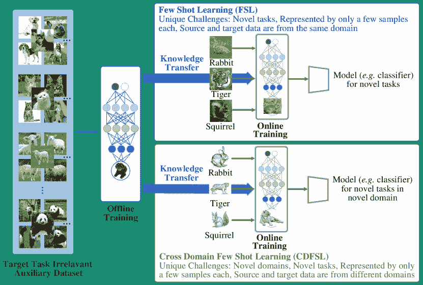

图 1\. 少样本学习和跨领域少样本学习的区别。

到目前为止，几项现有的调查已对 FSL（Shu 等，2018; Wang 等，2020; Parnami 和 Lee，2022; Lu 等，2020; Song 等，2023）进行了详细总结和展望。（Shu 等，2018）将 FSL 分为经验学习和概念学习，讨论了如何利用其他领域的数据来增强小样本数据或修正现有知识。最近，（Wang 等，2020）探讨了经验风险最小化，并从经验、任务和性能的角度定义 FSL，同时还将 CDFSL 作为 FSL 的一个分支进行介绍。（Parnami 和 Lee，2022）和（Lu 等，2020）将 CDFSL 介绍为 FSL 的一种变体。（Parnami 和 Lee，2022）讨论了 FSL 的元学习、非元学习和混合元学习方法，并简要概述了 CDFSL 的开创性工作（Tseng 等，2020），而（Lu 等，2020）讨论了 CDFSL 的基准和其他相关工作。此外，（Song 等，2023）从先验知识的角度提供了一种分类法。本文将 FSL 中的任务转移视为跨近域问题，并指出现有工作无法解决跨距离领域的问题。所有上述工作将跨领域问题视为 FSL 的潜在方向。然而，目前缺乏系统的文献来总结和讨论 CDFSL 的各种相关工作。因此，在这个快速发展的时期，为了激发未来的研究并帮助新人更好地理解这一挑战性问题，本文首次全面回顾了 CDFSL 问题。首先，本文收集和分析了大量关于该主题的文献。对参考文献索引的分析显示，在 CDFSL 正式提出之前，一些工作已经关注了 FSL 领域的跨领域问题（Chen 等，2019; Nakamura 和 Harada，2019）。随即，作为 FSL 的一个分支话题，CDFSL 得到了广泛关注并被深入探讨。此外，我们使用机器学习定义（Mitchell 等，1990; Mohri 等，2018a）和迁移学习理论（Tripuraneni 等，2020）来定义 CDFSL。其次，大量相关论文的分析表明，CDFSL 的独特问题是不可依赖的两阶段经验风险最小化问题，这源于两个因素的结合：（1）源领域和目标领域之间的显著差异（包括它们执行的任务和领域本身），（2）目标领域中可用的监督信息有限。详细信息在第二部分中讨论。因此，所有 CDFSL 工作需要通过科学分类法进行组织，以应对其特定挑战。接下来，关于如何在 CDFSL 中迁移知识的问题，本文提供了现有方法的全面概述，并将其系统地分类为四种不同的类别：实例指导、基于参数、特征后处理和混合方法。为了促进对 CDFSL 的理解，并提供对现有方法的全面评估，本文还编制和介绍了相关数据集和基准的全面集合。有关这些数据集和基准的信息详细呈现，为研究人员和从业者提供了宝贵的见解。随后，本文分析并比较了不同方法的性能，提供了对 CDFSL 前沿技术的全面理解，如第三部分和第四部分所讨论的。最后，我们通过考虑问题设置、应用和理论三个方面探索了 CDFSL 的未来研究方向，这些方向提供了对该领域及其未来发展潜力的全面理解。本文综述的贡献总结如下：

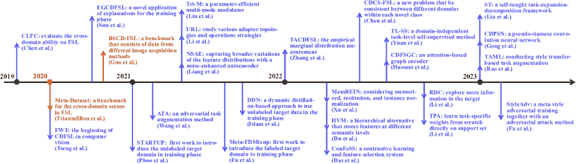

图 2\. 从 2019 年至今 CDFSL 的时间节点，包括代表性的 CDFSL 方法和相关基准。CDFSL 首次作为一个话题受到关注是在 2020 年，当时发布了两个相关的基准，Meta-Dataset（Triantafillou 等，2019）和 BSCD-FSL（Guo 等，2020）。开创性的 CDFSL 工作（Tseng 等，2020）同时提出。而（Sun 等，2021；Guan 等，2020）随后提出，它们是 2020 年为数不多的 CDFSL 工作。随后，（Phoo 和 Hariharan，2020；Islam 等，2021；Fu 等，2021；Li 等，2021a；Liu 等，2021）探索了许多新的 CDFSL 设置，如跨多域小样本学习等。（Liang 等，2021；Wang 和 Deng，2021；Hu 等，2021；Xu 等，2021；Du 等，2021；Das 等，2022；Chen 等，2022a）尝试通过不同的方法提高 CDFSL 的性能。详细信息请参见第三部分。

+   •

    我们分析了现有的 CDFSL 论文，提供了一个全面的调查，这是首次进行的。我们还正式定义了 CDFSL，并将其与经典的机器学习（Mitchell 等，1990；Mohri 等，2018a）和迁移学习理论（Tripuraneni 等，2020）联系起来。这有助于指导该领域未来的研究。

+   •

    我们列出了 CDFSL 的相关学习问题及示例，澄清了它们的关系和差异。这有助于将 CDFSL 定位在各种学习问题中。我们还分析了 CDFSL 的独特问题和挑战，帮助探索 CDFSL 工作的科学分类法。

+   •

    我们进行了广泛的文献综述，将其组织成基于实例引导、基于参数、特征后处理和混合方法的统一分类法。我们介绍了每个分类法的适用场景，这有助于讨论其优缺点。我们还展示了 CDFSL 的数据集和基准，总结了性能结果的见解，并讨论了每个类别的优缺点，提高了对 CDFSL 方法的理解。

+   •

    我们根据当前的弱点和潜在的改进，提出了 CDFSL 在问题设置、应用和理论方面的有前途的未来方向。

本综述的其余部分组织如下。第二部分概述了 CDFSL，包括其正式定义、相关学习问题、独特问题和挑战，以及现有工作的分类，按实例、参数、特征和混合进行分类。第三部分详细介绍了针对 CDFSL 问题的各种方法。第四部分展示了性能结果，并总结了每个类别方法的优缺点。第五部分讨论了 CDFSL 的未来方向，包括设置、应用和理论。最后，第六部分提供了综述的结论。

## 2\. 背景

在本节中，我们首先在第 2.1 节中介绍与 CDFSL 相关的关键概念。然后，我们在第 2.2 节中提供普通监督学习、FSL 和 CDFSL 问题的正式定义，并附有具体示例。为了区分 CDFSL 问题与相关问题，我们在第 2.3 节中讨论它们的相关性和区别。在第 2.4 节中，我们讨论使 CDFSL 变得困难的特殊问题和挑战。第 2.5 节根据现有工作如何处理这些独特问题，提出了统一的分类法。

### 2.1\. 关键概念

在给出 CDFSL 的正式定义之前，我们首先定义两个关键的基本概念‘领域’和‘任务’（Pan 和 Yang，2009；Yang 等，2020），因为它们的具体内容在源问题和目标问题之间可能有所不同，这受到 Pan 和 Yang（Pan 和 Yang，2009）的优秀综述的启发。

###### 定义 2.1.1。

领域。给定一个特征空间 $\mathcal{X}$ 和一个边际概率分布 P(X)，其中 $\textit{X}=\{x_{1},x_{2},...,x_{n}\}\subseteq\mathcal{X}$，$n$ 是实例的数量。一个领域 $\mathcal{D}=\{\mathcal{X},\textit{P(X)}\}$ 由 $\mathcal{X}$ 和 P(X) 组成。

具体来说，对于图像领域$\mathcal{D}$，原始图像 I 被映射到一个高维特征空间$\mathcal{X}_{I}$。特征$\textit{X}_{I}$在$\mathcal{X}_{I}$中是 I 的高维抽象，且相应的边际概率分布为$P(X_{I})$。图像领域$\mathcal{D}$可以表示为$\mathcal{D}=\{\mathcal{X}_{I},P(X_{I})\}$。一般来说，$\mathcal{X}_{I}$或$P(X_{I})$的差异可以导致不同的领域$\mathcal{D}$。

###### 定义 2.1.2.

任务。给定一个领域$\mathcal{D}=\{\mathcal{X},\textit{P(X)}\}$，一个任务$\mathcal{T}=\{\mathcal{Y},\textit{P(Y|X)}\}$包含标签空间$\mathcal{Y}$和条件概率分布 P(Y—X)，其中$\textit{Y}=\{y_{1},y_{2},...,y_{m}\}\in\mathcal{Y}$，$m$是标签的数量。

具体而言，我们用$x$和$y$表示输入数据和监督目标。例如，对于一个分类任务$\mathcal{T}$，所有标签$\textit{Y}^{\mathcal{T}}=\{y^{\mathcal{T}}_{1},y^{\mathcal{T}}_{2},...,y^{\mathcal{T}}_{m}\}\in\mathcal{Y}$都在标签空间$\mathcal{Y}$中，且 P(Y—X)可以从训练数据 D={$x_{i},y_{i}$}中学习，其中$x_{i}\in\textit{X}$和$y_{i}\in\textit{Y}$。从物理角度来看，P(Y—X)可以表示为一个预测函数$f(\cdot)$，用于预测 x 的对应标签 y。

### 2.2\. 问题定义

在这一小节中，我们首先定义了基础的监督学习。然后展示了 FSL 的定义，在深入定义 CDFSL 之前，我们认为 CDFSL 是 FSL 的一个子领域。

###### 定义 2.2.1.

基础监督学习。给定一个领域$\mathcal{D}$，考虑一个监督学习任务$\mathcal{T}$、一个训练集$\textit{D}^{train}$和一个测试集$\textit{D}^{test}$，基础监督学习的目标是学习一个预测函数$f(\cdot)$，用于在$\textit{D}^{train}$上对$\mathcal{T}$进行训练，使得$f(\cdot)$在$\textit{D}^{test}$上具有良好的预测效果，其中$\{\textit{D}^{train},\textit{D}^{test}\}\subseteq\mathcal{D}$。

例如，图像分类任务是将新图像归类到给定类别中，使用从训练样本中学习到的模型。在经典图像分类中，训练集$\textit{D}^{train}$每个类别有足够的图像，比如 ImageNet 有 1000 个类别，每个类别有超过 1000 个样本。注意，数据集 D 不能与领域$\mathcal{D}$混淆。基础监督分类问题的示意图见图 3 (a)。

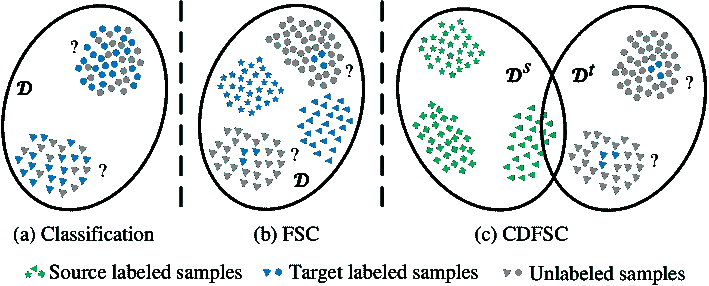

图 3\. (a) 标准分类，(b) 少样本分类，(c) 跨领域少样本分类。不同的形状表示不同的类别。$\mathcal{D}$ 表示领域，$\mathcal{D}^{s}$ 和 $\mathcal{D}^{t}$ 分别代表源领域和目标领域。‘?’ 表示预测测试数据。

类似于普通监督学习的目标，FSL 的目标也是从训练集 $\textit{D}^{train}$ 中学习一个模型以测试新的样本。然而，关键的区别在于 FSL 的 $\textit{D}^{train}$ 仅包含很少的监督信息，使得任务非常具有挑战性。由于 $\textit{D}^{train}$ 中样本数量少，许多常用的监督算法无法学习到令人满意的分类模型，这主要是由于过拟合。因此，引入一些先验知识来缓解过拟合问题是必要且自然的。我们称获取先验知识的任务为辅助任务 $\mathcal{T}^{s}$（或源任务）。通常，$\mathcal{T}^{s}$ 和 $\mathcal{T}^{t}$ 的类别没有交集，*即* $\mathcal{Y}^{s}\cap\mathcal{Y}^{t}=\emptyset$，其中 $\mathcal{Y}^{s}$ 和 $\mathcal{Y}^{t}$ 分别是 $\mathcal{T}^{s}$ 和 $\mathcal{T}^{t}$ 的标签集合。FSL 的正式定义如下。

###### 定义 2.2.2。

Few Shot Learning (FSL)。给定一个领域 $\mathcal{D}$，一个由 T-specific 数据集 $\textit{D}^{t}$ 描述的任务 $\mathcal{T}^{t}$ 仅有少量监督信息可用，以及一个由 T-irrelevant 辅助数据集 $\textit{D}^{s}$ 描述的任务 $\mathcal{T}^{s}$ 具有充分的监督信息，FSL 旨在通过利用 $\textit{D}^{t}$ 中的少量监督信息和 $(\mathcal{T}^{s},\textit{D}^{s})$ 中的先验知识来学习一个函数 $f(\cdot)$ 用于 $\mathcal{T}^{t}$，其中 $\{\textit{D}^{t},\textit{D}^{s}\}\subseteq\mathcal{D}$，且 $\mathcal{T}^{s}\neq\mathcal{T}^{t}$。

具体来说，以一个少样本分类任务 $\mathcal{T}^{t}$ 为例，我们使用对应的少样本数据对 $\{(\textit{x}_{i},\textit{y}_{i})\}^{N^{t}}_{i=1}$ 来表示输入数据和监督目标。此外，$\mathcal{T}^{s}$ 和 $\{(\textit{x}_{i},\textit{y}_{i})\}^{N^{s}}_{i=1}$ 用于表示传统分类任务和辅助数据对，其中 $N^{s}\gg N^{t}$。$\mathcal{T}^{t}$ 遵循 “C-way K-shot” 训练原则（C 表示类别数，K 代表每个类别中的样本数量）。我们从 $\textit{D}^{t}$ 和 $(\mathcal{T}^{s},\textit{D}^{s})$ 中学习函数 $f$($\cdot$) 以应对 $\mathcal{T}^{t}$。图 3 (b) 展示了少样本分类（FSC）问题。

作为 FSL 的一个分支，CDFSL 也使用通过 $\{(\textit{x}_{i},\textit{y}_{i})\}^{N^{t}}_{i=1}$ 学习的模型和来自 $\{(\textit{x}_{i},\textit{y}_{i})\}^{N^{s}}_{i=1}$ 的先验知识来预测新样本。不同之处在于，CDFSL 中的 $\{(\textit{x}_{i},\textit{y}_{i})\}^{N^{s}}_{i=1}$ 和 $\{(\textit{x}_{i},\textit{y}_{i})\}^{N^{t}}_{i=1}$ 来自两个不同的领域 $\mathcal{D}^{s}$ 和 $\mathcal{D}^{t}$，*即*，$\mathcal{D}^{s}\neq\mathcal{D}^{t}$。与数据独立同分布（i.i.d.）的 FSL 问题相比，CDFSL 打破了这一限制。因此，CDFSL 不仅继承了 FSL 的挑战，还包含其独特的跨域挑战，使其成为一个更具挑战性的问题。因此，许多传统的 FSL 算法不再适用于 CDFSL，这需要开发一种有效的方法将先验知识从源领域 $\mathcal{D}^{s}$ 转移到目标领域 $\mathcal{D}^{t}$，而不使模型在 $\mathcal{D}^{s}$ 上过拟合。下面正式给出 CDFSL 的定义。

###### 定义 2.2.3。

跨域少样本学习（CDFSL）。考虑一个具有充分监督信息的源领域 $\mathcal{D}^{s}$ 和学习任务 $\mathcal{T}^{s}$，以及一个具有有限监督信息和 FSL 任务 $\mathcal{T}^{t}$ 的目标领域 $\mathcal{D}^{t}$，CDFSL 的目标是利用 $(\mathcal{T}^{s},\mathcal{D}^{s})$ 中的先验知识，在 $\mathcal{D}^{t}$ 上学习一个目标预测函数 $f_{T}(\cdot)$，其中 $\mathcal{D}^{s}\neq\mathcal{D}^{t}$，且 $\mathcal{T}^{s}\neq\mathcal{T}^{t}$。

在一个跨域少样本分类（CDFSC）问题中，如图 3（c）所示，我们类似地用 $\mathcal{T}^{s}$ 和 $\mathcal{T}^{t}$ 分别表示源和目标分类任务。它们由数据对 $\{(\bm{x}_{i}^{s},y^{s}_{i})\}_{i=1}^{N^{s}}\subseteq\mathcal{D}^{s}$ 和 $\{(\bm{x}_{i}^{t},y^{t}_{i})\}_{i=1}^{N^{t}}\subseteq\mathcal{D}^{t}$ 描述，其中 $N^{s}\gg N^{t}$，$y^{s}_{i}\in\mathcal{Y}^{s}$，$y^{t}_{i}\in\mathcal{Y}^{t}$，$\mathcal{Y}^{t}\bigcap\mathcal{Y}^{s}=\varnothing$（*即*，源领域和目标领域不共享标签空间）。注意 $\mathcal{D}^{t}$ 和 $\mathcal{D}^{s}$ 分别从两个不同的概率分布 $p$ 和 $q$ 中采样，其中 $p\neq q$。CDFSC 的目标是使用 $\mathcal{D}^{t}$ 和 $(\mathcal{T}^{s},\mathcal{D}^{s})$ 为 $\mathcal{T}^{t}$ 学习一个分类器 $f_{T}$($\cdot$)。它解决了目标领域 $\mathcal{D}^{t}$ 中没有足够的辅助样本来为 $\mathcal{T}^{t}$ 提供适当先验知识的问题。

此外，根据图像分布差异的原因，CDFSL 可以分为三大类：细粒度 CDFSL（FG）、艺术基础 CDFSL（Art）和成像方式基础 CDFSL（IW）。FG-CDFSL 涉及$\mathcal{D}^{s}$和$\mathcal{D}^{t}$之间细粒度类别的差异。具体而言，$\mathcal{D}^{t}$的类别是$\mathcal{D}^{s}$中特定种类的细粒度类。A-CDFSL 涉及艺术表现的差异，例如素描、自然图像、简笔画、油画和水彩画。在 IW-CDFSL 中，当数据集包含不同模态的图像时，例如$\mathcal{D}^{s}$中的自然图像和$\mathcal{D}^{t}$中的医疗 X 射线图像，$\mathcal{D}^{s}$和$\mathcal{D}^{t}$之间会出现成像模式的差异。IW-CDFSL 通常被认为是三类中最具挑战性的。

### 2.3. 密切相关的问题

在本节中，我们讨论了密切相关的问题。这些问题与 CDFSL 之间的区别和相关性在图 4 中进行了说明。

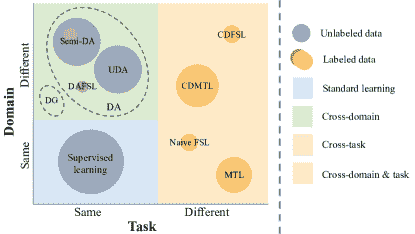

图 4。CDFSL 相关问题。圆圈表示目标数据，其大小表示数量。

半监督领域自适应（Semi-DA）。Semi-DA 利用$\mathcal{D}^{s}$中的大量监督数据、少量标记数据以及$\mathcal{D}^{t}$中的大量未标记数据来提高$\mathcal{T}$的性能。$\mathcal{D}^{s}$和$\mathcal{D}^{t}$之间存在相同的标签空间和不同但相关的样本分布，即$\mathcal{D}^{s}\neq\mathcal{D}^{t}$。类似于 Semi-DA，CDFSL 问题也利用$\mathcal{D}^{s}$中的大量监督数据和$\mathcal{D}^{t}$中的有限监督数据来提高任务$\mathcal{T}$的性能，$\mathcal{D}^{s}\neq\mathcal{D}^{t}$。不同之处在于，CDFSL 没有使用许多目标领域中的未监督样本来辅助训练。此外，在 CDFSL 问题中，$\mathcal{D}^{s}$和$\mathcal{D}^{t}$的标签空间是不同的。

无监督领域自适应（UDA）。UDA 利用$\mathcal{D}^{s}$中的大量监督数据和$\mathcal{D}^{t}$中的大量未标记数据来提高$\mathcal{T}$的性能。$\mathcal{D}^{s}$和$\mathcal{D}^{t}$之间的分布不同但相关，即$\mathcal{D}^{s}\neq\mathcal{D}^{t}$。并且它们共享相同的学习任务。类似于 UDA，CDFSL 也利用$\mathcal{D}^{s}$中的大量监督数据来提高$\mathcal{T}$在$\mathcal{D}^{t}$中的性能，$\mathcal{D}^{s}\neq\mathcal{D}^{t}$。然而，在 CDFSL 中，$\mathcal{D}^{t}$只有少量监督数据，且$\mathcal{D}^{s}$和$\mathcal{D}^{t}$的任务是不同的。

领域泛化（DG）。DG 利用 M 个源领域 $\mathcal{D}^{s}=\{\mathcal{D}^{s}_{i}|i=1,...,M\}$ 中的大量监督数据来提高在未见过的 $\mathcal{D}^{t}$ 上的任务 $\mathcal{T}$ 的表现。$\mathcal{D}^{s}$ 和 $\mathcal{D}^{t}$ 的分布是不同但相关的，即 $\mathcal{D}^{s}\neq\mathcal{D}^{t}$，并且 $\mathcal{D}^{s}$ 和 $\mathcal{D}^{t}$ 之间的任务是相同的。与 DG 类似，CDFSL 也利用 $\mathcal{D}^{s}$ 中的大量监督数据来提升任务 $\mathcal{T}$ 的表现。然而，CDFSL 被设计为在特定的 $\mathcal{D}^{t}$ 上表现良好，而不是所有未见过的 $\mathcal{D}^{t}$，并且源数据通常来自一个源领域。此外，$\mathcal{D}^{s}$ 和 $\mathcal{D}^{t}$ 的任务是不同的，即 $\mathcal{T}^{s}\neq\mathcal{T}^{t}$。

领域适应少样本学习（DAFSL）。DAFSL 利用源领域 $\mathcal{D}^{s}$ 中大量的监督数据和目标领域 $\mathcal{D}^{t}$ 中有限的标注数据来提升任务 $\mathcal{T}$ 在 $\mathcal{D}^{t}$ 上的表现。尽管 $\mathcal{D}^{s}$ 和 $\mathcal{D}^{t}$ 的分布不同，即 $\mathcal{D}^{s}\neq\mathcal{D}^{t}$，但学习任务保持不变。同样，CDFSL 利用两个领域中的相同数据配置来训练任务 $\mathcal{T}$ 的函数。然而，与 DAFSL 不同的是，CDFSL 中的 $\mathcal{D}^{s}$ 和 $\mathcal{D}^{t}$ 的学习任务存在差异。

多任务学习（MTL）。MTL 利用 $\mathcal{D}$ 中的 $M$ 个任务来提高每个 $\mathcal{T}_{i}$ （0 ≤ i ≤ $M$）的表现。所有 $\{\mathcal{T}_{i}\}^{M}_{i=1}$ 都是不同但相关的。与 MTL 不同的是，CDFSL 中 $\mathcal{T}^{s}$ 和 $\mathcal{T}^{t}$ 的数据来自不同的领域 $\mathcal{D}^{s}$ 和 $\mathcal{D}^{t}$，即 $\mathcal{D}^{s}\neq\mathcal{D}^{t}$ 和 $\mathcal{T}^{s}\neq\mathcal{T}^{t}$，并且 $\mathcal{D}^{t}$ 中的监督数据是有限的。

### 2.4\. 独特的问题和挑战

在机器学习中，预测误差是常见的现象，使得无法实现完美的预测，即实证风险最小化（ERM）不可靠的问题。在本节中，我们首先解释实证风险最小化（ERM）的概念。接着，我们深入探讨 CDFSL 的两阶段实证风险最小化（TSERM）问题。最后，我们检查 CDFSL 所面临的不同问题和挑战。

#### 2.4.1\. 实证风险最小化（ERM）

给定输入空间$\mathcal{X}$和标签空间$\mathcal{Y}$，其中$X$和$Y$满足联合概率分布$P(X,Y)$，损失函数$l(\hat{y},y)$，假设$h\in\mathcal{H}$ ¹¹1 假设空间$\mathcal{H}$包括所有可以通过对权重的某些选择来表示的函数（Mitchell 等人，1990）。一个假设$h$是假设空间中的一个函数。则假设$h(x)$的风险（期望风险）定义为损失函数的期望值：

| (1) |  | $\displaystyle R(h)=\mathbb{E}[l(h(x),y)]=\int l(h(x),y)dP(x,y),$ |  |
| --- | --- | --- | --- |

学习算法的最终目标是找到在假设空间$\mathcal{H}$中最小化风险$R(h)$的假设$h^{\ast}$：

| (2) |  | $\displaystyle h^{\ast}=\text{argmin}_{h\in\mathcal{H}}R(h),$ |  |
| --- | --- | --- | --- |

由于$P(x,y)$未知，我们通过对训练集上的损失函数进行平均来计算一个叫做经验风险的近似值：

| (3) |  | $\displaystyle\hat{R}(h)=\frac{1}{n}\sum_{i=1}^{n}l(h(x_{i},y_{i})),$ |  |
| --- | --- | --- | --- |

因此，期望风险通常通过经验风险最小化进行无限逼近（Mohri 等人，2018b；Vapnik，1991），即选择一个假设$\hat{h}$来最小化经验风险：

| (4) |  | $\displaystyle\hat{h}=\text{argmin}_{h\in\mathcal{H}}\hat{R}(h)$ |  |
| --- | --- | --- | --- |

在 FSL（Few-Shot Learning）中，由于监督信息有限，经验风险$\hat{R}(h)$可能远离期望风险$h^{\ast}$的近似值，这导致了经验风险最小化假设$\hat{h}$的过拟合，即 FSL 的核心问题是由于监督数据不足而引起的不可靠经验风险。在当前的 FSL 方法中，通常通过转移学习来解决过拟合问题，方法是引入额外的数据集来辅助任务学习。然而，由于源领域和目标领域的任务不同，FSL 面临着由于任务转移而引发的知识转移挑战。这在随后的两阶段经验风险最小化问题中得到了说明。

#### 2.4.2\. 两阶段经验风险最小化（TSERM）

我们假设所有任务共享一种通用的非线性特征表示。两阶段经验风险最小化（TSERM）旨在通过学习这种通用特征表示，将知识从源任务转移到目标任务。在第一阶段，主要关注学习一般特征表示。第二阶段则利用获取的特征表示来为目标任务构建最优假设。

具体来说，我们使用 $\mathcal{T}^{s}$ 和 $\mathcal{T}^{t}$ 分别表示源任务和目标任务。TSERM 学习了两个假设 $f$ 和 $h$，由于在假设空间 $\mathcal{H}$ 中仅存在有限的监督样本，$f$ 和 $h$ 都是参数模型，其中 $f$ 在第一阶段学习共享特征表示，$h$ 在第二阶段利用这些特征表示学习识别器。为方便起见，我们使用

+   (1)

    $(h^{\dagger},f^{\dagger})=\text{argmin}_{(f,h)\in\mathcal{H}}R(h,f)$ 表示最小化期望风险的函数。

+   (2)

    $(h^{\ast},f^{\dagger})$ 我们假设在 $\mathcal{H}$ 中存在一个共同的非线性特征表示 $f^{\dagger}$ = $\text{argmin}_{(f,h)\in\mathcal{H}}R(h,f)$ 表示在 $\mathcal{H}$ 中最小化期望风险的函数。

+   (3)

    $(\hat{h},\hat{f})=\text{argmin}_{(f,h)\in\mathcal{H}}\hat{R}(h,f)$ 代表在 $\mathcal{H}$ 中最小化经验风险的函数。

由于 $(h^{\dagger},f^{\dagger})$ 是未知的，因此必须通过 $(h,f)\in\mathcal{H}$ 来近似。$(h^{\ast},f^{\dagger})$ 代表在 $\mathcal{H}$ 中的最优近似，而 $(\hat{h},\hat{f})$ 代表在 $\mathcal{H}$ 中经验风险最小化的最优假设。假设 $(h^{\dagger},f^{\dagger})$、$(h^{\ast},f^{\dagger})$ 和 $(\hat{h},\hat{f})$ 都是唯一的。在第一阶段，$\mathcal{T}^{s}$ 的经验风险由以下公式给出：

| (5) |  | $\displaystyle\hat{R}_{s}(h_{s},f)=\frac{1}{N^{s}}\sum^{N^{s}}_{i=1}l(h_{s}\circ f(x_{i}^{s}),y_{i}^{s}),$ |  |
| --- | --- | --- | --- |

其中 $l(\cdot,\cdot)$ 是损失函数，$N^{s}$ 表示 $\mathcal{T}^{s}$ 中的训练样本数量，$x_{i}^{s}$ 和 $y_{i}^{s}$ 分别表示 $\mathcal{T}^{s}$ 中的样本及其对应标签。$h_{s}$ 是 $\mathcal{T}^{s}$ 的假设。最优共享特征提取函数 $\hat{f}(\cdot)$ 表示为 $\hat{f}=\text{argmin}_{(f,h_{s})\in\mathcal{H}}\hat{R}_{s}(h_{s},f)$。

在第二阶段，$\mathcal{T}^{t}$ 的经验风险定义为：

| (6) |  | $\displaystyle\hat{R}_{t}(h_{t},f)=\frac{1}{N^{t}}\sum^{N^{t}}_{i=1}l(h_{t}\circ\hat{f}(x_{i}^{t}),y_{i}^{t}),$ |  |
| --- | --- | --- | --- |

与上述相同，$h_{t}$ 是 $\mathcal{T}^{t}$ 的假设，$N^{t}$ 表示 $\mathcal{T}^{t}$ 的训练样本数量，而 $x_{i}^{t}$ 和 $y_{i}^{t}$ 分别表示 $\mathcal{T}^{t}$ 中的样本及其对应标签。在第二阶段，我们的目标是基于第一阶段学习到的共享特征表示来估计一个假设 $\hat{h_{t}}=\text{argmin}_{(f,h_{t})\in\mathcal{H}}\hat{R}_{t}(h_{t},\hat{f})$。我们通过在 $\mathcal{T}^{t}$ 上的过量误差来衡量函数 $(\hat{h_{t}},\hat{f})$，即：

| (7) |  |  | $\displaystyle\mathbb{E}[R_{excess}]=\mathbb{E}[R_{t}(\hat{h_{t}},\hat{f})-R_{t}(h_{t}^{\dagger},f^{\dagger})]$ |  |
| --- | --- | --- | --- | --- |
|  |  | $\displaystyle=\mathbb{E}[R_{t}(h^{\ast}_{t},f^{\dagger})-R_{t}(h^{\dagger}_{t},f^{\dagger})]+\mathbb{E}[R_{t}(\hat{h}_{t},\hat{f})-R_{t}(h^{\ast}_{t},f^{\dagger})],$ |  |

其中，$R_{t}(\cdot,\cdot)$ 代表了 $\mathcal{T}^{t}$ 上的期望风险。$R_{excess}$ 表示 $(\hat{h_{t}},\hat{f})$ 和最佳预测规则 $(h_{t}^{\dagger},f^{\dagger})$ 之间的期望风险关系。此外，我们用 $\mathbb{E}[R_{t}(\hat{h}_{t},\hat{f})-R_{t}(h^{\ast}_{t},f^{\dagger})]$ 表示估计误差，*即*，在 $\mathcal{H}$ 中最小化经验风险 $\hat{R}_{t}(h_{t},f)$ 而不是期望风险 $R_{t}(h_{t},f)$，如图 5 ‣ 2.4\. Unique Issue and Challenge ‣ 2\. Background ‣ Deep Learning for Cross-Domain Few-Shot Visual Recognition: A Survey") 中的蓝色虚线所示。

图 5\. 普通监督学习、FSL 和 CDFSL 问题的比较。实心圆表示数据所在的分布（大小表示数据量），虚线圆表示目标分布所属的领域。

#### 2.4.3\. 独特问题与挑战

由于 $\mathcal{H}$ 的限制，我们无法优化近似误差，*即* $\mathbb{E}[R_{t}(h^{\ast}_{t},f^{\dagger})-R_{t}(h^{\dagger}_{t},f^{\dagger})]$。因此，我们的目标是优化估计误差，*即* $\mathbb{E}[R_{t}(\hat{h}_{t},\hat{f})-R_{t}(h^{\ast}_{t},f^{\dagger})]$。在图 5 ‣ 2.4\. Unique Issue and Challenge ‣ 2\. Background ‣ Deep Learning for Cross-Domain Few-Shot Visual Recognition: A Survey") 中，实心黑色箭头表示经验风险最小化的学习。实心圆表示不同的数据分布（圆的大小表示监督信息的量，绿色和蓝色圆分别表示源领域和目标领域）。目标样本所在的分布用蓝色虚线圆表示。在图 5 ‣ 2.4\. Unique Issue and Challenge ‣ 2\. Background ‣ Deep Learning for Cross-Domain Few-Shot Visual Recognition: A Survey") 中，(a) 显示了一个普通的监督学习问题。在数据集较大的情况下，容易实现 ERM 学习。 (b) 的左侧部分表示 FSL 问题，当数据量不足时，ERM 学习效果不佳。现有的 FSL 策略通过不同但相关的源任务为目标任务提供了良好的初始化，如图 5 ‣ 2.4\. Unique Issue and Challenge ‣ 2\. Background ‣ Deep Learning for Cross-Domain Few-Shot Visual Recognition: A Survey") (b) 右侧部分所示。

由于源数据集和目标数据集之间的领域差距，CDFSL 出现了一个新问题，如图 5 ‣ 2.4\. Unique Issue and Challenge ‣ 2\. Background ‣ Deep Learning for Cross-Domain Few-Shot Visual Recognition: A Survey")(c)所示。因此，很明显，CDFSL 问题涉及源领域和目标领域之间的领域差距和任务转移，同时$\mathcal{D}^{t}$中可用的监督信息有限。这使得 CDFSL 具有其独特的挑战，同时继承了 FSL 的挑战，即由于以下因素导致不可靠的 TSERM（估计误差优化）：CDFSL 问题的特点是领域差距和任务转移，导致源领域和目标领域之间的相关性有限，从而限制了它们之间的共享知识。因此，模型在支持$\mathcal{D}^{s}$和$\mathcal{T}^{s}$的情况下识别任务$\mathcal{T}^{t}$的最优函数$f$变得具有挑战性，其中$\mathcal{D}^{s}\neq\mathcal{D}^{t}$且$\mathcal{T}^{s}\neq\mathcal{T}^{t}$。换句话说，源领域和目标领域之间的共享知识难以提取。

### 2.5\. 分类

根据上述独特问题和挑战，CDFSL 旨在挖掘尽可能多的共享知识，并找到目标领域的最优$f$。基于这一考虑，并回答“如何转移”的问题，本文将所有 CDFSL 技术分类为以下四类，如图 6 所示：

+   •

    实例引导的方法。通过引入实例子集，模型从更多样本中学习最优特征。

+   •

    基于参数的方法。通过优化模型参数并排除一些$\mathcal{H}$区域中不太可能存在最优函数的区域，减少了$\mathcal{H}$的范围。

+   •

    特征后处理方法。从源领域学习特征函数，并对其特征进行后续处理。通过后处理操作获得与$f^{\dagger}$最接近的新特征。

+   •

    混合方法。结合上述三类中的多种策略。

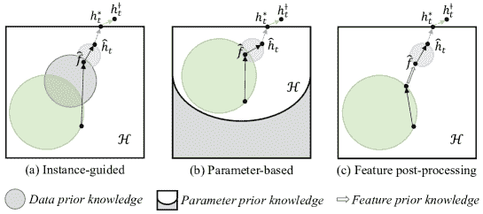

图 6\. CDFSL 方法如何找到最优特征的不同视角。

因此，现有工作可以被分类为一个统一的分类系统。在接下来的部分中，我们将详细介绍每个类别、性能、未来工作和结论。本文的主要内容如图 7 所示。

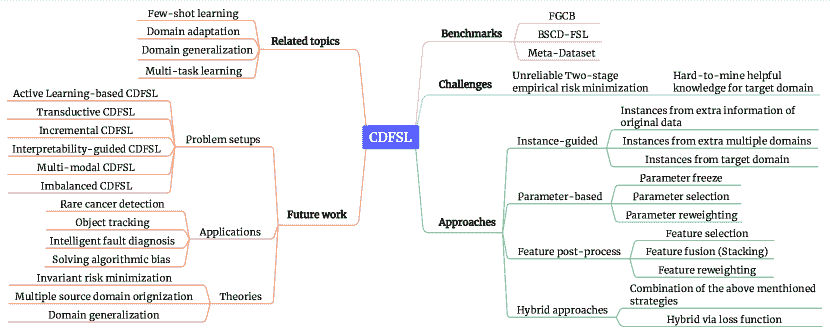

图 7\. 我们调查的概述。主要内容包括 CDFSL 的基准、挑战、相关主题、方法论和未来工作。

## 3\. 方法

CDFSL 提供了对跨领域和少样本学习问题的统一解决方案。基于对独特问题和挑战的分析，我们提出了 CDFSL 算法的分类标准，将其分为四类：实例指导、参数基础、特征后处理和混合方法。CDFSL 的概述如图 8 所示。

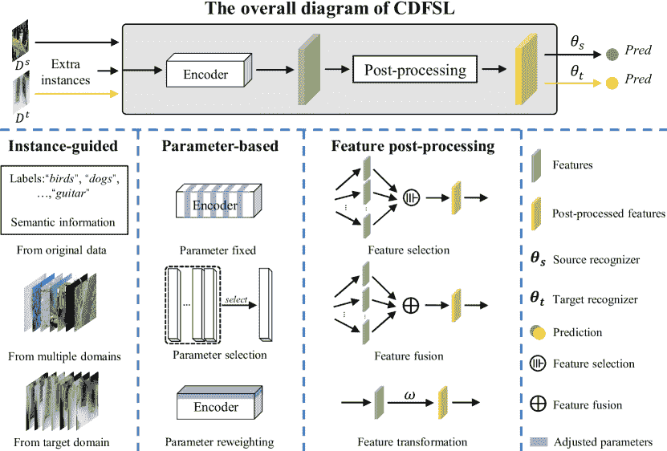

图 8\. CDFSL 方法的整体图示。首先，现有技术在源领域上预训练特征提取器。其次，它们在目标领域通过有限标签微调特征提取器并训练新的识别器。我们将现有的 CDFSL 方法分类为实例指导、参数基础和特征后处理。

### 3.1\. 实例指导的方法

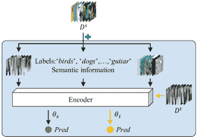

图 9\. 实例指导方法的不同类别。实例来自不同来源。$\theta$ 代表识别器。

本节介绍了通过结合来自各种来源的额外有效实例来学习共享特征表示的方法，包括源领域、目标领域和附加领域。这些来源提供的多样信息为寻找共享特征提供了实际指导。例如，来自源领域的信息，通常来自不同的模态和视图，扩展了实际信息，并促进了共享特征的学习。此外，通过结合来自目标领域的信息，模型可以更好地理解目标领域，并更容易地推广到该领域。来自多个领域的信息使得模型能够从各种领域中学习共享表示，从而使学习到的特征更具泛化性。这些方法在图 9 中有所说明，其详细信息在表 1 中呈现。

表 1\. 代表性的实例指导 CDFSL 方法。‘FG’，‘Art’和‘I W’分别表示对细粒度基于 CDFSL（FG）、艺术基于 CDFSL（Art）和成像方式基于 CDFSL（IW）的评估。‘CWUT’表示通道级均匀变换。‘KBS’代表基于知识的系统。

| 方法 | 场地 | 来源实例 | 介绍的信息 | 损失函数 | FG | Art | IW |
| --- | --- | --- | --- | --- | --- | --- | --- |
| TriAE (Guan et al., 2020) | ACCV 2020 | 原始数据 | 标签 | $L_{2}$ |  | ✓ |  |
| NSAE (Liang et al., 2021) | ICCV 2021 | 原始数据 | 生成图像 | BSR & Log | ✓ |  | ✓ |
| SET-RCL (Li et al., 2022c) | ACM MM 2022 | 原始数据 | CWUT | CE & Contrastive & Log | ✓ |  | ✓ |
| MDKT (Li et al., 2021b) | Neurocomputing 2021 | 原始数据 | 类语义 | CE | ✓ |  |  |
| CDPSN (Gong et al., 2023) | Scientific Reports 2023 | 原始数据 | 草图图 | CE |  |  | ✓ |
| ST (Liu et al., 2023) | KBS 2023 | 原始数据 | 转换 | CE | ✓ |  |  |
| DAML (Lee et al., 2022) | ICASSP 2022 | 多领域 | 3 个其他数据集 | CE | ✓ | ✓ |  |
| MCDFSL (Xu and Liu, 2022) | arXiv 2022 | 多领域 | 7 个辅助数据集 | BSR & Perceptual & Style |  |  | ✓ |
| STARTUP (Phoo and Hariharan, 2020) | ICLR 2021 | 目标领域 | 未标记的目标数据 | CE & KL & SimCLR |  |  | ✓ |
| DDN (Islam et al., 2021) | NIPS 2021 | 目标领域 | 未标记的目标数据 | CE |  |  | ✓ |
| DSL (Yao, 2021) | ICLR 2022 | 目标领域 | 多个目标 | RCE & Binary KLD | ✓ |  |  |
| UD (Hu et al., 2021) | arXiv 2021 | 目标领域 | 未标记的目标数据 | Log |  | ✓ |  |

#### 3.1.1\. 来自原始数据额外信息的实例

一些方法涉及使用来自原始数据的额外信息，如语义和视觉信息，以增强 FSL 任务的性能，如图 10 所示。其中一些工作通过重构实例来提取这些额外信息，如图 10 的绿色背景区域所示。例如，在(Guan et al., 2020)中，使用了三重自编码器（TriAE）来学习共享特征表示。它结合了源实例和目标实例，并利用语义信息作为中间桥梁。在(Liang et al., 2021)中，使用了自编码器来重构输入数据，重构数据随后作为额外的视觉信息来辅助训练过程并学习共享特征表示。而(Li et al., 2022c)则将多个任务/领域特定网络的知识提炼到一个单一网络中。这是通过使用小容量适配器对齐单一网络的表示与任务/领域特定网络的表示来实现的。

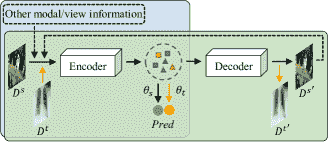

图 10\. 原始数据的附加信息的实例。额外信息可以来自生成模型（绿色区域）或其他模态，如文本（蓝色部分）。虚线表示附加信息引入的过程。

与此同时，其他工作直接向模型添加附加信息，如图 10 中的蓝色部分所示。例如，(Li 等人，2021b)提出了一个整合视觉和语义信息以识别目标类别的模型，并利用权重印记进行未来微调。此外，在(Gong 等人，2023)中，原始图像及其对应的草图地图分别由网络的不同分支进行处理。在训练过程中，从原始图像提取的特征与从草图地图分支提取的轮廓特征相结合，从而提高了模型的准确性和泛化性能。此外，(Liu 等人，2023)提出了一种称为自我教的（ST）方法的 CD-FSL 任务扩展分解框架，通过构建面向任务的度量空间缓解了非目标指导的问题。

#### 3.1.2\. 来自多个领域的实例

通过利用来自多个领域的实例，模型可以学习到具有广泛泛化能力的共享通用表示。Domain-Agnostic Meta Learning（DAML）算法，提出于(Lee 等人，2022)，使模型适应在已见和未见的领域中的新类别。相比之下，(Xu 和 Liu，2022)引入了来自多个领域的未标记数据到原始源领域，以转移多样的风格，使模型更适应各种领域和风格。此外，大多数方法将多种策略与多领域引入策略结合在一起，如第 3.4 节所示。

#### 3.1.3\. 来自目标领域的实例

利用目标领域实例的方法旨在揭示源领域和目标领域之间的共享信息。这些方法中的一些采用了教师-学生网络来辅助 CDFSL 学习。例如，在 (Phoo 和 Hariharan, 2020)中（如图 11 所示），提出了一种自我训练的方法，利用未标记的目标数据来改善源领域表示。这是第一个将未标记的目标数据引入训练阶段的工作。 (Islam 等, 2021) 跟随这一设置，通过将教师网络的弱增强未标记目标数据的预测与学生网络中同一图像的强增强版本进行比较来强制一致性。同时， (Yao, 2021) 开发了一种自监督学习方法，以充分利用未标记的目标领域数据。

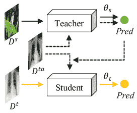

图 11\. STARTUP (Phoo 和 Hariharan, 2020) 结构。虚线表示如何使用辅助目标数据。

其他研究直接将所有标记的目标数据整合到训练过程中。例如， (Hu 等, 2021) 提出了一个领域切换学习（DSL）框架，使用多个目标领域以“快速切换”方式将跨领域场景嵌入训练阶段。

#### 3.1.4\. 讨论与总结

基于实例的策略是根据数据的可用性来选择的。当源领域包括额外的信息，如语义和视觉信息时，利用来自原始源的实例（如第 3.1.1 节所述）是一种有效的方法。然而，在没有额外信息的情况下，引入目标领域的实例（如第 3.1.3 节讨论）可能是更好的选择。在目标数据稀缺或不可用的情况下，利用来自多个领域的实例（如第 3.1.2 节所述）也会有所帮助。

### 3.2\. 基于参数的方法

基于参数的方法旨在通过操作模型的参数来发现共享的特征表示，从而减少假设空间的复杂性。这种方法主要有三种技术，如图 12 所示：（1）参数冻结涉及固定某些模型参数，简化对共享特征表示的搜索，（2）在参数选择中，从模型池中根据参数选择最合适的模型，以及（3）参数重加权使用额外的参数来约束假设空间。表 2 提供了属于这一类别的方法的详细总结。

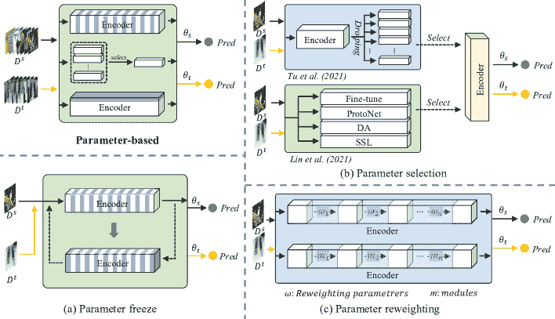

图 12\. 基于参数的类别。(a)、(b) 和 (c) 分别表示参数冻结、参数选择和参数重加权。

#### 3.2.1\. 参数冻结

参数冻结是一种通过固定一些模型参数来限制假设空间复杂性的策略。这种方法通常用于基于元学习的方法中，在这些方法中，它们在元训练和元测试阶段交替冻结某些参数。其中，基于评分的元迁移学习（SB-MTL）(Cai et al., 2020) 通过使用 MAML 优化的特征编码器和基于评分的图神经网络，将迁移学习和元学习结合起来。在训练阶段，MAML 中的一些参数被冻结。而在 (Wang et al., 2021) 中，元编码器在内部更新阶段交替冻结和优化以学习通用特征。此外，其他研究提出了即插即用的增强模块来约束假设空间。在这些研究中，(Tseng et al., 2020) 的核心思想是异步冻结和更新提出的特征变换层和特征提取器，如图 12 (a) 所示。由于 (Tseng et al., 2020) 的启发，许多研究改进和增强了这项工作。 (Yalan 和 Jijie, 2021) 提出了基于原始特征变换层的多样化特征变换，以解决 CDFSL 问题。而 (Chen et al., 2022b) 为度量网络的编码器和度量函数提供了两种新策略：FGNN（灵活的 GNN）和新的分层残差块。

#### 3.2.2\. 参数选择

如图 12 (b) 所示的参数选择策略，旨在确定最适合目标领域的参数集以提高性能。为此，研究人员提出了各种方法。例如，在 (Tu and Pao, 2021) 中，作者通过丢弃神经元或特征图来采样子网络，然后选择最合适的子网络组成一个集成用于目标领域学习。此外，(Lin et al., 2021) 提出了通过顺序应用多种最先进的适应方法来实现动态选择机制，从而为下游任务配置最合适的模块。

表 2\. 具有代表性的基于参数的 CDFSL 方法。‘NCA’ 指神经计算与应用。

| 方法 | 场地 | 策略 | 参数操作 | 损失函数 | FG | 艺术 | IW |
| --- | --- | --- | --- | --- | --- | --- | --- |
| SB-MTL (Cai et al., 2020) | arXiv 2020 | 参数冻结 | 在内循环中冻结部分层，并在外循环中更新所有网络 | CE |  |  | ✓ |
| MPL (Wang et al., 2021) | TNNLS 2022 | 参数冻结 | 在内循环中冻结网络，并在元更新中更新它 | CE | ✓ | ✓ |  |
| FWT (Tseng et al., 2020) | ICLR 2020 | 参数冻结 | 交替更新特征级转换层和骨干网络的参数 | CE | ✓ |  |  |
| DFTL (Yalan and Jijie, 2021) | ICAICA 2021 | 参数冻结 | 遵循 (Tseng et al., 2020) 的训练设置，并在每层中使用多个 FWT 模块 | CE | ✓ |  |  |
| FGNN (Chen et al., 2022b) | KBS 2022 | 参数冻结 | 遵循 (Tseng et al., 2020) 的训练设置 | Softmax | ✓ |  |  |
| AugSelect (Tu and Pao, 2021) | Big Data 2021 | 参数选择 | 从通过丢弃特征图获得的多个子网络中进行选择 | CE | ✓ | ✓ |  |
| MAP (Lin et al., 2021) | arXiv 2021 | 参数选择 | 从不同的模块适应管道中进行选择 | CE | ✓ | ✓ |  |
| ReFine (Oh et al., 2022) | CIKM 2022 | 参数重加权 | 在目标领域微调之前重新随机化特征提取器的顶层 | CE |  |  | ✓ |
| VDB (Yazdanpanah and Moradi, 2022) | CVPRW 2022 | 参数重加权 | 将“视觉领域桥接”引入 CNN 的批量归一化 (BN) 层 | CE |  |  | ✓ |
| AFGR (Sa et al., 2022) | NCA 2022 | 参数重加权 | 用残差注意模块重新加权骨干网络 | CE | ✓ |  |  |
| TPA (Li et al., 2022b) | CVPR 2022 | 参数重加权 | 学习任务特定的权重以调整模型参数 | CE | ✓ | ✓ |  |
| ATA (Wang 和 Deng, 2021) | IJCAI 2021 | 参数重加权 | 将一个即插即用的模型自适应任务增强模块插入骨干网络 | CE | ✓ |  | ✓ |
| AFA (Hu 和 Ma, 2022) | ECCV 2022 | 参数重加权 | 使用对抗特征增强模块来模拟分布变化 | CE & Gram-matrix | ✓ |  | ✓ |
| Wave-SAN (Fu et al., 2022b) | arXiv 2022 | 参数重加权 | 提出了一个 StyleAug 模块来调整参数 | CE & SSL & Style | ✓ |  | ✓ |

#### 3.2.3\. 参数重加权

如图 12 (c) 所示，参数重加权技术通过调整有限数量的参数来优化模型在目标领域的性能。各种研究已探讨这种方法以应对小样本学习中的跨领域挑战。例如，(Oh et al., 2022) 在适应目标数据之前重置了在源领域上学习的参数。另一方面，(Yazdanpanah 和 Moradi, 2022) 通过引入“视觉领域桥”概念来解决 BatchNorm 中的内部不匹配问题。此外，(Sa et al., 2022) 通过在残差网络的特征编码器中叠加残差注意模块来增强特征信息。另一项研究，(Li et al., 2022b) 从头开始在小支持集上训练任务特定权重，而不是动态估计它们。近期的研究如 (Wang 和 Deng, 2021) 和 (Hu 和 Ma, 2022) 提出了对抗方法来解决小样本学习中的领域差距，其中 (Wang 和 Deng, 2021) 考虑了源任务分布的最坏情况问题，(Hu 和 Ma, 2022) 引入了一种即插即用的对抗特征增强 (AFA) 方法。最后，(Fu et al., 2022b) 调整了新型 Style Augmentation (StyleAug) 模块的参数，以在跨领域小样本学习中获得更好的性能。

#### 3.2.4\. 讨论与总结

参数冻结策略，如第 3.2.1 节所讨论的，通常与元学习技术结合。在元训练阶段，使用两个伪领域，即伪见领域和伪未见领域，来模拟跨领域场景。然而，需要注意的是，这两个领域均来源于已见领域，导致它们之间的领域距离相对较小。因此，采用这种策略的算法可能无法有效解决跨领域小样本学习（CDFSL）中的远域问题。

参数选择策略（第 3.2.2 节）旨在通过从一组选项中选择最适合目标领域的参数集来适应目标领域。尽管这种方法可能有效，但其可选的参数集范围有限，可能会限制找到目标领域最佳参数集的能力。此外，该策略的一些实现尝试将半监督学习、领域适应和微调等各种技术纳入单一框架，导致方法繁琐且复杂，使得框架臃肿。

参数重标定策略（第 3.2.3 节）旨在通过最小的参数调整来增强模型的泛化能力。这种方法对于提高模型性能至关重要。然而，大多数现有的重标定方法采用简单的结构，这通常导致在泛化能力方面的提升有限。因此，需要进一步研究以探索在 CDFSL 中更复杂且有效的参数重标定方法。

### 3.3\. 特征后处理方法

在 CDFSL 中，可转移特征表示通过对原始特征进行后处理来实现，如图 13 所示。后处理策略包括特征选择、特征融合和特征变换。特征选择涉及从多个领域中选择最适合目标领域的特征。特征融合将多个特征结合生成一个通用的特征表示。最后，特征变换使用可学习的权重调整原始特征。表 3 详细展示了相关的工作。

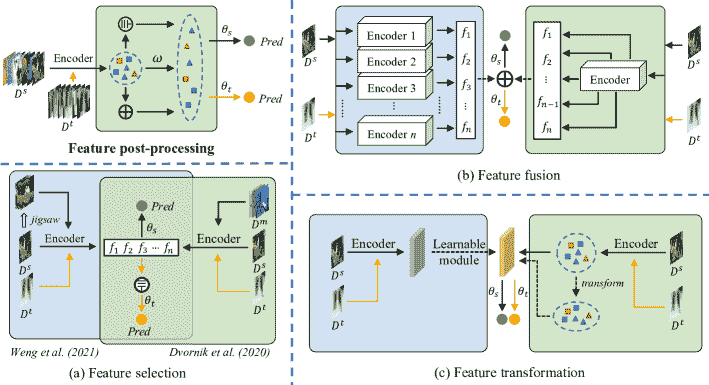

图 13\. 特征后处理类别。(a) 代表特征选择，其中选择最接近共享特征的信息进行知识转移。(b) 表示特征融合。各种特征被堆叠以逼近共享特征。图(b)的左右部分显示了待合并的特征来源。而(c) 表示特征变换，*即*通过转换原始特征获得共享特征，图(c)的左右部分表示不同的转换方式。

#### 3.3.1\. 特征选择

特征选择策略涉及识别最接近目标领域的特征，以作为最佳共享特征表示。这种方法通常与多领域实例的引入一起使用。该策略首先从不同的源领域获取多个特征，然后选择其中一些特征以辅助目标领域适应。如图 13 (a) 所示，(Weng et al., 2021) 提出了一个代表性多领域特征选择 (RMFS) 算法，用于优化多领域特征提取和选择过程。而 (Dvornik et al., 2020) 则通过训练一组特征提取器来提取多领域表示，然后自动选择与目标领域最相关的表示。

#### 3.3.2\. 特征融合 (堆叠)

特征融合是一种用于增强模型泛化能力的方法。如图 13 (b) 所示，这种策略将来自不同来源或维度的特征组合成一个单一表示，以提高目标领域的 FSL 性能。许多研究受到了 (Yosinski et al., 2014) 的影响，认为浅层的特征比深层的特征更具可迁移性。因此，(Adler et al., 2020) 提出了 CHEF 方法，该方法将深度神经网络的不同抽象层级统一为一个表示。此外，(Zou et al., 2021) 结合了中层特征以学习每个样本的区分信息。同样，(Du et al., 2021) 使用层次化原型模型将层次记忆中的信息合并为最终的原型特征。与浅层特征的融合不同，在 (Hassani, 2022) 中，图的表示通过将从采样任务中得到的图增强为三个视图：一个上下文视图和两个几何视图，并用专用编码器对每个视图进行编码。最后，使用注意力机制将表示聚合为一个单一的图表示。图 13 (b) 的右侧显示了来自不同网络层的特征被融合，而左侧显示了来自一组不同网络的特征被堆叠。

表 3\. 代表性特征后处理 CDFSL 方法。‘GR’ 代表几何正则化。

| 方法 | 发表场所 | 策略 | 特征操作 | 损失函数 | FG | Art | IW |
| --- | --- | --- | --- | --- | --- | --- | --- |
| RMFS (Weng et al., 2021) | IC-NIDC 2021 | 特征选择 | 提取多域特征并从中选择 | CE | ✓ | ✓ |  |
| SUR (Dvornik et al., 2020) | ECCV 2020 | 特征选择 | 利用多域特征库自主识别最相关的表示 | CE | ✓ | ✓ |  |
| CHEF (Adler et al., 2020) | arXiv 2020 | 特征融合 | 通过对网络中不同层次的 Hebbian 学习器进行集成来完成表示融合 | CE |  |  | ✓ |
| MLP (Zou et al., 2021) | ACM MM 2021 | 特征融合 | 加权融合中层特征并研究残差预测任务 | CE & $L_{2}$ | ✓ | ✓ |  |
| HVM (Du et al., 2021) | ICLR 2022 | 特征融合 | 中层特征在层次化原型模型中进行加权融合 | CE & KL |  |  | ✓ |
| TACDFSL (Zhang et al., 2022a) | Symmetry 2022 | 特征变换 | 提出自适应特征分布变换 | CE |  |  | ✓ |
| MemREIN (Xu et al., 2021) | IJCAI 2022 | 特征变换 | 探索实例归一化算法和记忆模块以变换原始特征 | CE & Contrastive | ✓ |  |  |
| RDC (Li et al., 2022a) | CVPR 2022 | 特征变换 | 通过双曲正切变换来变换和重加权原始特征 | CE & KL | ✓ |  | ✓ |
| StyleAdv (Fu et al., 2023) | arXiv 2023 | 特征变换 | 引入对初始风格的变异，使用签名风格梯度 | CE & KL | ✓ |  | ✓ |
| LRP (Sun et al., 2021) | ICPR 2020 | 特征变换 | 开发一个模型无关的解释指导训练策略，动态地寻找并强调对预测重要的特征 | CE | ✓ |  |  |
| BL-ES (Yuan et al., 2021) | ICME 2021 | 特征变换 | 通过 MPGN 模块优化一个归纳图网络（IGN），其中包含多个特征 | BCE & GR | ✓ |  | ✓ |
| DeepEMD-SA (Ding and Wang, 2021) | ISCIPT 2021 | 特征变换 | 使用注意力模块实现局部特征之间的互动 | CE |  |  | ✓ |
| FUM (Yuan et al., 2022a) | PR 2022 | 特征变换 | 使用遗忘更新模块来调节特征 | CE | ✓ | ✓ |  |
| ConFeSS (Das et al., 2022) | ICLR 2022 | 特征变换 | 利用掩码模块选择更适合目标领域的相关信息 | CE & Divergence |  |  | ✓ |
| TCT-GCN (Li et al., 2023) | SSRN 2023 | 特征变换 | 结合多层次特征融合和特征变换 | CE | ✓ |  | ✓ |
| StabPA (Chen et al., 2022a) | ECCV 2022 | 特征变换 | 通过学习原型紧凑的跨领域对齐表示来转换特征 | Softmax | ✓ | ✓ |  |

#### 3.3.3\. 特征变换

特征变换策略通过重新加权特征以提高性能，如图 13 (c)所示。一些方法通过变换和加权获得权重，*例如*图 13 (c)右侧的部分，而其他方法则使用可学习模块，*例如*图 13 (c)左侧的部分。对于前者类别，在(Zhang et al., 2022a)中，提出了 WDMDS（用于测量领域偏移的 Wasserstein 距离）和 MMDMDS（用于测量领域偏移的最大均值差异）来解决 CDFSL。(Xu et al., 2021)介绍了 MemREIN 框架，该框架考虑了记忆、恢复和实例归一化，*例如*探讨了一种实例归一化算法以缓解特征不相似性。而(Li et al., 2022a)通过构建非线性子空间和使用双曲正切变换来最小化任务无关特征，同时保留更多可迁移的判别信息。此外，(Fu et al., 2023)提出了一种新颖的模型无关的元样式对抗训练（StyleAdv）方法及一种新颖的样式对抗攻击方法用于 CDFSL。

此外，还有一些方法使用可学习的模块来确定特征权重。例如，(Sun et al., 2021) 计算中间特征的解释分数，并相应地重新加权它们。(Yuan et al., 2021) 通过训练双层策略（BL-ES）来获取特征权重。而 (Ding and Wang, 2021) 采用了一个基于局部描述符的模型 DeepEMD 上的注意力模块，以实现局部特征之间的交互。此外，(Yuan et al., 2022a) 通过使用遗忘-更新模块（FUM）提取关系嵌入来重新加权特征。最近，(Das et al., 2022) 使用了一个掩码模块来重新加权特征，选择那些更适合目标领域的特征。此外，(Li et al., 2023) 提出了一个任务上下文变换器和图卷积网络（TCT-GCN）方法。最后，一些方法通过结合领域适应和少样本学习方法来解决 CDFSL 问题。例如，(Chen et al., 2022a) 提出了 stabPA，以学习紧凑的、跨领域对齐的表示。

#### 3.3.4\. 讨论与总结

特征选择策略在多领域或辅助视图数据存在的情况下，有助于选择最适合目标领域的特征，如第 3.3.1 节所讨论。然而，当没有多个领域可用时，来自单一源领域的特征可能变异性有限，这意味着从同一源领域选择不同的特征可能不会显著改善目标领域 FSL 的性能。

特征融合策略（在第 3.3.2 节中介绍）旨在从多个来源获得特征，这些来源可以是同一网络中的不同层，或者是多个网络。然而，在前者的情况下，同一数据集和网络中的特征之间的相似性可能需要有效的融合方法，而在后者的情况下，使用多个网络可能会增加训练成本，因为需要同时训练。

特征变换（在第 3.3.3 节介绍）是一种常见的方法，当额外的网络和多领域数据不可用时使用。它涉及通过分配新参数对特征进行重新加权，可以通过简单的变换和加权，或通过可学习的模块实现。然而，这种策略仅允许有限的共享信息探索，因为它只对最终层输出的特征进行加权。

### 3.4\. 混合方法

CDFSL 中的混合方法结合了上述提到的策略，相关技术列在表 4 中。实例引导和基于参数的策略在 CDFSL 中很常见。例如，在(Liu et al., 2021)中提出了一种参数高效的多模式调制器。首先，调制器设计为在单个网络中保持多个调制参数（每个领域一个），从而实现单网络多领域表示。其次，它将调制参数分为领域特定集和领域协作集，以分别探索领域内信息和领域间关联。此外，(Zhuo et al., 2022)探索了一种新型的目标引导动态混合（TGDM）框架，以生成中间领域图像，帮助目标领域的 FSL 任务学习。此外，(Peng et al., 2020)通过利用多个领域来学习元学习器，这些元学习器在参数空间中结合，以作为目标领域中使用的网络的初始化参数。此外，研究人员还在 CDFSL 中探索了特征后处理和基于参数策略的组合。(Rao et al., 2023)通过来自不同任务和风格的特征融合任务和特征调制模块（FM）进行基于风格转移的任务增强。在(Wang et al., 2022a)中，提出了一种特征提取器堆叠（FES）方法，以结合来自多个骨干网络的信息。

表 4\. 代表性的混合 CDFSL 方法。“FCS”代表“计算机科学前沿”。

| 方法 | 场地 | 实例引导 | 特征后处理 | 基于参数 | 损失函数 | FG | 艺术 | IW |
| --- | --- | --- | --- | --- | --- | --- | --- | --- |
| CosML (Peng et al., 2020) | arXiv 2020 | 多领域 | 特征融合 | ✗ | CE | ✓ |  |  |
| URL (Li et al., 2021a) | ICCV 2021 | 多领域 | ✗ | 参数重新加权 | CE & CKA & KL | ✓ | ✓ |  |
| Meta-FDMixup (Fu et al., 2021) | ACM MM 2021 | 标记目标 | 特征变换 | ✗ | CE & KL | ✓ |  |  |
| Tri-M (Liu et al., 2021) | ICCV 2021 | 多领域 | ✗ | 参数重新加权 | CE | ✓ | ✓ |  |
| ME-D2N (Fu et al., 2022a) | ACM MM 2022 | 标记目标 | 特征转换 | ✗ | CE & KL | ✓ |  |  |
| TL-SS (Yuan et al., 2022b) | AAAI 2022 | 原始数据 | ✗ | 参数重加权 | CE & 量度 | ✓ |  | ✓ |
| TGDM (Zhuo et al., 2022) | ACM MM 2022 | 标记目标 | ✗ | 参数重加权 | CE | ✓ |  |  |
| TAML (Rao et al., 2023) | arXiv 2023 | 多领域 | 未来融合 | 参数重加权 | CE | ✓ |  | ✓ |
| TKD-Net (Ji et al., 2023) | FCS 2023 | 多领域 | 未来融合 | ✗ | CE & KL & $L_{2}$ | ✓ |  |  |

#### 3.4.1. 混合损失函数

一些研究不仅结合了上述策略，还使用了不同的损失函数，如对比损失、度量损失，*等等*。 (Fu et al., 2021) 倡导利用少量标记的目标数据来指导模型学习，并通过 CE 损失和 KL 损失进行优化。技术上，提出了一种新颖的 meta-FDMixup 网络，通过新颖的解缠模块和领域分类器提取解缠的领域无关和领域特定特征。而(Fu et al., 2022a) 跟随这种设置（引入少量标记的目标领域数据），并提出了一个多专家领域分解网络（ME-D2N）来解决 CDFSL。损失函数还包括 CE 和 KL 损失。(Zhang et al., 2022b) 提出了一个风格感知的情节训练与鲁棒对比学习（SET-RCL），使得学到的模型能够更好地适应具有领域特定风格的测试任务。TL-SS 策略 (Yuan et al., 2022b) 增强了任务的多视角，并提出了一个高阶关联编码器（HAE），以生成适当的参数，并使编码器灵活适应任何未见任务。该工作中的损失函数包括 CE 和量度损失。此外，(Li et al., 2021a) 通过使用适配器和中心化核对齐帮助对齐特征，从多个独立训练的网络中提取单一的深层通用表示。它通过 CKA、CE 和 KL 损失进行优化。此外，(Ji et al., 2023) 提出了团队知识蒸馏网络（TKD-Net），并探索了一种帮助多个教师合作的策略。

#### 3.4.2. 讨论与总结

在 CDFSL 中，正如 3.4 节中讨论的，结合多种策略可以提高性能。例如，实例引导策略通常容易融入各种方法，因此经常与其他方法结合。然而，结合策略也存在挑战。特征后处理和基于参数的策略的结合可能是不可预测的，并可能导致负迁移，因此它是一个较少被探索的选项。为了实现**最佳**结果，必须避免负迁移，并谨慎考虑混合方法中策略的组合。

## 4\. 性能

本节提供了跨领域少样本学习（CDFSL）模型评估过程的全面概述。为了评估这些模型的有效性，我们需要检查使用的适当数据集和基准。这在 4.1 和 4.2 节中进行了说明。在 4.3 节中，我们**深入探讨**了 CDFSL 领域各种方法类别的性能的彻底分析和比较。本节提供了对模型的关键评估，突出了不同方法在解决 CDFSL 挑战性问题时的优点和缺点。

### 4.1\. 数据集

CDFSL 模型的评估得益于带注释的数据集的可用性。通过使用这些数据集，使各种算法和架构的比较变得公平。数据集在复杂性、大小、注释数量和迁移难度上的持续增长代表了一个持续的挑战，推动了创新和优越技术的发展。5 表列出了 CDFSL 问题中最广泛使用的数据集，以下各节对每个数据集进行了详细描述：

表 5\. CDFSL 中的数据集详细信息。

| 数据集 | 来源 | 图像数量 | 图像大小 | 类别数量 | 内容 | 领域 | 参考 |
| --- | --- | --- | --- | --- | --- | --- | --- |
| miniImageNet | ImageNet | 60000 | $84\times 84$ | 100 | 对象分类 | 自然场景 | (Vinyals et al., 2016) |
| tieredImageNet | ImageNet | 779165 | $84\times 84$ | 608 | 对象分类 | 自然场景 | (Ren et al., 2018) |
| Plantae | iNat2017 | 196613 | 各异 | 2101 | 植物和动物分类 | 自然场景 | (Van Horn et al., 2018) |
| Places | N/A | 1000 万 | $200\times 200$ | 400+ | 场景分类 | 自然场景 | (Zhou et al., 2017) |
| Stanford Cars | N/A | 16185 | 各异 | 196 | 汽车细粒度分类 | 自然场景 | (Krause et al., 2013) |
| CUB | ImageNet | 11788 | $84\times 84$ | 200 | 鸟类细粒度分类 | 自然场景 | (Wah et al., 2011) |
| CropDiseases | N/A | 87000 | $256\times 256$ | 38 | 农作物叶片分类 | 自然场景 | (Mohanty et al., 2016) |
| EuroSAT | Sentinel-2 卫星 | 27000 | $64\times 64$ | 10 | 土地分类 | 遥感 | (Helber et al., 2019) |
| ISIC 2018 | N/A | 11720 | $600\times 450$ | 7 | 皮肤病变分类 | 医学 | (Tschandl et al., 2018) |
| ChestX | N/A | 100K | $1024\times 1024$ | 15 | 肺部疾病分类 | 医学 | (Wang et al., 2017) |
| Omniglot | N/A | 25260 | $28\times 28$ | 1623 | 字符分类 | 字符 | (Lake et al., 2011) |
| FGVC-Aircraft | N/A | 10200 | 各异 | 100 | 飞机细粒度分类 | 自然场景 | (Maji et al., 2013) |
| DTD | N/A | 5640 | 各异 | 47 | 纹理分类 | 自然场景 | (Cimpoi et al., 2014) |
| Quick Draw | Quick draw! | 5000 万 | $128\times 128$ | 345 | 手绘图像分类 | 艺术 | (Jongejan et al., 2016) |
| Fungi | N/A | 100000 | 各异 | 1394 | 真菌细粒度分类 | 自然场景 | (Schroeder and Cui, 2018) |
| VGG Flower | N/A | 8189 | 各异 | 102 | 花卉细粒度分类 | 自然场景 | (Nilsback and Zisserman, 2008) |
| Traffic Signs | N/A | 50000 | 各异 | 43 | 交通标志分类 | 自然场景 | (Houben et al., 2013) |
| MSCOCO | N/A | 150 万 | 各异 | 80 | 对象分类 | 自然场景 | (Lin et al., 2014) |

+   •

    miniImageNet (Vinyals et al., 2016)：miniImageNet 数据集由从 ImageNet 数据集中选取的 60000 张图片组成，共有 100 个类别。每个类别有 600 张图片，每张图片的大小为 $84\times 84$。

+   •

    tieredImageNet (Ren et al., 2018)：tieredImageNet 数据集从 ImageNet 数据集中选取，包括 34 个类别，每个类别包含 10-30 个子类别（类）。该数据集有 608 个类别和 779165 张图片。每个类别有多个样本，数量各异。

+   •

    Plantae (Van Horn et al., 2018)：Plantae 数据集是数据集 iNat2017 的一个子集。该数据集包含 2101 个类别和 196613 张图片。

+   •

    Places （Zhou 等，2017）：Places 数据集包含超过 1000 万张图像，覆盖 400 多个独特的场景类别。该数据集每个类别的训练图像数量从 5000 到 30000 不等，与实际世界中出现的频率一致。数据集中的图像大小为$200\times 200$。

+   •

    Stanford Cars （Krause 等，2013）：Cars 数据集是一个关于汽车的细粒度分类数据集。它包含 16185 张 196 个类别的汽车图像。数据分为 8144 张训练图像和 8041 张测试图像。

+   •

    CUB （Wah 等，2011）：CUB 数据集中的图像与 ImageNet 中的图像有重叠。它是一个关于鸟类的细粒度分类数据集，包含 11788 张图像，分为 200 个类别。该数据集中的图像大小为$84\times 84$。

+   •

    CropDiseases （Mohanty 等，2016）：CropDiseases 数据集包含约 87000 张健康和病变作物叶片的 RGB 图像，分为 38 个不同类别。整个数据集分为 80/20 的训练和验证集比例。数据集中的图像大小为$256\times 256$。

+   •

    EuroSAT （Helber 等，2019）：EuroSAT 是一个用于土地利用和土地覆盖分类的数据集。该数据集基于 Sentinel-2 卫星图像，包括 10 个类别，总共有 27000 张标注和地理参考的图像。每个类别包含 2000-3000 张图像，图像大小为$64\times 64$。

+   •

    ISIC 2018 （Tschandl 等，2018；Codella 等，2019）：ISIC 2018 数据集包括 10015 张来自 7 个类别的皮肤病变图像用于训练，193 张用于评估，1512 张用于测试。每张图像的大小为$600\times 450$。

+   •

    ChestX （Wang 等，2017）：ChestX-ray14 是目前 NIH 研究所提供的最大肺部 X 射线数据库，包含 14 种肺部疾病，类别 15 表示未发现疾病。该数据集中的图像大小为$1024\times 1024$。

+   •

    Omniglot （Lake 等，2011）：Omniglot 数据集包含 1623 个来自 50 种语言的手写字符，每种字符有 20 种不同的书写方式。数据集中每张图像的大小为$28\times 28$。

+   •

    FGVC-Aircraft （Maji 等，2013）：FGVC-Aircraft 数据集包括 10200 张飞机图像（102 种飞机模型，每种模型 100 张图像）。图像分辨率约为 1-2 百万像素。

+   •

    Describable Textures (DTD) （Cimpoi 等，2014）：DTD 是一个纹理数据库，包含 5640 张图像，按照人类感知启发的 47 个术语（类别）组织。每个类别有 120 张图像。图像尺寸范围在 300x300 到 640x640 之间。

+   •

    Quick Draw （Jongejan 等，2016）：Quick Draw 数据集是一个包含 50 百万幅图画的集合，涵盖 345 个类别，由游戏 Quick, Draw!的玩家贡献。

+   •

    Fungi (施罗德和崔, 2018)：该数据集包含 100000 张属于 1394 个不同类别的真菌图像，这些类别是丹麦公众所发现的所有真菌类。

+   •

    VGG Flower (尼尔斯巴克和齐瑟曼, 2008)：VGG Flower 数据集包含 8189 张属于 102 个类别的花卉图像。这些花卉是选择在英国常见的花朵。每个类别包含 40 到 258 张图像。

+   •

    Traffic Signs (侯本等, 2013)：Traffic Signs 数据集包含 50,000 张属于 43 个类别的德国道路标志图像。

+   •

    MSCOCO (林等, 2014)：MSCOCO 数据集中的图像来自 Flickr，包含 150 万个物体实例，属于 80 个类别，并通过边界框标注和定位。

### 4.2\. 基准

本节主要介绍了 CDFSL 问题的基准，包括 miniImageNet 和 CUB (mini-CUB)、一个标准的细粒度分类基准 (FGCB)、BSCD-FSL (郭等, 2020)。此外，Meta-Dataset (特里安塔夫卢等, 2019) 也被提出以评估 FSL 中的跨领域问题。由于 mini-CUB 已包含在 FGCB 中，我们主要介绍最后三个基准。

FGCB。一个传统的基准是在 CDFSL 早期阶段为细粒度 CDFSL (FG-CDFSL) 导出的。它包含五个数据集，包括 miniImageNet、Plantae (范霍恩等, 2018)、Places (周等, 2017)、Cars (克劳斯等, 2013) 和 CUB (瓦赫等, 2011)，其中我们通常将 miniImageNet 视为源领域，其他数据集视为目标领域。该基准中的所有图像均为自然图像。这个基准面临的主要挑战是将类别信息从粗略转移到细粒度。

BSCD-FSL (郭等, 2020)。作为一个更具挑战性的基准，BSCD-FSL 解决了基于成像方式的 CDFSL (IW-CDFSL) 问题。BSCD-FSL 包含五个数据集，包括 miniImageNet、CropDisease (莫汉提等, 2016)、EuroSAT (赫尔伯等, 2019)、ISIC (齐安德尔等, 2018; 科德拉等, 2019) 和 ChestX (王等, 2017)。CropDisease 是一个细粒度的作物叶片数据集，包含所有自然工业图像。EuroSAT、ISIC 和 ChestX 使用不同的成像方式。它们分别为卫星图像、皮肤病图像和放射学图像。

Meta-Dataset (Triantafillou et al., 2019)。Meta-Dataset 是一个大规模、多样化的基准测试，用于在现实和具有挑战性的少样本场景中测量各种图像分类模型，如 CDFSL。该数据集包含 10 个公开可用的自然图像数据集、手写字符和涂鸦数据集。这些数据集之所以被选择，是因为它们免费且易于获取，涵盖了各种视觉概念（自然和人工），并且类别定义的细粒度程度各异。因此，该基准测试可以解决基于细粒度（FG）和基于艺术的 CDFSL（Art）问题。同时，它打破了 FSL 中源数据和目标数据来自同一领域的要求，以及 N-way K-shot 形式任务的限制。它还引入了现实世界中的类别不平衡，即每个任务中的类别数量和训练集的大小都会发生变化。

除了上述常用的基准测试外，一些方法采用了最初为领域适应（DA）问题设计的基准测试。基准测试 DomainNet （Peng et al., 2019）（旨在解决基于艺术的跨领域问题）在 DA 中被广泛使用，包含 6 个领域，每个领域有 345 个类别的常见对象。此外，基准测试 Office-Home （Venkateswara et al., 2017）被一些研究用于 CDFSL，包含 4 个领域（艺术、剪贴画、产品和现实世界），每个领域有 65 个类别。该基准测试包含 15,500 张图像，每个类别平均 70 张图像，最多 99 张图像。

### 4.3\. 性能比较与分析

本节阐明了不同分类的 CDFSL 方法的比较性能。CDFSL 中使用的标准评估指标是预测准确率，评估通常在各种设置下进行，包括 5-way 1-shot、5-way 5-shot、5-way 20-shot 和 5-way 50-shot。由于 CDFSL 是 FSL 的一个子领域，许多经典的 FSL 方法可以直接应用于 CDFSL 问题。这些方法的结果显示在表 6 中，可以观察到，由于领域差距的存在，基于元学习的方法（MatchingNet、ProtoNet、RelationNet、MAML）在 CDFSL 中的性能略低于简单的微调迁移学习方法，尤其是当 $K$ 的值增加时，它们的表现相对较差。

表 6\. 在 ResNet10 主干网络下经典 FSL 方法的 CDFSL 性能。$K$ 是从 $5$-way $K$-shot 中的样本数量。

| K | 方法 | 作物疾病 | EuroSAT | ISIC | 胸部 X 光 | 植物界 | 地点 | 汽车 | CUB |
| --- | --- | --- | --- | --- | --- | --- | --- | --- | --- |
| 1 | 微调 (Guo et al., 2020) | 61.56±0.90 | 49.34±0.85 | 30.80±0.59 | 21.88±0.38 | 33.53±0.36 | 50.87±0.48 | 29.32±0.34 | 41.98±0.41 |
| MatchingNet (Vinyals et al., 2016) | 48.47±1.01 | 50.67±0.88 | 29.46±0.56 | 20.91±0.30 | 32.70 ± 0.60 | 49.86±0.79 | 30.77±0.47 | 35.89±0.51 |
| RelationNet (Sung et al., 2018) | 56.18±0.85 | 56.28±0.82 | 29.69±0.60 | 21.94±0.42 | 33.17±0.64 | 48.64±0.85 | 29.11±0.60 | 42.44±0.77 |
| ProtoNet (Snell et al., 2017) | 51.22±0.50 | 52.93±0.50 | 29.20±0.30 | 21.57±0.20 | - | - | - | - |
| GNN (Garcia and Bruna, 2017) | 64.48±1.08 | 63.69±1.03 | 32.02±0.66 | 22.00±0.46 | 35.60±0.56 | 53.10±0.80 | 31.79±0.51 | 45.69±0.68 |
| 5 | 微调 | 90.64±0.54 | 81.76±0.48 | 49.68±0.36 | 26.09±0.96 | 47.40±0.36 | 66.47±0.41 | 38.91±0.38 | 58.75±0.36 |
| MatchingNet | 66.39±0.78 | 64.45±0.63 | 36.74±0.53 | 22.40±0.70 | 46.53±0.68 | 63.16±0.77 | 38.99±0.64 | 51.37±0.77 |
| MAML | 78.05±0.68 | 71.70±0.72 | 40.13±0.58 | 23.48±0.96 | - | - | - | 47.20±1.10 |
| RelationNet | 68.99±0.75 | 61.31±0.72 | 39.41±0.58 | 22.96±0.88 | 44.00±0.60 | 63.32±0.76 | 37.33±0.68 | 57.77±0.69 |
| ProtoNet | 79.72±0.67 | 73.29±0.71 | 39.57±0.57 | 24.05±1.01 | - | - | - | 67.00±1.00 |
| GNN | 87.96±0.67 | 83.64±0.77 | 43.94±0.67 | 25.27±0.46 | 52.53±0.59 | 70.84±0.65 | 44.28±0.63 | 62.25±0.65 |
| 20 | 微调 | 95.91±0.72 | 87.97±0.42 | 61.09±0.44 | 31.01±0.59 | - | - | - | - |
| MatchingNet | 76.38±0.67 | 77.10±0.57 | 45.72±0.53 | 23.61±0.86 | - | - | - | - |
| MAML | 89.75±0.42 | 81.95±0.55 | 52.36±0.57 | 27.53±0.43 | - | - | - | - |
| RelationNet | 80.45±0.64 | 74.43±0.66 | 41.77±0.49 | 26.63±0.92 | - | - | - | - |
| ProtoNet | 88.15±0.51 | 82.27±0.57 | 49.50±0.55 | 28.21±1.15 | - | - | - | - |
| 50 | 微调 | 97.48±0.56 | 92.00±0.56 | 67.20±0.59 | 36.79±0.53 | - | - | - | - |
| MatchingNet | 58.53±0.73 | 54.44±0.67 | 54.58±0.65 | 22.12±0.88 | - | - | - | - |
| RelationNet | 85.08±0.53 | 74.91±0.58 | 49.32±0.51 | 28.45±1.20 | - | - | - | - |
| ProtoNet | 90.81±0.43 | 80.48±0.57 | 51.99±0.52 | 29.32±1.12 | - | - | - | - |

此外，由于目前的 CDFSL 方法具有各种实现要求（特定数据集、各种骨干网络等）和配置（训练集、学习范式、模块等），因此在统一和公平的基础上比较所有提出的 CDFSL 方法是不切实际的。然而，收集和展示一些代表性 CDFSL 方法的关键细节，包括它们的要求、配置和性能亮点，仍然是重要的。为此，我们在表 7 中总结了在常用基准 FGCB 和 BSCD-FSL 上评估的选定 CDFSL 方法的性能。1-shot 和 5-shot 的最佳结果分别以蓝色和红色突出显示。对不同方法类别的最新性能比较显示，增加实例的多样性以增加共享知识的量比其他旨在挖掘现有共享知识的方法更有效。混合方法在 FGCB 中表现最佳，利用了近领域转移中的多种策略的优势。CDFSL 中的另一个有前景的方向是将即插即用模块集成到现有的 FSL 模型中，如 MatchingNet、RelationNet 和 GNN，如图 14 所示。最近的结果表明，这些模块在应用于 GNN 时表现最佳，突显了 GNN 在处理 CDFSL 任务方面相对于 MatchingNet 和 RelationNet 的卓越能力。

表 7\. 提出的 CDFSL 方法在 BSCD-FSL 和 FGCB 基准上的性能。$K$ 代表 $5$-way $K$-shot。‘KBS’ 是知识基系统。

| 类型 | 方法 | 场地 | 训练集 | 骨干网络 | $K$ | CropDiseases | EuroSAT | ISIC | ChestX | Plantae | Places | Cars | CUB | 亮点 |
| --- | --- | --- | --- | --- | --- | --- | --- | --- | --- | --- | --- | --- | --- | --- |
| 实例引导 | NSAE (Liang et al., 2021) | ICCV | miniImageNet | ResNet10 | 5 | 93.31±0.42 | 84.33±0.55 | 55.27±0.62 | 27.30±0.42 | 62.15±0.77 | 73.17±0.72 | 58.30±0.75 | 71.92±0.77 | 利用源领域的潜在噪声信息来捕捉特征分布的更广泛变化。 |
| 20 | 98.33±0.18 | 92.34±0.35 | 67.28±0.61 | 35.70±0.47 | 77.40±0.65 | 82.50±0.59 | 82.32±0.50 | 88.09±0.48 |
| 50 | 99.29±0.14 | 95.00±0.26 | 72.90±0.55 | 38.52±0.71 | 83.63±0.60 | 85.92±0.56 | - | 91.00±0.79 |
| CosML (Peng et al., 2020) | arXiv | miniImageNet 汽车 / 地点 | Conv-4 | 1 | - | - | - | - | 30.93±0.46 | 53.96±0.62 | 47.74±0.59 | 46.89±0.59 | 探索多领域预训练方案以快速适应未见领域 |
| 5 | - | - | - | - | 42.96±0.57 | 88.08±0.46 | 60.17±0.63 | 66.15±0.63 |
| ISSNet (Xu and Liu, 2022) | arXiv | miniImageNet 其他 7 个数据集 | ResNet10 | 1 | 73.40±0.86 | 64.50±0.88 | 36.06±0.69 | 23.23±0.42 | - | - | - | - | 在多个来源之间迁移风格，以扩大标记来源的分布 |
| 5 | 94.10±0.41 | 83.64±0.55 | 51.82±0.67 | 28.79±0.48 | - | - | - | - |
| DSL (Hu et al., 2021) | ICLR | miniImageNet 目标数据 | ResNet10 | 1 | - | - | - | - | 41.17±0.80 | 53.16±0.88 | 37.13±0.69 | 50.15±0.80 | 在训练阶段通过快速切换目标将跨域场景纳入训练 |
| 5 | - | - | - | - | 62.10±0.75 | 74.10±0.72 | 58.53±0.73 | 73.57±0.65 |
| STARTUP (Phoo and Hariharan, 2020) | ICLR | miniImageNet 目标数据 | ResNet10 | 1 | 75.93±0.80 | 63.88±0.84 | 32.66±0.60 | 23.09±0.43 | - | - | - | - | 使用目标域中的未标记数据进行自我训练源表示 |
| 5 | 93.02±0.45 | 82.29±0.60 | 47.22±0.61 | 26.94±0.44 | - | - | - | - |
| DDA (Islam et al., 2021) | NIPS | miniImageNet 目标数据 | ResNet10 | 1 | 82.14±0.78 | 73.14±0.84 | 34.66±0.58 | 23.38±0.43 | - | - | - | - | 提出了一种基于动态蒸馏的方法来增强对未标记目标数据的利用 |
| 5 | 95.54±0.38 | 89.07±0.47 | 49.36±0.59 | 28.31±0.46 | - | - | - | - |
| Parameter-based | SB-MTL (Cai et al., 2020) | arXiv | miniImageNet | ResNet10 | 5 | 96.01±0.40 | 87.30±0.68 | 53.50±0.79 | 28.08±0.50 | - | - | - | - | 利用一阶 MAML 算法确定最佳初始化，并采用基于分数的 GNN 进行预测 |
| 20 | 99.61±0.09 | 96.53±0.28 | 70.31±0.72 | 37.70±0.57 | - | - | - | - |
| 50 | 99.85±0.06 | 98.37±0.18 | 78.41±0.66 | 43.04±0.66 | - | - | - | - |
| VDB (Yazdanpanah and Moradi, 2022) | CVPRW | miniImageNet | ResNet10 | 1 | 71.98±0.82 | 63.60±0.87 | 35.32±0.65 | 22.99±0.44 | - | - | - | - | 提出了一种通过引入“视觉领域桥”概念来缓解跨域设置中 BatchNorm 内部不匹配的无源方法 |
| 5 | 90.77±0.49 | 82.06±0.63 | 48.72±0.65 | 26.62±0.45 |  | - | - | - |
| 20 | 96.36±0.27 | 89.42±0.45 | 59.09±0.59 | 31.87±0.44 | - | - | - | - |
| 50 | 97.89±0.19 | 92.24±0.35 | 64.02±0.58 | 35.55±0.45 | - | - | - | - |
| ResNet18 | 1 | 75.46±0.76 | 67.76±0.83 | 33.22±0.58 | 22.28±0.41 | - | - | - | - |
| 5 | 93.11±0.42 | 85.29±0.52 | 47.48±0.61 | 25.25±0.42 | - | - | - | - |
| 20 | 97.61±0.21 | 91.93±0.37 | 58.89±0.59 | 29.49±0.42 | - | - | - | - |
| 50 | 98.40±0.16 | 93.95±0.30 | 64.23±0.58 | 32.37±0.47 | - | - | - | - |
| FGNN (Chen et al., 2022b) | KBS | miniImageNet | ResNet10 | 1 | - | - | - | - | 41.44±0.69 | 56.74±0.82 | 34.37±0.60 | 52.97±0.75 | 研究实例归一化和复原模块以提升性能 |
| 5 | - | - | - | - | 60.81±0.66 | 76.12±0.63 | 50.19±0.69 | 71.99±0.64 |
| MAP (林等，2021) | arXiv | miniImageNet | ResNet10 | 5 | 90.29±1.56 | 82.76±2.00 | 47.85±1.95 | 24.79±1.22 | 58.45±1.15 | 75.94±0.97 | 51.64±1.16 | 67.92±1.10 | 选择性地按顺序执行 SOTA 适应方法与模块化适应方法 |
| 20 | 95.22±1.13 | 88.11±1.78 | 60.16±2.70 | 30.21±1.78 | - | - | - | - |
| HVM (杜等，2021) | ICLR | miniImageNet | ResNet10 | 5 | 87.65±0.35 | 74.88±0.45 | 42.05±0.34 | 27.15±0.45 | - | - | - | - | 引入了一个层次化原型模型和一个层次化替代方案，通过灵活利用不同语义级别的特征来解决领域差距 |
| ReFine (哦等，2022) | ICMLW | miniImageNet | ResNet10 | 1 | 68.93±0.84 | 64.14±0.82 | 35.30±0.59 | 22.48±0.41 | - | - | - | - | 在适应目标数据之前随机化源领域的拟合参数 |
| 5 | 90.75±0.49 | 82.36±0.57 | 51.68±0.63 | 26.76±0.42 | - | - | - | - |
| 特征后处理 | CHEF (阿德勒等，2020) | arXiv | miniImageNet | ResNet18 | 5 | 86.87±0.27 | 74.15±0.27 | 41.26±0.34 | 24.72±0.14 | - | - | - | - | 通过在网络的不同层上操作的 Hebbian 学习者进行表示融合 |
| 20 | 94.78±0.12 | 83.31±0.14 | 54.30±0.34 | 29.71±0.27 | - | - | - | - |
| 50 | 96.77±0.08 | 86.55±0.15 | 60.86±0.18 | 31.25±0.20 | - | - | - | - |
| LRP (孙等，2021) | ICPR | miniImageNet | ResNet10 | 1 | - | - | - | - | 34.80±0.37 | 50.59±0.46 | 29.65±0.33 | 42.44±0.41 | 发展了一种由解释指导的训练策略，以识别重要特征 |
| 5 | - | - | - | - | 48.09±0.35 | 66.90±0.40 | 39.19±0.38 | 59.30±0.40 |
| Confess (达斯等，2022) | ICLR | miniImageNet | ResNet10 | 5 | 88.88±0.51 | 84.65±0.38 | 48.85±0.29 | 27.09±0.24 | - | - | - | - | 研究了一个对比学习和特征选择系统，以解决基础类别和新类别之间的领域差距 |
| 20 | 95.34±0.48 | 90.40±0.24 | 60.10±0.33 | 33.57±0.31 | - | - | - | - |
| 50 | 97.56±0.43 | 92.66±0.36 | 65.34±0.45 | 39.02±0.12 | - | - | - | - |
| BL-ES (袁等，2021) | ICME | miniImageNet | ResNet18 | 5 | - | 79.78±0.83 | - | - | - | - | 50.07±0.84 | 69.63±0.88 | 提出了一个双层情节策略，用于同时训练一个归纳图网络以进行学习比较和归纳 |
| TACDFSL (张等，2022a) | Symmetry | miniImageNet | WideResNet | 5 | 93.42±0.55 | 85.19±0.67 | 45.39±0.67 | 25.32±0.48 | - | - | - | - | 引入了经验边际分布测量 |
| 20 | 95.49±0.39 | 87.87±0.49 | 53.15±0.59 | 29.17±0.52 | - | - | - | - |
| 50 | 95.88±0.35 | 89.07±0.43 | 56.68±0.58 | 31.75±0.51 | - | - | - | - |
| RDC (Li et al., 2022a) | CVPR | miniImageNet | ResNet10 | 1 | 86.33±0.50 | 71.57±0.50 | 35.84±0.40 | 22.27±0.20 | 44.33±0.60 | 61.50±0.60 | 39.13±0.50 | 51.20±0.50 | 通过构建子空间来最小化与任务无关的特征 |
| 5 | 93.55±0.30 | 84.67±0.30 | 49.06±0.30 | 25.48±0.20 | 60.63±0.40 | 74.65±0.40 | 53.75±0.50 | 67.77±0.40 |
| Hybrid | FDMixup (Fu et al., 2021) | ACM MM | miniImageNet | ResNet10 | 1 | 66.23±1.03 | 62.97±1.01 | 32.48±0.64 | 22.26±0.45 | 37.89±0.58 | 53.57±0.75 | 31.14±0.51 | 46.38±0.68 | 利用少量标记的目标数据来指导模型学习 |
| 5 | 87.27±0.69 | 80.48±0.79 | 44.28±0.66 | 24.52±0.44 | 54.62±0.66 | 73.42±0.65 | 41.30±0.58 | 64.71±0.68 |
| TL-SS (Yuan et al., 2022b) | AAAI | miniImageNet | ResNet10 | 1 | - | 65.73 | - | - | - | 55.83 | 33.22 | 45.92 | 介绍了一种与领域无关的自监督学习方法 |
| 5 | - | 79.36 | - | - | - | 76.33 | 49.82 | 69.16 |
| TGDM (Zhuo et al., 2022) | ACM MM | miniImageNet | ResNet10 | 1 | - | - | - | - | 52.39±0.25 | 61.88±0.26 | 50.70±0.24 | 64.80±0.26 | 一种生成中间领域以促进 FSL 任务的方法 |
| 5 | - | - | - | - | 71.78±0.22 | 81.62±0.19 | 70.99±0.21 | 84.21±0.18 |
| ME-D2N (Fu et al., 2022a) | ACM MM | miniImageNet | ResNet10 | 1 | - | - | - | - | 52.89±0.83 | 60.36±0.86 | 49.53±0.79 | 65.05±0.83 | AME-D2N 利用多专家学习方法来创建模型 |
| 5 | - | - | - | - | 72.87±0.67 | 80.45±0.62 | 69.17±0.68 | 83.17±0.56 |

#### 4.3.1. 实例引导方法的评估

表 7 突出了一个显著趋势，即随着目标领域和源领域之间距离的增加，性能下降。例如，结果显示在 CropDiseases 上的成绩从 93.31%降至 ChestX 上的 27.30%（5-way 5-shot）。对比（Peng et al., 2020）和（Hu et al., 2021）也表明前者在地点（88.08%）和车辆（60.17%）上表现优于后者，但在其他两个数据集上表现不如后者（42.96%和 66.15% vs. 62.10%和 73.57%）。这种差异可以归因于训练数据的不同，因为前者将地点和车辆纳入训练过程，导致在这两个数据集上的过拟合。另一方面，（Phoo 和 Hariharan, 2020）和（Islam et al., 2021）在 BSCD-FSL 上的结果表明，将目标领域数据纳入训练过程可以提高目标领域的性能。然而，这种方法在近领域迁移中效果更好，而在远领域迁移中效果较差。例如，（Islam et al., 2021）在 CropDiseases 上提高了 4.90%，在 EuroSAT 上提高了 7.31%，但在 ISIC 上下降了 0.32%，在 ChestX 上仅提高了 2.22%，与经典的微调方法相比。

针对 CDFSL 的实例引导方法概念相对简单，因为它们依赖于添加补充信息以增强模型的泛化能力。然而，其有效性高度依赖于训练过程中使用的信息选择。如果训练中包含的附加领域与目标领域大相径庭，或者选择的目标领域样本不具代表性，这可能会对 CDFSL 性能产生负面影响。

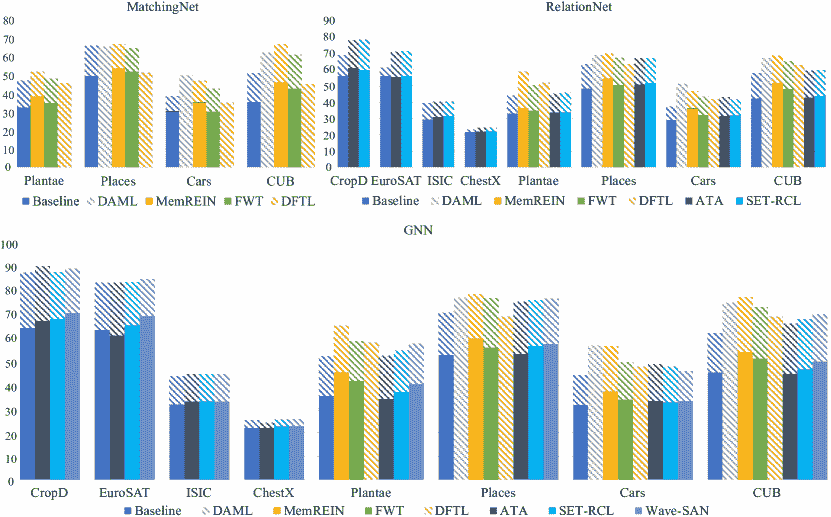

图 14\. 1-shot（实体区域）和 5-shot（虚线区域）方法的性能比较，这些方法提出了一个新颖的模块。所有方法都使用 ResNet10 作为骨干网络。“CropD”是数据集“CropDiseases”。

#### 4.3.2\. 基于参数的方法评估

从表格 7 中提供的数据来看，相比于其他两种方法类型，基于参数的方法的性能通常较差。以 ResNet10 为骨干网络，（Cai et al., 2020）在 BSCD-FSL（5-way 5-shot）上的结果展示了这一趋势，得分为 96.01%（CropDiseases）、87.30%（EuroSAT）、53.50%（ISIC）和 28.08%（ChestX）。这一类别中的其他方法结果甚至更低。当比较以 ResNet10（CropDiseases 90.77%，EuroSAT 82.06%，ISIC 48.72%，ChestX 26.62%）和 ResNet18（CropDiseases 93.11%，EuroSAT 85.29%，ISIC 47.48%，ChestX 25.25%）作为骨干网络用于 (Yazdanpanah 和 Moradi, 2022) 在 BSCD-FSL 上的表现时，可以观察到，虽然增加网络深度能提高在近域数据集（CropDiseases、EuroSAT）上的性能，但会降低在远域数据集（ISIC、ChestX）上的性能。因此，使用 ResNet10 作为骨干网络时，近域和远域性能的最佳平衡被实现了。

我们对表格 7 的分析揭示，基于参数的方法的性能往往低于前两类方法。这种情况的原因被认为是这些方法通过使用模块来调整网络参数以适应新领域。尽管这种减少假设空间的做法看似有利，但由于引入额外参数的有限性，实际上限制了方法对数据分布和假设空间的适应。因此，CDFSL 中的基于参数的方法通常在增强和挖掘共享知识方面面临局限，这使得相比于其他方法类别，更难解决两阶段的经验风险最小化问题。因此，研究人员需要探索能够克服这些限制的新方法和技术，以提升基于参数的方法在 CDFSL 中的性能。

#### 4.3.3. 特征后处理方法的评估

尽管由于使用了不同的骨干网络，直接比较不同特征后处理方法的性能具有挑战性，但仍可以注意到这些方法在远程领域任务上的表现可能不如实例引导方法。通过比较两个代表性的方法可以说明这一点： (Li et al., 2022a) 在 BSCD-FSL 上的结果（CropDiseases 为 93.55%、EuroSAT 为 84.67%、ISIC 为 49.06%、ChestX 为 25.48%）不如 (Liang et al., 2021) 在同一基准上的结果（CropDiseases 为 93.31%、EuroSAT 为 84.33%、ISIC 为 55.27%、ChestX 为 27.30%）。这种趋势在 FGCB 上的结果中也得到了反映（62.15%、73.17%、58.30%和 71.92% vs. 60.63%、74.65%、53.75%和 67.77%）。这些观察结果表明，尽管特征后处理方法仍然可以带来一些改进，但在解决 CDFSL 问题时，它们可能不如实例引导方法有效。

实例引导和特征后处理方法的结果比较揭示了它们在揭示源领域和目标领域之间共享知识的方式上的差异。实例引导方法优先在训练阶段引入额外信息，从而有效创建更有利的共享特征提取环境。另一方面，特征后处理方法旨在最大限度地利用有限的共享知识，这是一种更具限制性的方法。

#### 4.3.4. 混合方法的评估

目前，关于在 CDFSL 背景下探索混合方法的研究数量有限，但我们对这些工作的分析表明，这些混合方法在 FGCB 和 BSCD-FSL 中的表现与其他方法相当。例如，研究 (Yuan et al., 2022b) 在 Places、Cars 和 CUB 数据集上的结果分别为 76.33%、49.82%和 69.16%，这些结果与 (Lin et al., 2021) 在相同数据集上产生的 75.94%、51.64%和 67.92%的结果相似。值得注意的是，将不同类别方法的策略进行组合存在一定风险，因为不同策略之间可能存在负面交互。这突显了在混合方法中匹配策略时所需的高精度。最终，使用哪种方法取决于具体任务和可用数据，以及模型所需的泛化和灵活性水平。

#### 4.3.5. Meta-Dataset 上的评估

在 Meta-Dataset 上测试的技术（Triantafillou et al., 2019）使用了非情节训练，评估结果见表 8。评估采用了两种设置：单源设置（源领域为 ImageNet）和多源设置（源领域为前八个数据集）。在单源设置中，ProtoNet、MAML 和 Pro-MAML 作为基线与所提出的方法进行比较。结果表明，（Dvornik et al., 2020）在五个目标数据集上取得了最佳结果，而（Li et al., 2022b）在其余五个目标数据集上取得了最佳结果。此外，结果还表明，较深的骨干网络，如（Li et al., 2022b）中的 ResNet34，往往优于较浅的网络，如 ResNet18。多源设置模型的训练结果表明，（Li et al., 2022b）在所有目标数据集上取得了最高的性能。这被认为是由于该技术有效结合了多源和科学设计的参数重加权策略。使用 ResNet18 对（Li et al., 2022b）的两种设置进行比较，结果表明，多数据集的引入在八个已见数据集上显著提高了性能，但在一个未见数据集上只有适度的提升。这表明，引入多个领域而未加以慎重考虑可能不会显著提高性能。总之，所提出的方法相较于传统 FSL 技术显著提升了 CDFSL 性能，证明了这些方法在解决 CDFSL 问题上的有效性。

表 8. Meta-Dataset 上方法的 CDFSL 性能。 $\star$ 表示在已见数据集（源数据集）上的结果。

|  | 单源 | 多源 |
| --- | --- | --- |
|  | ProtoNet （Snell et al., 2017） | MAML （Finn et al., 2017） | Pro-MAML （Triantafillou et al., 2019） | SUR （Dvornik et al., 2020） | TPA （Li et al., 2022b） | tri-M （Liu et al., 2021） | RMFS （Weng et al., 2021） | TPA （Li et al., 2022b） | URL （Li et al., 2021a） |
| Backbone | ResNet18 | ResNet18 | ResNet18 | ResNet18 | ResNet18 | ResNet34 | ResNet18 | ResNet18 | ResNet18 | ResNet18 |
| ImageNet | 44.5 $\pm$ 1.1$\star$ | ${32.4\pm 1.0}{\star}$ | ${47.9\pm 1.1}{\star}$ | ${57.2\pm 1.1}{\star}$ | 59.5 $\pm$ 1.1$\star$ | ${63.7\pm 1.0}{\star}$ | ${58.6\pm 1.0}{\star}$ | 63.1 $\pm$ 0.8$\star$ | ${59.5\pm 1.0}{\star}$ | ${58.8\pm 1.1}{\star}$ |
| Omniglot | $79.6\pm 1.1$ | $71.9\pm 1.2$ | $82.9\pm 0.9$ | 93.2 $\pm$ 0.8 | $78.2\pm 1.2$ | $82.6\pm 1.1$ | $92.0\pm 0.6$ | 97.7 $\pm$ 0.5$\star$ | ${94.9\pm 0.4}{\star}$ | ${94.5\pm 0.4}{\star}$ |
| 飞机 | $71.1\pm 0.9$ | $52.8\pm 0.9$ | $74.2\pm 0.8$ | 90.1 $\pm$ 0.8 | $72.2\pm 1.0$ | $80.1\pm 1.0$ | $82.8\pm 0.7$ | ${65.1\pm 0.3}{\star}$ | 89.9 $\pm$ 0.4$\star$ | ${89.4\pm 0.4}{\star}$ |
| 鸟类 | $67.0\pm 1.0$ | $47.2\pm 1.1$ | $70.0\pm 1.0$ | 82.3 $\pm$ 0.8 | $74.9\pm 0.9$ | 83.4$\pm$0.8 | $75.3\pm 0.8$ | 84.1 $\pm$ 0.6$\star$ | ${81.1\pm 0.8}{\star}$ | ${80.7\pm 0.8}{\star}$ |
| 纹理 | $65.2\pm 0.8$ | $56.7\pm 0.7$ | $67.9\pm 0.8$ | $73.5\pm 0.7$ | 77.3 $\pm$ 0.7 | 79.6$\pm$0.7 | $71.2\pm 0.8$ | ${67.5\pm 0.9}{\star}$ | 77.5 $\pm$ 0.7$\star$ | ${77.2\pm 0.7}{\star}$ |
| 快速绘制 | $65.9\pm 0.9$ | $50.5\pm 1.2$ | $66.6\pm 0.9$ | 81.9 $\pm$ 1.0 | $67.6\pm 0.9$ | $71.0\pm 0.8$ | $77.3\pm 0.7$ | 86.2 $\pm$ 0.5$\star$ | ${81.7\pm 0.6}{\star}$ | ${82.5\pm 0.6}{\star}$ |
| 真菌 | $40.3\pm 1.1$ | $21.0\pm 1.0$ | $42.0\pm 1.1$ | 67.9 $\pm$ 0.9 | $44.7\pm 1.0$ | $51.4\pm 1.2$ | $48.5\pm 1.0$ | ${62.5\pm 0.6}{\star}$ | ${66.3\pm 0.8}{\star}$ | 68.1 $\pm$ 0.9$\star$ |
| VGG 花卉 | $86.9\pm 0.7$ | $70.9\pm 1.0$ | $88.5\pm 1.0$ | $88.4\pm 0.9$ | 90.9 $\pm$ 0.6 | 94.0 $\pm$ 0.5 | $90.5\pm 0.5$ | ${86.3\pm 0.3}{\star}$ | 92.2 $\pm$ 0.5$\star$ | ${92.0\pm 0.5}{\star}$ |
| 交通标志 | $46.5\pm 1.0$ | $34.2\pm 1.3$ | $34.2\pm 1.3$ | $67.4\pm 0.8$ | 82.5 $\pm$ 0.8 | $81.7\pm 0.9$ | $78.0\pm 0.6$ | $73.7\pm 0.4$ | 82.8 $\pm$ 1.0 | $63.3\pm 1.2$ |
| MSCOCO | $39.9\pm 1.1$ | $24.1\pm 1.1$ | $24.1\pm 1.1$ | $51.3\pm 1.0$ | 59.0 $\pm$ 1.0 | $61.7\pm 0.9$ | $52.8\pm 1.1$ | $56.2\pm 0.7$ | 57.6 $\pm$ 1.0 | $57.3\pm 1.0$ |
| MNIST | - | - | - | $90.8\pm 0.5$ | $93.9\pm 0.6$ | $94.6\pm 0.5$ | 96.2 $\pm$ 0.3 | - | 96.7 $\pm$ 0.4 | $94.7\pm 0.4$ |
| CIFAR 10 | - | - | - | $66.6\pm 0.8$ | 82.1 $\pm$ 0.7 | $86.0\pm 0.6$ | $75.4\pm 0.8$ | - | 82.9 $\pm$ 0.7 | $74.2\pm 0.8$ |
| CIFAR 100 | - | - | - | $58.3\pm 1.0$ | 70.7 $\pm$ 0.9 | $78.3\pm 0.8$ | $62.0\pm 1.0$ | - | 70.4 $\pm$ 0.9 | $63.6\pm 1.0$ |

## 5\. 未来工作

尽管在 CDFSL 方面取得了显著进展，但它仍然面临着独特的挑战，需要我们关注。因此，我们概述了未来几个有前景的研究方向，并分别从问题设置、应用和理论方面进行了讨论。

### 5.1\. 问题设置

基于主动学习的 CDFSL。在第 2.4.3 节中，我们讨论了由于领域差距和任务转移导致的源领域和目标领域之间共享知识有限的问题，这在源领域和目标领域差异较大且目标领域数据稀缺时尤为突出。为了解决这一挑战，至关重要的是找到扩展和充分利用源领域和目标领域之间共享信息的方法。主动学习 (AL)，即选择最有信息量的样本进行标注，已在领域适应 (Su et al., 2020; Ma et al., 2021) 和少样本学习 (Boney and Ilin, 2017; Müller et al., 2022) 中获得了越来越多的关注。例如，(Su et al., 2020) 提高了在分类和多样性中存在显著不确定性的样本的权重，以提升目标领域的识别性能。此外，(Boney and Ilin, 2017) 将 FSL 和 AL 结合成 FASL，一个用于训练文本分类模型的快速迭代平台。由于 AL 选择最具信息量的数据，它非常适合 CDFSL 问题，因为它可以促进跨领域和跨任务学习。因此，将 AL 纳入解决 CDFSL 问题是一个值得进一步研究的有前途的途径。

**传导式 CDFSL**。传导推理指通过观察特定的训练样本来预测个别测试样本。在训练样本有限而测试样本丰富的情况下，通过归纳推理生成的类别判别模型通常表现不佳。另一方面，传导推理利用未标记测试样本的信息来识别簇并提高分类准确性。许多研究成功应用传导推理解决 FSL 问题，取得了令人鼓舞的成果 (Liu et al., 2018; Qiao et al., 2019; Singh and Jamali-Rad, 2022)。作为 FSL 的一个子领域，利用传导推理来提升 CDFSL 性能是一个值得探索的前景。

增量 CDFSL。当前的 CDFSL 方法旨在处理目标领域的 FSL 任务，但通常会遭遇灾难性遗忘，导致源领域性能下降。然而，一个好的模型应当保留来自两个领域和任务的先前知识。然而，一个有效的模型必须保留来自两个领域和任务的先前知识。因此，解决 CDFSL 中的灾难性遗忘是一个重要问题。近年来，增量学习和持续学习的进展已被应用于 FSL，以应对任务增量问题（Tao et al., 2020; Zhang et al., 2021; Hersche et al., 2022）。例如，（Tao et al., 2020）稳定了网络拓扑，以最小化对先前类别的遗忘。相反，（Zhang et al., 2021）仅在每个增量会话中更新分类器，以避免抹去特征提取器的知识。受到这些技术的鼓舞，领域增量的未来研究也是至关重要的。因此，这种设置的目标是训练模型扩展到新领域和任务，同时保持对先前领域和任务的性能。

可解释性引导的 CDFSL。当前的 CDFSL 技术依赖于黑箱特征生成，这阻碍了对哪些特征对泛化最优以及哪些因素影响模型性能的理解。最近的研究（Sa et al., 2022）引入了注意力机制，以识别每个样本区域的重要性。然而，这种方法在跨领域和跨任务设置中仍需改进。最近，（Yue et al., 2020; Teshima et al., 2020）引入了因果推理，以解释 FSL 中因素之间的因果关系，使模型更具可解释性，并能够获得共享知识。例如，（Yue et al., 2020）提出了结构因果模型（SCM），以挖掘 FSL 中预训练知识、样本特征和标签之间的因果关系。因此，专注于可解释性引导的特征表示的研究是一个有前景的方向，以提高 CDFSL 模型的性能。

多模态/多视角 CDFSL。我们可以通过结合来自不同模态的附加模态信息来增强 CDFSL 的性能，因为在零样本学习中已证明，来自不同模态的信息可以帮助处理未见过的任务（Wang et al., 2019b）。特别是，多模态 CDFSL 可以提供来自不同视角的额外见解，进一步提升 CDFSL 的性能。因此，探索多模态 CDFSL 是一个值得追求的有前景的研究方向。

不平衡 CDFSL。目前的 CDFSL 任务假设各类别中标记样本数量相等，这可能无法准确反映现实情况。尽管如此，现有的 FSL 研究已经通过数据增强和类别不平衡损失等技术解决了数据不平衡问题。例如，（Chao 和 Zhang，2021）提出了一种数据增强方法来重新平衡原始不平衡数据，而（Zhang 等，2020）则建议使用类别不平衡损失来解决 FSL 中的不平衡问题。因此，这些技术可以适应于解决 CDFSL 中的不平衡问题。

### 5.2. 应用

由于 CDFSL 可以同时解决领域和任务偏移问题以及少样本学习问题，因此它已在数据有限的各种计算机视觉（CV）领域中找到了应用。本节将重点介绍一些有前景的 CDFSL 应用，包括检测稀有癌症形式（Li 和 Niu，2022）、目标跟踪（Bertinetto 等，2016）、智能故障诊断（Feng 等，2022）以及解决 AI 算法偏见，*等等*。

稀有癌症检测。癌症是一种严重的疾病，需要早期检测。稀有癌症的检测尤其关键，因为数据稀缺。几项研究使用了少样本学习来解决稀有癌症检测的问题（Akinrinade 等，2022；Xu 等，2022）。然而，获取大量与目标数据分布相同的辅助数据通常很具挑战性，这就需要在稀有癌症检测中使用 CDFSL。CDFSL 允许利用来自其他领域的辅助数据，显著放宽了 FSL 中对源数据的限制，并提高了由于医学样本稀少导致的低检测率。因此，CDFSL 是克服稀有癌症检测挑战的有前景的方法。

目标跟踪。目标跟踪（Yilmaz 等，2006）是一个关键的计算机视觉任务，需要根据第一帧中的初始位置预测后续帧中所选对象的位置。这个任务与 FSL 任务设置非常相似，涉及使用最少的数据进行分类。因此，一些研究人员（Zhou 等，2021）将 FSL 应用于目标跟踪。然而，由于设备和数据采集方法的变化，辅助数据和目标数据之间经常存在领域差距。现有的 FSL 技术尚未有效解决这些领域差距。因此，CDFSL 已成为解决目标跟踪挑战的有前景的方向。

智能故障诊断。智能故障诊断（**Feng et al., 2022**）是利用各种诊断方法在早期阶段检测机器故障的过程。然而，为智能诊断模型建立理想的数据集是一项具有挑战性的任务。为了解决这个问题，（**Liu et al., 2020b**）引入了来自其他领域的数据，并利用了少样本算法。因此，智能故障诊断代表了 **CDFSL** 的一个有前景的应用方向。

解决算法偏见。AI 算法目前依赖训练数据来解决许多现实生活中的问题。然而，数据中的固有偏见可能会被算法编译和放大。例如，当数据集中某一特定组的信息较少时，基于该数据集训练的算法可能会对该组做出较差的预测，从而导致算法偏见（**Kleinberg et al., 2018**）。这是人工智能中的一个关键伦理问题。一个好的 AI 算法应该减少数据集中的偏见，而不是放大它。**CDFSL** 是解决算法偏见的潜在探索方向，因为它专注于减少数据集中的偏见，并通过解决领域转移和任务转移来泛化到新领域和任务。此外，**CDFSL** 可以帮助最小化由于数据集中某个特定组样本较少而造成的性能损失。

### 5.3\. 理论

不变风险最小化（**IRM**）。机器学习系统常常会拾取训练数据中的所有相关性，包括由于数据偏差而产生的虚假相关性。为了确保对新环境的泛化，关键在于丢弃那些在未来不再成立的虚假相关性。不变风险最小化（**IRM**）是由（Arjovsky et al., 2019）提出的一种学习范式，它通过从多个训练环境中估计非线性、不变的因果预测因子，以减轻机器学习系统对数据偏差的过度依赖。尽管仍处于探索的早期阶段，但由于源领域和目标领域之间任务的迁移，**IRM** 对于 **CDFSL** 是至关重要的。在 **CDFSL** 中，必须在适应目标领域任务时丢弃在源领域中学到的虚假相关性，这使得 **IRM** 的开发对 **CDFSL** 来说十分重要。通过探索 **IRM** 对 **CDFSL** 的应用，我们可以显著提升 **CDFSL** 中目标领域的性能。

多源领域组织。虽然当前一些 CDFSL 的工作旨在利用多个源领域来提升目标领域上的 FSL 性能，但在如何有效组织这些源领域方面仍然存在有限的理论研究，包括如何选择和利用它们以最大化 FSL 性能。在这一领域发展相关的理论研究可以极大地推动多源领域在 CDFSL 中的应用。关于这一点，*Mansour 等人*（2008）提供了一个优秀的参考方向，提供了组织多源领域的理论支持。这可能会导致更合理、更优秀的多源领域 CDFSL 工作。

领域泛化。CDFSL 的进一步目标不仅是对特定领域进行泛化，而是对所有领域进行泛化。对领域泛化的理论研究（Wang 等，2022b）对于支持这一目标至关重要。利用这些研究，CDFSL 可以转化为一个少样本领域泛化学习问题，最终使模型能够跨各种领域进行泛化。

## 6. 结论

跨领域少样本学习（CDFSL）是少样本学习（FSL）的一种分支，它允许模型利用来自其他领域的样本来提升目标领域上的 FSL 性能，从而消除 FSL 中源领域和目标领域必须相同的限制。这减少了为各种工业应用收集大量监督数据的负担。在本综述中，我们对 CDFSL 进行了彻底而系统的回顾，从监督学习的定义、简单的 FSL 问题，逐步引入 CDFSL 的定义。我们探讨了 CDFSL 与相关主题（如半监督领域适应、无监督领域适应、领域泛化、少样本学习和多任务学习）之间的相似性和区别。此外，我们揭示了 CDFSL 的主要挑战，即不可靠的两阶段经验风险最小化以及获取优秀共享特征的困难。我们将应对这些挑战的不同方法分类为实例引导、基于参数、特征后处理和混合方法，并审查了每种方法的优缺点。我们还介绍了 CDFSL 中使用的数据集和基准，以及不同技术的性能。最后，我们讨论了 CDFSL 的未来方向，包括问题设置、应用和理论的探索。

## 参考文献

+   (1)

+   Adler 等人（2020）*Thomas Adler, Johannes Brandstetter, Michael Widrich, Andreas Mayr, David Kreil, Michael Kopp, Günter Klambauer, 和 Sepp Hochreiter.* 2020. 通过表示融合实现跨领域少样本学习。*arXiv 预印本 arXiv:2010.06498*（2020）。

+   Akinrinade et al. (2022) Olusoji Akinrinade, Chunglin Du, Samuel Ajila, 和 Toluwase A Olowookere。2022 年。深度学习和少样本学习在皮肤癌检测中的应用概述。发表于*未来技术会议（FTC）2022 年会论文集，第 1 卷*。Springer，第 275–286 页。

+   Arjovsky et al. (2019) Martin Arjovsky, Léon Bottou, Ishaan Gulrajani, 和 David Lopez-Paz。2019 年。不变风险最小化。*arXiv 预印本 arXiv:1907.02893*（2019 年）。

+   Bertinetto et al. (2016) Luca Bertinetto, João F Henriques, Jack Valmadre, Philip Torr, 和 Andrea Vedaldi。2016 年。学习前馈单次学习器。*神经信息处理系统进展* 29（2016 年）。

+   Boney and Ilin (2017) Rinu Boney 和 Alexander Ilin。2017 年。利用原型网络进行半监督和主动少样本学习。*arXiv 预印本 arXiv:1711.10856*（2017 年）。

+   Cai et al. (2020) John Cai, Bill Cai, 和 Sheng Mei Shen。2020 年。SB-MTL：基于评分的元转移学习用于跨域少样本学习。*arXiv 预印本 arXiv:2012.01784*（2020 年）。

+   Carey and Bartlett (1978) Susan Carey 和 Elsa Bartlett。1978 年。获得一个新的单词。 (1978 年)。

+   Chao and Zhang (2021) Xuewei Chao 和 Lixin Zhang。2021 年。基于数据增强的少样本不平衡分类。*多媒体系统*（2021 年），1–9。

+   Chen et al. (2022a) Wentao Chen, Zhang Zhang, Wei Wang, Liang Wang, Zilei Wang, 和 Tieniu Tan。2022a 年。通过学习紧凑和对齐的表征实现跨域跨集少样本学习。发表于*欧洲计算机视觉会议*。Springer，第 383–399 页。

+   Chen et al. (2019) Wei-Yu Chen, Yen-Cheng Liu, Zsolt Kira, Yu-Chiang Frank Wang, 和 Jia-Bin Huang。2019 年。对少样本分类的深入探讨。发表于*国际学习表征会议*。

+   Chen et al. (2022b) Yu Chen, Yunan Zheng, Zhenyu Xu, Tianhang Tang, Zixin Tang, Jie Chen, 和 Yiguang Liu。2022b 年。基于轻量级 Res2Net 和灵活 GNN 的跨域少样本分类。*知识基础系统* 247（2022 年），108623。

+   Cimpoi et al. (2014) Mircea Cimpoi, Subhransu Maji, Iasonas Kokkinos, Sammy Mohamed, 和 Andrea Vedaldi。2014 年。描述野外的纹理。发表于*IEEE 计算机视觉与模式识别会议论文集*。3606–3613。https://www.robots.ox.ac.uk/vgg/data/dtd/。

+   Codella et al. (2019) Noel Codella, Veronica Rotemberg, Philipp Tschandl, M Emre Celebi, Stephen Dusza, David Gutman, Brian Helba, Aadi Kalloo, Konstantinos Liopyris, Michael Marchetti, 等人。2019 年。皮肤病变分析以检测黑色素瘤 2018：由国际皮肤成像合作组织（ISIC）主办的挑战赛。*arXiv 预印本 arXiv:1902.03368*（2019 年）。

+   Das et al. (2022) Debasmit Das, Sungrack Yun, 和 Fatih Porikli。2022 年。ConfeSS：用于单一来源跨域少样本学习的框架。发表于*国际学习表征会议*。

+   Ding 和 Wang (2021) Yuan Ding 和 Ping Wang. 2021. 基于局部特征关联的跨领域少样本学习方法研究. 在 *2021 年第六届计算机与信息处理技术国际研讨会 (ISCIPT)* 中. IEEE, 754–759.

+   Du 等 (2021) Yingjun Du、Xiantong Zhen、Ling Shao 和 Cees GM Snoek. 2021. 用于跨领域少样本学习的分层变分记忆. *arXiv 预印本 arXiv:2112.08181* (2021).

+   Dvornik 等 (2020) Nikita Dvornik、Cordelia Schmid 和 Julien Mairal. 2020. 从多领域表示中选择相关特征用于少样本分类. 在 *欧洲计算机视觉会议* 中. Springer, 769–786.

+   Fei-Fei 等 (2006) Li Fei-Fei、Robert Fergus 和 Pietro Perona. 2006. 单次学习物体类别. *IEEE 计算机视觉与模式分析汇刊* 28, 4 (2006), 594–611.

+   Feng 等 (2022) Yong Feng、Jinglong Chen、Jingsong Xie、Tianci Zhang、Haixin Lv 和 Tongyang Pan. 2022. 元学习作为一种有前途的少样本跨领域故障诊断方法: 算法、应用和前景. *知识驱动系统* 235 (2022), 107646.

+   Finn 等 (2017) Chelsea Finn、Pieter Abbeel 和 Sergey Levine. 2017. 模型无关的元学习用于深度网络的快速适应. 在 *国际机器学习会议* 中. PMLR, 1126–1135.

+   Fu 和 Mui (1981) King-Sun Fu 和 JK Mui. 1981. 图像分割的综述. *模式识别* 13, 1 (1981), 3–16.

+   Fu 等 (2021) Yuqian Fu、Yanwei Fu 和 Yu-Gang Jiang. 2021. Meta-fdmixup: 通过标记目标数据引导的跨领域少样本学习. 在 *第 29 届 ACM 国际多媒体会议论文集* 中. 5326–5334.

+   Fu 等 (2022a) Yuqian Fu、Yu Xie、Yanwei Fu、Jingjing Chen 和 Yu-Gang Jiang. 2022a. ME-D2N: 多专家领域分解网络用于跨领域少样本学习. 在 *第 30 届 ACM 国际多媒体会议论文集* 中. 6609–6617.

+   Fu 等 (2022b) Yuqian Fu、Yu Xie、Yanwei Fu、Jingjing Chen 和 Yu-Gang Jiang. 2022b. Wave-SAN: 基于小波的风格增强网络用于跨领域少样本学习. *arXiv 预印本 arXiv:2203.07656* (2022).

+   Fu 等 (2023) Yuqian Fu、Yu Xie、Yanwei Fu 和 Yu-Gang Jiang. 2023. 跨领域少样本学习的 Meta Style 对抗训练. [`doi.org/10.48550/ARXIV.2302.09309`](https://doi.org/10.48550/ARXIV.2302.09309)

+   Gao 等 (2022) Yipeng Gao、Lingxiao Yang、Yunmu Huang、Song Xie、Shiyong Li 和 Wei-Shi Zheng. 2022. AcroFOD: 一种自适应的跨领域少样本物体检测方法. 在 *欧洲计算机视觉会议* 中. Springer, 673–690.

+   Garcia 和 Bruna (2017) Victor Garcia 和 Joan Bruna. 2017. 基于图神经网络的少样本学习. *arXiv 预印本 arXiv:1711.04043* (2017).

+   Gong 等 (2023) Yuxuan Gong、Yuqi Yue、Weidong Ji 和 Guohui Zhou. 2023. 基于伪 Siamese 神经网络的跨领域少样本学习. *科学报告* 13, 1 (2023), 1427.

+   Guan et al. (2020) Jiechao Guan, Manli Zhang, 和 Zhiwu Lu. 2020. 大规模跨域少样本学习。在 *亚洲计算机视觉会议*。

+   Guo et al. (2020) Yunhui Guo, Noel C Codella, Leonid Karlinsky, James V Codella, John R Smith, Kate Saenko, Tajana Rosing, 和 Rogerio Feris. 2020. 跨域少样本学习的更广泛研究。在 *欧洲计算机视觉会议*。Springer，124–141。

+   Hassani (2022) Kaveh Hassani. 2022. 跨域少样本图分类。 *arXiv 预印本 arXiv:2201.08265* (2022)。

+   Helber et al. (2019) Patrick Helber, Benjamin Bischke, Andreas Dengel, 和 Damian Borth. 2019. Eurosat：用于土地利用和土地覆盖分类的新数据集和深度学习基准。 *IEEE 应用地球观测与遥感精选专题期刊* 12，7 (2019)，2217–2226。 [`github.com/phelber/eurosat`](https://github.com/phelber/eurosat)。

+   Hersche et al. (2022) Michael Hersche, Geethan Karunaratne, Giovanni Cherubini, Luca Benini, Abu Sebastian, 和 Abbas Rahimi. 2022. 受限的少样本类别增量学习。在 *IEEE/CVF 计算机视觉与模式识别会议 (CVPR) 会议录*。9057–9067。

+   Houben et al. (2013) Sebastian Houben, Johannes Stallkamp, Jan Salmen, Marc Schlipsing, 和 Christian Igel. 2013. 现实世界图像中的交通标志检测：德国交通标志检测基准。在 *2013 年国际神经网络联合会议 (IJCNN)*。IEEE，1–8。 [`www.kaggle.com/datasets/meowmeowmeowmeowmeow/gtsrb-german-traffic-sign`](https://www.kaggle.com/datasets/meowmeowmeowmeowmeow/gtsrb-german-traffic-sign)。

+   Hu and Ma (2022) Yanxu Hu 和 Andy J Ma. 2022. 用于跨域少样本分类的对抗特征增强。在 *欧洲计算机视觉会议*。Springer，20–37。

+   Hu et al. (2022) Zhengping Hu, Zijun Li, Xueyu Wang, 和 Saiyue Zheng. 2022. 基于无监督描述符选择的元学习网络用于少样本分类。 *模式识别* 122 (2022)，108304。

+   Hu et al. (2021) Zhengdong Hu, Yifan Sun, 和 Yi Yang. 2021. 切换以泛化：跨域少样本分类的领域切换学习。在 *国际学习表征会议*。

+   Islam et al. (2021) Ashraful Islam, Chun-Fu Richard Chen, Rameswar Panda, Leonid Karlinsky, Rogerio Feris, 和 Richard J Radke. 2021. 用于跨域少样本识别的动态蒸馏网络，支持未标记数据。 *神经信息处理系统进展* 34 (2021)，3584–3595。

+   Ji et al. (2023) Zhong Ji, Jingwei Ni, Xiyao Liu, 和 Yanwei Pang. 2023. 教师合作：多领域少样本学习的团队知识蒸馏。 *计算机科学前沿* 17，2 (2023)，172312。

+   Jongejan et al. (2016) Jonas Jongejan, Henry Rowley, Takashi Kawashima, Jongmin Kim, 和 Nick Fox-Gieg. 2016. 快速画图！- AI 实验。 *加州山景城，访问日期* 2018 年 2 月 17 日 (2016)，4。 [`github.com/googlecreativelab/quickdraw-dataset`](https://github.com/googlecreativelab/quickdraw-dataset)。

+   Kleinberg et al. (2018) Jon Kleinberg, Jens Ludwig, Sendhil Mullainathan, 和 Ashesh Rambachan. 2018. 算法公平性. 见 *AEA 论文与会议记录*，第 108 卷。22–27。

+   Krause et al. (2013) Jonathan Krause, Michael Stark, Jia Deng, 和 Li Fei-Fei. 2013. 用于细粒度分类的 3D 对象表示. 见 *IEEE 国际计算机视觉会议论文集*，554–561. http://ai.stanford.edu/j̃krause/cars/car_dataset.html。

+   Lake et al. (2011) Brenden Lake, Ruslan Salakhutdinov, Jason Gross, 和 Joshua Tenenbaum. 2011. 简单视觉概念的单次学习. 见 *认知科学学会年会论文集*，第 33 卷。https://github.com/brendenlake/omniglot。

+   LeCun et al. (2015) Yann LeCun, Yoshua Bengio, 和 Geoffrey Hinton. 2015. 深度学习. *nature* 521, 7553 (2015), 436–444。

+   Lee et al. (2022) Wei-Yu Lee, Jheng-Yu Wang, 和 Yu-Chiang Frank Wang. 2022. 跨领域少样本分类的领域无关元学习. 见 *ICASSP 2022-2022 IEEE 国际声学、语音与信号处理会议（ICASSP）*。IEEE，1715–1719。

+   Li and Niu (2022) Li Li 和 Zhendong Niu. 2022. 通过特征重标定和知识转移的少样本肿瘤检测. 见 *2021 国际自主无人系统会议（ICAUS 2021）论文集*。Springer，2606–2615。

+   Li et al. (2021b) Mingxi Li, Ronggui Wang, Juan Yang, Lixia Xue, 和 Min Hu. 2021b. 知识转移的多领域少样本图像识别. *Neurocomputing* 442 (2021), 64–72。

+   Li et al. (2022a) Pan Li, Shaogang Gong, Chengjie Wang, 和 Yanwei Fu. 2022a. 跨领域少样本学习中的排名距离校准. 见 *IEEE/CVF 计算机视觉与模式识别会议论文集*，9099–9108。

+   Li et al. (2023) Pengfang Li, Fang Liu, Licheng Jiao, Lingling Li, Puhua Chen, 和 Shuo Li. 2023. 用于跨领域少样本学习的任务上下文变换器和 Gcn. *可在 SSRN 4342068 上获得* (2023)。

+   Li et al. (2021a) Wei-Hong Li, Xialei Liu, 和 Hakan Bilen. 2021a. 来自多个领域的通用表示学习用于少样本分类. 见 *IEEE/CVF 国际计算机视觉会议论文集*，9526–9535。

+   Li et al. (2022b) Wei-Hong Li, Xialei Liu, 和 Hakan Bilen. 2022b. 具有任务特定适配器的跨领域少样本学习. 见 *IEEE/CVF 计算机视觉与模式识别会议论文集*，7161–7170。

+   Li et al. (2022c) Wei-Hong Li, Xialei Liu, 和 Hakan Bilen. 2022c. 通用表示：对多任务和领域学习的统一视角. *arXiv 预印本 arXiv:2204.02744* (2022)。

+   Liang et al. (2021) Hanwen Liang, Qiong Zhang, Peng Dai, 和 Juwei Lu. 2021. 通过噪声增强的监督自编码器提升跨领域少样本学习的泛化能力. 见 *IEEE/CVF 国际计算机视觉会议论文集*，9424–9434。

+   Lin et al. (2014) Tsung-Yi Lin, Michael Maire, Serge Belongie, James Hays, Pietro Perona, Deva Ramanan, Piotr Dollár, 和 C Lawrence Zitnick。2014。Microsoft coco：上下文中的常见对象。在 *欧洲计算机视觉会议*。Springer，740–755。https://cocodataset.org/#download。

+   Lin et al. (2021) Xiao Lin, Meng Ye, Yunye Gong, Giedrius Buracas, Nikoletta Basiou, Ajay Divakaran, 和 Yi Yao。2021。跨领域少样本学习的模块化适应。*arXiv 预印本 arXiv:2104.00619*（2021）。

+   Liu et al. (2020b) Chao Liu, Chengjin Qin, Xi Shi, Zengwei Wang, Gang Zhang, 和 Yunting Han。2020b。TScatNet：一种可解释的跨领域智能诊断模型，具有抗噪声和少样本学习能力。*IEEE 仪器与测量学报* 70（2020），1–10。

+   Liu et al. (2020a) Li Liu, Wanli Ouyang, Xiaogang Wang, Paul Fieguth, Jie Chen, Xinwang Liu, 和 Matti Pietikäinen。2020a。通用目标检测的深度学习：综述。*国际计算机视觉期刊* 128（2020），261–318。

+   Liu et al. (2023) Xiyao Liu, Zhong Ji, Yanwei Pang, 和 Zhi Han。2023。自学跨领域少样本学习，结合弱监督对象定位和任务分解。*知识基础系统*（2023），110358。

+   Liu et al. (2018) Yanbin Liu, Juho Lee, Minseop Park, Saehoon Kim, Eunho Yang, Sung Ju Hwang, 和 Yi Yang。2018。学习传播标签：少样本学习的传导传播网络。*arXiv 预印本 arXiv:1805.10002*（2018）。

+   Liu et al. (2021) Yanbin Liu, Juho Lee, Linchao Zhu, Ling Chen, Humphrey Shi, 和 Yi Yang。2021。用于多领域少样本分类的多模态调制器。在 *IEEE/CVF 国际计算机视觉会议论文集*。8453–8462。

+   Lu et al. (2020) Jiang Lu, Pinghua Gong, Jieping Ye, 和 Changshui Zhang。2020。从极少样本中学习：综述。*arXiv 预印本 arXiv:2009.02653*（2020）。

+   Ma et al. (2021) Xinhong Ma, Junyu Gao, 和 Changsheng Xu。2021。主动通用领域适应。在 *IEEE/CVF 国际计算机视觉会议论文集*。8968–8977。

+   Magnenat-Thalmann 和 Thalmann (2012) Nadia Magnenat-Thalmann 和 Daniel Thalmann。2012。*图像合成：理论与实践*。Springer 科学与商业媒体。

+   Maji et al. (2013) Subhransu Maji, Esa Rahtu, Juho Kannala, Matthew Blaschko, 和 Andrea Vedaldi。2013。细粒度视觉分类的飞机。*arXiv 预印本 arXiv:1306.5151*（2013）。https://www.robots.ox.ac.uk/ vgg/data/fgvc-aircraft/。

+   Mansour et al. (2008) Yishay Mansour, Mehryar Mohri, 和 Afshin Rostamizadeh。2008。多源领域适应。*神经信息处理系统进展* 21（2008）。

+   Mitchell et al. (1990) Tom Mitchell, Bruce Buchanan, Gerald DeJong, Thomas Dietterich, Paul Rosenbloom, 和 Alex Waibel。1990。机器学习。*计算机科学年评* 4，1（1990），417–433。

+   Mohanty 等人 (2016) Sharada P Mohanty, David P Hughes 和 Marcel Salathé. 2016. 使用深度学习进行基于图像的植物病害检测。*植物科学前沿* 7 (2016), 1419. https://www.kaggle.com/datasets/vipoooool/new-plant-diseases-dataset。

+   Mohri 等人 (2018a) Mehryar Mohri, Afshin Rostamizadeh 和 Ameet Talwalkar. 2018a. *机器学习的基础*. MIT 出版社。

+   Mohri 等人 (2018b) Mehryar Mohri, Afshin Rostamizadeh 和 Ameet Talwalkar. 2018b. *机器学习的基础*. MIT 出版社。

+   Müller 等人 (2022) Thomas Müller, Guillermo Pérez-Torró, Angelo Basile 和 Marc Franco-Salvador. 2022. *FASL 的主动少样本学习*. *arXiv 预印本 arXiv:2204.09347* (2022)。

+   Nakamura 和 Harada (2019) Akihiro Nakamura 和 Tatsuya Harada. 2019. 重新审视少样本学习的微调。*arXiv 预印本 arXiv:1910.00216* (2019)。

+   Nilsback 和 Zisserman (2008) Maria-Elena Nilsback 和 Andrew Zisserman. 2008. 在大量类别下的自动花卉分类。在 *2008 年第六届印度计算机视觉、图形与图像处理会议* 中。IEEE, 722–729. https://www.robots.ox.ac.uk/ṽgg/data/flowers/102/index.html。

+   Oh 等人 (2022) Jaehoon Oh, Sungnyun Kim, Namgyu Ho, Jin-Hwa Kim, Hwanjun Song 和 Se-Young Yun. 2022. ReFine: 在微调前进行重新随机化以实现跨领域少样本学习。*arXiv 预印本 arXiv:2205.05282* (2022)。

+   Pan 和 Yang (2009) Sinno Jialin Pan 和 Qiang Yang. 2009. 关于迁移学习的调查。*IEEE 知识与数据工程汇刊* 22, 10 (2009), 1345–1359。

+   Parnami 和 Lee (2022) Archit Parnami 和 Minwoo Lee. 2022. 从少量样本中学习：少样本学习方法的总结。*arXiv 预印本 arXiv:2203.04291* (2022)。

+   Peng 等人 (2020) Shuman Peng, Weilian Song 和 Martin Ester. 2020. 在参数空间中结合特定领域的元学习者用于跨领域少样本分类。*arXiv 预印本 arXiv:2011.00179* (2020)。

+   Peng 等人 (2019) Xingchao Peng, Qinxun Bai, Xide Xia, Zijun Huang, Kate Saenko 和 Bo Wang. 2019. 多源领域适应的时刻匹配。在 *IEEE/CVF 国际计算机视觉会议论文集* 中。1406–1415。

+   Pfister 等人 (2014) Tomas Pfister, James Charles 和 Andrew Zisserman. 2014. 域自适应的单次手势学习。在 *欧洲计算机视觉会议* 中。Springer, 814–829。

+   Phoo 和 Hariharan (2020) Cheng Perng Phoo 和 Bharath Hariharan. 2020. 极端任务差异下的自我训练少样本迁移。*arXiv 预印本 arXiv:2010.07734* (2020)。

+   Pourpanah 等人 (2022) Farhad Pourpanah, Moloud Abdar, Yuxuan Luo, Xinlei Zhou, Ran Wang, Chee Peng Lim, Xi-Zhao Wang 和 QM Jonathan Wu. 2022. 泛化零样本学习方法的综述。*IEEE 模式分析与机器智能汇刊* (2022)。

+   Qiao et al. (2019) Limeng Qiao, Yemin Shi, Jia Li, Yaowei Wang, Tiejun Huang 和 Yonghong Tian. 2019. 针对少样本学习的转导式情景自适应度量。在*IEEE/CVF 国际计算机视觉会议论文集*。3603–3612。

+   Rao et al. (2023) Shuzhen Rao, Jun Huang 和 Zengming Tang. 2023. 利用风格迁移任务增强跨域少样本学习。[`doi.org/10.48550/ARXIV.2301.07927`](https://doi.org/10.48550/ARXIV.2301.07927)

+   Ren et al. (2018) Mengye Ren, Eleni Triantafillou, Sachin Ravi, Jake Snell, Kevin Swersky, Joshua B Tenenbaum, Hugo Larochelle 和 Richard S Zemel. 2018. 半监督少样本分类的元学习。*arXiv 预印本 arXiv:1803.00676* (2018)。

+   Sa et al. (2022) Liangbing Sa, Chongchong Yu, Xianqin Ma, Xia Zhao 和 Tao Xie. 2022. 跨域少样本分类的注意力细粒度识别。*Neural Computing and Applications* 34, 6 (2022)，4733–4746。

+   Schroeder 和 Cui (2018) Brigit Schroeder 和 Yin Cui. 2018. Fgvcx 真菌分类挑战赛 2018。*在线可用：github. com/visipedia/fgvcx_fungi_comp (访问于 2021 年 7 月 14 日)* (2018)。 https://www.kaggle.com/c/fungi-challenge-fgvc-2018。

+   Sharma et al. (2018) Neha Sharma, Vibhor Jain 和 Anju Mishra. 2018. 卷积神经网络在图像分类中的分析。*Procedia computer science* 132 (2018)，377–384。

+   Shu et al. (2018) Jun Shu, Zongben Xu 和 Deyu Meng. 2018. 大数据时代的小样本学习。*arXiv 预印本 arXiv:1808.04572* (2018)。

+   Singh 和 Jamali-Rad (2022) Anuj Singh 和 Hadi Jamali-Rad. 2022. 少样本分类的转导解耦变分推断。*arXiv 预印本 arXiv:2208.10559* (2022)。

+   Snell et al. (2017) Jake Snell, Kevin Swersky 和 Richard Zemel. 2017. 少样本学习的原型网络。*神经信息处理系统进展* 30 (2017)。

+   Song et al. (2023) Yisheng Song, Ting Wang, Puyu Cai, Subrota K Mondal 和 Jyoti Prakash Sahoo. 2023. 少样本学习的全面调查：演变、应用、挑战和机遇。*ACM Comput. Surv.* (2023 年 2 月)。 [`doi.org/10.1145/3582688`](https://doi.org/10.1145/3582688)

+   Su et al. (2020) Jong-Chyi Su, Yi-Hsuan Tsai, Kihyuk Sohn, Buyu Liu, Subhransu Maji 和 Manmohan Chandraker. 2020. 主动对抗域适应。在*IEEE/CVF 冬季计算机视觉应用会议论文集*。739–748。

+   Sun et al. (2021) Jiamei Sun, Sebastian Lapuschkin, Wojciech Samek, Yunqing Zhao, Ngai-Man Cheung 和 Alexander Binder. 2021. 解释引导的跨域少样本分类训练。在*2020 年第 25 届国际模式识别会议 (ICPR)*。IEEE，7609–7616。

+   Sung 等（2018）Flood Sung, Yongxin Yang, Li Zhang, Tao Xiang, Philip HS Torr, 和 Timothy M Hospedales。2018。学习比较：少样本学习的关系网络。见于 *IEEE 计算机视觉与模式识别会议论文集*。1199–1208。

+   Tao 等（2020）Xiaoyu Tao, Xiaopeng Hong, Xinyuan Chang, Songlin Dong, Xing Wei, 和 Yihong Gong。2020。少样本类别增量学习。见于 *IEEE/CVF 计算机视觉与模式识别会议论文集（CVPR）*。

+   Tavera 等（2022）Antonio Tavera, Fabio Cermelli, Carlo Masone, 和 Barbara Caputo。2022。逐像素跨域对齐用于少样本语义分割。见于 *IEEE/CVF 计算机视觉应用冬季会议论文集*。1626–1635。

+   Teshima 等（2020）Takeshi Teshima, Issei Sato, 和 Masashi Sugiyama。2020。通过因果机制转移进行少样本领域适应。见于 *国际机器学习会议*。PMLR, 9458–9469。

+   Triantafillou 等（2019）Eleni Triantafillou, Tyler Zhu, Vincent Dumoulin, Pascal Lamblin, Utku Evci, Kelvin Xu, Ross Goroshin, Carles Gelada, Kevin Swersky, Pierre-Antoine Manzagol 等。2019。Meta-dataset: 用于从少量样本中学习的数据库数据集。*arXiv 预印本 arXiv:1903.03096*（2019）。

+   Tripuraneni 等（2020）Nilesh Tripuraneni, Michael Jordan, 和 Chi Jin。2020。转移学习理论：任务多样性的的重要性。*神经信息处理系统进展* 33（2020），7852–7862。

+   Tschandl 等（2018）Philipp Tschandl, Cliff Rosendahl, 和 Harald Kittler。2018。HAM10000 数据集，一个大型多来源皮肤镜图像的常见色素性皮肤病变集合。*科学数据* 5, 1（2018），1–9。https://challenge.isic-archive.com/data/#2018。

+   Tseng 等（2020）Hung-Yu Tseng, Hsin-Ying Lee, Jia-Bin Huang, 和 Ming-Hsuan Yang。2020。通过学习的特征变换进行跨域少样本分类。*arXiv 预印本 arXiv:2001.08735*（2020）。

+   Tu 和 Pao（2021）Pei-Cheng Tu 和 Hsing-Kuo Pao。2021。一种用于跨域少样本学习的 Dropout 风格模型增强。见于 *2021 IEEE 国际大数据会议（Big Data）*。IEEE, 1138–1147。

+   Van Horn 等（2018）Grant Van Horn, Oisin Mac Aodha, Yang Song, Yin Cui, Chen Sun, Alex Shepard, Hartwig Adam, Pietro Perona, 和 Serge Belongie。2018。inaturalist 物种分类和检测数据集。见于 *IEEE 计算机视觉与模式识别会议论文集*。8769–8778。http://vllab.ucmerced.edu/ym41608/projects/CrossDomainFewShot/filelists/plantae.tar.gz。

+   Vapnik（1991）Vladimir Vapnik。1991。学习理论的风险最小化原则。*神经信息处理系统进展* 4（1991）。

+   Venkateswara 等（2017）Hemanth Venkateswara, Jose Eusebio, Shayok Chakraborty 和 Sethuraman Panchanathan。2017 年。用于无监督领域适应的深度哈希网络。在*IEEE 计算机视觉与模式识别会议论文集*中。5018–5027。

+   Vinyals 等（2016）Oriol Vinyals, Charles Blundell, Timothy Lillicrap, Daan Wierstra 等。2016 年。一次性学习的匹配网络。*Advances in Neural Information Processing Systems* 29 (2016)。http://vllab.ucmerced.edu/ym41608/projects/CrossDomainFewShot/filelists/mini_imagenet_full_size.tar.bz2。

+   Wah 等（2011）Catherine Wah, Steve Branson, Peter Welinder, Pietro Perona 和 Serge Belongie。2011 年。Caltech-UCSD Birds-200-2011 数据集。（2011）。https://www.vision.caltech.edu/datasets/cub_200_2011/。

+   Wang 和 Deng（2021）Haoqing Wang 和 Zhi-Hong Deng。2021 年。通过对抗性任务增强进行跨领域少样本分类。*arXiv 预印本 arXiv:2104.14385* (2021)。

+   Wang 等（2022a）Hongyu Wang, Eibe Frank, Bernhard Pfahringer, Michael Mayo 和 Geoffrey Holmes。2022a 年。使用堆叠进行跨领域少样本元学习。*arXiv 预印本 arXiv:2205.05831* (2022)。

+   Wang 等（2022b）Jindong Wang, Cuiling Lan, Chang Liu, Yidong Ouyang, Tao Qin, Wang Lu, Yiqiang Chen, Wenjun Zeng 和 Philip Yu。2022b 年。泛化到未见领域：领域泛化的综述。*IEEE Transactions on Knowledge and Data Engineering* (2022)。

+   Wang 等（2021）Rui-Qi Wang, Xu-Yao Zhang 和 Cheng-Lin Liu。2021 年。用于领域无关的少样本识别的元原型学习。*IEEE Transactions on Neural Networks and Learning Systems* (2021)。

+   Wang 等（2019a）Wei Wang, Yujing Yang, Xin Wang, Weizheng Wang 和 Ji Li。2019a 年。卷积神经网络的发展及其在图像分类中的应用：综述。*Optical Engineering* 58, 4 (2019), 040901–040901。

+   Wang 等（2019b）Wei Wang, Vincent W Zheng, Han Yu 和 Chunyan Miao。2019b 年。零样本学习的综述：设置、方法和应用。*ACM Transactions on Intelligent Systems and Technology (TIST)* 10, 2 (2019), 1–37。

+   Wang 等（2017）Xiaosong Wang, Yifan Peng, Le Lu, Zhiyong Lu, Mohammadhadi Bagheri 和 Ronald M Summers。2017 年。ChestX-ray8：医院级胸部 X 射线数据库及其在弱监督分类和常见胸部疾病定位上的基准。在*IEEE 计算机视觉与模式识别会议论文集*中。2097–2106。https://nihcc.app.box.com/v/ChestXray-NIHCC。

+   Wang 等（2020）Yaqing Wang, Quanming Yao, James T Kwok 和 Lionel M Ni。2020 年。从少数样本中概括：少样本学习的调查。*ACM Computing Surveys (CSUR)* 53, 3 (2020), 1–34。

+   Weng 等 (2021) Zhewei Weng, Chunyan Feng, Tiankui Zhang, Yutao Zhu, 和 Zeren Chen。2021。《基于代表性多域特征选择的跨域少样本分类》。发表于 *2021 第七届 IEEE 国际网络智能与数字内容会议 (IC-NIDC)*。IEEE，86–90。

+   Wu 等 (2017) Xian Wu, Kun Xu, 和 Peter Hall。2017。《生成对抗网络的图像合成与编辑综述》。*清华科技* 22，6 (2017)，660–674。

+   Xu 和 Liu (2022) Huali Xu 和 Li Liu。2022。《通过源间风格化的跨域少样本分类》。 *arXiv 预印本 arXiv:2208.08015* (2022)。

+   Xu 等 (2021) Yi Xu, Lichen Wang, Yizhou Wang, Can Qin, Yulun Zhang, 和 Yun Fu。2021。《MemREIN：控制跨域少样本学习中的领域偏移》。 (2021)。

+   Xu 等 (2022) Zhiyuan Xu, Kai Niu, Shun Tang, Tianqi Song, Yue Rong, Wei Guo, 和 Zhiqiang He。2022。《基于深度学习的少样本 X 光片骨肿瘤坏死率检测》。*计算机医学影像与图形* 102 (2022)，102141。

+   Yalan 和 Jijie (2021) Li Yalan 和 Wu Jijie。2021。《通过多样化特征转换层的跨域少样本分类》。发表于 *2021 IEEE 国际人工智能与计算机应用会议 (ICAICA)*。IEEE，549–555。

+   Yan 等 (2015) Wang Yan, Jordan Yap, 和 Greg Mori。2015。《多任务迁移方法改善多媒体事件检测中的一-shot 学习》。发表于 *BMVC*。37–1。

+   Yang 等 (2020) Qiang Yang, Yu Zhang, Wenyuan Dai, 和 Sinno Jialin Pan。2020。*迁移学习*。剑桥大学出版社。 [`doi.org/10.1017/9781139061773`](https://doi.org/10.1017/9781139061773)

+   Yao (2021) Fupin Yao。2021。《使用未标记数据的跨域少样本学习》。 *arXiv 预印本 arXiv:2101.07899* (2021)。

+   Yazdanpanah 和 Moradi (2022) Moslem Yazdanpanah 和 Parham Moradi。2022。《视觉领域桥：一种无源领域适应的跨域少样本学习》。发表于 *IEEE/CVF 计算机视觉与模式识别会议论文集*。2868–2877。

+   Yilmaz 等 (2006) Alper Yilmaz, Omar Javed, 和 Mubarak Shah。2006。《对象跟踪：综述》。*ACM 计算机调查* 38，4 (2006 年 12 月)，13–es。 [`doi.org/10.1145/1177352.1177355`](https://doi.org/10.1145/1177352.1177355)

+   Yosinski 等 (2014) Jason Yosinski, Jeff Clune, Yoshua Bengio, 和 Hod Lipson。2014。《深度神经网络中的特征可迁移性如何？》 *神经信息处理系统进展* 27 (2014)。

+   Yuan 等 (2022a) Minglei Yuan, Chunhao Cai, Tong Lu, Yirui Wu, Qian Xu, 和 Shijie Zhou。2022a。《一种新颖的少样本领域泛化遗忘更新模块》。*模式识别* 129 (2022)，108704。

+   Yuan 等 (2021) Wang Yuan, TianXue Ma, Haichuan Song, Yuan Xie, Zhizhong Zhang, 和 Lizhuang Ma。2021。《比较和归纳在跨域少样本学习中的不可或缺性》。发表于 *2021 IEEE 国际多媒体与博览会会议 (ICME)*。IEEE，1–6。

+   Yuan et al. (2022b) Wang Yuan, Zhizhong Zhang, Cong Wang, Haichuan Song, Yuan Xie, 和 Lizhuang Ma. 2022b. 任务级自监督用于跨领域少样本学习。 (2022)。

+   Yue et al. (2020) Zhongqi Yue, Hanwang Zhang, Qianru Sun, 和 Xian-Sheng Hua. 2020. 干预少样本学习。*神经信息处理系统进展* 33 (2020), 2734–2746。

+   Zhang et al. (2021) Chi Zhang, Nan Song, Guosheng Lin, Yun Zheng, Pan Pan, 和 Yinghui Xu. 2021. 带有不断演化分类器的少样本增量学习。发表于*IEEE/CVF 计算机视觉与模式识别会议论文集 (CVPR)*。12455–12464。

+   Zhang et al. (2022b) Ji Zhang, Jingkuan Song, Lianli Gao, 和 Hengtao Shen. 2022b. 跨领域少样本学习的免费午餐：风格感知的情节训练与鲁棒对比学习。发表于*第 30 届 ACM 国际多媒体会议论文集*。2586–2594。

+   Zhang et al. (2020) Linbin Zhang, Caiguang Zhang, Sinong Quan, Huaxin Xiao, Gangyao Kuang, 和 Li Liu. 2020. 针对不平衡目标识别的类别不平衡损失。*IEEE 应用地球观测与遥感期刊* 13 (2020), 2778–2792。

+   Zhang et al. (2022a) Qi Zhang, Yingluo Jiang, 和 Zhijie Wen. 2022a. TACDFSL: 任务自适应跨领域少样本学习。*对称性* 14, 6 (2022), 1097。

+   Zhmoginov et al. (2022) Andrey Zhmoginov, Mark Sandler, 和 Maksym Vladymyrov. 2022. Hypertransformer: 用于监督和半监督少样本学习的模型生成。发表于*国际机器学习会议*。PMLR, 27075–27098。

+   Zhou et al. (2017) Bolei Zhou, Agata Lapedriza, Aditya Khosla, Aude Oliva, 和 Antonio Torralba. 2017. Places: 一个用于场景识别的千万图像数据库。*IEEE 模式分析与机器智能交易* 40, 6 (2017), 1452–1464。 [`data.csail.mit.edu/places/places365/places365standard_easyformat.tar`](http://data.csail.mit.edu/places/places365/places365standard_easyformat.tar)

+   Zhou et al. (2021) Jinghao Zhou, Bo Li, Peng Wang, Peixia Li, Weihao Gan, Wei Wu, Junjie Yan, 和 Wanli Ouyang. 2021. 实时视觉目标跟踪通过少样本学习。*arXiv 预印本 arXiv:2103.10130* (2021)。

+   Zhu and Koniusz (2022) Hao Zhu 和 Piotr Koniusz. 2022. EASE: 用于传导性少样本学习的无监督判别子空间学习。发表于*IEEE/CVF 计算机视觉与模式识别会议论文集*。9078–9088。

+   Zhuo et al. (2022) Linhai Zhuo, Yuqian Fu, Jingjing Chen, Yixin Cao, 和 Yu-Gang Jiang. 2022. TGDM: 目标引导的动态混合用于跨领域少样本学习。发表于*第 30 届 ACM 国际多媒体会议论文集*。6368–6376。

+   Zou et al. (2021) Yixiong Zou, Shanghang Zhang, Jianpeng Yu, Yonghong Tian, 和 José MF Moura. 2021. 重新审视中级模式用于跨领域少样本识别。发表于*第 29 届 ACM 国际多媒体会议论文集*。741–749。
