<!--yml

类别：未分类

日期：2024-09-06 19:40:42

-->

# [2303.09253] 深度视觉跨领域少样本学习调查

> 来源：[`ar5iv.labs.arxiv.org/html/2303.09253`](https://ar5iv.labs.arxiv.org/html/2303.09253)

[orcid=0000-0002-3941-8952]

\cormark

[1]

\cormark

[1]

\credit

本研究的概念化、方法论、软件

\credit

数据策划，撰写 - 原稿准备

# 深度视觉跨领域少样本学习调查

Wenjian Wang wangwj@emails.bjut.edu.cn    Lijuan Duan ljduan@bjut.edu.cn    Yuxi Wang yuxiwang93@gmail.com    Junsong Fan junsong.fan@ia.ac.cn    Zhi Gong gongzhi97@emails.bjut.edu.cn    Zhaoxiang Zhang zhaoxiang.zhang@ia.ac.cn 北京工业大学信息技术学院，中国 北京市可信计算重点实验室，中国 北京市信息安全等级保护关键技术国家工程实验室，中国 人工智能与机器人中心，（HKISI_CAS）自动化研究所，中国科学院（NLPR, CASIA, UCAS）

###### 摘要

少样本迁移学习已经成为研究的主要焦点，因为它允许在有限的标记数据下识别新类别。虽然假设训练数据和测试数据具有相同的数据分布，但在实际应用中情况常常并非如此。这导致当新类别的分布与学习的类别显著不同时，模型迁移效果降低。为解决这一问题，跨领域少样本（CDFS）的研究应运而生，形成了一个更具挑战性和现实性的环境。在本调查中，我们从问题设置和相应解决方案的视角提供了 CDFS 的详细分类。我们总结了现有的 CDFS 网络架构，并讨论了分类中每个方向的解决思路。此外，我们介绍了各种 CDFS 下游应用，并概述了分类、检测和分割基准以及相应的评估标准。我们还讨论了 CDFS 研究的挑战，并探索了未来研究的潜在方向。通过这次审查，我们旨在为 CDFS 研究提供全面的指导，帮助研究人员深入了解最新技术，同时允许他们在现有解决方案的基础上开发自己的 CDFS 模型。

###### 关键词：

少样本学习 \sep 跨领域 \sep 调查

## 1 引言

强大的计算能力促进了深度学习的发展，从而帮助计算机视觉取得了显著进展。图像分类、目标检测和语义分割等研究领域继续以创新的方式塑造计算机视觉的发展。当前的深度模型需要大量标注数据进行训练，但这些数据通常价格昂贵且劳动密集。在某些领域，少量标注数据使模型能够识别新类别，从而引发了少样本学习的需求[1、2、3]。尽管少样本学习假设训练和测试数据来自同一领域，但在现实世界中，领域转移是常见的现象[4]。在这些背景下，跨领域少样本学习（CDFS）通过同时解决领域转移和数据稀缺问题，为少样本学习提供了有前景的解决方案[5、6、7]。

本文基于问题集、解决方案和应用对当前 CDFS 研究进行了回顾和分类。在问题设置方面，我们识别了两种主要的 CDFS 研究模型，涉及多个数据源：单模型和多模型（后者涉及为每个数据源训练一个模型并随后进行聚合）。对于单数据源建模，根据目标领域数据是否可获取（通过监督/无监督手段）或禁止，进行了子分类。我们还全面介绍了流行的 CDFS 分类基准数据集，并突出了数据集之间的统一迁移效果。

关于解决方案，我们涵盖了四种主要方法：图像增强、特征增强、解耦和微调。图像增强和特征增强依赖于图像/特征的相互转换来丰富数据分布。同时，基于解耦的方法区分领域无关特征和领域特定特征，而微调则通过元学习和分布对齐来提取可迁移特征。我们进一步讨论了这些方法在各个领域的应用，并确定了潜在的未来研究方向。

本文的贡献总结如下：

1.  1.

    我们总结了少样本学习中的跨领域研究。根据不同的问题设置，详细总结了现有的解决方案。

1.  2.

    对于不同的 CDFS 解决方案，我们从特征、图像和网络架构等方面进行了详细的整理和分类。我们还总结了 CDFS 在不同场景中的应用。

1.  3.

    我们提供了当前 CDFS 的基准，为后续研究提供了统一的参考精度。我们提供了 CDFS 在挑战、技术解决方案和应用方面的未来方向。

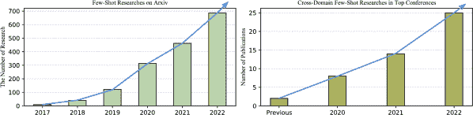

图 1：2017 年至 2022 年间少样本学习相关研究的增加情况。

## 2 概念与初步研究

### 2.1 少样本学习

少样本学习（FSL）是一种迁移学习技术，旨在从有限的标注标签中学习新类别[8]。在 FSL 中，必须满足两个假设以确保其成功应用。首先，训练和微调过程中的类别必须是不同的；这两个过程之间不得有类别交集，即$C_{b}\cap C_{n}=\varnothing$。其次，微调过程中每个类别的标注标签必须有限（甚至可能只有一个标注标签）。具体来说，存在两个数据集$D_{b}$和$D_{n}$，其中$D_{b}$中的类别$C_{b}$有足够的标签，而$D_{n}$中的类别$C_{n}$只有有限的标签。FSL 模型旨在对数据集$D_{b}$进行训练，然后在测试过程中应用少量标注标签来微调数据集$D_{n}$中的新类别。

### 2.2 少样本领域适应

少样本领域适应（FSDA）是少样本学习和领域适应的强大结合，使得少样本学习更加困难。与标准的少样本学习不同，标准的少样本学习假设训练数据集$D_{b}$和微调数据集$D_{n}$之间具有共享的数据分布，而 FSDA 识别了两个数据集之间的领域差距。FSDA 有两种类型：监督型，探讨于[9]，和非监督型，探讨于[10]。这项研究旨在弥合两个领域之间的差异，并充分利用有限的标注数据。因此，FSDA 的目标是对齐两个数据领域，同时利用有限的标注数据。

### 2.3 跨领域少样本学习

跨领域少样本（CDFS）学习是少样本学习中一个新兴的领域，假设源领域和目标领域之间存在显著的领域差距，使得任务相比于传统的少样本领域适应（FSDA）方法更具挑战性[5]。如图 1 所示，CDFS 研究的兴趣从 2020 年到 2022 年稳步增长。接下来的章节提供了 CDFS 问题集、解决方案和应用的详细概述。第三部分总结了 CDFS 的问题分类，第四部分回顾了为 CDFS 提出的不同解决方案，第五部分提供了基准，第六部分提供了 CDFS 的各种应用，第七部分概述了未来研究的方向。

### 2.4 领域适应与泛化

域适应（DA）要求模型在源域上训练，并在数据分布不同的目标域上测试。这可以在有监督[11, 12]或无监督[13, 14]的方式下进行，假设两个领域中都有相同的类别。DA 着重于对齐两个领域的分布[15]。在无监督环境下，源模型使用目标领域的数据训练特征提取器，从而完成领域对齐。相比之下，领域泛化（DG）比 DA 更复杂且更有价值[16]，因为在训练期间无法访问目标领域数据[17]。在完成源领域训练后，模型必须直接在目标领域进行测试。

### 2.5 元学习

人类在学习过程中不断总结经验。当面对新的环境时，人类可以利用已有的知识迅速适应新任务。元学习，即“学习如何学习”，是一种通过收集各种任务的经验来为迁移学习提供有价值信息的方法[18]。作为元学习的一种形式，任务学习涵盖了各种应用，包括分类问题、回归和混合任务[19, 20, 21]。元学习旨在提炼知识，这可以通过各种网络架构体现。例如，Reptile [22]，一种模型无关的元学习算法，利用模型参数的预测作为其知识表示。另一种选择是 DMML [23]和 OFMA [24]，它们分别通过嵌入函数和初始化参数来编码知识。

表 1: 各种相关研究。DA 和 DG 将源知识迁移到目标领域，但 DA 可以访问目标数据。FSL 假设只有有限的微调数据，并且训练和测试数据之间没有类别交集。CDFS 和 FSDA 同时考虑了少样本学习和领域转移，但 FSDA 可以访问目标领域并且具有相同的领域类别。

| 研究 | 训练领域 | 测试领域 | 领域类别交集 | 微调大小 | 测试数据训练 |
| --- | --- | --- | --- | --- | --- |
| 跨领域少样本学习 | $D_{s}$ | $D_{t}$ | 无 | 少 | 禁止 |
| 少样本领域适应 | $D_{s}$ | $D_{t}$ | 相同 | 少 | 可访问 |
| 少样本学习 | $D_{s}$ | $D_{s}$ | 无 | 少 | 不存在 |
| 领域适应 | $D_{s}$ | $D_{t}$ | 相同 | 足够 | 可访问 |
| 领域泛化 | $D_{s}$ | $D_{t}$ | 相同 | 不存在 | 禁止 |

<svg   height="670.42" overflow="visible" version="1.1" width="937.78"><g transform="translate(0,670.42) matrix(1 0 0 -1 0 0) translate(404.74,0) translate(0,538.92)" fill="#000000" stroke="#000000"><g stroke-width="0.4pt"><g transform="matrix(1.0 0.0 0.0 1.0 -399.85 -273.63)" fill="#000000" stroke="#000000"><foreignobject width="12.3" height="114.19" transform="matrix(1 0 0 -1 0 16.6)" overflow="visible">少样本学习</foreignobject></g>  <g transform="matrix(1.0 0.0 0.0 1.0 -359.14 -132.18)" fill="#000000" stroke="#000000"><foreignobject width="9.61" height="146.25" transform="matrix(1 0 0 -1 0 16.6)" overflow="visible">跨领域少样本</foreignobject></g>  <g transform="matrix(1.0 0.0 0.0 1.0 -360.48 -484.6)" fill="#000000" stroke="#000000"><foreignobject width="12.3" height="181.8" transform="matrix(1 0 0 -1 0 16.6)" overflow="visible">少样本领域自适应</foreignobject></g>  <g transform="matrix(1.0 0.0 0.0 1.0 -310.07 30.87)" fill="#000000" stroke="#000000"><foreignobject width="12.3" height="95.74" transform="matrix(1 0 0 -1 0 16.6)" overflow="visible">多源</foreignobject></g>  <g transform="matrix(1.0 0.0 0.0 1.0 -310.07 -99.43)" fill="#000000" stroke="#000000"><foreignobject width="12.3" height="80.75" transform="matrix(1 0 0 -1 0 16.6)" overflow="visible">单源</foreignobject></g>  <g transform="matrix(1.0 0.0 0.0 1.0 -310.07 -230.98)" fill="#000000" stroke="#000000"><foreignobject width="9.61" height="68.26" transform="matrix(1 0 0 -1 0 16.6)" overflow="visible">基准</foreignobject></g>  <g transform="matrix(1.0 0.0 0.0 1.0 -310.07 -368.64)" fill="#000000" stroke="#000000"><foreignobject width="12.3" height="107.35" transform="matrix(1 0 0 -1 0 16.6)" overflow="visible">监督下的 FSDA</foreignobject></g>  <g transform="matrix(1.0 0.0 0.0 1.0 -310.07 -534.03)" fill="#000000" stroke="#000000"><foreignobject width="12.3" height="123.19" transform="matrix(1 0 0 -1 0 16.6)" overflow="visible">无监督 FSDA</foreignobject></g> <g transform="matrix(1.0 0.0 0.0 1.0 -243.27 114.65)" fill="#000000" stroke="#000000"><foreignobject width="93.4" height="12.3" transform="matrix(1 0 0 -1 0 16.6)" overflow="visible">多模型</foreignobject></g><g transform="matrix(1.0 0.0 0.0 1.0 -238.51 35.91)" fill="#000000" stroke="#000000"><foreignobject width="83.48" height="12.3" transform="matrix(1 0 0 -1 0 16.6)" overflow="visible">单模型</foreignobject></g><g transform="matrix(1.0 0.0 0.0 1.0 -270.7 -23.14)" fill="#000000" stroke="#000000"><foreignobject width="157.59" height="12.3" transform="matrix(1 0 0 -1 0 16.6)" overflow="visible">目标领域可访问</foreignobject></g><g transform="matrix(1.0 0.0 0.0 1.0 -270.7 -101.88)" fill="#000000" stroke="#000000"><foreignobject width="158.43" height="12.3" transform="matrix(1 0 0 -1 0 16.6)" overflow="visible">目标领域禁用</foreignobject></g><g transform="matrix(1.0 0.0 0.0 1.0 -270.7 -183.01)" fill="#000000" stroke="#000000"><foreignobject width="602.28" height="251.27" transform="matrix(1 0 0 -1 0 16.6)" overflow="visible">BSCD-FSL [6],Meta-Dataset [25],PATNet [26],MoF-SOD [27],U-CDFSL [28], H-CDFSL [29]</foreignobject></g> <g transform="matrix(1.0 0.0 0.0 1.0 -93.54 116.73)" fill="#000000" stroke="#000000"><foreignobject width="334.65" height="16.6" transform="matrix(1 0 0 -1 0 16.6)" overflow="visible">SRF [30], CosML [31],URL [32] <g fill="#FFFFB3"><path d="M -98.15 10.54 h 343.87 v 57.65 h -343.87 Z"></path></g><g transform="matrix(1.0 0.0 0.0 1.0 -93.54 53.9)" fill="#000000" stroke="#000000"><foreignobject width="334.65" height="48.43" transform="matrix(1 0 0 -1 0 16.6)" overflow="visible">MDLCC [33],LFT [7],TSA [34],CDNet [35],ISS [36],DAML [37]</foreignobject></g> <g fill="#FFFFB3"><path d="M -98.15 -56.81 h 343.87 v 74.26 h -343.87 Z"></path></g><g transform="matrix(1.0 0.0 0.0 1.0 -93.54 3.15)" fill="#000000" stroke="#000000"><foreignobject width="334.65" height="65.03" transform="matrix(1 0 0 -1 0 16.6)" overflow="visible">Meta-FDMixup [38], DDN [39],DAFL [40],OA-FSUI2IT [41], ME-D2N [42],TGDM [43],AcroFOD [44],CDSC-FSL [45],WULD [46],CutMix [47]</foreignobject></g> <g fill="#FFFFB3"><path d="M -98.15 -160.46 h 343.87 v 124.07 h -343.87 Z"></path></g><g transform="matrix(1.0 0.0 0.0 1.0 -93.54 -50.69)" fill="#000000" stroke="#000000"><foreignobject width="334.65" height="114.85" transform="matrix(1 0 0 -1 0 16.6)" overflow="visible">CMT [48], ProtoTransfer [49],RMP [50],NSA [51],ATA [52],DCM+SS [53],TL-SS [54],RDC [55],RD [5],AFA [56],LCCS [57

图 3: CDFS 的不同设置。对于 CDFS 研究，存在多源和单源设置。

我们将最近的 CDFS 研究分为三类：多源、多模型和基准。多源研究包括两个解决方案：多个模型和单个模型。单源可以分为两种子类别，取决于目标领域是否可访问，如图 3 所示。我们还提供了在各个研究领域中 CDFS 基准的总结。

### 3.1 多源 CDFS

不同领域可以为深度模型学习提供重要的数据分布，这使得收集多个源领域的数据以解决 CDFS 问题变得直观。具体来说，研究人员首先收集几个具有不重叠类别的源领域数据集。然后，他们采用特定的训练策略来捕捉领域信息，并将结果结合成最终的迁移模型。通常，这些领域涵盖了各种场景，例如 CropDisease [72]、EuroSAT [73] 和 ChestX [74]。多源 CDFS 的学习策略可以分为多模型和单模型方法，如图 3 所示。

#### 3.1.1 多模型的多源研究

对于多模型方法，领域将有其特定的模型。学习过程包括训练阶段和聚合阶段。每个领域在训练阶段优化领域特定模型，然后将所有模型合并为一个模型，该模型将在聚合阶段作为最终的迁移模型，如图 3 左侧部分所示。训练阶段为模型提供多样化的特征分布或高度适应的参数。随后的聚合阶段专注于特征重用，旨在实现最佳的迁移效果。

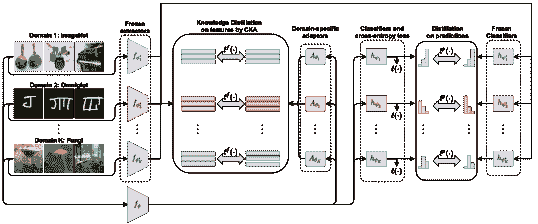

图 4: 网址 [32] 使用知识蒸馏技术来收集多个源信息。

网址[32]是一个基于多模型方法的典型模型，如图 4 所示。该框架首先在训练阶段为$K$个领域训练一组教师网络$\{f_{\phi_{1}^{*}},f_{\phi_{2}^{*}}...f_{\phi_{K}^{*}}\}$，然后在聚合阶段使用学生网络$f_{\phi}$来提取领域信息。学生网络$f_{\phi}$可以观察所有源领域数据集，但标签来自教师网络的输出。网址[32]专注于聚合学习，旨在学习一组通用表示。对于聚合，使用领域特定适配器$\{A_{\theta_{1}},A_{\theta_{2}}...A_{\theta_{K}}\}$和分类器$\{h_{\psi_{1}},h_{\psi_{2}}...h_{\psi_{K}}\}$来匹配教师网络的输出。网址[32]在推理时具有固定的计算成本，不受领域数量的影响。

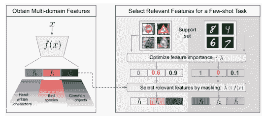

图 5：SRF [30]专注于更相关的领域特征，使用多领域特征库自动选择最相关的表示。

SRF [30]考虑到应关注更相关的领域特征，并在聚合阶段抑制不相关的领域。该框架使用一组可学习参数$\lambda$来选择源领域特征。首先，SRF [30]训练一组$K$个特征提取器，并获得一个包含不同语义特征块的多领域特征表示，如图 5 左侧所示。然后在给定少样本任务的情况下，通过优化支持集上的掩码参数$\lambda$来仅选择相关的特征块。SRF [30]表明，一个简单的特征选择机制可以替代特征适配。

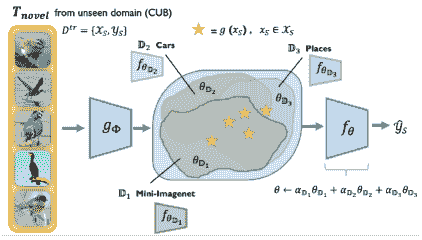

图 6：CosML [31]首先训练一组元学习器，每个训练领域一个，以学习特定于每个领域的先验知识（即元参数）。然后在参数空间中将领域特定的元学习器结合起来，通过加权平均它们的元参数，作为任务网络的初始化参数，该网络能够快速适应在未见领域中的新少样本分类任务。

与特征层级迁移相比，CosML [31] 关注于参数聚合，如图 6 所示。对于 CosML [31]，它首先获取每个领域的参数 $\theta_{D_{k}}$。$\theta_{D_{k}}$ 对新领域具有一定的迁移能力，但缺乏沟通。对于最终模型参数 $\theta$，CosML [31] 将所有领域参数 $\theta_{D_{k}}$ 与反映领域重要性的领域权重 $\alpha_{D_{k}}$ 结合起来，如公式 1。

|  | $\begin{split}\theta=\alpha_{D_{1}}\theta_{D_{1}}+\alpha_{D_{2}}\theta_{D_{2}}+...+\alpha_{D_{k}}\theta_{D_{k}}\end{split}$ |  | (1) |
| --- | --- | --- | --- |

#### 3.1.2 单模型处理多个源

单模型方法应用统一模型来学习多个领域特征。单模型方法可以训练所有源领域数据，如图 3 右侧所示。与多模型方法相比，单模型方法计算量较少，并省略了多模型的聚合阶段。为了获得高适应性的参数，DAML [37] 关注优化策略，并通过来自多个领域的数据学习以适应新类别。

LFT [7] 和 TSA [34] 提出了将特征变换或适配器直接附加到预训练模型上的方法。多个源领域共同训练这些模块，从而提高模型的迁移能力。

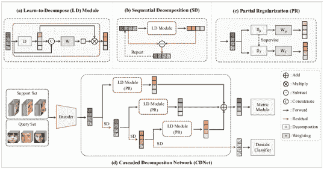

图 7: CDNet [35] 学习了能够轻松适应识别未见过的复合表达式的学习分解能力。

当单个模型面临多个源领域时，领域特定的信息可能会被混淆。为了解决这个问题，CDNet [35] 从给定特征中分解领域信息并提取领域独立的表达，如图 7 所示。CDNet [35] 堆叠了串行 LD（Learn-to-Decompose）模块，该模块输出类特征，以及 SD（Sequential Decomposition）模块，用于分解领域无关和领域特定特征。类似地，MDLCC [33] 通过通道重加权模块分解不同领域的特征。训练后，模型仅需微调重加权模块，调整的参数更少，以适应新领域。

为了降低领域标签的成本，ISS [36] 使用一个带标签的源领域和其他几个未标记的领域数据集来训练一个模型。带标签的领域输入将与其他未标记的领域数据混合增强。这可以通过其他领域的风格化扩展带标签的领域数据分布。

#### 3.1.3 讨论与总结

多源跨领域少量样本学习利用多源数据来提高模型的可扩展性。为了优化学习过程，决策应分析效率、准确性和可扩展性。为此，有两种不同的方法：多模型方法（需要源之间的通信）和单模型方法（直接处理源数据，设置更为简单）。通过适当地使用这两种方法并投入足够的精力进行数据收集，我们可以显著提高多源跨领域少量样本学习的结果。此外，结构化的数据源、收集和处理方法可以减少多源少量样本学习的劳动强度，并可能显著提高结果。

### 3.2 单源 CDFS

标准的少量样本学习设置需要有限的注释，因此使用多个领域来训练模型并不总是可行。为了寻求更现实且可管理的解决方案，提出了一种单源跨领域少量样本（CDFS）方法，该方法仅使用一个源领域来训练模型。这种单源 CDFS 包括两个设置：目标领域可访问和目标领域禁用。

标准的少样本学习设置要求有限的注释，因此很难使用多个领域来训练模型。可以使用单源方法提供更现实和可管理的解决方案，仅使用一个源领域来训练模型。这个单源 CDFS 包括两种设置：目标领域可访问和目标领域禁止。在前者中，目标领域在训练时可用，这允许模型适应目标领域。而在后者中，目标领域保持不可访问，因此提出的模型必须能够跨领域进行泛化。

#### 3.2.1 单源领域可访问性

对于单源 CDFS，仅使用一个领域数据解决跨领域和少样本问题是具有挑战性的。为此，目标领域可访问方法假设可以通过监督学习方法 [40, 42, 43, 44] 或无监督方法 [47, 38, 75, 41, 39, 46] 访问一些目标领域数据。

目标监督方法借助少量目标领域标记数据进行模型训练。然而，数据集的大小有限，这可能导致过拟合风险。相反，目标样本的过度放大可能会导致过度适应和误导。为了解决这个问题，AcroFOD [44] 采用了一种自适应优化策略，选择与目标样本更相似的增强数据，而不仅仅是增加数据量。ME-D2N [42] 提出了一个用于知识蒸馏的解耦模块，在两个网络之间作为领域专家来应对这一问题。

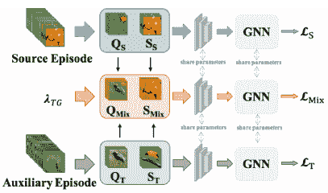

图 8: TGDM [43] 混合框架。使用混合中间领域来缩小领域差距。

领域差距是 CDFS 的关键问题，因此 TGDM [43] 设计了一个通过混合源领域和目标领域图像生成的中间领域，如图 8 所示。模型计算了 $L_{S}$、$L_{T}$ 和 $L_{Mix}$ 三个损失，关注于源领域、目标领域和中间领域的优化。实验表明，中间领域可以有效缓解领域差距的影响。

目标无监督方法通常受到青睐，因为与监督方法相比，目标领域数据较为充足，但数据标注可能不足。Meta-FDMixup [38] 和 Generalized Meta-FDMixup [75] 使用目标领域的未标注数据将其与源训练数据混合。这提供了类别和领域标签，并要求模型学习领域无关和领域特定的特征。OA-FSUI2IT [41] 利用其目标的未标注数据来转换源数据，并生成与源一致的内容，同时使风格匹配目标，以便随后训练网络。DDN [39] 是另一种方法，其中在目标未标注数据上训练动态蒸馏网络，使用来自教师网络的弱增强版本的相同图像的近似预测来施加一致性正则化，从而匹配来自学生的强增强版本的相同图像。最后，CDSC-FSL [45] 提出了一个新的设置，专注于支持集和查询集之间的领域差距。在这里，利用对比学习对齐来自两个领域的相同类别；然而，需要注意的是，CDSC-FSL [45] 要求源领域和目标领域具有相同的类别。因此，现有目标无监督方法的改进是必要的，以提高转移准确性并有效解决领域差异。

#### 3.2.2 单一来源的目标领域禁止

目标领域禁止 CDFS 是最具挑战性的跨领域少样本学习任务，它假设只有一个源领域可用于训练，而目标领域数据被禁止。近期研究 [48, 50, 51, 55, 52, 59, 60, 61, 62, 64, 65] 旨在通过仅用一个源领域进行训练，开发出具有更好适应性的网络。提出了两种主要策略：归一化方法和自监督方法。

归一化方法主要通过引入各种归一化技术来减少领域差异的影响，从而提高模型生成能力。例如，DCM+SS [53] 使用归一化来修正源领域和目标领域之间的巨大差异引起的偏差。AFA [56] 引入对抗学习，通过归一化来提高特征多样性。LCCS [57] 提出了从源领域学习 BatchNorm 的参数以减轻领域差距。RD [5] 使用归一化来混合实例特征和可学习的记忆，以将源领域信息转移到目标领域。MemREIN [58] 结合实例归一化和记忆库来恢复判别特征。

自我监督方法利用图像的语义一致性来扩展源模型的输入，并使用对比学习方法进一步提高模型生成能力。ProtoTransfer [49] 使用自我监督训练嵌入函数，从而快速适应新领域。STCDFS [63] 将领域适应任务分为内部任务和外部任务。模型首先通过图像旋转或背景交换自我监督内部任务，然后在外部任务中解决少样本学习问题。TL-SS [54] 采用情境训练方法，提倡在任务层面进行自我监督以处理领域差异问题。

#### 3.2.3 讨论与总结

单源解决方案提出，单一来源的领域模型足以进行训练，这意味着比多源方法对不同领域的要求更少。然而，这引发了目标领域数据是否可以获取的问题。如果可以获取，监督和非监督访问都是可能的选项。如果禁止访问，可以采用自我监督来丰富数据分布。单源跨领域少样本学习是该领域最广泛研究的课题之一，而探索目标领域数据禁用的挑战是这里最令人兴奋的挑战。在接下来的部分中，我们将讨论解决此问题的方法。

## 4 种不同的 CDFS 解决方案

<svg   height="426.3" overflow="visible" version="1.1" width="740.01"><g transform="translate(0,426.3) matrix(1 0 0 -1 0 0) translate(118.11,0) translate(0,426.3)" fill="#000000" stroke="#000000" stroke-width="0.4pt"><g transform="matrix(1.0 0.0 0.0 1.0 -97.94 -117.29)" fill="#000000" stroke="#000000"><foreignobject width="82.78" height="11.07" transform="matrix(1 0 0 -1 0 16.6)" overflow="visible">自监督</foreignobject></g><g transform="matrix(1.0 0.0 0.0 1.0 -97.47 -27.08)" fill="#000000" stroke="#000000"><foreignobject width="318.67" height="13.84" transform="matrix(1 0 0 -1 0 16.6)" overflow="visible">OA-FSUI2IT [41]</foreignobject></g> <g transform="matrix(1.0 0.0 0.0 1.0 -97.47 -62.51)" fill="#000000" stroke="#000000"><foreignobject width="314.45" height="13.84" transform="matrix(1 0 0 -1 0 16.6)" overflow="visible">CDSC-FSL [45]</foreignobject></g> <g transform="matrix(1.0 0.0 0.0 1.0 -97.47 -97.94)" fill="#000000" stroke="#000000"><foreignobject width="272.74" height="13.84" transform="matrix(1 0 0 -1 0 16.6)" overflow="visible">WULD[46]</foreignobject></g> <g transform="matrix(1.0 0.0 0.0 1.0 -97.47 -82.2)" fill="#000000" stroke="#000000"><foreignobject width="274.09" height="13.84" transform="matrix(1 0 0 -1 0 16.6)" overflow="visible">STCDFS [63]</foreignobject></g> <g transform="matrix(1.0 0.0 0.0 1.0 -97.47 -42.83)" fill="#000000" stroke="#000000"><foreignobject width="352.04" height="13.84" transform="matrix(1 0 0 -1 0 16.6)" overflow="visible">ProtoTransfer [49]</foreignobject></g> <g transform="matrix(1.0 0.0 0.0 1.0 20.18 -117.22)" fill="#000000" stroke="#000000"><foreignobject width="58.46" height="10.93" transform="matrix(1 0 0 -1 0 16.6)" overflow="visible">图像混合</foreignobject></g><g transform="matrix(1.0 0.0 0.0 1.0 15.91 -27.08)" fill="#000000" stroke="#000000"><foreignobject width="251.41" height="13.84" transform="matrix(1 0 0 -1 0 16.6)" overflow="visible">Meta-FDMixup [38]</foreignobject></g> <g transform="matrix(1.0 0.0 0.0 1.0 24.57 -46.76)" fill="#000000" stroke="#000000"><foreignobject width="294" height="13.84" transform="matrix(1 0 0 -1 0 16.6)" overflow="visible">CutMix [47]</foreignobject></g> <g transform="matrix(1.0 0.0 0.0 1.0 24.57 -66.45)" fill="#000000" stroke="#000000"><foreignobject width="254.39" height="13.84" transform="matrix(1 0 0 -1 0 16.6)" overflow="visible">TGDM [43]</foreignobject></g> <g transform="matrix(1.0 0.0 0.0 1.0 24.57 -86.13)" fill="#000000" stroke="#000000"><foreignobject width="277.72" height="13.84" transform="matrix(1 0 0 -1 0 16.6)" overflow="visible">AcroFOD [44]</foreignobject></g> <g transform="matrix(1.0 0.0 0.0 1.0 20.18 -170.42)" fill="#000000" stroke="#000000"><foreignobject width="49.24" height="8.51" transform="matrix(1 0 0 -1 0 16.6)" overflow="visible">生成</foreignobject></g><g transform="matrix(1.0 0.0 0.0 1.0 -101.41 -157)" fill="#000000" stroke="#000000"><foreignobject width="251.58" height="13.84" transform="matrix(1 0 0 -1 0 16.6)" overflow="visible">NSA [51]</foreignobject></g> <g transform="matrix(1.0 0.0 0.0 1.0 -34.48 -157)" fill="#000000" stroke="#000000"><foreignobject width="252.76" height="13.84" transform="matrix(1 0 0 -1 0 16.6)" overflow="visible">ISS [36]</foreignobject></g> <g transform="matrix(1.0 0.0 0.0 1.0 24.57 -157)" fill="#000000" stroke="#000000"><foreignobject width="318.67" height="13.84" transform="matrix(1 0 0 -1 0 16.6)" overflow="visible">OA-FSUI2IT [41]</foreignobject></g> <g transform="matrix(1.0 0.0 0.0 1.0 189.47 -87)" fill="#000000" stroke="#000000"><foreignobject width="129.03" height="8.65" transform="matrix(1 0 0 -1 0 16.6)" overflow="visible">特征变换</foreignobject></g><g transform="matrix(1.0 0.0 0.0 1.0 189.93 -27.08)" fill="#000000" stroke="#000000"><foreignobject width="263.56" height="13.84" transform="matrix(1 0 0 -1 0 16.6)" overflow="visible">SRF [30]</foreignobject></g> <g transform="matrix(1.0 0.0 0.0 1.0 189.93 -46.76)" fill="#000000" stroke="#000000"><foreignobject width="249.64" height="13.84" transform="matrix(1 0 0 -1 0 16.6)" overflow="visible">AFA [56]</foreignobject></g> <g transform="matrix(1.0 0.0 0.0 1.0 189.93 -66.45)" fill="#000000" stroke="#000000"><foreignobject width="223.97" height="13.84" transform="matrix(1 0 0 -1 0 16.6)" overflow="visible">FTE[61]</foreignobject></g> <g transform="matrix(1.0 0.0 0.0 1.0 260.79 -27.08)" fill="#000000" stroke="#000000"><foreignobject width="277.16" height="13.84" transform="matrix(1 0 0 -1 0 16.6)" overflow="visible">Wave-SAN[64]</foreignobject></g> <g transform="matrix(1.0 0.0 0.0 1.0 260.79 -46.76)" fill="#000000" stroke="#000000"><foreignobject width="282.54" height="13.84" transform="matrix(1 0 0 -1 0 16.6)" overflow="visible">DFTL[76]</foreignobject></g> <g transform="matrix(1.0 0.0 0.0 1.0 260.79 -66.45)" fill="#000000" stroke="#000000"><foreign

图 9：CDFS 的不同解决方案。图像增强直接混合图像并生成新图像。特征增强使用特征级变换和知识蒸馏来实现增强。微调关注适应性特征训练。解耦解决方案期望获得与领域无关和领域特定的特征。

我们将 CDFS 的解决方案分为四类：特征增强、图像增强、解耦和微调（见图 9）。基于特征增强的方法通过扩展特征多样性来提升模型的性能。相比之下，基于图像增强的方法利用常见的混合或粘贴技术生成额外的图像。解耦基的方法考虑领域特定和领域无关的特征，最后，基于微调的方法力求获得高度适应新领域的特征。我们将在下文的各自章节中进一步讨论这些解决方案，4.1、4.2、4.3 和 4.4。

### 4.1 基于特征增强

在基础类训练之后，少样本模型必须在有限标注的新领域中学习新类。在这种情况下，特征质量直接影响转移效果。为了解决这个问题，CDFS 的研究人员采用特征变换，如图 10 所示，或通过知识蒸馏来提高特征质量。

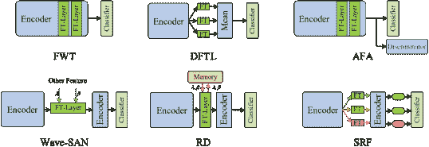

图 10：CDFS 中不同的特征变换。FWT [7]、DFTL [76]、AFA [56] 和 SRF [30] 使用可学习的 $\lambda$ 和 $\beta$ 来实现知识转移，每个领域数据在 SRF [30] 中都有一个 FT 层。Wave-SAN [64] 和 RD [5] 混合特征分布以重构特征。

特征变换增强主要改变特征分布，这可以使特征容易转移 [64, 61]。归一化策略向原始特征中添加噪声或先验分布。训练过程包含使用 Eq. 2 进行归一化和重构特征：

|  | $\begin{split}&amp;f_{b}^{norm}=\dfrac{f_{b}-\mu_{b}}{v_{b}}\\ &amp;f_{b}^{reco}=\lambda f_{b}^{norm}+\beta\end{split}$ |  | (2) |
| --- | --- | --- | --- |

其中 $f_{b}$、$\mu_{b}$ 和 $v_{b}$ 分别是主干特征、通道均值和通道方差。在特征归一化后，使用 $\lambda$ 和 $\beta$ 来重构主干特征。如果 Eq. 2 中的 $\lambda$ 和 $\beta$ 是可学习参数，特征级变换器会专注于特征分布的改善。FWT [7] 在特征编码器的批归一化层之后插入特征级变换层，这可以有效地增强中间特征。FWT [7] 在训练后会去除特征级变换层。而 DFTL [76] 提出了一个多样化的特征变换，平行使用多个特征变换器。最终层对 FT 层的输出进行平均并获得最终预测。单源网络也可以使用特征变换来模拟未见领域分布。在 AFA [56] 网络中，通过识别来自原始（已见领域）和增强（未见领域）特征来学习领域判别器。总之，FWT [7]、DFTL [76] 和 AFA [56] 使用可学习的 $\lambda$ 和 $\beta$ 来实现知识迁移。

$\lambda$ 和 $\beta$ 可以来自其他实例的归一化特征。Wave-SAN [64] 通过交换低频分量的风格来增强源图像。Wave-SAN [64] 遵循替换策略，并完全重构原始特征的分布。特别是如果数据集存在领域迁移，这可能导致波动。混合策略可以作为改进版本，网络使用混合张量来重构特征，如 Eq. 3 所示。

|  | $\begin{split}&amp;\lambda^{mix}=\alpha\mu_{b}+(1-\alpha)\mu_{o},\beta^{mix}=\alpha v_{b}+(1-\alpha)v_{o},\\ &amp;f_{b}^{reco}=\lambda^{mix}f_{b}^{norm}+\beta^{mix}\end{split}$ |  | (3) |
| --- | --- | --- | --- |

其中$\alpha$控制原始特征的保留比率，$\mu_{o}$和$v_{o}$是来自其他图像的通道均值和方差。具体来说，RD [5]使用记忆库来混合实例特征，这意味着记忆库中的$\mu_{o}$和$v_{o}$来自于收集不同源样式信息的记忆库，记忆库可以将源知识加载到目标领域，从而直接缓解领域迁移。对于多源网络，SRF [30]为每个领域附加不同的 FT 层。使用参数化网络家族以获得多领域表示。

知识蒸馏增强训练教师网络和学生网络。学生网络的学习目标是使特征比教师网络更具鲁棒性。URL [32]为每个领域数据训练一个教师网络，然后使用学生网络从每个教师网络中提取领域知识。DDN [39]在弱增强目标数据上学习教师网络，目标领域的知识将从教师网络蒸馏到最终的转移学生网络。蒸馏过程还可以将目标领域分布加载到源训练过程中。同样，ME-D2N [42]也使用知识蒸馏来分解源领域和目标领域，从而有效提高 CDFS 的准确性。

### 4.2 基于图像增强

基于图像增强的方法直接增强图像数据，如图 11 所示。与基于特征增强的方法相比，它更简单，并直接改变图像。自监督方法将原始图像转换为生成新的标签用于模型训练，为模型观察数据提供另一种视角。同时，Mix-Paste 方法混合不同的图像以丰富数据分布。生成策略是另一种增强策略，通过编码器-解码器生成新图像，并将其输入网络以提高数据多样性。

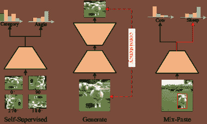

图 11：基于图像增强。自监督生成新的标签用于模型训练，生成方法使用一致性损失来约束模型，Mix-Paste 方法混合不同的图像，有效提高数据多样性。

自监督图像增强通过图像的语义一致性生成新的实例。这一过程不依赖标签，实际有效地提高数据质量 [49]。OA-FSUI2IT [41] 假设图像语义与平移无关。在训练过程中对图像进行翻转、平移和线性缩放不会改变图像内容。深度模型应该得到相似的预测。WULD [46] 使用标记和未标记的数据训练少样本模型。模型必须识别标记的类别，并预测标记和未标记数据中的旋转角度。作为辅助任务，图像旋转可以提高主任务的效果。类似于 WULD [46]，STCDFS [63] 也利用旋转来提升少样本模型的效果。它在少样本支持集内设计了内部任务。模型首先预测图像的旋转角度和标记类别。模型利用原始支持图像获得类别原型，最后使用原型来识别查询集。在源未标记的 CDFS 中，ProtoTransfer [49] 首先对未标记的批次进行转换。每个样本会生成 $|Q|$ 个转换样本。转换后的特征需要集中在原始样本附近。批次中的其他原始样本被视为负样本，而原始样本被视为正样本。最后，在目标领域，提取的图像特征将作为分类器权重进行微调。

Mix-Paste 图像增强 [47] 是最简单的方法之一，它将少量目标数据裁剪后粘贴到源数据中，这有助于模型学习目标领域的知识。

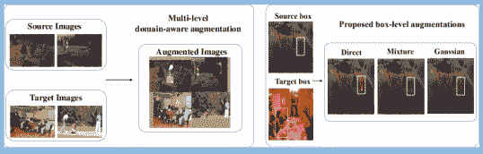

图 12：AcroFOD 提出的不同混合方法 [44]。

AcroFOD [44] 提出了两种不同的混合方法以改善少样本对象检测的效果，如图 12 所示。左侧的图像级领域感知增强生成具有多个领域实例的新图像。而右侧的框级领域感知增强首先切割实例的前景部分，然后将相应的框粘贴到另一个实例中。此外，Meta-FDMixup [38] 使用超参数 $\lambda$ 来控制混合图像中的源和目标比例。混合后，将生成源图像、目标图像和混合图像三种类型。由于目标标签是可访问的，源混合对和目标混合对将进行少样本分类并计算损失。源和目标混合可以有效改善数据分布并获取更多目标数据以适应模型。与僵硬粘贴方法相比，TGDM [43] 旨在通过将验证损失输入生成网络来学习动态混合比例，换句话说，Meta-FDMixup [38] 中的 $\lambda$ 是可学习的。

生成图像增强使用编码器-解码器方法生成新图像。NSAE [51] 提出将自编码器重建的图像作为噪声输入，并让模型进一步预测其标签。在目标测试阶段，首先在新数据集上执行重建任务，然后对编码器进行微调以进行分类。与 NSAE [51] 的原始编码器-解码器相比，ISS [36] 结合了特征变换并生成它以解决 CDFS 问题。在训练阶段，标记的和未标记的领域特征被混合。然后，混合特征被解码生成图像，这些图像受到内容感知损失和风格损失的约束，以确保语义信息与标签一致，风格与未标记一致。最后，增强的数据集用于少样本训练并转移到新领域。同时，OA-FSUI2IT [41] 关注对象检测，并提出了一种图像翻译模块，该模块生成源内容一致性和目标风格一致性的图像。ISS [36] 和 OA-FSUI2IT [41] 有类似的灵感。具体而言，感知损失度量两个样本的感知相似性，如公式 4 所示。

|  | $\begin{split}\mathcal{L}_{percep}=\sum_{l\in\mathcal{S}}&#124;&#124;f_{l}(x)-f_{l}(\hat{x})&#124;&#124;_{2}^{2}\end{split}$ |  | (4) |
| --- | --- | --- | --- |

其中$f_{l}$表示来自收敛网络$\mathcal{S}$的特征，$\mathcal{L}_{percep}$要求输入$x$和生成图像$\hat{x}$共享相同的内容或语义。风格损失度量特征图的协方差之间的差异，这可以减少来自不同图像的风格化，如方程 5 所示。

|  | $\begin{split}\mathcal{L}_{style}=&#124;&#124;G_{j}(x)-G_{j}(\hat{x})&#124;&#124;_{F}^{2}\end{split}$ |  | (5) |
| --- | --- | --- | --- |

其中$G_{j}$获取第$j$层的 Gram 矩阵。OA-FSUI2IT [41] 额外使用对抗网络来改善生成效果。生成图像增强是特定的自监督版本，但它生成的新图像与单一图像旋转和遮罩进行比较。

### 4.3 基于分解

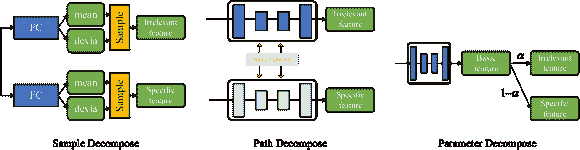

图 13: 不同的分解方法。基于样本的方法提取不同的特征均值和方差，然后对特定特征进行采样。基于路径的方法设计多个前向路径用于特征传递，每条路径分解不同的特征。基于参数的方法学习分解参数，例如$\alpha$，并使用它来滤波特征。

方法认为不同的特征应该被分解，如图 13 所示。由于 CDFS 的数据来自不同的领域，混合特征空间干扰了模型效果。为了分解这些特征，研究人员[35, 40, 58]除了获得不同的特征表达。比如，领域特定特征和领域无关特征，无关特征主要收集领域无关的判别信息，这意味着该特征具有很好的跨域迁移能力。作为补充，无关特征可以提供相关的领域信息。特定特征和无关特征通过对抗学习相互适应。

Meta-FDMixup 严谨地[38, 75]设计了一个分解模块，该模块生成如图 13 左侧部分所示的无关特征和特定特征的均值和方差，然后使用相应的均值和方差来采样领域特征。分解模块受到 VAE（变分自编码器）的启发，旨在最佳地学习分解领域特定特征和领域无关特征，从而缓解 CDFS 中的领域迁移问题。

与样本基方法不同，如图 13 中部所示，基于路径的方法使用多个前向路径来学习不同的特征表达，例如 ME-D2N [42] 额外学习领域特定的门控前向路径，该路径可以以可学习的方式将每个滤波器分配给一个特定领域。Wave-SAN [64] 的结构包含标准和风格增强的前向路径。Wave-SAN [64] 旨在实现视觉表征的分解，分为低频组件，如形状和风格，以及高频组件，如纹理。产生的各种特征需要共享相同的语义，可以有效提高 CDFS 的特征质量。

参数方法使用可学习的张量来筛选特征，如图 13 右侧部分所示。CDNet [35] 提出了一个串行框架。每一步都使用 Learn-to-Decompose (LD) 模块来筛选域特征并完成特征分解。MemREIN [58] 专注于通道分解，判别特征将被注册到内存库中。

除了这些领域分解方法，研究人员还研究了类级别的表达。RMP [50] 认为中层特征对于远程领域之间的迁移更有意义。类中层特征必须预测类区分特征以提供中层特征。由于中层特征缺乏区分性，RMP [50] 首先提取类特征，然后使用其他类的特征重构当前类，最后在余弦空间中使用现有特征减去重构特征，以获得类区分特征。

### 4.4 基于微调

基于微调的方法关注于特征迁移 [33] 和参数适应性 [65]。微调的目的是获得具有高迁移能力的鲁棒特征 [81]，期望将特定领域的特征转换为无关的度量空间，这将减少领域偏移的负面影响。由于度量空间是不变的，下游分割模块在这种稳定空间中进行预测更容易。我们将基于微调的方法分为元学习方法和分布对齐方法。

#### 4.4.1 元学习微调

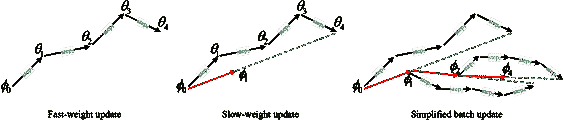

图 14：元生成网络的参数更新策略，其中 $\theta$ 是快权重，$\phi$ 是慢权重。

元学习的核心思想是“学会学习”，这意味着优化目标是如何收集面对新任务的经验。与传统训练方法相比，元学习过程具有快权重和慢权重。快权重解决特定任务问题。慢权重则需要收集经验，如图 15 所示。

元学习的关键设计是任务采样。DAML [37] 从多个领域中采样任务，模型学习领域无关的初始参数，这些参数在元测试过程中能够适应未见领域中的新类别。而 CosML [31] 直接将多个领域参数结合为转移初始化，其在每个独立领域的训练过程与 DAML [37] 进行比较。除了慢优化权重和快优化权重之外，TL-SS [54] 使用权重生成器来预测高级网络的参数，这要求模型生成合适的参数，并使编码器能够灵活适应任何未见任务。在元学习中的参数初始化中，强制共享初始化可能导致任务之间的冲突以及在优化景观上不理想的位置，从而阻碍任务适应。L2F [79] 提出了对不理想初始化进行任务和层级的衰减，以减少其对任务适应的负面影响。

#### 4.4.2 分布对齐微调

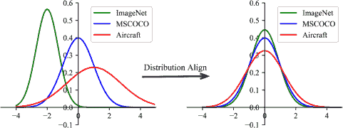

图 15：不同场景具有不一致的分布，这可能体现在输入图像或特征级别（左侧）。经过分布对齐后，优化模型可以在统一空间中进行，并具有更好的迁移能力（右侧）。

CDFS 中源领域和目标领域之间的分布不同，如图 15 所示。为了应对这种差异的影响，CMT [48] 提出了机制转移，这是一种在领域间数据生成机制不变的元分布场景。CMT [48] 使得在不同分布之间进行领域适应，而不依赖于参数假设。为了防止预训练表示对源领域的偏见，RDC [55] 构建了一个非线性子空间，以最小化与任务无关的特征，同时通过双曲正切变换保留更多可转移的判别信息。换句话说，源数据在原始空间和非线性子空间之间对齐，从而获得更多可转移的判别信息。CDTF [78] 侧重于对齐支持集和查询集，并提出在少样本设置下对一组查询图像进行传递性微调的基础模型。核心思想是通过支持标签隐式地指导查询图像的分割。

作为元学习的基本单元，任务分布直接影响模型的效果。ATA [52] 试图通过任务增强提高归纳偏差的鲁棒性。网络通过不同的归纳偏差自适应地生成“具有挑战性”的任务。任务级增强可以增加训练任务的多样性，提高模型在领域转移下的鲁棒性。在特征层面，研究人员 [57] 尝试将源分布转移到目标领域。

## 5 基准

### 5.1 CDFS 分类。

BSCD-FSL [6] 提出了跨领域少样本学习（BSCD-FSL）基准，其中包含来自多种图像获取方法的图像数据。BSCD-FSL 基准包含 mini-ImageNet [82]、CropDiease [72]、EuroSAT [73]、ISIC [83]、ChestX [74] 数据集。由于 mini-ImageNet [82] 具有 100 个类别，每个类别有 600 张图像，BSCD-FSL 选择它作为源领域，并将模型知识转移到其他领域。

同时，LFT [7] 提出了一个包含五个数据集的 CDFS 基准。LFT 设计了留一域实验设置，从 CUB [84]、Cars [85]、Places [86] 和 Plantae [87] 中选择一个领域作为评估的未见领域，mini-ImageNet [82] 和其余领域作为训练模型的已见领域。

对于跨领域少样本数据集，Meta-Dataset [25] 提出了一个新的基准，用于训练和评估大规模模型，包含多样的数据集，并呈现更现实的任务。Meta-Dataset 按领域划分，即数据集之间没有跨类别。我们展示了所有 CDFS 分类方法使用的基准，如表 2 和表 3。最常见的实验是 5-way 1-shot 设置。我们总结了表 2 中的 5-way 1-shot 转移效果，以及表 3 中的 5-way k-shot 转移效果。

表 2：5-way 1-shot 的 CDFS 分类结果。^† 表示留一法实验，^∗ 表示目标数据可用，^T 表示传递方法。

| 5-way 1-shot | CUB | Cars | Places | Plantae | CropDiseases | EuroSAT | ISIC | ChestX |
| --- | --- | --- | --- | --- | --- | --- | --- | --- |
| MatchingNet[3][(NIPS16)] | 35.89[±0.5] | 30.77[±0.5] | 49.86[±0.8] | 32.70[±0.6] | - | - | - | - |
| MN+FT[7][(ICLR20)] | 36.61[±0.5] | 29.82[±0.4] | 51.07[±0.7] | 34.48[±0.5] | - | - | - | - |
| RelationNet[2][(CVPR18)] | 42.44[±0.8] | 29.11[±0.6] | 48.64[±0.9] | 33.17[±0.6] | - | - | - | - |
| RN+FT[7][(ICLR20)] | 44.07[±0.8] | 28.63[±0.6] | 50.68[±0.8] | 33.14[±0.6] | - | - | - | - |
| GNN[88][(ICLR18)] | 45.69[±0.7] | 31.79[±0.5] | 53.10[±0.8] | 35.60[±0.6] | - | - | - | - |
| GNN+FT[7][(ICLR20)] | 47.47[±0.8] | 31.61[±0.5] | 55.77[±0.8] | 35.95[±0.6] | - | - | - | - |
| RN+LRP[77][(ICPR20)] | 42.44[±0.4] | 29.65[±0.3] | 50.59[±0.5] | 34.80[±0.4] | - | - | - | - |
| RN+LRP^T[77][(ICPR20)] | 42.88[±0.5] | 29.61[±0.4] | 53.07[±0.6] | 34.54[±0.4] | - | - | - | - |
| CAN+LRP[77][(ICPR20)] | 46.23[±0.4] | 32.66[±0.5] | 56.96[±0.5] | 38.23[±0.5] | - | - | - | - |
| CAN+LRP^T[77][(ICPR20)] | 48.35[±0.5] | 32.35[±0.4] | 61.60[±0.6] | 38.48[±0.4] | - | - | - | - |
| GNN+LRP[77][(ICPR20)] | 48.29[±0.5] | 32.78[±0.4] | 54.83[±0.6] | 37.49[±0.4] | - | - | - | - |
| GNN+FT^†[7][(ICLR20)] | 51.51[±0.8] | 34.12 [±0.6] | 56.31 [±0.8] | 42.09 [±0.7] | - | - | - | - |
| CosML^†[31][(Arxiv)] | 46.89[±0.5] | 47.74[±0.6] | 53.96[±0.6] | 30.93[±0.5] | - | - | - | - |
| LRFG^†[89][(KBS22)] | 52.04 [±0.7] | 34.84 [±0.6] | 57.57 [±0.8] | 42.05 [±0.7] | - | - | - | - |
| DFTL^†[76][(ICAICA21)] | 46.15[±0.7] | 33.54 [±0.6] | 51.81[±0.7] | 39.97[±0.6] | - | - | - | - |
| GNN+MR^†[58][(IJCAI22)] | 54.26 [±0.6] | 37.55 [±0.5] | 59.98 [±0.6] | 45.69 [±0.6] | - | - | - | - |
| MN+MR^†[58][(IJCAI22)] | 46.37 [±0.5] | 35.65 [±0.5] | 54.92 [±0.6] | 38.82 [±0.5] | - | - | - | - |
| RN+MR^†[58][(IJCAI22)] | 52.02 [±0.5] | 36.38 [±0.4] | 54.82 [±0.6] | 36.74 [±0.5] | - | - | - | - |
| RN+ST[63][(Arxiv)] | 43.10 [±0.4] | 32.34 [±0.3] | 50.53 [±0.5] | 33.19 [±0.3] | 63.29[±0.4] | 57.36[±0.30] | 32.09[±0.3] | 22.28[±0.2] |
| ReFine[65][(CIKM22)] | - | - | - | - | 68.93[±0.8] | 64.14[±0.82] | 35.30[±0.59] | 22.48[±0.4] |
| GNN+WS[64][(Arxiv)] | 50.25[±0.7] | 33.55[±0.6] | 57.75[±0.8] | 40.71[±0.7] | 70.80[±1.0] | 69.64[±1.0] | 33.35[±0.7] | 22.93[±0.5] |
| FWT+WS[64][(Arxiv)] | 50.33[±0.7] | 32.69[±0.6] | 57.84[±0.8] | 38.25[±0.6] | 69.65[±1.0] | 65.50[±1.1] | 33.09[±0.7] | 22.39[±0.5] |
| MN+AFA[56][(ECCV22)] | 41.02[±0.4] | 33.52[±0.4] | 54.66[±0.5] | 37.60[±0.4] | 60.71[±0.5] | 61.28[±0.5] | 32.32[±0.3] | 22.11[±0.2] |
| GNN+AFA[56][(ECCV22)] | 46.86[±0.5] | 34.25[±0.4] | 54.04[±0.6] | 36.76[±0.4] | 67.61[±0.5] | 63.12[±0.5] | 33.21[±0.3] | 22.92[±0.2] |
| TPN+AFA[56][(ECCV22)] | 50.85[±0.4] | 38.43[±0.4] | 60.29[±0.5] | 40.27[±0.4] | 72.44[±0.6] | 66.17[±0.4] | 34.25[±0.4] | 21.69[±0.1] |
| RDC[55][(CVPR22)] | 48.68[±0.5] | 38.26[±0.5] | 59.53[±0.5] | 42.29[±0.5] | 79.72[±0.5] | 65.58[±0.5] | 32.33[±0.3] | 22.77[±0.2] |
| RDC-FT[55][(CVPR22)] | 51.20[±0.5] | 39.13[±0.5] | 61.50[±0.6] | 44.33[±0.6] | 86.33[±0.5] | 71.57[±0.5] | 35.84[±0.4] | 22.27[±0.2] |
| RN+ATA[52][(IJCAI21)] | 43.02[±0.4] | 31.79[±0.3] | 51.16[±0.5] | 33.72[±0.3] | 61.17[±0.5] | 55.69[±0.5] | 31.13[±0.3] | 22.14[±0.2] |
| GNN+ATA[52][(IJCAI21)] | 45.00[±0.5] | 33.61[±0.4] | 53.57[±0.5] | 34.42[±0.4] | 67.47[±0.5] | 61.35[±0.5] | 33.21[±0.4] | 22.10[±0.2] |
| TPN+ATA[52][(IJCAI21)] | 50.26[±0.5] | 34.18[±0.4] | 57.03[±0.5] | 39.83[±0.4] | 77.82[±0.5] | 65.94[±0.5] | 34.70[±0.4] | 21.67[±0.2] |
| ME-D2N^∗[42]${}_{(\mathrm{ACM\,MM22)}}$ | 65.05[±0.8] | 49.53[±0.8] | 60.36[±0.9] | 52.89[±0.8] | - | - | - | - |
| TGDM^∗[43]${}_{(\mathrm{ACM\,MM22)}}$ | 64.80[±0.3] | 50.70[±0.2] | 61.88[±0.3] | 52.39[±0.3] | - | - | - | - |
| M-FDM^∗[38]${}_{(\mathrm{ACM\,MM21)}}$ | 63.24[±0.8] | 51.31[±0.8] | 58.22[±0.8] | 51.03[±0.8] | - | - | - | - |
| GM-FDM^∗[75][(TIP22)] | 63.85[±0.4] | 53.10[±0.4] | 59.39[±0.4] | 51.28[±0.4] | 70.21[±0.4] | 91.07[±0.4] | 70.90[±0.6] | 53.07[±0.4] |
| DDN^∗[39][(NIPS21)] | - | - | - | - | 82.14[±0.8] | 73.14[±0.8] | 34.66[±0.6] | 23.38[±0.4] |

Table 3: The CDFS classification result of 5-way k-shot. ^† denotes the leave-one-out experiments, ^∗ denotes the target data is accessible, ^T denotes the transductive methods.

| 5-way 5-shot | CUB | Cars | Places | Plantae | CropDiseases | EuroSAT | ISIC | ChestX |
| --- | --- | --- | --- | --- | --- | --- | --- | --- |
| MatchingNet[3][(NIPS16)] | 51.37[±0.8] | 38.99[±0.6] | 63.16[±0.8] | 46.53[±0.9] | - | - | - | - |
| MN+FT[7][(ICLR20)] | 55.23[±0.8] | 41.24[±0.6] | 64.55[±0.8] | 41.69[±0.6] | - | - | - | - |
| RelationNet[2][(CVPR18)] | 57.77[±0.7] | 37.33[±0.7] | 63.32[±0.8] | 44.00[±0.6] | - | - | - | - |
| RN+FT[7][(ICLR20)] | 59.46[±0.7] | 39.91[±0.7] | 66.28[±0.7] | 45.08[±0.6] | - | - | - | - |
| GNN[88][(ICLR18)] | 62.25[±0.6] | 44.28[±0.6] | 70.84[±0.7] | 52.53[±0.6] | - | - | - | - |
| GNN+FT[7][(ICLR20)] | 66.98[±0.7] | 44.90[±0.6] | 73.94[±0.7] | 53.85[±0.6] | - | - | - | - |
| RN+LRP[77][(ICPR20)] | 59.30[±0.4] | 39.19[±0.4] | 66.90[±0.4] | 48.09[±0.4] | - | - | - | - |
| RN+LRP^T[77][(ICPR20)] | 59.22[±0.4] | 38.31[±0.4] | 68.25[±0.4] | 47.67[±0.4] | - | - | - | - |
| CAN+LRP[77][(ICPR20)] | 66.58[±0.3] | 43.86[±0.4] | 74.91[±0.4] | 53.25[±0.4] | - | - | - | - |
| CAN+LRP^T[77][(ICPR20)] | 66.57[±0.4] | 42.57[±0.4] | 76.90[±0.4] | 51.63[±0.4] | - | - | - | - |
| GNN+LRP[77][(ICPR20)] | 64.44[±0.5] | 46.20[±0.5] | 74.45[±0.5] | 54.46[±0.5] | - | - | - | - |
| GNN+FT^†[7][(ICLR20)] | 73.11[±0.7] | 49.88[±0.7] | 77.05[±0.7] | 58.84[±0.7] | - | - | - | - |
| CosML^†[31][(Arxiv)] | 66.15[±0.6] | 60.17[±0.6] | 88.08[±0.5] | 42.96[±0.6] | - | - | - | - |
| LRFG^†[89][(KBS22)] | 73.94[±0.7] | 50.63[±0.7] | 76.68[±0.6] | 62.14[±0.7] | - | - | - | - |
| DFTL^†[76][(ICAICA21)] | 69.75[±0.7] | 49.55[±0.7] | 69.38[±0.7] | 58.76[±0.6] | - | - | - | - |
| DFTL[76][(ICAICA21)] | 69.35[±0.7] | 47.91[±0.6] | 69.12[±0.8] | 58.12[±0.7] | - | - | - | - |
| GNN+MR^†[58][(IJCAI22)] | 77.54[±0.6] | 56.78[±0.6] | 78.84[±0.6] | 65.44[±0.6] | - | - | - | - |
| MNet+MR^†[58][(IJCAI22)] | 67.31[±0.5] | 47.36[±0.5] | 68.14[±0.6] | 52.28[±0.5] | - | - | - | - |
| RNet+MR^†[58][(IJCAI22)] | 68.39[±0.5] | 46.92[±0.5] | 69.87[±0.5] | 58.64[±0.5] | - | - | - | - |
| MAP[80][(Arxiv)] | 67.92[±1.1] | 51.64[±1.2] | 75.94[±1.0] | 58.45[±1.2] | 90.29[±1.6] | 82.76[±2.0] | 47.85[±2.0] | 24.79[±1.2] |
| RN+ST[63][(Arxiv)] | 62.94[±0.4] | 43.26[±0.4] | 66.74[±0.4] | 46.92[±0.3] | 78.62[±0.4] | 75.84[±0.4] | 44.42[±0.3] | 24.79[±0.2] |
| MN+AFA[56][(ECCV22)] | 59.46[±0.4] | 46.13[±0.4] | 68.87[±0.4] | 52.43[±0.4] | 80.07[±0.4] | 69.63[±0.5] | 39.88[±0.3] | 23.18[±0.2] |
| GNN+AFA[56][(ECCV22)] | 68.25[±0.5] | 49.28[±0.5] | 76.21[±0.5] | 54.26[±0.4] | 88.06[±0.3] | 85.58[±0.4] | 46.01[±0.4] | 25.02[±0.2] |
| TPN+AFA[56][(ECCV22)] | 65.86[±0.4] | 47.89[±0.4] | 72.81[±0.4] | 55.67[±0.4] | 85.69[±0.4] | 80.12[±0.4] | 46.29[±0.3] | 23.47[±0.2] |
| RDC[55][(CVPR22)] | 64.36[±0.4] | 52.15[±0.4] | 73.24[±0.4] | 57.50[±0.4] | 88.90[±0.3] | 77.15[±0.4] | 41.28[±0.3] | 25.91[±0.2] |
| RDC-FT[55][(CVPR22)] | 67.77[±0.4] | 53.75[±0.5] | 74.65[±0.4] | 60.63[±0.4] | 93.55[±0.3] | 84.67[±0.3] | 49.06[±0.3] | 25.48[±0.2] |
| RN+ATA[52][(IJCAI21)] | 59.36[±0.4] | 42.95[±0.4] | 66.90[±0.4] | 45.32[±0.3] | 78.20[±0.4] | 71.02[±0.4] | 40.38[±0.3] | 24.43[±0.2] |
| GNN+ATA[52][(IJCAI21)] | 66.22[±0.5] | 49.14[±0.4] | 75.48[±0.4] | 52.69[±0.4] | 90.59[±0.3] | 83.75[±0.4] | 44.91[±0.4] | 24.32[±0.4] |
| TPN+ATA[52][(IJCAI21)] | 65.31[±0.4] | 46.95[±0.4] | 72.12[±0.4] | 55.08[±0.4] | 88.15[±0.5] | 79.47[±0.3] | 45.83[±0.3] | 23.60[±0.2] |
| NSAE[51][(ICCV21)] | 76.00[±0.7] | 61.11[±0.8] | 73.40[±0.7] | 65.66[±0.8] | 96.09[±0.4] | 87.53[±0.5] | 56.85[±0.7] | 28.73[±0.5] |
| TACDFSL[81][(SB22)] | - | - | - | - | 93.42[±0.6] | 85.19[±0.7] | 45.39[±0.7] | 25.32[±0.5] |
| TMHFS[60][(Arxiv)] | - | - | - | - | 95.28[±0.4] | 85.34[±0.6] | 53.84[±0.7] | 27.98[±0.5] |
| BSR[61][(Arxiv)] | - | - | - | - | 96.59[±0.3] | 88.13[±0.5] | 57.40[±0.7] | 29.72[±0.5] |
| SB-MTL[62][(Arxiv)] | - | - | - | - | 96.01[±0.4] | 85.93[±0.7] | 50.68[±0.8] | 25.99[±0.5] |
| SSP[29][(Arxiv)] | - | - | - | - | 88.09[±0.6] | 81.10[±0.6] | 43.74[±0.6] | 26.80[±0.5] |
| ReFine[65][(CIKM22)] | - | - | - | - | 90.75[±0.5] | 82.36[±0.6] | 51.68[±0.6] | 26.76[±0.4] |
| GNN+WS[64][(Arxiv)] | 70.31[±0.7] | 46.11[±0.7] | 76.88[±0.6] | 57.72[±0.6] | 89.70[±0.6] | 85.22[±0.7] | 44.93[±0.7] | 25.63[±0.5] |
| FWT+WS[64][(Arxiv)] | 71.16[±0.7] | 47.78[±0.7] | 78.19[±0.6] | 57.85[±0.7] | 91.23[±0.5] | 84.84[±0.7] | 46.00[±0.7] | 25.27[±0.5] |
| ME-D2N^∗[42]${}_{(\mathrm{ACM\,MM22)}}$ | 83.17[±0.6] | 69.17[±0.7] | 80.45[±0.6] | 72.87[±0.7] | - | - | - | - |
| TGDM^∗[43]${}_{(\mathrm{ACM\,MM22)}}$ | 84.21[±0.2] | 70.99[±0.2] | 81.62[±0.2] | 71.78[±0.2] | - | - | - | - |
| M-FDM^∗[38]${}_{(\mathrm{ACM\,MM21)}}$ | 79.46[±0.6] | 66.52[±0.7] | 78.92[±0.6] | 69.22[±0.7] | - | - | - | - |
| GM-FDM^∗[75][(TIP22)] | 80.49[±0.3] | 71.80[±0.3] | 78.80[±0.3] | 69.45[±0.3] | 87.32[±0.2] | 95.87[±0.2] | 84.07[±0.4] | 55.37[±0.4] |
| DDN^∗[39][(NIPS21)] | - | - | - | - | 95.54[±0.4] | 89.07[±0.5] | 49.36[±0.6] | 28.31[±0.5] |
| 5-way 20-shot | CUB | Cars | Places | Plantae | CropDiseases | EuroSAT | ISIC | ChestX |
| BSR[61][(Arxiv)] | - | - | - | - | 99.16[±0.1] | 94.72[±0.3] | 68.09[±0.6] | 38.34[±0.5] |
| TMHFS[60][(Arxiv)] | - | - | - | - | 98.51[±0.2] | 92.42[±0.4] | 65.43[±0.6] | 37.11[±0.5] |
| SB-MTL[62][(Arxiv)] | - | - | - | - | 99.19[±0.1] | 95.18[±0.4] | 68.58[±0.7] | 33.47[±0.5] |
| SSP[29][(Arxiv)] | - | - | - | - | 94.95[±0.3] | 88.54[±0.5] | 54.61[±0.5] | 32.90[±0.5] |
| NSAE[51][(ICCV21)] | 91.08[±0.4] | 85.04[±0.5] | 83.00[±0.6] | 81.54[±0.6] | 99.20[±0.1] | 94.21[±0.3] | 67.45[±0.6] | 36.14[±0.5] |
| TACDFSL[81][(SB22)] | - | - | - | - | 95.49[±0.4] | 87.87[±0.5] | 53.15[±0.6] | 29.17[±0.5] |
| 5-way 50-shot | CUB | Cars | Places | Plantae | CropDiseases | EuroSAT | ISIC | ChestX |
| BSR[61][(Arxiv)] | - | - | - | - | 99.73[±0.1] | 96.89[±0.2] | 74.08[±0.6] | 44.43[±0.6] |
| TMHFS[60][(Arxiv)] | - | - | - | - | 99.28[±0.1] | 95.63[±0.3] | 71.29[±0.8] | 43.43[±0.7] |
| SB-MTL[62][(Arxiv)] | - | - | - | - | 99.75[±0.1] | 97.73[±0.3] | 75.55[±0.6] | 38.37[±0.6] |
| SSP[29][(Arxiv)] | - | - | - | - | 96.27[±0.3] | 91.40[±0.4] | 60.86[±0.5] | 37.05[±0.5] |
| NSAE[51][(ICCV21)] | 95.41[±0.5] |  | 86.53[±0.8] | 85.99[±0.7] | 99.70[±0.1] | 96.50[±0.3] | 73.00[±0.6] | 41.80[±0.7] |
| TACDFSL[81][(SB22)] | - | - | - | - | 95.88[±0.4] | 89.07[±0.4] | 56.68[±0.6] | 31.75[±0.5] |

CDFS 对象检测。MoF-SOD [27] 提出了一个包含来自广泛领域的 10 个数据集的多领域少样本对象检测基准，以评估少样本对象检测算法，如图 16 所示。实证结果显示了许多在以前的工作中尚未探索的关键因素。在提出的基准下，MoF-SOD [27] 对冻结参数、不同架构和不同预训练数据集的影响进行了广泛实验。

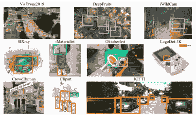

图 16: 提出的 MoF-SOD [27] 基准中的样本图像。

CDFS 分割。PATNet [26] 提出了一个跨领域少样本分割基准。在提出的基准上评估了代表性的少样本分割和基于迁移学习的方法。并提出了一种基于金字塔锚点变换的少样本分割网络，其中领域特定特征被转化为领域无关特征，以便下游分割模块能够快速适应未见领域。RD [5] 还提出了一个使用不同公共数据集的跨领域少样本分割任务，以验证模型效果。作为最著名的数据集，我们总结了从 COCO-$2-^{i}$ 到 PASCAL-$5^{i}$ 的分割迁移效果，如表 4 所示。

表 4: COCO-$20^{i}$ 到 PASCAL-$5^{i}$ 任务的跨领域少样本语义分割结果。

| COCO-$20^{i}$ 到 PASCAL-$5^{i}$ |
| --- |
| Backbone | 方法 | 1-shot | 5-shot |
| split0 | split1 | split2 | split3 | 平均 | split0 | split1 | split2 | split3 | 平均 |
| ResNet50 | RPMMs[90][(ECCV20)] | 36.3 | 55.0 | 52.5 | 54.6 | 49.6 | 40.2 | 58.0 | 55.2 | 61.8 | 53.8 |
| RePRI[91][(CVPR21)] | 52.4 | 64.3 | 65.3 | 71.5 | 63.3 | 57.0 | 68.0 | 70.4 | 76.2 | 67.9 |
| ASGNet[92][(CVPR21)] | 42.5 | 58.7 | 65.5 | 63.0 | 57.4 | 53.7 | 69.8 | 67.1 | 75.9 | 66.6 |
| PFENet[93][(TPAMI)] | - | - | - | - | 60.8 | - | - | - | - | 61.9 |
| CWT[94][(ICCV21)] | 53.5 | 59.2 | 60.2 | 64.9 | 59.4 | 60.3 | 65.8 | 67.1 | 72.8 | 66.5 |
| HSNet[95][(ICCV21)] | 48.7 | 61.5 | 63.0 | 72.8 | 61.5 | 58.2 | 65.9 | 71.8 | 77.9 | 68.4 |
| RD[5][(CVPR22)] | 57.4 | 62.2 | 68.0 | 74.8 | 65.6 | 65.7 | 69.2 | 70.8 | 75.0 | 70.1 |
| ResNet101 | SCL[96][(CVPR21)] | 43.1 | 60.3 | 66.1 | 68.1 | 59.4 | 43.3 | 61.2 | 66.5 | 70.4 | 60.3 |
| HSNet[95][(ICCV21)] | 46.3 | 64.7 | 67.7 | 74.2 | 63.2 | 59.1 | 69.0 | 73.4 | 78.7 | 70.0 |
| RD[5][(CVPR22)] | 59.4 | 64.3 | 70.8 | 72.0 | 66.6 | 67.2 | 72.7 | 72.0 | 78.9 | 72.7 |

## 6 CDFS 的应用

CDFS 关注少样本的领域问题。它已在各种应用中得到使用，如图 17 所示。我们总结了用于物体检测和分割的不同 CDFS 方法。对于其他应用，我们也提供了详细的调查。

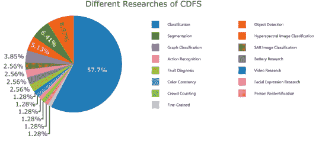

图 17：跨领域少样本相关应用。

### 6.1 CDFS 在物体检测中的应用

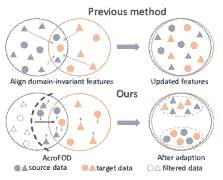

图 18：AcroFOD [44] 解决了跨领域少样本物体检测任务。上图：现有的特征对齐方法在目标领域的有限标注数据中无法提取出判别性特征。下图：我们的方法筛选（粗黑虚线）远离目标领域的源数据。

对于 CDFS 目标检测，图像增强仍然是最直接的选择。CutMix [47] 直接将目标领域的数据粘贴到图像中以增强特征多样性。然而，由于目标领域数据的稀缺，直接图像混合会带来不必要的噪声影响。为了缓解这种情况，AcroFOD [44] 提出了一个过滤机制来过滤增强后的图像，如图 18 所示。在训练过程中，模型不断测量增强特征与目标特征之间的距离，保留最相似的前 k 个特征。最终，增强特征被用于目标检测学习。生成策略仍然可以丰富特征分布。为此，OA-FSUI2IT [41] 使用目标领域的未标记数据生成新的风格图像用于模型训练。生成图像的风格与目标领域一致，内容与源领域一致。领域自适应训练确保了学习内容的可重复性，提高了模型的可解释性，自监督内容一致性提高了模型的泛化能力。CDTL [97] 是首批研究少样本 SAR 图像船舶检测问题的工作之一，这具有很大的实际价值，但相比于少样本条件下 SAR 图像分类问题，研究较少。CDTL [97] 设计了一个基于迁移学习的两阶段少样本 SAR 船舶检测模型，利用光学船舶图像的相似性信息。 

### 6.2 CDFS 用于分割

对于 CDFS 分割，RD [5]提出了一种记忆机制的领域增强策略。在训练过程中，源领域数据不断将领域样式信息存储在记忆中。在测试过程中，将存储在记忆中的源信息加载到目标领域特征增强中。RD [5]可以直接减少领域差异，并已在典型划分数据集上验证。对于自动驾驶应用中的语义分割任务，PixDA [67]提出了一种新颖的逐像素领域对抗损失，遵循三个标准：（i）对每个像素对齐源领域和目标领域，（ii）避免在正确表示的像素上进行负迁移，（iii）正则化不常见类别的训练以避免过拟合。CDTF [78]通过对齐支持和查询原型实现跨领域少样本分割。通过用不确定性感知对比损失对齐查询和支持原型，并使用监督交叉熵损失和无监督边界损失作为正则化，CDTF [78]能够将基础模型推广到目标领域，而无需额外标签。CD-FSS [98]提出了一种跨领域少样本分割框架，使模型能够利用从自然领域获得的学习能力来促进对有限常见疾病数据的稀有疾病皮损分割。

### 6.3 CDFS 在其他应用中的应用

跨领域少样本高光谱图像分类[99, 100, 101, 102]最近引起了研究关注，该模型关注于由于特殊图像数据的局部和全球图像上下文的学习。相关的高光谱框架类似于传统的少样本研究。SAR-FS [103]开发了一种算法，将知识从 EO 领域转移到 SAR 领域，从而消除在 SAR 领域中对大量标记数据点的需求。

研究人员[104, 105]进行了一系列关于故障诊断的研究和讨论，重点关注元学习对跨领域故障诊断的影响。FSPR [106]首次将重新识别场景表述为一个跨领域少样本问题，并讨论了传统和无监督重识别之间的区别。并引入了一种基于函数的重新加权实例方法（ReWIF）来指导重识别模型的训练过程。在其他相关领域[107, 108, 109, 110]，CDFS 逐渐受到关注，推动了各研究子领域的发展。

## 7 未来方向

### 7.1 未来挑战

CDFS 专注于不同领域的学习，并在很大程度上解决了领域转移挑战。由于标注数据有限，目前的研究主要关注近领域迁移，忽视了更具挑战性的远领域迁移。从自然场景到专有领域的模型迁移仍然困难重重。对于多源 CDFS，设计的学习方案的目标是实现领域适应和泛化。即便在新的 CDFS 领域中标注数据不足，也可能抑制迁移效果，降低多个来源在该领域的有效性。因此，细化在多个来源之间分布不均的数据对最大化迁移效果并确保成功的 CDFS 至关重要。

### 7.2 未来技术

最近的研究人员试图使用图像和特征增强来解决 CDFS 问题，该问题要求模型能够快速适应新环境，同时保持快速学习能力。然而，成功结合不足的标注和领域转移问题仍然是一个挑战。为了进一步开发 CDFS 问题的解决方案，研究人员应考虑适应高参数和利用领域不变信息的重要性。

#### 7.2.1 多源元学习

未来，元学习有望成为解决领域转移的关键工具，特别是在少样本学习的背景下。模型可以通过利用其高适应性成功应对复杂的场景，特别是在领域迁移方面。因此，跨领域少样本（CDFS）的未来工作应更多关注多源环境中的元学习[111]。充分利用丰富的数据分布应最大限度地发挥元学习的效用，并保持其原始意图。此外，应开展将记忆机制与元学习结合的研究；这种结合将为 CDFS 领域带来直接的好处。记忆可以在不妨碍性能的情况下连接领域，同时元学习提供高度可定制的参数。

#### 7.2.2 领域不变信息

面对单领域 CDFS 时，领域不变信息对于成功的零样本学习至关重要[112, 113]。具体来说，语义信息通常可以用来证明不同类别之间的关系。由于视觉差异不会阻碍它，因此可以作为学习的补充信息加以利用。在 FSL 的背景下，几项研究探讨了语义模态和视觉的交集，通常利用前者来促进类别之间的知识迁移[114, 115]。当共享的类别信息能够成功转换为不同的模态时，它可以为跨领域 FSL 场景提供有价值的指导[116]。

### 7.3 未来应用

#### 7.3.1 开放集少样本学习

深度模型的 softmax 将测试阶段的所有样本分配到固定类别，这与实际期望不同，因为它无法识别未见过的类别[117]。为了解决这一限制，相比于闭集模型，开放集模型更为合适，因为它们要求模型对未见过的类别做出相应的反应，而不是机械地处理。模型的跨领域少样本（CDFS）迁移到目标领域可以识别未见过的类别，但在此过程中需要一些微调注释[118, 119]。然而，这种方法仅在源领域和目标领域的类别可以界定时有效，这提出了一个重要问题：在所有类别都需要标记的复杂场景中如何识别这些未标记的类别。开放集少样本学习可以帮助应对这一挑战。

#### 7.3.2 增量式少样本学习

增量式少样本学习要求模型在不遗忘已学类别的情况下识别新类别[120, 121]。典型的少样本模型只关注新类别，基础类别必须重新学习以完成识别。数据依赖性导致模型在有限场景下有效，且无法增加类别。对于未来的 CDFS，模型将在泛化过程中不断学习新的领域信息。为了识别不同领域的类别，模型需要不断学习和保存对应领域的数据。随时将数据绑定到模型上并不符合少样本学习的初衷。因此，研究增量式少样本学习可以在一定程度上促进 CDFS 的发展。如果我们能消除对数据领域的依赖，CDFS 将变得更加实用[122, 123]。

## 8 结论

我们提供了对近期跨领域少样本学习（CDFS）研究的全面概述。我们的分析考虑了现有解决方案和研究问题，同时比较了不同研究之间的性能指标。此外，我们讨论了 CDFS 的广泛应用及其对未来研究的影响。我们的综述将作为一个有价值的参考指南，并为推动 CDFS 领域的发展提供理论支持。我们的调查显示，跨领域少样本学习正逐渐成为一个越来越受欢迎的研究主题，并因其在 AI 应用中缓解领域偏移问题的潜力而受到广泛关注。目前解决该问题的方法涵盖了多种途径，每种方法都有其优缺点。由于研究领域仍处于起步阶段，未来的工作应着重于扩展现有或新方法，以提升跨领域少样本学习系统的性能。

## 9 致谢

本研究部分得到了中国国家自然科学基金（编号 62176009）、新一代人工智能重大项目（编号 2018AAA0100400）、中国国家自然科学基金（编号 61836014、U21B2042、62072457、62006231）的资助。

## 参考文献

+   [1] J. Snell, K. Swersky, R. S. Zemel, 原型网络用于少样本学习，ArXiv abs/1703.05175。

+   [2] F. Sung, Y. Yang, L. Zhang, T. Xiang, P. H. S. Torr, T. M. Hospedales, 学习比较：少样本学习的关系网络，2018 IEEE/CVF 计算机视觉与模式识别会议（2017）1199–1208。

+   [3] O. Vinyals, C. Blundell, T. P. Lillicrap, K. Kavukcuoglu, D. Wierstra, 匹配网络用于单次学习，载于：NIPS 会议，2016 年。

+   [4] W. Wang, L. Duan, Q. En, B. Zhang, F. Liang, Tpsn: 基于变压器的多原型搜索网络用于少样本语义分割，计算机与电子工程学报 103（2022）108326。

+   [5] W. Wang, L. Duan, Y. Wang, Q. En, J. Fan, Z. Zhang, 记住差异：通过元记忆转移进行跨领域少样本语义分割，2022 IEEE/CVF 计算机视觉与模式识别会议（CVPR）（2022）7055–7064。

+   [6] Y. Guo, N. C. F. Codella, L. Karlinsky, J. Codella, J. R. Smith, K. Saenko, T. S. Rosing, R. S. Feris, 更广泛的跨领域少样本学习研究，载于：欧洲计算机视觉会议，2019 年。

+   [7] H.-Y. Tseng, H.-Y. Lee, J.-B. Huang, M.-H. Yang, 通过学习的特征变换进行跨领域少样本分类，载于：国际学习表征会议，2020 年。

+   [8] Y. Wang, Q. Yao, J. T.-Y. Kwok, L. M. shuan Ni, 从少数例子中概括：少样本学习的综述，arXiv: Learning。

+   [9] S. Motiian, Q. Jones, S. M. Iranmanesh, G. Doretto, 少样本对抗领域自适应，载于：NIPS，2017 年。

+   [10] X. Yue, Z. Zheng, S. Zhang, Y. Gao, T. Darrell, K. Keutzer, A. S. Vincentelli, 原型式跨领域自监督学习用于少样本无监督领域自适应，2021 IEEE/CVF 计算机视觉与模式识别会议（CVPR）（2021）13829–13839。

+   [11] K. Saito, D. Kim, S. Sclaroff, T. Darrell, K. Saenko, 通过最小最大熵进行半监督领域自适应，2019 IEEE/CVF 国际计算机视觉会议（ICCV）（2019）8049–8057。

+   [12] S. Chen, X. Jia, J. He, Y. Shi, J. Liu, 基于双层领域混合的半监督领域自适应用于语义分割，2021 IEEE/CVF 计算机视觉与模式识别会议（CVPR）（2021）11013–11022。

+   [13] J. Liang, D. Hu, Y. Wang, R. He, J. Feng, 缺少源数据的无监督领域自适应通过假设转移和标注转移，IEEE 模式分析与机器智能学报 44（2020）8602–8617。

+   [14] T. Xu, W. Chen, P. Wang, F. Wang, H. Li, R. Jin, Cdtrans: 用于无监督领域自适应的跨领域变压器，ArXiv abs/2109.06165。

+   [15] X. Liu, Z. Guo, S. Li, F. Xing, J. J. You, C.-C. J. Kuo, G. E. Fakhri, J. Woo, 对抗性无监督领域适应：条件和标签偏移：推断、对齐和迭代，2021 IEEE/CVF 国际计算机视觉会议 (ICCV) (2021) 10347–10356。

+   [16] J. Wang, C. Lan, C. Liu, Y. Ouyang, T. Qin, 泛化到未见领域：领域泛化综述，发表于：国际人工智能联合会议，2021 年。

+   [17] K. Zhou, Z. Liu, Y. Qiao, T. Xiang, C. C. Loy, 领域泛化：综述，IEEE 模式分析与机器智能学报 PP。

+   [18] S. Thrun, L. Y. Pratt, 学习如何学习：介绍与概述，发表于：学习如何学习，1998 年。

+   [19] Q. Sun, Y. Liu, Z. Chen, T.-S. Chua, B. Schiele, 通过困难任务进行元转移学习，IEEE 模式分析与机器智能学报 44 (2019) 1443–1456。

+   [20] A. Achille, M. Lam, R. Tewari, A. Ravichandran, S. Maji, C. C. Fowlkes, S. Soatto, P. Perona, Task2vec: 用于元学习的任务嵌入，2019 IEEE/CVF 国际计算机视觉会议 (ICCV) (2019) 6429–6438。

+   [21] R. Vuorio, S.-H. Sun, H. Hu, J. J. Lim, 通过任务感知调制的多模态模型无关元学习，发表于：神经信息处理系统，2019 年。

+   [22] A. Nichol, J. Schulman, Reptile: 一种可扩展的元学习算法，arXiv: 学习。

+   [23] G. Chen, T. Zhang, J. Lu, J. Zhou, 深度元度量学习，2019 IEEE/CVF 国际计算机视觉会议 (ICCV) (2019) 9546–9555。

+   [24] A. Nichol, J. Achiam, J. Schulman, 关于一阶元学习算法，ArXiv abs/1803.02999。

+   [25] E. Triantafillou, T. L. Zhu, V. Dumoulin, P. Lamblin, K. Xu, R. Goroshin, C. Gelada, K. Swersky, P.-A. Manzagol, H. Larochelle, Meta-dataset: 一个用于从少量样本中学习的集合数据集，ArXiv abs/1903.03096。

+   [26] S. Lei, X. Zhang, J. He, F. Chen, B. Du, C.-T. Lu, 跨领域少样本语义分割，发表于：欧洲计算机视觉会议，2022 年。

+   [27] K. Lee, H. Yang, S. Chakraborty, Z. Cai, G. Swaminathan, A. Ravichandran, O. Dabeer, 在多领域基准上重新思考少样本目标检测，ArXiv abs/2207.11169。

+   [28] J. Oh, S. Kim, N. Ho, J.-H. Kim, H. Song, S.-Y. Yun, 基于领域相似性和少样本难度理解跨领域少样本学习，2022 年。

+   [29] Y. Zhang, Y. Zheng, X. Xu, J. Wang, 自监督方法在跨领域少样本学习中的表现如何？，ArXiv abs/2202.09014。

+   [30] N. Dvornik, C. Schmid, J. Mairal, 从多领域表示中选择相关特征用于少样本分类，发表于：欧洲计算机视觉会议，2020 年。

+   [31] S. Peng, W. Song, M. Ester, 在参数空间中结合领域特定的元学习器用于跨领域少样本分类，ArXiv abs/2011.00179。

+   [32] W.-H. Li, X. Liu, H. Bilen, 从多个领域学习通用表示用于少样本分类，2021 年 IEEE/CVF 计算机视觉国际会议（ICCV）（2021）9506–9515。

+   [33] J. Xiao, S. Gu, L. Zhang, 精确和少样本色彩一致性的多领域学习，2020 年 IEEE/CVF 计算机视觉与模式识别会议（CVPR）（2020）3255–3264。

+   [34] W.-H. Li, X. Liu, H. Bilen, 带有任务特定适配器的跨领域少样本学习，2022 年 IEEE/CVF 计算机视觉与模式识别会议（CVPR）（2022）7151–7160。

+   [35] X. Zou, Y. Yan, J. Xue, S. Chen, H. Wang, Learn-to-decompose: 用于跨领域少样本面部表情识别的级联分解网络，欧洲计算机视觉会议，2022 年。

+   [36] H. Xu, L. Liu, 通过源间风格化进行跨领域少样本分类，ArXiv abs/2208.08015。

+   [37] W.-Y. Lee, J.-Y. Wang, Y. Wang, 跨领域少样本分类的领域无关元学习，ICASSP 2022 - 2022 年 IEEE 国际声学、语音与信号处理会议（ICASSP）（2022）1715–1719。

+   [38] Y. Fu, Y. Fu, Y.-G. Jiang, Meta-fdmixup: 由标记目标数据引导的跨领域少样本学习，arXiv 预印本 arXiv:2107.11978。

+   [39] A. Islam, C.-F. Chen, R. Panda, L. Karlinsky, R. S. Feris, R. J. Radke, 动态蒸馏网络用于带有未标记数据的跨领域少样本识别，神经信息处理系统，2021 年。

+   [40] A. Zhao, M. Ding, Z. Lu, T. Xiang, Y. Niu, J. Guan, J. rong Wen, P. Luo, 领域自适应少样本学习，2021 年 IEEE 冬季计算机视觉应用会议（WACV）（2020）1389–1398。

+   [41] L. Zhao, Y. Meng, L. Xu, Oa-fsui2it: 一种新颖的少样本跨领域目标检测框架，具有对象感知的少样本无监督图像到图像转换，AAAI，2022 年。

+   [42] Y. Fu, Y. Xie, Y. Fu, J. Chen, Y.-G. Jiang, Me-d2n: 跨领域少样本学习的多专家领域分解网络， 第 30 届 ACM 国际多媒体会议论文集。

+   [43] L. Zhuo, Y. Fu, J. Chen, Y. Cao, Y.-G. Jiang, Tgdm: 用于跨领域少样本学习的目标引导动态混合， 第 30 届 ACM 国际多媒体会议论文集。

+   [44] Y. Gao, L. Yang, Y. Huang, S. Xie, S. Li, W. Zheng, Acrofod: 一种用于跨领域少样本目标检测的自适应方法，欧洲计算机视觉会议，2022 年。

+   [45] W. Chen, Z. Zhang, W. Wang, L. Wang, Z. Wang, T. Tan, 通过学习紧凑且对齐的表示进行跨领域跨集合少样本学习，欧洲计算机视觉会议，2022 年。

+   [46] F. Yao, 跨领域少样本学习与未标记数据，ArXiv abs/2101.07899。

+   [47] Y. Nakamura, Y. Ishii, Y. Maruyama, T. Yamashita, 带有跨领域 CutMix 的少样本自适应目标检测，ArXiv abs/2208.14586。

+   [48] T. Teshima, I. Sato, M. Sugiyama, 通过因果机制转移进行小样本领域适应, 见：国际机器学习大会, 2020。

+   [49] C. Medina, A. Devos, M. Grossglauser, 自监督原型迁移学习用于小样本分类, ArXiv abs/2006.11325。

+   [50] Y. Zou, S. Zhang, J. Yu, Y. Tian, J. M. F. Moura, 重新审视跨域小样本识别中的中级模式, 第 29 届 ACM 国际多媒体大会论文集。

+   [51] H. Liang, Q. Zhang, P. Dai, J. Lu, 通过噪声增强的监督自编码器提升跨域小样本学习的泛化能力, 2021 IEEE/CVF 国际计算机视觉大会 (ICCV) (2021) 9404–9414。

+   [52] H. Wang, Z. Deng, 跨域小样本分类通过对抗任务增强, 见：国际人工智能联合会议, 2021。

+   [53] R. Tao, H. Zhang, Y. Zheng, M. Savvides, 提升小样本学习中的微调效果：通过选择采样减少领域无关偏差, 见：AAAI, 2022。

+   [54] W. Yuan, Z. Zhang, C. Wang, H. Song, Y. Xie, L. Ma, 跨域小样本学习的任务级自监督, 见：AAAI, 2022。

+   [55] P. Li, S. Gong, Y. Fu, C. Wang, 跨域小样本学习的排名距离校准, 2022 IEEE/CVF 计算机视觉与模式识别大会 (CVPR) (2021) 9089–9098。

+   [56] Y. Hu, A. J. Ma, 对抗特征增强用于跨域小样本分类, 见：ECCV, 2022。

+   [57] W. Zhang, L. Shen, W. Zhang, C.-S. Foo, 预训练网络的领域适应小样本学习, 见：IJCAI, 2022。

+   [58] Y. Xu, L. Wang, Y. Wang, C. Qin, Y. Zhang, Y. R. Fu, Memrein: 控制跨域小样本学习中的领域偏移, 见：IJCAI, 2022。

+   [59] P.-C. Tu, H.-K. K. Pao, 一种用于跨域小样本学习的 dropout 风格模型增强, 2021 IEEE 国际大数据大会 (Big Data) (2021) 1138–1147。

+   [60] J. Jiang, Z. Li, Y. Guo, J. Ye, 用于跨域小样本学习的传导多头模型, ArXiv abs/2006.11384。

+   [61] B. Liu, Z. Zhao, Z. Li, J. Jiang, Y. Guo, J. Ye, 带批量谱正则化的特征变换集成模型用于跨域小样本分类, ArXiv abs/2005.08463。

+   [62] J. Cai, B. Y. Cai, S. M. Shen, Sb-mtl: 基于评分的元迁移学习用于跨域小样本学习, ArXiv abs/2012.01784。

+   [63] X. Liu, Z. Ji, Y. Pang, Z. Zhang, 自学的跨域小样本学习与弱监督目标定位和任务分解, ArXiv abs/2109.01302。

+   [64] Y. Fu, Y. Xie, Y. Fu, J. Chen, Y.-G. Jiang, Wave-san: 基于小波的风格增强网络用于跨域小样本学习, ArXiv abs/2203.07656。

+   [65] J. Oh, S. Kim, N. Ho, J.-H. Kim, H. Song, S.-Y. Yun, Refine: 微调前的再随机化用于跨域小样本学习, 第 31 届 ACM 国际信息与知识管理大会论文集。

+   [66] S. Li, X. Sui, J. Fu, H. Fu, X. Luo, Y. Feng, X. Xu, Y. Liu, D. Ting, R. S. M. Goh, 具有多态变换器的少样本领域适应，ArXiv abs/2107.04805。

+   [67] A. Tavera, F. Cermelli, C. Masone, B. Caputo, 像素级跨领域对齐的少样本语义分割，2022 IEEE/CVF 冬季计算机视觉应用会议（WACV）（2021）1959–1968。

+   [68] S. Huang, W. Yang, L. Wang, L. Zhou, M. Yang, 图像到类别稀疏相似性编码的少样本无监督领域适应，第 29 届 ACM 国际多媒体会议论文集。

+   [69] C. P. Phoo, B. Hariharan, 针对极端任务差异的少样本迁移自训练，ArXiv abs/2010.07734。

+   [70] A. D’Innocente, F. C. Borlino, S. Bucci, B. Caputo, T. Tommasi, 一次性无监督跨领域检测，见：欧洲计算机视觉大会，2020。

+   [71] B. Xu, Z. Zeng, C. Lian, Z. Ding, 通过混合最优传输进行少样本领域适应，IEEE 图像处理学报 31（2022）2518–2528。

+   [72] S. P. Mohanty, D. P. Hughes, M. Salathé, 使用深度学习进行基于图像的植物疾病检测，植物科学前沿 7。

+   [73] P. Helber, B. Bischke, A. R. Dengel, D. Borth, Eurosat：用于土地利用和土地覆盖分类的新数据集及深度学习基准，IEEE 应用地球观测与遥感精选主题期刊 12（2019）2217–2226。

+   [74] X. Wang, Y. Peng, L. Lu, Z. Lu, M. Bagheri, R. M. Summers, Chestx-ray8：医院级胸部 X 射线数据库及弱监督分类和常见胸部疾病定位基准，2017 IEEE 计算机视觉与模式识别会议（CVPR）（2017）3462–3471。

+   [75] Y. Fu, Y. Fu, J. Chen, Y.-G. Jiang, 泛化元-fdmixup：以标记目标数据指导的跨领域少样本学习，IEEE 图像处理学报 31（2022）7078–7090。

+   [76] L. Yalan, W. Jijie, 通过多样化特征变换层进行跨领域少样本分类，2021 IEEE 国际人工智能与计算机应用大会（ICAICA）（2021）549–555。

+   [77] J. Sun, S. Lapuschkin, W. Samek, Y. Zhao, N.-M. Cheung, A. Binder, 以解释为指导的跨领域少样本分类训练，2020 年第 25 届国际模式识别大会（ICPR）（2020）7609–7616。

+   [78] Y. Lu, X. Wu, Z. Wu, S. Wang, 通过传导微调进行跨领域少样本分割，ArXiv abs/2211.14745。

+   [79] S. Baik, J. Oh, S. Hong, K. M. Lee, 通过任务和层级衰减学习遗忘进行元学习，IEEE 模式分析与机器智能学报 44（2021）7718–7730。

+   [80] X. Lin, M. Ye, Y. Gong, G. T. Buracas, N. Basiou, A. Divakaran, Y. Yao, 跨领域少样本学习的模块化适应，ArXiv abs/2104.00619。

+   [81] Q. Zhang, Y. Jiang, Z. Wen, Tacdfsl：任务自适应跨领域少样本学习，Symmetry 14（2022）1097。

+   [82] S. 拉维, H. 拉罗谢尔, 将优化作为少样本学习的模型，见：国际表示学习会议, 2016。

+   [83] P. 茨汉德尔, C. 罗森达尔, H. 基特勒, HAM10000 数据集：一个包含多源皮肤镜图像的大型常见色素性皮肤病变集合，《科学数据》5。

+   [84] C. 瓦赫, S. 布兰森, P. 韦林德, P. 佩罗纳, S. J. 贝隆吉, Caltech-UCSD 鸟类 200-2011 数据集，2011。

+   [85] J. 克劳斯, M. 斯塔克, J. 邓, L. 费伊-费伊, 用于细粒度分类的三维物体表示，2013 IEEE 国际计算机视觉会议工作坊 (2013) 554–561。

+   [86] B. 周, À. 拉佩德里扎, A. 科斯拉, A. 奥利瓦, A. 托拉尔巴, Places: 用于场景识别的千万图像数据库，《IEEE 模式分析与机器智能》40 (2018) 1452–1464。

+   [87] G. V. 霍恩, O. M. 奥达, Y. 宋, Y. 崔, C. 孙, A. 谢泼德, H. 亚当, P. 佩罗纳, S. J. 贝隆吉, iNaturalist 物种分类和检测数据集，2018 IEEE/CVF 计算机视觉与模式识别会议 (2017) 8769–8778。

+   [88] V. G. 萨托拉斯, J. 布鲁纳, 使用图神经网络进行少样本学习，ArXiv abs/1711.04043。

+   [89] Y. 陈, Y. 郑, Z. 许, T. 唐, Z. 唐, J. 陈, Y. 刘, 基于轻量级 res2net 和灵活 GNN 的跨领域少样本分类，《知识基系统》247 (2022) 108623。

+   [90] B. 杨, C. 刘, B. 李, J. 焦, Q. 叶, 用于少样本语义分割的原型混合模型，见：Proc. ECCV, Vol. abs/2008.03898, 2020。

+   [91] M. 布迪亚夫, H. 凯尔瓦代克, I. M. 齐科, P. 皮安塔尼达, I. B. 阿耶德, J. 多尔兹, 无需元学习的少样本分割：你只需要一个好的推断吗？，见：Proc. CVPR, 2021, pp. 13974–13983。

+   [92] G. 李, V. 詹帕尼, L. 塞维拉-拉拉, D. 孙, J. 金, J. 金, 用于少样本分割的自适应原型学习和分配，见：Proc. CVPR, 2021, pp. 8330–8339。

+   [93] Z. 田, H. 赵, M. 舒, Z. 杨, R. 李, J. 贾, 基于先验引导的特征增强网络用于少样本分割，《IEEE 模式分析与机器智能》PP。

+   [94] Z. 陆, S. 何, X. 朱, L. 张, Y.-Z. 宋, T. 项, 更简单更好：通过分类器权重变换器进行少样本语义分割，见：Proc. ICCV, Vol. abs/2108.03032, 2021。

+   [95] J. 闵, D. 康, M. 卓, 用于少样本分割的超相关挤压，见：Proc. ICCV, Vol. abs/2104.01538, 2021。

+   [96] B. 张, J. 萧, T. 秦, 自我引导和交叉引导学习用于少样本分割，见：Proc. CVPR, 2021, pp. 8308–8317。

+   [97] X. 王, H. 周, Z. 陈, J. 白, J. 任, J. 石, 使用双阶段跨领域迁移学习的少样本 SAR 船只图像检测，IGARSS 2022 - 2022 IEEE 国际地球科学与遥感研讨会 (2022) 2195–2198。

+   [98] Y. Wang, Z. Xu, J. Tian, J. Luo, Z. Shi, Y. Zhang, J. Fan, Z. He, 跨域少样本学习用于稀有疾病皮肤病变分割，ICASSP 2022 - 2022 IEEE 国际声学、语音和信号处理会议（ICASSP） (2022) 1086–1090。

+   [99] Y. Zhang, W. Li, M. Zhang, S. Wang, R. Tao, Q. Du, 图信息聚合跨域少样本学习用于高光谱图像分类，IEEE 神经网络与学习系统学报 PP。

+   [100] Z. Li, M. Liu, Y. Chen, Y. Xu, W. Li, Q. Du, 深度跨域少样本学习用于高光谱图像分类，IEEE 地球科学与遥感学报 60 (2021) 1–18。

+   [101] Y. Zhang, W. Li, M. Zhang, R. Tao, 双图跨域少样本学习用于高光谱图像分类，ICASSP 2022 - 2022 IEEE 国际声学、语音和信号处理会议（ICASSP） (2022) 3573–3577。

+   [102] B. Wang, Y. Xu, Z. Wu, T. Zhan, Z. Wei, 空间–光谱局部领域适应用于跨域少样本高光谱图像分类，IEEE 地球科学与遥感学报 60 (2022) 1–15。

+   [103] M. Rostami, S. Kolouri, E. Eaton, K. Kim, 使用少样本跨域迁移学习进行 SAR 图像分类，2019 IEEE/CVF 计算机视觉与模式识别会议研讨会（CVPRW） (2019) 907–915。

+   [104] T. Tang, C. Qiu, T. Yang, W. Jingwei, M. Chen, J. Wu, L. Wang, 一种用于跨域少样本故障诊断的新型轻量关系网络，SSRN 电子期刊。

+   [105] Y. Feng, J. Chen, J. Xie, T. Zhang, H. Lv, T. Pan, 元学习作为一种有前景的方法用于少样本跨域故障诊断：算法、应用和前景，Knowl. Based Syst. 235 (2021) 107646。

+   [106] X. Dai, C. Yang, B. Liu, H. gang Gong, X. Yuan, 在智能城市上部署重新识别系统的简易方法：跨域少样本人员重新识别，移动信息系统。

+   [107] H. Hou, S. Bi, L. Zheng, X. Lin, Z. Quan, 样本高效跨域 WiFi 室内人群计数通过少样本学习，2022 第 31 届无线与光学通信大会（WOCC） (2022) 132–137。

+   [108] G. Sun, Z. Liu, L. Wen, J. Shi, C. Xu, 异常穿越：一种用于视频异常检测的新方法，作为跨域少样本学习，ArXiv abs/2112.06320。

+   [109] X. Zhou, Y. Mu, 谷歌帮助 YouTube：从历史任务和跨域样本转移中学习少样本视频分类，2020 年国际多媒体检索会议论文集。

+   [110] K. Wu, J. Tan, C. Liu, 使用改进的孪生网络的跨域少样本学习方法用于锂离子电池表面缺陷分类，IEEE 传感器学报 22 (2022) 11847–11856。

+   [111] S. Qiu, C. Zhu, W. Zhou, 元自学习用于多源领域适应：一个基准，2021 IEEE/CVF 计算机视觉国际会议研讨会（ICCVW） (2021) 1592–1601。

+   [112] S. Min, H. Yao, H. Xie, C. Wang, Z. Zha, Y. Zhang, 领域感知视觉偏差消除用于广义零样本学习，2020 IEEE/CVF 计算机视觉与模式识别大会 (CVPR) (2020) 12661–12670。

+   [113] S. Min, H. Yao, H. Xie, Z. Zha, Y. Zhang, 特定领域嵌入网络用于零样本识别，发表于第 27 届 ACM 国际多媒体大会。

+   [114] S. Wang, J. Yue, J. Liu, Q. Tian, M. Wang, 通过多模态知识发现的大规模小样本学习，发表于：欧洲计算机视觉会议，2020 年。

+   [115] Z. Peng, Z. Li, J. Zhang, Y. Li, G.-J. Qi, J. Tang, 知识迁移的小样本图像识别，2019 IEEE/CVF 国际计算机视觉大会 (ICCV) (2019) 441–449。

+   [116] J. Guan, M. Zhang, Z. Lu, 大规模跨域小样本学习，发表于：亚洲计算机视觉会议，2020 年。

+   [117] M. Salehi, H. Mirzaei, D. Hendrycks, Y. Li, M. H. Rohban, M. Sabokrou, 关于异常、novelty、开放集和分布外检测的统一调查：解决方案与未来挑战，ArXiv abs/2110.14051。

+   [118] B. Liu, H. Kang, H. Li, G. Hua, N. Vasconcelos, 利用元学习的小样本开放集识别，2020 IEEE/CVF 计算机视觉与模式识别大会 (CVPR) (2020) 8795–8804。

+   [119] M. Jeong, S. Choi, C. Kim, 通过变换一致性的小样本开放集识别，2021 IEEE/CVF 计算机视觉与模式识别大会 (CVPR) (2021) 12561–12570。

+   [120] X. Tao, X. Hong, X. Chang, S. Dong, X. Wei, Y. Gong, 小样本类别增量学习，2020 IEEE/CVF 计算机视觉与模式识别大会 (CVPR) (2020) 12180–12189。

+   [121] K. Zhu, Y. Cao, W. Zhai, J. Cheng, Z. Zha, 自我促成的原型细化用于小样本类别增量学习，2021 IEEE/CVF 计算机视觉与模式识别大会 (CVPR) (2021) 6797–6806。

+   [122] D. A. Ganea, B. Boom, R. Poppe, 增量式小样本实例分割，2021 IEEE/CVF 计算机视觉与模式识别大会 (CVPR) (2021) 1185–1194。

+   [123] K. D. M. Nguyen, S. Todorovic, ifs-rcnn: 一种增量式小样本实例分割器，2022 IEEE/CVF 计算机视觉与模式识别大会 (CVPR) (2022) 7000–7009。

\bio

./bio/wwj.jpg 温健 王 温健获得了中国北方大学计算机科学硕士学位。他目前在中国北京工业大学信息技术学院攻读博士学位。他的当前研究兴趣包括图像处理、机器学习和计算机视觉。

\endbio

\bio

./bio/dlj.PNG**段莉娟**于 1995 年和 1998 年分别从郑州大学获得计算机科学学士和硕士学位。她于 2003 年从中国科学院计算技术研究所获得计算机科学博士学位。她目前是北京工业大学信息技术学院的教授。她的研究兴趣包括人工智能、图像处理、计算机视觉和信息安全。她在人工智能、图像处理和计算机视觉领域的同行评审期刊和会议上发表了 70 多篇研究文章。

\endbio\bio

./bio/yuxi_wang.pdf**王宇曦**于 2016 年从中国东北大学获得学士学位，并于 2022 年 1 月从中国科学院自动化研究所（CASIA）中国科学院大学（UCAS）获得博士学位。他现在是香港科学与创新研究院（HKISI-CAS）人工智能与机器人中心（CAIR）的助理教授。他的研究兴趣包括迁移学习、领域适应和计算机视觉。

\endbio

\bio

./bio/fjs.jpg**范俊松**于 2016 年从北航大学自动化科学与电气工程学院获得学士学位。随后，他在中国科学院自动化研究所模式识别国家重点实验室的智能感知与计算研究中心，师从谭天宇教授和张兆翔教授，并于 2022 年获得博士学位。他现在是香港科学与创新研究院人工智能与机器人中心的助理教授。他的研究兴趣包括计算机视觉和机器学习、无标签学习以及开放世界中的视觉感知。

\endbio\bio

./bio/gz.PNG**龚智**（学生会员，IEEE）于 2019 年从山东师范大学获得计算机科学与技术学士学位。他目前正在北京工业大学攻读计算机科学与技术博士学位。他的研究兴趣包括计算机视觉和图像处理。

\endbio

\bio

./bio/zhaoxiangzhang.pdf 赵向张于 2004 年获得中国科学技术大学（USTC）电子科学与技术系的学士学位。之后，他在中国科学院自动化研究所模式识别国家实验室，师从**谭铁牛**教授，成为博士研究生，并于 2009 年获得博士学位。2009 年 10 月，他加入了北京航空航天大学计算机科学与工程学院，担任助理教授（2009-2011）、副教授（2012-2015）以及计算机应用技术系副主任（2014-2015）。2015 年 7 月，他回到中国科学院自动化研究所。目前，他是智能感知与计算研究中心（CRIPAC）和模式识别国家实验室（NLPR）的**教授**。他的研究兴趣包括计算机视觉、模式识别和机器学习。最近，他特别关注深度学习模型、生物启发的视觉计算和类人学习，以及这些技术在人类分析和场景理解中的应用。他在国际期刊和会议上发表了 200 多篇论文，包括 JMLR、IEEE TIP、IEEE TNN、IEEE TCSVT、IEEE TIFS 等知名国际期刊，以及 CVPR、ICCV、NIPS、ECCV、AAAI、IJCAI 和 ACM MM 等顶级国际会议。他担任或曾担任 IEEE T-CSVT、《模式识别》、《神经计算》和《计算机科学前沿》的副编辑，并在 CVPR、NIPS、ICML、AAAI、IJCAI 和 ACM MM 等国际会议上担任领域主席、高级程序委员会成员。他是 IEEE 的高级会员、CCF 的杰出会员和 CAAI 的杰出会员。

\endbio
