<!--yml

类别：未分类

日期：2024-09-06 19:40:36

-->

# [2303.10559] 深度学习用于相机标定及其扩展：综述

> 来源：[`ar5iv.labs.arxiv.org/html/2303.10559`](https://ar5iv.labs.arxiv.org/html/2303.10559)

\WarningFilter

latexFont shape \WarningFilterlatexfontFont shape

\justify

# 深度学习用于相机标定及其扩展：综述

Kang Liao、Lang Nie、Shujuan Huang、Chunyu Lin、Jing Zhang、Yao Zhao，Moncef Gabbouj、Dacheng Tao Kang Liao、Lang Nie、Shujuan Huang、Chunyu Lin（通讯作者），Yao Zhao 现为北京交通大学信息科学学院（BJTU），中国北京 100044 的研究员，同时也是北京高级信息科学与网络技术重点实验室的成员（电子邮件：kang_liao@bjtu.edu.cn, nielang@bjtu.edu.cn, shujuanhuang@bjtu.edu.cn, cylin@bjtu.edu.cn, yzhao@bjtu.edu.cn）。Moncef Gabbouj 现为芬兰坦佩雷大学计算科学系的成员（电子邮件：moncef.gabbouj@tuni.fi）。Jing Zhang 和 Dacheng Tao 现为澳大利亚悉尼大学计算机科学学院工程学院的成员（电子邮件：jing.zhang1@sydney.edu.au; dacheng.tao@gmail.com）

###### 摘要

相机标定涉及估计相机参数以从捕获的序列中推断几何特征，这对于计算机视觉和机器人技术至关重要。然而，传统的标定方法繁琐且需要专门的数据收集。近期的研究表明，基于学习的解决方案有可能取代手动标定的重复性工作。在这些解决方案中，各种学习策略、网络、几何先验和数据集已被研究。本文提供了基于学习的相机标定技术的全面调查，分析了它们的优点和局限性。我们的主要标定类别包括标准针孔相机模型、畸变相机模型、交叉视角模型和交叉传感器模型，跟随研究趋势和扩展应用。由于该领域缺乏基准测试，我们收集了一个全面的标定数据集，作为评估现有方法泛化能力的公共平台。该数据集包括合成数据和真实世界数据，图像和视频由不同相机在多种场景中拍摄。本文末尾讨论了挑战并提供了进一步的研究方向。据我们所知，这是针对基于学习的相机标定的第一次调查（跨度 8 年）。总结的方法、数据集和基准测试可在[`github.com/KangLiao929/Awesome-Deep-Camera-Calibration`](https://github.com/KangLiao929/Awesome-Deep-Camera-Calibration)获取，并将定期更新。

###### 索引词：

相机标定、深度学习、计算摄影、多个视角几何、机器人技术。

## 1 介绍

相机标定是计算机视觉领域中的一个基础且不可或缺的领域，并且具有悠久的研究历史[1, 2, 3, 4]，可以追溯到约 60 年前[5]。许多视觉和机器人任务的第一步是标定内参（图像传感器和畸变参数）和/或外参（旋转和位移）相机参数，涉及从计算摄影、多视图几何到 3D 重建等多个方面。在任务类型方面，有不同的技术用于标定标准针孔相机、鱼眼镜头相机、立体相机、光场相机、事件相机和 LiDAR 相机系统等。图 1 展示了相机标定中的流行标定目标、模型及扩展应用。

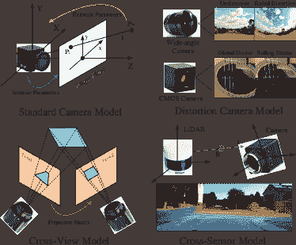

图 1：相机标定中的流行标定目标、模型及扩展应用。

传统的相机标定方法通常依赖于手工制作的特征和模型假设。这些方法大致可以分为三类。最常见的一类是使用已知的标定目标（例如，棋盘格）作为其在 3D 场景中被有意移动的标定目标[6, 7, 8]。然后，相机从不同的视角捕捉目标，并检测棋盘格的角点来计算相机参数。然而，这种过程需要繁琐的人工操作，无法实现“野外”自动标定。为了追求更好的灵活性，第二类相机标定，即基于几何先验的标定，已经得到广泛研究[9, 10, 11, 12]。具体来说，这种方法利用几何结构来建模场景中的 3D-2D 对应关系，如直线和消失点。然而，这种方法严重依赖于包含丰富几何先验的结构化人造场景，在应用于一般环境时表现较差。第三类是自标定[13, 14, 15]。这种解决方案以一系列图像作为输入，使用多视图几何来估计相机参数。然而，自标定的准确性受到特征检测器的限制，而这些限制可能会受到各种光照条件和纹理的影响。

由于在行业/实验室实现中有许多标准的相机标定技术[16, 17]，这一过程在近期的发展中通常被忽略。然而，标定单张和杂乱图像仍然是一个挑战，尤其是当图像来自网站和未知的相机模型时。这一挑战促使研究人员探索一种新的范式。

最近，深度学习为相机标定及其应用带来了新的启发。基于学习的方法在各种任务中以更高的效率实现了最先进的性能。特别是，开发了多种深度神经网络（DNNs），如卷积神经网络（CNNs）、生成对抗网络（GANs）、PointNet 和视觉变换器（ViTs），其中高层语义特征相比手工特征展示了更强的表征能力。此外，还利用了多种学习策略来提升神经网络的几何感知。基于学习的方法提供了完全自动的相机标定解决方案，无需人工干预或标定目标，这使其与传统方法区别开来。此外，这些方法中的一些实现了相机模型自由和标签自由的标定，显示出有前景且有意义的应用。

随着基于学习的相机标定方法数量的迅速增加，跟上新进展变得越来越具有挑战性。因此，迫切需要分析现有工作并促进一个致力于该领域的社区。以前，一些调查，例如[18, 19, 20]，仅关注相机标定中的特定任务/相机或某一种方法。例如，Salvi 等人 [18] 从算法的角度回顾了传统的相机标定方法。Hughes 等人 [19] 提供了传统解决方案下的鱼眼相机标定的详细回顾。而 Fan 等人 [20] 讨论了传统方法和深度学习方法，但他们的调查仅考虑了广角相机的标定。此外，由于回顾的基于学习的方法数量较少（约 10 篇论文），读者难以从 Fan 等人 [20] 的工作中描绘出通用相机标定的发展趋势。

在本文中，我们提供了关于基于学习的相机标定的最新进展的全面且深入的概述，涵盖了 100 多篇论文。我们还讨论了进一步改进的潜在方向，并检视了各种类型的相机和目标。为了促进对不同主题的未来研究，我们根据标定目标和应用对当前解决方案进行了分类。除了焦距、旋转和位移等基本参数外，我们还提供了图像失真（径向失真和滚动快门失真）的修正、交叉视图映射的估计、相机-LiDAR 系统的标定及其他应用的详细回顾。这种趋势遵循了相机的发展以及市场对虚拟现实、自动驾驶、神经渲染等的需求。

据我们所知，这是首个关于基于学习的相机标定及其扩展应用的调查文献，具有以下独特贡献。 (1) 我们的工作主要跟随了近年来在深度学习相机标定方面的进展。提供了各方面的深入分析和讨论，包括出版物、网络架构、损失函数、数据集、评估指标、学习策略、实现平台等。每篇文献的详细信息列在表格 I 中。 (2) 除了标定算法之外，我们全面回顾了经典相机模型及其扩展模型。特别地，我们总结了在深度学习中重新设计的标定目标，因为一些传统的标定目标被验证为神经网络难以学习。 (3) 我们收集了一个包含不同环境中不同相机拍摄的图像和视频的数据集，这可以作为评估现有方法泛化能力的平台。 (4) 我们讨论了基于学习的相机标定中的开放挑战，并提出了一些未来的研究方向，以提供进一步研究的指导。 (5) 创建了一个开源仓库，提供了所有回顾文献的分类和基准。该仓库将定期在 [`github.com/KangLiao929/Awesome-Deep-Camera-Calibration`](https://github.com/KangLiao929/Awesome-Deep-Camera-Calibration) 更新。

在以下部分中，我们讨论和分析基于学习的相机标定的各个方面。本文的其余部分组织如下。在第二部分中，我们提供了基于学习的相机标定的具体学习范式和学习策略。随后，我们在第 3、第 4、第 5 和第六部分中分别介绍和讨论基于标准相机模型、失真模型、视图间模型和传感器间模型的具体方法（见图 2）。标定方法的收集基准在第七部分中描述。最后，我们在第八部分中总结了基于学习的相机标定，并建议了该领域的未来方向。

## 2 预备知识

深度学习为相机标定带来了新的启发，使得标定过程完全自动化，无需人工干预。在这里，我们首先总结了基于学习的相机标定中的两种流行范式：基于回归的标定和基于重建的标定。接着，回顾了该研究领域中广泛使用的学习策略。经典相机模型及其对应标定目标的详细定义展示在补充材料中。

### 2.1 学习范式

受神经网络不同架构的驱动，研究人员开发了两种主要的基于学习的相机标定及其应用范式。

基于回归的校准给定未校准的输入，基于回归的校准首先使用堆叠卷积层提取高级语义特征。然后，完全连接层将语义特征汇聚并形成估计校准目标的向量。回归参数用于执行后续任务，如畸变矫正、图像变换、相机定位等。该范式是最早的，并在基于学习的相机校准及其应用中占据主导地位。所有在各种目标中的首个工作，例如，内部参数：Deepfocal [21]，外部参数：PoseNet [22]，径向畸变：Rong 等 [23]，滚动快门畸变：URS-CNN [24]，单应矩阵：DHN [25]，混合参数：Hold-Geoffroy 等 [26]，相机-LiDAR 参数：RegNet [27]都已通过这一范式实现。

基于重建的校准另一方面，基于重建的校准范式摒弃了参数回归，直接学习未校准输入和目标之间的像素级映射函数，灵感来源于条件图像到图像的翻译[28]和密集视觉感知[29, 30]。然后计算重建结果的像素级损失与真实值之间的差异。在这方面，大多数基于重建的校准方法[31, 32, 33, 34]基于全卷积网络如 U-Net[35]设计他们的网络架构。具体而言，一个编码器-解码器网络，通过编码器和解码器在相同空间分辨率下的跳跃连接，逐步提取从低级到高级的特征，并有效整合多尺度特征。在最后的卷积层中，学习到的特征被汇聚到目标通道，在像素级重建校准结果。

与基于回归的范式相比，基于重建的范式不需要多种相机参数的标签。此外，由于它仅优化校准结果的光度损失，因此可以消除不平衡损失问题。因此，基于重建的范式使得在没有强相机模型假设的情况下进行盲相机校准成为可能。

### 2.2 学习策略

在接下来的内容中，我们回顾了关于不同学习策略的基于学习的相机校准文献。

有监督学习 大多数基于学习的相机标定方法使用有监督学习策略来训练其网络，从经典方法[21, 22, 25, 36, 23, 37]到最先进的方法[38, 39, 40, 41, 42]。就学习范式而言，这种策略通过相机参数的真实值（基于回归的范式）或配对数据（基于重建的范式）来监督网络。一般来说，它们通过随机参数/变换采样和相机模型仿真从其他大规模数据集中合成训练数据集。一些最近的工作[43, 44, 45, 46]使用真实世界的设置建立了训练数据集，并对捕获的图像进行手动标注，从而促进了该研究领域的发展。

半监督学习 在各种场景下使用带注释的数据集来训练网络是一种有效的学习策略。然而，人为注释可能容易出错，导致标注质量不一致或数据被污染。因此，由于构建数据集的复杂性和成本，增加训练数据集以提高性能可能具有挑战性。为了解决这一挑战，SS-WPC[47]提出了一种半监督方法，用于修正由广角相机捕获的肖像。它采用了一个替代任务（分割）和一种半监督方法，利用方向和范围一致性以及回归一致性来利用标记数据和未标记数据。

弱监督学习 尽管取得了显著进展，相机标定的数据标注仍然是一个众所周知的高成本过程，而且获取完美的真实标签具有挑战性。因此，通常更倾向于使用弱监督与机器学习方法。弱监督学习指的是通过不充分的监督进行学习来建立预测模型的过程。Zhu 等人[48]提出了一种用于单视图测量的弱监督相机标定方法，适用于非受限环境，其中只有一个包含不确定尺寸物体的场景图像可以访问。这项工作利用了大规模数据集中 2D 物体的标注，在这些数据集中，人和建筑物经常出现，并作为确定 3D 尺寸的有用“参考物体”。

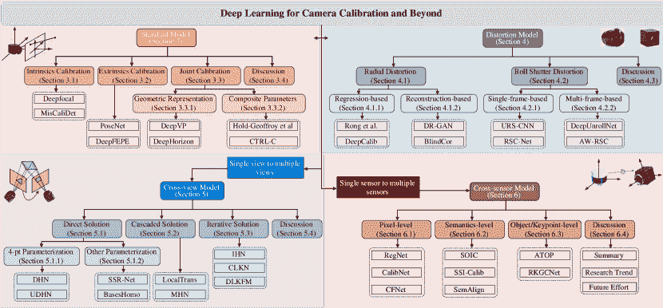

图 2：深度学习下的相机标定的结构性和层次性分类。每个类别下列出了部分经典方法。

无监督学习，通常称为无监督机器学习，使用机器学习算法分析和分组未标记的数据集。UDHN [49] 是第一个使用无监督学习的交叉视角相机模型的研究，它估计了配对图像的单应性矩阵而无需投影标签。通过减少不需要真实数据的像素级强度误差，UDHN [49] 优于以往的监督学习技术。该无监督算法在保持优越的精度和对光照波动的鲁棒性的同时，还能实现更快的推断时间。受到这一工作的启发，越来越多的方法利用无监督学习策略来估计单应性，例如 CA-UDHN [50]、BaseHomo [51]、HomoGAN [52] 和 Liu 等人 [53]。此外，UnFishCor [54] 摆脱了对畸变参数的需求，设计了一种用于广角相机的无监督框架。

自监督学习机器人是“自监督学习”这一术语首次出现的地方，因为训练数据通过利用各种输入传感器信号之间的关系被自动分类。与监督学习相比，自监督学习利用输入数据本身作为监督。许多自监督技术被提出，用于从大量未标记的照片或视频中学习视觉特征，而无需耗时且昂贵的人类标注。SSR-Net [55] 提出了一个自监督深度单应性估计网络，放宽了对真实标注的需求，并利用了单应性的可逆约束。具体而言，SSR-Net [55] 使用单应性矩阵表示代替其他方法通常使用的 4 点参数化，以应用可逆性约束。SIR [56] 基于这样一个原则，即使用不同镜头拍摄的同一场景的畸变图像的校正结果需要相同，设计了一种全新的自监督相机标定管道，用于广角图像的矫正。以自监督深度和姿态学习作为代理目标，Fang 等人 [57] 提出了从原始视频中自标定一系列通用相机模型，首次提供了仅通过自监督学习得出的相机模型参数的标定评估。

强化学习 与其在每个阶段都旨在最小化，强化学习可以最大化学习过程的总体效益。迄今为止，DQN-RecNet [58] 是在相机标定中使用强化学习的首个也是唯一的工作。它应用深度强化学习技术，通过单个马尔可夫决策过程来处理鱼眼图像校正，这是一种多步骤渐进标定方案。在这种情况下，当前的鱼眼图像表示环境状态。代理，深度 Q 网络 [59]，生成应执行的动作以纠正失真的图像。

接下来，我们将回顾基于学习的相机标定的具体方法和文献。结构和层次分类见图 2。

表 I：2015 年至 2022 年基于学习的相机标定及其扩展应用的详细信息，包括方法缩写、出版物、标定目标、网络结构、损失函数、数据集、评估指标、学习策略、平台以及是否进行仿真（训练数据）。对于学习策略，SL、USL、WSL、Semi-SL、SSL 和 RL 分别表示监督学习、无监督学习、弱监督学习、半监督学习、自监督学习和强化学习。

|  | 方法 | 发表 | 目标 | 网络 | 损失函数 | 数据集 | 评估 | 学习 | 平台 | 仿真 |
| --- | --- | --- | --- | --- | --- | --- | --- | --- | --- | --- |
| 2015 | DeepFocal [21] | ICIP | 标准 | AlexNet | $\mathcal{L}_{2}$ 损失 | 1DSfM[60] | 准确率 | SL | Caffe |  |
|  | PoseNet [22] | ICCV | 标准 | GoogLeNet | $\mathcal{L}_{2}$ 损失 | Cambridge Landmarks[61] | 准确率 | SL | Caffe |  |
| 2016 | DeepHorizon [62] | BMVC | 标准 | GoogLeNet | Huber 损失 | HLW[63] | 准确率 | SL | Caffe |  |
|  | DeepVP [36] | CVPR | 标准 | AlexNet | Logistic 损失 | YUD[64], ECD[65], HLW[63] | 准确率 | SL | Caffe |  |
|  | Rong et al. [23] | ACCV | 畸变 | AlexNet | Softmax 损失 | ImageNet[66] | 线段长度 | SL | Caffe | ✓ |
|  | DHN[25] | RSSW | 跨视角 | VGG | $\mathcal{L}_{2}$ 损失 | MS-COCO[67] | 均方误差 | SL | Caffe | ✓ |
| 2017 | CLKN [68] | CVPR | 跨视角 | CNNs | Hinge 损失 | MS-COCO[67] | 均方误差 | SL | Torch | ✓ |
|  | HierarchicalNet [69] | ICCVW | 跨视角 | VGG | $\mathcal{L}_{2}$ 损失 | MS-COCO[67] | 均方误差 | SL | TensorFlow | ✓ |
|  | URS-CNN [24] | CVPR | 变形 | CNNs | $\mathcal{L}_{2}$ 损失 | Sun[70], Oxford[71], Zubud[72], LFW[73] | PSNR, RMSE | SL | Torch | ✓ |
|  | RegNet [27] | IV | 跨传感器 | CNNs | $\mathcal{L}_{2}$ 损失 | KITTI[74] | MAE | SL | Caffe | ✓ |
| 2018 | Hold-Geoffroy et al. [26] | CVPR | 标准 | DenseNet | 熵损失 | SUN360[75] | 人类敏感度 | SL | - |  |
|  | DeepCalib [37] | CVMP | 变形 | Inception-V3 | Logcosh 损失 | SUN360[75] | 平均误差 | SL | TensorFlow | ✓ |
|  | FishEyeRecNet [76] | ECCV | 变形 | VGG | $\mathcal{L}_{2}$ 损失 | ADE20K[77] | PSNR, SSIM | SL | Caffe | ✓ |
|  | Shi et al.[78] | ICPR | 变形 | ResNet | $\mathcal{L}_{2}$ 损失 | ImageNet[66] | MSE | SL | PyTorch | ✓ |
|  | DeepFM[79] | ECCV | 视角交叉 | ResNet | $\mathcal{L}_{2}$ 损失 | T&T[80], KITTI[74], 1DSfM[60] | F-score, 平均 | SL | PyTorch | ✓ |
|  | Poursaeed et al.[81] | ECCVW | 视角交叉 | CNNs | $\mathcal{L}_{1}$, $\mathcal{L}_{2}$ 损失 | KITTI[74] | EPI-ABS, EPI-SQR | SL | - |  |
|  | UDHN[49] | RAL | 视角交叉 | VGG | $\mathcal{L}_{1}$ 损失 | MS-COCO[67] | RMSE | USL | TensorFlow | ✓ |
|  | PFNet[82] | ACCV | 视角交叉 | FCN | 平滑 $\mathcal{L}_{1}$ 损失 | MS-COCO[67] | MAE | SL | TensorFlow | ✓ |
|  | CalibNet[83] | IROS | 跨传感器 | ResNet | 点云距离, $\mathcal{L}_{2}$ 损失 | KITTI[74] | 测地距离, MAE | SL | TensorFlow | ✓ |
|  | Chang et al.[84] | ICRA | 标准 | AlexNet | 交叉熵损失 | DeepVP-1M [84] | MSE, 准确率 | SL | Matconvnet |  |
| 2019 | Lopez et al. [85] | CVPR | 变形 | DenseNet | Bearing 损失 | SUN360[75] | MSE | SL | PyTorch |  |
|  | UprightNet [86] | ICCV | 标准 | U-Net | 几何损失 | InteriorNet[87], ScanNet[88], SUN360[75] | 平均误差 | SL | PyTorch |  |
|  | Zhuang et al. [89] | IROS | 变形 | ResNet | $\mathcal{L}_{1}$ 损失 | KITTI[74] | 平均误差, RMSE | SL | PyTorch | ✓ |
|  | SSR-Net [55] | PRL | 视角交叉 | ResNet | $\mathcal{L}_{2}$ 损失 | MS-COCO[67] | MAE | SSL | PyTorch | ✓ |
|  | Abbas et al. [90] | ICCVW | 视角交叉 | CNNs | Softmax 损失 | CARLA[91] | AUC[92], 平均误差 | SL | TensorFlow | ✓ |
|  | DR-GAN [31] | TCSVT | 变形 | GANs | 感知损失 | MS-COCO[67] | PSNR, SSIM | SL | TensorFlow | ✓ |
|  | STD [93] | TCSVT | 失真 | GANs+CNNs | 感知损失 | MS-COCO[67] | PSNR, SSIM | SL | TensorFlow | ✓ |
|  | Deep360Up [94] | VR | 标准 | DenseNet | Log-cosh 损失[95] | SUN360[75] | 平均误差 | SL | - | ✓ |
|  | UnFishCor [54] | JVCIR | 失真 | VGG | $\mathcal{L}_{1}$ 损失 | Places2[96] | PSNR, SSIM | USL | TensorFlow | ✓ |
|  | BlindCor [34] | CVPR | 失真 | U-Net | $\mathcal{L}_{2}$ 损失 | Places2[96] | MSE | SL | PyTorch | ✓ |
|  | RSC-Net [97] | CVPR | 失真 | ResNet | $\mathcal{L}_{1}$ 损失 | KITTI[74] | 平均误差 | SL | PyTorch | ✓ |
|  | Xue et al. [98] | CVPR | 失真 | ResNet | $\mathcal{L}_{2}$ 损失 | Wireframes[99], SUNCG[100] | PSNR, SSIM, RPE | SL | PyTorch | ✓ |
|  | Zhao et al. [43] | ICCV | 失真 | VGG+U-Net | $\mathcal{L}_{1}$ 损失 | 自建数据+BU-4DFE[101] | 平均误差 | SL | - | ✓ |
|  | NeurVPS [102] | NeurIPS | 标准 | CNNs | 二元交叉熵, Chamfer-$\mathcal{L}_{2}$ 损失 | ScanNet [88], SU3 [103] | 角度准确度 | SL | PyTorch |  |
| 2020 | Sha et al. [104] | CVPR | 跨视角 | U-Net | 交叉熵损失 | 2014 年世界杯[105] | IoU | SL | TensorFlow |  |
|  | Lee et al. [106] | ECCV | 标准 | PointNet + CNNs | 交叉熵损失 | Google 街景视图[107], HLW[63] | 平均误差, AUC[92] | SL | - |  |
|  | MisCaliDet [108] | ICRA | 失真 | CNNs | $\mathcal{L}_{2}$ 损失 | KITTI[74] | MSE | SL | TensorFlow | ✓ |
|  | DeepPTZ [109] | WACV | 失真 | Inception-V3 | $\mathcal{L}_{1}$ 损失 | SUN360[75] | 平均误差 | SL | PyTorch | ✓ |
|  | MHN [110] | CVPR | 跨视角 | VGG | 交叉熵损失 | MS-COCO[67], 自建数据 | MAE | SL | TensorFlow | ✓ |
|  | Davidson et al. [111] | ECCV | 标准 | FCN | Dice 损失 | SUN360[75] | 准确度 | SL | - | ✓ |
|  | CA-UDHN [50] | ECCV | 跨视角 | FCN + ResNet | 三元组损失 | 自建数据 | MSE | USL | PyTorch |  |
|  | DeepFEPE [112] | IROS | 标准 | VGG + PointNet | $\mathcal{L}_{2}$ 损失 | KITTI[74], ApolloScape[113] | 平均误差 | SL | PyTorch |  |
|  | DDM [32] | TIP | 失真 | GANs | $\mathcal{L}_{1}$ 损失 | MS-COCO[67] | PSNR, SSIM | SL | TensorFlow | ✓ |
|  | Li et al. [114] | TIP | 失真 | CNNs | 交叉熵, $\mathcal{L}_{1}$ 损失 | CelebA[115] | 余弦距离 | SL | - | ✓ |
|  | PSE-GAN [116] | ICPR | 失真 | GANs | $\mathcal{L}_{1}$，WGAN 损失 | Place2[96] | MSE | SL | - | ✓ |
|  | RDC-Net [117] | ICIP | 失真 | ResNet | $\mathcal{L}_{1}$，$\mathcal{L}_{2}$ 损失 | ImageNet[66] | PSNR，SSIM | SL | PyTorch | ✓ |
|  | FE-GAN [118] | ICASSP | 失真 | GANs | $\mathcal{L}_{1}$，GAN 损失 | Wireframe[99]，LSUN[119] | PSNR，SSIM，RMSE | SSL | PyTorch | ✓ |
|  | RDCFace [120] | CVPR | 失真 | ResNet | 交叉熵，$\mathcal{L}_{2}$ 损失 | IMDB-Face[121] | 准确率 | SL | - | ✓ |
|  | LaRecNet [122] | arXiv | 失真 | ResNet | $\mathcal{L}_{2}$ 损失 | Wireframes[99]，SUNCG[100] | PSNR，SSIM，RPE | SL | PyTorch | ✓ |
|  | Baradad 等 [123] | CVPR | 标准 | CNNs | $\mathcal{L}_{2}$ 损失 | ScanNet[88]，NYU[124]，SUN360[75] | 平均误差，RMS | SL | PyTorch |  |
|  | Zheng 等 [125] | CVPR | 标准 | CNNs | $\mathcal{L}_{1}$ 损失 | FocaLens[126] | 平均误差、PSNR、SSIM | SL | - | ✓ |
|  | Zhu 等 [48] | ECCV | 标准 | CNNs + PointNet | $\mathcal{L}_{1}$ 损失 | SUN360[75]，MS-COCO[67] | 平均误差，准确率 | WSL | PyTorch | ✓ |
|  | DeepUnrollNet [46] | CVPR | 失真 | FCN | $\mathcal{L}_{1}$，感知，总变差损失 | Carla-RS[46]，Fastec-RS[46] | PSNR，SSIM | SL | PyTorch | ✓ |
|  | RGGNet [127] | RAL | 跨传感器 | ResNet | 地质距离损失 | KITTI[74] | MSE，MSEE，MRR | SL | TensorFlow | ✓ |
|  | CalibRCNN [128] | IROS | 跨传感器 | RNNs | $\mathcal{L}_{2}$，极线几何损失 | KITTI [74] | MAE | SL | TensorFlow | ✓ |
|  | SSI-Calib [129] | ICRA | 跨传感器 | CNNs | $\mathcal{L}_{2}$ 损失 | Pascal VOC 2012 [130] | 均值/标准差 | SL | TensorFlow | ✓ |
|  | SOIC [131] | arXiv | 跨传感器 | ResNet + PointRCNN | 成本函数 | KITTI [74] | 平均误差 | SL | - |  |
|  | NetCalib [132] | ICPR | 跨传感器 | CNNs | $\mathcal{L}_{1}$ 损失 | KITTI [74] | MAE | SL | PyTorch | ✓ |
|  | SRHEN [133] | ACM-MM | 跨视角 | CNNs | $\mathcal{L}_{2}$ 损失 | MS-COCO [67]，SUN397 [75] | MACE | SL | - | ✓ |
| 2021 | StereoCaliNet [134] | TCI | 标准 | U-Net | $\mathcal{L}_{1}$ 损失 | TAUAgent[135]，KITTI[74] | 平均误差 | SL | PyTorch | ✓ |
|  | CTRL-C [136] | ICCV | 标准 | Transformer | 交叉熵，$\mathcal{L}_{1}$ 损失 | Google Street View[107]，SUN360[75] | 平均误差，AUC[92] | SL | PyTorch | ✓ |
|  | Wakai et al. [137] | ICCVW | 失真 | DenseNet | 平滑 $\mathcal{L}_{1}$ 损失 | StreetLearn[138] | 平均误差, PSNR, SSIM | SL | - | ✓ |
|  | OrdianlDistortion [139] | TIP | 失真 | CNNs | 平滑 $\mathcal{L}_{1}$ 损失 | MS-COCO[67] | PSNR, SSIM, MDLD | SL | TensorFlow | ✓ |
|  | PolarRecNet [140] | TCSVT | 失真 | VGG + U-Net | $\mathcal{L}_{1}$, $\mathcal{L}_{2}$ 损失 | MS-COCO[67], LMS[141] | PSNR, SSIM, MSE | SL | PyTorch | ✓ |
|  | DQN-RecNet [58] | PRL | 失真 | VGG | $\mathcal{L}_{2}$ 损失 | Wireframes[99] | PSNR, SSIM, MSE | RL | PyTorch | ✓ |
|  | Tan et al. [44] | CVPR | 失真 | U-Net | $\mathcal{L}_{2}$ 损失 | 自建 | 准确度 | SL | PyTorch |  |
|  | PCN [142] | CVPR | 失真 | U-Net | $\mathcal{L}_{1}$, $\mathcal{L}_{2}$, GAN 损失 | Place2[96] | PSNR, SSIM, FID, CW-SSIM | SL | PyTorch | ✓ |
|  | DaRecNet [33] | ICCV | 失真 | U-Net | 平滑 $\mathcal{L}_{1}$, $\mathcal{L}_{2}$ 损失 | ADE20K[77] | PSNR, SSIM | SL | PyTorch | ✓ |
|  | DLKFM [143] | CVPR | 跨视角 | Siamese-Net | $\mathcal{L}_{2}$ 损失 | MS-COCO[67], Google Earth, Google Map | MSE | SL | TensorFlow | ✓ |
|  | LocalTrans [144] | ICCV | 跨视角 | Transformer | $\mathcal{L}_{1}$ 损失 | MS-COCO[67] | MSE, PSNR, SSIM | SL | PyTorch | ✓ |
|  | BasesHomo [51] | ICCV | 跨视角 | ResNet | 三元组损失 | CA-UDHN[50] | MSE | USL | PyTorch |  |
|  | ShuffleHomoNet [145] | ICIP | 跨视角 | ShuffleNet | $\mathcal{L}_{2}$ 损失 | MS-COCO[67] | RMSE | SL | TensorFlow | ✓ |
|  | DAMG-Homo [41] | TCSVT | 跨视角 | CNNs | $\mathcal{L}_{1}$ 损失 | MS-COCO[67], UDIS[146] | RMSE, PSNR, SSIM | SL | TensorFlow | ✓ |
|  | SA-MobileNet [147] | BMVC | 标准 | MobileNet | 交叉熵损失 | SUN360[75], ADE20K[77], NYU[124] | MAE, 准确度 | SL | TensorFlow | ✓ |
|  | SPEC [45] | ICCV | 标准 | ResNet | Softargmax-$\mathcal{L}_{2}$ 损失 | 自建 | W-MPJPE, PA-MPJPE | SL | PyTorch | ✓ |
|  | DirectionNet [148] | CVPR | 标准 | U-Net | 余弦相似度损失 | InteriorNet[87], Matterport3D[149] | 平均和中位误差 | SL | TensorFlow | ✓ |
|  | JCD [150] | CVPR | 失真 | FCN | Charbonnier[151], 感知损失 | BS-RSCD [150], Fastec-RS [46] | PSNR, SSIM, LPIPS | SL | PyTorch |  |
|  | LCCNet [152] | CVPRW | 跨传感器 | CNNs | 平滑 $\mathcal{L}_{1}$, $\mathcal{L}_{2}$ 损失 | KITTI[74] | MSE | SL | PyTorch | ✓ |
|  | CFNet [153] | Sensors | 跨传感器 | FCN | $\mathcal{L}_{1}$, Charbonnier[151] 损失 | KITTI[74], KITTI-360[154] | MAE, MSEE, MRR | SL | PyTorch | ✓ |
|  | Fan et al. [155] | ICCV | 失真 | U-Net | $\mathcal{L}_{1}$, 感知损失 | Carla-RS [46], Fastec-RS [46] | PSNR, SSIM, LPIPS | SL | PyTorch |  |
|  | SUNet [156] | ICCV | 失真 | DenseNet + ResNet | $\mathcal{L}_{1}$, 感知损失 | Carla-RS [46], Fastec-RS [46] | PSNR, SSIM | SL | PyTorch |  |
|  | SemAlign [157] | IROS | 跨传感器 | CNNs | 语义对齐损失 | KITTI [74] | 平均/中位旋转误差 | SL | PyTorch | ✓ |
| 2022 | DVPD [38] | CVPR | 标准 | CNNs | 交叉熵损失 | SU3[103], ScanNet[88], YUD[64], NYU[124] | 准确率, AUC[92] | SL | PyTorch | ✓ |
|  | Fang et al. [57] | ICRA | 标准 | CNNs | $\mathcal{L}_{2}$ 损失 | KITTI[74], EuRoC[158], OmniCam[159] | MRE, RMSE | SSL | PyTorch |  |
|  | CPL [160] | ICASSP | 标准 | Inception-V3 | $\mathcal{L}_{1}$ 损失 | CARLA[91], CyclistDetection[161] | MAE | SL | TensorFlow | ✓ |
|  | IHN [162] | CVPR | 跨视角 | Siamese-Net | $\mathcal{L}_{1}$ 损失 | MS-COCO[67], Google Earth, Google Map | MACE | SL | PyTorch | ✓ |
|  | HomoGAN [52] | CVPR | 跨视角 | GANs | 交叉熵, WGAN 损失 | CA-UDHN[50] | 平均误差 | USL | PyTorch | ✓ |
|  | SS-WPC [47] | CVPR | 失真 | Transformer | 交叉熵, $\mathcal{L}_{1}$ 损失 | Tan et al.[44] | 准确率 | 半监督学习 | PyTorch |  |
|  | AW-RSC [163] | CVPR | 失真 | CNNs | Charbonnier[151], 感知损失 | 自构建, FastecRS[46] | PSNR, SSIM | SL | PyTorch |  |
|  | EvUnroll [39] | CVPR | 失真 | U-Net | Charbonnier, 感知, TV 损失 | 自构建, FastecRS[46] | PSNR, SSIM, LPIPS | SL | PyTorch |  |
|  | Do et al. [164] | CVPR | 标准 | ResNet | $\mathcal{L}_{2}$, 鲁棒角度 [165] 损失 | 自构建, 7-SCENES[166] | 中位误差, 召回率 | SL | PyTorch |  |
|  | DiffPoseNet [167] | CVPR | 标准 | CNNs + LSTM | $\mathcal{L}_{2}$ 损失 | TartanAir[168], KITTI[74], TUM-RGBD[169] | PEE, AEE[170] | SSL | PyTorch |  |
|  | SceneSqueezer [171] | CVPR | 标准 | Transformer | $\mathcal{L}_{1}$ 损失 | RobotCar Seasons[172], Cambridge Landmarks[61] | 平均误差, 召回率[170] | SL | PyTorch |  |
|  | FocalPose [173] | CVPR | 标准 | CNNs | $\mathcal{L}_{1}$，Huber 损失 | Pix3D[174]，CompCars[175]，StanfordCars[175] | 中位数误差，准确率 | SL | PyTorch |  |
|  | DXQ-Net [176] | arXiv | 跨传感器 | CNNs + RNNs | $\mathcal{L}_{1}$，测地线损失 | KITTI[74]，KITTI-360[154] | MSE | SL | PyTorch | ✓ |
|  | SST-Calib [42] | ITSC | 跨传感器 | CNNs | $\mathcal{L}_{2}$ 损失 | KITTI[74] | QAD，AEAD | SL | PyTorch | ✓ |
|  | CCS-Net [177] | IROS | 失真 | U-Net | $\mathcal{L}_{1}$ 损失 | TUM-RGBD[169] | MAE，RPE | SL | PyTorch | ✓ |
|  | FishFormer [40] | arXiv | 失真 | Transformer | $\mathcal{L}_{2}$ 损失 | Place2[96]，CelebA[115] | PSNR，SSIM，FID | SL | PyTorch | ✓ |
|  | SIR [56] | TIP | 失真 | ResNet | $\mathcal{L}_{1}$ 损失 | ADE20K[77]，WireFrames[99]，MS-COCO[67] | PSNR，SSIM | SSL | PyTorch | ✓ |
|  | ATOP [178] | TIV | 跨传感器 | CNNs | 交叉熵损失 | 自建 + KITTI[74] | RRE，RTE | SL | - |  |
|  | FusionNet [179] | ICRA | 跨传感器 | CNNs+PointNet | $\mathcal{L}_{2}$ 损失 | KITTI[74] | MAE | SL | PyTorch | ✓ |
|  | RKGCNet [180] | TIM | 跨传感器 | CNNs+PointNet | $\mathcal{L}_{1}$ 损失 | KITTI[74] | MSE | SL | PyTorch | ✓ |
|  | GenCaliNet [181] | ECCV | 失真 | DenseNet | $\mathcal{L}_{2}$ 损失 | StreetLearn[138]，SP360[182] | MAE，PSNR，SSIM | SL | - | ✓ |
|  | Liu et al. [53] | TPAMI | 跨视图 | ResNet | 三元组损失 | 自建 | MSE，准确率 | USL | PyTorch |  |

## 3 标准模型

一般来说，对于基于学习的标定工作，内参标定的目标包含焦距和光学中心，而外参标定的目标包含旋转矩阵和平移向量。

### 3.1 内参标定

Deepfocal [21] 是学习型相机标定的开创性工作，它旨在估计任何“野外”图像的焦距。具体来说，Deepfocal 考虑了一个简单的针孔相机模型，并使用深度卷积神经网络回归水平视场。给定图像的宽度 $w$，水平视场 $H_{\theta}$ 和焦距 $f$ 之间的关系可以描述为：

|  | $H_{\theta}=2\arctan(\frac{w}{2f}).$ |  | (1) |
| --- | --- | --- | --- |

由于组件磨损、温度波动或外部干扰如碰撞，相机的标定参数可能会随时间变化。为此，MisCaliDet [108] 提出了识别相机是否需要重新进行内在标定的方法。与传统的内在参数如焦距和图像中心相比，MisCaliDet 提出了一个新的标量度量，即平均像素位置差（APPD），用于测量相机的标定误差程度，它描述了整个图像中像素位置差异的均值。

### 3.2 外在标定

相较于内在标定，外在标定推断了相机与其所处 3D 场景的空间对应关系。PoseNet[22] 首次提出了深度卷积神经网络用于实时回归 6 自由度相机姿态。PoseNet 预测了一个姿态向量 p，该向量由相机的 3D 位置 x 和由四元数 q 表示的方向给出，即$\textbf{p}=[\textbf{x},\textbf{q}]$。为了构建训练数据集，标签是通过结构光束法[183] 从场景的视频中自动计算得到的。

受 PoseNet[22]的启发，以下工作在中间表示、可解释性、数据格式、学习目标等方面改进了外部校准。例如，为了优化几何姿态目标，DeepFEPE [112] 设计了一个端到端的基于关键点的框架，具有用于检测、特征提取、匹配和异常值剔除的可学习模块。这种流程模仿了传统基线，其中最终性能可以通过中间可微分模块进行分析和改进。为了弥合外部目标和图像特征之间的领域差距，最近的工作建议首先从输入中学习中间表示，如表面几何[86]、深度图[134]、方向概率分布[148]和法线流[167]等。然后，通过几何约束和学习表示推理外部参数。因此，神经网络逐渐被引导去感知几何相关特征，这些特征对于外部估计至关重要。考虑到隐私问题和存储限制，一些近期的工作压缩了场景，并利用类似点的特征来估计外部参数。例如，Do 等人[164]训练了一个网络，通过将其外观编码为隐式特征来识别稀疏但重要的 3D 点，称为场景地标。相机姿态可以使用鲁棒的最小求解器进行计算，随后进行基于 Levenberg-Marquardt 的非线性优化。SceneSqueezer [171] 从三个层次压缩场景信息：通过成对的可见性信息对数据库帧进行聚类，点选择模块根据估计性能修剪每个簇，以及学习量化进一步压缩所选点。

### 3.3 联合内参和外参标定

#### 3.3.1 几何表示

消失点 一组平行线在世界中的投影的交点形成一个消失点。消失点的检测是 3D 视觉中的一个基础且关键的挑战。一般来说，消失点揭示了 3D 线条的方向，使得智能体能够从单个 2D 图像中推断出 3D 场景信息。

DeepVP [36] 是第一个基于学习的方法，用于在给定单张图像的情况下检测消失点。它颠倒了传统的过程，通过根据包含的消失点对地平线候选项进行评分。Chang 等人 [84] 将这一任务重新设计为 CNN 分类问题，使用具有 225 个离散可能消失点位置的输出层。为了构建数据集，相机视角在全景场景中以每步 5° 从 -35° 到 35° 进行平移和倾斜（总共 225 张图像），从单一 GPS 位置拍摄。为了直接利用消失点的几何属性，NeurVPS [102] 提出了一个规范的圆锥空间和圆锥卷积算子，该算子可以在该空间中实现为常规卷积，其中学习模型能够局部计算消失点的全局几何信息。为了克服先前方法对大量训练数据的需求，DVPD [38] 将神经网络与两个几何先验结合：霍夫变换和高斯球面。首先，将卷积特征转换到霍夫域，将线映射到不同的箱子中。然后，霍夫箱子的投影扩展到高斯球面，在那里线被转换为大圆，消失点位于这些圆的交点上。几何先验是数据高效的，因为它们消除了从数据中学习这些信息的必要性，从而使学习框架具有解释性，并更好地泛化到数据分布稍有不同的领域。

地平线 地平线是各种计算机视觉任务中的一个重要上下文属性，特别是图像测量、计算摄影和 3D 场景理解。线在无穷远处的投影到任何与局部重力矢量垂直的平面上，决定了地平线的位置。

给定相机的视场（FoV）、俯仰角和滚转角，确定其拍摄图像空间中的地平线是直接的。DeepHorizon [62] 提出了第一个基于学习的解决方案，用于从图像中估计地平线，而无需任何明确的几何约束或其他线索。为了训练网络，构建了一个新的基准数据集——野外地平线（HLW），其中包含带标记地平线的真实世界图像。SA-MobileNet [147] 提出了基于自注意力的 MobileNet [184] 的图像倾斜检测和校正方法，适用于智能手机。设计了一个空间自注意力模块，用于学习输入图像中的长程依赖性和全局上下文。为了解决回归任务的难度，他们训练网络以在真实倾斜的狭窄区间内估计多个角度，仅惩罚那些位于该狭窄范围外的值。

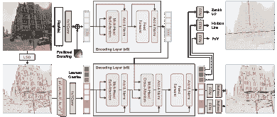

图 3：CTRL-C 概述。图来自 [136]。

#### 3.3.2 复合参数

校准复合参数的目的是同时估计内在参数和外在参数。通过联合估计复合参数并使用来自大规模全景数据集的数据进行训练[75]，Hold-Geoffroy 等[26] 在很大程度上超越了之前的独立校准任务。此外，Hold-Geoffroy 等[26] 还进行了人类感知研究，要求参与者评估具有准确校准和未校准的 3D 对象的现实感。这些数据进一步被设计为用于校准误差的新感知度量。在特征类别方面，Lee 等[106] 和 CTRL-C [136] 考虑了语义特征和几何线索用于相机校准。他们展示了如何利用几何特征来帮助网络理解图像的潜在透视结构。CTRL-C 的流程如图 3 所示。在近期文献中，更多应用被与相机校准联合研究，例如单视图计量[48]、3D 人体姿态和形状估计[45]、深度估计[123, 57]、物体姿态估计[173] 和图像反射去除[125] 等。

考虑到不同相机参数的异质性和视觉隐性，CPL [160] 使用了一种新颖的相机投影损失来估计参数，利用相机模型神经网络重建 3D 点云。所提出的损失通过用统一度量表示相机参数的不同误差，解决了训练不平衡的问题。

### 3.4 讨论

#### 3.4.1 技术总结

上述方法的目标是实现无需人工干预和场景假设的自动校准。早期文献 [21, 22] 分别研究了内部校准或外部校准。受大规模数据集和强大网络的驱动，后续工作 [36, 62, 26, 136] 考虑了全面的相机校准，推断各种参数和几何表示。为了解决学习相机参数的困难，一些工作 [86, 134, 148, 167] 提出了学习中间表示。在最近的文献中，更多应用与相机校准共同研究 [48, 45, 123, 57, 125]。这表明解决下游视觉任务，特别是在 3D 任务中，可能需要图像形成模型的先验知识。此外，一些几何先验 [38] 可以缓解深度学习对数据的匮乏要求，显示出弥合校准目标和语义特征之间差距的潜力。

有趣的是，发现增加更多外部校准方法 [112, 164, 171] 重新审视并恢复了传统的基于特征点的解决方案。描述相机运动的标准外部参数包含有限的自由度，因此一些局部特征可以很好地代表空间对应关系。此外，为点学习设计的网络显著提高了校准模型的效率，例如 PointNet [185] 和 PointCNN [186]。这样的管道还使得基于学习的相机校准具有清晰的可解释性，这有助于理解网络如何校准并放大中间模块的影响。

#### 3.4.2 未来的努力

(1) 探索更多视觉/几何先验。由于学习型相机校准领域的真实世界数据集稀缺，挖掘更多可以缓解数据学习需求的先验是有前景的。例如，图像形成模型的先验可以让我们关联 3D 相机参数和 2D 图像布局之间的关系。

(2) 在端到端的校准学习模型中解耦不同阶段。大多数基于学习的相机校准方法包括特征提取阶段和目标估计阶段。然而，网络如何学习与校准相关的特征仍然模糊。因此，通过不同的传统校准阶段解耦学习过程可以指导特征提取的方式。在外部校准 [112, 164, 171] 中扩展这个想法到更一般的校准问题将是有意义的。

(3) 将测量空间从参数误差转移到几何差异。当涉及到联合标定各种相机参数时，训练过程会遇到不平衡的损失优化问题。主要原因是不同的相机参数对应不同的样本分布。简单的归一化策略无法统一它们的误差空间。因此，我们可以根据不同相机参数的几何特性来制定一个直接的测量空间。

## 4 畸变模型

在基于学习的相机标定中，由于广角镜头和 CMOS 传感器的广泛应用，对径向畸变和滚动快门畸变的标定越来越受到关注。在这一部分，我们主要回顾这两种畸变的标定/校正。

### 4.1 径向畸变

关于基于学习的径向畸变标定的文献可以分为两大类：基于回归的解决方案和基于重建的解决方案。

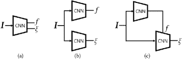

图 4：基于回归的广角相机标定的三种常见学习解决方案：（a）SingleNet，（b）DualNet，（c）SeqNet，其中 $\mathbf{I}$ 是畸变图像，$f$ 和 $\xi$ 分别表示焦距和畸变参数。该图来自 [37]。

#### 4.1.1 基于回归的解决方案

Rong 等人 [23] 和 DeepCalib [37] 是广角相机标定学习方法的开创性工作。他们将相机标定视为一个有监督的分类 [23] 或回归 [37] 问题，然后利用卷积层和全连接层的网络来学习输入的失真特征并预测相机参数。特别地，DeepCalib [37] 探索了三种广角相机标定的学习解决方案，如图 4 所示。他们的实验表明，最简单的架构 SingleNet 在准确性和效率上都表现最佳。为了增强网络对失真的感知，以下工作研究了引入更多多样化特征，如语义特征 [76] 和几何特征 [98, 122, 120]。此外，一些工作通过设计学习策略，如无监督学习 [54]、自监督学习 [56] 和强化学习 [43]，提高了泛化能力。通过在训练过程的每个小批量中随机选择系数，RDC-Net [117] 能够动态生成失真图像。这提高了校正性能，并防止了学习模型的过拟合。除了贡献于深度学习技术外，其他工作倾向于探索可解释的标定视觉先验。例如，观察到径向失真图像具有中心对称特性，其中远离图像中心的纹理失真更强，Shi 等人 [78] 和 PSE-GAN [116] 开发了这种特性的定位感知权重层（固定 [78] 和可学习 [116]），使网络能够明确感知失真。Lopez 等人 [85] 提出了一个适合网络的新型径向失真参数化方法，而不是直接学习失真参数。此外，OrdinalDistortion [139] 提出了一个学习友好的表示，即序数失真。与隐式和异质相机参数相比，这种表示由于与图像特征的清晰关系，可以促进神经网络对失真的感知。

#### 4.1.2 基于重建的解决方案

受到条件图像到图像翻译和密集视觉感知的启发，基于重建的解决方案开始从传统的回归范式中演变出来。DR-GAN [31] 是第一个用于校准径向畸变的重建基础解决方案，它直接建模了失真图像与矫正图像之间的像素级映射。它实现了无相机参数的训练和单阶段矫正。由于摆脱了对相机模型的假设，这种基于重建的解决方案显示出在一个学习网络中校准各种类型相机的潜力。例如，DDM [32] 通过呈现失真分布图将不同相机模型统一到一个领域，这张图明确描述了失真图像中每个像素的失真程度。然后，网络利用这个几何先验图重建矫正图像。为了使映射函数具有可解释性，后续工作 [93, 34, 43, 118, 142, 44, 47, 140] 开发了失真图像与矫正图像之间的位移场。这种方式能够消除像素级重建中的生成伪影。特别是，FE-GAN [118] 将几何先验如 Shi et al. [78] 和 PSE-GAN [116] 融入其基于重建的解决方案，并提出了一种自监督策略以学习广角相机校准中的失真流，如图 5 所示。大多数基于重建的解决方案利用 U-Net 样式的架构来学习像素级映射。然而，失真特征可以通过跳跃连接操作从编码器转移到解码器，从而导致重建结果中的模糊外观和不完全校正。为了解决这个问题，Li et al. [114] 在其矫正网络中摒弃了跳跃连接。为了同时保持特征融合和限制几何差异，PCN [142] 在跳跃连接中设计了一个校正层，并应用了外观流来修正不同编码器层中的卷积特征。注意到之前的卷积核采样策略忽视了失真的径向对称性，PolarRecNet [140] 将失真图像从笛卡尔坐标域转换到极坐标域。

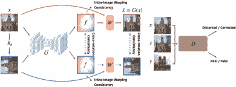

图 5: FE-GAN 的架构。图来自 [118]。

### 4.2 滚动快门失真

现有的针对卷帘（RS）畸变的深度学习校准工作可以分为两类：基于单帧的 [24, 97, 39] 和基于多帧的 [46, 150, 156, 155, 163]。基于单帧的解决方案研究将单个卷帘图像作为输入，并直接通过神经网络学习修正畸变。理想的校正结果可以被视为全球快门（GS）图像。这是一个不适定问题，需要一些额外的先验假设来定义。相反，基于多帧的解决方案考虑使用卷帘相机拍摄的连续帧（两个或更多），其中可以研究强的时间相关性以获得更合理的校正。

#### 4.2.1 基于单帧的解决方案

URS-CNN [24] 是第一个用于校准滚动快门相机的学习工作。在这项工作中，使用了具有长核特性的神经网络，以理解场景结构和行向相机运动如何相互作用。为了特别解决由行向曝光产生的 RS 效应的本质，利用了行核和列核卷积来沿水平和垂直轴提取属性。RSC-Net [97] 从 2 自由度（DoF）提高到 6 自由度，并提出了一个结构与运动感知的 RS 校正模型，其中估计了相机扫描线速度和深度。与 URS-CNN [24] 相比，RSC-Net [97] 进一步推理了扫描线之间的隐蔽运动以及场景结构，如图 6 所示。为了弥合 RS 和 GS 之间的时空联系，EvUnroll [39] 利用神经形态事件来修正 RS 效应。事件相机由于其微秒级灵敏度的高时间分辨率特性，能够克服传统基于帧的动态情况中的许多缺点。

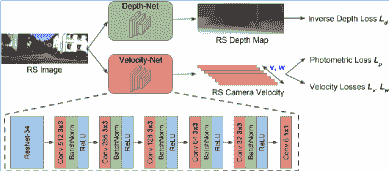

图 6: RSC-Net 的架构。该图来源于 [97]。

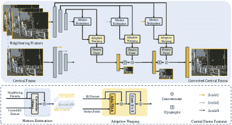

图 7: AW-RSC 的架构。该图来源于 [163]。

#### 4.2.2 基于多帧的解决方案

大多数基于多帧的解决方案都是基于重构范式的，它们主要致力于贡献如何表示 RS 和全局 GS 图像之间的密集位移场，并精确地将 RS 域变换到 GS 域。DeepUnrollNet [46] 首次提出了一种针对两个连续滚动快门图像的端到端网络，使用可微分的前向变形模块。在这种方法中，使用运动估计网络来估计滚动快门图像到其匹配全局快门图像的密集位移场。DeepUnrollNet [46] 的第二个贡献是构建了两个新颖的数据集：Fastec-RS 数据集和 Carla-RS 数据集。此外，JCD [150] 综合考虑了滚动快门校正和去模糊（RSCD）技术，这在滚动快门相机的中长曝光情况下大量存在。它应用双向变形流来补偿位移，同时保持未经变形的去模糊流以恢复细节。作者还通过设计良好的分束采集系统贡献了一个真实世界数据集，即 BS-RSCD，其中包括动态场景中的自我运动和物体运动。SUNet [156] 将 DeepUnrollNet [46] 从第二帧的中间时间 ($\frac{3\tau}{2}$) 扩展到两帧的中间时间 ($\tau$)。通过使用 PWC-Net [187]，SUNet [156] 估计了对称无畸变场，并通过时间居中的全局快门图像解码器网络重建了潜在的 GS 帧。为了有效减少从两连续 RS 图像变形的上下文之间的不对齐，设计了上下文感知无畸变流估计器和对称一致性强制执行方法。为了实现更高的帧率，Fan 等人 [155] 基于 RS 相机的扫描线依赖性特性从两个连续的 RS 图像生成了一个 GS 视频。特别是，他们首先分析了双向 RS 无畸变流和光流之间的固有联系，证明了 RS 无畸变流图具有比各向同性光滑光流图更明显的扫描线依赖性。然后，他们开发了双向无畸变流来描述像素级的 RS 感知位移，并进一步设计了一种计算技术，用于不同扫描线对应的不同 RS 无畸变流之间的相互转换。为了消除先前方法中不准确的位移场估计和易出错的变形问题，AW-RSC [163] 提出了预测多个字段并自适应地将学习的 RS 特征变形到全局快门对应项的方法。使用逐层精细的方法，这些变形特征被组合并生成为如图 7 所示的精确全局快门帧。与先前的作品 [46, 150, 156, 155] 相比，AW-RSC [163] 中的自适应多头注意力和卷积块组成的变形操作是可学习的且有效的。此外，AW-RSC [163] 贡献了一个真实世界的滚动快门校正数据集：BS-RS，其中 RS 视频与对应的 GS 地面实况同时使用基于分束器的采集系统捕获。

### 4.3 讨论

#### 4.3.1 技术总结

深度学习在广角相机和卷帘快门标定上的工作共享了类似的技术流程。沿着这一研究趋势，大多数早期文献开始于基于回归的解决方案[23, 37, 24]。随后，相关工作从重建角度创新了传统标定[31, 32, 118, 46]，直接学习位移场以校正未标定的输入。为了提高标定精度，开发了更直观的位移场和更有效的变形策略[142, 163, 150, 155]。为了适应不同畸变的分布，一些工作设计了不同形状的卷积核[24]或转换了卷积坐标[140]。

现有工作致力于设计更强大的网络并引入更多样化的特征以促进标定性能。越来越多的方法集中于畸变的几何先验[118, 116, 78]。这些先验可以直接加权到卷积层中或用于监督网络训练，推动学习模型更快收敛。

#### 4.3.2 未来努力

(1) 广角相机标定和卷帘快门相机标定的发展可以相互促进。例如，卷帘快门标定中广泛研究的多帧解决方案可以为广角标定提供灵感。同一对象在不同序列中出现可能提供有关径向畸变的有用先验。此外，对位移场和变形层的详细研究[163, 150, 155]有可能推动广角相机标定及其他领域的发展。此外，广角标定中的几何先验研究还可能改善卷帘快门标定中网络的可解释性。

(2) 大多数方法基于从所有相机参数中随机样本合成其训练数据集。然而，对于由真实镜头捕获的图像，相机参数的分布可能位于一个潜在的流形[85]。在标签冗余的标定数据集上进行学习使得训练过程低效。因此，探索合成数据集的实用采样策略可能是未来方向中的一个有意义的任务。

(3) 为了克服单帧校准的病态问题，可以引入其他高精度传感器来弥补当前的校准性能，例如事件相机 [39]。随着视觉传感器的快速发展，使用多传感器的联合校准具有重要价值。因此，将沿着这个研究方向探讨更多的跨模态和多模态融合技术。

## 5 交叉视角模型

现有的深度校准方法可以从单个相机中估计特定的相机参数。实际上，在多相机情况下，参数表示可能更为复杂。例如，在多视角模型中，基础矩阵和本质矩阵描述了极线几何，并且它们与内部参数和外部参数复杂地纠缠在一起。单应性描述了不同视角之间的像素级对应关系。除了内部参数和外部参数，它还与深度交织在一起。在这些复杂的参数表示中，单应性在实际应用中最为广泛使用，其相关的学习方法也是研究最多的。为此，我们主要关注交叉视角模型的深度单应性估计解决方案，它们可以分为三类：直接方法、级联方法和迭代方法。

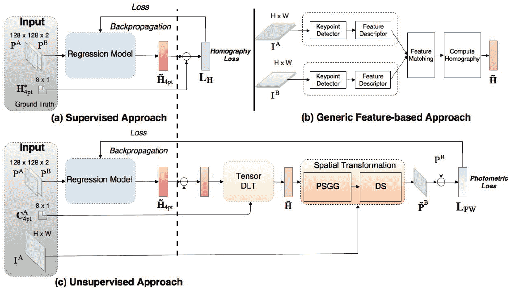

图 8: DHN [25] 和 UDHN [49] 的架构。该图来自 [49]。

### 5.1 直接方法

我们从不同参数化的角度回顾了直接深度单应性解决方案，包括经典的 4 点参数化和其他参数化方法。

#### 5.1.1 4 点参数化

深度单应性估计首次提出于 DHN[25]，采用了 VGG 风格的网络来预测 4 点参数化 $H_{4pt}$。为了训练和评估该网络，创建了一个名为 Warped MS-COCO 的合成数据集，以提供真实的 4 点参数化 $\hat{H}_{4pt}$。该流程如图 8(a) 所示，目标函数被公式化为 $L_{H}$：

|  | $L_{H}=\frac{1}{2}\parallel H_{4pt}-\hat{H}_{4pt}\parallel_{2}^{2}.$ |  | (2) |
| --- | --- | --- | --- |

然后，4-点参数化可以通过标准化的 DLT [188] 求解为 $3\times 3$ 单应性矩阵。然而，DHN 限于合成数据集，其中地面实况可以免费生成或需要昂贵的真实世界数据集标注。随后，提出了第一个无监督解决方案 UDHN [49] 来解决这个问题。如图 8(c) 所示，它使用了与 DHN 相同的网络架构，并通过最小化平均光度误差定义了一个无监督损失函数，灵感来源于传统方法[189]：

|  | $L_{PW}=\parallel\mathcal{P}(I_{A}(x))-\mathcal{P}(I_{B}(\mathcal{W}(x;p)))\parallel_{1},$ |  | (3) |
| --- | --- | --- | --- |

其中 $\mathcal{W}(\cdot;\cdot)$ 和 $\mathcal{P}(\cdot)$ 分别表示通过单应性参数 $p$ 进行变形和提取图像补丁的操作。$I_{A}$ 和 $I_{B}$ 是具有重叠区域的原始图像。UDHN 的输入是图像补丁对，但在计算损失时会对原始图像进行变形。这样可以避免变形后无效像素的不利影响，并提升像素监督的强度。为了在微小模型中获得准确性和速度，Chen 等人提出了 ShuffleHomoNet [145]，它将 ShuffleNet 压缩单元[190] 和位置感知池化[81] 集成到一个轻量级模型中。为了进一步处理大位移，通过提取多尺度特征表示和自适应融合多尺度预测，采用了多尺度权重共享版本。然而，单应性无法完美对齐由于非平面结构和非重叠相机中心造成的视差图像。为了解决视差问题，CA-UDHN [50] 设计了可学习的注意力掩码来忽略视差区域，有助于更好的背景平面对齐。此外，4-点单应性可以扩展到 meshflow [53] 以实现非平面准确对齐。

#### 5.1.2 其他参数化

除了 4 点参数化，单应性还可以通过其他形式进行参数化。为了更好地利用单应性的可逆性，Wang 等人提出了 SSR-Net [55]。他们通过传统矩阵表示以循环方式建立了可逆性约束。Zeng 等人 [82] 认为，由全连接层回归的 4 点参数化可能会损害角点的空间顺序，并易受扰动，因为四个点是解决单应性问题的最低要求。为了解决这些问题，他们将参数化公式化为一个透视场（PF），该透视场模型像素到像素的双射，并设计了一个 PFNet。这扩展了四个顶点的位移到尽可能多的密集像素点。然后，可以使用 RANSAC [191] 进行单应性求解，结合外点过滤，利用密集对应点实现鲁棒估计。然而，密集对应点会显著增加 RANSAC 的计算复杂度。此外，Ye 等人 [51] 提出了一个 8-DOF 流表示，无需额外的后处理，其在受单应性约束的 8D 子空间中的大小为$H\times W\times 2$。为了在这个子空间中表示任意的单应性流，定义了 8 个流基，提出的 BasesHomo 用于预测流基的系数。为了获得理想的基，BasesHomo 首先通过修改单位单应性矩阵的每个条目（最后一个条目除外）生成 8 个单应性流。然后，通过其最大的流幅度对这些流进行归一化，接着进行 QR 分解，从而强制所有基向量都归一化并正交。

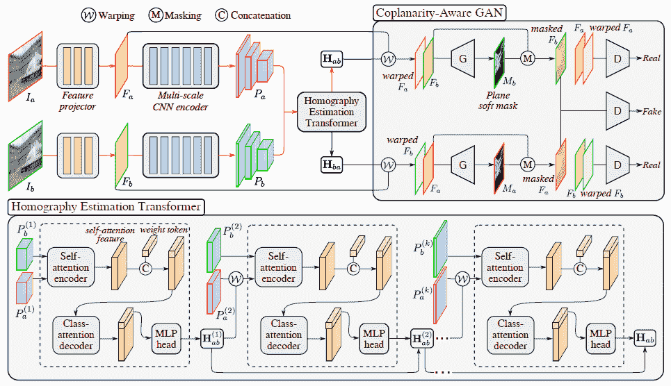

图 9：HomoGAN 的架构。该图来自 [52]。

### 5.2 级联解决方案

直接解决方案探索各种单应性参数化形式和简单的网络结构，而级联方案则专注于网络架构的复杂设计。

在 HierarchicalNet[69] 中，Nowruzi 等人认为，扭曲的图像可以视为另一个网络的输入。因此，他们将这些网络顺序堆叠，以减少估计的误差范围。基于 HierarchicalNet，SRHEN [133] 将代价体积[187] 引入了级联网络，通过余弦距离来测量特征相关性，并将其形式化为一个体积。堆叠的网络和代价体积提高了性能，但无法处理动态场景。MHN [110] 开发了一个多尺度神经网络，并提出同时学习单应性估计和动态内容检测。此外，为了解决跨分辨率问题，LocalTrans [144] 将其形式化为一个多模态问题，并提出了一个嵌入在多尺度结构中的局部变换网络，以显式学习多模态输入之间的对应关系。这些输入包括具有不同分辨率的图像，LocalTrans 在分辨率差距高达 10 倍的跨分辨率情况下取得了优异的性能。上述所有解决方案都利用图像金字塔逐步增强处理大位移的能力。然而，每个级别的每对图像都需要一个独特的特征提取网络，导致特征图的冗余。为了缓解这一问题，一些研究人员[192, 146, 41, 52] 用特征金字塔替代了图像金字塔。具体来说，他们直接对特征图进行扭曲，而不是图像，以避免过多的特征提取网络。为了解决实际图像中低重叠单应性估计的问题[146]，Nie 等人[146] 修改了无监督约束（方程 3），以适应低重叠场景：

|  | $L^{\prime}_{PW}=\parallel I_{A}(x)\cdot\mathbbm{1}(\mathcal{W}(x;p))-I_{B}(\mathcal{W}(x;p))\parallel_{1},$ |  | (4) |
| --- | --- | --- | --- |

其中，$\mathbbm{1}$ 是一个与 $I_{A}$ 或 $I_{B}$ 同样大小的全一矩阵。它通过将原始图像作为网络输入并将 $I_{A}$ 的相应像素消融到变形 $I_{B}$ 的无效像素来解决低重叠问题。为了解决非平面单应性估计问题，DAMG-Homo[41] 提出了具有上下文相关的反向多网格变形来对齐视差图像。与传统的代价体积相比，提出的上下文相关帮助在较低计算复杂度下实现了更好的精度。解决非平面问题的另一种方法是关注主要平面。在 HomoGAN [52] 中，提出了一种无监督的 GAN 来对预测的单应性施加共面约束，如图 9 所示。为了实现这一方法，使用生成器预测对齐区域的掩码，而判别器用于判断两个掩码特征图是否由单一的单应性产生。

### 5.3 迭代解法

与级联方法相比，迭代解法通过迭代优化最后的估计来实现更高的精度。Lucas-Kanade (LK) 算法[189] 通常用于图像配准，以迭代方式估计参数化的变形，如仿射变换、光流等。它旨在通过最小化模板图像 $T$ 和输入图像 $I$ 之间的平方误差和来实现每次迭代的变形参数 $\varDelta p$ 的增量更新：

|  | $E(\varDelta p)=\parallel T(x)-I(\mathcal{W}(x;p+\varDelta p))\parallel_{2}^{2}.$ |  | (5) |
| --- | --- | --- | --- |

然而，在使用一阶泰勒展开优化方程 5 时，$\partial I(\mathcal{W}(x;p))/\partial p$ 应在每次迭代时重新计算，因为 $I(\mathcal{W}(x;p))$ 随着 $p$ 变化。为了避免这个问题，可以使用逆合成（IC）LK 算法[193]，这是 LK 算法的等效形式，将优化目标重新表述如下：

|  | $E^{\prime}(\varDelta p)=\parallel T(\mathcal{W}(x;\varDelta p))-I(\mathcal{W}(x;p))\parallel_{2}^{2}.$ |  | (6) |
| --- | --- | --- | --- |

在使用一阶泰勒展开线性化方程 6 后，我们计算 $\partial T(\mathcal{W}(x;0))/\partial p$，而不是 $\partial I(\mathcal{W}(x;p))/\partial p$，这样每次迭代时不会变化。

为了将深度学习的优势与 IC-LK 迭代器结合，CLKN [68] 对由 CNN 提取的语义特征图进行了 LK 迭代优化，具体如下：

|  | $E^{f}(\varDelta p)=\parallel F_{T}(\mathcal{W}(x;\varDelta p))-F_{I}(\mathcal{W}(x;p))\parallel_{2}^{2},$ |  | (7) |
| --- | --- | --- | --- |

其中 $F_{T}$ 和 $F_{I}$ 是模板图像和输入图像的特征图。然后，他们强制网络运行单次迭代，使用铰链损失，而网络在测试阶段会运行多次迭代，直到满足停止条件。此外，CLKN 堆叠了三个相似的 LK 网络，通过将最后一个 LK 网络的输出作为下一个 LK 网络的初始变换参数来进一步提升性能。从 Eq. 7 中，IC-LK 算法严重依赖特征图，这在多模态图像中往往会失败。相反，DLKFM [143] 通过使用输出张量上的局部协方差矩阵的特征值构建了一个单通道特征图。为了学习 DLKFM，设计了两个特殊的约束项，以对齐多模态特征图并促进收敛。

然而，基于 LK 的算法可能会失败，如果雅可比矩阵是秩亏的 [194]。此外，IC-LK 迭代器无法训练，这意味着这一缺陷在理论上是不可避免的。为了解决这个问题，提出了一种完全可训练的迭代单应性网络（IHN） [162]。受到 RAFT [195] 的启发，IHN 更新代价体积，以重复使用相同的估计器来精细化估计的单应性。此外，IHN 通过在估计器中生成内点掩码来处理动态场景，而无需额外的监督。

### 5.4 讨论

#### 5.4.1 技术总结

上述工作致力于探索不同的单应性参数化方法，如 4 点参数化[25]、透视场[82]和运动基表示[51]，这有助于更好的收敛性和性能。其他工作则倾向于设计各种网络架构。特别是，提出了级联和迭代解决方案，以逐步提高性能，这些方法可以进一步结合以达到更高的准确度。为了使这些方法更具实用性，初步解决了各种挑战性问题，如跨分辨率[144]、多模态[143, 162]、动态物体[110, 162]以及非平面场景[50, 52, 41]等。

#### 5.4.2 挑战与未来工作

我们总结现有的挑战如下：

(1) 许多单应性估计解决方案是为固定分辨率设计的，而现实世界应用往往涉及更为灵活的分辨率。当将预训练模型应用于不同分辨率的图像时，由于需要调整输入尺寸以满足规定的分辨率，性能可能会显著下降。

(2) 与假设图像之间运动较小的光流估计不同，单应性估计通常处理重叠率非常低的图像。在这种情况下，现有方法可能会由于感受野有限而表现较差。

(3) 现有方法通过在特征提取器[50]、成本体积[196]或估计器[162]中学习拒绝离群值来解决视差或动态物体问题。然而，目前尚不清楚哪个阶段更适合进行离群值拒绝。

根据我们讨论的挑战，可以确定未来工作的潜在研究方向：

(1) 为了克服第一个挑战，我们可以设计各种策略以增强分辨率鲁棒性，例如与分辨率相关的数据增强，以及在具有不同分辨率的多个数据集上进行持续学习。此外，我们还可以制定一种无分辨率的参数化形式。视角场[82]就是一个典型例子，它将单应性表示为与输入图像分辨率相同的密集对应关系。但它需要 RANSAC 作为后处理方法，这会引入额外的计算复杂性，特别是在存在大量对应关系的情况下。因此，应探索一种无分辨率且高效的参数化形式。

(2) 为了提高低重叠率下的性能，主要的见解是增加网络的感受野。为此，变换器的交叉注意力模块显式利用长距离相关性以消除短距离的归纳偏差[197]。另一方面，我们可以利用有益的成本体积变体来整合特征相关性[41, 162]。

(3) 由于在特征提取器中不同图像特征之间没有交互，因此可以合理地假设离群值拒绝应发生在特征提取之后。由于深度本身无法作为离群值线索，因此在单个图像中识别离群值是不可能的。例如，仅通过旋转的摄像机拍摄的图像不包含视差离群值。此外，通过结合全局和局部相关性来学习离群值拒绝的能力似乎很直观，这类似于 RANSAC 的见解。

## 6 跨传感器模型

多传感器标定估计多个传感器（如摄像头、LiDAR 和 IMU）的内部和外部参数。这确保了来自不同传感器的数据在共同坐标系统中同步和配准，使它们能够融合在一起，以更准确地表示环境。准确的多传感器标定对于诸如自动驾驶和机器人技术等应用至关重要，这些应用需要可靠的传感器融合以确保安全和高效的操作。

在这一部分，我们主要回顾基于学习的相机-激光雷达标定的文献，即预测相机和 3D 激光雷达之间的 6-DoF 刚体变换，而不需要在实现中存在特定的特征或标志物。与其他类型的相机/系统的标定工作类似，这一研究领域也可以分为基于回归的解决方案和基于流/重建的解决方案。但我们倾向于遵循相机-激光雷达标定中的特殊匹配原则，将现有的基于学习的文献分为三类：像素级解决方案、语义级解决方案和物体/关键点级解决方案。

### 6.1 像素级解决方案

相机-激光雷达标定中的第一个深度学习技术，RegNet [27]，使用 CNN 结合特征提取、特征匹配和全局回归来推断 6-DoF 外参。它分别处理 RGB 和激光雷达深度图，并分支出两个并行的数据网络流。随后，提出了一个特定的关联层，将堆叠的激光雷达和 RGB 特征卷积为一个联合表示。在这一特征匹配之后，通过两个完全连接的层和欧几里得损失函数实现了全局信息融合和参数回归。受到这项工作的启发，后续工作在几何约束[83, 128]、时间相关性[128]、损失设计[127]、特征提取[179]、特征匹配[152, 132]、特征融合[179]和标定表示[153, 176]方面取得了更准确的相机-激光雷达标定。

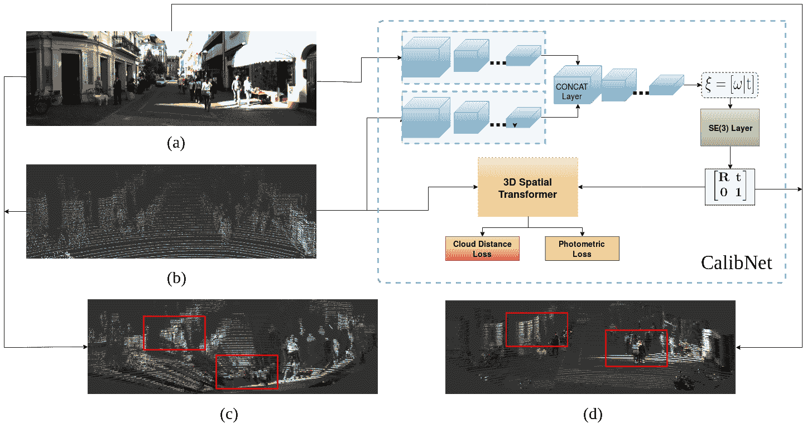

图 10：CalibNet 的网络架构。图源自[83]。

例如，如图 10 所示，CalibNet [83] 设计了一个网络来预测校准参数，以最大化图像和点云的几何及光度一致性，通过 3D 空间变换器 [198] 解决基础物理问题。为了优化校准模型，CalibRCNN [128] 提出了合成视图和极几何约束来测量连续帧之间的光度和几何误差，其中 LSTM 网络学习的时间信息在基于学习的相机-激光雷达校准中首次被研究。由于激光雷达-相机校准的输出空间位于 3D 特殊欧几里得群（$SE(3)$）而非普通欧几里得空间，RGGNet [127] 在损失函数中考虑了黎曼几何约束，即使用$SE(3)$测地距离与左不变黎曼度量来优化校准网络。LCCNet [152] 利用代价体积层学习图像与点云转换的深度之间的相关性。由于深度图忽略了点云的 3D 几何结构，FusionNet [179] 借助 PointNet++ [199] 直接从 3D 点云中学习特征。随后，提出了一种结合 Ball Query [199] 和注意力策略的特征融合方法，以有效地融合图像和点云的特征。

CFNet [153] 首次提出了相机-激光雷达校准的校准流，表示初始投影 2D 点与地面真实值之间的偏差。与直接预测外部参数相比，学习校准流帮助网络理解基础几何约束。为了建立精确的 2D-3D 对应关系，CFNet [153] 使用估计的校准流校正了原始投影点。然后，应用高效的 Perspective-n-Point (EPnP)算法通过 RANSAC 计算最终的外部参数。由于 RANSAC 是不可微分的，DXQ-Net [176] 进一步提出了一种用于激光雷达-相机校准流的概率模型，该模型估计不确定性以衡量激光雷达-相机数据关联的质量。随后，设计了可微分的姿态估计模块来解决外部参数，通过反向传播将外部误差传递到流预测网络。

### 6.2 语义层面的解决方案

语义特征可以通过深度神经网络得到很好的学习和表示。完美的标定能够准确对齐不同传感器中的相同实例。为此，一些工作 [131, 129, 157, 42] 探索了如何利用语义信息指导相机-LiDAR 标定。SOIC [131] 将初始化问题转化为使用语义信息的语义质心 PnP 问题。由于点云的 3D 语义质心和图片的 2D 语义质心不能精确匹配，提出了一种基于语义组件的匹配约束成本函数。SSI-Calib [129] 将标定重新表述为一个优化问题，并提出了一种基于语义特征的新型标定质量度量。随后，提出了一种非单调子梯度上升算法来计算标定参数。其他工作则利用现成的分割网络对点云和图像进行处理，通过最小化单向 [157] 和双向 [42] 语义对齐损失来优化标定参数。

### 6.3 对象/关键点级别解决方案

ATOP [178] 设计了一个基于注意力的对象级别匹配网络，即跨模态匹配网络，用于探索相机和 LiDAR 之间重叠的视场，从而促进生成 2D-3D 对象级别的对应关系。2D 和 3D 对象提议分别由 YOLOv4 [200] 和 PointPillar [201] 进行检测。然后，设计了两个级联的基于 PSO 的算法 [202] 用于在优化阶段估计标定外参。使用深度声明网络 (DDN) [203]，RKGCNet [180] 将标准神经层和 PnP 求解器结合在同一网络中，将 2D–3D 数据关联和姿态估计表述为一个双层优化问题。因此，可以同时利用卷积层的特征提取能力和传统的几何求解器。微软的人体关键点提取网络 [204] 被应用于检测 2D–3D 匹配关键点。此外，RKGCNet [180] 提出了一个可学习的权重层，用于确定参与求解器的关键点，从而使整个流程能够进行端到端训练。

### 6.4 讨论

#### 6.4.1 技术总结

当前方法可以根据构建 2D 和 3D 匹配的原理简要分类，即校准目标。总的来说，大多数像素级解决方案采用了端到端框架来解决此任务。虽然这些解决方案在特定数据集上表现令人满意，但其泛化能力有限。从传统校准中衍生的语义级和对象/关键点级方法提供了可接受的性能和泛化能力。然而，它们严重依赖前端特征提取的质量。

#### 6.4.2 研究趋势

(1) 网络架构变得越来越复杂，使用不同的结构进行特征提取、匹配和融合。目前的方法采用多尺度特征提取、跨模态交互、成本体积建立和置信度引导融合等策略。

(2) 直接回归 6-DoF 参数的泛化能力较弱。为克服这一点，引入了中间表示如校准流。此外，校准流可以处理在实际应用中常见的非刚性变换。

(3) 传统方法需要特定环境，但具有良好的设计策略。为了平衡准确性和泛化能力，研究了几何求解算法和学习方法的结合。

#### 6.4.3 未来的努力

(1) 相机-LiDAR 校准方法通常依赖于像 KITTI 这样的数据集，这些数据集仅提供初始的外部参数。为了创建去校准数据集，研究人员对初始外部参数添加噪声变换，但这种方法假设相机-LiDAR 系统的固定位置存在误校准。在实际应用中，相机-LiDAR 的相对姿态会变化，这使得收集具有真实外部参数的大规模真实数据变得具有挑战性。为了解决这个挑战，利用仿真系统生成合成相机-LiDAR 数据可能是一个有价值的解决方案。

(2) 为了优化网络和传统解决方案的结合，需要一种更紧凑的方法。目前的方法主要将网络用作特征提取器，导致非端到端的管道，特征提取调整不足以进行校准。深度声明性网络（DDN）是使整个管道可微分的有前景的框架。可以利用 DDN 优化学习和传统方法的聚合。

(3) 相机-LiDAR 校准中最重要的方面是 2D-3D 匹配。为实现这一点，点云通常被转换为深度图像。然而，外部仿真中的大偏差可能导致细节丢失。随着 Transformer 和跨模态技术的发展，我们认为利用 Transformer 直接在同一管道中学习图像和点云的特征可以促进更好的 2D-3D 匹配。

## 7 基准测试

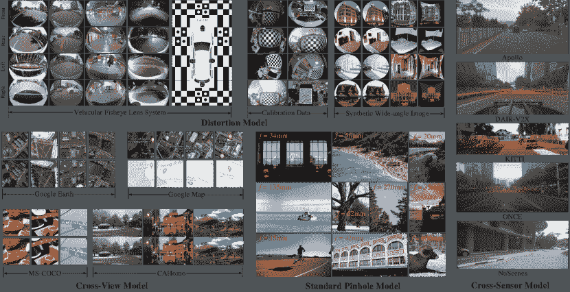

图 11：我们收集的基准概述，涵盖了本文中审查的所有模型。在这个数据集中，图像和视频来自不同的相机在不同的环境下。每个样本提供了准确的真值和标签。

由于在基于学习的相机校准中没有公开且统一的基准，我们贡献了一个可以作为泛化评估平台的数据集。在这个数据集中，图像和视频由不同相机在各种场景下捕获，包括模拟环境和真实世界设置。此外，我们提供了基于不同条件的校准真值、参数标签和视觉线索。图 11 显示了我们收集的数据集的一些样本。

标准模型。我们在互联网上收集了 300 张高分辨率图像，这些图像由 Canon、Fujifilm、Nikon、Olympus、Sigma、Sony 等流行数码相机拍摄。对于每张图像，我们提供了镜头的具体焦距。我们包含了各种主题，包括风景、肖像、野生动物、建筑等。焦距范围从 4.5mm 到 600mm。

失真模型。我们为失真相机模型创建了一个全面的数据集，重点关注广角相机。数据集包含三个子类别。第一个是合成数据集，它使用广泛使用的 4^(th)阶多项式模型生成。它包含圆形和矩形结构，共有 1,000 对失真校正图像。第二个子类别由真实世界设置下捕获的数据组成，来源于约 40 种广角相机的原始校准数据。每个校准数据提供了内部参数、外部参数和失真系数。最后，我们利用装备了不同相机的汽车捕捉视频序列。场景涵盖了室内和室外环境，包括白天和夜晚的镜头。

跨视图模型。我们从四个代表性数据集（MS-COCO [25], GoogleEarch [143], GoogleMap [143], CAHomo [50])中随机选择了 500 个测试样本，以创建跨视图模型的数据集。它涵盖了一系列场景：MS-COCO 提供自然合成数据，GoogleEarch 包含航空合成数据，GoogleMap 提供多模态合成数据。这三个数据集中不涉及视差，而 CAHomo 提供了具有非平面场景的真实数据。为了标准化数据集，我们将所有图像转换为统一格式，并记录了两个视图之间的匹配点。在 MS-COCO、GoogleEarch 和 GoogleMap 中，我们使用了图像的四个顶点作为匹配点。在 CAHomo 中，我们在同一平面内识别了六个匹配关键点。

跨传感器模型。我们从 Apollo [205], DAIR-V2X [206], KITTI [74], KUCL [207], NuScenes [208], 和 ONCE [209] 收集了 RGB 和点云数据。每个类别包含大约 300 对具有校准参数的数据。数据集在不同国家捕获，以提供足够的多样性。每个数据集有不同的传感器设置，获取具有不同图像分辨率、LiDAR 扫描模式和相机-LiDAR 相对位置的相机-LiDAR 数据。图像分辨率范围从 2448$\times$2048 到 1242$\times$375，而 LiDAR 传感器来自 Velodyne 和 Hesai，具有 16、32、40、64 和 128 条光束。它们不仅包括普通的周围多视角图像，还有小基线多视角数据。此外，我们还在经典设置 [27] 基础上添加了大约 20 度的随机旋转和 1.5 米的平移，以模拟振动和碰撞。

## 8 未来研究方向

相机校准是一个基础且具有挑战性的研究课题。从上述技术回顾和局限性分析中，我们可以得出结论，深度学习仍有改进空间。从第三部分到第六部分，讨论了每种模型的具体未来工作。在本节中，我们建议更多的通用未来研究方向。

### 8.1 序列

大多数研究专注于校准单幅图像。然而，序列中的丰富时空相关性提供了有用的校准信息，但被忽视了。学习时空相关性可以为网络提供运动结构的知识，这与传统校准原理一致。直接将现有的校准方法应用于第一帧，然后将校准目标传播到后续帧是一种直接的方法。然而，没有方法可以完美校准每个未经校准的输入，校准误差会在整个序列中持续存在。另一种解决方案是同时校准所有帧。然而，基于学习的方法的校准结果严重依赖于图像的语义特征。因此，当场景发生微小变化时，校准序列中可能会出现不稳定的抖动效果。为此，探索视频稳定化以进行序列校准是一个有趣的未来方向。

### 8.2 学习目标

由于与图像特征的隐式关系，传统的标定目标对于神经网络的学习可能具有挑战性。为此，一些工作开发了新颖的学习目标，以替代传统的标定目标，为神经网络提供了友好的表示。此外，已经提出了中间几何表示，用以弥合图像特征和标定目标之间的差距，例如反射幅度系数图[125]、校正流[34]、表面几何[86]和法线流[167]等。展望该领域的未来发展，我们相信在为标定目标设计更明确和合理的学习目标方面仍有很大的潜力。

### 8.3 预训练

在 ImageNet 上进行预训练[66]已成为深度学习中广泛使用的策略。然而，最近的研究[93]表明，这种方法对特定的相机标定任务（如广角相机标定）的效果较差。这主要有两个原因：数据差距和任务差距。ImageNet 数据集仅包含无畸变的透视图像，使得神经网络初始化权重与畸变模型无关。此外，He 等人[210]证明，当最终任务对定位更敏感时，ImageNet 预训练任务的好处有限。因此，外参估计的性能可能会受到这一任务差距的影响。此外，超越单一图像和单一模态的预训练，至今在相关领域尚未得到充分研究。我们建议为基于学习的相机标定设计定制化的预训练策略是一个有趣的研究方向。

### 8.4 隐式统一模型

基于深度学习的相机标定方法使用传统的参数化相机模型，这些模型缺乏适应复杂情况的灵活性。非参数化相机模型将每个像素与其对应的 3D 观察光线关联，从而克服了参数化模型的局限性。然而，它们需要严格的标定目标，并且在去畸变、投影和反投影方面更为复杂。深度学习方法在标定任务中显示出潜力，使非参数化模型值得重新审视，并有可能在未来取代参数化模型。此外，它们允许隐式和统一的标定，通过像素级回归适配所有相机类型，避免了显式特征提取和几何解算。研究人员将隐式和统一表示的优势与神经辐射场（NeRF）结合，用于重建 3D 结构和合成新视图。已提出了用于通用相机的自标定 NeRF [211]，并探索了端到端管道以学习深度和自我运动而无需标定目标。我们相信隐式和统一的相机模型可以用于优化基于学习的算法或集成到下游 3D 视觉任务中。

## 9 结论

在本文中，我们呈现了基于深度学习的相机标定领域近期工作的综合调查。我们的调查涵盖了传统相机模型、分类学习范式和学习策略、最前沿方法的详细评审、公共基准以及未来研究方向。为了展示发展过程并连接现有工作的联系，我们提供了一个细粒度的分类法，通过共同考虑相机模型和应用来对文献进行分类。此外，每个类别中的关系、优点、区别和局限性也进行了全面讨论。一个开源库将定期更新新作品和数据集。我们希望这项调查能促进该领域未来的研究。

## 致谢

我们感谢北京交通大学的秦雷东和杨尚荣提供部分数据集。我们感谢悉尼大学的范金龙进行富有洞察的讨论。

## 参考文献

+   [1] C. B. Duane, “近距离相机标定，” *摄影测量与遥感工程*，第 37 卷，第 8 期，第 855–866 页，1971 年。

+   [2] S. J. Maybank 和 O. D. Faugeras，“运动相机的自标定理论，” *国际计算机视觉杂志*，第 8 卷，第 2 期，第 123–151 页，1992 年。

+   [3] J. Weng, P. Cohen, M. Herniou *等*，“带有畸变模型的相机标定及其准确性评估，” *IEEE 模式分析与机器智能汇刊*，第 14 卷，第 10 期，第 965–980 页，1992 年。

+   [4] Z. Zhang, “一种灵活的新型相机标定技术，” *IEEE 模式分析与机器智能汇刊*，第 22 卷，第 11 期，第 1330–1334 页，2000 年。

+   [5] D. C. Brown，“镜头的离心畸变”，*摄影测量工程与遥感*，1966 年。

+   [6] Z. Zhang，“通过从未知方向观看平面实现灵活的相机标定”，收录于*第七届 IEEE 国际计算机视觉会议论文集*，第 1 卷。IEEE，1999 年，第 666–673 页。

+   [7] S. Gasparini, P. Sturm 和 J. P. Barreto，“基于平面的中央反射相机标定”，收录于*2009 年 IEEE 第 12 届国际计算机视觉会议*。IEEE，2009 年，第 1195–1202 页。

+   [8] S. Shah 和 J. Aggarwal，“鱼眼（高畸变）镜头相机的简单标定程序”，收录于*1994 年 IEEE 国际机器人与自动化会议论文集*。IEEE，1994 年，第 3422–3427 页。

+   [9] J. P. Barreto 和 H. Araujo，“中央反射线图像的几何特性及其在标定中的应用”，*IEEE 模式分析与机器智能汇刊*，第 27 卷，第 8 期，第 1327–1333 页，2005 年。

+   [10] R. Carroll, M. Agrawal 和 A. Agarwala，“优化广角图像的内容保留投影”，收录于*ACM 计算机图形学汇刊（TOG）*，第 28 卷，第 3 期。ACM，2009 年，第 43 页。

+   [11] F. Bukhari 和 M. N. Dailey，“从单幅图像自动估计径向畸变”，*数学成像与视觉杂志*，第 45 卷，第 1 期，第 31–45 页，2013 年。

+   [12] M. Alemán-Flores, L. Alvarez, L. Gomez 和 D. Santana-Cedrés，“使用一参数分割模型的自动镜头畸变校正”，*在线图像处理*，第 4 卷，第 327–343 页，2014 年。

+   [13] O. D. Faugeras, Q.-T. Luong 和 S. J. Maybank，“相机自标定：理论与实验”，收录于*欧洲计算机视觉会议*。Springer，1992 年，第 321–334 页。

+   [14] C. S. Fraser，“数字相机自标定”，*ISPRS 摄影测量与遥感杂志*，第 52 卷，第 4 期，第 149–159 页，1997 年。

+   [15] R. I. Hartley，“通过旋转相机从多个视角进行自标定”，收录于*欧洲计算机视觉会议*。Springer，1994 年，第 471–478 页。

+   [16] [在线]。可用：[`docs.opencv.org/4.x/dc/dbb/tutorial_py_calibration.html`](https://docs.opencv.org/4.x/dc/dbb/tutorial_py_calibration.html)

+   [17] [在线]。可用：[`www.mathworks.com/help/vision/camera-calibration.html`](https://www.mathworks.com/help/vision/camera-calibration.html)

+   [18] J. Salvi, X. Armangué 和 J. Batlle，“相机标定方法的比较评估”，*模式识别*，第 35 卷，第 7 期，第 1617–1635 页，2002 年。

+   [19] C. Hughes, M. Glavin, E. Jones 和 P. Denny，“鱼眼相机几何畸变补偿的综述”，2008 年。

+   [20] J. Fan, J. Zhang, S. J. Maybank 和 D. Tao，“广角图像校正：综述”，*国际计算机视觉杂志*，第 130 卷，第 3 期，第 747–776 页，2022 年。

+   [21] S. Workman, C. Greenwell, M. Zhai, R. Baltenberger, 和 N. Jacobs，“Deepfocal：一种直接焦距估计方法”，在 *2015 IEEE 国际图像处理会议（ICIP）*，2015 年，第 1369–1373 页。

+   [22] A. Kendall, M. Grimes, 和 R. Cipolla，“Posenet：一种用于实时 6 自由度相机重新定位的卷积网络”，在 *IEEE 国际计算机视觉大会（ICCV）*，2015 年 12 月。

+   [23] J. Rong, S. Huang, Z. Shang, 和 X. Ying，“使用合成图像训练的卷积神经网络进行径向镜头畸变校正”，在 *亚洲计算机视觉会议*。Springer，2016 年，第 35–49 页。

+   [24] V. Rengarajan, Y. Balaji, 和 A. Rajagopalan，“展开快门：利用 CNN 纠正运动畸变”，在 *IEEE 计算机视觉与模式识别会议论文集*，2017 年，第 2291–2299 页。

+   [25] D. DeTone, T. Malisiewicz, 和 A. Rabinovich，“深度图像单应性估计”，*arXiv 预印本 arXiv:1606.03798*，2016 年。

+   [26] Y. Hold-Geoffroy, K. Sunkavalli, J. Eisenmann, M. Fisher, E. Gambaretto, S. Hadap, 和 J.-F. Lalonde，“用于深度单幅图像相机校准的感知度量”，在 *IEEE 计算机视觉与模式识别会议论文集（CVPR）*，2018 年 6 月。

+   [27] N. Schneider, F. Piewak, C. Stiller, 和 U. Franke，“Regnet：使用深度神经网络的多模态传感器注册”，在 *2017 IEEE 智能车辆研讨会（IV）*。IEEE，2017 年，第 1803–1810 页。

+   [28] P. Isola, J.-Y. Zhu, T. Zhou, 和 A. A. Efros，“使用条件对抗网络的图像到图像翻译”，在 *IEEE 计算机视觉与模式识别会议论文集*，2017 年，第 1125–1134 页。

+   [29] J. Long, E. Shelhamer, 和 T. Darrell，“用于语义分割的全卷积网络”，在 *IEEE 计算机视觉与模式识别会议论文集*，2015 年，第 3431–3440 页。

+   [30] D. Eigen, C. Puhrsch, 和 R. Fergus，“使用多尺度深度网络从单幅图像预测深度图”，*神经信息处理系统进展*，第 27 卷，2014 年。

+   [31] K. Liao, C. Lin, Y. Zhao, 和 M. Gabbouj，“Dr-gan：使用条件 gan 实时自动径向畸变校正”，*IEEE 视频技术电路与系统汇刊*，第 30 卷，第 3 期，第 725–733 页，2020 年。

+   [32] K. Liao, C. Lin, Y. Zhao, 和 M. Xu，“无模型的畸变校正框架通过畸变分布图桥接”，*IEEE 图像处理汇刊*，第 29 卷，第 3707–3718 页，2020 年。

+   [33] K. Liao, C. Lin, L. Liao, Y. Zhao, 和 W. Lin，“用于训练畸变感知桶形畸变校正模型的多级课程”，在 *IEEE/CVF 国际计算机视觉大会（ICCV）*，2021 年 10 月，第 4389–4398 页。

+   [34] X. Li, B. Zhang, P. V. Sander, 和 J. Liao, “通过深度学习进行图像的盲几何畸变校正，” 收录于 *IEEE/CVF 计算机视觉与模式识别会议（CVPR）*，2019 年 6 月。

+   [35] O. Ronneberger, P. Fischer, 和 T. Brox, “U-net: 用于生物医学图像分割的卷积网络，” 收录于 *医学图像计算与计算机辅助干预国际会议*。  Springer，2015 年，第 234–241 页。

+   [36] M. Zhai, S. Workman, 和 N. Jacobs, “在非曼哈顿世界中使用全局图像上下文检测消失点，” 收录于 *IEEE 计算机视觉与模式识别会议（CVPR）*，2016 年 6 月。

+   [37] O. Bogdan, V. Eckstein, F. Rameau, 和 J.-C. Bazin, “Deepcalib: 一种用于宽视场相机自动内参标定的深度学习方法，” 收录于 *第 15 届 ACM SIGGRAPH 欧洲视觉媒体制作会议*，2018 年，第 1–10 页。

+   [38] Y. Lin, R. Wiersma, S. L. Pintea, K. Hildebrandt, E. Eisemann, 和 J. C. van Gemert, “深度消失点检测: 几何先验使数据集变异消失，” *arXiv 预印本 arXiv:2203.08586*，2022 年。

+   [39] X. Zhou, P. Duan, Y. Ma, 和 B. Shi, “Evunroll: 基于神经形态事件的滚动快门图像校正，” 收录于 *IEEE/CVF 计算机视觉与模式识别会议*，2022 年，第 17 775–17 784 页。

+   [40] Y. Shangrong, L. Chunyu, L. Kang, 和 Z. Yao, “Fishformer: 基于环形切片的变换器用于鱼眼校正与效能领域探索，” *arXiv 预印本 arXiv:2207.01925*，2022 年。

+   [41] L. Nie, C. Lin, K. Liao, S. Liu, 和 Y. Zhao, “深度感知的多网格深度单应性估计与上下文相关性，” *IEEE 视频技术电路与系统学报*，第 1–1 页，2021 年。

+   [42] K. Akio, Z. Yiyang, Z. Pengwei, Z. Wei, 和 T. Masayoshi, “Sst-calib: 激光雷达和相机之间的空间-时间参数同步标定，” *arXiv 预印本 arXiv:2207.03704*，2022 年。

+   [43] Y. Zhao, Z. Huang, T. Li, W. Chen, C. LeGendre, X. Ren, A. Shapiro, 和 H. Li, “学习视角畸变校正，” 收录于 *IEEE/CVF 国际计算机视觉会议（ICCV）*，2019 年 10 月。

+   [44] J. Tan, S. Zhao, P. Xiong, J. Liu, H. Fan, 和 S. Liu, “使用深度结构模型进行实用的广角人像校正，” 收录于 *IEEE/CVF 计算机视觉与模式识别会议（CVPR）*，2021 年 6 月，第 3498–3506 页。

+   [45] M. Kocabas, C.-H. P. Huang, J. Tesch, L. Müller, O. Hilliges, 和 M. J. Black, “Spec: 通过估计相机观察野外人物，” 收录于 *IEEE/CVF 国际计算机视觉会议（ICCV）*，2021 年 10 月，第 11 035–11 045 页。

+   [46] P. Liu, Z. Cui, V. Larsson, 和 M. Pollefeys, “深度快门展开网络，” 收录于 *IEEE/CVF 计算机视觉与模式识别会议*，2020 年，第 5941–5949 页。

+   [47] F. Zhu, S. Zhao, P. Wang, H. Wang, H. Yan, 和 S. Liu，“通过多尺度变换器进行半监督广角人像校正”，在*IEEE/CVF 计算机视觉与模式识别会议论文集*，2022 年，第 19 689–19 698 页。

+   [48] R. Zhu, X. Yang, Y. Hold-Geoffroy, F. Perazzi, J. Eisenmann, K. Sunkavalli, 和 M. Chandraker，“野外的单视角测量”，在*欧洲计算机视觉会议*。Springer，2020 年，第 316–333 页。

+   [49] T. Nguyen, S. W. Chen, S. S. Shivakumar, C. J. Taylor, 和 V. Kumar，“无监督深度单应性：一种快速且鲁棒的单应性估计模型”，*IEEE Robotics and Automation Letters*，第 3 卷，第 3 期，第 2346–2353 页，2018 年。

+   [50] J. Zhang, C. Wang, S. Liu, L. Jia, N. Ye, J. Wang, J. Zhou, 和 J. Sun，“基于内容的无监督深度单应性估计”，在*欧洲计算机视觉会议*。Springer，2020 年，第 653–669 页。

+   [51] N. Ye, C. Wang, H. Fan, 和 S. Liu，“通过子空间投影进行无监督深度单应性估计的运动基础学习”，在*IEEE/CVF 国际计算机视觉大会论文集（ICCV）*，2021 年 10 月，第 13 117–13 125 页。

+   [52] M. Hong, Y. Lu, N. Ye, C. Lin, Q. Zhao, 和 S. Liu，“具有共面性感知的生成对抗网络的无监督单应性估计”，*arXiv 预印本 arXiv:2205.03821*，2022 年。

+   [53] S. Liu, N. Ye, C. Wang, K. Luo, J. Wang, 和 J. Sun，“基于内容的无监督深度单应性估计及其扩展”，*IEEE Transactions on Pattern Analysis and Machine Intelligence*，第 1–1 页，2022 年。

+   [54] S. Yang, C. Lin, K. Liao, Y. Zhao, 和 M. Liu，“通过具有几何先验的双向损失进行无监督鱼眼图像校正”，*Journal of Visual Communication and Image Representation*，第 66 卷，第 102692 页，2020 年。

+   [55] X. Wang, C. Wang, B. Liu, X. Zhou, L. Zhang, J. Zheng, 和 X. Bai，“深度学习时代的多视角立体视觉：全面综述”，*Displays*，第 70 卷，第 102102 页，2021 年。

+   [56] J. Fan, J. Zhang, 和 D. Tao，“Sir：通过从多个不同镜头观察相同场景的自监督图像矫正”，*IEEE Transactions on Image Processing*，2022 年。

+   [57] J. Fang, I. Vasiljevic, V. Guizilini, R. Ambrus, G. Shakhnarovich, A. Gaidon, 和 M. R. Walter，“从视频中自监督相机自标定”，*arXiv 预印本 arXiv:2112.03325*，2021 年。

+   [58] J. Zhao, S. Wei, L. Liao, 和 Y. Zhao，“基于 DQN 的渐进鱼眼图像矫正”，*Pattern Recognition Letters*，第 152 卷，第 129–134 页，2021 年。

+   [59] V. Mnih, K. Kavukcuoglu, D. Silver, A. A. Rusu, J. Veness, M. G. Bellemare, A. Graves, M. Riedmiller, A. K. Fidjeland, G. Ostrovski *等*，“通过深度强化学习实现人类水平的控制”，*自然*，第 518 卷，第 7540 期，第 529–533 页，2015 年。

+   [60] K. Wilson 和 N. Snavely，“通过 1dsfm 实现鲁棒的全局平移”，在*欧洲计算机视觉会议*。Springer，2014 年，第 61–75 页。

+   [61] [在线]. 可用： [`www.repository.cam.ac.uk/handle/1810/251342;jsessionid=90AB1617B8707CD387CBF67437683F77`](https://www.repository.cam.ac.uk/handle/1810/251342;jsessionid=90AB1617B8707CD387CBF67437683F77)

+   [62] S. Workman, M. Zhai 和 N. Jacobs，“野外的地平线线”，*arXiv 预印本 arXiv:1604.02129*，2016 年。

+   [63] [在线]. 可用： [`mvrl.cse.wustl.edu/datasets/hlw/`](https://mvrl.cse.wustl.edu/datasets/hlw/)

+   [64] P. Denis, J. H. Elder 和 F. J. Estrada，“用于估计城市影像中曼哈顿框架的高效边缘方法”，在 *欧洲计算机视觉会议*。 Springer，2008 年，页 197–210。

+   [65] O. Barinova, V. Lempitsky, E. Tretiak 和 P. Kohli，“人造环境中的几何图像解析”，在 *欧洲计算机视觉会议*。 Springer，2010 年，页 57–70。

+   [66] J. Deng, W. Dong, R. Socher, L.-J. Li, K. Li 和 L. Fei-Fei，“ImageNet：大规模层次图像数据库”，在 *IEEE 计算机视觉与模式识别会议*，2009 年，页 248–255。

+   [67] T.-Y. Lin, M. Maire, S. Belongie, J. Hays, P. Perona, D. Ramanan, P. Dollár 和 C. L. Zitnick，“Microsoft COCO：上下文中的常见对象”，在 *欧洲计算机视觉会议*。 Springer，2014 年，页 740–755。

+   [68] C.-H. Chang, C.-N. Chou 和 E. Y. Chang，“Clkn：用于图像对齐的级联卢卡斯-卡纳德网络”，在 *IEEE 计算机视觉与模式识别会议（CVPR）论文集*，2017 年 7 月。

+   [69] F. Erlik Nowruzi, R. Laganiere 和 N. Japkowicz，“利用分层卷积网络从图像对中估计单应性”，在 *IEEE 国际计算机视觉会议（ICCV）研讨会论文集*，2017 年 10 月。

+   [70] J. Xiao, J. Hays, K. A. Ehinger, A. Oliva 和 A. Torralba，“太阳数据库：从修道院到动物园的大规模场景识别”，在 *2010 年 IEEE 计算机学会计算机视觉与模式识别会议*。 IEEE，2010 年，页 3485–3492。

+   [71] J. Philbin, O. Chum, M. Isard, J. Sivic 和 A. Zisserman，“使用大型词汇和快速空间匹配的对象检索”，在 *2007 年 IEEE 计算机视觉与模式识别会议*。 IEEE，2007 年，页 1–8。

+   [72] H. Shao, T. Svoboda 和 L. Van Gool，“Zubud-苏黎世建筑数据库用于基于图像的识别”，*瑞士联邦理工学院计算机视觉实验室，技术报告*，第 260 卷，第 20 期，第 6 页，2003 年。

+   [73] G. B. Huang, M. Mattar, T. Berg 和 E. Learned-Miller，“野外标记面孔：用于研究无约束环境中的人脸识别的数据库”，在 *《‘真实生活’图像中的面孔工作坊：检测、对齐和识别》*，2008 年。

+   [74] A. Geiger, P. Lenz 和 R. Urtasun，“我们准备好自动驾驶了吗？KITTI 视觉基准套件”，在 *2012 年 IEEE 计算机视觉与模式识别会议*。 IEEE，2012 年，页 3354–3361。

+   [75] J. Xiao, K. A. Ehinger, A. Oliva, 和 A. Torralba, “使用全景场所表示识别场景视点，” 见于 *2012 IEEE 计算机视觉与模式识别会议*。 IEEE，2012 年，页码 2695–2702。

+   [76] X. Yin, X. Wang, J. Yu, M. Zhang, P. Fua, 和 D. Tao, “Fisheyerecnet: 一种用于鱼眼图像校正的多上下文协作深度网络，” 见于 *欧洲计算机视觉会议（ECCV）论文集*，2018 年 9 月。

+   [77] B. Zhou, H. Zhao, X. Puig, S. Fidler, A. Barriuso, 和 A. Torralba, “通过 ADE20K 数据集进行场景解析，” 见于 *IEEE 计算机视觉与模式识别会议论文集*，2017 年，页码 633–641。

+   [78] Y. Shi, D. Zhang, J. Wen, X. Tong, X. Ying, 和 H. Zha, “通过向卷积神经网络添加具有倒置中央模型的权重层来校正径向镜头畸变，” 见于 *2018 年第 24 届国际模式识别大会（ICPR）*，2018 年，页码 1–6。

+   [79] R. Ranftl 和 V. Koltun, “深度基础矩阵估计，” 见于 *欧洲计算机视觉会议（ECCV）论文集*，2018 年 9 月。

+   [80] A. Knapitsch, J. Park, Q.-Y. Zhou, 和 V. Koltun, “坦克与寺庙：大规模场景重建基准测试，” *ACM 图形学汇刊（ToG）*，第 36 卷，第 4 期，页码 1–13，2017 年。

+   [81] O. Poursaeed, G. Yang, A. Prakash, Q. Fang, H. Jiang, B. Hariharan, 和 S. Belongie, “无对应点的深度基础矩阵估计，” 见于 *欧洲计算机视觉会议（ECCV）研讨会论文集*，2018 年 9 月。

+   [82] R. Zeng, S. Denman, S. Sridharan, 和 C. Fookes, “通过透视场重新考虑平面单应性估计，” 见于 *亚洲计算机视觉会议*。 Springer，2018 年，页码 571–586。

+   [83] G. Iyer, R. K. Ram, J. K. Murthy, 和 K. M. Krishna, “Calibnet: 使用 3D 空间变换网络进行几何监督的外部标定，” 见于 *2018 IEEE/RSJ 国际智能机器人与系统会议（IROS）*。 IEEE，2018 年，页码 1110–1117。

+   [84] C.-K. Chang, J. Zhao, 和 L. Itti, “Deepvp: 用于消失点检测的深度学习方法，基于 100 万街景图像，” 见于 *2018 IEEE 国际机器人与自动化会议（ICRA）*。 IEEE，2018 年，页码 4496–4503。

+   [85] M. Lopez, R. Mari, P. Gargallo, Y. Kuang, J. Gonzalez-Jimenez, 和 G. Haro, “具有径向畸变的深度单幅图像相机标定，” 见于 *IEEE/CVF 计算机视觉与模式识别会议（CVPR）论文集*，2019 年 6 月。

+   [86] W. Xian, Z. Li, M. Fisher, J. Eisenmann, E. Shechtman, 和 N. Snavely, “Uprightnet: 从单幅图像中估计几何感知相机方向，” 见于 *IEEE/CVF 国际计算机视觉会议（ICCV）论文集*，2019 年 10 月。

+   [87] W. Li, S. Saeedi, J. McCormac, R. Clark, D. Tzoumanikas, Q. Ye, Y. Huang, R. Tang, 和 S. Leutenegger, “Interiornet: 规模巨大的多传感器真实感室内场景数据集，” *arXiv 预印本 arXiv:1809.00716*，2018 年。

+   [88] A. Dai, A. X. Chang, M. Savva, M. Halber, T. Funkhouser 和 M. Nießner，“ScanNet: 丰富注释的室内场景 3D 重建”，载于 *IEEE 计算机视觉与模式识别会议论文集*，2017 年，页 5828–5839。

+   [89] B. Zhuang, Q.-H. Tran, G. H. Lee, L. F. Cheong 和 M. Chandraker，“自标定中的退化问题重访及未标定 SLAM 的深度学习解决方案”，载于 *2019 IEEE/RSJ 智能机器人与系统国际会议（IROS）*，2019 年，页 3766–3773。

+   [90] S. Ammar Abbas 和 A. Zisserman，“从图像中获取鸟瞰图的几何方法”，载于 *IEEE/CVF 国际计算机视觉会议（ICCV）研讨会论文集*，2019 年 10 月。

+   [91] A. Dosovitskiy, G. Ros, F. Codevilla, A. Lopez 和 V. Koltun，“Carla: 一个开放的城市驾驶模拟器”，载于 *机器人学习会议*。PMLR，2017 年，页 1–16。

+   [92] O. Barinova, V. Lempitsky, E. Tretiak 和 P. Kohli，“在人工环境中的几何图像解析”，载于 *欧洲计算机视觉会议*。Springer，2010 年，页 57–70。

+   [93] K. Liao, C. Lin, Y. Zhao 和 M. Gabbouj，“从静态到动态的失真校正：失真序列构建视角”， *IEEE 视频技术电路与系统汇刊*，第 30 卷，第 11 期，页 3870–3882，2020 年。

+   [94] R. Jung, A. S. J. Lee, A. Ashtari 和 J.-C. Bazin，“Deep360up: 基于深度学习的自动 VR 图像直立调整方法”，载于 *2019 IEEE 虚拟现实与 3D 用户界面会议（VR）*，2019 年，页 1–8。

+   [95] V. Belagiannis, C. Rupprecht, G. Carneiro 和 N. Navab，“深度回归的鲁棒优化”，载于 *IEEE 国际计算机视觉会议论文集*，2015 年，页 2830–2838。

+   [96] B. Zhou, A. Lapedriza, A. Khosla, A. Oliva 和 A. Torralba，“Places: 用于场景识别的 1000 万图像数据库”， *IEEE 模式分析与机器智能汇刊*，第 40 卷，第 6 期，页 1452–1464，2018 年。

+   [97] B. Zhuang, Q.-H. Tran, P. Ji, L.-F. Cheong 和 M. Chandraker，“学习结构和运动感知的滚动快门校正”，载于 *IEEE/CVF 计算机视觉与模式识别会议（CVPR）论文集*，2019 年 6 月。

+   [98] Z. Xue, N. Xue, G.-S. Xia 和 W. Shen，“学习校准鱼眼图像的直线”，载于 *IEEE/CVF 计算机视觉与模式识别会议（CVPR）论文集*，2019 年 6 月。

+   [99] K. Huang, Y. Wang, Z. Zhou, T. Ding, S. Gao 和 Y. Ma，“学习解析人工环境中的线框”，载于 *IEEE 计算机视觉与模式识别会议论文集*，2018 年，页 626–635。

+   [100] S. Song, F. Yu, A. Zeng, A. X. Chang, M. Savva 和 T. Funkhouser，“从单张深度图像中完成语义场景”，载于 *IEEE 计算机视觉与模式识别会议论文集*，2017 年，页 1746–1754。

+   [101] L. Yin, X. Sun, T. Worm, 和 M. Reale, “高分辨率 3D 动态面部表情数据库，2008 年，” 见 *IEEE 国际自动面部与姿态识别会议，阿姆斯特丹，荷兰*，第 126 卷。

+   [102] Y. Zhou, H. Qi, J. Huang, 和 Y. Ma, “Neurvps：通过圆锥卷积的神经消失点扫描，” *神经信息处理系统进展*，第 32 卷，2019 年。

+   [103] Y. Zhou, H. Qi, Y. Zhai, Q. Sun, Z. Chen, L.-Y. Wei, 和 Y. Ma, “从单幅图像重建 3D 曼哈顿框架的学习，” 见 *IEEE/CVF 国际计算机视觉会议论文集*，2019 年，页码 7698–7707。

+   [104] L. Sha, J. Hobbs, P. Felsen, X. Wei, P. Lucey, 和 S. Ganguly, “用于广播视频的端到端相机标定，” 见 *IEEE/CVF 计算机视觉与模式识别会议论文集*，2020 年 6 月。

+   [105] N. Homayounfar, S. Fidler, 和 R. Urtasun, “通过深度结构模型进行运动场定位，” 见 *IEEE 计算机视觉与模式识别会议论文集*，2017 年，页码 5212–5220。

+   [106] J. Lee, M. Sung, H. Lee, 和 J. Kim, “用于单幅图像相机标定的神经几何解析器，” 见 *欧洲计算机视觉会议*。Springer，2020 年，页码 541–557。

+   [107] [在线]. 可用： [`developers.google.com/maps/`](https://developers.google.com/maps/)

+   [108] A. Cramariuc, A. Petrov, R. Suri, M. Mittal, R. Siegwart, 和 C. Cadena, “学习相机误校准检测，” 见 *2020 IEEE 国际机器人与自动化会议（ICRA）*，2020 年，页码 4997–5003。

+   [109] C. Zhang, F. Rameau, J. Kim, D. M. Argaw, J.-C. Bazin, 和 I. S. Kweon, “Deepptz：PTZ 相机的深度自校准，” 见 *IEEE/CVF 冬季计算机视觉应用会议（WACV）论文集*，2020 年 3 月。

+   [110] H. Le, F. Liu, S. Zhang, 和 A. Agarwala, “动态场景的深度单应性估计，” 见 *IEEE/CVF 计算机视觉与模式识别会议（CVPR）论文集*，2020 年 6 月。

+   [111] B. Davidson, M. S. Alvi, 和 J. F. Henriques, “通过分割进行 360°相机校准，” 见 *欧洲计算机视觉会议*。Springer，2020 年，页码 579–595。

+   [112] Y.-Y. Jau, R. Zhu, H. Su, 和 M. Chandraker, “基于深度关键点的相机姿态估计与几何约束，” 见 *2020 IEEE/RSJ 国际智能机器人与系统会议（IROS）*，2020 年，页码 4950–4957。

+   [113] X. Huang, P. Wang, X. Cheng, D. Zhou, Q. Geng, 和 R. Yang, “用于自动驾驶的 apolloscape 开放数据集及其应用，” *IEEE 模式分析与机器智能学报*，第 42 卷，第 10 期，页码 2702–2719，2019 年。

+   [114] Y.-H. Li, I.-C. Lo, 和 H. H. Chen, “360°双鱼眼相机的深度面部矫正，” *IEEE 图像处理学报*，第 30 卷，页码 264–276，2021 年。

+   [115] Y. Guo, L. Zhang, Y. Hu, X. He, 和 J. Gao，"Ms-celeb-1m: 大规模面部识别的数据集和基准"，发表在 *欧洲计算机视觉会议*。  施普林格，2016 年，页码 87–102。

+   [116] Y. Shi, X. Tong, J. Wen, H. Zhao, X. Ying, 和 H. Zha，"基于位置感知和对称增强的 GAN 用于径向畸变校正"，发表在 *2020 年第 25 届国际模式识别会议（ICPR）*，2021 年，页码 1701–1708。

+   [117] H. Zhao, Y. Shi, X. Tong, X. Ying, 和 H. Zha，"一种简单而有效的径向畸变校正流程"，发表在 *2020 IEEE 国际图像处理会议（ICIP）*，2020 年，页码 878–882。

+   [118] C.-H. Chao, P.-L. Hsu, H.-Y. Lee, 和 Y.-C. F. Wang，"自监督深度学习用于鱼眼图像校正"，发表在 *ICASSP 2020 - 2020 IEEE 国际声学、语音和信号处理会议（ICASSP）*，2020 年，页码 2248–2252。

+   [119] F. Yu, A. Seff, Y. Zhang, S. Song, T. Funkhouser, 和 J. Xiao，"Lsun: 使用深度学习和人类参与构建的大规模图像数据集"，*arXiv 预印本 arXiv:1506.03365*，2015 年。

+   [120] H. Zhao, X. Ying, Y. Shi, X. Tong, J. Wen, 和 H. Zha，"Rdcface: 面部识别的径向畸变校正"，发表在 *IEEE/CVF 计算机视觉与模式识别会议（CVPR）*，2020 年 6 月。

+   [121] F. Wang, L. Chen, C. Li, S. Huang, Y. Chen, C. Qian, 和 C. C. Loy，"面部识别中的噪声问题"，发表在 *欧洲计算机视觉会议（ECCV）*，2018 年，页码 765–780。

+   [122] Z.-C. Xue, N. Xue, 和 G.-S. Xia，"基于深度直线的鱼眼畸变校正"，*arXiv 预印本 arXiv:2003.11386*，2020 年。

+   [123] M. Baradad 和 A. Torralba，"从单视角进行 3D 预测的高度和直立性不变性"，发表在 *IEEE/CVF 计算机视觉与模式识别会议（CVPR）*，2020 年 6 月。

+   [124] N. Silberman, D. Hoiem, P. Kohli, 和 R. Fergus，"从 RGBD 图像进行室内分割和支撑推断"，发表在 *欧洲计算机视觉会议*。  施普林格，2012 年，页码 746–760。

+   [125] Q. Zheng, J. Chen, Z. Lu, B. Shi, X. Jiang, K.-H. Yap, L.-Y. Duan, 和 A. C. Kot，"板玻璃如何揭示相机标定？" 发表在 *IEEE/CVF 计算机视觉与模式识别会议（CVPR）*，2020 年 6 月。

+   [126] [在线]. 可用: [`figshare.com/articles/dataset/FocaLens/3399169/2`](https://figshare.com/articles/dataset/FocaLens/3399169/2)

+   [127] K. Yuan, Z. Guo, 和 Z. J. Wang，"Rggnet: 基于几何深度学习和生成模型的激光雷达相机在线标定的容忍度感知"，*IEEE 机器人与自动化快报*，第 5 卷，第 4 期，页码 6956–6963，2020 年。

+   [128] J. Shi, Z. Zhu, J. Zhang, R. Liu, Z. Wang, S. Chen, 和 H. Liu, “Calibrcnn: 通过递归卷积神经网络和几何约束标定相机和激光雷达，” 在 *2020 IEEE/RSJ 智能机器人与系统国际会议 (IROS)*。 IEEE, 2020 年，第 10,197–10,202 页。

+   [129] Y. Zhu, C. Li, 和 Y. Zhang, “基于传感器语义信息的在线相机-激光雷达标定，” 在 *2020 IEEE 国际机器人与自动化会议 (ICRA)*。 IEEE, 2020 年，第 4970–4976 页。

+   [130] M. Everingham, L. Van Gool, C. K. I. Williams, J. Winn, 和 A. Zisserman, “PASCAL 视觉物体类别挑战 2012 (VOC2012) 结果，” [`www.pascal-network.org/challenges/VOC/voc2012/workshop/index.html`](http://www.pascal-network.org/challenges/VOC/voc2012/workshop/index.html)。

+   [131] W. Wang, S. Nobuhara, R. Nakamura, 和 K. Sakurada, “Soic: 基于语义的激光雷达和相机在线初始化与标定，” *arXiv 预印本 arXiv:2003.04260*，2020 年。

+   [132] S. Wu, A. Hadachi, D. Vivet, 和 Y. Prabhakar, “Netcalib: 基于深度学习的激光雷达-相机自动标定新方法，” 在 *2020 年第 25 届国际模式识别会议 (ICPR)*。 IEEE, 2021 年，第 6648–6655 页。

+   [133] Y. Li, W. Pei, 和 Z. He, “Srhen: 通过解析深度潜在空间中的几何对应关系进行逐步精炼单应性估计网络，” 在 *第 28 届 ACM 国际多媒体会议*，2020 年，第 3063–3071 页。

+   [134] Y. Gil, S. Elmalem, H. Haim, E. Marom, 和 R. Giryes, “使用单目深度估计的立体自标定在线训练，” *IEEE 计算成像汇刊*，第 7 卷，第 812–823 页，2021 年。

+   [135] [在线]. 可用: [`www.cs.toronto.edu/~harel/TAUAgent/download.html`](http://www.cs.toronto.edu/~harel/TAUAgent/download.html)

+   [136] J. Lee, H. Go, H. Lee, S. Cho, M. Sung, 和 J. Kim, “Ctrl-c: 带有线分类的相机标定变换器，” 在 *IEEE/CVF 计算机视觉国际会议 (ICCV)*，2021 年 10 月，第 16,228–16,237 页。

+   [137] N. Wakai 和 T. Yamashita, “深度单鱼眼图像相机标定用于超过 180 度视场投影，” 在 *IEEE/CVF 计算机视觉国际会议 (ICCV) 研讨会*，2021 年 10 月，第 1174–1183 页。

+   [138] P. Mirowski, A. Banki-Horvath, K. Anderson, D. Teplyashin, K. M. Hermann, M. Malinowski, M. K. Grimes, K. Simonyan, K. Kavukcuoglu, A. Zisserman *等*，“streetlearn 环境与数据集，” *arXiv 预印本 arXiv:1903.01292*，2019 年。

+   [139] K. Liao, C. Lin, 和 Y. Zhao, “一种深度序数失真估计方法用于失真矫正，” *IEEE 图像处理汇刊*，第 30 卷，第 3362–3375 页，2021 年。

+   [140] K. Zhao, C. Lin, K. Liao, S. Yang, 和 Y. Zhao, “重新审视极坐标中的径向失真矫正：一种新的高效学习视角，” *IEEE 视频技术电路与系统汇刊*，第 1–1 页，2021 年。

+   [141] A. Eichenseer 和 A. Kaup，“提供合成和真实世界鱼眼视频序列的数据集”，见于*2016 年 IEEE 国际声学、语音和信号处理会议（ICASSP）*，IEEE，2016 年，页码 1541–1545。

+   [142] S. Yang, C. Lin, K. Liao, C. Zhang, 和 Y. Zhao，“基于外观流的逐步互补网络用于鱼眼图像矫正”，见于*IEEE/CVF 计算机视觉与模式识别会议（CVPR）*，2021 年 6 月，页码 6348–6357。

+   [143] Y. Zhao, X. Huang, 和 Z. Zhang，“深度 Lucas-Kanade 单应性用于多模态图像对齐”，见于*IEEE/CVF 计算机视觉与模式识别会议（CVPR）*，2021 年 6 月，页码 15 950–15 959。

+   [144] R. Shao, G. Wu, Y. Zhou, Y. Fu, L. Fang, 和 Y. Liu，“Localtrans：一种用于跨分辨率单应性估计的多尺度局部变换网络”，见于*IEEE/CVF 国际计算机视觉会议（ICCV）*，2021 年 10 月，页码 14 890–14 899。

+   [145] Y. Chen, G. Wang, P. An, Z. You, 和 X. Huang，“使用可扩展压缩网络的快速准确单应性估计”，见于*2021 年 IEEE 国际图像处理会议（ICIP）*，2021 年，页码 1024–1028。

+   [146] L. Nie, C. Lin, K. Liao, S. Liu, 和 Y. Zhao，“无监督深度图像拼接：将拼接特征重建到图像中”，*IEEE 图像处理汇刊*，第 30 卷，页码 6184–6197，2021 年。

+   [147] S. Garg, D. P. Mohanty, S. P. Thota, 和 S. Moharana，“一种用于智能手机的图像倾斜校正简单方法，结合自注意力 mobilenet”，*arXiv 预印本 arXiv:2111.00398*，2021 年。

+   [148] K. Chen, N. Snavely, 和 A. Makadia，“宽基线相对相机位姿估计与方向学习”，见于*IEEE/CVF 计算机视觉与模式识别会议论文集*，2021 年，页码 3258–3268。

+   [149] A. Chang, A. Dai, T. Funkhouser, M. Halber, M. Niessner, M. Savva, S. Song, A. Zeng, 和 Y. Zhang，“Matterport3d：从 RGB-D 数据中学习室内环境”，*arXiv 预印本 arXiv:1709.06158*，2017 年。

+   [150] Z. Zhong, Y. Zheng, 和 I. Sato，“在动态场景中实现滚动快门校正和去模糊”，见于*IEEE/CVF 计算机视觉与模式识别会议论文集*，2021 年，页码 9219–9228。

+   [151] W.-S. Lai, J.-B. Huang, N. Ahuja, 和 M.-H. Yang，“使用深度拉普拉斯金字塔网络的快速准确图像超分辨率”，*IEEE 模式分析与机器智能汇刊*，第 41 卷，第 11 期，页码 2599–2613，2018 年。

+   [152] X. Lv, B. Wang, Z. Dou, D. Ye, 和 S. Wang，“Lccnet：使用代价体积网络进行激光雷达和相机自校准”，见于*IEEE/CVF 计算机视觉与模式识别会议论文集*，2021 年，页码 2894–2901。

+   [153] X. Lv, S. Wang, 和 D. Ye，“Cfnet：使用标定流网络进行激光雷达-相机配准”，*传感器*，第 21 卷，第 23 期，页码 8112，2021 年。

+   [154] Y. Liao, J. Xie, 和 A. Geiger, “Kitti-360：用于城市场景理解的全新数据集和基准，包括 2D 和 3D，” *IEEE 模式分析与机器智能汇刊*，2022 年。

+   [155] B. Fan 和 Y. Dai, “反转滚动快门相机：将滚动快门图像转换为高帧率全局快门视频，”在 *IEEE/CVF 国际计算机视觉会议论文集*，2021 年，第 4228–4237 页。

+   [156] B. Fan, Y. Dai, 和 M. He, “Sunet：对称去畸变网络用于滚动快门校正，”在 *IEEE/CVF 国际计算机视觉会议论文集*，2021 年，第 4541–4550 页。

+   [157] Z. Liu, H. Tang, S. Zhu, 和 S. Han, “Semalign：通过语义对齐损失进行无注释的相机-LiDAR 校准，”在 *2021 IEEE/RSJ 国际智能机器人与系统会议 (IROS)*。 IEEE，2021 年，第 8845–8851 页。

+   [158] M. Burri, J. Nikolic, P. Gohl, T. Schneider, J. Rehder, S. Omari, M. W. Achtelik, 和 R. Siegwart, “EUROC 微型空中飞行器数据集，” *国际机器人研究杂志*，第 35 卷，第 10 期，第 1157–1163 页，2016 年。

+   [159] M. Schönbein, T. Strauß, 和 A. Geiger, “标定和居中准中心型反射镜相机，”在 *2014 IEEE 国际机器人与自动化会议 (ICRA)*。 IEEE，2014 年，第 4443–4450 页。

+   [160] T. H. Butt 和 M. Taj, “通过相机投影损失进行相机标定，”在 *ICASSP 2022 - 2022 IEEE 国际声学、语音和信号处理会议 (ICASSP)*，2022 年，第 2649–2653 页。

+   [161] X. Li, F. Flohr, Y. Yang, H. Xiong, M. Braun, S. Pan, K. Li, 和 D. M. Gavrila, “基于视觉的骑行者检测的新基准，”在 *2016 IEEE 智能车辆研讨会 (IV)*。 IEEE，2016 年，第 1028–1033 页。

+   [162] S.-Y. Cao, J. Hu, Z. Sheng, 和 H.-L. Shen, “迭代深度单应性估计，” *arXiv 预印本 arXiv:2203.15982*，2022 年。

+   [163] M. Cao, Z. Zhong, J. Wang, Y. Zheng, 和 Y. Yang, “学习自适应变形以进行现实世界的滚动快门校正，”在 *IEEE/CVF 计算机视觉与模式识别会议论文集*，2022 年，第 17 785–17 793 页。

+   [164] T. Do, O. Miksik, J. DeGol, H. S. Park, 和 S. N. Sinha, “学习检测场景标志以进行相机定位，”在 *IEEE/CVF 计算机视觉与模式识别会议论文集*，2022 年，第 11 132–11 142 页。

+   [165] T. Do, K. Vuong, S. I. Roumeliotis, 和 H. S. Park, “通过空间整流器对倾斜图像进行表面法线估计，”在 *欧洲计算机视觉会议*。 施普林格，2020 年，第 265–280 页。

+   [166] J. Shotton, B. Glocker, C. Zach, S. Izadi, A. Criminisi, 和 A. Fitzgibbon, “用于 RGB-D 图像的场景坐标回归森林进行相机重定位，”在 *IEEE 计算机视觉与模式识别会议论文集*，2013 年，第 2930–2937 页。

+   [167] C. M. Parameshwara, G. Hari, C. Fermüller, N. J. Sanket, 和 Y. Aloimonos，“Diffposenet: 直接可微分的相机姿态估计”，发表于 *IEEE/CVF 计算机视觉与模式识别会议论文集*，2022 年，第 6845–6854 页。

+   [168] W. Wang, D. Zhu, X. Wang, Y. Hu, Y. Qiu, C. Wang, Y. Hu, A. Kapoor, 和 S. Scherer，“Tartanair: 推动视觉 SLAM 极限的数据集”，发表于 *2020 IEEE/RSJ 智能机器人与系统国际会议（IROS）*。IEEE，2020，第 4909–4916 页。

+   [169] J. Sturm, N. Engelhard, F. Endres, W. Burgard, 和 D. Cremers，“RGB-D SLAM 系统评估基准”，发表于 *2012 IEEE/RSJ 智能机器人与系统国际会议*。IEEE，2012，第 573–580 页。

+   [170] B. J. Pijnacker Hordijk, K. Y. Scheper, 和 G. C. De Croon，“基于事件的光流用于微型飞行器的垂直着陆”，*Field Robotics 期刊*，第 35 卷，第 1 期，第 69–90 页，2018 年。

+   [171] L. Yang, R. Shrestha, W. Li, S. Liu, G. Zhang, Z. Cui, 和 P. Tan，“Scenesqueezer: 学习压缩场景以进行相机重定位”，发表于 *IEEE/CVF 计算机视觉与模式识别会议论文集*，2022 年，第 8259–8268 页。

+   [172] W. Maddern, G. Pascoe, C. Linegar, 和 P. Newman，“1 年，1000 公里：牛津机器人车数据集”，*国际机器人研究期刊*，第 36 卷，第 1 期，第 3–15 页，2017 年。

+   [173] G. Ponimatkin, Y. Labbé, B. Russell, M. Aubry, 和 J. Sivic，“通过渲染和比较进行焦距和物体姿态估计”，发表于 *IEEE/CVF 计算机视觉与模式识别会议论文集*，2022 年，第 3825–3834 页。

+   [174] X. Sun, J. Wu, X. Zhang, Z. Zhang, C. Zhang, T. Xue, J. B. Tenenbaum, 和 W. T. Freeman，“Pix3d: 单图像 3D 形状建模的数据集和方法”，发表于 *IEEE 计算机视觉与模式识别会议论文集*，2018 年，第 2974–2983 页。

+   [175] Y. Wang, X. Tan, Y. Yang, X. Liu, E. Ding, F. Zhou, 和 L. S. Davis，“细粒度物体类别的 3D 姿态估计”，发表于 *欧洲计算机视觉会议（ECCV）研讨会论文集*，2018 年，第 0–0 页。

+   [176] X. Jing, X. Ding, R. Xiong, H. Deng, 和 Y. Wang，“Dxq-net: 使用质量感知流的可微分激光雷达-相机外参标定”，*arXiv 预印本 arXiv:2203.09385*，2022 年。

+   [177] Y. Zhang, X. Zhao, 和 D. Qian，“基于学习的相机标定框架，带有畸变校正和高精度特征检测”，*arXiv 预印本 arXiv:2202.00158*，2022 年。

+   [178] Y. Sun, J. Li, Y. Wang, X. Xu, X. Yang, 和 Z. Sun，“AToP: 一种通过跨模态对象匹配进行自动激光雷达-相机标定的注意力优化方法”，*IEEE 智能车辆学报*，2022 年。

+   [179] G. Wang, J. Qiu, Y. Guo, 和 H. Wang，“Fusionnet: 激光雷达和相机的粗到细外参标定网络与分层点像素融合”，发表于 *2022 国际机器人与自动化会议（ICRA）*。IEEE，2022，第 8964–8970 页。

+   [180] C. Ye, H. Pan, 和 H. Gao, “基于关键点的激光雷达-相机在线标定与鲁棒几何网络,” *IEEE 仪器与测量学报*，第 71 卷，第 1–11 页，2021 年。

+   [181] N. Wakai, S. Sato, Y. Ishii, 和 T. Yamashita, “重新思考深度单图像相机标定的通用相机模型以恢复旋转和鱼眼畸变,” 收录于 *欧洲计算机视觉会议论文集（ECCV）*，第 13678 卷，2022 年，第 679–698 页。

+   [182] S.-H. Chang, C.-Y. Chiu, C.-S. Chang, K.-W. Chen, C.-Y. Yao, R.-R. Lee, 和 H.-K. Chu, “生成 360 度户外全景数据集并进行可靠的太阳位置估计,” 收录于 *SIGGRAPH Asia 2018 海报*，2018 年，第 1–2 页。

+   [183] C. Wu, “朝着线性时间增量结构光学运动迈进,” 收录于 *2013 国际 3D 视觉会议-3DV 2013*。IEEE，2013 年，第 127–134 页。

+   [184] A. Howard, M. Sandler, G. Chu, L.-C. Chen, B. Chen, M. Tan, W. Wang, Y. Zhu, R. Pang, V. Vasudevan *等*，“寻找 mobilenetv3,” 收录于 *IEEE/CVF 国际计算机视觉会议论文集*，2019 年，第 1314–1324 页。

+   [185] C. R. Qi, H. Su, K. Mo, 和 L. J. Guibas, “Pointnet: 对点集进行深度学习以进行 3D 分类和分割,” 收录于 *IEEE 计算机视觉与模式识别会议论文集*，2017 年，第 652–660 页。

+   [186] Y. Li, R. Bu, M. Sun, W. Wu, X. Di, 和 B. Chen, “Pointcnn: 对 x 变换点进行卷积,” *神经信息处理系统进展*，第 31 卷，2018 年。

+   [187] D. Sun, X. Yang, M.-Y. Liu, 和 J. Kautz, “Pwc-net: 用于光流的卷积神经网络，采用金字塔、变形和代价体积,” 收录于 *IEEE 计算机视觉与模式识别会议论文集（CVPR）*，2018 年 6 月。

+   [188] R. Hartley 和 A. Zisserman, *计算机视觉中的多视角几何*。剑桥大学出版社，2003 年。

+   [189] B. D. Lucas, T. Kanade *等*，*一种迭代图像配准技术及其在立体视觉中的应用*。温哥华，1981 年，第 81 卷。

+   [190] N. Ma, X. Zhang, H.-T. Zheng, 和 J. Sun, “Shufflenet v2: 实用的高效 CNN 体系结构设计指南,” 收录于 *欧洲计算机视觉会议论文集（ECCV）*，2018 年，第 116–131 页。

+   [191] M. A. Fischler 和 R. C. Bolles, “随机样本一致性：一种用于模型拟合的范式及其在图像分析和自动制图中的应用,” *ACM 通讯*，第 24 卷，第 6 期，第 381–395 页，1981 年。

+   [192] L. Nie, C. Lin, K. Liao, 和 Y. Zhao, “从多尺度深度单应性中学习边缘保留图像拼接,” *神经计算*，第 491 卷，第 533–543 页，2022 年。

+   [193] S. Baker 和 I. Matthews, “Lucas-Kanade 20 年后：一个统一框架,” *国际计算机视觉杂志*，第 56 卷，第 3 期，第 221–255 页，2004 年。

+   [194] J. Nocedal 和 S. J. Wright, *数值优化*。施普林格，1999 年。

+   [195] Z. Teed 和 J. Deng, “Raft: 用于光流的递归全对场变换,” 收录于 *欧洲计算机视觉会议*。施普林格，2020 年，第 402–419 页。

+   [196] Y. Li, W. Pei, 和 Z. He，“SSORN: 自监督异常值去除网络用于稳健的单应性估计，” *arXiv 预印本 arXiv:2208.14093*，2022 年。

+   [197] A. Vaswani, N. Shazeer, N. Parmar, J. Uszkoreit, L. Jones, A. N. Gomez, Ł. Kaiser, 和 I. Polosukhin，“Attention is all you need，” *神经信息处理系统进展*，第 30 卷，2017 年。

+   [198] A. Handa, M. Bloesch, V. Pătrăucean, S. Stent, J. McCormac, 和 A. Davison，“GVNN: 几何计算机视觉的神经网络库，” 见于*欧洲计算机视觉会议*。 施普林格，2016 年，第 67–82 页。

+   [199] C. R. Qi, L. Yi, H. Su, 和 L. J. Guibas，“Pointnet++: 在度量空间中的点集深度层次特征学习，” *神经信息处理系统进展*，第 30 卷，2017 年。

+   [200] A. Bochkovskiy, C.-Y. Wang, 和 H.-Y. M. Liao，“Yolov4: 物体检测的最佳速度与精度，” *arXiv 预印本 arXiv:2004.10934*，2020 年。

+   [201] A. H. Lang, S. Vora, H. Caesar, L. Zhou, J. Yang, 和 O. Beijbom，“Pointpillars: 从点云中快速编码进行物体检测，” 见于*IEEE/CVF 计算机视觉与模式识别会议论文集*，2019 年，第 12 697–12 705 页。

+   [202] R. Poli, J. Kennedy, 和 T. Blackwell，“粒子群优化，” *群体智能*，第 1 卷，第 1 期，第 33–57 页，2007 年。

+   [203] S. Gould, R. Hartley, 和 D. Campbell，“深度声明网络，” *IEEE 模式分析与机器智能汇刊*，第 44 卷，第 8 期，第 3988–4004 页，2021 年。

+   [204] B. Xiao, H. Wu, 和 Y. Wei，“用于人体姿态估计和跟踪的简单基线，” 见于*欧洲计算机视觉会议论文集 (ECCV)*，2018 年，第 466–481 页。

+   [205] X. Huang, P. Wang, X. Cheng, D. Zhou, Q. Geng, 和 R. Yang，“Apolloscape 自动驾驶开放数据集及其应用，” *IEEE 模式分析与机器智能汇刊*，第 42 卷，第 10 期，第 2702–2719 页，2019 年。

+   [206] H. Yu, Y. Luo, M. Shu, Y. Huo, Z. Yang, Y. Shi, Z. Guo, H. Li, X. Hu, J. Yuan *等*，“DAIR-V2X: 大规模车载基础设施协作 3D 物体检测数据集，” 见于*IEEE/CVF 计算机视觉与模式识别会议论文集*，2022 年，第 21 361–21 370 页。

+   [207] J. Kang 和 N. L. Doh，“通过与高斯混合模型对齐边缘实现自动无目标相机-LIDAR 标定，” *领域机器人学杂志*，第 37 卷，第 1 期，第 158–179 页，2020 年。

+   [208] H. Caesar, V. Bankiti, A. H. Lang, S. Vora, V. E. Liong, Q. Xu, A. Krishnan, Y. Pan, G. Baldan, 和 O. Beijbom，“nuscenes: 一个用于自动驾驶的多模态数据集，” 见于*IEEE/CVF 计算机视觉与模式识别会议论文集*，2020 年，第 11 621–11 631 页。

+   [209] J. Mao, M. Niu, C. Jiang, X. Liang, Y. Li, C. Ye, W. Zhang, Z. Li, J. Yu, C. Xu *等*，“百万场景用于自动驾驶: Once 数据集，” 2021 年。

+   [210] K. He, R. Girshick, and P. Dollár, “重新思考 imagenet 预训练，”在 *IEEE 国际计算机视觉会议论文集*，2019 年，第 4918–4927 页。 

+   [211] Y. Jeong, S. Ahn, C. Choy, A. Anandkumar, M. Cho, and J. Park, “自校准神经辐射场，”在 *IEEE/CVF 国际计算机视觉会议论文集*，2021 年，第 5846–5854 页。 |

| 廖康于 2023 年获得北京交通大学博士学位。在 2021 至 2022 年期间，他曾在德国马普信息学研究所担任访问研究员。他的研究兴趣包括相机校准、3D 视觉和全景视觉。 |
| --- |
| 聂朗目前在北京交通大学攻读博士学位。他的研究兴趣包括多视角几何、图像拼接和计算机视觉。 |
| 黄淑娟目前在北京交通大学攻读博士学位。他的研究兴趣包括相机-LiDAR 校准、深度补全和计算机视觉。 |
| 林春宇是北京交通大学的教授。在 2011 至 2012 年期间，他曾在比利时根特大学多媒体实验室担任博士后研究员。他的研究兴趣包括多视角几何、相机校准和虚拟现实视频处理。 |
| 张静目前是悉尼大学计算机科学学院的研究员。他的研究兴趣包括计算机视觉和深度学习。他在 CVPR、ICCV、ECCV、IJCV 和 IEEE T-PAMI 等顶级会议和期刊上发表了 60 多篇论文。他是 AAAI 和 IJCAI 的 SPC。 |
| 赵耀（IEEE 会士）是北京交通大学信息科学研究所所长。他的研究兴趣包括图像/视频编码以及视频分析与理解。他于 2010 年被中国国家自然科学基金委评为杰出青年学者，并于 2013 年被中国教育部评选为长江学者。 |
| Moncef Gabbouj（IEEE 会士）是芬兰坦佩雷大学计算科学系的教授。他曾是芬兰科学院教授。他的研究兴趣包括大数据分析、多媒体分析、人工智能、机器学习、模式识别、视频处理和编码。Gabbouj 博士是 IEEE 和亚太人工智能协会的会士。他是欧洲科学院、芬兰科学与文学学院以及芬兰工程科学学院的成员。 |
| 陶大程（IEEE 会士）目前担任京东探索学院首任院长，并且是京东集团的高级副总裁。他主要将统计学和数学应用于人工智能和数据科学。他的研究详细记录在一本专著以及 200 多篇在顶级期刊和会议论文集中发表的文章中。他是澳大利亚科学院、美国科学促进会（AAAS）和计算机协会（ACM）的会士。他获得了 2015 年澳大利亚 Scopus-Eureka 奖、2018 年 IEEE ICDM 研究贡献奖和 2021 年 IEEE 计算机学会麦克拉斯基技术成就奖。 |

请参阅 supp.pdf 的页面。
