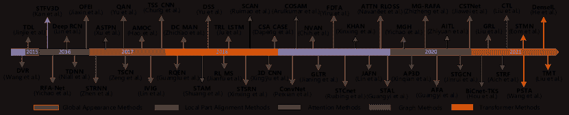
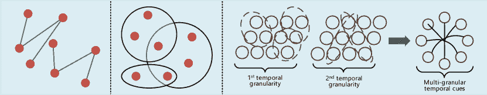

<!--yml

分类：未分类

日期：2024-09-06 19:40:32

-->

# [2303.11332] 基于视频的人物重识别的深度学习：一项综述

> 来源：[`ar5iv.labs.arxiv.org/html/2303.11332`](https://ar5iv.labs.arxiv.org/html/2303.11332)

# 基于视频的人物重识别的深度学习：一项综述

Khawar \snmIslam khawar512@gmail.com floppydisk.ai, 卡拉奇, 巴基斯坦（2013 年 5 月 1 日；2013 年 5 月 13 日；K. Islam）

###### 摘要

基于视频的人物重识别（视频重识别）最近因其在监控、智能城市和公共安全等领域的广泛实际应用而引起了越来越多的关注。然而，视频重识别非常困难且仍在进行中，因为面临许多不确定的挑战，如视角、遮挡、姿态变化和不确定的视频序列等。在过去几年中，视频重识别的深度学习在公共数据集上持续取得了惊人的成果，开发了各种方法来处理视频重识别中的不同问题。与基于图像的重识别相比，视频重识别更具挑战性和复杂性。为了鼓励未来的研究和挑战，这篇综合性的论文首次介绍了关于视频重识别的深度学习方法的最新进展。它广泛涵盖了三个重要方面，包括简要的视频重识别方法及其局限性、主要里程碑及技术挑战和架构设计。它提供了对各种现有数据集的性能比较分析，对如何改善视频重识别提供了宝贵的建议，并展望了令人兴奋的研究方向。

###### 关键词：

图像压缩、视频压缩、HEVC、JPEG、熵模型^†^†期刊：计算机视觉与图像理解\最终版

2013 年 5 月 10 日 \在线获取 2013 年 5 月 15 日

## 1 引言

随着计算机视觉和深度学习研究人员的不懈努力，深度学习在人员再识别方面取得了卓越的成功。近年来，深度学习在视频再识别方面表现出显著成果，并为监控系统带来了新的突破。随着多媒体技术的快速发展，视频再识别在过去十年中在学术界和工业界获得了更多关注 Zheng 等人 (2016b)；Nambiar 等人 (2019)；Islam (2020)。视频再识别流行的主要原因是为公共安全提供广泛的服务，如使用唯一 ID 跟踪每个人、预防犯罪、行为分析、法医调查等 Almasawa 等人 (2019)。在智能视频监控应用中，视频再识别被定义为通过各种非重叠的摄像头识别个体 Chen 等人 (2020a)。这是一个有趣的计算机视觉问题，存在于摄像头间变异挑战中，如背景杂乱、遮挡、视角、光照变化、人类姿态变化等。

表 1：现有综述论文与我们综述论文的比较。我们的综述论文主要关注视频再识别。

|   综述 | 重点 | 主要贡献 | 视频再识别 | 发表 |
| --- | --- | --- | --- | --- |
| Mazzon 等人 (2012) | 人群 |

&#124; 现有方法的缺陷 &#124;

&#124; 提出了简单的基于知识的方法 &#124;

| 部分 | PRL |
| --- | --- |
| Satta (2013) |

&#124; 外观 &#124;

&#124; 描述符 &#124;

|

&#124; 涵盖了当前评估的公共数据集 &#124;

&#124; 提出了开放和闭合集再识别场景 &#124;

| 部分 | arXiv |
| --- | --- |
| Gala 和 Shah (2014) | 开放-闭合 |

&#124; 突出了当前评估的公共数据集 &#124;

&#124; 提出了开放和闭合集再识别场景 &#124;

| 部分 | IVC |
| --- | --- |
| 郑等人 (2016b) |

&#124; 图像 &#124;

&#124; & 视频 &#124;

|

&#124; 讨论了人员再识别的历史和关系 &#124;

&#124; 综述了手工制作和深度学习方法 &#124;

| 部分 | arXiv |
| --- | --- |
| Lavi 等人 (2018) | 再识别 |

&#124; 深度神经网络技术综述 &#124;

&#124; 涵盖了损失函数和数据增强 &#124;

| X | arXiv |
| --- | --- |
| Wang 等人 (2018a) | 再识别 |

&#124; 传统方法和架构视角 &#124;

&#124; CNN、RNN 和 GAN 用于人员再识别 &#124;

| X | CAAI-TIT |
| --- | --- |
| 吴等人 (2019) | 图像 |

&#124; 具有特征设计的最先进方法综述 &#124;

&#124; 关于 ResNet 和 Inception 的若干结果 &#124;

| P |
| --- |

&#124; 神经- &#124;

&#124; 计算 &#124;

|

| Masson 等人 (2019) | 图像 |
| --- | --- |

&#124; 广泛涵盖了剪枝方法和策略 &#124;

&#124; 在不同数据集上的性能评估 &#124;

| X | JIVP |
| --- | --- |
| Nambiar 等人 (2019) | 步态 |

&#124; 涵盖了生物特征细节、姿势分析 &#124;

&#124; 数据集和多维步态 &#124;

| X | ACM-CS |
| --- | --- |
| Leng 等人 (2019) | 开放世界 |

&#124; 泛化开放世界再识别 &#124;

&#124; 特定应用驱动的再识别 &#124;

| P | IEEE-TCSVT |
| --- | --- |
| Wang 等人 (2019b) | 异构 |

&#124; 专注于异构再识别 &#124;

&#124; 跨模态差异问题 &#124;

| 部分 | IJCAI |
| --- | --- |
| Wang 等人 (2020) |

&#124; 图像 &#124;

&#124; & 视频 &#124;

|

&#124; 广泛回顾了以前的再识别方法 &#124;

&#124; 简要讨论了 CNN、RNN 和 GAN &#124;

| X | IEEE-Access |
| --- | --- |
| Ye 等人 (2021) | 图像&视频 |

&#124; 讨论了封闭世界和开放世界的再识别 &#124;

&#124; 单模态/跨模态再识别的基线 &#124;

| 部分 | IEEE-PAMI |
| --- | --- |
| Xiangtan 等人 (2021) |

&#124; 文本 & &#124;

&#124; 图像 &#124;

|

&#124; 广泛评审了人员搜索方法 &#124;

&#124; 特征学习和身份驱动方法 &#124;

| X | IJCAI |
| --- | --- |
| Lin 等人 (2021) |

&#124; 图像 & 视频 &#124;

|

&#124; 广泛覆盖了无监督方法 &#124;

&#124; 讨论数据集和评估 &#124;

&#124; 性能分析和度量 &#124;

| 部分 | arXiV |
| --- | --- |
| 我们的 | 视频 |

&#124; 简要讨论了视频再识别方法 &#124;

&#124; 讨论独特的架构和损失函数 &#124;

&#124; 当前方法的性能分析 &#124;

| 完整 | CVIU |
| --- | --- |
|    |  |  |  |  |

视频再识别是一种基于图像的人员再识别的扩展方式。与比较图像对不同，视频再识别算法提供的是视频序列对。视频再识别算法的核心任务是从视频序列中获取时间特征。与基于图像的信息相比，视频自然包含比单独图像更多的信息和证据。最近，针对视频再识别的方法已经得到大量发展，Zhou 等人 (2017); Zhang 等人 (2017)。大多数现有方法强调从视频中提取空间和时间特征，然后将再识别算法应用于获得的特征。通常，视频来自不同监控摄像头，如不同场所的 CCTV。然后，在视频序列中检测人员并创建边界框。由于数据量庞大，手动绘制边界框并为训练标注每个人的图像是困难的。

不同的研究如 Ren 等人（2015）、Li 等人（2017）、Lan 等人（2018）训练了检测器以在视频序列中检测人物。接下来，在基于先前注释数据的高度噪声数据上训练一个新的 re-ID 模型。最后，将查询（探测）人物图像输入到 re-ID 模型中，以在大量候选库中找到查询人物 Ye 等人（2021）。视频 re-ID 的主要作用是从视频序列中提取时空特征。一些先前的研究直接利用了针对图像的人物 re-ID 方法，并进行了扩展以应用于视频。这些方法通过利用递归神经网络、特征聚合函数和不同的池化操作，从每个图像中独立提取时空信息（例如外观）表示。这些上述技术在需要帧级特征时，将不同的视频帧视为同等重要。然而，这些方法从人体中提取抽象级别的全局特征，同时忽略了身体的多个局部视觉线索，如步态、头发等。

在多个非重叠摄像头拍摄的视频中的人物 re-ID，比图像中的实现更具实用性，并且研究趋势不断增长 Wang 等人（2014）；Zhou 等人（2017）。在实际操作中，涉及行人的监控摄像头拍摄的视频是人物 re-ID 的实际视频，因为这些视频包含了有用的丰富信息和行人的时空特征，包括不同的人体姿势和多样的视角。然而，识别在噪声数据中区分度高的行人的部分并提取其特征是一个引人入胜的视觉问题，这使得人物匹配变得复杂。几种视频 re-ID 方法 McLaughlin 等人（2017）；Zhang 等人（2017）利用 CNN 和 RNN 网络从图像中提取时空特征，并采用池化策略进行聚合。然而，遵循这些程序后，当数据中存在一些噪声样本时，由于背景杂乱或遮挡，匹配人物的任务变得更加敏感。在比较两张人物图像时，每一帧对匹配任务的贡献都是相同的。例如，如果两个人被相同的遮挡物占据，则遮挡物上的相同外观会导致人物 re-ID 中的假阳性结果。

图 1：视频 re-ID 任务的顶尖方法时间线。

### 1.1 本文的贡献

大多数研究人员集中于调查传统的 Re-ID 方法。几篇调查论文涵盖了包括特征学习和距离学习在内的传统技术，其中一些广泛覆盖了 Re-ID 的深度学习技术。根据我们的深入分析，目前尚无调查论文讨论最新的视频 Re-ID 方法、创新损失函数、架构设计和视频 Re-ID 视角的方法。本文讨论了在顶级会议和期刊上发表的全面的最新方法。总之，本调查论文中讨论的贡献总结如下：

1.  1.

    据我们所知，这是第一篇广泛覆盖视频 Re-ID 深度学习方法的综述论文，而不是所有类型的人员 Re-ID，相较于最近的现有调查 Ye et al. (2021); Wu et al. (2019); Almasawa et al. (2019).

1.  2.

    我们从多个方面全面覆盖了视频 Re-ID 的深度学习技术，包括全局外观方法、局部部件对齐方法、注意力方法、图方法和变换器方法。

1.  3.

    本调查论文广泛涵盖了视频 Re-ID 的架构设计、创新损失函数、现有工作以及深度学习的快速进展。因此，它让读者能够俯瞰整个视频 Re-ID 的工作。

1.  4.

    对基准数据集上的顶级结果进行了广泛比较。讨论了视频 Re-ID 的发展及其挑战，并提供了简要的回顾和未来讨论。

### 1.2 现有调查论文的回顾

我们最近的调查提供了对视频 Re-ID 的全面而深入的回顾，与之前和现有的调查和研究不同，因为我们广泛地包含了智能视频监控及其实际应用领域。提供了针对人员 Re-ID 及其基于深度学习方法的前期调查文章的详细文献，其中一些集中于开放世界和封闭世界的 Re-ID。尽管如此，据我们所知，尚无以前的论文从实际角度深入关注基于视频的人员 Re-ID。我们将人员 Re-ID 的前期和现有文献工作分为五大类：人群中的 Re-ID、用于 Re-ID 的深度学习、Re-ID 的外观描述符、开放世界和封闭 Re-ID。关于过去调查论文的综合应用场景、相关贡献和特别考虑因素在表 1 中描述。人员 Re-ID 应用中的有影响力工作提到 Zheng et al. (2016b); Almasawa et al. (2019).

Mazzon 等人 (2012) 提出了一个最先进的 (SOTA) 再识别框架，用于人群应用及在拥挤场景中的实际框架实现，其中通过身体外观捕捉到的人员移动被综合讨论了基于外观特征（颜色、纹理、形状）、关联（距离、学习、优化）和校准（颜色、空间-时间）的人再识别应用。类似地，Riccardo Satta (2013) 提供了对外观描述符和挑战性问题的全面概述，例如光照变化、部分遮挡、颜色响应变化以及姿势和视角变化。此外，他们还讨论了全局和局部特征以及一些“其他线索”。此外，Gala 和 Shah (2014) 的作者广泛讨论了人再识别问题，特别是系统级和组件级的挑战。作者讨论了可能的再识别场景，并全面覆盖了公共数据集、评估指标以及当前的再识别工作。

其中一项重要且显著的综述 Zheng 等人 (2016b) 重点关注了再识别的各个方面，并与实例检索和图像分类进行了关联。讨论了基于图像/视频的再识别的简要里程碑和技术视角，包括手工制作的方法。传统的再识别方法由 Wang 等人 (2018a) 突出了，并进一步扩展了深度学习方法，如 CNN、RNN 和 GAN，以实现人再识别任务，并涵盖了优缺点。类似地，Lavi 等人 (2018) 从视频监控的角度简要讨论了人再识别，并覆盖了具体的新型再识别损失函数。作者提供了详细的再识别方法，并将其分为：识别、验证深度模型、距离学习指标、特征学习、基于视频的人再识别模型和数据增强模型。此外，他们还在基础模型上进行了一些实验，涉及多种人再识别方法 Wu 等人 (2019)。在 Masson 等人 (2019) 的研究中，提出了用于压缩再识别模型的剪枝技术的详细分析。为了增强工作，作者进一步实验了不同的剪枝技术，并将其应用于深度孪生神经网络。他们的发现表明，剪枝方法显著减少了参数数量而不降低准确性。

与之前的综述不同，Nambiar 等人 (2019) 讨论了基于步态的人再识别，并突出了人体各种生物特征区域，例如，包括面部身份、指纹、DNA、眼睛视网膜和掌纹的硬生物特征 Islam 等人 (2021, 2022)。类似地，软生物特征与身体测量、眼睛颜色、步态以及头发/胡须/小胡子有关。特别是，Almasawa 等人 (2019) 简要讨论了传统的和基于深度学习的流行架构，并将其分类为图像和视频再识别。此外，他们将排名第 1 的结果与 SOTA 方法进行了比较，并强调了重要挑战及未来方向。大多数为封闭世界设置设计的人再识别系统，在 Leng 等人 (2019) 中，作者专注于开放世界设置，并讨论了该领域人再识别的新趋势。他们分析了开放世界和封闭世界应用之间的不一致性，并简要讨论了数据驱动的方法。一些具体的综述 Mazzon 等人 (2012); Nambiar 等人 (2019); Wang 等人 (2019b) 提供了关于一些特定领域的深度文献综述，如异质再识别 Wang 等人 (2019b)，作者研究了异质再识别的概念。他们在红外图像、低分辨率图像、文本和草图方面提供了全面的文献综述。随后，作者通过提供未来见解和提出异质再识别中的新挑战领域，分析了各种数据集及其评估指标。

最近，作者 Ye 等人 (2021) 对基于深度学习的再识别进行了广泛的文献综述。他们没有集中于概述，而是简要地覆盖了局限性和优点。新的 AGW 基线设计了一个新颖的评估指标（mINP），用于单一和跨模态再识别任务。然而，以上综述论文中所有呈现的涵盖人再识别的综述并未关注 VID 再识别的最新方法及其在智能视频监控和实际应用中的解决方案。具体来说，我们涵盖了为视频再识别设计的最新损失函数、架构设计、重要论文的简要技术方面，并广泛讨论了与视频基础再识别最常用的数据集相关的性能分析。一些流行的方法在图 1 中进行了说明。

## 2 视频再识别方法

本节讨论了视频再识别的特征表示学习方法。我们将其分为五大类：a) 全球外观方法 (subsection 2.1) b) 局部部件对齐方法 (subsection 2.2) c) 注意力方法 (subsection 2.3) d) 图方法 (subsection 2.4) 和 e) 变换器方法 (subsection 2.5)。

### 2.1 全球外观方法

这类方法从人的图像中提取单一特征向量，而无需任何补充信息。由于人再识别最初应用于人检索问题 Zhang 等 (2020a)，在将现有的深度学习方法应用于视频再识别领域时，全球特征学习通常被忽视。作为开创性工作，Niall 等 (2016) 介绍了基于池化和递归机制的首个递归深度神经网络（RDNN）架构，将所有时间步数据结合成一个特征向量。

为了比较不同的时间建模方法，Gao 和 Nevatia (2018) 对 3D ConvNET、RNN、时间池化和时间注意力进行了综合研究，采用了使用三元组和软最大交叉熵损失训练的固定基线架构。Fu 等 (2019) 通过引入他们的空间时间注意力（STA）方法解决了大规模视频再识别问题。他们使用 2D ST 图来测量片段级别的特征表示，而不是通过平均池化直接提取帧级线索。通常，单帧提取的特征包含大量噪声、光照、遮挡和不同的姿势。这导致了判别信息的丢失（例如外观和运动）。Refining Recurrent Unit (RRU) Liu 等 (2019b) 利用前一帧的运动上下文和外观来恢复缺失的部分。

另一种流行的解决方案是通过使用遮挡区域显式处理对齐问题的损坏。Li 等人(2018)采用了一种基于 Hellinger 距离的独特多样性正则化表达式来验证 SA 模型，这些模型未能找到相似的身体部位。Zhao 等人(2019)提出了一种基于属性的技术用于特征重加权和解缠结。单帧特征被分为不同类别的子特征，每个类别定义一个特定的语义属性。Song 等人(2019)的双流网络联合处理细节和整体特征，利用注意力方法在全局层面提取特征。另一个网络从视频中捕获局部特征，并通过结合这两种特征来增强判别性 ST 特征。

与 Zhang 等人(2020b)不同，Liu 等人(2021d)的全球引导递归学习（GRL）框架提取图像序列中的细粒度信息。基于局部和全局特征，全球引导相关性估计（GCE）模块生成特征相关性图，定位低和高相关区域以识别相似的人。进一步地，为了处理多个记忆单元并增强时间特征，构建了时间递归学习（TRL）以收集特定线索。Li 等人(2021)通过考虑帧间关系改进了全球外观，通过共同研究全局和局部区域对齐来提高效果。

### 2.2 局部部分对齐方法

这些方法提取局部部分/区域，有效防止与轨迹中的其他帧对齐错误。考虑到外观上不一致的身体部位与持久身体结构的组合，它们彼此之间是新的。目标是基于视觉相似性区分个人图像。

为了保持结构关系的细节，Bao 等人提出的结构关系学习（SRL）(2019)以一种精细而高效的方式提取结构关系。SRL 帮助卷积特征使区域和 GCN 之间的关系变得有用。GCN 允许学习隐藏层的特征表示，这些特征表示编码节点特征和图的局部结构信息。另一种流行的解决方案是空间-时间补全网络（STCnet）Hou 等人(2019)，这是一种通过恢复遮挡部分的外观来显式处理部分遮挡的方法。基于区域的质量估计网络（RQEN）Song 等人(2018b)设计了一种端到端训练技术，通过梯度学习每个人图像的部分质量，并在序列中聚合视频帧的互补部分细节。

图 2：简单图的说明，每条线连接两个顶点。在超图中，每个边连接多个顶点。在多粒度图中，每个节点建模特定的空间粒度，每个超图连接多个节点。

不同于之前的方法，他们利用擦除技术来惩罚网络训练中的正则化项，以防止过拟合。Hou 等人 (2020) 在训练和测试过程中通过擦除策略从视频帧中捕捉补充性相似度。基于先前帧的激活部分，这种方法擦除每帧的区域，确保帧集中在一个新的人体部位上。为了提取细粒度线索，Zhang 等人 (2020b) 提出了 Multi-Granularity Reference aided Attentive Feature Aggregation (MG-RAFA) 方法，以共同处理时空特征。每个节点/位置的语义层次从全局角度考虑。对于每个特征的位置，利用本地相似度以参考特征节点，这提供了全局结构和外观信息，以支持本地特征的不同权重。Li 等人 (2021) 通过关注允许恢复未对齐部分的质量，考虑了视频帧的整体特征以进行视觉相似度分析。

### 2.3 注意力方法

这些方法通常忽略训练和预测中的不同像素，使用相似像素以使网络计算更友好。

Song 等人 (2018a) 引入了一种掩码引导网络，其中二进制掩码与对应的人员图像共存，以减少背景杂乱。类似于前期工作，Subramaniam 等人 (2019)，CO-Segmentation 方法通过在 CNN 网络的不同层中集成基于 Cosegmentation 的 Attention (COSAM) Subramaniam 等人 (2021) 块，在不同基准上显著改进了视频重新识别。这些 CO-segmentation 方法能够提取人物图像之间的独特特征，并用于通道和空间方向的注意力。在视频重新识别的不同工作中，Chen 等人 (2019a) 学习了时空特征并计算了注意力分数图，以指定人物不同组件的质量。

在实际应用中，人类的运动模式是重新识别的主要部分。Flow Guided-Attention 网络 Kiran 等人 (2021) 旨在通过 CNN 特征提取器融合图像和光流序列，从而编码空间外观信息中的时间数据。Flow Guided-Attention 依赖于光流和特征之间的联合 SA，以提取它们之间的独特特征。此外，为了改善视频序列的表示，提出了一种聚合特征的方法，适用于更长的输入流。

一些研究集中于多粒度和多注意力方法，以关注人体的重要部分。Hu 等人 (2020) 介绍了集中多粒度多注意力网络（CMMANet），提出了多注意力块，通过处理中间的多尺度特征来获取多粒度细节。此外，多注意力块中的多个注意力子模块可以自动发现帧序列中的多个区分性区域。与多分支网络相关，Hou 等人 (2021) 提出了一个创新且计算友好的视频重新识别网络，该网络与现有框架有所不同。双边互补网络（BiCnet）保留了原始图像的空间特征和下采样方法，以扩展接收场，时间卷积选择（TKS）模块捕捉视频的时间关系。与以往研究不同，Chen 等人 (2020a) 介绍了一个端到端的 3D 框架，以捕捉空间-时间领域中行人的显著特征。在这个框架中，通过双流网络和 RNN 模型的帮助，选择了显著的 3D 桶，以提取运动和外观信息。

### 2.4 图方法

在 Krizhevsky 等人 (2012) 的 CNN 模型在图像理解和重建方面取得显著成功之后，学术界和工业界的研究人员开始集中于为图数据开发卷积方法。最近，研究人员将重新识别方法与图模型结合，并探索视频重新识别 Yan 等人 (2016)。 Cheng 等人 (2018) 开发了一个训练网络，通过联合拉普拉斯形式共同处理传统三元组和对比损失，从而充分利用排名数据和训练样本之间的关系。在 Shen 等人 (2018) 中，提出了一种新颖的无监督算法，该算法映射了人物重新识别方法中的排名机制。然后，将这一公式过程扩展到能够利用来自多个算法的排名结果。只有不同算法生成的匹配分数才能得出一致的结果。人物重新识别任务的关键作用是有效地计算人物图像之间的视觉相似性。然而，当前的人物重新识别方法通常分别计算不同图像对（已调查）和候选列表的相似性，同时忽视了各种查询-候选对之间的关联知识。

为了解决上述问题，陈等人（2018b）提出了相似性引导图神经网络（SGGNN），该方法生成一个图来说明查询和候选对（节点）之间的配对关联，并利用这些关联以端到端的方式提供从图像中提取的最新查询候选相关特征。大多数重新识别方法强调局部特征以进行相似性匹配。陈等人（2018b）在他们的条件随机场（CRF）中结合了多个人物图像，以估计局部关系和全局关系之间的关联。该模型的好处在于从图像对中学习局部相似度度量，同时考虑到集合中所有图像的依赖关系，塑造组间相似性。颜等人（2019）在人物重新识别方面投入了更多的努力，并利用了上下文细节。他们首先开发了一个称为实例扩展部分的上下文模块，重点关注相对注意部分，以查找和净化场景中的有益上下文细节。吴等人（2020）在视频重新识别方面的创新工作之一是基于图的自适应表示。现有研究忽略了部分特征，这些特征包含时间和空间信息。该方法允许上下文信息与相关区域特征（如特征亲和性和姿态对齐连接）之间的关联，提出了一种自适应结构感知的传染图。刘等人（2021b）提出了相关性与拓扑学习（CTL）方法，该方法生成了鲁棒和区分性的特征。它在多粒度层次上捕捉特征，并克服了姿态外观问题。

最近，超图神经网络（hyper GNNs）受到了广泛关注，并在各种计算机视觉研究领域中取得了显著成果，如行人重识别 Shen 等人 (2018)、动作识别 Wang 和 Gupta (2018) 和图像识别 Chen 等人 (2019b)。这些超图算法在对象兴趣的基础上发展了成对关系。一般来说，超图是一个图，其中的边独立工作，并可以连接任意数量的顶点。如图 2 (b) 所示，超图的示意图。而在简单图中，如图 2 (a) 所示，一条边正好连接两个顶点。在多粒度超图（MG hypergraph）中，如图 2 (d) 所示，通过利用视频帧中的多个特征阶段（如身体部位）构建具有不同空间粒度的超图。在每个超图阶段，新颖的时间粒度由超边确定，这些超边连接图中的一种节点类型，例如在不同时间尺度上的身体部位特征。首个多粒度超图（MGH） Yan 等人 (2020) 和创新的互信息损失函数被提出以解决图像检索问题。MGH 方法明确支持来自帧序列的多粒度时空信息。随后，他们提出了一种注意力机制，将节点级别的特征进行组合，以获得更好的判别图表示。值得注意的是，该方法在 MARS 数据集上达到了 90% 的 rank-1 准确率，这在该数据集中属于最高准确率之一。图匹配中的标签估计与无监督学习中的行人重识别问题密切相关。Ye 等人 (2019) 提出了一个无监督的动态图匹配（DGM）视频重识别方法来预测标签。该技术通过利用判别度量和相应更新的标签来迭代更新过程。

### 2.5 Transformer 方法

最近，transformer 在计算机视觉领域引起了极大关注，基于自注意力的方法被提出以解决视觉问题。受近期发展的启发，张等人 (2021b) 提出了第一步，提出了第一个时空 transformer (STT) 并合成预训练数据策略，以减少视频 re-ID 任务的过拟合。在他们的网络中，全球模块能够补充利用帧中块之间的关系。为了从视频中提取综合特征，刘等人 (2021c) 进一步探索了 transformers，并引入了三叉神经网络 (TMT)，具有稳健的新型特征提取器，将原始视频共同转换为 S、T 和 ST 域。为了捕获细粒度特征并在多视角特征中聚合，提出了一种自视角 transformer，以增强单视角特征，并使用交叉视角 transformer 来结合多个特征。郑等人 (2021) 设计了双重时空滤波网络 (DSFN) 架构，用于从帧序列中提取静态和动态数据以进行视频 re-ID。为了增强内核的能力，开发了稀疏正交约束以扩展时间特征中的差异。为了与一组内核协作，他们添加了额外的通道以协助并从不同特征中提取 ST 线索。何等人 (2021) 提出了一个混合密集交互学习 (DenseIL) 框架，利用 CNN 和注意力机制进行视频 re-ID。DenseIL 包括一个基于 CNN 的编码器，负责提取有效的判别空间特征，以及一个基于 DI 的解码器，密集建模帧之间的 ST 固有交互。

## 3 种新型架构

与现有架构不同，Jiang 等人 (2021) 提出了一个新颖的设计来处理视频重新识别中的对齐问题。自分离网络 (SSN) 提供了一种有效的方法来处理人物身体部位的时间和空间变化。SSN 引出了一个两轮分类方法，从而在像素级和聚合特征上获得更好的训练。改进的粗到细轴向注意力网络 (CF-AAN) Liu 等人 (2021a) 在 Link 和 re-Detect 模块的帮助下设计，可以在图像级对齐噪声跟踪列表。该模块不仅降低了计算成本，还取得了令人满意的结果。各种视频重新识别方法仍然受到姿态变化和个人对齐问题的困扰。为了解决对齐问题，Zhang 等人 (2021a) 提出了参考辅助部位对齐 (RAPA) 方法，该方法关注身体的不同部位并解开判别特征。提供了基于参考特征学习 (RFL) 的姿态模块来捕获对齐的统一标准。设计了对齐身体部位的内部视频、关系和基于注意力的部位特征解耦 (PFD) 模块，通过帧来定位和匹配身体部位。

表 2：新型架构的训练配置。LR 表示学习率，L 代表损失

|  参考和场地 | 方法 | 提取器 | 损失函数 | 学习率 | 优化器 | 训练轮次 |
| --- | --- | --- | --- | --- | --- | --- |
| Wang 等人 (2014) [ECCV] | DVR | HOG3D | Hinge | — | — | — |
| Karanam 等人 (2015) [CVPR] | SRID | Schmid, Gabor 滤波器 | — | — | — | — |
| Liu 等人 (2015) [ICCV] | STFV3D | Fisher Vector | — | — | — | — |
| Wu 等人 (2016) [ARXIV] | Deep RCN | — | — | — | — | — |
| You 等人 (2016) [CVPR] | TDL |

&#124; HOG3D, Color &#124;

&#124; Histograms, LBP &#124;

| Hinge | — | — | — |
| --- | --- | --- | --- |
| Chen 等人 (2016) [IEEE-SRL] | OFEI | LBP | — | — | — | — |
| Chen 等人 (2016) [ECCV] | RFA-Net | LBP, HSV, Lab | Softmax |

&#124; 0.001 到 &#124;

&#124; 0.0001 &#124;

| — | 400 |
| --- | --- |
| Niall 等人 (2016) [CVPR] | CNN 和 RNN | 交叉熵 | — | 0.001 | SGD | 500 |
| Zhou 等人 (2017) [CVPR] | JS-TRNN | TAM 和 SRM | Triplet | — | — | — |
| Liu 等人 (2017) [CVPR] | QAN | — | Softmax 和 Triplet | — | — | — |
| Xu 等人 (2017) [ICCV] | ASTPN | — | CE 和 Hinge | 0.001 | SGD | 700 |
| Chung 等人 (2017) [ICCV] | 2SCNN | CNN 和 RNN | Softmax | 0.001 | SGD | 1000 |
| Gao 等人 (2021) [ACM_MM] | CMA | CNN+RNN | Softmax | 0.001 | SGD | 800 |
|   |  |  |  |  |  |  |

大多数视频重识别方法专注于图像的重要区域，因此，这些方法很容易忽略图像序列中的细粒度线索。不同于以往的研究，新颖的 GRL Liu 等人（2021d）框架引入了互惠学习和相关性估计。GCE 模块创建了局部和全局特征的特征图，帮助定位低区域和高区域，以识别相似的人。随后，提出了一种新颖的 TRL 方法来提高高相关性的语义信息。Gu 等人（2020）提出了外观保留的 3D 卷积（AP3D）和外观保留模块（APM），在像素级对齐邻域特征图。3D ConvNets 在保持视觉外观质量的基础上建模时间信息。通过用 AP3Ds 替代先前的 3D-Conv 滤波器，将 AP3D 与当前的 3DConNet 聚合可能更容易。在视频重识别中，个人属性和视觉外观是匹配身份的关键，这两种特征显著有助于行人的跟踪。新颖的 TALNet Liu 等人（2020）被提出，重点关注属性-时间学习，通过构建一个分支网络，并借助 SA 和时间-语义上下文。

## 4 损失函数

损失函数在区分学习到的特征中起着重要而关键的作用。一般来说，softmax 损失分隔学习到的特征，而不是进行区分。设计人脸重识别损失函数的主要目标是通过效率损失来增强表示能力。我们强调了几种对视频重识别最具影响力的损失函数。

### 4.1 注意力和 CL 损失

Pathak 等人（2020）引入了 CL 中心在线软挖掘损失，它利用来自中心损失的中心向量作为类别标签向量表示，以剪切出那些包含更高噪声的帧，因为这些帧与原始分类器权重相比具有更高的方差。此外，他们通过对那些随机删除补丁的帧给予最高的注意力分数来惩罚模型。这些随机擦除的帧标记为$1$，否则为$0$，N 为总帧数。

|  | $\displaystyle\mathrm{AL}=$ | $\displaystyle\frac{1}{N}\sum_{i=1}^{N}\operatorname{label}(i)*\text{ Attention }_{score}(i)$ |  | (1) |
| --- | --- | --- | --- | --- |

### 4.2 加权三重序列损失（WTSL）

Jiang 等人（2020）明确地将基于帧的图像级信息编码到视频级特征中，从而减少离群帧的影响。WTSL 中的类内距离使得相似视频更接近，而类间距离则将不相似的视频推得更远。

|  | $\displaystyle\mathrm{L}_{WTSL}=$ | $\displaystyle\sum_{i=1}^{N}\left[\left\&#124;\mathrm{~{}F}_{a}^{i}-\mathrm{F}_{p}^{i}\right\&#124;_{2}^{2}\right.\left.-\left\&#124;\mathrm{F}_{a}^{i}-\mathrm{F}_{n}^{i}\right\&#124;_{2}^{2}+\alpha\right]_{2}$ |  | (2) |
| --- | --- | --- | --- | --- |

其中 $\alpha$ 表示边距，N 是三元序列的数量，P 代表人员 ID。 F[a] 是更接近其自身类别中心的特征，并且远离其他类别中心。

### 4.3 符号三元组损失（STL）

Aruna Kumar 等 (2020) 提出了 STL，它利用 Wasserstein 度量来克服表示问题，从而获得符号特征向量之间的距离。

|  | $D_{w}\left(\psi_{i},\psi_{j}\right)=\sum_{m=1}^{M}\sum_{t=1}^{T}\psi_{im}{}^{-1}(t)-\psi_{jm}{}^{-1}(t)$ |  | (3) |
| --- | --- | --- | --- |

其中 $\psi_{i}$ 和 $\psi_{j}$ 表示第 i^(th) 和第 j^(th) 的多维特征向量的分布。 ${\psi_{i}}^{-1}(t)$ 是分位数函数，M 是每个视频的特征。

### 4.4 加权对比损失（WCL）

Wang 等 (2019a) 通过传统对比损失的组合构建了 WCL。这个损失函数的目的是为每对合适的图像分配一个适当的权重。

|  | $L_{WCL}(N)=\frac{1}{2}\frac{\sum_{\left(x_{i},x_{j}\right)\in N}w_{ij}^{-}\max\left(0,\alpha-d_{ij}\right)^{2}}{\sum_{\left(x_{i},x_{j}\right)\in N}w_{ij}^{-}}$ |  | (4) |
| --- | --- | --- | --- |
|  |  | $\displaystyle L_{WCL}(P,N)=(1-\lambda)L_{WCL}(P)+\lambda L_{WCL}(N)$ |  | (5) |

其中超参数 $\lambda$ 处理正负集合对最终对比损失值的贡献。

表 3：Duke、iLIDS 和 Mars 数据集上表现最佳的方法的性能分析。 “NL” 代表非局部块。

|   |  | MARS | DukeV | iLIDS |
| --- | --- | --- | --- | --- |
| 方法 | 骨干 | mAP | R-1 | mAP | R-1 | R-1 |
| STAN[(CVPR’18)] | Res-50 | 65.8 | 82.3 | $\times$ | $\times$ | 80.2 |
| Snippet[(CVPR’18)] | Res-50 | 76.1 | 86.3 | $\times$ | $\times$ | 85.4 |
| STA[(AAAI’19)] | Res-50 | 80.8 | 86.3 | 94.9 | 96.2 | $\times$ |
| ADFD[(CVPR’19)] | Res-50 | 78.2 | 87.0 | $\times$ | $\times$ | 86.3 |
| VRSTC[(CVPR’19)] | Res-50 | 82.3 | 88.5 | 93.5 | 95.0 | 83.4 |
| GLTR[(ICCV’19)] | Res-50 | 78.5 | 87.0 | 93.7 | 96.3 | 86.0 |
| COSAM[(ICCV’19)] | SERes-50 | 79.9 | 84.9 | 94.1 | 95.4 | 79.6 |
| STE-NVAN[(BMVC’19)] | Res-50-NL | 81.2 | 88.9 | 93.5 | 95.2 | $\times$ |
| MG-RAFA[(CVPR’20)] | Res-50 | 85.9 | 88.8 | $\times$ | $\times$ | 88.6 |
| MGH[(CVPR’20)] | Res-50-NL | 85.8 | 90.0 | $\times$ | $\times$ | 85.6 |
| STGCN[(CVPR’20)] | Res-50 | 83.7 | 90.0 | 95.7 | 97.3 | $\times$ |
| TCLNet[(ECCV’20)] | Res-50-TCL | 85.1 | 89.8 | 96.2 | 96.9 | 86.6 |
| AP3D[(ECCV’20)] | AP3D | 85.1 | 90.1 | 95.6 | 96.3 | 86.7 |
| AFA[(ECCV’20)] | Res-50 | 82.9 | 90.2 | 95.4 | 97.2 | 88.5 |
| HMN[(TCSVT’21)] | Res-50 | 88.8 | 89 | 95.1 | 96.2 | $\times$ |
| SANet[(TCSVT’21)] | Res-50 | 86.0 | 91.2 | 96.7 | 97.7 | $\times$ |
| DPRAM[(TIP’21)] | Res-50 | 83.0 | 89.0 | 95.6 | 97.1 | $\times$ |
| PSTA[(ICCV’21)] | Res-50 | 85.8 | 91.5 | 97.4 | 98.3 | 91.5 |
| STRF[(ICCV’21)] | Res-50 | 86.1 | 90.3 | 96.4 | 97.4 | 89.3 |
| DenseIL[(ICCV’21)] | Res-50 | 87.0 | 90.8 | 97.1 | 97.6 | 92.0 |
| STMN[(ICCV’21)] | Res-50 | 83.7 | 89.9 | 94.6 | 96.7 | 80.6 |
| GRL[(ICCV’21)] | Res-50 | 84.8 | 91.0 | $\times$ | $\times$ | 90.4 |
| TMT[(arXiv’21)] | Res-50 | 85.8 | 91.2 | $\times$ | $\times$ | 91.3 |
|   |  |  |  |  |  |  |

### 4.5 三元组损失

陈等人 (2019a) 设计了三元组损失以保留行人三元组之间的视频排名关系。在三元组损失中，相似类别的特征对之间的距离减少，而不同类别的特征对之间的距离增加。

|  |  | $\displaystyle L_{tri}=\sum_{i,j,k\in\Omega}\left[d_{g}(i,j)-d_{g}(i,k)+m_{g}\right]_{+}$ |  | (6) |
| --- | --- | --- | --- | --- |
|  |  | $\displaystyle+\sum_{i,j,k\in\Omega}\lambda\left[d_{l}(i,j)-d_{l}(i,k)+m_{l}\right]_{+}$ |  |

其中 $m_{g}$ 和 $m_{l}$ 代表限制正负样本之间距离间隙的阈值，$[x]^{+}$ 是最大函数 max$(0,x)$。

### 4.6 回归对比损失（RPL）

刘等人 (2018) 发展了回归对比损失（RPL），通过将所有正样本集合组合在一个子空间中以改进对比相似度。它有助于在正样本之间建立软边界，并且比一般的三元组损失更复杂。

|  | $\begin{gathered}L_{p}\left(x_{i},x_{j},y\right)=y\cdot\max\left\{d\left(x_{i},x_{j}\right)-\log(\alpha),0\right\}\\ \quad+(1-y)\cdot\max\left\{\alpha-d\left(x_{i},x_{j}\right),0\right\}\end{gathered}$ |  | (7) |
| --- | --- | --- | --- |

其中 $y$ 表示 $x_{i}$ 和 $x_{j}$ 是否为相似人。如果同一身份的人用 $1$ 表示，否则为 $0$。当 y = 0 时，RPL 将样本推离超出边界 $\alpha$。当 y = 1 时，RPL 将样本拉近在不超过 log($\alpha$) 的距离内。

## 5 数据集和度量

我们首先描述了用于评估视频重识别方法的基准数据集的统计信息。其次，我们按时间顺序广泛回顾了之前优秀方法的性能。最后，我们分析了基于几个主要因素的视频重识别结果。

### 5.1 训练和测试数据集

由于视频重识别是一个现实世界的问题，更接近视频监控场景。近年来，构建了各种具有挑战性的数据集用于视频重识别：MARS Zheng 等人 (2016a)、DukeMTMC-VID Wu 等人 (2018) 和 iLIDS-VID Wang 等人 (2014)，这三个数据集因其大量的跟踪样本和行人身份而被广泛用于训练和评估。

#### 5.1.1 MARS

该数据集基于六个同步的 CCTV 摄像头构建。它包含 $1,261$ 名行人，通过两台摄像头捕捉了不同质量（图像质量、姿势、颜色和光照）图像。由于包含 $3,248$ 个干扰样本，使得匹配行人图像变得极其困难，从而使数据集更具现实世界的挑战性。

#### 5.1.2 DukeMTMC-VID

它是 DukeMTMC 数据集的一个子集，完全由 8 个高分辨率图像的摄像头组成。它是一个大型数据集，其中行人图像是使用人工绘制的边界框裁剪的。总体而言，它包括$702$个身份，$16,522$张训练图像，$17,661$张图库图像，以及$2,228$张探测图像。 |

#### 5.1.3 iLIDS-VID |

它是一个具有挑战性的数据集，包含$300$名行人，这些行人由两个公共 CCTV 摄像头捕获。由于是公共图像，它包含了光照、视角变化、不同的相似性、背景杂乱和遮挡。它由$300$个不同个体图像的$600$个图像序列组成。每个行人图像序列的长度范围为$23$到$192$，帧数为$73$。 |

### 5.2 评估协议 |

有两种标准评估协议用于评估视频重新识别方法，即 mAP 和 CMC。CMC 是检索列表中前 K 个正确匹配的概率。另一个评估指标是 mAP，它测量具有多个 GT 的平均检索准确率。 |

表 4：按年份排序的在顶级会议上发布的 20 种基于视频的人物重新识别方法的比较 |

| Approach | Conference | Year | 主要贡献 |
| --- | --- | --- | --- |
| CN | CVPR | 2010 | 从视频序列中提取颜色名称，然后使用这些颜色名称进行人物重新识别。 |
| HoG | ICCV | 2011 | 从视频序列中提取 HoG 特征，然后使用这些 HoG 特征进行人物重新识别。 |
| FV | CVPR | 2012 | 从视频序列中提取视觉特征，然后将这些特征聚合到 Fisher 向量表示中，再使用 Fisher 向量表示进行人物重新识别。 |
| BoW | ICCV | 2013 | 从视频序列中提取视觉特征，然后将这些特征聚类成词袋表示，再使用词袋表示进行人物重新识别。 |
| LCRF | CVPR | 2014 | 提出了一个局部增强相关滤波器（LCRF），它学习跟踪视频序列中的区分区域，然后使用跟踪到的区域进行人物重新识别。 |
| Siamese Network | CVPR | 2015 | 提出了一个 Siamese 网络，学习匹配视频序列对，然后使用学习到的匹配函数进行人物重新识别。 |
| 3D CNN-based | ECCV | 2016 | 使用 3D 卷积神经网络从视频序列中学习时空特征，然后使用学习到的特征进行人物重新识别。 |
| LSTM-based | CVPR | 2016 | 使用长短期记忆（LSTM）网络学习视频序列中帧之间的时间依赖关系，然后使用学习到的依赖关系进行人物重新识别。 |
| RNN-based | ICCV | 2016 | 使用递归神经网络学习视频序列中帧之间的时间依赖关系，然后利用学习到的依赖关系进行人物重识别。 |
| SVDNet | CVPR | 2017 | 提出了一个光谱视频描述符网络，该网络学习将视频序列表示为光谱特征集合，然后使用这些特征进行人物重识别。 |
| ST-GCN | ECCV | 2018 | 构建了一个时空图来捕捉视频序列中帧之间的关系，然后使用图卷积网络从图中学习判别特征。 |
| PTGAN | CVPR | 2018 | 提出了一个可迁移的生成对抗网络（GAN），通过将源人物的知识迁移到目标人物，学习生成用于视频基础的人物重识别的判别性特征。 |
| GLTR | CVPR | 2018 | 提出了一个新颖的几何局部瞬态表示方法，用于捕捉视频中的全球和局部时间信息，以进行基于视频的人物重识别。 |
| Top-push | ICCV | 2017 | 引入了一个基于视频的人物重识别框架，该框架学习将相同人物的特征表示推得更近，将不同人物的特征表示推得更远。 |
| COSAM | CVPR | 2019 | 引入了一个卷积 Siamese 注意力模型，该模型学习关注视频序列中的判别性时空区域。 |
| STMN | CVPR | 2020 | 提出了一个新颖的时空记忆网络，以学习用于视频基础的人物重识别的判别性和鲁棒性特征。 |

## 6 分析与未来方向

我们从视频重识别的角度广泛回顾了表现最好的方法。我们主要关注了$2018$年到现在发布的工作。具体而言，我们包括了 STAN Li 等人（2018），Snippet Chen 等人（2018a），STA Fu 等人（2019），ADFD Zhao 等人（2019），VRSTC Hou 等人（2019），GLTR Li 等人（2019），COSAM Subramaniam 等人（2019），STE-NVAN Liu 等人（2019a），MG-RAFA Zhang 等人（2020b），MGH Yan 等人（2020），STGCN Yang 等人（2020），TCLNet Hou 等人（2020），AP3D Gu 等人（2020），AFA Chen 等人（2020b），PSTAWang 等人（2021a），DenseIL He 等人（2021），STMN Eom 等人（2021），STRF Aich 等人（2021），SANet Bai 等人（2021），DPRAM Yang 等人（2021），HMN Wang 等人（2021b），GRL Liu 等人（2021d），以及 TMT Liu 等人（2021c）。我们总结了在三个广泛使用的基准数据集上的视频重识别结果。表格 3 ‣ 4 Loss Functions ‣ Deep Learning for Video-based Person Re-Identification: A Survey")突出显示了骨干网络、mAP 和 R-1 结果，以及方法。

首先，随着自注意力机制方法的最新发展，几种视频重识别方法在广泛使用的 MARS 数据集上获得了更高的 mAP 和 top-1 准确率（Liu 等人（2021c）91.2%）。特别是，DenseIL He 等人（2021）达到了 87.0%的最高 mAP，但 rank-1 准确率为 90.8%，略低于 TMTLiu 等人（2021c）在 MARS 数据集上的表现。DenseIL He 等人（2021）方法的优势在于同时使用 CNN 和基于注意力的架构，将空间信息有效地编码为判别特征。这些方法专注于输入信号上的长距离关系和特定部分级别的信息。各种流行的方法分别学习权重和时空特征 Hou 等人（2019, 2020）。张等人（2021b）的另一观察表明，捕获和聚合行人线索具有时空特性，同时忽略了背景区域、视角和遮挡等差异。然而，在现实世界的场景中，视觉数据包含许多多样的模态，如录制信息、摄像头 ID 等。大多数研究通过将探测图像匹配到图库图像来关注视觉相似性。因此，它忽略了文本信息，这并不是一个好主意。提出一种同时提取视觉-文本信息的新方法将在现实环境中有所帮助，并且也将有助于提供更准确的结果。

其次，在不同的 CCTV 摄像头上标注新的数据集并准确贴标签是一个昂贵且劳动密集的任务。在大多数情况下，由于人员可见性、背景杂乱和图像噪声等各种因素，标注数据往往存在错误。许多研究者关注无监督方法 Ye 等人(2018, 2019)和主动学习方法 Wang 等人(2018b)来缓解标注问题。然而，无监督视频重识别方法的准确性相较于监督视频重识别方法显著下降。未来，考虑引入一种独特的视频重识别方法，以促进聚类和标签分配，将有助于改进现有的无监督方法。此外，在重识别搜索空间中设计特定的数据增强策略可以轻松提升所有重识别方法的整体性能。

最终，在三个具有挑战性的数据集上，准确率达到一个困难的状态，其中性能差距低于 1%，例如 PSTA Wang 等人(2021a)和 DenseIL He 等人(2021)在 DukeVID 数据集上的表现。因此，仍然很难选择最佳的优越方法。在 iLIDS 上，PSTA Wang 等人(2021a)的 rank-1 性能为 91.5%，TMT Liu 等人(2021c)为 91.3%。然而，大多数视频重识别架构在学习不变特征表示的参数数量方面都很复杂。同时，重识别方法使用欧几里得距离等度量学习技术来计算特征相似度，这种方法耗时较长，检索速度较慢，且不适用于实际应用。如何设计一种新的策略来替代度量学习策略仍需要更多的研究。因此，对视频重识别方法的进一步探索仍然是未来研究的一个有趣领域。

## 7 结论

本文全面回顾了视频重识别中的全局外观、局部部件对齐方法、图学习、注意力机制和变换器模型。我们提供了具有数学表示的具体损失函数，帮助新研究者使用这些函数，而不是使用视频重识别的常见损失函数。最后，我们突出介绍了用于评估视频重识别技术的广泛且频繁使用的数据集，并分析了不同方法的性能，提供了未来研究方向。

## 参考文献

+   Aich 等人 (2021) Aich, A., Zheng, M., Karanam, S., Chen, T., Roy-Chowdhury, A.K., Wu, Z., 2021. 用于视频基础人员重识别的时空表示因式分解，国际计算机视觉大会（ICCV）。

+   Almasawa 等人 (2019) Almasawa, M.O., Elrefaei, L.A., Moria, K., 2019. 基于深度学习的人员重识别系统综述。IEEE Access.

+   Aruna Kumar 等人 (2020) Aruna Kumar, S., Yaghoubi, E., Proença, H., 2020. 一种基于视频的人员重识别的符号时间池化方法。arXiv.

+   Bai 等 (2021) Bai, S., Ma, B., Chang, H., Huang, R., Shan, S., Chen, X., 2021. Sanet: 统计注意力网络用于基于视频的行人重识别。IEEE 电路与系统视频技术汇刊。

+   Bao 等 (2019) Bao, L., Ma, B., Chang, H., Chen, X., 2019. 通过保持结构关系进行行人重识别，见：ICMEW，IEEE，第 120–125 页。

+   Chen 等 (2018a) Chen, D., Li, H., Xiao, T., Yi, S., Wang, X., 2018a. 通过竞争性片段相似性聚合和共同注意力片段嵌入进行视频行人重识别，见：IEEE / CVF 计算机视觉与模式识别会议。

+   Chen 等 (2018b) Chen, D., Xu, D., Li, H., Sebe, N., Wang, X., 2018b. 通过深度 CRF 进行组一致性相似性学习用于行人重识别，见：IEEE / CVF 计算机视觉与模式识别会议。

+   Chen 等 (2019a) Chen, G., Lu, J., Yang, M., Zhou, J., 2019a. 面向视频的行人重识别的空间-时间注意力感知学习。IEEE 图像处理汇刊。

+   Chen 等 (2020a) Chen, G., Lu, J., Yang, M., Zhou, J., 2020a. 学习递归 3D 注意力用于基于视频的行人重识别。IEEE 图像处理汇刊。

+   Chen 等 (2020b) Chen, G., Rao, Y., Lu, J., Zhou, J., 2020b. 时间一致性还是时间运动：哪一个对基于视频的行人重识别更为关键？，见：欧洲计算机视觉会议。

+   Chen 等 (2016) Chen, J., Wang, Y., Tang, Y.Y., 2016. 利用时空线索和多视角度量学习进行行人重识别。IEEE 信号处理快报 23, 998–1002。

+   Chen 等 (2019b) Chen, Z.M., Wei, X.S., Wang, P., Guo, Y., 2019b. 使用图卷积网络的多标签图像识别，见：IEEE / CVF 计算机视觉与模式识别会议。

+   Cheng 等 (2018) Cheng, D., Gong, Y., Chang, X., Shi, W., Hauptmann, A., Zheng, N., 2018. 通过结构图拉普拉斯嵌入进行深度特征学习以实现行人重识别。PR。

+   Chung 等 (2017) Chung, D., Tahboub, K., Delp, E.J., 2017. 一种双流孪生卷积神经网络用于行人重识别，见：IEEE 国际计算机视觉会议论文集，第 1983–1991 页。

+   Eom 等 (2021) Eom, C., Lee, G., Lee, J., Ham, B., 2021. 基于视频的行人重识别与空间和时间记忆网络，见：国际计算机视觉会议（ICCV）。

+   Fu 等 (2019) Fu, Y., Wang, X., Wei, Y., Huang, T., 2019. Sta: 空间-时间注意力用于大规模基于视频的行人重识别，见：人工智能促进协会。

+   Gala 和 Shah (2014) Gala, A., Shah, S.K., 2014. 行人重识别的方法和趋势综述。图像与视觉计算 32, 270–286。

+   Gao 和 Nevatia (2018) Gao, J., Nevatia, R., 2018. 重新审视基于视频的行人重识别中的时间建模。英国机器视觉大会（BMVC）。

+   Gao 等人（2021）Gao, Z., Shao, Y., Guan, W., Liu, M., Cheng, Z., Chen, S., 2021. 一种新颖的补丁卷积神经网络用于基于视图的 3d 模型检索, 见于：第 29 届 ACM 国际多媒体会议论文集，第 2699–2707 页。

+   Gu 等人（2020）Gu, X., Chang, H., Ma, B., Zhang, H., Chen, X., 2020. 保持外观的 3d 卷积用于基于视频的人员重识别, 见于：欧洲计算机视觉会议。

+   He 等人（2021）He, T., Jin, X., Shen, X., Huang, J., Chen, Z., Hua, X.S., 2021. 基于视频的人员重识别的密集交互学习, 国际计算机视觉大会（ICCV）。

+   Hou 等人（2021）Hou, R., Chang, H., Ma, B., Huang, R., Shan, S., 2021. Bicnet-tks: 学习高效的时空表示用于视频人员重识别. IEEE / CVF 计算机视觉与模式识别会议。

+   Hou 等人（2020）Hou, R., Chang, H., Ma, B., Shan, S., Chen, X., 2020. 视频人员重识别的时间互补学习, 见于：欧洲计算机视觉会议。

+   Hou 等人（2019）Hou, R., Ma, B., Chang, H., Gu, X., Shan, S., Chen, X., 2019. Vrstc: 无遮挡视频人员重识别, 见于：IEEE / CVF 计算机视觉与模式识别会议。

+   Hu 等人（2020）Hu, P., Liu, J., Huang, R., 2020. 集中多粒度多注意力网络用于基于视频的人员重识别. arXiv。

+   Islam（2020）Islam, K., 2020. 人员搜索：人员重识别的新范式：近期工作的调查与展望. 图像与视觉计算 101, 103970。

+   Islam 等人（2021）Islam, K., Lee, S., Han, D., Moon, H., 2021. 使用浅层年龄不变数据的人脸识别, 见于：2021 年第 36 届国际图像与视觉计算新西兰会议（IVCNZ），IEEE。第 1–6 页。

+   Islam 等人（2022）Islam, K., Zaheer, M.Z., Mahmood, A., 2022. 人脸金字塔视觉变换器-补充材料。

+   Jiang 等人（2020）Jiang, M., Leng, B., Song, G., Meng, Z., 2020. 基于视频的人员重识别的加权三重序列损失. 神经计算。

+   Jiang 等人（2021）Jiang, X., Qiao, Y., Yan, J., Li, Q., Zheng, W., Chen, D., 2021. Ssn3d: 自我分离网络对齐部分用于视频人员重识别的 3d 卷积, 见于：人工智能促进协会。

+   Karanam 等人（2015）Karanam, S., Li, Y., Radke, R.J., 2015. 稀疏重识别：人员重识别的块稀疏性, 见于：IEEE 计算机视觉与模式识别会议研讨会论文集，第 33–40 页。

+   Kiran 等人（2021）Kiran, M., Bhuiyan, A., Blais-Morin, L.A., Javan, M., Ayed, I.B., Granger, E., 2021. 一种流引导的互注意力网络用于基于视频的人员重识别。

+   Krizhevsky 等人（2012）Krizhevsky, A., Sutskever, I., Hinton, G.E., 2012. 使用深度卷积神经网络的 Imagenet 分类. 神经信息处理系统。

+   Lan 等（2018）Lan, W., Dang, J., Wang, Y., Wang, S., 2018. 基于 YOLO 网络模型的行人检测，见：ICMA。

+   Lavi 等（2018）Lavi, B., Serj, M.F., Ullah, I., 2018. 关于人脸重新识别任务的深度学习技术综述。arXiv。

+   Leng 等（2019）Leng, Q., Ye, M., Tian, Q., 2019. 开放世界人脸重新识别的综述。IEEE 视频技术电路与系统汇刊。

+   Li 等（2017）Li, J., Liang, X., Shen, S., Xu, T., Feng, J., Yan, S., 2017. 规模感知快速 R-CNN 用于行人检测。TM。

+   Li 等（2019）Li, J., Wang, J., Tian, Q., Gao, W., Zhang, S., 2019. 视频人脸重新识别的全局-局部时间表示，见：计算机视觉国际会议（ICCV）。

+   Li 等（2021）Li, Q., Huang, J., Gong, S., 2021. 视频重识别中的局部-全局关联帧组装。英国机器视觉会议（BMVC）。

+   Li 等（2018）Li, S., Bak, S., Carr, P., Wang, X., 2018. 多样性正则化时空注意力用于基于视频的人脸重新识别，见：IEEE / CVF 计算机视觉与模式识别会议。

+   Lin 等（2021）Lin, X., Ren, P., Yeh, C.H., Yao, L., Song, A., Chang, X., 2021. 无监督人脸重新识别：挑战与解决方案的系统综述。arXiv 预印本 arXiv:2109.06057。

+   Liu 等（2021a）Liu, C.T., Chen, J.C., Chen, C.S., Chien, S.Y., 2021a. 无需花哨装置的基于视频的人脸重新识别。arXiv。

+   Liu 等（2019a）Liu, C.T., Wu, C.W., Wang, Y.C.F., Chien, S.Y., 2019a. 用于基于视频的人脸重新识别的时空高效非局部注意力网络。英国机器视觉会议（BMVC）。

+   Liu 等（2021b）Liu, J., Zha, Z.J., Wu, W., Zheng, K., Sun, Q., 2021b. 视频中的人脸重新识别的时空关联与拓扑学习。arXiv。

+   Liu 等（2020）Liu, J., Zhu, X., Zha, Z.J., 2020. 基于时间属性-外观学习的网络用于基于视频的人脸重新识别。arXiv。

+   Liu 等（2015）Liu, K., Ma, B., Zhang, W., Huang, R., 2015. 用于基于视频的行人重新识别的时空外观表示，见：IEEE 国际计算机视觉会议论文集，第 3810–3818 页。

+   Liu 等（2021c）Liu, X., Zhang, P., Yu, C., Lu, H., Qian, X., Yang, X., 2021c. 一段视频胜过三次观察：用于基于视频的人脸重新识别的三叉变换器。arXiv。

+   Liu 等（2021d）Liu, X., Zhang, P., Yu, C., Lu, H., Yang, X., 2021d. 观察你：基于视频的人脸重新识别的全局引导互学习，见：计算机视觉国际会议（ICCV）。

+   Liu 等（2017）Liu, Y., Yan, J., Ouyang, W., 2017. 质量感知网络用于集到集的识别，见：IEEE 计算机视觉与模式识别会议论文集，第 5790–5799 页。

+   Liu 等（2019b）Liu, Y., Yuan, Z., Zhou, W., Li, H., 2019b. 基于视频的人员重识别的空间和时间相互促进，发表于：人工智能促进协会。

+   Liu 等（2018）Liu, Z., Wang, Y., Li, A., 2018. 基于视频的人员重识别的丰富特征的层次整合。IEEE 视频技术电路与系统学报。

+   Masson 等（2019）Masson, H., Bhuiyan, A., Nguyen-Meidine, L.T., Javan, M., Siva, P., Ayed, I.B., Granger, E., 2019. 跨领域高效人员重识别的剪枝方法调查。arXiv。

+   Mazzon 等（2012）Mazzon, R., Tahir, S.F., Cavallaro, A., 2012. 人群中的人员重识别。模式识别通讯 33, 1828–1837。

+   McLaughlin 等（2017）McLaughlin, N., del Rincon, J.M., Miller, P., 2017. 基于递归神经网络的广域追踪视频人员重识别。IEEE 视频技术电路与系统学报。

+   Nambiar 等（2019）Nambiar, A., Bernardino, A., Nascimento, J.C., 2019. 基于步态的人员重识别：一项调查。ACM CSUR。

+   Niall 等（2016）Niall, M., Del Rincon, J.M., Miller, P., 2016. 基于递归卷积网络的视频人员重识别，发表于：IEEE / CVF 计算机视觉与模式识别会议。

+   Pathak 等（2020）Pathak, P., Eshratifar, A.E., Gormish, M., 2020. 视频人员重识别：奇妙的技术及其发现之处（学生摘要），发表于：人工智能促进协会。

+   Ren 等（2015）Ren, S., He, K., Girshick, R., Sun, J., 2015. Faster r-cnn：朝向实时物体检测的区域提议网络。arXiv。

+   Satta（2013）Satta, R., 2013. 人员重识别的外观描述符：综合评述。arXiv 预印本 arXiv:1307.5748。

+   Shen 等（2018）Shen, Y., Li, H., Yi, S., Chen, D., Wang, X., 2018. 基于深度相似性引导的图神经网络的人员重识别，发表于：欧洲计算机视觉会议。

+   Song 等（2018a）Song, C., Huang, Y., Ouyang, W., Wang, L., 2018a. 面具引导的对比注意力模型用于人员重识别，发表于：IEEE / CVF 计算机视觉与模式识别会议。

+   Song 等（2018b）Song, G., Leng, B., Liu, Y., Hetang, C., Cai, S., 2018b. 基于区域的质量估计网络用于大规模人员重识别，发表于：人工智能促进协会。

+   Song 等（2019）Song, W., Wu, Y., Zheng, J., Chen, C., Liu, F., 2019. 扩展的全局-局部表示学习用于视频人员重识别。Access。

+   Subramaniam 等（2019）Subramaniam, A., Nambiar, A., Mittal, A., 2019. 受共同分割启发的注意力网络用于视频基础的人员重识别，发表于：国际计算机视觉会议（ICCV）。

+   苏布拉马尼安等（2021）苏布拉马尼安、维迪亚、阿敏、纳比亚、米特尔，2021 年。《受共分割启发的注意力模块用于基于视频的计算机视觉任务》。

+   王等（2020）王辉、杜宏、赵阳、闫俊，2020 年。《人员重识别方法的全面概述》。IEEE Access 8, 45556–45583。

+   王等（2018a）王凯、王辉、刘明、邢旭、韩涛，2018a 年。《基于深度学习的人员重识别综述》。CAA《智能技术汇刊》3, 219–227。

+   王等（2018b）王明、赖斌、金振宇、龚鑫、黄杰、华旭，2018b 年。《用于视频基人员重识别的深度主动学习》。arXiv。

+   王等（2014）王涛、龚胜、朱鑫、王帅，2014 年。《通过视频排序进行人员重识别》，在：欧洲计算机视觉会议。

+   王和古普塔（2018）王轩、古普塔，2018 年。《视频作为时空区域图》，在：欧洲计算机视觉会议。

+   王等（2019a）王轩、华颖、科迪罗夫、胡光、罗伯逊，2019a 年。《通过在线软挖掘和类感知注意力的深度度量学习》，在：人工智能促进协会。

+   王等（2021a）王宇、张鹏、高双、耿轩、陆辉、王栋，2021a 年。《用于基于视频的人员重识别的金字塔时空聚合》，在：国际计算机视觉大会（ICCV）。

+   王等（2021b）王震、贺龙、涂鑫、赵军、高轩、沈霄、冯静，2021b 年。《通过层次挖掘进行鲁棒的视频基人员重识别》。IEEE《电路与系统视频技术汇刊》。

+   王等（2019b）王震、王震、郑颖、吴宇、曾伟、佐藤慎，2019b 年。《超越模态内：异构人员重识别的调查》。arXiv。

+   吴等（2019）吴德、郑世杰、张晓鹏、袁春安、程飞、赵阳、林永军、赵子琦、姜月亮、黄大生，2019 年。《基于深度学习的人员重识别方法：全面综述》。Neurocomputing 337, 354–371。

+   吴等（2016）吴雷、沈驰、范德亨格尔，2016 年。《用于视频基人员重识别的深度递归卷积网络：端到端的方法》。arXiv 预印本 arXiv:1606.01609。

+   吴等（2020）吴宇、布拉哈拉、李鑫、吴芳、田青、周旭，2020 年。《用于视频人员重识别的自适应图表示学习》。IEEE《图像处理汇刊》29, 8821–8830。

+   吴等（2018）吴宇、林颖、董旭、严意、欧阳文、杨洋，2018 年。《逐步利用未知：基于视频的一次性人员重识别的逐步学习》，在：IEEE / CVF 计算机视觉与模式识别大会。

+   向滕等（2021）向滕、任鹏、肖岩、常旭、豪普特曼，2021 年。《人员搜索挑战与解决方案：调查》。arXiv 预印本 arXiv:2105.01605。

+   Xu et al. (2017) Xu, S., Cheng, Y., Gu, K., Yang, Y., Chang, S., Zhou, P., 2017. 联合注意的时空池化网络用于视频基础上的人员重识别，见：IEEE 国际计算机视觉会议论文集，页码 4733–4742。

+   Yan et al. (2016) Yan, Y., Ni, B., Song, Z., Ma, C., Yan, Y., Yang, X., 2016. 通过递归特征聚合进行人员重识别，见：欧洲计算机视觉会议。

+   Yan et al. (2020) Yan, Y., Qin, J., Chen, J., Liu, L., Zhu, F., Tai, Y., Shao, L., 2020. 学习多粒度超图用于视频基础上的人员重识别，见：IEEE / CVF 计算机视觉与模式识别会议。

+   Yan et al. (2019) Yan, Y., Zhang, Q., Ni, B., Zhang, W., Xu, M., Yang, X., 2019. 学习上下文图用于人员搜索，见：IEEE / CVF 计算机视觉与模式识别会议。

+   Yang et al. (2020) Yang, J., Zheng, W.S., Yang, Q., Chen, Y.C., Tian, Q., 2020. 视频基础上的时空图卷积网络，见：IEEE / CVF 计算机视觉与模式识别会议。

+   Yang et al. (2021) Yang, X., Liu, L., Wang, N., Gao, X., 2021. 一种用于视频基础上人员重识别的双流动态金字塔表示模型。IEEE 图像处理汇刊。

+   Ye et al. (2018) Ye, M., Lan, X., Yuen, P.C., 2018. 针对无人监督的自然环境视频人员重识别的鲁棒锚点嵌入，见：欧洲计算机视觉会议，页码 170–186。

+   Ye et al. (2019) Ye, M., Li, J., Ma, A.J., Zheng, L., Yuen, P.C., 2019. 动态图共匹配用于无人监督的视频基础人员重识别。IEEE 图像处理汇刊 28, 2976–2990。

+   Ye et al. (2021) Ye, M., Shen, J., Lin, G., Xiang, T., Shao, L., Hoi, S.C., 2021. 面向人员重识别的深度学习：综述与展望。IEEE 图案分析与机器智能汇刊。

+   You et al. (2016) You, J., Wu, A., Li, X., Zheng, W.S., 2016. Top-push 视频基础上的人员重识别，见：IEEE 计算机视觉与模式识别会议论文集，页码 1345–1353。

+   Zhang et al. (2021a) Zhang, G., Chen, Y., Dai, Y., Zheng, Y., Wu, Y., 2021a. 参考辅助的部件对齐特征解耦用于视频人员重识别。ICME。

+   Zhang et al. (2020a) Zhang, L., Shi, Z., Zhou, J.T., Cheng, M.M., Liu, Y., Bian, J.W., Zeng, Z., Shen, C., 2020a. 有序还是无序：对视频基础人员重识别的重新审视。IEEE TPAMI。

+   Zhang et al. (2021b) Zhang, T., Wei, L., Xie, L., Zhuang, Z., Zhang, Y., Li, B., Tian, Q., 2021b. 视频基础上的时空变换器用于人员重识别。arXiv。

+   Zhang et al. (2017) Zhang, W., Yu, X., He, X., 2017. 学习双向时间线索用于视频基础人员重识别。IEEE 视频技术电路与系统汇刊。

+   Zhang et al. (2020b) Zhang, Z., Lan, C., Zeng, W., Chen, Z., 2020b. 《多粒度参考辅助注意特征聚合用于视频基础人员重识别》，发表于：IEEE / CVF 计算机视觉与模式识别会议。

+   Zhao et al. (2019) Zhao, Y., Shen, X., Jin, Z., Lu, H., Hua, X.s., 2019. 《基于属性驱动的特征解耦和时间聚合用于视频人员重识别》，发表于：IEEE / CVF 计算机视觉与模式识别会议。

+   Zheng et al. (2021) Zheng, C., Wei, P., Zheng, N., 2021. 《用于视频基础人员重识别的双重时空过滤网络》，发表于：国际模式识别大会（ICPR）。

+   Zheng et al. (2016a) Zheng, L., Bie, Z., Sun, Y., Wang, J., Su, C., Wang, S., Tian, Q., 2016a. 《火星：大规模人员重识别的视频基准》，发表于：欧洲计算机视觉会议。

+   Zheng et al. (2016b) Zheng, L., Yang, Y., Hauptmann, A.G., 2016b. 《人员重识别：过去、现在与未来》。arXiv.

+   Zhou et al. (2017) Zhou, Z., Huang, Y., Wang, W., Wang, L., Tan, T., 2017. 《看树木却见森林：用于视频基础人员重识别的联合空间和时间递归神经网络》，发表于：IEEE / CVF 计算机视觉与模式识别会议。
