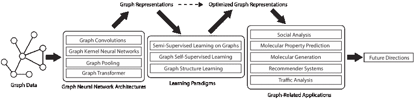

<!--yml

category: 未分类

日期：2024-09-06 19:40:30

-->

# [2304.05055] 关于深度图表示学习的综合调查

> 来源：[`ar5iv.labs.arxiv.org/html/2304.05055`](https://ar5iv.labs.arxiv.org/html/2304.05055)

# 关于深度图表示学习的综合调查

**魏菊** juwei@pku.edu.cn 、**郑芳** fang˙z@pku.edu.cn 、**屹扬·顾** yiyanggu@pku.edu.cn 、**泽群·刘** zequnliu@pku.edu.cn 、**青青·龙** qingqinglong@pku.edu.cn 北京大学，北京，中国 100871，**紫月·乔** ziyuejoe@gmail.com 香港科技大学，广州，中国 511453，**义芳·秦** qinyifang@pku.edu.cn 、**建浩·沈** jhshen@pku.edu.cn 、**方孙** fts@pku.edu.cn 北京大学，北京，中国 100871，**志平·肖** patricia.xiao@cs.ucla.edu 加州大学洛杉矶分校，美国 90095，**俊伟·杨** yjwtheonly@pku.edu.cn 、**靖洋·袁** yuanjy@pku.edu.cn 、**宇晟·赵** yusheng.zhao@stu.pku.edu.cn 北京大学，北京，中国 100871，**肖洛** xiaoluo@cs.ucla.edu 加州大学洛杉矶分校，美国 90095 和 **明张** mzhang˙cs@pku.edu.cn 北京大学，北京，中国 100871 (2023)

###### Abstract.

图表示学习旨在将高维稀疏图结构数据有效编码为低维密集向量，这是一项基础任务，已在包括机器学习和数据挖掘在内的多个领域广泛研究。经典的图嵌入方法遵循这样的基本思想：图中互联节点的嵌入向量仍能保持相对接近的距离，从而保留图中节点之间的结构信息。然而，这种方法并非最优，原因有： (i) 传统方法的模型容量有限，限制了学习性能； (ii) 现有技术通常依赖于无监督学习策略，未能与最新的学习范式结合； (iii) 表示学习和下游任务相互依赖，应该共同增强。随着深度学习的显著成功，深度图表示学习在相较于浅层（传统）方法上展示了巨大的潜力和优势，过去十年中提出了大量的深度图表示学习技术，尤其是图神经网络。在本综述中，我们通过提出一种新的现有前沿文献分类法，对当前的深度图表示学习算法进行全面综述。具体而言，我们系统总结了图表示学习的基本组成部分，并根据图神经网络架构和最新的先进学习范式对现有方法进行了分类。此外，本综述还提供了深度图表示学习的实际和有前景的应用。最后但同样重要的是，我们阐述了新的观点并建议了值得在未来进一步研究的挑战方向。

深度学习在图上的应用，图表示学习，图神经网络，综述^†^†版权：acmcopyright^†^†期刊年份：2023^†^†doi：XXXXXXX.XXXXXXX^†^†期刊：JACM^†^†ccs：计算方法 神经网络^†^†ccs：计算方法 学习潜在表示

## 1. 引言 作者：魏瑜

近年来，图作为一种强大的工具出现，用于表示各种结构化和复杂的数据，包括社交网络、交通网络、信息系统、知识图谱、蛋白质-蛋白质相互作用网络和物理交互网络。作为一种通用的数据组织形式，图结构能够自然地表达这些数据的内在关系，从而能够刻画许多由于其灵活适应性而在各种学科和领域中至关重要的非欧几里得结构。例如，为了将社交网络编码为图，图上的节点用于表示单个用户，边用于表示两个个体之间的关系，如朋友。在生物学领域，节点可以用于表示蛋白质，边可以用于表示各种蛋白质之间的生物学相互作用，如蛋白质之间的动态相互作用。因此，通过分析和挖掘图结构数据，我们可以理解隐藏在数据背后的深层含义，并进一步发现有价值的知识，从而造福社会和人类。

在过去的十年中，已经开发出广泛的机器学习算法用于图结构数据学习。其中，传统的图核方法（Gärtner 等人，2003；Kashima 等人，2003；Shervashidze 等人，2011a，2009）通常将图分解为不同的原子子结构，然后使用核函数来衡量它们之间的相似性。虽然图核可以提供建模图拓扑的视角，但这些方法通常基于给定的手工制作标准生成子结构或特征表示。这些规则相当启发式，容易受到高计算复杂度的影响，因此具有较弱的可扩展性和较差的性能。

在过去的几年里，图嵌入算法（Ahmed et al., 2013; Perozzi et al., 2014; Tang et al., 2015b; Grover and Leskovec, 2016; Tang et al., 2015a; Wang et al., 2016）不断涌现，这些算法试图将图的结构信息（通常是高维稀疏矩阵）编码并映射到低维密集向量嵌入中，以尽可能保留嵌入空间中的拓扑信息和属性信息，从而使学习到的图嵌入可以自然地融入传统的机器学习算法中。与以前在预处理阶段使用特征工程来提取图结构特征的工作相比，当前的图嵌入算法采用数据驱动的方法，利用机器学习算法（如神经网络）来编码图的结构信息。具体来说，现有的图嵌入方法可以分为以下主要组别：（i）基于矩阵分解的方法（Ahmed et al., 2013; Ou et al., 2016; Cao et al., 2015），通过矩阵分解学习节点嵌入，保留图的属性；（ii）基于深度学习的方法（Perozzi et al., 2014; Tang et al., 2015b; Grover and Leskovec, 2016; Wang et al., 2016），应用专为图结构数据设计的深度学习技术；（iii）基于边重构的方法（Tang et al., 2015a; Man et al., 2016; Liu et al., 2016），通过最大化边重构概率或最小化边重构损失。总体而言，这些方法通常依赖于浅层架构，未能充分利用深度神经网络的潜力和能力，导致表示质量和学习性能不尽如人意。

受到最近深度神经网络显著成功的启发，已经开发出一系列用于图结构数据学习的深度学习算法。这些方法的核心是使用图神经网络（GNNs）生成有效的节点和图表示，随后采用目标导向的学习范式。通过这种方式，所生成的表示可以与各种下游任务和应用自适应地结合。遵循这一思路，在本文中，我们提出了一种新的分类法来对现有的图表示学习算法进行分类，即图神经网络架构、学习范式以及各种有前途的应用，如图 1 所示。具体而言，对于 GNNs 的架构，我们研究了图卷积、图核神经网络、图池化和图变换器的相关研究。对于学习范式，我们探讨了三种先进类型，即图上的监督/半监督学习、图自监督学习和图结构学习。为了展示学习到的图表示的有效性，我们提供了几个有前景的应用，以建立表示学习与下游任务之间的紧密联系，如社会分析、分子属性预测与生成、推荐系统和交通分析。最后但同样重要的是，我们提出了一些思考角度，并建议了一些值得未来进一步研究的挑战方向。

本调查与现有调查的区别。到目前为止，已经存在一些其他的综述论文，关注图表示学习的不同视角（Wu et al., 2020; Zhou et al., 2020; Zhang et al., 2020a; Chami et al., 2022; Bacciu et al., 2020; Xia et al., 2021; Zhou et al., 2022b; Khoshraftar and An, 2022; Chen et al., 2022b, 2020f)，这些论文与我们的研究密切相关。然而，很少有全面的综述同时从不同的 GNN 架构和最新的学习范式的角度总结深度图表示学习。因此，我们在此明确阐述与我们的调查的区别。已经有几篇关于经典图嵌入的调查（Goyal and Ferrara, 2018; Cai et al., 2018），这些工作基于不同的训练目标对图嵌入方法进行了分类。Wang et al.（Wang et al., 2022a）进一步提供了现有异质图嵌入方法的综合综述。随着深度学习的快速发展，也有少数综述沿着这条路线展开。例如，Wu et al.（Wu et al., 2020）和 Zhang et al.（Zhang et al., 2020a）主要关注几个经典且具有代表性的 GNN 架构，但没有从最新的学习范式（如图自监督学习和图结构学习）角度探讨深度图表示学习。Xia et al.（Xia et al., 2021）和 Chami et al.（Chami et al., 2022）联合总结了图嵌入和 GNN 的研究。Zhou et al.（Zhou et al., 2020）探讨了 GNN 的不同计算模块。近期正在审阅的一篇综述（Khoshraftar and An, 2022）将现有的图表示学习工作从静态图和动态图两个方面进行分类。然而，这些分类强调了基本的 GNN 方法，但对学习范式关注不够，并且对最有前景的应用，如推荐系统和分子属性预测与生成，讨论较少。据我们所知，最相关的正式发布的综述是（Zhou et al., 2022b），该综述回顾了 GNN 架构，并粗略讨论了相应的应用。然而，这篇综述仅覆盖了 2020 年之前的方法，遗漏了过去两年的最新发展。

因此，非常希望将代表性的 GNN 方法、最新的先进学习范式和有前景的应用总结成一个统一且全面的框架。此外，我们坚信这项调查通过新的文献分类法和 400 多项研究将加强对深度图表示学习的未来研究。

本调查的贡献。该调查的目标是系统地回顾深度图表示学习的进展，并讨论进一步的方向。旨在帮助对该领域感兴趣的研究人员和从业者，并支持他们理解深度图表示学习的全景和最新发展。本调查的关键贡献总结如下：

+   •

    系统分类法。我们提出了一种系统分类法，通过提供一些代表性的方法分支来组织现有的深度图表示学习方法，基于 GNN 架构的方式和最新的先进学习范式。此外，展示了几个有前景的应用，以说明图表示学习的优越性和潜力。

+   •

    综合综述。对于本次调查的每个分支，我们回顾了基本组成部分，并提供了代表性算法的详细描述，并系统总结了特征，以便进行概述比较。

+   •

    未来方向。基于现有深度图表示学习算法的特性，我们讨论了当前方法的局限性和挑战，并提出了值得未来研究的潜力和有前景的研究方向。

图 1\. 本文的架构。

## 2\. 背景 作者：魏炬

在本节中，我们首先简要介绍一些需要澄清的深度图表示学习中的定义，然后解释我们为什么需要图表示学习。

### 2.1\. 问题定义

定义：图。给定一个图$G=(V,E,\mathbf{X})$，其中$V=\{v_{1},\cdots,v_{|V|}\}$是节点集合，$E=\{e_{1},\cdots,e_{|V|}\}$是边集合，边$e=(v_{i},v_{j})\in E$表示图中节点$v_{i}$和$v_{j}$之间的连接关系。$\mathbf{X}\in\mathbb{R}^{|V|\times M}$是节点特征矩阵，其中$M$是每个节点特征的维度。图的邻接矩阵可以定义为$\mathbf{A}\in\mathbb{R}^{|V|\times|V|}$，其中$\mathbf{A}_{ij}=1$如果$(v_{i},v_{j})\in E$，否则$\mathbf{A}_{ij}=0$。

邻接矩阵可以看作是图结构数据的结构表示，其中邻接矩阵 $\mathbf{A}$ 的每一行表示该行对应节点与所有其他节点之间的连接关系，这可以看作是节点的离散表示。然而，在实际情况下，$G$ 对应的邻接矩阵 $\mathbf{A}$ 是一个高度稀疏的矩阵，如果直接将 $\mathbf{A}$ 用作节点表示，它将严重影响计算效率。邻接矩阵 $\mathbf{A}$ 的存储空间为 $|V|\times|V|$，当节点总数增长到百万级别时，这通常是不可接受的。同时，节点表示中大多数维度的值为 0\。这种稀疏性会使后续的机器学习任务非常困难。

*图表示学习* 是原始输入数据与图中的任务目标之间的桥梁。图表示学习算法的基本思想是首先从输入图结构数据中学习节点或整个图的嵌入表示，然后将这些嵌入表示应用于下游相关任务，如节点分类、图分类、链接预测、社区检测和可视化等。具体而言，它的目标是为图中的节点学习低维的、密集分布的嵌入表示。正式地说，图表示学习的目标是为每个节点 $v\in V$ 学习其嵌入向量表示 $R_{v}\in\mathbb{R}^{d}$，其中向量的维度 $d$ 远小于图中节点的总数 $|V|$。

### 2.2\. 为什么研究深度图表示学习

随着深度学习技术的快速发展，卷积神经网络和递归神经网络等深度神经网络在计算机视觉、自然语言处理和语音识别等领域取得了突破性进展。它们能够很好地抽象图像、自然语言和语音的语义信息。然而，当前的深度学习技术无法处理更复杂和不规则的图结构数据。为了有效分析和建模这种非欧几里得结构数据，近年来出现了许多图表示学习算法，包括图嵌入和图神经网络。目前，与图像、自然语言和语音等欧几里得数据相比，图结构数据具有高维、复杂和不规则的特点。因此，图表示学习算法是研究图结构数据的一个相当强大的工具。为了编码复杂的图结构数据，深度图表示学习需要满足几个特性：（1）*拓扑属性*：图表示需要捕捉图的复杂拓扑信息，例如节点与节点之间的关系，以及其他子结构信息，如子图、模式等。（2）*特征属性*：图表示需要描述图中的高维属性特征，包括节点和边本身的属性。（3）*可扩展性*：由于不同的实际图数据具有不同的特征，图表示学习算法应能够高效地学习其在不同图结构数据上的嵌入表示，使其具有通用性和可迁移性。

## 3\. 图卷积 由 Yusheng Zhao

图卷积已经成为许多深度图表示学习算法和最近开发的图神经网络的基本构建块。在这一部分，我们对图卷积进行全面回顾，这些卷积通常分为两类：谱图卷积和空间图卷积。基于图信号处理（GSP）的坚实数学基础（Shuman et al., 2013a; Sandryhaila and Moura, 2013; Hammond et al., 2011），谱图卷积试图捕捉图在频域中的模式。另一方面，空间图卷积继承了递归图神经网络（RecGNNs）的消息传递思想，它们通过聚合邻居的特征来计算节点特征。因此，节点的计算图是从其周围的局部图结构中派生出来的，图的拓扑自然地融入了节点特征计算的方式。在这一部分，我们首先介绍谱图卷积，然后介绍空间图卷积，最后做一个简要总结。在表 1 中，我们总结了近年来提出的一些图卷积方法。

表 1\. 图卷积方法的总结。

| 方法 | 类别 | 聚合 | 时间复杂度 |
| --- | --- | --- | --- |
| 谱 CNN (Bruna et al., 2013) | 谱图卷积 | - | $O(n^{3})$ |
| Henaff et al. (Henaff et al., 2015) | 谱图卷积 | - | $O(n^{3})$ |
| ChebNet (Defferrard et al., 2016) | 谱图卷积 | - | $O(m)$ |
| GCN (Kipf and Welling, 2016a) | 谱 / 空间 | 加权平均 | $O(m)$ |
| CayleyNet (Levie et al., 2018) | 谱图卷积 | - | $O(m)$ |
| GraphSAGE (Hamilton et al., 2017) | 空间图卷积 | 一般 | $O(m)$ |
| GAT (Veličković et al., 2017) | 空间图卷积 | 注意力 | $O(m)$ |
| DGCNN (Wang et al., 2019d) | 空间图卷积 | 一般 | $O(m)$ |
| LanzcosNet (Liao et al., 2018) | 谱图卷积 | - | $O(n^{2})$ |
| SGC (Wu et al., 2019b) | 空间图卷积 | 加权平均 | $O(m)$ |
| GWNN (Xu et al., 2019b) | 谱图卷积 | - | $O(m)$ |
| GIN (Xu et al., 2018a) | 空间图卷积 | 求和 | $O(m)$ |
| GraphAIR (Hu et al., 2020d) | 空间图卷积 | 求和 | $O(m)$ |
| PNA (Corso et al., 2020) | 空间图卷积 | 多重 | $O(m)$ |
| S²GC (Zhu and Koniusz, 2021) | 谱图卷积 | - | $O(m)$ |
| GNNML3 (Balcilar et al., 2021) | 空间 / 谱 | - | $O(m)$ |
| MSGNN（He 等，2022） | 谱图卷积 | - | $O(m)$ |
| EGC（Tailor 等，2022） | 空间图卷积 | 一般 | $O(m)$ |

### 3.1. 谱图卷积

随着卷积神经网络（CNNs）在计算机视觉中的成功（Krizhevsky 等，2017），已经有人努力将卷积思想转移到图形领域。然而，由于图数据的非欧几里得特性，这不是一项容易的任务。图信号处理（GSP）（Shuman 等，2013a；Sandryhaila 和 Moura，2013；Hammond 等，2011）在图上定义了傅里叶变换，从而提供了谱图卷积的坚实理论基础。

在图信号处理中，图信号指的是与图中每个节点相关联的一组标量，*即* $f(v),~{}\forall v\in V$，并且可以写成 $n$-维向量形式 $\mathbf{x}\in\mathbb{R}^{n}$，其中 $n$ 是图中的节点数。图信号处理的另一个核心概念是对称归一化图拉普拉斯矩阵（简称图拉普拉斯矩阵），定义为 $\mathbf{L}=\mathbf{I}-\mathbf{D}^{-1/2}\mathbf{A}\mathbf{D}^{-1/2}$，其中 $\mathbf{I}$ 是单位矩阵，$\mathbf{D}$ 是度矩阵（*即* 对角矩阵 $\mathbf{D}_{ii}=\sum_{j}\mathbf{A}_{ij}$），$\mathbf{A}$ 是邻接矩阵。在图信号处理的典型设置中，图 $G$ 是无向的。因此，$\mathbf{L}$ 是实对称的并且是半正定的。这保证了图拉普拉斯矩阵的特征分解：$\mathbf{L}=\mathbf{U}\mathbf{\Lambda}\mathbf{U}^{T}$，其中 $\mathbf{U}=[\mathbf{u}_{0},\mathbf{u}_{1},...,\mathbf{u}_{n-1}]$ 是图拉普拉斯矩阵的特征向量，而 $\mathbf{\Lambda}=\text{diag}(\lambda_{0},\lambda_{1},...,\lambda_{n-1})$ 的对角元素是特征值。由此，图傅里叶变换（GFT）定义为 $\tilde{\mathbf{x}}=\mathbf{U}^{T}\mathbf{x}$，其中 $\tilde{\mathbf{x}}$ 是 $\mathbf{x}$ 的图频率。相应地，逆图傅里叶变换可以写作 $\mathbf{x}=\mathbf{U}\tilde{\mathbf{x}}$。

通过 GFT 和卷积定理，图信号 $\mathbf{x}$ 和滤波器 $\mathbf{g}$ 的图卷积可以定义为 $\mathbf{g}*_{G}\mathbf{x}=\mathbf{U}(\mathbf{U}^{T}\mathbf{g}\odot\mathbf{U}^{T}\mathbf{x})$。为了简化，设 $\mathbf{g}_{\theta}=\text{diag}(\mathbf{U}^{T}g)$，图卷积可以写为：

| (1) |  | $\mathbf{g}*_{G}\mathbf{x}=\mathbf{U}\mathbf{g}_{\theta}\mathbf{U}^{T}\mathbf{x},$ |  |
| --- | --- | --- | --- |

这是大多数谱图卷积的一般形式。谱图卷积的关键是对滤波器 $\mathbf{g}_{\theta}$ 进行参数化和学习。

Bruna 等人（Bruna et al., 2013）提出了谱卷积神经网络（Spectral CNN），该网络将图滤波器设置为可学习的对角矩阵 $\mathbf{W}$。卷积操作可以写成 $\mathbf{y}=\mathbf{U}\mathbf{W}\mathbf{U}^{T}\mathbf{x}$。实际上，多通道信号和激活函数是常见的，图卷积可以写成

| (2) |  | $\mathbf{Y}_{:,j}=\sigma\left(\mathbf{U}\sum_{i=1}^{c_{in}}\mathbf{W}_{i,j}\mathbf{U}^{T}\mathbf{X}_{:,i}\right),~{}j=1,2,...,c_{out},$ |  |
| --- | --- | --- | --- |

其中 $c_{in}$ 是输入通道数，$c_{out}$ 是输出通道数，$\mathbf{X}$ 是一个 $n\times c_{in}$ 矩阵，表示输入信号，$\mathbf{Y}$ 是一个 $n\times c_{out}$ 矩阵，表示输出信号，$\mathbf{W}_{i,j}$ 是一个参数化的对角矩阵，$\sigma(\cdot)$ 是激活函数。为了数学方便，我们有时使用单通道版本的图卷积，省略激活函数，多通道版本类似于公式 2。

谱 CNN 存在一些局限性。首先，滤波器依赖于基，这意味着它们无法在图之间泛化。其次，该算法需要特征分解，这在计算上是昂贵的。第三，它无法保证滤波器的空间定位。为了使滤波器具有空间定位性，Henaff 等人（Henaff et al., 2015）提出使用平滑的谱传递函数 $\Theta(\mathbf{\Lambda})$ 来参数化滤波器，卷积操作可以写成：

| (3) |  | $\mathbf{y}=\mathbf{U}F(\mathbf{\Lambda})\mathbf{U}^{T}\mathbf{x}.$ |  |
| --- | --- | --- | --- |

切比雪夫谱卷积神经网络（ChebNet）（Defferrard et al., 2016）通过使用截断的切比雪夫多项式来逼近谱传递函数，从而扩展了这一思想。切比雪夫多项式定义为 $T_{0}(x)=1,~{}T_{1}(x)=x,~{}T_{k}(x)=2xT_{k-1}(x)-T_{k-2}(x)$，谱传递函数 $F(\mathbf{\Lambda})$ 逼近到 $K-1$ 的阶数为

| (4) |  | $F(\mathbf{\Lambda})=\sum_{k=0}^{K-1}\theta_{k}T_{k}(\tilde{\mathbf{\Lambda}}),$ |  |
| --- | --- | --- | --- |

其中模型参数 $\theta_{k},~{}k\in\{0,1,...,K-1\}$ 是切比雪夫系数，$\tilde{\mathbf{\Lambda}}=2\mathbf{\Lambda}/\lambda_{max}-\mathbf{I}$ 是缩放特征值的对角矩阵。因此，图卷积可以写成：

| (5) |  | $\mathbf{g}*_{G}\mathbf{x}=\mathbf{U}F(\mathbf{\Lambda})\mathbf{U}^{T}\mathbf{x}=\mathbf{U}\sum_{k=0}^{K-1}\theta_{k}T_{k}(\tilde{\mathbf{\Lambda}})\mathbf{U}^{T}\mathbf{x}=\sum_{k=0}^{K-1}\theta_{k}T_{k}(\tilde{\mathbf{L}})\mathbf{x},$ |  |
| --- | --- | --- | --- |

其中 $\tilde{\mathbf{L}}=2\mathbf{L}/\lambda_{max}-\mathbf{I}$。

图卷积网络（GCN）（Kipf and Welling, 2016a）被提出作为 ChebNet 的局部一阶近似。假设 $K=2$ 和 $\lambda_{max}=2$，则 Eq. 5 可以简化为：

| (6) |  | $\mathbf{g}*_{G}\mathbf{x}=\theta_{0}\mathbf{x}+\theta_{1}(\mathbf{L}-\mathbf{I})\mathbf{x}=\theta_{0}\mathbf{x}-\theta_{1}\mathbf{D}^{-1/2}\mathbf{A}\mathbf{D}^{-1/2}\mathbf{x}.$ |  |
| --- | --- | --- | --- |

为了进一步约束参数的数量，我们假设 $\theta=\theta_{0}=-\theta_{1}$，这给出了更简单的图卷积形式：

| (7) |  | $\mathbf{g}*_{\mathcal{G}}\mathbf{x}=\theta(\mathbf{I}+\mathbf{D}^{-1/2}\mathbf{A}\mathbf{D}^{-1/2})\mathbf{x}.$ |  |
| --- | --- | --- | --- |

由于 $\mathbf{I}+\mathbf{D}^{-1/2}\mathbf{A}\mathbf{D}^{-1/2}$ 现在的特征值范围在 $[0,2]$ 之间，并且反复乘以该矩阵可能会导致数值不稳定，GCN 实证上提出了一种重新归一化技巧来解决这个问题，使用 $\mathbf{\tilde{D}}^{-1/2}\mathbf{\tilde{A}}\mathbf{\tilde{D}}^{-1/2}$，其中 $\mathbf{\tilde{A}}=\mathbf{A}+\mathbf{I}$ 和 $\mathbf{\tilde{D}}_{ii}=\sum_{i}\mathbf{\tilde{A}}_{ij}$。

允许多通道信号并添加激活函数，以下公式在文献中更为常见：

| (8) |  | $\mathbf{Y}=\sigma((\mathbf{\tilde{D}}^{-1/2}\mathbf{\tilde{A}}\mathbf{\tilde{D}}^{-1/2})\mathbf{X}\mathbf{\Theta}),$ |  |
| --- | --- | --- | --- |

其中 $\mathbf{X}$ 和 $\mathbf{Y}$ 的形状与 Eq. 2 中相同，$\mathbf{\Theta}$ 是一个 $c_{in}\times c_{out}$ 矩阵，作为模型的参数。

除了前面提到的方法，其他的谱图卷积也已被提出。Levie 等人（Levie et al., 2018）提出了利用 Cayley 多项式的 CayleyNets，使得滤波器能够检测狭窄的频带。Liao 等人（Liao et al., 2018）提出了 LanczosNets，该方法使用 Lanczos 算法构造图拉普拉斯算子的低秩近似，以提高图卷积的计算效率。所提模型能够有效地利用图数据中的多尺度信息。Xu 等人（Xu et al., 2019b）提出了图小波神经网络（GWNN），该网络使用图小波变换来避免矩阵特征分解。此外，图小波是稀疏和局部化的，这为卷积操作提供了良好的解释。Zhu 等人（Zhu and Koniusz, 2021）从修改后的 Markov 扩散核推导出了简单谱图卷积（S²GC），该方法在低通和高通滤波器带之间实现了权衡。

### 3.2\. 空间图卷积

受欧几里得数据（*例如* 图像和文本）上的卷积启发，该卷积在小区域内应用数据变换，空间图卷积通过变换和聚合邻居的特征来计算中心节点的特征。通过这种方式，图结构自然地嵌入到节点特征的计算图中。此外，将一个节点的特征传递到另一个节点的想法类似于在递归图神经网络中使用的消息传递。接下来，我们将介绍几个开创性的空间图卷积方法以及一些最近提出的有前景的方法。

空间图卷积通常遵循一个三步骤范式：消息生成、特征聚合和特征更新。数学上可以写作：

| (9) |  | $\mathbf{y}_{i}=\text{UPDATE}\left(\mathbf{x}_{i},\text{AGGREGATE}\left(\{\text{MESSAGE}\left(\mathbf{x}_{i},\mathbf{x}_{j},\mathbf{e}_{ij}\right),~{}j\in\mathcal{N}(i)\}\right)\right),$ |  |
| --- | --- | --- | --- |

其中，$\mathbf{x}_{i}$ 和 $\mathbf{y}_{i}$ 是节点 $i$ 的输入和输出特征向量，$\mathbf{e}_{ij}$ 是节点 $i$ 和其邻居节点 $j$ 之间的边（或更一般地说，关系）的特征向量，$\mathcal{N}(i)$ 表示节点 $i$ 的邻居，可以更一般地定义。

在上一节中，我们展示了 GCN 的频谱解释（Kipf 和 Welling，2016a）。该模型也有其空间解释，数学上可以写作：

| (10) |  | $\mathbf{y}_{i}=\mathbf{\Theta}^{T}\sum_{j\in\mathcal{N}(i)\cup{i}}\frac{1}{\sqrt{\hat{d}_{i}\hat{d}_{j}}}\mathbf{x}_{j},$ |  |
| --- | --- | --- | --- |

其中，$\hat{d}_{i}$ 和 $\hat{d}_{j}$ 是 $\hat{\mathbf{A}}$ 中第 $i$ 行和第 $j$ 行的和，如公式 8 所示。对于每个节点，模型对其邻居的特征以及自身的特征进行加权求和，并应用线性变换以获得结果。在实际应用中，多个 GCN 层通常会与卷积后的非线性函数堆叠在一起，以编码复杂的层次特征。然而，Wu 等人（Wu et al., 2019b）展示了该模型在没有非线性的情况下仍能取得具有竞争力的结果。

尽管 GCN 以及其他谱图卷积在多个基准测试中取得了竞争性的结果，这些方法假设图中存在所有节点，并且属于传导学习范畴。Hamilton 等人（Hamilton et al., 2017）提出了 GraphSAGE，它在归纳设置中执行图卷积，当推理过程中出现新节点时（*例如* 社交网络中的新用户）。对于每个节点，模型会对其 $K$ 跳邻居进行采样，并使用 $K$ 次图卷积来分层聚合它们的特征。此外，采样的使用也减少了节点拥有过多邻居时的计算量。

注意力机制已成功应用于自然语言处理（Vaswani et al., 2017）、计算机视觉（Liu et al., 2021）和多模态任务（Zhao et al., 2022a; Chen et al., 2021b; He et al., 2021; Yu et al., 2019）。图注意力网络（GAT）（Veličković et al., 2017）将注意力思想引入图中。注意力机制使用自适应的、特征依赖的权重（*即* 注意力系数）来聚合一组特征，数学表达式为：

| (11) |  | $\alpha_{i,j}=\frac{\exp\left({\text{LeakyReLU}\left(\mathbf{a}^{T}[\mathbf{\Theta}\mathbf{x}_{i}&#124;&#124;\mathbf{\Theta}\mathbf{x}_{j}]\right)}\right)}{\sum_{k\in\mathcal{N}(i)\cup\{i\}}\exp\left({\text{LeakyReLU}\left(\mathbf{a}^{T}[\mathbf{\Theta}\mathbf{x}_{i}&#124;&#124;\mathbf{\Theta}\mathbf{x}_{j}]\right)}\right)},$ |  |
| --- | --- | --- | --- |

其中 $\alpha_{i,j}$ 是注意力系数，$\mathbf{a}$ 和 $\mathbf{\Theta}$ 是模型参数，$[\cdot||\cdot]$ 表示拼接。在获得 $\alpha$s 后，新特征被计算为输入节点特征的加权和，其表达式为：

| (12) |  | $\mathbf{y}_{i}=\alpha_{i,i}\mathbf{\Theta}\mathbf{x}_{i}+\sum_{j\in\mathcal{N}(i)}\alpha_{i,j}\mathbf{\Theta}\mathbf{x}_{j}.$ |  |
| --- | --- | --- | --- |

Xu 等人（Xu et al., 2018a）探讨了图神经网络的表示能力限制。他们发现像 GCN（Kipf 和 Welling, 2016a）和 GraphSAGE（Hamilton et al., 2017）这样的消息传递网络无法区分某些图结构。为了提高图神经网络的表示能力，他们提出了图同构网络（GIN），为中心节点特征赋予可调权重，数学表达式为：

| (13) |  | $\mathbf{y}_{i}=\text{MLP}\left((1+\epsilon)\mathbf{x}_{i}+\sum_{j\in\mathcal{N}(i)}\mathbf{x}_{j}\right),$ |  |
| --- | --- | --- | --- |

其中 $\epsilon$ 是一个可学习的参数。

最近，已经做出了一些努力以提高图神经网络的表现力。例如，Hu 等人（Hu et al., 2020d）提出了 GraphAIR，该方法显式建模邻域交互，以更好地捕捉复杂的非线性特征。具体来说，他们使用邻域中节点对之间的 Hadamard 积来建模邻域交互的二次项。Balcilar 等人（Balcilar et al., 2021）提出了 GNNML3，实验上突破了一级 Weisfeiler-Lehman 测试（1-WL）的限制，达到了三级 WL 测试（3-WL）。他们还表明，Hadamard 积是使模型具有比一级 Weisfeiler-Lehman 测试更高表现力的必要条件。空间图卷积中的其他元素也得到了广泛研究。例如，Corso 等人（Corso et al., 2020）探索了 GNN 中的聚合操作，并提出了 Principal Neighbourhood Aggregation（PNA），该方法使用多个带有度量缩放因子的聚合器。Tailor 等人（Tailor et al., 2022）探讨了图神经网络消息传递过程中的各向异性和各向同性，并提出了 Efficient Graph Convolution（EGC），由于各向同性，该方法在减少内存消耗的同时取得了有希望的结果。

### 3.3\. 总结

本节介绍了图卷积，并提供如下总结：

+   •

    技术。图卷积主要分为两种类型，*即* 谱图卷积和空间图卷积。谱图卷积具有坚实的图信号处理数学基础，因此其操作有理论解释。空间图卷积受到递归图神经网络的启发，其计算简单直接，因为其计算图源自局部图结构。一般而言，空间图卷积在应用中更为常见。

+   •

    挑战与局限性。尽管图卷积取得了巨大成功，但在更复杂的应用中其性能仍不尽如人意。一方面，图卷积的性能在很大程度上依赖于图的构建。不同的图构建可能导致图卷积性能的差异。另一方面，图卷积在构建非常深的神经网络时容易出现过度平滑的现象。

+   •

    未来工作。未来，我们期望开发出更强大的图卷积方法，以缓解过度平滑的问题，同时也希望图结构学习（GSL）中的技术和方法能够帮助学习到更有意义的图结构，从而提升图卷积的性能。

## 4\. 图核神经网络 由 Qingqing Long

图核（GKs）在图分析和表示任务中历史上是最广泛使用的技术（Shawe-Taylor 等，2004；Gärtner 等，2003；Zhou 等，2020）。然而，传统的图核依赖于手工制作的模式或特定任务的领域知识（Kriege 等，2020；Shervashidze 等，2009）。多年来，关于图核神经网络（GKNN）的研究已经取得了令人鼓舞的结果。研究人员探讨了 GKNN 的各个方面，包括其理论基础、算法设计和实际应用。这些努力导致了多种基于 GKNN 的模型和方法的开发，这些模型和方法可以用于图分析和表示任务，如节点分类、链接预测和图聚类（Chen 等，2020c；Long 等，2021a，b）。

GKNN 的成功可以归因于其利用图核和神经网络的优势。通过使用核函数来测量图之间的相似性，GKNN 可以捕捉图的结构属性，而神经网络的使用使其能够学习更复杂和抽象的图表示。这种技术的结合使 GKNN 能在广泛的图相关任务中达到最先进的性能。

在本节中，我们首先介绍最具代表性的传统图核。然后，我们总结了结合 GNN 和图核的基本框架。最后，我们将流行的图核神经网络分为几类，并比较它们的差异。

### 4.1\. 图核

图核通常通过将节点或图分解为基本结构单元来评估节点或图之间的成对相似性。随机游走（Kang 等，2012）、子树（Shervashidze 等，2011b）、最短路径（Borgwardt 和 Kriegel，2005）和图小物件（Shervashidze 等，2009）是代表性的类别。

给定两个图 $G_{1}=(V_{1},E_{1},X_{1})$ 和 $G_{2}=(V_{2},E_{2},X_{2})$，图核函数 $K(G_{1},G_{2})$ 通过以下公式来测量 $G_{1}$ 和 $G_{2}$ 之间的相似性：

| (14) |  | $K(G_{1},G_{2})=\sum_{u_{1}\in V_{1}}\sum_{u_{2}\in V_{2}}\kappa_{base}\left(l_{G_{1}}(u_{1}),l_{G_{2}}(u_{2})\right),$ |  |
| --- | --- | --- | --- |

其中 $l_{G}(u)$ 表示以节点 $u$ 为中心的图 $G$ 中的一组局部子结构，$\kappa_{base}$ 是一个基本核，用于测量两组子结构之间的相似性。为简便起见，我们可以将公式 14 重写为：

| (15) |  | $K(G_{1},G_{2})=\sum_{u_{1}\in V_{1}}\sum_{u_{2}\in V_{2}}\kappa_{base}(u_{1},u_{2}),$ |  |
| --- | --- | --- | --- |

大写字母 $K(G_{1},G_{2})$ 表示图核，$\kappa(u_{1},u_{2})$ 表示节点核，小写字母 $k(x,y)$ 表示一般的核函数。

核 $\psi$ 的核映射将数据点映射到其对应的再生核希尔伯特空间（RKHS）$\mathcal{H}$ 中。具体来说，给定一个核 $k_{*}(\cdot,\cdot)$，其核映射 $\psi_{*}$ 可以表示为，

| (16) |  | $\forall x_{1},x_{2},k_{*}(x_{1},x_{2})=\langle\psi_{*}(x_{1}),\psi_{*}(x_{2})\rangle_{\mathcal{H}_{*}},$ |  |
| --- | --- | --- | --- |

其中 $\mathcal{H}_{*}$ 是 $k_{*}(\cdot,\cdot)$ 的 RKHS。

我们在下面介绍几个具有代表性和广泛使用的图核。

步骤和路径核。一个 $l$-步核 $K_{walk}^{(l)}$ 比较两个图 $G_{1}$ 和 $G_{2}$ 中每个节点出发的所有长度为 $l$ 的路径，

| (17) |  | $\displaystyle\kappa_{walk}^{(l)}(u_{1},u_{2})$ | $\displaystyle=\sum_{w_{1}\in\mathcal{W}^{l}(G_{1},u_{1})}\sum_{w_{2}\in\mathcal{W}^{l}(G_{2},u_{2})}\delta(X_{1}(w_{1}),X_{2}(w_{2})),$ |  |
| --- | --- | --- | --- | --- |
|  | $\displaystyle K_{walk}^{(l)}(G_{1},G_{2})$ | $\displaystyle=\sum_{u_{1}\in V_{1}}\sum_{u_{2}\in V_{2}}\kappa_{walk}^{(l)}(u_{1},u_{2}).$ |  |

将 $\mathcal{W}$ 替换为 $\mathcal{P}$ 可以得到 $l$-路径核。

子树核。WL 子树核是子树核中最流行的一个。它是 1-WL 测试的有限深度核变体。深度为 $l$ 的 WL 子树核 $K_{WL}^{(l)}$ 比较每个节点处深度 $\leq l$ 的所有子树。

| (18) |  | $\displaystyle\kappa_{subtree}^{(i)}(u_{1},u_{2})$ | $\displaystyle=\sum_{t_{1}\in\mathcal{T}^{i}(G_{1},u_{2})}\sum_{t_{2}\in\mathcal{T}^{i}(G_{2},u_{2})}\delta(t_{1},t_{2}),$ |  |
| --- | --- | --- | --- | --- |
|  | $\displaystyle K_{subtree}^{(i)}(G_{1},G_{2})$ | $\displaystyle=\sum_{u_{1}\in V_{1}}\sum_{u_{2}\in V_{2}}\kappa_{subtree}^{(i)}(u_{1},u_{2}),$ |  |
|  | $\displaystyle K_{WL}^{(l)}(G_{1},G_{2})$ | $\displaystyle=\sum_{i=0}^{l}K_{subtree}^{(i)}(G_{1},G_{2}),$ |  |

其中 $t\in\mathcal{T}^{(i)}(G,u)$ 表示 $G$ 中以 $u$ 为根的深度为 $i$ 的子树。

### 4.2\. GKNNs 的一般框架

在本节中，我们总结了 GKNNs 的一般框架。第一步，应定义一个度量异质特征相似性的核，这些特征来自异质节点和边 $(u_{1},e_{\cdot,u_{2}})$ 和 $(u_{2},e_{\cdot,u_{2}})$。以邻居张量的内积为例，其邻居核定义如下，

|  | $\kappa((u_{1},e_{\cdot,u_{1}}),(u_{2},e_{\cdot,u_{2}}))=\langle f(u_{1}),f(u_{2})\rangle\cdot\langle f(e_{\cdot,u_{1}}),f(e_{\cdot,u_{2}})\rangle.$ |  |
| --- | --- | --- |

基于邻居核，中央节点 $u_{1}$ 和 $u_{2}$ 的一个具有两个 $l$-跳邻域的核可以定义为 $K^{(l)}(u_{1},u_{2})=$

| (19) |  | $\left\{\begin{aligned} &\langle f(u_{1}),f(u_{2})\rangle&\ l=0\\ &\langle f(u_{1}),f(u_{2})\rangle\cdot\sum_{v_{1}\in N(u_{1})}\sum_{v_{2}\in N(u_{2})}K^{(l-1)}(v_{1},v_{2})\cdot\langle f(e_{\cdot,v_{1}}),f(e_{\cdot,v_{2}})\rangle&\ l>0\end{aligned}\right.,$ |  |
| --- | --- | --- | --- |

通过将较低跳跃核 $\kappa^{(l-1)}(u_{1},u_{2})$ 视为 $u_{1}$ 和 $u_{2}$ 的 $(l-1)$-th 隐藏表示的内积。此外，通过递归应用邻域核，可以推导出 $l$-跳图核如下

| (20) |  | $K^{l}(G_{1},G_{2})=\sum_{\boldsymbol{w}_{1}\in\mathcal{W}^{l}(G_{1})}\sum_{\boldsymbol{w}_{2}\in\mathcal{W}^{l}(G_{2})}\left(\prod_{i=0}^{l-1}\langle f(\boldsymbol{w}_{1}^{(i)}),f(\boldsymbol{w}_{2}^{(i)})\rangle\times\prod_{i=0}^{l-2}\langle f(e_{\boldsymbol{w}_{1}^{(i)},\boldsymbol{w}_{1}^{(i+1)}}),f(e_{\boldsymbol{w}_{2}^{(i)},\boldsymbol{w}_{2}^{(i+1)}})\rangle\right),$ |  |
| --- | --- | --- | --- |

其中 $\mathcal{W}^{l}(G)$ 表示图 $G$ 中所有长度为 $l$ 的步长序列的集合，$\boldsymbol{w}_{1}^{(i)}$ 表示序列 $\boldsymbol{w}_{1}$ 中的第 $i$ 个节点。

如公式 (16) 所示，核方法隐式地将原始数据空间投影到它们的 RKHS $\mathcal{H}$ 中。因此，既然 GNNs 也将节点或图投影到向量空间，通过核映射已建立了 GKs 和 GNNs 之间的联系。一些研究工作（Lei 等人，2017；Williams 和 Seeger，2001）也探讨了这些联系，并得出了一些基础结论。以 (Lei 等人，2017) 中介绍的基本规则为例，公式 (14) 中提出的图核可以推导为一般公式，

| (21) |  | $\displaystyle h^{(0)}(v)=$ | $\displaystyle\boldsymbol{W}^{(0)}_{t_{V}(v)}f(v),$ |  |
| --- | --- | --- | --- | --- |
|  | $\displaystyle h^{(l)}(v)=$ | $\displaystyle\boldsymbol{W}^{(l)}_{t_{V}(v)}f(v)\odot\sum_{u\in N(v)}(\boldsymbol{U}_{t_{V}(v)}^{(l)}h^{(l-1)}(u)\odot\boldsymbol{U}_{t_{E}(e_{u,v})}^{(l)}f(e_{u,v})),\qquad 1<l\leq L,$ |  |

其中 $\odot$ 是逐元素乘积，$h^{(l)}(v)$ 是节点 v 的细胞状态向量。参数矩阵 $\boldsymbol{W}^{(l)}_{t_{V}(v)}$、$\boldsymbol{U}_{t_{V}(v)}^{(l)}$ 和 $\boldsymbol{U}_{t_{E}(e_{u,v})}^{(l)}$ 是与节点和边类型相关的可学习参数。

然后，所有节点的平均嵌入通常用于表示图级别的嵌入，令 $|G_{i}|$ 表示第 $i$ 个图中的节点数量，则图级别的嵌入生成如下，

| (22) |  | $\Phi(G_{i})=\sum_{u\in G_{i}}\frac{1}{\vert G_{i} \vert}h^{(L)}(v).$ |  |
| --- | --- | --- | --- |

对于半监督多类分类，交叉熵被用作所有训练样本的目标函数 (Cao 等，2016，2015)，

| (23) |  | $\mathcal{L}=-\sum_{l\in\mathcal{Y}_{L}}\sum_{f=1}^{F}Y_{lf}\ln{Z_{lf}},$ |  |
| --- | --- | --- | --- |

其中 $\mathcal{Y}_{L}$ 是节点分类任务中具有标签的节点索引集合，或图分类任务中图索引的集合。$Z_{lf}$ 表示标签的预测，它们是具有激活函数的线性层的输出，输入为节点分类任务中的 $h^{(l)}(v)$ 和图分类任务中的 $\Phi(G_{i})$。

### 4.3. GKNNs 的流行变体

我们总结了 GKNNs 的流行变体，并在表 2 中比较了它们的差异。具体来说，我们总结了它们的基本图核，是否设计用于异构图，以及实验数据集等。由于原始设计的基于图核的 GNNs 具有高复杂性，它们通常通过加速策略，如采样策略、简化和近似等，来进行加速。在本节中，我们选择了四个典型且流行的 GKNNs 来介绍它们精心设计的图核和相应的 GNN 框架。

表 2. 流行 GKNNs 的总结。

| 方法 | 类型 | 相关 GK | 自适应 | 数据集 |
| --- | --- | --- | --- | --- |
| $k$-GNN (Morris 等，2019) | 同构 | WL 子树 | ✓ | 生物化学网络 |
| RetGK (Zhang 等，2018c) | 同构 | 随机游走 | ✓ | 生物化学网络，社交网络 |
| GNTK (Du 等，2019) | 同构 | 神经切线核 |  | 生物化学网络，社交网络 |
| DDGK (Al-Rfou 等，2019) | 同构 | 随机游走 |  | 生物化学网络 |
| GCKN (Chen 等，2020c) | 同构 | 随机游走 | ✓ | 生物化学网络，社交网络 |
| GSKN (Long 等，2021a) | 同构 | 随机游走，无名游走 | ✓ | 生物化学网络，社交网络 |
| GCN-LASE (Li 等，2019c) | 异构 | 随机游走 | - | 社交网络 学术网络 |
| HGK-GNN (Long 等，2021b) | 异构 | 随机游走 | ✓ | 社交网络 学术网络 |

$k$-维图神经网络 (Morris 等，2019) ($k$-GNN) 是 GKNNs 的先锋，它结合了 WL-子树图核和图神经网络。为了更好的可扩展性，论文考虑了 $k$-WL 的基于集合的版本。令 $h^{(l)}_{k}(s)$ 和 $h^{(l)}_{k,L}(s)$ 分别表示 $l$-层中节点 $s$ 的全局和局部隐藏表示。$k$-GNN 定义了端到端的分层可训练框架，如下所示，

| (24) |  | $\displaystyle h^{(0)}_{k}(s)=$ | $\displaystyle\sigma\left(\left[h^{iso}(s),\sum_{u\in s}h^{(T_{k}-1)}(u)\right]\cdot\boldsymbol{W}^{(0)}_{k-1}\right),$ |  |
| --- | --- | --- | --- | --- |
|  | $\displaystyle h^{(l)}_{k}(s)=$ | $\displaystyle\sigma\left(h^{(l-1)}_{k}\cdot\boldsymbol{W}_{1}^{(l)}+\sum_{u\in N_{L}(s)\cup N_{G}(s)}h^{(l-1)}_{k}(u)\cdot\boldsymbol{W}_{2}^{(l)}\right),\qquad 1<l\leq L,$ |  |
|  | $\displaystyle h^{(l)}_{k,L}(s)=$ | $\displaystyle\sigma\left(h^{(l-1)}_{k,L}(s)\cdot\boldsymbol{W}_{1}^{(l)}+\sum_{u\in N_{L}(s)}h^{(l-1)}_{k,L}(u)\cdot\boldsymbol{W}_{2}^{(l)}\right),\qquad 1<l\leq L.$ |  |

其中$h^{iso}(s)$是$G[s]$同构类型的一次性编码，$N_{L}(s)$是局部邻域，$N_{G}(s)$是全局邻域，$h^{(l)}_{k,L}(s)$旨在提高可扩展性和运行速度，而$h^{(l)}_{k}(s)$由于其更大的邻域集合具有更好的性能。

图卷积核网络（Chen et al., 2020c）（GCKN）。GCKN 是一种代表性的随机游走和路径基础的 GKNN。高斯核$k$可以写成：

| (25) |  | $k(z_{1},z_{2})=e^{-\frac{\alpha_{1}}{2}&#124;&#124;z_{1}-z_{2}&#124;&#124;^{2}}=e^{\alpha(z_{1}^{T}z_{2}-k-1)}=\sigma(z_{1}^{T}z_{2}),$ |  |
| --- | --- | --- | --- |

然后，GNN 架构可以写作：

| (26) |  | $\displaystyle h^{(l)}(u)=$ | $\displaystyle\sum_{z\in}K(z_{1},z_{2})\cdot\sigma\left(Z^{T}h^{(l-1)}(p)\right)$ |  |
| --- | --- | --- | --- | --- |
|  | $\displaystyle=$ | $\displaystyle\sigma\left(ZZ^{T}\right)^{-\frac{1}{2}}\cdot\sum_{p\in\mathcal{P}_{k}(G,u)}\sigma\left(Z^{T}h^{(l-1)}(p)\right),$ |  |

其中$Z$是原型路径属性的矩阵。

此外，论文分析了 GCKN 与基于 WL 子树的$k$-GNN 之间的关系。论文中的定理 1（Chen et al., 2020c）表明，基于 WL 子树的 GKNN 可以看作 GCKN 中的一个特例。

图神经切线核（Du et al., 2019）（GNTK）。与上述两个工作不同，GNTK 提出了一类新的图核。GNTK 是一种通用的方法，将 GNN 架构转换为相应的 GNTK。

GNTK 中的邻域聚合操作定义为：

| (27) |  | $\displaystyle\left[\sum_{(0)}^{(l)}(G,G^{{}^{\prime}})\right]_{uu^{{}^{\prime}}}=$ | $\displaystyle c_{u}c_{u^{{}^{\prime}}}\sum_{u\in N(v)\cup\{u\}}\sum_{v^{{}^{\prime}}\in N(u^{{}^{\prime}})\cup\{u^{{}^{\prime}}\}}\left[\sum_{R}^{(l-1)}(G,G^{{}^{\prime}})\right]_{vv^{{}^{\prime}}},$ |  |
| --- | --- | --- | --- | --- |
|  | $\displaystyle\left[\Theta_{(0)}^{(l)}(G,G^{{}^{\prime}})\right]_{uu^{{}^{\prime}}}=$ | $\displaystyle c_{u}c_{u^{{}^{\prime}}}\sum_{u\in N(v)\cup\{u\}}\sum_{v^{{}^{\prime}}\in N(u^{{}^{\prime}})\cup\{u^{{}^{\prime}}\}}\left[\Theta_{R}^{(l-1)}(G,G^{{}^{\prime}})\right]_{vv^{{}^{\prime}}},$ |  |

其中$\sum_{R}^{(0)}(G,G^{{}^{\prime}})$和$\Theta_{R}^{(0)}(G,G^{{}^{\prime}})$定义为$\sum^{(0)}(G,G^{{}^{\prime}})$。然后，GNTK 对 xx 进行了$R$次变换。

| (28) |  | $\left[A_{(r)}^{(l)}(G,G^{{}^{\prime}})\right]_{uu^{{}^{\prime}}}=\left(\begin{aligned} &\left[\sum_{(r-1)}^{(l)}(G,G)\right]_{uu^{{}^{\prime}}},&\ &\left[\sum_{(r-1)}^{(l)}(G,G^{{}^{\prime}})\right]_{uu^{{}^{\prime}}}\\ &\left[\sum_{(r-1)}^{(l)}(G^{{}^{\prime}},G)\right]_{uu^{{}^{\prime}}},&\ &\left[\sum_{(r-1)}^{(l)}(G^{{}^{\prime}},G^{{}^{\prime}})\right]_{uu^{{}^{\prime}}}\end{aligned}\right).$ |  |
| --- | --- | --- | --- |
| (29) |  | $\displaystyle\left[\sum_{(r)}^{(l)}(G,G^{{}^{\prime}})\right]_{uu^{{}^{\prime}}}=$ | $\displaystyle\mathbb{E}_{(a,b)\sim\mathcal{N}(0,[A_{(r)}^{(l)}(G,G^{{}^{\prime}})]_{uu^{{}^{\prime}}})}[\sigma(a)\cdot\sigma(b)],$ |  |
|  | $\displaystyle\left[\sum_{(r)}^{(l)}(G,G^{{}^{\prime}})\right]_{uu^{{}^{\prime}}}=$ | $\displaystyle\mathbb{E}_{(a,b)\sim\mathcal{N}(0,[A_{(r)}^{(l)}(G,G^{{}^{\prime}})]_{uu^{{}^{\prime}}})}[\sigma(a)\cdot\sigma(b)],$ |  |

然后可以计算$r$阶为，

| (30) |  | $\left[\Theta_{(r)}^{(l)}(G,G^{{}^{\prime}})\right]_{uu^{{}^{\prime}}}=\left[\Theta_{(r-1)}^{(l)}(G,G^{{}^{\prime}})\right]_{uu^{{}^{\prime}}}\left[\sum{(r)}^{(l)}(G,G^{{}^{\prime}})\right]_{uu^{{}^{\prime}}}+\left[\sum{(r)}^{(l)}(G,G^{{}^{\prime}})\right]_{uu^{{}^{\prime}}}.$ |  |
| --- | --- | --- | --- |

最后，GNTK 计算最终输出为

| (31) |  | $\Theta(G,G^{{}^{\prime}})=\sum_{u\in V,u^{{}^{\prime}}\in V^{{}^{\prime}}}\left[\sum_{l=0}^{L}\Theta_{(R)}^{(l)}(G,G^{{}^{\prime}})\right]_{u,u^{{}^{\prime}}}.$ |  |
| --- | --- | --- | --- |

基于异质图核的图神经网络（Long et al., 2021b）（HGK-GNN）。HGK-GNN 首次提出了针对异质图的 GKNN。它采用了 $\langle f(u_{1}),f(u_{2})\rangle_{M}$ 作为基于马氏距离的图核，以建立异质节点和边之间的连接，

|  | $\langle f(u_{1}),f(u_{2})\rangle_{M_{1}}=f(u_{1})^{T}\boldsymbol{M}_{1}f(u_{2}),$ |  |
| --- | --- | --- |
|  | $\langle f(e_{\cdot,u_{1}}),f(e_{\cdot,u_{2}})\rangle_{M_{2}}=f(e_{\cdot,u_{1}})^{T}\boldsymbol{M}_{2}f(e_{\cdot,u_{2}}).$ |  |

按照（Lei et al., 2017）中介绍的路线，可以推导出异质图核的对应神经网络架构为

| (32) |  | $\displaystyle h^{(0)}(v)=$ | $\displaystyle\boldsymbol{W}^{(0)}_{t_{V}(v)}f(v),$ |  |
| --- | --- | --- | --- | --- |
|  | $\displaystyle h^{(l)}(v)=$ | $\displaystyle\boldsymbol{W}^{(l)}_{t_{V}(v)}f(v)\odot\sum_{u\in N(v)}(\boldsymbol{U}_{t_{V}(v)}^{(l)}h^{(l-1)}(u)\odot\boldsymbol{U}_{t_{E}(e_{u,v})}^{(l)}f(e_{u,v})),\qquad 1<l\leq L,$ |  |

其中 $h^{(l)}(v)$ 是节点 v 的细胞状态向量，$\boldsymbol{W}^{(l)}_{t_{V}(v)}$、$\boldsymbol{U}_{t_{V}(v)}^{(l)}$ 和 $\boldsymbol{U}_{t_{E}(e_{u,v})}^{(l)}$ 是可学习的参数。

### 4.4\. 总结

本节介绍了图核神经网络。我们提供了以下总结：

+   •

    技术。图核神经网络（GKNNs）是一个最近流行的研究领域，它结合了图核和 GNNs 的优势，以学习更有效的图表示。研究人员在理论基础、算法设计和实际应用等方面研究了 GKNNs。因此，已经开发出了一系列基于 GKNN 的模型和方法用于图分析和表示任务，包括节点分类、链路预测和图聚类。

+   •

    挑战和限制。尽管 GKNNs 在图相关任务中显示出巨大的潜力，但它们也存在一些需要解决的限制。可扩展性是一个重要挑战，尤其是在处理大规模图和网络时。随着图的规模增加，GKNNs 的计算成本呈指数增长，这可能限制了它们处理大规模和复杂实际应用的能力。

+   •

    未来工作。对于未来的工作，我们期望 GKNNs 能将更多的领域特定知识整合到设计的内核中。领域特定知识已经显示出显著提高许多应用的性能，如药物发现、基于知识图谱的信息检索系统和分子分析（Wang et al., 2019e; Feinberg et al., 2018）。将领域特定知识融入 GKNNs 可以增强它们处理复杂和多样化数据结构的能力，从而生成更准确和可解释的模型。

## 5\. 由 Yiyang Gu 提供的图池化

当涉及到图级任务，如图分类和图回归时，图池化是从学习到的节点嵌入生成整个图表示的一个重要组件。为了确保同构图具有相同的表示，图池化操作应对节点的排列保持不变。在这一部分，我们对现有的图池化算法进行了系统的回顾，并将其一般性地分为两类：全局池化算法和层次池化算法。全局池化算法直接将节点嵌入聚合到最终的图表示中，而层次池化算法则通过逐步减少图的大小和生成即时表示来捕捉输入图的层次结构和特征。总结见表 3。

### 5.1\. 全局池化

全局池化操作通过一步生成从学习到的节点嵌入中获得的整体图表示，这在一些文献中被称为读出函数（Xu 等，2018a；Corso 等，2020）。几种简单的置换不变操作，如均值、和以及最大值，广泛应用于节点嵌入上以输出图级别的表示。为了增强全局池化操作符的适应性，GGS-NN（Li 等，2016）引入了软注意力机制，以评估节点对特定任务的重要性，然后对节点嵌入进行加权求和。SortPool（Zhang 等，2018a）利用 Weisfeiler-Lehman 方法（Weisfeiler 和 Leman，1968）根据节点在图拓扑中的结构位置对节点进行排序，然后通过传统卷积神经网络从排序后的节点嵌入中生成图表示。最近，Lee 等提出了一种结构-语义池化方法 SSRead（Lee 等，2021），该方法首先在语义上对齐节点和可学习的结构原型，然后基于匹配的结构原型对节点表示进行分组聚合。

表 3\. 图池化方法总结。

| 方法 | 类型 | 基于 TopK | 基于聚类 | 注意力机制 |
| --- | --- | --- | --- | --- |
| 均值/和/最大值 | 全局 |  |  |  |
| 池化 |
| GGS-NN (Li 等，2016) | 全局 |  |  | ✓ |
| SortPool (Zhang 等，2018a) | 全局 |  |  |  |
| SSRead (Lee 等，2021) | 全局 |  |  |  |
| gPool (Gao 和 Ji，2019) | 层次型 | ✓ |  |  |
| SAGPool (Lee 等，2019) | 层次型 | ✓ |  | ✓ |
| HGP-SL (Zhang 等，2019a) | 层次型 | ✓ |  | ✓ |
| TAPool (Gao 等，2021) | 层次型 | ✓ |  |  |
| DiffPool (Ying 等，2018) | 层次型 |  | ✓ |  |
| MinCutPool (Bianchi 等，2020) | 层次型 |  | ✓ |  |
| SEP (Wu 等，2022) | 层次型 |  | ✓ |  |
| ASAP (Ranjan 等，2020) | 层次型 | ✓ | ✓ | ✓ |
| MuchPool (Du 等，2021) | 层次型 | ✓ | ✓ |  |

### 5.2\. 层次型池化

与全局池化方法不同，分层池化方法逐渐粗化图，以更好地保留图的结构信息。为了根据特定任务自适应地粗化图并学习最佳的分层表示，近年来提出了许多可学习的分层池化算子，这些算子可以与各种图卷积层集成。粗化图有两种常见的方法，一种是通过 TopK 选择重要节点并丢弃其他节点，另一种是通过聚类方法合并节点并生成粗化图。在本调查中，我们称前者为基于 TopK 的池化，称后者为基于聚类的池化。此外，一些工作结合了这两种池化方法，这将在混合池化部分进行回顾。

#### 5.2.1\. 基于 TopK 的池化。

通常，基于 TopK 的池化方法首先学习一个评分函数来评估原始图中节点的重要性。基于生成的重要性分数 $\mathbf{Z}\in\mathbb{R}^{|V|\times 1}$，它们从所有节点中选择前 $K$ 个节点，

| (33) |  | $idx=\operatorname{TOP}_{k}\left(\mathbf{Z}\right),$ |  |
| --- | --- | --- | --- |

其中 $idx$ 表示前 $K$ 个节点的索引。基于这些选定的节点，大多数方法直接将诱导子图作为池化图，

| (34) |  | $\mathbf{A}_{\text{pool}}=\mathbf{A}_{idx,idx},$ |  |
| --- | --- | --- | --- |

其中 $A_{idx,idx}$ 表示由选定行和列索引的邻接矩阵。此外，为了使评分函数可学习，它们进一步使用分数 $Z$ 作为选定节点特征的门控，

| (35) |  | $\mathbf{X}_{\text{pool}}=\mathbf{X}_{idx,:}\odot\mathbf{Z}_{idx},$ |  |
| --- | --- | --- | --- |

其中 $X_{idx,:}$ 表示由选定节点索引的特征矩阵，$\odot$ 表示广播的逐元素乘积。借助门控机制，评分函数可以通过反向传播训练，以根据某个任务自适应地评估节点的重要性。以下将详细回顾几个具有代表性的基于 TopK 的池化方法。

gPool（Gao 和 Ji，2019）。gPool 是最早通过 Top K 操作从原始图中选择最重要的节点子集以构建粗化图的工作之一。gPool 的关键思想是通过学习投影向量 $\mathbf{p}$ 来评估所有节点的重要性，该向量将节点特征投影到一个标量分数上，

| (36) |  | $\mathbf{Z}_{j}=\mathbf{X}_{j,:}\mathbf{p}/\|\mathbf{p}\|,$ |  |
| --- | --- | --- | --- |

然后选择具有 K 高分的节点以形成池化图。

自注意力图池化（SAGPool）（Lee 等，2019）。与仅使用节点特征生成投影分数的 gPool（Gao 和 Ji，2019）不同，SAGPool 捕捉图的拓扑结构和节点特征，通过图卷积获得自注意力分数。可以使用各种图卷积公式来计算自注意力分数 $\mathbf{Z}$，

| (37) |  | $\mathbf{Z}=\sigma(\operatorname{GNN}(\mathbf{X},\mathbf{A})),$ |  |
| --- | --- | --- | --- |

其中 $\sigma$ 表示激活函数，$\operatorname{GNN}$ 表示各种图卷积层或其堆叠，其输出维度为一。

层次图池化与结构学习（HGP-SL）（Zhang 等，2019a）。HGP-SL 根据节点在其邻居给定的信息评估节点的重要性分数。它假设一个可以通过其邻域容易表示的节点包含的信息相对较少。具体而言，重要性分数可以通过原始节点表示和从其邻居表示聚合的重建节点表示之间的曼哈顿距离来定义，

| (38) |  | $\mathbf{Z}=\left\&#124;\left(\mathbf{I}-\mathbf{D}^{-1}\mathbf{A}\right)\mathbf{X}\right\&#124;_{1},$ |  |
| --- | --- | --- | --- |

其中 $\mathbf{I}$ 表示单位矩阵，$\mathbf{D}$ 表示 $\mathbf{A}$ 的对角度矩阵，$\|\cdot\|_{1}$ 表示 $\ell_{1}$ 范数。此外，为了减少拓扑信息的损失，HGP-SL 利用结构学习为保留的节点学习精炼的图拓扑。具体而言，它利用注意力机制计算两个节点的相似性作为重建边的权重，

| (39) |  | $\widetilde{\boldsymbol{A}}^{\text{pool}}_{ij}=\operatorname{sparsemax}\left(\sigma\left(\mathbf{w}\left[\boldsymbol{X}^{\text{pool}}_{i,:}\&#124;\boldsymbol{X}^{\text{pool}}_{j,:}\right]^{\top}\right)+\lambda\cdot\boldsymbol{A}^{\text{pool}}_{ij}\right),$ |  |
| --- | --- | --- | --- |

其中 $\widetilde{\boldsymbol{A}}^{\text{pool}}$ 表示池化图的精炼邻接矩阵，$\operatorname{sparsemax}(\cdot)$ 将低于阈值的值截断为零，$\mathbf{w}$ 表示一个可学习的权重向量，$\lambda$ 是原始边和重建边之间的权重参数。这些重建的边可能捕捉由于节点丢弃而导致的节点间潜在关系。

拓扑感知图池化（TAPool）（Gao 等，2021）。TAPool 同时考虑节点的局部和全局重要性。一方面，它利用节点与其邻居之间的平均相似性来评估其局部重要性，

| (40) |  | $\hat{\mathbf{R}}=\left(\mathbf{X}\mathbf{X}^{T}\right)\odot\left(\mathbf{D}^{-1}\mathbf{A}\right),\mathbf{Z}^{l}=\operatorname{softmax}\left(\frac{1}{n}\hat{\mathbf{R}}\mathbf{1}_{n}\right),$ |  |
| --- | --- | --- | --- |

其中，$\hat{\mathbf{R}}$ 表示局部相似度矩阵，而 $\mathbf{Z}^{l}$ 表示局部重要性得分。另一方面，它根据节点在整个图中的单跳邻域的重要性来衡量节点的全局重要性，

| (41) |  | $\hat{\mathbf{X}}=\mathbf{D}^{-1}\mathbf{A}\mathbf{X},\mathbf{Z}^{g}=\operatorname{softmax}\left(\hat{\mathbf{X}}\mathbf{p}\right),$ |  |
| --- | --- | --- | --- |

其中，$\mathbf{p}$ 是一个可学习的全局共享投影向量，类似于前述的 gPool（Gao 和 Ji，2019）。然而，这里的 $\hat{\mathbf{X}}$ 进一步聚合了来自邻域的特征，这使得全局重要性得分 $\mathbf{Z}^{g}$ 能够捕捉更多的拓扑信息，如显著子图。此外，TAPool 通过度数基础的连接项鼓励在粗化图中的连接，然后得到最终的重要性得分 $\mathbf{Z}=\mathbf{Z}^{l}+\mathbf{Z}^{g}+\lambda\mathbf{D}/|V|$，其中 $\lambda$ 是一个权衡超参数。

#### 5.2.2 基于聚类的池化。

通过聚类和合并节点对图进行池化是基于聚类的池化方法的主要概念。通常，它们通过学习一个聚类分配矩阵 $\mathbf{S}\in\mathbb{R}^{|V|\times K}$ 将节点分配到一组集群中，其中 $K$ 是集群的数量。之后，它们将每个集群中的节点合并，以生成池化图中的新节点。新节点的特征（嵌入）矩阵可以通过聚合集群内节点的特征（嵌入）来获得，根据聚类分配矩阵，

| (42) |  | $\mathbf{X}^{\text{pool}}=\mathbf{S}^{T}\mathbf{X}.$ |  |
| --- | --- | --- | --- |

同时，池化图的邻接矩阵可以通过计算每对集群之间的连接强度来生成，

| (43) |  | $\mathbf{A}^{\text{pool}}=\mathbf{S}^{T}\mathbf{A}\mathbf{S}.$ |  |
| --- | --- | --- | --- |

然后，我们详细回顾几种具有代表性的基于聚类的池化方法。

DiffPool（Ying 等，2018）。DiffPool 是最早且经典的图层次池化方法之一。具体来说，它使用嵌入 GNN 生成节点的嵌入，以及一个池化 GNN 生成聚类分配矩阵，

| (44) |  | $\hat{\mathbf{X}}=\operatorname{GNN}_{\text{embed}}\left(\mathbf{X},\mathbf{A}\right),\mathbf{S}=\operatorname{softmax}\left(\operatorname{GNN}_{\text{pool}}\left(\mathbf{X},\mathbf{A}\right)\right),\mathbf{X}^{\text{pool}}=\mathbf{S}^{T}\hat{\mathbf{X}}.$ |  |
| --- | --- | --- | --- |

此外，DiffPool 利用辅助链接预测目标 $L_{\mathrm{LP}}=\left\|\mathbf{A},\mathbf{S}\mathbf{S}^{T}\right\|_{F}$ 来鼓励相邻节点在同一聚类中，并避免假局部最小值，其中 $\|\cdot\|_{F}$ 是 Frobenius 范数。它还利用熵正则化项 $L_{\mathrm{E}}=\frac{1}{|V|}\sum_{i=1}^{|V|}H\left(\mathbf{S}_{i}\right)$ 来推动清晰的聚类分配，其中 $H(\cdot)$ 代表熵。

基于谱聚类的图池化（MinCutPool）（Bianchi 等，2020）。MinCutPool 利用谱聚类（SC）的属性提供更好的归纳偏差，并避免退化的聚类分配。它通过优化 MinCut 损失来学习像 SC 一样的聚类。

| (45) |  | $L_{c}=-\frac{\operatorname{Tr}\left(\mathbf{S}^{T}{\mathbf{A}}\mathbf{S}\right)}{\operatorname{Tr}\left(\mathbf{S}^{T}{\mathbf{D}}\mathbf{S}\right)}.$ |  |
| --- | --- | --- | --- |

此外，它利用正交损失 $L_{o}=\left\|\frac{\mathbf{S}^{T}\mathbf{S}}{\left\|\mathbf{S}^{T}\mathbf{S}\right\|_{F}}-\frac{\mathbf{I}_{K}}{\sqrt{K}}\right\|_{F}$ 来鼓励正交和均匀的聚类分配，并防止 $L_{c}$ 的不良最小值，其中 $K$ 是聚类的数量。在执行特定任务时，它可以优化无监督损失 $L_{u}=L_{c}+L_{o}$ 和任务特定损失的加权和，以找到理论先验与任务目标之间的最佳平衡。

结构熵引导图池化（SEP）（Wu 等，2022）。为了减少由独立池化层和预设池化比例引起的局部结构损害和次优性能，SEP 利用结构熵的概念一次性生成全局和层次聚类分配。具体而言，SEP 将给定图的节点视为编码树的叶节点，并利用编码树的层次结构来捕捉图的层次结构。通过最小化结构熵（Li 和 Pan，2016），可以获得最优的代码树 $T$。

| (46) |  | $\mathcal{H}^{T}(G)=-\sum_{v_{i}\in T}\frac{g(P_{v_{i}})}{\operatorname{vol}(V)}\log\frac{\operatorname{vol}\left(P_{v_{i}}\right)}{\operatorname{vol}\left(P_{v_{i}^{+}}\right)},$ |  |
| --- | --- | --- | --- |

其中，$v_{i}^{+}$ 表示节点 $v_{i}$ 的父节点，$P_{v_{i}}$ 表示编码树 $T$ 中 $v_{i}$ 的叶子节点的分区，$g(P_{v_{i}})$ 表示在 $P_{v_{i}}$ 中具有终端的边数，$\operatorname{vol}(\cdot)$ 表示给定分区中叶子节点的总度数。然后，每个池化层的簇分配矩阵可以从编码树中每层的边缘推导出来。借助基于结构熵的单步联合分配生成，它不仅能够充分利用池化层的层次关系，还能减少原始图中的结构噪声。

#### 5.2.3\. 混合池化。

混合池化方法结合了基于 TopK 的池化方法和基于聚类的池化方法，充分发挥这两种方法的优点并克服它们各自的局限性。在这里，我们回顾了两种代表性的混合池化方法，即自适应结构感知池化（Ranjan 等，2020）和多通道池化（Du 等，2021）。

自适应结构感知池化（ASAP）（Ranjan 等，2020）。考虑到基于 TopK 的池化方法在捕捉粗化图的连通性方面表现不佳，而基于聚类的池化方法由于密集的分配矩阵无法应用于大图，ASAP 有机地结合了这两种类型的池化方法以克服上述局限性。具体而言，它将每个节点 $v_{i}$ 的 $h$-跳自我网络 $c_{h}(v_{i})$ 视为一个簇。这种局部聚类使得簇分配矩阵变得稀疏。然后，使用一种新的自注意力机制 Master2Token 来学习簇分配矩阵 $\mathbf{S}$ 和簇表示。

| (47) |  | $\mathbf{m}_{i}=\max_{v_{j}\in c_{h}\left(v_{i}\right)}\left(\mathbf{X}_{j}^{\prime}\right),\mathbf{S}_{j,i}=\operatorname{softmax}\left(\mathbf{w}^{T}\sigma\left(\mathbf{W}\mathbf{m}_{i}\&#124;\mathbf{X}_{j}^{\prime}\right)\right),\mathbf{X}_{i}^{c}=\sum_{j=1}^{\left&#124;c_{h}\left(v_{i}\right)\right&#124;}\mathbf{S}_{j,i}\mathbf{X}_{j},$ |  |
| --- | --- | --- | --- |

其中，$\mathbf{X}^{\prime}$ 是经过 GCN 后的节点嵌入矩阵，$\mathbf{w}$ 和 $\mathbf{W}$ 分别表示可训练的向量和矩阵，$\mathbf{X}_{i}^{c}$ 表示簇 $c_{h}(v_{i})$ 的表示。接下来，它利用图卷积和 TopK 选择来选择前 $K$ 个簇，其中心被视为池化图的节点。池化图的邻接矩阵可以像常见的基于聚类的池化方法一样计算（43），很好地保留了原始图的连通性。

多通道池化（MuchPool） (Du 等， 2021)。MuchPool 的关键思想是通过结合基于 TopK 的池化方法和基于聚类的池化方法，捕捉给定图的局部和全局结构。MuchPool 有两个基于 TopK 选择的池化通道，以产生两个细粒度池化图，其选择标准分别是节点度数和节点特征的投影得分，从而考虑了局部拓扑和节点特征。此外，它利用基于图聚类的通道来获得粗粒度池化图，从而捕捉输入图的全局和层次结构。为了更好地整合不同通道的信息，提出了一种交叉通道卷积，它融合了细粒度池化图 $\mathbf{X}^{\text{fine}}$ 和粗粒度池化图 $\mathbf{X}^{\text{coarse}}$ 的节点嵌入，借助于基于聚类的池化通道的聚类分配 $\mathbf{S}$。

| (48) |  | $\widetilde{\mathbf{X}}^{\text{fine}}=\sigma\left(\left[\mathbf{X}^{\text{fine}}+\mathbf{S}\mathbf{X}^{\text{coarse}}\right]\cdot\mathbf{W}\right),$ |  |
| --- | --- | --- | --- |

其中 $\mathbf{W}$ 表示可学习的权重。最后，它将两个细粒度池化图的节点嵌入和邻接矩阵合并以获得最终池化图。

### 5.3\. 总结

本节介绍了图级表示学习的图池化方法。我们提供的总结如下：

+   •

    技术。图池化方法在通过聚合节点嵌入生成整个图表示方面发挥着至关重要的作用。图池化方法主要分为两类：全局池化方法和层次池化方法。全局池化方法直接在一步中聚合节点嵌入，而层次池化方法则逐渐粗化图，以基于 TopK 选择、聚类方法或混合方法捕捉图的层次结构特征。

+   •

    挑战与局限性。尽管图池化方法在学习整个图表示方面取得了巨大成功，但仍存在若干未解决的挑战和局限性：1) 对于层次池化，大多数基于聚类的方法涉及密集分配矩阵，这限制了它们在大图中的应用，而基于 TopK 的方法不擅长捕捉图的结构信息，可能由于节点丢失而导致信息丢失。2) 大多数图池化方法是针对简单属性图设计的，而针对其他类型图（如动态图和异构图）的池化算法尚未得到充分探索。

+   •

    未来的工作。未来，我们期望能研究更多混合或其他池化方法，以充分捕捉图形结构信息，同时对大型图形保持高效。在实际场景中，有各种类型的图形涉及动态、异构或时空信息。为这些图形设计特定的图形池化方法具有前景，这可以有利于更多实际应用，如交通分析和推荐系统。

## 6. 图形变换器 由 Junwei Yang

尽管基于消息传递范式的 GNN 在多个著名任务上取得了令人印象深刻的成绩（Gilmer 等，2017；Xu 等，2018a；Wang 等，2019c；Li 等，2020），但由于迭代邻居聚合操作，它们仍然面临一些内在问题。许多早期工作展示了消息传递 GNN 的两个主要缺陷，即过度平滑和长距离建模问题。还有许多解释性工作尝试从这两个问题中挖掘见解。过度平滑问题可以通过多种 GNN 仅关注低频信息（Bo 等，2021）、不同类型节点之间信息混合破坏模型性能（Chen 等，2020d）、GCN 等同于拉普拉斯平滑（Li 等，2018a）、邻居之间的各向同性聚合导致与随机游走相同的影响分布（Xu 等，2018b）等方面来解释。GNN 无法建模长距离依赖问题部分是由于过度平滑问题，因为在传统邻居聚合 GNN 的背景下，节点信息只能通过多个 GNN 层传递长距离。最近，Alon 等（Alon 和 Yahav，2020）发现这个问题也可能是由于过度压缩，即随着距离增加计算路径的指数增长。尽管可以通过精心设计的消息传递和聚合策略解决这两个基本性能瓶颈，但 GNN 的表示能力本质上受限于 Weisfeiler-Lehman 同构层次（Morris 等，2019）。更糟糕的是，大多数 GNN（Kipf 和 Welling，2016a；Veličković 等，2017；Gilmer 等，2017）受限于最简单的一阶 Weisfeiler-Lehman 测试（1-WL）。一些努力致力于打破这一限制，如基于超图的方法（Feng 等，2019；Huang 和 Yang，2021）、基于路径的方法（Cai 和 Lam，2020；Ying 等，2021）以及基于 k-WL 的方法（Balcilar 等，2021；Morris 等，2019）。

在许多尝试解决这些基本问题的工作中，一个重要的方法是将 Transformer (Vaswani et al., 2017) 适用于图表示学习。Transformer，无论是原始版本还是几种变体，都在包括 NLP (Vaswani et al., 2017; Devlin et al., 2018)、CV (Carion et al., 2020; Zhu et al., 2020a) 等多个深度学习领域取得了令人印象深刻的成果。最近，Transformer 在许多研究中也展示了强大的图建模能力 (Dwivedi and Bresson, 2020; Kreuzer et al., 2021; Ying et al., 2021; Wu et al., 2021; Chen et al., 2022a)。广泛的实证结果表明，传统 GNN 的一些长期缺陷在基于 Transformer 的方法中可以轻松克服。本节概述了这类方法的当前进展。

### 6.1\. Transformer

Transformer (Vaswani et al., 2017) 最初被应用于机器翻译建模，但该工作中采用的两个关键机制，注意力操作和位置编码，与图建模问题高度兼容。

具体而言，我们将 Transformer 中注意力层的输入表示为 $\mathbf{X}=[\mathbf{x}_{0},\mathbf{x}_{1},\ldots,\mathbf{x}_{n-1}]$，其中 $\mathbf{x}_{i}\in\mathbb{R}^{d}$，$n$ 是输入序列的长度，$d$ 是每个输入嵌入 $\mathbf{x}_{i}$ 的维度。然后，计算注意力层中每个 $\mathbf{x}_{i}$ 的新嵌入 $\hat{\mathbf{x}}_{i}$ 的核心操作可以简化为：

| (49) |  | <math   alttext="\begin{gathered}\mathrm{s}^{h}(\mathbf{x}_{i},\mathbf{x}_{j})=\text{NORM}_{j}(\mathop{\&#124;}_{\mathbf{x}_{k}\in\mathbf{X}}\mathcal{Q}^{h}(\mathbf{x}_{i})^{\mathrm{T}}\mathcal{K}^{h}(\mathbf{x}_{k})),\\ \mathbf{x}_{i}^{h}\ =\mathop{\sum}_{\mathbf{x}_{j}\in\mathbf{X}}{\mathrm{s}^{h}(\mathbf{x}_{i},\mathbf{x}_{j})\mathcal{V}^{h}(\mathbf{x}_{j}}),\\

\hat{\mathbf{x}}_{i}=\text{合并}(\mathbf{x}_{i}^{1},\mathbf{x}_{i}^{2},\ldots,\mathbf{x}_{i}^{H})，\\ \mathbf{x}_{i}^{h}\ =\mathop{\sum}_{\mathbf{x}_{j}\in\mathbf{X}}{\mathrm{s}^{h}(\mathbf{x}_{i},\mathbf{x}_{j})\mathcal{V}^{h}(\mathbf{x}_{j}})，\\ \hat{\mathbf{x}}_{i}=\text{合并}(\mathbf{x}_{i}^{1},\mathbf{x}_{i}^{2},\ldots,\mathbf{x}_{i}^{H})。

其中 $h\in\{0,1,\ldots,H-1\}$ 表示注意力头数。$\mathcal{Q}^{h}$、$\mathcal{K}^{h}$ 和 $\mathcal{V}^{h}$ 是将向量映射到查询空间、键空间和值空间的投影函数。$\mathrm{s}^{h}(\mathbf{x}_{i},\mathbf{x}_{j})$ 是度量 $\mathbf{x}_{i}$ 和 $\mathbf{x}_{j}$ 相似性的评分函数。NORM 是归一化操作，确保 $\sum_{\mathbf{x}_{j}\in\mathbf{X}}\mathrm{s}^{h}(\mathbf{x}_{i},\mathbf{x}_{j})\equiv 1$，以推动由注意力层堆叠生成的输出的稳定性，通常作为缩放 softmax 执行：$\text{NORM}(\cdot)=\text{SoftMax}(\cdot/\sqrt{d})$。MERGE 函数旨在结合从多个注意力头提取的信息。这里，我们省略了不影响我们对注意力操作理解的进一步实现细节。

注意力过程不能编码每个 $\mathbf{x}_{i}$ 的位置信息，这在机器翻译问题中至关重要。因此，引入了位置编码来弥补这一缺陷，其计算公式为：

| (50) |  | $\begin{gathered}\mathbf{X}^{pos}_{i,2j}=\sin(i/10000^{2j/d}),\ \mathbf{X}^{pos}_{i,2j+1}=\cos(i/10000^{2j/d}),\end{gathered}$ |  |
| --- | --- | --- | --- |

其中 $i$ 是位置，$j$ 是维度。位置编码在输入被送入 Transformer 之前会被加到输入中。

表 4\. 图 Transformer 的总结。

| 方法 | 技术 | 容量 |
| --- | --- | --- |
| 注意力修改 | 编码增强 | 异质 | 长距离 | ¿ 1-WL |
| GGT (Dwivedi 和 Bresson, 2020) | ✓ | ✓ |  | 仅结构 | ✓ |
| GTSA (Kreuzer 等, 2021) | ✓ | ✓ |  | ✓ | ✓ |
| HGT (Hu 等, 2020a) | ✓ |  | ✓ |  |  |
| G2SHGT (Yao 等, 2020) | ✓ |  | ✓ | ✓ |  |
| GRUGT (Cai 和 Lam, 2020) | ✓ |  |  | ✓ | ✓ |
| Graphormer (Ying 等, 2021) | ✓ | ✓ |  | ✓ | ✓ |
| GSGT (Hussain 等, 2021) |  | ✓ |  | ✓ | ✓ |
| Graph-BERT (Zhang 等, 2020b) |  | ✓ |  | ✓ | ✓ |
| LRGT (Wu 等, 2021) |  | ✓ |  | ✓ |  |
| SAT (Chen 等, 2022a) |  | ✓ |  | ✓ | ✓ |

### 6.2\. 概述

从公式 49 中展示的简化过程，我们可以看到注意力操作的核心是基于源和目标之间的相似性来完成信息传递。这与完全连接图上的消息传递过程非常相似。然而，将这种架构直接应用于任意图形时，并没有利用结构信息，因此当图形拓扑很重要时可能会导致性能较差。另一方面，图中位置编码的定义并不是一个简单的问题，因为图节点的顺序或坐标定义不充分。

根据这两个挑战，基于 Transformer 的图表示学习方法可以分为两大类，一类在注意力过程中考虑图结构，另一类将图的拓扑信息编码到初始节点特征中。我们将第一类称为注意力修改，将第二类称为编码增强。总结见表 4。在接下来的讨论中，如果一篇论文中同时使用了这两种方法，我们将它们列在不同的子部分，并且忽略注意力操作中的多头技巧。

### 6.3\. 注意力修改

这组工作尝试修改全注意力操作以捕获结构信息。

最常见的方法是改变评分函数，在方程 49 中表示为 $\mathrm{s}(\cdot,\cdot)$。GGT (Dwivedi 和 Bresson，2020) 限制每个节点特征只能关注邻居，并通过重写 $\mathrm{s}(\cdot,\cdot)$ 来使模型能够表示边特征信息：

| (51) |  | <math alttext="\begin{gathered}\tilde{\mathrm{s}}_{1}(\mathbf{x}_{i},\mathbf{x}_{j})=\left\{\begin{aligned} &amp;(\mathbf{W}^{Q}\mathbf{x}_{i})^{\mathrm{T}}(\mathbf{W}^{K}\mathbf{x}_{j}\odot\mathbf{W}^{E}\mathbf{e}_{ji}),&amp;\left<j,i\right>\in E\\ &amp;-\infty,&amp;\text{otherwise}\end{aligned}\right.,\\

\mathrm{s}_{1}(\mathbf{x}_{i},\mathbf{x}_{j})=\text{SoftMax}_{j}(\mathop{\&#124;}_{\mathbf{x}_{k}\in\mathbf{X}}\tilde{\mathrm{s}}_{1}(\mathbf{x}_{i},\mathbf{x}_{k})),\end{gathered}" display="block"><semantics ><mtable displaystyle="true" rowspacing="0pt" ><mtr ><mtd ><mrow ><msub ><mover accent="true" ><mi mathvariant="normal" >s</mi><mo >~</mo></mover><mn >1</mn></msub><mrow ><mo stretchy="false" >(</mo><msub ><mi >𝐱</mi><mi >i</mi></msub><mo >,</mo><msub ><mi >𝐱</mi><mi >j</mi></msub><mo stretchy="false" >)</mo></mrow><mo >=</mo><mrow ><mo >{</mo><mtable columnspacing="0pt" displaystyle="true" rowspacing="0pt" ><mtr ><mtd  columnalign="left" ><mrow ><mrow ><msup ><mrow ><mo stretchy="false" >(</mo><mrow ><msup ><mi >𝐖</mi><mi >Q</mi></msup><mo lspace="0em" rspace="0em" >​</mo><msub ><mi >𝐱</mi><mi >i</mi></msub></mrow><mo stretchy="false" >)</mo></mrow><mi mathvariant="normal" >T</mi></msup><mo lspace="0em" rspace="0em" >​</mo><mrow ><mo stretchy="false" >(</mo><mrow ><mrow ><mrow ><msup ><mi >𝐖</mi><mi >K</mi></msup><mo lspace="0em" rspace="0em" >​</mo><msub ><mi >𝐱</mi><mi >j</mi></msub></mrow><mo lspace="0.222em" rspace="0.222em" >⊙</mo><msup ><mi >𝐖</mi><mi >E</mi></msup></mrow><mo lspace="0em" rspace="0em" >​</mo><msub ><mi >𝐞</mi><mrow ><mi >j</mi><mo lspace="0em" rspace="0em" >​</mo><mi >i</mi></mrow></msub></mrow><mo stretchy="false" >)</mo></mrow></mrow><mo >,</mo></mrow></mtd><mtd columnalign="right" ><mrow ><mrow ><mo >⟨</mo><mi >j</mi><mo >,</mo><mi >i</mi><mo >⟩</mo></mrow><mo >∈</mo><mi >E</mi></mrow></mtd></mtr><mtr ><mtd  columnalign="left" ><mrow ><mrow ><mo >−</mo><mi mathvariant="normal" >∞</mi></mrow><mo >,</mo></mrow></mtd><mtd columnalign="right" ><mtext >otherwise</mtext></mtd></mtr></mtable><mo >,</mo></mrow></mrow></mtd></mtr><mtr ><mtd ><mrow ><mrow ><mrow ><msub ><mi mathvariant="normal" >s</mi><mn >1</mn></msub><mo lspace="0em" rspace="0em" >​</mo><mrow ><mo stretchy="false" >(</mo><msub ><mi >𝐱</mi><mi >i</mi></msub><mo >,</mo><msub ><mi >𝐱</mi><mi >j</mi></msub><mo stretchy="false" >)</mo></mrow></mrow><mo >=</mo><mrow ><msub ><mtext >SoftMax</mtext><mi >j</mi></msub><mo lspace="0em" rspace="0em" >​</mo><mrow ><mo stretchy="false" >(</mo><mrow ><munder ><mo lspace="0em" movablelimits="false" rspace="0.167em" >∥</mo><mrow ><msub ><mi >𝐱</mi><mi >k</mi></msub><mo >∈</mo><mi >𝐗</mi></mrow></munder><mrow ><msub ><mover accent="true" ><mi mathvariant="normal" >s</mi><mo >~</mo></mover><mn >1</mn></msub><mo lspace="0em" rspace="0em" >​</mo><mrow ><mo stretchy="false" >(</mo><msub ><mi >𝐱</mi><mi >i</mi></msub><mo >,</mo><msub ><mi >𝐱</mi><mi >k</mi></msub><mo stretchy="false" >)</mo></mrow></mrow></mrow><mo stretchy="false" >)</mo></mrow></mrow></mrow><mo >,</mo></mrow></mtd></mtr></mtable><annotation encoding="application/x-tex" >\begin{gathered}\tilde{\mathrm{s}}_{1}(\mathbf{x}_{i},\mathbf{x}_{j})=\left\{\begin{aligned} &(\mathbf{W}^{Q}\mathbf{x}_{i})^{\mathrm{T}}(\mathbf{W}^{K}\mathbf{x}_{j}\odot\mathbf{W}^{E}\mathbf{e}_{ji}),&\left<j,i\right>\in E\\ &-\infty,&\text{otherwise}\end{aligned}\right.,\\ \mathrm{s}_{1}(\mathbf{x}_{i},\mathbf{x}_{j})=\text{SoftMax}_{j}(\mathop{\&#124;}_{\mathbf{x}_{k}\in\mathbf{X}}\tilde{\mathrm{s}}_{1}(\mathbf{x}_{i},\mathbf{x}_{k})),\end{gathered}</annotation></semantics></math> |  |

其中 $\odot$ 是 Hadamard 乘积，$\mathbf{W}^{Q,K,E}$ 表示可训练的参数矩阵。由于仅考虑了第一层邻居，这种方法在建模远距离依赖关系方面效率较低。尽管它采用了拉普拉斯特征向量来收集全局信息（参见第 6.4 节），但仅修正了远距离结构信息，而节点和边特征没有得到处理。GTSA（Kreuzer 等，2021）通过结合原始图和完整图改进了这种方法。具体来说，它将 $\mathrm{s}_{1}(\cdot,\cdot)$ 扩展为：

| (52) |  | <math   alttext="\begin{gathered}\tilde{\mathrm{s}}_{2}(\mathbf{x}_{i},\mathbf{x}_{j})=\left\{\begin{aligned} &amp;(\mathbf{W}^{Q}_{1}\mathbf{x}_{i})^{\mathrm{T}}(\mathbf{W}^{K}_{1}\mathbf{x}_{j}\odot\mathbf{W}^{E}_{1}\mathbf{e}_{ji}),&amp;\left<j,i\right>\in E\\ &amp;(\mathbf{W}^{Q}_{0}\mathbf{x}_{i})^{\mathrm{T}}(\mathbf{W}^{K}_{0}\mathbf{x}_{j}\odot\mathbf{W}^{E}_{0}\mathbf{e}_{ji}),&amp;\text{otherwise}\end{aligned}\right.,\\

\mathrm{s}_{2}(\mathbf{x}_{i},\mathbf{x}_{j})=\left\{\begin{aligned} &amp;\frac{1}{1+\lambda}\text{SoftMax}_{j}(\mathop{\&#124;}_{\left<k,i\right>\in E}\tilde{\mathrm{s}}_{2}(\mathbf{x}_{i},\mathbf{x}_{k})),&amp;\left<j,i\right>\in E\\

\(\tilde{\mathrm{s}}_{2}(\mathbf{x}_{i},\mathbf{x}_{j})=\left\{\begin{aligned} &(\mathbf{W}^{Q}_{1}\mathbf{x}_{i})^{\mathrm{T}}(\mathbf{W}^{K}_{1}\mathbf{x}_{j}\odot\mathbf{W}^{E}_{1}\mathbf{e}_{ji}),&\left<j,i\right>\in E\\ &(\mathbf{W}^{Q}_{0}\mathbf{x}_{i})^{\mathrm{T}}(\mathbf{W}^{K}_{0}\mathbf{x}_{j}\odot\mathbf{W}^{E}_{0}\mathbf{e}_{ji}),&\text{其他情况}\end{aligned}\right.,\\ \mathrm{s}_{2}(\mathbf{x}_{i},\mathbf{x}_{j})=\left\{\begin{aligned} &\frac{1}{1+\lambda}\text{SoftMax}_{j}(\mathop{\&#124;}_{\left<k,i\right>\in E}\tilde{\mathrm{s}}_{2}(\mathbf{x}_{i},\mathbf{x}_{k})),&\left<j,i\right>\in E\\ &\frac{\lambda}{1+\lambda}\text{SoftMax}_{j}(\mathop{\&#124;}_{\left<k,i\right>\not\in E}\tilde{\mathrm{s}}_{2}(\mathbf{x}_{i},\mathbf{x}_{k})),&\text{其他情况}\end{aligned}\right.,\)

其中 $\lambda$ 是一个超参数，表示全连接的强度。

一些研究试图减少异质图中的信息混合问题 (Chen 等, 2020d)。HGT (Hu 等, 2020a) 通过采用额外的注意力头来解开不同节点类型和边类型的注意力。它为每个节点类型 $\tau(v)$ 定义 $\mathbf{W}_{Q,K,V}^{\tau(v)}$ 和为每个边类型 $\phi(e)$ 定义 $\mathbf{W}_{E}^{\phi(e)}$，$\tau(\cdot)$ 和 $\phi(\cdot)$ 是类型指示函数。G2SHGT (Yao 等, 2020) 定义了四种类型的子图：完全连接、连接、默认和反向，分别捕捉全局、无向、前向和后向信息。每个子图都是同质的，因此可以减少不同类别之间的交互。

节点之间的路径特征通常被视为对原始得分函数的归纳偏差。设 $\text{SP}_{ij}=(e_{1},e_{2},\ldots,e_{N})$ 表示节点对 $(v_{i},v_{j})$ 之间的最短路径。GRUGT (Cai 和 Lam, 2020) 使用 GRU (Chung 等, 2014) 来编码前向和后向特征：$\mathbf{r}_{ij}=\text{GRU}(\text{SP}_{ij})$, $\mathbf{r}_{ji}=\text{GRU}(\text{SP}_{ji})$。然后，最终的注意力得分通过四个组件的加和计算得出：

| (53) |  | $\begin{gathered}\tilde{\mathrm{s}}_{3}(\mathbf{x}_{i},\mathbf{x}_{j})=(\mathbf{W}^{Q}\mathbf{x}_{i})^{\mathrm{T}}\mathbf{W}^{K}\mathbf{x}_{j}+(\mathbf{W}^{Q}\mathbf{x}_{i})^{\mathrm{T}}\mathbf{W}^{K}\mathbf{r}_{ji}+(\mathbf{W}^{Q}\mathbf{r}_{ij})^{\mathrm{T}}\mathbf{W}^{K}\mathbf{x}_{j}+(\mathbf{W}^{Q}\mathbf{r}_{ij})^{\mathrm{T}}\mathbf{W}^{K}\mathbf{r}_{ji},\end{gathered}$ |  |
| --- | --- | --- | --- |

从前到后，分别表示基于内容的得分、源依赖偏差、目标依赖偏差和通用偏差。Graphormer (Ying 等, 2021) 使用路径长度和路径嵌入来引入结构偏差，如下所示：

| (54) |  | <math   alttext="\begin{gathered}\tilde{\mathrm{s}}_{4}(\mathbf{x}_{i},\mathbf{x}_{j})=(\mathbf{W}^{Q}\mathbf{x}_{i})^{\mathrm{T}}\mathbf{W}^{K}\mathbf{x}_{j}/\sqrt{d}+b_{N}+c_{ij},\\ c_{ij}=\frac{1}{N}\sum_{k=1}^{N}(\mathbf{e}_{k})^{\mathrm{T}}\mathbf{w}^{E}_{k},\\

\(\mathrm{s}_{4}(\mathbf{x}_{i},\mathbf{x}_{j})=\text{SoftMax}_{j}(\mathop{\|}_{\mathbf{x}_{k}\in\mathbf{X}}\tilde{\mathrm{s}}_{4}(\mathbf{x}_{i},\mathbf{x}_{k})),\end{gathered}" display="block"><semantics ><mtable displaystyle="true" rowspacing="0pt" ><mtr ><mtd ><mrow ><mrow ><mrow ><msub ><mover accent="true"  ><mi mathvariant="normal"  >s</mi><mo >~</mo></mover><mn >4</mn></msub><mo lspace="0em" rspace="0em" >​</mo><mrow ><mo stretchy="false" >(</mo><msub ><mi  >𝐱</mi><mi >i</mi></msub><mo >,</mo><msub ><mi >𝐱</mi><mi >j</mi></msub><mo stretchy="false" >)</mo></mrow></mrow><mo >=</mo><mrow ><mrow ><mrow ><msup ><mrow ><mo stretchy="false" >(</mo><mrow ><msup ><mi >𝐖</mi><mi >Q</mi></msup><mo lspace="0em" rspace="0em" >​</mo><msub ><mi >𝐱</mi><mi >i</mi></msub></mrow><mo stretchy="false" >)</mo></mrow><mi mathvariant="normal" >T</mi></msup><mo lspace="0em" rspace="0em" >​</mo><msup ><mi >𝐖</mi><mi >K</mi></msup><mo lspace="0em" rspace="0em" >​</mo><msub ><mi >𝐱</mi><mi >j</mi></msub></mrow><mo >/</mo><msqrt ><mi >d</mi></msqrt></mrow><mo >+</mo><msub ><mi >b</mi><mi >N</mi></msub><mo >+</mo><msub ><mi >c</mi><mrow ><mi >i</mi><mo lspace="0em" rspace="0em" >​</mo><mi >j</mi></mrow></msub></mrow></mrow><mo >,</mo></mrow></mtd></mtr><mtr ><mtd ><mrow ><mrow ><msub ><mi  >c</mi><mrow ><mi >i</mi><mo lspace="0em" rspace="0em" >​</mo><mi >j</mi></mrow></msub><mo >=</mo><mrow ><mfrac ><mn >1</mn><mi >N</mi></mfrac><mo lspace="0em" rspace="0em" >​</mo><mrow ><munderover ><mo movablelimits="false" rspace="0em" >∑</mo><mrow ><mi >k</mi><mo >=</mo><mn >1</mn></mrow><mi >N</mi></munderover><mrow ><msup ><mrow ><mo stretchy="false" >(</mo><msub ><mi >𝐞</mi><mi >k</mi></msub><mo stretchy="false" >)</mo></mrow><mi mathvariant="normal"  >T</mi></msup><mo lspace="0em" rspace="0em" >​</mo><msubsup ><mi >𝐰</mi><mi >k</mi><mi >E</mi></msubsup></mrow></mrow></mrow></mrow><mo >,</mo></mrow></mtd></mtr><mtr ><mtd ><mrow ><mrow ><mrow ><msub ><mi mathvariant="normal"  >s</mi><mn >4</mn></msub><mo lspace="0em" rspace="0em" >​</mo><mrow ><mo stretchy="false" >(</mo><msub ><mi >𝐱</mi><mi >i</mi></msub><mo >,</mo><msub ><mi >𝐱</mi><mi >j</mi></msub><mo stretchy="false" >)</mo></mrow></mrow><mo >=</mo><mrow ><msub ><mtext >SoftMax</mtext><mi >j</mi></msub><mo lspace="0em" rspace="0em" >​</mo><mrow ><mo stretchy="false" >(</mo><mrow ><munder ><mo lspace="0em" movablelimits="false" rspace="0.167em" >∥</mo><mrow ><msub ><mi >𝐱</mi><mi >k</mi></msub><mo >∈</mo><mi >𝐗</mi></mrow></munder><mrow ><msub ><mover accent="true" ><mi mathvariant="normal" >s</mi><mo >~</mo></mover><mn >4</mn></msub><mo lspace="0em" rspace="0em" >​</mo><mrow ><mo stretchy="false" >(</mo><msub ><mi >𝐱</mi><mi >i</mi></msub><mo >,</mo><msub ><mi >𝐱</mi><mi >k</mi></msub><mo stretchy="false" >)</mo></mrow></mrow></mrow><mo stretchy="false" >)</mo></mrow></mrow></mrow><mo >,</mo></mrow></mtd></mtr></mtable><annotation-xml encoding="MathML-Content" ><apply ><csymbol cd="ambiguous" >formulae-sequence</csymbol><apply ><apply ><apply ><csymbol cd="ambiguous" >subscript</csymbol><apply ><ci >~</ci><ci  >s</ci></apply><cn type="integer"  >4</cn></apply><interval closure="open" ><apply ><csymbol cd="ambiguous" >subscript</csymbol><ci >𝐱</ci><ci >𝑖</ci></apply><apply ><csymbol cd="ambiguous" >subscript</csymbol><ci >𝐱</ci><ci >𝑗</ci></apply></interval></apply><apply ><apply ><apply ><apply ><csymbol cd="ambiguous" >superscript</csymbol><apply ><apply ><csymbol cd="ambiguous" >superscript</csymbol><ci >𝐖</ci><ci >𝑄</ci></apply><apply ><csymbol cd="ambiguous" >subscript</csymbol><ci >𝐱</ci><ci >𝑖</ci></apply></apply><ci >T</ci></apply><apply ><csymbol cd="ambiguous" >superscript</csymbol><ci >𝐖</ci><ci >𝐾</ci></apply><apply ><csymbol cd="ambiguous" >subscript</csymbol><ci >𝐱</ci><ci >𝑗</ci></apply></apply><apply ><ci >𝑑</ci></apply></apply><apply ><csymbol cd="ambiguous" >subscript</csymbol><ci >𝑏</ci><ci >𝑁</ci></apply><apply ><csymbol cd="ambiguous" >subscript</csymbol><ci >𝑐</ci><apply ><ci >𝑖</ci><ci >𝑗</ci></apply></apply></apply></apply><apply ><csymbol cd="ambiguous" >formulae-sequence</csymbol><apply ><apply ><csymbol cd="ambiguous" >subscript</csymbol><ci >𝑐</ci><apply ><ci >𝑖</ci><ci >𝑗</ci></apply></apply><apply ><apply ><cn type="integer" >1</cn><ci >𝑁</ci></apply><apply ><apply ><csymbol cd="ambiguous" >superscript</csymbol><apply ><csymbol cd="ambiguous" >subscript</csymbol><apply ><ci >𝑘</ci><cn type="integer" >1</cn></apply></apply><ci >𝑁</ci></apply><apply ><apply ><csymbol cd="ambiguous" >superscript</csymbol><apply ><csymbol cd="ambiguous" >subscript</csymbol><ci >𝐞</ci><ci >𝑘</ci></apply><ci >T</ci></apply><apply ><csymbol cd="ambiguous" >subscript</csymbol><apply ><csymbol cd="ambiguous" >superscript</csymbol><ci >𝐰</ci><ci >𝐸</ci></apply><ci >𝑘</ci></apply></apply></apply></apply></apply><apply ><apply ><apply ><csymbol cd="ambiguous" >subscript</csymbol><ci >s</ci><cn type="integer" >4</cn></apply><interval closure="open" ><apply ><csymbol cd="ambiguous" >subscript

其中 $b_{N}$ 是一个由 $N$ 索引的可训练标量，$\text{SP}_{ij}$ 的长度。$\mathbf{e}_{k}$ 是边 $e_{k}$ 的嵌入，$\mathbf{w}^{E}_{k}\in\mathbb{R}^{d}$ 是第 $k$ 条边的参数。如果 $\text{SP}_{ij}$ 不存在，则 $b_{N}$ 和 $c_{ij}$ 被设置为特殊值。

### 6.4\. 编码增强

这类方法旨在增强初始节点表示，以使 Transformer 能够编码结构信息。它们可以进一步分为两类，位置类比方法和结构感知方法。

#### 6.4.1\. 位置类比方法

在欧几里得空间中，拉普拉斯算子对应于梯度的散度，其特征函数是正弦/余弦函数。对于图，拉普拉斯算子是拉普拉斯矩阵，其特征向量可以视为特征函数。因此，受到方程 50 启发，位置类比方法利用拉普拉斯特征向量来模拟位置编码 $\mathbf{X}^{pos}$，因为它们相当于正弦/余弦函数。

拉普拉斯特征向量可以通过归一化图拉普拉斯矩阵 $\tilde{\mathbf{L}}$ 的特征分解来计算：

| (55) |  | $\tilde{\mathbf{L}}\triangleq\mathbf{I}-\mathbf{D}^{-1/2}\mathbf{A}\mathbf{D}^{-1/2}=\mathbf{U}\mathbf{\Lambda}\mathbf{U}^{\text{T}},$ |  |
| --- | --- | --- | --- |

其中 $\mathbf{A}$ 是邻接矩阵，$\mathbf{D}$ 是度矩阵，$\mathbf{U}=[\mathbf{u}_{1},\mathbf{u}_{2},\ldots,\mathbf{u}_{n-1}]$ 是特征向量，$\mathbf{\Lambda}=diag(\lambda_{0},\lambda_{1},\ldots,\lambda_{n-1})$ 是特征值。利用 $\mathbf{U}$ 和 $\mathbf{\Lambda}$，GGT (Dwivedi 和 Bresson, 2020) 使用 $k$ 个最小非平凡特征值的特征向量来表示中间嵌入 $\mathbf{X}^{mid}\in\mathbb{R}^{n\times k}$，并将其映射到 $d$ 维空间中，从而得到位置编码 $\mathbf{X}^{pos}\in\mathbb{R}^{n\times d}$。这个过程可以被形式化为：

| (56) |  | <math alttext="\begin{gathered}index=\text{argmin}_{k}(\{\lambda_{i}&#124;0\leq i<n\wedge\lambda_{i}>0\}),\\ \mathbf{X}^{mid}=[\mathbf{u}_{index_{0}},\mathbf{u}_{index_{1}},\ldots,\mathbf{u}_{index_{k-1}}]^{\text{T}},\\

\mathbf{X}^{pos}=\mathbf{X}^{mid}\mathbf{W}^{k\times d},\end{gathered}" display="block"><semantics ><mtable displaystyle="true" rowspacing="0pt" ><mtr ><mtd ><mrow ><mrow ><mrow ><mi >i</mi><mo lspace="0em" rspace="0em" >​</mo><mi >n</mi><mo lspace="0em" rspace="0em" >​</mo><mi >d</mi><mo lspace="0em" rspace="0em" >​</mo><mi >e</mi><mo lspace="0em" rspace="0em" >​</mo><mi >x</mi></mrow><mo >=</mo><mrow ><msub ><mtext  >argmin</mtext><mi >k</mi></msub><mo lspace="0em" rspace="0em" >​</mo><mrow ><mo stretchy="false" >(</mo><mrow ><mo stretchy="false" >{</mo><msub ><mi >λ</mi><mi >i</mi></msub><mo lspace="0em" rspace="0em" >&#124;</mo><mrow ><mn >0</mn><mo >≤</mo><mrow ><mi >i</mi><mo lspace="0em" rspace="0em" >​</mo><mrow ><mo fence="true" rspace="0em" ><</mo><mrow ><mi >n</mi><mo >∧</mo><msub ><mi >λ</mi><mi >i</mi></msub></mrow><mo fence="true" lspace="0em" >></mo></mrow><mo lspace="0em" rspace="0em" >​</mo><mn >0</mn></mrow></mrow><mo stretchy="false" >}</mo></mrow><mo stretchy="false" >)</mo></mrow></mrow></mrow><mo >,</mo></mrow></mtd></mtr><mtr ><mtd ><mrow ><mrow ><msup ><mi  >𝐗</mi><mrow ><mi >m</mi><mo lspace="0em" rspace="0em" >​</mo><mi >i</mi><mo lspace="0em" rspace="0em" >​</mo><mi >d</mi></mrow></msup><mo >=</mo><msup ><mrow ><mo stretchy="false" >[</mo><msub ><mi >𝐮</mi><mrow ><mi  >i</mi><mo lspace="0em" rspace="0em"  >​</mo><mi >n</mi><mo lspace="0em" rspace="0em"  >​</mo><mi >d</mi><mo lspace="0em" rspace="0em"  >​</mo><mi >e</mi><mo lspace="0em" rspace="0em"  >​</mo><msub ><mi >x</mi><mn >0</mn></msub></mrow></msub><mo >,</mo><msub ><mi >𝐮</mi><mrow ><mi >i</mi><mo lspace="0em" rspace="0em" >​</mo><mi >n</mi><mo lspace="0em" rspace="0em" >​</mo><mi >d</mi><mo lspace="0em" rspace="0em" >​</mo><mi >e</mi><mo lspace="0em" rspace="0em" >​</mo><msub ><mi >x</mi><mn >1</mn></msub></mrow></msub><mo >,</mo><mi mathvariant="normal"  >…</mi><mo >,</mo><msub ><mi >𝐮</mi><mrow ><mi >i</mi><mo lspace="0em" rspace="0em"  >​</mo><mi >n</mi><mo lspace="0em" rspace="0em"  >​</mo><mi >d</mi><mo lspace="0em" rspace="0em"  >​</mo><mi >e</mi><mo lspace="0em" rspace="0em"  >​</mo><msub ><mi >x</mi><mrow ><mi >k</mi><mo >−</mo><mn >1</mn></mrow></msub></mrow></msub><mo stretchy="false" >]</mo></mrow><mtext >T</mtext></msup></mrow><mo >,</mo></mrow></mtd></mtr><mtr ><mtd ><mrow ><mrow ><msup ><mi >𝐗</mi><mrow ><mi >p</mi><mo lspace="0em" rspace="0em" >​</mo><mi >o</mi><mo lspace="0em" rspace="0em" >​</mo><mi >s</mi></mrow></msup><mo >=</mo><mrow ><msup ><mi  >𝐗</mi><mrow ><mi >m</mi><mo lspace="0em" rspace="0em" >​</mo><mi >i</mi><mo lspace="0em" rspace="0em" >​</mo><mi >d</mi></mrow></msup><mo lspace="0em" rspace="0em" >​</mo><msup ><mi >𝐖</mi><mrow ><mi >k</mi><mo lspace="0.222em" rspace="0.222em" >×</mo><mi >d</mi></mrow></msup></mrow></mrow><mo >,</mo></mrow></mtd></mtr></mtable><annotation-xml encoding="MathML-Content" ><apply ><csymbol cd="ambiguous" >formulae-sequence</csymbol><apply ><apply ><ci >𝑖</ci><ci >𝑛</ci><ci  >𝑑</ci><ci >𝑒</ci><ci >𝑥</ci></apply><apply ><apply ><csymbol cd="ambiguous" >subscript</csymbol><ci ><mtext >argmin</mtext></ci><ci >𝑘</ci></apply><apply ><csymbol cd="latexml" >conditional-set</csymbol><apply ><csymbol cd="ambiguous" >subscript</csymbol><ci >𝜆</ci><ci >𝑖</ci></apply><apply ><cn type="integer" >0</cn><apply ><ci >𝑖</ci><apply ><csymbol cd="latexml" >expectation</csymbol><apply ><ci >𝑛</ci><apply ><csymbol cd="ambiguous" >subscript</csymbol><ci >𝜆</ci><ci >𝑖</ci></apply></apply></apply><cn type="integer"  >0</cn></apply></apply></apply></apply></apply><apply ><csymbol cd="ambiguous" >formulae-sequence</csymbol><apply ><apply ><csymbol cd="ambiguous" >superscript</csymbol><ci >𝐗</ci><apply ><ci >𝑚</ci><ci >𝑖</ci><ci >𝑑</ci></apply></apply><apply ><csymbol cd="ambiguous" >superscript</csymbol><list ><apply ><csymbol cd="ambiguous" >subscript</csymbol><ci >𝐮</ci><apply ><ci >𝑖</ci><ci >𝑛</ci><ci >𝑑</ci><ci >𝑒</ci><apply ><csymbol cd="ambiguous" >subscript</csymbol><ci >𝑥</ci><cn type="integer" >0</cn></apply></apply></apply><apply ><csymbol cd="ambiguous" >subscript</csymbol><ci >𝐮</ci><apply ><ci >𝑖</ci><ci >𝑛</ci><ci >𝑑</ci><ci >𝑒</ci><apply ><csymbol cd="ambiguous" >subscript</csymbol><ci >𝑥</ci><cn type="integer" >1</cn></apply></apply></apply><ci >…</ci><apply ><csymbol cd="ambiguous" >subscript</csymbol><ci >𝐮</ci><apply ><ci >𝑖</ci><ci >𝑛</ci><ci >𝑑</ci><ci >𝑒</ci><apply ><csymbol cd="ambiguous"  >subscript</csymbol><ci >𝑥</ci><apply ><ci >𝑘</ci><cn type="integer"  >1</cn></apply></apply></apply></apply></list><ci ><mtext mathsize="70%"  >T</mtext></ci></apply></apply><apply ><apply ><csymbol

其中 $index$ 是选择的特征向量的下标。GTSA (Kreuzer et al., 2021) 将特征向量 $\mathbf{u}_{i}$ 放置在频率轴上，位于 $\lambda_{i}$ 并使用序列建模方法生成位置编码。具体而言，它通过将特征向量中的每个值与对应的特征值连接，扩展 $\mathbf{X}^{mid}$（方程 56）为 $\tilde{\mathbf{X}}^{mid}\in\mathbb{R}^{n\times k\times 2}$，然后生成位置编码 $\mathbf{X}^{pos}\in\mathbb{R}^{n\times d}$，表示为：

| (57) |  | $\begin{gathered}\mathbf{X}^{input}=\tilde{\mathbf{X}}^{mid}\mathbf{W}^{2\times d},\\ \mathbf{X}^{pos}=\text{SumPooling}(\text{Transformer}(\mathbf{X}^{input}),\text{dim}=1).\end{gathered}$ |  |
| --- | --- | --- | --- |

这里，$\mathbf{X}_{input}\in\mathbb{R}^{n\times k\times d}$ 相当于序列建模问题中的输入矩阵，其形状为 $(batch\_size,length,dim)$，可以自然地通过 Transformer 处理。由于拉普拉斯特征向量对于有向图可能是复数值的，GSGT (Hussain et al., 2021) 提出利用邻接矩阵 $\mathbf{A}$ 的 SVD，其表示为 $\mathbf{A}=\mathbf{U}\mathbf{\Sigma}\mathbf{V}^{\text{T}}$，并使用最大的 $k$ 个奇异值 $\mathbf{\Sigma}_{k}$ 及相关的左奇异向量和右奇异向量 $\mathbf{U}_{k}$ 和 $\mathbf{V}_{k}^{\text{T}}$ 来输出 $\mathbf{X}^{pos}$，表示为 $\mathbf{X}^{pos}=[\mathbf{U}_{k}\mathbf{\Sigma}_{k}^{1/2}\|\mathbf{V}_{k}\mathbf{\Sigma}_{k}^{1/2}]$，其中 $\|$ 是连接操作。上述所有方法在训练阶段随机翻转特征向量或奇异向量的符号，以促进模型对符号模糊性的不可变性。

#### 6.4.2\. 结构感知方法

与位置类比方法相比，结构感知方法不试图在数学上严格模拟序列位置编码。它们使用一些额外机制直接计算与结构相关的编码。

一些方法计算额外的编码 $\mathbf{X}^{add}$ 并将其添加到初始节点表示中。Graphormer (Ying et al., 2021) 提出利用节点中心性作为额外信号来处理每个节点的重要性。具体而言，$\mathbf{x}_{i}^{add}$ 由入度 $\text{deg}_{i}^{-}$ 和出度 $\text{deg}_{i}^{+}$ 确定：

| (58) |  | $\mathbf{x}_{i}^{add}=\mathcal{P}^{-}(\text{deg}_{i}^{-})+\mathcal{P}^{+}(\text{deg}_{i}^{+}),$ |  |
| --- | --- | --- | --- |

其中 $\mathcal{P}^{-}$ 和 $\mathcal{P}^{+}$ 是可学习的嵌入函数。Graph-BERT (Zhang et al., 2020b) 使用 Weisfeiler-Lehman 算法将节点 $v_{i}$ 标记为一个数字 $\text{WL}(v_{i})\in\mathbb{N}$ 并定义 $\mathbf{x}_{i}^{add}$ 为：

| (59) |  | $\begin{gathered}\mathbf{x}_{i,2j}^{add}=\sin(\text{WL}(v_{i})/10000^{2j/d}),\ \mathbf{x}_{i,2j+1}^{add}=\cos(\text{WL}(v_{i})/10000^{2j/d}).\end{gathered}$ |  |
| --- | --- | --- | --- |

其他方法尝试利用 GNN 来初始化 Transformer 的输入。LRGT (Wu et al., 2021) 应用 GNN 以获得中间向量 $\mathbf{X}^{\prime}=\text{GNN}(\mathbf{X})$，并将 $\mathbf{X}^{\prime}$ 和一个特殊向量 $\mathbf{x}_{\text{CLS}}$ 的拼接传递给 Transformer 层，如下所示：$\hat{\mathbf{X}}=\text{Transformer}([\mathbf{X}^{\prime}\|\mathbf{x}_{\text{CLS}}])$。然后 $\hat{\mathbf{x}}_{\text{CLS}}$ 可以作为下游任务中整个图的表示。由于在第一步中使用了 GCN (Kipf 和 Welling, 2016a) 和 GIN (Xu et al., 2018a) 作为图编码器，这些方法在本质上受到 1-WL 测试的限制，因此无法突破 1-WL 瓶颈。SAT (Chen et al., 2022a) 通过使用子图-GNN NGNN (Zhang 和 Li, 2021) 进行初始化，改善了这一缺陷，并取得了优异的性能。

### 6.5\. 总结

本节介绍了基于 Transformer 的图表示学习方法，我们提供如下总结：

+   •

    技术。图 Transformer 方法修改了 Transformer 中的两个基本技术，注意力操作和位置编码，以增强其编码图数据的能力。通常，它们引入全连接注意力以建模长距离关系，利用最短路径和拉普拉斯特征向量来突破 1-WL 瓶颈，并将不同类别的点和边分开，以避免过度混合问题。

+   •

    挑战与限制。尽管图 Transformer 实现了令人鼓舞的性能，但仍面临两个主要挑战。第一个挑战是二次注意力机制和最短路径计算的计算成本。这些操作需要大量的计算资源，并且对于大规模图来说可能成为瓶颈。第二个挑战是基于 Transformer 的模型对大量数据的依赖，以保证稳定的性能。当处理数据不足的问题时，特别是在少样本和零样本设置中，这会成为一个挑战。

+   •

    未来工作。我们期望图 Transformer 的效率提升应进一步探索。此外，还有一些工作使用预训练和微调框架来平衡下游任务中的性能和复杂性 (Ying et al., 2021)，这可能是解决上述两个挑战的一个有前景的解决方案。

## 7\. 由 Xiao Luo 撰写的图上的半监督学习

我们研究了各种图神经网络架构，其中参数应通过学习目标进行调整。最常见的优化方法是对图数据进行监督学习。由于标签不足，半监督学习在数据挖掘领域受到了越来越多的关注。具体而言，这些方法尝试将图表示学习与当前的半监督技术结合，包括伪标签、**一致性学习**、**知识蒸馏**和**主动学习**。这些工作可以进一步细分为节点级表示学习和图级表示学习。我们将详细介绍这两个部分，分别在 Sec. 7.1 和 Sec. 7.2 中。表 5 提供了总结。

### 7.1\. 节点表示学习

通常，节点表示学习遵循**传导学习**的概念，这种方法可以访问测试中的未标记数据。我们首先回顾最简单的损失目标，即节点级监督损失。该损失利用了图上标记节点的真实标签。标准的交叉熵通常用于优化。在公式中，

| (60) |  | $\mathcal{L}_{NSL}=-\frac{1}{&#124;\mathcal{Y}^{L}&#124;}\sum_{i\in\mathcal{Y}^{L}}\mathbf{y}_{i}^{T}\log\mathbf{p}_{i},$ |  |
| --- | --- | --- | --- |

其中 $\mathcal{Y}^{L}$ 表示标记节点的集合。此外，还有各种未标记节点可以用来提供语义信息。为了充分利用这些节点，一系列方法尝试将半监督方法与图神经网络结合。伪标签（Lee et al., 2013）是一个基本的半监督技术，它利用分类器生成未标记样本的标签分布，然后将适当标记的样本添加到训练集中（Li et al., 2022d; Zhou et al., 2019）。另一种半监督学习方法是**一致性正则化**（Laine 和 Aila, 2016），要求两个样本在扰动下具有相同的预测。这种正则化基于每个实例具有抗随机扰动的独特标签的假设（Feng et al., 2020; Park et al., 2021）。接下来，我们将详细展示几个具有代表性的工作。

表 5\. 图上半监督学习方法总结。对比学习可以被视为一种特定的**一致性学习**。

|  | 方法 | 伪标签 | 一致性学习 | 知识蒸馏 | 主动学习 |
| --- | --- | --- | --- | --- | --- |
| 节点级别 | CoGNet (Li et al., 2022d) | ✓ |  |  |  |
| DSGCN (Zhou et al., 2019) | ✓ |  |  |  |
| GRAND (Feng et al., 2020) |  | ✓ |  |  |
| AugGCR (Park et al., 2021) |  | ✓ |  |  |
| 图级别 | SEAL (Li et al., 2019b) | ✓ |  |  | ✓ |
| InfoGraph (Sun et al., 2020a) |  | ✓ | ✓ |  |
| DSGC (Yang et al., 2022a) |  | ✓ |  |  |
| ASGN (Hao et al., 2020) |  |  | ✓ | ✓ |
| TGNN (Ju et al., 2022b) |  | ✓ |  |  |
| KGNN (Ju et al., 2022d) | ✓ |  |  |  |
| HGMI (Li et al., 2022a) | ✓ | ✓ |  |  |
| ASGNN (Xie et al., 2022b) | ✓ |  |  | ✓ |
| DualGraph (Luo et al., 2022a) | ✓ | ✓ |  |  |
| GLA (Yue et al., 2022) |  | ✓ |  |  |
| SS (Xie et al., 2022a) | ✓ |  |  |  |

协同图神经网络 (Li et al., 2022d)（CoGNet）。CoGNet 是一种基于伪标签的 GNN 方法，适用于半监督节点分类。它使用两个 GNN 分类器共同标注未标记节点。特别地，它计算每个节点的置信度，如下所示：

| (61) |  | $CV(\mathbf{p}_{i})=\mathbf{p}_{i}^{T}\log\mathbf{p}_{i},$ |  |
| --- | --- | --- | --- |

其中 $\mathbf{p}_{i}$ 表示输出标签分布。然后，它从一个模型生成的高置信度伪标签中选择以监督另一个模型的优化。特别是，对于未标记节点的目标如下：

| (62) |  | $\mathcal{L}_{CoGNet}=\sum_{i\in\mathcal{V}^{U}}\mathbf{1}_{CV(\mathbf{p}_{i})>\tau}\hat{\mathbf{y}}^{T}_{i}log\mathbf{q}_{i},$ |  |
| --- | --- | --- | --- |

其中 $\hat{\mathbf{y}}_{i}$ 表示伪标签 $\hat{y}_{i}=argmax\mathbf{p}_{i}$ 的独热编码形式，$\mathbf{q}_{i}$ 表示由其他分类器预测的标签分布。$\tau$ 是预定义的温度系数。这种交叉监督已在 (Chen et al., 2021c; Luo et al., 2021c) 中证明有效，以防止提供偏差的伪标签。此外，它采用 GNNExplainer (Ying et al., 2019) 从双重视角提供额外信息。这里它测量了 GNN 分类器仍能生成相同预测的最小子图。这样，CoGNet 可以展示整个优化过程，以增强我们的理解。

动态自训练图神经网络 (Zhou et al., 2019)（DSGCN）。DSGCN 采用适应性方法利用可靠的伪标签进行未标记节点的训练。特别是，它对置信度较低的样本分配较小的权重，并额外考虑类别平衡。权重的公式为：

| (63) |  | $\omega_{i}=\frac{1}{n_{c^{i}}}\max\left(\operatorname{RELU}\left(\mathbf{p}_{i}-\beta\cdot\mathbf{1}\right)\right),$ |  |
| --- | --- | --- | --- |

其中 $n_{c^{i}}$ 表示分配给类 $c^{i}$ 的未标记样本的数量。这种技术将减少迭代训练过程中错误伪标签的影响。

图随机神经网络 (Feng et al., 2020) (GRAND)。GRAND 是一种代表性的一致性学习方法。它首先对输入图添加各种扰动，以生成图视图列表。每个图视图 $G^{r}$ 被送到一个 GNN 分类器，以产生预测矩阵 $\mathbf{P}^{r}=[\mathbf{p}_{1}^{r},\cdots,\mathbf{p}_{N}^{r}]$。然后，它按如下方式总结这些矩阵：

| (64) |  | $\mathbf{P}=\frac{1}{R}\mathbf{P}^{r}.$ |  |
| --- | --- | --- | --- |

为了提供更多的区分信息并确保矩阵是行归一化的，GRAND 将总结的标签矩阵锐化为 $\mathbf{P}^{SA}$，如下所示：

| (65) |  | $\mathbf{P}^{SA}_{ij}=\frac{\mathbf{P}_{ij}^{1/T}}{\sum_{j^{\prime}=0}\mathbf{P}_{ij^{\prime}}^{1/T}},$ |  |
| --- | --- | --- | --- |

其中 $T$ 是给定的温度参数。最后，通过将锐化的总结矩阵与每个图视图的矩阵进行比较，执行一致性学习。形式上，目标是：

| (66) |  | $\mathcal{L}_{GRAND}=\frac{1}{R}\sum_{r=1}^{R}\sum_{i\in V} | | \mathbf{P}^{SA}_{i}-\mathbf{P}_{i} | | ,$ |  |
| --- | --- | --- | --- | --- | --- | --- | --- |

其中 $\mathcal{L}_{GRAND}$ 作为一种正则化，与标准监督损失结合使用。

带有一致性正则化的 GNN 增强 (Park et al., 2021) (AugGCR)。AugGCR 首先通过随机丢弃和混合不同顺序的特征来生成增强图。为了增强模型的泛化能力，它借鉴了元学习的思想来划分训练数据，从而提高图增强的质量。此外，它利用一致性正则化来增强半监督节点分类。

### 7.2\. 图表示学习

图分类的目标是预测整个图示例的属性。假设训练集包括 $N^{l}$ 和 $N^{u}$ 个图样本 $\mathcal{G}^{l}=\{G^{1},\cdots,G^{N^{l}}\}$ 和 $\mathcal{G}^{u}=\{G^{N^{l}+1},\cdots,G^{N^{l}+N^{u}}\}$，则标记数据的图级监督损失可以表示如下：

| (67) |  | $\mathcal{L}_{GSL}=-\frac{1}{\left | \mathcal{G}^{u}\right | }\sum_{G_{j}\in\mathcal{G}^{L}}{\mathbf{y}^{j}}^{T}log\mathbf{p}^{j},$ |  |
| --- | --- | --- | --- | --- | --- |

其中，$\mathbf{y}^{j}$ 表示第 $j$ 个样本的一热标签向量，而 $\mathbf{p}^{j}$ 表示 $G^{j}$ 的预测分布。当 $N^{u}=0$ 时，该目标可以用于优化监督方法。然而，由于图数据标签的短缺，监督方法在实际应用中无法达到卓越的表现（Hao et al., 2020）。为了解决这个问题，半监督图分类已被广泛发展。这些方法可以分为伪标签方法、知识蒸馏方法和对比学习方法。伪标签方法对图实例进行标注，并利用分类良好的图示例更新训练集（Li et al., 2019b, 2022a）。知识蒸馏方法通常利用教师-学生架构，其中教师模型在没有标签信息的情况下进行图表示学习，以提取一般化知识，而学生模型则专注于下游任务。由于标注实例的数量有限，学生模型从教师模型中转移知识，以防止过拟合（Sun et al., 2020a; Hao et al., 2020）。另一个方向是利用图对比学习，这在无监督学习中被广泛使用。通常，这些方法从两个视角（即不同的扰动策略和图编码器）提取拓扑信息，并最大化其表示的相似性，与来自其他示例的表示进行对比（Ju et al., 2022b; Luo et al., 2022a; Ju et al., 2022a）。主动学习作为提高数据标注效率的常见技术，也已被用于半监督方法（Hao et al., 2020; Xie et al., 2022b）。接下来，我们将详细回顾这些方法。

半监督图分类（Li et al., 2019b）（SEAL）。SEAL 将每个图示例视为层次图中的一个节点。它构建了两个图分类器，分别生成图表示并进行半监督图分类。SEAL 采用自注意力模块将每个图编码成图级表示，然后从图级进行消息传递以进行最终分类。SEAL 还可以与谨慎迭代和主动迭代相结合。前者仅利用部分图样本来优化第一个分类器中的参数，以避免潜在的错误伪标签。后者将主动学习与模型结合，提高半监督场景中的标注效率。

InfoGraph（Sun 等人，2020a）。InfoGraph 是第一种基于对比学习的方法。它最大化了总结图表示和其节点表示之间的相似度。特别地，它使用消息传递机制生成节点表示，并将这些节点表示总结为图表示。设 $\Phi(\cdot,\cdot)$ 表示一个判别器，用于区分节点是否属于图，公式如下：

| (68) |  | $\mathcal{L}_{InfoGraph}=\sum_{j=1}^{&#124;\mathcal{G}^{l}&#124;+&#124;\mathcal{G}^{u}&#124;}\sum_{i\in\mathcal{G}_{j}}\left[-\operatorname{sp}\left(-\Phi\left(\mathbf{h}_{i}^{j},\mathbf{z}^{j}\right)\right)\right]-\frac{1}{&#124;N_{i}^{j}&#124;}\sum_{i^{\prime j^{\prime}}\in N_{i}^{j}}\left[\operatorname{sp}\left(\Phi\left(\mathbf{h}_{i^{\prime}}^{j^{\prime}},\mathbf{z}^{j}\right)\right)\right],$ |  |
| --- | --- | --- | --- |

其中 $\operatorname{sp}(\cdot)$ 表示 softplus 函数。$N_{i}^{j}$ 表示负节点集，即不在 $G^{j}$ 中的节点。该互信息最大化公式最初是为无监督学习开发的，可以简单地扩展到半监督图分类。特别地，InfoGraph 利用教师-学生架构来比较教师网络和学生网络之间的表示。对比学习目标作为正则化，通过与监督损失结合来发挥作用。

双空间图对比学习（Yang 等人，2022a）（DSGC）。DSGC 是一种代表性的基于对比学习的方法。它利用两个图编码器。第一个是欧几里得空间中的标准 GNN 编码器，第二个是超曲面 GNN 编码器。超曲面 GNN 编码器首先将图嵌入转换为超曲面空间，然后基于测地线的长度来衡量距离。DSGC 比较了欧几里得空间和超曲面空间中的图嵌入。假设两个 GNN 命名为 $f_{1}(\cdot)$ 和 $f_{2}(\cdot)$，正对的表示为：

| (69) |  | $\begin{array}[]{c}\mathbf{z}^{j}_{E\rightarrow H}=\exp_{\mathbf{o}}^{c}(f_{1}(G^{j})),\\ \mathbf{z}^{j}_{H}=\exp_{\mathbf{o}}^{c}\left(f_{2}(G^{j})\right).\end{array}$ |  |
| --- | --- | --- | --- |

然后它选择一个标记样本和 $N_{B}$ 个未标记样本 $G^{j}$ 进行超曲面空间中的图对比学习。在公式中，

| (70) |  | $\displaystyle\mathcal{L}_{DSGC}$ | $\displaystyle=-\log\frac{\mathrm{e}^{d^{H}\left(\mathbf{h}^{i}_{H},\mathbf{z}^{i}_{E\rightarrow H}\right)/\tau}}{\mathbf{e}^{d^{H}\left(\mathbf{z}^{i}_{H},\mathbf{z}^{i}_{E\rightarrow H}\right)/\tau}+\sum_{i=1}^{N}\mathrm{e}^{d_{\mathbb{D}}\left(\mathbf{z}^{i}_{E\rightarrow H},\mathbf{z}^{j}_{H}\right)/\tau}}$ |  |
| --- | --- | --- | --- | --- |
|  |  | $\displaystyle-\frac{\lambda_{u}}{N}\sum_{i=1}^{N}\log\frac{\mathrm{e}^{d_{\mathbb{D}}^{u}\left(\mathbf{z}^{j}_{H},\mathbf{z}^{j}_{E\rightarrow H}\right)/\tau}}{\mathrm{e}^{d_{\mathbb{D}}^{u}\left(\mathbf{z}^{j}_{H},\mathbf{z}^{j}_{E\rightarrow H}\right)/\tau}+\mathrm{e}^{d_{\mathbb{D}}\left(\mathbf{z}^{i}_{H},\mathbf{z}^{j}_{E\rightarrow H}\right)/\tau}},$ |  |

其中 $\mathbf{z}^{i}_{E\rightarrow H}$ 和 $\mathbf{z}^{i}_{H}$ 表示标记图样本 $G^{i}$ 的嵌入，$d^{H}(\cdot)$ 表示超曲面空间中的距离度量。这个对比学习目标最大化从两个编码器学习的嵌入与其他样本的相似性。最后，对比学习目标可以与监督损失结合，实现有效的半监督对比学习。

主动半监督图神经网络 (Hao 等, 2020) (ASGN)。ASGN 利用教师-学生架构，其中教师模型专注于表征学习，而学生模型则针对分子属性预测。在教师模型中，ASGN 首先使用消息传递神经网络在重建任务下学习节点表征，然后借鉴平衡聚类的思想以自监督方式学习图级表征。在学生模型中，ASGN 利用标签信息根据教师模型的权重来监控模型训练。此外，主动学习还用于在保持足够性能的同时最小化标注成本。通常，教师模型旨在提供没有标签的区分性图级表征，将知识传递给学生模型，以克服标签稀缺下可能出现的过拟合问题。

双重图神经网络 (Ju 等, 2022b) (TGNN)。TGNN 同样使用两个图神经网络来从不同角度学习图表征。不同的是，它采用图内核神经网络通过随机游走内核来学习图级表征。TGNN 通过对比两个模块的相似性结构来交换信息，而不是直接强制两个模块的表征相似。特别地，它构造了一组锚点图 $G^{a_{1}},G^{a_{2}},\cdots,G^{a_{M}}$，并利用两个图编码器生成它们的嵌入，即 $\left\{z^{a_{m}}\right\}_{m=1}^{M}$, $\left\{w^{a_{m}}\right\}_{m=1}^{M}$。然后，它计算每个未标记图与锚点图在两个模块中的相似性分布。形式上，

| (71) |  | $p_{m}^{j}=\frac{\exp\left(\cos\left(z^{j},z^{a_{m}}\right)/\tau\right)}{\sum_{m^{\prime}=1}^{M}\exp\left(\cos\left(z^{j},z^{a_{m^{\prime}}}\right)/\tau\right)},$ |  |
| --- | --- | --- | --- |
| (72) |  | $q_{m}^{j}=\frac{\exp\left(\cos\left(\mathbf{w}^{j},\mathbf{w}^{a_{m}}\right)/\tau\right)}{\sum_{m^{\prime}=1}^{M}\exp\left(\cos\left(\mathbf{w}^{j},\mathbf{w}^{a_{m^{\prime}}}\right)/\tau\right)}.$ |  |

然后，TGNN 最小化不同模块之间的分布距离，如下所示：

| (73) |  | $\mathcal{L}_{TGNN}=\frac{1}{\left | \mathcal{G}^{U}\right | }\sum_{G^{j}\in\mathcal{G}^{u}}\frac{1}{2}\left(D_{\mathrm{KL}}\left(\mathbf{p}^{j}\|\mathbf{q}^{j}\right)+D_{\mathrm{KL}}\left(\mathbf{q}^{j}\|\mathbf{p}^{j}\right)\right),$ |  |
| --- | --- | --- | --- | --- | --- |

这作为正则化项与监督损失结合使用。

### 7.3. 总结

本节介绍了图表示学习的半监督学习，并提供了如下总结：

+   •

    技术。经典的节点分类旨在对带有未标记数据的图进行传递学习，这是一种自然的半监督问题。半监督图分类旨在减少对大量标记图的需求。在这里，提出了各种半监督方法，以在标签稀缺的情况下实现更好的性能。通常，它们尝试将半监督技术如主动学习、伪标签生成、一致性学习以及与图表示学习相结合的一致性学习进行整合。

+   •

    挑战与限制。尽管这些方法取得了很大的成功，但它们的性能仍然不尽如人意，特别是在图级别的表示学习中。例如，DSGC 在二分类数据集 REDDIT-BINARY 中的准确率仅为 57%。更糟糕的是，标签稀缺通常伴随着不平衡的数据集和潜在的领域转移，这为实际应用带来了更多挑战。

+   •

    未来工作。未来，我们希望这些方法能够应用于分子性质预测等不同问题。还有一些工作将图表示学习扩展到更现实的场景，如少样本学习 (Ma et al., 2020b; Chauhan et al., 2020)。对更先进和有效的半监督技术，始终期待更高的准确率。

## 8. 图自监督学习 由袁静扬

除了监督或半监督方法，近年来自监督学习（SSL）也展示了其在数据挖掘和表示嵌入方面的强大能力。在本节中，我们研究了基于 SSL 的图神经网络，并详细介绍了几种典型的模型。图 SSL 方法通常具有统一的流程，包括预任务和下游任务。预任务帮助模型编码器学习更好的表示，这是下游任务表现更好的前提。因此，预任务的精细设计对于图 SSL 至关重要。我们将在第 8.1 节中首先介绍图 SSL 的总体框架，然后在第 8.2 节和 8.3 节中分别介绍两种预任务设计：基于生成的方法和基于对比的方法。总结见表 6。

表 6\. 自监督学习在图上的方法总结。“PT”、“CT”和“UFE”分别表示“预训练”、“协作训练”和“无监督特征提取”。

|  | 方法 | 增强方案 | 训练方案 | 生成目标 | 目标函数 |
| --- | --- | --- | --- | --- | --- |
| 基于生成的 | 图补全 (You et al., 2020) | 特征掩码 | PT/CT | 节点特征 | - |
| AttributeMask (Jin et al., 2020a) | 特征掩码 | PT/CT | PCA 节点特征 | - |
| AttrMasking (Hu et al., 2019) | 特征掩码 | PT | 节点/边特征 | - |
| MGAE (Wang et al., 2017) | 无增强 | CT | 节点特征 | - |
| GAE (Kipf and Welling, 2016b) | 特征噪声 | UFE | 邻接矩阵 | - |
| 基于对比的 | DeepWalk (Perozzi et al., 2014) | 随机游走 | UFE | - | SkipGram |
| LINE (Tang et al., 2015b) | 随机游走 | UFE | - | Jensen-Shannon |
| GCC (Qiu et al., 2020a) | 随机游走 | PT/URL | - | InfoNCE |
| SimGCL (Yu et al., 2022) | 嵌入噪声 | UFE | - | InfoNCE |
| SimGRACE (Xia et al., 2022b) | 模型噪声 | UFE | - | InfoNCE |
| GCA (Zhu et al., 2021) | 特征掩码与结构调整 | URL | - | InfoNCE |
| BGRL (Grill et al., 2020) | 特征掩码与结构调整 | URL | - | BYOL |

### 8.1\. 总体框架

考虑一个特征图 $\mathcal{G}$，我们引入一个图编码器 $f$ 来学习图的表示，并且在不同的预任务中使用具有特定架构的预任务解码器 $g$。然后，预任务自监督学习损失可以表示为：

| (74) |  | $\mathcal{L}_{total}=E_{\mathcal{G}\sim\mathcal{D}}[\mathcal{L}_{ssl}(g,f,\mathcal{G})],$ |  |
| --- | --- | --- | --- |

其中 $\mathcal{D}$ 表示特征图 $\mathcal{G}$ 的分布。通过最小化 $\mathcal{L}_{overall}$，我们可以学习具有生成高质量嵌入能力的编码器 $f$。对于下游任务，我们引入一个图解码器 $d$，将图编码器 $f$ 的输出转换为模型预测。下游任务的损失可以表示为：

| (75) |  | $\mathcal{L}_{sup}=\mathcal{L}_{sup}(d,f,\mathcal{G};y),$ |  |
| --- | --- | --- | --- |

其中 $y$ 是下游任务中的真实值。可以明显看出，$\mathcal{L}_{sup}$ 是典型的有监督损失。为了确保模型实现有效的图表示提取和乐观的预测性能，$\mathcal{L}_{ssl}$ 和 $\mathcal{L}_{sup}$ 必须同时最小化。我们介绍了 3 种不同的方法来最小化这两个损失函数：

预训练。这一策略分为两个步骤。在预训练步骤中，最小化 $\mathcal{L}_{ssl}$ 以获得 $g^{*}$ 和 $f^{*}$：

| (76) |  | $g^{*},f^{*}=\underset{g,f}{\arg\min}\mathcal{L}_{ssl}(g,f,\mathcal{D}).$ |  |
| --- | --- | --- | --- |

然后保持 $f^{*}$ 的参数，继续在预任务监督学习过程中训练。监督损失被最小化以获得最终的 $f$ 和 $d$ 参数。

| (77) |  | $\underset{d,f}{\min}\mathcal{L}_{ssl}(d,f&#124;_{f_{0}=f^{*}},\mathcal{G};y).$ |  |
| --- | --- | --- | --- |

协同训练。在此策略中，$\mathcal{L}_{ssl}$ 和 $\mathcal{L}_{sup}$ 被同时优化。使用超参数 $\alpha$ 来平衡预任务损失和下游任务损失的贡献。整体最小化策略类似于传统的有监督策略，但增加了预任务正则化：

| (78) |  | $\underset{g,f,d}{\min}[\mathcal{L}_{ssl}(g,f,\mathcal{G})+\alpha\mathcal{L}_{sup}(d,f,\mathcal{G};y)].$ |  |
| --- | --- | --- | --- |

无监督特征提取。这一策略类似于预训练和微调策略，在第一步中最小化预任务损失 $\mathcal{L}_{ssl}$ 以获得 $f^{*}$。然而，在最小化下游损失 $\mathcal{L}_{sup}$ 时，编码器 $f^{*}$ 是固定的。此外，训练图数据在相同数据集上，这与预训练和微调策略不同。公式定义为：

| (79) |  | $g^{*},f^{*}=\underset{g,f}{\arg\min}\mathcal{L}_{ssl}(g,f,\mathcal{D}),\\ $ |  |
| --- | --- | --- | --- |
| (80) |  | $\underset{d}{\min}\mathcal{L}_{sup}(d,f^{*},\mathcal{G};y).\\ $ |  |

### 8.2\. 基于生成的预任务设计

如果一个具有编码器-解码器结构的模型可以从不完整或扰动的图中重建出某些图特征，这表明编码器具备提取有用图表示的能力。这种动机源自自编码器（Hinton and Salakhutdinov, 2006），最初是在图像数据集上进行学习的。在这种情况下，方程 76 可以被改写为：

| (81) |  | $\underset{g,f}{\min}\mathcal{L}_{ssl}(g(f(\hat{\mathcal{G}})),\mathcal{G}),$ |  |
| --- | --- | --- | --- |

其中 $f(\cdot)$ 和 $g(\cdot)$ 代表表示编码器和重建解码器。然而，对于图数据集，特征信息和结构信息都是重要的组成部分，适合进行重建。因此，基于生成的预训练任务可以分为两个类别：特征重建和结构重建。我们在接下来的部分介绍了几个杰出的模型。

图补全（You et al., 2020）是关于特征重建的一个代表性方法。他们掩盖了一些节点特征以生成一个不完整的图。然后，预训练任务设置为预测被移除的节点特征。如方程 82 所示，这种方法可以被表述为方程 82 的特例，令 $\mathcal{\hat{G}}=(A,\hat{X})$ 并替换 $\mathcal{G}\xrightarrow{}X$。损失函数通常是均方误差或交叉熵，这取决于特征是连续的还是二进制的。

| (82) |  | $\underset{g,f}{\min}\ \mathbf{MSE}(g(f(\hat{\mathcal{G}})),\mathbf{X}).$ |  |
| --- | --- | --- | --- |

其他工作对特征设置做了一些改动。例如，AttrMasking（Hu et al., 2019）旨在重建节点表示和边表示，而 AttributeMask（Jin et al., 2020a）首先通过 PCA 预处理 $X$ 以减少重建特征的复杂性。

另一方面，MGAE（Wang 等，2017）通过在节点表示中添加噪声来修改原始图，这一方法的灵感来源于去噪自编码器（Vincent 等，2010）。如方程 82 所示，我们也可以将 MGAE 视为方程 76 的实现，其中 $\mathcal{\hat{G}}=(A,\hat{X})$ 和 $\mathcal{G}\xrightarrow{}X$。$\hat{X}$ 代表扰动后的节点表示。由于噪声是独立且随机的，编码器对特征输入更具鲁棒性。

| (83) |  | $\underset{g,f}{\min}\ \mathbf{BCE}(g(f(\hat{\mathcal{G}})),\mathbf{A}).$ |  |
| --- | --- | --- | --- |

对于结构重建方法，GAE（Kipf 和 Welling，2016b）是最简单的实例，它可以视为方程 76 的实现，其中 $\mathcal{\hat{G}}=\mathcal{G}$ 和 $\mathcal{G}\xrightarrow{}A$。A 是图的邻接矩阵。与特征重建方法类似，GAE 将原始节点表示向量压缩成低维嵌入，然后通过计算节点嵌入相似性重建邻接矩阵。损失函数设置为真实邻接矩阵与重建矩阵之间的误差，以帮助模型重建正确的图结构。

### 8.3\. 基于对比的前置任务设计

互信息最大化原则，通过预测两个增强视图之间的相似性来实现自监督，是基于对比的方法的基础。由于互信息表示两个样本之间的相关程度，我们可以在增强对中最大化它，并在随机选择的对中最小化它。

基于对比的图 SSL 分类可以表述为方程 84。计算样本对相似性的判别器由前置解码器 $g$ 表示。$\mathcal{G}^{(1)}$ 和 $\mathcal{G}^{(2)}$ 是两个经过增强的 $G$ 的变体。由于图对比学习方法在 1）视图生成，2）MI 估计方法方面有所不同，我们从这两个角度介绍这种方法论。

| (84) |  | $\underset{g,f}{\min}\mathcal{L}_{ssl}(g[f(\hat{\mathcal{G}}^{(1)}),f(\hat{\mathcal{G}}^{(2)})]).$ |  |
| --- | --- | --- | --- |

#### 8.3.1\. 视图生成。

基于对比学习的模型传统流程是首先通过精心设计的经验方法增强图，然后最大化不同增强之间的一致性。借鉴计算机视觉领域的方法并考虑图数据的非欧几里得结构，典型的图增强方法旨在从拓扑或代表性上修改图。

给定图 $\mathcal{G}=(A,X)$，拓扑增强方法通常修改邻接矩阵 $A$，这可以表述为：

| (85) |  | $\hat{A}=\mathscr{T}_{A}(A),$ |  |
| --- | --- | --- | --- |

其中 $\mathscr{T}_{A}(\cdot)$ 是邻接矩阵的变换函数。拓扑增强方法有许多变体，其中最受欢迎的是边缘修改，表示为 $\mathscr{T}_{A}(A)=P\circ A+Q\circ(1-A)$。$P$ 和 $Q$ 是分别表示边缘删除和添加的两个矩阵。另一种方法，图扩散，用特定权重将节点与其 k 跳邻居连接，定义为：$\mathscr{T}_{A}(A)=\sum^{\infty}_{k=0}\alpha_{k}T^{k}$。其中 $\alpha$ 和 $T$ 是系数和转移矩阵。图扩散方法可以整合广泛的拓扑信息与局部结构。

另一方面，代表性增强直接修改节点表示，这可以表述为：

| (86) |  | $\hat{X}=\mathscr{T}_{X}(X),$ |  |
| --- | --- | --- | --- |

通常 $\mathscr{T}_{X}(\cdot)$ 可以是一个简单的掩蔽操作符，即 $\mathscr{T}_{X}(X)=M\circ X$ 和 $M\in\{0,1\}^{N\times D}$。基于这种掩蔽策略，一些方法提出了提高性能的方法。GCA（Zhu et al., 2021）保留了关键节点，同时给较不显著的节点更大的掩蔽概率，其中显著性由节点中心性决定。

如前所述，增强范式已被证明在对比学习视图生成中有效。然而，鉴于图数据的多样性，在增强过程中保持语义正确是一项挑战。为了在特定图数据集中保留有价值的特性，目前主要有三种使用方法：通过试错选择、尝试繁琐搜索或寻求领域特定信息作为指导（Luo et al., 2022b; Ju et al., 2023a）。显然，这些复杂的增强方法限制了图对比学习的效果和广泛应用。因此，许多最新的研究质疑增强的必要性，并寻求其他对比视图生成方法。

SimGCL （Yu 等， 2022）是挑战图增强有效性的杰出工作之一。作者发现噪声可以作为增强的替代品，以在特定任务中（如推荐）生成图视图。经过关于增强和 InfoNCE （Xie 等， 2022c）的消融研究，他们发现 InfoNCE 损失，而不是图的增强，是造成差异的原因。这可以通过分布均匀性的重要性进一步解释。对比学习通过强化两个特征来提升模型表示能力：正样本特征的对齐和标准化特征分布的均匀性。SimGCL 直接将随机噪声添加到节点嵌入中作为增强，以更有效地控制表示分布的均匀性：

| (87) |  | $\displaystyle\textbf{e}^{(1)}_{i}=\textbf{e}_{i}+\epsilon^{(1)}*\mathbf{\tau}^{(1)}_{i}$ | $\displaystyle,\quad\textbf{e}^{(2)}_{i}=\textbf{e}_{i}+\epsilon^{(2)}*\mathbf{\tau}^{(2)}_{i},$ |  |
| --- | --- | --- | --- | --- |
|  | $\displaystyle\epsilon$ | $\displaystyle\sim\mathcal{N}(0,\sigma^{2}),$ |  |

其中 $\textbf{e}_{i}$ 是嵌入空间中的节点表示，$\mathbf{\tau}^{(1)}_{i}$ 和 $\mathbf{\tau}^{(2)}_{i}$ 是两个随机采样的单位向量。实验结果表明，SimGCL 的表现优于其基于图增强的竞争者，同时训练时间显著减少。

SimGRACE （Xia 等， 2022b）是另一种无数据增强的图对比学习框架。受到以下观察的启发：尽管编码器被干扰，图数据仍能有效保持其语义，SimGRACE 采用 GNN 及其修改版本作为编码器，通过相同的图输入生成两个对比嵌入视图。对于 GNN 编码器 $f(\cdot;\theta)$，两个对比嵌入视图 $\textbf{e},\textbf{e}^{\prime}$ 可以通过以下方式计算：

| (88) |  | $\displaystyle\textbf{e}^{(1)}=f(\mathcal{G};\theta),$ | $\displaystyle\textbf{e}^{(2)}=f(\mathcal{G};\theta+\epsilon\cdot\Delta\theta),$ |  |
| --- | --- | --- | --- | --- |
|  | $\displaystyle\Delta\theta_{l}$ | $\displaystyle\sim\mathcal{N}(0,\sigma_{l}^{2}),$ |  |

其中 $\Delta\theta_{l}$ 表示 $l$ 层中 GNN 参数的扰动 $\Delta\theta$。SimGRACE 可以同时提高对齐性和均匀性，证明其生成高质量嵌入的能力。

#### 8.3.2\. MI 估计方法。

互信息 $I(x,y)$ 衡量了给定一对随机变量 $(x,y)$ 的信息共享。如前所述，互信息是基于对比的方法中通过公式化损失函数来显著的组成部分。从数学上严格的 MI 定义在概率空间上，我们可以将一对实例 $(x_{i},x_{j})$ 之间的互信息公式化为：

| (89) |  | $\displaystyle I(x,y)$ | $\displaystyle=D_{KL}(p(x,y)&#124;&#124;p(x)p(y))$ |  |
| --- | --- | --- | --- | --- |
|  |  | $\displaystyle=E_{p(x,y)}[\log{\frac{p(x,y)}{p(x)p(y)}}].$ |  |

然而，直接计算方程 89 是相当困难的，因此我们介绍了几种不同类型的互信息估计：

InfoNCE。噪声对比估计器是广泛使用的下界互信息估计器。给定一个正样本 $y$ 和几个负样本 $y^{\prime}_{i}$，一个噪声对比估计器可以被表述为 (Zhu 等， 2020b)(Qiu 等， 2020a)：

| (90) |  | $\mathcal{L}=-I(x,y)=-E_{p(x,y)}[\log{\frac{e^{g(x,y)}}{e^{g(x,y)}+\sum_{i}{e^{g(x,y^{\prime}_{i})}}}}],$ |  |
| --- | --- | --- | --- |

通常，核函数 $g(\cdot)$ 可以是余弦相似度或点积。

三元组损失。从直观上看，我们可以推动正样本之间的相似性和负样本之间的相似性相差一定的距离。因此，我们可以按以下方式定义损失函数 (Jiao 等， 2020)：

| (91) |  | $\mathcal{L}=E_{p(x,y)}[{\max(g(x,y)-g(x,y^{\prime})+\epsilon,0)}],$ |  |
| --- | --- | --- | --- |

其中 $\epsilon$ 是一个超参数。这个函数是直接的，且易于计算。

BYOL 损失。BYOL（Grill 等， 2020）研究了在没有负样本的情况下的估计。估计器是非对称结构的：

| (92) |  | $\mathcal{L}=E_{p(x,y)}[2-2\frac{g(x)\cdot y}{\&#124;g(x)\&#124;\&#124;y\&#124;}],$ |  |
| --- | --- | --- | --- |

注意，编码器 $g$ 应保持输入和输出的维度相同。

### 8.4\. 摘要

本节介绍了图形自监督学习，并提供了如下摘要：

+   •

    技术。与经典的监督学习和半监督学习不同，自监督学习提高了模型的泛化能力和鲁棒性，同时减少了对标签的依赖。图形自监督学习利用预文本任务来提取表示分布中的内在信息。典型的图形自监督学习方法可以分为基于生成的和基于对比的。基于生成的方法学习一个编码器，其能力是尽可能精确地重构图，受到自编码器的启发。基于对比的方法最近引起了广泛的关注，它们学习一个编码器以最小化相关实例之间的互信息，并最大化不相关实例之间的互信息。

+   •

    挑战与局限性。尽管图形自监督学习在许多任务中取得了优越的性能，但其理论基础并不那么扎实。许多著名的方法只是通过实验验证，而没有理论解释或数学证明。必须建立强大的理论基础来支持图形自监督学习。

+   •

    未来工作。在未来，我们期望更多的图 SSL 方法能够通过理论证明来设计，而不是依赖直观设计的增强过程或前置任务。这将为我们带来更明确的数学性质和更少的模糊经验感。同时，图是一种在不同领域广泛应用的数据表示形式，但获取人工标签可能非常昂贵。将图 SSL 的应用扩展到更广泛的领域是未来研究的一个有前景的方向。

## 9\. 图结构学习 由贾恩浩·申

图结构决定了节点特征如何传播和相互影响，在图表示学习中发挥着至关重要的作用。在某些场景中，提供的图可能是不完整的、嘈杂的，甚至完全没有结构信息。近期研究还发现，图对抗攻击（即修改少量节点特征或边缘）会显著降低学习到的表示。这些问题激发了图结构学习（GSL）的研究，其目标是学习新的图结构以产生最优的图表示。根据边缘连通性的建模方式，GSL 有三种不同的方法，即基于度量的方法、基于模型的方法和直接方法。除了边缘建模，正则化也是一种常见的技巧，使学习到的图满足一些期望的属性。我们首先在第 9.1 节和第 9.2 节中介绍 GSL 的基本框架和正则化方法，然后在第 9.3 节、第 9.4 节和第 9.5 节中介绍 GSL 的不同类别。我们在表 7 中总结了 GSL 方法。

### 9.1\. 总体框架

我们用 $\mathcal{G}=(\mathbf{A},\mathbf{X})$ 表示一个图，其中 $\mathbf{A}\in\mathbb{R}^{N\times N}$ 是邻接矩阵，$\mathbf{X}\in\mathbb{R}^{N\times M}$ 是节点特征矩阵，$M$ 是每个节点特征的维度。图编码器 $f_{\theta}$ 基于节点特征和图结构来表示图，用于任务特定目标 $\mathcal{L}_{t}(f_{\theta}(\mathbf{A},\mathbf{X}))$。在 GSL 设置中，还有一个图结构学习器，旨在构建一个新的图邻接矩阵 $\mathbf{A}^{*}$ 以优化学习到的表示。除了任务特定目标，还可以添加正则化项以约束学习到的结构。因此，GSL 的总体目标函数可以表示为

| (93) |  | $\min_{\theta,\mathbf{A}^{*}}\mathcal{L}=\mathcal{L}_{t}(f_{\theta}(\mathbf{A}^{*},\mathbf{X}))+\lambda\mathcal{L}_{r}(\mathbf{A}^{*},\mathbf{A},\mathbf{X}),$ |  |
| --- | --- | --- | --- |

其中 $\mathcal{L}_{t}$ 是任务特定目标，$\mathcal{L}_{r}$ 是正则化项，$\lambda$ 是正则化权重的超参数。

表 7. 图结构学习方法总结

|  | 方法 | 结构学习 | 正则化 |
| --- | --- | --- | --- |
|  | 稀疏性 | 低秩 | 平滑性 |
| 基于度量 | AGCN (Li et al., 2018b) | 马氏距离 |  |  |  |
| GRCN (Yu et al., 2021b) | 内积 | ✓ |  |  |
| CAGCN (Zhu et al., 2020c) | 内积 | ✓ |  |  |
| GNNGUARD (Zhang and Zitnik, 2020) | 余弦相似度 |  |  |  |
| IDGL (Chen et al., 2020g) | 余弦相似度 | ✓ | ✓ | ✓ |
| HGSL (Zhao et al., 2021b) | 余弦相似度 | ✓ |  |  |
| GDC (Gasteiger et al., 2019) | 图扩散 | ✓ |  |  |
| 基于模型 | GLN (Pilco and Rivera, 2019) | 递归块 |  |  |  |
| GLCN (Jiang et al., 2019) | 一层神经网络 | ✓ |  | ✓ |
| NeuralSparse (Zheng et al., 2020) | 多层神经网络 | ✓ |  |  |
| GAT (Veličković et al., 2017) | 自注意力 |  |  |  |
| GaAN (Zhang et al., 2018b) | 门控注意力 |  |  |  |
| hGAO (Gao and Ji, 2019) | 硬注意力 | ✓ |  |  |
| VIB-GSL (Sun et al., 2022) | 点积注意力 | ✓ |  |  |
| MAGNA (Wang et al., 2020c) | 图注意力扩散 |  |  |  |
| 直接 | GLNN (Gao et al., 2020) | MAP 估计 | ✓ |  | ✓ |
| GSML (Wan and Kokel, 2021) | 双层优化 | ✓ |  |  |
| BGCNN (Zhang et al., 2019c) | 贝叶斯优化 |  |  |  |
| VGCN (Elinas et al., 2020) | 随机变分推断 |  |  |  |

### 9.2. 正则化

正则化的目标是通过向学习到的结构添加一些惩罚，约束学习到的图满足一些特性。GSL 中最常用的特性包括稀疏性、低秩和光滑性。

#### 9.2.1\. 稀疏性

噪声或对抗攻击会在图中引入冗余边，降低图表示的质量。去除不必要边的一种有效技术是稀疏性正则化，即对邻接矩阵的非零条目数量添加惩罚（$\ell_{0}$-范数）：

| (94) |  | $\mathcal{L}_{sp}=\lVert\mathbf{A}\rVert_{0},$ |  |
| --- | --- | --- | --- |

然而，$\ell_{0}$-范数不可导，因此优化它很困难。在许多情况下，$\ell_{1}$-范数作为凸松弛方法被使用。施加稀疏性的其他方法包括剪枝和离散化。这些过程也称为后处理，因为它们通常发生在邻接矩阵学习之后。剪枝根据某些标准去除部分边。例如，权重低于阈值的边，或那些不在节点或图的前-K 边中。离散化通过从某些分布中采样生成图结构。与直接学习边权重相比，采样具有控制生成图的优势，但在优化过程中存在问题，因为采样本身是离散的且难以优化。重新参数化和 Gumbel-softmax 是解决这些问题的两种有用技术，并在 GSL 中得到广泛采用。

#### 9.2.2\. 低秩

在现实世界的图中，相似的节点很可能会聚集在一起形成社区，这应导致一个低秩的邻接矩阵。最近的研究还发现，对抗攻击倾向于迅速增加邻接矩阵的秩。因此，低秩正则化也是使图表示学习更加鲁棒的有用工具：

| (95) |  | $\mathcal{L}_{lr}=Rank(\mathbf{A}).$ |  |
| --- | --- | --- | --- |

直接最小化矩阵秩是困难的。一种常见技术是优化核范数，核范数是矩阵秩的一个凸包：

| (96) |  | $\mathcal{L}_{nc}=\lVert\mathbf{A}\rVert_{*}=\sum_{i}^{N}\sigma_{i},$ |  |
| --- | --- | --- | --- |

其中 $\sigma_{i}$ 是 $\mathbf{A}$ 的奇异值。Entezari 等人通过奇异值分解（SVD）将学习到的邻接矩阵替换为秩-r 近似，从而实现对抗攻击下的鲁棒图学习。

#### 9.2.3\. 平滑性

一种常见的假设是连接的节点具有相似的特征，换句话说，图是“光滑的”，因为局部邻居之间的差异很小。以下度量是衡量图光滑性的自然方法：

| (97) |  | $\mathcal{L}_{sm}=\frac{1}{2}\sum_{i,j=1}^{N}A_{ij}(x_{i}-x_{j})^{2}=tr(\mathbf{X}^{\top}\mathbf{(D-A)X})=tr(\mathbf{X}^{\top}\mathbf{LX}),$ |  |
| --- | --- | --- | --- |

其中 $\mathbf{D}$ 是 $\mathbf{A}$ 的度矩阵，而 $\mathbf{L}=\mathbf{D-A}$ 被称为图拉普拉斯算子。一种变体是使用标准化的图拉普拉斯算子 $\widehat{\mathbf{L}}=\mathbf{D}^{-\frac{1}{2}}\mathbf{LD}^{-\frac{1}{2}}$。

### 9.3\. 基于度量的方法

基于度量的方法将节点之间的相似性度量为边权重。它们遵循一个基本假设，即相似的节点往往会彼此连接。我们展示了一些代表性的工作。

自适应图卷积神经网络 (Li et al., 2018b) (AGCN)。AGCN 在训练过程中学习任务驱动的自适应图，以实现更通用和灵活的图表示模型。在对节点之间的距离度量进行参数化后，AGCN 能够根据给定任务适应图拓扑。它提出了两个节点之间的广义马哈拉诺比斯距离，其公式如下：

| (98) |  | $\mathbb{D}(x_{i},x_{j})=\sqrt{(x_{i}-x_{j})^{\top}M(x_{i}-x_{j})},$ |  |
| --- | --- | --- | --- |

其中 $M=W_{d}W_{d}^{\top}$，$W_{d}$ 是用于最小化任务特定目标的可训练权重。然后使用高斯核函数来获得邻接矩阵：

| (99) |  | $\displaystyle\mathbb{G}_{ij}$ | $\displaystyle=\exp(-\mathbb{D}(x_{i},x_{j})/(2\sigma^{2})),$ |  |
| --- | --- | --- | --- | --- |
| (100) |  | $\displaystyle\hat{A}$ | $\displaystyle=normalize(\mathbb{G}).$ |  |

图修正卷积网络 (Yu et al., 2021b) (GRCN)。GRCN 使用图修正模块来预测缺失的边，并通过下游任务上的联合优化来修正边权重。它首先通过 GCN 学习节点嵌入，然后使用点积作为核函数计算成对节点的相似性。

| (101) |  | $\displaystyle Z$ | $\displaystyle=GCN_{g}(A,X),$ |  |
| --- | --- | --- | --- | --- |
| (102) |  | $\displaystyle S_{ij}$ | $\displaystyle=\left\langle z_{i},z_{j}\right\rangle.$ |  |

修正后的邻接矩阵是原始邻接矩阵的残差总和 $\hat{A}=A+S$。GRCN 还对相似性矩阵 $S$ 应用了稀疏化技术，以减少计算成本：

| (103) |  | $S^{(K)}_{ij}=\left\{\begin{aligned} S_{ij},&amp;~{}~{}S_{ij}\in topK(S_{i})\\ 0,&amp;~{}~{}S_{ij}\notin topK(S_{i})\end{aligned}\right..$ |  |
| --- | --- | --- | --- |

阈值剪枝也是一种常见的稀疏化策略。例如，CAGCN (Zhu et al., 2020c) 也使用点积来度量节点相似性，并通过删除相似性小于阈值 $\tau_{r}$ 的节点之间的边以及添加相似性大于另一个阈值 $\tau_{a}$ 的节点之间的边来优化图结构。

##### 防御图神经网络对抗攻击

(Zhang and Zitnik, 2020) (GNNGuard)。GNNGuard 通过余弦相似性来度量第 $k$ 层中节点 $u$ 与其邻居 $v$ 之间的相似性，并在邻域内按节点级别对节点相似性进行标准化，如下所示：

| (104) |  | $\displaystyle s_{uv}^{k}$ | $\displaystyle=\frac{h_{u}^{k}\odot h_{v}^{k}}{\&#124;h_{u}^{k}\&#124;_{2}\&#124;h_{v}^{k}\&#124;_{2}},$ |  |
| --- | --- | --- | --- | --- |
| (105) |  | $\displaystyle\alpha_{uv}^{k}$ | $\displaystyle=\left\{\begin{aligned} &amp;s_{uv}^{k}/\sum\nolimits_{v\in\mathcal{N}_{u}}s_{uv}^{k}\times\hat{N}_{u}^{k}/(\hat{N}_{u}^{k}+1),&amp;~{}~{}if~{}~{}u\neq v\\ &amp;1/(\hat{N}_{u}^{k}+1),&amp;~{}~{}if~{}~{}u=v\end{aligned}\right.,$ |  |

其中$\mathcal{N}_{u}$表示节点$u$的邻域，$\hat{N}_{u}^{k}=\sum\nolimits_{v\in\mathcal{N}_{u}}\|s_{uv}^{k}\|_{0}$。为了稳定 GNN 训练，它还提出了一个逐层图记忆，通过在当前层中保留来自上一层的部分信息。类似于 GNNGuard，IDGL（Chen 等人，2020g）使用多头余弦相似度，并用节点相似度小于非负阈值的边进行掩码，而 HGSL（Zhao 等人，2021b）将这一思想推广到异质图。

##### 图扩散卷积

(Gasteiger 等人，2019) (GDC)。GDC 用广义图扩散矩阵$\mathbf{S}$替换了原始的邻接矩阵：

| (106) |  | $\mathbf{S}=\sum_{k=0}^{\infty}\theta_{k}\mathbf{T}^{k},$ |  |
| --- | --- | --- | --- |

其中$\theta_{k}$是权重系数，$\mathbf{T}$是广义转移矩阵。为了确保收敛，GDC 进一步要求$\sum_{k=0}^{\infty}\theta_{k}=1$，并且$\mathbf{T}$的特征值位于$[0,1]$。随机游走转移矩阵$\mathbf{T}_{rw}=\mathbf{AD}^{-1}$和对称转移矩阵$\mathbf{T}_{sym}=\mathbf{D}^{-1/2}\mathbf{AD}^{-1/2}$是两个例子。这种新的图结构允许图卷积从更大的邻域中聚合信息。图扩散作为一个平滑算子，能够滤除潜在的噪声。然而，在大多数情况下，图扩散会导致一个稠密的邻接矩阵$S$，因此像 top-k 过滤和阈值过滤这样的稀疏化技术将应用于图扩散。继 GDC 之后，还有一些其他的图扩散方法被提出。例如，AdaCAD（Lim 等人，2021）提出了 Class-Attentive Diffusion，进一步考虑了节点特征，并在 K-hop 邻域中聚合可能属于同一类别的节点。自适应扩散卷积（Zhao 等人，2021a）(ADC)通过优化双层问题来学习最优的邻域大小。

### 9.4\. 基于模型的方法

基于模型的方法使用更复杂的模型如深度神经网络对边权进行参数化。与基于度量的方法相比，基于模型的方法提供了更大的灵活性和表达能力。

图学习网络（Pilco 和 Rivera，2019）(GLN)。GLN 提出了一个递归块，首先生成中间节点嵌入，然后将其与邻接信息合并，作为该层的输出以预测下一层的邻接矩阵。具体而言，它使用卷积图操作来提取节点特征，并基于节点特征和当前邻接矩阵创建本地上下文嵌入：

| (107) |  | $\displaystyle H_{int}^{(l)}=\sum_{i=1}^{k}\sigma_{l}(\tau(A^{(l)})H^{(l)}W_{i}^{(l)}),$ |  |
| --- | --- | --- | --- |
| (108) |  | $\displaystyle H_{local}^{(l)}=\sigma_{l}(\tau(A^{(l)})H_{int}^{(l)}U^{(l)}),$ |  |

其中 $W_{i}^{(l)}$ 和 $U^{(l)}$ 是可学习的权重。GLN 然后通过以下方式预测下一邻接矩阵：

| (109) |  | $A^{(l+1)}=\sigma_{l}(M^{(l)}\alpha_{l}(H_{local}^{(l)}){M^{(l)}}^{\top}).$ |  |
| --- | --- | --- | --- |

同样，GLCN（Jiang 等，2019）通过对节点特征差异和一个可学习向量之间的内积进行 softmax 层建模图结构。NeuralSparse（Zheng 等，2020）使用多层神经网络生成一个可学习的分布，从中采样稀疏图结构。PTDNet（Luo 等，2021a）使用多层神经网络修剪图边，并惩罚非零元素的数量以鼓励稀疏性。

图注意力网络（Veličković 等， 2017）(GAT)。除了构造新的图来指导图神经网络（GNN）的信息传递和聚合过程外，许多近期的研究者还利用注意力机制自适应地建模节点之间的关系。GAT 是首个将自注意力策略引入图学习的工作。在每个注意力层中，两个节点之间的注意力权重是通过对节点特征的线性和非线性变换组合进行 Softmax 输出计算的：

| (110) |  | $\displaystyle e_{ij}$ | $\displaystyle=a(\mathbf{W}\vec{h}_{i},\mathbf{W}\vec{h}_{j}),$ |  |
| --- | --- | --- | --- | --- |
| (111) |  | $\displaystyle\alpha_{ij}$ | $\displaystyle=\frac{exp(e_{ij})}{\sum_{k\in\mathcal{N}_{i}}exp(e_{ik})},$ |  |

其中 $\mathcal{N}_{i}$ 表示节点 $i$ 的邻域，$\mathbf{W}$ 是可学习的线性变换，$a$ 是预定义的注意力函数。在 GAT 的原始实现中，$a$ 是一个具有 $\mathrm{LeakyReLU}$ 的单层神经网络：

| (112) |  | $a(\mathbf{W}\vec{h}_{i},\mathbf{W}\vec{h}_{j})=\mathrm{LeakyReLU}(\vec{\mathrm{a}}^{\top}[\mathbf{W}\vec{h}_{i}&#124;&#124;\mathbf{W}\vec{h}_{j}]).$ |  |
| --- | --- | --- | --- |

注意力权重随后用于指导 GNN 的信息传递阶段：

| (113) |  | $\vec{h}^{\prime}_{i}=\sigma(\sum_{j\in\mathcal{N}_{i}}\alpha_{ij}\mathbf{W}\vec{h}_{j}),$ |  |
| --- | --- | --- | --- |

其中$\sigma$是一个非线性函数。将多个注意力头串联在一起，以获得一个更稳定和更具泛化能力的模型是有益的，这就是所谓的多头注意力。注意力机制作为一个软图结构学习器，捕捉节点邻域内的重要连接。继 GAT 之后，许多近期的工作提出了更有效和更高效的图注意力操作符，以提高性能。GaAN（Zhang 等，2018b）在每个注意力头上添加了一个软门控来调整其重要性。MAGNA（Wang 等，2020c）提出了一种新型的图注意力扩散层，以整合多跳信息。图注意力的一个缺点是时间和空间复杂度都是$O(N^{3})$。hGAO（Gao 和 Ji，2019）通过将节点注意力限制在其邻域内来执行硬图注意力。VIB-GSL（Sun 等，2022）采用信息瓶颈原理来指导特征掩蔽，以去除与任务无关的信息并保留下游任务所需的可操作信息。

### 9.5\. 直接方法

直接方法将边权视为自由可学习的参数。这些方法具有更大的灵活性，但训练起来也更困难。优化通常以交替的方式进行，即迭代更新邻接矩阵$\mathbf{A}$和 GNN 编码器参数$\theta$。

GLNN（Gao 等，2020）。GLNN 使用 MAP 估计来学习一个最优的邻接矩阵，以实现包括稀疏性和光滑性的联合目标函数。具体来说，它的目标是找到在给定图节点特征$x$的情况下最可能的邻接矩阵$\hat{A}$：

| (114) |  | $\tilde{A}_{MAP}(x)=\mathop{\mathrm{argmax}}\limits_{\hat{A}}f(x&#124;\hat{A})g(\hat{A}),$ |  |
| --- | --- | --- | --- |

其中$f(x|\hat{A})$衡量在给定$\hat{A}$的情况下观察到$x$的可能性，而$g(\hat{A})$是$\hat{A}$的先验分布。GLNN 将稀疏性和属性约束作为先验，并将可能性函数$f$定义为：

| (115) |  | $\displaystyle f(x&#124;\hat{A})$ | $\displaystyle=exp(-\lambda_{0}x^{\top}Lx)$ |  |
| --- | --- | --- | --- | --- |
| (116) |  |  | $\displaystyle=exp(-\lambda_{0}x^{\top}(I-\hat{A})x),$ |  |

其中$\lambda_{0}$是一个参数。这种可能性赋予了学习到的图结构平滑性假设。其他一些研究也以概率的方式对邻接矩阵进行建模。贝叶斯 GCNN（Zhang 等，2019c）采用了贝叶斯框架，将观察到的图视为从随机图族中的一个实现。然后，它通过蒙特卡洛近似估计在给定观察到的图邻接矩阵和特征下标签的后验概率。VGCN（Elinas 等，2020）遵循类似的公式，并通过随机变分推断估计图的后验。

图稀疏化通过元学习（Wan 和 Kokel，2021）（GSML）。GSML 将 GSL 表述为一个元学习问题，并使用双层优化来寻找最优图结构。目标是在给定标记和未标记节点的情况下，找到一个稀疏的图结构，从而实现高节点分类准确率。为了实现这一点，GSML 将内层优化设为节点分类任务的训练，并将外层优化目标定为图结构的稀疏性，形成以下双层优化问题：

| (117) |  | $\displaystyle\hat{G}^{*}$ | $\displaystyle=\mathop{\mathrm{min}}\limits_{\hat{G}\in\Phi(G)}L_{sps}(f_{\theta^{*}}(\hat{G}),Y_{U}),$ |  |
| --- | --- | --- | --- | --- |
| (118) |  | $\displaystyle s.t.~{}$ | $\displaystyle~{}\theta^{*}=\mathop{\mathrm{argmin}}\limits_{\theta}L_{train}(f_{\theta}(\hat{G}),Y_{L}).$ |  |

在这个双层优化问题中，$\hat{G}\in\Phi(G)$ 是元参数，直接进行优化而不进行参数化。同样，LSD-GNN（Franceschi 等， 2019）也使用双层优化。它通过对图的概率分布来建模图结构，并以连续分布参数的形式重新表述双层程序。

### 9.6\. 总结

本节提供了以下总结：

+   •

    技术。GSL 旨在学习一个优化的图结构，以获得更好的图表示。它还用于提高图表示对对抗攻击的鲁棒性。根据边建模的方法，我们将 GSL 分为三类：基于度量的方法、基于模型的方法和直接方法。正则化也是一种常用的原则，用于使学习到的图结构满足特定属性，包括稀疏性、低秩和光滑性。

+   •

    挑战与局限性。由于无法获取真实的或最优的图结构作为训练数据，GSL 的学习目标要么是间接的（例如，下游任务的性能），要么是手动设计的（例如，稀疏性和光滑性）。因此，GSL 的优化是困难的，性能也不尽如人意。此外，许多 GSL 方法基于同质性假设，即相似的节点更可能彼此连接。然而，现实世界中存在许多其他类型的连接，这对 GSL 提出了巨大挑战。

+   •

    未来工作。在未来，我们期望更多高效且具有广泛适应性的 GSL 方法能应用于大规模和异质图。现有的大多数 GSL 方法集中在节点对相似性上，因此难以扩展到大规模图。此外，它们通常学习同质图结构，但在许多情况下，图是异质的。

## 10\. 社会分析 作者：赵子悦

在现实世界中，人们与多个实体之间通常存在复杂的关系和互动。将人、具体事物和社会中的抽象概念视为节点，将数据之间多样、可变和大规模的连接视为边，我们可以形成庞大而复杂的社会信息作为社交网络（Tabassum 等，2018; Camacho 等，2020）。与传统的数据结构如文本和表单相比，将社会数据建模为图具有许多优点。特别是随着“数据大时代”的到来，越来越多的异构信息被互联和整合，使用传统数据结构对这些信息建模变得困难且不经济。图是信息整合的有效实现，因为它可以自然地融入来自异构数据源的不同类型的对象及其互动（Shi 等，2016; Moscato 和 Sperlì，2021）。社交分析应用的总结见表 8。

表 8\. 社会分析应用的总结

| 社交网络 | 节点类型 | 边缘类型 | 应用 | 参考文献 |
| --- | --- | --- | --- | --- |
| 学术社交网络 | 作者、出版物、场所、组织、关键词 | 作者身份、合著者、导师-学生、引用、被引、共同引用、出版 | 分类/聚类 | 论文/作者分类（Dong 等，2017; Wang 等，2019b; Zhang 等，2019d; Qiao 等，2020a），姓名消歧（Zhang 等，2018e; Qiao 等，2019; Chen 等，2020h） |
| 关系预测 | 合著关系（Chuan 等，2018; Cho 和 Yu，2018），引用关系（Yu 等，2012; Jiang 等，2018; Wang 等，2020e），导师-学生关系（Liu 等，2019; Zhao 等，2018） |
| 推荐 | 合作伙伴推荐（Liu 等，2018c; Kong 等，2017, 2016），论文推荐（Bai 等，2019; Sugiyama 和 Kan，2010），场所推荐（Yu 等，2018; Margaris 等，2019） |
| 学术媒体网络 | 用户、博客、文章、图片、视频 | 关注、喜欢、不喜欢、点击、浏览、评论、转发 | 异常检测 | 恶意攻击（Sun 等，2020c; Liu 等，2018b），紧急检测（Bian 等，2020），以及机器人发现（Feng 等，2021） |
| 情感分析 | 客户反馈 （Rosa 等，2018；Zhang 等，2014），公共事件 （Unankard 等，2014；Manguri 等，2020） |
| 影响分析 | 重要节点发现 （Domingos 和 Richardson，2001；Richardson 和 Domingos，2002），信息扩散建模 （Panagopoulos 等，2020；Keikha 等，2020；Zhang 等，2022a；Kumar 等，2022） |
| 基于位置的社交网络 | 餐馆、电影院、商场、停车场 | 友谊、签到 | POI 推荐 | 空间/时间影响 （Si 等，2019；Wang 等，2022e；Zhao 等，2020），社交关系 （Xu 等，2021a），文本信息 （Xu 等，2021b） |
| 城市计算 | 交通拥堵预测 （Jiang 和 Luo，2022；Xiong 等，2018），城市流动性分析 （Yildirimoglu 和 Kim，2018；Cao 等，2021b），事件检测 （Yu 等，2021a；Sofuoglu 和 Aviyente，2022） |

### 10.1\. 社交网络的概念

社交网络通常由多种类型的节点、链接关系和节点属性组成，固有地包含丰富的结构和语义信息。具体来说，社交网络可以在不同场景下是同质的或异质的、定向的或非定向的。一般而言，我们将社交网络定义为一个定向异质图 $G=\{V,E,\mathcal{T},\mathcal{R}\}$，其中 $V=\{n_{i}\}^{|V|}_{i=1}$ 是节点集，$E=\{e_{i}\}^{|E|}_{i=1}$ 是边集，$\mathcal{T}=\{t_{i}\}^{|\mathcal{T}|}_{i=1}$ 是节点类型集，$\mathcal{R}=\{r_{i}\}^{|\mathcal{R}|}_{i=1}$ 是边类型集。每个节点 $n_{i}\in V$ 关联一个节点类型映射：$\phi_{n}(n_{i})=t_{j}:V\longrightarrow\mathcal{T}$，每条边 $e_{i}\in E$ 关联一个边类型映射：$\phi_{e}(e_{i})=r_{j}:E\longrightarrow\mathcal{R}$。节点 $n_{i}$ 可能有一个特征集，其中特征空间对于节点类型是特定的。边 $e_{i}$ 也由两端的节点对 $(n_{j},n_{k})$ 表示，可以是定向的或非定向的，并具有特定于关系类型的属性。如果 $|\mathcal{T}|=1$ 且 $|\mathcal{R}|=1$，则社交网络是一个同质图；否则，它是一个异质图。

几乎任何由社会活动产生的数据都可以建模为社交网络，例如，由学术活动（如合作和引用）产生的学术社交网络，由社交媒体上用户关注和被关注产生的在线社交网络，以及由人类在不同地点的活动产生的位置基础社交网络。基于构建社交网络，研究人员可以在数据挖掘、知识发现和多个应用任务上开辟新的路径。探索社交网络也带来了新的挑战。一个关键挑战是如何从海量且异构的原始图数据中简洁地表示网络，即如何学习连续且低维的社交网络表示，以便研究人员能够高效地对社交网络数据进行高级机器学习技术应用于分析、聚类、预测和知识发现等多个应用任务。因此，社交网络的图表示学习成为社交分析的基础技术。

### 10.2\. 学术社交网络

学术合作在学术界是一种常见且重要的行为，同时也是科学家和研究人员进行创新和突破科学研究的主要方式，这导致了学者之间复杂的社会关系。此外，学术合作产生的学术数据也包含大量相互关联的实体以及复杂的关系（Kong 等， 2019）。通常，在学术社交网络中，节点类型集合包括作者（Author）、出版物（Publication）、会议（Venue）、组织（Organization）、关键词（Keyword）等，而关系集合包括作者身份（Authorship）、共同作者（Co-Author）、导师-学员（Advisor-advisee）、引用（Citing）、被引用（Cited）、共同引用（Co-Citing）、出版（Publishing）、共同词（Co-Word）等。请注意，在大多数社交网络中，每种关系类型通常将两个固定的节点类型通过固定的方向连接。例如，作者身份（Authorship）关系从节点类型作者（Author）指向出版物（Publication），而共同作者（Co-Author）是一种在两个作者类型节点之间的无向关系。基于学术社交网络中的节点和关系类型，可以将其划分为多个类别。例如，具有作者节点和共同作者关系的共同作者网络，具有出版物节点和引用关系的引用网络，以及具有多种学术节点和关系类型的学术异构信息图。许多研究机构和学术搜索引擎，如 Aminer¹¹1https://www.aminer.cn/，DBLP²²2https://dblp.uni-trier.de/，微软学术图谱（MAG）³³3https://www.microsoft.com/en-us/research/project/microsoft-academic-graph/，已经提供了用于研究目的的开放学术社交网络数据集。

图表示学习在学术社交网络上有多种应用。大致来说，可以将其分为三类——学术实体分类/聚类、学术关系预测和学术资源推荐。

+   •

    学术实体通常属于不同的研究领域类别。学术实体分类和聚类的研究旨在将这些实体，如论文和作者，分类到不同的类别中（董等，2017；王等，2019b；张等，2019d；乔等，2020a）。在文献中，学术网络如 Cora、CiteSeer 和 Pubmed（沈等，2008）已成为最广泛使用的基准数据集，用于检验图表示学习模型在论文分类上的性能。此外，作者名称消歧义问题（张等，2018e；乔等，2019；陈等，2020h）本质上也是共作者网络上的节点聚类任务，通常通过图表示学习技术解决。

+   •

    学术关系预测代表了各种学术关系的链接预测任务。典型的应用有共同作者预测（川等，2018；赵和于，2018）和引用关系预测（于等，2012；姜等，2018；王等，2020e）。现有方法学习作者和论文的表示，并使用两个节点之间的相似性来预测链接概率。此外，一些研究（刘等，2019；赵等，2018）研究了合作网络中的导师-学生关系预测问题。

+   •

    近年来，已经引入了各种学术推荐系统，以从大量学术数据中为用户检索学术资源。例如，合作者推荐（刘等，2018c；孔等，2017，2016）通过在特定主题下寻找合适的合作者来惠及研究人员；论文推荐（白等，2019；杉山和关，2010）帮助研究人员找到相关的论文；场地推荐（于等，2018；玛尔加里斯等，2019）帮助研究人员在提交论文时选择合适的场地。

### 10.3\. 社交媒体网络

随着互联网的发展，数十年来，出现了大量各种在线社交媒体，极大地改变了人们的传统社交模式。人们可以与他人建立跨越距离限制的友谊，并在朋友之间分享兴趣、爱好、状态、活动及其他信息。这些丰富的互联网互动形成了大规模复杂的社交媒体网络，也称为在线社交网络。通常，在学术社交网络中，节点类型集包括用户、博客、文章、图片、视频等，关系类型集包括关注、喜欢、不喜欢、点击、查看、评论、转发等。社交媒体网络的主要特点是它通常包含多模态的节点信息，如视频、图片和文本。此外，关系更加复杂和多样，包括显性关系如喜欢和不喜欢，以及隐性关系如点击。社交媒体网络可以根据其媒体类别分为多种类型。例如，友谊网络、电影评论网络和音乐互动网络是从不同的社交媒体平台提取的。从广义上讲，在线购物系统中的用户-商品网络也可以视为社交媒体网络，因为它们也存在于互联网上并包含丰富的人际互动。社交媒体网络分析有许多广泛使用的数据源，如 Twitter、Facebook、微博、YouTube 和 Instagram。

社交媒体网络中主流的应用研究通过图表示学习技术主要包括异常检测、情感分析和影响力分析。

+   •

    异常检测旨在发现社交网络中的异常或不寻常模式，具有广泛的应用场景，如恶意攻击（Sun et al., 2020c; Liu et al., 2018b）、紧急检测（Bian et al., 2020）和机器人发现（Feng et al., 2021）等。无监督异常检测通常通过学习重构图来检测那些重构误差较高的节点作为异常节点（Ahmed et al., 2021; Zhao et al., 2022b）；监督方法则将问题建模为在学习到的图表示上的二分类任务（Meng et al., 2021; Zheng et al., 2019）。

+   •

    情感分析，也称为意见挖掘，是挖掘情感、观点和态度的过程，这可以帮助企业了解客户对产品的反馈（Rosa et al., 2018; Zhang et al., 2014），并帮助政府分析公众情绪，并对公共事件做出快速反应（Unankard et al., 2014; Manguri et al., 2020）。图表示学习模型通常与基于 RNN 的（Zhang et al., 2019b; Chen et al., 2020e）或基于 Transformer 的（AlBadani et al., 2022; Tang et al., 2020a）文本编码器相结合，以结合用户关系和文本语义信息。

+   •

    影响力分析通常旨在找出社交网络中的几个节点，以最初传播信息，如广告，从而最大化信息的最终传播（Domingos and Richardson, 2001; Richardson and Domingos, 2002）。核心挑战是建模社交网络中的信息扩散过程。深度学习方法（Panagopoulos et al., 2020; Keikha et al., 2020; Zhang et al., 2022a; Kumar et al., 2022）通常利用图神经网络来学习节点嵌入和节点之间的扩散概率。

### 10.4\. 基于位置的社交网络

地点是人类社交活动的基本信息。随着移动互联网和 GPS 定位技术的广泛应用，人们可以轻松获取精确位置，并通过在互联网上分享历史签到来与朋友社交。这为基于位置的社交网络分析开辟了新的研究方向，吸引了用户、商业和政府的广泛关注。通常，在基于位置的社交网络中，节点类型集包括用户和位置，也称为兴趣点（POI），在推荐场景中包含多个类别，如餐馆、电影院、购物中心、停车场等。关系类型集包括友谊、签到。此外，传统社交媒体网络中的那些节点和关系类型也可以包含在基于位置的社交网络中。与其他社交网络的不同之处在于，主要的基于位置的社交网络具有空间和时间特性，使得图表示学习更加具有挑战性。例如，在为 POI 推荐构建的典型社交网络中，用户节点通过友谊相互连接。位置节点通过具有时间戳特征的用户节点连接。位置节点之间也具有空间关系，并拥有复杂的特征，包括类别、标签、签到次数、用户签到数量等。有许多基于位置的社交网络数据集，如[Foursquare](https://foursquare.com/)、[Gowalla](https://www.gowalla.com/)和[Waze](https://www.waze.com/live-map/)。此外，许多社交媒体，如 Twitter、Instagram 和 Facebook，也可以提供位置信息。

图表示学习在基于位置的社交网络中的研究可以分为两类：为了商业利益的 POI 推荐和为了公共管理的城市计算。

+   •

    POI 推荐是近年来基于位置的社交网络和推荐系统领域的研究热点之一（Islam 等，2022；Werneck 等，2020；Ju 等，2022c），旨在利用用户的历史签到和辅助信息，从大量的地理点中推荐潜在的喜好场所给用户。现有研究主要整合了四个基本特征，包括空间影响、时间影响（Si 等，2019；Wang 等，2022e；Zhao 等，2020）、社交关系（Xu 等，2021a）和文本信息（Xu 等，2021b）。

+   •

    城市计算被定义为对由车辆、人类和传感器的城市活动生成的大规模连接城市数据的分析过程（Paulos 和 Goodman，2004；Paulos 等，2004；Silva 等，2019）。除了基于本地的社交网络，城市数据还包括物理传感器、城市基础设施、交通道路等。城市计算的目标是改善公共管理的质量和生活在城市环境中的人的生活质量。典型应用包括交通拥堵预测（Jiang 和 Luo，2022；Xiong 等，2018），城市流动性分析（Yildirimoglu 和 Kim，2018；Cao 等，2021b），事件检测（Yu 等，2021a；Sofuoglu 和 Aviyente，2022）。

### 10.5\. 总结

本节介绍了通过图表示学习进行的社会分析，我们的总结如下：

+   •

    技术。由人类社交活动（如沟通、协作和社会互动）生成的社交网络通常涉及大量异质数据，这些数据具有不同类型的属性和特性，并且可能随着时间变化。因此，社交网络分析是一个研究领域，探索理解和分析社交网络复杂属性、异质结构和动态信息的技术。社交网络分析通常学习低维图表示，以捕捉社交网络数据的基本属性和模式，这些表示可以用于各种下游任务，如分类、聚类、链接预测和推荐。

+   •

    挑战和局限性。尽管社交网络中存在结构异质性（节点和关系有不同类型），但随着社交媒体技术的进步，节点属性现在变得更加异质，包含文本、视频和图像。此外，大规模问题仍然是社交网络分析中的悬而未决的问题。过去几十年中，社交网络中的数据呈指数级增长，包含了高密度的拓扑链接和大量的节点属性信息，这给传统的网络表示学习带来了新的挑战。最后，社交网络通常是动态的，这意味着网络信息通常随时间变化，这种时间信息在许多下游任务中（如推荐）扮演着重要角色。这给社交网络上的表示学习带来了在融入时间信息方面的新挑战。

+   •

    未来工作。最近，能够融合不同模态信息的多模态大预训练模型受到越来越多的关注（Qiao 等，2022；Radford 等，2021）。这些模型可以从大量未标记数据中获取有价值的信息，并将其转移到各种下游分析任务中。此外，基于 Transformer 的模型在捕捉时间信息方面比 RNN 表现出更好的效果。未来，有可能在社交网络分析中引入多模态大预训练模型。此外，还需要提高模型在网络信息提取方面的效率，并使用轻量化技术，如知识蒸馏，进一步增强模型的适用性。这些进展可以导致更有效的社交网络分析，并促进各种领域中更复杂应用的发展。

## 11\. 分子性质预测，作者：刘泽群

分子性质预测是计算药物发现和化学信息学中的一项重要任务。传统的定量结构性质/活性关系（QSPR/QSAR）方法基于 SMILES 或指纹（Mikolov 等，2013；Xu 等，2017；Zhang 等，2018d），在很大程度上忽视了分子的拓扑特征。为了解决这个问题，图表示学习已经广泛应用于分子性质预测。一个分子可以表示为一个图，其中节点代表原子，边代表原子间的键（ABs）。通过消息传递机制学习图级分子表示，以融入拓扑信息。然后，这些表示被用于分子性质预测任务。

具体来说，一个分子表示为拓扑图$\mathcal{G}=(\mathcal{V},\mathcal{E})$，其中$\mathcal{V}=\{v_{i}|i=1,\ldots,|\mathcal{G}|\}$是表示原子的节点集合。每个节点$v_{i}$都关联一个特征向量$\mathbf{x}_{i}$，指示其类型，如碳、氮。$\mathcal{E}=\{e_{ij}|i,j=1,\ldots,|\mathcal{G}|\}$是连接两个节点（原子）$v_{i}$和$v_{j}$的边集合，表示原子键。图表示学习方法用于获得分子表示$\mathbf{h}_{\mathcal{G}}$。然后，将下游分类或回归层$f(\cdot)$应用于预测每个分子目标性质的概率$y=f(\mathbf{h}_{\mathcal{G}})$。

在第 11.1 节中，我们介绍了 4 种分子性质图表示学习的方法及其对应的数据集。第 11.2 节回顾了应用于分子性质预测的图表示学习框架。分子性质预测方法的训练策略列在第 11.3 节中。

### 11.1\. 分子性质分类

许多分子性质可以通过基于图的方法进行预测。我们遵循 (Wieder et al., 2020) 将它们分类为 4 种类型：量子化学、物理化学性质、生物物理性质和生物效应。

量子化学是物理化学的一个分支，专注于量子力学在化学系统中的应用，包括构象、部分电荷和能量。QM7、QM8、QM9 (Wu et al., 2018)、COD (Ruddigkeit et al., 2012) 和 CSD (Groom et al., 2016) 是用于量子化学预测的数据集。

物理化学性质是物质的内在物理和化学特征，例如生物利用度、辛醇溶解度、 aqueous 溶解度和疏水性。ESOL、Lipophilicity 和 Freesolv (Wu et al., 2018) 是物理化学性质预测的数据集。

生物物理性质涉及生物分子现象的物理基础，例如亲和力、效能和活性。PDBbind (Wang et al., 2005)、MUV 和 HIV (Wu et al., 2018) 是生物物理性质预测数据集。

生物效应性质通常定义为生物体、群体或群落对环境变化的反应，例如副作用、毒性和 ADMET。Tox21、toxcast (Wu et al., 2018) 和 PTC (Toivonen et al., 2003) 是生物效应预测的数据集。

Moleculenet (Wu et al., 2018) 是一个广泛使用的分子性质预测基准数据集。它包含超过 700,000 种化合物，测试了不同的性质。每个数据集都提供了一个指标和一个划分模式。在这些数据集中，QM7、OM7b、QM8、QM9、ESOL、FreeSolv、Lipophilicity 和 PDBbind 是回归任务，使用 MAE 或 RMSE 作为评价指标。其他任务如 tox21 和 toxcast 是分类任务，使用 AUC 作为评价指标。

### 11.2\. 分子图表示学习框架

由于节点属性和边属性对分子表示至关重要，大多数研究使用 GNN 而非传统的图表示学习方法作为骨干，因为许多 GNN 方法考虑了边信息。现有的通用领域 GNN 可以应用于分子图。表 9 总结了用于分子属性预测的 GNN 及其适用的属性类型。

表 9\. GNN 在分子属性预测中的总结。

| 类型 | 空间/谱域 | 方法 | 应用 |
| --- | --- | --- | --- |
| 循环 GNN | - | R-GNN | 生物效应 (Scarselli et al., 2008) |
| 循环 GNN | - | GGNN | 量子化学 (Mansimov et al., 2019)，生物效应 (Withnall et al., 2020; Altae-Tran et al., 2017; Feinberg et al., 2018) |
| 循环 GNN | - | IterRefLSTM | 生物物理学 (Altae-Tran et al., 2017)，生物效应 (Altae-Tran et al., 2017) |
| 卷积 GNN | 空间/谱域 | GCN | 量子化学 (Yang et al., 2019; Liao et al., 2018; Withnall et al., 2020)，物理化学性质 (Ryu et al., 2018; Duvenaud et al., 2015; Coley et al., 2017)，生物物理学 (Duvenaud et al., 2015; Yang et al., 2019; Bouritsas et al., 2022)，生物效应 (Li et al., 2017a; Wu et al., 2018) |
| 卷积 GNN | 谱域 | LanczosNet | 量子化学 (Liao et al., 2018) |
| 卷积 GNN | 谱域 | ChebNet | 物理化学性质，生物物理学，生物效应 (Li et al., 2018b) |
| 卷积 GNN | 空间 | GraphSAGE | 物理化学性质 (Hu et al., 2019)，生物物理学 (Errica et al., 2019; Liang et al., 2020; Chen et al., 2020a)，生物效应 (Hu et al., 2019; Ma et al., 2019) |
| 卷积 GNN | 空间 | GAT | 物理化学性质 (Hu et al., 2019)，生物物理学 (Chen et al., 2020a; Bouritsas et al., 2022)，生物效应 (Hu et al., 2019) |
| 卷积 GNN | 空间 | DGCNN | 生物物理学 (Chen et al., 2019)，生物效应 (Zhang et al., 2018a) |
| 卷积 GNN | 空间 | GIN | 物理化学性质 (Hu et al., 2019; Bouritsas et al., 2022)，生物物理学 (Hu et al., 2019, 2020c)，生物效应 (Hu et al., 2019) |
| 卷积 GNN | 空间 | MPNN | 物理化学 (Ma et al., 2020a) |
| Transformer | - | MAT | Physicochemical, Biophysics (Łukasz Maziarka 等人，2020) |

此外，许多研究会考虑化学领域的知识，定制他们的 GNN 结构。

+   •

    首先，化学键被认真考虑。 例如，马等人（Ma 等，2020a）使用额外的边缘 GNN 来单独模拟化学键。 具体来说，给定边缘$（v，w）$，他们构建了一个基于边缘的 GNN：

    | （119） | | $ \displaystyle{\mathbf{m}}_{vw}^{(k)} $ | $ \displaystyle=\text{AGG}_{\text{edge}}(\{{\mathbf{h}}_{vw}^{(k-1)},{\mathbf{h}}_{uv}^{(k-1)},{\mathbf{x}}_{u}&#124;u\in\mathcal{N}_{v}\setminus w\}),\quad{\mathbf{h}}_{vw}^{(k)}=\text{MLP}_{\text{edge}}(\{{\mathbf{m}}_{vw}^{(k-1)},{\mathbf{h}}_{vw}^{(0)}\}), $ | |
    | --- | --- | --- | --- | --- |

    其中$ {\mathbf{h}}_{vw}^{(0)}=\sigma({\mathbf{W}}_{\text{ein}}{\mathbf{e}}_{vw}) $是基于边缘的 GNN 的输入状态，$ {\mathbf{W}}_{\text{ein}}\in\mathbb{R}^{d_{\text{hid}}\times d_{e}} $是输入权重矩阵。 PotentialNet（Feinberg 等人，2018）进一步针对不同的边缘类型使用不同的消息传递操作。

+   •

    其次，分子图中的基序在分子性质预测中扮演重要角色。 GSN（Bouritsas 等人，2022）利用亚结构编码来构建具有拓扑感知的消息传递方法。 每个节点$ v $通过将其先前状态与聚合的消息相结合来更新其状态$ \mathbf{h}^{t}_{v} $：

    | （120） | | $ \displaystyle\mathbf{h}^{t+1}_{v} $ | $ \displaystyle=\mathrm{UP}^{t+1}\big{(}\mathbf{h}^{t}_{v},\mathbf{m}^{t+1}_{v}\big{)}, $ | |
    | --- | --- | --- | --- | --- |

    |（124）| | $ \displaystyle\mathbf{m}^{t+1}_{v} $ | <math alttext="\displaystyle=\left\{\begin{array}[]{l}M^{t+1}\bigg{(}\Lbag(\mathbf{h}^{t}_{v},\mathbf{h}^{t}_{u},\mathbf{x}^{V}_{v},\mathbf{x}^{V}_{u},\mathbf{e}_{u,v})\Rbag_{u\in\mathcal{N}(v)}\bigg{)}\ (\textbf{GSN-v})\\ \quad\quad\quad\quad\quad\quad\text{ or }\\

    M^{t+1}\bigg{(}\Lbag(\mathbf{h}^{t}_{v},\mathbf{h}^{t}_{u},\mathbf{x}^{V}_{v},\mathbf{x}^{V}_{u},\mathbf{e}_{u,v})\Rbag_{u\in\mathcal{N}(v)}\bigg{)}\ (\textbf{GSN-v})\\ \quad\quad\quad\quad\quad\quad\text{ 或 }\\ M^{t+1}\bigg{(}\Lbag(\mathbf{h}^{t}_{v},\mathbf{h}^{t}_{u},\mathbf{x}^{E}_{u,v},\mathbf{e}_{u,v})\Rbag_{u\in\mathcal{N}(v)}\bigg{)}\ (\textbf{GSN-e})\end{array}\right.,

    其中$\mathbf{x}^{V}_{v},\mathbf{x}^{V}_{u},\mathbf{x}^{E}_{u,v},\mathbf{e}_{u,v}$包含了与节点和边相关的子结构信息，$\Lbag\Rbag$表示一个多重集。Yu 等（Yu and Gao, 2022）使用基元和分子构建了一个异质图。基元和分子都被视为节点，边则建模了基元与图之间的关系，例如，如果一个图包含一个基元，它们之间会有一条边。MGSSL（Zhang et al., 2021a）利用基于逆合成的算法 BRICS 和附加规则来找到基元，并将基元层与原子层结合。它是一个层次化的框架，联合建模原子级别的信息和基元级别的信息。

+   •

    第三，不同的特征模态已被用来改善分子图嵌入。Lin 等（Lin et al., 2022b）结合了 SMILES 模态和图模态，并使用对比学习。Zhu 等（Zhu et al., 2022b）使用统一的 Transformer 对 2D 分子图和 3D 分子构象进行编码。它使用统一的模型来学习在给定 2D 图的情况下生成 3D 构象，以及在给定 3D 构象的情况下生成 2D 图。

+   •

    最后，知识图谱和文献可以为分子属性预测提供额外的知识。Fang 等（Fang et al., 2022）引入了一个化学元素知识图谱，以总结元素之间的微观关联，并基于知识图谱增强分子图，并使用一个知识感知消息传递网络来编码增强后的图。MuMo（Su et al., 2022）引入生物医学文献来指导分子属性预测。它通过对比学习对分子和文献提及的配对数据进行 GNN 和语言模型的预训练：

    | (125) |  | $\ell_{i}^{(\mathbf{z}_{i}^{G},\mathbf{z}_{i}^{T})}=-\log\frac{\exp{(\emph{sim}(\mathbf{z}_{i}^{G},\mathbf{z}_{i}^{T})/\tau)}}{\sum_{j=1}^{N}\exp{(\emph{sim}(\mathbf{z}_{i}^{G},\mathbf{z}_{j}^{T})/\tau})},$ |  |
    | --- | --- | --- | --- |

    其中$\mathbf{z}_{i}^{G},\mathbf{z}_{i}^{T}$分别是分子及其对应文献的表示。

### 11.3\. 训练策略

尽管 GNNs 取得了令人鼓舞的性能，但 GNNs 的传统监督训练方案面临严重的限制：可用的具有期望属性的分子稀缺。尽管像 PubChem 这样的公共数据库中有大量的分子图，但由于湿实验和量子化学计算的高成本，标记分子很难获得。在如此有限的分子上以监督方式直接训练 GNNs 容易导致过拟合和缺乏泛化能力。为了解决这一问题，少样本学习和自监督学习在分子属性预测中被广泛使用。

少样本学习。少样本学习旨在对小型标注数据集中的任务进行泛化。每个属性的预测被视为一个单独的任务。基于度量和基于优化的少样本学习已被采用用于分子属性预测。基于度量的少样本学习类似于最近邻和核密度估计，它学习对象上的度量或距离函数。IterRefLSTM (Altae-Tran et al., 2017) 利用匹配网络 (Vinyals et al., 2016) 作为少样本学习框架，计算支持样本和查询样本之间的相似性。基于优化的少样本学习优化一个元学习器进行参数初始化，该学习器可以快速适应新任务。Meta-MGNN (Guo et al., 2021) 采用 MAML (Finn et al., 2017) 来训练一个参数初始化以适应不同任务，并为每个任务使用自注意力任务权重。PAR (Wang et al., 2021) 也使用 MAML 框架，并学习每个任务中分子之间的自适应关系图。

自监督学习。自监督学习可以用大量未标记的分子图来预训练 GNN 模型，并将其转移到特定的分子属性预测任务中。自监督学习包括生成方法和预测方法。预测方法设计预测任务以捕捉数据的内在特征。Pre-GNN (Hu et al., 2019) 利用节点级和图级预测任务，包括上下文预测、属性掩蔽、图级属性预测和结构相似性预测。MGSSL (Zhang et al., 2021a) 提供了一个基于结构的生成预训练框架，通过迭代进行拓扑预测和结构生成。对比方法通过将同一图的视图拉近，将不同图的视图推开来学习图表示。同一图的不同视图通过图增强或利用 1D SMILES 和 3D 结构来构造。MolCLR (Wang et al., 2022d) 通过原子掩蔽、键删除和子图移除来增强分子图，并最大化原始分子图与增强图之间的一致性。Fang et al. (Fang et al., 2022) 使用化学知识图来指导图增强。SMICLR (Pinheiro et al., 2022) 使用跨 SMILES 和 2D 分子图的对比学习。GeomGCL (Li et al., 2022e) 利用图对比学习捕捉分子在 2D 和 3D 视图中的几何形状。自监督学习还可以与少样本学习相结合，以充分利用训练集中的层次信息 (Ju et al., 2023b)。

### 11.4\. 总结

本节介绍了分子属性预测中的图表示学习，并提供了如下总结：

+   •

    技术。在分子属性预测中，分子被表示为一个图，其节点是原子，边是原子键（ABs）。采用 GNNs，如 GCN、GAT 和 GraphSAGE 来学习图级表示。然后将这些表示输入分类或回归头进行分子属性预测任务。许多工作利用医学领域知识来指导模型结构设计，包括化学键特征、基序特征、不同的分子表示模态、化学知识图谱和文献。由于可用具有期望属性的分子稀缺，采用少量学习和对比学习来训练分子属性预测模型，使得模型能够利用大规模未标记数据集中的信息，并能在少量示例下适应新任务。

+   •

    挑战与局限。尽管图表示学习在分子属性预测中取得了巨大成功，但这些方法仍然存在局限性：1) 少量分子属性预测尚未完全探索。2) 大多数方法依赖于有标签数据的训练，但忽略了化学领域知识。

+   •

    未来工作。未来，我们期望：1) 研究更多少量学习和零样本学习方法用于分子属性预测，以解决数据稀缺问题。2) 可以融合异质数据进行分子属性预测。关于分子的异质数据量很大，如知识图谱、分子描述和属性描述。这些可以考虑用于辅助分子属性预测。3) 可以利用化学领域知识进行预测模型的提升。例如，在进行亲和力预测时，我们可以考虑分子动力学知识。

## 12\. 分子生成 作者：方孙

分子生成对药物发现至关重要，在下游任务如分子对接 (Meng 等, 2011) 和虚拟筛选 (Walters 等, 1998) 中发挥了基础作用。分子生成的目标是生成满足特定分子特征的化学结构，例如新颖性、结合亲和力和 SA 分数。传统方法依赖于像 SMILES (Gómez-Bombarelli 等, 2018) 和 SELFIES (Krenn 等, 2020) 这样的 1D 字符串格式。随着图表示学习的最新进展，出现了众多基于图的方法，其中分子图 $\mathcal{G}$ 可以自然地体现 2D 拓扑和 3D 几何。尽管最近的文献综述 (Meyers 等, 2021; Du 等, 2022a) 涵盖了分子设计的一般主题，本章专注于图表示学习在分子生成任务中的应用。分子生成本质上是一个从头开始的任务，其中分子结构从零开始生成，以探索和从广阔的化学空间中进行采样。因此，本章不讨论限制化学结构的任务，例如对接 (Ganea 等, 2021; Stärk 等, 2022) 和构象生成 (Shi 等, 2021; Zhu 等, 2022a)。

### 12.1\. 分子特征化方法的分类

本节对分子特征化的不同方法进行了分类。这里所呈现的分类法独特地适用于分子生成任务，这是由于分子实体的各种形式、与其他生物分子系统的复杂相互作用以及化学和物理定律中的正式知识。

2D 拓扑与 3D 几何。分子数据天生具有多模态性。一方面，分子可以通过其 2D 拓扑图 $\mathcal{G}_{\mathrm{2D}}$ 明确表示，其中原子是节点，化学键是边。$\mathcal{G}_{\mathrm{2D}}$ 可以通过像 GCN (Kipf 和 Welling, 2016a)、GAT (Veličković 等, 2017) 和 R-GCN (Schlichtkrull 等, 2018) 这样的标准 MPNN 模型进行编码，类似于社交网络和知识图谱等任务。这一研究方向的一个典型例子是 GCPN (You 等, 2018)，一个图卷积策略网络，用于生成具有合成可达性和药物相似性等所需属性的分子。

另一方面，分子的三维构象可以通过其包含三维原子坐标的三维几何图$\mathcal{G}_{\mathrm{3D}}$准确描绘。在像 SchNet（Schütt 等，2018）和 OrbNet（Qiao 等，2020b）这样的 3D-GNNs 中，$\mathcal{G}_{\mathrm{3D}}$根据原子之间的欧几里得距离组织成$k$-NN 图或半径图。将$\mathcal{G}_{\mathrm{3D}}$近似为$\mathcal{G}_{\mathrm{2D}}$的三维扩展是合理的，因为共价原子在大多数情况下彼此最接近。然而，$\mathcal{G}_{\mathrm{3D}}$在计算化学领域（Frisch 等，2016）也有更久远的起源，其中考虑了共价和非共价的原子交互来优化势能面和模拟分子动力学。因此，$\mathcal{G}_{\mathrm{3D}}$更现实地表示了分子几何结构，这使其非常适合蛋白质口袋结合和三维-QSAR 优化（Verma 等，2010）。

分子可以旋转和平移，影响它们在三维空间中的位置。因此，理想的做法是使用对旋转-平移等变/不变的 GNNs 来编码这些分子，这比数据增强要高效$\sim 10^{3}$倍（Geiger 和 Smidt，2022）。等变 GNNs 可以基于不可约表示（Thomas 等，2018；Anderson 等，2019；Fuchs 等，2020；Batzner 等，2021；Brandstetter 等，2022），正规表示（Finzi 等，2020；Hutchinson 等，2021），或标量化（Schütt 等，2018；Klicpera 等，2020；Liu 等，2022b；Köhler 等，2020；Jing 等，2021；Satorras 等，2021；Huang 等，2022；Schütt 等，2021；Thölke 和 Fabritiis，2022；Klicpera 等，2021），这些在 Han 等（Han 等，2022）中有更详细的解释。

无约束与基于绑定的对比。早期的工作旨在生成 2D 或 3D 空间中的无约束分子，努力通过这一任务学习良好的分子表示。在 2D 场景中，GraphNVP（Madhawa 等， 2019）首次引入流式模型，以学习 2D 化学空间与潜在空间之间的可逆变换。GraphAF（Shi 等， 2020）进一步采用自回归生成方案来检查生成的原子和键的价态。在 3D 场景中，G-SchNet（Gebauer 等， 2019）首次提出利用 $\mathcal{G}_{\mathrm{3D}}$（而非 3D 密度网格）作为生成的基础。它通过 SchNet 对 $\mathcal{G}_{\mathrm{3D}}$ 进行编码，并使用辅助令牌在离散的 3D 空间上自回归地生成原子。G-SphereNet（Luo 和 Ji， 2022）使用球坐标系统（SCS）中的对称不变表示生成连续 3D 空间中的原子，并保持等变性。

无约束模型采用某些技术来优化生成分子的特定属性。GCPN 和 GraphAF 使用 logP、QED 和化学有效性等评分，通过强化学习来调整模型。EDM（Hoogeboom 等， 2022）通过将 $c$ 的特征向量与 E(n) 等变动力学函数 $\hat{\boldsymbol{\epsilon}}_{t}=\phi\left(\boldsymbol{z}_{t},[t,c]\right)$ 级联来重新训练扩散模型，从而生成具有属性 $c$ 的 3D 分子。cG-SchNet（Gebauer 等， 2022）采用条件网络架构，在条件生成过程中联合目标多个电子属性，无需重新训练模型。RetMol（Wang 等， 2022b）使用基于检索的模型进行可控生成。

另一方面，基于结合的的方法根据蛋白质受体的结合位点（即结合口袋）生成类似药物的分子（即配体）。受到酶作用中的锁和钥匙模型的启发（Fischer，1894），像 LiGAN（Ragoza 等，2022）和 DESERT（Long 等，2022）等工作使用 3D 密度网格来拟合配体与受体之间的密度表面，这一过程通过 3D-CNN 编码。同时，越来越多的文献采用$\mathcal{G}_{\mathrm{3D}}$来表示配体和受体分子，因为$\mathcal{G}_{\mathrm{3D}}$更准确地描绘了分子结构和配体与受体之间的原子相互作用。代表性工作包括 3D-SBDD（Luo 等，2021b）、GraphBP（Liu 等，2022a）、Pocket2Mol（Peng 等，2022）和 DiffSBDD（Schneuing 等，2022）。GraphBP 与 G-SphereNet 的工作流程相似，但受体原子也被纳入$\mathcal{G}_{\mathrm{3D}}$中，以描绘结合口袋的 3D 几何结构。

基于原子 vs. 基于片段。分子本质上是层级结构。在原子层面，分子通过编码原子和键来表示。在更粗略的层面上，分子也可以表示为像功能团或化学子结构这样的分子片段。无论是组成还是几何结构，在给定片段内都是固定的，例如平面肽键（–CO–NH–）结构。基于片段的生成有效地减少了化学结构的自由度（DOF），并注入了关于分子模式和反应性的成熟知识。JT-VAE（Jin 等，2018）将 2D 分子图$\mathcal{G}_{\mathrm{2D}}$分解为一个连接树结构$\mathcal{T}$，进一步通过树消息传递编码。DeepScaffold（Li 等，2019a）将提供的分子框架扩展为 3D 分子。L-Net（Li 等，2021a）采用图 U-Net 架构，并设计了自定义的三层节点聚类方案用于分子图中的池化和反池化操作。最近也出现了许多基于片段的生成方法，包括 FLAG（ZHANG 等，n. d.）和 FragDiff（Peng 等，2023）。FLAG 采用基于回归的方法，依次决定下一个片段的类型和扭转角度，并最终通过伪力场优化分子构象。FragDiff 也采用了顺序生成过程，但使用扩散模型一次性确定每个片段的类型和姿态。

### 12.2\. 分子图的生成方法

对于分子图生成过程，模型首先学习一个潜在分布 $P(Z|\mathcal{G})$，该分布描述输入分子图。然后，通过从这个学习到的分布中采样和解码来生成新的分子图 $\hat{\mathcal{G}}$。已经采用了多种模型来生成分子图，包括生成对抗网络（GAN）、变分自编码器（VAE）、标准化流（NF）、扩散模型（DM）和自回归模型（AR）。

生成对抗网络（GAN）。GAN（Goodfellow 等，2020）的训练目标是区分真实数据 $\boldsymbol{x}$ 和生成的数据 $\boldsymbol{z}$，训练目标形式化为

| (126) |  | $\min_{G}\max_{D}\mathcal{L}(D,G)=\mathbb{E}_{\boldsymbol{x}\sim p_{\text{data }}}[\log D(\boldsymbol{x})]+\mathbb{E}_{\boldsymbol{z}\sim p(\boldsymbol{z})}[\log(1-D(G(\boldsymbol{z})))],$ |  |
| --- | --- | --- | --- |

其中 $G(\cdot)$ 是生成函数，$D(\cdot)$ 是判别函数。例如，MolGAN（De Cao 和 Kipf，2018）用 R-GCN 编码 $\mathcal{G}_{\mathrm{2D}}$，用改进的 W-GAN（Arjovsky 等，2017）训练 $D$ 和 $G$，并使用强化学习生成带属性的分子，其中评分函数来源于 RDKit（Landrum 等，2013）和化学有效性。

变分自编码器（VAE）。在 VAE（Kingma 和 Welling，2013）中，解码器对条件似然分布 $p_{\theta}(\boldsymbol{x}|\boldsymbol{z})$ 进行参数化，编码器对近似后验分布 $q_{\phi}(\boldsymbol{z}|\boldsymbol{x})\approx p_{\theta}(\boldsymbol{z}|\boldsymbol{x})$ 进行参数化。模型通过证据下界（ELBO）进行优化，包括重构损失项和距离损失项：

| (127) |  | $\max_{\theta,\phi}\mathcal{L}_{\theta,\phi}(\boldsymbol{x}):=\mathbb{E}_{\boldsymbol{z}\sim q_{\phi}(\cdot | \boldsymbol{x})}\left[\ln\frac{p_{\theta}(\boldsymbol{x},\boldsymbol{z})}{q_{\phi}(\boldsymbol{z} | \boldsymbol{x})}\right]=\ln p_{\theta}(\boldsymbol{x})-D_{\mathrm{KL}}\left(q_{\phi}(\cdot | \boldsymbol{x}) \| p_{\theta}(\cdot | \boldsymbol{x})\right).$ |  |
| --- | --- | --- | --- | --- | --- | --- | --- |

最大化 ELBO 等同于同时最大化观察数据的对数似然，并最小化近似后验 ${q_{\phi}(\cdot|x)}$ 与精确后验 ${p_{\theta}(\cdot|x)}$ 之间的散度。沿着这一方向的代表性工作包括用于 2D 生成任务的 JT-VAE（Jin 等，2018）、GraphVAE（Simonovsky 和 Komodakis，2018）和 CGVAE（Liu 等，2018a），以及用于 3D 生成任务的 3DMolNet（Nesterov 等，2020）。

自回归模型（AR）。自回归模型是对任何顺序生成分子组成部分（原子或片段）的模型的总称。AR 更好地捕捉分子结构中的相互依赖关系，并允许显式的价键检查。对于 AR 中的每一步，可以使用不同的技术来生成新的组成部分：

+   •

    回归/分类，例如 3D-SBDD (Luo et al., 2021b)、Pocket2Mol (Peng et al., 2022) 等。

+   •

    强化学习，例如 L-Net (Li et al., 2021a)、DeepLigBuilder (Li et al., 2021b) 等。

+   •

    像正规化流和扩散这样的概率模型。

正规化流（NF）。基于变量变换定理，NF (Rezende and Mohamed, 2015) 构建了一个复杂数据分布 $\boldsymbol{x}\sim X$ 和一个标准化潜在分布 $\boldsymbol{z}\sim Z$ 之间的可逆映射 $f$。与 VAE 不同，VAE 为编码器和解码器具有并列的参数，而流模型使用相同的参数集进行编码和解码：反向流 $f^{-1}$ 用于生成，正向流 $f$ 用于训练：

| (128) |  | $\displaystyle\max_{f}\log p(\boldsymbol{x})$ | $\displaystyle=\log p_{K}\left(\boldsymbol{z}_{K}\right)$ |  |
| --- | --- | --- | --- | --- |
| (129) |  |  | $\displaystyle=\log p_{K-1}\left(\boldsymbol{z}_{K-1}\right)-\log\left | \operatorname{det}\left(\frac{df_{K}\left(\boldsymbol{z}_{K-1}\right)}{d\boldsymbol{z}_{K-1}}\right)\right | $ |  |
| (130) |  |  | $\displaystyle=\ldots$ |  |
| (131) |  |  | $\displaystyle=\log p_{0}\left(\boldsymbol{z}_{0}\right)-\sum_{i=1}^{K}\log\left | \operatorname{det}\left(\frac{df_{i}\left(\boldsymbol{z}_{i-1}\right)}{d\boldsymbol{z}_{i-1}}\right)\right | ,$ |  |

其中 $f=f_{K}\circ f_{K-1}\circ...\circ f_{1}$ 是 $K$ 个变换块的复合体。虽然 GraphNVP (Madhawa et al., 2019) 一次性生成分子图，但后续工作往往使用自回归流模型，包括 GraphAF (Shi et al., 2020)、GraphDF (Luo et al., 2021d) 和 GraphBP (Liu et al., 2022a)。

扩散模型（DM）。扩散模型 (Sohl-Dickstein et al., 2015; Song and Ermon, 2019; Ho et al., 2020) 定义了一个扩散步骤的马尔可夫链，以慢慢向数据 $\boldsymbol{x}_{0}\sim q(\boldsymbol{x})$ 添加随机噪声：

| (132) |  | $\displaystyle q(\boldsymbol{x}_{t} | \boldsymbol{x}_{t-1})$ | $\displaystyle=\mathcal{N}(\boldsymbol{x}_{t};\sqrt{1-\beta_{t}}\boldsymbol{x}_{t-1},\beta_{t}\boldsymbol{I}),$ |  |
| --- | --- | --- | --- | --- | --- |
| (133) |  | $\displaystyle q(\boldsymbol{x}_{1:T} | \boldsymbol{x}_{0})$ | $\displaystyle=\prod^{T}_{t=1}q(\boldsymbol{x}_{t} | \boldsymbol{x}_{t-1}).$ |  |

然后，他们学习逆转扩散过程，从噪声中构建所需的数据样本：

| (134) |  | $\displaystyle p_{\theta}(\boldsymbol{x}_{0:T})$ | $\displaystyle=p(\boldsymbol{x}_{T})\prod^{T}_{t=1}p_{\theta}(\boldsymbol{x}_{t-1}&#124;\boldsymbol{x}_{t}),$ |  |
| --- | --- | --- | --- | --- |
| (135) |  | $\displaystyle p_{\theta}(\boldsymbol{x}_{t-1}&#124;\boldsymbol{x}_{t})$ | $\displaystyle=\mathcal{N}(\boldsymbol{x}_{t-1};\boldsymbol{\mu}_{\theta}(\boldsymbol{x}_{t},t),\boldsymbol{\Sigma}_{\theta}(\boldsymbol{x}_{t},t)),$ |  |

同时，这些模型是通过变分下界进行训练的。扩散模型已被应用于在 EDM (Hoogeboom et al., 2022) 中生成无限制的 3D 分子，以及在 DiffSBDD (Schneuing et al., 2022) 和 DiffBP (Lin et al., 2022a) 中生成特定于结合的配体。扩散也可以应用于自回归模型中生成分子片段，例如 FragDiff (Peng et al., 2023)。

表 10\. 分子生成模型总结。

| 模型 | 2D/3D | 基于绑定 | 基于片段 | GNN 主干 | 生成模型 |
| --- | --- | --- | --- | --- | --- |
| GCPN (You et al., 2018) | 2D |  |  | GCN (Kipf and Welling, 2016a) | GAN |
| MolGAN (De Cao and Kipf, 2018) | 2D |  |  | R-GCN (Schlichtkrull et al., 2018) | GAN |
| DEFactor (Assouel et al., 2018) | 2D |  |  | GCN | GAN |
| GraphVAE (Simonovsky and Komodakis, 2018) | 2D |  |  | ECC (Simonovsky and Komodakis, 2017) | VAE |
| MDVAE (Du et al., 2022b) | 2D |  |  | GGNN (Li et al., 2015) | VAE |
| JT-VAE (Jin et al., 2018) | 2D |  | $\checkmark$ | MPNN (Gilmer et al., 2017) | VAE |
| CGVAE (Liu et al., 2018a) | 2D |  |  | GGNN | VAE |
| DeepScaffold (Li et al., 2019a) | 2D |  | $\checkmark$ | GCN | VAE |
| GraphNVP (Madhawa et al., 2019) | 2D |  |  | R-GCN | NF |
| MoFlow (Zang and Wang, 2020) | 2D |  |  | R-GCN | NF |
| GraphAF (Shi et al., 2020) | 2D |  |  | R-GCN | NF + AR |
| GraphDF (Luo et al., 2021d) | 2D |  |  | R-GCN | NF + AR |
| L-Net (Li et al., 2021a) | 3D |  | $\checkmark$ | g-U-Net (Gao and Ji, 2019) | AR |
| G-SchNet (Gebauer et al., 2019) | 3D |  |  | SchNet (Schütt et al., 2018) | AR |
| GEN3D (Roney et al., 2021) | 3D |  |  | EGNN (Satorras et al., 2021) | AR |
| G-SphereNet (Luo and Ji, 2022) | 3D |  |  | SphereNet (Liu et al., 2022b) | NF + AR |
| EDM (Hoogeboom et al., 2022) | 3D |  |  | EGNN | DM |
| 3D-SBDD (Luo et al., 2021b) | 3D | $\checkmark$ |  | SchNet | AR |
| Pocket2Mol (Peng et al., 2022) | 3D | $\checkmark$ |  | GVP (Jing et al., 2020) | AR |
| FLAG (ZHANG et al., [[n. d.]](#bib.bib449)) | 3D | $\checkmark$ | $\checkmark$ | SchNet | AR |
| GraphBP (Liu 等，2022a) | 3D | $\checkmark$ |  | SchNet | NF + AR |
| DiffBP (Lin 等，2022a) | 3D | $\checkmark$ |  | EGNN | DM |
| DiffSBDD (Schneuing 等，2022) | 3D | $\checkmark$ |  | EGNN | DM |
| FragDiff (Peng 等，2023) | 2D + 3D | $\checkmark$ | $\checkmark$ | MPNN | DM + AR |

### 12.3\. 总结与展望

我们通过表格 10 结束本章，该表格根据分子特征化的分类、GNN 主干和生成方法，对现有的分子生成模型进行了概述。本章涵盖了分子生成的关键主题，这些主题还提供了对未来研究有前景方向的宝贵见解。我们总结了以下这些重要方面。

技术。图神经网络可以灵活地用于编码不同表示级别和不同问题设置下的分子特征。像 GCN（Kipf 和 Welling，2016a）、GAT（Veličković 等，2017）和 R-GCN（Schlichtkrull 等，2018）等经典 GNN 已被广泛应用于建模 2D 分子图，而 3D 等变 GNN 在建模 3D 分子图方面也很有效。特别是，这种 3D 方法可以方便地扩展到基于结合的场景，其中考虑了结合蛋白质受体的 3D 几何形状以及配体几何形状。基于片段的模型，如 JT-VAE（Jin 等，2018）和 L-Net（Li 等，2021a），也能有效捕捉分子结构的层次性。各种生成方法也已有效地融入分子设置中，包括生成对抗网络（GAN）、变分自编码器（VAE）、自回归模型（AR）、归一化流（NF）和扩散模型（DM）。这些模型能够生成有效的 2D 分子拓扑和现实的 3D 分子几何形状，大大加快了药物候选物的搜索速度。

挑战与局限性。尽管有大量未标记的分子结构和几何数据（Irwin 等，2012; Spackman 等，2016; Francoeur 等，2020），但在某些关键生化特性如毒性（Gayvert 等，2016）和溶解度（Delaney，2004）上，标记数据仍然非常有限。另一方面，现有模型在评估生成分子质量时主要依赖于专家制定的指标，如 QED 和 Vina（Eberhardt 等，2021），而非实际的湿实验。

未来工作。除了本章描述的结构和几何属性外，还可以应用更广泛的数据来辅助分子生成，包括化学反应和医学本体。这些数据可以组织成一个异构知识图谱，以帮助提取高质量的分子表示。此外，应采用高通量实验 (HTE) 来现实地评估生成分子的合成性和药物性。在药物行业中，具体的案例研究，例如针对 SARS-CoV-2 的潜在抑制剂设计 (Li et al., 2021b)，将更具鼓舞性，带来新的见解，利用这些分子生成模型促进有效且适用药物分子的设计和制造。

## 13\. 推荐系统 作者：Yifang Qin

图表示学习在推荐系统中的应用受到越来越多的关注，成为解决信息过载问题的关键策略之一。由于其强大的能力来捕捉图节点之间的高阶连接，深度图表示学习已被证明有助于提升各种推荐场景中的推荐性能。

典型的推荐系统将用户和项目之间的观察交互及其固定特征作为输入，旨在对特定用户可能感兴趣的项目进行适当预测。具体而言，给定用户集 $\mathcal{U}$、项目集 $\mathcal{I}$ 以及用户和项目之间的交互矩阵 $X\in\{0,1\}^{\left|\mathcal{U}\right|\times\left|\mathcal{I}\right|}$，其中 $X_{u,v}$ 表示用户 $u$ 和项目 $i$ 之间存在观察到的交互。GNN 在推荐系统中的目标是学习给定 $u$ 和 $i$ 的表示 $h_{u},h_{i}\in\mathbb{R}^{d}$。偏好评分可以进一步通过相似度函数计算：

| (136) |  | $\hat{x}_{u,i}=f(h_{u},h_{i}),$ |  |
| --- | --- | --- | --- |

其中 $f(\cdot,\cdot)$ 是相似度函数，例如内积、余弦相似度、多层感知器，它接收 $u$ 和 $i$ 的表示并计算偏好评分 $\hat{x}_{u,i}$。

在将图表示学习应用于推荐系统时，一个关键步骤是从交互集 $X$ 中构建图结构化数据。通常，图被表示为 $\mathcal{G}=\{\mathcal{V},\mathcal{E}\}$，其中 $\mathcal{V}$ 和 $\mathcal{E}$ 分别表示顶点集合和边集合。根据 $\mathcal{G}$ 的构建方式，我们可以将现有工作分为以下三部分，详细介绍见以下小节。总结见表 11。

表 11\. 推荐系统图模型汇总。

| 模型 | 推荐任务 | 图结构 | 图编码器 | 表示 |
| --- | --- | --- | --- | --- |
| GC-MC (Berg et al., 2017) | 矩阵补全 | 用户-物品图 | GCN | 最后一层 |
| NGCF (Wang et al., 2019a) | 协同过滤 | 用户-物品图 | GCN+Affinity | 拼接 |
| MMGCN (Wei et al., 2019) | 微视频 | 多模态图 | GCN | 最后一层 |
| LightGCN (He et al., 2020) | 协同过滤 | 用户-物品图 | LGC | 平均池化 |
| DGCF (Wang et al., 2020b) | 协同过滤 | 用户-物品图 | 动态路由 | 平均池化 |
| SR-GNN (Wu et al., 2019c) | 会话型 | 过渡图 | GGNN | 软注意力 |
| GC-SAN (Wu et al., 2019c; Xu et al., 2019b) | 会话型 | 会话图 | GGNN | 自注意力 |
| FGNN (Qiu et al., 2019) | 会话型 | 会话图 | GAT | 最后一层 |
| GAG (Qiu et al., 2020b) | 会话型 | 会话图 | GCN | 自注意力 |
| GCE-GNN (Wang et al., 2020d) | 会话型 | 过渡+全局 | GAT | 求和池化 |
| HyperRec (Wang et al., 2020a) | 序列型 | 序列超图 | HGCN | 自注意力 |
| DHCF (Ji et al., 2020) | 协同过滤 | 双重超图 | JHConv | 最后一层 |
| MBHT (Yang et al., 2022b) | 序列型 | 可学习超图 | Transformer | 交叉视图注意力 |
| HCCF (Xia et al., 2022a) | 协同过滤 | 可学习超图 | HGCN | 最后一层 |

### 13.1\. 用户-物品二部图

#### 13.1.1\. 图构建

一个无向二部图，其中顶点集 $\mathcal{V}=\mathcal{U}\cup\mathcal{I}$ 和无向边集 $\mathcal{E}=\{(u,i)|u\in\mathcal{U}\land i\in\mathcal{I}\}$。在这种情况下，图的邻接矩阵可以直接从交互矩阵中获得，因此用户-物品二部图上的优化目标等同于协同过滤任务，如 MF (Koren et al., 2009) 和 SVD++ (Koren, 2008)。

之前已经有很多研究将 GNNs 应用到构建的用户-物品二分图上。GC-MC（Berg 等，2017）首次将图卷积网络应用于用户-物品推荐，并优化了图自编码器（GAE）以重建用户与物品之间的交互。NGCF（Wang 等，2019a）通过建模交互图上邻近节点之间的亲和力，将协同过滤（CF）的概念引入基于图的推荐。MMGCN（Wei 等，2019）通过为每种模态构建不同的子图，将基于图的推荐扩展到多模态场景。LightGCN（He 等，2020）通过去除非线性激活函数和简化消息函数来改进 NGCF。随着解缠结表示学习的发展，DGCF（Wang 等，2020b）等研究引入了解缠结图表示学习，以从多个解缠结的视角表示用户和物品。

#### 13.1.2\. 图传播方案

一个常见的做法是遵循传统的消息传递网络（MPNNs）并相应地设计图传播方法。GC-MC 采用原始 GCNs 来编码用户-物品二分图。NGCF 通过考虑用户和物品之间的亲和力来增强 GCNs。NGCF 从节点 $j$ 到 $i$ 的消息函数被表述为：

| (137) |  | $\begin{cases}m_{i\leftarrow j}=\frac{1}{\sqrt{&#124;\mathcal{N}_{i}&#124;&#124;\mathcal{N}_{j}&#124;}}(W_{1}e_{j}+W_{2}(e_{i}\odot e_{j}))\\ m_{i\leftarrow i}=W_{1}e_{i}\end{cases},$ |  |
| --- | --- | --- | --- |

其中 $W_{1},W_{2}$ 是可训练参数，$e_{i}$ 代表来自前一层的 $i$ 的表示。矩阵形式可以进一步提供为：

| (138) |  | $E^{(l)}=\text{LeakyReLU}((\mathcal{L}+I)E^{(l-1)}W_{1}^{(l)}+\mathcal{L}E^{(l-1)}\odot E^{(l-1)}W_{2}^{(l)}),$ |  |
| --- | --- | --- | --- |

其中 $\mathcal{L}$ 代表用户-物品图的拉普拉斯矩阵。方程 138 中的元素乘积表示连接节点之间的亲和力，包含来自交互的协同信号。

然而，NGCF 架构的显著重量和繁重计算阻碍了模型在较大图上进行更快的推荐。LightGCN 通过提出 Light Graph Convolution (LGC) 解决了这个问题，LGC 简化了卷积操作：

| (139) |  | $e_{i}^{(l+1)}=\sum_{j\in\mathcal{N}_{i}}\frac{1}{\sqrt{&#124;\mathcal{N}_{i}&#124;&#124;\mathcal{N}_{j}&#124;}}e_{j}^{(l)}.$ |  |
| --- | --- | --- | --- |

当发生交互时，例如用户点击某个特定项时，观察到的交互可能背后有多种意图。因此，有必要考虑用户和项目之间各种解耦的意图。DGCF 提出了图上的跨意图嵌入传播方案，灵感来自胶囊网络的动态路由算法（Sabour 等，2017）。为公式化，传播过程为每个用户 $u$ 维护一组路由 logits $\tilde{S}_{k}(u,i)$。加权求和聚合器用于获取 $u$ 的表示，可以定义为：

| (140) |  | $u_{k}^{t}=\sum_{i\in\mathcal{N}_{u}}\mathcal{L}_{k}^{t}(u,i)\cdot i_{k}^{0}$ |  |
| --- | --- | --- | --- |

对于 $t$-th 迭代，其中 $\mathcal{L}_{k}^{t}(u,i)$ 表示 $S_{k}^{t}(u,i)$ 的拉普拉斯矩阵，公式化为：

| (141) |  | $\mathcal{L}_{k}^{t}(u,i)=\frac{S_{k}^{t}}{\sqrt{[\sum_{i^{\prime}\in\mathcal{N}_{u}}S_{k}^{t}(u,i^{\prime})]\cdot[\sum_{u^{\prime}\in\mathcal{N}_{i}}S_{k}^{t}(u^{\prime},i)]}}.$ |  |
| --- | --- | --- | --- |

#### 13.1.3\. 节点表示

在图传播模块输出节点级表示后，有多种方法可以利用节点表示进行推荐任务。一种简单的解决方案是对层输出应用读取函数，例如 NGCF 使用的拼接操作：

| (142) |  | $e^{*}=Concat(e^{(0)},...,e^{(L)})=e^{(0)}\&#124;...\&#124;e^{(L)}.$ |  |
| --- | --- | --- | --- |

然而，层间的读取函数可能会忽略目标项和当前用户之间的关系。一种通用的解决方案是使用注意力机制（Vaswani 等，2017）来重新加权和聚合节点表示。SR-GNN 采用软注意力机制来建模项-项关系：

| (143) |  | $\begin{split}\alpha_{i}&amp;=\textbf{q}^{T}\sigma(W_{1}e_{t}+W_{2}e_{i}+c),\\ s_{g}&amp;=\sum_{i=1}^{n-1}\alpha_{i}e_{i},\end{split}$ |  |
| --- | --- | --- | --- |

其中 $\textbf{q},\ W_{1},\ W_{2}$ 是可训练矩阵。

一些方法集中在利用多个图结构的信息。一个常见的做法是对比学习，它最大化来自多个视角的隐藏表示之间的互信息。HCCF 利用 InfoNCE 损失作为互信息的估计器，给定节点 $i$ 的一对表示 $z_{i},\Gamma_{i}$，由温度参数 $\tau$ 控制：

| (144) |  | $\mathcal{L}_{InfoNCE}(i)=-\log\frac{\exp(cosine(z_{i},\Gamma_{i}))/\tau}{\sum_{i^{\prime}\neq i}\exp(cosine(z_{i},\Gamma_{i^{\prime}}))/\tau}.$ |  |
| --- | --- | --- | --- |

除了 InfoNCE，还有其他几种方法可以结合来自不同视角的节点表示。例如，MBHT 应用注意力机制融合多种语义，DisenPOI 采用贝叶斯个性化排序损失（BPR）（Rendle 等，2012）作为对比学习的软估计器，而 KBGNN 应用成对相似性以确保两个视角的一致性。

### 13.2\. 转换图

#### 13.2.1\. 转换图构建

由于基于序列的推荐（SR）是推荐系统中的一个基础问题，一些研究集中于用 GNNs 建模序列信息。一种常见的方法是根据用户的点击序列构建过渡图。具体来说，给定用户 $u$ 的点击序列 $s_{u}=[i_{u,1},i_{u,2},...,i_{u,n}]$ 包含 $n$ 项，注意到可能有重复项，序列图通过 $\mathcal{G}_{s}=\{\text{SET}(s_{u}),\mathcal{E}\}$ 构建，其中 $\forall\left<i_{j},i_{k}\right>\in\mathcal{E}$ 表示存在从 $i_{j}$ 到 $i_{k}$ 的连续过渡。由于 $\mathcal{G}_{s}$ 是有向图，广泛使用的表示图连接性的方法是构建连接矩阵 $A_{s}\in\mathbb{R}^{n\times 2n}$。$A_{s}$ 是两个邻接矩阵 $A_{s}=[A_{s}^{(in)};A_{s}^{(out)}]$ 的组合，分别表示会话图中入边和出边的归一化节点度数。

提出的过渡图在获取用户行为模式方面被证明对基于会话的推荐非常重要（Li et al., 2017b; Liu et al., 2018d）。SR-GNN 和 GC-SAN（Wu et al., 2019c; Xu et al., 2019b）提议利用过渡图，并应用基于注意力的 GNNs 捕捉会话推荐的序列信息。FGNN（Qiu et al., 2019）将会话内的推荐形式化为图分类问题，以预测匿名用户的下一个项目。GAG（Qiu et al., 2020b）和 GCE-GNN（Wang et al., 2020d）进一步扩展了模型，以捕捉多个会话图之间的全局嵌入。

#### 13.2.2\. 会话图传播

由于会话图是有向的项目图，因此已有多种会话图传播方法用于获取会话图上的节点表示。

SR-GNN 利用门控图神经网络（GGNNs）从给定的会话图邻接矩阵 $A_{s}=[A_{s}^{(in)};A_{s}^{(out)}]$ 和项目嵌入集 $\{e_{i}\}$ 中获取序列信息：

| (145) |  | $\displaystyle a_{t}$ | $\displaystyle=A_{s}[e_{1},...,e_{t-1}]^{T}H+b,$ |  |
| --- | --- | --- | --- | --- |
| (146) |  | $\displaystyle z_{t}$ | $\displaystyle=\sigma(W_{z}a_{t}+U_{z}e_{t-1}),$ |  |
| (147) |  | $\displaystyle r_{t}$ | $\displaystyle=\sigma(W_{r}a_{t}+U_{r}e_{t-1}),$ |  |
| (148) |  | $\displaystyle\tilde{e_{t}}$ | $\displaystyle=\tanh(W_{o}a_{t}+U_{o}(r_{t}\odot e_{t-1})),$ |  |
| (149) |  | $\displaystyle e_{t}$ | $\displaystyle=(1-z_{t})\odot e_{t-1}+z_{t}\tilde{e_{t}},$ |  |

其中 $W$s 和 $U$s 是可训练的参数。GC-SAN 通过单独计算初始状态 $a_{t}$ 来扩展 GGNN，以更好地利用过渡信息：

| (150) |  | $a_{t}=Concat(A_{s}^{(in)}([e_{1},...,e_{t-1}W_{a}^{(in)}]+b^{(in)}),A_{s}^{(out)}([e_{1},...,e_{t-1}W_{a}^{(out)}]+b^{(out)})).$ |  |
| --- | --- | --- | --- |

### 13.3\. 超图

#### 13.3.1\. 超图拓扑构建

受到建模超结构和节点间高阶相关性思想的启发，超图（Feng 等，2019）被提出作为常用图结构的扩展。对于基于图的推荐系统，常见的做法是构建原始用户-项目二分图中的超结构。具体来说，一个具有顶点集$\mathcal{V}$的图的关联矩阵表示为一个二进制矩阵$H\in\{0,1\}^{|\mathcal{V}|\times|\mathcal{E}|}$，其中$\mathcal{E}$表示超边的集合。矩阵$H$的每个条目$h(v,e)$描述了顶点$v$与超边$e$之间的连接性：

| (151) |  | $h(v,e)=\begin{cases}1\ 如果\ v\in e\\ 0\ 如果\ v\notin e\end{cases}.$ |  |
| --- | --- | --- | --- |

给定超图的公式，$H$的顶点和超边的度数可以通过两个对角矩阵$D_{v}\in\mathbb{N}^{|\mathcal{V}|\times|\mathcal{V}|}$和$D_{e}\in\mathbb{N}^{|\mathcal{E}|\times|\mathcal{E}|}$来定义，其中

| (152) |  | $D_{v}(i;i)=\sum_{e\in\mathcal{E}}h(v_{i},e),\ \ \ \ D_{e}(j;j)=\sum_{v\in\mathcal{V}}h(v,e_{j}).$ |  |
| --- | --- | --- | --- |

随着超图神经网络（HGNNs）的发展（Feng 等， 2019；Zhou 等，2006；Huang 等，2015）已显示能够捕捉节点之间的高阶连接性。HyperRec（Wang 等，2020a）首次尝试利用超图结构进行序列推荐，通过根据用户在不同时间段的交互来连接项目与超边。DHCF（Ji 等，2020）提出基于某些规则分别为用户和项目构建超图，以通过 HGNNs 显式捕捉协作相似性。MBHT（Yang 等，2022b）将超图与低秩自注意力机制相结合，以捕捉用户和项目之间的动态异质关系。HCCF（Xia 等，2022a）利用超图与交互图之间的对比信息来增强推荐性能。

#### 13.3.2\. 超图消息传递

随着 HGNNs 的发展，之前的工作提出了不同的 HGNN 变体，以更好地利用超图结构。一个经典的高阶超卷积过程在一个固定的超图$\mathcal{G}=\{\mathcal{V},\mathcal{E}\}$上，具有超邻接矩阵$H$，其定义为：

| (153) |  | $g\star X=D_{v}^{-1/2}HD_{e}^{-1}H^{T}D_{v}^{-1/2}X\Theta,$ |  |
| --- | --- | --- | --- |

其中$D_{v},\ D_{e}$是节点和超边的度矩阵，$\Theta$表示卷积核。对于超邻接矩阵$H$，DHCF 指的是通过 k 阶可达规则的基于规则的超结构，其中同一超边组中的节点是 k 阶可达的：

| (154) |  | $A_{u}^{k}=\min(1,\text{power}(A\cdot A^{T},k)),$ |  |
| --- | --- | --- | --- |

其中 $A$ 表示图的邻接矩阵。通过考虑 $k=1,2$ 的情况，计算了用户和项目的超连接矩阵表示：

| (155) |  | $\begin{cases}H_{u}=A\&#124;(A(A^{T}A))\\ H_{i}=A^{T}\&#124;(A^{T}(AA^{T}))\end{cases},$ |  |
| --- | --- | --- | --- |

这描绘了用户和项目的双重超图。

HCCF 提出了构建一个可学习的超图，以描绘交互图中节点之间的全局依赖关系。具体而言，超结构通过两个低秩嵌入矩阵进行分解，以实现模型效率：

| (156) |  | $H_{u}=E_{u}\cdot W_{u},\ H_{v}=E_{v}\cdot W_{v}.$ |  |
| --- | --- | --- | --- |

### 13.4\. 其他图

由于推荐场景的多样性，已经提出了几种量身定制的图结构，以更好地利用来自不同场景的领域信息。例如，CKE（Zhang 等，2016）和 MKR（Wang 等，2019e）引入了知识图谱来增强图推荐。GSTN（Wang 等，2022e），KBGNN（Ju 等，2022c）和 DisenPOI（Qin 等，2022）提出了基于兴趣点（POIs）之间距离的地理图，以更好地建模用户访问模式的局部性。TGSRec（Fan 等，2021）和 DisenCTR（Wang 等，2022c）通过在层间进行时间采样来增强用户-项目交互图，从静态二部图中获取序列信息。

### 13.5\. 总结

本节介绍了不同类型图神经网络在推荐系统中的应用，可以总结如下：

+   •

    图构建。对于各种推荐任务，有多种选项用于构建图结构数据。例如，用户-项目二部图揭示了用户与项目之间的高阶协同相似性，而转移图适用于编码点击历史中的序列信息。这些多样化的图结构为用户和项目的节点表示学习提供了不同的视角，并且可以进一步用于下游的排名任务。

+   •

    挑战与局限性。尽管图结构数据和 GNN 相比传统方法的优越性已被广泛阐明，但仍然存在未解决的挑战。例如，图方法的计算成本通常较高，因此在实际应用中不可接受。图推荐中的数据稀疏性和冷启动问题也仍待探索。

+   •

    未来工作。未来，期望在推荐任务中应用 GNN 的高效解决方案。此外，还有一些尝试（Fan 等，2021；Wang 等，2022c）在将时间信息融入图表示学习以进行序列推荐任务方面。

## 14\. 由郑芳进行的流量分析

智能交通系统（ITS）对智能城市中的安全、可靠和高效交通至关重要，满足了数百万人的日常通勤和旅行需求。为了支持 ITS，需要先进的建模和分析技术，而图神经网络（GNNs）是交通分析中一种有前途的工具。GNNs 可以有效地建模空间相关性，使其非常适合分析复杂的交通网络。因此，GNNs 因其提供对交通模式和行为的洞察而在交通领域引起了广泛关注。

在本节中，我们首先总结了交通领域主要的 GNN 研究方向，然后总结了不同交通场景和数据集中的典型图构建过程。最后，我们列出了处理交通网络任务的经典 GNN 工作流程。总结见表 12。

### 14.1\. 交通领域研究方向

我们总结了交通领域主要的 GNN 研究方向如下，

+   •

    交通流量预测。交通流量预测在 ITS（Ran 和 Boyce，2012；Dimitrakopoulos 和 Demestichas，2010）中扮演着不可或缺的角色，它利用各种传感器收集的时空数据来洞察未来的交通模式和行为。经典方法，如自回归综合滑动平均（ARIMA）（Box 和 Pierce，1970），支持向量机（SVM）（Hearst 等，1998）和递归神经网络（RNN）（Connor 等，1994）只能单独建模时间序列，而不考虑它们的空间关联。为解决这一问题，图神经网络（GNNs）因其建模复杂图结构相关性的强大能力而成为交通预测的一种有力方法（Jiang 和 Luo，2022；Xie 等，2020；Bui 等，2021）。

+   •

    轨迹预测。轨迹预测是各种应用中的关键任务，例如自动驾驶和交通监控，其目标是预测交通场景中代理的未来位置。然而，准确预测轨迹可能具有挑战性，因为代理的行为不仅受到其自身运动的影响，还受到与周围物体的互动影响。为了解决这一挑战，图神经网络（GNNs）作为一种建模复杂互动的有前途的工具在轨迹预测中出现（Mohamed et al., 2020; Cao et al., 2021a; Zhou et al., 2021; Sun et al., 2020b）。通过将场景表示为图，其中每个节点对应于一个代理，边捕获它们之间的互动，GNNs 可以有效地捕捉空间依赖关系和代理之间的互动。这使得 GNNs 非常适合预测准确捕捉代理在复杂交通场景中的行为的轨迹。

+   •

    交通异常检测。异常检测是智能交通系统（ITS）的重要支持。日常交通系统中存在大量的交通异常，例如交通事故、极端天气和突发情况。及时处理这些交通异常可以提高公共交通服务质量。交通异常检测的主要难点在于交通数据高度扭曲的时空特征。交通异常的标准和影响因地点和时间而异。图神经网络（GNNs）已被引入并在该领域取得了成功（Deng et al., 2022; Chen et al., 2021a; Zhang et al., 2022b; Deng and Hooi, 2021）。

+   •

    其他。交通需求预测旨在估计某个地点未来的出行人数。这在智能交通系统的资源调度中具有重要的实际意义。通过使用 GNNs，可以揭示需求的空间依赖关系（Yao et al., 2018; Yang et al., 2020）。此外，最近的研究还考虑了城市车辆排放分析，这与环境保护密切相关，并受到越来越多研究人员的关注（Xu et al., 2020）。

表 12\. 交通分析的图模型汇总。

| 模型 | 任务 | 邻接矩阵 | GNN 类型 | 时序模块 |
| --- | --- | --- | --- | --- |
| STGCN (Yu et al., 2017) | 交通流量预测 | 固定矩阵 | GCN | TCN |
| DCRNN (Li et al., 2017c) | 交通流量预测 | 固定矩阵 | ChebNet | RNN |
| AGCRN (Bai et al., 2020) | 交通流量预测 | 动态矩阵 | GCN | GRU |
| ASTGCN (Guo et al., 2019) | 交通流量预测 | 固定矩阵 | GAT | 注意力&TCN |
| STSGCN (Song et al., 2020a) | 交通流量预测 | 动态矩阵 | GCN | 裁剪 |
| GraphWaveNet (Wu et al., 2019a) | 交通流预测 | 动态矩阵 | GCN | Gated-TCN |
| LSGCN (Huang et al., 2020) | 交通流预测 | 固定矩阵 | GAT | GLU |
| GAC-Net (Song et al., 2020b) | 交通流预测 | 固定矩阵 | GAT | Gated-TCN |
| STGODE (Fang et al., 2021) | 交通流预测 | 固定矩阵 | 图 ODE | TCN |
| STG-NCDE (Choi et al., 2022) | 交通流预测 | 动态矩阵 | GCN | NCDE |
| MS-ASTN (Wang et al., 2020c) | OD 流量预测 | OD 矩阵 | GCN | LSTM |
| Social-STGCNN (Mohamed et al., 2020) | 轨迹预测 | 固定矩阵 | GCN | TXP-CNN |
| RSBG (Sun et al., 2020b) | 轨迹预测 | 动态矩阵 | GCN | LSTM |
| STGAN (Deng et al., 2022) | 异常检测 | 固定矩阵 | GCN | GRU |
| DMVST-VGNN (Jin et al., 2020b) | 交通需求预测 | 固定矩阵 | GAT | GLU |
| ST-GRAT (Park et al., 2020) | 交通速度预测 | 固定矩阵 | GAT | Attention |

### 14.2\. 交通图构建

#### 14.2.1\. 交通图

. 交通网络被表示为图 $\mathcal{G}=(V,E,A)$，其中 $V$ 是 $N$ 个交通节点的集合，$E$ 是边的集合，$A\in\mathbb{R}^{N\times N}$ 是表示 $N$ 个节点连接的邻接矩阵。在交通领域，$V$ 通常表示一组物理节点，如交通站点或交通传感器。节点的特征通常取决于具体任务。例如，在交通流预测中，特征是交通流量，即节点的历史时间序列。交通流量可以表示为流量矩阵 $X\in\mathbb{R}^{N\times T}$，其中 $N$ 是交通节点的数量，$T$ 是历史序列的长度，$X_{nt}$ 表示时间 $t$ 时节点 $n$ 的交通流量。交通流预测的目标是学习一个映射函数 $f$，以预测在未来 $T^{\prime}$ 步期间的交通流量，给定历史 $T$ 步信息，这可以表述如下：

| (157) |  | $\left[X_{:,t-T+1},X_{:,t-T+2},\cdots,X_{:,t};\mathcal{G}\right]\stackrel{{\scriptstyle f}}{{\longrightarrow}}\left[X_{:,t+1},X_{:,t+2},\cdots,X_{:,t+T^{\prime}}\right].$ |  |
| --- | --- | --- | --- |

#### 14.2.2\. 图构建。

构建一个描述交通节点之间交互的图，即邻接矩阵 $A$ 的设计，是交通分析的关键部分。主流设计可以分为两类，固定矩阵和动态矩阵。

固定矩阵。许多工作假设交通节点之间的相关性在时间上是固定且恒定的，他们设计了一个固定且预定义的邻接矩阵来捕捉空间相关性。这里列出了几种常见的固定邻接矩阵选择。

连通性矩阵是最自然的构造方式。它依赖于道路地图数据的支持。如果两个节点物理上连接，则连通性矩阵的元素定义为 1，否则为 0。这种二进制格式构建方便且易于解释。

基于距离的矩阵也是一个常见的选择，它更精确地显示了两个节点之间的连接。矩阵的元素定义为两个节点之间距离（驾驶距离或地理距离）的函数。一个典型的方法是使用阈值高斯函数，如下所示，

| (158) |  | <math alttext="A_{ij}=\left\{\begin{array}[]{cr}\exp(-\frac{d_{ij}^{2}}{\sigma^{2}}),&amp;d_{ij}<\epsilon\\ 0,&amp;d_{ij}>\epsilon\\

\end{array}\right.," display="block"><semantics ><mrow ><mrow  ><msub ><mi >A</mi><mrow  ><mi >i</mi><mo lspace="0em" rspace="0em"  >​</mo><mi >j</mi></mrow></msub><mo >=</mo><mrow ><mo  >{</mo><mtable columnspacing="5pt" displaystyle="true" rowspacing="0pt" ><mtr  ><mtd ><mrow ><mrow  ><mi >exp</mi><mo >⁡</mo><mrow ><mo stretchy="false" >(</mo><mrow ><mo >−</mo><mstyle displaystyle="false" ><mfrac ><msubsup ><mi >d</mi><mrow ><mi >i</mi><mo lspace="0em" rspace="0em"  >​</mo><mi >j</mi></mrow><mn >2</mn></msubsup><msup ><mi >σ</mi><mn >2</mn></msup></mfrac></mstyle></mrow><mo stretchy="false"  >)</mo></mrow></mrow><mo >,</mo></mrow></mtd><mtd columnalign="right"  ><mrow ><msub ><mi  >d</mi><mrow ><mi >i</mi><mo lspace="0em" rspace="0em" >​</mo><mi >j</mi></mrow></msub><mo ><</mo><mi  >ϵ</mi></mrow></mtd></mtr><mtr ><mtd  ><mrow ><mn >0</mn><mo  >,</mo></mrow></mtd><mtd columnalign="right"  ><mrow ><msub ><mi  >d</mi><mrow ><mi >i</mi><mo lspace="0em" rspace="0em" >​</mo><mi >j</mi></mrow></msub><mo >></mo><mi  >ϵ</mi></mrow></mtd></mtr></mtable></mrow></mrow><mo >,</mo></mrow><annotation-xml encoding="MathML-Content" ><apply ><apply  ><csymbol cd="ambiguous"  >subscript</csymbol><ci >𝐴</ci><apply ><ci >𝑖</ci><ci >𝑗</ci></apply></apply><apply ><csymbol cd="latexml" >cases</csymbol><matrix ><matrixrow  ><apply ><apply ><apply ><apply ><csymbol cd="ambiguous"  >superscript</csymbol><apply ><csymbol cd="ambiguous"  >subscript</csymbol><ci >𝑑</ci><apply ><ci >𝑖</ci><ci >𝑗</ci></apply></apply><cn type="integer"  >2</cn></apply><apply ><csymbol cd="ambiguous"  >superscript</csymbol><ci >𝜎</ci><cn type="integer"  >2</cn></apply></apply></apply></apply><apply ><apply ><csymbol cd="ambiguous" >subscript</csymbol><ci >𝑑</ci><apply ><ci  >𝑖</ci><ci >𝑗</ci></apply></apply><ci >italic-ϵ</ci></apply></matrixrow><matrixrow ><cn type="integer" >0</cn><apply  ><apply ><csymbol cd="ambiguous" >subscript</csymbol><ci >𝑑</ci><apply ><ci >𝑖</ci><ci >𝑗</ci></apply></apply><ci >italic-ϵ</ci></apply></matrixrow></matrix></apply></apply></annotation-xml><annotation encoding="application/x-tex" >A_{ij}=\left\{\begin{array}[]{cr}\exp(-\frac{d_{ij}^{2}}{\sigma^{2}}),&d_{ij}<\epsilon\\ 0,&d_{ij}>\epsilon\\ \end{array}\right.,</annotation></semantics></math> |  |

其中 $d_{ij}$ 是节点 $i$ 和 $j$ 之间的距离，$\sigma$ 和 $\epsilon$ 是控制矩阵分布和稀疏度的两个超参数。

另一种固定邻接矩阵是基于相似度的矩阵。实际上，相似度矩阵在某种程度上不是邻接矩阵。它是根据两个节点的相似度构建的，这意味着相似图中的邻居在现实世界中可能很远。存在各种相似度度量。例如，许多研究通过功能性测量两个节点的相似度，如周围兴趣点（POIs）的分布。其假设是功能相似的节点可能具有相似的交通模式。我们还可以通过历史流量模式定义相似度。为了计算两个时间序列的相似度，常用的方法是使用动态时间规整（DTW）算法（Müller, 2007），它因对形状相似度的敏感性而优于其他度量。具体而言，给定两个时间序列$X=(x_{1},x_{2},\cdots,x_{n})$和$Y=(y_{1},y_{2},\cdots,y_{n})$，DTW 是一个动态规划算法定义为

| (159) |  | $D(i,j)=dist(x_{i},y_{j})+\min\left(D(i-1,j),D(i,j-1),D(i-1,j-1)\right),$ |  |
| --- | --- | --- | --- |

其中$D(i,j)$表示子序列$X=(x_{1},x_{2},\cdots,x_{i})$和$Y=(y_{1},y_{2},\cdots,y_{j})$之间的最短距离，$dist(x_{i},y_{j})$是某种距离度量，如绝对距离。因此，$DTW(X,Y)=D(n,n)$被设定为$X$和$Y$之间的最终距离，这比欧几里得距离更好地反映了两个时间序列的相似性。

动态矩阵。预定义矩阵有时不可用，无法反映空间相关性的完整信息。为解决此问题，提出了动态自适应矩阵。动态矩阵是从输入数据中自动学习的。为了获得最佳预测性能，动态矩阵会设法推断节点之间的隐藏相关性，而不仅仅是那些物理连接。

一种典型的实践是从节点嵌入学习邻接矩阵（Bai et al., 2020）。设$E_{A}\in\mathbb{R}^{N\times d}$为一个可学习的节点嵌入字典，其中$E_{A}$的每一行表示一个节点的嵌入，$N$和$d$分别表示节点的数量和嵌入的维度。图的邻接矩阵定义为节点嵌入之间的相似度，

| (160) |  | $D^{-\frac{1}{2}}AD^{-\frac{1}{2}}=softmax\left(ReLU(E_{A}\cdot E_{A}^{T})\right),$ |  |
| --- | --- | --- | --- |

其中$softmax$函数用于执行行归一化，$D^{-\frac{1}{2}}AD^{-\frac{1}{2}}$是拉普拉斯矩阵。

### 14.3\. 交通领域的典型 GNN 框架

这里列出几个用于交通分析的代表性 GNN 模型。

#### 14.3.1\. 空间时间图卷积网络（STGCN）（Yu et al., 2017）。

STGCN 是空间-时间 GNN 领域的开创性工作。它利用图卷积捕捉空间特征，并部署了门控因果卷积来提取时间模式。具体而言，图卷积和时间卷积定义如下，

| (161) |  | $\displaystyle\Theta*_{\mathcal{G}}x$ | $\displaystyle=\theta(I_{n}+D^{-\frac{1}{2}}AD^{-\frac{1}{2}})x=\theta(\tilde{D}^{-\frac{1}{2}}\tilde{A}\tilde{D}^{-\frac{1}{2}})x,$ |  |
| --- | --- | --- | --- | --- |
| (162) |  | $\displaystyle\Gamma*_{\mathcal{T}}y$ | $\displaystyle=P\odot\sigma(Q),$ |  |

其中 $\Theta$ 是图卷积的参数，$P$ 和 $Q$ 是沿时间维度的 1-d 卷积的输出。Sigmoid 门控 $\sigma(Q)$ 控制 $P$ 的状态如何与发现隐藏的时间模式相关。为了融合空间和时间维度的特征，空间卷积层和时间卷积层被组合在一起，构建了一个空间时间块，以共同处理图结构的时间序列，并且可以堆叠更多的块以实现更具扩展性和复杂性的模型。

#### 14.3.2. 扩散卷积递归神经网络（DCRNN）（Li 等，2017c）。

DCRNN 是结合图卷积网络和递归神经网络的代表性解决方案。它通过图上的双向随机游走来捕捉空间依赖性。图上的扩散卷积操作定义为：

| (163) |  | $X*_{\mathcal{G}}f_{\theta}=\sum_{k=0}^{K}\left(\theta_{k,1}(D_{O}^{-1}A)^{k}+\theta_{k,2}(D_{I}^{-1}A)^{k}\right)X,$ |  |
| --- | --- | --- | --- |

其中 $\theta$ 是卷积滤波器的参数，$D_{O}^{-1}A,D_{I}^{-1}A$ 分别表示双向扩散过程。关于时间依赖性，DCRNN 利用门控递归单元（GRU），并将 GRU 中的线性变换替换为扩散卷积，如下所示，

| (164) |  | $\displaystyle r^{(t)}$ | $\displaystyle=\sigma(\Theta_{r}*_{\mathcal{G}}[X^{(t)},H^{(t-1)}]+b_{r}),$ |  |
| --- | --- | --- | --- | --- |
| (165) |  | $\displaystyle u^{(t)}$ | $\displaystyle=\sigma(\Theta_{u}*_{\mathcal{G}}[X^{(t)},H^{(t-1)}]+b_{u}),$ |  |
| (166) |  | $\displaystyle C^{(t)}$ | $\displaystyle=\tanh(\Theta_{C}*_{\mathcal{G}}[X^{(t)},(r^{(t)}\odot H^{(t-1)}]+b_{c}),$ |  |
| (167) |  | $\displaystyle H^{(t)}$ | $\displaystyle=u^{(t)}\odot H^{(t-1)}+(1-u^{(t)})\odot C^{(t)},$ |  |

其中 $X^{(t)},H^{(t)}$ 表示时间 $t$ 的输入和输出，$r^{(t)},u^{(t)}$ 分别是重置和更新门，而 $\Theta_{r},\Theta_{u},\Theta_{C}$ 是卷积滤波器的参数。此外，DCRNN 使用序列到序列的架构来预测未来的序列。编码器和解码器都由扩散卷积递归层构成。历史时间序列被输入到编码器中，预测结果由解码器生成。调度采样技术用于解决训练和测试分布之间的差异问题。

#### 14.3.3\. 自适应图卷积递归网络（AGCRN）（Bai 等， 2020）。

AGCRN 的关注点有两个方面。一方面，它认为时间模式是多样化的，因此每个节点的参数共享效果较差；另一方面，它提出预定义的图可能对于特定的预测任务直观且不完整。为了解决这两个问题，它设计了一个节点自适应参数学习（NAPL）模块，以学习每个交通系列的节点特定模式，以及一个数据自适应图生成（DAGG）模块，以从数据中推断节点之间的隐藏相关性，并在训练过程中生成图。具体而言，NAPL 模块定义如下，

| (168) |  | $\displaystyle Z=(I_{n}+D^{-\frac{1}{2}}AD^{-\frac{1}{2}})XE_{\mathcal{G}}W_{\mathcal{G}}+E_{\mathcal{G}}b_{\mathcal{G}},$ |  |
| --- | --- | --- | --- |

其中 $X\in\mathbb{R}^{N\times C}$ 是输入特征，$E_{\mathcal{G}}\in\mathbb{R}^{N\times d}$ 是节点嵌入字典，$d$ 是嵌入维度（$d<<N$），$W_{\mathcal{G}}\in\mathbb{R}^{d\times C\times F}$ 是权重池。图卷积中的原始参数 $\Theta$ 被 $E_{\mathcal{G}}W_{\mathcal{G}}$ 的矩阵乘积替代，偏置也进行相同操作。这有助于模型根据节点嵌入从模式池中捕获节点特定模式。DAGG 模块在 160 中介绍。AGCRN 的整个工作流程如下，

| (169) |  | $\displaystyle\tilde{A}$ | $\displaystyle=softmax(ReLU(EE^{T})),$ |  |
| --- | --- | --- | --- | --- |
| (170) |  | $\displaystyle z^{(t)}$ | $\displaystyle=\sigma(\tilde{A}[X^{(t)},H^{(t-1)}]EW_{z}+Eb_{z},$ |  |
| (171) |  | $\displaystyle r^{(t)}$ | $\displaystyle=\sigma(\tilde{A}[X^{(t)},H^{(t-1)}]EW_{r}+Eb_{r},$ |  |
| (172) |  | $\displaystyle\hat{H}^{(t)}$ | $\displaystyle=\tanh(\tilde{A}[X,r^{(t)}\odot H^{(t-1)}]EW_{h}+Eb_{h},$ |  |
| (173) |  | $\displaystyle H^{(t)}$ | $\displaystyle=z^{(t)}\odot H^{(t-1)}+(1-z^{(t)})\odot\hat{H}^{(t)}.$ |  |

#### 14.3.4\. 基于注意力的时空图卷积网络（ASTGCN）（Guo 等， 2019）。

ASTGCN 引入了两种注意力机制用于时空预测，即空间注意力和时间注意力。空间注意力定义如下：

| (174) |  | $\displaystyle S=V_{S}\sigma\left((XW_{1})W_{2}(W_{3}X)^{T}+b_{S}\right),$ |  |
| --- | --- | --- | --- |
| (175) |  | $\displaystyle S_{i,j}^{\prime}=\frac{\exp(S_{i,j})}{\sum_{j=1}^{N}\exp(S_{i,j})},$ |  |

其中 $S^{\prime}$ 是注意力得分，$W_{1},W_{2},W_{3}$ 是可学习的参数。类似的构建也适用于时间注意力，其中 $X^{T}$ 表示转置空间维度和时间维度。除了注意力机制，ASTGCN 还引入了多组件融合以增强预测能力。ASTGCN 的输入由三个部分组成，即近期段、日周期段和周周期段。这三个段由主模型独立处理，最后用可学习的权重融合：

| (177) |  | $Y=W_{h}\odot Y_{h}+W_{d}\odot Y_{d}+W_{w}\odot Y_{w},$ |  |
| --- | --- | --- | --- |

其中 $Y_{h},Y_{d},Y_{w}$ 分别表示不同段落的预测值。

## 15\. 总结

本节介绍了用于交通分析的图模型，我们提供了如下总结：

+   •

    技术。交通分析是一个经典的时空数据挖掘任务，图模型在提取空间相关性中起着关键作用。典型的程序包括图构建、空间维度操作、时间维度操作和信息融合。每个程序都有多种实现，每种实现都有其优缺点。通过组合不同的实现，可以创建各种类型的交通分析模型。选择正确的程序和实现组合对获得准确和可靠的交通分析结果至关重要。

+   •

    挑战与局限。尽管图表示学习在交通分析中取得了显著成功，但当前研究仍面临几个需要解决的挑战。首先，外部数据如天气和日历信息在当前模型中利用不充分，尽管这些数据与交通状态密切相关。挑战在于如何有效融合异质数据以提高交通分析的准确性。其次，模型的可解释性研究不足，这可能阻碍其在实际交通系统中的应用。可解释的模型对于建立利益相关者的信任和理解至关重要，需要更多研究来开发既准确又可解释的模型。解决这些挑战对推进交通分析的最先进技术和确保有效交通系统的部署至关重要。

+   •

    未来工作。未来，我们预期将有更多的数据来源用于交通分析，从而更全面地理解现实世界的交通场景。从数据收集到模型设计，还有很多工作要做，以充分发挥 GNN 在交通分析中的潜力。此外，我们期望看到更多基于 GNN 的交通分析的创新应用，例如设计交通灯控制策略，这可以帮助提高交通系统的效率和安全性。为了实现这些目标，有必要继续推进 GNN 模型的发展，并探索融合多样化数据源的新方法。此外，还需要增强模型的可解释性，确保其在现实交通系统中的适用性。我们相信，这些努力将有助于交通分析的持续成功和智能交通系统的发展。

## 16\. 未来方向，由肖智平提供

在本节中，我们基于上述基石、分类法和现实世界的应用，概述了一些深度图表示学习的前景未来方向。我们还概述了一些更接近理论方面的方向。

### 16.1\. 应用驱动的方向

近年来深度图表示被广泛使用，解决了许多问题，同时也出现了许多新的问题。在观察到许多现实世界的应用时，我们总结了许多尚未解决的挑战性问题。在这一小节中，我们概述了其中的一些。

#### 16.1.1\. 图表示学习中的公平性

需要关注的一个共同方面是公平性问题。公平性，按定义，指的是受保护特征不影响结果。一般来说，数据集的公平性指的是受保护特征不会影响数据分布。另一方面，模型的公平性指的是我们的算法输出不应受某些受保护特征的影响。受保护特征可以是种族、性别等。

为了实现一些公平的数据，我们可能会衡量在文本语料库中女性角色与领导力的关联频率，与男性角色的频率进行比较。为了设计一个公平的模型，我们要求模型的结果在我们对受保护特征进行任何更改时保持不变。例如，如果我们交换一些数据样本的性别特征，预测结果仍然保持不变。

类似于许多其他机器学习领域中的公平性挑战（Chouldechova and Roth, 2018; Mehrabi et al., 2021），图表示学习也容易受到数据集中的偏见的影响，这些数据集从现实世界继承了刻板印象，或者来自模型的架构，或来自旨在提高特定任务性能的设计决策。随着图表示在近年来越来越受欢迎，研究人员开始关注公平性问题（Ma et al., 2021; Dong et al., 2021）。

#### 16.1.2\. 图表示学习中的鲁棒性

现实世界的数据总是噪声较多，包含多种不同的干扰，且最终并非完美的正态分布。在最坏的情况下，一些噪声可能会使模型无法学习到正确的知识。更好的鲁棒性意味着模型在输入发生变化时有更好的机会达到相对良好和稳定的结果。如果模型不够鲁棒，那么其性能是无法依赖的。因此，鲁棒性是深度图表示学习中的另一个重要且具有挑战性的考虑因素。

再次类似于许多其他旨在解决实际问题的机器学习方法（Carlini and Wagner, 2017），提高深度图表示模型的鲁棒性是一个非平凡的方向。无论是增强模型的鲁棒性，还是进行对抗攻击以挑战图表示的鲁棒性，都是值得探索的有前景的方向（Tang et al., 2020b; Geisler et al., 2021; Günnemann, 2022）。

对模型进行对抗攻击通常围绕着操控数据输入。增强模型的鲁棒性通常涉及引入新的技巧或新的框架到模型中，甚至改变模型的架构或其他设计细节。

#### 16.1.3\. 对抗重编程

随着预训练图神经网络模型的出现（Hu et al., 2019, 2020b; Qiu et al., 2020a），将对抗重编程（Elsayed et al., 2018; Zheng et al., 2021）引入深度图表示学习也成为了另一种可能性。对抗重编程和对抗攻击之间的主要区别在于，是否在对模型施加一些对抗样本之后有特定的目标。对抗攻击要求对输入数据样本进行一些小的修改。对抗攻击被认为成功的标准是结果受到影响。然而，在对抗重编程的设置下，只有当受影响的结果可以用于另一个期望的任务时，任务才算成功。

这就是说，在不改变模型内部结构或微调其参数的情况下，我们可能能够将一些预训练的图模型用于最初并未计划用这些模型解决的其他任务。在其他深度学习领域，对抗性重编程问题通常通过对输入进行仔细编码和对输出进行巧妙映射来解决。在某些图数据集上，如化学数据集和生物数据集，已经有预训练模型可用。因此，将来有可能将对抗性重编程应用于这些数据集。

#### 16.1.4. 泛化到分布外数据

为了在未观察到的数据集上表现得更好，在理想情况下，我们学到的表示应该能够更好地泛化到一些分布外（OOD）数据。分布外并不等同于被错误分类。错误分类的样本来自与训练数据相同的分布，但模型无法正确分类，而分布外则指样本来自于与训练数据不同的分布（Hendrycks and Gimpel, 2016）。能够泛化到分布外数据将大大增强模型在现实生活中的可靠性。而研究分布外泛化图表示（Li et al., 2022b）是一个前沿领域（Li et al., 2022c）。这部分是因为目前，即使是检测分布外数据样本的问题也尚未完全攻克（Hendrycks and Gimpel, 2016）。

为了在分布外数据样本上进行操作，我们需要首先检测哪些样本属于这种类型。检测 OOD 样本本身有点类似于新颖性检测或离群点检测问题（Pimentel et al., 2014）。它们的主要区别在于，是否一个表现良好的模型在执行原始任务时仍然是我们的目标的一部分。新颖性检测只关心找出谁是离群点；而 OOD 检测则要求我们的模型在发现离群点的同时保持性能不受损害。

#### 16.1.5. 图表示学习中的可解释性

解释性问题是当研究人员尝试将深度图表示学习应用于一些新兴应用领域时存在的另一个限制。例如，在计算社会科学领域，研究人员呼吁更多地将解释与预测结合起来（Hofman et al., 2021）。在药物发现领域，能够解释为何选择这种结构而不是另一种选择是非常重要的（Jiménez-Luna et al., 2020）。一般而言，神经网络对人类知识完全处于黑箱模式，没有努力使其具有解释性和可解释性。尽管越来越多的任务在许多领域由深度学习方法处理，但这个工具对大多数人类仍然神秘。即使是深度学习的专家也不能轻易解释任务是如何完成的，模型从数据中学到了什么。这种情况降低了神经网络模型的可信度，阻止了人类从模型结果中学到更多的知识，甚至限制了模型本身的潜在改进，因为没有足够的反馈给人类。

寻求更好的解释性不仅是公司和研究人员的个人兴趣，实际上，随着越来越多的黑箱决策由 AI 算法做出，解释性已成为法律要求（Goodman and Flaxman, 2017）。

已经应用了各种方法，旨在实现更好的解释性（Zhang et al., 2021b）。我们发现现有的工作提供了结果出来后进行的临时解释，或那些主动改变模型结构以提供更好解释的工作；通过提供类似示例来解释，通过突出输入特征的一些属性，通过理解一些隐藏层并从中提取语义，或通过提取逻辑规则来解释；我们还看到局部解释解释一些特定样本，全球解释解释整个网络，或混合解释。这些现有方向中的大多数在图表示学习设置中是有意义的。

对于如何使模型具有解释性的最佳方法尚未达成共识。研究人员仍在积极探索各种可能性，因此在这个方向上存在大量挑战和有趣的课题。

#### 16.1.6. 图表示学习中的因果关系

近年来，越来越多的研究工作集中于将因果关系与机器学习模型结合起来（Madumal et al., 2020; Hu and Li, 2021; Richens et al., 2020）。广泛认为，充分利用因果关系将有助于模型获得更高的性能。然而，在许多现实世界场景中找到正确的因果建模方法仍然非常具有挑战性。

需要注意的是，最常见的因果研究图，称为“因果图”，与我们在深度图表示学习中研究的图类型并不相同。因果图是节点表示因子，链接表示因果关系的图。到目前为止，它们是因果推断研究中最可靠的工具之一。传统上，因果图由人类专家定义。最近的研究表明，神经网络可以帮助生成可扩展的因果图（Xu et al., 2019a）。从这个角度来看，故事可以反过来：除了使用因果关系来增强图表示学习外，还可以利用图表示学习策略来辅助因果研究。

#### 16.1.7\. 新兴应用领域

除了上述解决深度学习领域现有挑战的方向，还有许多新兴应用领域自然与图结构数据相关。

例如，社交网络分析和药物发现。由于数据的性质，社交网络互动和药物分子结构可以很容易地描绘为图结构数据。因此，深度图表示学习在这些领域有很多应用（Abbas, 2021; Zhu, 2022; Gaudelet et al., 2021）。

社交网络上的一些基本问题可以通过图表示学习策略轻松解决。这些基本问题包括节点分类、链接预测、图分类等。在实际应用中，这些问题设置可以参考现实世界的问题，例如：意识形态预测、互动预测、社群分析等。然而，社交网络数据通常具有许多独特的特征，这些特征可能会阻碍通用模型的良好表现。例如，社交媒体数据可能稀疏、不完整，并且可能极度不平衡（Zhao et al., 2021c）。另一方面，人们在研究社交媒体数据时有明确的目标，例如争议检测（Benslimane et al., 2022）、谣言检测（Takahashi and Igata, 2012; Hamidian and Diab, 2019）、虚假信息和误导信息检测（Di Domenico et al., 2021），或研究系统的动态（Kipf et al., 2018）。仍然有许多未解的难题可以通过深度图表示学习来帮助解决。

关于药物发现，研究人员对除了简单提出一组潜在功能结构的其他视角也表现出兴趣，这种情况在今天被广泛看到。其他视角包括从模型的提案中获得更具可解释性的结果（Preuer 等，2019；Jiménez-Luna 等，2020），以及考虑合成可及性（Xie 等，2021）。这些方向非常重要，以回应社会对人工智能的某些疑虑（Goodman 和 Flaxman，2017），以及化学研究传统（Schneider 等，2020）。类似于我们在结合社会科学和神经网络时所面临的挑战，化学科学也更希望黑箱 AI 模型能够被解释。一些化学科学家也希望 AI 工具提供合成路线，而不是目标结构本身。在实际操作中，提出新分子结构通常不是瓶颈，而是合成。已经有一些现有工作专注于解决这个问题（Empel 和 Koenigs，2019；Ishida 等，2022）。但到目前为止，化学实验与 AI 工具之间仍存在差距，表明还有很多改进空间。

一些化学研究人员发现，由于分子结构日益复杂且大量研究论文从不同角度描述了材料的特征（Walsh 等，2023），更好地组织材料数据变得十分有用。这个方向可能与知识库或甚至数据库系统更为相关。但在某种程度上，由于聚合物结构通常是节点-链接图，图表示学习可能有助于处理这些问题。

### 16.2\. 理论驱动的方向

其他一些未来方向深入探讨图论的根本问题。更具体地说，关注于神经网络结构设计的基础性改进，或更好的图表示方法。这些方向需要对其数学背景有一定了解。总的来说，这些方向的突破可能不会立即产生影响，但每项研究都有可能在早晚改变整个领域。

#### 16.2.1\. 可行性的数学证明

大多数现有深度学习方法缺乏数学可学习性证明、界限等问题一直存在（Bouzerdoum 和 Pattison，1993；Bartlett 等，2017）。这个问题与提供复杂结构如神经网络的理论证明的难度有关（Grohs 和 Voigtlaender，2021）。

目前，大多数理论证明旨在找出理论界限（Harvey 等，2017；Bartlett 等，2019；Karpinski 和 Macintyre，1997）。界限有多种类型，适用于不同的问题设置。例如：给定已知的模型架构，输入数据满足特定的正态分布，证明训练将收敛，并提供估计的迭代次数。大多数被研究的架构很简单，例如由多层感知器（MLP）构成的，或只是研究单个全连接层中的参数更新。

在深度图表示学习领域，神经网络架构通常比多层感知器（MLPs）复杂得多。图神经网络（GNNs），自最初开始（Defferrard 等，2016；Kipf 和 Welling，2016a），涉及大量数学定理的近似和简化。如今，大多数研究人员严重依赖实验结果。无论一个想法多么疯狂，只要它最终在实验中有效，例如能够收敛并且结果可接受，该设计就是可接受的。所有这些实践使整个领域在一定程度上变得实验导向或经验导向，同时理论证明与深度图表示前沿之间仍然存在巨大的差距。

如果一些研究人员能够推进这些理论基础，将对整个领域大有裨益。然而，这些问题极其具有挑战性。

#### 16.2.2\. 结合谱图理论

从理论基础上看，图神经网络的思想（Shuman 等，2013b；Defferrard 等，2016；Kipf 和 Welling，2016a）最初来自谱图理论（Chung，1997）。近年来，许多研究人员通过利用谱图理论研究图表示学习策略的可能改进（Chen 等，2020b；Yang 等，2021；MansourLakouraj 等，2022；He 等，2022）。例如，图拉普拉斯与许多属性密切相关，如图的连通性。通过研究拉普拉斯的属性，可以对图神经网络模型的属性提供证明，并提出具有期望优势的更好模型，如鲁棒性（Fu 等，2022；Runwal 等，2022）。

谱图理论从一个新的角度提供了对图表示学习的许多有用见解。在这一方向上还有很多工作要做。

#### 16.2.3\. 从图到流形

许多研究人员致力于在非欧几里得空间中学习图表示的方向（Asif et al., 2021; Saxena et al., 2020）。也就是说，将图嵌入并计算在一些非欧几里得空间中，例如双曲空间和球面空间。

理论推理和实验结果表明，在流形上工作相较于标准欧几里得空间具有一定的优势。相信这些优势源于其捕捉表面流形上复杂关联的能力（Zhou et al., 2022a）。此外，研究人员已表明，通过结合标准图表示学习策略和流形假设，模型在保持和获取局部性和相似性关系方面表现更好（Fu and Liu, 2021）。直观地说，有时在欧几里得空间中，两个节点的嵌入被认为过于相似，但在非欧几里得空间中，它们容易区分。

## 17\. 结论 作者：魏炬

在本次调查中，我们提供了对深度图表示学习的全面且最新的概述。我们提出了一种新颖的算法分类法，将现有算法分为 GNN 架构、学习范式和应用。技术上，我们首先总结了 GNN 架构的方式，即图卷积、图核神经网络、图池化和图变换器。基于不同的训练目标，我们提出了三种最新的高级学习范式，即：图上的监督/半监督学习、图自监督学习和图结构学习。接着，我们提供了若干有前景的应用以展示深度图表示学习的有效性。最后，我们讨论了深度图表示学习中具有潜力的未来方向。

###### 致谢。

作者感谢匿名评审对稿件的批判性阅读及提出的重要建议，以改进论文。本论文部分得到中国国家重点研发计划资助（资助号：2018AAA0101902）及中国国家自然科学基金（NSFC 资助号：62276002）。

## 参考文献

+   (1)

+   Abbas (2021) Ash Mohammad Abbas. 2021. 使用深度学习进行社交网络分析：应用和方案。*社会网络分析与挖掘* 11, 1 (2021), 1–21。

+   Ahmed et al. (2013) Amr Ahmed, Nino Shervashidze, Shravan Narayanamurthy, Vanja Josifovski, and Alexander J Smola. 2013. 分布式大规模自然图因式分解。发表于 *第 22 届国际万维网大会论文集*。37–48。

+   Ahmed et al. (2021) Imtiaz Ahmed, Travis Galoppo, Xia Hu, and Yu Ding. 2021. 图正则化自编码器及其在无监督异常检测中的应用。*IEEE 计算机学会模式分析与机器智能学报* 44, 8 (2021), 4110–4124。

+   Al-Rfou 等 (2019) Rami Al-Rfou、Bryan Perozzi 和 Dustin Zelle。2019 年。Ddgk：用于深度散度图内核的图表示学习。发表于 *全球信息网会议*。37–48。

+   AlBadani 等 (2022) Barakat AlBadani、Ronghua Shi、Jian Dong、Raeed Al-Sabri 和 Oloulade Babatounde Moctard。2022 年。基于 Transformer 的图卷积网络用于情感分析。*应用科学* 12, 3 (2022), 1316。

+   Alon 和 Yahav (2020) Uri Alon 和 Eran Yahav。2020 年。图神经网络的瓶颈及其实际影响。*arXiv 预印本 arXiv:2006.05205* (2020)。

+   Altae-Tran 等 (2017) Han Altae-Tran、Bharath Ramsundar、Aneesh S Pappu 和 Vijay Pande。2017 年。利用一次性学习进行低数据药物发现。*ACS 中央科学* 3, 4 (2017), 283–293。

+   Anderson 等 (2019) Brandon Anderson、Truong Son Hy 和 Risi Kondor。2019 年。Cormorant：协变分子神经网络。发表于 *NeurIPS*，第 32 卷。 [`proceedings.neurips.cc/paper/2019/file/03573b32b2746e6e8ca98b9123f2249b-Paper.pdf`](https://proceedings.neurips.cc/paper/2019/file/03573b32b2746e6e8ca98b9123f2249b-Paper.pdf)

+   Arjovsky 等 (2017) Martin Arjovsky、Soumith Chintala 和 Léon Bottou。2017 年。Wasserstein 生成对抗网络。发表于 *国际机器学习会议*。PMLR, 214–223。

+   Asif 等 (2021) Nurul A Asif、Yeahia Sarker、Ripon K Chakrabortty、Michael J Ryan、Md Hafiz Ahamed、Dip K Saha、Faisal R Badal、Sajal K Das、Md Firoz Ali、Sumaya I Moyeen 等。2021 年。图神经网络：对非欧几里得空间的全面综述。*IEEE Access* 9 (2021), 60588–60606。

+   Assouel 等 (2018) Rim Assouel、Mohamed Ahmed、Marwin H Segler、Amir Saffari 和 Yoshua Bengio。2018 年。Defactor：基于可微边因子分解的概率图生成。*arXiv 预印本 arXiv:1811.09766* (2018)。

+   Bacciu 等 (2020) Davide Bacciu、Federico Errica、Alessio Micheli 和 Marco Podda。2020 年。图的深度学习温和介绍。*神经网络* 129 (2020), 203–221。

+   Bai 等 (2020) Lei Bai、Lina Yao、Can Li、Xianzhi Wang 和 Can Wang。2020 年。用于交通预测的自适应图卷积递归网络。*神经信息处理系统进展* 33 (2020), 17804–17815。

+   Bai 等 (2019) Xiaomei Bai、Mengyang Wang、Ivan Lee、Zhuo Yang、Xiangjie Kong 和 Feng Xia。2019 年。科学论文推荐：综述。*IEEE Access* 7 (2019), 9324–9339。

+   Balcilar 等 (2021) Muhammet Balcilar、Pierre Héroux、Benoit Gauzere、Pascal Vasseur、Sébastien Adam 和 Paul Honeine。2021 年。打破消息传递图神经网络的极限。发表于 *国际机器学习会议*。PMLR, 599–608。

+   Bartlett 等 (2017) Peter L Bartlett、Dylan J Foster 和 Matus J Telgarsky。2017 年。神经网络的光谱归一化边界。*神经信息处理系统进展* 30 (2017)。

+   Bartlett 等（2019）Peter L Bartlett, Nick Harvey, Christopher Liaw 和 Abbas Mehrabian。2019。分段线性神经网络的近紧 VC 维度和伪维度界限。*机器学习研究杂志* 第 20 卷，第 1 期（2019），2285–2301 页。

+   Batzner 等（2021）Simon Batzner, Albert Musaelian, Lixin Sun, Mario Geiger, Jonathan P. Mailoa, Mordechai Kornbluth, Nicola Molinari, Tess E. Smidt 和 Boris Kozinsky。2021。E(3) 等变图神经网络用于数据高效和准确的原子间势能。arXiv:2101.03164 [physics.comp-ph]

+   Benslimane 等（2022）Samy Benslimane, Jérôme Azé, Sandra Bringay, Maximilien Servajean 和 Caroline Mollevi。2022。基于文本和 GNN 的社交媒体争议检测方法。*万维网*（2022），1–27 页。

+   Berg 等（2017）Rianne van den Berg, Thomas N Kipf 和 Max Welling。2017。图卷积矩阵补全。*arXiv 预印本 arXiv:1706.02263*（2017）。

+   Bian 等（2020）Tian Bian, Xi Xiao, Tingyang Xu, Peilin Zhao, Wenbing Huang, Yu Rong 和 Junzhou Huang。2020。使用双向图卷积网络进行社交媒体上的谣言检测。发表于 *AAAI 人工智能会议论文集*，第 34 卷，549–556 页。

+   Bianchi 等（2020）Filippo Maria Bianchi, Daniele Grattarola 和 Cesare Alippi。2020。图神经网络的谱聚类与图池化。发表于 *国际机器学习会议*。PMLR，874–883 页。

+   Bo 等（2021）Deyu Bo, Xiao Wang, Chuan Shi 和 Huawei Shen。2021。图卷积网络中的低频信息超越。发表于 *AAAI 人工智能会议论文集*，第 35 卷，3950–3957 页。

+   Borgwardt 和 Kriegel（2005）Karsten M Borgwardt 和 Hans-Peter Kriegel。2005。图上的最短路径核。发表于 *第五届 IEEE 国际数据挖掘会议（ICDM）*。IEEE，8–页。

+   Bouritsas 等（2022）Giorgos Bouritsas, Fabrizio Frasca, Stefanos P Zafeiriou 和 Michael Bronstein。2022。通过子图同构计数提高图神经网络的表达能力。*IEEE 模式分析与机器智能汇刊*（2022）。

+   Bouzerdoum 和 Pattison（1993）Abdesselam Bouzerdoum 和 Tim R Pattison。1993。用于带约束的二次优化的神经网络。*IEEE 神经网络汇刊* 第 4 卷，第 2 期（1993），293–304 页。

+   Box 和 Pierce（1970）George EP Box 和 David A Pierce。1970。自回归积分滑动平均时间序列模型中残差自相关分布。*美国统计协会杂志* 第 65 卷，第 332 期（1970），1509–1526 页。

+   Brandstetter 等（2022）Johannes Brandstetter, Rob Hesselink, Elise van der Pol, Erik J Bekkers 和 Max Welling。2022。几何和物理量提高 E(3) 等变信息传递。发表于 *ICLR*。[`openreview.net/forum?id=_xwr8gOBeV1`](https://openreview.net/forum?id=_xwr8gOBeV1)

+   Bruna 等 (2013) Joan Bruna, Wojciech Zaremba, Arthur Szlam 和 Yann LeCun. 2013. 图上的谱网络和局部连接网络。*arXiv 预印本 arXiv:1312.6203* (2013)。

+   Bui 等 (2021) Khac-Hoai Nam Bui, Jiho Cho 和 Hongsuk Yi. 2021. 空间-时间图神经网络用于交通预测：概述与开放研究问题。*应用智能* (2021), 1–12。

+   Cai 和 Lam (2020) Deng Cai 和 Wai Lam. 2020. 图变换器用于图到序列的学习。在*AAAI 人工智能会议论文集*，第 34 卷。7464–7471。

+   Cai 等 (2018) Hongyun Cai, Vincent W Zheng 和 Kevin Chen-Chuan Chang. 2018. 图嵌入的综合调查：问题、技术和应用。*IEEE 知识与数据工程学报* 30, 9 (2018), 1616–1637。

+   Camacho 等 (2020) David Camacho, Ángel Panizo-LLedot, Gema Bello-Orgaz, Antonio Gonzalez-Pardo 和 Erik Cambria. 2020. 社会网络分析的四个维度：研究方法、应用和软件工具的概述。*信息融合* 63 (2020), 88–120。

+   Cao 等 (2021a) Defu Cao, Jiachen Li, Hengbo Ma 和 Masayoshi Tomizuka. 2021a. 谱时间图神经网络用于轨迹预测。在*2021 年 IEEE 国际机器人与自动化会议（ICRA）*。IEEE，1839–1845。

+   Cao 等 (2021b) Jinzhou Cao, Qingquan Li, Wei Tu, Qili Gao, Rui Cao 和 Chen Zhong. 2021b. 从个体旅行图中解析城市移动网络，使用大规模手机跟踪数据。*城市* 110 (2021), 103077。

+   Cao 等 (2015) Shaosheng Cao, Wei Lu 和 Qiongkai Xu. 2015. Grarep：利用全局结构信息学习图表示。在*第 24 届 ACM 国际信息与知识管理会议论文集*。891–900。

+   Cao 等 (2016) Shaosheng Cao, Wei Lu 和 Qiongkai Xu. 2016. 深度神经网络用于学习图表示。在*AAAI 人工智能会议论文集*，第 30 卷。

+   Carion 等 (2020) Nicolas Carion, Francisco Massa, Gabriel Synnaeve, Nicolas Usunier, Alexander Kirillov 和 Sergey Zagoruyko. 2020. 基于变换器的端到端目标检测。在*计算机视觉–ECCV 2020：第 16 届欧洲会议，英国格拉斯哥，2020 年 8 月 23 日至 28 日，会议论文集，第十六部分*。Springer，213–229。

+   Carlini 和 Wagner (2017) Nicholas Carlini 和 David Wagner. 2017. 评估神经网络的鲁棒性。In *2017 IEEE 安全与隐私研讨会（SP）*。IEEE，39–57。

+   Chami 等 (2022) Ines Chami, Sami Abu-El-Haija, Bryan Perozzi, Christopher Ré和 Kevin Murphy. 2022. 图上的机器学习：模型与全面分类。*机器学习研究期刊* 23, 89 (2022), 1–64。

+   Chauhan 等 (2020) Jatin Chauhan, Deepak Nathani 和 Manohar Kaul. 2020. 基于图谱测度的超类的图上少量学习。*arXiv 预印本 arXiv:2002.12815* (2020)。

+   陈等（2020h）博·陈、晶·张、杰·唐、凌凡·蔡、赵宇·王、舒·赵、洪·陈和崔平·李。2020h。Conna：实时解决姓名歧义。*IEEE 知识与数据工程交易*（2020）。

+   陈等（2022b）超奇·陈、雨霜·吴、启元·戴、洪宇·周、穆天·徐、思北·杨、晓光·韩和逸洲·余。2022b。计算机视觉中的图神经网络和图变换器综述：任务导向视角。*arXiv 预印本 arXiv:2209.13232*（2022）。

+   陈等（2020c）德修·陈、劳伦特·雅各布和朱利安·迈拉尔。2020c。图结构数据的卷积核网络。*arXiv 预印本 arXiv:2003.05189*（2020）。

+   陈等（2020d）德力·陈、彦凯·林、伟·李、鹏·李、杰·周和旭·孙。2020d。从拓扑视角测量和缓解图神经网络的过平滑问题。载于*AAAI 人工智能会议论文集*，第 34 卷。3438–3445。

+   陈等（2022a）德修·陈、莱斯利·奥布雷和卡斯滕·博尔格瓦特。2022a。结构感知变换器用于图表示学习。载于*国际机器学习大会*。PMLR，3469–3489。

+   陈等（2020f）芬晓·陈、云城·王、宾·王和 C-C 杰伊·阮。2020f。图表示学习：综述。*APSIPA 信号与信息处理交易* 9（2020），e15。

+   陈等（2020e）桂敏·陈、袁和·田和闫·宋。2020e。带有方向图卷积网络的联合方面提取和情感分析。载于*第 28 届国际计算语言学大会论文集*，272–279。

+   陈等（2021b）施哲·陈、皮埃尔-路易斯·古赫、科尔德利亚·施密德和伊万·拉普捷夫。2021b。历史感知多模态变换器用于视觉与语言导航。*神经信息处理系统进展* 34（2021），5834–5847。

+   陈等（2019）廷·陈、宋·边和逸洲·孙。2019。强大的图神经网络是否必要？对图分类的解剖。*arXiv 预印本 arXiv:1905.04579*（2019）。

+   陈等（2021c）肖康·陈、余辉·袁、刚·曾和晶东·王。2021c。具有交叉伪监督的半监督语义分割。载于*IEEE/CVF 计算机视觉与模式识别会议论文集*，2613–2622。

+   陈等（2020g）余·陈、凌飞·吴和穆罕默德·扎基。2020g。用于图神经网络的迭代深度图学习：更好且稳健的节点嵌入。*神经信息处理系统进展* 33（2020），19314–19326。

+   陈等（2021a）泽凯·陈、鼎硕·陈、肖·张、子轩·袁和秀珍·程。2021a。使用变换器学习图结构用于物联网中的多变量时间序列异常检测。*IEEE 物联网期刊*（2021）。

+   Chen 等 (2020b) Zhiqian Chen, Fanglan Chen, Lei Zhang, Taoran Ji, Kaiqun Fu, Liang Zhao, Feng Chen, Lingfei Wu, Charu Aggarwal, 和 Chang-Tien Lu。2020b。弥合空间域和光谱域之间的差距：关于图神经网络的调查。*arXiv 预印本 arXiv:2002.11867* (2020)。

+   Chen 等 (2020a) Zhengdao Chen, Lei Chen, Soledad Villar, 和 Joan Bruna。2020a。图神经网络能否计数子结构？*神经信息处理系统进展* 33 (2020)，10383–10395。

+   Cho 和 Yu (2018) Haeran Cho 和 Yi Yu。2018。通过合作网络进行跨学科合作的链接预测。*社会网络分析与挖掘* 8, 1 (2018)，1–12。

+   Choi 等 (2022) Jeongwhan Choi, Hwangyong Choi, Jeehyun Hwang, 和 Noseong Park。2022。用于交通预测的图神经控制微分方程。在 *AAAI 人工智能会议论文集*，第 36 卷。6367–6374。

+   Chouldechova 和 Roth (2018) Alexandra Chouldechova 和 Aaron Roth。2018。机器学习中的公平性前沿。*arXiv 预印本 arXiv:1810.08810* (2018)。

+   Chuan 等 (2018) Pham Minh Chuan, Le Hoang Son, Mumtaz Ali, Tran Dinh Khang, Le Thanh Huong, 和 Nilanjan Dey。2018。基于混合内容相似度度量的合作网络链接预测。*应用智能* 48, 8 (2018)，2470–2486。

+   Chung (1997) Fan RK Chung。1997。*光谱图论*。第 92 卷。美国数学学会。

+   Chung 等 (2014) Junyoung Chung, Caglar Gulcehre, KyungHyun Cho, 和 Yoshua Bengio。2014。门控递归神经网络在序列建模上的实证评估。*arXiv 预印本 arXiv:1412.3555* (2014)。

+   Coley 等 (2017) Connor W Coley, Regina Barzilay, William H Green, Tommi S Jaakkola, 和 Klavs F Jensen。2017。属性分子图的卷积嵌入用于物理性质预测。*化学信息与建模杂志* 57, 8 (2017)，1757–1772。

+   Connor 等 (1994) Jerome T Connor, R Douglas Martin, 和 Les E Atlas。1994。递归神经网络与稳健时间序列预测。*IEEE 神经网络交易* 5, 2 (1994)，240–254。

+   Corso 等 (2020) Gabriele Corso, Luca Cavalleri, Dominique Beaini, Pietro Liò, 和 Petar Veličković。2020。图网的主要邻域聚合。*神经信息处理系统进展* 33 (2020)，13260–13271。

+   De Cao 和 Kipf (2018) Nicola De Cao 和 Thomas Kipf。2018。MolGAN：一种用于小分子图的隐式生成模型。*arXiv 预印本 arXiv:1805.11973* (2018)。

+   Defferrard 等 (2016) Michaël Defferrard, Xavier Bresson, 和 Pierre Vandergheynst。2016。具有快速局部光谱滤波的图卷积神经网络。*神经信息处理系统进展* 29 (2016)。

+   Delaney (2004) John S Delaney。2004。ESOL：直接从分子结构估计水相溶解度。*化学信息与计算科学杂志* 44, 3 (2004)，1000–1005。

+   Deng 和 Hooi (2021) Ailin Deng 和 Bryan Hooi. 2021. 基于图神经网络的多变量时间序列异常检测。在 *AAAI 人工智能会议论文集*，第 35 卷。4027–4035。

+   Deng 等 (2022) Leyan Deng, Defu Lian, Zhenya Huang 和 Enhong Chen. 2022. 图卷积对抗网络用于时空异常检测。*IEEE 神经网络与学习系统交易* 33, 6 (2022)，2416–2428。

+   Devlin 等 (2018) Jacob Devlin, Ming-Wei Chang, Kenton Lee 和 Kristina Toutanova. 2018. Bert：深度双向变换器的预训练用于语言理解。*arXiv 预印本 arXiv:1810.04805* (2018)。

+   Di Domenico 等 (2021) Giandomenico Di Domenico, Jason Sit, Alessio Ishizaka 和 Daniel Nunan. 2021. 假新闻、社交媒体与营销：系统综述。*商业研究杂志* 124 (2021)，329–341。

+   Dimitrakopoulos 和 Demestichas (2010) George Dimitrakopoulos 和 Panagiotis Demestichas. 2010. 智能交通系统。*IEEE 车辆技术杂志* 5, 1 (2010)，77–84。

+   Domingos 和 Richardson (2001) Pedro Domingos 和 Matt Richardson. 2001. 开采客户网络价值。在 *第七届 ACM SIGKDD 国际知识发现与数据挖掘大会论文集*。57–66。

+   Dong 等 (2017) Yuxiao Dong, Nitesh V Chawla 和 Ananthram Swami. 2017. metapath2vec：异质网络的可扩展表示学习。在 *第 23 届 ACM SIGKDD 国际知识发现与数据挖掘大会论文集*。135–144。

+   Dong 等 (2021) Yushun Dong, Jian Kang, Hanghang Tong 和 Jundong Li. 2021. 图神经网络的个体公平性：一种基于排名的方法。在 *第 27 届 ACM SIGKDD 知识发现与数据挖掘大会论文集*。300–310。

+   Du 等 (2021) Jinlong Du, Senzhang Wang, Hao Miao 和 Jiaqiang Zhang. 2021. 多通道池化图神经网络。在 *第三十届国际人工智能联合会议，IJCAI-21*，Zhi-Hua Zhou (编)。国际人工智能联合会议组织，1442–1448。 [`doi.org/10.24963/ijcai.2021/199`](https://doi.org/10.24963/ijcai.2021/199) 主会议。

+   Du 等 (2019) Simon S Du, Kangcheng Hou, Russ R Salakhutdinov, Barnabas Poczos, Ruosong Wang 和 Keyulu Xu. 2019. 图神经切线核：将图神经网络与图核融合。在 *神经信息处理系统进展*。5723–5733。

+   Du 等 (2022a) Yuanqi Du, Tianfan Fu, Jimeng Sun 和 Shengchao Liu. 2022a. MolGenSurvey：分子设计机器学习模型的系统综述。*arXiv 预印本 arXiv:2203.14500* (2022)。

+   Du 等 (2022b) Yuanqi Du, Xiaojie Guo, Amarda Shehu 和 Liang Zhao. 2022b. 通过单调约束的可解释分子图生成。在 *2022 SIAM 国际数据挖掘会议 (SDM)* 论文集。SIAM，73–81。

+   Duvenaud 等 (2015) David K Duvenaud, Dougal Maclaurin, Jorge Iparraguirre, Rafael Bombarell, Timothy Hirzel, Alán Aspuru-Guzik 和 Ryan P Adams。2015。用于学习分子指纹的图卷积网络。*神经信息处理系统进展* 28（2015 年）。

+   Dwivedi 和 Bresson (2020) Vijay Prakash Dwivedi 和 Xavier Bresson。2020。对图的变换器网络的推广。*arXiv 预印本 arXiv:2012.09699*（2020 年）。

+   Eberhardt 等 (2021) Jerome Eberhardt, Diogo Santos-Martins, Andreas F Tillack 和 Stefano Forli。2021。AutoDock Vina 1.2.0：新的对接方法、扩展的力场和 Python 绑定。*化学信息与建模期刊* 61, 8（2021 年），3891–3898。

+   Elinas 等 (2020) Pantelis Elinas, Edwin V Bonilla 和 Louis Tiao。2020。缺乏图数据和对抗性设置下的图卷积网络的变分推断。*神经信息处理系统进展* 33（2020 年），18648–18660。

+   Elsayed 等 (2018) Gamaleldin F Elsayed, Ian Goodfellow 和 Jascha Sohl-Dickstein。2018。对抗性重编程神经网络。*arXiv 预印本 arXiv:1806.11146*（2018 年）。

+   Empel 和 Koenigs (2019) Claire Empel 和 Rene M Koenigs。2019。基于人工智能的有机合成——迈向自主合成？*应用化学国际版* 58, 48（2019 年），17114–17116。

+   Errica 等 (2019) Federico Errica, Marco Podda, Davide Bacciu 和 Alessio Micheli。2019。图神经网络在图分类中的公平比较。*arXiv 预印本 arXiv:1912.09893*（2019 年）。

+   Fan 等 (2021) Ziwei Fan, Zhiwei Liu, Jiawei Zhang, Yun Xiong, Lei Zheng 和 Philip S Yu。2021。基于时序图协同变换器的连续时间序列推荐。在*第 30 届 ACM 国际信息与知识管理会议论文集*。433–442。

+   Fang 等 (2022) Yin Fang, Qiang Zhang, Haihong Yang, Xiang Zhuang, Shumin Deng, Wen Zhang, Ming Qin, Zhuo Chen, Xiaohui Fan 和 Huajun Chen。2022。基于化学元素知识图的分子对比学习。在*AAAI 人工智能会议论文集*，第 36 卷。3968–3976。

+   Fang 等 (2021) Zheng Fang, Qingqing Long, Guojie Song 和 Kunqing Xie。2021。用于交通流量预测的时空图 ODE 网络。在*第 27 届 ACM SIGKDD 知识发现与数据挖掘会议论文集*。364–373。

+   Feinberg 等 (2018) Evan N Feinberg, Debnil Sur, Zhenqin Wu, Brooke E Husic, Huanghao Mai, Yang Li, Saisai Sun, Jianyi Yang, Bharath Ramsundar 和 Vijay S Pande。2018。用于分子属性预测的 PotentialNet。*ACS 中央科学* 4, 11（2018 年），1520–1530。

+   Feng 等 (2021) Shangbin Feng, Herun Wan, Ningnan Wang 和 Minnan Luo。2021。BotRGCN：基于关系图卷积网络的 Twitter 机器人检测。在*2021 年 IEEE/ACM 国际社交网络分析与挖掘会议论文集*。236–239。

+   Feng 等（2020）Wenzheng Feng、Jie Zhang、Yuxiao Dong、Yu Han、Huanbo Luan、Qian Xu、Qiang Yang、Evgeny Kharlamov 和 Jie Tang. 2020. 图随机神经网络用于图上的半监督学习。（2020），22092–22103。

+   Feng 等（2019）Yifan Feng、Haoxuan You、Zizhao Zhang、Rongrong Ji 和 Yue Gao. 2019. 超图神经网络。在 *AAAI 人工智能会议论文集* 第 33 卷。3558–3565。

+   Finn 等（2017）Chelsea Finn、Pieter Abbeel 和 Sergey Levine. 2017. 面向深度网络快速适应的模型无关元学习。在 *国际机器学习会议*。PMLR，1126–1135。

+   Finzi 等（2020）Marc Finzi、Samuel Stanton、Pavel Izmailov 和 Andrew Gordon Wilson. 2020. 为 Lie 群的等变性推广卷积神经网络，适用于任意连续数据。在 *ICML*。

+   Fischer（1894）Emil Fischer. 1894. 配置对酶作用的影响。*德国化学学会报告* 27，第 3 期（1894），2985–2993。

+   Franceschi 等（2019）Luca Franceschi、Mathias Niepert、Massimiliano Pontil 和 Xiao He. 2019. 为图神经网络学习离散结构。在 *国际机器学习会议*。PMLR，1972–1982。

+   Francoeur 等（2020）Paul G Francoeur、Tomohide Masuda、Jocelyn Sunseri、Andrew Jia、Richard B Iovanisci、Ian Snyder 和 David R Koes. 2020. 三维卷积神经网络和用于基于结构的药物设计的交叉对接数据集。*化学信息与建模期刊* 60，第 9 期（2020），4200–4215。

+   Frisch 等（2016）MJ 等 Frisch、GW Trucks、HB Schlegel、GE Scuseria、MA Robb、JR Cheeseman、G Scalmani、VPGA Barone、GA Petersson、HJRA Nakatsuji 等。2016. Gaussian 16。

+   Fu 等（2022）Guoji Fu、Peilin Zhao 和 Yatao Bian. 2022. $p$-Laplacian 基于图神经网络。在 *国际机器学习会议*。PMLR，6878–6917。

+   Fu 和 Liu（2021）Sichao Fu 和 Weifeng Liu. 2021. 基于流形的图卷积网络在遥感图像识别中的最新进展。*深度学习中的泛化：提升感知能力*（2021），209–232。

+   Fuchs 等（2020）Fabian Fuchs、Daniel Worrall、Volker Fischer 和 Max Welling. 2020. SE(3)-变换器：3D 旋转-平移等变注意力网络。在 *NeurIPS* 第 33 卷。[`proceedings.neurips.cc/paper/2020/file/15231a7ce4ba789d13b722cc5c955834-Paper.pdf`](https://proceedings.neurips.cc/paper/2020/file/15231a7ce4ba789d13b722cc5c955834-Paper.pdf)

+   Ganea 等（2021）Octavian-Eugen Ganea、Xinyuan Huang、Charlotte Bunne、Yatao Bian、Regina Barzilay、Tommi Jaakkola 和 Andreas Krause. 2021. 独立的 SE(3)-等变模型用于端到端的刚性蛋白质对接。*arXiv 预印本 arXiv:2111.07786*（2021）。

+   Gao 和 Ji（2019）Hongyang Gao 和 Shuiwang Ji. 2019. 图 u-nets。在 *国际机器学习会议*。PMLR，2083–2092。

+   Gao 等（2021）Hongyang Gao, Yi Liu 和 Shuiwang Ji. 2021. 具有拓扑感知的图池化网络。*IEEE 模式分析与机器智能学报* 43, 12 (2021), 4512–4518。

+   Gao 等（2020）Xiang Gao, Wei Hu 和 Zongming Guo. 2020. 探索结构自适应图学习以实现鲁棒的半监督分类。发表于 *2020 IEEE 国际多媒体与博览会会议（ICME）*。IEEE, 1–6。

+   Gärtner 等（2003）Thomas Gärtner, Peter Flach 和 Stefan Wrobel. 2003. 关于图核：难度结果和高效替代方案。发表于 *计算学习理论与核机器会议论文集*。129–143。

+   Gasteiger 等（2019）Johannes Gasteiger, Stefan Weißenberger 和 Stephan Günnemann. 2019. 扩散改进图学习。*神经信息处理系统进展* 32 (2019)。

+   Gaudelet 等（2021）Thomas Gaudelet, Ben Day, Arian R Jamasb, Jyothish Soman, Cristian Regep, Gertrude Liu, Jeremy BR Hayter, Richard Vickers, Charles Roberts, Jian Tang 等. 2021. 在药物发现与开发中利用图机器学习。*生物信息学简报* 22, 6 (2021), bbab159。

+   Gayvert 等（2016）Kaitlyn M Gayvert, Neel S Madhukar 和 Olivier Elemento. 2016. 预测临床试验成功与失败的数据驱动方法。*细胞化学生物学* 23, 10 (2016), 1294–1301。

+   Gebauer 等（2019）Niklas Gebauer, Michael Gastegger 和 Kristof Schütt. 2019. 对称适应性生成 3D 点集以目标分子发现。*神经信息处理系统进展* 32 (2019)。

+   Gebauer 等（2022）Niklas WA Gebauer, Michael Gastegger, Stefaan SP Hessmann, Klaus-Robert Müller 和 Kristof T Schütt. 2022. 使用条件生成神经网络的 3D 分子结构逆向设计。*自然通讯* 13, 1 (2022), 1–11。

+   Geiger 和 Smidt（2022）Mario Geiger 和 Tess Smidt. 2022. e3nn: 欧几里得神经网络。*arXiv 预印本 arXiv:2207.09453* (2022)。

+   Geisler 等（2021）Simon Geisler, Tobias Schmidt, Hakan Şirin, Daniel Zügner, Aleksandar Bojchevski 和 Stephan Günnemann. 2021. 大规模图神经网络的鲁棒性。*神经信息处理系统进展* 34 (2021), 7637–7649。

+   Gilmer 等（2017）Justin Gilmer, Samuel S Schoenholz, Patrick F Riley, Oriol Vinyals 和 George E Dahl. 2017. 用于量子化学的神经消息传递。发表于 *国际机器学习大会*。PMLR, 1263–1272。

+   Gómez-Bombarelli 等（2018）Rafael Gómez-Bombarelli, Jennifer N Wei, David Duvenaud, José Miguel Hernández-Lobato, Benjamín Sánchez-Lengeling, Dennis Sheberla, Jorge Aguilera-Iparraguirre, Timothy D Hirzel, Ryan P Adams 和 Alán Aspuru-Guzik. 2018. 使用数据驱动的分子连续表示进行自动化化学设计。*ACS 中央科学* 4, 2 (2018), 268–276。

+   Goodfellow 等（2020）Ian Goodfellow, Jean Pouget-Abadie, Mehdi Mirza, Bing Xu, David Warde-Farley, Sherjil Ozair, Aaron Courville 和 Yoshua Bengio。2020 年。生成对抗网络。*Commun. ACM* 63, 11 (2020), 139–144。

+   Goodman 和 Flaxman（2017）Bryce Goodman 和 Seth Flaxman。2017 年。欧盟关于算法决策和“解释权”的法规。*AI magazine* 38, 3 (2017), 50–57。

+   Goyal 和 Ferrara（2018）Palash Goyal 和 Emilio Ferrara。2018 年。图嵌入技术、应用和性能：综述。*Knowledge-Based Systems* 151 (2018), 78–94。

+   Grill 等（2020）Jean-Bastien Grill, Florian Strub, Florent Altché, Corentin Tallec, Pierre Richemond, Elena Buchatskaya, Carl Doersch, Bernardo Avila Pires, Zhaohan Guo, Mohammad Gheshlaghi Azar 等。2020 年。引导你自己的潜在—自监督学习的新方法。*Advances in neural information processing systems* 33 (2020), 21271–21284。

+   Grohs 和 Voigtlaender（2021）Philipp Grohs 和 Felix Voigtlaender。2021 年。通过神经网络逼近空间的采样复杂性界限证明深度学习中的理论与实践差距。*arXiv 预印本 arXiv:2104.02746*（2021 年）。

+   Groom 等（2016）Colin R Groom, Ian J Bruno, Matthew P Lightfoot 和 Suzanna C Ward。2016 年。剑桥结构数据库。*Acta Crystallographica Section B: Structural Science, Crystal Engineering and Materials* 72, 2 (2016), 171–179。

+   Grover 和 Leskovec（2016）Aditya Grover 和 Jure Leskovec。2016 年。node2vec：用于网络的可扩展特征学习。在*Proceedings of the 22nd ACM SIGKDD international conference on Knowledge discovery and data mining*。855–864。

+   Günnemann（2022）Stephan Günnemann。2022 年。图神经网络：对抗鲁棒性。在*Graph Neural Networks: Foundations, Frontiers, and Applications*。Springer，149–176。

+   Guo 等（2019）Shengnan Guo, Youfang Lin, Ning Feng, Chao Song 和 Huaiyu Wan。2019 年。基于注意力的时空图卷积网络用于交通流预测。在*Proceedings of the AAAI conference on artificial intelligence*，第 33 卷。922–929。

+   Guo 等（2021）Zhichun Guo, Chuxu Zhang, Wenhao Yu, John Herr, Olaf Wiest, Meng Jiang 和 Nitesh V Chawla。2021 年。用于分子属性预测的少样本图学习。在*Proceedings of the Web Conference 2021*。2559–2567。

+   Hamidian 和 Diab（2019）Sardar Hamidian 和 Mona T Diab。2019 年。推特数据的谣言检测与分类。*arXiv 预印本 arXiv:1912.08926*（2019 年）。

+   Hamilton 等（2017）Will Hamilton, Zhitao Ying 和 Jure Leskovec。2017 年。在大图上的归纳表示学习。*Advances in neural information processing systems* 30 (2017)。

+   Hammond 等（2011）David K Hammond, Pierre Vandergheynst 和 Rémi Gribonval。2011 年。通过谱图理论的图上的小波。*Applied and Computational Harmonic Analysis* 30, 2 (2011), 129–150。

+   Han 等人（2022）Jiaqi Han, Yu Rong, Tingyang Xu, 和 Wenbing Huang. 2022. 几何等变图神经网络：综述。*arXiv 预印本 arXiv:2202.07230*（2022）。

+   Hao 等人（2020）Zhongkai Hao, Chengqiang Lu, Zhenya Huang, Hao Wang, Zheyuan Hu, Qi Liu, Enhong Chen, 和 Cheekong Lee. 2020. ASGN: 一种用于分子属性预测的主动半监督图神经网络。发表于 *ACM SIGKDD 国际知识发现与数据挖掘会议论文集*。731–752。

+   Harvey 等人（2017）Nick Harvey, Christopher Liaw, 和 Abbas Mehrabian. 2017. 分段线性神经网络的近紧 VC 维界限。发表于 *学习理论会议*。PMLR, 1064–1068。

+   He 等人（2021）Dailan He, Yusheng Zhao, Junyu Luo, Tianrui Hui, Shaofei Huang, Aixi Zhang, 和 Si Liu. 2021. TransRefer3D: 面向实体和关系的 Transformer 用于细粒度三维视觉定位。发表于 *第 29 届 ACM 国际多媒体会议论文集*。2344–2352。

+   He 等人（2020）Xiangnan He, Kuan Deng, Xiang Wang, Yan Li, Yongdong Zhang, 和 Meng Wang. 2020. Lightgcn: 简化和增强推荐的图卷积网络。发表于 *第 43 届国际 ACM SIGIR 信息检索研究与开发会议论文集*。639–648。

+   He 等人（2022）Yixuan He, Michael Permultter, Gesine Reinert, 和 Mihai Cucuringu. 2022. MSGNN: 基于新型磁签名拉普拉斯的谱图神经网络。*arXiv 预印本 arXiv:2209.00546*（2022）。

+   Hearst 等人（1998）Marti A. Hearst, Susan T Dumais, Edgar Osuna, John Platt, 和 Bernhard Scholkopf. 1998. 支持向量机。*IEEE 智能系统及其应用* 13, 4（1998），18–28。

+   Henaff 等人（2015）Mikael Henaff, Joan Bruna, 和 Yann LeCun. 2015. 图结构数据上的深度卷积网络。*arXiv 预印本 arXiv:1506.05163*（2015）。

+   Hendrycks 和 Gimpel（2016）Dan Hendrycks 和 Kevin Gimpel. 2016. 神经网络中检测误分类和分布外样本的基准。*arXiv 预印本 arXiv:1610.02136*（2016）。

+   Hinton 和 Salakhutdinov（2006）Geoffrey E Hinton 和 Ruslan R Salakhutdinov. 2006. 用神经网络减少数据的维度。*科学* 313, 5786（2006），504–507。

+   Ho 等人（2020）Jonathan Ho, Ajay Jain, 和 Pieter Abbeel. 2020. 去噪扩散概率模型。*神经信息处理系统进展* 33（2020），6840–6851。

+   Hofman 等人（2021）Jake M Hofman, Duncan J Watts, Susan Athey, Filiz Garip, Thomas L Griffiths, Jon Kleinberg, Helen Margetts, Sendhil Mullainathan, Matthew J Salganik, Simine Vazire 等. 2021. 在计算社会科学中整合解释与预测。*自然* 595, 7866（2021），181–188。

+   Hoogeboom 等人（2022）Emiel Hoogeboom, Víctor Garcia Satorras, Clément Vignac, 和 Max Welling. 2022. 用于三维分子生成的等变扩散。发表于 *国际机器学习会议*。PMLR, 8867–8887。

+   Hu et al. (2020d) Fenyu Hu, Yanqiao Zhu, Shu Wu, Weiran Huang, Liang Wang, 和 Tieniu Tan. 2020d. Graphair: 通过邻域聚合和交互进行图表示学习。*模式识别* 112 (2020), 107745。

+   Hu et al. (2020c) Weihua Hu, Matthias Fey, Marinka Zitnik, Yuxiao Dong, Hongyu Ren, Bowen Liu, Michele Catasta, 和 Jure Leskovec. 2020c. 开放图基准：用于图上的机器学习的数据集。*神经信息处理系统进展* 33 (2020), 22118–22133。

+   Hu et al. (2019) Weihua Hu, Bowen Liu, Joseph Gomes, Marinka Zitnik, Percy Liang, Vijay Pande, 和 Jure Leskovec. 2019. 图神经网络的预训练策略。*arXiv 预印本 arXiv:1905.12265* (2019)。

+   Hu et al. (2020b) Ziniu Hu, Yuxiao Dong, Kuansan Wang, Kai-Wei Chang, 和 Yizhou Sun. 2020b. Gpt-gnn: 图神经网络的生成预训练。发表于 *第 26 届 ACM SIGKDD 国际知识发现与数据挖掘会议录*，1857–1867。

+   Hu et al. (2020a) Ziniu Hu, Yuxiao Dong, Kuansan Wang, 和 Yizhou Sun. 2020a. 异质图变换器。发表于 *2020 年网络会议录*，2704–2710。

+   Hu and Li (2021) Zhiting Hu 和 Li Erran Li. 2021. 可控文本生成的因果视角。*神经信息处理系统进展* 34 (2021), 24941–24955。

+   Huang and Yang (2021) Jing Huang 和 Jie Yang. 2021. Unignn: 一个统一的图和超图神经网络框架。*arXiv 预印本 arXiv:2105.00956* (2021)。

+   Huang et al. (2020) Rongzhou Huang, Chuyin Huang, Yubao Liu, Genan Dai, 和 Weiyang Kong. 2020. LSGCN: 基于图卷积网络的长短期交通预测。发表于 *IJCAI*，第 7 卷，2355–2361。

+   Huang et al. (2015) Sheng Huang, Mohamed Elhoseiny, Ahmed Elgammal, 和 Dan Yang. 2015. 学习超图正则化属性预测器。发表于 *IEEE 计算机视觉与模式识别会议录*，409–417。

+   Huang et al. (2022) Wenbing Huang, Jiaqi Han, Yu Rong, Tingyang Xu, Fuchun Sun, 和 Junzhou Huang. 2022. 约束图力学网络。发表于 *ICLR*。 [`openreview.net/forum?id=SHbhHHfePhP`](https://openreview.net/forum?id=SHbhHHfePhP)

+   Hussain et al. (2021) Md Shamim Hussain, Mohammed J Zaki, 和 Dharmashankar Subramanian. 2021. 边缘增强图变换器：全球自注意力对于图足够了。*arXiv 预印本 arXiv:2108.03348* (2021)。

+   Hutchinson et al. (2021) Michael J Hutchinson, Charline Le Lan, Sheheryar Zaidi, Emilien Dupont, Yee Whye Teh, 和 Hyunjik Kim. 2021. Lietransformer: 对 Lie 群的等变自注意力。发表于 *ICML*。

+   Irwin et al. (2012) John J Irwin, Teague Sterling, Michael M Mysinger, Erin S Bolstad, 和 Ryan G Coleman. 2012. ZINC: 一种用于发现生物学化学的免费工具。*化学信息与建模期刊* 52, 7 (2012), 1757–1768。

+   Ishida et al. (2022) 石田正一、寺山圭、儿童小岛、久世高須以及奥野康。2022 年。结合逆合成知识的人工智能驱动的合成路线设计。*化学信息与建模杂志* 62 卷，第 6 期（2022 年），1357–1367 页。

+   Islam et al. (2022) Md Ashraful Islam、Mir Mahathir Mohammad、Sarkar Snigdha Sarathi Das 和 Mohammed Eunus Ali。2022 年。基于深度学习的兴趣点（POI）推荐综述。*神经计算* 472 卷（2022 年），306–325 页。

+   Ji et al. (2020) 纪淑仪、冯艺凡、纪荣荣、赵西宾、唐婉婉和高岳。2020 年。双通道超图协同过滤。在*第 26 届 ACM SIGKDD 国际知识发现与数据挖掘会议论文集*上。2020–2029 页。

+   Jiang et al. (2019) 姜博、张子言、林豆豆、唐金和罗宾。2019 年。结合图学习卷积网络的半监督学习。在*IEEE/CVF 计算机视觉与模式识别会议论文集*上。11313–11320 页。

+   Jiang and Luo (2022) 姜维维和罗佳云。2022 年。用于交通预测的图神经网络：综述。*专家系统与应用*（2022 年），117921 页。

+   Jiang et al. (2018) 蒋卓仁、尹悦、李昂才、姚璐和刘晓中。2018 年。通过异构图的层次表示学习进行跨语言引用推荐。在*第 41 届国际 ACM SIGIR 信息检索研究与发展会议*上。635–644 页。

+   Jiao et al. (2020) 角一竹、熊云、张佳伟、张姚、张天齐和朱阳永。2020 年。用于可扩展自监督图表示学习的子图对比。在*2020 年 IEEE 国际数据挖掘会议（ICDM）*上。IEEE，222–231 页。

+   Jiménez-Luna et al. (2020) 何塞·吉门尼斯-卢纳、弗朗西斯卡·格里索尼和吉斯伯特·施奈德。2020 年。利用可解释的人工智能进行药物发现。*自然机器智能* 2 卷，第 10 期（2020 年），573–584 页。

+   Jin et al. (2020b) 金光银、席哲旭、沙恒宇、冯杨赫和黄金才。2020b。用于显著城市范围内叫车需求预测的深度多视角时空虚拟图神经网络。*arXiv 预印本 arXiv:2007.15189*（2020 年）。

+   Jin et al. (2018) 金文功、瑞吉娜·巴兹莱和汤米·贾卡拉。2018 年。用于分子图生成的连接树变分自编码器。在*国际机器学习会议*上。PMLR，2323–2332 页。

+   Jin et al. (2020a) 金伟、泰勒·德尔、刘浩晨、王一奇、王苏航、刘子涛和唐继良。2020a。图上的自监督学习：深度见解与新方向。*arXiv 预印本 arXiv:2006.10141*（2020 年）。

+   Jing et al. (2020) 景博文、斯蒂芬·艾斯曼、帕特里夏·苏里安娜、拉斐尔·JL·汤申德和罗恩·德罗。2020 年。利用几何向量感知机从蛋白质结构中学习。*arXiv 预印本 arXiv:2009.01411*（2020 年）。

+   Jing 等人（2021）**鲍文·景**、**斯蒂芬·艾斯曼**、**帕特里夏·苏里亚纳**、**拉斐尔·约翰·拉马尔·汤申德** 和 **罗恩·德罗尔**。2021。从蛋白质结构中学习几何向量感知机。载于 *ICLR*。 [`openreview.net/forum?id=1YLJDvSx6J4`](https://openreview.net/forum?id=1YLJDvSx6J4)

+   Ju 等人（2023a）**魏瑜**、**顾奕阳**、**罗晓**、**王一帆**、**袁浩辰**、**钟华松** 和 **张铭**。2023a。具有层次对比的无监督图级表示学习。*神经网络* 158（2023），359–368。

+   Ju 等人（2023b）**魏瑜**、**刘泽群**、**秦一芳**、**冯斌**、**王晨**、**郭志辉**、**罗晓** 和 **张铭**。2023b。通过在关系图上的分层结构学习进行少样本分子性质预测。*神经网络*（2023）。

+   Ju 等人（2022a）**魏瑜**、**罗晓**、**马泽宇**、**杨俊伟**、**邓明华** 和 **张铭**。2022a。GHNN：用于半监督图级分类的图谐波神经网络。*神经网络* 151（2022），70–79。

+   Ju 等人（2022b）**魏瑜**、**罗晓**、**曲萌**、**王一帆**、**陈冲**、**邓明华**、**华显生** 和 **张铭**。2022b。TGNN：一种用于图级分类的联合半监督框架。载于 *国际人工智能联合会议论文集*。2122–2128。

+   Ju 等人（2022c）**魏瑜**、**秦一芳**、**乔子越**、**罗晓**、**王一帆**、**傅彦杰** 和 **张铭**。2022c。基于核的子结构探索用于下一个 POI 推荐。*arXiv 预印本 arXiv:2210.03969*（2022）。

+   Ju 等人（2022d）**魏瑜**、**杨俊伟**、**曲萌**、**宋伟平**、**沈建浩** 和 **张铭**。2022d。KGNN：利用基于核的网络进行半监督图分类。载于 *第十五届 ACM 国际网络搜索与数据挖掘会议论文集*。421–429。

+   Kang 等人（2012）**U·康**、**童航航** 和 **孙继铭**。2012。快速随机游走图核。载于 *SIAM 数据挖掘国际会议论文集*。SIAM，828–838。

+   Karpinski 和 Macintyre（1997）**马雷克·卡尔平斯基** 和 **安格斯·麦金泰尔**。1997。具有 sigmoid 和一般 Pfaffian 神经网络的 VC 维度的多项式界限。*计算机系统科学杂志* 54，第 1 期（1997），169–176。

+   Kashima 等人（2003）**鹿岛久志**、**津田浩司** 和 **井口明弘**。2003。标记图之间的边缘化核。载于 *国际机器学习会议论文集*。321–328。

+   Keikha 等人（2020）**穆罕默德·梅赫迪·凯赫卡**、**马苏德·拉赫戈扎尔**、**马苏德·阿萨德普尔** 和 **穆罕默德·法基赫·阿卜杜拉希**。2020。基于深度学习的异构互连网络中的影响力最大化。*应用专家系统* 140（2020），112905。

+   Khoshraftar 和 An（2022）**希玛·科什拉夫塔** 和 **安爱军**。2022。图表示学习方法综述。*arXiv 预印本 arXiv:2204.01855*（2022）。

+   Kingma 和 Welling（2013）**迪德里克·P·金马** 和 **马克斯·韦林**。2013。自编码变分贝叶斯。*arXiv 预印本 arXiv:1312.6114*（2013）。

+   Kipf et al. (2018) Thomas Kipf, Ethan Fetaya, Kuan-Chieh Wang, Max Welling 和 Richard Zemel. 2018. 交互系统的神经关系推理。发表于*International Conference on Machine Learning*。PMLR, 2688–2697.

+   Kipf and Welling (2016a) Thomas N Kipf 和 Max Welling. 2016a. 基于图卷积网络的半监督分类。*arXiv 预印本 arXiv:1609.02907* (2016).

+   Kipf and Welling (2016b) Thomas N Kipf 和 Max Welling. 2016b. 变分图自编码器。*arXiv 预印本 arXiv:1611.07308* (2016).

+   Klicpera et al. (2021) Johannes Klicpera, Florian Becker 和 Stephan Günnemann. 2021. GemNet: 用于分子的通用方向图神经网络。发表于*NeurIPS*。 [`openreview.net/forum?id=HS_sOaxS9K-`](https://openreview.net/forum?id=HS_sOaxS9K-)

+   Klicpera et al. (2020) Johannes Klicpera, Janek Groß 和 Stephan Günnemann. 2020. 分子图的方向消息传递。发表于*ICLR*。 [`openreview.net/forum?id=B1eWbxStPH`](https://openreview.net/forum?id=B1eWbxStPH)

+   Köhler et al. (2020) Jonas Köhler, Leon Klein 和 Frank Noe. 2020. 等变流：对称密度的精确似然生成学习。发表于*ICML*。 [`proceedings.mlr.press/v119/kohler20a.html`](https://proceedings.mlr.press/v119/kohler20a.html)

+   Kong et al. (2017) Xiangjie Kong, Huizhen Jiang, Wei Wang, Teshome Megersa Bekele, Zhenzhen Xu 和 Meng Wang. 2017. 探索动态研究兴趣和学术影响力以进行科学合作者推荐。*Scientometrics* 113, 1 (2017), 369–385.

+   Kong et al. (2016) Xiangjie Kong, Huizhen Jiang, Zhuo Yang, Zhenzhen Xu, Feng Xia 和 Amr Tolba. 2016. 利用出版内容和合作网络进行合作者推荐。*PloS one* 11, 2 (2016), e0148492.

+   Kong et al. (2019) Xiangjie Kong, Yajie Shi, Shuo Yu, Jiaying Liu 和 Feng Xia. 2019. 学术社交网络：建模、分析、挖掘和应用。*Journal of Network and Computer Applications* 132 (2019), 86–103.

+   Koren (2008) Yehuda Koren. 2008. 分解与邻域相遇：一个多方面的协同过滤模型。发表于*Proceedings of the 14th ACM SIGKDD international conference on Knowledge discovery and data mining*。426–434.

+   Koren et al. (2009) Yehuda Koren, Robert Bell 和 Chris Volinsky. 2009. 推荐系统的矩阵分解技术。*Computer* 42, 8 (2009), 30–37.

+   Krenn et al. (2020) Mario Krenn, Florian Häse, Akshat Kumar Nigam, Pascal Friederich 和 Alan Aspuru-Guzik. 2020. 自引用嵌入字符串（SELFIES）：一种 100%鲁棒的分子字符串表示。*Machine Learning: Science and Technology* 1, 4 (2020), 045024.

+   Kreuzer et al. (2021) Devin Kreuzer, Dominique Beaini, Will Hamilton, Vincent Létourneau 和 Prudencio Tossou. 2021. 重新思考图变换器与谱注意力。*Advances in Neural Information Processing Systems* 34 (2021), 21618–21629.

+   Kriege 等 (2020) Nils M Kriege, Fredrik D Johansson, 和 Christopher Morris. 2020. 图核的综述。*应用网络科学* 5, 1 (2020), 1–42。

+   Krizhevsky 等 (2017) Alex Krizhevsky, Ilya Sutskever, 和 Geoffrey E Hinton. 2017. 使用深度卷积神经网络进行 Imagenet 分类。*Commun. ACM* 60, 6 (2017), 84–90。

+   Kumar 等 (2022) Sanjay Kumar, Abhishek Mallik, Anavi Khetarpal, 和 BS Panda. 2022. 使用图嵌入和图神经网络进行社交网络中的影响力最大化。*信息科学* 607 (2022), 1617–1636。

+   Laine 和 Aila (2016) Samuli Laine 和 Timo Aila. 2016. 适用于半监督学习的时间集成。*arXiv 预印本 arXiv:1610.02242* (2016)。

+   Landrum 等 (2013) Greg Landrum 等. 2013. RDKit：用于化学信息学、计算化学和预测建模的软件套件。*Greg Landrum* (2013)。

+   Lee 等 (2021) Dongha Lee, Su Kim, Seonghyeon Lee, Chanyoung Park, 和 Hwanjo Yu. 2021. 可学习的结构语义读取用于图分类。发表于 *2021 IEEE 国际数据挖掘会议 (ICDM)*。IEEE, 1180–1185。

+   Lee 等 (2013) Dong-Hyun Lee 等. 2013. 伪标签：一种简单高效的深度神经网络半监督学习方法。发表于 *表征学习挑战工作坊，ICML*，第 3 卷，896。

+   Lee 等 (2019) Junhyun Lee, Inyeop Lee, 和 Jaewoo Kang. 2019. 自注意力图池化。发表于 *国际机器学习会议*。PMLR, 3734–3743。

+   Lei 等 (2017) Tao Lei, Wengong Jin, Regina Barzilay, 和 Tommi Jaakkola. 2017. 从序列和图核中推导神经架构。发表于 *国际机器学习会议*。2024–2033。

+   Levie 等 (2018) Ron Levie, Federico Monti, Xavier Bresson, 和 Michael M Bronstein. 2018. Cayleynets：具有复数有理谱滤波器的图卷积神经网络。*IEEE 信号处理学报* 67, 1 (2018), 97–109。

+   Li 和 Pan (2016) Angsheng Li 和 Yicheng Pan. 2016. 网络的结构信息和动态复杂性。*IEEE 信息理论学报* 62, 6 (2016), 3290–3339。

+   Li 等 (2020) Guohao Li, Chenxin Xiong, Ali Thabet, 和 Bernard Ghanem. 2020. Deepergcn: 训练更深 GCNS 的一切所需。*arXiv 预印本 arXiv:2006.07739* (2020)。

+   Li 等 (2022b) Haoyang Li, Xin Wang, Ziwei Zhang, 和 Wenwu Zhu. 2022b. Ood-gnn：分布外泛化图神经网络。*IEEE 知识与数据工程学报* (2022)。

+   Li 等 (2022c) Haoyang Li, Xin Wang, Ziwei Zhang, 和 Wenwu Zhu. 2022c. 图上的分布外泛化：综述。*arXiv 预印本 arXiv:2202.07987* (2022)。

+   Li 等 (2017a) Junying Li, Deng Cai, 和 Xiaofei He. 2017a. 药物发现的图级表示学习。*arXiv 预印本 arXiv:1709.03741* (2017)。

+   Li 等（2022a）佳李、永丰黄、恒常和余荣。2022a。半监督层次图分类。*IEEE 模式分析与机器智能汇刊*（2022 年）。

+   Li 等（2017b）静李、鹏杰任、竹敏陈、赵春任、陶联和君马。2017b。神经注意会话推荐。在*2017 年 ACM 信息与知识管理会议论文集*。1419–1428。

+   Li 等（2019b）佳李、余荣、洪城、海伦·孟、文冰黄和君洲黄。2019b。半监督图分类：一种层次图视角。在*网络会议论文集*。972–982。

+   Li 等（2022d）沛博李、艺兴杨、莫里斯·帕尼科和杨宋。2022d。CoGNet：合作图神经网络。在*国际联合神经网络会议论文集*。

+   Li 等（2018a）启麦李、志超韩和晓明吴。2018a。对半监督学习图卷积网络的更深刻见解。在*人工智能 AAAI 会议论文集*，第 32 卷。

+   Li 等（2018b）鲁悠李、盛王、费云朱和君洲黄。2018b。自适应图卷积神经网络。在*人工智能 AAAI 会议论文集*，第 32 卷。

+   Li 等（2022e）双力李、景博周、彤徐、德晶窦和辉熊。2022e。Geomgcl：用于分子属性预测的几何图对比学习。在*人工智能 AAAI 会议论文集*，第 36 卷。4541–4549。

+   Li 等（2019a）毅博李、建星胡、艳星王、杰龙周、良仁张和振明刘。2019a。Deepscaffold：一种基于支架的深度学习药物发现综合工具。*化学信息与建模期刊* 60，1（2019），77–91。

+   Li 等（2021a）毅博李、建锋裴和吕华赖。2021a。利用深度生成模型在三维空间中设计类药物分子。*arXiv 预印本 arXiv:2104.08474*（2021 年）。

+   Li 等（2021b）毅博李、建锋裴和吕华赖。2021b。基于结构的全新药物设计，使用 3D 深度生成模型。*化学科学* 12，41（2021），13664–13675。

+   Li 等（2015）宇佳李、丹尼尔·塔洛、马克·布罗克施密特和理查德·泽梅尔。2015。门控图序列神经网络。*arXiv 预印本 arXiv:1511.05493*（2015 年）。

+   Li 等（2017c）亚光李、玫瑰余、塞鲁斯·沙哈比和燕刘。2017c。扩散卷积递归神经网络：数据驱动的交通预测。*arXiv 预印本 arXiv:1707.01926*（2017 年）。

+   Li 等（2016）宇佳李、理查德·泽梅尔、马克·布罗克施密特和丹尼尔·塔洛。2016。门控图序列神经网络。在*ICLR’16 会议论文集*。

+   Li 等（2019c）子瑶李、梁张和国杰宋。2019c。GCN-LASE：在图卷积网络中充分考虑链接属性。 In *第二十八届国际联合人工智能会议论文集，IJCAI-19*。2959–2965。

+   Liang 等 (2020) Yanyan Liang, Yanfeng Zhang, Dechao Gao, 和 Qian Xu. 2020. MxPool: 用于分层图表示学习的多重池化。*arXiv 预印本 arXiv:2004.06846* (2020)。

+   Liao 等 (2018) Renjie Liao, Zhizhen Zhao, Raquel Urtasun, 和 Richard Zemel. 2018. LanczosNet: 多尺度深度图卷积网络。发表于 *国际学习表示会议*。

+   Lim 等 (2021) Jongin Lim, Daeho Um, Hyung Jin Chang, Dae Ung Jo, 和 Jin Young Choi. 2021. 用于半监督分类的类注意力扩散网络。发表于 *AAAI 人工智能会议论文集*，第 35 卷。8601–8609。

+   Lin 等 (2022a) Haitao Lin, Yufei Huang, Meng Liu, Xuanjing Li, Shuiwang Ji, 和 Stan Z Li. 2022a. DiffBP: 用于靶蛋白结合的三维分子的生成扩散。*arXiv 预印本 arXiv:2211.11214* (2022)。

+   Lin 等 (2022b) Jiacheng Lin, Hanwen Xu, Addie Woicik, Jianzhu Ma, 和 Sheng Wang. 2022b. Pisces: 一种用于协同药物组合预测的跨模态对比学习方法。*bioRxiv* (2022)。 [`doi.org/10.1101/2022.11.21.517439`](https://doi.org/10.1101/2022.11.21.517439)

+   Liu 等 (2019) Jiaying Liu, Feng Xia, Lei Wang, Bo Xu, Xiangjie Kong, Hanghang Tong, 和 Irwin King. 2019. Shifu2: 基于网络表示学习的顾问-被顾问关系挖掘模型。*IEEE 知识与数据工程汇刊* 33, 4 (2019), 1763–1777。

+   Liu 等 (2016) Li Liu, William K Cheung, Xin Li, 和 Lejian Liao. 2016. 使用网络嵌入对齐社交网络中的用户。发表于 *Ijcai*，第 16 卷。1774–80。

+   Liu 等 (2022a) Meng Liu, Youzhi Luo, Kanji Uchino, Koji Maruhashi, 和 Shuiwang Ji. 2022a. 生成用于靶蛋白结合的三维分子。*arXiv 预印本 arXiv:2204.09410* (2022)。

+   Liu 等 (2018a) Qi Liu, Miltiadis Allamanis, Marc Brockschmidt, 和 Alexander Gaunt. 2018a. 用于分子设计的约束图变分自编码器。*神经信息处理系统进展* 31 (2018)。

+   Liu 等 (2018d) Qiao Liu, Yifu Zeng, Refuoe Mokhosi, 和 Haibin Zhang. 2018d. STAMP: 用于会话推荐的短期注意力/记忆优先模型。发表于 *第 24 届 ACM SIGKDD 国际知识发现与数据挖掘会议论文集*。1831–1839。

+   Liu 等 (2022b) Yi Liu, Limei Wang, Meng Liu, Yuchao Lin, Xuan Zhang, Bora Oztekin, 和 Shuiwang Ji. 2022b. 用于三维分子图的球面信息传递。发表于 *ICLR*。 [`openreview.net/forum?id=givsRXsOt9r`](https://openreview.net/forum?id=givsRXsOt9r)

+   Liu 等 (2018b) Ziqi Liu, Chaochao Chen, Xinxing Yang, Jun Zhou, Xiaolong Li, 和 Le Song. 2018b. 用于恶意账户检测的异质图神经网络。发表于 *第 27 届 ACM 国际信息与知识管理大会论文集*。2077–2085。

+   Liu et al. (2021) Ze Liu, Yutong Lin, Yue Cao, Han Hu, Yixuan Wei, Zheng Zhang, Stephen Lin, 和 Baining Guo. 2021. Swin 变换器：使用移位窗口的分层视觉变换器。在*IEEE/CVF 国际计算机视觉会议论文集*。10012–10022。

+   Liu et al. (2018c) Zheng Liu, Xing Xie, 和 Lei Chen. 2018c. 上下文感知的学术合作者推荐。在*第 24 届 ACM SIGKDD 国际知识发现与数据挖掘会议论文集*。1870–1879。

+   Long et al. (2021a) Qingqing Long, Yilun Jin, Yi Wu, 和 Guojie Song. 2021a. 通过匿名游走图核理论上改进图神经网络。在*2021 年网络会议论文集*。1204–1214。

+   Long et al. (2021b) Qingqing Long, Lingjun Xu, Zheng Fang, 和 Guojie Song. 2021b. HGK-GNN：基于异质图核的图神经网络。在*第 27 届 ACM SIGKDD 知识发现与数据挖掘会议论文集*。1129–1138。

+   Long et al. (2022) Siyu Long, Yi Zhou, Xinyu Dai, 和 Hao Zhou. 2022. 通过素描和生成进行零样本 3D 药物设计。*arXiv 预印本 arXiv:2209.13865* (2022)。

+   Luo et al. (2021a) Dongsheng Luo, Wei Cheng, Wenchao Yu, Bo Zong, Jingchao Ni, Haifeng Chen, 和 Xiang Zhang. 2021a. 学会丢弃：通过拓扑去噪增强鲁棒性的图神经网络。在*第 14 届 ACM 国际网络搜索与数据挖掘会议论文集*。779–787。

+   Luo et al. (2021b) Shitong Luo, Jiaqi Guan, Jianzhu Ma, 和 Jian Peng. 2021b. 一种用于基于结构的药物设计的 3D 生成模型。*神经信息处理系统进展* 34 (2021), 6229–6239。

+   Luo et al. (2022a) Xiao Luo, Wei Ju, Meng Qu, Chong Chen, Minghua Deng, Xian-Sheng Hua, 和 Ming Zhang. 2022a. DualGraph：通过双重对比学习改进半监督图分类。在*IEEE 国际数据工程会议论文集*。699–712。

+   Luo et al. (2022b) Xiao Luo, Wei Ju, Meng Qu, Yiyang Gu, Chong Chen, Minghua Deng, Xian-Sheng Hua, 和 Ming Zhang. 2022b. Clear：自监督图表示学习中的簇增强对比。*IEEE 神经网络与学习系统汇刊* (2022)。

+   Luo et al. (2021c) Xiao Luo, Daqing Wu, Zeyu Ma, Chong Chen, Minghua Deng, Jinwen Ma, Zhongming Jin, Jianqiang Huang, 和 Xian-Sheng Hua. 2021c. CIMON：面向高质量哈希码。在*国际人工智能联合会议论文集*。

+   Luo and Ji (2022) Youzhi Luo 和 Shuiwang Ji. 2022. 从头开始的 3D 分子几何生成的自回归流模型。在*国际学习表征会议 (ICLR)*。

+   Luo et al. (2021d) Youzhi Luo, Keqiang Yan, 和 Shuiwang Ji. 2021d. Graphdf：用于分子图生成的离散流模型。在*国际机器学习会议*。PMLR, 7192–7203。

+   Ma et al. (2020a) Hehuan Ma, Yatao Bian, Yu Rong, Wenbing Huang, Tingyang Xu, Weiyang Xie, Geyan Ye, 和 Junzhou Huang. 2020a. 用于分子属性预测的多视角图神经网络。*arXiv 预印本 arXiv:2005.13607* (2020)。

+   Ma et al. (2021) Jiaqi Ma, Junwei Deng, 和 Qiaozhu Mei. 2021. 图神经网络的子群泛化与公平性。*神经信息处理系统进展* 34 (2021), 1048–1061。

+   Ma et al. (2020b) Ning Ma, Jiajun Bu, Jieyu Yang, Zhen Zhang, Chengwei Yao, Zhi Yu, Sheng Zhou, 和 Xifeng Yan. 2020b. 自适应步长图元学习器用于少样本图分类。收录于*第 29 届 ACM 国际信息与知识管理会议论文集*。1055–1064。

+   Ma et al. (2019) Yao Ma, Suhang Wang, Charu C Aggarwal, 和 Jiliang Tang. 2019. 带有特征池化的图卷积网络。收录于*第 25 届 ACM SIGKDD 国际知识发现与数据挖掘会议论文集*。723–731。

+   Madhawa et al. (2019) Kaushalya Madhawa, Katushiko Ishiguro, Kosuke Nakago, 和 Motoki Abe. 2019. Graphnvp：一种用于生成分子图的可逆流模型。*arXiv 预印本 arXiv:1905.11600* (2019)。

+   Madumal et al. (2020) Prashan Madumal, Tim Miller, Liz Sonenberg, 和 Frank Vetere. 2020. 通过因果视角进行可解释的强化学习。收录于*AAAI 人工智能会议论文集*, Vol. 34. 2493–2500。

+   Man et al. (2016) Tong Man, Huawei Shen, Shenghua Liu, Xiaolong Jin, 和 Xueqi Cheng. 2016. 通过嵌入方法预测社交网络中的锚链接。收录于*Ijcai*, Vol. 16. 1823–1829。

+   Manguri et al. (2020) Kamaran H Manguri, Rebaz N Ramadhan, 和 Pshko R Mohammed Amin. 2020. 对全球 COVID-19 爆发的 Twitter 情感分析。*库尔德斯坦应用研究期刊* (2020), 54–65。

+   Mansimov et al. (2019) Elman Mansimov, Omar Mahmood, Seokho Kang, 和 Kyunghyun Cho. 2019. 使用深度生成图神经网络进行分子几何预测。*科学报告* 9, 1 (2019), 1–13。

+   MansourLakouraj et al. (2022) Mohammad MansourLakouraj, Mukesh Gautam, Hanif Livani, 和 Mohammed Benidris. 2022. 基于 PMU 的多速率采样事件分类在主动配电网中的应用与谱图神经网络。*电力系统研究* 211 (2022), 108145。

+   Margaris et al. (2019) Dionisis Margaris, Costas Vassilakis, 和 Dimitris Spiliotopoulos. 2019. 处理社交媒体文本信息中的不确定性，以提高社交网络中场馆推荐的制定质量。*社交网络分析与挖掘* 9, 1 (2019), 1–19。

+   Mehrabi et al. (2021) Ninareh Mehrabi, Fred Morstatter, Nripsuta Saxena, Kristina Lerman, 和 Aram Galstyan. 2021. 关于机器学习中的偏见和公平性的调查。*ACM Computing Surveys (CSUR)* 54, 6 (2021), 1–35。

+   Meng 等（2021）Xuying Meng、Suhang Wang、Zhimin Liang、Di Yao、Jihua Zhou 和 Yujun Zhang。2021 年。在动态通信网络中的半监督异常检测。*信息科学* 571（2021），527–542。

+   Meng 等（2011）Xuan-Yu Meng、Hong-Xing Zhang、Mihaly Mezei 和 Meng Cui。2011 年。分子对接：一种基于结构的药物发现的强大方法。*当前计算机辅助药物设计* 7，2（2011），146–157。

+   Meyers 等（2021）Joshua Meyers、Benedek Fabian 和 Nathan Brown。2021 年。全新分子设计和生成模型。*药物发现今日* 26，11（2021），2707–2715。

+   Mikolov 等（2013）Tomas Mikolov、Ilya Sutskever、Kai Chen、Greg S Corrado 和 Jeff Dean。2013 年。词汇和短语的分布式表示及其组合性。*神经信息处理系统进展* 26（2013）。

+   Mohamed 等（2020）Abduallah Mohamed、Kun Qian、Mohamed Elhoseiny 和 Christian Claudel。2020 年。Social-stgcnn：一种用于人类轨迹预测的社交时空图卷积神经网络。载于 *IEEE/CVF 计算机视觉与模式识别会议论文集*。14424–14432。

+   Morris 等（2019）Christopher Morris、Martin Ritzert、Matthias Fey、William L Hamilton、Jan Eric Lenssen、Gaurav Rattan 和 Martin Grohe。2019 年。Weisfeiler 和 Leman 变得神经化：高阶图神经网络。载于 *AAAI 人工智能会议论文集*，第 33 卷。4602–4609。

+   Moscato 和 Sperlì（2021）Vincenzo Moscato 和 Giancarlo Sperlì。2021 年。关于在线社交和异构信息网络中的社区检测的调查。*知识基础系统* 224（2021），107112。

+   Müller（2007）Meinard Müller。2007 年。动态时间规整。*音乐和运动的信息检索*（2007），69–84。

+   Nesterov 等（2020）Vitali Nesterov、Mario Wieser 和 Volker Roth。2020 年。3DMolNet：一种用于分子结构的生成网络。*arXiv 预印本 arXiv:2010.06477*（2020）。

+   Ou 等（2016）Mingdong Ou、Peng Cui、Jian Pei、Ziwei Zhang 和 Wenwu Zhu。2016 年。非对称传递保留图嵌入。载于 *第 22 届 ACM SIGKDD 国际知识发现与数据挖掘会议论文集*。1105–1114。

+   Panagopoulos 等（2020）George Panagopoulos、Fragkiskos Malliaros 和 Michalis Vazirgiannis。2020 年。用于影响估计和最大化的多任务学习。*IEEE 知识与数据工程学报*（2020）。

+   Park 等（2020）Cheonbok Park、Chunggi Lee、Hyojin Bahng、Yunwon Tae、Seungmin Jin、Kihwan Kim、Sungahn Ko 和 Jaegul Choo。2020 年。ST-GRAT：一种新颖的时空图注意力网络，用于准确预测动态变化的道路速度。载于 *第 29 届 ACM 国际信息与知识管理会议论文集*。1215–1224。

+   Park et al. (2021) Hyeonjin Park, Seunghun Lee, Dasol Hwang, Jisu Jeong, Kyung-Min Kim, Jung-Woo Ha, 和 Hyunwoo J Kim. 2021. 带有一致性正则化的 GNN 学习增强。 *IEEE Access* 9 (2021), 127961–127972。

+   Paulos et al. (2004) Eric Paulos, Ken Anderson, 和 Anthony Townsend. 2004. 城市前沿的普适计算。 (2004)。

+   Paulos and Goodman (2004) Eric Paulos 和 Elizabeth Goodman. 2004. 熟悉的陌生人：公共场所的焦虑、舒适和游戏。在 *SIGCHI 人机计算系统会议论文集*。223–230。

+   Peng et al. (2023) Xingang Peng, Jiaqi Guan, Jian Peng, 和 Jianzhu Ma. 2023. 基于片段的自回归扩散模型进行口袋特异性 3D 分子生成。 [`openreview.net/forum?id=HGsoe1wmRW5`](https://openreview.net/forum?id=HGsoe1wmRW5)

+   Peng et al. (2022) Xingang Peng, Shitong Luo, Jiaqi Guan, Qi Xie, Jian Peng, 和 Jianzhu Ma. 2022. Pocket2Mol: 基于 3D 蛋白质口袋的高效分子采样。*arXiv 预印本 arXiv:2205.07249* (2022)。

+   Perozzi et al. (2014) Bryan Perozzi, Rami Al-Rfou, 和 Steven Skiena. 2014. Deepwalk：社交表征的在线学习。在 *第 20 届 ACM SIGKDD 国际知识发现与数据挖掘会议论文集*。701–710。

+   Pilco and Rivera (2019) Darwin Saire Pilco 和 Adín Ramírez Rivera. 2019. 图学习网络：一种结构学习算法。 *arXiv 预印本 arXiv:1905.12665* (2019)。

+   Pimentel et al. (2014) Marco AF Pimentel, David A Clifton, Lei Clifton, 和 Lionel Tarassenko. 2014. 新颖性检测综述。 *信号处理* 99 (2014), 215–249。

+   Pinheiro et al. (2022) Gabriel A Pinheiro, Juarez LF Da Silva, 和 Marcos G Quiles. 2022. SMICLR：用于半监督和无监督表示学习的多分子表示对比学习。 *化学信息与建模杂志* 62, 17 (2022), 3948–3960。

+   Preuer et al. (2019) Kristina Preuer, Günter Klambauer, Friedrich Rippmann, Sepp Hochreiter, 和 Thomas Unterthiner. 2019. 药物发现中的可解释深度学习。在 *可解释的 AI：解释、阐述和可视化深度学习*。Springer, 331–345。

+   Qiao et al. (2019) Ziyue Qiao, Yi Du, Yanjie Fu, Pengfei Wang, 和 Yuanchun Zhou. 2019. 使用异构图卷积网络嵌入的无监督作者消歧。在 *2019 IEEE 国际大数据会议 (Big Data)*。IEEE, 910–919。

+   Qiao et al. (2022) Ziyue Qiao, Yanjie Fu, Pengyang Wang, Meng Xiao, Zhiyuan Ning, Yi Du, 和 Yuanchun Zhou. 2022. RPT：通过预训练实现异质研究者数据上的可迁移模型。 *IEEE 大数据汇刊* (2022)。

+   Qiao et al. (2020a) Ziyue Qiao, Pengyang Wang, Yanjie Fu, Yi Du, Pengfei Wang, 和 Yuanchun Zhou. 2020a. 通过集成层次聚合和关系度量学习的树结构感知图表示学习。在 *2020 IEEE 国际数据挖掘会议 (ICDM)*。IEEE, 432–441。

+   Qiao 等 (2020b) Zhuoran Qiao, Matthew Welborn, Animashree Anandkumar, Frederick R Manby 和 Thomas F Miller III. 2020b. OrbNet：使用对称适应原子轨道特征的量子化学深度学习。*化学物理学报* 153，12 (2020)，124111。

+   Qin 等 (2022) Yifang Qin, Yifan Wang, Fang Sun, Wei Ju, Xuyang Hou, Zhe Wang, Jia Cheng, Jun Lei 和 Ming Zhang. 2022. DisenPOI：解开点兴趣推荐中的顺序和地理影响。*arXiv 预印本 arXiv:2210.16591* (2022)。

+   Qiu 等 (2020a) Jiezhong Qiu, Qibin Chen, Yuxiao Dong, Jing Zhang, Hongxia Yang, Ming Ding, Kuansan Wang 和 Jie Tang. 2020a. Gcc：用于图神经网络预训练的图对比编码。在 *第 26 届 ACM SIGKDD 国际知识发现与数据挖掘会议论文集*。1150–1160。

+   Qiu 等 (2019) Ruihong Qiu, Jingjing Li, Zi Huang 和 Hongzhi Yin. 2019. 使用图神经网络重新思考会话推荐中的项目顺序。在 *第 28 届 ACM 国际信息与知识管理会议论文集*。579–588。

+   Qiu 等 (2020b) Ruihong Qiu, Hongzhi Yin, Zi Huang 和 Tong Chen. 2020b. Gag：用于流式会话推荐的全球属性图神经网络。在 *第 43 届国际 ACM SIGIR 信息检索研究与开发会议论文集*。669–678。

+   Radford 等 (2021) Alec Radford, Jong Wook Kim, Chris Hallacy, Aditya Ramesh, Gabriel Goh, Sandhini Agarwal, Girish Sastry, Amanda Askell, Pamela Mishkin, Jack Clark 等. 2021. 从自然语言监督中学习可转移的视觉模型。在 *国际机器学习大会*。PMLR，8748–8763。

+   Ragoza 等 (2022) Matthew Ragoza, Tomohide Masuda 和 David Ryan Koes. 2022. 使用深度生成模型生成以受体结合位点为条件的 3D 分子。*化学科学* 13，9 (2022)，2701–2713。

+   Ran 和 Boyce (2012) Bin Ran 和 David Boyce. 2012. *动态交通网络建模：一种面向智能交通系统的方法*。Springer Science & Business Media。

+   Ranjan 等 (2020) Ekagra Ranjan, Soumya Sanyal 和 Partha Talukdar. 2020. Asap：用于学习层次图表示的自适应结构感知池化。在 *AAAI 人工智能会议论文集*，第 34 卷。5470–5477。

+   Rendle 等 (2012) Steffen Rendle, Christoph Freudenthaler, Zeno Gantner 和 Lars Schmidt-Thieme. 2012. BPR：来自隐式反馈的贝叶斯个性化排序。*arXiv 预印本 arXiv:1205.2618* (2012)。

+   Rezende 和 Mohamed (2015) Danilo Rezende 和 Shakir Mohamed. 2015. 使用归一化流的变分推断。在 *国际机器学习大会*。PMLR，1530–1538。

+   Richardson 和 Domingos（2002）Matthew Richardson 和 Pedro Domingos。2002 年。挖掘知识共享网站进行病毒营销。在*第八届 ACM SIGKDD 国际知识发现与数据挖掘会议论文集*。61–70。

+   Richens 等（2020）Jonathan G Richens, Ciarán M Lee, 和 Saurabh Johri。2020 年。通过因果机器学习提高医疗诊断的准确性。*自然通讯* 11, 1（2020），1–9。

+   Roney 等（2021）James P Roney, Paul Maragakis, Peter Skopp, 和 David E Shaw。2021 年。使用等变条件似然模型生成现实的 3D 分子。（2021）。

+   Rosa 等（2018）Renata Lopes Rosa, Gisele Maria Schwartz, Wilson Vicente Ruggiero, 和 Demóstenes Zegarra Rodríguez。2018 年。一个包含情感分析和深度学习的基于知识的推荐系统。*IEEE 工业信息学事务* 15, 4（2018），2124–2135。

+   Ruddigkeit 等（2012）Lars Ruddigkeit, Ruud Van Deursen, Lorenz C Blum, 和 Jean-Louis Reymond。2012 年。化学宇宙数据库 GDB-17 中 1660 亿种有机小分子的枚举。*化学信息与建模杂志* 52, 11（2012），2864–2875。

+   Runwal 等（2022）Bharat Runwal, Sandeep Kumar 等。2022 年。通过加权拉普拉斯增强 GNN 的鲁棒性。在*2022 IEEE 国际信号处理与通信会议（SPCOM）*。IEEE，1–5。

+   Ryu 等（2018）Seongok Ryu, Jaechang Lim, Seung Hwan Hong, 和 Woo Youn Kim。2018 年。通过注意力和门控增强的图卷积网络深入学习分子结构-属性关系。*arXiv 预印本 arXiv:1805.10988*（2018）。

+   Sabour 等（2017）Sara Sabour, Nicholas Frosst, 和 Geoffrey E Hinton。2017 年。胶囊之间的动态路由。*神经信息处理系统进展* 30（2017）。

+   Sandryhaila 和 Moura（2013）Aliaksei Sandryhaila 和 José MF Moura。2013 年。图上的离散信号处理。*IEEE 信号处理事务* 61, 7（2013），1644–1656。

+   Satorras 等（2021）Victor Garcia Satorras, Emiel Hoogeboom, 和 Max Welling。2021 年。E(n)等变图神经网络。*arXiv 预印本 arXiv:2102.09844*（2021）。arXiv:2102.09844 [cs.LG]

+   Saxena 等（2020）Chandni Saxena, Tianyu Liu, 和 Irwin King。2020 年。图曲率和非欧几里得空间中的嵌入调查。在*国际神经信息处理会议*。Springer，127–139。

+   Scarselli 等（2008）Franco Scarselli, Marco Gori, Ah Chung Tsoi, Markus Hagenbuchner, 和 Gabriele Monfardini。2008 年。图神经网络模型。*IEEE 神经网络事务* 20, 1（2008），61–80。

+   Schlichtkrull 等（2018）Michael Schlichtkrull, Thomas N Kipf, Peter Bloem, Rianne Van Den Berg, Ivan Titov, 和 Max Welling。2018 年。使用图卷积网络建模关系数据。在*欧洲语义网会议*。Springer，593–607。

+   Schneider 等人（2020）Petra Schneider, W Patrick Walters, Alleyn T Plowright, Norman Sieroka, Jennifer Listgarten, Robert A Goodnow, Jasmin Fisher, Johanna M Jansen, José S Duca, Thomas S Rush 等。2020。《在人工智能时代重新思考药物设计》。*自然药物发现评论* 19, 5 (2020), 353–364。

+   Schneuing 等人（2022）Arne Schneuing, Yuanqi Du, Charles Harris, Arian Jamasb, Ilia Igashov, Weitao Du, Tom Blundell, Pietro Lió, Carla Gomes, Max Welling 等。2022。《基于结构的药物设计与等变扩散模型》。*arXiv 预印本 arXiv:2210.13695* (2022)。

+   Schütt 等人（2021）Kristof Schütt, Oliver Unke 和 Michael Gastegger。2021。《用于预测张量属性和分子光谱的等变信息传递》。在 *ICML* 中。[`proceedings.mlr.press/v139/schutt21a.html`](https://proceedings.mlr.press/v139/schutt21a.html)

+   Schütt 等人（2018）Kristof T Schütt, Huziel E Sauceda, P-J Kindermans, Alexandre Tkatchenko 和 K-R Müller。2018。《Schnet–用于分子和材料的深度学习架构》。*化学物理学杂志* 148, 24 (2018), 241722。

+   Sen 等人（2008）Prithviraj Sen, Galileo Namata, Mustafa Bilgic, Lise Getoor, Brian Galligher 和 Tina Eliassi-Rad。2008。《网络数据中的集体分类》。*AI 杂志* 29, 3 (2008), 93–93。

+   Shawe-Taylor 等人（2004）John Shawe-Taylor, Nello Cristianini 等。2004。*模式分析的核方法*。剑桥大学出版社。

+   Shervashidze 等人（2011a）Nino Shervashidze, Pascal Schweitzer, Erik Jan Van Leeuwen, Kurt Mehlhorn 和 Karsten M Borgwardt。2011a。《Weisfeiler-Lehman 图核》。*机器学习研究期刊* 12, 9 (2011), 2539–2561。

+   Shervashidze 等人（2011b）Nino Shervashidze, Pascal Schweitzer, Erik Jan Van Leeuwen, Kurt Mehlhorn 和 Karsten M Borgwardt。2011b。《Weisfeiler-Lehman 图核》。*机器学习研究期刊* 12, 9 (2011)。

+   Shervashidze 等人（2009）Nino Shervashidze, SVN Vishwanathan, Tobias Petri, Kurt Mehlhorn 和 Karsten Borgwardt。2009。《用于大规模图比较的高效图小部件核》。在 *国际人工智能与统计会议论文集* 中。488–495。

+   Shi 等人（2016）Chuan Shi, Yitong Li, Jiawei Zhang, Yizhou Sun 和 S Yu Philip。2016。《异构信息网络分析综述》。*IEEE 知识与数据工程期刊* 29, 1 (2016), 17–37。

+   Shi 等人（2021）Chence Shi, Shitong Luo, Minkai Xu 和 Jian Tang。2021。《用于分子构象生成的梯度场学习》。*第 38 届国际机器学习会议论文集，ICML* 139 (2021), 9558–9568。

+   Shi 等人（2020）Chence Shi, Minkai Xu, Zhaocheng Zhu, Weinan Zhang, Ming Zhang 和 Jian Tang。2020。《Graphaf：一种基于流的自回归模型用于分子图生成》。*arXiv 预印本 arXiv:2001.09382* (2020)。

+   Shuman 等 (2013a) David I Shuman, Sunil K Narang, Pascal Frossard, Antonio Ortega 和 Pierre Vandergheynst. 2013a. 图上的信号处理新兴领域：将高维数据分析扩展到网络和其他不规则领域。*IEEE 信号处理杂志* 30, 3 (2013), 83–98.

+   Shuman 等 (2013b) David I Shuman, Sunil K Narang, Pascal Frossard, Antonio Ortega 和 Pierre Vandergheynst. 2013b. 图上的信号处理新兴领域：将高维数据分析扩展到网络和其他不规则领域。*IEEE 信号处理杂志* 30, 3 (2013), 83–98.

+   Si 等 (2019) Yali Si, Fuzhi Zhang 和 Wenyuan Liu. 2019. 一种基于用户活动和空间特征的自适应兴趣点推荐方法，用于基于位置的社交网络。*知识基础系统* 163 (2019), 267–282.

+   Silva 等 (2019) Thiago H Silva, Aline Carneiro Viana, Fabrício Benevenuto, Leandro Villas, Juliana Salles, Antonio Loureiro 和 Daniele Quercia. 2019. 利用基于位置的社交网络数据进行城市计算：综述。*ACM 计算调查 (CSUR)* 52, 1 (2019), 1–39.

+   Simonovsky 和 Komodakis (2017) Martin Simonovsky 和 Nikos Komodakis. 2017. 图上的卷积神经网络中的动态边缘条件滤波器。在 *IEEE 计算机视觉与模式识别会议论文集* 中，3693–3702.

+   Simonovsky 和 Komodakis (2018) Martin Simonovsky 和 Nikos Komodakis. 2018. Graphvae：使用变分自编码器生成小图的研究。在 *国际人工神经网络会议* 中。Springer, 412–422.

+   Sofuoglu 和 Aviyente (2022) Seyyid Emre Sofuoglu 和 Selin Aviyente. 2022. Gloss: 基于张量的时空城市交通数据异常检测。*信号处理* 192 (2022), 108370.

+   Sohl-Dickstein 等 (2015) Jascha Sohl-Dickstein, Eric Weiss, Niru Maheswaranathan 和 Surya Ganguli. 2015. 使用非平衡热力学的深度无监督学习。在 *国际机器学习会议* 中。PMLR, 2256–2265.

+   Song 等 (2020a) Chao Song, Youfang Lin, Shengnan Guo 和 Huaiyu Wan. 2020a. 时空同步图卷积网络：用于时空网络数据预测的新框架。在 *AAAI 人工智能会议论文集* 中，第 34 卷，914–921.

+   Song 等 (2020b) Qingyu Song, RuiBo Ming, Jianming Hu, Haoyi Niu 和 Mingyang Gao. 2020b. 图注意力卷积网络：城市交通预测的时空建模。在 *2020 IEEE 第 23 届智能交通系统国际会议 (ITSC)* 中。IEEE, 1–6.

+   Song 和 Ermon (2019) Yang Song 和 Stefano Ermon. 2019. 通过估计数据分布的梯度进行生成建模。*神经信息处理系统进展* 32 (2019).

+   Spackman 等人 (2016) Peter R. Spackman、Dylan Jayatilaka 和 Amir Karton。2016。使用大规模和多样的分子结构的 CCSD(T) 平衡几何基础集收敛性。*化学物理学报* 145, 10 (2016), 104101。 [`doi.org/10.1063/1.4962168`](https://doi.org/10.1063/1.4962168)

+   Stärk 等人 (2022) Hannes Stärk、Octavian Ganea、Lagnajit Pattanaik、Regina Barzilay 和 Tommi Jaakkola。2022。Equibind：药物结合结构预测的几何深度学习。发表于 *国际机器学习会议*。PMLR，20503–20521。

+   Su 等人 (2022) Bing Su、Dazhao Du、Zhao Yang、Yujie Zhou、Jiangmeng Li、Anyi Rao、Hao Sun、Zhiwu Lu 和 Ji-Rong Wen。2022。一个将分子图与自然语言关联的分子多模态基础模型。*arXiv 预印本 arXiv:2209.05481* (2022)。

+   Sugiyama 和 Kan (2010) Kazunari Sugiyama 和 Min-Yen Kan。2010。基于用户近期研究兴趣的学术论文推荐。发表于 *第 10 届数字图书馆年会联合会议论文集*，29–38。

+   Sun 等人 (2020a) Fan-Yun Sun、Jordan Hoffmann、Vikas Verma 和 Jian Tang。2020a。Infograph：通过互信息最大化的无监督和半监督图级表示学习。发表于 *国际学习表征会议论文集*。

+   Sun 等人 (2020b) Jianhua Sun、Qinhong Jiang 和 Cewu Lu。2020b。递归社交行为图用于轨迹预测。发表于 *IEEE/CVF 计算机视觉与模式识别会议论文集*，660–669。

+   Sun 等人 (2022) Qingyun Sun、Jianxin Li、Hao Peng、Jia Wu、Xingcheng Fu、Cheng Ji 和 S Yu Philip。2022。带有变分信息瓶颈的图结构学习。发表于 *AAAI 人工智能会议论文集*，第 36 卷，4165–4174。

+   Sun 等人 (2020c) Xiaoqing Sun、Zhiliang Wang、Jiahai Yang 和 Xinran Liu。2020c。Deepdom：使用可扩展和异质图卷积网络进行恶意域检测。*计算机与安全* 99 (2020), 102057。

+   Tabassum 等人 (2018) Shazia Tabassum、Fabiola SF Pereira、Sofia Fernandes 和 João Gama。2018。社交网络分析：概述。*Wiley 交叉学科评论：数据挖掘与知识发现* 8, 5 (2018), e1256。

+   Tailor 等人 (2022) Shyam A Tailor、Felix Opolka、Pietro Lio 和 Nicholas Donald Lane。2022。我们是否需要各向异性图神经网络？发表于 *国际学习表征会议*。

+   Takahashi 和 Igata (2012) Tetsuro Takahashi 和 Nobuyuki Igata。2012。Twitter 上的谣言检测。发表于 *第 6 届国际软计算与智能系统会议及第 13 届先进智能系统国际研讨会*。IEEE，452–457。

+   Tang 等人（2020a）Hao Tang, Donghong Ji, Chenliang Li, 和 Qiji Zhou. 2020a. 依赖图增强的双变换器结构用于基于方面的情感分类. 见于 *第 58 届计算语言学协会年会论文集*。6578–6588。

+   Tang 等人（2015a）Jian Tang, Meng Qu, 和 Qiaozhu Mei. 2015a. Pte：通过大规模异构文本网络进行预测文本嵌入. 见于 *第 21 届 ACM SIGKDD 国际知识发现与数据挖掘会议论文集*。1165–1174。

+   Tang 等人（2015b）Jian Tang, Meng Qu, Mingzhe Wang, Ming Zhang, Jun Yan, 和 Qiaozhu Mei. 2015b. Line：大规模信息网络嵌入. 见于 *第 24 届国际万维网会议论文集*。1067–1077。

+   Tang 等人（2020b）Xianfeng Tang, Yandong Li, Yiwei Sun, Huaxiu Yao, Prasenjit Mitra, 和 Suhang Wang. 2020b. 针对图神经网络的毒化攻击的鲁棒性转移. 见于 *第 13 届国际网络搜索与数据挖掘会议论文集*。600–608。

+   Thölke 和 Fabritiis（2022）Philipp Thölke 和 Gianni De Fabritiis. 2022. 等变变换器用于基于神经网络的分子势能. 见于 *ICLR*。 [`openreview.net/forum?id=zNHzqZ9wrRB`](https://openreview.net/forum?id=zNHzqZ9wrRB)

+   Thomas 等人（2018）Nathaniel Thomas, Tess Smidt, Steven Kearnes, Lusann Yang, Li Li, Kai Kohlhoff, 和 Patrick Riley. 2018. 张量场网络：用于 3D 点云的旋转和位移等变神经网络. *arXiv 预印本 arXiv:1802.08219* (2018)。

+   Toivonen 等人（2003）Hannu Toivonen, Ashwin Srinivasan, Ross D King, Stefan Kramer, 和 Christoph Helma. 2003. 预测毒理学挑战 2000-2001 的统计评估. *生物信息学* 19, 10 (2003), 1183–1193。

+   Unankard 等人（2014）Sayan Unankard, Xue Li, Mohamed Sharaf, Jiang Zhong, 和 Xueming Li. 2014. 基于子事件检测和情感分析的社交网络选举预测. 见于 *国际网络信息系统工程会议*。Springer, 1–16。

+   Vaswani 等人（2017）Ashish Vaswani, Noam Shazeer, Niki Parmar, Jakob Uszkoreit, Llion Jones, Aidan N Gomez, Łukasz Kaiser, 和 Illia Polosukhin. 2017. 注意力即一切. *神经信息处理系统进展* 30 (2017)。

+   Veličković等人（2017）Petar Veličković, Guillem Cucurull, Arantxa Casanova, Adriana Romero, Pietro Lio, 和 Yoshua Bengio. 2017. 图注意力网络. *arXiv 预印本 arXiv:1710.10903* (2017)。

+   Verma 等人（2010）Jitender Verma, Vijay M Khedkar, 和 Evans C Coutinho. 2010. 药物设计中的 3D-QSAR 综述. *当前医学化学话题* 10, 1 (2010), 95–115。

+   Vincent 等人（2010）Pascal Vincent, Hugo Larochelle, Isabelle Lajoie, Yoshua Bengio, Pierre-Antoine Manzagol, 和 Léon Bottou. 2010. 堆叠去噪自编码器：在具有局部去噪标准的深度网络中学习有用的表示. *机器学习研究期刊* 11, 12 (2010)。

+   Vinyals et al. (2016) Oriol Vinyals, Charles Blundell, Timothy Lillicrap, Daan Wierstra 等. 2016. 一次性学习的匹配网络。*神经信息处理系统进展* 29 (2016)。

+   Walsh et al. (2023) Dylan J Walsh, Weizhong Zou, Ludwig Schneider, Reid Mello, Michael E Deagen, Joshua Mysona, Tzyy-Shyang Lin, Juan J de Pablo, Klavs F Jensen, Debra J Audus 等. 2023. 聚合物技术创新社区资源 (CRIPT)：一个可扩展的聚合物材料数据结构。

+   Walters et al. (1998) W Patrick Walters, Matthew T Stahl, 和 Mark A Murcko. 1998. 虚拟筛选—概述。*药物发现今日* 3, 4 (1998), 160–178。

+   Wan and Kokel (2021) Guihong Wan 和 Harsha Kokel. 2021. 通过元学习进行图稀疏化。*DLG@ AAAI* (2021)。

+   Wang et al. (2017) Chun Wang, Shirui Pan, Guodong Long, Xingquan Zhu, 和 Jing Jiang. 2017. Mgae：用于图聚类的边际化图自编码器。见 *第 2017 届 ACM 信息与知识管理会议论文集*。889–898。

+   Wang et al. (2016) Daixin Wang, Peng Cui, 和 Wenwu Zhu. 2016. 结构化深度网络嵌入。见 *第 22 届 ACM SIGKDD 国际知识发现与数据挖掘会议论文集*。1225–1234。

+   Wang et al. (2019e) Hongwei Wang, Fuzheng Zhang, Miao Zhao, Wenjie Li, Xing Xie, 和 Minyi Guo. 2019e. 知识图谱增强推荐的多任务特征学习。见 *全球互联网大会*。2000–2010。

+   Wang et al. (2020a) Jianling Wang, Kaize Ding, Liangjie Hong, Huan Liu, 和 James Caverlee. 2020a. 基于序列超图的下一个项目推荐。见 *第 43 届国际 ACM SIGIR 信息检索研究与发展会议论文集*。1101–1110。

+   Wang et al. (2020e) Jie Wang, Li Zhu, Tao Dai, 和 Yabin Wang. 2020e. 基于双向 LSTM 的深度记忆网络用于个性化上下文感知引用推荐。*神经计算* 410 (2020), 103–113。

+   Wang et al. (2019c) Kai Wang, Yu-An Lin, Ben Weissmann, Manolis Savva, Angel X Chang, 和 Daniel Ritchie. 2019c. Planit：使用关系图和空间先验网络进行室内场景的规划和实例化。*ACM 图形学交易* 38, 4 (2019), 1–15。

+   Wang et al. (2005) Renxiao Wang, Xueliang Fang, Yipin Lu, Chao-Yie Yang, 和 Shaomeng Wang. 2005. PDBbind 数据库：方法学和更新。*药物化学杂志* 48, 12 (2005), 4111–4119。

+   Wang et al. (2020c) Senzhang Wang, Hao Miao, Hao Chen, 和 Zhiqiu Huang. 2020c. 多任务对抗空间-时间网络用于人群流量预测。见 *第 29 届 ACM 国际信息与知识管理会议论文集*。1555–1564。

+   Wang et al. (2022a) Xiao Wang, Deyu Bo, Chuan Shi, Shaohua Fan, Yanfang Ye, 和 S Yu Philip. 2022a. 异质图嵌入综述：方法、技术、应用和来源。*IEEE 大数据交易* (2022)。

+   Wang 等人（2019a）Xiang Wang, Xiangnan He, Meng Wang, Fuli Feng, 和 Tat-Seng Chua. 2019a. 神经图协同过滤。载于 *第 42 届国际 ACM SIGIR 信息检索研究与开发会议论文集*。165–174。

+   Wang 等人（2019b）Xiao Wang, Houye Ji, Chuan Shi, Bai Wang, Yanfang Ye, Peng Cui, 和 Philip S Yu. 2019b. 异构图注意力网络。载于 *全球网络会议*。2022–2032。

+   Wang 等人（2020b）Xiang Wang, Hongye Jin, An Zhang, Xiangnan He, Tong Xu, 和 Tat-Seng Chua. 2020b. 解耦图协同过滤。载于 *第 43 届国际 ACM SIGIR 信息检索研究与开发会议论文集*。1001–1010。

+   Wang 等人（2021）Yaqing Wang, Abulikemu Abuduweili, Quanming Yao, 和 Dejing Dou. 2021. 具备属性感知的关系网络用于少样本分子属性预测。*神经信息处理系统进展* 34 (2021), 17441–17454。

+   Wang 等人（2022c）Yifan Wang, Yifang Qin, Fang Sun, Bo Zhang, Xuyang Hou, Ke Hu, Jia Cheng, Jun Lei, 和 Ming Zhang. 2022c. DisenCTR：基于动态图的解耦表示用于点击率预测。载于 *第 45 届国际 ACM SIGIR 信息检索研究与开发会议论文集*。2314–2318。

+   Wang 等人（2019d）Yue Wang, Yongbin Sun, Ziwei Liu, Sanjay E Sarma, Michael M Bronstein, 和 Justin M Solomon. 2019d. 用于点云学习的动态图 CNN。*ACM 图形学交易（TOG）* 38, 5 (2019), 1–12。

+   Wang 等人（2022d）Yuyang Wang, Jianren Wang, Zhonglin Cao, 和 Amir Barati Farimani. 2022d. 通过图神经网络的分子对比学习表示。*自然机器智能* 4, 3 (2022), 279–287。

+   Wang 等人（2022b）Zichao Wang, Weili Nie, Zhuoran Qiao, Chaowei Xiao, Richard Baraniuk, 和 Anima Anandkumar. 2022b. 基于检索的可控分子生成。*arXiv 预印本 arXiv:2208.11126* (2022)。

+   Wang 等人（2020d）Ziyang Wang, Wei Wei, Gao Cong, Xiao-Li Li, Xian-Ling Mao, 和 Minghui Qiu. 2020d. 全球上下文增强的图神经网络用于基于会话的推荐。载于 *第 43 届国际 ACM SIGIR 信息检索研究与开发会议论文集*。169–178。

+   Wang 等人（2022e）Zhaobo Wang, Yanmin Zhu, Qiaomei Zhang, Haobing Liu, Chunyang Wang, 和 Tong Liu. 2022e. 图增强时空网络用于下一个 POI 推荐。*ACM 数据知识发现交易* 16, 6 (2022), 1–21。

+   Wei 等人（2019）Yinwei Wei, Xiang Wang, Liqiang Nie, Xiangnan He, Richang Hong, 和 Tat-Seng Chua. 2019. MMGCN：用于个性化微视频推荐的多模态图卷积网络。载于 *第 27 届 ACM 国际多媒体会议论文集*。1437–1445。

+   Weisfeiler and Leman (1968) 博里斯·韦斯费勒和安德烈·莱曼。1968 年。图的规范形式及其中出现的代数。*nti，系列* 2 卷，第 9 期（1968 年），12–16 页。

+   Werneck et al. (2020) 赫伊托尔·维尔内克、尼科拉斯·席尔瓦、马修斯·卡瓦略·维亚纳、费尔南多·穆朗、阿德里亚诺·CM·佩雷拉、以及莱昂纳多·罗查。2020 年。基于位置的社交网络中兴趣点推荐的调查。在*巴西多媒体与网络研讨会论文集*中。185–192 页。

+   Wieder et al. (2020) 奥利弗·维德尔、斯特凡·科尔巴赫、梅兰妮·库恩曼、阿瑟·加龙、皮埃尔·迪克罗、托马斯·赛德尔、以及蒂埃里·兰格。2020 年。关于使用图神经网络进行分子属性预测的紧凑综述。*药物发现今日：技术* 37 卷（2020 年），1–12 页。

+   Williams and Seeger (2001) 克里斯托弗·KI·威廉姆斯和马蒂亚斯·西格。2001 年。使用 Nyström 方法加速核机器。在*神经信息处理系统进展*中。682–688 页。

+   Withnall et al. (2020) 迈克尔·威斯诺尔、埃德瓦尔德·林德洛夫、奥拉·恩克维斯特、以及洪铭·陈。2020 年。构建用于生物活性和物理-化学性质预测的注意力和边缘消息传递神经网络。*化学信息学期刊* 12 卷，第 1 期（2020 年），1–18 页。

+   Wu et al. (2019b) 费利克斯·吴、阿毛里·苏扎、张天艺、克里斯托弗·费弗提、余涛、以及基利安·温伯格。2019b 年。简化图卷积网络。在*机器学习国际会议*中。PMLR，6861–6871 页。

+   Wu et al. (2022) 吴俊然、陈雪原、徐柯、以及李尚哲。2022 年。结构熵引导的图层次池化。在*机器学习国际会议*中。PMLR，24017–24030 页。

+   Wu et al. (2019c) 伍舒、唐宇元、朱延乔、王亮、谢兴、以及谭天纽。2019c 年。基于会话的图神经网络推荐。在*AAAI 人工智能会议论文集*中，第 33 卷。346–353 页。

+   Wu et al. (2021) 吴张浩、帕拉斯·贾恩、马修·赖特、阿扎利亚·米尔霍塞尼、约瑟夫·E·冈萨雷斯、以及伊昂·斯托伊卡。2021 年。使用全局注意力表示图神经网络的长程上下文。*神经信息处理系统进展* 34 卷（2021 年），13266–13279 页。

+   Wu et al. (2020) 伍宗涵、潘世睿、陈凤文、龙国栋、张成启、以及**S Yu Philip**。2020 年。图神经网络的综合调查。*IEEE 神经网络与学习系统汇刊* 32 卷，第 1 期（2020 年），4–24 页。

+   Wu et al. (2019a) 伍宗涵、潘世睿、龙国栋、蒋静、以及张成启。2019a 年。用于深度时空图建模的图 WaveNet。在*第 28 届国际联合人工智能会议论文集*中。1907–1913 页。

+   Wu et al. (2018) 伍震琴、巴拉斯·拉姆苏达、埃文·N·费因伯格、约瑟夫·戈梅斯、卡勒布·杰尼斯、阿尼什·S·帕普、卡尔·莱斯温格、以及维贾伊·潘德。2018 年。MoleculeNet：一个分子机器学习基准。*化学科学* 9 卷，第 2 期（2018 年），513–530 页。

+   Xia et al. (2021) Feng Xia, Ke Sun, Shuo Yu, Abdul Aziz, Liangtian Wan, Shirui Pan, and Huan Liu. 2021. 图学习：综述。*IEEE 人工智能学报* 2, 2 (2021)，109–127。

+   Xia et al. (2022b) Jun Xia, Lirong Wu, Jintao Chen, Bozhen Hu, and Stan Z Li. 2022b. Simgrace：一种无数据增强的图对比学习简单框架。发表于 *ACM Web Conference 2022 论文集*。1070–1079。

+   Xia et al. (2022a) Lianghao Xia, Chao Huang, Yong Xu, Jiashu Zhao, Dawei Yin, and Jimmy Huang. 2022a. 超图对比协同过滤。发表于 *第 45 届国际 ACM SIGIR 信息检索研究与开发会议论文集*。70–79。

+   Xie et al. (2020) Peng Xie, Tianrui Li, Jia Liu, Shengdong Du, Xin Yang, and Junbo Zhang. 2020. 基于时空数据的城市流动预测：综述。*信息融合* 59 (2020)，1–12。

+   Xie et al. (2022a) Yu Xie, Yanfeng Liang, Maoguo Gong, AK Qin, Yew-Soon Ong, and Tiantian He. 2022a. 半监督图神经网络用于图分类。*IEEE Transactions on Cybernetics* (2022)。

+   Xie et al. (2022b) Yu Xie, Shengze Lv, Yuhua Qian, Chao Wen, and Jiye Liang. 2022b. 主动和半监督图神经网络用于图分类。*IEEE 大数据学报* (2022)。

+   Xie et al. (2021) Yutong Xie, Chence Shi, Hao Zhou, Yuwei Yang, Weinan Zhang, Yong Yu, and Lei Li. 2021. Mars：用于多目标药物发现的马尔可夫分子采样。*arXiv 预印本 arXiv:2103.10432* (2021)。

+   Xie et al. (2022c) Yaochen Xie, Zhao Xu, Jingtun Zhang, Zhengyang Wang, and Shuiwang Ji. 2022c. 图神经网络的自监督学习：统一综述。*IEEE 模式分析与机器智能学报* (2022)。

+   Xiong et al. (2018) Haoyi Xiong, Amin Vahedian, Xun Zhou, Yanhua Li, and Jun Luo. 2018. 预测交通拥堵传播模式：一种传播图方法。发表于 *第 11 届 ACM SIGSPATIAL 国际计算运输科学研讨会论文集*。60–69。

+   Xu et al. (2019b) Bingbing Xu, Huawei Shen, Qi Cao, Yunqi Qiu, and Xueqi Cheng. 2019b. 图小波神经网络。发表于 *国际学习表征会议*。

+   Xu et al. (2021a) Chonghuan Xu, Austin Shijun Ding, and Kaidi Zhao. 2021a. 一种基于信任关系和时空因素的新型 POI 推荐方法。*电子商务研究与应用* 48 (2021)，101060。

+   Xu et al. (2019a) Chenxiao Xu, Hao Huang, and Shinjae Yoo. 2019a. 通过深度神经网络进行可扩展的因果图学习。发表于 *第 28 届 ACM 国际信息与知识管理会议论文集*。1853–1862。

+   Xu et al. (2021b) Chonghuan Xu, Dongsheng Liu, and Xinyao Mei. 2021b. 基于用户特征和时空因素的高效 POI 推荐模型探索。*数学* 9, 21 (2021)，2673。

+   [Xu 等人（2018a）](https://www.example.org/xu_2018a) Keyulu Xu, Weihua Hu, Jure Leskovec 和 Stefanie Jegelka。2018a。图神经网络有多强大？。在*学习表示国际会议*上。

+   [Xu 等人（2018b）](https://www.example.org/xu_2018b) Keyulu Xu, Chengtao Li, Yonglong Tian, Tomohiro Sonobe, Ken-ichi Kawarabayashi 和 Stefanie Jegelka。2018b。跳跃知识网络上的图表示学习。在*机器学习国际会议*上。PMLR, 5453-5462。

+   [Xu 等人（2020）](https://www.example.org/xu_2020) Zhenyi Xu, Yu Kang, Yang Cao 和 Zhijun Li。2020。城市车辆排放预测的时空图卷积多融合网络。*IEEE 神经网络与学习系统交易* 32, 8 (2020), 3342-3354。

+   [Xu 等人（2017）](https://www.example.org/xu_2017) Zheng Xu, Sheng Wang, Feiyun Zhu 和 Junzhou Huang。2017。Seq2seq 指纹：一种用于药物发现的无监督深度分子嵌入。在*生物信息学、计算生物学和健康信息学第 8 届国际会议论文集*上。285-294。

+   [Yang 等人（2021）](https://www.example.org/yang_2021) Chaoying Yang, Kaibo Zhou 和 Jie Liu。2021。SuperGraph: 旋转机械诊断的空间-时间图特征提取。*IEEE 工业电子交易* 69, 4 (2021), 4167-4176。

+   [Yang 等人（2022a）](https://www.example.org/yang_2022a) Haoran Yang, Hongxu Chen, Shirui Pan, Lin Li, Philip S Yu 和 Guandong Xu。2022a。双空间图对比学习。在*网络会议论文集*中。1238-1247。

+   [Yang 等人（2019）](https://www.example.org/yang_2019) Kevin Yang, Kyle Swanson, Wengong Jin, Connor Coley, Philipp Eiden, Hua Gao, Angel Guzman-Perez, Timothy Hopper, Brian Kelley, Miriam Mathea 等。2019。用于属性预测的学习分子表示分析。*化学信息学和建模杂志* 59, 8 (2019), 3370-3388。

+   [Yang 等人（2020）](https://www.example.org/yang_2020) Yuanxuan Yang, Alison Heppenstall, Andy Turner 和 Alexis Comber。2020。利用有关流动的图结构信息增强共享单车系统的短期需求预测。*计算机、环境和城市系统* 83 (2020), 101521。

+   [Yang 等人（2022b）](https://www.example.org/yang_2022b) Yuhao Yang, Chao Huang, Lianghao Xia, Yuxuan Liang, Yanwei Yu 和 Chenliang Li。2022b。用于顺序推荐的多行为超图增强变压器。在*第 28 届 ACM SIGKDD 知识发现与数据挖掘会议论文集*中。2263-2274。

+   [Yao 等人（2018）](https://www.example.org/yao_2018) Huaxiu Yao, Fei Wu, Jintao Ke, Xianfeng Tang, Yitian Jia, Siyu Lu, Pinghua Gong, Jieping Ye 和 Zhenhui Li。2018。出租车需求预测的深度多视图时空网络。在*AAAI 人工智能大会论文集*上。Vol. 32。

+   [Yao 等人（2020）](https://www.example.org/yao_2020) Shaowei Yao, Tianming Wang 和 Xiaojun Wan。2020。用于图到序列学习的异质图变压器。在*计算语言学联合会年会论文集*上。7145-7154。

+   Yildirimoglu and Kim (2018) Mehmet Yildirimoglu 和 Jiwon Kim. 2018. 使用网络流量的多层图识别城市移动网络中的社区。*运输研究 C 部分：新兴技术* 89 (2018), 254–267。

+   Ying et al. (2021) Chengxuan Ying, Tianle Cai, Shengjie Luo, Shuxin Zheng, Guolin Ke, Di He, Yanming Shen, 和 Tie-Yan Liu. 2021. 变压器在图表示任务中真的表现差吗？*神经信息处理系统进展* 34 (2021), 28877–28888。

+   Ying et al. (2019) Zhitao Ying, Dylan Bourgeois, Jiaxuan You, Marinka Zitnik, 和 Jure Leskovec. 2019. Gnnexplainer: 为图神经网络生成解释。发表于 *神经信息处理系统会议论文集*。

+   Ying et al. (2018) Zhitao Ying, Jiaxuan You, Christopher Morris, Xiang Ren, Will Hamilton, 和 Jure Leskovec. 2018. 具有可微池化的层次图表示学习。*神经信息处理系统进展* 31 (2018)。

+   You et al. (2018) Jiaxuan You, Bowen Liu, Zhitao Ying, Vijay Pande, 和 Jure Leskovec. 2018. 目标导向的分子图生成的图卷积策略网络。*神经信息处理系统进展* 31 (2018)。

+   You et al. (2020) Yuning You, Tianlong Chen, Zhangyang Wang, 和 Yang Shen. 2020. 自我监督何时有助于图卷积网络？发表于 *国际机器学习会议*。PMLR，10871–10880。

+   Yu et al. (2017) Bing Yu, Haoteng Yin, 和 Zhanxing Zhu. 2017. 时空图卷积网络：用于交通预测的深度学习框架。*arXiv 预印本 arXiv:1709.04875* (2017)。

+   Yu et al. (2021b) Donghan Yu, Ruohong Zhang, Zhengbao Jiang, Yuexin Wu, 和 Yiming Yang. 2021b. 图修正卷积网络。发表于 *机器学习与知识发现数据库：欧洲会议，ECML PKDD 2020，比利时根特，2020 年 9 月 14-18 日，论文集，第三部分*。Springer，378–393。

+   Yu et al. (2022) Junliang Yu, Hongzhi Yin, Xin Xia, Tong Chen, Lizhen Cui, 和 Quoc Viet Hung Nguyen. 2022. 图增强是否必要？简单的图对比学习用于推荐。发表于 *第 45 届国际 ACM SIGIR 信息检索研究与发展会议论文集*。1294–1303。

+   Yu et al. (2021a) Le Yu, Bowen Du, Xiao Hu, Leilei Sun, Liangzhe Han, 和 Weifeng Lv. 2021a. 用于交通事故预测的深度时空图卷积网络。*神经计算* 423 (2021), 135–147。

+   Yu et al. (2018) Shuo Yu, Jiaying Liu, Zhuo Yang, Zhen Chen, Huizhen Jiang, Amr Tolba, 和 Feng Xia. 2018. PAVE: 个性化学术场所推荐，利用共同发表网络。*网络与计算机应用期刊* 104 (2018), 38–47。

+   Yu et al. (2012) Xiao Yu, Quanquan Gu, Mianwei Zhou, 和 Jiawei Han. 2012. 异质文献网络中的引用预测。发表于 *2012 SIAM 国际数据挖掘会议论文集*。SIAM，1119–1130。

+   Yu 和 Gao (2022) Zhaoning Yu 和 Hongyang Gao. 2022. 通过异构模式图神经网络进行分子表示学习。在 *国际机器学习会议* 上。PMLR，25581–25594。

+   Yu 等 (2019) Zhou Yu, Jun Yu, Yuhao Cui, Dacheng Tao, 和 Qi Tian. 2019. 用于视觉问答的深度模块化协同注意力网络。在 *IEEE/CVF 计算机视觉与模式识别会议论文集*。6281–6290。

+   Yue 等 (2022) Han Yue, Chunhui Zhang, Chuxu Zhang, 和 Hongfu Liu. 2022. 标签不变增强用于半监督图分类。在 *神经信息处理系统会议论文集*。

+   Zang 和 Wang (2020) Chengxi Zang 和 Fei Wang. 2020. MoFlow: 一种用于生成分子图的可逆流模型。在 *第 26 届 ACM SIGKDD 国际知识发现与数据挖掘大会论文集*。617–626。

+   Zhang 等 (2019b) Chen Zhang, Qiuchi Li, 和 Dawei Song. 2019b. 基于方面的情感分类与方面特定图卷积网络。在 *2019 年自然语言处理实证方法会议和第 9 届国际联合自然语言处理会议 (EMNLP-IJCNLP)*。4568–4578。

+   Zhang 等 (2022a) Cai Zhang, Weimin Li, Dingmei Wei, Yanxia Liu, 和 Zheng Li. 2022a. 带有领导者伪标签机制的网络动态 GCN 影响力最大化算法。*IEEE 计算社会系统汇刊* (2022)。

+   Zhang 等 (2019d) Chuxu Zhang, Dongjin Song, Chao Huang, Ananthram Swami, 和 Nitesh V Chawla. 2019d. 异构图神经网络。在 *第 25 届 ACM SIGKDD 国际知识发现与数据挖掘大会论文集*。793–803。

+   Zhang 等 (2016) Fuzheng Zhang, Nicholas Jing Yuan, Defu Lian, Xing Xie, 和 Wei-Ying Ma. 2016. 用于推荐系统的协同知识库嵌入。在 *第 22 届 ACM SIGKDD 国际知识发现与数据挖掘大会论文集*。353–362。

+   Zhang 等 (2022b) Hengyuan Zhang, Suyao Zhao, Ruiheng Liu, Wenlong Wang, Yixin Hong, 和 Runjiu Hu. 2022b. 基于时空图神经网络表示学习的自动交通异常检测。*无线通信与移动计算* 2022 (2022)。

+   Zhang 等 (2018b) Jiani Zhang, Xingjian Shi, Junyuan Xie, Hao Ma, Irwin King, 和 Dit-Yan Yeung. 2018b. Gaan: 用于大规模和时空图学习的门控注意力网络。*arXiv 预印本 arXiv:1803.07294* (2018)。

+   Zhang 等 (2020b) Jiawei Zhang, Haopeng Zhang, Congying Xia, 和 Li Sun. 2020b. Graph-bert: 学习图表示只需要注意力。*arXiv 预印本 arXiv:2001.05140* (2020)。

+   Zhang 等 (2018a) Muhan Zhang, Zhicheng Cui, Marion Neumann, 和 Yixin Chen. 2018a. 一种用于图分类的端到端深度学习架构。在 *AAAI 人工智能会议论文集*，第 32 卷。

+   Zhang 和 Li（2021）Muhan Zhang 和 Pan Li。2021。嵌套图神经网络。*神经信息处理系统进展* 34 (2021), 15734–15747。

+   Zhang 等（2018d）Xiaoyu Zhang, Sheng Wang, Feiyun Zhu, Zheng Xu, Yuhong Wang, 和 Junzhou Huang。2018d。Seq3seq 指纹：迈向端到端的半监督深度药物发现。在 *2018 年 ACM 国际生物信息学、计算生物学和健康信息学会议论文集*。404–413。

+   Zhang 和 Zitnik（2020）Xiang Zhang 和 Marinka Zitnik。2020。Gnnguard：防御图神经网络对抗攻击的研究。*神经信息处理系统进展* 33 (2020), 9263–9275。

+   Zhang 等（2014）Yongfeng Zhang, Guokun Lai, Min Zhang, Yi Zhang, Yiqun Liu, 和 Shaoping Ma。2014。基于短语级情感分析的可解释推荐的显式因子模型。在 *第 37 届国际 ACM SIGIR 信息检索研究与开发会议论文集*。83–92。

+   Zhang 等（2019c）Yingxue Zhang, Soumyasundar Pal, Mark Coates, 和 Deniz Ustebay。2019c。用于半监督分类的贝叶斯图卷积神经网络。在 *AAAI 人工智能会议论文集*，第 33 卷。5829–5836。

+   Zhang 等（2021b）Yu Zhang, Peter Tiňo, Aleš Leonardis, 和 Ke Tang。2021b。神经网络可解释性的综述。*IEEE 计算智能新兴主题汇刊*（2021）。

+   Zhang 等（2018e）Yutao Zhang, Fanjin Zhang, Peiran Yao, 和 Jie Tang。2018e。AMiner 中的名称消歧：聚类、维护和人工干预。在 *第 24 届 ACM SIGKDD 国际知识发现与数据挖掘会议论文集*。1002–1011。

+   Zhang 等（2019a）Zhen Zhang, Jiajun Bu, Martin Ester, Jianfeng Zhang, Chengwei Yao, Zhi Yu, 和 Can Wang。2019a。具有结构学习的层次化图池化。*arXiv 预印本 arXiv:1911.05954*（2019）。

+   Zhang 等（2020a）Ziwei Zhang, Peng Cui, 和 Wenwu Zhu。2020a。图上的深度学习：综述。*IEEE 知识与数据工程汇刊*（2020）。

+   Zhang 等（2021a）Zaixi Zhang, Qi Liu, Hao Wang, Chengqiang Lu, 和 Chee-Kong Lee。2021a。基于模体的图自监督学习用于分子属性预测。*神经信息处理系统进展* 34 (2021), 15870–15882。

+   ZHANG 等（[n. d.]）ZAIXI ZHANG, Yaosen Min, Shuxin Zheng, 和 Qi Liu。[n. d.]。基于结构模体的目标蛋白结合分子生成。在 *第十一届国际学习表征会议*。

+   Zhang 等（2018c）Zhen Zhang, Mianzhi Wang, Yijian Xiang, Yan Huang, 和 Arye Nehorai。2018c。Retgk：基于随机游走返回概率的图核。在 *神经信息处理系统进展*。3964–3974。

+   Zhao et al. (2021a) 赵佳林，董宇霄，丁明，叶甫根尼·哈尔拉莫夫和唐杰。2021a。图神经网络中的自适应扩散。*Advances in Neural Information Processing Systems* 第 34 卷（2021），23321–23333。

+   Zhao et al. (2021b) 赵嘉南，王晓，施川，胡彬彬，宋国杰和叶艳芳。2021b。图神经网络的异质图结构学习。发表于 *Proceedings of the AAAI conference on artificial intelligence*，第 35 卷。4697–4705。

+   Zhao et al. (2022b) 赵灵霄，萨乌拉布·索瓦尔尼，阿尔文德·斯里尼瓦桑和莱曼·阿科格鲁。2022b。基于无监督 GNN 的图异常检测。*arXiv 预印本 arXiv:2210.09535*（2022）。

+   Zhao et al. (2020) 赵鹏鹏，罗安静，刘燕池，庄辅仁，徐家杰，李志旭，维克托·S·盛和周晓芳。2020。下一步去哪：用于下一 POI 推荐的时空门控网络。*IEEE Transactions on Knowledge and Data Engineering*（2020）。

+   Zhao et al. (2021c) 赵天翔，张翔和王苏航。2021c。Graphsmote：图神经网络上的不平衡节点分类。发表于 *Proceedings of the 14th ACM international conference on web search and data mining*。833–841。

+   Zhao et al. (2022a) 赵玉生，陈金玉，高晨，汪文冠，杨立荣，任海冰，夏华夏和刘思。2022a。目标驱动的结构化变换器规划器用于视觉语言导航。发表于 *Proceedings of the 30th ACM International Conference on Multimedia*。4194–4203。

+   Zhao et al. (2018) 赵中颖，刘文强，钱玉华，聂立强，尹义龙和张勇。2018。通过新颖的深度模型从共同作者网络中识别导师-学生关系。*Information Sciences* 第 466 卷（2018），258–269。

+   Zheng et al. (2020) 郑成，宗博，程伟，宋东晋，倪静超，余文超，陈海峰和王伟。2020。通过神经稀疏化进行鲁棒的图表示学习。发表于 *International Conference on Machine Learning*。PMLR，11458–11468。

+   Zheng et al. (2019) 李郑，李振鹏，李健，赵丽和高军。2019。AddGraph: 基于注意力的时间图卷积网络中的异常检测。发表于 *IJCAI*，4419–4425。

+   Zheng et al. (2021) 郑扬，冯晓怡，夏朝强，姜晓月，安布拉·德蒙蒂斯，毛拉·平托，巴蒂斯塔·比吉奥和法比奥·罗利。2021。对抗性重编程为何有效、何时失效以及如何区分。*arXiv 预印本 arXiv:2108.11673*（2021）。

+   Zhou et al. (2006) 周登勇，黄家元和伯恩哈德·肖尔科普夫。2006。超图学习：聚类、分类和嵌入。*Advances in neural information processing systems* 第 19 卷（2006）。

+   Zhou et al. (2022a) 周凡，李荣范，高强，戈采夫·特拉耶夫斯基，张昆鹏和钟婷。2022a。用于土地变形预测的动态流形学习。（2022）。

+   Zhou 等人 (2021) Hao Zhou, Dongchun Ren, Huaxia Xia, Mingyu Fan, Xu Yang, 和 Hai Huang. 2021. AST-GNN：一种基于注意力的时空图神经网络，用于交互感知的行人轨迹预测. *Neurocomputing* 445 (2021), 298–308.

+   Zhou 等人 (2020) Jie Zhou, Ganqu Cui, Shengding Hu, Zhengyan Zhang, Cheng Yang, Zhiyuan Liu, Lifeng Wang, Changcheng Li, 和 Maosong Sun. 2020. 图神经网络：方法和应用综述. *AI Open* 1 (2020), 57–81.

+   Zhou 等人 (2022b) Yu Zhou, Haixia Zheng, Xin Huang, Shufeng Hao, Dengao Li, 和 Jumin Zhao. 2022b. 图神经网络：分类、进展和趋势. *ACM 智能系统与技术交易* 13, 1 (2022), 1–54.

+   Zhou 等人 (2019) Ziang Zhou, Shenzhong Zhang, 和 Zengfeng Huang. 2019. 图卷积网络的动态自训练框架. (2019).

+   Zhu 和 Koniusz (2021) Hao Zhu 和 Piotr Koniusz. 2021. 简单的谱图卷积. 在 *国际学习表征会议* 中.

+   Zhu 等人 (2022a) Jinhua Zhu, Yingce Xia, Chang Liu, Lijun Wu, Shufang Xie, Tong Wang, Yusong Wang, Wengang Zhou, Tao Qin, Houqiang Li, 等人. 2022a. 直接分子构象生成. *arXiv 预印本 arXiv:2202.01356* (2022).

+   Zhu 等人 (2022b) Jinhua Zhu, Yingce Xia, Lijun Wu, Shufang Xie, Tao Qin, Wengang Zhou, Houqiang Li, 和 Tie-Yan Liu. 2022b. 分子表示的统一 2D 和 3D 预训练. 在 *第 28 届 ACM SIGKDD 知识发现与数据挖掘大会论文集* 中. 2626–2636.

+   Zhu 等人 (2020a) Xizhou Zhu, Weijie Su, Lewei Lu, Bin Li, Xiaogang Wang, 和 Jifeng Dai. 2020a. 可变形的 detr：用于端到端目标检测的可变形变换器. *arXiv 预印本 arXiv:2010.04159* (2020).

+   Zhu 等人 (2020b) Yanqiao Zhu, Yichen Xu, Feng Yu, Qiang Liu, Shu Wu, 和 Liang Wang. 2020b. 深度图对比表示学习. *arXiv 预印本 arXiv:2006.04131* (2020).

+   Zhu 等人 (2021) Yanqiao Zhu, Yichen Xu, Feng Yu, Qiang Liu, Shu Wu, 和 Liang Wang. 2021. 带有自适应增强的图对比学习. 在 *2021 年网络会议论文集* 中. 2069–2080.

+   Zhu 等人 (2020c) Yanqiao Zhu, Yichen Xu, Feng Yu, Shu Wu, 和 Liang Wang. 2020c. CAGNN：集群感知图神经网络，用于无监督图表示学习. *arXiv 预印本 arXiv:2009.01674* (2020).

+   Zhu (2022) Zhenyi Zhu. 2022. 生物信息数据中的 GNN 调查. (2022).

+   Łukasz Maziarka 等人 (2020) Łukasz Maziarka, Tomasz Danel, Sławomir Mucha, Krzysztof Rataj, Jacek Tabor, 和 Stanisław Jastrzębski. 2020. 分子注意力变换器. (2020). arXiv:2002.08264 [cs.LG]
