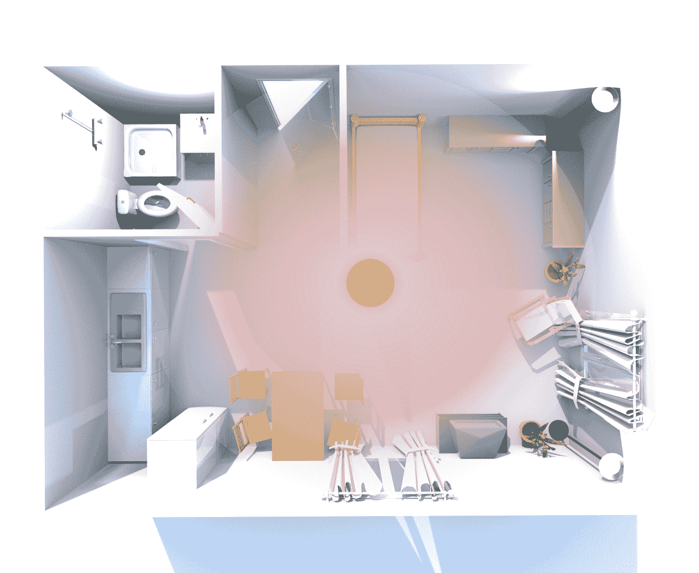
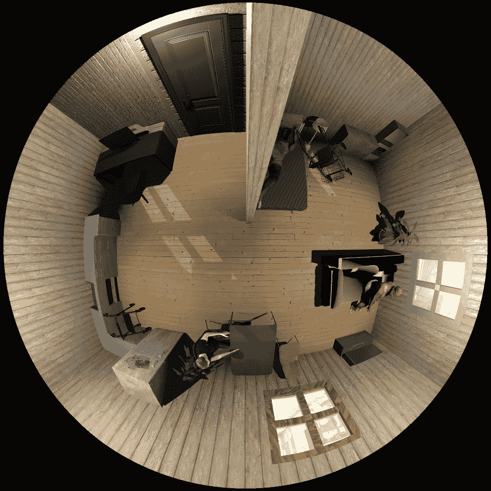
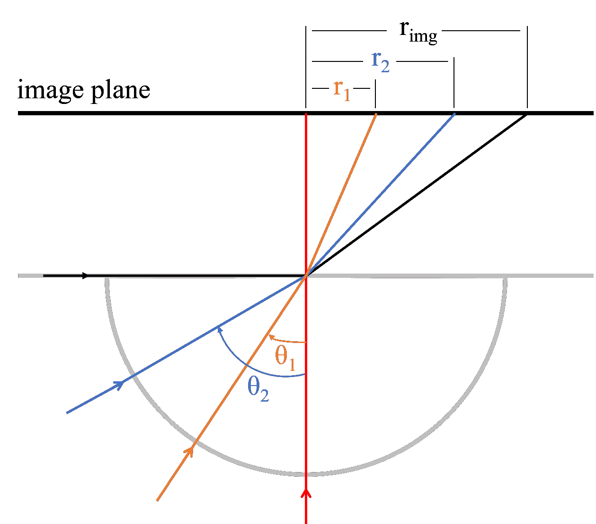

<!--yml

分类：未分类

日期：2024-09-06 19:40:25

-->

# [2304.08193] 深度学习在顶视全景成像中的应用：一项调查

> 来源：[`ar5iv.labs.arxiv.org/html/2304.08193`](https://ar5iv.labs.arxiv.org/html/2304.08193)

# 深度学习在顶视全景成像中的应用：一项调查

Jingrui Yu   Ana Cecilia Perez Grassi   Gangolf Hirtz

德国开姆尼茨工业大学

{jingrui.yu, ana-cecilia.perez-grassi, g.hirtz}@etit.tu-chemnitz.de

###### 摘要

大视野鱼眼相机在高位向下安装时能够捕捉广阔的区域，并且所需相机数量较少。相比传统的多视角相机解决方案，这种顶视全景设置大大减少了部署工作和成本。近年来，深度学习已广泛应用于视觉相关任务，包括这种全景设置。在本次调查中，我们探讨了深度学习与全景顶视相机的结合应用，包括可用的数据集、人类和物体检测、人类姿态估计、活动识别以及其他各种应用。

## 1 引言

全景相机具有捕捉宽广视野（FOV）的优势。然而，它们的投影模型会对图像引入较大的失真。因此，针对透视图像开发的计算机视觉方法不适用于全景图像。在过去的十年里，由于深度神经网络的发展和大型数据库的可用性，计算机视觉取得了巨大的进步。然而，这些进展几乎完全集中在透视图像上，无论是架构的开发还是数据的收集和注释。直到最近几年，深度学习才开始进入全景图像处理领域，通过收集数据集、调整现有架构或为这种类型的图像开发新架构。

可以通过使用反射透镜、透镜或多透镜相机来实现全景视角。反射透镜相机结合了普通相机和一个成形的镜子[66, 35, 101]。这个镜子提供了全景视角，但相机本身遮挡了图像的中央部分。这个问题由透镜相机解决，透镜相机使用鱼眼镜头而不是镜子。最后，多透镜相机通过结合多个相机在一个设置中捕捉球形视角[8, 54]。

特别是折射相机在许多应用中引起了关注，因为它们简单且价格便宜。根据任务的不同，这些相机可以以正面视图安装，例如在驾驶应用中[72, 104, 106, 51]，以垂直视图安装，如在远程会议应用中[70]，或以顶视图安装，如在监控应用中[56, 67, 64, 52]。此外，它们在 3D 重建中的使用（使用一个或多个相机）近年来有所增加[82, 55, 102]。在本次调查中，我们专注于为从顶视图捕获的鱼眼图像开发的深度学习算法。这类图像在监控和环境辅助生活（AAL）应用中至关重要[84]，主要研究领域包括人物和物体检测以及人类姿态估计。

尽管存在其他聚焦于全向鱼眼图像的调查，例如[50, 19, 2]，但它们大多讨论的是正面视图。其他关于顶视图成像的调查[58, 1]只关注顶视图视角的一个应用，并未具体说明全向相机的使用。调查中的方法大多局限于经典的计算机视觉算法。因此，我们认为我们的调查对于掌握顶视图鱼眼成像与深度学习结合应用的趋势至关重要。

本文组织如下：在 Sec. 2 中，我们详细描述了相机几何和顶视图设置。在 Sec. 3 中介绍了现有的全向数据集。第 4、5 和 6 节涵盖了物体检测、姿态估计、人类活动识别以及其他杂项应用。我们在 Sec. 7 中总结了调查结果。

## 2 顶视全向设置

如第一部分所述，本调查专注于利用一个或多个光学相机的顶视全景视觉。相机或由多个相机组成的相机装置通常悬挂在房间中心附近的天花板上。图 1 显示了这样的设置示例。请不要与自主驾驶应用中的顶视图或鸟瞰图混淆[85]，后者是从环视图图像合成的。

(a) 一室公寓中的顶视全景设置。中心的红点表示相机的位置。

(b) 在合成环境中的设置示例输出。

图 1：顶视全景设置及其输出。

为了利用这种设置的优点并解决其不足，我们需要了解鱼眼相机的模型。理想的鱼眼镜头可以用公式 1 中的等距投影来描述。$\theta$是主轴与入射光线之间的角度，$r$是图像点与主点之间的距离，$f$是焦距（参见图 2）。

|  | $r=f\theta$ |  | (1) |
| --- | --- | --- | --- |

还有其他较少使用的投影模型，请参见表 1。

图 2：等距投影。红色光线是主轴。黑色光线来自最大可视角度，$r_{img}$是图像区域的半径。

表 1：除了等距投影外，其他用于鱼眼相机的投影模型。

| 投影类型 | 数学表达式 |
| --- | --- |
| 等均分 | $r=2f\sin(\theta/2)$ |
| 立体投影 | $r=2f\tan(\theta/2)$ |
| 正射投影 | $r=f\sin\theta$ |

现实中的鱼眼相机并不完美，需要更复杂的模型进行校准、精确的图像展开和测程。文献[47]描述了一个通用模型，该模型使得用单一平面校准图案对鱼眼相机进行校准成为可能。DeepCalib 展示了利用 DL 获取鱼眼相机校准参数的可能性[7]。

一台全景相机可以通过普通的 CCD 或 CMOS 相机和鱼眼镜头 [76] 来构建。此外，还有来自各种公司的商业产品，如 TELEDYNE FLIR 的 Quasar™ Hemispheric Mini-Dome、3DVisionlabs 的 HemiStereo™ DK1 和 NX、HIKVISION 的全景系列、ABUS 的 IP Fisheye 系列、MOBOTIX 的 C71 和 Q71、VIVOTEK 的 FE 系列等。通过搜索引擎，您可以最容易地找到这些产品，搜索词为“半球相机”。

## 3 个数据集

在深度学习方法中，质量数据和真实标注的可用性对于训练过程至关重要。如今，几乎所有架构的模型都可以通过在流行的大规模图像数据集如 MS COCO [60]、ImageNet [79, 105] 上训练得到的权重获得。这使得用户能够避免从零开始的漫长且昂贵的训练，并促进神经网络的迁移学习能力，使这些现有模型能够适应新的领域和任务。然而，这些数据集中的图像大多是通过前视透视相机拍摄的。因此，拍摄的物体与从顶视全景图像中看到的物体外观不同，尤其是当它们靠近相机时。这不仅阻碍了这些模型在此类图像中的直接使用，也使得迁移学习变得极其困难，如果没有大量的全景数据用于微调。在 2010 年代初，全景图像数据集稀缺且不足以用于训练或微调复杂架构。然而，随着对使用全景相机的兴趣增加，首批顶视鱼眼图像的真实世界和合成数据集被创建。与用于分类、目标识别或分割的一般图像数据集不同，这些数据集是在特定设置下为特定任务记录的，因此它们通常是从视频中提取的连续序列，图像之间的变化较小。在以下小节中，我们将介绍和描述这些数据集。Tab. 2 总结了它们的技术特征。本章中数据集的链接于 2023 年 3 月 17 日访问。

表 2：全景图像和视频数据集的技术属性。类型包括真实世界（R）、合成（S）或混合（R+S）。分辨率（Res.）的单位是百万像素（MP）。年份（Year）指的是出版年份，而非出现年份。

| 数据集 | 类型 | 帧数 | 分辨率（MP） | 注释 | 类别 | 年份 |
| --- | --- | --- | --- | --- | --- | --- |
| Bomni | R | 10,340 | 0.3 | bbox, tracking ID, actions | 9 actions | 2012 |
| HDA (Cam 02) | R | 1,388 | 0.3 | bbox | 人物 | 2013 |
| LMS | R+S | 515 | 1.2 | – | – | 2016 |
| PIROPO | R | 111,283 | 0.48 | 头部点，边界框（第三方） | 人物 | 2021 |
| MW-18Mar | R+S | 14,040 | 1.1 到 2.2 | 边界框，旋转边界框（第三方） | 人物 | 2018 |
| HABBOF | R | 5,837 | 4.2 | 旋转边界框 | 人物 | 2019 |
| CEPDOF | R | 25,504 | 1.1 到 4.2 | 旋转边界框 | 人物 | 2020 |
| WEBDTOF | R | 10,544 | 0.6 到 5 | 旋转边界框 | 人物 | 2022 |
| FRIDA | R | 18,318 | 4.2 | 旋转边界框，人物 ID | 人物 | 2022 |
| DEPOF | R | 3,594 | 4.2 | 边界框，点位 | 人物 | 2023 |
| FES | R | 301 | 2.8 | 边界框，实例掩码 | 6 类别 | 2020 |
| 360Action | R | 784 个剪辑 | 8.3 | 每个视频剪辑的动作 | 19 种动作 | 2020 |
| FRailTRI20_DOD | R | 44,099 | 0.93 | 时间异常 | 7 种异常 | 2020 |
| OSD | R+S | 39,200 | 1.0 | 边界框 | 人物 | 2021 |
| THEODORE | S | 100,000 | 1.0 | 边界框，分割 & 实例掩码 | 14 类别 | 2020 |
| THEOStereo | S | 31,250 对 | 1.0 | 深度图 | – | 2021 |

### 3.1 现实世界数据集

Bomni 数据库¹¹1[`www.cmpe.boun.edu.tr/pilab/pilabfiles/databases/bomni/`](https://www.cmpe.boun.edu.tr/pilab/pilabfiles/databases/bomni/)（博阿兹奇大学多全向视频跟踪数据库）[24] 是最早的全向鱼眼相机图像数据集之一。尽管作者列出了其他几个数据集，但在本次评审时这些数据集已经无法获取。Bomni 数据库的录制目的是为了在室内场景中进行人体跟踪。使用了两台鱼眼相机，一台安装在天花板上，另一台安装在侧墙上，分别同时记录两个场景，分辨率为 $640\times 480$ 像素，帧率为 $8\text{\,}\mathrm{f}\mathrm{p}\mathrm{s}$。场景 1 展示了一个单一的主体进入房间并在离开前执行六种不同动作的过程。在这个场景中，总共录制了 10 个视频，涉及 5 个不同的主体。场景 2 展示了 36 个视频，记录了多个人在同一个房间中的互动。在这个场景中，总共定义了五种动作。数据集提供了跟踪 ID、移动主体的边界框和动作标签作为注释，注释格式为 vatic [94]。需要注意的是，部分注释是通过自动跟踪和插值生成的，这通常会导致主体和其边界框之间的轻微错位。此外，Bomni 数据库缺乏场景中准静态人物的标签。

HDA Person 数据集²²2[`vislab.isr.tecnico.ulisboa.pt/hda-dataset/`](https://vislab.isr.tecnico.ulisboa.pt/hda-dataset/) [30] 是一个用于监控的 数据集。大多数图像数据由经典监控摄像机录制，但序列 *Cam 02* 是由安装在电梯候车区天花板上的鱼眼摄像机录制的。该序列的分辨率为 $640\times 480$，帧率为 $5\text{\,}\mathrm{f}\mathrm{p}\mathrm{s}$。总共记录了 9819 帧。该数据集中提供了人员的边界框。整个录制过程中存在严重的运动模糊。

PIROPO 数据库³³3[`sites.google.com/site/piropodatabase/`](https://sites.google.com/site/piropodatabase/)（使用透视和全景摄像机的室内人物）[21] 同时使用安装在天花板上的鱼眼摄像机和普通透视摄像机录制。场景包含单个或多个在房间内行走、站立或坐着的人。人物之间没有互动。这是一个大规模数据集，包含超过 100,000 帧标注帧和若干未标注帧。标注以点的形式提供，标记了图像中人物的头部位置。在[107]的工作中，作者提到他们对原始标注数据集进行了下采样，并用边界框手动标注了结果数据集中的人物。

MW-18Mar 数据集⁴⁴4[`www2.icat.vt.edu/mirrorworlds/challenge/index.html`](https://www2.icat.vt.edu/mirrorworlds/challenge/index.html) 来源于 Mirror Worlds Challenge，是一个室内顶视鱼眼视频数据集，包括 30 个视频和 13k 帧。原始数据集使用了轴对齐的边界框进行标注。为了跟踪目的，还提供了标注的轨迹。在此数据集中有 3 个主要场景：一个观察室、一个走廊和一个合成的观察室场景。该数据集的训练集后来由[27]的作者用旋转边界框进行了标注，并命名为 MW-R⁵⁵5[`vip.bu.edu/projects/vsns/cossy/datasets/mw-r/`](https://vip.bu.edu/projects/vsns/cossy/datasets/mw-r/)。

*Tamura* 等人对 Bomni、PIROPO 和 MW-18Mar 数据集进行了旋转边界框的标注，用于他们的工作[90]。标注文件采用 Pascal VOC 格式[29]，并在线提供⁶⁶6[`github.com/hitachi-rd-cv/omnidet-rotinv`](https://github.com/hitachi-rd-cv/omnidet-rotinv)。

HABBOF (Human-Aligned Bounding Boxes from Overhead Fisheye Cameras) [56]、CEPDOF (Challenging Events for Person Detection from Overhead Fisheye Images) [27] 和 WEBDTOF (In-the-Wild Events for People Detection and Tracking from Overhead Fisheye Cameras) [91] 是由波士顿大学视觉信息处理实验室收集的数据集⁷⁷7[`vip.bu.edu/projects/vsns/cossy/datasets`](https://vip.bu.edu/projects/vsns/cossy/datasets)。HABBOF 提供了两个室内场景，共 5837 帧。注释以对齐于人体的边界框形式给出，这些边界框大多与全景图像的径向轴线一致。CEPDOF 是 HABBOF 的扩展，提供了在不同光照条件下、不同拥挤程度的 8 个视频序列。与以往在受控环境下录制的数据集不同，WEBDTOF 是在现实生活中录制的。记录了 14 个场景，使用不同的相机和镜头，形成 16 个视频。因此，它涵盖了现实生活中常见的困难：遮挡、伪装、裁剪、小个子人物、非圆形视野和儿童。相同的研究小组还提供了其他应用的数据集：DEPOF (Distance Estimation between People from Overhead Fisheye cameras) [62] 和 FRIDA (Fisheye Re-Identification Dataset with Annotations) [17]。DEPOF 提供了 3526 帧用于校准，并提供了 68 帧用于训练和测试人员距离测量方法。FRIDA 旨在用于人员再识别，但也提供了旋转边界框。

FES⁸⁸8[`www.tu-chemnitz.de/etit/dst/forschung/comp_vision/datasets/fes/`](https://www.tu-chemnitz.de/etit/dst/forschung/comp_vision/datasets/fes/) (Fisheye Evaluation Suite) [81] 是一个室内数据集。它与前述数据集有很大不同，提供了 6 个类别的边界框和实例分割掩码：人、电视、桌子、扶手椅、椅子和带轮步行器。该数据集的缺点是相对较小，仅有 301 帧。

360action⁹⁹9[`github.com/ryukenzen/360action`](https://github.com/ryukenzen/360action) [53] 是一个用于动作识别的视频片段数据集。在每个片段中，长度为 6 到 10 秒，帧率为 $30\text{\,}\mathrm{f}\mathrm{p}\mathrm{s}$，一些被试者进行日常动作，单独完成或进行互动。每个视频都有动作标签，但未指定具体的被试者。

FRailTRI20_DOD（法国铁路技术研究所门障碍检测 2020）[52] 专门用于监控火车门区域。图像以 $20\text{\,}\mathrm{f}\mathrm{p}\mathrm{s}$ 速率捕获。通过五名演员执行了关于火车门和乘客的七种异常行为。作者定义了一组注释，涉及实例位置和位移、门状态、危险事件、行人动作，并将其合并为事件的时间分割。可以通过联系第一作者获取数据集及详细的注释指南。

### 3.2 合成数据集

除了 MW-18Mar 数据集中的子集外，还创建了多个全景图像的合成数据集，用于各种目的。

LMS Fisheye 数据集¹⁰¹⁰10[`www.lms.tf.fau.eu/research/downloads/fisheye-data-set/`](https://www.lms.tf.fau.eu/research/downloads/fisheye-data-set/) [28] 提供了多种合成和真实世界的鱼眼图像视频序列，其中 HallwayC、LivingroomB、Room、HallwayB、LivingroomA 和 LivingroomC 是顶视图。这些序列没有相应的注释。

OSD¹¹¹¹11[`datasets.vicomtech.org/v4-osd/OSD_download.zip`](https://datasets.vicomtech.org/v4-osd/OSD_download.zip) (全景合成数据集) [5] 是一个用于人脸识别和监控的数据集。因此，它仅提供以分割掩膜和边界框形式的人员注释。人员体积较小，以模拟实际监控场景中一个全景摄像机监控大面积的情况。除了全景图像外，它还提供了校正图像。

THEODORE¹²¹²12[`www.tu-chemnitz.de/etit/dst/forschung/comp_vision/datasets/theodore/`](https://www.tu-chemnitz.de/etit/dst/forschung/comp_vision/datasets/theodore/) (合成顶视室内场景数据集) [81] 提供了一个大规模多样的数据集，包含用于语义分割、实例分割和物体检测的边界框注释。THEOStereo¹³¹³13[`www.tu-chemnitz.de/etit/dst/forschung/comp_vision/datasets/theostereo/`](https://www.tu-chemnitz.de/etit/dst/forschung/comp_vision/datasets/theostereo/) [86] 来源于 THEODORE，旨在使用顶视鱼眼摄像头辅助深度估计。它提供了来自两个虚拟摄像头的图像对以及作为真实注释的相应深度图。立体摄像头的基线为 $0.3\text{\,}\mathrm{m}$。

### 3.3 其他数据集

其他数据集，如 DPI-T¹⁴¹⁴14[`github.com/zhengkang86/ram_person_id`](https://github.com/zhengkang86/ram_person_id)（基于深度的顶视人物识别）[38]、TVPR¹⁵¹⁵15[`vrai.dii.univpm.it/re-id-dataset`](https://vrai.dii.univpm.it/re-id-dataset)（顶视人物再识别）数据集[57]不使用鱼眼相机，但其俯视视角仍然对训练应用于全景图像的网络有用。这两个数据集除了 RGB 通道外，还包含深度通道。PanopTOP31K¹⁶¹⁶16[`github.com/mmlab-cv/PanopTOP`](https://github.com/mmlab-cv/PanopTOP) [34]是一个用于视图不变 3D 人体姿态估计的顶视半合成 RGB 数据集。这是第一个包含顶视人体关键点的大规模数据集。然而，其$256\times 256$像素的低分辨率和明显的伪影对其可用性产生了负面影响。

## 4 人物与物体检测

### 4.1 人物检测

在 Sec. 3 中的数据集清楚地显示，全景相机的主要应用是人物检测和跟踪。使用深度学习进行全景图像中的人物检测，通常一个基于 CNN 的物体检测器，会面临一些障碍。首先，站立的人物在图像中的径向轴线对齐，而不是在侧装相机的图像中向上。其次，鱼眼相机的等距投影导致物体的显著变形。这两个问题限制了预训练模型的利用，降低了迁移学习的有效性。此外，当人物直接站在相机下方时，其外观独特，与普通透视图像中的外观不同。我们回顾了研究，看看这些问题是如何逐步解决的。概述见 Tab. 3。请注意，由于缺乏统一的大规模数据集，研究人员使用了不同的数据集和指标进行评估，因此无法直接比较性能。因此，表中未列出性能数据。

表 3：全景图像中的人物检测

| 架构 | 主要算法 |
| --- | --- |
| Nguyen *et al*. [67] | AGMM-背景减除 + tiny YOLO |
| OmniDetector [83] | 解卷积 + YOLOv2 + NMS |
| Li *et al*. [56] | 旋转窗口 + 背景减除 + YOLOv3 |
| Tamura *et al*. [90] | 旋转不变训练 + YOLOv2 + BBR |
| OmniPD [107] | 混合训练 + 旋转增强 |
| RAPiD [27] | 基于 YOLOv3 的网络 + 定向预测头 + 角度感知损失 |
| ARPD [64] | CenterNet + 方向预测头 + 旋转感知损失函数 |
| Haggui *等* [37] | RAPiD + 颜色直方图跟踪 |
| Wang *等* [98] | 双重 Mask R-CNN + 图像区域分离 + 场景特定训练 |
| GSAC-DNN [32] | 简单 CNN 分类器的 2D 网格 |
| Callemein *等* [9] | 低分辨率图像 + YOLOv2 中的时间交错核 |
| OmniDRL [71] | 深度 Q 网络 + 相机标定 |
| Wiedemer *等* [100] | Faster-RCNN + 少量样本训练 |

Nguyen *等* [67] 结合了基于自适应高斯混合模型（AGMM）的背景减除和受 Tiny Yolo [73] 启发的简单 CNN 来进行行人检测。该网络以前景掩膜和单通道灰度图像作为输入。他们的评估显示，在他们的本地数据集上 AP 为 0.86。

Seidel *等* 提出了 OmniDetector [83]，该方法利用相机标定参数将一个全景图像展开成 94 个高度重叠的透视图像，然后应用预训练的 YOLOv2 [74]进行行人检测。边界框使用查找表（LUT）重新投影回全景图像。通过应用非极大值抑制（NMS）来消除重叠的边界框，并生成最终检测结果。他们在 PIROPO 上使用软 NMS 和高斯平滑达到了 0.646 的 AP@0.5IoU。此方法使得可以使用基于 CNN 的检测器，而无需收集新数据和训练。然而，它的缺点也很明显。它有较大的开销，部分原因是变换，部分原因是对单张图像的大量推断。它无法直接检测摄像头下的行人，因为网络未见过此类示例。此外，它要求相机标定参数是已知的，这在所有情况下都不可行。奇怪的是，Chiang *等* [15] 在 2021 年使用了相同的方法，仅改进了将 ROIs 的数量减少到八个。

Li *等* 在 [56] 中提出使用旋转矩形焦点窗口提取图像的一部分，该部分将被旋转以保持人员的直立方向。最大焦点窗口数量为 24。然后使用 YOLOv3 [75] 和连续 NMS 进行检测。作者使用背景减除法识别有人员出现的兴趣区域（ROI），并丢弃没有人类活动的焦点窗口，从而降低计算成本。这种方法在 HABBOF 上测试，F 分数为 0.88。与 OmniDetector 相似的是，使用了多个重叠窗口，并且检测器无需重新训练或微调。但该方法降低了计算成本，不需要知道相机参数。然而，它仍未解决摄像机下方人员的问题，并且设计上无法检测静止人员。

Yu *等* 采用了另一种方法，尝试直接在全景图像中实现人员检测，使用了 OmniPD [107]。他们提出了一种训练范式，将全景图像与正常视角的数据集（在此情况下为 PASCAL VOC 数据集 [29]) 结合起来，以微调基于 CNN 的物体检测器。使用了随机水平和垂直翻转以及随机 90 度旋转作为数据增强，以补偿全景图像中的旋转变异。他们在自己的数据集上使用 SSD [61] 达到了 AP@0.5IoU 为 0.863 的最佳结果。

Tamura *等* 尝试通过训练 YOLOv2 来实现全景图像中的行人检测，使用了来自 COCO [90] 的随机旋转视角图像。训练中还使用了 DPI-T 数据集。为了解决 YOLOv2 生成重叠边界框的问题，他们提出了基于边界框中心点均值漂移聚类的边界框回归（BBR）。在细化过程中添加了基于位置的边界框角度确定。作者手动注释了 MW-18Mar、PIROPO、Bomni 和 CVRG 以供评估，如 第 3.1 节 中提到。

段*等*提出了 RAPiD [27]，这是一种新的 YOLO 灵感网络架构，它除了预测边界框的常规位置和大小外，还预测旋转角度。为了训练这个网络，他们在 YOLOv3 的损失函数中添加了旋转角度损失。该网络首先在 COCO 数据集上进行预训练，然后在他们标注的三个数据集中的两个（MW-R、HABBOF、CEPDOF）上进行微调，并在剩下的一个数据集上进行测试。他们在 MW-R、HABBOF 和 CEPDOF 数据集上分别达到了 AP@0.50IoU 值 0.967、0.981 和 0.858。他们的团队通过扩展 RAPiD 以引入时间信息进一步提高了性能 [91]。敏*等*使用了相同的策略将 CenterNet 扩展为预测对齐的人体边界框，并将其架构命名为 ARPD [64]。他们的实验表明，他们的方法在达到类似的 AP 的同时，推理速度提高了两倍。哈吉*等*使用 RAPiD 进行初步检测，并通过使用颜色直方图来添加跟踪功能 [37]。

最近的发展是[100]。维德马*等*提出了一种针对 Faster-RCNN 的少样本对抗训练方案 [77]，使得一个预训练的检测模型可以在少于 100 个标注训练样本的情况下，适应于顶视全向图像中的人检测。他们使用的技术包括损失耦合、全局和实例级别特征对齐。该方法在标注样本数量少于 100 时可以达到更高的准确率。与之前提到的方法的一个关键区别在于，这种方法旨在用最小的努力将现有模型适应于特定的使用场景，而不是试图创建一个具有最大泛化能力的模型。因此，作者的跨数据集评估显示，当训练样本数量超过 50 时，该模型的泛化能力会下降。

除了常见的检测方法外，研究人员还尝试了具有特殊功能的其他人员检测方式。Wang *等* 提出了使用 Mask-RCNN [41]。其优势在于分割掩码不具有与人员方向对不上的问题。他们将图像分为中心区域和外围环带。外围环带进一步分为三个扇区，然后将这些扇区扭曲成矩形并叠加在一起形成一个正方形图像。检测通过两个独立的检测器进行，一个用于中心区域，另一个用于外部区域。Fuertes *等* 提出了基于深度神经网络（GSAC-DNN）的空间感知分类器网格 [32]。该方法由一个 ResNet-32 [42] 主干生成特征图。该特征图输入到由卷积层和线性层组成的二维简单分类器网格中。基于分类器的置信度评分计算人员的位置。GSAC-DNN 是端到端可训练的，但它只能检测人员的一般位置，而不能生成边界框。Callemein *等* 的工作 [9] 旨在用于会议室的占用检测或灵活办公桌，但检测结果仍以边界框呈现。他们使用分辨率极低的 $96\times 96$ 像素图像以保护隐私。为了补偿低分辨率带来的信息损失，他们实现了一个时间交错内核，将多个连续帧合并为一个高分辨率特征图。他们的网络能够在如 Raspberry Pi 3B [31] 这样的嵌入式系统上以 $0.77\text{\,}\mathrm{f}\mathrm{p}\mathrm{s}$ 运行。Pais *等* 使用基于深度 Q-Net (DQN) [65] 的网络和相机标定参数来进行人员检测，并预测人员在世界坐标系中的 3D 位置 [71]。使用强化学习的做法相当不寻常。他们的实现称为 OmniDRL。

### 4.2 对象检测

在全景图像中的物体检测尚未被广泛研究。一个原因是它不像人检测那样有用。另一个原因是缺乏用于训练的数据。Scheck *等人*创建了 THEODORE 数据集[81]来解决这个问题。THEODORE 除了包含人类之外，还包含五个类别：扶手椅、椅子、桌子、电视和轮椅。他们使用该数据集训练了 SSD[61]、R-FCN[20]和 Faster R-CNN[77]，并在 FES 数据集上测试了训练后的网络。使用 Faster R-CNN，所有六个类别的 mAP 达到了 0.613。他们还利用 THEODORE 进一步训练了无锚点的 CenterNet[26]用于物体检测[80]。在这项工作中，他们引入了无监督领域适应（UDA）来弥合合成图像领域和真实图像领域之间的差距，这通常用于语义分割。CenterNet 通过两种 UDA 方法扩展：熵最小化（EM）[95]和最大平方损失（MSL）[14]。在[80]中使用的无标签目标数据集是 CEPDOF。利用扩展了 UDA 的 CenterNet，他们将相同 FES 数据集上的 mAP 提升至 0.690，并同时将推断速度提高了一倍。另一个物体检测在全景视图中被研究不足的原因可能是应用场景非常有限。然而，这仍然可能对完成复杂任务有用，如使用全景图像进行动作识别，例如，在[84]中，建立了一个监控老年痴呆症患者的系统。

## 5 人体姿态估计与活动识别

人体姿态估计（HPE）是指找到一个人的关节并将其连接成一个骨架的过程。姿态估计是全景图像应用中研究第二多的领域。在这一部分，我们将探讨 2D 和 3D 姿态估计的方法。我们还将查看人体活动识别（HAR）的研究，这通常跟随姿态估计。

### 5.1 使用顶视鱼眼相机进行姿态估计

Georgakopoulos *et al*. [22, 36] 使用 3D 人体模型创建二值轮廓数据集，这些数据集通过鱼眼相机的校准渲染。CNN 被训练以区分预设姿势，而不是估计关节位置。Denecke 和 Jauch [25] 利用智能传感器计算的 3D 点云和人体的先验知识来估计关节位置。这种方法的结果受限于相机的安装位置以及个体身体之间的差异。推理速度受限于智能传感器的速度。Heindl *et al*. [43] 生成包含人类的全向图像区域的直线视图，从而使人类在虚拟视图中看起来是直立的。然后，将 OpenPose [10] 应用于这个虚拟图像以进行姿态估计。他们使用了一对校准的鱼眼相机来获取两个骨架，然后通过使用直线变换（DLT） [40] 将这些骨架组合成 3D 骨架。

尽管没有使用全向图像，以下两个工作在顶视图中进行 HPE。Haque *et al*. 训练 CNN 和 LSTM [44] 以实现单一*深度图像* [38, 39]上的视角不变 3D 姿态估计。Garau *et al*. 使用名为 DECA 的胶囊自编码器 [33] 在深度图像和 RGB 图像上实现视角不变的 3D HPE，即 ITOP [39] 和 PanopTOP31K 数据集。

### 5.2 自我中心的 3D 姿态估计

自我中心姿态估计是使用鱼眼相机在顶视图中的一种特殊情况。相机并未安装在人的正上方，而是通过一个装置安装在人头部的小水平距离上。相机可以看到的是身体的前面或前侧，以及人的周边。EgoCap 是一种双鱼眼相机系统，安装在自行车头盔上，配有 T 形或 Y 形木框架[78]。相机从支架的前方伸出约 $25\text{\,}\mathrm{cm}$。作者使用运动捕捉系统创建了一个数据集，以生成地面真实数据，并将关节位置投影到他们设置的图像中。利用这个数据集，他们对预训练于 MPII [4] 和 Leed Sports Extended Dataset [46] 的 ResNet101 进行了微调，以生成 18 个关节的热图。通过 2D 骨架和 3D 身体模型实时构建 3D 骨架，每个用户必须调整 3D 模型。Mo²Cap² [103] 和 xR-EgoPose [93] / SelfPose [92] 是类似的实现，使用了单个鱼眼相机。两个工作都为训练开发了自己的合成数据集。Mo²Cap² 使用了一个 CNN 分支来生成全身关节的热图，另一个分支生成放大下半身的热图。通过估计关节与相机之间距离的 CNN，最终将关节投影到 3D 坐标中。相机的校准信息对于准确的 3D 姿态估计至关重要。xR-Egopose 使用了 ResNet101 生成关节热图。一个提升模块以热图作为输入，从中回归 3D 姿态，并输出高分辨率的 2D 热图。Wang *et al* 在 [97] 中提出了一种方法，不仅估计局部姿态，还估计全局姿态，即估计世界坐标系统中的 3D 关节位置。他们的流程利用了图像序列，而不是仅对单帧进行推断。同时，他们利用了从 AMASS 数据集 [63] 学习到的运动先验，以减少估计姿态中的时间抖动和不现实的动作。他们的设置类似于 Mo²Cap² 和 xR-EgoPose，通过将单个鱼眼相机安装到头盔上来实现。在 [96] 中，他们进一步提出了额外使用外部相机进行弱监督训练。他们的任务数据集名为 EgoPW。EgoGlass [108] 在最小化设备尺寸方面更为极端。他们将两台相机安装到普通眼镜上，每台相机记录身体的一侧。姿态估计在拼接图像中解决。我们还注意到 Cha *et al* [11, 12] 使用了类似的设置进行他们的实现，但不是鱼眼相机。

### 5.3 动作识别

Li *等* [53] 提出了在顶视鱼眼摄像机图像中进行动作识别的方法。他们首先使用 Mask-RCNN 找出图像中站立人的脊柱线。脊柱线的交点被视为鱼眼摄像机的光学中心，球面图像在其周围被去畸变成全景图像。在此过程中无需相机标定信息，全景图像被设置为预定义大小。作者使用 Mask-RCNN 在全景图像中进行人物检测，并在每个剪辑的 16 帧中最大池化边界框以形成 ROI。通过这 16 帧使用 3D ResNet 进行动作识别。由 ROI 生成的二进制掩码与 3D ResNet 的特征图相乘以降低计算成本。他们使用多实例多标签学习（MIML）训练网络，以估计一系列动作的分数。Stephen *等* [88] 进一步发展了这项工作，通过在中央区域添加第二个并行管道来处理人员。这个管道直接为广角图像中的每个人生成堆叠的特征图，其中人物检测由 RAPiD [27] 执行。

## 6 其他应用

除了被广泛研究的主题，广角图像还有多种应用，主要是由于其更广的视野。研究人员已将深度学习应用于这些应用中，但深度学习并不是这些应用的重点。大量的工作致力于解决鱼眼摄像机的等距投影以及其他特定领域的问题。

Laurendin *等人* 提出了使用顶视摄像头在自动列车的车门区域进行异常检测 [52]。他们创建了一个数据集，其中模拟了列车的车门区域，并进行了系统的标注，详见 第 3.1 节。他们在 [68] 中调整了网络。结果尚不明确。Kim *等人* 提出了使用多个顶视鱼眼摄像头进行停车场监控，以确定车辆位置 [48]。这些摄像头首先使用 RANSAC 进行标定，以获取其内参和外参。SegNet [6] 被用来生成车辆检测的分割掩码。他们开发了一种基于摄像头的标定参数和生成的分割掩码来估计车辆实际大小的方法。为了获得准确的真实数据，作者使用模型车和木框建造了一个 $1/18$ 比例的测试台。他们的方法在车辆位置估计方面的平均距离误差为 $0.24\text{\,}\mathrm{m}$（按实际情况缩放），在车辆移动方向上的平均方向误差为 $4.8\text{\,}\mathrm{\SIUnitSymbolDegree}$。Akai *等人* 使用鱼眼摄像头进行葡萄串计数 [3]。与本文中其他审查的示例不同，这项工作使用的是自下而上的视角，而不是自上而下的视角。但从本质上讲，这是一种相同的方法。视角的不同只是因为 ROI 位于头顶而不是地面上。另一个重要的应用是室内牲畜监控，如身体分割、识别、行为识别。在这种通常规模较大且动物密集的农业区域中使用顶视全向摄像头，可以提供无遮挡的视角，同时使用的摄像头数量最少。Chen *等人* [13] 提供了这一应用领域的全面综述，包括顶视全向摄像头和深度学习的使用。Li *等人* 使用单个顶视鱼眼摄像头进行了 3D 房间重建 [55]。他们使用 RefineNet [59] 对房间进行语义分割，以帮助选择结构线。他们方法的最终结果是房间的立方体表示。

## 7 结论

我们可以从我们的调查中得出结论，顶视全向成像的主要应用领域是监控和辅助生活。研究人员已经创建了大量的数据来促进深度学习算法的发展。通过这些，深度学习算法的实施显示出了非常有前途的结果。

一个显然被忽视的研究领域是人体姿态估计。虽然在透视图像上已有很大进展，但由于收集可靠地面真实数据的人体关键点的高成本，将其转移到全景图像上进展缓慢[45]。最近在新视角合成方面的发展，如 A-Nerf [89] 和 HumanNerf [99]，可能是解决这个问题的方案。这个领域的更多研究将有利于进一步的应用，比如跌倒检测，目前只探索了基于规则的方法[23, 49, 87, 69]。另一个可能的研究方向是使用专门为鱼眼图像几何及相关投影开发的网络架构，如球面卷积神经网络 [16] 和 SphereNet [18]。

## 参考文献

+   [1] Misbah Ahmad, Imran Ahmed, Kaleem Ullah, Iqbal khan, Ayesha Khattak, 和 Awais Adnan. 从俯视图进行人员检测：综述。《高级计算机科学与应用国际期刊》，10(4)，2019 年。版权 - © 2019。本作品依据 https://creativecommons.org/licenses/by/4.0/（“许可证”）授权使用。尽管有 ProQuest 的条款和条件，你可以按照许可证的条款使用该内容；最后更新 - 2022-11-29。

+   [2] Hao Ai, Zidong Cao, Jinjing Zhu, Haotian Bai, Yucheng Chen, 和 Lin Wang. 针对全景视觉的深度学习：综述与新视角，2022 年。

+   [3] Ryota Akai, Yuzuko Utsumi, Yuka Miwa, Masakazu Iwamura, 和 Koichi Kise. 针对全景图像的畸变自适应葡萄串计数。在 2020 年第 25 届国际模式识别大会（ICPR）上，页码 599–606。IEEE，2021 年。

+   [4] Mykhaylo Andriluka, Leonid Pishchulin, Peter Gehler, 和 Bernt Schiele. 2D 人体姿态估计：新的基准和最新技术分析。在 IEEE 计算机视觉与模式识别会议论文集中，页码 3686–3693，2014 年。

+   [5] Nerea Aranjuelo, Sara García, Estíbaliz Loyo, Luis Unzueta, 和 Oihana Otaegui. 基于全景相机的人体检测的智能系统训练合成数据生成的关键策略。《计算机与电气工程》，92:107105，2021 年。

+   [6] Vijay Badrinarayanan, Alex Kendall, 和 Roberto Cipolla. Segnet：一种用于图像分割的深度卷积编码解码器架构。《IEEE 模式分析与机器智能交易》，39(12):2481–2495，2017 年。

+   [7] Oleksandr Bogdan, Viktor Eckstein, Francois Rameau, 和 Jean-Charles Bazin. Deepcalib：一种用于广角相机自动内参标定的深度学习方法。在第 15 届 ACM SIGGRAPH 欧洲视觉媒体制作会议论文集中，页码 1–10，2018 年。

+   [8] Josep Bosch, Klemen Istenič, Nuno Gracias, Rafael Garcia, 和 Pere Ridao。使用深度图的全向多摄像头视频拼接。IEEE 海洋工程杂志，45(4):1337–1352，2020 年。

+   [9] Timothy Callemein, Kristof Van Beeck, 和 Toon Goedemé。这里有人吗？智能嵌入式低分辨率全向视频传感器用于测量房间占用情况。发表于 2019 年第 18 届 IEEE 国际机器学习与应用会议（ICMLA），第 1993–2000 页。IEEE，2019 年。

+   [10] Zhe Cao, Tomas Simon, Shih-En Wei, 和 Yaser Sheikh。实时多人的 2D 姿态估计使用部件亲和场。发表于 IEEE 计算机视觉与模式识别会议论文集，第 7291–7299 页，2017 年。

+   [11] Young-Woon Cha, True Price, Zhen Wei, Xinran Lu, Nicholas Rewkowski, Rohan Chabra, Zihe Qin, Hyounghun Kim, Zhaoqi Su, Yebin Liu，等。实现完全移动的 3D 面部、身体和环境捕捉，仅使用头戴式相机。IEEE 视觉化与计算机图形学事务，24(11):2993–3004，2018 年。

+   [12] Young-Woon Cha, Husam Shaik, Qian Zhang, Fan Feng, Andrei State, Adrian Ilie, 和 Henry Fuchs。移动式以眼镜为基础的人体运动重建，仅使用眼镜-mounted 相机和少量佩戴的惯性传感器。发表于 2021 IEEE 虚拟现实与 3D 用户界面（VR），第 616–625 页。IEEE，2021 年。

+   [13] Chen Chen, Weixing Zhu, 和 Tomas Norton。猪和牛的行为识别：从计算机视觉到深度学习的旅程。《计算机与电子农业》，187:106255，2021 年。

+   [14] Minghao Chen, Hongyang Xue, 和 Deng Cai。最大平方损失的语义分割领域适应。发表于 IEEE/CVF 国际计算机视觉会议论文集，第 2090–2099 页，2019 年。

+   [15] Sheng-Ho Chiang, Tsaipei Wang, 和 Yi-Fu Chen。在顶部视角鱼眼图像中使用透视视图补丁的组合进行高效行人检测。《图像与视觉计算》，105:104069，2021 年。

+   [16] Taco S. Cohen, Mario Geiger, Jonas Köhler, 和 Max Welling。球面 CNN。发表于 2018 年国际学习表征会议。

+   [17] Mertcan Cokbas, John Bolognino, Janusz Konrad, 和 Prakash Ishwar。Frida：带注释的鱼眼重识别数据集。发表于 2022 年第 18 届 IEEE 国际先进视频与信号监测会议（AVSS），第 1–8 页，2022 年。

+   [18] Benjamin Coors, Alexandru Paul Condurache, 和 Andreas Geiger。Spherenet：学习球面表征以进行全向图像的检测和分类。发表于欧洲计算机视觉会议（ECCV）论文集，第 518–533 页，2018 年。

+   [19] Thiago L. T. da Silveira, Paulo G. L. Pinto, Jeffri Murrugarra-Llerena, 和 Cláudio R. Jung。从 360°图像中估计 3D 场景几何：综述。ACM 计算机调查，55(4)，2022 年 11 月。

+   [20] Jifeng Dai, Yi Li, Kaiming He 和 Jian Sun. R-fcn：基于区域的全卷积网络的物体检测。发表于 D. Lee, M. Sugiyama, U. Luxburg, I. Guyon 和 R. Garnett 主编的《神经信息处理系统进展》, 第 29 卷。Curran Associates, Inc., 2016 年。

+   [21] Carlos R del Blanco, Pablo Carballeira, Fernando Jaureguizar 和 Narciso García. 使用空间感知分类器网格的全向摄像机进行鲁棒的室内人物定位。信号处理：图像通信，93：116135，2021 年。

+   [22] Konstantinos K Delibasis, Spiros V Georgakopoulos, Konstantina Kottari, Vassilis P Plagianakos 和 Ilias Maglogiannis. 用于全向图像中的姿态识别的地理校正 Zernike 描述符。集成计算机辅助工程，23(2)：185–199，2016 年。

+   [23] Konstantinos K. Delibasis 和 Ilias Maglogiannis. 用于鱼眼摄像机捕捉的室内视频序列的跌倒检测算法。发表于 2015 年 IEEE 第 15 届国际生物信息学与生物工程会议（BIBE），页码 1–5，2015 年。

+   [24] Banş Evrim Demiröz, Ismail Ari, Orhan Eroğlu, Albert Ali Salah 和 Laie Akarun. 基于特征的多全向摄像机数据集跟踪。发表于 2012 年第 5 届国际通信、控制与信号处理研讨会，页码 1–5。IEEE，2012 年。

+   [25] Julia Denecke 和 Christian Jauch. 基于先验知识的 3D 人体姿态估计的验证和正则化方法。电子成像，33：1–8，2021 年。

+   [26] Kaiwen Duan, Song Bai, Lingxi Xie, Honggang Qi, Qingming Huang 和 Qi Tian. Centernet：用于物体检测的关键点三元组。发表于 IEEE/CVF 国际计算机视觉会议论文集，页码 6569–6578，2019 年。

+   [27] Zhihao Duan, Ozan Tezcan, Hayato Nakamura, Prakash Ishwar 和 Janusz Konrad. Rapid：在俯视鱼眼图像中进行旋转感知的人物检测。发表于 IEEE/CVF 计算机视觉与模式识别会议研讨会论文集，页码 636–637，2020 年。

+   [28] Andrea Eichenseer 和 André Kaup. 提供合成和真实世界鱼眼视频序列的数据集。发表于 2016 年 IEEE 国际声学、语音与信号处理会议（ICASSP），页码 1541–1545，2016 年。

+   [29] Mark Everingham, Luc Van Gool, Christopher KI Williams, John Winn 和 Andrew Zisserman. Pascal 视觉对象类别（VOC）挑战。计算机视觉国际期刊，88(2)：303–338，2010 年。

+   [30] Dario Figueira, Matteo Taiana, Athira Nambiar, Jacinto Nascimento 和 Alexandre Bernardino. HDA+数据集用于全自动重识别系统的研究。发表于欧洲计算机视觉会议，页码 241–255。Springer，2014 年。

+   [31] Raspberry Pi Foundation. Raspberry Pi 3 Model B. [`www.raspberrypi.com/products/raspberry-pi-3-model-b/`](https://www.raspberrypi.com/products/raspberry-pi-3-model-b/)，2016 年。[在线；访问日期：2023 年 4 月 11 日]。

+   [32] Daniel Fuertes、Carlos R del Blanco、Pablo Carballeira、Fernando Jaureguizar 和 Narciso García. 使用空间网格深度学习中心分类器的全向摄像头进行人员检测。数字信号处理，126：103473，2022 年。

+   [33] Nicola Garau、Niccolo Bisagno、Piotr Bródka 和 Nicola Conci. Deca：使用胶囊自编码器的深度视角不变人体姿态估计。发表于 IEEE/CVF 国际计算机视觉会议论文集，第 11677–11686 页，2021 年。

+   [34] Nicola Garau、Giulia Martinelli、Piotr Bródka、Niccolò Bisagno 和 Nicola Conci. Panoptop：生成视角不变的人体姿态估计数据集的框架。发表于 IEEE/CVF 国际计算机视觉会议（ICCV）研讨会论文集，第 234–242 页，2021 年 10 月。

+   [35] José Gaspar、Niall Winters 和 José Santos-Victor. 基于视觉的导航和环境表征，使用全向摄像头。IEEE 机器人与自动化汇刊，16(6)：890–898，2000 年。

+   [36] Spiros V Georgakopoulos、Konstantina Kottari、Kostas Delibasis、Vassilis P Plagianakos 和 Ilias Maglogiannis. 基于卷积神经网络的全向图像姿态识别。Neurocomputing，280：23–31，2018 年。

+   [37] Olfa Haggui、Hamza Bayd、Baptiste Magnier 和 Arezki Aberkane. 使用改进的 yolov3 框架在移动鱼眼摄像头中进行人体检测。发表于 2021 IEEE 第 23 届国际多媒体信号处理研讨会（MMSP），第 1–6 页。IEEE，2021 年。

+   [38] Albert Haque、Alexandre Alahi 和 Li Fei-Fei. 基于深度的个体识别的递归注意力模型。发表于 IEEE 计算机视觉与模式识别会议论文集，第 1229–1238 页，2016 年。

+   [39] Albert Haque、Boya Peng、Zelun Luo、Alexandre Alahi、Serena Yeung 和 Li Fei-Fei. 朝着视角不变的 3D 人体姿态估计。发表于 计算机视觉–ECCV 2016：第 14 届欧洲会议，荷兰阿姆斯特丹，2016 年 10 月 11–14 日，论文集第一部分第 14 卷，第 160–177 页。Springer，2016 年。

+   [40] Richard I Hartley、Rajiv Gupta 和 Tom Chang. 来自未标定摄像机的立体视觉。发表于 CVPR，第 92 卷，第 761–764 页，1992 年。

+   [41] Kaiming He、Georgia Gkioxari、Piotr Dollar 和 Ross Girshick. Mask R-CNN。发表于 IEEE 国际计算机视觉会议（ICCV），2017 年 10 月。

+   [42] Kaiming He、Xiangyu Zhang、Shaoqing Ren 和 Jian Sun. 深度残差学习用于图像识别。发表于 IEEE 计算机视觉与模式识别会议论文集，第 770–778 页，2016 年。

+   [43] Christoph Heindl、Thomas Pönitz、Andreas Pichler 和 Josef Scharinger. 通过全景摄像机的立体重建进行大范围 3D 人体姿态检测。arXiv 预印本 arXiv:1907.00534，2019 年。

+   [44] Sepp Hochreiter 和 Jürgen Schmidhuber. 长短期记忆。神经计算，9(8)：1735–1780，1997 年。

+   [45] Catalin Ionescu, Dragos Papava, Vlad Olaru 和 Cristian Sminchisescu. Human3.6m：用于自然环境中 3D 人类感知的大规模数据集和预测方法。IEEE 模式分析与机器智能汇刊，36(7):1325–1339，2014 年 7 月。

+   [46] Sam Johnson 和 Mark Everingham. 从不准确标注中学习有效的人体姿态估计。发表于 CVPR 2011，第 1465–1472 页。IEEE，2011 年。

+   [47] J. Kannala 和 S.S. Brandt. 适用于常规、广角和鱼眼镜头的通用相机模型和标定方法。IEEE 模式分析与机器智能汇刊，28(8):1335–1340，2006 年。

+   [48] Sung-Tae Kim, Ming Fan, Seung-Won Jung 和 Sung-Jea Ko. 使用多个鱼眼监控相机的外部车辆定位系统，用于室内停车场。IEEE 系统学报，15(4):5107–5118，2020 年。

+   [49] Konstantina N Kottari, Konstantinos K Delibasis 和 Ilias G Maglogiannis. 使用未标定的鱼眼相机进行实时跌倒检测。IEEE 认知与发展系统汇刊，12(3):588–600，2019 年。

+   [50] Varun Ravi Kumar, Ciarán Eising, Christian Witt 和 Senthil Yogamani. 自动驾驶的全景鱼眼相机感知：概述、调查与挑战。IEEE 智能交通系统汇刊，第 1–22 页，2023 年。

+   [51] Varun Ravi Kumar, Marvin Klingner, Senthil Yogamani, Stefan Milz, Tim Fingscheidt 和 Patrick Mader. Syndistnet：自监督的单目鱼眼相机距离估计与语义分割协同用于自动驾驶。发表于 IEEE/CVF 冬季计算机视觉应用会议论文集（WACV），第 61–71 页，2021 年 1 月。

+   [52] Olivier Laurendin, Sébastien Ambellouis, Anthony Fleury, Ankur Mahtani, Sanaa Chafik 和 Clément Strauss. 使用深度神经网络检测自动列车门附近的危险事件。发表于 2021 年第 17 届 IEEE 国际先进视频与信号监控会议（AVSS），第 1–7 页。IEEE，2021 年。

+   [53] Junnan Li, Jianquan Liu, Wong Yongkang, Shoji Nishimura 和 Mohan Kankanhalli. 在 360°视频中进行弱监督的多人动作识别。发表于 IEEE/CVF 冬季计算机视觉应用会议论文集，第 508–516 页，2020 年。

+   [54] Jia Li, Kaiwen Yu, Yifan Zhao, Yu Zhang 和 Long Xu. 360°全景图像的交叉参考拼接质量评估。发表于第 27 届 ACM 国际多媒体会议（MM ’19），第 2360–2368 页，美国纽约，2019 年。计算机协会。

+   [55] Mingyang Li, Yi Zhou, Ming Meng, Yuehua Wang 和 Zhong Zhou. 从单张鱼眼图像重建 3D 房间。发表于 2019 年国际神经网络联合会议（IJCNN），第 1–8 页，2019 年。

+   [56] Shengye Li, M. Ozan Tezcan, Prakash Ishwar 和 Janusz Konrad. 使用上方鱼眼相机进行有监督的人群计数。发表于 2019 年第 16 届 IEEE 国际先进视频与信号监控会议（AVSS），第 1–8 页，2019 年。

+   [57] Daniele Liciotti, Marina Paolanti, Emanuele Frontoni, Adriano Mancini, 和 Primo Zingaretti. 使用 RGB-D 摄像机的行人重识别数据集，页面 1–11。施普林格国际出版公司，Cham，2017 年。

+   [58] Daniele Liciotti, Marina Paolanti, Emanuele Frontoni, 和 Primo Zingaretti. 从 RGB-D 摄像机的顶视配置中进行行人检测和跟踪：挑战与应用的回顾。发表于《图像分析与处理的新趋势–ICIAP 2017: ICIAP 国际研讨会, WBICV, SSPandBE, 3AS, RGBD, NIVAR, IWBAAS 和 MADiMa 2017》，意大利卡塔尼亚，2017 年 9 月 11-15 日，修订选集 19，页面 207–218。施普林格，2017 年。

+   [59] Guosheng Lin, Anton Milan, Chunhua Shen, 和 Ian Reid. Refinenet: 多路径精细化网络用于高分辨率语义分割。发表于 IEEE 计算机视觉与模式识别会议 (CVPR) 论文集，2017 年 7 月。

+   [60] Tsung-Yi Lin, Michael Maire, Serge Belongie, James Hays, Pietro Perona, Deva Ramanan, Piotr Dollár, 和 C Lawrence Zitnick. Microsoft coco: 上下文中的常见物体。发表于欧洲计算机视觉会议论文集，页面 740–755。施普林格，2014 年。

+   [61] Wei Liu, Dragomir Anguelov, Dumitru Erhan, Christian Szegedy, Scott Reed, Cheng-Yang Fu, 和 Alexander C. Berg. SSD: 单次多框检测器。由 Bastian Leibe, Jiri Matas, Nicu Sebe, 和 Max Welling 编辑，《计算机视觉 – ECCV 2016》，页面 21–37，Cham，2016 年。施普林格国际出版公司。

+   [62] Zhangchi Lu., Mertcan Cokbas., Prakash Ishwar., 和 Janusz Konrad. 使用单个顶视鱼眼摄像机估计人际距离，应用于社交距离监督。发表于第 18 届国际计算机视觉、图像和计算机图形理论与应用联合会议论文集 - 第 5 卷: VISAPP，页面 528–535。INSTICC, SciTePress，2023 年。

+   [63] Naureen Mahmood, Nima Ghorbani, Nikolaus F Troje, Gerard Pons-Moll, 和 Michael J Black. Amass: 运动捕捉表面形状档案。发表于 IEEE/CVF 国际计算机视觉会议论文集，页面 5442–5451，2019 年。

+   [64] Quan Nguyen Minh, Bang Le Van, Can Nguyen, Anh Le, 和 Viet Dung Nguyen. Arpd: 使用顶视鱼眼摄像机的无锚点旋转感知行人检测。发表于 2021 年第 17 届 IEEE 国际高级视频与信号监控会议 (AVSS) 论文集，页面 1–8。IEEE，2021 年。

+   [65] Volodymyr Mnih, Koray Kavukcuoglu, David Silver, Andrei A Rusu, Joel Veness, Marc G Bellemare, Alex Graves, Martin Riedmiller, Andreas K Fidjeland, Georg Ostrovski 等。通过深度强化学习实现人类水平的控制。《自然》，518(7540):529–533，2015 年。

+   [66] S.K. Nayar. Catadioptric 全向摄像机。发表于 IEEE 计算机学会计算机视觉与模式识别会议论文集，页面 482–488，1997 年。

+   [67] Thanh Binh Nguyen、Van Tuan Nguyen、Sun-Tae Chung 和 Seongwon Cho。基于 CNN 的全向相机实时人类检测，结合统一检测和 AGMM 用于视觉监控。韩国多媒体学报，19(8)：1345–1360，2016 年。

+   [68] Trong-Nguyen Nguyen 和 Jean Meunier。视频序列中的异常检测，具有外观-运动对应。 在 IEEE/CVF 计算机视觉国际会议论文集，页码 1273–1283，2019 年。

+   [69] Viet Dung Nguyen、Phuc Ngoc Pham、Xuan Bach Nguyen、Thi Men Tran 和 Minh Quan Nguyen。在跌倒检测中加入全景视图，使用全向相机。在国际智能系统与网络会议，页码 313–318。Springer，2021 年。

+   [70] Kazuhiro Otsuka、Shoko Araki、Dan Mikami、Kentaro Ishizuka、Masakiyo Fujimoto 和 Junji Yamato。基于全向多模态传感器的实时会议分析和 3D 会议查看器。在 2009 年国际多模态界面会议论文集，页码 219–220，2009 年。

+   [71] G Dias Pais、Tiago J Dias、Jacinto C Nascimento 和 Pedro Miraldo。Omnidrl：使用深度强化学习在全向相机上进行鲁棒的行人检测。在 2019 年国际机器人与自动化会议（ICRA），页码 4782–4789。IEEE，2019 年。

+   [72] Hazem Rashed、Eslam Mohamed、Ganesh Sistu、Varun Ravi Kumar、Ciaran Eising、Ahmad El-Sallab 和 Senthil Yogamani。针对自动驾驶的鱼眼相机上广义目标检测：数据集、表示和基线。在 IEEE/CVF 计算机视觉应用冬季会议（WACV）论文集，页码 2272–2280，2021 年 1 月。

+   [73] Joseph Redmon、Santosh Divvala、Ross Girshick 和 Ali Farhadi。你只看一次：统一的实时目标检测。在 IEEE 计算机视觉与模式识别会议论文集，页码 779–788，2016 年。

+   [74] Joseph Redmon 和 Ali Farhadi。Yolo9000：更好、更快、更强。在 IEEE 计算机视觉与模式识别会议论文集，页码 7263–7271，2017 年。

+   [75] Joseph Redmon 和 Ali Farhadi。Yolov3：增量改进。arXiv 预印本 arXiv:1804.02767，2018 年。

+   [76] Naveed ur Rehman。半球形照片：获取方法和在城市能源与环境评估中的应用综述。ASME 开放工程期刊，1:010801，2022 年。

+   [77] Shaoqing Ren、Kaiming He、Ross Girshick 和 Jian Sun。Faster R-CNN：实现实时目标检测的区域提议网络。神经信息处理系统进展，28，2015 年。

+   [78] Helge Rhodin、Christian Richardt、Dan Casas、Eldar Insafutdinov、Mohammad Shafiei、Hans-Peter Seidel、Bernt Schiele 和 Christian Theobalt。Egocap：基于两个鱼眼相机的自我中心无标记动作捕捉。ACM 图形学学报（TOG），35(6)：1–11，2016 年。

+   [79] Olga Russakovsky、Jia Deng、Hao Su、Jonathan Krause、Sanjeev Satheesh、Sean Ma、Zhiheng Huang、Andrej Karpathy、Aditya Khosla、Michael Bernstein、Alexander C. Berg 和 Li Fei-Fei。ImageNet 大规模视觉识别挑战。国际计算机视觉杂志（IJCV），115(3):211–252，2015 年。

+   [80] Tobias Scheck、Ana Grassi 和 Gangolf Hirtz。从合成到真实图像的无监督领域适应，用于无锚点物体检测。发表于第 16 届国际计算机视觉、图像和计算机图形理论与应用联合会议论文集 - 第 4 卷：VISAPP，第 319–327 页。INSTICC，SciTePress，2021 年。

+   [81] T. Scheck、R. Seidel 和 G. Hirtz。来自 Theodore 的学习：一个用于深度迁移学习的合成全向顶视图室内数据集。发表于 2020 年 IEEE 计算机视觉应用冬季会议（WACV），第 932–941 页，美国洛杉矶，2020 年 3 月。IEEE 计算机学会。

+   [82] Miriam Schönbein 和 Andreas Geiger。增强型曼哈顿世界中的全向 3D 重建。发表于 2014 年 IEEE/RSJ 国际智能机器人与系统会议，第 716–723 页，2014 年。

+   [83] Roman Seidel、André Apitzsch 和 Gangolf Hirtz。在全向图像中使用非极大值抑制改进的人物检测。发表于第 14 届国际计算机视觉、图像和计算机图形理论与应用联合会议论文集 - 第 5 卷：VISAPP，第 474–481 页。INSTICC，SciTePress，2019 年。

+   [84] Roman Seidel、André Apitzsch、Jingrui Yu、Julian Seuffert、Norbert Nestler、Danny Heinz、Anne Goy 和 Gangolf Hirtz。Auxilia：以智能行为分析为基础的用户中心化辅助与安全系统，用于支持痴呆症患者。发表于 Innteract 会议，第 2018 卷，第 48 页，2018 年。

+   [85] Ahmed Rida Sekkat、Yohan Dupuis、Varun Ravi Kumar、Hazem Rashed、Senthil Yogamani、Pascal Vasseur 和 Paul Honeine。Synwoodscape：用于自动驾驶的合成环视鱼眼相机数据集。IEEE 机器人与自动化通讯，7(3):8502–8509，2022 年。

+   [86] Julian Bruno Seuffert、Ana Cecilia Perez Grassi、Tobias Scheck 和 Gangolf Hirtz。关于全向畸变对基于 CNN 的立体视觉影响的研究。发表于第 16 届国际计算机视觉、图像和计算机图形理论与应用联合会议论文集，VISIGRAPP 2021，第 5 卷：VISAPP，第 809–816 页，在线会议，2021 年 2 月。SciTePress。

+   [87] Roman Siedel、Tobias Scheck、Ana C Perez Grassi、Julian B Seuffert、André Apitzsch、Jingrui Yu、Norbert Nestler、Danny Heinz、Lars Lehmann、Anne Goy 等。无接触互动式跌倒检测和睡眠质量评估，用于支持早期痴呆症老人。生物医学工程当前方向，6(3):388–391，2020 年。

+   [88] Karen Stephen, Jianquan Liu, 和 Vivek Barsopia. 一种用于 360°俯视视频中的多人物动作识别的混合双流方法。发表于 2021 IEEE 国际图像处理会议（ICIP），页面 3418–3422。IEEE，2021 年。

+   [89] Shih-Yang Su, Frank Yu, Michael Zollhöfer, 和 Helge Rhodin. A-nerf: 用于学习人体形状、外观和姿态的关节神经辐射场。发表于神经信息处理系统进展，2021 年。

+   [90] Masato Tamura, Shota Horiguchi, 和 Tomokazu Murakami. 通过旋转不变训练进行全向行人检测。发表于 2019 IEEE 冬季计算机视觉应用会议（WACV），页面 1989–1998，2019 年。

+   [91] Ozan Tezcan, Zhihao Duan, Mertcan Cokbas, Prakash Ishwar, 和 Janusz Konrad. Wepdtof: 用于野外人物检测和跟踪的头顶鱼眼相机数据集及基准算法。发表于 IEEE/CVF 冬季计算机视觉应用会议论文集，页面 503–512，2022 年。

+   [92] Denis Tome, Thiemo Alldieck, Patrick Peluse, Gerard Pons-Moll, Lourdes Agapito, Hernan Badino, 和 Fernando De la Torre. Selfpose: 从头戴式相机中估计 3D 自视姿态。IEEE 模式分析与机器智能汇刊，页面 1–1，2020 年。

+   [93] Denis Tome, Patrick Peluse, Lourdes Agapito, 和 Hernan Badino. xr-egopose: 来自 HMD 相机的自视 3D 人体姿态。发表于 IEEE/CVF 国际计算机视觉会议论文集，页面 7728–7738，2019 年。

+   [94] Carl Vondrick, Donald Patterson, 和 Deva Ramanan. 高效扩展众包视频注释。国际计算机视觉杂志，101(1):184–204，2013 年。

+   [95] Tuan-Hung Vu, Himalaya Jain, Maxime Bucher, Matthieu Cord, 和 Patrick Pérez. Advent: 用于语义分割领域适应的对抗熵最小化。发表于 IEEE/CVF 计算机视觉与模式识别会议论文集，页面 2517–2526，2019 年。

+   [96] Jian Wang, Lingjie Liu, Weipeng Xu, Kripasindhu Sarkar, Diogo Luvizon, 和 Christian Theobalt. 在野外使用外部弱监督估计自视 3D 人体姿态。发表于 IEEE/CVF 计算机视觉与模式识别会议论文集（CVPR），页面 13157–13166，2022 年 6 月。

+   [97] Jian Wang, Lingjie Liu, Weipeng Xu, Kripasindhu Sarkar, 和 Christian Theobalt. 在全球空间中估计自视 3D 人体姿态。发表于 IEEE/CVF 国际计算机视觉会议论文集，页面 11500–11509，2021 年。

+   [98] Tsaipei Wang, Yun-Yi Hsieh, Fong-Wen Wong, 和 Yi-Fu Chen. 基于 Mask-rcnn 的俯视鱼眼相机人物检测。发表于 2019 国际人工智能技术与应用会议（TAAI），页面 1–4。IEEE，2019 年。

+   [99] Chung-Yi Weng, Brian Curless, Pratul P. Srinivasan, Jonathan T. Barron, 和 Ira Kemelmacher-Shlizerman. HumanNeRF: 从单目视频中渲染移动人物的自由视点. 见于 IEEE/CVF 计算机视觉与模式识别会议 (CVPR) 论文集, 页码 16210–16220, 2022 年 6 月.

+   [100] Thaddäus Wiedemer, Stefan Wolf, Arne Schumann, Kaisheng Ma, 和 Jürgen Beyerer. 基于鱼眼图像的行人检测的少样本监督原型对齐. 见于 IEEE/CVF 计算机视觉与模式识别会议 (CVPR) 论文集, 页码 4142–4153, 2022 年 6 月.

+   [101] N. Winters, J. Gaspar, G. Lacey, 和 J. Santos-Victor. 用于机器人导航的全向视觉. 见于 IEEE 全向视觉研讨会论文集 (Cat. No.PR00704), 页码 21–28, 2000.

+   [102] Changhee Won, Hochang Seok, Zhaopeng Cui, Marc Pollefeys, 和 Jongwoo Lim. Omnislam: 用于宽基线多摄像头系统的全景定位和密集地图构建. 见于 2020 IEEE 国际机器人与自动化会议 (ICRA), 页码 559–566\. IEEE, 2020.

+   [103] Weipeng Xu, Avishek Chatterjee, Michael Zollhoefer, Helge Rhodin, Pascal Fua, Hans-Peter Seidel, 和 Christian Theobalt. Mo 2 cap 2: 实时移动 3D 动作捕捉与帽子安装的鱼眼摄像头. 《IEEE 视觉化与计算机图形学交易》，25(5):2093–2101, 2019.

+   [104] Marie Yahiaoui, Hazem Rashed, Letizia Mariotti, Ganesh Sistu, Ian Clancy, Lucie Yahiaoui, Varun Ravi Kumar, 和 Senthil Yogamani. Fisheyemodnet: 用于自动驾驶的环视摄像头中的移动物体检测. arXiv 预印本 arXiv:1908.11789, 2019.

+   [105] Kaiyu Yang, Klint Qinami, Li Fei-Fei, Jia Deng, 和 Olga Russakovsky. 更公平的数据集: 过滤和均衡 ImageNet 层级中人员子树的分布. 见于 公平性、问责制和透明度会议, 2020.

+   [106] Senthil Yogamani, Ciaran Hughes, Jonathan Horgan, Ganesh Sistu, Padraig Varley, Derek O’Dea, Michal Uricar, Stefan Milz, Martin Simon, Karl Amende, Christian Witt, Hazem Rashed, Sumanth Chennupati, Sanjaya Nayak, Saquib Mansoor, Xavier Perrotton, 和 Patrick Perez. Woodscape: 一个多任务、多摄像头鱼眼数据集用于自动驾驶. 见于 IEEE/CVF 国际计算机视觉会议 (ICCV) 论文集, 2019 年 10 月.

+   [107] Jingrui Yu, Roman Seidel, 和 Gangolf Hirtz. Omnipd: 顶视角全景室内场景中的一步人检测. 《生物医学工程当前方向》，5(1):239–244, 2019.

+   [108] Dongxu Zhao, Zhen Wei, Jisan Mahmud, 和 Jan-Michael Frahm. Egoglass: 从眼镜框架中进行自我中心视角的人体姿态估计. 见于 2021 国际 3D 视觉会议 (3DV), 页码 32–41\. IEEE, 2021.
