<!--yml

分类：未分类

日期：2024-09-06 19:40:21

-->

# [2304.10031] 拓扑深度学习架构：消息传递拓扑神经网络综述

> 来源：[`ar5iv.labs.arxiv.org/html/2304.10031`](https://ar5iv.labs.arxiv.org/html/2304.10031)

# 拓扑深度学习架构：

消息传递拓扑神经网络综述

Mathilde Papillon^(∗1) ¹物理系

²电气与计算机工程系

加利福尼亚大学圣塔芭芭拉分校

³ 数据科学系

旧金山大学

^∗通讯作者：papillon@ucsb.edu Sophia Sanborn² ¹物理系

²电气与计算机工程系

加利福尼亚大学圣塔芭芭拉分校

³ 数据科学系

旧金山大学

^∗通讯作者：papillon@ucsb.edu Mustafa Hajij³ ¹物理系

²电气与计算机工程系

加利福尼亚大学圣塔芭芭拉分校

³ 数据科学系

旧金山大学

^∗通讯作者：papillon@ucsb.edu Nina Miolane² ¹物理系

²电气与计算机工程系

加利福尼亚大学圣塔芭芭拉分校

³ 数据科学系

旧金山大学

^∗通讯作者：papillon@ucsb.edu

###### 摘要

自然界充满了由其组件之间复杂关系所特征的复杂系统：从社交网络中个体之间的社会互动，到蛋白质中原子之间的静电相互作用。拓扑深度学习（TDL）提供了一个全面的框架来处理和提取与这些系统相关的数据中的知识，例如预测个体所属的社会群体，或预测蛋白质是否是药物开发的合理目标。TDL 展示了理论和实践上的优势，有望在应用科学及其他领域开辟新天地。然而，TDL 文献的快速增长也导致了在消息传递拓扑神经网络（TNN）架构中符号和语言的缺乏统一，这为在现有工作基础上进一步研究以及将消息传递 TNN 应用于新的现实问题带来了实际障碍。为了解决这个问题，我们提供了一个关于关系系统的 TDL 的易于理解的介绍，并使用统一的数学和图形符号比较了最近发布的消息传递 TNN。通过对新兴的 TDL 领域进行直观和批判性的审查，我们提取了当前挑战和未来发展令人兴奋的机会的宝贵见解。

###### 索引词：

深度学习，拓扑学，消息传递，图，超图，简并复形，细胞复形，组合复形^†^†出版编号：pubid: 0000–0000/00$00.00 © 2023 IEEE

## I 引言

许多自然系统，如社交网络[1]和蛋白质[2]，具有关系结构。这是系统中组件之间的交互结构，如个体之间的社交互动或原子之间的电静力学互动。在几何深度学习[3]中，图神经网络（GNNs）[4] 在使用图处理关系数据方面取得了显著成就——图是编码成对关系的常用数学对象。

然而，图的成对结构存在局限性。社会互动可能涉及两个以上的个体，电静力学互动也可能涉及两个以上的原子。拓扑深度学习（TDL）[5, 6] 利用更一般的抽象来处理具有更高阶关系结构的数据。其模型拓扑神经网络（TNNs）的理论保障[7, 8, 9] 在许多机器学习任务上表现出最先进的性能[10, 11, 12, 13]，并且在应用科学及其他领域展现了极大的潜力。

然而，TDL 文献中数学符号的抽象和碎片化显著限制了该领域的可访问性，同时使模型比较复杂化并掩盖了创新机会。为解决这一问题，我们提供了对已发布的消息传递 TNN 架构的直观和系统化比较，之前称之为 TNNs。我们的贡献包括：

+   •

    一个面向新手的教学资源，帮助他们将 TNNs 应用于现实世界的问题。

+   •

    对 TNN 的全面而批判性的综述，包括其实现和实际应用，方程式已按照我们的符号重新编写，网址为[`github.com/awesome-tnns`](https://github.com/awesome-tnns)。

+   •

    对未解研究问题、挑战和创新机会的总结。

通过在该领域建立一个共同且易于理解的语言，我们希望为新手和经验丰富的从业者提供坚实的基础，以便在 TDL 领域进行前沿研究。

其他在拓扑学和机器学习交叉点的文献综述集中于数据表示[14]和物理启发的模型[15]。消息传递 TNNs 是利用拓扑的广泛机器学习架构的一部分。首次调查见于[16]，该光谱涵盖了如拓扑数据分析等额外的方法，这些方法计算出的特征用于增强数据表示或模型选择。

## II 拓扑神经网络

拓扑神经网络（TNNs）是深度学习架构，用于从与拓扑丰富的系统（如蛋白质结构、城市交通图或引文网络）相关的数据中提取知识。TNN 像 GNN 一样，由一系列层组成，这些层将数据转换为一系列特征（图 1）。每一层利用数据和计算领域、邻域以及消息传递的基本概念，这些概念将在本节中介绍。

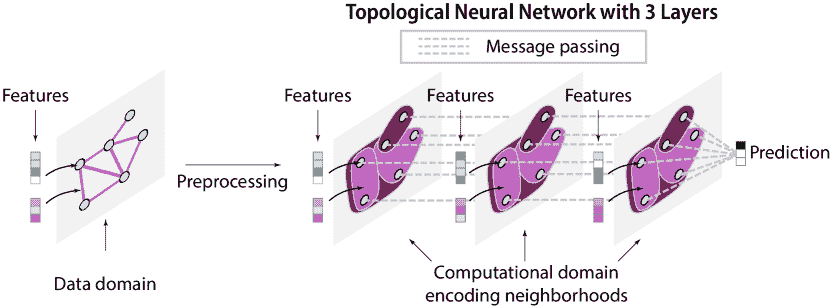

图 1：拓扑神经网络：与复杂系统相关的数据是定义在数据领域上的特征，该领域经过预处理成计算领域，编码系统组件之间的交互和邻域。TNN 的层使用消息传递来连续更新特征并生成输出，例如分类中的类别标签或回归中的定量值。输出代表从输入数据中提取的新知识。

### II-A 领域

在拓扑深度学习（TDL）中，数据是定义在离散领域上的特征 [5, 6]。离散领域的传统示例包括集合和图（图 2，左）。集合是一组称为节点的点，没有任何额外的结构。图是一个具有边的集合，这些边编码节点之间的成对关系，代表几何邻近关系或更抽象的关系。例如，图可以表示一个蛋白质，其中节点编码其原子，边编码它们之间的成对键。或者，图可以表示一个社交网络，其中节点代表个人，边表示社会关系。TDL 的领域将图的成对关系推广到部分-整体和集合类型关系，从而允许表示更复杂的关系结构（图 2，右） [5]。在这里，我们描述了每个领域的关键属性，并突出它们对不同数据类型的适用性。我们建议读者参考 [14] 和 [5] 以获取更详细的讨论。

<svg height="221.28" overflow="visible" version="1.1" width="600"><g transform="translate(0,221.28) matrix(1 0 0 -1 0 0)" fill="#000000" stroke="#000000" stroke-width="0.4pt"><g fill-opacity="1.0" transform="matrix(1.0 0.0 0.0 1.0 21.65 13.78)"><foreignobject width="556.69" height="193.72" transform="matrix(1 0 0 -1 0 16.6)" overflow="visible" color="#000000">超越图：拓扑深度学习的领域 集合 + 成对关系图：一组用边连接的点（节点），这些边表示成对的关系。集合 + 部分-整体关系 简单复形（SC）：图的推广，其中三条边可以形成一个三角面，四个三角形可以形成一个四面体体积，等等。边只连接节点对。细胞复形（CC）：SC 的推广，其中面、体积等不局限于三角形或四面体，而可以是任何形状。尽管如此，边仍然只连接节点对。集合 + 集合类型关系 超图（HG）：图的推广，其中称为超边的高阶边可以连接任意两个或更多节点的集合。集合 + 部分-整体和集合类型关系 组合复形（CCC）：结合了 HG 和 CC 特征的结构。类似于 HG，边可以连接任意数量的节点。类似于 CC，单元可以组合形成更高等级的结构。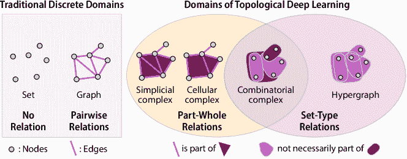

图 2：领域：蓝色的节点，粉色的（超）边，深红色的面。图示改编自[11]。

简单复形（SCs）将图的概念推广到通过多尺度的单元构造来包含层次的部分-整体关系。节点是等级 0 的单元，可以组合形成边（等级 1 的单元）。边反过来又组合形成面（等级 2 的单元），面组合形成体积（等级 3 的单元），依此类推。因此，SC 的面必须是三角形，体积必须是四面体，等等。SC 通常用于编码离散的 3D 几何表面表示，这些表面用三角网格表示（图 3）。它们也可以用于表示更抽象的关系；然而，如果数据不遵守 SC 的严格几何约束，可能会引入虚假的连接——这一点我们在第 II-A2 节中详细阐述。

细胞复杂体（CCs）将简单复形（SCs）推广到细胞不限于单纯形：面可以涉及超过三个节点，体积可以涉及超过四个面，等等。这种灵活性赋予了 CCs 比 SCs 更大的表现力 [8]。实践者在研究具有三个以上节点的部分-整体交互的系统时，应考虑使用这一领域，例如具有苯环的分子（图 3）。

超图（HGs）通过其边，称为超边，能够连接超过两个节点，从而扩展了图的概念。在 HGs 中，连接代表集合型关系，其中参与一个交互的状态并不由系统中的其他关系所暗示。这使得 HGs 成为处理抽象且任意大且同等重要的交互的数据的理想选择，如语义文本和引用网络。蛋白质相互作用网络（图 3）也展现了这一特性：蛋白质之间的相互作用需要一组精确的分子——不多也不少。蛋白质 A、B 和 C 之间的相互作用并不暗示 A 和 B 之间的相互作用。

组合复杂体（CCCs）将组合复杂体（CCs）和超图（HGs）推广到既包括部分-整体关系也包括集合型关系 [11, 5]。这点可以通过分子表示的例子观察到。简单复形和细胞复形的严格几何约束对于捕捉分子中观察到的层级结构过于僵化。相比之下，组合复杂体的灵活但按层级排序的超边能够捕捉到分子结构的全部丰富性，如图 3 所示。这是最新的、最通用的拓扑领域，由 [11] 在 2022 年引入，并在 [5] 中进一步理论化。

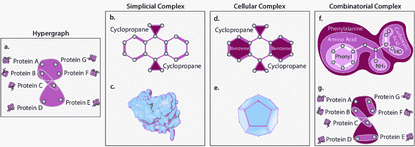

图 3：拓扑领域中的数据示例。(a) 蛋白质网络中的高阶相互作用。(b) 有限的分子表示：环只能包含三个原子。(c) 蛋白质表面的三角网格。(d) 更灵活的分子表示，允许表示任何环状官能团。(e) 包括任意形状面片的灵活网格。(f) 完全灵活的分子表示，允许表示分子及其他自然系统特有的复杂嵌套层级结构。(g) 蛋白质网络中的层次高阶相互作用。

#### II-A1 术语

在离散领域中，我们使用术语“单元”（cell）来表示任何节点或节点之间的关系，例如（超）边、面或体。单元具有两个属性：大小——包含的单元数量——和秩——其中节点的秩为 0，边和超边的秩为 1，面为 2，依此类推。简单和细胞复合体的部分-整体关系对单元的秩和大小之间施加了关系：秩为$r$的单元包含正好（或至少）$r+1$个秩为$r-1$的单元：面（$r=2$）包含正好（或至少）三个边（$r-1=1$）。相比之下，超图单元不编码部分-整体关系，超边的大小可以是任意的。然而，超图单元的秩仅限于 0 和 1。组合复合体在秩和大小上没有限制：节点的秩为 0，任何大小$>$ 1 的单元可以具有任何秩。

数据的固有领域（数据领域）与在 TNN 中处理数据的领域之间存在重要区别：计算领域。例如，定义在图上的数据可能会通过预处理阶段（图 4）被“提升”到另一个领域（图 1）。例如，最初作为原子（节点）和共价键（边）的图表示的蛋白质，可能会提升到一个明确表示其环（面）的 CC 计算领域。在本综述中，领域指的是计算领域。此外，计算领域可能是动态的，在 TNN 中的不同层之间变化。

<svg   height="82.73" overflow="visible" version="1.1" width="600"><g transform="translate(0,82.73) matrix(1 0 0 -1 0 0)" fill="#000000" stroke="#000000" stroke-width="0.4pt"><g fill-opacity="1.0" transform="matrix(1.0 0.0 0.0 1.0 21.65 13.78)"><foreignobject width="556.69" height="55.18" transform="matrix(1 0 0 -1 0 16.6)" overflow="visible" color="#000000">动态域 静态与动态：在 TNN 中，静态域对每一层都是相同的。例如，图中的所有三层 1 都作用于相同的 CCC，只有特征在层间演变。动态域则在层与层之间发生变化。节点可以被添加或移除，边缘可以重新布线，等等。</foreignobject></g></g></svg>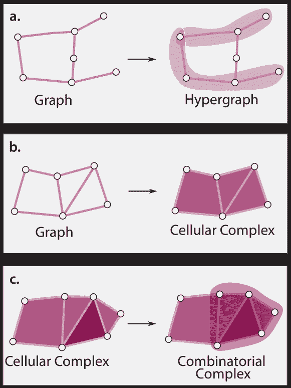

图 4: 提升拓扑域。 (a) 通过添加连接节点组的超边，将图提升为超图。 (b) 通过添加任意形状的面，将图提升为细胞复合体。 (c) 可以向细胞复合体中添加超边，将结构提升为组合复合体。 图源自 [5]。

#### II-A2 局限性

SC 和 CC 的一个重要局限性是面（以及类似的高阶结构）只能形成环；面边界上的节点必须成对连接。在许多情况下，这一要求过于严格，可能会在域中引入人工连接 [17]。例如，将引文网络提升为 SC 必然要求任何一组三位合著者（A, B, C）也必须成对连接（A 和 B，A 和 C，B 和 C），即使 A 和 B、A 和 C 或 B 和 C 没有独立编写的论文。 [17] 提出了一个“放宽”的 SC 定义来解决这个问题。他们展示了在这样的修改域上训练 TNN 如何提高性能。我们注意到，即使有了人工连接，SC 和 CC 仍允许 TNN 利用更丰富的拓扑结构，避免 GNN 所面临的计算问题 [18]。我们进一步指出，任何拓扑域在数学上都等价于一个（可能更大的）图 [19]。我们选择以上述形式表达域，以便为新手提供更好的直观理解，并反映文献中广泛采用的方法。

#### II-A3 域上的特征

考虑一个领域，记作 $\mathcal{X}$，它编码了系统组件之间的关系。领域上的数据以支撑在领域单元格上的特征来表示。通常，特征是 $\mathbb{R}^{d}$ 中的向量，编码每个单元格的属性。例如，特征可能编码分子中的原子（节点）、键（边）和功能团（面）的类型。与一组药物（超边）之间的相互作用相关联的特征可以指示不良反应的概率。

我们用 $\mathbf{h}_{x}^{t,(r)}$ 表示在 TNN 层 $t$ 上支撑在单元格 $x\in\mathcal{X}$ 的特征，$r$ 表示 $x$ 的等级（图 5）。领域被分解为等级，$X^{(r)}$ 或 $r$-骨架，指所有等级为 $r$ 的单元格。特征可以是类别的或定量的。如果特征维度在骨架间变化，领域就是异质的。

<svg   height="71.84" overflow="visible" version="1.1" width="600"><g transform="translate(0,71.84) matrix(1 0 0 -1 0 0)" fill="#000000" stroke="#000000" stroke-width="0.4pt"><g fill-opacity="1.0" transform="matrix(1.0 0.0 0.0 1.0 21.65 13.78)"><foreignobject width="556.69" height="44.28" transform="matrix(1 0 0 -1 0 16.6)" overflow="visible" color="#000000">异质领域的同质性与异质性：在异质领域中，特征 $\mathbf{h}_{x}^{(r)}$ 的维度 $d_{r}$ 依赖于支持它的单元格 $x$ 的等级 $r$。同质领域对所有等级使用相同的维度 $d$。</foreignobject></g></g></svg>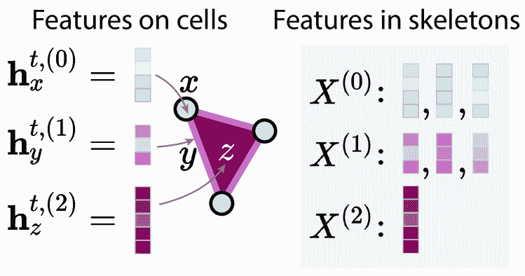

图 5：领域上的特征。左侧：三个单元格上的特征——$x$、$y$ 和 $z$。右侧：整个复杂体的骨架：$X^{(0)}$ 包含节点特征，$X^{(1)}$ 包含边特征，以此类推。

分配给每个单元格的特征可能直接来自数据或由从业人员手动设计。或者，可以在预处理阶段使用嵌入方法分配特征，这些方法计算编码空间局部结构的单元格特征向量。对于图，常用的嵌入方法包括 DeepWalk [20] 和 Node2Vec [21]。最近的研究将这些方法推广到拓扑领域：Hyperedge2Vec [22] 和 Deep Hyperedge [23] 用于超图，Simplex2Vec [24] 和 k-Simplex2Vec [25] 用于单纯形复形，以及 Cell2Vec [26] 用于细胞复形。

### II-B 邻域结构

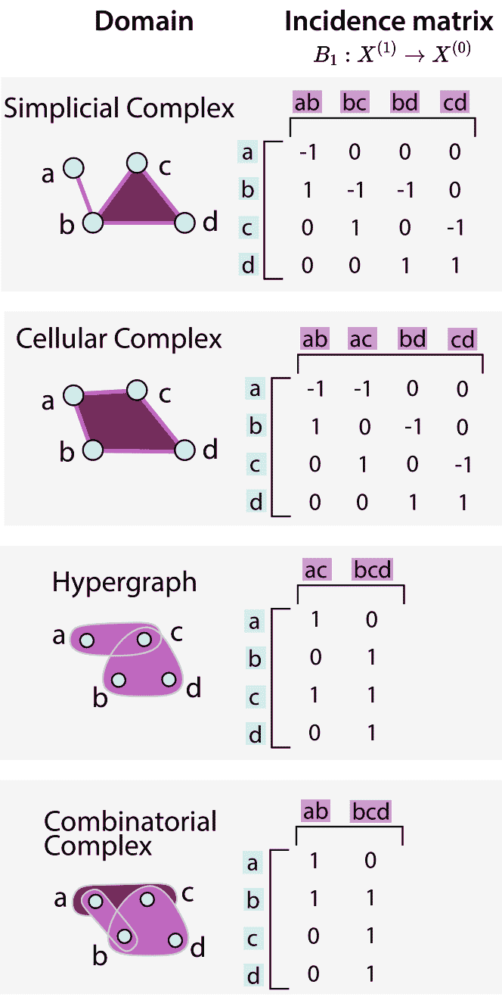

图 6：关联矩阵。展示了一个 SC、一个 CC、一个 HG 和一个 CCC 以及它们对应的边界矩阵 $B_{1}$，这些矩阵将 1-单元映射到 0-单元。SC 和 CC 映射被签名以编码边的方向：在任意排序（a,b,c,d）中首先出现的节点总是被分配 -1。

TNN 通过使用单元之间的邻近概念，逐层更新单元特征：邻域结构（图 1）。邻域结构由边界关系定义，描述了不同排名的单元如何相互关联。一个排名为 $r$ 的单元 $y$ 被称为在排名为 $R$ 的单元 $x$ 的边界上，如果它与 $x$ 连接且 $r<R$。这种关系表示为 $y\prec x$。例如，一个与边连接的节点被称为在该边的边界上。

边界关系在关联矩阵中被编码。具体地，我们用 $B_{r}$ 来表示记录哪些（常规）排名为 $r-1$ 的单元与哪些排名为 $r$ 的单元相绑定的矩阵（图 6）。形式上，$B_{r}$ 是一个大小为 $n_{r-1}\crossproduct n_{r}$ 的矩阵，其中 $n_{r}$ 表示排名为 $r\geq 1$ 的单元数量。

|  | $(B_{r})_{i,j}=\begin{cases}\pm 1&amp;x_{i}^{(r-1)}\prec x_{j}^{(r)}\\ 0&amp;\text{其他情况,}\end{cases}$ |  | (1) |
| --- | --- | --- | --- |

其中 $x_{i}^{(r-1)}$ 和 $x_{j}^{(r)}$ 是分别具有 $r-1$ 和 $r$ 排名的两个单元。$\pm 1$ 的符号编码了 SCs 和 CCs 所需的方向概念 [27, 28]，对于 HGs 和 CCCs 始终为 $+1$。

关联矩阵可以用于编码文献中最常见的四种邻域结构，我们在图 7 中进行了说明，并在下文中定义。这里，$L_{\uparrow,0}$ 表示典型的图拉普拉斯算子。它的高阶推广，即 $r$-Hodge 拉普拉斯算子，记作 $H_{r}=L_{\downarrow,r}+L_{\uparrow,r}$ [12, 29]。$D_{r}\in\mathbb{N}^{n_{r}\crossproduct n_{r}}$ 表示度矩阵，是一个对角矩阵，表示 $r$-单元与 $(r+1)$-单元的连接数量。

<svg   height="287.69" overflow="visible" version="1.1" width="600"><g transform="translate(0,287.69) matrix(1 0 0 -1 0 0)" fill="#000000" stroke="#000000" stroke-width="0.4pt"><g fill-opacity="1.0" transform="matrix(1.0 0.0 0.0 1.0 21.65 13.78)"><foreignobject width="556.69" height="260.14" transform="matrix(1 0 0 -1 0 16.6)" overflow="visible" color="#000000">邻域结构 边界相邻邻域 $\mathcal{B}(y)=\{x\mid x\prec y\}$：

下一级的 $y$-连接 $x$ 单元集。邻域由边界矩阵 $B_{r}$ 指定。例如：与边缘 $y$ 连接的节点集 $x$。共同边界相邻邻域 $\mathcal{C}(y)=\{x\mid y\prec x\}$：

上一级的 $y$-连接 $x$ 单元集。邻域由共同边界矩阵 $B^{T}_{r}$ 指定。例如：与节点 $y$ 连接的边缘集 $x$。下相邻邻域 $\mathcal{L}_{\downarrow}(y)=\{x\mid\exists z$ 使得 $z\prec y$ 且 $z\prec x\}$：

与 $y$ 共享边界 $z$ 的 $x$ 单元集。邻域由下拉普拉斯矩阵 $L_{\downarrow,r}=B_{r}B_{r}^{T}$ 或下邻接矩阵 $A_{\downarrow,r}=D_{r}-L_{\downarrow,r}$ 指定。例如：连接到触及边缘 $y$ 的任何节点 $z$ 的边缘集 $x$。上相邻邻域 $\mathcal{L}_{\uparrow}(y)=\{x\mid\exists z$ 使得 $y\prec z$ 且 $x\prec z\}$：

与 $y$ 共享共同边界 $z$ 的 $x$ 单元集。邻域由上拉普拉斯矩阵 $L_{\uparrow,r}=B_{r+1}^{T}B_{r+1}$ 或上邻接矩阵 $A_{\uparrow,r}=D_{r}-L_{\uparrow,r}$ 指定。

示例：与触及节点 $y$ 的任何边缘 $z$ 触及的节点 $x$ 集合。</foreignobject></g></g></svg>

### II-C 消息传递

消息传递定义了 TNN 单层 $t$ 执行的计算。在消息传递过程中，每个单元的特征 $\mathbf{h_{x}^{t,(r)}}$ 会更新，以包含：（1）其邻域中单元的特征，以及（2）层的可学习参数 $\Theta^{t}$。术语“消息传递”反映了信号在网络中“旅行”，在由邻域结构布置的路径上在单元之间传递。层 $t$ 的输出 $\mathbf{h}^{t+1}$ 成为层 $t+1$ 的输入。通过这种方式，较深的层将信息从更远的单元中整合进来，随着信息在网络中扩散。

#### II-C1 消息传递的步骤

我们将消息传递分解为四个步骤，这些步骤采用了 [5] 的框架。每个步骤用不同的颜色表示——红色、橙色、绿色或蓝色——如图 8 所示。

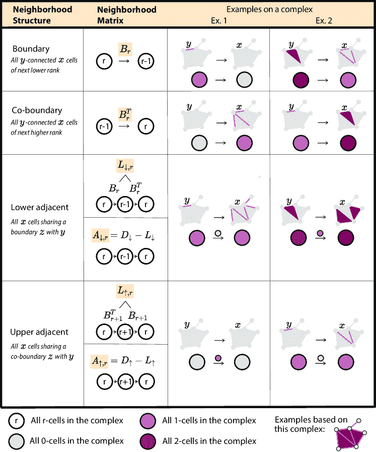

图 7：邻域结构：单元 $x$ 在单元 $y$ 的邻域中的邻域矩阵和示意图。

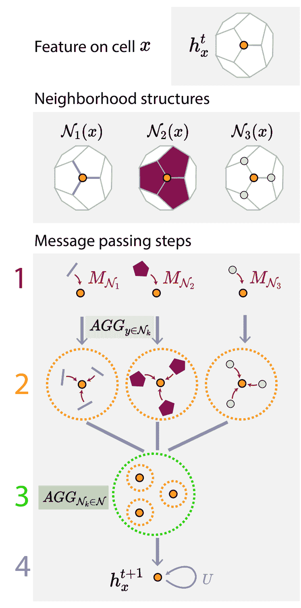

图 8：信息传递步骤：1：信息（红色），2：邻域内聚合（橙色），3：邻域间聚合（绿色），4：更新（蓝色）。该方案将第 $t$ 层 $r$-单元 $x$ 上的特征 $\mathbf{h}_{x}^{t,(r)}$（左列）更新为下一个层次 $t+1$ 上相同单元的特征 $\mathbf{h}_{x}^{t+1,(r)}$（右列）。这里，该方案使用了四种邻域结构 $\mathcal{N}_{k}$，其中 $k\in\{1,2,3,4\}$（中间列）。图源自 [5]。

<svg   height="346.18" overflow="visible" version="1.1" width="600"><g transform="translate(0,346.18) matrix(1 0 0 -1 0 0)" fill="#000000" stroke="#000000" stroke-width="0.4pt"><g fill-opacity="1.0" transform="matrix(1.0 0.0 0.0 1.0 21.65 13.78)"><foreignobject width="556.69" height="318.62" transform="matrix(1 0 0 -1 0 16.6)" overflow="visible" color="#000000">消息传递的步骤 1\. 消息（红色）：首先，一条消息 $m_{y\rightarrow x}^{\left(r^{\prime}\rightarrow r\right)}$ 从 $r^{\prime}$-单元 $y$ 通过 $x$ 的邻域 $k$ 传递到 $r$-单元 $x$，邻域 $k$ 表示为 $\mathcal{N}_{k}(x)$：$\displaystyle{m_{y\rightarrow x}^{\left(r^{\prime}\rightarrow r\right)}}$ $\displaystyle=M_{\mathcal{N}_{k}}\left(\mathbf{h}_{x}^{t,(r)},\mathbf{h}_{y}^{t,(r^{\prime})},\Theta^{t}\right).$（2）通过函数 $M_{\mathcal{N}_{k}}$，该函数在图 8 中用红色表示。在这里，$\textbf{h}_{x}^{t,(r)}$ 和 $\textbf{h}_{y}^{t,(r^{\prime})}$ 是单元 $y$ 和 $x$ 上的维度为 $d_{r}$ 和 $d_{r^{\prime}}$ 的特征，而 $\Theta^{t}$ 是可学习的参数。在最简单的情况下，这一步看起来像一个邻域矩阵 $M$ 将特征 $\mathbf{h}_{y}^{t,(r^{\prime})}$ 从 $r^{\prime}$-单元 $y$ 传播到 $r$-单元 $x$，公式为：$\displaystyle m_{y\rightarrow x}^{\left(r^{\prime}\rightarrow r\right)}$ $\displaystyle=M_{xy}\cdot\textbf{h}_{y}^{t,(r^{\prime})}\cdot\Theta^{t},$（3）其中 $M_{xy}$ 是矩阵 $M$ 中对应单元 $x$ 的行和单元 $y$ 的列的标量条目，而 $m_{y\rightarrow x}^{\left(r^{\prime}\rightarrow r\right)}$ 和 $\Theta$ 是一个 $d_{r^{\prime}}\times d_{r}$ 的矩阵。如果 $y$ 不在 $x$ 的邻域结构中，则 $M_{xy}$ 将为 0，$x$ 无法从 $y$ 接收任何消息。2\. 内部邻域聚合（橙色）：接下来，消息在所有属于邻域 $\mathcal{N}_{k}(x)$ 的单元 $y$ 中被聚合：$\displaystyle{m_{x}^{\left(r^{\prime}\rightarrow r\right)}}$ $\displaystyle=AGG_{y\in\mathcal{N}_{k}(x)}m_{y\rightarrow x}^{\left(r^{\prime}\rightarrow r\right)},$（4）生成内部邻域聚合的消息 $m_{x}^{\left(r^{\prime}\rightarrow r\right)}$。这里，$AGG$ 是一个聚合函数，在图 8 中用橙色表示，类似于标准卷积网络中的池化。3\. 邻域间聚合（绿色）：然后，消息在邻域集 $\mathcal{N}$ 中的邻域间聚合：$\displaystyle{m_{x}^{(r)}}$ $\displaystyle=AGG_{\mathcal{N}_{k}\in\mathcal{N}}m_{x}^{\left(r^{\prime}\rightarrow r\right)},$（5）其中 AGG 是一个（可能不同的）聚合函数，在图 8 中用绿色表示，而 $m_{x}^{(r)}$ 是单元 $x$ 接收到的消息，触发其特征的更新。4\. 更新（蓝色）：最后，通过函数 $U$ 更新单元 $x$ 上的特征，该函数在图 8 中用蓝色表示，可能依赖于单元 $x$ 上的先前特征 $\textbf{h}_{x}^{t,(r)}$：$\displaystyle{\textbf{h}_{x}^{t+1,(r)}}$ $\displaystyle=U\left(\textbf{h}_{x}^{t,(r)},m_{x}^{(r)}\right),$（6）结果 $\textbf{h}_{x}^{t+1,(r)}$ 是更新后的单元 $x$ 特征，将作为 $t+1$ 层的输入。

在本综述中，我们将文献中提出的 TNN 架构的结构分解为这四个消息传递步骤——这是一个统一的符号框架，采用了[5]的方法，使我们能够对比现有的方法。许多架构重复步骤和/或修改其顺序。我们注意到，将消息传递概念化为局部的、单元特定的操作被称为空间方法[30]。在 GNN 和 TNN 中，消息传递也可以用其对偶谱形式表达，通过对领域进行全局傅里叶分析。在本综述中，我们选择将所有方程写成空间形式，以便于理解和通用性[7, 26, 31]。

#### II-C2 张量图

我们用一种改编版的张量图来直观地表示消息传递方案，这种张量图在[11]中介绍，并在[5]中进一步发展。张量图提供了 TNN 架构的图形化表示。图 9 解释了从消息传递步骤构建张量图的过程。

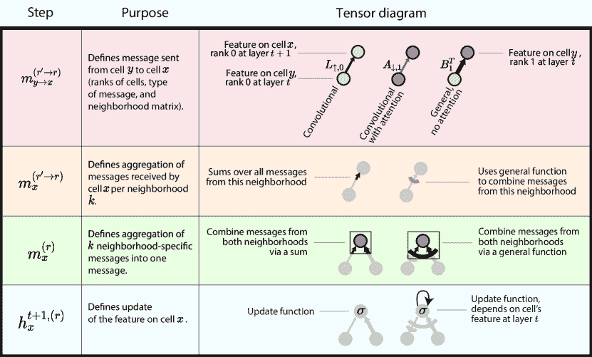

图 9：张量图：消息传递方案的四个步骤的图形符号表示。图示展示了如何将层$t$上的单元$y$的特征$\textbf{h}_{y}^{(t)}$转化为层$t+1$上的单元$x$的特征$\textbf{h}_{x}^{(t+1)}$。

#### II-C3 消息传递函数的类型

步骤 1 中使用的消息传递函数$M_{\mathcal{N}_{k}}$由从业者定义。文献中常用三种函数，如图 10 [32]所述。所用的变种决定了层参数如何加权每个来自单元$y$到单元$x$的消息。标准卷积情况将每条消息乘以某个学习的标量。注意力卷积情况根据相关单元的特征加权这个乘法。一般情况实现了一个可能的非线性函数，可能会或可能不会包含注意力。有些方案还使用固定的、非学习的权重来分配更高阶单元的重要性。图 10 用张量图说明了每种类型。

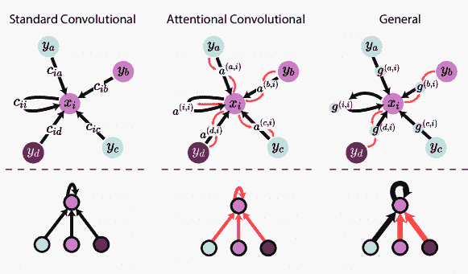

图 10: 消息传递函数的类型。在每种情况下，一个单元 $x_{i}$（一个边）从其各种邻居单元 $y_{j}$（两个节点，一个边和一个面）接收信息。单元 $x_{i}$ 从单元 $y_{j}$ 接收到的消息由特定函数 $c(x_{i},y_{j})$、$a(x_{i},y_{j})$ 或 $g(x_{i},y_{j})$ 决定。顶部: 每个邻域单元 $y_{j}$ 向单元 $x_{i}$ 发送消息。（灵感来自 P. Veličković 和 [32]）。底部: 使用张量图示的上述消息传递方案的说明 [5]。

## III 文献综述

我们现在回顾了关于超图、简单复形、细胞复形和组合复形上拓扑神经网络（TNNs）的文献，使用了 II 节的概念框架。我们总结并比较了 TNNs 的架构（III-A 节）、它们应用的机器学习任务（III-B 节）以及它们的几何属性（III-C 节）。

### III-A 架构

图 11 总结了根据 II 节介绍的基本概念的 TNN 架构，纵轴为领域，横轴为消息传递类型，邻域结构和消息传递方程以张量图示的方式呈现。我们在 github.com/awesome-tnns 分享了每种架构的完整消息传递方程——按照 II-C1 节介绍的四个步骤进行分解，并使用统一符号重新编写。

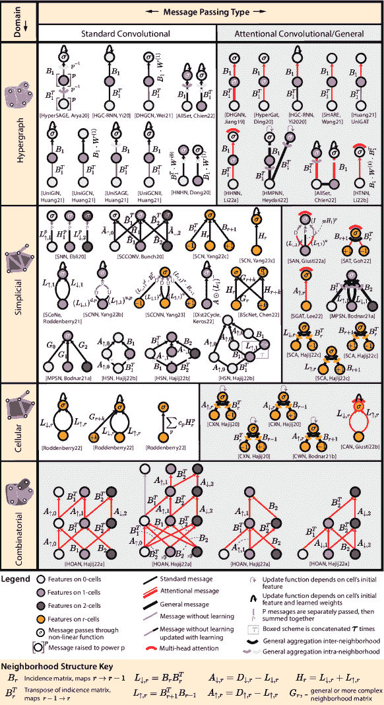

图 11: 拓扑神经网络（TNNs）：图形文献综述。我们根据领域（行）和消息传递类型（列）组织 TNNs。

#### III-A1 超图

在这里考虑的领域中，超图神经网络已经得到了最广泛的研究，并且以前已有综述 [33、34、35、36、37]。早期文献中的许多论文并未使用超图作为计算领域。而是使用如 clique-expansion [38、39、40] 等算法将超图简化为图，然后由模型处理。这种简化对性能产生了不利影响，因为结构信息丢失了 [41、42、43]。许多这样的基于图的模型——包括 HGNN [44]、HyperConv [45]、HyperGCN [46] 和 HNHN [10]——被用作更近期模型的基准，这些模型在计算上直接操作超图。在这里，我们关注的是在学习过程中保持超图结构的模型。

许多超图模型使用由两个阶段组成的消息传递方案，其中信息从节点流向其超边，然后再流回节点。我们称之为两阶段方案。该方案出现在图 11 的许多张量图中，其中信息从蓝色流向粉色（阶段 1），然后从粉色流向蓝色（阶段 2）。该方案用于具有标准和注意力消息传递的模型中。

标准

在使用标准消息传递的模型中，[47]、[48]、[49] 和 [9] 的模型使用了两阶段方案。[48] 在消息传递的第一阶段中独特地使用了可学习的权重矩阵。在第二阶段中，[49] 和 [9] 的 UniGCN 模型在可学习的权重之上独特地使用了固定权重矩阵。在 [50]、[48] 和 [9] 的 UniGNN、UniSAGE 和 UniGCNII 模型中，节点上的初始特征被反复用来更新每个传入消息——在图 11 中用循环黑色箭头表示。我们注意到，[9] 系统性地将一些最流行的 GNN 架构推广到超图上，通过其统一框架：UniGNN。

在[10]中，节点到超边和超边到节点的阶段都使用了固定权重。论文《AllSet》[51]采用了类似的结构，同时结合了完全可学习的多集合函数用于邻域聚合，这赋予了其 TNNs 高度的表达力和通用性。EHNN [52]（由于其复杂性被排除在图 11 之外；见书面方程式）提出了一种最大表达能力的模型，使用稀疏对称张量处理具有均匀大小超边的超图数据。

注意力 / 通用

[53]、[54]、[48]、[36] 以及来自 [9] 的 UniGAT 模型采用了与注意力消息传递相结合的两阶段方案。[55] 和 [56] 的架构应用了多头注意力。[31] 采用了两阶段方案，通过两个并行路径更新节点特征。[51] 和 [52] 提供了其标准架构的基于变换器的变体，同时与 [56] 并行。

#### III-A2 单纯形复合体

从信号处理的角度首次探索了单纯形复合体[57]，初步关注于边流[58, 59]、霍奇拉普拉斯算子[12, 60] 和卷积[61, 62, 63]。作为深度学习的前身，[64] 在 HodgeNet 中引入了 $\mathcal{L}_{\downarrow,1}$ 以学习图上边特征的卷积。这与以前的 GNN 方法处理节点特征形成对比。

标准

[65] (SNN) 和 [66] (SCCONV) 首次将 [64] 的卷积方法推广到支持于更高等级的面和单元上的特征。与 HodgeNet 不同，SNN 和 SCCONV 使用了 $\mathcal{L}_{\downarrow,1}$ 和 $\mathcal{L}_{\uparrow,1}$。在 SNN [65] 中，消息不会在相邻等级之间传递。相比之下，SCCONV 使用独立的边界和共边界邻域，从而整合了来自相邻等级的特征。[67] 还利用了这种多邻域方案来更新和分类边缘特征。他们还提出了一种单邻域方案，包括初始单元的特征。[68] 和 [69] 设计了方案，其中来自 $\mathcal{L}_{\downarrow,1}$ 和 $\mathcal{L}_{\uparrow,1}$ 的消息被分别加权，从而提供了更大的学习灵活性。[69] 通过使用多项式形式的邻域结构，允许特征在领域中经过多次跳跃，利用了来自 [62] 的简约卷积滤波器。[70] 扩展了这个多跳跃模型，增加了额外的邻域结构。[71] 使用了 $\mathcal{L}_{\downarrow}$ 的修改版本来寻找在复杂体中的孔周围缠绕的信号。BSCNet [13] 结合了节点和边级别的移动来预测节点之间的连接。这是第一个在任意等级之间传递消息的模型，利用了伪 Hodge 拉普拉斯算子。

MPSN [7] 在空间域中明确详细地描述了他们的消息传递方案，涵盖了之前从频谱方法描述的模型。[72] 介绍了高跳跃网络（HSNs），其中每一层通过多个连续的高阶消息传递步骤来更新特征，将其“跳跃”到更高的等级，作为传统神经网络中跳跃连接的一种泛化。

注意力机制 / 通用

SAN [73]、SAT [74] 和 SGAT [75] 同时引入了在简约域上的注意力消息传递网络。每个模型都利用了一组独特的邻域结构和注意力系数。SGAT 是目前唯一为一般等级的异质简约复合体开发的模型。[76] 介绍了多种通用消息传递方案，具有两种邻域结构。[7] 使用了所有四种邻域结构，为每种结构提供了一个独立的可学习矩阵和通用聚合函数。

#### III-A3 细胞复杂体

与简约复合体类似，细胞复杂网络也受到了信号处理领域工作的显著影响 [12, 77, 78]。这些研究表明，在 CC 域中表示数据比在更为僵化的 SC 域中获得的结果要好得多。

标准

[78] 提出了理论上可能的消息传递方案，用于受 SC 领域研究启发的 CC。迄今为止，这些模型尚未实现。

注意力/通用

[26] 介绍了首个在 CC 领域理论上定义的 TNN。[8] 是第一个实现并评估该模型的，并展示了 TNN 在 CC 上在表现力和分类测试中超越了最先进的基于图的模型。[79] 的 CAN 模型将 [73] 的消息传递方案的修改版本适应于 CC 领域。

#### III-A4 组合复杂体

组合复杂体领域最近才由 [11] 在数学上定义。这项工作介绍了针对网格和图分类的四种注意力消息传递方案。需要更广泛的分析来量化该领域相对于其他拓扑领域的优势。

### III-B 任务

表 I 回顾了每篇提出 TNN 的论文研究的任务。任务首先被分类为：节点级任务，将标签分配给节点，如节点分类、回归或聚类；边级任务，将标签分配给边，如边分类或链接预测；以及复杂体级任务，将标签分配给每个复杂体作为整体，如超图分类。任务还根据其目的（例如分类、回归、预测）标记。我们还指明了每个模型的基准测试范围和代码可用性。

### III-C 对称性和几何性质

拓扑领域具有对称性和其他几何性质，应予以尊重，以确保 TNN 学习特征的质量 [80]。在这里，我们概述了文献中模型利用的这些性质。

##### 超图。

对于超图，以下对称性是期望的：

1.  1.

    排列不变性：重新标记节点并应用 TNN，得到的输出与未重新标记时获得的原始输出相同。这要求聚合函数具有排列不变性，如均值或总和 [47, 52, 51, 10, 71]。这也称为超图同构不变性。

表 I：拓扑神经网络（TNNs）的应用。我们根据领域和任务级别、任务目的以及基准测试的范围组织论文（图：与基于图的模型相比，GNN SOTA：与 GNN 前沿技术相比，TNN SOTA：与拓扑领域前沿技术相比）。我们排除了没有实现的论文，并使用*表示未共享实现。

| 领域 | 模型 | 任务级别 | 任务目的 | 比较 |
| --- | --- | --- | --- | --- |
|  |  | 节点 | 边 | 复杂体 |  |  |
| HG | HyperSage [47] | ✓ |  |  |

&#124; 分类（归纳 + 演绎） &#124;

| GNN SOTA |
| --- |
|  | AllSet [51] | ✓ |  |  | 分类 | TNN SOTA |
|  | HyperGat [54] | ✓ |  |  | 分类 | GNN SOTA |
|  | HNHN [10] | ✓ | ✓ |  |

&#124; 分类、降维 &#124;

| GNN SOTA |
| --- |
|  | HMPNN* [31] | ✓ |  |  | 分类 | TNN SOTA |
|  | UniGNN [9] | ✓ |  |  |

&#124; 分类（归纳 + 演绎） &#124;

| TNN SOTA |
| --- |
|  | DHGNN [53] | ✓ |  |  |

&#124; 分类（多模态） &#124;

| GNN SOTA |
| --- |
|  | EHNN [52] | ✓ |  |  |

&#124; 分类、关键点匹配 &#124;

| TNN SOTA |
| --- |
|  | HHNN [55] | ✓ |  |  | 链接预测 | TNN SOTA |
|  | HTNN [56] | ✓ |  |  | 分类 | TNN SOTA |
|  | SHARE* [36] | ✓ |  |  | 预测 | GNN SOTA |
|  | DHGCN* [49] |  |  | ✓ | 分类 | GNN SOTA |
|  | HGC-RNN* [48] | ✓ |  |  | 预测 | GNN SOTA |
| SC | MPSN [7] |  | ✓ | ✓ |

&#124; 分类、轨迹分类 &#124;

| GNN SOTA |
| --- |
|  | SCCONV [66] |  |  | ✓ | 分类 | 图 |
|  | BScNet [13] |  | ✓ |  | 链接预测 | GNN SOTA |
|  | SNN [65] |  | ✓ |  | 插补 | 无 |
|  | SAN [73] |  | ✓ |  |

&#124; 分类、轨迹分类 &#124;

| TNN SOTA |
| --- |
|  | SAT [74] |  | ✓ | ✓ |

&#124; 分类、轨迹分类 &#124;

| TNN SOTA |
| --- |
|  | HSN* [72] | ✓ | ✓ | ✓ |

&#124; 分类、链接预测、向量嵌入 &#124;

| 图 |
| --- |
|  | SCA* [76] |  |  | ✓ | 聚类 | 图 |
|  | Dist2Cycle [71] |  | ✓ |  | 同源定位 | GNN SOTA |
|  | SGAT [75] | ✓ |  |  | 分类 | GNN SOTA |
|  | SCoNe [68] |  | ✓ |  | 轨迹分类 | TNN SOTA |
|  | SCNN* [62] |  | ✓ |  | 插补 | TNN SOTA |
|  | SCCNN [70] |  | ✓ |  |

&#124; 链接预测、轨迹分类 &#124;

| TNN SOTA |
| --- |
|  | SCN [67] |  | ✓ |  | 分类 | TNN SOTA |
| CC | CWN [8] |  | ✓ | ✓ |

&#124; 分类、预测、回归 &#124;

| GNN SOTA |
| --- |
|  | CAN [79] |  |  | ✓ | 分类 | GNN SOTA |
| CCC | HOAN* [11] |  | ✓ | ✓ | 分类 | GNN SOTA |

1.  2.

    全球邻域不变性：网络对节点的表示对超边的基数是不变的：连接多个节点的超边与连接较少节点的超边具有相同的权重 [47]。

##### Simplicial Complex.

对于单纯形复形，考虑了以下对称性：

1.  1.

    排列不变性：对节点重新标记的不变性；与 HGs 相同。[29, 68, 7]

1.  2.

    定向等变性：改变单纯形复形的定向（即在关联矩阵中翻转符号）会相应地重新定向该网络的输出[29, 68, 7]。

1.  3.

    单纯形局部性（几何属性）：在每一层中，消息仅在$r$-单元和$(r\pm 1)$-单元之间传递[29]。如果该属性未得到验证，并且消息可以在任何$r$-单元和$r^{\prime}$-单元之间传递，则网络具有扩展的单纯形局部性。

此外，可以施加单纯形意识，使得在最大单元秩$r$的单纯形复形上的消息传递依赖于每一个秩$r^{\prime}\leq r$[68]。

##### 细胞复形和组合复形。

排列不变性被定义为 CCs[8]和 CCCs[11]，与 SCs 和 HGs 相同。除了将全局邻域不变性推广到 CCC 之外，还需要更多的研究来理解能够为这一通用拓扑领域提供装备的对称性。

## 第四部分 讨论

我们的文献综述揭示了 TNN 架构的多样性及其主要比较轴。展望未来，我们突出了四个显著的发展机会。

##### 域内和域间基准测试。

表Ⅰ 显示了域选择与 TNN 的任务水平之间的强相关性。这使得域内比较变得困难，无论是否共享代码。我们还强调，许多 TNN 仅与基于图的模型或其各自领域中的早期模型进行基准测试，这使得域间比较同样困难。随着领域的发展，改善域内和域间基准测试机制将对更好地指导模型选择和量化进展至关重要。

##### TNN 架构在一般领域中的应用。

HGs 和 SCs 上的实现多样性表明细胞和组合领域有很大的类似发展潜力。例如，目前仅提出了一个注意力 CC 模型[79]。此外，任何之前开发的 HG/SC/CC 模型都可以在 CCC 领域中重现，并且如果需要，可以通过更大的灵活性进行改进。评估这种附加灵活性的影响将直接表征在深度学习中更丰富的拓扑结构的实用性。

##### 连接到图论文献。

HG 领域与图形社区的联系导致了基于 GNN 的进展尚未扩展到其他领域。第一个例子是动态领域，HG 在姿态估计[81]、轨道交通建模[82]和合著预测[53]等任务上取得了成功。其他离散领域尚未探索动态性。此外，在 HG 领域之外，TNNs 主要作为同质网络实现。这为异质和非欧几里得的推广留出了空间。

##### 更深入地探讨。

过度平滑发生在网络在多个层次上过于有效地聚合信号时。这导致细胞之间特征非常相似，并且在下游学习任务上表现不佳。虽然这个问题在图形社区引起了关注[83, 84, 18]，但这些工作很少被推广到 TNNs，导致它们仍然主要是浅层的。UniGCNII [9]通过将 GNNs [85]的过度平滑解决方案推广到 HG 领域，实现了 64 层深的 TNN。HSNs [72]将跳跃连接推广到允许信号传播更远，但仍然作为浅层网络实现。

## V 结论

在这项工作中，我们通过统一的符号和图示提供了对 TNNs 进展的全面、直观和批判性视角。我们通过数据领域和模型的选择来表征每个神经网络，并进一步通过选择邻接结构和消息传递方案来加以说明。我们希望这篇综述能使这些丰富的工作更容易被那些领域受益于拓扑敏感深度学习的从业者所接受。

## 致谢

这项工作得到了国家科学基金会资助，资助号 2134241。

## VI 参考文献部分

## 参考文献

+   [1] D. Knoke 和 S. Yang，*社会网络分析*。SAGE 出版社，2019 年。

+   [2] K. Jha, S. Saha, 和 H. Singh，“使用图神经网络预测蛋白质–蛋白质相互作用”，*Scientific Reports*，第 12 卷，第 1 期，页码 1–12，2022 年。

+   [3] M. M. Bronstein, J. Bruna, T. Cohen, 和 P. Veličković，“几何深度学习：网格、群体、图形、测地线和量规”，*arXiv 预印本 arXiv:2104.13478*，2021 年。

+   [4] J. Zhou, G. Cui, S. Hu, Z. Zhang, C. Yang, Z. Liu, L. Wang, C. Li, 和 M. Sun，“图神经网络：方法和应用综述”，*AI Open*，第 1 卷，页码 57–81，2020 年。

+   [5] M. Hajij, G. Zamzmi, T. Papamarkou, N. Miolane, A. Guzmán-Sáenz, K. N. Ramamurthy, T. Birdal, T. Dey, S. Mukherjee, S. Samaga, N. Livesay, R. Walters, P. Rosen, 和 M. Schaub，“拓扑深度学习：超越图数据”，*arXiv 预印本 arXiv:1906.09068 (v3)*，2023 年。

+   [6] C. Bodnar，“拓扑深度学习：图形、复形、层叠”，博士论文，Apollo - 剑桥大学存储库，2022 年。[在线]. 可用: https://www.repository.cam.ac.uk/handle/1810/350982

+   [7] C. Bodnar, F. Frasca, Y. Wang, N. Otter, G. F. Montufar, P. Lio 和 M. Bronstein，“Weisfeiler 和 Lehman 走向拓扑：消息传递简单复形网络，”在*国际机器学习会议*。PMLR，2021 年，页码 1026–1037。

+   [8] C. Bodnar, F. Frasca, N. Otter, Y. Wang, P. Lio, G. F. Montufar 和 M. Bronstein，“Weisfeiler 和 Lehman 走向细胞：CW 网络，”*神经信息处理系统进展*，第 34 卷，页码 2625–2640，2021 年。

+   [9] J. Huang 和 J. Yang，“Unignn: 图神经网络与超图神经网络的统一框架，”在*第三十届国际联合人工智能会议论文集，IJCAI-21*，2021 年。

+   [10] Y. Dong, W. Sawin 和 Y. Bengio，“Hnhn: 带有超边神经元的超图网络，”*ICML 图表示学习及其他研讨会*，2020 年。[在线] 可用：https://arxiv.org/abs/2006.12278

+   [11] M. Hajij, G. Zamzmi, T. Papamarkou, N. Miolane, A. Guzmán-Sáenz 和 K. N. Ramamurthy，“高阶注意力网络，”*arXiv 预印本 arXiv:2206.00606 (v1)*，2022 年。

+   [12] S. Barbarossa 和 S. Sardellitti，“简单复形上的拓扑信号处理，”*IEEE 信号处理学报*，第 68 卷，页码 2992–3007，2020 年。

+   [13] Y. Chen, Y. R. Gel 和 H. V. Poor，“Bscnets: 块简单复形神经网络，”在*AAAI 人工智能会议论文集*，第 36 卷，2022 年，页码 6333–6341。

+   [14] L. Torres, A. S. Blevins, D. Bassett 和 T. Eliassi-Rad，“复杂系统表示的原因、方法和时机，”*SIAM 评论*，第 63 卷，第 3 期，页码 435–485，2021 年。

+   [15] F. Battiston, E. Amico, A. Barrat, G. Bianconi, G. Ferraz de Arruda, B. Franceschiello, I. Iacopini, S. Kéfi, V. Latora, Y. Moreno *等*，“复杂系统中高阶交互的物理学，”*自然物理学*，第 17 卷，第 10 期，页码 1093–1098，2021 年。

+   [16] F. Hensel, M. Moor 和 B. Rieck，“拓扑机器学习方法综述，”*人工智能前沿*，第 4 卷，2021 年。[在线] 可用：https://www.frontiersin.org/articles/10.3389/frai.2021.681108

+   [17] R. Yang, F. Sala 和 P. Bogdan，“高阶数据的高效表示学习与简单复形，”在*首届图学习会议论文集*，机器学习研究论文集，B. Rieck 和 R. Pascanu 编，卷 198。PMLR，2022 年 12 月 09–12 日，页码 13:1–13:21。

+   [18] T. K. Rusch, M. M. Bronstein 和 S. Mishra，“图神经网络中的过度平滑调查，”2023 年。

+   [19] P. Veličković，“消息传递一路到底，”*arXiv 预印本 arXiv:2202.11097*，2022 年。

+   [20] B. Perozzi, R. Al-Rfou 和 S. Skiena，“Deepwalk: 社会表征的在线学习，”在*第 20 届 ACM SIGKDD 国际知识发现与数据挖掘会议论文集*，2014 年，页码 701–710。

+   [21] A. Grover 和 J. Leskovec, “node2vec: 可扩展的网络特征学习方法，” 出自 *第 22 届 ACM SIGKDD 国际知识发现与数据挖掘会议论文集*, 2016, 页码 855–864.

+   [22] A. Sharma, S. Joty, H. Kharkwal, 和 J. Srivastava, “Hyperedge2vec: 超边分布式表示方法,” 2018.

+   [23] J. Payne, “深度超边：超图的跨式学习和感知学习框架,” *arXiv 预印本 arXiv:1910.02633*, 2019.

+   [24] J. C. W. Billings, M. Hu, G. Lerda, A. N. Medvedev, F. Mottes, A. Onicas, A. Santoro, 和 G. Petri, “用于单纯形复合体社区检测的 Simplex2vec 嵌入方法,” *arXiv 预印本 arXiv:1906.09068*, 2019.

+   [25] C. Hacker, “k-simplex2vec: node2vec 的单纯形扩展方法,” *arXiv 预印本 arXiv:2010.05636*, 2020.

+   [26] M. Hajij, K. Istvan, 和 G. Zamzmi, “单纯形复合体神经网络,” *NeurIPS 2020 研讨会 TDA and Beyond*, 2020.

+   [27] M. Aschbacher, “组合单纯形复合体,” 出自 *代数组合学进展*.   日本数学学会, 1996, 页码 1–80.

+   [28] R. Klette, “时空中的单纯形复合体,” 出自 *视觉几何学 IX*, vol. 4117.   SPIE, 2000, 页码 134–145.

+   [29] M. T. Schaub, Y. Zhu, J.-B. Seby, T. M. Roddenberry, 和 S. Segarra, “高阶网络信号处理：生活在边缘并超越”，*信号处理*, vol. 187, 页码 108149, 2021.

+   [30] J. Gilmer, S. S. Schoenholz, P. F. Riley, O. Vinyals, 和 G. E. Dahl, “量子化学的神经信息传递方法”， 出自 *国际机器学习会议*.   PMLR, 2017, 页码 1263–1272.

+   [31] S. Heydari 和 L. Livi, “超图的消息传递神经网络,” 出自 *第 31 届国际人工神经网络会议第 II 部分*, 编者 E. Pimenidis, P. P. Angelov, C. Jayne, A. Papaleonidas, 和 M. Aydin, vol. 13530.   Springer, 2022, 页码 583–592.

+   [32] M. Bronstein, “超越信息传递：图神经网络的物理启发范式”， 2022 年 5 月。[在线]. 可访问：https://thegradient.pub/graph-neural-networks-beyond-message-passing-and-weisfeiler-lehman/

+   [33] T. Ling, Z. Jinchuan, Z. Jinhao, Z. Wangtao, 和 Z. Xue, “知识图谱综述：表示、构建、推理和知识超图理论 [j],” *计算机应用*, vol. 41, no. 08, 页码 2161–2186, 2021.

+   [34] Y. Gao, Z. Zhang, H. Lin, X. Zhao, S. Du, 和 C. Zou, “超图学习：方法与实践,” *IEEE 模式分析与机器智能交易*, vol. 44, no. 5, 页码 2548–2566, 2022.

+   [35] B.-D. Hu, X.-G. Wang, X.-Y. Wang, M.-L. Song, 和 C. Chen, “超图学习综述：算法分类与应用分析,” *软件杂志*, vol. 33, no. 2, 页码 498–523, 2021.

+   [36] J. Wang, K. Ding, Z. Zhu, 和 J. Caverlee, “基于超图注意力网络的基于会话的推荐方法,” 出自 *2021 SIAM 国际数据挖掘会议论文集 (SDM)*.   SIAM, 2021, 页码 82–90.

+   [37] M. T. Fischer, A. Frings, D. A. Keim, 和 D. Seebacher, “静态和动态超图可视化调查，” 在 *2021 IEEE 可视化会议（VIS）* 中。 IEEE，2021，第 81–85 页。

+   [38] J. Y. Zien, M. D. Schlag, 和 P. K. Chan, “具有任意顶点大小的多级光谱超图分区，” *IEEE 计算机辅助集成电路与系统设计学报*，第 18 卷，第 9 期，第 1389–1399 页，1999。

+   [39] S. Agarwal, J. Lim, L. Zelnik-Manor, P. Perona, D. Kriegman, 和 S. Belongie, “超越成对聚类，” 在 *2005 IEEE 计算机学会计算机视觉与模式识别会议（CVPR’05）* 中，第 2 卷。 IEEE，2005，第 838–845 页。

+   [40] D. Zhou, J. Huang, 和 B. Schölkopf, “超图学习：聚类、分类和嵌入，” *神经信息处理系统进展*，第 19 卷，2006。

+   [41] M. Hein, S. Setzer, L. Jost, 和 S. S. Rangapuram, “超图上的总变差——超图学习再探，” *神经信息处理系统进展*，第 26 卷，2013。

+   [42] G. Li, L. Qi, 和 G. Yu, “对称张量的 z-eigenvalues 及其在光谱超图理论中的应用，” *Numerical Linear Algebra with Applications*，第 20 卷，第 6 期，第 1001–1029 页，2013。

+   [43] I. E. Chien, H. Zhou, 和 P. Li, “$hs2$: 基于超图的主动学习，涉及逐点和成对查询，” 在 *第 22 届人工智能与统计国际会议* 中。 PMLR，2019，第 2466–2475 页。

+   [44] Y. Feng, H. You, Z. Zhang, R. Ji, 和 Y. Gao, “超图神经网络，” 在 *AAAI 人工智能会议论文集* 中，第 33 卷，2019，第 3558–3565 页。

+   [45] S. Bai, F. Zhang, 和 P. H. Torr, “超图卷积和超图注意力，” *模式识别*，第 110 卷，第 107637 页，2021。

+   [46] N. Yadati, M. Nimishakavi, P. Yadav, V. Nitin, A. Louis, 和 P. Talukdar, “Hypergcn：一种用于超图的图卷积网络训练的新方法，” *神经信息处理系统进展*，第 32 卷，2019。

+   [47] D. Arya, D. K. Gupta, S. Rudinac, 和 M. Worring, “Hypersage：在超图上的归纳表示学习的推广，” *arXiv 预印本 arXiv:2010.04558*，2020。

+   [48] J. Yi 和 J. Park, “超图卷积递归神经网络，” 在 *第 26 届 ACM SIGKDD 国际知识发现与数据挖掘会议论文集* 中，2020，第 3366–3376 页。

+   [49] J. Wei, Y. Wang, M. Guo, P. Lv, X. Yang, 和 M. Xu, “基于骨架的动作识别的动态超图卷积网络，” *arXiv 预印本 arXiv:2112.10570*，2021。

+   [50] D. Arya, S. Rudinac, 和 M. Worring, “Hyperlearn：一种用于多模态数据集的分布式表示学习方法，” 在 *第 27 届 ACM 国际多媒体会议论文集* 中，2019，第 2245–2253 页。

+   [51] E. Chien, C. Pan, J. Peng, 和 O. Milenkovic，“你已经准备好了：一个用于超图神经网络的多集函数框架，” 收录于 *国际学习表征会议*，2022 年。 [在线]. 可用: https://openreview.net/forum?id=hpBTIv2uy_E

+   [52] J. Kim, S. Oh, S. Cho, 和 S. Hong，“等变超图神经网络，” 收录于 *计算机视觉–ECCV 2022: 第 17 届欧洲会议，特拉维夫，以色列，2022 年 10 月 23–27 日，论文集，第 XXI 部分*。Springer，2022 年，第 86–103 页。

+   [53] J. Jiang, Y. Wei, Y. Feng, J. Cao, 和 Y. Gao，“动态超图神经网络，” 收录于 *国际人工智能联合会议论文集*，2019 年。

+   [54] K. Ding, J. Wang, J. Li, D. Li, 和 H. Liu，“以少胜多：用于归纳文本分类的超图注意力网络，” 收录于 *2020 年自然语言处理实证方法会议（EMNLP）论文集*。在线：计算语言学协会，2020 年 11 月，第 4927–4936 页。[在线]. 可用: https://aclanthology.org/2020.emnlp-main.399

+   [55] Y. Li, Z. Fan, J. Zhang, D. Shi, T. Xu, D. Yin, J. Deng, 和 X. Song，“用于好友推荐的异质超图神经网络与人类迁徙，” 收录于 *第 31 届 ACM 国际信息与知识管理会议论文集*，2022 年，第 4209–4213 页。

+   [56] M. Li, Y. Zhang, X. Li, Y. Zhang, 和 B. Yin，“超图变换器神经网络，” *ACM 数据知识发现学报（TKDD）*，2022 年。

+   [57] F. Battiston, G. Cencetti, I. Iacopini, V. Latora, M. Lucas, A. Patania, J.-G. Young, 和 G. Petri，“超越配对交互的网络：结构与动态，” *物理学报告*，第 874 卷，第 1–92 页，2020 年。

+   [58] X. Jiang, L.-H. Lim, Y. Yao, 和 Y. Ye，“统计排序和组合 Hodge 理论，” *数学编程*，第 127 卷，第 1 期，第 203–244 页，2011 年。

+   [59] M. T. Schaub 和 S. Segarra，“流量平滑和去噪：边缘空间中的图信号处理，” 收录于 *2018 年 IEEE 全球信号与信息处理大会（GlobalSIP）*。IEEE，2018 年，第 735–739 页。

+   [60] M. T. Schaub, A. R. Benson, P. Horn, G. Lippner, 和 A. Jadbabaie，“简化复形上的随机游走与标准化 Hodge 1-Laplacian，” *SIAM 评论*，第 62 卷，第 2 期，第 353–391 页，2020 年。

+   [61] M. Yang, E. Isufi, M. T. Schaub, 和 G. Leus，“用于简化复形的有限冲激响应滤波器，” 收录于 *2021 年第 29 届欧洲信号处理会议（EUSIPCO）*。IEEE，2021 年，第 2005–2009 页。

+   [62] ——, “简化卷积滤波器，” *IEEE 信号处理学报*，第 70 卷，第 4633–4648 页，2022 年。

+   [63] E. Isufi 和 M. Yang，“简化复形中的卷积滤波，” 收录于 *ICASSP 2022-2022 IEEE 国际声学、语音与信号处理会议（ICASSP）*。IEEE，2022 年，第 5578–5582 页。

+   [64] T. M. Roddenberry 和 S. Segarra, “Hodgenet：用于边缘数据的图神经网络，” 见于 *2019 年第 53 届 Asilomar 信号、系统与计算会议*。 IEEE，2019 年，第 220–224 页。

+   [65] S. Ebli, M. Defferrard, 和 G. Spreemann, “简化神经网络，” 见于 *TDA & Beyond*，2020 年。

+   [66] E. Bunch, Q. You, G. Fung, 和 V. Singh, “简化 2-复形卷积神经网络，” 见于 *TDA & Beyond*，2020 年。

+   [67] R. Yang, F. Sala, 和 P. Bogdan, “针对高阶数据的高效表示学习与简化复形，” 见于 *图学习会议*。 PMLR，2022 年，第 13–1 页。

+   [68] T. M. Roddenberry, N. Glaze, 和 S. Segarra, “用于轨迹预测的有原则的简化神经网络，” 见于 *国际机器学习会议*。 PMLR，2021 年，第 9020–9029 页。

+   [69] M. Yang, E. Isufi, 和 G. Leus, “简化卷积神经网络，” 见于 *ICASSP 2022-2022 IEEE 国际声学、语音与信号处理会议（ICASSP）*。 IEEE，2022 年，第 8847–8851 页。

+   [70] M. Yang 和 E. Isufi, “在简化复形上的卷积学习，” *arXiv 预印本 arXiv:2301.11163*，2023 年。

+   [71] A. D. Keros, V. Nanda, 和 K. Subr, “Dist2cycle: 一种用于同调定位的简化神经网络，” 见于 *AAAI 人工智能会议论文集*，第 36 卷，2022 年，第 7133–7142 页。

+   [72] M. Hajij, K. N. Ramamurthy, A. Guzmán-Sáenz, 和 G. Za, “高跳跃网络：跳跃连接的高阶推广，” 见于 *ICLR 2022 几何和拓扑表示学习工作坊*，2022 年。

+   [73] L. Giusti, C. Battiloro, P. Di Lorenzo, S. Sardellitti, 和 S. Barbarossa, “简化注意力网络，” *arXiv 预印本 arXiv:2203.07485*，2022 年。

+   [74] C. W. J. Goh, C. Bodnar, 和 P. Lio, “简化注意力网络，” *arXiv 预印本 arXiv:2204.09455*，2022 年。

+   [75] S. H. Lee, F. Ji, 和 W. P. Tay, “Sgat: 简化图注意力网络，” 见于 *国际人工智能联合会议*，2022 年。

+   [76] M. Hajij, G. Zamzmi, T. Papamarkou, V. Maroulas, 和 X. Cai, “简化复形表示学习，” 见于 *第 15 届 ACM 国际 WSDM（2022）会议 MLoG 工作坊，WSDM2022-MLoG；会议日期：2022 年 2 月 21 日至 2022 年 2 月 25 日*，2022 年 1 月。

+   [77] S. Sardellitti, S. Barbarossa, 和 L. Testa, “在单元复形上的拓扑信号处理，” 见于 *2021 年第 55 届 Asilomar 信号、系统与计算会议*。 IEEE，2021 年，第 1558–1562 页。

+   [78] T. M. Roddenberry, M. T. Schaub, 和 M. Hajij, “在单元复形上的信号处理，” 见于 *ICASSP 2022-2022 IEEE 国际声学、语音与信号处理会议（ICASSP）*。 IEEE，2022 年，第 8852–8856 页。

+   [79] L. Giusti, C. Battiloro, L. Testa, P. Di Lorenzo, S. Sardellitti, 和 S. Barbarossa, “单元注意力网络，” *arXiv 预印本 arXiv:2209.08179*，2022 年。

+   [80] M. M. Bronstein, J. Bruna, Y. LeCun, A. Szlam, 和 P. Vandergheynst，“几何深度学习：超越欧几里得数据，” *IEEE 信号处理杂志*，第 34 卷，第 4 期，页码 18–42，2017 年。

+   [81] S. Liu, P. Lv, Y. Zhang, J. Fu, J. Cheng, W. Li, B. Zhou, 和 M. Xu，“用于三维姿态估计的半动态超图神经网络。” 在*IJCAI*，2020 年，页码 782–788。

+   [82] J. Wang, Y. Zhang, Y. Wei, Y. Hu, X. Piao, 和 B. Yin， “通过动态超图卷积网络进行地铁客流预测，” *IEEE 智能交通系统汇刊*，第 22 卷，第 12 期，页码 7891–7903，2021 年。

+   [83] D. Chen, Y. Lin, W. Li, P. Li, J. Zhou, 和 X. Sun，“从拓扑视角测量和缓解图神经网络的过平滑问题，” 在*AAAI 人工智能会议论文集*，第 34 卷，2020 年，页码 3438–3445。

+   [84] K. Oono 和 T. Suzuki，“图神经网络在节点分类中指数性地丧失表达能力，” 在*国际学习表征会议*，2020 年。[在线]. 可用： https://openreview.net/forum?id=S1ldO2EFPr

+   [85] M. Chen, Z. Wei, Z. Huang, B. Ding, 和 Y. Li，“简单而深度的图卷积网络，” 在*国际机器学习大会*，PMLR，2020 年，页码 1725–1735。
