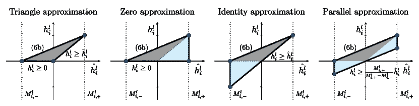

<!--yml

类别：未分类

日期：2024-09-06 19:40:16

-->

# [2305.00241] 当深度学习遇上多面体理论：综述

> 来源：[`ar5iv.labs.arxiv.org/html/2305.00241`](https://ar5iv.labs.arxiv.org/html/2305.00241)

# 当深度学习遇上多面体理论：综述

Joey Huchette

谷歌研究，美国    冈萨洛·穆尼奥斯

奥伊金斯大学，智利    迭戈·塞拉

巴克内尔大学，美国    卡尔文·蔡

伦敦帝国学院，英国（2023 年 9 月）

###### 摘要

在过去的十年里，深度学习由于深度神经网络在计算机视觉和自然语言处理等任务中的显著准确性，成为预测建模的主要方法。同时，神经网络的结构回归到基于分段常数和分段线性函数的简单表示，例如整流线性单元（ReLU），这成为神经网络中最常用的激活函数。这使得某些类型的网络结构——例如典型的全连接前馈神经网络——能够通过多面体理论进行分析，并应用线性规划（LP）和混合整数线性规划（MILP）等方法用于各种目的。在本文中，我们回顾了这一快速发展的领域中出现的主要主题，这为更详细地理解神经网络以及应用线性优化技术来训练、验证和缩减这些网络的规模提供了全新的视角。

## 1 引言

在过去十年里，深度学习在人工智能的各个领域不断取得新进展。这些领域的例子包括计算机视觉中的预测任务（Krizhevsky 等，2012，Ciresan 等，2012，Szegedy 等，2015，He 等，2016，Xie 等，2020b），自然语言处理（Sutskever 等，2014，Peters 等，2018，Radford 等，2018，Devlin 等，2019），以及语音识别（Hinton 等，2012，Graves 和 Jaitly，2014，Park 等，2019）。这些成就背后的人工神经网络被广泛应用，并且对分析洞察的兴趣不断增长，以帮助设计这些网络并利用它们所学到的模型。对于最常用的神经网络类型，这些结果和方法有些来源于运筹学工具，如多面体理论及相关的优化技术，如线性规划（LP）和混合整数线性规划（MILP）。这些与数学优化的联系可能帮助我们深入了解神经网络可以表示的内容、如何训练它们以及如何使其更加紧凑。例如，考虑分类图像这一常见任务（图 1）；多面体理论及相关的优化技术可能帮助我们解答以下问题。我们应该如何训练分类器模型？它应该有多大？对扰动的鲁棒性如何？

图 1：MNIST 手写数字数据库中的分类任务示例，其中输入为手写数字的图像，输出为该数字属于每个可能类别的概率。

### 1.1 神经网络可以建模的内容

我们可以基本上将人工神经网络视为将输入${\bm{x}}$从给定领域映射到输出${\bm{y}}$的函数，用于特定应用。在图 1 中的分类任务中，输入${\bm{x}}$对应于数据集中的图像，而${\bm{y}}$对应于与这些图像内容相关的预测标签或标签概率。神经网络的基本单元模拟生物神经元，因为它们接收来自相邻单元的输入，转换这些输入，并可能将输出传递给网络的后续单元。换句话说，每个单元也是一个函数，事实上，大多数单元的输出是通过将非线性函数与线性函数组合来定义的。非线性函数通常被称为*激活函数*，类似于生物神经元在输入的刺激超过某一激活阈值时被触发以向相邻神经元发送信号的方式。这种非线性是神经网络卓越表达能力的基础。

这一模型由麦卡洛克和皮茨（1943）首次提出，他们考虑了一种激活的阈值函数，现在通常称为线性阈值单元（LTU）。该激活函数也是经典的*感知器*算法的基础，由罗森布拉特（1957）提出，该算法生成一个形式为二分类器

|  | $f({\bm{x}})=\left\{\begin{array}[]{cl}1&amp;\text{如果 }{\bm{w}}\cdot{\bm{x}}+b>0;\\ 0&amp;\text{否则}\end{array}\right.$ |  | (1) |
| --- | --- | --- | --- |

对于输入${\bm{x}}\in\mathbb{R}^{n_{0}}$，以及参数${\bm{w}}\in\mathbb{R}^{n_{0}}$和$b\in\mathbb{R}$。这些参数是通过优化给定任务的预测来选择的，如下文和第五部分所讨论的。*单层感知器*这一术语用于描述由一组并行处理相同输入的单元组成的神经网络。*多层感知器*这一术语用于描述该概念的推广，其中一个*层*——一组具有相同输入的单元——的输出是后续层的输入。这种感知器术语也被宽泛地应用于具有其他激活函数的神经网络。

更一般地说，通过一系列有序层依次转换输入的神经网络也称为*前馈网络*。那些不产生神经网络最终输出的层称为*隐层*。对于一个有$L$层的网络，我们将$n_{l}$表示为第$l$层的单元数量——或*宽度*——$l\in{\mathbb{L}}:=\{1,2,\ldots,L\}$，$h_{i}^{l}$表示第$l$层中第$i$个单元的输出，其中$i\in\{1,2,\ldots,n_{l}\}$。一个单元的输出由以下公式给出：

|  | $h_{i}^{l}=\sigma^{l}\left({\bm{w}}^{l}_{i}\cdot{\bm{h}}^{l-1}+b^{l}_{i}\right),$ |  | (2) |
| --- | --- | --- | --- |

其中，*权重* ${\bm{w}}^{l}_{i}\in\mathbb{R}^{n_{l-1}}$ 和 *偏置* $b^{l}_{i}\in\mathbb{R}$ 是该单元的参数。这些参数可以在层内汇总为矩阵 ${\bm{W}}^{l}\in\mathbb{R}^{n_{l}\times n_{l-1}}$ 和向量 ${\bm{b}}^{l}\in\mathbb{R}^{n_{l}}$。向量 ${\bm{h}}^{l-1}\in\mathbb{R}^{n_{l-1}}$ 表示来自层 $(l-1)$ 的汇总输出。激活函数 $\sigma^{l}:\mathbb{R}\rightarrow\mathbb{R}$ 由第 $l$ 层的单元应用。这些定义隐含地假设 $n_{0}$ 是网络输入 ${\bm{x}}\in\mathbb{R}^{n_{0}}$ 的大小，并且 ${\bm{h}}^{0}$ 和 ${\bm{x}}$ 是相同的。图 2 说明了上述前馈网络的操作。

图 2: 通过具有 $L$ 层、层宽度 $\{n_{l}\}_{l\in{\mathbb{L}}}$ 和激活函数 $\{\sigma_{l}\}_{l\in{\mathbb{L}}}$ 的前馈神经网络，将 ${\bm{x}}\in\mathbb{R}^{n_{0}}$ 映射到 ${\bm{y}}\in\mathbb{R}^{n_{L}}$。

### 1.2 神经网络的获取与评估

与机器学习中其他*监督学习*模型的获取方式类似，我们可以通过调整神经网络的行为以适应*训练集*的例子来*训练*一个神经网络，然后在*测试集*上评估最终训练好的网络。这两个数据集都包含了已知正确输出$\hat{y}$的输入。我们可以定义一个目标函数来衡量输出$y$和正确输出$\hat{y}$之间的距离，这通常被称为*损失函数*，然后迭代更新参数，如$\{{\bm{W}}^{l}\}_{l\in{\mathbb{L}}}$和$\{{\bm{b}}^{l}\}_{l\in{\mathbb{L}}}$，以最小化训练集上的损失函数。一个常见的目标函数是平方误差$\|y-\hat{y}\|^{2}$，它在训练集中的所有点上进行求和。测试集包含一组独立的输入及其输出，用于评估在训练过程中未见过的例子的训练神经网络。测试集上的良好表现可能表明训练好的神经网络能够*泛化*超越已见的例子，而差的表现可能表明它对训练集*过拟合*。神经网络还具有*超参数*，这些超参数通常是手动选择的，并且在训练过程中不会改变，例如*深度* $L$、层的宽度$\{n_{l}\}_{l\in{\mathbb{L}}}$和每层使用的激活函数$\{\sigma^{l}\}_{l\in{\mathbb{L}}}$。通过改变超参数可以产生不同的模型。在这种情况下，可以使用与训练集和测试集不同的*验证集*来比较具有不同超参数的模型。虽然验证集可以作为不同训练模型的基准，这些模型对应于不同的超参数选择，但测试集只能用于评估在验证集上评估的那些神经网络中的一个。新兴领域*神经架构搜索*——最近由 Elsken 等人(2019)进行的调研——涉及自动选择这些超参数。

深度学习成功的一个关键因素是可以有效地应用一阶方法进行连续优化，从而训练深度网络。对神经网络的兴趣最初因**Minsky**和**Papert**在《感知机》一书中的负面结果而消失（1969），书中表明单层感知机无法表示像布尔异或这样的函数。然而，转向能够表示布尔异或以及其他更具表现力的模型的多层感知机则需要巧妙的训练策略。因此，随着**Rumelhart**等人（1986）和**LeCun**等人（1989）等论文推广了*反向传播*的使用，兴趣得以恢复。请注意，反向传播算法最早由**Linnainmaa**（1970）在网络上下文中讨论过，而**Werbos**（1974）则明确讨论了神经网络中的反向传播。反向传播算法通过在神经网络的各个单元中应用链式法则来计算损失函数相对于每个神经网络参数的导数，这比显式计算每个网络参数的导数要高效得多。因此，神经网络通常使用梯度下降方法进行训练，其中参数在每一步中从输出层到输入层逐步更新。事实上，大多数神经网络训练算法基于随机梯度下降（SGD），这是一种由**Robbins**和**Monro**（1951）开创的通过采样进行的随机近似形式。SGD 通过仅使用数据子集来逼近损失函数的偏导数，以提高训练过程的效率。流行的 SGD 算法包括动量（**Polyak**，1964）、Adam（**Kingma**和**Ba**，2014）和 Nesterov 自适应梯度（**Sutskever**等人，2013）——后者受到**Nesterov**（1983）的启发。有趣的是，由于损失函数的非凸性，我们通常无法保证梯度下降法收敛到全局最优解。然而，使用适当参数化的 SGD 算法训练的神经网络往往能很好地泛化。

### 1.3 为什么非线性在人工神经元中很重要

激活函数的非线性导致了损失函数的非凸性。然而，正如我们将在第三部分中看到的，这种非线性使神经网络能够整体表示更复杂的函数。事实上，通过使用恒等激活函数 $\sigma^{l}(u)=u~{}\forall l\in{\mathbb{L}}$，去除这种非线性将使整个神经网络简化为形式为 $f(x)={\bm{W}}^{L}({\bm{W}}^{L-1}\left(\ldots\left({\bm{W}}^{2}\left({\bm{W}}^{1}x+{\bm{b}}^{1}\right)+{\bm{b}}^{2}\right)+\ldots\right)+{\bm{b}}^{L-1})+{\bm{b}}^{L}$ 的仿射变换。因此，没有非线性激活函数的前馈网络相当于线性回归模型。然而，在这种情况下，我们可以轻松地获得这样的模型，而无需依赖神经网络和反向传播：损失函数是凸的，最优解由一个封闭公式给出，例如在最小二乘回归中。相比之下，具有单个隐藏层的任意宽度的神经网络长期以来被认为是广泛激活函数的通用函数近似器（Cybenko，1989，Funahashi，1989，Hornik 等，1989），以及最近的 ReLU（Yarotsky，2017）。这些结果也已扩展到宽度有限但深度任意大的反向情况（Lu 等，2017，Hanin 和 Sellke，2017，Park 等，2021a）。

尽管非线性激活函数对于获得更复杂的模型很重要，但这些函数不需要过于复杂即可产生良好的结果。过去，使用 sigmoid 函数作为激活函数是一种常见做法（LeCun et al., 1998）。这些函数是单调递增的，对于任意大的正负输入，都会趋近于有限值，例如标准 logistic 函数 $\sigma(u)=\frac{1}{1+e^{-u}}$ 和双曲正切函数 $\sigma(u)=\tanh(u)$。目前，最常用的激活函数是修正线性单元（ReLU） $\sigma(u)=\max\{0,u\}$（LeCun et al., 2015, Ramachandran et al., 2018），该函数由 Hahnloser et al. (2000) 提出，并由 Nair and Hinton (2010) 首次应用于神经网络。ReLU 的流行部分归功于 Nair and Hinton (2010) 和 Glorot et al. (2011) 的实验，这些实验表明这种简单形式的激活函数能够产生竞争力的结果。从生物神经元的类比角度考虑，我们说当输出为正时 ReLU 是 *活跃的*，当输出为零时则是 *不活跃的*。ReLU 在与同一 ReLU 活跃和不活跃相关的输入上具有线性输出行为；这一特性也适用于其他作为神经网络激活函数的分段线性和分段常数函数。表 1 列出了这些常用激活函数中的一些。有关激活函数的更全面列表，包括基于 ReLU 的几种其他变体，请参见 Dubey et al. (2021) 和 Tao et al. (2022)。

表 1：主要的分段常数和分段线性激活函数。

| 名称 | 函数 | 参考文献 |
| --- | --- | --- |
| LTU | $\sigma(u)=\left\{\begin{array}[]{cl}1&amp;\text{if }u>0\\ 0&amp;\text{if }u\leq 0\end{array}\right.$ | McCulloch and Pitts (1943) |
| ReLU | $\sigma(u)=\max\{0,u\}$ | Hahnloser et al. (2000), Nair and Hinton (2010) |

| leaky ReLU | <math alttext="\begin{array}[]{c}\sigma(u)=\left\{\begin{array}[]{cl}u&amp;\text{if }u>0\\ \varepsilon u&amp;\text{if }u\leq 0\end{array}\right.\\

\text{($\varepsilon$ 是小且固定的)}\end{array}" display="inline"><semantics ><mtable rowspacing="0pt"  ><mtr ><mtd ><mrow  ><mrow ><mi >σ</mi><mo lspace="0em" rspace="0em" >​</mo><mrow ><mo stretchy="false" >(</mo><mi >u</mi><mo stretchy="false" >)</mo></mrow></mrow><mo >=</mo><mrow ><mo >{</mo><mtable columnspacing="5pt" rowspacing="0pt" ><mtr ><mtd  ><mi >u</mi></mtd><mtd columnalign="left"  ><mrow ><mrow ><mtext >如果 </mtext><mo lspace="0em" rspace="0em"  >​</mo><mi >u</mi></mrow><mo >></mo><mn >0</mn></mrow></mtd></mtr><mtr ><mtd ><mrow ><mi >ε</mi><mo lspace="0em" rspace="0em" >​</mo><mi >u</mi></mrow></mtd><mtd columnalign="left"  ><mrow ><mrow ><mtext >如果 </mtext><mo lspace="0em" rspace="0em"  >​</mo><mi >u</mi></mrow><mo >≤</mo><mn >0</mn></mrow></mtd></mtr></mtable></mrow></mrow></mtd></mtr><mtr ><mtd ><mrow  ><mtext >(</mtext><mi >ε</mi><mtext > 是小且固定的)</mtext></mrow></mtd></mtr></mtable><annotation-xml encoding="MathML-Content" ><matrix  ><matrixrow ><apply ><apply  ><ci >𝜎</ci><ci >𝑢</ci></apply><apply ><csymbol cd="latexml"  >cases</csymbol><matrix ><matrixrow ><ci >𝑢</ci><apply ><apply ><ci ><mtext >如果 </mtext></ci><ci >𝑢</ci></apply><cn type="integer" >0</cn></apply></matrixrow><matrixrow ><apply ><ci >𝜀</ci><ci >𝑢</ci></apply><apply ><apply ><ci ><mtext >如果 </mtext></ci><ci >𝑢</ci></apply><cn type="integer"  >0</cn></apply></matrixrow></matrix></apply></apply></matrixrow><matrixrow ><ci ><mrow  ><mtext >(</mtext><mi >ε</mi><mtext > 是小且固定的)</mtext></mrow></ci></matrixrow></matrix></annotation-xml><annotation encoding="application/x-tex" >\begin{array}[]{c}\sigma(u)=\left\{\begin{array}[]{cl}u&\text{如果 }u>0\\ \varepsilon u&\text{如果 }u\leq 0\end{array}\right.\\ \text{($\varepsilon$ 是小且固定的)}\end{array}</annotation></semantics></math> | Maas 等人 (2013) |

| 参数化 ReLU | <math   alttext="\begin{array}[]{c}\sigma(u)=\left\{\begin{array}[]{cl}u&\text{如果 }u>0\\ \varepsilon u&\text{如果 }u\leq 0\end{array}\right.\\

\text{($a$ 是一个可训练参数)}\end{array}" display="inline"><semantics ><mtable rowspacing="0pt"  ><mtr ><mtd ><mrow  ><mrow ><mi >σ</mi><mo lspace="0em" rspace="0em" >​</mo><mrow ><mo stretchy="false" >(</mo><mi >u</mi><mo stretchy="false" >)</mo></mrow></mrow><mo >=</mo><mrow ><mo >{</mo><mtable columnspacing="5pt" rowspacing="0pt" ><mtr ><mtd  ><mi >u</mi></mtd><mtd columnalign="left"  ><mrow ><mrow ><mtext >如果 </mtext><mo lspace="0em" rspace="0em"  >​</mo><mi >u</mi></mrow><mo >></mo><mn >0</mn></mrow></mtd></mtr><mtr ><mtd ><mrow ><mi >a</mi><mo lspace="0em" rspace="0em" >​</mo><mi >u</mi></mrow></mtd><mtd columnalign="left"  ><mrow ><mrow ><mtext >如果 </mtext><mo lspace="0em" rspace="0em"  >​</mo><mi >u</mi></mrow><mo >≤</mo><mn >0</mn></mrow></mtd></mtr></mtable></mrow></mrow></mtd></mtr><mtr ><mtd ><mrow  ><mtext >(</mtext><mi >a</mi><mtext > 是一个可训练参数)</mtext></mrow></mtd></mtr></mtable><annotation-xml encoding="MathML-Content" ><matrix  ><matrixrow ><apply ><apply  ><ci >𝜎</ci><ci >𝑢</ci></apply><apply ><csymbol cd="latexml"  >cases</csymbol><matrix ><matrixrow ><ci >𝑢</ci><apply ><apply ><ci ><mtext >如果 </mtext></ci><ci >𝑢</ci></apply><cn type="integer" >0</cn></apply></matrixrow><matrixrow ><apply ><ci >𝑎</ci><ci >𝑢</ci></apply><apply ><apply ><ci ><mtext >如果 </mtext></ci><ci >𝑢</ci></apply><cn type="integer"  >0</cn></apply></matrixrow></matrix></apply></apply></matrixrow><matrixrow ><ci ><mrow  ><mtext >(</mtext><mi >a</mi><mtext > 是一个可训练参数)</mtext></mrow></ci></matrixrow></matrix></annotation-xml><annotation encoding="application/x-tex" >\begin{array}[]{c}\sigma(u)=\left\{\begin{array}[]{cl}u&\text{如果 }u>0\\ au&\text{如果 }u\leq 0\end{array}\right.\\ \text{($a$ 是一个可训练参数)}\end{array}</annotation></semantics></math> | He 等人 (2015) |

| 硬 tanh | <math   alttext="\sigma(u)=\left\{\begin{array}[]{cl}1&amp;\text{如果 }u>1\\ u&amp;\text{如果 }-1\leq u\leq 1\\

\(\sigma(u)=\left\{\begin{array}[]{cl}1&\text{如果 }u>1\\ u&\text{如果 }-1\leq u\leq 1\\ -1&\text{如果 }u<-1\end{array}\right.\)

| 硬 sigmoid | <math alttext="\sigma(u)=\left\{\begin{array}[]{cl}1&amp;\text{如果 }u>\frac{1}{2}\\ u+\frac{1}{2}&amp;\text{如果 }-\frac{1}{2}\leq u\leq\frac{1}{2}\\

0&\text{如果 }u<-\frac{1}{2}\end{array}\right." display="inline"><semantics ><mrow  ><mrow ><mi >σ</mi><mo lspace="0em" rspace="0em" >​</mo><mrow  ><mo stretchy="false"  >(</mo><mi >u</mi><mo stretchy="false" >)</mo></mrow></mrow><mo >=</mo><mrow ><mo  >{</mo><mtable columnspacing="5pt" rowspacing="0pt"  ><mtr ><mtd ><mn  >1</mn></mtd><mtd columnalign="left"  ><mrow ><mrow ><mtext >如果 </mtext><mo lspace="0em" rspace="0em" >​</mo><mi >u</mi></mrow><mo >></mo><mfrac ><mn >1</mn><mn >2</mn></mfrac></mrow></mtd></mtr><mtr ><mtd ><mrow  ><mi >u</mi><mo >+</mo><mfrac ><mn >1</mn><mn >2</mn></mfrac></mrow></mtd><mtd columnalign="left"  ><mrow ><mrow ><mtext >如果 </mtext><mo >−</mo><mfrac ><mn >1</mn><mn >2</mn></mfrac></mrow><mo >≤</mo><mi >u</mi><mo >≤</mo><mfrac ><mn  >1</mn><mn >2</mn></mfrac></mrow></mtd></mtr><mtr ><mtd ><mn  >0</mn></mtd><mtd columnalign="left"  ><mrow ><mrow ><mtext >如果 </mtext><mo lspace="0em" rspace="0em" >​</mo><mi >u</mi></mrow><mo ><</mo><mrow ><mo >−</mo><mfrac ><mn >1</mn><mn >2</mn></mfrac></mrow></mrow></mtd></mtr></mtable></mrow></mrow><annotation-xml encoding="MathML-Content" ><apply ><apply  ><ci >𝜎</ci><ci >𝑢</ci></apply><apply ><csymbol cd="latexml" >cases</csymbol><matrix ><matrixrow  ><cn type="integer"  >1</cn><apply ><apply ><ci ><mtext >如果 </mtext></ci><ci >𝑢</ci></apply><apply ><cn type="integer" >1</cn><cn type="integer" >2</cn></apply></apply></matrixrow><matrixrow ><apply ><ci  >𝑢</ci><apply ><cn type="integer" >1</cn><cn type="integer"  >2</cn></apply></apply><apply ><apply ><apply  ><ci ><mtext >如果 </mtext></ci><apply ><cn type="integer"  >1</cn><cn type="integer"  >2</cn></apply></apply><ci >𝑢</ci></apply><apply ><apply ><cn type="integer" >1</cn><cn type="integer" >2</cn></apply></apply></apply></matrixrow><matrixrow ><cn type="integer" >0</cn><apply ><apply  ><ci ><mtext >如果 </mtext></ci><ci >𝑢</ci></apply><apply ><apply ><cn type="integer"  >1</cn><cn type="integer"  >2</cn></apply></apply></apply></matrixrow></matrix></apply></apply></annotation-xml><annotation encoding="application/x-tex" >\sigma(u)=\left\{\begin{array}[]{cl}1&\text{如果 }u>\frac{1}{2}\\ u+\frac{1}{2}&\text{如果 }-\frac{1}{2}\leq u\leq\frac{1}{2}\\ 0&\text{如果 }u<-\frac{1}{2}\end{array}\right.</annotation></semantics></math> | Courbariaux 等人 (2015) |

| 最大池化 | $\begin{array}[]{c}\sigma(u_{1},\ldots,u_{k})=\max\{0,u_{1},\ldots,u_{k}\}\\ \text{（每个 $u_{i}$ 是另一个神经元的输出）}\end{array}$ | Weng 等人 (1992) |
| --- | --- | --- |
| 最大输出 | $\begin{array}[]{c}\sigma(u_{1},\ldots,u_{k})=\max\{u_{1},\ldots,u_{k}\}\\ \text{（每个 $u_{i}$ 是一个仿射函数）}\end{array}$ | Goodfellow 等人 (2013) |

### 1.4 当深度学习遇上多面体理论

在机器学习中，通常认为如果一个更简单的模型能够像更复杂的模型一样训练好，那么更简单的模型是更受欢迎的，因为更简单的模型不容易过拟合。幸运的是，神经网络成功地回归到相对简单的激活函数，为深度学习与多面体理论的结合奠定了基础。换句话说，我们现在可以通过与运筹学中用于线性和离散优化的相同视角和工具来分析和利用神经网络。我们在第二部分中更详细地解释了这种联系及其开启的一些研究方向。

### 1.5 本调查的范围及相关工作

数学优化和机器学习之间的相互作用也已在其他最近的调查中讨论过。Bengio 等人（2021）回顾了机器学习在数学优化中的应用，而 Gambella 等人（2021）则以获取机器学习模型为主要焦点来形式化数学优化问题，例如通过训练神经网络。Curtis 和 Scheinberg（2017）以及 Bottou 等人（2018）之前也有类似的范围进行过调查。我们的调查通过专注于神经网络，同时概述了如何在这个背景下更广泛地使用线性优化，从网络训练和验证到模型嵌入和压缩，以及通过形式化强化进行的改进，来补充这些调查。此外，我们还说明了多面体理论如何为这些线性形式的使用奠定基础，并提供对神经网络区分能力的更细致理解。

本调查中的演示以*前馈整流网络*为中心。这些网络非常常见，仅使用 ReLU 激活函数，对于它们，大多数多面体结果和线性优化应用都已知。专注于单一类型的神经网络旨在帮助读者捕捉不同发展的直觉并理解其中的细微差别。尽管我们专注于*全连接*模型，即每个单元都与后续层的所有单元连接，但仍有许多有趣的变体具有较少或不同类型的连接，可以被解释为全连接模型的特例。例如，卷积神经网络（CNNs 或 ConvNets）（Fukushima，1980）的单元具有局部连接性：仅相邻单元的子集定义了下一层中每个单元的输出，并且相同的参数用于定义不同单元的输出。实际上，可以通过下一层中不同单元的输出将多个*滤波器*参数应用于一组相邻单元。CNNs 通常用于识别和汇聚图像中不同部分的相同局部特征，我们可以将它们解释为前馈网络的特例。另一个常见的变体，残差网络（ResNet）（He et al., 2016），包括*跳跃连接*，直接连接非相邻层中的单元。这些连接可以通过在中间层传递它们的输出来模拟。因此，调查中讨论的许多结果和应用也适用于其他变体（例如，LTU 和 maxout 激活，或其他连接模式），我们还提供了涉及它们的更具体结果和应用的参考。

我们还讨论了其他变体在多大程度上仍然相关或可以通过相同的视角进行分析。例如，*反馈连接*在*递归网络*（Little，1974，Hopfield，1982）中允许一个单元的输出作为前一层单元的输入。递归网络如长短期记忆（LSTM）（Hochreiter 和 Schmidhuber，1997）产生依赖于其内部状态的输出，因此它们可以处理任意长度的序列输入。尽管反馈连接无法通过前馈网络进行模拟，我们将在接下来的段落中讨论递归网络如何被成功替代为使用前馈网络实现的注意力机制。在仍然相关的变体领域中，通常会对网络的输出层应用不同类型的激活，例如层级 softmax 函数 $\sigma:\mathbb{R}^{n_{L}}\rightarrow\mathbb{R}^{n_{L}}$，其中 $\sigma(u)_{i}=e^{u_{i}}/\sum_{j=1}^{n_{L}}e^{u_{j}}~{}\forall i\in\{1,\ldots,n_{L}\}$（Bridle，1990），用于将多维输出归一化为概率分布。虽然 softmax 不是分段线性的，我们描述了如何从多面体的角度分析其输出。

##### 深度学习的其他应用

深度学习不仅被用于监督学习的领域，也应用于机器学习的其他方面。在*无监督学习*中，重点是从未标记的数据集中推断出结论。例如，生成对抗网络（GANs）（Goodfellow 等，2014）被用来通过一对神经网络生成真实感的图像。这些网络中的一个是*判别器*，它被训练来识别数据集中的元素，另一个是*生成器*，旨在用合成输入误导判别器，使其将这些输入归类为属于数据集。

在*强化学习*中，重点是建模能够通过动作和相关奖励与环境互动的代理。这样的应用实例包括用于自驾车导航的神经网络（Gao 等，2020）和用于玩 Atari 游戏的神经网络（Mnih 等，2015），以及现代电子游戏如 Dota 2（OpenAI 等，2019）和 StarCraft II（Vinyals 等，2017），还有围棋（Silver 等，2017），这些游戏在某些水平上可以与人类玩家相媲美或更胜一筹。

一个较新且流行的例子是生成型变换器（Radford 等，2018），例如 DALL·E 2（Ramesh 等，2022）在 2022 年中期从文本提示生成逼真的图像，以及 ChatGPT（OpenAI，2022）在 2023 年初与用户生成逼真的对话，后者属于快速增长的大型语言模型家族。它们基于用注意力机制替代基于反馈连接的架构，如 LSTM，注意力机制旨在评分过去状态的相关性（Bahdanau 等，2015），这是变换器架构的基础（Vaswani 等，2017）。

##### 深入阅读

关于神经网络的历史视角，我们推荐 Schmidhuber (2015)。关于深度学习基础的最新和广泛的介绍，我们推荐 Zhang 等 (2023)。有关神经网络模型复杂性的其他测量形式，请参考 Hu 等 (2021)。

## 2 多面体视角

一个前馈整流网络建模了一个分段线性函数（Arora 等，2018），其中每一段都是一个多面体（Raghu 等，2017），并且在建模分段多项式的神经网络中代表一个特殊的情况（Balestriero 和 Baraniuk，2018）。因此，训练一个整流网络等同于进行分段线性回归，我们可以潜在地根据它们建模的每一段函数的表现来解释这些神经网络。然而，我们还只是开始回答由此类观察引发的一些问题。在这项调查中，我们讨论了关于这一主题的见解如何帮助我们回答以下问题。

1.  1.

    哪些分段线性函数可以或不能通过训练神经网络根据其架构获得？

1.  2.

    哪些神经网络更容易受到对抗性攻击的利用？

1.  3.

    我们能否将神经网络学习到的模型整合到一个更广泛的决策问题中，以找到一个最优解？

1.  4.

    是否可以获得一个模型完全相同函数的更小神经网络？

1.  5.

    我们能否在训练阶段利用神经网络中存在的多面体几何？

1.  6.

    我们能否在训练神经网络时有效地融入额外的结构，例如对权重的线性约束？

第一个问题补充了神经网络的通用逼近结果。也就是说，当计算资源有限被转化为实际应用中层深度和宽度的约束时，可以良好逼近的函数是有限的。可以建模的函数依赖于特定的超参数选择，这些超参数受限于可用的计算资源，从长远来看，这可能也会导致比当前的神经架构搜索方法更为有原则的超参数选择方法。在第三部分中，我们分析了整流网络如何将输入空间划分为在其中线性行为的区域，我们称之为*线性区域*。我们讨论了线性区域的几何形状、参数和超参数对神经网络线性区域数量的影响，以及这种线性区域数量与网络准确性之间的关系。

第二个问题依赖于形式化验证方法来评估神经网络的鲁棒性，这可以通过数学优化公式来解决，这些公式也与第三个和第四个问题相关。这些公式很方便，因为直接检查神经网络建模的每一个功能块是不现实的，因为其数量随着网络规模的扩大而迅速增长。网络在每种激活和非激活单元的选择下的线性行为意味着我们可以使用带有二进制变量的线性公式来通过 MILP 对训练后的神经网络进行建模。因此，我们能够解决多种优化问题，例如神经网络验证问题、识别网络中每个 ReLU 的输出范围，以及将训练后的神经网络建模为更大决策问题的一部分。在第四部分中，我们讨论了如何在训练后的神经网络上制定优化问题，这些公式的应用，以及朝着获得更强的公式的进展，这些公式能更容易地与网络规模匹配。

第五个和第六个问题涉及深度神经网络的训练过程，其中应用了线性规划工具来部分回答这些问题。在第五部分中，我们概述了这些进展。关于第五个问题——在训练神经网络时利用多面体性——我们描述了使用激活集诱导的多面体几何来解决训练问题的算法。我们还介绍了最近提出的一种多面体构造，它可以大致编码多个训练问题，显示出在固定架构下，不同数据集产生的训练问题之间的强关系。此外，我们回顾了一些最近在训练阶段使用混合整数线性规划作为替代 SGD 的方法，当权重需要为整数时。关于第六个问题——在训练过程中引入额外结构——我们回顾了包括与线性规划相关的技术在 SGD 中以施加期望结构或在执行 SGD 时找到更好步长的多种方法。

## 3 神经网络的线性区域

神经网络建模的分段线性函数的每一部分都是一个线性区域，而且——没有损失的一般性——我们可以将其视为一个多面体。在本节中，我们定义了线性区域，举例说明了它们为何如此众多，以及可能影响神经网络中线性区域数量的因素。我们还讨论了这些见解的实际意义，以及其他与分析神经网络表示能力相关的形式。

###### 定义 1

线性区域对应于输入空间中激活神经网络中相同单元的点集，因此可以通过在每层$l\in{\mathbb{L}}$中激活的单元集${\mathbb{S}}^{l}$来描述。

由于神经网络在一个线性区域内表现一致，因此线性区域是分析其行为的最小有限尺度。如果我们将神经网络的定义域限制在一个线性区域 ${\mathbb{I}}\subseteq\mathbb{R}^{n_{0}}$，那么神经网络表现为形式为 ${\bm{y}}_{\mathbb{I}}:{\mathbb{I}}\rightarrow\mathbb{R}^{n_{L}}$ 的仿射变换 ${\bm{y}}_{\mathbb{I}}({\bm{x}})={\bm{T}}{\bm{x}}+{\bm{t}}$，其中矩阵 ${\bm{T}}\in\mathbb{R}^{n_{L}\times n_{0}}$ 和向量 ${\bm{t}}\in\mathbb{R}^{n_{L}}$ 直接由网络参数和由任何输入 ${\bm{x}}\in{\mathbb{I}}$ 激活的神经元集合定义。对于某个输入 $\overline{{\bm{x}}}\in{\mathbb{I}}$ 的小扰动 $\varepsilon$，使得 $\overline{{\bm{x}}}+\varepsilon\in{\mathbb{I}}$，网络输出为 ${\bm{y}}_{\mathbb{I}}(\overline{{\bm{x}}}+\varepsilon)$。虽然以这种方式定义的两个相邻区域可能对应于相同的仿射变换，但将每个线性区域视为具有独特的激活单元签名使得分析它们更容易。

神经网络定义的线性区域数量是一种衡量其表示模型复杂度的形式（Bengio，2009）。因此，如果需要更复杂的模型，我们可能希望设计一个可以定义更多线性区域的神经网络。一方面，线性区域的数量可能随着神经网络深度的增加而呈指数增长。另一方面，这种数量取决于网络参数和超参数之间的相互作用。考虑到如何评估相邻线性区域的输入，对仿射变换的变化可以用代数和几何术语来描述。理解这些变化可能有助于我们掌握神经网络如何区分其输入，包括模型复杂度的来源。

对于激活函数不是分段线性的神经网络，Bianchini 和 Scarselli（2014）使用了更复杂的拓扑度量来比较浅层和深层神经网络的表达能力。Hu 等人（2020b）通过生成一个线性近似神经网络来跟进，其中线性区域的数量可以被计数。

### 3.1 线性区域的组合方面

分析神经网络线性区域的一个最引人注目的方面是这种数量增长的速度。Pascanu 等人（2014）和 Montúfar 等人（2014）在早期的工作中得出了两个重要的观察结果。首先，可能构造出简单的深度神经网络，其线性区域数量随着深度的增加而指数增长。其次，线性区域的数量仅在神经元的数量上也可以是指数级的。

第一个观察来自于在一个非常简单的设置中分析 ReLU 的作用。即在一个神经网络中，我们将每一层视为有一个在 $[0,1]$ 范围内的输入，该输入是通过组合前一层单元的输出生成的，如示例 1 所示。

###### 示例 1

考虑一个输入为 $x$ 的神经网络，输入域为 $[0,1]$，且层具有 4 个带有 ReLU 激活的神经元。对于第一层，假设神经元的输出由以下函数给出：$f_{1}(x)=\max\{4x,0\}$，$f_{2}(x)=\max\{8x-2,0\}$，$f_{3}(x)=\max\{6.5x-3.25,0\}$，和 $f_{4}(x)=\max\{12.5x-11.25,0\}$。换句话说，${\bm{h}}^{1}_{i}=f_{i}(x)~{}\forall i\in\{1,2,3,4\}$。对于随后的层，假设来自前一层的输出通过函数 $F(x)=f_{1}(x)-f_{2}(x)+f_{3}(x)-f_{4}(x)$ 进行组合，该函数将 $x$ 替换为下一层的输入；然后同样的函数集 $\{f_{i}(x)\}_{i=1}^{4}$ 定义了下一层的输出。换句话说，${\bm{h}}^{l}_{i}=f_{i}(F({\bm{h}}^{l-1}))=f_{i}({h}_{1}^{l-1}-{h}_{2}^{l-1}+{h}_{3}^{l-1}-{h}_{4}^{l-1})~{}\forall i\in\{1,2,3,4\},l\in{\mathbb{L}}\setminus\{1\}$。

当第一层单元的输出组合为 $F(x)$ 时，我们得到一个在 $[0,1]$ 范围内具有 4 个斜率的锯齿状函数，每个斜率定义了输入区间的一个双射 —即 $[0,0.25]$、$[0.25,0.5]$、$[0.5,0.9]$ 和 $[0.9,1.0]$— 和图像 $[0,1]$ 之间的对应关系。将这种结构在第二层中重复的效果是将 $F(x)$ 与自身进行组合，在每个这 4 个初始区间内产生 4 个斜率。因此，这种具有 $L$ 层激活函数的神经网络的输出中的斜率数量 —也就是线性区域的数量— 是 $4^{L}$，这意味着深度呈指数增长。

网络结构和前两层中神经元的参数如图 3 所示；函数集 $\{f_{i}(x)\}_{i=1}^{4}$ 和前两层的组合输出 —$F(x)$ 和 $F(F(x))$— 如图 4 所示。

在示例 1 中，每个神经元在激活后会改变结果函数的斜率，其中我们故意在函数分别达到 0 或 1 时，在正斜率和负斜率之间交替。通过相应选择网络参数，Montúfar 等人（2014）首次展示了一个具有$n$个 ReLU 的层可以用来创建一个在$[0,1]$域上具有$n$个斜率的锯齿状函数，每个斜率的映像也对应于区间$[0,1]$。因此，堆叠$L$个这样的层会导致一个具有$n^{L}$个线性区域的神经网络。

图 3：通过神经网络的前两层将输入$x\in[0,1]$映射到中间输出${\bm{h}}^{2}\in[0,1]^{4}$，其中线性区域的数量随深度呈指数增长，如示例 1 中所述。后续层的参数与第二层的参数相同。

图 4：第一层中单位的激活函数集合$\{f_{i}(x)\}_{i=1}^{4}$以及前两层的组合输出——第一个是$F(x)=f_{1}(x)-f_{2}(x)+f_{3}(x)-f_{4}(x)$，第二个是$F(F(x))$——在一个神经网络中，线性区域的数量随着深度呈指数增长，如示例 1 中所述。

第二个观察结果——即线性区域的数量仅仅在神经元数量上就可以呈指数增长——来源于每个单位在输入空间中活跃部分的相互作用，特别是在高维空间中。这是基于我们在第 3.3 节讨论的一些几何观察。即使对于一个*浅层*网络——即层数为$L=1$——这样的线性区域数量可能接近$2^{n}$，这对应于每个可能的激活集${\mathbb{S}}\subseteq\{1,\ldots,n\}$定义一个非空的线性区域。然而，正如我们后面讨论的，由于诸如层数和宽度等架构选择，这种情况并不总是成立。

### 3.2 线性区域的代数

给定激活集$\{{\mathbb{S}}^{l}\}_{l\in{\mathbb{L}}}$，它表示神经网络每一层哪些神经元是激活的，我们可以明确描述与相应线性区域${\mathbb{I}}$相关的仿射变换${\bm{y}}_{\mathbb{I}}({\bm{x}})={\bm{T}}{\bm{x}}+{\bm{t}}$。对于每个激活集${\mathbb{S}}^{l}$，第$l$层定义了如下形式的仿射变换$\Omega^{{\mathbb{S}}^{l}}({\bm{W}}^{l}{\bm{h}}^{l-1}+{\bm{b}}^{l})$，其中$\Omega^{{\mathbb{S}}^{l}}$是一个对角矩阵$n_{l}\times n_{l}$，其中如果$i\in{\mathbb{S}}^{l}$，则$\Omega^{{\mathbb{S}}^{l}}_{ii}=1$，否则$\Omega^{{\mathbb{S}}^{l}}_{ii}=0$。因此，矩阵${\bm{T}}$和向量${\bm{t}}$如下：

|  | ${\bm{T}}=\prod_{l=1}^{L}\Omega^{{\mathbb{S}}^{l}}{\bm{W}}^{l},$ |  |
| --- | --- | --- |
|  | ${\bm{t}}=\sum_{l_{1}=1}^{L}\left(\prod_{l_{2}=l_{1}+1}^{L}\Omega^{{\mathbb{S}}^{l_{2}}}{\bm{W}}^{l_{2}}\right)\Omega^{{\mathbb{S}}^{l_{1}}}{\bm{b}}^{l_{1}}.$ |  |

顺便提一下，Takai 等人（2021）提出了一种相关的度量，用于通过计数在等距仿射变换下线性区域之间的不同函数数量，以对模型化分段线性函数的网络进行度量。

每个线性区域都与一个多面体相关，我们可以如下描述覆盖神经网络整个输入空间$x$的空间$({\bm{x}},{\bm{h}}^{1},\ldots,{\bm{h}}^{L})$上的多面体的并集$\mathcal{D}$：

|  | <math   alttext="\mathcal{D}=\bigvee_{({\mathbb{S}}^{1},\ldots,{\mathbb{S}}^{L})\subseteq\{1,\ldots,n_{1}\}\times\ldots\times\{1,\ldots,n_{L}\}}\left(\begin{array}[]{cc}{\bm{w}}_{i}^{l}\cdot{\bm{h}}^{l-1}+b_{i}^{l}\geq 0&amp;\forall l\in{\mathbb{L}},i\in{\mathbb{S}}^{l}\\ h_{i}^{l}={\bm{w}}_{i}^{l}\cdot{\bm{h}}^{l-1}+b_{i}^{l}&amp;\forall l\in{\mathbb{L}},i\in{\mathbb{S}}^{l}\\

{\bm{w}}_{i}^{l}\cdot h^{l-1}+b_{i}^{l}\leq 0&amp;\forall l\in{\mathbb{L}},i\notin{\mathbb{S}}^{l}\\

\(\mathcal{D}=\bigvee_{({\mathbb{S}}^{1},\ldots,{\mathbb{S}}^{L})\subseteq\{1,\ldots,n_{1}\}\times\ldots\times\{1,\ldots,n_{L}\}}\left(\begin{array}[]{cc}{\bm{w}}_{i}^{l}\cdot{\bm{h}}^{l-1}+b_{i}^{l}\geq 0&\forall l\in{\mathbb{L}},i\in{\mathbb{S}}^{l}\\ h_{i}^{l}={\bm{w}}_{i}^{l}\cdot{\bm{h}}^{l-1}+b_{i}^{l}&\forall l\in{\mathbb{L}},i\in{\mathbb{S}}^{l}\\ {\bm{w}}_{i}^{l}\cdot h^{l-1}+b_{i}^{l}\leq 0&\forall l\in{\mathbb{L}},i\notin{\mathbb{S}}^{l}\\ h_{i}^{l}=0&\forall l\in{\mathbb{L}},i\notin{\mathbb{S}}^{l}\end{array}\right).\)

这种分区涉及相邻线性区域之间的重叠，当${\bm{w}}_{i}^{l}{\bm{h}}^{l-1}+b_{i}^{l}=0$时，即在第$l$层的单元$i$在一个区域内是激活的而在另一个区域内是非激活的边界处。然而，对于任何与这种边界上的点相关的输入$\overline{{\bm{x}}}$，在两个线性区域${\mathbb{I}}_{1}$和${\mathbb{I}}_{2}$之间，该点满足${\bm{y}}_{{\mathbb{I}}_{1}}(\overline{{\bm{x}}})={\bm{y}}_{{\mathbb{I}}_{2}}(\overline{{\bm{x}}})$，即使这些仿射变换并不完全相同，因为神经网络的输出是连续的。更重要的是，这种重叠意味着$\mathcal{D}$的每一项仅通过等式和非严格不等式定义，因此每个线性区域对应于扩展空间$({\bm{x}},{\bm{h}}^{1},\ldots,{\bm{h}}^{L})$中的多面体。因此，如果将这些线性区域投影到输入空间${\bm{x}}$，这些线性区域也定义了多面体，因为通过使用傅里叶-莫茨金消元（傅里叶，1826，莫茨金，1936）我们可以获得${\bm{x}}$中线性区域的多面体描述。此外，这些多面体的内部是互不重叠的。如果其中一个多面体没有内部，这意味着它不是全维的，那么该线性区域完全位于其他线性区域的边界上。在这种情况下，我们不将其视为一个适当的线性区域。通过从不同的角度查看这些线性区域的几何形状（参见第 3.3 节）并理解其对线性区域数量的影响（参见第 3.4 节），我们会发现$\mathcal{D}$的许多项实际上可能是空的。

对多面体并集的优化是离散规划的主题，这有助于开发更强的数学模型和更好的算法来解决离散优化问题。这些问题在近年来被表述为混合整数线性规划（MILPs）以及更一般类型的问题（Balas, 2018），包括针对混合整数非线性规划（MINLP）的广义离散规划（Raman and Grossmann, 1994, Grossmann and Ruiz, 2012）。其中一种贡献是通过升维与投影技术生成有效不等式以强化 MILP 模型，这些也被称为割平面（Balas et al., 1993, 1996）。实际上，我们可以通过离散规划的视角开发针对神经网络的优化问题的更强模型，我们将在第 4.2 节中进一步讨论。

### 3.3 线性区域的几何

另一种观察线性区域几何的方法是通过其沿神经网络层的变换。即，我们可以将输入空间视为最初由第一层的单元进行划分，然后每个结果线性区域进一步被后续层划分。从这个意义上讲，我们可以将每一层看作是对输入的某种“切片”。实际上，由于前一层中哪些神经元处于激活状态或未激活状态，一层可能以不同的方式切分由前一层定义的每个线性区域。

让我们首先说明给定层 $l\in{\mathbb{L}}$ 如何划分其输入空间 ${\bm{h}}^{l-1}$。层 $l$ 中的每个神经元 $i$ 都与形式为 ${\bm{w}}_{i}^{l}\cdot{\bm{h}}^{l-1}+b_{i}^{l}=0$ 的*激活超平面*相关联，该超平面将其层的可能输入划分为一个单位激活的开半空间（${\bm{w}}_{i}^{l}\cdot{\bm{h}}^{l-1}+b_{i}^{l}>0$）和一个单位未激活的闭半空间（${\bm{w}}_{i}^{l}\cdot{\bm{h}}^{l-1}+b_{i}^{l}\leq 0$）。这些超平面定义了相邻线性区域之间的边界，给定层 $l\in{\mathbb{L}}$ 的这些超平面的排列决定了该层如何划分 ${\bm{h}}^{l-1}$ 空间。换句话说，${\bm{h}}^{l-1}$ 中的每个输入都可以相对于这些超平面进行定位，这对应于其所属线性区域的激活集。然而，并不是所有 $2^{n_{l}}$ 个可能的激活集都映射到输入空间的非空区域。在示例 2 中，没有任何线性区域的激活集是空的。

###### 示例 2

考虑一个神经网络，其定义域为 ${\bm{x}}\in\mathbb{R}^{2}$，并且有一个包含 3 个神经元 $\alpha$、$\beta$ 和 $\gamma$ 的单层，输出如下：$h^{1}_{\alpha}=\max\{2.3x_{1}-1.9x_{2}+0.6,0\}$，$h^{1}_{\beta}=\max\{-0.9x_{1}-0.7x_{2}+4.8,0\}$，$h^{1}_{\gamma}=\max\{0x_{1}+3x_{2}-5,0\}$。这些神经元定义了激活超平面（$\alpha$） $2.3x_{1}-1.9x_{2}+0.6=0$，（$\beta$） $-0.9x_{1}-0.7x_{2}+4.8=0$，和（$\gamma$） $0x_{1}+3x_{2}-5=0$，这些超平面在空间 ${\bm{x}}$ 中绘制，并且与线性区域的激活集一起在图 5 中展示。

与每个由神经元子集 $\{\alpha,\beta,\gamma\}$ 定义的可能激活集对应的 $2^{3}$ 线性区域不同，这些超平面的排列产生了 7 个线性区域，这实际上是通过在平面上绘制 3 条直线可以定义的最大二维区域数。

图 5：由示例 2 中描述的浅层神经网络定义的线性区域。每条直线对应于一个不同神经元的激活超平面，这些神经元由括号中的 $\alpha$、$\beta$ 和 $\gamma$ 给出。每条直线旁边的箭头指向激活该神经元的输入所在的半空间。每个线性区域都有 $\{\alpha,\beta,\gamma\}$ 的一个子集作为其对应的激活集。

从 $n$ 个超平面定义的分区中得到的全维区域的最大数量取决于这些超平面定义的空间的维度 $d$（Zaslavsky, 1975）。这个数量从不超过 $\sum\limits_{i=1}^{\min\{d,n\}}\binom{n}{i}$。只有当 $d\geq n$ 时，这个界限才与 $2^{n}$ 相符；否则，如示例 2 中所示，该数量可能更小。正如 Hanin 和 Rolnick (2019b) 所观察到的，当 $n\gg d$ 时，该界限为 $O\left(\frac{n^{d}}{d!}\right)$。

实际上，上述界限是我们确定浅层网络中线性区域最大数量所需的全部信息。虽然并非每个浅层网络都能定义如此多的线性区域，但总是可以将超平面放置在所谓的 *一般位置* 来达到该界限。因此，浅层网络定义的线性区域的最大数量是 $\sum\limits_{i=0}^{\min\{n_{0},n_{1}\}}\binom{n_{1}}{n_{0}}$。

对于与每个线性区域相关的多面体，处于一般位置意味着每个顶点恰好位于$d$个激活超平面上。作为背景，线性规划中的逆情况——顶点上有超过空间维度的激活超平面——则特征化为退化。

在深度网络的情况下，后续层对每个线性区域的划分是基于该线性区域的输出。这影响了后续层定义的线性区域的形状和数量，由于从一个线性区域到另一个线性区域的激活或非激活单元，这些线性区域之间的变化可能会有所不同，如示例 3 所示。

###### 示例 3

考虑一个域为${\bm{x}}\in\mathbb{R}^{2}$的神经网络，其中有 2 层，每层各有 2 个神经元——例如，第 1 层的神经元$\alpha$和$\beta$，第 2 层的神经元$\gamma$和$\delta$——其输出如下：$h^{1}_{\alpha}=\max\{2.3x_{1}-1.9x_{2}+1.5,0\}$，$h^{1}_{\beta}=\max\{-0.9x_{1}-0.7x_{2}+5,0\}$，$h^{2}_{\gamma}=\max\{0.4h^{1}_{1}-3.1h^{1}_{2}+4,0\}$，$h^{2}_{\delta}=\max\{-0.6h^{1}_{1}-1.6h^{1}_{2}+5,0\}$。这些神经元在${\bm{x}}$空间中定义了激活超平面（$\alpha$）$2.3x_{1}-1.9x_{2}+1.5=0$和（$\beta$）$-0.9x_{1}-0.7x_{2}+5=0$，在${\bm{h}}^{1}$空间中定义了激活超平面（$\gamma$）$0.4h^{1}_{1}-3.1h^{1}_{2}+4=0$和（$\delta$）$-0.6h^{1}_{1}-1.6h^{1}_{2}+5=0$，这些在图 6 的前两个图中与线性区域的激活集合一起展示。第三个图说明了由两层共同定义的输入空间${\bm{x}}$中的线性区域。

第三个图在图 7 中重复出现，其中每个线性区域${\mathbb{I}}$的形状根据$\bar{{\bm{y}}}_{{\mathbb{I}}}({\bm{x}})$的图像维度进行填充——即神经网络对每个线性区域${\mathbb{I}}$的输出。

图 6：由示例 3 中描述的神经网络的 2 层定义的线性区域，遵循图 5 中的相同符号。第一个和第二个图显示了由第一层和第二层在其输入空间 (${\bm{x}}$ 和 ${\bm{h}}^{1}$) 定义的线性区域及相应的激活集。第三个图显示了由这 2 层组合定义的线性区域及其激活集的并集，基于第一层的输入空间 (${\bm{x}}$)。

示例 3 突出了深度神经网络中线性区域结构的两个重要方面。首先，由多层神经网络定义的线性区域是不同的，因为在第一层之后的激活超平面可能看起来从输入空间 $x$ 中“弯曲”，例如，图 6 的第三个图中的超平面 $(\gamma)$ 和 $(\delta)$ 从第一层定义的一个线性区域到另一个线性区域。这种输入空间的划分在单层网络中是不可能实现的。

通过并排比较图 6 中的第一幅和第三幅图，我们可以看到神经网络中给定层的每个线性区域是如何被下一层不同地划分的。当以输入空间${\bm{x}}$来定义时，与第二层相关的超平面在第一层定义的线性区域之间有所不同，因为这些线性区域中的每一个都与从${\bm{x}}$到${\bm{h}}^{1}$的不同仿射变换相关。因此，第$l$层的激活超平面可能以不同的方式打破第$l-1$层的每个线性区域。对于${\bm{h}}^{l-1}$空间中的每个由超平面排列定义的线性区域，都有一个线性变换${\bm{h}}^{l-1}=\Omega^{{\mathbb{S}}^{l-1}}({\bm{W}}^{l-1}{\bm{h}}^{l-2}+{\bm{b}}^{l-1})$，该变换基于激活神经元集合${\mathbb{S}}^{l-1}$将该线性区域的点进行变换。因此，${\bm{h}}^{l-1}$空间中与不同线性区域相关的输入被不同地转换到${\bm{h}}^{l}$空间，因此，这些线性区域在第$l$层进一步划分的形式在从${\bm{h}}^{l-1}$空间来看时并不相同。

其次，即使激活超平面在每一层上与一般位置相对应，多个层的激活集的某些组合也不会对应于线性区域。对于每一层，图 6 的前两幅图显示了每个激活集对应于该层输入的一个非空区域。然而，并非所有这样的激活集对都能定义一个神经网络的非空线性区域。例如，第一层与激活集${\mathbb{S}}^{1}=\{\}$相关的线性区域在${\bm{x}}$中定义了一个线性区域，该区域始终映射到${\bm{h}}^{1}=0，因此只对应于第二层中的激活集${\mathbb{S}}^{2}=\{\gamma,\delta\}$，因为对于这样的输入，两者都处于激活状态。因此，在${\bm{x}}$中，没有线性区域仅与集合$\{\},\{\gamma\}$和$\{\delta\}$中的单元处于激活状态相关——即，没有线性区域使得${\mathbb{S}}^{1}\cup{\mathbb{S}}^{2}=\{\},\{\gamma\},\text{或}\{\delta\}$。

更一般地说，第一个层定义的每个线性区域上激活的单元数也对该线性区域如何进一步划分施加了几何限制。如果一个层上只有一个单元激活，那意味着该线性区域内的层输出维度为 1，因此，该线性区域内后续超平面排列被限制在 1 维空间内。对于示例中的网络，因此我们期望不超过$\sum_{i=0}^{1}\binom{2}{i}=3$个线性区域被定义，而不是$2^{2}=4$，当只有一个单元激活时。实际上，这正是第二层根据第一个层的激活集${\mathbb{S}}^{1}=\{\beta\}$对线性区域进行细分的数量。

图 7：与神经网络中示例 3 定义的每个线性区域${\mathbb{I}}$相关的仿射函数${\bm{y}}_{{\mathbb{I}}}({\bm{x}})$的图像维度。线性区域与图 6 中第三个图示的区域相同。

对于由层$l$定义的每个线性区域，其激活集为${\mathbb{S}}^{l}$，相应变换$\Omega_{{\mathbb{S}}^{l}}({\bm{W}}^{l}{\bm{h}}^{l-1}+{\bm{b}}^{l})$的输出维度至多为$|{\mathbb{S}}^{l}|$，因为$\text{rank}(\Omega_{{\mathbb{S}}^{l}})=|{\mathbb{S}}^{l}|$。因此，由整流网络定义的每个线性区域的输出维度由其在所有层中的最小激活集上限。这个现象首次由 Serra 等人(2018)识别为*瓶颈效应*。在宽度均匀的神经网络中，这一现象导致了一个令人惊讶的结果：具有全维输出的线性区域最多只有一个。关于可以定义的最大线性区域数量，还有其他后果，我们将在后面讨论。

#### 3.3.1 决策区域的几何

研究神经网络与每个类别相关的输入也很常见。与同一类别相关的输入集合定义了一个*决策区域*。例如，Makhoul 等人(1989)显示，两层足以获得不连通的决策区域。

Softmax 层通常用于训练有分类问题的神经网络的输出，其中最大输出对应于输入关联的类别。在与 softmax 层耦合的整流器网络中，决策区域也可以由多面体定义。尽管 softmax 层的输出不是分段线性的，但其最大输出对应于其最大输入。因此，由第 1 层到第 $L-1$ 层定义的每个线性区域 ${\mathbb{I}}$ 被 softmax 层划分为决策区域，其中每个与输入 ${\bm{h}}_{i}^{L-1}$ 相关的类别 $i$ 满足 ${\bm{h}}^{L-1}_{i}\geq{\bm{h}}^{L-1}_{j}~{}\forall j\neq i$。因此，整流器网络的每个决策区域都由多面体的并集组成。

实际上，我们可以进一步说，在没有任何隐藏层宽度超过输入层的典型设置中——即 $n_{0}\geq n_{l}~{}\forall l\in{\mathbb{L}}$：Nguyen 等人 (2018) 表明，至少有一个层 $l\in{\mathbb{L}}$ 必须满足 $n_{l}>n_{0}$，以使网络呈现出断裂的决策区域；而 Grigsby 和 Lindsey (2022) 证明，对于输入大小 $n_{0}\geq 2$，决策区域要么为空，要么是无界的。

### 3.4 线性区域的数量

我们已经看到影响线性区域数量的条件，这些条件既有正面影响也有负面影响。我们在第 3.4.1 节中讨论了这些条件以及其他分析结果，然后在第 3.4.2 节中讨论了实际计算线性区域的工作。

#### 3.4.1 分析结果

至少有三条分析结果的工作带来了重要的见解。第一条工作基于构建具有大量线性区域的网络，这导致了线性区域最大数量的下界。第二条工作基于展示网络架构——特别是其超参数——如何影响由层定义的超平面排列，这导致了线性区域最大数量的上界。第三条工作基于根据神经网络的初始化和训练过程中更新参数的方式来表征这些网络的参数，这导致了关于这些网络预期线性区域数量的结果。

##### 下界

最大线性区域数量的下界通过仔细选择网络参数来获得，旨在增加线性区域的数量。在某些情况下，它们还依赖于特定的超参数选择。我们在表 2 中按精细程度顺序展示了它们。

第一个下界由 Pascanu 等人 (2014) 提出，后来由 Montúfar 等人 (2014) 使用新的构造技术进行了改进。实际上，示例 1 展示了 $n_{0}=1$ 的情况下，Montúfar 等人 (2014) 的技术。虽然 Telgarsky (2015) 提出了不同的构造方法，但后续文献的发展仍基于 Montúfar 等人 (2014) 的工作。

Arora 等人 (2018) 的下界基于一种不同的技术，即基于 zonotopes 构造第一层宽层，然后紧接着使用与 Montúfar 等人 (2014) 相同的层。Serra 等人 (2018) 的第一个下界反映了对 Montúfar 等人 (2014) 技术的轻微变化，这在示例 1 中相当于使用 $n$ 个神经元来定义 $n+1$ 个而非 $n$ 个斜率在 $[0,1]$ 上。Serra 等人 (2018) 的第二个下界通过以相同的方式改变网络后续层的构造，扩展了 Arora 等人 (2018) 的结果。

表 2：神经网络定义的线性区域最大数量的下界。

| 参考文献 | 下界及条件 |
| --- | --- |
|  Pascanu 等人 (2014) | $\left(\prod\limits_{l=1}^{L-1}\left\lfloor\frac{n_{l}}{n_{0}}\right\rfloor\right)\sum\limits_{i=0}^{n_{0}}\binom{n_{L}}{i}$ |
|  Montúfar 等人 (2014) | $\left(\prod\limits_{l=1}^{L-1}\left\lfloor\frac{n_{l}}{n_{0}}\right\rfloor^{n_{0}}\right)\sum\limits_{i=0}^{n_{0}}\binom{n_{L}}{i}$，其中 $n_{l}\geq n_{0}~{}\forall l\in{\mathbb{L}}$ |
|  Telgarsky (2015) | $2^{\frac{L-3}{2}}$，其中 $n_{i}=1$ 对于奇数 $i$，$n_{i}=2$ 对于偶数 $i$，且 $L-3$ 能被 2 整除 |
|  Arora 等人 (2018) | $2\sum\limits_{j=0}^{n_{0}-1}\binom{m-1}{j}w^{L-1}$，其中 $2m=n_{1}$ 且 $w=n_{l}~{}\forall l\in{\mathbb{L}}\setminus\{1\}$ |
| Serra 等人 (2018) | $\left(\prod\limits_{l=1}^{L-1}\left(\left\lfloor\frac{n_{l}}{n_{0}}\right\rfloor+1\right)^{n_{0}}\right)\sum\limits_{i=0}^{n_{0}}\binom{n_{L}}{i}$，其中 $n_{l}\geq 3n_{0}~{}\forall l\in{\mathbb{L}}$ |
| Serra 等人 (2018) | $2\sum\limits_{j=0}^{n_{0}-1}\binom{m-1}{j}(w+1)^{L-1}$，其中 $2m=n_{1}$ 和 $w=n_{l}\geq 3n_{0}~{}\forall l\in{\mathbb{L}}\setminus\{1\}$ |

##### 上界

最大线性区域数量的上界主要通过考虑从一层到另一层线性区域几何形状的变化来获得，如下所述并再次回顾。我们在表 3 中按精细化顺序展示了这些上界的闭式形式。

Pascanu 等人 (2014) 建立了线性区域与超平面排列之间的联系，这导致了基于 Zaslavsky (1975) 的浅层网络的紧界限，用于一般位置的激活超平面。Montúfar 等人 (2014) 定义了深层网络的第一个界限，基于枚举所有激活集合。随后，上界通过考虑其在网络层序列中的连续应用，扩展了 Pascanu 等人 (2014) 的结果到深层网络。

对于*深度*网络，其中 $L>1$，我们需要考虑到如何通过后续层进一步划分到给定层的线性区域。我们首先假设由前 $l-1$ 层定义的每个线性区域然后被划分成由第 $l$ 层的激活超平面定义的最大数量的线性区域。这导致了 Raghu 等人 (2017) 的界限，该界限在他们对 $O(n^{n_{0}L})$ 的渐近界限的证明中隐含，其中 $n$ 作为每层的宽度。然而，在仔细检查后，这个界限有很多可以改进的地方。首先，第 $l$ 层的输入维度——即第 $l-1$ 层的输出——在每个线性区域内从不大于第 $1$ 层到第 $l$ 层中的最小维度，因为对于每个线性区域，我们在每一层的输入和输出之间都有一个仿射变换（Montúfar, 2017）。其次，通过每个线性区域传来的输入维度实际上受到前面每层中活跃单元的最小数量的限制（Serra 等人, 2018）。这导致 $n_{0}=1$ 的紧界限，因为它与 Serra 等人 (2018) 中的下界相匹配。最后，一些单元的激活超平面可能不会划分线性区域，因为所有可能的输入都位于同一半空间中，在一些情况下，这些单元可能永远不会产生正输出。对于给定层 $l$ 中的活跃单元数量 $k$，我们可以使用网络参数计算下一层中可以活跃的单元的最大数量 $\mathcal{A}_{l}(k)$，以及不同输入下可以活跃或不活跃的单元数量 $\mathcal{I}_{l}(k)$（Serra 和 Ramalingam, 2020）。

Hinz 和 van de Geer (2019) 观察到，通过根据图像子空间的维度显式计算神经网络层上的线性区域的递归直方图，可以收紧 Serra 等人 (2018) 提出的上界。然而，结果界限并没有以网络超参数明确的方式定义，因此不能包含在表格中。Hinz (2021) 进一步扩展了这项工作，允许对子网络的界限进行组合，而不仅仅是对层序列进行组合。Xie 等人 (2020c) 对 Hinz 和 van de Geer (2019) 框架的另一个扩展强调，残差连接可以防止 ResNets 中的瓶颈效应，这也是这些网络趋向于拥有更多线性区域的原因。

Cai 等人 (2023) 提出了一个基于 Serra 等人 (2018) 的单独递归界限，以考虑权重矩阵的稀疏性，这说明了剪枝连接可能如何影响线性区域的最大数量。

上述结果也扩展到了其他架构。在某些情况下，其他类型激活函数的结果也包含在之前提到的论文中：Montúfar 等人 (2014) 和 Serra 等人 (2018) 提出了*maxout*网络的上界；Raghu 等人 (2017) 提出了使用*hard tanh*激活函数的网络的上界。在其他情况下，以上讨论的思想已被改编为具有参数共享的稀疏网络：Xiong 等人 (2020) 提出了卷积网络的上界和下界，这些网络在输入大小和层数相同的情况下，被证明在每个参数上定义了更多的线性区域。Chen 等人 (2022a) 提出了图卷积网络的上界和下界。Matoba 等人 (2022) 讨论了卷积神经网络中通常使用的 maxpooling 层的表达能力，通过它们与一系列 rectifier 层的等效性。此外，Goujon 等人 (2022) 提出了最近提出的激活函数的结果，例如 DeepSpline (Agostinelli 等人，2015，Unser，2019，Bohra 等人，2020) 和 GroupSort (Anil 等人，2019)。

上述一些结果也通过热带代数的视角重新审视，其中每个线性区域对应于热带超表面 (Zhang 等人，2018b，Charisopoulos 和 Maragos，2018，Maragos 等人，2021)。特别是，Montúfar 等人 (2022) 提出了具有秩 $k=3$ 或更高的 maxout 网络中线性区域数量的更紧的上界。

最近，一项相反的研究开始探索能够表示给定分段线性函数的神经网络的最小维度，从考虑必要的最小深度开始 (Arora 等人，2018)，并进一步细化网络维度的界限 (He 等人，2020，Hertrich 等人，2021，Chen 等人，2022b)，其中 Chen 等人 (2022b) 提出了一个算法，能够构造这样的神经网络。相关地，Karg 和 Lucia (2020) 显示模型预测控制中的线性时间不变系统可以被准确地表达为 rectifier 网络，并提供了给定系统所需的宽度和层数的界限，而 Ferlez 和 Shoukry (2020) 描述了一个生成可以参数化为最优模型预测控制策略的架构的算法。

表 3：神经网络定义的最大线性区域数量的上界。

| 参考文献 | 界限与条件 |
| --- | --- |
|  Pascanu 等人 (2014) | 对于浅层网络，$ \sum\limits_{i=0}^{n_{0}}\binom{n_{1}}{n_{0}} $，其中 $ n_{1} \geq n_{0} $ |
|  Montúfar 等人 (2014) | $2^{\sum\limits_{l=1}^{L}n_{l}}$ |
|  Raghu 等人 (2017) | $\prod\limits_{l=1}^{L}\sum\limits_{j=0}^{n_{l-1}}\binom{n_{l}}{j}$ |
|  Montúfar (2017) | $\prod\limits_{l=1}^{L}\sum\limits_{j=0}^{d_{l}}\binom{n_{l}}{j}$, $d_{l}=\min\{n_{0},n_{1},\ldots,n_{l-1}\}$ |
|  Serra 等人 (2018) | $\begin{array}[]{r}\sum\limits_{(j_{1},\ldots,j_{L})\in J}\prod\limits_{l=1}^{L}\binom{n_{l}}{j_{l}},J=\{(j_{1},\ldots,j_{L})\in\mathbb{Z}^{L}:0\leq j_{l}\leq d_{l}~{}\forall l\in{\mathbb{L}}\},\\ d_{l}=\min\{n_{0},n_{1}-j_{1},\ldots,n_{l-1}-j_{l-1},n_{l}\}\end{array}$ |
|  Serra 和 Ramalingam (2020) | $\begin{array}[]{r}\sum\limits_{(j_{1},\ldots,j_{L})\in J}\prod\limits_{l=1}^{L}\binom{\mathcal{I}_{l}(k_{l-1})}{j_{l}},J=\{(j_{1},\ldots,j_{L})\in\mathbb{Z}^{L}:0\leq j_{l}\leq d_{l},\\ d_{l}=\min\{n_{0},k_{1},\ldots,k_{l-1},\mathcal{I}_{l}(k_{l-1})\},k_{0}=n_{0},k_{l}=\mathcal{A}_{l}(k_{l-1})-j_{l-1}~{}\forall l\in{\mathbb{L}}\}\end{array}$ |

##### 期望数量

第三种分析方法是评估线性区域的期望数量。在一对论文中，Hanin 和 Rolnick 研究了基于网络参数典型初始化方式的线性区域数量。在第一篇论文（Hanin 和 Rolnick, 2019a）中，他们展示了沿输入的一维子空间的平均线性区域数量随着神经元数量的增加而线性增长，与网络深度无关。在第二篇论文（Hanin 和 Rolnick, 2019b）中，他们展示了输入的高维子空间中的平均线性区域数量在深层和浅层网络中也有类似的增长。对于 $N=\sum_{i=1}^{L}n_{i}$ 作为线性区域的总数量，如果 $N\leq n_{0}$，期望的线性区域数量是 $O(2^{N})$，否则是 $O\left(\frac{(TN)^{n_{0}}}{n_{0}!}\right)$，其中 $T>0$ 是基于网络参数的常数。此外，他们的一些实验表明，浅层网络中的线性区域数量略多。根据作者的说法，这些界限反映了神经网络在典型初始化方式下可以表示的函数家族要小得多。他们进一步认为，目前的训练方式不太可能大幅扩展函数家族，如他们的实验所示。Tseran 和 Montúfar (2021) 提出了关于 maxout 网络的期望线性区域数量的类似结果，Tiwari 和 Konidaris (2022) 探讨了上述结果对数据流形的应用。Wang (2022) 对特定的整流网络架构提出了额外的结果，但尚未证明。

#### 3.4.2 计数线性区域

计算给定网络的实际线性区域的数量一直是一个更具挑战性的研究课题。Serra 等人（2018）已经证明，训练网络的线性区域可以作为 MILP（Mixed-Integer Linear Programming）公式的解进行枚举，该公式在 Cai 等人进行了轻微修正（2023）¹¹1 神经网络的 MILP 公式在第四部分进行了讨论。然而，MILP 解决方案通常是逐个计数的（Danna 等人，2007），除了特殊情况（Serra 和 Hooker，2020）和小型子问题（Serra，2020）之外，这种方法对于大型神经网络来说是不可行的。Serra 和 Ramalingam（2020）已经证明了近似模型计数方法，通常用于计算命题可满足性中可行赋值的数量，可以轻松地适应 MILP 中的解计数，这导致与精确计数相比的数量级加速。这种方法特别适用于获得概率下界，可以与最大线性区域的分析上界相辅相成。在 Craighero 等人（2020a）和 Craighero 等人（2020b）中，使用有向无环图来建模每一层的活跃神经元集合以及它们与后续层中神经元的连接方式。Yang 等人（2020）描述了一种将修正函数网络（rectifier networks）的输入空间分解为线性区域的方法，通过用面格描述每个线性区域，可以实现与每层执行的转换相对应的分割操作。随着线性区域的数量增加，这些分割操作可以并行处理。Yang 等人（2021）将该方法推广到卷积神经网络。此外，Wang（2022）描述了一种枚举线性区域的算法，该算法将具有相同对应仿射函数的相邻线性区域计数为单个线性区域。

另一种方法是枚举子空间中的线性区域，这限制了它们的数量并减少了任务的复杂性。Novak 等人 (2018) 首次探索了这个想法，用于衡量神经网络在单一线段上的过渡数量的复杂性。Hanin 和 Rolnick (2019a, b) 也使用这种方法，将一个有界线段或矩形作为表示输入的单一集合，然后依次对其进行划分。如果第一个集合被第一层神经元的激活超平面相交，则用两个集合替代这个集合，这两个集合分别对应于该神经元激活和未激活的输入空间部分。一旦这些集合被与第一层神经元相关的所有激活超平面进一步细分，该过程可以继续进行到后续层的神经元。这种方法用于计算 Hanin 和 Rolnick (2019a) 中维度为 1 的输入子空间和 Hanin 和 Rolnick (2019b) 中维度为 2 的线性区域数量。Cai 等人 (2023) 提出了一个用于计数由样本集生成的仿射子空间中线性区域数量的 MILP 公式的广义版本。Gamba 等人 (2022) 提出了一个通过计算每层中最接近的激活超平面来计数沿一条线的线性区域数量的近似方法。

其他方法通过限制枚举或专门考虑数据集中的输入来获得训练网络线性区域的下界。在 Xiong 等人 (2020) 中，线性区域的数量通过从输入空间中采样点并枚举通过这一过程识别的所有激活模式来估计。在 Cohan 等人 (2022) 中，计数限制在神经网络建模强化学习策略的连续状态之间发现的线性区域。

### 3.5 应用与见解

从线性区域的角度思考神经网络导致了各种应用。这反过来又激发了对不同设置下线性区域结构和属性的进一步研究。我们在下面的子章节中围绕一些中心主题组织了关于应用和见解的文献。

#### 3.5.1 线性区域的数量

从我们的讨论中，线性区域的数量浮现为神经网络复杂性的潜在代理，这一领域已被一些作者研究，并被其他人经验性地利用。Novak 等 (2018) 观察到一维子空间中线性区域之间的转换次数与泛化能力相关。Hu 等 (2020a) 使用线性区域数量的界限作为代理，以建模用于蒸馏学习的神经网络的容量，其中一个较小的网络是基于另一个网络的输出进行训练的。Chen 等 (2021a) 和 Chen 等 (2021b) 提出了通过网络属性分析进行无训练神经网络结构搜索的最初方法之一。他们展示的两种有效度量之一是与训练集输入样本相关的线性区域数量，使用随机初始化的网络。Biau 等 (2021) 观察到，为 Wasserstein GANs (Arjovsky 等, 2017) 获得一个正确近似 Wasserstein 距离的判别网络意味着该网络在数据分布复杂度增加时具有不断增长的线性区域数量。Park 等 (2021b) 在无监督学习中最大化线性区域的数量，以便为下游任务生成更具表现力的编码，使用更简单的分类器。在神经网络建模强化学习策略中，Cohan 等 (2022) 观察到输入对应于连续状态之间的线性区域转换数量随着训练增加了 50%，而重复的线性区域数量减少。Cai 等 (2023) 提出了一种通过最大化线性区域数量的界限来修剪每一层的不同比例参数的方法，这种方法比跨层均匀修剪更能提高准确性。在相关研究中，Liang 和 Xu (2021) 提出了一个新的 ReLU 激活函数变体，用于将输入空间划分为更多的线性区域。

线性区域的数量也激发了进一步的理论研究。Amrami 和 Goldberg (2021) 基于正确分离不同类别样本的线性区域数量，提出了神经网络深度的好处的论点。Liu 和 Liang (2021) 研究了基于整流器网络的线性区域数量的凸一元函数的最佳近似误差的上下界。Henriksen 等 (2022) 使用线性区域的最大数量作为容量的度量，这可能限制了神经网络中修复错误分类的能力。

#### 3.5.2 线性区域的形状

一些研究旨在理解在实际操作中影响线性区域形状的因素，包括如何训练神

线性区域的几何形态也促进了其他理论和算法上的进展。在理论上，Phuong 和 Lampert (2020) 证明了具有非增宽层宽度的架构具有唯一的参数，即对于表示某些函数的排列和缩放。换句话说，一些神经网络只有在它们的参数只有排列和乘法之间的差异时才是等价的。Grigsby 等 (2023) 表明，除了通过排列之外的等价性在更大的输入大小和宽度时更不太可能发生，但在更大的深度时更有可能发生。在算法上，Rolnick 和 Kording (2020) 提出了一种通过评估几个输入来重构神经网络的程序，以确定输入空间的区域，在这些区域内神经网络的输出可以被定义为一个仿射函数，因此由单一线性区域组成。根据在相邻线性区域之间的形状变化方式，线性区域的边界被复制到重构神经网络的第一个隐藏层或后续层的神经元中。Masden (2022) 提供了关于表征每个线性区域相关的多面体的面格的理论结果和算法。

#### 3.5.3 激活模式和输入的区别

另一个常见的主题是理解训练集和测试集中的输入如何在线性区域中分布，以及从这些线性区域的激活模式编码中可以推断出什么。Gopinath 等人（2019）指出，神经网络的许多属性，包括不同输入的类别，都与激活模式有关——因此也与它们的线性区域有关。一些研究（He 等人，2021，Sattelberg 等人，2020，Trimmel 等人，2021）观察到，当神经网络具有足够的表达能力时，每个训练样本通常位于不同的线性区域；而 He 等人（2021）指出，可以使用激活模式作为特征来应用简单的机器学习算法，Sattelberg 等人（2020）指出，不同神经网络的激活模式在仿射映射下存在一些相似性，这意味着这些神经网络的训练会导致类似的模型。Chaudhry 等人（2020）利用了持续学习的思想，将不同任务编码到不相交的子空间中，这与每层上的每个任务的分类相关联的激活集合对应。根据他们对线性区域进行枚举的方法，Craighero 等人（2020a）和 Craighero 等人（2020b）发现，来自较大线性区域的输入通常被神经网络正确分类，来自较小线性区域的输入通常被错误分类，而且神经网络层上的不同激活集合数量会减少。Gamba 等人（2022）还讨论了一些线性区域较小，因此在实践中出现的可能性较低的问题。此外，他们提出了一种测量线性区域沿直线相关的仿射函数相似性的方法，并观察到当网络在错误分类标签下训练时，线性区域之间的相似性往往较低。

#### 3.5.4 函数逼近

由于每个线性区域内输出的线性行为，我们可以基于其线性区域的输出来近似神经网络的输出。Chu 等人（2018）和 Sudjianto 等人（2020）基于这种局部行为生成了线性模型；而 Glass 等人（2021）观察到我们可以将神经网络解释为等效于局部线性模型树（Nelles 等人，2000），其中在决策树的每个叶子节点上使用一个独特的线性模型，并提供了从神经网络生成这种模型的方法。Trimmel 等人（2021）描述了如何从训练集中提取与输入相关的线性区域，以近似测试集中输入的输出。Robinson 等人（2019）提出了另一种通过枚举线性区域来显式表示神经网络建模函数的方法。相关地，Chaudhry 等人（2020）利用训练样本在梯度下降过程中保持在同一线性区域的假设来简化反向传播分析。

这个话题还涉及到神经网络作为通用函数逼近器的广泛文献，其中线性区域的概念有助于阐明理想条件。正如 Mhaskar 和 Poggio（2020）所观察到的，神经网络中的线性区域的最优数量——或者相应地，其所建模的分段线性函数的部分数量——取决于被逼近的函数。此外，线性区域也被显式地用于构建函数逼近。Kumar 等人（2019）已经证明，带有两个隐藏层的整流网络可以达到任意精度，其中最大的层有一个神经元对应于原始网络的每种不同激活模式；这一结果的精确对等物后来由 Villani 和 Schoots（2023）提出。Fan 等人（2020）描述了在足够宽和深的网络之间的变换，同时争论说复杂性的基本度量应为线性区域内的单纯形数。在随后的工作中，Fan 等人（2023）实证观察到线性区域往往具有少量的高维面或面片。

最近的研究旨在理解神经网络在其参数数量方面的表现力和近似能力，特别是当线性区域的数量大于参数的数量时（Malach 和 Shalev-Shwartz，2019，Dym 等，2020，Daubechies 等，2022）。这些研究讨论了建模函数的组合如何呈现分形分布的自相似性特征，这也是它们有如此多线性区域的原因之一。Keup 和 Helias (2022) 通过“折叠”数据以实现可分性，将输入空间中不同部分的线性区域之间的连接进行了阐释。

另一个相关主题是计算由神经网络建模的函数 $f(x)$ 的 Lipschitz 常数 $\rho$，即对于任何两个输入 $x$ 和 $x^{\prime}$，满足 $\|f(x^{\prime})-f(x)\|\leq\rho\|x^{\prime}-x\|$ 的最小 $\rho$。注意，线性区域输出的第一导数是常数，这一点被 Hwang 和 Heinecke (2020) 利用，通过改变激活模式计算线性区域中的常数来评估网络的稳定性。有趣的是，Zhou 和 Schoellig (2019) 证明了该常数的增长类似于线性区域的数量：宽度上是多项式的，深度上是指数的。较小的常数限制了网络对对抗样本的敏感性（Huster 等，2018），这些对抗样本在 4 节中进行了讨论，并且也导致较小的偏差方差（Loukas 等，2021）。虽然计算精确的 Lipschitz 常数是 NP 难的，并鼓励使用近似方法（Virmaux 和 Scaman，2018，Patrick L. Combettes，2019），但可以通过 MILP 计算精确常数（Jordan 和 Dimakis，2020）。值得注意的是，许多研究集中于线性规划（Zou 等，2019），半正定规划（Fazlyab 等，2019，Chen 等，2020），和多项式优化（Latorre 等，2020）等放松方法。另一种方法是使用更复杂的激活函数来限制常数的值（Anil 等，2019，Aziznejad 等，2020）。

#### 3.5.5 在线性区域中的优化

作为优化神经网络的替代方法，如第四部分中所述，一些方法已诉诸于系统地列举或遍历线性区域并对其进行优化的技术（Croce 和 Hein，2018，Croce 等，2020，Khedr 等，2020，Vincent 和 Schwager，2021，Xu 等，2022）。值得注意的是，Vincent 和 Schwager（2021）以及 Xu 等（2022）关注与线性区域相关的面定义不等式，这些是不等式在向相邻线性区域移动时需要更改的。相关地，Seck 等（2021）在当前线性区域内交替进行梯度步骤和求解线性规划模型。

## 4 优化经过训练的神经网络

在第五部分中，我们将看到如何使用基于多面体的方法来*训练*神经网络。在本节中，我们将重点关注如何在神经网络*训练完成后*使用基于多面体的方法。具体来说，在网络架构和所有参数已固定后，神经网络$f$仅仅是一个函数。如果用于描述网络的每个激活函数$\sigma$是分段线性的（如表 1 中所示），$f$也是一个分段线性函数。因此，任何以某种方式包含$f$的优化问题都将是一个分段线性优化问题。例如，在简单的情况下，当$f$的输出是单变量时，优化问题

|  | $\min_{x\in\mathcal{X}}f(x)$ |  |
| --- | --- | --- |

是一个分段线性优化问题。如第三部分讨论的那样，当$f$是神经网络时，这个问题可能有大量的“片段”（线性区域）；因此，解决这个问题严重依赖于神经网络$f$的大小和结构。例如，获取$f$的训练过程可以极大地影响优化策略的性能（Tjeng 等，2019，Xiao 等，2019）。

在本节中，我们首先探讨你可能想以这种方式优化经过训练的神经网络的情况。然后，我们将调查使用基于多面体的方法来解决这种方法（无论是准确解决还是在对偶侧解决）的可用方法。最后，我们简要展望未来的发展方向。

### 4.1 经过训练的网络上的优化应用

在优化训练好的神经网络 $f$ 的应用中，大致可以分为两类：那些 $f$ 是“真实”感兴趣对象的应用，以及那些 $f$ 是某种未知的、潜在行为的方便代理的应用。

#### 4.1.1 神经网络验证

神经网络验证是深度学习中一个新兴的研究领域。从 2000 年代初期开始，研究人员逐渐认识到严格验证神经网络行为的重要性，主要是在航空相关的应用中（Schumann et al., 2003, Zakrzewski, 2001）。最近，Szegedy et al. (2014) 和 Goodfellow et al. (2015) 的开创性工作观察到神经网络对*对抗攻击*异常敏感。这些是可以极大影响网络输出的小型、针对性的扰动；如图 8 所示，即便是强大的模型如 MobileNetV2 (Sandler et al., 2018) 也会受到影响。对抗攻击在深度神经网络中的存在和普遍性引发了对这些模型在关键任务系统中部署的合理担忧，如自动驾驶车辆（Deng et al., 2020）、航空（Kouvaros et al., 2021）或医疗系统（Finlayson et al., 2019）。Eykholt et al. (2018) 的一项引人注目的实证研究展示了标准图像分类网络在自驾车中可能遭受的一种非常类似的攻击：黑白贴纸，以巧妙的方式放置，可能会使这些模型混淆，以至于错误分类交通标志（例如，将停车标志误认为“限速 80”标志）。

 +  =  $\times(\epsilon=0.15)$

图 8：对 MobileNetV2 的对抗攻击示例（Sandler 等，2018）。原始图像由一位调查作者拍摄，分类为‘siberian_husky’，但在经过一个小的（在$\ell_{\infty}$-范数意义上）有针对性的攻击后，被重新分类为‘wallaby’。

神经网络验证旨在证明（或反驳）给定的输入输出关系，即 $x\in\mathcal{X}\Rightarrow y\in\mathcal{Y}$，这提供了一些模型鲁棒性的指示。验证这一关系的方法被分类为“健全的”和/或“完整的”。一种健全的方法只会在关系确实为真时才会认证该关系（没有假阳性），而一种完整的方法会 (i) 始终返回一个答案，并且 (ii) 只有在关系为假时才会反驳该关系（没有假阴性）。早期的一些论文（Fischetti 和 Jo，2018，Lomuscio 和 Maganti，2017，Tjeng 等，2019）认识到，MILP 提供了一条既健全又完整的验证途径，前提是 $\mathcal{X}$ 和 $f(x)$ 都是线性的或分段线性的。我们推荐读者参考近期的综述（Huang 等，2020，Leofante 等，2018，Li 等，2022，Liu 等，2021）以获得更全面的验证方法，包括基于 MILP 和 LP 的技术。

###### 示例 4

考虑一个分类网络 $f:[0,1]^{n_{0}}\to\mathbb{R}^{d}$，其中第 $j$ 个输出 $f(x)_{j}$ 对应于输入 $x$ 属于类别 $j$ 的概率。²²2 实际上，我们通常处理的是对应于“logits”或未归一化概率的输出。这些输出通常会输入到一个 softmax 层，该层会将这些值归一化为对应于类别的概率分布。然而，这种非线性 softmax 变换并不是分段线性的。幸运的是，在验证任务的背景下，可以省略这一步而不会失去一般性。然后考虑一个已知属于类别 $i$ 的标记图像 $\hat{x}$，以及一个“目标”对抗类别 $k\neq i$。然后，验证预测的局部鲁棒性对应于检查 $x\in\{x:||x-\hat{x}||\leq\epsilon\}\Rightarrow y=f(x)\in\{y:y_{i}\geq y_{k}\}$，其中 $\epsilon>0$ 是一个常数，规定了我们将围绕 $\hat{x}$ 搜索对抗样本的半径。

这个验证任务可以被表述为如下形式的优化问题：

|  | $\displaystyle\max_{x\in[0,1]^{n_{0}}}$ | $\displaystyle f(x)_{k}-f(x)_{i}$ |  | (3) |
| --- | --- | --- | --- | --- |
|  | s.t. | $\displaystyle&#124;&#124;x-\hat{x}&#124;&#124;\leq\epsilon.$ |  |

对于这个问题，任何具有正成本的可行解 $x$ 都是一个对抗样本：它非常“接近”具有真实标签 $i$ 的 $\hat{x}$，但网络认为它更可能属于类 $k$。³³3 有时使用替代目标，这将使我们能够加强这个声明，表明网络 *将* 把 $x$ 分类为类 $k$。然而，这将需要更复杂的重构来通过 MILP 建模这个问题，因此为了简便起见，我们省略了它。另一方面，如果证明最优目标值为负，则证明 $f$ 是稳健的（至少在 $\tilde{x}$ 附近）。请注意，一旦确定了最优目标值的符号，验证问题可以终止，但解决该问题将返回一个最优对抗样本。

目标函数 (3) 建模了期望的输入输出关系，$x\in\mathcal{X}\Rightarrow y\in\mathcal{Y}$，而约束条件建模了域 $\mathcal{X}$。域 $\mathcal{X}$ 通常是一个盒子或超矩形域。对此的扩展在第 4.4.1 节中描述。一些以解释为重点的验证应用在导数意义上定义输入输出关系，例如 $x\in\mathcal{X}\Rightarrow\partial y/\partial x\in\mathcal{Y}^{\prime}$ (Wicker 等，2022)。由于 ReLU 函数的导数也是分段线性的，这类问题也可以用 MILP 进行建模。例如，在公平性和可解释性的背景下，Liu 等 (2020) 和 Jordan 与 Dimakis (2020) 分别使用 MILP 认证单调性和计算局部 Lipschitz 常数。

虽然在这项调查中我们关注的是训练神经网络上的优化，但值得注意的是，立体几何理论是神经网络验证众多策略的基础。例如，设计用于布尔可满足性问题的 SAT 和 SMT（模理论可满足性）求解器（对于 SMT 的一般问题）也可以用于搜索神经网络的激活模式（Pulina 和 Tacchella，2010），从而生成如 Planet（Ehlers，2017）和 Reluplex（Katz 等，2017）等健全且完整的工具。Bunel 等人（2018）提出了一个统一的视角来比较 MILP 和 SMT 公式，以及这些公式带来的松弛（我们将在第 4.3 节中重新审视这一点）。另一方面，像 ExactReach（Xiang 等，2017）这样的策略利用立体几何理论来计算可达集：给定一个定义为多面体并集的 ReLU 函数的输入集，输出可达集也是一个多面体并集。其他方法通过过度近似可达集来提高可扩展性，例如，针对视觉模型（Yang 等，2021），通常会导致健全但不完整的方法。

#### 4.1.2 神经网络作为代理

你可能会希望在包含训练神经网络的优化问题中解决一些其他未知函数的优化问题，这些函数的历史输入/输出数据已知。类似的情况发生在你想要解决一个优化问题，其中（某些）约束条件过于复杂，但你可以查询约束样本以训练一个更简单的代理模型。在这些情况下，你可能会想象在标准监督学习设置中训练一个神经网络来逼近这个基础的、未知的或复杂的函数。然后，由于神经网络是已知的，你将面临一个确定性的分段线性优化问题。请注意，我们这里关注的是将神经网络用作代理；神经网络还可以学习优化问题的其他组成部分，例如，用于鲁棒优化的不确定性集（Goerigk 和 Kurtz，2023）。

为此类问题开发了几种软件工具。对于约束学习的情况，JANOS（Bergman 等，2022）和 OptiCL（Maragno 等，2021）都提供了学习 ReLU 神经网络以基于数据近似约束的功能，并将学习到的神经网络嵌入到 MILP 中。reluMIP 包（Lueg 等，2021）也被引入以处理后者的嵌入步骤。更一般来说，OMLT（Ceccon 等，2022）将神经网络转化为 pyomo 优化块，包括各种 MILP 表述和激活函数。最后，gurobipy 的最新发展⁴⁴4https://github.com/Gurobi/gurobi-machinelearning 使得可以直接解析训练好的神经网络。

可以在多个领域中设想这种范式的应用。这种方法在深度强化学习中很常见，在这种方法中，神经网络用于近似未知的“$Q$-函数”，该函数模型描述了在特定世界状态下采取特定行动的长期成本。在 $Q$-学习中，这个 $Q$-函数被迭代优化，以产生新的候选策略，然后通过模拟等方式进行评估，从而生成未来迭代的新的训练数据。在控制应用中，对学习到的 $Q$-函数的优化必须相对快速，已经提出了几种实际方法。当动作空间是离散的时，$Q$-函数神经网络为每个可能的动作训练一个输出值，这简化了优化为评估模型并选择最大的输出。连续动作空间需要对 $Q$ 网络进行优化（Burtea 和 Tsay，2023，Delarue 等，2020，Ryu 等，2020），或者可以训练一个“演员”网络来学习最佳动作（Lillicrap 等，2015）。在相关领域，ReLU 神经网络可以作为最优调度或控制的过程模型（Wu 等，2020）。

化工工程也展现了在优化中替代模型的有益应用，这也是最近评论的主题（Bhosekar 和 Ierapetritou，2018，McBride 和 Sundmacher，2019，Tsay 和 Baldea，2019）。特别是，ReLU 神经网络可以无缝地嵌入到更大的 MILP 问题中，如流网络和储罐控制，其中其他约束也是混合整数线性的（Grimstad 和 Andersson，2019，Say 等，2017，Yang 等，2022）。专注于控制应用，其中神经网络嵌入在必须反复求解的 MILP 中，Katz 等（2020）展示了如何使用多参数编程来学习结果 MILP 本身的解映射，该映射也是分段线性的。一个新兴的研究领域使用验证工具来推理作为控制器使用的神经网络，例如，见 Johnson 等（2020）。这些应用涉及优化公式，将神经网络与定义被控系统的约束结合在一起。例如，可以使用验证来界定可达集（Sidrane 等，2022）（以及对动态系统的分段线性界限）或与基线控制器的最大误差（Schwan 等，2022）。

最后，神经网络优化的应用在机器学习应用中出现。MILP（混合整数线性规划）公式可以用来压缩神经网络（Serra 等，2020，2021，ElAraby 等，2020），从而产生更易处理的替代模型（Kody 等，2022）。主要思想是使用 MILP 来识别稳定的节点，即在输入域中始终开或关的节点，这些节点可以通过代数方式消除。优化技术还被用于特征选择，基于识别最强的输入节点（Sildir 和 Aydin，2022，Zhao 等，2023）。在贝叶斯优化的背景下，Volpp 等（2020）使用强化学习来元学习作为神经网络参数化的获取函数；选择后续查询点则需要对训练好的获取函数进行优化。后续的工作将获取函数和黑箱优化中的可行区域建模为神经网络（Papalexopoulos 等，2022）。在该工作中，通过汤普森采样和平衡多个从随机参数初始化训练的神经网络来平衡探索与利用。

##### 需要注意的是

标准的监督学习算法旨在学习一个函数，该函数根据生成数据的某些分布拟合基础函数。然而，优化一个函数对应于在一个点上评估它。这意味着你可能会得到一个在分布上很好地逼近基础函数的模型，但其逐点最小化器对真实函数的逼近却较差。这种现象被称为“优化器的诅咒”（Smith and Winkler, 2006）。

#### 4.1.3 单神经元松弛

对于以下小节，考虑神经网络第$l$层的第$i$个神经元，配备有 ReLU 激活函数，其行为由(2)所控制。假设感兴趣的输入域$\mathcal{D}^{l-1}\subset\mathbb{R}^{n_{l}}$是一个有界区域。此外，由于$\mathcal{D}^{l-1}$是有界的，假设已知每个输入分量的有限界，即已知向量$L^{l-1},U^{l-1}\in\mathbb{R}^{n_{l}}$，使得$\mathcal{D}^{l-1}\subseteq[L^{l-1},U^{l-1}]\subset\mathbb{R}^{n_{l}}$。然后，我们可以写出神经元的*图*，它将非线性 ReLU 激活函数的输入和输出结合在一起：

|  | $\displaystyle\texttt{gr}=$ | $\displaystyle\Set{({\bm{h}}^{l-1},h^{l}_{i})\in\mathcal{D}^{l-1}\times\mathbb{R}}{h^{l}_{i}=0\geq{\bm{w}}^{l}_{i}{\bm{h}}^{l-1}+b^{l}_{i}}$ |  |
| --- | --- | --- | --- |
|  | $\displaystyle\cup$ | $\displaystyle\Set{({\bm{h}}^{l-1},h^{l}_{i})\in\mathcal{D}^{l-1}\times\mathbb{R}}{h^{l}_{i}={\bm{w}}^{l}_{i}{\bm{h}}^{l-1}+b^{l}_{i}\geq 0}.$ |  |

这是对$gr$的离散表示，以两种多面体替代形式进行表示。我们假设每个包含的神经元都表现出这种离散，即每个神经元可以根据模型输入开或关。这种*严格活动*的假设意味着$L^{l-1}<0$和$U^{l-1}>0$，注意到不满足此属性的神经元可以从模型中精确修剪掉（Serra et al., 2020）。

我们观察到，给定这种（或任何）每个单元的表述，构造整个网络的表述是简单的。例如，如果我们为每层$l$和每个单元$i$取$X^{l}_{i}=\Set{({\bm{h}}^{l-1},h^{l}_{i},z^{l}_{i})}{\eqref{eqn:relu-big-m}}$，我们可以构造整个网络的 MILP 表述，$\Set{(x,f(x)):x\in\mathcal{D}^{0}}$。

|  | $({\bm{h}}^{l-1},h^{l}_{i},z^{l}_{i})\in X^{l}_{i}\quad\forall l\in{\mathbb{L}},i\in\llbracket n_{l}\rrbracket.$ |  |
| --- | --- | --- |

这也可以简单地推广到更复杂的前馈网络架构（例如卷积，或稀疏或跳跃连接），尽管为了符号的简洁性，我们省略了明确的描述。

#### 4.1.4 超出本调查的范围

上述单神经元公式的有效性受到最优单变量公式紧密性的限制；这一属性被称为“单神经元障碍”（Salman 等，2019）。这促使了在凸松弛中进行研究，联合考虑层内的多个神经元（Singh 等，2019a）。然而，对多个神经元的多面体公式进行分析迅速变得不可处理，超出了本次调查的范围。相反，我们将感兴趣的读者引导到 Roth（2021）的最新调查，并强调文献中采取的一些方法。多神经元分析已被用于：改进边界紧缩方案（Rössig 和 Petkovic，2021），修剪线性化神经元（Botoeva 等，2020），设计对偶分解（Ferrari 等，2022），以及生成强化不等式（Serra 和 Ramalingam，2020）。同样，我们不对 ReLU 网络集合的公式进行回顾，尽管已提出了 MILP 公式（Wang 等，2021，2023）。

此外，最近的研究利用了多面体结构来开发基于采样的策略，这些策略可以用于为 MILP 提供热启动或加速验证中的局部搜索（Perakis 和 Tsiourvas，2022，Wu 等，2022）。Lombardi 等人（2017）对 MILP 与局部搜索和约束编程方法进行了计算比较。在相关的研究中，Cheon（2022）考察了局部解决方案，并提出了一种外部逼近方法来改进基于梯度的优化。最后，继 Raghunathan 等人（2018）之后，大量工作提出了用于验证的基于优化的方法，这些方法使用了半正定规划概念（Dathathri 等，2020，Fazlyab 等，2020，Newton 和 Papachristodoulou，2021）。值得注意的是，Batten 等人（2021）展示了如何将半正定和 MILP 公式结合起来，从而产生比两者都更紧的新的公式。之后，这一方法通过重构-线性化技术（RLT）得到了扩展（Lan 等，2022）。虽然与线性规划及其他基于凸松弛的方法有关，但这一研究方向超出了本次调查的范围。我们建议读者参考 Zhang（2020）讨论这些公式的紧密性。

### 4.2 使用混合整数规划的精确模型

混合整数规划提供了一个强大的算法框架，用于*准确地*建模非凸分段线性函数。运筹学界在开发基于 MILP 的分段线性优化方法方面有着悠久的历史，研究历时几十年（Croxton 等，2003，Dantzig，1960，Geißler 等，2012，Huchette 和 Vielma，2022，Lee 和 Wilson，2001，Misener 和 Floudas，2012，Padberg，2000，Vielma 等，2010）。然而，这些技术中的许多都是专门针对低维或可分离的分段线性函数。虽然这是许多运筹学问题中的合理假设，但在建模神经网络中的神经元时情况并非如此。因此，文献中的标准方法是应用通用 MILP 公式化技术来建模神经网络。

##### 布尔可满足性关联

一些基于 SMT 的方法，如 Reluplex（Katz 等，2017）和 Planet（Ehlers，2017），有效地构建了类似于 MILP 求解器的分支技术。事实上，Marabou（Katz 等，2019）在 Reluplex 的基础上构建，而最近的扩展 MarabouOpt 可以在训练好的神经网络上进行优化（Strong 等，2021）。作者还概述了将验证求解器扩展到优化的一般程序。我们在这篇综述中的重点是更通用的 MILP 公式化，或者那些可以相对容易地并入现成 MILP 求解器中的公式。Bunel 等（2020b，2018）提供了对 SMT 的相似性和差异的更全面的讨论。

#### 4.2.1 大-$M$ 公式化

大-$M$ 方法是一种标准技术，用于通过混合整数规划（Bonami 等，2015，Vielma，2015）来公式化逻辑和析取约束。大-$M$ 公式化通常非常简单易于理解和实现，且相当紧凑，但它们的凸松弛通常较差，导致对偶界限较弱，并且（通常）在传递给混合整数规划求解器时收敛速度较慢。由于 gr 是一个析取集合，大-$M$ 技术可以应用于产生以下公式：

|  |
| --- |
|  | $\displaystyle h^{l}_{i}$ | $\displaystyle\geq{\bm{w}}^{l}_{i}{\bm{h}}^{l-1}+b^{l}_{i}$ |  | (4a) |
|  | $\displaystyle h^{l}_{i}$ | $\displaystyle\leq\left({\bm{w}}^{l}_{i}{\bm{h}}^{l-1}+b^{l}_{i}\right)-M^{l}_{i,-}(1-z)$ |  | (4b) |
|  | $\displaystyle h^{l}_{i}$ | $\displaystyle\leq M^{l}_{i,+}z$ |  | (4c) |
|  | $\displaystyle({\bm{h}}^{l-1},h^{l}_{i})$ | $\displaystyle\in[L^{l-1},U^{l-1}]\times\mathbb{R}_{\geq 0}$ |  | (4d) |
|  | $\displaystyle z^{l}_{i}$ | $\displaystyle\in\{0,1\}.$ |  | (4e) |

在这里，$M^{l}_{i,-}$ 和 $M^{l}_{i,+}$ 是需要满足不等式的数据。

|  | $\displaystyle M^{l}_{i,-}$ | $\displaystyle\leq\min_{{\bm{h}}^{l-1}\in\mathcal{D}^{l-1}}{\bm{w}}^{l}_{i}{\bm{h}}^{l-1}+b^{l}_{i}$ |  |
| --- | --- | --- | --- |
|  | $\displaystyle M^{l}_{i,+}$ | $\displaystyle\geq\max_{{\bm{h}}^{l-1}\in\mathcal{D}^{l-1}}{\bm{w}}^{l}_{i}{\bm{h}}^{l-1}+b^{l}_{i}.$ |  |

这种针对基于 ReLU 的网络的 big-$M$ 形式化方法在文献中被广泛使用（Bunel et al., 2018, Cheng et al., 2017, Dutta et al., 2018, Fischetti 和 Jo, 2018, Kumar et al., 2019, Lomuscio 和 Maganti, 2017, Serra 和 Ramalingam, 2020, Serra et al., 2018, Tjeng et al., 2019, Xiao et al., 2019)。

big-$M$ 形式化方法是紧凑的，每个神经元有一个二元变量和 $\mathcal{O}(1)$ 一般不等式约束。应用于网络中的每个单元，这导致了一个具有 $\mathcal{O}(\sum_{l\in{\mathbb{L}}}n_{l})=\mathcal{O}(Ln_{\max})$ 个二元变量和一般不等式约束的 MILP 形式，其中 $n_{\max}=\max_{l\in{\mathbb{L}}}n_{L}$。然而，已经观察到（Anderson et al., 2019, 2020），这种 big-$M$ 形式化方法在 LP 松弛方面并不强，因为它通常无法捕捉到给定单元的图的凸包；请参见图 9 以获得说明。实际上，这种 LP 松弛可能会非常糟糕（Anderson et al., 2019, Example 2），即使在固定输入维度下也是如此。由于 MILP 求解器通常在最佳可行点和其最紧密的最优连续松弛之间对目标函数进行界定，弱形式化方法可能会对性能产生负面影响，通常影响很大。

值得深入探讨的是这种力量不足的来源。如果输入 ${\bm{h}}^{l-1}$ 是一维的，大-$M$ 公式在*局部*上是理想的（Vielma, 2015）：线性规划松弛的极端点 (4a-4d) 自然地满足整数约束 (4e)。然而，在一般的多变量输入情况下，这种情况并不成立。要理解原因，可以观察到，输入变量 ${\bm{h}}^{l-1}$ 的界限只是通过系数 $M^{l}_{i,-}$ 和 $M^{l}_{i,+}$ 在整体意义上与涉及二进制变量 $z$ 的逻辑相关联。换句话说，预激活域的“形状”没有直接纳入大-$M$ 公式中。此外，这种公式的强度高度依赖于大-$M$ 系数。这些系数可以通过从基本区间算术到基于优化的界限收紧等技术获得。Grimstad 和 Andersson (2019) 说明了神经网络外部的约束如何通过优化或可行性基础的界限收紧获得更紧的界限。Rössig 和 Petkovic (2021) 比较了几种界限推导方法，并进一步开发了基于变量间对偶依赖的优化基础界限收紧。

<svg height="135.23" overflow="visible" version="1.1" width="174.39"><g transform="translate(0,135.23) matrix(1 0 0 -1 0 0) translate(10.54,0) translate(0,11.91)" fill="#000000" stroke="#000000"><g stroke-width="0.4pt"><g transform="matrix(1.0 0.0 0.0 1.0 50.6 61.95)" fill="#000000" stroke="#000000"><foreignobject width="11.85" height="14.6" transform="matrix(1 0 0 -1 0 16.6)" overflow="visible">$h^{1}_{2}$</foreignobject></g><g transform="matrix(1.0 0.0 0.0 1.0 146.62 -4.8)" fill="#000000" stroke="#000000"><foreignobject width="11.85" height="14.6" transform="matrix(1 0 0 -1 0 16.6)" overflow="visible">$h^{1}_{1}$</foreignobject></g><g transform="matrix(1.0 0.0 0.0 1.0 -5.92 106.6)" fill="#000000" stroke="#000000"><foreignobject width="11.85" height="14.6" transform="matrix(1 0 0 -1 0 16.6)" overflow="visible">$h^{2}_{1}$</foreignobject></g></g></g></svg><svg height="135.23" overflow="visible" version="1.1" width="174.39"><g transform="translate(0,135.23) matrix(1 0 0 -1 0 0) translate(10.54,0) translate(0,11.91)" fill="#000000" stroke="#000000"><g stroke-width="0.4pt"><g transform="matrix(1.0 0.0 0.0 1.0 50.6 61.95)" fill="#000000" stroke="#000000"><foreignobject width="11.85" height="14.6" transform="matrix(1 0 0 -1 0 16.6)" overflow="visible">$h^{1}_{2}$</foreignobject></g><g transform="matrix(1.0 0.0 0.0 1.0 146.62 -4.8)" fill="#000000" stroke="#000000"><foreignobject width="11.85" height="14.6" transform="matrix(1 0 0 -1 0 16.6)" overflow="visible">$h^{1}_{1}$</foreignobject></g><g transform="matrix(1.0 0.0 0.0 1.0 -5.92 106.6)" fill="#000000" stroke="#000000"><foreignobject width="11.85" height="14.6" transform="matrix(1 0 0 -1 0 16.6)" overflow="visible">$h^{2}_{1}$</foreignobject></g></g></g></svg>

图 9：左侧：ReLU 神经元的凸包（5），右侧：大-$M$ 形式提供的凸松弛（4）。改编自 Anderson 等人 (2020，2019)。

#### 4.2.2 更强的扩展形式

通过经典方法可以构造出更强的 MILP 形式，即用于分离的扩展形式（Balas，1998，Jeroslow 和 Lowe，1984）。对于给定的 ReLU 神经元，这种形式如下（Anderson 等人，2019，第 2.2 节）：

|  |
| --- |
|  | $\displaystyle({\bm{h}}^{l-1},h^{l}_{i})$ | $\displaystyle=(x^{+},y^{+})+(x^{-},y^{-})$ |  | (5a) |
|  | $\displaystyle y^{-}$ | $\displaystyle=0\geq{\bm{w}}^{l}_{i}x^{-}+b^{l}_{i}(1-z)$ |  | (5b) |
|  | $\displaystyle y^{+}$ | $\displaystyle={\bm{w}}^{l}_{i}x^{+}+b^{l}_{i}z\geq 0$ |  | (5c) |
|  | $\displaystyle L^{l-1}(1-z)$ | $\displaystyle\leq x^{-}\leq U^{l-1}(1-z)$ |  | (5d) |
|  | $\displaystyle L^{l-1}z$ | $\displaystyle\leq x^{+}\leq U^{l-1}z$ |  | (5e) |
|  | $\displaystyle z$ | $\displaystyle\in\{0,1\}.$ |  | (5f) |

该公式需要一个二进制变量和 $\mathcal{O}(n_{l-1})$ 个一般线性约束以及辅助连续变量。它在局部上也是理想的，即尽可能强。虽然单个单位的变量和约束数量似乎相当温和，但在网络中应用此公式会导致一个具有 $\mathcal{O}(n_{0}+\sum_{l\in{\mathbb{L}}}n_{l}n_{l-1})=\mathcal{O}(|{\mathbb{L}}|n_{\max}^{2})$ 个连续变量和线性约束的公式。此外，虽然*单个单位*的公式在局部上是理想的，但许多局部理想公式的组合通常会导致整体上不再理想。考虑到虽然每个节点可以建模为两个部分的析取，但整个网络需要指数级的析取，每一个对应于一种激活模式。

尽管相对于大-$M$ 公式而言，它的强度和相对较小的规模增加（4）是相对温和的，但通过实证观察发现，这种公式在验证设置和更广泛的应用中通常表现得比预期差（Anderson 等，2019，Vielma，2019）。

#### 4.2.3 一类中间公式

之前的章节观察到，大-$M$ 公式 (4) 是紧凑的，但可能提供了较弱的凸松弛，而扩展公式 (5) 为单个单元提供了可能最紧的凸松弛，但代价是公式规模大得多。Kronqvist 等 (2022, 2021) 提出了在大小和强度上介于 (4) 和 (5) 之间的中间公式的策略。关键思想是将 ${\bm{w}}_{i}^{l}{\bm{h}}^{l-1}$ 划分为若干个聚合变量，${\bm{w}}_{i}^{l}{\bm{h}}^{l-1}=\sum_{p=1}^{P}\hat{x}_{p}$。每个辅助变量 $\hat{x}_{p}$ 定义为第 $j$ 个加权输入的子集的总和 $\hat{x}_{p}=\sum_{j\in\mathbb{S}_{p}}w_{i,j}^{l}h_{j}^{l-1}$，其中 $\mathbb{S}_{1},...,\mathbb{S}_{P}$ 划分了 $\{1,...,n_{l-1}\}$。这一技术可以应用于 ReLU 函数，从而给出由 $\hat{x}_{p}$ 定义的方向上的凸包（Tsay 等，2021）：

|  |
| --- |
|  | $\displaystyle\left(\sum_{j\in\mathbb{S}_{p}}w_{i,j}^{l}h_{j}^{l-1},h^{l}_{i}\right)$ | $\displaystyle=(\hat{x}_{p}^{+},y^{+})+(\hat{x}_{p}^{-},y^{-})$ |  | (6a) |
|  | $\displaystyle y^{-}$ | $\displaystyle=0\geq\sum_{p}\hat{x}_{p}^{-}+b^{l}_{i}(1-z)$ |  | (6b) |
|  | $\displaystyle y^{+}$ | $\displaystyle=\sum_{p}\hat{x}_{p}^{+}+b^{l}_{i}z\geq 0$ |  | (6c) |
|  | $\displaystyle\hat{\bm{M}}_{i,-}^{l}(1-z)$ | $\displaystyle\leq\hat{x}^{-}\leq\hat{\bm{M}}_{i,+}^{l}(1-z)$ |  | (6d) |
|  | $\displaystyle\hat{\bm{M}}_{i,-}^{l}z$ | $\displaystyle\leq\hat{x}^{+}\leq\hat{\bm{M}}_{i,+}^{l}z$ |  | (6e) |
|  | $\displaystyle z$ | $\displaystyle\in\{0,1\}.$ |  | (6f) |

在这里，$\hat{\bm{M}}_{i,-}^{l}$ 和 $\hat{\bm{M}}_{i,+}^{l}$ 的第 $p$ 个元素必须满足不等式。

|  | $\displaystyle\hat{M}^{l}_{i,-,p}$ | $\displaystyle\leq\min_{{\bm{h}}^{l-1}\in\mathcal{D}^{l-1}}\sum_{j\in\mathbb{S}_{p}}w_{i,j}^{l}h_{j}^{l-1}$ |  |
| --- | --- | --- | --- |
|  | $\displaystyle\hat{M}^{l}_{i,+,p}$ | $\displaystyle\geq\max_{{\bm{h}}^{l-1}\in\mathcal{D}^{l-1}}\sum_{j\in\mathbb{S}_{p}}w_{i,j}^{l}h_{j}^{l-1}.$ |  |

这些系数可以通过类似于大-$M$ 公式的技术导出（请注意，通过分别考虑 $\hat{x}^{-}$ 和 $\hat{x}^{+}$，可能会得到更紧的界限）。观察到当 $P=1$ 时，我们恢复了与大-$M$ 公式相同的紧度（4），因为从直观上讲，公式是建立在单一的“方向”上，对应于 ${\bm{w}}_{i}^{l}{\bm{h}}^{l-1}$。相反，当 $P=n_{l-1}$ 时，我们恢复了扩展公式的紧度（5），因为每个方向对应于 ${\bm{h}}^{l-1}$ 的单个元素。Tsay 等人（2021）研究了分割策略，并表明 $P$ 的中间值可以产生比两极端情况更具优势的公式，通过平衡公式的大小和强度。

#### 4.2.4 割平面方法：用不等式替换变量

扩展公式（5）通过引入辅助连续变量来实现其强度。然而，通过将这些辅助变量投影出去，可以得到一个等强度的公式，保留“原始” $({\bm{h}}^{l-1},h^{l}_{i},z)$ 变量空间中的理想公式。尽管通常这种投影在计算上可能困难，但对于单一 ReLU 神经元的简单结构，可以以闭式形式进行表征。该公式由 Anderson 等人（2020, 2019）给出。

|  |
| --- |
|  | $\displaystyle h^{l}_{i}$ | $\displaystyle\geq{\bm{w}}_{i}^{l}{\bm{h}}^{l-1}+b^{l}_{i}$ |  | (7a) |
|  | $\displaystyle h^{l}_{i}$ | $\displaystyle\leq\sum_{j\in J}w^{l}_{i,j}(h^{l-1}_{i}-\breve{L}^{l}_{j}(1-z))+\left(b+\sum_{j\not\in J}w^{l}_{i,j}\breve{U}_{j}\right)z\quad\forall J\subseteq\llbracket n_{l-1}\rrbracket$ |  | (7b) |
|  | $\displaystyle({\bm{h}}^{l-1},h^{l}_{i})$ | $\displaystyle\in\mathcal{D}^{l-1}\times\mathbb{R}_{\geq 0}$ |  | (7c) |
|  | $\displaystyle z^{l}_{i}$ | $\displaystyle\in\{0,1\},$ |  | (7d) |

在符号表示上，对于每个 $j\in\llbracket n_{l-1}\rrbracket$，我们取

|  | <math alttext="\breve{L}^{l-1}_{j}=\begin{cases}L^{l-1}_{j}&amp;w^{l}_{i,j}\geq 0\\ U^{l-1}_{j}&amp;w^{l}_{i,j}<0\end{cases}\quad\mathrm{and}\quad\breve{U}^{l-1}_{j}=\begin{cases}U^{l-1}_{j}&amp;w^{l}_{i,j}\geq 0\\

\(\breve{L}^{l-1}_{j}=\begin{cases}L^{l-1}_{j}&w^{l}_{i,j}\geq 0\\ U^{l-1}_{j}&w^{l}_{i,j}<0\end{cases}\quad\mathrm{和}\quad\breve{U}^{l-1}_{j}=\begin{cases}U^{l-1}_{j}&w^{l}_{i,j}\geq 0\\ L^{l-1}_{j}&w^{l}_{i,j}<0\end{cases}\)

我们注意到关于这个公式的一些要点。首先，它是理想的，因此恢复了 ReLU 激活函数的凸包，结合其预激活仿射函数以及对该仿射函数每个输入的界限。第二，可以证明，在非常宽松的条件下，(7b) 中的每个指数级多的约束都是确保这一属性所必需的；没有一个是多余的，且可以在不影响松弛质量的情况下被移除。第三，请注意，通过选择仅对应于 $J=\emptyset$ 和 $J=\llbracket n_{l-1}\rrbracket$ 的(7b) 中的那些约束，我们恢复了大-$M$ 公式 (4)，当 $\mathcal{D}^{l-1}=[L^{l-1},U^{l-1}]$ 的情况下。这表明了一种实际的方法来使用这一大范围的约束：从大-$M$ 公式开始，然后在切平面程序中根据需要动态生成 (7b) 中的违反约束。正如 Anderson 等人 (2020) 所示，这一分离问题在输入变量中是可分的，因此可以在 $\mathcal{O}(n_{l-1})$ 时间内完成。

切平面策略通常与较弱的公式兼容，例如基于松弛的验证（Zhang et al., 2022）和来自类的公式（6）。事实上，Tsay et al. (2021) 表明，6 中的中间公式有效地从 7b 中选择了一些不等式，就其连续松弛而言。虽然添加这些约束会导致更紧的连续松弛，但添加的约束最终可能会显著增加模型的大小。因此，实际实现可能仅在有限数量的分支定界搜索节点上执行切割生成（De Palma et al., 2021，Tsay et al., 2021）。

##### 使用(7)时的一个细微问题

上述第三点提出了文献中讨论的一个细微问题（De Palma et al., 2021，附录 F）。通常，关于$\mathcal{D}^{l-1}$的附加结构信息会超出变量的界限。在这种情况下，通常可以推导出更紧的 big-$M$ 系数。在这种情况下，当使用基于分离的方法时，最好用这些收紧的 big-$M$ 约束初始化模型，然后从那里按常规继续进行切平面方法。

### 4.3 进一步扩展：凸松弛和线性规划

上述内容证明了 MILP 作为精确建模复杂的、非凸的训练神经网络的强大框架，但标准求解器往往不足以充分处理大规模网络。因此，增加可扩展性的一个自然方法是以某种方式*松弛*网络，然后应用凸优化方法。对于第 4.1.1 节中讨论的验证问题，结果是被称为*不完全验证器*：可以信任对鲁棒性的任何认证（没有错误的阳性），但可能有一些该方法无法证明的鲁棒实例（某些错误的阴性）。换句话说，过度逼近会产生一个听起来是，但不完全的验证器。

虽然存在各种方法来实现这一点，但在本节中，我们简要概述了与多面体理论相关的技术。特别是，我们专注于一些构建凸多面体松弛的技术。MILP 公式的最自然的凸松弛是其线性规划（LP）松弛，通过放弃任何整体性约束而构建。例如，(4) 的 LP 松弛由系统(4a-4d) 给出。这是基于 ReLU 网络的紧凑线性规划松弛，也是 Bunel 等人(2020a)和 Ehlers(2017)方法的基础。

#### 4.3.1 投影大-$M$和理想 MILP 公式

本节考察了公式(4)和(7) 的线性松弛的投影。

（投影大-$M$）。请注意，给定的 LP 松弛（4a–4d）保持了公式中的变量$z^{l}_{i}$，尽管这些变量不再需要满足整数性。由于这些变量是“辅助”的，不再必要编码问题的非凸性，它们可以在不改变凸松弛质量的情况下被投影出去。这会产生通常所称的“三角形”或“$\Delta$”松弛（Salman 等人，2019）。

|  |
| --- |
|  | $\displaystyle h^{l}_{i}$ | $\displaystyle\geq{\bm{w}}^{l}_{i}{\bm{h}}^{l-1}+b^{l}_{i}$ |  | (8a) |
|  | $\displaystyle h^{l}_{i}$ | $\displaystyle\leq\frac{M^{l}_{i,+}}{M^{l}_{i,+}-M^{l}_{i,-}}({\bm{w}}^{l}_{i}{\bm{h}}^{l-1}+b^{l}_{i})$ |  | (8b) |
|  | $\displaystyle({\bm{h}}^{l-1},h^{l}_{i})$ | $\displaystyle\in[L^{l-1},U^{l-1}]\times\mathbb{R}_{\geq 0}.$ |  | (8c) |

虽然单个单元的 LP 松弛（8）是紧凑的，但现代神经网络架构通常包含数百万个单元。因此，整个网络的 LP 松弛可能需要数百万个变量和约束。此外，除非采取特殊预防措施，否则这些约束中的许多将是相对密集的。所有这些很快导致 LP 超出现代现成 LP 求解器的范围。因此，研究人员探索了将基于 LP 的方法扩展到这些更大网络的替代方案。Salman 等人（2019）提出了一种 LP 基础方法（LP 求解器、传播、对偶方法）的框架，我们将在以下小节中回顾。然而，他们没有考虑在后来的工作中开发的理想公式（Anderson 等人，2020，De Palma 等人，2021）。

(投影理想的). 图 9 显示了三角形 (大-$M$) 松弛未能恢复 ReLU 激活函数和仿射前激活函数的多变量输入的凸包。我们可以类似地将理想公式的 LP 松弛 (7) 投影到输入/输出变量的空间 (Anderson 等人，2020)，从而为 $\{({\bm{h}}^{l-1},h^{l}_{i})|L^{l-1}\leq{\bm{h}}^{l-1}\leq U^{l-1},\>h^{l}_{i}=\sigma({\bm{w}}^{l}_{i}{\bm{h}}^{l-1}+b^{l}_{i})\}$ 的凸包提供描述：

|  |
| --- |
|  | $\displaystyle h^{l}_{i}$ | $\displaystyle\geq{\bm{w}}^{l}_{i}{\bm{h}}^{l-1}+b^{l}_{i}$ |  | (9a) |
|  | $\displaystyle h^{l}_{i}$ | $\displaystyle\leq\sum_{k\in I}w_{i,k}^{l}(x_{k}-\breve{L}_{k})+\frac{\ell(I)}{\breve{U}_{h}-\breve{L}_{h}}(x_{h}-\breve{L}_{h})\quad\forall(I,h)\in\mathcal{J}$ |  | (9b) |
|  | $\displaystyle({\bm{h}}^{l-1},h^{l}_{i})$ | $\displaystyle\in[L^{l-1},U^{l-1}]\times\mathbb{R}_{\geq 0},$ |  | (9c) |

其中 $l(I)\coloneqq\sum_{k\in I}w^{l}_{i,k}\breve{L}_{k}+\sum_{k\not\in I}w^{l}_{i,k}\breve{U}_{k}+b^{l}_{i}$ 和

|  | $\mathcal{J}\coloneqq\Set{(I,h)\in 2^{\llbracket n_{l-1}\rrbracket}\times\llbracket n_{l-1}\rrbracket}{l(I)\geq 0,\>l(I\cup\{h\}<0,\>w^{l}_{i,k}\neq 0\forall k\in I}.$ |  |
| --- | --- | --- |

Anderson 等人 (2020) 还显示这些不等式 (9b) 可以在 $\mathcal{O}(n_{l-1})$ 时间内分离。有趣的是，与 (7) 相比，不等式的数量在很大程度上取决于仿射函数。虽然在最坏的情况下，不等式的数量会随着输入维度呈指数增长，但也存在这样的实例，其中凸包可以用仅 $\mathcal{O}(n_{l-1})$ 个不等式完全描述。

#### 4.3.2 对偶分解方法

对于基于线性规划（LP）的方法，提升可扩展性的第一种方法是分解，这是大规模优化领域的标准技术。实际上，4.2.4 节中的切平面方法可以视为在原始变量空间中操作的分解方法。然而，该方法以每个神经元的“大$M$”公式初始化，因此此初始模型的大小大致等于网络的大小。因此，应理解为使用分解来提供更紧的验证界限，而不是为了提供更大的网络可扩展性。

相比之下，双重分解可以用于将不精确的验证方法扩展到更大的网络。这些方法在整个算法过程中保持双重可行解，这意味着在终止时，它们会对验证实例产生有效的双重界限，从而作为不完全验证器。

Wong 和 Kolter (2018)、Wong 等 (2018) 以每个神经元的三角松弛 (8) 作为起点，然后取标准的 LP 对偶（松弛）验证问题。或者，Dvijotham 等 (2018b) 提出了基于拉格朗日方法的分解原始非线性问题公式的方法 (3)。至关重要的是，由于耦合网络层的复杂约束被作为目标惩罚而非“硬”约束施加，因此优化问题（在固定的对偶变量下）沿每层分解，分离性引起的子问题可以用闭式解法解决。这种方法将描述前激活和后激活函数的方程分别对偶化。

|  | $\displaystyle\max_{\mu,\lambda}\quad\min_{{\bm{h}},\hat{{\bm{h}}}}\quad$ | $\displaystyle\left({\bm{W}}^{L}{{\bm{h}}}^{L-1}+{\bm{b}}^{L}\right)+\sum_{k=1}^{L-1}\left(\mu_{k}^{T}(\hat{{\bm{h}}}^{k}-{\bm{W}}^{k}{\bm{h}}^{k-1}-{\bm{b}}^{k})+\lambda_{k}^{T}({\bm{h}}^{k}-\sigma(\hat{{\bm{h}}}^{k})\right)$ |  |
| --- | --- | --- | --- |
|  | s.t. | $\displaystyle L^{k}\leq\hat{{\bm{h}}}^{k}\leq U^{k}\quad\forall k\in\llbracket n-1\rrbracket$ |  |
|  |  | $\displaystyle\sigma(L^{k})\leq{\bm{h}}^{k}\leq\sigma(U^{k})\quad\forall k\in\llbracket n-1\rrbracket.$ |  |

在这里，$\hat{{\bm{h}}}$ 变量跟踪网络中神经元的预激活值。对偶变量 $\mu_{k}^{T}$ 对应于定义预激活值的等式约束，即 $\hat{{\bm{h}}}^{k}={\bm{W}}^{k}{\bm{h}}^{k-1}+{\bm{b}}^{k}$。同样，对偶变量 $\lambda_{k}^{T}$ 对应于强制实施 ReLU 激活函数，即 ${\bm{h}}^{k}=\sigma(\hat{{\bm{h}}}^{k})=\mathrm{max}(0,\hat{{\bm{h}}}^{k})$。神经网络的任何可行解都是这个对偶化问题的可行解，使得 $\mu_{k}^{T}$ 和 $\lambda_{k}^{T}$ 的乘子项为零。因此，内层问题为原始问题提供了一个下界，这一特性称为*弱对偶性*。外层（对偶）问题通过优化拉格朗日乘子来最大化这个下界，即提供最紧的下界。这可以通过基于次梯度的方法解决，或者与模型参数一起以“预测-验证者”方法学习（Dvijotham 等，2018a）。

另一方面，这种方法可以与其他基于松弛的方法结合。拉格朗日分解可以仅对层之间的耦合约束进行对偶化，并对激活函数使用凸松弛（Bunel 等，2020a）：

|  | $\displaystyle\max_{\lambda}\quad\min_{{\bm{h}},\hat{{\bm{h}}}}\quad$ | $\displaystyle\left({\bm{W}}^{L}{{\bm{h}}}^{L-1}+{\bm{b}}^{L}\right)+\sum_{k=1}^{L-1}\left(\lambda_{k}^{T}({\bm{h}}^{k}-\sigma(\hat{{\bm{h}}}^{k})\right)$ |  |
| --- | --- | --- | --- |
|  | s.t. | $\displaystyle L^{k}\leq\hat{{\bm{h}}}^{k}\leq U^{k}\quad\forall k\in\llbracket n-1\rrbracket$ |  |
|  |  | $\displaystyle\hat{{\bm{h}}}^{k}={\bm{W}}^{k}{\bm{h}}^{k-1}+b^{k}\quad\forall k\in\llbracket n-1\rrbracket$ |  |
|  |  | $\displaystyle{\bm{h}}^{k}\geq 0\quad\forall k\in\llbracket n-1\rrbracket$ |  |
|  |  | $\displaystyle{\bm{h}}_{i}^{k}\geq\hat{{\bm{h}}}_{i}^{k}\quad\forall k\in\llbracket n-1\rrbracket,\forall i\in\llbracket n_{k}\rrbracket$ |  |
|  |  | $\displaystyle{\bm{h}}^{k}_{i}\leq\frac{U^{k}_{i}(\hat{{\bm{h}}}^{k}_{i}-L^{k}_{i})}{U^{k}_{i}-L^{k}_{i}}\quad\forall k\in\llbracket n-1\rrbracket,\forall i\in\llbracket n_{k}\rrbracket.$ |  |

注意，最后三个约束对每个 ReLU 激活函数应用了大-$M$/三角形松弛（8）。对偶问题随后可以通过次梯度方法、近端算法，或者更近期的，通过应用于问题的非凸重整的投影梯度下降方法来解决（Bunel 等，2020c）。

最近，De Palma 等(2021)提出了一种基于(7)的对偶分解方法。然而，从指数数量的约束中创建对偶形式会产生指数数量的对偶变量。因此，作者建议维持一个“活跃集”的对偶变量以保持问题的稀疏性。然后可以使用选择算法（例如，选择最大化估计超梯度的条目）来扩展活跃集。类似于上述关于剪切生成的讨论，扩展活跃集的频率应当策略性地选择。

#### 4.3.3 傅里叶-莫兹金消元法和传播算法

另外，可以投影*所有*决策变量。例如，为了解决线性规划问题$\min_{x\in\mathcal{X}}c\cdot x$，我们可以通过一个新的决策变量来扩展问题为$\min_{(x,y)\in\Gamma}y$，其中$\Gamma\vcentcolon=\Set{(x,y)\in\mathcal{X}\times\mathbb{R}:y=c\cdot x}$，并投影出$x$变量。转化后的问题是一个简单的一维优化问题：$\min_{y\in\operatorname{Proj}_{y}(\Gamma)}y$。

当然，描述的方法的复杂性隐藏在投影步骤中，即构建$\operatorname{Proj}_{y}(\Gamma)$。计算线性不等式系统投影的最著名算法是傅里叶-莫兹金消元法，由丹齐格和伊夫斯(1973)描述，该算法因实际效率低下而臭名昭著。该过程实际上包括将一组不等式中的变量替换为所有可能的隐含不等式，这可能会产生许多不必要的约束。然而，事实证明，神经网络验证问题的结构使得傅里叶-莫兹金消元法可以非常高效地执行：例如，通过对每个 ReLU 函数施加一个不等式上界和一个不等式下界。请注意，虽然 3.2 节描述了使用傅里叶-莫兹金消元法来获得神经网络线性区域中的*精确*输入输出关系，但在这里我们感兴趣的是为非线性函数获得线性*界限*。

图 10：给定为预激活函数$\hat{h_{i}^{l}}$的函数，ReLU 函数的凸近似，通常由传播算法使用。ReLU 应用$h_{i}^{l}=\max(0,\hat{h_{i}^{l}})$。

实际上，这种通用方法在验证社区中是独立开发的。虽然 MILP 研究集中在比大-M 更紧凑的形式上，例如 (5) 和 (6)，但验证社区通常更倾向于更高的可扩展性，即使这意味着更弱的凸松弛。大-M 的连续松弛等同于三角松弛 (8)：这是针对单一输入的最优凸松弛，或者从聚合的预激活函数来看，如图 10 所示。然而，下界涉及两个线性约束，这在几个基于传播的验证工具中未被使用，原因是可扩展性或兼容性问题。

此类工具使用诸如抽象变换器的方法，通过神经网络的层级传播多面体边界，即，zonotopes。DeepZ（Singh 等，2018）、Fast-Lin（Weng 等，2018）和 Neurify（Wang 等，2018a）采用并行近似方法，后者还实现了一个分支定界程序以实现完整性。随后，DeepPoly（Singh 等，2019b）和 CROWN（Zhang 等，2018a）通过最小化过度近似面积来选择零近似和单位近似。OSIP（Hashemi 等，2021）使用优化方法在三种近似之间进行选择：一层的近似是联合选择的，以最小化下一层的边界。这些技术也兼容区间边界，传播盒域（Mirman 等，2018）。有趣的是，也可以使用类似的方法传播神经网络权重的边界，从而实现贝叶斯神经网络的可达性分析（Wicker 等，2020）。

Tjandraatmadja 等人 (2020) 通过傅里叶-莫茨金消除法的视角解释了这些传播技术。考虑通过 ReLU 神经网络传播界限的问题：对于一个节点 $h_{i}^{l}=\mathrm{max}\{0,\hat{h_{i}^{l}}\}$，可以根据 $\hat{h}_{i}^{l}$ 的界限获得 $h_{i}^{l}$ 的凸界限（图 10）。假设输入是前一层 ReLU 激活的输出，$\hat{h}_{i}^{l}={\bm{w}}_{i}^{l}{\bm{h}}^{l-1}+b_{i}^{l}$。然后，上界的计算可以表示为：

|  | $\displaystyle\max_{{\bm{h}}^{l-1}}$ | $\displaystyle{\bm{w}}_{i}^{l}{\bm{h}}^{l-1}+b_{i}^{l}$ |  |
| --- | --- | --- | --- |
|  | s.t. | $\displaystyle\mathcal{L}_{k}({\bm{h}}^{l-2})\leq h^{l-1}_{k}\leq\mathcal{G}_{k}({\bm{h}}^{l-2})\forall k\in\{1,...,n_{l-1}\}.$ |  |

由于目标函数是线性的，这个问题的解可以通过传播来计算，而无需显式优化。对于 ${\bm{h}}^{l-1}$ 中的每个元素，我们只需考虑 ${\bm{w}}_{i}^{l}$ 中的相关目标系数，以确定 $\mathcal{L}_{k}({\bm{h}}^{l-2})\leq h^{l-1}_{k}$ 还是 $h^{l-1}_{k}\leq\mathcal{G}_{k}({\bm{h}}^{l-2})$ 会在最优解中成为有效不等式。因此，我们可以相应地用 $\mathcal{L}_{k}({\bm{h}}^{l-2})$ 或 $\mathcal{G}_{k}({\bm{h}}^{l-2})$ 替换 $h^{l-1}_{k}$。这个投影在数学上等同于应用傅里叶-莫茨金消除法，同时避免了由于“未选择”边界函数产生的冗余不等式。对每一层重复这一过程，得到的输出凸放松仅涉及输入变量。我们自然地观察到简单下界 $\mathcal{L}_{k}({\bm{h}}^{l-2})$ 的可取性：在每一层施加两部分下界会以指数方式增加传播约束的数量，类似于傅里叶-莫茨金消除法。

##### 完整性的路径

给定输入-输出界限，通过拆分输入空间可以进一步细化可达集（Henriksen 和 Lomuscio, 2021，Rubies-Royo 等人，2019）——这种策略类似于空间分支和界限。换句话说，完整性是通过在输入空间中分支来实现的，而不是激活模式：当输入空间维度较低时，这种策略特别有效（Strong 等人，2022）。例如，ReluVal (Wang 等人，2018b) 传播符号区间并对输入域实现拆分程序。由于 ReLU 的区间扩展是 Lipschitz 连续的，该方法在有限次数的拆分中收敛到任意精度。

### 4.4 泛化单神经元模型

#### 4.4.1 扩展到其他领域

一般来说，我们预计给定单元的有效输入域 $\mathcal{D}^{l-1}$ 可能相当复杂。对于第一层 ($l=1$)，这可能源于对网络输入的显式约束，而对于后续层，这通常来源于前面层施加的复杂非线性变换。例如，在代理模型的背景下，Yang 等人 (2022) 提出将输入界定在训练数据集的凸包上，而其他研究（Schweidtmann 等人，2022，Shi 等人，2022）提出了机器学习启发的技术来学习训练数据所隐含的信任区域。实际上，这些方法假设训练模型在训练数据周围是局部准确的，这是一种与验证所试图证明的属性类似的特性。

尽管如此，大多数研究集中在超矩形输入域，这主要是由于实际考虑因素：i）存在高效、研究充分的有效（尽管不一定是最紧的）变量边界计算方法，ii）精确描述有效域可能在计算上不切实际，iii）超矩形结构使得分析复杂公式变得更简单，例如第 4.2.4 节中提出的复杂公式。我们注意到 Jordan 等人 (2019) 使用多面体分析来对任意（包括非多面体）范数进行验证，通过在决策区域中拟合 $p$-范数球并检查相邻的线性区域。另一方面，鲁棒优化可以用来寻找 $p$-范数对抗区域（而不是验证鲁棒性），与单点对抗者（Maragno 等人，2023）相对。

Anderson et al.（2020）提出了两个密切相关的框架，用于构建理想和遗传上尖锐的 ReLU 单元公式，适用于任意多面体输入域。该表征源自拉格朗日对偶性，并要求无限数量的约束（直观地，对于每个对偶乘子的选择）。尽管如此，仍然可以通过基于次梯度的算法对这一无限不等式家族进行分离；如果在 $\mathcal{D}^{l-1}$ 上的优化是可处理的，这种方法将是可行的。许多传播算法也完全兼容任意多面体输入域，因为投影问题（即线性输入输出松弛）仍然是线性规划。Singh et al.（2021）表明，单纯形输入域实际上可以是有益的，通过将输入上的约束传播到网络层中，从而创建更紧的公式。类似地，基于解决线性规划的优化约束紧缩问题可以嵌入定义多面体输入域的约束。

在某些情况下，关于输入域的额外结构信息可以用来将这种半无限描述减少为有限描述。例如，当 $\mathcal{D}^{l-1}$ 是单位单纯形的笛卡尔积时（Anderson et al., 2020）（注意这推广了盒域情况，其中每个单纯形是一维的）。这种特定结构对于建模具有组合约束的输入域特别有用。例如，训练网络以预测给定长度为 $n$ 的 DNA 序列的结合倾向，自然通过一个输入域进行建模，该输入域是 $n$ 个 4 维单纯形的乘积——每个单纯形对应于序列中的一个字母，每个字母从长度为 4 的字母表中选择。

#### 4.4.2 扩展到其他激活函数

大-$M$ 公式化技术可以是任何分段线性激活函数。虽然文献中大多集中于 ReLU 由于其广泛的流行性，但其他激活函数的模型也在文献中有所探讨。例如，多个论文（Serra et al., 2018，附录 K）（Tjeng et al., 2019，附录 A.2）提出了 maxout 激活函数的大-$M$ 公式。参考 Anderson et al. 的公式（2020）（Anderson et al., 2020，命题 10），maxout 单元的公式为

|  | $\displaystyle y^{l}_{i}$ | $\displaystyle\leq u_{j}({\bm{h}}^{l-1})+M^{l}_{i,j}(1-z_{j})\quad^{\forall}j\in\llbracket k\rrbracket$ |  |
| --- | --- | --- | --- |
|  | $\displaystyle y^{l}_{i}$ | $\displaystyle\geq u_{j}({\bm{h}}^{l-1})\quad^{\forall}j\in\llbracket k\rrbracket$ |  |
|  | $\displaystyle\sum_{j=1}^{k}z_{j}$ | $\displaystyle=1$ |  |
|  | $\displaystyle({\bm{h}}^{l-1},v^{l}_{i},z)$ | $\displaystyle\in\mathcal{D}^{l-1}\times\mathbb{R}\times\{0,1\}^{k},$ |  |

其中每个 $M^{l}_{i,j}$ 都是选择的，以满足

|  | $M^{l}_{i,j}\geq\max_{\tilde{{\bm{h}}}\in\mathcal{D}^{l-1}}u_{j}(\tilde{{\bm{h}}}).$ |  |
| --- | --- | --- |

我们可以观察到，大-$M$ 公式也可以处理其他不连续激活函数，例如二进制/符号激活函数（Han 和 Gómez，2021）或更一般的量化激活函数（Nguyen 和 Huchette，2022）。然而，二进制激活函数自然适用于布尔可满足性，因此大多数工作集中在诸如 SAT（Cheng 等，2018，Jia 和 Rinard，2020，Narodytska 等，2018）等替代方法上。

虽然本综述侧重于具有分段线性激活函数的神经网络，但我们注意到最近的研究也研究了具有类似目标的平滑激活函数。例如，平滑激活函数上的优化可以通过分段线性近似和转换为 MILP 来处理（Sildir 和 Aydin，2022）。研究人员还研究了非线性激活函数的凸/凹界限，这些界限可以嵌入空间分支定界程序中（Schweidtmann 和 Mitsos，2019，Wilhelm 等，2022）。与 ReLU 神经网络的 MILP 公式相比，这些问题通常是非线性程序，必须通过空间分支和定界来解决。

传播方法（Singh 等，2018，Zhang 等，2018a）也可以自然地处理一般激活函数：给定激活函数的凸多面体界限，这些工具可以通过相同的技术将其传播到网络层。例如，Fastened CROWN（Lyu 等，2020）使用一组搜索启发式方法快速选择 ReLU、sigmoid 和双曲正切激活函数的线性上界和下界。可以使用更紧的多面体界限，例如分段线性上界和下界（Benussi 等，2022）。

#### 4.4.3 扩展到对抗训练

如第一部分所述，神经网络的*训练*旨在最小化输出$y$与正确输出$\hat{y}$之间的距离度量。例如，如果这个距离被规定为损失函数$\mathcal{L}(y,\hat{y})$，这就对应于解决*训练*优化问题：

|  | $\underset{\{{\bm{W}}^{l}\}_{l\in{\mathbb{L}}},\{{\bm{b}}^{l}\}_{l\in{\mathbb{L}}}}{\mathrm{min}}\mathcal{L}(y,\hat{y}).$ |  | (10) |
| --- | --- | --- | --- |

关于训练问题和解决方法的更多细节将在以下部分中描述。这里，我们简要概述了如何将验证技术嵌入训练中。具体而言，验证问题的解或边界（第 4.1.1 节）提供了一个指标，表明训练好的神经网络对扰动的鲁棒性。这些指标可以嵌入训练问题中，以在训练过程中获得更鲁棒的网络，通常会导致双层训练问题。例如，验证问题 (3) 可以作为下层问题嵌入，得到鲁棒优化问题：

|  | $\displaystyle\underset{\{{\bm{W}}^{l}\}_{l\in{\mathbb{L}}},\{{\bm{b}}^{l}\}_{l\in{\mathbb{L}}}}{\mathrm{min}}\quad\underset{&#124;&#124;x-\hat{x}&#124;&#124;\leq\epsilon}{\mathrm{max}}\quad\mathcal{L}(y=f(x),\hat{y}).$ |  |
| --- | --- | --- |

解决这些问题通常涉及双层优化，或者在每个训练步骤中计算对抗解/边界，这在概念上类似于鲁棒切割平面方法。Madry 等人 (2018) 提出了这一公式，并使用梯度下降法解决非凸的内层问题，从而失去了鲁棒性的正式证明。这些方法也可以通过重新表述策略受益，例如通过取内层问题的对偶并使用任何可行解作为边界（Wong 和 Kolter, 2018）。得到的模型不仅更加鲁棒，而且多项研究还发现验证其鲁棒性在这些模型中经验上更容易（Mirman 等人, 2018, Wong 和 Kolter, 2018）。

另一种提高鲁棒性的方法是通过为训练损失函数设计额外的惩罚项，这与正则化的原理类似。例如：

|  | $\underset{\{{\bm{W}}^{l}\}_{l\in{\mathbb{L}}},\{{\bm{b}}^{l}\}_{l\in{\mathbb{L}}}}{\mathrm{min}}\kappa\mathcal{L}(y,\hat{y})+(1-\kappa)\mathcal{L}_{\mathrm{robust}}(\cdot).$ |  |
| --- | --- | --- |

此外，如果这些鲁棒性惩罚是可微的，它们可以嵌入到基于梯度下降的标准优化算法中（Dvijotham 等，2018b，Mirman 等，2018）。在上述公式中，参数$\kappa$ 控制着拟合训练数据和满足某些鲁棒性标准之间的相对权重，其值可以在训练过程中进行调节，例如，首先专注于模型准确性（Gowal 等，2018）。在这些情况下，对可达集合的过度逼近问题较小，因为它只是产生了一个*比要求的*更鲁棒的模型。然而，Balunović 和 Vechev (2020) 通过在隐藏层之间的“潜在”空间中搜索对抗样本来提高松弛的紧致性，从而减少了传播步骤的数量。Zhang 等 (2020) 提供了一种通过将界限向后传播通过网络来紧缩松弛的实现。

## 5 训练中的线性规划和多面体理论

在前面的章节中，我们几乎完全专注于已经构建好的神经网络任务，即我们假设训练步骤已经结束（除非在第 4.4.3 节）。在本节中，我们关注训练阶段，其目标是构建一个能够表示给定数据点输入和输出之间关系的神经网络。

让我们考虑一个点集或样本 $(\tilde{{\bm{x}}}_{i},\tilde{{\bm{y}}}_{i})_{i=1}^{D}$，并假设这些点通过函数 $\hat{f}$ 相关，即 $\hat{f}(\tilde{{\bm{x}}}_{i})=\tilde{{\bm{y}}}_{i}$ $i=1,\ldots,D$。在训练阶段，我们在一个预定义的类中寻找 $\hat{f}$（例如，具有特定结构的神经网络），该类近似关系 $\hat{f}(\tilde{{\bm{x}}}_{i})=\tilde{{\bm{y}}}_{i}$。通常，通过解决一个经验风险最小化问题来完成这项工作

|  | $\min_{\hat{f}\in F}\frac{1}{D}\sum_{i=1}^{D}\ell(\hat{f}(\tilde{{\bm{x}}}_{i}),\tilde{{\bm{y}}}_{i})$ |  | (11) |
| --- | --- | --- | --- |

其中 $\ell$ 是一个损失函数，$F$ 是我们受限的函数类。我们通常假设类 $F$ 由 $({\bm{W}},{\bm{b}})\in\Theta$（网络权重和偏置）参数化，因此我们进一步假设存在一个函数 $f(\cdot,\cdot,\cdot)$（网络结构），使得

|  | $\forall\hat{f}\in F,\,\exists({\bm{W}},{\bm{b}})\in\Theta,\,\hat{f}({\bm{x}})=f({\bm{x}},{\bm{W}},{\bm{b}}),$ |  |
| --- | --- | --- |

因此，优化是在参数空间上进行的。在许多情况下，$\Theta=\mathbb{R}^{N}$——参数是不受限制的实数——但我们将看到在某些情况下可以使用不同的参数空间。

如引言中所述，如今，大多数实际成功的*训练*算法，即那些解决或近似(11)的算法，基于随机梯度下降（SGD）。从基本的角度看，优化问题(11)通常是一个*非凸、无约束*问题，需要有效解决，并且找到*局部最小值*即可。因此，线性规划在这一阶段通常看似不适用也就不足为奇。然而，确实存在一些显著且出人意料的例外，我们将在这里回顾这些例外。

在线性规划成为主要训练方法之前，它在训练神经网络中发挥了有趣的作用，并提供了一种高效的方法用于构建 1990 年代具有 1 个隐藏层的神经网络。这种方法在多面体方法上与第一个已知的算法有一些共同点，该算法能证明 1 隐藏层 ReLU 神经网络的最优性，该算法于 2018 年提出。最近，一系列工作利用类似的多面体结构，获得了 ReLU 网络正则化训练问题的凸优化重构。线性规划工具还被应用于 SGD 类型的方法中，以计算优化(11)中的*步长*或严格执行结构$\Theta$。从不同的角度看，一个*数据无关*的多面体被用来大致描述所有可能从不确定性集合中出现的训练问题。此外，还提出了一种类似于反向传播的算法，用于训练神经网络，在每一层解决混合整数线性问题，作为 SGD 的替代方案。此外，当神经网络权重需要离散时，SGD 的适用性受到限制，因此提出了混合整数线性模型来处理相应的训练问题。

在接下来的内容中，我们回顾了（混合整数）线性规划和多面体理论在训练背景下的作用。我们建议读者参考 Goodfellow 等人（2016）的书籍以及 Curtis 和 Scheinberg（2017）、Bottou 等人（2018）和 Wright（2018）的综述，以深入了解和分析最常用的神经网络训练方法。

我们指出，对于 ReLU 神经网络，将训练问题求解至全局最优是计算上复杂的。即使在只有一个隐藏节点的架构中，这个问题也是 NP 难的（Dey 等，2020，Goel 等，2021）。另见 Blum 和 Rivest（1992），Boob 等（2022），Chen 等（2022c），Froese 等（2022），Froese 和 Hertrich（2023）以获取其他困难结果。此外，最近已显示训练 ReLU 网络是$\exists\mathbb{R}$-完整的（Abrahamsen 等，2021，Bertschinger 等，2022），这意味着训练 ReLU 神经网络的优化问题可能甚至不在 NP 中。因此，不难理解，我们下面回顾的一些方法，即使在解决困难问题作为子例程时（如混合整数线性问题），也要么做出一些非平凡的假设，要么放松一些要求。例如，权重的有界性和/或整数性，架构限制，如输出维度，或没有最优性保证。

值得一提的是，与此相反，对于 LTUs，已知确切的指数时间训练算法适用于比 ReLU 情况更为通用的架构（Khalife 和 Basu，2022，Ergen 等，2023）。尽管这些超出了本调查的范围，但我们将提供一些高级概述，因为它们与为 ReLU 网络设计的方法有一些相似之处。

### 5.1 训练具有单层隐藏层的神经网络

继著名的感知机 XOR 限制（Minsky 和 Papert，1969）之后，自然产生了开发可以处理至少一层隐藏层的训练算法的兴趣。在本节中，我们回顾了能够成功最小化一层隐藏层设置中的训练误差并依赖于多面体方法的训练算法。

#### 5.1.1 问题设置和解决方案

假设我们有一个大小为$D$的样本$(\tilde{{\bm{x}}}_{i},\tilde{{\bm{y}}}_{i})_{i=1}^{D}$，其中$\tilde{{\bm{x}}}_{i}\in\mathbb{R}^{n}$且$\tilde{{\bm{y}}}_{i}\in\mathbb{R}$。在训练阶段，我们希望找到一个神经网络函数$f(\cdot,\cdot,\cdot)$，该函数以最佳方式表示关系$f(\tilde{{\bm{x}}}_{i},{\bm{W}},{\bm{b}})=\tilde{{\bm{y}}}_{i}$。

请注意，当神经网络$\hat{f}$只有一层隐藏层时，其行为几乎完全由向量中每个分量的符号决定。

|  | ${\bm{W}}^{1}x-{\bm{b}}^{1}.$ |  |
| --- | --- | --- |

这些是 ReLU 激活函数 $\sigma(z)=\max\{0,z\}$ 和 LTU 激活函数 $\sigma(z)=\text{sgn}(z)$ 的情况。我们在这里展示的训练算法充分利用了这一观察结果，并通过在此阶段嵌入一个基于样本 $(\tilde{{\bm{x}}}_{i},\tilde{{\bm{y}}}_{i})_{i=1}^{D}$ 的*超平面划分*问题来构造 $({\bm{W}}^{1},{\bm{b}}^{1})$。尽管本调查主要集中于 ReLU 激活函数，但我们也讨论了一些具有 LTU 激活函数的选定案例，因为它们分享一些相似的理念。

#### 5.1.2 LTU 激活函数和可变节点数量

一些专注于为单隐层网络开发训练算法的研究工作涉及了*反向传播*的使用（Rumelhart 等，1986，LeCun 等，1989，Werbos，1974）。在 90 年代初期，提出了一类替代性方法，这些方法主要基于线性规划（例如 Bennett 和 Mangasarian（1990，1992），Roy 等（1993），Mukhopadhyay 等（1993））。这些方法可以在不需要*先验*设定网络节点数量的情况下构建一个单隐层网络。我们将基于 Mangasarian 的调查（1993）说明这些方法的高级概念。

假设 $\tilde{{\bm{y}}}_{i}\in\{-1,1\}$，因此我们构造的神经网络将是一个分类器。训练阶段可以通过构造 $\mathbb{R}^{n}$ 的*多面体划分*来处理，以确保没有两个（或少数）点 $\tilde{{\bm{x}}}_{i}$ 和 $\tilde{{\bm{x}}}_{j}$ 满足 $\tilde{{\bm{y}}}_{i}\neq\tilde{{\bm{y}}}_{j}$，它们不会落在同一划分元素中。为了实现这一点，可以遵循 Bennett 和 Mangasarian（1992）提出的以下方法。令 $Y=\{i\in[D]\,:\,\tilde{{\bm{y}}}_{i}=1\}$ 和 $N=[D]\setminus Y$，然后考虑以下优化问题

|  |
| --- |
|  | $\displaystyle\min_{{\bm{w}},b,y,z}\quad$ | $\displaystyle\frac{1}{&#124;Y&#124;}\sum_{i\in Y}y_{i}+\frac{1}{&#124;N&#124;}\sum_{i\in N}z_{i}$ |  | (12a) |
|  |  | $\displaystyle{\bm{w}}^{\top}\tilde{{\bm{x}}}_{i}-b+y\geq 1$ | $\displaystyle\forall i\in Y$ |  | (12b) |
|  |  | $\displaystyle-{\bm{w}}^{\top}\tilde{{\bm{x}}}_{i}+b+z\geq 1$ | $\displaystyle\forall i\in N$ |  | (12c) |
|  |  | $\displaystyle y,z\geq 0.$ |  | (12d) |

这个线性规划旨在找到一个超平面 ${\bm{w}}^{\top}x=b$，根据数据的 $\tilde{{\bm{y}}}_{i}$ 值对数据进行分隔。由于数据可能不可分，线性规划的目标是最小化以下分类错误

|  | $\frac{1}{&#124;Y&#124;}\sum_{i\in Y}(-{\bm{w}}^{\top}\tilde{{\bm{x}}}_{i}+b+1)_{+}+\frac{1}{&#124;N&#124;}\sum_{i\in N}({\bm{w}}^{\top}\tilde{{\bm{x}}}_{i}-b+1)_{+}.$ |  |
| --- | --- | --- |

LP (12) 是后者最小化问题的线性重构，其中辅助值$y,z$取每个元素的值。

一旦解决了 LP (12)，我们得到 2 个半空间对数据点进行分类。为了获得更丰富的分类和更低的错误率，我们可以通过多表面方法树（MSMT，见 Bennett (1992))来迭代这一过程，该方法解决一系列 LP 问题，如(12)，以生成$\mathbb{R}^{n}$的多面体划分。我们用一个简化的例子来说明这一过程是如何工作的：假设解决(12)得到一个向量${\bm{w}}_{1}$，使得

|  | $\{i\,:\,{\bm{w}}_{1}^{\top}\tilde{{\bm{x}}}_{i}\geq b_{1}\}\subseteq Y\quad\land\quad\{i\,:\,{\bm{w}}_{1}^{\top}\tilde{{\bm{x}}}_{i}\leq a_{1}\}\subseteq N,$ |  |
| --- | --- | --- |

对于某些$a_{1},b_{1}\in\mathbb{R}^{n}$且$b_{1}>a_{1}$，我们可以从数据集中移除集合$\{(\tilde{{\bm{x}}}_{i},\tilde{{\bm{y}}}_{i})\,:\,{\bm{w}}_{1}^{\top}\tilde{{\bm{x}}}_{i}\geq b_{1}\}$和$\{(\tilde{{\bm{x}}}_{i},\tilde{{\bm{y}}}_{i})\,:\,{\bm{w}}_{1}^{\top}\tilde{{\bm{x}}}_{i}\leq a_{1}\}$，并相应地重新定义(12)，以获得新的向量${\bm{w}}_{2}$和标量$b_{2},a_{2}$，这些将用于在区域$\{x\in\mathbb{R}^{n}\,:\,a_{1}<{\bm{w}}_{1}^{\top}{\bm{x}}<b_{1}\}$内进行分类。

该过程可以迭代进行，结果超平面诱导的$\mathbb{R}^{n}$的多面体划分可以轻松转换为具有 1 个隐层和 LTU 激活函数的神经网络（详细信息见 Bennett 和 Mangasarian (1990)）。我们通过以下示例来说明这种转换：假设经过 3 次迭代后，我们得到了以下区域，箭头指示每个区域所属的类别：

|  |
| --- |
|  | $\displaystyle\{{\bm{x}}\in\mathbb{R}^{n}\,:\,{\bm{w}}_{1}^{\top}{\bm{x}}\geq b_{1}\}\to Y,$ |  | (13a) |
|  | $\displaystyle\{{\bm{x}}\in\mathbb{R}^{n}\,:\,{\bm{w}}_{1}^{\top}{\bm{x}}\leq a_{1}\}\to N,$ |  | (13b) |
|  | $\displaystyle\{{\bm{x}}\in\mathbb{R}^{n}\,:\,a_{1}<{\bm{w}}_{1}^{\top}{\bm{x}}<b_{1},\,{\bm{w}}_{2}^{\top}{\bm{x}}\geq b_{2}\}\to Y,$ |  | (13c) |
|  | $\displaystyle\{{\bm{x}}\in\mathbb{R}^{n}\,:\,a_{1}<{\bm{w}}_{1}^{\top}{\bm{x}}<b_{1},\,{\bm{w}}_{2}^{\top}{\bm{x}}\leq a_{2}\}\to N,$ |  | (13d) |
|  | $\displaystyle\{{\bm{x}}\in\mathbb{R}^{n}\,:\,a_{1}<{\bm{w}}_{1}^{\top}{\bm{x}}<b_{1},\,a_{2}<{\bm{w}}_{2}^{\top}{\bm{x}}<b_{2},\,{\bm{w}}_{3}^{\top}x\geq(a_{3}+b_{3})/2\}\to Y,$ |  | (13e) |
|  | $\displaystyle\{{\bm{x}}\in\mathbb{R}^{n}\,:\,a_{1}<{\bm{w}}_{1}^{\top}{\bm{x}}<b_{1},\,a_{2}<{\bm{w}}_{2}^{\top}{\bm{x}}<b_{2},\,{\bm{w}}_{3}^{\top}x<(a_{3}+b_{3})/2\}\to N.$ |  | (13f) |

由于区域（13e）和（13f）是由算法在某些停止准则下最后定义的，它们都使用$(a_{3}+b_{3})/2$以获得一个定义良好的$\mathbb{R}^{n}$划分。在图 11 中，我们展示了一个表示这种分类器的单隐层神经网络。这个神经网络的结构可以很容易地扩展以处理更多的区域。

<svg   height="226.19" overflow="visible" version="1.1" width="260.93"><g transform="translate(0,226.19) matrix(1 0 0 -1 0 0) translate(12.28,0) translate(0,113.19)" fill="#000000" stroke="#000000"><g stroke-width="0.4pt"><g transform="matrix(1.0 0.0 0.0 1.0 -7.39 -14.98)" fill="#000000" stroke="#000000"><g  transform="matrix(1 0 0 -1 0 25.435)"><g transform="matrix(1 0 0 1 0 20.91)"><g class="ltx_tikzmatrix_col ltx_nopad_l ltx_nopad_r" transform="matrix(1 0 0 -1 0 0)"><g transform="matrix(1 0 0 -1 0 14.685)"><g  transform="matrix(1 0 0 1 0 8.45)"><g  transform="matrix(1 0 0 -1 0 0)"><g  transform="matrix(1 0 0 -1 0 4.225)"><g transform="matrix(1 0 0 1 0 5.96)"><g class="ltx_tikzmatrix_col ltx_nopad_l ltx_nopad_r" transform="matrix(1 0 0 -1 0 0)"><foreignobject width="11.78" height="8.45" transform="matrix(1 0 0 -1 0 16.6)" overflow="visible">${\bm{x}}_{1}$</foreignobject></g></g></g></g></g><g transform="matrix(1 0 0 1 0 18.14)"><g class="ltx_tikzmatrix_col ltx_nopad_l ltx_nopad_r" transform="matrix(1 0 0 -1 0 0)"><foreignobject width="10.38" height="12.45" transform="matrix(1 0 0 -1 0 16.6)" overflow="visible">$\vdots$</foreignobject></g></g></g></g></g><g transform="matrix(1 0 0 1 0 26.87)"><g class="ltx_tikzmatrix_col ltx_nopad_l ltx_nopad_r" transform="matrix(1 0 0 -1 0 0)"><foreignobject width="14.77" height="9.05" transform="matrix(1 0 0 -1 0 16.6)" overflow="visible">${\bm{x}}_{n_{0}}$</foreignobject></g></g></g></g><g transform="matrix(1.0 0.0 0.0 1.0 113.2 94.87)" fill="#000000" stroke="#000000"><foreignobject width="9.81" height="12.11" transform="matrix(1 0 0 -1 0 16.6)" overflow="visible">$b_{1}$</foreignobject></g><g transform="matrix(1.0 0.0 0.0 1.0 108.67 57.32)" fill="#000000" stroke="#000000"><foreignobject width="18.88" height="8.45" transform="matrix(1 0 0 -1 0 16.6)" overflow="visible">$-a_{1}$</foreignobject></g><g transform="matrix(1.0 0.0 0.0 1.0 113.2 16.13)" fill="#000000" stroke="#000000"><foreignobject width="9.81" height="12.11" transform="matrix(1 0 0 -1 0 16.6)" overflow="visible">$b_{2}$</foreignobject></g><g transform="matrix(1.0 0.0 0.0 1.0 108.67 -21.42)" fill="#000000" stroke="#000000"><foreignobject width="18.88" height="8.45" transform="matrix(1 0 0 -1 0 16.6)" overflow="visible">$-a_{2}$</foreignobject></g><g transform="matrix(0.75 0.0 0.0 0.75 109.73 -62.25)" fill="#000000" stroke="#000000"><foreignobject width="22.35" height="14.75" transform="matrix(1 0 0 -1 0 16.6)" overflow="visible">$\frac{a_{3}+b_{3}}{2}$</foreignobject></g><g transform="matrix(0.75 0.0 0.0 0.75 110.13 -101.62)" fill="#000000" stroke="#000000"><foreignobject width="21.27" height="14.75" transform="matrix(1 0 0 -1 0 16.6)" overflow="visible">$\frac{-a_{3}-b_{3}}{2}$</foreignobject></g><g transform="matrix(1.0 0.0 0.0 1.0 232.76 -4.46)" fill="#000000" stroke="#000000"><foreignobject width="6.92" height="8.92" transform="matrix(1 0 0 -1 0 16.6)" overflow="visible">$0$</foreignobject></g></g><g stroke-width="0.8pt"><g transform="matrix(1.0 0.0 0.0 1.0 52.52 38.54)" fill="#000000" stroke="#000000"><foreignobject width="14.15" height="8.45" transform="matrix(1 0 0 -1 0 16.6)" overflow="visible">${\bm{w}}_{1}$</foreignobject></g><g transform="matrix(1.0 0.0 0.0 1.0 48.27 17.71)" fill="#000000" stroke="#000000"><foreignobject width="18.77" height="8.45" transform="matrix(1 0 0 -1 0 16.6)" overflow="visible">$-{\bm{w}}_{1}$</foreignobject></g><g transform="matrix(1.0 0.0 0.0 1.0 50.93 -1.46)" fill="#000000" stroke="#000000"><foreignobject width="14.15" height="8.45" transform="matrix(1 0 0 -1 0 16.6)" overflow="visible">${\bm{w}}_{2}$</foreignobject></g><g transform="matrix(1.0 0.0 0.0 1.0 47.5 -20.6)" fill="#000000" stroke="#000000"><foreignobject width="18.77" height="8.45" transform="matrix(1 0 0 -1 0 16.6)" overflow="visible">$-{\bm{w}}_{2}$</foreignobject></g><g transform="matrix(1.0 0.0 0.0 1.0 51.38 -40.35)" fill="#000000" stroke="#000000"><foreignobject width="14.15" height="8.45" transform="matrix(1 0 0 -1 0 16.6)" overflow="visible">${\bm{w}}_{3}$</foreignobject></g><g transform="matrix(1.0 0.0 0.0 1.0 50.16 -60.74)" fill="#000000" stroke="#000000"><foreignobject width="18.77" height="8.45" transform="matrix(1 0 0 -1 0 16.6)" overflow="visible">$-{\bm{w}}_{3}$</foreignobject></g><g transform="matrix(1.0 0.0 0.0 1.0 172.59 31.95)" fill="#000000" stroke="#000000"><foreignobject width="10.79" height="11.41" transform="matrix(1 0 0 -1 0 16.6)" overflow="visible">$2^{2}$</foreignobject></g><g transform="matrix(1.0 0.0 0.0 1.0 169.9 11.96)" fill="#000000" stroke="#000000"><foreignobject width="18.48" height="11.41" transform="matrix(1 0 0 -1 0 16.6)" overflow="visible">$-2^{2}$</foreignobject></g><g transform="matrix(1.0 0.0 0.0 1.0 172.82 -6.91)" fill="#000000" stroke="#000000"><foreignobject width="10.79" height="11.41" transform="matrix(1 0 0 -1 0 16.6)" overflow="visible">$2

图 11：使用 MSMT 的 LTU 激活神经网络的示意图。每个隐藏层节点内，我们展示了在每个 LTU 激活中使用的阈值。

有关其他详细信息，请参见 Bennett (1992)，关于变体和扩展请参见 Mangasarian (1993) 及其中的参考文献。

该过程的一些关键特性如下：

+   •

    (12) 的每一个解，即每一个新的超平面，都可以表示为结果神经网络中隐藏层的新节点。

+   •

    新的超平面的加入会导致当前损失的减少；这个过程可以迭代，直到满足目标损失。

+   •

    感谢通用逼近定理（Hornik 等人，1989），只要隐藏层节点足够多，我们总是能得到一个分类错误为零的神经网络 $\hat{f}$。虽然这可能导致过拟合。

Roy 等人 (1993) 和 Mukhopadhyay 等人 (1993) 的工作遵循了相关的思路，尽管他们构建的分类器是二次函数。为了说明这种方法，我们使用了相同的设置 (12)。Roy 等人 (1993) 和 Mukhopadhyay 等人 (1993) 的方法旨在找到一个函数

|  | $f_{{\bm{V}},{\bm{w}},b}(x)={\bm{x}}^{\top}{\bm{V}}{\bm{x}}+{\bm{w}}^{\top}{\bm{x}}+b$ |  |
| --- | --- | --- |

使得

|  | $f_{{\bm{V}},{\bm{w}},b}(\tilde{{\bm{x}}}_{i})\geq 0\Longleftrightarrow i\in Y.$ |  |
| --- | --- | --- |

由于这可能不可行，作者提出了解决以下线性规划（LP）的问题

| |
| --- |
|  | $\displaystyle\min_{W,w,b,\epsilon}\quad$ | $\displaystyle\epsilon$ |  | (14a) |
|  |  | $\displaystyle\tilde{{\bm{x}}}_{i}^{\top}{\bm{V}}\tilde{{\bm{x}}}_{i}+{\bm{w}}^{\top}\tilde{{\bm{x}}}_{i}+b\geq\epsilon$ | $\displaystyle\forall i\in Y$ |  | (14b) |
|  |  | $\displaystyle\tilde{{\bm{x}}}_{i}^{\top}{\bm{V}}\tilde{{\bm{x}}}_{i}+{\bm{w}}^{\top}\tilde{{\bm{x}}}_{i}+b\leq-\epsilon$ | $\displaystyle\forall i\not\in Y$ |  | (14c) |
|  |  | $\displaystyle\epsilon\geq\epsilon_{0}$ |  | (14d) |

对于某个固定的容差 $\epsilon_{0}>0$。当这个线性规划（LP）不可行时，类别 $Y$ 被划分为 $Y_{1}$ 和 $Y_{2}$，并对 $Y_{1}$ 和 $Y_{2}$ 求解如 (14) 的线性规划。然后算法会以迭代的方式继续（参见下文对这些迭代的评论）。最后，算法将构造 $k$ 个二次函数 $f_{1},\ldots,f_{k}$，这些函数被作者称为“掩码函数”，它们会对输入 ${\bm{x}}$ 进行分类，当且仅当

|  | $\exists i\in[k],\,f_{i}({\bm{x}})\geq 0.$ |  |
| --- | --- | --- |

为了将得到的分类器表示为单层神经网络，作者以类似于线性分类器的方式进行处理；得到的神经网络的输入层不仅包括 ${\bm{x}}$ 的每个条目，还包括双线性项 ${\bm{x}}{\bm{x}}^{\top}$。利用这些输入，由 (14) 构建的分类器可以被视为线性分类器（就像多项式回归可以被看作线性回归一样）。

关于 Roy 等（1993）和 Mukhopadhyay 等（1993）的工作，作为最后的评论，作者的算法并不是简单地进行迭代。他们通过添加聚类迭代并与上述步骤交替进行，以（a）识别异常值并将其从训练集中移除，以及（b）当 (14) 不可行时细分训练数据。这些附加步骤使他们能够获得一个多项式时间的算法。

本节中描述的方法能够生成具有任意质量的神经网络，但对于生成的神经网络的规模没有保证。当网络规模固定时情况会有所不同，这正是我们接下来要描述的情况。

#### 5.1.3 固定节点数和 ReLU 激活

正如本节开头提到的，训练神经网络通常是一个复杂的优化问题，一些研究结果表明这个问题可能甚至不属于 NP 类（Abrahamsen 等，2021，Bertschinger 等，2022）。

尽管如此，通过充分限制网络架构并允许指数级运行时间，可以设想到精确算法。Arora 等人 (2018)在构建这些算法时迈出了重要的一步。在这项工作中，作者详细研究了训练问题，提供了第一个能够解决训练问题并证明最优的优化算法，适用于具有一个隐藏层和输出维度为 1 的固定网络架构。正如我们预期的，这个算法与之前的方法有一些相似之处。

现在让我们考虑一个 ReLU 激活。同时，我们不再假设$\tilde{{\bm{y}}}_{i}\in\{-1,1\}$，但我们保持输出维度为 1。Arora 等人 (2018)考虑的问题是

|  | $\min_{{\bm{W}},{\bm{b}}}\frac{1}{D}\sum_{i=1}^{D}\ell({\bm{W}}^{2}(\sigma({\bm{W}}^{1}\tilde{{\bm{x}}}_{i}+{\bm{b}}^{1})),\tilde{{\bm{y}}}_{i}),$ |  | (15) |
| --- | --- | --- | --- |

其中$\ell:\mathbb{R}\times\mathbb{R}\to\mathbb{R}$是一个凸损失。请注意，即使$\ell$是凸的，这个问题也是一个非凸优化问题。

###### 定理 1（Arora 等人 (2018)）

设$n_{1}$为隐藏层中的节点数量。存在一种算法可以在时间$O(2^{n_{1}}D^{{n_{0}}\cdot n_{1}}\text{poly}(D,{n_{0}},n_{1}))$中找到（15）的全局最优解。

粗略地说，该算法的工作原理是通过注意到可以假设${\bm{W}}^{2}$中的权重在$\{-1,1\}$中，因为$\sigma$是正齐次的。因此，问题（15）可以重新表述为

|  | $\min_{{\bm{W}}^{1},{\bm{b}}^{1},s}\frac{1}{D}\sum_{i=1}^{D}\ell(s(\sigma({\bm{W}}^{1}\tilde{{\bm{x}}}_{i}+{\bm{b}}^{1})),\tilde{{\bm{y}}}_{i})$ |  | (16) |
| --- | --- | --- | --- |

其中$s\in\{-1,1\}^{n_{1}}$。为了处理非线性，Arora 等人 (2018)“猜测”$s$的值和${\bm{W}}^{1}\tilde{{\bm{x}}}_{i}+{\bm{b}}^{1}$每个分量的符号。为${\bm{W}}^{1}\tilde{{\bm{x}}}_{i}+{\bm{b}}^{1}$的每个分量强制一个符号类似于前一节讨论的方法：它固定了数据输入部分$(\tilde{{\bm{x}}}_{i})_{i=1}^{D}$如何通过多个超平面划分成多面体区域。不同之处在于，在这种情况下，假设使用的超平面数量是固定的。

使用超平面排列定理（见例如（Matousek，2002，命题 6.1.1)），固定 ${\bm{W}}^{1}\tilde{{\bm{x}}}_{i}+{\bm{b}}^{1}$ 的符号最多有 $D^{{n_{0}}n_{1}}$ 种方式。此外，在 $\{-1,1\}^{n_{1}}$ 中最多有 $2^{n_{1}}$ 个可能的向量。一旦这些组件固定后，（16）可以作为一个具有凸目标函数和多面体可行区域的优化问题来解决，该区域强加了 ${\bm{W}}^{1}\tilde{{\bm{x}}}_{i}+{\bm{b}}^{1}$ 中所需的符号。这导致了 $O(2^{n_{1}}D^{{n_{0}}n_{1}}\text{poly}(D,{n_{0}},n_{1}))$ 的运行时间。Froese 等人（2022）最近将该算法推广到了凹损失函数的情况。

Dey 等人（2020）在这种情况下为 $n_{1}=1$（即一个 ReLU 神经元）和平方损失开发了一种多项式时间的近似算法。当输入维度远大于样本大小，即 ${n_{0}}\gg D$ 时，该近似算法的表现更佳。Dey 等人（2020）的方法也依赖于固定 ${\bm{W}}^{1}\tilde{{\bm{x}}}_{i}+{\bm{b}}^{1}$ 的符号，然后解决多个凸优化问题，但策略不同于 Arora 等人（2018）的方法；特别是，Dey 等人（2020）只探索了多项式数量的可能“固定”，从而得出近似结果。

我们注意到，Arora 等人（2018）的结果显示，他们的架构上的训练问题属于 NP 类。这与 Bertschinger 等人（2022）的研究形成对比，后者显示训练一个具有隐藏层的神经网络可能不属于 NP。主要差异在于输出维度的假设：在 Bertschinger 等人（2022）的情况下，输出维度为二。如此小的输出维度变化竟然产生了如此显著的复杂性差距，实在是非常引人注目。

#### 5.1.4 任意 LTU 架构的精确训练算法

最近，Khalife 和 Basu（2022）提出了一种新算法，类似于 Arora 等人（2018）的方法，能够在任何固定的 LTU 架构下对具有凸损失函数 $\ell$ 的训练问题求解至全局最优。在这种情况下，不对网络的深度做任何假设。该算法在架构固定时，样本大小 $D$ 上运行时间为多项式时间。

我们不会详细描述这种方法，因为它严重依赖于 LTU 激活函数所提供的结构，这一结构复杂且超出了本调查的范围。尽管我们注意到，它在高层次上与 Arora 等人（2018）针对 ReLU 激活函数的算法存在一些相似之处，例如“猜测”神经元活动的行为，然后解决多个凸优化问题。然而，结构和算法细节有很大不同。

重要的是要注意，这一结果揭示了 LTU 和 ReLU 激活函数在其训练问题上的巨大差距。在前者的情况下，有一个针对任意架构的精确算法；而在后者的情况下，已知结果则受到更大限制，并且存在强大的计算限制。

### 5.2 正则化训练问题中的凸重构

对于正则化训练问题的情况，以下工作流开发了几个凸重构。Pilanci 和 Ergen（2020）首次提出了一个具有一个隐藏层和一维输出的训练问题的凸重构。正如第 5.1.3 节中描述的方法，这种重构根据 ReLU 单元的激活模式使用超平面排列，但并不是直接算法使用它们，而是利用它们来寻找其凸重构。这个框架在 Ergen 和 Pilanci（2021c）中被进一步扩展到卷积神经网络（CNNs）。Ergen 和 Pilanci（2020、2021a），Sahiner 等（2021）考虑了具有一个隐藏层的神经网络中的高维输出。这种凸优化视角还被应用于批量归一化（Batch Normalization），由 Ergen 等（2022）完成。

这些方法在某些参数（例如输入维度${n_{0}}$）被视为常量时提供了多项式时间算法。我们注意到，这并不与 Froese 和 Hertrich（2023）的困难结果相矛盾，因为后者没有包含正则化项。我们在下文中解释了正则化项的重要作用。通过凸优化进行训练的技术在 Ergen 和 Pilanci（2021b、d、e）中得到了进一步的发展，以处理更深的正则化神经网络。

在接下来的部分中，我们回顾了 Pilanci 和 Ergen（2020）中的凸重构（一个隐藏层和一维输出），以展示这些方法背后的一些基础策略。我们建议读者参考前述文章，以获取最新的复杂发展和数值实验。

如前所述，设 $n_{1}$ 为隐层中的节点数。我们考虑以下正则化训练问题；为简化讨论，我们省略了偏置项。

|  | $\min_{{\bm{W}}}\quad\frac{1}{2}\left\&#124;\sum_{j=1}^{n_{1}}{\bm{W}}^{2}_{j}\sigma(\tilde{{\bm{X}}}{\bm{W}}^{1}_{j})-\tilde{{\bm{y}}}\right\&#124;^{2}+\frac{\beta}{2}\sum_{j=1}^{n_{1}}(\&#124;{\bm{W}}^{1}_{j}\&#124;^{2}+({\bm{W}}^{2}_{j})^{2})$ |  | (17) |
| --- | --- | --- | --- |

这里，$\beta>0$，$\tilde{{\bm{X}}}$ 是一个矩阵，其第 $i$ 行是 $\tilde{{\bm{x}}}_{i}$，而 ${\bm{W}}^{1}_{j}$ 是进入神经元 $j$ 的权重向量。因此，$\tilde{{\bm{X}}}{\bm{W}}^{1}_{j}$ 是一个向量，其中第 $i$ 个分量是评估网络时神经元 $j$ 的输入（对于 $\tilde{{\bm{x}}}_{i}$）。${\bm{W}}^{2}_{j}$ 是一个标量：它是从神经元 $j$ 到输出神经元（一维）的弧上的权重。注意，这里有一个轻微的符号过载：$({\bm{W}}^{2}_{j})^{2}$ 是标量 ${\bm{W}}^{2}_{j}$ 的平方。不过，我们将很快移除这个（可能令人困惑的）项。

问题 (17) 是 (15) 的正则化版本，其中 $\ell$ 是平方差。我们修改了其呈现方式以匹配 Pilanci 和 Ergen (2020) 中的结构。作者首先证明 (17) 等价于

|  | $\min_{\&#124;{\bm{W}}^{1}_{j}\&#124;\leq 1}\min_{{\bm{W}}^{2}_{j}}\quad\frac{1}{2}\left\&#124;\sum_{j=1}^{n_{1}}{\bm{W}}^{2}_{j}\sigma(\tilde{{\bm{X}}}{\bm{W}}^{1}_{j})-\tilde{{\bm{y}}}\right\&#124;^{2}+\beta\sum_{j=1}^{n_{1}}&#124;{\bm{W}}^{2}_{j}&#124;$ |  |
| --- | --- | --- |

然后，通过一系列重构和对偶论证，作者首先展示了这个问题的下界为

|  |
| --- |
|  | $\displaystyle\max$ | $\displaystyle\quad-\frac{1}{2}\left\&#124;v-\tilde{{\bm{y}}}\right\&#124;^{2}+\frac{1}{2}\&#124;\tilde{{\bm{y}}}\&#124;^{2}$ |  | (18a) |
|  | s.t | $\displaystyle\quad&#124;v^{\top}\sigma(\tilde{{\bm{X}}}u)&#124;\leq\beta$ | $\displaystyle\forall u,\,\&#124;u\&#124;\leq 1$ |  | (18b) |
|  |  | $\displaystyle\quad v\in\mathbb{R}^{D}$ |  | (18c) |

问题（18）有 $D$ 个变量和无限多个约束。作者展示了当隐藏层中的神经元数量足够大时，这个下界是紧的；具体而言，他们要求 $n_{1}\geq m^{*}$，其中 $m^{*}\in\{1,\ldots,D\}$ 定义为（18）的对偶问题中一个最优解中的 Dirac δ 的数量（详细信息请参见 Pilanci 和 Ergen (2020））。

关于无限多个约束的存在，作者通过考虑 $\tilde{{\bm{X}}}u$ 的所有可能的符号模式来解决这个问题（类似于 Arora 等人 (2018），如第 5.1.3 节讨论）。对于每个固定的符号模式（超平面排列），他们应用对偶性论证，从而将约束 $\max_{u\in\mathcal{B}}|v^{\top}\sigma(\tilde{{\bm{X}}}u)|\leq\beta$ 转化为右侧带有 $\beta$ 的二阶锥约束的有限集合。

最后，利用 $\beta>0$，他们展示了重构问题满足 Slater 条件，因此通过强对偶性，他们得到以下凸优化问题，其目标值与（18）相同。

|  |
| --- |
|  | $\displaystyle\min$ | $\displaystyle\quad\frac{1}{2}\left\&#124;\sum_{j=1}^{P}M_{i}\tilde{{\bm{X}}}(v_{i}-w_{i})-\tilde{{\bm{y}}}\right\&#124;^{2}+\beta\sum_{j=1}^{P}(\&#124;v_{i}\&#124;+\&#124;w_{i}\&#124;)$ |  | (19a) |
|  | s.t | $\displaystyle\quad(2M_{i}-I_{D})\tilde{{\bm{X}}}v_{i}\geq 0$ | $\displaystyle\forall i\in[P]$ |  | (19b) |
|  |  | $\displaystyle\quad(2M_{i}-I_{D})\tilde{{\bm{X}}}w_{i}\geq 0$ | $\displaystyle\forall i\in[P]$ |  | (19c) |
|  |  | $\displaystyle\quad v_{i}\in\mathbb{R}^{n_{0}}$ | $\displaystyle\forall i\in[P]$ |  | (19d) |
|  |  | $\displaystyle\quad w_{i}\in\mathbb{R}^{n_{0}}$ | $\displaystyle\forall i\in[P]$ |  | (19e) |

这里，$I_{D}$ 是 $D\times D$ 单位矩阵，$P$ 是 $\tilde{{\bm{X}}}$ 的可能激活模式的数量，每个 $M_{i}$ 是一个 $D\times D$ 的二进制对角矩阵，其对角线指示 $\tilde{{\bm{X}}}u$ 的第 $i$ 个可能符号模式。这意味着 $(M_{i})_{j,j}$ 为 1 当且仅当 $\tilde{{\bm{x}}}_{j}^{\top}u\geq 0$ 在 $\tilde{{\bm{X}}}u$ 的第 $i$ 个符号模式中。此外，作者提供了一个公式，用以从 (19) 的解恢复 (17) 的解。

利用 $P\leq 2r(e(D-1)/r)^{r}$，其中 $r=\mbox{rank}(\tilde{{\bm{X}}})$，作者指出，公式 (19) 产生了一个复杂度为 $O({n_{0}}^{3}r^{3}(D/r)^{3r})$ 的训练算法。请注意，如果固定 $r$，得到的算法在多项式时间内运行。特别地，固定 ${n_{0}}$ 会固定 $\tilde{{\bm{X}}}$ 的秩，从而得到一个多项式时间的算法。相比之下，Arora 等人 (2018) 在 5.1.3 讨论的算法即使在固定 ${n_{0}}$ 后仍然是指数级的。此外，Froese 和 Hertrich (2023) 显示，即使对于固定的 ${n_{0}}$，训练问题也是 NP-困难的。这一显著的矛盾可以通过凸重构的两个关键组件来解释：正则化项和“足够大”的隐藏神经元数量。这有助于训练算法相对于 Arora 等人 (2018) 的指数级改进。

### 5.3 Frank-Wolfe 在 DNN 训练算法中的应用

另一类包含线性规划组件的 DNN 训练研究涉及 Frank-Wolfe 方法。我们接下来简要描述该方法的非随机版本。在本节中，我们省略偏差 ${\bm{b}}$ 以简化表示。

梯度下降（及其变体）旨在解决形式为

|  | $\min_{{\bm{W}}\in\mathbb{R}^{N}}\mathcal{L}({\bm{W}})$ |  | (20) |
| --- | --- | --- | --- |

并且基于以下形式的迭代

|  | ${\bm{W}}(i+1)={\bm{W}}(i)-\alpha_{i}\nabla\mathcal{L}({\bm{W}}(i))$ |  | (21) |
| --- | --- | --- | --- |

其中$\alpha_{i}$被称为*学习率*。在随机版本中，$\nabla\mathcal{L}({\bm{W}}(i))$被一个随机梯度所替代。在这种情况下，这些算法将找到局部最小值，当$\mathcal{L}$是凸的时，这个局部最小值也是全局最小值。

然而，在存在约束${\bm{W}}\in\Theta$的情况下，这种策略可能无法直接奏效。目标函数中通常使用一个正则项来“鼓励”${\bm{W}}\in\Theta$，而不是强制要求。如果我们严格要求${\bm{W}}\in\Theta\neq\mathbb{R}^{n}$，且$\Theta$是一个凸集，可以将(21)修改为

|  | ${\bm{W}}(i+1)=\text{proj}_{\Theta}\left({\bm{W}}(i)-\alpha_{i}\nabla\mathcal{L}({\bm{W}}(i))\right).$ |  | (22) |
| --- | --- | --- | --- |

从而确保所有迭代${\bm{W}}(i)\in\Theta$。不幸的是，投影是一个成本高昂的过程。投影的替代方法是 Frank-Wolfe 方法（Frank 等，1956）。在这里，通过以下线性目标凸优化问题计算方向${\bm{d}}_{i}$

|  | ${\bm{d}}_{i}\in\arg\min_{{\bm{d}}\in\Theta}{\bm{v}}_{i}^{\top}{\bm{d}}$ |  | (23) |
| --- | --- | --- | --- |

其中通常${\bm{v}}_{i}=\nabla\mathcal{L}({\bm{W}}(i))$（我们将在下面考虑变体）。然后，更新计算为

|  | ${\bm{W}}(i+1)={\bm{W}}(i)+\alpha_{i}({\bm{d}}_{i}-{\bm{W}}(i)),$ |  | (24) |
| --- | --- | --- | --- |

对于$\alpha_{i}\in[0,1]$。请注意，由于凸性，只要${\bm{W}}(0)\in\Theta$，我们可以确保${\bm{W}}(i+1)\in\Theta$。在许多应用中，$\Theta$是多面体的，这使得(23)成为一个线性规划问题。此外，对于简单的集合$\Theta$，问题(23)存在闭式解。

在深度神经网络训练的背景下，出现了两个显著的 Frank-Wolfe 应用。首先是 Berrada 等人 (2018) 提出的 Deep Frank Wolfe 算法，该算法通过一个可以使用其对偶问题的 Frank-Wolfe 解决的优化问题来修改迭代 (21)。其次，Pokutta 等人 (2020) 和 Xie 等人 (2020a) 在训练问题 (11) 中使用了 Frank-Wolfe 的随机版本，直接在神经网络权重中施加结构。我们接下来回顾这些内容，从后者开始。

#### 5.3.1 随机 Frank-Wolfe

注意到问题 (11) 是形式 (20) 的

|  | $\mathcal{L}({\bm{W}})=\frac{1}{D}\sum_{i=1}^{D}\ell(f(\tilde{{\bm{x}}}_{i},{\bm{W}}),\tilde{{\bm{y}}}_{i}).$ |  |
| --- | --- | --- |

我们提醒读者，本节中省略了偏差以简化符号，因为它们可以作为 ${\bm{W}}$ 的一部分进行整合。

通常，一些权重结构是常常期望的（例如稀疏性或有界性），这些通常作为目标中的正则化项被纳入，如上所述。另一方面，Xie 等人 (2020a) 和 Pokutta 等人 (2020) 的最新工作直接使用 Frank-Wolfe（更准确地说，是其随机版本）来强加对 $\Theta$ 的结构。

Xie 等人 (2020a) 使用随机 Frank-Wolfe 方法在训练一个具有 1 隐藏层的神经网络时，对权重和偏差 ${\bm{W}}$ 施加了 $\ell_{1}$-范数约束。注意，$\ell_{1}$ 约束是多面体的。他们的算法设计用于一般的在线凸优化设置，其中“损失”在每次迭代中显现。然而，在他们的计算实验中，他们还包括了由 DNN 训练问题提供的离线设置测试。

该方法紧密跟随上述描述的 Frank-Wolfe 方法。关键的区别在于它们使用的随机梯度估计，这不是标准的，并且是算法中最重要的方面之一。与 (23) 中使用的 ${\bm{v}}_{i}=\nabla\mathcal{L}({\bm{W}}(i))$ 相比，使用了以下 *随机递归估计器* 进行梯度估计：

|  | $\displaystyle{\bm{v}}_{0}=$ | $\displaystyle\tilde{\nabla}\mathcal{L}({\bm{W}}(0))$ |  |
| --- | --- | --- | --- |
|  | $\displaystyle{\bm{v}}_{i}=$ | $\displaystyle\tilde{\nabla}\mathcal{L}({\bm{W}}(i))+(1-\rho_{i})(v_{i-1}-\tilde{\nabla}\mathcal{L}({\bm{W}}(i-1)))$ |  |

其中 $\tilde{\nabla}\mathcal{L}$ 是随机梯度，$\rho_{i}$ 是一个参数。作者展示了这种估计器的梯度近似误差以次线性速率收敛到 0，且具有很高的概率。这对于他们分析“后悔界限”在在线设置中的表现至关重要。

Xie 等人 (2020a) 在 DNN 训练中的实验结果非常积极。他们在 MNIST 和 CIFAR10 数据集上测试了他们的方法，并在次优性、训练准确性和测试准确性方面超越了现有的最先进方法。

Pokutta 等人 (2020) 实现并测试了几种 Frank-Wolfe 的随机版本变体在神经网络训练中的应用，包括 Xie 等人 (2020a) 的方法。Pokutta 等人 (2020) 重点研究了他们主要提出的变体，简称为随机 Frank-Wolfe（SFW）。该变体使用

|  | ${\bm{v}}_{i}=(1-\rho_{i}){\bm{v}}_{i-1}+\rho_{i}\tilde{\nabla}\mathcal{L}({\bm{W}}(i)),$ |  |
| --- | --- | --- |

其中 $\rho_{i}$ 是动量参数。作者提出了多种不同的 $\Theta$ 选项，包括 $\ell_{1}, \ell_{2}$ 和 $\ell_{\infty}$ 球体，以及 $K$-稀疏多面体。在这些选项中，只有 $\ell_{2}$ 球体是非多面体的。

总体而言，计算实验对 SFW 的前景较为乐观。作者提倡这种算法，认为它在计算性能方面表现优异，同时实现简单，并且与其他最先进的算法具有竞争力。

#### 5.3.2 深度 Frank-Wolfe

Berrada 等人 (2018) 提出了 Frank-Wolfe 在 DNN 训练中的另一个应用。虽然这种方法并未大量使用线性规划技术，但 Frank-Wolfe 的应用非常新颖，他们确实依赖于在执行更新时所需的一个线性程序，如 (24)。

作者指出 (21) 也可以被写成以下 *近似* 问题的解（Bubeck 等，2015）：

|  | ${\bm{W}}(i+1)=\arg\min_{{\bm{W}}}\,\left\{\frac{1}{2\alpha_{i}}\&#124;{\bm{W}}-{\bm{W}}(i)\&#124;^{2}+\mathcal{T}_{{\bm{W}}(i)}(\mathcal{L}({\bm{W}}))\right\}$ |  | (25) |
| --- | --- | --- | --- |

其中 $\mathcal{T}_{{\bm{W}}(i)}$ 代表 ${\bm{W}}(i)$ 处的一级泰勒展开。我们省略了正则化项，因为它们在这种方法中并不发挥根本作用；所有这些讨论可以直接扩展以包含正则化项。Berrada 等人 (2018) 指出 (25) 线性化了损失函数，并提出以下 *保持损失* 的近端问题来替代 (25)：

|  | ${\bm{W}}(i+1)=\arg\min_{{\bm{W}}}\,\left\{\frac{1}{2\alpha_{i}}\&#124;{\bm{W}}-{\bm{W}}(i)\&#124;^{2}+\frac{1}{D}\sum_{i=1}^{D}\ell(\mathcal{T}_{{\bm{W}}(i)}(f(\tilde{{\bm{x}}}_{i},{\bm{W}})),\tilde{{\bm{y}}}_{i})\right\}$ |  | (26) |
| --- | --- | --- | --- |

使用 Lacoste-Julien 等人的结果 (2013)，作者认为当 $\ell$ 是分段线性和凸的（例如铰链损失）时，(26) 可以在对偶中应用 Frank-Wolfe。更具体地说，作者展示了在这种情况下，假设 $\alpha_{i}=\alpha$，存在 ${\bm{A}},{\bm{b}}$ 使得 (26) 的对偶形式简单为

|  |
| --- |
|  | $\displaystyle\max_{\mathbf{\beta}}\quad$ | $\displaystyle\frac{-1}{2\alpha}\&#124;{\bm{A}}\mathbf{\beta}\&#124;^{2}+{\bm{b}}^{\top}\mathbf{\beta}$ |  | (27a) |
|  | s.t. | $\displaystyle\mathbf{1}^{\top}\mathbf{\beta}=1$ |  | (27b) |
|  |  | $\displaystyle\mathbf{\beta}\geq 0$ |  | (27c) |

作者考虑将 Frank-Wolfe 应用于最后这个问题，并使用原始-对偶关系 ${\bm{W}}=-{\bm{A}}\mathbf{\beta}$ 来恢复原始解，这是 KKT 的一个结果。在 (24) 的符号中，Frank-Wolfe 迭代 (27) 形式如下

|  | $\mathbf{\beta}_{i+1}=\mathbf{\beta}_{i}+\gamma_{i}({\bm{d}}_{i}-\mathbf{\beta}_{i}).$ |  | (28) |
| --- | --- | --- | --- |

在这里，${\bm{d}}_{i}$是对(27)的可行解，是使用线性规划 Oracle 获得的，$\gamma_{i}$是 Frank-Wolfe 步长。请注意，(27)的可行区域是一个单纯形：作者展示了在这种情况下可以封闭形式地计算出最优的$\gamma_{i}$：在这里，“最优”是指当限制在形式为$\mathbf{\beta}_{i}+\gamma_{i}({\bm{d}}_{i}-\mathbf{\beta}_{i})$的点上时，是(27)的最小化器。

考虑到所有这些因素，Frank-Wolfe 在此应用中的瓶颈是获得${\bm{d}}_{i}$；请记住，这个 Frank-Wolfe 例程嵌入到整个训练算法的单次迭代中；因此，在训练算法的每次迭代中，可能需要多次计算${\bm{d}}_{i}$才能以最优方式解决(27)。为了减轻这一情况，作者建议仅执行一次 Frank-Wolfe 的迭代：他们将${\bm{d}}_{0}$设置为随机梯度，计算$\mathbf{\beta}_{1}$的封闭表达式。这是深度 Frank Wolfe (DFW)的基本组成部分。值得注意的是，该算法不能保证收敛，但其实际表现是有竞争力的。

实施这一算法还考虑了其他两个重要因素：损失函数的平滑化（因为 Hinge 损失是分段线性的）和将 Nesterov 的动量调整到这个新环境中。关于这些细节，我们建议读者参考相应的文章。DFW 的一个关键特点是它只需要调整一个超参数（$\alpha$）。

作者在图像分类和自然语言推理中测试了 DFW。总体而言，DFW 取得的结果非常积极：在大多数情况下，它可以优于自适应梯度法，并且在收敛速度方面与 SGD 相竞争。

### 5.4 对多个训练问题的多面体编码

Arora 等人 (2018) 提出的一个问题（见第 5.1.3 节）是，他们的算法对 $D$ 的依赖是否可以得到改善，因为 $D$ 通常是训练问题中的最大系数。Bienstock 等人 (2023) 研究了这个问题，证明在一个近似设置中，可以实现一个更雄心勃勃的目标：存在多个训练问题的多面体编码，其大小对 $D$ 的依赖较小。

如前一节所述，我们省略了偏差 ${\bm{b}}$ 以简化符号，因为所有参数都可以包含在 ${\bm{W}}$ 中。我们假设神经网络类 $F$ 在 (11) 中被限制为具有有界参数（我们假设它们位于区间 $[-1,1]$ 中），并且假设样本已被标准化，使得 $(\tilde{{\bm{x}}}_{i},\tilde{{\bm{y}}}_{i})\in[-1,1]^{{n_{0}}+{n_{L+1}}}$。此外，设 $N$ 为 $\Theta$ 的维度（神经网络中的参数数量）。使用这种符号，我们定义如下。

###### 定义 2

考虑 ERM 问题 (11)，参数为 $D,\Theta,\ell,f$ —— 样本大小、参数空间、损失函数、网络架构，分别。对于一个函数 $g$，设 $\mathcal{K}_{\infty}(g)$ 为 $g$ 的无限范数的利普希茨常数。我们定义 *架构利普希茨常数* $\mathcal{K}(D,\Theta,\ell,f)$ 为

|  | $\mathcal{K}(D,\Theta,\ell,f)\doteq\mathcal{K}_{\infty}(\ell(f(\cdot,\cdot),\cdot))$ |  | (29) |
| --- | --- | --- | --- |

在域 $[-1,1]^{n_{0}}\times\Theta\times[-1,1]^{n_{L+1}}$ 上。

使用这个定义，以及参数的有界性，可以设计一个简单的近似训练算法，其运行时间与 $D$ 成线性关系。只需在参数空间中进行网格搜索，并评估每个可能参数中的所有数据点。可以看出，为了实现 $\epsilon$-最优性，这种算法的运行时间将是与 $D$ 成线性关系，并且与 $\mathcal{K}(D,\Theta,\ell,f)/\epsilon$ 成指数关系。Bienstock 等人 (2023) 证明了可以更进一步，同时表示多个训练问题。

###### 定理 2（Bienstock 等人 (2023))

考虑带有参数 $D,\Theta,\ell,f$ 的 ERM 问题 (11)，设 $\mathcal{K}:=\mathcal{K}(D,\Theta,\ell,f)$ 为对应的网络架构。考虑任意的 $\epsilon>0$。存在一个多面体 $P_{\epsilon}$，其大小⁵⁵5 这里，多面体的大小是描述它的变量和约束的数量。

|  | $O(D\left(2\mathcal{K}/\epsilon\right)^{{n_{0}}+{n_{L+1}}+N})$ |  |
| --- | --- | --- |

具有以下属性：

1.  1.

    $P_{\epsilon}$ 可以在 $O(\left(2\mathcal{K}/\epsilon\right)^{{n_{0}}+{n_{L+1}}+N}D)$ 的时间内构造，加上对 $O(\left(2\mathcal{K}/\epsilon\right)^{{n_{0}}+{n_{L+1}}+N})$ 次损失函数 $\ell$ 和 $f$ 进行评估所需的时间。

1.  2.

    对于 *任何* 样本 $(\tilde{X},\tilde{Y})=(\tilde{{\bm{x}}}_{i},\tilde{{\bm{y}}}_{i})_{i=1}^{D}$，$(\tilde{{\bm{x}}}_{i},\tilde{{\bm{y}}}_{i})\in[-1,1]^{{n_{0}}+{n_{L+1}}}$，存在一个 $P_{\epsilon}$ 的面 $\mathcal{F}_{\tilde{X},\tilde{Y}}$，使得在 $\mathcal{F}_{\tilde{X},\tilde{Y}}$ 上优化线性函数会得到 ERM 问题的 $\epsilon$-近似 (11)。

1.  3.

    面 $\mathcal{F}_{\tilde{X},\tilde{Y}}$ 通过简单地将实际数据代入数据变量 $x,y$ 中得到，这些数据用于固定 $P_{\epsilon}$ 描述中的变量。

这个结果在本质上非常抽象，但具有一些有趣的特性。首先，它编码（近似地）*每一个* 从 $[-1,1]^{{n_{0}}+{n_{L+1}}}$ 中产生的可能训练问题，对 $D$ 的依赖是良性的：多面体的大小仅与 $D$ 线性相关，而对所有可能样本的离散枚举的大小是指数级的。其次，所有可能的 ERM 问题都出现在多面体的一个 *面* 中；这表明不同 ERM 问题之间存在强大的几何结构。最后，这个结果适用于各种网络架构；为了获得特定架构的结果，只需计算对应的 $\mathcal{K}$ 值并将其代入即可。关于最后一点，作者计算了各种著名架构的常数 $\mathcal{K}$ 并得到了表 4 的结果。

表 4：各种架构的多面体编码大小汇总。DNN 指完全连接的深度神经网络，CNN 指卷积神经网络，ResNet 指残差网络。$G$ 是定义网络的图，$\Delta$ 是 $G$ 中的最大入度，$L$ 是隐藏层的数量，${n_{\max}}$ 是一层的最大宽度。

类型 损失 大小 备注 DNN 绝对/二次/铰链 $O\big{(}\big{(}{n_{L+1}}{n_{\max}}^{O(L^{2})}/\epsilon\big{)}^{{n_{0}}+{n_{L+1}}+N}D\big{)}$ $N\in O(|E({G})|)$ DNN 交叉熵 w/ Soft-Max $O\big{(}\big{(}{n_{L+1}}\log({n_{L+1}}){n_{\max}}^{O(k^{2})}/\epsilon\big{)}^{{n_{0}}+{n_{L+1}}+N}D\big{)}$ $N\in O(|E({G})|)$ CNN 绝对/二次/铰链 $O\big{(}\big{(}{n_{L+1}}{n_{\max}}^{O(L^{2})}/\epsilon\big{)}^{{n_{0}}+{n_{L+1}}+N}D\big{)}$ $N\ll|E({G})|$ ResNet 绝对/二次/铰链 $O\big{(}\big{(}{n_{L+1}}\Delta^{O(L^{2})}/\epsilon\big{)}^{{n_{0}}+{n_{L+1}}+N}D\big{)}$ ResNet 交叉熵 w/ Soft-Max $O\big{(}\big{(}{n_{L+1}}\log({n_{L+1}})\Delta^{O(L^{2})}/\epsilon\big{)}^{{n_{0}}+{n_{L+1}}+N}D\big{)}$

这个结果的证明依赖于一个称为*树宽*的图论概念。这个参数用于衡量结构化稀疏性，在 Bienstock 和 Muñoz（2018）中证明了任何优化问题都承认一个近似的多面体重新表述，其大小仅在树宽参数上是指数级的。高层次上，神经网络结果是通过注意到（11）仅通过一个总和连接不同的样本点，因此可以考虑优化问题的以下重新表述，这样可以解耦不同的数据点：

|  | $\displaystyle\min_{{\bm{W}}\in\Theta,{\bm{L}}}\left\{\frac{1}{D}\sum_{d=1}^{D}{\bm{L}}_{d}\,\middle&#124;\,{\bm{L}}_{d}\,=\,\ell(f(\tilde{{\bm{x}}}_{d},{\bm{W}}),\tilde{{\bm{y}}}_{d})\quad\forall\,d\in[D]\right\}$ |  | (30) |
| --- | --- | --- | --- |

这种重新表述乍看之下似乎不太有用，但它具有一个不依赖于$D$的*树宽*，即使数据点被视为变量。从这一点开始，作者们能够获得一个多面体，其大小不依赖于$D$的指数，并且能够编码所有可能的 ERM 问题。这个多面体的面结构更为复杂，我们将这些细节参见 Bienstock 等人（2023）。

值得一提的是，Bienstock 等人（2023）在 Arora 等人（2018）的设定下提供的多面体大小是

|  | $O((2\mathcal{K}_{\infty}(\ell)n_{1}^{O(1)}/\epsilon)^{({n_{0}}+1)(n_{1})}D)$ |  | (31) |
| --- | --- | --- | --- |

其中$\mathcal{K_{\infty}}(\ell)$是关于特定领域的无穷范数的损失函数的利普希茨常数。这两个结果并不完全可比，但它们很好地说明了 Bienstock 等人（2023）构建的多面体的大小的优越性。多面体的大小对$D$的依赖性更好，该多面体编码了多个训练问题，并且结果更具一般性（几乎适用于任何架构）；然而，这个多面体仅提供了一个近似值，其构造需要有界性。

### 5.5 通过 MILP 进行反向传播

在 Goebbels 的工作 (2021) 中，提出了一种混合整数线性规划在训练 ReLU 网络中的新用途：作为 SGD 的替代方案。这个新算法像反向传播一样工作，因为它从最后一层开始迭代地更新神经网络的权重。关键的不同之处在于，每次在一层中的更新相当于解决一个 MILP 问题。

让我们一次只关注一个隐藏层（宽度为 $n$），因此我们可以假设有一个如图 11 所示的架构。此外，我们假设有一些目标输出向量 $\{{\bm{T}}_{d}\}_{d=1}^{D}$（当处理反向传播中的最后一个隐藏层时，这对应于 $\{\tilde{{\bm{y}}}_{d}\}_{d=1}^{D}$）以及一些层输入 $\{{\bm{I}}_{d}\}_{d=1}^{D}$（当处理最后一个隐藏层时，这对应于在 $\{\tilde{{\bm{x}}}_{d}\}_{d=1}^{D}$ 上评估神经网络，直到倒数第二个隐藏层）。Goebbels 提出的算法 (2021) 解决以下优化问题以更新给定层的权重 ${\bm{W}}$ 和偏置 ${\bm{b}}$：

|  |
| --- |
|  | $\displaystyle\min_{{\bm{W}},\hat{{\bm{h}}},{\bm{b}},{\bm{h}},{\bm{z}}}\quad$ | $\displaystyle\sum_{d=1}^{D}\sum_{j=1}^{n}\left | {\bm{T}}_{d,j}-{\bm{h}}_{d,j}\right | $ |  | (32a) |
|  | 满足 | $\displaystyle\hat{{\bm{h}}}_{d,j}=({\bm{W}}{\bm{I}}_{d})_{j}+{\bm{b}}_{j}$ | $\displaystyle d=1,\ldots,D,\,j=1,\ldots,n$ |  | (32b) |
|  |  | $\displaystyle\hat{{\bm{h}}}_{d,j}\leq M{\bm{z}}_{d,j}$ | $\displaystyle d=1,\ldots,D,\,j=1,\ldots,n$ |  | (32c) |
|  |  | $\displaystyle\hat{{\bm{h}}}_{d,j}\geq-M(1-{\bm{z}}_{d,j})$ | $\displaystyle d=1,\ldots,D,\,j=1,\ldots,n$ |  | (32d) |
|  |  | $\displaystyle\left | \hat{{\bm{h}}}_{d,j}-{\bm{h}}_{d,j}\right | \leq M(1-{\bm{z}}_{d,j})$ | $\displaystyle d=1,\ldots,D,\,j=1,\ldots,n$ |  | (32e) |
|  |  | $\displaystyle{\bm{h}}_{d,j}\leq M{\bm{z}}_{d,j}$ | $\displaystyle d=1,\ldots,D,\,j=1,\ldots,n$ |  | (32f) |
|  |  | $\displaystyle{\bm{h}}_{d,j}\geq 0$ | $\displaystyle d=1,\ldots,D,\,j=1,\ldots,n$ |  | (32g) |
|  |  | $\displaystyle{\bm{z}}_{d,j}\in\{0,1\}$ | $\displaystyle d=1,\ldots,D,\,j=1,\ldots,n.$ |  | (32h) |

这里 $M$ 是一个大的常数，假设它限制了任何神经元的输入。请注意，问题 (32) 可以很容易地线性化。这个优化问题寻找能够最小化网络对每个样本的“真实”输出 (${\bm{h}}_{d}$) 和目标输出 (${\bm{T}}_{d}$) 之间差异的权重 (${\bm{W}}$) 和偏置 (${\bm{b}}$)。辅助变量 $\hat{{\bm{h}}}_{d,j}$ 代表每个神经元的输入——因此 ${\bm{h}}_{d,j}=\sigma(\hat{{\bm{h}}}_{d,j})$——而 ${\bm{z}}_{d,j}$ 表示第 $j$ 个神经元是否在输入 ${\bm{I}}_{d}$ 上被激活。

在处理中间层时，${\bm{I}}_{d}$ 的定义可以很容易地从我们上述提到的内容进行适应。然而，对于 ${\bm{T}}_{d}$ 的情况，情况有所不同。在处理最后一层时，如前所述，${\bm{T}}_{d}$ 简单地对应于 $\tilde{{\bm{y}}}_{d}$。对于中间层，为了定义 ${\bm{T}}_{d}$，作者建议使用类似于 (32) 的优化问题，但固定 ${\bm{W}}$ 和 ${\bm{b}}$，并将 ${\bm{I}}_{d}$ 作为变量；这定义了一个层的“最优输入”。这些最优输入随后被用作处理前一层时的目标输出 ${\bm{T}}_{d}$，因此算法被迭代。有关详细信息，请参见 Goebbels (2021)。

该论文中的计算结果表明，可以实现与梯度下降类似的准确度。然而，使用可能昂贵的 MILP 会影响该方法在大网络中的应用。尽管如此，它展示了一种有趣的新训练途径，其运行时间在未来的实现中可能会得到改进。

### 5.6 使用 MILP 训练二值化神经网络

如前所述，DNN 的训练问题是一个不受限制的非凸优化问题，这通常是连续的，因为权重和偏置通常可以具有任何实值。然而，如果权重和偏置要求为整数值，则训练问题变成了一个离散优化问题，这使得基于梯度下降的方法在应用上可能会遇到困难。

在这种背景下，Icarte 等人 (2019) 提出了一个用于二值化神经网络（BNNs）训练问题的 MILP 公式：这些神经网络的权重和偏置被限制为 $\{-1,0,1\}$，而激活函数是 LTU（即符号函数）。后来，Thorbjarnarson 和 Yorke-Smith (2020, 2023) 使用了类似的技术来允许更一般的整数值权重。我们回顾了这些公式中的核心特征，它们产生了一个 *线性* 的训练问题公式。

让我们关注一个宽度为 $n$ 的中间层 $i$，并为简化讨论而省略偏置。利用 DNN 的层次结构，通常旨在描述：

|  |
| --- |
|  | $\displaystyle\hat{{\bm{h}}}^{i}_{d,j}$ | $\displaystyle=({\bm{W}}^{i}{\bm{h}}^{i-1}_{d})_{j}$ | $\displaystyle d=1,\ldots,D,\,j=1,\ldots,n$ |  | (33a) |
|  | $\displaystyle{\bm{h}}^{i}_{d,j}$ | $\displaystyle=\sigma(\hat{{\bm{h}}}^{i}_{d,j})$ | $\displaystyle d=1,\ldots,D,\,j=1,\ldots,n.$ |  | (33b) |

我们提醒读者，$D$ 是训练集的基数。此外，对于每个由 $d$ 索引的数据点和每一层 $i$，每个变量 ${\bm{h}}_{d}^{i}$ 是该层所有神经元的输出向量，而每个变量 $\hat{{\bm{h}}}_{d,j}^{i}$ 是神经元 $j$ 的输入。除了激活函数带来的困难外，系统 (33) 的一个重要问题是 ${\bm{W}}$ 和 ${\bm{h}}$ 变量之间的乘积的非线性。然而，当 ${\bm{W}}$ 和 ${\bm{h}}$ 的每个条目被限制为整数时，例如在 BNNs 的情况下，这个问题就消失了。

让我们开始重新表述 (33b)。我们可以引入辅助变量 ${\bm{u}}_{d,j}^{i}\in\{0,1\}$ 来指示神经元是否处于活动状态。我们还引入了一个容忍度 $\varepsilon>0$ 来确定神经元的活动状态。利用这一点，我们可以（近似地）使用大-M 约束 *线性地* 重新表述 (33b)：

|  |
| --- |
|  | $\displaystyle{\bm{h}}^{i}_{d,j}$ | $\displaystyle=2{\bm{u}}_{d,j}^{i}-1$ | $\displaystyle d=1,\ldots,D,\,j=1,\ldots,n$ |  | (34a) |
|  | $\displaystyle\hat{{\bm{h}}}^{i}_{d,j}$ | $\displaystyle\geq-M(1-{\bm{u}}_{d,j}^{i})$ | $\displaystyle d=1,\ldots,D,\,j=1,\ldots,n$ |  | (34b) |
|  | $\displaystyle\hat{{\bm{h}}}^{i}_{d,j}$ | $\displaystyle\leq-\varepsilon+M{\bm{u}}_{d,j}^{i}$ | $\displaystyle d=1,\ldots,D,\,j=1,\ldots,n$ |  | (34c) |

其中 $M$ 是一个较大的常数。至于 (33a)，注意到

|  | $\hat{{\bm{h}}}^{i}_{d,j}=\sum_{k=1}{\bm{W}}^{i}_{j,k}{\bm{h}}^{i-1}_{d,k}.$ |  |
| --- | --- | --- |

因此，使用 (34a)，我们可以得出只需要线性描述每个乘积 ${\bm{W}}_{j,k}^{i}{\bm{u}}_{d,k}^{i-1}$。我们可以引入新变量 ${\bm{z}}_{j,k,d}^{i}$ 并注意到

|  | ${\bm{z}}_{j,k,d}^{i-1}={\bm{W}}_{j,k}^{i}{\bm{u}}_{d,k}^{i-1}$ |  |
| --- | --- | --- |

当且仅当三个变量满足时

|  | $\displaystyle&#124;{\bm{z}}_{j,k,d}^{i-1}&#124;$ | $\displaystyle\leq{\bm{u}}_{d,k}^{i-1}$ |  |
| --- | --- | --- | --- |
|  | $\displaystyle&#124;{\bm{z}}_{j,k,d}^{i-1}-{\bm{W}}_{j,k}^{i}&#124;$ | $\displaystyle\leq 1-{\bm{u}}_{d,k}^{i-1}$ |  |
|  | $\displaystyle{\bm{u}}_{d,k}^{i-1}$ | $\displaystyle\in\{0,1\}.$ |  |

这最后一个系统可以很容易地转换为线性系统，因此在这种情况下，训练问题可以被看作是一个混合整数线性优化问题。

其他作品也依赖于类似的公式来训练神经网络。Icarte 等人 (2019) 引入了不同的目标函数，可以与线性系统一起使用，生成一个可以训练 BNNs 的 MILP。他们还引入了基于约束编程的模型和混合模型，并进行了计算比较。Thorbjarnarson 和 Yorke-Smith (2020) 引入了更多基于 MILP 的训练模型，利用了众所周知的非线性损失函数的分段线性逼近，可以处理 $\{-1,0,1\}$ 之外的整数权重。Sildir 和 Aydin (2022) 研究了类似的情况，其中使用分段线性逼近的非线性激活，并利用整数权重来将训练问题建模为 MILP。最后，Bernardelli 等人 (2022) 依靠多目标 MIP 模型来训练 BNNs；从这里，他们创建了一个 BNN 集合来产生强健的分类器。

从这些文章中，我们可以得出结论，基于 MILP 的方法训练神经网络可以产生高质量的神经网络，特别是在泛化方面。然而，许多这些基于 MILP 的方法当前不具有良好的可扩展性，与梯度下降法相反。我们相信，即使对于基于 MILP 方法的效率存在一些理论限制，但在神经网络训练中使用它们仍然具有相当大的实际改进潜力。

## 6 结论

神经网络的快速进步及其普遍存在带来了深度学习中许多新的挑战和机遇：我们需要以更可靠的方式设计它们，更好地理解它们的局限性，并测试它们的鲁棒性等挑战。虽然传统上，连续优化一直是深度学习优化任务中使用的主要技术，但一些新的挑战使得离散优化工具变得尤为重要。

在这项调查中，我们回顾了多领域中多面体理论和线性优化发挥关键作用的情况。例如，在理解神经网络的表达能力，优化训练神经网络（例如用于验证目的），甚至设计新的训练算法方面。我们希望这项调查能在快速变化的领域中提供视角，并激励深度学习和离散优化的进一步发展。关于这些领域交集的探索仍有很多。

##### 致谢

我们感谢 Christian Tjandraatmadja 和 Toon Tran 对手稿的早期反馈和提出的问题，这些问题帮助塑造了手稿。

Thiago Serra 获得了国家科学基金会（NSF）奖项 IIS 2104583 的支持。Calvin Tsay 获得了工程与物理科学研究委员会（EPSRC）拨款 EP/T001577/1 的支持。

## 参考文献

+   Abrahamsen 等（2021）M. Abrahamsen, L. Kleist, 和 T. Miltzow. 训练神经网络是 er-complete 的。发表于*神经信息处理系统（NeurIPS）*，第 34 卷，2021 年。

+   Agostinelli 等（2015）F. Agostinelli, M. Hoffman, P. Sadowski, 和 P. Baldi. 学习激活函数以改善深度神经网络。发表于*国际学习表征会议（ICLR）研讨会*，2015 年。

+   Amrami 和 Goldberg（2021）A. Amrami 和 Y. Goldberg. 通过几何证明 ReLU 网络深度的好处。*arXiv:2101.07126*，2021 年。

+   Anderson 等（2019）R. Anderson, J. Huchette, C. Tjandraatmadja, 和 J. Vielma. 针对训练神经网络的强混合整数规划公式。发表于*整数规划与组合优化（IPCO）*，2019 年。

+   Anderson 等（2020）R. Anderson, J. Huchette, W. Ma, C. Tjandraatmadja, 和 J. P. Vielma. 针对训练神经网络的强混合整数规划公式。*数学编程*，183(1-2):3–39，2020 年。

+   Anil 等（2019）C. Anil, J. Lucas, 和 R. Grosse. 分析 Lipschitz 函数近似。发表于*国际机器学习会议（ICML）*，2019 年。

+   Arjovsky 等（2017）M. Arjovsky, S. Chintala, 和 L. Bottou. Wasserstein 生成对抗网络。发表于*国际机器学习会议（ICML）*，2017 年。

+   Arora 等（2018）R. Arora, A. Basu, P. Mianjy, 和 A. Mukherjee. 通过修正线性单元理解深度神经网络。发表于*国际学习表征会议（ICLR）*，2018 年。

+   Aziznejad et al. (2020) S. Aziznejad, H. Gupta, J. Campos, 和 M. Unser. 带有可训练激活函数和控制 Lipschitz 常数的深度神经网络。*IEEE 信号处理学报*，68:4688–4699，2020 年。

+   Bahdanau et al. (2015) D. Bahdanau, K. Cho, 和 Y. Bengio. 通过联合学习对齐和翻译的神经机器翻译。发表于*国际学习表征会议（ICLR）*，2015 年。

+   Balas (1998) E. Balas. 离散规划：可行点凸包的性质。*离散应用数学*，89(1-3):3–44，1998 年。

+   Balas (2018) E. Balas. *离散规划*。Springer Cham，2018 年。

+   Balas et al. (1993) E. Balas, S. Ceria, 和 G. Cornuéjols. 一种用于混合 0-1 程序的提升与投影切割平面算法。*数学编程*，58(1-3):295–324，1993 年。

+   Balas et al. (1996) E. Balas, S. Ceria, 和 G. Cornuéjols. 在分支切割框架中通过提升和投影进行混合 0-1 规划。*管理科学*，42(9):1229–1246，1996 年。

+   Balestriero and Baraniuk (2018) R. Balestriero 和 R. G. Baraniuk. 深度网络的样条理论。发表于*国际机器学习会议（ICML）*，2018 年。

+   Balunović and Vechev (2020) M. Balunović 和 M. Vechev. 对抗训练和可证明防御：弥合差距。发表于*国际学习表征会议（ICLR）*，2020 年。

+   Batten et al. (2021) B. Batten, P. Kouvaros, A. Lomuscio, 和 Y. Zheng. 通过基于层的半正定松弛和线性切割实现高效神经网络验证。发表于*国际人工智能联合会议（IJCAI）*，第 2184–2190 页，2021 年。

+   Bengio (2009) Y. Bengio. 为 AI 学习深度架构。*机器学习基础与趋势*，2(1):1–127，2009 年。

+   Bengio et al. (2021) Y. Bengio, A. Lodi, 和 A. Prouvost. 组合优化的机器学习：方法论概述。*欧洲运筹学杂志*，290(2):405–421，2021 年。

+   Bennett (1992) K. P. Bennett. 通过线性规划构建决策树。技术报告，威斯康星大学麦迪逊分校计算机科学系，1992 年。

+   Bennett and Mangasarian (1990) K. P. Bennett 和 O. L. Mangasarian. 通过线性规划训练神经网络。技术报告，威斯康星大学麦迪逊分校计算机科学系，1990 年。

+   Bennett and Mangasarian (1992) K. P. Bennett 和 O. L. Mangasarian. 对两个线性不可分集合的鲁棒线性规划区分。*优化方法与软件*，1(1):23–34，1992 年。

+   Benussi et al. (2022) E. Benussi, A. Patane, M. Wicker, L. Laurenti, 和 M. Kwiatkowska. 神经网络的个体公平性保证。发表于*国际人工智能联合会议（IJCAI）*，第 651–658 页，2022 年。

+   Bergman et al. (2022) D. Bergman, T. Huang, P. Brooks, A. Lodi, 和 A. U. Raghunathan. Janos：一个集成的预测和指示建模框架。*INFORMS 计算期刊*，34(2):807–816，2022 年。

+   Bernardelli 等（2022）A. M. Bernardelli, S. Gualandi, H. C. Lau 和 S. Milanesi。BEMI 星尘：一个结构化的二值化神经网络集成。*arXiv 预印本 arXiv:2212.03659*，2022。

+   Berrada 等（2018）L. Berrada, A. Zisserman 和 M. P. Kumar。用于神经网络优化的深度 Frank-Wolfe 方法。*arXiv:1811.07591*，2018。

+   Bertschinger 等（2022）D. Bertschinger, C. Hertrich, P. Jungeblut, T. Miltzow 和 S. Weber。训练全连接神经网络是 $\exists\mathbb{R}$-完全的。*arXiv:2204.01368*，2022。

+   Bhosekar 和 Ierapetritou（2018）A. Bhosekar 和 M. Ierapetritou。代理建模、可行性分析和优化的进展：综述。*计算机与化学工程*，108:250–267，2018。

+   Bianchini 和 Scarselli（2014）M. Bianchini 和 F. Scarselli。神经网络分类器的复杂性：浅层与深层架构的比较。*IEEE 神经网络与学习系统汇刊*，2014。

+   Biau 等（2021）G. Biau, M. Sangnier 和 U. Tanielian。Wasserstein GAN 的一些理论见解。*机器学习研究期刊*，22，2021。

+   Bienstock 和 Muñoz（2018）D. Bienstock 和 G. Muñoz。多项式优化问题的 Lp 形式。*SIAM 优化期刊*，28(2):1121–1150，2018。

+   Bienstock 等（2023）D. Bienstock, G. Muñoz 和 S. Pokutta。通过线性规划进行有原则的深度神经网络训练。*离散优化*，49:100795，2023。

+   Blum 和 Rivest（1992）A. L. Blum 和 R. L. Rivest。训练一个 3 节点神经网络是 NP-完全的。*神经网络*，5(1):117–127，1992。

+   Bohra 等（2020）P. Bohra, J. Campos, H. Gupta, S. Aziznejad 和 M. Unser。在深度（样条）神经网络中学习激活函数。*IEEE 开放信号处理期刊*，1:295–309，2020。

+   Bonami 等（2015）P. Bonami, A. Lodi, A. Tramontani 和 S. Wiese。关于具有指示约束的数学规划。*数学规划*，151:191–223，2015。

+   Boob 等（2022）D. Boob, S. S. Dey 和 G. Lan。训练 ReLU 神经网络的复杂性。*离散优化*，44:100620，2022。

+   Botoeva 等（2020）E. Botoeva, P. Kouvaros, J. Kronqvist, A. Lomuscio 和 R. Misener。通过依赖分析高效验证基于 ReLU 的神经网络。在 *AAAI 人工智能会议*，第 34 卷，页面 3291–3299，2020。

+   Bottou 等（2018）L. Bottou, F. E. Curtis 和 J. Nocedal。大规模机器学习的优化方法。*SIAM 综述*，60(2):223–311，2018。

+   Bridle（1990）J. S. Bridle。前馈分类网络输出的概率解释及其与统计模式识别的关系。在 *神经计算*，页面 227–236。1990。

+   Bubeck 等（2015）S. Bubeck 等。凸优化：算法与复杂性。*机器学习基础与趋势®*，2015。

+   Bunel 等（2020a）R. Bunel, A. De Palma, A. Desmaison, K. Dvijotham, P. Kohli, P. Torr 和 M. Pawan Kumar. 神经网络验证的拉格朗日分解。发表于 *Conference on Uncertainty in Artificial Intelligence (UAI)*, 第 124 卷, 页码 370–379, 2020a。

+   Bunel 等（2020b）R. Bunel, P. Mudigonda, I. Turkaslan, P. Torr, J. Lu 和 P. Kohli. 分段线性神经网络验证的分支定界方法。*Journal of Machine Learning Research*, 21(2020), 2020b。

+   Bunel 等（2018）R. R. Bunel, I. Turkaslan, P. Torr, P. Kohli 和 P. K. Mudigonda. 分段线性神经网络验证的统一视角。*Neural Information Processing Systems (NeurIPS)*, 第 31 卷, 2018 年。

+   Bunel 等（2020c）R. R. Bunel, O. Hinder, S. Bhojanapalli 和 K. Dvijotham. 对阶段性凸优化问题的高效非凸重构。*Neural Information Processing Systems (NeurIPS)*, 33:8247–8258, 2020c。

+   Burtea 和 Tsay（2023）R.-A. Burtea 和 C. Tsay. 使用确定性优化进行强化学习的安全部署。发表于 *Computer Aided Chemical Engineering*, 第 52 卷, 页码 1643–1648, Elsevier, 2023。

+   Cai 等（2023）J. Cai, K.-N. Nguyen, N. Shrestha, A. Good, R. Tu, X. Yu, S. Zhe 和 T. Serra. 进一步挖掘网络剪枝的潜力：从稀疏性到几何结构和线性区域。发表于 *International Conference on the Integration of Constraint Programming, Artificial Intelligence, and Operations Research (CPAIOR)*, 2023。

+   Ceccon 等（2022）F. Ceccon, J. Jalving, J. Haddad, A. Thebelt, C. Tsay, C. D. Laird 和 R. Misener. Omlt: 优化与机器学习工具包。*Journal of Machine Learning Research*, 23(349):1–8, 2022。

+   Charisopoulos 和 Maragos（2018）V. Charisopoulos 和 P. Maragos. 对具有分段线性激活的神经网络的热带方法。*arXiv:1805.08749*, 2018。

+   Chaudhry 等（2020）A. Chaudhry, N. Khan, P. Dokania 和 P. Torr. 在低秩正交子空间中的持续学习。发表于 *Neural Information Processing Systems (NeurIPS)*, 第 33 卷, 2020 年。

+   Chen 等（2022a）H. Chen, Y. G. Wang 和 H. Xiong. 图卷积网络的线性区域数量的下界和上界。*arXiv:2206.00228*, 2022a。

+   Chen 等（2022b）K.-L. Chen, H. Garudadri 和 B. D. Rao. 表示分段线性函数的神经网络复杂性的改进界限。发表于 *Neural Information Processing Systems (NeurIPS)*, 2022b。

+   Chen 等（2022c）S. Chen, A. R. Klivans 和 R. Meka. 学习深度 ReLU 网络是固定参数可处理的。发表于 *2021 IEEE 62nd Annual Symposium on Foundations of Computer Science (FOCS)*, 页码 696–707, IEEE, 2022c。

+   Chen 等（2020）T. Chen, J.-B. Lasserre, V. Magron 和 E. Pauwels. ReLU 网络 Lipschitz 常数的半代数优化。发表于 *Neural Information Processing Systems (NeurIPS)*, 第 33 卷, 2020 年。

+   Chen et al. (2021a) W. Chen, X. Gong, 和 Z. Wang. 在四个 GPU 小时内对 ImageNet 的神经架构搜索：一种理论启发的视角。在*国际学习表征会议（ICLR）*，2021a 年。

+   Chen et al. (2021b) W. Chen, X. Gong, Y. Wei, H. Shi, Z. Yan, Y. Yang, 和 Z. Wang. 理解和加速神经架构搜索，通过无训练和理论基础的度量。*arXiv:2108.11939*，2021b 年。

+   Cheng et al. (2017) C. Cheng, G. Nührenberg, 和 H. Ruess. 人工神经网络的最大弹性。在*自动化技术验证与分析（ATVA）*，第 251–268 页，2017 年。

+   Cheng et al. (2018) C.-H. Cheng, G. Nührenberg, C.-H. Huang, 和 H. Ruess. 通过神经元间分解验证二值化神经网络：（短论文）。在*国际验证软件：理论、工具与实验会议（VSTTE）*，第 279–290 页，Springer，2018 年。

+   Cheon (2022) M.-S. Cheon. 一种外部近似指导的优化方法用于约束神经网络反问题。*数学规划*，196(1-2):173–202，2022 年。

+   Chu et al. (2018) L. Chu, X. Hu, J. Hu, L. Wang, 和 J. Pei. 对分段线性神经网络的精确一致解释：一个封闭形式的解决方案。在*ACM SIGKDD 知识发现与数据挖掘会议（KDD）*，2018 年。

+   Ciresan et al. (2012) D. Ciresan, U. Meier, J. Masci, 和 J. Schmidhuber. 用于交通标志分类的多列深度神经网络。*神经网络*，2012 年。

+   Cohan et al. (2022) S. Cohan, N. H. Kim, D. Rolnick, 和 M. van de Panne. 理解深度强化学习中线性区域的演变。在*神经信息处理系统（NeurIPS）*，2022 年。

+   Collobert (2004) R. Collobert. *大规模机器学习*。博士论文，巴黎第六大学，2004 年。

+   Courbariaux et al. (2015) M. Courbariaux, Y. Bengio, 和 J.-P. David. BinaryConnect：在传播过程中用二值权重训练深度神经网络。*神经信息处理系统（NeurIPS）*，28，2015 年。

+   Craighero et al. (2020a) F. Craighero, F. Angaroni, A. Graudenzi, F. Stella, 和 M. Antoniotti. 调查深度神经网络的组合结构。在*机器学习、优化与数据科学（LOD）*，第 322–334 页，2020a 年。

+   Craighero et al. (2020b) F. Craighero, F. Angaroni, A. Graudenzi, F. Stella, 和 M. Antoniotti. 通过激活模式图理解深度学习。在*意大利可解释人工智能研讨会论文集*，与第 19 届意大利人工智能协会国际会议共同举办，2020b 年。

+   Croce and Hein (2018) F. Croce 和 M. Hein. 对 ReLU 网络的随机梯度无攻击。在*德国模式识别会议（GCPR）*，2018 年。

+   Croce et al. (2019) F. Croce, M. Andriushchenko, 和 M. Hein. 通过最大化线性区域证明 ReLU 网络的鲁棒性。在*国际人工智能与统计会议（AISTATS）*，2019 年。

+   Croce 等 (2020) F. Croce, J. Rauber, 和 M. Hein. 扩大随机梯度无关对抗攻击揭示了使用已建立攻击的鲁棒性过高估计。*计算机视觉国际期刊*，128:1028–1046, 2020。

+   Croxton 等 (2003) K. L. Croxton, B. Gendron, 和 T. L. Magnanti. 对非凸分段线性成本最小化问题的混合整数规划模型的比较。*管理科学*，49(9):1268–1273, 2003。

+   Curtis 和 Scheinberg (2017) F. E. Curtis 和 K. Scheinberg. 监督机器学习的优化方法：从线性模型到深度学习。见 *INFORMS 操作研究教程*，第 89–114 页。INFORMS, 2017。

+   Cybenko (1989) G. Cybenko. 由 sigmoid 函数的叠加进行的逼近。*控制、信号与系统的数学*，1989。

+   Danna 等 (2007) E. Danna, M. Fenelon, Z. Gu, 和 R. Wunderling. 生成混合整数规划问题的多个解。见 *整数规划与组合优化 (IPCO)*，第 280–294 页。2007。

+   Dantzig (1960) G. B. Dantzig. 解决包含一些整数变量的线性规划问题的意义。*经济计量学，经济计量学会期刊*，第 30–44 页，1960。

+   Dantzig 和 Eaves (1973) G. B. Dantzig 和 B. C. Eaves. Fourier-Motzkin 消去及其对偶。*组合理论期刊 (A)*, 14:288–297, 1973。

+   Dathathri 等 (2020) S. Dathathri, K. Dvijotham, A. Kurakin, A. Raghunathan, J. Uesato, R. R. Bunel, S. Shankar, J. Steinhardt, I. Goodfellow, P. S. Liang 等. 通过内存高效的半正定规划启用对验证无关网络的认证。*神经信息处理系统 (NeurIPS)*，33:5318–5331, 2020。

+   Daubechies 等 (2022) I. Daubechies, R. DeVore, S. Foucart, B. Hanin, 和 G. Petrova. 非线性逼近与 (深度) ReLU 网络。*构造性逼近*，55:127–172, 2022。

+   De Palma 等 (2021) A. De Palma, H. Behl, R. R. Bunel, P. Torr, 和 M. P. Kumar. 使用活动集进行凸障碍的缩放。见 *国际学习表示会议 (ICLR)*，2021。

+   Delarue 等 (2020) A. Delarue, R. Anderson, 和 C. Tjandraatmadja. 具有组合动作的强化学习：应用于车辆路径规划。*神经信息处理系统 (NeurIPS)*，33:609–620, 2020。

+   Deng 等 (2020) Y. Deng, X. Zheng, T. Zhang, C. Chen, G. Lou, 和 M. Kim. 对自动驾驶模型的对抗攻击和防御的分析。见 *2020 IEEE 国际普适计算与通信会议 (PerCom)*，第 1–10 页。IEEE，2020。

+   Devlin 等 (2019) J. Devlin, M.-W. Chang, K. Lee, 和 K. Toutanova. BERT：用于语言理解的深度双向变换器的预训练。见 *北美计算语言学协会会议 (NAACL)*，2019。

+   Dey et al. (2020) S. S. Dey, G. Wang, 和 Y. Xie. 训练单节点 relu 神经网络的近似算法。*IEEE 信号处理学报*，68:6696–6706，2020。

+   Dubey et al. (2021) S. R. Dubey, S. K. Singh, 和 B. B. Chaudhuri. 深度学习中激活函数的综合调查与性能分析。*arXiv:2109.14545*，2021。

+   Dutta et al. (2018) S. Dutta, S. Jha, S. Sankaranarayanan, 和 A. Tiwari. 深度前馈网络的输出范围分析。发表于*NASA 形式化方法：第 10 届国际研讨会 (NFM)*，2018。

+   Dvijotham et al. (2018a) K. Dvijotham, S. Gowal, R. Stanforth, R. Arandjelovic, B. O’Donoghue, J. Uesato, 和 P. Kohli. 使用学习的验证器训练经过验证的学习者。*arXiv:1805.10265*，2018a。

+   Dvijotham et al. (2018b) K. Dvijotham, R. Stanforth, S. Gowal, T. A. Mann, 和 P. Kohli. 一种可扩展深度网络验证的双重方法。发表于*人工智能不确定性会议 (UAI)*，第 1 卷，第 3 页，2018b。

+   Dym et al. (2020) N. Dym, B. Sober, 和 I. Daubechies. 通过神经网络函数表达分形。*IEEE 信息理论选择领域期刊*，1(1):57–66，2020。

+   Ehlers (2017) R. Ehlers. 分段线性前馈神经网络的形式化验证。发表于*自动化技术验证与分析 (ATVA)*，第 269–286 页。Springer，2017。

+   ElAraby et al. (2020) M. ElAraby, G. Wolf, 和 M. Carvalho. 使用混合整数规划识别高效子网络。发表于*OPT 研讨会*，2020。

+   Elsken et al. (2019) T. Elsken, J. H. Metzen, 和 F. Hutter. 神经架构搜索：一项调查。*机器学习研究杂志*，20:1–21，2019。

+   Ergen and Pilanci (2020) T. Ergen 和 M. Pilanci. 两层 relu 网络的凸几何：隐式自编码和可解释模型。编辑：S. Chiappa 和 R. Calandra，*国际人工智能与统计会议*，*机器学习研究论文集*第 108 卷，第 4024–4033 页。PMLR，2020 年 8 月 26–28 日。

+   Ergen and Pilanci (2021a) T. Ergen 和 M. Pilanci. 凸几何和超参数神经网络的对偶性。*机器学习研究杂志*，22(1):9646–9708，2021a。

+   Ergen and Pilanci (2021b) T. Ergen 和 M. Pilanci. 超越两层的全局最优性：通过凸程序训练深度 relu 网络。发表于*国际机器学习会议 (ICLR)*，第 2993–3003 页。PMLR，2021b。

+   Ergen and Pilanci (2021c) T. Ergen 和 M. Pilanci. CNN 架构的隐式凸正则化：在多项式时间内对两层和三层网络的凸优化。发表于*国际学习表示会议 (ICLR)*，2021c。

+   Ergen and Pilanci (2021d) T. Ergen 和 M. Pilanci. 路径正则化：一种为并行 relu 网络引入凸性和稀疏性的正则化。*arXiv 预印本 arXiv:2110.09548*，2021d。

+   Ergen 和 Pilanci (2021e) T. Ergen 和 M. Pilanci. 通过凸对偶性揭示深度神经网络的结构。发表于 *International Conference on Machine Learning*, 页码 3004–3014\. PMLR, 2021e。

+   Ergen 等人 (2022) T. Ergen, A. Sahiner, B. Ozturkler, J. M. Pauly, M. Mardani, 和 M. Pilanci. 揭开 ReLU 网络中的批量归一化的神秘面纱：等效的凸优化模型和隐式正则化。发表于 *International Conference on Learning Representations*, 2022。

+   Ergen 等人 (2023) T. Ergen, H. I. Gulluk, J. Lacotte, 和 M. Pilanci. 全局最优的神经网络训练与阈值激活函数。发表于 *International Conference on Learning Representations (ICLR)*, 2023。

+   Eykholt 等人 (2018) K. Eykholt, I. Evtimov, E. Fernandes, B. Li, A. Rahmati, C. Xiao, A. Prakash, T. Kohno, 和 D. Song. 对深度学习视觉分类的强健物理世界攻击。发表于 *Conference on Computer Vision and Pattern Recognition (CVPR)*, 2018 年 6 月。

+   Fan 等人 (2020) F.-L. Fan, R. Lai, 和 G. Wang. 神经网络的宽度和深度的准等价性。*arXiv:2002.02515*, 2020。

+   Fan 等人 (2023) F.-L. Fan, W. Huang, X. Zhong, L. Ruan, T. Zeng, H. Xiong, 和 F. Wang. 深度 ReLU 网络具有惊人简单的多面体。*arXiv:2305.09145*, 2023。

+   Fazlyab 等人 (2019) M. Fazlyab, A. Robey, H. Hassani, M. Morari, 和 G. J. Pappas. 深度神经网络的 Lipschitz 常数的高效且准确的估计。发表于 *Neural Information Processing Systems (NeurIPS)*, 第 32 卷, 2019。

+   Fazlyab 等人 (2020) M. Fazlyab, M. Morari, 和 G. J. Pappas. 通过二次约束和半正定规划进行神经网络的安全性验证和鲁棒性分析。*IEEE Transactions on Automatic Control*, 67(1):1–15, 2020。

+   Ferlez 和 Shoukry (2020) J. Ferlez 和 Y. Shoukry. AReN：用于 LTI 系统模型预测控制的可靠 ReLU NN 架构。发表于 *HSCC*, 2020。

+   Ferrari 等人 (2022) C. Ferrari, M. N. Mueller, N. Jovanović, 和 M. Vechev. 通过多神经元放松引导的分支界定实现完整验证。发表于 *International Conference on Learning Representations (ICLR)*, 2022。

+   Finlayson 等人 (2019) S. G. Finlayson, J. D. Bowers, J. Ito, J. L. Zittrain, A. L. Beam, 和 I. S. Kohane. 对医学机器学习的对抗攻击。*Science*, 363(6433):1287–1289, 2019。

+   Fischetti 和 Jo (2018) M. Fischetti 和 J. Jo. 深度神经网络和混合整数线性优化。*Constraints*, 2018。

+   Fourier (1826) J. Fourier. 特定不等式计算问题的解决方案。*Nouveau Bulletin des Sciences par la Société Philomatique de Paris*, 1826。

+   Frank 等人 (1956) M. Frank, P. Wolfe, 等. 二次规划算法。*Naval Research Logistics Quarterly*, 3(1-2):95–110, 1956。

+   Froese 和 Hertrich (2023) V. Froese 和 C. Hertrich. 在固定维度下训练神经网络是 NP 难的。*arXiv preprint arXiv:2303.17045*, 2023。

+   Froese 等（2022）V. Froese、C. Hertrich 和 R. Niedermeier。由数据维度参数化的 relu 网络训练的计算复杂度。*人工智能研究杂志*，74：1775–1790，2022 年。

+   Fukushima（1980）K. Fukushima。Neocognitron：一种自组织神经网络模型，用于不受位置偏移影响的模式识别机制。*生物计算学*，36(4)：193–202，1980 年。

+   Funahashi（1989）K.-I. Funahashi。关于神经网络对连续映射的近似实现。*神经网络*，2(3)，1989 年。

+   Gamba 等（2020）M. Gamba、S. Carlsson、H. Azizpour 和 M. Björkman。训练的 ConvNets 的超平面排列存在偏差。*arXiv:2003.07797*，2020 年。

+   Gamba 等（2022）M. Gamba、A. Chmielewski-Anders、J. Sullivan、H. Azizpour 和 M. Björkman。所有线性区域是否都相同？在*国际人工智能与统计会议（AISTATS）*，2022 年。

+   Gambella 等（2021）C. Gambella、B. Ghaddar 和 J. Naoum-Sawaya。机器学习中的优化问题：综述。*欧洲运筹学杂志*，290(3)：807–828，2021 年。

+   Gao 等（2020）J. Gao、C. Sun、H. Zhao、Y. Shen、D. Anguelov、C. Li 和 C. Schmid。VectorNet：从向量化表示中编码 HD 地图和代理动态。在*计算机视觉与模式识别会议（CVPR）*，2020 年。

+   Geißler 等（2012）B. Geißler、A. Martin、A. Morsi 和 L. Schewe。使用分段线性函数解决 MINLPs。在*混合整数非线性规划*，第 287–314 页。Springer，2012 年。

+   Glass 等（2021）L. Glass、W. Hilali 和 O. Nelles。利用神经模糊模型压缩分段线性神经网络的可解释表示。在*IEEE 计算智能研讨会系列（SSCI）*，2021 年。

+   Glorot 等（2011）X. Glorot、A. Bordes 和 Y. Bengio。深度稀疏修正神经网络。在*国际人工智能与统计会议（AISTATS）*，2011 年。

+   Goebbels（2021）S. Goebbels。使用混合整数线性规划训练 ReLU 激活的多层神经网络。技术报告，霍赫施库尔·尼德拉因，电气工程与计算机科学系，2021 年。

+   Goel 等（2021）S. Goel、A. Klivans、P. Manurangsi 和 D. Reichman。训练深度-2 relu 网络的严格难度结果。在*第 12 届理论计算机科学创新会议（ITCS 2021）*。Schloss Dagstuhl-Leibniz-Zentrum für Informatik，2021 年。

+   Goerigk 和 Kurtz（2023）M. Goerigk 和 J. Kurtz。使用深度神经网络进行数据驱动的鲁棒优化。*计算机与运筹研究*，151：106087，2023 年。

+   Goodfellow 等（2013）I. Goodfellow、D. Warde-Farley、M. Mirza、A. Courville 和 Y. Bengio。Maxout 网络。在*国际机器学习会议（ICML）*，2013 年。

+   Goodfellow 等（2015）I. Goodfellow、J. Shlens 和 C. Szegedy。解释和利用对抗样本。在*国际学习表示会议（ICLR）*，2015 年。

+   Goodfellow 等 (2016) I. Goodfellow, Y. Bengio, 和 A. Courville. *深度学习*。MIT 出版社，2016。

+   Goodfellow 等 (2014) I. J. Goodfellow, J. Pouget-Abadie, M. Mirza, B. Xu, D. Warde-Farley, S. Ozair, A. Courville, 和 Y. Bengio. 生成对抗网络。发表于 *神经信息处理系统 (NeurIPS)*，第 27 卷，2014。

+   Gopinath 等 (2019) D. Gopinath, H. Converse, C. S. Pasareanu, 和 A. Taly. 深度神经网络的属性推断。发表于 *IEEE/ACM 自动化软件工程国际会议 (ASE)*，2019。

+   Goujon 等 (2022) A. Goujon, A. Etemadi, 和 M. Unser. 深度、宽度和激活复杂性在神经网络线性区域数量中的作用。*arXiv:2206.08615*，2022。

+   Gowal 等 (2018) S. Gowal, K. Dvijotham, R. Stanforth, R. Bunel, C. Qin, J. Uesato, R. Arandjelovic, T. Mann, 和 P. Kohli. 关于区间边界传播在训练可验证鲁棒模型中的有效性。*arXiv:1810.12715*，2018。

+   Graves 和 Jaitly (2014) A. Graves 和 N. Jaitly. 通过递归神经网络实现端到端语音识别。发表于 *国际机器学习会议 (ICML)*，2014。

+   Grigsby 和 Lindsey (2022) J. E. Grigsby 和 K. Lindsey. 关于弯曲超平面排列的横截性以及 ReLU 神经网络的拓扑表达能力。*SIAM 应用代数与几何期刊*，6(2)，2022。

+   Grigsby 等 (2023) J. E. Grigsby, K. Lindsey, 和 D. Rolnick. ReLU 网络的隐藏对称性。发表于 *国际机器学习会议 (ICML)*，2023。

+   Grimstad 和 Andersson (2019) B. Grimstad 和 H. Andersson. ReLU 网络作为混合整数线性规划中的代理模型。*计算机与化学工程*，131:106580，2019。

+   Grossmann 和 Ruiz (2012) I. E. Grossmann 和 J. P. Ruiz. 广义析取编程：MINLP 优化的框架及替代算法。发表于 *混合整数非线性编程*，第 93-115 页，纽约，NY，2012。Springer New York。

+   Hahnloser 等 (2000) R. Hahnloser, R. Sarpeshkar, M. Mahowald, R. Douglas, 和 S. Seung. 数字选择与模拟放大在类似皮层的硅电路中共存。*自然*，405，2000。

+   Han 和 Gómez (2021) S. Han 和 A. Gómez. 针对二值神经网络的单神经元凸化，2021。网址 https://optimization-online.org/?p=17148。

+   Hanin 和 Rolnick (2019a) B. Hanin 和 D. Rolnick. 深度网络中线性区域的复杂性。发表于 *国际机器学习会议 (ICML)*，2019a。

+   Hanin 和 Rolnick (2019b) B. Hanin 和 D. Rolnick. 深度 ReLU 网络具有令人惊讶的少量激活模式。发表于 *神经信息处理系统 (NeurIPS)*，第 32 卷，2019b。

+   Hanin 和 Sellke (2017) B. Hanin 和 M. Sellke. 通过 ReLU 网络的最小宽度逼近连续函数。*arXiv:1710.11278*，2017。

+   Hashemi 等（2021）V. Hashemi, P. Kouvaros, 和 A. Lomuscio。OSIP：用于 ReLU 神经网络验证的收紧界限传播。见于 *国际软件工程与形式方法会议 (SEFM)*，第 463–480 页。施普林格，2021 年。

+   He 等（2021）F. He, S. Lei, J. Ji, 和 D. Tao。神经网络表现为哈希编码器：一项实证研究。*arXiv:2101.05490*，2021 年。

+   He 等（2020）J. He, L. Li, J. Xu, 和 C. Zheng。ReLU 深度神经网络与线性有限元。*计算数学杂志*，38:502–527，2020 年。

+   He 等（2015）K. He, X. Zhang, S. Ren, 和 J. Sun。深入探讨修正器：在 ImageNet 分类上超越人类水平的性能。见于 *IEEE 国际计算机视觉会议 (ICCV)*，2015 年。

+   He 等（2016）K. He, X. Zhang, S. Ren, 和 J. Sun。用于图像识别的深度残差学习。见于 *计算机视觉与模式识别会议 (CVPR)*，2016 年。

+   Henriksen 和 Lomuscio（2021）P. Henriksen 和 A. Lomuscio。DEEPSPLIT：一种通过间接效应分析进行神经网络验证的高效拆分方法。见于 *国际人工智能联合会议 (IJCAI)*，第 2549–2555 页，2021 年。

+   Henriksen 等（2022）P. Henriksen, F. Leofante, 和 A. Lomuscio。使用有限数据修正神经网络中的错误分类。见于 *ACM/SIGAPP 应用计算研讨会 (SAC)*，2022 年。

+   Hertrich 等（2021）C. Hertrich, A. Basu, M. D. Summa, 和 M. Skutella。朝着 ReLU 神经网络深度下界的方向前进。见于 *神经信息处理系统 (NeurIPS)*，2021 年。

+   Hinton 等（2012）G. Hinton, L. Deng, G. Dahl, A. Mohamed, N. Jaitly, A. Senior, V. Vanhoucke, P. Nguyen, T. Sainath, 和 B. Kingsbury。用于语音识别的深度神经网络。*IEEE 信号处理杂志*，2012 年。

+   Hinz（2021）P. Hinz。使用激活直方图来限制 ReLU 前馈神经网络中的仿射区域数量。*arXiv:2103.17174*，2021 年。

+   Hinz 和 van de Geer（2019）P. Hinz 和 S. van de Geer。构建 ReLU 前馈神经网络的仿射线性区域数量上界的框架。*IEEE 信息理论汇刊*，65(11):7304–7324，2019 年。

+   Hochreiter 和 Schmidhuber（1997）S. Hochreiter 和 J. Schmidhuber。长短期记忆。*神经计算*，9(8):1735–1780，1997 年。

+   Hopfield（1982）J. Hopfield。具有新兴集体计算能力的神经网络和物理系统。*国家科学院学报*，79:2554–2558，1982 年。

+   Hornik 等（1989）K. Hornik, M. Stinchcombe, 和 H. White。多层前馈网络是通用逼近器。*神经网络*，2(5)，1989 年。

+   Hu 等（2020a）T. Hu, Z. Shang, 和 G. Cheng。在教师-学生设置下深度神经网络分类器的收敛速度。*arXiv:2001.06892*，2020 年。

+   Hu 等 (2020b) X. Hu, W. Liu, J. Bian 和 J. Pei. 用曲线激活函数测量神经网络的模型复杂性。发表于 *ACM SIGKDD 知识发现与数据挖掘会议（KDD）*，2020b 年。

+   Hu 等 (2021) X. Hu, L. Chu, J. Pei, W. Liu 和 J. Bian. 深度学习的模型复杂性：综述。*知识与信息系统*，63:2585–2619，2021 年。

+   Huang 等 (2020) X. Huang, D. Kroening, W. Ruan, J. Sharp, Y. Sun, E. Thamo, M. Wu 和 X. Yi. 深度神经网络的安全性和可信度综述：验证、测试、对抗攻击与防御，以及可解释性。*计算机科学评论*，37:100270，2020 年。

+   Huchette 和 Vielma (2022) J. Huchette 和 J. P. Vielma. 非凸分段线性函数：高级形式化和简单建模工具。*运筹学*，2022 年。

+   Huster 等 (2018) T. Huster, C.-Y. J. Chiang 和 R. Chadha. Lipschitz 常数作为对抗示例防御的局限性。发表于 *ECML PKDD 研讨会*，2018 年。

+   Hwang 和 Heinecke (2020) W.-L. Hwang 和 A. Heinecke. 用于信号表示的非线性网络的去整流。*IEEE 信号处理学报*，68:196–210，2020 年。

+   Icarte 等 (2019) R. T. Icarte, L. Illanes, M. P. Castro, A. A. Cire, S. A. McIlraith 和 J. C. Beck. 使用 mip 和 cp 训练二值化神经网络。发表于 *约束编程原理与实践国际会议*，401–417 页。Springer，2019 年。

+   Ioffe 和 Szegedy (2015) S. Ioffe 和 C. Szegedy. 批量归一化：通过减少内部协变量偏移来加速深度网络训练。发表于 *国际机器学习会议（ICML）*，2015 年。

+   Jeroslow 和 Lowe (1984) R. G. Jeroslow 和 J. K. Lowe. *整数变量建模*。Springer，1984 年。

+   Jia 和 Rinard (2020) K. Jia 和 M. Rinard. 高效的二值化神经网络精确验证。*神经信息处理系统会议（NeurIPS）*，33:1782–1795，2020 年。

+   Johnson 等 (2020) T. T. Johnson, D. M. Lopez, P. Musau, H.-D. Tran, E. Botoeva, F. Leofante, A. Maleki, C. Sidrane, J. Fan 和 C. Huang. ARCH-COMP20 类别报告：用于连续和混合系统工厂的人工智能和神经网络控制系统（AINNCS）。发表于 *国际连续与混合系统应用验证研讨会（ARCH20）*，第 74 卷，107–139 页，2020 年。

+   Jordan 和 Dimakis (2020) M. Jordan 和 A. G. Dimakis. 精确计算 ReLU 网络的局部 Lipschitz 常数。发表于 *神经信息处理系统会议（NeurIPS）*，第 33 卷，2020 年。

+   Jordan 等 (2019) M. Jordan, J. Lewis 和 A. G. Dimakis. 对抗示例的可证明证书：在多面体的并集中拟合一个球体。发表于 *神经信息处理系统会议（NeurIPS）*，第 32 卷，2019 年。

+   Karg 和 Lucia (2020) B. Karg 和 S. Lucia. 通过深度学习高效表示和逼近模型预测控制律。*IEEE 控制论学报*，50(9):3866–3878，2020 年。doi: 10.1109/TCYB.2020.2999556。

+   Katz 等（2017）G. Katz, C. Barrett, D. L. Dill, K. Julian, 和 M. J. Kochenderfer. Reluplex：一种高效的 SMT 求解器用于验证深度神经网络。在 *计算机辅助验证（CAV）*，页 97–117。Springer，2017。

+   Katz 等（2019）G. Katz, D. A. Huang, D. Ibeling, K. Julian, C. Lazarus, R. Lim, P. Shah, S. Thakoor, H. Wu, A. Zeljić, 等. Marabou 框架用于深度神经网络的验证与分析。在 *计算机辅助验证（CAV）*，页 443–452。Springer，2019。

+   Katz 等（2020）J. Katz, I. Pappas, S. Avraamidou, 和 E. N. Pistikopoulos. 深度学习模型与多参数编程的集成。*计算机与化学工程*，136:106801，2020。

+   Keup 和 Helias（2022）C. Keup 和 M. Helias. N 维的折纸：前馈网络如何制造线性可分性。*arXiv:2203.11355*，2022。

+   Khalife 和 Basu（2022）S. Khalife 和 A. Basu. 具有线性阈值激活的神经网络：结构与算法。在 *整数规划与组合优化（IPCO）*，页 347–360。Springer，2022。

+   Khedr 等（2020）H. Khedr, J. Ferlez, 和 Y. Shoukry. 使用线性区域几何的神经网络有效形式化验证。*arXiv:2006.10864*，2020。

+   Kingma 和 Ba（2014）D. P. Kingma 和 J. Ba. Adam：一种随机优化方法。*arXiv:1412.6980*，2014。

+   Kody 等（2022）A. Kody, S. Chevalier, S. Chatzivasileiadis, 和 D. Molzahn. 用最优紧凑的神经网络建模交流电功率流方程：在单位承诺中的应用。*电力系统研究*，213:108282，2022。

+   Kouvaros 等（2021）P. Kouvaros, T. Kyono, F. Leofante, A. Lomuscio, D. Margineantu, D. Osipychev, 和 Y. Zheng. 飞机领域基于神经网络系统的形式化分析。在 *形式方法国际研讨会（FM）*，页 730–740。Springer，2021。

+   Krizhevsky 等（2012）A. Krizhevsky, I. Sutskever, 和 G. Hinton. 使用深度卷积神经网络的 ImageNet 分类。在 *神经信息处理系统（NeurIPS）*，卷 25，2012。

+   Kronqvist 等（2021）J. Kronqvist, R. Misener, 和 C. Tsay. 步骤之间：大 M 与凸包公式之间的中间松弛。在 *约束编程、人工智能与运筹学整合国际会议（CPAIOR）*，2021。

+   Kronqvist 等（2022）J. Kronqvist, R. Misener, 和 C. Tsay. P-split 公式：大 M 与凸包之间的一类中间公式，用于离散约束。*arXiv:2202.05198*，2022。

+   Kumar 等（2019）A. Kumar, T. Serra, 和 S. Ramalingam. 深度神经网络的等效和近似变换。*arXiv:1905.1142*，2019。

+   Lacoste-Julien 等（2013）S. Lacoste-Julien, M. Jaggi, M. Schmidt, 和 P. Pletscher. 结构化 SVM 的块坐标 Frank-Wolfe 优化。在 *国际机器学习大会（ICML）*，页 53–61，2013。

+   Lan 等人 (2022) J. Lan, Y. Zheng, 和 A. Lomuscio. 通过半正定松弛和线性重构进行紧致神经网络验证。发表于 *AAAI Conference on Artificial Intelligence*，第 36 卷，页 7272–7280，2022 年。

+   Latorre 等人 (2020) F. Latorre, P. Rolland, 和 V. Cevher. 通过稀疏多项式优化进行神经网络的 Lipschitz 常数估计。发表于 *International Conference on Learning Representations (ICLR)*，2020 年。

+   LeCun 等人 (1989) Y. LeCun, B. Boser, J. S. Denker, D. Henderson, R. E. Howard, W. Hubbard, 和 L. D. Jackel. 反向传播在手写邮政编码识别中的应用。*Neural Computation*，1(4):541–551，1989 年。

+   LeCun 等人 (1998) Y. LeCun, L. Bottou, G. B. Orr, 和 K.-R. Müller. 高效的反向传播。在 G. Montavon, G. Orr 和 K. Müller 主编的 *Neural Networks: Tricks of the Trade* 中。Springer，1998 年。

+   LeCun 等人 (2015) Y. LeCun, Y. Bengio, 和 G. Hinton. 深度学习。*Nature*，521，2015 年。

+   Lee 等人 (2019) G.-H. Lee, D. Alvarez-Melis, 和 T. S. Jaakkola. 朝向鲁棒的局部线性深度网络。发表于 *International Conference on Learning Representations (ICLR)*，2019 年。

+   Lee 和 Wilson (2001) J. Lee 和 D. Wilson. 针对分段线性函数的多面体方法 I: lambda 方法。*Discrete Applied Mathematics*，108(3):269–285，2001 年。

+   Leofante 等人 (2018) F. Leofante, N. Narodytska, L. Pulina, 和 A. Tacchella. 神经网络的自动化验证：进展、挑战和展望。*arXiv:1805.09938*，2018 年。

+   Li 等人 (2022) L. Li, T. Xie, 和 B. Li. Sok: 深度神经网络的认证鲁棒性。发表于 *2023 IEEE Symposium on Security and Privacy (SP)*，页 94–115。IEEE 计算机学会，2022 年。

+   Liang 和 Xu (2021) X. Liang 和 J. Xu. 偏置 ReLU 神经网络。*Neurocomputing*，423:71–79，2021 年。

+   Lillicrap 等人 (2015) T. P. Lillicrap, J. J. Hunt, A. Pritzel, N. Heess, T. Erez, Y. Tassa, D. Silver, 和 D. Wierstra. 基于深度强化学习的连续控制。*arXiv:1509.02971*，2015 年。

+   Linnainmaa (1970) S. Linnainmaa. 算法累积舍入误差的泰勒展开表示（芬兰语）。硕士论文，赫尔辛基大学，1970 年。

+   Little (1974) W. Little. 大脑中持久状态的存在。*Mathematical Biosciences*，19:101–120，1974 年。

+   Liu 和 Liang (2021) B. Liu 和 Y. Liang. 使用 ReLU 神经网络的最优函数逼近。*Neurocomputing*，435:216–227，2021 年。

+   Liu 等人 (2021) C. Liu, T. Arnon, C. Lazarus, C. Strong, C. Barrett, M. J. Kochenderfer 等人. 验证深度神经网络的算法。*Foundations and Trends® in Optimization*，4(3-4):244–404，2021 年。

+   Liu 等人 (2020) X. Liu, X. Han, N. Zhang, 和 Q. Liu. 认证单调神经网络。发表于 *Neural Information Processing Systems (NeurIPS)*，第 33 卷，2020 年。

+   Lombardi 等人 (2017) M. Lombardi, M. Milano, 和 A. Bartolini. 实证决策模型学习。*Artificial Intelligence*，244:343–367，2017 年。

+   Lomuscio 和 Maganti（2017）A. Lomuscio 和 L. Maganti。《一种用于前馈 ReLU 神经网络的可达性分析方法》。*arXiv:1706.07351*，2017 年。

+   Loukas 等（2021）A. Loukas, M. Poiitis, 和 S. Jegelka。《训练揭示了神经网络复杂性的什么》。发表于*神经信息处理系统（NeurIPS）*，第 34 卷，2021 年。

+   Lu 等（2017）Z. Lu, H. Pu, F. Wang, Z. Hu, 和 L. Wang。《神经网络的表达能力：从宽度的视角》。发表于*神经信息处理系统（NeurIPS）*，第 30 卷，2017 年。

+   Lueg 等（2021）L. Lueg, B. Grimstad, A. Mitsos, 和 A. M. Schweidtmann。《reluMIP：用于 ReLU 神经网络 MILP 优化的开源工具》，2021 年。网址 https://github.com/ChemEngAI/ReLU_ANN_MILP。

+   Lyu 等（2020）Z. Lyu, C.-Y. Ko, Z. Kong, N. Wong, D. Lin, 和 L. Daniel。《紧固的皇冠：强化的神经网络鲁棒性证书》。发表于*AAAI 人工智能会议*，第 34 卷，第 5037–5044 页，2020 年。

+   Maas 等（2013）A. Maas, A. Hannun, 和 A. Ng。《整流非线性提高了神经网络声学模型》。发表于*ICML 音频、语音和语言处理深度学习研讨会*，2013 年。

+   Madry 等（2018）A. Madry, A. Makelov, L. Schmidt, D. Tsipras, 和 A. Vladu。《朝向对抗攻击具有鲁棒性的深度学习模型》。发表于*国际学习表征会议（ICLR）*，2018 年。

+   Makhoul 等（1989）J. Makhoul, R. Schwartz, 和 A. El-Jaroudi。《双层神经网络的分类能力》。发表于*国际声学、语音和信号处理会议（ICASSP）*，1989 年。

+   Malach 和 Shalev-Shwartz（2019）E. Malach 和 S. Shalev-Shwartz。《深度是否仅在浅层良好时才更优？》发表于*神经信息处理系统（NeurIPS）*，第 32 卷，2019 年。

+   Mangasarian（1993）O. L. Mangasarian。《神经网络中的数学规划》。*ORSA 计算期刊*，5(4):349–360，1993 年。

+   Maragno 等（2021）D. Maragno, H. Wiberg, D. Bertsimas, S. I. Birbil, D. d. Hertog, 和 A. Fajemisin。《带约束学习的混合整数优化》。*arXiv:2111.04469*，2021 年。

+   Maragno 等（2023）D. Maragno, J. Kurtz, T. E. Röber, R. Goedhart, Ş. I. Birbil, 和 D. d. Hertog。《通过鲁棒优化寻找反事实解释的区域》。*arXiv:2301.11113*，2023 年。

+   Maragos 等（2021）P. Maragos, V. Charisopoulos, 和 E. Theodosis。《热带几何与机器学习》。*IEEE 期刊*，109(5):728–755，2021 年。

+   Masden（2022）M. Masden。《ReLU 神经网络线性区域的组合结构的算法确定》。*arXiv:2207.07696*，2022 年。

+   Matoba 等（2022）K. Matoba, N. Dimitriadis, 和 F. Fleuret。《最大池化的理论表达能力》。*arXiv:2203.01016*，2022 年。

+   Matousek（2002）J. Matousek。《离散几何讲座》，第 212 卷。Springer Science & Business Media，2002 年。

+   McBride 和 Sundmacher (2019) K. McBride 和 K. Sundmacher. 化学过程工程中替代建模的概述。*化学工程技术*，91(3):228–239，2019 年。

+   McCulloch 和 Pitts (1943) W. McCulloch 和 W. Pitts. 神经活动中固有思想的逻辑演算。*数学生物物理学公报*，5:115–133，1943 年。

+   Mhaskar 和 Poggio (2020) H. N. Mhaskar 和 T. Poggio. 通过深度网络进行函数逼近。*纯与应用分析通讯*，19(8):4085–4095，2020 年。

+   Minsky 和 Papert (1969) M. Minsky 和 S. Papert. *感知器：计算几何入门*。麻省理工学院出版社，1969 年。

+   Mirman 等 (2018) M. Mirman, T. Gehr 和 M. Vechev. 用于可证明鲁棒神经网络的可微抽象解释。发表于 *国际机器学习会议 (ICML)*，第 80 卷，页码 3578–3586，2018 年。

+   Misener 和 Floudas (2012) R. Misener 和 C. A. Floudas. 通过分段线性和边缘凹放松进行混合整数二次约束二次规划 (MIQCQP) 的全局优化。*数学编程*，136(1):155–182，2012 年。

+   Mnih 等 (2015) V. Mnih, K. Kavukcuoglu, D. Silver, A. A. Rusu, J. Veness, M. G. Bellemare, A. Graves, M. Riedmiller, A. K. Fidjeland, G. Ostrovski, S. Petersen, C. Beattie, A. Sadik, I. Antonoglou, H. King, D. Kumaran, D. Wierstra, S. Legg 和 D. Hassabis. 通过深度强化学习实现人类水平的控制。*自然*，518:529–533，2015 年。

+   Montúfar (2017) G. Montúfar. 深度神经网络线性区域数量的笔记。发表于 *采样理论与应用 (SampTA)*，2017 年。

+   Montúfar 等 (2014) G. Montúfar, R. Pascanu, K. Cho 和 Y. Bengio. 深度神经网络线性区域的数量。发表于 *神经信息处理系统 (NeurIPS)*，第 27 卷，2014 年。

+   Montúfar 等 (2022) G. Montúfar, Y. Ren 和 L. Zhang. Maxout 网络的区域数量和 Minkowski 和的顶点的尖锐界限。*SIAM 应用代数与几何杂志*，6(4)，2022 年。

+   Motzkin (1936) T. Motzkin. *线性不等式理论的贡献*。博士论文，巴塞尔大学，1936 年。

+   Mukhopadhyay 等 (1993) S. Mukhopadhyay, A. Roy, L. S. Kim 和 S. Govil. 一种用于模式分类的多项式时间算法：其稳定性特性和一些测试结果。*神经计算*，5(2):317–330，1993 年。

+   Nair 和 Hinton (2010) V. Nair 和 G. Hinton. 修正线性单元改进限制玻尔兹曼机。发表于 *国际机器学习会议 (ICML)*，2010 年。

+   Narodytska 等 (2018) N. Narodytska, S. Kasiviswanathan, L. Ryzhyk, M. Sagiv 和 T. Walsh. 验证二值化深度神经网络的属性。发表于 *AAAI 人工智能会议*，第 32 卷，2018 年。

+   Nelles 等 (2000) O. Nelles, A. Fink 和 R. Isermann. 非线性系统识别的局部线性模型树 (LOLIMOT) 工具箱。发表于 *IFAC 系统识别研讨会 (SYSID)*，2000 年。

+   Nesterov（1983）Y. E. Nesterov. 解决凸优化问题的一个方法，收敛速度为 $o\bigl{(}\frac{1}{k^{2}}\bigr{)}$。*俄罗斯科学院公报*，269:543–547，1983。

+   Newton 和 Papachristodoulou（2021）M. Newton 和 A. Papachristodoulou. 利用稀疏性进行神经网络验证。发表于 *动态与控制学习（L4DC）*，第 715–727 页。PMLR，2021。

+   Nguyen 等（2018）Q. Nguyen, M. C. Mukkamala, 和 M. Hein. 神经网络应足够宽，以学习不连通的决策区域。发表于 *国际机器学习会议（ICML）*，2018。

+   Nguyen 和 Huchette（2022）T. Nguyen 和 J. Huchette. 神经网络验证作为分段线性优化：阶梯函数组合的公式。*arXiv:2211.14706*，2022。

+   Novak 等（2018）R. Novak, Y. Bahri, D. A. Abolafia, J. Pennington, 和 J. Sohl-Dickstein. 神经网络中的敏感性和泛化：一项实证研究。发表于 *国际学习表示会议（ICLR）*，2018。

+   OpenAI（2022）OpenAI. 介绍 chatgpt，2022。网址 https://openai.com/blog/chatgpt。

+   OpenAI 等（2019）OpenAI, C. Berner, G. Brockman, B. Chan, V. Cheung, P. Dȩbiak, C. Dennison, D. Farhi, Q. Fischer, S. Hashme, C. Hesse, R. Józefowicz, S. Gray, C. Olsson, J. Pachocki, M. Petrov, H. P. de Oliveira Pinto, J. Raiman, T. Salimans, J. Schlatter, J. Schneider, S. Sidor, I. Sutskever, J. Tang, F. Wolski, 和 S. Zhang. 使用大规模深度强化学习的 Dota 2。*arXiv:1912.06680*，2019。

+   Padberg（2000）M. Padberg. 通过混合零一程序近似可分离非线性函数。*运筹学通讯*，27(1):1–5，2000。

+   Papalexopoulos 等（2022）T. P. Papalexopoulos, C. Tjandraatmadja, R. Anderson, J. P. Vielma, 和 D. Belanger. 使用混合整数规划的受限离散黑箱优化。发表于 *国际机器学习会议（ICML）*，卷 162，第 17295–17322 页，2022。

+   Park 等（2019）D. S. Park, W. Chan, Y. Zhang, C.-C. Chiu, B. Zoph, E. D. Cubuk, 和 Q. V. Le. SpecAugment：一种简单的数据增强方法，用于自动语音识别。发表于 *国际语音通讯大会（Interspeech）*，2019。

+   Park 等（2021a）S. Park, C. Yun, J. Lee, 和 J. Shin. 通用近似的最小宽度。发表于 *国际学习表示会议（ICLR）*，2021a。

+   Park 等（2021b）Y. Park, S. Lee, G. Kim, 和 D. M. Blei. 通过神经激活编码的无监督表示学习。发表于 *国际机器学习会议（ICML）*，2021b。

+   Pascanu 等（2014）R. Pascanu, G. Montúfar, 和 Y. Bengio. 关于具有分段线性激活的深度前馈网络的响应区域数量。发表于 *国际学习表示会议（ICLR）*，2014。

+   Patrick L. Combettes（2019）J.-C. P. Patrick L. Combettes. 由平均激活算子驱动的层次网络结构的 Lipschitz 证书。*arXiv:1903.01014*，2019。

+   Perakis 和 Tsiourvas（2022）G. Perakis 和 A. Tsiourvas。通过采样优化训练的 ReLU 神经网络的目标函数。*arXiv:2205.14189*，2022。

+   Peters 等（2018）M. E. Peters, M. Neumann, M. Iyyer, M. Gardner, C. Clark, K. Lee, 和 L. Zettlemoyer。深度上下文化词表征。见 *北美计算语言学协会年会（NAACL）*，2018。

+   Phuong 和 Lampert（2020）M. Phuong 和 C. H. Lampert。ReLU 网络的功能与参数等效性。见 *国际学习表征会议（ICLR）*，2020。

+   Pilanci 和 Ergen（2020）M. Pilanci 和 T. Ergen。神经网络是凸正则化器：用于两层网络的精确多项式时间凸优化公式。见 *国际机器学习大会（ICML）*，第 7695–7705 页。PMLR，2020。

+   Pokutta 等（2020）S. Pokutta, C. Spiegel, 和 M. Zimmer。使用 Frank-Wolfe 方法进行深度神经网络训练。*arXiv:2010.07243*，2020。

+   Polyak（1964）B. T. Polyak。加速迭代方法收敛的一些方法。*苏联计算数学与数学物理*，4:1–17，1964。

+   Pulina 和 Tacchella（2010）L. Pulina 和 A. Tacchella。人工神经网络验证的抽象-精化方法。见 *计算机辅助验证（CAV）*，第 243–257 页，2010。

+   Radford 等（2018）A. Radford, K. Narasimhan, T. Salimans, 和 I. Sutskever。通过生成预训练提高语言理解能力。技术报告，OpenAI，2018。

+   Raghu 等（2017）M. Raghu, B. Poole, J. Kleinberg, S. Ganguli, 和 J. Dickstein。深度神经网络的表达能力。见 *国际机器学习大会（ICML）*，2017。

+   Raghunathan 等（2018）A. Raghunathan, J. Steinhardt, 和 P. S. Liang。半正定松弛用于证明对抗样本的鲁棒性。*神经信息处理系统（NeurIPS）*，31，2018。

+   Ramachandran 等（2018）P. Ramachandran, B. Zoph, 和 Q. V. Le。寻找激活函数。见 *ICLR Workshop Track*，2018。

+   Raman 和 Grossmann（1994）R. Raman 和 I. Grossmann。基于逻辑的整数规划的建模与计算技术。*计算机与化学工程*，18(7):563–578，1994。

+   Ramesh 等（2022）A. Ramesh, P. Dhariwal, A. Nichol, C. Chu, 和 M. Chen。基于 CLIP 潜变量的分层文本条件图像生成。*arXiv:2204.06125*，2022。

+   Robbins 和 Monro（1951）H. Robbins 和 S. Monro。随机逼近方法。*数学统计年刊*，22(3):400–407，1951。

+   Robinson 等（2019）H. Robinson, A. Rasheed, 和 O. San。深度神经网络的剖析。*arXiv:1910.03879*，2019。

+   Rolnick 和 Kording（2020）D. Rolnick 和 K. Kording。反向工程深度 ReLU 网络。见 *国际机器学习大会（ICML）*，2020。

+   Rosenblatt（1957）F. Rosenblatt. 感知机——一个感知和识别的自动装置。技术报告 85-460-1，康奈尔航空实验室，1957。

+   Rössig 和 Petkovic（2021）A. Rössig 和 M. Petkovic. ReLU 神经网络验证的进展。*全球优化杂志*，81:109–152，2021。

+   Roth（2021）K. Roth. 多神经元松弛基础对抗鲁棒性认证的入门指南。*ICML 2021 对抗机器学习研讨会*，2021。

+   Roy 等（1993）A. Roy, L. S. Kim 和 S. Mukhopadhyay. 一种用于构建和训练一类多层感知器的多项式时间算法。*神经网络*，6(4):535–545，1993。

+   Rubies-Royo 等（2019）V. Rubies-Royo, R. Calandra, D. M. Stipanovic 和 C. Tomlin. 通过影子价格进行快速神经网络验证。*arXiv:1902.07247*, 2019。

+   Rumelhart 等（1986）D. E. Rumelhart, G. E. Hinton 和 R. J. Williams. 通过反向传播错误学习表征。*自然*，323:533–536，1986。

+   Ryu 等（2020）M. Ryu, Y. Chow, R. Anderson, C. Tjandraatmadja 和 C. Boutilier. Caql: 连续动作 Q 学习。*国际学习表征会议（ICLR）*，2020。

+   Sahiner 等（2021）A. Sahiner, T. Ergen, J. M. Pauly 和 M. Pilanci. 向量输出 ReLU 神经网络问题是共正程序：两层网络的凸分析和多项式时间算法。*国际学习表征会议（ICLR）*，2021。

+   Salman 等（2019）H. Salman, G. Yang, H. Zhang, C.-J. Hsieh 和 P. Zhang. 一种用于紧密鲁棒性验证的凸松弛障碍。*神经信息处理系统（NeurIPS）*，32，2019。

+   Sandler 等（2018）M. Sandler, A. Howard, M. Zhu, A. Zhmoginov 和 L.-C. Chen. Mobilenetv2: 倒置残差和线性瓶颈。*计算机视觉与模式识别会议（CVPR）*，第 4510–4520 页，2018。

+   Sattelberg 等（2020）B. Sattelberg, R. Cavalieri, M. Kirby, C. Peterson 和 R. Beveridge. ReLU 神经网络的局部线性属性。*arXiv:2012.01940*, 2020。

+   Say 等（2017）B. Say, G. Wu, Y. Q. Zhou 和 S. Sanner. 使用深度网络学习的过渡模型和混合整数线性规划的非线性混合规划。*国际人工智能联合会议（IJCAI）*，第 750–756 页，2017。

+   Schmidhuber（2015）J. Schmidhuber. 神经网络中的深度学习：概述。*神经网络*，61:85–117，2015。

+   Schumann 等（2003）J. Schumann, P. Gupta 和 S. Nelson. 关于基于神经网络控制器的验证与确认。*工程应用神经网络（EANN）*，2003。

+   Schwan 等（2022）R. Schwan, C. N. Jones 和 D. Kuhn. 使用混合整数编程进行神经网络控制器的稳定性验证。*arXiv:2206.13374*, 2022。

+   Schweidtmann 和 Mitsos（2019）A. M. Schweidtmann 和 A. Mitsos。嵌入人工神经网络的确定性全局优化。*Journal of Optimization Theory and Applications*，180(3):925–948，2019 年。

+   Schweidtmann 等人（2022）A. M. Schweidtmann, J. M. Weber, C. Wende, L. Netze, 和 A. Mitsos。通过拓扑数据分析和单类分类遵守数据驱动模型的有效性限制。*Optimization and Engineering*，23(2):855–876，2022 年。

+   Seck 等人（2021）I. Seck, G. Loosli, 和 S. Canu。线性规划驱动的攻击。在*International Joint Conference on Neural Networks (IJCNN)*，2021 年。

+   Serra（2020）T. Serra。减少重复的枚举分支。在*International Conference on Integration of Constraint Programming, Artificial Intelligence, and Operations Research (CPAIOR)*，页码 399–416。Springer，2020 年。

+   Serra 和 Hooker（2020）T. Serra 和 J. Hooker。接近最优的整数规划解的紧凑表示。*Mathematical Programming*，182:199–232，2020 年。

+   Serra 和 Ramalingam（2020）T. Serra 和 S. Ramalingam。深度整流网络线性区域的经验界限。在*AAAI Conference on Artificial Intelligence*，2020 年。

+   Serra 等人（2018）T. Serra, C. Tjandraatmadja, 和 S. Ramalingam。界定和计数深度神经网络的线性区域。在*International Conference on Machine Learning (ICML)*，2018 年。

+   Serra 等人（2020）T. Serra, A. Kumar, 和 S. Ramalingam。深度神经网络的无损压缩。在*International Conference on the Integration of Constraint Programming, Artificial Intelligence, and Operations Research (CPAIOR)*，2020 年。

+   Serra 等人（2021）T. Serra, X. Yu, A. Kumar, 和 S. Ramalingam。通过 ReLU 稳定性扩展精确的神经网络压缩。在*Neural Information Processing Systems (NeurIPS)*，第 34 卷，2021 年。

+   Shi 等人（2022）C. Shi, M. Emadikhiav, L. Lozano, 和 D. Bergman。小心！训练相关性是真实的。*arXiv:2201.04429*，2022 年。

+   Sidrane 等人（2022）C. Sidrane, A. Maleki, A. Irfan, 和 M. J. Kochenderfer。OVERT：一种用于非线性系统神经网络控制策略安全验证的算法。*Journal of Machine Learning Research*，23(117):1–45，2022 年。

+   Sildir 和 Aydin（2022）H. Sildir 和 E. Aydin。基于混合整数线性规划的训练和特征选择方法，用于使用分段线性逼近的人工神经网络。*Chemical Engineering Science*，249:117273，2022 年。

+   Silver 等人（2017）D. Silver, J. Schrittwieser, K. Simonyan, I. Antonoglou, A. Huang, A. Guez, T. Hubert, L. Baker, M. Lai, A. Bolton, Y. Chen, T. Lillicrap, F. Hui, L. Sifre, G. van den Driessche, T. Graepel, 和 D. Hassabis。在没有人类知识的情况下掌握围棋。*Nature*，550:354–359，2017 年。

+   Singh 等人（2018）G. Singh, T. Gehr, M. Mirman, M. Püschel, 和 M. Vechev。快速有效的鲁棒性认证。*Neural Information Processing Systems (NeurIPS)*，31，2018 年。

+   Singh 等（2019a）G. Singh, R. Ganvir, M. Püschel 和 M. Vechev. 超越单个神经元的凸障碍进行神经网络认证。*神经信息处理系统 (NeurIPS)*，32，2019a。

+   Singh 等（2019b）G. Singh, T. Gehr, M. Püschel 和 M. Vechev. 用于认证神经网络的抽象域。*ACM 编程语言会议论文集 (POPL)*，3:1–30，2019b。

+   Singh 等（2021）H. Singh, M. P. Kumar, P. Torr 和 K. D. Dvijotham. 克服简单输入的凸障碍。发表于 *神经信息处理系统 (NeurIPS)*，第 34 卷，2021。

+   Smith 和 Winkler（2006）J. E. Smith 和 R. L. Winkler. 优化器的诅咒：决策分析中的怀疑主义与决策后惊讶。*管理科学*，52(3):311–322，2006。

+   Srivastava 等（2014）N. Srivastava, G. Hinton, A. Krizhevsky, I. Sutskever 和 R. Salakhutdinov. Dropout：防止神经网络过拟合的简单方法。*机器学习研究杂志*，15(56):1929–1958，2014。

+   Strong 等（2021）C. A. Strong, H. Wu, A. Zeljić, K. D. Julian, G. Katz, C. Barrett 和 M. J. Kochenderfer. ReLU 网络表示的目标函数的全局优化。*机器学习*，第 1–28 页，2021。

+   Strong 等（2022）C. A. Strong, S. M. Katz, A. L. Corso 和 M. J. Kochenderfer. ZoPE：一个针对低维输入的 ReLU 网络的快速优化器。发表于 *NASA 正式方法：第 14 届国际研讨会 (NFM)*，第 299–317 页。Springer，2022。

+   Sudjianto 等（2020）A. Sudjianto, W. Knauth, R. Singh, Z. Yang 和 A. Zhang. 揭开深度 ReLU 网络的黑箱：可解释性、诊断和简化。*arXiv:2011.04041*，2020。

+   Sutskever 等（2013）I. Sutskever, J. Martens, G. Dahl 和 G. Hinton. 在深度学习中初始化和动量的重要性。发表于 *国际机器学习会议 (ICML)*，2013。

+   Sutskever 等（2014）I. Sutskever, O. Vinyals 和 Q. Le. 使用神经网络的序列到序列学习。发表于 *神经信息处理系统 (NeurIPS)*，第 27 卷，2014。

+   Szegedy 等（2014）C. Szegedy, W. Zaremba, I. Sutskever, J. Bruna, D. Erhan, I. Goodfellow 和 R. Fergus. 神经网络的有趣特性。发表于 *学习表征国际会议 (ICLR)*，2014。

+   Szegedy 等（2015）C. Szegedy, W. Liu, Y. Jia, P. Sermanet, S. Reed, D. Anguelov, D. Erhan, V. Vanhoucke 和 A. Rabinovich. 深入卷积网络。发表于 *计算机视觉与模式识别会议 (CVPR)*，2015。

+   Takai 等（2021）Y. Takai, A. Sannai 和 M. Cordonnier. 关于构成深度神经网络的线性函数数量：迈向神经网络复杂性的精确定义。发表于 *国际人工智能与统计会议 (AISTATS)*，2021。

+   Tao 等（2022）Q. Tao, L. Li, X. Huang, X. Xi, S. Wang 和 J. A. Suykens. 分段线性神经网络与深度学习。*自然评论方法入门*，2，2022。

+   Telgarsky (2015) M. Telgarsky. 深度前馈网络的表示优势。*arXiv:1509.08101*，2015 年。

+   Thorbjarnarson 和 Yorke-Smith (2020) T. Thorbjarnarson 和 N. Yorke-Smith. 关于使用混合整数规划训练神经网络。*arXiv:2009.03825*，2020 年。

+   Thorbjarnarson 和 Yorke-Smith (2023) T. Thorbjarnarson 和 N. Yorke-Smith. 使用混合整数规划对整数值神经网络进行优化训练。*PLOS One*，18(2):e0261029，2023 年。

+   Tiwari 和 Konidaris (2022) S. Tiwari 和 G. Konidaris. 数据几何在早期深度学习中的影响。在*神经信息处理系统（NeurIPS）*，2022 年。

+   Tjandraatmadja et al. (2020) C. Tjandraatmadja, R. Anderson, J. Huchette, W. Ma, K. K. Patel, 和 J. P. Vielma. 凸松弛屏障，重访：针对神经网络验证的收紧单神经元松弛。*神经信息处理系统（NeurIPS）*，33:21675–21686，2020 年。

+   Tjeng et al. (2019) V. Tjeng, K. Xiao, 和 R. Tedrake. 使用混合整数规划评估神经网络的鲁棒性。在*国际学习表示大会（ICLR）*，2019 年。

+   Trimmel et al. (2021) M. Trimmel, H. Petzka, 和 C. Sminchisescu. TropEx：提取深度神经网络中线性项的算法。在*国际学习表示大会（ICLR）*，2021 年。

+   Tsay 和 Baldea (2019) C. Tsay 和 M. Baldea. 110 周年纪念：使用数据桥接过程系统的时间和长度尺度。*工业与工程化学研究*，58(36):16696–16708，2019 年。

+   Tsay et al. (2021) C. Tsay, J. Kronqvist, A. Thebelt, 和 R. Misener. 针对训练好的 ReLU 神经网络的混合整数优化的基于分区的公式。*神经信息处理系统（NeurIPS）*，第 34 卷，2021 年。

+   Tseran 和 Montúfar (2021) H. Tseran 和 G. Montúfar. 关于 maxout 网络的期望复杂度。在*神经信息处理系统（NeurIPS）*，第 34 卷，2021 年。

+   Unser (2019) M. Unser. 深度神经网络的表示定理。*机器学习研究杂志*，20:1–30，2019 年。

+   Vaswani et al. (2017) A. Vaswani, N. Shazeer, N. Parmar, J. Uszkoreit, L. Jones, A. N. Gomez, L. Kaiser, 和 I. Polosukhin. 注意力机制才是你所需要的一切。在*神经信息处理系统（NeurIPS）*，2017 年。

+   Vielma (2015) J. P. Vielma. 混合整数线性规划公式化技术。*SIAM 评审*，57(1):3–57，2015 年。

+   Vielma (2019) J. P. Vielma. 从 Cayley 嵌入中得到的凸集并的简洁且强大的公式。*数学规划*，177(1-2):21–53，2019 年。

+   Vielma et al. (2010) J. P. Vielma, S. Ahmed, 和 G. Nemhauser. 非分离的分段线性优化的混合整数模型：统一框架及扩展。*运筹学*，58(2):303–315，2010 年。

+   Villani 和 Schoots (2023) M. J. Villani 和 N. Schoots. 任何深度 ReLU 网络都是浅层的。*arXiv:2306.11827*，2023 年。

+   Vincent 和 Schwager（2021）J. A. Vincent 和 M. Schwager. 可达的多面体行进（RPM）：一种用于具有深度神经网络组件的机器人系统的安全验证算法。在*IEEE 国际机器人与自动化会议（ICRA）*，2021。

+   Vinyals 等（2017）O. Vinyals, T. Ewalds, S. Bartunov, P. Georgiev, A. S. Vezhnevets, M. Yeo, A. Makhzani, H. Küttler, J. Agapiou, J. Schrittwieser, J. Quan, S. Gaffney, S. Petersen, K. Simonyan, T. Schaul, H. van Hasselt, D. Silver, T. Lillicrap, K. Calderone, P. Keet, A. Brunasso, D. Lawrence, A. Ekermo, J. Repp, 和 R. Tsing. 《StarCraft II：强化学习的新挑战》。*arXiv:1708.04782*，2017。

+   Virmaux 和 Scaman（2018）A. Virmaux 和 K. Scaman. 深度神经网络的 Lipschitz 正则性：分析与高效估计。在*神经信息处理系统（NeurIPS）*，第 31 卷，2018。

+   Volpp 等（2020）M. Volpp, L. P. Fröhlich, K. Fischer, A. Doerr, S. Falkner, F. Hutter, 和 C. Daniel. 元学习获取函数用于贝叶斯优化中的迁移学习。在*国际学习表征会议（ICLR）*，2020。

+   Wang 等（2021）K. Wang, L. Lozano, D. Bergman, 和 C. Cardonha. 用于神经网络集成优化的两阶段精确算法。在*约束编程、人工智能与运筹学整合国际会议（CPAIOR）*，2021。

+   Wang 等（2023）K. Wang, L. Lozano, C. Cardonha, 和 D. Bergman. 对训练神经网络集成进行优化。*INFORMS 计算期刊*，2023。

+   Wang 等（2018a）S. Wang, K. Pei, J. Whitehouse, J. Yang, 和 S. Jana. 神经网络的高效正式安全分析。*神经信息处理系统（NeurIPS）*，第 31 卷，2018a。

+   Wang 等（2018b）S. Wang, K. Pei, J. Whitehouse, J. Yang, 和 S. Jana. 使用符号区间的神经网络正式安全分析。在*第 27 届 $\{$USENIX$\}$ 安全研讨会 ($\{$USENIX$\}$ 安全 18)*，第 1599–1614 页，2018b。

+   Wang（2022）Y. Wang. Relu 网络的线性区域的估计与比较。在*国际人工智能联合会议（IJCAI）*，2022。

+   Weng 等（1992）J. Weng, N. Ahuja, 和 T. Huang. Cresceptron：一种自组织的自适应增长神经网络。在*国际神经网络联合会议（IJCNN）*，1992。

+   Weng 等（2018）L. Weng, H. Zhang, H. Chen, Z. Song, C.-J. Hsieh, L. Daniel, D. Boning, 和 I. Dhillon. 迈向对 ReLU 网络认证鲁棒性的快速计算。在*国际机器学习会议（ICML）*，第 5276–5285 页，2018。

+   Werbos（1974）P. Werbos. *超越回归：行为科学中预测和分析的新工具*。博士论文，哈佛大学，1974。

+   Wicker 等（2020）M. Wicker, L. Laurenti, A. Patane, 和 M. Kwiatkowska. 贝叶斯神经网络的概率安全性。在*人工智能不确定性会议（UAI）*，第 1198–1207 页，2020。

+   Wicker 等人（2022）M. Wicker, J. Heo, L. Costabello, 和 A. Weller。用于神经网络的鲁棒解释约束。*arXiv:2212.08507*，2022 年。

+   Wilhelm 等人（2022）M. E. Wilhelm, C. Wang, 和 M. D. Stuber。用于确定性全局优化的人工神经网络激活函数的凸包和凹包。*全局优化期刊*，第 1–26 页，2022 年。

+   Wong 和 Kolter（2018）E. Wong 和 Z. Kolter。通过凸外对抗多面体提供可证明的对抗防御。发表于*国际机器学习会议（ICML）*，第 5286–5295 页，2018 年。

+   Wong 等人（2018）E. Wong, F. Schmidt, J. H. Metzen, 和 J. Z. Kolter。扩展可证明的对抗防御。*神经信息处理系统（NeurIPS）*，第 31 卷，2018 年。

+   Wright（2018）S. J. Wright。数据分析的优化算法。*数据数学*，25:49，2018 年。

+   Wu 等人（2020）G. Wu, B. Say, 和 S. Sanner。利用深度神经网络学习的转移模型进行可扩展规划。*人工智能研究期刊*，68:571–606，2020 年。

+   Wu 等人（2022）H. Wu, A. Zeljić, G. Katz, 和 C. Barrett。利用不合规性的和进行高效的神经网络分析。发表于*工具与算法系统的构建与分析（TACAS）*，第 143–163 页，Springer，2022 年。

+   Xiang 等人（2017）W. Xiang, H.-D. Tran, 和 T. T. Johnson。具有 ReLU 激活的神经网络的可达集计算和安全性验证。*arXiv:1712.08163*，2017 年。

+   Xiao 等人（2019）K. Xiao, V. Tjeng, N. Shafiullah, 和 A. Madry。通过引入 ReLU 稳定性来训练以加速对抗鲁棒性验证。*国际学习表征会议（ICLR）*，2019 年。

+   Xie 等人（2020a）J. Xie, Z. Shen, C. Zhang, B. Wang, 和 H. Qian。无需投影的高效在线方法与随机递归梯度。发表于*AAAI 人工智能会议*，第 34 卷，第 6446–6453 页，2020a 年。

+   Xie 等人（2020b）Q. Xie, M.-T. Luong, E. Hovy, 和 Q. V. Le。带噪声学生的自我训练提升了 ImageNet 分类。发表于*计算机视觉与模式识别会议（CVPR）*，2020b 年。

+   Xie 等人（2020c）Y. Xie, G. Chen, 和 Q. Li。使用更紧的线性区域上界来测量复杂网络的表现力的一般计算框架。*arXiv:2012.04428*，2020c 年。

+   Xiong 等人（2020）H. Xiong, L. Huang, M. Yu, L. Liu, F. Zhu, 和 L. Shao。卷积神经网络的线性区域数量。发表于*国际机器学习会议（ICML）*，2020 年。

+   Xu 等人（2022）S. Xu, J. Vaughan, J. Chen, A. Zhang, 和 A. Sudjianto。遍历 ReLU 神经网络的局部多面体。发表于*AAAI Workshop AdvML*，2022 年。

+   Yang 等人（2022）D. Yang, P. Balaprakash, 和 S. Leyffer。涉及神经网络替代模型的建模设计与控制问题。*计算优化与应用*，第 1–42 页，2022 年。

+   Yang 等（2020）X. Yang, H.-D. Tran, W. Xiang, 和 T. Johnson. 使用面格对前馈神经网络的可达性分析。*arXiv:2003.01226*，2020。

+   Yang 等（2021）X. Yang, T. Yamaguchi, H.-D. Tran, B. Hoxha, T. T. Johnson, 和 D. Prokhorov. 卷积神经网络的可达性分析。*arXiv:2106.12074*，2021。

+   Yarotsky（2017）D. Yarotsky. 深度 ReLU 网络的近似误差界限。*Neural Networks*，94，2017。

+   Zakrzewski（2001）R. R. Zakrzewski. 训练神经网络准确性的验证。收录于 *International Joint Conference on Neural Networks (IJCNN)*，第 3 卷，页面 1657–1662。IEEE，2001。

+   Zaslavsky（1975）T. Zaslavsky. *面对排列：超平面空间分割的面计数公式*。美国数学学会，1975。

+   Zhang 等（2023）A. Zhang, Z. C. Lipton, M. Li, 和 A. J. Smola. *深入学习*。2023。https://d2l.ai。

+   Zhang 等（2018a）H. Zhang, T.-W. Weng, P.-Y. Chen, C.-J. Hsieh, 和 L. Daniel. 使用通用激活函数进行高效神经网络鲁棒性认证。*Neural Information Processing Systems (NeurIPS)*，31，2018a。

+   Zhang 等（2020）H. Zhang, H. Chen, C. Xiao, S. Gowal, R. Stanforth, B. Li, D. Boning, 和 C.-J. Hsieh. 朝向稳定和高效的可验证鲁棒神经网络训练。收录于 *International Conference on Learning Representations (ICLR)*，2020。

+   Zhang 等（2022）H. Zhang, S. Wang, K. Xu, L. Li, B. Li, S. Jana, C.-J. Hsieh, 和 J. Z. Kolter. 基于界限传播的神经网络验证的一般割平面方法。收录于 *Neural Information Processing Systems (NeurIPS)*，第 35 卷，2022。

+   Zhang 等（2018b）L. Zhang, G. Naitzat, 和 L.-H. Lim. 深度神经网络的热带几何。收录于 *International Conference on Machine Learning (ICML)*，2018b。

+   Zhang（2020）R. Zhang. 针对对抗样本认证的半正定松弛的紧界限。*Neural Information Processing Systems (NeurIPS)*，33:3808–3820，2020。

+   Zhang 和 Wu（2020）X. Zhang 和 D. Wu. 深度神经网络中线性区域属性的实证研究。收录于 *International Conference on Learning Representations (ICLR)*，2020。

+   Zhao 等（2023）S. Zhao, C. Tsay, 和 J. Kronqvist. 基于模型的神经网络特征选择：一种混合整数编程方法。*arXiv:2302.10344*，2023。

+   Zhou 和 Schoellig（2019）S. Zhou 和 A. P. Schoellig. 基于 Lipschitz 常数的深度神经网络架构表达能力分析。*arXiv:1912.11511*，2019。

+   Zhu 等（2020）R. Zhu, B. Lin, 和 H. Tang. 对带有 ReLU 激活的神经网络局部区域线性区域数量的界限。*arXiv:2007.06803*，2020。

+   Zou 等（2019）D. Zou, R. Balan, 和 M. Singh. 一般卷积神经网络的 Lipschitz 界限。*IEEE Transactions on Information Theory*，66(3):1738–1759，2019。
