<!--yml

类别: 未分类

日期: 2024-09-06 19:40:11

-->

# [2305.00510] 朝向自由计算建筑：深度学习生成虚拟建筑的全面综述

> 来源：[`ar5iv.labs.arxiv.org/html/2305.00510`](https://ar5iv.labs.arxiv.org/html/2305.00510)

# 朝向自由计算建筑：深度学习生成虚拟建筑的全面综述

Anqi Wang 香港科技大学新兴交叉学科领域香港特别行政区中国 计算媒体与艺术，香港科技大学（广州）广州中国，Jiahua Dong 香港中文大学建筑学院香港特别行政区中国，Jiachuan Shen 伦敦大学学院巴特利特建筑学院伦敦英国，Lik-Hang Lee 香港理工大学香港特别行政区中国以及 Pan Hui 计算媒体与艺术，香港科技大学（广州）广州中国 新兴交叉学科领域，香港科技大学香港特别行政区中国（2018）

###### 摘要。

利用深度学习的 3D 形状生成技术正受到计算机视觉和建筑设计领域的越来越多关注。本文综述了当前最新的深度生成模型（DGMs）在 3D 物体生成中的方法，包括生成对抗网络（GANs）、变分自编码器（VAEs）、3D 感知图像和扩散模型。我们讨论了 187 篇文章（2018-2022 年间发表的文章的 80.7%），以回顾虚拟环境中建筑生成可能性的领域，限于建筑形式。我们概述了建筑研究、虚拟环境及相关技术方法，并回顾了离散体素生成、从 2D 图像生成 3D 模型和条件参数的最新趋势。我们强调了 3D 生成和参数化控制中尚未充分探索的问题，值得进一步研究。此外，我们推测数据限制、可编辑性、评估指标和人机交互四个研究议题是促进建筑领域计算机辅助设计中沉浸式系统普遍交互的重要因素。我们的工作有助于研究人员理解深度学习在生成虚拟建筑中的当前潜力和未来需求。

深度学习、虚拟环境、建筑设计、计算建筑、3D 形状生成、3D 感知图像合成、人机交互、元宇宙、AIGC^†^†版权：acmcopyright^†^†期刊年份：2018^†^†doi：XXXXXXX.XXXXXXX^†^†期刊：JACM^†^†期刊卷号：37^†^†期刊期号：4^†^†文章：111^†^†出版月份：8^†^†CCS：以人为中心的计算 交互设计过程和方法^†^†CCS：计算方法 机器学习^†^†CCS：应用计算 建筑（建筑物）^†^†CCS：以人为中心的计算 虚拟现实

## 1. 引言

在过去几十年中，建筑空间的研究已经从钢筋混凝土转向数字建筑，再到超越物理层的虚拟化信息框架。与样条曲线、像素、体素和比特相关的数字创新和技术进步使建筑形式得以重新概念化。建筑不再是静态、永久的物体，而是数据网络的更大组成部分，以及不同建筑系统之间不断演变的通信（Claypool，2019）。例如，视频游戏和增强现实（AR）或虚拟现实（VR）的场景在这些虚拟环境中为建筑合作。这种数字空间的虚拟制造推动了在生产和设计中考虑的边界。在数字化中，建筑的目的和主题发生了根本性的变化。它摆脱了物理建造、社会经济因素和环境条件的限制，如日光、建筑材料或结构、预算等。相反，它们带来的视觉吸引力使虚拟建筑能够作为超越现实的无限空间中的交汇点。它成为一个充满无限可能性的空间媒介，承载社会和文化。

无限扩展的虚拟世界（VWs）空间领域面临许多需要高效建模的任务。通过生成技术创建各种对象模型是一个及时的研究主题（Aggarwal et al., 2021a）。近年来，利用深度学习（DL）进行 3D 模型生成或 3D 感知图像合成的研究迅速兴起。生成对抗网络（GANs）、变分自编码器（VAE）和最近的扩散模型（DDPM）属于深度学习。与其他经典机器学习算法相比，它们属于无监督学习（USL），不依赖于大量标记数据。深度学习通过不可见的深层神经网络超越了人类对抽象策略的感知。例如，AlphaGO 能够击败顶级棋手。DALLE，一种实现文本转换图像的多模态绘图工具，从自然语言中学习人类意图。深度学习将输出潜力推向了超越人类想象的更远处。

### 1.1\. 序言：深度学习生成的 3D 虚拟建筑

生成式虚拟建筑是一个广泛的领域，涉及计算机辅助设计（CAD）、3D 形状生成技术和人机交互（HCI）。另一方面，深度学习（DL）中的 3D 形状生成技术是计算机视觉和计算机图形学中的一个基本观点。因此，我们需要在本调查的开始定义这些术语。

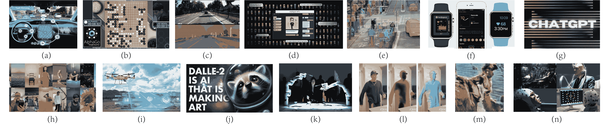

图 1. 深度学习对我们生活的各个方面产生了影响。 (a) 自驾车；(b) AlphaGO；(c) 使用计算机视觉进行的城市识别分割；(d) Mirror World NFT，展示了具有个性和从学习中发展的 AI 对话角色；(e) OpenCV 识别相机视图中的物体类型；(f) 与深度学习配对的 Apple Watch 以 97%的准确率检测房颤；(g) OpenAI 开发的 ChatGPT；(h) Tiktok 中的推荐系统；(i) 深度学习与无人机实现的智能农业；(j) DALLE-2，一个由机器学习赋能的强大绘画工具；(k) D.O.U.G，一个与人互动的协作机器人手臂，学习人类行为和手势，由艺术家 Soug Wen 创作；(l) 通过 3D 重建技术生成的数字人体；(m) 由 GANs（Casey Reas）创作的 AI 艺术电影；(n) 脑机接口（BCI）。

深度学习。深度学习（DL），作为机器学习（ML）和人工智能（AI）的一个子类，随着数据处理和计算能力的提升发展迅速。一类新的深度学习是深度生成模型（DGM），它结合了生成模型和深度神经网络。它们依赖于无监督学习的范式。神经网络，如 ANN、CNN 和 RNN，作为标志性的深度学习架构，在处理输入与输出数据之间的关系方面发挥了关键作用。DL 的定义意味着系统掌握了自学习和经验增强的能力（Sarker，2021b）。DL 的应用广泛涉及生活的各个方面。有很多显著的例子。例如，第一款全自动自驾车 Navlab5（图 1a）；Alpha GO，一个能够击败顶级围棋玩家的计算机程序（图 1b）；Mirror World NFT 的智能角色¹¹1Mirror World 的官方网站：https://link3.to/mirrorworld，它能够从人类文本对话中学习和成长（图 1d）；ChatGPT²²2 介绍 ChatGPT，来源：[`openai.com/blog/chatgpt`](https://openai.com/blog/chatgpt)，由 OpenAI 开发（OpenAI，2022），首个智能对话机器模型；世界上最好的推荐系统之一（图 1h），使 TikTok 从 1347 万日活跃用户中脱颖而出³³3TikTok 的报告，来源：https://www.statista.com/statistics/1090659/tiktok-dau-worldwide-android/；DALLE-2，被评价为最佳 AI 绘画工具（图 1j）；以及具有无限潜力的脑机接口（BCI）（图 1n）；此外，没有深度学习，智能革命无法进行，例如智能农业（图 1i）和智能交通。计算机视觉紧密依赖于深度学习，如著名的 OpenCV（图 1e），视觉认知的分割（图 1c）和 3D 扫描技术（图 1l）。此外，大量当代数字艺术是通过深度学习创建的，通过输入和处理人类手势和生物信号的数据（图 1k）。图 1m 代表了由 GAN 创建的前沿实验 AI 艺术电影的例子。

3D 形状生成技术。随着人工智能生成内容（AIGC）的迅猛发展，深度生成模型（DGM）能够通过多种方法处理 3D 形状生成。现有许多框架，如 GAN、VAE、Flow 模型等。DGM 在二维（2D）图像处理领域有着最广泛的应用和最显著的影响，比如纹理、风格迁移艺术、逼真的人脸以及文本到图像的生成（Jetchev et al., 2016；Ledig et al., 2017；Reed et al., 2016；Zhu et al., 2017）。随着创新技术和算力的提升，DGM 在 3D 形状生成方面的研究蓬勃发展。DGM 通过从二维图像的结果转化为三维生成对象来实现这种效应。快速地，一种名为 3D-GAN 的方法（Wu et al., 2016）被应用于体素网格的 3D 形状生成（见图 9a）。3D 形状生成激发了下游操作，如对象分类、部分分割以及场景语义解析。

计算机辅助设计与深度学习辅助的形态生成。计算机辅助设计（CAD）是一个广泛的研究领域，涉及在设计阶段使用数字工具进行创作和优化（Sarcar et al., 2008）。特别是在建筑领域，计算工具的参与已经扩展到建筑信息建模（BIM）、结构性能分析、机器人技术和数字化制造、城市分析、环境性能等方面（Baduge et al., 2022）。由深度学习（DL）辅助的建筑设计是 CAD 领域的典型分类之一，它在设计过程中提供了广泛的选择（Tamke et al., 2018）。深度学习辅助的建筑生成已经从基于规则的拓扑优化（如细胞自动机⁴⁴4A cellular automata (CA) is a discrete model of computation studied in automata theory and shape grammars⁵⁵5Shape grammars in the computation are a specific class of production systems that generate geometric shapes.）扩展到神经网络工具，这些工具在生成过程中提供了更多的灵活性和可控参数。回顾 DL 辅助的形态生成，深度神经网络在 DGMs 中已证明在建筑设计中的有效性和强大功能。在这样的领域中，协调工作和计算能力的需求相互配合，以研究形态生成和未来的建设。然而，在虚拟环境生成中并没有这样的要求。我们发现，在物理空间和虚拟空间之间的转换中，形态生成方面还需要更多的知识。

生成性 3D 虚拟建筑。从 3D 表示生成建筑空间的高效和实用的研究在建筑和计算机科学领域都是一个热门且值得研究的话题。对于建筑来说，明确数字空间的规则至关重要，这些规则与功能、美学和满意度相一致。正如 Roberto Bottazzi 所述，与其说是转变数字建筑，不如说是数字空间如何被建筑化（Bottazzi, 2018）。这揭示了虚拟建筑的重要性。构建虚拟世界（VW）的日益趋势与拥有数字化生活和产品的现实相关，这指的是元宇宙。

### 1.2. 面向建筑学、人机交互（HCI）和人工智能生成内容（AIGC）的跨学科领域

关于虚拟环境的研究逐渐在**人机交互**（HCI）和增强现实（AR）及虚拟现实（VR）等沉浸式技术的交汇点上脱颖而出（Lee et al., 2021b）。此外，由于建模生产力和效率的需求，虚拟现实（VR）或增强现实（AR）环境中的需求正在激增。因此，这些需求和发展也提高了对 3D 生成方法的观点。虚拟建筑的可行性明显受益于 CAD 方法，在建模任务负担和 HCI 方法方面表现突出。然而，尽管在 3D 对象生成中探索空间的可能性颇受欢迎，建筑研究仍然有限。大多数研究类似地集中在二维（2D）图像处理中。由 MIT 团队研究的 ArchiGAN（Chaillou, 2020）探讨了 GAN 在自动训练大量建筑平面图以进行空间布局和功能划分方面的潜力，并进一步推动了应用的到来（Chaillou, 2022）。其他大多数涉及 GAN 的建筑研究，例如通过（Karras et al., 2019）生成一些奇幻风格图像，满足了对超越物理世界限制或之前未有效提出和说明的设计的想象。例如，Özel 利用一些依靠人工智能的创意图像来预测建筑的未来（Özel, 2020）。这些研究从超越现实的审美角度考虑了生成缺失的创造力。由于缺乏将这些自动生成图像转换为三维格式的方法，即使在虚拟世界中，抽象的二维图像也离建筑相去甚远。此外，传统的二维平面图在真实空间中构建的方法不适用于虚拟环境。换句话说，物理建筑和虚拟建筑之间的生产方法存在显著差异。前者必须考虑外部环境（例如，日光、光照）和建筑约束；而虚拟建筑则更关注身份感、自我定义和美学。因此，为了弥合上述差距，一个新兴的学科需要重建一个涵盖建筑组件、虚拟环境中的约束要求和用户需求的细分领域。同时，深度学习可以支持自由生成计算建筑。值得一提的是，大多数现有研究仍存在空白。

总结上述问题，首先，对于 3D 形状生成技术，设计目的的建筑生成很少被考虑，因为生成建筑需要复杂的考虑和创新技术，特别是对于非技术型建筑师。其次，建筑生成方法很少涉及“虚拟”，且缺乏 3D 形状生成的应用。因此，通过 3D 方法生成的虚拟建筑的设计维度尚未系统考虑。因此，我们的调查探讨了如何从以用户为中心的角度利用 3D 形状生成技术来创建 3D 虚拟空间。我们指出，本文将以用户为中心的角度定义为“包容性”，以考虑缺乏技术（计算机科学）背景的非技术型建筑师和有意在 Metaverse 中创建虚拟建筑的普通用户的需求。

### 1.3\. 方法论及相关文献

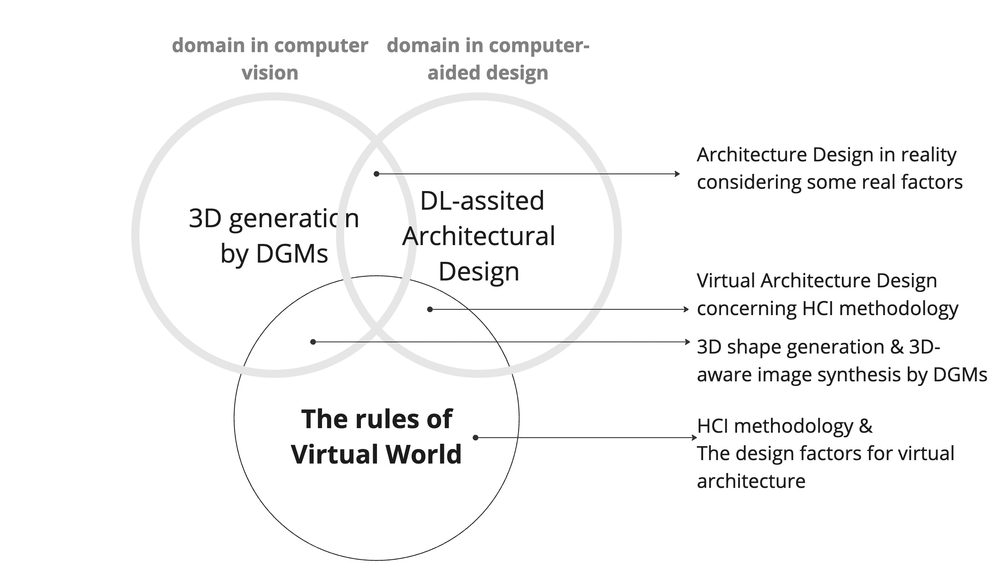

(a) 本调查研究了这一交叉领域。

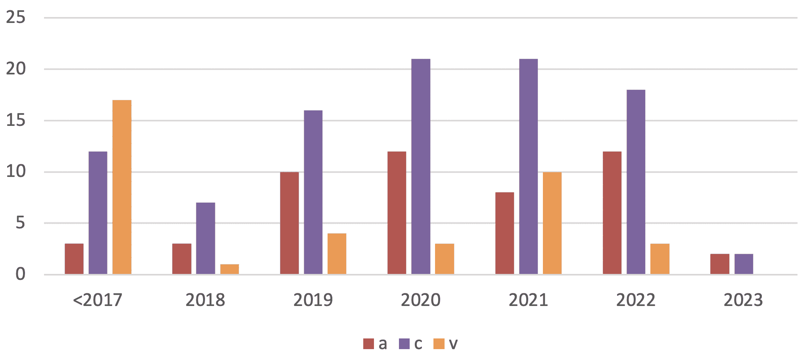

(b) 论文中引用的不同类别和年份的文献数量概况。

图 2. 调查的范围及相关文献的概况：a – DGMs 的建筑研究；c – 计算机视觉研究；v – 规则在 VWs 中的研究。

本调查文章呈现了关于计算机视觉和 CAD 中 3D 形状生成的深度学习的系统文献综述。近年来，虚拟建筑生成的计算建筑学方面尚处于空白。因此，我们将这三个领域作为调查的基点，以便互补关键见解：3D 形状生成技术、DL 辅助建筑设计以及 VWs 中 HCI 方面的设计考虑（见图 2(a)）。

我们审查了 187 篇文章的样本，主要集中在 2018 年至 2022 年间发表的作品（五年，80.7%），具体如下：2023 年及以后：4 篇（8.7%），2022 年：33 篇（17.6%），2021 年：39 篇（20.9%），2020 年：36 篇（19.3%），2019 年：30 篇（16%），2018 年：33 篇（5.8%），2018 年之前：32 篇（17.1%），来自这三个领域（见图 2(b)）。我们主要通过 ACM 数字图书馆、IEEE Xplore、ScienceDirect、Springer Link 和 CuminCAD 等出版数据库找到这些文章。我们使用了以下关键词：增强现实（AR）、虚拟现实（VR）、深度生成模型、3D 表示、3D 模型或形状或几何、对象生成、3D 感知图像、形状合成、点云、体素网格、网格、隐式神经场、虚拟建筑、虚拟环境、深度学习设计、生成设计、生成对抗网络（GAN）、3D GAN、变分自编码器（VAE）、扩散模型（DDPM）、文本转 3D、图像转 3D、零样本、计算架构、空间对象、灵活空间、虚拟规则、设计学科、人机交互（HCI）、评估指标、人类感知、情感、仿真、参与设计、美学、实时交互以及这些关键词的组合。此外，我们还依赖一些最新或高影响力的计算机视觉（CV）研究，这些研究仅发表在 arXiv 上。我们通过标题和关键词筛选，以确保仅包括完整论文和扩展摘要。短文和摘要被排除在范围之外。当关键词和摘要未作为我们调查范围内的关键信息或要素出现时，我们会阅读整个出版物以检查是否包含在内。筛选后，我们得到了 147 篇文章和 19 篇发表在 arXiv 上的 CV 研究，共计 166 篇权威文章。此外，在线资源通过 Google 搜索引擎直接搜索，我们主要从建筑设计的角度总结了 19 篇文章和 2 个相关建筑项目，按虚拟世界、计算架构、建筑理论等类别进行分类。最终，本次调查共纳入了 187 篇文章和 2 个建筑项目。

各种其他调查进一步界定了这一范围，如下所示：类别 1（机器学习  (Kreuzberger 等，2023；Penney 和 Chen，2019) 或深度学习 (Hatcher 和 Yu，2018；Kreuzberger 等，2023；Alom 等，2019；Akinosho 等，2020；Khan 等，2020；Alom 等，2019；Sarker，2021a；Pouyanfar 等，2018；Abdar 等，2021)：3D 形状生成 (Shi 等，2022；Oussidi 和 Elhassouny，2018；Cao 等，2020)，场景合成 (Xia 和 Xue，2022；Zhang 等，2019)，应用 (Dong 等，2021；Dargan 等，2020)，3D 表征 (Guo 等，2020)，从 2D 重建 3D (Yuniarti 和 Suciati，2019)，以及生成模型 (Harshvardhan 等，2020；Aggarwal 等，2021a，b；Wang 等，2021；Jabbar 等，2021；Pavan Kumar 和 Jayagopal，2021；Croitoru 等，2023；Creswell 等，2018)。类别 2（DL 辅助建筑设计 (Penney 和 Chen，2019；Newton，2019)）：基础设施 (Tamke 等，2018)，智能建筑 (Baduge 等，2022；Akinosho 等，2020)，生命周期 (Hong 等，2020)，或其他设计 (Regenwetter 等，2022)。以及类别 3（虚拟环境或虚拟世界中的建筑）：虚拟现实中的设计学科（理论和应用） (Bartle，2004)，虚拟建筑中的 HCI（人类感官和情感） (Lee 等，2021b)，元宇宙或虚拟世界 (Bartle，2010；Dionisio 等，2013；Lee 等，2021a)。相比之下，本文回顾了近年来，特别是过去五年（2018-2022）中 3D 形状生成的方法和建筑虚拟化因素，涉及虚拟规则、设计原则、社会参数和 CAD 设计的 HCI 方法。我们主张将这些研究领域结合起来，认为这是一个跨学科的问题。最后，研究概述了虚拟建筑模型生成任务中 HCI 的关键挑战。我们的调查文章独特地考虑了上述类别的突出特点，并进一步铺平了通向自由计算建筑的道路，具有以下贡献。

1.  (1)

    我们对 DL 辅助建筑设计和深度生成模型的整合进行了全面调查，致力于为虚拟环境中的计算建筑发展一个批判性视角。

1.  (2)

    我们强调了弥合现有两个研究领域之间学术差距的机会，尝试从算法上响应社会因素。

1.  (3)

    我们提出了未来虚拟建筑的研究主题，考虑了超越现实的学科，如人文主义和精神性。

### 1.4\. 范围和结构

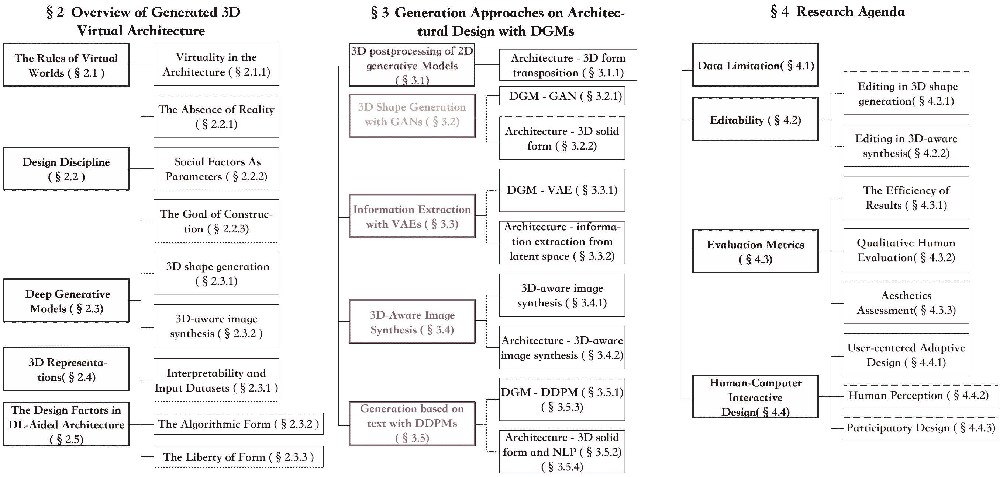

图 3. 调查结构（第 2 – 4 节）。

尽管深度学习（DL）与建筑学的交集涉及所有方面，但我们仅研究那些考虑 3D 虚拟建筑的生成式深度学习，特别是 3D 生成对抗网络（DGM）的文章。我们仅限于 2D 风格的想象图，并提供创新的方法以实现 3D 过渡。我们也排除了那些仅考虑实际问题如建筑信息建模（BIM），而不是在纯虚拟环境中实施的文章。这一范围反映了虚拟空间中及时设计问题的自动生成。

论文回顾了该领域当前的问题空间，包括虚拟世界的规则、社会参数以及从第二部分开始的形式自由文明。第三部分涵盖了建筑中的创新形式生成，包括 3D 形式变换和 3D 实体形式生成的生成方法。该节包含四个主题，包括特定训练的生成对抗网络（GAN）、用于特定信息提取的变分自编码器（VAE）、3D 感知图像合成和基于条件文本的扩散模型（见图 3）。随后，我们从人机交互（HCI）的角度重新审视该领域，制定四个重大挑战的研究议程，涉及数据限制、可编辑性、评价指标、人机交互设计、用户信息收集、操作和感知。我们指出，可以探索优化和发明新方法的可能性，以考虑人类和社会群体中心的虚拟建筑自动生成。

## 2\. 生成的 3D 虚拟建筑概述

自上个世纪以来，关于计算机辅助设计的方法和规则的讨论从未停止。然而，最初，数字化模型仅仅用于模拟物理环境或记录设计过程。虚拟建筑的讨论始于基于网页的社交媒体或游戏的发明。随着元宇宙概念的出现，对虚拟建筑研究的热情有所加剧，表明我们进入了一个全新的存在时代，各种虚拟环境（VEs）大量涌现。一方面，虚拟环境建立在对现实的临界再现上，这种再现没有合法性，也没有产生实际后果（Nazmeeva，2019）。另一方面，虚拟环境建立在人类在虚拟空间中作为社会属性的潜在互动上。Lee 等人指出，数字原住民对于发展元宇宙的**终极**形式至关重要（Lee et al.，2021a）。这些数字原住民通过与化身的社交互动，能够提升他们在所有工艺和用户生成内容（UGC）上的影响力。随着虚拟世界的发展，社会属性不断扩展，如贫困权利、身份、角色和群体差异（Schroeder et al.，2001）。正如 Roberto Bottazzi 所言，我们现代社会的路线图应是对不受监管的数字空间进行建筑化（Bottazzi，2018）。人们越来越多地将虚拟空间融入到生活空间的共存中。总体而言，从初期的“虚拟世界”到元宇宙的爆炸，研究相当多样。然而，大多数研究集中在虚拟现实或互动游戏的层面上，而不是专门关注空间本身的主题。

### 2.1. 虚拟世界的规则

对于构建且内部一致的虚拟世界的讨论一直在继续。在虚拟世界、语义和虚拟环境的概念中，有三个主要层次堆叠在建筑中（Nevelsteen, 2018）。因此，这些虚拟世界无处不在，从政治到视频游戏再到代币经济。沉浸感、存在感和互动性交织在一起，成为虚拟世界的三大支柱（Mütterlein, 2018）。Gilbert 识别出了虚拟世界的五个基本特征（Gilbert, 2011）。它们体现在每个方面，例如空间感知、公共或私人活动、社会体验和情感表达。此外，许多学者试图根据层次或发展阶段来定义和分类虚拟世界。虚拟世界的混乱定义已经被元宇宙的繁荣所缓解。Dionisio 将虚拟世界划分为 5 个发展阶段，从文本和二维图形界面到用户生成内容（UGC），再到完整的去中心化经济系统（Dionisio et al., 2013）。在最新的元宇宙研究中，Lee 等人表示，物理和虚拟空间共存有三个阶段——数字双胞胎、数字原住民和超现实（Lee et al., 2021a）。数字双胞胎是物理世界的再现版本，依赖于 CAD 的发展，适用于工业和建筑。不断增长的数字原住民使得他们对与化身的互动以及所有工艺和用户生成内容的积极影响不断增强。超现实是元宇宙追求的终极理想世界，支持物理和虚拟世界之间实时互操作的异质活动。

从技术角度来看，软件和硬件架构定义了空间功能、约束和社会互动。这些架构形成了虚拟世界的政治（Lessig, 2009），而代码形成了图形虚拟环境的法律。人类发明的每一条法律都有固有的价值，具有特定的意图和精心设计。因此，设计学科包括代码和计算，必须满足复杂的参数，包括计算能力、成本效益比和用户偏好。尽管代码和程序提供了虚拟世界中的规则和法律，但不可否认的是，处理虚拟世界的设计和组织需要独特的专业知识。这不仅仅是计算机编程能力所能提供的。作为视觉推理的特殊案例，这种复合能力完全可以成为关键专业。它能够在多个尺度和上下文中操作，以映射、分析和组织虚拟世界，同时能够引入新的系统、规则和形式（Jovanovic, 2022）。

#### 2.1.1\. 建筑中的虚拟性

虚拟性是虚拟环境中建筑特有的基本特征，包含以下三个元素：沉浸感、存在感和互动性。源于虚拟世界中的三大支柱（Mütterlein，2018），虚拟建筑在解释上与之相同，但应用更为具体。换句话说，由于虚拟建筑是一种在虚拟世界中具有 3D 表现的媒介化物质，我们可以将这些建筑视为虚拟环境的一个子类型。虚拟世界的各种组件和框架被假设在其中应用。因此，虚拟世界的理论同样适用于虚拟建筑。

虚拟建筑的设计学科必须将这三个支柱视为核心。一些建筑设计的研究已经执行了这些规则，VRoamer（Cheng et al., 2019）报告了一种通过释放用户注意力实现沉浸感的互动虚拟环境。建筑项目不仅限于研究，也倾向于与沉浸式技术相结合。扎哈哈迪德建筑事务所和 JOURNEE 联合开发了一个虚拟 NFT 画廊“NFTism”，这是少数几个具有互动性的虚拟建筑之一。这个画廊继承了扎哈的代表性流体形态，支持 MMO（大规模多人在线）技术并整合了音视频互动 ⁶⁶6A Archdaily 报告：[`www.archdaily.com/972886/zaha-hadid-architects-presents-virtual-gallery-exploring-architecture-nfts-and-the-metaverse`](https://www.archdaily.com/972886/zaha-hadid-architects-presents-virtual-gallery-exploring-architecture-nfts-and-the-metaverse)。

### 2.2\. 设计学科

#### 2.2.1\. 现实的缺失

为了更好地阐明虚拟建筑的设计原则，我们将其与现实建筑进行比较。首先，在建造虚拟建筑时，现实因素必须被排除，包括设计考虑、施工结构和经济成本。准确地说，一种基于沉浸式技术并符合虚拟逻辑的新兴因素取代了现实因素所占据的位置。以下详细阐述了三个方面：首先，从环境因素到社会因素：环境因素如风向和光线影响建筑的空间布局，而对虚拟建筑无效。在虚拟世界中，取而代之的是一种更具新自由主义的虚拟逻辑，因为人类在强调社会活动的同时，可以在时间和空间上不受限制地进行社交活动。

第二，从建筑结构到不受限制的形式：虚拟建筑的结构趋向于更为可接近和开放的形式。许多现有技术无法实现的建筑结构已被称为纸上建筑  ⁷⁷7 具前瞻性构思的建筑，仅存在于图纸、拼贴画或模型中。例如，扎哈早期的作品在当时的技术和建造条件下是不可能实现的。在这方面有很多学派，如仿生建筑 ⁸⁸8 仿生建筑通常是根据自然界有机物的结构或形式进行计算调整。仿生建筑的设计考虑因素包括生物体的生理、行为和结构适应。和响应建筑 ⁹⁹9 响应建筑指的是建筑或建筑物表现出改变其形式以不断反映周围环境条件的能力。它反映了互动建筑的理念。

第三，从建造成本到场景和计算成本：理所当然地，真实建造成本，如材料和人工成本，转移到了建模、照明和渲染的成本上，而渲染等任务的复杂数据计算消耗计算机内存。建造和构造复杂而奇幻的真实场景的成本是指数级增加的，而这些通过特效和建模渲染技术实现，这些在现实世界中是不可能实现的。

除了上述内容，虚拟建筑和真实建筑的构建是基于一种变换逻辑，从建造到不受限制的形式。现实世界的建筑需要从平面图的空间规划和功能布局开始，从而推导和完成建筑设计。但在虚拟环境中，替代的解决方案是直接从 3D 空间中的功能布局开始，主要通过游戏引擎或 3D 建模软件进行建模。这不仅是虚拟资产的生产方法，甚至一些先进的真实建筑也开始这样做，因为这样可以提高空间感知的效率和准确性。

#### 2.2.2\. 社会因素作为参数

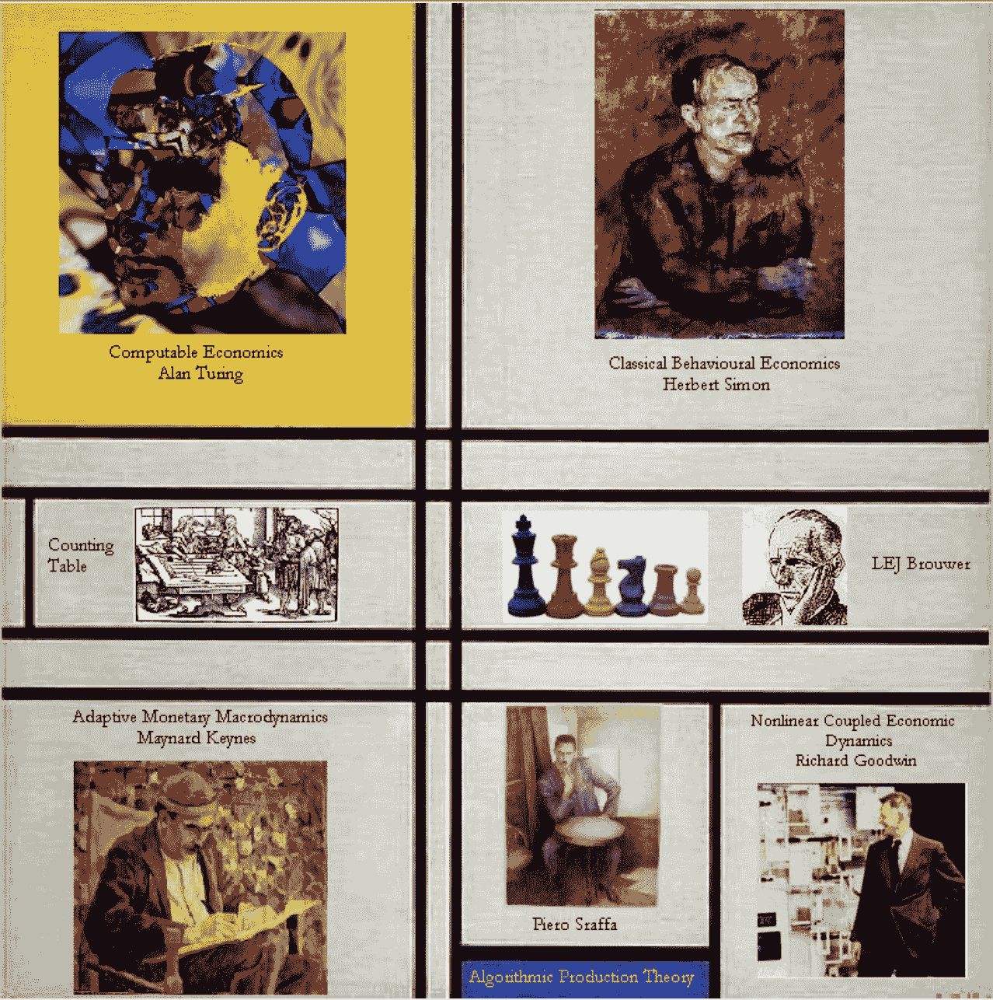

(a) 算法社会科学研究单位 (ASSRU)  ¹¹¹¹11 来源: [`www.assru.org/index.html`](http://www.assru.org/index.html) (ASSRU, 1999)。

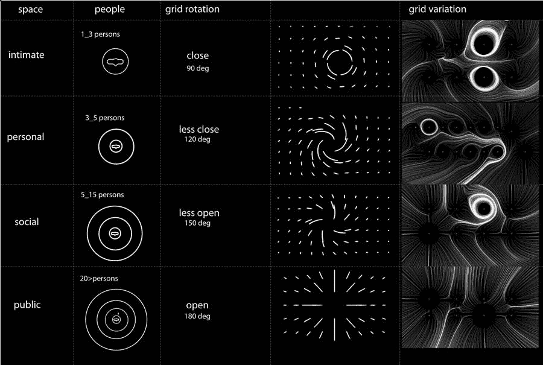

(b) 参数化符号学 ¹³¹³13 来源: [`www.patrikschumacher.com/Texts/Design%20of%20Information%20Rich%20Environments.html`](https://www.patrikschumacher.com/Texts/Design%20of%20Information%20Rich%20Environments.html)：符号领域，公共与私人作为参数范围的区分。

图 4. 社会因素作为不同理论中的参数。

突出强调虚拟空间的学科不能忽视其社会影响是非常重要的。建成的环境是一个广阔的、可导航的、信息丰富的交流界面，尤其是在虚拟世界中。它为潜在的社会参与者提供了有关在其范围内预期的交流互动的信息（Schumacher, 2013）（图 11）。虽然虚拟性具有超越现实的独特属性，但人们在虚拟环境中具有社会能力。换句话说，虚拟技术支持沉浸环境中的社会活动和目标。此外，从心理学角度看，对现实场景的熟悉有助于增强存在感和自我意识，因为曝光率带来了偏好（Myers 和 Twenge, 2012）。

在信息社会和虚拟世界的推动下，社交成为了一种日益复杂的交流媒介，这种媒介在多种场景中传达了丰富多样的社会系统和复杂的信息。例如，Lam 等人开发了一种基于情境感知、上下文互动的增强现实城市界面，使用户能够直观地定位网站，且几乎无需修改  (Lam et al., 2019)。建筑学表示一个包含活动的空间地点，其中对空间形式的符号学研究一直围绕模拟或恢复社会场景的话题，包括公共空间、半公共空间和私人空间（见图 13）。空间传达了参与框定社会情境的邀请  (Schumacher, 2013)。例如，历史上有很多研究讨论了人类对城市设计空间的感知。Jacobs (Jacobs, 2016) 引入了可步行街道作为形成社区的一个概念，考虑了视觉特征、流动的连通性和其他指标。遵循以人为本的设计趋势，许多研究者探索了不同尺度上的理想街道和场所的创建。Appleton  (Appleton, 1996) 引入了前景-避难理论来解决人类在场所塑造中的安全感，这对社交有着显著的影响。Hall (Hall et al., 1968) 引入了亲密区域的概念，以表示不同类型的社会距离。这些关于人类空间感知的理论在当今的设计学科中仍然被广泛使用。这些都体现了社会参数在建筑学科中的重要性。

#### 2.2.3\. 建设目标

虚拟建筑设计原则的目的是构建虚拟环境中的建筑。随着虚拟技术的兴起和 3D 虚拟世界社交平台的崛起，对无限且广袤虚拟环境的生产需求急剧增加。主要任务是快速建造大规模建筑环境。这些建造任务大多由 3D 建模软件和游戏引擎（如 Unity）协作完成。3D 建筑模型是人工空间元素的 3D 空间表示（Yao et al., 2018）。其最相关的质量标准包括完整性、位置的空间准确性以及细节水平（Keil et al., 2021）。此外，关于比例和尺寸的真实模拟也很重要，包括粒度和模拟。总的来说，这些对提升用户体验非常重要。不一致的方法会导致各种问题，例如手动和自动操作产生的不一致建筑（Keil et al., 2021），以及昂贵的人力资源成本。

一个可靠的解决方案是面对许多高效和自动化的虚拟环境建造任务。基于计算的方法相对一致，因为对所有空间对象应用相同的自动化框架。这些方法跨越各种规模，包括城市和建筑。MineDojo 使用利用大型预训练视频语言模型的自主代理进行自动化，生成虚拟世界的 3D 场景（Fan et al., 2022）。腾讯最近发布的自动生成 3D 虚拟场景的解决方案包含城市布局生成、建筑外观生成和室内映射生成三个模块（Lab, 2023）¹⁴¹⁴14 来源: [`gdcvault.com/play/1028921/Recorded-AI-Enhanced-Procedural-City`](https://gdcvault.com/play/1028921/Recorded-AI-Enhanced-Procedural-City)。这是一种结合多个计算机视觉技术的设计视角的新范式。类似地，建筑领域也有若干关于计算生成的研究。大多数通过提取城市规划逻辑来生成（Ingram et al., 1996; Veselỳ, 2022），即从城市规划布局中设计 3D 布局和功能分区。在另一种方法中（Veselỳ, 2022），集成了三个具有不同特定目标的方法。它通过自主推断现有城市区域的构成规则生成建筑体量配置。

#### 2.2.4\. 集体问题

然而，这种在虚拟性上运行的新机制范式与新兴虚拟环境的目的之间仍存在不匹配：集体性、存在感和无障碍性（Nazmeeva, 2019）。集体性涉及虚拟空间是一个共同的环境，在这里来自不同背景和文化的个体可以汇聚并互动。集体性的本质指的是高度的多社会体验。我们只繁衍出展现我们独特身份和个人需求的产品（Nazmeeva, 2019）。这与集体性和日常使用的产品，尤其是空间或建筑产生了冲突。由于我们生活在一个现实与虚拟无缝融合的世界中，例如通过社交媒体推荐系统驱动的精美信息和商品，创造或超越现实的空间，虚拟经济机制、所有权、身份等。这些都展示了个体价值的精准。显然，集体性和聚合在这里变得盲目。换句话说，虚拟技术应该支持集体社会活动和目标，这些目标由沉浸式环境中的个体体验所提示。许多虚拟世界的理论强调了这一点。活动理论认为虚拟世界应该被设计成支持用户实现他们的目标（Jonassen and Rohrer-Murphy, 1999）。Bartle 的虚拟世界设计四个关键指出，提供给玩家一种目的感是设计虚拟世界的关键指标之一（Bartle, 2004）。目的感通过提供进步和成就感来增强用户参与感，从而创造出沉浸感。

### 2.3\. 深度生成模型

我们简要回顾了用于 3D 表示的深度生成模型的发展，包括 3D 形状生成和 3D 感知图像生成。

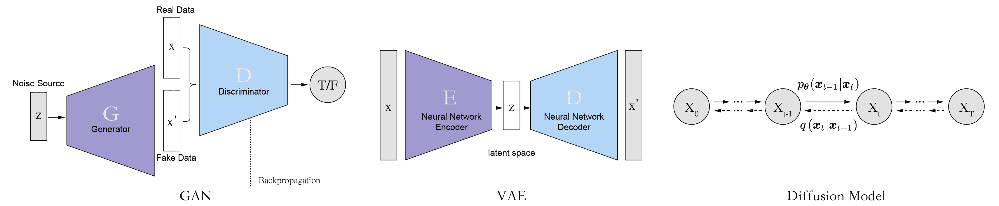

图 5. GAN、VAE 和扩散模型的框架。

#### 2.3.1\. 3D 形状生成。

传统深度生成模型作出了贡献，除了著名的生成对抗网络（GANs）和变分自编码器（VAEs），还有归一化流（N-Flows）、最近的扩散概率模型（DDPMs）以及基于能量的模型（EBMs），这些模型通过最大化给定数据的相似性进行学习。这些深度生成模型生成可以渲染的实际 3D 对象。它将潜在变量传递到高质量图像中。尽管每种模型都有其自身的优势并且近年来取得了重大进展，建筑领域主要依赖于 GAN，而 VAE 和最新的扩散模型则用于一些研究。考虑到相关性，我们详细介绍了 GAN、VAE 和扩散模型，而不是其他计算机视觉调查文章中包含的模型的详尽列表（图 5）。

GANs。GANs 是一种依赖于噪声值的半监督学习。GANs 依赖于机器学习算法构建两个神经网络：一个是生成器，另一个是鉴别器。它通过这两个神经网络之间的零和博弈训练一个大型数据库，以生成无偏见的创造性结果。

变分自编码器。变分自编码器是部分使用神经网络的概率生成模型。除了输入和输出，神经网络还需要编码器和解码器。潜在空间指的是学习数据特征和简化数据表示的过程，以便于模型针对特定目的进行训练。为了确保变分自编码器的潜在空间具有可接受的特性并能用于生成新数据，在训练过程中对其编码分布进行正则化（Kingma 等，2019）。此外，"变分"这个名字来源于正则化与用于统计分析的变分推断技术之间的紧密联系。

扩散模型。通过对潜在空间中数据点的扩散建模，我们发现了图像或体积数据集的潜在结构，例如，去噪扩散概率模型（Ho 等，2020a）。这涉及到教一个神经网络去除图像上高斯噪声的模糊效果。它具有生成锐利和详细特征的显著优势。

#### 2.3.2. 3D 感知图像合成。

这些方法从潜在空间中提取潜在向量，并通过使用 GAN 将其解码为目标表示。通常，生成流程的结果是具有 3D 意识的图像，并且它也从图像作为生成源开始。

### 2.4. 3D 表示

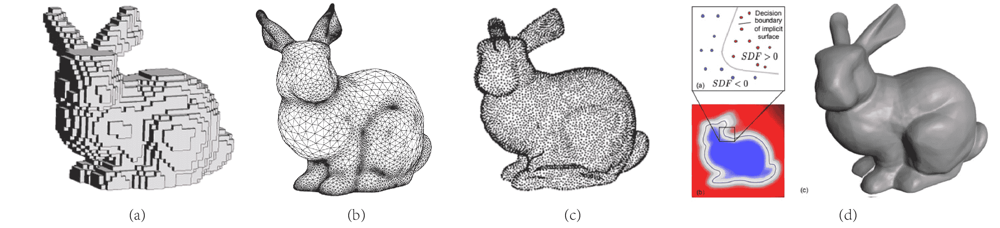

图 6。3D 表示的 (a) 体素网格，(b) 网格，(c) 点云，(d) 神经场。

这两种 3D 生成类型在计算机视觉和计算机图形学中发展出不同的 3D 场景表示。3D 形状的一般表示包括显式表示，如体素网格、点云、网格和隐式神经场。3D 感知图像包括深度或法线图、体素网格、神经场和混合表示。它们与建筑生成的整合也有所不同。例如，点云通常在 3D 作为输入源来训练生成模型时被考虑。现有的调查研究将 3D 表示阐述为分类（图 6）。以下是简要描述。

建筑设计偏好显式表示，因为它在 3D 建模软件中具有可控性、熟悉性、可视化和修改的便利性。显式几何表示更容易可视化和解读，因为它们直接表示 3D 空间。设计师可以精确地定位和调整每个点或体素，从而对生成的几何形状和形式进行更准确的控制。然而，隐式表示（神经场）在建筑研究中具有巨大的潜力，因为它们可以提供更灵活、连续和高效的几何表示。

体素网格。指的是一个由值组成的三维网格，按行和列组织。网格包含行、列和层交点，称为体素，即一个微型的 3D 立方体（Deng et al., 2020）。

点云。点云（Rusu and Cousins, 2011）是空间中数据点的独特集合，这些数据点通过分配给每个点位置的笛卡尔坐标（X、Y、Z）来表示三维形状或物体。

网格。3D 网格是构建 3D 物体的多边形框架（Nichol et al., 2021）。沿 X、Y 和 Z 轴的参考点描述了 3D 网格组成形式的高度、宽度和深度。值得注意的是，创建逼真的 3D 模型有时需要很多多边形。

神经场。通过使用传统的体积渲染方法查询沿摄像机射线的 5D 坐标，并将生成的颜色和密度投射到 2D 平面上来创建图像。尽管使用了深度数据，但场景几何以精致的细节呈现，包含复杂的遮挡（Mildenhall et al., 2020）。

混合表示。这指的是在虚拟和实际世界中嵌入的 3D 特征空间的预训练混合管道。混合管道可以包括大量数据源和图像帧特征（Shen et al., 2021），具体取决于 3D 体积生成的目的。

### 2.5\. 深度学习辅助建筑中的设计因素

在上一小节中，我们总结了虚拟建筑的设计原则，首先适应虚拟性的基本特征作为指导方针，利用计算生成技术大规模且高效地作为方法，同时强调社会因素作为参数。在此基础上，我们识别建筑集体与私人生产逻辑之间的不匹配。在这一节中，我们解释了如何使用上述框架和特定的自动化算法框架设计虚拟建筑。

#### 2.5.1\. 可解释性与输入数据集

依赖输入数据的可解释性是利用机器学习算法生成虚拟建筑的关键第一步。通常，可解释性要求在建筑领域中有效地展示数据集输入本身（Koh, 2022; Çakmak, 2022）。达到这一目标的生成结果能够支持参与者进行多种设计目的。弥合数据与目的之间的差距是推动设计目标可解释性的巨大人力和计算工作。例如，BAŞAK ÇAKMAK 通过 GANs 和编码器-解码器探索了扩展设计认知（Çakmak, 2022）。这一方法根据组件类型对通过激光雷达捕获的分区 3D 点云进行处理。研究手动和自动扩展这些模型，以促进深度学习框架学习空间组织。

匹配与空间设计目标相关的所需参数的数据集的方法在建筑设计解决方案中已被广泛使用。这些应用使用深度学习框架通常能够设计出具有明确设计目标的解决方案。例如，Adaptive Acoustic 实施了一种使用 CGN 生成计算 3D 音乐厅的方法。设计师训练了音乐厅内部的网格以及空间和声学参数作为两个数据集，以追求符合声学要求的建筑。手动地，这些参数被细化为可量化的信息，包括座位、体积、混响时间、声学吸收区域、吸收系数等，最终生成具有声学特征的 AI 音乐厅形式。

#### 2.5.2\. 算法形式

算法形式是“计算与关于计算生成对象（如字符串或任何其他数据结构）的信息之间的关系”（Chaitin, 1975b）。越来越多的社会算法提案承诺，神经网络和机器学习算法是能够考虑社会因素的研究领域。例如，通过不同的数据输入到住房生成算法中，可以生成各种主规划，具有不同的隐私感知或建设价格选择 (Koh, 2022)。

此外，对社会参数的关注也在增加，从数据驱动的算法社会科学到建筑形式中的基于代理的参数符号学 (Schumacher, 2013; ASSRU, 1999)。算法形式涉及计算对象（如字符串和任何数据结构）与信息之间的关系（Chaitin, 1975a）。越来越多的社会算法提案承诺，神经网络和机器学习算法是可以考虑社会因素的研究领域。在这方面，社会目标位于计算生成形式和建筑设计的中间。

#### 2.5.3. 形式的自由

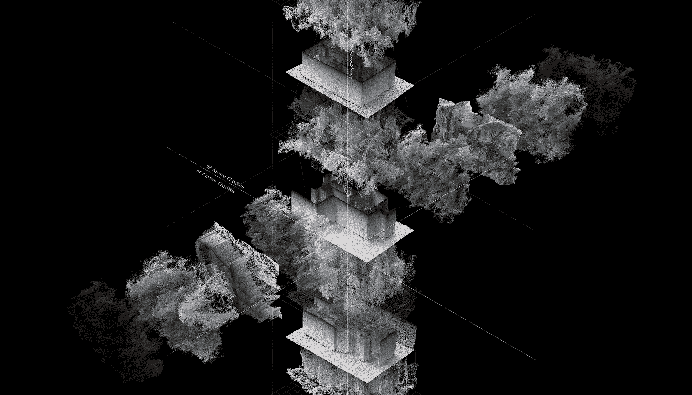

(a) George Guida, 2022 年。《多模态建筑：语言在机器学习辅助设计过程中的应用》。

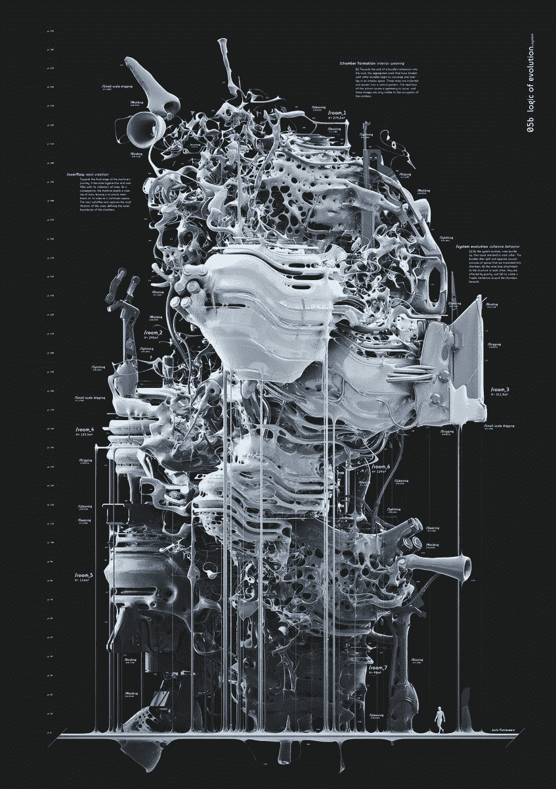

(b) Joris Putteneers, 2016 年。《联觉》。

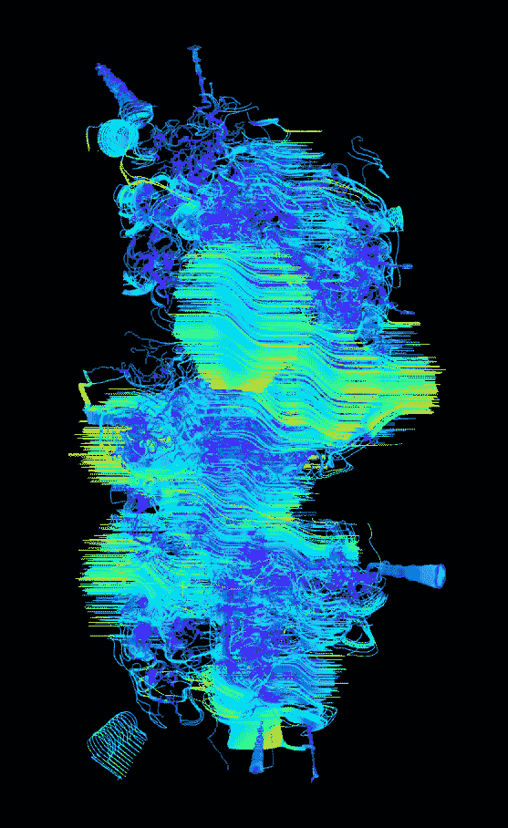

(c) 联觉中的生成过程。

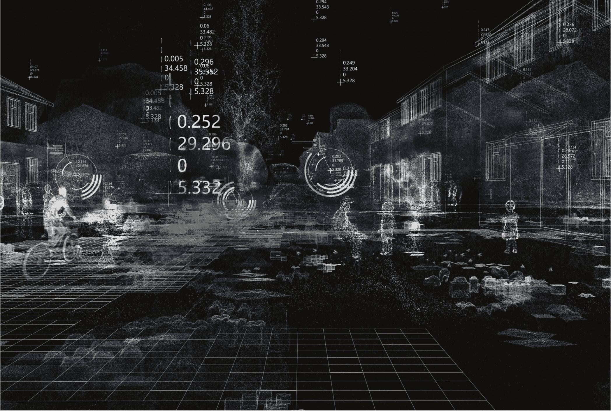

(d) 一个数据驱动的建筑项目，名为 E-motion：一个数字化界面允许用户捕捉实时数据以进行互动，以重新思考不同物种之间的共同生活。

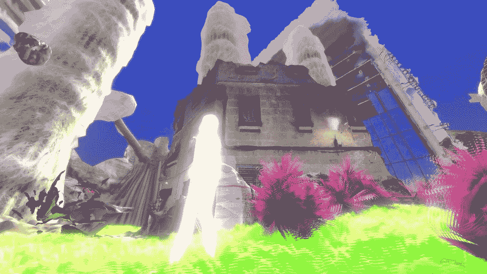

(e) Viviane Toraci Fiorella、Taza Celilia、Prandini Alvaro Campo。“ISOS”在 Current.CAM 2022 年“体积电影”工作坊中

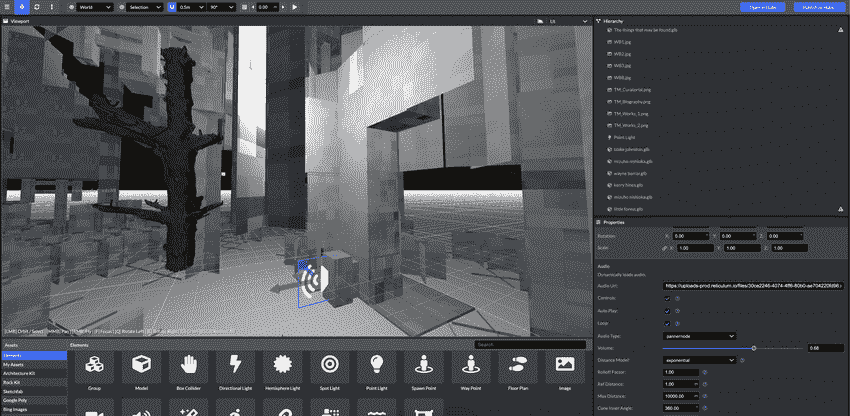

(f) Tane Moleta 和 Mizuho Nishioka，合作建设项目，“共同填充虚拟世界”，2021 年 (MOLETA 和 NISHIOKA, 2021)。

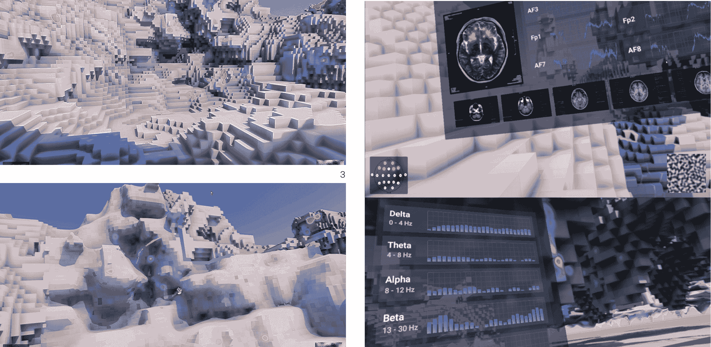

(g) (Barsan-Pipu 等, 2020) 通过利用脑机接口 (BCI) 捕捉情感驱动的动态噪声，为虚拟环境生成 3D 体积建筑。

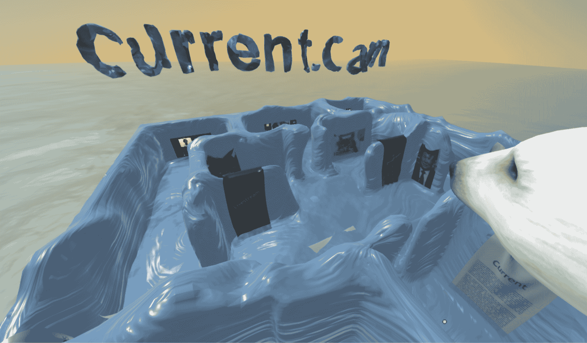

(h) Current.CAM，VR 画廊，2021 年

图 7. 一些具有形式自由的建筑项目。

虚拟建筑形式比以往任何时候都更加灵活，定义的边界变得更加模糊和包容（见图 7）。形式的生成逻辑经历了转变，空间的几何已扩展到空间的智能。空间智能代表了一种多感官的方法，在这种方法中，我们可以自由生成嵌入的形式作为辅助工具。Joris Putteneers 的项目通过模拟 Houdini 中的粒子运动创建了一种超现实且复杂的建筑构造 ¹⁵¹⁵15 来源: [`putteneersjoris.xyz/projects/synesthesia/synesthesia.html`](https://putteneersjoris.xyz/projects/synesthesia/synesthesia.html)（见图 7(b) 和 7(c)。这是对 3D 空间中算法的形象抽象。虚拟建筑的形式也可以是数据在 3D 空间中的可视化。例如，一个建筑项目，即 E-motion，设计了一个数据可视化接口，驱动因素是动物和人类运动习惯的重新分配和模拟，从而连接了人类与非人类智能 ¹⁶¹⁶16Fei Chen, Mochen Jiang, Haojun Cui, 和 Yuankai Wang, E-motion, 2020。来源: [`bproautumn2020.bartlettarchucl.com/rc18/e-motion`](https://bproautumn2020.bartlettarchucl.com/rc18/e-motion)（见图 7(d)）。与此同时，George Guida 在另一个项目中可视化了智能算法和多模态对建筑的影响 ¹⁷¹⁷17 来源: [`www.gsd.harvard.edu/project/2022-digital-design-prize-george-guidas-multimodal-architecture-applications-of-language-in-a-machine-learning-aided-design-process/`](https://www.gsd.harvard.edu/project/2022-digital-design-prize-george-guidas-multimodal-architecture-applications-of-language-in-a-machine-learning-aided-design-process/)（见图 7(a)。在第四维虚拟空间中，作者提出了重新定义 VR 中热觉维度的概念，以理解和参与虚拟场景的空间和方向性（Sheehan 等， 2021）（见图 7(f)）。虚拟建筑的形式甚至是一种共建。例如，一个名为“共同填充虚拟世界”的项目鼓励没有 3D 建模经验的艺术家使用参与式设计方法进行创作（MOLETA 和 NISHIOKA， 2021）。这导致了一个由立方体和相应高度变化的柱子以及森林组成的自主虚拟世界。

其次，在虚拟建筑的生成中，虚拟世界通常会考虑更多的美学、文化和以人为本的意图。（Barsan-Pipu 等人，2020）(图 7(g))。“好”的建筑的定义实际上是建筑话语的核心（Bava，2020）。关于数字建筑的讨论通常通过逃避到品味或艺术判断的领域来解决这个问题。美学被批评为在数字建筑中将数字和数据作为统一的支持工具来解决问题。相反，虚拟建筑中的美学可以为宏伟的计划提供正当理由。例如，Current. CAM 的 VR 展览由连续分隔的空间组成，呈现纯流动的蓝色，强化了数字界面对人类感官的塑造（图 7(h)）。在一次工作坊中，他们组织了虚拟化身与奇幻戏剧化环境的互动，以探索人类对空间的感知（图 7(e)）。这种虚拟建筑的超越性新颖性鼓励用户对新奇视听感受的追求。

## 生成的 3D 架构：一种范式转变

在可以自动存储和处理 3D 数据的 3D 算法出现之前，3D 生成方法主要是基于 2D 图像发展的。近年来 3D 生成的显著增长展示了这一领域的巨大潜力。与 2D 图像生成相比，3D 生成在 3D 数据集、计算消耗、特征学习和 3D 空间中的概率分布方面都是一项艰巨的任务。我们调查了基于各种深度生成模型的虚拟建筑生成方法，包括计算机视觉（表 1， 表 3.4）和建筑学（表 2）。在第一部分，我们介绍了一些集中于 2D 深度生成模型的建筑设计研究，特别是 GANs。然后，我们根据深度生成模型将 3D 表示的深度学习生成方法分为四类：（见图 8）。

+   (1)

    基于 GANs 从概率空间或 2D 图像集生成 3D 形态。

+   (2)

    从潜在空间中提取 3D 信息的变分自编码器（VAEs）。

+   (3)

    最近在 3D 感知图像合成方面的进展以及与建筑学结合的可能性。

+   (4)

    基于条件文本的扩散模型的最新研究。

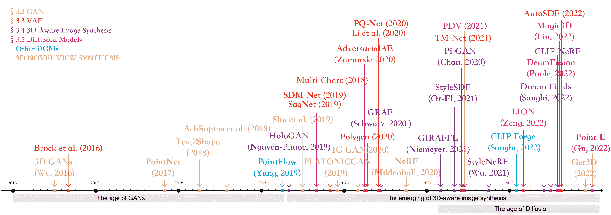

图 8. 用于虚拟建筑设计生成方法回顾的系统分类法。

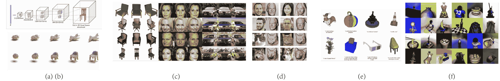

图 9. 计算机领域生成对象的示例。 (a) 3D GAN (Wu et al., 2016)， (b) PointFlow (Yang et al., 2019)， (c) HoloGAN (Nguyen-Phuoc et al., 2019)， (d) StyleSDF (Or-El et al., 2022)， (e) Point-E (Nichol et al., 2022)， (f) DreamFusion (Poole et al., 2022)。

### 3.1\. 受约束方法的 3D 形态转换

在过去的几年里，深度生成模型的二维图像生成得到了迅速发展。大多数基于深度生成模型的深度学习辅助建筑设计都依赖于处理二维图纸（Jaminet 等， 2021；Mohammad， 2019；Srivastava 等， 2021），例如通过重叠截面或平面进行构图。这导致了将深度学习在深度学习辅助建筑设计中等同于 pix2pix 的观点。这种方法的重要进展是对生成图像进行后处理以针对三维模型。这些方法通常通过启发式算法或人工劳动来进行后处理，而不是科学方法，旨在实现关键思想和创新概念。

#### 3.1.1\. 3D 形式转置

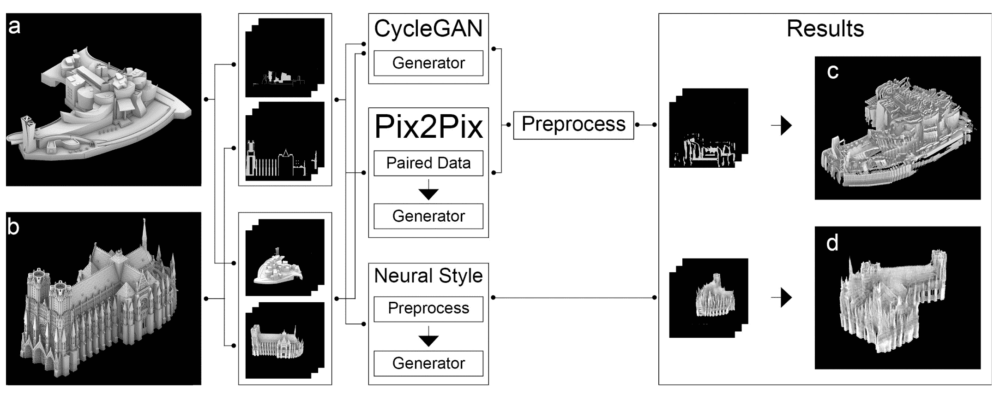

(a) 描述工作中的一个管道（Zhang 和 Blasetti，2020）。

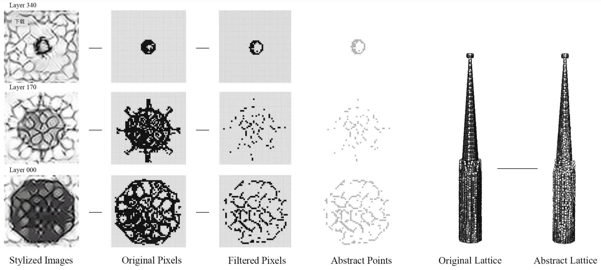

(b) 一个过程表示从二维到三维格点的像素过滤（Ren 和 Zheng，2020）。

图 10. 通过二维深度生成模型的三维形式转置的建筑项目。

3D 转置指的是一种方法论，它从将 3D 模型分割成离散的图像开始，例如来自多个视角的切片、平面和投影。它将这些抽象结果转换成 3D 表示，通过使用繁琐的计算方法或直观的手动操作（见图 10(a)）（见图 10(b)）。作为例子，Zhang 和 Blasetti 使用两个模型之间的切片转换将形态从 2D 转换为 3D（Zhang 和 Blasetti，2020）。继承自 2D 设计思维，3D 形态转置实验主要也是基于使用图像到图像的转换网络进行的，例如风格迁移（Özel，2020；Ren 和 Zheng，2020；Liu 等，2021；Zhang 和 Blasetti，2020），StyleGAN（Del Campo 等，2019；Zhang，2019；Zhang 和 Huang，2021）和 pix2pixGAN（Yu，2020；Di Carlo 等，2022）。它们作为基于 2D 的形态发现工具，支持设计师在将 3D 模型转换成不同格式时的决策过程。2D 图像的表示从像素或体素发展到更具横向思维的数据。数据可以压缩到一个高维潜在空间中，增强连接。EI Asmar 和 Sareen 利用向量算术和插值在潜在空间中导航，生成各种图像作为 3D 体素化的选项（Asmar 和 Sareen，2020）。Bank 等人开发了一种交互式工具，可以操控潜在空间中的数据，其中生成的风格化图像被表示为点云，并可以作为可调分辨率的光谱实体组装（Bank 等，2022）。类似地，在潜在空间中，通过特征插值可以生成图像的连续序列。Del Campo 等人开发的“Generali Center”项目也利用了 StyleGAN 来展示潜在的步态（Del Campo 等，2022）。使用像素投影将像素中的值转换为 3D 模型是他们研究中的一个重要进展。

Huang et al. (Huang et al., 2021) 使用潜在空间来编码来自 GAN 图像的 3D 信息。生成的图像实际上是一组从潜在空间映射到 2D 图形的点，然后进行包含一系列视角的插值。透视 GAN (Kim and Huang, 2022) 是一项扩展研究，包含潜在空间旋转以学习 2D 图像中的 3D 信息。

在 3D 形状生成中使用的 2D 图像到图像的转换算法证明了计算自由度在创新 3D 生成中的作用，因为虚拟空间的未来方向在于复杂的变换。这种生成方法允许输入和输出中保持高分辨率，因为 2D 图像轻量且易于处理。此外，基于 2D 的 GAN 网络的训练算法已经得到了很好的发展，因此为人机交互提供了广泛的可能性，以及通过将 2D 模式轮廓调整为 3D 形状的各种可调输出选项。

### 3.2\. 使用 GAN 进行 3D 固体形状生成

| 方法名称 | 发表刊物与年份 | 3D 表示 | 模型 |
| --- | --- | --- | --- |
| 3D GAN (Wu et al., 2016) | NIPS 2016 | 体素网格 | GAN |
| Text2Shape (Chen et al., 2018) | ACCV 2018 | 体素网格 | GAN |
| PLATONICGAN (Henzler et al., 2019) | CVPR 2019 | 体素网格 | GAN |
| IG GAN  (Lunz et al., 2020) | arXiv 2020 | 体素网格 | GAN |
| Achlioptas et al.  (Achlioptas et al., 2018) | ICML 2018 | 点云 | GAN |
| Shu et al.  (Shu et al., 2019) | CVPR 2019 | 点云 | GAN |
| Get3d  (Gao et al., 2022) | NeurIPS 2022 | 网格 | GAN |
| IM-Net  (Chen and Zhang, 2019) | CVPR 2019 | 神经场 | GAN |
| Kleineberg et al.  (Kleineberg et al., 2020) | arXiv 2020 | 神经场 | GAN |
| Brock et al.  (Brock et al., 2016) | arXiv 2016 | 体素网格 | VAE |
| Autosdf  (Mittal et al., 2022) | CVPR 2022 | 体素网格 | VAE |
| Sagnet  (Wu et al., 2019) | TOG 2019 | 体素网格 | VAE |
| Li et al.  (Li et al., 2020) | AAAI 2020 | 体素网格 | VAE |
| Pq-net  (Wu et al., 2020) | CVPR 2020 | 体素网格 | VAE |
| AdversarialAE  (Zamorski et al., 2020) | CVPR 2020 | 体素网格 | VAE |
| Multi-Chart  (Ben-Hamu et al., 2018) | TOG 2018 | 网格 | VAE |
| SDM-NET  (Gao et al., 2019) | TOG 2019 | 网格 | VAE |
| Tm-net  (Gao et al., 2021) | TOG 2021 | 网格 | VAE |
| Polygen  (Nash et al., 2020) | ICML 2020 | 网格 | VAE |
| PointFLow  (Yang et al., 2019) | CVPR 2019 | 点云 | 正常化流模型 |
| CLIP-Forge  (Sanghi et al., 2022) | CVPR 2022 | 体素网格 | 正常化流模型 |
| PDV  (Zhou et al., 2021) | CVPR 2021 | 混合：点-体素 | 扩散模型 |
| Magic3D  （Lin 等，2022） | arXiv 2022 | 神经场-网格 | 扩散模型 |
| LION  （Zeng 等，2022） | arXiv 2022 | 网格 | 扩散模型 |
| Point-E  （Nichol 等，2022） | arXiv 2022 | 神经场-点云 | 扩散模型 |

表 1. 3D 形状生成的 3D 生成方法概述。对于 3D 形状生成，每种方法都允许生成用于显式表示的可编辑模型。模型指示了包括 GAN、VAE、归一化流模型和扩散模型在内的 DGM 类型。

#### 3.2.1\. 使用 GAN 进行 3D 形状生成

GANs 被开发为一种受控的 3D 生成方法，可以从图像数据中生成不同的显式表示，包括点云 (Cai et al., 2020) 或体素网格 (Michalkiewicz et al., 2019; Mescheder et al., 2019; Dinh et al., 2014; Gulrajani et al., 2017; Li et al., 2017; Litany et al., 2018; Lorensen and Cline, 1987; Nijkamp et al., 2020; LeCun et al., 2010; Genova et al., 2019; Lunz et al., 2020)，以及隐式神经函数，如占据场和带符号距离函数 (SDF)。Wu et al. 采用生成对抗网络的架构来生成 3D 体素网格，依赖于捕捉 3D 形状的概率分布 (Wu et al., 2016) (图 9a)。许多方法已经在更精细的形状上取得了卓越的成果 (Wu et al., 2019; Li et al., 2020; Wu et al., 2020)。然而，对于体素网格，这种方法的一般缺点是由于计算成本的立方增长，精细体素无法实现。PLATONICGAN 和 IG GAN (Henzler et al., 2019; Lunz et al., 2020) 也从非结构化的 2D 图像数据中生成 3D 体素网格模型。另一方面，另一种 3D 表示方式是通过深度扫描输出的原始数据点云。针对生成点云时遇到的各种问题，许多研究人员提出了不同的方法，包括收敛 (Achlioptas et al., 2018)、利用局部上下文 (Shu et al., 2019; Valsesia et al., 2019; Hui et al., 2020; Arshad and Beksi, 2020)，以及高内存消耗 (Ramasinghe et al., 2020)。网格表示通常被用作 3D 建模软件中的目标对象。然而，尽管在设计学科和传统计算机图形学中很受欢迎，将深度生成模型应用于网格的困难在于两个主要原因。首先，非欧几里得数据不能直接应用于卷积神经网络 (CNN)。其次，连接网格顶点以组成形状的难度较高 (Shi et al., 2022)。Get3D (Gao et al., 2022) 通过将可微表面建模和可微渲染与 GANs 结合，能够从 2D 图像集合中生成高质量的几何体和纹理。

#### 3.2.2\. 3D 实体形状生成

| 参考 | 类别 | 目标 | 方法论 | 3D 表示 | 生成模型 |
| --- | --- | --- | --- | --- | --- |
| (Del Campo 等, 2019) | 2D 到 3D | 测试 AI 代理在设计中的应用 | 利用风格迁移训练两个数据集：巴洛克和现代图像，作为形成 3D 模型的基础 | - | - |
| (Özel, 2020) | 2D 到 3D | 城市设计中的 HCI | 利用风格迁移生成不同风格的图像，通过程序建模生成 3D 几何形状 | - | - |
| (Ren 和 Zheng, 2020) | 2D 到 3D | 测试 AI 代理在设计中的应用 | 利用风格迁移用体素化单元替换像素以生成 3D 形式 | - | - |
| (Liu 等, 2021) | 2D 到 3D | 3D 生成工具包 | 利用风格迁移辅助从 2D 图像生成 3D 结构 | - | - |
| (Yu, 2020) | 2D 到 3D | 生成建筑体量 | 利用 pix2pixGAN 生成平面图模式和截面图模式，然后转换为 3D 体量 | - | - |
| (Di Carlo 等, 2022) | 2D 到 3D | 生成建筑体量 | 利用 pix2pixGAN 生成城市形态以创建建筑体量 | - | - |
| (Zhang 和 Blasetti, 2020) | 2D 到 3D | 形式发现以辅助设计 | 切割 3D 模型并与不同组合的 2D styleGAN 网络训练，最终拼接成 3D 模型 | - | - |
| (Zhang, 2019) | 2D 到 3D | 形式发现以辅助设计 | 基于 2D 平面图和截面图生成 3D 模型，使用风格迁移 | - | - |
| (Zhang 和 Huang, 2021) | 2D 到 3D | 形式发现以辅助设计 | 结合空间序列信息，通过多级深度生成网络如 styleGAN 从 2D 图像生成 3D 形式 | - | - |
| (Bank 等, 2022) | 2D 到 3D | 人类和神经网络接口 | 利用 3D 实体进行训练，将空间语义映射到使用点云表示组装的潜在空间 | 点云 | GAN |
| (Asmar 和 Sareen, 2020) | 2D 到 3D | 在设计中集成潜在空间 | GAN 允许在潜在空间中导航，使用向量运算和插值技术创建数字设计，然后将生成的图像转换为 3D 体素结构 | 体素网格 | GAN |
| (Huang 等, 2021) | 2D 到 3D | 识别 2D 图案到 3D 形式 | 利用潜在空间旋转和透视投影生成 3D 模型 | 体素网格 | GAN |
| (Kim 和 Huang, 2022) | 2D 到 3D | 识别 2D 图案到 3D 形式 | 利用潜在空间旋转和透视投影生成 3D 模型 | 体素网格 | GAN |
| (Çakmak, 2022) | 3D 实体 | 扩展设计认知 | 利用带有一对编码器-解码器的 GAN 模型处理数据集并生成新的 3D 模型，生成不同的 3D 表示，如点云和网格 | 点云/网格 | GAN |
| (Veselỳ, 2022) | 3D Solid | 生成建筑体量 | 利用 3D BAG 数据集作为基础来训练城市形态数据，以生成 3D 建筑体量 | - | GAN |
| (de Miguel et al., 2019) | 3D Solid | 结构类型的生成、操控和形式发现 | 利用 VAE 学习连续潜在空间以生成新几何形状 | 体素网格 | VAE |
| (Kahraman et al., 2021) | 3D Solid | 解决结合深度学习的设计问题 | 利用 VAE 根据选择的不同标准操控物体 | 体素网格 | VAE |
| (Sebestyen et al., 2021) | 3D Solid | 设计参数模型的新方法 | 利用 VAE 通过维度操控对几何形状进行编码和解码 | 体素网格 | VAE |
| (Zhang, 2020) | NLP-3D Solid | 语言辅助设计 | 利用语言模型通过训练大型数据集将文本与形状相关联来预测住房平面图 | - | - |
| (Guida, 2023) | NLP-3D Solid | 人机交互中的语言辅助设计 | 利用扩散模型从文本输入生成 3D 形状 | - | 扩散模型 |

表 2. 建筑领域的相关工作。此表格将建筑领域的应用分为不同类别，包括 2D 到 3D 的转化、3D 固体生成和基于 NLP 的 3D 形式生成。类别指生成方法论：‘2D 到 3D’指的是 3D 形式生成基于 2D 图像；‘3D Solid’指的是直接使用 DGMs（包括 GAN、VAE 和扩散模型）生成 3D 形式。‘NLP’指的是 3D 形式生成过程包括文本输入以辅助输出控制。建筑中的‘3D 表示’包括明确的点云、体素网格和网格。目标列解释了研究旨在解决的方向和目标。方法论列概述了所提出的生成过程的工作流程。此表格比较了建筑领域的研究。

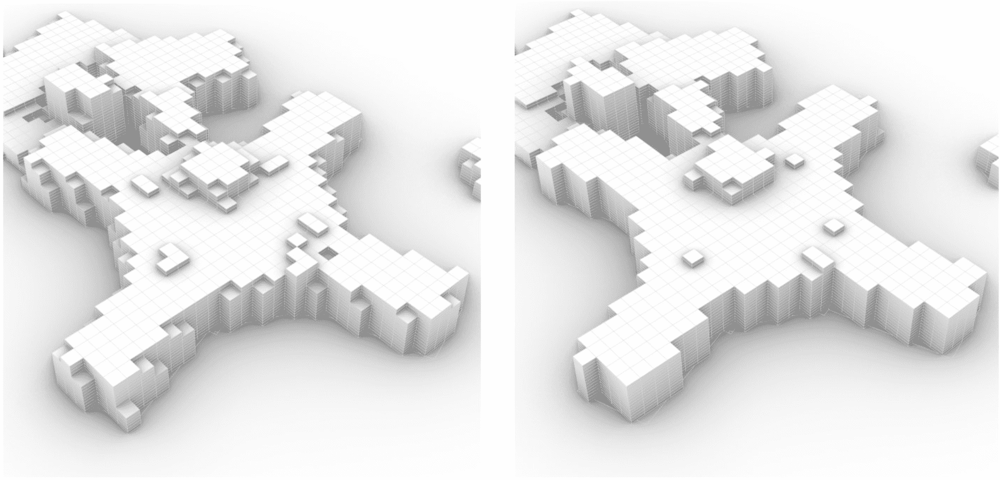

(a)  (Veselỳ, 2022)的体素网格结果。

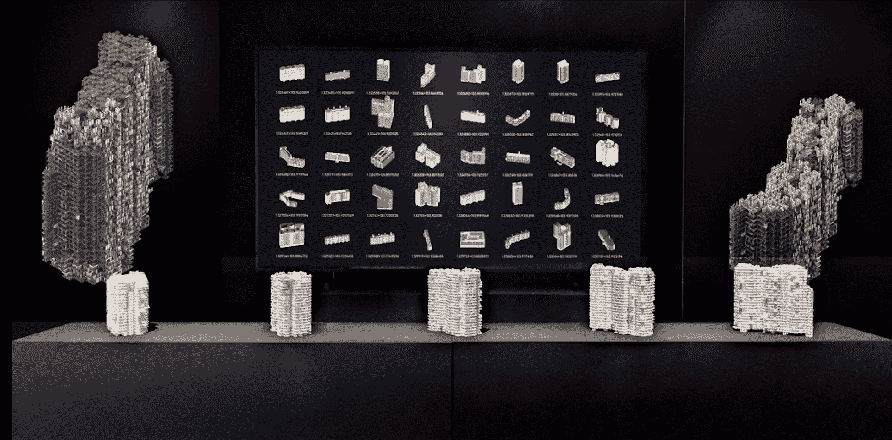

(b) 3D GAN 住房利用 3D GAN 生成具有 3D 资产作为输入数据集的住房。

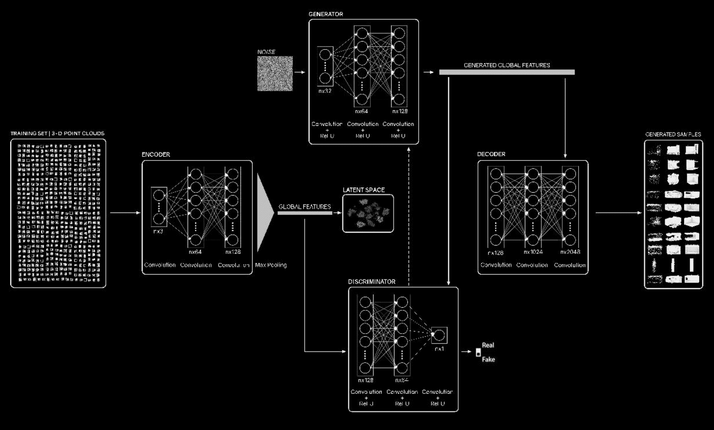

(c)  (Çakmak, 2022)的概述方法。

图 11. 应用 GAN 进行建筑设计的三个例子，用于 3D 固体形式生成。

目前，利用 GAN 在 3D 固体形式生成中的建筑设计都基于明确的表示，包括体素网格、点云和网格。3D 固体形式生成指的是直接获取、评估、转化和重新排列 3D 数据，使用深度生成模型（Steinfeld 等，2019）。

与此同时，通过改进的算法，GANs 可以识别诸如网格和点云等 3D 表示，这通过直接使用 3D 点云语义分割在 3D 空间中将生成范式从 2D 转向 3D。Immanuel Koh 使用一个 3D GAN 网络来训练一个包含新加坡高层建筑外部和内部的大型数据集，以自动生成创新的住房类型  (Koh, 2022) (见图 11(b))。它测试了生成空间的代理，通过提取建筑块排列来继承建筑形式的配置。此外，3D GANs 与 Houdini 的连接可以扩展算法以集成 3D 形状生成。例如，Joris Puteneers 在一个名为 ugly & stupid 的项目中使用 3D GAN 作为形状发现工具  ¹⁸¹⁸18 来源: [`putteneersjoris.xyz/projects/Ugly%20Stupid%20Honest/ugly_stupid_honest.html`](https://putteneersjoris.xyz/projects/Ugly%20Stupid%20Honest/ugly_stupid_honest.html)，该项目测试了算法在基于图像识别创建人工制品方面的能力。此外，Cakmak 在 GAN 中添加了一个编码解码网络来处理数据集并生成新的 3D 模型，这些模型随后以不同的替代格式呈现，如点云和网格 (Çakmak, 2022) (见图 11(c))。这也意味着通过将 AI 作为设计思维过程中的代理来扩展设计认知。对使用 3D GANs 在城市环境中进行几何提取的研究非常值得注意  (Veselỳ, 2022) (见图 11(a))。这使得通过 3D BAG 自动生成 3D 数据集  ¹⁹¹⁹19 3D BAG 概述，来源: [`docs.3dbag.nl/en/`](https://docs.3dbag.nl/en/)。3D BAG 数据集包含不同级别的 3D 细节，这些细节可以被 GAN 读取和操作。该模型基于三层信息进行训练：建筑几何、现场背景和兴趣区域。这些信息以栅格数据形式存储，用于深度学习中的体素网格的 3D 表示。

将训练数据集与空间设计目标相关的参数匹配的方法已被广泛应用于建筑设计解决方案中。这种应用中，GANs 作为生成框架，通常能够设计出具有明确设计目标的解决方案。

#### 3.2.3\. 限制

所讨论的方法存在若干限制。

风格变化较少。GANs 框架的性能严重依赖于输入数据的质量和特性，导致风格的变化有限。在 2D 到 3D 形态生成的背景下，大多数研究依赖于 styleGAN 作为形态生成的基础，这通常产生模仿“风格图像”的输出而没有可调选项。

类别单一。同样，由于一个训练过程只能处理数据集中的单一类别，输出受限于设计目的的类别。例如，3D-GAN-Housing 项目在高层建筑设计中有一定程度的重复，因为训练结构的限制（Koh, 2022）。由于数据集有限，这些块总是遵循相同的进化规则，从而降低了风格的变化，且仅限于特定类别。这可以适应于模块化住房设计，但不适用于虚拟空间生成。

设计中的不可预测性。GANs 的图像到图像翻译具有不可预测性。这些算法的训练过程耗时且需要大量计算资源。此外，这些过程背后的生成逻辑是，设计师只能在观察到最终输出后才能评估其效果。潜在向量在不同的周期中经历任意修改，增加了输出的复杂性和不可预测性。

拓扑不一致。首先，当 3D 形态仅从 2D 图像构建时，这些形态不可避免地会带有切片过程的痕迹，导致内部细节和结构的整体一致性丧失。其次，使用受限的 3D 分割算法在生成一致的形态时面临重大挑战，导致最终输出中出现间隙和缺陷的拓扑不一致。例如，将此方法应用于家具重建时，生成的 3D 形状存在不一致，因为该算法需要在特定类型的对象上进行预训练（Wu et al., 2016）。

3D 数据的计算要求。与其他模型相比，GAN 模型通常可以生成更详细和逼真的 3D 结构，但它们也更不稳定，训练起来更具挑战性。然而，将数据从 2D 转换为 3D 通常需要较长时间。

### 3.3\. 通过变分自编码器从潜在空间生成建筑形式

#### 3.3.1\. 使用 VAEs 生成 3D 形状

因此，前述的 GAN 方法，为了改善 GAN 的不稳定性，Brock 等人引入了变分自编码器来处理 3D 体素网格（Brock et al., 2016）。它利用一对编码器-解码器：编码器由四个 3D 卷积层组成，将信息映射到潜在向量，解码器则将潜在向量转换为 3D 体素。如前所述，后续工作提出了在模糊体素上进行平滑圆形边缘的改进（Mittal et al., 2022）。对于点云表示，尽管研究进展在克服困难，但 GAN 的不稳定性催生了基于编码器的其他类型的生成模型，如 3D 生成中的 VAE 和对抗自编码器模型（AAE）（Zamorski et al., 2020）。使用 VAE 生成网格的困难与 GAN 相似。对于处理拓扑的复杂性，称为多图表方法的网格参数化（Ben-Hamu et al., 2018）可以处理这种不规则的网格结构。许多方法通过使用这种方法来简化过程（Gao et al., 2019, 2021; Nash et al., 2020）。TM-Net 提出了一个改进的方法，该方法在模板立方体网格上基于 SDM-Net 定义了一个纹理空间（Gao et al., 2021）。

#### 3.3.2\. 潜在空间

对于建筑生成的研究，变分自编码器（VAEs）通过一对编码器-解码器在潜在空间中提取信息。如前所述，使用生成对抗网络（GANs）在生产科学和准确设计结果时的局限性源于框架本身。此外，现有的大多数基于深度学习（DL）的生成建筑物关注于二维图纸。因此，这些方法在提取和利用基本的低级空间语义和结构特征以理解设计意图和因素方面存在差距。Azizi 等人（Azizi et al., 2020）提出了 VAE，以编码和解码有关人们在空间中活动和动作的空间利用信息，从而生成可靠且可信的建筑构图。

#### 3.3.3\. 从潜在空间中提取建筑信息

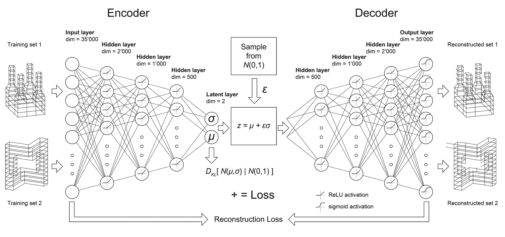

(a) VAE 在深度形式发现中的 3D 结构数据处理框架（de Miguel et al., 2019）。

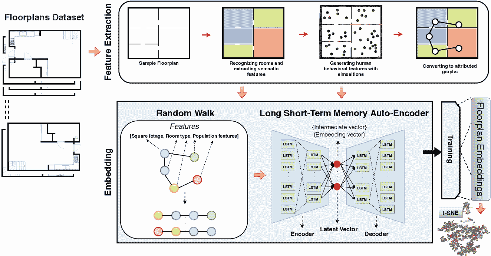

(b) 在（Azizi et al., 2020）中的方法概述。

图 12. 两个开创性的建筑设计利用了 VAE。

在开创性的 VAE 集成结构生成项目 Deep Form Finding（de Miguel 等，2019）中，研究人员使用从“3D-canvas”中提取的标记连通向量作为数据表示，这些向量被嵌入到矩形 3D 立方体中，因为立方体方便用于展示任何形式的 3D 结构信息（见图 12(a)）。最终成果通过 VAE 模型实现了建筑形式的 3D 体素化线框图，其中编码器处理输入数据并将其映射到低维潜在空间，而解码器则将潜在表示映射回原始输入空间。VAE 模型可以学习输入数据的连续潜在分布，并输出具有不同风格强度的不同形式的混合体。由于研究人员发现 3D GAN 难以学习 3D 信息，VAE 被认为具有更高的潜力，并用于测试深度神经网络在建筑领域操作 3D 几何体的能力。另一个概念验证应用是使用多对象 VAE 设计 3D 体素椅子（Kahraman 等，2021）。该应用旨在根据预定义的标准生成不同类型的椅子，从休闲到工作。VAE 还被用于将多个简单对象，如圆柱体、立方体和球体，形变为新的形状（Sebestyen 等，2021）。从上述应用中，我们可以看到，尽管 VAE 是一个成熟的神经网络，但在建筑中的复杂空间生成的使用仍然非常有限。另一种方法则通过检查建筑的平面图（Azizi 等，2020）进行训练，这与虚拟空间的构建逻辑无关，但这种方法考虑了 HCI 方法学中的人因因素。平面图是一种潜在的表示，编码了多个特征。自编码器将图表示为连续空间中的一个向量。作为中间表示的赋值图编码了空间语义、结构信息和人群行为特征（见图 12(b)）。

VAEs 利用点对点损失通过显式表示找到概率密度，以最小化对数似然函数的下界来获得最优解，这导致生成结果准确但分辨率较低。GANs 通过玩零和游戏来从训练分布中学习生成，这导致生成结果不确定但可以确保高质量的数据输入。这在建筑领域中产生了不同的应用。例如，GANs 的应用通常用于测试 AI 的能力，提供概念设计选项，并接近设计的民主化。而 VAEs 则总是用于形式发现过程，以生成不同的设计选项，适用于不同的标准和场景。然而，大多数将 GANs 或 VAEs 融入设计中的研究仅提供了一般的视觉美学方法，而不是针对空间功能和结构的设计解决方案（Regenwetter 等， 2022）。

### 3.4\. 3D 生成图像

| 方法名称 | 发表 & 年份 | 3D 表示 | 单/多视角 | 几何 | 可编辑性 | 可控性 | 突出 |
| --- | --- | --- | --- | --- | --- | --- | --- |
| 相机 | 对象 |
| NeRF  (顾等， 2021) | CVPR 2019 | 神经场 | 多视角 | ✓ | - | ✓ | ✓重光 | 3D 新视角合成 |
| HoloGAN  (阮富国等， 2019) | CVPR 2019 | 体素网格 | 单视角 | - | - | ✓ | - | - |
| Pi-GAN  (陈等， 2021) | CVPR 2021 | 神经场 | 单视角 | ✓ | - | 位置 | - | - |
| Giraffe  (尼梅耶和盖格， 2021) | CVPR 2021 | 神经场 | 单视角 | - | ✓ | ✓ | ✓ | - |
| StyleSDF  (奥尔-埃尔等， 2022) | CVPR 2022 | 神经场 | 单视角 | ✓ | - | ✓ | - | - |
| StyleNeRF  (顾等， 2021) | arXiv 2021 | 神经场 | 单视角 | ✓ | - | ✓ | - | - |
| DreamField  (贾因等， 2022) | CVPR 2022 | 神经场 | 多视角 | ✓ |  | ✓ | - | CLIP: 文本输入 |
| DreamFusion  (普尔等， 2022) | arXiv 2022 | 神经场 | 单视角 | ✓ | ✓ | ✓ | ✓ | 文本输入 |
| CLIP-NeRF  (王等， 2022) | CVPR 2022 | 神经场 | 单视角 | - | - | ✓ | - | CLIP: 文本输入 |

表 3. 3D 生成方法概述。单/多视角表示由单张图像生成的结果，采用单视角样本或由多张图像生成的结果，采用多视角图像。几何表示该方法是否允许导出为网格。可编辑性表示此生成过程是否支持编辑，如场景中的对象组合。3D 生成图像的控制包括相机姿势、位置或对象姿势、位置、重光等。

3D 感知图像合成引入了富有表现力且高效的神经场景表示，灵感来自于 3D 视图合成技术，如 NeRF (Xia 和 Xue, 2022)。它展示了 3D 视图一致性渲染、高效且富有表现力的呈现能力，以及交互式编辑性。由于这种方法能够弥补深度学习辅助建筑领域中缺乏大规模和高质量 3D 数据集的空白，因此非常适合建筑领域采用 3D 感知合成。3D 感知合成仅依赖于对 2D 图像进行监督，采用可微分神经渲染。这个过程涉及使用复杂的技术，如深度估计和多视图立体，通过从 2D 图像生成 3D 感知图像来实现。它展示了 3D 视图一致性渲染的能力。由于 VAE 模型在渲染时没有 3D 表示，大多数 3D 感知图像合成方法利用基于 GAN 的模型对潜在向量进行采样，并解码为目标 3D 表示。尽管一些方法实现了网格模型的导出 (Chan et al., 2021; Or-El et al., 2022; Gu et al., 2021)，但根据本调查，现有建筑研究尚未采用这种新颖的方法。我们提供了其在虚拟建筑生成中的潜力的证明。

#### 3.4.1\. 3D 感知图像合成及其可编辑性

3D 感知图像合成在 3D 模型的隐式表示方面取得了巨大的进展（Chan 等，2021；Jang 和 Agapito，2021；Niemeyer 和 Geiger，2021；Schwarz 等，2022），涉及两个主流问题：分辨率和多视角一致性。它通过结合生成模型，以更可控的方式利用图像合成来生成合成的 3D 场景表示。随后，研究集中于基于 GAN 模型生成 3D 感知图像（Nguyen-Phuoc 等，2019；Chan 等，2021）（图 9c d f）。例如，HoloGAN（图 9c）可以从未标记的 2D 图像中端到端地进行训练，而无需姿态标注、3D 形状或相同视角（Nguyen-Phuoc 等，2019）。这是第一个从自然图像中学习的无监督模型。一些最新的研究（Chan 等，2021；Or-El 等，2022；Gu 等，2021）证明它们的框架可以显著改善 3D 感知合成中的两个主要问题：高分辨率和合成图像的多视角一致性。基于 SDF 的方法定义了详细的 3D 表面，从而实现了一致的体绘制。例如，StyleSDF 在视觉和几何质量方面显示出更高的质量结果（Or-El 等，2022）（见图 9d）。此外，前沿方法表明，将 3D 感知图像与 CLIP 模型（Jain 等，2022；Wang 等，2022）结合，使得能够从自然语言描述中生成 3D 几何体。而 DreamFusion 则使用从 2D 扩散模型蒸馏得出的损失，而不是 CLIP（Poole 等，2022）。Dream Field 的原创性包含了 2D 图像到文本模型的预训练过程，以优化底层的 3D 表示。另一方面，一些先进的进展跳出了预训练 2D 图像到文本模型的固定框架。DreamFusion 在这种文本到图像预训练中融入了扩散模型作为强图像先验，从而提高了生成的效率。此外，3D 感知合成还适用于结合其他深度生成模型，如最近的扩散模型。下一节将具体阐述这一先进的扩散模型。3D 感知图像合成的主要目标是在任务中获取明确的相机姿态（Shi 等，2022）。可控性使用户能够进入更具参与感和互动性的环境。一些方法还支持对象姿态的可编辑性。例如，GIRAFFE 允许在场景中平移和旋转获得的 3D 对象（Niemeyer 和 Geiger，2021）。StyleNeRF 也允许在支持风格混合、反转和生成结果的语义编辑的同时改变风格属性（Gu 等，2021）。这种可编辑性从生成目标的细分角度提供了各种解决方案。

#### 3.4.2. 在建筑中利用 3D 感知图像

(Chan 等，2021) 通过将隐式神经表示转换为网格表示，开展了一种集成方法，该方法具备在 3D 空间中进行编辑的能力。StyleSDF（Or-El 等，2022）和 StyleNeRF（Gu 等，2021）也实施了几何转换方法。作为先驱建筑师的 Meng 等推出了一个配置化的 Colab，提供了友好的用户交互，支持基于 DreamField（Jain 等，2022）的条件文本输入和一些包括风格属性在内的参数²⁰²⁰20 来源：[`github.com/shengyu-meng/dreamfields-3D`](https://github.com/shengyu-meng/dreamfields-3D)。然而，单一效果对于简单对象仍存在问题。这些方法在高分辨率下有很多限制，无法生成具有内部空间的 3D 精确结构。在生成复杂建筑结构的任务中效率大幅降低。因此，从图像合成中获得具有内部结构和功能空间的有效建筑仍然困难重重。

尽管 3D 感知合成在虚拟建筑领域相对尚不成熟，但其将数据转换为网格、可控性以及与语言描述的多模态能力已展示了其生成复杂且独特建筑形式的潜力。与用于显式表示的生成方法相比，它提供了更为灵活、连续且高效的几何表示，以及与其他深度学习生成技术整合的能力。随着 3D DGMs（深度生成模型）和 3D 感知图像合成领域的发展，建筑师可能会越来越多地探索这一技术作为虚拟建筑设计的常用工具包的潜力。

### 3.5. 基于扩散模型的新兴生成方法

最近，作为深度生成模型之一的扩散模型因其高质量的细节和可控属性在生成 3D 形状方面引起了越来越多的关注。与生成对抗网络（GANs）相比，它在保真度上表现更佳，因为扩散模型能够处理复杂的细节和清晰的边缘，同时在训练过程中保持稳定并降低模式崩溃的风险。这种优势源于其能够对生成过程进行细粒度的控制，包括特定属性的生成或形状之间的平滑过渡。相对而言，GANs 由于控制不够精确，使得指定输出的期望属性变得困难。

#### 3.5.1. 3D 扩散模型

DreamFusion 采用扩散模型对图像进行去噪，以获得高质量的 3D 觉知图像合成（Poole 等，2022）。尽管条件扩散采样具有灵活性，但如 GANs 研究所揭示的，传统的扩散作为 DGM 仅采样像素。Ben 等人放弃了从 2D 图像到 3D 的大量数据处理，直接生成 3D 模型。在 DreamFusion 中，使用的是 3D 体积的参数，而不是图像的指标，$\theta$ 和 g 是体积渲染器。它通过最小化损失函数进行优化以生成样本。存在两个限制，DreamFusion 在最新的研究中得到了改进，称为 Magic3D（Lin 等，2022），这些限制包括几何体和纹理的低分辨率以及昂贵的计算和高强度内存。LION（Zeng 等，2022）通过结合扩散模型与层次 VAE 提供了更高质量的表现。与之前的 3D DDMs（Ho 等，2020b）相比，其操作和应用的灵活性也有所增加，得益于条件合成和形状插值。与大多数现有的 DDPMs 不同，PVD（Zhou 等，2021）采用统一的概率公式，通过单视图深度扫描生成高保真度的 3D 形状。 此外，扩散模型允许生成具有可控属性（如形状和纹理）的 3D 形状，可以通过对特定属性进行条件生成过程的修改。这些发现表明，扩散模型可能为 3D 形状生成提供了更强大且受控的方法，特别是在处理具有复杂细节和特定属性的复杂形状时。

#### 3.5.2\. 3D 扩散应用于建筑学

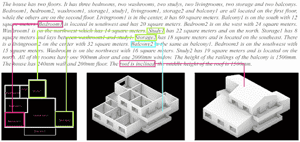

（a）在 (Zhang，2020) 中选择的结果是基于语言学的建筑形式 DGM，这些模型根据文本描述进行 3D 形式预测。

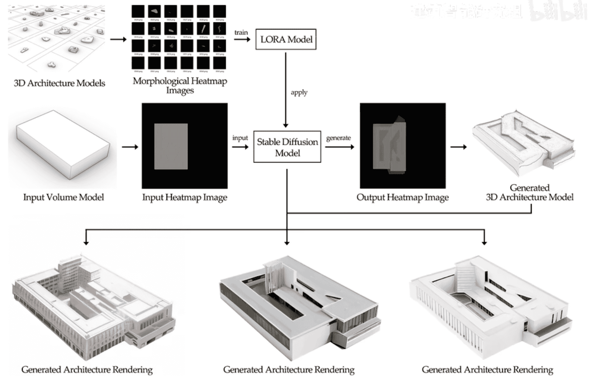

（b）结合稳定扩散（SD）与 AIG 的 Lora 的方法；来源：[`www.bilibili.com/video/BV1Qb411Z7UP/`](https://www.bilibili.com/video/BV1Qb411Z7UP/)。

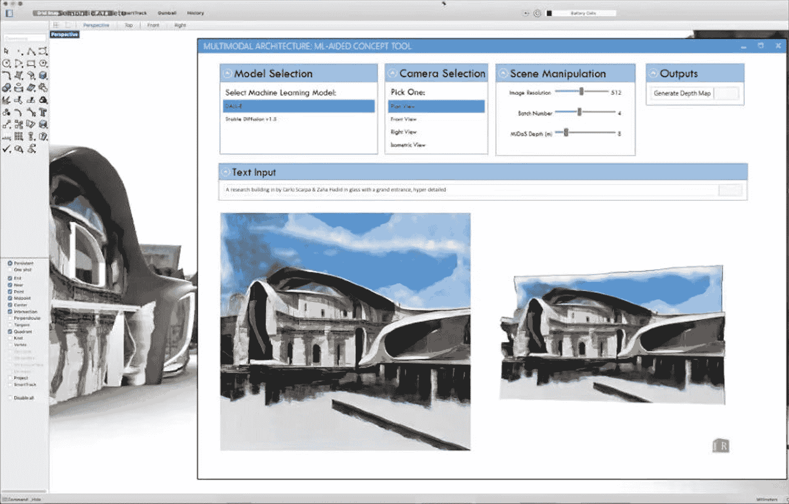

（c）一个插件在 3D 建模软件 Rhino 中利用了扩散模型（Guida，2023）。

图 13. 利用扩散模型的建筑设计。

在建筑领域中，扩散模型的使用是一个新兴且有前景的发展领域。在 Rhino 的可视化编程环境 Grasshopper 中，直接将应用程序编程接口（API）集成到扩散模型中，有可能引发建筑 3D 形态生成的范式转变。例如，形态学热图图像从 3D 建筑模型转变后，可以使用 Lora 模型进行训练，其中稳定扩散可以进一步编辑（见图 13(b)). 通过稳定扩散处理生成的灰度图像包括高度信息，可以在同一建模环境中轻松转换为网格模型²¹²¹21 来源: [`www.bilibili.com/video/BV1Qb411Z7UP/`](https://www.bilibili.com/video/BV1Qb411Z7UP/)。

#### 3.5.3\. 基于文本的可控性和生成模型

以文本到 3D 模型为特色的方法在过去两年中在生成 3D 形状方面迅猛发展（Chen et al., 2018; Poole et al., 2022; Liu et al., 2022; Lin et al., 2022; Nichol et al., 2022）。我们追踪到的最早研究是 text2shape（Chen et al., 2018），其中结合自然语言的 3D 模型数据集形成了隐式语义链接。最近的研究在将文本和 3D 模型与无监督学习结合方面取得了显著突破。类似于 3D 感知合成，大多数方法利用 CLIP 进行无监督学习（Lin et al., 2022; Nichol et al., 2022）。

文本到 3D 的方法相比其他生成 3D 模型的方法展示了更优的可控性以及定制化的风格属性。该方法解读文本提示，生成直观的视觉表现，以满足设计意图。例如，Magic 3D（Lin et al., 2022）开发了一套工具包，通过各种图像条件和基于提示的编辑提供对 3D 生成样式和内容的高级控制，以实现所需结果。因此，文本到 3D 的方法使 3D 几何生成民主化，提供了不同专业水平的个体进行创造的机会。如前所述，将 Colab 与深度学习算法结合，也为设计师、艺术家和业余爱好者参与内容生产的新兴领域提供了通道。

#### 3.5.4\. 由文本驱动的 3D 形态在建筑中的应用

有一些初步应用使用语言作为起点来利用设计。然而，生成模型在这些应用中受到限制。例如，Del Campo 使用了注意力生成对抗网络（AttnGAN）来协助将多功能空间的书面创意转化为视觉输出的头脑风暴过程（del Campo, 2021）。最终结果基于之前展示的视觉效果。Zhang 开发了一个机器学习框架，能够通过使用文本来将输入几何体编码成新的几何体，以形成预测（Zhang, 2020）（见图 13(a)）。在这个框架中，不同用途的空间通过相邻矩阵进行了训练，以理解语言指令。通过自然语言监督的整合，扩散模型在形状生成中表现出高质量的性能，并且具有成为 HCI 工具的巨大潜力。George Guida 探索了在 3D 形状生成过程中用户界面集成的研究，使设计师能够通过结合这些用户友好的语言模型，在多模态循环中接受更多设计机会（Guida, 2023）（见图 13(c)。

## 4\. 研究议程

在第 2 和第三部分中，我们调查了虚拟世界中的建筑生成急需与人类需求相关联的 HCI 和 CAD 3D 建筑方法，以实现高效且贴近人类的创新和自由的建筑形式。我们调查的 3D 建筑生成方法依赖于人工智能框架，其中 HCI 方法负责在虚拟环境中生成和构建的辅助。

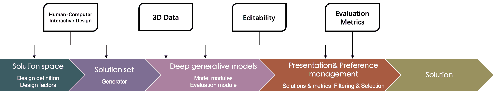

图 14. DGMs 辅助建筑设计的完整过程中的研究议程。

尽管许多研究指出了虚拟现实与建筑交叉领域的广泛应用，但在这些条件下仍缺乏系统性的评估。此外，使用互动技术系统地量化虚拟建筑的生成并评估其需求是否得到满足至关重要。此外，在生成方法中进一步探索互动方法也存在不足 （Lin 和 Lo, 2021）（见图 14。本文中，由于互动限制，虚拟现实技术在建筑设计过程中的应用效率低下（Lin 和 Lo, 2021）。因此，为了推动这一研究主题，我们倡导以下研究主题以提高生产流程中的实施便捷性。本节揭示了针对虚拟建筑生成的几项研究议程，重点关注这一 HCI 方法论和人因工程。

### 4.1\. 数据限制

数据限制是虚拟建筑和计算建筑中最大的挑战之一。Regenwetter 等人提出了这个挑战中的三个主要问题。首先，缺乏可用和公开的 3D 数据集成为设计行业的障碍。第二，数据集中的数据量不足。第三，数据集中的数据稀疏性和偏差存在。我们的回顾表明，3D 数据集的数据限制对虚拟建筑至关重要。这导致了在 GANs 或 VAEs 中的 3D 固体生成时的计算限制，因为这些设计师找不到适当的 3D 建筑数据集。

### 4.2\. 可编辑性

#### 4.2.1\. 3D 形状生成中的编辑

如第三部分所述，我们描述了对依赖于 3D 模型编辑的设计行业中可编辑性的意义。这种意义在于反馈和调整的及时性以及对 3D 空间的感知。一些研究展示了用户在 3D 形状生成技术中的编辑自主性。例如，Liu 等提出了一种通过绘制目标模型为 3D 体素网格的用户中心 3D 形状生成方法，借助 3D GAN。与此同时，更多方法展示了通过隐式表示间接编辑 3D 模型（Hao 等，2020; Ibing 等，2021; Deng 等，2021; Zheng 等，2021）。与显式表示相比，他们更紧凑的方法包括稀疏 3D 点或边界框（Shi 等，2022）。前者方法在虚拟建筑设计中被广泛使用，作为以用户为中心的参与式设计体验。虽然后者方法在生产者实现特定设计目标方面存在差距，但我们仍需要更多用户友好的开发工具、软件或在线平台。

#### 4.2.2\. 在 3D 感知合成中的编辑

对于 3D 感知图像合成方法，在可编辑性方面仍有很大改进空间。所有 3D 感知控制器都支持相机姿态，而有些方法还实现了新对象的插入和姿态控制。与 3D 形状生成不同，3D 感知图像合成排除了在 3D 空间中直接用户操作，要求通过潜在向量编辑来控制组合、形状和外观。这些潜在向量建模所有未被物理因素捕捉的变量，同时能够控制场景中的微小变化，如照明、着色等（Xia 和 Xue，2022）。此外，还有几种方法允许额外输入来改变场景编辑，如文本描述、语义标签（Liu 等，2022; Jahan 等，2021; Fu 等，2022），图像（Sanghi 等，2022）和参数控制。这种方法类似于建筑的参数化设计，更加贴近经典设计过程，通过用户可调面板控制最终形式。因此，这种可编辑性是其在大量 AIGC 驱动的 3D 设计中迅速流行的原因之一。

### 4.3\. 评估指标

#### 4.3.1\. 结果的效率

保真度、照片级真实感和几何质量是评估指标的重要元素。然而，现有的评估方法缺乏对这些指标的评估。直观地说，这些生成的模型并未满足使用的规范条件。此外，Regenwetter 等人指出，由于当前 3D 数据库的不充分以及缺乏真实参考 (Regenwetter et al., 2022)。评估标准集中在生成模型的稳定性上，而不是反映与真实样本的差距。总体而言，评估生成结果与目标结果之间差异的可靠方法严重不足。

#### 4.3.2\. 质性人工评估

人类感知，尽管主要是质性的，却成为设计师的关键反馈，作为理解用户设计适配性的指标，从而改进设计方案。用户评估的一个典型方法涉及用户的行为，例如运动路径、注意力等。Ding 等人提出，这些空间感知与建筑结构特征、建筑空间几何特征和建筑空间功能属性相关 (Ding et al., 2022)。从质性和量化的角度来看，将这些生物和感知数据收集和处理与复杂设计决策中的空间元素关联的实际影响难以评估。尽管如此，作为一种人类感官的视力已被用来建立与质性人工评估的关系。一些研究集中于视力，以可视化注意力评估，从而更好地理解用户行为并进行评估 (Narahara, 2022; Wells et al., 2021; Pei et al., 2021)。开发了一种眼动追踪体素环境雕刻器 (EVES)，在其中从设计师获得的眼动追踪数据直接作为建模环境中的输入，用于操作和雕刻体素 (Wells et al., 2021)。这些质性人工感知的方法为深度生成模型提供了多种可行的评估指标，以确定空间感知和情感影响。

#### 4.3.3\. 美学评估

美学评估使我们能够操作自动化计算机方法来评估结果并优化基于人类位置和对环境理解的空间，同时释放人力资源。例如，虚拟空间可以根据从评估中获得的数据自发地进行交互和变化。这种定量美学评估标准与优化建筑形式的集成有潜力嵌入生成形式的流程中。各种有关 CAD 生成形状或空间的研究提到了美学评估。它主要集中在特征提取和视觉特征的计算评估上。整合视觉美学标准是具有挑战性的，因为它应用定量方法来评估定性形式特征。在计算机视觉中，对空间和结构设计的评估涉及视觉特征分析（VCA）、结构分析（SA）和几何分析（GA）（Narahara，2022）。

一种类型表示通过标准化一系列视觉特征的标准线对建筑形式进行评估。这些特征包括复杂性、异质性、连续性和表面凹陷，这些特征基于展览设计项目进行评估（STUART-SMITH 和 DANAHY，2022）。这些结果表明，一组有限的美学设计标准可以与结构和几何数据在定量指标中相关联。此外，一些研究对特定几何模型的视觉特征评估提供了洞见（Kavakoglu，2021）。另一种类型则代表了嵌入参数模型中的定量美学评估示例（Sardenberg，2019）。尽管如此，为 3D 深度生成模型提出的视觉特征和相应的分析标准提供了一种极为有限的美学评估形式。

### 4.4\. 人机交互设计

#### 4.4.1\. 以用户为中心的自适应设计

现有研究展示了与行为或设计目的的实时形式交互，仍主要集中于参数化设计与建筑形式之间的交互。参数化设计和深度学习方法中的算法黑箱是两种不同的方法。目前，如何在深度学习方法中实时设计和生成形式仍是一个未知的问题。通过智能可穿戴设备，普适计算在虚拟环境中可以更为有用。虚拟现实中的大气品质模拟探讨了空间和方向性，以热感知作为反馈  （Sheehan et al., 2021）。另一个项目探讨了虚拟空间中场景存在的思想和情感，将生理数据转化为数字空间  （Tosello, 2003）。这两个项目都仅仅是艺术表现方向。另一方面，现有的实时交互，如数据感知，影响建筑形式，重点研究参数化建筑  （Guo et al., 2021; Zarei et al., 2021）。这种参数化设计更接近经典设计过程，而与通过 DGMs 完全自动化生成不同。我们相信虚拟建筑的未来将朝向基于实时数据的交互自响应形式，通过深度学习生成的方法。这将引领虚拟建筑的自由度。我们相信，在这样的交互实现之前，还需要经过一段漫长的旅程，并且需要与深度学习生成的方法相结合。

#### 4.4.2\. 人类感知

在人机交互中，考虑五种感官的生物信号收集是一个典型的研究重点，以及如何处理上下文感知交互。同时，感知是对感官信息进行组织、识别和解释，以理解所呈现的信息和环境。此外，用户评估方法通常在生物信号收集、上下文感知以及对信息和环境的理解之后，作为人机交互的后续阶段进行。

用户评价通常作为测试和迭代设计结果的一个指标。它通常考虑用户在完成特定任务时的表现，这一过程需要定量和定性评估，包括生物数据收集和小组访谈等方法。由于评价来源于虚拟环境中人类体验产生的生物信号和感知，因此我们在这一部分进行了详细阐述。空间可能使用户产生特定的情感状态，如放松或紧张，利用空间的形状、视角、光线、颜色（Tonn, 2017）和材料（Barsan-Pipu et al., 2020）等属性。用户评价方法在 HCI 领域中经常被采用，用于测试设计结果和作为迭代目的的指标。它通常考虑用户在完成特定任务时的表现。这一过程涉及使用定量和定性问卷评估、生物数据和小组访谈等方法。

情感计算系统的信息物理设计在 3D 生成方法中非常重要。HCI 领域的研究广泛应用于空间感知数据的调查（Ding et al., 2022）、神经科学认知生物特征（MUN et al., 2019；Ding et al., 2022）、眼动追踪（Barsan-Pipu et al., 2020；Pei et al., 2020）以及基于生物特征的情感指标（Nguyen et al., 2019；Homolja et al., 2020；Pei et al., 2020）。近年来对嵌入式传感器和执行器的可穿戴设备的持续热潮，推动了在设计框架内探索虚拟空间（Diniz et al., 2019），以促进增强的人机互动。该领域在 3D 建模、虚拟现实可视化、传感技术和智能穿戴设备的交叉点上高度依赖跨学科的合作，以发展人机环境互动并提升我们对空间体验的认知。

#### 4.4.3\. 参与式设计

这指的是利益相关者在设计过程和决策中的参与，从模拟可视化到数据收集，再到评估。虚拟环境可以提供协作环境和基于现实的参与设计模拟。这是建筑学研究中越来越重要的研究领域（Kwiecinski et al., 2017）。参与式研究的一个关键特征是包容性，包括调整研究环境、方法和传播途径，以允许最广泛和最便捷的参与。Kim et al. 将 pix2pix 和 CycleGAN 应用于实时集体设计工具包，以便市民为自己的城市街道赋予风格（KIM et al., 2022）。这一好处使非专业人士和专业设计师能够在同一水平上参与协作设计决策。非专业人士的关键输入在设计中发挥着不可或缺的作用，例如政府人员和社区成员。

## 5. 结论

本研究是对 3D 形状或图像生成、社会事件和计算架构规模之间关系的全面调查，并提供了重新思考的视角。它是“社会”和“对象”的综合体。CAD 的生成方法非常普遍，大多数已考虑了技术原则和设计规范，如法规、经济和社会限制，以及空间效率。在调查中，我们研究了相关工作，这些工作表明深度神经网络用于自动生成虚拟建筑的方法。我们关注 3D 生成方法和设计学科，旨在从跨学科的角度填补当前的研究空白。在建筑设计中使用了 GANs、VAEs 和 DDPMs 三类方法。然而，由于技术障碍和数据集限制，建筑师只能使用繁琐的方法生成计算架构。我们的调查揭示了目前的研究还不够系统，尤其是在虚拟建筑领域。我们呼吁进一步研究 3D 数据集、可编辑性、评价指标和人机交互设计。

## 参考文献

+   (1)

+   Abdar et al. (2021) Moloud Abdar et al. 2021. 对深度学习中不确定性量化的综述：技术、应用及挑战。*信息融合* 76 (2021), 243–297。

+   Achlioptas et al. (2018) Panos Achlioptas, Olga Diamanti, Ioannis Mitliagkas, 和 Leonidas Guibas. 2018. 学习 3D 点云的表示和生成模型。在*国际机器学习会议*。PMLR, 40–49。

+   Aggarwal et al. (2021a) Alankrita Aggarwal et al. 2021a. 生成对抗网络：理论和应用概述。*国际信息管理数据洞察杂志* 1, 1 (2021), 100004。

+   Aggarwal et al. (2021b) Alankrita Aggarwal, Mamta Mittal, 和 Gopi Battineni. 2021b. 生成对抗网络：理论和应用概述。*信息管理数据洞察国际期刊* 1, 1 (2021), 100004. [`doi.org/10.1016/j.jjimei.2020.100004`](https://doi.org/10.1016/j.jjimei.2020.100004)

+   Akinosho et al. (2020) Taofeek D Akinosho 等. 2020. 建筑行业中的深度学习：现状回顾和未来创新。*建筑工程期刊* 32 (2020), 101827.

+   Alom et al. (2019) Md Zahangir Alom 等. 2019. 深度学习理论和架构的最新调查。*电子学* 8, 3 (2019), 292.

+   Appleton (1996) Jay Appleton. 1996. *风景的体验*。Wiley Chichester。

+   Arshad 和 Beksi (2020) Mohammad Samiul Arshad 和 William J Beksi. 2020. 一种进阶条件生成对抗网络，用于生成密集且上色的 3D 点云。见于 *2020 年国际 3D 视觉会议 (3DV)*。IEEE, 712–722.

+   Asmar 和 Sareen (2020) Karen El Asmar 和 Harpreet Sareen. 2020. 机器插值：将侧向思维整合到建筑计算工具中的 GAN 管道。（2020）。

+   ASSRU (1999) ASSRU. 1999. 算法社会科学研究单位（ASSRU）。[`www.assru.org/index.html`](http://www.assru.org/index.html)

+   Azizi et al. (2020) Vahid Azizi 等. 2020. 布局嵌入与潜在语义和人类行为注释。见于 *第 11 届建筑与城市设计模拟年会论文集*。1–8.

+   Baduge et al. (2022) Shanaka Kristombu Baduge 等. 2022. 人工智能和智能视觉在建筑和施工 4.0 中的应用：机器和深度学习方法与应用。*建筑自动化* 141 (2022), 104440.

+   Bank et al. (2022) Mathias Bank, Viktoria Sandor, Kristina Schinegger, 和 Stefan Rutzinger. 2022. 学习空间性——一种通过标记部分设计建筑模型的 GAN 方法。（2022）。

+   Barsan-Pipu et al. (2020) Claudiu Barsan-Pipu, Nathalie Sleiman, 和 Theodor Moldovan. 2020. 利用游戏技术生成虚拟程序环境的情感计算。（2020）。

+   Bartle (2004) Richard A Bartle. 2004. *设计虚拟世界*。New Riders.

+   Bartle (2010) Richard A Bartle. 2010. 从 MUDs 到 MMORPGs：虚拟世界的历史。*互联网研究国际手册* (2010), 23–39.

+   Bava (2020) Alessandro Bava. 2020. 计算倾向。[`www.e-flux.com/architecture/intelligence/310405/computational-tendencies/`](https://www.e-flux.com/architecture/intelligence/310405/computational-tendencies/)

+   Ben-Hamu et al. (2018) Heli Ben-Hamu, Haggai Maron, Itay Kezurer, Gal Avineri, 和 Yaron Lipman. 2018. 多图生成表面建模。*ACM 图形学期刊 (TOG)* 37, 6 (2018), 1–15.

+   Bottazzi (2018) Roberto Bottazzi. 2018. *计算机之外的数字建筑：计算设计的文化历史碎片*。Bloomsbury Publishing。

+   Brock et al. (2016) Andrew Brock, Theodore Lim, James M Ritchie, 和 Nick Weston. 2016. 使用卷积神经网络的生成与判别体素建模。*arXiv 预印本 arXiv:1608.04236* (2016)。

+   Cai et al. (2020) Ruojin Cai, Guandao Yang, Hadar Averbuch-Elor, Zekun Hao, Serge Belongie, Noah Snavely, 和 Bharath Hariharan. 2020. 学习梯度场进行形状生成。见于 *欧洲计算机视觉会议*。Springer，364–381。

+   Çakmak (2022) Başak Çakmak. 2022. *通过计算机视觉和生成对抗深度学习扩展设计认知*。硕士论文。中东技术大学。

+   Cao et al. (2020) Wenming Cao, Zhiyue Yan, Zhiquan He, 和 Zhihai He. 2020. 几何深度学习的综合调查。*IEEE Access* 8 (2020), 35929–35949。

+   Chaillou (2020) Stanislas Chaillou. 2020. Archigan：人工智能 x 建筑。见于 *建筑智能*。Springer，117–127。

+   Chaillou (2022) Stanislas Chaillou. 2022. 建筑人工智能的到来。见于 *人工智能与建筑*。Birkhäuser，32–61。

+   Chaitin (1975a) Gregory J Chaitin. 1975a. 随机性与数学证明。*科学美国人* 232, 5 (1975), 47–53。

+   Chaitin (1975b) Gregory J Chaitin. 1975b. 一种形式上与信息理论相同的程序大小理论。*ACM 期刊（JACM）* 22, 3 (1975), 329–340。

+   Chan et al. (2021) Eric R Chan 等. 2021. pi-gan：用于 3D 感知图像合成的周期性隐式生成对抗网络。见于 *IEEE/CVF 计算机视觉与模式识别会议论文集*。5799–5809。

+   Chen et al. (2018) Kevin Chen, Christopher B Choy, Manolis Savva, Angel X Chang, Thomas Funkhouser, 和 Silvio Savarese. 2018. Text2shape：通过学习联合嵌入从自然语言生成形状。见于 *亚洲计算机视觉会议*。Springer，100–116。

+   Chen and Zhang (2019) Zhiqin Chen 和 Hao Zhang. 2019. 学习隐式场进行生成形状建模。见于 *IEEE/CVF 计算机视觉与模式识别会议论文集*。5939–5948。

+   Cheng et al. (2019) Lung-Pan Cheng, Eyal Ofek, Christian Holz, 和 Andrew D. Wilson. 2019. VRoamer：在大型未知现实世界建筑环境中行走时生成即时虚拟现实体验。见于 *2019 IEEE 虚拟现实与三维用户界面会议（VR）*。359–366。 [`doi.org/10.1109/VR.2019.8798074`](https://doi.org/10.1109/VR.2019.8798074)

+   Claypool (2019) Mollie Claypool. 2019. 离散自动化 - 建筑 - e-flux。 [`www.e-flux.com/architecture/becoming-digital/248060/discrete-automation/`](https://www.e-flux.com/architecture/becoming-digital/248060/discrete-automation/)

+   Creswell et al. (2018) Antonia Creswell, Tom White, Vincent Dumoulin, Kai Arulkumaran, Biswa Sengupta 和 Anil A Bharath，2018 年。《生成对抗网络概述》。*IEEE 信号处理杂志* 35, 1 (2018)，53–65。

+   Croitoru et al. (2023) Florinel-Alin Croitoru, Vlad Hondru, Radu Tudor Ionescu 和 Mubarak Shah，2023 年。《视觉中的扩散模型：调查》。*IEEE 模式分析与机器智能汇刊* (2023)。

+   Dargan et al. (2020) Shaveta Dargan 等人，2020 年。《深度学习及其应用调查：机器学习的新范式》。*计算方法工程档案* 27 (2020)，1071–1092。

+   de Miguel et al. (2019) Jaime de Miguel 等人，2019 年。《利用变分自编码器进行深度形状发现：对结构类型的深度形状发现》。收录于 *第 37 届欧洲计算机辅助建筑设计教育与研究会议（eCAADe）与第 23 届伊比利亚美洲数字图形学会议（SIGraDi）*。

+   del Campo (2021) Matias del Campo，2021 年。《建筑、语言与人工智能—语言、注意力生成对抗网络（AttnGAN）与建筑设计》。 (2021)。

+   Del Campo et al. (2019) Matias Del Campo, Sandra Manninger, M Sanche 和 L Wang，2019 年。《AI 的教堂—后人类设计生态中的建筑审视》。收录于 *第 24 届 CAADRIA 会议，维多利亚大学，惠灵顿，新西兰*。15–18。

+   del Campo et al. (2022) Matias del Campo, Sandra Manninger 和 Yining Yuan，2022 年。《Generali 中心维也纳奥地利》。 [`caadria2022.org/projects/generali-center-vienna-austria/`](https://caadria2022.org/projects/generali-center-vienna-austria/)

+   Deng et al. (2020) Jiajun Deng, Shaoshuai Shi, Pei-Cian Li, Wen gang Zhou, Yanyong Zhang 和 Houqiang Li，2020 年。《Voxel R-CNN: 朝向高性能体素基础的 3D 目标检测》。*ArXiv* abs/2012.15712 (2020)。

+   Deng et al. (2021) Yu Deng, Jiaolong Yang 和 Xin Tong，2021 年。《变形隐式场：利用学习的稠密对应建模 3D 形状》。收录于 *IEEE/CVF 计算机视觉与模式识别会议论文集*，10286–10296。

+   Di Carlo et al. (2022) Raffaele Di Carlo, Divyae Mittal 和 Ondrej Veselỳ，2022 年。《利用 Pix2Pix GAN 生成给定城市背景的 3D 建筑体积》。*法律文献 D/2022/14982/02* (2022)，287。

+   Ding et al. (2022) Xinyue Ding, Xiangmin Guo, Tian Tian Lo 和 Ke Wang，2022 年。《空间环境影响人类情感感知—利用生理信号模式》。 (2022)。

+   Dinh et al. (2014) Laurent Dinh, David Krueger 和 Yoshua Bengio，2014 年。《Nice: 非线性独立成分估计》。*arXiv 预印本 arXiv:1410.8516* (2014)。

+   Diniz et al. (2019) Nancy Diniz, Frank Melendez, Woraya Boonyapanachoti 和 Sebastian Morales，2019 年。《体态架构—实时数据可视化与响应式沉浸式环境》。 (2019)。

+   Dionisio et al. (2013) John David N Dionisio, William G Burns III, 和 Richard Gilbert. 2013. 3D 虚拟世界和元宇宙：当前状态及未来可能性。*ACM Computing Surveys (CSUR)* 45, 3 (2013), 1–38.

+   Dong et al. (2021) Shi Dong, Ping Wang, 和 Khushnood Abbas. 2021. 深度学习及其应用的综述。*Computer Science Review* 40 (2021), 100379.

+   Fan et al. (2022) Linxi Fan, Guanzhi Wang, Yunfan Jiang, Ajay Mandlekar, Yuncong Yang, Haoyi Zhu, Andrew Tang, De-An Huang, Yuke Zhu, 和 Anima Anandkumar. 2022. Minedojo: 构建具有互联网规模知识的开放式具身智能体。*arXiv preprint arXiv:2206.08853* (2022).

+   Fu et al. (2022) Rao Fu, Xiao Zhan, Yiwen Chen, Daniel Ritchie, 和 Srinath Sridhar. 2022. Shapecrafter: 一种递归文本条件的 3D 形状生成模型。*arXiv preprint arXiv:2207.09446* (2022).

+   Gao et al. (2022) Jun Gao, Tianchang Shen, Zian Wang, Wenzheng Chen, Kangxue Yin, Daiqing Li, Or Litany, Zan Gojcic, 和 Sanja Fidler. 2022. Get3d: 一种从图像中学习的高质量 3D 纹理形状生成模型。*Advances In Neural Information Processing Systems* 35 (2022), 31841–31854.

+   Gao et al. (2019) Lin Gao 等人 2019. SDM-NET: 用于结构化可变形网格的深度生成网络。*ACM Transactions on Graphics (TOG)* 38, 6 (2019), 1–15.

+   Gao et al. (2021) Lin Gao, Tong Wu, Yu-Jie Yuan, Ming-Xian Lin, Yu-Kun Lai, 和 Hao Zhang. 2021. Tm-net: 用于纹理网格的深度生成网络。*ACM Transactions on Graphics (TOG)* 40, 6 (2021), 1–15.

+   Genova et al. (2019) Kyle Genova, Forrester Cole, Daniel Vlasic, Aaron Sarna, William T Freeman, 和 Thomas Funkhouser. 2019. 使用结构化隐式函数学习形状模板。见 *Proceedings of the IEEE/CVF International Conference on Computer Vision*. 7154–7164.

+   Gilbert (2011) RL Gilbert. 2011. PROSE 项目：一个关于元宇宙的世界内行为研究计划。*Journal of Virtual Worlds Research* 4, 1 (2011), 3–18.

+   Gu et al. (2021) Jiatao Gu, Lingjie Liu, Peng Wang, 和 Christian Theobalt. 2021. Stylenerf: 一种基于风格的 3D 感知生成器，用于高分辨率图像合成。*arXiv preprint arXiv:2110.08985* (2021).

+   Guida (2023) George Guida. 2023. 多模态建筑：机器学习辅助设计过程中的语言应用。 (2023).

+   Gulrajani et al. (2017) Ishaan Gulrajani, Faruk Ahmed, Martin Arjovsky, Vincent Dumoulin, 和 Aaron C Courville. 2017. 改进的 Wasserstein GANs 训练方法。*Advances in neural information processing systems* 30 (2017).

+   Guo et al. (2020) Yulan Guo, Hanyun Wang, Qingyong Hu, Hao Liu, Li Liu, 和 Mohammed Bennamoun. 2020. 深度学习在 3D 点云中的应用：综述。*IEEE transactions on pattern analysis and machine intelligence* 43, 12 (2020), 4338–4364.

+   Guo et al. (2021) Zhe Guo 等人 2021. 基于实时交互过程的响应形状设计方法。 (2021).

+   Hall 等人 (1968) Edward T Hall, Ray L Birdwhistell, Bernhard Bock, Paul Bohannan, A Richard Diebold Jr, Marshall Durbin, Munro S Edmonson, JL Fischer, Dell Hymes, Solon T Kimball 等人. 1968. 个人空间学 [及评论与回复]。*当前人类学* 9, 2/3 (1968), 83–108。

+   Hao 等人 (2020) Zekun Hao 等人. 2020. Dualsdf：使用两级表示进行语义形状操控。载于 *IEEE/CVF 计算机视觉与模式识别会议论文集*。7631–7641。

+   Harshvardhan 等人 (2020) GM Harshvardhan 等人. 2020. 机器学习中生成模型的综合调查与分析。*计算机科学评论* 38 (2020), 100285。

+   Hatcher 和 Yu (2018) William Grant Hatcher 和 Wei Yu. 2018. 深度学习的调查：平台、应用与新兴研究趋势。*IEEE Access* 6 (2018), 24411–24432。

+   Henzler 等人 (2019) Philipp Henzler, Niloy J Mitra, 和 Tobias Ritschel. 2019. 逃离柏拉图的洞穴：从对抗渲染中获得的 3D 形状。载于 *IEEE/CVF 国际计算机视觉会议论文集*。9984–9993。

+   Ho 等人 (2020a) Jonathan Ho, Ajay Jain, 和 P. Abbeel. 2020a. 去噪扩散概率模型。*ArXiv* abs/2006.11239 (2020)。

+   Ho 等人 (2020b) Jonathan Ho, Ajay Jain, 和 Pieter Abbeel. 2020b. 去噪扩散概率模型。*神经信息处理系统进展* 33 (2020), 6840–6851。

+   Homolja 等人 (2020) Mitra Homolja, Sayyed Amir Hossain Maghool, 和 Marc Aurel Schnabel. 2020. 移动穿越建筑环境对情感和神经生理状态的影响——系统文献综述。 (2020)。

+   Hong 等人 (2020) Tianzhen Hong, Zhe Wang, Xuan Luo, 和 Wanni Zhang. 2020. 机器学习在建筑生命周期中的研究与应用的最新进展。*能源与建筑* 212 (2020), 109831。

+   Huang 等人 (2021) Jeffrey Huang, Mikhael Johanes, Frederick Chando Kim, Christina Doumpioti, 和 Georg-Christoph Holz. 2021. 关于生成对抗网络、自然语言处理和建筑：结合人类与机器智能进行有意义设计的生成与评估。*技术—建筑+设计* 5, 2 (2021), 207–224。

+   Hui 等人 (2020) Le Hui, Rui Xu, Jin Xie, Jianjun Qian, 和 Jian Yang. 2020. 渐进点云解卷积生成网络。载于 *计算机视觉–ECCV 2020: 第 16 届欧洲会议，英国格拉斯哥，2020 年 8 月 23–28 日，会议论文集，第十五部分 16*。Springer，397–413。

+   Ibing 等人 (2021) Moritz Ibing, Isaak Lim, 和 Leif Kobbelt. 2021. 基于网格的隐式函数的 3D 形状生成。载于 *IEEE/CVF 计算机视觉与模式识别会议论文集*。13559–13568。

+   Ingram 等人 (1996) Rob Ingram 等人. 1996. 建造虚拟城市：将城市规划原则应用于虚拟环境的设计。载于 *ACM 虚拟现实软件与技术研讨会论文集*。83–91。

+   Jabbar 等（2021）Abdul Jabbar, Xi Li 和 Bourahla Omar，2021。《生成对抗网络的综述：变体、应用及训练》。*ACM 计算机调查（CSUR）* 54, 8（2021），1–49。

+   Jacobs（2016）Jane Jacobs，2016。《*伟大的美国城市的生与死*》。Vintage。

+   Jahan 等（2021）Tansin Jahan, Yanran Guan 和 Oliver Van Kaick，2021。《基于语义引导的潜在空间探索用于形状生成》。在 *计算机图形学论坛*，第 40 卷。Wiley Online Library，115–126。

+   Jain 等（2022）Ajay Jain 等人，2022。《基于文本引导的零-shot 目标生成与梦想场》。在 *IEEE/CVF 计算机视觉与模式识别会议论文集* 中，867–876。

+   Jaminet 等（2021）Jean Jaminet 等人，2021。《Serlio 和人工智能：问题化图像到对象的工作流程》。在 *国际计算设计与机器人制造会议* 中，Springer，3–12。

+   Jang 和 Agapito（2021）Wonbong Jang 和 Lourdes Agapito，2021。《Codenerf：针对对象类别的解耦神经辐射场》。在 *IEEE/CVF 国际计算机视觉会议论文集* 中，12949–12958。

+   Jetchev 等（2016）Nikolay Jetchev, Urs Bergmann 和 Roland Vollgraf，2016。《利用空间生成对抗网络进行纹理合成》。*arXiv 预印本 arXiv:1611.08207*（2016）。

+   Jonassen 和 Rohrer-Murphy（1999）David H Jonassen 和 Lucia Rohrer-Murphy，1999。《作为构建主义学习环境设计框架的活动理论》。*教育技术研究与发展* 47, 1（1999），61–79。

+   Jovanovic（2022）Damjan Jovanovic，2022。《游戏与世界创作》。 [`journal.b-pro.org/article/p3-games-and-worldmaking/`](https://journal.b-pro.org/article/p3-games-and-worldmaking/)

+   Kahraman 等（2021）Ridvan Kahraman 等人，2021。《增强设计》。 （2021）。

+   Karras 等（2019）Tero Karras, Samuli Laine 和 Timo Aila，2019。《一种基于风格的生成对抗网络生成器架构》。在 *IEEE/CVF 计算机视觉与模式识别会议论文集* 中，4401–4410。

+   Kavakoglu（2021）Aysegul Akcay Kavakoglu，2021。《低多边形的计算美学：*[形式的重新配置]*》。*Blucher 设计论文集* 9, 6（2021），17–28。 [`doi.org/10.5151/sigradi2021-235`](https://doi.org/10.5151/sigradi2021-235)

+   Keil 等（2021）Julian Keil 等人，2021。《基于开放地理空间数据和游戏引擎创建沉浸式虚拟环境》。*KN-制图与地理信息杂志* 71, 1（2021），53–65。

+   Khan 等（2020）Asifullah Khan, Anabia Sohail, Umme Zahoora 和 Aqsa Saeed Qureshi，2020。《深度卷积神经网络的最新架构综述》。*人工智能评论* 53（2020），5455–5516。

+   KIM 等（2022）DONGYUN KIM, GEORGE GUIDA, JOSE LUIS GARCÍA 和 DEL CASTILLO Y LÓPEZ，2022。《利用生成对抗网络的参与式城市设计》。 （2022）。

+   Kim 和 Huang (2022) Frederick Chando Kim 和 Jeffrey Huang。2022 年。透视 GAN—通过维度转换进行建筑形式创作。(2022)。

+   Kingma 等 (2019) Diederik P. Kingma 等。2019 年。变分自编码器简介。*ArXiv* abs/1906.02691 (2019)。

+   Kleineberg 等 (2020) Marian Kleineberg, Matthias Fey 和 Frank Weichert。2020 年。连续隐式形状表示的对抗生成。*arXiv 预印本 arXiv:2002.00349* (2020)。

+   Koh (2022) Immanuel Koh。2022 年。3D-Gan-Housing（神经采样系列）。[`caadria2022.org/projects/3d-gan-housing-neural-sampling-series/`](https://caadria2022.org/projects/3d-gan-housing-neural-sampling-series/)

+   Kreuzberger 等 (2023) Dominik Kreuzberger, Niklas Kühl 和 Sebastian Hirschl。2023 年。机器学习操作 (mlops)：概述、定义和架构。*IEEE Access* (2023)。

+   Kwiecinski 等 (2017) Krystian Kwiecinski, Jacek Markusiewicz 和 Agata Pasternak。2017 年。支持设计系统和增强现实的参与设计。(2017)。

+   实验室 (2023) 腾讯 AI 实验室。2023 年。AI 增强的过程城市生成。[`gdcvault.com/play/1028921/Recorded-AI-Enhanced-Procedural-City`](https://gdcvault.com/play/1028921/Recorded-AI-Enhanced-Procedural-City)

+   Lam 等 (2019) Kit Yung Lam 等。2019 年。M2a：一个从移动网页到移动增强现实的信息可视化框架。在*2019 IEEE 现代计算和通信国际会议 (PerCom)*。IEEE，1–10。

+   LeCun 等 (2010) Yann LeCun, Corinna Cortes 和 Chris Burges。2010 年。MNIST 手写数字数据库。

+   Ledig 等 (2017) Christian Ledig 等。2017 年。使用生成对抗网络的照片级单图像超分辨率。在*IEEE 计算机视觉与模式识别会议论文集*。4681–4690。

+   Lee 等 (2021a) Lik-Hang Lee 等。2021a。关于元宇宙的一切：技术奇点、虚拟生态系统和研究议程的完整调查。*arXiv 预印本 arXiv:2110.05352* (2021)。

+   Lee 等 (2021b) Lik-Hang Lee 等。2021b。面向增强现实驱动的城市人际互动：当前的移动头戴设备研究和未来挑战。*ACM 计算机调查 (CSUR)* 54, 8 (2021)，1–38。

+   Lessig (2009) 劳伦斯·莱辛。2009 年。*代码：以及网络空间的其他法律*。ReadHowYouWant. com。

+   Li 等 (2020) Jun Li, Chengjie Niu 和 Kai Xu。2020 年。学习部件生成和装配以进行结构感知形状合成。在*AAAI 人工智能会议论文集*，第 34 卷。11362–11369。

+   Li 等 (2017) Jun Li, Kai Xu, Siddhartha Chaudhuri, Ersin Yumer, Hao Zhang 和 Leonidas Guibas。2017 年。Grass：用于形状结构的生成递归自编码器。*ACM 图形学汇刊 (TOG)* 36, 4 (2017)，1–14。

+   Lin 和 Lo (2021) Chaohe Lin 和 Tian Tian Lo。2021 年。扩展人类虚拟现实互动 (HVRI) 方法用于建筑设计过程。(2021)。

+   Lin 等人 (2022) Chen-Hsuan Lin 等人。2022。Magic3D：高分辨率文本到 3D 内容创建。*arXiv 预印本 arXiv:2211.10440* (2022)。

+   Litany 等人 (2018) Or Litany 等人。2018。使用图卷积自编码器的可变形形状完成。在 *IEEE 计算机视觉与模式识别会议论文集*。1886–1895。

+   Liu 等人 (2021) Chuan Liu, Jiaqi Shen, Yue Ren 和 Hao Zheng。2021。AI 管道——机器学习辅助的 3D 建模设计。在 *2020 DigitalFUTURES：第二届计算设计与机器人制造国际会议 (CDRF 2020) 会议录*。Springer，17–26。

+   Liu 等人 (2022) Zhengzhe Liu 等人。2022。迈向隐式文本引导的 3D 形状生成。在 *IEEE/CVF 计算机视觉与模式识别会议论文集*。17896–17906。

+   Lorensen 和 Cline (1987) William E Lorensen 和 Harvey E Cline。1987。Marching cubes：一种高分辨率的 3D 表面构建算法。*ACM siggraph computer graphics* 21, 4 (1987)，163–169。

+   Lunz 等人 (2020) Sebastian Lunz, Yingzhen Li, Andrew Fitzgibbon 和 Nate Kushman。2020。逆向图形 GAN：学习从非结构化 2D 数据生成 3D 形状。*arXiv 预印本 arXiv:2002.12674* (2020)。

+   Mescheder 等人 (2019) Lars Mescheder 等人。2019。占用网络：在函数空间中学习 3D 重建。在 *IEEE/CVF 计算机视觉与模式识别会议论文集*。4460–4470。

+   Michalkiewicz 等人 (2019) Mateusz Michalkiewicz, Jhony K Pontes, Dominic Jack, Mahsa Baktashmotlagh 和 Anders Eriksson。2019。深度水平集：用于 3D 形状推断的隐式表面表示。*arXiv 预印本 arXiv:1901.06802* (2019)。

+   Mildenhall 等人 (2020) Ben Mildenhall, Pratul P. Srinivasan, Matthew Tancik, Jonathan T. Barron, Ravi Ramamoorthi 和 Ren Ng。2020。NeRF：将场景表示为神经辐射场以进行视图合成。*ArXiv* abs/2003.08934 (2020)。

+   Mittal 等人 (2022) Paritosh Mittal 等人。2022。Autosdf：用于 3D 完成、重建和生成的形状先验。在 *IEEE/CVF 计算机视觉与模式识别会议论文集*。306–315。

+   Mohammad (2019) Ali SAQ Mohammad。2019。*利用 GAN 网络的混合高程*。博士论文。北卡罗来纳大学夏洛特分校。

+   MOLETA 和 NISHIOKA (2021) TANE MOLETA 和 MIZUHO NISHIOKA。2021。填充虚拟世界：建筑、摄影、声音艺术、创意写作在“与我们创造的树木在森林中”碰撞。(2021)。

+   MUN 等人 (2019) KRISTINE MUN, DANE CLEMENSON 和 BIAYNA BOGOSIAN。2019。体验的良好环境。*INTELLIGENT & INFORMED* 15 (2019)，573。

+   Mütterlein (2018) Joschka Mütterlein。2018。虚拟现实的三大支柱？研究沉浸、存在感和互动性的角色。(2018)。

+   Myers 和 Twenge (2012) David G Myers 和 Jean M Twenge。2012。*探索社会心理学*。McGraw-Hill New York。

+   Narahara (2022) Taro Narahara. 2022. Kurashiki Viewer: 在虚拟现实中对建筑空间的定性评估。 (2022)。

+   Nash et al. (2020) Charlie Nash, Yaroslav Ganin, SM Ali Eslami, 和 Peter Battaglia. 2020. Polygen: 一种自回归生成模型的 3D 网格。在*国际机器学习大会*。PMLR，7220–7229。

+   Nazmeeva (2019) Alina Nazmeeva. 2019. *作为一种社会形式构建虚拟世界*。博士论文。麻省理工学院。

+   Nevelsteen (2018) Kim JL Nevelsteen. 2018. 从技术角度定义虚拟世界，并应用于视频游戏、混合现实和元宇宙。*计算机动画与虚拟世界* 29, 1 (2018), e1752。

+   Newton (2019) David Newton. 2019. 建筑设计中的生成深度学习。*科技——建筑+设计* 3, 2 (2019), 176–189。

+   Nguyen et al. (2019) Binh Vinh Duc Nguyen, Peng Chengzhi, 和 Wang Tsung-Hsien. 2019. KOALA-基于代理建模的社会空间过程生成住宅设计系统。在*智能与信息——第 24 届 CAADRIA 会议论文集*，第 1 卷。CAADRIA，235–244。

+   Nguyen-Phuoc et al. (2019) Thu Nguyen-Phuoc 等. 2019. Hologan: 从自然图像中无监督学习 3D 表示。在*IEEE/CVF 国际计算机视觉大会论文集*。7588–7597。

+   Nichol et al. (2021) Alex Nichol, Prafulla Dhariwal, Aditya Ramesh, Pranav Shyam, Pamela Mishkin, Bob McGrew, Ilya Sutskever, 和 Mark Chen. 2021. Glide: 朝向基于文本的扩散模型的照片级真实图像生成与编辑。*arXiv 预印本 arXiv:2112.10741* (2021)。

+   Nichol et al. (2022) Alex Nichol, Heewoo Jun, Prafulla Dhariwal, Pamela Mishkin, 和 Mark Chen. 2022. Point-E: 一种从复杂提示生成 3D 点云的系统。arXiv:2212.08751 [cs.CV]

+   Niemeyer 和 Geiger (2021) Michael Niemeyer 和 Andreas Geiger. 2021. Giraffe: 将场景表示为组合生成神经特征场。在*IEEE/CVF 计算机视觉与模式识别大会论文集*。11453–11464。

+   Nijkamp et al. (2020) Erik Nijkamp, Mitch Hill, Tian Han, Song-Chun Zhu, 和 Ying Nian Wu. 2020. 关于基于 MCMC 的最大似然学习能量模型的解剖学。在*AAAI 人工智能大会论文集*，第 34 卷。5272–5280。

+   OpenAI (2022) OpenAI. 2022. CHATGPT: 优化对话的语言模型。 [`openai.com/blog/chatgpt/`](https://openai.com/blog/chatgpt/)

+   Or-El et al. (2022) Roy Or-El 等. 2022. Stylesdf: 高分辨率 3D 一致图像和几何生成。在*IEEE/CVF 计算机视觉与模式识别大会论文集*。13503–13513。

+   Oussidi 和 Elhassouny (2018) Achraf Oussidi 和 Azeddine Elhassouny. 2018. 深度生成模型：综述。在*2018 年国际智能系统与计算机视觉会议 (ISCV)*。IEEE，1–8。

+   Özel (2020) Güvenç Özel. 2020. 跨学科 AI：一个用于简化建筑外部美学与文化影响的机器学习系统。见 *建筑智能：第 1 届计算设计与机器人制造国际会议 (CDRF 2019) 精选论文*。Springer, 103–116。

+   Pavan Kumar 和 Jayagopal (2021) MR Pavan Kumar 和 Prabhu Jayagopal. 2021. 生成对抗网络：应用与挑战综述。*多媒体信息检索国际期刊* 10, 1 (2021), 1–24。

+   Pei 等 (2021) Wanyu Pei, Xiangmin Guo, 和 TianTian Lo. 2021. 基于多维生物反馈的虚拟感知检测——一种预评估建筑设计目标的方法。 (2021)。

+   Pei 等 (2020) Wanyu Pei, TianTian LO, 和 Xiangmin Guo. 2020. 生物反馈过程：通过情感识别与眼动追踪技术整合检测建筑空间。 (2020)。

+   Penney 和 Chen (2019) Drew D Penney 和 Lizhong Chen. 2019. 应用于计算机架构设计的机器学习综述。*arXiv 预印本 arXiv:1909.12373* (2019)。

+   Poole 等 (2022) Ben Poole, Ajay Jain, Jonathan T Barron, 和 Ben Mildenhall. 2022. Dreamfusion: 使用 2D 扩散的文本到 3D。*arXiv 预印本 arXiv:2209.14988* (2022)。

+   Pouyanfar 等 (2018) Samira Pouyanfar 等. 2018. 深度学习综述：算法、技术与应用。*ACM 计算机调查 (CSUR)* 51, 5 (2018), 1–36。

+   Ramasinghe 等 (2020) Sameera Ramasinghe 等. 2020. 高分辨率 3D 点云生成的谱生成对抗网络。见 *2020 IEEE/RSJ 国际智能机器人与系统会议 (IROS)*。IEEE, 8169–8176。

+   Reed 等 (2016) Scott Reed, Zeynep Akata, Xinchen Yan, Lajanugen Logeswaran, Bernt Schiele, 和 Honglak Lee. 2016. 生成对抗文本到图像合成。见 *国际机器学习会议*。PMLR, 1060–1069。

+   Regenwetter 等 (2022) Lyle Regenwetter, Amin Heyrani Nobari, 和 Faez Ahmed. 2022. 工程设计中的深度生成模型：综述。*机械设计期刊* 144, 7 (2022), 071704。

+   Ren 和 Zheng (2020) Yue Ren 和 Hao Zheng. 2020. AI 矩阵：基于体素的 3D 神经风格迁移。见 *第 25 届国际计算机辅助建筑设计研究亚洲会议 (CAADRIA) 论文集*。

+   Rusu 和 Cousins (2011) Radu Bogdan Rusu 和 Steve B. Cousins. 2011. 3D 已经来临：点云库 (PCL)。*2011 IEEE 国际机器人与自动化会议* (2011), 1–4。

+   Sanghi 等 (2022) Aditya Sanghi, Hang Chu, Joseph G Lambourne, Ye Wang, Chin-Yi Cheng, Marco Fumero, 和 Kamal Rahimi Malekshan. 2022. Clip-forge: 向零样本文本到形状生成迈进。见 *IEEE/CVF 计算机视觉与模式识别会议论文集*。18603–18613。

+   Sarcar 等 (2008) MMM Sarcar 等. 2008. *计算机辅助设计与制造*。PHI Learning Pvt. Ltd.

+   Sardenberg (2019) Victor Sardenberg. 2019. 作为建筑设计中的搜索标准的审美量化。 *Blucher Design Proceedings* 7, 1 (2019), 17–24. [`doi.org/10.5151/proceedings-ecaadesigradi2019_088`](https://doi.org/10.5151/proceedings-ecaadesigradi2019_088)

+   Sarker (2021a) Iqbal H Sarker. 2021a. 深度学习：技术、分类、应用和研究方向的全面概述。 *SN Computer Science* 2, 6 (2021), 420.

+   Sarker (2021b) Iqbal H Sarker. 2021b. 机器学习：算法、实际应用和研究方向。 *SN Computer Science* 2, 3 (2021), 1–21.

+   Schroeder et al. (2001) Ralph Schroeder, Avon Huxor, 和 Andy Smith. 2001. Activeworlds：虚拟现实中的地理与社会互动。 *Futures* 33, 7 (2001), 569–587. [`doi.org/10.1016/S0016-3287(01)00002-7`](https://doi.org/10.1016/S0016-3287(01)00002-7)

+   Schumacher (2013) Patrik Schumacher. 2013. 参数化符号学——信息丰富环境的设计。 [`www.patrikschumacher.com/Texts/Design%20of%20Information%20Rich%20Environments.html`](https://www.patrikschumacher.com/Texts/Design%20of%20Information%20Rich%20Environments.html)

+   Schwarz et al. (2022) Katja Schwarz, Axel Sauer, Michael Niemeyer, Yiyi Liao, 和 Andreas Geiger. 2022. Voxgraf：基于稀疏体素网格的快速 3D 感知图像合成。 *arXiv 预印本 arXiv:2206.07695* (2022).

+   Sebestyen et al. (2021) Adam Sebestyen, Johanna Rock, 和 Urs Leonhard Hirschberg. 2021. 面向基于溯因推理的计算设计工具：利用机器学习探索多个参数化模型的联合设计空间。 在 *第 39 届 eCAADe 会议：欧洲计算机辅助建筑设计的教育与研究：迈向一种新的、可配置的架构：eCAADe 2021*。 141–150.

+   Sheehan et al. (2021) Liam Jordan Sheehan, Andre Brown, Marc Aurel Schnabel, 和 Tane Moleta. 2021. 第四虚拟维度——刺激人类感官以创建虚拟环境的氛围特质。 (2021).

+   Shen et al. (2021) Tianchang Shen 等. 2021. 深度行进四面体：用于高分辨率 3D 形状合成的混合表示。 在 *神经信息处理系统进展（NeurIPS）*.

+   Shi et al. (2022) Zifan Shi, Sida Peng, Yinghao Xu, Yiyi Liao, 和 Yujun Shen. 2022. 3D 表示上的深度生成模型：综述。 *arXiv 预印本 arXiv:2210.15663* (2022).

+   Shu et al. (2019) Dong Wook Shu 等. 2019. 基于树状图卷积的 3D 点云生成对抗网络。 在 *IEEE/CVF 国际计算机视觉会议论文集*。 3859–3868.

+   Srivastava et al. (2021) Akshay Srivastava, Longtai Liao, 和 Henan Liu. 2021. 一部匿名作品。 *劳特利奇人工智能在建筑中的助手* (2021), 442.

+   Steinfeld et al. (2019) 凯尔·斯坦费尔德等（2019）。新鲜视角：机器学习在生成建筑设计中的应用框架，以及在 smartgeometry 2018 上的活动报告。在 *计算机辅助建筑设计。“你好，文化”第 18 届国际会议，CAAD Futures 2019，韩国大田，2019 年 6 月 26–28 日*。Springer，32–46。

+   STUART-SMITH and DANAHY (2022) 罗伯特·斯图尔特-史密斯和帕特里克·丹纳赫（2022）。算法设计中的视觉特征分析。*POST-CARBON，第 27 届 CAADRIA 会议论文集*（2022）。

+   Tamke et al. (2018) 马丁·塔姆克、保罗·尼科拉斯和马特乌斯·兹维热茨基。2018。建筑设计中的机器学习：实践与基础设施。*国际建筑计算期刊* 16, 2 (2018)，123–143。

+   Tonn (2017) 克里斯蒂安·托恩。2017。虚拟现实中的颜色设计——比较基于虚拟现实和基于屏幕的颜色设计方法。(2017)。

+   Tosello (2003) 玛利亚·E·托塞洛。2003。执行虚拟空间：舞蹈、技术与虚拟建筑。*国际建筑计算期刊* 1, 3 (2003)，393–413。

+   Valsesia et al. (2019) 迭戈·瓦尔塞西亚、朱莉亚·弗拉卡斯托罗和恩里科·马利。2019。通过图卷积学习用于三维点云的局部生成模型。在 *国际学习表征会议*。

+   Veselỳ (2022) 维谢利（2022）。使用在荷兰三维城市模型上训练的 GAN 生成建筑体量。(2022)。

+   Wang et al. (2022) 王等（2022）。Clip-nerf: 基于文本和图像驱动的神经辐射场操控。在 *IEEE/CVF 计算机视觉与模式识别会议论文集* 中，3835–3844。

+   Wang et al. (2021) 王正伟、佘琦和托马斯·E·沃德。2021。计算机视觉中的生成对抗网络：综述与分类。*ACM 计算机调查（CSUR）* 54, 2 (2021)，1–38。

+   Wells et al. (2021) 卡梅伦·威尔斯等（2021）。美在观者的眼中——通过我们视觉感官的主动和双向使用来改善 VRAD 中的人机界面。(2021)。

+   Wu et al. (2016) 吴嘉俊等（2016）。通过三维生成对抗建模学习物体形状的概率潜在空间。*神经信息处理系统进展* 29 (2016)。

+   Wu et al. (2020) 吴润迪、庄一新、徐凯、张浩和陈宝全。2020。Pq-net: 用于三维形状的生成部分序列到序列网络。在 *IEEE/CVF 计算机视觉与模式识别会议论文集* 中，829–838。

+   Wu et al. (2019) 吴志杰、王翔、林迪、达尼·利什金斯基、丹尼尔·科恩-奥尔和黄辉。2019。Sagnet: 结构感知生成网络用于三维形状建模。*ACM 图形学学报（TOG）* 38, 4 (2019)，1–14。

+   Xia and Xue (2022) 夏伟浩和薛景浩。2022。关于 3D 感知图像合成的调查。*arXiv 预印本 arXiv:2210.14267*（2022）。

+   Yang 等 (2019) Guandao Yang 等. 2019. Pointflow：具有连续标准化流的三维点云生成。发表于*IEEE/CVF 国际计算机视觉会议论文集*。4541–4550。

+   Yao 等 (2018) Zhihang Yao、Claus Nagel、Felix Kunde、György Hudra、Philipp Willkomm、Andreas Donaubauer、Thomas Adolphi 和 Thomas H Kolbe. 2018. 3DCityDB——基于 CityGML 的三维地理数据库解决方案，用于语义三维城市模型的管理、分析和可视化。*开放地理空间数据、软件和标准* 3, 1 (2018)，1–26。

+   Yu (2020) De Yu. 2020. 通过机器创造力重新编程城市区块——如何使用神经网络作为生成工具来设计空间。（2020）。

+   Yuniarti 和 Suciati (2019) Anny Yuniarti 和 Nanik Suciati. 2019. 对于二维图像三维重建的深度学习技术综述。发表于*2019 年第 12 届国际信息与通信技术与系统会议（ICTS）*。IEEE，327–331。

+   Zamorski 等 (2020) Maciej Zamorski 等. 2020. 用于三维点云紧凑表示的对抗性自编码器。*计算机视觉与图像理解* 193 (2020)，102921。

+   Zarei 等 (2021) Maryam Zarei、Halil Erhan、Ahmed M Abuzuraiq、Osama Alsalman 和 Alyssa Haas. 2021. 设计和开发用于设计工作流程中比较视觉分析集成的交互系统。（2021）。

+   Zeng 等 (2022) Xiaohui Zeng、Arash Vahdat、Francis Williams、Zan Gojcic、Or Litany、Sanja Fidler 和 Karsten Kreis. 2022. LION：用于三维形状生成的潜在点扩散模型。*arXiv 预印本 arXiv:2210.06978* (2022)。

+   Zhang (2019) Hang Zhang. 2019. 基于机器学习的建筑平面图和剖面图训练中的三维模型生成。*Technologies* 7, 4 (2019)，82。

+   Zhang (2020) Hang Zhang. 2020. 文本到形状：通过语言描述进行三维预测。发表于*ACADIA 20：分布式邻近/卷 I：技术论文 第 40 届计算机辅助设计建筑学会年会论文集（ACADIA）978-0-578-95213-0*。238–247。

+   Zhang 和 Blasetti (2020) Hang Zhang 和 Ezio Blasetti. 2020. 通过机器学习进行三维建筑形态风格迁移。（2020）。

+   Zhang 和 Huang (2021) Hang Zhang 和 Ye Huang. 2021. 高分辨率下机器学习辅助的二维到三维建筑形态探索。发表于*2020 DigitalFUTURES：第二届国际计算设计与机器人制造会议（CDRF 2020）论文集*。Springer，159–168。

+   Zhang 等 (2019) Song-Hai Zhang、Shao-Kui Zhang、Yuan Liang 和 Peter Hall. 2019. 三维室内场景合成的调查。*计算机科学与技术杂志* 34 (2019)，594–608。

+   Zheng 等 (2021) Zerong Zheng、Tao Yu、Qionghai Dai 和 Yebin Liu. 2021. 用于三维形状表示的深度隐式模板。发表于*IEEE/CVF 计算机视觉与模式识别会议论文集*。1429–1439。

+   Zhou 等人（2021）林琦·周、亿伦·杜、佳俊·吴。2021。通过点-体素扩散进行三维形状生成与完成。在 *IEEE/CVF 国际计算机视觉会议论文集* 中。5826–5835。

+   Zhu 等人（2017）俊彦·朱、泰成·朴、菲利普·伊索拉、阿列克谢·A·埃夫罗斯。2017。使用循环一致的对抗网络进行无配对图像到图像翻译。在 *IEEE 国际计算机视觉会议论文集* 中。2223–2232。
