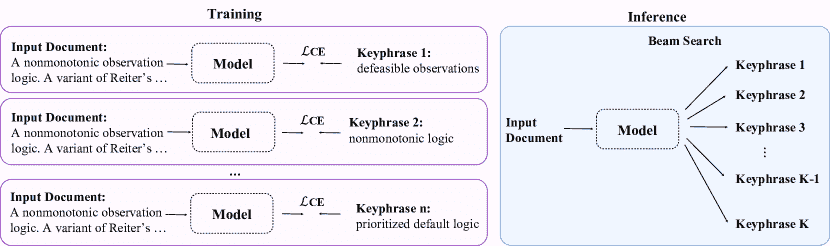
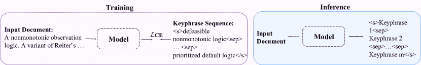
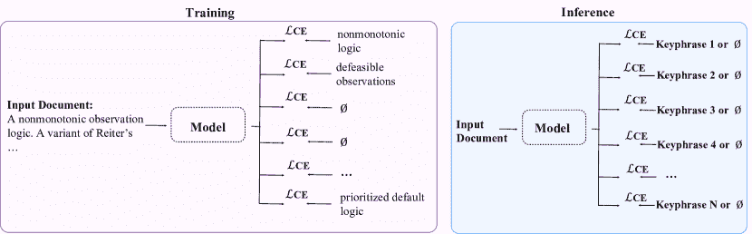
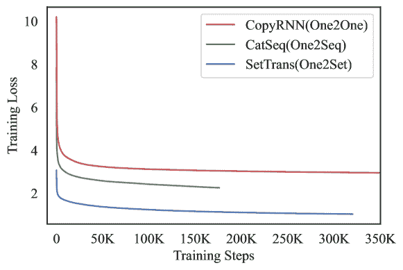
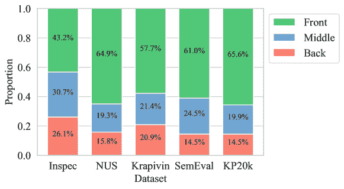
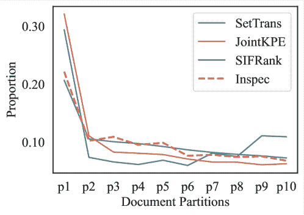

<!--yml

分类：未分类

日期：2024-09-06 19:40:00

-->

# [2305.02579] 从统计方法到深度学习，自动关键短语预测：综述

> 来源：[`ar5iv.labs.arxiv.org/html/2305.02579`](https://ar5iv.labs.arxiv.org/html/2305.02579)

[orcid=0000-0001-7832-1507, style=chinese]\cormark[1] [orcid=0000-0002-0415-7748, style=chinese]\cormark[1] [orcid=0000-0002-2230-9952, style=chinese]\cormark[1] [style=chinese] [style=chinese] [style=chinese] [style=chinese] [style=chinese] [style=chinese, orcid=0000-0001-5606-7122]\cormark[2] \cortext[cor1]同等贡献。 \cortext[cor2]通讯作者。电话：+86 18750236638

\tnotemark

[1] \tnotetext[1]本研究部分由中国国家自然科学基金资助（资助号：62276219），部分由福建省自然科学基金资助（资助号：2020J06001），部分由厦门青年创新基金资助（资助号：3502Z20206059）。 (通讯作者：孙金松。)

# 从统计方法到深度学习，自动关键短语预测：综述

Binbin Xie xdblb@stu.xmu.edu.cn    Jia Song songjia@stu.xmu.edu.cn    Liangying Shao liangyingshao@stu.xmu.edu.cn    Suhang Wu wush xmu@outlook.com    Xiangpeng Wei pemywei@gmail.com    Baosong Yang yangbaosong.ybs@alibaba-inc.com    Huan Lin lilai.lh@alibaba-inc.com    Jun Xie qingjing.xj@alibaba-inc.com    Jinsong Su jssu@xmu.edu.cn

###### 摘要

关键短语预测旨在生成高度概括给定文档的短语（关键短语）。最近，研究人员从不同角度对这一任务进行了深入研究。本文从主要模型、数据集和评价指标的角度全面总结了代表性研究。我们的工作分析了多达 167 篇相关文献，涵盖范围超过了以往的综述。特别地，我们高度关注基于深度学习的关键短语预测，这在近年来引起了越来越多的关注。随后，我们进行了一系列实验，以细致比较代表性模型。据我们所知，我们的工作首次使用相同的常用数据集和评价指标对这些模型进行比较，促进了对其优缺点的深入分析。最后，我们讨论了未来该任务可能的研究方向。

###### 关键词：

关键短语预测 \sep 自动关键短语提取 \sep 自动关键短语生成 \sep 深度学习

## 1 引言

随着互联网的快速发展和信息爆炸，从大量文本数据中高效获取信息变得越来越重要。为此，提出了几种信息压缩任务，如自动摘要和自动关键词预测。与其他任务相比，自动关键词预测对信息压缩能力提出了更高的要求，因为它旨在自动生成少量代表输入文档核心内容的关键词。由于关键词可以促进文档理解，并为下游任务提供有用信息，如信息检索（Gutwin et al.，1999）、文档分类（M et al.，2005；Hulth 和 Megyesi，2006）、文档摘要（Zhang et al.，2004；Wang 和 Cardie，2013；Pasunuru 和 Bansal，2018）、问题生成（Subramanian et al.，2018）和意见挖掘（Wilson et al.，2005；Berend，2011），自动关键词预测引起了越来越多的关注。

表格 1 展示了自动关键词预测的一个例子。一般来说，关键词可以分为两类：*存在的关键词*，即在输入文档中持续出现的关键词，以及*不存在的关键词*，即与文档中任何连续子序列都不匹配的关键词。为了实现高质量的关键词预测，早期研究主要集中于*自动关键词提取*（Hulth，2003；Mihalcea 和 Tarau，2004；Nguyen 和 Kan，2007；Wan 和 Xiao，2008），其目的是直接从输入文档中提取关键词。最近，深度学习的兴起促使研究人员关注*自动关键词生成*（Meng et al.，2017；Yuan et al.，2020；Ye et al.，2021b），其中主流模型不仅可以生成存在的关键词，还可以生成不存在的关键词。表格 2 展示了主要计算机科学会议上与自动关键词预测相关的论文数量。可以说，自动关键词预测一直是研究热点之一。

表格 1：关键词预测的一个例子，文档中出现的存在的关键词已加下划线。

[width=0.95] *输入文档：* 一种非单调观察逻辑。提出了一种 Reiter 的默认逻辑变体作为处理可推翻观察的逻辑。传统上，默认规则被认为表示通用信息，而事实被认为表示关于情况的特定信息，但在本文中，特定信息来源于由（正常自由）默认规则表示的可推翻观察，而事实表示（硬性）背景知识。每当某些观察的证据比另一些观察的证据更为精细时，这通过表示观察的默认规则之间的优先级来建模。因此，我们得出了优先级正常自由默认逻辑作为观察逻辑的解释，并提出了这种观察逻辑的语义。最后，我们讨论了所提出的观察逻辑如何与多重扩展问题和传感器融合问题相关。 *关键词：* 可推翻观察；非单调逻辑；优先级默认逻辑

表 2：主要计算机科学会议上关键词提取和关键词生成的论文出版情况，“–” 表示该会议未举办或尚未举办。

| 会议 | 2017 | 2018 | 2019 | 2020 | 2021 | 2022 |
| --- | --- | --- | --- | --- | --- | --- |
| 关键词提取 |
| ACL | 2 | 0 | 1 | 0 | 0 | 0 |
| EMNLP | 0 | 0 | 1 | 1 | 3 | 0 |
| NAACL | – | 1 | 1 | – | 2 | 1 |
| COLING | – | 0 | – | 4 | – | 3 |
| AAAI | 3 | 0 | 0 | 0 | 0 | 0 |
| 关键词生成 |
| ACL | 1 | 0 | 3 | 3 | 2 | 0 |
| EMNLP | 0 | 2 | 0 | 3 | 3 | 5 |
| NAACL | – | 0 | 2 | – | 3 | 2 |
| COLING | – | 0 | – | 1 | – | 0 |
| AAAI | 0 | 0 | 1 | 0 | 1 | 2 |
| 总计。 | 6 | 3 | 9 | 11 | 14 | 13 |

在本文中，我们首先从以下几个方面对自动关键词预测进行了全面回顾：主导模型、数据集和评估指标。与以前的调查（Hasan 和 Ng, 2014；Siddiqi 和 Sharan, 2015；Çano 和 Bojar, 2019；Alami Merrouni 等, 2020；Nasar 等, 2019）相比，我们的工作总结了多达 167 项以前的工作，实现了对该任务更广泛的覆盖。更重要的是，我们的工作不仅是首次全面总结基于神经网络的关键词提取，而且高度关注神经关键词生成在不同研究问题上的最新进展。请注意，神经关键词生成已成为该领域的热门研究主题，因为它不仅能够预测当前的关键词，还能预测缺失的关键词，这在常用的关键词生成数据集中占有很大比例。特别地，我们进一步介绍了关键词生成的最新进展，包括基于预训练模型的关键词生成模型，与自然语言处理的发展趋势相呼应。

然后，我们进行几组实验，以仔细比较代表性模型，从而分析它们的特性。与以往研究通常使用不同的数据集和指标评估模型不同，我们使用相同的常用数据集和评估指标，以确保这些代表性模型之间的公平比较，然后分析它们在不同场景中的优缺点。通过我们的实验，我们可以得出一些有趣的结论：1）一般来说，无监督提取模型在所有无监督和监督模型中表现最差。然而，当训练集和测试集之间存在严重领域差异时，无监督提取模型的表现可能与监督模型相当。2）在三种常用的关键短语生成范式中，**ONE2SET**超越了其他模型，取得了最佳表现，但在预测现有关键短语时仍然不如提取模型。3）结合提取、生成和基于检索的方法有潜力在预测现有和缺失关键短语时实现更好的总体结果。

最后，我们指出了关键短语预测任务的未来研究方向，这将对指导后续研究起到积极作用。请注意，我们提出了一些之前调查中未考虑的方向，如多模态关键短语预测和多语言关键短语预测。

{forest}

对于树形结构=生长=东，分叉边，绘制，圆角，节点选项=对齐=center，文本宽度=2.7 厘米，锚点=西 [自动关键短语提取，父级 [人工特征，对于树形结构=子级 [内部文档特征 [统计特征，位置特征，语言特征，逻辑结构，字符]] [外部文档特征 [基于维基的相似性，基于外部文档的频率，引用，网页链接，字符]] ] 模型，对于树形结构=子级 [无监督模型 [统计模型，[(El-Beltagy 和 Rafea, [2009；Campos 等, 2018；Won 等, 2019），模型]] 基于图的模型 [聚类，[(Ohsawa 等, [1998；Grineva 等, 2009；Liu 等, 2009），模型]] 图传播，[主题信息，[(Liu 等, [2010；Sterckx 等, 2015；Teneva 和 Cheng, 2017；Bougouin 等, 2013；Boudin, 2018），模型]] 其他，[(Mihalcea 和 Tarau, [2004；Wan 和 Xiao, 2008；Danesh 等, 2015；Florescu 和 Caragea, 2017；Gollapalli 和 Caragea, 2014；Vega-Oliveros 等, 2019），模型]] ] ] 基于深度学习的模型 [短语-文档相似性，[(Papagiannopoulou 和 Tsoumakas, [2018；Bennani-Smires 等, 2018；Sun 等, 2020；Li 和 Daoutis, 2021），模型]] 基于图的排序，[(Mahata 等, [2018；Asl 和 Banda, 2020；Liang 和 Zaki, 2021；Liang 等, 2021），模型]] 关键短语的语义重要性，[(Zhang 等, [2021；Joshi 等, 2022），模型]] 注意力机制信息，[(Ding 和 Luo, [2021；Gu 等, 2021），模型]]] ] 有监督模型 [统计模型 [建模方法 [序列标注，[(Zhang, [2008；Gollapalli 等, 2017），模型]] 二分类，[(Witten 等, [1999；Frank 等, 1999；Turney, 2002；Hulth, 2003；Kelleher 和 Luz, 2005；Yih 等, 2006；Medelyan 和 Witten, 2006；Zhang 等, 2006；Nguyen 和 Kan, 2007；Shi 等, 2008；Medelyan 等, 2009；Lopez 和 Romary, 2010；Nguyen 和 Luong, 2010；Haddoud 和 Abdeddaïm, 2014；Caragea 等, 2014；Xie 等, 2017；Wang 和 Li, 2017），模型]] 排序，[(Jiang 等, [2009；Zhang 等, 2017a），模型]] ] 算法 [CRF，[(Zhang, [2008；Gollapalli 等, 2017；Lu 和 Chow, 2021），模型]] 逻辑回归，[(Yih 等, [2006；Shi 等, 2008；Haddoud 和 Abdeddaïm, 2014），模型]] 朴素贝叶斯，[(Witten 等, [1999；Frank 等, 1999；Kelleher 和 Luz, 2005；Medelyan 和 Witten, 2006；Nguyen 和 Kan, 2007；Nguyen 和 Luong, 2010；Caragea 等, 2014；Xie 等, 2017），模型]] SVM，[(Zhang 等, [2006；Jiang 等, 2009），模型]] 袋装决策树，[(Turney, [2002；Medelyan 等, 2009；Lopez 和 Romary, 2010），模型]] 其他集成模型，[(Hulth, [2003；Wang 和 Li, 2017），模型]] ] ] 基于深度学习的模型 [建模方法 [序列标注，[(Zhang 等, [2016，2018；Saputra 等, 2018；Zhang 和 Zhang, 2019；Chowdhury 等, 2019；Sahrawat 等, 2019；Mahfuzh 等, 2020；Garg 等, 2020；Wang 等, 2020b；Santosh 等, 2020b；Gero 和 Ho, 2021；Nikzad-Khasmakhi 等, 2021），模型]] 二分类，[(Wang 等, [2005；Xiong 等, 2019；Prasad 和 Kan, 2019），模型]] 排序，[(Sarkar 等, [2010；Mu 等, 2020；Sun 等, 2021；Song 等, 2021），模型]] 数据利用，[(Luan 等, [2017；Lai 等, 2020；Lei 等, 2021；Kontoulis 等, 2021），模型]] ] ] ]

图 1：自动关键词提取的代表性研究分类。

## 2 自动关键词提取

图 1 显示了自动关键词提取的代表性研究分类。这一研究方向主要集中于如何直接从输入文档中提取关键词。通常包括三个步骤：1）应用手工设计的规则获取候选短语，如去除停用词（Liu et al., 2009），应用词性标注（Mihalcea and Tarau, 2004），提取 n-grams（Witten et al., 1999），以及使用知识库（Nguyen and Phan, 2009）；2）设计各种手工设计的特征来表示候选关键词；3）基于特征使用无监督或监督模型确定最终的关键词。

在接下来的子章节中，我们将首先简要介绍手工设计的特征，然后详细描述使用这些特征的无监督和监督模型。

### 2.1 手工设计特征

主要有四种基于内部文档的特征（Witten et al., 1999; Turney, 2002; Hulth, 2003; Zhang et al., 2006; Campos et al., 2018; Ohsawa et al., 1998）：统计特征（短语长度、TF-IDF、包含短语的句子数量、共现频率等）、位置特征（出现位置、句子边界等）、语言特征（词性标记、案例信息、周围词汇等）以及逻辑结构特征（输入文档的层次结构、标题、作者列表等）。

此外，还提出了许多使用外部文档的特征，例如基于维基百科的相似度、基于外部文档的候选频率、引用和网页链接。

### 2.2 无监督关键词提取

一般而言，无监督关键词提取模型可以粗略分为统计模型、基于图的模型和基于深度学习的模型，以下将对此进行简要介绍。

#### 2.2.1 无监督统计模型

这些模型直接基于丰富的手工设计特征进行。其中特别重要的一个是 TF-IDF (Salton 和 Buckley，1988)，它能够量化每个候选短语的重要性，因此成为许多后续模型的基础。例如，El-Beltagy 和 Rafea (2009) 考虑了每个候选在输入文档中的位置，并引入了与长度相关的权重来调整其 TF-IDF 值。此外，Campos 等人 (2018) 提出了 YAKE，涉及五个手工设计特征：案例信息、短语位置、术语频率、短语在不同句子中出现的频率，以及周围词的数量。基于这些特征，Won 等人 (2019) 进一步根据输入文档的长度确定关键词的数量。

#### 2.2.2 无监督图模型

KeyGraph (Ohsawa 等人，1998) 是首个用于关键词提取的图模型。在该模型中，频繁共现的短语被连接成图，然后通过聚类将其划分为子图。最后，根据子图的统计信息量化每个候选短语的重要性。Grineva 等人 (2009) 首次计算边权重作为基于维基百科的短语级语义相关性，然后应用社区检测算法 (Newman 和 Girvan，2004) 来获得密集子图，从最重要子图中的短语被视为关键词。类似地，Liu 等人 (2009) 构建了一个词图，并根据词的共现频率或维基百科统计数据的语义距离对单词进行聚类。然后，从聚类中心扩展的名词短语被选为关键词。

受到 PageRank (Page 等人，1999) 启发，Mihalcea 和 Tarau (2004) 提出了 TextRank，该方法在共现词图上迭代地进行重要性传播。在此基础上，Danesh 等人 (2015) 通过使用短语作为图节点扩展了 TextRank。随后，探索了许多特征来调整边权重，包括统计特征（短语频率和长度 (Danesh 等人，2015)，词共现频率 (Wan 和 Xiao，2008)) 和位置信息 (Florescu 和 Caragea，2017)。此外，为了利用更多上下文，Wan 和 Xiao (2008)、Gollapalli 和 Caragea (2014) 分别通过类似文档和引用网络扩展了单文档词图。除了基于 PageRank 的中心性度量外，Vega-Oliveros 等人 (2019) 考虑了其他常用的中心性度量，然后提出了中心性度量的最佳组合来从无向且无权重的词图中提取关键词。

直观地，理想的关键短语应该与输入文档的主题一致。因此，研究人员引入主题信息来细化基于图的模型。通常，Liu 等（2010）提出了 TPR，采用 LDA（Blei 等，2003）获取主题信息，然后分别对每个主题进行 PageRank。为了缓解 TPR 的巨大计算成本，研究人员将 TPR 扩展为 Single Topical PageRank（Sterckx 等，2015）和 SalienceRank（Teneva 和 Cheng，2017），这两者都对每个文档执行一次 PageRank。与前者相比，后者不仅可以提取特定主题的关键短语，还能提取与语料库相关的关键短语。不同于基于 LDA 的上述研究，Bougouin 等（2013）提出了 TopicRank，该方法首先将相似短语聚类以形成主题，然后构建一个主题图进行 PageRank。之后，他们从每个主题中选择最具代表性的短语作为关键短语。为了改进 TopicRank，Boudin（2018）在一个图中表示候选短语和主题，并利用它们的相互强化来提高候选短语的排名。

#### 2.2.3 无监督深度学习模型

随着深度学习的繁荣发展，研究人员引入神经网络来学习输入文档和候选短语的语义表示，这些研究大致可以分为以下四类：短语-文档相似度。常见的做法是根据短语-文档表示相似度来衡量每个候选短语的重要性。为此，EmbedRank（Bennani-Smires 等，2018）使用 Sent2Vec（Pagliardini 等，2018）和 Doc2Vec（Le 和 Mikolov，2014）将候选短语和输入文档表示为向量。作为扩展，$\text{EmbedRank}^{+}$ 还额外考虑候选短语之间的相似度，以生成多样化的关键短语。与使用 Sent2vec 和 Doc2vec 的 EmbedRank 不同，SIFRank（Sun 等，2020）将候选短语、句子和输入文档的向量表示定义为其对应 ELMo 嵌入（Peters 等，2018）的加权平均。进一步地，$\text{SIFRank}^{+}$ 考虑了候选短语在文档中的位置。随后，Li 和 Daoutis（2021）通过将领域相关性和短语质量纳入排名评分来改进 SIFRank。Papagiannopoulou 和 Tsoumakas（2018）使用整个文档来学习 Glove（Pennington 等，2014）嵌入，然后根据词-文档相似度的总和来对候选短语进行排名。

基于图的排序。除此之外，研究人员将深度学习应用于基于短语图的无监督模型的优化。例如，Key2Vec（Mahata 等人，2018）直接训练 FastText 来学习候选短语和文档主题的表示，然后使用候选-主题相似性来调整 PageRank 的边权重。类似地，Liang 和 Zaki (2021) 考虑了候选短语之间的共现和相似性，以便更准确地进行 PageRank 的边权重调整。使用基于嵌入的图，Asl 和 Banda (2020) 应用 PageRank 或中心性算法来获得候选短语的排名重要性。Liang 等人 (2021) 发现短语-文档表示相似性（即 EmbedRank）不足以捕捉关键短语提取的不同上下文。为了解决这个问题，他们定义了一个边界感知的中心性，以捕捉局部显著信息和候选短语的位置性信息以进行排名。

关键短语的语义重要性。关键短语在输入文档的表示学习中扮演着重要角色。因此，如果缺少任何关键短语，输入文档的表示将会发生变化。为了建模这种直觉，Zhang 等人 (2021) 通过对每个候选短语进行替代性屏蔽，并根据原始文档和屏蔽文档之间的表示差异来评估其重要性。最近，Joshi 等人 (2022) 采用了类似的策略，主要关注主题分布的变化。

注意力机制信息。不同于上述基于深度学习相似性的研究，（Ding 和 Luo，2021）使用自注意力权重来量化每个候选短语在句子中的重要性，并根据其交叉注意力权重衡量其与文档的语义相关性。此外，Gu 等人 (2021) 使用无监督统计模型或现有知识库为未标记文档生成伪关键短语，然后训练一个关键短语分类器，输入为 RoBERTa 的自注意力图（Zhuang 等人，2021）。

### 2.3 监督式关键短语提取

通常，关键短语提取的监督模型可以分为统计模型和基于深度学习的模型。

#### 2.3.1 监督式统计模型

与无监督关键短语提取类似，丰富的监督统计模型利用了精心设计的特征，包括统计特征（Witten 等，1999；Turney，2002；Kelleher 和 Luz，2005；Haddoud 和 Abdeddaïm，2014；Xie 等，2017），位置特征（Frank 等，1999；Medelyan 和 Witten，2006；Zhang，2008；Jiang 等，2009），语言特征（Hulth，2003；Gollapalli 等，2017），逻辑结构（Yih 等，2006；Zhang 等，2006；Nguyen 和 Kan，2007；Nguyen 和 Luong，2010），以及基于外部文档的特征（Shi 等，2008；Medelyan 等，2009；Lopez 和 Romary，2010；Gollapalli 和 Caragea，2014；Wang 和 Li，2017；Zhang 等，2017a）。

基于这些特征，研究人员将关键短语提取建模为序列标注任务（Zhang，2008；Gollapalli 等，2017），二分类任务或排序任务（Jiang 等，2009；Zhang 等，2017a），使用各种机器学习算法，如条件随机场（Zhang，2008；Gollapalli 等，2017），逻辑回归（Yih 等，2006；Shi 等，2008；Haddoud 和 Abdeddaïm，2014），朴素贝叶斯（Witten 等，1999；Frank 等，1999；Kelleher 和 Luz，2005；Medelyan 和 Witten，2006；Nguyen 和 Kan，2007；Nguyen 和 Luong，2010；Caragea 等，2014；Xie 等，2017），支持向量机（Zhang 等，2006），袋装决策树（Turney，2002；Medelyan 等，2009；Lopez 和 Romary，2010）以及其他集成模型（Hulth，2003；Wang 和 Li，2017）。

{forest}

for tree= grow’=east, forked edges, draw, rounded corners, node options= align=center , text width=2.7cm, anchor=west, 自动关键短语生成, parent [范式, for tree=child [One2One [(Meng et al., [2017), model]] One2Seq[(Yuan et al., [2020), model]] One2Set[(Ye et al., [2021b), model]] ] 文档编码, for tree=child[(Zhang et al., [2017b; Chen et al., 2019b; Zhao and Zhang, 2019; Wang et al., 2019; Luo et al., 2020; Ahmad et al., 2021; Kim et al., 2021b), model]] 解码策略, for tree=child[(Sun et al., [2019; Chen et al., 2020; Zhao et al., 2021; Liu et al., 2021; Wu et al., 2021, 2022b; Liu et al., 2021; Zhang et al., 2022), model]] 外部信息的利用, for tree=child [(Diao et al., [2020; Chen et al., 2019a; Garg et al., 2021; Santosh et al., 2021a; Ye et al., 2021a; Kim et al., 2021a; Wang et al., 2020c), model]] 解决生成关键短语的重复性和覆盖性问题, for tree=child[(Chen et al., [2018; Yuan et al., 2020; Bahuleyan and Asri, 2020; Chen et al., 2020), model]] 模型训练策略, for tree=child [强化学习, [(Chan et al., [2019; Luo et al., 2021), model] ] 生成对抗网络, [(Swaminathan et al., [2020a, b; Lancioni et al., 2020), model]] 多任务学习, [(Ye and Wang, [2018; Chen et al., 2019a; Zhao and Zhang, 2019; Ahmad et al., 2021), model]] ] 预训练模型的应用, for tree=child [BART, [(Kulkarni et al., [2022; Chowdhury et al., 2022; Wu et al., 2022a, b), model]] 其他, [(Wu et al., [2021; Garg et al., 2021), model]] ] 低资源关键短语生成, for tree=child[(Ye and Wang, [2018; Shen et al., 2022), model]] 关键短语排序, for tree=child[(Ye and Wang, [2018; Ni’mah et al., 2019; Chen et al., 2019a; Shen et al., 2022), model]] ] ]

图 2：自动关键短语生成的代表性研究分类。

#### 2.3.2 监督性深度学习模型

Wang et al. (2005) 首次提出了一种基于前馈神经网络的监督性关键短语提取分类器。从此以后，基于深度学习的监督性关键短语提取逐渐成为热门话题。

序列标注。监督式关键短语提取通常被建模为基于深度学习的序列标注任务。通常，Zhang 等人 (2016) 提出了 Joint-Layer RNN，以在不同的判别层次上提取关键短语：判断当前词是否为关键词，并采用 BIOES 标注方案来识别关键短语。基于 Joint-Layer RNN，Zhang 等人 (2018) 引入对话上下文以丰富微博帖子向量表示。为了模拟关键短语标注过程中阅读的人工注意力，Zhang 和 Zhang (2019) 将注意力机制集成到 Joint-Layer RNN 中。同时，研究人员还探索了更多特征，如来自外部知识库的医学概念（Saputra 等人，2018）、语音学、音韵特征（Chowdhury 等人，2019）和句法特征（Mahfuzh 等人，2020）。

此外，将预训练模型应用于监督式关键短语提取已成为主流。例如，基于 SciBERT（Beltagy 等人，2019），（Sahrawat 等人，2019）和（Garg 等人，2020）分别堆叠 BiLSTM+CRF 和 LSTM+CRF 来识别关键短语。使用相同的模型，（Santosh 等人，2020a）引入了文档级注意力和门控机制来优化表示学习。Wang 等人 (2020b) 分别利用 BERT 和 Transformer 对文档和网页中的多模态信息进行编码，以提取关键短语。Gero 和 Ho (2021) 使用 BERT-LSTM 或 BioBERT-LSTM 来获得输入文档的主题表示，鼓励提取主题一致的词。

与这些研究不同，Santosh 等人 (2020b) 利用图编码器分别整合句法和语义依赖信息，以获得更好的编码器表示。在输入文档和共现图的基础上，Nikzad-Khasmakhi 等人 (2021) 采用 BERT 和图嵌入技术来学习词级别的文本和结构表示，然后将这些表示组合并输入到序列标注器中。

二分类。研究人员还探讨了将监督式关键短语提取作为一个二分类任务。Xiong 等人 (2019) 将输入文档的视觉表示集成到 ELMo 词嵌入中，然后使用卷积 Transformer 来建模候选短语之间的交互，以进行关键短语分类。此外，他们引入了查询预测作为预训练任务。Prasad 和 Kan (2019) 提出了 Glocal，一个改进的 GCN，它结合了每个节点相对于其他节点的全局重要性，以从词图中学习词表示。基于这些表示，关键词通过分类识别，并最终通过重新排序来重建关键短语。

排名。Sarkar 等人 (2010) 首次应用基于深度学习的排名模型来实现监督式关键词提取。Mu 等人 (2020) 使用 BERT 叠加 BiLSTM 来建模候选短语之间的语义交互，然后根据二分类分数和考虑短语与其他短语之间的铰链损失进行排名。Sun 等人 (2021) 提出了 JointKPE，该模型学习根据候选短语的文档级信息量进行排名。特别地，它与关键词短语分块共同训练，以保证候选短语的短语性。Song 等人 (2021) 调查了三种用于排名的特征：候选短语的句法准确性、候选短语与输入文档之间的信息显著性，以及候选短语与输入文档之间的概念一致性。

数据利用。基于词图，Luan 等人 (2017) 采用标签传播结合数据选择方案来利用未标记文档。Lai 等人 (2020) 提出了一个用于关键词提取的自蒸馏模型。在这种方法中，教师模型在标记样本上进行训练，而学生模型则在标记样本和由教师模型生成的伪样本上进行训练。在随后的训练过程中，教师模型会用学生模型重新初始化，并重复上述过程。为了应对标注训练数据不完整的问题，Lei 等人 (2021) 引入了负采样来调整未标记数据上的训练损失。从不同的角度来看，Kontoulis 等人 (2021) 认为全文可以提供更丰富的信息，但包含比输入摘要更多的噪声。因此，他们利用从全文中引导的摘要来优化关键词提取。

## 3 自动关键词生成

与关键词提取研究不同，关键词生成模型可以生成输入文档中未出现的缺失关键词。在这方面，Meng 等人 (2017) 提出了第一个关键词生成模型 CopyRNN，这一模型激发了许多后续模型。通常，这些模型基于编码器-解码器框架，其中编码器学习每个输入文档的语义表示，然后配备有复制机制的解码器 (Gu 等人, 2016) 自动生成关键词。

在接下来的小节中，我们总结了针对不同研究问题的关键词生成代表性进展。代表性研究的自动关键词生成分类如图 2 所示。

(a) One2One

(b) One2Seq

(c) One2Set

图 3：关键短语生成的三种主流范式。

### 3.1 范式

通常，主流关键短语生成模型的范式可以分为 One2One（Meng et al., 2017）、One2Seq（Yuan et al., 2020）和 One2Set（Ye et al., 2021b），如图 3 所示。

One2One。通常，在模型训练过程中，每个训练实例包含一个输入文档和来自拆分目标关键短语中的唯一一个相应关键短语。在推理过程中，One2One 模型采用束搜索生成候选短语，然后选择排名前 K 的短语作为最终关键短语。

作为最早的范式，它具有深远的影响，但忽略了关键短语之间的相关性，限制了关键短语生成模型的潜力。

One2Seq。为了处理上述问题，One2Seq 范式将关键短语生成建模为序列生成任务。为此，目标关键短语按照预定义的顺序排序，并用分隔符连接成一个序列。通常，当前的关键短语首先按照其出现频率排序，而缺失的关键短语则随机排序（Meng et al., 2019, 2021）。

由于利用关键短语之间语义相互依赖的优势，One2Seq 成为最常用的范式。然而，它的预定义顺序的前提给模型训练引入了偏差，特别是当生成的关键短语的顺序与预定义的顺序不一致时。此外，One2Seq 模型往往会生成重复的关键短语（Chen et al., 2020; Ye et al., 2021b）。

One2Set。此外，为了应对 One2Seq 的偏差缺陷，Ye et al. (2021b) 提出了 One2Set，其中关键短语生成被建模为集合生成任务。通常，其解码器利用不同的可学习控制代码来并行生成一组关键短语。在模型训练过程中，训练损失是根据预测的关键短语与目标关键短语之间的一个对一个对齐关系计算的，这一关系由匈牙利算法确定（Kuhn, 1955）。

### 3.2 文档编码

通常，CopyRNN（Meng et al., 2017）采用 RNN 作为其编码器，因此在处理长文档时效率较低。为了解决这个问题，Zhang et al.（2017b）用 CNN 替代 RNN，以提高编码效率。

此外，一些研究者认为由于句子在文档编码中的重要性不同，应该对其进行不同处理。陈等人（2019b）设计了**标题引导网络**，该网络额外使用标题作为查询，以收集输入文档中与标题相关的词汇信息。金等人（2021b）考虑了网页文档中的有用结构，如标题、正文、头部、查询，以构建一个词图，表示基于位置的接近性和结构关系。罗等人（2020）使用选择网络来过滤不重要的句子，而艾哈迈德等人（2021）将此网络应用于调整解码器复制机制的权重。

与此同时，研究人员也专注于将更多信息融入编码器。例如，赵和张（2019）探索了文档编码中的语言信息。为了缓解社交媒体中的数据稀疏问题，王等人（2019）应用了变分神经网络，将主题信息融入模型中。

### 3.3 解码策略

与传统解码器可以预测当前和缺失的关键短语不同，孙等人（2019）提出了一种多样化的指针网络解码器，用于 One2One 范式，该解码器只复制一组多样化的当前关键短语。

与此同时，更多的研究者集中于在 One2Seq 模式下优化解码方式。例如，Chen et al. (2020) 提出了一个独特的层次解码器，它涉及两个解码层次，以利用短语级和词级的关联来生成关键短语。类似地，Santosh et al. (2021b) 通过结合条件变分自编码器对上述层次结构进行了建模。此外，Zhang et al. (2022) 提出了一个层次主题引导的变分神经网络，通过整合层次主题信息来引导关键短语生成。一些研究者认为，统一建模存在和缺失关键短语的生成是不合理的，因为它们的预测难度显著不同。Zhao et al. (2021) 提出了一个选择-引导-生成解码策略，该策略首先从输入文档中选择存在的关键短语，然后利用这些关键短语来引导缺失关键短语的生成。类似地，Liu et al. (2021) 首先对基于 BERT 的模型进行微调，以识别输入文档中的存在关键短语，然后利用 BERT，充分编码存在关键短语的知识，以促进缺失关键短语的生成。Wu et al. (2021) 联合训练存在的关键短语提取和缺失关键短语生成，通过堆叠关系层和词袋约束来利用它们的相互关系。最近，Wu et al. (2022b) 提出了一个掩码预测解码器，以探索约束性和非自回归生成缺失关键短语。

### 3.4 模型训练策略

Chan et al. (2019) 提出了一个具有自适应奖励的强化学习 (RL) 方法来生成关键短语。如果模型没有生成足够的关键短语，则奖励定义为召回率，以鼓励模型生成足够的关键短语。否则，$F_{1}$ 分数被用作奖励，以防止模型过度生成不正确的关键短语。为了缓解同义词问题，Luo et al. (2021) 通过考虑词级 $F_{1}$ 分数、编辑距离、重复率和生成数量进一步改进了 RL 奖励函数。

此外，研究人员将生成对抗网络应用于关键短语生成任务 (Swaminathan et al., 2020a, b; Lancioni et al., 2020)，其中生成器被训练以生成准确的关键短语，而判别器则期望区分机器生成的和人工筛选的关键短语。

许多研究人员将多任务模型应用于关键短语生成任务 (Chen 等人，2019a; Ahmad 等人，2021)。通常，Ye 和 Wang (2018) 联合训练关键短语生成和标题生成，以提高模型的泛化能力。同样，Zhao 和 Zhang (2019) 将 POS 标注引入作为关键短语生成的辅助任务。

### 3.5 外部信息的利用

受到其他 NLP 任务研究的启发 (Liu 等人，2018; Wang 等人，2018; Zhang 等人，2019)，研究人员探索了输入文档之外的信息以生成更好的关键短语。

在这方面，Diao 等人 (2020) 使用跨文档注意力机制来利用相似文档以更好地进行文档编码。Garg 等人 (2021) 探索了多种方法来将额外数据纳入关键短语生成，并发现文章的摘要是最有益的。此外，研究人员还考虑了相似文档的关键短语。Chen 等人 (2019a) 利用从相似文档中检索到的关键短语来指导关键短语的生成和重新排序。Santosh 等人 (2021a) 还从相似文档中收集额外的关键短语，以自动形成词典，用于丰富词汇量以提高关键短语生成效果。为了利用相似文档及其关键短语，Ye 等人 (2021a) 构建了一个异质关键词-文档图模型，该模型配备了一个参考感知解码器，用于从输入文档及其相似文档中复制词语。为了处理没有标题的数据，Kim 等人 (2021a) 使用输入文档和从其他文档中检索到的相关但缺失的关键短语构建结构图。这个图可以提供结构感知的表示，以便更好地生成关键短语。此外，Wang 等人 (2020c) 利用匹配图像中嵌入的丰富特征来探索文本和图像的联合效应以进行关键短语预测。

### 3.6 解决生成的关键短语的重复和覆盖问题

Chen 等人 (2018) 指出，One2One 模式忽略了关键短语之间的相关性，导致生成的关键短语出现重复和覆盖问题。为了解决这些问题，他们提出了 CoryRNN，它回顾前面的关键短语以消除重复，并利用覆盖机制 (Tu 等人，2016) 来提高关键短语的覆盖率。

One2Seq 模型面临相同的问题，当生成长关键短语序列时问题会更加严重。为了解决这一缺陷，Yuan 等人（2020）采用了正交正则化来明确区分分隔符生成的隐藏状态，从而提高生成关键短语的多样性。Bahuleyan 和 Asri（2020）使用不可能性训练损失来生成多样化的关键短语。沿着这个方向，Chen 等人（2020）不仅探索了具有排他性损失的训练策略，还探索了排他性搜索策略以避免生成重复的关键短语。通过这种方式，模型被鼓励生成具有不同首词的关键短语。

### 3.7 低资源关键短语生成

关键短语生成模型的性能深受训练数据的数量和质量的影响。不幸的是，常用的标注数据集通常相对较小，使得低资源关键短语生成成为一个现实且有价值的研究方向。

Ye 和 Wang（2018）提出了一种半监督模型，该模型首先为未标记的文档生成伪关键短语，然后将其作为增量训练数据。此外，Shen 等人（2022）使用无监督提取模型收集关键短语，然后根据词汇和语义层级的相似性为每个文档生成伪关键短语。最后，伪缺失关键短语用于训练和更新模型。

最近，由于预训练模型包含丰富的知识，这些知识可能对关键短语生成有帮助，因此基于预训练模型的关键短语生成受到了越来越多的关注。在这方面，Wu 等人（2021）首次将预训练模型 UniLM（Dong 等人，2019）引入关键短语生成。此外，Garg 等人（2021）利用 Longformer（Beltagy 等人，2020）处理长文档的关键短语生成。此外，BART（Lewis 等人，2020），一种去噪自监督自动编码器，由于其在文本生成任务中的巨大潜力而被广泛应用。例如，Chowdhury 等人（2022）直接基于微调后的 BART 构建了 One2Seq 模型。Kulkarni 等人（2022）提出了 KeyBART，它使用边界标记和位置嵌入来预测被遮盖的关键短语，然后确定关键短语是被替换还是保留。除了上述被遮盖的关键短语预测外，Wu 等人（2022a）引入了显著跨度恢复以微调 BART，以学习更好的中间表示。Wu 等人（2022b）应用基于提示的学习方法来约束缺失关键短语的生成。他们首先将缺失关键短语与文档之间的重叠词定义为关键词，然后使用掩码预测解码器在提示的约束下生成最终的缺失关键短语。

### 3.8 关键短语排名

由于束搜索的特性，One2One 模型倾向于选择短语。为了解决这个问题，Ni’mah 等人（2019）引入了词级和 n-gram 级别的注意力分数来提升长关键短语的排名分数。此外，Shen 等人（2022）结合了 TF-IDF 相关性和基于嵌入的关键短语-文档余弦相似度来排序短语。在重新排序短语时，Chen 等人（2019a）也考虑了从相似文档中检索的短语和从文档中提取的短语。此外，Ye 和 Wang（2018）将束搜索应用于 One2Seq 范式模型，该模型生成多个候选短语序列，然后从按降序排列的前-ranked 束中收集独特的关键短语。

## 4 数据集

表 3：用于关键短语预测的常用数据集。

| 数据集 | 领域 | 语言 | 文档 |
| --- | --- | --- | --- |
| Inspec (Hulth, 2003) | 论文 | 英语 | 2.0K |
| NUS (Nguyen and Kan, 2007) | 论文 | 英语 | 211 |
| PubMed (Schutz et al., 2008) | 论文 | 英语 | 1.3K |
| Krapivin (Krapivin et al., 2009) | 论文 | 英语 | 2.3K |
| Citeulike-180 (Medelyan et al., 2009) | 论文 | 英语 | 181 |
| SemEval-2010 (Kim et al., 2010) | 论文 | 英语 | 244 |
| TALN (Boudin, 2013) | 论文 | 英语/法语 | 521/1.2K |
| KDD (Gollapalli and Caragea, 2014) | 论文 | 英语 | 755 |
| WWW (Gollapalli and Caragea, 2014) | 论文 | 英语 | 1.3K |
| TermLTH-Eval (Bougouin et al., 2016) | 论文 | 法语 | 400 |
| KP20k (Meng et al., 2017) | 论文 | 英语 | 567.8K |
| LDPK3K (Mahata et al., 2022) | 论文 | 英语 | 96.8K |
| LDPK10K (Mahata et al., 2022) | 论文 | 英语 | 1.3M |
| DUC (Wan and Xiao, 2008) | 新闻 | 英语 | 308 |
| 110-PT-BN-KP (Marujo et al., 2011) | 新闻 | 葡萄牙语 | 110 |
| 500N-KPCrowd (Marujo et al., 2012) | 新闻 | 英语 | 500 |
| Wikinews (Bougouin et al., 2013) | 新闻 | 法语 | 100 |
| PerKey (Doostmohammadi et al., 2018) | 新闻 | 波斯语 | 553.1K |
| KPTimes (Gallina et al., 2019) | 新闻 | 英语 | 279.9K |
| Twitter (Zhang et al., 2016) | 推文 | 英语 | 112.5K |
| Weibo (Wang et al., 2019) | 推文 | 中文 | 46.3K |
| Text-Image Tweets (Wang et al., 2020c) | 推文 | 英语 | 53.7K |
| NZDL (Witten et al., 1999) | 报告 | 英语 | 1.8K |
| Blogs (Grineva et al., 2009) | 网页 | 英语 | 252 |
| StackExchange (Wang et al., 2019) | 问答 | 英语 | 49.4K |

常用的关键词预测数据集见表 3。根据领域，它们可以分为报告、新闻、推文、网页、问答和科学文章。这些数据集大多是英语的，少数是法语、波斯语、中文和葡萄牙语。

作为最广泛使用的数据集，KP20k 由各种在线数字图书馆中的计算机科学文章组成。总体而言，这些数据集相对较小，不适用于工业应用。因此，急需构建大规模、高质量的多语言数据集，以进一步推动关键词预测的发展。

考虑到专家注释的成本与质量之间的权衡，Chau et al. (2020) 探索了多种注释策略，包括自我审查、同行审查等。

## 5 评价指标

设 $\hat{Y}$=$(\hat{y}_{1},\hat{y}_{2},...,\hat{y}_{m})$ 和 $Y$=$(y_{2},y_{2},...,y_{n})$ 分别为预测的和目标的关键词。通常的做法是仅使用前 $k$ 个得分最高的预测进行评估，其中 $k$ 是预定义的常量（通常为 5 或 10）。特别地，为了消除形态的影响，预测的关键词通过应用 Porter Stemmer¹¹1[`github.com/nltk/nltk/blob/develop/nltk/stem/porter.py`](https://github.com/nltk/nltk/blob/develop/nltk/stem/porter.py) (Meng et al., 2017) 进行词干提取。

常用的评价指标包括精确度、召回率和 $F_{1}$ 分数。早期研究使用 $F_{1}@5$ 和 $F_{1}@10$ 来评估生成的当前关键词的质量，使用 $R@5$ 和 $R@10$ 来衡量生成的缺失关键词的质量（Meng et al., 2017; Chen et al., 2018, 2019b）。这些指标的正式定义如下：

|  | $P@k=\frac{ | \hat{Y}_{:k}\cap Y | }{ | \hat{Y}_{:k} | },$ |  | (1) |
| --- | --- | --- | --- | --- | --- | --- | --- |

表示预测中关键词的正确比例。

|  | $R@k=\frac{ | \hat{Y}_{:k}\cap Y | }{ | Y | },$ |  | (2) |
| --- | --- | --- | --- | --- | --- | --- | --- |

衡量参考文献中预测关键词的正确率。

|  | $F_{1}@k=\frac{2*P@k*R@k}{P@k+R@k},$ |  | (3) |
| --- | --- | --- | --- |

这是 $P@k$ 和 $R@k$ 之间的权衡。

考虑到模型通常预测的关键词数量不同，Yuan et al. (2020) 认为，具有预定义常量 $k$ 的指标无法准确评估预测关键词的质量。因此，他们将 $F_{1}@k$ 扩展为两种指标：1) $F_{1}@O$：该指标将 $k$ 设定为目标关键词的数量，而不是预定义的常量；2) $F_{1}@M$：该指标考虑所有预测。此外，Chan et al. (2019) 通过在目标关键词数量少于预测关键词数量时用空白填充目标关键词来改进 *$F_{1}@M$*。

然而，传统的度量标准，例如 *$F_{1}$*，评估短语级别的预测质量，但未考虑部分匹配的预测。为了解决这个问题，Luo 等人 (2021) 提出了细粒度（$FG$）评估分数，该分数考虑了标记级别的预测顺序和质量，以及实例级别的预测多样性和数量。

此外，Habibi 和 Popescu-Belis (2013) 引入了 *$\alpha$-nDCG*（Clarke 等人, 2008）来衡量预测关键词的多样性，其中 *nDCG* 代表标准化折扣累积增益度量（Järvelin 和 Kekäläinen, 2002），参数 $\alpha$ 是相关性和多样性之间的权衡。Chan 等人 (2019) 测量了预测关键词数量与目标关键词数量之间的平均绝对误差（*MAE*）。此外，Chen 等人 (2020) 定义了 *DupRatio* 来评估预测关键词的重复率。

### 5.1 实施细节

在关键词提取的实验中，我们考虑了以下典型的无监督模型：统计模型包括 TF-IDF（Salton 和 Buckley, 1988）、YAKE（Campos 等人, 2018）、基于图的模型包括 TextRank（Mihalcea 和 Tarau, 2004）、SingleRank（Wan 和 Xiao, 2008）、TopicRank（Bougouin 等人, 2013）、PositionRank（Florescu 和 Caragea, 2017）、MultipartieRank（Boudin, 2018）以及基于深度学习的模型如 EmbedRank（Bennani-Smires 等人, 2018）、SIFRank（Sun 等人, 2020）、SIFRank+（Sun 等人, 2020）、UKERank（Liang 等人, 2021）和 JointKPE（Sun 等人, 2021）。请注意，JointKPE 是当前的 SOTA 监督模型。在关键词生成的实验中，我们比较了三种常见范式下的典型生成模型：1）One2One，包括 CopyRNN（Meng 等人, 2017）和 KG-KE-KR-M（Chen 等人, 2019a），2）One2Seq，包括 CatSeq（Yuan 等人, 2020）、catSeqTG-2RF[1]（Chan 等人, 2019）和 Transformer（Ye 等人, 2021b），以及 3）One2Set，包括 SetTrans（Ye 等人, 2021b）和 WR-SetTrans（Xie 等人, 2022）。此外，我们还比较了大语言模型在关键词预测中的表现，包括 BART（Lewis 等人, 2020）、T5（Raffel 等人, 2020）、KeyBART（Kulkarni 等人, 2022）和 ChatGPT²²2[`chat.openai.com/chat`](https://chat.openai.com/chat)。

在模型训练过程中，我们严格使用与原论文相同的实验设置。对于涉及多个变体的模型，我们仅报告其最佳性能变体的表现。特别地，参考 Yuan 等人 (2020)，我们对 One2Seq 模式模型使用了两种实验设置。在使用 ChatGPT 时，我们探索了三种常用设置，包括零-shot³³3 我们使用了官方发布的提示 ([`platform.openai.com/examples/default-keywords`](https://platform.openai.com/examples/default-keywords)) 进行关键短语预测、1-shot 和 5-shot。具体地，我们根据 MiniLM (Wang 等人，2020a) 嵌入的余弦距离检索与给定输入文档最相关的训练实例。这些相关训练实例被拼接在输入文档的开头，然后输入到 ChatGPT 中以获得关键短语的**最终**预测。特别地，为了缓解神经网络的不稳定性，我们运行生成模型 3 次，使用不同的种子，并报告平均结果。最后，我们分别评估当前关键短语和缺失关键短语的预测。

表 4：当前关键短语预测的提取模型结果。为了确保公平比较，我们仅使用目标当前关键短语来评估提取模型的性能，而以往的研究使用了所有目标关键短语。

[width=0.5] 模型 Inspec NUS Krapivin SemEval KP20k F1@5 F1@M F1@5 F1@M F1@5 F1@M F1@5 F1@M F1@5 F1@M 无监督统计提取模型 TF-IDF (Salton and Buckley, 1988) 0.132 0.175 0.214 0.213 0.145 0.131 0.151 0.190 0.172 0.146 YAKE (Campos et al., 2018) 0.183 0.193 0.221 0.212 0.188 0.131 0.202 0.204 0.189 0.145 无监督图基提取模型 TextRank (Mihalcea and Tarau, 2004) 0.321 0.363 0.092 0.169 0.118 0.144 0.093 0.200 0.091 0.120 SingleRank (Wan and Xiao, 2008) 0.325 0.362 0.151 0.195 0.152 0.147 0.146 0.212 0.134 0.131 TopicRank (Bougouin et al., 2013) 0.266 0.301 0.210 0.154 0.168 0.118 0.201 0.163 0.167 0.114 PositionRank (Florescu and Caragea, 2017) 0.306 0.338 0.228 0.208 0.186 0.143 0.245 0.229 0.183 0.138 MultipartiteRank (Boudin, 2018) 0.269 0.322 0.244 0.188 0.181 0.132 0.227 0.206 0.185 0.132 无监督深度学习提取模型 EmbedRank (Bennani-Smires et al., 2018) 0.333 0.376 0.166 0.199 0.167 0.150 0.185 0.233 0.153 0.135 SIFRank (Sun et al., 2020) 0.368 0.385 0.143 0.193 0.164 0.151 0.165 0.213 0.138 0.133 SIFRank+ (Sun et al., 2020) 0.348 0.384 0.246 0.203 0.194 0.153 0.244 0.223 0.195 0.138 UKERank (Liang et al., 2021) 0.350 0.384 0.238 0.202 0.187 0.162 0.250 0.228 0.178 0.138 监督深度学习提取模型 Sequence Tagging(Roberta-base) (Sun et al., 2021) 0.331 0.336 0.321 0.177 0.476 0.319 0.379 0.291 0.416 0.240 JointKPE (Sun et al., 2021) 0.352 0.348 0.476 0.335 0.360 0.202 0.393 0.306 0.417 0.239

表 5：当前关键短语预测使用生成模型的结果。#bs 表示束大小。^† 表示先前报告的分数。

[width=0.8] 模型 Inspec NUS Krapivin SemEval KP20k F1@5 F1@M F1@5 F1@M F1@5 F1@M F1@5 F1@M F1@5 F1@M One2One 基于范式的模型 CopyRNN(#bs=200) (Meng et al., 2017) 0.272 0.293 0.356 0.306 0.283 0.214 0.294 0.257 0.336 0.255 KG-KE-KR-M(#bs=200) (Chen et al., 2019a) 0.324 0.362 0.421 0.342 0.304 0.273 0.325 0.293 0.400 0.277 One2Seq 基于范式的模型 CatSeq(#bs=1) (Yuan et al., 2020) 0.229 0.266 0.324 0.394 0.270 0.344 0.245 0.296 0.292 0.365 CatSeq(#bs=50) (Yuan et al., 2020) 0.328 0.398 0.417 0.395 0.352 0.316 0.343 0.334 0.360 0.302 catSeqTG-2RF1 (Chan et al., 2019) 0.253 0.301 0.375 0.433 0.300 0.369 0.287 0.329 0.321 0.386 Transformer(#bs=1) (Ye et al., 2021b) 0.285 0.331 0.371 0.418 0.308 0.356 0.287 0.319 0.330 0.373 One2Set 基于范式的模型 SetTrans(#bs=1) (Ye et al., 2021b) 0.281 0.318 0.406 0.452 0.339 0.374 0.322 0.354 0.354 0.390 WR-SetTrans(#bs=1) (Xie et al., 2022) 0.330 0.351 0.428 0.452 0.360 0.362 0.360 0.370 0.370 0.378

表 6：缺失关键短语预测使用生成模型的结果。

[width=0.8] 模型 Inspec NUS Krapivin SemEval KP20k F1@5 F1@M F1@5 F1@M F1@5 F1@M F1@5 F1@M F1@5 F1@M One2One 基于范式的模型 CopyRNN(#bs=200) (Meng et al., 2017) 0.007 0.007 0.009 0.012 0.013 0.019 0.007 0.011 0.011 0.013 KG-KE-KR-M(#bs=200) (Chen et al., 2019a)^† 0.024 0.028 0.060 0.076 0.059 0.063 0.031 0.040 0.070 0.083 One2Seq 基于范式的模型 CatSeq(#bs=1) (Yuan et al., 2020) 0.005 0.009 0.015 0.026 0.018 0.034 0.015 0.022 0.014 0.030 CatSeq(#b=50) (Yuan et al., 2020) 0.021 0.028 0.038 0.052 0.051 0.065 0.030 0.038 0.041 0.058 catSeqTG-2RF1 (Chan et al., 2019) 0.012 0.021 0.019 0.031 0.030 0.053 0.021 0.030 0.027 0.050 Transformer(#bs=1) (Ye et al., 2021b) 0.008 0.017 0.028 0.050 0.030 0.055 0.016 0.022 0.021 0.043 One2Set 基于范式的模型 SetTrans(#bs=1) (Ye et al., 2021b) 0.018 0.029 0.041 0.061 0.046 0.073 0.029 0.035 0.035 0.056 WR-SetTrans(#bs=1) (Xie et al., 2022) 0.025 0.034 0.057 0.071 0.057 0.074 0.040 0.043 0.050 0.064

## 6 现有模型比较

为了更好地理解不同模型的优缺点，我们进行了几组实验以比较不同设置下的代表性模型。为此，我们使用 KP20k 训练集训练各种模型，然后应用相同的脚本⁴⁴[`github.com/kenchan0226/keyphrase-generation-rl/blob/master/evaluate_prediction.py`](https://github.com/kenchan0226/keyphrase-generation-rl/blob/master/evaluate_prediction.py) 来评估模型在五个常用测试集上的预测结果：Inspec、NUS、Krapivin、SemEval 和 KP20k。

### 6.1 提取模型比较

提取模型的性能见表格 4。注意，以前在这一方面的研究报告了针对所有目标关键词的评估分数。为了确保公平比较，我们仅使用当前关键词来评估各种提取模型的性能。

总体而言，非监督统计提取模型在这种设置下表现最差，而非监督图基提取模型优于统计模型。这一结果并不令人惊讶，因为非监督图基提取模型不仅使用统计特征，还采用了有效的图算法，如聚类、图传播等。此外，由于语义表示学习的优势，基于深度学习的模型取得了最佳结果，这与自然语言处理研究从统计模型到基于深度学习的模型的发展趋势相呼应。

图 4：三种范式下代表性模型的训练损失。

此外，比较无监督和监督提取模型，我们可以观察到，除了 Inspec 外，监督提取模型在大多数测试集上的表现优于无监督模型。关于 Inspec 的进一步分析将在第 6.2 节中提供。

### 6.2 生成模型的比较

##### 三种训练范式

图 4 展示了 CopyRNN、CatSeq 和 SetTrans 的训练损失，这些模型分别代表了三种范式。由于 One2One 范式中一个输入对应多个目标，模型训练难度较大，导致 CopyRNN 的损失最高。One2Seq 范式通过将目标关键词短语连接成一个序列来缓解训练实例不一致的问题，Cat2Seq 的损失相对低于 CopyRNN。在这三种代表性模型中，SetTrans 在收敛后具有最低的损失，显示了 ONE2SET 范式的优势。

图 5：输入文档中当前关键词短语的首次出现位置分布

##### SOTA 提取模型与生成模型的比较

从表 4 和表 5 的最后几行，我们观察到 JointKPE (Sun et al., 2021) 在 *$F_{1}@5$* 上优于所有生成模型。然而，提取模型无法动态决定提取的关键词数量。如果预定义的提取关键词数量大于实际目标关键词数量，它可能会引入噪声到提取的短语中，从而导致 *$F_{1}@M$* 较低。更糟糕的是，提取模型无法处理缺失关键词的预测，而这些缺失关键词占目标关键词的很大比例。因此，我们认为结合提取模型和生成模型的组合，如 KG-KE-KR-M (Chen et al., 2019a)，有可能实现比单一模式模型更好的整体结果。

表 7：五个数据集的统计特征。

| 数据集 | 每文档预测关键词数量 | 每文档绝对关键词数量 | 每文档标记数 | 预测关键词长度 | 绝对关键词长度 | 文档数量 |
| --- | --- | --- | --- | --- | --- | --- |
| Inspec | 7.23 | 2.59 | 134.10 | 2.44 | 2.72 | 500 |
| NUS | 6.34 | 5.31 | 230.13 | 1.95 | 2.56 | 211 |
| Krapivin | 3.26 | 2.59 | 189.32 | 2.16 | 2.29 | 400 |
| SemEval | 6.25 | 8.41 | 245.89 | 2.08 | 2.61 | 100 |
| KP20k | 3.24 | 2.84 | 179.02 | 1.85 | 2.55 | 570, 802 |

图 6：目标出现的关键词和 SIFRank、JointKPE 和 SetTrans 在 Inspec 中预测的关键词的首次出现位置分布。文档被分成了十个相等的部分，x 轴表示被划分的子文档的索引，例如，x = p1 意味着文档的前 10%。y 轴表示该子文档中关键词的比例。

返回表格 5，KG-KE-KR-M 的表现显著优于 CopyRNN，证明了生成和提取相结合的优势。请注意，尽管 KG-KE-KR-M 将检索和重排序技术融入 One2One 模式，SetTrans(Ye 等，2021b) 在 F1@M 上仍然优于 KG-KE-KR-M 和其他生成模型，未使用特殊技术，显示出在预测文档关键词数量方面的优势。

##### Inspec 数据集分析

从表格 4 和表格 5 中，我们观察到，基于无监督深度学习的提取模型在预测 Inspec 上的当前关键词时表现出与基于监督深度学习的提取和生成模型相当或更好的性能。为了说明这一现象，我们进一步进行了以下分析：

1) 表格 7 显示了数据集的统计特征。与其他测试集相比，Inspec 的平均文档长度最短，当前关键词的平均长度最长，当前关键词的最大数量也最多，表明 Inspec 更适合用于提取模型。

2) 在图 5 中，我们还可视化了每个数据集中当前关键短语的出现位置分布。结果显示，KP20k 训练集的当前关键短语往往出现在文档的前面。当分析当前关键短语的首次出现位置时，这一现象变得更加明显。因此，基于 KP20k 训练的监督模型倾向于从文档前面预测当前关键短语，但这对 Inspec 不适用，因为 Inspec 中的当前关键短语在文档中均匀分布。

3) 图 6 描绘了目标当前关键短语及 SIFRank、JointKPE 和 SetTrans 在 Inspec 中预测的当前关键短语的位置分布。请注意，它们分别是最佳的无监督关键短语提取、监督关键短语提取和关键短语生成模型。SIFRank 预测的当前关键短语分布与 Inspec 的分布非常接近，而其他监督模型则差异较大。这支持了我们的假设，即监督模型受到训练数据中关键短语出现位置分布的深刻影响，当测试集与训练数据的领域不匹配时，模型性能会下降。

### 6.3 LLMs 的比较

最近，大型语言模型（LLMs）在各种 NLP 任务中取得了显著成功，并展示了多种能力。为了评估这些模型的关键短语预测能力，我们比较了包括 BART、T5、KeyBART 和 ChatGPT 在内的常用 LLMs 在五个基准数据集上的表现。

表 8 和表 9 报告了实验结果。我们发现，与之前的 SOTA 模型（如 CatSeq、Transformer、SetTrans 和 WR-SetTrans）相比，LLMs 在当前和缺失关键短语预测方面均有适度的提升。此外，我们对 SetTrans 和 LLMs 的比较表明，增加模型参数的影响被新训练和推理范式的采纳所掩盖。

通过综合表格 4、表格 8 和表格 9 的所有结果，我们得出结论：在零样本设置下，ChatGPT 在 F1@5-score 和 F1@M-score 方面优于所有其他无监督关键词提取方法，但在几乎所有数据集上仍然不及现有的 SOTA 有监督模型。通过增加训练实例，ChatGPT 对当前和缺失关键词的预测能力可以显著提高。它在多个基准数据集上的优越表现凸显了其在各个领域实际应用中的重要性。进一步的研究可以深入探索 ChatGPT 的更有效使用，以充分发挥其潜力。

表格 8: 使用大型语言模型进行当前关键词预测的结果。#bs 表示束宽。^† 表示之前报告的分数。

[width=0.8] 模型 Inspec NUS Krapivin SemEval KP20k F1@5 F1@M F1@5 F1@M F1@5 F1@M F1@5 F1@M F1@5 F1@M CatSeq(#bs=1) (Yuan et al., 2020) 0.229 0.266 0.324 0.394 0.270 0.344 0.245 0.296 0.292 0.365 Transformer(#bs=1) (Ye et al., 2021b) 0.285 0.331 0.371 0.418 0.308 0.356 0.287 0.319 0.330 0.373 SetTrans(#bs=1) (Ye et al., 2021b) 0.281 0.318 0.406 0.452 0.339 0.374 0.322 0.354 0.354 0.390 WR-SetTrans(#bs=1) (Xie et al., 2022) 0.330 0.351 0.428 0.452 0.360 0.362 0.360 0.370 0.370 0.378 BART-base(#bs=1) (Lewis et al., 2020) 0.270 0.323 0.366 0.424 0.270 0.336 0.271 0.321 0.322 0.388 BART-large(#bs=1) (Lewis et al., 2020) 0.276 0.333 0.380 0.435 0.284 0.347 0.274 0.311 0.332 0.392 T5-base(#bs=1) (Raffel et al., 2020) 0.288 0.339 0.388 0.440 0.302 0.350 0.295 0.326 0.336 0.388 T5-large(#bs=1) (Raffel et al., 2020) 0.295 0.343 0.398 0.438 0.315 0.359 0.297 0.321 0.343 0.393 KeyBART(#bs=1) (Kulkarni et al., 2022) 0.268 0.325 0.373 0.430 0.287 0.365 0.260 0.289 0.325 0.398 zero-shot ChatGPT(#bs=1) 0.309 0.428 0.338 0.258 0.237 0.189 0.274 0.252 0.192 0.158 1-shot ChatGPT(#bs=1) 0.421 0.480 0.355 0.359 0.297 0.298 0.319 0.326 0.298 0.295 5-shot ChatGPT(#bs=1) 0.431 0.497 0.365 0.351 0.285 0.287 0.312 0.300 0.297 0.288

表格 9: 使用大型语言模型进行缺失关键词预测的结果。

[width=0.8] 模型 Inspec NUS Krapivin SemEval KP20k F1@5 F1@M F1@5 F1@M F1@5 F1@M F1@5 F1@M F1@5 F1@M CatSeq(#bs=1) (Yuan et al., 2020) 0.005 0.009 0.015 0.026 0.018 0.034 0.015 0.022 0.014 0.030 Transformer(#bs=1) (Ye et al., 2021b) 0.008 0.017 0.028 0.050 0.030 0.055 0.016 0.022 0.021 0.043 SetTrans(#bs=1) (Ye et al., 2021b) 0.018 0.029 0.041 0.061 0.046 0.073 0.029 0.035 0.035 0.056 WR-SetTrans(#bs=1) (Xie et al., 2022) 0.025 0.034 0.057 0.071 0.057 0.074 0.040 0.043 0.050 0.064 BART-base(#bs=1) (Lewis et al., 2020) 0.010 0.017 0.026 0.042 0.028 0.049 0.016 0.021 0.022 0.042 BART-large(#bs=1) (Lewis et al., 2020) 0.015 0.024 0.031 0.048 0.031 0.051 0.019 0.024 0.027 0.047 T5-base(#bs=1) (Raffel et al., 2020) 0.011 0.020 0.027 0.051 0.023 0.043 0.014 0.020 0.017 0.034 T5-large(#bs=1) (Raffel et al., 2020) 0.011 0.021 0.025 0.042 0.023 0.045 0.015 0.020 0.017 0.035 KeyBART(#bs=1) (Kulkarni et al., 2022) 0.014 0.023 0.031 0.055 0.036 0.064 0.016 0.022 0.026 0.047 zero-shot ChatGPT(#bs=1) 0.014 0.027 0.003 0.005 0.002 0.004 0.002 0.003 0.025 0.030 1-shot ChatGPT(#bs=1) 0.027 0.048 0.011 0.017 0.015 0.028 0.009 0.011 0.015 0.027 5-shot ChatGPT(#bs=1) 0.028 0.046 0.010 0.015 0.016 0.031 0.016 0.021 0.015 0.027

## 7 未来方向

总结来说，自动关键短语预测目前已受到学术界和工业界的广泛关注。然而，它仍然在以下方面保持挑战性：

1) 生成的缺失关键短语的质量直接决定了关键短语生成模型的可用性。然而，主流模型仍然无法生成令人满意的缺失关键短语。因此，如何提高对缺失关键短语的预测性能将是未来研究的重点。

2) 从直观上看，人类通常利用输入文档之外的信息来预测关键短语。因此，如何充分利用更多的信息，例如来自外部知识库或预训练模型的额外信息，以改善关键短语预测，值得深入探索。

3) 由于互联网的爆炸性增长，短视频最近成为一种广泛使用的社交媒体类型。在搜索和推荐场景中引入的两种新的多模态信息——视频和音频，对关键短语预测提出了额外的要求。因此，我们认为多模态关键短语预测也是关键短语预测的未来发展趋势。

4) 现有研究主要集中于使用领域特定数据来训练模型，如科学文献。然而，这无法处理来自互联网的不同领域的数据。因此，如何有效地将这些模型迁移到其他领域，成为实际应用中需要解决的问题。

5) 传统的评估指标主要关注词干短语表面表示之间的比较。然而，尽管表达不同，两短语可能具有相同的含义。因此，生成关键短语的质量评估应考虑短语的语义表示之间的比较以及在检索系统等下游任务中的应用效果（Boudin 等人，2020）。

6) 主流研究将当前和缺失关键短语的生成以统一的方式建模，尽管它们的预测难度差异很大。直观上，分别建模缺失和当前关键短语的生成更为合理。请注意，吴等人（2022b）验证了这一方向的可行性。

7) 关键短语的生成可以借鉴人类阅读和提炼关键短语的过程。例如，人类往往首先提炼整体观点，然后把握细节，因此，关键短语预测的理想过程是以粗略到精细的方式进行预测。

8) 最近，ChatGPT 在各种自然语言处理任务中表现出了卓越的效果。因此，探索 ChatGPT 在关键短语预测中的最佳利用方式，以充分发挥其显著潜力是至关重要的。

## 参考文献

+   Ahmad 等人（2021）Ahmad, W., Bai, X., Lee, S., Chang, K.W., 2021. 选择、提取和生成：具有层次覆盖注意力的神经关键短语生成，见：Proc. ACL-IJCNLP Conf., 第 1389–1404 页。doi:10.18653/v1/2021.acl-long.111。

+   Alami Merrouni 等人（2020）Alami Merrouni, Z., Frikh, B., Ouhbi, B., 2020. 自动关键短语提取：调查与趋势。J. Intell. Inf. Syst., 391–424 doi:10.1007/s10844-019-00558-9。

+   Asl 和 Banda（2020）Asl, J.R., Banda, J.M., 2020. Gleake：全球与局部嵌入自动关键短语提取。CoRR doi:10.48550/arXiv.2005.09740，[arXiv:2005.09740](http://arxiv.org/abs/2005.09740)。

+   Bahuleyan 和 Asri（2020）Bahuleyan, H., Asri, L.E., 2020. 使用神经不相似性训练的多样化关键短语生成，见：Proc. COLING Conf., 第 5271-5287 页。doi:10.18653/v1/2020.coling-main.462。

+   Beltagy 等人（2019）Beltagy, I., Lo, K., Cohan, A., 2019. Scibert：用于科学文本的预训练语言模型，见：Proc. EMNLP-IJCNLP Conf., 第 3613-3618 页。doi:10.48550/arXiv.1903.10676。

+   Beltagy 等人（2020）Beltagy, I., Peters, M.E., Cohan, A., 2020. Longformer: 长文档变换器。CoRR doi:10.48550/ARXIV.2004.05150。

+   Bennani-Smires 等（2018）Bennani-Smires, K., Musat, C., Jaggi, M., Hossmann, A., Baeriswyl, M., 2018. Embedrank：使用句子嵌入的无监督关键短语提取。CoRR doi:10.48550/ARXIV.1801.04470，[arXiv:1801.04470](http://arxiv.org/abs/1801.04470)。

+   Berend（2011）Berend, G., 2011. 通过利用关键短语提取进行意见表达挖掘，见：Proc. IJCNLP Conf., 第 1162--1170 页。

+   Blei 等（2003）Blei, D.M., Ng, A.Y., Jordan, M.I., 2003. 潜在狄利克雷分配。J. Mach. Learn. Res. , 第 993--1022 页。

+   Boudin（2013）Boudin, F., 2013. TALN 归档：法语自然语言处理研究文章的数字档案，见：Proc. TALN Conf., 第 507--514 页。

+   Boudin（2018）Boudin, F., 2018. 使用多分图的无监督关键短语提取，见：Proc. NAACL, Short Papers Conf., 第 667--672 页。doi:10.18653/v1/n18-2105。

+   Boudin 等（2020）Boudin, F., Gallina, Y., Aizawa, A., 2020. 科学文档检索的关键短语生成，见：Proc. ACL Conf., 第 00 页。doi:10.18653/v1/2020.acl-main.105。

+   Bougouin 等（2016）Bougouin, A., Barreaux, S., Romary, L., Boudin, F., Daille, B., 2016. TermITH-eval：基于法语标准的关键短语提取评估资源，见：Proc. LREC Conf., 第 1924--1927 页。

+   Bougouin 等（2013）Bougouin, A., Boudin, F., Daille, B., 2013. Topicrank：基于图的主题排名用于关键短语提取，见：Proc. IJCNLP Conf., 第 543--551 页。

+   Campos 等（2018）Campos, R., Mangaravite, V., Pasquali, A., Jorge, A.M., Nunes, C., Jatowt, A., 2018. Yake! 集合独立的自动关键词提取器，见：Proc. ECIR Conf., 第 806--810 页。doi:10.1007/978-3-319-76941-7_80。

+   Çano 和 Bojar（2019）Çano, E., Bojar, O., 2019. 关键短语生成：一个多方面的综述，见：Proc. FRUCT Conf., 第 85--94 页。doi:10.23919/FRUCT48121.2019.8981519。

+   Caragea 等（2014）Caragea, C., Bulgarov, F.A., Godea, A., Das Gollapalli, S., 2014. 从研究论文中增强引文的关键短语提取：一种监督方法，见：Proc. EMNLP Conf., 第 1435--1446 页。doi:10.3115/v1/d14-1150。

+   Chan 等（2019）Chan, H.P., Chen, W., Wang, L., King, I., 2019. 通过强化学习与自适应奖励的神经关键短语生成，见：Proc. ACL Conf., 第 00 页。doi:10.18653/v1/p19-1208。

+   Chau 等（2020）Chau, H., Balaneshin, S., Liu, K., Linda, O., 2020. 理解专家注释在关键短语提取中的成本与质量之间的权衡，见：Proc. LAW@COLING Conf., 第 74--86 页。

+   Chen 等（2018）Chen, J., Zhang, X., Wu, Y., Yan, Z., Li, Z., 2018. 带有相关性约束的关键短语生成，见：Proc. EMNLP Conf., 第 4057--4066 页。doi:10.18653/v1/d18-1439。

+   Chen et al. (2019a) Chen, W., Chan, H.P., Li, P., Bing, L., King, I., 2019a. 通过探索检索和提取的能力的集成方法生成关键短语，见：Proc. NAACL Conf., pp. 2846--2856. doi:10.48550/arXiv.1904.03454。

+   Chen et al. (2020) Chen, W., Chan, H.P., Li, P., King, I., 2020. 深度关键短语生成的独占层次解码，见：Proc. ACL Conf., pp. 1095--1105. doi:10.18653/v1/2020.acl-main.103。

+   Chen et al. (2019b) Chen, W., Gao, Y., Zhang, J., King, I., Lyu, M.R., 2019b. 基于标题引导的关键短语生成编码，见：Proc. AAAI Conf., pp. 6268--6275. doi:10.1609/aaai.v33i01.33016268。

+   Chowdhury et al. (2019) Chowdhury, J.R., Caragea, C., Caragea, D., 2019. 从灾难相关推文中提取关键短语，见：Proc. WWW Conf., pp. 1555--1566. doi:10.1145/3308558.3313696。

+   Chowdhury et al. (2022) Chowdhury, M.F.M., Rossiello, G., Glass, M.R., Mihindukulasooriya, N., Gliozzo, A., 2022. 应用通用序列到序列模型进行简单而有效的关键短语生成。CoRR doi:10.48550/ARXIV.2201.05302，[arXiv:2201.05302](http://arxiv.org/abs/2201.05302)。

+   Clarke et al. (2008) Clarke, C.L., Kolla, M., Cormack, G.V., Vechtomova, O., Ashkan, A., Büttcher, S., MacKinnon, I., 2008. 信息检索评估中的新颖性和多样性，见：Proc. SIGIR Conf., pp. 659--666. doi:10.1145/1390334.1390446。

+   Danesh et al. (2015) Danesh, S., Sumner, T., Martin, J.H., 2015. SGRank: 结合统计和图形方法提高无监督关键短语提取的最新水平，见：*SEM@NAACL Conf., pp. 117--126. doi:10.18653/v1/s15-1013。

+   Diao et al. (2020) Diao, S., Song, Y., Zhang, T., 2020. 跨文档注意力的关键短语生成。CoRR doi:10.48550/arXiv.2004.09800。

+   Ding and Luo (2021) Ding, H., Luo, X., 2021. AttentionRank: 使用自我和交叉注意力的无监督关键短语提取，见：Proc. EMNLP Conf., pp. 1919--1928. doi:10.18653/v1/2021.emnlp-main.146。

+   Dong et al. (2019) Dong, L., Yang, N., Wang, W., Wei, F., Liu, X., Wang, Y., Gao, J., Zhou, M., Hon, H., 2019. 统一语言模型预训练用于自然语言理解和生成，见：Proc. NeurIPS Conf., pp. 13042--13054。

+   Doostmohammadi et al. (2018) Doostmohammadi, E., Bokaei, M.H., Sameti, H., 2018. Perkey: 一个用于关键短语提取和生成的波斯新闻语料库，见：Proc. IST Conf., pp. 460--465. doi:10.1109/ISTEL.2018.8661095。

+   El-Beltagy 和 Rafea（2009）El-Beltagy, S.R., Rafea, A.A., 2009. Kp-miner：一个用于英语和阿拉伯语文档的关键短语提取系统。信息系统，132--144。doi：10.1016/j.is.2008.05.002。

+   Florescu 和 Caragea（2017）Florescu, C., Caragea, C., 2017. PositionRank：一种无监督的学术文档关键短语提取方法，见：Proc. ACL Conf., 页 1105--1115。doi：10.18653/v1/P17-1102。

+   Frank 等人（1999）Frank, E., Paynter, G.W., Witten, I.H., Gutwin, C., Nevill-Manning, C.G., 1999. 特定领域关键短语提取，见：Proc. IJCAI Conf., 页 668--673。

+   Gallina 等人（2019）Gallina, Y., Boudin, F., Daille, B., 2019. Kptimes：一个用于新闻文档关键短语生成的大规模数据集，见：Proc. INLG Conf., 页 130--135。doi：10.18653/v1/W19-8617。

+   Garg 等人（2020）Garg, A., Kagi, S.S., Singh, M., 2020. SEAL：科学关键短语提取与分类，见：Proc. JCDL Conf., 页 527--528。doi：10.1145/3383583.3398625。

+   Garg 等人（2021）Garg, K., Chowdhury, J.R., Caragea, C., 2021. 超越标题和摘要的关键短语生成。CoRR doi：10.48550/ARXIV.2112.06776，[arXiv:2112.06776](http://arxiv.org/abs/2112.06776)。

+   Gero 和 Ho（2021）Gero, Z., Ho, J.C., 2021. 基于词中心性约束的关键短语提取表示，见：Proc. BioNLP@NAACL Conf., 页 155--161。doi：10.18653/v1/2021.bionlp-1.17。

+   Gollapalli 和 Caragea（2014）Gollapalli, S.D., Caragea, C., 2014. 使用引用网络从研究论文中提取关键短语，见：Proc. AAAI Conf., 页 1629--1635。doi：10.1609/aaai.v28i1.8946。

+   Gollapalli 等人（2017）Gollapalli, S.D., Li, X., Yang, P., 2017. 将专家知识融入关键短语提取，见：Proc. AAAI Conf., 页 3180--3187。doi：10.1609/aaai.v31i1.10986。

+   Grineva 等人（2009）Grineva, M., Grinev, M., Lizorkin, D., 2009. 从嘈杂和多主题文档中提取关键术语，见：Proc. WWW Conf., 页 661--670。doi：10.1145/1526709.1526798。

+   Gu 等人（2016）Gu, J., Lu, Z., Li, H., Li, V.O., 2016. 在序列到序列学习中融入复制机制，见：Proc. ACL Conf., 页 1631--1640。doi：10.18653/v1/P16-1154。

+   Gu 等人（2021）Gu, X., Wang, Z., Bi, Z., Meng, Y., Liu, L., Han, J., Shang, J., 2021. Ucphrase：无监督的上下文感知优质短语标注，见：Proc. KDD Conf., 页 478--486。doi：10.1145/3447548.3467397。

+   Gutwin 等 (1999) Gutwin, C., Paynter, G.W., Witten, I.H., Nevill-Manning, C.G., Frank, E., 1999. 利用关键词索引改进数字图书馆的浏览。Decis. Support Syst. , 81--104 doi:10.1016/S0167-9236(99)00038-X00038-X)。

+   Habibi 和 Popescu-Belis (2013) Habibi, M., Popescu-Belis, A., 2013. 从对话中提取多样化关键词，见：Proc. ACL, Short Papers Conf., pp. 651--657。

+   Haddoud 和 Abdeddaïm (2014) Haddoud, M., Abdeddaïm, S., 2014. 通过区分重叠短语进行准确的关键词短语提取。J. Inf. Sci. , 488--500 doi:10.1177/0165551514530210。

+   Hasan 和 Ng (2014) Hasan, K.S., Ng, V., 2014. 自动关键词短语提取：技术现状的综述，见：Proc. ACL Conf., pp. 1262--1273。doi:10.3115/v1/p14-1119。

+   Hulth (2003) Hulth, A., 2003. 在获得更多语言知识的情况下改进自动关键词提取，见：Proc. EMNLP Conf., pp. 216--223。doi:10.3115/1119355.1119383。

+   Hulth 和 Megyesi (2006) Hulth, A., Megyesi, B., 2006. 关于文本分类中自动提取关键词的研究，见：Proc. ACL Conf., pp. 537--544。doi:10.3115/1220175.1220243。

+   Järvelin 和 Kekäläinen (2002) Järvelin, K., Kekäläinen, J., 2002. 基于累积增益的 IR 技术评估。ACM Trans. Inf. Syst. , 422--446 doi:10.1145/582415.582418。

+   Jiang 等 (2009) Jiang, X., Hu, Y., Li, H., 2009. 一种用于关键词短语提取的排序方法，见：Proc. SIGIR Conf., pp. 756--757。doi:10.1145/1571941.1572113。

+   Joshi 等 (2022) Joshi, R., Balachandran, V., Saldanha, E., Glenski, M., Volkova, S., Tsvetkov, Y., 2022. 通过可解释的神经网络进行无监督关键词短语提取。CoRR doi:10.48550/ARXIV.2203.07640。

+   Kelleher 和 Luz (2005) Kelleher, D., Luz, S., 2005. 自动超文本关键词短语检测，见：Proc. IJCAI Conf., pp. 1608--1609。

+   Kim 等 (2021a) Kim, J., Jeong, M., Choi, S., Hwang, S., 2021a. 结构增强的关键词短语生成，见：Proc. EMNLP Conf., pp. 2657--2667。doi:10.18653/v1/2021.emnlp-main.209。

+   Kim 等 (2021b) Kim, J., Song, Y., Hwang, S., 2021b. 针对结构感知的网页文档编码进行关键词短语提取，见：Proc. SIGIR Conf., pp. 1823--1827。doi:10.1145/3404835.3463067。

+   Kim 等 (2010) Kim, S.N., Medelyan, O., Kan, M., Baldwin, T., 2010. Semeval-2010 任务 5：从科学文章中自动提取关键词短语，见：Proc. SemEval@ACL Conf., pp. 21--26。doi:10.1007/s10579-012-9210-3。

+   Kontoulis 等人（2021）Kontoulis, C.G., Papagiannopoulou, E., Tsoumakas, G., 2021. 通过提取摘要从科学文章中提取关键词，发表于：SDP@NAACL 会议，页码 49--55。doi:10.18653/v1/2021.sdp-1.6。

+   Krapivin 等人（2009）Krapivin, M., Autaeu, A., Marchese, M., 2009. 大型关键词提取数据集。特伦托大学。

+   Kuhn（1955）Kuhn, H.W., 1955. 匈牙利算法解决分配问题。海军研究物流季刊，83--97。doi:10.1007/978-3-540-68279-0_2。

+   Kulkarni 等人（2022）Kulkarni, M., Mahata, D., Arora, R., Bhowmik, R., 2022. 从文本中学习丰富的关键词表示，发表于：NAACL 会议，页码 891--906。doi:10.18653/v1/2022.findings-naacl.67。

+   Lai 等人（2020）Lai, T.M., Bui, T., Kim, D.S., Tran, Q.H., 2020. 基于自蒸馏的联合学习方法用于从科学文献中提取关键词，发表于：COLING 会议，页码 649--656。doi:10.48550/arXiv.2010.11980。

+   Lancioni 等人（2020）Lancioni, G., S.Mohamed, S., Portelli, B., Serra, G., Tasso, C., 2020. 在资源匮乏的场景中使用 GAN 进行关键词生成，发表于：SustaiNLP@EMNLP 会议，页码 89--96。doi:10.18653/v1/2020.sustainlp-1.12。

+   Le 和 Mikolov（2014）Le, Q., Mikolov, T., 2014. 句子和文档的分布式表示，发表于：ICML 会议，页码 1188--1196。

+   Lei 等人（2021）Lei, Y., Hu, C., Ma, G., Zhang, R., 2021. 使用不完整标注训练数据的关键词提取，发表于：W-NUT 会议，页码 26--34。doi:10.18653/v1/2021.wnut-1.4。

+   Lewis 等人（2020）Lewis, M., Liu, Y., Goyal, N., Ghazvininejad, M., Mohamed, A., Levy, O., Stoyanov, V., Zettlemoyer, L., 2020. BART：用于自然语言生成、翻译和理解的去噪序列到序列预训练，发表于：ACL 会议，页码 7871--7880。doi:10.18653/v1/2020.acl-main.703。

+   Li 和 Daoutis（2021）Li, X., Daoutis, M., 2021. 无监督关键词提取和聚类用于科学出版物的分类方案，发表于：SDU@AAAI 会议，页码 0。doi:10.48550/ARXIV.2101.09990。

+   Liang 等人（2021）Liang, X., Wu, S., Li, M., Li, Z., 2021. 通过联合建模局部和全局上下文的无监督关键词提取，发表于：EMNLP 会议，页码 155--164。doi:10.18653/v1/2021.emnlp-main.14。

+   Liang 和 Zaki（2021）Liang, Y., Zaki, M.J., 2021. 使用基于词嵌入的邻域知识进行关键词提取。CoRR doi:10.48550/arXiv.2111.07198。

+   Liu 等 (2021) Liu, R., Lin, Z., Wang, W., 2021. 分别处理提取和生成：使用预训练语言模型进行关键短语预测。IEEE ACM Trans. Audio Speech Lang. Process. , 3180--3191doi:10.1109/TASLP.2021.3120587。

+   Liu 等 (2010) Liu, Z., Huang, W., Zheng, Y., Sun, M., 2010. 通过主题分解进行自动关键短语提取，见：Proc. EMNLP Conf., pp. 366--376。

+   Liu 等 (2009) Liu, Z., Li, P., Zheng, Y., Sun, M., 2009. 聚类以寻找关键短语提取的示例术语，见：Proc. EMNLP Conf., pp. 257--266。

+   Liu 等 (2018) Liu, Z., Xiong, C., Sun, M., Liu, Z., 2018. 实体-双重神经排序：理解知识图谱语义在神经信息检索中的作用，见：Proc. ACL Conf., pp. 2395--2405. doi:10.18653/v1/P18-1223。

+   Lopez 和 Romary (2010) Lopez, P., Romary, L., 2010. HUMB: 在 GROBID 中从科学文章中自动提取关键术语，见：Proc. SemEval@ACL Conf., pp. 248--251。

+   Lu 和 Chow (2021) Lu, X., Chow, T.W.S., 2021. 使用半马尔可夫条件随机场进行时长建模以提取关键短语。IEEE Trans. Knowl. Data Eng. , 1453--1466doi:10.1109/TKDE.2019.2942295。

+   Luan 等 (2017) Luan, Y., Ostendorf, M., Hajishirzi, H., 2017. 使用半监督神经标记进行科学信息提取，见：Proc. EMNLP Conf., pp. 2641--2651. doi:10.48550/arXiv.1708.06075。

+   Luo 等 (2020) Luo, Y., Li, Z., Wang, B., Xing, X., Zhang, Q., Huang, X., 2020. Sensenet: 使用文档结构的神经网络关键短语生成。CoRR doi:10.48550/arXiv.2012.06754。

+   Luo 等 (2021) Luo, Y., Xu, Y., Ye, J., Qiu, X., Zhang, Q., 2021. 基于细粒度评价引导的强化学习进行关键短语生成，见：Proc. Findings of EMNLP Conf., pp. 497--507. doi:10.18653/v1/2021.findings-emnlp.45。

+   M 等 (2005) M, H.K., N, M.D., S, K.M., 2005. Corephrase: 用于文档聚类的关键短语提取，见：Proc. MLDM Conf., pp. 265--274. doi:10.1007/11510888_26。

+   Mahata 等 (2022) Mahata, D., Agarwal, N., Gautam, D., Kumar, A., Parekh, S., Singla, Y.K., Acharya, A., Shah, R.R., 2022. LDKP: 一个用于识别长科学文档中关键短语的数据集。CoRR doi:10.48550/arXiv.2203.15349。

+   Mahata 等 (2018) Mahata, D., Kuriakose, J., Shah, R.R., Zimmermann, R., 2018. Key2vec: 使用短语嵌入从科学文章中自动排名提取关键短语，见：Proc. NAACL, Short Papers Conf., pp. 634--639. doi:10.18653/v1/n18-2100。

+   Mahfuzh 等人（2020）Mahfuzh, M., Soleman, S., Purwarianti, A., 2020. 通过使用句法特征改进基于联合层 RNN 的关键短语提取。CoRR doi:10.1109/ICAICTA.2019.8904194, [arXiv:2009.07119](http://arxiv.org/abs/2009.07119)。

+   Marujo 等人（2012）Marujo, L., Gershman, A., Carbonell, J., Frederking, R., Neto, J.P., 2012. 使用众包、轻过滤和共指归一化的监督式主题关键短语提取，见：Proc. LREC Conf., pp. 399--403。

+   Marujo 等人（2011）Marujo, L., Viveiros, M., Neto, J.P., 2011. 广播新闻的关键短语云生成，见：Proc. INTERSPEECH Conf., pp. 2393--2396。 [arXiv:1306.4606](http://arxiv.org/abs/1306.4606)。

+   Medelyan 等人（2009）Medelyan, O., Frank, E., Witten, I.H., 2009. 使用自动关键短语提取进行人类竞争性标记，见：Proc. EMNLP Conf., pp. 1318--1327。

+   Medelyan 和 Witten（2006）Medelyan, O., Witten, I.H., 2006. 基于词库的自动关键短语索引，见：Proc. JCDL Conf., pp. 296--297。 doi:10.1145/1141753.1141819。

+   Meng 等人（2019）Meng, R., Yuan, X., Wang, T., Brusilovsky, P., Trischler, A., He, D., 2019. 顺序重要吗？关于生成多个关键短语作为序列的实证研究。CoRR doi:10.48550/arXiv.1909.03590。

+   Meng 等人（2021）Meng, R., Yuan, X., Wang, T., Zhao, S., Trischler, A., He, D., 2021. 关于神经关键短语生成的实证研究，见：Proc. NAACL Conf., pp. 4985--5007。 doi:10.18653/v1/2021.naacl-main.396。

+   Meng 等人（2017）Meng, R., Zhao, S., Han, S., He, D., Brusilovsky, P., Chi, Y., 2017. 深度关键短语生成，见：Proc. ACL Conf., pp. 582--592。 doi:10.18653/v1/P17-1054。

+   Mihalcea 和 Tarau（2004）Mihalcea, R., Tarau, P., 2004. Textrank: 将秩序引入文本，见：Proc. EMNLP Conf., pp. 404--411。

+   Mu 等人（2020）Mu, F., Yu, Z., Wang, L., Wang, Y., Yin, Q., Sun, Y., Liu, L., Ma, T., Tang, J., Zhou, X., 2020. 基于跨度特征表示的关键短语提取。CoRR doi:10.48550/arXiv.2002.05407, [arXiv:2002.05407](http://arxiv.org/abs/2002.05407)。

+   Nasar 等人（2019）Nasar, Z., Jaffry, S.W., Malik, M.K., 2019. 文本关键词提取与摘要：最新进展。Inf. Process. Manag. , 102088doi:10.1016/j.ipm.2019.102088。

+   Newman 和 Girvan（2004）Newman, M.E.J., Girvan, M., 2004. 在网络中发现和评估社区结构。Phys. Rev. E. , 026113doi:10.1103/PhysRevE.69.026113。

+   Nguyen 和 Phan (2009) Nguyen, C.Q., Phan, T.T., 2009. 基于本体的方法进行关键词提取，见：Proc. ACL-IJCNLP，短论文会议，页码 181--184。doi：10.3115/1667583.1667639。

+   Nguyen 和 Kan (2007) Nguyen, T.D., Kan, M., 2007. 科学出版物中的关键词提取，见：Proc. ICADL 会议，页码 317--326。doi：10.1007/978-3-540-77094-7_41。

+   Nguyen 和 Luong (2010) Nguyen, T.D., Luong, M.T., 2010. WINGNUS：利用文档逻辑结构进行关键词提取，见：Proc. SemEval@ACL 会议，页码 166--169。

+   Nikzad-Khasmakhi 等 (2021) Nikzad-Khasmakhi, N., Feizi-Derakhshi, M., Asgari-Chenaghlu, M., Balafar, M.A., Feizi-Derakhshi, A., Rahkar-Farshi, T., Ramezani, M., Jahanbakhsh-Nagadeh, Z., Zafarani-Moattar, E., Ranjbar-Khadivi, M., 2021. Phraseformer：使用变换器和图嵌入的多模态关键短语提取。CoRR doi：10.48550/ARXIV.2106.04939。

+   Ni’mah 等 (2019) Ni’mah, I., Menkovski, V., Pechenizkiy, M., 2019. BSDAR：具有注意力奖励的束搜索解码在神经关键词生成中的应用。CoRR doi：10.48550/arXiv.1909.09485。

+   Ohsawa 等 (1998) Ohsawa, Y., Benson, N.E., Yachida, M., 1998. Keygraph：基于建筑构造隐喻的共现图自动索引，见：Proc. ADL 会议，页码 12--18。doi：10.1109/ADL.1998.670375。

+   Page 等 (1999) Page, L., Brin, S., Motwani, R., Winograd, T., 1999. PageRank 引文排名：为网络带来秩序。技术报告。斯坦福信息实验室。

+   Pagliardini 等 (2018) Pagliardini, M., Gupta, P., Jaggi, M., 2018. 使用组合 n-gram 特征的无监督句子嵌入学习，见：Proc. ACL 会议，页码 528--540。doi：10.18653/v1/n18-1049。

+   Papagiannopoulou 和 Tsoumakas (2018) Papagiannopoulou, E., Tsoumakas, G., 2018. 局部词向量指导的关键词提取。信息处理与管理，888--902 doi：10.1016/j.ipm.2018.06.004。

+   Pasunuru 和 Bansal (2018) Pasunuru, R., Bansal, M., 2018. 多奖励强化总结，具有显著性和蕴涵，见：Proc. ACL 会议，页码 646--653。doi：10.18653/v1/n18-2102。

+   Pennington 等 (2014) Pennington, J., Socher, R., Manning, C.D., 2014. GloVe：全球词向量表示，见：Proc. EMNLP 会议，页码 1532--1543。doi：10.3115/v1/D14-1162。

+   Peters 等 (2018) Peters, M.E., Neumann, M., Iyyer, M., Gardner, M., Clark, C., Lee, K., Zettlemoyer, L., 2018. 深度上下文化词表示，见：Proc. NAACL 会议，页码 2227--2237。doi：10.18653/v1/n18-1202。

+   Prasad 和 Kan (2019) Prasad, A., Kan, M., 2019. Glocal: 在本地卷积中融合全球信息以提取关键词，见于：Proc. NAACL Conf., pp. 1837--1846. doi:10.18653/v1/n19-1182。

+   Raffel 等 (2020) Raffel, C., Shazeer, N., Roberts, A., Lee, K., Narang, S., Matena, M., Zhou, Y., Li, W., Liu, P.J., 2020. 探索统一文本到文本变换器的迁移学习极限。J. Mach. Learn. Res. , 140:1--140:67。

+   Sahrawat 等 (2019) Sahrawat, D., Mahata, D., Kulkarni, M., Zhang, H., Gosangi, R., Stent, A., Sharma, A., Kumar, Y., Shah, R.R., Zimmermann, R., 2019. 从学术文章中提取关键词作为序列标注使用上下文化嵌入。CoRR doi:10.48550/arXiv.1910.08840, [arXiv:1910.08840](http://arxiv.org/abs/1910.08840)。

+   Salton 和 Buckley (1988) Salton, G., Buckley, C., 1988. 自动文本检索中的术语加权方法。Inf. Process. Manag. , 513--523 doi:10.1016/0306-4573(88)90021-090021-0)。

+   Santosh 等 (2020a) Santosh, T.Y.S.S., Sanyal, D.K., Bhowmick, P.K., Das, P.P., 2020a. DAKE: 文档级注意力用于关键词提取，见于：Proc. ECIR Conf., pp. 392--401. doi:10.1007/978-3-030-45442-5_49。

+   Santosh 等 (2020b) Santosh, T.Y.S.S., Sanyal, D.K., Bhowmick, P.K., Das, P.P., 2020b. Sasake: 语法和语义感知的研究论文关键词提取，见于：Proc. COLING Conf., pp. 5372--5383. doi:10.18653/v1/2020.coling-main.469。

+   Santosh 等 (2021a) Santosh, T.Y.S.S., Sanyal, D.K., Bhowmick, P.K., Das, P.P., 2021a. 基于地名指南的研究论文关键词生成，见于：Proc. PAKDD Conf., pp. 655--667. doi:10.1007/978-3-030-75762-5_52。

+   Santosh 等 (2021b) Santosh, T.Y.S.S., Varimalla, N.R., Vallabhajosyula, A., Sanyal, D.K., Das, P.P., 2021b. Hicova: 用于关键词生成的层次条件变分自编码器，见于：Proc. CIKM Conf., pp. 3448--3452. doi:10.1145/3459637.3482119。

+   Saputra 等 (2018) Saputra, I.F., Mahendra, R., Wicaksono, A.F., 2018. 使用长短期记忆网络从医疗领域用户生成内容中提取关键词，见于：Proc. BioNLP Conf., pp. 28--34. doi:10.18653/v1/w18-2304。

+   Sarkar 等 (2010) Sarkar, K., Nasipuri, M., Ghose, S., 2010. 使用神经网络的关键词提取新方法。CoRR doi:10.1109/IranianCEE.2019.8786505。

+   Schutz 等 (2008) Schutz, A.T., 等，2008. 利用语言学和统计方法从开放领域单个文档中提取关键词。M. App. Sc Thesis。

+   Shen 等（2022）Shen, X., Wang, Y., Meng, R., Shang, J., 2022. 无监督深度关键词短语生成，见于：Proc. AAAI Conf., pp. 11303--11311. doi:10.1609/aaai.v36i10.21381。

+   Shi 等（2008）Shi, T., Jiao, S., Hou, J., Li, M., 2008. 利用维基百科语义改进关键词短语提取，见于：Proc. IITA Conf., pp. 42--46. doi:10.1109/IITA.2008.211。

+   Siddiqi 和 Sharan（2015）Siddiqi, S., Sharan, A., 2015. 关键词和关键词短语提取技术：文献综述。国际计算机应用期刊 doi:10.5120/19161-0607。

+   Song 等（2021）Song, M., Jing, L., Xiao, L., 2021. 从多个视角估计关键词短语的重要性，见于：Proc. EMNLP Conf., pp. 2726--2736. doi:10.18653/v1/2021.emnlp-main.215。

+   Sterckx 等（2015）Sterckx, L., Demeester, T., Deleu, J., Develder, C., 2015. 快速关键词短语提取的主题词重要性，见于：Proc. WWW Conf., pp. 121--122. doi:10.1145/2740908.2742730。

+   Subramanian 等（2018）Subramanian, S., Wang, T., Yuan, X., Zhang, S., Trischler, A., Bengio, Y., 2018. 用于关键词短语提取和问题生成的神经模型，见于：Proc. QA@ACL Conf., pp. 78--88. doi:10.18653/v1/W18-2609。

+   Sun 等（2021）Sun, S., Liu, Z., Xiong, C., Liu, Z., Bao, J., 2021. 捕捉开放领域关键词短语提取中的全球信息性，见于：Proc. NLPCC Conf., pp. 275--287. doi:10.1007/978-3-030-88483-3_21。

+   Sun 等（2020）Sun, Y., Qiu, H., Zheng, Y., Wang, Z., Zhang, C., 2020. Sifrank：基于预训练语言模型的无监督关键词短语提取的新基准。IEEE Access , 10896--10906. doi:10.1109/ACCESS.2020.2965087。

+   Sun 等（2019）Sun, Z., Tang, J., Du, P., Deng, Z., Nie, J., 2019. Divgraphpointer：一种用于提取多样化关键词短语的图指针网络，见于：Proc. SIGIR Conf., pp. 755--764. doi:10.1145/3331184.3331219。

+   Swaminathan 等（2020a）Swaminathan, A., Gupta, R.K., Zhang, H., Mahata, D., Gosangi, R., Shah, R.R., 2020a. 使用 GANs 生成科学文章的关键词短语，见于：Proc. Student Abstract@AAAI Conf., pp. 13931--13932. doi:10.1609/aaai.v34i10.7238。

+   Swaminathan 等（2020b）Swaminathan, A., Zhang, H., Mahata, D., Gosangi, R., Shah, R.R., Stent, A., 2020b. 对 GANs 在关键词短语生成中的初步探索，见于：Proc. EMNLP Conf., pp. 8021--8030. doi:10.18653/v1/2020.emnlp-main.645。

+   Teneva 和 Cheng（2017）Teneva, N., Cheng, W., 2017. 重要性排名：具有主题建模的高效关键词提取，见：Proc. ACL, Short Papers Conf., pp. 530--535. doi:10.18653/v1/P17-2084。

+   Tu 等（2016）Tu, Z., Lu, Z., Liu, Y., Liu, X., Li, H., 2016. 神经机器翻译中的覆盖建模，见：Proc. ACL Conf., pp. 76--85. doi:10.18653/v1/p16-1008。

+   Turney（2002）Turney, P.D., 2002. 从文本中提取关键词的学习。CoRR cs.LG/0212013. doi:10.48550/ARXIV.CS/0212013。

+   Vega-Oliveros 等（2019）Vega-Oliveros, D.A., Gomes, P.S., Milios, E.E., Berton, L., 2019. 一种用于基于图的关键词提取的多中心性指标。信息处理与管理，102063doi:10.1016/j.ipm.2019.102063。

+   Wan 和 Xiao（2008）Wan, X., Xiao, J., 2008. 使用邻域知识的单文档关键词提取，见：Proc. AAAI Conf., pp. 855--860. doi:10.5555/1620163.1620205。

+   Wang 等（2018）Wang, H., Zhang, F., Wang, J., Zhao, M., Li, W., Xie, X., Guo, M., 2018. Ripplenet：在知识图谱中传播用户偏好用于推荐系统，见：Proc. CIKM Conf., pp. 417--426. doi:10.1145/3269206.3271739。

+   Wang 等（2005）Wang, J., Peng, H., Hu, J., 2005. 使用神经网络从文档中自动提取关键词，见：Proc. ICMLC Conf., pp. 633--641. doi:10.1007/11739685_66。

+   Wang 和 Cardie（2013）Wang, L., Cardie, C., 2013. 针对焦点会议摘要的领域独立摘要生成，见：Proc. ACL Conf., pp. 1395--1405。

+   Wang 和 Li（2017）Wang, L., Li, S., 2017. PKU_ICL 在 SemEval-2017 任务 10 中：通过模型集成和外部知识进行关键词提取，见：Proc. SemEval@ACL Conf., pp. 934--937. doi:10.18653/v1/S17-2161。

+   Wang 等（2020a）Wang, W., Wei, F., Dong, L., Bao, H., Yang, N., Zhou, M., 2020a. Minilm：深度自注意力蒸馏用于任务无关的预训练变换器压缩，见：Proc. NeurIPS Cof., pp. 5776--5788. doi:`doi.org/10.48550/arXiv.2002.10957`。

+   Wang 等（2020b）Wang, Y., Fan, Z., Rosé, C.P., 2020b. 在开放域网页关键词提取中融入多模态信息，见：Proc. EMNLP Conf., pp. 1790--1800. doi:10.18653/v1/2020.emnlp-main.140。

+   Wang 等（2019）Wang, Y., Li, J., Chan, H.P., King, I., Lyu, M.R., Shi, S., 2019. 面向社交媒体语言的主题感知神经关键词生成，见：Proc. ACL Conf., pp. 2516--2526. doi:10.18653/v1/p19-1240。

+   Wang 等人（2020c）Wang, Y., Li, J., Lyu, M., King, I., 2020c. 跨媒体关键词短语预测：一个统一框架，具有多模态多头注意力和图像文字，见：Proc. EMNLP Conf., 页码 3311--3324. doi:10.18653/v1/2020.emnlp-main.268。

+   Wilson 等人（2005）Wilson, T., Wiebe, J., Hoffmann, P., 2005. 短语级情感分析中的上下文极性识别，见：Proc. HLT/EMNLP Conf., 页码 347--354。

+   Witten 等人（1999）Witten, I.H., Paynter, G.W., Frank, E., Gutwin, C., Nevill-Manning, C.G., 1999. KEA：实用的自动关键词短语提取，见：Proc. ACM DL Conf., 页码 254--255. doi:10.1145/313238.313437。

+   Won 等人（2019）Won, M., Martins, B., Raimundo, F., 2019. 自动提取与问题竞争研究相关的关键词短语，见：Proc. COLING Conf., 页码 7--13. doi:10.29007/mmk4。

+   Wu 等人（2022a）Wu, D., Ahmad, W.U., Dev, S., Chang, K., 2022a. 面向资源受限的关键词短语生成的表示学习。CoRR doi:10.48550/arXiv.2203.08118。

+   Wu 等人（2021）Wu, H., Liu, W., Li, L., Nie, D., Chen, T., Zhang, F., Wang, D., 2021. Unikeyphrase：用于关键词短语预测的统一提取和生成框架，见：Proc. Findings of ACL-IJCNLP Conf., 页码 825--835. doi:10.18653/v1/2021.findings-acl.73。

+   Wu 等人（2022b）Wu, H., Ma, B., Liu, W., Chen, T., Nie, D., 2022b. 基于提示学习的快速且受限的缺失关键词短语生成，见：Proc. AAAI Conf., 页码 11495--11503. doi:10.1609/aaai.v36i10.21402。

+   Xie 等人（2022）Xie, B., Wei, X., Yang, B., Lin, H., Xie, J., Wang, X., Zhang, M., Su, J., 2022. Wr-one2set：朝向良好校准的关键词短语生成，见：Proc. EMNLP Conf., 页码 7283--7293。

+   Xie 等人（2017）Xie, F., Wu, X., Zhu, X., 2017. 使用通配符的高效序列模式挖掘用于关键词短语提取。知识基础系统，27--39doi:10.1016/j.knosys.2016.10.011。

+   Xiong 等人（2019）Xiong, L., Hu, C., Xiong, C., Campos, D., Overwijk, A., 2019. 超越语言建模的开放域网络关键词短语提取，见：Proc. EMNLP Conf., 页码 5174--5183. doi:10.48550/arXiv.1911.02671。

+   Ye 和 Wang（2018）Ye, H., Wang, L., 2018. 用于神经关键词短语生成的半监督学习，见：Proc. EMNLP Conf., 页码 4142--4153. doi:10.18653/v1/p19-1515。

+   Ye 等人（2021a）Ye, J., Cai, R., Gui, T., Zhang, Q., 2021a. 用于关键词短语生成的异质图神经网络，见：Proc. EMNLP Conf., 页码 2705--2715. doi:10.18653/v1/2021.emnlp-main.213。

+   叶等（2021b） 叶，J.，桂，T.，罗，Y.，徐，Y.，张，Q.，2021b。One2set：作为一个集合生成多样化的关键词，见：ACL 会议论文集，第 4598--4608 页。doi：10.18653/v1/2021.acl-long.354。

+   依赫等（2006） 依赫，W.，古德曼，J.，卡瓦略，V.R.，2006。在网页上寻找广告关键词，见：WWW 会议论文集，第 213--222 页。doi：10.1145/1135777.1135813。

+   袁等（2020） 袁，X.，王，T.，孟，R.，塔克，K.，布鲁西洛夫斯基，P.，赫，D.，特里施勒，A.，2020。一刀切的解决方案行不通：生成和评估可变数量的关键词，见：ACL 会议论文集，第 7961--7975 页。doi：10.18653/v1/2020.acl-main.710。

+   张（2008） 张，C.，2008。使用条件随机场从文档中自动提取关键词。《计算机与信息系统》，1169--1180。

+   张等（2006） 张，K.，徐，H.，唐，J.，李，J.，2006。使用支持向量机进行关键词提取，见：WAIM 会议论文集，第 85--96 页。doi：10.1007/11775300_8。

+   张等（2021） 张，L.，陈，Q.，王，W.，邓，C.，张，S.，李，B.，王，W.，曹，X.，2021。Mderank：一种掩蔽文档嵌入排名方法用于无监督关键词提取。CoRR doi：10.48550/ARXIV.2110.06651。

+   张等（2016） 张，Q.，王，Y.，龚，Y.，黄，X.，2016。使用深度递归神经网络在 Twitter 上提取关键词，见：EMNLP 会议论文集，第 836--845 页。doi：10.18653/v1/d16-1080。

+   张等（2017a） 张，Y.，张，Y.，刘，X.，戈拉帕利，S.D.，李，X.，肖，C.，2017a。MIKE：通过整合多维信息进行关键词提取，见：CIKM 会议论文集，第 1349--1358 页。doi：10.1145/3132847.3132956。

+   张等（2017b） 张，Y.，方，Y.，肖，W.，2017b。利用卷积序列到序列模型进行深度关键词生成，见：ICSAI 会议论文集，第 1477--1485 页。doi：10.1109/ICSAI.2017.8248519。

+   张等（2022） 张，Y.，蒋，T.，杨，T.，李，X.，王，S.，2022。HTKG：利用神经层级主题指导的深度关键词生成，见：SIGIR 会议论文集，第 1044--1054 页。doi：10.1145/3477495.3531990。

+   张等（2018） 张，Y.，李，J.，宋，Y.，张，C.，2018。对话上下文编码用于从微博帖子中提取神经关键词，见：NAACL 会议论文集，第 1676--1686 页。doi：10.18653/v1/n18-1151。

+   张和张（2019） 张，Y.，张，C.，2019。利用人工注意力从微博帖子中提取关键词，见：ACL 会议论文集，第 5867--5872 页。doi：10.18653/v1/p19-1588。

+   张等（2004）张扬、津吉尔-海伍德、米利奥斯，2004。网站摘要。Web Intell. Agent Syst. , 39--53doi：10.5555/1039791.1039794。

+   张等（2019）张哲、韩旭、刘轶、姜鑫、孙敏、刘群，2019。ERNIE：具有信息性实体的增强语言表示，见：ACL 会议论文集，第 1441--1451 页。doi：10.18653/v1/p19-1139。

+   赵等（2021）赵骏、包建、王阳、吴颖、何轩、周波，2021。SGG：学习选择、引导和生成关键短语，见：NAACL 会议论文集，第 5717--5726 页。doi：10.18653/v1/2021.naacl-main.455。

+   赵与张（2019）赵骏、张扬，2019。将语言学约束融入关键短语生成，见：ACL 会议论文集，第 5224--5233 页。doi：10.18653/v1/P19-1515。

+   庄等（2021）庄磊、韦恩·李、雅舒、君泽，2021。具有后训练的稳健优化 BERT 预训练方法，见：CCL 会议论文集，第 471--484 页。doi：10.1007/978-3-030-84186-7_31。

\bio

pic/xbb.jpg 谢彬彬于 2021 年在厦门大学信息学院获得学士学位。她目前在**苏金松**教授的指导下攻读硕士学位。她的研究兴趣包括代码生成、关键短语生成和机器翻译。

\endbio

\bio

pic/sj.jpg 贾松于 2000 年出生。她在西南财经大学经济信息工程学院获得了学士学位，目前是**苏金松**教授的研究生。她的主要研究兴趣是自然语言处理和关键短语生成。

\endbio

\bio

pic/sly.jpeg 梁莹于 2000 年出生。她在厦门大学信息学院获得了学士学位，目前是**苏金松**教授的研究生。她的主要研究兴趣是自然语言处理和关键短语生成。

\endbio

\bio

pic/wsh.png 吴苏航于 2000 年出生。他现在是湖南大学计算机科学与电子工程学院的本科生。未来，他将成为厦门大学**苏金松**教授的研究生。

\endbio

\bio

pic/wxp.jpg 魏向鹏于 2021 年获得中国科学院大学（UCAS）的博士学位，导师为**胡越**教授。他目前是阿里巴巴达摩院语言技术实验室的高级算法工程师。他的研究兴趣包括自然语言处理和神经机器翻译。

\endbio

\bio

图片/ybs.jpg 杨宝松博士毕业于澳门大学 NLP2CT 实验室，师从王凯教授，目前是阿里达摩院语言技术实验室的算法专家。他的研究兴趣包括自然语言处理和机器翻译。

个人简介

个人简介

图片/lh.JPG 林欢在厦门大学获得硕士学位，师从苏劲松教授，现为阿里达摩院语言技术实验室的算法工程师。她的研究兴趣包括自然语言处理和机器翻译。

个人简介

个人简介

图片/jx.pdf 谢军在中国科学院获得计算机科学博士学位。目前是阿里达摩院语言技术实验室的高级算法工程师。他的研究兴趣包括自然语言处理和机器翻译。

个人简介

个人简介

图片/sjs.jpg 苏劲松于 1982 年出生。他在中国科学院获得博士学位，现为厦门大学教授。他的研究兴趣包括自然语言处理和机器翻译。

个人简介
