<!--yml

分类：未分类

日期：2024-09-06 19:39:57

-->

# [2305.05959] 基于深度学习的代码搜索调研

> 来源：[`ar5iv.labs.arxiv.org/html/2305.05959`](https://ar5iv.labs.arxiv.org/html/2305.05959)

# 基于深度学习的代码搜索调研

谢宇涛，北京大学与国际数字经济学院，深圳市福田区石化路 5 号，中国 518017 yutaoxie@idea.edu.cn，林佳怡，国际数字经济学院，深圳市福田区石化路 5 号，中国 518017 jiayilin1024@gmail.com，董汉德，国际数字经济学院，深圳市福田区石化路 5 号，中国 518017 donghd66@gmail.com，张磊，国际数字经济学院，深圳市福田区石化路 5 号，中国 518017 leizhang@idea.edu.cn 以及 吴忠海，北京大学高信任软件技术重点实验室（MOE），北京市海淀区颐和园路 5 号，中国 100871 wuzh@pku.edu.cn

###### 摘要。

代码编写具有重复性和可预测性，这激励我们开发各种代码智能技术。本调研专注于代码搜索，即通过有效捕捉查询与代码之间的语义相似性，检索匹配给定自然语言查询的代码。深度学习能够提取复杂的语义信息，并在这一领域取得了巨大的成功。近年来，各种深度学习方法，如图神经网络和预训练模型，已应用于代码搜索，并取得了显著进展。深度学习现在是代码搜索的主流范式。在本调研中，我们提供了基于深度学习的代码搜索的全面概述。我们回顾了现有的基于深度学习的代码搜索框架，该框架将查询/代码映射为向量并衡量其相似性。此外，我们提出了一种新的分类法，以三步骤过程说明最先进的基于深度学习的代码搜索：查询语义建模、代码语义建模和匹配建模，其中涉及深度学习模型训练。最后，我们建议了在这一有前景的领域的未来研究潜在方向。

代码搜索, 代码理解, 自然语言处理, 深度学习, 预训练^†^†期刊: JACM^†^†ccs: 一般与参考 调研与概述^†^†ccs: 软件及其工程^†^†ccs: 软件及其工程 软件标注与工具^†^†ccs: 软件及其工程 软件创建与管理^†^†版权: acmlicensed^†^†期刊: TOSEM^†^†期刊年份: 2023^†^†期刊卷号: 1^†^†期刊期号: 1^†^†文章: 1^†^†出版月份: 1^†^†价格: 15.00^†^†doi: 10.1145/3628161

## 1\. 介绍

编程是使用编程语言编写执行特定功能的代码的过程。尽管编程是一项创造性工作，但它也展现出重复和可预测的特性（Hindle 等，2016），许多代码已在某种程度上实现。通过分析历史代码，可以预测即将编写的代码内容。基于这一洞察，可以采用代码智能技术，如代码搜索、代码补全和代码生成，以提高软件开发人员的生产力。近年来，深度学习在代码智能领域的应用取得了显著成果（Wang 等，2022d，2021a；Chen 等，2021；Li 等，2022c；Zhu 等，2022；Guo 等，2022），这得益于其强大的表征能力和揭示隐藏模式的能力。目前，已开发并商业化了许多利用深度学习的代码智能工具，包括 Copilot 和 ChatGPT。这些先进工具使得软件开发人员能够更加轻松和迅速地编写高效且准确的代码。

本调查专注于 nl-to-code 搜索任务。代码搜索是三大主要软件工程任务之一，多年来一直保持活跃（Watson 等，2022）。虽然 code-to-code 搜索属于代码搜索的研究领域，但它与代码克隆检测的关系更为密切，因此不在本调查范围之内。nl-to-code 搜索（以下简称代码搜索）的目标是从大型代码库中检索与开发者自然语言查询匹配的代码片段（Stolee 等，2014）。软件开发是一项创造性工作，需要软件开发人员编写符合产品要求的代码。在软件开发过程中，开发者经常使用搜索引擎查找与代码相关的信息（Shuai 等，2020），例如可重用的代码片段、API 理解和特定功能的示例。他们寻求高质量的开源代码以供参考或重用，这提升了开发效率（Gharehyazie 等，2017）。开发者通常使用 Google、Bing 和百度等通用搜索引擎来搜索目标代码。然而，这些通用搜索引擎通常在整个数据库中进行搜索，并未专门针对代码相关信息进行设计。因此，它们在代码搜索任务中效率较低，搜索结果也不尽如人意。

深度学习对代码搜索的变革性影响。早期的代码搜索引擎主要利用信息检索（IR）技术。它们将源代码视为文本，通过匹配查询和代码中的关键词来搜索目标代码（Chatterjee et al., 2009; McMillan et al., 2011; Hill et al., 2014; Nie et al., 2016）。这些方法主要依赖于代码和查询之间的文本相似性。然而，由于编程语言与自然语言有很大差异，这种方法的缺陷在于 IR 方法难以理解语义。幸运的是，深度学习具有提取高级语义表示的卓越能力。因此，与传统的 IR 方法相比，深度学习的引入显著提高了代码搜索的效果（Gu et al., 2018）。近年来，深度学习在代码搜索研究中受到了极大的关注。代码搜索是第一个应用深度学习技术的软件工程任务之一（Watson et al., 2022）。因此，本文主要研究基于深度学习的代码搜索方法。我们提供了一个分类法，将当前的一系列工作分为三类：各种技术被应用于增强查询文本的语义，以实现更精确的搜索意图（Sirres et al., 2018; Rahman and Roy, 2018; Rahman et al., 2019; Rahman, 2019; Zhang et al., 2018; Liu et al., 2019a; Cao et al., 2021; Huang et al., 2019; Wu and Yang, 2019; Wang et al., 2022b; Eberhart and McMillan, 2022; Sivaraman et al., 2019）；引入序列和图形基础的深度学习技术来建模代码表示并增强代码理解（Cambronero et al., 2019; Feng et al., 2020; Ling et al., 2020; Huang et al., 2021; Lachaux et al., 2021; Du et al., 2021; Salza et al., 2023; Wang et al., 2022a; Chai et al., 2022; Li et al., 2022a, b, d; Guo et al., 2021; Gu et al., 2021a; Xu et al., 2021; Wang et al., 2021b, 2022c; Niu et al., 2022; Guo et al., 2022; Gu et al., 2018; Sachdev et al., 2018; Wan et al., 2019; Zeng et al., 2023; Ling et al., 2021; Sun et al., 2022a; Liu et al., 2023; Yao et al., 2019; Haldar et al., 2020; Wang et al., 2020; Zhao and Sun, 2020; Ye et al., 2020; Gu et al., 2021b; Cheng and Kuang, 2022; Arakelyan et al., 2022; Cai et al., 2023; Han et al., 2022; Ma et al., 2023）；引入或提出了更高效的训练技术，使得大型模型的训练取得了巨大的成功（Feng et al., 2020; Guo et al., 2021; Wang et al., 2021b; Guo et al., 2022; Wang et al., 2022c; Niu et al., 2022; Lachaux et al., 2021; Li et al., 2022b; Huang et al., 2021; Gu et al., 2018; Wan et al., 2019; Zeng et al., 2023; Ling et al., 2021; Sun et al., 2022a; Xu et al., 2021; Ling et al., 2020; Liu et al., 2023; Li et al., 2022a, d; Chen and Zhou, 2018; Chai et al., 2022; Wang et al., 2022a; Han et al., 2022; Yao et al., 2019; Haldar et al., 2020; Wang et al., 2020; Zhao and Sun, 2020; Ye et al., 2020; Gu et al., 2021b; Bui et al., 2021; Cheng and Kuang, 2022; Arakelyan et al., 2022; Park et al., 2023; Cai et al., 2023; Ma et al., 2023; Hu et al., 2023）。

本综述的意义。随着众多基于深度学习的代码搜索工作被发表，尤其是近年来预训练技术的出现，代码搜索领域进入了一个新时代。尽管在深度学习和代码搜索领域存在若干研究，但尚未对它们之间的关系进行全面和系统的审查。因此，我们对近期的深度学习在代码搜索中的研究进行了研究，发展了新的分类法，并从我们的发现中提供了对未来研究机会的洞察。本综述旨在填补这一空白。我们相信本综述对相关学术研究人员和行业从业者都将有所帮助，如下所示：

1.  (1)

    对代码搜索领域新手，期望通过综述获得基础理解的个人。

1.  (2)

    针对那些对代码搜索领域已有一定了解，但缺乏系统总结和分类，无法建立连贯的知识结构的个人。

1.  (3)

    对学习代码搜索领域最新进展和最先进方法感兴趣的个人。

1.  (4)

    针对行业中希望开发代码搜索工具的个人。

1.  (5)

    当前在深度代码搜索领域寻求研究方向的个人。

与以往综述的不同。目前，已经有几篇关于代码搜索的调查，但它们的重点不同于我们的。Khalifa（Khalifa, 2019）讨论了现有的代码搜索技术，重点在于基于信息检索和基于深度学习的方法，但仅涵盖了 5 篇相关论文。Liu 等（Liu et al., 2022）关注代码搜索的发表趋势、应用场景和评估指标。Grazia 和 Pradel（Grazia and Pradel, 2023）提供了代码搜索的历史发展综述，并涵盖了代码搜索过程的各个阶段，包括查询制定、查询处理、索引和排名。然而，该综述缺乏理论分析和深入总结，特别是在查询和代码语义匹配模型之间的关系方面。不同于以往的综述，我们集中于基于深度学习的代码搜索技术。我们收集并整理了过去 5 年中发表的高质量会议/期刊论文，并提出了新的分类法。在本调查中，我们讨论了以下研究问题（RQs）：

+   •

    RQ1. 如何准确捕捉用户的查询意图？

+   •

    RQ2. 如何增强对代码的语义理解？

+   •

    RQ3. 如何训练深度代码搜索模型？

+   •

    RQ4. 如何评估代码搜索模型？

+   •

    RQ5. 在这一有前景的领域中，未来可能的研究方向有哪些？

文献收集过程。我们的目标是为新手研究人员和非专家提供快速而系统的最新代码搜索技术概览，并激发他们未来的研究。考虑到 Gu 等人（Gu et al., 2018）是 2018 年将深度神经网络应用于代码搜索任务的先驱，我们以 2018 年作为参考点，并遵循 Kitchenham 和 Charters（Keele, 2007）以及 Petersen 等人（Petersen et al., 2015）提出的指南。这使我们能够对过去六年（从 2018 年到现在）的相关文献进行全面审查。具体来说，我们从现有的代码搜索文献中确定了一组搜索字符串，即“代码搜索”和“代码检索”。随后，基于我们对深度学习技术领域的重视，我们扩展了搜索字符串，涵盖了“深度代码搜索”和“深度代码检索”的高级概念。基于上述四个搜索字符串，我们在 Google Scholar、DBLP、ACM Digital Library 和 Papers With Code 上进行了初步手动搜索，共检索到 693 篇相关论文。去除重复论文后，我们确定了总计 431 篇候选论文。我们的全面搜索于 2023 年 6 月 12 日完成，涵盖了此日期之前发表的研究论文。随后，我们仔细应用了一套明确的纳入和排除标准，以识别与我们的研究主题最相关的文献：

+   ✓

    发表在顶级国际学术会议或期刊上的完整研究论文。具体来说，CORE 排名中排名 A* 或 A 的场所：[`portal.core.edu.au`](https://www.core.edu.au/conference-portal)。

+   ✓

    来自研讨会、arXiv 和低级别会议的显著影响论文。具体来说，这些论文至少获得了 15 次引用，并且与我们研究的主题高度相关。

+   ✓

    论文必须包括对自然语言代码搜索任务中模型的讨论或评估。

+   ✗

    接受的论文预印本被排除。

+   ✗

    作为会议论文扩展的期刊论文被丢弃。

+   ✗

    非深度学习基础的代码搜索论文被排除。

+   ✗

    关注代码到代码搜索的论文被排除。

+   ✗

    关注于利用代码搜索模型辅助其他代码智能任务（如代码生成和代码修复）的论文被丢弃。

表 1. 相关论文的选择。

| 处理步骤 | 论文数量 |
| --- | --- |
| 检索到的论文总数 | 693 |
| 去除重复论文后 | 431 |
| 根据标题、摘要和关键词排除后 | 97 |
| 根据全文排除后 | 64 |

表 2. 至少有两篇深度代码搜索论文的顶级出版场所。

| 出版场所类型 | 简称 | 全称 | 论文数量 |
| --- | --- | --- | --- |
| Conference | ICSE | 国际软件工程会议 | 9 |
| EMNLP | 自然语言处理实证方法会议 | 6 |
| SANER | IEEE 国际软件分析、演化与重构会议 | 5 |
| ACL | 计算语言学协会年会 | 4 |
| FSE/ESEC | ACM 欧洲软件工程联合会议及软件工程基础研讨会 | 3 |
| ASE | 国际自动化软件工程会议 | 3 |
| TSE | IEEE 软件工程汇刊 | 3 |
| NeurIPS | 神经信息处理系统会议 | 3 |
| ICPC | IEEE 国际程序理解会议 | 3 |
| WWW | 万维网 | 3 |
| PLDI | ACM SIGPLAN 编程语言设计与实现会议 | 2 |
| ICSME | 国际软件维护与演化会议 | 2 |
| Journal | TOSEM | ACM 软件工程与方法学汇刊 | 2 |
| - | Neural Networks | 2 |

| 总计 | - | - | 50 | 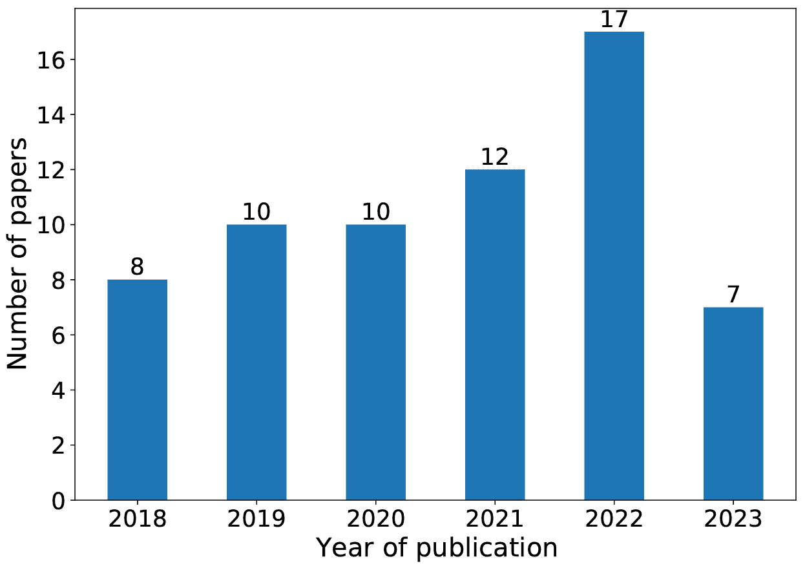

图 1. 每年的出版数量。

如表 1 所示，通过对论文标题、摘要和关键词的全面分析，我们成功识别出了 97 篇论文。随后，在仔细核对了剩余论文的全文后，我们最终获得了一组利用深度学习技术进行代码搜索的 64 篇论文。这些论文主要涵盖了软件工程、内容检索和人工智能领域的国际顶级会议和期刊。表 2 展示了至少发表过两篇深度代码搜索论文的著名出版场所。这些出版场所共刊登了 50 篇论文，占所有获得论文的 78.1%。值得注意的是，会议论文占已发表作品的 92%。在这 14 个场所中，我们观察到最受欢迎的前五个会议是 ICSE、EMNLP、SANER、ACL 和 FSE/ESEC，而排名前两的期刊是 TOSEM 和 Neural Networks。图 1 展示了将深度学习技术融入代码搜索领域后的相关文献年发表量呈现出显著的上升趋势。这一显著趋势证明了对深度代码搜索的关注和兴趣不断上升。

我们的贡献。本论文的主要贡献如下：

1.  (1)

    新的分类法。我们回顾了截至 2023 年 6 月 12 日发布的 64 项相关的深度代码搜索研究，并提出了一种新的分类法，将基于深度学习的代码搜索分为三类：查询语义建模、代码语义建模和匹配建模。

1.  (2)

    综合评述。我们提供了深度学习技术在代码搜索中的全面概述，详细描述了代表性模型，进行了彻底的比较，并总结了算法。

1.  (3)

    丰富资源。我们收集了大量的代码搜索资源，包括大规模训练语料库、基准数据集以及适用于各种场景的评估指标，以帮助比较深度代码搜索模型。

1.  (4)

    未来方向。我们强调了当前深度代码搜索方法的局限性，并提出了各种有价值的研究方向，旨在激发该领域的进一步探索。

本文的其余部分组织如下。第二部分介绍了基于深度学习的代码搜索框架，并定义了代码搜索的核心问题。第三部分涵盖了丰富自然语言文本查询语义的方法。第四部分对各种代码表示和向量化技术进行了分类。第五部分概述了模型的训练方法和目标。第六部分总结了该领域常用的数据集和评估指标。第七部分突出介绍了该有前景领域的潜在未来研究方向。第八部分提供了本次调查的总结。

## 2\. 基于深度学习的代码搜索框架

深度学习在软件工程领域近年来取得了快速发展，代码搜索是最成功的应用之一。与传统方法相比，深度代码搜索利用深度神经网络强大的能力从数据中提取隐藏特征，为自然语言和代码生成语义表示，从而提高性能。

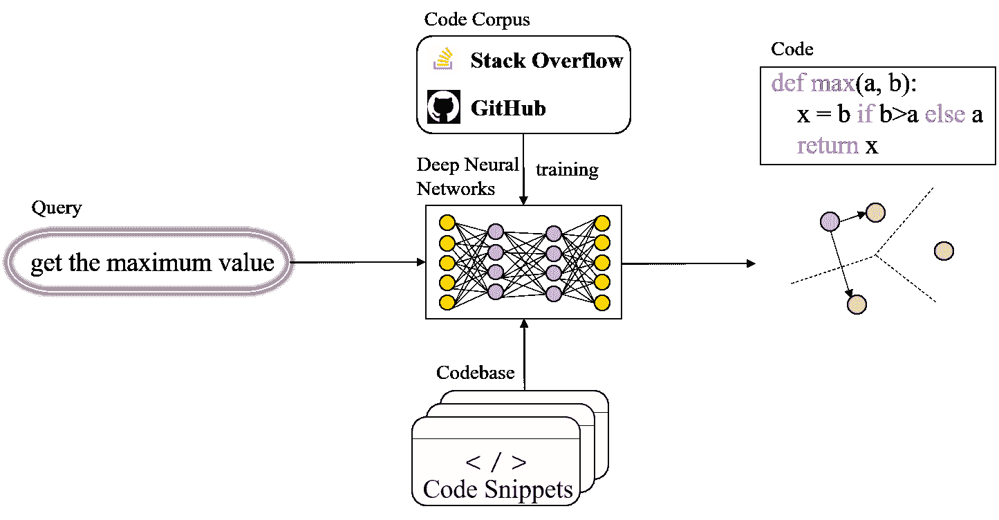

图 2. 基于深度学习的代码搜索框架。

图 2 说明了基于深度学习的代码搜索的整体框架。该框架主要包括三个组成部分：编码查询、编码代码以及测量它们的相似度。在训练过程中，一个双模态深度神经网络在大规模的代码和自然语言平行语料库上进行训练，以学习如何将查询和代码编码为高维向量 $q$ 和 $c$。随后，计算查询向量 $q$ 和代码向量 $c$ 在高维向量空间中的相似度，例如余弦相似度 $s(\textbf{q},\textbf{c})=\frac{\textbf{q}^{T}\cdot\textbf{c}}{\|\textbf{q}\|\cdot\|\textbf{c}\|}$ 或欧几里得距离 $s(\boldsymbol{q},\boldsymbol{c})=\sqrt{\sum_{i=1}^{n}\left(q_{i}-c_{i}\right)^{2}}$。在这些选项中，余弦相似度脱颖而出，成为广泛采用的计算方法 (Gu et al., 2018; Wan et al., 2019; Ling et al., 2020, 2021; Xu et al., 2021; Li et al., 2022a; Zeng et al., 2023; Hu et al., 2023)。

为了提高代码搜索的准确性，模型应使查询表示与正确的代码表示相似，同时与错误的代码表示有所区分。因此，训练实例通常被结构化为三元组 $\left\langle q,c^{+},c^{-}\right\rangle$，模型的训练目标是最小化三元组排序损失 $\mathcal{L}\left(q,c^{+},c^{-}\right)=\max\left(0,\delta-s\left(q,c^{+}\right)+s\left(q,c^{-}\right)\right)$，其中 $q$ 表示自然语言查询文本，$c^{+}$ 表示正确的代码片段，$c^{-}$ 是从代码库中随机选取的负样本代码片段，$\delta$ 表示一个边界，确保 $c^{+}$ 在向量空间中比 $c^{-}$ 更接近 $q$。

为了提高在线代码搜索服务的响应效率，训练好的模型通常会预先计算代码库中候选代码片段的向量表示。接收到查询后，代码搜索引擎计算查询的向量表示，遍历代码库计算查询与每个代码片段在语义空间中的相似度，最后根据相关性分数返回前 $k$ 个代码片段。

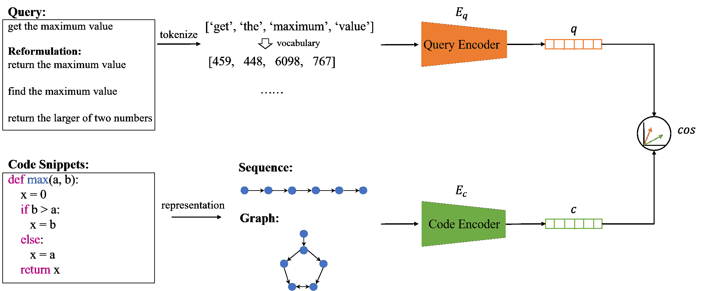

图 3. 深度代码搜索技术概述。

如图 3 所示，基于深度学习的代码搜索引擎主要处理两种输入：自然语言查询和源代码。深度学习技术被广泛用于学习这两种输入的语义编码，尤其是源代码的深层语义信息。在这个概述之后，我们希望对 64 篇高度相关的论文进行分类、分析和总结，这些论文涉及深度代码搜索。为实现这一目标，我们对五个研究问题（RQs）进行了探讨：

+   •

    RQ1. 如何准确捕捉用户的查询意图？为了达到期望的搜索结果质量，模型必须对用户的查询意图有良好的理解。这个 RQ 的目标是研究如何建模查询的表示和增强查询的语义表示，从而帮助模型准确捕捉用户的查询意图。

+   •

    RQ2. 如何增强代码的语义理解？编程语言的语法与自然语言不同，这导致了它们之间存在语义差距。这个 RQ 从多个角度进行研究，包括代码的表示和向量化，以及通过交互来缩小代码与自然语言之间的语义差距。

+   •

    RQ3. 如何训练深度代码搜索模型？这个 RQ 旨在研究如何预训练代码智能大型模型以及如何微调代码搜索模型。

+   •

    RQ4. 如何评估代码搜索模型？这个 RQ 的目标是分析代码搜索数据集、评估指标以及选择合适的代码搜索方法。

+   •

    RQ5. 在这个有前景的领域中有哪些潜在的未来研究方向？通过对上述 RQ 的分析，我们已经识别出一些局限性和挑战。在此基础上，RQ 讨论了深度代码搜索领域的十二个有价值的未来研究方向。

在接下来的章节中，我们将对每个 RQ 进行全面而详细的讨论。

## 3. 查询表示和增强（RQ1）

处理用户输入查询是进行代码搜索任务的初步步骤。准确理解查询文本中的搜索意图对提供令人满意的结果至关重要。本节从两个角度覆盖查询处理过程：建模查询表示和增强查询的语义表示。

### 3.1. 查询表示

基于深度学习的代码搜索通过对查询和代码片段进行编码，将它们表示为高维空间中的向量。查询编码器和代码编码器可以使用相同或不同的网络架构。为了推导查询的向量表示，需要对输入的查询文本进行分词。分词涉及根据特定标准将连续的词序列重新组装成标记序列。如图 3 所示，开发者输入查询“获取最大值”，分词器将其处理为标记序列 [“get”, “the”, “maximum”, “value”]，然后在词典中查找以获取 id 列表 [459, 448, 6098, 767] 作为查询编码器的输入。查询编码器 $E_{q}$ 是一个嵌入网络，将开发者给定的查询文本转换为 $d$ 维向量表示。为了训练查询编码器，现有的基于深度学习的代码搜索方法尝试了各种神经网络架构，如 RNN (Gu et al., 2018)、LSTM (Zeng et al., 2023)、GNN (Ling et al., 2021) 和 transformer (Feng et al., 2020)。由于收集和标注真实的 (查询，代码) 对成本高昂，因此在训练过程中，注释通常被视为查询。

### 3.2\. 提升查询表示的方法

开发者在搜索代码时常常难以清晰表达他们的目标需求，更倾向于使用含义广泛的简短初始查询，如关键词拼接。在这种情况下，代码搜索引擎可能会返回许多不相关的代码片段。结果是，开发者不得不浪费时间查看无关结果并调整查询。为了解决这个问题，一些研究集中在提升查询语义上，以通过使代码搜索引擎能够自动扩展或重构查询来提高代码搜索效率。表 3 ‣ Survey of Code Search Based on Deep Learning") 总结了基于 API 或类名、基于共现术语、基于提交版本、基于查询生成、基于搜索日志、基于用户反馈和基于多个视角等不同方法。我们将详细讨论这些方法。

表 3. 提升查询表示的不同方法概述。

| 年份 | 工作 | 基于 |
| --- | --- | --- |
| API 或类名 | 共现术语 | 提交版本 | 查询生成 | 其他 |
| 2018 | NLP2API (Rahman and Roy, 2018) | ✓ |  |  |  |  |
| 2018 | COCABU (Sirres et al., 2018) | ✓ |  |  |  |  |
| 2018 | Zhang et al. (Zhang et al., 2018) | ✓ |  |  |  |  |
| 2019 | RACK (Rahman et al., 2019) |  | ✓ |  |  |  |
| 2019 | Rahman (Rahman, 2019) |  | ✓ |  |  | ✓ |
| 2019 | ALICE (Sivaraman 等, 2019) |  |  |  |  | ✓ |
| 2019 | NQE (Liu 等, 2019a) | ✓ |  |  |  |  |
| 2019 | QESC (Huang 等, 2019) |  |  | ✓ |  |  |
| 2019 | Wu 和 Yang (Wu 和 Yang, 2019) |  |  | ✓ |  |  |
| 2021 | SEQUER (Cao 等, 2021) |  |  |  |  | ✓ |
| 2022 | QueCos (Wang 等, 2022b) |  |  |  | ✓ |  |
| 2022 | ZaCQ (Eberhart 和 McMillan, 2022) |  |  |  | ✓ |  |

基于 API 或类名。用语义相关的标识符增强自然语言查询具有重要潜力。研究人员利用来自 Stack Overflow 和 Github 等平台的源代码知识来重新构造自然语言查询。查询重新构造方法的共同点在于使用相似性度量来比较查询中的词或标识符与源代码中的词或标识符（如 API 和类名）（Sirres 等, 2018; Rahman 和 Roy, 2018; Rahman 等, 2019; Rahman, 2019; Zhang 等, 2018）。例如，基于 Stack Overflow 上的帖子，Sirres 等（Sirres 等, 2018）通过接受的代码片段中的 API 方法或类名来扩展用户的自由形式查询。Rahman 和 Roy（Rahman 和 Roy, 2018）提出自动识别 Stack Overflow 中相关或特定的 API 类以重新构造查询。他们首先使用伪相关反馈和术语加权算法从 Stack Overflow 中收集候选 API 类，然后应用查询中的关键字与 API 类之间的最大似然估计进行排名。最后，使用前 $k$ 个相关类来重新构造查询。Zhang 等（Zhang 等, 2018）应用连续词袋模型来学习代码语料库中 API 类名的向量表示。这些向量然后用于计算初始查询与 API 类名之间的语义距离。选择最具语义相关性的 API 类名用于查询扩展。

基于共现词。几种方法在重构查询时探索术语共现关系。这些方法在结构化实体（如方法和字段签名）中识别查询关键字，然后将其共现词作为查询重新构造的候选。例如，Liu 等（Liu 等, 2019a）提出了一种名为 NQE 的模型，该模型使用编码器-解码器架构预测代码库中与查询关键字共现的关键字。NQE 将初始查询作为输入以获取相应的编码，然后将该编码输入到递归神经网络（RNN）解码器中作为初始状态。通过在每个时间步收集输出，NQE 生成方法名称序列。最后，通过将序列中的每个方法名称拆分，得到扩展关键字的输出集合。

基于提交版本。通过代码搜索引擎检索到的代码在使用之前可能需要修改，例如与不同的 API 版本兼容。一些方法在扩展查询时考虑了这种潜在的代码更改，免去了开发者手动修改代码的麻烦。黄等（黄等，2019）分析了通过从 GitHub 提交中提取的序列对代码进行的更改，以确定所做的修改及其原因。这有助于推断对查询的细粒度更改。他们通过相关术语扩展查询，并消除不相关的术语，以最小化过度查询扩展的负面影响。吴和杨（吴和杨，2019）分析了开源项目版本历史中的重复代码更改。例如，如果代码片段中的标记“$a$”经常被修改为标记“$b$”，那么当目标代码包含标记“$a$”时，可以使用标记“$b$”来扩展初始查询。通过这种方式扩展查询，搜索引擎可以检索到更新后的代码片段，从而避免开发者手动更新查询。

基于查询生成。除了从代码库中提取相关的标识符或关键词来扩展查询外，一些方法旨在生成具有更丰富语义的查询。王等（王等，2022b）认为，许多现有的深度学习方法在这一领域忽视了查询与代码描述之间的知识差距。他们指出，查询通常比相应的代码描述要短。此外，使用（代码，描述）对作为训练数据可能不适用于现实世界的用户查询。为了解决这些问题，他们提出了模型 QueCos。QueCos 使用带有注意力机制的 LSTM 作为其架构，并利用强化学习来捕捉给定查询的关键语义。然后，它生成一个语义增强的查询，并使用混合排序技术将初始查询和语义增强查询的结果进行融合，以优先排序相关的代码片段。为了解决真实答案排名不高的问题，Eberhart 和 McMillan（Eberhart 和 McMillan，2022）提出了模型 ZaCQ，以生成能够澄清开发者搜索意图的问题。在给定代码搜索查询和前$k$个最相关的结果时，ZaCQ 识别查询中的模糊方面，从函数名和注释等属性中提取任务信息，并生成一个针对不明确需求的澄清问题。最终，它利用反馈关联算法来提升相关结果的排名。

其他。Rahman（Rahman，2019）从多个角度重新构造查询，以进一步丰富其语义。他从文本和源代码中收集搜索关键字，从错误报告和文档中收集结构化实体，以及从 Stack Overflow 问答帖子中获取相关的 API 类。之后，他利用这些信息重新构造查询，并通过适当的术语加权和上下文感知来提高代码搜索性能。为了探索来自 Stack Overflow 的搜索日志，Cao 等人（Cao 等，2021）基于来自 Stack Overflow 的大规模真实搜索日志提供了对查询重构模式的独特见解。他们建立了一个大规模的查询重建语料库，包含原始查询及其相应的重建查询，以训练模型。给定用户查询时，训练好的模型会自动生成候选重建查询列表供选择。用户反馈也可以主动纳入，以帮助用户优化查询。Sivaraman 等人（Sivaraman 等，2019）利用用户反馈标记返回的样本是否满足需求，然后从这些正负样本中提取代码的逻辑信息以重构查询。

### 3.3\. 总结

当前的代码搜索引擎在理解自然语言查询方面存在困难，只有当查询包含特定的标识符如类名和函数名时，才能返回相关的代码片段。然而，开发者可能不知道相关的标识符。为了解决这个问题，从 Stack Overflow、GitHub 和代码库等来源中充分挖掘数据，以提取有价值的信息，如代码元素和术语标记，这些信息基于 API、共现关系、搜索日志和提交信息。这些信息随后被加入到自然语言查询中，并进行适当的术语加权，从而显著提高查询的表示效果。此外，还存在通过利用提取的信息来生成更清晰搜索意图的查询，从而提高搜索效率和性能的技术。然而，语义相关的术语可能并不总是共现，而简单的共现频率可能不足以选择适当的搜索关键字用于查询重构。更重要的是，扩展查询方法的成功还依赖于提取词汇的质量。来自 Stack Overflow 的众包知识可能包含噪声，如果词汇提取不当，可能导致过度扩展查询并对搜索准确性产生负面影响。

<svg height="105.75" overflow="visible" version="1.1" width="600"><g transform="translate(0,105.75) matrix(1 0 0 -1 0 0)" fill="#000000" stroke="#000000" stroke-width="0.4pt"><g fill-opacity="1.0" transform="matrix(1.0 0.0 0.0 1.0 21.65 13.78)"><foreignobject width="556.69" height="78.2" transform="matrix(1 0 0 -1 0 16.6)" overflow="visible" color="#000000">RQ1 的答案总结：• API 或类名、共现术语、提交版本、搜索日志和用户反馈等信息常用于重新制定查询。• 基于 API 或类名重新制定查询是过去 6 年中最流行的方法。• 在重建查询时，重要的是避免引入可能导致查询扩展过度的噪声词。</foreignobject></g></g></svg>

## 4\. 代码表示和向量化（RQ2）

代码搜索引擎的目标是从代码库中检索与查询语义匹配的代码片段。为了缩小编程语言与自然语言之间的语义差距，除了提高查询意图的准确性外，深入理解代码语义并促进代码与查询之间的稳健交互也是至关重要的。在这一部分，我们讨论代码编码模型，从代码表示和代码向量化的角度进行审视。此外，我们还讨论了查询与代码之间交互的关键方面，揭示了它对全面语义理解的意义。

### 4.1\. 代码表示

#### 4.1.1\. 基础知识

源代码是由开发人员使用编程语言编写的原始程序文本，包含指令和语句。它通常会被编译成计算机可以理解和执行的机器语言。在从源代码到机器代码的编译过程中，会生成各种中间表示形式，如抽象语法树（AST）、数据流图（DFG）、控制流图（CFG）和 LLVM 中间表示（IR）。在此过程中，编译器会自动执行程序分析技术，包括词法、语法和语义分析，以验证源代码的正确性。

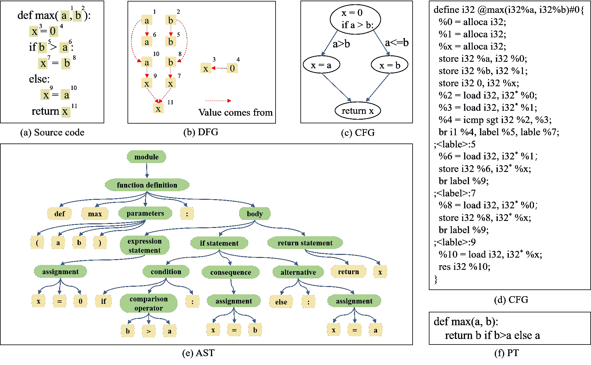

图 4. 源代码的多模态。

抽象语法树（AST）是源代码语法的树状表示。它由叶子节点、非叶子节点及其之间的边组成，反映了源代码丰富的语法结构。例如，在图 4 ‣ Survey of Code Search Based on Deep Learning")(e)中，赋值语句“$x=0$”由一个非叶子节点“$assignment$”和三个叶子节点“$x$”、“$=$”以及“$0$”通过有向边连接表示。像$if-condition-else$这样的条件跳转语句可以由一个具有三个分支的节点表示。通常，标准编译器工具$tree-sitter$ ¹¹1https://github.com/tree-sitter/tree-sitter 常用于将源代码解析为 AST。

数据流图（DFG）表示代码的逻辑关系、数据传输方向和逻辑转换过程。DFG 抽象了源代码中变量之间的依赖关系，其中节点表示变量，边表示每个变量值的来源（Guo et al., 2021）。如图 4 ‣ Survey of Code Search Based on Deep Learning")(b)所示，函数返回的变量$x^{11}$有两个来源，这些来源可以是基于$if$条件结果的$a^{10}$或$b^{8}$。显然，遵守命名规范并不是所有软件开发人员的普遍做法，这有时会对理解变量语义造成挑战。幸运的是，DFG 有助于克服因命名不一致造成的语义偏差。

控制流图（CFG）是程序结构的抽象表示，由基本块及其之间的有向边组成。每个有向边反映两个基本块的执行顺序。例如，如图 4 ‣ Survey of Code Search Based on Deep Learning")(c)所示，$if$语句的结果产生了两个不同的执行路径，即“$x=a$”和“$x=b$”。CFG 表示代码的运行序列和逻辑关系，有效地反映了程序的执行语义。

中间表示（IR）是源代码的结构化且语言无关的表示，捕捉了代码的基本语义和结构，同时抽象掉语言特定的细节。它作为编译或解释过程中的中间步骤，并使对代码进行各种优化和变换成为可能。例如，如图 4 ‣ Survey of Code Search Based on Deep Learning")(d) 所示，赋值语句“$x=0$”由 IR 指令 `%x = alloca i32; store i32 0, i32 %x;` 表示，即首先为临时变量“$x$”分配存储空间，然后将常量“$0$”存储其中。IR 作为构建 CFG 和 DFG 的基础。公共 IR 被多个对象共享，并能实现不同编程语言的统一表示。

程序变换（PT）指的是执行与给定程序相同任务的代码片段。它允许创建多个版本，以满足相同的功能需求。例如，图 4 ‣ Survey of Code Search Based on Deep Learning")(f) 是图 4 ‣ Survey of Code Search Based on Deep Learning")(a) 所表达功能的另一种表示。

#### 4.1.2\. 序列

嵌入技术在自然语言处理（NLP）中的成功促使研究人员探索其在代码分析中的潜在应用。目前，已有几项研究将源代码视为简单的文本序列，并直接在代码片段上应用 NLP 技术。

源代码令牌序列（STS）。一些方法将标记化的代码令牌序列本身视为代码表示，并将其输入到模型训练过程中以学习代码的语义（Cambronero et al., 2019; Yao et al., 2019; Zhao and Sun, 2020; Ye et al., 2020; Feng et al., 2020; Ling et al., 2020; Huang et al., 2021; Lachaux et al., 2021; Du et al., 2021; Salza et al., 2023; Arakelyan et al., 2022; Cai et al., 2023; Wang et al., 2022a; Chai et al., 2022; Li et al., 2022a, b, d)。例如，基于 Transformer 的强大学习能力，Feng 等人（Feng et al., 2020）构建了 CodeBERT，这是第一个大规模程序语言预训练模型。受 BERT-based NLP 的启发，他们直接将代码片段的令牌序列输入到多层 Transformer 中。这使得模型能够融入上下文信息并学习识别对代码语义至关重要的令牌。然而，通过标记化直接获取源代码的所有令牌忽略了语法细节，使得很难辨别一个术语是否来源于变量名或方法调用。为此，Du 等人（Du et al., 2021）从三个角度对代码片段进行数据增强：代码结构、变量名和 API。他们构建了以结构为中心的数据集、以变量为中心的数据集和以 API 为中心的数据集，这些数据集分别输入模型进行训练。为了帮助模型学习在语义等效程序中不变的代码特征，Wang 等人（Wang et al., 2022a）开发了一种保持语义的代码片段转换。该转换保持代码的语义，但改变其词汇外观和语法结构。具体而言，他们修改了代码的控制结构、API 和声明，以使模型能够提取和学习相关特征，同时保持代码的语义。基于转换的方法（如通过变量重命名生成语义等效的代码片段）通常会产生具有高度相似表面形式的代码，导致模型关注于表面级代码结构而非其语义信息。为了缓解这一问题，Li 等人（Li et al., 2022b）使用代码注释和抽象语法树子树构建了正样本，鼓励模型捕获语义信息。

多模态令牌序列（MTS）。代码片段具有不同的信息维度。代码令牌序列只捕获源代码的浅层特征，如方法名称和代码令牌，但忽略了诸如 AST 和 CFG 等结构特征，这些特征包含丰富且明确定义的源代码语义。

多模态学习旨在构建能够处理和整合来自多个模态的信息的模型。最近，许多研究尝试利用程序分析技术来捕捉程序的结构和语法表示。这些工作捕捉了多种代码模态，以形成互补的代码表示（Haldar 等，2020；Guo 等，2021；Gu 等，2021b，a；Xu 等，2021；Wang 等，2021b，2022c；Han 等，2022；Niu 等，2022；Guo 等，2022）。例如，Xu 等（Xu 等，2021）从方法体中提取抽象语法树（AST）作为结构特征，并将代码片段解析成语法树。树中的节点表示各种代码类型，如循环结构、条件判断结构、方法调用和变量声明。他们通过广度优先遍历策略遍历 AST，以获得 AST 节点序列，并将其与方法名称、API 序列和代码令牌一起用于模型训练。

为了增强 AST 树结构在代码搜索中的语义适用性，Gu 等（Guo 等，2021a）将 AST 转化为简化语义树（SST）。与 AST 不同，SST 消除了冗余节点，增强了节点标签，突出了代码片段的语义信息，并在不同编程语言中具有更广泛的适用性。然后，他们通过采样树路径或遍历树结构从 SST 中获得树序列化表示，这些表示在多模态学习中用于补充传统源代码令牌序列表示。类似地，Niu 等（Niu 等，2022）用简化和线性化的 AST 版本丰富了源代码预训练模型的输入表示。为了便于转换器对 AST 进行编码，Guo 等（Guo 等，2022）提出了一种 AST 无损序列化的方法。他们将 AST 转化为保持所有树信息的序列结构，并将其作为输入，以增强代码表示。为了提供程序语义理解的补充信息，Guo 等（Guo 等，2021）基于 AST 构建数据流图。给定一个代码片段，他们使用标准编译器生成 AST，通过 AST 的叶节点识别变量序列，并保留每个变量值的来源，以获得代码的数据流信息。与 AST 相比，数据流信息更轻量，不会带来冗余结构，使模型更加高效。

Wang 等人（Wang et al., 2022c）认识到代码的不同视图提供了互补的语义。他们利用编译器将程序转换成多个视图，如 AST、CFG 和等效程序。AST 提供了代码的语法信息，CFG 揭示了代码的执行信息，而相同程序的不同变体则提供了代码的功能信息。他们使用深度优先遍历将 AST 转换为 AST 标记序列，并沿着有向边遍历 CFG 将其解析为标记序列。最终，模型在对比学习框架下学习多个视图之间的互补信息。

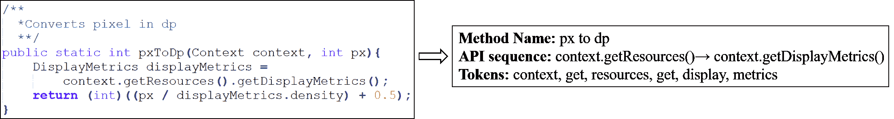

图 5. 从代码片段中提取特征标记。

特征标记序列（FTS）。Gu 等人（Gu et al., 2018）提出了 CODEnn，这是第一个基于深度学习的代码搜索任务的监督模型。考虑到源代码不是纯文本，他们从三个方面对其进行表示：方法名称、API 调用序列和代码标记，如图 5 ‣ Survey of Code Search Based on Deep Learning") 所示。他们分别对每个方面进行编码，然后将它们结合成一个单一的向量来表示整个代码片段。Sachdev 等人（Sachdev et al., 2018）假设源代码标记包含足够的自然语言信息。为了在方法级别表示代码信息，他们通过提取方法名称、方法调用、枚举、字符串常量和注释构建自然语言文档。这些方法通常遵循不提取变量名称的惯例，因为变量名称可能因软件开发人员而异。Cheng 和 Kuang（Cheng and Kuang, 2022）采用一种综合方法通过利用方法名称、API 序列和代码标记来表示代码片段。他们有效地将每种特征类型转换为相应的 n-gram 向量，最终智能地连接这三种不同的特征向量，获得最终的代码片段特征矩阵。

#### 4.1.3\. 树/图

将自然图结构，如 AST 或 CFG，转换为序列可能会导致关键结构信息的丢失。为了解决这个问题，一些方法尝试直接使用图结构作为代码表示。Wan 等（Wan et al., 2019）将 CFG 视为有向图，并使用门控图神经网络（GGNN）来获得 CFG 的向量表示。他们将图定义为 $\mathcal{G}=\{\mathcal{V},\mathcal{E}\}$，其中 $\mathcal{V}$ 是一组顶点 $\left(v,\ell_{v}\right)$，$\mathcal{E}$ 是一组边 $\left(v_{i},v_{j},\ell_{e}\right)$，$\ell_{v}$ 和 $\ell_{e}$ 分别是顶点和边的标签。在代码检索场景中，每个顶点代表 CFG 中的一个节点，每条边表示代码的控制流。

具有相同功能的代码片段可能有不同的实现，而具有不同代码语义的代码片段可能具有类似的结构特征。为了在代码搜索中获得令人满意的结果，Zeng 等（Zeng et al., 2023）旨在找到更精确的源代码表示。他们通过结合数据和控制依赖性来解决基于结构特征的代码表示方法的局限性。这使得语义上相似的代码可以具有类似的表示。为此，他们分析了各种类型的 LLVM IR 指令，将数据依赖性和控制依赖性整合到一个图中，并构建了一个基于变量的流图（VFG）。该图中的节点可以是变量、操作码或标签标识符。考虑到过多的信息可能会阻碍模型学习源代码和查询之间的细粒度关系，他们优化了 VFG 以最小化训练中的噪音。最后，他们将优化后的图输入到带有注意机制的 GGNN 中，以学习代码的向量表示。

为了对齐查询和代码的语义，Ling 等人（Ling et al., 2021）将查询文本和源代码表示为统一的图结构。程序图是从代码片段的抽象语法树生成的。抽象语法树被表示为一个元组 $\langle\mathbb{N},\mathbb{T},\mathbb{X},\Delta,\phi,s\rangle$，其中 $\mathbb{N}$ 表示非终结节点集合，$\mathbb{T}$ 表示终结节点集合，$\mathbb{X}$ 表示值的集合，$\Delta:\mathbb{N}\rightarrow(\mathbb{N}\cup\mathbb{T})^{*}$ 是一个将非终结节点映射到其子节点的函数，$\phi:\mathbb{T}\rightarrow\mathbb{X}$ 是一个将终结节点映射到相关值的函数，$s$ 表示根节点。具体来说，程序图由语法节点（抽象语法树中的终结节点和非终结节点）和语法标记（源代码中终结节点的相应值）组成。该图使用各种类型的边来建模节点和标记之间的语法和语义关系，包括**Child** 边来连接抽象语法树中的语法节点，**NextToken** 边来将每个语法标记连接到其在原始代码中的后续标记，以及**LastLexicalUse** 边来将标识符与代码中最近的词法使用相关联。

### 4.2. **代码向量化**

一旦获取了代码表示，我们可以将其嵌入到向量空间中。编码的网络架构选择取决于代码表示的类型（如源代码标记或抽象语法树）和数据结构（如抽象语法树序列或图）。在这个过程中，深度神经网络展示了其卓越的性能。在本节中，基于深度学习的代码嵌入网络被分为五类：**词嵌入**、**递归神经网络**（RNN）、**图神经网络**（GNN）、**变换器**和**混合模式**。这些将在下面详细讨论。

#### 4.2.1. 基于**词嵌入**

code2vec (Alon et al., 2019) 是代码理解领域的开创性工作，它实现了将代码片段表示为单个固定长度的代码向量。这些向量作为预测代码片段语义属性的强大工具。在此之前，传统的词嵌入算法包括 Word2Vec 和 GloVe。Word2Vec 采用两层密集神经网络来计算单词的向量表示。它可以在大型语料库上进行无监督训练，确保具有相似上下文的单词在向量空间中紧密相邻。FastText 是 Word2Vec 的一个变体，通过子词信息增强了词向量，曾在代码向量化研究中广受欢迎（Sachdev et al., 2018; Cambronero et al., 2019; Ling et al., 2020）。Saksham 等（Sachdev et al., 2018）从每种方法中提取五种类型的信息：即方法名、方法调用、枚举、字符串常量和注释，以获得源代码中的标记序列 $c=\left\{c_{1},\ldots,c_{n}\right\}$。然后，他们利用 FastText 计算提取的标记序列的向量表示，并获得嵌入矩阵 $T\in\mathbb{R}^{\left|V_{c}\right|\times d}$，其中 $\left|V_{c}\right|$ 是提取的代码词汇表的大小，$d$ 是选定标记嵌入的维度，而 $T$ 中第 $k$ 行是 $V_{c}$ 中第 $k$ 个提取单词的向量表示，对应于代码的嵌入向量集合 $\left\{T\left[c_{1}\right],\ldots,T\left[c_{n}\right]\right\}$。为了将一组代码标记的嵌入向量合并为单个向量，他们应用了加权和，使用 TF-IDF 权重。TF-IDF 权重旨在增强在代码片段中频繁出现的标记的重要性，并减少在所有代码库中常见的标记的权重。在搜索代码时，他们使用 $T$ 计算给定查询 $q=\left\{q_{1},\ldots,q_{m}\right\}$ 的嵌入向量 $\left\{T\left[q_{1}\right],\ldots,T\left[q_{m}\right]\right\}$，取其平均值以获得最终查询向量 $e_{q}$，然后使用 FAISS 计算 $e_{c}$ 和 $e_{q}$ 之间的距离，表示代码片段与给定查询的相关性。在第二年，他们通过使用监督学习来更新从 FastText 获得的标记矩阵 $T$ 并用基于注意力的方案替代合并标记嵌入的 TF-IDF 权重，进一步优化了代码向量化过程（Cambronero et al., 2019）。注意力权重 $a_{c}\in\mathbb{R}^{d}$ 是在训练过程中学习的 $d$ 维向量。对于代码标记嵌入向量 $\left\{T\left[c_{1}\right],\ldots,T\left[c_{n}\right]\right\}$，每个标记的注意力权重计算如下：

| (1) |  | $\alpha_{i}=\frac{\exp\left(a_{c}\cdot T\left[c_{i}\right]^{\top}\right)}{\sum_{i=1}^{n}\exp\left(a_{c}\cdot T\left[c_{i}\right]^{\top}\right)}.$ |  |
| --- | --- | --- | --- |

最终，代码的嵌入向量通过加权求和注意力权重$\alpha_{i}$获得：

| (2) |  | $e_{c}=\sum_{i=1}^{n}\alpha_{i}T\left[c_{i}\right].$ |  |
| --- | --- | --- | --- |

#### 4.2.2\. 基于循环神经网络

循环神经网络（RNNs）广泛用于自然语言处理中的序列嵌入。受到自然语言处理技术的启发，一些研究人员尝试使用 RNN 对代码标记序列进行编码。例如，Gu 等人（Gu et al., 2018）从代码片段中提取方法名称、API 调用序列和标记，表示为$C=[M,A,\Gamma]$，其中$M=w_{1},\ldots,w_{N_{M}}$是通过驼峰式命名划分的$N_{M}$个标记的序列，$A=a_{1},\ldots,a_{N_{A}}$是$N_{A}$个连续的 API 调用序列，$\Gamma=\left\{\tau_{1},\ldots,\tau_{N_{\Gamma}}\right\}$是代码片段中的标记集合。他们然后使用带有最大池化层的 RNN 分别对方法名称序列和 API 序列进行编码。由于标记在源代码中没有严格的顺序，它们通过多层感知机进行编码。最后，将三个向量组合成一个表示整个代码片段的向量$c$：

| (3) |  | $c={LSTM}_{1}(M)+{LSTM}_{2}(A)+{MLP}(\Gamma).$ |  |
| --- | --- | --- | --- |

Sun 等人（Sun et al., 2022a）将代码转换为自然语言描述以获得翻译，并应用 LSTM 架构构建翻译编码器。他们使用词嵌入将翻译序列中的词，$s=w_{1},\cdots,w_{N^{s}}$，映射为向量表示$\boldsymbol{w}_{i}=\psi\left(w_{i}\right)$。这些向量然后排列在嵌入矩阵$E\in\mathbb{R}^{n\times m}$中，其中$n$是词汇表的大小，$m$是嵌入向量的维度。嵌入矩阵$E=\left(\psi\left(w_{1}\right),\ldots,\psi\left(w_{i}\right)\right)^{T}$在训练过程中与编码器一起随机初始化并学习。翻译的向量表示$v^{s}$从嵌入矩阵中获得，并输入到翻译编码器中以获得最终的嵌入向量$e^{s}$。$s$中第$i$个词的隐藏状态$h_{i}^{s}$计算如下：

| (4) |  | $h_{i}^{s}={LSTM}\left(h_{i-1}^{s},\boldsymbol{w}_{i}\right).$ |  |
| --- | --- | --- | --- |

此外，他们还采用了注意力机制以缓解长文本序列中的长依赖问题。每个词的注意力权重计算如下：

| (5) |  | $\alpha_{i}^{s}=\frac{\exp\left(f\left(h_{i}^{s}\right)\cdot u^{s}\right)}{\sum_{j=1}^{N}\exp\left(f\left(h_{j}^{s}\right)\cdot u^{s}\right)},$ |  |
| --- | --- | --- | --- |

其中 $f(\cdot)$ 表示线性层；$u^{s}$ 表示上下文向量，它是 $s$ 中所有单词的高级表示。$\cdot$ 表示 $h_{i}^{s}$ 和 $u^{s}$ 的内积。$u^{s}$ 是随机初始化的，并在训练过程中共同学习。$s$ 的最终嵌入表示 $e^{s}$ 计算如下：

| (6) |  | $e^{s}=\sum_{j=1}^{N^{s}}\alpha_{i}^{s}\cdot h_{i}^{s}.$ |  |
| --- | --- | --- | --- |

#### 4.2.3\. 基于图神经网络

如前所述，代码可以表示为图结构。这种表示优于序列表示，因为它保留了更多关于代码的信息。一些方法使用图神经网络（GNN）来编码基于 AST 和 CFG 等结构构建的图结构（曾等人，2023；Ling 等人，2021；刘等人，2023）。

曾等人（Zeng et al., 2023）基于源代码的数据依赖和控制依赖构建了一个基于变量的流图（VFG）。VFG 是一个具有多种边类型的有向图，表示为 $G=(V,E)$。他们随后使用适合处理图结构数据的 GGNN 模型来学习代码的向量表示。在这里，$V$ 表示节点集合 $\left(v,l_{v}\right)$，$E$ 表示边集合 $\left(v_{i},v_{j},l_{\left(v_{i},v_{j}\right)}\right)$，$l_{v}$ 表示节点 $v$ 的标签，它由 IR 指令中的变量组成。$l_{\left(v_{i},v_{j}\right)}$ 表示从 $v_{i}$ 到 $v_{j}$ 的边的标签，包括数据依赖和控制依赖。GGNN 通过消息传递机制学习 $G$ 的向量表示。在每次迭代中，每个节点 $v_{i}$ 从其邻居 $v_{j}$ 接收消息 $m_{t}^{v_{j}\mapsto v_{j}}=W_{l_{\left(v_{i},v_{j}\right)}}h_{v_{j}}^{t-1}$，该消息由它们之间的边类型决定。GGNN 然后聚合所有来自 $v_{i}$ 的邻居的消息 $m_{t}^{i}=\sum_{v_{j}\in{Neibour}\left(v_{i}\right)}\left(m_{t}^{v_{j}\mapsto v_{i}}\right)$，并使用 GRU 更新每个节点 $v_{i}$ 的嵌入 $h_{v_{i}}^{t}=GRU\left(m_{t}^{i},h_{v_{i}}^{t-1}\right)$。考虑到不同节点对代码语义的贡献不同，他们使用注意力机制来计算不同节点的重要性：

| (7) |  | $\alpha_{i}={sigmoid}\left(f\left(h_{v_{i}}\right)\cdot u_{vfg}\right),$ |  |
| --- | --- | --- | --- |

其中 $f(\cdot)$ 是一个线性层，$u_{vfg}$ 代表上下文向量，它是图中所有节点的高级表示，在训练过程中一起学习。整个图的最终嵌入表示为：

| (8) |  | $h_{vfg}=\sum_{v_{i}\in V}\left(\alpha_{i}h_{v_{i}}\right).$ |  |
| --- | --- | --- | --- |

鉴于查询文本具有自然语言的序列特征，Zeng 等人（Zeng et al., 2023）使用 LSTM 将查询编码为向量空间，并计算其与代码语义向量的相似度。与此不同，Ling 等人（Ling et al., 2021）为查询和代码设计了统一的图结构。然后，他们使用 RGCN 编码文本图和代码图，这是一种 GNN 的变体。给定一个代码图 $G_{e}=\left(\mathcal{V}_{e},\mathcal{E}_{e},\mathcal{R}_{e}\right)$，为了计算代码图 $G_{e}$ 中每个节点 $e_{i}$ 的更新嵌入向量 $\mathbf{e}_{i}$，RGCN 定义了以下传播模型：

| (9) |  | $\mathbf{e}_{i}^{(l+1)}={ReLU}\left(W_{\Theta}^{(l)}\mathbf{e}_{i}^{(l)}+\sum_{r\in\mathcal{R}_{e}}\sum_{j\in\mathcal{N}_{i}^{r}}\frac{1}{\left | \mathcal{N}_{i}^{r}\right | }W_{r}^{(l)}\mathbf{e}_{j}^{(l)}\right),$ |  |
| --- | --- | --- | --- | --- | --- |

其中，$\mathbf{e}_{i}^{(l+1)}$ 表示在 RGCN 的第 $(l+1)$ 层中节点 $\mathbf{e}_{i}$ 的更新嵌入向量，$\mathcal{R}_{e}$ 表示关系集（即边的类型），$\mathcal{N}_{i}^{r}$ 是在边类型 $r \in \mathcal{R}_{q}$ 下节点 $e_{i}$ 的邻居集合，$W_{\Theta}^{(l)}$ 和 $W_{r}^{(l)}$ 是 RGCN 模型需要学习的参数。通过使用 RGCN 模型对代码的图结构进行编码，他们获得了代码图的节点嵌入 $\mathbf{X}_{e}=\left\{\mathbf{e}_{j}\right\}_{j=1}^{N}\in\mathbb{R}^{(N,d)}$。查询文本图的嵌入 $\mathbf{X}_{q}=\left\{\mathbf{q}_{i}\right\}_{i=1}^{M}\in\mathbb{R}^{(M,d)}$ 也可以类似地获得。

#### 4.2.4\. 基于 Transformers

近年来，大型预训练模型在许多 NLP 任务中带来了显著的改进。许多方法利用自监督目标在大量的纯文本数据上训练深度学习模型，其中 Transformer 神经网络架构最为突出。Transformer 包含多个自注意力层，并能够通过梯度下降以端到端的方式不断学习，因为它的每个组件都是可微分的。预训练模型在 NLP 中的成功激发了研究人员创建基于 Transformer 的代码理解预训练模型，从而推动了代码智能的发展。

Feng 等人（Feng et al., 2020）提出了 CodeBERT，这是第一个大规模自然语言-编程语言预训练模型，支持多种编程语言。在预训练过程中，他们使用特殊的标记将自然语言文本序列和代码标记序列拼接在一起，然后输入到多层 Transformer 基于 CodeBERT 的模型中。该模型通过掩码语言建模（MLM）和替换标记检测（RTD）任务学习自然语言与编程语言之间的语义关系，最终生成一个通用的代码理解向量。

一些方法旨在通过将源代码的多种模态表示输入到 Transformer 中，提供对代码更全面的理解。例如，Guo 等人（Guo et al., 2021）将从数据流图中提取的变量序列与代码令牌序列相结合，并将这两者输入到多层 Transformer 基础的 GraphCodeBERT 中。他们然后使用**Masked Language Modeling (MLM)**、**Edge Prediction (EP)** 和 **Node Alignment (NA)** 任务来引导模型学习代码结构和数据依赖。此外，Guo 等人（Guo et al., 2022）将序列化的 AST 与评论文本序列合并，并将这两者输入到多层 Transformer 基础的 UnixCoder 中。他们然后使用**Masked Language Modeling (MLM)**、**Unidirectional Language Modeling (ULM)**、**DeNoiSing (DNS)**、**Multi-modal Contrastive Learning (MCL)** 和 **Cross-Modal Generation (CMG)** 来学习代码的句法信息并增强对代码语义的理解。Wang 等人（Wang et al., 2022c）不仅添加了反映代码语法信息的序列化 AST，还添加了反映逻辑信息的 CFG 序列，以及具有不同实现但相同语义的代码片段的令牌序列。所有这些都被输入到**CODE-MVP**中。他们然后使用**Multi-View Contrastive Learning (MVCL)**、**Fine-Grained Type Inference (FGTI)** 和 **Multi-View Masked Language Modeling (MMLM)** 任务来帮助模型学习代码的结构信息。

为了确保每个查询的代码搜索结果的准确性，模型需要在共享向量空间中尽可能将查询向量与正确代码向量拉近，同时尽可能将其与错误代码向量拉远。为了实现这一点，一些研究人员将对比学习集成到 Transformer 网络架构中，并通过构造正负样本来提升代码搜索引擎的性能。例如，Huang 等人（Huang et al., 2021）通过随机选择同一批次中的查询和代码形成负样本对。同时，他们通过重复查询生成正样本对，即在不改变其语义的情况下重新措辞查询。开发人员通常将完整的评论分成几行以提高可读性。受到此启发，Li 等人（Li et al., 2022a）将连续的评论行合并成一行，以充分利用没有评论的代码片段形成对比学习的正样本对。当有多种代码模态可用时，Wang 等人（Wang et al., 2021b）将不同的模态结合起来创建正样本对，并使用批内和跨批次采样方法生成负样本对。

Transformer 因其通用而强大的建模能力受到研究人员的青睐。为了提高代码语义理解能力，研究人员探索了各种预训练任务，如 MLM、RTD、EP 和 FGTI 等，以指导模型学习，并使模型能够学习代码的语法和结构信息。

#### 4.2.5. 混合模式

用于表示代码不同模式的结构可能会有所不同，一些方法选择适当的模型来处理每种模式。例如，Wan 等人（Wan et al., 2019）提取 AST 和 CFG 作为代码表示，并提出了 Tree-LSTM 用于 AST 的树结构。与传统的 LSTM 单元相比，Tree-LSTM 单元包含多个遗忘门。对于 CFG 的有向图结构，他们采用了门控图神经网络（GGNN）进行编码，并使用门控循环单元（GRU）来更新每个顶点的隐藏状态。最后，他们通过聚合所有顶点的嵌入向量来获得 CFG 的整体嵌入向量。

### 4.3. 代码与查询之间的交互

自然语言查询与代码片段之间存在语义差距，这带来了显著的挑战。然而，几种方法已经出现，以有效建模二者之间的交互，从而增强对它们各自语义的理解（Haldar 等，2020；Xu 等，2021；Arakelyan 等，2022；Cheng 和 Kuang，2022；Cai 等，2023）。例如，Haldar 等（Haldar 等，2020）利用广泛采用的计算查询与代码之间整体相似度的方法，另外引入了评估二者局部相似度的概念。这一视角提供了对它们相关性的更细粒度的见解。Xu 等（Xu 等，2021）提出了一种创新的两阶段注意力网络架构。在初始阶段，提取查询和代码的语义。随后，在第二阶段，采用联合注意力机制促进二者之间的交互，捕捉它们的语义相关性。这一方法在弥合自然语言查询与代码片段之间的差距方面取得了显著进展。类似地，Cheng 和 Kuang（Cheng 和 Kuang，2022）结合了神经信息检索（IR）和语义匹配，以增强查询与代码之间的交互。他们的方法涉及同时捕捉两个匹配信号。首先，神经 IR 捕捉关键词匹配信号，包括查询-代码对中的单词、术语和短语。其次，语义匹配采用联合注意力机制，同时关注描述注意力和代码注意力，从而获取两个组件的全面语义向量表示。特别地，Arakelyan 等（Arakelyan 等，2022）提出了一种细致的方法，通过利用不同的词性角色解析查询，将其分解为简洁的语义短语。具体而言，名词和名词短语与代码中的数据实体相关联，而动词描述对这些实体执行的操作或变换。查询与代码之间的交互通过实体发现模块和动作模块来实现。实体发现模块接收一个引用数据实体的字符串，并旨在识别与该字符串具有强相关性的代码标记。该模块的输出作为动作模块的输入，预测目标实体对象的预期操作行为。这一全面的方法提供了有价值的见解，增强了自然语言查询与代码片段之间的理解和对齐。

### 4.4\. 总结

源代码可以用多种模式表示，包括代码令牌序列、抽象语法树（AST）、控制流图（CFG）、数据流图（DFG）和程序变换（PT）。代码令牌序列通常用于提取代码的文本特征，而 AST 和 CFG 则常用于提取代码的结构特征。如表 4 ‣ Survey of Code Search Based on Deep Learning")所示，代码的多种模式主要以两种数据结构形式输入到网络中：序列和图。这些不同模式的信息可以相互补充，使模型能够充分理解代码的语义信息。根据输入数据结构的类型，选择适当的序列嵌入模型或图嵌入模型来获得代码的向量表示。如图 5 所示，代码表示的主要选择是源代码令牌序列（STS），而 Transformer 架构已经成为广泛采用的代码编码器选择。并非所有模态对代码的最终表示都有相同的影响。通过聚合来自不同模式的嵌入向量、分配注意力权重并进行加权求和，可以获得更具语义丰富的代码向量表示。此外，促进查询与代码之间的细粒度交互，有助于更强的学习其复杂的语义。

表 4. 代码表示和代码向量化方法概述。

| Year | Work | Code Representation | Code Vectorization | Interaction |
| --- | --- | --- | --- | --- |
| STS | MTS | FTS | Tree/Graph | Word Embedding | RNN | GNN | Transformer |
| 2018 | CODEnn (Gu et al., 2018) |  |  | ✓ |  |  | ✓ |  |  |  |
| 2018 | NCS (Sachdev et al., 2018) |  |  | ✓ |  | ✓ |  |  |  |  |
| 2019 | UNIF (Cambronero et al., 2019) | ✓ |  |  |  | ✓ |  |  |  |  |
| 2019 | MMAN (Wan et al., 2019) | ✓ |  |  | ✓ |  | ✓ | ✓ |  |  |
| 2019 | CoaCor (Yao et al., 2019) | ✓ |  |  |  |  | ✓ |  |  |  |
| 2020 | CodeBERT (Feng et al., 2020) | ✓ |  |  |  |  |  |  | ✓ |  |
| 2020 | AdaCS (Ling et al., 2020) | ✓ |  |  |  |  | ✓ |  |  |  |
| 2020 | MP-CAT (Haldar et al., 2020) |  | ✓ |  |  |  | ✓ |  |  | ✓ |
| 2020 | ${TranS}^{3}$ (Wang et al., 2020) |  |  |  | ✓ |  |  |  | ✓ |  |
| 2020 | Zhao and Sun (Zhao and Sun, 2020) | ✓ |  |  |  |  | ✓ |  |  |  |
| 2020 | CO3 (Ye et al., 2020) | ✓ |  |  |  |  | ✓ |  |  |  |
| 2021 | CRaDLe (Gu et al., 2021b) |  | ✓ |  |  |  | ✓ |  |  |  |
| 2021 | GraphCodeBERT (Guo et al., 2021) |  | ✓ |  | ✓ |  |  |  | ✓ |  |
| 2021 | DGMS (Ling et al., 2021) |  |  |  | ✓ |  |  | ✓ |  |  |
| 2021 | CoCLR (Huang et al., 2021) | ✓ |  |  |  |  |  |  | ✓ |  |
| 2021 | DOBF (Lachaux et al., 2021) | ✓ |  |  |  |  |  |  | ✓ |  |
| 2021 | Gu et al. (Gu et al., 2021a) |  | ✓ |  |  |  |  |  | ✓ |  |
| 2021 | TabCS (Xu et al., 2021) |  | ✓ |  |  |  |  |  | ✓ | ✓ |
| 2021 | MuCoS (Du et al., 2021) | ✓ |  |  |  |  |  |  | ✓ |  |
| 2021 | SynCoBERT (Wang et al., 2021b) |  | ✓ |  |  |  |  |  | ✓ |  |
| 2022 | Salza et al. (Salza et al., 2023) | ✓ |  |  |  |  |  |  | ✓ |  |
| 2022 | G2SC (Shi et al., 2022) |  | ✓ |  |  |  | ✓ |  | ✓ |  |
| 2022 | CSRS (Cheng and Kuang, 2022) |  |  | ✓ |  | ✓ |  |  |  | ✓ |
| 2022 | TranCS (Sun et al., 2022a) | ✓ |  |  |  |  | ✓ |  |  |  |
| 2022 | Wang et al. (Wang et al., 2022a) | ✓ |  |  |  |  |  |  | ✓ |  |
| 2022 | ${NS}^{3}$ (Arakelyan et al., 2022) | ✓ |  |  |  |  |  |  | ✓ | ✓ |
| 2022 | CodeRetriever (Li et al., 2022a) | ✓ |  |  |  |  |  |  | ✓ |  |
| 2022 | CDCS (Chai et al., 2022) | ✓ |  |  |  |  |  |  | ✓ |  |
| 2022 | CSSAM (Cai et al., 2023) | ✓ |  |  | ✓ |  | ✓ | ✓ |  | ✓ |
| 2022 | SCodeR (Li et al., 2022b) | ✓ |  |  |  |  |  |  | ✓ |  |
| 2022 | SPT-Code (Niu et al., 2022) |  | ✓ |  |  |  |  |  | ✓ |  |
| 2022 | Li et al. (Li et al., 2022d) | ✓ |  |  |  |  |  |  | ✓ |  |
| 2022 | CTBERT (Han et al., 2022) |  | ✓ |  |  |  |  |  | ✓ |  |
| 2022 | CODE-MVP (Wang et al., 2022c) |  | ✓ |  |  |  |  |  | ✓ |  |
| 2022 | UniXcoder (Guo et al., 2022) |  | ✓ |  |  |  |  |  | ✓ |  |
| 2023 | deGraphCS (Zeng et al., 2023) |  |  |  | ✓ |  |  | ✓ |  |  |
| 2023 | MulCS (Ma et al., 2023) |  |  |  | ✓ |  |  | ✓ |  |  |

| 2023 | GraphSearchNet (Liu et al., 2023) |  |  |  | ✓ |  |  | ✓ |  |  | 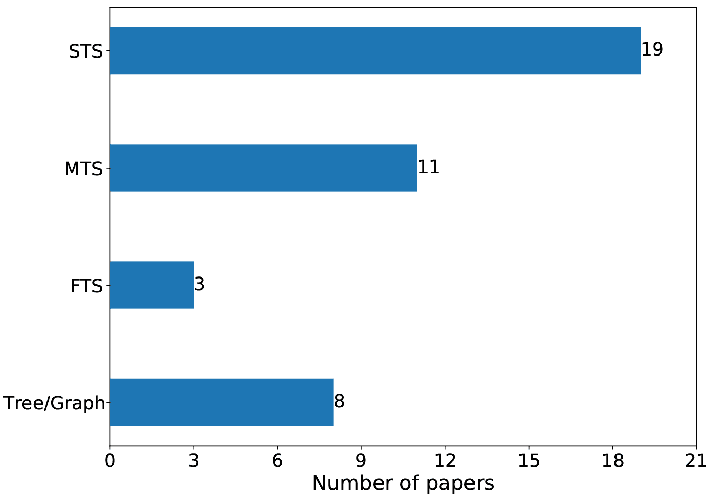

(a) 代码表示

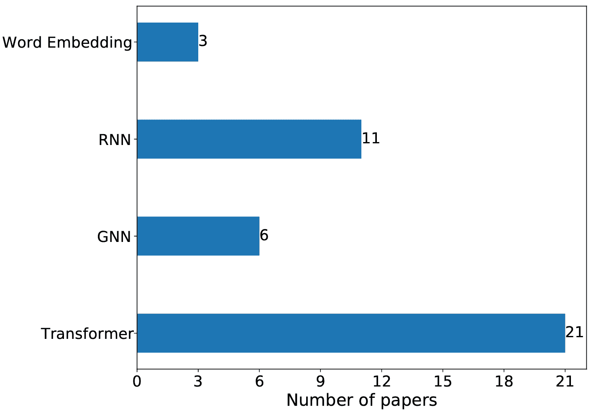

(b) 代码向量化

图 6. 代码表示和代码向量化。

<svg height="149.96" overflow="visible" version="1.1" width="600"><g transform="translate(0,149.96) matrix(1 0 0 -1 0 0)" fill="#000000" stroke="#000000" stroke-width="0.4pt"><g fill-opacity="1.0" transform="matrix(1.0 0.0 0.0 1.0 21.65 13.78)"><foreignobject width="556.69" height="122.4" transform="matrix(1 0 0 -1 0 16.6)" overflow="visible" color="#000000">RQ2 的回答总结： • 可以利用多种不同的模态，包括抽象语法树（AST）、数据流图（DFG）、控制流图（CFG）、程序树（PT）及其他代码表示方式，有效增强模型学习代码复杂语义的能力。 • 在将代码输入到编码器时，通常会将其表示为序列或图形。在这些形式中，源代码令牌序列（STS）在大多数情况下是首选。 • Transformer 是过去 6 年中最受欢迎的代码编码器。 • 促进查询与代码之间的细粒度交互可以提升模型掌握其语义的能力。</foreignobject></g></g></svg>

## 5\. 训练方法（RQ3）

如前所述，基于深度学习的代码搜索的核心问题是使用模型 $f_{\theta}(q,c)=E_{\theta_{1}}(q)\cdot E_{\theta_{2}}(c)$ 来估计查询和代码的相关性分数，然后根据分数排序以获取与查询匹配的代码。第三部分和第四部分详细阐述了利用深度学习模型为查询和代码获得表示的方法。本节概述了现有的模型参数 $\theta$ 的训练技术。该节组织如下：首先介绍与代码智能相关的基于 Transformer 的大型模型的预训练技术，包括三个类别：序列任务、代码结构任务和多模态任务。其次，描述了代码搜索模型的训练。最后，介绍了其他场景下的替代训练方法，如元学习和数据增强。

### 5.1\. 代码智能大型模型的预训练

使用 Transformer 编码器对查询和代码进行编码是代码搜索任务中的一种重要编码策略。预训练的 Transformer 在许多领域（Devlin et al., 2019; Liu et al., 2019b）中已证明其有效性。大规模的预训练使得模型从更好的初始状态开始，从而促进了下游任务的高效训练和微调。目前，已有许多工作将预训练技术引入代码智能领域，设计出了各种预训练任务。这些任务可以分为三类：序列任务、代码结构任务和多模态匹配任务。表 5 ‣ Survey of Code Search Based on Deep Learning") 总结了这三类任务的相关方法。序列任务将输入视为序列，通过流行的 NLP 任务进行训练。代码结构任务在序列的基础上利用代码结构图中标记之间的关系进行训练。多模态匹配任务尝试将对比学习引入预训练，并使用不同的模态构建匹配正样本。

表 5. 预训练任务概述。

| 年份 | 工作 | 序列任务 | 代码结构任务 | 多模态匹配任务 |
| --- | --- | --- | --- | --- |
| MLM | RTD | ULM | DNS | EP | IP | ICP | MMP | MCCL | CMG |
| 2020 | CodeBERT (Feng et al., 2020) | ✓ | ✓ |  |  |  |  |  |  |  |  |
| 2021 | GraphCodeBERT (Guo et al., 2021) | ✓ |  |  |  | ✓ |  |  |  |  |  |
| 2021 | Syncobert (Wang et al., 2021b) | ✓ |  |  |  | ✓ | ✓ |  |  |  |  |
| 2022 | CODE-MVP (Wang et al., 2022c) | ✓ |  |  |  |  | ✓ |  |  |  |  |
| 2022 | CTBERT (Han et al., 2022) |  |  |  |  | ✓ |  |  |  |  |  |
| 2022 | SPT-Code (Niu et al., 2022) |  |  |  | ✓ |  |  | ✓ | ✓ |  |  |
| 2022 | DOBF (Lachaux et al., 2021) |  |  |  |  |  |  | ✓ |  |  |  |
| 2022 | SCodeR (Li et al., 2022b) |  |  |  |  |  |  |  |  | ✓ |  |
| 2022 | UniXcoder (Guo et al., 2022) | ✓ |  | ✓ | ✓ |  |  |  |  |  | ✓ |

#### 5.1.1\. 序列任务

序列是表示代码和文本最直接且有效的方式。像 AST 和 CFG 这样的数据结构可以通过序列化算法转换为序列。NLP 中有许多已建立的预训练任务用于在 Transformer 模型中编码序列，这些任务可以直接引入到代码智能中。

掩码语言模型（MLM）（Feng 等人，2020；Guo 等人，2021；Wang 等人，2021b；Guo 等人，2022；Wang 等人，2022c）。给定一个标记序列 $X=\left\{[cls],x_{1},x_{2},\cdots\right.$ $\left.,x_{N},[end]\right\}$，一些标记被随机掩码为 $[mask]$，新的标记序列表示为 $X^{mask}=\left\{x_{1},x_{2},\cdots,[mask],\cdots,x_{N}\right\}$。将 $X^{mask}$ 输入到模型中，目标任务可以通过输出层的表示恢复原始标记。损失函数可以表示如下：

| (10) |  | ${Loss}_{MLM}=-\sum_{i}\log p\left(x_{i}\mid X^{mask}\right).$ |  |
| --- | --- | --- | --- |

MLM 可以扩展到多模态拼接的输入，即拼接查询、代码和其他模态的代码（如扁平化的 AST 和 CFG 序列）。这会产生一个新的序列 $X=\left\{[cls],x_{1}^{(1)},x_{2}^{(1)},\cdots,x_{N}^{(1)},[{sep}],x_{1}^{(2)},x_{2}^{(2)},\cdots,x_{M}^{(2)},[end]\right\}$，在其上执行 MLM 任务。在一些文献中，这种结合多种模态的掩码语言模型被称为多模态掩码语言建模（MMLM）（Wang 等人，2021b）。

替换标记检测（RTD）（Feng 等人，2020）。给定一个标记序列，其中一些标记被随机替换为其他标记，创建一个新的标记序列，表示为 $X^{corrupt}=\left\{[cls],x_{1}^{\prime},x_{2}^{\prime},\cdots,\right.$ $\left.x_{N}^{\prime},[end]\right\}$。任务是在输出层对 $X^{corrupt}$ 中的标记是否为替换标记进行预测。损失函数可以表示如下：

| (11) |  | ${Loss}_{RTD}=-\sum_{i}\left(\delta(i)\log\left(i\mid X^{corrupt}\right)+(1-\delta(i))(1-\left.\log p\left(i\mid X^{corrupt}\right)\right)\right).$ |  |
| --- | --- | --- | --- |

当标记未被替换（即 $x_{i}^{\prime}=x_{i}$）时，$\delta(i)=1$，否则 $\delta(i)=0$。

单向语言建模（ULM）（Guo 等人，2022）。ULM 从头到尾预测序列中的标记，是训练 Transformer 解码器的广泛使用的辅助任务。在一些同时训练编码器和解码器的模型中（Guo 等人，2022），选择 ULM 来训练解码器。损失函数可以表示如下：

| (12) |  | ${Loss}_{ULM}=-\sum_{i}\log p\left(x_{i}\mid X[<i]\right),$ |  |
| --- | --- | --- | --- |

其中 $X[<i]$ 表示第 $i$ 个标记之前的标记。

去噪（DNS）（Guo 等人，2022；Niu 等人，2022）。去噪预训练目标使用 $[mask_{i}]$ 来掩码输入标记序列中的多个跨度，得到 $X^{mask}$，其中 $i$ 表示第 $i$ 个掩码跨度。所有 $X^{mask}$ 被拼接并表示为 $Y=\left\{y_{1},y_{2},\cdots\right\}$。可以通过编码器-解码器框架重建相应的输出，目标函数可以表示如下：

| (13) |  | ${Loss}_{DNS}=-\sum_{i}\log\left(y_{i}\mid X^{mask},Y[<i]\right).$ |  |
| --- | --- | --- | --- |

#### 5.1.2\. 代码结构任务

代码的结构化表示，如 AST 和 CFG，通常包含大量信息，例如变量跳转关系、代码执行顺序等。这些信息可以被挖掘出来，以设计辅助任务来帮助预训练代码智能模型。

边预测（EP）（Guo 等，2021；Wang 等，2021b；Han 等，2022）。在使用 Transformer 对结构化代码表示进行编码时，通常将其展平为序列 $X=\left\{[cls],x_{1},x_{2},\cdots,x_{N},[end]\right\}$。之后，原始图/树中节点的连接关系可以继承到标记序列中。例如，如果节点 $i$ 在原始图中指向节点 $j$，那么标记 $x_{i}$ 和标记 $x_{j}$ 将继承这种连接，从而引导模型的预训练。两个标记之间是否存在边的概率 $p\left(e_{ij}\mid X\right)$ 通过 $x_{i}$ 和 $x_{j}$ 的表示 $\vec{e}_{i}$ 和 $\vec{e}_{j}$ 的相似度来衡量，即 $<\vec{e}_{i},\vec{e}_{j}>$。EP 的目标函数可以表示如下：

| (14) |  | ${Loss}_{EP}=-\sum_{ij}\left(\delta\left(e_{ij}\right)\log\left(e_{ij}\mid X\right)+\left(1-\delta\left(e_{ij}\right)\right)(1-\left.{logp}\left(e_{ij}\mid X\right)\right)\right).$ |  |
| --- | --- | --- | --- |

当标记 $x_{i}$ 和标记 $x_{j}$ 之间存在边时，$\delta\left(e_{ij}\right)=1$，否则 $\delta\left(e_{ij}\right)=0$。除了单模态结构，还可以使用跨模态结构来构建标记之间的边，例如，通过将代码序列标记与数据流标记结合起来。它们之间存在对应关系，可以根据该对应关系构建边。

标识符预测（IP）（Wang 等，2022c，2021b）。代码片段中的标记可以分为两类：标识符（例如变量和函数名等）和非标识符（指示语法操作的关键字）。这种分类可以通过基于 AST 的代码分析来进行。这些信息有助于构建辅助任务，以确定标记是否为标识符。标记是标识符的概率 $p(i\mid X)$ 可以通过一个简单的变换来预测，即 $\sigma\left(\vec{w}^{T}\cdot\vec{e}_{i}\right)$，其中 $\sigma$ 是一个将分数映射到 0-1 的 sigmoid 函数。IP 的目标函数可以表示如下：

| (15) |  | ${Loss}_{IP}=-\sum_{i}(\delta(i)\log p(i\mid X)+(1-\delta(i))(1-\log p(i\mid X))).$ |  |
| --- | --- | --- | --- |

如果节点是标识符，则 $\delta(i)=1$；否则 $\delta(i)=0$。

标识符内容预测（ICP）（Lachaux 等，2021；Niu 等，2022）。标识符，如函数名称和变量名称，携带着重要信息，可以看作是函数的一种通用表达。为了让模型学习这些高级语义信息，可以设计以下代理任务：将标识符掩蔽为 $[mask]$，并预测掩蔽内容。与随机掩蔽令牌相比，通过分析代码结构准确掩蔽标识符增加了任务的难度，使模型能够学习到更高级的信息。在掩蔽标识符时，为了避免模型依赖上下文中相同变量名进行推理，可以同时将所有相同的令牌替换为 $[mask_{i}]$，其中 $i$ 代表第 $i$ 个被替换的标识符。在实际设计训练任务时，$[mask_{i}]$ 可以连接到掩蔽的令牌。所有掩蔽信息被串联为输出，然后使用编码器-解码器框架训练模型。相应的目标函数可以表示为：

| (16) |  | ${Loss}_{ICP}=-\sum_{i}\log p\left(y_{i}\mid X^{mask},y[<i]\right).$ |  |
| --- | --- | --- | --- |

#### 5.1.3\. 多模态匹配任务

从多模态视角来看，代码智能是一个涉及自然语言、代码序列表示和代码结构表示的多模态任务。目前，许多研究也从多模态视角审视这个问题，并设计多模态匹配的预训练任务。

多模态匹配预测（MMP）（Niu 等，2022）。代码的多种模态可以看作是用相同语义描述信息的不同方式。MMP 将这些不同模态的描述拼接以获得 $M^{(1)}//M^{(2)}//\cdots//M^{(N)}$，其中 $M^{(i)}$ 代表由模态 $i$ 组成的令牌序列。模态的数量可以大于或等于 2，但应注意控制总量，因为过长的序列会导致 Transformer 的计算复杂度较高。通常，$N$ 设置为 2 或 3。假设 $N=2$，拼接后的序列表示为 $M_{i}^{(1)}//M_{j}^{(2)}$，其中 $M_{i}^{(j)}$ 代表代码 $i$ 的第 $j$ 个模态序列表示。训练目标是确定拼接序列中的两个模态是否描述了相同的代码信息。如果是，则标签为 $\delta(ij)=1$，否则为 $\delta(ij)=0$。拼接序列可以输入到模型中，通过 $[cls]$ 的表示可以估计 $i=j$ 的概率。损失函数可以表示为：

| (17) |  | ${Loss}_{MMP}=-\sum_{ij}\left(\delta(ij)\log p\left(cls\mid M_{i}^{(1)}//M_{j}^{(2)}\right)+(1-\delta(ij))\left(1-\log p\left(cls\mid M_{i}^{(1)}//M_{j}^{(2)}\right)\right)\right).$ |  |
| --- | --- | --- | --- |

多模态拼接对比学习 (MCCL) (Li et al., 2022b)。在多模态对比学习中，模型对来自两种模态的信息进行编码，并在表示空间中计算相似性，即 $s_{ij}=<E\left(M_{i}^{(1)}\right),E\left(M_{j}^{(2)}\right)>$。然而，这种方法没有在标记级别上建模 $M_{i}^{(i)}$ 和 $M_{i}^{(j)}$ 的细粒度交互。为了解决这个限制，可以将两种模态的标记序列拼接起来，并使用单个编码器对其进行编码，即 $s_{ij}=E\left(M_{i}^{(1)}//M_{j}^{(2)}\right)$。根据相似性，损失函数构建如下：

| (18) |  | ${Loss}_{MCCL}=-\sum_{i}\log\frac{\exp\left(s_{ii}/\tau\right)}{\sum_{j}\exp\left(s_{ij}/\tau\right)}.$ |  |
| --- | --- | --- | --- |

在使用此目标进行训练后，研究人员可以继续使用 $s_{ij}$ 在多模态对比学习中有效地加权样本，从而提升其性能。

跨模态生成 (CMG) (Guo et al., 2022)。CMG 旨在通过一种模态序列的信息来预测另一种模态序列的信息。例如，可以基于函数体序列来预测代码的注释。如果源模态记作 $X$，目标模态记作 $Y$，则目标函数可以表示为：

| (19) |  | ${Loss}_{CMG}=-\sum_{i}\log p\left(y_{i}\mid X,Y[<i]\right).$ |  |
| --- | --- | --- | --- |

CMG 可以被视为一种利用多模态匹配信息的生成任务，类似于隐式匹配任务。

#### 5.1.4\. 总结

本节介绍了十种用于代码智能的预训练任务，涵盖了代码序列、代码结构和代码多模态。这些任务允许使用大量未标记的数据来训练大模型，生成的预训练模型可以在各种下游任务中表现出色，例如代码搜索，且只需少量的微调。在实际应用中，像 MLM 这样的简单训练任务通常非常有效，并且扮演了基础性角色。它们的简单性和有效性使其成为大多数预训练模型中的主流，例如 CodeBERT (Feng et al., 2020) 和 GraphCodeBERT (Guo et al., 2021)。复杂任务在存在简单训练任务的情况下显示出有限的改进，这在一些消融实验中也有所体现 (Guo et al., 2022)，并且它们对所有数据和任务的泛化能力较差 (Wang et al., 2021b)。尽管如此，任务的多样性也扩展了预训练代码智能的可能性，增加了其潜力。此外，对于代码搜索，通过多模态对比学习进行预训练取得了更好的结果，因为它与下游任务的对齐度更高 (Li et al., 2022a)。这确认了当预训练任务与下游任务一致时，它们的表现更佳 (Zhang et al., 2020)。

### 5.2\. 代码搜索模型训练/微调

上述描述了用于代码理解的大模型的预训练任务。预训练有助于模型参数达到更好的状态，这有利于下游任务的训练。这个过程通常称为微调。需要注意的是，预训练目标可能与目标任务不完全一致，但训练/微调应专注于目标任务，并使用目标任务的评估方法进行评估。像图神经网络这样的模型不需要预训练，但也需要设计优化目标。为了简化起见，并与没有预训练的模型保持一致，我们在下面将微调称为训练。

在训练过程中，模型通过任务特定的标签进行指导，这些标签称为监督信息。对于代码搜索，监督信息由配对的（查询，代码）样本组成。根据不同的训练场景，我们将现有的代码搜索训练分为判别模型训练和生成模型训练。表格 6 ‣ Survey of Code Search Based on Deep Learning")总结了这两种维度的方法。判别模型在代码搜索中最为常用，模型化相似度 $s_{qc}=f_{\theta}(q,c)$。代码搜索中的生成模型主要涉及变分自编码器（Variational Auto-Encoder），将输入查询/代码编码成一个分布，然后将分布解码回原始查询/代码。通过为编码器-解码器框架设计适当的训练策略，训练后的变分自编码器模型对其潜在空间中的分布具有良好的泛化能力，并且相似度可以基于潜在空间分布中均值向量的匹配来计算。

#### 5.2.1\. 判别模型训练

有三种类型：点级、对级和序列级，它们将分别介绍。

点级（Huang et al., 2021; Arakelyan et al., 2022）。在此任务中，配对的（查询，代码）样本对标记为 1，而未配对的（查询，代码）样本对标记为 0。因此，训练数据可以视为（查询，代码，标签）三元组的集合，标签为 1 或 0。此任务是一个二分类问题，模型可以使用二分类目标进行优化，如均方误差损失：

| (20) |  | ${Loss}_{MSE}=\frac{1}{ | D | }\sum_{(q,c)\in D}\left | \hat{y}_{qc}-y_{qc}\right | ^{2},$ |  |
| --- | --- | --- | --- | --- | --- | --- | --- |

其中 $y_{qc}$ 代表样本对 $(q,c)$ 的真实标签，$\hat{y}_{qc}=\sigma\left(f_{\theta}(q,c)\right)$ 代表模型输出的相似度得分，$\sigma$ 是 sigmoid 函数，用于确保 $\hat{y}_{qc}$ 的值在 0 和 1 之间，$D$ 代表样本集。在优化过程中，为了保持正负样本之间的平衡，需要抽取相等数量的负样本。

表 6. 代码搜索模型的训练/微调概述。

| 年份 | 工作 | 判别模型训练 | 生成模型训练 | 其他 |
| --- | --- | --- | --- | --- |
| 点对点 | 对对对 | 列对列 |
| 2018 | CODEnn (Gu et al., 2018) |  | ✓ |  |  |  |
| 2018 | Chen and Zhou (Chen and Zhou, 2018) |  |  |  | ✓ |  |
| 2019 | MMAN (Wan et al., 2019) |  | ✓ |  |  |  |
| 2019 | CoaCor (Yao et al., 2019) |  | ✓ |  |  |  |
| 2020 | AdaCS (Ling et al., 2020) |  | ✓ |  |  |  |
| 2020 | MP-CAT (Haldar et al., 2020) |  | ✓ |  |  |  |
| 2020 | ${TranS}^{3}$ (Wang et al., 2020) |  |  | ✓ |  |  |
| 2020 | Zhao and Sun (Zhao and Sun, 2020) |  | ✓ |  |  |  |
| 2020 | CO3 (Ye et al., 2020) |  |  | ✓ |  |  |
| 2021 | DGMS (Ling et al., 2021) |  | ✓ |  |  |  |
| 2021 | CoCLR (Huang et al., 2021) | ✓ |  |  |  |  |
| 2021 | TabCS (Xu et al., 2021) |  | ✓ |  |  |  |
| 2021 | CRaDLe (Gu et al., 2021b) |  | ✓ |  |  |  |
| 2021 | Corder (Bui et al., 2021) |  | ✓ |  |  |  |
| 2022 | TranCS (Sun et al., 2022a) |  | ✓ |  |  |  |
| 2022 | CSRS (Cheng and Kuang, 2022) |  |  | ✓ |  |  |
| 2022 | G2SC (Shi et al., 2022) |  | ✓ |  |  |  |
| 2022 | Li et al. (Li et al., 2022d) |  |  | ✓ |  |  |
| 2022 | CodeRetriever (Li et al., 2022a) |  |  | ✓ |  |  |
| 2022 | CDCS (Chai et al., 2022) |  |  |  |  | ✓ |
| 2022 | ${NS}^{3}$ (Arakelyan et al., 2022) | ✓ |  |  |  |  |
| 2022 | Wang et al. (Wang et al., 2022a) |  |  |  |  | ✓ |
| 2023 | deGraphCS (Zeng et al., 2023) |  | ✓ |  |  |  |
| 2023 | KeyDAC (Park et al., 2023) |  |  | ✓ |  |  |
| 2023 | CSSAM (Cai et al., 2023) |  | ✓ |  |  |  |
| 2023 | MulCS (Ma et al., 2023) |  | ✓ |  |  |  |
| 2023 | GraphSearchNet (Liu et al., 2023) |  |  | ✓ |  |  |
| 2023 | TOSS (Hu et al., 2023) |  |  | ✓ |  |  |

配对方法（Gu et al., 2018; Yao et al., 2019; Wan et al., 2019; Haldar et al., 2020; Ling et al., 2020; Zhao and Sun, 2020; Ling et al., 2021; Xu et al., 2021; Bui et al., 2021; Gu et al., 2021b; Sun et al., 2022a; Cai et al., 2023; Ma et al., 2023; Zeng et al., 2023)。对于配对的（查询，代码）正样本对，负样本代码可以随机选择，以构建一个三元组$\left(q,c^{+},c^{-}\right)$，称为（查询，正样本代码，负样本代码）。训练的目标是最大化正样本$\left(q,c^{+}\right)$和负样本$\left(q,c^{-}\right)$之间的差距。用于此目的的常见损失函数是 Hinge 损失，其表示如下：

| (21) |  | $Loss_{hinge}=\sum_{\left(q,c^{+},c^{-}\right)\in D}\max\left(0,\epsilon-s_{{qc}^{+}}+s_{{qc}^{-}}\right),$ |  |
| --- | --- | --- | --- |

其中$s_{qc}=f_{\theta}(q,c)$表示查询$q$与代码$c$之间的相似度，$\epsilon$是一个超参数，而$D$表示样本集。对于配对的$(q,c)$样本，负样本$c^{-}$被随机选择以构建三元组样本$\left(q,c^{+},c^{-}\right)$。

列表方法（Ye et al., 2020; Wang et al., 2020; Cheng and Kuang, 2022; Li et al., 2022a, d; Liu et al., 2023; Hu et al., 2023）。对于配对的（查询，代码）正样本对，可以随机选择多个负样本代码来构建序列$\left(q,c^{+},c_{1}^{-},\cdots,c_{n-1}^{-}\right)$。训练目标是优化整个序列$\left(c^{+},c_{1}^{-},\cdots,c_{n-1}^{-}\right)$中正样本$c^{+}$的相似度排名。可以使用 InfoNCE 损失函数，将问题视为一个分类任务，其中类别数等于正样本类别的数量。在通过 softmax 计算相似度后，使用交叉熵构建损失。损失函数可以表示为：

| (22) |  | ${Loss}_{InfoNCE}=-\sum_{\left(q,c^{+},c_{1}^{-},\cdots,c_{n-1}^{-}\right)\in D}\log\left(\frac{\exp\left(s_{qc^{+}}/\tau\right)}{\exp\left(s_{qc^{+}}/\tau\right)+\sum_{j}\exp\left(s_{qc_{j}^{-}}/\tau\right)}\right),$ |  |
| --- | --- | --- | --- |

其中 $\tau$ 是温度超参数。在实际操作中，通常使用批量负样本采样策略来生成负样本，这意味着对于一批正样本对，批次中的其他代码被视为负样本。例如，（Li et al., 2022a）采用了多种策略来采样负样本以提高模型性能，而（Li et al., 2022d）改进了表示空间数据并生成了更多正样本和负样本。

上述三个优化目标都是为监督学习中的判别模型设计的。其中，序列级优化目标因其有效性而目前最受欢迎。

#### 5.2.2\. 生成模型训练

变分自编码器（VAE）通过函数 $f_{\theta}(\cdot)$（假设为高斯分布，可以由均值和方差向量表示）将输入 $\vec{x}$ 映射到隐藏空间中的分布，然后通过函数 $g_{\phi}(\cdot)$ 将从分布中采样得到的向量映射到输入空间，希望能重建 $\vec{x}$。添加了一个正则化项，使潜在空间分布更接近标准高斯分布。VAE 的损失函数为：

| (23) |  | ${Loss}_{VAE}=\mathcal{R}(\vec{x};\theta,\phi)+KL\left(q_{\theta}(\vec{z}\mid\vec{x}),\mathcal{N}(0,1)\right),$ |  |
| --- | --- | --- | --- |

其中 $\mathcal{R}(\vec{x};\theta,\phi)$ 表示通过编码器-解码器框架重建 $\vec{x}$ 的误差损失，而 $KL\left(q_{\theta}(\vec{z}\mid\vec{x}),\mathcal{N}(0,1)\right)$ 表示 $q_{\theta}(\vec{z}\mid\vec{x})$ 与 $\mathcal{N}(0,1)$ 的 KL 散度。

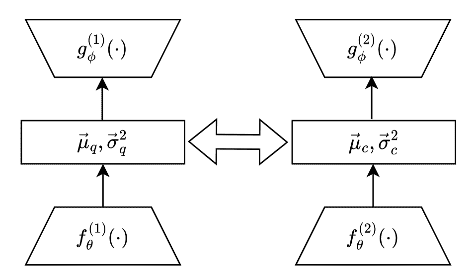

图 7. 双模态变分自编码器。

双模态变分自编码器（bimodal VAE），不同于一般的变分自编码器（VAE），处理代码搜索中的两个模态，并专注于学习匹配关系。双模态 VAE 相比于一般的 VAE 有两个改进，使其更适合代码搜索任务（Chen 和 Zhou，2018），如图 7 ‣ Survey of Code Search Based on Deep Learning") 所示。 (a) 双模态编码器-解码器框架：该框架将查询和代码分别输入到各自的编码器-解码器模型中（每个模型的参数可以相同），并且它们并行操作。 (b) 跨模态正则化项：正则化涉及最小化样本对两个模态之间分布的差异，而不是使用标准的正态分布正则化项。这将查询和代码的表示统一到潜在空间中，使得后续的相似性匹配更加合理。正则化项可以是两个模态之间的 KL 散度，也可以是一个模态与两个模态均值之间的 KL 散度。在这里，我们使用从查询到代码的 KL 散度，表示为 ${KL}\left(q_{\theta}^{(1)}\left(\vec{z}_{q}\mid\vec{x}_{q}\right),q_{\theta}^{(2)}\left(\vec{z}_{\boldsymbol{c}}\mid\vec{x}_{\boldsymbol{c}}\right)\right)$，其中 $q_{\theta}^{(1)}\left(\vec{z}_{q}\mid\vec{x}_{q}\right)$ 和 $q_{\theta}^{(2)}\left(\vec{z}_{\boldsymbol{c}}\mid\vec{x}_{\boldsymbol{c}}\right)$ 表示查询和代码的均值和方差组成的正态分布。代码到查询的 KL 散度可以通过反转上述公式得到。查询和代码的平均分布可以通过它们的均值和方差的平均来获得，均值也可以作为 KL 散度中的正则化项。

#### 5.2.3\. 其他训练方法

除了上述介绍的预训练和训练技术，还有一些研究从其他角度探索模型训练技术。例如，（Chai 等，2022）的元学习使用一个小的验证集来改进模型初始化，以便在小数据情况下获得更好的性能。（Wang 等，2022a）提出了保持语义的数据增强技术，并使用课程学习来控制样本权重以获得更好的模型收敛。在零样本设置中，没有标签训练过程，预训练对于开发表示能力至关重要。因此，输入被转换到表示空间，其中得到的向量携带语义信息。决策基于该空间内的相似性评估（Guo 等，2022）。

<svg height="122.73" overflow="visible" version="1.1" width="600"><g transform="translate(0,122.73) matrix(1 0 0 -1 0 0)" fill="#000000" stroke="#000000" stroke-width="0.4pt"><g fill-opacity="1.0" transform="matrix(1.0 0.0 0.0 1.0 21.65 13.78)"><foreignobject width="556.69" height="95.17" transform="matrix(1 0 0 -1 0 16.6)" overflow="visible" color="#000000">对 RQ3 的回答总结： • 在过去的六年中，掩码语言模型（MLM）已成为代码理解预训练任务的主要选择。尽管其表面上看起来简单，但该任务始终表现出卓越的效果，并作为实现全面代码理解的基础支柱。 • 代码搜索模型的训练/微调主要采用判别模型训练方法，其中配对训练是最常见的形式。</foreignobject></g></g></svg>

## 6\. 数据集与评估（RQ4）

数据集对代码搜索技术的发展产生了重大影响。它们不仅作为评估各种模型性能的手段，还在解决代码搜索中遇到的实际挑战方面发挥了关键作用，从而推动了这一领域的成长。在本节中，我们概述了自 2018 年以来提出的 12 个代码搜索数据集以及 8 种常用的代码搜索模型评估指标。为了为工业实践者提供一些指导，我们进一步讨论了如何选择适当的代码搜索方法以满足他们的需求。

### 6.1\. 代码搜索数据集

为了推动代码搜索的进展，各种由（文本，代码）对组成的数据集被引入。本节总结了现有的自然语言代码搜索研究数据集，包括发行年份、数据来源、编程语言、数据统计、数据集划分、数据注释和获取方法，如表 7 所示。在接下来的部分，我们简要概述了表 7 中列出的一些经典语料库。此外，我们对数据来源和编程语言进行了细致的统计分析。如图 8 所示，GitHub 是代码搜索任务数据集的主要来源，而 Python 和 Java 是该任务的主要关注语言。

表 7. 现有代码搜索数据集概述。

| 发行年份 | 语料库 | 数据来源 | 编程语言 | 数据统计 | 数据划分 | 数据注释 | 获取方法 |
| --- | --- | --- | --- | --- | --- | --- | --- |
| 2018 | StaQC (Yao et al., 2018) | SO | Python, SQL | 147,546 个 Python（问题,代码）对；119,519 个 SQL（问题,代码）对 | 训练集，开发集，测试集 | 手动，自动 | https://github.com/LittleYUYU/StackOverflow-Question-Code-Dataset |
| 2018 | CoNaLa (Yin et al., 2018) | SO | Python, Java | 42 个 Python 问题，736 个代码块；100 个 Java 问题，434 个代码块 | 训练集，开发集，测试集 | 手动，自动 | https://conala-corpus.github.io/ |
| 2018 | Gu et al. (Gu et al., 2018) | GitHub | Java | 18,233,872 个带文档字符串的 Java 方法 | 训练集 | 自动 | https://github.com/guxd/deep-code-search |
| 2018 | Java-50 (Gu et al., 2018) | SO, GitHub | Java | 9,950 个 Java 项目；16,262,602 个 Java 方法；50 个查询 | 代码库，评估集 | 手动 | https://github.com/guxd/deep-code-search |
| 2019 | FB-Java (Li et al., 2019) | SO, GitHub | Java | 24,549 个代码库；4,716,814 个方法；287 个（问题,答案）对 | 代码库，评估集 | 手动 | https://github.com/facebookresearch/Neural-Code-Search-Evaluation-Dataset |
| 2019 | CSN (Husain et al., 2019) | GitHub | Python, Java, Ruby, Go, PHP, JavaScript | 2,326,976 个（文档,函数）对；4,125,470 个没有文档的函数 | 训练集，开发集，测试集，代码库 | 自动 | https://github.com/github/CodeSearchNet |
| 2019 | CSN-99 (Husain et al., 2019) | Bing, GitHub | Python, Java, Ruby, Go, PHP, JavaScript | 99 个查询；4,026 个（查询,代码）对 | 评估集 | 手动 | https://github.com/github/CodeSearchNet |
| 2020 | SO-DS (Heyman and Cutsem, 2020) | SO, GitHub | Python | 1,113 个查询；12,137 个代码片段 | 训练集，开发集，测试集 | 自动 | https://github.com/nokia/codesearch |
| 2020 | CosBench (Yan et al., 2020) | SO, GitHub | Java | 1,000 个 Java 项目；475,783 个 Java 文件；4,199,769 个代码片段；52 个查询 | 代码库，评估集 | 手动 | https://github.com/BASE-LAB-SJTU/CosBench |
| 2020 | WebQueryTest (Lu et al., 2021) | Bing, GitHub | Python | 1,046 个（网页查询, 代码）对 | 测试集 | 手动 | https://github.com/microsoft/CodeXGLUE/tree/main/Text-Code/NL-code-search-WebQuery |
| 2020 | AdvTest (Lu et al., 2021) | GitHub | Python | 280,634 个（文档,函数）对 | 训练集，开发集，测试集 | 自动 | https://github.com/microsoft/CodeXGLUE/tree/main/Text-Code/NL-code-search-Adv |
| 2021 | CoSQA (Huang et al., 2021) | Bing, GitHub | Python | 20,604 个（网页查询, 代码）对 | 训练集，开发集，测试集 | 手动 | https://github.com/Jun-jie-Huang/CoCLR |

StaQC（Stack Overflow 问题-代码对）（Yao et al., 2018）是一个自动从 Stack Overflow（SO）中提取的（问题，代码）对的数据集，这使其非常适合预测代码片段是否可以回答特定问题。Stack Overflow 是一个知名的网站，开发者可以在上面提出编程相关的问题，如“如何在 Python 中读取文件”。网站上提供了各种用户生成的解决方案，并使用“接受”标签来指示这些解决方案的质量。为了构建 StaQC 数据集，Yao et al.（Yao et al., 2018）通过标签过滤了 Stack Overflow 上的 Python 和 SQL 领域的帖子，并使用二分类器选择了包含“如何做”类型问题的帖子。然后，他们结合了人工标注和自动提取方法，从这些帖子中选择问题和独立的“接受”解决方案，以创建（问题，代码）对。因此，他们获得了 147,546 个 Python（问题，代码）对和 119,519 个 SQL（问题，代码）对。

然而，从 Stack Overflow 收集问题可能是一个繁琐且耗时的过程，这限制了收集到的语料库的质量和数量，并且可能会对各种模型的系统比较带来挑战。随着 GitHub 上开源软件项目的指数增长，它已成为获取代码语料库的主要来源。

CSN（CodeSearchNet）（Husain et al., 2019）是一个使用 GitHub 上的开源项目构建的代码搜索数据集。该语料库涵盖了包括 Python、Java、Go、PHP、JavaScript 和 Ruby 在内的 6 种不同的编程语言。为了最小化人工标注工作，Husain et al.（Husain et al., 2019）用文档替换了自然语言查询，形成了（文档，函数）对以及代码片段。为了确保语料库的质量，建立了多个过滤规则。这包括去除包含少于 3 个文档标记的（文档，函数）对、代码行少于 3 行的函数、名称中含有“test”的函数以及重复的函数。因此，CSN 语料库总共包含 600 万个样本，其中包括 200 万个（文档，函数）对和 400 万个没有配对文档的函数。CSN 语料库的到来为训练大型代码智能模型提供了令人兴奋的机会。

AdvTest (Lu 等, 2021) 旨在评估代码搜索模型的泛化能力。它使用 CodeSearchNet 的 Python 语料库构建。为了防止过拟合，Lu 等 (Lu 等, 2021) 用特殊标记 (例如，用“Func”代替函数名) 替换了测试集中的函数和变量名。这有助于防止模型在训练中过度依赖关键词匹配，并减少查询和代码之间的关键词重合率。

CoSQA (Huang 等, 2021) 是一个独特的代码搜索数据集，与其他数据集相比，更能代表真实世界的代码搜索场景。与使用文档、文档字符串或注释作为查询的其他数据集不同，CoSQA 基于从微软 Bing 搜索引擎日志中收集的真实用户查询。为了构建 CoSQA 数据集，Huang 等 (Huang 等, 2021) 过滤掉了不包含关键词“Python”或没有代码搜索意图的查询。为了建立 (查询, 代码) 对，Huang 等 (Huang 等, 2021) 利用 CodeBERT 从 CodeSearchNet Python 语料库中预选出高置信度的函数，然后由注释员判断查询是否与选定的函数匹配。最终，他们获得了 20,604 个 (网页查询, 代码) 对，帮助模型学习查询与代码在真实场景中的语义关系。

表 8. 手动标记的数据集。

| 发布年份 | 语料库 | 语言数量 | 参与者数量 | 参与者类型 | 查询类型 | 代码库类型 |
| --- | --- | --- | --- | --- | --- | --- |
| 2018 | StaQC (Yao 等, 2018) | 2 | 4 | 本科生 | SO 文章中的问题 | SO 文章中的回答 |
| 2018 | CoNaLa (Yin 等, 2018) | 2 | 5 | 研究员和程序员 | SO 文章中的问题 | SO 文章中的回答 |
| 2018 | Java-50 (Gu 等, 2018) | 1 | 2 | 程序员 | SO 文章中的问题 | GitHub 上的代码 |
| 2019 | FB-Java (Li 等, 2019) | 1 | 未知 | 未知 | SO 文章中的问题 | SO 文章中的回答 |
| 2019 | CSN-99 (Husain 等, 2019) | 6 | 未知 | 程序员 | 从 Bing 的查询 | GitHub 上的代码 |
| 2020 | CosBench (Yan 等, 2020) | 1 | 未知 | 未知 | SO 文章中的问题 | SO 文章中的回答和 GitHub 上的代码 |
| 2020 | WebQueryTest (Lu 等, 2021) | 1 | 13 | 程序员 | 从 Bing 的查询 | GitHub 上的代码 |
| 2021 | CoSQA (Huang 等, 2021) | 1 | 超过 100 | 程序员 | 从 Bing 的查询 | GitHub 上的代码 |

我们在表 8 中详细分析了手动标注的数据集。我们的发现揭示，在这些数据集中，查询主要来源于 Stack Overflow（SO）帖子中的问题，其次是用户在 Bing 搜索引擎中输入的真实查询。与源代码注释相比，这两种查询与实际搜索场景中的查询更为相似。值得注意的是，代码库中的主要代码来源是开源代码仓库 Github。此外，代码体现了专业领域的知识，因此需要程序员参与标注过程。这一因素显著增加了代码标注的成本。

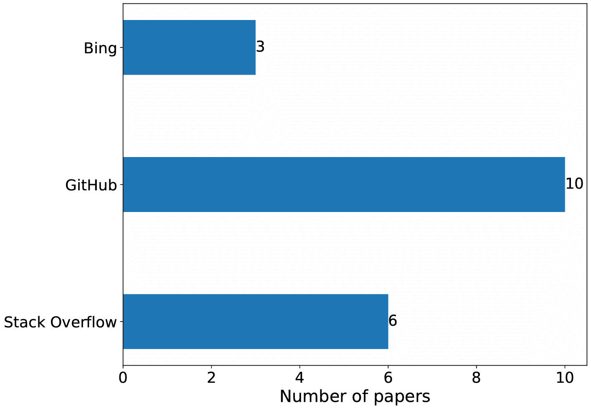

（a）数据来源

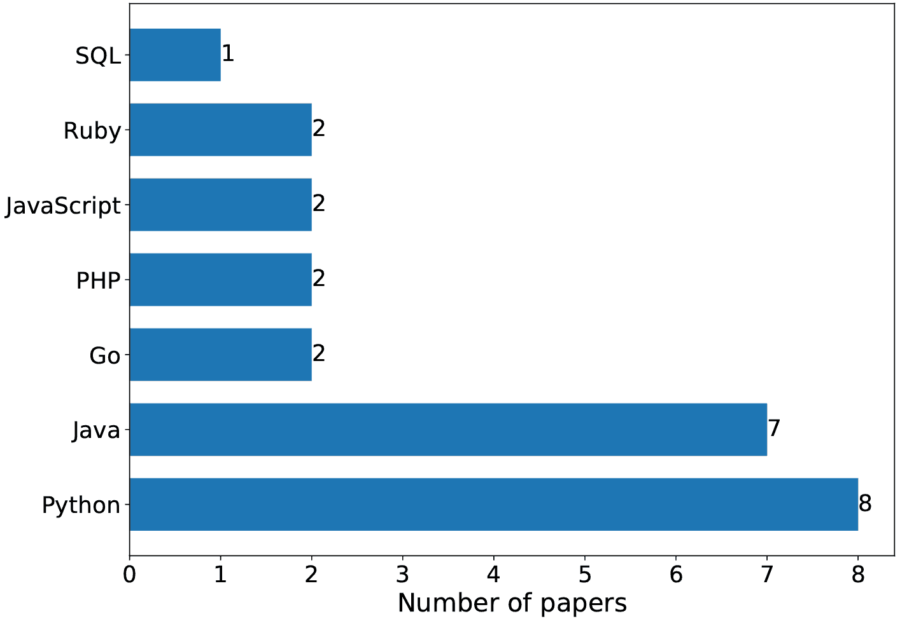

（b）编程语言

图 8. 数据集的数据来源和编程语言。

基于上述分析，目前代码搜索数据集中主要存在三大挑战：（1）训练数据与真实用户查询之间的不一致。现有数据集主要包含（问题，代码）对，（文档，代码）对和（评论，代码）对。然而，用户在搜索引擎中输入的查询文本与在 Stack Overflow 中的问题或源代码中的文档/评论中的文本存在差异，导致训练模型在实际场景中的表现不佳。（2）高质量标注数据的稀缺。由于代码标注成本高昂，现有数据集主要在评估集上进行手动标注，且缺乏大量手动标注的训练集，限制了监督学习模型的训练。（3）数据量有限。现有数据集中的训练数据数量有限，目前仅达到几百万，这对于训练大规模的代码理解预训练模型来说还不够。尽管 Markovtsev 和 Long（Markovtsev 和 Long，2018）从 Github 中选择了 182,014 个仓库来创建第一个大规模公开代码数据集以进行大规模编程分析，但该数据集目前无法访问。未来，获取来自 Google BigQuery 的大规模代码语料库，Google BigQuery 收集了 Github 上的活跃数据，包括超过一百万个开源仓库的完整快照和数亿条代码提交，可能是一个值得探索的方向。

### 6.2\. 评估指标

代码搜索评估数据集通常包括精心挑选的查询和标注函数。评估代码搜索模型的目的是评估其从代码库中准确检索相关代码片段的能力。代码搜索模型的评估主要通过自动化方法进行。近年来用于评估代码搜索模型的常见指标包括 Precision、Recall、F1-score、MAP、MRR、Frank 和 SuccessRate。

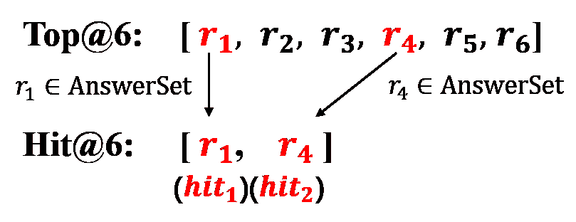

图 9. $top@k$ 和 $hit@k$ 的示意图。

假设有一组查询，记作 $Q=\left[q_{1},q_{2},\ldots,q_{n}\right]$，每个查询都有其对应的真实答案集 $G$。如图 9 ‣ Survey of Code Search Based on Deep Learning") 所示，$top@k$ 代表特定查询返回的前-$k$ 结果集，$hit@k$ 指的是前-$k$ 结果中正确属于真实答案的答案集。

Precision@k 是一个衡量查询结果与真实答案集之间关系的指标。它测量了查询返回的前 $k$ 个结果中，平均有多少属于查询集 $Q$ 的真实答案集。$Precision@k$ 值越高，返回结果与查询的相关性越强。计算方法如下：

| (24) |  | $Precision@k=\frac{1}{&#124;Q&#124;}\sum_{i=1}^{&#124;Q&#124;}\frac{\mid Hit@k\left(q_{i}\right)\mid}{k}.$ |  |
| --- | --- | --- | --- |

Recall@k 表示每个查询中真实答案集的平均命中百分比。$Recall@k$ 值越高，检索到的真实答案越多。计算方法如下：

| (25) |  | $Recall@k=\frac{1}{&#124;Q&#124;}\sum_{i=1}^{&#124;Q&#124;}\frac{\mid Hit@k\left(q_{i}\right)\mid}{\left&#124;G_{i}\right&#124;}.$ |  |
| --- | --- | --- | --- |

F1-Score 用于评估模型在精度和召回率等权重下的表现。计算方法如下：

| (26) |  | $F1-Score=\frac{2\cdot Precision\cdot Recall}{Precision+Recall}.$ |  |
| --- | --- | --- | --- |

MAP@k，即平均准确率，反映了所有查询产生的排名的平均准确度。计算方法如下：

| (27) |  | $MAP@k=\frac{1}{&#124;Q&#124;}\sum_{i=1}^{&#124;Q&#124;}\frac{1}{m}\sum_{j=1}^{m}\frac{j}{{rank}\left({hit}_{j},{Top@k}\left(q_{i}\right)\right)},$ |  |
| --- | --- | --- | --- |

其中 $m$ 是 $|Hit@k|$，$hit_{j}$ 是 $Hit@k$ 中的一个元素，而 ${rank}(e,l)$ 是元素 $e$ 在列表 $l$ 中的排名（即索引）。当 $\left|Hit@k\left(q_{i}\right)\right|=0$ 时，$hit_{j}$ 不存在，查询 $q$ 的平均准确度为 0。显然，$MAP@k$ 值越大，表示返回的前-$k$ 结果中命中真实答案的数量越多。

MRR@k（Mean Reciprocal Rank）表示所有搜索结果排名倒数的平均值。计算方法如下：

| (28) |  | $MRR@k=\frac{1}{&#124;Q&#124;}\sum_{i=1}^{&#124;Q&#124;}\frac{1}{{rank}\left({hit}_{1},{Top@k}\left(q_{i}\right)\right)}.$ |  |
| --- | --- | --- | --- |

当$\left|Hit@k\left(q_{i}\right)\right|=0$时，排名的倒数为 0。通常，在计算$MRR@k$时，只考虑第一个击中真实答案的答案。$MRR@k$值越大，击中真实答案的答案在$Top@k$中的排名越高。

Frank@k 表示在所有查询中第一个击中答案的平均排名。计算方法如下：

| (29) |  | $Frank@k=\frac{1}{&#124;Q&#124;}\sum_{i=1}^{&#124;Q&#124;}{rank}\left({hit}_{1}\left(q_{i}\right),{Top@k}\left(q_{i}\right)\right).$ |  |
| --- | --- | --- | --- |

显然，较小的$Frank@k$值对应于真实答案在搜索结果中的更高排名。

SuccessRate@k 表示返回的前-$k$结果中存在多个真实答案的查询的比例。计算方法如下：

| (30) |  | $SuccessRate@k=\frac{1}{&#124;Q&#124;}\sum_{i=1}^{&#124;Q&#124;}\tau\left({Frank}_{q_{i}}\leq k\right),$ |  |
| --- | --- | --- | --- |

其中$\tau$是一个指示函数，当查询$q_{i}$的击中答案的排名小于$k$时返回 1，否则返回 0。$SuccessRate@k$是一个重要的评估指标，因为一个有效的代码搜索引擎应使软件开发人员通过检查较少的结果找到所需的代码片段。

NDCG（Normalized Discounted Cumulative Gain）是一个重要的指标，用于量化候选代码片段排名与理想排名之间的相似性，强调所有候选结果中的整体排名顺序。计算方法如下：

| (31) |  | $NDCG=\frac{1}{&#124;Q&#124;}\sum_{i=1}^{k}\frac{2^{r_{i}}-1}{\log_{2}(i+1)},$ |  |
| --- | --- | --- | --- |

其中$r_{i}$是位置$i$处的前-$k$结果的相关性得分。

表 9 ‣ Survey of Code Search Based on Deep Learning")对 53 种基于深度学习的代码搜索模型进行了深入分析，包括评估的数据集、用于比较的基线模型以及选择的评估指标。图 10 ‣ Survey of Code Search Based on Deep Learning")突显了 CSN 数据集在代码搜索任务中的重要性，而最广泛采用的评估指标是 MRR@k，使用率为 90.6%。

表 9. 深度代码搜索模型及其性能指标。

| 年份 | 模型 | 数据集 | 基线 | 指标 |
| --- | --- | --- | --- | --- |
| 2018 | CODEnn（Gu 等，2018） | Gu 等（Gu 等，2018） | CodeHow（Lv 等，2015） | Frank@k，Precision@k，MRR@k，SuccessRate@k |
| 2018 | NCS（Sachdev 等，2018） | Sachdev 等（Sachdev 等，2018） | TF-IDF，BM25 | Precision@k |
| 2018 | NLP2API（Rahman 和 Roy，2018） | Rahman 和 Roy（Rahman 和 Roy，2018） | Rahman 和 Roy（Rahman 和 Roy，2018） | Precision@k，MRR@K，MAP@K，Recall@K，Frank@k |
| 2018 | COCABU（Sirres 等，2018） | Sirres 等（Sirres 等，2018） | Codota，OpenHub | Precision@k，MRR@k |
| 2018 | Zhang 等（Zhang 等，2018） | Zhang 等（Zhang 等，2018） | Dice，Rocchio，RSV | MRR@k，SuccessRate@k |
| 2019 | UNIF（Cambronero 等，2019） | Gu 等（Gu 等，2018） | CODEnn（Gu 等，2018），NCS（Sachdev 等，2018） | SuccessRate@k |
| 2019 | MMAN（Wan 等，2019） | Wan 等（Wan 等，2019） | CodeHow（Lv 等，2015），CODEnn（Gu 等，2018） | MRR@k，SuccessRate@k |
| 2019 | RACK（Rahman 等，2019） | Rahman（Rahman 等，2019） | NL Keywords（Rahman 等，2019） | Precision@k，MRR@K，MAP@K，Recall@K，NDCG，Frank@k |
| 2019 | Rahman（Rahman，2019） | Rahman（Rahman，2019） | - | Hit@K，MAP@k，MRR@k，Recall@k，Frank@k |
| 2019 | NQE（Liu 等，2019a） | Liu 等（Liu 等，2019a） | BM25，NCS（Sachdev 等，2018） | Precision@k，MRR@k |
| 2019 | QESC（Huang 等，2019） | Huang 等（Huang 等，2019） | CodeHow（Lv 等，2015），QECK（Nie 等，2016） | Precision@k，NDCG |
| 2019 | CoaCor（Yao 等，2019） | StaQC（Yao 等，2018），DEV 和 EVAL（Iyer 等，2016） | CODEnn（Gu 等，2018），CODE-NN（Iyer 等，2016） | MRR@k |
| 2019 | Wu 和 Yang（Wu 和 Yang，2019） | Wu 和 Yang（Wu 和 Yang，2019） | CodeHow（Lv 等，2015） | Precision@k，NDCG |
| 2020 | OCoR（Zhu 等，2020） | StaQC（Yao 等，2018），DEV 和 EVAL（Iyer 等，2016） | CODEnn（Gu 等，2018），CODE-NN（Iyer 等，2016），CoaCor（Yao 等，2019） | MRR@k |
| 2020 | CodeBERT（Feng 等，2020） | CSN（Husain 等，2019） | NBoW，1D-CNN，biRNN，SelfAtt，RoBERTa(code) | MRR@k |
| 2020 | AdaCS（Ling 等，2020） | Ling 等（Ling 等，2020） | CodeHow（Lv 等，2015），CODEnn（Gu 等，2018），BVAE（Chen 和 Zhou，2018） | Hit@K，MRR@k |
| 2020 | MP-CAT (Haldar et al., 2020) | CoNaLa (Yin et al., 2018) | CT | Recall@k, MRR@k |
| 2020 | ${TranS}^{3}$ (Wang et al., 2020) | Barone and Sennrich (Barone and Sennrich, 2017) | CODEnn (Gu et al., 2018), CoaCor (Yao et al., 2019), Hybrid-DeepCom (Hu et al., 2020), AutoSum (Wan et al., 2018) | MRR@k, NDCG, SuccessRate@k |
| 2020 | Zhao and Sun (Zhao and Sun, 2020) | StaQC (Yao et al., 2018) | CODEnn (Gu et al., 2018), CoaCor (Yao et al., 2019) | MAP@k, NDCG |
| 2020 | CO3 (Ye et al., 2020) | StaQC (Yao et al., 2018) | CODEnn (Gu et al., 2018), CoaCor (Yao et al., 2019) | MRR@k, NDCG |
| 2021 | GraphCodeBERT (Guo et al., 2021) | CSN (Husain et al., 2019) | NBoW, 1D-CNN, biRNN, SelfAtt, RoBERTa(code), CodeBERT (Feng et al., 2020) | MRR@k |
| 2021 | DGMS (Ling et al., 2021) | FB-Java (Li et al., 2019), CSN-Python (Husain et al., 2019) | NBoW, 1D-CNN, biRNN, SelfAtt, CODEnn (Gu et al., 2018), UNIF (Cambronero et al., 2019), CAT (Haldar et al., 2020) | MRR@k, SuccessRate@k |
| 2021 | CoCLR (Huang et al., 2021) | CoSQA (Huang et al., 2021), WebQueryTest (Lu et al., 2021) | RoBERTa (Liu et al., 2019b), CodeBERT (Feng et al., 2020) | MRR@k |
| 2021 | SEQUER (Cao et al., 2021) | Cao et al. (Cao et al., 2021) | seq2seq (Sutskever et al., 2014) | MRR@k |
| 2021 | DOBF (Lachaux et al., 2021) | CSN-Python (Husain et al., 2019) | CodeBERT (Feng et al., 2020), GraphCodeBERT (Guo et al., 2021) | MRR@k |
| 2021 | CRaDLe (Gu et al., 2021b) | CSN (Husain et al., 2019) | CODEnn (Gu et al., 2018), UNIF (Cambronero et al., 2019), NBoW, 1D-CNN, biRNN, SelfAtt, ConvSelfAtt | MRR@k, SuccessRate@k |
| 2021 | Corder (Bui et al., 2021) | Gu et al. (Gu et al., 2018) | NBoW, biRNN, SelfAtt, TBCNN (Mou et al., 2016), Code2vec (Alon et al., 2019) | Precision@k, MRR@k |
| 2021 | Gu et al. (Gu et al., 2021a) | CSN (Husain et al., 2019) | NBoW, 1D-CNN, biRNN, SelfAtt | MRR@k, NDCG |
| 2021 | TabCS (Xu et al., 2021) | Hu et al. (Hu et al., 2020), CSN (Husain et al., 2019) | CODEnn (Gu et al., 2018), CARLCS-CNN (Shuai et al., 2020), CARLCS-TS (Shuai et al., 2020), UNIF (Cambronero et al., 2019) | MRR@k, SuccessRate@k |
| 2021 | MuCoS (Du et al., 2021) | CSN (Husain et al., 2019) | NBoW, 1D-CNN, biRNN, SelfAtt, ConvSelfAtt, CODEnn (Gu et al., 2018), CodeBERT (Feng et al., 2020) | MRR@k, SuccessRate@k |
| 2021 | SynCoBERT (Wang et al., 2021b) | CSN (Husain et al., 2019), AdvTest (Lu et al., 2021) | NBow, CNN, BiRNN, SelfAttn, RoBERTa (Liu et al., 2019b), RoBERTa(code), CodeBERT (Feng et al., 2020), GraphCodeBERT (Guo et al., 2021) | MRR@k |
| 2022 | TranCS (Sun et al., 2022a) | CSN-Java (Husain et al., 2019) | CODEnn (Gu et al., 2018), MMAN (Wan et al., 2019) | MRR@k, SuccessRate@k |
| 2022 | Wang et al. (Wang et al., 2022a) | CSN (Husain et al., 2019) | NBoW, 1D-CNN, biRNN, SelfAtt, RoBERTa (Liu et al., 2019b), RoBERTa(code), CodeBERT (Feng et al., 2020), GraphCodeBERT (Guo et al., 2021) | MRR@k |
| 2022 | CodeRetriever (Li et al., 2022a) | CSN (Husain et al., 2019), AdvTest (Lu et al., 2021), CoSQA (Huang et al., 2021), CoNaLa (Yin et al., 2018), SO-DS (Heyman and Cutsem, 2020), StaQC (Yao et al., 2018) | CodeBERT (Feng et al., 2020), GraphCodeBERT (Guo et al., 2021), SynCoBERT (Wang et al., 2021b) | MRR@k |
| 2022 | CDCS (Chai et al., 2022) | CSN-Python (Husain et al., 2019), CSN-Java (Husain et al., 2019), Solidity and SQL (Yang et al., 2021) | Roberta (Liu et al., 2019b), CodeBERT (Feng et al., 2020) | MRR@k, SuccessRate@k |
| 2022 | CSRS (Cheng and Kuang, 2022) | Gu et al. (Gu et al., 2018) | CODEnn (Gu et al., 2018), CARLCS-CNN (Shuai et al., 2020) | Recall@k, MRR@k, NDCG |
| 2022 | ${NS}^{3}$ (Arakelyan et al., 2022) | CSN (Husain et al., 2019), CoSQA (Huang et al., 2021) | BM25, RoBERTa(code), CuBERT (Kanade et al., 2020), CodeBERT (Feng et al., 2020), GraphCodeBERT (Guo et al., 2021) | MRR@k, Precision@k |
| 2022 | CSSAM (Cai et al., 2023) | Hu et al. (Hu et al., 2020), CSN (Husain et al., 2019) | CodeHow (Lv et al., 2015), CODEnn (Gu et al., 2018), MP-CAT (Haldar et al., 2020), TabCS (Xu et al., 2021) | MRR@k, SuccessRate@k, NDCG |
| 2022 | CTBERT (Han et al., 2022) | CSN (Husain et al., 2019), AdvTest (Lu et al., 2021) | CodeBERT (Feng et al., 2020), GraphCodeBERT (Guo et al., 2021), SynCoBERT (Wang et al., 2021b) | MRR@k |
| 2022 | QueCos（Wang et al., 2022b) | CSN-Python（Husain et al., 2019），CSN-Java（Husain et al., 2019），Wang 等（Wang et al., 2022b） | CODEnn（Gu et al., 2018），UNIF（Cambronero et al., 2019），OCoR（Zhu et al., 2020） | MRR@k, SuccessRate@k |
| 2022 | ZaCQ（Eberhart 和 McMillan, 2022) | CSN（Husain et al., 2019) | V-DO, KW | MRR@k, MAP@k, NDCG |
| 2022 | G2SC（Shi et al., 2022) | CSN（Husain et al., 2019) | CODEnn（Gu et al., 2018），MMAN（Wan et al., 2019），CodeBERT（Feng et al., 2020），GraphCodeBERT（Guo et al., 2021） | MRR@k |
| 2022 | SPT-Code（Niu et al., 2022) | CSN（Husain et al., 2019) | CNN, Bi-GRU, SelfAtt, CodeBERT（Feng et al., 2020），GraphCodeBERT（Guo et al., 2021） | MRR@k |
| 2022 | CODE-MVP（Wang et al., 2022c) | AdvTest（Lu et al., 2021），CoNaLa（Yin et al., 2018），CoSQA（Huang et al., 2021） | RoBERTa（Liu et al., 2019b），CodeBERT（Feng et al., 2020），GraphCodeBERT（Guo et al., 2021），SynCoBERT（Wang et al., 2021b） | MRR@k |
| 2022 | UniXcoder（Guo et al., 2022) | CSN（Husain et al., 2019），AdvTest（Lu et al., 2021），CoSQA（Huang et al., 2021） | RoBERTa（Liu et al., 2019b），CodeBERT（Feng et al., 2020），GraphCodeBERT（Guo et al., 2021），SynCoBERT（Wang et al., 2021b） | MRR@k |
| 2022 | Li 等（Li et al., 2022d) | CSN（Husain et al., 2019) | RoBERTa(`code`), CodeBERT（Feng et al., 2020），GraphCodeBERT（Guo et al., 2021），UniXCoder（Guo et al., 2022） | MRR@k |
| 2022 | SCodeR（Li et al., 2022b) | CSN（Husain et al., 2019），AdvTest（Lu et al., 2021），CoSQA（Huang et al., 2021） | CodeBERT（Feng et al., 2020），GraphCodeBERT（Guo et al., 2021），SyncoBERT（Wang et al., 2021b），CodeRetriever（Li et al., 2022a），Code-MVP（Wang et al., 2022c），UniXcoder（Guo et al., 2022） | MRR@k |
| 2023 | Salza 等（Salza et al., 2023) | Salza 等（Salza et al., 2023) | LUCENE, CODEnn（Gu et al., 2018） | MRR@k, SuccessRate@k |
| 2023 | deGraphCS（Zeng et al., 2023) | Zeng 等（Zeng et al., 2023) | CODEnn（Gu et al., 2018），UNIF（Cambronero et al., 2019），MMAN（Wan et al., 2019） | MRR@k, SuccessRate@k |
| 2023 | GraphSearchNet (Liu et al., 2023) | CSN-Python (Husain et al., 2019), CSN-Java (Husain et al., 2019) | NBoW, 1D-CNN, biRNN, SelfAtt, UNIF (Cambronero et al., 2019), CODEnn (Gu et al., 2018), CARLCS-CNN (Shuai et al., 2020), TabCS (Xu et al., 2021), Coacor (Yao et al., 2019) | MRR@k, NDCG, SuccessRate@k |
| 2023 | MulCS (Ma et al., 2023) | CSN (Husain et al., 2019), C dataset (Ma et al., 2023) | CODEnn (Gu et al., 2018), TabCS (Xu et al., 2021), NBoW, 1D-CNN, biRNN, SelfAtt | MRR@k, SuccessRate@k |
| 2023 | KeyDAC (Park et al., 2023) | CoSQA (Huang et al., 2021), WebQueryTest (Lu et al., 2021) | CoCLR (Huang et al., 2021) | MRR@k |

| 2023 | TOSS (Hu et al., 2023) | CSN (Husain et al., 2019) | Jaccard, BOW, TFIDF, BM25, CODEnn (Gu et al., 2018), CodeBERT (Feng et al., 2020), GraphCodeBERT (Guo et al., 2021), CoCLR (Huang et al., 2021) | MRR@k, Precision@k | 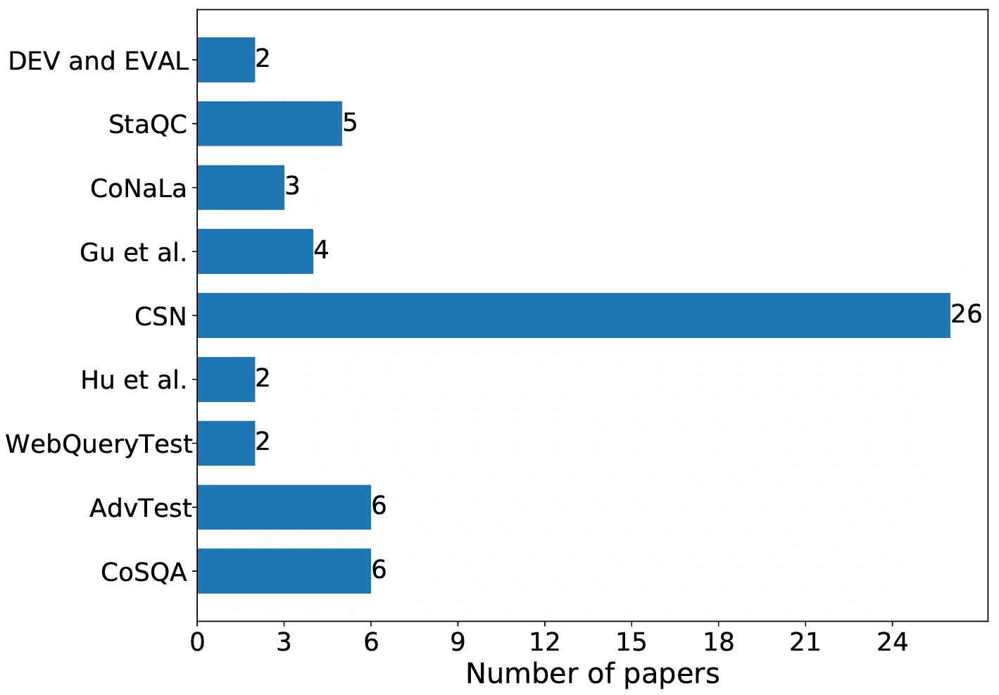

(a) 至少被两篇论文采用的数据集。

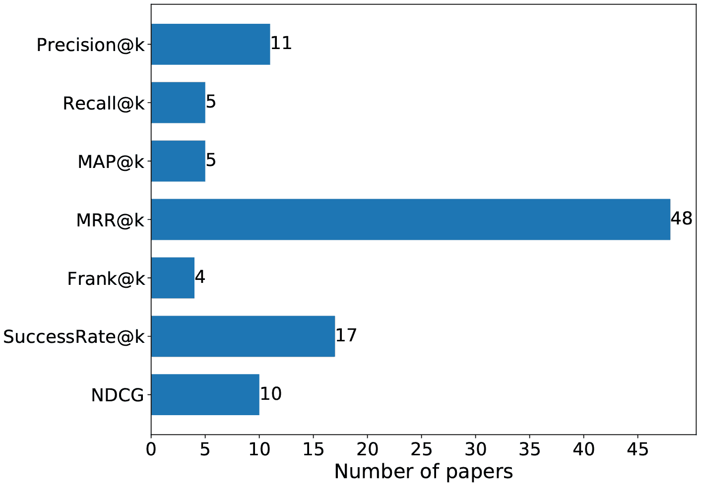

(b) 至少被两篇论文采用的指标。

图 10. 至少被两篇论文采用的数据集和指标。

### 6.3\. 使用场景

代码搜索技术的迅速发展为行业带来了众多新机会。对工业从业者来说，一个有趣且重要的问题是如何选择合适的代码搜索方法以满足其需求。本节从三个方面讨论了这个问题：有效性、效率和多语言。

效率。通过优先考虑代码搜索的准确性，工业从业者可以利用一系列强大的技术。例如，RACK（Rahman et al., 2019）、NQE（Liu et al., 2019a）、SEQUER（Cao et al., 2021）和 ZaCQ（Eberhart and McMillan, 2022）等方法提供了有效的手段来重构查询，帮助澄清用户的搜索意图。为了深入理解代码语义，从业者可以采用诸如 MP-CAT（Haldar et al., 2020）、CRaDLe（Gu et al., 2021b）、GraphCodeBERT（Guo et al., 2021）、TabCS（Xu et al., 2021）、SynCoBERT（Wang et al., 2021b）、G2SC（Shi et al., 2022）、SPT-Code（Niu et al., 2022）和 UniXcoder（Guo et al., 2022）等方法。此外，MP-CAT（Haldar et al., 2020）、TabCS（Xu et al., 2021）、CSRS（Cheng and Kuang, 2022）、${NS}^{3}$（Arakelyan et al., 2022）和 CSSAM（Cai et al., 2023）等方法可以实现查询与代码之间的精细交互，有效地弥合它们之间的语义差距。考虑到训练语料库在确定神经代码搜索（Sun et al., 2022b）性能中的关键作用，从业者必须优先考虑数据质量。通过仔细清理训练语料库，从业者可以获得高质量的数据集，促进自然语言与编程语言之间精确映射的建立。此外，从业者可以利用 CodeRetriever（Li et al., 2022a）专注于通过对比学习检查查询和代码之间的语义差异。这种方法有助于详细分析微妙的差异，从而提高整体搜索准确性。此外，TOSS（Hu et al., 2023）提供的召回和重新排序框架为提高代码搜索准确性提供了宝贵的机会。通过整合该框架，从业者可以进一步提高产品的准确性。

效率。通过优先考虑搜索效率，工业从业者可以利用代码库中代码片段嵌入的离线计算。这种方法提供了一种节省时间的替代方案，避免了在线计算向量相似度。此外，利用基于深度哈希和代码分类的代码搜索加速方法 CoSHC（Gu et al., 2022）可以实现高效的代码搜索，同时接受精度上的小幅折衷。

多语言。通过强调代码搜索工具在多种编程语言中的通用性，工业从业者可以使用 MulCS（Ma et al., 2023）来打破不同编程语言之间的语义障碍，该工具使用统一的数据结构来表示多种编程语言。

<svg height="136.64" overflow="visible" version="1.1" width="600"><g transform="translate(0,136.64) matrix(1 0 0 -1 0 0)" fill="#000000" stroke="#000000" stroke-width="0.4pt"><g fill-opacity="1.0" transform="matrix(1.0 0.0 0.0 1.0 21.65 13.78)"><foreignobject width="556.69" height="109.08" transform="matrix(1 0 0 -1 0 16.6)" overflow="visible" color="#000000">对 RQ4 的回答总结：• 代码搜索数据集中的主要代码来源于开源代码库 Github。另一方面，Stack Overflow (SO) 是这些数据集查询的主要来源。• Python 和 Java 是代码搜索任务中最受关注的两种编程语言。• 近 6 年来，CSN 数据集一直主导代码搜索任务的评估。• 代码搜索中使用的常见评估指标包括 Precision@k、Recall@k、F1-score、MAP@k、MRR@k、Frank@k 和 SuccessRate@k，其中 MRR@k 是其中被广泛使用的指标。</foreignobject></g></g></svg>

## 7\. 开放挑战与未来方向（RQ5）

本节探讨了代码搜索领域中的突出挑战，并确定了未来发展的潜在途径。

1.  (1)

    理解代码结构。代码中包含的信息可以分为两部分：由定义代码功能的关键字决定的结构化信息，以及由函数和变量名称等标识符反映的辅助信息，这些信息指示了软件开发人员对代码功能的概括。然而，研究表明，匿名化函数和变量名称会导致模型性能显著下降（Guo et al., 2022），这表明当前方法过于依赖标识符信息进行推断。标识符内容作为代码智能任务的便利捷径，但过度依赖它可能会阻碍模型学习由结构化信息定义的代码功能，从而妨碍对代码结构的全面理解。挑战在于设计一种策略，使模型能够更好地关注和理解代码的结构信息，并在训练和推断过程中在由关键字定义的结构化信息和标识符提供的辅助信息之间取得平衡。这是一个值得进一步研究的方向。向这一目标迈出的第一步已经采取，例如 Li et al.（Li et al., 2022b）和 Wang et al.（Wang et al., 2022c）。

1.  (2)

    图预训练技术。代码可以被分析并表示为图数据结构（例如，数据流图（Guo et al., 2021）和基于变量的流图（Zeng et al., 2023））。与顺序结构相比，使用图结构表示代码提供了更多的信息和更高的准确性。我们相信，这种图结构包含了有价值的见解，可以引领对代码意义的突破性理解。然而，基于现有研究结果，利用 Transformer 编码序列的方法（Guo et al., 2022；Wang et al., 2021b；Li et al., 2022a；Wang et al., 2022c）仍然在图编码方面优于基于图神经网络的方法（Zeng et al., 2023；Ling et al., 2021；Ma et al., 2023；Liu et al., 2023）。Transformer 方法的显著成功很大程度上归功于通过预训练技术实现的模型容量显著提升。我们认为，基于图的方法在代码智能领域的潜力尚未完全探索。一个有价值的研究方向是探索如何将图预训练融入代码智能，以充分释放基于图模型的性能。

1.  (3)

    强健优化。研究表明，当前的代码智能方法易受到对抗攻击（Li et al., 2022e）。扰动标识符会显著降低模型的性能，突显其缺乏鲁棒性。虽然通过对抗训练（Wan et al., 2022a）已经做出了一些增强鲁棒性的努力，但仍需进一步研究。同时，建立一个标准评估方法或数据集来评估这些模型的鲁棒性也至关重要。

1.  (4)

    可解释性研究。与其他深度学习模型类似，代码搜索模型是在相对黑箱的方式下进行训练和操作的。可解释性研究旨在理解模型决策的原因，提高对模型推理过程的理解，并识别模型认为重要的信息。这项研究至关重要，因为它可以增强用户对模型的信任，并且在出现错误时，能够及时识别原因并制定解决方案。Karmakar 和 Robbes（Karmakar 和 Robbes, 2021）以及 Wan et al.（Wan et al., 2022b）提出了这一方向的有希望的初步步骤。

1.  (5)

    综合评估。目前，代码搜索领域中最有效的方法是预训练与微调范式（例如，CodeBERT (Feng et al., 2020)、GraphCodeBERT (Guo et al., 2021)、Syncobert (Wang et al., 2021b) 和 UniXcoder (Guo et al., 2022)）。这一范式包括几个关键设计要素，如数据预处理策略、分词器、预训练任务、预训练模型及训练参数、微调模型及训练参数，以及负样本构建策略。然而，对这些关键要素的分析实验仍然不足，这些实验可以指导从业者选择最有效的代码智能训练策略。例如，Guo et al. (Guo et al., 2021) 采用了 CodeBERT (Feng et al., 2020) 的参数来初始化 GraphCodeBERT 模型，并在 CSN 数据集上使用 MLM 任务继续预训练。然而，性能提升尚未得到验证，以确定是否是由于在 MLM 任务上的额外迭代。研究这些设计要素的意义将为从业者提供更多方向，同时通过揭示代码智能的独特属性为未来研究提供新的见解。

1.  (6)

    高质量数据集。目前，代码搜索中最广泛使用的数据集来自三个来源：从 Github 爬取（例如，CSN (Husain et al., 2019)，其包括代码注释作为查询，其他作为代码）；从 Stack Overflow 爬取（例如，StaQC (Yao et al., 2018) 和 CoNaLa (Yin et al., 2018)），其中包括帖子中的问题和代码答案；以及从搜索引擎收集的实际用户查询（例如，CoSQA (Huang et al., 2021)），代码由注释员标注。这些数据来源各有其局限性：在 Github 数据中，代码注释与实际查询差异较大；在 Stack Overflow 数据中，回答的代码通常不是完整的函数；而在标注数据中，理解代码需要大量背景知识，难以保证数据的规模和质量。因此，我们认为创建一个更实用的数据集以进行模型训练和评估是至关重要的。一个潜在的解决方案是收集在线用户行为记录，如点击和停留，这需要一个具有大用户基础的高性能代码搜索引擎。因此，有潜力利用现有模型构建初步的代码搜索引擎，吸引一组用户，并收集用户数据以创建新的数据集。

1.  (7)

    更加细粒度的交互。目前的代码搜索方法在建模查询与代码之间的交互能力方面存在局限。这些局限源于现有方法仅在表示层次上建模交互（Cheng 和 Kuang, 2022; Xu et al., 2021），而未考虑在令牌层次上的跨模态交互。此外，这些方法使用单一层次进行区分，这限制了捕获层级信息的能力。因此，代码搜索中使用的模型架构仍然有改进的潜力。例如，Dong 等人（Dong et al., 2023）已朝着这个目标迈出了第一步。

1.  (8)

    提高代码搜索效率。基于深度学习的代码搜索方法已展示出良好的效果。然而，之前的方法主要关注检索准确性，却忽略了检索效率。如果代码搜索模型用于实际的在线场景，提升检索效率将成为一个需要立即关注的挑战。解决这一关键问题对于成功部署和利用模型在实际应用中至关重要。Gu 等人（Gu et al., 2022）提出了朝这一方向迈出的有前景的第一步。

1.  (9)

    语境相关的代码搜索。当前的方法假设项目中的函数是独立的（Gu et al., 2018; Husain et al., 2019; Huang et al., 2021），忽视了它们在项目中的关系。然而，项目中的函数实际上是相互依赖的，具有函数调用和共享变量。要准确建模函数的角色，必须考虑其上下文。设计一种方法来建模上下文信息并高效地在线搜索带有上下文信息的函数是一个有价值的研究方向。

1.  (10)

    个性化的代码搜索。软件开发者拥有独特的编程习惯，导致理解速度和对同一功能不同形式代码的偏好各异。因此，代码搜索结果应该根据个人用户的编程偏好进行定制。一个潜在的研究领域是实现个性化的代码搜索服务。

1.  (11)

    更好的代码分析工具。不同的数据结构，如抽象语法树、控制流图、程序依赖图和数据流图，有助于理解代码的语义。然而，缺乏有效的开源工具来提取这些结构阻碍了代码智能研究的进展。例如，程序依赖图的提取目前仅限于专为 Java 编程语言设计的工具。这对代码智能领域的研究构成了障碍。因此，为多种编程语言开发更好的开源代码分析工具将是进一步推动相关研究的有益方向。

1.  (12)

    探索新的搜索范式。最近，用于代码生成的大规模语言模型提供了类似代码搜索的功能。例如，GitHub 的 Copilot 工具 ²²2https://github.com/features/copilot，以 Codex (Chen et al., 2021) 为核心，将自然语言描述的功能映射到提供这些功能的代码片段上。类似地，OpenAI 的 ChatGPT 工具 ³³3https://openai.com/blog/chatgpt，由 GPT-4 (OpenAI, 2023) 驱动，将自然语言描述的功能映射到提供所需功能的代码片段上，并附有解释性自然语言文本，以增强开发者的理解和可用性。鉴于这些工具的影响，我们必须重新考虑代码搜索任务的意义和形式。探索新范式可能会为代码搜索带来新时代的变革。一个值得探索的有前途的方向是与其他代码智能任务的交叉融合，例如利用代码搜索结果来协助代码补全或代码生成。

## 8\. 结论

在本次调查中，我们全面概述了基于深度学习的代码搜索方法。我们首先介绍了代码搜索任务，并概述了基于深度学习的代码搜索方法的框架。接着，我们详细描述了查询和代码表示的提取方法。此外，我们对模型训练的多个损失函数进行了分类。最后，我们识别了该领域的一些开放挑战和有前途的研究方向。我们希望本次调查能够帮助学术研究者和行业从业者，并激发更多有意义的工作。

## 参考文献

+   (1)

+   Alon 等人 (2019) Uri Alon, Meital Zilberstein, Omer Levy 和 Eran Yahav. 2019. code2vec: 学习代码的分布式表示。*Proc. ACM Program. Lang.* 3, POPL (2019), 40:1–40:29. [`doi.org/10.1145/3290353`](https://doi.org/10.1145/3290353)

+   Arakelyan 等（2022）Shushan Arakelyan、Anna Hakhverdyan、Miltiadis Allamanis、Luis Garcia、Christophe Hauser 和 Xiang Ren。2022 年。NS3: 神经符号语义代码搜索。发表于*NeurIPS*。[`papers.nips.cc/paper_files/paper/2022/hash/43f5f6c5cb333115914c8448b8506411-Abstract-Conference.html`](http://papers.nips.cc/paper_files/paper/2022/hash/43f5f6c5cb333115914c8448b8506411-Abstract-Conference.html)

+   Barone 和 Sennrich（2017）Antonio Valerio Miceli Barone 和 Rico Sennrich。2017 年。用于自动化代码文档生成和代码生成的 Python 函数和文档字符串的平行语料库。发表于*第八届国际自然语言处理联合会议论文集，IJCNLP 2017，台北，台湾，2017 年 11 月 27 日至 12 月 1 日，第二卷：短文*，Greg Kondrak 和 Taro Watanabe（编）。亚洲自然语言处理联合会，314–319。[`aclanthology.org/I17-2053/`](https://aclanthology.org/I17-2053/)

+   Bui 等（2021）Nghi D. Q. Bui、Yijun Yu 和 Lingxiao Jiang。2021 年。通过语义保留变换进行自监督对比学习以实现代码检索和总结。发表于*SIGIR ’21: 第 44 届国际 ACM SIGIR 信息检索研究与发展会议，虚拟会议，加拿大，2021 年 7 月 11-15 日*，Fernando Diaz、Chirag Shah、Torsten Suel、Pablo Castells、Rosie Jones 和 Tetsuya Sakai（编）。ACM，511–521。[`doi.org/10.1145/3404835.3462840`](https://doi.org/10.1145/3404835.3462840)

+   Cai 等（2023）Bo Cai、Yaoxiang Yu 和 Yi Hu。2023 年。CSSAM: 基于代码语义和结构的注意力匹配代码搜索。发表于*IEEE 国际软件分析、演变与重构会议，SANER 2023，澳门塔石，2023 年 3 月 21-24 日*，Tao Zhang、Xin Xia 和 Nicole Novielli（编）。IEEE，402–413。[`doi.org/10.1109/SANER56733.2023.00045`](https://doi.org/10.1109/SANER56733.2023.00045)

+   Cambronero 等（2019）José Cambronero、Hongyu Li、Seohyun Kim、Koushik Sen 和 Satish Chandra。2019 年。当深度学习遇上代码搜索。发表于*ACM 欧洲软件工程会议与软件工程基础会议联合会议论文集，ESEC/SIGSOFT FSE 2019，爱沙尼亚塔林，2019 年 8 月 26-30 日*，Marlon Dumas、Dietmar Pfahl、Sven Apel 和 Alessandra Russo（编）。ACM，964–974。[`doi.org/10.1145/3338906.3340458`](https://doi.org/10.1145/3338906.3340458)

+   Cao 等（2021）Kaibo Cao、Chunyang Chen、Sebastian Baltes、Christoph Treude 和 Xiang Chen。2021 年。基于 Stack Overflow 查询日志的高效搜索自动化查询重构。发表于*第 43 届 IEEE/ACM 国际软件工程会议，ICSE 2021，西班牙马德里，2021 年 5 月 22-30 日*。IEEE，1273–1285。[`doi.org/10.1109/ICSE43902.2021.00116`](https://doi.org/10.1109/ICSE43902.2021.00116)

+   柴等人（2022）易天·柴、洪宇·张、北君·沈和晓东·顾。2022 年。跨领域深度代码搜索与元学习。见于*第 44 届 IEEE/ACM 国际软件工程会议，ICSE 2022，宾夕法尼亚州匹兹堡，美国，2022 年 5 月 25-27 日*。ACM，第 487–498 页。 [`doi.org/10.1145/3510003.3510125`](https://doi.org/10.1145/3510003.3510125)

+   查特吉等人（2009）绍纳克·查特吉、苏迪普·朱维卡和考希克·森。2009 年。SNIFF：使用自由形式查询的 Java 搜索引擎。见于*基础软件工程方法，第 12 届国际会议，FASE 2009，作为欧洲软件理论与实践联合会议的一部分，ETAPS 2009，英国约克，2009 年 3 月 22-29 日\. 会议录* *(计算机科学讲义，第 5503 卷)*，玛莎·切奇克和马丁·维尔辛（编辑）。施普林格，第 385–400 页。 [`doi.org/10.1007/978-3-642-00593-0_26`](https://doi.org/10.1007/978-3-642-00593-0_26)

+   陈等人（2021）马克·陈、杰瑞·特沃雷克、赫宇·君、邱铭·袁、亨里克·庞德·德·奥利维拉·平托、贾瑞德·卡普兰、哈里森·爱德华兹、尤里·布尔达、尼古拉斯·约瑟夫、格雷格·布罗克曼、亚历克斯·雷、劳尔·普里、格雷琴·克鲁格、迈克尔·彼得罗夫、海迪·克拉夫、吉里什·萨斯特里、帕梅拉·米什金、布鲁克·陈、斯科特·格雷、尼克·赖德、米哈伊尔·帕夫洛夫、阿莱西娅·鲍尔、卢卡斯·凯瑟、穆罕默德·巴瓦里安、克莱门斯·温特、菲利普·蒂耶、费利佩·佩特罗斯基·苏奇、戴夫·卡明斯、马蒂亚斯·普拉普特、福托斯·昌齐斯、伊丽莎白·巴恩斯、阿里尔·赫伯特-沃斯、威廉·赫布根·古斯、亚历克斯·尼科尔、亚历克斯·佩诺、尼科拉斯·特扎克、杰·唐、伊戈尔·巴布什金、苏奇尔·巴拉吉、尚坦努·简、威廉·宋德斯、克里斯托弗·赫斯、安德鲁·N·卡尔、扬·莱克、约书亚·阿奇亚姆、维丹特·米斯拉、埃文·莫里卡瓦、亚历克·拉德福德、马修·奈特、迈尔斯·布伦戴奇、米拉·穆拉蒂、凯蒂·梅耶、彼得·韦林德、鲍勃·麦克格鲁、达里奥·阿莫代、山姆·麦坎德利什、伊利亚·苏茨克维尔和沃伊切赫·扎伦巴。2021 年。评估在代码上训练的大型语言模型。*CoRR* abs/2107.03374（2021 年）。arXiv:2107.03374 [`arxiv.org/abs/2107.03374`](https://arxiv.org/abs/2107.03374)

+   陈和周（2018）青颖·陈和明辉·周。2018 年。用于检索和总结源代码的神经框架。见于*第 33 届 ACM/IEEE 国际自动化软件工程会议，ASE 2018，法国蒙彼利埃，2018 年 9 月 3-7 日*，玛丽安娜·赫查德、克里斯蒂安·凯斯特纳和戈登·弗雷泽（编辑）。ACM，第 826–831 页。 [`doi.org/10.1145/3238147.3240471`](https://doi.org/10.1145/3238147.3240471)

+   程和匡（2022）程一和李匡。2022 年。CSRS：基于相关性匹配和语义匹配的代码搜索。见于*第 30 届 IEEE/ACM 国际程序理解会议，ICPC 2022，虚拟活动，2022 年 5 月 16-17 日*，阿尤希·拉斯托吉、罗莎莉亚·图法诺、加布里埃尔·巴沃塔、维内拉·阿尔诺多娃和索尼娅·海杜克（编辑）。ACM，第 533–542 页。 [`doi.org/10.1145/3524610.3527889`](https://doi.org/10.1145/3524610.3527889)

+   Devlin 等（2019）雅各布·德夫林、明伟·张、肯顿·李和克里斯蒂娜·图托诺娃。2019 年。《BERT: Pre-training of Deep Bidirectional Transformers for Language Understanding》。发表于*Proceedings of the 2019 Conference of the North American Chapter of the Association for Computational Linguistics: Human Language Technologies, NAACL-HLT 2019, Minneapolis, MN, USA, June 2-7, 2019, Volume 1 (Long and Short Papers)*，吉尔·伯斯坦、克里斯蒂·多兰和塔玛尔·索洛里奥（编）。计算语言学协会，4171–4186。 [`doi.org/10.18653/v1/n19-1423`](https://doi.org/10.18653/v1/n19-1423)

+   Dong 等（2023）董涵德、林佳怡、冷亦冲、陈家伟和谢宇涛。2023 年。《Retriever and Ranker Framework with Probabilistic Hard Negative Sampling for Code Search》。*CoRR* abs/2305.04508（2023）。 [`doi.org/10.48550/arXiv.2305.04508`](https://doi.org/10.48550/arXiv.2305.04508) arXiv:2305.04508

+   Du 等（2021）杜伦、施晓舟、王彦林、石恩胜、韩时和张冬梅。2021 年。《Is a Single Model Enough? MuCoS: A Multi-Model Ensemble Learning Approach for Semantic Code Search》。发表于*CIKM ’21: The 30th ACM International Conference on Information and Knowledge Management, Virtual Event, Queensland, Australia, November 1 - 5, 2021*，吉安卢卡·德马尔蒂尼、圭多·祖克隆、J·肖恩·卡尔佩珀、黄子和童杭杭（编）。ACM，2994–2998。 [`doi.org/10.1145/3459637.3482127`](https://doi.org/10.1145/3459637.3482127)

+   Eberhart 和 McMillan（2022）扎卡里·埃伯哈特和科林·麦克米兰。2022 年。《Generating Clarifying Questions for Query Refinement in Source Code Search》。发表于*IEEE International Conference on Software Analysis, Evolution and Reengineering, SANER 2022, Honolulu, HI, USA, March 15-18, 2022*。IEEE，140–151。 [`doi.org/10.1109/SANER53432.2022.00028`](https://doi.org/10.1109/SANER53432.2022.00028)

+   Feng 等（2020）张印丰、郭大雅、唐独雨、段楠、冯晓程、龚鸣、邵林军、秦冰、刘婷、姜大欣和周明。2020 年。《CodeBERT: A Pre-Trained Model for Programming and Natural Languages》。发表于*Findings of the Association for Computational Linguistics: EMNLP 2020, Online Event, 16-20 November 2020* *(Findings of ACL, Vol. EMNLP 2020)*，特雷弗·科恩、赫月岚和杨柳（编）。计算语言学协会，1536–1547。 [`doi.org/10.18653/v1/2020.findings-emnlp.139`](https://doi.org/10.18653/v1/2020.findings-emnlp.139)

+   Gharehyazie 等（2017）穆罕默德·加雷哈耶齐、巴伊莎基·雷和弗拉基米尔·菲尔科夫。2017 年。《Some from here, some from there: cross-project code reuse in GitHub》。发表于*Proceedings of the 14th International Conference on Mining Software Repositories, MSR 2017, Buenos Aires, Argentina, May 20-28, 2017*，耶苏斯·M·冈萨雷斯-巴拉赫纳、亚伯拉罕·辛德尔和林谭（编）。IEEE 计算机协会，291–301。 [`doi.org/10.1109/MSR.2017.15`](https://doi.org/10.1109/MSR.2017.15)

+   Grazia 和 Pradel（2023）卢卡·迪·格拉齐亚和迈克尔·普拉德尔。2023 年。代码搜索：代码查找技术的调查。*ACM 计算机调查* 55，11（2023），220:1–220:31。[`doi.org/10.1145/3565971`](https://doi.org/10.1145/3565971)

+   Gu 等（2021a）简·顾、子民·陈和马丁·蒙佩鲁斯。2021a 年。用于神经代码搜索的多模态表示。见于*IEEE 国际软件维护与演化会议，ICSME 2021，卢森堡，2021 年 9 月 27 日-10 月 1 日*。IEEE，483–494。[`doi.org/10.1109/ICSME52107.2021.00049`](https://doi.org/10.1109/ICSME52107.2021.00049)

+   Gu 等（2021b）文超·顾、宗杰·李、崔云·高、超征·王、洪宇·张、增林·徐和迈克尔·R·吕。2021b 年。CRaDLe：基于语义依赖学习的深度代码检索。*神经网络* 141（2021），385–394。[`doi.org/10.1016/j.neunet.2021.04.019`](https://doi.org/10.1016/j.neunet.2021.04.019)

+   Gu 等（2022）文超·顾、彦霖·王、伦·杜、洪宇·张、石汉、董梅·张和迈克尔·R·吕。2022 年。利用深度哈希和代码分类加速代码搜索。见于*第 60 届计算语言学协会年会（第 1 卷：长篇论文），ACL 2022，爱尔兰都柏林，2022 年 5 月 22-27 日*，斯玛兰达·穆雷桑、普雷斯拉夫·纳科夫和艾琳·维拉维辛西奥（编）。计算语言学协会，2534–2544。[`doi.org/10.18653/v1/2022.acl-long.181`](https://doi.org/10.18653/v1/2022.acl-long.181)

+   Gu 等（2018）肖东·顾、洪宇·张和成勋·金。2018 年。深度代码搜索。见于*第 40 届国际软件工程大会论文集，ICSE 2018，瑞典哥德堡，2018 年 5 月 27 日-6 月 3 日*，米歇尔·肖德隆、伊维卡·茨尔科维奇、玛莎·切奇克和马克·哈曼（编）。ACM，933–944。[`doi.org/10.1145/3180155.3180167`](https://doi.org/10.1145/3180155.3180167)

+   Guo 等（2022）达亚·郭、帅·卢、楠·段、彦霖·王、明·周和简·尹。2022 年。UniXcoder：统一跨模态预训练的代码表示。见于*第 60 届计算语言学协会年会（第 1 卷：长篇论文），ACL 2022，爱尔兰都柏林，2022 年 5 月 22-27 日*，斯玛兰达·穆雷桑、普雷斯拉夫·纳科夫和艾琳·维拉维辛西奥（编）。计算语言学协会，7212–7225。[`doi.org/10.18653/v1/2022.acl-long.499`](https://doi.org/10.18653/v1/2022.acl-long.499)

+   Guo 等（2021）达亚·郭、硕·任、帅·卢、章银·冯、杜宇·唐、舒杰·刘、龙·周、楠·段、阿列克谢·斯维亚特科夫斯基、盛宇·傅、米歇尔·图法诺、邵坤·邓、科林·B·克莱门特、道恩·德雷恩、尼尔·孙达雷桑、简·尹、大新·姜和明·周。2021 年。GraphCodeBERT：利用数据流进行代码表示的预训练。见于*第 9 届国际学习表征会议，ICLR 2021，虚拟会议，奥地利，2021 年 5 月 3-7 日*。OpenReview.net。[`openreview.net/forum?id=jLoC4ez43PZ`](https://openreview.net/forum?id=jLoC4ez43PZ)

+   Haldar et al. (2020) Rajarshi Haldar, Lingfei Wu, Jinjun Xiong, 和 Julia Hockenmaier. 2020. 一种多视角架构用于语义代码搜索。见于*第 58 届计算语言学协会年会，ACL 2020，在线，2020 年 7 月 5-10 日*，Dan Jurafsky, Joyce Chai, Natalie Schluter, 和 Joel R. Tetreault（编者）。计算语言学协会，8563–8568。 [`doi.org/10.18653/v1/2020.acl-main.758`](https://doi.org/10.18653/v1/2020.acl-main.758)

+   Han et al. (2022) Hojae Han, Seung-won Hwang, Shuai Lu, Nan Duan, 和 Seungtaek Choi. 2022. 代码搜索中的组合泛化。见于*2022 年自然语言处理实证方法会议，EMNLP 2022，阿布扎比，阿拉伯联合酋长国，2022 年 12 月 7-11 日*，Yoav Goldberg, Zornitsa Kozareva, 和 Yue Zhang（编者）。计算语言学协会，10743–10750。 [`aclanthology.org/2022.emnlp-main.737`](https://aclanthology.org/2022.emnlp-main.737)

+   Heyman and Cutsem (2020) Geert Heyman 和 Tom Van Cutsem. 2020. 神经代码搜索再探：通过自然语言意图增强代码片段检索。*CoRR* abs/2008.12193 (2020)。 arXiv:2008.12193 [`arxiv.org/abs/2008.12193`](https://arxiv.org/abs/2008.12193)

+   Hill et al. (2014) Emily Hill, Manuel Roldan-Vega, Jerry Alan Fails, 和 Greg Mallet. 2014. 基于自然语言的查询优化和上下文化的代码搜索结果：一项用户研究。见于*2014 年软件演化周 - IEEE 软件维护、重构和逆向工程会议，CSMR-WCRE 2014，比利时安特卫普，2014 年 2 月 3-6 日*，Serge Demeyer, Dave W. Binkley, 和 Filippo Ricca（编者）。IEEE 计算机学会，34–43。 [`doi.org/10.1109/CSMR-WCRE.2014.6747190`](https://doi.org/10.1109/CSMR-WCRE.2014.6747190)

+   Hindle et al. (2016) Abram Hindle, Earl T. Barr, Mark Gabel, Zhendong Su, 和 Premkumar T. Devanbu. 2016. 软件的自然性。*Commun. ACM* 59, 5 (2016), 122–131。 [`doi.org/10.1145/2902362`](https://doi.org/10.1145/2902362)

+   Hu et al. (2023) Fan Hu, Yanlin Wang, Lun Du, Xirong Li, Hongyu Zhang, Shi Han, 和 Dongmei Zhang. 2023. 在双阶段范式下重新审视代码搜索。见于*第十六届 ACM 国际网络搜索与数据挖掘会议，WSDM 2023，新加坡，2023 年 2 月 27 日 - 3 月 3 日*，Tat-Seng Chua, Hady W. Lauw, Luo Si, Evimaria Terzi, 和 Panayiotis Tsaparas（编者）。ACM，994–1002。 [`doi.org/10.1145/3539597.3570383`](https://doi.org/10.1145/3539597.3570383)

+   Hu et al. (2020) Xing Hu, Ge Li, Xin Xia, David Lo, 和 Zhi Jin. 2020. 结合词汇和句法信息的深度代码注释生成。*Empir. Softw. Eng.* 25, 3 (2020), 2179–2217。 [`doi.org/10.1007/s10664-019-09730-9`](https://doi.org/10.1007/s10664-019-09730-9)

+   Huang 等 (2021) Junjie Huang, Duyu Tang, Linjun Shou, Ming Gong, Ke Xu, Daxin Jiang, Ming Zhou 和 Nan Duan. 2021. CoSQA: 20,000+ 用于代码搜索和问答的网页查询。载于 *第 59 届计算语言学协会年会和第 11 届国际自然语言处理联合会议论文集，ACL/IJCNLP 2021，（第 1 卷：长篇论文），虚拟会议，2021 年 8 月 1-6 日*，Chengqing Zong, Fei Xia, Wenjie Li 和 Roberto Navigli (编)。计算语言学协会，5690–5700。[`doi.org/10.18653/v1/2021.acl-long.442`](https://doi.org/10.18653/v1/2021.acl-long.442)

+   Huang 等 (2019) Qing Huang, Yang Yang 和 Ming Cheng. 2019. 深度学习变化序列的语义以扩展查询。*Softw. Pract. Exp.* 49, 11 (2019), 1600–1617。[`doi.org/10.1002/spe.2736`](https://doi.org/10.1002/spe.2736)

+   Husain 等 (2019) Hamel Husain, Ho-Hsiang Wu, Tiferet Gazit, Miltiadis Allamanis 和 Marc Brockschmidt. 2019. CodeSearchNet 挑战：评估语义代码搜索的现状。*CoRR* abs/1909.09436 (2019). arXiv:1909.09436 [`arxiv.org/abs/1909.09436`](http://arxiv.org/abs/1909.09436)

+   Iyer 等 (2016) Srinivasan Iyer, Ioannis Konstas, Alvin Cheung 和 Luke Zettlemoyer. 2016. 使用神经注意力模型总结源代码。载于 *第 54 届计算语言学协会年会论文集，ACL 2016，2016 年 8 月 7-12 日，德国柏林，第 1 卷：长篇论文*。计算机语言学协会。[`doi.org/10.18653/v1/p16-1195`](https://doi.org/10.18653/v1/p16-1195)

+   Kanade 等 (2020) Aditya Kanade, Petros Maniatis, Gogul Balakrishnan 和 Kensen Shi. 2020. 学习和评估源代码的上下文嵌入。载于 *第 37 届国际机器学习会议论文集，ICML 2020，2020 年 7 月 13-18 日，虚拟会议* *(机器学习研究论文集，第 119 卷)*。PMLR，5110–5121。[`proceedings.mlr.press/v119/kanade20a.html`](http://proceedings.mlr.press/v119/kanade20a.html)

+   Karmakar 和 Robbes (2021) Anjan Karmakar 和 Romain Robbes. 2021. 预训练代码模型对代码了解多少？载于 *第 36 届 IEEE/ACM 自动化软件工程国际会议，ASE 2021，2021 年 11 月 15-19 日，澳大利亚墨尔本*。IEEE，1332–1336。[`doi.org/10.1109/ASE51524.2021.9678927`](https://doi.org/10.1109/ASE51524.2021.9678927)

+   Keele (2007) Staffs Keele. 2007. *在软件工程中执行系统文献综述的指南*。技术报告。Ver. 2.3 EBSE 技术报告。

+   Khalifa (2019) Muhammad Khalifa. 2019. 语义源代码搜索：对过去的研究和对未来的展望。*CoRR* abs/1908.06738 (2019). arXiv:1908.06738 [`arxiv.org/abs/1908.06738`](http://arxiv.org/abs/1908.06738) 已撤回。

+   Lachaux et al. (2021) Marie-Anne Lachaux, Baptiste Rozière, Marc Szafraniec, 和 Guillaume Lample. 2021. DOBF：编程语言的去混淆预训练目标。见于 *神经信息处理系统进展 34：2021 年神经信息处理系统年会，NeurIPS 2021，2021 年 12 月 6-14 日，虚拟会议*，Marc’Aurelio Ranzato, Alina Beygelzimer, Yann N. Dauphin, Percy Liang, 和 Jennifer Wortman Vaughan（编辑）。14967–14979。 [`proceedings.neurips.cc/paper/2021/hash/7d6548bdc0082aacc950ed35e91fcccb-Abstract.html`](https://proceedings.neurips.cc/paper/2021/hash/7d6548bdc0082aacc950ed35e91fcccb-Abstract.html)

+   Li et al. (2019) Hongyu Li, Seohyun Kim, 和 Satish Chandra. 2019. 神经代码搜索评估数据集。*CoRR* abs/1908.09804 (2019). arXiv:1908.09804 [`arxiv.org/abs/1908.09804`](http://arxiv.org/abs/1908.09804)

+   Li et al. (2022d) Haochen Li, Chunyan Miao, Cyril Leung, Yanxian Huang, Yuan Huang, Hongyu Zhang, and Yanlin Wang. 2022d. 探索表示层级的数据增强用于代码搜索。见于 *2022 年自然语言处理实证方法会议论文集，EMNLP 2022，阿布扎比，阿拉伯联合酋长国，2022 年 12 月 7-11 日*，Yoav Goldberg, Zornitsa Kozareva, 和 Yue Zhang（编辑）。计算语言学协会，4924–4936。 [`aclanthology.org/2022.emnlp-main.327`](https://aclanthology.org/2022.emnlp-main.327)

+   Li et al. (2022a) Xiaonan Li, Yeyun Gong, Yelong Shen, Xipeng Qiu, Hang Zhang, Bolun Yao, Weizhen Qi, Daxin Jiang, Weizhu Chen, 和 Nan Duan. 2022a. CodeRetriever：单模态和双模态对比学习。见于 *2022 年自然语言处理实证方法会议论文集，EMNLP 2022，阿布扎比，阿拉伯联合酋长国，2022 年 12 月 7-11 日*。计算语言学协会。

+   Li et al. (2022b) Xiaonan Li, Daya Guo, Yeyun Gong, Yun Lin, Yelong Shen, Xipeng Qiu, Daxin Jiang, Weizhu Chen, 和 Nan Duan. 2022b. 用于函数级代码表示的软标签对比预训练。见于 *计算语言学协会发现：EMNLP 2022，阿布扎比，阿拉伯联合酋长国，2022 年 12 月 7-11 日*，Yoav Goldberg, Zornitsa Kozareva, 和 Yue Zhang（编辑）。计算语言学协会，118–129。 [`aclanthology.org/2022.findings-emnlp.9`](https://aclanthology.org/2022.findings-emnlp.9)

+   Li 等 (2022e) Yiyang Li, Hongqiu Wu, 和 Hai Zhao. 2022e. 语义保留对抗性代码理解. 在 *第 29 届国际计算语言学会议论文集，COLING 2022，韩国庆州，2022 年 10 月 12-17 日*，Nicoletta Calzolari, Chu-Ren Huang, Hansaem Kim, James Pustejovsky, Leo Wanner, Key-Sun Choi, Pum-Mo Ryu, Hsin-Hsi Chen, Lucia Donatelli, Heng Ji, Sadao Kurohashi, Patrizia Paggio, Nianwen Xue, Seokhwan Kim, Younggyun Hahm, Zhong He, Tony Kyungil Lee, Enrico Santus, Francis Bond, 和 Seung-Hoon Na (编辑). 国际计算语言学委员会，3017–3028. [`aclanthology.org/2022.coling-1.267`](https://aclanthology.org/2022.coling-1.267)

+   Li 等 (2022c) Zhiyu Li, Shuai Lu, Daya Guo, Nan Duan, Shailesh Jannu, Grant Jenks, Deep Majumder, Jared Green, Alexey Svyatkovskiy, Shengyu Fu, 和 Neel Sundaresan. 2022c. 通过大规模预训练自动化代码审查活动. 在 *第 30 届 ACM 欧洲联合软件工程会议与软件工程基础研讨会，ESEC/FSE 2022，新加坡，2022 年 11 月 14-18 日*，Abhik Roychoudhury, Cristian Cadar, 和 Miryung Kim (编辑). ACM，1035–1047. [`doi.org/10.1145/3540250.3549081`](https://doi.org/10.1145/3540250.3549081)

+   Ling 等 (2020) Chunyang Ling, Zeqi Lin, Yanzhen Zou, 和 Bing Xie. 2020. 自适应深度代码搜索. 在 *ICPC ’20: 第 28 届国际程序理解会议，韩国首尔，2020 年 7 月 13-15 日*. ACM，48–59. [`doi.org/10.1145/3387904.3389278`](https://doi.org/10.1145/3387904.3389278)

+   Ling 等 (2021) Xiang Ling, Lingfei Wu, Saizhuo Wang, Gaoning Pan, Tengfei Ma, Fangli Xu, Alex X. Liu, Chunming Wu, 和 Shouling Ji. 2021. 深度图匹配与语义代码检索. *ACM 知识发现与数据* 15, 5 (2021), 88:1–88:21. [`doi.org/10.1145/3447571`](https://doi.org/10.1145/3447571)

+   Liu 等 (2022) Chao Liu, Xin Xia, David Lo, Cuiyun Gao, Xiaohu Yang, 和 John C. Grundy. 2022. 代码搜索工具中的机遇与挑战. *ACM 计算机调查* 54, 9 (2022), 196:1–196:40. [`doi.org/10.1145/3480027`](https://doi.org/10.1145/3480027)

+   Liu 等 (2019a) Jason Liu, Seohyun Kim, Vijayaraghavan Murali, Swarat Chaudhuri, 和 Satish Chandra. 2019a. 用于代码搜索的神经查询扩展. 在 *第 3 届 ACM SIGPLAN 国际机器学习与编程语言研讨会论文集，MAPL@PLDI 2019，美国亚利桑那州凤凰城，2019 年 6 月 22 日*，Tim Mattson, Abdullah Muzahid, 和 Armando Solar-Lezama (编辑). ACM，29–37. [`doi.org/10.1145/3315508.3329975`](https://doi.org/10.1145/3315508.3329975)

+   Liu 等 (2023) Shangqing Liu, Xiaofei Xie, Jing Kai Siow, Lei Ma, Guozhu Meng 和 Yang Liu. 2023. GraphSearchNet：通过捕捉全局依赖提升 GNNs 用于语义代码搜索。*IEEE 软件工程学报* 49, 4 (2023), 2839–2855. [`doi.org/10.1109/TSE.2022.3233901`](https://doi.org/10.1109/TSE.2022.3233901)

+   Liu 等 (2019b) Yinhan Liu, Myle Ott, Naman Goyal, Jingfei Du, Mandar Joshi, Danqi Chen, Omer Levy, Mike Lewis, Luke Zettlemoyer 和 Veselin Stoyanov. 2019b. RoBERTa：一种强健优化的 BERT 预训练方法。*CoRR* abs/1907.11692 (2019). arXiv:1907.11692 [`arxiv.org/abs/1907.11692`](http://arxiv.org/abs/1907.11692)

+   Lu 等 (2021) Shuai Lu, Daya Guo, Shuo Ren, Junjie Huang, Alexey Svyatkovskiy, Ambrosio Blanco, Colin B. Clement, Dawn Drain, Daxin Jiang, Duyu Tang, Ge Li, Lidong Zhou, Linjun Shou, Long Zhou, Michele Tufano, Ming Gong, Ming Zhou, Nan Duan, Neel Sundaresan, Shao Kun Deng, Shengyu Fu 和 Shujie Liu. 2021. CodeXGLUE：用于代码理解和生成的机器学习基准数据集。收录于 *神经信息处理系统数据集与基准跟踪会议论文集 1，NeurIPS 数据集与基准 2021，2021 年 12 月，虚拟*，Joaquin Vanschoren 和 Sai-Kit Yeung (编). [`datasets-benchmarks-proceedings.neurips.cc/paper/2021/hash/c16a5320fa475530d9583c34fd356ef5-Abstract-round1.html`](https://datasets-benchmarks-proceedings.neurips.cc/paper/2021/hash/c16a5320fa475530d9583c34fd356ef5-Abstract-round1.html)

+   Lv 等 (2015) Fei Lv, Hongyu Zhang, Jian-Guang Lou, Shaowei Wang, Dongmei Zhang 和 Jianjun Zhao. 2015. CodeHow：基于 API 理解和扩展布尔模型 (E) 的有效代码搜索。收录于 *第 30 届 IEEE/ACM 国际自动化软件工程会议，ASE 2015，美国内布拉斯加州林肯，2015 年 11 月 9-13 日*，Myra B. Cohen, Lars Grunske 和 Michael Whalen (编). IEEE 计算机协会, 260–270. [`doi.org/10.1109/ASE.2015.42`](https://doi.org/10.1109/ASE.2015.42)

+   Ma 等 (2023) Yingwei Ma, Yue Yu, Shanshan Li, Zhouyang Jia, Jun Ma, Rulin Xu, Wei Dong 和 Xiangke Liao. 2023. MulCS：面向多语言代码搜索的统一深度表示。收录于 *IEEE 国际软件分析、演化与重构会议，SANER 2023，澳门塔石，2023 年 3 月 21-24 日*，Tao Zhang, Xin Xia 和 Nicole Novielli (编). IEEE, 120–131. [`doi.org/10.1109/SANER56733.2023.00021`](https://doi.org/10.1109/SANER56733.2023.00021)

+   Markovtsev 和 Long (2018) Vadim Markovtsev 和 Waren Long. 2018. 公共 Git 归档：一个大型代码数据集。收录于 *第 15 届国际软件仓库挖掘会议论文集，MSR 2018，瑞典哥德堡，2018 年 5 月 28-29 日*，Andy Zaidman, Yasutaka Kamei 和 Emily Hill (编). ACM, 34–37. [`doi.org/10.1145/3196398.3196464`](https://doi.org/10.1145/3196398.3196464)

+   McMillan 等（2011）Collin McMillan、Mark Grechanik、Denys Poshyvanyk、Qing Xie 和 Chen Fu。2011。Portfolio：查找相关函数及其使用。见于 *第 33 届国际软件工程会议论文集，ICSE 2011，怀基基，檀香山，HI，美国，2011 年 5 月 21-28 日*，Richard N. Taylor、Harald C. Gall 和 Nenad Medvidovic（编辑）。ACM，111–120。 [`doi.org/10.1145/1985793.1985809`](https://doi.org/10.1145/1985793.1985809)

+   Mou 等（2016）Lili Mou、Ge Li、Lu Zhang、Tao Wang 和 Zhi Jin。2016。基于树结构的卷积神经网络用于编程语言处理。见于 *第三十届美国人工智能协会会议论文集，2016 年 2 月 12-17 日，凤凰城，亚利桑那州，美国*，Dale Schuurmans 和 Michael P. Wellman（编辑）。AAAI Press，1287–1293。 [`www.aaai.org/ocs/index.php/AAAI/AAAI16/paper/view/11775`](http://www.aaai.org/ocs/index.php/AAAI/AAAI16/paper/view/11775)

+   Nie 等（2016）Liming Nie、He Jiang、Zhilei Ren、Zeyi Sun 和 Xiaochen Li。2016。基于众包知识的查询扩展用于代码搜索。*IEEE 服务计算汇刊* 9, 5（2016），771–783。 [`doi.org/10.1109/TSC.2016.2560165`](https://doi.org/10.1109/TSC.2016.2560165)

+   Niu 等（2022）Changan Niu、Chuanyi Li、Vincent Ng、Jidong Ge、Liguo Huang 和 Bin Luo。2022。SPT-Code：序列到序列预训练用于学习源代码表示。见于 *第 44 届 IEEE/ACM 国际软件工程会议，ICSE 2022，匹兹堡，PA，美国，2022 年 5 月 25-27 日*。ACM，1–13。 [`doi.org/10.1145/3510003.3510096`](https://doi.org/10.1145/3510003.3510096)

+   OpenAI（2023）OpenAI。2023。GPT-4 技术报告。*计算机科学报告* abs/2303.08774（2023）。 [`doi.org/10.48550/arXiv.2303.08774`](https://doi.org/10.48550/arXiv.2303.08774) arXiv:2303.08774

+   Park 等（2023）Shinwoo Park、Youngwook Kim 和 Yo-Sub Han。2023。基于关键词的数据增强对比学习用于代码搜索和代码问题回答。见于 *第 17 届欧洲计算语言学协会会议论文集，EACL 2023，杜布罗夫尼克，克罗地亚，2023 年 5 月 2-6 日*，Andreas Vlachos 和 Isabelle Augenstein（编辑）。计算语言学协会，3591–3601。 [`aclanthology.org/2023.eacl-main.262`](https://aclanthology.org/2023.eacl-main.262)

+   Petersen 等（2015）Kai Petersen、Sairam Vakkalanka 和 Ludwik Kuzniarz。2015。软件工程系统映射研究的指南：更新版。*信息与软件技术* 64（2015），1–18。 [`doi.org/10.1016/j.infsof.2015.03.007`](https://doi.org/10.1016/j.infsof.2015.03.007)

+   Rahman（2019）Mohammad Masudur Rahman. 2019. 通过上下文感知、分析驱动的有效查询重构支持代码搜索。见 *第 41 届国际软件工程大会：附录论文集，ICSE 2019，蒙特利尔，QC，加拿大，2019 年 5 月 25-31 日*，Joanne M. Atlee、Tevfik Bultan 和 Jon Whittle（编辑）。IEEE / ACM，226–229。 [`doi.org/10.1109/ICSE-Companion.2019.00088`](https://doi.org/10.1109/ICSE-Companion.2019.00088)

+   Rahman 和 Roy（2018）Mohammad Masudur Rahman 和 Chanchal K. Roy. 2018. 利用众包知识和超大数据分析进行代码搜索的有效查询重构。见 *2018 IEEE 国际软件维护与演化会议，ICSME 2018，马德里，西班牙，2018 年 9 月 23-29 日*。IEEE 计算机学会，473–484。 [`doi.org/10.1109/ICSME.2018.00057`](https://doi.org/10.1109/ICSME.2018.00057)

+   Rahman 等（2019）Mohammad Masudur Rahman、Chanchal K. Roy 和 David Lo. 2019. 利用众包知识进行代码搜索的自动查询重构。*Empir. Softw. Eng.* 24, 4（2019），1869–1924。 [`doi.org/10.1007/s10664-018-9671-0`](https://doi.org/10.1007/s10664-018-9671-0)

+   Sachdev 等（2018）Saksham Sachdev、Hongyu Li、Sifei Luan、Seohyun Kim、Koushik Sen 和 Satish Chandra. 2018. 在源代码上的检索：一种神经代码搜索方法。见 *第二届 ACM SIGPLAN 国际机器学习与编程语言研讨会论文集，MAPL@PLDI 2018，费城，PA，美国，2018 年 6 月 18-22 日*，Justin Gottschlich 和 Alvin Cheung（编辑）。ACM，31–41。 [`doi.org/10.1145/3211346.3211353`](https://doi.org/10.1145/3211346.3211353)

+   Salza 等（2023）Pasquale Salza、Christoph Schwizer、Jian Gu 和 Harald C. Gall. 2023. 转移学习在代码搜索中的有效性。*IEEE Trans. Software Eng.* 49, 4（2023），1804–1822。 [`doi.org/10.1109/TSE.2022.3192755`](https://doi.org/10.1109/TSE.2022.3192755)

+   Shi 等（2022）Yucen Shi、Ying Yin、Zhengkui Wang、David Lo、Tao Zhang、Xin Xia、Yuhai Zhao 和 Bowen Xu. 2022. 如何更好地利用代码图进行语义代码搜索？见 *第 30 届 ACM 欧洲软件工程联合会议暨软件工程基础研讨会论文集，ESEC/FSE 2022，新加坡，新加坡，2022 年 11 月 14-18 日*，Abhik Roychoudhury、Cristian Cadar 和 Miryung Kim（编辑）。ACM，722–733。 [`doi.org/10.1145/3540250.3549087`](https://doi.org/10.1145/3540250.3549087)

+   Shuai 等（2020）Jianhang Shuai、Ling Xu、Chao Liu、Meng Yan、Xin Xia 和 Yan Lei. 2020. 通过协同注意力表示学习提高代码搜索。见 *ICPC ’20：第 28 届程序理解国际会议，首尔，韩国，2020 年 7 月 13-15 日*。ACM，196–207。 [`doi.org/10.1145/3387904.3389269`](https://doi.org/10.1145/3387904.3389269)

+   Sirres et al. (2018) Raphael Sirres, Tegawendé F. Bissyandé, Dongsun Kim, David Lo, Jacques Klein, Kisub Kim, 和 Yves Le Traon. 2018. 增强和结构化用户查询以支持高效的自由形式代码搜索。在 *第 40 届国际软件工程会议论文集，ICSE 2018，瑞典哥德堡，2018 年 5 月 27 日 - 6 月 3 日*，Michel Chaudron, Ivica Crnkovic, Marsha Chechik, 和 Mark Harman（编辑）。ACM，945。 [`doi.org/10.1145/3180155.3182513`](https://doi.org/10.1145/3180155.3182513)

+   Sivaraman et al. (2019) Aishwarya Sivaraman, Tianyi Zhang, Guy Van den Broeck, 和 Miryung Kim. 2019. 用于代码搜索的主动归纳逻辑编程。在 *第 41 届国际软件工程会议论文集，ICSE 2019，加拿大蒙特利尔，2019 年 5 月 25 日至 31 日*，Joanne M. Atlee, Tevfik Bultan, 和 Jon Whittle（编辑）。IEEE / ACM，292–303。 [`doi.org/10.1109/ICSE.2019.00044`](https://doi.org/10.1109/ICSE.2019.00044)

+   Stolee et al. (2014) Kathryn T. Stolee, Sebastian G. Elbaum, 和 Daniel Dobos. 2014. 解决源代码搜索问题。 *ACM 软件工程方法学学报* 23, 3 (2014), 26:1–26:45。 [`doi.org/10.1145/2581377`](https://doi.org/10.1145/2581377)

+   Sun et al. (2022a) Weisong Sun, Chunrong Fang, Yuchen Chen, Guanhong Tao, Tingxu Han, 和 Quanjun Zhang. 2022a. 基于上下文感知代码翻译的代码搜索。在 *第 44 届 IEEE/ACM 国际软件工程会议，ICSE 2022，美国宾夕法尼亚州匹兹堡，2022 年 5 月 25 日至 27 日*。ACM，388–400。 [`doi.org/10.1145/3510003.3510140`](https://doi.org/10.1145/3510003.3510140)

+   Sun et al. (2022b) Zhensu Sun, Li Li, Yan Liu, Xiaoning Du, 和 Li Li. 2022b. 构建高质量训练数据集用于神经代码搜索的重要性。在 *第 44 届 IEEE/ACM 国际软件工程会议，ICSE 2022，美国宾夕法尼亚州匹兹堡，2022 年 5 月 25 日至 27 日*。ACM，1609–1620。 [`doi.org/10.1145/3510003.3510160`](https://doi.org/10.1145/3510003.3510160)

+   Sutskever et al. (2014) Ilya Sutskever, Oriol Vinyals, 和 Quoc V. Le. 2014. 基于神经网络的序列到序列学习。在 *神经信息处理系统进展 27：2014 年神经信息处理系统年会，2014 年 12 月 8 日至 13 日，加拿大魁北克蒙特利尔*，Zoubin Ghahramani, Max Welling, Corinna Cortes, Neil D. Lawrence, 和 Kilian Q. Weinberger（编辑）。3104–3112。 [`proceedings.neurips.cc/paper/2014/hash/a14ac55a4f27472c5d894ec1c3c743d2-Abstract.html`](https://proceedings.neurips.cc/paper/2014/hash/a14ac55a4f27472c5d894ec1c3c743d2-Abstract.html)

+   Wan et al. (2019) Yao Wan, Jingdong Shu, Yulei Sui, Guandong Xu, Zhou Zhao, Jian Wu, 和 Philip S. Yu. 2019. 多模态注意力网络学习用于语义源代码检索。在 *第 34 届 IEEE/ACM 自动化软件工程国际会议，ASE 2019，加州圣地亚哥，美国，2019 年 11 月 11 日至 15 日*。IEEE，13–25。 [`doi.org/10.1109/ASE.2019.00012`](https://doi.org/10.1109/ASE.2019.00012)

+   Wan 等 (2022a) Yao Wan, Shijie Zhang, Hongyu Zhang, Yulei Sui, Guandong Xu, Dezhong Yao, Hai Jin, 和 Lichao Sun. 2022a. 你看到我想让你看到的：神经代码搜索中的中毒漏洞。见 *第 30 届 ACM 联合欧洲软件工程会议暨软件工程基础研讨会，ESEC/FSE 2022，新加坡，新加坡，2022 年 11 月 14-18 日*，Abhik Roychoudhury, Cristian Cadar, 和 Miryung Kim (编辑). ACM, 1233–1245. [`doi.org/10.1145/3540250.3549153`](https://doi.org/10.1145/3540250.3549153)

+   Wan 等 (2022b) Yao Wan, Wei Zhao, Hongyu Zhang, Yulei Sui, Guandong Xu, 和 Hai Jin. 2022b. 他们捕捉到了什么？ - 预训练语言模型对源代码的结构分析。见 *第 44 届 IEEE/ACM 国际软件工程大会，ICSE 2022，宾夕法尼亚州匹兹堡，美国，2022 年 5 月 25-27 日*。ACM, 2377–2388. [`doi.org/10.1145/3510003.3510050`](https://doi.org/10.1145/3510003.3510050)

+   Wan 等 (2018) Yao Wan, Zhou Zhao, Min Yang, Guandong Xu, Haochao Ying, Jian Wu, 和 Philip S. Yu. 2018. 通过深度强化学习改进自动源代码摘要生成。见 *第 33 届 ACM/IEEE 自动化软件工程国际会议，ASE 2018，法国蒙彼利埃，2018 年 9 月 3-7 日*，Marianne Huchard, Christian Kästner, 和 Gordon Fraser (编辑). ACM, 397–407. [`doi.org/10.1145/3238147.3238206`](https://doi.org/10.1145/3238147.3238206)

+   Wang 等 (2022b) Chaozheng Wang, Zhenhao Nong, Cuiyun Gao, Zongjie Li, Jichuan Zeng, Zhenchang Xing, 和 Yang Liu. 2022b. 使用强化学习丰富代码搜索的查询语义。*Neural Networks* 145 (2022), 22–32. [`doi.org/10.1016/j.neunet.2021.09.025`](https://doi.org/10.1016/j.neunet.2021.09.025)

+   Wang 等 (2022a) Deze Wang, Zhouyang Jia, Shanshan Li, Yue Yu, Yun Xiong, Wei Dong, 和 Xiangke Liao. 2022a. 构建预训练模型与下游任务的桥梁以理解源代码。见 *第 44 届 IEEE/ACM 国际软件工程大会，ICSE 2022，宾夕法尼亚州匹兹堡，美国，2022 年 5 月 25-27 日*。ACM, 287–298. [`doi.org/10.1145/3510003.3510062`](https://doi.org/10.1145/3510003.3510062)

+   Wang 等 (2022d) Wenhua Wang, Yuqun Zhang, Yulei Sui, Yao Wan, Zhou Zhao, Jian Wu, Philip S. Yu, 和 Guandong Xu. 2022d. 强化学习指导的源代码摘要生成使用层次注意力。*IEEE Trans. Software Eng.* 48, 2 (2022), 102–119. [`doi.org/10.1109/TSE.2020.2979701`](https://doi.org/10.1109/TSE.2020.2979701)

+   Wang 等 (2020) Wenhua Wang, Yuqun Zhang, Zhengran Zeng, 和 Guandong Xu. 2020. TranS³: 一个基于 Transformer 的框架，用于统一代码摘要和代码搜索。*CoRR* abs/2003.03238 (2020). arXiv:2003.03238 [`arxiv.org/abs/2003.03238`](https://arxiv.org/abs/2003.03238)

+   Wang et al. (2021b) Xin Wang, Yasheng Wang, Fei Mi, Pingyi Zhou, Yao Wan, Xiao Liu, Li Li, Hao Wu, Jin Liu, 和 Xin Jiang. 2021b. Syncobert: 语法引导的多模态对比预训练用于代码表示。*arXiv 预印本 arXiv:2108.04556* (2021)。

+   Wang et al. (2022c) Xin Wang, Yasheng Wang, Yao Wan, Jiawei Wang, Pingyi Zhou, Li Li, Hao Wu, 和 Jin Liu. 2022c. CODE-MVP: 从多个视角学习表示源代码的对比预训练。在 *计算语言学协会发现: NAACL 2022, 西雅图, WA, 美国, 2022 年 7 月 10-15 日*，Marine Carpuat, Marie-Catherine de Marneffe, 和 Iván Vladimir Meza Ruíz (编辑)。计算语言学协会，1066–1077。 [`doi.org/10.18653/v1/2022.findings-naacl.80`](https://doi.org/10.18653/v1/2022.findings-naacl.80)

+   Wang et al. (2021a) Yue Wang, Weishi Wang, Shafiq R. Joty, 和 Steven C. H. Hoi. 2021a. CodeT5: 识别符感知的统一预训练编码器-解码器模型用于代码理解和生成。在 *2021 年自然语言处理经验方法会议论文集, EMNLP 2021, 虚拟会议 / 多米尼加共和国蓬塔卡纳, 2021 年 11 月 7-11 日*，Marie-Francine Moens, Xuanjing Huang, Lucia Specia, 和 Scott Wen-tau Yih (编辑)。计算语言学协会，8696–8708。 [`doi.org/10.18653/v1/2021.emnlp-main.685`](https://doi.org/10.18653/v1/2021.emnlp-main.685)

+   Watson et al. (2022) Cody Watson, Nathan Cooper, David Nader-Palacio, Kevin Moran, 和 Denys Poshyvanyk. 2022. 关于深度学习在软件工程研究中的应用的系统文献综述。*ACM Trans. Softw. Eng. Methodol.* 31, 2 (2022), 32:1–32:58。 [`doi.org/10.1145/3485275`](https://doi.org/10.1145/3485275)

+   Wu and Yang (2019) Huaiguang Wu 和 Yang Yang. 2019. 基于修改意图的代码搜索。*IEEE Access* 7 (2019), 56796–56802。 [`doi.org/10.1109/ACCESS.2019.2913560`](https://doi.org/10.1109/ACCESS.2019.2913560)

+   Xu et al. (2021) Ling Xu, Huanhuan Yang, Chao Liu, Jianhang Shuai, Meng Yan, Yan Lei, 和 Zhou Xu. 2021. 基于文本和结构特征的两阶段注意力模型用于代码搜索。在 *第 28 届 IEEE 国际软件分析、演化与重构会议, SANER 2021, 夏威夷, HI, 美国, 2021 年 3 月 9-12 日*。IEEE，342–353。 [`doi.org/10.1109/SANER50967.2021.00039`](https://doi.org/10.1109/SANER50967.2021.00039)

+   Yan et al. (2020) Shuhan Yan, Hang Yu, Yuting Chen, Beijun Shen, 和 Lingxiao Jiang。2020 年。我们寻找的代码片段是我们所需要的吗？自然语言查询下的代码搜索基准和实证研究。在 *第 27 届 IEEE 国际软件分析、演化与重构会议，SANER 2020，2020 年 2 月 18-21 日，加拿大安大略省伦敦*，Kostas Kontogiannis, Foutse Khomh, Alexander Chatzigeorgiou, Marios-Eleftherios Fokaefs, 和 Minghui Zhou (编者)。IEEE，第 344–354 页。[`doi.org/10.1109/SANER48275.2020.9054840`](https://doi.org/10.1109/SANER48275.2020.9054840)

+   Yang et al. (2021) Zhen Yang, Jacky Keung, Xiao Yu, Xiaodong Gu, Zhengyuan Wei, Xiaoxue Ma, 和 Miao Zhang。2021 年。一种基于多模态变换器的智能合约代码摘要方法。在 *第 29 届 IEEE/ACM 国际程序理解会议，ICPC 2021，2021 年 5 月 20-21 日，西班牙马德里*。IEEE，第 1–12 页。[`doi.org/10.1109/ICPC52881.2021.00010`](https://doi.org/10.1109/ICPC52881.2021.00010)

+   Yao et al. (2019) Ziyu Yao, Jayavardhan Reddy Peddamail, 和 Huan Sun。2019 年。CoaCor：用于代码检索的代码注释与强化学习。在 *世界万维网大会，WWW 2019，2019 年 5 月 13-17 日，美国加州旧金山*，Ling Liu, Ryen W. White, Amin Mantrach, Fabrizio Silvestri, Julian J. McAuley, Ricardo Baeza-Yates, 和 Leila Zia (编者)。ACM，第 2203–2214 页。[`doi.org/10.1145/3308558.3313632`](https://doi.org/10.1145/3308558.3313632)

+   Yao et al. (2018) Ziyu Yao, Daniel S. Weld, Wei-Peng Chen, 和 Huan Sun。2018 年。StaQC：从 Stack Overflow 系统性挖掘的问题-代码数据集。在 *2018 年世界万维网大会论文集，WWW 2018，2018 年 4 月 23-27 日，法国里昂*，Pierre-Antoine Champin, Fabien Gandon, Mounia Lalmas, 和 Panagiotis G. Ipeirotis (编者)。ACM，第 1693–1703 页。[`doi.org/10.1145/3178876.3186081`](https://doi.org/10.1145/3178876.3186081)

+   Ye et al. (2020) Wei Ye, Rui Xie, Jinglei Zhang, Tianxiang Hu, Xiaoyin Wang, 和 Shikun Zhang。2020 年。利用代码生成通过双重学习改进代码检索和总结。在 *WWW ’20：2020 年网络大会，2020 年 4 月 20-24 日，台湾台北*，Yennun Huang, Irwin King, Tie-Yan Liu, 和 Maarten van Steen (编者)。ACM / IW3C2，第 2309–2319 页。[`doi.org/10.1145/3366423.3380295`](https://doi.org/10.1145/3366423.3380295)

+   Yin et al. (2018) Pengcheng Yin, Bowen Deng, Edgar Chen, Bogdan Vasilescu, 和 Graham Neubig。2018 年。学习从 Stack Overflow 中挖掘对齐的代码和自然语言对。在 *第 15 届国际软件仓库挖掘会议，MSR 2018，2018 年 5 月 28-29 日，瑞典哥德堡*，Andy Zaidman, Yasutaka Kamei, 和 Emily Hill (编者)。ACM，第 476–486 页。[`doi.org/10.1145/3196398.3196408`](https://doi.org/10.1145/3196398.3196408)

+   Zeng 等（2023）Chen Zeng, Yue Yu, Shanshan Li, Xin Xia, Zhiming Wang, Mingyang Geng, Linxiao Bai, Wei Dong, 和 Xiangke Liao。2023。deGraphCS：基于变量的流图嵌入用于神经代码搜索。*ACM 软件工程方法论学报* 32, 2（2023），34:1–34:27。 [`doi.org/10.1145/3546066`](https://doi.org/10.1145/3546066)

+   Zhang 等（2018）Feng Zhang, Haoran Niu, Iman Keivanloo, 和 Ying Zou。2018。使用语义相关的 API 类名扩展代码搜索查询。*IEEE 软件工程学报* 44, 11（2018），1070–1082。 [`doi.org/10.1109/TSE.2017.2750682`](https://doi.org/10.1109/TSE.2017.2750682)

+   Zhang 等（2020）Jingqing Zhang, Yao Zhao, Mohammad Saleh, 和 Peter J. Liu。2020。PEGASUS：基于提取的缺失句子进行抽象摘要的预训练。发表于*第 37 届国际机器学习会议论文集，ICML 2020，2020 年 7 月 13-18 日，虚拟活动* *(机器学习研究论文集，第 119 卷)*。PMLR, 11328–11339。 [`proceedings.mlr.press/v119/zhang20ae.html`](http://proceedings.mlr.press/v119/zhang20ae.html)

+   Zhao 和 Sun（2020）Jie Zhao 和 Huan Sun。2020。带有问题描述相关性正则化的代码检索对抗训练。发表于*计算语言学协会发现：EMNLP 2020，在线活动，2020 年 11 月 16-20 日* *(ACL 发现，第 EMNLP 2020 卷)*，Trevor Cohn, Yulan He, 和 Yang Liu（编）。计算语言学协会, 4049–4059。 [`doi.org/10.18653/v1/2020.findings-emnlp.361`](https://doi.org/10.18653/v1/2020.findings-emnlp.361)

+   Zhu 等（2022）Ming Zhu, Karthik Suresh, 和 Chandan K. Reddy。2022。多语言代码片段训练用于程序翻译。发表于*第 36 届 AAAI 人工智能大会，AAAI 2022，第 34 届创新应用人工智能会议，IAAI 2022，第 12 届人工智能教育进展研讨会，EAAI 2022 虚拟活动，2022 年 2 月 22 日-3 月 1 日*。AAAI Press, 11783–11790。 [`ojs.aaai.org/index.php/AAAI/article/view/21434`](https://ojs.aaai.org/index.php/AAAI/article/view/21434)

+   Zhu 等（2020）Qihao Zhu, Zeyu Sun, Xiran Liang, Yingfei Xiong, 和 Lu Zhang。2020。OCoR：一个考虑重叠的代码检索器。发表于*第 35 届 IEEE/ACM 自动化软件工程国际会议，ASE 2020，澳大利亚墨尔本，2020 年 9 月 21-25 日*。IEEE, 883–894。 [`doi.org/10.1145/3324884.3416530`](https://doi.org/10.1145/3324884.3416530)
