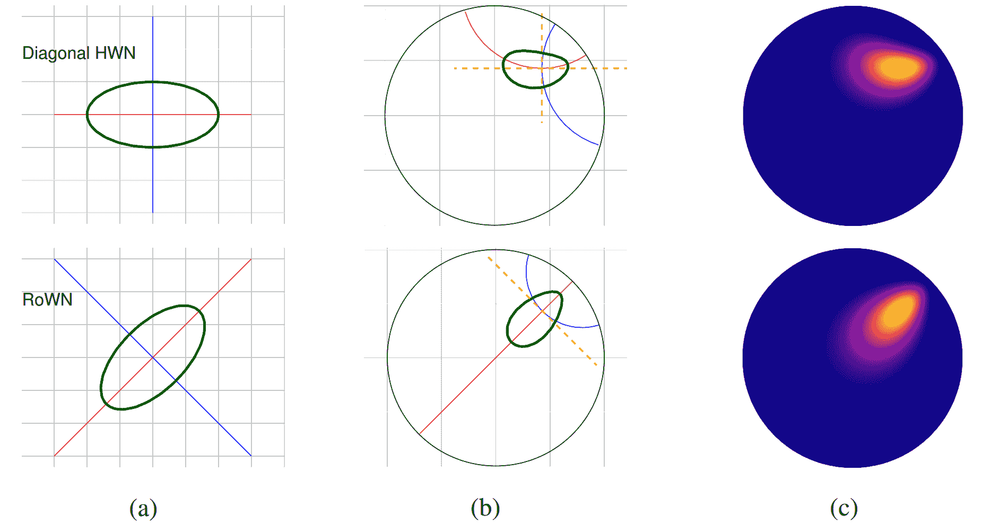
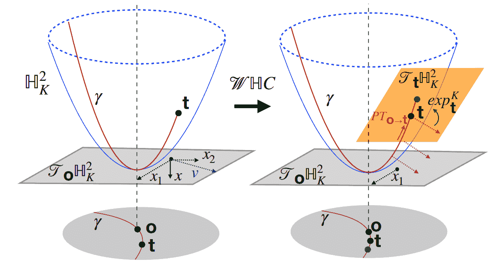

<!--yml

类别: 未分类

日期: 2024-09-06 19:39:52

-->

# [2305.06611] 超曲率深度学习在计算机视觉中的应用：综述

> 来源：[`ar5iv.labs.arxiv.org/html/2305.06611`](https://ar5iv.labs.arxiv.org/html/2305.06611)

∎

¹¹institutetext: Pascal Mettes ²²institutetext: 阿姆斯特丹大学，荷兰

²²电子邮件: p.s.m.mettes@uva.nl ³³institutetext: Mina Ghadimi Atigh ⁴⁴institutetext: 阿姆斯特丹大学，荷兰

⁴⁴电子邮件: m.ghadimiatigh@uva.nl ⁵⁵institutetext: Martin Keller-Ressel ⁶⁶institutetext: 德累斯顿工业大学，德国

⁶⁶电子邮件: martin.keller-ressel@tu-dresden.de ⁷⁷institutetext: Jeffrey Gu ⁸⁸institutetext: 斯坦福大学，美国

⁸⁸电子邮件: jeffgu@stanford.edu ⁹⁹institutetext: Serena Yeung ¹⁰¹⁰institutetext: 斯坦福大学，美国

¹⁰¹⁰电子邮件: syyeung@stanford.edu

# 超曲率深度学习在计算机视觉中的应用：综述

Pascal Mettes    Mina Ghadimi Atigh    Martin Keller-Ressel    Jeffrey Gu    Serena Yeung（收到: 日期 / 接受: 日期）

###### 摘要

深度表示学习是现代计算机视觉的一个普遍组成部分。虽然欧几里得空间一直是学习视觉表示的事实标准流形，但超曲率空间最近在计算机视觉学习中迅速获得了关注。具体而言，超曲率学习在嵌入层次结构、从有限样本中学习、量化不确定性、增加鲁棒性、限制错误严重性等方面表现出强大的潜力。在这篇论文中，我们对当前关于计算机视觉的超曲率学习文献进行了分类和深入概述。我们研究了有监督和无监督的文献，并在每个方向上确定了三个主要的研究主题。我们概述了超曲率学习在所有主题中的实施方法，并讨论了从当前超曲率学习进展中受益的主要研究问题。此外，我们提供了超曲率几何的高层次直觉，并概述了进一步推进该方向研究的开放研究问题。

^†^†期刊: 国际计算机视觉杂志

## 1 引言

从图像分割到未来帧预测，从视频定位到生成图像，深度表示学习是推动现代计算机视觉问题的核心组成部分（LeCun et al, 2015）。在短时间内，提出了许多可微分的层和网络架构来解决视觉研究问题（Gu et al, 2018; Bommasani et al, 2021; Khan et al, 2022）。尽管结构、范围和归纳偏差不同，但所有这些方法都基于欧几里得运算符，因此 - 无论是隐式还是显式 - 都假设数据在规则网格上表示最佳。

欧几里得空间形成了一个直观且基础的流形，但其固有属性并不适用于所有类型的数据。例如，考虑像树状结构、范畴和分类法这样的层次结构。层次结构是所有科学学科中用于形式化我们知识的基础构件（Noy 和 Hafner，1997）。在层次结构中，节点数量随着深度呈指数增长，从少量粗略节点到许多细粒度节点。然而，在欧几里得空间中，球体的体积仅随着直径多项式增长。需要一种替代几何来匹配层次结构的性质。

在寻找更合适的层次几何形态的过程中，双曲几何提供了直接的适配（Bridson 和 Haefliger，2013）。本质上，双曲几何和欧几里得几何在唯一一个方面不同：平行公设。在欧几里得空间中，通过一个不在另一条直线上的点有且只有一条平行直线。在双曲空间中，至少有两条这样的平行直线。这一变化带来了许多后果，因此双曲几何可以被视为一种具有恒定负曲率的几何。在深度学习的背景下，这种几何具有许多吸引人的特性，如其层次结构和指数扩展。

受到这些几何特性的启发，近年来层次嵌入在双曲空间中取得了巨大的成功（Nickel 和 Kiela，2017），使得嵌入深度复杂树结构的能力达到了前所未有的水平，*失真最小*（Ganea 等，2018a；Sala 等，2018）。这推动了许多学科和研究领域中双曲深度学习的快速进展，包括但不限于图网络（Chami 等，2019；Liu 等，2019；Dai 等，2021），文本嵌入（Tifrea 等，2019；Zhu 等，2020），分子表示学习（Klimovskaia 等，2020；Yu 等，2020；Wu 等，2021），以及推荐系统（Mirvakhabova 等，2020；Wang 等，2021；Yang 等，2022）。

紧随其他学科，计算机视觉近年来也从对双曲空间深度学习的研究中受益。大量文献显示，双曲嵌入有助于*少样本学习*、*零样本识别*、*分布外泛化*、*不确定性量化*、*生成学习*以及*层次表示学习*等。这些工作表明双曲几何在计算机视觉学习中具有巨大的潜力。

本综述提供了对双曲计算机视觉文献近期繁荣的深入概述和分类。这些研究探讨了在许多视觉研究问题上应用双曲学习的不同解决方案。因此，目前的文献如何连接、每项工作中的共同点和新颖点以及该领域的发展方向尚不清楚。本综述旨在填补这一空白。我们调查了有监督和无监督的论文。对于有监督学习，我们识别了当前论文中的三个共同主题，即样本与双曲空间中的陀螺体、原型或其他样本匹配。对于无监督论文，我们深入探讨了当前论文中探索的三个主要轴，即生成学习、聚类和自监督学习。Peng 等人（2021）最近撰写了一份关于双曲神经网络的一般综述，但他们的范围没有包括双曲学习的计算机视觉文献。本综述填补了这一空白。

论文的其余部分组织如下。在第二部分中，我们提供了双曲几何的背景及双曲嵌入和双曲神经网络的基础论文。第三部分和第四部分概述了有监督和无监督双曲视觉学习的文献。最后，在第五部分中，我们概述了当前论文中报告的优点和改进，以及该领域的开放挑战。

## 2 关于双曲几何的背景

### 2.1 什么是双曲几何？

双曲几何最初由高斯、罗巴切夫斯基、博利亚伊等人在 19 世纪发展起来，作为非欧几里得几何的具体例子。它很快在物理学中找到了重要的应用，作为爱因斯坦狭义相对论的数学基础。它可以被描述为*常数负曲率*的几何，区别于欧几里得空间的平坦几何和球体及超球体的正曲率几何。从表示学习的角度来看，它的吸引力特性在于其指数扩展和层级、树状结构。指数扩展意味着双曲空间中一个球的体积随着直径的增加而指数增长，与欧几里得空间中的多项式增长速率形成对比。度量空间的‘树状特性’可以通过 Gromov 的双曲性（Bridson 和 Haefliger，2013）来量化，对于树图而言为零，对于双曲空间为有限（但非零），对于欧几里得空间为无限。

### 2.2 双曲几何模型

存在几种不同但最终等价的双曲几何模型（Cannon 等，1997）。它们在点的坐标表示和距离、测地线及其他量的表达上有所不同。尽管它们可以互相转换，但由于数值效率、可视化的便利性或简化计算的原因，某些模型可能在特定任务中更为优选。最常用的模型有庞加莱模型、超曲面（或‘洛伦兹’）模型、克莱因模型和上半空间模型。

+   $\bullet$

    庞加莱模型通过单位球表示 $d$ 维双曲空间

    |  | $\mathbb{D}_{d}=\{p\in\mathbb{R}^{d}:p_{1}^{2}+\dotsm+p_{d}^{2}<1\}$ |  |
    | --- | --- | --- |

    在常考虑的情况 $d=2$ 下变为单位圆盘。测地线（‘最短路径’）是欧几里得圆（或直线）的弧，与 $\mathbb{D}_{d}$ 的边界垂直相交。虽然与欧几里得对应物相比，距离、面积和体积都发生了扭曲，但该模型是 *保角* 的，即双曲角度与欧几里得几何中的角度测量方式相同。作为庞加莱圆盘的二维形式，该模型在可视化方面很受欢迎；它也是 M. C. Escher 的艺术作品 Circle Limits I-IV 的几何基础；见图 1。

    

    图 1：Circle Limit I（1958）。M. C. Escher 创作的这幅艺术作品基于庞加莱圆盘模型的双曲几何。

+   $\bullet$

    超曲面模型使用单片超曲面

    |  | $\mathbb{H}_{d}=\{x\in\mathbb{R}^{d+1}:x_{0}^{2}-\left(x_{1}^{2}+\dotsm+x_{d}^{2}\right)=1,x_{0}>0\}$ |  |
    | --- | --- | --- |

    作为 $d$ 维双曲几何的模型。与其他模型相反，它的环境空间 $\mathbb{R}^{d+1}$ 为建模空间增加了一维。通过引入 *洛伦兹积* $x\circ y=x_{0}y_{0}-(x_{1}y_{1}+\dotsm+x_{d}y_{d})$，许多涉及超曲面模型的公式可以用简洁的形式表示。超曲面模型的一个优点是它保留了一些线性结构；例如，平移和其他等距变换可以通过线性映射表示。与其他模型相比，距离和测地线的表达更简单。值得注意的是，庞加莱模型可以作为超曲面模型到单位球的投影（‘立体投影’）导出（Cannon 等，1997；Ratcliffe，1994）。

+   $\bullet$

    克莱因模型 $\mathbb{K}_{d}$ 也使用单位球来表示双曲空间。与庞加莱模型不同，它不是保角的；然而，它的测地线是欧几里得的（‘直线’），这从计算的角度来看可能是有利的，*例如*，在计算重心时。

+   $\bullet$

    最后，上半空间模型通过集合 $\mathbb{U}_{d}=\{x\in\mathbb{R}^{d}:x_{d}>0\}$ 来表示 $d$ 维双曲空间。它是一个保角模型，并且与庞加莱模型共享许多性质；例如，测地线也是欧几里得圆（或直线）的弧，且与 $\mathbb{U}_{d}$ 的边界成直角相交。

### 2.3 五个核心双曲操作

在深度学习和计算机视觉的背景下，我们发现五个核心操作构成了绝大多数算法的基本构建块。掌握这五种操作将覆盖大多数现有文献：

1.  1.

    测量两点 $x$ 和 $y$ 之间的距离；

1.  2.

    从 $x$ 到 $y$ 寻找测地线弧（最短距离曲线）；

1.  3.

    形成一个测地线，通过尽可能扩展测地线弧；

1.  4.

    使用指数映射，确定在点 $x$ 开始，沿方向 $u$ 以速度 $r$ 追踪测地线的结果；

1.  5.

    通过应用双曲平移，移动一组点云，同时保持它们所有成对的双曲距离不变。

在庞加莱模型和双曲面模型中，两点之间的距离分别由以下公式给出

|  | $\displaystyle d_{\mathbb{D}}(p,q)$ | $\displaystyle=\frac{1}{\sqrt{\kappa}}\operatorname*{arcosh}\left(1+\frac{2\vert p-q\vert^{2}}{(1-\vert p\vert^{2})(1-\vert q\vert^{2})}\right),$ |  | (1) |
| --- | --- | --- | --- | --- |
|  | $\displaystyle d_{\mathbb{H}}(x,y)$ | $\displaystyle=\frac{1}{\sqrt{\kappa}}\operatorname*{arcosh}\left(x\circ y\right).$ |  | (2) |

在不太常用的克莱因模型和上半空间模型中，距离的计算方法如下

|  | $\displaystyle d_{\mathbb{K}}(p,q)$ | $\displaystyle=\frac{1}{\sqrt{\kappa}}\operatorname*{arcosh}\left(\frac{1-p^{\top}q}{\sqrt{1-\vert p\vert^{2}}\sqrt{1-\vert q\vert^{2}}}\right),$ |  | (3) |
| --- | --- | --- | --- | --- |
|  | $\displaystyle d_{\mathbb{U}}(x,y)$ | $\displaystyle=\frac{1}{\sqrt{\kappa}}\operatorname*{arcosh}\left(1+\frac{\vert x-y\vert^{2}}{2x_{d}y_{d}}\right),$ |  | (4) |

参见（Ratcliffe，1994，§6.1）。距离的缩放因子由*曲率参数* $\kappa\in(0,\infty)$ 控制，通常标准化为 $\kappa=1$。双曲空间的断面曲率（在微分几何的意义上）是常数，负值且等于 $-\kappa$。给定距离函数，谈论测地线和测地线弧，即（局部）最短距离曲线是有意义的，这些曲线可以是无限延伸的或连接两点的。在双曲面模型中，每条测地线是 $\mathbb{H}_{d}$ 与环境空间 $\mathbb{R}^{d+1}$ 中的欧几里得超平面的交集。点 $x\in\mathbb{H}_{d}$ 处沿方向 $v$ 的测地线可以写成

|  | $\lambda_{\mathbb{H}}(t)=\cosh(t\sqrt{\kappa})x+\sinh(t\sqrt{\kappa})u,\quad t\in\mathbb{R}.$ |  | (5) |
| --- | --- | --- | --- |

其中 $u$ 是 *切空间* $T_{x}=\{u\in\mathbb{R}^{d+1}:x\circ u=0\}$ 的一个元素，归一化为 $u\circ u=-1$。在庞加莱模型中，测地线恰好是与 $\mathbb{D}_{d}$ 边界垂直相交的欧几里得圆和直线的线段。两点 $p,q\in\mathbb{D}_{d}$ 之间的测地弧的方便公式可以用 gyrovectorspace 微积分给出，见(8)。

指数映射 $\exp_{x}(tu)$ 的值是沿着归一化方向 $u$ 以速度 $t>0$ 追随测地线的结果，从给定点 $x$ 开始，在双曲空间中。将 $\mathbb{R}^{d}$ 与 $x$ 处的切空间 $T_{x}$ 进行同一化，指数映射提供了一种方便的方式将 $\mathbb{R}^{d}$ 嵌入到以 $x$ 为原点的双曲空间中。指数映射是计算机视觉中双曲学习中最常用的函数，因为它允许我们将视觉表示从欧几里得空间映射到双曲空间。在双曲面模型中，指数映射与在(5)中给出的测地线表达式一致。在庞加莱模型中，指数映射可以方便地用 gyrovectorspace 加法表示，见(9)。

最后，双曲线变换 $\tau_{x}$，也称为洛伦兹提升、莫比乌斯变换或 gyrovectorspace 加法，是双曲空间中唯一的距离保持变换，它将 $0$ 移动到给定点 $x$。在双曲面模型中，它可以由线性映射表示

|  | $\displaystyle\tau_{x}(y)$ | $\displaystyle=L_{x}\cdot y,\quad\text{其中}$ |  | (6) |
| --- | --- | --- | --- | --- |
|  | $\displaystyle L_{x}$ | $\displaystyle=\begin{pmatrix}x_{0}&amp;\bar{x}^{\top}\\ \bar{x}&amp;\sqrt{I_{d}+\bar{x}\bar{x}^{\top}}\end{pmatrix}\text{，其中 }\bar{x}=(x_{0},\dotsc,x_{d}).$ |  | (7) |

在庞加莱模型中，双曲线变换也被称为 gyrovectorspace 加法，并构成了 gyrovectorspace 微积分的基本操作。

### 2.4 Gyrovectorspace 微积分

Gyrovectorspace 微积分，由 Ungar (2005, 2012) 提出，提供了一种方便且被迅速采用的框架用于庞加莱球模型中的计算。其第一个基本操作是（非交换的）gyrovectorspace 加法

|  | $p\oplus q=\frac{(1-&#124;p&#124;^{2})q+(1+2p^{\top}q+&#124;q&#124;^{2})p}{1+2p^{\top}q+&#124;p&#124;^{2}&#124;q&#124;^{2}}.$ |  |
| --- | --- | --- |

作为次要操作，（交换的）gyrovectorspace 标量积

|  | $t\otimes p=p\otimes t=\tanh\big{(}t\operatorname*{artanh}(&#124;p&#124;)\big{)}\frac{p}{&#124;p&#124;}$ |  |
| --- | --- | --- |

引入了一个标量$t\in\mathbb{R}$。双曲平移由$\tau_{p}(q)=p\oplus q$直接给出，连接$p$和$q$的测地弧是

|  | $\lambda_{\mathbb{D}}(t)=p\oplus\Big{(}\big{(}(-p)\oplus q\big{)}\otimes t\Big{)},\quad t\in[0,1].$ |  | (8) |
| --- | --- | --- | --- |

让$t$在整个$\mathbb{R}$中变化，可以得到一条完整的测地线。

在陀螺矢量空间微积分的背景下，庞加莱球通常会用曲率的平方根进行缩放，设置为

|  | $\mathbb{D}^{d}_{\kappa}=\{p\in\mathbb{R}^{d}:p_{1}^{2}+\dotsm+p_{d}^{2}<1/\kappa\}.$ |  |
| --- | --- | --- |

这种缩放的优势在于，随着$\kappa\to 0$，欧几里得空间作为一个连续极限被得到。在缩放模型中，陀螺矢量空间加法和标量积变为

|  | $p\oplus_{\kappa}q=\tfrac{1}{\sqrt{\kappa}}\left((\sqrt{\kappa}p)\oplus(\sqrt{\kappa}q)\right)$ |  |
| --- | --- | --- |

和

|  | $t\otimes_{\kappa}p=\tfrac{1}{\sqrt{\kappa}}(t\otimes(\sqrt{\kappa}p))$ |  |
| --- | --- | --- |

对于$p,q\in\mathbb{D}^{d}_{\kappa}$。在切向量$v\in T_{p}$的方向上的指数映射可以写成

|  | $\exp_{x}^{\kappa}(v)=x\oplus_{\kappa}\left(\tanh\left(\frac{\sqrt{\kappa}\lvert v \rvert}{1-\kappa \lvert x \rvert^{2}}\right)\frac{v}{\sqrt{\kappa}\lvert v \rvert}\right)$ |  | (9) |
| --- | --- | --- | --- |

对于$p\in\mathbb{D}^{d}_{\kappa}$，见 Ganea et al (2018b)。

### 2.5 非视觉双曲学习

双曲学习在计算机视觉中的吸引力建立在嵌入层次结构、设计双曲网络层以及在其他数据类型（如图、文本等）上进行双曲学习的进展之上。下面，我们讨论这些工作及其对双曲视觉学习文献的相关性。

##### 双曲层次结构的嵌入。

将像树和分类学这样的层次结构嵌入欧几里得空间会受到严重的失真（Bachmann et al, 2020），以及多项式体积扩展，这限制了它捕捉层次结构的指数复杂性的能力。然而，双曲空间可以被视为树的连续版本（Nickel and Kiela, 2017），并具有树状属性（Hamann, 2018; Ungar, 2008），例如，从原点向边界移动时距离的指数增长。受到这一点的鼓舞，Nickel 和 Kiela（2017）提出将层次结构嵌入到庞加莱模型中。其目标是学习层次结构节点的双曲表示，使嵌入空间中的距离与语义相似度成反比。设$\mathcal{D}=\{(u,v)\}$表示在给定层次结构中连接的节点集合。为了在庞加莱模型中嵌入节点，Nickel 和 Kiela（2017）最小化以下损失函数：

|  | $\mathcal{L}(\Theta)=\sum_{(u,v)\in\mathcal{D}}\log\frac{e^{-d(u,v)}}{\sum_{v^{{}^{\prime}}\in\mathcal{N}(u)}e^{-d(u,v^{{}^{\prime}})}},$ |  | (10) |
| --- | --- | --- | --- |

其中 $\mathcal{N}(u)=\{v^{{}^{\prime}}|(u,v^{{}^{\prime}})\notin\mathcal{D}\}\cup\{v\}$ 表示与 $u$ 无关的节点集合，包括 $v$，作为负样本。损失函数使无关的节点彼此远离，而相关节点更靠近。为了评估嵌入的层次结构，计算并排序连接节点对 $(u,v)$ 之间的距离，并在负样本节点对中（*即，* 不在 $\mathcal{D}$ 的节点）计算平均准确率（MAP）。随后，Sala 等人 (2018) 提出了一个组合构造方法，在没有优化且失真较低的情况下将树嵌入到双曲空间中，从而缓解了现有工作中的优化问题。Ganea 等人 (2018a) 解决了 (Nickel 和 Kiela, 2017) 的不足，包括损失函数导致空间边界点的坍缩和编码非对称关系的能力不足。他们引入了蕴含锥来嵌入层次结构，使用最大边际损失函数：

|  | $\mathcal{L}=\sum_{(u,v)\in\mathcal{P}}E(u,v)+\sum_{(u^{{}^{\prime}},v^{{}^{\prime}})\in\mathcal{N}}\max(0,\gamma-E(u^{{}^{\prime}},v^{{}^{\prime}})),$ |  | (11) |
| --- | --- | --- | --- |

其中 $\gamma$、$\mathcal{P}$ 和 $\mathcal{N}$ 分别表示边际、正边和负边。$E(u,v)$ 是一个惩罚项，迫使子节点落在父节点的锥体下。除了其他应用外，双曲嵌入已被提出用于多关系图（Balazevic 等人，2019）、低维知识图（Chami 等人，2020b）以及在洛伦兹模型中学习连续层次结构（Nickel 和 Kiela，2018）。

##### 双曲神经网络。

在深度学习向双曲空间过渡的基础中，双曲网络层及其优化的发展是关键。我们在这里考虑了两个提供这种理论基础的重要论文，即 Ganea 等人 (2018b) 的《双曲神经网络》和 Shimizu 等人 (2021) 的《双曲神经网络++》。Ganea 等人 (2018b) 提出了在庞加莱球中进行的多项逻辑回归。给定 $k\in\{1,...,K\}$ 类别，$p_{k}\in\mathbb{D}^{n}_{c}$ 和 $a_{k}\in\mathbb{D}^{n}_{c}\setminus\{0\}$，使用双曲逻辑回归进行分类。

|  | $\begin{split}p(y=k&#124;x)\propto&amp;\exp(\frac{\lambda^{c}_{pk}\lVert a_{k}\rVert}{\sqrt{c}}\\ &amp;\sinh^{-1}(\frac{2\sqrt{c}\langle-p_{k}\oplus_{c}x,a_{k}\rangle}{(1-c\lVert-p_{k}\oplus_{c}x\rVert^{2})\lVert a_{k}\rVert})).\end{split}$ |  | (12) |
| --- | --- | --- | --- |

作为扩展，线性层 $f$ 的双曲版本定义为 $f:\mathbb{R}^{n}\rightarrow\mathbb{R}^{m}$，其中 $f$ 的 Möbius 版本从 $\mathbb{D}^{n}\rightarrow\mathbb{D}^{m}$ 的映射定义为：

|  | $f^{\otimes_{c}}\coloneqq\exp^{c}_{0}(f(\log^{c}_{0}(x))),$ |  | (13) |
| --- | --- | --- | --- |

使用 $\exp^{c}_{0}:T_{0_{m}}\mathbb{D}^{m}_{c}\rightarrow\mathbb{D}^{m}_{c}$ 和 $\log^{c}_{0}:\mathbb{D}^{n}_{c}\rightarrow T_{0_{n}}\mathbb{D}^{n}_{c}$。他们进一步概述了如何创建递归网络层。

Shimizu 等人 (2021) 重新制定了 (Ganea 等人, 2018b) 的双曲线逻辑回归，以将参数数量减少到与欧几里得逻辑回归相同的水平。新的公式是 $p(y=k|x)\propto\exp(v_{k}(x))$，其中

|  | $\begin{split}v_{k}(x)=&amp;\ 2c^{-\frac{1}{2}}\lVert z_{k}\rVert\sinh^{-1}(\lambda^{c}_{x}\langle\sqrt{c}x,[z_{k}]\rangle\cosh(2\sqrt{c}r_{k})\\ &amp;-(\lambda^{c}_{x}-1)\sinh(2\sqrt{c}r_{k}))\end{split}$ |  | (14) |
| --- | --- | --- | --- |

其中 $r_{k}\in\mathbb{R}$ 和 $z_{k}\in T_{0}\mathbb{B}^{n}_{c}=\mathbb{R}^{n}$ 是每个类别的参数。然后，他们的线性层表示为

|  | $y=\mathcal{F}^{c}(x;Z,r)\coloneqq w(1+\sqrt{{1+c\lVert w\rVert^{2}}})^{-1}$ |  | (15) |
| --- | --- | --- | --- |

其中 $Z=\{z_{k}\in T_{0}\mathbb{B}^{n}_{c}=\mathbb{R}^{n}\}^{m}_{k=1}$, $r=\{r_{k}\in\mathbb{R}\}^{m}_{k=1}$, 和 $w\coloneqq(c^{-\frac{1}{2}}\sinh(\sqrt{c}v_{k}(x)))^{m}_{k=1}$。对于计算机视觉更重要的是，他们展示了如何使用 Poincaré 全连接层和 $\beta$-连接来构造卷积层。为此，他们展示了如何通过 $\beta$-分裂和 $\beta$-连接将双曲线线性层推广到图像补丁，从而原理上实现任意维度的卷积层。此外，通过相同的算子也可以实现 Poincaré 多头注意力。

图 2：计算机视觉中监督式双曲线学习的三种核心策略。当前文献通过学习匹配训练样本 (i) 到双曲线类别超平面，即，陀螺面，(ii) 到双曲线类别原型，或 (iii) 通过与其他样本对比，来实现视觉嵌入的双曲线学习。

.

##### 双曲线学习图形、文本及其他。

双曲嵌入层级结构的进展和双曲网络层的引入也激发了其他研究方向的研究。作为层级嵌入的逻辑扩展，图网络已被扩展到双曲空间。Liu et al (2019) 和 Chami et al (2019) 提出了基于切线的双曲图网络视图。这两种方法通过先将节点嵌入映射到切线空间，再在切线空间中进行变换和聚合，最后将更新后的节点嵌入投影回双曲流形。由于切线操作仅提供了对流形上图操作的近似，一些工作提出了更好地遵循基础双曲几何的图网络，如常曲率 $\kappa$-GCNs（Bachmann et al, 2020），双曲到双曲 GCNs（Dai et al, 2021），洛伦兹 GCNs（Zhang et al, 2021c），以及基于注意力的双曲图网络（Gulcehre et al, 2019; Zhang et al, 2021b）。与欧几里得变体相比，双曲图网络在节点、链接和图分类中表现出改进，特别是在图具有潜在层级结构时。

双曲嵌入也已被用于文本。Tifrea et al (2019)，Dhingra et al (2018) 和 Leimeister 和 Wilson (2018) 提出了用于词嵌入的双曲替代方案。Zhu et al (2020) 引入了 HyperText，将双曲几何赋予 FastText。在双曲空间中嵌入文本有可能提高相似性、类比和上位词检测，尤其是在嵌入维度较少的情况下。

除了文本和图形，双曲学习还在多个其他研究方向中显示出了益处，包括但不限于分子/细胞结构的学习表示（Klimovskaia et al, 2020; Yu et al, 2020; Wu et al, 2021），推荐系统（Mirvakhabova et al, 2020; Wang et al, 2021; Yang et al, 2022），骨骼动作识别（Franco et al, 2023），LiDAR 数据（Tong et al, 2022; Wang et al, 2023），点云（Montanaro et al, 2022; Anvekar and Bazazian, 2023），以及 3D 形状（Chen et al, 2020b）。总之，双曲几何已经对广泛的研究领域产生了影响。本调查特别关注于视觉领域的影响和潜力。

## 3 **监督式**双曲视觉学习

在图 2 中，我们提供了关于计算机视觉中使用双曲几何的监督学习文献的概述。在当前的视觉工作中，双曲学习主要是在嵌入层或分类器层进行的。换句话说，目前的工作依赖于标准网络进行特征学习，并将输出嵌入转换到双曲空间进行最终学习阶段。对于双曲空间中的监督学习，我们已识别出三种主要的优化策略：

1.  1.

    样本到陀螺面学习指的是将类别表示为双曲超平面，即陀螺面，并基于样本与陀螺面之间的置信度逻辑得分来优化网络的设置。

1.  2.

    样本到原型的学习指的是将类别语义表示为双曲空间中的点，并通过优化网络以最小化样本与原型之间的双曲距离来实现的设置。

1.  3.

    样本到样本的学习指的是通过在一个批次中的样本之间学习度量或对比目标来优化网络的设置。

对于所有策略，设$(x,y)$为视觉输入$x$，可以是图像或视频，以及相应的标签$y\in\mathcal{Y}$。设$f_{\theta}(x)\in\mathbb{R}^{D}$为经过网络处理后的欧几里得嵌入。该表示通过指数映射映射到双曲空间，记作$g(x)=\exp_{0}(f_{\theta}(x))$。在许多双曲工作中，假定存在关于类别之间的层次关系的附加信息。设$\mathcal{H}=(\mathcal{Y},\mathcal{P},\mathcal{R})$，其中$\mathcal{Y}$为表示层次结构的叶节点的类别标签，$\mathcal{P}$为内部节点，$\mathcal{R}$为层次结构的上位词-下位词关系集合。下面，我们将依次详细讨论当前文献如何处理每种策略。

### 3.1 样本到陀螺面学习

在分类空间中引入双曲几何的最直接方法是用双曲替代品替换分类层。这可以通过双曲逻辑回归或双曲核机器来实现。

##### 双曲逻辑回归。

Khrulkov 等人 (2020) 通过将标准卷积网络的最后一个隐藏层的输出映射到双曲空间来引入双曲分类器，使用指数映射。之后，使用 Ganea 等人 (2018b) 描述的双曲多项式逻辑回归来获得类对数值，这些对数值可以通过交叉熵进行优化。他们发现，在卷积网络顶部训练双曲分类器可以基于图像的双曲嵌入到原点的距离来获得不确定性信息。分布外样本的平均范数较小，这使得可以通过按距离原点排序来区分分布内和分布外样本。 Hong 等人 (2022) 证明了双曲分类在视觉异常识别任务中的好处，如图像分类和分割任务中的分布外检测。Araño 等人 (2021) 使用双曲层来进行基于音频、视频和文本模态的多模态情感分析。Ahmad 和 Lecue (2022) 还展示了双曲空间在使用超宽视场镜头进行物体识别中的效果。

Guo 等人 (2022) 解决了训练双曲空间分类器时的一个局限性，即由于当前计算机视觉中双曲方法的混合架构导致的梯度消失问题，其中欧几里得特征连接到双曲分类器。方程 12 强调了为了最大化正确预测的可能性，需要最大化到双曲陀螺面的距离。在实际操作中，样本的嵌入被推到庞加莱球的边界。因此，黎曼张量度量的逆接近于零，导致梯度很小。这个发现与一些关于双曲表示学习中的梯度消失的其他研究结果一致（Nickel 和 Kiela, 2018; Liu 等人, 2019）。

为了应对梯度消失问题，Guo 等人 (2022) 提出在指数映射之前剪切样本的欧几里得嵌入，*即*：

|  | $f^{\text{clipped}}_{\theta}(x)=\min\big{\{}1,\frac{r}{\|f_{\theta}(x)\|}\big{\}}\cdot f_{\theta}(x),$ |  | (16) |
| --- | --- | --- | --- |

以$r$作为超参数。这个技巧通过双曲多项式逻辑回归提高了学习效果，尤其是在处理如 ImageNet 这样的多类别问题时。此外，使用剪切的双曲分类器进行训练，相比于使用欧几里得分类器进行训练，能更好地检测分布外样本，同时对对抗攻击也更具鲁棒性。

除了全球分类之外，最近一些研究探讨了用于结构化预测任务的超曲率逻辑回归，例如目标检测和图像分割。Valada (2022) 将目标检测扩展到超曲率几何中，其中包括通过将类似 Sparse R-CNN (Sun et al, 2021) 的二阶段检测的分类头替换为超曲率逻辑回归，提升了标准和零样本设置下的目标检测性能。Ghadimi Atigh 等人 (2022) 引入了超曲率图像分割，其中最终的每像素分类是在超曲率空间中进行的。从 Ganea 等人 (2018b) 对超曲率陀螺面的几何解释出发，他们发现同时计算批次中所有图像的所有像素的类对数，与欧几里得网络中惯用的做法不同，在超曲率空间中并不直接适用。这是因为显式计算 Möbius 加法需要评估一个尺寸为 $(W\times H)$，具有 $d$ 嵌入维度的图像的 $\mathbb{R}^{W\times H\times|\mathcal{Y}|\times d}$ 张量。相反，他们将 Möbius 加法重写为：

|  | <math   alttext="\begin{split}f_{1}\oplus_{c}f_{2}=&amp;\alpha f_{1}+\beta f_{2},\\ \alpha=&amp;\frac{1+2c\langle f_{1},f_{2}\rangle+c&#124;&#124;f_{2}&#124;&#124;^{2}}{1+2c\langle f_{1},f_{2}\rangle+c^{2}&#124;&#124;f_{1}&#124;&#124;^{2}&#124;&#124;f_{2}&#124;&#124;^{2}},\\

\beta=&amp;\frac{1+c&#124;&#124;f_{1}&#124;&#124;^{2}}{1+2c\langle f_{1},f_{2}\rangle+c^{2}&#124;&#124;f_{1}&#124;&#124;^{2}&#124;&#124;f_{2}&#124;&#124;^{2}}.\end{split}" display="block"><semantics ><mtable columnspacing="0pt" displaystyle="true" rowspacing="0pt" ><mtr ><mtd columnalign="right" ><mrow ><mrow ><msub ><mi >f</mi><mn  >1</mn></msub><msub ><mo  >⊕</mo><mi >c</mi></msub><msub ><mi  >f</mi><mn >2</mn></msub></mrow><mo >=</mo></mrow></mtd><mtd columnalign="left" ><mrow ><mrow ><mrow ><mi >α</mi><mo lspace="0em" rspace="0em" >​</mo><msub ><mi >f</mi><mn >1</mn></msub></mrow><mo >+</mo><mrow ><mi >β</mi><mo lspace="0em" rspace="0em" >​</mo><msub ><mi >f</mi><mn >2</mn></msub></mrow></mrow><mo >,</mo></mrow></mtd></mtr><mtr ><mtd columnalign="right" ><mrow ><mi >α</mi><mo >=</mo></mrow></mtd><mtd columnalign="left" ><mrow ><mfrac ><mrow ><mn  >1</mn><mo >+</mo><mrow ><mn >2</mn><mo lspace="0em" rspace="0em"  >​</mo><mi >c</mi><mo lspace="0em" rspace="0em"  >​</mo><mrow ><mo stretchy="false"  >⟨</mo><msub ><mi >f</mi><mn >1</mn></msub><mo >,</mo><msub ><mi >f</mi><mn >2</mn></msub><mo stretchy="false"  >⟩</mo></mrow></mrow><mo >+</mo><mrow ><mi >c</mi><mo lspace="0em" rspace="0em"  >​</mo><msup ><mrow ><mo stretchy="false"  >‖</mo><msub ><mi >f</mi><mn >2</mn></msub><mo stretchy="false"  >‖</mo></mrow><mn >2</mn></msup></mrow></mrow><mrow ><mn >1</mn><mo >+</mo><mrow ><mn >2</mn><mo lspace="0em" rspace="0em" >​</mo><mi >c</mi><mo lspace="0em" rspace="0em"  >​</mo><mrow ><mo stretchy="false"  >⟨</mo><msub ><mi >f</mi><mn >1</mn></msub><mo >,</mo><msub ><mi >f</mi><mn >2</mn></msub><mo stretchy="false"  >⟩</mo></mrow></mrow><mo >+</mo><mrow ><msup ><mi >c</mi><mn >2</mn></msup><mo lspace="0em" rspace="0em"  >​</mo><msup ><mrow ><mo stretchy="false"  >‖</mo><msub ><mi >f</mi><mn >1</mn></msub><mo stretchy="false"  >‖</mo></mrow><mn >2</mn></msup><mo lspace="0em" rspace="0em"  >​</mo><msup ><mrow ><mo stretchy="false"  >‖</mo><msub ><mi >f</mi><mn >2</mn></msub><mo stretchy="false"  >‖</mo></mrow><mn >2</mn></msup></mrow></mrow></mfrac><mo >,</mo></mrow></mtd></mtr><mtr ><mtd columnalign="right" ><mrow ><mi >β</mi><mo >=</mo></mrow></mtd><mtd columnalign="left" ><mrow ><mfrac ><mrow ><mn  >1</mn><mo >+</mo><mrow ><mi >c</mi><mo lspace="0em" rspace="0em"  >​</mo><msup ><mrow ><mo stretchy="false"  >‖</mo><msub ><mi >f</mi><mn >1</mn></msub><mo stretchy="false"  >‖</mo></mrow><mn >2</mn></msup></mrow></mrow><mrow ><mn >1</mn><mo >+</mo><mrow ><mn >2</mn><mo lspace="0em" rspace="0em" >​</mo><mi >c</mi><mo lspace="0em" rspace="0em"  >​</mo><mrow ><mo stretchy="false"  >⟨</mo><msub ><mi >f</mi><mn >1</mn></msub><mo >,</mo><msub ><mi >f</mi><mn >2</mn></msub><mo stretchy="false"  >⟩</mo></mrow></mrow><mo >+</mo><mrow ><msup ><mi >c</mi><mn >2</mn></msup><mo lspace="0em" rspace="0em"  >​</mo><msup ><mrow ><mo stretchy="false"  >‖</mo><msub ><mi >f</mi><mn >1</mn></msub><mo stretchy="false"  >‖</mo></mrow><mn >2</mn></msup><mo lspace="0em" rspace="0em"  >​</mo><msup ><mrow ><mo stretchy="false"  >‖</mo><msub ><mi >f</mi><mn >2</mn></msub><mo stretchy="false"  >‖</mo></mrow><mn >2</mn></msup></mrow></mrow></mfrac><mo lspace="0em" >.</mo></mrow></mtd></mtr></mtable><annotation-xml encoding="MathML-Content" ><apply ><csymbol cd="ambiguous" >formulae-sequence</csymbol><apply ><apply ><apply ><csymbol cd="ambiguous" >subscript</csymbol><csymbol cd="latexml"  >direct-sum</csymbol><ci >𝑐</ci></apply><apply ><csymbol cd="ambiguous" >subscript</csymbol><ci >𝑓</ci><cn type="integer" >1</cn></apply><apply ><csymbol cd="ambiguous" >subscript</csymbol><ci >𝑓</ci><cn type="integer" >2</cn></apply></apply><apply ><apply ><ci >𝛼</ci><apply ><csymbol cd="ambiguous" >subscript</csymbol><ci >𝑓</ci><cn type="integer" >1</cn></apply></apply><apply ><ci >𝛽</ci><apply ><csymbol cd="ambiguous" >subscript</csymbol><ci >𝑓</ci><cn type="integer"  >2</cn></apply></apply></apply></apply><apply ><csymbol cd="ambiguous" >formulae-sequence</csymbol><apply ><ci >𝛼</ci><apply ><apply  ><cn type="integer"  >1</cn><apply ><cn type="integer"  >2</cn><ci >𝑐</ci><list ><apply ><csymbol cd="ambiguous"  >subscript</csymbol><ci >𝑓</ci><cn type="integer"  >1</cn></apply><apply ><csymbol cd="ambiguous"  >subscript</csymbol><ci >𝑓</ci><cn type="integer"  >2</cn></apply></list></apply><apply ><ci >𝑐</ci><apply ><csymbol cd="ambiguous"  >superscript</csymbol><apply ><csymbol cd="latexml"  >norm</csymbol><apply ><csymbol cd="ambiguous"  >subscript</csymbol><ci >𝑓</ci><cn type="integer"  >2</cn></apply></apply><cn type="integer"  >2</cn></apply></apply></apply><apply ><cn type="integer" >1</cn><apply ><cn type="integer"  >2</cn><ci >𝑐</ci><list ><apply ><csymbol cd="ambiguous"  >subscript</csymbol><ci >𝑓</ci><

此重写将添加操作简化为在$\mathbb{R}^{W\times H\times|\mathcal{Y}|}$中添加两个张量，从而允许对图像批次进行逐像素评估。在训练过程中，Ghadimi Atigh 等人 (2022) 通过将单热编码 softmax 替换为层级 softmax 来融入层级信息：

|  | $p(\hat{y}=y&#124;g(x)_{ij})=\prod_{h\in\mathcal{H}_{y}}\frac{\exp(\xi_{h}(g(x)_{ij}))}{\sum_{s}\in S_{h}\exp(\xi_{s}(g(x)_{ij}))},$ |  | (18) |
| --- | --- | --- | --- |

设$\mathcal{H}_{y}=\{y\}\cap\mathcal{A}_{y}$为包含$y$及其祖先的集合，$S_{h}$为类$h$的兄弟集合。使用双曲层级逻辑回归进行逐像素分类，为图像分割开启了多个新方向。首先，由双曲嵌入输出的双曲范数表示的不确定性概念自然地推广到像素级别。如图 3 所示，像素嵌入的范数与语义模糊性相关；像素越接近语义边界，其像素范数越低。Chen 等人 (2022) 已经利用这一见解来改善图像分割。他们提出了一种双曲不确定性损失，其中像素$x_{ij}$的交叉熵损失加权如下：

|  | $\text{uw}(x_{ij})=1+\frac{1}{\log(t+\frac{d_{h}(g(x)_{ij},0)}{d_{h}(g(s),0)})},$ |  | (19) |
| --- | --- | --- | --- |

其中$s$是最自信的像素，$t$是设置为 1.02 的超参数，以便具有宽泛的权重变化，同时避免除零。将此权重添加到交叉熵像素损失中，一致地改善了知名分割网络的分割结果。双曲图像分割的其他好处包括更好的零标签泛化能力和在嵌入维度较少的情况下相比于欧几里得像素嵌入更高的效果。

图 3：双曲图像分割自然提供逐像素的不确定性信息。具有低双曲范数的像素构成高不确定性像素，并且与接近语义边界的关系密切。图片由 Ghadimi Atigh 等人 (2022) 提供。

图 4：类之间的层级知识为计算机视觉方法中的双曲嵌入提供了结构，其中类根据其上位词-下位词关系在双曲空间中表示为点或原型。例如，Dhall 等人 (2020) 利用昆虫分类收藏中的层级关系（左），Yu 等人 (2022) 使用皮肤病变的分类（中），Long 等人 (2020) 则对动作层级（右）做了相同处理。图片由相关出版物提供。

##### 双曲核机器。

除了逻辑回归之外，Cho 等人（2019）提供了一个用于大边际分类器的双曲空间中核方法的一般公式。Fang 等人（2021）引入了双曲空间中的正定核函数，并展示了其在计算机视觉中的潜力。具体来说，他们提出了切向核、径向基函数核、（广义）拉普拉斯核和二项核的双曲实例。这些核函数可以添加到卷积网络上，并与交叉熵一起训练，以同时受益于卷积层的表示学习和分类器中的双曲核动态。使用双曲核方法的深度学习可以提高少样本学习、行人再识别和知识蒸馏。甚至可以通过视觉嵌入与语义类别表示之间的核距离实现零样本学习。

### 3.2 从样本到原型的学习

在双曲学习中，最流行的策略是将类别表示为原型，即在双曲空间中的点。在这一研究方向中，有两种解决方案：基于样本均值嵌入类别，类似于原型网络（ProtoNet）（Snell 等人，2017），或者基于所有类别的给定层级嵌入类别。

##### 双曲 ProtoNet。

在原型网络（Snell 等人，2017）中，类别 $k$ 的原型被确定为属于该类别的样本的均值向量：

|  | $P_{\mathbb{R}}(k)=\frac{1}{&#124;S_{k}&#124;}\sum_{y_{s}\in S_{k}}f_{\theta}(x_{s}),$ |  | (20) |
| --- | --- | --- | --- |

其中 $S_{k}$ 是属于类别 $k$ 的样本集合。推理可以通过将测试样本的标签分配给最近的原型来进行。Khrulkov 等人（2020）将这一公式推广到双曲原型网络。由于在庞加莱球模型中计算均值需要昂贵的 Fréchet 均值计算，他们使用爱因斯坦中点来执行均值计算，在 Klein 坐标下表示为：

|  | $P_{\mathbb{K}}(k)=\sum_{i=1}^{&#124;S_{k}&#124;}\gamma_{i}g_{\mathbb{K}}(x_{i})/\sum_{i=1}^{&#124;S_{k}&#124;}\gamma_{i},$ |  | (21) |
| --- | --- | --- | --- |

其中 $\gamma_{i}$ 是洛伦兹因子：

|  | $\gamma_{i}=\frac{1}{\sqrt{1-c&#124;&#124;g(x_{i})&#124;&#124;^{2}}}.$ |  | (22) |
| --- | --- | --- | --- |

由于 Khrulkov 等人（2020）在庞加莱球模型中进行操作，这一均值计算操作需要将嵌入转化为并从 Klein 模型中转化：

|  | $\begin{split}g_{\mathbb{K}}(x_{i})=&amp;\frac{2g_{\mathbb{D}}(x_{i})}{1+c&#124;&#124;g_{\mathbb{D}}(x_{i})&#124;&#124;^{2}},\\ g_{\mathbb{D}}(x_{i})=&amp;\frac{g_{\mathbb{K}}(x_{i})}{1+\sqrt{1-c&#124;&#124;g_{\mathbb{K}}(x_{i})&#124;&#124;^{2}}},\end{split}$ |  | (23) |
| --- | --- | --- | --- |

其中$g_{\mathbb{D}}(x_{i})$和$g_{\mathbb{K}}(x_{i})$分别是输入$x_{i}$在庞加莱球模型和克莱因模型中的嵌入。类似于其欧几里得对应物，双曲 ProtoNet 用于处理少样本学习，其中样本均值原型作为类别表示。Khrulkov 等人（2020）展示了在双曲空间中进行原型少样本学习与欧几里得原型学习具有竞争力，甚至在依赖 4 层 ConvNet 作为骨干网时获得了更好的准确度分数。

作为后续工作，高等人（2021）展示了不同任务甚至单个类别在少样本学习中偏好不同的曲率。他们提出基于类别内和类别外样本表示的二阶统计量生成每类曲率。利用二阶统计量，通过学习具有 sigmoid 激活的多层感知机来将曲率范围固定在$[0,1]$。给定类别特定的曲率，通过在类别内距离矩阵上训练一个 MLP 来获得原型。MLP 作为每个类别内样本的权重。该过程对类别外集合中的最接近样本重复进行，之后按类别加权双曲平均得到每类原型。曲率生成和加权双曲平均在归纳和传导设置中都改善了少样本学习。

Guo 等人（2022）的双曲剪裁方法在少样本学习中也有效，一致优于标准 ProtoNet 和 Hyperbolic ProtoNet 在 CUB Birds 和 miniImageNet 少样本基准测试中的表现。一些其他工作扩展了 Hyperbolic ProtoNet 用于少样本学习，采用了集合和组别学习方法，将在样本到样本学习部分讨论。

最近，高等人（2022）研究了在双曲空间中进行特征增强，以解决处理有限数据时的过拟合问题。除此之外，他们还引入了一种使用神经 ODE 估计特征分布的方案。这些元素随后被应用到少样本方法中，如 Khrulkov 等人（2020）的双曲原型网络，从而提高了性能。Choudhary 和 Reddy（2022）通过对双曲神经网络进行双曲三角函数的泰勒级数展开，改进了双曲少样本学习，展示了其在可扩展性和兼容性上的优势，并且优于 Hyperbolic ProtoNet。

##### 原型的层次嵌入。

在少量样本设置中，双曲原型网络（Hyperbolic ProtoNets）表现出色，许多研究也探讨了基于原型的通用分类解决方案。作为起点，这些研究通常假设数据集中的类别是按层次结构组织的，参见图 4。Long 等人 (2020) 使用双曲蕴涵锥（Ganea 等， 2018a）将动作类别层次结构 $\mathcal{H}$ 嵌入到双曲空间中，并加入额外的损失函数，以增加叶节点之间的角度分离，避免类别标签 $\mathcal{Y}$ 之间的混淆。设 $\mathcal{L}_{H}(\mathcal{H})$ 为层次结构 $\mathcal{H}$ 的双曲嵌入损失，令 $\mathcal{P}$ 表示层次结构的叶节点。则基于分离的损失在叶节点上给出为：

|  | $\mathcal{L}_{S}(\mathcal{P})=\mathbf{1}^{T}(\hat{P}\hat{P}^{T}-I)\mathbf{1},$ |  | (24) |
| --- | --- | --- | --- |

以$\hat{P}$为叶节点的$\ell_{2}$-标准化表示。通过结合基于层次和分离的损失，层次结构被嵌入以平衡层次约束和判别能力。该嵌入是*事先*学习的，然后视频嵌入被投影到相同的双曲空间，并优化到其正确的类别嵌入。这种方法改善了动作识别、零样本动作分类和层次动作搜索。本着类似的精神，Dhall 等人（2020）展示了使用双曲推断锥进行图像分类在经验上优于使用欧几里得推断锥。Yu 等人（2022）提出同时学习层次和视觉表示用于皮肤病变图像识别，而不是将层次和视觉嵌入学习分开。图像嵌入被优化到其正确的类别原型，而类别则被优化以遵守其双曲推断锥，并加入额外的畸变损失以获得更好的层次嵌入。Gulshad 等人（2023）提出了层次原型解释器，一个在双曲空间中的推理模型，用于提供视频动作识别的可解释性。他们的方法在不同的粒度级别*例如*父级和祖父级别上学习层次原型，以解释视频中识别的动作。通过学习层次原型，他们可以在不同的粒度级别提供解释，包括对特定类别标签预测的解释和提供关于贡献最终预测的时空部分的信息。Li 等人（2023）研究了动作识别数据集的语义空间，并弥合了不同标注系统之间的差距。为了实现统一的动作学习，使用 VerbNet（Schuler，2005）将动作连接成层次结构，并嵌入为双曲空间中的原型。

层次原型嵌入也成功应用于零样本领域。Liu 等人（2020）展示了如何使用双曲嵌入进行零样本学习。通过采用基于 WordNet 的 Poincaré嵌入（Nickel 和 Kiela，2017）和基于文本的 Poincaré GloVe 嵌入（Tifrea 等人，2019）对类别进行嵌入。这两者被连接以获得类别原型。通过优化已见训练图像到其原型，可以在测试期间通过在连接的双曲空间中进行最近邻搜索来推广到未见类别。Xu 等人（2022）也通过在双曲词嵌入上训练双曲图层（Chami 等人，2019）来执行双曲零样本学习。Dengxiong 和 Kong（2023）展示了双曲空间在广义开放集识别中的潜力，该方法基于附加信息对未知样本进行分类。引入了一种附加信息（分类）学习框架，将信息嵌入到双曲空间中，具有低失真度，并识别未知样本。此外，还概述了一种祖先搜索算法，用于在已知类别的分类中找到最相似的祖先。

对于标准分类，Ghadimi Atigh 等人（2021）展示了如何通过在 Poincaré球体边界上嵌入具有最大分离度的类别来整合双曲空间中的原型均匀性（由 Mettes 等人，2019；Kasarla 等人，2022）。由于原型现在位于球体边界上，标准距离函数不再适用，因为它们与球体内的任何点之间的距离是无限的。为此，他们建议使用 Busemann 距离，给定双曲图像嵌入$g(x)$和原型$p$的 Busemann 距离为：

|  | $b_{p}(g(x))=\log(\frac{&#124;&#124;p-g(x)&#124;&#124;^{2}}{1-&#124;&#124;g(x)&#124;&#124;^{2}}).$ |  | (25) |
| --- | --- | --- | --- |

通过固定最大分离的原型*事先*，并通过额外的正则化最小化该距离函数，可以在理想边界处执行双曲原型学习。Ghadimi Atigh 等人 (2021) 表明这种方法在二分类情况下与传统的逻辑回归有直接联系，突出了其固有属性。此外，根据可用知识和手头的任务，最大分离的原型还可以由词嵌入或层次知识中的原型替代。除了标准分类，层次双曲嵌入在持续学习中也表现出有效性 (Gao 等人, 2023)。为了学习新数据，Gao 等人 (2023) 提出了通过混合曲率空间动态扩展几何体的方法，使得在数据流中能够学习复杂的层次结构。为了防止遗忘，使用了角度正则化和邻域鲁棒性损失来保持旧数据的几何结构。

少样本学习也已通过层次知识进行研究。张等人 (2022) 首先通过在联合分类和层次一致性目标上训练网络来进行这种少样本学习。分类结果作为类别概率的 softmax 以及超类别的 softmax 进行给出。在少样本推理阶段，通过双曲图传播获得类别原型，以应对有限样本设置，从而提高了少样本学习的效果。

图 5：双曲视觉变换器的嵌入根据样本标签将样本聚类到 Poincaré 球体的边界附近，同时展现潜在的层次关系。图片由 Ermolov 等人 (2022) 提供。

### 3.3 样本到样本的学习

最后，一些最近的研究通过对比样本来研究双曲学习。

##### 双曲度量学习。

Ermolov 等人 (2022) 研究了双曲嵌入在度量学习中的潜力。在度量学习中，实际解决方案是基于预训练编码器给出的嵌入匹配样本对的表示。他们提出了一种双曲对交叉熵损失，而不是依赖欧几里得距离和对比学习进行优化。给定一个包含 $|\mathcal{Y}|$ 类的数据集，每个批次从每个类别中抽取两个样本，即 $K=2\cdot|\mathcal{Y}|$。然后，同类标签的正样本对的损失函数给出为：

|  | $\ell_{ij}=-\log\frac{\exp(-D(g(x_{i}),g(x_{j}))/\tau)}{\sum_{k=1}^{K}\exp(-D(g(x_{i}),g(x_{k}))/\tau)},$ |  | (26) |
| --- | --- | --- | --- |

其中 $D(\cdot,\cdot)$ 可以是超曲面距离或余弦距离，而 $\tau$ 表示一个温度超参数。这个损失是在一个批次中所有正样本对 $(i,j)$ 和 $(j,i)$ 上计算的。使用监督 (Dosovitskiy et al, 2021) 和自监督 (Caron et al, 2021) 视觉变换器作为编码器，超曲面度量学习始终优于欧几里得替代方法，并在细粒度数据集上设立了最先进的水平。图 5 显示了使用超曲面度量学习在视觉变换器上学习的嵌入的 2D 投影，其中类别被分组到边界附近，潜在的层次邻域关系显现出来。

超曲面度量学习在少样本类增量学习任务中有效克服了过拟合和灾难性遗忘，这一点由 Cui 等人 (2022) 探索了。这是通过将度量学习损失作为持续学习中的一个蒸馏部分来实现的。他们还提出了一个超曲面版本的互惠点学习 (Chen et al, 2020a)，以在少样本学习阶段为已知类别提供额外的类间空间。Yan 等人 (2023) 还探索了超曲面度量学习，结合了噪声不敏感和自适应层次相似性，以处理噪声标签和多层次关系。Kim 等人 (2022) 在度量学习方法上添加了层次正则化项，旨在无任何注释的情况下学习超曲面空间中的层次祖先。超曲面度量学习在语义哈希 (Amin et al, 2022)、通过大间距最近邻学习的人脸识别 (Trpin 和 Boshkoska, 2022) 以及给定视频和知识图谱的多模态对齐 (Guo et al, 2021) 中也表现出色。

跟随大型语言模型的发展以及视觉-语言模型（*例如*，CLIP (Radford et al, 2021)) 在多模态表示学习中的成功，Desai 等人 (2023) 提出了一个超曲面图像-文本表示方法。该方法首先使用两个独立的编码器处理输入的图像和文本。然后，将生成的嵌入投影到超曲面空间中，并使用对比损失和蕴含损失进行训练。论文表明，该方法在超曲面空间中能够捕捉层次化的多模态关系，表现优于欧几里得 CLIP。

##### 超曲面集合学习。

与样本到原型和样本到样本的方法对比样本的单个元素相比，一些研究表明基于集合和基于组的距离更为有效和稳健。Ma 等（2022）在小样本学习的背景下引入了一种自适应样本到集合距离函数。与将支持样本聚合到单个原型不同，自适应样本到集合的方法旨在提高对异常值的鲁棒性。样本到集合函数是查询到所有支持样本的距离的加权平均，其中距离通过一个小型网络在查询和支持样本的特征图上计算。这种方法对小样本学习有利，尤其是在处理异常值时。

在度量学习的背景下，Zhang 等（2021a）认为样本到样本的学习计算成本高，而样本到原型的学习则准确性较低。他们提出了一种基于组的小策略，每个组是样本的随机子集，组的集合通过可微分的最优传输与原型匹配。类似于 Ermolov 等（2022），他们展示了使用双曲嵌入空间可以改善对精细数据集的度量学习。此外，他们提供了实证证据表明，其他基于度量的损失也受益于双曲嵌入，突显了双曲空间在度量学习中的普遍实用性。

图 6：计算机视觉中无监督双曲学习的三种主要方法。目前的文献使用 (i) 生成模型、(ii) 聚类、(iii) 自监督学习 在双曲空间中进行无监督学习。

.

## 4 无监督双曲视觉学习

双曲学习在计算机视觉的无监督领域中已被积极研究。我们确定了双曲深度学习取得成功的三种主要研究方向：生成学习、聚类和自监督学习。以下将分别讨论每个方向。

### 4.1 生成方法

#### 4.1.1 双曲 VAE

双曲潜在空间的变分自编码器 (VAE)（Kingma 和 Welling，2013；Rezende 等，2014）已被用于学习图像的表示。Nagano 等（2019）提出了双曲包装正态分布，并推导了可重参数化采样和计算概率密度函数的算法。他们随后推导了一个双曲 $\beta$-VAE（Higgins 等，2017），使用包装正态函数作为先验和后验，替代了通常的（欧几里得）高斯分布。流形 $\mathcal{M}$ 中的包装正态分布是通过指数映射 $\exp_{\mathcal{M}}$ 得到的推前测度。因此，样本 $z$ 可以表示为（Mathieu 等，2019）：

|  | $\displaystyle z=\exp_{\mu}^{\mathcal{M}}\left(G(\mu)^{-1/2}v\right),v\sim\mathcal{N}(\cdot\mid0,\Sigma)$ |  | (27) |
| --- | --- | --- | --- |

其中 $\exp_{\mu}^{\mathcal{M}}$ 是 $\mathcal{M}$ 在 $\mu$ 点的指数映射，$G$ 是 $\mathcal{M}$ 度量的矩阵表示。为了适应潜在空间的几何结构，指数映射和对数映射分别在 VAE 编码器的末尾和 VAE 解码器的开始之前添加。为了用典型的证据下界训练他们的超 bolic VAE，Nagano 等人 (2019) 使用变换变量公式计算包裹正态分布的密度。由于他们的采样算法需要指数映射和并行传输映射，Nagano 等人 (2019) 计算了这些映射的对数行列式和逆，以应用变换变量公式。Nagano 等人 (2019) 然后使用他们的 VAE 学习 MNIST 和 Atari 2600 Breakout 屏幕的表示。在 MNIST 上，超 bolic 表示在低潜在维度下优于欧几里得表示，但从维度 10 开始被超越。

Mathieu 等人 (2019) 通过引入黎曼正态分布并推导出使用超 bolic 极坐标的黎曼正态和包裹正态的重新参数化采样方案，从而扩展了 Nagano 等人 (2019) 的工作。黎曼正态将欧几里得正态分布视为在给定均值和标准差的情况下最小化熵的分布，并在超 bolic 空间上定义了具有此性质的新正态分布：

|  | $\displaystyle\mathcal{N}_{\mathcal{M}}^{R}(z\mid\mu,\sigma^{2})=\frac{1}{Z^{R}}\exp\left(-\frac{d_{\mathcal{M}}(\mu,z)^{2}}{2\sigma^{2}}\right)$ |  | (28) |
| --- | --- | --- | --- |

其中 $Z^{R}$ 是归一化常数。Mathieu 等人 (2019) 进一步引入了将陀螺层作为解码器第一层的使用，继 Ganea 等人 (2018b) 之后。注意到欧几里得仿射变换可以写作

|  | $f_{a,p}(z)=\text{sign}(\langle a,z-p\rangle)\|\|\ a\|\|\ d_{E}(z,H_{a,p})$ |  |
| --- | --- | --- |

其中 $H_{a,p}=\{z\in\mathbb{R}^{n}|\langle a,z-p\rangle=0\}$ 是决策超平面，他们用其超 bolic 对应物替换了公式中的每一部分，以得到

|  | $\displaystyle f_{a,p}^{c}(z)=\text{sign}(\langle a,\log_{p}^{c}(z)\rangle_{p})\|\|\ a\|\|\_{p}d_{p}^{c}(z,H_{a,p}^{c})$ |  | (29) |
| --- | --- | --- | --- |

其中 $H_{a,p}^{c}=\{z\in\mathbb{H}|\langle a,\log_{p}^{c}(z)\rangle=0\}$。Poincaré 球面上的距离项的封闭式公式是

|  | $\displaystyle d_{p}^{c}(z,H_{a,p}^{c})=\frac{1}{\sqrt{c}}\sinh^{-1}\left(\frac{2\sqrt{c}\|\langle-p\oplus_{c}z,a\rangle\|}{(1-c\|\|-p\oplus_{c}z\|\|^{2})\|\|a\|\|}\right)$ |  | (30) |
| --- | --- | --- | --- |

Mathieu 等人 (2019) 还使用他们的双曲 VAE 学习 MNIST 的表示，发现使用 Riemannian 正态分布和 gyroplane 层都能提高测试对数似然，尤其是在低潜在维度下。

图 7：标准双曲线包裹正态分布（上）和旋转双曲线包裹正态分布（下）。在 (a) 中，正态分布的主轴被描绘出来。在 (b) 中，运输正态分布的主轴被可视化。在 (c) 中，两个分布的密度被可视化。图片由 Cho 等人 (2022) 提供。

Cho 等人 (2022) 通过提出一种新的双曲线包裹正态分布（HWN）版本，扩展了之前的两个工作。他们的主要观察是，对于包裹正态分布，分布的主轴与局部标准轴不对齐，见图 7。他们提出了一种新的采样过程，修正了主轴的对齐，得到一种他们称之为旋转双曲线包裹正态分布（RoWN）的新分布。给定双曲线几何学的洛伦兹模型中的均值 $\mu$ 和对角协方差矩阵 $\Sigma$，从 RoWN 分布中采样的步骤如下：

1.  1.

    找到将 $x$-轴 $x=\left([\pm 1,\ldots,0]\right)$ 旋转到 $y=\mu_{1:}$ 的旋转矩阵 $R$。我们可以计算 $R$ 为

    |  | $\displaystyle R=I+(y^{T}x-x^{T}y)+\frac{(y^{T}x-x^{T}y)^{2}}{1+\langle x,y\rangle}$ |  | (31) |
    | --- | --- | --- | --- |

1.  2.

    用 $R$ 旋转 $\Sigma$：$\hat{\Sigma}=R\Sigma R^{T}$

1.  3.

    现在按通常的双曲线包裹正态分布进行采样：采样 $v\sim\mathcal{N}(\mathbf{0},\hat{\Sigma})$，然后将其映射到双曲空间：$\exp_{\mu}(\text{PT}_{\mathbf{0}\to\mu}([0,v]))$

Cho 等人 (2022) 发现 RoWN 在多种设置中优于 HWN，例如在 Nagano 等人 (2019) 首次研究的 Atari 2600 Breakout 图像生成实验中。

#### 4.1.2 双曲线 GANs

利用图像层次组织的直觉，一些研究提出了双曲生成对抗网络（GANs）。Lazcano 等人（2021）提出了一种双曲 GAN，该网络在生成器和判别器中用双曲层（Ganea 等人，2018a）替代了一些欧几里得层，且具有可学习的曲率。Lazcano 等人（2021）还提出了原始 GAN（Goodfellow 等人，2020）、Wasserstein GAN WGAN-GP（Gulrajani 等人，2017）和条件 GAN CGAN（Mirza 和 Osindero，2014）的双曲变体。论文发现，其最佳的欧几里得和双曲层配置通常能提高 MNIST 图像生成的 Inception Score（Salimans 等人，2016）和 Frechet Inception Distance（Heusel 等人，2017），GAN 架构的改进效果最佳。学习到的最佳曲率接近零。与其他双曲生成模型（VAEs 和标准化流）不同的是，在较大的潜在维度下观察到了良好的结果。

Qu 和 Zou（2022）提出了 HAEGAN，这是一个在 Lorentz 模型$\mathbb{L}$（也称为双曲面模型）中的双曲自编码器和 GAN 框架。该 GAN 基于 WGAN-GP（Arjovsky 等人，2017; Gulrajani 等人，2017）的结构。HAEGAN 的结构包括一个编码器，它接收真实数据并生成真实表示；一个生成器，它接收噪声并生成虚假表示；一个批评者被训练来区分这两种表示；一个解码器接收虚假表示并生成最终的生成物。Qu 和 Zou（2022）通过三个操作将 WGAN-GP 推广到双曲空间：第一个是 Chen 等人（2021）的双曲线性层$\texttt{HLinear}_{n,m}:\mathbb{L}_{K}^{n}\to\mathbb{L}_{K}^{m}$，第二个是 Liu 等人（2019）的双曲质心距离层$\texttt{HCDist}_{n,m}(x):\mathbb{L}_{K}^{n}\to\mathbb{R}^{m}$，第三个是新的 Lorentz 连接层：

|  | $\displaystyle\texttt{HCat}(\{x_{i}\}_{i=1}^{N})=\left[\sqrt{\sum_{i=1}^{N}x_{i_{t}}^{2}+(N-1)/K},x_{1_{s}}^{\top},\ldots,x_{1_{s}}^{\top}\right]^{\top}$ |  | (32) |
| --- | --- | --- | --- |

与之前的研究 Shimizu 等人（2021）相比，HCat 层具有始终有界梯度的优势。（Shimizu 等人，2021）。与 Lazcano 等人（2021）相比，HAEGAN 在 MNIST 图像生成中显示出了改进的结果。

图 8：由于超曲面空间能够在图像数据中编码语义层次结构，因此在超曲面空间中进行分层属性编辑成为可能。改变高层次的类别相关细节（最接近原点）会改变类别，而改变低层次的（最远离原点）类别无关的属性则会在类别内变化图像。图像由 Li 等人 (2022) 提供。

Li 等人 (2022) 提出了一个用于少样本图像生成的超曲面方法。主要思想是超曲面空间编码了一个语义层次结构，其中层次的根（*即*超曲面空间的中心）是一个类别，例如，狗。在较低层次，我们有更多的细分，如子类别，例如，狮子狗和罗威纳犬。最后，在最低层次，有类别无关的特征，例如，狗的毛色或姿势（见图 8）。该方法建立在 Euclidean pSp 方法（Richardson 等人，2021）的图像到图像转换基础上。pSp 方法使用特征金字塔提取特征图，并在这些特征图上使用一组投影头生成 StyleGAN (Karras 等人，2019，2020)所需的每个样式向量，通常表示为$\mathcal{W}^{+}$空间。然后可以通过编辑或替换样式向量来完成图像到图像的转换。Li 等人 (2022) 通过将冻结的预训练 pSp 编码器的输出映射到超曲面空间，再映射回$\mathcal{W}^{+}$样式向量空间，并将样式向量输入到冻结的预训练 StyleGAN 中，来推广到超曲面空间。投影到超曲面空间是使用 Ganea 等人 (2018b) 的 Mobius 层$f^{\otimes c}$完成的，完整的投影层具有以下形式：

|  | $\displaystyle z_{\mathbb{D}i}=f^{\otimes c}(\exp_{0}^{c}(\texttt{MLP}_{E}(\mathbf{w}_{i})))$ |  | (33) |
| --- | --- | --- | --- |

通过对$\mathcal{W}^{+}$空间进行对数映射加上 MLP 的方式来实现映射回去。Li 等人 (2022) 使用基于 Ganea 等人 (2018b)的多项式逻辑回归公式的超曲面分类损失来监督超曲面潜在空间。计算概率后，损失函数就是负对数似然，如下所示：

|  | $\displaystyle\mathcal{L}_{\mathrm{hyper}}=-\frac{1}{N}\sum_{i=1}^{N}\log(p_{n})$ |  | (34) |
| --- | --- | --- | --- |

完整的损失函数是 pSp 损失函数加上这个项，排除了 pSp 方法使用的特定面部重建损失，因为 Li 等 (2022) 并不关注面部生成。Li 等 (2022) 的图像生成方法如下：给定图像 $x_{i}$，该图像在双曲空间中嵌入为表示 $g_{\mathbb{D}}(x_{i})$ 并调整到所需的半径 (*即，* 细致程度) $r$。然后从已知类别中随机采样一个向量，并在两个点之间的测地线上的一点取样。Li 等 (2022) 发现他们的方法与最先进的方法具有竞争力，并且在图像到图像的转换中表现出良好的前景。

#### 4.1.3 双曲正则化流

图 9：左侧图展示了包裹双曲耦合的分割步骤，右侧图展示了向量如何被转换、传输并投影回双曲空间。图片由 Bose 等 (2020) 提供。

Bose 等 (2020) 提出了一个双曲正则化流，将欧几里得正则化流 RealNVP (Dinh 等, 2016) 推广到双曲空间。他们提出了两种类型的双曲正则化流：第一种被称为切向耦合，在双曲原点 $o$ 的切向空间中执行 RealNVP 的耦合层：

|  | $\displaystyle\tilde{f}^{\mathcal{T}C}(\tilde{x})=\begin{cases}\tilde{z}_{1}=\tilde{x}_{1}\\ \tilde{z}_{2}=\tilde{x}_{2}\odot\sigma(s(\tilde{x}_{1}))+t(\tilde{x}_{1})\end{cases}$ |  | (35) |
| --- | --- | --- | --- |
|  | $\displaystyle f^{\mathcal{T}C}(x)=\exp_{o}^{K}(\tilde{f}^{\mathcal{T}C}(\log_{o}^{K}(x)))$ |  | (36) |

其中 $s,t$ 是神经网络，$\sigma$ 是逐点非线性函数。

包裹双曲面通过使用平行传输将中间向量从原点的切向空间映射到双曲空间中另一个点的切向空间，从而扩展了切向耦合（见图 9）：

|  | $\displaystyle\tilde{f}^{\mathcal{W}\mathbb{H}C}(\tilde{x})$ | $\displaystyle=\begin{cases}\tilde{z}_{1}=\tilde{x}_{1}\\ \tilde{z}_{2}=\log_{o}^{K}\left(\exp_{t(\tilde{x}_{1})}^{K}\left(\mathrm{PT}_{o\to t(\tilde{x}_{1})}(v)\right)\right)\end{cases}$ |  | (37) |
| --- | --- | --- | --- | --- |
|  | $\displaystyle v$ | $\displaystyle=\tilde{x}_{2}\odot\sigma(s(\tilde{x}_{1}))$ |  | (38) |
|  | $\displaystyle f^{\mathcal{W}\mathbb{H}C}(x)$ | $\displaystyle=\exp_{o}^{K}(\tilde{f}^{\mathcal{W}\mathbb{H}C}(\log_{o}^{K}(x)))$ |  | (39) |

与切线耦合相比，包裹超曲率耦合允许流量利用流形的不同部分，而不仅仅是原点。论文还推导了这两种流的逆矩阵和雅可比行列式。与超曲率 VAE 的情况一样，Bose 等人 (2020) 也在 MNIST 上进行基准测试，发现与 Nagano 等人 (2019) 的趋势类似：超曲率模型在低维度下优于等效的欧几里得模型，但在潜在维度达到 6 时，欧几里得模型的性能超越了超曲率模型。Bose 等人 (2020) 发现，在这些低潜在维度下，超曲率标准化流优于超曲率 VAE。

### 4.2 聚类

由于超曲率空间、层次结构和树之间的密切关系，已有多个工作探讨了使用超曲率空间的层次聚类。Monath 等人 (2019) 提出使用超曲率表示来执行层次聚类。给定一个数据集$\mathcal{D}=\{x_{i}\}_{i=1}^{N}$，Monath 等人 (2019) 要求每个数据点$x_{i}\in\mathcal{D}$在 Poincaré圆盘$\mathbb{D}^{d}$的边缘有一个超曲率表示，这些表示成为层次聚类的叶子节点。Monath 等人 (2019) 的方法通过优化超曲率表示来创建层次聚类，固定内部节点的数量。子表示$z_{c}$和父表示$z_{p}$之间的父子异质性通过以下公式测量

|  | $\displaystyle d_{cp}(z_{c},z_{p})=d_{\mathbb{D}}(z_{c},z_{p})(1+\max\{&#124;&#124;z_{p}&#124;&#124;_{\mathbb{D}}-&#124;&#124;z_{c}&#124;&#124;_{\mathbb{D}},0\})$ |  | (40) |
| --- | --- | --- | --- |

这鼓励子节点的范数大于其父节点。然后可以提取出离散树，如下所示：

|  | $\displaystyle\texttt{Parent}(z_{c})=\operatorname*{arg\,min}_{&#124;&#124;z_{p}&#124;&#124;<&#124;&#124;z_{c}&#124;&#124;}d_{cp}(z_{c},z_{p})$ |  | (41) |
| --- | --- | --- | --- |

内部节点的观测通过两种损失进行监督：首先是基于 Dasgupta 成本的层次聚类损失（Dasgupta，2016）和 Wang 和 Wang (2018) 提出的一个连续扩展，该扩展将损失重新表述为最近公共祖先（LCAs）；其次是一个父子边距目标，鼓励父节点的范数小于其子节点。

假设$\mathcal{D}$有成对的相似度$\{w_{ij}\}_{i,j\in[N]}$。$\mathcal{D}$的层次聚类是一个根树$T$，其中每个叶子节点都是一个数据点。对于叶子节点$i,j\in T$，记它们的最近公共祖先为$i\vee j$，以$i\vee j$为根的子树为$T[i\vee j]$，$T[i\vee j]$的叶子节点为$\texttt{leaves}(T[i\vee j])$。最后，当$i\vee j$是$i\vee j\vee k$的后代时，关系$\{i,j|k\}$成立。然后 Dasgupta 的成本可以被表述为

|  | $\displaystyle C_{\mathrm{Dasgupta}}(T;w)=\sum_{ij}w_{ij}&#124;\texttt{leaves}(T[i\vee j])&#124;$ |  | (42) |
| --- | --- | --- | --- |

Wang 和 Wang (2018) 表明

|  | $\displaystyle C_{\mathrm{Dasgupta}}(T;w)$ | $\displaystyle=\sum_{ijk}[w_{ij}+w_{ik}+w_{jk}-w_{ijk}(T;w)]$ |  | (43) |
| --- | --- | --- | --- | --- |
|  |  | $\displaystyle+2\sum_{ij}w_{ij}$ |  | (44) |

其中

|  | $\displaystyle w_{ijk}(T;w)=w_{ij}\mathbbm{1}[\{i,j&#124;k\}]+w_{ik}\mathbbm{1}[\{i,k&#124;j\}]+w_{jk}\mathbbm{1}[\{j,k&#124;i\}]$ |  | (45) |
| --- | --- | --- | --- |

边际父子不相似度定义为

|  | $\displaystyle d_{cp}(z_{c},z_{p};\gamma)=d_{\mathbb{D}}(z_{c},z_{p})(1+\max\{&#124;&#124;z_{p}&#124;&#124;_{\mathbb{D}}-&#124;&#124;z_{c}&#124;&#124;_{\mathbb{D}}+\gamma,0\})$ |  | (46) |
| --- | --- | --- | --- |

总边际目标为

|  | $\displaystyle\mathcal{L}_{cp}=\sum_{z_{c}}d_{cp}(z_{c},\texttt{Parent}(z_{c});\gamma)$ |  | (47) |
| --- | --- | --- | --- |

嵌入在聚类目标和父子目标之间交替优化。超曲率参数的优化通过 Nickel 和 Kiela (2017) 的方法进行。利用这种方法，Monath 等人 (2019) 能够使用从预训练的 Inception 神经网络的最后一层提取的表示来嵌入 ImageNet。

类似于 Monath 等人 (2019)，Chami 等人 (2020a) 基于 Dasgupta 的成本 (方程 42) 和 Wang 和 Wang (方程 43) 的重新表述。Chami 等人 (2020a) 将超曲率空间中两点的 LCA 定义为连接两点的测地线上的点，该点距离超曲率原点最近，并提供了一个公式来计算 Poincaré 磁盘 $\mathbb{D}$ 中的该点。这个公式允许方程 43 通过用其连续对应项替换 $w_{ijk}(T;w)$ 项来直接优化。然后，可以通过迭代合并最相似的对来生成一个层次聚类树，其中相似度通过它们与原点的超曲率 LCA 距离来衡量。与 Monath 等人 (2019) 的方法不同，Chami 等人 (2020a) 不需要超曲率嵌入可用，而是优化整个树的超曲率嵌入，而不仅仅是叶子。

Lin 等人 (2022) 提出了一个基于神经网络的框架，用于多视图数据的层次聚类。该框架包括两个步骤：首先，通过重构损失、不同视图之间的对比学习以及正例与挖掘到的困难负例之间的加权三元组损失来提高表示质量，其次，应用 Chami 等人 (2020a) 的超曲率层次聚类框架。

Lin 等人(2022)中的对比损失是通常的对比损失（见下节），其中正样本是来自同一对象的视图，负样本是来自不同对象的视图。加权三元组损失为

|  | $\displaystyle\mathcal{L}_{m}=\frac{1}{N}\sum_{i=1}^{N}w^{m}(a_{i},p_{i})[m+&#124;&#124;a_{i}-p_{i}&#124;&#124;^{2}_{2}-&#124;&#124;a_{i}-n_{i}&#124;&#124;^{2}_{2}]_{+}$ |  | (48) |
| --- | --- | --- | --- |

其中 $a_{i}$ 代表锚点，$p_{i}$ 是正样本，而 $n_{i}$ 是负样本。正样本和负样本是基于 Iscen 等人(2017)的方法挖掘的，该方法通过使用 $k$-最近邻图来估计数据流形，从而测量一对点的相似性。Lin 等人(2022)将他们的方法应用于各种多视角图像数据集的多视角聚类。

### 4.3 自监督学习

在第 4.3.1 节中，我们描述了主要基于三元组损失的超曲面自监督方法，而在第 4.3.2 节中，我们讨论了主要基于对比损失的超曲面自监督方法。

#### 4.3.1 超曲面自监督

基于生物医学图像本质上是层次化的观点，Hsu 等人(2021)提出使用 3D 超曲面 VAE 学习 3D 生物医学图像的补丁级表示，并通过对表示进行聚类来执行 3D 无监督分割。Hsu 等人(2021)扩展了 Mathieu 等人(2019)的超曲面 VAE 架构，使用 3D 卷积编码器和解码器以及陀螺面卷积层，这一层将欧几里得卷积与 Ganea 等人(2018b)的陀螺面层进行了推广（见方程 29 和 30）。为了学习良好的表示，本文提出使用一种层次化自监督损失来捕捉 3D 生物医学图像的隐含层次结构。

为了捕捉 3D 生物医学图像的层次结构，Hsu 等人（2021）提出，给定一个父补丁 $\mu_{p}$，可以采样一个子补丁 $\mu_{c}$，它是父补丁的子补丁，以及一个与父补丁不重叠的负补丁 $\mu_{n}$。然后，层次自监督损失定义为如下的边际三元组损失：

|  | $\displaystyle\mathcal{L}_{\mathrm{hierarchical}}=\max(0,d_{\mathbb{D}}(\mu_{p},\mu_{c})-d_{\mathbb{D}}(\mu_{p},\mu_{n})+\gamma)$ |  | (49) |
| --- | --- | --- | --- |

这鼓励子补丁的表示成为主补丁表示的子代或后代，而远离的补丁（可能包含不同结构）则位于学习到的层次表示的其他分支上。

为了执行无监督分割，提取和聚类学习到的潜在表示，使用超曲率 k-means 算法，其中传统的欧几里得均值被弗雷歇均值替代。对于一个带有度量 $d_{\mathcal{M}}$ 的流形 $\mathcal{M}$，一组点 $\{z_{i}\}_{i=1}^{k},z_{i}\in\mathcal{M}$ 的弗雷歇均值定义为点 $\mu$，使得到所有点 $z_{i}$ 的平方距离最小：

|  | $\displaystyle\mu_{\mathrm{Fr}}=\operatorname*{arg\,min}_{\mu\in\mathcal{M}}\frac{1}{k}\sum_{i=1}^{k}d_{\mathcal{M}}(z_{i},\mu)^{2}$ |  | (50) |
| --- | --- | --- | --- |

这是一种将均值的概念推广到流形上的方法。不幸的是，Poincaré 球上的弗雷歇均值没有封闭形式解，因此 Hsu 等人（2021）使用 Lou 等人（2020）的迭代算法计算弗雷歇均值。论文发现这一策略对于合成生物数据和 3D 脑肿瘤 MRI 扫描的无监督分割都很有效（Menze 等人，2014；Bakas 等人，2017，2018）。

Weng 等人（2021）提出利用图像中物体的层次结构来执行弱监督长尾实例分割。为了捕捉这一层次结构，Weng 等人（2021）学习了超曲率表示，并使用几个超曲率自监督损失对其进行监督。实例分割分为三个阶段：首先，使用预训练的掩码提议网络生成掩码提议。掩码提议包括边界框 $\{\mathcal{B}_{i}\}_{i=1}^{k}$ 和掩码 $\{\mathcal{M}_{i}\}_{i=1}^{k}$。定义 $x_{i}^{\mathrm{full}}$ 为裁剪到边界框 $\mathcal{B}_{i}$ 的原始图像，$x_{i}^{\mathrm{bg}}$ 为使用掩码 $1-\mathcal{M}_{i}$ 遮蔽对象的裁剪图像，$x_{i}^{\mathrm{fg}}$ 为使用掩码 $\mathcal{M}_{i}$ 遮蔽背景的相同裁剪图像。我们将这些称为完整对象图像、对象背景和对象。

其次，$z_{i}^{\mathrm{bg}}=g(x_{i}^{\mathrm{bg}})$和$z_{i}^{\mathrm{fg}}=g(x_{i}^{\mathrm{fg}})$的超曲率表示通过预训练的特征提取器学习，并通过三种自监督损失的组合进行监督。表示被固定为潜在维度 2。第一种自监督损失鼓励物体的表示与完整物体图像的表示相似，并远离物体背景的表示：

|  | $\displaystyle\mathcal{L}_{\mathrm{mask}}=\sum_{i=1}^{k}\max(0,\gamma-d(z_{i}^{\mathrm{full}},z^{\mathrm{fg}})+d(z_{i}^{\mathrm{full}},z_{i}^{\mathrm{bg}}))$ |  | (51) |
| --- | --- | --- | --- |

第二种损失是一种三元组损失，需要对正样本和负样本进行采样。

|  | $\displaystyle\mathcal{L}_{\mathrm{object}}=\sum_{i=1}^{k}\max(0,\gamma-d(z_{i}^{\mathrm{fg}},\hat{z}^{\mathrm{fg}})+d(z_{i}^{\mathrm{fg}},\overline{z}_{i}^{\mathrm{fg}}))$ |  | (52) |
| --- | --- | --- | --- |

第三种损失与上述 Hsu 等人 (2021) 描述的层次三元组损失类似，只不过原点取代了负样本：

|  | $\displaystyle\mathcal{L}_{\mathrm{hierarchical}}=\sum_{i=1}^{k}\max(0,\gamma-d(z_{i}^{\mathrm{child}},o)-d(z_{i}^{\mathrm{fg}},o))$ |  | (53) |
| --- | --- | --- | --- |

最后，使用超曲率 k-means 聚类对表示进行聚类。与 Hsu 等人 (2021) 不同，他们将表示从 Poincare 圆盘映射到超曲率模型$\mathcal{L}$，并计算 Law 等人 (2019) 提出的（加权）超曲率中点。

|  | $\displaystyle\mu=\frac{\sum_{i=1}^{k}\nu_{i}x_{i}}{\left&#124;&#124;&#124;\sum_{i=1}^{k}\nu_{i}x_{i}&#124;&#124;_{\mathcal{L}}\right&#124;}$ |  | (54) |
| --- | --- | --- | --- |

与 Frechet 均值相比，这种均值的优点在于具有封闭形式的公式，使其计算效率更高。Weng 等人 (2021) 发现他们的方法在 LVIS 长尾分割数据集上（Gupta 等人，2019）改进了其他部分监督方法。

#### 4.3.2 超曲率对比学习

图 10：Surís 等人 (2021) 使用超曲率表示模型不确定性。如果模型不确定，它可以预测所有可能行动的抽象（红色方框），如果确定，它可以预测更具体的行动（蓝色方框）。粉红色圆圈显示计算两个表示的均值（粉红色方框）如何增加一般性。图片由 Surís 等人 (2021) 提供。

超曲率对比学习方法也已被提出。Surís 等人 (2021) 提出学习超曲率表示用于视频动作预测，因为这种表示能够结合表示层次结构并提供不确定性度量（见图 10）。Surís 等人 (2021) 学习了一个动作层次结构，其中较抽象的动作靠近庞加莱圆盘的原点，而更细粒度的动作则靠近边缘。如果前面的画面模糊，这种层次表示可以预测一个更一般的动作类别（*例如，*问候），而不必预测更细粒度的子类别动作（*例如，*握手或击掌）。两个动作的父类别是通过计算它们的超曲率表示的超曲率均值来得到的，Surís 等人 (2021) 计算这一均值为连接这两个表示的测地线的中点。Surís 等人 (2021) 提出了一种两阶段的视频动作预测框架，首先进行对比预训练超曲率表示，然后冻结这些表示，并训练线性分类器进行动作预测。

自监督预训练过程如下：设 $x_{t}$ 为视频的一帧，表示 $z_{t}=f(x_{t})$ 由编码器 $f$ 生成。预训练任务是预测未来 $\delta$ 帧的表示 $z_{t+\delta}$。模型生成一个估计值 $\hat{z}_{t+\delta}=\phi(c_{t},\delta)$，其中 $c_{t}=g(z_{1},\ldots,z_{t})$ 是所有过去视频帧的编码。所有函数 $f,g,\phi$ 都由神经网络参数化。训练由对比损失进行监督：

|  | $\displaystyle\mathcal{L}=-\sum_{i}\left[\log\frac{\exp(-d_{\mathbb{D}}^{2}(\hat{z}_{i},z_{i}))}{\sum_{j}\exp(-d_{\mathbb{D}}^{2}(\hat{z}_{i},z_{j}))}\right]$ |  | (55) |
| --- | --- | --- | --- |

这促使正对 $\hat{z}_{i},z_{i}$ 具有相似的表示，同时将 $\hat{z}_{i}$ 从所有负例 $z_{j}$ 的表示中推开。这种损失的一个关键特性是，在存在不确定性的情况下，比如当动作 $a,b$ 可能发生时，$\mathcal{L}$ 通过预测连接 $a,b$ 的测地线上的中点来最小化，这等同于将层次上升一级到 $a,b$ 的父类别。

图 11：Ge 等人 (2022) 学到的层次结构中，物体靠近庞加莱圆盘的原点，场景靠近超曲率空间的边缘。图片由 Ge 等人 (2022) 提供。

Ge 等人 (2022) 提出了通过结合具有场景-对象层次结构的图像的层次结构来改进对比学习（见图 11）。Ge 等人 (2022) 使用了 MoCo 架构的双曲版本（He 等人，2020），作者称之为 HCL。Ge 等人 (2022) 以几种方式扩展了 MoCo 架构：首先，与之前的视觉对比学习工作不同，HCL 要求从输入图像中提取对象区域。其次，向 MoCo 的欧几里得骨干网及其动量编码器中添加了一个双曲骨干网及相应的动量编码器。欧几里得骨干网和动量编码器的训练方式与 He 等人 (2020) 相同，但输入不是图像，而是提取的对象区域。双曲分支将场景区域 $u$ 和对象区域 $v$（它是场景 $u$ 的子区域）以及不属于场景 $u$ 的负对象 $\mathcal{N}_{u}=\{n_{1},\ldots,n_{k}\}$ 作为输入。令 $u,v,n_{j}$ 的表示分别为 $z_{u},z_{v},z_{j}$。然后使用双曲距离作为相似性度量，通过对比损失训练双曲分支：

|  | $\displaystyle\mathcal{L}_{\mathrm{hyp}}=-\log\frac{\exp\left(-d_{\mathbb{D}}(z_{u},z_{v})/\tau\right)}{\exp\left(-d_{\mathbb{D}}(z_{u},z_{v})/\tau\right)+\sum_{j}\exp\left(-d_{\mathbb{D}}(z_{u},z_{j})/\tau\right)}$ |  | (56) |
| --- | --- | --- | --- |

其中 $\tau$ 是一个温度参数。该损失函数鼓励表示形成场景-对象层次结构，其中场景具有最高的范数（即位于 Poincaré 球 $\mathbb{D}$ 的边缘），而对象具有最小的范数（即位于 $\mathbb{D}$ 的中心）。论文发现他们的方法在原始 MoCo 和增添了边界框信息的 MoCo 上取得了小幅提升。他们还使用该方法检查了上下文之外对象的表示，并发现它们通常与场景图像之间的距离较大。

Yue 等人 (2023) 提出了另一种基于 SimCLR (Chen 等人，2020c) 的双曲对比学习方法。与 Ge 等人 (2022) 类似，Yue 等人 (2023) 将对比损失的点积相似度替换为双曲距离：

|  | $\displaystyle\mathcal{L}_{hyp}^{self}=-\sum_{i\in I}\log\frac{\exp(-d_{\mathbb{D}}(z_{i},z_{j(i)})/\tau)}{\sum_{a\in A(i)}\exp(-d_{\mathbb{D}}(z_{i},z_{a})/\tau)}$ |  | (57) |
| --- | --- | --- | --- |

但不同于 Ge 等人 (2022)，他们只有一个超曲分支，不保留欧几里得分支。Yue 等人 (2023) 也提出以相同方式扩展有监督对比学习方法 SupCon (Khosla 等人, 2020)。Yue 等人 (2023) 还提出训练一个对抗鲁棒的对比学习者，该学习者通过用超曲对比损失替代 RoCL 方法中的欧几里得对比损失，将鲁棒对比学习 (RoCL) (Kim 等人, 2020) 方法扩展到超曲空间中：

|  | $\displaystyle\mathcal{L}_{hyp}^{self}(\tilde{x},\{\tilde{x}^{+},\tilde{x}^{adv},\{\tilde{x}^{-}\}\})+\lambda\mathcal{L}_{hyp}^{self}(\tilde{x}^{adv},\tilde{x}^{+},\{\tilde{x}^{-}\})$ |  | (58) |
| --- | --- | --- | --- |

其中 $\tilde{x}$ 是给定的图像，$\tilde{x}^{+}$ 是正例，$\tilde{x}^{-}$ 是负例，$\tilde{x}^{adv}$ 是在 $\delta$ 内的对抗示例。正如 Ge 等人 (2022) 所示，Yan 等人 (2021) 发现超曲对比学习通常比其欧几里得对手获得小幅提升。

## 5 结论与未来展望

本调查概述了计算机视觉领域超曲深度学习的现状。根据有监督和无监督文献的组织，我们通过讨论当前哪些类型的问题最能从超曲学习中受益以及未来研究的开放问题来结束调查。

### 5.1 何时超曲学习最有效？

从当前的工作中，我们确定了随着向计算机视觉中的超曲空间学习的转变而带来的四个主要改进方向：

+   $\bullet$

    分层学习。分层数据与超曲嵌入之间的固有联系已广为人知。因此，看到大量工作利用超曲学习来改善计算机视觉中的分层目标也就不足为奇了。例如，通过超曲嵌入或分层超曲逻辑回归来融入分层知识的能力已被用于多个问题。超曲空间中的分层学习可以减少错误的严重性，从而减少错误和提高检索的一致性。这在医学领域尤其重要，在这些领域中需要避免大错误。

    分层学习也显示出能够实现零样本泛化。通过将类别层次嵌入超曲空间，并将已见类别的示例映射到相应的嵌入中，可以实现对未见类别示例的泛化。通常，类别之间的分层信息有助于构建任务的语义，将这种知识嵌入超曲空间比嵌入欧几里得空间更为优越。

+   $\bullet$

    少样本学习。少样本学习在计算机视觉中的双曲深度学习中很受欢迎。许多研究表明，通过使用双曲嵌入和原型，无论是否有层次知识，都可以显著提高效果。在少样本学习中，样本在泛化时很稀缺，而在双曲空间中进行学习可以持续提高准确性。这些结果表明，双曲空间可以从更少的示例中进行泛化，在示例稀缺的领域具有潜力。这一点在无监督领域已经显现出来，当处理受限的数据源时，生成学习在双曲空间中表现更好。

+   $\bullet$

    鲁棒学习。在多个方面，双曲学习表现出更强的鲁棒性。例如，双曲嵌入改善了分布外检测，提供了一种自然的方式来量化样本的不确定性，识别无监督的背景外样本，并且可以提高对抗攻击的鲁棒性。鲁棒性和不确定性是深度学习中的关键挑战，双曲深度学习可以为网络的鲁棒性提供自然的解决方案。

+   $\bullet$

    低维学习。对于许多应用，网络和嵌入空间需要被限制，例如在嵌入式设备上进行学习或数据可视化时。在无监督领域中，双曲学习在处理较小的嵌入空间时，一致性地优于欧几里得学习。同样，在有监督问题中，嵌入空间可以显著缩减，同时在双曲空间中保持下游性能。因此，双曲学习有潜力在压缩和嵌入领域实现学习。

### 5.2 公开研究问题

双曲学习在计算机视觉中产生了影响，并且有许多有前景的方向。然而，该领域仍处于早期阶段，面临许多挑战和机遇。有三个方向尤为突出：

+   $\bullet$

    完全双曲学习。计算机视觉中的双曲学习论文通常共享一个观点：双曲学习应该在嵌入空间中进行。在大多数情况下，早期层的表征学习是在欧几里得空间中完成的，导致了混合网络。神经科学的研究表明，对于神经网络中的早期层，双曲空间也可以发挥重要作用（Chossat, 2020）。最近，Zhang 等人 (2023) 表明，海马体中的空间关系比欧几里得的更加双曲。

    在超曲率空间中完全学习深度网络需要重新思考所有层，从卷积到自注意力和归一化。在撰写调查时，已有两项工作在这方面取得了进展。Bdeir 等人 (2023) 在超曲率空间的洛伦兹模型中介绍了一个超曲率卷积网络。他们概述了如何执行卷积、批量归一化和残差连接。与此同时，van Spengler 等人 (2023) 在庞加莱球模型中介绍了 Poincaré ResNet，具有卷积、残差、批量归一化和更好的网络初始化。这些工作为完全超曲率学习奠定了基础，但仍然存在许多未解之谜。哪种模型最适合完全的超曲率学习？不同的层在不同的模型中效果最佳吗？完全超曲率学习如何扩展到 ImageNet 及更广泛的应用？网络的每个阶段是否应具有相同的曲率？与欧几里得网络相比，超曲率网络在所有可能的任务中可以变得多么有效？这些问题仍需大量研究以得到答案。

+   $\bullet$

    计算挑战。在超曲率空间中进行基于梯度的学习改变了网络的优化方式和参数的行为。然而，与欧几里得网络相比，超曲率网络和嵌入可能在数值上更不稳定，存在球体边界问题、梯度消失等问题。此外，根据使用的模型，超曲率操作可能更加复杂和计算密集，导致网络效率较低。这些计算挑战与超曲率学习的所有领域相关，并且是一个受到关注的更广泛话题。

+   $\bullet$

    开源社区。现代深度学习库以欧几里得几何为中心。因此，任何新的超曲率学习研究人员都没有机会快速实现网络和层，以便直观地了解其工作原理。此外，任何新的进展都必须从头开始实现或从其他论文的代码库中导入。缺失的是一个开源社区和一个共享的代码库，专门收录计算机视觉中的超曲率学习进展。这样的社区和代码库对于进一步的推动和吸引广泛受众（包括从业者）至关重要。无论是作为现有库的一部分还是作为一个独立库，继续开发开源超曲率学习代码对于该领域的未来至关重要。

+   $\bullet$

    大规模和多模态学习。在计算机视觉和人工智能领域，存在强烈的趋势，即大规模学习和多模态学习，*例如*，图像-文本或视频-音频模型。因此，领域中自然会希望出现双曲基础模型。尽管早期工作表明，大规模和/或多模态学习通过双曲嵌入是可行的 (Desai 等, 2023)，但双曲基础模型形成了一个长期承诺，因为它们需要解决上述所有未解决的问题，从稳定的完全双曲学习到持续的开源开发。

## 参考文献

+   Ahmad 和 Lecue (2022) Ahmad O, Lecue F (2022) Fisheyehdk: 超广视场图像识别的双曲变形核学习。见：AAAI 人工智能会议

+   Amin 等 (2022) Amin F, Mondal A, Mathew J (2022) 通过双曲度量学习进行结构-语义不一致纠正的深度语义哈希。见：国际多媒体信号处理研讨会

+   Anvekar 和 Bazazian (2023) Anvekar T, Bazazian D (2023) Gpr-net: 用于点云小样本学习的几何原型网络。arXiv

+   Araño 等 (2021) Araño KA, Orsenigo C, Soto M, Vercellis C (2021) 双曲空间中的多模态情感与情绪识别。应用专家系统

+   Arjovsky 等 (2017) Arjovsky M, Chintala S, Bottou L (2017) Wasserstein 生成对抗网络。见：国际机器学习会议

+   Bachmann 等 (2020) Bachmann G, Bécigneul G, Ganea O (2020) 恒定曲率图卷积网络。见：国际机器学习会议

+   Bakas 等 (2017) Bakas S, Akbari H, Sotiras A, Bilello M, Rozycki M, Kirby JS, Freymann JB, Farahani K, Davatzikos C (2017) 通过专家分割标签和放射组学特征推动癌症基因组图谱的胶质瘤 MRI 集合。科学数据

+   Bakas 等 (2018) Bakas S, Reyes M, Jakab A, Bauer S, Rempfler M, Crimi A, Shinohara RT, Berger C, Ha SM, Rozycki M, 等 (2018) 在 BRATS 挑战中识别最佳机器学习算法用于脑肿瘤分割、进展评估和整体生存预测。arXiv

+   Balazevic 等 (2019) Balazevic I, Allen C, Hospedales T (2019) 多关系庞加莱图嵌入。见：神经信息处理系统进展

+   Bdeir 等 (2023) Bdeir A, Schwethelm K, Landwehr N (2023) 计算机视觉中的双曲几何：用于卷积神经网络的新框架。arXiv

+   Bommasani 等 (2021) Bommasani R, Hudson DA, Adeli E, Altman R, Arora S, von Arx S, Bernstein MS, Bohg J, Bosselut A, Brunskill E, 等 (2021) 关于基础模型的机会和风险。arXiv

+   Bose 等 (2020) Bose J, Smofsky A, Liao R, Panangaden P, Hamilton W (2020) 使用双曲归一化流的潜变量建模。见：国际机器学习会议

+   Bridson 和 Haefliger（2013）Bridson MR, Haefliger A（2013）《非正曲率度量空间，第 319 卷》。Springer Science & Business Media

+   Cannon 等人（1997）Cannon JW, Floyd WJ, Kenyon R, Parry WR, 等（1997）《双曲几何》。几何风味 31（59-115）：2

+   Caron 等人（2021）Caron M, Touvron H, Misra I, Jégou H, Mairal J, Bojanowski P, Joulin A（2021）《自监督视觉变换器中的新兴特性》。发表于：国际计算机视觉会议

+   Chami 等人（2019）Chami I, Ying Z, Ré C, Leskovec J（2019）《双曲图卷积神经网络》。发表于：神经信息处理系统进展

+   Chami 等人（2020a）Chami I, Gu A, Chatziafratis V, Ré C（2020a）《从树到连续嵌入及其回归：双曲层次聚类》。发表于：神经信息处理系统进展

+   Chami 等人（2020b）Chami I, Wolf A, Juan DC, Sala F, Ravi S, Ré C（2020b）《低维双曲知识图谱嵌入》。arXiv

+   Chen 等人（2022）Chen B, Peng W, Cao X, Röning J（2022）《双曲不确定性感知语义分割》。智能交通系统交易

+   Chen 等人（2020a）Chen G, Qiao L, Shi Y, Peng P, Li J, Huang T, Pu S, Tian Y（2020a）《学习开放集网络与区分性倒数点》。发表于：欧洲计算机视觉会议

+   Chen 等人（2020b）Chen J, Qin J, Shen Y, Liu L, Zhu F, Shao L（2020b）《学习注意力和层次表示以进行 3D 形状识别》。发表于：欧洲计算机视觉会议

+   Chen 等人（2020c）Chen T, Kornblith S, Norouzi M, Hinton G（2020c）《用于视觉表示对比学习的简单框架》。发表于：机器学习国际会议

+   Chen 等人（2021）Chen W, Han X, Lin Y, Zhao H, Liu Z, Li P, Sun M, Zhou J（2021）《完全双曲神经网络》。arXiv

+   Cho 等人（2019）Cho H, DeMeo B, Peng J, Berger B（2019）《双曲空间中的大间隔分类》。发表于：人工智能与统计学国际会议

+   Cho 等人（2022）Cho S, Lee J, Park J, Kim D（2022）《用于层次表示学习的旋转双曲包裹正态分布》。arXiv

+   Chossat（2020）Chossat P（2020）《用于初级视觉皮层边缘和纹理检测的双曲模型》。《数学神经科学杂志》

+   Choudhary 和 Reddy（2022）Choudhary N, Reddy CK（2022）《使用泰勒级数近似的可扩展双曲神经网络》。arXiv

+   Cui 等人（2022）Cui Y, Yu Z, Peng W, Liu L（2022）《重新思考具有开放集假设的少样本类增量学习在双曲几何中的应用》。arXiv

+   Dai 等人（2021）Dai J, Wu Y, Gao Z, Jia Y（2021）《双曲到双曲图卷积网络》。发表于：计算机视觉与模式识别

+   Dasgupta（2016）Dasgupta S（2016）《基于相似性的层次聚类成本函数》。发表于：ACM 计算理论研讨会

+   Dengxiong 和 Kong（2023）Dengxiong X, Kong Y（2023）**祖先搜索**：通过超曲率侧信息学习的广义开放集识别。发表于《冬季计算机视觉应用会议》

+   Desai 等（2023）Desai K, Nickel M, Rajpurohit T, Johnson J, Vedantam R（2023）**超曲率图像-文本表示**。arXiv

+   Dhall 等（2020）Dhall A, Makarova A, Ganea O, Pavllo D, Greeff M, Krause A（2020）**利用蕴含锥嵌入的层次图像分类**。发表于《计算机视觉与模式识别研讨会》

+   Dhingra 等（2018）Dhingra B, Shallue CJ, Norouzi M, Dai AM, Dahl GE（2018）**在超曲率空间中嵌入文本**。发表于《基于图的方法自然语言处理研讨会》

+   Dinh 等（2016）Dinh L, Sohl-Dickstein J, Bengio S（2016）**利用真实 NVP 的密度估计**。arXiv

+   Dosovitskiy 等（2021）Dosovitskiy A, Beyer L, Kolesnikov A, Weissenborn D, Zhai X, Unterthiner T, Dehghani M, Minderer M, Heigold G, Gelly S 等（2021）**一张图像胜过 16x16 个词**：用于大规模图像识别的变换器。发表于《学习表征国际会议》

+   Ermolov 等（2022）Ermolov A, Mirvakhabova L, Khrulkov V, Sebe N, Oseledets I（2022）**超曲率视觉变换器**：结合度量学习的改进。发表于《计算机视觉与模式识别》

+   Fang 等（2021）Fang P, Harandi M, Petersson L（2021）**超曲率空间中的核方法**。发表于《国际计算机视觉会议》

+   Franco 等（2023）Franco L, Mandica P, Munjal B, Galasso F（2023）**超曲率自定步学习**用于自监督骨架基础的动作表示。发表于《学习表征国际会议》

+   Ganea 等（2018a）Ganea O, Bécigneul G, Hofmann T（2018a）**用于学习层次嵌入的超曲率蕴含锥**。发表于《国际机器学习会议》

+   Ganea 等（2018b）Ganea O, Bécigneul G, Hofmann T（2018b）**超曲率神经网络**。发表于《神经信息处理系统进展》

+   Gao 等（2021）Gao Z, Wu Y, Jia Y, Harandi M（2021）**在曲面空间中的曲率生成**用于少量样本学习。发表于《国际计算机视觉会议》

+   Gao 等（2022）Gao Z, Wu Y, Jia Y, Harandi M（2022）**通过分布估计和流形上的无限采样的超曲率特征增强**。发表于《神经信息处理系统进展》

+   Gao 等（2023）Gao Z, Xu C, Li F, Jia Y, Harandi M, Wu Y（2023）**探索数据几何学**以实现持续学习。arXiv

+   Ge 等（2022）Ge S, Mishra S, Kornblith S, Li CL, Jacobs D（2022）**超曲率对比学习**用于超越物体的视觉表示。arXiv

+   Ghadimi Atigh 等（2021）Ghadimi Atigh M, Keller-Ressel M, Mettes P（2021）**超曲率 Busemann 学习**与理想原型。发表于《神经信息处理系统进展》

+   Ghadimi Atigh 等（2022）Ghadimi Atigh M, Schoep J, Acar E, van Noord N, Mettes P（2022）**超曲率图像分割**。发表于《计算机视觉与模式识别》

+   Goodfellow 等人 (2020) Goodfellow I, Pouget-Abadie J, Mirza M, Xu B, Warde-Farley D, Ozair S, Courville A, Bengio Y (2020) 生成对抗网络。ACM 通讯

+   Gu 等人 (2018) Gu J, Wang Z, Kuen J, Ma L, Shahroudy A, Shuai B, Liu T, Wang X, Wang G, Cai J 等 (2018) 卷积神经网络的最新进展。模式识别

+   Gulcehre 等人 (2019) Gulcehre C, Denil M, Malinowski M, Razavi A, Pascanu R, Hermann KM, Battaglia P, Bapst V, Raposo D, Santoro A 等 (2019) 双曲注意力网络。发表于: 国际学习表征会议

+   Gulrajani 等人 (2017) Gulrajani I, Ahmed F, Arjovsky M, Dumoulin V, Courville AC (2017) 改进的 Wasserstein GAN 训练。发表于: 神经信息处理系统进展

+   Gulshad 等人 (2023) Gulshad S, Long T, van Noord N (2023) 视频动作识别的层次解释。arXiv

+   Guo 等人 (2021) Guo H, Tang J, Zeng W, Zhao X, Liu L (2021) 双曲空间中的多模态实体对齐。神经计算

+   Guo 等人 (2022) Guo Y, Wang X, Chen Y, Yu SX (2022) 裁剪双曲分类器是超级双曲分类器。发表于: 计算机视觉与模式识别

+   Gupta 等人 (2019) Gupta A, Dollar P, Girshick R (2019) Lvis: 大词汇量实例分割数据集。发表于: 计算机视觉与模式识别

+   Hamann (2018) Hamann M (2018) 关于双曲空间的树状特征。发表于: 剑桥哲学学会数学论文集, 剑桥大学出版社, 第 164 卷, 页 345–361

+   He 等人 (2020) He K, Fan H, Wu Y, Xie S, Girshick R (2020) 用于无监督视觉表征学习的动量对比。发表于: 计算机视觉与模式识别

+   Heusel 等人 (2017) Heusel M, Ramsauer H, Unterthiner T, Nessler B, Hochreiter S (2017) 通过双时间尺度更新规则训练的 GAN 收敛到局部纳什均衡。发表于: 神经信息处理系统进展

+   Higgins 等人 (2017) Higgins I, Matthey L, Pal A, Burgess C, Glorot X, Botvinick M, Mohamed S, Lerchner A (2017) beta-vae: 使用受限变分框架学习基本视觉概念。发表于: 国际学习表征会议

+   Hong 等人 (2022) Hong J, Fang P, Li W, Han J, Petersson L, Harandi M (2022) 用于视觉异常识别的曲线几何网络。arXiv

+   Hsu 等人 (2021) Hsu J, Gu J, Wu G, Chiu W, Yeung S (2021) 通过自监督双曲表征捕捉 3D 生物医学图像中的隐含层次结构。发表于: 神经信息处理系统进展

+   Iscen 等人 (2017) Iscen A, Tolias G, Avrithis Y, Furon T, Chum O (2017) 区域流形上的高效扩散：用紧凑的 CNN 表示恢复小物体。发表于: 计算机视觉与模式识别

+   Karras 等人 (2019) Karras T, Laine S, Aila T (2019) 基于风格的生成对抗网络生成器架构。发表于: 计算机视觉与模式识别

+   Karras 等人 (2020) Karras T, Laine S, Aittala M, Hellsten J, Lehtinen J, Aila T (2020) 分析和改进 StyleGAN 的图像质量。收录于《计算机视觉与模式识别》

+   Kasarla 等人 (2022) Kasarla T, Burghouts G, van Spengler M, van der Pol E, Cucchiara R, Mettes P (2022) 作为归纳偏置的最大类别分离。在一个矩阵中。收录于《神经信息处理系统进展》

+   Khan 等人 (2022) Khan S, Naseer M, Hayat M, Zamir SW, Khan FS, Shah M (2022) 视觉中的 Transformers：一项综述。ACM 计算调查

+   Khosla 等人 (2020) Khosla P, Teterwak P, Wang C, Sarna A, Tian Y, Isola P, Maschinot A, Liu C, Krishnan D (2020) 监督对比学习。收录于《神经信息处理系统进展》

+   Khrulkov 等人 (2020) Khrulkov V, Mirvakhabova L, Ustinova E, Oseledets I, Lempitsky V (2020) 双曲图像嵌入。收录于《计算机视觉与模式识别》

+   Kim 等人 (2020) Kim M, Tack J, Hwang SJ (2020) 对抗性自监督对比学习。收录于《神经信息处理系统进展》

+   Kim 等人 (2022) Kim S, Jung B, Kwak S (2022) Hier: 通过层次正则化进行超越类别标签的度量学习。arXiv

+   Kingma 和 Welling (2013) Kingma DP, Welling M (2013) 自编码变分贝叶斯。arXiv

+   Klimovskaia 等人 (2020) Klimovskaia A, Lopez-Paz D, Bottou L, Nickel M (2020) 用于分析单细胞数据复杂层次结构的庞加莱映射。自然通讯

+   Law 等人 (2019) Law M, Liao R, Snell J, Zemel R (2019) 用于双曲表示的洛伦兹距离学习。收录于《国际机器学习会议》

+   Lazcano 等人 (2021) Lazcano D, Franco NF, Creixell W (2021) Hgan: 双曲生成对抗网络。IEEE 访问

+   LeCun 等人 (2015) LeCun Y, Bengio Y, Hinton G (2015) 深度学习。自然

+   Leimeister 和 Wilson (2018) Leimeister M, Wilson BJ (2018) 双曲空间中的 Skip-gram 词嵌入。arXiv

+   Li 等人 (2022) Li L, Zhang Y, Wang S (2022) 欧几里得空间是邪恶的：双曲属性编辑用于小样本图像生成。arXiv

+   Li 等人 (2023) Li YL, Wu X, Liu X, Dou Y, Ji Y, Zhang J, Li Y, Tan J, Lu X, Lu C (2023) 从孤立岛屿到泛大陆：统一的人类动作理解语义空间。arXiv

+   Lin 等人 (2022) Lin F, Bai B, Bai K, Ren Y, Zhao P, Xu Z (2022) 对比多视角双曲层次聚类。arXiv

+   Liu 等人 (2019) Liu Q, Nickel M, Kiela D (2019) 双曲图神经网络。收录于《神经信息处理系统进展》

+   Liu 等人 (2020) Liu S, Chen J, Pan L, Ngo CW, Chua TS, Jiang YG (2020) 双曲视觉嵌入学习用于零样本识别。收录于《计算机视觉与模式识别》

+   Long 等人 (2020) Long T, Mettes P, Shen HT, Snoek CGM (2020) 在双曲线上搜索动作。收录于《计算机视觉与模式识别》

+   Lou 等 (2020) Lou A, Katsman I, Jiang Q, Belongie S, Lim SN, De Sa C (2020) 通过弗雷歇均值进行区分。见于：国际机器学习大会

+   Ma 等 (2022) Ma R, Fang P, Drummond T, Harandi M (2022) 自适应庞加莱点到集合距离用于少样本分类。见于：AAAI 人工智能会议

+   Mathieu 等 (2019) Mathieu E, Le Lan C, Maddison CJ, Tomioka R, Teh YW (2019) 使用庞加莱变分自编码器的连续层次表示。见于：神经信息处理系统进展，第 32 卷

+   Menze 等 (2014) Menze BH, Jakab A, Bauer S, Kalpathy-Cramer J, Farahani K, Kirby J, Burren Y, Porz N, Slotboom J, Wiest R, 等 (2014) 多模态脑肿瘤图像分割基准 (BRATS)。IEEE 医学影像学汇刊

+   Mettes 等 (2019) Mettes P, Van der Pol E, Snoek C (2019) 双曲球面原型网络。见于：神经信息处理系统进展

+   Mirvakhabova 等 (2020) Mirvakhabova L, Frolov E, Khrulkov V, Oseledets I, Tuzhilin A (2020) 双曲几何模型在 Top-N 推荐任务中的表现。见于：ACM 推荐系统会议

+   Mirza 和 Osindero (2014) Mirza M, Osindero S (2014) 条件生成对抗网络。arXiv

+   Monath 等 (2019) Monath N, Zaheer M, Silva D, McCallum A, Ahmed A (2019) 使用双曲空间中树的连续表示的梯度基础层次聚类。见于：国际知识发现与数据挖掘大会

+   Montanaro 等 (2022) Montanaro A, Valsesia D, Magli E (2022) 通过双曲空间中的正则化重新思考点云的组合性。arXiv

+   Nagano 等 (2019) Nagano Y, Yamaguchi S, Fujita Y, Koyama M (2019) 用于梯度基础学习的双曲空间上的包裹正态分布。见于：国际机器学习大会

+   Nickel 和 Kiela (2017) Nickel M, Kiela D (2017) 学习层次表示的庞加莱嵌入。见于：神经信息处理系统进展，第 30 卷

+   Nickel 和 Kiela (2018) Nickel M, Kiela D (2018) 在洛伦兹模型的双曲几何中学习连续层次结构。见于：国际机器学习大会

+   Noy 和 Hafner (1997) Noy NF, Hafner CD (1997) 本体设计的现状：综述与比较评审。AI 杂志

+   Peng 等 (2021) Peng W, Varanka T, Mostafa A, Shi H, Zhao G (2021) 双曲深度神经网络：综述。IEEE 模式分析与机器智能汇刊

+   Qu 和 Zou (2022) Qu E, Zou D (2022) 用于对抗生成的自编码双曲表示。arXiv

+   Radford 等 (2021) Radford A, Kim JW, Hallacy C, Ramesh A, Goh G, Agarwal S, Sastry G, Askell A, Mishkin P, Clark J, 等 (2021) 从自然语言监督中学习可转移的视觉模型。见于：国际机器学习大会

+   Ratcliffe (1994) Ratcliffe JG (1994) 双曲流形基础，第 149 卷。Springer

+   Rezende 等（2014）Rezende DJ, Mohamed S, Wierstra D（2014）《深度生成模型中的随机反向传播和近似推断》。发表于《国际机器学习会议》

+   Richardson 等（2021）Richardson E, Alaluf Y, Patashnik O, Nitzan Y, Azar Y, Shapiro S, Cohen-Or D（2021）《风格编码：用于图像到图像转换的 StyleGAN 编码器》。发表于《计算机视觉与模式识别》

+   Sala 等（2018）Sala F, De Sa C, Gu A, Ré C（2018）《超曲面嵌入的表示权衡》。发表于《国际机器学习会议》

+   Salimans 等（2016）Salimans T, Goodfellow I, Zaremba W, Cheung V, Radford A, Chen X（2016）《训练生成对抗网络的改进技术》。发表于《神经信息处理系统进展》

+   Schuler（2005）Schuler KK（2005）《VerbNet：一个广覆盖的全面动词词典》。宾夕法尼亚大学

+   Shimizu 等（2021）Shimizu R, Mukuta Y, Harada T（2021）《超曲面神经网络++》。发表于《学习表征国际会议》

+   Snell 等（2017）Snell J, Swersky K, Zemel R（2017）《少样本学习的原型网络》。发表于《神经信息处理系统进展》

+   van Spengler 等（2023）van Spengler M, Berkhout E, Mettes P（2023）《Poincar$\backslash$’e resnet》。arXiv

+   Sun 等（2021）Sun P, Zhang R, Jiang Y, Kong T, Xu C, Zhan W, Tomizuka M, Li L, Yuan Z, Wang C, 等（2021）《稀疏 R-CNN：端到端可学习提议的目标检测》。发表于《计算机视觉与模式识别》

+   Surís 等（2021）Surís D, Liu R, Vondrick C（2021）《未来的可预测性学习》。发表于《计算机视觉与模式识别》

+   Tifrea 等（2019）Tifrea A, Bécigneul G, Ganea OE（2019）《Poincar$\backslash$’e glove：超曲面词嵌入》。发表于《学习表征国际会议》

+   Tong 等（2022）Tong J, Yang F, Yang S, Dong E, Du S, Wang X, Yi X（2022）《用于激光雷达 3D 目标检测的超曲面余弦变换器》。arXiv

+   Trpin 和 Boshkoska（2022）Trpin A, Boshkoska B（2022）《基于超曲面度量分类模型的人脸识别》。发表于《信息、通信与电子技术国际大会》

+   Ungar（2005）Ungar AA（2005）《陀螺向量空间及其微分几何》。非线性函数分析应用 10(5):791–834

+   Ungar（2008）Ungar AA（2008）《一种陀螺向量空间方法来研究超曲面几何》。合成数学与统计讲座 1(1):1–194

+   Ungar（2012）Ungar AA（2012）《超越爱因斯坦加法法则及其陀螺型托马斯进动：陀螺群和陀螺向量空间理论，第 117 卷》。Springer Science & Business Media

+   Valada（2022）Valada A（2022）《对象检测中的超曲面嵌入》。发表于《德国模式识别会议》

+   Wang 和 Wang（2018）Wang D, Wang Y（2018）《层次聚类树的改进成本函数》。arXiv

+   Wang 等人 (2021) Wang L, Hu F, Wu S, Wang L (2021) 完全双曲图卷积网络用于推荐。发表于：第 30 届 ACM 国际信息与知识管理大会论文集

+   Wang 等人 (2023) Wang S, Kang Q, She R, Wang W, Zhao K, Song Y, Tay WP (2023) Hypliloc: 向有效的激光雷达姿态回归迈进，使用双曲融合。arXiv

+   Weng 等人 (2021) Weng Z, Ogut MG, Limonchik S, Yeung S (2021) 使用层次自监督无监督发现实例分割中的长尾。发表于：计算机视觉与模式识别会议，pp 2603–2612

+   Wu 等人 (2021) Wu Z, Jiang D, Hsieh CY, Chen G, Liao B, Cao D, Hou T (2021) 双曲关系图卷积网络加：一种简单而高效的 QSAR 建模方法。生物信息学简报

+   Xu 等人 (2022) Xu Y, Mu L, Ji Z, Liu X, Han J (2022) 用于零样本学习的元双曲网络。神经计算

+   Yan 等人 (2021) Yan J, Luo L, Deng C, Huang H (2021) 无监督双曲度量学习。发表于：计算机视觉与模式识别会议

+   Yan 等人 (2023) Yan J, Luo L, Deng C, Huang H (2023) 带噪声标签的自适应层次相似性度量学习。IEEE 图像处理学报

+   Yang 等人 (2022) Yang M, Zhou M, Liu J, Lian D, King I (2022) Hrcf: 通过双曲几何正则化增强协同过滤。发表于：ACM Web 会议论文集

+   Yu 等人 (2020) Yu K, Visweswaran S, Batmanghelich K (2020) 在双曲空间中的半监督层次药物嵌入。化学信息与建模学报

+   Yu 等人 (2022) Yu Z, Nguyen T, Gal Y, Ju L, Chandra SS, Zhang L, Bonnington P, Mar V, Wang Z, Ge Z (2022) 使用类层次正则化的双曲嵌入进行皮肤病变识别。发表于：国际医学图像计算与计算机辅助干预会议

+   Yue 等人 (2023) Yue Y, Lin F, Yamada KD, Zhang Z (2023) 双曲对比学习。arXiv

+   Zhang 等人 (2022) Zhang B, Jiang H, Feng S, Li X, Ye Y, Ye R (2022) 带类层次的双曲知识转移用于少样本学习。发表于：国际人工智能联合会议

+   Zhang 等人 (2023) Zhang H, Rich PD, Lee AK, Sharpee TO (2023) 海马体空间表征展示了一种随经验扩展的双曲几何。自然神经科学

+   Zhang 等人 (2021a) Zhang Y, Luo L, Xian W, Huang H (2021a) 通过新的组非欧几里得嵌入学习更好的视觉数据相似性。发表于：国际计算机视觉会议

+   Zhang 等人 (2021b) Zhang Y, Wang X, Shi C, Jiang X, Ye Y (2021b) 双曲图注意网络。IEEE 大数据学报

+   Zhang 等人 (2021c) Zhang Y, Wang X, Shi C, Liu N, Song G (2021c) 洛伦兹图卷积网络。发表于：网络会议论文集

+   Zhu 等人 (2020) Zhu Y, Zhou D, Xiao J, Jiang X, Chen X, Liu Q (2020) Hypertext: 为 fasttext 提供双曲几何。发表于：自然语言处理经验方法会议
