<!--yml

类别：未分类

日期：2024-09-06 19:39:46

-->

# [2305.07348] 关于基于深度学习的单目航天器姿态估计的调查：现状、局限性与展望

> 来源：[`ar5iv.labs.arxiv.org/html/2305.07348`](https://ar5iv.labs.arxiv.org/html/2305.07348)

1]组织=卢森堡大学跨学科安全、可靠性与信任中心（SnT），地址=卢森堡大学，城市=卢森堡，邮政编码=L-1855，州=卢森堡，国家=卢森堡

# 关于基于深度学习的单目航天器姿态估计的调查：现状、局限性与展望

Leo Pauly leo.pauly@uni.lu    Wassim Rharbaoui wassim.rharbaoui@uni.lu    Carl Shneider carl.shneider@uni.lu    Arunkumar Rathinam arunkumar.rathinam@uni.lu    Vincent Gaudillière vincent.gaudilliere@uni.lu    Djamila Aouada djamila.aouada@uni.lu 

###### 摘要

估计非合作航天器的姿态是一个重要的计算机视觉问题，旨在实现基于自动视觉系统的轨道部署，应用范围从轨道服务到太空垃圾清除。随着计算机视觉领域的一般趋势，越来越多的研究工作开始利用深度学习（DL）方法来解决这一问题。然而，尽管有前景的研究阶段结果，阻碍这些方法在实际任务中使用的主要挑战仍然存在。特别是，这些计算密集型算法的部署仍然未得到充分研究，同时在合成图像上训练而在真实图像上测试时性能下降的问题依然存在。本文的主要目标是全面描述当前基于深度学习的航天器姿态估计方法。次要目标是帮助定义在有效部署基于深度学习的航天器姿态估计解决方案以实现可靠的自主视觉应用过程中存在的局限性。为此，调查首先根据两种方法总结了现有算法：混合模块化管道和直接端到端回归方法。对算法的比较不仅在姿态精度方面进行，还关注网络架构和模型大小，以考虑潜在的部署。接着，讨论了用于训练和测试这些方法的当前单目航天器姿态估计数据集。数据生成方法：模拟器和测试平台、领域差距以及合成生成图像与实验室/太空采集图像之间的性能下降及其潜在解决方案也进行了讨论。最后，论文提出了该领域的开放研究问题和未来方向，并与其他计算机视觉应用进行了对比。

###### 关键词：

航天器姿态估计、算法、深度学习、数据集、模拟器和测试平台、领域适应。

## 1 引言

![参见说明

图 1：航天器姿态估计是确定目标航天器参考框架（B）相对于安装在追踪航天器上的相机参考框架（C）的相对位置（$t_{BC}$）和方向（$R_{BC}$）的问题，目标框架在图中以红色表示，相机框架以蓝色表示。

近年来，由于发射成本降低和进入门槛减少，发射到轨道上的卫星数量急剧增加，使得太空比以往任何时候都更易于接触 [65, 178]。每个太空任务都有一套独特的目标，这些目标会影响卫星的大小、功能和预期寿命。在大多数任务场景中，发射到轨道上的卫星会持续整个任务生命周期，而在寿命结束时，它们要么被转移到墓地轨道，要么被留在地球大气层重新进入。然而，一些太空任务可能在其完整寿命之前遇到异常或故障。这些故障的卫星可能变得不合作，并威胁到现有的太空基础设施。为了应对这种情况，对针对轨道在轨服务（OOS）和主动碎片清除（ADR）的轨道任务的需求稳步增加，因为 OOS 和 ADR 被认为是下一个十年的关键太空飞行能力。OOS 定义为对系统进行检查、维护和修理的过程，作为一种在太空操作。商业 OOS 任务旨在执行各种功能，包括提供寿命延长、维护航天器、从部署失败中拯救和恢复卫星，并协助宇航员进行舱外活动 [73, 83]。ADR 是通过外部处置方法移除过时的太空物体（如卫星、火箭部件或航天器碎片）的过程，从而减少不必要物体的积累，并降低可能引发“碰撞级联”的在轨碰撞的概率 [176, 97]。近年来，包括欧洲航天局（ESA）的 PROBA-3 [89]、OHB Sweden 的 PRISMA [156] 和诺斯罗普·格鲁曼的 MEV-1 [129] 在内的多个技术演示任务已成功实施。未来任务如 ESA 的 Clearspace-1 和 Clearspace [11] 已在准备中，以展示 2026 年的 ADR。

OOS 和 ADR 任务的一个重要方面是，在执行任务特定操作之前，需要在目标附近进行会合和接近操作。为了执行任何会合操作，必须了解目标航天器的位置和方向（即姿态），以使相对导航算法能够在航天器上生成实时轨迹。有多种传感器选项可用于推断和观察目标航天器状态，包括单目 RGB/灰度相机、立体相机、热成像相机、距离检测和测距（雷达）、光学测距（激光雷达）等。由于其相对简单、小巧、轻便、功耗低，并且能够轻松集成到各种航天器配置中，单目相机比其他主动传感器（如激光雷达和雷达）更为受欢迎。

从单张图像中恢复相机与观察对象之间的相对姿态是一个基础的计算机视觉问题[96, 107, 158]。给定图像及其对应的相机内参，相对姿态估计问题涉及估计相机与目标对象之间的相对变换，即平移和旋转。对象在相机参考系中的位置由$\mathit{t}\in\mathbb{R}^{3}$指定，其方向通常由四元数$\mathit{q}=(q_{0},q_{1},q_{2},q_{3})\in\mathbb{R}^{4}$表示。相对方向（旋转）也可以使用标准的 3D 旋转表示方法，如旋转矩阵或欧拉角[61]。在图 1 中，展示了航天器姿态估计问题的一个简单示意图，其中$x_{C},y_{C},z_{C}$表示安装在追逐者（C）航天器上的相机参考系，$x_{B},y_{B},z_{B}$表示目标航天器的主体（B）参考系。航天器姿态估计是指在单目相机拍摄的图像基础上，找到目标航天器参考系相对于安装在追逐者航天器上的相机参考系的相对位置($t_{BC}$)和方向($R_{BC}$)的问题。

在过去十年中，基于视觉的航天器姿态估计利用了通过特征描述符描述并通过特征检测器检测的手工工程特征，以在 2D 图像中检测这些特征，并最终使用其 3D 对应关系来找到相对姿态[66, 30]。尽管在 2D 图像中检测到的特征与 3D 特征位置之间的特征对应关系，加上透视变换，有助于姿态解的收敛，但这些特征在太空中遇到的恶劣光照条件下并不稳健。基于特征的方法在光照条件变化大、信噪比低和高对比度特征的太空图像中表现不佳。这导致在许多情况下对目标状态的估计不准确。在深度学习算法发展之前的航天器姿态估计总结见[20, 105]。随着其受欢迎程度的提升和指数级增长，基于深度学习（DL）的方法在近年来催生了许多新的发展。根据最近 ESA 的航天器姿态估计挑战的发现[71, 112]，基于 DL 的方法已成为解决非合作航天器姿态估计问题的首选。然而，研究中的 DL 方法仍然严重依赖难以获得的标注数据。虽然合成数据生成和实验室数据采集被确定为训练和测试这些算法的最可行方式，但与训练图像域相比，测试图像域上的性能显著下降，这种问题被称为域间差距[168]。因此，需要研究专门的策略来减轻这一问题。此外，测试图像获取的实验室条件仍与太空条件有所不同，增加了尚待解决的另一个域间差异。

最近的一项关于基于深度学习（DL）的方法在航天器相对导航中的调查[151]提供了不同使用案例的一般叙述，包括航天器姿态估计。在这项调查中，我们重点关注使用 DL 方法对非合作目标进行单目姿态估计，并回顾了该领域的最新进展。此外，我们对两种主要类型的方法进行了比较，并评估了尚未满足的需求，这些需求将使 DL 算法能够在实际太空任务中部署。进一步地，我们探讨了任何 DL 算法的基本组成部分——数据。我们回顾了现有的数据集、生成引擎和测试平台。我们还分析了当前的验证程序，该程序包括在合成数据上训练的算法在实验室获取的图像上的测试，并讨论了解决这一领域差距的方法。最后，我们向读者提供了关于研究方向的展望，这些方向可能有助于实现可靠的 DL 基础航天器姿态估计算法在自主轨道操作中的部署。请注意，我们主要考虑了截至 2022 年 12 月发布的相关工作。

以下各节组织如下。第二部分全面调查了两种主要的基于 DL 的航天器姿态估计算法，并突出了它们的局限性。第三部分介绍了数据集、生成引擎和测试平台，并提出了主要现有的方法来解决合成图像和实验室图像之间的领域差距，讨论了基础的验证程序。第四部分讨论了开放的研究问题和未来方向，最后，第五部分总结了调查结果。

<svg height="353.05" overflow="visible" version="1.1" width="1044.66"><g transform="translate(0,353.05) matrix(1 0 0 -1 0 0) translate(179.53,0) translate(0,131.27)" fill="#000000" stroke="#000000"><g stroke-width="0.4pt"><g transform="matrix(1.0 0.0 0.0 1.0 -43.8 -37.36)" fill="#000000" stroke="#000000"><foreignobject width="87.6" height="74.72" transform="matrix(1 0 0 -1 0 16.6)" overflow="visible">| 航天器 |

| 姿态 |
| --- |
| 估计 | </foreignobject></g> <g transform="matrix(1.0 0.0 0.0 1.0 41.21 61.07)" fill="#000000" stroke="#000000"><foreignobject width="75.07" height="74.72" transform="matrix(1 0 0 -1 0 16.6)" overflow="visible"> | 混合 |
| 模块化 |
| 方法 | </foreignobject></g>  <g transform="matrix(1.0 0.0 0.0 1.0 68.89 140.2)" fill="#000000" stroke="#000000"><foreignobject width="791.36" height="78.09" transform="matrix(1 0 0 -1 0 16.6)" overflow="visible"> | - 多阶段检测器 [23, 58, 126] |
| - 单阶段检测器 [114, 60, 120, 12, 29, 92, 81, 172] | </foreignobject></g>  <g transform="matrix(1.0 0.0 0.0 1.0 135.59 48.61)" fill="#000000" stroke="#000000"><foreignobject width="594.95" height="99.63" transform="matrix(1 0 0 -1 0 16.6)" overflow="visible"> | - 关键点位置回归 [58, 115, 92] |
| - 基于分割的方法 [41, 57, 75] |
| - 热图预测 [23, 126, 60, 120, 29] |
| - 边界框预测 [81, 172] | </foreignobject></g>  <g transform="matrix(1.0 0.0 0.0 1.0 112.16 -17.36)" fill="#000000" stroke="#000000"><foreignobject width="728.44" height="78.24" transform="matrix(1 0 0 -1 0 16.6)" overflow="visible"> | - PnP 求解器 [23, 41, 115, 60, 120, 58, 126, 12, 57, 92, 81, 172] |
| - 基于学习的方法 [75] | </foreignobject></g>  <g transform="matrix(1.0 0.0 0.0 1.0 174.18 152.26)" fill="#000000" stroke="#000000"><foreignobject width="84.71" height="49.81" transform="matrix(1 0 0 -1 0 16.6)" overflow="visible"> | 航天器 |
| 定位 | </foreignobject></g>  <g transform="matrix(1.0 0.0 0.0 1.0 176.98 73.52)" fill="#000000" stroke="#000000"><foreignobject width="79.1" height="49.81" transform="matrix(1 0 0 -1 0 16.6)" overflow="visible"> | 关键点 |
| 预测 | </foreignobject></g>  <g transform="matrix(1.0 0.0 0.0 1.0 168.26 -5.22)" fill="#000000" stroke="#000000"><foreignobject width="96.55" height="49.81" transform="matrix(1 0 0 -1 0 16.6)" overflow="visible"> | 姿态 |
| 计算 | </foreignobject></g>  <g transform="matrix(1.0 0.0 0.0 1.0 -174.08 -124.99)" fill="#000000" stroke="#000000"><foreignobject width="702.5" height="101.76" transform="matrix(1 0 0 -1 0 16.6)" overflow="visible"> | 直接终端- |
| 到终端 |

| 方法[145, 146, 110, 124, 121, 38, 59, 119] |</foreignobject></g></g></g></svg>

图 2：航天器姿态估计算法的树状图，回顾了本文中的算法。蓝色框显示了两种不同类别的方法：混合模块化和直接端到端。黄色框和子分支（灰色框）分别展示了混合模块化方法中的各个阶段和每个阶段使用的不同方法。

## 2 算法

在过去十年里，深度学习（DL）的使用对计算机视觉算法的发展产生了重大影响[166], [22]，提升了其在图像分类[173]、分割[99]和目标跟踪[26]等应用中的性能和鲁棒性。跟随这一趋势，基于 DL 的航天器姿态估计算法的提案数量已经超过了[151], [20]传统的特征工程方法[32, 148, 87, 147, 135, 19]。 图 2 展示了本调查中回顾的算法的概述树状图，图 3 显示了这些算法分支为不同的方法。基于 DL 的航天器姿态估计算法大致分为两类：1）混合模块化方法和 2）直接端到端方法。

混合模块化方法（见 图 4-A）结合了多个深度学习模型和经典计算机视觉方法用于航天器姿态估计。另一方面，直接端到端方法（见 图 4-B）仅使用单一的深度学习模型进行姿态估计，经过端到端训练。这些方法的详细讨论在(第 2.1 节和 第 2.2 节)，并有比较分析 (第 2.3 节) 和对限制的讨论 (第 2.4 节)。

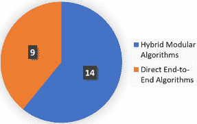

图 3：本文调查的算法分布

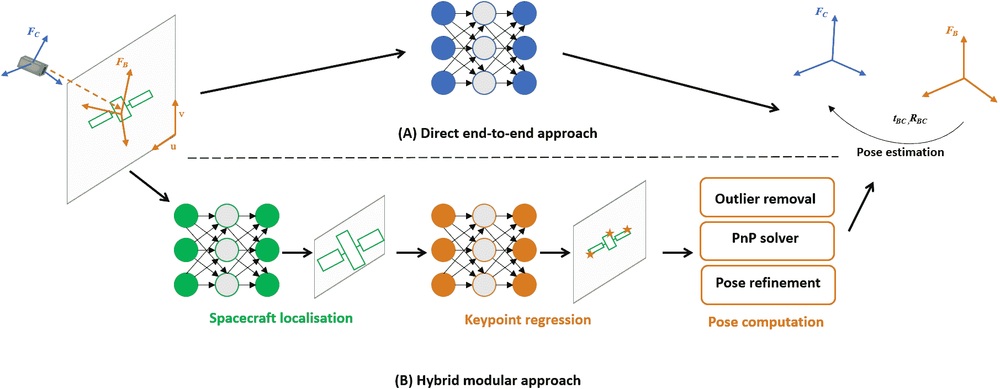

图 4：航天器姿态估计不同方法的示意图。A) 使用深度学习的直接端到端方法。B) 包含三步的混合模块化方法：目标检测/定位、关键点回归和姿态计算。前两步使用深度学习，第三步使用经典算法进行必要的异常值移除，以适应 PnP 求解器，最后进行姿态优化。

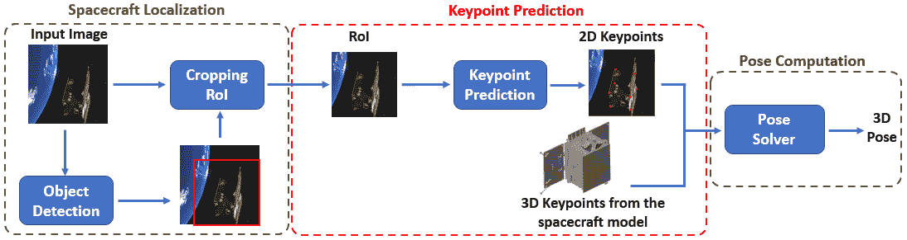

图 5：航天器姿态估计的混合模块化方法。航天器定位阶段以蓝色标出，关键点预测阶段为红色，姿态计算阶段为绿色。航天器图像来自 SPARK2 数据集，用于说明 [127]。

### 2.1 混合模块化方法

本综述定义混合方法为那些结合使用 DL 模型和经典计算机视觉方法进行航天器姿态估计的算法。混合算法有三个共同阶段（见图 5）：（1）航天器定位，用于检测和裁剪图像中的航天器区域，（2）关键点预测，用于预测裁剪区域内预定义的 3D 关键点的 2D 关键点位置，（3）姿态计算，用于从这些 2D-3D 对应关系中计算姿态。以下小节将详细描述每个阶段。

#### 2.1.1 航天器定位

图像中航天器的目标大小随着追踪器和目标航天器之间相对距离的变化而显著变化，如图 6 所示。这种尺度变化影响了姿态估计算法的性能[71]。航天器定位阶段使用深度学习（DL）目标检测框架，通过预测围绕对象（航天器）的边界框来检测航天器。这些边界框随后用于裁剪出图像中包含航天器的感兴趣区域（RoI）。提取的 RoI 随后在后续阶段处理中用于姿态估计。根据文献[64]，用于航天器定位的 DL 目标检测器可以分为两类：

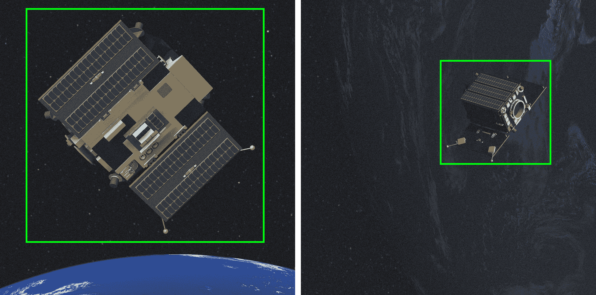

图 6：展示了捕获图像中航天器大小的变化。目标检测器预测的边界框显示为绿色。这些图像取自 SPARK2 [127] 数据集，展示了 Proba-2 航天器类别。

+   •

    多阶段目标检测器

+   •

    单阶段目标检测器

多阶段目标检测器：在这些检测器中，目标检测分为多个阶段进行。第一阶段生成区域提案，即包含目标可能性较高的图像区域。这些区域提案在第二阶段中进行细化和分类。这类检测器通常提供高度准确的检测结果。然而，由于其多阶段特性，它们在图像处理时间（高延迟）和参数数量上消耗较大，资源需求高。这在资源受限的场景中，特别是空间环境中可能会造成不利影响。Faster R-CNN [133] 和 Mask R-CNN [47] 是用于航天器定位的常用多阶段目标检测器。

单阶段目标检测器：这些检测器是轻量级检测器，参数数量减少，并且具有较低的实时检测延迟。YOLO [130]（及其衍生版本）、SSD [88] 和 MobileDet [182] 是在本调查中回顾的不同航天器姿态估计算法中应用的单阶段检测器。

在更广泛的计算机视觉文献中，还提出了其他几种目标检测器，这些检测器可以用于航天器定位。Zaidi 等人 [185] 和 Zou 等人 [186] 详细回顾了不同类别目标检测器及其特性。混合方法的模块化特性使得根据参数数量、资源利用率、延迟和实时推理等标准更容易替换姿态估计算法中的目标检测器。

#### 2.1.2 关键点预测

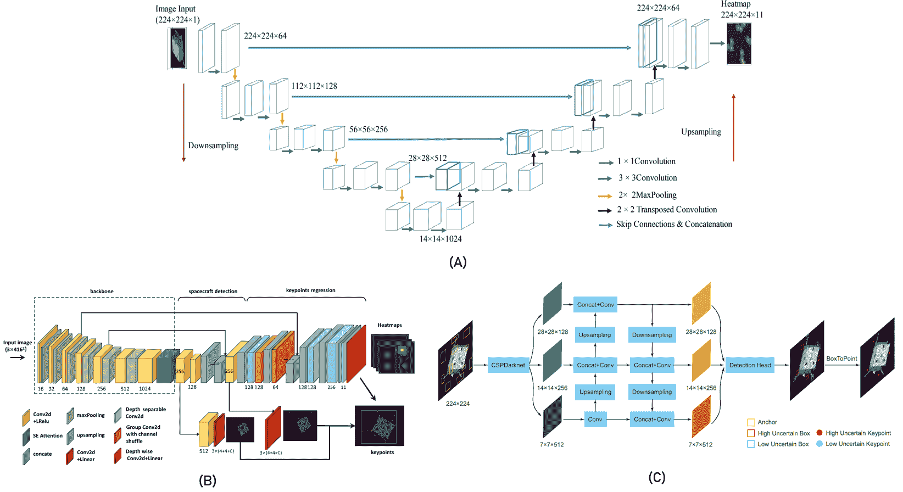

图 7： (A) 使用 ResNet-UNet 架构进行的关键点热图预测 [29] (B) 带有热图回归子网络的类似 YOLO 的 CNN 检测器 [60] (C) 将关键点预测形式化为关键点边界框检测问题 [81]。

在这一阶段，使用深度学习模型从包含航天器的裁剪区域中预测一组预定义 3D 关键点的 2D 投影（见 图 5）。3D 关键点通常由航天器的 CAD 模型定义。如果 CAD 模型不可用，可以使用多视角三角测量（如 [24] [123] [60]）或运动结构 (SfM) 技术 [46] 来重建包含 3D 关键点的航天器线框 3D 模型。

关键点位置回归：预测关键点的常见方法是直接回归关键点位置。Huan 等人 [58] 使用一个带有 HRNet[169] 主干的 CNN 回归模型，直接回归 2D 关键点位置为 $1\times 1\times 2M$ 向量，其中 $M$ 是关键点的数量。Park 等人 [115] 使用基于 YOLOv2[131] 的架构，配有仅 5.64M 参数的 MobileNetv2[142] 主干，用于回归关键点。模型的轻量化特性使其适合在航天硬件或边缘设备中部署。类似地，Lotti 等人 [92] 也提出了一种可部署的 CNN 回归模型用于关键点回归，主干为 EfficientNet-Lite [161]，该模型通过移除原始 EfficientNets[159] 中不适合移动应用（部署）的操作来获得。

分割驱动的方法：在[41]、[57]和[75]中，算法遵循 Hu 等人[56]提出的分割驱动方法来回归关键点位置，采用双头（分割和回归）网络结构和共享的骨干网络。输入图像被划分成网格，分割头将前景网格单元（包含航天器）与背景分离。回归头将每个关键点的位置预测为相对于每个网格单元中心的偏移量。只有来自前景（航天器）网格单元的预测会贡献于关键点位置的预测，从而提高预测的准确性。此外，[75]还提出了不同变体的关键点预测模型，这些变体具有较少的参数，使其适合用于空间硬件的部署。具有最低参数数量且能够实现足够关键点预测精度的模型使用了只有 7.8M 参数的 MobileNetv3[53]骨干网络。

热图预测：另一种关键点预测的方法是回归编码关键点位置概率的热图。通过从这些热图

边界框预测：最近，Li 等人[81] 将关键点预测公式化为关键点边界框检测问题。不是预测关键点位置或热图，而是预测关键点上的包围边界框及其置信度分数。作者使用了 CSPDarknet [13] CNN 主干网络，结合特征金字塔网络（FPN）[85] 进行多尺度特征提取，然后通过检测头进行关键点边界框检测（见 图 7-C）。类似的方法也用于 [172]。这里使用了反事实分析 [117] 框架生成 FPN，然后将其输入关键点检测器。

#### 2.1.3 姿态计算

最终阶段是使用 2D 关键点（来自关键点预测阶段）和相应的预定义 3D 点 [94] 计算航天器姿态。姿态计算过程中的一个重要步骤是去除错误预测的关键点，称为异常值，因为透视-$n$-点（P$n$P）[35] 求解器对异常值非常敏感。RANdom SAmple Consensus (RANSAC) [153] 算法通常用于去除异常值。IterativePnP [104] 和 EPnP [80] 是在不同混合算法中广泛使用的两个求解器。最近，Legrand 等人 [75] 将 P$n$P 求解器替换为多层感知机（MLP）网络架构，即姿态推断网络（PIN）[55]，用于从预测的关键点回归姿态。这使得姿态计算具有可微性，并且可以使用姿态损失函数进行训练。在最后一步中，通过优化几何损失函数 [67]（如关键点重投影误差 [23]）进一步细化估计的姿态。

### 2.2 直接端到端方法

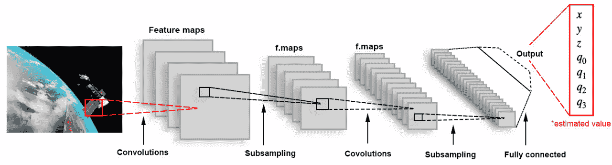

图 8: 用于 [119] 的网络架构。使用基于 GoogLeNet [157] 的 CNN 架构来回归 7D 姿态向量 $[x,y,z,q_{0},q_{1},q_{2},q_{3}]$。

在这项调查中，直接方法指的是仅使用一个深度学习模型以端到端的方式直接从图像中回归航天器姿态，而不依赖于中间阶段。这些模型使用姿态误差计算的损失函数进行训练。与混合算法不同，这种方法不需要除了真实姿态标签之外的任何额外信息，如相机参数或航天器的 3D 模型。相机参数在训练过程中由模型内在学习。

Phisannupawong 等人[119] 提出了基于 GoogLeNet 的[157] CNN 架构，用于回归 7D 姿态向量，表示位置和方向四元数（参见图 8）。该网络使用不同的损失函数进行训练，包括指数损失函数和加权欧几里得损失函数。实验结果表明，使用后者进行训练时网络性能更佳。然而，直接使用基于单位四元数的范数损失回归方向未能实现更高的准确度，导致较大的误差范围[124]。这主要是因为损失函数无法表示任何方向表示的实际角度距离。

Sharma 等人[145] 提出了将姿态空间本身离散化为姿态分类标签，通过沿四个自由度进行量化，如图 9 所示。两个自由度控制相机（相对于航天器）在包围球表面上的位置，一个自由度表示相机沿视轴角度的旋转，另一个自由度由相机与航天器的距离决定。使用基于 AlexNet 的[74] CNN 网络将航天器图像分类到这些离散的姿态标签类别中，训练使用 Softmax 损失函数[171]。然而，这受到需要学习的姿态分类标签总数的限制。更多的姿态标签将需要等量的神经元在最终的 softmax 层中，从而显著增加模型大小。此外，该方法提供了初步估计，并需要进一步的细化以产生更准确的姿态估计。

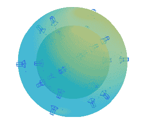

图 9：在[145]中使用的四个自由度下的姿态空间离散化示意图。两个自由度控制相机在包围球上的位置，一个自由度来自相机沿视轴方向的旋转，另一个自由度来自相机与航天器的距离。

为了克服这些局限性，Sharma 等人 [146] 后来提出了航天器姿态网络 (SPN)，这是一个具有五层 CNN 主干的模型，后跟三个不同的子分支（见 图 10）。第一个分支在输入图像中定位航天器并返回边界框。第二个分支根据离散类别的概率分布对目标方向进行分类。它最小化一组最接近方向标签的标准交叉熵损失。最后，第三个分支接受从前一个分支获得的候选方向类别标签，并最小化另一个交叉熵损失，以得出每个方向类别的相对权重。最终的精炼姿态通过对计算权重进行四元数平均来获得，这代表了一种软分类方法。然后，通过使用 Gauss-Newton 优化算法 [100] 从检测到的边界框和估计的方向施加的约束来估计位置。

类似的网络架构也被用于 [59]。一个带有 Squeeze-and-Excitation (SE) 模块 [54]的 ResNet50 模型 [48] 被用作特征提取的基础 CNN 网络。第一个子网络，即姿态预测子网络，通过软分类和误差四元数回归来估计方向。第二个姿态回归子网络，通过直接回归来预测航天器的位置。最后，物体检测子网络通过预测包围边界框来检测航天器。边界框用于验证位置和方向的预测。

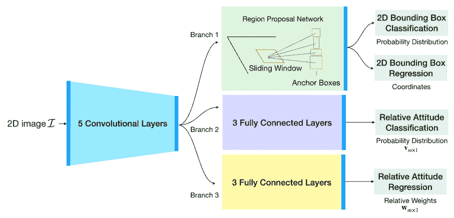

图 10: 用于航天器姿态估计的网络架构如 [146]所示。分支 1 定位航天器并输出边界框，分支 2 预测方向分类的概率分布，分支 3 回归每个方向类别的权重。

Proença 等人 [124] 提出了 URSONet，一种基于 ResNet 的骨干网络架构，随后是两个独立的分支用于位置和方向的估计（见 图 11）。位置估计通过一个具有两个全连接层的简单回归分支来进行，同时最小化损失函数中的相对误差。方向估计则提出了通过软分配编码的分类进行连续方向估计。每个地面真实标签在方向离散输出空间中被编码为一个高斯随机变量。然后，网络被训练以输出对应实际方向的概率质量函数。Poss 等人 [121] 提出了 Mobile-URSONet，这是一种适合移动部署的轻量化 URSONet 版本。ResNet 骨干被替换为 MobileNetv2 [142] 模型，子分支中的全连接层数量减少到一个（从两个减少）。这将参数数量减少到 2.2M 到 7.4M 范围，比 URSONet 小了 13 倍。此外，这一改进在性能上没有明显的下降。

最近，Park 等人 [110] 提出了 SPNv2，改进了原始 SPN [146] 以解决领域间差距问题。SPNv2 具有一个多尺度多任务网络架构，带有一个共享特征提取器，继承自 EfficientPose [16] 网络，该网络基于 EfficientDet [160] 特征编码器，包括 EfficientNet [159] 骨干和一个双向 FPN (BiFPN) [160] 用于多尺度特征融合。随后是多个预测头，用于学习的每个任务：航天器存在的二分类、边界框预测、目标位置和方向估计、关键点热图回归以及航天器前景的逐像素二分类分割。结果表明，联合多任务学习通过防止共享特征提取器学习任务特定特征，帮助领域泛化。作者还提出了一种在线领域细化 (ODR) 方法，使用目标领域图像（无标签）在航天器上进行。ODR 通过最小化 Shannon 熵 [144] 在分割任务预测头上对 SPNv2 进行细化。论文还展示了通过改变 EfficientNet 骨干中的参数数量而产生的不同算法变体。具有 3.8M 参数的最小变体在 SPEED+ 合成数据集上的性能与具有 52.5M 参数的最佳变体相当。

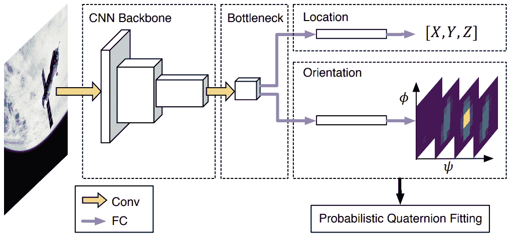

图 11: 用于航天器姿态估计的直接端到端方法。位置直接回归，方向通过软分类获得 [124]

.

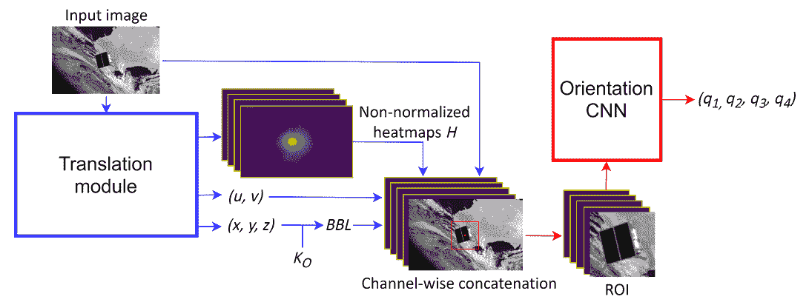

图 12: 用于航天器姿态估计的 LSPnet 架构 [38]

.

Garcia 等人 [38] 提出了一个具有两个 CNN 模块的网络架构：平移模块和方向模块，用于姿态估计（见 图 12）。平移模块采用 UNet 架构 [138] 预测目标的 3D 位置 $[x,y,z]$（来自中间特征嵌入层）以及图像中的 2D 航天器位置 $[u,v]$（来自最终热图输出）。然后，这些信息用于生成航天器的包围框，并裁剪出 RoI。方向模块使用 CNN 回归网络从裁剪出的 RoI 中预测航天器的方向 $[q_{0},q_{1},q_{2},q_{3}]$。

最后，Musallam 等人对其最先进的绝对姿态回归网络 E-PoseNet [103] 在 SPEED 数据集上进行了评估。该模型基于 PoseNet 架构 [69]，其中主干网络被 SE(2)-等变的 ResNet18 主干网络 [175] 替代。等变特征编码了更多关于输入图像的几何信息。此外，平面变换的等变性以一种有助于泛化的方式约束了网络，特别是由于权重共享。最后，与常规 ResNet 架构相比，旋转等变的 ResNet 在模型尺寸上显示出显著减少，以获得相同的特征尺寸。

### 2.3 算法比较

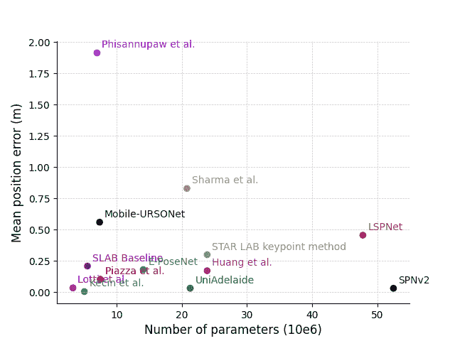

(a)

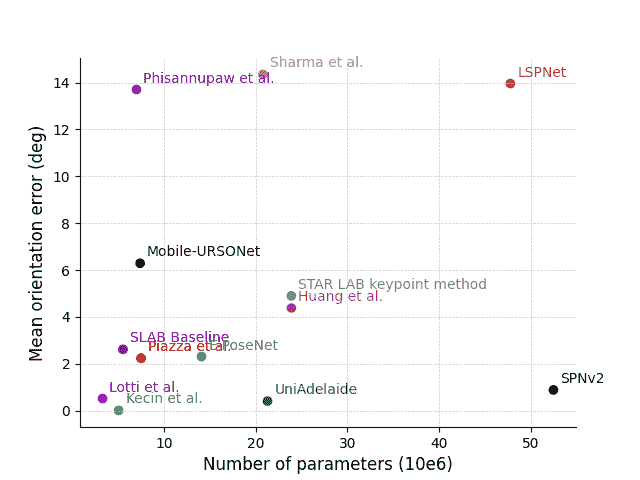

(b)

图 13: 姿态估计算法的参数数量与 (a) 位置误差和 (b) 方向误差的比较。

在本节中，不同的航天器姿态估计算法进行了比较。LABEL:table:hybrid_approach_review 和 表 2 分别总结了不同的混合算法和直接算法，并比较了所用的深度学习模型、总参数数量和姿态精度。姿态估计算法的性能以均值位置和方向误差来表示。位置误差计算公式为：

|  | $E_{t}=&#124;&#124;t_{\text{predicted}}-t_{\text{groundtruth}}&#124;&#124;_{2}$ |  | (1) |
| --- | --- | --- | --- |

方向误差计算公式为：

|  | $E_{R}=2*\mathrm{arccos}\left(&#124;<q_{\text{predicted}},q_{\text{groundtruth}}>&#124;\right)$ |  | (2) |
| --- | --- | --- | --- |

其中，$t_{\text{predicted}}$ 和 $t_{\text{groundtruth}}$ 分别是预测的和真实的位移向量，$q_{\text{predicted}}$ 和 $q_{\text{groundtruth}}$ 分别是预测的和真实的旋转四元数。$|<,>|$ 表示向量点积的绝对值，$\|_{2}$ 是欧几里得范数。在 SPEED [71] 合成测试集上报告了均值位置和方向误差值，具体情况见[71]。在其他情况下，报告了相应合成发布数据集上的误差值。类似地，在许多情况下，作者未报告其算法中的参数总数。在这种情况下，基于已知的主干模型和框架估算了参数的大致数量。本调查是首次尝试比较不同的基于深度学习的航天器姿态估计算法，在不同数据集上的性能和文献中可用信息的模型参数数量方面。

航天器姿态估计算法的一个关键方面是部署到边缘设备上以便在太空中使用。与常用的资源丰富的工作站不同，太空系统中的计算资源非常有限。因此，部署具有大量参数的大型深度学习模型是困难的。另一方面，使用参数较少的小型深度学习模型会导致性能下降。因此，需要在大型高性能模型和较小的可部署模型之间进行权衡。根据 LABEL:table:hybrid_approach_review 和 Table 2，Figure 13(b) 通过绘制算法性能与模型参数总数的关系图展示了这种权衡。结果表明，算法 [93, 120, 81] 和 SLAB 基线 [115] 在性能和参数数量方面提供了良好的权衡。

算法比较的另一个因素是方法本身的模块化特性。混合算法通过集成三个组件构建：航天器定位、关键点回归和姿态计算。这有助于在隔离的情况下对每个阶段进行优化和改进。例如，相机模型的变化可以被纳入姿态计算阶段，而无需重新训练定位和关键点回归模型。这为构建适用于不同姿态估计应用的算法提供了更多灵活性。相比之下，直接算法仅包括一个端到端训练的 DL 模型。要纳入如相机参数变化等变更，必须重新训练整个模型。

就方法之间的性能比较而言，ESA Kelvin 卫星姿态估计挑战赛（KSPEC’19）第一届的前 10 名方法的分析 [71] 显示，混合方法的表现相较于直接方法更为优越。混合和直接算法的均值位置误差分别为$0.0083\pm 0.0269$ m 和$0.0328\pm 0.0430$ m，均值姿态误差分别为$1.31\pm 2.24\degree$和$9.76\pm 18.51\degree$。对同一挑战赛（KSPEC’21）第二届的分析 [112] 也显示出类似的趋势。挑战赛中两个赛道的获胜算法都使用了混合方法。

### 2.4 限制

最近，开发了几种有前景的 DL 基础航天器姿态估计算法，使用了混合和直接两种方法。然而，这些算法仍存在若干需要考虑的局限性，并且有进一步改进的空间。本节重点讨论这些局限性。

#### 2.4.1 可部署性

可部署性是任何空间算法的关键方面。尽管在航天器姿态估计算法开发方面取得了近期进展，但部署仍然是一个重要的开放研究问题。当前算法在可部署性方面的局限性指的是在实际空间任务中实施这些算法所面临的挑战。

在目前的研究工作中，只有一小部分开发的算法在空间部署的边缘系统上进行了测试和评估 [93, 29, 172]。此外，作者们很少报告影响算法可部署性的因素，如延迟、推理时间、内存要求、功耗和计算成本。这些缺失的细节对于理解模型在资源受限环境（如具有有限计算能力的空间系统）中的可部署性是至关重要的 [45, 4]。

另一个限制是大量使用现成的深度学习模型和框架（参见 LABEL:table:hybrid_approach_review 和 表 2）。虽然这些现成的模型在工作站上表现良好，但由于多个原因，它们可能不适合用于空间部署。首先，这些模型设计用于资源丰富的系统，计算成本高，需要大量的处理能力和内存。其次，这些模型（或某些深度学习层）可能不被当前空间系统中使用的 AI 加速器支持，如基于 FPGA 的 [36, 77] 加速器。因此，需要建立专门为空间应用和硬件定制的算法架构。

#### 2.4.2 可解释性

可解释性指的是理解算法如何得出预测结果的能力，这是建立信任和确保关键应用（如空间任务）安全的重要因素。这使得错误分析和故障排除变得更加容易。目前基于深度学习的航天器姿态估计算法的一个关键限制是其缺乏可解释性。在直接方法中，深度学习模型的黑箱特性 [2] 使得解释错误和故障非常困难。相比之下，混合方法分阶段处理航天器姿态估计问题，提供了更好的可解释性。然而，这些算法仍然缺乏诸如推理 [82] 或建模输入数据与预测结果之间的不确定性 [167] 等能力。

#### 2.4.3 光照条件的鲁棒性

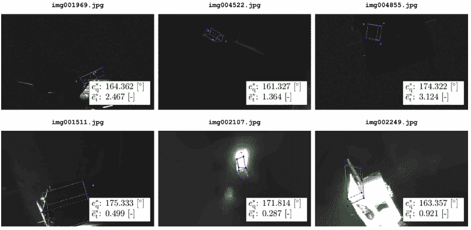

图 14：KSPEC’21 挑战中 stream-1 胜出方法在光箱（上排）和太阳灯（下排）图像上的最差 3 次预测的可视化 [112]。这些结果显示，在极端光照条件下，姿态估计的准确性（显示为绿色）显著下降，突显了基于视觉的航天器姿态估计算法的一个重要限制。

基于单目视觉的算法通常对光照条件的变化敏感。这可能会影响姿态估计的准确性和鲁棒性，特别是在太空中动态光照条件下。例如，阴影、反射和太阳眩光都可能产生视觉噪声，使得识别和跟踪航天器上的特征变得困难。最新版本的 KSPEC（KSPEC’21）[112]的结果（见图 14）分析表明，即使是最好的基于视觉的航天器姿态估计算法在极端光照条件下表现也不佳。

克服这些限制将需要在包括算法设计、边缘设备上的评估协议、传感器技术和环境因素建模等领域持续研究和开发。第四部分概述了航天器姿态估计算法开发的未来研究方向，以应对这些挑战。最后，任何基于深度学习的算法开发都无法离开数据集的问题，这包括训练和验证算法的需要。下一节（第三部分）详细讨论了航天器姿态估计数据集（第 3.1 节），重点讨论了领域差距问题（第 3.2 节）以及它们的局限性（第 3.3 节）。

表 1: 航天器姿态估计混合算法的总结。提供了物体检测器和关键点预测模型的详细信息（包括估计的参数数量）以及使用的姿态计算方法。报告了 SPEED 合成测试集上的平均位置和方向误差值（如有）。在作者未报告参数数量的情况下，提供了基于已知主干模型和框架的估计值。此外，公开可用算法的链接包含在 A.1 节 中。

| 参考 | 物体检测器 | 参数（百万） | 关键点预测 | 参数（百万） | 总参数（百万） | 姿态计算 | 平均位置误差 (E[t])           (m) | 平均方向误差 (E[R])           (deg) |
| --- | --- | --- | --- | --- | --- | --- | --- | --- |
| UniAdelaide [23] | 以 HRNet-W18-C[169] 作为主干的 Faster-RCNN [133] | $\sim$21.3* [155] | Pose-HRNet-W32 [154] | $\sim$28.5 [154] | $\sim$49.8 (176.2 [92]) | 通过 SA-LMPE 优化器优化的几何损失细化的 PnP + RANSAC | 0.0320^+ | 0.4100^+ |
| EPFL_cvlab [41] | 未应用 | -NA- | 以 DarkNet-53[132] 作为主干的 Yolov3 [132] 后接分割和回归解码器分支 | $\sim$59.1[90] | $\sim$59.1 (89.2 [92]) | EPnP [80] + RANSAC | 0.0730^+ | 0.9100^+ |
| SLAB 基线 [115] | 以 MobileNetV2[142] 作为主干的 YOLOv3 [132] | 5.53 | 以 MobileNetV2[142] 作为主干的 YOLOv2 [131] | 5.64 | 11.2 | EPnP | 0.2090^+ | 2.6200^+ |
| Huo 等 [60] | 具有检测子网络的 Tiny-YOLOv3 [132] 架构** | -NA- | 具有回归子网络的 Tiny-YOLOv3 [132] 架构** | -NA- | $\sim$0.89 | 通过 Levenberg-Marquardt 求解器优化的 Log-cosh 几何损失细化的 PnP+RANSAC [101] | 0.0320 | 0.6812 |
| Piazza 等 [120] | YOLOv5 | 7.5 | HRNet32 [154] | $\sim$28.6* [25] | $\sim$36.1 | 通过 Levenberg-Marquardt 求解器优化的几何损失细化的 EPnP | 0.1036 | 2.2400 |
| Huan 等 [58] | 以 HRNet 为主干的 Cascade Mask R-CNN [17] | -NA- | HRNet [154] | $\sim$28.5 到 $\sim$63.6 [154] | -NA- | 通过 Huber 风格几何损失优化的 EPnP 作为非线性最小二乘问题 | 0.1823 | 2.8723 |
| STAR LAB 关键点方法 [126] | Faster-RCNN [133]，以 RestNet50[48] 作为骨干 | $\sim$23.9* [78] | 采用 HRNet-W32[154] 作为骨干的 HigherHRNet [25] | $\sim$28.6* [25] | $\sim$54.2 | PnP + RANSAC | 0.3000 (URSO-OrViS 数据集) | 4.9000 (URSO-OrViS 数据集) |
| Black 等人 [12] | SSD [88] MobileNetV2[142] | -NA- | 采用 MobileNetV2[142] 作为骨干的 MobilePose [52] 架构 | -NA- | 6.9 | EPnP + RANSAC | 1.0800 (Cygnus 数据集) | 6.4500 (Cygnus 数据集) |
| Wide-Depth-Range [57] | 未应用 | -NA- | 采用 DarkNet-53[132] 作为骨干的 FPN [85] 架构 | 51.5 | 51.5 | PnP + RANAC，包含和不包含姿态细化策略 | -NA- | -NA- |
| Cosmas 等人 [29]† | YOLOv3 [132] | $\sim$59.1* [91] | ResNet34-UNet [48, 138] 架构 | $\sim$21.5* [79] | $\sim$80.6 | -NA- | -NA- | -NA- |
| Lotti 等人 [92]† | MobileDet [182] | 3.3 | 使用 EfficientNet-Lite [159] 骨干的回归头 | -NA- | 15.4 | 通过 Levenberg-Marquardt 解算器优化的 EPnP + RANSAC | 0.0340 | 0.5200 |
| Kecen 等人 [81]† | YOLOX-Tiny [40] | $\sim$5.06 [40] | 采用 CSPDarknet53[13] 作为骨干的 FPN [85] 架构 | $\sim$27.6 [13] | $\sim$32.66 | EPnP | 0.0049 | 0.0129 |
| CA-SpaceNet [172] | 未使用 | -NA- | 具有两个 DarkNet-53[132] 网络作为骨干的三个 FPN [85] 的关键点预测头 | -NA- | 51.29 M † | PnP | -NA- | -NA- |
| Legrand 等人 [75]† | 假设为理想的物体检测器 | -NA- | 预训练于 Linemod[49] 的 DarkNet-53 [132]，具有两个解码头 - 分割头和回归头 | 71.2 | -NA- | PIN 架构 [55] 包含一个 MLP，将每个关键点的局部特征聚合成一个单一表示 | 0.201 | 4.687 |

^+ 来自 KSPEC 第一版的结果 [71]

**物体检测器和关键点预测模型共享骨干网络**

†考虑的最佳表现变体

表 2：航天器姿态估计的直接端到端算法总结。提供了使用的网络架构的详细信息及估计的参数数量。报告了 SPEED 合成测试集上的误差值（如果可用）。在作者未报告参数数量的情况下，给出了基于所用骨干模型的估计参数数量。此外，A.1 节 包括了公开可用算法的链接。

| 参考文献 | 模型架构 | 参数      （百万） | 平均位置误差 (E[t])       （米） | 平均旋转误差 (E[R])       （度） |
| --- | --- | --- | --- | --- |
| Sharma 等人 [145]† | AlexNet [74]，每层的卷积核数为原始 AlexNet 架构的一半，最后一层全连接层的神经元数与姿态标签数相同 | $\sim$20.8 | 0.83 (Imitation-25 数据集) | 14.35 (Imitation-25 数据集) |
| SPN [146] | 5 层 CNN，具有 3 个子分支用于边界框分类和回归、相对方向分类和相对方向权重回归。 | -NA- | 0.7832 | 8.4254 |
| SPNv2 [110]† | 双向特征金字塔网络 (BiFPN) [160]，具有 EfficientNet [159] 骨干网，并具有由所有尺度上的特征共享的多任务头网络。 | 52.5 | 0.031 (SPEED+) | 0.885 (SPEED+) |
| URSONet [124] | ResNet18、ResNet34、ResNet50、ResNet101 [48] 基础网络，具有两个子分支网络，用于位置回归和通过软分类的概率方向估计。 | $\sim$11.4 至 $\sim$42.8 [78] ($\sim$500**) | 0.1450^+ | 2.4900^+ |
| Mobile-URSONet [121]† | 基于 MobileNet-v2 [142] 的网络，在 ImageNet [31] 上预训练，具有两个子分支用于位置回归和通过软分类的概率方向估计。 | 7.4 | 0.5600 | 6.2900 |
| LSPnet [38] | ResNet50 [48] 基础架构用于位置回归，后跟一个上采样 CNN 用于目标定位，以及第二个 ResNet50 用于方向回归。 | $\sim$47.8 [78] | 0.4560 | 13.9600 |
| Huang 等人 [59] | ResNet50 [48] 基础网络，具有 3 个子分支网络，用于目标检测、位置回归和方向软分类。 | $\sim$23.9 [78] | 0.1715 (URSO-OrViS 数据集) | 4.3820 (URSO-OrViS 数据集) |
| Phisannupawong et al. [119] | 一个修改版的 GoogLeNet [157]，作为通用姿态估计模型实现于 PoseNet[70]。原始 GoogLeNet 中的 softmax 分类器被仿射回归器替代，每个全连接层被修改为输出 7D 姿态向量。 | $\sim$7.0 | 1.1915^# (URSO-OrViS 数据集) | 13.7043^# (URSO-OrViS 数据集) |
| E-PoseNet [103] | PoseNet 架构 [69] 采用 SE(2)-等变 ResNet18 主干[175]。 | 14.1 | 0.1806 | 2.3073 |

†报告的最佳表现变体的详细信息

^+来自 KSPEC 第一版的结果 [71]。

**作者报告的最佳表现模型集的参数数量**

^#报告的中位数值

表 3：最近的航天器姿态估计数据集回顾，按年份排序。Syn/Lab/Space 列表示数据集中合成的、实验室的和空间中的图像数量。Spacecraft 列指定数据集中使用的航天器。分辨率列对应于图像的宽 x 高，单位为像素。I 列指示图像是 RGB (C) 还是灰度 (G)。Range 列指示相机与航天器之间的距离。Tools 列是生成合成数据所用渲染软件的列表。此外，公开数据集的链接包含在 Section A.2。

| 数据集 | 年份 | Syn/Lab/Space | 航天器 | 分辨率 | I | 范围 | 工具 |
| --- | --- | --- | --- | --- | --- | --- | --- |
| SHIRT [109] | 2022 | 5k/5k/- | Tango | 1920x1200 | G | $\leq$8m | OpenGL |
| SPARK2-Stream2 [127] | 2022 | 30k / 900 / - | Proba-2 | 1440 x 1080 | C | [1.5m,10m] | Blender |
| COSMO [93] | 2022 | 15k / - / - | COSMO-SkyMed | 1920 x 1200 | C | [36m,70m] | Blender |
| SwissCube [57] | 2021 | 50k / - / - | SwissCube | 1024 x 1024 | C | [0.1m, 1m] | Mitsuba 2 |
| SPEED+ [113] | 2021 | 60k / 10k / - | Tango | 1920 × 1200 | G | $\leq$ 10m | OpenGL |
| Cygnus [12] | 2021 | 20k / - / 540 | Cygnus | 1024 × 1024 | C | [35m,75m] | Blender |
| SPEED [71] | 2020 | 15k / 305 /- | Tango | 1920 × 1200 | G | [3m,40.5m] | OpenGL |
| URSO [124] | 2019 | 15k / - / - | Dragon, Soyuz | 1080 x 960 | C | [10m,40m] | Unreal Engine 4 |
| PRISMA12K [115] | 2019 | 12k / - / - | Tango | 752 x 580 | G | - | OpenGL |
| PRISMA12K-TR [115] | 2019 | 12k / - / - | Tango | 752 x 580 | G | - | OpenGL |
| Sharma et. al. [145] | 2018 | 500k / - / - | Tango | 227 x 227 | C | [3m,12m] | OpenGL |

## 3 个数据集

在航天器姿态估计中使用深度学习模型需要适当的训练，以实现空间应用所要求的强大性能。数据集的质量可能与设计有效的深度学习算法以达到预期性能一样，对深度学习模型的性能有影响。通常，使用包含各种应用场景的大型数据集[84, 140]来训练深度学习模型，这有助于它们在未见过的场景中良好地泛化。尽管深度学习算法正在向少样本[152]和零样本[18]学习发展，但高精度解决 6 自由度姿态预测问题仍然依赖于包含各种场景的大型数据集[134, 179]。

目前，缺乏公开的空间载荷图像数据集。这限制了深度学习模型的应用和验证，仅适用于实际空间图像可用的特定目标以及有限的操作场景。为了克服这一限制，图像渲染工具是生成逼真的空间载荷图像的首选方式，测试平台则被视为地面验证的方法。渲染工具帮助生成成千上万张图像，涵盖各种目标，并带有注释，适用于任何用户定义的应用，如物体检测、语义分割和 6 自由度姿态估计。这些生成工具还提供了很多灵活性，可以根据最终的使用案例调整参数，如相机模型、轨道照明条件等。

航天器姿态估计算法通常是基于视觉的导航系统的一部分，并在能够模拟轨道相对运动的专用测试平台上验证，如使用机器人臂[116, 108]或气垫[141]平台，模拟逼真的空间照明条件。在这些设施中使用的目标模型会根据各种因素，如设施的大小、模型的大小、应用场景等，进行缩放或保持原样。虽然合成图像可以大规模生产以满足任何需求，但测试平台场景生成的图像在某种程度上是有限的。它包括背景中的地球、太阳的准确位置、地球的反射率；这些特征使实验室/测试平台的图像与实际空间图像有所不同。

从上述讨论可以看出，航天器姿态估计涉及在开发、测试/验证和部署阶段处理来自三个领域（即合成、实验室和实际空间图像）的图像。DL 模型容易对训练领域特定的特征进行过拟合，这一挑战在文献中被称为领域间隔[34, 170]问题。因此，算法需要从数据的角度考虑领域泛化，以提升算法的最终性能。

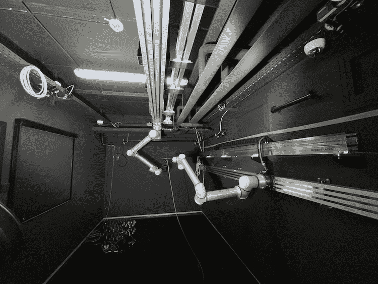

(a)

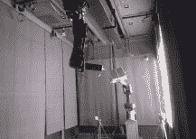

(b)

图 15: (a) 卢森堡大学的 SnT 零重力实验室 [116] (b) 斯坦福大学的 TRON 设施 [108]

### 3.1 数据集、模拟器与测试平台概述

本节总结了航天器姿态估计数据集、模拟器和用于合成图像生成的渲染工具，以及验证的测试平台。

数据集: 表 3 总结了主要航天器姿态估计数据集的属性。这些属性包括图像数量、目标航天器模型、图像分辨率、注释和用于合成图像生成的渲染工具。目前可用的航天器姿态估计数据集中的图像数量在$10^{4}$到$10^{5}$之间。这与用于其他机器学习任务（如图像分类和目标检测）的典型数据集相比相对较少。COCO [86] 数据集，作为目标检测的标准数据集之一，包含约 30 万张图像。ImageNet 数据集 [31] 主要用于分类，包含约 1400 万张图像。同样，YCB 数据集 [179]，一个近期用于 6 自由度姿态估计的通用数据集，包含约 13.3 万张图像。

数据集中使用的目标航天器模型在确定数据集特性中也起着至关重要的作用。例如，较小的目标尺寸将导致操作范围变小，反之亦然。多数据集中使用的 TANGO 卫星[33]模型，其粗略尺寸为 80×75×32cm，将导致操作范围约为 10m。然而，对于其他数据集中使用的 Soyuz 或 Cygnus 模型，操作范围将增加到 40 ~ 80m。类似的限制也适用于测试台数据。在 SPEED+ [113]中，TANGO 航天器的 1:1 模拟模型由于设施的尺寸限制，会导致实验室生成图像的范围较低。通常，缩放的模型被认为是增加测试台场景验证范围的解决方案。

注释的级别可能因数据集而异；对于航天器姿态估计应用，数据集中的每张图像必须用相应的 6 自由度姿态标签进行适当注释。表 3 中提到的所有数据集均已充分注释了 6DoF 姿态标签。然而，第 2.1 节中讨论的混合算法方法要求附加注释，如边界框和关键点。为了从姿态标签中恢复附加注释，需要对目标的边缘或顶点有 3D 信息。即使对于标准数据集如 SPEED [71] 和 SPEED+ [113]，使用混合方法的唯一方式是通过 3D 重建方法 [23] 恢复感兴趣关键点的 3D 位置。这些恢复的关键点将用于构建附加注释，如边界框、关键点、分割掩膜甚至椭圆热图注释 [39]。缺乏附加注释可能成为多任务学习方法中的问题，其中注释（如分割掩膜）可以用于定义辅助任务，以防止学习领域特定的特征，从而提高泛化能力 [110]。几种基于学习的方法正在发展，以生成附加注释以解决标签稀缺问题，如使用单张图像深度估计器的深度估计 [98] 和图像分割技术 [184]。一些自监督方法正作为获取图像中单个目标边界框注释的替代方法 [174]。虽然这些方法有助于注释，但它们不能替代在合成数据生成过程中记录的经过适当校准的注释。

模拟器和渲染工具：计算机图形学使我们能够基于高质量纹理使用**光线追踪**创建对象的逼真图像。光线追踪技术模拟了光线如何与现实世界互动，并依赖于评估和模拟从观察者摄像头到视野中物体的视线路径。这种模拟使得可以计算相关像素的光强度。针对太空应用的模拟器开发已做出了多项努力。在以往的任务中，逼真图像模拟工具被用来辅助空间/行星环境中的基于视觉的导航（如月球环境、陨石表面），其中包括由 Airbus 开发的 PANGU（行星和小行星自然场景生成工具）[95]和 SurRender [14]。邓迪大学开发了 PANGU 模拟工具，它生成行星和小行星的逼真、高质量的合成表面图像。PANGU 使用定制的基于 GPU 的渲染器来渲染场景。Airbus 的 Surrender 可以在两种图像渲染模式下使用，即光线追踪和 OpenGL[149]。它可以生成物理上准确的图像，提供已知的辐照度（每个像素包含以 W/m2 表示的辐照度值）。其他通用渲染工具，如 Blender [93]、Unreal Engine [124]和 Mitsuba [57]，也被用来生成合成图像。这些工具的主要问题在于它们是为通用使用设计的，并未针对太空图像进行定制。对合成图像渲染工具的简要比较见[128]。最近，已有努力[71]、[5]致力于开发专门用于生成空间飞行器姿态估计的合成图像的模拟工具。SPEED 和 SPEED+图像是使用光学模拟器[8]获得的，基于 OpenGL 渲染管道。SPEED 和 SPEED+的图像通过直方图比较[71]与 PRISMA 任务中的 TANGO 空间飞行器的真实图像进行验证。然而，据我们所知，目前尚无工具被认为是生成空间图像以进行空间飞行器姿态估计的**事实标准**。

测试平台：在航天器姿态估计中，从太空收集图像以训练和评估算法是极其困难且昂贵的。实验室测试平台（参见图 15）被视为一种替代方案，以复制相对运动和轨道光照条件。表 4 汇总了不同实验室测试平台的大小、操控能力、跟踪系统、感知传感器和轨道运动模拟。某些最先进的测试平台包括斯坦福大学太空对接实验室（SLAB）的对接和光学导航机器人测试平台（TRON）[108]，萨里大学的 STAR Lab[128]，卢森堡大学的 SnT 零重力实验室[116]，GMV Platform-Art[28, 42]，德国航空航天中心欧洲接近操作模拟器 2.0（DLR EPOS）[10]和欧洲航天局的 GNC 对接、接近和着陆模拟器（GRALS）[21]。这些测试平台通常配备机器人操控器来携带有效载荷。有效载荷可以是不同的目标航天器模型或模拟追踪器的安装相机。不同的照明设备被用于模拟太空条件。例如，在 SPEED+[113]中，使用太阳灯设置收集的图像复制了太阳的强光，而使用光箱设置收集的图像模拟了地球反照率的漫射光。运动捕捉系统被广泛使用，以基于附加在目标和相机上的反射标记收集姿态标签。然而，这些运动捕捉系统应该被仔细校准[108]以生成准确的地面真实数据，这可能是繁琐且耗时的。

下一节讨论了当前航天器姿态估计数据集的主要问题：用于训练的合成数据与用于测试/验证和部署基于深度学习的算法的实际实验室/太空图像之间的领域差距。

表 4：用于评估航天器姿态估计算法的不同实验室测试平台汇总

| 设施 | STAR Lab [128] | TRON [108] | SnT Zero-G Lab [116] | GMV Platform-Art^© [28][42] | DLR EPOS 2.0 [10] | GRALS [21] |
| --- | --- | --- | --- | --- | --- | --- |
| 照明 | • Forza 500 LED 聚光灯 | • LED 面板（用于散射光） • 金属卤化物弧灯（用于阳光） | • Godox SL-60 LED 视频灯 • Aputure LS 600d Pro | • 数控太阳模拟器 | • Osram ARRI Max 12/18（配有 12 kW 汞中弧碘化物灯） | • 可调光、均匀且准直的光源 |
| 感知传感器 | • FLIR Blackfly（单目相机） • 2D/3D LIDAR • Intel RealSense D435i（RGBD 相机） | • Point Grey Grasshopper 3（单目相机） | • FLIR Blackfly（单目相机） • Prophesee EKv4（事件相机） • Intel RealSense D435i（RGBD 相机） | • 光学导航相机 • 工业激光传感器 • 一套类似 GPS 的伪卫星 | • Prosilica GC-655M（CCD 相机） • PMDtec Camcube 3.0（PMD 相机） • Bluetechnix Argos3D-IRS1020 DLR 原型（PMD LiDAR） | • Prosilica GC2450（单目相机） |
| 操作臂（机器人臂） | • UR5 | • KUKA | • UR10e | • 三菱 PA10-6CE • KUKA KR150-2 | • KUKA KR100HA • KUKA KR240-2 | • KUKA • UR5 |
| 追踪系统 | Qualisys | Vicon | OptiTrack | 基于虚拟视觉伺服和 Kanade-Lucas-Tomasi (KLT)特征跟踪算法的模型跟踪算法 | 基于视觉的导航传感器系统（VIBANASS） | VICON |
| 背景材料 | 黑色背景幕布 | 吸光黑色指挥幕布 | 内外均为非反射黑色纺织品制成的百叶窗 | 完全覆盖墙壁和天花板的黑色帘子 | 用 Molton 材料制成的黑色帘子和其中一个机器人的黑色包裹 | 黑色背景幕布 |
| 模拟操作 | • 近距离 | • 对接 • 近距离 | • 近距离 • 对接 • 轨道维护操作 | • 对接 • 近距离 | • 对接 • 近距离 |
| 尺寸（WxLxH） | 3m×2m×2.5m | 8m×3m×3m（模拟室）和 6m（轨道） | 5m×3m×2.3m | 15m | 25m（轨道） | 4m |
| 支持 ROS [125] | 是 | -NA- | 是 | 否 | 否 | 否 |

### 3.2 弥合领域间隙

任何基于深度学习的算法在合成数据集上训练后，在真实图像（无论是在地面实验室还是在太空中获取的）上的测试表现都可能会下降，这被称为领域间隙问题[9]。根据相关计算机视觉术语，训练数据集来自源领域，而测试数据集属于目标领域。更微妙的是，即使真实的源数据集和目标数据集在不同的（实验室和太空）环境条件下获取，领域间隙仍然存在[165]。因此，为了确保基于深度学习的航天器姿态估计算法在实际太空任务中的可靠性能，弥合领域间隙至关重要。在航天器姿态估计文献中已经使用了几种方法来实现这一目标。这些方法被分为两类：

+   •

    数据级方法：通过应用不同的技术来改变图像，从而扩展或增加训练数据的多样性，例如 1) 数据增强[110] 或 2) 领域随机化[115]

+   •

    算法级方法：通过使用不同的技术来调整模型的学习过程，例如 3) 多任务学习[111] 或 4) 对抗学习[113]，使从图像中提取的特征尽可能减少领域依赖性

#### 3.2.1 数据增强

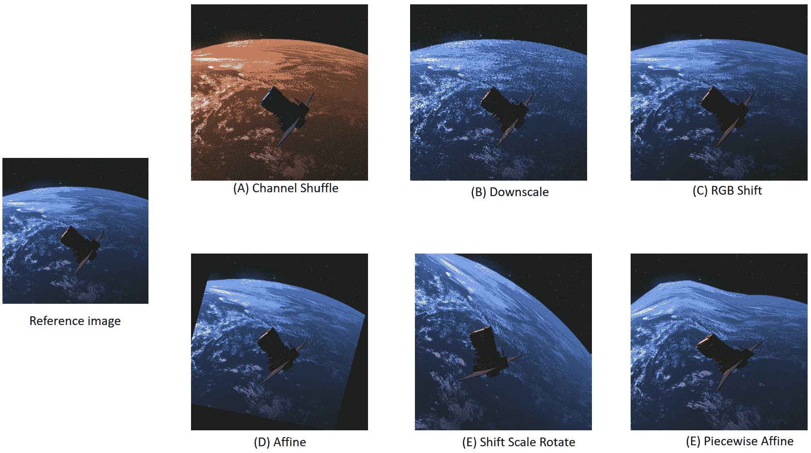

图 16：展示了在相同参考图像上使用的不同数据增强方法的示例，这些图像来自 SPARK2 [127] 数据集。图像 A、B 和 C 展示了像素级增强方法的示例，图像 D、E 和 F 展示了空间增强方法的应用。说明文字指的是 Albumentations Python 库使用的相应功能。

这涉及通过对现有数据应用各种变换来人工创建额外的训练数据[102]。这样做是为了增加训练集的大小和多样性，并使模型对输入数据中未见过的变化更具鲁棒性，即提高对未见领域的泛化能力。航天器姿态估计算法中使用的数据增强技术可以进一步分类为：

+   •

    像素级数据增强如模糊、噪声或改变图像对比度

+   •

    空间级数据增强如旋转或缩放

两种类别的主要区别在于它们对姿态标签的影响。像素级增强仅影响输入图像，而空间级增强需要同时修改输入图像和姿态标签，这可能很困难。图 16 展示了应用于 PROBA-2 航天器的参考图像的不同数据增强技术（像素级和空间级）。最终，尽管数据增强通常有助于解决领域差距问题，但也可能会出现数据增强适得其反的情况。例如，Park 等人使用的随机擦除增强[110] 被证明会导致姿态估计性能下降。因此，为特定上下文找到最佳的增强集合本身就是一项艰巨的任务[118]。表 5 提供了本文调查中使用的航天器姿态估计算法的数据增强方法的总结。

表 5：不同姿态估计算法使用的数据集和数据增强

| 算法 | 使用的数据集 | 应用的数据增强 |
| --- | --- | --- |
| EPFL_cvlab [41] | SPEED | 旋转，添加随机噪声，缩放和裁剪 |
| SLAB 基线 [115] | SPEED, PRISMA12K, PRISMA25 | 亮度和对比度的随机变化，随机翻转，90 度间隔旋转以及添加随机高斯噪声。同时，为了物体检测器训练，应用了 RoI 扩展和 RoI 平移。 |
| STAR LAB 关键点方法 [126] | SPEED, URSO-OrViS | 旋转、平移、粗略丢弃、添加高斯噪声、随机亮度和对比度变化，用于训练关键点预测网络 |
| Black et al. [12] | SPEED, Cygnus | 随机翻转、90 度旋转和裁剪应用于物体检测器训练。随机平移和扩展、随机翻转、90 度旋转、亮度、对比度和饱和度增强应用于关键点预测训练。 |
| Wide-Depth-Range [57] | SPEED, SwissCube | 随机位移、缩放和旋转 |
| LSPnet [38] | SPEED | 中心数据增强 |
| URSONet [124] | SPEED, URSO-OrViS | 图像曝光和对比度的变化，添加加性白高斯（AWG）噪声，模糊和丢弃补丁，随机相机方向扰动和随机平面旋转（仅适用于 SPEED 数据集） |
| Mobile-URSONet [121] | SPEED | 在滚动轴上进行随机旋转，最大幅度为 25 度，高斯模糊，随机变化亮度、对比度、饱和度和色调 |
| Huang et al. [59] | SPEED, URSO | 图像曝光和对比度的变化，添加 AWG 噪声，模糊和丢弃补丁，随机相机方向扰动和随机平面旋转（仅适用于 SPEED） |
| Lotti et al. [92] | SPEED, CPD | 随机图像旋转、边界框扩展和位移、随机亮度和对比度调整 |
| Kecen et al. [81] | SPEED | 与 SLAB 基线相同 |
| SPNv2 [110] | SPEED+ | 通过神经风格迁移、亮度和对比度、随机擦除、日光晕影、模糊（运动模糊、中值模糊、玻璃模糊）、噪声（高斯噪声、ISO 噪声）进行样式增强 |
| Sharma et al. [145] | PRISMA (Imitation-25) | 水平反射，添加均值为零的白噪声 |
| CA-SpaceNet [172] | SPEED, SwissCube | 随机位移、缩放和旋转 |
| Legrand et al. [75] | SPEED | 亮度和对比度的随机变化，高斯噪声增强，随机旋转和随机背景数据增强 |

#### 3.2.2 领域随机化

目标是通过在一组充分随机化的源数据上训练模型来帮助模型进行泛化，从而使目标领域对模型来说只不过是另一种随机化 [163]。因此，期望模型对领域差距的敏感性降低 [164]。在航天器姿态估计的背景下，领域随机化的一个示例见 [115]，其中使用了 [62] 中介绍的神经风格迁移（NST）技术对航天器纹理进行随机化。领域随机化可以看作是数据增强的一种特殊情况：它并不是寻找与特定背景相关的增强集合，而是寻找一个足够多样化的增强集合，使实际场景看起来只是另一种变体。

#### 3.2.3 多任务学习

在这种方法中，单一的深度学习模型被训练来同时执行多个相关任务（一个主要任务和若干次要/辅助任务）。这里的假设是，通过减少主任务引起的噪声，模型在主要任务（在这个背景下是航天器姿态估计）上会有更好的泛化。实现多任务学习的最常见方式是使用共享的骨干网络结构提取特征，并将这些特征传递给任务特定的层 [110]（见 图 17）。在这里，EfficientPose [16] 网络架构被修改，增加了两个头：一个用于航天器的分割，另一个用于计算与航天器上预定关键点相关的 2D 热图。结果表明，当模型用不同的头配置进行训练时，当所有任务头都启用时性能最佳，从而显示了多任务学习的有效性。然而，作者表明并不是所有的头都对性能贡献相同；分割头仅稍微改善了性能。这突出了多任务学习中的一个关键挑战：识别与特定主要任务相关的正确次要任务集合 [150]。

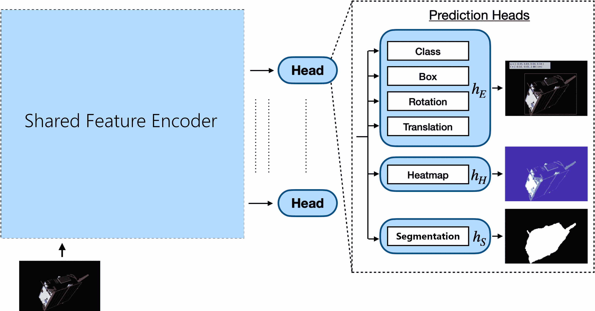

图 17：用于多任务学习的模型架构，其中一些层在所有任务之间共享，某些层专门用于特定任务。摘自 [110]。

#### 3.2.4 领域对抗学习

该技术[37]被应用于航天器姿态估计[113]以缩小领域差距。这里的目标是帮助模型学习那些对姿态估计任务具有领域不变性但具有辨别性的特征。一个领域分类器被附加到模型上，其目的是区分源领域和目标领域，并在学习阶段最大化其损失函数。这种方法的基本思想是，该分类器越无法区分源领域和目标领域，模型就越具有领域不变性。

### 3.3 限制

当前的数据集和评估程序仍不足以使基于深度学习的航天器姿态估计算法能够在空间任务中部署。我们在下面识别了关键的限制。

#### 3.3.1 合成数据集的逼真度

增加领域差距的一个因素是用于训练模型的合成图像的逼真度。在空间环境中渲染逼真图像是一个困难的问题，因为它涉及到模拟光线的行为及其与空间中各种材料和表面的互动。缺乏参考点和缺乏大气使得创建逼真的光照和阴影效果变得困难。要实现对空间的逼真描绘，计算机图形技术需要专门针对空间环境的独特属性进行调整。因此，如何渲染更逼真的合成空间图像是一个具有挑战性且开放的研究课题。

#### 3.3.2 算法评估

尽管已经有多次尝试来减轻合成图像与实验室图像之间的领域差距，但 2019 年（合成测试图像）和 2021 年（实验室测试图像）ESA 卫星姿态估计挑战赛中的最佳姿态得分之间仍存在一个数量级的差异[71, 113]。此外，确保一个在合成图像（源领域）上训练的算法在实验室图像（目标领域）上表现良好，并不保证其在空间图像上的性能水平会保持，主要是由于两个环境之间的领域差距。

## 4 未来研究方向

尽管在航天器姿态估计方面取得了近期进展，但在算法开发和数据生成（或收集）方面仍有改进空间。本节总结了开放的研究问题和该领域可能的未来方向。

### 4.1 算法的可部署性

开发航天器姿态估计算法的最终目标是将其部署到资源有限的空间硬件中。然而，大多数现有算法在工作站和大型服务器集群上进行测试，对基于 FPGA [36, 77] 或 GPU [72, 122, 15] 的边缘系统的评估非常有限。在这种背景下，本调查努力在所使用的深度学习模型中的参数数量（可以作为部署硬件资源消耗的度量）和算法性能之间进行权衡比较。然而，缺乏相关信息的报告使得这一点变得困难。在未来的工作中，作者报告更多的指标如大小、FLOPS 数量和延迟将会是估算算法可部署性的重要参考。

另一个未来方向是开发专门适合边缘 AI 加速器的全新深度学习模型。与常见的 Nvidia GPU 不同，空间系统的 AI 加速器仅支持有限数量的网络层和操作 [181]。具有不支持层的深度学习模型在这些设备上将难以工作。像**神经架构搜索（NAS）** [177] 这样的技术可以用于开发在空间系统中可部署的高效深度学习模型。

### 4.2 算法的可解释性

在实际应用中，算法的可解释性是确定其可靠性和可信度的关键因素。特别是在像太空这样的安全关键应用中，了解决策/预测的原因和过程非常重要。然而，深度学习模型的黑箱性质使其在解释推理过程和最终结果方面较弱。这使得在基于深度学习的航天器姿态估计中，尤其是直接端到端算法中，可解释性变得困难。最近，**可解释人工智能（XAI）** [44] 成为了一个热门研究主题，开发了新的方法 [3, 183]。其中一些提议的方法，如贝叶斯深度学习 [68] 或符合推断方法 [143, 1, 162] 可以应用于航天器姿态估计，提高其可解释性，这些都是未来研究的有趣方向。

### 4.3 多模态航天器姿态估计

目前大多数现有方法仅关注可见光范围的图像。然而，可见光相机在空间中很可能会遇到困难的采集条件（例如，低光照、过度曝光）。因此，需要考虑其他传感器，如热成像和时间飞行事件相机，以扩展经典计算机视觉方法的操作范围。到目前为止，仅有少数研究探讨了多模态在航天器姿态估计中的应用[63、136、51、137]，这是未来基于视觉的空间导航中的一个有趣方向。

### 4.4 生成更为真实的合成数据

正如 3 节中提到的，将机器学习应用于空间应用的主要问题是数据的缺乏。此外，普遍依赖合成数据是当前文献中面临的领域差距问题的根源。解决这个问题可以通过对渲染引擎图像与实际空间图像的深度分析来完成。这种分析的结果可以作为开发专门用于生成真实数据的渲染引擎的起点。据我们所知，PANGU[95]是目前唯一一个在这方面的项目。另一种模拟到现实的方式是向深度学习系统中引入一个物理信息层，例如在[76]中。这可能会使得卫星图像对光照条件具有不变性，而这些条件来自地球上复杂的光照和阴影效果，例如来自卫星自身、地球表面和月球表面的反射。

### 4.5 领域适应

将基于深度学习的姿态估计方法应用于空间中的主要障碍之一是，当模型在合成图像上训练并在真实图像上测试时的性能差距。ESA 姿态估计挑战赛的第二版[113]专门设计来解决这一挑战，包含一个合成训练数据集和两个实验室测试数据集。获胜的方法[112]利用了专门的学习方法，如自监督、多任务或对抗学习。随着生成更为真实的合成数据集用于训练，领域适应可能会在未来几年受到广泛关注，以克服领域差距问题。

### 4.6 超越特定目标的航天器姿态估计

当前算法一次估计一种类型的航天器的姿态。对于每增加一个航天器，需要生成新的数据集并重新训练算法。然而，随着每年发射的航天器数量的增加，前进的自然方式是开发更通用的算法，不受限于特定的航天器模型。特别是在诸如碎片清除等应用中，原始航天器结构可能会解体成在训练过程中未见过的几何形状。可以利用通用的 6D 姿态估计方法 [43] [106] 来开发与航天器无关的姿态估计算法。

### 4.7 多帧航天器姿态估计

多帧航天器姿态估计是指利用连续图像来确定航天器的姿态，从而利用时间信息。目前的航天器姿态估计算法将每帧图像视为孤立的，通过从单一图像帧中提取的信息来估计姿态。然而，在太空中，姿态估计算法通常用于自主导航等应用，其中可以获得一系列连续图像（轨迹）。因此，使用时间信息是提高姿态估计精度和生成时间一致姿态的关键。像 SPARK2 [127] 这样的数据集已经提供了作为轨迹的姿态估计数据。在这方面，最近提出的 ChiNet [137] 利用了长短期记忆（LSTM）[50] 单元来建模数据序列以估计航天器姿态。然而，在一般计算机视觉领域中，基于视频的 6 自由度姿态估计方法利用时间信息已有丰富的历史 [7, 6, 27]。未来，这些方法可以被纳入航天器姿态估计中，特别是用于航天器相关导航等应用。

## 5 结论

基于单目视觉的航天器姿态估计近年来通过深度学习取得了显著进展。然而，在这些算法应用于实际空间场景之前，仍然存在一些基本问题需要解决。本综述突出了这些局限性，包括算法设计和用于训练及验证/测试的数据集。为此，综述首先根据两种常见方法总结了现有算法：混合模块和直接端到端回归方法。对算法的性能及所使用的网络架构规模进行了比较，以帮助理解它们的可部署性。然后讨论了用于训练和验证/测试这些方法的航天器姿态估计数据集。还详细讨论了数据生成方法、模拟器和测试平台，以及用于解决领域差距问题的策略。最后，综述提供了未来研究方向，以解决这些局限性并开发可在实际空间任务中应用的航天器姿态估计算法。

## 附录 A 额外信息

### A.1 公开的算法实现

+   •

    [`github.com/BoChenYS/satellite-pose-estimation`](https://github.com/BoChenYS/satellite-pose-estimation) [23]

+   •

    [`indico.esa.int/event/319/attachments/3561/4754/pose_gerard_segmentation.pdf`](https://indico.esa.int/event/319/attachments/3561/4754/pose_gerard_segmentation.pdf) [41]

+   •

    [`github.com/cvlab-epfl/wide-depth-range-pose`](https://github.com/cvlab-epfl/wide-depth-range-pose) [57]

+   •

    [`github.com/tpark94/speedplusbaseline`](https://github.com/tpark94/speedplusbaseline) [115]

+   •

    [`github.com/pedropro/UrsoNet`](https://github.com/pedropro/UrsoNet) [124]

+   •

    [`github.com/possoj/Mobile-URSONet`](https://github.com/possoj/Mobile-URSONet) [121]

+   •

    [`github.com/tpark94/spnv2`](https://github.com/tpark94/spnv2) [110]

+   •

    [`github.com/Shunli-Wang/CA-SpaceNet`](https://github.com/Shunli-Wang/CA-SpaceNet) [172]

### A.2 公开数据集链接

+   •

    SHIRT: [`taehajeffpark.com/shirt/`](https://taehajeffpark.com/shirt/)

+   •

    SPARK2022: [`cvi2.uni.lu/spark2022/registration/`](https://cvi2.uni.lu/spark2022/registration/)

+   •

    SwissCube: [`github.com/cvlab-epfl/wide-depth-range-pose`](https://github.com/cvlab-epfl/wide-depth-range-pose)

+   •

    SPEED+: [`zenodo.org/record/5588480`](https://zenodo.org/record/5588480)

+   •

    SPEED: [`zenodo.org/record/6327547`](https://zenodo.org/record/6327547)

+   •

    URSO-OrViS: [`zenodo.org/record/3279632`](https://zenodo.org/record/3279632)

## 参考文献

+   Angelopoulos 和 Bates [2021] Angelopoulos, A.N., Bates, S., 2021. 对保形预测和无分布不确定性量化的温和介绍。arXiv 预印本 arXiv:2107.07511。

+   Azodi 等人 [2020] Azodi, C.B., Tang, J., Shiu, S.H., 2020. 打开黑箱：遗传学家的可解释机器学习。遗传学趋势 36, 442–455。

+   Bai 等人 [2021] Bai, X., Wang, X., Liu, X., Liu, Q., Song, J., Sebe, N., Kim, B., 2021. 可解释深度学习用于高效且鲁棒的模式识别：近期发展的综述。模式识别 120, 108102。

+   Baller 等人 [2021] Baller, S.P., Jindal, A., Chadha, M., Gerndt, M., 2021. Deepedgebench：在边缘设备上基准测试深度神经网络，见：2021 IEEE 云工程国际会议 (IC2E)，IEEE。pp. 20–30。

+   Bechini 等人 [2022] Bechini, M., Lunghi, P., Lavagna, M., 等, 2022. 通过单目图像处理进行航天器姿态估计：数据集生成与验证，见：第 9 届欧洲航空航天科学会议 (EUCASS 2022)，pp. 1–15。

+   Beedu 等人 [2022] Beedu, A., Alamri, H., Essa, I., 2022. 基于视频的物体 6D 姿态估计使用变换器。arXiv 预印本 arXiv:2210.13540。

+   Beedu 等人 [2021] Beedu, A., Ren, Z., Agrawal, V., Essa, I., 2021. Videopose：从视频中估计 6D 物体姿态。arXiv 预印本 arXiv:2111.10677。

+   Beierle 和 D’Amico [2019] Beierle, C., D’Amico, S., 2019. 变倍光学刺激器用于训练和验证空间视导导航。航天器与火箭期刊 56, 1060–1072。

+   Ben-David 等人 [2006] Ben-David, S., Blitzer, J., Crammer, K., Pereira, F., 2006. 领域适应的表示分析。神经信息处理系统进展 19。

+   Benninghoff 等人 [2017] Benninghoff, H., Rems, F., Risse, E.A., Mietner, C., 2017. 欧洲接近操作模拟器 2.0 (EPOS) - 一种基于机器人对接和对接模拟器。大型研究设施期刊 JLSRF 3, 107。

+   Biesbroek 等人 [2021] Biesbroek, R., Aziz, S., Wolahan, A., Cipolla, S.f., Richard-Noca, M., Piguet, L., 2021. Clearspace-1 任务：Esa 和 Clearspace 团队联手移除碎片，见：第 8 届欧洲空间碎片会议，pp. 1–3。

+   Black 等人 [2021] Black, K., Shankar, S., Fonseka, D., Deutsch, J., Dhir, A., Akella, M.R., 2021. 实时飞行准备的非合作航天器姿态估计，使用单目图像。arXiv 预印本 arXiv:2101.09553。

+   Bochkovskiy 等人 [2020] Bochkovskiy, A., Wang, C.Y., Liao, H.Y.M., 2020. Yolov4：物体检测的最佳速度和精度。arXiv 预印本 arXiv:2004.10934。

+   Brochard 等人 [2018] Brochard, R., Lebreton, J., Robin, C., Kanani, K., Jonniaux, G., Masson, A., Despré, N., Berjaoui, A., 2018. 使用 Surrender 软件进行空间场景的科学图像渲染。arXiv 预印本 arXiv:1810.01423。

+   Bruhn 等人 [2020] Bruhn, F.C., Tsog, N., Kunkel, F., Flordal, O., Troxel, I., 2020. 实现辐射容忍的异构 GPU 基于空间的板载数据处理。CEAS 空间期刊 12, 551–564。

+   Bukschat 和 Vetter [2020] Bukschat, Y., Vetter, M., 2020. Efficientpose：一种高效、准确且可扩展的端到端 6D 多目标姿态估计方法。arXiv 预印本 arXiv:2011.04307。

+   Cai 和 Vasconcelos [2018] Cai, Z., Vasconcelos, N., 2018. Cascade r-cnn：深入探讨高质量物体检测，在：IEEE 计算机视觉与模式识别会议论文集，页码 6154–6162。

+   Cao 等 [2020] Cao, W., Zhou, C., Wu, Y., Ming, Z., Xu, Z., Zhang, J., 2020. 超越计算机视觉的零样本学习研究进展，在：并行处理算法与架构：第 20 届国际会议，ICA3PP 2020，美国纽约市，2020 年 10 月 2–4 日，会议论文集，第二部分 20，Springer，页码 538–551。

+   Capuano 等 [2019] Capuano, V., Alimo, S.R., Ho, A.Q., Chung, S.J., 2019. 针对航天器姿态获取的单目特征提取方法，在：AIAA Scitech 2019 论坛，页码 2005。

+   Cassinis 等 [2019] Cassinis, L.P., Fonod, R., Gill, E., 2019. 单目姿态估计系统在非合作航天器相对导航中的鲁棒性和适用性综述。航空航天科学进展 110, 100548。

+   Cassinis 等 [2021] Cassinis, L.P., Menicucci, A., Gill, E., Ahrns, I., Fernandez, J.G., 2021. 基于 CNN 的单目姿态估计系统在非合作航天器上的地面验证，在：第八届欧洲空间碎片会议。

+   Chai 等 [2021] Chai, J., Zeng, H., Li, A., Ngai, E.W., 2021. 计算机视觉中的深度学习：新兴技术和应用场景的关键回顾。应用机器学习 6, 100134。

+   Chen 等 [2019a] Chen, B., Cao, J., Parra, A., Chin, T.J., 2019a. 基于深度标志回归和非线性姿态精化的卫星姿态估计，在：IEEE/CVF 国际计算机视觉会议 (ICCV) 论文集。

+   Chen 等 [2019b] Chen, B., Cao, J., Parra, A., Chin, T.J., 2019b. 基于深度标志回归和非线性姿态精化的卫星姿态估计，在：IEEE/CVF 国际计算机视觉会议论文集，页码 0–0。

+   Cheng 等 [2020] Cheng, B., Xiao, B., Wang, J., Shi, H., Huang, T.S., Zhang, L., 2020. Higherhrnet：面向自下而上的人体姿态估计的尺度感知表示学习，在：IEEE/CVF 计算机视觉与模式识别会议论文集，页码 5386–5395。

+   Ciaparrone 等 [2020] Ciaparrone, G., Sánchez, F.L., Tabik, S., Troiano, L., Tagliaferri, R., Herrera, F., 2020. 视频多目标跟踪中的深度学习：综述。神经计算 381, 61–88。

+   Clark 等 [2017] Clark, R., Wang, S., Markham, A., Trigoni, N., Wen, H., 2017. Vidloc：用于 6 自由度视频片段重定位的深度时空模型，在：IEEE 计算机视觉与模式识别会议论文集，页码 6856–6864。

+   Colmenarejo 等 [2019] Colmenarejo, P., Graziano, M., Novelli, G., Mora, D., Serra, P., Tomassini, A., Seweryn, K., Prisco, G., Fernandez, J.G., 2019. 垃圾清除技术的地面验证。《宇航学报》158, 206–219. URL: [`www.sciencedirect.com/science/article/pii/S0094576517312845`](https://www.sciencedirect.com/science/article/pii/S0094576517312845), doi:`doi.org/10.1016/j.actaastro.2018.01.026`。

+   Cosmas 和 Kenichi [2020] Cosmas, K., Kenichi, A., 2020. FPGA 在基于 CNN 的航天器姿态估计中用于地标定位的推断。航空航天 7, 159。

+   D’ 等 [2014] D’, S., Amico, N., Benn, M., Jørgensen, J.L., 2014. 从实际太空图像中估计不合作航天器的姿态。《国际空间科学与工程杂志》2, 171. URL: [`www.inderscience.com/link.php?id=60600`](http://www.inderscience.com/link.php?id=60600), doi:10.1504/IJSPACESE.2014.060600。

+   Deng 等 [2009] Deng, J., Dong, W., Socher, R., Li, L.J., Li, K., Fei-Fei, L., 2009. ImageNet：一个大规模层次图像数据库，见：2009 IEEE 计算机视觉与模式识别大会，IEEE. 第 248–255 页。

+   D’Amico 等 [2014] D’Amico, S., Benn, M., Jørgensen, J.L., 2014. 从实际太空图像中估计不合作航天器的姿态。《国际空间科学与工程杂志》5 2, 171–189。

+   [33] (ESA), E.S.A., 2010. Prisma 的 Tango 和 Mango 卫星。 [`www.esa.int/ESA_Multimedia/Images/2010/10/Prisma_s_Tango_and_Mango_satellites`](https://www.esa.int/ESA_Multimedia/Images/2010/10/Prisma_s_Tango_and_Mango_satellites)。访问时间：2023 年 4 月 5 日。

+   Fang 等 [2022] Fang, Y., Yap, P.T., Lin, W., Zhu, H., Liu, M., 2022. 无源无监督领域适应：综述。arXiv 预印本 arXiv:2301.00265。

+   Fischler 和 Bolles [1981] Fischler, M.A., Bolles, R.C., 1981. 随机采样一致性：一个用于模型拟合的范例及其在图像分析和自动制图中的应用。《计算机协会通讯》24, 381–395。

+   Furano 等 [2020] Furano, G., Meoni, G., Dunne, A., Moloney, D., Ferlet-Cavrois, V., Tavoularis, A., Byrne, J., Buckley, L., Psarakis, M., Voss, K.O., 等，2020. 在空间系统边缘使用人工智能：挑战与机遇。IEEE 航空航天与电子系统杂志 35, 44–56。

+   Ganin 等 [2016] Ganin, Y., Ustinova, E., Ajakan, H., Germain, P., Larochelle, H., Laviolette, F., Marchand, M., Lempitsky, V., 2016. 神经网络的领域对抗训练。《机器学习研究杂志》17, 2096–2030。

+   Garcia et al. [2021] Garcia, A., Musallam, M.A., Gaudilliere, V., Ghorbel, E., Al Ismaeil, K., Perez, M., Aouada, D., 2021. Lspnet：一种面向 2D 定位的航天器姿态估计神经网络，载于：IEEE/CVF 计算机视觉与模式识别会议论文集，pp. 2048–2056。

+   Gaudillière et al. [2023] Gaudillière, V., Pauly, L., Rathinam, A., Sanchez, A.G., Musallam, M.A., Aouada, D., 2023. 使用高斯隐式占用函数的三维感知物体定位。arXiv 预印本 arXiv:2303.02058。

+   Ge et al. [2021] Ge, Z., Liu, S., Wang, F., Li, Z., Sun, J., 2021. Yolox：超越 YOLO 系列的 2021 年版本。arXiv 预印本 arXiv:2107.08430。

+   Gerard [2019] Gerard, K., 2019. 基于分割的卫星姿态估计。技术报告。EPFL。在线获取：https://indico.esa.int/event….

+   GMV [2018] GMV, 2018. platform-art。 [`satsearch.co/services/gmv-platform-art-for-satellite-orbit-simulation`](https://satsearch.co/services/gmv-platform-art-for-satellite-orbit-simulation)。

+   Gou et al. [2022] Gou, M., Pan, H., Fang, H.S., Liu, Z., Lu, C., Tan, P., 2022. 未见物体的 6D 姿态估计：基准与基线。arXiv 预印本 arXiv:2206.11808。

+   Gunning et al. [2019] Gunning, D., Stefik, M., Choi, J., Miller, T., Stumpf, S., Yang, G.Z., 2019. Xai——可解释的人工智能。《科学机器人》，4，eaay7120。

+   Hadidi et al. [2019] Hadidi, R., Cao, J., Xie, Y., Asgari, B., Krishna, T., Kim, H., 2019. 描述深度神经网络在商业边缘设备上的部署，载于：2019 IEEE 国际工作负载特征研讨会（IISWC），IEEE。pp. 35–48。

+   Hartley and Zisserman [2003] Hartley, R., Zisserman, A., 2003. 计算机视觉中的多视角几何。剑桥大学出版社。

+   He et al. [2017] He, K., Gkioxari, G., Dollár, P., Girshick, R., 2017. Mask R-CNN，载于：IEEE 国际计算机视觉会议论文集，pp. 2961–2969。

+   He et al. [2016] He, K., Zhang, X., Ren, S., Sun, J., 2016. 图像识别的深度残差学习，载于：IEEE 计算机视觉与模式识别会议论文集，pp. 770–778。

+   Hinterstoißer et al. [2012] Hinterstoißer, S., Lepetit, V., Ilic, S., Holzer, S., Bradski, G.R., Konolige, K., Navab, N., 2012. 基于模型的训练、检测和无纹理三维物体在严重杂乱场景中的姿态估计，载于：亚洲计算机视觉会议。

+   Hochreiter and Schmidhuber [1997] Hochreiter, S., Schmidhuber, J., 1997. 长短期记忆。《神经计算》，9，1735–1780。网址：[`doi.org/10.1162/neco.1997.9.8.1735`](https://doi.org/10.1162/neco.1997.9.8.1735)，doi：10.1162/neco.1997.9.8.1735。

+   Hogan 等人 [2021] Hogan, M., Rondao, D., Aouf, N., Dubois-Matra, O., 2021. 使用卷积神经网络进行非合作航天器的相对姿态估计，基于热红外图像。CoRR abs/2105.13789。网址: [`arxiv.org/abs/2105.13789`](https://arxiv.org/abs/2105.13789), [arXiv:2105.13789](http://arxiv.org/abs/2105.13789)。

+   Hou 等人 [2020] Hou, T., Ahmadyan, A., Zhang, L., Wei, J., Grundmann, M., 2020. Mobilepose：针对未见物体的实时姿态估计，具有弱形状监督。arXiv 预印本 arXiv:2003.03522。

+   Howard 等人 [2019] Howard, A., Sandler, M., Chu, G., Chen, L.C., Chen, B., Tan, M., Wang, W., Zhu, Y., Pang, R., Vasudevan, V., 等, 2019. 寻找 Mobilenetv3，发表于：IEEE/CVF 国际计算机视觉会议论文集，第 1314--1324 页。

+   Hu 等人 [2018] Hu, J., Shen, L., Sun, G., 2018. 压缩与激励网络，发表于：IEEE 计算机视觉与模式识别会议论文集，第 7132--7141 页。

+   Hu 等人 [2020] Hu, Y., Fua, P., Wang, W., Salzmann, M., 2020. 单阶段 6D 物体姿态估计，发表于：IEEE/CVF 计算机视觉与模式识别会议论文集，第 2930--2939 页。

+   Hu 等人 [2019] Hu, Y., Hugonot, J., Fua, P., Salzmann, M., 2019. 基于分割的 6D 物体姿态估计，发表于：IEEE/CVF 计算机视觉与模式识别会议论文集，第 3385--3394 页。

+   Hu 等人 [2021] Hu, Y., Speierer, S., Jakob, W., Fua, P., Salzmann, M., 2021. 宽深度范围的 6D 物体姿态估计，发表于：IEEE/CVF 计算机视觉与模式识别会议论文集，第 15870--15879 页。

+   Huan 等人 [2020] Huan, W., Liu, M., Hu, Q., 2020. 基于深度学习的非合作航天器姿态估计，发表于：2020 年第 39 届中国控制会议（CCC），IEEE，第 3339--3343 页。

+   Huang 等人 [2021] Huang, H., Zhao, G., Gu, D., Bo, Y., 2021. 基于卷积神经网络的非模型单目姿态估计网络，针对非合作航天器。IEEE 传感器期刊 21, 24579--24590。

+   Huo 等人 [2020] Huo, Y., Li, Z., Zhang, F., 2020. 从单张空间图像中快速准确地估计航天器姿态，使用框可靠性和关键点存在判断。IEEE Access 8, 216283--216297。

+   Huynh [2009] Huynh, D.Q., 2009. 3D 旋转度量：比较与分析。数学成像与视觉期刊 35, 155--164。

+   Jackson 等人 [2018] Jackson, P.T.G., Abarghouei, A.A., Bonner, S., Breckon, T.P., Obara, B., 2018. 风格增强：通过风格随机化的数据增强。CoRR abs/1809.05375。网址: [`arxiv.org/abs/1809.05375`](http://arxiv.org/abs/1809.05375), [arXiv:1809.05375](http://arxiv.org/abs/1809.05375)。

+   Jawaid 等人[2022] Jawaid, M., Elms, E., Latif, Y., Chin, T.J., 2022. 为卫星姿态估计缩小空间领域差距的努力。网址：[`arxiv.org/abs/2209.11945`](https://arxiv.org/abs/2209.11945)，doi：[10.48550/ARXIV.2209.11945](https://doi.org/10.48550/ARXIV.2209.11945)。

+   Jiao 等人[2019] Jiao, L., Zhang, F., Liu, F., Yang, S., Li, L., Feng, Z., Qu, R., 2019. 基于深度学习的目标检测综述。《IEEE Access》7，128837--128868。

+   Jones [2018] Jones, H., 2018. 最近空间发射成本的大幅下降，第 48 届国际环境系统会议。

+   Kelsey 等人[2006] Kelsey, J., Byrne, J., Cosgrove, M., Seereeram, S., Mehra, R., 2006. 基于视觉的相对姿态估计用于自主对接和停靠，见：2006 年 IEEE 航天会议，第 20 页。doi：[10.1109/AERO.2006.1655916](https://doi.org/10.1109/AERO.2006.1655916)。

+   Kendall 和 Cipolla [2017] Kendall, A., Cipolla, R., 2017. 基于深度学习的相机姿态回归的几何损失函数，见：IEEE 计算机视觉与模式识别会议论文集，第 5974--5983 页。

+   Kendall 和 Gal [2017] Kendall, A., Gal, Y., 2017. 对于计算机视觉，贝叶斯深度学习需要哪些不确定性？《神经信息处理系统进展》30。

+   Kendall 等人[2015] Kendall, A., Grimes, M., Cipolla, R., 2015. PoseNet：一种用于实时 6 自由度相机重新定位的卷积网络，见：IEEE 国际计算机视觉会议（ICCV）论文集。

+   Kendall 等人[2015] Kendall, A., Grimes, M., Cipolla, R., 2015. PoseNet：一种用于实时 6 自由度相机重新定位的卷积网络。arXiv 电子预印本，arXiv:1505.07427[arXiv:1505.07427](http://arxiv.org/abs/1505.07427)。

+   Kisantal 等人[2020] Kisantal, M., Sharma, S., Park, T.H., Izzo, D., Märtens, M., D’Amico, S., 2020. 卫星姿态估计挑战：数据集、竞赛设计及结果。《IEEE 航天与电子系统汇刊》56，4083--4098。

+   Kosmidis 等人[2020] Kosmidis, L., Rodriguez, I., Jover, Á., Alcaide, S., Lachaize, J., Abella, J., Notebaert, O., Cazorla, F.J., Steenari, D., 2020. GPU4S：嵌入式 GPU 在太空中的最新项目更新。《微处理器与微系统》77，103143。

+   Kreisel [2002] Kreisel, J., 2002. 卫星在轨服务（OOS）：其潜在市场与影响，见：第七届 ESA 高级空间技术研讨会‘ASTRA’论文集。

+   Krizhevsky 等人[2012] Krizhevsky, A., Sutskever, I., Hinton, G.E., 2012. 使用深度卷积神经网络进行 Imagenet 分类。《ACM 通讯》60，84 -- 90。

+   [75] Legrand, A., Detry, R., De Vleeschouwer, C., . 端到端的神经网络航天器姿态估计与关键点的中间检测。

+   Lengyel 等人 [2021] Lengyel, A., Garg, S., Milford, M., van Gemert, J.C., 2021. 带有物理先验的零样本日夜领域适应, 在：IEEE/CVF 国际计算机视觉会议论文集, pp. 4399--4409。

+   Leon 等人 [2022] Leon, V., Lentaris, G., Soudris, D., Vellas, S., Bernou, M., 2022. 旨在利用 FPGA 和 ASIP 加速实现空间应用中的板载 AI/ML, 在：2022 IFIP/IEEE 第三十届国际超大规模集成会议 (VLSI-SoC), IEEE. pp. 1--4。

+   Leong 等人 [2020a] Leong, M.C., Prasad, D.K., Lee, Y.T., Lin, F., 2020a. 用于动作识别的有效时空学习的半卷积神经网络架构。应用科学 10, 557。

+   Leong 等人 [2020b] Leong, M.C., Prasad, D.K., Lee, Y.T., Lin, F., 2020b. 用于动作识别的有效时空学习的半卷积神经网络架构。应用科学 10, 557。

+   Lepetit 等人 [2009] Lepetit, V., Moreno-Noguer, F., Fua, P., 2009. Epnp: 一种准确的 O (N) 解决方案用于 PNP 问题。国际计算机视觉期刊 81, 155。

+   Li 等人 [2022] Li, K., Zhang, H., Hu, C., 2022. 基于学习的非合作航天器姿态估计及不确定性预测。航空航天 9. URL: [`www.mdpi.com/2226-4310/9/10/592`](https://www.mdpi.com/2226-4310/9/10/592), doi:10.3390/aerospace9100592。

+   Li 等人 [2018] Li, O., Liu, H., Chen, C., Rudin, C., 2018. 通过原型的深度学习案例推理：一种能够解释其预测的神经网络, 在：AAAI 人工智能会议论文集。

+   Li 等人 [2019] Li, W.J., Cheng, D.Y., Liu, X.G., Wang, Y.B., Shi, W.H., Tang, Z.X., Gao, F., Zeng, F.M., Chai, H.Y., Luo, W.B., 等, 2019. 航天器在轨服务（OOS）：工程进展回顾。航空航天科学进展 108, 32--120。

+   Lin 等人 [2014a] Lin, T., Maire, M., Belongie, S.J., Hays, J., Perona, P., Ramanan, D., Dollár, P., Zitnick, C.L., 2014a. Microsoft COCO: 语境中的常见物体, 在：Fleet, D.J., Pajdla, T., Schiele, B., Tuytelaars, T.（编辑）, 计算机视觉 - ECCV 2014 - 第十三届欧洲会议, 苏黎世, 瑞士, 2014 年 9 月 6-12 日, 论文集, 第五部分, Springer. pp. 740--755. URL: [`doi.org/10.1007/978-3-319-10602-1_48`](https://doi.org/10.1007/978-3-319-10602-1_48), doi:10.1007/978-3-319-10602-1_48。

+   Lin 等人 [2017] Lin, T.Y., Dollár, P., Girshick, R., He, K., Hariharan, B., Belongie, S., 2017. 用于目标检测的特征金字塔网络, 在：IEEE 计算机视觉与模式识别会议论文集, pp. 2117--2125。

+   Lin 等人 [2014b] Lin, T.Y., Maire, M., Belongie, S., Hays, J., Perona, P., Ramanan, D., Dollár, P., Zitnick, C.L., 2014b. Microsoft COCO: 语境中的常见物体, 在：计算机视觉--ECCV 2014: 第十三届欧洲会议, 苏黎世, 瑞士, 2014 年 9 月 6-12 日, 论文集, 第五部分 13, Springer. pp. 740--755。

+   Liu and Hu [2014] Liu, C., Hu, W., 2014. 使用单图像进行圆柱形航天器的相对姿态估计。IEEE 航空航天与电子系统交易 50，3036--3056。

+   Liu et al. [2016] Liu, W., Anguelov, D., Erhan, D., Szegedy, C., Reed, S., Fu, C.Y., Berg, A.C., 2016. SSD：单次检测多框检测器，收录于：欧洲计算机视觉会议，Springer，第 21--37 页。

+   Llorente et al. [2013] Llorente, J.S., Agenjo, A., Carrascosa, C., de Negueruela, C., Mestreau-Garreau, A., Cropp, A., Santovincenzo, A., 2013. Proba-3：精确编队飞行演示任务。宇航学报 82，38--46。

+   Long et al. [2020a] Long, X., Deng, K., Wang, G., Zhang, Y., Dang, Q., Gao, Y., Shen, H., Ren, J., Han, S., Ding, E., 等，2020a. Pp-yolo：一种有效且高效的物体检测器实现。arXiv 预印本 arXiv:2007.12099。

+   Long et al. [2020b] Long, X., Deng, K., Wang, G., Zhang, Y., Dang, Q., Gao, Y., Shen, H., Ren, J., Han, S., Ding, E., 等，2020b. Pp-yolo：一种有效且高效的物体检测器实现。arXiv 预印本 arXiv:2007.12099。

+   Lotti et al. [2022] Lotti, A., Modenini, D., Tortora, P., Saponara, M., Perino, M.A., 2022. 低功耗边缘 TPU 上的实时卫星姿态估计的深度学习。arXiv 电子版，arXiv:2204.03296[arXiv:2204.03296](http://arxiv.org/abs/2204.03296)。

+   Lotti et al. [2022] Lotti, A., Modenini, D., Tortora, P., Saponara, M., Perino, M.A., 2022. 低功耗边缘 TPU 上的实时卫星姿态估计的深度学习。arXiv 预印本 arXiv:2204.03296。

+   Marchand et al. [2015] Marchand, E., Uchiyama, H., Spindler, F., 2015. 增强现实中的姿态估计：实践调查。IEEE 可视化与计算机图形学交易 22，2633--2651。

+   Martin et al. [2019] Martin, I., Dunstan, M., Gestido, M.S., 2019. 用 pangu 进行未来太空任务的行星表面图像生成，收录于：第 2 届 RPI 太空成像研讨会，传感、估计与自动化实验室。

+   Marullo et al. [2022] Marullo, G., Tanzi, L., Piazzolla, P., Vezzetti, E., 2022. 从 2D 图像中估计 6D 物体位置：文献综述。多媒体工具与应用，1--39。

+   May [2021] May, C., 2021. 主动碎片移除市场的触发因素和影响。航空航天公司，太空政策与战略中心，技术报告，2021--01。

+   Mertan et al. [2022] Mertan, A., Duff, D.J., Unal, G., 2022. 单图像深度估计：概述。数字信号处理，103441。

+   Minaee et al. [2021] Minaee, S., Boykov, Y.Y., Porikli, F., Plaza, A.J., Kehtarnavaz, N., Terzopoulos, D., 2021. 使用深度学习的图像分割：综述。IEEE 模式分析与机器智能交易。

+   Mittelhammer et al. [2000] Mittelhammer, R.C., Judge, G.G., Miller, D.J., 2000. 计量经济学基础。剑桥大学出版社。

+   Moré [1978] Moré, J.J., 1978. Levenberg-Marquardt 算法：实现与理论，收录于：数值分析。Springer，第 105--116 页。

+   Mumuni 和 Mumuni [2022] Mumuni, A., Mumuni, F., 2022. 数据增强：现代方法的综合调查。《Array》16, 100258。URL: [`www.sciencedirect.com/science/article/pii/S2590005622000911`](https://www.sciencedirect.com/science/article/pii/S2590005622000911)，doi:[`doi.org/10.1016/j.array.2022.100258`](https://doi.org/10.1016/j.array.2022.100258)。

+   Musallam 等人 [2022] Musallam, M.A., Gaudillière, V., del Castillo, M.O., Al Ismaeil, K., Aouada, D., 2022. 利用等变特征进行绝对姿态回归，发表于：IEEE/CVF 计算机视觉与模式识别会议论文集，第 6876--6886 页。

+   [104] OpenCV. Perspective-n-point (pnp) 姿态计算。URL: [`docs.opencv.org/4.x/d5/d1f/calib3d_solvePnP.html`](https://docs.opencv.org/4.x/d5/d1f/calib3d_solvePnP.html)。

+   Opromolla 等人 [2017] Opromolla, R., Fasano, G., Rufino, G., Grassi, M., 2017. 合作与非合作航天器姿态确定技术的综述。航空航天科学进展 93, 53--72。

+   Park 等人 [2020] Park, K., Mousavian, A., Xiang, Y., Fox, D., 2020. Latentfusion：用于未见物体姿态估计的端到端可微重建和渲染，发表于：IEEE/CVF 计算机视觉与模式识别会议论文集，第 10710--10719 页。

+   Park 等人 [2019a] Park, K., Patten, T., Vincze, M., 2019a. Pix2pose：用于 6D 姿态估计的像素级坐标回归，发表于：IEEE/CVF 国际计算机视觉会议论文集，第 7668--7677 页。

+   Park 等人 [2021] Park, T.H., Bosse, J., D’Amico, S., 2021. 用于会合和光学导航的机器人测试平台：多源标定和机器学习应用。arXiv 预印本 arXiv:2108.05529。

+   Park 和 D’Amico [2022a] Park, T.H., D’Amico, S., 2022a. 基于自适应神经网络的无味卡尔曼滤波器用于航天器会合跟踪。arXiv 预印本 arXiv:2206.03796。

+   Park 和 D’Amico [2022b] Park, T.H., D’Amico, S., 2022b. 适用于跨领域差距的航天器姿态估计的稳健多任务学习和在线优化。arXiv 预印本 arXiv:2203.04275。

+   Park 和 D’Amico [2023] Park, T.H., D’Amico, S., 2023. 适用于跨领域差距的航天器姿态估计的稳健多任务学习和在线优化。《空间研究进展》 URL: [`www.sciencedirect.com/science/article/pii/S0273117723002284`](https://www.sciencedirect.com/science/article/pii/S0273117723002284)，doi:[`doi.org/10.1016/j.asr.2023.03.036`](https://doi.org/10.1016/j.asr.2023.03.036)。

+   Park 等人 [2023a] Park, T.H., Märtens, M., Jawaid, M., Wang, Z., Chen, B., Chin, T.J., Izzo, D., D’Amico, S., 2023a. 卫星姿态估计竞赛 2021：结果与分析。《航天学报》。

+   Park 等 [2023b] Park, T.H., Märtens, M., Jawaid, M., Wang, Z., Chen, B., Chin, T.J., Izzo, D., D’Amico, S., 2023b. 卫星姿态估计竞赛 2021：结果与分析。Acta Astronautica 204, 640--665。网址：[`www.sciencedirect.com/science/article/pii/S0094576523000048`](https://www.sciencedirect.com/science/article/pii/S0094576523000048)，doi：[`doi.org/10.1016/j.actaastro.2023.01.002`](https://doi.org/10.1016/j.actaastro.2023.01.002)。

+   Park 等 [2019b] Park, T.H., Sharma, S., D’Amico, S., 2019b. 朝着强健的基于学习的非合作航天器姿态估计。arXiv 预印本 arXiv:1909.00392。

+   Park 等 [2019c] Park, T.H., Sharma, S., D’Amico, S., 2019c. 朝着强健的基于学习的非合作航天器姿态估计。arXiv 预印本 arXiv:1909.00392。

+   Pauly 等 [2022] Pauly, L., Jamrozik, M.L., Del Castillo, M.O., Borgue, O., Singh, I.P., Makhdoomi, M.R., Christidi-Loumpasefski, O.O., Gaudilliere, V., Martinez, C., Rathinam, A., 等，2022. 从空间实验室中汲取的经验——图像采集的视角。arXiv 预印本 arXiv:2208.08865。

+   Pearl 和 Mackenzie [2018] Pearl, J., Mackenzie, D., 2018. 《为何之书：因果关系的新科学》。Basic books。

+   Peng 等 [2018] Peng, X., Tang, Z., Yang, F., Feris, R.S., Metaxas, D., 2018. 联合优化数据增强和网络训练：在人类姿态估计中的对抗性数据增强，发表于：IEEE 计算机视觉与模式识别会议论文集，页码 2226--2234。

+   Phisannupawong 等 [2020] Phisannupawong, T., Kamsing, P., Torteeka, P., Channumsin, S., Sawangwit, U., Hematulin, W., Jarawan, T., Somjit, T., Yooyen, S., Delahaye, D., 等，2020. 基于视觉的航天器姿态估计通过深度卷积神经网络用于非合作对接操作。Aerospace 7, 126。

+   Piazza 等 [2021] Piazza, M., Maestrini, M., Di Lizia, P., 等，2021. 基于深度学习的单目相对姿态估计非合作航天器，发表于：第八届欧洲空间碎片会议，ESA/ESOC，ESA。页码 1--13。

+   Posso 等 [2022] Posso, J., Bois, G., Savaria, Y., 2022. Mobile-ursonet：一种嵌入式神经网络用于航天器姿态估计。arXiv 预印本 arXiv:2205.02065。

+   Powell 等 [2018] Powell, W., Campola, M., Sheets, T., Davidson, A., Welsh, S., 2018. 商用现成 GPU 在太空应用中的认证。技术报告。

+   Price 和 Yoshida [2021] Price, A., Yoshida, K., 2021. 单目姿态估计案例研究：hayabusa2 minerva-ii2 部署，发表于：IEEE/CVF 计算机视觉与模式识别会议论文集，页码 1992--2001。

+   Proença 和 Gao [2020] Proença, P.F., Gao, Y., 2020. 从逼真渲染中进行航天器姿态估计的深度学习，发表于：2020 IEEE 国际机器人与自动化会议 (ICRA)，IEEE。页码 6007--6013。

+   Quigley 等 [2009] Quigley, M., Conley, K., Gerkey, B., Faust, J., Foote, T., Leibs, J., Wheeler, R., Ng, A.Y., 等, 2009. Ros: 一个开源机器人操作系统, 载于: ICRA 开源软件研讨会, 神户, 日本. 第 5 页。

+   Rathinam 和 Gao [2020] Rathinam, A., Gao, Y., 2020. 使用单目视觉和卷积神经网络进行已知目标附近的在轨相对导航, 载于: 国际人工智能、机器人与空间自动化研讨会 (iSAIRAS), 虚拟会议 (帕萨迪纳，加州：), 第 1--6 页。

+   Rathinam 等 [2022] Rathinam, A., Gaudilliere, V., Mohamed Ali, M.A., Ortiz Del Castillo, M., Pauly, L., Aouada, D., 2022. SPARK 2022 数据集：航天器检测和轨迹估计。网址: [`doi.org/10.5281/zenodo.6599762`](https://doi.org/10.5281/zenodo.6599762)，doi: 10.5281/zenodo.6599762。

+   Rathinam 等 [2021] Rathinam, A., Hao, Z., Gao, Y., 2021. 用于航天器在轨操作的自主视觉导航, 载于: 空间机器人和自主系统：技术、进展与应用. 工程技术学会, 第 125--157 页。网址: [`doi.org/10.1049/PBCE131E_ch5`](https://doi.org/10.1049/PBCE131E_ch5)。

+   Redd [2020] Redd, N.T., 2020. 让卫星重生：任务扩展车辆为失效航天器带来新生 - [新闻]。IEEE Spectrum 57, 6--7。doi: 10.1109/MSPEC.2020.9150540。

+   Redmon 等 [2016] Redmon, J., Divvala, S., Girshick, R., Farhadi, A., 2016. 你只需看一次：统一的实时目标检测, 载于: IEEE 计算机视觉与模式识别会议论文集, 第 779--788 页。

+   Redmon 和 Farhadi [2017] Redmon, J., Farhadi, A., 2017. Yolo9000: 更好、更快、更强, 载于: IEEE 计算机视觉与模式识别会议论文集, 第 7263--7271 页。

+   Redmon 和 Farhadi [2018] Redmon, J., Farhadi, A., 2018. Yolov3: 一项渐进式改进。arXiv 预印本 arXiv:1804.02767。

+   Ren 等 [2015] Ren, S., He, K., Girshick, R., Sun, J., 2015. Faster r-cnn: 向实时目标检测迈进，使用区域提议网络。神经信息处理系统进展 28。

+   Rennie 等 [2016] Rennie, C., Shome, R., Bekris, K.E., Souza, A.F.D., 2016. 用于改进基于 RGBD 的目标检测和姿态估计的仓库数据集。IEEE 机器人自动化通讯. 1, 1179--1185。网址: [`doi.org/10.1109/LRA.2016.2532924`](https://doi.org/10.1109/LRA.2016.2532924)，doi: 10.1109/LRA.2016.2532924。

+   Rondao 和 Aouf [2018] Rondao, D., Aouf, N., 2018. 用于航天器相对导航的多视角单目姿态估计, 载于: 2018 AIAA 指导、导航和控制会议, 第 2100 页。

+   Rondao 等 [2021] Rondao, D., Aouf, N., Richardson, M.A., 2021. Chinet: 深度递归卷积学习用于多模态航天器姿态估计。CoRR abs/2108.10282。网址：[`arxiv.org/abs/2108.10282`](https://arxiv.org/abs/2108.10282)，[arXiv:2108.10282](http://arxiv.org/abs/2108.10282)。

+   Rondao 等 [2022] Rondao, D., Aouf, N., Richardson, M.A., 2022. Chinet: 深度递归卷积学习用于多模态航天器姿态估计。IEEE 航空航天与电子系统学报。

+   Ronneberger 等 [2015] Ronneberger, O., Fischer, P., Brox, T., 2015. U-net: 用于生物医学图像分割的卷积网络，见：国际医学图像计算与计算机辅助干预会议，Springer。第 234--241 页。

+   Ruder [2017] Ruder, S., 2017. 深度神经网络中的多任务学习概述。arXiv 预印本 arXiv:1706.05098。

+   Russakovsky 等 [2015] Russakovsky, O., Deng, J., Su, H., Krause, J., Satheesh, S., Ma, S., Huang, Z., Karpathy, A., Khosla, A., Bernstein, M.S., Berg, A.C., Fei-Fei, L., 2015. ImageNet 大规模视觉识别挑战。计算机视觉国际期刊 115, 211--252。网址：[`doi.org/10.1007/s11263-015-0816-y`](https://doi.org/10.1007/s11263-015-0816-y)，doi：[10.1007/s11263-015-0816-y](https://doi.org/10.1007/s11263-015-0816-y)。

+   Sabatini 等 [2015] Sabatini, M., Palmerini, G.B., Gasbarri, P., 2015. 用于视觉导航和控制的测试平台，特别是在空间对接操作期间。宇航学报 117, 184--196。网址：[`www.sciencedirect.com/science/article/pii/S0094576515003070`](https://www.sciencedirect.com/science/article/pii/S0094576515003070)，doi：[`doi.org/10.1016/j.actaastro.2015.07.026`](https://doi.org/10.1016/j.actaastro.2015.07.026)。

+   Sandler 等 [2018] Sandler, M., Howard, A., Zhu, M., Zhmoginov, A., Chen, L.C., 2018. Mobilenetv2: 反向残差和线性瓶颈，见：IEEE 计算机视觉与模式识别会议论文集，第 4510--4520 页。

+   Shafer 和 Vovk [2008] Shafer, G., Vovk, V., 2008. 关于保形预测的教程。机器学习研究期刊 9。

+   Shannon [1948] Shannon, C.E., 1948. 通信的数学理论。贝尔系统技术期刊 27, 379--423。

+   Sharma 等 [2018a] Sharma, S., Beierle, C., D’Amico, S., 2018a. 使用卷积神经网络进行非合作性航天器对接的姿态估计，见：2018 IEEE 航空会议，IEEE。第 1--12 页。

+   Sharma 和 D’Amico [2019] Sharma, S., D’Amico, S., 2019. 使用神经网络进行非合作性对接的姿态估计。arXiv 预印本 arXiv:1906.09868。

+   Sharma 等 [2018b] Sharma, S., Ventura, J., D’Amico, S., 2018b. 强健的基于模型的单目姿态初始化用于非合作性航天器对接。航天器与火箭学报 55, 1414--1429。

+   Shi et al. [2016] Shi, J., Ulrich, S., Ruel, S., 2016. 使用单目相机进行航天器姿态估计，见：第 67 届国际宇航大会，瓜达拉哈拉。

+   Shreiner et al. [2009] Shreiner, D., Group, B.T.K.O.A.W., 等，2009. OpenGL 编程指南：学习 OpenGL 的官方指南，版本 3.0 和 3.1。Pearson Education。

+   Shui et al. [2019] Shui, C., Abbasi, M., Robitaille, L.É., Wang, B., Gagné, C., 2019. 在多任务学习中学习任务相似性的原则性方法。arXiv 预印本 arXiv:1903.09109。

+   Song et al. [2022a] Song, J., Rondao, D., Aouf, N., 2022a. 基于深度学习的航天器相对导航方法：综述。《宇航学报》191，22--40 页。

+   Song et al. [2022b] Song, Y., Wang, T., Mondal, S.K., Sahoo, J.P., 2022b. 少样本学习的全面综述：演变、应用、挑战与机遇。arXiv 预印本 arXiv:2205.06743。

+   Strutz [2011] Strutz, T., 2011. 数据拟合与不确定性：加权最小二乘法及其扩展的实用介绍。Springer。

+   Sun et al. [2019a] Sun, K., Xiao, B., Liu, D., Wang, J., 2019a. 用于人体姿态估计的深度高分辨率表示学习，见：IEEE/CVF 计算机视觉与模式识别会议论文集，第 5693--5703 页。

+   Sun et al. [2019b] Sun, K., Zhao, Y., Jiang, B., Cheng, T., Xiao, B., Liu, D., Mu, Y., Wang, X., Liu, W., Wang, J., 2019b. 用于标记像素和区域的高分辨率表示。arXiv 预印本 arXiv:1904.04514。

+   [156] 瑞典，O.，Prisma。[`www.ohb-sweden.se/space-missions/prisma`](https://www.ohb-sweden.se/space-missions/prisma)。访问时间：2023 年 4 月 5 日。

+   Szegedy et al. [2015] Szegedy, C., Liu, W., Jia, Y., Sermanet, P., Reed, S., Anguelov, D., Erhan, D., Vanhoucke, V., Rabinovich, A., 2015. 通过卷积深入研究，见：IEEE 计算机视觉与模式识别会议论文集，第 1--9 页。

+   Szeliski [2022] Szeliski, R., 2022. 计算机视觉：算法与应用。Springer Nature。

+   Tan and Le [2019] Tan, M., Le, Q., 2019. Efficientnet: 重新思考卷积神经网络的模型缩放，见：国际机器学习会议，PMLR，第 6105--6114 页。

+   Tan et al. [2020] Tan, M., Pang, R., Le, Q.V., 2020. Efficientdet: 可扩展且高效的物体检测，见：IEEE/CVF 计算机视觉与模式识别会议论文集，第 10781--10790 页。

+   [161] Tensorflow，Tpu/models/official/efficientnet/lite at master · tensorflow/tpu。网址：[`github.com/tensorflow/tpu/tree/master/models/official/efficientnet/lite`](https://github.com/tensorflow/tpu/tree/master/models/official/efficientnet/lite)。

+   Tibshirani et al. [2019] Tibshirani, R.J., Foygel Barber, R., Candes, E., Ramdas, A., 2019 年。在协变量偏移下的符合预测，见：Wallach, H., Larochelle, H., Beygelzimer, A., d'Alché-Buc, F., Fox, E., Garnett, R. (编辑)，《神经信息处理系统进展》，Curran Associates, Inc. 网址：[`proceedings.neurips.cc/paper/2019/file/8fb21ee7a2207526da55a679f0332de2-Paper.pdf`](https://proceedings.neurips.cc/paper/2019/file/8fb21ee7a2207526da55a679f0332de2-Paper.pdf)。

+   Tobin et al. [2017a] Tobin, J., Fong, R., Ray, A., Schneider, J., Zaremba, W., Abbeel, P., 2017a 年。从模拟到现实世界的深度神经网络领域随机化。2017 IEEE/RSJ 国际智能机器人与系统会议（IROS），第 23--30 页。

+   Tobin et al. [2017b] Tobin, J., Fong, R., Ray, A., Schneider, J., Zaremba, W., Abbeel, P., 2017b 年。从模拟到现实世界的深度神经网络领域随机化，见：2017 IEEE/RSJ 国际智能机器人与系统会议（IROS），IEEE。第 23--30 页。

+   Toft et al. [2020] Toft, C., Maddern, W., Torii, A., Hammarstrand, L., Stenborg, E., Safari, D., Okutomi, M., Pollefeys, M., Sivic, J., Pajdla, T., 等，2020 年。长期视觉定位重访。IEEE 模式分析与机器智能学报。

+   Voulodimos et al. [2018] Voulodimos, A., Doulamis, N., Doulamis, A., Protopapadakis, E., 2018 年。计算机视觉中的深度学习：简要综述。计算智能与神经科学 2018。

+   Wang and Yeung [2020] Wang, H., Yeung, D.Y., 2020 年。贝叶斯深度学习综述。ACM 计算调查（csur） 53, 1--37。

+   Wang et al. [2022a] Wang, J., Lan, C., Liu, C., Ouyang, Y., Qin, T., Lu, W., Chen, Y., Zeng, W., Yu, P., 2022a 年。泛化到未见领域：领域泛化的综述。IEEE 知识与数据工程学报。

+   Wang et al. [2020] Wang, J., Sun, K., Cheng, T., Jiang, B., Deng, C., Zhao, Y., Liu, D., Mu, Y., Tan, M., Wang, X., 等，2020 年。深度高分辨率表征学习用于视觉识别。IEEE 计算机视觉与模式识别学报 43, 3349--3364。

+   Wang and Deng [2018] Wang, M., Deng, W., 2018 年。深度视觉领域适应：综述。神经计算 312, 135--153。

+   Wang et al. [2022b] Wang, Q., Ma, Y., Zhao, K., Tian, Y., 2022b 年。机器学习中的损失函数综合调查。数据科学年鉴 9, 187--212。

+   Wang et al. [2022] Wang, S., Wang, S., Jiao, B., Yang, D., Su, L., Zhai, P., Chen, C., Zhang, L., 2022 年。CA-SpaceNet：空间中 6D 姿态估计的反事实分析。arXiv 电子预印本，arXiv:2207.07869[arXiv:2207.07869](http://arxiv.org/abs/2207.07869)。

+   Wang et al. [2019] Wang, W., Yang, Y., Wang, X., Wang, W., Li, J., 2019 年。卷积神经网络的发展及其在图像分类中的应用：综述。光学工程 58, 040901--040901。

+   Wang 等人 [2022] Wang, Y., Shen, X., Hu, S.X., Yuan, Y., Crowley, J.L., Vaufreydaz, D., 2022. 自监督变换器用于利用归一化切割进行无监督目标发现，见：IEEE/CVF 计算机视觉与模式识别会议论文集，第 14543--14553 页。

+   Weiler 和 Cesa [2019] Weiler, M., Cesa, G., 2019. 一般 e(2)-等变可调卷积神经网络，见：Wallach, H., Larochelle, H., Beygelzimer, A., d'Alché-Buc, F., Fox, E., Garnett, R. (编)，《神经信息处理系统进展》。URL: [`proceedings.neurips.cc/paper_files/paper/2019/file/45d6637b718d0f24a237069fe41b0db4-Paper.pdf`](https://proceedings.neurips.cc/paper_files/paper/2019/file/45d6637b718d0f24a237069fe41b0db4-Paper.pdf)。

+   Wijayatunga 等人 [2023] Wijayatunga, M.C., Armellin, R., Holt, H., Pirovano, L., Lidtke, A.A., 2023. 多活跃碎片移除任务的设计与指导。航天动力学 URL: [`link.springer.com/10.1007/s42064-023-0159-3`](https://link.springer.com/10.1007/s42064-023-0159-3), doi:10.1007/s42064-023-0159-3。

+   Wistuba 等人 [2019] Wistuba, M., Rawat, A., Pedapati, T., 2019. 神经网络架构搜索的综述。arXiv 预印本 arXiv:1905.01392。

+   Witze [2023] Witze, A., 2023. 2022 年是太空发射的创纪录之年。URL: [`www.nature.com/articles/d41586-023-00048-7`](https://www.nature.com/articles/d41586-023-00048-7)。

+   Xiang 等人 [2018] Xiang, Y., Schmidt, T., Narayanan, V., Fox, D., 2018. Posecnn：一种用于在混杂场景中进行 6D 目标姿态估计的卷积神经网络，见：Kress-Gazit, H., Srinivasa, S.S., Howard, T., Atanasov, N. (编)，《机器人学：科学与系统 XIV》，卡内基梅隆大学，美国宾夕法尼亚州匹兹堡，2018 年 6 月 26-30 日。URL: [`www.roboticsproceedings.org/rss14/p19.html`](http://www.roboticsproceedings.org/rss14/p19.html), doi:10.15607/RSS.2018.XIV.019。

+   Xilinx [2022] Xilinx, 2022. 产品指南：用于 Zynq Ultrascale+ MPSOC 的 Dpuczdx8g。URL: [`www.xilinx.com/content/dam/xilinx/support/documents/ip_documentation/dpu/v4_0/pg338-dpu.pdf`](https://www.xilinx.com/content/dam/xilinx/support/documents/ip_documentation/dpu/v4_0/pg338-dpu.pdf)。

+   Xilinx [2022 年 6 月 15 日] Xilinx, A., 2022 年 6 月 15 日. Vitis AI 用户指南。 [`www.xilinx.com/content/dam/xilinx/support/documents/sw_manuals/vitis_ai/2_5/ug1414-vitis-ai.pdf`](https://www.xilinx.com/content/dam/xilinx/support/documents/sw_manuals/vitis_ai/2_5/ug1414-vitis-ai.pdf)。[在线; 访问日期：2023 年 1 月 30 日]。

+   Xiong 等人 [2021] Xiong, Y., Liu, H., Gupta, S., Akin, B., Bender, G., Wang, Y., Kindermans, P.J., Tan, M., Singh, V., Chen, B., 2021. Mobiledets：为移动加速器搜索目标检测架构，见：IEEE/CVF 计算机视觉与模式识别会议论文集，第 3825--3834 页。

+   徐等人 [2019] 徐飞、乌斯科雷特、杜宇、范伟、赵东、朱军，2019。可解释的人工智能：关于历史、研究领域、方法和挑战的简要调查，见：自然语言处理与中文计算：第八届中国计算机学会国际会议，NLPCC 2019，敦煌，中国，2019 年 10 月 9 日至 14 日，会议录，第 II 部分 8，施普林格。第 563--574 页。

+   余恒和郝耀 [2017] 余恒、郝耀，2017。图像分割算法概述。arXiv 预印本 arXiv:1707.02051。

+   扎伊迪等人 [2022] 扎伊迪、S.S.A.、安萨里、M.S.、阿斯拉姆、A.、坎瓦尔、N.、阿斯 ghar、M.、李博，2022。现代深度学习基础的目标检测模型综述。数字信号处理，103514。

+   邹等人 [2019] 邹忠、石哲、郭燕、叶静，2019。20 年来的目标检测：综述。arXiv 预印本 arXiv:1905.05055。
