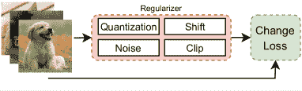

<!--yml

类别：未分类

日期：2024-09-06 19:39:38

-->

# [2305.10862] 深度学习如何看待世界：对对抗攻击与防御的调查

> 来源：[`ar5iv.labs.arxiv.org/html/2305.10862`](https://ar5iv.labs.arxiv.org/html/2305.10862)

# 深度学习如何看待世界：对对抗攻击与防御的调查

Joana C. Costa, Tiago Roxo, Hugo Proença, Pedro R. M. Inácio 作者均来自葡萄牙贝拉内里大学电信研究所。手稿收到时间为 2023 年 XX 月；修订时间为 2023 年 XX 月。

###### 摘要

深度学习目前用于执行多个任务，如物体识别、人脸识别和自然语言处理。然而，深度神经网络（DNNs）容易受到扰动的影响，这会改变网络的预测（对抗性样本），这引发了对其在关键领域使用的担忧，如自动驾驶车辆、恶意软件检测和医疗保健。本文汇编了最新的对抗攻击，按攻击者能力分组，并按保护策略对现代防御进行了分类。我们还介绍了关于视觉变换器的新进展，总结了在对抗环境中使用的数据集和指标，并比较了不同攻击下的最新成果，最后识别了存在的开放问题。

###### 索引词：

对抗攻击，对抗防御，数据集，评估指标，调查，视觉变换器。

## I 引言

机器学习（ML）算法通过使用深度神经网络（DNNs）已经能够解决各种类型的问题，即使是高度复杂的问题，取得了与人类相似或更好的结果，涉及多个任务，如物体识别[2、3]、人脸识别[4、5]和自然语言处理[6、7]。这些网络还被应用于关键领域，如自动驾驶车辆[8、9]、恶意软件检测[10、11]和医疗保健[12、13]，这些应用的功能受损可能严重影响其用户。

深度神经网络（DNNs）显示出的有希望的结果使人们感到这些网络能够在输入（图像）的局部邻域中正确泛化。这些结果促使了这些网络在实时图像分析中的应用和集成，如交通标志识别和车辆分割，从而使恶意实体将这些技术作为攻击目标。然而，发现 DNNs 对输入中的微小扰动敏感 [14]，这些扰动会完全改变其预测，使其在关键领域的应用变得更加困难。这些扰动具有两个主要特征：1) 对人眼不可见或轻微的噪声不会改变人类的预测；2) 显著增加错误输出的置信度，DNNs 以比其他所有类别更高的置信度预测错误的类别。因此，扰动的影响已被重点分析于目标识别，这也是本调查的主要目标。

Papernot 等人 [15] 根据攻击者所拥有的信息将对手分为四类：(i) 训练数据和网络架构，(ii) 仅有训练数据或仅有网络，(iii) 神谕型攻击者，以及 (iv) 仅有输入和输出对。在几乎所有的实际场景中，攻击者无法访问训练数据或网络架构，这削弱了对网络进行攻击的力度，使得对手只能访问网络给出的响应，要么直接向网络提问，要么通过输入和预测对来获得响应。此外，对模型的查询通常是有限的或非常昂贵的 [16]，这使得攻击者更难生成对抗样本。

提出了多种机制 [17, 18, 19, 20] 来防御传统攻击，这些机制在得到适当保护时已经显示出其效果减弱，这些机制在本调查中根据六个不同领域进行了分类。尽管已有攻击和防御方案，但对这些网络的有效鲁棒性以及它们在关键领域是否值得信赖尚无保障，明确地提出了使 DNNs 本质上具有鲁棒性或每当发现新漏洞时易于更新的需求。这激发了所呈现的工作，其主要贡献总结如下：

+   •

    我们展示了按攻击者能力分组的最新对抗攻击，并附有黑盒攻击和白盒攻击之间差异的插图；

+   •

    我们提出了六个不同的对抗防御领域，并附有每个领域的示例图，描述了对抗样本在 ViTs 中的影响；

+   •

    我们详细介绍了最常用的指标和数据集，展示了在 CIFAR-10、CIFAR-100 和 ImageNet 上的最新成果，并提出了未来工作的方向。

论文的其余部分组织如下：第 II 节提供背景信息；第 III 节将此评述与其他评述进行比较；第 IV 节介绍了一系列对抗性攻击；第 V 节展示了克服这些攻击的防御措施；第 VII 节展示了常用的数据集；第 VIII 节列出了指标并详细阐述，并展示了最先进的结果；第 IX 节介绍了未来的方向，结论见第 X 节。

## II 对抗性攻击背景

### II-A 神经网络架构

当输入图像被输入到 CNN 时，它会被转换为一个矩阵，该矩阵包含表示图像的数值，或者如果图像是彩色的，则为包含每个颜色通道数值的多个矩阵。然后，卷积操作会对这些矩阵应用滤波器，并计算出一组缩小尺寸的特征。最后，这些特征以数组格式输入到全连接层中，对提供的图像进行分类。图 1 展示了一个基础的 CNN 图像分类示例。

图 1：卷积神经网络机制分类图像的示意图。

与 CNN 相反，ViT 不将整个图像作为输入；相反，它会将图像预处理为多个 Patches，这些 Patches 是原始图像的较小部分，如图 2 所示。这些 Patches 不是随机输入到 Transformer 编码器中，而是按位置排序，Patches 及其位置都被输入到 Transformer 编码器中。最后，Transformer 编码器的输出被输入到分类图像的多层感知器 (MLP) 头中。

图 2：用于分类图像的简化视觉变换器的示意图。

### II-B 对抗示例

如果图像中的物体连人眼也无法看到，可能会解释为误分类。然而，对抗示例并不符合这一范围。这些示例在图像中添加了扰动，使得 DNN 将图像中的物体误分类，但人类可以正确分类相同的物体。

本调查中描述的对抗攻击侧重于识别使 DNN 误分类的对抗示例。这些攻击识别特定的扰动，这些扰动修改了 DNN 的分类，同时被人类正确分类。这些扰动的计算是一个优化问题，正式定义为：

|  | $\arg\min_{\delta\textbf{X}}\&#124;\delta_{\textbf{X}}\&#124;\textbf{ s.t. }\textbf{f}(\textbf{X}+\delta_{\textbf{X}})=\textbf{Y}\ast,$ |  | (1) |
| --- | --- | --- | --- |

其中$f$是分类器，$\delta_{\textbf{X}}$是扰动，X 是原始/良性图像，$\textbf{Y}\ast$是对抗输出。此外，对抗示例定义为：

|  | $\textbf{X}\ast=\textbf{X}+\delta_{\textbf{X}},$ |  | (2) |
| --- | --- | --- | --- |

其中$\textbf{X}\ast$是对抗图像。

图 3 展示了使用不同攻击生成的对抗示例。主要地，第一行是有限记忆 Broyden-Fletcher-Goldfarb-Shanno (L-BFGS) [14]攻击，第二行是 DeepFool [21]攻击，第三行是 SmoothFool [22]攻击。在观察 L-BFGS 时，扰动几乎应用于对抗图像的整个区域。DeepFool 攻击仅对鲸鱼的区域施加扰动，而不是该区域内的所有像素。最后，SmoothFool 攻击轻微地扰动了图像区域中的像素。这三种攻击展示了对抗攻击的发展，从可检测性递减到强度递增。

图 3：使用不同最先进对抗攻击生成的对抗示例。第一列代表原始图像；第二列代表用于生成第三列对抗图像的扰动。图像经过缩放以便更好地可视化。图像摘自[14、21、22]。第一种扰动沿建筑物的边缘，第二种集中在鲸鱼的区域，第三种则更平滑且面积更大。

为了限制每次扰动对图像所能增加的噪声，对抗攻击被分为$L_{0}$、$L_{2}$和$L_{p}$范数，即向量范数。此外，在对抗示例的背景下，常用术语在表 I 中进行了定义。

### II-C 向量范数与$\epsilon$约束

向量范数是将向量作为输入并输出一个正值（标量）的函数。这些函数在机器学习中至关重要，并允许反向传播算法计算作为标量的损失值。这些函数的家族被称为 p-范数，在对抗攻击的背景下，考虑的$p$值是$0$、$2$和$\infty$。

$L_{0}$范数由计算向量中非零元素的数量组成，并正式定义为：

|  | $&#124;&#124;x&#124;&#124;_{0}=(&#124;x_{1}&#124;^{0}+&#124;x_{2}&#124;^{0}+...+&#124;x_{n}&#124;^{0}),$ |  | (3) |
| --- | --- | --- | --- |

其中$x_{1}$到$x_{n}$是向量$x$的元素。

$L_{2}$范数，也称为欧几里得距离，衡量向量到原点的距离，并正式定义为：

|  | $&#124;&#124;x&#124;&#124;_{2}=(&#124;x_{1}&#124;^{2}+&#124;x_{2}&#124;^{2}+...+&#124;x_{n}&#124;^{2})^{\frac{1}{2}},$ |  | (4) |
| --- | --- | --- | --- |

其中$x_{1}$到$x_{n}$是向量$x$的元素。

$L_{\infty}$范数表示$p$可能具有的最大假设值，并返回具有最大幅度的元素的绝对值，正式定义为：

|  | $&#124;&#124;x&#124;&#124;_{\infty}=\max_{i}&#124;x_{i}&#124;,$ |  | (5) |
| --- | --- | --- | --- |

其中$x_{i}$是向量$x$的每个元素。

图 4：$l_{0}$、$l_{2}$和$l_{\infty}$范数的几何表示，从左到右分别为。

图 4 显示了三种 p-范数的利用区域的几何表示。p-范数的一个相关属性是：$p$值越高，大误差的贡献越重要；$p$值越低，小误差的贡献越高。这意味着，较大的$p$值有利于小的最大误差（在多个像素上最小的扰动），而较小的$p$值则鼓励在较少的地方出现较大的突变（在最少像素上急剧的扰动）。因此，$l_{2}$和$l_{0}$攻击比$l_{\infty}$攻击具有更高的可检测性，而后者更具威胁性。

对抗攻击中通常看到的另一个约束是 $\epsilon$，这是一个控制通过生成扰动添加到图像中的噪声量的常数。通常，它是一个微小的数字，并根据使用的数据集而变化，当任务难度增加时会减少。根据文献，对于 MNIST，$\epsilon=0.1$，对于 CIFAR-10 和 CIFAR-100，$\epsilon=8/255$，对于 ImageNet，$\epsilon=4/255$。

### II-D 对手目标和能力

除了由不同向量范数施加的限制之外，对抗攻击还根据对网络的影响进行分类。根据攻击者的目标，分类如下：

+   •

    信心减少，分类器以较低的信心输出原始标签；

+   •

    非定向攻击，分类器输出任何类别而非原始标签；

+   •

    定向攻击，分类器输出特定类别而非原始标签。

对抗攻击的另一个重要方面是攻击者可以访问的知识量。根据 Papernot 等人的定义 [15]，他们提出了深度学习的第一个威胁模型，攻击者可以访问：1）数据训练和网络架构；2）仅网络架构；3）仅数据训练；4）回复所有输入的预言机；5）仅有输入和相应输出（样本）对。然而，为了简化分类，这些能力被分为：

+   •

    白盒，考虑到攻击者可以访问架构或数据；

+   •

    黑盒，当攻击者只能访问来自预言机的样本或输入输出对时。

攻击者的目标和能力对于分类攻击的强度至关重要。例如，最简单的是信心减少白盒攻击，最强的是定向黑盒攻击。

表 I：对抗攻击背景下使用的常见术语及其定义。

| 术语 | 定义 |
| --- | --- |
| 原始/干净样本 | 数据集中呈现的原始图像 |
| 对抗/扰动样本 | 对手已操控以欺骗分类器的图像 |
| 扰动 | 对图像进行的更改集合（针对每个像素和颜色通道） |
| 对抗攻击 | 用于计算生成对抗样本的扰动的技术 |
| 可迁移性 | 对抗样本从已知网络转移到未知网络的能力 |
| 白盒 | 具有对深度神经网络权重和数据集访问权限的攻击 |
| 黑盒 | 没有对深度神经网络权重和数据集访问权限的攻击 |
| 对抗训练 | 在模型训练阶段包含对抗样本 |

## III 相关调查

对该领域最新进展的首次总结和展示由 Akhtar 和 Mian [23] 完成。这些作者研究了计算机视觉中的对抗攻击，广泛涉及了分类攻击，并简要概述了超出分类问题的攻击。此外，调查展示了在现实世界中进行的一组攻击，并深入了解了对抗样本的存在。最后，作者将防御措施分为三类：修改训练或输入、修改网络和附加网络。

从更广泛的角度来看，Liu 等人 [24] 研究了机器学习领域的安全威胁和可能的防御措施，考虑了机器学习算法的不同阶段。例如，训练阶段只容易受到投毒攻击；然而，测试阶段容易受到规避、冒充和反转攻击，使得防御更加困难。作者提供了对当前使用技术的见解。此外，Serban 等人 [25] 更加专注于对象识别任务，广泛分析了在此背景下提出的对抗攻击和防御，提供了对对抗样本存在的推测，并评估了对抗样本在不同深度神经网络间转移的能力。

Qui 等人 [26] 广泛解释了对抗攻击的背景概念，提到对手的目标、能力和特征。还展示了对抗攻击的应用，并介绍了一些最相关的对抗防御。此外，解释了一组按攻击阶段划分的攻击，涉及最相关的攻击。

Xu 等人 [27] 也描述了背景概念，阐述了对手的目标和知识。这篇综述总结了当时最相关的对抗攻击，并展示了物理世界中的实例。此外，作者呈现了一批按底层方法分类的防御措施。最后，综述了图形、文本和音频网络中的对抗攻击，并总结了这些攻击的潜在应用。

Chakraborty 等人 [28] 透视了常用的机器学习算法，并展示了对手的能力和目标。呈现的对抗攻击根据攻击阶段（训练或测试）进行划分。此外，作者还介绍了在对抗环境中使用的相关防御措施。

表 II：最新调查中的对抗攻击特征。

| 调查 | 年份 | 白盒 & | 调查 | 分组 | 未来 | 数据集 | 指标和 | 最新技术 | 视觉 |
| --- | --- | --- | --- | --- | --- | --- | --- | --- | --- |
| 黑箱 | 比较 | 防御 | 方向 | 概述 | 架构 | 比较 | 变压器 |
| --- | --- | --- | --- | --- | --- | --- | --- |
| Akhtar and Mian [23] | 2018 | ✓ | $\times$ | ✓ | ✓ | $\times$ | $\times$ | $\times$ | $\times$ |
| Qiu et al. [26] | 2019 | ✓ | $\times$ | $\times$ | $\times$ | $\times$ | $\times$ | $\times$ | $\times$ |
| Serban et al. [25] | 2020 | ✓ | $\times$ | ✓ | ✓ | $\times$ | $\times$ | $\times$ | $\times$ |
| Xu et al. [27] | 2020 | ✓ | $\times$ | ✓ | $\times$ | $\times$ | $\times$ | $\times$ | $\times$ |
| Chakraborty et al. [28] | 2021 | ✓ | $\times$ | $\times$ | $\times$ | $\times$ | $\times$ | $\times$ | $\times$ |
| Long et al. [29] | 2022 | ✓ | ✓ | $\times$ | ✓ | $\times$ | $\times$ | $\times$ | $\times$ |
| Liang et al. [30] | 2022 | ✓ | $\times$ | ✓ | ✓ | $\times$ | $\times$ | $\times$ | $\times$ |
| Zhou et al. [31] | 2022 | ✓ | $\times$ | ✓ | ✓ | ✓ | $\times$ | $\times$ | $\times$ |
| 本调查 | 2023 | ✓ | ✓ | ✓ | ✓ | ✓ | ✓ | ✓ | ✓ |

Long et al. [29] 讨论了计算机视觉和对抗性背景的一组初步概念，提供了一组按对手目标和能力分组的对抗性攻击。最后，作者提供了一系列研究方向，读者可以利用这些方向继续发展鲁棒网络。

Liang et al. [30] 讨论了文献中最重要的攻击和防御，其中防御按基本技术分组。此综述以展示当前存在的对抗性背景中的挑战作为结束。

最近，Zhou et al. [31] 对深度学习和威胁模型提供了洞察，重点关注网络安全的视角。因此，作者基于高级持续威胁（APT）确定了多个阶段，并解释了哪些对抗性攻击适合每个阶段。同样，遵循相同的结构来展示每个阶段的适当防御。此外，本调查展示了对抗性设置中常用的数据集，并提供了从网络安全视角出发的一系列未来方向。

从先前调查的分析来看，一些概念已经标准化，例如对手目标和能力以及对抗攻击和防御的存在。然而，由于这一领域的近期兴起，数据集和指标的标准化仍然不足。因此，通过本次调查，我们还分析了数据集和指标，以为新手研究人员提供见解。此外，本次调查汇总了最新的研究成果，并确定了哪些数据集可以进一步探索。最后，类似于其他评审文章，本文提供了一系列未来方向，供研究人员和从业者在开展工作时参考。有关本节中讨论的几项调查的比较总结在表 II 中。

## IV 对抗攻击

对抗攻击通常根据对手的知识量进行分类，分为白盒和黑盒，如图 5 所示。

图 5：对抗攻击在白盒设置（左）和黑盒设置（右）下的示意图。第一个图使用分类器的预测和网络梯度来生成扰动（类似于噪声），这些扰动可以欺骗分类器。这些扰动被添加到原始图像中，形成对抗图像，然后输入到网络中导致分类错误。在黑盒设置中，相同的过程应用于已知分类器，得到的图像用于攻击另一个分类器（表示为目标架构）。

### IV-A 白盒设置

对抗样本最早由 Szegedy 等人提出[14]，他们发现深度神经网络在输入附近的泛化能力较差。相同的作者提出了 L-BFGS，第一种对抗攻击方法，用于生成对抗样本，并在科学界引起了对这一泛化问题的关注。

快速梯度符号方法（FGSM）[32]是一种一步法，用于寻找对抗样本，基于对抗样本存在的线性解释，使用模型成本函数、梯度和半径ε进行计算。这种攻击形式上定义为：

|  | $x-\epsilon\cdot\text{sign}(\nabla\text{loss}_{F,t}(x)),$ |  | (6) |
| --- | --- | --- | --- |

其中 $x$ 是原始图像，$\epsilon$ 是对图像的变化量，$t$ 是目标标签。$\epsilon$ 的值应非常小，以使攻击不可检测。

基于雅可比矩阵的显著性图（JSM）[15] 探索前向导数来计算模型梯度，替代梯度下降方法，并发现哪些输入区域可能产生对抗样本。然后，它使用显著性图来构建对抗显著性图，显示对手必须扰动的特征。最后，为了证明 JSM 的有效性，只使用那些被人类正确分类的对抗样本来欺骗神经网络。

DeepFool [21] 是一种迭代攻击，当找到最小扰动并改变模型输出时停止，利用其决策边界。它为输入$x_{0}$找到最小扰动，对应于与表示决策边界的超平面正交的向量。

Kurakin 等人 [33] 首次证明了对抗样本也可以存在于物理世界中，使用三种不同的方法生成对抗样本。基本迭代方法（BIM）多次应用 FGSM，每次迭代之间的步长较小，并在每一步后裁剪中间值。迭代最不可能类别方法（ILCM）根据模型的预测，使用最不可能类别作为目标类别，并使用 BIM 计算输出目标类别的对抗样本。

Carlini 和 Wagner（C&W）[34] 攻击是最强大的攻击之一，它使用三种不同的向量范数：1) $L_{2}$ 攻击使用裁剪梯度下降方法的平滑，显示出低失真；2) $L_{0}$ 攻击使用一种迭代算法，在每次迭代中，修复对分类器影响不大的像素，并找到需要改变的最小像素数量；3) $L_{\infty}$ 攻击也使用带有相关惩罚的迭代算法，对每个超过预定义值的扰动进行惩罚，正式定义如下：

|  | $\text{min}\quad c\cdot f(x+\delta)+\sum_{i}[(\delta_{i}-\tau)^{+}],$ |  | (7) |
| --- | --- | --- | --- |

其中，$\delta$ 是扰动，$\tau$ 是惩罚阈值（初始值为 1，每次迭代时减少），$c$ 是一个常数。$c$ 的值从一个非常低的值开始（例如，$10^{-4}$），每次攻击失败时，$c$ 的值翻倍。如果$c$ 超过阈值（例如，$10^{10}$），则终止搜索。

梯度对齐对抗子空间（GAAS）[35] 是一种直接使用损失函数的一阶近似来估计对抗子空间维度的攻击。通过实验，GAAS 证明在找到许多正交攻击方向方面最成功，这表明神经网络线性泛化。

投影梯度下降（PGD）[36] 是一种迭代攻击方法，使用鞍点公式，将其视为内层最大化问题和外层最小化问题，以寻找强扰动。它利用内层最大化问题来找到实现高损失的对抗版本输入，而外层最小化问题则找到最小化内层最大化问题损失的模型参数。PGD 使用的鞍点问题定义为：

|  | $\min_{\theta}\rho(\theta),\text{where}~{}\rho(\theta)=\mathbb{E}_{(x,y)\sim\mathcal{D}}\Bigl{[}\max_{\delta\in\mathcal{S}}L(\theta,x+\delta,y)\Bigr{]},$ |  | (8) |
| --- | --- | --- | --- |

其中 $x$ 是原始图像，$y$ 是对应的标签，$\mathcal{S}$ 是允许的扰动集合。

AdvGAN [37] 使用生成对抗网络（GAN）[38] 来创建现实且具有高攻击成功率的对抗样本。生成器接收原始实例并创建扰动，判别器区分原始实例和扰动实例，目标神经网络用于衡量预测与目标类别之间的距离。

受到在黑箱设置中无法实现高成功率的激励，提出了动量迭代 FGSM（MI-FGSM）[39]。它引入了动量，这是一种加速梯度下降算法的技术，应用于已提出的迭代 FGSM（I-FGSM），显示在黑箱设置中攻击成功率几乎是以前攻击的两倍。

Croce 和 Hein [40] 指出，$l_{0}$ 攻击生成的扰动是稀疏的，而 $l_{\infty}$ 攻击生成的扰动在所有像素上是平滑的，因此提出了稀疏且不可察觉的对抗攻击（SIAA）。这种攻击通过应用每个颜色通道在两个方向上的标准偏差来创建零星且不可察觉的扰动，这些偏差是通过使用两个相邻像素和原始像素计算得出的。

SmoothFool (SF) [22] 是一个受几何启发的框架，用于计算平滑对抗扰动，利用模型的决策边界。它是一个迭代算法，使用 DeepFool 计算初始扰动，并平滑修正结果扰动，直到对抗样本欺骗分类器。这种攻击提供了更平滑的扰动，从而提高了对抗样本的迁移性，其影响因数据集中不同类别的变化而异。

在探索物理世界中的对抗样本的背景下，提出了对抗伪装（AdvCam） [41]，它制作对人体观察者合法的物理世界对抗样本。它使用目标图像、区域和风格进行物理适应（创建现实的对抗样本），然后输入目标神经网络以评估对抗样本的成功率。

特征重要性感知攻击（FIA） [42] 考虑了主导模型决策的对象感知特征，使用汇总梯度（相对于特征图的梯度平均）。这种方法避免了局部最优，表示可迁移的特征重要性，并使用汇总梯度来分配权重以识别关键特征。此外，FIA 在从多个分类模型中提取特征重要性时生成高度可迁移的对抗样本。

元梯度对抗攻击（MGAA） [43] 是一种新型架构，可以集成到任何现有的基于梯度的攻击方法中，以提高跨模型的迁移性。这种方法包含多个迭代，在每次迭代中，从模型库中抽样各种模型，利用所选模型生成对抗扰动，并将其添加到先前生成的扰动中。此外，使用多个模型可以模拟白盒和黑盒设置，使攻击更加成功。

### IV-B 通用对抗扰动

Moosavi-Dezfooli 等人 [44] 发现一些扰动是图像无关的（通用的），并且以高概率导致误分类，这些扰动被称为通用对抗扰动（UAPs）。作者发现，这些扰动在多个神经网络中也能很好地泛化，通过寻找一个扰动向量来导致几乎所有从图像分布中抽取的数据的误分类。Moosavi-Dezfooli 等人试图解决的优化问题如下：

|  | $\Delta v_{i}\xleftarrow{}\textrm{arg}\min_{r}\&#124;r\&#124;_{2}\quad\textrm{s.t.}\quad\hat{k}(x_{i}+v+r)\neq\hat{k}(x_{i}),$ |  | (9) |
| --- | --- | --- | --- |

其中 $\Delta v_{i}$ 是欺骗分类器的最小扰动，$v$ 是通用扰动，$x_{i}$ 是原始图像。这个优化问题对数据集中的每张图像进行计算，并更新包含通用扰动的向量。

通用对抗网络（UAN） [45] 是生成网络，它们能够欺骗分类器，当其输出添加到图像中时。这些网络受到 UAPs 发现的启发，使用 UAPs 作为训练集，并且能够为任何给定的输入创建扰动，展示了比原始 UAPs 更优秀的结果。

### IV-C 黑盒设置

特别考虑黑盒设置，Ilyas 等人 [46] 定义了三种更符合现实世界设置的现实威胁模型：查询有限、部分信息和仅标签设置。第一个模型建议开发查询高效的算法，使用自然进化策略来估计用于执行 PGD 攻击的梯度。当仅有前 k 个标签的概率时，算法在混合原始图像和最大化目标类别的可能性之间交替进行；当攻击者仅获得前 k 个预测标签时，攻击使用噪声鲁棒性进行针对性攻击。

Feature-Guided Black-Box (FGBB) [47] 使用从图像中提取的特征来指导对抗扰动的创建，通过使用尺度不变特征转换。对影响图像组成的像素赋予高概率，并且对抗样本的创建被视为一个双人游戏，其中第一个玩家最小化与对抗样本的距离，而第二个玩家可以有不同的角色，从而导致最小的对抗样本。

Square Attack [48] 是一种不需要局部梯度信息的对抗攻击，这意味着梯度屏蔽不会影响它。此外，这种攻击使用了一种随机搜索方案，选择随机位置的局部化方形更新，使得扰动位于决策边界上。

### IV-D Auto-Attack

Auto-Attack [49] 被提出用于以一种无参数、计算成本低且不依赖用户的方式测试对抗鲁棒性。因此，Croce 等人提出了 PGD 的两个变体来克服目标函数的次优步长，即 APGD-CE 和 APGD-DLR，用于 PGD 的无步长版本，分别使用交叉熵 (CE) 和对数比率差异 (DLR) 损失。DLR 是 Croce 等人提出的一种损失函数，它在平移和缩放方面都是不变的，因此与分类器的决策具有相同的自由度，不会受到交叉熵损失的影响 [49]。然后，他们将这些新的 PGD 变体与另外两种现有攻击方法结合，创建了 Auto-Attack，其组成包括：

+   •

    APGD-CE，交叉熵上的无步长版本的 PGD；

+   •

    APGD-DLR，DLR 损失上的无步长版本的 PGD；

+   •

    Fast Adaptive Boundary (FAB) [50]，它最小化对抗扰动的范数；

+   •

    Square [48] Attack，一种查询高效的黑盒攻击。

鉴于 Auto-Attack 提案的主要动机，FAB 攻击是 FAB [50] 的有目标版本，因为无目标版本计算分类器的雅可比矩阵的每次迭代，该矩阵的计算量与数据集的类别数量线性相关。虽然这对于类别数量较少的数据集（例如 MNIST 和 CIFAR-10）是可行的，但随着类别数量的增加（例如 CIFAR-100 和 ImageNet），它在计算和内存方面都会变得具有挑战性。

因此，Auto-Attack 是一个具有重要基本属性的攻击集：APGD 是一种白箱攻击，旨在针对 $L_{p}$-球体内的任何对抗样本（见第 II-C 节），FAB 通过最小化实现错误分类所需的扰动范数，而 Square Attack 是一种基于评分的黑箱攻击，用于范数约束扰动，采用随机搜索且不利用任何梯度近似，与白箱攻击 [48] 竞争。

## V 对抗防御

### V-A 对抗训练

Szegedy 等人 [14] 提出了在对抗样本和干净样本的混合上训练可以对神经网络进行正则化，如图 6 所示。Goodfellow 等人 [32] 通过将对抗训练纳入目标函数来评估其作为正则化器的影响，显示这种方法是一种可靠的防御，可以应用于每个神经网络。

Kurakin 等人 [51] 证明在更大规模的数据集（ImageNet）上进行对抗训练是可能的，显示出一阶方法的鲁棒性显著增加。当使用真实标签进行一阶攻击训练模型时，模型在对抗图像上的准确率显著高于在干净图像上的准确率，这种现象被称为标签泄露，表明对抗训练不应使用真实标签。

在大数据集上进行对抗训练意味着使用快速的一阶方法，这些方法收敛到一个退化的全局最小值，这意味着使用这种技术训练的模型仍然容易受到黑箱攻击。因此，集成对抗训练 [52] 使用在其他静态预训练模型上制作的对抗样本来增强训练数据，防止训练后的模型影响对抗样本的强度。

共享对抗训练 [53] 是对抗训练的一种扩展，旨在最大化对普遍扰动的鲁棒性。它将训练中使用的迷你批次图像分割成一组堆叠，并获得关于这些堆叠的损失梯度。之后，对每个堆叠的梯度进行处理，生成应用于整个堆叠的共享扰动。每次迭代后，这些扰动会被累加并裁剪，以限制它们到预定义的幅度。最后，这些扰动会被添加到图像中，用于对抗训练。

受到权衡灵感启发的对抗防御通过替代损失最小化（TRADES） [54] 的灵感来源于鲁棒性可能与准确性相矛盾的假设 [55, 56]。作者展示了通过使用由替代损失函数测量的自然误差和输入特征接近决策边界的可能性（边界误差）可以严格界定鲁棒误差。这些假设使得模型权重偏向自然误差或边界误差。

图 6：对抗训练的示意图。数据集中原始图像的一个子集被送入对抗攻击（例如，PGD、FGSM 或 C&W），生成对抗图像。每个批次包含原始图像和对抗图像，分类器则进行正常训练。

基于梯度幅度与模型鲁棒性直接相关的想法，双边对抗训练（BAT） [57] 提出了在训练阶段不仅扰动图像，还对标签（对抗标签）进行操作。对抗标签源自闭式启发式解法，对抗图像则通过一步目标攻击生成。

尽管对抗训练在防御模型中很受欢迎，但生成强对抗样本的成本很高，特别是对于像 ImageNet 这样的庞大数据集。因此，自由对抗训练（Free-AT） [58] 使用梯度信息在更新模型参数时生成对抗样本，从而消除了上述开销。

针对 Free-AT 中提出的相同问题，作者分析了这个问题的庞特里亚金最大值原理 [59]，并观察到对抗更新仅与网络的第一层相关。因此，“只传播一次”（YOPO） [60] 仅考虑网络的第一层进行前向和反向传播，有效减少了每次更新的传播量。

误分类感知对抗训练（MART）[61]是一种算法，在训练过程中明确区分误分类和正确分类的样本。这一提案的动机是发现不同的最大化技术微不足道，但在查看误分类样本时，最小化技术至关重要。

针对遮挡攻击的防御（DOA）[62]是一种防御机制，使用抽象对抗攻击、矩形遮挡攻击（ROA）[62]，并应用标准对抗训练。这种攻击考虑包括在现实世界中“正常”的物理可实现攻击，如眼镜和停车标志上的贴纸。

平滑对抗训练（SAT）[63]的提案考虑了通常在课程学习中看到的演变，即难度随时间（年龄）增加，使用两个难度度量标准。这些度量标准基于最大 Hessian 特征值（H-SAT）和 softmax 概率（P-SAT），用于在存在大扰动的情况下稳定网络，同时保持高的干净准确率。在同一背景下，友好对抗训练（Friend-AT）[64]在对抗数据中最少考虑自信误分类的对抗数据（友好），以最小化损失。这种方法可以通过在进行对抗训练时提前停止 PGD 攻击来应用。

与 Free-AT [58]的观点相反，便宜对抗训练（Cheap-AT）[65]提出使用较弱且更便宜的对抗者（FGSM）结合随机初始化来有效地训练鲁棒网络。通过应用高效训练网络的技术，这种方法可以进一步加速。

在现实世界中，攻击不仅仅受限于不可察觉性约束（$\epsilon$值）；实际上，有多种扰动（针对模型）具有可见大小。Oracle 对齐对抗训练（OA-AT）[66]的主要思想是通过在对抗训练期间将网络预测与 Oracle 的预测对齐，创建一个对高扰动边界鲁棒的模型。OA-AT 的关键方面是使用学习的感知图像补丁相似性[67]生成 Oracle 不变攻击和清洁与对抗预测的凸组合，作为 Oracle 敏感样本的目标。

几何感知实例加权对抗训练（GI-AT）[68]有两个基础：1）过度参数化的模型仍然缺乏容量；2）更接近类别边界的自然数据点更不鲁棒，这意味着给相应的对抗数据分配更大的权重。因此，这种防御建议使用标准对抗训练，考虑权重是基于攻击自然数据点的难度。

对抗训练导致决策边界上的边距不合理地增加，从而降低了清晰准确率。为了解决这个问题，基于助手的对抗训练（HAT）[69] 在训练过程中加入了额外的错误标记样本，实现了准确性和鲁棒性之间的良好折中。

由于随机初始化取得了良好的结果，快速对抗训练（FAT）[70] 通过随机平滑来有效地优化内在的最大化问题，并提出了一种新的初始化策略，称为反向平滑。该策略有助于提高使用单步鲁棒训练方法的模型的稳定性和鲁棒性，解决了过拟合问题。

### V-B 修改训练过程

Gu 和 Rigazio [71] 提出了使用三种预处理技术来恢复对抗噪声，即噪声注入、自编码器和去噪自编码器，并发现对抗噪声主要分布在高频域。解决对抗问题对应于采用合适的训练技术和目标函数，以增加最小对抗样本的失真。

针对对抗样本的另一种防御方法是防御性蒸馏[72]，该方法使用从先前训练的神经网络中获得的预测，如图 7 所示。这种方法用原始训练数据和标签训练初始神经网络，生成预测的概率，这些概率替换原始训练标签来训练一个更小、更鲁棒的蒸馏网络。此外，为了改善防御性蒸馏的结果，Papernot 和 McDaniel [73] 提出了通过将原始标签与第一个模型不确定性结合来改变用于训练蒸馏网络的向量。

为了解决神经网络对对抗样本的脆弱性，视觉因果特征学习[74]方法使用因果推理来进行数据增强。该方法使用操控函数返回与原始图像相似且具有所需因果效果的图像。

与强敌学习 [75]是一种将问题形式化为最小-最大问题的训练过程，使分类器具有固有的鲁棒性。该方法考虑到对手对每个数据点施加扰动以最大化分类错误，而学习过程则试图最小化对对手的误分类错误。这种方法的最大优点是显著提高了鲁棒性，同时保持了高准确率。

Zheng 等人[76] 提出了在良性图像中使用压缩、重新缩放和裁剪来提高深度神经网络的稳定性，称之为图像处理，而不改变目标函数。高斯扰动采样器扰动良性图像，该图像被输入到 DNN 中，并使用其良性图像的特征表示来 1) 最小化标准交叉熵损失；以及 2) 最小化稳定性损失。

图 7：防御性蒸馏方法[72]。初始网络在数据集图像和标签（离散值）上进行训练。然后，将初始网络给出的预测输入到另一个网络中，替代数据集标签。这些预测是连续值，使得蒸馏网络对对抗攻击更加稳健。

Zantedeschi 等人[77] 探索了标准架构，这些架构通常使用修正线性单元 (ReLU) [78, 79] 来简化训练过程，并发现该函数使得输入中的小扰动在多个层中累积（无界）。因此，作者提出使用有界 ReLU (BReLU) [80] 来防止这种累积，并进行高斯数据增强以执行数据增强。

Zhang 和 Wang[19] 建议通过在潜在空间中进行特征散射 (FS) 来生成对抗样本，以避免标签泄漏效应，这种方法考虑了样本之间的关系。对抗样本通过最大化干净样本和扰动样本之间的特征匹配距离来生成，FS 产生了一个扰动的经验分布，DNN 执行标准对抗训练。

PGD 攻击使内部表示更接近“错误”类别，Triplet Loss Adversarial (TLA) [81] 在损失函数中包含额外的项，使特定类别的自然图像和对抗图像更接近，而其他类别的图像则进一步分离。这种方法在不同样本上进行了测试：随机负样本 (TLA-RN)，即随机采样的负样本，以及交换锚点 (TLA-SA)，即将锚点设为自然样本，而正样本设为对抗样本。

Kumari 等人[82] 分析了以前经过对抗训练的模型，以测试它们在潜在层级别对对抗攻击的脆弱性，得出这些模型的潜在层对小幅度的对抗扰动显著脆弱。潜在对抗训练 (LAT) [82] 旨在微调对抗训练模型，以确保在潜在层级别的鲁棒性。

曲率正则化（CR）[83] 最小化损失表面的曲率，从而引导网络表现出更“自然”的行为。该防御方法的理论基础使用局部二次近似，展示了大鲁棒性与小曲率之间的强关系。此外，提出的正则化器确认了在数据点附近表现出准线性行为对于实现鲁棒性的重要性。

无监督对抗训练（UAT）[84] 通过考虑两种不同的方法来进行无标签数据的训练：一种是通过最小化光滑度损失的可微替代品的 UAT 与在线目标（UAT-OT），另一种是通过训练一个外部分类器来预测无监督数据的标签，并使用其预测作为标签的 UAT 与固定目标（UAT-FT）。

稳健自训练（RST）[85]，是自训练（Self-Training）[86, 87] 的扩展，使用标准监督训练来获得伪标签，然后将这些伪标签输入到一个以对抗鲁棒性为目标的监督训练算法中。这种方法弥合了标准准确性与鲁棒准确性之间的差距，利用无标签数据，在使用与高标准准确性所需的标签数相同的标签下实现高鲁棒性。

SENSEI [88] 和 SENSEI-SA [88] 使用软件测试中采用的方法进行数据增强，提升了 DNN 的鲁棒性。SENSEI 实施了将每个数据点替换为适当变体或保持不变的策略。SENSEI-SA 通过识别哪些机会适合跳过增强过程来改进前者。

位平面特征一致性（BPFC）[89] 正则化器迫使深度神经网络（DNN）更加重视高位平面，这一设计灵感来源于人类视觉系统的感知。该正则化器使用原始图像和预处理版本来计算它们之间的 $l_{2}$ 范数，并对损失函数进行正则化，如图 8 所示的方案。

对抗性权重扰动（AWP）[90] 明确地对权重损失景观的平坦性和鲁棒性差距进行正则化，采用双重扰动机制扰动输入和权重。这种防御提升了多种现有对抗训练方法的鲁棒性，确认它可以应用于其他方法。

自适应训练（SAT）[91] 动态地校准训练过程，与模型预测相结合且无需额外的计算成本，从而提高了对受损数据的泛化能力。与双重下降现象相比，SAT 展示了单一下降的误差-容量曲线，减轻了过拟合效应。

**HYDRA** [92] 是另一种探索修剪对模型鲁棒性影响的技术，提出使用意识到稳健训练目标的修剪技术，使该目标能够指导连接的修剪搜索。这种方法达到了在标准和鲁棒准确性方面的先进压缩模型。

图 8：**位平面特征一致性**的示意图[89]。该方法对输入图像应用多个操作，模拟对抗图像。然后，损失函数被更改为包含一个正则化项（新术语），该项将原始图像与这些操作过的图像进行比较。

基于先前蒸馏方法展示的良好结果，**鲁棒软标签对抗蒸馏**（RSLAD）[93] 方法使用软标签来训练稳健的小型学生 DNNs。该方法使用教师 DNN 生成的**鲁棒软标签**（RSLs）来监督学生在自然和对抗样本上的训练。该方法的一个重要方面是学生 DNN 在训练过程中无法访问原始复杂标签。

在对抗环境下，每层中最敏感的神经元对模型预测做出了显著的非平凡贡献，这意味着提高对抗鲁棒性会稳定最敏感的神经元。**敏感神经元稳定化**（SNS）[94] 包括一个目标函数，专门致力于最大化在提供干净和对抗样本时敏感神经元行为的相似性。

**动态网络重接线**（DNR）[95] 生成具有高稳健性和标准准确性的剪枝 DNNs，采用统一的约束优化公式，使用融合超高模型压缩与稳健对抗训练的混合损失函数。此外，作者提出了一种一次性训练方法，实现了高压缩率、标准准确性和稳健性，其实际推理速度比传统方法快 10 倍。

**局部稳定流形正则化**（MRLS）[96] DNNs 利用 ReLU 的连续分段线性特性来学习一个在预测和决策边界上都光滑的函数。该方法基于在数据稀疏时近似图拉普拉斯算子。

受到蒸馏背后动机的启发，**可学习边界引导对抗训练**（LBGAT）[97]，假设在干净数据上训练的模型嵌入了它们最具辨别力的特征，将稳健模型的 logits 约束为与在自然数据上训练的模型相似。这种方法使稳健模型继承了干净模型的决策边界，保持了高标准和稳健的准确性。

低温蒸馏 (LTD) [98] 使用以前的蒸馏框架来生成标签，在教师模型中使用相对较低的温度，并为教师和学生模型使用不同的固定温度。该机制的主要优点是生成的软标签可以无额外成本地集成到现有工作中。

最近的文献 [99, 100, 101] 证明，神经常微分方程 (ODE) 自然比普通 DNN 对对抗攻击更具鲁棒性。因此，稳定的神经 ODE 用于对抗对抗攻击 (SODEF) [102] 使用优化公式来强制提取的特征点位于李雅普诺夫稳定平衡点的附近，从而抑制输入扰动。

自一致鲁棒误差 (SCORE) [103] 采用局部等变性来描述鲁棒模型的理想行为，促进了鲁棒性与准确性之间的协调，同时仍然处理最坏情况的不确定性。该方法的灵感来源于发现对抗准确性与清洁准确性之间的权衡对平滑性产生了偏差。

在分析激活形状对鲁棒性的影响时，Dai 等人 [104] 观察到激活对负输入具有正输出，高有限曲率可以提高鲁棒性。因此，参数化的移位 sigmoid 线性单元 (PSSiLU) [104] 结合了这些特性和参数化激活函数与对抗训练。

### V-C 补充网络的使用

MagNet [105] 考虑了对抗样本分类错误的两个原因：1）分类器无法拒绝远离边界的对抗样本；2）当对抗样本接近边界时，分类器泛化能力较差。MagNet 考虑了多个基于重建误差训练的检测器，检测显著扰动的样本和基于概率偏差检测轻微扰动的样本。

图 9：补充网络使用的示意图。检测器网络之前已被训练以检测对抗图像，并且被包括在输入图像和分类器之间。该网络接收输入图像并确定这些图像是否为对抗样本。如果不是，它们会被重定向到分类器；如果是，它们会接受人工评估。

对抗检测网络（ADN）[106] 是一个子网络，用于检测输入样本是否为对抗样本，通过使用为分类网络生成的对抗图像进行训练，这些图像被分类为干净（0）或对抗（1）。图 9 展示了该网络的示意图。然而，这种防御机制与数据集和分类网络有深刻的关联。

Xu 等人发现，包含特征压缩（FS）[107] 在检测对抗样本时非常可靠，因为它通过减少对抗者可以修改的搜索空间来提高检测效果。该方法将标准网络的预测与压缩网络的预测进行比较，以高准确率检测对抗样本，并且假阳性率较低。

高级表示引导去噪器（HGD）[17] 利用原始图像与对抗图像之间的距离来引导图像去噪器，抑制对抗样本的影响。HGD 使用带有额外侧向连接的去噪自编码器 [108]，并考虑特定层中由正常和对抗样本激活的表示差异作为损失函数。

Defense-GAN [18] 探索了使用生成对抗网络（GANs）有效表示原始训练样本集，使得此防御机制与使用的攻击无关。Defense-GAN 考虑使用 Wasserstein GANs（WGANs）[109] 来学习原始数据的表示并去噪对抗样本，其开始时最小化生成器表示与输入图像之间的 $l_{2}$ 差异。反向攻击 [110] 可以在测试阶段应用于每次攻击，通过找到适当的附加扰动来修复对抗样本，这类似于对抗攻击，由于原始标签未知，操作极为困难。

嵌入正则化分类器（ER-Classifier）[111] 由分类器、编码器和判别器组成，使用编码器通过减少输入的维度空间来生成代码向量，并使用判别器将这些向量与理想代码向量（从先验分布中采样）分开。这种技术可以将对抗样本推送到正常图像数据分布中，去除对抗扰动。

基于类别激活特征的去噪器（CAFD）[112] 是一种自监督方法，通过使用由基于类别激活特征攻击（CAFA）[112] 生成的一组示例来训练，以去除对抗样本中的噪声。该防御机制通过最小化对抗样本与自然样本之间的类别激活特征的距离进行训练，对未见过的攻击具有鲁棒性。

探测器图（DG）[113] 通过为每个原始示例构建潜在邻域图（LNG），并使用图神经网络（GNNs）[114] 来挖掘关系和区分原始与对抗性示例。该方法维护了一个额外的参考数据集以检索流形信息，并使用图像像素值的嵌入表示，使得防御对于未知攻击具有鲁棒性。

现实世界中的图像以连续方式表示，但机器只能以离散的二维数组存储这些图像。局部隐式图像函数（LIIF）[115] 以图像坐标和该坐标周围的深层特征作为输入，预测相应的 RGB 值。这种预处理输入图像的方法可以通过减少其扰动来过滤对抗图像，然后将其输入分类器。

使用局部隐式函数（DISCO）[116] 的对抗性防御是对分类器的附加网络，通过局部流形投影去除对抗扰动，该网络接收对抗图像和查询像素位置。该防御机制包括一个创建每像素深层特征的编码器和一个使用这些特征预测干净 RGB 值的局部隐式模块。

图 10：特征去噪块概述[117]，可以包含在中间层中以增强网络的鲁棒性。这种方法是更改网络架构的一个示例。

### V-D 更改网络架构

为了识别层的类型及其顺序，Guo 等人[118] 提出了使用神经架构搜索（NAS）来识别对抗攻击更为鲁棒的网络，发现密集连接模式提高了鲁棒性，并且将卷积操作添加到直接连接边缘是有效的，从而结合创建了 RobNets[118]。

特征去噪[117] 旨在通过应用特征去噪操作来解决这个问题，包括非局部均值、双边、均值、中值滤波器，随后是 1x1 卷积和一个恒等跳跃连接，如图 10 所示。这些块被添加到 CNN 的中间层中。

输入随机化[119] 提出了在分类器开始处添加层的方案，包括 1）一个随机缩放层，该层将原始图像的宽度和高度调整为随机的宽度和高度，以及 2）一个随机填充层，该层以随机方式在缩放后的图像周围填充零。

控制神经层集（CNLS）[120] 使用从神经层集中获得的样本，并将其位置与网络参数相关联，从而允许修改网络的决策边界。位置与参数之间的关系通过构建一个包含附加固定线性层的样本网络来实现，这样可以将层集样本纳入损失函数中。

稀疏变换层（STL）[121]，位于输入图像和网络第一层之间，将接收到的图像转换为低维的准自然图像空间，该空间近似自然图像空间并去除对抗性扰动。这种方法创建了一种与攻击无关的对抗性防御，使原始图像和对抗图像更加接近。

Benz 等人[122]发现，BN[123]及其他归一化技术使 DNN 更容易受到对抗性样本的攻击，建议使用一种框架，通过先学习**鲁棒特征**，然后再学习**非鲁棒特征**（即使用 BN 学到的特征），使 DNN 更加鲁棒。

### V-E 执行网络验证

大多数数据集使用联合图像专家组（JPEG）[124] 压缩存储图像，但尚未评估此过程对网络性能的影响。Dziugaite 等人[125]（称为 JPG）改变 FGSM 扰动的幅度，发现较小的扰动往往会大幅度逆转分类下降，当扰动幅度增加时，这种效果被消除。

关于形式验证，使用满足性模理论（SMT）创建了一种用于自动安全验证分类过程决策的工具[126]。该方法假设，当对输入进行转换后，模型决策不发生变化时，该决策是安全的。它应用于网络中的每一层，使用有限的转换空间。

DeepXplore [127] 是第一个执行广泛测试覆盖的白盒框架，引入了神经元覆盖的概念，即由测试输入激活的 DNN 部分。DeepXplore 使用多个 DNN 作为交叉参考的神谕，避免手动检查每个测试输入，并通过梯度搜索技术解决高神经元覆盖率的联合优化问题。

DeepGauge [128] 旨在使用一组多粒度测试标准识别包含多方面表示的测试平台。DeepGauge 通过两种不同策略，即**主要功能**和**边角案例行为**，评估 DNN 的鲁棒性，并考虑神经元和层级覆盖标准。

深度学习系统的惊讶适应性 (SADL) [129] 基于 DNN 在训练数据上的行为，通过引入输入的惊讶，即给定输入时 DNN 行为与学习的训练数据之间的差异。输入的惊讶用作适应性标准（惊讶适应性），用于惊讶覆盖的度量，以确保输入惊讶范围的覆盖。

最新的数据增强技术，如 cutout [130] 和 mixup [131]，未能防止过拟合，有时还会导致模型过度正则化，因此得出的结论是，要实现实质性改进，结合早期停止和半监督数据增强的 Overfit Reduction (OR) [132] 是最佳方法。

在创建模型时，多种实现细节会影响其性能；Pang 等人 [133] 是第一个提供这些细节如何影响模型鲁棒性的见解的研究，称之为 Bag of Tricks (BT)。该研究得出的结论有：1) 模型的鲁棒性受到权重衰减的显著影响；2) 对抗攻击的早期停止可能会恶化最坏情况下的鲁棒性；3) 平滑激活有利于较低容量的模型。

过拟合是一个已知的问题，它影响模型鲁棒性；Rebuffi 等人 [134] 通过使用不同的数据增强技术来减少这种鲁棒过拟合。Fixing Data Augmentation (FDA) [134] 表明，模型权重平均结合数据增强方案可以显著提高鲁棒性，并且当使用空间组合技术时，鲁棒性会进一步增强。

Gowal 等人 [135] 系统地研究了多个训练损失、模型大小、激活函数、未标记数据的增加以及其他方面的影响。该分析得出的主要结论是，具有 Swish/SiLU [136] 激活函数和模型权重平均的大型模型可以可靠地在鲁棒准确性上实现最先进的结果。

图 11：使用去噪扩散概率模型的对抗净化概述，改编自 [137]。扩散过程应用于对抗图像，包括在一定步骤中添加噪声。在去噪过程中，这些噪声通过相同数量的步骤迭代去除，从而得到一个净化后的图像（无扰动）。

### V-F 对抗净化

对抗性净化包括使用生成模型去除对抗性扰动的防御机制。通过生成数据提高鲁棒性（IRUGD）[138]探讨了如何利用在原始图像上训练的生成模型来增加原始数据集的规模。通过广泛的实验，他们得出结论，去噪扩散概率模型（DDPM）[137]，作为扩散概率模型[139]的进展，是最接近真实数据的模型。图 11 展示了 DDPM 过程的主要思路。

由于 DDPM 在图像合成中显示出的卓越效果，Sehwag 等人[140]（代理）使用代理分布通过生成额外的示例显著提升了对抗训练的性能，证明了 DDPM 是代理分布的最佳生成模型。

受到先前对抗性净化工作[141, 142]的启发，DiffPure[143]使用 DDPM 进行对抗性净化，输入对抗性示例，并通过反向生成过程恢复干净图像。自此发现以来，已经研究了关于使用 DDPM 进行对抗性净化的多项改进。对抗性净化的引导扩散模型（GDMAP）[144]以纯高斯噪声作为初始输入，并逐渐用引导去噪至对抗性图像。

DensePure[145]对输入图像进行迭代去噪，使用不同的随机种子，得到多个反向样本，这些样本被提供给分类器，最终预测基于多数投票。此外，Wang 等人[146]使用最新的扩散模型[147]证明了具有更高效率和图像质量的扩散模型直接转化为更好的鲁棒准确性。

## VI 对视觉变换器的对抗性影响

像 CNN[148]一样，ViTs 也容易受到扰动的影响，这些扰动会改变图像中的一个补丁[149]，且与 ResNet-50[150]相比，ViTs 显示出几乎双倍的更高鲁棒性。

为了进一步评估 ViT 对对抗样本的鲁棒性，Mahmood 等人[151]在 CNN 中使用了多种对抗攻击方法，即 FGSM、PGD、MIM、C&W 和 MI-FGSM。相比于 ResNet，ViT 在前四种攻击中的鲁棒性有所提高，但对 C&W 和 MI-FGSM 攻击没有抵御能力。此外，为了补充 ViTs 性能的结果，进行了一项广泛的研究[152]，使用特征图、注意力图和梯度加权类别激活映射（Grad-CAM）[153]，旨在从视觉上解释这些性能。

对抗样本从 CNNs 到 ViTs 的迁移性也被评估，结果表明，来自 CNNs 的样本不会立即迁移到 ViTs[151]。此外，提出了自注意力混合梯度攻击（SAGA）[151]，旨在对 ViTs 和 CNNs 进行错误分类。忽略注意力梯度的攻击（PNA）[154]和随机采样补丁子集的攻击（PatchOut）[154]展示了较高的迁移性。

为了检测可能影响 ViTs 的对抗样本，PatchVeto[20]使用不同的变换器和不同的注意力掩码来输出类别编码。如果所有变换器在投票类别上达成一致，则图像被认为是有效的，总体上是由遮蔽的变换器提供的预测。

平滑的 ViTs[155]在将图像输入 ViT 之前进行预处理，通过生成图像消融（由原始图像的单列组成，其他列为黑色）来实现，这些消融图像被转换为令牌，并丢弃完全遮蔽的令牌。剩余的令牌被输入到 ViT 中，ViT 对每个消融图像进行类别预测，最终所有消融图像的预测最多的类别被认为是正确的。

Bai 等人[156]表明 ViTs 和 CNNs 的评估存在不公平，因为它们的训练细节不同。因此，这项工作提供了对 ViTs 和 CNNs 的公平和深入的比较，表明 ViTs 对对抗扰动的脆弱性与 CNNs 相当。

面向架构的可转移攻击（ATA）[157]是一个框架，通过考虑不同 ViT 架构之间的共同特征，如自注意力和图像嵌入，生成可转移的对抗样本。具体来说，它发现对模型决策有显著影响的最具注意力的补丁区域，并使用敏感的嵌入扰动搜索像素级攻击位置。

Patch-fool [158] 探索了使 ViTs 更容易受到攻击的扰动，提出了一种专门的攻击框架，通过多种注意力感知优化技术攻击单个补丁，从而欺骗自注意力机制。这种攻击机制首次证明了如果采用适当的技术，ViTs 可能比 CNNs 更脆弱。

Gu 等人 [159] 评估了 ViT 对于补丁级扰动的鲁棒性，得出结论认为这些模型对自然腐蚀的补丁比 CNNs 更加鲁棒，但对对抗生成的补丁则更为脆弱。受观察结果启发，作者提出了一种简单的基于温度缩放的方法，来提高 ViT 的鲁棒性。

如之前对 CNNs 的观察所示，提高鲁棒性准确率会牺牲 ViT 的标准准确率，这可能限制了它们在实际环境中的适用性。Derandomized Smoothing [160] 使用逐步平滑的图像建模任务来训练 ViTs，使其在保留全局语义信息的同时捕捉到更具辨别力的局部上下文，从而提高了鲁棒性和标准准确率。

VeinGuard [161] 是一个防御框架，帮助 ViTs 更加鲁棒地抵御对抗性的掌静脉图像攻击，在实际应用中具有实际意义。具体而言，VeinGuard 由一个基于局部变换器的 GAN 组成，它学习未受扰动的静脉图像的分布，以及一个自动去除各种对抗性扰动的净化器。

## VII 数据集

### VII-A MNIST 和 F-MNIST

最常用的数据集之一是 MNIST [162] 数据集，它包含了约 250 名书写者的手写数字图像，图像为黑白色调，从两个不同的数据库中提取。该数据集分为训练集和测试集，前者包含 60,000 个样本，后者包含 10,000 个样本。

Xiao 等人提出通过使用时尚网站上的图形创建 Fashion-MNIST [163] 数据集，该数据集总大小为 70,000 张图像，包含十个类别，使用灰度图像，每张图像的大小为 28x28。Fashion-MNIST 数据集分为训练集和测试集，分别包含 60,000 和 10,000 个样本。

图 12：从 MNIST 数据集 [162] 中提取的前五列图像和从 Fashion-MNIST 数据集 [163] 中提取的最后五列图像。这些图像已被调整大小以便更好地可视化。

图 12 显示了 MNIST 数据集中前五列的 10 个数字（从 0 到 9）和 Fashion-MNIST 数据集中最后五列的 10 个时尚物体。MNIST 是对抗样本早期研究中最广泛研究的数据集之一，防御机制在该数据集上已显示出较高的鲁棒性。而 Fashion-MNIST 虽然具有类似于 MNIST 的特征，但尚未被广泛研究。

图 13：前五列展示了从 CIFAR-10 数据集 [164] 中提取的图像，最后五列展示了从 CIFAR-100 数据集 [164] 中提取的图像。这些图像已调整大小以便更好地可视化。

### VII-B CIFAR-10 和 CIFAR-100

另一个被广泛研究的数据集是 CIFAR-10，它与 CIFAR-100 数据集一起，是一个包含 8,000 万张小图像 [165]，每张图像 32x32 像素和三种颜色通道的庞大数据库的子集，共有 75,062 个不同的类别。

CIFAR-10 [164] 仅包含这个大型数据库中的十个类别，每个类别有 6,000 张图像，分为 50,000 张训练图像和 10,000 张测试图像。该数据集考虑了不同的物体，即动物和车辆，通常出现在不同的环境中。

CIFAR-100 [164] 包含 100 个类别，每个类别只有 600 张图像，图像大小和颜色通道与 CIFAR-10 数据集相同。CIFAR-100 将其 100 个类别分为 20 个超类，分布在不同的上下文/环境中，使得该数据集更难以获得高结果。

CIFAR-10 数据集中的示例显示在图 13 的前五列中，其余列显示了 CIFAR-100 超类的示例。由于在 CIFAR-10 上训练的模型结果不理想，CIFAR-100 数据集在大多数关于对抗样本的研究中未被包括，这表明解决对抗扰动图像的问题仍处于起步阶段。

图 14：前三列展示了从 Street View House Numbers 数据集 [166] 中提取的图像，后三列展示了从 German Traffic Sign Recognition Benchmark 数据集 [167] 中提取的图像。这些图像已调整大小以便更好地可视化。

图 15：左上角是从 ImageNet 数据集[168]中提取的图像，右上角是从 ImageNet-A 数据集[169]中提取的图像，左下角是从 ImageNet-C 和 ImageNet-P 数据集[170]中提取的图像，右下角是 ImageNet-COLORDISTORT[171]中的图像。图像已被调整大小以便更好地观察。

### VII-C 街景数据集

街景房屋号码（SVHN）[166]数据集提供了与 MNIST 相同的挑战：识别彩色图像中存在的数字，包含十个类别，即 0 到 9 的数字，图像尺寸为 32x32，围绕一个字符，图像中可能包含多个数字。关于数据集的大小，它有 630,420 张数字图像，但仅有 73,257 张用于训练，26,032 张用于测试，其余 531,131 张可用作额外的训练数据。

德国交通标志识别基准（GTSRB）[167]是一个包含 43 类不同交通标志的数据集，拥有 50,000 张图像，并展示了现实场景。该数据集有 51,840 张图像，尺寸从 15x15 到 222x193 不等，分为训练集、验证集和测试集，分别占总图像的 50%、25%和 25%。

与 SVHN 数据集相关的困难显示在图 14 的前三行中，显示了占据整个图像的独特数字和不同背景上的多个数字。此外，同一图形展示了 GTSRB 数据集中不同类型的交通标志，如禁止、警告、强制和禁止结束。

### VII-D ImageNet 及其变体

ImageNet[168]是最大的目标识别数据集之一，包含 1,461,406 张彩色图像和 1,000 个类别，图像被调整为 224x224。该数据集从 Flickr 和其他搜索引擎收集了照片，分为 120 万张训练图像、50,000 张验证图像和 100,000 张测试图像。

当数据集大小是一个重要因素时，一个可能的替代方案是 Tiny ImageNet[172]，这是 ImageNet 的一个子集，包含较少的类别和图像。该数据集仅包含 200 个类别（从 ImageNet 的 1,000 个类别中挑选），有 100,000 张训练图像、10,000 张验证图像和 10,000 张测试图像。这些类别包括动物、车辆、家居用品、昆虫和服装，考虑到这些物体可能出现的多种背景/环境。图像的尺寸为 64x64，并且是彩色的。

ImageNet-A [169] 是 ImageNet 的一个子集，仅包含 1,000 个类别中的 200 个类别，覆盖了 ImageNet 中最广泛的类别。ImageNet-A 是一个由真实世界对抗性过滤图像组成的数据集，这些图像是通过删除 ResNet-50 分类器正确预测的图像获得的。尽管 ImageNet-A 是基于 ResNet-50 的不足之处，但它也展示了对未见模型的可转移性，使得这个数据集适合用于评估多个分类器的鲁棒性。

另外两个基准，ImageNet-C [170] 和 ImageNet-P [170]，旨在评估深度神经网络的鲁棒性。ImageNet-C 标准化并扩展了破坏鲁棒性话题，包括对 ImageNet 验证集中的每张图像应用 75 种破坏。ImageNet-P 对图像应用了失真，虽然它与 ImageNet-C 不同，因为它包含的扰动序列仅使用十种常见的扰动。

表 III：与最新数据集的对抗样本上下文相关的特征。#类别表示数据集中类别的数量。空的颜色列表示该数据集中的图像使用灰度或黑白色调。带 $*$ 的数据集仅用于测试目的。

| 数据集 | 大小 | #类别 | 类别 | 颜色 |
| --- | --- | --- | --- | --- |
| MNIST | 70,000 | 10 | 数字 |  |
| Fashion-MNIST | 70,000 | 10 | 服装 |  |
| CIFAR-10 | 60,000 | 10 | 动物 | ✓ |
| 车辆 |
| SVHN | 630,420 | 10 | 数字 | ✓ |
| GTSRB | 51,840 | 43 | 交通标志 | ✓ |
| CIFAR-100 | 60,000 | 100 | 家庭用品 | ✓ |
| 户外场景 |
| Tiny ImageNet | 120,000 | 200 | 动物 | ✓ |
| 家庭用品 |
| ImageNet-A^∗ | 7,500 | 200 | 车辆 | ✓ |
| 食物 |
| ImageNet-C^∗ | 3,750,000 | 200 | 车辆 | ✓ |
| 食物 |
| ImageNet-P^∗ | 15,000,000 | 200 | 车辆 | ✓ |
| 食物 |
| ImageNet | 1,431,167 | 1,000 | 车辆 | ✓ |
| 电子设备 |
| ImageNet-CD^∗ | 736,515 | 1,000 | 车辆 | ✓ |
| 电子设备 |

另一个评估模型泛化能力的基准是 ImageNet-COLORDISTORT (ImageNet-CD) [171]，它通过不同的颜色空间表示考虑图像颜色的多种失真。该数据集包含了 ImageNet 的 1,000 个类别，去除了没有颜色通道的图像，并且同一图像在红绿蓝 (RGB)、色相-饱和度-明度 (HSV)、CIELAB 和 YCbCr 颜色空间下考虑了多种颜色失真，这些颜色空间是图像处理中的常见变换。

可以在图 15 的左上角观察到一组从 ImageNet 中提取的图像。此外，图像分类器误分类的图像（ImageNet-A）显示在同一图像的右上角。底部展示了常见破坏和扰动的 ImageNet，并通过多种图像技术进行操控，分别位于左侧和右侧。表 III 总结了本节中介绍的数据集的主要特征。

表 IV：在 PGD 攻击下，不同防御机制在 CIFAR-10 上的准确性比较，$l_{\infty}$ 和 $\epsilon=8/255$。Clean 和 Robust 分别指没有对抗攻击和有对抗攻击下的准确性。Clean 准确性为“-”的防御方法没有报告干净准确性。

| 防御方法 | 年份 | 架构 | 准确性 |
| --- | --- | --- | --- |
| Clean | Robust |
| --- | --- |
| BPFC [89] | 2020 | ResNet-18 | 82.4 | 34.4 |
| SNS [94] | 2021 | VGG-16 | 86.0 | 39.6 |
| AT-MIFGSM [51] | 2017 | Inception v3 | 85.3 | 45.9 |
| AT-PGD [36] | 2018 | ResNet-18 | 87.3 | 47.0 |
| RobNets [118] | 2020 | RobNet-free | 82.8 | 52.6 |
| HGD [17] | 2018 | DUNET | 92.4 | 53.1 |
| RSLAD [93] | 2021 | ResNet-18 | 83.4 | 54.2 |
| MART [61] | 2020 | WRN-28-10 | 83.1 | 55.6 |
| TRADES [54] | 2019 | WRN-34-10 | 84.9 | 56.4 |
| BagT [133] | 2020 | WRN-34-10 | - | 56.4 |
| RO [132] | 2020 | ResNet-18 | - | 56.8 |
| DOA [62] | 2019 | VGGFace | 93.6 | 61.0 |
| AWP [90] | 2020 | WRN-28-10 | - | 63.6 |
| FS [19] | 2019 | WRN-28-10 | 90.0 | 68.6 |
| CAFD [112] | 2021 | DUNET | 91.1 | 87.2 |

## VIII 指标与最新结果

### VIII-A 评估指标

由于对抗样本的特殊性质，它们需要特定的指标来进行正确评估和构建。遵循这一方向，多个研究提出了不同的指标，用于计算使模型误分类的对抗样本的百分比（欺骗率），衡量图像中的扰动量（破坏率），以及计算模型对对抗样本的鲁棒性（平均鲁棒性）。

#### VIII-A1 准确性

该指标衡量模型正确预测的样本数量，定义为：

|  | $\text{accuracy}=\frac{TP+TN}{TP+TN+FP+FN},$ |  | (10) |
| --- | --- | --- | --- |

其中 $TP$ 指真实正例，$TN$ 指真实负例，$FP$ 指假正例，$FN$ 指假负例。真实正例和真实负例是网络预测与标签一致（正确）的样本，而假正例和假负例是网络预测与标签不一致（错误）的样本。在考虑原始图像时，该指标称为清洁准确率，而在使用对抗图像时，则称为鲁棒准确率。

#### VIII-A2 欺骗率

在被扰动以改变分类器标签之后，提出了欺骗率 $FR$ [173] 来计算图像的百分比。

#### VIII-A3 平均鲁棒性

为了客观评估分类器 $f$ 对对抗扰动的鲁棒性，定义了平均鲁棒性 $\hat{p}_{\text{adv}}(f)$ [21]：

|  | $\hat{p}_{\text{adv}}(f)=\frac{1}{\mathcal{D}}\sum_{x\in\mathcal{D}}\frac{\&#124;\hat{r}(x)\&#124;_{2}}{\&#124;x\&#124;_{2}},$ |  | (11) |
| --- | --- | --- | --- |

其中 $\hat{r}(x)$ 是使用攻击获得的估计最小扰动，$\mathcal{D}$ 表示测试集。

表 V: 不同防御机制在 CIFAR-10 上的准确率比较，在 Auto-Attack 攻击下，$l_{\infty}$ 和 $\epsilon=8/255$。清洁和鲁棒指的是没有对抗攻击和有对抗攻击下的准确率。

| 体系结构 | 防御方法 | 年份 | 准确率 |
| --- | --- | --- | --- |
| 清洁 | 鲁棒 |
| WRN28-10 | 输入随机 [119] | 2017 | 94.3 | 8.6 |
| BAT [57] | 2019 | 92.8 | 29.4 |
| FS [19] | 2019 | 90.0 | 36.6 |
| Jpeg [125] | 2016 | 83.9 | 50.7 |
| Pretrain [174] | 2019 | 87.1 | 54.9 |
| UAT [84] | 2019 | 86.5 | 56.0 |
| MART [61] | 2020 | 87.5 | 56.3 |
| HYDRA [92] | 2020 | 89.0 | 57.1 |
| RST [85] | 2019 | 89.7 | 59.5 |
| GI-AT [68] | 2020 | 89.4 | 59.6 |
| Proxy [140] | 2021 | 89.5 | 59.7 |
| AWP [90] | 2020 | 88.3 | 60.0 |
| FDA [134] | 2021 | 87.3 | 60.8 |
| HAT [69] | 2021 | 88.2 | 61.0 |
| SCORE [103] | 2022 | 88.6 | 61.0 |
| PSSiLU [104] | 2022 | 87.0 | 61.6 |
| Gowal et al. [135] | 2020 | 89.5 | 62.8 |
| IRUGD [138] | 2021 | 87.5 | 63.4 |
| Wang et al. [146] | 2023 | 92.4 | 67.3 |
| STL [121] | 2019 | 82.2 | 67.9 |
| DISCO [116] | 2022 | 89.3 | 85.6 |
| WRN34-10 | Free-AT [58] | 2019 | 86.1 | 41.5 |
| AT-PGD [36] | 2018 | 87.1 | 44.0 |
| YOPO [60] | 2019 | 87.2 | 44.8 |
| TLA [81] | 2019 | 86.2 | 47.4 |
| LAT [82] | 2019 | 87.8 | 49.1 |
| SAT [63] | 2020 | 86.8 | 50.7 |
| FAT [70] | 2022 | 85.3 | 51.1 |
| LBGAT [97] | 2021 | 88.2 | 52.3 |
| TRADES [54] | 2019 | 84.9 | 53.1 |
| SAT [91] | 2020 | 83.5 | 53.3 |
| Friend-AT [64] | 2020 | 84.5 | 55.5 |
| AWP [90] | 2020 | 85.4 | 56.2 |
| LTD [98] | 2021 | 85.2 | 56.9 |
| OA-AT [66] | 2021 | 85.3 | 58.0 |
| Proxy [140] | 2022 | 86.7 | 60.3 |
| HAT [69] | 2021 | 91.5 | 62.8 |
| WRN-70-16 | SCORE [103] | 2022 | 89.0 | 63.4 |
| IRUGD [138] | 2021 | 91.1 | 65.9 |
| Gowal et al. [135] | 2020 | 88.7 | 66.1 |
| FDA [134] | 2021 | 92.2 | 66.6 |
| Wang et al. [146] | 2023 | 93.3 | 70.7 |
| SODEF [102] | 2021 | 93.7 | 71.3 |

#### VIII-A4 破坏率

为了评估任意转换对对抗图像的影响，引入了破坏率 $d$ 并正式定义为 [33]：

|  | $d=\frac{\sum^{n}_{k=1}C(\textbf{X}^{k},y^{k}_{\text{true}})\neg C(\textbf{X}^{k}_{\text{adv}},y^{k}_{\text{true}})C(T(\textbf{X}^{k}_{\text{adv}}),y^{k}_{\text{true}})}{\sum^{n}_{k=1}(\textbf{X}^{k},y^{k}_{\text{true}})C(\textbf{X}^{k}_{\text{adv}},y^{k}_{\text{true}})},$ |  | (12) |
| --- | --- | --- | --- |

其中 $n$ 是图像的数量，$\mathbf{X}^{k}$ 是数据集中的原始图像，$y^{k}_{\text{true}}$ 是该图像的真实类别，$\mathbf{X}^{k}_{\text{adv}}$ 是与该图像对应的对抗图像，$T$ 是任意图像转换。 $\neg C(\mathbf{X}^{k}_{\text{adv}},y^{k}_{\text{true}})$ 被定义为 $C(\mathbf{X}^{k}_{\text{adv}},y^{k}_{\text{true}})$ 的二进制否定。最后，函数 $C(\mathbf{X},y)$ 被定义为 [33]：

|  | $C(\mathbf{X},y)=\begin{cases}1,&amp;\textrm{如果图像 }\textbf{X}\textrm{ 被分类为 }y;\\ 0,&amp;\textrm{否则}.\end{cases}$ |  | (13) |
| --- | --- | --- | --- |

### VIII-B 防御机制的稳健性

用于评估模型的指标是准确率，它评估原始数据集（清洁准确率）和对抗扰动数据集（稳健准确率）上的结果。最早且最强的对抗攻击之一是 PGD，它被多个防御方法用来评估其稳健性。表 IV 显示了在 CIFAR-10 上经过多个步骤 PGD 攻击评估的防御，按稳健性递增排序。对于 PGD 攻击，表现最佳的防御方法来自使用补充网络（CAFD）或修改训练过程（FS 和 AWP）的方案。总体而言，Wide ResNets [175] 具有更好的稳健准确率，因为高容量网络表现出更大的对抗稳健性 [51, 36]，这建议未来在对抗攻击和防御的发展中使用这些网络。

为评估白盒和黑盒设置下防御的鲁棒性，Auto-Attack 在最近的研究中比 PGD 更受关注。表 V、VI 和 VII 展示了一组在 Auto-Attack 下评估的防御机制，分别在 CIFAR-10、CIFAR-100 和 ImageNet 上按鲁棒准确性递增排序。最常用的网络是不同规模的 Wide ResNets，其中最大的 Wide ResNet 展示了整体更好的结果，而最具韧性的防御源于使用补充网络（DISCO），其次是修改训练过程（SODEF）和改变网络架构（STL）。结果表明，为目标模型清理输入的附加组件（使用补充网络）是白盒和黑盒设置下模型鲁棒性的最具韧性的方法。有关 Auto-Attack 下防御的更新结果，可以在 RobustBench [176] 网站上找到。

表 VI：在 Auto-Attack 攻击下，不同防御机制在 CIFAR-100 上的准确性比较，$l_{\infty}$ 和 $\epsilon=8/255$。Clean 和 Robust 分别指没有和有对抗攻击的准确性。

| 架构 | 防御方法 | 年份 | 准确性 |
| --- | --- | --- | --- |
| Clean | Robust |
| WRN28-10 | Input Random [119] | 2017 | 73.6 | 3.3 |
| LIIF [115] | 2021 | 80.3 | 3.4 |
| Bit Reduction [107] | 2017 | 76.9 | 3.8 |
| Pretrain [174] | 2019 | 59.2 | 28.4 |
| SCORE [103] | 2022 | 63.7 | 31.1 |
| FDA [134] | 2021 | 62.4 | 32.1 |
| Wang et al. [146] | 2023 | 78.6 | 38.8 |
| Jpeg [125] | 2016 | 61.9 | 39.6 |
| STL [121] | 2019 | 67.4 | 46.1 |
| DISCO [116] | 2022 | 72.1 | 67.9 |
| WRN34-10 | SAT [63] | 2020 | 62.8 | 24.6 |
| AWP [90] | 2020 | 60.4 | 28.9 |
| LBGAT [97] | 2021 | 60.6 | 29.3 |
| OA-AT [66] | 2021 | 65.7 | 30.4 |
| LTD [98] | 2021 | 64.1 | 30.6 |
| Proxy [140] | 2022 | 65.9 | 31.2 |
| DISCO [116] | 2022 | 71.6 | 69.0 |
| WRN-70-16 | SCORE [103] | 2022 | 65.6 | 33.1 |
| FDA [134] | 2021 | 63.6 | 34.6 |
| Gowal et al. [135] | 2020 | 69.2 | 36.9 |
| Wang et al. [146] | 2023 | 75.2 | 42.7 |

## IX 未来方向

根据文献中采用的实际标准，我们建议未来的防御机制方案应在 Auto-Attack 上进行评估，使用稳健准确率作为比较指标。表现更好的对抗防御是对抗训练，这应该是评估攻击和防御时的要求。

表 VII：在 Auto-Attack 攻击下，不同防御机制在 ImageNet 上的准确率比较，$l_{\infty}$ 和 $\epsilon=4/255$。清洁和稳健分别指没有和有对抗攻击的准确率。

| 体系结构 | 防御方法 | 年份 | 准确率 |
| --- | --- | --- | --- |
| 清洁 | 稳健 |
| ResNet-18 | 位减少 [107] | 2017 | 67.6 | 4.0 |
| Jpeg [125] | 2016 | 67.2 | 13.1 |
| 输入随机 [119] | 2017 | 64.0 | 17.8 |
| Salman et al. [177] | 2020 | 52.9 | 25.3 |
| STL [121] | 2019 | 65.6 | 32.9 |
| DISCO [116] | 2022 | 68.0 | 60.9 |
| ResNet-50 | 位减少 [107] | 2017 | 73.8 | 1.9 |
| 输入随机 [119] | 2017 | 74.0 | 18.8 |
| Cheap-AT [65] | 2020 | 55.6 | 26.2 |
| Jpeg [125] | 2016 | 73.6 | 33.4 |
| Salman et al. [177] | 2020 | 64.0 | 35.0 |
| STL [121] | 2019 | 68.3 | 50.2 |
| DISCO [116] | 2022 | 72.6 | 68.2 |
| WRN-50-2 | 位减少 [107] | 2017 | 75.1 | 5.0 |
| 输入随机 [119] | 2017 | 71.7 | 23.6 |
| Jpeg [125] | 2016 | 75.4 | 24.9 |
| Salman et al. [177] | 2020 | 68.5 | 38.1 |
| DISCO [116] | 2022 | 75.1 | 69.5 |

最先进的结果表明，MNIST 和 CIFAR-10 数据集已经达到饱和。其他数据集应进一步评估，即：1）CIFAR-100 和 ImageNet，因为对抗防御未能达到最先进的干净准确率（分别为 91% 和 95%）；2）GTSRB 和 SVHN，描述了具有更大背景、倾斜和光照变化的更困难场景；以及 3）Fashion-MNIST，这将有助于更好地理解哪些图像属性影响 DNN 的性能（例如，任务类型、图像阴影、类别数量）。

大多数工作使用准确率作为评估指标，并且最近在 Auto-Attack 上评估他们的防御。此外，每个数据集的 $\epsilon$ 值通过反复使用进行了标准化。然而，应努力开发一种量化添加到原始图像中的扰动量的度量/过程。这将有助于将对抗攻击扩展到没有标准化 $\epsilon$ 值的其他数据集。

对白盒攻击的关注度有所增加，这类攻击假设对手可以访问网络和训练数据，但在实际情况中这并不现实，这意味着需要更多关注黑盒攻击的开发。一类独特的黑盒攻击，即物理攻击，也需要额外的评估，考虑到现实世界的特性和常见的扰动。鉴于机器学习在现实世界中的逐渐解放，最终用户可以部分控制深度神经网络的训练阶段，这表明灰盒攻击将会加剧（仅访问网络或数据）。

不同的网络架构旨在提高深度神经网络在特定物体识别数据集上的清晰准确性，但应进一步评估不同层和其结构的影响。ViTs 引入了图像分析的新范式，并且对自然腐蚀更为鲁棒，这表明构建对抗样本固有鲁棒的 ViT 可能是一种解决方案。

DDPM 是生成模型，通过对图像进行对抗性净化，但由于其生成单张净化图像需要数十秒，因此无法实时应用。因此，开发接近实时的对抗性净化策略是未来工作的一个可行方向。

## X 结论

深度神经网络对一组输入，即对抗性样本，存在脆弱性，这些样本通过对原始图像添加扰动来严重修改网络的输出。本综述介绍了背景概念，如对手能力和向量范数，这些都是理解对抗性设置的关键，并与现有文献中的综述进行比较。对抗性攻击根据对手的知识进行组织，突出当前工作对白盒设置的重视，对抗性防御则被分为六个领域，大多数工作探讨了对抗性训练策略。我们还介绍了在视觉变换器（ViTs）中的对抗性设置的最新进展，并描述了常用的数据集，提供了 CIFAR-10、CIFAR-100 和 ImageNet 中的最新成果。最后，我们提出了一组可供后续研究探索的开放问题。

## 致谢

本工作部分得到了葡萄牙 FCT/MCTES 通过国家资金支持，并由欧盟资金在项目 UIDB/50008/2020 下共同资助；部分得到了 FCT 博士奖学金 2020.09847.BD 和奖学金 2021.04905.BD 的支持；

## 参考文献

+   [1] I. Goodfellow, Y. Bengio, 和 A. Courville, 《深度学习》。MIT 出版社，2016 年。

+   [2] L. Liu, W. Ouyang, X. Wang, P. Fieguth, J. Chen, X. Liu, 和 M. Pietikäinen, “通用物体检测的深度学习：综述”，《国际计算机视觉杂志》，第 128 卷，第 2 期，页 261-318，2020 年。

+   [3] H.-B. Zhang, Y.-X. Zhang, B. Zhong, Q. Lei, L. Yang, J.-X. Du, 和 D.-S. Chen, “基于视觉的人体动作识别方法综述,” Sensors, 第 19 卷，第 5 期，第 1005 页, 2019.

+   [4] I. Masi, Y. Wu, T. Hassner, 和 P. Natarajan, “深度人脸识别：综述,” 见 2018 年第 31 届 SIBGRAPI, 第 471–478 页, IEEE, 2018.

+   [5] M. Wang 和 W. Deng, “深度人脸识别：综述,” Neurocomputing, 第 429 卷，第 215–244 页, 2021.

+   [6] T. Wolf, L. Debut, V. Sanh, J. Chaumond, C. Delangue, A. Moi, P. Cistac, T. Rault, R. Louf, M. Funtowicz 等, “变换器：最先进的自然语言处理,” 见 2020 年自然语言处理经验方法会议论文集：系统演示, 第 38–45 页, 2020.

+   [7] D. W. Otter, J. R. Medina, 和 J. K. Kalita, “深度学习在自然语言处理中的应用综述,” IEEE 神经网络与学习系统汇刊, 第 32 卷，第 2 期，第 604–624 页, 2020.

+   [8] A. I. Maqueda, A. Loquercio, G. Gallego, N. García, 和 D. Scaramuzza, “基于事件的视觉与深度学习在自驾车方向预测中的应用,” 见 IEEE CVPR 会议论文集, 2018 年 6 月.

+   [9] A. Ndikumana, N. H. Tran, D. H. Kim, K. T. Kim, 和 C. S. Hong, “基于深度学习的多接入边缘计算自驾车缓存,” IEEE 智能交通系统汇刊, 第 22 卷，第 5 期，第 2862–2877 页, 2021.

+   [10] Z. Yuan, Y. Lu, Z. Wang, 和 Y. Xue, “Droid-sec：深度学习在安卓恶意软件检测中的应用,” 见 2014 年 ACM SIGCOMM 会议论文集, SIGCOMM ’14, (纽约, NY, USA), 第 371–372 页, 计算机协会, 2014.

+   [11] R. Vinayakumar, M. Alazab, K. P. Soman, P. Poornachandran, 和 S. Venkatraman, “基于深度学习的鲁棒智能恶意软件检测,” IEEE Access, 第 7 卷，第 46717–46738 页, 2019.

+   [12] X. Zhou, W. Liang, I. Kevin, K. Wang, H. Wang, L. T. Yang, 和 Q. Jin, “深度学习增强的互联网医疗物联网中的人类活动识别,” IEEE 物联网期刊, 第 7 卷，第 7 期，第 6429–6438 页, 2020.

+   [13] Z. Liang, G. Zhang, J. X. Huang, 和 Q. V. Hu, “基于电子病历的深度学习医疗决策,” 见 2014 年 IEEE 国际 BIBM 会议, 第 556–559 页, IEEE, 2014.

+   [14] C. Szegedy, W. Zaremba, I. Sutskever, J. Bruna, D. Erhan, I. J. Goodfellow, 和 R. Fergus, “神经网络的引人注目的特性,” ArXiv, 第 abs/1312.6199 卷, 2014.

+   [15] N. Papernot, P. McDaniel, S. Jha, M. Fredrikson, Z. B. Celik, 和 A. Swami, “深度学习在对抗环境中的局限性,” 见 2016 年 IEEE EuroS&P, 第 372–387 页, IEEE, 2016.

+   [16] Google, “Vertex AI 定价,” 2022 年. [在线] 访问日期：2023 年 5 月 10 日.

+   [17] F. Liao, M. Liang, Y. Dong, T. Pang, J. Zhu, 和 X. Hu, “使用高层表示引导去噪器防御对抗攻击,” 2018 年 IEEE/CVF CVPR 会议, 第 1778–1787 页, 2018.

+   [18] P. Samangouei, M. Kabkab, 和 R. Chellappa, “Defense-gan: 使用生成模型保护分类器免受对抗攻击，” 发表在国际学习表征会议，2018 年。

+   [19] H. Zhang 和 J. Wang, “基于特征散布的对抗训练防御对抗攻击，” 发表在 NeurIPS，2019 年。

+   [20] Y. Huang 和 Y. Li, “基于视觉变换器的零样本认证防御对抗补丁，” ArXiv，卷 abs/2111.10481, 2021 年。

+   [21] S.-M. Moosavi-Dezfooli, A. Fawzi, 和 P. Frossard, “Deepfool: 一种简单而准确的方法来欺骗深度神经网络，” 2016 IEEE CVPR 会议，第 2574–2582 页, 2016 年。

+   [22] A. Dabouei, S. Soleymani, F. Taherkhani, J. M. Dawson, 和 N. M. Nasrabadi, “Smoothfool: 高效计算平滑对抗扰动的框架，” 2020 IEEE WACV，第 2654–2663 页, 2020 年。

+   [23] N. Akhtar 和 A. Mian, “深度学习在计算机视觉中的对抗攻击威胁：综述，” IEEE Access，第 6 卷，第 14410–14430 页, 2018 年。

+   [24] Q. Liu, P. Li, W. Zhao, W. Cai, S. Yu, 和 V. C. M. Leung, “机器学习的安全威胁与防御技术调查：数据驱动的视角，” IEEE Access，第 6 卷，第 12103–12117 页, 2018 年。

+   [25] A. Serban, E. Poll, 和 J. Visser, “物体识别中的对抗样本：综合调查，” ACM Computing Surveys，第 53 卷，第 3 期, 2020 年。

+   [26] S. Qiu, Q. Liu, S. Zhou, 和 C. Wu, “人工智能对抗攻击与防御技术的回顾，” Applied Sciences，第 9 卷，第 5 期，第 909 页, 2019 年。

+   [27] H. Xu, Y. Ma, H.-C. Liu, D. Deb, H. Liu, J.-L. Tang, 和 A. K. Jain, “图像、图形和文本中的对抗攻击与防御：综述，” International Journal of Automation and Computing，第 17 卷，第 151–178 页, 2020 年。

+   [28] A. Chakraborty, M. Alam, V. Dey, A. Chattopadhyay, 和 D. Mukhopadhyay, “对抗攻击与防御的综述，” CAAI Transactions on Intelligence Technology，第 6 卷，第 1 期，第 25–45 页, 2021 年。

+   [29] T. Long, Q. Gao, L. Xu, 和 Z. Zhou, “计算机视觉中的对抗攻击调查：分类、可视化和未来方向，” Computers & Security，第 102847 页, 2022 年。

+   [30] H. Liang, E. He, Y. Zhao, Z. Jia, 和 H. Li, “对抗攻击与防御：综述，” Electronics，第 11 卷，第 8 期，第 1283 页, 2022 年。

+   [31] S. Zhou, C. Liu, D. Ye, T. Zhu, W. Zhou, 和 P. S. Yu, “深度学习中的对抗攻击与防御：从网络安全的角度，” ACM Computing Surveys，第 55 卷，第 8 期，第 1–39 页, 2022 年。

+   [32] I. J. Goodfellow, J. Shlens, 和 C. Szegedy, “解释和利用对抗样本，” ArXiv，卷 abs/1412.6572, 2015 年。

+   [33] A. Kurakin, I. J. Goodfellow, 和 S. Bengio, “物理世界中的对抗样本，” ArXiv，卷 abs/1607.02533, 2017 年。

+   [34] N. Carlini 和 D. Wagner, “评估神经网络鲁棒性的进展，” 发表在 2017 IEEE SP 研讨会，第 39–57 页, IEEE, 2017 年。

+   [35] F. Tramèr, N. Papernot, I. J. Goodfellow, D. Boneh, 和 P. Mcdaniel, “可转移对抗样本的空间”，ArXiv，卷号 abs/1704.03453，2017 年。

+   [36] A. Madry, A. Makelov, L. Schmidt, D. Tsipras, 和 A. Vladu, “朝着对抗攻击抗性的深度学习模型”，ArXiv，卷号 abs/1706.06083，2018 年。

+   [37] C. Xiao, B. Li, J.-Y. Zhu, W. He, M. Liu, 和 D. Song, “利用对抗网络生成对抗样本”，发表于第 27 届国际联合人工智能会议，页码 3905–3911，2018 年。

+   [38] I. J. Goodfellow, J. Pouget-Abadie, M. Mirza, B. Xu, D. Warde-Farley, S. Ozair, A. C. Courville, 和 Y. Bengio, “生成对抗网络”，发表于 NIPS，2014 年。

+   [39] Y. Dong, F. Liao, T. Pang, H. Su, J. Zhu, X. Hu, 和 J. Li, “通过动量提升对抗攻击”，2018 IEEE/CVF CVPR 会议，页码 9185–9193，2018 年。

+   [40] F. Croce 和 M. Hein, “稀疏和不可感知的对抗攻击”，2019 IEEE/CVF ICCV，页码 4723–4731，2019 年。

+   [41] R. Duan, X. Ma, Y. Wang, J. Bailey, A. K. Qin, 和 Y. Yang, “对抗伪装：用自然风格隐藏物理世界攻击”，2020 IEEE/CVF 计算机视觉与模式识别会议（CVPR），页码 997–1005，2020 年。

+   [42] Z. Wang, H. Guo, Z. Zhang, W. Liu, Z. Qin, 和 K. Ren, “特征重要性感知的可转移对抗攻击”，发表于 IEEE/CVF ICCV 会议，页码 7639–7648，2021 年。

+   [43] Z. Yuan, J. Zhang, Y. Jia, C. Tan, T. Xue, 和 S. Shan, “元梯度对抗攻击”，发表于 IEEE/CVF ICCV 会议，页码 7748–7757，2021 年。

+   [44] S.-M. Moosavi-Dezfooli, A. Fawzi, O. Fawzi, 和 P. Frossard, “通用对抗扰动”，2017 IEEE 会议 CVPR，页码 86–94，2017 年。

+   [45] J. Hayes 和 G. Danezis, “利用生成模型学习通用对抗扰动”，2018 IEEE SPW，页码 43–49，2018 年。

+   [46] A. Ilyas, L. Engstrom, A. Athalye, 和 J. Lin, “黑箱对抗攻击：有限查询和信息下的攻击”，发表于国际机器学习会议，页码 2137–2146，PMLR，2018 年。

+   [47] M. Wicker, X. Huang, 和 M. Kwiatkowska, “特征引导的黑箱深度神经网络安全测试”，发表于 TACAS，2018 年。

+   [48] M. Andriushchenko, F. Croce, N. Flammarion, 和 M. Hein, “平方攻击：通过随机搜索实现的查询高效黑箱对抗攻击”，发表于计算机视觉 – ECCV 2020，页码 484–501，Springer，2020 年。

+   [49] F. Croce 和 M. Hein, “通过多样化的无参数攻击集进行对抗鲁棒性的可靠评估”，发表于国际机器学习会议，页码 2206–2216，PMLR，2020 年。

+   [50] F. Croce 和 M. Hein, “通过快速自适应边界攻击最小化扭曲的对抗样本”，发表于国际机器学习会议，页码 2196–2205，PMLR，2020 年。

+   [51] A. Kurakin, I. J. Goodfellow, 和 S. Bengio, “大规模对抗机器学习”，ArXiv，卷号 abs/1611.01236，2017 年。

+   [52] F. Tramèr, A. Kurakin, N. Papernot, I. Goodfellow, D. Boneh 和 P. McDaniel, “集成对抗训练：攻击与防御，”发表于 2018 年国际学习表征会议。

+   [53] C. K. Mummadi, T. Brox 和 J. H. Metzen, “通过共享对抗训练防御通用扰动，”2019 年 IEEE/CVF ICCV，页码 4927–4936，2019 年。

+   [54] H. Zhang, Y. Yu, J. Jiao, E. Xing, L. El Ghaoui 和 M. Jordan, “理论上原则性的鲁棒性与准确性权衡，”发表于国际机器学习会议，页码 7472–7482，PMLR，2019 年。

+   [55] D. Tsipras, S. Santurkar, L. Engstrom, A. Turner 和 A. Madry, “鲁棒性可能与准确性相矛盾，”发表于 2019 年国际学习表征会议。

+   [56] D. Su, H. Zhang, H. Chen, J. Yi, P.-Y. Chen 和 Y. Gao, “鲁棒性是否是准确性的代价？–对 18 种深度图像分类模型鲁棒性的综合研究，”发表于 ECCV 会议，页码 631–648，2018 年。

+   [57] J. Wang 和 H. Zhang, “双边对抗训练：实现对抗攻击下更鲁棒模型的快速训练，”发表于 IEEE/CVF ICCV 会议，页码 6629–6638，2019 年。

+   [58] A. Shafahi, M. Najibi, M. A. Ghiasi, Z. Xu, J. Dickerson, C. Studer, L. S. Davis, G. Taylor 和 T. Goldstein, “免费的对抗训练！，”发表于《神经信息处理系统进展》，第 32 卷，2019 年。

+   [59] R. E. Kopp, “庞特里亚金最大原理，”发表于《科学与工程中的数学》，第 5 卷，页码 255–279，Elsevier，1962 年。

+   [60] D. Zhang, T. Zhang, Y. Lu, Z. Zhu 和 B. Dong, “你只需传播一次：通过最大原理加速对抗训练，”发表于《神经信息处理系统进展》，第 32 卷，2019 年。

+   [61] Y. Wang, D. Zou, J. Yi, J. Bailey, X. Ma 和 Q. Gu, “提高对抗鲁棒性需要重新审视误分类示例，”发表于 2020 年国际学习表征会议。

+   [62] T. Wu, L. Tong 和 Y. Vorobeychik, “防御对图像分类的物理可实现攻击，”arXiv 预印本 arXiv:1909.09552，2019 年。

+   [63] C. Sitawarin, S. Chakraborty 和 D. Wagner, “通过渐进硬化提高对抗鲁棒性，”arXiv 预印本 arXiv:2003.09347，第 4 卷，第 5 期，2020 年。

+   [64] J. Zhang, X. Xu, B. Han, G. Niu, L. Cui, M. Sugiyama 和 M. Kankanhalli, “不会终止训练的攻击使对抗学习更强，”发表于国际机器学习会议，页码 11278–11287，PMLR，2020 年。

+   [65] E. Wong, L. Rice 和 J. Z. Kolter, “快速比免费的更好：重新审视对抗训练，”arXiv 预印本 arXiv:2001.03994，2020 年。

+   [66] S. Addepalli, S. Jain, G. Sriramanan, S. Khare 和 V. B. Radhakrishnan, “实现超越感知极限的对抗鲁棒性，”发表于 2021 年 ICML 对抗机器学习研讨会。

+   [67] R. Zhang、P. Isola、A. A. Efros、E. Shechtman 和 O. Wang，“深度特征作为感知度量的非凡有效性”，发表于 IEEE CVPR 会议论文集，页码：586–595，2018 年。

+   [68] J. Zhang、J. Zhu、G. Niu、B. Han、M. Sugiyama 和 M. Kankanhalli，“几何感知实例重加权对抗训练”，arXiv 预印本 arXiv:2010.01736，2020 年。

+   [69] R. Rade 和 S.-M. Moosavi-Dezfooli，“基于助手的对抗训练：减少过度边际以实现更好的准确性与鲁棒性权衡”，发表于 ICML 2021 对抗机器学习研讨会，2021 年。

+   [70] J. Chen、Y. Cheng、Z. Gan、Q. Gu 和 J. Liu，“通过反向平滑实现高效的鲁棒训练”，发表于 AAAI 人工智能会议论文集，卷号：36，页码：6222–6230，2022 年。

+   [71] S. S. Gu 和 L. Rigazio，“朝向对抗样本鲁棒的深度神经网络架构”，ArXiv，卷号：abs/1412.5068，2015 年。

+   [72] N. Papernot、P. Mcdaniel、X. Wu、S. Jha 和 A. Swami，“作为对抗扰动防御的蒸馏”，2016 IEEE SP 研讨会，页码：582–597，2016 年。

+   [73] N. Papernot 和 P. Mcdaniel，“扩展防御蒸馏”，ArXiv，卷号：abs/1705.05264，2017 年。

+   [74] K. Chalupka、P. Perona 和 F. Eberhardt，“视觉因果特征学习”，发表于 UAI，2015 年。

+   [75] R. Huang、B. Xu、D. Schuurmans 和 C. Szepesvari，“与强大对手的学习”，ArXiv，卷号：abs/1511.03034，2015 年。

+   [76] S. Zheng、Y. Song、T. Leung 和 I. J. Goodfellow，“通过稳定性训练提高深度神经网络的鲁棒性”，2016 IEEE CVPR 会议，页码：4480–4488，2016 年。

+   [77] V. Zantedeschi、M.-I. Nicolae 和 A. Rawat，“对抗攻击的有效防御”，第 10 届 ACM 人工智能与安全研讨会论文集，2017 年。

+   [78] A. F. Agarap，“使用整流线性单元（relu）的深度学习”，ArXiv，卷号：abs/1803.08375，2018 年。

+   [79] R. H. Hahnloser、R. Sarpeshkar、M. A. Mahowald、R. J. Douglas 和 H. S. Seung，“数字选择和模拟放大在类皮层硅电路中共存”，《自然》，卷号：405，期号：6789，页码：947–951，2000 年。

+   [80] S. S. Liew、M. Khalil-Hani 和 R. Bakhteri，“用于提高视觉模式识别问题中深度神经网络训练稳定性的有界激活函数”，《神经计算》，卷号：216，页码：718–734，2016 年。

+   [81] C. Mao、Z. Zhong、J. Yang、C. Vondrick 和 B. Ray，“对抗鲁棒性的度量学习”，神经信息处理系统进展，卷号：32，2019 年。

+   [82] N. Kumari、M. Singh、A. Sinha、H. Machiraju、B. Krishnamurthy 和 V. N. Balasubramanian，“利用对抗训练模型中潜在层的脆弱性”，发表于第 28 届国际人工智能联合会议论文集，页码：2779–2785，2019 年。

+   [83] S.-M. Moosavi-Dezfooli、A. Fawzi、J. Uesato 和 P. Frossard，“通过曲率正则化实现鲁棒性，反之亦然”，发表于 IEEE/CVF 计算机视觉与模式识别会议，pp. 9078–9086，2019 年。

+   [84] J.-B. Alayrac、J. Uesato、P.-S. Huang、A. Fawzi、R. Stanforth 和 P. Kohli，“改善对抗鲁棒性是否需要标签？”，神经信息处理系统进展，卷 32，2019 年。

+   [85] Y. Carmon、A. Raghunathan、L. Schmidt、J. C. Duchi 和 P. S. Liang，“未标记数据提高对抗鲁棒性”，神经信息处理系统进展，卷 32，2019 年。

+   [86] H. Scudder，“某些自适应模式识别机器的错误概率”，IEEE 信息理论汇刊，卷 11，第 3 期，pp. 363–371，1965 年。

+   [87] J. Cohen、E. Rosenfeld 和 Z. Kolter，“通过随机平滑实现认证对抗鲁棒性”，发表于国际机器学习会议，pp. 1310–1320，PMLR，2019 年。

+   [88] X. Gao、R. K. Saha、M. R. Prasad 和 A. Roychoudhury，“基于模糊测试的数据增强以提高深度神经网络的鲁棒性”，2020 IEEE/ACM 第 42 届 ICSE，pp. 1147–1158，2020 年。

+   [89] S. Addepalli、S. VivekB.、A. Baburaj、G. Sriramanan 和 R. V. Babu，“通过在比特平面间强制特征一致性来实现对抗鲁棒性”，2020 IEEE/CVF CVPR，pp. 1017–1026，2020 年。

+   [90] D. Wu、S.-T. Xia 和 Y. Wang，“对抗权重扰动有助于鲁棒泛化”，神经信息处理系统进展，卷 33，pp. 2958–2969，2020 年。

+   [91] L. Huang、C. Zhang 和 H. Zhang，“自适应训练：超越经验风险最小化”，神经信息处理系统进展，卷 33，pp. 19365–19376，2020 年。

+   [92] V. Sehwag、S. Wang、P. Mittal 和 S. Jana，“Hydra：修剪对抗鲁棒的神经网络”，神经信息处理系统进展，卷 33，pp. 19655–19666，2020 年。

+   [93] B. Zi、S. Zhao、X. Ma 和 Y.-G. Jiang，“重新审视对抗鲁棒性蒸馏：鲁棒软标签使学生更好”，发表于 IEEE/CVF ICCV，pp. 16443–16452，2021 年。

+   [94] C. Zhang、A. Liu、X. Liu、Y. Xu、H. Yu、Y. Ma 和 T. Li，“通过神经元敏感性解释和改进深度神经网络的对抗鲁棒性”，IEEE 图像处理汇刊，卷 30，pp. 1291–1304，2021 年。

+   [95] S. Kundu、M. Nazemi、P. A. Beerel 和 M. Pedram，“Dnr：通过动态网络重连的可调鲁棒剪枝框架”，发表于第 26 届亚太设计自动化会议，pp. 344–350，2021 年。

+   [96] C. Jin 和 M. Rinard，“局部稳定深度神经网络的流形正则化”，arXiv 预印本 arXiv:2003.04286，2020 年。

+   [97] J. Cui、S. Liu、L. Wang 和 J. Jia，“可学习边界引导对抗训练”，发表于 IEEE/CVF ICCV，pp. 15721–15730，2021 年。

+   [98] E.-C. Chen 和 C.-R. Lee，“Ltd：用于鲁棒对抗训练的低温蒸馏”，arXiv 预印本 arXiv:2111.02331，2021 年。

+   [99] H. Yan, J. Du, V. Y. Tan, 和 J. Feng，“神经常微分方程的鲁棒性”，arXiv 预印本 arXiv:1910.05513，2019。

+   [100] E. Haber 和 L. Ruthotto，“深度神经网络的稳定架构”，《逆问题》，第 34 卷，第 1 期，第 014004 页，2017。

+   [101] X. Liu, T. Xiao, S. Si, Q. Cao, S. Kumar, 和 C.-J. Hsieh，“噪声如何帮助鲁棒性？在神经 SDE 框架下的解释与探索”，在 IEEE/CVF CVPR 会议论文集，pp. 282–290，2020。

+   [102] Q. Kang, Y. Song, Q. Ding, 和 W. P. Tay，“具有利雅普诺夫稳定平衡点的稳定神经常微分方程，用于防御对抗性攻击”，《神经信息处理系统进展》，第 34 卷，第 14925–14937 页，2021。

+   [103] T. Pang, M. Lin, X. Yang, J. Zhu, 和 S. Yan，“鲁棒性和准确性可以通过（适当的）定义调和”，在国际机器学习会议，pp. 17258–17277，PMLR，2022。

+   [104] S. Dai, S. Mahloujifar, 和 P. Mittal，“为对抗鲁棒性参数化激活函数”，在 2022 IEEE SPW，pp. 80–87，IEEE，2022。

+   [105] D. Meng 和 H. Chen，“Magnet：对抗性样本的双重防御”，2017 年 ACM SIGSAC 计算机与通信安全会议论文集，2017。

+   [106] J. H. Metzen, T. Genewein, V. Fischer, 和 B. Bischoff，“对抗扰动检测”，2017。

+   [107] W. Xu, D. Evans, 和 Y. Qi，“特征压缩：在深度神经网络中检测对抗性样本”，arXiv 预印本 arXiv:1704.01155，2017。

+   [108] P. Vincent, H. Larochelle, Y. Bengio, 和 P.-A. Manzagol，“用去噪自编码器提取和组合鲁棒特征”，在 ICML ’08，2008。

+   [109] M. Arjovsky, S. Chintala, 和 L. Bottou，“Wasserstein GAN”，ArXiv，vol. abs/1701.07875，2017。

+   [110] C. Mao, M. Chiquier, H. Wang, J. Yang, 和 C. Vondrick，“对抗攻击在自然监督下是可逆的”，在 IEEE/CVF ICCV 会议论文集，pp. 661–671，2021。

+   [111] Y. Li, M. R. Min, T. Lee, W. Yu, E. Kruus, W. Wang, 和 C.-J. Hsieh，“通过正则化提升深度神经网络的鲁棒性”，在 IEEE/CVF ICCV 会议论文集，pp. 7496–7505，2021 年 10 月。

+   [112] D. Zhou, N. Wang, C. Peng, X. Gao, X. Wang, J. Yu, 和 T. Liu，“去除类别激活特征空间中的对抗噪声”，在 IEEE/CVF ICCV 会议论文集，pp. 7878–7887，2021。

+   [113] A. Abusnaina, Y. Wu, S. Arora, Y. Wang, F. Wang, H. Yang, 和 D. Mohaisen，“利用潜在邻域图进行对抗样本检测”，在 IEEE/CVF ICCV 会议论文集，pp. 7687–7696，2021 年 10 月。

+   [114] F. Scarselli, M. Gori, A. C. Tsoi, M. Hagenbuchner, 和 G. Monfardini，“图神经网络模型”，《IEEE 神经网络汇刊》，第 20 卷，第 1 期，第 61–80 页，2009。

+   [115] Y. Chen, S. Liu, 和 X. Wang，“用局部隐式图像函数学习连续图像表示”，在 IEEE/CVF CVPR 会议论文集，pp. 8628–8638，2021。

+   [116] C.-H. Ho 和 N. Vasconcelos，“Disco: 通过局部隐式函数进行对抗性防御”，在《神经信息处理系统进展》（S. Koyejo, S. Mohamed, A. Agarwal, D. Belgrave, K. Cho, 和 A. Oh 主编），第 35 卷，第 23818–23837 页，Curran Associates, Inc., 2022 年。

+   [117] C. Xie, Y. Wu, L. van der Maaten, A. L. Yuille, 和 K. He，“通过特征去噪提高对抗性鲁棒性”，2019 IEEE/CVF CVPR 会议, 第 501–509 页, 2019 年。

+   [118] M. Guo, Y. Yang, R. Xu, 和 Z. Liu，“当 NAS 遇上鲁棒性：寻找抵御对抗攻击的鲁棒架构”，2020 IEEE/CVF CVPR 会议, 第 628–637 页, 2020 年。

+   [119] C. Xie, J. Wang, Z. Zhang, Z. Ren, 和 A. Yuille，“通过随机化减轻对抗性影响”，在国际学习表征会议, 2018 年。

+   [120] M. Atzmon, N. Haim, L. Yariv, O. Israelov, H. Maron, 和 Y. Lipman，“控制神经网络水平集”，《神经信息处理系统进展》，第 32 卷, 2019 年。

+   [121] B. Sun, N.-h. Tsai, F. Liu, R. Yu, 和 H. Su，“通过分层卷积稀疏编码进行对抗性防御”，在 IEEE/CVF CVPR 会议论文集, 第 11447–11456 页, 2019 年。

+   [122] P. Benz, C. Zhang, 和 I. S. Kweon，“批量归一化增加了对抗性脆弱性：解开模型特征的有用性与鲁棒性”，ArXiv, 第 abs/2010.03316 卷, 2020 年。

+   [123] S. Ioffe 和 C. Szegedy，“批量归一化：通过减少内部协变量偏移加速深度网络训练”，在国际机器学习会议, 第 448–456 页, PMLR, 2015 年。

+   [124] W. F. Good, G. S. Maitz, 和 D. Gur，“兼容 JPEG 的数据压缩乳腺 X 光图像”，《数字成像杂志》，第 7 卷，第 3 期，第 123–132 页, 1994 年。

+   [125] G. K. Dziugaite, Z. Ghahramani, 和 D. M. Roy，“JPEG 压缩对对抗性图像的影响研究”，arXiv 预印本 arXiv:1608.00853, 2016 年。

+   [126] X. Huang, M. Kwiatkowska, S. Wang, 和 M. Wu，“深度神经网络的安全性验证”，在 CAV 会议, 2017 年。

+   [127] K. Pei, Y. Cao, J. Yang, 和 S. S. Jana，“Deepxplore: 自动化白盒测试深度学习系统”，第 26 届操作系统原理研讨会论文集, 2017 年。

+   [128] L. Ma, F. Juefei-Xu, F. Zhang, J. Sun, M. Xue, B. Li, C. Chen, T. Su, L. Li, Y. Liu, J. Zhao, 和 Y. Wang，“Deepgauge: 多粒度测试标准用于深度学习系统”，2018 年第 33 届 IEEE/ACM 国际 ASE 会议, 第 120–131 页, 2018 年。

+   [129] J. Kim, R. Feldt, 和 S. Yoo，"使用惊讶度充分性指导深度学习系统测试"，2019 IEEE/ACM 第 41 届 ICSE, 第 1039–1049 页, 2019 年。

+   [130] T. DeVries 和 G. W. Taylor，“通过 cutout 改进卷积神经网络的正则化”，arXiv 预印本 arXiv:1708.04552, 2017 年。

+   [131] H. Zhang, M. Cisse, Y. N. Dauphin, 和 D. Lopez-Paz，“mixup: 超越经验风险最小化”，在国际学习表征会议, 2018 年。

+   [132] L. Rice, E. Wong, 和 Z. Kolter, “对抗鲁棒深度学习中的过拟合，” 机器学习国际会议论文集，第 8093–8104 页, PMLR, 2020。

+   [133] T. Pang, X. Yang, Y. Dong, H. Su, 和 J. Zhu, “对抗训练的技巧袋，” arXiv 预印本 arXiv:2010.00467, 2020。

+   [134] S.-A. Rebuffi, S. Gowal, D. A. Calian, F. Stimberg, O. Wiles, 和 T. Mann, “修正数据增强以提高对抗鲁棒性，” arXiv 预印本 arXiv:2103.01946, 2021。

+   [135] S. Gowal, C. Qin, J. Uesato, T. Mann, 和 P. Kohli, “揭示对抗训练在范数约束对抗样本中的极限，” arXiv 预印本 arXiv:2010.03593, 2020。

+   [136] S. Elfwing, E. Uchibe, 和 K. Doya, “用于强化学习中神经网络函数逼近的 Sigmoid 加权线性单元，” 神经网络，卷 107，第 3–11 页, 2018。

+   [137] J. Ho, A. Jain, 和 P. Abbeel, “去噪扩散概率模型，” 神经信息处理系统进展，卷 33，第 6840–6851 页, 2020。

+   [138] S. Gowal, S.-A. Rebuffi, O. Wiles, F. Stimberg, D. A. Calian, 和 T. A. Mann, “使用生成数据提升鲁棒性，” 神经信息处理系统进展，卷 34，第 4218–4233 页, 2021。

+   [139] J. Sohl-Dickstein, E. Weiss, N. Maheswaranathan, 和 S. Ganguli, “使用非平衡热力学的深度无监督学习，” 机器学习国际会议论文集，第 2256–2265 页, PMLR, 2015。

+   [140] V. Sehwag, S. Mahloujifar, T. Handina, S. Dai, C. Xiang, M. Chiang, 和 P. Mittal, “鲁棒学习与生成模型相遇：代理分布能否提升对抗鲁棒性？”，在《学习表征国际会议论文集》，2022。

+   [141] C. Shi, C. Holtz, 和 G. Mishne, “基于自监督学习的在线对抗净化，” 学习表征国际会议论文集, 2021。

+   [142] J. Yoon, S. J. Hwang, 和 J. Lee, “基于评分生成模型的对抗净化，” 机器学习国际会议论文集，第 12062–12072 页, PMLR, 2021。

+   [143] W. Nie, B. Guo, Y. Huang, C. Xiao, A. Vahdat, 和 A. Anandkumar, “用于对抗净化的扩散模型，” 机器学习国际会议论文集，第 16805–16827 页, PMLR, 2022。

+   [144] Q. Wu, H. Ye, 和 Y. Gu, “针对随机噪声的引导扩散模型进行对抗净化，” arXiv 电子预印本，第 arXiv–2206 页, 2022。

+   [145] C. Xiao, Z. Chen, K. Jin, J. Wang, W. Nie, M. Liu, A. Anandkumar, B. Li, 和 D. Song, “Densepure: 理解扩散模型对抗鲁棒性，” arXiv 预印本 arXiv:2211.00322, 2022。

+   [146] Z. Wang, T. Pang, C. Du, M. Lin, W. Liu, 和 S. Yan, “更好的扩散模型进一步提升对抗训练，” arXiv 预印本 arXiv:2302.04638, 2023。

+   [147] T. Karras, M. Aittala, T. Aila, 和 S. Laine, “阐明基于扩散的生成模型的设计空间，” 在《神经信息处理系统进展》（A. H. Oh, A. Agarwal, D. Belgrave, 和 K. Cho 编辑），2022。

+   [148] A. Krizhevsky, I. Sutskever, 和 G. E. Hinton， “使用深度卷积神经网络的 ImageNet 分类”，收录于《神经信息处理系统进展》（F. Pereira, C. J. C. Burges, L. Bottou, 和 K. Q. Weinberger 编），卷 25，Curran Associates, Inc.，2012 年。

+   [149] M. Naseer, K. Ranasinghe, S. H. Khan, M. Hayat, F. S. Khan, 和 M. Yang， “视觉变换器的有趣特性”，ArXiv，卷 abs/2105.10497，2021 年。

+   [150] K. He, X. Zhang, S. Ren, 和 J. Sun， “用于图像识别的深度残差学习”，ArXiv，卷 abs/1512.03385，2015 年。

+   [151] K. Mahmood, R. Mahmood, 和 M. van Dijk， “视觉变换器对对抗样本的鲁棒性”，收录于《IEEE/CVF ICCV 会议论文集》，第 7838–7847 页，2021 年 10 月。

+   [152] A. Aldahdooh, W. Hamidouche, 和 O. Déforges， “揭示视觉变换器对抗攻击的鲁棒性”，ArXiv，卷 abs/2106.03734，2021 年。

+   [153] R. R. Selvaraju, M. Cogswell, A. Das, R. Vedantam, D. Parikh, 和 D. Batra， “Grad-cam: 通过基于梯度的定位从深度网络中获得视觉解释”，收录于《IEEE ICCV 会议录》，2017 年 10 月。

+   [154] Z. Wei, J. Chen, M. Goldblum, Z. Wu, T. Goldstein, 和 Y. Jiang， “面向视觉变换器的可转移对抗攻击”，ArXiv，卷 abs/2109.04176，2021 年。

+   [155] H. Salman, S. Jain, E. Wong, 和 A. Madry， “通过平滑视觉变换器的认证补丁鲁棒性”，ArXiv，卷 abs/2110.07719，2021 年。

+   [156] Y. Bai, J. Mei, A. L. Yuille, 和 C. Xie， “变换器是否比 CNN 更鲁棒？”，《神经信息处理系统进展》，卷 34，第 26831–26843 页，2021 年。

+   [157] Y. Wang, J. Wang, Z. Yin, R. Gong, J. Wang, A. Liu, 和 X. Liu， “生成可转移的对抗样本以对抗视觉变换器”，收录于第 30 届 ACM 国际多媒体会议论文集，第 5181–5190 页，2022 年。

+   [158] Y. Fu, S. Zhang, S. Wu, C. Wan, 和 Y. Lin， “Patch-fool: 视觉变换器是否始终对对抗扰动鲁棒？”，收录于《国际学习表征会议》，2022 年。

+   [159] J. Gu, V. Tresp, 和 Y. Qin， “视觉变换器对补丁扰动的鲁棒性如何？”，收录于《计算机视觉 – ECCV 2022》，第 404–421 页，Springer，2022 年。

+   [160] Z. Chen, B. Li, J. Xu, S. Wu, S. Ding, 和 W. Zhang， “面向实际认证补丁防御的视觉变换器”，收录于《IEEE/CVF CVPR 会议论文集》，第 15148–15158 页，2022 年。

+   [161] Y. Li, S. Ruan, H. Qin, S. Deng, 和 M. A. El-Yacoubi， “基于变换器的防御 GAN 对抗掌静脉对抗攻击”，《IEEE 信息取证与安全学报》，卷 18，第 1509–1523 页，2023 年。

+   [162] Y. LeCun, L. Bottou, Y. Bengio, 和 P. Haffner， “基于梯度的学习应用于文档识别”，《IEEE 会议录》，卷 86，第 11 期，第 2278–2324 页，1998 年。

+   [163] H. Xiao, K. Rasul, 和 R. Vollgraf， “Fashion-mnist: 用于基准测试机器学习算法的新型图像数据集”，ArXiv，卷 abs/1708.07747，2017 年。

+   [164] A. Krizhevsky, G. Hinton 等， “从微小图像中学习多层特征，” 2009 年。

+   [165] A. Torralba, R. Fergus 和 W. T. Freeman， “8000 万微小图像：用于非参数对象和场景识别的大型数据集，” 《IEEE 模式分析与机器智能学报》，第 30 卷，第 11 期，pp. 1958–1970，2008 年。

+   [166] Y. Netzer, T. Wang, A. Coates, A. Bissacco, B. Wu 和 A. Y. Ng， “在自然图像中使用无监督特征学习读取数字，” 发表在 NIPS 深度学习和无监督特征学习研讨会，2011 年。

+   [167] J. Stallkamp, M. Schlipsing, J. Salmen 和 C. Igel， “人类与计算机：交通标志识别机器学习算法的基准测试，” 《神经网络》，第 32 卷，pp. 323–332，2012 年。

+   [168] O. Russakovsky, J. Deng, H. Su, J. Krause, S. Satheesh, S. Ma, Z. Huang, A. Karpathy, A. Khosla, M. Bernstein 等， “ImageNet 大规模视觉识别挑战，” 《国际计算机视觉期刊》，第 115 卷，第 3 期，pp. 211–252，2015 年。

+   [169] D. Hendrycks, K. Zhao, S. Basart, J. Steinhardt 和 D. Song， “自然对抗样本，” 发表在 IEEE/CVF 计算机视觉与模式识别会议论文集中，pp. 15262–15271，2021 年 6 月。

+   [170] D. Hendrycks 和 T. Dietterich， “基准测试神经网络对常见损坏和扰动的鲁棒性，” 发表在国际表示学习会议，2019 年。

+   [171] K. De 和 M. Pedersen， “颜色对深度神经网络鲁棒性的影响，” 发表在 2021 年 IEEE/CVF 国际计算机视觉大会研讨会（ICCVW），pp. 21–30，2021 年。

+   [172] Y. Le 和 X. Yang， “Tiny ImageNet 视觉识别挑战，” CS 231N，第 7 卷，第 7 期，第 3 页，2015 年。

+   [173] Z. Huan, Y. Wang, X. Zhang, L. Shang, C. Fu 和 J. Zhou， “无数据对抗扰动用于实际黑箱攻击，” 发表在太平洋-亚太知识发现与数据挖掘大会，pp. 127–138，Springer，2020 年。

+   [174] D. Hendrycks, K. Lee 和 M. Mazeika， “使用预训练可以提高模型的鲁棒性和不确定性，” 发表在国际机器学习大会，pp. 2712–2721，PMLR，2019 年。

+   [175] S. Zagoruyko 和 N. Komodakis， “宽残差网络，” 发表在 2016 年英国机器视觉大会，英国机器视觉协会，2016 年。

+   [176] F. Croce, M. Andriushchenko, V. Sehwag, E. Debenedetti, N. Flammarion, M. Chiang, P. Mittal 和 M. Hein， “Robustbench：一个标准化的对抗鲁棒性基准测试，” 发表在第三十五届神经信息处理系统会议数据集与基准测试轨道（第二轮），2021 年。

+   [177] H. Salman, A. Ilyas, L. Engstrom, A. Kapoor 和 A. Madry， “对抗鲁棒的 ImageNet 模型转移是否更好？”， 《神经信息处理系统进展》，第 33 卷，pp. 3533–3545，2020 年。
