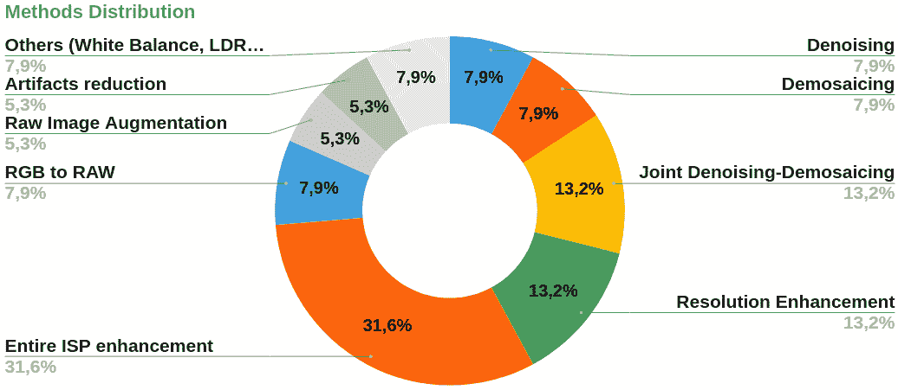
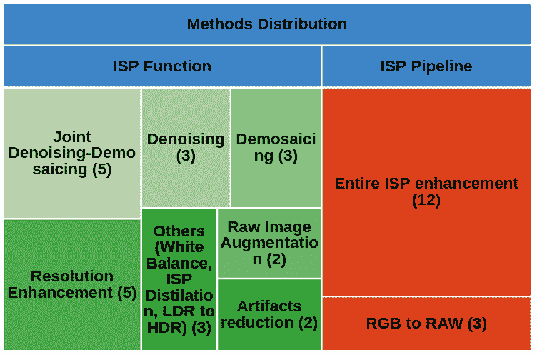
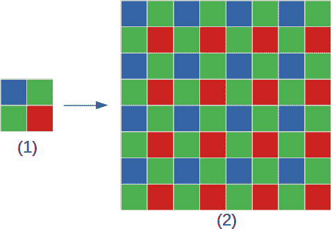
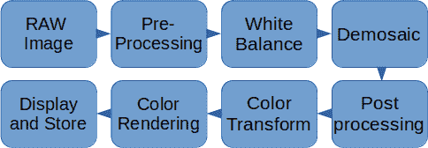
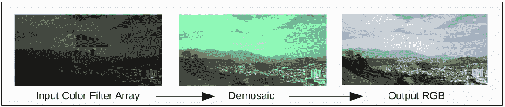

<!--yml

category: 未分类

日期：2024-09-06 19:39:32

-->

# [2305.11994] ISP 遇见深度学习：关于图像信号处理的深度学习方法的综述

> 来源：[`ar5iv.labs.arxiv.org/html/2305.11994`](https://ar5iv.labs.arxiv.org/html/2305.11994)

# ISP 遇见深度学习：关于图像信号处理的深度学习方法的综述

Matheus Henrique Marques da Silva, Jhessica Victoria Santos da Silva, Rodrigo Reis Arrais

Eldorado 研究所

坎皮纳斯，圣保罗 - 巴西

{matheus.marques, jhessica.silva, rodrigo.arrais}@eldorado.org.br &Wladimir Barroso Guedes de Araújo Neto, Leonardo Tadeu Lopes, Guilherme Augusto Bileki

Eldorado 研究所

坎皮纳斯，圣保罗 - 巴西

{wladimir.neto, leonardo.lopes, bilekig,}@eldorado.org.br &Iago Oliveira Lima, Lucas Borges Rondon, Bruno Melo de Souza

Eldorado 研究所

坎皮纳斯，圣保罗 - 巴西

{iagolima, lucas.rondon, brunobms}@eldorado.org.br &Mayara Costa Regazio, Rodolfo Coelho Dalapicola, Claudio Filipi Gonçalves dos Santos

Eldorado 研究所

坎皮纳斯，圣保罗 - 巴西

{mayara.regazio, rodolfo.dalapicola, claudio.santos}@eldorado.org.br

###### 摘要

相机的整个图像信号处理器（ISP）依赖于多个过程来将来自颜色滤镜阵列（CFA）传感器的数据转换，例如去马赛克、去噪声和增强。这些过程可以通过一些硬件或软件来执行。近年来，深度学习作为解决这些问题或甚至用一个神经网络替代整个 ISP 的方案出现。在这项工作中，我们调查了该领域的一些最新研究，并提供了更深入的分析和比较，包括结果和未来研究者可能的改进点。

*关键词* 图像信号处理，深度学习，卷积神经网络

## 1 引言

图像信号处理器（ISP）是数字相机的一个组件，能够执行多种任务以改善图像质量，如去马赛克、去噪声和白平衡。ISP 执行的一组任务称为 ISP 管道，分为预处理和后处理步骤，并可能因制造商而异[1]。如今，机器学习被用来部分或完全替代整个 ISP 管道。特别是，深度学习被用来替代 ISP 任务，处理噪声去除或影响网络处理的一些图像特征。深度学习网络在计算效率和处理时间方面提供了改进。本文旨在分析最近的研究，27 篇研究论文，涉及基于深度学习的 ISP 管道。

### 1.1 图像信号处理

传统上，ISP（图像信号处理器）是从 RAW 图像重建 RGB 图像的数字信号处理器。在传统的相机处理流程中，使用复杂且专有的硬件过程来进行图像信号处理 [2]。它包括多个处理步骤，如噪声减少、白平衡、去马赛克处理等。每一步在 ISP 中的损失函数通常是按顺序执行的，残差误差会在运行过程中累积 [3]。后续阶段的参数调整用来纠正累积的错误。

大多数传统方法使用启发式方法来推导 ISP 流程中每一步的解决方案 [2]，因此需要调整众多参数。此外，多个 ISP 过程按顺序执行且基于模块的算法会在每一步执行中导致累计错误。为了最小化这些错误，研究了新的技术，其中与深度学习相关的算法开始受到更多关注。

### 1.2 深度学习

尽管机器学习的研究可以追溯到 1950 年代 [4]，但只有在过去十年中，技术的进步才允许其更复杂的领域得到广泛探索。计算能力的快速发展，加上每日生产的数据量不断增加，导致了对机器学习技术使用的兴趣的微妙复兴。因此，化学 [5]、医学 [6]、经济学 [7] 和物理学 [8] 等多个领域能够利用其能力加速或改善其工作，直接受到了深度学习领域这一演变的影响。

深度学习，作为机器学习的一个子集，由基于人工神经网络的算法组成，这些算法使用多个神经层从提供的原始数据中提取更高层次的特征 [9, 10, 11]。这一类算法需要巨大的计算能力，而这种计算能力仅在近年来才得以实现。与对计算能力的高需求并行，深度学习算法的学习能力也随着系统提供的数据量的增加而提升。因此，那些在操作中数据流入量巨大的领域发现，深度学习是一种有趣的方式来发现和理解隐藏的信息。

在深度学习使用方面，取得了显著成果的一个领域是图像处理（计算机视觉的一个子集），更具体地说，是使用卷积神经网络（CNN）。CNN 是一类更倾向于处理视觉图像的神经网络，因为它们受到生物过程的启发，设计方式模仿了动物视觉皮层的神经连接模式[12, 13]。CNN 的另一个重要方面是，与其他网络不同的是，它们使用非常少的预处理，能够通过自身学习来优化卷积核。这些特性使得 CNN 在图像处理任务中的使用更加普遍。

### 1.3 ISP 与深度学习的关系

使用 CNN 替代基于硬件的 ISP 的意图是有依据的，因为 CNN 可以弥补输入图像中的信息损失，使其比传统实施的 ISP 更可靠，因为传统 ISP 在每一步都容易积累错误[1]。[31]是最早提出用 CNN 代替智能手机 ISP 相机的人之一，并使用 PyNet 网络提供了一个 RAW 到 RGB 的数据集。这些成果展示了 CNN 作为图像处理替代方案的潜力，即使是替代最复杂的 ISP 也不在话下。

网络 CNN 不仅在低级视觉任务[2]中显示出显著优势，在高级任务如目标检测和分割[14]中也表现良好。凭借这些优势，使用 CNN 将 RAW 图像转换为 RGB 图像变得可能。

尽管取得了良好的结果，但使用 CNN 替代 ISP 的研究仍然较少。[3]展示了在传统 ISP 流程中进行必要调整的困难，并开发了一个执行 ISP 流程的 CNN。

### 1.4 与其他工作的比较

巩固一个不断发展的科学领域的一个有效方法是对该领域的最新技术进行调查。这样，可以更方便地获取这类信息，使得理解和选择适合自己个案的技术变得更容易。例如，在深度学习领域，已经有大量的调查报告涵盖了许多不同的领域，如农业[15]、网络安全[16]、自动驾驶[17]、医学成像[18]，以及更技术性的领域，如 CNN[19]。但对于更为新兴的领域，如使用深度学习替代 ISP，找到这类汇总信息可能仍然比较困难。

尽管已经有一些关于 ISP 单个步骤的调查，如去马赛克 [20] 和去噪 [21]，但仍然没有简便的方法来查找和比较端到端 ISP 深度学习方法。在本文中，我们总结了这些方法中的许多，展示了这一领域的一些最先进的人工神经网络（ANN）。 |

### 1.5 本工作的范围

对于本研究，文章按照三个主要点进行了研究：

+   •

    新颖性：引入最新和重要的工作，包括通过深度学习方法替代部分或整个 ISP 流程的策略；以及

+   •

    最近开发：所有考虑的研究均发表于 2019 年至 2021 年之间，使本研究非常具有时效性。 |

表 1：调查中考虑的方法汇总。 |

| 短名称 | 描述 |
| --- | --- |
| HerNet [22] | 将 CNN 与传统算法结合，逆转 CFA 处理流程的顺序。 |
| CameraNet [23] | 将相关性差的子任务分开，创建一个具有两个阶段的网络。 |
| Deep Camera [3] | 创建一个具有四个并行路径的网络，包含卷积层和反向 ISP，用于合成 RAW 图像。 |
| DRDN [24] | 基于残差学习和密集连接卷积神经网络的彩色滤光片阵列去马赛克。 |
| Deep Demosaicing for Edge Implementation [25] | 讨论了基于深度学习的去马赛克算法在低端边缘设备上的边缘实现。 |
| BayerUnify 和 BayerAug [26] | 创建了一种统一不同 Bayer 图案的方法和有效的 RAW 图像增强方法。 |
| VisionISP [27] | ISP 方法，用于提高计算机视觉应用的性能。 |
| RLDD [28] | 将 CNN 与传统算法结合，逆转去马赛克和去噪的顺序。 |
| DPN [29] | 一种高效的深度神经网络架构，用于四元 Bayer CFA 去马赛克，适用于亚微米传感器。 |
| CycleISP [30] | 模拟相机成像流程的正向和反向方向，生成用于去噪的逼真图像对。 |
| PyNET [31] | 使用一种新型金字塔形 CNN 架构替代移动相机的 ISP。 |
| PyNET-CA [32] | 通过添加通道注意力和亚像素重建模块来提高 PyNET 的性能。 |
| SGNet [33] | 创建了一种自适应方法来处理高频和低频区域。 |
| PatchNet 和 RestoreNet [34] | 使用主动学习从图像中选择最有用的补丁用于训练步骤。 |
| AWNet [35] | 在 ISP 流程中使用小波变换和非局部注意机制。 |
| Del-Net [36] | 一种多尺度架构，学习整个 ISP 流程。适合智能手机部署。 |
| InvISP [37] | 除了重建 RAW 数据，还使用可逆神经网络渲染 sRGB 图像。 |
| ICDC-Net [38] | 一种与 ISP-Net 配合的方法，用于解决网络训练中的 JPEG 图像压缩问题。 |
| CSANet [39] | 使用由通道注意模块组成的级联块。 |
| LiteISPNet [40] | 方法用于对齐在训练过程中由不同相机拍摄的图像对。 |
| TENet [41] | 重新排序了传统操作序列，变为去噪 + 超分辨率 -> 去马赛克。 |
| ReconfigISP [42] | 根据特定任务调整架构和参数。 |
| ISP Distillation [43] | 使用 sRGB 图像分类模型并提炼 ISP 流程的知识。 |
| Merging-ISP [44] | 一种将多个图像层 LDR 重建为一个图像 HDR 的方法。 |
| GCP-Net [45] | 一种针对实际拍摄的快速图像的联合去噪和去马赛克方法，基于绿色通道先验神经网络。 |
| PIPNet [46] | 使用深度网络处理 CFA 模式中的联合去马赛克和去噪问题。 |
| CURL [47] | 图像增强方法，可用于 RAW 到 RGB 和 RGB 到 RAW 映射任务。 |

所考虑的论文并未关注相同的 ISP 任务和改进。图 2 显示了评审文章中研究的 ISP 功能分布，表 LABEL:tbl:methods 列出了本文讨论的所有方法。 |

约 $30\%$ 的论文提出了使用端到端深度学习方法的整个 ISP 流程框架。其他论文则为 ISP 流程的特定阶段开发了深度学习解决方案，例如去噪任务、联合去噪-去马赛克任务、分辨率提升任务等。其中一些还提出了额外和不同的 ISP 深度学习技术，如 RAW 数据增强和通过反向 ISP 过程从 RGB 图像生成 RAW 数据。 |

图 2 显示了我们如何映射那些研究的 ISP 任务。我们将它们标记为两个组：ISP 功能，当所提出的解决方案针对特定的 ISP 操作时，以及 ISP 流程，当所提出的解决方案涉及 RAW 到 RGB 或 RGB 到 RAW 操作以及整个 ISP 过程时。

图 1: 评审的 ISP 任务分布

图 2: 映射的 ISP 任务

### 1.6 工作结构

本文的其余部分结构如下：第二部分描述了整体概念、传统的 ISP 流程和算法。第三部分包含了通过本研究收集的工作的摘要。第四部分涵盖了收集工作的结果。第五部分详细描述了在本研究期间收集的方法论。第六部分总结了本文内容。

## 2 软件 ISP

在过去的二十年里，随着嵌入式设备的普及，这些设备将数字相机作为辅助或主要功能，可靠的数字图像捕捉和处理系统的需求显著增长。如今，处理速度和图像质量是大多数这些设备的主要卖点。也就是说，图像重建系统的研究变得前所未有的重要。

传统上，数字相机由两个子系统结合而成，第一个子系统专注于通过一组光敏模拟传感器来获取信号，这些传感器通常称为传感器元件[1]。现代传感器元件对光的变化具有高灵敏度，但无法独立识别颜色变化。一个可能的解决方案是使用 3 个不同的传感器元件，每个元件都有一个特定的滤光片，以捕捉可见光的特定频率范围。

这种策略会带来许多技术问题，主要与传感器对准、光照入射差异等相关，此外，还会增加硬件成本[1]。现代传感器元件内置有已知的光频率滤光片，使得使用单个传感器元件重建彩色图像成为可能。这些滤光片被称为颜色滤光阵列 (CFA)。Bayer 颜色滤光片 (BCF) 是一种特殊类型的红绿蓝 (RGB) CFA 图案，在现代图像传感器中广泛使用。BCF 基于假设人类视觉系统 (HVS) 对绿色光谱的颜色更敏感。基于这一点，BCF 由一个 2x2 网格图案组成，包含两个绿色、一个红色和一个蓝色传感器[1]，如图 3 所示。

图 3： (1) Bayer 图案和 (2) 扩展图案。基于[48]

BCF 滤光片放置在传感器元件的正前方。捕获过程产生的信号，经过 BCF 滤波，称为 Bayer 阵列 (BA)，由每个像素的单色强度组成，遵循 BCF 图案。RAW 图像文件由 BA 数据以及捕获时获得的元数据组成，本节中，信息如捕获时间、预处理策略、黑电平、光圈、曝光、ISO 等通常被封装在标准可交换图像文件 (EXIF) 数据中。

现代图像传感器，如 OmniVision 的 OV5647，使用由 2624×1956 个光敏传感器组成的传感器元素，覆盖一层 BCF。除了图像数据采集，这个设备还提供了各种处理选项，如自动曝光控制（AEC）、自动白平衡（AWB）、自动带通滤波器（ABF）和自动黑电平校准，以提供具有更好整体图像质量的 RAW 输出[4]。

ISP 管道通常被称为数字相机的第二个子系统。它建立在一系列过程之上，旨在将 RAW 图像文件转换为可见的数字对象，以便显示和存储捕获的图像。这里将一般性地探讨传统管道的一些步骤。

传统的 ISP 管道通常是由一系列顺序操作构建而成。ISP 的输入通常是一个 RAW 图像，而输出则是一个 RGB 编码的数字图像。商业上使用的 ISP 可能在操作的顺序和类型上有所不同，具体取决于制造商的需求。然而，这些信息并不可用，但大多数 ISP 都需要一些基本操作，这些操作作为研究这种子系统的基础。也就是说，几乎所有传统 ISP 都有一些已知的阶段，这些阶段如下面的图 4 所示。

图 4：传统 ISP 管道。基于 [49]

尽管现代图像传感器能够解决许多数据采集问题[4]，但对 RAW 图像中的数据进行预处理是重要的，以验证信号完整性，识别和修复采集故障，防止错误在后续操作中传播。ISP 预处理的三个常见阶段是：信号调节、缺陷像素校正和黑电平偏移。信号调节是指对传感器获得的数据进行归一化、线性化及其他必要的操作，以使数据适应 ISP 进行处理 [1]。

### 2.1 黑电平偏移校正

黑电平偏移校正是由图像传感器的不精确性所产生的必要性，其目标是校正 ISP 输入值，以减少黑电流效应，这种效应会增加传感器元素测量的光强度，并可能在处理后的图像中造成模糊效果 [1]。黑电平偏移旨在确保图像中的黑色调被正确记录。现代图像传感器通常提供一个包含黑电平校正掩码的阵列[4]。

### 2.2 缺陷像素校正

缺陷像素也是常见的预期采集错误，出现这种问题的原因包括生产缺陷、存储方法和温度问题[50]。缺陷像素的识别通常是通过分析中央像素相对于其邻近像素的光强度变化来进行的[50]。修正缺陷像素的方法有多种，其中一种是将邻近点的平均值应用于被识别为缺陷的像素[50]。

### 2.3 白平衡

在修正采集问题之后，传统 ISP 的一个常见第一步是对输入数据进行白平衡处理。虽然人类视觉系统能够识别不同光源下物体的白色，但数字系统并不具备这种能力，不同频段的光会导致不同的测量值[51]。白平衡旨在确保重建后的颜色对人眼具有自然的色调[1]。ISP 常用的策略是自动白平衡（AWB）策略，尽管许多图像传感器如 OmniVision 的 OV5647 已经内置此功能，但许多 ISP 还是单独实现了这一功能。常用的方法是利用灰世界假设，该假设认为在大多数情况下，每个采样通道的平均颜色是相等的。基于这一原理，通过测量绿色通道和其他通道的平均光强度之间的比率来进行像素的修正[51]。

### 2.4 去马赛克

数字图像重建中最计算密集的步骤是将 CFA 数据转换为可见图像，这一过程称为去马赛克。执行这一操作的一种常见策略是通过某种变体的加权插值来处理 CFA 中每个像素的绝对值。尽管大多数商业化的去马赛克技术受到专利保护，但一些开源应用程序如 RawTherapee 对使用的去马赛克技术是透明的。在这个应用程序中，可见图像使用如自适应同质性导向算法进行重建[52]。

图 5：对 CFA 进行去马赛克处理。

图 5 显示了智能手机 Samsung G9600 的 ISP 流程输出（第三张图）与图像传感器发送的 RAW 图像（第一张图）之间的比较。通过分析传感器输出的元数据，可以识别出捕获过程中使用的 CFA 颜色模式是 Bayer 绿色-红色-蓝色-绿色模式。这个信息被用于对原始 RAW 图像进行去马赛克处理（第二张图）。第二张图和第三张图之间的比较突显了 ISP 流程中所有步骤在重建高质量照片中的重要性。

### 2.5 去噪

图像去噪是数字图像重建任务中的一个复杂步骤，其目标是从输入图像中去除噪声，以估计原始图像。由于图像传感器硬件组件的缺陷或异质性以及图像压缩，这一步骤通常用于传统的 ISP 流程。图像去噪对视觉计算领域的多个应用非常重要，多年来受到广泛关注[53, 54, 55, 21, 56]。已经提出了几种图像去噪方法，它们可以分为经典方法和深度学习方法。经典方法包括空间域方法，该方法在图像中应用滤波器以去除噪声，以及变换域方法，该方法将域从输入图像中改变，然后使用去噪程序来改进图像。深度学习方法在大多数情况下是一种基于 CNN 的方法。在这项调查中，将引用一些关于图像去噪的深度学习工作[57, 26, 58, 33, 59, 60]。

### 2.6 去模糊

模糊是一种在数字图像处理中很难避免的伪影，可能由各种来源引起，如运动模糊、对焦不准、相机抖动、极端光强、ISP 管道中的累计误差等。鉴于此，文献中存在许多手工去模糊算法来缓解这一问题[61, 62]，其中一些已被纳入 ISP 中。Razligh 和 Kehtarnavaz [63] 提出了一个针对手机的去模糊方法，该方法考虑了亮度和对比度来校正模糊图像。另一方面，Hu 等人 [64] 认为可以使用智能手机的惯性传感器、陀螺仪和加速度计来估计核，并利用在线校准来同步相机和传感器。然而，许多这些经典方法仅涵盖了某些情况，实现了手工特征提取，并且需要两个先前的步骤[61]：模糊检测和模糊分类。近年来，深度学习成为解决这些问题的一种替代方案，可能将所有这些步骤联合在一个唯一的步骤中[65]。

### 2.7 后处理步骤

各个相机制造商可能使用不同的、通常是专有的处理方法来改善图像质量。后处理步骤旨在对经过先前处理的图像进行一些调整。最常用的一些后处理步骤包括边缘增强、去除彩色伪影和核心处理[1]。这些技术使用启发式方法，并需要大量的微调。

例如，去马赛克步骤可能会引入问题性伪影，比如拉链状的边缘和图像其余部分的彩色碎片。在后处理阶段，必须将这些伪影保持到最小，同时不失去图像的清晰度[1]，一些相机制造商使用边缘增强技术，通过减少图像中的低频对象，使图像更具吸引力。解决这些问题涉及许多变量，从捕捉传感器的大小到使用的去马赛克技术。

### 2.8 渲染颜色空间

渲染颜色空间通常用作输出，并且具有有限的范围，与基于场景的未渲染颜色空间不同。渲染颜色空间是基于从未渲染空间中的图像提取的数据创建的，最大为 8b，而未渲染空间的范围在 12 到 16b 之间[1]，因此，将未渲染空间转换为渲染空间的过程包含动态范围的损失。

最常见的渲染空间是 sRGB [1] 颜色空间，它已成为多媒体的常见标准。另一个常见的渲染空间是 ITU-R BT.709-3，它是为高清电视设计的。sRGB 标准采用了 ITU-R BT.709-3 定义的基色。这些模式定义了将未渲染空间转换为大多数输出媒体所施加的 8b 值的方法。

根据预览模式，图像需要转换为适当的颜色空间。例如，在 CRT 显示器的加色系统下查看时，图像需要根据使用的显示模型、偏移值、色温和 gamma 值转换为 8b 输出。

当目标是存储时，我们有两种解决方案：一种是专业相机，它们具有非常大的传感器集和更大的存储空间，通常将图像存储为专有格式或标记图像文件格式/电子摄影（TIFF/EP）。以 TIFF/EP 格式存储的图像包含附加信息，如相机设置细节和颜色转换矩阵 [1]。JPEG2000 是一种国际标准，提供比常见的 JPEG 标准更高效的压缩，并提供多种功能，如数据压缩大小和图像分辨率的控制。然而，尽管 JPEG2000 具有许多优点，但其计算复杂性和高内存成本是限制因素。

鉴于现代 ISP 流水线的高复杂性和调优需求，许多研究正致力于使用机器学习将 RAW 图像数据转换为高质量输出。本工作展示了这些研究的最新进展。

## 3 种已知方法

在本节中，我们回顾了基于深度学习的方法在替代传统手工 ISP 流水线中的应用，包括去马赛克、去噪、白平衡、色调调整和曝光平衡等操作。同时，我们简要总结了一些利用这种方法提高其他计算机视觉任务性能的工作。

### 3.1 HERNet

高分辨率网络（HERNet）[22] 是一种可以学习高分辨率图像补丁的局部和全局信息的网络，且不会过度消耗 GPU 内存。该网络具有用于局部和全局特征提取的两个路径，并引入了金字塔全图编码器 [22]，实现了输出图像的正则化，有助于减少伪影。此外，该工作还提出通过逐渐增加输入分辨率来训练模型，这带来了性能稳定性和较短的训练时间。

局部信息路径由多尺度残差块（**MSRBs**）[66] 组成，这些块具有两个并行的卷积层，分别使用 3x3 和 5x5 的卷积核。此外，在全局信息路径中，应用了具有修改的残差中的残差（**RIR**）[67]模块的自编码器机制用于特征提取。修改后的 RIR 模块旨在减少 GPU 内存使用，特别是对高分辨率图像的处理，因此去除了通道注意力单元，并对剩余部分进行了堆叠。最终，作者使用 ZRR 数据集[31]进行了模型训练和验证，并在训练中仅使用了 L1 损失。不幸的是，L1 损失在对齐不准确的数据集中会偏向模糊图像。

局部信息路径由多尺度残差块（**MSRBs**）[66] 组成，这些块具有两个并行的卷积层，分别使用 3x3 和 5x5 的卷积核。此外，在全局信息路径中，应用了具有修改的残差中的残差（**RIR**）[67]模块的自编码器机制用于特征提取。修改后的 RIR 模块旨在减少 GPU 内存使用，特别是对高分辨率图像的处理，因此去除了通道注意力单元，并对剩余部分进行了堆叠。作者使用 ZRR 数据集[31]进行了模型训练和验证，并在训练中仅使用了 L1 损失。不幸的是，L1 损失在对齐不准确的数据集中会偏向模糊图像。

采用渐进式训练来训练网络，其中输入图像分辨率在训练过程中逐渐增加，同时网络架构始终保持不变。因此，这一过程能够使网络更快地收敛。此外，HERNet 在 AIM 2019 RAW 到 RGB 映射挑战中获得了第一赛道的第二名和第二赛道的第一名。

### 3.2 CameraNet

CameraNet[23] 提出了一个有效且通用的深度学习基础的 ISP 管道框架，其中包含两个叠加的 CNN 阶段。其动机在于，ISP 管道的一些子任务之间相关性较差，因此将这些子任务分为两个阶段：第一阶段是恢复阶段，包括去马赛克、去噪和白平衡等任务；第二阶段是增强阶段，执行曝光调整、色调映射、颜色增强和对比度调整等任务。此外，使用 Adobe Camera Raw¹¹1https://helpx.adobe.com/br/camera-raw/using/supported-cameras.html 和 Adobe Lightroom ²²2https://www.adobe.com/lightroom 在数据集 HDR+[68]和 FiveK[69]中为每张图片创建了两个真实值。每个真实值用于训练不同的阶段。在 CameraNet 管道中，在这两个主要阶段之前，输入图像会进行预处理，包括去除坏点、初步去马赛克和插值、以及将 RGB 转换为 CIE XYZ 空间，因为这与人类感知相关。此外，U-Net 是这两个阶段的基础模型，因其多尺度特征提取能力。做了一些修改，例如在网络的最低层增加了一个全连接层，并在每个阶段使用不同的处理块。恢复阶段使用普通卷积块，而增强阶段则使用残差连接以改善细节。此外，在实验中，CameraNet 生成的图像在 HDR+数据集和特别是在 SID[71]数据集中，比 DeepISP[70]网络具有更少的噪声、伪影、更好的颜色映射和更高的质量评分。这种差异的解释可能是 SID 数据集中的噪声水平较高以及 CameraNet 中将弱相关的子任务分为两个阶段。在 FiveK 数据集中，两种方法在 SSIM 上取得了可比的结果，但 CameraNet 在 PSNR 和颜色误差指标上取得了更优的结果，因为该数据集使用高端相机捕捉，减少了噪声水平。与深度学习方法相比，DCRAW 和 CameraRAW 生成的图像在默认设置下具有最低的结果，这可以解释为传统方法的局限性。

### 3.3 深度相机

作为第一个提出替代整个 ISP 管道的 CNN 网络，Deep Camera[3]是一个具有四个并行路径的小型网络：一个主路径和其他三个中间有卷积层的短路径。解释是模型相较于 ResNet 非常小，因此网络在将输入复制到块的输出时泛化能力较差。此外，作者创建了一个逆 ISP，从一个包含 11,000 张图像及多种场景和光源的大数据集中重建 RAW 图像[72]，训练和实验阶段使用了生成的数据集。

CNN 模型在白平衡和图像重建任务中优于传统方法，提供了许多更好的图像。然而，在一些颜色较多的图像中，算法表现更好。此外，Deep Camera 可以进行缺陷像素修正，并可用于其他颜色滤镜马赛克，如富士胶卷的 X-Trans 颜色滤镜。

### 3.4 DRDN

DRDN [24] 提出了一个卷积神经网络用于颜色滤镜阵列去马赛克。该模型以马赛克图像作为输入，采用端到端的方式进行训练，以生成去马赛克的图像输出。与其他传统的卷积神经网络去马赛克模型相比，所提出的模型需要更少的计算复杂度，因为它不需要对马赛克输入图像进行初始插值步骤。它还通过残差学习[73]和密集连接的卷积神经网络[74]解决了许多深度神经网络中遇到的梯度消失问题。此外，该模型应用了块级卷积神经网络来考虑局部特征和一个子像素插值层，从而更高效、准确地生成去马赛克的输出图像。

这篇论文对去马赛克的挑战任务提供了出色的解释和背景分析，引用了类似的前期方法，并突出显示了每种方法可以改进的地方。研究详细介绍了训练参数和与所考虑数据集相关的方面。最后，进行了广泛的性能比较，其中提出的方法在绝大多数情况下表现突出。另一方面，论文没有透露验证阶段获得的推断时间，考虑到研究的数据集具有中等大小的图像。同样，作者可以更深入地讨论为什么 DRDN 在一些评估案例中未能达到最佳 PSNR[24]。

### 3.5 边缘实现的深度去马赛克

在这篇论文中[25]，作者讨论了深度学习去马赛克算法在低端边缘设备上的边缘实现的主要挑战。他们对深度神经网络架构进行了广泛搜索，获得了以颜色峰值信噪比（CPSNR）为损失与参数数量为模型复杂度的帕累托前沿。该文章为去马赛克方法提供了有价值的参考框架，分为六个类别：边缘敏感方法、方向插值和决策方法、频域方法、小波方法、统计重建技术和基于深度学习的方法[75]。同样，作者还回顾了其他相关的去马赛克方面，如图像伪影的非期望存在以及性能评估方法。

该研究对架构进行了全面的搜索，基于离散且构造良好的超参数，例如滤波器和块的数量、跳跃连接的长度以及深度可分卷积的使用。研究提出了关于神经架构搜索和帕累托构建的适当方法论和数学理论。亮点是关于神经架构搜索收敛性的五个全新定理。最后，设计的空间通过简单的全面搜索超越了最先进的技术，并在边缘实施中带来了不同资源约束下的损失与复杂度范围，克服了与评估次数和搜索算法复杂性相关的缺点。作为缺点，作者应该更多讨论给定架构搜索在其他图像处理任务中的使用，而不仅仅是边缘实施挑战。

### 3.6 BayerUnify 和 BayerAug

Liu 等人[26]提出了两种新的基于 DNN 的 RAW 图像去噪技术。第一种是拜耳模式统一（BayerUnify）方法，能够有效处理来自不同数据源的多种拜耳模式。第二种方法是拜耳保持增强（BayerAug），允许适当的 RAW 图像增强。将这两种技术与修改后的 U-Net 结合，所提出的方法在 NTIRE 2019 真实图像去噪挑战中取得了令人满意的 SOTA PSNR 52.11 和 SSIM 0.9969。

BayerUnify 由两个阶段组成。在训练阶段，研究通过裁剪将具有不同拜耳模式的 RAW 数据统一。该技术将 BGGR 拜耳格式映射到其他格式（RGGB、GRBG 和 GBRG）中，并裁剪所选区域，将任何拜耳模式转换为 BGGR（或其他所选模式）。在测试阶段，由于图像像素需要处理，该技术通过填充统一了拜耳模式。随后，进行了网络去噪和额外像素的移除，解统一输出图像并逆转模式转换。

传统的数据增强方法通常基于图像翻转或裁剪。然而，对于 RAW 图像，翻转过程可能会影响拜耳模式。BayerAug 解决了这个问题，结合了翻转和裁剪。论文展示了三种不同的翻转方法，使得对拜耳 RAW 图像的数据增强没有任何问题。

该研究在 Smartphone Image Denoising Dataset (SIDD) [76] 上评估了所提出的方法 - 320 对有噪声和无噪声图像，涵盖了三种不同的拜耳模式。网络使用 L1 损失、AdamW[77]优化器以及 200,000 次迭代进行训练。

论文对 Bayer 模式的预处理和增强提供了令人满意的介绍，并讨论了相关工作。所提方法得到适当解释，网络架构和卓越的训练细节也得到了说明。在该框架参考下，该研究展示了使用深度学习技术处理 RAW 图像的有希望的方向。作为局限性，作者可以提供与 NTIRE 2019 挑战中其他工作的比较，以及对所提方法在实际设备中应用的深入讨论。

### 3.7 VisionISP

Wu 等人[27] 提出了一个专门针对计算机视觉应用的 ISP 方法。VisionISP 减少了数据传输需求而不会丢失相关信息，从而优化了随后的计算机视觉系统性能。该框架由三个处理模块组成。第一个模块，Vision Denoiser，减少了输入信号噪声并修改了现有 ISP 上的调谐目标。该研究采用了 Nishimura[78] 提出的技术来优化去噪参数，构建了用于计算机视觉任务的去噪器，而不是用于图像质量的去噪器。论文还强调了去马赛克步骤可以跳过，且使用彩色滤光片阵列图像而不是去马赛克图像并没有改善计算机视觉任务性能。第二个模块，Vision Local Tone Mapping (VLTM)，减少了比特深度，在每个像素的比特数更少的情况下实现了类似的准确度。VLTM 使用了全局非线性变换，后跟局部细节增强算子。最后，Trainable Vision Scaler 模块（TVS）是一个通用神经网络，处理并缩小输入以供后续计算机视觉引擎使用。

VisionISP 在 KITTI 2D 目标检测数据集[79]上进行了训练和评估，这是一个自动驾驶基准数据集。研究测量了每个 VisionISP 模块对平均精度均值（mAP）的影响。作为实验中的计算机视觉任务样本，作者使用了 SqueezeDet[80] 框架及其原始代码。

论文对每个 VisionISP 组件提供了恰当的解释和评估。一个积极的方面是，实验表明一旦 TVS 经过训练后，它可以与其他计算机视觉系统一起使用。VisionISP 整体可以与计算机视觉骨干网络一起或单独训练。此外，所提框架的每个组件都能增强计算机视觉引擎的性能，并且可以独立部署。

然而，论文可以提供更多的训练细节（例如，训练轮数、推理时间、硬件等）以及 VisionISP 效果与当时其他计算机视觉优化系统的更深入比较。

### 3.8 RLDD

在本文 [28]中，作者将卷积神经网络与传统算法相结合，逆转了传统 CFA 流程（去马赛克和去噪）的顺序。我们在此称之为 RLDD 的方法，使用两个阶段进行去马赛克-去噪。第一个阶段通过将基于梯度的无阈值（GBTF）方法 [81]与卷积神经网络相结合来执行去马赛克，以克服在下采样操作中图像分辨率的降低。第二个阶段使用另一个卷积神经网络进行去噪，旨在处理残余噪声。由于复杂的插值，残余噪声的属性发生了变化，而卷积神经网络旨在去除噪声而不丢失图像细节。

这些结果在 Kodak [82]、McMaster [83]和 Urban 100 [84] 数据集上进行了验证，并且显示出该模型在所有数据集上都优于最先进的去马赛克和联合去马赛克及去噪算法，具有更高的 PSNR 和 SSIM 值。方法之间的视觉比较结果确认了所达到的定量值，显示了更好的图像视觉质量。然而，该方法的去马赛克和去噪的平均运行时间并未超越所有评估的方法。

### 3.9 DPN

本研究提出了一种双层金字塔网络（DPN [29]），这是一个高效的深度神经网络架构，用于亚微米传感器中的 Quad Bayer CFA 去马赛克。

该文章提供了有关 ISP 最先进挑战的准确背景和有用的 Quad Bayer CFA 分析，参考了相关的深度学习解决方案。

提出的架构由两个连接的特征图金字塔组成。其中一个由下采样块组成，另一个由上采样块组成，并结合了密集的跳过连接。

除了跳过连接，受 U-Net [85]启发，给定的网络还应用了受 ResNet [73]启发的残差学习。DPN 还实现了线性特征图增长。与传统的指数方法相比，这种线性方法导致了更少的参数，对于具有有限内存限制的移动应用更为精确。

在结果部分，该研究对比了在三星手机中实现的传统 ISP 算法，观察到在锐度、色彩摩尔纹、边缘、纹理保留和视觉伪影减少方面的改善。在该帧参考中，DPN 在与其他深度学习方法的比较中取得了更好的 CPSNR 值。作为提议的网络架构中的一个限制，输入图像的宽度和高度必须是 $2^{(L+1)}$ 的倍数，其中 "L" 是分辨率级别。否则，输入必须在下采样块之前进行裁剪。此外，该研究本可以使用更大分辨率的图像进行测试，这些图像也在 2019 年的手机中捕获，如 FullHD 和 4K 图像。

### 3.10 CycleISP

Zamir [30] 等人提出了 CycleISP，这是一个建模相机成像管道并生成真实图像对以进行 RAW 和 sRGB 空间去噪的框架。作者在合成数据上训练了一种新的图像去噪网络，并在真实相机基准数据集上达到了最先进的性能。

CycleISP 由两个阶段组成。首先，该框架在正向和反向方向上建模相机 ISP。其次，它为 RAW 和 sRGB 图像去噪任务合成真实的噪声数据集。CycleISP 模型引入了 RGB2RAW 网络分支、RAW2RGB 网络分支、辅助颜色校正网络分支和噪声注入模块。RGB2RAW 和 RAW2RGB 模块独立训练，然后进行联合微调。

RGB2RAW 分支将 sRGB 图像转换为 RAW 数据，而无需任何相机参数。此模块网络由卷积层、提议的递归残差组、双重注意力块和最终的 Bayer 采样函数组成，生成马赛克 RAW 输出。RAW2RGB 网络将干净的 RAW 图像映射到干净的 sRGB 图像。首先，噪声注入模块设置为 'OFF'，然后将 2x2 块打包成四个通道（RGGB）和一个图像分辨率降低块。为了确保输入 RAW 数据可能来自任何相机并具有不同的 Bayer 图案，RAW2RGB 分支应用了 Bayer 图案统一技术 [26]。接下来，卷积层和提议的递归残差组将打包的 RAW 图像编码为深度特征张量。此外，作者向 RAW2RGB 网络提出了一个颜色校正分支，该分支接收 sRGB 图像输入并生成颜色编码的深度特征张量。

此外，还有一个联合微调，提供最佳质量的图像。为此，RGB2RAW 的输出成为 RAW2RGB 的输入，RGB2RAW 分支接收来自两个子损失的梯度，从而重建最终的 sRGB 图像。

为了在 RAW 空间合成逼真的噪声图像对，噪声注入模块被设置为“开启”，并在 RGB2RAW 输出中包括不同水平的拍摄和读取噪声。之后，CycleISP 可以从任何 sRGB 图像生成干净的及其噪声图像对。对于 sRGB 空间，CycleISP 模型使用 SIDD [76] 数据集进行微调，该数据集包含 RAW 和 sRGB 空间中的干净和噪声图像对。

对于训练阶段，作者使用了 MIT-Adobe FiveK 数据集 [69]，随后进行了微调。他们使用 DND [86] 和 SIDD [76] 基准测试评估了 CycleISP 的性能，比较了最先进的 RAW 和 sRGB 去噪方法。CycleISP 在这两种情况下都取得了更好的结果，其网络参数数量几乎比之前最好的 RAW 去噪方法 [58] 小了 5 倍，并且在性能上超越了之前最好的 sRGB 去噪算法 [57]。此外，与其他评估的模型相比，所提出的方法提供了干净且无伪影的结果，同时保留了图像细节。提出的框架模块得到了适当描述，并通过消融研究得到了强化。作者提供了详细的实现细节部分，与相关方法的比较也很合适，并进行了坚实的泛化能力研究。作为负面方面，论文在消融研究中可以展示更多细节，提供更多关于其他 CycleISP 模块的个体贡献的信息，除了 RAW2RGB 分支外。

### 3.11 PyNET

PyNET [31] 是一种新颖的金字塔 CNN 架构，旨在替代智能手机中存在的整个 ISP 流水线。所提出的方法具有倒金字塔形状，由五个不同的层级组成，从下到上进行训练，每个层级的训练输出用于上层的训练阶段。该方法中的卷积滤波器大小从第五层的 3x3 到第一层的 9x9 不等。因此，较低层级学习全局图像处理，而较高层级则学习重建最终图像，恢复较低层级缺失的细节。网络使用三种不同的损失函数组合进行训练。最低层级，即四层和五层，使用均方误差 (MSE) 进行训练，以学习全局颜色和亮度校正。第二层和第三层则通过 MSE 和基于 VGG 的方法 [87] 的组合进行训练，以细化对象的颜色和形状。最后，第一层使用 MSE、VGG 和 SSIM 损失 [88] 进行训练，并进行局部颜色处理、噪声去除、纹理增强等校正。

此外，作者还展示了 Zurich RAW 到 RGB 数据集，包含 2 万对 RAW-RGB 图像，其中 RAW 图像使用华为 P20 智能手机拍摄，RGB 图像则使用专业的高端 Canon 5D Mark IV 相机拍摄。

为了评估该方法，进行了三个实验。第一个实验中，将 PyNET 与 SPADE [89]、DPED [90]、U-Net [85]、Pix2Pix [91]、SRGAN [92]、VDSR [93]和 SRCNN [94]进行了比较。在这次比较中，PyNET 在 PSNR 和 MS-SSIM 指标值上表现优于其他所有方法。第二个实验使用亚马逊机械土耳其人平台[[3](https://www.mturk.com)]测量生成图像的质量，将 PyNET、Visualized RAW 和华为 P20 ISP 的图像与佳能 5D Mark IV 单反相机拍摄的图像进行了比较。在这次比较中，PyNET 生成的图像在与目标单反相机的比较中达到了更好的 MOS 结果。最后一个实验测试了使用 BlackBerry KeyOne 智能手机捕捉的 RAW 图像的 PyNET，无需重新训练网络。PyNET 生成的图像与 BlackBerry 的 ISP 生成的图像进行了比较，PyNET 生成了不错的结果，但在曝光和清晰度方面的结果并不理想。

### 3.12 SGNet

许多方法已经成功地加入了高度相关的任务，减少了 ISP 管道中多个处理单元的累积误差。因此，SGNet [33]将去马赛克和去噪合并到一个独特的网络中。

由于图像中高频区域的修正更为复杂，作者提出提取一个表示图像区域频率的密度图。这个密度图可以帮助网络了解每个区域的难度水平，并在高频区域比其他模型更好地适应。此外，Bayer 模式的一半由绿色像素组成；因此，从这个通道恢复缺失像素更容易。为此，网络有一个分支用于重建绿色通道，从而有助于重建其他通道。此外，SGNet 在两个分支中使用了 Residual-in-Residual Dense Block (RRDB)进行特征提取。此外，该网络通过一组损失函数进行训练，考虑了绿色通道、完整图像、物体、纹理边缘和噪声去除的重建保真度。

SGNet 在超分辨率、去噪和去马赛克任务的数据集中，在 PSNR 和 SSIM 方面表现优于最先进的方法。此外，与 ADMN[59]、CDM[95]、Kokkinos[96]、论文《Deep Joint Demosaicking and Denoising》中的 Deepjoint⁴⁴4Method[60]（由[33, 46] 称为 Deepjoint，由[41] 称为 DemosaicNet，和[34] 称为 DeepJDD）、以及 FlexISP[97] 相比，SGNet 能够更有效地去除摩尔纹伪影，并在高频区域提供更高的图像定义。然而，作为负面点，本工作未展示对计算效率的关注，而计算效率对使用去马赛克和去噪的应用至关重要。

### 3.13 PatchNet 和 RestoreNet

在这篇论文[34]中，作者提出了一种基于主动学习（数据驱动）的方法，该方法学习选择最适合训练步骤的图像补丁，而不会增加推断步骤的额外成本。为此，该方法称为 PatchNet，为每个补丁分配一个权重，以定义在训练过程中是使用还是忽略该补丁。该方法是一个前馈网络，具有多个阶段，每个阶段由多个卷积块和一个下采样操作符组成。然后逐渐将图像转换为一组可训练的标量，最终二值化以获得网络输出。

除了 PatchNet，作者还提出了 RestoreNet，这是一种应用从 PatchNet 提取的结构知识并负责恢复原始图像的架构。

结果在 Vimeo-90k[98]、MIT Moire[60] 和 Urban 100[84] 数据集上进行了验证，并与 Kokkinos[96]、SGNet[33]、CDM[95] 和 DeepJDD^†^†footnotemark: [60] 方法进行了比较。方法在三种不同噪声水平（5、15、25）下进行比较。在所有比较中，所提出的方法在 JDD 任务中取得了更好的 PSRN 值。

消融研究分析了在对 Demosaicing 进行 PatchNet 评估时不同补丁大小的效果，并显示随着补丁大小的增加，性能有所提高。研究增加补丁大小的计算成本及其对网络复杂性的影响将是有趣的。该研究继续对 PatchNet 进行了 JDD 实验，并与上述方法进行了比较。只使用了 PSNR 指标进行比较，但评估其他指标会更有趣。

### 3.14 AWNet

在这项工作[35]中，研究人员提出了一种通过用类似 CNN（卷积神经网络）的 U-Net[85] 替换基础 ISP 来增强智能手机生成图像的方法，称为 AWNet。

网络被分为两个分支，每个分支使用不同的输入，因此使用不同的模型。第一个分支使用 RAW 模型，接收 224 x 244 x 4 RAW 图像，第二个分支使用去马赛克模型，接收 448 x 448 x 3 去马赛克图像。两个分支分别训练，在测试期间结果取平均。

该网络的结构遵循 U-Net，为每个分支应用三个主要模块：全局上下文残差密集模块、残差小波上采样模块和残差小波下采样模块。res-dense 模块用于在离散小波变换（DWT）后提取低频组件，这些组件被发送到下层，而下采样则提取所有组件。提取后，每层的两个组件集都进行上采样并与上一层进行拼接。最后，应用了一个金字塔池化模块，为该分支生成输出。

在测试阶段，应用了一个自集成机制，由 8 个集成变体组成。这些变体随后使用 PSNR（dB）值进行评估，这些值将作为权重生成模型的最终预测。选择的 PSNR 值为 RAW 模型的 21.36 dB 和去马赛克模型的 21.52 dB。通过将这个调优后的模型应用于 AIM 2020 Learned Smartphone ISP Challenge [99]中的 Zurich 数据集的两个轨道，该研究分别达到了第 5 和第 2 的位置。

利用结果作为使用小波变换和全局上下文块的理由，研究人员将 AWNet 的结果与其他流行的网络架构进行比较，如 U-Net、RCAN [67]和 PyNet[31]，使用 ZRR 数据集。通过比较它们的性能，研究发现 AWNet 能够超越 U-Net、RCAN 和当前最先进的 PyNet。

### 3.15 PyNET-CA

PyNET-CA 是一个端到端的移动 ISP 深度学习算法，用于 RAW 到 RGB 的重建 [32]。该网络通过添加通道注意和子像素重建模块并减少训练时间来提高 PyNET [31]的性能。PyNET-CA 具有可逆的金字塔结构，以考虑图像的局部和全局特征。PyNET-CA 的基本模块包括基于[67]的通道注意模块、具有两个 2D 卷积操作的 DoubleConv 模块（使用 LeakyReLU 激活）以及多通道注意模块，后者将 DoubleConv 模块的特征与通道注意模块的特征进行拼接。

超像素重建模块帮助网络以更高质量和更好的计算效率重建最终图像。为此，PyNET-CA 使用 MultiConv 通道注意力模块对图像进行上采样，接着通过 1×1 卷积层和在模型的最终层通过子像素混洗上采样特征。结果展示在 Zurich Dataset [31] 上，与 PyNET [31] 相比，显示了更好的 PSNR 和 SSIM 值。本文未提供网络参数数量，虽然作者提到训练时间的减少，但未提供与 PyNET [31] 结果对比的表格。

### 3.16 Del-Net

Del-Net [36] 是一个单阶段端到端深度学习模型，学习整个 ISP 流水线，将 RAW Bayer 数据转换为高质量的 sRGB 图像。该网络使用空间和通道注意力块（修改版 UNet）[100] 和增强注意力模块块[57] 的组合。空间和通道注意力块允许网络在空间和通道层面捕捉全局细节，从而帮助色彩增强。增强注意力模块块有助于去噪，从而提高 PSNR 值。Del-Net 生成的图像在色彩增强、去噪和细节保留能力方面与最先进的网络（PyNET [31]、AWNet [35] 和 MW-ISPNet [99]) 相当，同时在 Multi-Adds（图像的复合乘加运算次数）方面有所减少。总体而言，这使得该网络非常适合智能手机部署。它在准确性指标和复杂性之间有一个具有竞争力的折中。结果展示在 Zurich Dataset [31] 上，显示了与 PyNET [31] 相比更好的细节保留，与 MW-ISPNet ignatov2020aim 相比更好的去噪，与 AWNet [35] 相比更好的色彩增强。虽然，Del-Net 的细节恢复能力不如 MW-ISPNet [99]。

### 3.17 InvISP

InvISP [37] 重新设计了 ISP 管道，使得 RAW 图像的重建几乎与相机 RAW 图像完全相同，且不会产生任何内存开销，同时生成类似于传统 ISP 的人眼悦目的 sRGB 图像。这一点很有趣，因为最终用户只能访问处理后的 sRGB 图像，因为 RAW 图像过大无法存储在设备上。这种方法中的 RAW 图像重建是通过 RGB 图像的逆过程压缩实现的。为实现这一目标，作者设计了一个从可逆神经网络（由一系列仿射耦合层和可逆 1x1 卷积组成）的 RAW 到 RGB 和 RGB 到 RAW 映射。此外，将一个可微分的 JPEG 压缩模拟器集成到模型中，使得通过傅里叶级数扩展可以从 JPEG 图像中重建几乎完美的 RAW 图像。网络进行了双向训练，以共同优化 RGB 和 RAW 重建过程。模型评估在 MIT-Adobe FiveK 数据集中的 Canon EOS 5D 子集和 Nikon D700 子集上进行[69]。为了从 RAW 图像渲染 sRGB 图像的真实情况，使用了 LibRAW 库，它允许模拟 ISP 管道的步骤。实验显示，相比 RAW 合成方法 UPI [58]和 CycleISP [30]，PSNR 有所提高，这意味着 RAW 图像的检索更加准确。该方法与可逆灰度方法[101]和 U-net[71]基线进行了比较，结果显示了更好的 PSNR 和 SSIM 值，表明模型在 RAW 图像检索和 RGB 图像生成方面更具鲁棒性。

### 3.18 ICDC-Net

在本文中，作者提出了一种 ISP-Net，解决了网络训练中的 JPEG 图像压缩问题[38]，我们在此称之为 ICDC-Net。此前的 ISP 管道中，卷积神经网络并未解决图像在压缩过程中可能丢失的信息问题。

为此，作者应用了一个完全卷积的压缩伪影模拟网络（CAS-Net）。该网络可以将 JPEG 压缩伪影添加到图像中，并通过反转训练压缩伪影减少网络所需的输入和输出进行训练。在这项工作中，作者将 CAS-Net 与 ISP 网络连接，以便在考虑图像压缩时训练 ISP 网络，将压缩伪影纳入考虑。本文中使用的 ISP-Net 是带有通道注意模块的 U-Net[102]，而 CAS-Net 的架构是没有通道注意模块的 U-Net[85]。

结果展示在来自 MIT-Adobe FiveK 数据集的 Nikon D700 子集上[69]。为了从 RAW 图像渲染 sRGB 图像的真实情况，使用了 LibRaw 库。sRGB 图像分别以两个不同的 QF 进行压缩，80 和 90，并且每个模型都是单独训练的。实验结果表明，所提议的网络在图像质量上优于其对压缩不敏感的版本。

### 3.19 CSANet

作为 Mobile AI 2021 学习型智能手机 ISP 挑战赛[39]的第二名和 PSNR 得分第一名，通道空间注意力网络（CSANet）[103] 旨在提高计算性能和最终图像结果的质量，每张图像推理最多为 90.8 毫秒。该网络有三个主要部分：降采样、处理块级联和上采样。在第一部分，为了减少计算时间和参数数量，作者使用了带有步幅卷积块的降采样，随后是常规卷积用于特征提取。接着，网络有一个受卷积块注意力模块（CBAM）[104] 启发的双重注意力模块（DAM）。DAM 包括一个空间注意力模块来学习特征图中的空间依赖关系和一个通道注意力模块来学习特征图的通道间关系。最后部分则通过卷积转置和深度到空间的方式进行上采样，生成最终的 RGB 图像。这项工作另一个重要部分是损失函数，由 Charbonnier 损失[67]、SSIM 损失和感知损失组成，用于减少生成图像与真实图像之间的感知差异。

在 Mobile AI 2021 学习型智能手机 ISP 挑战赛的验证数据集上的量化指标中，CSANet 超越了该挑战赛的基线模型 PUNet，并且运行时间更短。此外，它的结果与 AWNet [35] 相当，但推理时间更好，AWNet 在 AIM 2020 中得分较高。与挑战赛中的其他候选模型相比，该工作以令人满意的运行时间和最高质量得分排名第二。CSANet 可以用于嵌入式系统，正如在智能手机测试中所示。此外，正如预期的那样，注意力模块的使用有助于更好的颜色映射。

### 3.20 LiteISPNet

在某些数据集中，RAW 和 RGB 图像是用不同的相机拍摄的。因此，这些图像对存在错位和颜色不一致，使得训练过程变得困难并产生模糊的结果。考虑到这个问题，Zhang 等人[40]提出了一种方法，用于训练具有错位图像的网络，并将 RAW 映射到 RGB。作者使用了预训练的光流估计网络 PWC-Net [105]来对齐图像对，并设计了一个全局颜色映射（GCM），以匹配输入图像与目标图像之间的颜色，以便于对齐。此外，LiteISPNet 负责将 RAW 映射到 RGB。它简化了 MW-ISPNet [99]，该方法提出了一种基于 U-Net 的多级小波 ISP 网络，减少了每个残差组中的 RCAB 数量，并改变了卷积层和残差组在每个小波分解之前的位置。这些变化将模型的大小和运行时间分别减少了约 40%和 20%。

作者在两个数据集上测试了该网络，ZRR 数据集[31]和 SR-RAW[106]，有两个真实值变体：原始 GT 和对齐 GT。在 ZRR 数据集中，LiteISPNet 与三种最先进的模型（PyNet[31]、AWNet[35]和 MW-ISPNet）进行了比较，在对齐 GT 上超越了所有指标，但在原始 GT 的 SSIM 指标上略逊于 MW-ISPNet。此外，这个模型的 GAN 版本在 LPIPS 指标[107]中获得了更好的感知结果。最后，在定性比较中，该网络能够保留比其他模型更多的细节。使用 SR-RAW 数据集时，作者还与 SR 方法进行了比较，如 SRGAN[92]、ESRGAN [108]、SPSR [109]和 RealSR[110]。它生成的图像噪声更少、更清晰、细节更多，并且在几乎所有指标上得分更高，只在原始 GT 的 PSNR 指标上失分，该指标偏向于模糊图像。

总之，这项工作在 ISP 和 SR 问题上超越了最先进的模型，并且提供了一种用错位数据集训练 DNN 模型的新方法。此外，这种新方法使得一个轻量级网络（如工作中使用的）能够产生接近或高于更强大的模型的结果。然而，作者没有在嵌入式系统中测试该模型。

### 3.21 TENet

通常，ISP 流水线是一个具有固定顺序的三个核心组件的操作序列：去马赛克、去噪声和超分辨率。然而，Qian 等人 [41] 在广泛的实验中表明，简单地重新排序操作序列可以提高图像质量。随后，作者创建了 Trinity Enhancement Network (TENet)，这是一个重新排列操作顺序的网络，将去噪声 (DN)、超分辨率 (SR) 和去马赛克 (DM) 排列在一起。DN 块是第一个，因为 RAW 图像上的噪声具有高斯-泊松分布 [111]，因此更容易解决；RAW 图像噪声可能会阻碍后续任务；此外，这种噪声在图像处理操作过程中会变得更加复杂。此外，高分辨率图像中的 DM 会产生更少的伪影，超分辨率算法可能会放大 DM 生成的伪影。因此，SR 是这个架构中的第二个块。

由于 DN 会在图像中产生模糊，作者将 DN 和 SR 合并为一个独特的块，消除了图像操作中的累积误差，最终得到了这个流水线：DN + SR -> DM。为了有效利用这两个阶段，损失函数由两个损失组成：$\pazocal{L}_{joint}$，这是最终输出图像上的 $l_{2}$-范数损失，以及 LSR，即 DN+SR 结果与输入图像的高分辨率无噪声马赛克图像之间的 $l_{2}$-范数损失。因此，最终损失是这两个损失的总和。此外，作者使用 Residual in Residual Dense Block (RRDB) [108] 来构建所有块的核心部分。

他们还注意到，之前合成 DM 的数据集存在三方面的不足：1）用于合成 RAW 图像的图像是通过相机 ISP 进行插值的结果；2）模型被训练成学习相机 ISP 中使用的平均 DM 算法；3）合成的 RAW 图像的信息量低于真实 RAW 图像。因此，PixelShift200 数据集 citeqian2021rethinking 采用了 200 张 2k 分辨率的全色彩采样图像。由于像素位移技术，每个图像的像素都包含完整的颜色信息，无需去马赛克处理。此外，从这些高分辨率 RAW 图像中，通过双三次下采样核 [94]、马赛克核 [58] 和加性高斯-泊松噪声模型 [111] 创建了低分辨率 RAW 图像。

该模型与 ADMM [59]、Condat [112]、Flex-ISP [97]和 DemosaicNet^†^†footnotemark: [60]在常用的基准数据集上进行了比较，包括去噪和去马赛克任务：Urban 100 [84]、Kodak、McMaster [83]和 BSD100 [113]。TENet 在定性指标上优于这些模型，因此生成了更少的摩尔纹、色彩伪影，并具有更精细的纹理。该网络生成了清晰的图像，详细信息在添加了高斯白噪声的数据集中得到了验证，其中 ADMM 和 DemosaicNet 生成了平滑结果，FlexISP 没有正确处理噪声，而 ADMM 生成了色彩混叠伪影。

### 3.22 ReconfigISP

ReconfigISP [42]是一种可重配置的 ISP，其中架构和参数根据具体任务进行调整。为了实现这一点，作者们实现了多个 ISP 模块，并根据具体任务，通过自动调整数百个参数来配置一个最佳管线。这种方法保持了图像重建过程步骤的模块化，每个模块在 ISP 管线中执行明确的角色，并通过训练一个可微分的代理来允许每个模块的反向传播。可微分的代理旨在通过卷积神经网络模仿一个不可微分的模块，从而允许优化模块的参数。因此，ISP 架构通过神经架构搜索进行探索，模块接收一个架构权重，并在权重低于预设阈值时被移除。这也减少了计算复杂性，加快了训练过程。该网络中的损失函数是根据特定任务需求选择的。

为了验证这一提案的有效性，作者们进行了图像恢复和目标检测实验，使用了不同的传感器、光照条件和效率约束。这些结果在 SID 数据集[71]和 S7 ISP 数据集[70]上进行了验证，显示该网络优于传统的 ISP 管线，达到了比相机 ISP 更高的 PSNR 值。与 U-Net[71]相比，该方法在训练数据的补丁数量较少时取得了更好的 PSNR 值，但在大规模数据中则表现较差。

### 3.23 ISP 蒸馏

在 ISP 蒸馏[43]中，作者们提出了一种使用 sRGB 图像分类模型和知识蒸馏[114]的 RAW 图像分类模型，以减少传统 ISP 的计算成本。传统的 ISP 管线关注于人类视觉，而本文则仅为机器视觉提供了解决方案。因此，作者们将视觉模型直接应用于 RAW 数据。

使用了一个 RAW 和 RGB 对的数据集，以克服直接在 RAW 图像上训练数据时发生的性能下降。该数据集用于预训练一个模型，随后将其蒸馏到另一个直接处理 RAW 数据的模型中。

为了验证提案，测试了两个案例。第一个是对在 ImageNet 数据集 [115] 上预训练的模型，舍弃去噪声和去马赛克的预处理。第二个是对在 HDR+ 数据集 [68] 上预训练的模型，舍弃整个 ISP 流水线。

ResNet18 [73] 和 MobileNetV2 [116] 被用于验证。两项实验都显示出在 top-1 和 top-5 评估指标上的良好性能。因此，ISP 蒸馏是实现 RAW 图像与 RGB 图像相似分类性能的一个步骤。尽管论文中提到 ISP 蒸馏节省了 ISP 的计算成本，但文章中并未提供计算成本的具体数据。

### 3.24 Merging-ISP

Merging-ISP [44] 由一个深度神经网络组成，该网络负责将多个图像层 LDR（低动态范围）重建为一个图像 HDR（高动态范围）。因此，输入数据包含动态或静态场景中的 RAW 图像，网络对这些图像进行映射并将所有层卷积为一个输出 HDR。在卷积之前，DnCNN [117] 概念应用了一个 5x5 大小和 64 层的滤波器，然后应用两个 5x5 大小和 64 层的滤波器，最后应用三个 1x1 大小的滤波器和激活 sigmoid。所获得的输出数据量减少，而没有应用其他训练器，LDR 合并为一个 HDR，包含四个卷积层的 Merging-ISP：多曝光高动态范围图像信号处理 7，感受野从第一层的 7 × 7 逐渐减少到最后一层的 1 × 1。请注意，输入数据上不需要应用光流。

为了训练网络，使用了基于 Kalantari [118] 数据集的合成和真实数据集。数据包含动态和静态场景，如前所述。其次，使用旋转技术增加数据集，提取了 210000 个不重叠的 50 × 50 像素大小的图像块，步幅为 50。除此之外，他们在 70 个训练周期上进行训练，学习率恒定为 10e^(-4)，批量大小为 32。在每个周期中，所有批次都被随机打乱。

与其他合并-ISP 方法相比，该方法在 PSNR、SSIM 和 HDR-VDP-2 参数上获得了最佳结果。

### 3.25 GCP-Net

Guo 等人[45]研究了一种基于 CNN 的联合去噪和去马赛克方法，用于现实世界的突发图像。针对这一任务，由于绿色通道的采样率是红色和蓝色通道的两倍，并且在 CFA RAW 数据中质量更好，作者提出了一种绿色通道先验神经网络——GCP Net。该模型从绿色通道中提取 GCP 特征，以进行深度特征建模、图像上采样和帧偏移评估，从而缓解噪声影响。该研究还探讨了现实噪声模型[119]、[58]，以及一组突发图像而非单一的 CFA 图像。

GCP-Net 结构由两个分支组成——一个 GCP 分支和一个重建分支。通过使用几个卷积和 LReLu 块[120]，GCP 分支从嘈杂的绿色通道拼接及其噪声水平图中提取绿色特征。

重建分支估计干净的全彩色图像。该分支由三个模块组成——帧内模块（IntraF）、帧间模块（InterF）和合并模块，并利用突发图像、噪声图和 GCP 特征作为引导信息。IntraF 块对每帧的深度特征进行建模，并使用 GCP 特征指导特征提取。InterF 在特征域中使用可变形卷积[121] 来弥补帧之间的位移。采用金字塔处理以应对可能的大幅运动，就像 EDVR[122] 和 RViDeNet[123]。此外，InterF 在偏移量估计中包括 LSTM 正则化，提供了时间约束。合并模块提供了自适应上采样，以实现全分辨率图像重建。

该研究使用 Vimeo-90k 开放的高质量视频数据集[98] 合成了训练数据。训练持续了两天，使用了 PyTorch 框架和两块 Nvidia GeForce RTX 2080 Ti GPU。作者使用了 Vid64[124] 和 REDS4[122] 数据集进行消融实验。

在对比实验中，作者在合成数据和现实世界数据上测试了所提出的模型。在这两种情况下，GCP-Net 在定量和定性性能上均优于其他先进的联合去噪-去马赛克算法，如 FlexISP[97] 和 ADMM[59]。论文提供了完整的介绍和相关工作的解释。同时，实验部分也非常完善和详细，包括有关训练参数的细节。消融研究验证了主要 GCP-Net 组件的有效性。选择的对比数据集提升了所提出模型的价值，特别是在现实世界数据验证方面。

### 3.26 PIPNet

在本文[46]中，作者提出了一个深度网络，用于处理 Quad Bayer CFA 和 Bayer CFA 模式下的联合去马赛克和去噪。该网络使用注意力机制，并由一个目标函数进行指导，其中包括新的感知损失，以在像素-bin 图像传感器上生成令人愉悦的图像。该网络定义为像素-bin 图像处理网络（PIPNet），使用 UNet 作为框架，通过降采样和升采样操作遍历不同的特征深度，以利用所使用的架构。作者还扩展了该方法，以重建和增强用智能手机摄像头捕捉的感知图像。

结果在 MSR 去马赛克数据集[125]、BSD100[113]、McMaster[83]、Urban 100[84]、Kodak[82]和 WED[126]数据集上进行了验证，并与 Deepjoint^†^†脚注标记:[60]、Kokkinos[96]、Dong[127]、DeepISP[70]和 DPN[29]方法在三个不同噪声水平（5、15、25）下进行了比较。在所有比较中，PIPNet 在 PSNR、SSIM 和 DeltaE2000 指标上表现更好。从定性上看，该方法也优于其他方法。然而，该网络仅在使用传统 Bayer 传感器收集的数据上进行了测试，这可能会影响网络在其他场景中的性能。

### 3.27 CURL

在本文[47]中，作者提出了一种增强图像的方法，这种方法的灵感来源于摄影师基于全局图像调整曲线进行图像修饰的方式。该方法称为 CURL，可以在两种不同的场景中使用。第一种是 RGB 到 RGB 映射，即将输入的 RGB 图像映射到另一个视觉上令人愉悦的 RGB 图像；第二种场景是 RAW 到 RGB 映射，即完成整个 ISP 流程。

该方法由两个架构组成，分别是称为转化编码解码器（TED）骨干网络和 CURL 块。TED 类似于 U-Net[85]，但没有跳跃连接，除了第一级跳跃连接，这些连接被一个多尺度神经处理块所替代，该块通过局部像素处理向 CURL 块提供增强图像。CURL 块是一个神经曲线层块，它利用图像在三种颜色空间（CIELab、HSV、RGB）中的表示，旨在通过颜色、亮度和饱和度调整来全球性地优化其属性，指导由新的多颜色空间损失函数提供。CURL 损失函数旨在优化最终图像的不同属性，如色度、色调、亮度和饱和度。

对该方法进行了两项实验验证，其中评估了从中等曝光 RAW 到 RGB 映射和预测摄影师对 RGB 到 RGB 映射的修饰。在第一次实验中，结果在 Samsung S7 数据集上进行了验证[70]，CURL 方法在 PSNR 和 LPIPS 指标上表现最佳，相较于 U-Net[85] 和 DeepISP[70] 方法，但在 SSIM 指标上与 DeepISP 方法持平。在第二次实验中，结果在 MIT-Adobe FiveK 数据集[69] 上进行了验证，并与 HDRNet[128]、DPE[129]、White-Box[130]、Distort-and-Recover[131] 和 DeepUPE[132] 方法进行了比较，其中 CURL 在 PSNR 和 LPIPS 指标上表现更佳，但 DeepUPE 在 SSIM 上表现最佳。质性上，CURL 生成的图像对人眼非常令人满意。

## 4 方法论

本节描述了我们如何在本次调查中对涉及的工作进行定性比较，并分析这些论文以突出改进点、亮点和该研究领域的演变方式。

### 4.1 数据集

对于定量评估，我们提供了在本次调查中涵盖的工作与更多被广泛探索的数据集的比较。为此，我们使用这些工作提供的结果以及图像恢复任务中最常用的指标，PSRN 和 SSIM，作为比较的基础。我们对每个最常用的数据集进行了简要讨论。表 2 给出了本节讨论的所有数据集的列表，包含有关图像数量、大小和下载链接的详细信息。

表 2：调查中考虑的数据集的汇总，以及它们各自的图像数量、大小和下载链接。

| 数据集名称 | 图像数量 | 大小 | 下载链接 |
| --- | --- | --- | --- |
| Zurich RAW to RGB [133] | 20.000 | $\approx$ 22 GB | [`people.ee.ethz.ch/~ihnatova/pynet.html`](http://people.ee.ethz.ch/~ihnatova/pynet.html) |
| Urban 100 [84] | 100 | 1.14 GB | [`github.com/jbhuang0604/SelfExSR`](https://github.com/jbhuang0604/SelfExSR) |
| McMaster dataset [83] | 18 | 13.6 MB | [`web.comp.polyu.edu.hk/cslzhang/CDM_Dataset.htm`](https://web.comp.polyu.edu.hk/cslzhang/CDM_Dataset.htm) |
| Kodak | 25 | 119.7 MB | [`r0k.us/graphics/kodak/`](http://r0k.us/graphics/kodak/) |

#### 4.1.1 Zurich RAW to RGB (ZRR)

ZRR 数据集由 Ignatov 等人提出[133]，旨在获得大规模真实世界的数据集，用于将原始智能手机相机拍摄的 RAW 照片转换为由专业单反相机获得的高质量图像。该数据库公开可用，总量为 22GB，包含由佳能 5D Mark IV 单反相机和华为 P20 手机同步拍摄的 2 万张真实图像，涵盖各种地点、照明和天气条件。这些照片是在自动模式下拍摄的，但一些 RAW-RGB 图像对未完全对齐，需要预处理和匹配性能。ZRR 是本调查中一些 RAW 到 RGB 映射问题工作的常用数据集[22, 36, 31, 40, 35, 32]。

#### 4.1.2 城市 100

城市 100 数据集包含 100 张高分辨率图像，展示了各种真实世界的城市场景和建筑结构。由黄等人提出[84]，旨在解决缺乏室内、城市和建筑场景的高分辨率数据集的问题。城市 100 数据集由 Flickr⁵⁵5https://www.flickr.com/上的合成图像构成，使用了创作共用许可证，形成了一个 1.14GB 的数据集。它是一个广为人知的超分辨率任务公开数据库[29, 28, 34, 46, 33, 29]。

#### 4.1.3 麦克马斯特数据集

麦克马斯特数据集由张等人提出[83]，包含十八张大小为 500x500 的子图像，这些图像由柯达胶卷拍摄并数字化。子图像从八张高分辨率自然图像中裁剪，尺寸为 2310x1814。与柯达彩色图像数据集相比，麦克马斯特数据集的图像颜色更加饱和，图像对象之间的颜色过渡更多。然而，该数据集在场景变化和颜色渐变方面仍然有限。麦克马斯特数据集在本调查的一些文章中用于颜色去马赛克[46, 28, 29, 24, 41]。

#### 4.1.4 柯达

柯达数据集⁶⁶6http://r0k.us/graphics/kodak/ 是一个由 24 张 768x512 或 512x768 大小的摄影质量图像组成的小型数据集，涵盖了各种地点和照明条件。最初，它被创建为一个样本柯达照片 CD，部分图像由柯达的专业摄影师拍摄，另一些则从柯达国际报纸快照奖（KINSA）获奖作品中选取。该数据集包含照片 CD（PCD）格式和 PNG 格式的原始图像，每像素 24 位。此外，许多工作使用柯达数据集进行压缩测试，并验证执行如去马赛克、去噪声和完整 ISP 管道等任务的方法[46, 28, 24, 29, 41]。

### 4.2 论文分析

对某些领域工作的分析对于发现其演变和未来改进的新途径至关重要。在本次调查中，论文被分析了以下几点：

+   •

    方法细节：对许多方法的细节分析可以带来新的想法，并识别未来工作可以提出解决的问题。

+   •

    使用的数据集：相机硬件具有许多细微差别，并产生难以模拟的噪声。因此，使用适当的数据集来训练和验证工作是创建新 ISP 方法时需要考虑的重要部分。

+   •

    计算成本的关注：计算成本是几乎所有 ISP 应用中需要考虑的重要因素，主要用于嵌入式系统和移动设备。

+   •

    方法评估：方法如何评估可能经过精心规划，以表明该工作在特定研究领域中的贡献。

## 5 结果

在本节中，我们对工作进行了定量比较分析，并指出了某种方法表现优于其他方法的可能原因。我们将本节分为四个小节，每个小节讨论了在一个数据集上获得的结果。在第一部分，我们讨论了苏黎世 RAW 到 RGB 数据集，该数据集包含来自不同相机的图像对以及图像对之间的错位。第二部分，我们讨论了 Urban 100 数据集，该数据集由 100 张高分辨率的真实世界城市场景和结构的图像组成。接着，我们讨论了 McMaster 数据集中的工作，该数据集包含 18 张由 Kodak 胶卷拍摄的图像。最后，在第四部分，我们讨论了 Kodak 数据集，该数据集包含 24 张 768x512 或 512x768 尺寸的摄影质量图像，通常用于压缩测试以及验证去马赛克和去噪等任务的方法。

ZURICH RAW2RGB 数据集 [31] 网络 PSNR SSIM Del-Net[36] 21.46 0.745 PyNet[31] 21.19 0.746 AWNet (Ensemble)[35] 21.86 0.781 AWNet (Demosaiced)[35] 21.38 0.745 AWNet (RAW)[35] 21.58 0.749 PyNet-CA[32] 21.50 0.743 LiteISPNet[40] 21.55 0.748 LiteISPNet[40] 23.76^a 0.873^a HERNet[22] 22.59^b 0.81^b

+   a

    对齐真实值与 RAW 图像。

+   b

    数据分布不同。

Urban 100 数据集 [84] 网络 PSNR SSIM DPN [29] 37.70 0.9799 PIPNet [46] 37.51^a 0.9731^a TENet [41] 29.37^c 0.9061^c SGNet[33] 34.54^a 0.9533^a RLDD [28] 39.52^b 0.9864^b RestoreNet w/ PatchNet [34] 34.66^a - DPN [29] 37.70 0.9799

+   a

    带有噪声的数据。

+   b

    为计算 PSNR 值，从图像的边界移除了 10 像素。

+   c

    下采样数据用于做去马赛克 + 超分辨率任务。

### 5.1 苏黎世 RAW 到 RGB

HERNet 和 LiteISPNet 在第五部分中展示了更好的结果，但分别使用了不同的数据分布和与地面真实图像对齐的 RAW 图像。根据其余结果，AWNet 在 PSNR 和 SSIM 得分上超越了其他方法，自我集成策略可以解释这一点，因为 RAW 和去马赛克版本的得分明显低于集成版本。此外，AWNet RAW 版本的结果略高于 LiteISPNet 和 PyNet-CA，这可能得益于小波变换和上下文全局块。此外，LiteISPNet 通过引入额外的方法来对齐图像，改进了网络训练，取得了令人印象深刻的结果。

### 5.2 Urban 100

Urban 100 数据集用于许多图像修复任务。然后，工作会对该数据集进行修改以适应特定任务。如表格 5 所示，RLDD 的得分最高，但经过图像边界去除验证，这一因素可能有助于提高得分。此外，尽管 PIPNet 经过了带噪声数据的验证，但其结果与 DPN 相当。引入注意机制带来与深度和空间维度的良好关联，可能是该数据集取得这些有希望结果的原因。

### 5.3 McMaster

在表格 5.3 中，DRDN+和 DRDN 方法在 PSNR 指标上显示了更好的结果。这些方法是基于 CNN 的模型，专注于去马赛克。DPN 方法也专注于去马赛克，在 SSIM 指标上显示了更好的结果，并且在定性评估中表现出更好的伪影减少。TENet 网络在 PSNR 和 SSIM 指标上的表现最差，但值得注意的是，该网络的目标是对整个 ISP 管道进行增强，而不仅仅是去马赛克任务。

McMaster 数据集 [83] 网络 PSNR SSIM DRDN [24] 38.88 0.9689 DRDN+ [24] 39.02 0.9697 DPN [29] 37.6 0.9842 TENet[41] 32.40^c 0.9163^c PIPNet [46] 38.13^a 0.9612^a RLDD [28] 36.61^b 0.9725^b

+   a

    带有噪声的数据。

+   b

    从图像边界去除 10 个像素以计算 PSNR 值。

+   c

    下采样数据以进行去马赛克 + SR 任务。

Kodak 数据集 [82] 网络 PSNR SSIM DRDN [24] 42.43 0.9889 DRDN+ [24] 42.66 0.9893 DPN [29] 40.1 0.9846 TENet[41] 31.39 ^a 0.8965^a PIPNet [46] 39.37^a 0.9768^a RLDD [28] 42.76^b 0.9893

+   a

    带有噪声的数据。

+   b

    从图像的边缘移除了 10 像素以计算 PSNR 值。

### 5.4 Kodak

表 5.3 显示了在 Kodak 数据集中的评审论文结果 ⁷⁷7http://r0k.us/graphics/kodak/。RLDD [28] 实现了最佳的 PSNR 指标性能，而 DRDN+[24] 则在 SSIM 指标上表现最佳。RLDD 框架结合了去噪和解彩技术，提供了适当的定量和定性结果。需要强调的是，RLDD 作者在计算 PSNR 时从 Kodak 图像的边缘移除了 10 像素。TENet 和 PIPNet 在数据集中引入了人工噪声模型，以进行更深入的去噪研究。DRDN 在效率和准确性方面表现突出，主要因为其块级卷积神经网络考虑了局部特征和子像素插值层。

### 5.5 源代码链接

表 3 提供了本调查中提到的一些工作的源代码链接。

表 3：调查中考虑的一些方法及其相应的源代码总结。

| 简称 | 源代码 |
| --- | --- |
| CycleISP [30] | PyTorch: [`github.com/swz30/CycleISP`](https://github.com/swz30/CycleISP) |
| CURL [47] | PyTorch: [`github.com/sjmoran/CURL`](https://github.com/sjmoran/CURL) |
| LiteISPNet [40] | PyTorch: [`github.com/cszhilu1998/RAW-to-sRGB`](https://github.com/cszhilu1998/RAW-to-sRGB) |
| PyNet [31] |

&#124; PyTorch 和 Tensorflow: http://people.ee.ethz.ch/ ihnatova/pynet.html &#124;

|

| PyNet-CA [32] | PyTorch: [`github.com/egyptdj/skyb-aim2020-public`](https://github.com/egyptdj/skyb-aim2020-public) |
| --- | --- |
| BJDD [46] | PyTorch: [`github.com/sharif-apu/BJDD_CVPR21`](https://github.com/sharif-apu/BJDD_CVPR21) |
| TENet [41] | PyTorch: [`github.com/guochengqian/TENet`](https://github.com/guochengqian/TENet) |
| AWNet [35] |

&#124; PyTorch: https://github.com/Charlie0215/AWNet-Attentive &#124;

&#124; -Wavelet-Network-for-Image-ISP &#124;

|

| Bayer Methods [26] | PyTorch: [`github.com/Jiaming-Liu/BayerUnifyAug`](https://github.com/Jiaming-Liu/BayerUnifyAug) |
| --- | --- |
| HERNet [22] | PyTorch: [`github.com/MKFMIKU/RAW2RGBNet`](https://github.com/MKFMIKU/RAW2RGBNet) |

## 6 讨论

本节提供了关于这些工作在其方法论和评估方面的改进点。然而，其中很多亮点可以对学习到的相机 ISP 产生很大贡献。本节将讨论上述工作中的负面和正面点，并提出可能发展成新研究路径的问题。

### 6.1 使用不同相机创建的数据集

一些数据集[31, 39] 包含由不同相机捕捉的配对图像，其中这些数据集的主要目标之一是学习高质量相机的特征，并将其应用于具有更多限制的相机。由于设备之间的差异，这些数据集在图像补丁配对方面存在对齐问题。RAW 到 RGB 映射可能具有挑战性，因为补丁像素与其像素不对应。简单的解决方案是对齐这些配对图像，但如何做到这一点是主要问题。张等人[40] 提出使用深度学习方法，超越了用不对齐数据集训练的模型。许多工作[39, 35, 31, 36] 采用的另一种方式是调整损失函数，以不惩罚生成图像与真实值不对齐的模型。用试图接近人类感知的损失训练的模型对不对齐更具不变性，并生成更多细节的图像。目前，最接近这种方法的度量指标使用了深度学习技术，利用预训练深度学习模型提取的图像特征[107, 134]。由此产生了如何使用最佳不对齐解决方案来减轻问题而不增加训练过程的计算成本的疑问。这个问题本身可以成为一个研究点，例如不同相机的 RAW 和 RGB 图像的对齐方法，促进新数据集的创建并提高新工作的性能。

### 6.2 方法论

被视为帮助分享知识和研究领域演变的一个关键点是每个阶段的正当性，从架构建设到工作的验证或数据集的选择。然而，一些工作并没有做到这一点。例如，刘等人[33] 没有很好地解释为何使用某些数据集，而刘等人[26] 也没有说明使用 U-Net 模型的动机。此外，许多方法没有在其论文中提供源代码[22, 24, 23, 3, 25, 28]，这使得未来的验证和与其他方法的比较变得困难，并使得验证的可靠性降低。

### 6.3 评估协议

使用合成的 RAW 图像数据进行模型训练，当数据集中 RAW 和 RGB 图像稀缺时，是一种提高泛化能力的好方法。然而，这不能成为验证映射 ISP 方法的一个好选项，因为合成的 RAW 图像数据是通过插值处理 RGB 图像生成的，包含的信息较少，且相机硬件的噪声复杂且难以生成。尽管如此，许多工作使用为去噪、去模糊或超分辨率等任务创建的数据集，并从这些数据集中生成 RAW 图像，这些数据集对于这些方法在现实世界中的适用性产生了怀疑。这个问题引发了如何创建具有良好表现和高质量的 RAW 到 RGB 数据集以供进一步研究的疑问。

另一方面，很少有工作在嵌入式系统或移动设备上测试模型。这可能是一个问题，因为大多数 ISP 应用都在计算能力较低的设备上，未能在这种方式下验证的缺陷不能证明其在实际应用中的可能使用。鉴于此，Mobile 2021 挑战赛发布了任务：“在移动 NPU 上使用深度学习进行学习型智能手机 ISP。”[39] 该任务考虑了移动 NPU 中的处理和执行时间，以及图像质量，就像之前的两个挑战赛一样。这项提案可以鼓励未来的工作更多地关注这些问题。

## 7 结论

ISP 管道是一个重要的技术组合，对于从相机传感器创建高质量数字图像至关重要。本次调查提供了对深度学习技术在 ISP 任务中的应用的深入研究，涉及解决部分步骤或完整管道的网络应用。此外，它还介绍了 ISP 和深度学习领域，并详细概述了软件 ISP 的基础和各个步骤。

本文调查的工作是根据其创新性、目标任务和应用的深度学习技术进行选择的。在 27 篇审阅的论文中，$30\%$应用了 DNNs 来替代完整的 ISP 管道。这揭示了一个新趋势，探索 CNNs 学习所有 ISP 单独任务的泛化能力，旨在将所有任务应用于单次前向操作中。

此外，这项工作还总结了五个经常用于 ISP 任务的数据集：Urban 100 [84]、ZRR 数据集 [133]、Kodak⁸⁸8http://r0k.us/graphics/kodak/和 McMaster 数据集 [83]。高质量数据集的可用性对于研究和开发新的深度学习应用解决方案是必要的。在这种情况下，新的 ISP 相关数据集可以改善现有数据集中的一些局限性。

最后，在本次调查的开发过程中，检测到了一些关键点，并在下文中进行了突出显示：

+   •

    使用不同的相机生成 RAW 到 RGB 数据集会导致对齐问题，这要求在 DNN 训练过程中应用额外的技术。这些缓解措施可能增加计算成本并干扰网络的整体性能。

+   •

    更好的消融研究，涉及提出的解决方案中每个架构组件的影响，以及源代码的分发，可以促进新技术的未来发展和研究领域的整体改进。

+   •

    随着更多方法被提出用于 ISP 管道替代任务，更一致的评估程序以及通用目标数据集的定义，将有助于方法间的比较，帮助定义最先进的性能。

+   •

    除了作为主要目标应用之一，完全替代 ISP 管道的网络移动应用不常被讨论。对提出的方法在边缘设备上的性能进行更深入的评估，重要的是识别可以优化的组件或针对这些目标环境的新技术。

作为未来的工作，我们打算采用两种主要方法来研究基于深度学习的 ISP 应用：

+   •

    开发一个专注于在 Raspberry Pi 板上执行的完整 ISP 管道网络，旨在探索边缘计算挑战。

+   •

    视觉变换器在完整 ISP 任务中的应用，旨在探索变换器在其他计算机视觉任务中取得的良好结果。

## 参考文献

+   [1] Rajeev Ramanath, Wesley E Snyder, Youngjun Yoo, 和 Mark S Drew. 彩色图像处理管道。IEEE 信号处理杂志, 22(1):34–43, 2005。

+   [2] Yu Zhu, Zhenyu Guo, Tian Liang, Xiangyu He, Chenghua Li, Cong Leng, Bo Jiang, Yifan Zhang, 和 Jian Cheng. Eednet: 增强型编码解码网络用于 autoisp。在 Adrien Bartoli 和 Andrea Fusiello 编辑的《计算机视觉 – ECCV 2020 研讨会》中，第 171–184 页，Cham，2020 年。施普林格国际出版社。

+   [3] Sivalogeswaran Ratnasingam. 深度相机：用于图像信号处理的完全卷积神经网络，2019。

+   [4] F. Rosenblatt. 感知机：一种用于信息存储和组织的大脑概率模型。心理学评论, 第 65–386 页, 1958。

+   [5] Andrew W Senior, Richard Evans, John Jumper, James Kirkpatrick, Laurent Sifre, Tim Green, Chongli Qin, Augustin Žídek, Alexander W R Nelson, Alex Bridgland, Hugo Penedones, Stig Petersen, Karen Simonyan, Steve Crossan, Pushmeet Kohli, David T Jones, David Silver, Koray Kavukcuoglu, 和 Demis Hassabis. 利用深度学习的潜力改进蛋白质结构预测。自然, 577(7792):706–710, 2020 年 1 月。

+   [6] Padideh Danaee, Reza Ghaeini, 和 David A Hendrix. 一种用于癌症检测和相关基因识别的深度学习方法。太平洋生物计算研讨会, 22:219–229, 2017。

+   [7] Hugo Storm、Kathy Baylis 和 Thomas Heckelei。农业和应用经济学中的机器学习。Eur. Rev. Agric. Econ.，47(3):849–892，2020 年 6 月。

+   [8] Ammar Askar、Abbas Askar、Mario Pasquato 和 Mirek Giersz。利用机器学习寻找黑洞：识别具有黑洞子系统的球状星团。Mon. Not. R. Astron. Soc.，485(4):5345–5362，2019 年 6 月。

+   [9] Faustino J. Gomez。共同进化递归神经元学习深度记忆 POMDPs。见 InGECCO-05: Proceedings of the Genetic and Evolutionary Computation Conference，第 491–498 页。

+   [10] Juergen Schmidhuber。深度学习。Scholarpedia J.，10(11):32832，2015。

+   [11] K Chen、V Kvasnicka、P C Kanen 和 S Haykin。多值和通用二值神经元：理论、学习和应用 [书评]。IEEE Trans. Neural Netw.，12(3):647–647，2001 年 5 月。

+   [12] Y. Bengio 和 Yann Lecun。用于图像、语音和时间序列的卷积网络。11 1997。

+   [13] K Fukushima。Neocognitron：一种自组织神经网络模型，用于处理不受位置变化影响的模式识别机制。Biol. Cybern.，36(4):193–202，1980。

+   [14] Liang-Chieh Chen、George Papandreou、Iasonas Kokkinos、Kevin Murphy 和 Alan L. Yuille。Deeplab：使用深度卷积网络、空洞卷积和全连接 CRF 的语义图像分割，2017。

+   [15] Andreas Kamilaris 和 Francesc X. Prenafeta-Boldú。农业中的深度学习：调查。Computers and Electronics in Agriculture，147:70–90，2018 年 4 月。

+   [16] Daniel Berman、Anna Buczak、Jeffrey Chavis 和 Cherita Corbett。深度学习方法在网络安全中的调查。Information，10(4):122，2019 年 4 月。

+   [17] Sorin Grigorescu、Bogdan Trasnea、Tiberiu Cocias 和 Gigel Macesanu。用于自动驾驶的深度学习技术调查。Journal of Field Robotics，37(3):362–386，2020 年 4 月。

+   [18] Geert Litjens、Thijs Kooi、Babak Ehteshami Bejnordi、Arnaud Arindra Adiyoso Setio、Francesco Ciompi、Mohsen Ghafoorian、Jeroen A.W.M. van der Laak、Bram van Ginneken 和 Clara I. Sánchez。医学图像分析中的深度学习调查。Medical Image Analysis，42:60–88，2017 年 12 月。

+   [19] Zewen Li、Wenjie Yang、Shouheng Peng 和 Fan Liu。卷积神经网络的调查：分析、应用和前景，2020。

+   [20] Xin Li、Bahadir Gunturk 和 Lei Zhang。图像去马赛克：系统调查。见 William A. Pearlman、John W. Woods 和 Ligang Lu 编辑，Visual Communications and Image Processing 2008。SPIE，2008 年 1 月。

+   [21] Linwei Fan、Fan Zhang、Hui Fan 和 Caiming Zhang。图像去噪技术的简要回顾。Visual Computing for Industry, Biomedicine, and Art，2(1)，2019 年 7 月。

+   [22] Kangfu Mei、Juncheng Li、Jiajie Zhang、Haoyu Wu、Jie Li 和 Rui Huang。用于图像去马赛克和增强的高分辨率网络，2019。

+   [23] Zhetong Liang、Jianrui Cai、Zisheng Cao 和 Lei Zhang。Cameranet：一个用于有效摄像头 ISP 学习的双阶段框架，2019。

+   [24] 朴凡俊、郑哲昌。使用密集连接残差网络的彩色滤波阵列去马赛克。在《使用密集连接残差网络的彩色滤波阵列去马赛克》，2019 年。

+   [25] 瓦希德·帕特罗维、尼亚·拉姆查拉姆、金纳廷卡拉·拉马克里什南、商凌·崔。用于边缘实现的深度去马赛克，2019 年。

+   [26] 王裕之、徐秦、周宇乾、黄海滨、王川、蔡少凡、丁一凡、范浩强、王珏、刘嘉铭、吴志豪。通过贝叶尔模式统一和贝叶尔保持增强学习原始图像去噪，2019 年。

+   [27] 苏什玛·拉奥、巴文·纳亚克、蒂莫·杰拉西莫夫、亚历山大·苏提奇、利龙·安-凯德姆、吉拉德·迈克尔·奥·蔡元廷、吴、里奥·F·伊斯克多甘。Visionisp：将图像信号处理器重新用于计算机视觉应用，2019 年。

+   [28] 顾宇、金琪宇、加布里埃尔·法乔洛、曾铁永、让-米歇尔·莫雷尔。有效的联合去马赛克-去噪的残差学习，2020 年。

+   [29] 伊琳娜·金、宋成旭、张顺奎、林锡焕、郭凯。针对亚微米图像传感器的深度图像去马赛克。《电子成像》，2020 年（7）：60410–1，2020 年。

+   [30] 西耶德·瓦卡斯·扎米尔、阿迪提亚·阿罗拉、萨尔曼·汗、穆纳瓦尔·哈亚特、法赫德·沙赫巴兹·汗、杨名轩、邵凌。Cycleisp：通过改进的数据合成实现真实图像恢复，2020 年。

+   [31] 安德烈·伊格纳托夫、卢克·范·古尔、拉杜·蒂莫夫特。用单一深度学习模型替代移动摄像头 ISP。在 IEEE/CVF 计算机视觉与模式识别会议研讨会论文集中，第 536–537 页，2020 年。

+   [32] 金秉勋、宋俊英、郑哲镐、白载贤。Pynet-ca：具有通道注意力的增强 Pynet，用于端到端的移动图像信号处理。《计算机科学讲义》，第 202–212 页，2020 年。

+   [33] 刘林、贾旭、刘建壮、田奇。自指导的联合去马赛克和去噪。在 2020 年 IEEE/CVF 计算机视觉与模式识别会议（CVPR）论文集中，第 2237–2246 页，2020 年。

+   [34] 孙帅阳、陈梁、格雷戈里·斯拉巴赫、菲利普·托尔。学习从图像中采样最有用的训练补丁。arXiv 预印本 arXiv:2011.12097，2020 年。

+   [35] 戴林辉、刘晓红、李承奇、陈军。Awnet：用于图像 ISP 的注意力波纹网络，2020 年。

+   [36] 萨乌米亚·古普塔、迪普拉夫·斯里瓦斯塔瓦、乌芒·查图尔维迪、阿努拉格·贾因、戈拉夫·坎德瓦尔。Del-net：用于移动摄像头 ISP 的单阶段网络，2021 年。

+   [37] 邢亚舟、钱子安、陈启峰。可逆图像信号处理，2021 年。

+   [38] 岩光贤、崔奎元、郑承源、许成宰。图像压缩感知深度摄像头 ISP 网络。《IEEE Access》，第 9 卷：137824–137832，2021 年。

+   [39] Andrey Ignatov, Cheng-Ming Chiang, Hsien-Kai Kuo, Anastasia Sycheva, Radu Timofte, Min-Hung Chen, Man-Yu Lee, Yu-Syuan Xu, Yu Tseng, Shusong Xu, Jin Guo, Chao-Hung Chen, Ming-Chun Hsyu, Wen-Chia Tsai, Chao-Wei Chen, Grigory Malivenko, Minsu Kwon, Myungje Lee, Jaeyoon Yoo, Changbeom Kang, Shinjo Wang, Zheng Shaolong, Hao Dejun, Xie Fen, Feng Zhuang, Yipeng Ma, Jingyang Peng, Tao Wang, Fenglong Song, Chih-Chung Hsu, Kwan-Lin Chen, Mei-Hsuang Wu, Vishal Chudasama, Kalpesh Prajapati, Heena Patel, Anjali Sarvaiya, Kishor Upla, Kiran Raja, Raghavendra Ramachandra, Christoph Busch, 和 Etienne de Stoutz。基于深度学习的智能手机 ISP 在移动 NPU 上的应用，移动 AI 2021 挑战：报告，2021 年。

+   [40] Zhilu Zhang, Haolin Wang, Ming Liu, Ruohao Wang, Jiawei Zhang, 和 Wangmeng Zuo。通过不准确对齐的监督学习原始图像到 sRGB 的映射，2021 年。

+   [41] Guocheng Qian, Yuanhao Wang, Chao Dong, Jimmy S. Ren, Wolfgang Heidrich, Bernard Ghanem, 和 Jinjin Gu。重新思考去马赛克、去噪和超分辨率的管道，2021 年。

+   [42] Ke Yu, Zexian Li, Yue Peng, Chen Change Loy, 和 Jinwei Gu。ReconfigISP：可重配置相机图像处理管道，2021 年。

+   [43] Eli Schwartz, Alex Bronstein, 和 Raja Giryes。ISP 蒸馏，2021 年。

+   [44] Prashant Chaudhari, Franziska Schirrmacher, Andreas Maier, Christian Riess, 和 Thomas Köhler。Merging-ISP：多曝光高动态范围图像信号处理，2021 年。

+   [45] Zhetong Liang Shi Guo 和 Lei Zhang。带有绿色通道先验的联合去噪和去马赛克用于实际世界的连续图像，2021 年。

+   [46] SM A Sharif, Rizwan Ali Naqvi, 和 Mithun Biswas。超越联合去马赛克和去噪：一种用于像素-bin 图像传感器的图像处理管道。在 IEEE/CVF 计算机视觉与模式识别会议论文集中，第 233–242 页，2021 年。

+   [47] Sean Moran, Steven McDonagh, 和 Gregory Slabaugh。Curl：用于全局图像增强的神经曲线层。在 2020 年第 25 届国际模式识别大会（ICPR）上，第 9796–9803 页。IEEE，2021 年。

+   [48] Peter Wilson. 第七章 - 高速视频应用。在 Peter Wilson 主编的《FPGA 设计秘诀（第二版）》中，第 67–77 页。Newnes，牛津，第二版，2016 年。

+   [49] Hakki Can Karaimer 和 Michael S. Brown。用于操控相机成像管道的软件平台。在欧洲计算机视觉会议（ECCV），2016 年。

+   [50] Liu Yongji 和 Yuan Xiaojun。用于图像传感器的动态缺陷像素修正设计。在 2020 年 IEEE 国际人工智能与信息系统会议（ICAIIS）上，第 713–716 页，2020 年。

+   [51] Georgi Zapryanov, Ivanova, 和 Iva Nikolova。数字单反相机的自动白平衡算法 - 比较研究。《信息技术与控制》，1:16–22，2012 年 1 月。

+   [52] K. Hirakawa 和 T.W. Parks。自适应同质性导向去马赛克算法。《IEEE 图像处理学报》，14(3):360–369，2005 年。

+   [53] Mukesh Motwani、Mukesh Gadiya、Rakhi Motwani 和 Frederick Harris. 图像去噪技术调查。2004 年 1 月。

+   [54] Antoni Buades、Bartomeu Coll 和 Jean-Michel Morel. 图像去噪算法综述及新算法。多尺度建模与仿真，第 4 卷第 2 期：490–530，2005 年。

+   [55] Dr.Sabeenian R.S. 关于图像去噪算法的调查（ida），. 科学、测量与技术，IEE 会议论文集 A，第 1 期：456–462，2012 年 11 月。

+   [56] Chunwei Tian、Lunke Fei、Wenxian Zheng、Yong Xu、Wangmeng Zuo 和 Chia-Wen Lin. 图像去噪的深度学习：概述，2020 年。

+   [57] Saeed Anwar 和 Nick Barnes. 使用特征关注的真实图像去噪，2020 年。

+   [58] Tim Brooks、Ben Mildenhall、Tianfan Xue、Jiawen Chen、Dillon Sharlet 和 Jonathan T. Barron. 为学习的原始去噪处理图像，2018 年。

+   [59] Hanlin Tan、Xiangrong Zeng、Shiming Lai、Yu Liu 和 Maojun Zhang. 使用 ADMM 的噪声拜耳图像的联合去马赛克与去噪。见 2017 IEEE 国际图像处理会议（ICIP），页码 2951–2955，2017 年。

+   [60] Michaël Gharbi、Gaurav Chaurasia、Sylvain Paris 和 Frédo Durand. 深度联合去马赛克与去噪。ACM Trans. Graph., 第 35 卷第 6 期，2016 年 11 月。

+   [61] Boon Tatt Koik 和 Haidi Ibrahim. 数字成像模糊检测算法的文献综述。2013 年第一届人工智能、建模与仿真国际会议，页码 272–277，2013 年。

+   [62] Fagun Vankawala、Amit Ganatra 和 Amit Patel. 关于不同图像去模糊技术的调查。国际计算机应用期刊，第 116 卷：15–18，2015 年。

+   [63] Qolamreza Razlighi 和 Nasser Kehtarnavaz. 通过自适应色调校正减少手机相机的图像模糊。第 1 卷：I – 113，2007 年 9 月。

+   [64] Zhe Hu、Lu Yuan、Stephen Ching-Feng Lin 和 Ming-Hsuan Yang. 使用智能手机惯性传感器的图像去模糊。2016 IEEE 计算机视觉与模式识别会议（CVPR），页码 1855–1864，2016 年。

+   [65] Siddhant Sahu、Manoj Kumar Lenka 和 Pankaj Kumar Sa. 使用深度学习的盲去模糊：综述。ArXiv，abs/1907.10128，2019 年。

+   [66] Juncheng Li、Faming Fang、Kangfu Mei 和 Guixu Zhang. 用于图像超分辨率的多尺度残差网络。见 ECCV，2018 年。

+   [67] Yulun Zhang、Kunpeng Li、Kai Li、Lichen Wang、Bineng Zhong 和 Yun Fu. 使用非常深的残差通道注意力网络的图像超分辨率，2018 年。

+   [68] Samuel W. Hasinoff、Dillon Sharlet、Ryan Geiss、Andrew Adams、Jonathan T. Barron、Florian Kainz、Jiawen Chen 和 Marc Levoy. 移动相机的高动态范围和低光成像的高速摄影。ACM 图形学会会刊（TOG），第 35 期：1–12，2016 年。

+   [69] Vladimir Bychkovsky、Sylvain Paris、Eric Chan 和 Fredo Durand. 使用输入/输出图像对数据库学习摄影全球色调调整。见 CVPR 2011，页码 97–104，2011 年。

+   [70] Eli a Schwartz. Deepisp：迈向端到端图像处理管道的学习。IEEE 图像处理学报，第 28 卷第 2 期。

+   [71] Chen Chen, Qifeng Chen, Jia Xu 和 Vladlen Koltun. 学习在黑暗中看见, 2018.

+   [72] Florian Ciurea 和 Brian V. Funt. 用于颜色恒常性研究的大型图像数据库. 在颜色成像会议上, 2003.

+   [73] S. Ren K. He, X. Zhang 和 J. Sun. 深度残差学习用于图像识别, 2016.

+   [74] L. van der Maaten G. Huang, Z. Liu 和 K. Q. Weinberger. 密集连接卷积网络. EEE 计算机视觉与模式识别会议, 页码 2261–2269, 2017.

+   [75] Daniele Menon 和 Giancarlo Calvagno. 彩色图像去马赛克: 概述. 信号处理: 图像通信, 26, 2011 年 10 月.

+   [76] Michael S. Brown Abdelrahman Abdelhamed, Stephen Lin. 用于智能手机相机的高质量去噪数据集. 2018 IEEE/CVF 计算机视觉与模式识别会议, 2018 年 6 月.

+   [77] Ilya Loshchilov 和 Frank Hutter. 解耦权重衰减正则化. arXiv 预印本 arXiv:1711.05101, 2017.

+   [78] Sushma Rao Aleksandar Sutic Chyuan-Tyng Wu Gilad Michael Jun Nishimura, Timo Gerasimow. 使用非线性优化的自动 ISP 图像质量调整, 2019.

+   [79] Raquel Urtasun Andreas Geiger, Philip Lenz. 我们准备好自动驾驶了吗? KITTI 视觉基准套件. 2012 IEEE 计算机视觉与模式识别会议, 2012 年 6 月.

+   [80] Forrest Iandola Peter H. Jin-Kurt Keutzer Bichen Wu, Alvin Wan. Squeezedet: 统一、小型、低功耗完全卷积神经网络用于实时物体检测和自动驾驶, 2016.

+   [81] Ibrahim Pekkucuksen 和 Yucel Altunbasak. 基于梯度的无阈值颜色滤波器阵列插值. 在 2010 IEEE 国际图像处理会议上, 页码 137–140, 2010.

+   [82] R. Franzen. Kodak 无损真彩色图像套件. [`r0k.us/graphics/kodak/`](http://r0k.us/graphics/kodak/).

+   [83] Lei Zhang, Xiaolin Wu, Antoni Buades, 和 Xin Li. 通过局部方向插值和非局部自适应阈值化进行颜色去马赛克. 电子成像期刊, 20(2):1 – 17, 2011.

+   [84] Jia-Bin Huang, Abhishek Singh 和 Narendra Ahuja. 从变换的自我样本中进行单图像超分辨率. 在 2015 IEEE 计算机视觉与模式识别会议 (CVPR) 上, 页码 5197–5206, 2015.

+   [85] P. Fischer O. Ronneberger 和 T. Brox. U-net: 用于生物医学图像分割的卷积网络, 2015.

+   [86] Stefan Roth Tobias Plötz. 用真实照片对去噪算法进行基准测试, 2017.

+   [87] Justin Johnson, Alexandre Alahi 和 Li Fei-Fei. 实时风格迁移和超分辨率的感知损失. 在欧洲计算机视觉会议上, 页码 694–711. Springer, 2016.

+   [88] Zhou Wang, Eero P Simoncelli 和 Alan C Bovik. 用于图像质量评估的多尺度结构相似性. 在第三十七届 Asilomar 信号、系统与计算会议上, 2003 年, 第 2 卷, 页码 1398–1402. Ieee, 2003.

+   [89] Taesung Park, Ming-Yu Liu, Ting-Chun Wang, 和 Jun-Yan Zhu. 使用空间自适应归一化的语义图像合成。载于 IEEE/CVF 计算机视觉与模式识别大会论文集，第 2337–2346 页，2019 年。

+   [90] Andrey Ignatov, Nikolay Kobyshev, Radu Timofte, Kenneth Vanhoey, 和 Luc Van Gool. 使用深度卷积网络在移动设备上获得数码单反相机质量的照片。载于 IEEE 国际计算机视觉大会论文集，第 3277–3285 页，2017 年。

+   [91] Phillip Isola, Jun-Yan Zhu, Tinghui Zhou, 和 Alexei A Efros. 基于条件对抗网络的图像到图像翻译。载于 IEEE 计算机视觉与模式识别大会论文集，第 1125–1134 页，2017 年。

+   [92] Christian Ledig, Lucas Theis, Ferenc Huszar, Jose Caballero, Andrew Cunningham, Alejandro Acosta, Andrew Aitken, Alykhan Tejani, Johannes Totz, Zehan Wang, 和 Wenzhe Shi. 使用生成对抗网络的照片级单图像超分辨率，2017 年。

+   [93] Jiwon Kim, Jung Kwon Lee, 和 Kyoung Mu Lee. 使用非常深的卷积网络进行准确的图像超分辨率。载于 IEEE 计算机视觉与模式识别大会论文集，第 1646–1654 页，2016 年。

+   [94] Chao Dong, Chen Change Loy, Kaiming He, 和 Xiaoou Tang. 使用深度卷积网络的图像超分辨率，2015 年。

+   [95] Run xu Tan, K. Zhang, Wangmeng Zuo, 和 Lei Zhang. 通过深度残差学习进行彩色图像去马赛克。2017 年。

+   [96] Filippos Kokkinos 和 Stamatios Lefkimmiatis. 使用卷积残差去噪网络级联的深度图像去马赛克。载于 欧洲计算机视觉大会（ECCV）论文集，第 303–319 页，2018 年。

+   [97] Felix Heide, Markus Steinberger, Yun-Ta Tsai, Mushfiqur Rouf, Dawid Pająk, Dikpal Reddy, Orazio Gallo, Jing Liu, Wolfgang Heidrich, Karen Egiazarian, Jan Kautz, 和 Kari Pulli. Flexisp: 一个灵活的相机图像处理框架。ACM 计算机图形学与交互技术期刊，33(6)，2014 年 11 月。

+   [98] Jiajun Wu, Donglai Wei, William T. Freeman, Tianfan Xue, Baian Chen. 使用任务导向流的视频增强，2019 年。

+   [99] Andrey Ignatov, Radu Timofte, Zhilu Zhang, Ming Liu, Haolin Wang, Wangmeng Zuo, Jiawei Zhang, Ruimao Zhang, Zhanglin Peng, Sijie Ren, Linhui Dai, Xiaohong Liu, Chengqi Li, Jun Chen, Yuichi Ito, Bhavya Vasudeva, Puneesh Deora, Umapada Pal, Zhenyu Guo, Yu Zhu, Tian Liang, Chenghua Li, Cong Leng, Zhihong Pan, Baopu Li, Byung-Hoon Kim, Joonyoung Song, Jong Chul Ye, JaeHyun Baek, Magauiya Zhussip, Yeskendir Koishekenov, Hwechul Cho Ye, Xin Liu, Xueying Hu, Jun Jiang, Jinwei Gu, Kai Li, Pengliang Tan, 和 Bingxin Hou. Aim 2020 挑战关于学习的图像信号处理管道。2020 年。

+   [100] Syed Waqas Zamir, Aditya Arora, Salman Khan, Munawar Hayat, Fahad Shahbaz Khan, Ming-Hsuan Yang, 和 Ling Shao. 学习丰富特征以实现真实图像恢复和增强，2020 年。

+   [101] Menghan Xia, Xueting Liu, 和 Tien-Tsin Wong. 可逆灰度。ACM 计算机图形学学报（TOG），37(6):1–10，2018 年。

+   [102] Kwang-Hyun Uhm, Seung-Wook Kim, Seo-Won Ji, Sung-Jin Cho, Jun-Pyo Hong, 和 Sung-Jea Ko. W-net: 两阶段 U-net 与不对齐数据用于原始到 RGB 映射。2019 IEEE/CVF 国际计算机视觉大会研讨会（ICCVW），2019 年 10 月。

+   [103] Ming-Chun Hsyu, Chih-Wei Liu, Chao-Hung Chen, Chao-Wei Chen, 和 Wen-Chia Tsai. Csanet: 高速通道空间注意网络用于移动 ISP。发表于 2021 IEEE/CVF 计算机视觉与模式识别会议研讨会（CVPRW），第 2486–2493 页，2021 年。

+   [104] Sanghyun Woo, Jongchan Park, Joon-Young Lee, 和 In So Kweon. Cbam: 卷积块注意模块，2018 年。

+   [105] Deqing Sun, Xiaodong Yang, Ming-Yu Liu, 和 Jan Kautz. Pwc-net: 基于金字塔、变形和代价体积的光流 CNN，2018 年。

+   [106] Xuaner Cecilia Zhang, Qifeng Chen, Ren Ng, 和 Vladlen Koltun. 放大以学习，学习以放大，2019 年。

+   [107] Richard Zhang, Phillip Isola, Alexei A. Efros, Eli Shechtman, 和 Oliver Wang. 深度特征作为感知度量的非凡有效性，2018 年。

+   [108] Xintao Wang, Ke Yu, Shixiang Wu, Jinjin Gu, Yihao Liu, Chao Dong, Chen Change Loy, Yu Qiao, 和 Xiaoou Tang. Esrgan: 增强型超分辨率生成对抗网络，2018 年。

+   [109] Cheng Ma, Yongming Rao, Yean Cheng, Ce Chen, Jiwen Lu, 和 Jie Zhou. 具有梯度引导的结构保持超分辨率，2020 年。

+   [110] Xiaozhong Ji, Yun Cao, Ying Tai, Chengjie Wang, Jilin Li, 和 Feiyue Huang. 通过核估计和噪声注入实现现实世界超分辨率。2020 IEEE/CVF 计算机视觉与模式识别会议研讨会（CVPRW），第 1914–1923 页，2020 年。

+   [111] Samuel W. Hasinoff. 光子，泊松噪声，第 608–610 页。Springer US，波士顿，MA，2014 年。

+   [112] Laurent Condat 和 Saleh Mosaddegh. 通过总变差最小化进行联合去马赛克和去噪。在 2012 年第 19 届 IEEE 国际图像处理会议上，第 2781–2784 页，2012 年。

+   [113] David Martin, Charless Fowlkes, Doron Tal, 和 Jitendra Malik. 人体分割自然图像数据库及其在评估分割算法和测量生态统计数据中的应用。第 2 卷，第 416–423 页，2001 年 2 月。

+   [114] Geoffrey Hinton, Oriol Vinyals, 和 Jeff Dean. 提炼神经网络中的知识，2015 年。

+   [115] Olga Russakovsky, Jia Deng, Hao Su, Jonathan Krause, Sanjeev Satheesh, Sean Ma, Zhiheng Huang, Andrej Karpathy, Aditya Khosla, Michael Bernstein, Alexander C. Berg, 和 Li Fei-Fei. ImageNet 大规模视觉识别挑战，2015 年。

+   [116] Mark Sandler, Andrew Howard, Menglong Zhu, Andrey Zhmoginov, 和 Liang-Chieh Chen. Mobilenetv2: 倒置残差和线性瓶颈，2019 年。

+   [117] 张凯、左望盟、陈云金、孟德宇和张磊。超越高斯去噪器：深度卷积神经网络的残差学习用于图像去噪。IEEE《图像处理汇刊》，26(7):3142–3155，2017 年。

+   [118] 尼玛·卡德米·卡兰塔里、拉维·拉马穆尔提等。动态场景的深度高动态范围成像。ACM《图形学汇刊》，36(4):144–1，2017 年。

+   [119] 陈佳文、迪龙·夏勒特、任恩格、罗伯特·卡罗尔、本·米尔登霍尔、乔纳森·T·巴伦。基于核预测网络的爆破去噪。2018 IEEE/CVF 计算机视觉与模式识别会议，2018 年 6 月。

+   [120] 徐冰、王奈彦、陈天奇和李木。卷积网络中修正激活函数的实证评估，2015 年。

+   [121] 戴继峰、祁浩智、熊玉文、李毅、张国栋、胡涵和魏亦辰。可变形卷积网络。发表于《IEEE 国际计算机视觉会议论文集》，第 764–773 页，2017 年。

+   [122] 余可、董超、陈成、罗伊·洛伊、王心涛、陈凯文。EDVR：具有增强可变形卷积网络的视频恢复，2019 年。

+   [123] 廖磊、楚荣赫、杨静宇、岳焕静、曹聪。基准数据集上的有监督原始视频去噪，动态场景，2020 年。

+   [124] 孙德庆、刘策。贝叶斯自适应视频超分辨率。IEEE《模式分析与机器智能汇刊》，36(2)，2014 年 2 月。

+   [125] 丹尼尔·哈沙比、塞巴斯蒂安·诺沃津、杰里米·詹萨里和安德鲁·W·菲茨吉本。通过学习的非参数随机场进行联合去马赛克与去噪。IEEE《图像处理汇刊》，23(12):4968–4981，2014 年。

+   [126] 马克德、段睿芳、吴庆博、王周、邹红伟、李洪亮和张磊。滑铁卢探索数据库：图像质量评估模型的新挑战。IEEE《图像处理汇刊》，26(2):1004–1016，2016 年。

+   [127] 董伟双、袁明、李鑫和施光明。基于生成对抗网络的联合去马赛克与去噪的感知优化。arXiv 预印本 arXiv:1802.04723，2018 年。

+   [128] 米歇尔·加比、陈佳文、乔纳森·T·巴伦、塞缪尔·W·哈西诺夫和弗雷多·杜兰。用于实时图像增强的深度双边学习。ACM《图形学汇刊》（TOG），36(4):1–12，2017 年。

+   [129] 陈宇生、王宇青、柯曼新和庄永宇。深度照片增强器：基于 GAN 的无配对图像增强学习。发表于《IEEE 计算机视觉与模式识别会议论文集》，第 6306–6314 页，2018 年。

+   [130] 胡元明、何浩、徐晨曦、王宝源和斯蒂芬·林。曝光：一个白盒照片后处理框架。ACM《图形学汇刊》（TOG），37(2):1–17，2018 年。

+   [131] 朴钟灿、李俊英、柳东根和权仁书。扭曲与恢复：使用深度强化学习进行色彩增强。发表于《IEEE 计算机视觉与模式识别会议论文集》，第 5928–5936 页，2018 年。

+   [132] 王瑞兴，张青，傅志伟，沈晓勇，郑伟诗，贾佳雅。利用深度光照估计进行低曝光照片增强。在《IEEE/CVF 计算机视觉与模式识别会议论文集》中，第 6849–6857 页，2019 年。

+   [133] 安德烈·D·伊格纳托夫，李俊城，张佳杰，吴浩宇，李杰，黄锐，穆罕默德·哈里斯，格雷格·沙赫纳罗维奇，乌木诺里，赵宇之，包赖文，拉杜·蒂莫夫特，张天田，廖宗邦，施翔，张雨佳，欧伟峰，冯鹏飞，熊晶晶，周长贤，余永银，俞玉彬，金胜元，朴品俊，柳松贤，金尚敏，郑杰昌，金承旭，严光贤，赵成真，洪俊镐，梅康福。Aim 2019 挑战赛：从原始数据到 RGB 映射的方法与结果。2019 年 IEEE/CVF 国际计算机视觉会议研讨会（ICCVW），第 3584–3590 页，2019 年。

+   [134] 阿米尔·穆斯塔法，阿列克谢·米哈伊柳克，丹·安德烈·伊列斯库，瓦伦·巴巴尔，拉法尔·K·曼提克。训练任务特定的图像重建损失，2021 年。
