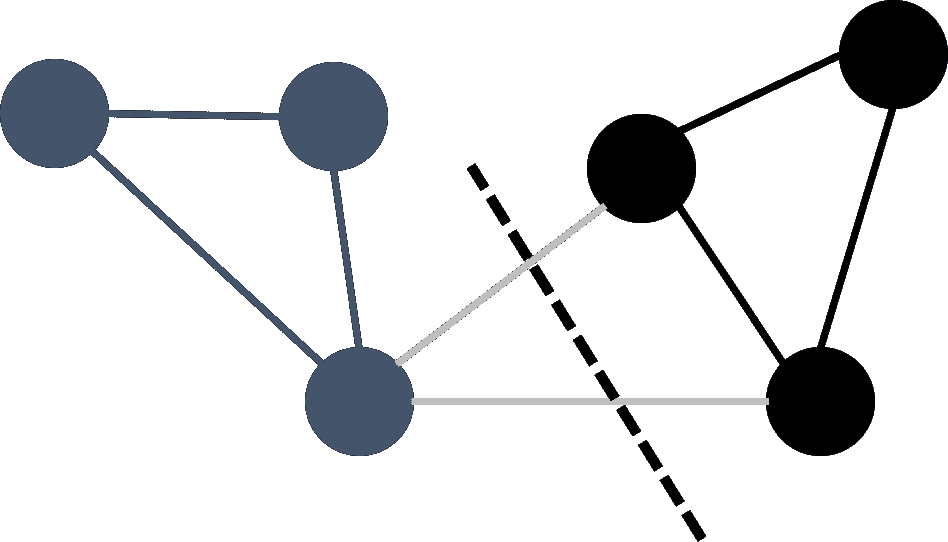
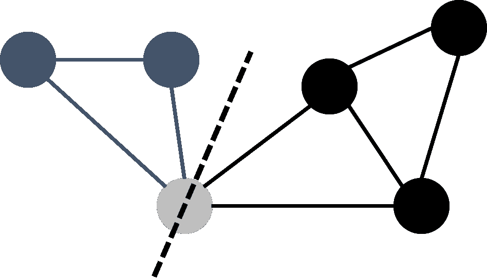
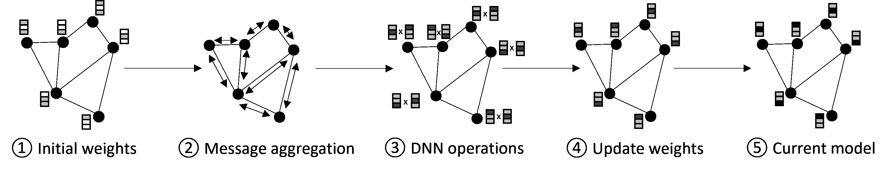
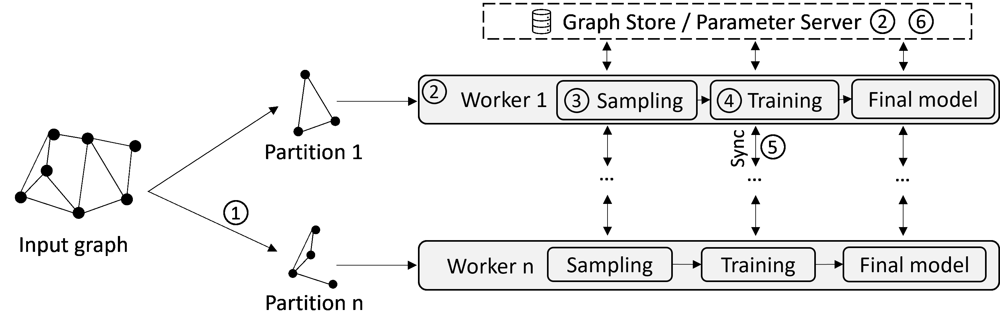

<!--yml

分类：未分类

日期：2024-09-06 19:39:28

-->

# [2305.13854] 分布式图神经网络系统的演变及其在图处理和深度学习中的起源：一项调查

> 来源：[`ar5iv.labs.arxiv.org/html/2305.13854`](https://ar5iv.labs.arxiv.org/html/2305.13854)

# 分布式图神经网络系统的演变及其在图处理和深度学习中的起源：一项调查

Jana Vatter jana.vatter@tum.de [0000-0002-5900-5709](https://orcid.org/0000-0002-5900-5709 "ORCID identifier") 慕尼黑工业大学计算机科学系慕尼黑德国，Ruben Mayer ruben.mayer@uni-bayreuth.de [0000-0001-9870-7466](https://orcid.org/0000-0001-9870-7466 "ORCID identifier") 拜罗伊特大学数学、物理与计算机科学学院拜罗伊特德国，以及 Hans-Arno Jacobsen jacobsen@eecg.toronto.edu [0000-0003-0813-0101](https://orcid.org/0000-0003-0813-0101 "ORCID identifier") 多伦多大学电气与计算机工程系多伦多加拿大

###### 摘要。

图神经网络（GNNs）是一个新兴的研究领域。这种专门的深度神经网络（DNN）架构能够处理图结构数据，并弥合图处理与深度学习（DL）之间的差距。由于图的广泛存在，GNNs 可以应用于各种领域，包括推荐系统、计算机视觉、自然语言处理、生物学和化学。随着现实世界图的规模快速增长，对高效和可扩展的 GNN 训练解决方案的需求也随之而来。因此，过去几年中出现了许多提出 GNN 系统的工作。然而，针对这些系统的概述、分类和比较严重不足。我们旨在通过总结和分类大规模 GNN 解决方案的重要方法和技术来填补这一空白。此外，我们还建立了 GNN 系统、图处理系统和 DL 系统之间的联系。

图神经网络、深度学习系统、图处理系统^†^†ccs: 一般和参考调查及概述^†^†ccs: 计算方法 机器学习^†^†ccs: 计算数学 图算法^†^†ccs: 计算方法 分布式计算方法^†^†ccs: 计算机系统组织 神经网络{NoHyper}^†^†© 版权所有 2023\. 这是作者版本的工作。仅供个人使用。禁止再分发。最终版本已发表在《ACM 计算调查》中，https://doi.org/10.1145/3597428

## 1\. 引言

深度学习（DL）在图结构数据上的应用是一个有前景且快速发展的领域。由于图结构数据无处不在（Miller, 1995; Gupta et al., 2013; Balaban, 1985），它们可以在众多 DL 应用中用于建模和分析复杂问题。由于输入数据的特性不同，常见的 DL 架构，如卷积神经网络（CNNs）（LeCun et al., 1995）或递归神经网络（RNNs）（Rumelhart et al., 1986; Hochreiter and Schmidhuber, 1997），不能直接用于图上的 DL。因此，在 2000 年代末，开发了一种新的深度神经网络（DNN）架构，即所谓的图神经网络（GNN）（Gori et al., 2005; Scarselli et al., 2008）。这种架构通过将消息传递与神经网络（NN）操作相结合，弥合了图处理和 DL 之间的差距。GNN 的应用领域包括推荐系统（Fan et al., 2019; Ying et al., 2018）、计算机视觉（Gao et al., 2020a; Sarlin et al., 2020）以及自然语言处理（Yao et al., 2019; LeClair et al., 2020），甚至涵盖了生物学和医学（Gaudelet et al., 2021; Gao et al., 2020b）。

随着实际图形的规模不断增长（Hu et al., 2021）以及更深层次的图神经网络（GNN）模型（Liu et al., 2020; Li et al., 2020, 2021b），对高效 GNN 训练解决方案的需求应运而生，这些解决方案旨在以快速而高效的方式处理大规模图形。由于大数据集包含数百万个节点和数十亿条边（Hu et al., 2021），因此需要高度的并行化，并有机会在分布式架构上运行计算。因此，目前的研究越来越多地集中于开发大规模 GNN 系统（Zheng et al., 2020; Wang et al., 2021a; Jia et al., 2020a）。在设计这样的系统时出现了多个问题：首先，最初为深度学习（DL）或图处理设计的系统不能直接用于 GNN 训练，因为前者不支持图处理操作，后者不支持 DL 操作。图中的一个顶点通常只与少数其他顶点连接，导致图邻接矩阵中有许多零值。相对而言，DL 操作涉及高维特征，导致密集矩阵。因此，需要支持稀疏矩阵和密集矩阵操作。因此，正在开发专门的框架来整合和优化这两种任务。其次，在训练迭代过程中可能会发生冗余计算和重复数据访问。例如，如果节点共享相同的邻居，则邻居的激活在大多数情况下会被多次计算，因为节点的计算被视为彼此独立（Chen et al., 2022; Jia et al., 2020b）。因此，相同的激活被重复计算。因此，需要适当的内存管理和进程间通信。第三，训练样本的相互依赖性是具有挑战性的，并导致机器之间的通信增加。必须决定如何在机器之间划分和分发图形，以及选择哪种策略来同步中间结果。

尽管有许多工作提出了旨在解决上述问题并提出优化方法的 GNN 系统，但缺乏全面的概述、分类和比较。虽然有许多调查对可扩展的图处理或 DL 系统进行了分类，但很少有文章涉及 GNN 系统。因此，我们的目标是通过提供大规模 GNN 训练技术的概述和分类来填补这一空白。

### 1.1\. 相关调查

一方面，有关图处理系统的调查研究。例如，Batafari 等人（Batarfi et al., 2015）提供了对大规模图处理系统的概述，并详细介绍了五个流行的平台。此外，他们还使用选择的算法和图数据集研究了性能。Heidari 等人（Heidari et al., 2018）和 Coimbra 等人（Coimbra et al., 2021）讨论并分类了图处理系统，涉及如分区、通信和动态性等概念。虽然上述论文提供了对系统的一般概述，而不考虑硬件设置，但 Shi 等人（Shi et al., 2018）专注于在 GPU 上的图处理。他们区分了单 GPU 和多 GPU 设置下的图处理系统。另一个专门的工作是 Kalavri 等人（Kalavri et al., 2017）的研究，涉及大规模图处理系统的编程抽象，并进行了评估。Gui 等人（Gui et al., 2019）则专注于从硬件角度进行预处理、并行图计算和运行时调度。Xu 等人（Xu et al., 2014）进一步探索了图处理的硬件加速，并主要研究了 GPU。

另一方面，许多研究提供了有关 DNN 训练系统的概述。Chahal 等人（Chahal et al., 2020）概述了分布式训练方法和算法。作者还深入探讨了分布式 DNN 训练的框架。在他们的调查中，Ben-Nun 等人（Ben-Nun and Hoefler, 2019）提供了对 DL 并行化策略的见解。他们从理论角度出发，建模不同类型的并发，并探索分布式系统架构。Zhang 等人（Zhang et al., 2018）的调查介绍了从算法、分布式系统和应用方面的分布式加速技术。此外，还介绍了加速的价格和成本以及面临的挑战和限制。Mayer 和 Jacobsen（Mayer and Jacobsen, 2020）研究了分布式 DL 的挑战、技术和工具。在他们的论文中，对 11 个开源 DL 框架进行了分析和比较。Ouyang 等人（Ouyang et al., 2021）和 Tang 等人（Tang et al., 2020）关注的关键方面是进行分布式 DL 时的通信优化策略。前者强调了大规模 DNN 训练的算法优化以及网络层级优化，后者则介绍了通信同步方法、压缩技术、系统架构和不同类型的并行化。Shi 等人（Shi et al., 2020）进行的其他研究专注于大规模分布式 DL 的通信优化。他们没有从定性角度检查扩展问题，而是采用了定量方法。因此，他们在 GPU 集群上进行了一些选定通信优化技术的实验。

据我们所知，关于 GNN 的一般方面，如方法、架构和应用（Zhou et al., 2020; Zhang et al., 2020b; Hamilton et al., 2017b; Chami et al., 2020; Wu et al., 2020）有很多调查，但仅有少数研究了 GNN 训练的优化（Abadal et al., 2021; Besta and Hoefler, 2022; Serafini and Guan, 2021）。Abadal et al. (Abadal et al., 2021)提供了 GNN 训练算法和加速器的概述。他们专注于软件方面的方法以及硬件特定的优化，但没有将其与图处理系统引入的方法相比较，而这正是我们的核心贡献之一。Serafini et al. (Serafini and Guan, 2021)也探索了可扩展的 GNN 训练。然而，他们专注于整体图和基于样本的训练比较，并未研究大规模 GNN 训练的其他技术。Besta and Hoefler (Besta and Hoefler, 2022)提供了对 GNN 训练加速器技术的深入分析。他们的主要贡献在于并行技术领域，而我们则提供了对整体 GNN 训练管道、相应优化以及最重要的，它们的来源的洞见。与上述所有不同的是，我们的重点放在大规模 GNN 系统以及训练过程每一步中的相应优化技术上。此外，我们提供了两个背景技术的概述，即图处理系统和 DNN 训练系统，并将其与 GNN 系统联系起来。

### 1.2\. 我们的贡献

本次调查研究了用于可扩展 GNN 训练的分布式系统。我们与其他调查的区别在于不仅呈现了 GNN 系统的方法，还对两个关键背景主题，即图处理系统和 DNN 训练系统，提供了洞见。了解这些主题背后的基本思想对更好地理解这些技术在大规模 GNN 训练中的应用及原因非常重要。我们建立了各领域之间的联系，并展示了大多数用于大规模 GNN 训练的技术是如何受到图处理或 DNN 训练方法的启发的。通过这种方式，我们将图处理、深度学习和系统社区聚集在一起，这些社区都为分布式 GNN 训练做出了贡献。此外，我们对方法进行了分类和比较，涉及分区、采样、进程间通信、并行度和调度等问题。这将使研究人员和实践者更容易评估所呈现系统和方法在自己应用场景中的适用性。

### 1.3\. 调查结构

我们将本调查报告结构安排如下：在第二部分中，我们提供了图处理和深度学习（DL）的分布式系统的基础知识。我们讨论了实现并行性、可扩展性和效率的主要方面。在第三部分中，我们将图处理系统和深度学习系统的见解联系起来，以帮助理解用于 GNN 训练的系统方法。最后，在第四部分中，我们介绍了开放挑战、局限性和研究趋势。

## 2\. 基础

本节描述了构建分布式 GNN 训练基础的相关主题。我们首先简要介绍一般图处理，然后介绍一些选定的图处理系统。此外，我们探讨了神经网络训练的基本步骤，以及如何以分布式方式实现训练过程。

### 2.1\. 图处理

图 $G$ 是一种非线性数据结构，这意味着数据元素不是按顺序或线性顺序排列的。它可以正式描述为 $G=(V,E)$，其中 $V$ 表示顶点集合，$E$ 表示边集合。一个顶点 $v$，也称为节点，表示一个对象，而边 $e$ 描述两个顶点之间的关系。例如，一个顶点可以表示一个人，而一条边表示两个个人之间的关系。图有许多不同的类型，例如，图可以包含循环（循环图）或不包含循环（非循环图），边可以是有向的或无向的，并且可以给每条边分配一个权重，表示其重要性（加权图）。根据图中边的密度，图可以是稀疏的、密集的或完全连接的。

图在许多领域中出现，包括社交网络（Tang 和 Liu，2010；Fan，2012；Gupta 等，2013），路径优化和交通运输（Sobota 等，2008；Czerwionka 等，2011），自然语言处理（Miller，1995；Manning 等，2014），推荐系统（Huang 等，2002；Silva 等，2010；Guo 等，2020）以及自然科学（Balaban，1985；Ralaivola 等，2005；Mason 和 Verwoerd，2007）。例如，社交网络图建模用户之间的关系，自然语言处理中的图表示单词或句子之间的关系，而在自然科学中，图有助于建模分子结构。

图处理算法探索顶点的属性、它们之间的关系或子图或整个图的特征。根据用例，不同类型的图问题需要解决，例如遍历、组件识别、社区检测、中心性计算、模式匹配和图匿名化（Dominguez-Sal 等，2010；Coimbra 等，2021）。像深度优先搜索（Tarjan，1972）、广度优先搜索（Bundy 和 Wallen，1984）、Dijkstra（Dijkstra 等，1959）、Girvan-Newman 算法（Girvan 和 Newman，2002）和 PageRank（Page 等，1999）等算法是解决这些问题的最著名算法之一。

### 2.2\. 分布式图处理

为了处理大型图形并加速计算，图处理被并行化并分布在多台机器上。处理数据的最重要方法之一是 MapReduce 计算模型（Dean 和 Ghemawat，2008）。MapReduce 包含两个用户定义的原始函数 map 和 reduce。map 函数以键值对作为输入，并根据指定的功能处理它。所有中间结果被分组并传递给 reduce 函数，后者将其合并以获得一个较小的值集。一个主节点负责将 map 和 reduce 函数分配给工作节点。每个 map 工作节点处理输入对的一个分片，应用给定的函数并在本地存储中间结果。reduce 工作节点加载中间文件，应用 reduce 函数并将结果写入输出文件。借助 MapReduce 计算模型，大量数据可以被处理；然而，当用于图处理时，它达到了极限。MapReduce 不适用于图处理的一个原因是图中的顶点不是独立的。在执行图算法的计算步骤时，需要了解多个顶点，这导致时间和资源消耗大的数据访问。尽管图处理算法可能执行多次迭代，但 MapReduce 模型是针对顺序算法优化的（McCune 等，2015）。

因此，Pregel 系统（Malewicz et al., 2010）应运而生，专注于并行图处理。它比 MapReduce 更高效地支持迭代计算，并将数据集保存在内存中，以便于重复访问。此外，提供了一个以顶点为中心的编程模型，使用户更容易表达图算法。因此，用户从顶点的角度思考算法的建模，而不是数据流和转换操作符。在此过程中，消息以批同步并行（BSP）（Valiant, 1990）的方式在顶点之间传递。因此，消息在所有机器完成计算步骤后同步传输。迭代模型的工作方式如下：在每次迭代中，称为超级步骤$S$，用户定义的函数在每个顶点$v$上并行执行。除了计算顶点值外，该函数还可以在迭代过程中沿着外发边向其他顶点传递消息。在超级步骤$S$中，它可以发送一个消息，该消息将在超级步骤$S+1$中被接收，同时在超级步骤$S-1$中发送给$v$的消息可以被读取。类似于 MapReduce，Pregel 使用称为“聚合器”的归约机制来合并结果值，并使其在下一个超级步骤$S+1$中可用。引入的同步超级步骤模型可以用于各种图算法，并成为后续系统（Salihoglu 和 Widom，2013；Khayyat et al., 2013；Bu et al., 2014）的基础。

PowerGraph（Gonzalez et al., 2012）中使用的 GAS（gather-apply-scatter）模型遵循四个步骤：收集、求和、应用和散布。收集和求和操作类似于映射和归约方案，旨在汇总顶点邻域的信息。此阶段在与顶点相邻的边上调用，并在每台机器上本地执行。结果被发送到主控机器，主控机器使用聚合的信息运行应用函数。它将结果更新发送到所有机器，这些机器执行散布阶段。

根据这两种编程模型，可以描述一种通用的分布式迭代顶点中心图处理方案：在开始迭代计算之前，图被分割成分区并分布在各台机器上。随后，迭代过程开始。每个顶点聚合消息并应用给定函数来计算新的状态。之后，顶点状态被更新。然后，顶点将包含更新信息的消息传递给相邻的顶点，聚合阶段重新开始。

顶点中心范式允许用户直观地定义图上的计算，但在处理具有偏斜度分布、大直径和高密度的现实世界图时达到了其极限（Yan et al., 2014）。因此，已经开发了基于块的模型（Yan et al., 2014; Fan et al., 2017; Tian et al., 2013）。与其将消息从一个顶点发送到其邻居，不如由包含多个顶点的块向其他块发送消息。在块内部，信息自由流动（Tian et al., 2013），从而降低了通信成本并提高了性能。

基于这一通用迭代模型，我们展示并分类了选定的分布式图处理系统。我们首先讨论分区策略以及如何存储生成的子图。我们区分了消息传播阶段使用的同步方法，并展示了消息如何被传输。表 1 总结了选定系统和类别的最重要属性。

表 1. 不同分布式图处理系统的分类

|  |  | 分区 | 执行模式 | 消息传播 |
| --- | --- | --- | --- | --- |
| 年份 | 系统 |  | 边切割 | 顶点切割 | 同步 | 异步 | 推送 | 拉取 |
| --- | --- | --- | --- | --- | --- | --- | --- | --- |
| 2010 | Pregel | (Malewicz et al., 2010) | ✓ |  | ✓ |  | ✓ |  |
| 2012 | Apache Giraph | (FOUNDATION, 2012) | ✓ |  | ✓ |  | ✓ |  |
| 2012 | GraphLab | (Low, 2013; Low et al., 2014) | ✓ |  |  | ✓ |  | ✓ |
| 2012 | Distributed GraphLab | (Low et al., 2012) | ✓ |  |  | ✓ |  | ✓ |
| 2012 | PowerGraph | (Gonzalez et al., 2012) |  | ✓ | ✓ | ✓ |  | ✓ |
| 2013 | GPS | (Salihoglu and Widom, 2013) | ✓ |  | ✓ |  | ✓ |  |
| 2013 | GRACE | (Wang et al., 2013) | ✓ |  |  | ✓ | ✓ |  |
| 2015 | PowerLyra | (Chen et al., 2015b) | ✓ | ✓ | ✓ | ✓ |  | ✓ |

#### 2.2.1\. 采样

图采样是一个预处理步骤，旨在通过移除顶点或边来使图更稀疏，以减少处理时间和内存消耗。一个关键挑战是确保重要的图结构得以保留。Iyer 等（Iyer et al., 2018b）计算了一个概率，用以表明顶点 $a$ 和顶点 $b$ 之间的边是否应该保留在图中。该概率值取决于图的平均度、顶点 $a$ 的出度、顶点 $b$ 的入度以及用户可以选择的稀疏化水平 $s$。通过这种方式，在保留图中最重要结构的同时，所需的内存较少。用于图模式挖掘的快速近似 ASAP 引擎（Iyer et al., 2018a）包括两个阶段，即采样阶段和闭合阶段。在采样阶段，图被视为边的流。边要么是随机选择的，要么是基于先前流过的边进行选择。然后，闭合阶段等待特定的边来完成模式。这种技术有助于在排除某些边的同时保留图中的某些结构。Schramm 等（Schramm et al., 2022）提出了一种感知应用的策略，该策略丢弃某些消息。在每个超级步骤中，一定百分比的消息被标识为最不重要的，并且在飞行过程中被丢弃。重要性值的计算依赖于所需的应用程序和部署的图算法。因此，这种方法可以用于各种应用程序。

#### 2.2.2\. 分区

存在许多图分区算法的方法，系统采用并加以改进。这些算法要么遵循边切割（Karypis and Kumar, 1998a; Stanton and Kliot, 2012; Tsourakakis et al., 2014）、顶点切割（Schlag et al., 2019; Hanai et al., 2019; Petroni et al., 2015; Mayer et al., 2018; Mayer and Jacobsen, 2021; Mayer et al., 2022）或混合切割模型（Fan et al., 2022; Chen et al., 2015b）。此外，我们区分离线分区器和在线分区器。离线分区器（Karypis, 1997; Hendrickson and Leland, 1993）根据整个图来确定分区，而在线分区器（Tsourakakis et al., 2014; Petroni et al., 2015; Mayer et al., 2018）流式处理顶点或边，并在飞行过程中将顶点或边分配到分区中。一种有趣的方法是 HEP（Mayer and Jacobsen, 2021），其中离线和在线组件被结合成一个混合方案。

为评估分区的质量，使用了如复制因子、通信成本和负载平衡等指标。复制因子表示复制的数量与顶点总数之间的比率。基于此，可以确定通信成本。每当切割一条边时，分区之间就需要进行通信。例如，使用边切割方法时，通信量与切割的边的数量成正比。所谓的负载平衡旨在以这样的方式对图进行分区，即在图处理算法的计算阶段，负载在工作者之间平衡。

存在各种成本函数来帮助形成分区。根据目标和应用，成本函数的定义需要不同。在线性确定性贪婪（LDG）（Stanton 和 Kliot, 2012）方法中，一个顶点被分配到拥有最多边的分区。这与一个表示分区容量的惩罚函数相结合。因此，通信成本被最小化，同时确保了分区之间的负载平衡。FENNEL（Tsourakakis et al., 2014）将两种启发式方法统一为：一个顶点要么分配给共享最多邻居的簇，要么分配给邻居最少的簇。这会导致切割的边的数量最小，从而使通信成本最小。高度优先复制（HDRF）（Petroni et al., 2015）方法处理具有偏斜分布的图，其中节点的度数差异很大。目标是通过切割和复制高度顶点来均匀平衡负载。2PS（Mayer et al., 2020）在预处理阶段收集聚类信息，然后用于评分机制。Fan et al.（Fan et al., 2022）采用了应用驱动的方法，而不是定义一个特定的成本函数。基于给定应用算法的成本模型被最小化，以便对图进行分区。这导致了一种适用于多种用例的自适应分区策略。

（a）边切割

（b）顶点切割

图 1. 边切割和顶点切割分区。

Pregel (Malewicz 等人，2010) 使用了最简单的方法之一来初始分区图。在这里，分区是基于顶点 ID 使用哈希函数 $hash(ID)\,mod\,N$，其中 $N$ 是分区的数量。然后将分区均匀分配给所有工作节点。底层分区原则称为边切分，因为边被切分和复制，而顶点被分配到不同的机器上（见图 1(a)）。其他依赖于边切分分区的系统包括 Apache Giraph (FOUNDATION，2012)、GraphLab (Low，2013；Low 等人，2014)、分布式 GraphLab (Low 等人，2012)、图处理系统 (GPS) (Salihoglu 和 Widom，2013) 以及 GRACE (Wang 等人，2013)。与其他分区策略相比，提出的边切分方法引起的计算成本和开销较少。相反，以下方法旨在减少切分大小，但代价是更高的运行时间和内存开销。然而，得到的分区质量有所提高。

使用边切分分区时，顶点在各分区之间的数量是平衡的，但每个分区的边的数量可能差异很大。为了获得更均衡的分区并改善自然图的分布式处理，Gonzalez 等人提出了平衡顶点切分分区（见图 1(b)）在他们的 PowerGraph (Gonzalez 等人，2012) 模型中。自然图通常是不平衡的，因此难以分区。一些顶点有很高的出边度，而其他顶点的度数较低。因此，每个分区的计算成本差异很大。为此，该系统采用了平衡顶点切分分区。这种新颖的分区策略通过在机器之间均匀分配边来改善自然图的处理，同时相邻的顶点在机器上被镜像。所有副本中有一个顶点被随机指定为主节点来计算和更新顶点状态。所有镜像保持顶点状态的本地副本。

GPS（Salihoglu 和 Widom，2013）引入了一种动态重新分区策略以减少通信。首先，系统使用标准分区技术对输入图进行分区。在图处理算法执行期间，观察通信情况以确定哪些顶点需要重新分配给其他工作者以及何时重新分配。由于重复的顶点访问由已经在先前迭代中加载该顶点的工作者执行，因此通过网络传递的消息显著减少。这加快了处理时间，平衡了工作负载，并改善了对更大图的扩展。

PowerLyra（Chen 等，2015b）通过引入一种混合切割分区算法进一步优化了自然图的处理，该算法结合了边切割和顶点切割。此外，它分别处理高度顶点和低度顶点，以最小化边和顶点的复制。提出的平衡 p-way 混合切割算法利用边切割的形式，如果顶点的出边数较少，则使用顶点切割；如果顶点的度数较高，则使用顶点切割。

GridGraph（Zhu 等，2015）引入了一种图的网格表示法以加速分区。首先，将顶点分成 $P$ 个块，每个块包含连接的顶点。边按照其源顶点和目标顶点被排序到结果的 $P\times P$ 网格中。在这种方法中，边的列表无需排序，从而减少了预处理时间。此外，网格表示法可以促进以下图处理步骤的执行。

由于存在众多具有不同特性和目标的分区策略，选择适合特定应用的最佳策略具有挑战性。因此，一些实验研究调查了不同策略的性能和资源使用情况（Gill 等，2018；Pacaci 和 Özsu，2019；Abbas 等，2018），而 EASE 系统（Merkel 等，pear）提供了定量预测和自动选择。

#### 2.2.3\. 进程间通信

一旦图被分区，需要决定工作进程如何同步它们的数据，例如，通过发送消息或访问共享内存。在前一种情况下，系统将子图本地存储在分配的机器上并交换同步消息。GraphLab（Low，2013；Low 等，2014）支持后一种情况，并使用共享内存抽象。一个所有工作者都可以访问的数据图存储程序状态以及相应的数据结构。以 GraphLab 为基础，PowerGraph（Gonzalez 等，2012）也按照共享内存视图进行计算。

#### 2.2.4\. 状态同步与调度

在迭代执行图处理算法时，计算步骤可以按照同步、异步或混合方案进行。Pregel 所遵循的基本原则是 BSP 模型。每个节点通过聚合和组合所需的特征来进行一次迭代，并随后更新状态。当节点完成计算步骤后，它会等待所有其他节点完成，然后再继续进行下一次迭代。这确保了每个节点共享相同的参数。

尽管同步模式在许多情况下表现良好，但在其他情况下可能效率较低。一个例子是用于社区检测的标签传播算法（Raghavan 等，2007）。在这里，每个顶点被分配一个初始标签。在每次迭代中，顶点采用邻居中最大标签的标签。经过几轮传播后，密集的社区会达成相同的标签。如果选择同步模式，并且图是二分图，意味着一个子图中的每个顶点都连接到另一个子图中的每个顶点，那么标签可能会在每次迭代后发生振荡和变化。这使得算法无法终止，因为标签需要稳定。为了解决这个问题，使用了异步执行。异步处理意味着顶点可以在读取当前迭代的状态更新的同时，也读取前几次迭代的更新。在 GNN 训练中，异步模式可以优先考虑特定的状态更新，从而使整体计算的收敛速度更快。另一个重要的好处是通过避免由于落后节点造成的长时间空闲。

GraphLab（Low，2013；Low 等，2014）使用异步执行方法。每个工作节点独立执行三个步骤：折叠、合并和应用。在折叠步骤中，所有顶点的数据会被收集。如果提供了合并操作，就会进行合并操作。否则，应用函数会直接完成计算并将数据存储在共享内存中。这个过程不会考虑其他工作节点当前处于计算的哪个阶段。GRACE（Wang 等，2013）通过调整 BSP 模型来允许异步处理，从而实现高性能执行。因此，空闲时间被最小化，但可能会导致工作节点在处理过时数据时进行迭代。由于同步方法各有优缺点，PowerGraph（Gonzalez 等，2012）允许用户选择同步或异步模式。同步模式的执行方式类似于 Pregel 的同步执行，而异步模式则类似于 GraphLab 的计算模型。

通常，手动选择模式需要用户深入了解图处理系统，并且往往无法实现**最佳**性能。Hysync (Xie et al., 2015) 通过根据一组启发式方法自动在同步模式和异步模式之间切换来解决这个问题。启发式方法旨在预测当前模式的性能，并确定何时切换到另一种模式会更有利。在自适应异步并行（AAP）模型中 (Fan et al., 2020)，每个工作节点根据两个参数自行决定何时开始下一计算步骤。第一个参数是该工作节点与其他节点相比的相对进展。第二个参数指示数据的过时程度。因此，可以避免滞后节点，同时减少过时的计算。

PowerLyra (Chen et al., 2015b) 更进一步，不仅提供了两种同步模式，还区分了高维度和低维度顶点以确定它们的处理方式。前者基于 GAS 模型（即收集、应用、分发）(Gonzalez et al., 2012) 进行处理。主节点激活镜像节点以执行收集函数，然后将结果发送回主节点。在接收到所有消息后，主节点运行应用函数。一个包含更新数据和分发函数激活的组合消息从主节点发送到镜像节点。与原始 GAS 模型不同，PowerLyra 结合了从主节点到镜像节点的应用和分发消息，以最小化通信。系统处理低度顶点的方式类似于 GraphLab。主节点在本地执行收集和应用阶段。之后，激活和更新消息被组合并发送到镜像节点。每个镜像节点然后执行分发阶段。由于调整后的方案，边的复制被消除，在每次迭代中，每个镜像节点只需要发送一个消息。

与同步模式相对，使用异步执行意味着需要一个调度方案，这可能会影响整体计算的收敛性。此外，调度可以帮助确定任务的顺序并将任务分配到机器上，从而实现高水平的并发执行。GraphLab（Low, 2013; Low et al., 2014）提供了所谓的集合调度器。根据任务之间的依赖关系，建立执行计划，并可以观察到计算的总体加速。在他们的 GRACE（Wang et al., 2013）系统中，Wang 等人引入了可定制的调度策略。该系统放宽了 BSP 模型的限制，并允许用户优先考虑特定的顶点以加快收敛速度。用户可以选择一组单独的顶点以及这些顶点的期望处理顺序。然后，系统计算每个顶点的调度优先级，以确定整体执行顺序。

#### 2.2.5. 消息传播

无论执行模式和调度技术如何，消息都需要在包含更新状态的顶点之间传递。消息传递的主要方法有两种：推送和拉取。虽然基于 Pregel 的系统（Malewicz et al., 2010; FOUNDATION, 2012; Salihoglu and Widom, 2013; Wang et al., 2013）使用推送操作，但支持 GAS 模型的系统（Low, 2013; Low et al., 2014, 2012; Gonzalez et al., 2012; Chen et al., 2015b）依赖于拉取消息。在每次迭代后，基于 Pregel 的系统同步传播更新消息。所有顶点同时推送消息，这意味着每个顶点直接将消息发送到所有包含更新状态的相邻顶点。另一方面，GraphLab（Low, 2013; Low et al., 2014）将带有相关特征的数据图存储在共享内存中。这样，所有工作者随时可以访问数据。在迭代开始时，工作者通过聚集操作拉取当前数据图，以在最新特征上执行计算。在迭代结束时，工作者使用新计算的状态更新数据图。

### 2.3. 分布式神经网络训练

神经网络由多个互联的节点组成，称为神经元，排列在一个或多个层中。每个神经元接收输入并根据给定的权重和更新函数处理这些输入。在计算出新值后，激活函数（Sharma 等，2017；Ramachandran 等，2017）决定输出值的重要性。这些值在网络中传递，直到达到最后一组神经元，称为前向传播。之后，计算损失函数以对比计算出的输出和期望输出。为了最小化损失，需要调整权重。反向传播（Rumelhart 等，1995）算法用于在网络中反向调整权重。一种广泛使用的技术是随机梯度下降（SGD）（Robbins 和 Monro，1951；Ruder，2016）。它通过考虑计算的损失来计算部分梯度。借助这些梯度，调整权重，这称为反向传播。整个过程，包括前向和反向传播，会迭代进行，直到收敛或达到最大迭代次数。最终的神经网络权重可用于对未见过的数据进行预测（Widrow 和 Lehr，1990；Lawrence，1993；Goodfellow 等，2016）。

随着训练数据量的增加和模型规模的扩大，分布式神经网络训练变得越来越必要。接下来，我们讨论了在并行性、执行模式和协调方面扩展神经网络训练的不同技术。表 2 概述了所描述的系统和技术。

表 2. 分布式神经网络训练系统的分类

|  |  | 并行性 | 同步模式 | 协调 |
| --- | --- | --- | --- | --- |
| 年份 | 系统 |  | 数据 | 模型 | 同步 | 异步 | 集中式 | 去中心化 |
| --- | --- | --- | --- | --- | --- | --- | --- | --- |
| 2012 | DistBelief | (Dean 等，2012) | ✓ |  |  | ✓ | ✓ |  |
| 2014 | Project Adam | (Chilimbi 等，2014) |  | ✓ |  | ✓ | ✓ |  |
| 2015 | MALT | (Li 等，2015a) | ✓ |  |  | ✓ |  | ✓ |
| 2016 | Tensorflow | (Abadi 等，2016) | ✓ | ✓ | ✓ | ✓ | ✓ |  |
| 2016 | Ako | (Watcharapichat 等，2016) | ✓ |  |  | ✓ |  | ✓ |
| 2019 | CROSSBOW | (Koliousis 等，2019) | ✓ |  | ✓ |  |  | ✓ |
| 2019 | PyTorch | (Paszke 等，2019) | ✓ | ✓ | ✓ | ✓ | ✓ | ✓ |

#### 2.3.1\. 并行性

数据并行允许在多个处理器上进行并行训练。因此，数据被划分为固定数量的子集。每个工作节点被分配一个子集，并在模型的本地副本上进行处理。之后，将得到的模型参数与其他工作节点交换。下一次迭代使用更新后的参数配置进行。这一过程重复进行，直到收敛。例如，使用数据并行的系统有 MALT（Li et al., 2015a）和 Ako（Watcharapichat et al., 2016）。如果模型本身太大，无法放在单台机器上（Krizhevsky et al., 2012; Brown et al., 2020），则会将其拆分。在模型并行中，计算节点处理模型的各自分区上的整个数据集。计算完成后，前向传递的中间输出被传递给负责计算后续层的机器。在这里，调度对于高效协调训练过程非常重要。将模型分层划分是一种最直观的方式，即每层分配给一个节点。然而，这有时并不会有利于并行性，因为控制当前层的工作节点需要等待处理前一层的工作节点完成后才能进行计算。一个利用模型并行的系统是 Project Adam（Chilimbi et al., 2014），其中每台机器被分配模型的某个部分。另一种更智能地分配模型的方法是根据其特定架构进行分配。例如，适合的架构可以是双胞胎 Siamese 网络（He et al., 2018），其中一些组件可以轻松地并行运行。

这两种技术被结合在一起，例如，PipeDream（Narayanan et al., 2019）和 GPipe（Huang et al., 2019），形成了所谓的混合或管道并行。在这里，数据以及模型在工作节点之间共享。与 PipeDream 相比，GPipe 算法进一步将输入的小批量数据分割成块，以最大化每次迭代中的并发计算数量。总体来说，与数据和模型并行相比，使用混合并行可以显著提高训练速度。

#### 2.3.2\. 同步模式

在分布式方式训练神经网络时，重要的是机器要定期交换参数更新或中间结果，以确保收敛。这可以采用同步、异步或混合模式（Dean et al., 2012; Chen et al., 2016; Jin et al., 2016）。使用同步模式时，更新会在所有机器完成计算后同时发送到其他节点。然后，节点继续进行下一次迭代的计算。这样，每台机器总是能了解当前的参数。该方法的一个缺点是，如果有一个节点处理缓慢，会降低整个训练过程的速度（Cipar et al., 2013）。遵循同步执行模式的系统有 CROSSBOW（Koliousis et al., 2019）。

使用异步执行的模型（Dean et al., 2012; Chilimbi et al., 2014; Li et al., 2015a; Watcharapichat et al., 2016）通过不等待所有工作节点完成来消除延迟节点的问题。相反，更新会在它们可用时立即发送。因此，训练速度会提高，资源使用也更加高效。这种方法的一个缺点是，工作节点可能不会始终保持最新，从而在过时的参数上计算更新。基于过时参数计算梯度可能导致较慢甚至完全不收敛，这称为过时梯度问题（Dutta et al., 2018）。Ho et al.（Ho et al., 2013）尝试将同步和异步执行方案结合起来。他们的模型基于同步执行，但加入了一个陈旧阈值，以确定两个工作节点可以相隔多少时间步骤，直到较快的工作节点需要等待较慢的工作节点完成当前计算。与同步执行相比，这减少了延迟节点的影响，同时也限制了参数的陈旧性，以确保计算的最新性。像 TensorFlow（Abadi et al., 2016）和 PyTorch（Paszke et al., 2019）这样的流行框架允许用户选择同步级别。这两种方法都得到了支持。

#### 2.3.3\. 协调

除了确定同步模式外，还需要决定如何存储参数和协调更新。常见的方法有集中式或分散式。集中式方法使用一个全球参数服务器，该服务器存储、聚合并分发相关更新。因此，所有机器共享相同的参数集。然而，使用参数服务器引入了单点故障，因为它是所有更新请求的一部分。DistBelief (Dean et al., 2012) 和 Project Adam (Chilimbi et al., 2014) 是以集中式方式运作的系统。分散式系统 (Li et al., 2015a; Watcharapichat et al., 2016; Koliousis et al., 2019) 通过使用如全减操作 (Sanders et al., 2019) 这样的集体通信原语，直接从机器到机器传递更新信息，从而消除了对参数服务器的需求。在这里，每台机器与其同伴交换更新信息，并将接收到的参数与自身的参数结合。结果是，每台机器都保持最新的参数集。这种方法的一个优点是更新的计算在所有机器之间是平衡的 (Koliousis et al., 2019)。由于这两种策略各有优缺点，PyTorch (Paszke et al., 2019) 将协调的选择留给用户。

总结来说，进行分布式深度神经网络（DNN）训练有几种方法。根据架构和数据，可以选择数据并行、模型并行或混合并行、同步更新或异步更新，以及集中式或分散式系统。在所有方法中，参数需要在机器之间交换。因此，通信是训练神经网络时需要解决的瓶颈。此外，重要的是确保资源得到充分利用，而不会出现长时间的空闲（Zhang et al., 2020a）。

## 3\. 图神经网络的系统

### 3.1\. 图神经网络基础

图神经网络（GNN）这一术语最初出现在 Gori 等人的研究中（Gori et al., 2005），并由 Scarselli 等人进一步研究（Scarselli et al., 2008）。它指的是一种不以多个独立或按序排列的数据样本作为输入的神经网络架构，如 CNN（LeCun et al., 1995）或 RNN（Sherstinsky, 2020），而是图。与图像或文本不同，图没有特定结构，也不是按序排列的。一个图$G$可以形式上表示为$G=(V,E)$。它由一组顶点$V$和一组边$E$组成。一个顶点$v$代表一个对象，也称为节点。一条边$e$描述了两个顶点之间的关系。由于图是非结构化的，需要使用一种新的神经网络类型，即 GNN。它们结合了矩阵乘法和卷积等 DNN 操作，以及从图处理方法中获得的迭代消息传递（Jia et al., 2020a; Wang et al., 2021c）。由于结合了 DNN 操作和消息传递，GNN 有时也被称为消息传递神经网络（Gilmer et al., 2017; Riba et al., 2018; Zhang et al., 2020d; Hamilton, 2020）。

首先，输入图的每个顶点最初由一个特征向量表示，称为激活值。这个初始激活值只包含关于顶点本身的信息，而不涉及图中的上下文。在每一层，进行一组 DNN 操作和消息传递步骤，以顶点为单位更新激活值。在迭代的第一步中，每个顶点通过根据聚合函数交换消息来汇总其邻接顶点的激活值。

| (1) |  | $a_{v}^{(k)}=AGGREGATE^{(k)}(\{h_{u}^{(k-1)}&#124;u\in N(v)\})$ |  |
| --- | --- | --- | --- |

其中，$a_{v}^{(k)}$表示第$k$层顶点$v$的聚合值。术语$h_{u}^{(k-1)}|u\in N(v)$描述了在前一层中邻接顶点的激活值，$N(v)$表示给定图中顶点$v$的邻居。接下来，将收集到的信息进行组合，并通过更新函数更新顶点的当前值。更新函数$h_{v}{(k)}$可以包括标准的 DNN 操作，如矩阵乘法，定义如下

| (2) |  | $h_{v}^{(k)}=UPDATE^{(k)}(a_{v}^{(k)},h_{v}^{(k-1)})$ |  |
| --- | --- | --- | --- |

其中 $h_{v}^{(k)}$ 是第 $k$ 层中顶点 $v$ 的新激活值。为了获得更新后的激活值，聚合的激活值 $a_{v}^{(k)}$ 与前一层的顶点激活值 $h_{v}^{(k-1)}$ 结合。如果 $k=1$，则需要初始激活值 $h_{v}{(0)}$ 或 $h_{u}{(0)}|u\in N(V)$（Jia 等，2020a；Hamilton，2020）。新的值现在作为下一层的起始点，在这一层中，激活值被重新聚合和组合。这个过程会迭代进行。因此，探索的顶点越来越多。在经过 $k$ 层后，一个顶点的 $k$ 跳邻域被捕获。当最后一层通过后，顶点的最终表示包括了有关顶点自身以及图中其他顶点的信息。

图 2. GNN 训练过程示意图

在图 2 中，给出了完整的前向传播的概述。它包括上述步骤：（1）获取初始权重，（2）传递和聚合来自邻近节点的消息，（3）执行 DNN 操作，（4）根据给定的函数更新权重。步骤（2）到（4）会被重复执行。在 $n$ 次迭代后，得到最终的模型配置（5）。

类似于第 2.3 节中描述的一般神经网络训练，将计算相对于前向传播输出的损失函数。在反向传播过程中应用反向传播算法，以调整网络的权重（Xu 等，2018a）。经过多次前向和反向传播后，模型可以进行顶点和边级别的预测。为了对整个图进行断言，需要添加一个池化层，该层根据指定的池化操作聚合并组合输出图中的所有状态和标签（Zhou 等，2020）。

存在几种类型的 GNN（Wu et al., 2020），其中最著名的包括 Gated Graph Neural Networks (GG-NN)（Li et al., 2015b）、Graph Convolution Networks (GCN)（Kipf 和 Welling, 2016a）、GraphSAGE（Hamilton et al., 2017b）、Graph Attention Networks (GAT)（Veličković et al., 2017）和 Graph Auto-Encoders (GAE)（Kipf 和 Welling, 2016b）。它们的架构差异涉及消息传播过程、采样方法、池化操作以及层的组成。例如，GraphSAGE 模型使用最大池化策略，而 GCN 使用平均池化。GAT 在池化过程中包含了掩码自注意力，GG-NN 通过使用门控递归单元作为更新模块来捕捉时间上的空间和时间变化。一般而言，如果对象之间的关系对数据预测至关重要，则可以使用 GNN，并且通常优于常见的 DNN 架构（LeCun et al., 1995; Hochreiter 和 Schmidhuber, 1997）。与逐个读取数据对象或有序序列的 DNN 不同，GNN 自然捕捉图中的关系，并且能够预测数据点之间的关系。这是其他 DNN 模型难以做到的。因此，GNN 有利于图数据的处理和预测。有时，将 GNN 与其他 DNN 模型结合起来可能是有利的，例如，在处理节点和边顺序更新的时间图时（Kumar et al., 2019; Rossi et al., 2020; Zhang et al., 2021b）。在这种情况下，GNN 与递归神经网络结合。然而，如果个别数据点之间没有显著的连接，则通常没有必要选择 GNN 而不是其他 DNN 模型来执行深度学习。

### 3.2. 分布式图神经网络训练方法的分类

在大图上训练 GNN 是一项具有挑战性的任务，需要高通信、大内存容量和高带宽（Md et al., 2021）。与一般的分布式 DNN 训练不同，图中的所有数据点都是连接的，而不是相互独立的。由于这种依赖性，无法简单地拆分数据以并行处理批次。此外，在优化 GNN 时，需要考虑内存密集型的边缘中心操作以及算术密集型的顶点中心操作（Kiningham et al., 2020b）。因此，大规模图处理方法或高效的 DNN 训练操作不能直接用于 GNN 训练。需要更多调整为 GNN 特征的专门技术来克服这些挑战，并加快训练和推理速度。

图 3. GNN 系统的一般设置

图 3 展示了 GNN 系统的一般设置。与分布式图处理的第一步类似，图可以最初被划分并分布到工作节点上 (①: Section 3.2.1)。其他类型的并行性 (Section 3.2.5) 也是可能的，但数据并行性是最常见的选择。之后，需要解决如何存储子图和是否缓存任何数据的问题 (②: Section 3.2.4)。这可以在本地机器上完成，也可以在专用图存储中完成。根据训练模式，执行一个采样步骤 (③: Section 3.2.2)。在这里，只选择顶点的一个子集而不是整个分区来训练模型。主要训练从顶点的随机初始表示开始。然后，将消息从相邻顶点拉取或推送 (④: Section 3.2.6)，应用 DNN 操作，并在下一次迭代开始前将更新后的顶点状态共享给其他顶点。整个过程可以以同步或异步方式执行 (⑤: Section 3.2.7)，并可以应用各种调度技术 (Section 3.2.8)。而不是使用去中心化的全归约操作来共享参数，可以使用集中式参数服务器 (⑥: Section 3.2.9)。在完成所有迭代后，可以根据最终的参数集进行预测。大多数系统还提供了适应于个体优化的编程抽象 (Section 3.2.3)。接下来，我们将基于上述设置步骤介绍和分类 GNN 系统。

#### 3.2.1\. 分区

图处理系统依赖于对输入图进行分区，并将其分布到各个机器上，然后再开始主要计算。GNN 系统采用分区的想法，因为输入图不太可能完全适配单台机器的内存。一些系统使用传统的边切割或顶点切割方法（Zheng et al., 2020; Md et al., 2021），而其他系统则将这些方法与如成本模型（Jia et al., 2020a）、可行性评分（Lin et al., 2020）或数据流分区（Kiningham et al., 2020a）等特性结合使用。表 3 总结了不同的分区方法。

表 3. 分区策略的分类

|  |  | 切割类型 | 静态 vs. 动态 | 离线 vs. 在线 |  |
| --- | --- | --- | --- | --- | --- |
| 年份 | 系统 |  | 边缘 | 顶点 | 混合 | 静态 | 动态 | 离线 | 在线 | 平衡目标 |
| --- | --- | --- | --- | --- | --- | --- | --- | --- | --- | --- |
| 2019 | NeuGraph | (Ma et al., 2019) |  |  | ✓ | ✓ |  | ✓ |  | 等大小不相交的顶点块的 2D 分区 |
| 2019 | GReTA | (Kiningham et al., 2020a) |  |  | ✓ | ✓ |  | ✓ |  | 2D 数据流分区 |
| 2020 | ROC | (Jia et al., 2020a) | ✓ |  |  |  | ✓ | ✓ |  | 分区的运行时 |
| 2020 | AGL | (Zhang et al., 2020c) | ✓ |  |  | ✓ |  | ✓ |  | 邻域大小 |
| 2020 | PaGraph | (Lin et al., 2020) | ✓ |  |  |  | ✓ |  | ✓ | 可行性评分、节点度、计算开销 |
| 2020 | DistDGL | (Zheng et al., 2020) | ✓ |  |  | ✓ |  | ✓ |  | 最小边切割 |
| 2021 | P³ | (Gandhi and Iyer, 2021) | ✓ |  |  | ✓ |  | ✓ |  | 随机哈希 |
| 2021 | GNNAdvisor | (Wang et al., 2021a) | ✓ |  |  | ✓ |  | ✓ |  | 2D 工作负载分区 |
| 2021 | DistGNN | (Md et al., 2021) |  | ✓ |  | ✓ |  |  | ✓ | 每个分区的边数 |
| 2021 | DeepGalois | (Hoang et al., 2021) | ✓ |  |  |  |  |  | ✓ | 用户定义策略 |
| 2021 | ZIPPER | (Zhang et al., 2021a) |  | ✓ |  | ✓ |  | ✓ |  | 等大小不相交的顶点块的 2D 分区 |

在 DistDGL（郑等，2020）中，输入图使用 METIS（Karypis，1997；Karypis 和 Kumar，1998a）边切割算法进行划分。此外，还使用了多约束划分（Karypis 和 Kumar，1998b）和优化阶段来改善负载均衡。DistGNN（Md 等，2021）使用最小顶点切割算法和工具 Libra（Xie 等，2014）生成划分。在这里，边属于一个特定的划分，而顶点可以对应多个划分，因此需要进行复制。所谓的复制因子衡量了副本的数量。较低的复制因子会减少划分间的通信。此外，Libra 通过在子图之间均匀分配边来生成平衡的划分。

NeuGraph（Ma 等，2019）首先使用 METIS 边切割算法对输入图进行预处理，然后应用基于网格的划分方案，该方案结合了边切割和顶点切割。它类似于 GridGraph（Zhu 等，2015）中使用的方法，并将每个顶点及其相应的特征分配到$P$个顶点块中的一个。接着，将邻接矩阵切分为$P\times P$块，每块包含相应的边。这种划分策略有利于边的处理，因为只需要加载源和目标顶点的数据。与 NeuGraph 不同，GReTA（Kiningham 等，2020a）不对图本身进行划分，而是对数据流进行块划分。数据流，也称为节点流，是一种图结构，表示特征向量在 GNN 模型的前向传播中的传播。顶点表示计算的数学单元，而边表示单元的输入和输出。首先，GReTA 将数据流图的顶点划分为$n$和$m$大小的块。然后，从包含相关边的邻接矩阵中形成大小为$n\times m$的块。因此，在执行计算步骤时，只需要加载网格表示的一部分，而不是整个图。此外，在聚合阶段可以处理整个列。受 NeuGraph 和 GReTA 的启发，ZIPPER（Zhang 等，2021a）也使用了基于网格的划分技术，将图的邻接矩阵切分成多个矩形块。在划分过程中区分源顶点和目标顶点，以确保每个块仅与一个源和一个目标划分相关。因此，每条边都是唯一标识的。如前述系统所描述，这种划分策略旨在减少内存占用和通信。

通常，图在计算开始时被划分，并且这些分区会一直使用到整个过程结束。然而，ROC（Jia 等人，2020a）在每次迭代前会使用在线回归模型重新划分图。一个成本模型根据顶点和边的数量以及内存访问次数等参数预测给定图分区上各种操作的执行时间。成本模型在每次迭代结束时根据子图的实际运行时间进行更新和最小化。然后，根据更新后的成本重新划分图。

Zhang 等人提供了 AGL（Ant Graph ML 系统）（Zhang 等人，2020c），用于工业应用中的大型 GNNs。GraphFlat 模块负责将输入图划分为 $k$-跳邻域。它采用一种受消息传递启发的流水线来生成所需的邻域。在 MapReduce 风格中，关于一个顶点的自信息被生成、沿着出边传播并汇总。这个过程会持续进行，直到达到 $k$ 次迭代。现在，节点包含了关于其 $k$-跳邻域的分区信息。

PaGraph (Lin 等，2020) 设计了一种 GNN-aware 分区算法，该算法根据分数将顶点分配到各个分区。在算法的每次迭代中，会扫描一个顶点并计算一个向量，其中第 $i$ 个位置决定了将顶点分配到分区 $i$ 的可行性。分数综合了迄今为止分配到分区 $i$ 的顶点特征、顶点的邻居集合以及分区中预期的顶点数量。当前顶点被分配到具有最高可行性分数的分区，并继续处理下一个顶点。确保分区平衡和计算工作负载的均匀分配。GNNAdvisor (Wang 等，2021a) 依赖于邻居分区，其中只有目标顶点的相邻顶点属于给定的分区。选择邻居分区而非边切分区或顶点切分区的原因是减少高度变化的分区大小。此外，微小分区的概率较低，这减少了管理成本。与上述系统不同，DeepGalois (Hoang 等，2021) 通过结合 Customizable Streaming Partitioner (CuSP) (Hoang 等，2019) 框架允许定制分区。一个简单的 API 允许用户确定特定的分区策略，支持边切、顶点切和混合切。因此，用户可以根据具体的 GNN 架构量身定制分区策略。与那些利用计算密集型定制分区策略的系统（Kiningham 等，2020a；Jia 等，2020a；Lin 等，2020）不同，P³ (Gandhi 和 Iyer，2021) 依赖于简单的随机哈希分区器。这确保了简单、快速且高效的分区，仅有最小的开销。在这里，初始图分区有助于平衡工作负载，但主要的优化是在系统的后续步骤中完成的，即采样（第 3.2.2 节），进程间通信（第 3.2.4 节），并行性选择（第 3.2.5 节），同步模式（第 3.2.7 节），调度（第 3.2.8 节）和协调（第 3.2.9 节）。

#### 3.2.2. 采样

采样的基本思想起源于图处理。然而，采样的思想在 GNN 训练中略有不同。与 DNN 训练不同，图中的样本不是独立的。在执行小批量训练时，不能随意挑选顶点而不考虑与其他顶点的关系。因此，小批量的训练样本需要包括一个顶点的 k-hop 邻域。然而，如果没有采样，这些邻域可能会“爆炸”，因为邻域大小随着每个跳跃迅速增长。因此，引入了许多策略，如顶点级（Hamilton et al., 2017a）、层级（Zou et al., 2019）或子图级（Chiang et al., 2019）采样。这些方法的基本思想是限制需要探索的 k-hop 邻居数量，以防止描述的邻域爆炸问题（Zheng et al., 2020）。虽然采样是一种已经建立且适用于许多任务的技术，但具体策略的选择取决于期望的下游 ML 任务、图结构和采样方法的目标（Rozemberczki et al., 2020）。

高效采样的早期算法之一是 GraphSAGE（SAmple and aggreGatE）（Hamilton et al., 2017a）。该模型训练小批量数据，并限制每层的邻域大小。要采样的顶点数量是固定的，顶点是随机选择的。与通用的 GCN 架构相比，GraphSAGE 能够处理更大的图。然而，通过随机选择顶点，可能会丢失邻域信息，导致准确度下降。因此，PinSage（Ying et al., 2018）采用基于重要性的邻域采样。这种新技术结合了随机游走来为每个顶点计算分数，并相应地选择固定数量的邻居。因此，内存使用可以控制和调整，同时比随机采样获得更高的准确度。

FastGCN（Chen et al., 2018）进一步探索了基于计算得分的采样思想。作者引入了一种基于重要性的层次采样机制，其中重要性得分和固定的邻域大小决定了选择哪些顶点。得分主要取决于每个顶点的度数，并为每一层计算，以限制相应的顶点数量。因此，可以避免邻域爆炸问题，并处理大型图。然而，由于每层独立计算顶点的重要性，相邻两层的选择邻域可能不同，这可能导致收敛速度较慢。这个问题由 LADIES（Zou et al., 2019）解决，LADIES 以层依赖的方式利用重要性采样。根据前一层采样的顶点，选择当前层的邻近顶点，并在两层之间构建一个二分图。之后，计算采样概率并采样固定数量的顶点。该过程对每一层重复，以采样所需的顶点。

ClusterGCN（Chiang et al., 2019）允许基于子图的采样。与一般的迷你批次 GCN 训练中随机选择顶点不同，ClusterGCN 使用图聚类算法来形成迷你批次。聚类策略旨在最小化批次内顶点之间或多个批次之间的链接数量。因此，与之前的方法相比，ClusterGCN 速度更快且内存使用更少。Zeng et al. 提出了 GraphSAINT（Zeng et al., 2019），它也支持基于子图的采样。与以往先构建 GCN 然后对输入图进行采样的系统不同，GraphSAINT 首先对子图进行采样，然后为每个子图构建 GCN。通过为每个样本构建完整的 GCN，像 JK-Net（Xu et al., 2018b）所提出的跳跃连接等扩展可以适用，而无需调整采样过程。JK-Net 要求当前层的样本是前一层样本的子集，而使用 GraphSAINT 自然满足这一要求。此外，GraphSAINT 在保持高准确度的同时，确保了最小化的邻域大小。

AliGraph（Yang，2019）通过提供三个步骤来进行采样：遍历、邻域和负采样。遍历从子图中绘制一组顶点和边，邻域负责构建一个顶点上下文，该上下文可能是单跳或多跳的邻居顶点。最后一步负采样通过设置负样本来加速训练的收敛。这里，负采样是指在训练过程中包含不在给定样本中的示例顶点。例如，给定一个图$G$，其中顶点$A$与顶点$B$相连，但顶点$A$和顶点$C$之间没有边。负采样意味着不仅将边$(A,B)$作为正例加入训练过程中，还将边$(A,C)$作为具有明确的负标记加入。

GraphTheta（Li 等，2021a）受 ClusterGCN（Chiang 等，2019）的启发，使用聚类算法形成图样本。在一个子图内，该算法检测并构建最大化社区内部边和最小化社区间边的社区。由于在主要采样步骤之前形成社区，采样的顶点重叠程度不如（随机）邻居采样多，从而减少了重复的顶点访问。尽管减少了冗余计算的优点，但无法支持具有较弱社区结构的图，并且由于社区大小不同，批量大小可能不平衡。

AGL 系统（Zhang 等，2020c）提供了多种可供选择的采样方法，例如均匀采样和加权采样。这确保了用户可以为每个应用选择最佳策略。Wang 等人在 DGL 中也追求提供几种采样技术的想法（Wang 等，2019）。提供了一系列方法，例如众所周知的邻居采样（Hamilton 等，2017a）和聚类采样（Chiang 等，2019）。DistDGL 系统（Zheng 等，2020）基于 DGL，支持多种采样技术，但以分布式方式实现采样步骤。采样请求源自训练器进程，并发送给负责目标顶点集的计算机。在接收到请求后，采样工作器调用 DGL 的采样运算符，并在本地分区上执行采样。它将结果发送回训练器进程，后者通过组装所有获取的结果生成一个小批量。与 AGL、DGL 和 DistDGL 一样，P³（Gandhi 和 Iyer，2021）不提供特定的采样策略。然而，它采用了 GNN 架构给出的采样方法。如果没有包含特定方法，P³将在没有采样阶段的情况下继续进行。这确保系统支持多种 GNN 架构。

尽管基于采样的方法可能减少 GNN 的训练时间，但仍存在诸如一致性缺失（Hu et al., 2020a）以及对具有多跳或全局上下文层的 GNN 架构适用性有限的问题。因此，NeuGraph（Ma et al., 2019）和 ROC（Jia et al., 2020a）省略了采样阶段，依赖于全批次训练。不同采样策略的简要概述见表 4。

表 4. 采样策略分类

|  |  | 方法 | 协调 |  |
| --- | --- | --- | --- | --- |
| 年份 | 系统 |  | 社区 | 用户定义 | 全批次 | 集中式 | 分布式 | 主要采样概念 |
| --- | --- | --- | --- | --- | --- | --- | --- | --- |
| 2019 | DGL | (Wang et al., 2019) |  | ✓ |  | ✓ |  | 根据应用选择方法 |
| 2019 | NeuGraph | (Ma et al., 2019) |  |  | ✓ | ✓ |  | 无采样 |
| 2019 | Aligraph | (Yang, 2019) |  | ✓ |  | ✓ |  | 三个步骤：遍历、邻域、负样本 |
| 2020 | ROC | (Jia et al., 2020a) |  |  | ✓ | ✓ |  | 无采样 |
| 2020 | AGL | (Zhang et al., 2020c) |  | ✓ |  | ✓ |  | 根据应用选择方法 |
| 2020 | DistDGL | (Zheng et al., 2020) |  | ✓ |  |  | ✓ | 负责本地分区的采样工作者 |
| 2021 | GraphTheta | (Li et al., 2021a) | ✓ |  |  | ✓ |  | 从集群中采样，最小化重叠顶点 |
| 2021 | P³ | (Gandhi and Iyer, 2021) |  | ✓ |  | ✓ |  | 适应于给定的 GNN 架构和应用 |

#### 3.2.3. 编程抽象

为了方便实现所需的 GNN 架构并支持自定义优化，提议的系统提供了包括用户定义函数在内的编程抽象。有基于消息传递的编程模型（Wang et al., 2019; Fey and Lenssen, 2019; Hu et al., 2020b），而其他抽象则使用数据流范式（Ma et al., 2019; Kiningham et al., 2020a; Li et al., 2021a）。

针对 GNN 训练量身定制的 PyTorch 扩展是 PyTorch Geometric（PyG）（Fey 和 Lenssen，2019）。该库提供了一个消息传递基础类，用户只需定义消息的构造、更新函数以及聚合方案。消息传播是自动处理的。可以实现众多 GNN 架构，例如 GCN（Kipf 和 Welling，2016a）、SGC（Wu 等，2019）、GraphSAGE（Hamilton 等，2017a）、GAT（Veličković等，2017）和 GIN（Xu 等，2018a）。深度图书馆（DGL）（Wang 等，2019）也允许用户将所需的 GNN 模型定义为一组覆盖前向和反向传递的消息传递原语。核心抽象是图数据结构 DGLGraph。（预）定义的函数如邻居采样直接作用于 DGLGraph 并返回一个子图对象。因此，相比于像 PyG 这样的框架，手动切片张量和操作图数据变得不再必要。另一种基于消息传递的编程接口由 FeatGraph（Hu 等，2020b）引入。除了自定义 GNN 模型外，用户还能够确定顶点和边的特征维度计算的并行化策略。

为了应用 P³（Gandhi 和 Iyer，2021）提出的优化技术，系统提供了一个消息传递 API，开发者可以使用它来实现自动包含优化的 GNN 模型。P-TAGS API 包含六个函数：partition、scatter、gather、transform、sync 和 apply。所有函数都是用户定义的，并且针对 GNN 训练过程中的不同步骤。提供了一个独立的 partition 函数，开发者可以在其中实现个别的分区算法以减少通信。scatter 是一个定义在每条边上的消息传递函数，而 gather 则使用一个交换律和结合律函数按顶点收集消息。transform 函数在每个顶点上应用给定的 NN 操作以计算部分激活。接着，使用卷积等 NN 操作计算邻域表示。这些表示通过 sync 在网络中收集，并使用复合的 apply 函数更新顶点的状态。

基于 GAS 模型（Gonzalez 等，2012），NeuGraph（Ma 等，2019）引入了 SAGA-NN（scatter-applyedge-gather-applyvertex with Neural Networks）编程方案。该顶点中心模型将一个 GNN 前向传播表示为四个步骤：scatter、applyedge、gather 和 applyvertex。scatter 和 gather 是预定义的，负责数据传播，而其他两个步骤，applyedge 和 applyvertex，由用户定义，并以基于张量的操作的数据流形式表示。在第一个阶段，即 scatter，关于顶点的信息被传递到相邻的边上，这些值被聚合并随后在 applyedge 中组合成一个单一的边值。gather 步骤将更新后的值传播到顶点处，在那里进行汇总。最后一步 applyvertex 中更新顶点状态。在每一步中，计算是并行化的。该抽象通过将数据流模型与顶点中心视图相结合，融合了图处理和 NN 训练。一般而言，SAGA-NN 遵循常见的迭代 GNN 计算模型，这使其适用于各种架构（Kipf 和 Welling，2016a；Sukhbaatar 等，2016；Li 等，2015b）。

为了在加速器上高效执行 GNN 训练，GReTA（Kiningham 等，2020a）引入了四个无状态的用户定义函数：gather、reduce、transform 和 activate。gather 用于加载和聚合边缘及顶点数据。reduce 操作将数据合并为一个单一的值。当前和先前的减少顶点状态在 transform 中结合。最后，activate 用新值更新顶点。一个 GNN 层被表示为一个或多个 GReTA 程序，使其足够表达多样的 GNN 模型（Kipf 和 Welling，2016a；Bresson 和 Laurent，2017；Hamilton 等，2017a；Xu 等，2018a）。GraphTheta 提出的 NN-TGAR（Li 等，2021a）提供了用户友好的编程并支持在集群上训练。此外，它将图处理和图学习框架结合起来。与 GAS 模型和 GReTA 相比，GraphTheta 允许用户以顶点和边缘中心视角实现 GNN 模型。虽然一些函数应用于每个顶点，其他函数则应用于每个边缘。抽象的第一步，NN-T 操作，按顶点转换值并生成相应的消息。之后，NN-G（gather）应用于每条边更新边缘值并将消息传递给目标顶点。随后，sum 操作在每个顶点上执行，并用如平均或连接（NN-A）等方法将接收到的消息合并。然后，结果应用于顶点，并用 reduce 更新参数。NN-T、NN-G 和 NN-A 被实现为神经网络，使得前向传播和随后的梯度计算变得容易。此外，编码层被分解为后续的独立阶段，从而具有广泛的适用性。

FlexGraph (Wang 等, 2021c) 引入了编程模型 NAU（邻居选择、聚合和更新）。与基于 GAS 抽象的模型 (Gonzalez 等, 2012; Ma 等, 2019) 相比，NAU 包含邻居选择，这构建了包含选择邻居的层次依赖图 (HDGs)，以捕获顶点之间的依赖关系。之后，邻域特征被聚合，在聚合步骤中计算邻域表示。在更新阶段，计算包含旧特征和新邻域表示的新表示。此外，一个消息包含多个特征，消息被组装以减少流量。与像 SAGA-NN (Ma 等, 2019) 及其变体的编程模型相比，NAU 在计算过程中不局限于 1-hop 邻居。除了扁平聚合操作外，层次聚合还可以用于支持各种 GNN 架构。因此，NAU 也支持具有间接邻居和层次聚合的 GNN 模型，例如 PinSage (Ying 等, 2018)、MAGNN (Fu 等, 2020)、P-GNN (You 等, 2019)、JK-Net (Xu 等, 2018b)，而 SAGA-NN 仅支持将直接邻居和扁平聚合视为架构 (Kipf 和 Welling, 2016a; Xu 等, 2018a; Marcheggiani 和 Titov, 2017)。

表 5. 编程抽象的分类

| 年份 | 系统 |  | 表达能力 | 优化 | 算法 |
| --- | --- | --- | --- | --- | --- |
| 2019 | DGL | (Wang 等, 2019) | 消息传递抽象 | 在 DGLGraph 上操作 | GCN, SGC, GraphSAGE, GAT, GIN |
| 2019 | PyG | (Fey 和 Lenssen, 2019) | 消息传递抽象 | 优化的稀疏 softmax 核心 | GCN, SGC, GraphSAGE, GAT, GIN, ARMA, APPNP |
| 2019 | GReTA | (Kiningham 等, 2020a) | 数据流抽象 | 每个 GNN 层一个或多个 GReTA 程序 | GCN, G-GCN, GraphSAGE, GIN |
| 2019 | NeuGraph | (Ma 等, 2019) | 带顶点中心视图的数据流模型、直接邻居和扁平聚合 | 张量操作 | CommNet, GCN, GG-NN |
| 2020 | FeatGraph | (Hu 等, 2020b) | 消息传递抽象 | 自定义并行策略 | GCN, GraphSAGE, GAT |
| 2021 | GraphTheta | (Li 等, 2021a) | 顶点和边缘中心的抽象 | 独立步骤实现为神经网络 | GCN, FastGCN, VR-GCN |
| 2021 | FlexGraph | (Wang 等, 2021c) | 间接邻居和层次聚合 | 层次依赖图 | PinSage, MAGNN, P-GNN, JK-Net |
| 2021 | P³ | (Gandhi 和 Iyer, 2021) | 顶点和边缘中心的抽象 | 用户定义的分区函数 | S-GCN, GCN, GraphSAGE, GAT |
| 2021 | Seastar | (Wu et al., 2021) | 顶点中心抽象 | 改善可用性 | GCN, GAT, APPNP, R-GCN |

受 Pregel（Malewicz et al., 2010）的启发，Seastar（Wu et al., 2021）的底层编程模型以顶点中心的方式实现。从顶点的角度来看，用户定义函数来实现 GNN 架构。Seastar 随后在每个顶点上执行给定的操作。这比消息传递系统（Fey and Lenssen, 2019; Wang et al., 2019; Ma et al., 2019）和数据流编程系统（Ma et al., 2019; Yang, 2019; Alibaba, 2020）提高了可用性。通过提出的抽象，可以更轻松地实现 GNN 模型，并且实现可以更快地调整。关于各种编程抽象的更多细节显示在表 5 中。

#### 3.2.4\. 进程间通信

在开始 GNN 训练过程之前，需要确定如何存储分区、样本及其相应特征，并且是否需要缓存任何顶点数据。DGL（Wang et al., 2019）构建在 TensorFlow（Abadi et al., 2016）或 PyTorch（Paszke et al., 2019）等 DNN 框架之上，并将内存管理留给这些框架，而不是开发自己的存储和缓存策略。尽管这些框架能够高效地存储用于 DNN 训练的数据集，但对于 GNN 训练，更多的专门技术是有益的。在这里，样本可能包含重叠的邻域，一些顶点被重复访问，因此保持图中的连接至关重要。因此，以下系统采用了更复杂的方法，这些方法在表 6 中进行了总结。

表 6. 进程间通信方法的分类

|  |  | 存储 | 缓存 |  |
| --- | --- | --- | --- | --- |
| 年份 | 系统 | 集中式 | 分布式 | 数据 | 目标 | 优化 |
| --- | --- | --- | --- | --- | --- | --- |
| 2019 | DGL | (Wang et al., 2019) | ✓ | ✓ | - | - | 将内存管理和缓存留给基础框架 |
| 2019 | Aligraph | (Yang, 2019) |  | ✓ | 选择顶点的邻居 | 基于重要性值 | - |
| 2020 | ROC | (Jia et al., 2020a) |  | ✓ | GPU 上的中间张量 | 基于图、GNN 模型和 GPU 设备的最小化成本模型 | - |
| 2020 | PaGraph | (Lin et al., 2020) | ✓ |  | 频繁访问的特征向量 | 最小化计算和通信 | - |
| 2020 | DistDGL | (Zheng et al., 2020) |  | ✓ | - | - | KVStore，数据和计算的共定位 |
| 2021 | GraphTheta | (Li et al., 2021a) |  | ✓ | - | - | 任务导向布局 |
| 2021 | P³ | (Gandhi and Iyer, 2021) | ✓ |  | 图和/或特征 | 用户定义 | 存储部分激活 |
| 2021 | GNNAdvisor | (Wang et al., 2021a) |  | ✓ | - | - | 顶点重排序 |

AliGraph (Yang, 2019) 提出了缓存重要顶点的邻居的方案。为每个顶点计算一个重要性值，考虑到 k 跳的入邻居和出邻居的数量。超过用户定义阈值的顶点的出邻居会被本地缓存。这样，频繁需要的数据变得易于访问，同时减少了通信成本。ROC (Jia et al., 2020a) 通过在 GPU 上缓存中间张量来优化运行时性能，同时将其余数据保留在主机内存中。通过缓存这些张量，减少了 CPU 和 GPU 之间的数据传输。针对给定的输入图、GNN 模型和 GPU 设备，建立了一个成本模型。这个成本模型通过动态规划算法进行最小化，以找到全局最优的缓存策略。由于 CPU 到 GPU 的数据复制操作是分布式 GNN 训练中的主要瓶颈，PaGraph (Lin et al., 2020) 使用了一个计算感知的缓存机制来最小化数据复制。顶点特征以及关于图的结构信息被存储在 CPU 上的图存储服务器中。这个共享内存是全局可访问的。此外，每个 GPU 上的缓存保存频繁访问的特征向量。在决定缓存哪些顶点之前，Lin 等人分析了训练过程的特性。包括采样技术的 GNN 会在每个周期随机打乱样本，使得在运行时无法预测哪些顶点属于哪个小批量。因此，无法预测哪些顶点会在下一次训练迭代中被访问。然而，顶点的出度表示它在整个周期中被采样的可能性。出度越高，意味着它是更多邻居的入顶点。因此，这些顶点在其他样本中被选择的频率更高，计算成本也更高，应该易于访问。PaGraph 的缓存策略依据这些发现进行优化。它按照出度对顶点进行预排序，并按照该顺序填充缓存。这导致了高缓存命中率和减少的数据传输。

AGL（张等，2020c）使用分布式文件系统来存储邻域。在计算过程中，会加载一个或一批邻域，而不是整个图。这大大减少了图存储和工作线程之间的通信。AGL 可以在单台机器或 CPU 集群上运行。DistDGL（郑等，2020）也可以在多个 CPU 上运行。因此，图结构、相应特征和嵌入被存储在多个机器上。所谓的分布式键值存储（KVStore）对所有训练过程全局可访问。DistDGL 将数据和计算共同定位，这意味着顶点和边在 KVStore 服务器上的分布类似于分区步骤中获得的图分区。因此，训练过程可以直接访问数据，减少了通信。Euler（阿里巴巴，2020）也利用了分布式存储架构。图引擎层负责加载并将图划分为子图，然后在机器之间分配这些子图。

GNNAdvisor（王等，2021a）引入了一种更为专业的内存优化方法。其基本思想是将顶点与处理它们的计算单元更紧密地耦合。因此，图的重新排序由 RabbitOrder（新井等，2016）和 GO-PQ 算法（魏等，2016）执行。彼此接近的邻居组被分配连续的顶点 ID，增加了它们在同一台机器上紧密调度的可能性。由于两个相邻的邻域通常共享公共邻居，因此 L1 缓存的使用效率更高，数据局部性得以利用。ZIPPER（张等，2021a）也包括一个顶点重新排序技术。这里使用启发式度排序策略来分组源顶点的出边。因此，顶点数据得到了更有效的重用，冗余得到了最小化。

GraphTheta（李等，2021a）也以分布式方式存储子图。为了实现低延迟访问和减少内存开销，提出的并行张量存储利用了面向任务的布局。每个任务所需的内存，如前向传递、反向传递或聚合阶段，被按处理方式分组。任务特定的内存包括原始数据和张量，这些张量进一步切片为帧，以便更高效地访问。对于每个帧，内存在整个计算过程中使用后立即分配和释放，以减少内存使用。

Gandhi 等人（Gandhi and Iyer, 2021）扩展了在 DistDGL（Zheng et al., 2020）中引入的 KVStore。除了顶点和边数据，P³ 还在 KVStore 中存储部分激活。扩展的 KVStore 协调了跨机器的数据移动。一旦机器同步，累计的激活被移动到设备内存并与训练进程共享。此外，P³ 允许用户定义缓存策略。作者测试的一个简单方法是将输入存储在最少数量的机器上，并在尚未使用的机器上复制分区。

#### 3.2.5\. 并行性

在分布式 DNN 训练中，合适的并行类型可以将计算扩展到大规模的数据集。所提出的方法，即数据并行、模型并行和混合并行，已被证明效果良好。因此，研究人员将从 DNN 训练中获得的方法应用于 GNN 训练。

最常见的方法是数据并行。与深度神经网络（DNN）训练中的并行性类似，图被拆分成子图。模型在机器上进行复制，每台机器处理自己的子图。像 NeuGraph（Ma et al., 2019）、PaGraph（Lin et al., 2020）和 DistGNN（Md et al., 2021）这样的系统依赖于数据并行。DGL（Wang et al., 2019）介绍了数据并行的两种不同实现方式，即边并行和顶点并行。为了确定处理数据是边并行还是顶点并行，区分了两种类型的矩阵乘法。顶点并行计算用于广义的稀疏-稠密矩阵乘法。在这种情况下，一个线程管理一个顶点的整个邻接列表。边并行策略用于广义的采样稠密-稠密矩阵乘法，其中一个线程管理一条边。在这里，工作负载是隐式平衡的，而顶点并行处理的工作负载程度取决于顶点的度数。

Gandhi 等人（Gandhi and Iyer, 2021）在 P³ 中采用了数据和模型并行的混合方式，以解决如分区无效和 GPU 未充分利用等问题。首先，将模型进行分区并在机器间分发。计算了 Layer 1 的部分激活后，机器应用 reduce 函数来汇总这些激活。然后，P³ 切换到数据并行以完成前向传递。反向传递非常相似，直到 Layer 1，利用数据并行并在机器间交换误差梯度。然后，P³ 切换回模型并行执行以在本地执行反向传递的其余步骤。

表 7. 并行类型的分类

|  |  | 并行类型 |  |
| --- | --- | --- | --- |
| 年份 | 系统 | 数据 | 模型 | 混合 | 主要概念 |
| --- | --- | --- | --- | --- | --- |
| 2019 | DGL | (Wang et al., 2019) | ✓ |  |  | 边和顶点并行 |
| 2019 | NeuGraph | (Ma et al., 2019) | ✓ |  |  | 小批量训练 |
| 2020 | PaGraph | (Lin et al., 2020) | ✓ |  |  | 小批量训练 |
| 2021 | GraphTheta | (Li et al., 2021a) |  |  | ✓ | 数据和操作被分割 |
| 2021 | P³ | (Gandhi and Iyer, 2021) |  |  | ✓ | 推送-拉取并行 |
| 2021 | DistGNN | (Md et al., 2021) | ✓ |  |  | 小批量训练 |
| 2021 | ZIPPER | (Zhang et al., 2021a) |  |  | ✓ | 瓦片和操作级别并行 |

GraphTheta (Li et al., 2021a) 也采用了一种混合并行形式，以克服处理具有高度偏斜顶点度分布的图时的可扩展性问题。在处理具有高度顶点的完整迭代时，工作节点可能会耗尽内存。因此，GraphTheta 不仅将输入图拆分并分配给工作节点，还将形成前向和后向传播的操作进行拆分。这确保了在处理自然图时高效的训练阶段。

数据和模型并行性由 ZIPPER (Zhang et al., 2021a) 进行利用。通过对邻接矩阵应用基于网格的划分，形成子图。这些分区被并行处理，从而实现数据并行性。此外，通过分离和重叠形成前向和后向传播的操作来实现模型并行性。现在，不同的操作可以在选定的分区上并发执行，从而加快计算速度并更有效地使用内存。表 7 总结了并行性的类型。

#### 3.2.6\. 消息传播

类似于图处理系统中的数据交换，GNN 系统中的机器可以通过推送或拉取相关值来同步。NeuGraph (Ma et al., 2019) 和 GReTA (Kiningham et al., 2020a) 通过直接推送消息到相邻顶点来传播消息。包含图特征和其他所需信息的消息通过网络发送。拉取式方法被 DGL (Wang et al., 2019)、Dorylus (Thorpe et al., 2021) 和 GNNAutoScale (Fey et al., 2021) 等系统使用。相关特征以及 k-hop 邻域从内存中拉取，以构建计算图并执行训练步骤。然而，特征在网络中的传输可能会导致高通信开销。因此，P³ 系统 (Gandhi and Iyer, 2021) 不会在网络中传输特征，除非是部分激活和误差梯度。此外，该系统提出了一种推拉并行方法，在训练阶段在推送和拉取之间切换。首先，P³ 拉取一个顶点的所需邻域来构建计算图，该图被推送到所有机器以开始训练阶段。在第 1 层计算了部分激活后，机器从所有其他机器中拉取这些激活。然后，进行前向传播计算直到最后一层，之后开始反向传播。在第 1 层，误差梯度被推送回所有机器，反向传播结束。作者选择在推送和拉取方法之间切换，以减少网络上传输的消息。

#### 3.2.7\. 同步模式

在并行执行任务时，确定执行模式是非常重要的。需要决定是采用同步、异步还是混合方案。如在分布式图处理和分布式神经网络训练中所见，最佳模式取决于具体的架构。因此，AliGraph (Yang, 2019) 并不强制使用特定的同步方法，而是根据提供的训练算法选择更新模式。如果实现的算法使用同步更新，系统将采用同步方案，而如果给定的训练算法基于异步执行，则会选择异步模式。除了 AliGraph，GraphTheta (Li et al., 2021a) 也没有固定到特定模式。

在 DistGNN (Md et al., 2021) 中，实现并比较了三种在聚合阶段具有不同通信强度的更新算法。这些更新算法涉及在顶点切割分区过程中出现的目标顶点及其副本。第一个算法不允许本地分区中的分裂顶点与其克隆顶点之间的任何通信。因此，不需要同步。第二个算法支持本地分区与其副本之间的通信，顶点将部分聚合值发送到其副本。只有当所有顶点都完成通信后，顶点才会进入训练阶段的下一步。第三个算法利用了一种延迟更新机制。这是一种异步执行模式，其中顶点在当前纪元中发送部分聚合值，并在随后的纪元中接收这些值。通过这种方式，远程通信和本地计算被重叠。通过仅在每个纪元中考虑选定的分裂顶点，进一步避免了通信。总体结果表明，零通信策略是最快的，同时保持了仅有的轻微准确度波动，其次是异步延迟更新算法。

Dorylus (Thorpe et al., 2021) 比较了三种执行模式变体，一种是同步版本，另外两种是异步版本，它们在陈旧性阈值的选择上有所不同。同步操作发生在收集操作时，这意味着如果一个顶点的邻居尚未完成散播其更新值，该顶点不能开始计算下一层。对于异步版本，陈旧性阈值 $s$ 决定了一个顶点允许使用哪些邻居的陈旧值。在一个实验中，作者选择了 $s=0$ 的值。在这种情况下，如果邻居在相同的纪元中，则可以使用邻居的陈旧值。另一个实验选择了 $s=1$ 的陈旧性值，允许两个连续的纪元。通过采用 $s=0$ 的异步更新，每纪元的时间可以加快约 $1.234\times$。过高的陈旧性值会导致收敛速度缓慢。尽管与同步执行相比，使用 $s=0$ 时每纪元所需的时间减少，但要获得相同的准确度所需的纪元数量会增加。

使用 P³ (Gandhi 和 Iyer, 2021) 时需要高度协调，因为所有机器同时从数据并行切换到模型并行。此外，在数据并行阶段，执行了全局梯度同步。因此，P³ 遵循同步执行模式。

#### 3.2.8\. 调度

为了在所有工作者中均匀分配负载，需要以智能的方式分配任务和数据。因此，应用调度方法来提高负载平衡和最小化空闲时间。接下来，我们将描述重要的调度技术。概述和分类可以在表格 8 中找到。

表 8. 调度策略的分类

|  | 系统 | 静态 vs. 动态 |  |
| --- | --- | --- | --- |
| 年份 | 系统 | 静态 | 动态 | 主要概念 |
| --- | --- | --- | --- | --- |
| 2019 | NeuGraph | (Ma et al., 2019) |  | ✓ | 选择性调度 |
| 2020 | AGL | (Zhang et al., 2020c) | ✓ |  | 并行预处理和模型计算阶段 |
| 2021 | GraphTheta | (Li et al., 2021a) |  | ✓ | 工作窃取技术 |
| 2021 | FlexGraph | (Wang et al., 2021c) | ✓ |  | 基于计算成本 |
| 2021 | P³ | (Gandhi and Iyer, 2021) | ✓ |  | 灵感来自 PipeDream (Narayanan et al., 2019)，基于计算图中的依赖关系 |
| 2021 | Dorylus | (Thorpe et al., 2021) |  | ✓ | 基于数据和计算类型划分任务 |
| 2021 | ZIPPER | (Zhang et al., 2021a) | ✓ |  | 协同定位不同子图的操作 |

AGL (Zhang et al., 2020c) 流水线将训练过程分为两个主要阶段：一个是数据加载的预处理阶段，另一个是模型计算阶段。AGL 不是依次执行这两个阶段，而是将这些阶段并行调度。与模型计算阶段相比，预处理阶段所需的时间较少。因此，在经过几轮迭代后，训练时间几乎等于模型计算所需的时间。

NeuGraph (Ma et al., 2019) 的选择性调度根据数据复制和传输的成本选择最重要的顶点来计算边值。因此，只有部分顶点数据会传输到 GPU，未考虑不必要的顶点。此外，系统利用管道调度来寻找最佳执行配置。为了隐藏传输延迟，主机和设备内存之间的数据块传输与计算重叠。初步调度计划在训练过程中被反复优化。初始的随机顺序通过交换数据块对并监控计算和传输时间来逐步调整，以确保最终的最佳调度。GraphTheta (Li et al., 2021a) 采用了工作窃取调度技术 (Blumofe and Leiserson, 1999)。任务被分配给所有机器，然后开始计算。一旦某台机器完成了它的任务，它会“窃取”队列中其他机器的任务并处理它们。这种方法的好处在于由于减少了空闲时间，提高了负载平衡和效率。

FlexGraph (Wang et al., 2021c) 使用成本函数进行工作负载平衡，以减少通信。提出的成本函数基于每个分区的 GNN 训练成本，而非像顶点权重或边权重这样的指标。为了预测顶点的计算成本，会考虑邻居的数量以及每个邻居的大小。所有顶点的预测成本会被汇总，以估算分区的最终计算成本。一种在线工作负载平衡策略利用这些估算来构建固定数量的平衡计划，其中某些顶点应从过载分区移动到其他分区。最后，系统选择削减边缘数量最少的计划。为了更高效的计算过程，FlexGraph 使用了管道处理策略来重叠计算和通信。

受到 PipeDream (Narayanan 等，2019) 的启发，P³ 利用了一种简单的流水线机制。一旦一个迷你批次的计算阶段依赖于另一个阶段，通信就会开始。这种通信与其他迷你批次的计算重叠，以避免停顿。由于流水线延迟，权重过时现象发生。因此，应用一个关于前向和反向传递的权重更新函数。Dorylus (Thorpe 等，2021) 将前向和反向传递分解为细粒度任务。这些任务根据数据类型和计算类型进行分类。根据类型，任务处理方式不同，可以并发执行。这样，通信延迟得到避免。此外，任务被汇总，当一个工作者准备好时，它会取下一个计划的任务并执行。ZIPPER (Zhang 等，2021a) 采用流水线策略将不同子图的操作共同定位。由于不同操作针对不同资源，整体性能提高，因为资源得到更有效的利用。

#### 3.2.9\. 协调

2.3.3 节显示，训练阶段可以在集中式、去中心化或混合方式下进行。DistDGL (Zheng 等，2020) 将是否操作于集中或去中心化留给底层框架。例如，如果 DistDGL 构建在 PyTorch (Paszke 等，2019) 上，将执行一个全规约原语来收集和分发信息。然而，如果后端框架是 TensorFlow (Abadi 等，2016)，DistDGL 支持参数服务器实现。

AGL (Zhang et al., 2020c) 以**中心化**方式运作，并使用了在 2.3.3 节中介绍的参数服务器。参数服务器存储所有必需的数据和特征。每台机器访问它以获取分配的图分区，并在机器之间交换更新，无需额外的机器间通信。GraphTheta (Li et al., 2021a) 也支持以中心化方式进行计算。虽然像 AGL 这样的系统存储当前模型参数，但 GraphTheta 中的参数服务器保持多个版本的参数。这样，机器可以随时获取所需的参数版本，有助于并发执行具有适当参数的任务。DistGNN (Md et al., 2021) 通过全规约操作和机器间直接通信以去中心化方式共享更新。因此，消除了对参数服务器的需求。另一个去中心化系统是 PaGraph (Lin et al., 2020)。在这里，训练进程直接互动以交换本地计算的梯度。

#### 3.2.10\. 数据集和基准测试

表 9. 图数据集概览

|  |  |  |  | 任务类型 |  |
| --- | --- | --- | --- | --- | --- |
| 名称 |  | #顶点 | #边 | 顶点 | 边 | 图 | 系统 |
| CiteSeer | (Giles et al., 1998) | 3,327 | 4,732 | ✓ | ✓ |  | PyG, GraphTheta, GNNAdvisor, GNNAutoScale |
| CORA | (McCallum et al., 2000) | 2,708 | 5,429 | ✓ | ✓ |  | PyG, AGL, GraphTheta, GNNAdvisor, GNNAutoScale |
| PubMed | (Sen et al., 2008) | 19,717 | 44,338 | ✓ | ✓ |  | PyG, NeuGraph, ROC, GraphTheta, GNNAdvisor, GNNAutoScale |
| PPI | (Zitnik and Leskovec, 2017; Hamilton et al., 2017a) | 2,373 | 61,318 | ✓ |  |  | PyG, ROC, AGL, GNNAdvisor, GNNAutoScale |
| Reddit | (Hamilton et al., 2017a) | 232,965 | 114,848,857 | ✓ |  | ✓ | DGL, GReTA, NeuGraph, ROC, PaGraph, GraphTheta, FlexGraph, Dorylus, DistGNN, DeepGalois |
| LiveJournal | (Yang and Leskovec, 2015) | 4,847,571 | 68,993,773 |  | ✓ |  | GReTA, PaGraph, ZIPPER |
| OGBL-ppa | (Hu et al., 2020a) | 576,289 | 30,326,273 |  | ✓ |  | DGL |
| OGBL-citation2 | (Hu et al., 2020a) | 2,927,963 | 30,561,187 |  | ✓ |  | DGL |
| OGBN-arxiv | (Hu et al., 2020a) | 169,343 | 1,166,243 | ✓ |  |  | DGL, GNNAutoScale |
| OGBN-proteins | (Hu et al., 2020a) | 132,534 | 39,561,252 | ✓ |  |  | DGL, GNNAdvisor |
| OGBN-products | (Hu et al., 2020a) | 2,449,029 | 61,859,140 | ✓ |  |  | DGL, DistDGL, P3, GNNAutoScale, DistGNN, DeepGalois |
| OGBN-papers100M | (Hu et al., 2020a) | 111,059,956 | 1,615,685,872 | ✓ |  |  | DistDGL, P3, DistGNN |
| MAG240M | (Hu et al., 2021) | 244,160,499 | 1,728,364,232 | ✓ |  |  | - |
| WikiKG90Mv2 | (Hu et al., 2021) | 91,230,610 | 601,062,811 |  | ✓ |  | - |
| PCQM4Mv2 | (Hu et al., 2021) | 52,970,652 | 54,546,813 |  |  | ✓ | - |

本节概述了文献中常用的数据集，以提供 GNN 系统应用和用例的总结。我们突出了选定的公开图数据集，并展示了它们的特点（参见表 9）。还有一些早期的引文图数据集也被用于评估图处理系统，如 CiteSeer (Giles et al., 1998)、CORA (McCallum et al., 2000) 和 PubMed (Sen et al., 2008)。在这些数据集中，顶点代表文档，边代表它们之间的引文。数据集的规模较小，CiteSeer 和 CORA 大约有 3,000 个顶点和 5,000 条边，而 PubMed 则约有 19,700 个顶点和 44,300 条边。可以对顶点和边进行预测，但目前不包括图级任务。这些数据集被包含在 PyG (Fey and Lenssen, 2019)、GraphTheta (Li et al., 2021a)、GNNAdvisor (Wang et al., 2021a) 和 GNNAutoScale (Fey et al., 2021) 等系统中。Protein-Protein-Interaction (PPI) 数据集 (Zitnik and Leskovec, 2017; Hamilton et al., 2017a) 模拟了蛋白质在不同类型的人体组织中的作用。它包含 20 个图，每个图的平均顶点数为 2,373，适用于顶点级任务，并被包含在 PyG (Fey and Lenssen, 2019)、ROC (Jia et al., 2020a) 和 AGL (Zhang et al., 2020c) 等系统中。

目前，获取图结构数据的一个常见策略是爬取社交网络，并以社区信息作为生成图的基础。Reddit (Hamilton et al., 2017a) 数据集中包含了来自不同社区的大约 233,000 条 Reddit 帖子，而 LiveJournal (Yang and Leskovec, 2015) 数据集则代表了约 480 万用户及其连接。尤其是 Reddit 数据集被众多系统（Wang et al., 2019; Kiningham et al., 2020a; Ma et al., 2019; Jia et al., 2020a; Lin et al., 2020; Li et al., 2021a; Md et al., 2021）用于性能测评。与 PPI 数据集相比，可以在 Reddit 数据集上进行顶点和图级任务。

开放图基准（OGB）（Hu et al., 2020a）包含了一系列大小、来源和任务类型各异的数据集。它区分了小型、中型和大型数据集。小型数据集最多包含 170,000 个顶点（OGBN-arxiv），中型数据集最多包含 2.9 百万个顶点（OGBL-citation2），大型数据集最多包含 1.11 亿个顶点（OGBN-papers100M）。最近，在大规模挑战（Hu et al., 2021）过程中，还加入了更大的数据集，以代表现实世界数据。最大的数据集，即 MAG240M，包括一个学术图，表示论文、论文主题、作者和机构。为了存储大约 2.44 亿个顶点和 10 亿条边，需要超过 200 GB 的空间。WikiKG90Mv2 知识图包含 9100 万个顶点和约 6.01 亿条边，文件大小可达 160 GB。第三个数据集 PCQM4Mv2 大约为 8 GB，包含超过 3700 个图，总顶点数约为 5300 万，边数为 5400 万。OGB 还提供了统一的评估和基准测试套件。通过这种方式，研究人员能够运行、测试并将其模型的性能与现有的最先进技术进行比较。

到目前为止，还没有一个统一的标准数据集被所有系统用于评估。因此，比较它们的性能是困难的。可以像对 OGB 数据集进行分类那样，根据数据集的大小和任务类型来分类数据集，以比较系统。然而，图的特征可能有所不同。例如，某些具有类似顶点数量的图可能具有不同数量的边，从而导致图的稀疏或密集程度不同。特殊情况是完全连接图，其中每个顶点都与其他顶点连接。另一个问题是现实世界图的持续增长。如果一个图现在适合表示现实世界数据，几年后可能就不再适用，需要新的或更新的数据集，使得系统性能的比较变得极其困难。

表 10. 公开可用系统的可用性和兼容性概述

|  |  | 编程语言 | 硬件 |  |  |
| --- | --- | --- | --- | --- | --- |
| 年份 | 系统 | Python | C/C++ | CPU | GPU | 兼容性 |
| --- | --- | --- | --- | --- | --- | --- |
| 2019 | DGL | (Wang et al., 2019) | ✓ | ✓ | ✓ | ✓ | PyTorch, Tensorflow, MXNet |  |
| 2019 | PyG | (Fey and Lenssen, 2019) | ✓ |  | ✓ | ✓ | PyTorch |  |
| 2019 | AliGraph | (Yang, 2019) | ✓ | ✓ | ✓ | ✓ | PyTorch, Tensorflow |  |
| 2020 | DistDGL | (Zheng et al., 2020) | ✓ |  | ✓ |  | DGL |  |
| 2021 | Dorylus | (Thorpe et al., 2021) | ✓ | ✓ | 无服务器 | - |  |
| 2021 | GNNAdvisor | (Wang et al., 2021a) | ✓ | ✓ | ✓ | ✓ | PyG, DGL, Gunrock |  |
| 2021 | GNNAutoScale | (Fey et al., 2021) | ✓ | ✓ | ✓ | ✓ | PyG |  |

#### 3.2.11\. 可用性和兼容性

为了更好地评估选择哪个系统，了解哪些系统是免费访问的以及哪些框架是兼容的非常重要（参见表 10）。我们发现七个系统是公开可用的，即 PyG（Fey 和 Lenssen，2019），DGL（Wang 等，2019），AliGraph（Yang，2019），DistDGL（Zheng 等，2020），GNNAdvisor（Wang 等，2021a），GNNAutoScale（Fey 等，2021）和 Dorylus（Thorpe 等，2021）。PyG 是一个建立在 PyTorch（Paszke 等，2019）上的库，完全用 Python 实现。它支持多 GPU 来实现可扩展性。此外，还有一个 GitHub 社区¹¹1[`github.com/pyg-team/pytorch_geometric`](https://github.com/pyg-team/pytorch_geometric)，拥有超过 240 名贡献者。与 PyG 相比，DGL 是框架无关的，可以用 PyTorch、Tensorflow（Abadi 等，2016）或 Apache MXNet（Chen 等，2015a）构建 GNN 模型。DGL 包括 CPU 和 GPU 支持，采用 Python 和 C++ 实现。GitHub 社区²²2[`github.com/dmlc/dgl`](https://github.com/dmlc/dgl) 包括近 200 名贡献者。DistDGL 集成在 DGL 中作为一个模块³³3[`docs.dgl.ai/en/0.6.x/api/python/dgl.distributed.html`](https://docs.dgl.ai/en/0.6.x/api/python/dgl.distributed.html)。使用的编程语言是 Python，运行在 CPU 集群上。AliGraph⁴⁴4[`github.com/alibaba/graph-learn`](https://github.com/alibaba/graph-learn) 兼容 PyTorch 和 Tensorflow，使用 Python 和 C++。GNNAdvisor⁵⁵5[`github.com/YukeWang96/OSDI21_AE`](https://github.com/YukeWang96/OSDI21_AE) 也用 Python 和 C++ 实现。它可以基于 DGL、PyG 或 Gunrock（Wang 等，2016）构建，支持 CPU 和 GPU。GNNAutoScale，也称为 PyGAS，使用 PyTorch 实现，基于 PyG。代码可以在 GitHub 上下载⁶⁶6[`github.com/rusty1s/pyg_autoscale`](https://github.com/rusty1s/pyg_autoscale)。Dorylus 将数据服务器与无服务器计算结合在一起。主要逻辑用 Python 和 C++ 编写，代码可以在 GitHub 上获取⁷⁷7[`github.com/uclasystem/dorylus`](https://github.com/uclasystem/dorylus)。除了目标使用案例外，了解框架支持以及所使用的编程语言在决定选择系统时也很重要。有些系统支持各种底层框架，例如 DGL、AliGraph 或 GNNAdvisor。其他系统则依赖于特定的设置，例如 GNNAutoScale 基于 PyG，而 PyG 构建在 PyTorch 之上。最终，用户需要决定哪个系统最适合应用程序和个人偏好。

#### 3.2.12\. 性能评估

在审查了大量系统的优化、可用性和兼容性之后，了解每种方法的性能行为将是有趣的。由于全面的基准测试超出了本调查的范围，我们现在展示了一些文献中可用的性能结果。DistDGL（Zheng et al., 2020）相比于 Euler（Alibaba, 2020）整体加速了 $2.2\times$，在数据复制阶段则快了超过 $5\times$。GNNAdvisor（Wang et al., 2021a）在训练时间上超越了 DGL（Wang et al., 2019） $3$ 倍，超越了 NeuGraph（Ma et al., 2019）最多 $4$ 倍。在评估 ROC（Jia et al., 2020a）时，该系统在实验中每秒训练轮数的表现高出 NeuGraph 最多 $4\times$。而 ROC 则被 P³（Gandhi 和 Iyer, 2021）超越，P³的每轮训练速度快了最多 $2\times$。虽然可以对系统性能做出一些一般性的评论，但所用的数据集和硬件设置在报告的系统中各不相同。这使得从不同论文报告的量化数据中得出明确结论变得困难。因此，GNN 系统的综合性能比较成为一种必要的工作，这是未来工作的一个值得追求的目标。

表 11. 图处理、深度学习和 GNN 系统之间的连接

|  | 图处理系统 | 深度学习系统 | 图神经网络系统 |
| --- | --- | --- | --- |
| 划分 | 部分 2.2.2 | - | 部分 3.2.1 |
| 采样 | 部分 2.2.1 | - | 部分 3.2.2 |
| 编程抽象 | 章节 2.2 | - | 章节 3.2.3 |
| 进程间通信 | 章节 2.2.3 | - | 章节 3.2.4 |
| 并行性 | - | 章节 2.3.1 | 章节 3.2.5 |
| 信息传播 | 章节 2.2.5 | - | 章节 3.2.6 |
| 同步模式 | 部分 2.2.4 | 部分 2.3.2 | 部分 3.2.7 |
| 调度 | 部分 2.2.4 | - | 部分 3.2.8 |
| 协调 | - | 部分 2.3.3 | 部分 3.2.9 |

### 3.3\. 图处理、深度学习和 GNN 系统之间的联系

我们已经介绍了用于分布和优化图处理的方法（第 2.2 节）和深度学习（第 2.3 节），以及系统在图神经网络中的常用技术（第 3.2 节）。表 11 展示了所介绍的方法和系统之间的联系。图神经网络系统和图处理系统共享广泛的原则，例如分区、消息传播和调度。深度学习系统与图神经网络系统共享并行性、同步和协调的理念。在图神经网络训练和图处理过程中都会发生采样。然而，图神经网络训练中的采样与图处理中的采样并不完全相同。在图神经网络训练中，采样用于在训练时期排除某些顶点并创建小批量，而图处理中的采样则意味着在开始计算之前对整个输入图进行稀疏化。

## 4\. 讨论与展望

我们已经看到，设计图神经网络训练系统是一个具有挑战性的任务。最近提出的系统面临着工作负载不平衡、冗余顶点访问、通信开销或并行性变化等问题。接下来，我们讨论了当前越来越多的研究主题以及在开发图神经网络系统时仍然存在的开放挑战。

### 4.1\. 当前研究趋势

处理软件和硬件协同设计以加速 GNN 训练的研究越来越多（Zhang et al., 2020e; Chen et al., 2021; Kiningham et al., 2020b, a）。在这里，不仅优化了软件和算法，还开发了硬件模块，以更好地应对 GNN 的特性。另一种有趣的方法是研究量化 GNN 架构的加速（Wang et al., 2022）。量化 GNN（Tailor et al., 2020; Feng et al., 2020; Ding et al., 2021; Saad and Beferull-Lozano, 2021）近年来逐渐出现，包含压缩权重和节点嵌入，以减少内存占用和计算。此外，它们具有鲁棒性，准确度损失很小。适配量化 GNN 的系统可以进一步加速训练和推断时间。除了量化 GNN 外，还提出了针对动态图的加速技术（Guan et al., 2022; Wang et al., 2021b）。动态图随时间变化，边缘可能会被添加或删除，顶点特征也在演变。一些架构能够处理动态图，例如 SDG（Fu and He, 2021），Dynamic-GRCNN（Peng et al., 2020）和 DyGNN（Ma et al., 2020）。动态图及其处理架构提出了新的研究挑战，目前正在解决中。正在进行的研究还旨在优化 GNN 的推断（Zhang et al., 2022; Gao et al., 2022），因为实时推断对于自驾车等应用可能至关重要（Zhou et al., 2021）。方法包括将多层感知器（Jain et al., 1996）与 GNN 结合（Zhang et al., 2022），引入针对每个节点的创新传播方案（Gao et al., 2022），以及剪枝特征矩阵的通道，从而得到剪枝的权重矩阵（Zhou et al., 2021）。此外，还提出了改进数据加载和预处理步骤的工作（Liu et al., 2021; Jangda et al., 2021）。在测量不同训练步骤的时间时，可以注意到整体训练时间中相当大的一部分用于读取和预处理图。通过调查和改进数据 I/O 和预处理，未来的工作可以使训练过程更加高效。最近，神经架构搜索（NAS）和针对 GNN 的自动化方法引起了许多专家的关注（Gao et al., 2020c; Cai et al., 2021; Li and King, 2020; Huan et al., 2021; Zhao et al., 2020）。进一步说，像 NAS 这样的机制可以激励研究人员也包括自动化方法，以评估哪种优化技术最适合给定的架构、数据和系统。例如，可以自动推荐哪种分区策略最适合用户的需求。但不仅可以进行单一分析，还可以对优化的组合和构成进行整体估计。

### 4.2\. 开放挑战

由于 GNN 及其系统仍是新兴研究领域，仍然存在待解决的挑战。大多数系统在静态图和标准 GNN 模型（如 GCN、GAT 和 GraphSAGE）上进行评估，但尚无关于这些系统在更专门化的模型和数据类型上的表现信息。例如，存在用于超图的 GNN（Feng et al., 2019; Yadati et al., 2019）和多图的 GNN（Ouyang et al., 2019; Geng et al., 2019）。由于它们具有与通用 GNN 不同的特性，因此优化技术可能需要调整以适应这些类型的 GNN。此外，最近提出了具有众多层的更深 GNN 架构（Li et al., 2020, 2021b; Liu et al., 2020），这可能会对开发 GNN 系统带来新的挑战。另一个话题是特征向量的大小。在评估系统时，使用了固定的特征向量长度，但所展示的系统中没有一致的大小。目前的问题是，系统在变量特征向量大小下的表现是否相同，因为特征向量的大小可能对存储、数据加载和计算时间有很大影响（Huang et al., 2021）。此外，所展示的系统要么基于现有的图处理系统，要么基于 DL 框架。然后，添加并优化 GNN 训练所需的缺失操作。尽管这种方法在设计 GNN 系统时是有效的，但 GNN 的特性没有得到充分利用。GNN 训练迭代交替进行密集的 NN 操作计算与常规内存访问，以及稀疏的聚合阶段与不规则内存访问（Wang et al., 2021a）。此外，GNN 的第一层通常是计算最密集的层。因此，将系统适应处理第一层计算与后续层不同可能是有益的。P³是首个朝着这个方向发展的系统，但找到从模型并行到数据并行的最佳转换时机以及反之亦然非常困难。此外，找到一种有效的方法来划分和分配模型到各台机器上也具有挑战性。一般来说，如果激活量显著小于特征量，则这种方法并不理想。 

## 5\. 结论

GNNs 在各种应用领域中的使用越来越多。随着现实世界图的规模不断扩大，对大规模 GNN 系统的需求也随之增加。为了更好地理解 GNN 系统的主要概念，我们首先概述了两个基本主题，即图处理系统和 DNN 训练系统。我们建立了所用方法之间的联系，并展示了 GNN 系统的许多思想受到这两个相关领域的启发。在本调查的主要部分，我们讨论、分类并比较了分布式 GNN 训练的概念。这包括分区策略、采样方法、不同类型的并行性以及高效的调度和缓存。我们进一步调查了评估的数据集和基准，以及系统的可用性和兼容性。尽管当前的系统能够扩展到大规模图，但仍存在未解决的问题。例如，对专用 GNN 架构如动态 GNN 或使用层次聚合的 GNN 的支持尚未完全探讨。此外，还应研究如何处理变量特征向量大小，因为系统仅提供固定长度的见解。展望未来，我们看到一个趋势，即研究系统对量化 GNN 的支持，因为它们具有鲁棒性且内存占用小。另一个可能会得到越来越多支持的有趣 GNN 架构是动态 GNN。系统的软硬件协同设计正受到越来越多的关注，更适应 GNN 特征的系统可以进一步提高性能。最后，仔细查看数据加载和预处理阶段可以帮助最小化整体训练时间。

## 参考文献

+   (1)

+   Abadal et al. (2021) Sergi Abadal, Akshay Jain, Robert Guirado, Jorge López-Alonso, 和 Eduard Alarcón。2021。计算图神经网络：从算法到加速器的调查。*ACM 计算机调查（CSUR）* 54, 9 (2021)，1–38。

+   Abadi et al. (2016) Martín Abadi, Paul Barham, Jianmin Chen, Zhifeng Chen, Andy Davis, Jeffrey Dean, Matthieu Devin, Sanjay Ghemawat, Geoffrey Irving, Michael Isard, 等。2016。$\{$TensorFlow$\}$：一个用于$\{$大规模$\}$机器学习的系统。发表于*第 12 届 USENIX 操作系统设计与实现研讨会（OSDI 16）*。265–283。

+   Abbas et al. (2018) Zainab Abbas, Vasiliki Kalavri, Paris Carbone, 和 Vladimir Vlassov。2018。流式图分区：一项实验研究。*VLDB 年鉴会议录* 11, 11 (2018)，1590–1603。

+   Alibaba (2020) Alibaba。2020。Euler。 [`github.com/alibaba/euler`](https://github.com/alibaba/euler)。

+   Arai et al. (2016) Junya Arai, Hiroaki Shiokawa, Takeshi Yamamuro, Makoto Onizuka, 和 Sotetsu Iwamura。2016。兔子排序：用于快速图分析的及时并行重排序。发表于*2016 IEEE IPDPS*。IEEE，22–31。

+   Balaban (1985) Alexandru T Balaban. 1985. 图论在化学中的应用。*化学信息与计算科学期刊* 25, 3 (1985), 334–343。

+   Batarfi 等 (2015) Omar Batarfi, Radwa El Shawi, Ayman G Fayoumi, Reza Nouri, Ahmed Barnawi, Sherif Sakr 等. 2015. 大规模图处理系统：调查与实验评估。*集群计算* 18, 3 (2015), 1189–1213。

+   Ben-Nun 和 Hoefler (2019) Tal Ben-Nun 和 Torsten Hoefler. 2019. 揭示并行和分布式深度学习的奥秘：深入的并发分析。*ACM 计算机调查 (CSUR)* 52, 4 (2019), 1–43。

+   Besta 和 Hoefler (2022) Maciej Besta 和 Torsten Hoefler. 2022. 并行和分布式图神经网络：深入的并发分析。*arXiv 预印本 arXiv:2205.09702* (2022)。

+   Blumofe 和 Leiserson (1999) Robert D Blumofe 和 Charles E Leiserson. 1999. 通过工作窃取调度多线程计算。*ACM 期刊 (JACM)* 46, 5 (1999), 720–748。

+   Bresson 和 Laurent (2017) Xavier Bresson 和 Thomas Laurent. 2017. 残差门控图卷积网络。*arXiv 预印本 arXiv:1711.07553* (2017)。

+   Brown 等 (2020) Tom B Brown, Benjamin Mann, Nick Ryder, Melanie Subbiah, Jared Kaplan, Prafulla Dhariwal, Arvind Neelakantan, Pranav Shyam, Girish Sastry, Amanda Askell 等. 2020. 语言模型是少样本学习者。*arXiv 预印本 arXiv:2005.14165* (2020)。

+   Bu 等 (2014) Yingyi Bu, Vinayak Borkar, Jianfeng Jia, Michael J Carey, 和 Tyson Condie. 2014. Pregelix: 在数据流引擎上的大规模图分析。*arXiv 预印本 arXiv:1407.0455* (2014)。

+   Bundy 和 Wallen (1984) Alan Bundy 和 Lincoln Wallen. 1984. 广度优先搜索。收录于 *人工智能工具目录*。Springer, 13–13。

+   Cai 等 (2021) Shaofei Cai, Liang Li, Jincan Deng, Beichen Zhang, Zheng-Jun Zha, Li Su, 和 Qingming Huang. 2021. 从消息传递重新思考图神经网络搜索。*arXiv 电子预印本* (2021), arXiv–2103。

+   Chahal 等 (2020) Karanbir Singh Chahal, Manraj Singh Grover, Kuntal Dey, 和 Rajiv Ratn Shah. 2020. 分布式深度神经网络训练指南。*并行与分布式计算期刊* 137 (2020), 65–76。

+   Chami 等 (2020) Ines Chami, Sami Abu-El-Haija, Bryan Perozzi, Christopher Ré, 和 Kevin Murphy. 2020. 图上的机器学习：模型和全面分类法。*arXiv 预印本 arXiv:2005.03675* (2020)。

+   Chen 等 (2022) Cen Chen, Kenli Li, Yangfan Li, 和 Xiaofeng Zou. 2022. ReGNN: 一种去冗余的图神经网络加速器。收录于 *2022 IEEE 国际高性能计算架构研讨会 (HPCA)*。IEEE, 429–443。

+   Chen 等 (2018) Jie Chen, Tengfei Ma, 和 Cao Xiao. 2018. Fastgcn: 通过重要性采样加快图卷积网络的学习。*arXiv 预印本 arXiv:1801.10247* (2018)。

+   Chen 等 (2016) Jianmin Chen, Xinghao Pan, Rajat Monga, Samy Bengio, 和 Rafal Jozefowicz. 2016. 重访分布式同步 SGD。*arXiv 预印本 arXiv:1604.00981* (2016)。

+   Chen 等（2015b）Rong Chen, Jiaxin Shi, Yanzhe Chen, 和 Haibo Chen。2015b 年。PowerLyra：在倾斜图上进行差异化图计算和划分。在 *第十届欧洲计算机系统会议* *(EuroSys ’15)* 中。计算机协会，文章 1，15 页。

+   Chen 等（2015a）Tianqi Chen, Mu Li, Yutian Li, Min Lin, Naiyan Wang, Minjie Wang, Tianjun Xiao, Bing Xu, Chiyuan Zhang, 和 Zheng Zhang。2015a 年。Mxnet：一种用于异构分布式系统的灵活高效的机器学习库。*arXiv 预印本 arXiv:1512.01274*（2015）。

+   Chen 等（2021）Xiaobing Chen, Yuke Wang, Xinfeng Xie, Xing Hu, Abanti Basak, Ling Liang, Mingyu Yan, Lei Deng, Yufei Ding, Zidong Du 等。2021 年。Rubik：一种高效图神经网络训练的层次结构。*IEEE 计算机辅助设计集成电路与系统学报* （2021）。

+   Chiang 等（2019）Wei-Lin Chiang, Xuanqing Liu, Si Si, Yang Li, Samy Bengio, 和 Cho-Jui Hsieh。2019 年。Cluster-gcn：一种用于训练深度和大规模图卷积网络的高效算法。在 *第 25 届 ACM SIGKDD 国际知识发现与数据挖掘会议论文集* 中。257–266。

+   Chilimbi 等（2014）Trishul Chilimbi, Yutaka Suzue, Johnson Apacible, 和 Karthik Kalyanaraman。2014 年。Project adam：构建一个高效且可扩展的深度学习训练系统。在 *第 11 届 USENIX 操作系统设计与实现研讨会（OSDI 14）* 中。571–582。

+   Cipar 等（2013）James Cipar, Qirong Ho, Jin Kyu Kim, Seunghak Lee, Gregory R Ganger, Garth Gibson, Kimberly Keeton, 和 Eric Xing。2013 年。解决拖延问题的有界陈旧性。在 *第 14 届操作系统热点问题研讨会（HotOS XIV）* 中。

+   Coimbra 等（2021）Miguel E Coimbra, Alexandre P Francisco, 和 Luís Veiga。2021 年。图处理领域的分析。*大数据杂志* 8, 1 (2021), 1–41。

+   Czerwionka 等（2011）Paul Czerwionka, Miao Wang, 和 Fabian Wiesel。2011 年。优化的路网图作为在德国高速公路上运行的自动驾驶汽车的地图参考。在 *第 5 届国际自动化、机器人与应用会议* 中。IEEE，78–83。

+   Dean 等（2012）Jeffrey Dean, Greg Corrado, Rajat Monga, Kai Chen, Matthieu Devin, Mark Mao, Marc’aurelio Ranzato, Andrew Senior, Paul Tucker, Ke Yang 等。2012 年。大规模分布式深度网络。*神经信息处理系统进展* 25（2012），1223–1231。

+   Dean 和 Ghemawat（2008）Jeffrey Dean 和 Sanjay Ghemawat。2008 年。MapReduce：简化大规模集群数据处理。*ACM 通讯* 51, 1 (2008), 107–113。

+   Dijkstra 等（1959）Edsger W Dijkstra 等。1959 年。关于图相关的两个问题的备注。*Numer. math.* 1, 1 (1959), 269–271。

+   Ding 等人 (2021) Mucong Ding, Kezhi Kong, Jingling Li, Chen Zhu, John Dickerson, Furong Huang, 和 Tom Goldstein. 2021. VQ-GNN: 使用向量量化扩展图神经网络的通用框架。*神经信息处理系统进展* 34 (2021)。

+   Dominguez-Sal 等人 (2010) David Dominguez-Sal, Norbert Martinez-Bazan, Victor Muntes-Mulero, Pere Baleta, 和 Josep Lluis Larriba-Pey. 2010. 关于图数据库基准测试设计的讨论。在 *性能评估与基准测试技术会议*。Springer, 25–40。

+   Dutta 等人 (2018) Sanghamitra Dutta, Gauri Joshi, Soumyadip Ghosh, Parijat Dube, 和 Priya Nagpurkar. 2018. 慢而陈旧的梯度可以赢得比赛：分布式 SGD 的错误-运行时权衡。在 *人工智能与统计国际会议*。PMLR, 803–812。

+   Fan (2012) Wenfei Fan. 2012. 针对社交网络分析修订的图模式匹配。在 *第 15 届国际数据库理论会议论文集*。8–21。

+   Fan 等人 (2020) Wenfei Fan, Ping Lu, Wenyuan Yu, Jingbo Xu, Qiang Yin, Xiaojian Luo, Jingren Zhou, 和 Ruochun Jin. 2020. 图算法的自适应异步并行化。*ACM 数据库系统学报 (TODS)* 45, 2 (2020), 1–45。

+   Fan 等人 (2019) Wenqi Fan, Yao Ma, Qing Li, Yuan He, Eric Zhao, Jiliang Tang, 和 Dawei Yin. 2019. 社会推荐的图神经网络。在 *全球信息网会议* 417–426。

+   Fan 等人 (2017) Wenfei Fan, Jingbo Xu, Yinghui Wu, Wenyuan Yu, 和 Jiaxin Jiang. 2017. GRAPE: 并行化顺序图计算。*VLDB 基金会会议论文集* 10, 12 (2017), 1889–1892。

+   Fan 等人 (2022) Wenfei Fan, Ruiqi Xu, Qiang Yin, Wenyuan Yu, 和 Jingren Zhou. 2022. 应用驱动的图划分。*VLDB 期刊* (2022), 1–24。

+   Feng 等人 (2020) Boyuan Feng, Yuke Wang, Xu Li, Shu Yang, Xueqiao Peng, 和 Yufei Ding. 2020. Sgquant: 使用专门量化技术在图神经网络上挤压最后一位。在 *2020 IEEE 第 32 届国际人工智能工具会议 (ICTAI)*。IEEE, 1044–1052。

+   Feng 等人 (2019) Yifan Feng, Haoxuan You, Zizhao Zhang, Rongrong Ji, 和 Yue Gao. 2019. 超图神经网络。在 *AAAI 人工智能会议论文集*，第 33 卷。3558–3565。

+   Fey 和 Lenssen (2019) Matthias Fey 和 Jan Eric Lenssen. 2019. 使用 PyTorch Geometric 的快速图表示学习。*arXiv 预印本 arXiv:1903.02428* (2019)。

+   Fey 等人 (2021) Matthias Fey, Jan E Lenssen, Frank Weichert, 和 Jure Leskovec. 2021. Gnnautoscale: 通过历史嵌入实现可扩展和表达力强的图神经网络。在 *国际机器学习会议*。PMLR, 3294–3304。

+   FOUNDATION (2012) APACHE 软件基金会. 2012. Giraph. [`giraph.apache.org/`](https://giraph.apache.org/)。

+   Fu 和 He (2021) Dongqi Fu 和 Jingrui He. 2021. SDG: 简化且动态的图神经网络。在 *第 44 届国际 ACM SIGIR 信息检索研究与开发会议论文集*。2273–2277。

+   Fu et al. (2020) Xinyu Fu, Jiani Zhang, Ziqiao Meng, and Irwin King. 2020. MAGNN: 用于异构图嵌入的元路径聚合图神经网络。发表于*2020 年网络会议论文集*。2331–2341。

+   Gandhi and Iyer (2021) Swapnil Gandhi and Anand Padmanabha Iyer. 2021. P3: 大规模分布式深度图学习。发表于*第 15 届 $\{$USENIX$\}$ 操作系统设计与实现研讨会 ($\{$OSDI$\}$ 21)*。551–568。

+   Gao et al. (2020a) Difei Gao, Ke Li, Ruiping Wang, Shiguang Shan, and Xilin Chen. 2020a. 用于视觉和场景文本联合推理的多模态图神经网络。发表于*IEEE/CVF 计算机视觉与模式识别会议论文集*。12746–12756。

+   Gao et al. (2020b) Jianliang Gao, Tengfei Lyu, Fan Xiong, Jianxin Wang, Weimao Ke, and Zhao Li. 2020b. MGNN: 一种多模态图神经网络用于预测癌症患者的生存。发表于*第 43 届国际 ACM SIGIR 信息检索研究与开发会议论文集*。1697–1700。

+   Gao et al. (2022) Xinyi Gao, Wentao Zhang, Yingxia Shao, Quoc Viet Hung Nguyen, Bin Cui, and Hongzhi Yin. 2022. 高效的大规模图神经网络推断。*arXiv 预印本 arXiv:2211.00495* (2022)。

+   Gao et al. (2020c) Yang Gao, Hong Yang, Peng Zhang, Chuan Zhou, and Yue Hu. 2020c. 图神经网络架构搜索。发表于*IJCAI*，第 20 卷。1403–1409。

+   Gaudelet et al. (2021) Thomas Gaudelet, Ben Day, Arian R Jamasb, Jyothish Soman, Cristian Regep, Gertrude Liu, Jeremy BR Hayter, Richard Vickers, Charles Roberts, Jian Tang, et al. 2021. 在药物发现和开发中利用图机器学习。*生物信息学简报* 22, 6 (2021), bbab159。

+   Geng et al. (2019) Xu Geng, Yaguang Li, Leye Wang, Lingyu Zhang, Qiang Yang, Jieping Ye, and Yan Liu. 2019. 用于叫车需求预测的时空多图卷积网络。发表于*AAAI 人工智能会议论文集*，第 33 卷。3656–3663。

+   Giles et al. (1998) C Lee Giles, Kurt D Bollacker, and Steve Lawrence. 1998. CiteSeer: 一种自动化的引用索引系统。发表于*第三届 ACM 数字图书馆会议论文集*。89–98。

+   Gill et al. (2018) Gurbinder Gill, Roshan Dathathri, Loc Hoang, and Keshav Pingali. 2018. 对大规模分布式平台上图分析分区策略的研究。*VLDB 结束会会议录* 12, 4 (2018), 321–334。

+   Gilmer et al. (2017) Justin Gilmer, Samuel S Schoenholz, Patrick F Riley, Oriol Vinyals, and George E Dahl. 2017. 用于量子化学的神经消息传递。发表于*国际机器学习会议*。PMLR，1263–1272。

+   Girvan and Newman (2002) Michelle Girvan and Mark EJ Newman. 2002. 社会和生物网络中的社区结构。*国家科学院院刊* 99, 12 (2002), 7821–7826。

+   Gonzalez 等（2012）**Joseph E Gonzalez**、**Yucheng Low**、**Haijie Gu**、**Danny Bickson** 和 **Carlos Guestrin**。2012。Powergraph：自然图上的分布式图并行计算。见 *第 10 届 USENIX 操作系统设计与实现研讨会（OSDI 12）*。17–30。

+   Goodfellow 等（2016）**Ian Goodfellow**、**Yoshua Bengio** 和 **Aaron Courville**。2016。深度前馈网络。*深度学习*（2016），164–223。

+   Gori 等（2005）**Marco Gori**、**Gabriele Monfardini** 和 **Franco Scarselli**。2005。图域学习的新模型。见 *2005 IEEE 国际联合神经网络会议论文集，2005*，第 2 卷。IEEE，729–734。

+   Guan 等（2022）**Mingyu Guan**、**Anand Padmanabha Iyer** 和 **Taesoo Kim**。2022。DynaGraph：大规模动态图神经网络。见 *第 5 届 ACM SIGMOD 联合国际图数据管理经验与系统研讨会（GRADES）和网络数据分析（NDA）*。1–10。

+   Gui 等（2019）**Chuang-Yi Gui**、**Long Zheng**、**Bingsheng He**、**Cheng Liu**、**Xin-Yu Chen**、**Xiao-Fei Liao** 和 **Hai Jin**。2019。图处理加速器综述：挑战与机遇。*计算机科学与技术杂志* 34，第 2 期（2019），339–371。

+   Guo 等（2020）**Qingyu Guo**、**Fuzhen Zhuang**、**Chuan Qin**、**Hengshu Zhu**、**Xing Xie**、**Hui Xiong** 和 **Qing He**。2020。基于知识图谱的推荐系统综述。*IEEE 知识与数据工程学报*（2020）。

+   Gupta 等（2013）**Pankaj Gupta**、**Ashish Goel**、**Jimmy Lin**、**Aneesh Sharma**、**Dong Wang** 和 **Reza Zadeh**。2013。Wtf：Twitter 上的关注服务。见 *第 22 届国际万维网会议论文集*。505–514。

+   Hamilton（2020）**William L Hamilton**。2020。图表示学习。*合成讲座：人工智能与机器学习* 14，第 3 期（2020），1–159。

+   Hamilton 等（2017a）**William L Hamilton**、**Rex Ying** 和 **Jure Leskovec**。2017a。在大型图上的归纳表示学习。见 *第 31 届国际神经信息处理系统大会论文集*。1025–1035。

+   Hamilton 等（2017b）**William L Hamilton**、**Rex Ying** 和 **Jure Leskovec**。2017b。图上的表示学习：方法和应用。*arXiv 预印本 arXiv:1709.05584*（2017）。

+   Hanai 等（2019）**Masatoshi Hanai**、**Toyotaro Suzumura**、**Wen Jun Tan**、**Elvis Liu**、**Georgios Theodoropoulos** 和 **Wentong Cai**。2019。分布式边缘划分用于万亿边图。*arXiv 预印本 arXiv:1908.05855*（2019）。

+   He 等（2018）**Anfeng He**、**Chong Luo**、**Xinmei Tian** 和 **Wenjun Zeng**。2018。用于实时目标跟踪的双重孪生网络。见 *IEEE 计算机视觉与模式识别会议论文集*。4834–4843。

+   Heidari 等（2018）**Safiollah Heidari**、**Yogesh Simmhan**、**Rodrigo N Calheiros** 和 **Rajkumar Buyya**。2018。可扩展图处理框架：分类与开放挑战。*ACM 计算调查（CSUR）* 51，第 3 期（2018），1–53。

+   Hendrickson 和 Leland（1993）**Bruce Hendrickson** 和 **Robert Leland**。1993。*The chaco users guide. version 1.0*。技术报告。**Sandia National Labs.**，**Albuquerque, NM（美国）**。

+   Ho et al. (2013) Qirong Ho, James Cipar, Henggang Cui, Seunghak Lee, Jin Kyu Kim, Phillip B Gibbons, Garth A Gibson, Greg Ganger, 和 Eric P Xing. 2013. 通过过时的同步并行参数服务器实现更有效的分布式机器学习。见于 *神经信息处理系统进展*。1223–1231。

+   Hoang et al. (2021) Loc Hoang, Xuhao Chen, Hochan Lee, Roshan Dathathri, Gurbinder Gill, 和 Keshav Pingali. 2021. 大型图上的深度学习高效分布。*update* 1050 (2021)，1。

+   Hoang et al. (2019) Loc Hoang, Roshan Dathathri, Gurbinder Gill, 和 Keshav Pingali. 2019. Cusp：用于分布式图分析的可定制流处理边分区器。见于 *2019 IEEE 国际并行和分布式处理研讨会 (IPDPS)*。IEEE，439–450。

+   Hochreiter and Schmidhuber (1997) Sepp Hochreiter 和 Jürgen Schmidhuber. 1997. 长短期记忆。*神经计算* 9, 8 (1997)，1735–1780。

+   Hu et al. (2021) Weihua Hu, Matthias Fey, Hongyu Ren, Maho Nakata, Yuxiao Dong, 和 Jure Leskovec. 2021. Ogb-lsc：图上机器学习的大规模挑战。*arXiv 预印本 arXiv:2103.09430* (2021)。

+   Hu et al. (2020a) Weihua Hu, Matthias Fey, Marinka Zitnik, Yuxiao Dong, Hongyu Ren, Bowen Liu, Michele Catasta, 和 Jure Leskovec. 2020a. 开放图基准：用于图的机器学习数据集。*神经信息处理系统进展* 33 (2020)，22118–22133。

+   Hu et al. (2020b) Yuwei Hu, Zihao Ye, Minjie Wang, Jiali Yu, Da Zheng, Mu Li, Zheng Zhang, Zhiru Zhang, 和 Yida Wang. 2020b. Featgraph：图神经网络系统的灵活高效后端。见于 *SC20：高性能计算、网络、存储和分析国际会议*。IEEE，1–13。

+   Huan et al. (2021) ZHAO Huan, YAO Quanming, 和 TU Weiwei. 2021. 搜索以聚合邻域用于图神经网络。见于 *2021 IEEE 第 37 届国际数据工程会议 (ICDE)*。IEEE，552–563。

+   Huang et al. (2021) Kezhao Huang, Jidong Zhai, Zhen Zheng, Youngmin Yi, 和 Xipeng Shen. 2021. 理解和弥合当前 GNN 性能优化中的差距。见于 *第 26 届 ACM SIGPLAN PPoPP 研讨会论文集*。119–132。

+   Huang et al. (2019) Yanping Huang, Youlong Cheng, Ankur Bapna, Orhan Firat, Dehao Chen, Mia Chen, HyoukJoong Lee, Jiquan Ngiam, Quoc V Le, Yonghui Wu, 等. 2019. Gpipe：使用流水线并行 ism 高效训练大型神经网络。*神经信息处理系统进展* 32 (2019)，103–112。

+   Huang et al. (2002) Zan Huang, Wingyan Chung, Thian-Huat Ong, 和 Hsinchun Chen. 2002. 基于图的数字图书馆推荐系统。见于 *第 2 届 ACM/IEEE-CS 联合数字图书馆会议论文集*。65–73。

+   Iyer et al. (2018a) Anand Padmanabha Iyer, Zaoxing Liu, Xin Jin, Shivaram Venkataraman, Vladimir Braverman, 和 Ion Stoica. 2018a. $\{$ASAP$\}$：大规模快速近似图模式挖掘。见于 *第 13 届 USENIX 操作系统设计与实现研讨会 (OSDI 18)*。745–761。

+   Iyer et al. (2018b) 阿南德·帕德马纳巴·艾耶尔、奥罗吉特·潘达、希瓦拉姆·文卡塔拉曼、莫沙拉夫·乔杜里、阿迪提亚·阿凯拉、斯科特·申克和艾昂·斯托伊卡。2018b 年。《弥合差距：迈向近似图分析》。在*第 1 届 ACM SIGMOD 联合国际研讨会，图数据管理经验与系统（GRADES）和网络数据分析（NDA）*上。1–5。

+   Jain et al. (1996) 阿尼尔·K·贾因、简昌·毛和 K·莫伊丁·穆希丁。1996 年。《人工神经网络：教程》。*计算机* 29, 3（1996 年），31–44。

+   Jangda et al. (2021) 阿宾纳夫·江达、桑迪普·波利塞提、阿尔君·古哈和马尔科·塞拉菲尼。2021 年。《利用 GPU 加速图采样以进行图机器学习》。在*第十六届欧洲计算机系统会议*上。311–326。

+   Jia et al. (2020a) 直昊·贾、斯纳·林、明宇·高、马泰·扎哈里亚和亚历克斯·艾肯。2020a 年。《通过 ROC 提高图神经网络的准确性、可扩展性和性能》。*机器学习与系统会议论文集* 2（2020 年），187–198。

+   Jia et al. (2020b) 直昊·贾、斯纳·林、雷克斯·英、贾轩·尤、尤尔·莱斯科维奇和亚历克斯·艾肯。2020b 年。《无冗余计算的图神经网络》。在*第 26 届 ACM SIGKDD 国际知识发现与数据挖掘会议*上。997–1005。

+   Jin et al. (2016) 彼得·H·金、丘晓楚、福雷斯特·伊安多拉和库尔特·凯特泽。2016 年。《如何扩展分布式深度学习？》*arXiv 预印本 arXiv:1611.04581*（2016 年）。

+   Kalavri et al. (2017) 瓦西利基·卡拉夫里、弗拉基米尔·弗拉索夫和赛义夫·哈里迪。2017 年。《分布式图处理的高级编程抽象》。*IEEE 知识与数据工程汇刊* 30, 2（2017 年），305–324。

+   Karypis (1997) 乔治·卡里皮斯。1997 年。《METIS：非结构化图划分和稀疏矩阵排序系统》。*技术报告*（1997 年）。

+   Karypis and Kumar (1998a) 乔治·卡里皮斯和维平·库马尔。1998a 年。《一种快速且高质量的多级方案用于不规则图的划分》。*SIAM J. on scientific Comput.* 20, 1（1998 年），359–392。

+   Karypis and Kumar (1998b) 乔治·卡里皮斯和维平·库马尔。1998b 年。《多级算法用于多约束图划分》。在*SC’98：1998 年 ACM/IEEE 超级计算会议论文集*。IEEE，28–28。

+   Khayyat et al. (2013) 苏哈伊尔·哈耶特、卡里姆·阿瓦拉、阿曼·阿洛纳齐、哈尼·贾姆贾姆、丹·威廉姆斯和帕诺斯·卡尔尼斯。2013 年。《Mizan：大规模图处理中的动态负载均衡系统》。在*第八届 ACM 欧洲计算机系统会议*上。169–182。

+   Kiningham et al. (2020a) 凯文·基宁汉、菲利普·莱维斯和克里斯托弗·瑞。2020a 年。《GReTA：为 GNNs 优化的硬件图处理》。在*资源受限机器学习研讨会（ReCoML 2020）*上。

+   Kiningham et al. (2020b) 凯文·基宁汉、克里斯托弗·瑞和菲利普·莱维斯。2020b 年。《GRIP：图神经网络加速器架构》。*arXiv 预印本 arXiv:2007.13828*（2020 年）。

+   Kipf and Welling (2016a) 托马斯·N·基普夫和马克斯·韦林。2016a 年。《基于图卷积网络的半监督分类》。*arXiv 预印本 arXiv:1609.02907*（2016 年）。

+   Kipf and Welling (2016b) Thomas N Kipf and Max Welling. 2016b. 变分图自编码器。*arXiv 预印本 arXiv:1611.07308* (2016)。

+   Koliousis et al. (2019) Alexandros Koliousis, Pijika Watcharapichat, Matthias Weidlich, Luo Mai, Paolo Costa, and Peter Pietzuch. 2019. CROSSBOW: 在多 GPU 服务器上使用小批量大小进行深度学习的扩展。*arXiv 预印本 arXiv:1901.02244* (2019)。

+   Krizhevsky et al. (2012) Alex Krizhevsky, Ilya Sutskever, and Geoffrey E Hinton. 2012. 使用深度卷积神经网络进行 Imagenet 分类。*神经信息处理系统进展* 25 (2012), 1097–1105。

+   Kumar et al. (2019) Srijan Kumar, Xikun Zhang, and Jure Leskovec. 2019. 预测时间交互网络中的动态嵌入轨迹。发表于*第 25 届 ACM SIGKDD 国际知识发现与数据挖掘会议论文集*。1269–1278。

+   Lawrence (1993) Jeannette Lawrence. 1993. *神经网络介绍*。加州科学软件。

+   LeClair et al. (2020) Alexander LeClair, Sakib Haque, Lingfei Wu, and Collin McMillan. 2020. 通过图神经网络改进代码总结。发表于*第 28 届国际程序理解会议论文集*。184–195。

+   LeCun et al. (1995) Yann LeCun, Yoshua Bengio, et al. 1995. 用于图像、语音和时间序列的卷积网络。*脑理论与神经网络手册* 3361, 10 (1995), 1995。

+   Li et al. (2021b) Guohao Li, Matthias Müller, Bernard Ghanem, and Vladlen Koltun. 2021b. 训练具有 1000 层的图神经网络。发表于*国际机器学习会议*。PMLR, 6437–6449。

+   Li et al. (2020) Guohao Li, Chenxin Xiong, Ali Thabet, and Bernard Ghanem. 2020. Deepergcn: 训练更深层次的 GCNs 所需的一切。*arXiv 预印本 arXiv:2006.07739* (2020)。

+   Li et al. (2015a) Hao Li, Asim Kadav, Erik Kruus, and Cristian Ungureanu. 2015a. Malt: 现有机器学习应用的分布式数据并行性。发表于*第十届欧洲计算机系统会议论文集*。1–16。

+   Li et al. (2021a) Houyi Li, Yongchao Liu, Yongyong Li, Bin Huang, Peng Zhang, Guowei Zhang, Xintan Zeng, Kefeng Deng, Wenguang Chen, and Changhua He. 2021a. GraphTheta: 一种具有灵活训练策略的分布式图神经网络学习系统。*arXiv 预印本 arXiv:2104.10569* (2021)。

+   Li and King (2020) Yaoman Li and Irwin King. 2020. Autograph: 自动化图神经网络。发表于*国际神经信息处理会议*。Springer, 189–201。

+   Li et al. (2015b) Yujia Li, Daniel Tarlow, Marc Brockschmidt, and Richard Zemel. 2015b. 门控图序列神经网络。*arXiv 预印本 arXiv:1511.05493* (2015)。

+   Lin et al. (2020) Zhiqi Lin, Cheng Li, Youshan Miao, Yunxin Liu, and Yinlong Xu. 2020. Pagraph: 通过计算感知缓存扩展大规模图神经网络训练。发表于*第 11 届 ACM 云计算研讨会论文集*。401–415。

+   Liu et al. (2020) Meng Liu, Hongyang Gao, and Shuiwang Ji. 2020. 迈向更深层次的图神经网络。发表于*第 26 届 ACM SIGKDD 国际知识发现与数据挖掘会议论文集*。338–348。

+   Liu 等 (2021) Tianfeng Liu, Yangrui Chen, Dan Li, Chuan Wu, Yibo Zhu, Jun He, Yanghua Peng, Hongzheng Chen, Hongzhi Chen 和 Chuanxiong Guo. 2021. BGL：通过优化图数据 I/O 和预处理提高 GPU 高效 GNN 训练。*arXiv 预印本 arXiv:2112.08541* (2021)。

+   Low (2013) Yucheng Low. 2013. Graphlab：一种用于大规模机器学习的分布式抽象。*加州大学* (2013)。

+   Low 等 (2012) Yucheng Low, Joseph Gonzalez, Aapo Kyrola, Danny Bickson, Carlos Guestrin 和 Joseph M Hellerstein. 2012. 分布式 Graphlab：云中的机器学习框架。*arXiv 预印本 arXiv:1204.6078* (2012)。

+   Low 等 (2014) Yucheng Low, Joseph E Gonzalez, Aapo Kyrola, Danny Bickson, Carlos E Guestrin 和 Joseph Hellerstein. 2014. Graphlab：一种用于并行机器学习的新框架。*arXiv 预印本 arXiv:1408.2041* (2014)。

+   Ma 等 (2019) Lingxiao Ma, Zhi Yang, Youshan Miao, Jilong Xue, Ming Wu, Lidong Zhou 和 Yafei Dai. 2019. Neugraph：在大规模图上进行并行深度神经网络计算。见于*2019 $\{$USENIX$\}$ 年度技术会议 ($\{$USENIX$\}$$\{$ATC$\}$ 19)*。443–458。

+   Ma 等 (2020) Yao Ma, Ziyi Guo, Zhaocun Ren, Jiliang Tang 和 Dawei Yin. 2020. 流式图神经网络。见于*第 43 届国际 ACM SIGIR 信息检索研究与发展会议论文集*。719–728。

+   Malewicz 等 (2010) Grzegorz Malewicz, Matthew H Austern, Aart JC Bik, James C Dehnert, Ilan Horn, Naty Leiser 和 Grzegorz Czajkowski. 2010. Pregel：一个大规模图处理系统。见于*2010 年 ACM SIGMOD 数据管理国际会议论文集*。135–146。

+   Manning 等 (2014) Christopher D Manning, Mihai Surdeanu, John Bauer, Jenny Rose Finkel, Steven Bethard 和 David McClosky. 2014. 斯坦福 CoreNLP 自然语言处理工具包。见于*第 52 届计算语言学协会年会：系统演示*。55–60。

+   Marcheggiani 和 Titov (2017) Diego Marcheggiani 和 Ivan Titov. 2017. 使用图卷积网络对句子进行编码以进行语义角色标注。*arXiv 预印本 arXiv:1703.04826* (2017)。

+   Mason 和 Verwoerd (2007) Oliver Mason 和 Mark Verwoerd. 2007. 生物学中的图论和网络。*IET 系统生物学* 1, 2 (2007), 89–119。

+   Mayer 等 (2018) Christian Mayer, Ruben Mayer, Muhammad Adnan Tariq, Heiko Geppert, Larissa Laich, Lukas Rieger 和 Kurt Rothermel. 2018. Adwise：用于高速图处理的自适应基于窗口的流式边缘划分。见于*2018 IEEE 第 38 届国际分布式计算系统会议 (ICDCS)*。IEEE，685–695。

+   Mayer 和 Jacobsen (2020) Ruben Mayer 和 Hans-Arno Jacobsen. 2020. 在分布式基础设施上的可扩展深度学习：挑战、技术和工具。*ACM 计算机调查 (CSUR)* 53, 1 (2020), 1–37。

+   Mayer 和 Jacobsen（2021）Ruben Mayer 和 Hans-Arno Jacobsen。2021 年。混合边分区器：在内存限制下分区大规模幂律图。在*Proc. of the 2021 Int’l Conf. on Management of Data*。1289–1302。

+   Mayer 等人（2020）Ruben Mayer、Kamil Orujzade 和 Hans-Arno Jacobsen。2020 年。2ps：具有两阶段流处理的高质量边分区。*arXiv preprint arXiv:2001.07086*（2020）。

+   Mayer 等人（2022）Ruben Mayer、Kamil Orujzade 和 Hans-Arno Jacobsen。2022 年。在线边分区的线性运行时间。在*2022 IEEE 38th Int’l Conf. on Data Engineering (ICDE)*。IEEE，2629–2642。

+   McCallum 等人（2000）Andrew Kachites McCallum、Kamal Nigam、Jason Rennie 和 Kristie Seymore。2000 年。利用机器学习自动构建互联网门户。*Information Retrieval* 3, 2（2000），127–163。

+   McCune 等人（2015）Robert Ryan McCune、Tim Weninger 和 Greg Madey。2015 年。像顶点一样思考：大规模分布式图处理的顶点中心框架综述。*ACM Computing Surveys (CSUR)* 48, 2（2015），1–39。

+   Md 等人（2021）Vasimuddin Md、Sanchit Misra、Guixiang Ma、Ramanarayan Mohanty、Evangelos Georganas、Alexander Heinecke、Dhiraj Kalamkar、Nesreen K Ahmed 和 Sasikanth Avancha。2021 年。DistGNN：用于大规模图神经网络的可扩展分布式训练。*arXiv preprint arXiv:2104.06700*（2021）。

+   Merkel 等人（待发表）Nikolai Merkel、Ruben Mayer、Tawkir Ahmed Fakir 和 Hans-Arno Jacobsen。待发表。使用 EASE 进行分区选择以优化分布式图处理。*Proceedings of the 2023 IEEE 39th Int’l Conf. on Data Engineering (ICDE’23)*（待发表），15。

+   Miller（1995）George A Miller。1995 年。WordNet：英语词汇数据库。*Commun. ACM* 38, 11（1995），39–41。

+   Narayanan 等人（2019）Deepak Narayanan、Aaron Harlap、Amar Phanishayee、Vivek Seshadri、Nikhil R Devanur、Gregory R Ganger、Phillip B Gibbons 和 Matei Zaharia。2019 年。PipeDream：用于 DNN 训练的广义流水线并行。载于*Proc. of the 27th ACM Symposium on Operating Systems Principles*。1–15。

+   Ouyang 等人（2021）Shuo Ouyang、Dezun Dong、Yemao Xu 和 Liquan Xiao。2021 年。分布式深度神经网络训练的通信优化策略：综述。*J. Parallel and Distrib. Comput.* 149 (2021), 52–65。

+   Ouyang 等人（2019）Yi Ouyang、Bin Guo、Xing Tang、Xiuqiang He、Jian Xiong 和 Zhiwen Yu。2019 年。通过多图神经网络学习跨领域表示。*arXiv preprint arXiv:1905.10095*（2019）。

+   Pacaci 和Özsu（2019）Anil Pacaci 和 M Tamer Özsu。2019 年。图分区流算法的实验分析。在*Proceedings of the 2019 International Conference on Management of Data*。1375–1392。

+   Page 等人（1999）Lawrence Page、Sergey Brin、Rajeev Motwani 和 Terry Winograd。1999 年。*The PageRank citation ranking: Bringing order to the web.* 技术报告。斯坦福 InfoLab。

+   Paszke 等人 (2019) Adam Paszke, Sam Gross, Francisco Massa, Adam Lerer, James Bradbury, Gregory Chanan, Trevor Killeen, Zeming Lin, Natalia Gimelshein, Luca Antiga 等人. 2019. PyTorch：一种命令式风格的高性能深度学习库。*神经信息处理系统进展* 32 (2019)。

+   Peng 等人 (2020) Hao Peng, Hongfei Wang, Bowen Du, Md Zakirul Alam Bhuiyan, Hongyuan Ma, Jianwei Liu, Lihong Wang, Zeyu Yang, Linfeng Du, Senzhang Wang 等人. 2020. 用于交通流预测的空间时间发生动态图神经网络。*信息科学* 521 (2020), 277–290。

+   Petroni 等人 (2015) Fabio Petroni, Leonardo Querzoni, Khuzaima Daudjee, Shahin Kamali 和 Giorgio Iacoboni. 2015. HDRF：基于流的幂律图分区。载于 *第 24 届 ACM 国际信息与知识管理会议论文集*。243–252。

+   Raghavan 等人 (2007) Usha Nandini Raghavan, Réka Albert 和 Soundar Kumara. 2007. 检测大规模网络中的社区结构的接近线性时间算法。*物理评论 E* 76, 3 (2007), 036106。

+   Ralaivola 等人 (2005) Liva Ralaivola, Sanjay J Swamidass, Hiroto Saigo 和 Pierre Baldi. 2005. 化学信息学的图核。*神经网络* 18, 8 (2005), 1093–1110。

+   Ramachandran 等人 (2017) Prajit Ramachandran, Barret Zoph 和 Quoc V Le. 2017. 寻找激活函数。*arXiv 预印本 arXiv:1710.05941* (2017)。

+   Riba 等人 (2018) Pau Riba, Andreas Fischer, Josep Lladós 和 Alicia Fornés. 2018. 使用消息传递神经网络学习图距离。载于 *2018 年第 24 届国际模式识别会议 (ICPR)*。IEEE, 2239–2244。

+   Robbins 和 Monro (1951) Herbert Robbins 和 Sutton Monro. 1951. 一种随机近似方法。*数学统计年鉴* (1951), 400–407。

+   Rossi 等人 (2020) Emanuele Rossi, Ben Chamberlain, Fabrizio Frasca, Davide Eynard, Federico Monti 和 Michael Bronstein. 2020. 动态图上的深度学习的时间图网络。*arXiv 预印本 arXiv:2006.10637* (2020)。

+   Rozemberczki 等人 (2020) Benedek Rozemberczki, Oliver Kiss 和 Rik Sarkar. 2020. 小毛球：用于图采样的 Python 库。载于 *第 29 届 ACM 国际信息与知识管理会议论文集*。3133–3140。

+   Ruder (2016) Sebastian Ruder. 2016. 梯度下降优化算法概述。*arXiv 预印本 arXiv:1609.04747* (2016)。

+   Rumelhart 等人 (1995) David E Rumelhart, Richard Durbin, Richard Golden 和 Yves Chauvin. 1995. 反向传播：基本理论。*反向传播：理论、架构与应用* (1995), 1–34。

+   Rumelhart 等人 (1986) David E Rumelhart, Geoffrey E Hinton 和 Ronald J Williams. 1986. 通过反向传播错误学习表示。*自然* 323, 6088 (1986), 533–536。

+   Saad 和 Beferull-Lozano (2021) Leila Ben Saad 和 Baltasar Beferull-Lozano. 2021. 图卷积神经网络中的量化。载于 *2021 年第 29 届欧洲信号处理会议 (EUSIPCO)*。IEEE, 1855–1859。

+   Salihoglu 和 Widom（2013）Semih Salihoglu 和 Jennifer Widom。2013。Gps：图处理系统。在 *第 25 届国际科学与统计数据库管理会议* 上。1–12。

+   Sanders 等人（2019）Peter Sanders、Kurt Mehlhorn、Martin Dietzfelbinger 和 Roman Dementiev。2019。*顺序和并行算法与数据结构*。Springer，403–404。

+   Sarlin 等人（2020）Paul-Edouard Sarlin、Daniel DeTone、Tomasz Malisiewicz 和 Andrew Rabinovich。2020。Superglue：利用图神经网络学习特征匹配。在 *IEEE/CVF 计算机视觉与模式识别会议* 上。4938–4947。

+   Scarselli 等人（2008）Franco Scarselli、Marco Gori、Ah Chung Tsoi、Markus Hagenbuchner 和 Gabriele Monfardini。2008。图神经网络模型。*IEEE 神经网络交易* 20, 1 (2008)，61–80。

+   Schlag 等人（2019）Sebastian Schlag、Christian Schulz、Daniel Seemaier 和 Darren Strash。2019。可扩展的边划分。在 *2019 年第 21 届算法工程与实验研讨会（ALENEX）* 上。SIAM，211–225。

+   Schramm 等人（2022）Michael Schramm、Sukanya Bhowmik 和 Kurt Rothermel。2022。现代分布式图处理框架的灵活应用感知近似。在 *第 5 届 ACM SIGMOD 联合国际图数据管理经验与系统（GRADES）和网络数据分析（NDA）研讨会* 上。1–10。

+   Sen 等人（2008）Prithviraj Sen、Galileo Namata、Mustafa Bilgic、Lise Getoor、Brian Galligher 和 Tina Eliassi-Rad。2008。网络数据中的集体分类。*AI 杂志* 29, 3 (2008)，93–93。

+   Serafini 和 Guan（2021）Marco Serafini 和 Hui Guan。2021。可扩展图神经网络训练：采样的案例。*ACM SIGOPS 操作系统评论* 55, 1 (2021)，68–76。

+   Sharma 等人（2017）Sagar Sharma、Simone Sharma 和 Anidhya Athaiya。2017。神经网络中的激活函数。*数据科学前沿* 6, 12 (2017)，310–316。

+   Sherstinsky（2020）Alex Sherstinsky。2020。递归神经网络（RNN）和长短期记忆（LSTM）网络的基础。*Physica D: 非线性现象* 404 (2020)，132306。

+   Shi 等人（2020）Shaohuai Shi、Zhenheng Tang、Xiaowen Chu、Chengjian Liu、Wei Wang 和 Bo Li。2020。分布式深度学习中的通信优化定量调查。*IEEE 网络* 35, 3 (2020)，230–237。

+   Shi 等人（2018）Xuanhua Shi、Zhigao Zheng、Yongluan Zhou、Hai Jin、Ligang He、Bo Liu 和 Qiang-Sheng Hua。2018。GPU 上的图处理：综述。*ACM 计算调查（CSUR）* 50, 6 (2018)，1–35。

+   Silva 等人（2010）Nitai B Silva、Ren Tsang、George DC Cavalcanti 和 Jyh Tsang。2010。使用遗传算法的图基朋友推荐系统。发表于 *IEEE 进化计算大会*。IEEE，1–7。

+   Sobota 等 (2008) B Sobota, Cs Szabó 和 J Perhac. 2008. 使用图论的路径查找算法进行地理信息系统的路线搜索。见 *2008 年第六届国际智能系统与信息学研讨会*。IEEE, 1–6。

+   Stanton 和 Kliot (2012) Isabelle Stanton 和 Gabriel Kliot. 2012. 大型分布式图的流式图划分。见 *第 18 届 ACM SIGKDD 国际知识发现与数据挖掘会议*。1222–1230。

+   Sukhbaatar 等 (2016) Sainbayar Sukhbaatar, Rob Fergus 等. 2016. 通过反向传播学习多智能体通信。*神经信息处理系统进展* 29 (2016)。

+   Tailor 等 (2020) Shyam A Tailor, Javier Fernandez-Marques 和 Nicholas D Lane. 2020. Degree-quant：针对图神经网络的量化感知训练。*arXiv 预印本 arXiv:2008.05000* (2020)。

+   Tang 和 Liu (2010) Lei Tang 和 Huan Liu. 2010. 图挖掘在社交网络分析中的应用。见 *管理与挖掘图数据*。Springer, 487–513。

+   Tang 等 (2020) Zhenheng Tang, Shaohuai Shi, Xiaowen Chu, Wei Wang 和 Bo Li. 2020. 通信高效的分布式深度学习：全面调查。*arXiv 预印本 arXiv:2003.06307* (2020)。

+   Tarjan (1972) Robert Tarjan. 1972. 深度优先搜索和线性图算法。*SIAM 计算杂志* 1, 2 (1972), 146–160。

+   Thorpe 等 (2021) John Thorpe, Yifan Qiao, Jonathan Eyolfson, Shen Teng, Guanzhou Hu, Zhihao Jia, Jinliang Wei, Keval Vora, Ravi Netravali, Miryung Kim 等. 2021. Dorylus：具有分布式 $\{$CPU$\}$ 服务器和无服务器线程的负担得起、可扩展且准确的 $\{$GNN$\}$ 训练。见 *第 15 届 USENIX 操作系统设计与实现研讨会 (OSDI 21)*。495–514。

+   Tian 等 (2013) Yuanyuan Tian, Andrey Balmin, Severin Andreas Corsten, Shirish Tatikonda 和 John McPherson. 2013. 从“像顶点一样思考”到“像图一样思考”。*VLDB 基金会会议录* 7, 3 (2013), 193–204。

+   Tsourakakis 等 (2014) Charalampos Tsourakakis, Christos Gkantsidis, Bozidar Radunovic 和 Milan Vojnovic. 2014. Fennel：用于大规模图的流式图划分。见 *第七届 ACM 国际网络搜索与数据挖掘会议*。333–342。

+   Valiant (1990) Leslie G Valiant. 1990. 用于并行计算的桥接模型。*ACM 通讯* 33, 8 (1990), 103–111。

+   Veličković 等 (2017) Petar Veličković, Guillem Cucurull, Arantxa Casanova, Adriana Romero, Pietro Lio 和 Yoshua Bengio. 2017. 图注意力网络。*arXiv 预印本 arXiv:1710.10903* (2017)。

+   Wang 等 (2013) Guozhang Wang, Wenlei Xie, Alan J Demers 和 Johannes Gehrke. 2013. 异步大规模图处理变得简单。见 *CIDR*, Vol. 13. 3–6。

+   Wang 等 (2021c) Lei Wang, Qiang Yin, Chao Tian, Jianbang Yang, Rong Chen, Wenyuan Yu, Zihang Yao 和 Jingren Zhou. 2021c. FlexGraph：一个灵活高效的分布式 GNN 训练框架。见 *第十六届 EuroSys 会议录*。67–82。

+   Wang 等（2019）Minjie Wang、Lingfan Yu、Da Zheng、Quan Gan、Yu Gai、Zihao Ye、Mufei Li、Jinjing Zhou、Qi Huang、Chao Ma 等。2019。深度图书馆：迈向高效且可扩展的图深度学习。（2019）。

+   Wang 等（2021b）Xuhong Wang、Ding Lyu、Mengjian Li、Yang Xia、Qi Yang、Xinwen Wang、Xinguang Wang、Ping Cui、Yupu Yang、Bowen Sun 等。2021b。APAN：用于实时时间图嵌入的异步传播注意力网络。发表于 *2021 年国际数据管理大会*。2628–2638。

+   Wang 等（2016）Yangzihao Wang、Andrew Davidson、Yuechao Pan、Yuduo Wu、Andy Riffel 和 John D Owens。2016。Gunrock：一种高性能的 GPU 图处理库。发表于 *第 21 届 ACM SIGPLAN 并行编程原理与实践研讨会*。1–12。

+   Wang 等（2022）Yuke Wang、Boyuan Feng 和 Yufei Ding。2022。QGTC：通过 GPU 张量核心加速量化图神经网络。发表于 *第 27 届 ACM SIGPLAN 并行编程原理与实践研讨会*。107–119。

+   Wang 等（2021a）Yuke Wang、Boyuan Feng、Gushu Li、Shuangchen Li、Lei Deng、Yuan Xie 和 Yufei Ding。2021a。$\{$GNNAdvisor$\}$：一个用于 $\{$GNN$\}$ 加速的自适应和高效运行时系统。发表于 *第 15 届 USENIX 操作系统设计与实现研讨会（OSDI 21）*。515–531。

+   Watcharapichat 等（2016）Pijika Watcharapichat、Victoria Lopez Morales、Raul Castro Fernandez 和 Peter Pietzuch。2016。Ako：具有部分梯度交换的去中心化深度学习。发表于 *第七届 ACM 云计算研讨会*。84–97。

+   Wei 等（2016）Hao Wei、Jeffrey Xu Yu、Can Lu 和 Xuemin Lin。2016。通过图排序加速图处理。发表于 *2016 年国际数据管理大会*。1813–1828。

+   Widrow 和 Lehr（1990）Bernard Widrow 和 Michael A Lehr。1990。30 年的自适应神经网络：感知器、Madaline 和反向传播。*IEEE 期刊* 78, 9（1990），1415–1442。

+   Wu 等（2019）Felix Wu、Amauri Souza、Tianyi Zhang、Christopher Fifty、Tao Yu 和 Kilian Weinberger。2019。简化图卷积网络。发表于 *国际机器学习大会*。PMLR, 6861–6871。

+   Wu 等（2021）Yidi Wu、Kaihao Ma、Zhenkun Cai、Tatiana Jin、Boyang Li、Chenguang Zheng、James Cheng 和 Fan Yu。2021。Seastar：面向图神经网络的顶点中心编程。发表于 *第 16 届欧洲计算系统大会*。359–375。

+   Wu 等（2020）Zonghan Wu、Shirui Pan、Fengwen Chen、Guodong Long、Chengqi Zhang 和 S Yu Philip。2020。关于图神经网络的全面调查。*IEEE 神经网络与学习系统期刊* 32, 1（2020），4–24。

+   Xie 等（2015）Chenning Xie、Rong Chen、Haibing Guan、Binyu Zang 和 Haibo Chen。2015。同步还是异步：分布式图并行计算的融合时机。*ACM SIGPLAN 通告* 50, 8（2015），194–204。

+   Xie 等 (2014) Cong Xie, Ling Yan, Wu-Jun Li, 和 Zhihua Zhang. 2014. 分布式幂律图计算：理论与实证分析。在 *Nips*，第 27 卷。1673–1681。

+   Xu 等 (2018a) Keyulu Xu, Weihua Hu, Jure Leskovec, 和 Stefanie Jegelka. 2018a. 图神经网络的能力有多强？*arXiv 预印本 arXiv:1810.00826* (2018)。

+   Xu 等 (2018b) Keyulu Xu, Chengtao Li, Yonglong Tian, Tomohiro Sonobe, Ken-ichi Kawarabayashi, 和 Stefanie Jegelka. 2018b. 基于跳跃知识网络的图表示学习。在 *国际机器学习会议*。PMLR, 5453–5462。

+   Xu 等 (2014) Qiumin Xu, Hyeran Jeon, 和 Murali Annavaram. 2014. GPU 上的图处理：瓶颈在哪里？在 *2014 IEEE 国际工作负载特征研讨会 (IISWC)*。IEEE, 140–149。

+   Yadati 等 (2019) Naganand Yadati, Madhav Nimishakavi, Prateek Yadav, Vikram Nitin, Anand Louis, 和 Partha Talukdar. 2019. Hypergcn：一种在超图上训练图卷积网络的新方法。*神经信息处理系统进展* 32 (2019)。

+   Yan 等 (2014) Da Yan, James Cheng, Yi Lu, 和 Wilfred Ng. 2014. Blogel：一种基于区块的分布式计算框架，适用于真实世界图。*VLDB 赠款记录* 7, 14 (2014), 1981–1992。

+   Yang (2019) Hongxia Yang. 2019. Aligraph：一个全面的图神经网络平台。在 *第 25 届 ACM SIGKDD 国际知识发现与数据挖掘会议论文集*。3165–3166。

+   Yang 和 Leskovec (2015) Jaewon Yang 和 Jure Leskovec. 2015. 基于真实数据定义和评估网络社区。*知识与信息系统* 42, 1 (2015), 181–213。

+   Yao 等 (2019) Liang Yao, Chengsheng Mao, 和 Yuan Luo. 2019. 用于文本分类的图卷积网络。在 *AAAI 人工智能会议论文集*，第 33 卷。7370–7377。

+   Ying 等 (2018) Rex Ying, Ruining He, Kaifeng Chen, Pong Eksombatchai, William L Hamilton, 和 Jure Leskovec. 2018. 用于网页规模推荐系统的图卷积神经网络。在 *第 24 届 ACM SIGKDD 国际知识发现与数据挖掘会议论文集*。974–983。

+   You 等 (2019) Jiaxuan You, Rex Ying, 和 Jure Leskovec. 2019. 位置感知图神经网络。在 *国际机器学习会议*。PMLR, 7134–7143。

+   Zeng 等 (2019) Hanqing Zeng, Hongkuan Zhou, Ajitesh Srivastava, Rajgopal Kannan, 和 Viktor Prasanna. 2019. Graphsaint：基于图采样的归纳学习方法。*arXiv 预印本 arXiv:1907.04931* (2019)。

+   Zhang 等 (2020e) Bingyi Zhang, Hanqing Zeng, 和 Viktor Prasanna. 2020e. 大规模 GCN 推理的硬件加速。在 *2020 IEEE 第 31 届国际应用系统、架构与处理器会议 (ASAP)*。IEEE, 61–68。

+   Zhang 等 (2020c) Dalong Zhang, Xin Huang, Ziqi Liu, Zhiyang Hu, Xianzheng Song, Zhibang Ge, Zhiqiang Zhang, Lin Wang, Jun Zhou, Yang Shuang, 等. 2020c. Agl：一个用于工业目的图机器学习的可扩展系统。*arXiv 预印本 arXiv:2003.02454* (2020)。

+   Zhang et al. (2020d) Fuyang Zhang, Nelson Nauata, 和 Yasutaka Furukawa. 2020d. Conv-mpn：用于结构化户外建筑重建的卷积消息传递神经网络。发表于*IEEE/CVF 计算机视觉与模式识别会议论文集*。2798–2807.

+   Zhang et al. (2022) Shichang Zhang, Yozen Liu, Yizhou Sun, 和 Neil Shah. 2022. 图无关神经网络：通过蒸馏教旧的 MLPs 新技巧。发表于*国际学习表征会议*。[`openreview.net/forum?id=4p6_5HBWPCw`](https://openreview.net/forum?id=4p6_5HBWPCw)

+   Zhang et al. (2021b) Yao Zhang, Yun Xiong, Dongsheng Li, Caihua Shan, Kan Ren, 和 Yangyong Zhu. 2021b. CoPE：在交互图上建模连续传播与演变。发表于*第 30 届 ACM 国际信息与知识管理会议论文集*。2627–2636.

+   Zhang et al. (2020a) Zhen Zhang, Chaokun Chang, Haibin Lin, Yida Wang, Raman Arora, 和 Xin Jin. 2020a. 网络是否是分布式训练的瓶颈？发表于*网络与 AI & ML 研讨会论文集*。8–13.

+   Zhang et al. (2020b) Ziwei Zhang, Peng Cui, 和 Wenwu Zhu. 2020b. 图上的深度学习：一项调查。*IEEE 知识与数据工程汇刊* (2020).

+   Zhang et al. (2021a) Zhihui Zhang, Jingwen Leng, Shuwen Lu, Youshan Miao, Yijia Diao, Minyi Guo, Chao Li, 和 Yuhao Zhu. 2021a. ZIPPER：利用块级和操作级并行性加速通用可扩展的图神经网络。*arXiv 预印本 arXiv:2107.08709* (2021).

+   Zhang et al. (2018) Zhaoning Zhang, Lujia Yin, Yuxing Peng, 和 Dongsheng Li. 2018. 大规模分布式深度学习系统的快速调查。发表于*2018 IEEE 第 24 届国际并行与分布式系统会议（ICPADS）*。IEEE, 1052–1056.

+   Zhao et al. (2020) Yiren Zhao, Duo Wang, Daniel Bates, Robert Mullins, Mateja Jamnik, 和 Pietro Lio. 2020. 学习的低精度图神经网络。*arXiv 预印本 arXiv:2009.09232* (2020).

+   Zheng et al. (2020) Da Zheng, Chao Ma, Minjie Wang, Jinjing Zhou, Qidong Su, Xiang Song, Quan Gan, Zheng Zhang, 和 George Karypis. 2020. Distdgl：用于十亿规模图的分布式图神经网络训练。发表于*2020 IEEE/ACM 第 10 届不规则应用：架构与算法研讨会（IA3）*。IEEE, 36–44.

+   Zhou et al. (2021) Hongkuan Zhou, Ajitesh Srivastava, Hanqing Zeng, Rajgopal Kannan, 和 Viktor Prasanna. 2021. 使用通道剪枝加速大规模实时 GNN 推断。*VLDB 期刊* 14, 9 (2021 年 10 月), 1597–1605.

+   Zhou et al. (2020) Jie Zhou, Ganqu Cui, Shengding Hu, Zhengyan Zhang, Cheng Yang, Zhiyuan Liu, Lifeng Wang, Changcheng Li, 和 Maosong Sun. 2020. 图神经网络：方法与应用综述。*AI Open* 1 (2020), 57–81.

+   Zhu et al. (2015) Xiaowei Zhu, Wentao Han, 和 Wenguang Chen. 2015. $\{$GridGraph$\}$：在单台机器上使用 2 级层次划分进行大规模图处理。发表于*2015 年 USENIX 年会技术会议（USENIX ATC 15）*。375–386.

+   Zitnik 和 Leskovec（2017）Marinka Zitnik 和 Jure Leskovec。2017。通过多层组织网络预测多细胞功能。*Bioinformatics* 33, 14（2017），i190–i198。

+   Zou 等人（2019）Difan Zou、Ziniu Hu、Yewen Wang、Song Jiang、Yizhou Sun 和 Quanquan Gu。2019。用于训练深度和大规模图卷积网络的层依赖重要性采样。*arXiv 预印本 arXiv:1911.07323*（2019）。
