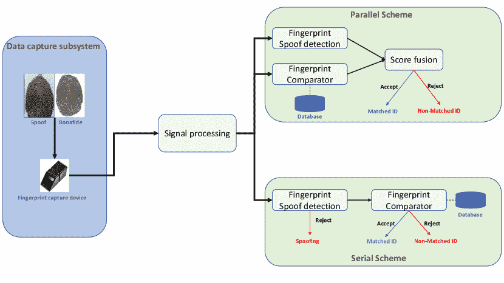
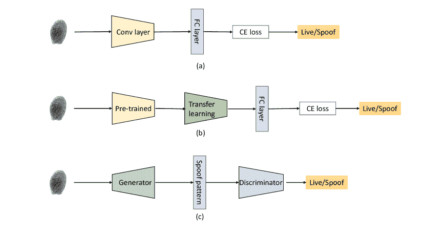

<!--yml

类别：未分类

日期：2024-09-06 19:39:25

-->

# [2305.17522] 基于深度学习的指纹呈现攻击检测：全面综述

> 来源：[`ar5iv.labs.arxiv.org/html/2305.17522`](https://ar5iv.labs.arxiv.org/html/2305.17522)

# 基于深度学习的指纹呈现攻击检测：全面综述

Hailin Li hailin.li@ntnu.no [1234-5678-9012](https://orcid.org/1234-5678-9012 "ORCID identifier") 和 Raghavendra Ramachandra [0000-0003-0484-3956](https://orcid.org/0000-0003-0484-3956 "ORCID identifier") raghavendra.ramachandra@ntnu.no 信息安全与通信技术研究所（IIK），挪威科技大学（NTNU）Gjøvik 挪威 2816（2018; 2007 年 2 月 20 日; 2009 年 3 月 12 日; 2009 年 6 月 5 日）

###### 摘要。

指纹认证系统的脆弱性在将其应用于高度安全的访问控制时引发了安全担忧。因此，指纹呈现攻击检测（FPAD）方法对于确保指纹认证的可靠性至关重要。由于传统手工方法的生成能力不足，基于深度学习的 FPAD 已成为主流，并在过去十年取得了显著成绩。现有的综述更侧重于手工方法而非基于深度学习的方法，这些综述已经过时。为了刺激未来的研究，我们将仅关注近期的基于深度学习的 FPAD 方法。在本文中，我们首先简要介绍最常见的呈现攻击工具（PAIs）和公开可用的指纹呈现攻击（PA）数据集。接着，我们通过将现有的深度学习 FPAD 方法分类为接触式、非接触式和基于智能手机的方法来描述它们。最后，我们通过讨论当前阶段的开放挑战并强调潜在的未来视角来总结本文。

深度学习，指纹呈现攻击检测^†^†版权：acm 版权^†^†期刊年：2018^†^†doi：XXXXXXX.XXXXXXX^†^†会议：请确保从您的版权确认邮件中输入正确的会议标题；2018 年 6 月 3 日至 5 日；纽约伍德斯托克^†^†价格：15.00^†^†isbn：978-1-4503-XXXX-X/18/06^†^†ccs：计算方法  生物特征识别

## 1. 引言

生物识别验证在许多访问控制应用中得到广泛部署，包括边境控制、法医科学、智能手机访问、考勤系统等。生物识别系统可以使用生理特征（例如指纹、面部、虹膜）、行为特征（例如步态、打字、声音）或两者的组合来设计。在各种生理特征中，面部、虹膜和指纹因其可靠性和准确性而占据了大多数应用，这可以归因于这些生物识别特征的唯一性。然而，指纹生物识别是各种应用中传统的生物特征之一，考虑到指纹模式在长时间内的可靠性以及特征的表示和匹配，可以在一秒钟内以高准确度实现十亿次指纹比对（AFI，2003）。

图 1\. 最近几年通过 Google Scholar 搜索获得的 FPAD 出版物，关键词包括：“指纹欺骗检测”、“指纹展示攻击检测”和“指纹活体检测”。

指纹图像的捕获可以通过接触式和非接触式传感器来完成，其中接触式传感器使用最为广泛。接触式指纹传感包括光学、容性和超声波传感器，这些传感器可以作为独立设备和/或集成在智能手机中使用。光学指纹扫描仪是捕获指纹模式的最古老类型。这些传感器通常每英寸有非常高的二极管数量，以捕捉指纹的细节，并且光学相机具有有限的分辨率。容性传感器使用小型电容电路阵列来捕获指纹数据。由于电容器存储电荷，将它们连接到扫描仪表面的导电板上可以追踪指纹的细节。最近，超声波传感器被引入用于扫描指纹，特别是在智能手机中。这些传感器采用超声波发射器，能够向手指发送脉冲并记录回声以构建指纹。此外，长时间扫描可以捕获额外的深度数据，从而生成 3D 指纹。非接触式传感有两种类型：（a）使用定制工业相机（b）使用现成的智能手机相机来捕捉手指照片。使用定制相机进行非接触式捕获可以让设计师包括多光谱相机和其他复杂的相机，以确保可靠的验证并对展示攻击具有一定的抗干扰能力。然而，使用非接触式传感进行指纹捕获也带来了额外的挑战，如姿势不受控制、低质量的指纹、环境噪音和性能下降。

指纹识别系统（FRS）的广泛部署引发了对系统被攻击的担忧，攻击者可能恶意获取指纹系统的访问权限。FRS 可以通过两种方式受到攻击：（a）直接攻击和（b）间接攻击。直接攻击通常针对 FRS 的传感器，利用演示攻击工具（PAI）向传感器展示以获取访问权限。间接攻击旨在攻击生物识别子系统组件以修改其功能。与直接攻击相比，间接攻击需要对生物识别系统有特别的技能和知识才能成功访问 FRS。因此，直接攻击在现实生活中得到了广泛应用。一个现实生活中的例子是（Hac，2022）中报告的针对国家人口登记册的 FRS 直接攻击案例。攻击者通过从登记文件中收集受害者的指纹（这些文件上有指纹的墨迹），然后制作了一个聚合物指纹攻击工具，利用 AePS 从多个受害者那里提取资金。因此，检测演示攻击对于确保 FRS 系统的安全、实现可靠的验证至关重要。

| 论文标题 / 参考文献 | 年份 | 包含深度学习 | 模态与硬件 |
| --- | --- | --- | --- |
| 指纹活体检测调查（Al-Ajlan，2013） | 2013 | 否 | 接触式 |
| 指纹识别系统的演示攻击检测方法：一项调查（Sousedik 和 Busch，2014） | 2014 | 否 | 接触式 |
| 关于指纹识别系统的反欺诈方案调查（Marasco 和 Ross，2014） | 2014 | 否 | 接触式 |
| 关于指纹欺诈、检测技术和数据库的调查（Kulkarni 和 Patil，2015） | 2015 | 否 | 接触式 |
| 指纹生物识别的安全性和准确性：一项综述（Yang 等，2019） | 2019 | 少量 | 接触式 |
| 关于指纹未知演示攻击检测的调查（Singh 等，2021） | 2021 | 少量 | 接触式，短波红外，光谱成像 |
| 针对指纹活体检测的鲁棒反欺诈技术：一项调查（Habib 和 Selwal，2021） | 2021 | 少量 | 接触式 |
| FinPAD：指纹演示攻击检测机制的最新进展、分类及未来展望（Sharma 和 Selwal，2021） | 2021 | 是，¡30 | 接触式，短波红外 |
| 指纹活体检测方案：关于演示攻击的综述（Ametefe 等，2022） | 2022 | 是，¡30 | 接触式，短波红外，光谱成像，智能手机 |
| 指纹演示攻击检测的深度学习：一项调查（我们） | 2023 | 全面（¿50） | 接触式，短波红外，光谱成像，傅里叶变换红外，光学相干层析，智能手机 |

表 1\. 现有 FPAD 综述的总结

呈现攻击检测（PAD），也称为防伪方法，在指纹生物识别中得到了广泛研究，产生了几种 PAD 技术。指纹 PAD（FPAD）技术的进展如图 1 所示，这显示了研究人员在开发 FPAD 技术方面的兴趣增加。早期的 FPAD 技术开发工作基于手工设计的特征，其中基于纹理的特征（局部二值模式（LBP）、二值统计图像特征（BSIF）等）被广泛用于 FPAD 的设计。然而，由于纹理特征在不同类型的 PAI 中泛化的局限性，研究人员开始探索使用深度学习进行 FPAD。此外，FPAD 的重要性还促使了竞赛平台 LivDet（Liv, 2022）的发展，该平台允许参与者提交 FPAD 算法进行独立评估。

随着**FPAD**算法多年来的指数级增长，出现了几篇综述论文，如表 1 所示。然而，现有的综述论文限于非深度学习的方法，因此未考虑到深度学习方法的最新进展。因此，本文旨在全面回顾基于深度学习的指纹呈现攻击检测，其中讨论了最近的进展、竞争、性能评估指标和未来的工作。本文的主要贡献如下：

+   •

    我们提供了基于深度学习的 FPAD 技术的全面综述，涵盖了接触式和非接触式指纹。综述包括文献综述、分类法，并对不同设计属性的这些方法进行了比较。

+   •

    我们对广泛应用于接触式和非接触式指纹生物识别的**PAI**进行了全面调查。

+   •

    我们概述了可靠指纹检测的主要挑战和潜在未来工作。

本文的其余部分组织如下。第 2 ‣ Deep Learning based Fingerprint Presentation Attack Detection: A Comprehensive Survey")节展示了指纹识别系统的流程，并指出了 FPAD 系统如何在整体系统中进行调整。第 3 ‣ Deep Learning based Fingerprint Presentation Attack Detection: A Comprehensive Survey")节提供了有关接触式和非接触式指纹的各种 PAI 的综合报告。第四部分介绍了最常见的公开 FPAD 数据集。第五部分展示了基于深度学习的指纹展示攻击检测的全面调查。然后，第六部分包括 ISO 标准和 LivDet 竞赛中最常见的 PAD 性能评估指标。第七部分讨论了开放挑战和潜在的未来研究方向。最后，我们在第八部分总结了这篇综述。

## 2\. 指纹识别系统 (FRS)

图 2\. 带有 PAD 的指纹验证系统框图

图 2 ‣ Deep Learning based Fingerprint Presentation Attack Detection: A Comprehensive Survey") 显示了指纹验证系统的框图。给定一张指纹图像，信号处理单元执行各种操作，包括数据预处理、质量检查、特征提取和模板创建。指纹特征提取技术可以分为第 1 级（模式）、第 2 级（细节点）和第 3 级（毛孔和脊形状）。在商业应用中广泛部署的成功指纹特征通常基于第 2 级特征。最终决策使用比较器，该比较器可以将登记的指纹与探测指纹图像进行比较，以输出比较分数。然后将比较分数与预设阈值进行比较，以做出最终决策。PAD 系统可以集成到指纹识别系统中，与指纹比较器并行或串行。在并行系统中，PAD 和比较器独立执行处理，以获得结合后的最终决策。然而，在串行系统中，PAD 和指纹比较器以顺序方式工作，指纹首先经过 PAD 单元处理。如果 PAD 单元的输出表明是真实的，则指纹模板将通过比较器做出最终决策。有关指纹系统的更多详细信息，请读者参考 (Maltoni et al., 2009) (Maltoni et al., 2022)。

## 3\. 指纹呈现攻击工具（PAI）

展示攻击成功的关键在于高质量的 PAI 生成。图 3 展示了在指纹文献中常见的现有 PAI 类型的分类（Maltoni 等，2009）。现有的 PAI 可以大致分为两种主要类型：（a）数字生成和（b）人工制作。数字攻击生成是使用计算机程序执行的，其中攻击是通过深度学习方法（Karras 等，2019）或自定义算法（Bontrager 等，2018）合成生成的（Gajawada 等，2019）（Engelsma 等，2022）（Kim 等，2019）。数字攻击可以作为注入攻击使用，和/或生成可以作为展示攻击使用的物理伪造品。数字攻击的例子包括合成指纹攻击（Grosz 和 Jain，2022），主打印（Roy 等，2018）和变形攻击（Makrushin 等，2021）（Ferrara 等，2016）。人工制作方法使用目标指纹印模生成可以作为展示攻击使用的物理伪造品。人工制作方法可以大致分为 2D/3D 打印和胶指。2D/3D 打印中，物理伪造品是打印出的指纹，可以作为展示攻击使用（Espinoza 等，2011）（Kanich 等，2018）（Prabakaran 和 Pillay，2020）。胶指由各种材料（明胶、游戏泥、硅胶等）制成，这些材料可能包含特定的指纹模板，并且对 FRS（Chugh 和 Jain，2019）显示出潜在风险。表 2 列出了数字和人工制作类型 PAI 生成的不同特征。

图 3\. 指纹展示攻击工具（PAI）的分类

| 数字生成的 PAI | 人工制作的 PAI |
| --- | --- |
| 生成高质量攻击工具 | 生成接近高质量的攻击工具 |
| 高攻击潜力 | 中等攻击潜力 |
| 能够在单一攻击中针对多个身份 | 大多设计用于攻击单一身份 |
| 需要更多的技术知识 | 不需要更多的技术知识 |
| 高计算成本 | 低计算成本 |
| 低成本生成 | 高成本生成 |
| 检测非常具有挑战性 | 特别是使用多光谱传感器容易检测 |

表 2\. 不同 PAI 生成技术的比较

图 4\. PAIs 示例（摘自 (Chugh 和 Jain, 2019））

常见的 PAI 示例如图 4 ‣ 基于深度学习的指纹展示攻击检测：综合调查")所示。根据指纹验证应用下的实验，数字合成指纹显示出对 FRS 的高攻击潜力。

## 4\. 指纹 PAD 的现有数据集

在使用基于深度学习的方法进行训练和测试阶段时，需要一个大规模的数据集以获得更好的结果。在这一部分中，我们总结了公开可用的 FPAD 数据集，包括数据量、样本数量、真实/攻击样本量以及使用的 PAI 物种。最常见的数据集来自 2009 年至 2021 年的指纹活体检测竞赛（LivDet）系列。读者可以参考 LivDet 系列的综述（Micheletto et al., 2022）获取有关 LivDet 挑战的详细信息。在 LivDet 2009 数据集的第一版中，包括了三个光学扫描仪：Crossmatch、Identix 和 Biometrika，以及明胶、硅胶和粘土作为欺骗材料。在 LivDet 2011 中，四个子数据集基于四种不同的光学扫描仪：Biometrika、Digital Persona、ItalData 和 Sagem。此外，还包括了比 LivDet 2009 更多的 PAIs，如 Silgum、Ecoflex、木胶和乳胶。竞赛中引入了首个非光学扫描仪，欺骗材料被补充了身体替代和 Modasil。在 LivDet 2015 中，由于对 FPAD 方法对未知攻击的担忧增加，竞赛在测试数据集中包含了一些未知材料以供评估。此外，液体 Ecoflex 和两种成分的硅胶橡胶（RTV）被包括在 Green Bit、Biometrika 和 Digital Persona 数据集中，而硅胶橡胶 OOMOO 则包含在 Crossmatch 数据集中。在 LivDet 2017 中，竞赛专注于 FPAD 基于用户特定效应和操作员技能对复制品的影响。在训练集中，欺骗材料由木胶、Ecoflex 和身体替代品组成，而明胶、乳胶和液体 Ecoflex 组成了测试集，以刺激完全未见的场景。此外，涉及了两组具有不同制造欺骗能力的人。与之前的版本相比，一些受试者被纳入训练和测试数据集中，以探讨用户特定效应的影响。LivDet 2019 使用了与前一版相同的扫描仪，但首次呈现了多种材料组合，既有不同的一致性，也有不同的性质。LivDet 2021 仅包含两个扫描仪，GreenBit 和 Dermalog，其中包括了共识方法和新的伪共识方法 ScreenSpoof。新颖的欺骗材料包括 RProFast、Elmers 胶水、gls20 和 RPro30。最近的 LivDet 2023 包含四个数据集，对应于两个已知的传感器，Green Bit 和 Dermalog，以及两个未知的捕捉设备。

除了 LivDet 数据集，还有许多提出的方法包含公开的自定义数据集。在 Tsinghua 数据集（Jia et al., 2007）中，使用了电容设备 Veridicom 作为采集设备，攻击样本使用硅胶制成。样本来自 15 名清华大学的志愿者。每位参与者采集了两个手指，并记录了每个真实手指的十个图像序列。制造了 47 个假手指，每个手指有十个图像序列。BSL 数据集（Antonelli et al., 2006）在博洛尼亚大学生物特征系统实验室收集，包含更多的受试者和样本，使用了四种不同的 PAI。对于 45 名志愿者中的每一位，记录了右手的大拇指和食指的 10 个图像序列。制作过程中没有制作整个 3D 手指，而是专注于指尖区域。ATVS 数据集使用了硅胶和 Play-Doh 作为材料，涉及 17 名受试者。Precise Biometrics 数据集中使用了两台扫描仪，包括 100 名受试者和 500 个攻击样本，使用了五种不同的材料。在 Precise Biometrics Spoof-Kit(PBSKD)（Chugh et al., 2018）中，使用 10 种不同类型的伪造材料制造了 900 个伪造指纹图像。另一个数据集 MSU-FPAD 也在（Chugh et al., 2018）中提出，包含多达 9000 个真实样本和 10500 个伪造样本，使用了这两台读取器和 4 种不同的伪造材料。最近，Kolberg et.al（Kolberg et al., 2023）发布了一个新的数据集 COLFISPOOF，基于非接触式指纹照片，包含 72 种不同的 PAI 种类。所有 PAI 的指纹都是使用指纹合成算法生成的。每个数据集的详细信息在表 3 中展示。

| 数据集 | 受试者数量 | 真正样本 | 攻击样本 | PAI 类型 |
| --- | --- | --- | --- | --- |
| Tsinghua (Jia et al., 2007) | 15 | 300 | 470 | 硅胶 |
| BSL (Antonelli et al., 2006) | 45 | 900 | 400 | 硅胶、明胶、乳胶、木胶 |
| LivDet 2009 (Marcialis et al., 2009) | 254 | 5500 | 5500 | 明胶、硅胶和 Play-Doh |
| LivDet 2011 (Yambay et al., 2012) | 200 | 3000 | 3000 | 明胶、Silgum、Ecoflex、木胶、Play-Doh、硅胶和乳胶 |
| LivDet 2013 (Ghiani et al., 2013b) | 225 | 8000 | 8000 | 明胶、木胶、乳胶、Ecoflex 和 Modasil |
| LivDet 2015 (Mura et al., 2015) | 100 | 4500 | 5948 | Body Double、EcoFlex、Play-Doh、明胶、乳胶、木胶和液体 Ecoflex |
| LivDet 2017 (Mura et al., 2018) | 150 | 8099 | 9685 | 明胶、木胶、乳胶、Ecoflex、Body Double 和液体 Ecoflex |
| LivDet 2019 (Orrù et al., 2019) | NA | 6029 | 6936 | 明胶、木胶、乳胶、Ecoflex、Body Double 和 Liquid Ecoflex |
| LivDet 2021 (Casula et al., 2021a) | 66 | 10700 | 11740 | GLS20、Body Double、Mix 1、ElmersGlue 和 RFast30 |
| LivDet 2023 | 25 | 5000 | 3000 | NA |
| ATVS-FFp (Galbally et al., 2011) | 17 | 816 | 816 | 硅胶、Play-Doh |
| Precise Biometrics Spoof-Kit (Chugh et al., 2018) | NA | 1000 | 900 | Ecoflex、明胶、乳胶、Crayola、木胶、2D 打印 |
| MSU-FPAD (Chugh et al., 2018) | NA | 9000 | 10500 | Ecoflex，2D Print-Matte Paper，Play-Doh 和 2D Print (Transparency) |
| COLFISPOOF (Kolberg et al., 2023) | NA | NA | 7200 | 打印和重播 |

表 3\. 使用最广泛的公共数据集

## 5\. 基于深度学习的指纹呈现攻击检测

在本节中，我们讨论了用于接触、非接触和基于智能手机的指纹识别的指纹 PAD（FPAD）算法。FPAD 旨在检测给定的指纹图像是否真实或是呈现攻击。FPAD 技术大致可分为两大类：（a）基于硬件的方法和（b）基于软件的方法。基于硬件的方法旨在提取活体线索，这些线索需要将显式（或专用）传感器集成到传统的接触指纹生物识别系统中。一些广泛使用的活体检测方法包括血流捕捉（Drahansky et al., 2006）、电触觉（Yau et al., 2008）和脉搏血氧饱和度（Reddy et al., 2008），用于检测指纹是否真实。近年来，像光学相干断层扫描（OCT）这样的新型昂贵传感器也得到了发展。OCT 是一种成像技术，可以成像皮肤的一些表面下特征，并提取多层组织的相关特征，最大深度为 3 毫米（Cheng and Larin, 2007）（Bossen et al., 2010）（Liu and Buma, 2010）。此外，像多光谱和 3D 捕捉设备这样的非接触式指纹捕捉设备也可以固有地捕捉活体的特征。

基于软件的方法指的是检测所呈现的指纹是否是真实的或是伪造攻击的算法，与捕捉设备无关。基于软件的指纹攻击检测（FPAD）可以大致分为两种类型：手工特征方法和深度学习。手工特征方法指的是包括用于提取特征的技术，如梯度、纹理、微纹理等的传统特征表示。手工特征方法主要应用于接触式指纹图像。从指纹图像中，可以使用尺度不变特征变换（SIFT）（Lowe，1999），二值化统计图像特征（BSIF）（Kannala 和 Rahtu，2012），局部二值模式（LBP）（Guo 等，2010），局部相位量化（LPQ）（Ojansivu 和 Heikkilä，2008）计算微纹理特征。许多手工特征方法如（Ghiani 等，2012）（Ghiani 等，2013a）（Gragnaniello 等，2013）（Zhang 等，2014）（Gragnaniello 等，2015）近年来取得了令人满意的性能。然而，手工特征方法可能存在一个限制，即由于获取的指纹图像质量的变化，提取过程变得困难。这些挑战通过使用深度神经网络（DNN）等术语进行处理，如深度学习，它从图像中分层学习深层特征。随着图形处理单元的快速发展，训练大规模模型已经变得可行。在 2012 年，Krizhevsky 等（Krizhevsky 等，2012）训练了一个网络，将 120 万张高分辨率图像在 ImageNet LSVRC-2010 竞赛中分类为 1000 个不同的类别，取得了巨大成功，这引发了计算机视觉领域的革命。随后，训练深度卷积神经网络（CNN）在各种应用中主导了图像分类任务。图 5 展示了用于指纹 PAD 的深度学习算法的分类，这些算法针对以下三种不同的传感类型进行了开发：

图 5\. 基于深度学习的指纹伪造攻击检测的分类

### 5.1\. 基于接触的 FPAD

受益于强健的 CNN 架构（Simonyan 和 Zisserman，2014）（He 等，2016）（Huang 等，2017）以及先进的正则化技术（Srivastava 等，2014）（Ioffe 和 Szegedy，2015），研究人员越来越关注利用深度神经网络可靠地检测指纹攻击。与通过手工设计的描述符提取纹理特征不同，基于深度学习的方法可以学习深层特征，直接将指纹输入映射到伪造检测。传统的 CNN 架构包括卷积层和池化层，这些层通过多个滤波器卷积将输入图像映射到深度可学习的特征。提取的特征可以进一步输入到全连接层进行分类任务。如图 5 所示，基于深度学习的方法通常可以分为两类。监督学习是一种直接的方式来确定真实和 PA 作为二分类任务。然而，这些方法可能无法推广到未见过的领域攻击（即未知的呈现攻击）。许多研究人员考虑了广义的深度学习模型，这些模型可以实现领域泛化，以增强对未见过的 PA 类型的泛化能力。

最初，Nogueira 等（Nogueira 等，2014）首次引入了一种用于指纹特征提取的传统网络。他们训练了一个支持向量机（SVM）分类器，以检测基于 CNN 深度特征和 LBP 特征的呈现攻击。为了提高分类器的性能，应用了多种数据增强技术，如频率过滤、对比度均衡和感兴趣区域（ROI）过滤。通过比较，实验表明 CNN 模型具有高分类精度，这为更多研究人员提供了新的方向，激励他们专注于在 FPAD 任务上使用深度学习方法。然而，特征提取和分类任务被设计成两个不同的部分，以致于模型未能同时优化。

图 6\. 基于接触的 FPAD 的深度学习框架。(a) 使用交叉熵损失的端到端深度学习模型。(b) 基于迁移学习/微调的 FPAD 方法。(c) 使用广义深度学习模型的 FPAD

#### 5.1.1\. 端到端深度学习

如图 6 所示，端到端的深度学习模型经过训练后能自动超越分类任务。指纹图像的特征表示从卷积层提取，并传递到全连接层，以使用 softmax 函数计算活性概率。表 LABEL:tab:end_to_end_DL 展示了现有端到端深度学习技术的简要描述。

在 2015 年，王等人（Wang et al., 2015）将输入的标记指纹图像划分为$32\times 32$像素的不重叠块，并将它们传递到 CNN 模型进行训练。随后，作者采用投票策略将所有块的标签整合，最终确定结果。类似地，朴等人（Park et al., 2016）提出扩展王的工作以减少处理时间。作者指出，从有效的指纹区域提取块比从整个图像中提取更为高效。因此，在提取了分割指纹区域的正常概率位置的块之后，作者使用 CNN 对这些块进行训练，并利用投票策略进行分类。门诺提等人（Menotti et al., 2015）使用 SpoofNet 评估了提出的新的 CNN 架构在欺骗检测中的有效性。金等人（Kim et al., 2016）提出了一种基于深度置信网络（DBN）的 FPAD 方法，该方法通过一系列受限玻尔兹曼机连接，学习训练样本中的特征并确定指纹的活性。DBN 的训练分为两个步骤。首先，它在没有监督的情况下，从第一层到倒数第二层对一组样本进行训练，以概率地学习输入的重建。然后，模型将使用标记数据进行进一步训练以执行分类。

随着越来越多的公共数据集发布，Chugh 等人（Chugh et al., 2017）利用了基于 TF-Slim 库实现的 Inception-v3 CNN 模型（Szegedy et al., 2016），将多类 softmax 层替换为两类问题的二单位层。然后，该模型使用提取自指纹特征点周围的局部补丁进行训练，因为这些局部补丁能够提供重要线索，用于区分伪造指纹和真实指纹。结合得分级别的平均融合，这种方法评估了多个实验，如同传感器和相同材料、同传感器和跨材料、跨传感器以及跨数据集场景，以考虑已知和未知攻击，展示了良好的平均分类错误（ACE）。在后续工作中，Chugh 等人（Chugh et al., 2018）进一步提出了一种基于 MobileNet-v1（Howard et al., 2017）模型的指纹伪造检测器，该模型使用围绕特征点中心对齐的局部补丁进行训练，并定义了全球伪造度评分以整合局部伪造度评分来确定 PA。

然而，基于 CNN 的 FPAD 方法存在泛化问题和高计算成本。用于训练的 PA 材料（已知的 PAs）的选择直接影响对未知 PAs 的性能。一些材料（如 EcoFlex）比其他材料（如 Silgum）更容易被检测到（Chugh et al., 2018）。因此，为了进一步研究不同 PA 材料的更好表征，提出了一个新的数据集 MSU-FPAD v2.0，它结合了 MSU-FPAD v1.0 和 Precise Biometrics Spoof kit（Chugh et al., 2018），在（Chugh and Jain, 2019）中介绍。具体而言，该数据库使用 12 种不同的 PAI 构建。然后，采用留一法协议；在每次迭代中排除一个 PAI，并利用 3D t-SNE 技术可视化特征。通过实验观察到，硅胶、2D 纸张、Play Doh、明胶、乳胶身体涂料和 Monster 液态乳胶覆盖了真伪样本周围的整个特征空间。此外，将现有的基于深度学习的算法与数百万个参数集成到嵌入式或移动设备中被认为是一项挑战。Nguyen et.al (Nguyen et al., 2018) 提出了遵循 SqueezeNet 的 Fire 模块架构的 FPAD 技术，并引入 Gram Matrix (Gatys et al., 2015) 形成所提出的 fPADnet 的基础结构。该模型仅包含 30 万个参数，比原始 SqueezeNet 小 2.4 倍。同样，Park et al. (Park et al., 2019) 介绍了一个完全卷积神经网络，以 SqueezeNet 的 fire 模块为基础。由于没有全连接层，该模型可以处理任何大小的图像。模型将从输入图像中提取的补丁作为输入，并输出三个值，表示补丁所属的类别（真实、伪造和背景）的概率。在不同输入补丁尺寸为$32\times 32$、$48\times 48$、$32\times 32$和$64\times 64$的额外实验中，评估了最佳补丁尺寸以实现最高检测准确率。

表 4\. 基于端到端深度学习的现有接触式 FPAD

| 作者 | 年份 | 主干网络 | 损失函数 | 描述 |
| --- | --- | --- | --- | --- |
| Nogueira et.al (Nogueira et al., 2014) | 2014 | CNN | 支持向量机 | 使用 CNN 提取深度特征，并训练 SVM 进行活体分类 |
| Wang et.al (Wang et al., 2015) | 2015 | CNN | 二元交叉熵损失 | 基于补丁的投票策略方法 |
| Menotti et.al (Menotti et al., 2015) | 2015 | CNN | 二元交叉熵损失 | 提出了一个派生 CNN 术语作为 SpoofNet |
| Kim et.al (Kim et al., 2016) | 2016 | 深度信念网络 (DBN) | 均方误差损失 | 提出了基于 DBN 的方法用于活体检测 |
| Park 等（Park 等，2016） | 2016 | CNN | 二元交叉熵损失 | 从有效指纹区域提取补丁以训练 CNN 模型 |
| Lazimul 和 Binoy（Lazimul 和 Binoy，2017） | 2017 | CNN | 二元交叉熵损失 | 通过多个步骤增强指纹图像并使用 CNN 模型进行训练 |
| 张等（张等，2017） | 2017 | CNN | 二元交叉熵损失 | 利用直方图均衡化进行对比度增强，并使用分块训练 CNN 模型 |
| Chugh 等（Chugh 等，2017） | 2017 | Inception-v3 CNN | 二元交叉熵损失 | 使用提取自指纹细节点周围的局部补丁来训练经过略微修改的 Inception-v3 模型 |
| Chugh 等（Chugh 等，2018） | 2018 | MobileNet-v1 | 二元交叉熵损失 | 定义全局欺骗度评分，通过基于细节点的局部补丁来确定活体性 |
| Pala（Pala 和 Bhanu，2017） | 2017 | CNN | 三重损失 | 提出了一个三重卷积网络 |
| Jung 和 Heo（Jung 和 Heo，2018） | 2018 | CNN | 平方回归误差（SRE） | 使用 SRE 层代替交叉熵损失层作为损失函数 |
| 阮等（阮等，2018） | 2018 | SqueezeNet | 二元交叉熵损失 | 通过设计的 Gram 矩阵优化 SqueezeNet 的轻量级模型 |
| Chugh 和 Jain（Chugh 和 Jain，2019） | 2019 | CNN | 二元交叉熵损失 | 采用留一法协议，每次迭代从训练集中排除一个 PAI，以可视化特征并找出哪个 PAI 具有类似于真实指纹的特征空间 |
| Park 等（Park 等，2019） | 2019 | SqueezeNet | 三类交叉熵损失 | 一个没有全连接层的小型全卷积网络，能够适应任何大小的输入 |
| 袁等（袁等，2019a） | 2019 | CNN | 二元交叉熵损失 | 在最后的卷积层和全连接层之间增加一个图像尺度均衡（ISE）层，以保持纹理信息和图像分辨率 |
| Jung 等（Jung 等，2019） | 2019 | CNN | 二元交叉熵损失 | 设计一个活体图（LM-CNN），将探测图像和模板图像映射到堆叠的特征向量，并使用模板-探测 CNN 来判断欺骗性 |
| 袁等（袁等，2019b） | 2019 | ResNet | 二元交叉熵损失 | 引入具有自适应学习的 ResNet，以解决梯度消失问题 |
| 张等（张等，2019） | 2019 | ResNet | 二元交叉熵损失 | 提出了一个轻量级框架，利用专门设计的抗指纹欺骗的强健残差块 |
| 张等（张等，2020） | 2020 | DenseNet | 二元交叉熵损失 | 采用注意力机制代替全局平均池化（GAP） |
| Jian 等（Jian et al., 2020） | 2020 | DenseNet | Binary CE 损失 | 引入遗传算法寻找用于指纹活体检测的最优 DenseNet 结构 |
| Liu 等（Liu et al., 2021b） | 2021 | Mobile Net V3 | Binary CE 损失 | 基于全球–局部模型的重新思考策略 |
| Rai 等（Rai et al., 2023） | 2023 | MoblieNet V1 | 支持向量分类器（SVC） | 使用 MoblieNet V1 网络进行特征提取，并通过 SVC 的损失进行训练 |

图像增强在基于深度学习的 FPAD（指纹图像自动检测）中得到了充分研究。Jang 等（Jang et al., 2017）利用直方图均衡化进行对比度增强，以提高指纹图像的识别率。指纹图像被分成多个非重叠的块，并使用 CNN 模型进行分类训练。采用多数投票系统（MVS）对所有子块的投票进行汇总并做出最终决定。类似地，Lazimul 和 Binoy（Lazimul and Binoy, 2017）提出通过六个步骤来增强指纹图像：图像分割、图像局部归一化、方向估计、脊频率估计、Gabor 滤波、图像二值化/细化。随后，使用 CNN 模型进行数据训练。通常，交叉熵是最常用的损失函数，用于测量两个概率分布之间的差异，并广泛应用于分类任务。Pala（Pala and Bhanu, 2017）引入了三元组损失（Schroff et al., 2015），该损失函数鼓励不相似的样本与任何相似样本之间的距离至少大于某个边际值。三元组网络接受来自一个类别的两个补丁和另一个类别的一个补丁，以三元组损失监督下测量类内和类间的距离。此外，Jung 和 Heo（Jung and Heo, 2018）引入了一种新的 CNN 架构，该架构使用平方回归误差（SRE）层代替交叉熵损失层。这种方法允许设置一个阈值作为活性概率来调整模型，提供了适应不同应用场景的准确性权衡选项。此外，Jung 等（Jung et al., 2019）通过引入两个 CNN 术语，即活性图 CNN（LM-CNN）和模板-探测 CNN（TP-CNN），扩展了他们之前的工作。LM-CNN 在指纹注册期间进行预计算，将指纹图像映射到$32\times 32$特征图。然后，来自探测指纹和模板指纹的输出图将堆叠为$2\times 32\times 32$的活性图，这将被输入到 TP-CNN 中进行最终决策。大多数 CNN 模型由于全连接层的限制，需要固定长度的输入图像。因此，指纹数据集需要额外的预处理，如裁剪或缩放，这会导致信息丢失。为了解决这个问题，Yuan 等（Yuan et al., 2019a）提出了一种改进的 DCNN 模型，采用图像尺度均衡（ISE）以保留纹理信息并保持图像分辨率。在最后的卷积层和全连接层之间，添加了额外的 ISE 层，以从卷积层获得特征图，并将任何尺度的图像转换为固定长度的向量，以适应全连接层。

此外，Yuan 等（Yuan et al., 2019b）首次引入了用于 FPAD 的深度残差网络（He et al., 2016）。作者设计了一种新颖的 ROI 提取技术，以去除背景噪声引起的噪声。接着，通过应用自适应学习的深度残差网络来解决 DCNN 中的梯度消失和学习参数陷入局部最优值的问题。由于对未知攻击检测的潜在低泛化能力的担忧，引入了一种基于局部梯度模式（LGP）的纹理增强方法，以突出真实样本和攻击样本之间的差异，从而实现更好的泛化。Zhang 等（Zhang et al., 2019）提出了一个轻量级框架，该框架利用了针对指纹欺诈特别设计的强健残差块（He et al., 2016）。Silm-ResCNN 包含九个修改过的残差块。作者通过在每对卷积层中插入一个 dropout 层，并移除第二个卷积核的激活函数（ReLU），使模型更具泛化性。在另一种特定类型中，$1\times 1$ 卷积层被替换为最大池化，并增加了零填充通道。因此，Slim-ResCNN 的整体结构包括 Conv1、Conv2、Conv3（Conv3$_1$、Conv3$_2$）和 Conv4（Conv4$_1$、Conv4$_2$），接着是全局平均池化（Avg$_{Pool}$）和最终分类层。该模型将提取的局部补丁作为输入，交叉熵作为损失函数。需要注意的是，这种方法在 2017 年的指纹活体检测比赛（Mura et al., 2018）中实现了 95.25% 的整体准确率。Zhang 等（Zhang et al., 2020）讨论了全局平均池化在指纹欺诈中的局限性，并通过采用注意力机制克服了这一问题。设计了一个仅有 48 万参数的轻量级模型。其块设计中包含了残差路径和密集连接路径，这得益于 DenseNet（Huang et al., 2017）和 ResNet（He et al., 2016）。Jian 等（Jian et al., 2020）指出了基于 DenseNet 的架构（Zhang et al., 2020）的局限性，并通过采用遗传算法（Xie 和 Yuille, 2017）来优化模型。Liu 等（Liu et al., 2021b）提出了一个基于重新思考策略的框架。该模型包括三个模块，一个全局 PAD 模块、一个重新思考模块和一个局部 PAD 模块。首先，全局 PAD 模块接收整个图像作为输入，然后预测全局伪造分数。接着，重新思考模块利用激活图通过类激活映射（CAM）突出 PAD 的重要区域。最后，这些区域将被裁剪并传入局部 PAD 模块，以细化全局 PAD 模块的预测。最近，Rai 等（Rai et al., 2023）采用 MoblieNet V1 作为特征提取器，因为它可以利用深度可分离卷积操作代替传统卷积操作，然后通过 SVC 获得的损失来训练网络。此外，对许多现有方法的综合比较表明，所提出的方法，即 MoSFPAD，达到了最先进的结果。

#### 5.1.2\. 使用迁移学习/微调的 FPAD

然而，基于端到端深度学习的 FPAD 在分类准确性上取得了显著的提升。公共指纹训练集的规模不足以优化 CNN 模型，而 CNN 模型通常需要大量样本进行训练。一方面，许多研究人员通过数据增强在原始数据上应用小的变化来扩展数据集。另一方面，迁移学习和微调是解决小数据集问题的常见方法。如图 6 所示，迁移学习/微调是一种不从头开始训练深度学习模型的技术。相反，迁移学习利用预训练模型学到的表示来提取有意义的特征，并使用新的分类器在分类上表现更佳。不同的是，微调技术是解冻预训练模型中与顶部几层对应的权重，并对更高阶特征进行“微调”，使其更适合特定任务。表 8 展示了基于迁移学习的 FPAD 的快速概览。

Nogueira 等人（Nogueira et al., 2016）通过利用迁移学习在预训练的 VGG（Simonyan 和 Zisserman, 2014）和 AlexNet（Krizhevsky et al., 2012）模型上，扩展了他们的工作（Nogueira et al., 2014），并使用指纹活跃性检测数据集进行了微调。通过比较四种不同的模型（两种用自然图像预训练并用指纹图像微调的 CNN 模型，一种仅使用从高斯分布中抽取的随机滤波器权重的 CNN-Random 模型，以及一种传统的 LBP-SVM 模型），作者详细阐述了预训练 CNN 在 FPAD 领域的优越性。此外，Toosi 等人（Toosi et al., 2017b）提取了一组仅包含前景像素的小尺寸补丁，并将这些补丁传递给预训练的 AlexNet（Krizhevsky et al., 2012）进行进一步的训练，以利用指纹数据集中的特征。类似地，Toosi 等人（Toosi et al., 2017a）提取原始图像的小尺寸前景补丁，并微调预训练的 AlexNet（Krizhevsky et al., 2012）和 VGG19（Simonyan 和 Zisserman, 2014）模型。同样，Ametefe 等人（S Ametefe et al., 2021）利用 DenseNet(DenseNet201)（Huang et al., 2017）进行迁移学习，与 VGG 和 AlexNet 特征相比也取得了令人满意的结果。

| 作者 | 年份 | 主干网络 | 损失函数 | 描述 |
| --- | --- | --- | --- | --- |
| Nogueira 等人（Nogueira et al., 2016） | 2016 | AlexNet, VGG | Binary CE 损失 | 利用预训练模型并使用指纹活跃性检测数据集进行微调 |
| Toosi 等人（Toosi et al., 2017b) | 2017 | AlexNet | Binary CE 损失 | 提取一组仅包含前景像素的小尺寸补丁，以微调预训练模型 |
| Toosi 等人（Toosi et al., 2017a） | 2017 | AlexNet, VGG19 | Binary CE 损失 | 在两个预训练 CNN 模型上利用迁移学习 |
| Ametefe 等人（S Ametefe et al., 2021) | 2021 | DenseNet | Binary CE 损失 | 在 densenet201 网络上利用深度迁移学习 |

表 5. 使用迁移学习/微调的现有接触基 FPAD 方法

#### 5.1.3. **广义深度学习**

为了提高模型的泛化能力，许多研究者考虑应用广义模型将一个领域转移到另一个领域，使用基于对抗学习的模型。这里的目标是通过在 PAI 和真实样本之间进行领域转换来解决 FPAD 技术的泛化问题。表 6 提供了现有可泛化 FPAD 技术的快速概述。

Pereira 等人（Pereira et al., 2020）提出了一种基于对抗训练的创新模型，该模型由三个子网络组成：(i) 一个编码器网络，将输入图像映射到潜在空间，(ii) 一个任务分类器网络，将潜在表示映射到相应的攻击和真实概率，(iii) 一个物种分类器网络，旨在根据攻击潜在表示预测 PAI 物种。物种分类器的训练目标是最小化 PAI 物种之间的分类损失，而任务分类器和编码器则训练以最小化攻击和真实样本之间的分类损失，同时尽量使 PAI 物种分类接近随机猜测。为了进一步提高检测器对训练期间未见过的材料伪造的泛化性能，提出了一种基于风格迁移的包装器，即通用材料生成器（UMG），以可靠地检测 FPAD（Chugh 和 Jain, 2020）。UMG 能够通过在已知伪造材料的指纹图像之间转移风格（纹理）特征来生成对应于未知伪造材料的合成伪造图像。然后，这些合成图像为模型提供了更好的泛化能力，以检测由未知材料制成的伪造。Sandouka 等人（Sandouka et al., 2021a）提出了一种统一生成对抗网络（UGAN），可以在多个领域之间进行单一生成器学习映射。随后，一个共享加权融合层作为分类器融合所有翻译领域的输出，以确定检测结果。类似地，Sandouka 等人（Sandouka et al., 2021b）进一步利用 CycleGAN（Zhu et al., 2017）网络进行领域适应，将源领域转换为目标领域。与他们之前的工作相比，采用了 transformer 模型，将特征图的多个补丁序列作为输入。然后，这些输出被串联并线性投影以获得最终输出，再进一步输入到全连接层进行分类任务。此项工作进一步提高了性能，而不是（Sandouka et al., 2021a）。此外，Lee 等人（Lee et al., 2022）提出了一种利用风格迁移在指纹之间转移材料风格的泛化改进方法。Liu 等人（Liu et al., 2022）最近提出了一种通道级特征去噪模型。他们通过评估图像的每个通道来提取“噪声”通道。然后，抑制这些通道的干扰，并设计了一种 PA 适应损失来对齐指纹的特征域。这种方法在 LivDet 2017（Mura et al., 2018）数据集上取得了令人满意的结果。

| 作者 | 年份 | 主干 | 损失函数 | 描述 |
| --- | --- | --- | --- | --- |
| Pereira 等（Pereira et al., 2020） | 2020 | 物种不变神经网络 | 对抗损失，物种转移损失 | 一种对抗学习方法，旨在提高检测未知攻击的能力 |
| Chugh 和 Jain（Chugh and Jain, 2020） | 2020 | 通用材料生成器（UMG） | 对抗损失，风格损失，内容损失 | 一种基于风格迁移的方法，将已知材料的指纹图像的纹理特征迁移到未知材料上 |
| Sandouka 等（Sandouka et al., 2021a） | 2021 | 生成对抗网络，EfficientNet V2（Tan 和 Le, 2021） | 对抗损失，重建损失，领域分类损失 | 一个统一的生成对抗网络（UGAN），可以通过单一生成器学习在多个领域之间的映射 |
| Sandouka 等（Sandouka et al., 2021b） | 2021 | Transformers 和 CycleGAN | 对抗损失，循环一致性损失 | 利用 CycleGAN 从源领域转换到目标领域 |
| Lee 等（Lee et al., 2022） | 2022 | CycleGAN 和 CNN | 对抗损失，二进制交叉熵损失 | 使用 CycleGAN 将指纹图像从未经训练的材料风格转换为已训练的材料风格 |
| Liu 等（Liu et al., 2022） | 2022 | MoblieNet V2 | PA-适应损失，二进制交叉熵损失 | 提出了一个按通道特征去噪的模型 |

表 6\. 现有的通用深度学习 FPAD 方法

### 5.2\. 基于无接触的 FPAD

图 7\. 基于无接触的指纹系统示例，使用传感器特定的方法

传统指纹图像容易受到伪造攻击，因为伪造的纹理特征通常不明显。此外，新型合成材料的出现对当前模型的泛化能力提出了更多挑战。然而，伪造指纹表面的纹理可以通过多光谱捕获设备甚至智能手机摄像头变得可见。多光谱捕获设备的演示如图 7 所示。Hussein et.al (Hussein et al., 2018) 提出了一个基于补丁的 CNN 模型，该模型将多光谱短波红外（SWIR）成像和激光散斑对比成像（LSCI）图像作为输入，用于分类皮肤与非皮肤。此外，Mirzaalian et al. (Mirzaalian et al., 2019) 利用 LSCI 图像评估了四种不同的模型：Hussein et al. (Hussein et al., 2018)提出的模型称为 baseN，在 BaseN 的每两个 2D 卷积层之间添加残差连接称为 ResN，引入了 inception 模块的模型称为 IncpN，以及一个双层长短期记忆（LSTM）网络。结果表明，基于 LSTM 的方法表现最佳。Kolberg et al. (Kolberg et al., 2020) 比较了 LSTM 网络与不同 CNN 模型在 1310 nm 激光设备捕获的指纹图像上的表现。实验结果表明，与 CNN 模型相比，LSTM 模型具有更好的性能。此外，Spinoulas et al. (Spinoulas et al., 2021) 使用完全卷积神经网络（FCN）评估了不同感测模式下的 FPAD 性能。评估实验是在从可见光（VIS）、近红外（NIR）、SWIR、LSCI 和近红外背照射领域捕获的指纹图像上进行的。

| 作者 | 年份 | 主干网络 | 损失函数 | 描述 |
| --- | --- | --- | --- | --- |
| Hussein et.al (Hussein et al., 2018) | 2016 | CNN | 二元交叉熵损失 | 基于 SWIR 和 LSCI 图像的基于补丁的 CNN |
| Mirzaalian et.al (Mirzaalian et al., 2019) | 2019 | CNN | 二元交叉熵损失 | 比较四种不同的模型 |
| Kolberg et.al (Kolberg et al., 2020) | 2020 | 长短期记忆（LSTM）网络和 CNN | 二元交叉熵损失 | 比较 LSTM、LRCN（长短期递归卷积网络）和 CNN 模型的性能 |
| Spinoulas et.al (Spinoulas et al., 2021) | 2021 | 完全卷积神经网络（FCN） | 二元交叉熵损失 | 评估从可见光（VIS）、近红外（NIR）、SWIR、LSCI 和近红外背照射捕获的图像中的性能 |

表 7\. 现有的最先进的无接触 FPAD 方法

#### 5.2.1\. 异常检测

大多数之前的深度学习模型将 FPAD 视为一个封闭集问题，以检测各种预定义的 PA，这需要大规模的训练数据来涵盖尽可能多的攻击。此外，训练数据必须在训练前进行标注。然而，这导致了过拟合问题，即模型对训练数据集中已包含的 PA 非常敏感，但对未见过的攻击缺乏泛化能力。越来越多的新材料被开发出来，容易伪造 FRS（Saguy 等人，2022）。未知 FPAD 方法已成为一个开放问题，并在近年来受到越来越多的关注。与最常见的二分类器相比，一类分类器只学习活体指纹的表示，而不使用任何特定材料的伪造印象。然后，未见过的攻击被检测为异常，与真实样本相比表现为离群值。图 8 展示了二分类器和基于异常检测的方法之间的区别。

图 8\. 二分类器和异常检测的示例

| 作者 | 年份 | 主干 | 损失函数 | 描述 |
| --- | --- | --- | --- | --- |
| Engelsma 和 Jain（Engelsma 和 Jain，2019） | 2019 | 生成对抗网络（GANS） | 对抗损失 | 分别在原始 FTIR 图像、处理后的 FTIR 图像和直接查看的图像上训练三个 GANS |
| Rohrer 和 Kolberg（Rohrer 和 Kolberg，2021） | 2021 | Wasserstein GAN 和自编码器 | 重建损失 | 在自编码器网络上利用预训练的 WGAN 权重 |
| kolberg 等人（Kolberg 等人，2021b） | 2021 | 三个自编码器 | 重建损失 | 提出了三个自编码器 |
| 刘等人（刘等人，2021a） | 2021 | 自编码器 | 重建损失 | 基于 T 光学相干技术（OCT）图像的自编码器 |

表 8\. 基于 FPAD 的现有最先进的异常检测方法

Engelsma 和 Jain（Engelsma and Jain, 2019）提出了一种仅通过训练多个生成对抗网络（GANs）（Goodfellow et al., 2014）来检测活体指纹的伪造检测器。三个 GAN 模型分别在来自 RaspiReader 的原始 FTIR 图像、处理后的 FTIR 图像和直接视图图像上进行训练。对于每个 GAN，生成器尝试合成活体指纹图像，而鉴别器则使用生成的样本和数据集中真实的样本来区分它们。因此，通过长时间的迭代训练，生成器被训练生成高质量图像，使鉴别器能够将活体样本与生成样本分开。在训练阶段结束后，生成器会被丢弃，而鉴别器可以作为 FPAD 模块用于检测攻击。最后，所有三个鉴别器输出的分数融合构成输入指纹样本的最终伪造分数。Rohrer 和 Kolberg（Rohrer and Kolberg, 2021）首次使用 Wasserstein GAN（Arjovsky et al., 2017）作为预训练模型，并从头开始使用 LivDet2021（Casula et al., 2021a）Dermalog 传感器数据集进行训练。GAN 的鉴别器权重被转移到自编码器（AE）的编码器中，而生成器的权重则转移到解码器中。在编码器和解码器之间添加了一个卷积层以连接它们。AE 学习最小化重建损失（Géron, 2022），以便模型可以以最小的重建误差重建输入图像。PA 将通过大的重建误差来检测。

Kolberg 等（Kolberg et al., 2021b）提出了一种基于自编码器（AE）的新型 PAD 技术，该技术仅在短波红外域中对真实样本进行训练，将二分类问题转换为一类域。作者介绍了三种 AE 架构：Conv-AE、Pooling-AE 和 Dense-AE，并将其结果与其他最先进的一类 PAD 进行了比较。此外，Liu 等（Liu et al., 2021a）提出了一种新型的光学相干技术（OCT）图像的一类 PAD（OCPAD）方法，该方法提供了指尖皮肤的内部表示，而不是简单的特征。所提出的 PAD 框架包括基于自编码器网络的参考真实建模和基于伪造分数的 PA 检测。

### 5.3\. 基于智能手机的 FPAD

智能手机认证应用的快速发展已经实现了高验证准确率（Ramachandra and Li, 2023），这引发了对智能手机系统容易被伪造的担忧。张等人（Zhang et al., 2016）提出了一种基于 2D 智能手机的方法，该方法结合了两种局部描述符（LBP 和 LPQ）的特征与从 CNN 模型中提取的深度特征。CNN 模型通过集成全局平均池化和批归一化进行了优化。由于缺乏公开的可用数据集，构建了自获取的真实样本和由木胶、PCB 电解液或特殊导电墨水打印的 2D 攻击样本。通过融合两种描述符和 CNN 的结果，可以输出最终决策。藤井等人（Fujio et al., 2018）比较了基于手工特征的方法（LBP, LPQ）和基于深度学习的方法的性能。获得的结果表明，当模糊噪声强度增加时，DCNN（AlexNet）能够实现稳定的准确率。Marasco 和 Vurity（Marasco and Vurity, 2021）通过使用各种 CNN 架构（AlexNet (Krizhevsky et al., 2012) 和 ResNet18 (He et al., 2016)) 训练 IIITD 数据库，探索了检测性能。比较结果表明，AlexNet 在未见过的攻击面前表现出强大的性能。作者进一步提出了一种新方法（Marasco et al., 2022），探索了不同 CNN 模型在不同颜色空间上的检测效果。原始图像被转换为 RGB、YCBCr、HSV、LAB 和 XYZ 颜色空间，然后将这五张图像进一步输入到五个预训练的 CNN 模型（AlexNet (Krizhevsky et al., 2012)、DenseNet201 (Huang et al., 2017)、DenseNet121、ResNet18 (He et al., 2016)、ResNet34 和 MobileNet-V2(Howard et al., 2017)）中。选择最佳网络，并融合五个颜色空间的得分以获得最终决策。最近，为了应对缺乏公开的指纹照片展示攻击检测数据集的问题，Purnapatra 等人（Purnapatra et al., 2023）提出了一个由六种不同 PAI 组成的新数据集。FPAD 方法使用了最先进的 CNN 模型 DenseNet 121 和 NASNet（Zoph et al., 2018），在所提出的数据集上实现了有希望的 PAD 准确率。

| 作者 | 年份 | 主干网络 | 损失函数 | 描述 |
| --- | --- | --- | --- | --- |
| 张等人（Zhang et al., 2016） | 2016 | CNN | 二元交叉熵损失 | 两种手工特征通过 SVM 训练，与 CNN 集成。 |
| Fujio et.al. (Fujio et al., 2018) | 2018 | AlexNet | 二元交叉熵损失 | 与手工特征方法的比较 |
| Marasco 和 Vurity (Marasco and Vurity, 2021) | 2021 | AlexNet, ResNet18 | 二元交叉熵损失 | 评估不同的 CNN 在 IIITD 数据库上使用伪造数据，包括打印输出和各种显示攻击。 |
| Marasco 等 (Marasco et al., 2022) | 2022 | AlexNet, DenseNet201, DenseNet121, ResNet18, ResNet34, MobileNet-V2 | 二元交叉熵损失 | 探索基于六种 CNN 模型中最佳模型的各种颜色空间派生的深度表示的有效性。 |
| Purnapatra 等 (Purnapatra et al., 2023) | 2023 | DenseNet 121 和 NASNet (Zoph et al., 2018) | 二元交叉熵损失 | 开发一个新的指纹照片 PAD 数据集，并利用 DenseNet 和 NASNet 测试检测准确性。 |

表 9\. 现有的基于智能手机的 FPAD 方法

### 5.4\. 使用混合特征提取方法的 FPAD

混合方法指的是结合多种特征类型（手工特征、深度特征和多光谱特征等）来检测 PAIs。这些混合特征可以与所有类型的指纹捕捉设备一起使用，并已被证明在计算成本的代价下实现了更高的检测准确性。表 10 简要讨论了最先进的混合 FPAD 方法。

Jomaa 等人 (M. Jomaa et al., 2020) 利用心电图（ECG）信号以及深度特征共同做出决策。此外，Tolosana 等人 (Tolosana et al., 2018) 提出了一种基于多模型的方法，利用从 5 层残差网络、预训练的 Moblie-Net 网络、预训练的 VGG 19 网络和 CNN 模型中分别提取的四种深度特征，并将深度特征与短波红外（SWIR）光谱捕获设备的光谱信号结合以共同确定活体性。Gomez 等人 (Gomez-Barrero et al., 2019) 分析了手指表面及内部的 SWIR 光谱，并使用激光散斑对比成像（LSCI）技术。SWIR 特征由 ResNet 和 VGG19 网络提取，并结合从 LSCI 中提取的使用 BSIF、HOG 和 LBP 描述符的手工特征。然后，通过融合上述技术获得的结果来确定最终的活体分数。Plesh 等人 (Plesh et al., 2019) 提出了一种新方法，将动态时间序列特征与由 Inception-V3（Szegedy et al., 2016) CNN 模型提取的静态特征结合。最终结果通过两个特征集的融合获得。实验表明，两个特征集的融合比单独的特征具有更好的性能。Kolberg 等人 (Kolberg et al., 2021a) 还包括 SWIR 和激光技术来分析欺骗行为。与 (Gomez-Barrero et al., 2019) 相比，他们选择了长短期记忆卷积网络（LRCN）（Donahue et al., 2015）、预训练的 CNN 模型和自编码网络来独立从激光图像中获得活体分数。同时，CNN 和自编码模型处理来自 SWIR 的图像。最后，应用后续分数融合以获得分类的最终分数。

| 作者 | 年份 | 主干网络 | 损失函数 | 结果 |
| --- | --- | --- | --- | --- |
| Tolosana 等人 (Tolosana et al., 2018) | 2018 | RenNet, MobileNet, VGG19, CNN | Binary CE 损失 | 利用四种深度特征和 SWIR 图像特征的多模型方法 |
| Gomez 等人 (Gomez-Barrero et al., 2019) | 2019 | ResNet 和 VGG | Binary CE 损失 | 由 ResNet 和 VGG 模型提取的 SWIR 特征以及由手工方法提取的 LSCI 特征 |
| Plesh 等人 (Plesh et al., 2019) | 2019 | Inception-V3 | Binary CE 损失 | 由 Inception-V3 模型提取的动态时间序列特征与静态特征 |
| Jomaa 等人 (M. Jomaa et al., 2020) | 2020 | Mobilenet-v2 | Binary CE 损失 | 心电图（ECG）特征和深度特征 |
| Kolberg et.al (Kolberg et al., 2021a) | 2021 | 长期递归卷积网络（LRCN）、CNN 和自编码器 | 二元 CE 损失，重构损失 | 结合从激光图像和 SWIR 图像中获得的活跃度评分 |

表 10\. 最先进的混合 FPAD 方法

## 6\. 性能评估指标

在本节中，我们讨论了指纹 PAD 文献中广泛使用的不同评估指标。首先，我们介绍了 LivDet 比赛中使用的指标（Marcialis et al., 2009），接着是使用 ISO/IEC 30107-3（ISO/IEC JTC1 SC37 生物识别，2017）的 ISO/IEC 指标。

### 6.1\. LivDet 比赛的评估指标

自 2009 年第一次举办指纹活跃度检测竞赛（LivDet）（Marcialis et al., 2009）以来，以下性能评估指标用于基准测试 FPAD 算法的性能：

+   •

    Frej: 注册失败率。

+   •

    Fcorrlive: 真实指纹被正确分类的率。

+   •

    Fcorrfake: 假指纹被正确分类的率。

+   •

    Ferrlive: 真实指纹被误分类的率。

+   •

    Ferrfake: 假指纹被误分类的率。

额外的评估指标如平均分类错误（ACE）在（Chugh et al., 2017）中定义：

| (1) |  | $ACE=\frac{Fcorrlive+Fcorrfake}{2}$ |  |
| --- | --- | --- | --- |

从 LivDet 2021 比赛开始，评估指标根据 ISO/IEC 30107–1 标准定义如下。

### 6.2\. ISO/IEC PAD 指标

国际标准化组织（ISO/IEC 30107–1:2016）（ISO，2016）描述了展示攻击检测性能结果的总体框架。ISO/IEC 30107–1 框架定义了以下指标：

+   •

    活跃度准确率：由 PAD 系统正确分类的样本率。

+   •

    APCER（攻击展示分类错误率）：假指纹被误分类的率。给定展示攻击工具物种（PAIS）的 APCER 定义为：

    | (2) |  | $APCER_{PAIS}=1-(\frac{1}{N_{PAIS}})\sum_{i=1}^{N_{PAIS}}RES_{i}$ |  |
    | --- | --- | --- | --- |

    $N_{PAIS}$ 表示给定 PAI 物种的攻击展示次数，$RES_{i}$ 的值为 1 如果第 $i^{th}$ 次展示被分类为攻击展示，值为 0 如果分类为真实展示。

+   •

    BPCER（真实展示分类错误率）：真实指纹被正确分类的率。BPCER 计算方法为：

    | (3) |  | $BPCER=\frac{\sum_{i=1}^{N_{BF}}RES_{i}}{N_{BF}}$ |  |
    | --- | --- | --- | --- |

    其中 $N_{BF}$ 表示真实展示的数量。$RES_{i}$ 的值为 1 如果第 $i^{th}$ 次展示被分类为攻击展示，值为 0 如果分类为真实展示。

D-EER（检测等错误率）表示 APCER 等于 BPCER。通常，D-EER 是一个有价值的指标，代表生物识别系统的性能。为了进一步评估集成系统的性能，还定义了其他指标：

+   •

    FNMR（虚假非匹配率）：真实指纹被分类为冒充者的比例。

+   •

    FMR（虚假匹配率）：零努力冒充者被分类为真实的比例。

+   •

    IAPMR（冒充者攻击展示匹配率）：冒充者攻击展示被分类为真实的比例。

+   •

    集成匹配准确率：集成系统正确分类的样本比例。

## 7\. 未来工作

随着深度学习的革命，训练深度神经网络（DNN）已经主导了图像分类和物体识别领域。这项技术进一步扩展到 FPAD 方法，并在检测伪造指纹副本方面取得了显著的改进。然而，仍然存在一些可以考虑和讨论的局限性。在这一部分，我们介绍当前研究的主要挑战和未来展望。

### 7.1\. 对未知攻击检测的泛化

通常，基于深度学习的 FPAD 模型会同时使用真实样本和攻击样本进行训练，以便分类器可以根据计算出的概率分数区分活体。然而，这些方法在处理未包含在训练集中的 PAI 时往往泛化能力较低。另一种方法是异常检测，它基于真实样本训练一个单类分类器，以更好地表示真实指纹图像，从而检测异常，对某些未知攻击取得了可接受的结果。在（Sandouka 等，2021a）中，作者提出了一种领域适应方法，该方法可以生成传感器之间的映射，以减少不同指纹表示之间的分布偏移。以这种方法为起点，值得探索如何使模型学习从源领域到未见领域的映射，以实现伪造指纹的通用表示。

### 7.2\. 对指纹展示攻击检测的可解释性

广泛部署的人工智能应用提出了如何使深度学习模型具有可解释性的问题。因此，建立能够解释为什么做出某种预测的“透明”模型非常重要。为了提供对 FPAD 方法的可解释性分析，可以使用可视化技术。例如，技术如 (Zeiler 和 Fergus, 2014) (Selvaraju 等, 2017) (Ancona 等, 2017) 可以用来突出影响最终决策的图像区域。Lie 等 (Liu 等, 2022) 包括 Grad-CAM 来可视化与给定标签相关的重要区域。考虑将可视化技术应用于多谱段设备捕获的图像将会很有趣。

### 7.3\. 用于手指照片呈现攻击检测的轻量级模型

随着智能手机摄像头的快速发展，高分辨率的手指照片可以有效地直接从移动设备上捕获，以辅助可靠的生物识别认证。由于移动设备大多没有高计算环境，一个具有较少参数且仅关注手指图像小区域的轻量级深度学习模型将是一个最佳解决方案。因此，另一个方向可以是针对智能手机的呈现攻击检测。

### 7.4\. 缺乏大规模公开数据集

随着深度学习对图像分类领域产生了显著影响，FPAD 方法的研究已经集中在训练大规模神经网络以检测欺骗行为。由于深度学习模型对真实样本和攻击样本数据的大规模要求，目前已经发布了大量使用不同捕获设备和欺骗材料的公开数据集。然而，包含大量样本的数据集仍然不足。特别是在非接触式手指照片中，目前缺乏包含真实和欺骗样本的数据集。一个进一步的方向可能是制作大规模的手指照片呈现攻击数据集，包括各种呈现攻击工具材料。

### 7.5\. 潜在的对抗性呈现攻击

对抗性攻击通过故意生成对抗样本以误导机器学习模型的图像分类结果。生成对抗示例的一种简单方法是添加一些像素的扰动，使输出图像看起来与输入图像没有区别，但分类结果会发生变化。另一个值得注意的观察是由 Casula 等人提出的 (Casula et al., 2021b)，他们通过智能手机的快照照片生成高质量的欺骗图像以获取指纹隐含信息。通过数字处理，这些欺骗图像使用透明薄膜伪造。实验表明，这种 ScreenSpoof 的威胁等级与正常的呈现攻击相同。因此，Marrone 等人 (Marrone et al., 2021) 研究了在物理领域采用对抗性攻击的可行性，通过实际实现基于对抗性指纹示例的假图像。攻击评估表明，打印的对抗性图像显示出高攻击率和多个攻击，同时单次攻击的结果也相当不错。根据这些结果，考虑到针对 FPAD 模块的对抗性示例，可能会结合其他数字攻击（如 Masterprint、变形等）以及对抗性扰动，以欺骗 FPAD 系统，从而对 FRS 系统进行更危险的攻击。因此，探索对抗性攻击的对策是非常有趣的。

## 8\. 结论

本文提供了关于常见指纹呈现攻击工具和广泛应用于接触式和非接触式指纹生物识别的呈现攻击检测技术的全面概述。介绍了公开可用的数据库和关于 FPAD 评估指标的相关标准。接着，全面回顾了现有的最先进的基于深度学习的 FPAD 方法，涵盖了接触式、非接触式以及基于智能手机的方法。最后，讨论了潜在的未来发展方向，以激励未来的研究。总体而言，本研究为对该领域感兴趣的研究人员提供了直观的指南。

###### 致谢。

本工作得到挪威研究委员会资助的 OFFPAD 项目支持。

## 参考文献

+   (1)

+   AFI (2003) 2003. 自动指纹识别系统。 [`www.innovatrics.com/glossary/afis-automated-fingerprint-identification-system/`](https://www.innovatrics.com/glossary/afis-automated-fingerprint-identification-system/)。Innovatrics。

+   ISO (2016) 2016. *信息技术 — 生物识别呈现攻击检测 — 第一部分：框架*。标准 ISO/IEC 30107-1:2016。国际标准化组织，日内瓦，瑞士。 [`www.iso.org/standard/53227.html`](https://www.iso.org/standard/53227.html)

+   Liv (2022) 2022. LIVDET. [`livdet.diee.unica.it`](https://livdet.diee.unica.it). 伪造 Adhaar。

+   Hac (2022) 2022. 伪造 Adhaar。 [`timesofindia.indiatimes.com/articleshow/83324403.cms?utm_source=contentofinterest&utm_medium=text&utm_campaign=cppst/`](http://timesofindia.indiatimes.com/articleshow/83324403.cms?utm_source=contentofinterest&utm_medium=text&utm_campaign=cppst/). 伪造 Adhaar。

+   Al-Ajlan (2013) Amani Al-Ajlan. 2013. 指纹活体检测综述。载于 *2013 国际生物识别与取证研讨会 (IWBF)*。IEEE，第 1–5 页。

+   Ametefe et al. (2022) DS Ametefe, SS Sarnin, DM Ali, 和 MZ Zaheer. 2022. 指纹活体检测方案：对展示攻击的综述。*计算方法在生物力学和生物医学工程中的应用：成像与可视化* 10, 2 (2022), 第 217–240 页。

+   Ancona et al. (2017) Marco Ancona, Enea Ceolini, Cengiz Öztireli, 和 Markus Gross. 2017. 朝着更好理解基于梯度的深度神经网络归因方法。*arXiv 预印本 arXiv:1711.06104* (2017)。

+   Antonelli et al. (2006) Athos Antonelli, Raffaele Cappelli, Dario Maio, 和 Davide Maltoni. 2006. 通过皮肤变形分析检测假指纹。*IEEE 信息取证与安全学报* 1, 3 (2006), 第 360–373 页。

+   Arjovsky et al. (2017) Martin Arjovsky, Soumith Chintala, 和 Léon Bottou. 2017. Wasserstein 生成对抗网络。载于 *国际机器学习大会*。PMLR，第 214–223 页。

+   Bontrager et al. (2018) Philip Bontrager, Aditi Roy, Julian Togelius, Nasir Memon, 和 Arun Ross. 2018. Deepmasterprints：通过潜变量演化生成字典攻击的主打印。载于 *2018 IEEE 第 9 届国际生物识别理论、应用与系统大会 (BTAS)*。IEEE，第 1–9 页。

+   Bossen et al. (2010) Anke Bossen, Roland Lehmann, 和 Christoph Meier. 2010. 采用光学相干断层扫描进行内部指纹识别。*IEEE 光子技术快报* 22, 7 (2010), 第 507–509 页。

+   Casula et al. (2021a) Roberto Casula, Marco Micheletto, Giulia Orrù, Rita Delussu, Sara Concas, Andrea Panzino, 和 Gian Luca Marcialis. 2021a. LivDet 2021 指纹活体检测比赛——未知领域。载于 *2021 IEEE 国际联合生物识别会议 (IJCB)*。IEEE，第 1–6 页。

+   Casula et al. (2021b) Roberto Casula, Giulia Orrù, Daniele Angioni, Xiaoyi Feng, Gian Luca Marcialis, 和 Fabio Roli. 2021b. 潜在指纹的伪造是否对最先进的活体检测器构成真实威胁？载于 *2020 第 25 届国际模式识别大会 (ICPR)*。IEEE，第 3412–3418 页。

+   Cheng and Larin (2007) Yezeng Cheng 和 Kirill V Larin. 2007. 使用光学相干断层扫描对人工和真实指纹进行体内二维和三维成像。*IEEE 光子技术快报* 19, 20 (2007), 第 1634–1636 页。

+   Chugh et al. (2017) Tarang Chugh, Kai Cao, 和 Anil K Jain. 2017. 使用基于细节的局部补丁进行指纹伪造检测。在 *2017 IEEE 国际联合生物识别会议 (IJCB)* 中。IEEE, 581–589.

+   Chugh et al. (2018) Tarang Chugh, Kai Cao, 和 Anil K Jain. 2018. 指纹伪造破解器：使用中心化细节补丁。*IEEE 信息取证与安全期刊* 13, 9 (2018), 2190–2202.

+   Chugh and Jain (2019) Tarang Chugh 和 Anil K Jain. 2019. 指纹伪造泛化。*arXiv 预印本 arXiv:1912.02710* (2019).

+   Chugh and Jain (2020) Tarang Chugh 和 Anil K Jain. 2020. 指纹伪造检测器的泛化。*IEEE 信息取证与安全期刊* 16 (2020), 42–55.

+   Donahue et al. (2015) Jeffrey Donahue, Lisa Anne Hendricks, Sergio Guadarrama, Marcus Rohrbach, Subhashini Venugopalan, Kate Saenko, 和 Trevor Darrell. 2015. 用于视觉识别和描述的长期递归卷积网络。在 *IEEE 计算机视觉与模式识别会议论文集* 中，2625–2634.

+   Drahansky et al. (2006) Martin Drahansky, Ralf Notzel, 和 Wolfgang Funk. 2006. 基于指尖表面微小运动的活体检测。在 *2006 IEEE 信息保障研讨会* 中。IEEE, 42–47.

+   Engelsma et al. (2022) Joshua J Engelsma, Steven A Grosz, 和 Anil K Jain. 2022. PrintsGAN: 合成指纹生成器。*arXiv 预印本 arXiv:2201.03674* (2022).

+   Engelsma and Jain (2019) Joshua J Engelsma 和 Anil K Jain. 2019. 泛化指纹伪造检测器：学习单类分类器。在 *2019 国际生物识别会议 (ICB)* 中。IEEE, 1–8.

+   Espinoza et al. (2011) Marcela Espinoza, Christophe Champod, 和 Pierre Margot. 2011. 指纹读取器对伪造指纹攻击的脆弱性。*法医学国际* 204, 1-3 (2011), 41–49.

+   Ferrara et al. (2016) Matteo Ferrara, Raffaele Cappelli, 和 Davide Maltoni. 2016. 创建双重身份指纹的可行性研究。*IEEE 信息取证与安全期刊* 12, 4 (2016), 892–900.

+   Fujio et al. (2018) Masakazu Fujio, Yosuke Kaga, Takao Murakami, Tetsushi Ohki, 和 Kenta Takahashi. 2018. 使用深度卷积神经网络在噪声条件下进行面部/指纹照片伪造检测。在 *BIOSIGNALS* 中，54–62.

+   Gajawada et al. (2019) Rohit Gajawada, Additya Popli, Tarang Chugh, Anoop Namboodiri, 和 Anil K Jain. 2019. 通用材料翻译器：迈向指纹伪造泛化。在 *2019 国际生物识别会议 (ICB)* 中。IEEE, 1–8.

+   Galbally et al. (2011) Javier Galbally, Julian Fierrez, Fernando Alonso-Fernandez, 和 Marcos Martinez-Diaz. 2011. 对指纹验证系统直接攻击的评估。*电信系统* 47 (2011), 243–254.

+   Gatys et al. (2015) Leon A Gatys, Alexander S Ecker, 和 Matthias Bethge. 2015. 艺术风格的神经算法。*arXiv 预印本 arXiv:1508.06576* (2015).

+   Géron（2022）Aurélien Géron。2022 年。*Scikit-Learn、Keras 和 TensorFlow 实践机器学习*。O’Reilly Media, Inc.。

+   Ghiani 等（2013a）Luca Ghiani、Abdenour Hadid、Gian Luca Marcialis 和 Fabio Roli。2013a。基于二值化统计图像特征的指纹活体检测。在 *2013 IEEE 第六届国际生物识别会议：理论、应用与系统（BTAS）*。IEEE，1–6。

+   Ghiani 等（2012）Luca Ghiani、Gian Luca Marcialis 和 Fabio Roli。2012 年。通过局部相位量化进行指纹活体检测。在 *第 21 届国际模式识别大会（ICPR2012）* 论文集。IEEE，537–540。

+   Ghiani 等（2013b）Luca Ghiani、David Yambay、Valerio Mura、Simona Tocco、Gian Luca Marcialis、Fabio Roli 和 Stephanie Schuckcrs。2013b。Livdet 2013 指纹活体检测竞赛 2013。在 *2013 年国际生物识别会议（ICB）*。IEEE，1–6。

+   Gomez-Barrero 等（2019）Marta Gomez-Barrero、Jascha Kolberg 和 Christoph Busch。2019 年。多模态指纹伪造攻击检测：分析表面与内部。在 *2019 年国际生物识别会议（ICB）*。IEEE，1–8。

+   Goodfellow 等（2014）Ian Goodfellow、Jean Pouget-Abadie、Mehdi Mirza、Bing Xu、David Warde-Farley、Sherjil Ozair、Aaron Courville 和 Yoshua Bengio。2014 年。生成对抗网络。*神经信息处理系统进展* 27（2014）。

+   Gragnaniello 等（2013）Diego Gragnaniello、Giovanni Poggi、Carlo Sansone 和 Luisa Verdoliva。2013 年。基于 Weber 局部图像描述符的指纹活体检测。在 *2013 IEEE 生物测量与安全及医疗应用研讨会*。IEEE，46–50。

+   Gragnaniello 等（2015）Diego Gragnaniello、Giovanni Poggi、Carlo Sansone 和 Luisa Verdoliva。2015 年。用于指纹活体检测的局部对比相位描述符。*模式识别* 48，4（2015），1050–1058。

+   Grosz 和 Jain（2022）Steven A Grosz 和 Anil K Jain。2022 年。Spoofgan：合成指纹伪造图像。*IEEE 信息取证与安全学报* 18（2022），730–743。

+   Guo 等（2010）Zhenhua Guo、Lei Zhang 和 David Zhang。2010 年。局部二值模式操作符在纹理分类中的完整建模。*IEEE 图像处理学报* 19，6（2010），1657–1663。

+   Habib 和 Selwal（2021）A Habib 和 A Selwal。2021 年。用于指纹活体检测的鲁棒抗伪造技术：综述。在 *IOP 会议系列：材料科学与工程*，第 1033 卷。IOP 出版，012026。

+   He 等（2016）Kaiming He、Xiangyu Zhang、Shaoqing Ren 和 Jian Sun。2016 年。用于图像识别的深度残差学习。在 *IEEE 计算机视觉与模式识别会议论文集*。770–778。

+   Howard 等（2017）Andrew G Howard、Menglong Zhu、Bo Chen、Dmitry Kalenichenko、Weijun Wang、Tobias Weyand、Marco Andreetto 和 Hartwig Adam。2017 年。Mobilenets：用于移动视觉应用的高效卷积神经网络。*arXiv 预印本 arXiv:1704.04861*（2017 年）。

+   Huang 等（2017）Gao Huang、Zhuang Liu、Laurens Van Der Maaten 和 Kilian Q Weinberger。2017 年。密集连接的卷积网络。发表于 *IEEE 计算机视觉与模式识别会议论文集*。4700–4708。

+   Hussein 等（2018）Mohamed E Hussein、Leonidas Spinoulas、Fei Xiong 和 Wael Abd-Almageed。2018 年。使用新型多光谱捕捉设备和基于补丁的卷积神经网络进行指纹展示攻击检测。发表于 *2018 IEEE 国际信息取证与安全研讨会（WIFS）*。IEEE，1–8。

+   Iandola 等（2016）Forrest N Iandola、Song Han、Matthew W Moskewicz、Khalid Ashraf、William J Dally 和 Kurt Keutzer。2016 年。SqueezeNet：AlexNet 级别的准确性，参数减少 50 倍，模型大小仅为 0.5 MB。*arXiv 预印本 arXiv:1602.07360*（2016 年）。

+   Ioffe 和 Szegedy（2015）Sergey Ioffe 和 Christian Szegedy。2015 年。批量归一化：通过减少内部协变量偏移来加速深度网络训练。发表于 *国际机器学习会议*。PMLR，448–456。

+   ISO/IEC JTC1 SC37 生物识别（2017）ISO/IEC JTC1 SC37 生物识别。2017 年。*ISO/IEC 30107-3\. 信息技术 - 生物识别展示攻击检测 - 第三部分：测试与报告*。国际标准化组织。

+   Jang 等（2017）Han-Ul Jang、Hak-Yeol Choi、Dongkyu Kim、Jeongho Son 和 Heung-Kyu Lee。2017 年。使用对比度增强和卷积神经网络进行指纹欺骗检测。发表于 *信息科学与应用国际会议*。Springer，331–338。

+   Jia 等（2007）Jia Jia、Lianhong Cai、Kaifu Zhang 和 Dawei Chen。2007 年。一种基于皮肤弹性分析的新型假指检测方法。发表于 *生物识别技术进展：国际会议，ICB 2007，韩国首尔，2007 年 8 月 27-29 日\. 会议论文集*。Springer，309–318。

+   Jian 等（2020）WEN Jian、Yujie Zhou 和 Hongming Liu。2020 年。通过遗传算法优化的密集连接卷积网络用于指纹活体检测。*IEEE Access* 9（2020 年），2229–2243。

+   Jung 和 Heo（2018）HY Jung 和 YS Heo。2018 年。使用卷积神经网络构建指纹活体图。*电子快报* 54, 9（2018 年），564–566。

+   Jung 等（2019）Ho Yub Jung、Yong Seok Heo 和 Soochahn Lee。2019 年。通过模板-探测卷积神经网络进行指纹活体检测。*IEEE Access* 7（2019 年），118986–118993。

+   Kanich 等（2018）Ondřej Kanich、Martin Drahanskỳ 和 Martin Mézl。2018 年。使用创意材料进行指纹欺骗。发表于 *2018 国际生物识别与取证研讨会（IWBF）*。IEEE，1–8。

+   Kannala 和 Rahtu（2012）Juho Kannala 和 Esa Rahtu。2012。Bsif：二值化统计图像特征。见于 *第 21 届国际模式识别大会（ICPR2012）论文集*。IEEE，1363–1366。

+   Karras 等人（2019）Tero Karras、Samuli Laine 和 Timo Aila。2019。基于风格的生成对抗网络生成器架构。见于 *IEEE/CVF 计算机视觉与模式识别会议论文集*。4401–4410。

+   Kim 等人（2019）Hakil Kim、Xuenan Cui、Man-Gyu Kim 和 Thi Hai Binh Nguyen。2019。使用深度神经网络进行指纹生成和呈现攻击检测。见于 *2019 IEEE 多媒体信息处理与检索会议（MIPR）*。IEEE，375–378。

+   Kim 等人（2016）Soowoong Kim、Bogun Park、Bong Seop Song 和 Seungjoon Yang。2016。基于深度信念网络的指纹活跃度检测统计特征学习。*模式识别快报* 77（2016），58–65。

+   Kolberg 等人（2021a）Jascha Kolberg、Marta Gomez-Barrero 和 Christoph Busch。2021a。短波红外域下指纹呈现攻击检测方法的泛化能力。*IET 生物识别* 10，4（2021），359–373。

+   Kolberg 等人（2021b）Jascha Kolberg、Marcel Grimmer、Marta Gomez-Barrero 和 Christoph Busch。2021b。利用卷积自编码器进行指纹呈现攻击检测的异常检测。*IEEE 生物识别、行为和身份科学汇刊* 3，2（2021），190–202。

+   Kolberg 等人（2023）Jascha Kolberg、Jannis Priesnitz、Christian Rathgeb 和 Christoph Busch。2023。COLFISPOOF：一个用于无接触指纹呈现攻击检测研究的新数据库。见于 *IEEE/CVF 冬季计算机视觉应用会议论文集*。653–661。

+   Kolberg 等人（2020）Jascha Kolberg、Alexandru-Cosmin Vasile、Marta Gomez-Barrero 和 Christoph Busch。2020。分析 LSTM 和 CNN 在 1310 nm 激光数据上的指纹呈现攻击检测性能。见于 *2020 IEEE 国际生物识别联合会议（IJCB）*。IEEE，1–7。

+   Krizhevsky 等人（2012）Alex Krizhevsky、Ilya Sutskever 和 Geoffrey E Hinton。2012。使用深度卷积神经网络进行 ImageNet 分类。见于 *神经信息处理系统进展 25*，F. Pereira、C. J. C. Burges、L. Bottou 和 K. Q. Weinberger（编）。Curran Associates, Inc.，1097–1105。

+   Kulkarni 和 Patil（2015）Samruddhi S Kulkarni 和 Hemprasad Y Patil。2015。关于指纹欺骗检测技术和数据库的综述。*国际计算机应用期刊* 975（2015），8887。

+   Lazimul 和 Binoy（2017）Limnd TP Lazimul 和 DL Binoy。2017。使用卷积神经网络和指纹图像增强进行指纹活跃度检测。见于 *2017 国际能源、通信、数据分析与软计算会议（ICECDS）*。IEEE，731–735。

+   Lee 等人（2022）Soo-Hyun Lee, Min Young Lim, Seong Hee Park, Hwa Jung Yoo 和 Youn Kyu Lee. 2022. 跨材料的前进：基于风格迁移的指纹活跃性检测. 在 *2022 第 13 届国际信息与通信技术融合会议 (ICTC)*. IEEE, 1332–1334.

+   Liu 等人（2022）Feng Liu, Zhe Kong, Haozhe Liu, Wentian Zhang 和 Linlin Shen. 2022. 通过通道级特征去噪进行指纹呈现攻击检测. *IEEE 信息取证与安全汇刊* 17 (2022), 2963–2976.

+   Liu 等人（2021a）Feng Liu, Haozhe Liu, Wentian Zhang, Guojie Liu 和 Linlin Shen. 2021a. 使用自编码器网络的单类指纹呈现攻击检测. *IEEE 图像处理汇刊* 30 (2021), 2394–2407.

+   Liu 等人（2021b）Haozhe Liu, Wentian Zhang, Feng Liu, Haoqian Wu 和 Linlin Shen. 2021b. 使用全局-局部模型的指纹呈现攻击检测器. *IEEE 控制论汇刊* (2021).

+   Liu 和 Buma (2010) Mengyang Liu 和 Takashi Buma. 2010. 使用光学相干层析成像进行指尖汗腺的生物识别映射. *IEEE 光子技术快报* 22, 22 (2010), 1677–1679.

+   Lowe (1999) D.G. Lowe. 1999. 从局部尺度不变特征中进行对象识别。在 *第七届 IEEE 国际计算机视觉会议论文集*, 第 2 卷. 1150–1157，第 2 卷. [`doi.org/10.1109/ICCV.1999.790410`](https://doi.org/10.1109/ICCV.1999.790410)

+   M. Jomaa 等人（2020）Rami M. Jomaa, Hassan Mathkour, Yakoub Bazi 和 Md Saiful Islam. 2020. 用于呈现攻击检测的指纹和心电图信号的端到端深度学习融合. *传感器* 20, 7 (2020), 2085.

+   Makrushin 等人（2021）Andrey Makrushin, Mark Trebeljahr, Stefan Seidlitz 和 Jana Dittmann. 2021. 基于 GAN 的指纹伪造的可行性研究。在 *2021 IEEE 第 23 届国际多媒体信号处理研讨会 (MMSP)*. IEEE, 1–6.

+   Maltoni 等人（2022）Davide Maltoni, Dario Maio, Anil K Jain 和 Jianjiang Feng. 2022. *指纹识别手册*. Springer Nature.

+   Maltoni 等人（2009）Davide Maltoni, Dario Maio, Anil K Jain, Salil Prabhakar 等人. 2009. *指纹识别手册*. 第 2 卷. Springer.

+   Marasco 和 Ross (2014) Emanuela Marasco 和 Arun Ross. 2014. 关于指纹识别系统抗欺骗方案的调查. *ACM 计算机调查汇刊 (CSUR)* 47, 2 (2014), 1–36.

+   Marasco 和 Vurity (2021) Emanuela Marasco 和 Anudeep Vurity. 2021. 指纹照片呈现攻击检测：在智能手机上的泛化. 在 *2021 IEEE 大数据国际会议 (Big Data)*. IEEE, 4518–4523.

+   Marasco 等人（2022）Emanuela Marasco, Anudeep Vurity 和 Asem Otham. 2022. 用于移动设备的深度颜色空间指纹照片呈现攻击检测. 在 *国际计算机视觉与图像处理会议*. Springer, 351–362.

+   Marcialis 等人 (2009) Gian Luca Marcialis, Aaron Lewicke, Bozhao Tan, Pietro Coli, Dominic Grimberg, Alberto Congiu, Alessandra Tidu, Fabio Roli, 和 Stephanie Schuckers. 2009. 首届国际指纹活体检测竞赛—LivDet 2009\. 载于 *图像分析与处理–ICIAP 2009: 第十五届国际会议, 意大利维耶特里, 2009 年 9 月 8-11 日论文集 15*. Springer, 12–23.

+   Marrone 等人 (2021) Stefano Marrone, Roberto Casula, Giulia Orrù, Gian Luca Marcialis, 和 Carlo Sansone. 2021. 物理领域中的指纹对抗性展示攻击. 载于 *模式识别. ICPR 国际研讨会与挑战：虚拟活动, 2021 年 1 月 10–15 日, 论文集, 第 VI 部分*. Springer, 530–543.

+   Menotti 等人 (2015) David Menotti, Giovani Chiachia, Allan Pinto, William Robson Schwartz, Helio Pedrini, Alexandre Xavier Falcao, 和 Anderson Rocha. 2015. 深度表示用于虹膜、面部和指纹伪造检测. *IEEE 信息取证与安全学报* 10, 4 (2015), 864–879.

+   Micheletto 等人 (2022) Marco Micheletto, Giulia Orrù, Roberto Casula, David Yambay, Gian Luca Marcialis, 和 Stephanie C Schuckers. 2022. 指纹活体检测 (LivDet) 竞赛系列回顾：从 2009 到 2021. *arXiv 预印本 arXiv:2202.07259* (2022).

+   Mirzaalian 等人 (2019) Hengameh Mirzaalian, Mohamed Hussein, 和 Wael Abd-Almageed. 2019. 激光散斑对比成像和深度神经网络在检测已知和未知指纹展示攻击中的有效性. 载于 *2019 国际生物识别大会 (ICB)*. IEEE, 1–8.

+   Mura 等人 (2015) Valerio Mura, Luca Ghiani, Gian Luca Marcialis, Fabio Roli, David A. Yambay, 和 Stephanie A. Schuckers. 2015. LivDet 2015 指纹活体检测竞赛 2015\. 载于 *2015 IEEE 第七届生物识别理论、应用与系统国际会议 (BTAS)*. 1–6. [`doi.org/10.1109/BTAS.2015.7358776`](https://doi.org/10.1109/BTAS.2015.7358776)

+   Mura 等人 (2018) Valerio Mura, Giulia Orrù, Roberto Casula, Alessandra Sibiriu, Giulia Loi, Pierluigi Tuveri, Luca Ghiani, 和 Gian Luca Marcialis. 2018. LivDet 2017 指纹活体检测竞赛 2017\. 载于 *2018 国际生物识别大会 (ICB)*. IEEE, 297–302.

+   Nguyen 等人 (2018) Thi Hai Binh Nguyen, Eunsoo Park, Xuenan Cui, Van Huan Nguyen, 和 Hakil Kim. 2018. fPADnet: 小型高效卷积神经网络用于展示攻击检测. *传感器* 18, 8 (2018), 2532.

+   Nogueira 等人 (2014) Rodrigo Frassetto Nogueira, Roberto de Alencar Lotufo, 和 Rubens Campos Machado. 2014. 使用卷积网络和局部二值模式评估基于软件的指纹活体检测. 载于 *2014 IEEE 生物测量与安全医疗应用系统研讨会 (BIOMS) 论文集*. IEEE, 22–29.

+   Nogueira 等人（2016 年）Rodrigo Frassetto Nogueira，Roberto de Alencar Lotufo 和 Rubens Campos Machado。2016 年。使用卷积神经网络进行指纹活体检测。*IEEE 信息取证与安全交易*11, 6（2016 年），1206–1213。

+   Ojansivu 和 Heikkilä（2008 年）Ville Ojansivu 和 Janne Heikkilä。2008 年。使用局部相位量化的模糊不敏感纹理分类。在*图像和信号处理国际会议*上。斯普林格，236–243。

+   Orrù等人（2019 年）Giulia Orrù，Roberto Casula，Pierluigi Tuveri，Carlotta Bazzoni，Giovanna Dessalvi，Marco Micheletto，Luca Ghiani 和 Gian Luca Marcialis。2019 年。活体检测行动-指纹活体检测竞赛 2019\. 在*2019 年国际生物识别会议（ICB）*上。IEEE，1–6。

+   Pala 和 Bhanu（2017 年）Federico Pala 和 Bir Bhanu。2017 年。用于活体检测的深三元嵌入表示。在*生物识别的深度学习*中。斯普林格，287–307。

+   Park 等人（2019 年）Eunsoo Park，Xuenan Cui，Thi Hai Binh Nguyen 和 Hakil Kim。2019 年。使用微型全卷积网络的呈现攻击检测。*IEEE 信息取证与安全交易*14, 11（2019 年），3016–3025。

+   Park 等人（2016 年）Eunsoo Park，Weonjin Kim，Qiongxiu Li，Jungmin Kim 和 Hakil Kim。2016 年。使用随机样本补丁的 CNN 特征进行指纹活体检测。在*2016 年国际生物识别特兴趣小组（BIOSIG）会议*上。IEEE，1–4。

+   Pereira 等人（2020 年）Joao Afonso Pereira，Ana F Sequeira，Diogo Pernes 和 Jaime S Cardoso。2020 年。通过对抗性学习对未知攻击的鲁棒指纹呈现攻击检测方法。在*2020 年国际生物识别特兴趣小组（BIOSIG）会议*上。IEEE，1–5。

+   Plesh 等人（2019 年）Richard Plesh，Keivan Bahmani，Ganghee Jang，David Yambay，Ken Brownlee，Timothy Swyka，Peter Johnson，Arun Ross 和 Stephanie Schuckers。2019 年。利用时间序列，彩色指纹捕获的指纹呈现攻击检测。在*2019 年国际生物识别会议（ICB）*上。IEEE，1–8。

+   Prabakaran 和 Pillay（2020 年）Eswaran Prabakaran 和 Kriveshini Pillay。2020 年。用于潜在指纹检测的荧光 N-CDs/ZnONPs 纳米复合材料的合成和表征。*阿拉伯化学杂志*13, 2（2020 年），3817–3835。

+   Purnapatra 等人（2023 年）Sandip Purnapatra，Conor Miller-Lynch，Stephen Miner，Yu Liu，Keivan Bahmani，Soumyabrata Dey 和 Stephanie Schuckers。2023 年。用于非接触式指纹系统的先进 CNN 模型的呈现攻击检测。*arXiv 预印本 arXiv：2303.05459*（2023 年）。

+   Rai 等人（2023 年）Anuj Rai，Somnath Dey，Pradeep Patidar 和 Prakhar Rai。2023 年。MoSFPAD：MobileNet 和支持向量分类器的端到端集成用于指纹呈现攻击检测。*arXiv 预印本 arXiv：2303.01465*（2023 年）。

+   Ramachandra 和 Li（2023）Raghavendra Ramachandra 和 Hailin Li. 2023. Finger-NestNet：使用深度嵌套残差网络的智能手机指纹照片验证。在 *IEEE/CVF 冬季计算机视觉应用会议论文集*。693–700.

+   Reddy 等（2008）P Venkata Reddy、Ajay Kumar、SMK Rahman 和 Tanvir Singh Mundra. 2008. 一种新的生物识别设备防欺骗方法。*IEEE 生物医学电路与系统汇刊* 2, 4 (2008), 328–337.

+   Rohrer 和 Kolberg（2021）Tobias Rohrer 和 Jascha Kolberg. 2021. 用于深度卷积自编码器的 GAN 预训练，应用于基于软件的指纹展示攻击检测。*arXiv 预印本 arXiv:2105.10213* (2021).

+   Roy 等（2018）Aditi Roy、Nasir Memon、Julian Togelius 和 Arun Ross. 2018. 生成合成主纹模板的进化方法：指纹识别中的字典攻击。在 *2018 国际生物识别会议（ICB）*。IEEE, 39–46.

+   S Ametefe 等（2021）Divine S Ametefe、Suzi S Seroja 和 Darmawaty M Ali. 2021. 使用深度迁移学习和 densenet201 网络的指纹展示攻击检测。*电气与电子系统研究期刊（JEESR）* 19 (2021), 95–105.

+   Saguy 等（2022）Michel Saguy、Joseph Almog、Daniel Cohn 和 Christophe Champod. 2022. 生物特征识别中的主动法医学：指纹欺骗的新材料。*法医学期刊* 67, 2 (2022), 534–542.

+   Sandouka 等（2021b）Soha B Sandouka、Yakoub Bazi 和 Naif Alajlan. 2021b. 用于多目标指纹传感器的活体检测的变换器和生成对抗网络。*传感器* 21, 3 (2021), 699.

+   Sandouka 等（2021a）Soha B Sandouka、Yakoub Bazi、Haikel Alhichri 和 Naif Alajlan. 2021a. 统一生成对抗网络用于多领域指纹展示攻击检测。*熵* 23, 8 (2021), 1089.

+   Schroff 等（2015）Florian Schroff、Dmitry Kalenichenko 和 James Philbin. 2015. Facenet：用于面部识别和聚类的统一嵌入。在 *IEEE 计算机视觉与模式识别会议论文集*。815–823.

+   Selvaraju 等（2017）Ramprasaath R Selvaraju、Michael Cogswell、Abhishek Das、Ramakrishna Vedantam、Devi Parikh 和 Dhruv Batra. 2017. Grad-cam：通过基于梯度的定位从深度网络中获得的视觉解释。在 *IEEE 国际计算机视觉会议论文集*。618–626.

+   Sharma 和 Selwal（2021）Deepika Sharma 和 Arvind Selwal. 2021. FinPAD：指纹展示攻击检测机制的最新进展、分类和未来展望。*模式识别快报* 152 (2021), 225–252.

+   Simonyan 和 Zisserman（2014）Karen Simonyan 和 Andrew Zisserman. 2014. 用于大规模图像识别的非常深的卷积网络。*arXiv 预印本 arXiv:1409.1556* (2014).

+   Singh 等人（2021）Jag Mohan Singh、Ahmed Madhun、Guoqiang Li 和 Raghavendra Ramachandra。2021。指纹未知呈现攻击检测的综述。在*国际智能技术与应用会议*。Springer，第 189–202 页。

+   Sousedik 和 Busch（2014）Ctirad Sousedik 和 Christoph Busch。2014。指纹识别系统的呈现攻击检测方法：一项综述。*Iet Biometrics* 3，4（2014），第 219–233 页。

+   Spinoulas 等人（2021）Leonidas Spinoulas、Hengameh Mirzaalian、Mohamed E Hussein 和 Wael AbdAlmageed。2021。多模态指纹呈现攻击检测：在新数据集上的评估。*IEEE 生物特征识别、行为和身份科学期刊* 3，3（2021），第 347–364 页。

+   Srivastava 等人（2014）Nitish Srivastava、Geoffrey Hinton、Alex Krizhevsky、Ilya Sutskever 和 Ruslan Salakhutdinov。2014。Dropout：一种防止神经网络过拟合的简单方法。*机器学习研究杂志* 15，1（2014），第 1929–1958 页。

+   Szegedy 等人（2016）Christian Szegedy、Vincent Vanhoucke、Sergey Ioffe、Jon Shlens 和 Zbigniew Wojna。2016。重新思考计算机视觉的 Inception 架构。在*IEEE 计算机视觉与模式识别会议论文集*。第 2818–2826 页。

+   Tan 和 Le（2021）Mingxing Tan 和 Quoc Le。2021。Efficientnetv2：更小的模型和更快的训练。在*国际机器学习会议*。PMLR，第 10096–10106 页。

+   Tolosana 等人（2018）Ruben Tolosana、Marta Gomez-Barrero、Jascha Kolberg、Aythami Morales、Christoph Busch 和 Javier Ortega-Garcia。2018。基于卷积神经网络和短波红外成像的指纹呈现攻击检测。 在*2018 年生物特征识别特别兴趣小组国际会议（BIOSIG）*。IEEE，第 1–5 页。

+   Toosi 等人（2017a）Amirhosein Toosi、Sandro Cumani 和 Andrea Bottino。2017a。评估卷积神经网络在基于补丁的指纹活体检测中的迁移学习。在*国际计算智能联合会议*。Springer，第 263–279 页。

+   Toosi 等人（2017b）Amirhosein Toosi、Sandro Cumani 和 Andrea Bottino。2017b。基于 CNN 的补丁投票用于指纹活体检测。在*IJCCI*。第 158–165 页。

+   Wang 等人（2015）Chenggang Wang、Ke Li、Zhihong Wu 和 Qijun Zhao。2015。一种基于 DCNN 的指纹活体检测算法与投票策略。在*中国生物特征识别会议*。Springer，第 241–249 页。

+   Xie 和 Yuille（2017）Lingxi Xie 和 Alan Yuille。2017。遗传 CNN。在*IEEE 国际计算机视觉会议论文集*。第 1379–1388 页。

+   Yambay 等人（2012）David Yambay、Luca Ghiani、Paolo Denti、Gian Luca Marcialis、Fabio Roli 和 S Schuckers。2012。LivDet 2011—指纹活体检测竞赛 2011。在*2012 年第五届 IAPR 国际生物特征识别会议（ICB）*。IEEE，第 208–215 页。

+   Yang 等（2019）Wencheng Yang, Song Wang, Jiankun Hu, Guanglou Zheng, 和 Craig Valli。2019。基于指纹的生物识别技术的安全性与准确性：综述。*对称性* 11, 2 (2019), 141。

+   Yau 等（2008）Wei-Yun Yau, Hai-Linh Tran, 和 Eam-Khwang Teoh。2008。使用电触觉显示系统进行假指纹检测。在*2008 年第 10 届国际控制、自动化、机器人与视觉会议*。IEEE, 962–966。

+   Yuan 等（2019a）Chengsheng Yuan, Zhihua Xia, Leqi Jiang, Yi Cao, QM Jonathan Wu, 和 Xingming Sun。2019a。使用改进 CNN 和图像尺度均衡的指纹活体检测。*IEEE Access* 7 (2019), 26953–26966。

+   Yuan 等（2019b）Chengsheng Yuan, Zhihua Xia, Xingming Sun, 和 QM Jonathan Wu。2019b。具有自适应学习框架的深度残差网络用于指纹活体检测。*IEEE 认知与发展系统汇刊* 12, 3 (2019), 461–473。

+   Zeiler 和 Fergus（2014）Matthew D Zeiler 和 Rob Fergus。2014。可视化和理解卷积网络。在*欧洲计算机视觉会议*。Springer, 818–833。

+   Zhang 等（2014）Yongliang Zhang, Shanshan Fang, Yu Xie, 和 Tingting Xu。2014。基于小波分析和局部二值模式的假指纹检测。在*中国生物识别技术大会*。Springer, 191–198。

+   Zhang 等（2020）Yongliang Zhang, Shengyi Pan, Xiaosi Zhan, Zhiwei Li, Minghua Gao, 和 Chenhao Gao。2020。FLDNet：一种用于指纹活体检测的轻量级密集 CNN。*IEEE Access* 8 (2020), 84141–84152。

+   Zhang 等（2019）Yongliang Zhang, Daqiong Shi, Xiaosi Zhan, Di Cao, Keyi Zhu, 和 Zhiwei Li。2019。Slim-ResCNN：一种用于指纹活体检测的深度残差卷积神经网络。*IEEE Access* 7 (2019), 91476–91487。

+   Zhang 等（2016）Yongliang Zhang, Bing Zhou, Hongtao Wu, 和 Conglin Wen。2016。基于改进 CNN 和局部描述符的 2D 假指纹检测。 在*中国生物识别技术大会*。Springer, 655–662。

+   Zhu 等（2017）Jun-Yan Zhu, Taesung Park, Phillip Isola, 和 Alexei A Efros。2017。使用循环一致对抗网络进行无配对图像到图像的翻译。在*IEEE 国际计算机视觉会议论文集*。2223–2232。

+   Zoph 等（2018）Barret Zoph, Vijay Vasudevan, Jonathon Shlens, 和 Quoc V Le。2018。可扩展图像识别的可迁移架构学习。在*IEEE 计算机视觉与模式识别会议论文集*。8697–8710。
