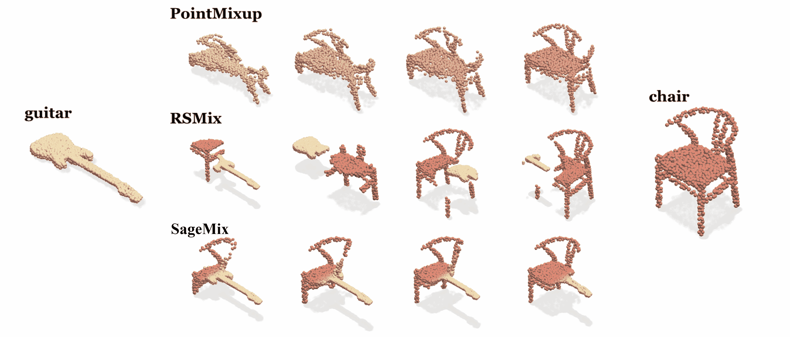
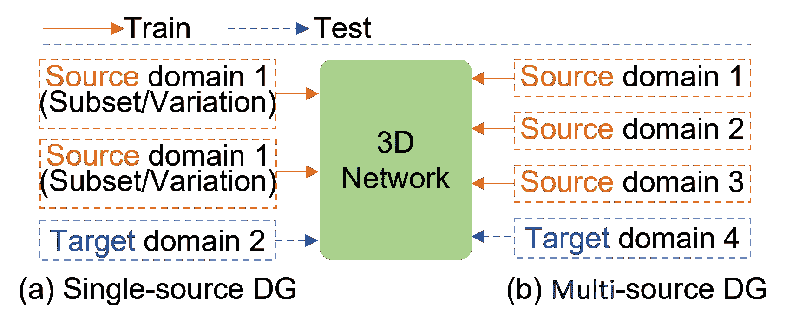
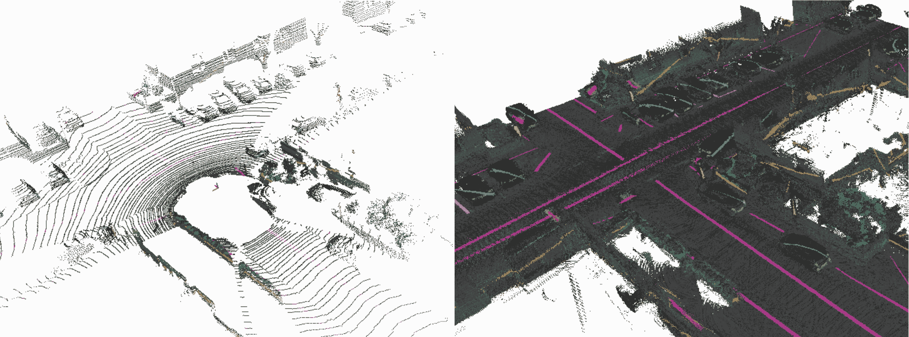
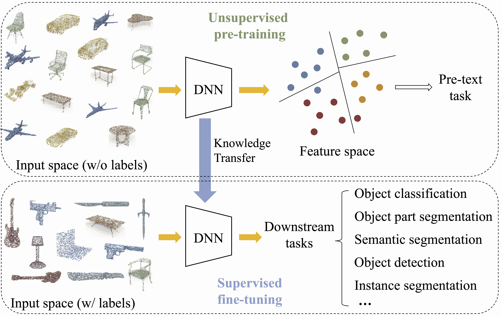

<!--yml

类别：未分类

日期：2024-09-06 19:39:21

-->

# [2305.19812] 标签高效深度学习的综述

> 来源：[`ar5iv.labs.arxiv.org/html/2305.19812`](https://ar5iv.labs.arxiv.org/html/2305.19812)

# 标签高效深度学习的综述

针对 3D 点云

Aoran Xiao 和 Shijian Lu 供职于新加坡南洋理工大学计算机科学与工程学院。Xiaoqin Zhang 供职于中国温州大学浙江省智能信息安全与应急重点实验室。Ling Shao 供职于中国科学院大学终点 AI 实验室。通讯作者：Shijian Lu (shijian.lu@ntu.edu.sg)

###### 摘要

在过去十年中，深度神经网络在点云学习方面取得了显著进展。然而，收集大规模精确标注的训练数据非常繁琐且昂贵，这阻碍了现有点云数据集的可扩展性，并且成为在各种任务和应用中高效探索点云数据的瓶颈。标签高效学习提供了一种有前景的解决方案，通过大幅减少标注工作量来实现有效的深度网络训练。本文首次全面综述了点云的标签高效学习。我们在这一新兴研究领域中探讨了三个关键问题：i）标签高效学习在点云处理中的重要性和紧迫性，ii）它涵盖的子领域，以及 iii）在这一领域取得的进展。为此，我们提出了一种分类法，根据不同类型标签提供的数据前提条件来组织标签高效学习方法。我们将四种典型的标签高效学习方法进行了分类，这些方法显著减少了点云标注工作量：数据增强、领域迁移学习、弱监督学习和预训练基础模型。对于每种方法，我们概述了问题设置，并提供了详尽的文献综述，展示了相关进展和挑战。最后，我们分享了当前研究挑战和潜在未来方向的见解。与本综述相关的项目可以在 [`github.com/xiaoaoran/3D_label_efficient_learning`](https://github.com/xiaoaoran/3D_label_efficient_learning) 找到。

###### 索引词：

点云，标签高效学习，数据增强，半监督学习，弱监督学习，少样本学习，领域适应，领域泛化，自监督学习，基础模型。

## 1 引言

随着各种 3D 设备（如 RGB-D 摄像头和 LiDAR 传感器）的广泛应用，获取 3D 点云最近变得更加可行和经济。同时，深度学习的显著进步也推动了点云理解的显著发展。两者的结合导致了对利用点云捕捉对象和场景的 3D 形状表示的需求日益增加，涵盖了从自主导航和机器人技术到遥感应用等多个领域。

尽管深度学习在点云理解方面取得了巨大进展，但大多数现有工作仍然依赖于大规模的良好标注 3D 数据进行网络训练。然而，由于数据的高复杂性、点稀疏性的巨大变化、丰富的噪声以及标注过程中的频繁 3D 视角变化，收集这样的标注训练数据是极其繁琐且耗时的。因此，如何从有限规模和变化的训练数据中学习有效的点云模型已经成为点云理解中的一个重大挑战。

为了解决点云标注中的巨大负担，一种有前景的解决方案是标签高效学习，这是一种机器学习范式，优先考虑在最小标注的情况下进行模型训练，同时仍然实现所需的准确性。由于其重要性和高实际价值，标签高效点云学习最近已成为一个蓬勃发展的研究领域，有大量研究致力于从有限的点标注中学习有效的模型。各种方法已经被探索，具有不同的数据要求和应用场景。为此，迫切需要一个系统的调查来提供这一领域的全面概述，涵盖多种学习方法和设置，系统化地覆盖各类任务。

因此，我们呈现了一项关于点云标签高效学习的最新进展的综合文献综述。具体而言，我们基于任务和数据要求回顾了现有研究，并将其分为四种不同的方法：1) 数据增强，通过数据增强扩展有限标记训练数据的分布；2) 域迁移，利用源领域的标记数据训练对未标记目标领域的鲁棒模型；3) 弱监督学习，利用弱标记点云训练鲁棒模型；以及 4) 预训练基础模型，利用无监督或多模态预训练来促进 3D 建模，减少标注数量。对于每种标签高效学习方法，我们介绍了问题设置并提供了详尽的文献综述，展示了该领域取得的进展以及仍然存在的挑战。

图 1：点云标签高效学习的分类。

据我们所知，这是首个系统化和全面的调查，专注于点云的标签高效学习，提供了该领域进展和挑战的详细概述。已有几项相关的调查。例如，Guo 等人[1]回顾了点云的监督深度学习，而 Xiao 等人[2]对点云的无监督表示学习进行了系统的综述。此外，还有几项研究[3, 4, 5, 6, 7]调查了其他数据模态（如 2D 图像、文本和图表）的标签高效学习，如自监督学习[4]、小样本学习[5]和跨领域泛化[6, 7]。

本调查的其余部分组织如下。第二部分介绍了背景知识，包括关键概念以及对 3D 点云数据标注的努力和难度的简要描述。第 3、4、5、6 节随后提供了四种代表性的高效学习方法的系统和广泛的文献综述，即点云数据增强、跨领域知识迁移、点云的弱监督学习，以及用于点云学习的预训练基础模型。最后，我们在第七部分中强调了未来标签高效点云学习的几个有前景的研究方向。图 1 展示了现有的 3D 点云标签高效学习方法的分类。

## 2 背景

### 2.1 关键概念

点云。点云是一个由 3D 点组成的集合，通过它们在 x、y 和 z 方向上的空间坐标来表示。根据点云的类型，可能还会包含其他属性，例如，物体级点云的法线值[8]、室内密集点云的颜色信息[9]，或者 LiDAR 点云的强度值[10]。

监督学习在标签的完全监督下优化机器学习模型，其中模型学习将输入数据映射到输出标签空间。训练数据由输入点云和对应标签的对组成，标签由人工注释，正是模型输出的真实值。

标签高效学习专注于开发能够从有限标记数据中学习的方法。其目标是减少深度网络训练中的标记数据量，因为标记数据可能耗时且昂贵。

3D 形状分类的目标是识别对象点云的类别，如椅子、桌子、汽车和建筑物。分类标签作为地面真实数据用于训练 3D 分类模型。准确率定义为正确分类的对象数量与数据集中对象总数量的比率，被广泛用于评估。常用两种准确率：总体准确率（OA），衡量算法的整体表现，以及平均准确率（mAcc），提供特定类别的准确度。OA 计算为正确分类对象数量与数据集中对象总数量的比率，不考虑类别，而 mAcc 计算为每个类别的正确分类对象数量与该类别对象总数量的比率，然后取平均值以提供整体性能的衡量。

3D 目标检测的任务是识别和定位场景级点云中的 3D 对象，旨在估计其精确的位置和方向。3D 边界框作为训练 3D 检测器的地面真实数据进行标注。平均精度（AP）是常用的评估指标，基于给定对象和置信度阈值的精度和召回率计算。该指标将真实边界框与预测框进行比较，并计算精度-召回曲线下的面积。精度计算为正确预测的对象数量与总预测对象数量的比率，而召回率计算为正确预测的对象数量与总真实对象数量的比率。

表 I：点云学习中常用数据集的汇总。

| 数据集 | 年份 | 样本数量 | 类别数量 | 类型 | 表示方式 | 标签 |
| --- | --- | --- | --- | --- | --- | --- |
| ModelNet40 [11] | 2015 | 12,311 个对象 | 40 | 合成物体 | 网格 | 对象类别标签 |
| ShapeNet [8] | 2015 | 51,190 个对象 | 55 | 合成物体 | 网格 | 对象/部分类别标签 |
| ScanObjectNN [12] | 2019 | 2,902 个对象 | 15 | 真实世界对象 | 点云 | 对象类别标签 |
| SUN RGB-D [13] | 2015 | 5K 帧 | 37 | 室内场景 | RGB-D | 边界框 |
| S3DIS [14] | 2016 | 272 扫描 | 13 | 室内场景 | RGB-D | 点类别标签 |
| ScanNet [9] | 2017 | 1,513 扫描 | 20 | 室内场景 | RGB-D & 网格 | 点类别标签 & 边界框 |
| KITTI [15] | 2013 | 15K 帧 | 8 | 户外驾驶 | RGB & 激光雷达 | 边界框 |
| nuScenes [16] | 2020 | 40K | 32 | 户外驾驶 | RGB & 激光雷达 | 点类别标签 & 边界框 |
| Waymo [17] | 2020 | 200K | 23 | 室外驾驶 | RGB & LiDAR | 点类别标签 & 边界框 |
| STF [18] | 2020 | 13.5K | 4 | 室外驾驶 | RGB & LiDAR & 雷达 | 边界框 |
| ONCE [19] | 2021 | 1M 场景 | 5 | 室外驾驶 | RGB & LiDAR | 边界框 |
| Semantic3D [20] | 2017 | 15 个密集场景 | 8 | 室外 TLS | 点 | 点类别标签 |
| SemanticKITTI [10] | 2019 | 43,552 个扫描 | 28 | 室外驾驶 | LiDAR | 点类别标签 |
| SensatUrban [21] | 2020 | 1.2 $\mathrm{km}^{2}$ | 31 | UAV 摄影测量 | 点 | 点类别标签 |
| SynLiDAR [22] | 2022 | 198,396 个扫描 | 32 | 室外驾驶 | 合成 LiDAR | 点类别标签 |
| SemanticSTF [23] | 2023 | 2,086 个扫描 | 21 | 室外驾驶 | RGB & LiDAR | 点类别标签 |

3D 语义分割是将语义标签分配给 3D 点云中的每个点的任务。逐点类别标注作为此任务的真实标注。IoU（交并比）和均值 IoU（mIoU）是常用的评估指标。IoU 测量给定类别的预测分割与真实分割之间的重叠，计算方法是交集与并集的比率。IoU 是对每个类别单独计算的。mIoU 是所有类别的 IoU 值的均值，提供了分割模型性能的总体衡量。

3D 实例分割是一项任务，涉及为点云中的每个对象分配一个唯一的实例 ID，从而分离属于同一类别的对象，并实现更准确的对象识别和跟踪。为此任务训练模型需要逐点实例标注。均值平均精度（mAP）是用于 3D 实例分割的流行评估指标，计算方法是所有类别的平均精度（AP，类似于 3D 目标检测中使用的 AP）值的均值。计算 mAP 时，需要为每个类别计算精度-召回曲线，并计算曲线下面积（AUC）。然后，AP 计算为在一组预定义召回水平下的精度值的均值。最后，mAP 通过所有类别的 AP 值的均值获得。

Backbone. “Backbone” 是神经网络架构中基本且核心的部分，负责从输入数据中提取高级特征。这些特征随后由网络中的后续层进行处理和分析。Backbone 执行神经网络中的大部分计算，并在确定网络性能方面至关重要。为了确保在比较不同标签高效学习算法的性能时的公平性，使用相同的 backbone 实现是重要的。

### 2.2 3D 数据集的标注工作

注释点云是具有挑战性的，这通常需要特殊的培训，因为点云数据具有独特的特性。与图像等其他模态的数据注释相比，它面临着一些新的挑战。首先，点云的显示通常与人类的感知不对齐。点云通常是不完整的、稀疏的，可能不包含颜色信息，这导致点语义和点几何中存在丰富的模糊性。其次，3D 视图的变化大大复杂化了注释过程，甚至可能导致注释员的晕动病。因此，点云注释员需要具备良好的专业知识和经验，以确保注释的准确性和一致性，例如，为 3D 检测和分割任务标记`3D bounding boxes`和逐点类别。

第三，目前阶段下完全自动化的点云注释仍然不可行。虽然一些工具如半自动标注已经被探索以简化过程，但注释的准确性仍然较低，需要大量人工工作来检查和修正自动注释。虽然已经提出了不同的方法来简化人工注释过程，但大多数方法在面对各种额外要求时不够通用。例如，Behley 等人[10]将多个 LiDAR 扫描叠加，以形成密集的点表示，在收集 SemanticKITTI 时允许同时和一致地标注多个扫描。然而，叠加过程需要准确且即时的 LiDAR 传感器定位和姿态，而叠加的移动物体通常会被扭曲且难以区分。总之，人工方法仍然是点云注释的主要方式，这需要大量的时间和精力以及经过良好培训的注释员。

点云注释的劳动密集型特性使得构建大规模点云数据集极其耗时。这直接导致公共点云数据集的规模和多样性有限，如表 I 所示，并在开发可泛化的点云学习算法时带来了巨大挑战。因此，研究标签高效的点云学习已成为缓解现有点云数据限制的迫切需求。

## 3 数据增强

数据增强（DA）已被广泛应用于深度网络训练[24]。如图 2 所示，它旨在通过从现有数据中人工生成新训练数据来增加数据的大小和多样性。DA 在可用训练数据有限的情况下尤其有益。因此，它被认为是一种重要的标签高效学习方法，在各个领域具有广泛的应用。

图 2：3D 网络训练中的数据增强。

表 II：点云学习的数据增强方法分类。

| 增强类型 | 方法 | 参考文献 |
| --- | --- | --- |
| 内领域增强 (§3.1) | 常规增强技术 (§3.1.1) | [25, 26, 27] |
| 3D 形状分类的增强方法 (§3.1.2) | [28, 29, 30, 31, 32, 33, 34] |
| 3D 目标检测的增强方法 (§3.1.3) | [35, 36, 37, 38, 39, 40] |
| 3D 语义分割的增强方法 (§3.1.4) | [41, 42] |
| 跨领域增强 (§3.2) | 利用额外的数据源，如合成数据、跨模态数据等。 | [43, 22, 44, 45, 46, 47, 48, 49, 50, 51, 52] |

本节回顾了点云网络训练中现有的数据增强研究，这些研究大致可分为两类：内领域增强和跨领域增强。前者旨在通过生成新的训练数据来丰富训练数据，如第 3.1 节所述。后者利用额外数据扩大现有训练数据分布，如第 3.2 节所述。表 II 展示了现有数据增强研究的概述。

### 3.1 内领域增强

域内 DA 旨在通过仅利用有限的标注训练数据来最大化训练知识。第 3.1.1 节首先介绍了适用于各种点云任务的通用传统 DA。随后，我们回顾了针对特定 3D 任务设计的数据增强方法，包括第 3.1.2 节的 3D 形状分类，第 3.1.3 节的 3D 物体检测，以及第 3.1.4 节的 3D 语义分割。

#### 3.1.1 传统数据增强技术

传统 DA 已在各种 3D 任务中广泛探索作为预处理操作 [25, 26, 53, 54, 55, 56]。它采用不同的空间变换来生成点云的多样视图，这对学习变换不变和具有广泛泛化能力的表示至关重要。图 3 显示了一些典型的传统 DA 技术及其定性示意图。

图 3：点云常用传统数据增强技术的示意图。

+   •

    缩放通过将点云的坐标乘以比例 $s$ 来改变点云的尺度，其中 $s<1$ 表示缩小，$s>1$ 表示放大，如图 3 (b) 所示。

+   •

    翻转随机沿 x 轴或 y 轴翻转点，如图 3 (c) 所示。

+   •

    旋转绕 z 轴以随机角度旋转点，如图 3 (d) 所示。

+   •

    抖动向点云添加了具有零均值和标准差为$\beta$的高斯噪声的随机扰动，如图 3 (e)所示。

+   •

    变换涉及将所有点在相同方向和距离上移动，如图 3 (f)所示。

注意，传统的 DA 可以应用于全球点云和局部点 patch [27, 57, 58]。

由于其简单性和高效性，传统的 DA 已被广泛应用于各种点云学习任务。然而，它通常由于两个主要因素导致训练不足。首先，DA 过程和网络训练是独立的，互动较少，训练结果对 DA 优化反馈有限。其次，新的训练样本是从个体中增强的，而不是从多个现有样本的组合中增强的，导致训练数据分布有限。许多 DA 策略已被设计来解决这两个限制，这些策略将根据点云任务在接下来的小节中进行回顾。

#### 3.1.2 3D 形状分类的 DA

一些研究[28, 29]探讨了用于 3D 形状分类的自适应 DA。例如，Li 等人[28]设计了 Pointaugment，该方法通过形状变换和点位移生成训练样本。Pointaugment 和对象分类器通过对抗学习进行联合优化。Kim 等人[29]利用对象的局部变形，旨在生成更多变化的真实对象样本，例如不同姿势的人。它引入了 AugTune，允许在保持形状身份的同时自适应地控制局部增强的强度。

图 4：点云分类中的典型混合 DA 方法的说明，包括 PointMixup [30], RSMix [31], 和 SageMix [34]。该图摘自[34]。

另一类研究通过混合现有对象来生成更多样化的训练对象。受到 2D 图像分类中 MixUp [59, 60] 的启发，Chen 等人 [30] 提出了 PointMixup，通过对两个不同类别的对象进行最短路径线性插值来生成对象样本。然而，由于几何扭曲，插值样本可能会丧失原始对象的结构信息。一些研究尝试在混合过程中保留局部对象结构，如图 4 所示。例如，RSMix [31] 通过从不同点云对象中提取刚性子集来混合和生成新的训练样本。PointCutMix [32] 切割并用其他对象中的最佳配对替换局部对象部分。SageMix [34] 利用显著性引导来保留混合中的局部对象结构。Point-MixSwap [33] 混合相同类别的对象以丰富几何变化。

#### 3.1.3 3D 对象检测的 DA

3D 对象检测处理的场景级点云与对象级点云有很大不同。具体来说，场景级点云有更多的点、更复杂的环境、更大的密度变化、更多的噪声或离群点，这些都为 DA 带来了机遇和挑战。例如，Cheng 等人 [35] 提出了渐进式基于人群的增强方法，在点云数据集中寻找最佳 DA 策略。Chen 等人 [36] 提出了方位角归一化，以解决 LiDAR 点云在方位角方向上的显著变化。Leng 等人 [37] 利用未标记数据的伪标签进行点云学习中的 DA。

混合思想也被应用于 3D 对象检测。例如，Yan 等人 [38] 提出了 GT-Aug，通过从其他 LiDAR 帧中复制对象并随机粘贴到当前帧中来丰富前景实例。然而，GT-Aug 在粘贴过程中没有考虑现实世界场景中对象之间的关系。为了解决这个限制，Sun 等人 [39] 通过利用相关能量场来表示对象之间的功能关系进行了对象粘贴。此外，Wu 等人 [40] 融合了多个 LiDAR 帧以生成更密集的点云，然后将其作为参考来增强单帧场景中的对象检测。

#### 3.1.4 3D 语义分割的 DA

基于混合的 DA 在点云分割中展示了令人印象深刻的性能提升。例如，Nekrasov 等人[41]提出了 Mix3D，直接将两个点云及其标签连接起来进行上下文外增强。Xiao 等人[42]提出了 PolarMix，通过在极坐标系统中混合 LiDAR 帧来保持 LiDAR 点云的独特属性，如部分可见性和密度变化。他们设计了场景级别的交换和实例级别的旋转粘贴，在多个 LiDAR 分割和检测基准上实现了一致的增强效果。图 5 展示了这两种基于混合的 DA 方法的定性插图。

### 3.2 跨领域增强

跨领域 DA 利用额外的数据来增强网络训练。根据使用的数据类型，它可以大致分为两类：合成数据和跨模态数据。

合成数据。一些研究探索了合成点云以增强真实点云，从而改善点云网络训练[43, 22]。例如，Fang 等人[43]设计了 LiDAR-Aug，将 CAD 对象如行人插入到道路场景的点云中，以生成带有更多对象的训练 LiDAR 扫描，从而训练更好的 3D 检测器。Xiao 等人[22]从游戏引擎中收集了自我标注的 LiDAR 点云，并将其与真实点云结合起来，以训练 3D 分割网络。尽管合成数据提供了减轻数据限制的有希望的解决方案，但它们与真实点云存在明显的领域差距[22]，这往往限制了它们的有效性。

图 5：点云语义分割中的基于混合的 DA：Mix3D[41]进行上下文外混合，而 PolarMix[42]应用上下文内混合。这两幅图从[41]和[42]中提取。

跨模态数据。一些研究将点云与其他模态的数据融合，以减轻 3D 传感器的固有局限性。例如，RGB 图像被广泛应用于提高 3D 物体检测[44, 45, 46, 47, 48, 49]和 3D 语义分割[50]的网络训练。最近，一些研究[51, 52]将雷达点云与 LiDAR 点云融合，以学习更强健和更具普遍性的点云模型。

### 3.3 总结

尽管监督学习点云已取得了巨大成功，但大多数努力集中在收集大规模数据集或开发新型网络架构上[1]。最近的研究表明，DA（领域自适应）可以减少数据收集和注释的工作量，并且能达到与新网络架构相媲美的性能，显示了这一研究方向的巨大潜力。然而，与 2D 图像处理[24]和自然语言处理（NLP）[61]相比，点云学习的 DA 仍然远未被充分探索，需要更多的努力来推动这一有意义的研究领域。

表 III：点云领域迁移学习方法的分类。

| 领域 | 说明 | 任务 | 参考文献 |
| --- | --- | --- | --- |
| 领域自适应 (§4.1) | 通过最小化领域之间的分布偏移，将在一个领域上训练的机器学习模型适应到另一个特定领域。 | 无监督领域自适应 3D 形状分类 (§4.1.2) | [62, 63, 64, 65, 66, 67, 68] |
| 无监督领域自适应 3D 物体检测 (§4.1.3) | [69, 70, 71, 72, 73, 74, 75, 76, 77, 78, 79, 80, 81] |
| 无监督领域自适应 3D 语义分割 (§4.1.4) | [82, 83, 84, 85, 86, 22, 87, 88, 89, 90, 91, 92] |
| 其他类型的 3D 领域自适应 (§4.1.5) | [88, 93] |
| 域泛化 (§4.2) | 构建一种机器学习模型，通过学习在不同域间普遍存在的不变特征，使其在新的、先前未见过的域上表现良好。 | 域泛化的 3D 形状分类 (§4.2.2) | [94, 95] |
| 域泛化的 3D 对象检测 (§4.2.3) | [96, 97] |
| 域泛化的 3D 语义分割 (§4.2.4) | [23, 98, 99] |

## 4 域迁移学习

域迁移学习旨在利用之前收集和标注的数据中的知识来处理各种新的数据，从而显著减少新数据的标注工作。然而，将知识迁移到不同域的数据上往往会面临域间差异[100, 101]，即不同域数据间的分布偏差/偏移。因此，使用源域数据训练的模型在目标域数据上的测试时通常会出现明显的性能下降。域间差异问题极大地阻碍了点云模型在各种任务中的部署。这个问题通常通过两种典型方法进行研究：域适应和域泛化。虽然这两种方法都旨在从源数据中学习到在目标数据上表现良好的鲁棒模型，但域适应允许在训练中访问目标数据，而域泛化则不允许。表 III 展示了现有的域迁移学习研究概览。

### 4.1 域适应

领域适配旨在将一个在源领域训练的模型适配到特定的目标领域。它提供了一种经济的解决方案，可以利用现有的带注释的训练数据，通过从源领域到目标领域的微调模型来实现。对于点云，领域适配的研究有不同的设置，取决于数据要求和应用场景。具体来说，大多数现有研究集中在无监督领域适配（UDA）上，该方法从带标签的源点云和未标记的目标点云中进行学习。本节介绍了 UDA 在子节 4.1.1 中的问题设置，子节 4.1.2 中的 3D 形状分类的 UDA，章节 4.1.3 中的 3D 目标检测的 UDA，章节 4.1.4 中的 3D 语义分割的 UDA，以及子节 4.1.5 中的其他类型的点云领域适配。

#### 4.1.1 问题设置

给定源领域点云$X^{S}$及其对应标签$Y^{S}$，以及没有标签的目标领域点云$X^{T}$，点云适配的目标是学习一个模型$F$，以便对未见的目标数据生成准确的预测$\hat{Y}^{T}$。UDA 中的网络训练包括两个典型的学习任务，即从标记的源数据进行监督学习和对未标记的目标数据进行无监督适配，如图 6 所示。适配通常通过四种学习方法实现：对抗训练、自训练、自监督学习和风格迁移。

+   •

    对抗训练[102, 103]旨在学习领域不变特征。通过训练模型提取源样本和目标样本中的特征，这些特征无法被领域判别器区分来实现这一目标。

+   •

    自训练[104, 105]利用源训练模型为目标数据生成伪标签，并采用可信的目标预测来迭代地重新训练模型。它假设可信的目标预测具有正确的标签。

+   •

    自监督学习（SSL）[2]旨在从未标记的目标数据中学习有用的表征，而无需任何明确的监督。它与领域无关，利用固有的数据结构或模式来定义一个可以在没有人工标注的情况下解决的任务。通过在目标数据上进行 SSL，网络可以学习对领域变化具有容忍度的特征，从而提高模型在目标数据上的泛化能力。

+   •

    风格迁移[106, 22]旨在将源数据转换为与目标数据相似的风格进行训练。它通过学习一个映射函数，将源数据转换为与目标数据具有相似风格的数据。使用迁移数据训练的模型通常在目标数据上表现更好，因为领域差异减少了。

以下小节回顾了针对各种 3D 任务的领域自适应点云学习。

图 6：3D 网络训练的典型 UDA 管道

#### 4.1.2 3D 形状分类的领域自适应

物体级点云通常来自于合成 CAD 模型[11, 8]和真实 3D 扫描[107, 9]等各种来源。由于采集技术和物体特征的差异，采集的点云可能会出现明显的几何差异，如图 7 所示。最近有若干研究探索了针对不同 3D 物体数据集的 UDA 在 3D 形状分类中的应用。

图 7：数据集 ModelNet [11]、ShapeNet [8]和 ScanNet [9]中的物体级点云示例。该图基于[62]进行了复现。

具体来说，Qin 等人 [62] 探索了对抗训练，并设计了 PointDAN，它利用最大分类器差异 [102] 来对齐跨领域特征。随后的几项工作 [63, 64, 65] 探索了领域自适应 3D 形状分类的自适应自训练，其中信心阈值逐渐降低，同时选择伪标签。Fan 等人 [66] 设计了一种投票策略，通过在共享特征空间中搜索最近的源邻居来伪标记目标样本。Chen 等人 [67] 提出了准平衡自训练，以解决伪标签中的类别不平衡问题。Cardace 等人 [68] 提出了通过匹配在两个领域中通过形状重建无监督任务学习的形状描述符来细化嘈杂的伪标签。

一些研究设计了 SSL 任务，旨在鼓励网络从未标记的点云对象中学习领域不变的特征。例如，Zou 等人 [63] 引入了一个联合任务，预测旋转角度和变形位置。Fan 等人 [66] 将压缩的 2D 投影重建到 3D 空间。Shen 等人 [64] 通过计算无符号距离场的近似值来学习无监督特征。

#### 4.1.3 3D 物体检测的领域适应

由于物理环境、传感器配置、天气条件等方面的差异，场景级点云在点密度和遮挡比方面受到的几何变化比物体级点云更大。因此，场景级点云的领域适应更加具有挑战性，最近由于 3D 物体检测和 3D 语义分割等场景级 3D 任务的重要性而受到越来越多的关注。

领域自适应 3D 物体检测在过去几年中得到了广泛研究。例如，Wang 等人 [69] 发现汽车尺寸在跨不同国家的数据中进行 3D 物体检测时发挥了关键作用。他们设计了一种简单的汽车尺寸归一化策略，实现了出色的适应性能。随后，对抗训练被用于领域自适应 3D 物体检测。例如，Su 等人 [70] 观察到语义特征包含领域特定属性以及其他可能误导鉴别器的特征。因此，他们将领域特定属性从 LiDAR 的语义特征中解开，以实现更好的对抗学习。Zhang 等人 [71] 认识到 LiDAR 点云的独特几何属性，即较大且较近的物体具有更多点，并设计了尺度感知和范围感知的领域对齐策略，以更好地进行 3D 检测器的对抗训练。

一些方法[108, 72, 73, 74]探索了自我训练用于领域自适应 3D 检测。例如，ST3D[72]使用质量感知三元组记忆库更新伪标签，并通过课程数据增强训练网络。Luo 等人[73]设计了一个多层一致性网络，该网络在点、实例和神经统计层面上进行一致性学习。一些研究[75, 76, 77, 78]则探讨了风格迁移。例如，Hahner 等人[76, 78]在真实点云上模拟雾和降雪，以缓解不同天气下的领域差异。Xu 等人[77]在前景区域生成具有缺失物体部件的语义点，并将生成的点与原始点结合，以增强跨领域检测。此外，Yihan 等人[79]提出了一种 3D 对比共训练方法，以提高学习到的点特征的可迁移性。Wei 等人[80]引入了一个教师-学生框架，将高束 LiDAR 数据中的知识提炼到低束数据中，以减少不同 LiDAR 束配置所造成的领域差异。

#### 4.1.4 3D 语义分割的领域自适应

LiDAR 点云通常由于物理环境、传感器配置、天气条件等变化而具有显著的领域差异。因此，大多数先前的 UDA 研究[86, 22, 87, 88, 109, 92]集中在户外 LiDAR 点云上，而只有少数研究[89]解决了室内点云的问题。图 8 显示了具有明显领域差异的不同领域的点云样本。

关于领域自适应点云分割的研究大致可以分为两类，即仅处理点云的**单模态 UDA**[86, 22, 87, 88, 89]和在训练中同时使用点云和图像数据的**跨模态 UDA**[90, 91, 93, 110]。

图 8：不同领域的 LiDAR 扫描示例。（a）SemanticKITTI[10]中的正常天气下的真实扫描，（b）SemanticSTF[23]中的恶劣天气下的雪的真实扫描，以及（c）SynLiDAR[22]中的合成扫描。不同颜色表示不同的语义类别，如（d）所示。

对于单模态 UDA，一系列研究 [82, 83, 84, 85, 81] 将点云投影到深度图像上，并采用 2D UDA 方法来减轻领域偏移。例如，Li 等 [81] 提出了一个对抗训练框架，以学习生成源掩模以模拟不规则目标噪声的模式，从而缩小合成点云与真实点云之间的领域差距。然而，3D 到 2D 的投影会丢失几何信息，并且大多数 2D UDA 方法无法处理点云的独特几何结构。此外，大多数 2D UDA 方法采用 CNN 架构，无法推广到点云架构。

另一类方法 [86, 22, 87] 直接在点云上进行领域自适应点云分割。例如，[86] 通过将领域自适应转化为 3D 表面补全任务来解决领域适应问题。[22] 使用 GANs 将合成点云转换为与真实点云的稀疏性和外观相匹配的点云。[87, 42] 混合源和目标领域的点云，以生成具有较少领域差异的中间表示。虽然大多数研究集中在户外 LiDAR 点云上，但[89] 最近探讨了室内点云的合成到真实适应。

对于跨模态 UDA，每个训练样本通常包括一个 2D 图像和一个与 LiDAR 和相机传感器同步的 3D 点云。为源数据提供了逐点的 3D 注释。目标是学习一个强大的 3D 分割器，它可以独立工作且测试时不需要图像。尽管配对的图像可以丰富学习到的表示，但由于图像和点云的输入空间的异质性以及源图像和目标图像之间的额外领域偏移，跨模态 UDA 更具挑战性。Jaritz 等 [90] 开发了 xMUDA，这是第一个跨模态 UDA 框架，采用双流架构以单独解决每种模态的领域差距。Peng 等 [91] 通过两个模块实现了跨模态 UDA，第一个模块采用领域内跨模态学习进行跨模态交互，第二个模块则通过领域间跨模态学习采用对抗学习进行跨领域特征对齐。

#### 4.1.5 扩展

无源 UDA [111] 是 UDA 的一种变体，旨在使源训练的模型适应目标分布，而无需在训练中访问源数据。当数据隐私和数据可移植性至关重要时，它非常有用。最近，Saltori 等 [88] 提出了无源 UDA 在点云中的开创性研究。他们设计了带有几何特征传播的自适应自我训练，用于对道路场景中 LiDAR 点云的语义分割。

测试时领域适应（TTA）是一种设置，其中一个经过源预训练的模型仅使用未标记的测试数据进行适应，通常只需一次训练周期。与典型的 UDA 不同，TTA 的目标是避免提前收集目标数据，在这种情况下，模型在测试数据流中进行适应。尽管 TTA 在实际场景中非常实用，但由于目标数据仅在测试阶段可用，它具有挑战性。最近，Inkyu Shin 等人[93]提出了第一个多模态 3D 语义分割的 TTA 尝试。他们设计了一个多模态融合模块，将多模态输入数据结合起来，以实现更准确的分割。

### 4.2 领域泛化

领域迁移学习领域的另一个研究方向是领域泛化（DG）[112]，其目标是使用标记的源数据训练一个可以泛化到任何目标领域的模型，而无需在训练中访问目标数据。领域泛化消除了对目标训练数据的依赖，使其在许多实际任务中非常有用，因为在部署模型之前获取目标数据可能困难或昂贵。这也是点云学习的一个关键研究领域，因为许多点云任务要求 3D 深度模型对未见过的领域具有鲁棒性和泛化能力。例如，自动驾驶车辆需要具备泛化的 3D 感知能力，以便在各种未见过的地方和场景中安全运行。

图 9：领域泛化（DG）的典型流程，包括（a）单源领域泛化；（b）多源领域泛化。

#### 4.2.1 问题设置

给定标记的点云数据来自$K$个相似但不同的源领域$\mathcal{S}={\{S_{k}=\{(x^{(k)},y^{(k)})\}\}}_{K}^{k=1}$，其中$x$表示一个点云，$y$是其标签，领域泛化（DG）旨在仅使用源数据学习一个深度模型$F$，使其在未见过的目标领域$\mathcal{T}$中表现良好。类似于 2D 领域泛化研究 [112]，我们回顾了用于 3D 点云的两种领域泛化设置，如图 9 所示。第一种是多源领域泛化，它假设训练中可用多个源领域，即$K>1$。其动机是学习领域不变特征（来自多个相似但不同的源领域），这些特征可以很好地推广到任何未见过的领域。第二种是单源领域泛化，它更加具有挑战性，因为它仅允许来自单个源领域的训练数据。在另一方面，单源领域泛化方法更加通用，可以通过忽略领域标签应用于多源领域泛化问题。

#### 4.2.2 3D 形状分类的领域泛化

先驱工作[94] 首次探讨了从 CAD 对象的模拟点云（例如 ModelNet 数据集[11]）到实际物体点云（例如 ScanObjectNN[107]）的几何位移。它提出了一个元学习框架，用于训练跨领域的可泛化 3D 分类模型。后来，黄等人[95] 设计了一种流形对抗训练方案，该方案利用多种几何变换生成中间领域的对抗训练样本。这两项研究都属于单源领域泛化设置。

表 IV: 点云的弱监督学习方法分类。

| 弱监督 | 标注 | 参考文献 |
| --- | --- | --- |
| 不完全监督 (§5.1) | 3D 弱监督学习：在大量点云帧中稀疏标注少量点。 (§5.1.1) | [113, 114, 115, 116, 117, 118, 119, 120, 121, 122, 123, 124, 125, 126] |
| 3D 半监督学习：对少量点云帧进行密集标注，所有点都有标签。 (§5.1.2) | [127, 128, 129, 130, 131, 132, 133, 134, 109] |
| 3D 小样本学习：在大量标记的基类（已见）样本的基础上，为新类（未见）样本标注少量样本。 (§5.1.3) | [135, 136, 137, 138, 139, 140, 141, 142] |
| 不精确监督 (§5.2) | 弱标注，例如：云级/位置级/框级标注、涂鸦等。 | [143, 144, 145, 146, 147, 148, 149, 150, 151, 152, 153] |
| 不准确的监督 (§5.3) | 噪声标签 | [154] |

#### 4.2.3 3D 物体检测的领域泛化

提高 3D 检测器的泛化能力对 3D 视觉任务（如自动驾驶）至关重要，因为感知算法必须在未见领域中保持稳定的性能。然而，3D 物体检测的 DG 仍然是一个相对未被充分探索的领域。开创性研究[96] 提出了针对 3D 物体检测的单源 DG 的首次尝试。它提出了一种对抗性增强方法，学习在训练中变形点云以增强 3D 检测器的泛化能力。最近，[97] 引入了一种单源 DG 方法，用于鸟瞰图 (BEV) 中的多视角 3D 物体检测。它将深度估计与相机参数解耦，采用动态视角增强，并采用多个伪领域以实现更好的泛化能力，适应各种未见的新领域。

#### 4.2.4 3D 语义分割的领域泛化

最近有几项关于领域泛化点云分割的研究。Xiao 等人[23] 研究了恶劣天气下的室外点云分割，设计了一种领域随机化和聚合学习流程以增强模型的泛化性能。[99] 增强了源领域，并在稀疏不变性一致性和语义关联一致性方面引入了约束，以学习更泛化的 3D LiDAR 表示。Zhao 等人[98] 则专注于室内点云，提出了聚类增强以提高模型的泛化能力。

### 4.3 总结

跨领域知识迁移是最大化现有注释使用的关键策略。这促使了过去几年在机器学习领域对 UDA 和 DG 的广泛研究。尽管在 2D 计算机视觉和 NLP 等相关领域取得了巨大进展，但点云的 UDA 和 DG 仍然相对未被充分探索。这从发布论文数量较少和在各种基准测试上表现较低中得到证明，详细信息见附录。因此，需要更多努力来推动这一非常有前景的研究领域的发展。

## 5 弱监督学习

弱监督学习（WSL）作为完全监督学习的替代方案，利用弱监督进行网络训练。收集弱标注通常会显著降低标注成本和时间，使得 WSL 成为标签高效学习的重要分支。根据[155]中的 WSL 定义，我们根据三种弱监督类型对点云上的 WSL 方法进行分类：不完整监督、不精确监督和不准确监督。不完整监督涉及仅对一小部分训练样本进行标注，而不精确监督提供粗粒度标签，可能与模型输出不匹配。不准确监督指的是噪声标签。表 IV 展示了代表性方法的总结。

### 5.1 不完整监督

在不完整监督的背景下，仅对训练点云的一个子集进行标注。不完整监督可以通过两种标注策略获得：1) 对多个点云帧中的少量点进行稀疏标注，2) 对少量点云帧进行密集标注，带有更多（或完全）标注的点。根据相关文献中的惯例，我们将采用第一种策略的研究称为“3D 弱监督学习”，并在第 5.1.1 节中进行回顾。对于第二种策略，我们称之为“3D 半监督学习”，并在第 5.1.2 节中回顾相关研究。两种标注策略均采用类似的训练范式，即在有限标注点上进行监督学习，在大量未标注点上进行无监督学习，如图 10 所示。此外，我们在第 5.1.3 节中回顾了“3D 小样本学习”，旨在减少新类别的标注，同时使用少量标注样本的新类别和大量标注样本的基础类别进行网络训练。

#### 5.1.1 3D 弱监督学习

3D 弱监督学习（3D-WSL）在每个点云帧中使用少量稀疏标注的点进行学习。由于它允许用较少的标注冗余标注更多的点云帧，因此具有很高的研究和应用价值。

图 10：使用不完全监督训练 3D 点云网络的典型流程。

问题设置。设$P$为训练集中的一个点云，包括标记点$\{(X_{l},Y_{l})\}$和未标记点$\{(X_{u},\varnothing)\}$，其中$X$表示点空间，$Y$表示标签空间。3D-WSL 旨在学习一个函数$f:X_{l}\cup X_{u}\mapsto Y$，给定大量的点云，其中包括少量的标记点（例如，5%）作为训练输入。

3D-WSL 用于语义分割。这个任务旨在通过在每个点云中使用少量标记点来学习一个稳健的分割模型。通过一致性学习[113, 117, 121, 156]，旨在通过强制不同增强视图的预测一致性来学习具有泛化能力的表示。例如，Xu 等人[113]引入了一个 Siamese 自监督分支，用于从未标记点中进行一致性学习。Zhang 等人[117]进行了原始数据点与其扰动版本之间的一致性学习。Wu 等人[121]设计了一种双重自适应变换，鼓励原始点及其变换对应点之间的一致性预测。

一些研究[122, 118]探讨了对未标记点云的对比学习。它将点的特征拉向其增强视图，同时将其推离其他点，旨在以无监督的方式学习结构化的点表示。例如，Liu 等人[122]过度分割点云以提取点边界用于区域级对比学习。Li 等人[118]结合了一致性学习和对比学习，以学习更全面的表示。最近的研究[114, 119]也探讨了点云分割的自我训练。例如，Shi 等人[119]仅在第一个 LiDAR 帧中标注了一小部分点，并选择未标记点的可信预测作为伪标签进行网络再训练。Hu 等人[120]最近提出了一种语义查询网络，利用稀疏标记点及其局部邻域学习紧凑的邻域表示，仅使用 0.1%的标记点就实现了非常有前景的分割性能。

与随机选择点进行标注不同，主动学习选择更具代表性的点进行标注。例如，吴等人[125]利用熵、颜色不连续性和结构复杂性将点云划分为子区域，并选择代表性子区域进行标注。胡等人[126]使用 LiDAR 帧之间的预测不一致性作为主动样本选择的不确定性度量。这种方法仅需要 5%或更少的标注，但与完全监督模型的分割效果相当。一些近期研究[123, 157]对标注的片段而非单独的点进行标注，因为局部点通常因场景中 3D 对象的同质性而共享相同的语义。例如，刘等人[123]将 LiDAR 序列预分割为连通组件进行粗略标注。这种策略相比点位标注大大减少了标注工作。

3D-WSL 用于目标检测。3D-WSL 用于目标检测是一个尚未充分探索的研究领域。刘等人[124]最近开展了对稀疏标注策略在 3D 目标检测中的开创性探索。他们仅在每个场景中标注一个 3D 对象，然后利用预测置信度挖掘对象实例以进行网络再训练，取得了类似的检测性能，同时大大减少了标注工作。

3D-WSL 用于实例分割。最近，3D-WSL 已被探索用于实例分割，通过“每个实例标注一个点”[157, 158]。例如，陶等人[157]首先对点云进行过度分割，然后在每个分段中点击一个点以分配其位置、类别和实例身份。唐等人[158]选择并标注每个实例中的一个信息点，并在几个公开基准测试中取得了具有竞争力的表现。

#### 5.1.2 3D 半监督学习

3D 半监督学习（3D-SemiSL）与少量点云帧的密集（完全）标注相结合。如在[113]中所研究，3D-SemiSL 中的标注策略导致的部分分割效果较 3D-WSL 差，这主要由于其更高的标注冗余。然而，3D-SemiSL 在标注过程中需要较少的训练数据收集。

问题设定。给定带标签的点云$\mathbf{X}_{l}\in\mathbb{R}^{N_{l}\times 3}$和未标记的点云$\mathbf{X}_{u}\in\mathbb{R}^{N_{u}\times 3}$（$N_{l}$和$N_{u}$是点云数量，$N_{l}<N_{u}$），3D-SemiSL 旨在从标记数据和未标记数据中学习一个点云模型$F$，以便在未见过的点云上表现良好。

3D-SemiSL 用于目标检测。大多数现有的 3D-SemiSL 检测研究采用了 Mean-Teacher 框架[159]，该框架涉及一个教师网络和一个具有相同架构的学生网络。教师模型是学生模型的移动平均，其预测指导学生学习。它假设教师模型学习到更鲁棒的表示，可以促进学生学习。

3D-SemiSL 在目标检测中得到了广泛研究。例如，SESS[130]采用了教师和学生之间的一致性学习[160]，通过假设决策边界位于低密度区域[161]，以实现扰动不变的输出分布。3DIoUMatch[131]选择教师模型的置信预测作为网络再训练的伪标签，旨在最小化学生模型预测的熵[162]，并降低决策边界的点密度[163]。Yin 等人[132]提出了一种 Proficient Teacher 模型，引入了空间-时间集成模块和基于聚类的框投票策略，以进一步增强 3D 边界框的伪标记。Liu 等人[109]引入了双阈值策略和数据增强，以改善训练学生网络中的层次监督和特征表示。

3D-SemiSL 用于分割。与 3D 目标检测中的边界框标注相比，点云分割中的逐点标记更加费力和耗时。因此，3D-SemiSL 在点云分割中的应用最近受到了更多关注[127, 128, 164, 133, 129]。

对于 3D 语义分割，Jiang 等人[127]提出了一种引导点对比学习框架，以提高分割模型的泛化能力。Cheng 等人[128]构建了超点图和伪标签超点，以半监督的方式训练图神经网络。Kong 等人[133]混合了来自不同 LiDAR 扫描的激光束，并通过鼓励模型在混合前后做出一致的预测来学习更具泛化性的分割模型。Li 等人[134]引入了稀疏深度可分离卷积，并构建了一个需要更少训练数据的轻量级分割模型。对于 3D 实例分割，Chu 等人[129]提出了一种双向标签自训练框架，利用伪语义标签和伪实例提议，相互去噪伪信号，以实现更好的语义级别和实例级别监督。

3D-SemiSL 在其他点云任务中的应用。由于在节省人工标注方面的优势，3D-SemiSL 也被探讨应用于其他 3D 点云任务。例如，Huang 等人[165] 提出了一个用于点云配准的半监督框架，而几项研究 [166, 167] 探索了半监督 3D 手部姿势估计。

半监督领域自适应。半监督学习和领域自适应的结合形成了一种新的标签高效学习方法，即半监督领域自适应（SSDA）。SSDA 在训练中涉及三种类型的数据：标记的源样本、大量未标记的目标样本以及少量标记的目标样本，目标是获得在目标领域表现良好的模型。几项研究探讨了不同点云学习任务的 SSDA，例如 LiDAR 点云的语义分割 [22] 和 3D 目标检测 [168]。

#### 5.1.3 3D 小样本学习

完全监督的深度网络在“大闭集”设置下从大量训练样本中学习，即训练数据和测试数据具有相同的标签空间。这种监督学习对于快速学习新概念并且数据有限并不理想，这促使了小样本学习（FSL）的出现，FSL 旨在从少量标记样本中学习新类别。FSL 可以看作是半监督学习在“开集”设置中的扩展，其中只有少量新类别的标记样本，以及大量基础类别的标记样本 [5]。由于其在数据需求方面的卓越优点，FSL 最近吸引了越来越多的关注，并出现了几项突破性的研究 [135, 136, 137, 138, 139, 140, 141]。

问题设置。在小样本学习（FSL）中有两种典型设置：$N$-way-$K$-shot [169]，其中训练集和测试集在类别上是不重叠的；广义 FSL [170]，它在测试中识别基础类别和新类别。

+   •

    $N$-way-$K$-shot。设 $(x,y)$ 表示点云 $x$ 及其标签 $y$。FSL 旨在在从具有训练类别集 $C_{\mathrm{train}}$ 的数据集中抽取的一组少样本任务上训练模型，并在从具有新类别 $C_{\mathrm{test}}$ 的数据集中抽取的另一组任务上测试训练后的模型，其中 $C_{\mathrm{train}}\cap C_{\mathrm{test}}=\varnothing$。每个少样本任务由一个 episode 表示，实例化为一个 $N$-way-$K$-shot 任务，具有少量查询样本和支持样本：查询样本形成查询集 $\mathcal{Q}=\{(x_{i}^{\mathcal{Q}},y_{i}^{\mathcal{Q}}))\}^{N_{q}=N\times Q}_{i=1}$，包含 $C_{\mathrm{train}}$ 中的 $N$ 类，每类有 $Q$ 个样本，支持样本形成支持集 $\mathcal{S}=\{(x_{i}^{\mathcal{S}},y_{i}^{\mathcal{S}}))\}^{N_{s}=N\times K}_{i=1}$，包含 $C_{\mathrm{train}}$ 中相同的 $N$ 类，每类有 $K$ 个例子。$N$-way-$K$-shot 学习的目标是训练一个模型 $F(x^{\mathcal{Q}},{\mathcal{S}})$，该模型基于 ${\mathcal{S}}$ 预测任何查询点云 $x^{\mathcal{Q}}$ 的标签分布 $H$。在测试时，训练后的模型在测试 episode ${\mathcal{V}}={(S_{j},Q_{j})}^{J}_{j=1}$ 上对新类别 $C_{\mathrm{test}}$ 进行测试。注意，查询样本的真实标签 $y^{\mathcal{Q}}$ 仅在训练期间可用。

+   •

    泛化 FSL。这是一个更具挑战性的 FSL 设置。它涉及到基础类别和新类别的训练数据，包括基础类别的丰富标记数据和新类别的少量标记样本。目标是获得一个少样本模型，通过利用从基础类别学习到的知识来识别新对象。

FSL 已广泛研究用于 2D 图像。大多数工作采用三种典型方法进行元学习：1) 度量学习 [171, 172]，衡量支持-查询相似度，并将每个查询样本分组到潜在空间中最接近的支持类别中；2) 优化方法 [173, 174]，区分支持集优化以实现快速适应；3) 基于模型的方法 [175, 176]，定制模型架构以实现快速学习。我们回顾了点云的 3D FSL，这是一个研究较少的领域，因其面临诸如无序数据结构、点稀疏性和大几何变异等许多模式特定挑战。最近几项开创性研究探索了不同的 3D FSL 任务，如 3D 形状分类 [135, 136]，3D 语义分割 [138]，3D 对象检测 [140] 和 3D 实例分割 [141]。

用于 3D 形状分类的 FSL。Ye 等人[135, 136] 在$N$-way-$K$-shot 设置下对 3D 形状分类的 FSL 进行了开创性研究。他们扩展了现有的 2D FSL 方法，以适用于 3D 点云数据，并引入了一种基线方法来处理点云表示中的高类内差异和细微的类间差异。Yang 等人[137] 将点云投影到深度图像中，并探索了用于 3D 形状分类的跨模态 FSL。此外，Chowdhury 等人[142] 研究了少样本类别增量学习，该方法逐步微调训练好的模型（基于基础类别），以处理具有少量样本的新类别。

用于 3D 分割的 FSL。Zhao 等人[138] 在$N$-way-$K$-shot 设置下探索了 3D 语义分割的 FSL。他们从稀缺的支持中提炼出具有区分性的知识，这些知识能够有效地表示新类别的分布，并利用这些知识进行 3D 语义分割。Ngo 等人[141] 提出了用于室内稠密点云的 3D 少样本实例分割的测地线引导变换器。他们利用少量支持点云场景及其真实掩膜生成区分性特征用于实例掩膜预测，并利用测地线距离作为指导来提高分割效果。

用于 3D 物体检测的 FSL。基于 FSL 的 3D 检测尚未得到充分探索。Zhao 等人[140] 设计了 Prototypical VoteNet，这是第一个用于广义 FSL 的 3D 检测器。他们引入了一个类别无关的 3D 原型记忆库，用于存储基础类别的几何原型，并设计了多头交叉注意力，将几何原型与场景点关联，以便更好地表示特征。类似于 3D FSL 分割，该研究仅涵盖了具有密集表示的室内稠密点云。

### 5.2 不精确监督

“不精确监督”一词指的是监督不如期望的那样精确，适用于特定任务。一个例子是粗粒度标签，这些标签更容易收集。

3D 语义分割。不同的弱监督方法已被探索以节省昂贵的点位注释。例如，Wei 等人[143, 177] 采用了子云级标签进行点云解析，其中在均匀采样的种子邻域中出现的类别被用作标签。Unal 等人[145] 使用了草图作为 LiDAR 点云的标签，如图 11 所示，大大提高了点云标注的效率。

图 11：ScribbleKITTI[145]中的涂鸦标注 LiDAR 点云场景（左）和叠加帧（右）的示例。图像摘自[145]。

3D 物体检测。最近的几项研究使用了位置级注释，而不是 3D 边界框来进行 3D 检测。例如，孟等人[146]和徐等人[148]使用了物体中心来提供粗略的位置信息进行训练。任等人[144]采用了场景级标签进行点云分割和检测，而没有涉及任何逐点语义标签或物体位置。除了 3D 弱注释外，几项研究还利用了 2D 图像类别[153]或 2D 边界框[151, 152]来指导 3D 检测器的训练。这显著减少了标注成本，因为 2D 注释更容易收集。

3D 实例分割。另一类研究[149, 150]利用粗略的 3D 边界框来训练 3D 实例分割网络，如图 12 所示。为了解决 3D 边界框的准确性问题，廖等人[149]对边界框进行了迭代精细化，并使用精细化的边界框进行逐点实例分割。不同的是，Chibane 等人[150]引入了 Box2Mask，该方法采用 Hough 投票从 3D 边界框生成准确的实例分割掩码。这些研究显示了在弱监督信号下的有希望的 3D 实例分割性能。

图 12：训练 3D 分割网络的典型流程图，使用不精确的 3D 边界框监督。

### 5.3 不准确的监督

不准确的监督指的是标注中存在噪声和错误标签的情况。这很常见，因为人工标注者无法保证 100% 的准确性，特别是在时间和资源有限的情况下。噪声标签提供了错误的指导，并且常常阻碍网络训练。因此，使用不准确监督的关键在于细化标注和提高监督质量，如图 13 所示。

图 13：使用不准确监督训练 3D 网络的典型流程图。

尽管具有很高的研究和应用价值，但从不准确监督中进行的强健点云学习在文献中基本被忽视。Ye 等人 [154, 178] 设计了一个 3D 语义分割框架，引入了点级置信机制以选择可靠标签，并且通过集群级标签修正过程来优化训练数据。需要更多研究来推进这一非常有用但尚未充分探索的研究领域。

### 5.4 总结

弱监督点云学习是一个新兴领域，近年来引起了越来越多的关注。它旨在训练具有部分可用、噪声或不完全理想注释的强健深度网络模型。为无序和非结构化点云准备精确的监督非常具有挑战性，这最近催生了弱监督点云学习的重大进展。一些研究表明，弱监督模型甚至可以实现与完全监督模型相媲美的性能。此外，研究人员还探索了将弱监督学习与转移学习和自监督学习等其他技术相结合，以更好地进行点云建模。他们的研究展示了弱监督学习在点云及更广泛的 3D 深度学习领域的潜力。

总的来说，弱监督点云学习的进展仍在进行中，新的方法也在定期提出和评估。预计这一研究领域在未来几年将继续增长和发展，因为研究人员不断探索利用弱监督学习进行点云理解的新方法。

## 6 预训练基础模型

表 V：带有预训练基础模型的点云研究分类。

| 预训练类型 | 方法 | 参考文献 |
| --- | --- | --- |
| 自监督预训练 (§6.1) | 对比学习方法 | 请参考 [2] 进行系统调查 |
| 基于生成的方法 |
| 多模态预训练 (§6.2) | 将现有的视觉-语言基础模型的知识迁移到点云模型 (§6.2) | [179, 180, 181, 182] |
| 将图像-文本预训练范式扩展到点云-文本预训练 (§6.2.2) | [183, 184, 185, 186, 187] |

预训练基础模型（PFMs）的最新进展在包括 2D 计算机视觉、自然语言处理（NLP）及其交集（即视觉-语言基础模型（VLMs）[188, 189]）等各种 AI 领域取得了重大突破。具有互联网规模数据的 PFMs 以无监督方式 [190, 191, 192] 可通过少量任务数据的微调轻松适应下游任务，实现快速网络收敛和小数据学习。此外，使用图像-文本对训练的 VLMs [193] 在零样本视觉预测性能上表现出色，能够在没有任何标记图像的情况下，仅凭文本描述准确识别新概念的对象。

PFMs 的巨大成功为点云的标签高效学习提供了启示。本节回顾了与 3D 研究相关的自监督预训练（第 6.1 节）和多模态预训练（第 6.2 节）。相关挑战最终在第 6.3 节讨论。表 V 显示了代表性方法的总结。

### 6.1 自监督预训练

图 14：自监督预训练的典型流程。图示摘自 [2]。

自监督预训练从大规模未标记的点云中学习，学习到的参数可以用于初始化下游网络，以便在小规模任务数据上更快收敛和有效学习，如图 14 所示。由于可以在没有人工注释的情况下工作，它引起了越来越多的关注。一个里程碑是 PointContrast [56]，它从 3D 场景帧中学习网络权重，并在多个高层次的 3D 任务上微调网络，如语义分割和目标检测。然而，与 2D 图像和 NLP 预训练相比，自监督预训练的性能提升仍然有限。

现有的大多数研究通过两种方法处理点云预训练：对比预训练和生成预训练。对比预训练 [56, 194, 195, 196] 采用了区分性的方法，它通过最大化正样本对的相似性（同一样本的不同增强或同一场景的不同视图），同时最小化负样本对的相似性（不同样本）来进行学习。这增强了网络区分相似和不相似例子的能力，从而提高了泛化性能。不同于此，生成预训练 [197, 198] 学习生成具有相似输入分布的新点云样本。学习到的模型捕捉了输入数据的代表性特征，可以针对下游任务进行微调。最近，Xiao 等人 [2] 对点云自监督学习进行了全面调查。

### 6.2 多模态预训练

与从大量未标记数据中学习的自监督预训练不同，VLMs 是通过从互联网上抓取的图像-文本对进行预训练的。目标是训练一个模型来理解图像与其对应文本描述之间的关系。其卓越的零样本/少样本识别能力激发了对多模态点云预训练的若干研究。已经探索了两种典型的方法：（1）将现有 VLMs 的知识迁移到点云模型上，和（2）将图像-文本预训练范式扩展到点云-文本预训练。

#### 6.2.1 从语言视觉到点云

VLMs 在大量的图像和语义丰富的标题上进行训练。尽管它们在开放词汇图像理解任务中取得了显著进展，但由于缺乏大规模的 3D 文本对，它们在 3D 领域并不直接适用。一个研究方向是利用 VLMs 中的知识来辅助点云学习。主要方法依赖于将图像与点云配对，作为跨模态知识蒸馏的桥梁。

一些开创性的研究 [179, 180, 199] 将 CLIP [193] 模型应用于点云分类。例如，张等人 [179] 通过将原始点投影到预定义的图像平面上生成散点深度图，将深度图输入 CLIP 的视觉编码器以提取多视角特征，并使用文本生成的分类器获得零-shot 预测。刘等人 [181] 将对象级点云渲染为预定义相机姿势的多视角图像，用于低-shot 对象部件分割。渲染图像与文本提示一起输入预训练的 GLIP [200] 以从文本提示中预测边界框。王等人 [182] 利用视觉-语言辅助进行 3D 语义场景图预测。该方法将点云投影到图像中，并训练一个多模态模型来捕捉来自视觉、语言和点云的语义，并采用 CLIP 对齐视觉-语言语义。

#### 6.2.2 语言点云预训练

受到 VLMs（视觉语言模型）出色表现的启发，研究人员现在正在探索将视觉-语言预训练扩展到点云学习。然而，收集互联网规模的点-文本样本极其困难。为了解决这个挑战，最近的研究利用 VLMs 为容易获得且与点云对齐的图像数据生成标题，从而产生大量的点-文本对用于预训练。这种方法允许在较少的人类注释下学习丰富且可迁移的 3D 视觉-语义表示。

图 15：一种利用 3D 场景的多视角图像来访问视觉-语言基础模型中的知识的代表性流程，允许语言监督而无需人工注释。该图修改自 [184]。

例如，薛等人 [183] 设计了跨模态对比学习，以学习图像、文本和点云的统一表示用于 3D 形状分类。他们采用 CLIP 生成训练三元组，以学习与图像-文本空间对齐的 3D 表示空间。曾等人 [186] 探索了用于点云对象识别的对比语言-图像-点云预训练。他们采用 DetCLIP [201] 根据语言标题提取图像建议，使用这些建议解析相应的点云实例，并进行跨模态对比预训练，以学习文本与点云之间的语义级语言-3D 对齐，以及图像与点云之间的实例级图像-3D 对齐。

尽管大多数研究集中在对象级点云理解上，但一些研究[184, 185, 187] 探讨了使用 VLM 知识进行开放词汇场景理解。它们处理不同的任务，如 3D 语义分割、3D 对象检测和 3D 实例分割，旨在定位和识别在标注标签空间中不存在的类别。例如，丁等人[184]，如图 15 所示，为 3D 室内场景图像生成描述，创建了包括场景级、视图级和实体级描述在内的分层点-描述对。这些对提供了从粗到细的监督信号，并通过对比学习帮助学习适当的 3D 视觉-语义表示。通过 BERT[192] 或 CLIP 中冻结的文本编码器，可以提取类别嵌入作为文本嵌入的语义分类器进行识别。

尽管[184]取得了有希望的结果，但它常常受到粗略图像级输入的限制。因此，它主要识别稀疏和显著的场景对象，使得在语义和实例分割等密集理解任务中表现困难。杨等人[185] 通过引入密集视觉提示解决了这个问题，这些提示通过描述引出区域级视觉-语言知识。该方法允许创建密集的区域点-语言关联，实现点-独立的对比学习以及更好的开放词汇场景理解。

### 6.3 总结与讨论

PFMs 在减少人工标注的情况下，已显示出在点云学习中的巨大潜力。尽管有几个突破性的研究，但这一研究领域仍然探索不足，留有大量进一步研究的机会。具体而言，尽管自监督预训练在 2D 计算机视觉和 NLP 中显示出了极大的效果，但在点云学习中的效果仍远远落后，随机初始化仍主导该领域。这在很大程度上归因于大规模点云数据的稀缺，以及统一和通用的点云骨干模型的缺失也影响了[2]。

此外，尽管 VLMs 为点云预训练提供了可行的解决方案，但预训练语言-点云基础模型的潜力仍然未得到充分挖掘。一个主要挑战是构建互联网规模的点-文本对用于预训练，这是一个艰巨的任务，因为我们无法从互联网爬取无限的 3D 数据，更不用说点-文本对了。利用现有的 VLMs 有很大帮助，但仍需要收集大量的点云和图像对，其中后者作为知识转移的桥梁。尽管面临这些挑战，这一研究方向非常有前景，预计会有更多研究充分探索其潜力。

## 7 未来方向

在本节中，我们将讨论点云标签高效学习中的几个开放问题和未来方向。

### 7.1 数据挑战

高效标注管道和工具。点位注释比图像注释费时得多，这在很大程度上解释了大规模点云数据集的稀缺。尽管已经尝试了高效的注释工具和自动/半自动注释技术，但它们的性能仍无法满足大规模点云数据日益增长的需求。需要更高效的注释工具和技术，以更好地利用非常有用的点云数据。

下一代数据集。大多数现有的点云数据集，包括对象数据集（例如 ModelNet、ShapeNet 和 ScanObjectNN）、室内数据集（例如 S3DIS、ScanNet 和 SUN RGB-D）以及室外数据集（例如 KITTI、nuScenes 和 SemanticKITTI）都具有非常有限的规模，并且在流行深度网络下表现趋于平稳。它们在鲁棒性和泛化评估方面也缺乏多样性。因此，引入更大规模和更多样化的数据集对于进一步推进点云研究至关重要。这与 PFMs 的最新进展非常契合。自监督预训练需要大量的点云数据以达到期望的预训练效果。类似地，学习多模态 PFMs 也需要大规模的多模态数据，以学习点云和其他数据模态之间的有意义的关联。

### 7.2 模型架构

统一架构。统一的骨干结构促进了数据集和任务之间的知识转移，这对先前深度学习研究的成功至关重要[202, 203]。然而，现有的标签高效点云学习工作采用了非常不同的深度架构，这给基准测试和集成带来了很大挑战，也不利于 PFMs 的利用。设计高效且统一的深度架构是一个紧迫的问题，对点云学习具有巨大价值。

标签高效的架构。另一个有趣的研究方向是标签高效的深度架构，这些架构可以在使用更少的注释情况下实现具有竞争力的性能。一些开创性的研究已经开展，例如，[204] 通过神经架构搜索构建轻量级架构，[120] 通过充分利用点邻域的强局部语义一致性来节省注释等。

### 7.3 标签高效学习算法

标签高效学习在数据增强（见第 3））、领域迁移学习（见第 4））、弱监督学习（见第 5））以及预训练基础模型（见第 6））等方向上快速发展。然而，正如本调查中审阅的少数论文以及附录中列出的各种基准测试的低性能所见，这些领域的研究仍然有限。另一方面，这些空白也为未来的探索提供了巨大的机会，无论是通过将相关方法适应于其他模态，还是开发专门针对点云的新技术。我们期望在这一新兴且极具前景的研究领域中会有更多相关研究。

## 8 结论

点云的标签高效学习在过去十年中得到了广泛研究，涉及了各种任务的大量工作。本调查提出了三个对这一领域研究至关重要的关键点。首先，我们分享了在大数据和资源限制背景下点云处理中的标签高效学习的重要性和紧迫性。其次，我们回顾了四种具有代表性的标签高效学习方法，包括数据增强、领域迁移学习、弱监督学习和预训练基础模型，以及相关研究，这些研究取得了非常有前景的成果，但仍有广阔的改进空间。最后，我们全面讨论了这一领域的进展，分享了挑战和有前途的未来研究方向。我们期望这一及时且最新的调查将激发更多有用的研究，进一步推动这一极具意义的研究领域。

[附加基准性能]

本节介绍了在各种标签高效学习任务上的代表性方法的基准测试。为了确保评估的公平性，我们选择了各种 3D 任务中广泛采用的基准，并直接从相关论文中提取了比较方法的性能。

3D 形状分类的数据增强。表格 VI 总结了现有方法在合成对象数据集 ModelNet40 [11] 和真实对象数据集 ScanObjectNN [12] 上的 DA 效果。所有方法使用相同的 DGCNN [205] 主干网。结果表明，不同的 DA 方法在 3D 形状分类的总体准确率上持续改进。然而，增强效果仍然有限。从这些观察结果中，可以得出两个结论：首先，需要进一步研究点云增强；其次，目前基准的性能已经饱和，表明未来需要更大的数据集来评估更强大的 DA 方法。

表 VI：在 ModelNet40 [11] 和 ScanObjectNN [12] 的“OBJ_ONLY”划分上进行的领域自适应形状分类。所有方法使用相同的 DGCNN 作为主干网 [205]。

| 方法 | 出版 | ModelNet40 | ScanObjectNN |
| --- | --- | --- | --- |
| 基线 [205] | TOG2019 | 92.2 | 86.2 |
| PointAugment [28] | CVPR2020 | 93.4 (+1.2) | 86.9 (+0.7) |
| PointMixup [30] | ECCV2020 | 93.1 (+0.2) | - |
| RSMix [31] | CVPR2021 | 93.5 (+0.7) | 86.6 (+0.4) |
| PointWOLF [29] | ICCV2021 | 93.2 (+1.0) | 88.8 (+2.6) |
| Point MixSwap [33] | ECCV2022 | 93.5 (+1.3) | - |
| SageMix [34] | NeurIPS2022 | 93.6 (+1.4) | 88.0 (+1.8) |

3D 语义分割的数据增强。表格 VII 显示了在室内数据集 ScanNet [9] 和户外 LiDAR 数据集 SemanticKITTI [10] 上的最新 DA 方法。所有对比方法使用相同的 MinkowskiNet [206] 主干网。可以看到，不同的 DA 方法明显且一致地提高了 3D 语义分割的效果。然而，改进仍然有限，表明急需进一步研究点云增强。

表 VII：在室内数据集 ScanNet [9] 和户外 LiDAR 数据集 SemanticKITTI [10] 上的 3D 语义分割数据增强效果。

| 方法 | 出版 | ScanNet | SemanticKITTI |
| --- | --- | --- | --- |
| 基线 [206] | - | 72.4 | 58.9 |
| Mix3D [41] | 3DV 2021 | 73.6 (+1.2) | 62.4 (+3.5) |
| PolarMix [42] | NeurIPS 2022 | - | 65.0 (+6.1) |

域自适应 3D 形状分类。PointDA-10 [62] 是用于 3D 形状分类 UDA 研究的最广泛采用的数据集。它通过从 10 个类别中选择对象样本生成，这些类别在三个点云数据集中交叉重叠：ModelNet [11]、ShapeNet [8] 和 ScanNet [9]。表 VIII 展示了不同 UDA 方法在该任务上的性能。我们可以观察到，由于几何领域差异，仅源模型在所有数据集上的跨域分类准确率显著下降，相比于 “Oracle”（即目标领域的监督性能）。此外，从合成点云（ModelNet 或 ShapeNet）过渡到真实点云（ScanNet）时，以及反之亦然，性能下降更为明显。因此，大多数方法专注于减少合成域和真实域之间的领域差异，从而缩小性能差距。

表 VIII: 数据集 PointDA-10 [62] 上的域自适应 3D 形状分类。’S’: ShapeNet-10; S*: ScanNet-10; M: ModelNet-10。所有方法使用相同的骨干网络 DGCNN [205]。

| 方法 | M→S | M→S* | S→M | S→S* | S*→M | S*→S | 平均 |
| --- | --- | --- | --- | --- | --- | --- | --- |
| Oracle | 93.9±0.2 | 78.4±0.6 | 96.2±0.1 | 78.4±0.6 | 96.2±0.1 | 93.9±0.2 | 89.5 |
| 仅源模型 | 83.3±0.7 | 43.8±2.3 | 75.5±1.8 | 42.5±1.4 | 63.8±3.9 | 64.2±0.8 | 62.2 |
| DANN [207] | 74.8±2.8 | 42.1±0.6 | 57.5±0.4 | 50.9±1.0 | 43.7±2.9 | 71.6±1.0 | 56.8 |
| PointDAN[62] | 83.9±0.3 | 44.8±1.4 | 63.3±1.1 | 45.7±0.7 | 43.6±2.0 | 56.4±1.5 | 56.3 |
| RS [208] | 79.9±0.8 | 46.7±4.8 | 75.2±2.0 | 51.4±3.9 | 71.8±2.3 | 71.2±2.8 | 66.0 |
| DefRec[209] | 81.7±0.6 | 51.8±0.3 | 78.6±0.7 | 54.5±0.3 | 73.7±1.6 | 71.1±1.4 | 68.6 |
| GAST [63] | 84.8±0.1 | 59.8±0.2 | 80.8±0.6 | 56.7±0.2 | 81.1±0.8 | 74.9±0.5 | 73.0 |
| GLRV [66] | 85.4±0.4 | 60.4±0.4 | 78.8±0.6 | 57.7±0.4 | 77.8±1.1 | 76.2±0.6 | 72.7 |
| IPCDA [64] | 86.2±0.2 | 58.6±0.1 | 81.4±0.4 | 56.9±0.2 | 81.5±0.5 | 74.4±0.6 | 73.2 |
| MLSP [65] | 86.2±0.8 | 59.1±0.9 | 83.5±0.4 | 57.6±0.6 | 81.2±0.4 | 76.4±0.3 | 74.0 |

域自适应 3D 物体检测。表 IX 总结了不同 UDA 方法在从 Waymo [210] 适应到 nuScenes [16] 的 3D 物体检测中的性能。具体来说，性能指标在 3D 和鸟瞰图（BEV）上进行评估，重点关注汽车类别和平均精度（AP），IoU 阈值为 0.7：如果与预测的 3D 盒子的交并比（IoU）大于 0.7，则可以正确检测到一辆车。3D 和 BEV 任务的 AP 分别表示为 $\mathrm{AP_{3D}}$ 和 $\mathrm{AP_{BEV}}$。

我们可以看到，各种仅源训练的 3D 检测器，包括 SECOND [38]、PV-RCNN [211] 和 PointPillars [212]，在目标点云上的检测性能相对较低，显示了这两个数据集在不同场景和不同 LiDAR 传感器下捕获的领域差异。近期的领域适应研究不断提高目标性能，但最先进的性能仍未饱和，表明这个领域有很大的机会。此外，适应 BEV 显然比适应 3D 点云取得了更好的适应效果，这进一步显示了点云学习和适应的独特挑战和价值。

表 IX：从 Waymo [210] 到 nuScenes [16] 的领域自适应 3D 物体检测。我们报告了 IoU = 0.7 时汽车类别的 APBEV 和 AP3D 在 40 个召回位置上的表现。

| 方法 | 年份 | SECOND [38] | PV-RCNN [211] | PointPillars [212] |
| --- | --- | --- | --- | --- |
| $\mathrm{AP_{BEV}}$ | $\mathrm{AP_{3D}}$ | ${\mathrm{AP_{BEV}}}$ | $\mathrm{AP_{3D}}$ | ${\mathrm{AP_{BEV}}}$ | ${\mathrm{AP_{3D}}}$ |
| --- | --- | --- | --- | --- | --- |
| 仅源 | - | 32.9 | 17.2 | 34.5 | 21.5 | 27.8 | 12.1 |
| SN[69] | 2020 | 33.2 | 18.6 | 34.2 | 22.3 | 28.3 | 13.0 |
| ST3D[72] | 2021 | 35.9 | 20.2 | 36.4 | 23.0 | 30.6 | 15.6 |
| 3D-CoCo[79] | 2021 | - | - | - | - | 33.1 | 20.7 |
| LiDARDistill[80] | 2022 | 42.0 | 24.5 | 44.1 | 26.4 | 40.8 | 21.0 |
| DTS [213] | 2023 | 41.2 | 23.0 | 44.0 | 26.2 | 42.2 | 21.5 |

领域自适应 3D 语义分割。表 X 显示了不同 UDA 方法在 SynLiDAR [22] $\rightarrow$ SemanticKITTI [10] 上的性能。我们可以看到，合成和真实点云之间存在明显的领域差异，源模型的性能非常低。最近的基于混合的方法 PolarMix 和 CosMix [42, 87] 显示了非常有希望的结果，但最先进的技术仍远低于理论最佳性能，显示了该研究方向的巨大潜力。

表 X：点云语义分割在 UDA 任务 SynLiDAR [22] $\rightarrow$ SemanticKITTI [10] 上。所有方法使用 MinkowskiNet [206] 作为骨干分割模型。

| 方法 | 发表 | mIoU |
| --- | --- | --- |
| 仅源模型 [22] | - | 20.4 |
| ADDA [214] | CVPR2017 | 23.0 |
| Ent-Min [215] | CVPR2019 | 25.8 |
| ST [104] | ECCV2018 | 26.5 |
| PCT [22] | AAAI2022 | 23.9 |
| ST-PCT [22] | AAAI2022 | 28.9 |
| PolarMix [42] | NeurIPS2022 | 31.0 |
| CoSMix [87] | ECCV2022 | 32.2 |
| Oracle [42] | - | 65.0 |

领域泛化点云分类。表 XI 总结了从合成到真实点云的最先进领域泛化分类方法的表现，包括 ModelNet40 [11] → ScanObjectNN [107] 和 ShapeNet [8] → ScanObjectNN [107]。由于合成和真实点云之间存在较大的领域差异，典型的点云网络 PointNet [25] 和 DGCNN [205] 在跨领域分类上表现较差。最近的 DG 方法 [94, 95] 取得了明显的性能提升，但仍有很大的进一步研究空间。

表 XI：领域泛化 3D 形状分类准确率（%）在：ModelNet40 [11] → ScanObjectNN [107] 和 ShapeNet [8] → ScanObjectNN [107]。¹：以 PointNet 作为骨干网络；²：以 DGCNN 作为骨干网络。“（Bg.）”：有背景噪声。“MN40”：ModelNet40；“SONN”：ScanObjectNN；“SHN”：ShapeNet。

| 方法 | MN40→SONN | SHN→SONN |
| --- | --- | --- |
| Object | Object(Bg.) | Object | Object(Bg.) |
| PointNet [25] | 55.9±1.5 | 49.5±2.3 | 54.0±0.3 | 45.5±1.0 |
| DGCNN [205] | 61.68±1.26 | 57.61±0.44 | 57.42±1.01 | 54.42±0.80 |
| ¹PointDAN [62] | 63.3±0.9 | 55.1±1.0 | 55.0±0.9 | 43.0±1.0 |
| ¹MetaSets [94] | 68.3±0.8 | 57.2±1.2 | 55.3±0.4 | 49.5±0.4 |
| ²MetaSets [94] | 72.4±0.2 | 65.7±1.1 | 60.9±0.8 | 59.1±1.0 |
| ¹MAL [95] | 69.8±0.6 | 58.4±0.9 | 57.0±0.5 | 51.4±0.5 |
| ²MAL [95] | 73.8±0.5 | 66.7±1.0 | 62.2±0.5 | 61.1±0.9 |

域泛化 3D 语义分割。尽管可以使用领域适配基准来评估领域泛化，我们采用了一种替代设置，即从正常天气到恶劣天气进行泛化。这种设置具有很大的价值，因为 LiDAR 点云容易受到天气条件的影响。表 XII 显示了两个泛化任务的性能，一个是在 SemanticKITTI 上训练并在 SemanticSTF [23] 上测试，另一个是在 SynLiDAR 上训练并在 SemanticSTF 上测试。我们可以看到，在恶劣天气条件下，基于正常天气数据（包括真实和合成）的分割模型表现较差。最先进的 PointDR [23] 显示了改进的泛化能力，但在这一领域仍有显著的改进空间。

表 XII: 在 SemanticSTF 中对恶劣天气的点云进行领域泛化基准测试。“DF”：密雾；“LF”：轻雾。“SKT”：SemanticKITTI [10]; “SSTF”：SemanticSTF [23]; “Syn”：SynLiDAR [22]。

|  | SKT$\rightarrow$SSTF | Syn$\rightarrow$SSTF |
| --- | --- | --- |
| 模型 | DF | LF | 雨 | 雪 | 全部 | DF | LF | 雨 | 雪 | 全部 |
| --- | --- | --- | --- | --- | --- | --- | --- | --- | --- | --- |
| 基准 | 29.5 | 26.0 | 28.4 | 21.4 | 24.4 | 16.9 | 17.2 | 17.2 | 11.9 | 15.0 |
| Dropout [216] | 29.3 | 25.6 | 29.4 | 24.8 | 25.7 | 15.3 | 16.6 | 20.4 | 14.0 | 15.2 |
| 扰动 | 26.3 | 27.8 | 30.0 | 24.5 | 25.9 | 16.3 | 16.7 | 19.3 | 13.4 | 15.2 |
| PolarMix [42] | 29.7 | 25.0 | 28.6 | 25.6 | 26.0 | 16.1 | 15.5 | 19.2 | 15.6 | 15.7 |
| MMD [217] | 30.4 | 28.1 | 32.8 | 25.2 | 26.9 | 17.3 | 16.3 | 20.0 | 12.7 | 15.1 |
| PCL [218] | 28.9 | 27.6 | 30.1 | 24.6 | 26.4 | 17.8 | 16.7 | 19.3 | 14.1 | 15.5 |
| PointDR [23] | 31.3 | 29.7 | 31.9 | 26.2 | 28.6 | 18.0 | 17.1 | 19.9 | 15.0 | 16.2 |

3D 弱监督语义分割。表 XIII 总结了各种 3D 弱监督学习方法在 SemanticKITTI 上的性能。它显示，最先进的技术在最小的标注下取得了令人印象深刻的分割效果，接近甚至超过了依赖全标注的基准模型。例如，LESS [123] 在仅使用 0.1% 标注的情况下优于基准，突显了点云标注的冗余性以及这一研究方向的巨大潜力。

表 XIII: 在 SemanticKITTI 验证集上使用相同骨干网络 Cylinder3D [219] 比较不同的 3D 弱监督学习方法。

| Method | Publication | Annotation | mIoU |
| --- | --- | --- | --- |
| Baseline [219] | CVPR2021 | 100% | 65.9 |
| ReDAL [125] | ICCV2021 | 5% | 59.8 |
| OneThingOneClick [114] | CVPR2021 | 0.1% | 26.0 |
| ContrastiveSC [115] | CVPR2021 | 0.1% | 46.0 |
| SQN [120] | ECCV2022 | 0.1% | 52.0 |
| LESS [123] | ECCV2022 | 0.1% | 66.0 |
| SQN [120] | ECCV2022 | 0.01% | 38.3 |
| LESS [123] | ECCV2022 | 0.01% | 61.0 |

半监督 3D 物体检测。表格 XIV 总结了近期先进半监督方法在 3D 物体检测中的表现。这些方法在室内数据集上进行评估，特别是 ScanNet-V2 [9] 和 SUN RGB-D [13]，不同比例的标注被用于训练相同的 3D 检测器 VoteNet [53]。结果显示，训练时使用较少的标注会导致性能持续下降。然而，最先进的 3D 半监督方法通过利用未标记的训练点云取得了明显的性能提升，强调了 3D SemiSL 在标签高效学习中的重要性。

表格 XIV：比较了在 ScanNet-V2 [9] 和 SUN RGB-D [13] 验证集上，使用不同标记数据比例的最先进半监督方法。报告了不同随机数据拆分的 3 次运行中，mAP@0.25 的均值±标准差。

| 数据集 | 模型 | 5% | 10% | 20% |
| --- | --- | --- | --- | --- |
| SUNRGB-D | VoteNet (baseline) | 29.9±1.5 | 34.4±1.1 | 41.1±0.4 |
| SESS [130] | 34.2±2.0 | 42.9±1.0 | 47.9±0.5 |
| 3DIoUMatch [131] | 39.0±1.9 | 45.5±1.5 | 49.7±0.4 |
| SPD [220] | - | 46.0±1.0 | 49.6±0.4 |
| ScanNet-V2 | VoteNet (baseline) | 27.9±0.5 | 31.0±0.8 | 41.6±0.5 |
| SESS [130] | 32.0±0.7 | 39.7±0.9 | 47.9±0.4 |
| 3DIoUMatch [131] | 40.0±0.9 | 47.2±0.4 | 52.8±1.2 |
| SPD [220] | - | 43.2±1.2 | 51.9±0.4 |

预训练基础模型。表格 XV 验证了不同标注类别数量的各种方法的开放世界能力，包括基础标注开放世界（部分标注类别）和无标注类别的开放世界。“B15/N4”代表 15 个基础类和 4 个新颖类，如[184, 185]中定义。评估指标$\mathrm{mIoU}^{\mathcal{B}}$、$\mathrm{mIoU}^{\mathcal{N}}$和调和平均 IoU（hIoU）用于评估基础类别、新颖类别及其调和平均的表现。

我们可以看到，最近的方法如 PLA [184] 和 RegionPLC [185] 利用 2D 基础模型，相较于传统的零样本方法 [221, 222]，取得了非常令人印象深刻的零样本性能。这表明收集成对点云-图像数据并利用预训练的语言-视觉基础模型以减少点云标注是一个有前景的方向。然而，这也表明基础类别较少会导致较低的少样本性能，指出了在语义表示学习中点注释的必要性，并强调了在这一方向上需要进一步研究。

表 XV：在 ScanNet 和 nuScenes 上的开放世界 3D 语义分割，以 hIoU/$\mathrm{mIoU}^{\mathcal{B}}$/$\mathrm{mIoU}^{\mathcal{N}}$ 表示。PLA 无 t 意味着没有语言监督的训练 [184]。

| 方法 | ScanNet |
| --- | --- |
| B15/N4 | B12/N7 | B10/N9 |
| 3DGenZ [221] | 20.6/56.0/12.6 | 19.8/35.5/13.3 | 12.0/63.6/06.6 |
| 3DTZSL [222] | 10.5/36.7/06.1 | 03.8/36.6/02.0 | 07.8/55.5/04.2 |
| LSeg-3D [184] | 00.0/64.4/00.0 | 00.9/55.7/00.1 | 01.8/68.4/00.9 |
| PLA 无 t [184] | 39.7/68.3/28.0 | 24.5/70.0/14.8 | 25.7/75.6/15.5 |
| PLA [184] | 65.3/68.3/62.4 | 55.3/69.5/45.9 | 53.1/76.2/40.8 |
| RegionPLC [185] | 69.9/68.4/71.5 | 65.1/69.6/61.1 | 58.8/76.6/47.7 |
| 完全监督 | 73.3/68.4/79.1 | 70.6/70.0/71.8 | 69.9/75.8/64.9 |
| 方法 | nuScenes |
| B12/N3 | B10/N5 |
| 3DGenZ [221] | 01.6/53.3/00.8 | 01.9/44.6/01.0 |
| 3DTZSL [222] | 01.2/21.0/00.6 | 06.4/17.1/03.9 |
| LSeg-3D [184] | 00.6/74.4/00.3 | 0.00/71.5/0.00 |
| PLA 无 t [184] | 25.5/75.8/15.4 | 10.7/76.0/05.7 |
| PLA [184] | 47.7/73.4/35.4 | 24.3/73.1/14.5 |
| RegionPLC [185] | 62.0/75.8/52.4 | 36.6/76.7/24.1 |
| 完全监督 | 73.7/76.6/71.1 | 74.8/76.8/72.8 |

## 参考文献

+   [1] Y. Guo, H. Wang, Q. Hu, H. Liu, L. Liu, 和 M. Bennamoun, “深度学习用于 3D 点云：综述,” *IEEE 计算机视觉与模式分析汇刊*, 2020 年。

+   [2] A. Xiao, J. Huang, D. Guan, X. Zhang, S. Lu, 和 L. Shao, “无监督点云表示学习与深度神经网络：综述,” *IEEE 计算机视觉与模式分析汇刊*, 页 1–20, 2023 年。

+   [3] W. Shen, Z. Peng, X. Wang, H. Wang, J. Cen, D. Jiang, L. Xie, X. Yang, 和 Q. Tian, “基于标签效率的深度图像分割调查：缩小弱监督与密集预测之间的差距,” *IEEE 计算机视觉与模式分析汇刊*, 2023 年。

+   [4] L. Jing 和 Y. Tian, “自监督视觉特征学习与深度神经网络：综述,” *IEEE 计算机视觉与模式分析汇刊*, 第 43 卷，第 11 期，页 4037–4058，2020 年。

+   [5] G.-J. Qi 和 J. Luo, “大数据时代的小数据挑战：无监督和半监督方法的最新进展综述，” *IEEE 模式分析与机器智能汇刊*，第 44 卷，第 4 期，第 2168–2187 页，2020 年。

+   [6] J. Wang, C. Lan, C. Liu, Y. Ouyang, T. Qin, W. Lu, Y. Chen, W. Zeng, 和 P. Yu, “泛化到未见领域：领域泛化的综述，” *IEEE 知识与数据工程汇刊*，2022 年。

+   [7] K. Zhou, Z. Liu, Y. Qiao, T. Xiang, 和 C. C. Loy, “视觉中的领域泛化：综述，” *arXiv 预印本 arXiv:2103.02503*，2021 年。

+   [8] A. X. Chang, T. Funkhouser, L. Guibas, P. Hanrahan, Q. Huang, Z. Li, S. Savarese, M. Savva, S. Song, H. Su *等*， “Shapenet: 一个信息丰富的 3D 模型库，” *arXiv 预印本 arXiv:1512.03012*，2015 年。

+   [9] A. Dai, A. X. Chang, M. Savva, M. Halber, T. Funkhouser, 和 M. Nießner, “ScanNet: 丰富注释的室内场景 3D 重建数据集，” 载于 *IEEE 计算机视觉与模式识别会议论文集*，2017 年，第 5828–5839 页。

+   [10] J. Behley, M. Garbade, A. Milioto, J. Quenzel, S. Behnke, C. Stachniss, 和 J. Gall, “SemanticKITTI: 用于激光雷达序列的语义场景理解数据集，” 载于 *IEEE/CVF 国际计算机视觉大会论文集*，2019 年，第 9297–9307 页。

+   [11] Z. Wu, S. Song, A. Khosla, F. Yu, L. Zhang, X. Tang, 和 J. Xiao, “3D Shapenets: 一种体积形状的深度表示，” 载于 *IEEE 计算机视觉与模式识别会议论文集*，2015 年，第 1912–1920 页。

+   [12] M. A. Uy, Q.-H. Pham, B.-S. Hua, T. Nguyen, 和 S.-K. Yeung, “重访点云分类：一个新的基准数据集和在实际数据上的分类模型，” 载于 *IEEE/CVF 国际计算机视觉大会论文集*，2019 年，第 1588–1597 页。

+   [13] S. Song, S. P. Lichtenberg, 和 J. Xiao, “SUN RGB-D: 一个 RGB-D 场景理解基准套件，” 载于 *IEEE 计算机视觉与模式识别会议论文集*，2015 年，第 567–576 页。

+   [14] I. Armeni, O. Sener, A. R. Zamir, H. Jiang, I. Brilakis, M. Fischer, 和 S. Savarese, “大规模室内空间的 3D 语义解析，” 载于 *IEEE 计算机视觉与模式识别会议论文集*，2016 年，第 1534–1543 页。

+   [15] A. Geiger, P. Lenz, C. Stiller, 和 R. Urtasun, “视觉遇见机器人：KITTI 数据集，” *国际机器人研究杂志*，第 32 卷，第 11 期，第 1231–1237 页，2013 年。

+   [16] H. Caesar, V. Bankiti, A. H. Lang, S. Vora, V. E. Liong, Q. Xu, A. Krishnan, Y. Pan, G. Baldan, 和 O. Beijbom, “nuscenes: 一个用于自动驾驶的多模态数据集，” 载于 *IEEE/CVF 计算机视觉与模式识别会议论文集*，2020 年，第 11,621–11,631 页。

+   [17] P. Sun, H. Kretzschmar, X. Dotiwalla, A. Chouard, V. Patnaik, P. Tsui, J. Guo, Y. Zhou, Y. Chai, B. Caine *等*，“自动驾驶感知的可扩展性：Waymo 开放数据集”，发表于 *IEEE/CVF 计算机视觉与模式识别会议论文集*，2020 年，页 2446–2454。

+   [18] M. Bijelic, T. Gruber, F. Mannan, F. Kraus, W. Ritter, K. Dietmayer 和 F. Heide，“透过雾而不见雾：在未知恶劣天气中的深度多模态传感器融合”，发表于 *IEEE/CVF 计算机视觉与模式识别会议论文集*，2020 年，页 11,682–11,692。

+   [19] J. Mao, M. Niu, C. Jiang, H. Liang, J. Chen, X. Liang, Y. Li, C. Ye, W. Zhang, Z. Li *等*，“百万场景自动驾驶：一次数据集”，*arXiv 预印本 arXiv:2106.11037*，2021 年。

+   [20] T. Hackel, N. Savinov, J. D. Wegner, K. Schindler, M. Pollefeys *等*，“Semantic3d. net：一个新的大规模点云分类基准”，发表于 *ISPRS 测绘、遥感与空间信息科学年鉴*，第 4 卷，ISPRS 基金会，2017 年，页 91–98。

+   [21] Q. Hu, B. Yang, S. Khalid, W. Xiao, N. Trigoni 和 A. Markham，“面向城市规模 3D 点云的语义分割：数据集、基准和挑战”，发表于 *IEEE/CVF 计算机视觉与模式识别会议论文集*，2021 年，页 4977–4987。

+   [22] A. Xiao, J. Huang, D. Guan, F. Zhan 和 S. Lu，“从合成到真实激光雷达点云的迁移学习用于语义分割”，发表于 *AAAI 人工智能会议论文集*，第 36 卷，第 3 期，2022 年，页 2795–2803。

+   [23] A. Xiao, J. Huang, W. Xuan, R. Ren, K. Liu, D. Guan, A. El Saddik, S. Lu 和 E. P. Xing，“野外 3D 语义分割：为不良条件点云学习通用模型”，发表于 *IEEE/CVF 计算机视觉与模式识别会议论文集*，2023 年 6 月，页 9382–9392。

+   [24] C. Shorten 和 T. M. Khoshgoftaar，“深度学习图像数据增强的综述”，*大数据期刊*，第 6 卷，第 1 期，页 1–48，2019 年。

+   [25] C. R. Qi, H. Su, K. Mo 和 L. J. Guibas，“Pointnet：用于 3D 分类和分割的点集深度学习”，发表于 *IEEE 计算机视觉与模式识别会议论文集*，2017 年，页 652–660。

+   [26] C. R. Qi, L. Yi, H. Su 和 L. J. Guibas，“Pointnet++：在度量空间中对点集进行深度层次特征学习”，*神经信息处理系统进展*，第 30 卷，2017 年。

+   [27] M. Hahner, D. Dai, A. Liniger 和 L. Van Gool，“量化激光雷达基础 3D 目标检测的数据增强”，*arXiv 预印本 arXiv:2004.01643*，2020 年。

+   [28] R. Li, X. Li, P.-A. Heng 和 C.-W. Fu，“Pointaugment：一种用于点云分类的自动增强框架”，发表于 *IEEE/CVF 计算机视觉与模式识别会议论文集*，2020 年，页 6378–6387。

+   [29] S. Kim, S. Lee, D. Hwang, J. Lee, S. J. Hwang, 和 H. J. Kim, “具有加权局部变换的点云数据增强，”发表于*IEEE/CVF 国际计算机视觉会议论文集*，2021 年，第 548–557 页。

+   [30] Y. Chen, V. T. Hu, E. Gavves, T. Mensink, P. Mettes, P. Yang, 和 C. G. Snoek, “Pointmixup: 点云数据增强，”发表于*欧洲计算机视觉会议*，Springer，2020 年，第 330–345 页。

+   [31] D. Lee, J. Lee, J. Lee, H. Lee, M. Lee, S. Woo, 和 S. Lee, “通过刚性混合样本进行点云正则化策略，”发表于*IEEE/CVF 计算机视觉与模式识别会议论文集*，2021 年，第 15 900–15 909 页。

+   [32] J. Zhang, L. Chen, B. Ouyang, B. Liu, J. Zhu, Y. Chen, Y. Meng, 和 D. Wu, “Pointcutmix: 点云分类的正则化策略，”*Neurocomputing*，第 505 卷，第 58–67 页，2022 年。

+   [33] A. Umam, C.-K. Yang, Y.-Y. Chuang, J.-H. Chuang, 和 Y.-Y. Lin, “Point mixswap: 通过交换匹配的结构划分进行注意力点云混合，”发表于*欧洲计算机视觉会议*，Springer，2022 年，第 596–611 页。

+   [34] S. Lee, M. Jeon, I. Kim, Y. Xiong, 和 H. J. Kim, “Sagemix: 基于显著性的点云混合方法，”*arXiv 预印本 arXiv:2210.06944*，2022 年。

+   [35] S. Cheng, Z. Leng, E. D. Cubuk, B. Zoph, C. Bai, J. Ngiam, Y. Song, B. Caine, V. Vasudevan, C. Li *等*，“通过渐进式群体增强提高 3D 目标检测，”发表于*欧洲计算机视觉会议*，Springer，2020 年，第 279–294 页。

+   [36] S. Chen, X. Wang, T. Cheng, W. Zhang, Q. Zhang, C. Huang, 和 W. Liu, “Azinorm: 利用点云的径向对称性进行方位归一化 3D 感知，”发表于*IEEE/CVF 计算机视觉与模式识别会议论文集*，2022 年，第 6387–6396 页。

+   [37] Z. Leng, S. Cheng, B. Caine, W. Wang, X. Zhang, J. Shlens, M. Tan, 和 D. Anguelov, “Pseudoaugment: 学习利用未标记数据进行点云数据增强，”发表于*欧洲计算机视觉会议*，Springer，2022 年，第 555–572 页。

+   [38] Y. Yan, Y. Mao, 和 B. Li, “Second: 稀疏嵌入卷积检测，”*传感器*，第 18 卷，第 10 期，第 3337 页，2018 年。

+   [39] J. Sun, H.-S. Fang, X. Zhu, J. Li, 和 C. Lu, “用于提升结构化场景中的 3D 目标检测的相关场，”*AAAI 人工智能会议论文集*，第 36 卷，第 2 期，第 2298–2306 页，2022 年 6 月。

+   [40] W. Zheng, L. Jiang, F. Lu, Y. Ye, 和 C.-W. Fu, “通过模拟多帧点云提升单帧 3D 目标检测，”发表于*第 30 届 ACM 国际多媒体会议论文集*，2022 年，第 4848–4856 页。

+   [41] A. Nekrasov, J. Schult, O. Litany, B. Leibe, 和 F. Engelmann, “Mix3d: 用于 3D 场景的上下文外数据增强，”发表于*2021 国际 3D 视觉会议（3DV）*，IEEE，2021 年，第 116–125 页。

+   [42] A. Xiao, J. Huang, D. Guan, K. Cui, S. Lu, 和 L. Shao, “Polarmix: 一种用于激光雷达点云的通用数据增强技术”，发表于 *神经信息处理系统进展*，2022 年。

+   [43] J. Fang, X. Zuo, D. Zhou, S. Jin, S. Wang, 和 L. Zhang, “Lidar-aug: 一种用于 3D 目标检测的通用渲染增强框架”，发表于 *IEEE/CVF 计算机视觉与模式识别会议论文集*，2021 年，第 4710–4720 页。

+   [44] X. Chen, H. Ma, J. Wan, B. Li, 和 T. Xia, “用于自动驾驶的多视角 3D 目标检测网络”，发表于 *IEEE 计算机视觉与模式识别会议论文集*，2017 年，第 1907–1915 页。

+   [45] C. R. Qi, W. Liu, C. Wu, H. Su, 和 L. J. Guibas, “用于 RGB-D 数据的 3D 目标检测的 Frustum Pointnets”，发表于 *IEEE 计算机视觉与模式识别会议论文集*，2018 年，第 918–927 页。

+   [46] M. Liang, B. Yang, S. Wang, 和 R. Urtasun, “用于多传感器 3D 目标检测的深度连续融合”，发表于 *欧洲计算机视觉会议论文集（ECCV）*，2018 年，第 641–656 页。

+   [47] T. Huang, Z. Liu, X. Chen, 和 X. Bai, “Epnet: 通过图像语义增强点特征以进行 3D 目标检测”，发表于 *欧洲计算机视觉会议*。 Springer，2020 年，第 35–52 页。

+   [48] C. Wang, C. Ma, M. Zhu, 和 X. Yang, “Pointaugmenting: 用于 3D 目标检测的跨模态增强”，发表于 *IEEE/CVF 计算机视觉与模式识别会议论文集*，2021 年，第 11 794–11 803 页。

+   [49] S. Vora, A. H. Lang, B. Helou, 和 O. Beijbom, “Pointpainting: 用于 3D 目标检测的序列融合”，发表于 *IEEE/CVF 计算机视觉与模式识别会议论文集*，2020 年，第 4604–4612 页。

+   [50] X. Yan, J. Gao, C. Zheng, C. Zheng, R. Zhang, S. Cui, 和 Z. Li, “2dpass: 基于 2D 先验的激光雷达点云语义分割”，发表于 *欧洲计算机视觉会议*。 Springer，2022 年，第 677–695 页。

+   [51] B. Yang, R. Guo, M. Liang, S. Casas, 和 R. Urtasun, “Radarnet: 利用雷达进行动态目标的稳健感知”，发表于 *欧洲计算机视觉会议*。 Springer，2020 年，第 496–512 页。

+   [52] K. Qian, S. Zhu, X. Zhang, 和 L. E. Li, “在雾天使用互补的激光雷达和雷达信号进行稳健的多模态车辆检测”，发表于 *IEEE/CVF 计算机视觉与模式识别会议论文集*，2021 年，第 444–453 页。

+   [53] C. R. Qi, O. Litany, K. He, 和 L. J. Guibas, “点云中的 3D 目标检测的深度霍夫投票”，发表于 *IEEE/CVF 国际计算机视觉会议论文集*，2019 年，第 9277–9286 页。

+   [54] Q. Hu, B. Yang, L. Xie, S. Rosa, Y. Guo, Z. Wang, N. Trigoni, 和 A. Markham, “Randla-net: 高效的大规模点云语义分割”，发表于 *IEEE/CVF 计算机视觉与模式识别会议论文集*，2020 年，第 11 108–11 117 页。

+   [55] A. Xiao, X. Yang, S. Lu, D. Guan, 和 J. Huang，“Fps-net: 大规模激光雷达点云分割的卷积融合网络，” *ISPRS 摄影测量与遥感杂志*，第 176 卷，pp. 237–249，2021。

+   [56] S. Xie, J. Gu, D. Guo, C. R. Qi, L. Guibas, 和 O. Litany，“Pointcontrast: 用于 3D 点云理解的无监督预训练，”在*欧洲计算机视觉会议*上。 Springer, 2020, pp. 574–591。

+   [57] S. V. Sheshappanavar, V. V. Singh, 和 C. Kambhamettu，“Patchaugment: 点云分类中的局部邻域增强，”在*IEEE/CVF 国际计算机视觉会议论文集*上，2021, pp. 2118–2127。

+   [58] J. Choi, Y. Song, 和 N. Kwak，“用于点云中 3D 对象检测的部分感知数据增强，”在*2021 IEEE/RSJ 智能机器人与系统国际会议 (IROS)*上。 IEEE, 2021, pp. 3391–3397。

+   [59] H. Zhang, M. Cisse, Y. N. Dauphin, 和 D. Lopez-Paz，“mixup: 超越经验风险最小化，” *arXiv 预印本 arXiv:1710.09412*，2017。

+   [60] V. Verma, A. Lamb, C. Beckham, A. Najafi, I. Mitliagkas, D. Lopez-Paz, 和 Y. Bengio，“流形 mixup: 通过插值隐藏状态获得更好的表示，”在*国际机器学习会议*上。 PMLR, 2019, pp. 6438–6447。

+   [61] S. Y. Feng, V. Gangal, J. Wei, S. Chandar, S. Vosoughi, T. Mitamura, 和 E. Hovy，“NLP 的数据增强方法综述，” *arXiv 预印本 arXiv:2105.03075*，2021。

+   [62] C. Qin, H. You, L. Wang, C.-C. J. Kuo, 和 Y. Fu，“Pointdan: 用于点云表示的多尺度 3D 领域自适应网络，” *神经信息处理系统进展*，第 32 卷，2019。

+   [63] L. Zou, H. Tang, K. Chen, 和 K. Jia，“基于几何的自训练用于对象点云的无监督领域自适应，”在*IEEE/CVF 国际计算机视觉会议论文集*上，2021, pp. 6403–6412。

+   [64] Y. Shen, Y. Yang, M. Yan, H. Wang, Y. Zheng, 和 L. J. Guibas，“通过几何感知隐式的点云领域自适应，”在*IEEE/CVF 计算机视觉与模式识别会议论文集*上，2022, pp. 7223–7232。

+   [65] H. Liang, H. Fan, Z. Fan, Y. Wang, T. Chen, Y. Cheng, 和 Z. Wang，“通过掩蔽局部 3D 结构预测的点云领域自适应，”在*欧洲计算机视觉会议*上。 Springer, 2022, pp. 156–172。

+   [66] H. Fan, X. Chang, W. Zhang, Y. Cheng, Y. Sun, 和 M. Kankanhalli，“用于点云领域自适应的自监督全球-局部结构建模及可靠投票伪标签，”在*IEEE/CVF 计算机视觉与模式识别会议论文集*上，2022, pp. 6377–6386。

+   [67] Y. Chen, Z. Wang, L. Zou, K. Chen, 和 K. Jia，“在噪声感知的对象点云合成上的准平衡自训练以缩小领域差距，”在*欧洲计算机视觉会议*上。 Springer, 2022, pp. 728–745。

+   [68] A. Cardace, R. Spezialetti, P. Z. Ramirez, S. Salti, 和 L. Di Stefano，"Refrec: 通过形状重建进行伪标签细化以进行无监督 3D 领域适应"，发表于 *2021 年国际 3D 视觉大会 (3DV)*。 IEEE，2021 年，第 331–341 页。

+   [69] Y. Wang, X. Chen, Y. You, L. E. Li, B. Hariharan, M. Campbell, K. Q. Weinberger, 和 W.-L. Chao，"在德国训练，在美国测试：让 3D 目标检测器具有通用性"，发表于 *IEEE/CVF 计算机视觉与模式识别会议论文集*，2020 年，第 11 713–11 723 页。

+   [70] P. Su, K. Wang, X. Zeng, S. Tang, D. Chen, D. Qiu, 和 X. Wang，"通过条件领域归一化来适应目标检测器"，发表于 *欧洲计算机视觉大会*。 Springer，2020 年，第 403–419 页。

+   [71] W. Zhang, W. Li, 和 D. Xu，"Srdan: 针对跨数据集 3D 目标检测的尺度感知与范围感知领域适应网络"，发表于 *IEEE/CVF 计算机视觉与模式识别会议论文集*，2021 年，第 6769–6779 页。

+   [72] J. Yang, S. Shi, Z. Wang, H. Li, 和 X. Qi，"St3d: 自我训练以进行 3D 目标检测的无监督领域适应"，发表于 *IEEE/CVF 计算机视觉与模式识别会议论文集*，2021 年，第 10 368–10 378 页。

+   [73] Z. Luo, Z. Cai, C. Zhou, G. Zhang, H. Zhao, S. Yi, S. Lu, H. Li, S. Zhang, 和 Z. Liu，"具有多级一致性的无监督领域自适应 3D 检测"，发表于 *IEEE/CVF 国际计算机视觉大会论文集*，2021 年，第 8866–8875 页。

+   [74] J. Yang, S. Shi, Z. Wang, H. Li, 和 X. Qi，"St3d++: 去噪自我训练以进行 3D 目标检测的无监督领域适应"，*IEEE 模式分析与机器智能汇刊*，2022 年。

+   [75] K. Saleh, A. Abobakr, M. Attia, J. Iskander, D. Nahavandi, M. Hossny, 和 S. Nahvandi，"从鸟瞰视角激光雷达点云数据中进行车辆检测的领域适应"，发表于 *IEEE/CVF 国际计算机视觉大会研讨会论文集*，2019 年，第 0–0 页。

+   [76] M. Hahner, C. Sakaridis, D. Dai, 和 L. Van Gool，"在真实激光雷达点云上进行雾模拟以应对恶劣天气下的 3D 目标检测"，发表于 *IEEE/CVF 国际计算机视觉大会论文集*，2021 年，第 15 283–15 292 页。

+   [77] Q. Xu, Y. Zhou, W. Wang, C. R. Qi, 和 D. Anguelov，"Spg: 通过语义点生成进行 3D 目标检测的无监督领域适应"，发表于 *IEEE/CVF 国际计算机视觉大会论文集*，2021 年，第 15 446–15 456 页。

+   [78] M. Hahner, C. Sakaridis, M. Bijelic, F. Heide, F. Yu, D. Dai, 和 L. Van Gool，"激光雷达降雪模拟用于鲁棒的 3D 目标检测"，发表于 *IEEE/CVF 计算机视觉与模式识别会议论文集*，2022 年，第 16 364–16 374 页。

+   [79] Z. Yihan, C. Wang, Y. Wang, H. Xu, C. Ye, Z. Yang, 和 C. Ma, “通过 3D 对比协同训练学习可转移特征用于点云检测”，*神经信息处理系统进展*，第 34 卷，页 21,493–21,504，2021 年。

+   [80] Y. Wei, Z. Wei, Y. Rao, J. Li, J. Zhou, 和 J. Lu, “激光雷达蒸馏: 缩小由束缚引起的领域差距以进行 3D 目标检测”，*ECCV*，2022 年。

+   [81] G. Li, G. Kang, X. Wang, Y. Wei, 和 Y. Yang, “对抗性掩蔽合成数据以模拟真实: 点云分割适应的自适应噪声注入”，见于*IEEE/CVF 计算机视觉与模式识别会议（CVPR）论文集*，2023 年 6 月，页 20,464–20,474。

+   [82] B. Wu, X. Zhou, S. Zhao, X. Yue, 和 K. Keutzer, “Squeezesegv2: 改进的模型结构和无监督领域自适应用于从激光雷达点云中进行道路物体分割”，见于*2019 国际机器人与自动化会议（ICRA）*。IEEE, 2019, 页 4376–4382。

+   [83] F. Langer, A. Milioto, A. Haag, J. Behley, 和 C. Stachniss, “使用深度神经网络的激光雷达数据语义分割的领域迁移”，见于*2020 IEEE/RSJ 智能机器人与系统国际会议（IROS）*。IEEE, 2020, 页 8263–8270。

+   [84] S. Zhao, Y. Wang, B. Li, B. Wu, Y. Gao, P. Xu, T. Darrell, 和 K. Keutzer, “epointda: 一种端到端的仿真到现实领域自适应框架用于激光雷达点云分割”，见于*人工智能 AAAI 会议论文集*，第 35 卷，第 4 期，2021 年，页 3500–3509。

+   [85] P. Jiang 和 S. Saripalli, “Lidarnet: 一种边界感知的领域自适应模型用于点云语义分割”，见于*2021 IEEE 国际机器人与自动化会议（ICRA）*。IEEE, 2021, 页 2457–2464。

+   [86] L. Yi, B. Gong, 和 T. Funkhouser, “Complete & label: 一种用于激光雷达点云语义分割的领域自适应方法”，见于*IEEE/CVF 计算机视觉与模式识别会议论文集*，2021 年，页 15,363–15,373。

+   [87] C. Saltori, F. Galasso, G. Fiameni, N. Sebe, E. Ricci, 和 F. Poiesi, “Cosmix: 3D 激光雷达分割领域自适应的组合语义混合”，见于*欧洲计算机视觉会议*。Springer, 2022, 页 586–602。

+   [88] C. Saltori, E. Krivosheev, S. Lathuiliére, N. Sebe, F. Galasso, G. Fiameni, E. Ricci, 和 F. Poiesi, “Gipso: 几何信息驱动的传播用于 3D 激光雷达分割中的在线自适应”，见于*欧洲计算机视觉会议*。Springer, 2022, 页 567–585。

+   [89] R. Ding, J. Yang, L. Jiang, 和 X. Qi, “Doda: 数据导向的仿真到现实领域自适应用于 3D 室内语义分割”，*arXiv 预印本 arXiv:2204.01599*，2022 年。

+   [90] M. Jaritz, T.-H. Vu, R. d. Charette, E. Wirbel, 和 P. Pérez, “xmuda: 跨模态无监督领域自适应用于 3D 语义分割”，见于*IEEE/CVF 计算机视觉与模式识别会议论文集*，2020 年，页 12,605–12,614。

+   [91] D. Peng, Y. Lei, W. Li, P. Zhang, 和 Y. Guo, “稀疏到密集特征匹配：领域适应中的内域和跨域交叉模态学习”，在 *IEEE/CVF 国际计算机视觉会议论文集* 中，2021, pp. 7108–7117。

+   [92] K. Ryu, S. Hwang, 和 J. Park, “Lidar 语义分割的即时领域增强”，在 *IEEE/CVF 计算机视觉与模式识别会议论文集 (CVPR)* 中，2023 年 6 月，pp. 9350–9360。

+   [93] I. Shin, Y.-H. Tsai, B. Zhuang, S. Schulter, B. Liu, S. Garg, I. S. Kweon, 和 K.-J. Yoon, “Mm-tta: 多模态测试时适应用于 3D 语义分割”，在 *IEEE/CVF 计算机视觉与模式识别会议论文集* 中，2022, pp. 16 928–16 937。

+   [94] C. Huang, Z. Cao, Y. Wang, J. Wang, 和 M. Long, “Metasets: 针对可泛化表示的点集元学习”，在 *IEEE/CVF 计算机视觉与模式识别会议论文集* 中，2021, pp. 8863–8872。

+   [95] H. Huang, C. Chen, 和 Y. Fang, “跨领域 3D 形状表示的流形对抗学习”，在 *欧洲计算机视觉会议* 上。Springer, 2022, pp. 272–289。

+   [96] A. Lehner, S. Gasperini, A. Marcos-Ramiro, M. Schmidt, M.-A. N. Mahani, N. Navab, B. Busam, 和 F. Tombari, “3d-vfield: 用于 3D 物体检测的点云对抗增强与领域泛化”，在 *IEEE/CVF 计算机视觉与模式识别会议论文集* 中，2022, pp. 17 295–17 304。

+   [97] S. Wang, X. Zhao, H.-M. Xu, Z. Chen, D. Yu, J. Chang, Z. Yang, 和 F. Zhao, “针对鸟瞰视角的多视图 3D 物体检测的领域泛化”，在 *IEEE/CVF 计算机视觉与模式识别会议论文集* 中，2023, pp. 13 333–13 342。

+   [98] Y. Zhao, N. Zhao, 和 G. H. Lee, “合成到真实领域的 3D 室内点云语义分割”，*arXiv 预印本 arXiv:2212.04668*，2022。

+   [99] H. Kim, Y. Kang, C. Oh, 和 K.-J. Yoon, “Lidar 语义分割的单领域泛化”，在 *IEEE/CVF 计算机视觉与模式识别会议论文集 (CVPR)* 中，2023 年 6 月，pp. 17 587–17 598。

+   [100] J. G. Moreno-Torres, T. Raeder, R. Alaiz-Rodríguez, N. V. Chawla, 和 F. Herrera, “分类中数据集偏移的统一视角”，*模式识别*，第 45 卷，第 1 期，pp. 521–530, 2012。

+   [101] S. Ben-David, J. Blitzer, K. Crammer, A. Kulesza, F. Pereira, 和 J. W. Vaughan, “来自不同领域的学习理论”，*机器学习*，第 79 卷，第 1 期，pp. 151–175, 2010。

+   [102] K. Saito, K. Watanabe, Y. Ushiku, 和 T. Harada, “用于无监督领域适应的最大分类器差异”，在 *IEEE 计算机视觉与模式识别会议论文集* 中，2018, pp. 3723–3732。

+   [103] E. Tzeng, J. Hoffman, K. Saenko, 和 T. Darrell, “对抗性判别领域适应，” 收录于 *IEEE 计算机视觉与模式识别会议论文集*，2017 年，第 7167–7176 页。

+   [104] Y. Zou, Z. Yu, B. Kumar, 和 J. Wang, “通过类平衡自训练进行语义分割的无监督领域适应，” 收录于 *欧洲计算机视觉会议 (ECCV) 论文集*，2018 年，第 289–305 页。

+   [105] Y. Zou, Z. Yu, X. Liu, B. Kumar, 和 J. Wang, “置信度正则化自训练，” 收录于 *IEEE/CVF 国际计算机视觉会议论文集*，2019 年，第 5982–5991 页。

+   [106] J. Hoffman, E. Tzeng, T. Park, J.-Y. Zhu, P. Isola, K. Saenko, A. Efros, 和 T. Darrell, “Cycada：循环一致对抗领域适应，” 收录于 *国际机器学习会议*。Pmlr，2018 年，第 1989–1998 页。

+   [107] M. A. Uy, Q.-H. Pham, B.-S. Hua, T. Nguyen, 和 S.-K. Yeung, “重新审视点云分类：一个新的基准数据集和基于真实数据的分类模型，” 收录于 *IEEE/CVF 国际计算机视觉会议论文集*，2019 年，第 1588–1597 页。

+   [108] B. Caine, R. Roelofs, V. Vasudevan, J. Ngiam, Y. Chai, Z. Chen, 和 J. Shlens, “用于可扩展的 3d 目标检测的伪标签方法，” *arXiv 预印本 arXiv:2103.02093*，2021 年。

+   [109] C. Liu, C. Gao, F. Liu, P. Li, D. Meng, 和 X. Gao, “用于 3d 半监督目标检测的层次监督和数据增强，” 收录于 *IEEE/CVF 计算机视觉与模式识别会议 (CVPR) 论文集*，2023 年 6 月，第 23 819–23 828 页。

+   [110] M. Jaritz, T.-H. Vu, R. De Charette, É. Wirbel, 和 P. Pérez, “用于 3d 语义分割领域适应的跨模态学习，” *IEEE 模式分析与机器智能学报*，2022 年。

+   [111] J. Huang, D. Guan, A. Xiao, 和 S. Lu, “模型适应：用于无源数据领域适应的历史对比学习，” *神经信息处理系统进展*，第 34 卷，第 3635–3649 页，2021 年。

+   [112] K. Zhou, Z. Liu, Y. Qiao, T. Xiang, 和 C. C. Loy, “领域泛化：综述，” *IEEE 模式分析与机器智能学报*，2022 年。

+   [113] X. Xu 和 G. H. Lee, “弱监督语义点云分割：目标是减少 10 倍标签，” 收录于 *IEEE/CVF 计算机视觉与模式识别会议论文集*，2020 年，第 13 706–13 715 页。

+   [114] Z. Liu, X. Qi, 和 C.-W. Fu, “一物一点击：一种用于弱监督 3d 语义分割的自训练方法，” 收录于 *IEEE/CVF 计算机视觉与模式识别会议论文集*，2021 年，第 1726–1736 页。

+   [115] J. Hou, B. Graham, M. Nießner, 和 S. Xie, “通过对比场景上下文探索数据高效的 3d 场景理解，” 收录于 *IEEE/CVF 计算机视觉与模式识别会议论文集*，2021 年，第 15 587–15 597 页。

+   [116] Y. Zhang, Z. Li, Y. Xie, Y. Qu, C. Li, 和 T. Mei, “用于大规模点云的弱监督语义分割，”发表于*AAAI 人工智能会议论文集*，vol. 35, no. 4, 2021, pp. 3421–3429。

+   [117] Y. Zhang, Y. Qu, Y. Xie, Z. Li, S. Zheng, 和 C. Li, “扰动自蒸馏：弱监督的大规模点云语义分割，”发表于*IEEE/CVF 国际计算机视觉会议论文集*，2021, pp. 15 520–15 528。

+   [118] M. Li, Y. Xie, Y. Shen, B. Ke, R. Qiao, B. Ren, S. Lin, 和 L. Ma, “Hybridcr: 通过混合对比正则化的弱监督 3D 点云语义分割，”发表于*IEEE/CVF 计算机视觉与模式识别会议论文集*，2022, pp. 14 930–14 939。

+   [119] H. Shi, J. Wei, R. Li, F. Liu, 和 G. Lin, “具有时间匹配和空间图传播的户外 4D 点云弱监督分割，”发表于*IEEE/CVF 计算机视觉与模式识别会议论文集*，2022, pp. 11 840–11 849。

+   [120] Q. Hu, B. Yang, G. Fang, Y. Guo, A. Leonardis, N. Trigoni, 和 A. Markham, “Sqn: 大规模 3D 点云的弱监督语义分割，”发表于*欧洲计算机视觉会议*。Springer, 2022, pp. 600–619。

+   [121] Z. Wu, Y. Wu, G. Lin, J. Cai, 和 C. Qian, “用于弱监督点云分割的双重自适应变换，”发表于*欧洲计算机视觉会议*。Springer, 2022, pp. 78–96。

+   [122] K. Liu, Y. Zhao, Q. Nie, Z. Gao, 和 B. M. Chen, “具有区域级边界意识和实例区分的弱监督 3D 场景分割，”发表于*欧洲计算机视觉会议*。Springer, 2022, pp. 37–55。

+   [123] M. Liu, Y. Zhou, C. R. Qi, B. Gong, H. Su, 和 D. Anguelov, “Less: 激光雷达点云的标签高效语义分割，”发表于*欧洲计算机视觉会议*。Springer, 2022, pp. 70–89。

+   [124] C. Liu, C. Gao, F. Liu, J. Liu, D. Meng, 和 X. Gao, “Ss3d: 基于点云的稀疏监督 3D 目标检测，”发表于*IEEE/CVF 计算机视觉与模式识别会议论文集*，2022, pp. 8428–8437。

+   [125] T.-H. Wu, Y.-C. Liu, Y.-K. Huang, H.-Y. Lee, H.-T. Su, P.-C. Huang, 和 W. H. Hsu, “Redal: 基于区域和多样性意识的点云语义分割主动学习，”发表于*IEEE/CVF 国际计算机视觉会议论文集*，2021, pp. 15 510–15 519。

+   [126] Z. Hu, X. Bai, R. Zhang, X. Wang, G. Sun, H. Fu, 和 C.-L. Tai, “Lidal: 基于帧间不确定性的主动学习用于 3D 激光雷达语义分割，”发表于*欧洲计算机视觉会议*。Springer, 2022, pp. 248–265。

+   [127] L. Jiang, S. Shi, Z. Tian, X. Lai, S. Liu, C.-W. Fu, 和 J. Jia, “用于半监督点云语义分割的引导点对比学习，”发表于*IEEE/CVF 国际计算机视觉会议论文集*，2021, pp. 6423–6432。

+   [128] M. Cheng, L. Hui, J. Xie, 和 J. Yang，“SSPC-Net：半监督语义 3D 点云分割网络”，在 *AAAI 人工智能会议论文集*，第 35 卷，第 2 期，2021 年，第 1140–1147 页。

+   [129] R. Chu, X. Ye, Z. Liu, X. Tan, X. Qi, C.-W. Fu, 和 J. Jia，“Twist：用于半监督 3D 实例分割的双向标签自训练”，在 *IEEE/CVF 计算机视觉与模式识别会议论文集*，2022 年，第 1100–1109 页。

+   [130] N. Zhao, T.-S. Chua, 和 G. H. Lee，“Sess：自我集成的半监督 3D 对象检测”，在 *IEEE/CVF 计算机视觉与模式识别会议论文集*，2020 年，第 11 079–11 087 页。

+   [131] H. Wang, Y. Cong, O. Litany, Y. Gao, 和 L. J. Guibas，“3dioumatch：利用 IoU 预测进行半监督 3D 对象检测”，在 *IEEE/CVF 计算机视觉与模式识别会议论文集*，2021 年，第 14 615–14 624 页。

+   [132] J. Yin, J. Fang, D. Zhou, L. Zhang, C.-Z. Xu, J. Shen, 和 W. Wang，“利用熟练教师的半监督 3D 对象检测”，在 *欧洲计算机视觉会议*。  Springer，2022 年，第 727–743 页。

+   [133] L. Kong, J. Ren, L. Pan, 和 Z. Liu，“用于半监督激光雷达语义分割的 LaserMix”，*arXiv 预印本 arXiv:2207.00026*，2022 年。

+   [134] L. Li, H. P. H. Shum, 和 T. P. Breckon，“少即是多：减少 3D 点云语义分割的任务和模型复杂性”，在 *IEEE/CVF 计算机视觉与模式识别会议（CVPR）*，2023 年 6 月，第 9361–9371 页。

+   [135] C. Ye, H. Zhu, Y. Liao, Y. Zhang, T. Chen, 和 J. Fan，“什么因素使少样本点云分类有效？”在 *IEEE/CVF 计算机视觉应用冬季会议论文集*，2022 年，第 1829–1838 页。

+   [136] C. Ye, H. Zhu, B. Zhang, 和 T. Chen，“深入探讨少样本 3D 点云分类”，*国际计算机视觉杂志*，第 1–24 页，2022 年。

+   [137] M. Yang, J. Chen, 和 S. Velipasalar，“用于少样本 3D 点云分类的跨模态特征融合网络”，在 *IEEE/CVF 计算机视觉应用冬季会议论文集*，2023 年，第 653–662 页。

+   [138] N. Zhao, T.-S. Chua, 和 G. H. Lee，“少样本 3D 点云语义分割”，在 *IEEE/CVF 计算机视觉与模式识别会议论文集*，2021 年，第 8873–8882 页。

+   [139] Z. Zhao, Z. Wu, X. Wu, C. Zhang, 和 S. Wang，“跨模态少样本 3D 点云语义分割”，在 *第 30 届 ACM 国际多媒体会议论文集*，2022 年，第 4760–4768 页。

+   [140] S. Zhao 和 X. QI，“用于少样本 3D 点云对象检测的原型投票网络”，在 *神经信息处理系统进展*，2022 年。

+   [141] T. Ngo 和 K. Nguyen，“Geodesic-former：一种地质导向的少样本 3D 点云实例分割器”，见于 *计算机视觉–ECCV 2022：第 17 届欧洲会议，特拉维夫，以色列，2022 年 10 月 23–27 日，会议论文集，第 XXIX 部分*。   Springer，2022 年，第 561–578 页。

+   [142] T. Chowdhury, A. Cheraghian, S. Ramasinghe, S. Ahmadi, M. Saberi, 和 S. Rahman，“面向 3D 点云对象的少样本类别增量学习”，见于 *计算机视觉–ECCV 2022：第 17 届欧洲会议，特拉维夫，以色列，2022 年 10 月 23–27 日，会议论文集，第 XX 部分*。   Springer，2022 年，第 204–220 页。

+   [143] J. Wei, G. Lin, K.-H. Yap, T.-Y. Hung, 和 L. Xie，“针对点云的弱监督 3D 语义分割的多路径区域挖掘”，见于 *IEEE/CVF 计算机视觉与模式识别会议论文集*，2020 年，第 4384–4393 页。

+   [144] Z. Ren, I. Misra, A. G. Schwing, 和 R. Girdhar，“无需空间标记的 3D 空间识别”，见于 *IEEE/CVF 计算机视觉与模式识别会议论文集*，2021 年，第 13 204–13 213 页。

+   [145] O. Unal, D. Dai, 和 L. Van Gool，“涂鸦监督的激光雷达语义分割”，见于 *IEEE/CVF 计算机视觉与模式识别会议论文集*，2022 年，第 2697–2707 页。

+   [146] Q. Meng, W. Wang, T. Zhou, J. Shen, L. V. Gool, 和 D. Dai，“从激光雷达点云中进行弱监督 3D 对象检测”，见于 *欧洲计算机视觉会议*。   Springer，2020 年，第 515–531 页。

+   [147] Q. Meng, W. Wang, T. Zhou, J. Shen, Y. Jia, 和 L. Van Gool，“面向 3D 点云对象检测和标注的弱监督框架”，*IEEE 计算机视觉与模式识别杂志*，2021 年。

+   [148] X. Xu, Y. Wang, Y. Zheng, Y. Rao, J. Zhou, 和 J. Lu，“回到现实：带有形状引导标签增强的弱监督 3D 对象检测”，见于 *IEEE/CVF 计算机视觉与模式识别会议论文集*，2022 年，第 8438–8447 页。

+   [149] Y. Liao, H. Zhu, Y. Zhang, C. Ye, T. Chen, 和 J. Fan，“带有半监督边界框挖掘的点云实例分割”，*IEEE 计算机视觉与模式识别杂志*，第 44 卷，第 12 期，第 10 159–10 170 页，2021 年。

+   [150] J. Chibane, F. Engelmann, T. Anh Tran, 和 G. Pons-Moll，“Box2mask：使用边界框的弱监督 3D 语义实例分割”，见于 *计算机视觉–ECCV 2022：第 17 届欧洲会议，特拉维夫，以色列，2022 年 10 月 23–27 日，会议论文集，第 XXXI 部分*。   Springer，2022 年，第 681–699 页。

+   [151] Y. Wei, S. Su, J. Lu, 和 J. Zhou，“Fgr：基于视锥的几何推理用于弱监督 3D 车辆检测”，见于 *2021 IEEE 国际机器人与自动化会议（ICRA）*。   IEEE，2021 年，第 4348–4354 页。

+   [152] Z. Qin, J. Wang, 和 Y. Lu，“从点云中进行弱监督 3D 对象检测”，见于 *第 28 届 ACM 国际多媒体会议论文集*，2020 年，第 4144–4152 页。

+   [153] H. Liu, H. Ma, Y. Wang, B. Zou, T. Hu, R. Wang, 和 J. Chen, “消除弱监督 3D 目标检测中的空间歧义，无需空间标签，” 在 *第 30 届 ACM 国际多媒体会议论文集*，2022 年，第 3511–3520 页。

+   [154] S. Ye, D. Chen, S. Han, 和 J. Liao, “利用噪声标签进行鲁棒的点云分割，” 在 *IEEE/CVF 国际计算机视觉会议论文集*，2021 年，第 6443–6452 页。

+   [155] Z.-H. Zhou, “弱监督学习简要介绍，” *国家科学评论*，第 5 卷，第 1 期，第 44–53 页，2018 年。

+   [156] P. Wang 和 W. Yao, “一种新的弱监督 ALS 点云语义分割方法，” *ISPRS 摄影测量与遥感杂志*，第 188 卷，第 237–254 页，2022 年。

+   [157] A. Tao, Y. Duan, Y. Wei, J. Lu, 和 J. Zhou, “Seggroup: 基于分割级别监督的 3D 实例和语义分割，” *IEEE 图像处理汇刊*，第 31 卷，第 4952–4965 页，2022 年。

+   [158] L. Tang, L. Hui, 和 J. Xie, “为弱监督 3D 实例分割学习超点之间的亲和性，” 在 *亚洲计算机视觉大会论文集*，2022 年，第 1282–1297 页。

+   [159] A. Tarvainen 和 H. Valpola, “均值教师是更好的角色模型：权重平均一致性目标改善半监督深度学习结果，” *神经信息处理系统进展*，第 30 卷，2017 年。

+   [160] V. Verma, K. Kawaguchi, A. Lamb, J. Kannala, Y. Bengio, 和 D. Lopez-Paz, “半监督学习的插值一致性训练，” *arXiv 预印本 arXiv:1903.03825*，2019 年。

+   [161] O. Chapelle 和 A. Zien, “通过低密度分离进行半监督分类，” 在 *人工智能与统计国际研讨会*。 PMLR，2005 年，第 57–64 页。

+   [162] Y. Grandvalet 和 Y. Bengio, “通过熵最小化进行半监督学习，” *神经信息处理系统进展*，第 17 卷，2004 年。

+   [163] D.-H. Lee *等*，“伪标签：一种简单高效的深度神经网络半监督学习方法，” 在 *ICML 表示学习挑战研讨会*，第 3 卷，第 2 期，2013 年，第 896 页。

+   [164] S. Deng, Q. Dong, B. Liu, 和 Z. Hu, “基于超级点引导的半监督 3D 点云语义分割，” 在 *2022 年国际机器人与自动化大会（ICRA）* 中。 IEEE，2022 年，第 9214–9220 页。

+   [165] X. Huang, G. Mei, 和 J. Zhang, “特征度量配准：一种快速的半监督方法，用于在没有对应关系的情况下进行稳健的点云配准，” 在 *IEEE/CVF 计算机视觉与模式识别会议论文集*，2020 年，第 11 366–11 374 页。

+   [166] Y. Chen, Z. Tu, L. Ge, D. Zhang, R. Chen, 和 J. Yuan, “So-handnet: 一种用于 3D 手部姿态估计的自组织网络，采用半监督学习，” 在 *IEEE/CVF 国际计算机视觉会议论文集*，2019 年，第 6961–6970 页。

+   [167] T. H. E. Tse, Z. Zhang, K. I. Kim, A. Leonardis, F. Zheng, 和 H. J. Chang，“S 2 contact：基于图的网络用于 3D 手部-物体接触估计与半监督学习”，发表于 *计算机视觉–ECCV 2022：第 17 届欧洲会议，特拉维夫，以色列，2022 年 10 月 23–27 日，会议论文集，第 I 部分*。   Springer，2022 年，第 568–584 页。

+   [168] Y. Wang, J. Yin, W. Li, P. Frossard, R. Yang, 和 J. Shen，“Ssda3d：从点云中进行 3D 目标检测的半监督领域适应”，*AAAI 人工智能会议论文集*，2023 年。

+   [169] W.-Y. Chen, Y.-C. Liu, Z. Kira, Y.-C. F. Wang, 和 J.-B. Huang，“深入探讨少样本分类”，发表于 *国际学习表示会议*。

+   [170] B. Kang, Z. Liu, X. Wang, F. Yu, J. Feng, 和 T. Darrell，“通过特征重新加权进行小样本目标检测”，发表于 *IEEE/CVF 国际计算机视觉会议论文集*，2019 年，第 8420–8429 页。

+   [171] G. Koch, R. Zemel, R. Salakhutdinov *等*，“用于一次性图像识别的孪生神经网络”，发表于 *ICML 深度学习研讨会*，第 2 卷，第 1 期。   Lille, 2015。

+   [172] M. Ren, E. Triantafillou, S. Ravi, J. Snell, K. Swersky, J. B. Tenenbaum, H. Larochelle, 和 R. S. Zemel，“用于半监督少样本分类的元学习”，发表于 *国际学习表示会议*，2018 年。

+   [173] C. Finn, P. Abbeel, 和 S. Levine，“针对深度网络的模型无关元学习”，发表于 *国际机器学习会议*。   PMLR，2017 年，第 1126–1135 页。

+   [174] S. Ravi 和 H. Larochelle，“将优化作为少样本学习模型”，发表于 *国际学习表示会议*，2017 年。

+   [175] A. Santoro, S. Bartunov, M. Botvinick, D. Wierstra, 和 T. Lillicrap，“具有记忆增强神经网络的元学习”，发表于 *国际机器学习会议*。   PMLR，2016 年，第 1842–1850 页。

+   [176] Q. Cai, Y. Pan, T. Yao, C. Yan, 和 T. Mei，“用于一次性图像识别的记忆匹配网络”，发表于 *IEEE 计算机视觉与模式识别会议论文集*，2018 年，第 4080–4088 页。

+   [177] Y. Lin, G. Vosselman, 和 M. Y. Yang，“空中激光扫描点云的弱监督语义分割”，*ISPRS 摄影测量与遥感杂志*，第 187 卷，第 79–100 页，2022 年。

+   [178] S. Ye, D. Chen, S. Han, 和 J. Liao，“具有噪声标注的鲁棒点云分割”，*IEEE 计算机视觉与模式识别杂志*，2022 年。

+   [179] R. Zhang, Z. Guo, W. Zhang, K. Li, X. Miao, B. Cui, Y. Qiao, P. Gao, 和 H. Li，“Pointclip：通过剪辑进行点云理解”，发表于 *IEEE/CVF 计算机视觉与模式识别会议论文集*，2022 年，第 8552–8562 页。

+   [180] T. Huang, B. Dong, Y. Yang, X. Huang, R. W. Lau, W. Ouyang, 和 W. Zuo，“Clip2point：通过图像-深度预训练将剪辑转移到点云分类”，*arXiv 预印本 arXiv:2210.01055*，2022 年。

+   [181] M. Liu, Y. Zhu, H. Cai, S. Han, Z. Ling, F. Porikli, 和 H. Su，“Partslip：通过预训练的图像-语言模型进行低样本部件分割，”发表于 *IEEE/CVF 计算机视觉与模式识别会议论文集（CVPR）*，2023 年 6 月，页码 21,736–21,746。

+   [182] Z. Wang, B. Cheng, L. Zhao, D. Xu, Y. Tang, 和 L. Sheng，“Vl-sat：用于点云中 3D 语义场景图预测的视觉-语言语义辅助训练，”发表于 *IEEE/CVF 计算机视觉与模式识别会议论文集（CVPR）*，2023 年 6 月，页码 21,560–21,569。

+   [183] M. Gao, C. Xing, R. Martín-Martín, J. Wu, C. Xiong, L. Xue, R. Xu, J. C. Niebles, 和 S. Savarese，“Ulip：学习语言、图像和点云的统一表示以进行 3D 理解，”发表于 *IEEE/CVF 计算机视觉与模式识别会议论文集（CVPR）*，2023 年 6 月，页码 1179–1189。

+   [184] R. Ding, J. Yang, C. Xue, W. Zhang, S. Bai, 和 X. Qi，“Pla：语言驱动的开放词汇 3D 场景理解，”发表于 *IEEE/CVF 计算机视觉与模式识别会议论文集（CVPR）*，2023 年 6 月，页码 7010–7019。

+   [185] J. Yang, R. Ding, Z. Wang, 和 X. Qi，“Regionplc：用于开放世界 3D 场景理解的区域点-语言对比学习，” *arXiv 预印本 arXiv:2304.00962*，2023 年。

+   [186] Y. Zeng, C. Jiang, J. Mao, J. Han, C. Ye, Q. Huang, D.-Y. Yeung, Z. Yang, X. Liang, 和 H. Xu，“Clip2：从现实世界点云数据中进行对比语言-图像-点预训练，”发表于 *IEEE/CVF 计算机视觉与模式识别会议论文集（CVPR）*，2023 年 6 月，页码 15,244–15,253。

+   [187] Y. Lu, C. Xu, X. Wei, X. Xie, M. Tomizuka, K. Keutzer, 和 S. Zhang，“无 3D 标注的开放词汇点云物体检测，”发表于 *IEEE/CVF 计算机视觉与模式识别会议论文集*，2023 年，页码 1190–1199。

+   [188] C. Zhou, Q. Li, C. Li, J. Yu, Y. Liu, G. Wang, K. Zhang, C. Ji, Q. Yan, L. He *等*，“预训练基础模型的全面综述：从 bert 到 chatgpt 的历史，” *arXiv 预印本 arXiv:2302.09419*，2023 年。

+   [189] J. Zhang, J. Huang, S. Jin, 和 S. Lu，“视觉-语言模型在视觉任务中的应用：综述，” *arXiv 预印本 arXiv:2304.00685*，2023 年。

+   [190] K. He, H. Fan, Y. Wu, S. Xie, 和 R. Girshick，“动量对比用于无监督视觉表示学习，”发表于 *IEEE/CVF 计算机视觉与模式识别会议论文集*，2020 年，页码 9729–9738。

+   [191] K. He, X. Chen, S. Xie, Y. Li, P. Dollár, 和 R. Girshick，“掩码自编码器是可扩展的视觉学习器，”发表于 *IEEE/CVF 计算机视觉与模式识别会议论文集*，2022 年，页码 16,000–16,009。

+   [192] J. Devlin, M.-W. Chang, K. Lee, 和 K. Toutanova，“Bert：用于语言理解的深度双向变换器预训练，” *arXiv 预印本 arXiv:1810.04805*，2018 年。

+   [193] A. Radford, J. W. Kim, C. Hallacy, A. Ramesh, G. Goh, S. Agarwal, G. Sastry, A. Askell, P. Mishkin, J. Clark *等*，“从自然语言监督中学习可迁移的视觉模型，” 收录于*国际机器学习会议*。PMLR，2021 年，第 8748–8763 页。

+   [194] S. Huang, Y. Xie, S.-C. Zhu, 和 Y. Zhu, “用于 3D 点云的时空自监督表示学习，” 收录于*IEEE/CVF 国际计算机视觉会议论文集*，2021 年，第 6535–6545 页。

+   [195] Y. Chen, M. Nießner, 和 A. Dai, “4DContrast: 动态对应的对比学习用于 3D 场景理解，” 收录于*计算机视觉–ECCV 2022: 第 17 届欧洲会议，以色列特拉维夫，2022 年 10 月 23–27 日，论文集，第 XXXII 部分*。Springer，2022 年，第 543–560 页。

+   [196] K. Liu, A. Xiao, X. Zhang, S. Lu, 和 L. Shao, “Fac: 通过前景感知特征对比进行 3D 表示学习，” 收录于*IEEE/CVF 计算机视觉与模式识别会议论文集 (CVPR)*，2023 年 6 月，第 9476–9485 页。

+   [197] R. Xu, T. Wang, W. Zhang, R. Chen, J. Cao, J. Pang, 和 D. Lin, “MV-JAR: 基于掩码的体素拼图和重建用于激光雷达自监督预训练，” 收录于*IEEE/CVF 计算机视觉与模式识别会议论文集 (CVPR)*，2023 年 6 月，第 13,445–13,454 页。

+   [198] H. Yang, T. He, J. Liu, H. Chen, B. Wu, B. Lin, X. He, 和 W. Ouyang, “GD-MAE: 用于 MAE 预训练的生成解码器在激光雷达点云上的应用，” 收录于*IEEE/CVF 计算机视觉与模式识别会议论文集 (CVPR)*，2023 年 6 月，第 9403–9414 页。

+   [199] X. Zhu, R. Zhang, B. He, Z. Zeng, S. Zhang, 和 P. Gao, “Pointclip v2: 为强大的 3D 开放世界学习调整 clip，” *arXiv 预印本 arXiv:2211.11682*，2022 年。

+   [200] L. H. Li, P. Zhang, H. Zhang, J. Yang, C. Li, Y. Zhong, L. Wang, L. Yuan, L. Zhang, J.-N. Hwang *等*，“基础语言-图像预训练，” 收录于*IEEE/CVF 计算机视觉与模式识别会议论文集*，2022 年，第 10,965–10,975 页。

+   [201] L. Yao, J. Han, Y. Wen, X. Liang, D. Xu, W. Zhang, Z. Li, C. Xu, 和 H. Xu, “Detclip: 字典增强的视觉概念并行预训练用于开放世界检测，” 收录于*神经信息处理系统进展*，2022 年。

+   [202] K. He, X. Zhang, S. Ren, 和 J. Sun, “深度残差学习用于图像识别，” 收录于*IEEE 计算机视觉与模式识别会议论文集*，2016 年，第 770–778 页。

+   [203] A. Vaswani, N. Shazeer, N. Parmar, J. Uszkoreit, L. Jones, A. N. Gomez, Ł. Kaiser, 和 I. Polosukhin, “注意力机制就是你所需要的，” *神经信息处理系统进展*，第 30 卷，2017 年。

+   [204] H. Tang, Z. Liu, S. Zhao, Y. Lin, J. Lin, H. Wang, 和 S. Han, “通过稀疏点体素卷积搜索高效 3D 架构，” 收录于*计算机视觉–ECCV 2020: 第 16 届欧洲会议，英国格拉斯哥，2020 年 8 月 23–28 日，论文集，第 XXVIII 部分*。Springer，2020 年，第 685–702 页。

+   [205] Y. Wang, Y. Sun, Z. Liu, S. E. Sarma, M. M. Bronstein 和 J. M. Solomon，"用于点云学习的动态图卷积神经网络"，*ACM 图形学汇刊 (TOG)*，第 38 卷，第 5 期，页 1–12，2019 年。

+   [206] C. Choy, J. Gwak 和 S. Savarese，"4D 时空卷积网络：明可夫斯基卷积神经网络"，载于 *IEEE 计算机视觉与模式识别会议论文集*，2019 年，页 3075–3084。

+   [207] Y. Ganin 和 V. Lempitsky，"通过反向传播进行无监督领域自适应"，载于 *国际机器学习会议*，PMLR，2015 年，页 1180–1189。

+   [208] J. Sauder 和 B. Sievers，"通过重建空间进行点云的自监督深度学习"，*神经信息处理系统进展*，第 32 卷，2019 年。

+   [209] I. Achituve, H. Maron 和 G. Chechik，"点云领域自适应的自监督学习"，载于 *IEEE/CVF 冬季计算机视觉应用会议论文集*，2021 年，页 123–133。

+   [210] P. Sun, H. Kretzschmar, X. Dotiwalla, A. Chouard, V. Patnaik, P. Tsui, J. Guo, Y. Zhou, Y. Chai, B. Caine *等*，"自动驾驶中的感知可扩展性：Waymo 开放数据集"，载于 *IEEE/CVF 计算机视觉与模式识别会议论文集*，2020 年，页 2446–2454。

+   [211] S. Shi, C. Guo, L. Jiang, Z. Wang, J. Shi, X. Wang 和 H. Li，"PV-RCNN：用于 3D 物体检测的点-体素特征集抽象"，载于 *IEEE/CVF 计算机视觉与模式识别会议 (CVPR)*，2020 年 6 月。

+   [212] A. H. Lang, S. Vora, H. Caesar, L. Zhou, J. Yang 和 O. Beijbom，"Pointpillars：点云物体检测的快速编码器"，载于 *IEEE/CVF 计算机视觉与模式识别会议论文集*，2019 年，页 12,697–12,705。

+   [213] Q. Hu, D. Liu 和 W. Hu，"针对 3D 物体检测的密度不敏感无监督领域自适应"，载于 *IEEE/CVF 计算机视觉与模式识别会议论文集*，2023 年 6 月，页 17,556–17,566。

+   [214] E. Tzeng, J. Hoffman, K. Saenko, 和 T. Darrell，"对抗性判别领域自适应"，载于 *IEEE 计算机视觉与模式识别会议论文集*，2017 年，页 7167–7176。

+   [215] T.-H. Vu, H. Jain, M. Bucher, M. Cord 和 P. Pérez，"Advent：用于语义分割领域自适应的对抗性熵最小化"，载于 *IEEE/CVF 计算机视觉与模式识别会议论文集*，2019 年，页 2517–2526。

+   [216] N. Srivastava, G. Hinton, A. Krizhevsky, I. Sutskever 和 R. Salakhutdinov，"Dropout：一种防止神经网络过拟合的简单方法"，*机器学习研究期刊*，第 15 卷，第 1 期，页 1929–1958，2014 年。

+   [217] H. Li, S. J. Pan, S. Wang 和 A. C. Kot，"通过对抗特征学习进行领域泛化"，载于 *IEEE 计算机视觉与模式识别会议论文集*，2018 年，页 5400–5409。

+   [218] X. Yao, Y. Bai, X. Zhang, Y. Zhang, Q. Sun, R. Chen, R. Li, 和 B. Yu，“Pcl：基于代理的对比学习用于领域泛化”，发表于*IEEE/CVF 计算机视觉与模式识别会议论文集*，2022 年，页码 7097–7107。

+   [219] X. Zhu, H. Zhou, T. Wang, F. Hong, Y. Ma, W. Li, H. Li, 和 D. Lin，“用于激光雷达分割的圆柱形和非对称 3D 卷积网络”，发表于*IEEE/CVF 计算机视觉与模式识别会议论文集*，2021 年，页码 9939–9948。

+   [220] B. Xie, Z. Yang, L. Yang, R. Luo, J. Lu, A. Wei, X. Weng, 和 B. Li，“Spd：用于 3D 检测的半监督学习和渐进蒸馏”，*IEEE 神经网络与学习系统汇刊*，2022 年。

+   [221] A. Cheraghian, S. Rahman, D. Campbell, 和 L. Petersson，“用于 3D 点云分类的传导性零样本学习”，发表于*IEEE/CVF 冬季计算机视觉应用会议论文集*，2020 年，页码 923–933。

+   [222] B. Michele, A. Boulch, G. Puy, M. Bucher, 和 R. Marlet，“用于 3D 点云语义分割的生成式零样本学习”，发表于*2021 年国际 3D 视觉会议（3DV）*，IEEE，2021 年，页码 992–1002。

| ![[未标注的图片]](img/fbdd70644cdcc453159c1fabc0adbf3d.png) | 肖璠于 2016 年和 2019 年分别获得中国武汉大学的学士和硕士学位。他目前正在新加坡南洋理工大学计算机科学与工程学院攻读博士学位。他的研究兴趣包括点云处理、计算机视觉和遥感。 |
| --- | --- |
| ![[未标注的图片]](img/072afd33b2af50d70d908abe3394f437.png) | 张小琴是 IEEE 的高级会员。他于 2005 年获得中国中南大学电子信息科学与技术学士学位，并于 2010 年获得中国科学院自动化研究所模式识别国家实验室模式识别与智能系统博士学位。他目前是中国温州大学的教授。他在国际和国内期刊以及国际会议上发表了 100 多篇论文，包括 IEEE T-PAMI、IJCV、IEEE T-IP、IEEE T-NNLS、IEEE T-C、ICCV、CVPR、NIPS、IJCAI、AAAI 等。他的研究兴趣包括模式识别、计算机视觉和机器学习。 |
| ![[未标注的图片]](img/8075ca924af941f747fb2564c4c6023b.png) | 邵岭是中国科学院大学 UCAS-Terminus AI 实验室的杰出教授。他曾是阿布扎比 Inception 人工智能研究所的创始首席执行官兼首席科学家。他的研究兴趣包括计算机视觉、深度学习、医学成像以及视觉与语言。他是 IEEE、IAPR、BCS 和 IET 的会士。 |
| ![[未标注的图片]](img/211914497bc1a5f03bf5ca0980b7b28c.png) | Shijian Lu 是新加坡南洋理工大学计算机科学与工程学院的副教授。他在新加坡国立大学获得了电气与计算机工程博士学位。他的主要研究兴趣包括图像与视频分析、视觉智能以及机器学习。 |
