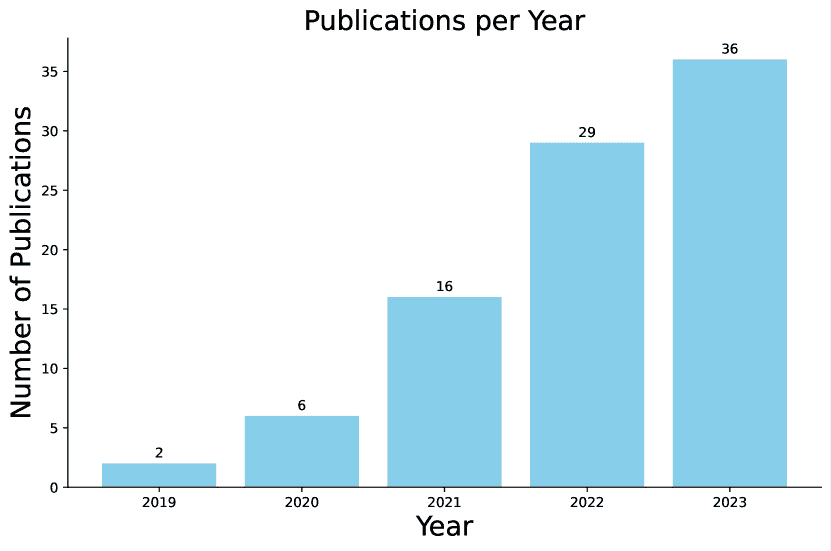
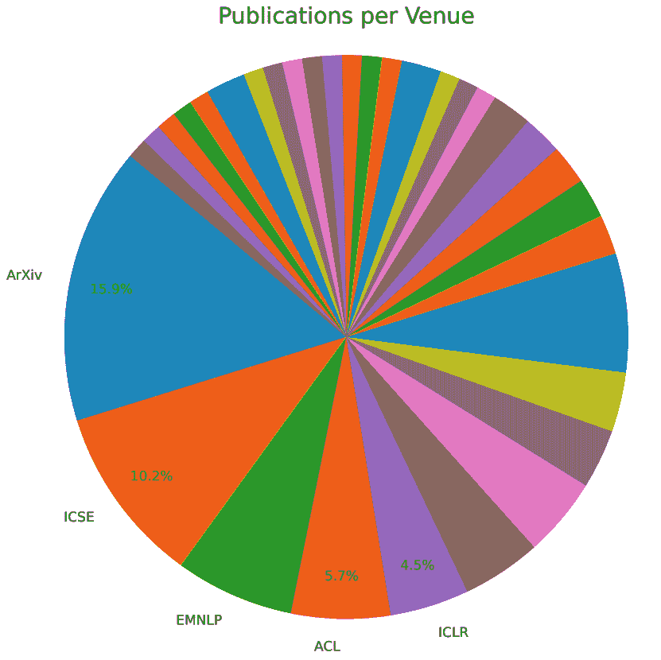
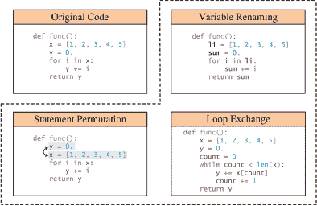
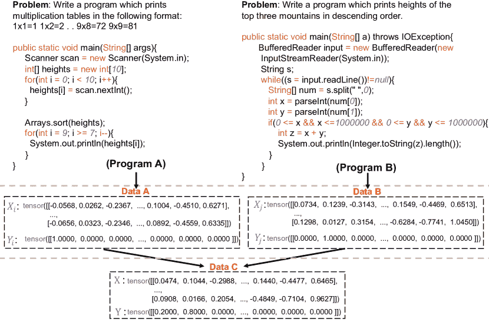

<!--yml

分类：未分类

日期：2024-09-06 19:39:13

-->

# [2305.19915] 深度学习的源代码数据增强：一项调查

> 来源：[`ar5iv.labs.arxiv.org/html/2305.19915`](https://ar5iv.labs.arxiv.org/html/2305.19915)

# 深度学习的源代码数据增强：一项调查

Terry Yue Zhuo^(1,2†)，Zhou Yang³，Zhensu Sun³，

Yufei Wang⁴，Li Li⁵，Xiaoning Du¹，Zhenchang Xing^(2,6)，David Lo³

¹ 莫纳什大学 ² CSIRO 的数据 61 ³ 新加坡管理大学

⁴ 华为诺亚方舟实验室 ⁵ 北京航空航天大学 ⁶ 澳大利亚国立大学

terry.zhuo@monash.edu

###### 摘要

深度学习模型在许多关键源代码任务中的日益普及，激发了数据增强（DA）技术的发展，以提升训练数据并改善这些模型的各种能力（例如，鲁棒性和泛化能力）。尽管已经提出了一系列专门针对源代码模型的数据增强方法，但缺乏对其有效性和影响的全面调查和检验。本文通过对源代码数据增强进行全面和综合的调查来填补这一空白，我们系统地编纂并总结现有文献，提供该领域的全面概述。我们从源代码中的数据增强介绍开始，然后讨论主要的代表性方法。接着，我们突出优化数据增强质量的总体策略和技术。随后，我们强调在实际源代码场景和下游任务中有用的技术。最后，我们概述了当前的挑战和未来研究的潜在机会。实质上，我们旨在揭示现有文献在深度学习源代码数据增强中的核心内容，并促进该领域的进一步探索。补充说明的是，我们提供了一个持续更新的 GitHub 库，包含有关源代码建模的数据增强的最新论文列表，访问链接：[`github.com/terryyz/DataAug4Code`](https://github.com/terryyz/DataAug4Code)。

^†^†$\dagger$ 通讯作者。

图 1：关于“深度学习源代码数据增强”主题的年度出版物统计。数据统计截至 2023 年 11 月。

图 2：收集的出版物的场所分布。

## 1 引言

数据增强（DA）是一种用于增加训练示例多样性的技术，而无需收集新数据。它在最近的机器学习（ML）研究中获得了广泛关注，像回译 Sennrich 等 (2015); Shiri 等 (2022)、混合方法 Zhang 等 (2018) 和合成音频 Asyrofi 等 (2021) 等方法在自然语言处理（NLP）、计算机视觉（CV）和语音识别中被广泛采用。这些技术显著提高了低资源领域数据中心模型的性能。例如，Fadaee 等 (2017) 通过 DA 实现了低资源机器翻译的显著改进，其中翻译系统使用从有限训练语料库合成的双语对进行训练。

然而，数据增强（DA）在源代码建模中的应用尚未完全探索，而源代码建模是机器学习（ML）与软件工程（SE）的交集。源代码建模是一个新兴领域，它运用 ML 技术解决各种源代码任务，例如代码完成 Yin 和 Neubig (2017)、代码摘要 McBurney 和 McMillan (2014) 和缺陷检测 Wang 等 (2016)，通过在开源库 Allamanis 等 (2017) 中的大量数据上训练模型。源代码数据通常具有两种模态：编程语言（例如 Python 和 Java）和自然语言（例如 doc-strings 和代码注释），它们互为补充。这种源代码数据的双模态特性在将 DA 定制为源代码模型的 NLP 时带来了独特的挑战。例如，在许多 NLP 任务中，一句话的上下文可以相对独立或从周围几句话中推导而来 Feng 等 (2021)。然而，在源代码中，由于函数调用、面向对象编程和模块化设计的广泛使用，上下文可以跨越多个函数甚至不同的文件。因此，我们认为源代码的 DA 方法需要考虑这种扩展上下文，以避免引入错误或改变原始程序的行为。此外，源代码遵循使用上下文无关文法指定的严格语法规则。因此，传统的 NLP 数据增强方法，例如用类似单词进行的标记替换，可能会导致增强的源代码无法编译，并为训练模型引入错误知识。

尽管面临这些挑战，对源代码建模的 DA（数据增强）的兴趣和需求仍在增加。随着通过大规模语料库学习获得的大型现成预训练源代码模型的日益可及（Chen et al. (2021); Li et al. (2023b); Allal et al. (2023)），越来越多地关注将这些模型应用于实际的软件开发。例如，（Husain et al., 2019）观察到许多编程语言资源稀缺，强调了 DA 在提高模型在未见数据上的性能和鲁棒性方面的重要性。

本研究旨在引起机器学习（ML）和软件工程（SE）社区对这一新兴领域的关注。如图 2 所示，相关出版物在最近五年中不断增加。更准确地说，我们编制了一份来自过去五年的 89 篇核心论文的清单，主要来自 ML 和 SE 学科的顶级会议和期刊，如图 2 所示（其中 89 篇论文中有 62 篇发表在 Core Rank A/A*场所¹¹1 我们参考了[`portal.core.edu.au/conf-ranks/`](http://portal.core.edu.au/conf-ranks/)和[`portal.core.edu.au/jnl-ranks/`](http://portal.core.edu.au/jnl-ranks/)的场所列表）。鉴于该领域日益增长的兴趣和蓬勃发展的研究，我们的调查适时地（1）提供对源代码模型 DA 的全面概述，以及（2）指出关键挑战和机会，以激发和指导进一步的探索。根据我们的了解，我们的论文是首个全面调查源代码模型 DA 技术的研究。

本论文的结构安排如下：

+   •

    第三部分提供了对三类源代码建模 DA 的全面审查：基于规则的（3.1）、基于模型的（3.2）和基于示例插值的（3.3）技术。

+   •

    第四部分提供了提高增强数据质量的常见策略和技术的总结，包括方法叠加（4.1）和优化（4.2）。

+   •

    第五部分阐述了各种有益的源代码数据增强场景，包括增强鲁棒性的对抗示例（5.1）、低资源领域（5.2）、检索增强（5.3）和对比学习（5.4）。

+   •

    第六部分描述了常见源代码任务的 DA 方法，如代码作者归属（6.1）、克隆检测（6.2）、缺陷检测和修复（6.3）、代码总结（6.4）、代码搜索（6.5）、代码完成（6.6）、代码翻译（6.7）、代码问答（6.8 ‣ 6 Downstream Tasks ‣ Source Code Data Augmentation for Deep Learning: A Survey")）、问题分类（6.9）、方法名预测（6.10）和类型预测（6.11）。

+   •

    第七部分阐述了源代码建模领域中数据增强（DA）的挑战和未来前景。

通过这项工作，我们希望模仿先前的调查，这些调查分析了其他数据类型的 DA 技术，例如文本（Feng et al. (2021)）、时间序列（Wen et al. (2020)）和图像（Shorten and Khoshgoftaar (2019)）。我们的意图是激发更多兴趣，引发好奇心，并鼓励在数据增强领域的进一步研究，特别是关注其在源代码中的应用。

## 2 背景

### 2.1 什么是源代码模型？

源代码模型在大规模源代码语料库上进行训练，因此能够对给定代码片段的上下文表示进行建模 Allamanis et al. (2017)。在早期，研究人员尝试利用深度学习架构如 LSTM Gu et al. (2016) 和 Seq2Seq Yin 和 Neubig (2017) 将源代码建模为类似普通文本的形式，并展示了这些模型在特定下游任务上的优异性能。随着 NLP 中预训练语言模型的发展，提出了许多预训练源代码模型，以增强源代码表示并有效地扩展到任何下游任务 Feng et al. (2020); Guo et al. (2021); Nijkamp et al. (2023)。这些模型中的一些结合了代码的固有结构。例如，Guo et al. (2021) 在预训练阶段考虑了程序数据流，这是代码的语义级结构，编码了变量之间的“值来源”关系。本文综述了针对所有基于深度学习的源代码模型设计的数据增强方法。

### 2.2 什么是数据增强？

数据增强（DA）技术旨在通过数据合成增加训练示例的多样性，以提高模型在各种方面（如准确性和鲁棒性）的性能。此外，DA 技术可以帮助避免模型在训练阶段的过拟合，从而保持模型的泛化能力。在计算机视觉（CV）中，通常采用带有预定义规则的 DA 技术进行模型训练，如图像裁剪、图像翻转和颜色抖动 Shorten 和 Khoshgoftaar (2019)。这些技术可被归类为基于规则的 DA。此外，像 Mixup 这样的尝试通过融合多个示例来创建新示例，这被归类为示例插值 DA。与计算机视觉相比，NLP 中的 DA 技术在很大程度上依赖于语言模型，这些模型可以通过单词替换或句子重写来帮助改写给定的上下文 Feng et al. (2021)。由于这些语言模型大多是预训练的，并能够捕捉输入的语义，因此它们作为合理的框架来修改或改写普通文本。我们将这种 DA 方法称为基于模型的 DA。

### 2.3 数据增强在源代码中的工作原理是什么？

与图像和纯文本相比，源代码由于严格的编程语法规则，其数据增强的灵活性较低。因此，我们观察到大多数源代码的数据增强方法必须遵循预定的转换规则，以保持原始代码片段的功能性和语法。为了使给定源代码的复杂处理成为可能，常见的方法是使用解析器从代码中构建具体语法树，该树以树状形式表示程序语法。具体语法树将进一步转化为抽象语法树（AST），以简化表示，但保留诸如标识符、if-else 语句和循环条件等关键信息。解析后的信息作为基于规则的数据增强方法中标识符替换和语句重写的基础。Quiring 等人（2019）。从软件工程的角度来看，这些数据增强方法可以模拟更为多样的代码表示方式，从而通过用增强的数据进行训练使源代码模型更加健壮。Yefet 等人（2020）。

## 3 深度学习的源代码数据增强方法

本节将专门为源代码模型设计的主流数据增强（DA）技术分为三部分：基于规则的、基于模型的和基于示例插值的技术。我们将分别解释不同分支的研究。

### 3.1 基于规则的技术

大量的数据增强方法利用预定规则对程序进行转换，同时不破坏语法规则和语义。具体而言，这些规则主要隐式利用 AST 来转换代码片段。这些转换可以包括替换变量名、重命名方法名和插入死代码等操作。除了基本的程序语法，一些代码转换还考虑了更深层次的结构信息，如控制流图（CGF）和使用-定义链（UDG）Quiring 等人（2019）。此外，一小部分基于规则的数据增强技术侧重于增强代码片段中的自然语言上下文，包括文档字符串和注释。Bahrami 等人（2021）；Song 等人（2022）；Park 等人（2023）。我们在图 3 中展示了一个依赖于程序语法的基于规则的数据增强示例。

图 3：基于规则的数据增强以转换代码片段，Wang 等人（2022d）。

Zhang 等人 (2020a) 提出了 MHM，这是一种在代码片段中迭代重命名标识符的方法。MHM 被认为是生成对抗训练示例的方法，它极大地提高了源代码模型的鲁棒性。后来，Srikant 等人 将程序混淆视为对抗扰动，他们重命名程序变量以试图隐藏程序的意图。通过将这些扰动示例应用于训练阶段，源代码模型变得对对抗攻击更具鲁棒性。BUGLAB-Aug Allamanis 等人 (2021) 在单纯重命名标识符的基础上，包含了更多增强代码片段的规则，强调编程语言和自然语言，如注释删除、比较表达式镜像和 if-else 分支交换。对 BUGLAB-Aug 的评估表明，DA 方法可以用于自监督的错误检测和修复。同样，Jain 等人 (2021) 使用编译器转换作为数据增强，称为 Transpiler，自动生成等效函数的数据集。他们通过利用程序的 AST 定义了 11 种编译器转换规则。基于规则的 DA 后来被广泛用于源代码模型，通过对比学习有效捕捉代码表示 Ding 等人 (2021); Liu 等人 (2023b)。

Brockschmidt 等人 (2019) 通过在给定的 AST 上增加额外的边来提出一种生成源代码模型，以学习多样的代码表达。Quiring 等人 (2019) 提出了三种不同的增强方案，通过 AST 和 CFG、UDG 以及声明-引用映射 (DRM) 的组合，分别称为控制转换、声明转换和 API 转换。控制转换重写控制流语句或修改函数之间的控制流。总共有 5 种转换。这些转换涉及将变量作为函数参数传递、更新其值以及改变调用者和被调用者的控制流。声明转换包含 14 种转换器，修改、添加或删除源代码中的声明。声明转换使 DA 在更新所有变量使用方面变得必要，这可以通过 DRM 表示优雅地完成。API 转换包含 9 种转换，利用了各种 API 可以用来解决相同问题的事实。程序员通常偏好不同的 API，因此篡改 API 使用是一种有效的策略，用于改变风格模式。

另一项工作是增强源代码中的自然语言上下文。QRA Huang 等人（2021）通过在执行代码搜索和代码问答时重写自然语言查询来增强示例。它通过一些规则基于的微小修改重写查询，这些修改与原始查询具有相同的语义。具体而言，它包括三种方式：随机删除一个词、随机交换两个词的位置和随机复制一个词。受到这种方法的启发，Park 等人（2023）最近设计了以查询关键字为重点的 KeyDAC。KeyDAC 在自然语言和编程语言上都进行增强。对于自然语言查询，它遵循 QRA 中的规则，但仅修改非关键字。在编程语言增强方面，KeyDAC 简单地使用 ASTs 来重命名程序变量，类似于前述工作。

### 3.2 基于模型的技术

一系列用于源代码的 DA 技术旨在训练各种模型以增强数据。从直观上看，Mi 等人（2021）利用辅助分类生成对抗网络（AC-GAN）Odena 等人（2017）来生成增强的程序。同样，Wang 等人（2023a）训练了一个生成对抗网络，以同时提升代码生成和代码搜索。为了增加代码摘要的训练数据，CDA-CS Song 等人（2022）使用预训练的 BERT 模型 Devlin 等人（2019）来替换代码注释中的非关键字同义词，这有利于源代码下游任务。

虽然这些方法大多将现有的基于模型的 DA 技术适配于一般用途，但大多数 DA 方法是专门为源代码模型设计的。Li 等人（2022f）引入了 IRGen，这是一种基于遗传算法的模型，使用编译器中间表示（LLVM IR）来增强源代码嵌入，其中 IRGen 将一段源代码生成一系列语义相同但语法不同的 IR 代码，以提高模型的上下文理解。几项工作 Roziere 等人（2021）；Ahmad 等人（2023）；Silva 等人（2023）已经研究了多语言生成源代码模型在无监督编程语言翻译中的适用性，通过回译，类似于 NLP 中的 Sennrich 等人（2016）。然而，与 NLP 中的回译不同的是，这里的回译定义为通过自然语言作为中间语言在两种编程语言之间进行翻译。Pinku 等人（2023）利用另一种生成源代码模型 Transcoder Roziere 等人（2020）进行源到源的翻译，以增强跨语言源代码。

### 3.3 示例插值技术

另一类数据增强（DA）技术，源于 Mixup Zhang 等人 (2018)，涉及对两个或多个实际示例的输入和标签进行插值。例如，在计算机视觉中的二分类任务中，给定一张狗的图片和一张猫的图片，这些 DA 方法如 Mixup 可以根据随机选择的权重混合这两个图像输入及其对应的标签。这类方法也被称为混合样本数据增强。尽管在文本分类问题的背景下进行过尝试，但这种方法在源代码领域很难部署，因为每段代码都受到其独特程序语法和功能的限制。

图 4：MixCode，Dong 等人 (2023a)。

与上述表面插值方法相比，大多数示例插值 DA 方法被增强为通过模型嵌入将多个真实示例融合为单个输入，Feng 等人 (2021)。如图 4 所示，Dong 等人 (2023a) 将基于规则的源代码模型技术与 Mixup 结合，混合原始代码片段及其变换的表示。这种方法通常被认为是应用于 NLP 分类任务的线性插值技术。

Li 等人 (2022a) 引入了两种新颖的源代码模型插值技术，即二元插值和线性外推。二元插值作为一种数据增强策略，通过使用从伯努利分布中获得的元素在样本之间交换特征。另一方面，线性外推是一种数据增强方法，通过根据均匀分布扩展当前特征，生成超出现有特征空间的新数据点。

## 4 策略与技术

在实际应用中，源代码模型的 DA 技术的设计和效果受到多种因素的影响，如计算成本、示例多样性和模型的鲁棒性。本节重点介绍这些因素，提供了制定和优化适当 DA 方法的见解和技术。

### 4.1 方法堆叠

如第三部分讨论的那样，许多 DA 策略在单一工作中同时提出，旨在提高模型的性能。[添加一句话以定义方法堆叠] 通常，这种组合包括两种类型：同类型 DA 或不同 DA 方法的混合。前者通常应用于基于规则的 DA 技术，因为单一的代码变换无法完全代表现实世界中的多样代码风格和实现。

一些研究 Shi 等人 (2023); Huang 等人 (2021) 证明了合并多种 DA 技术可以提高源代码模型的性能。**Mi** 等人 (2021) 将基于规则的代码变换方案与使用 AC-GAN 的基于模型的 DA 结合起来，创建了一个用于模型训练的增强语料库。与编程语言增强不同，**CDA-CS** 宋等人 (2022) 包括两种 DA 技术：基于规则的非关键字提取和基于模型的非关键字替换。陈和 Lampouras (2023) 的实证证据表明，结合回译和变量重命名可以改善代码完成性能。

### 4.2 优化

在某些场景下，如提升鲁棒性和最小化计算成本，优化选择特定的增强示例候选是至关重要的。我们将这种以目标为导向的候选选择称为优化。随后，我们介绍了三种策略：概率、基于模型和基于规则的选择。概率选择被定义为通过从概率分布中采样进行优化，而基于模型的选择则由模型指导，选择最合适的示例。在基于规则的选择方面，它是一种优化策略，使用特定的预定规则或启发式方法来选择最合适的示例。

#### 4.2.1 概率选择

我们介绍了三种代表性的概率选择策略：MHM、QMDP 和 BUGLAB-Aug。**MHM** 张等人 (2020a) 采用了 Metropolis-Hastings 概率采样方法，这是一种马尔可夫链蒙特卡罗技术，通过标识符替换选择对抗样本。类似地，**QMDP** 田等人 (2021) 使用 Q 学习方法来战略性地选择并执行基于规则的结构变换，从而指导对抗样本的生成。在 **BUGLAB-Aug** 中，Allamanis 等人 (2021) 模拟在代码片段中的特定位置应用特定重写规则的概率，类似于指针网络 Merity et al.。

#### 4.2.2 基于模型的选择

-   一些采用该策略的 DA 技术使用模型的梯度信息来指导增强示例的选择。一个典型的方法是 DAMP 方法 Yefet 等人 (2020)，该方法基于模型损失进行优化，通过变量重命名选择和生成对抗示例。另一个变体，SPACE Li 等人 (2022c)，通过梯度上升执行代码标识符嵌入的选择和扰动，旨在最大化模型的性能影响，同时保持编程语言的语义和语法正确性。更复杂的技术 ALERT Yang 等人 (2022b) 使用遗传算法进行基于梯度的选择策略。它通过一个适应度函数计算模型的置信度差异，迭代进化候选解决方案的种群，旨在识别最有效的对抗示例。

| DA 方法 | 类别 | PL | NL | 优化 | 预处理 | 解析 | 级别 | TA | LA |
| --- | --- | --- | --- | --- | --- | --- | --- | --- | --- |
| ComputeEdge Brockschmidt 等人 (2019) | 规则 | ✓ | ✗ | — | — | AST | AST | ✓ | ✓ |
| 精细表示 Bielik 和 Vechev (2020) | 规则 | ✓ | ✗ | 模型 | — | AST | AST | ✓ | ✓ |
| 控制转换 Quiring 等人 (2019) | 规则 | ✓ | ✗ | 概率 | — | AST+CFG+UDG | 输入 | ✓ | ✗ |
| 声明转换 Quiring 等人 (2019) | 规则 | ✓ | ✗ | 概率 | — | AST+DRM | 输入 | ✓ | ✗ |
| API 转换 Quiring 等人 (2019) | 规则 | ✓ | ✗ | 概率 | — | AST+CFG+DRM | 输入 | ✓ | ✗ |
| DAMP Yefet 等人 (2020) | 规则 | ✓ | ✗ | 模型 | — | AST | 输入 | ✓ | ✓ |
| IBA 黄等人 (2021) | 规则 | ✗ | ✓ | — | Tok | — | 嵌入 | ✗ | ✓ |
| QRA 黄等人 (2021) | 规则 | ✓ | ✗ | — | Tok | — | 输入 | ✗ | ✓ |
| MHM Zhang 等人 (2020a) | 规则 | ✗ | ✓ | 概率 | — | AST | 输入 | ✓ | ✗ |
| Mossad Devore-McDonald 和 Berger (2020) | 规则 | ✓ | ✗ | 规则 | Tok | AST | 输入 | ✓ | ✓ |
| 增强代码 Bahrami 等人 (2021) | 规则 | ✓ | ✗ | — | Tok | — | 输入 | ✗ | ✓ |
| QMDP Tian 等人 (2021) | 规则 | ✓ | ✗ | 概率 | Tok | AST | 输入 | ✓ | ✗ |
| 转译器 Jain 等人 (2021) | 规则 | ✓ | ✗ | 概率 | — | AST | 输入 | ✓ | ✗ |
| BUGLAB-Aug Allamanis 等人 (2021) | 规则 | ✓ | ✗ | 概率 | Tok | AST | 输入 | ✗ | ✓ |
| SPAT Yu 等人 (2022b) | 规则 | ✓ | ✗ | 模型 | — | AST | 输入 | ✓ | ✗ |
| RoPGen Li 等人 (2022d) | 规则 | ✓ | ✗ | 模型 | — | AST | 输入 | ✓ | ✗ |
| ACCENT Zhou 等人 (2022) | 规则 | ✓ | ✗ | 规则 | — | AST | 输入 | ✓ | ✓ |
| SPACE Li 等人 (2022c) | 规则 | ✓ | ✗ | 模型 | Tok | AST | 嵌入 | ✓ | ✓ |
| ALERT Yang 等人 (2022b) | 规则 | ✓ | ✗ | 模型 | Tok | AST | 输入 | ✓ | ✓ |
| IRGen Li 等 (2022f) | 规则 | ✓ | ✗ | 规则 | — | 抽象语法树 + IR | IR | ✓ | ✓ |
| 二进制插值 Li 等 (2022a) | 示例插值 (EI) | ✓ | ✓ | — | — | — | 嵌入 | ✓ | ✓ |
| 线性外推 Li 等 (2022a) | 示例插值 (EI) | ✓ | ✓ | — | — | — | 嵌入 | ✓ | ✓ |
| 高斯缩放 Li 等 (2022a) | 规则 | ✓ | ✓ | 模型 | — | — | 嵌入 | ✓ | ✓ |
| CodeTransformator Zubkov 等 (2022) | 规则 | ✓ | ✗ | 规则 | — | 抽象语法树 (AST) | 输入 | ✓ | ✗ |
| RADAR Yang 等 (2022a) | 规则 | ✓ | ✗ | 规则 | — | 抽象语法树 (AST) | 输入 | ✓ | ✗ |
| AC-GAN Mi 等 (2021) | 模型 | ✓ | ✗ | — | — | — | 输入 | ✓ | ✓ |
| CDA-CS Song 等 (2022) | 模型 | ✗ | ✓ | 模型 | 关键词提取 (KWE) | — | 输入 | ✗ | ✓ |
| srcML-embed Li 等 (2022e) | 规则 | ✓ | ✗ | — | — | 抽象语法树 (AST) | 嵌入 | ✓ | ✗ |
| MultIPA Orvalho 等 (2022) | 规则 | ✓ | ✗ | — | — | 抽象语法树 (AST) | 输入 | ✓ | ✗ |
| ProgramTransformer Rabin 和 Alipour (2022) | 规则 | ✓ | ✗ | — | — | 抽象语法树 (AST) | 输入 | ✓ | ✗ |
| 反向翻译 Ahmad 等 (2023) | 模型 | ✓ | ✗ | — | 词汇 (Tok) | — | 输入 | ✗ | ✓ |
| MixCode Dong 等 (2023a) | 规则+EI | ✓ | ✓ | — | — | — | 嵌入 | ✓ | ✓ |
| NP-GD Shen 等 | 模型 | ✓ | ✗ | 模型 | 词汇 (Tok) | — | 嵌入 | ✓ | ✓ |
| ExploitGen Yang 等 (2023a) | 规则 | ✗ | ✓ | — | — | — | 输入 | ✓ | ✗ |
| SoDa Shi 等 (2023) | 模型 | ✓ | ✓ | — | — | 抽象语法树 (AST) | 输入 | ✓ | ✓ |
| 转译器 Pinku 等 (2023) | 模型 | ✓ | ✗ | — | — | — | 输入 | ✓ | ✗ |
| STRATA Springer 等 (2021) | 规则 | ✓ | ✗ | 模型 | 词汇 (Tok) | 抽象语法树 (AST) | 输入 | ✓ | ✓ |
| KeyDAC Park 等 (2023) | 规则 | ✓ | ✓ | — | 关键词提取 (KWE) | 抽象语法树 (AST) | 嵌入 | ✗ | ✓ |
| 简单插值 Zhang 等 (2022) | 示例插值 (EI) | ✓ | ✗ | — | — | 抽象语法树 + IR | 嵌入 | ✗ | ✓ |

表 1：通过各个方面比较一些 DA 方法的适用性、依赖性和要求。PL、NL、TA、LA、EI、Prob、Tok 和 KWE 分别代表编程语言、自然语言、示例插值、概率、分词、关键词提取、任务无关和语言无关。PL 和 NL 决定 DA 方法是否应用于编程语言或自然语言上下文。预处理表示除了程序解析外所需的预处理。解析指 DA 方法在程序解析期间使用的特征类型。级别表示 DA 修改数据的深度。TA 和 LA 表示 DA 方法是否可以应用于不同的任务或编程语言。由于大多数论文没有明确说明其 DA 方法是否为 TA 和 LA，我们主观地标记了适用性。

#### 4.2.3 基于规则的选择

基于规则的选择是一种强有力的方法，具有预定的适应度函数或规则。这种方法通常依赖于评估指标进行决策。例如，IRGen Li 等 (2022f) 采用基于遗传算法的优化技术，适应度函数基于 IR 相似性。另一方面，ACCENT Zhou 等 (2022) 和 RADAR 分别应用评估指标，如 BLEU Papineni 等 (2002) 和 CodeBLEU Ren 等 (2020) 来指导选择和替换过程，旨在实现最大对抗影响。最后，STRATA Springer 等 (2021) 采用基于规则的技术来选择高影响的子令牌，这些子令牌显著改变模型对代码的解释。

## 5 场景

本节**深入探讨**了几个常见的源代码场景，其中可以应用 DA 方法。

### 5.1 针对稳健性的对抗样本

稳健性呈现出软件工程中一个关键且复杂的维度，要求创建语义保留的对抗样本，以识别和减轻源代码模型中的漏洞。近年来，设计更有效的 DA 技术以生成这些样本的需求激增。若干研究 Yefet 等 (2020); Li 等 (2022d); Srikant 等 ; Li 等 (2022c); Anand 等 ; Henke 等 (2022); Tian 等 (2023); Yang 等 (2023b); Li 等 (2023c); Gu 等 (2023); Gao 等 (2023) 已利用各种 DA 方法测试和增强模型的稳健性。Wang 等 (2023b) 更进一步，通过整合普遍接受的代码转换规则，建立了源代码模型稳健性的第一个基准。

### 5.2 低资源领域

在软件工程领域，编程语言的资源严重不均衡 Orlanski 等 (2023)。尽管一些如 Python 和 Java 等流行编程语言在开源代码库中扮演重要角色，但许多语言如 Rust Wu 等 (2023) 则资源极其稀缺。由于源代码模型在开源代码库和论坛上进行训练，编程语言资源的不均衡可能会对它们在资源稀缺编程语言上的表现产生负面影响。此外，在低资源领域应用 DA 方法是 CV 和 NLP 社区中的一个反复出现的主题 Shorten 和 Khoshgoftaar (2019); Feng 等 (2021)。然而，在源代码学科中，这一场景仍然没有被充分探索。

为了增加低资源领域的数据以进行表示学习，Li et al. (2022f) 倾向于添加更多的训练数据，以通过释放编译器 IR 的力量来增强源代码模型嵌入。Ahmad et al. (2023) 提出了使用源代码模型进行回译 DA，考虑到低资源编程语言的情况。同时，Chen 和 Lampouras (2023) 强调源代码数据集明显小于其 NLP 等效数据集，后者通常包含数百万个实例。因此，他们开始在这种背景下研究代码补全任务，并实验回译和变量重命名。Shen et al. 认为生成 bash 评论受到训练数据匮乏的阻碍，因此探索了用于此任务的模型基础 DA 方法。

### 5.3 检索增强

在 NLP 领域中，对 DA 用于检索增强的应用产生了越来越多的兴趣 Mialon et al. (2023) 和源代码 Lu et al. (2022)。这些用于源代码模型的检索增强框架在预训练或微调源代码模型时，会从训练集中引入检索增强的示例。这种增强形式提高了模型的参数效率，因为它们可以在参数中存储更少的知识，而是通过检索来获取。这被展示为 DA 在各种源代码下游任务中的一个有前途的应用，如代码总结 Zhang et al. (2020b); Liu et al.; Yu et al. (2022a); Choi et al. (2023); Ye et al. (2023), 代码补全 Parvez et al. (2021); Tang et al. (2023) 和程序修复 Nashid et al. (2023); Jin et al. (2023); Wang et al. (2023c).

### 5.4 对比学习

另一种部署 DA 方法的源代码场景是对比学习，其中它使模型能够学习一个嵌入空间，使得相似样本彼此接近，而不相似的样本则远离 Chen et al. (2022); Wang et al. (2022c); Zhang et al. (2022); Yang et al. (2023c); Ding et al. (2023)。由于训练数据集通常包含有限的正样本，DA 方法被优先用于构造与正样本相似的样本。Liu et al. (2023b) 利用对比学习与 DA 来制定优越的源代码模型预训练范式，而一些研究则探讨了这种应用在一些源代码任务中的优势，如缺陷检测 Cheng et al. (2022)，克隆检测 Zubkov et al. (2022); Wang et al. (2022a) 和代码搜索 Shi et al. (2022b, 2023); Li et al. (2022b).

## 6 下游任务

在本节中，我们讨论了几种针对常见源代码任务和评估数据集的 DA 方法。

### 6.1 代码作者归属

代码作者归属是识别给定代码作者的过程，通常通过源代码模型实现。Yang 等人（2022b）最初研究了在 Google Code Jam (GCJ) 数据集上生成对抗样本，这些样本有效地欺骗了源代码模型，使其识别出错误的代码片段作者。通过使用这些增强样本进行训练，可以进一步提高模型的鲁棒性。Li 等人（2022d）提出了另一种名为 RoPGen 的对抗攻击 DA 方法，并在 GCJ 上展示了其有效性。Dong 等人（2023b）实证研究了几种现有 DA 方法在 NLP 中的有效性，涵盖了包括 GCJ 上的作者归属在内的多个源代码任务。

### 6.2 克隆检测

代码克隆检测是指识别给定代码片段是否从原始样本中克隆并修改而来的任务，在某些情况下也称为抄袭检测 Zubkov 等人（2022）；Pinku 等人（2023）；Hasija 等人（2023）。这是一个具有挑战性的下游任务，因为它需要源代码模型在语法和语义上都理解源代码。Jain 等人（2021）通过编译器信息提出了正确构造的 DA 方法，生成了许多功能等效的训练样本变体，并展示了其在 BigCloneBench Svajlenko 等人（2014）和自收集的 JavaScript 数据集上提高模型鲁棒性的有效性。Jia 等人（2023）表明，当使用混淆变换的对抗样本进行训练时，源代码模型的鲁棒性可以显著提高。Zubkov 等人（2022）提供了多种对比学习框架的比较，结合规则基于的变换用于克隆检测任务。Pinku 等人（2023）随后使用 Transcompiler 在 Python 和 Java 之间进行有限源代码翻译，增加了跨语言代码克隆检测的训练数据。

### 6.3 缺陷检测与修复

缺陷检测和修复，换句话说，错误或漏洞检测与修复，是捕捉给定代码片段中的错误 Cheng 等人 (2022)；董等人 (2023a) 和生成修复版本 Drain 等人 (2021)；Yasunaga 和 Liang (2021)；王等人 (2022b)。这个任务可以被认为是一个二分类任务，其中标签为真或假。Allamanis 等人 (2021) 实现了 BUGLAB-Aug，一个自监督错误检测与修复的 DA 框架。BUGLAB-Aug 有两套代码转换规则，一套是诱导错误的重写，另一套是作为 DA 的重写。他们的方法同时提升了源代码模型的性能和鲁棒性。程等人 (2022) 提出了一种称为 ContraFlow 的路径敏感代码嵌入技术，该技术利用自监督对比学习基于值流路径检测缺陷。ContraFlow 利用 DA 生成三个数据集（即 D2A 郑等人 (2021)、范范等人 (2020) 和 FFMPeg+Qemu 周等人 (2019)) 的对比值流表示，以学习程序之间的（不）相似性。丁等人 (2021) 提出了一个新颖的自监督模型，专注于识别源代码的（不）相似功能，该模型在 REVEAL Chakraborty 等人 (2022) 和 FFMPeg+Qemu 周等人 (2019) 上超越了现有的最先进模型。具体来说，他们设计了代码转换启发式方法以自动创建有错误的程序和相似代码，以增强预训练数据。

### 6.4 代码摘要

代码摘要被认为是一种为源代码生成注释的任务，因此也被称为代码注释生成。张等人 (2020c) 采用 MHM 来扰动训练示例，并将其与原始示例混合以进行对抗训练，这有效地提高了源代码模型在总结对抗代码片段时的鲁棒性。张等人 (2020b) 开发了一种基于检索增强的代码摘要框架，依赖于相似的代码-摘要对在 PCSD 和 JCSD 数据集上生成新的摘要 Miceli-Barone 和 Sennrich (2017)；胡等人 (2018)。基于该框架，刘等人 利用 Hybrid GNN 提出了一个新颖的检索增强代码摘要方法，并在自收集的 CCSD 数据集上进行模型训练。周等人 (2022) 生成了 Python 数据集的对抗示例 Wan 等人 (2018) 和 JSCD 以评估和增强源代码模型的鲁棒性。

### 6.5 代码搜索

代码搜索，或代码检索，是一种文本代码任务，它基于给定的自然语言查询搜索代码片段。这个任务中的源代码模型需要将文本的语义映射到源代码上 Li et al. (2022a, 2023a); Huang et al. (2023); Ma et al. (2023)。Bahrami et al. (2021) 通过增强自然语言上下文，如文档字符串、代码注释和提交消息，来增加代码搜索查询。Shi et al. (2022b) 使用基于 AST 的 DA 替换 CodeSearchNet Husain et al. (2019) 和 CoSQA Huang et al. (2021) 中的数据的函数和变量名称。Shi et al. (2023) 引入了软数据增强（SoDa），无需对代码和文本进行外部转换规则。使用 SoDa，模型在处理 CodeSearchNet 时，根据动态掩码或替换预测标记。与应用基于规则的 DA 技术不同，Li et al. (2022a) 通过插值 CodeSearchNet 的示例来操控输入数据的表示。

### 6.6 代码补全

代码补全要求源代码模型生成代码行以完成给定的编程挑战 Brockschmidt et al. (2019); Lu et al. (2022); Wang et al. (2022e)。Anand et al. 建议源代码模型易受到对抗样本的攻击，这些样本通过转换规则进行扰动。Lu et al. (2022) 提出了一个基于检索增强的代码补全框架，该框架由基于规则的 DA 模块组成，用于在 PY150 Raychev et al. (2016) 和 GitHub Java 语料库数据集 Allamanis and Sutton (2013) 上生成代码。Wang et al. (2023b) 专门为文档字符串、函数和变量名称、代码语法和代码格式定制了 30 多种转换，并在 HumanEval Chen et al. (2021) 和 MBPP Austin et al. (2021) 上对生成源代码模型进行了基准测试。Yang et al. (2022a) 设计了对功能描述和签名的转换以攻击源代码模型，并展示了它们的性能易受影响。

### 6.7 代码翻译

类似于 NLP 中的神经机器翻译 Stahlberg (2020)，该任务是将用特定编程语言编写的源代码翻译成另一种语言。Ahmad 等人 (2023) 通过回译应用数据增强，以提高无监督代码翻译的效果。他们使用预训练的序列到序列模型将代码翻译为自然语言总结，然后再翻译回另一种编程语言，从而创建额外的合成训练数据以提高模型性能。Chen 和 Lampouras (2023) 利用回译和变量增强技术，在 CodeTrans Lu 等人 (2021) 上实现了代码翻译的改进。最近，Xie 等人 (2023) 提出了两种新颖的数据增强方法，通过模型训练和回译生成具有相似功能的代码翻译对。

### 6.8 代码问题回答 (CQA)

CQA 可以被表述为一个任务，其中源代码模型需要根据给定的代码片段和问题生成文本答案。Huang 等人 (2021) 将两种基于规则的 DA 方法结合到代码和文本中，以创建用于对比学习的示例。Li 等人 (2022c) 探讨了在 CodeQA Liu 和 Wan (2021) 上使用基于规则的 DA 的对抗训练在连续嵌入空间中的有效性，该数据集是一个自由形式的 CQA 数据集。Park 等人 (2023) 在 CodeXGLUE Lu 等人 (2021) 的 WebQueryTest 上评估了 KeyDAC 框架，该框架使用查询写作和变量重命名作为 DA。与 CodeQA 不同，WebQueryTest 是一个仅包含 Yes/No 问题的 CQA 基准。

### 6.9 代码分类

该任务对程序进行分类，依据其功能性 Zhang 等人 (2020a)；Dong 等人 (2023a) 或可读性 Mi 等人 (2021, 2022a, 2022b)。Wang 等人 (2022c) 提出了用于对比学习的 AST 层次表示方法，并采用图神经网络。具体而言，他们在 OJ 数据集（包含 104 类程序）上增强了 AST 路径中的节点嵌入。Zhang 等人 (2022) 将简单插值（一个在 IR 上的示例插值 DA 方法）结合进来，以从 CodeXGLUE Lu 等人 (2021) 创建 POJ-104 上的中间嵌入。Dong 等人 (2023a) 也探索了示例插值 DA 来融合代码片段的嵌入。他们在两个数据集 JAVA250 和 Python800 上评估了该方法 Puri 等人 (2021)。

### 6.10 方法名称预测

方法名称预测的目标是给定程序预测方法的名称。Yefet et al. (2020) 通过在 Code2Seq 数据集 Alon et al. (2019) 上使用变量名称替换的对抗程序来攻击和防御源代码模型。Pour et al. (2021) 提出了一个基于搜索的测试框架，专门用于对抗鲁棒性。他们生成了使用十种流行重构操作符的 Java 对抗样本。Rabin et al. (2021) 和 Yu et al. (2022b) 都实现了数据增强框架和各种转换规则，用于在 Code2Seq 数据集上处理 Java 源代码。

### 6.11 类型预测

类型预测，或称类型推断，旨在预测程序中的参数和函数类型。Bielik 和 Vechev (2020) 通过变换后的 AST 示例对源代码模型进行对抗攻击。他们将攻击实例化为对 JavaScript 和 TypeScript 的类型预测。Jain et al. (2021) 应用编译器转换生成 DeepTyper Hellendoorn et al. (2018) 中许多程序的变体，这些变体具有 11 条规则的等效功能。Li et al. (2022e) 将 srcML Collard et al. (2013) 元语法嵌入应用于三种数据集中的示例，以增强语法特征，包括 DeepTyper、Typilus Data Allamanis et al. (2020) 和 CodeSearchNet Husain et al. (2019)。

## 7 挑战与机遇

在源代码方面，数据增强面临着显著的挑战。尽管如此，重要的是要认识到这些挑战为该领域的新可能性和激动人心的机会铺平了道路。

##### 理论讨论。

目前，在源代码中的数据增强（DA）方法的深入探索和理论理解上存在明显的差距。现有的大多数研究集中在图像处理和自然语言领域，将数据增强视为应用关于数据或任务不变性的预先知识的一种方式 Dao et al. (2019); Wu et al. (2020); Shi et al. (2022a)。在转向源代码时，以往的工作往往引入了新方法或展示了数据增强技术如何对后续任务有效。然而，这些研究常常忽略了从数学角度特别是为何和如何的问题。由于源代码本质上是离散的，因此进行理论讨论变得尤为重要。它使我们能够从更广泛的角度理解数据增强，而不仅仅是通过实验结果来了解。通过这种方式探索数据增强，我们可以更好地理解其基本原理，而不是仅仅依赖实验验证。

##### 对预训练模型的进一步研究。

近年来，预训练源代码模型已广泛应用于源代码中，通过对大规模语料库的自我监督，包含丰富的知识 Feng et al. (2020); Guo et al. (2021); Zhuo (2023)。尽管许多研究利用了预训练源代码模型进行数据增强（DA），但这些尝试大多数限于掩码令牌替换 Shi et al. (2023)，在微调后的直接生成 Ahmad et al. (2023); Pinku et al. (2023)。一个新兴的研究机会在于利用大量文本和源代码训练的大型语言模型（LLMs）探索 DA 在源代码领域的潜力 Chen et al. (2021); Li et al. (2023b)。LLMs 能够基于提示指令和提供的示例生成上下文，使其成为自动化 NLP 中 DA 过程的选择 Yoo et al. (2021); Wang et al. (2021a)。与先前在 DA 中使用预训练模型不同，这些工作开启了“基于提示的 DA”时代。相比之下，基于提示的 DA 在源代码领域的探索仍然是一个相对未触及的研究领域。另一个方向是利用预训练源代码模型中编码的内部知识。例如，Karmakar 和 Robbes (2021); Wan et al. (2022) 证明了 AST 和代码语义可以从这些模型中引导出来，而无需静态分析工具。由于大多数源代码模型的 DA 方法倾向于通过程序分析预定义代码转换规则，因此预训练源代码模型中的编程知识有望自动化规则设计。

##### 处理特定领域的数据。

我们的论文专注于调查涉及处理源代码的常见下游任务的 DA 技术。然而，我们意识到在源代码领域还有一些任务特定数据的研究。例如，API 推荐和 API 序列生成可以视为源代码任务的一部分 Huang et al. (2018); Gu et al. (2016)。我们的调查覆盖的 DA 方法不能直接推广到这些任务，因为大多数方法仅针对程序级增强而非 API 级增强。我们观察到这两个不同层次之间的 DA 技术存在差距 Treude and Robillard (2016); Xu et al. (2020); Wang et al. (2021b)，这为未来的研究提供了探索的机会。此外，源代码建模尚未充分证明 DA 在分布外泛化中的有效性。之前的研究 Hajipour et al. (2022); Hu et al. (2022) 将领域假设为具有不同复杂性、语法和语义的程序。我们认为这一定义不够自然。类似于 NLP 中的子领域，如生物医学和金融文本，源代码的应用子领域可以是多样的。例如，用于解决数据科学问题的程序可能与用于网页设计的程序显著不同。我们鼓励 SE 和 ML 社区研究 DA 在源代码各种应用子领域中的应用效益。

##### 更多探索项目级源代码和低资源编程语言。

现有方法在函数级代码片段和常见编程语言上已有充分进展。对函数级别代码片段的强调未能捕捉现实场景中编程的复杂性和精细性，在这些场景中，开发者经常同时处理多个文件和文件夹。因此，我们强调在项目级别探索 DA 方法的重要性。源代码项目上的 DA 可能与函数级 DA 有所不同，因为它可能涉及更多信息，例如不同代码模块之间的相互依赖关系、高层架构考虑因素，以及项目中使用的数据结构和算法之间的复杂关系 Mockus et al. (2002)。与此同时，由于数据资源的限制 Husain et al. (2019); Orlanski et al. (2023)，低资源语言的增强方法稀缺，尽管这些语言对 DA 的需求更大。这两个方向的探索仍然有限，可能是有前景的研究方向。

##### 缓解社会偏见。

随着源代码模型推动了软件开发，它们可能会被用于开发以人为本的应用程序，如人力资源和教育，这可能导致偏见程序对少数群体做出不公正和不道德的决策 Zhuo et al. (2023a)。虽然自然语言处理中的社会偏见已经得到充分研究，并且可以通过数据增强方法加以缓解 Feng et al. (2021)，但源代码中的社会偏见尚未受到关注。例如，Zhuo et al. (2023a) 和 Liu et al. (2023c) 发现源代码的 LLM 在根据自然语言查询进行代码生成时，在性别、性取向和职业等各种人口统计特征中存在服务器偏见。为了使这些模型在源代码中更加负责任，我们呼吁更多的研究来缓解偏见。正如以往在自然语言处理中的研究所建议的，数据增强可能是使源代码模型更负责任的有效技术。

##### 少样本学习。

在少样本场景中，模型需要在训练数据极为有限的情况下实现与传统机器学习模型相媲美的性能。数据增强（DA）方法为此问题提供了直接的解决方案。然而，在少样本场景中，采用 DA 方法的相关工作较少 Nashid et al. (2023)。主流的预训练源代码模型通过语言建模获得丰富的语义知识。这些知识甚至在某种程度上涵盖了传统基于释义的数据增强方法所引入的语义信息。换句话说，传统数据增强方法对预训练源代码模型带来的提升空间已经大大压缩。因此，如何通过在少样本场景中生成高质量的增强数据来提供模型快速的泛化和问题解决能力，是一个有趣的问题。

##### 多模态应用。

需要注意的是，强调功能级代码片段并不能准确代表现实编程环境中的复杂性。在这种情况下，开发人员通常会同时处理多个文件和文件夹。Wang et al. (2021b) 和 Liu et al. (2023a) 探讨了源代码和相关 API 的图表渲染。Surís et al. (2023) 提出了一个框架，用于生成 Python 程序以解决包括图像和视频在内的复杂视觉任务。尽管这种多模态应用越来越受欢迎，但尚未对将数据增强方法应用于其中进行研究。多模态源代码任务技术的一个潜在挑战是有效桥接源代码模型中每种模态的嵌入表示，这在视觉-语言多模态任务中已经有所研究 Ray et al. (2019); Tang et al. (2020); Hao et al. (2023)。

##### 缺乏统一性。

当前关于源代码的数据增强（DA）的文献呈现出一个具有挑战性的格局，最受欢迎的方法往往以补充的方式呈现。一些实证研究试图比较源代码模型的 DA 方法，如 de Paula Rodrigues 等人（2023）；Dong 等人（2023b）。然而，这些研究没有利用大多数现有的先进 DA 方法。虽然在计算机视觉（CV）中已有公认的 DA 框架（例如 PyTorch 中的默认增强库，RandAugment Cubuk 等人（2020））和自然语言处理（NLP）中的 DA 框架（例如 NL-Augmenter Dhole 等人（2021）），但对应于源代码模型的通用 DA 技术库却显著缺乏。此外，由于现有 DA 方法通常使用不同的数据集进行评估，确定其有效性变得困难。因此，我们认为，建立标准化和统一的基准任务及数据集，将显著促进 DA 研究的进展，从而对不同增强方法的效果进行对比和评估。这将为更系统和比较地理解这些方法的优缺点铺平道路。

## 8 结论

我们的论文全面分析了源代码背景下的数据增强技术。我们首先解释数据增强的概念及其功能。然后，我们审视了源代码研究中常用的主要数据增强方法，并探索了典型源代码应用和任务的增强方法。最后，我们总结了该领域当前的挑战，并提出了未来源代码研究的潜在方向。在撰写这篇论文时，我们旨在帮助源代码研究人员选择合适的数据增强技术，并鼓励进一步探索和推进该领域的研究。

## 限制

尽管本文展示的工作有其优点，但我们承认其若干局限性。首先，我们的工作仅调查了用于通用编程的命令式编程语言。因此，一些针对声明式语言的 DA 方法 Zhuo et al. (2023b) 或诸如密码学误用检测 de Paula Rodrigues et al. (2023) 等较小的下游任务，包括 SQL，都未包含在内。其次，我们的重点主要放在源代码上下文中的函数级 DA 上。因此，项目级 DA 方法仍需未来的发展。尽管如此，本文提供了一组有价值的通用 DA 技术集合，希望能为该领域的进一步研究提供灵感。第三，由于页面限制，本次调查中的描述本质上较为简略。我们的方法是将工作以有意义的结构化组别而非非结构化序列的方式呈现，以确保全面覆盖。这项工作可以作为索引，详细信息可在相关工作中找到。最后，值得注意的是，这项调查纯属定性分析，并未包含任何实验或实证结果。为了提供更有意义的指导，进行不同 DA 策略的比较实验将是有帮助的。我们将此作为未来工作的建议。

## 参考文献

+   Ahmad et al. (2023) Wasi Uddin Ahmad, Saikat Chakraborty, Baishakhi Ray, and Kai-Wei Chang. 2023. [总结并生成以进行回译：无监督的编程语言翻译](https://aclanthology.org/2023.eacl-main.112)。在 *第 17 届欧洲计算语言学协会年会论文集* 中，第 1528–1542 页，杜布罗夫尼克，克罗地亚。计算语言学协会。

+   Allal et al. (2023) Loubna Ben Allal, Raymond Li, Denis Kocetkov, Chenghao Mou, Christopher Akiki, Carlos Muñoz Ferrandis, Niklas Muennighoff, Mayank Mishra, Alexander Gu, Manan Dey, Logesh Kumar Umapathi, Carolyn Jane Anderson, Yangtian Zi, J. Poirier, Hailey Schoelkopf, Sergey Mikhailovich Troshin, Dmitry Abulkhanov, Manuel Romero, Michael Franz Lappert, Francesco De Toni, Bernardo García del Río, Qian Liu, Shamik Bose, Urvashi Bhattacharyya, Terry Yue Zhuo, Ian Yu, Paulo Villegas, Marco Zocca, Sourab Mangrulkar, David Lansky, Huu Nguyen, Danish Contractor, Luisa Villa, Jia Li, Dzmitry Bahdanau, Yacine Jernite, Sean Christopher Hughes, Daniel Fried, Arjun Guha, Harm de Vries, and Leandro von Werra. 2023. Santacoder: don't reach for the stars! *ArXiv*, abs/2301.03988.

+   Allamanis et al. (2017) Miltiadis Allamanis, Earl T. Barr, Premkumar T. Devanbu, and Charles Sutton. 2017. 关于大规模代码和自然性的机器学习调查。*ACM Computing Surveys (CSUR)*, 51:1 – 37.

+   Allamanis 等人（2020）米尔提亚迪斯·阿拉马尼斯、厄尔·T·巴尔、索林·杜库索和郑高。2020 年。Typilus：神经类型提示。见于*第 41 届 ACM SIGPLAN 编程语言设计与实现会议*，第 91–105 页。

+   Allamanis 等人（2021）米尔提亚迪斯·阿拉马尼斯、亨利·杰克逊-弗拉克斯和马克·布罗克施密特。2021 年。自监督的错误检测与修复。*神经信息处理系统进展*，34:27865–27876。

+   Allamanis 和 Sutton（2013）米尔提亚迪斯·阿拉马尼斯和查尔斯·萨顿。2013 年。使用语言建模在大规模源代码库中挖掘。见于*2013 年第 10 届软件库挖掘工作会议（MSR）*，第 207–216 页。IEEE。

+   Alon 等人（2019）乌里·阿隆、奥梅尔·莱维和埃兰·雅哈夫。2019 年。[code2seq：从代码的结构化表示生成序列](https://openreview.net/forum?id=H1gKYo09tX)。见于*国际学习表征会议*。

+   (8) Mrinal Anand、Pratik Kayal 和 Mayank Singh。程序合成模型的对抗性鲁棒性。见于*编程语言与神经符号系统进展研讨会*。

+   Asyrofi 等人（2021）穆罕默德·希尔米·阿西罗菲、周阳、石洁科、楚伟全和大卫·洛。2021 年。[差异测试能否改善自动语音识别系统？](https://doi.org/10.1109/ICSME52107.2021.00079) 见于*2021 年 IEEE 国际软件维护与演化会议（ICSME）*，第 674–678 页。

+   Austin 等人（2021）雅各布·奥斯丁、奥古斯图斯·奥德纳、马克斯韦尔·奈、马滕·博斯马、亨利克·米哈勒夫斯基、大卫·多汉、艾伦·姜、凯瑞·蔡、迈克尔·特里、阮克·勒等人。2021 年。使用大型语言模型进行程序合成。*arXiv 预印本 arXiv:2108.07732*。

+   Bahrami 等人（2021）梅赫迪·巴赫拉米、NC·施里坎特、藤内悠二、刘磊、福代理、陈伟鹏和宗角基。2021 年。Augmentedcode：检查自然语言资源在代码检索模型中的效果。*arXiv 预印本 arXiv:2110.08512*。

+   Bielik 和 Vechev（2020）帕沃尔·比耶利克和马丁·维赫夫。2020 年。代码的对抗性鲁棒性。见于*国际机器学习会议*，第 896–907 页。PMLR。

+   Brockschmidt 等人（2019）马克·布罗克施密特、米尔提亚迪斯·阿拉马尼斯、亚历山大·L·冈特和奥列克桑德·波洛佐夫。2019 年。[生成式代码建模与图](https://openreview.net/forum?id=Bke4KsA5FX)。见于*国际学习表征会议*。

+   Chakraborty 等人（2022）赛卡特·查克拉博提、拉胡尔·克里希纳、杨瑞博丁和贝莎基·雷。2022 年。[基于深度学习的漏洞检测：我们到达了吗？](https://doi.org/10.1109/TSE.2021.3087402) *IEEE 软件工程学报*，48(9):3280–3296。

+   Chen 等 (2021) Mark Chen, Jerry Tworek, Heewoo Jun, Qiming Yuan, Henrique Ponde, Jared Kaplan, Harrison Edwards, Yura Burda, Nicholas Joseph, Greg Brockman, Alex Ray, Raul Puri, Gretchen Krueger, Michael Petrov, Heidy Khlaaf, Girish Sastry, Pamela Mishkin, Brooke Chan, Scott Gray, Nick Ryder, Mikhail Pavlov, Alethea Power, Lukasz Kaiser, Mohammad Bavarian, Clemens Winter, Philippe Tillet, Felipe Petroski Such, David W. Cummings, Matthias Plappert, Fotios Chantzis, Elizabeth Barnes, Ariel Herbert-Voss, William H. Guss, Alex Nichol, Igor Babuschkin, S. Arun Balaji, Shantanu Jain, Andrew Carr, Jan Leike, Joshua Achiam, Vedant Misra, Evan Morikawa, Alec Radford, Matthew M. Knight, Miles Brundage, Mira Murati, Katie Mayer, Peter Welinder, Bob McGrew, Dario Amodei, Sam McCandlish, Ilya Sutskever 和 Wojciech Zaremba. 2021. 评估基于代码训练的大型语言模型。*ArXiv*，abs/2107.03374。

+   Chen 和 Lampouras (2023) Pinzhen Chen 和 Gerasimos Lampouras. 2023. 探索代码生成任务的数据增强。在 *计算语言学协会会议成果：EACL 2023*，第 1497–1505 页。

+   Chen 等 (2022) Qibin Chen, Jeremy Lacomis, Edward J Schwartz, Graham Neubig, Bogdan Vasilescu 和 Claire Le Goues. 2022. Varclr：通过对比学习进行的变量语义表示预训练。在 *第 44 届国际软件工程大会论文集*，第 2327–2339 页。

+   Cheng 等 (2022) Xiao Cheng, Guanqin Zhang, Haoyu Wang 和 Yulei Sui. 2022. 通过对比学习的路径敏感代码嵌入用于软件漏洞检测。在 *第 31 届 ACM SIGSOFT 软件测试与分析国际研讨会论文集*，第 519–531 页。

+   Choi 等 (2023) YunSeok Choi, CheolWon Na, Hyojun Kim 和 Jee-Hyong Lee. 2023. Readsum：用于源代码总结的检索增强适应性变换器。*IEEE Access*。

+   Collard 等 (2013) Michael L Collard, Michael John Decker 和 Jonathan I Maletic. 2013. srcml：一个用于探索、分析和操作源代码的基础设施：工具演示。在 *2013 IEEE 国际软件维护会议*，第 516–519 页。IEEE。

+   Cubuk 等 (2020) Ekin D Cubuk, Barret Zoph, Jonathon Shlens 和 Quoc V Le. 2020. Randaugment：具有简化搜索空间的实用自动化数据增强。在 *第 34 届国际神经信息处理系统大会论文集*，第 18613–18624 页。

+   Dao 等 (2019) Tri Dao, Albert Gu, Alexander Ratner, Virginia Smith, Chris De Sa 和 Christopher Ré. 2019. 现代数据增强的核理论。在 *国际机器学习大会*，第 1528–1537 页。PMLR。

+   de Paula Rodrigues 等 (2023) Gustavo Eloi de Paula Rodrigues, Alexandre M Braga 和 Ricardo Dahab. 2023. 使用机器学习检测密码学误用：图嵌入、迁移学习和数据增强在源代码相关任务中的应用。*IEEE 可靠性学报*。

+   Devlin 等人（2019）Jacob Devlin, Ming-Wei Chang, Kenton Lee 和 Kristina Toutanova。2019 年。Bert：用于语言理解的深度双向转换器预训练。 *ArXiv*，abs/1810.04805。

+   Devore-McDonald 和 Berger（2020）Breanna Devore-McDonald 和 Emery D Berger。2020 年。Mossad：击败软件抄袭检测。 *ACM 编程语言会议论文集*，4(OOPSLA)：1–28。

+   Dhole 等人（2021）Kaustubh D. Dhole, Varun Gangal, Sebastian Gehrmann, Aadesh Gupta, Zhenhao Li, Saad Mahamood, Abinaya Mahendiran, Simon Mille, Ashish Srivastava, Samson Tan, Tongshuang Wu, Jascha Sohl-Dickstein, Jinho D. Choi, Eduard Hovy, Ondrej Dusek, Sebastian Ruder, Sajant Anand, Nagender Aneja, Rabin Banjade, Lisa Barthe, Hanna Behnke, Ian Berlot-Attwell, Connor Boyle, Caroline Brun, Marco Antonio Sobrevilla Cabezudo, Samuel Cahyawijaya, Emile Chapuis, Wanxiang Che, Mukund Choudhary, Christian Clauss, Pierre Colombo, Filip Cornell, Gautier Dagan, Mayukh Das, Tanay Dixit, Thomas Dopierre, Paul-Alexis Dray, Suchitra Dubey, Tatiana Ekeinhor, Marco Di Giovanni, Rishabh Gupta, Rishabh Gupta, Louanes Hamla, Sang Han, Fabrice Harel-Canada, Antoine Honore, Ishan Jindal, Przemyslaw K. Joniak, Denis Kleyko, Venelin Kovatchev, Kalpesh Krishna, Ashutosh Kumar, Stefan Langer, Seungjae Ryan Lee, Corey James Levinson, Hualou Liang, Kaizhao Liang, Zhexiong Liu, Andrey Lukyanenko, Vukosi Marivate, Gerard de Melo, Simon Meoni, Maxime Meyer, Afnan Mir, Nafise Sadat Moosavi, Niklas Muennighoff, Timothy Sum Hon Mun, Kenton Murray, Marcin Namysl, Maria Obedkova, Priti Oli, Nivranshu Pasricha, Jan Pfister, Richard Plant, Vinay Prabhu, Vasile Pais, Libo Qin, Shahab Raji, Pawan Kumar Rajpoot, Vikas Raunak, Roy Rinberg, Nicolas Roberts, Juan Diego Rodriguez, Claude Roux, Vasconcellos P. H. S., Ananya B. Sai, Robin M. Schmidt, Thomas Scialom, Tshephisho Sefara, Saqib N. Shamsi, Xudong Shen, Haoyue Shi, Yiwen Shi, Anna Shvets, Nick Siegel, Damien Sileo, Jamie Simon, Chandan Singh, Roman Sitelew, Priyank Soni, Taylor Sorensen, William Soto, Aman Srivastava, KV Aditya Srivatsa, Tony Sun, Mukund Varma T, A Tabassum, Fiona Anting Tan, Ryan Teehan, Mo Tiwari, Marie Tolkiehn, Athena Wang, Zijian Wang, Gloria Wang, Zijie J. Wang, Fuxuan Wei, Bryan Wilie, Genta Indra Winata, Xinyi Wu, Witold Wydmański, Tianbao Xie, Usama Yaseen, M. Yee, Jing Zhang 和 Yue Zhang。2021 年。[Nl-augmenter: 一个任务敏感的自然语言增强框架](http://arxiv.org/abs/2112.02721)。

+   Ding 等人（2021）Yangruibo Ding, Luca Buratti, Saurabh Pujar, Alessandro Morari, Baishakhi Ray 和 Saikat Chakraborty。2021 年。基于程序对比的源代码（非）相似性学习。发表于 *计算语言学协会年会*。

+   Ding 等人（2023）Yangruibo Ding, Saikat Chakraborty, Luca Buratti, Saurabh Pujar, Alessandro Morari, Gail Kaiser 和 Baishakhi Ray。2023 年。Concord：用于源代码的克隆感知对比学习。

+   Dong et al. (2023a) Zeming Dong、Qiang Hu、Yuejun Guo、Maxime Cordy、Mike Papadakis、Zhenya Zhang、Yves Le Traon 和 Jianjun Zhao。2023a 年。《Mixcode：通过基于 Mixup 的数据增强提升代码分类》。见于 *2023 年 IEEE 国际软件分析、演化与重构会议（SANER）*，第 379–390 页。IEEE。

+   Dong et al. (2023b) Zeming Dong、Qiang Hu、Yuejun Guo、Zhenya Zhang、Maxime Cordy、Mike Papadakis、Yves Le Traon 和 Jianjun Zhao。2023b 年。《通过数据增强提升源代码学习：一项实证研究》。*arXiv 预印本 arXiv:2303.06808*。

+   Drain et al. (2021) Dawn Drain、Colin B Clement、Guillermo Serrato 和 Neel Sundaresan。2021 年。《Deepdebug：使用堆栈跟踪、回译和代码框架修复 Python 错误》。*arXiv 预印本 arXiv:2105.09352*。

+   Fadaee et al. (2017) Marzieh Fadaee、Arianna Bisazza 和 Christof Monz。2017 年。《低资源神经机器翻译的数据增强》。见于 *Annual Meeting of the Association for Computational Linguistics*，第 567–573 页。计算语言学协会（ACL）。

+   Fan et al. (2020) Jiahao Fan、Yi Li、Shaohua Wang 和 Tien N Nguyen。2020 年。《带有代码变更和 CVE 总结的 AC/C++代码漏洞数据集》。见于 *第 17 届国际软件仓库挖掘会议论文集*，第 508–512 页。

+   Feng et al. (2021) Steven Y Feng、Varun Gangal、Jason Wei、Sarath Chandar、Soroush Vosoughi、Teruko Mitamura 和 Eduard Hovy。2021 年。《自然语言处理的数据增强方法综述》。见于 *Association for Computational Linguistics: ACL-IJCNLP 2021*，第 968–988 页。

+   Feng et al. (2020) Zhangyin Feng、Daya Guo、Duyu Tang、Nan Duan、Xiaocheng Feng、Ming Gong、Linjun Shou、Bing Qin、Ting Liu、Daxin Jiang 等。2020 年。《Codebert：一种用于编程和自然语言的预训练模型》。见于 *Association for Computational Linguistics: EMNLP 2020*，第 1536–1547 页。

+   Gao et al. (2023) Fengjuan Gao、Yu Wang 和 Ke Wang。2023 年。《针对代码模型的离散对抗攻击》。*ACM 编程语言会议论文集*，7(PLDI)：172–195。

+   Gu et al. (2016) Xiaodong Gu、Hongyu Zhang、Dongmei Zhang 和 Sunghun Kim。2016 年。《深度 API 学习》。见于 *2016 年第 24 届 ACM SIGSOFT 国际软件工程基础研讨会论文集*，第 631–642 页。

+   Gu et al. (2023) Yafeng Gu、Yiheng Shen、Xiang Chen、Shaoyu Yang、Yiling Huang 和 Zhixiang Cao。2023 年。《Apicom：通过提示学习和对抗训练基于数据增强的自动 API 补全》。见于 *第 14 届亚太互联网软件研讨会论文集*，第 259–269 页。

+   Guo 等（2021）Daya Guo, Shuo Ren, Shuai Lu, Zhangyin Feng, Duyu Tang, Shujie LIU, Long Zhou, Nan Duan, Alexey Svyatkovskiy, Shengyu Fu, Michele Tufano, Shao Kun Deng, Colin Clement, Dawn Drain, Neel Sundaresan, Jian Yin, Daxin Jiang, 和 Ming Zhou. 2021. [Graphcode{bert}: 用数据流预训练代码表示](https://openreview.net/forum?id=jLoC4ez43PZ)。在*国际学习表征会议*上。

+   Hajipour 等（2022）Hossein Hajipour, Ning Yu, Cristian-Alexandru Staicu, 和 Mario Fritz. 2022. Simscood: 系统性分析源代码模型的分布外行为。*arXiv 预印本 arXiv:2210.04802*。

+   Hao 等（2023）Xiaoshuai Hao, Yi Zhu, Srikar Appalaraju, Aston Zhang, Wanqian Zhang, Bo Li, 和 Mu Li. 2023. Mixgen: 一种新的多模态数据增强方法。在*IEEE/CVF 计算机视觉应用冬季会议*中，页码 379–389。

+   Hasija 等（2023）Krishnam Hasija, Shrishti Pradhan, Manasi Patwardhan, Raveendra Kumar Medicherla, Lovekesh Vig, 和 Ravindra Naik. 2023. 神经符号零样本代码克隆与跨语言中间表示。*arXiv 预印本 arXiv:2304.13350*。

+   Hellendoorn 等（2018）Vincent J Hellendoorn, Christian Bird, Earl T Barr, 和 Miltiadis Allamanis. 2018. 深度学习类型推断。在*2018 年第 26 届 ACM 联合会议——欧洲软件工程会议与软件工程基础研讨会*中，页码 152–162。

+   Henke 等（2022）Jordan Henke, Goutham Ramakrishnan, Zi Wang, Aws Albarghouth, Somesh Jha, 和 Thomas Reps. 2022. 源代码模型的语义鲁棒性。在*2022 年 IEEE 国际软件分析、演变与重构会议（SANER）*中，页码 526–537。IEEE。

+   Hu 等（2022）Qiang Hu, Yuejun Guo, Xiaofei Xie, Maxime Cordy, Lei Ma, Mike Papadakis, 和 Yves Le Traon. 2022. Codes: 一种用于源代码学习的分布转移基准数据集。*arXiv 预印本 arXiv:2206.05480*。

+   Hu 等（2018）Xing Hu, Ge Li, Xin Xia, David Lo, Shuai Lu, 和 Zhi Jin. 2018. 用转移的 API 知识总结源代码。在*第 27 届国际人工智能联合会议*中，页码 2269–2275。

+   Huang 等（2021）Junjie Huang, Duyu Tang, Linjun Shou, Ming Gong, Ke Xu, Daxin Jiang, Ming Zhou, 和 Nan Duan. 2021. Cosqa: 20,000+ 网络查询用于代码搜索和问答。在*第 59 届计算语言学协会年会及第 11 届国际自然语言处理联合会议（第 1 卷：长篇论文）*中，页码 5690–5700。

+   Huang 等（2018）Qiao Huang, Xin Xia, Zhenchang Xing, David Lo, 和 Xinyu Wang. 2018. 无需担心任务-API 知识差距的 API 方法推荐。在*第 33 届 ACM/IEEE 国际自动化软件工程会议*中，页码 293–304。

+   Huang 等人（2023）**向兵·黄**、**英伟·马**、**海方·周**、**志杰·姜**、**元亮·张**、**腾·王** 和 **珊珊·李**。2023 年。通过跨语言对比学习实现更好的多语言代码搜索。在 *第 14 届亚太互联网软件研讨会论文集*，第 22–32 页。

+   Husain 等人（2019）**哈梅尔·侯赛因**、**胡-香·吴**、**提费雷特·加齐特**、**米尔提亚迪斯·阿拉马尼斯** 和 **马克·布罗克施密特**。2019 年。Codesearchnet 挑战：评估语义代码搜索的现状。*arXiv 预印本 arXiv:1909.09436*。

+   Jain 等人（2021）**帕拉斯·贾因**、**阿贾伊·贾因**、**田俊·张**、**皮特·阿贝尔**、**约瑟夫·冈萨雷斯** 和 **伊昂·斯托伊卡**。2021 年。对比代码表示学习。在 *2021 年自然语言处理经验方法会议论文集*，第 5954–5971 页。

+   Jia 等人（2023）**景汉·贾**、**沙尚克·斯里坎特**、**塔玛拉·米特罗夫斯卡**、**蒋干**、**施宇·常**、**司佳·刘** 和 **乌娜-梅·奥赖利**。2023 年。Clawsat: 迈向既稳健又准确的代码模型。在 *2023 IEEE 国际软件分析、演变与重构会议（SANER）*，第 212–223 页。IEEE。

+   Jin 等人（2023）**马修·金**、**赛义德·沙赫里亚尔**、**米歇尔·图法诺**、**辛·施**、**帅·陆**、**尼尔·孙达雷桑** 和 **阿列克谢·斯维亚特科夫斯基**。2023 年。Inferfix: 端到端程序修复与 llms。*arXiv 预印本 arXiv:2303.07263*。

+   Karmakar 和 Robbes（2021）**安然·卡尔马克** 和 **罗曼·罗贝斯**。2021 年。预训练代码模型对代码了解多少？在 *2021 年第 36 届 IEEE/ACM 自动化软件工程国际会议（ASE）*，第 1332–1336 页。IEEE。

+   Li 等人（2022a）**郝晨·李**、**春艳·苗**、**西里尔·梁**、**艳仙·黄**、**袁·黄**、**洪宇·张** 和 **闫林·王**。2022a 年。[探索用于代码搜索的表示级增强](https://aclanthology.org/2022.emnlp-main.327)。在 *2022 年自然语言处理经验方法会议论文集*，第 4924–4936 页，阿布扎比，阿拉伯联合酋长国。计算语言学协会。

+   Li 等人（2023a）**郝晨·李**、**辛·周**、**陆·安·段** 和 **春艳·苗**。2023a 年。重新思考代码搜索中的负对。

+   Li 等人 (2023b) Raymond Li, Loubna Ben Allal, Yangtian Zi, Niklas Muennighoff, Denis Kocetkov, Chenghao Mou, Marc Marone, Christopher Akiki, Jia Li, Jenny Chim, Qian Liu, Evgenii Zheltonozhskii, Terry Yue Zhuo, Thomas Wang, Olivier Dehaene, Mishig Davaadorj, Joel Lamy-Poirier, João Monteiro, Oleh Shliazhko, Nicolas Gontier, Nicholas Meade, Armel Zebaze, Ming-Ho Yee, Logesh Kumar Umapathi, Jian Zhu, Benjamin Lipkin, Muhtasham Oblokulov, Zhiruo Wang, Rudra Murthy, Jason Stillerman, Siva Sankalp Patel, Dmitry Abulkhanov, Marco Zocca, Manan Dey, Zhihan Zhang, Nourhan Fahmy, Urvashi Bhattacharyya, W. Yu, Swayam Singh, Sasha Luccioni, Paulo Villegas, Maxim Kunakov, Fedor Zhdanov, Manuel Romero, Tony Lee, Nadav Timor, Jennifer Ding, Claire Schlesinger, Hailey Schoelkopf, Jana Ebert, Tri Dao, Mayank Mishra, Alexander Gu, Jennifer Robinson, Carolyn Jane Anderson, Brendan Dolan-Gavitt, Danish Contractor, Siva Reddy, Daniel Fried, Dzmitry Bahdanau, Yacine Jernite, Carlos Muñoz Ferrandis, Sean M. Hughes, Thomas Wolf, Arjun Guha, Leandro von Werra 和 Harm de Vries. 2023b. Starcoder: 愿源代码与你同在！*ArXiv*，abs/2305.06161。

+   Li 等人 (2022b) Xiaonan Li, Yeyun Gong, Yelong Shen, Xipeng Qiu, Hang Zhang, Bolun Yao, Weizhen Qi, Daxin Jiang, Weizhu Chen 和 Nan Duan. 2022b. Coderetriever: 一种大规模对比预训练方法用于代码搜索。发表于*2022 年自然语言处理实证方法会议论文集*，第 2898–2910 页。

+   Li 等人 (2023c) Yanzhou Li, Shangqing Liu, Kangjie Chen, Xiaofei Xie, Tianwei Zhang 和 Yang Liu. 2023c. 针对代码预训练模型的多目标后门攻击。

+   Li 等人 (2022c) Yiyang Li, Hongqiu Wu 和 Hai Zhao. 2022c. 语义保留的对抗性代码理解。发表于*第 29 届国际计算语言学大会论文集*，第 3017–3028 页。

+   Li 等人 (2022d) Zhen Li, Guenevere Chen, Chen Chen, Yayi Zou 和 Shouhuai Xu. 2022d. Ropgen: 通过自动编码风格转换实现鲁棒的代码作者归属。发表于*第 44 届国际软件工程会议论文集*，第 1906–1918 页。

+   Li 等人 (2022e) Zhiming Li, Xiaofei Xie, Haoliang Li, Zhengzi Xu, Yi Li 和 Yang Liu. 2022e. 统计类型推断的跨语言迁移学习。发表于*第 31 届 ACM SIGSOFT 国际软件测试与分析研讨会论文集*，第 239–250 页。

+   Li 等人 (2022f) Zongjie Li, Pingchuan Ma, Huaijin Wang, Shuai Wang, Qiyi Tang, Sen Nie 和 Shi Wu. 2022f. 释放编译器中间表示的力量以增强神经程序嵌入。发表于*第 44 届国际软件工程会议论文集*，第 2253–2265 页。

+   Liu 和 Wan (2021) Chenxiao Liu 和 Xiaojun Wan. 2021. Codeqa: 一个用于源代码理解的问答数据集。发表于*2021 年计算语言学协会会议论文集: EMNLP 2021*，第 2618–2632 页。

+   刘等人 (2023a) 刘芳雨, 弗朗切斯科·皮奇诺, 赛林·克里歇内, 庞晨曦, 肯顿·李, 曼达尔·乔希, 雅塞敏·阿尔图恩, 奈杰尔·科利尔, 和 朱利安·马丁·艾森施洛斯。2023a。Matcha: 通过数学推理和图表去渲染增强视觉语言预训练。在*第 61 届计算语言学协会年会（第 1 卷: 长篇论文）*。

+   (66) 刘上清, 陈宇, 谢晓飞, 萧晶凯, 和 刘杨。通过混合 GNN 进行代码总结的检索增强生成。在*国际学习表征会议*。

+   刘等人 (2023b) 刘上清, 吴博智, 谢晓飞, 孟国柱, 和 刘杨。2023b。Contrabert: 通过对比学习增强代码预训练模型。

+   刘等人 (2023c) 刘燕, 陈晓康, 高焰, 苏哲, 张风集, 臧道光, 樓剑光, 陈品瑜, 和 何宗毅。2023c。揭示并量化代码生成中的社会偏见。

+   陆等人 (2022) 陆帅, 段楠, 韩浩杰, 郭大亚, 黄承元, 和 亚历克谢·斯维亚特科夫斯基。2022。Reacc: 一个检索增强的代码补全框架。在*第 60 届计算语言学协会年会（第 1 卷: 长篇论文）*，第 6227–6240 页。

+   陆等人 (2021) 陆帅, 郭大亚, 任硕, 黄俊杰, 亚历克谢·斯维亚特科夫斯基, 安布罗西奥·布兰科, 柯林·克莱门特, 黛恩·德雷恩, 蒋达鑫, 唐度宇, 李戈, 周力东, 守林军, 周龙, 米歇尔·图法诺, 龚鸣, 周明, 段楠, 尼尔·桑达雷桑, 邓少坤, 傅胜宇, 和 刘书杰。2021。[CodeXGLUE: 代码理解和生成的机器学习基准数据集](https://openreview.net/forum?id=6lE4dQXaUcb)。在*第三十五届神经信息处理系统会议数据集和基准跟踪（第一轮）*。

+   马等人 (2023) 马颖伟, 于岳, 李姗姗, 贾周阳, 马俊, 许如林, 董伟, 和 廖香科。2023。Mulcs: 面向多语言代码搜索的统一深度表示。在*2023 IEEE 国际软件分析、演变与重构会议（SANER）*，第 120–131 页。IEEE。

+   麦伯尼和麦克米伦 (2014) 保罗·W·麦伯尼 和 柯林·麦克米伦。2014。通过方法上下文的源代码总结进行自动文档生成。在*第 22 届国际程序理解会议论文集*，第 279–290 页。

+   (73) 斯蒂芬·梅里蒂, 蔡明雄, 詹姆斯·布拉德伯里, 和 理查德·索彻。指针哨兵混合模型。在*国际学习表征会议*。

+   米等人 (2022a) 米青, 郝一群, 吴玛然, 和 欧李伟。2022a。一种增强的数据增强方法以支持多类别代码可读性分类。在*软件工程与知识工程国际会议*。

+   Mi 等 (2022b) Qing Mi, Luo Wang, Lisha Hu, Liwei Ou, 和 Yang Yu. 2022b. 通过增强数据扩增方法提高多类别代码可读性分类 (130). *国际软件工程与知识工程期刊*, 32(11n12):1709–1731.

+   Mi 等 (2021) Qing Mi, Yan Xiao, Zhi Cai, 和 Xibin Jia. 2021. 数据扩增在代码可读性分类中的有效性. *信息与软件技术*, 129:106378.

+   Mialon 等 (2023) Grégoire Mialon, Roberto Dessì, Maria Lomeli, Christoforos Nalmpantis, Ram Pasunuru, Roberta Raileanu, Baptiste Rozière, Timo Schick, Jane Dwivedi-Yu, Asli Celikyilmaz, 等. 2023. 增强语言模型：综述. *arXiv 预印本 arXiv:2302.07842*.

+   Miceli-Barone 和 Sennrich (2017) Antonio Valerio Miceli-Barone 和 Rico Sennrich. 2017. 用于自动化代码文档和代码生成的 Python 函数和文档字符串的平行语料库. 在 *第八届国际联合自然语言处理会议论文集 (第 2 卷：短论文)* 中，第 314–319 页.

+   Mockus 等 (2002) Audris Mockus, Roy T Fielding, 和 James D Herbsleb. 2002. 开源软件开发的两个案例研究：Apache 和 Mozilla. *ACM 软件工程与方法学期刊 (TOSEM)*, 11(3):309–346.

+   Nashid 等 (2023) Noor Nashid, Mifta Sintaha, 和 Ali Mesbah. 2023. 基于检索的代码相关少样本学习提示选择. 在 *第 45 届国际软件工程会议 (ICSE’23) 论文集* 中.

+   Nijkamp 等 (2023) Erik Nijkamp, Bo Pang, Hiroaki Hayashi, Lifu Tu, Huan Wang, Yingbo Zhou, Silvio Savarese, 和 Caiming Xiong. 2023. Codegen: 一个开放的大型代码语言模型，支持多轮程序合成. *ICLR*.

+   Odena 等 (2017) Augustus Odena, Christopher Olah, 和 Jonathon Shlens. 2017. 使用辅助分类器 GAN 的条件图像合成. 在 *国际机器学习会议* 中，第 2642–2651 页\. PMLR.

+   Orlanski 等 (2023) Gabriel Orlanski, Kefan Xiao, Xavier Garcia, Jeffrey Hui, Joshua Howland, Jonathan Malmaud, Jacob Austin, Rishah Singh, 和 Michele Catasta. 2023. 衡量编程语言分布的影响. *arXiv 预印本 arXiv:2302.01973*.

+   Orvalho 等 (2022) Pedro Orvalho, Mikoláš Janota, 和 Vasco Manquinho. 2022. Multipas：将程序转换应用于入门编程作业以进行数据扩增. 在 *第 30 届 ACM 欧洲软件工程联合会议暨软件工程基础研讨会论文集* 中，第 1657–1661 页.

+   Papineni 等 (2002) Kishore Papineni, Salim Roukos, Todd Ward, 和 Wei-Jing Zhu. 2002. Bleu：一种机器翻译自动评估方法. 在 *计算语言学协会年会* 中.

+   Park et al. (2023) Shinwoo Park, Youngwook Kim 和 Yo-Sub Han. 2023. 基于关键词的数据增强的对比学习用于代码搜索和代码问答. 发表在*欧洲计算语言学协会会议*上。

+   Parvez et al. (2021) Md Rizwan Parvez, Wasi Ahmad, Saikat Chakraborty, Baishakhi Ray 和 Kai-Wei Chang. 2021. 检索增强的代码生成与总结. 发表在*计算语言学协会发现: EMNLP 2021*上，第 2719–2734 页。

+   Pinku et al. (2023) Subroto Nag Pinku, Debajyoti Mondal 和 Chanchal K Roy. 2023. 利用跨编译器数据增强技术进行跨语言克隆检测的路径. *arXiv 预印本 arXiv:2303.01435*。

+   Pour et al. (2021) Maryam Vahdat Pour, Zhuo Li, Lei Ma 和 Hadi Hemmati. 2021. 基于搜索的深度神经网络源代码嵌入测试框架. 发表在*2021 年第 14 届 IEEE 软件测试、验证与验证会议（ICST）*上，第 36–46 页。IEEE。

+   Puri et al. (2021) Ruchir Puri, David Kung, Geert Janssen, Wei Zhang, Giacomo Domeniconi, Vladimir Zolotov, Julian Dolby, Jie Chen, Mihir Choudhury, Lindsey Decker 等人. 2021. Codenet: 一个大规模代码 AI 数据集，用于学习多样的编码任务. 发表在*年度神经信息处理系统会议*上。

+   Quiring et al. (2019) Erwin Quiring, Alwin Maier, Konrad Rieck 等人. 2019. 使用对抗学习误导源代码的作者归属. 发表在*USENIX Security Symposium*上，第 479–496 页。

+   Rabin and Alipour (2022) Md Rafiqul Islam Rabin 和 Mohammad Amin Alipour. 2022. Programtransformer: 一种生成语义等价转化程序的工具. *Software Impacts*, 14:100429。

+   Rabin et al. (2021) Md Rafiqul Islam Rabin, Nghi DQ Bui, Ke Wang, Yijun Yu, Lingxiao Jiang 和 Mohammad Amin Alipour. 2021. 关于神经程序模型在语义保留程序转换中的可泛化性. *信息与软件技术*, 135:106552。

+   Ray et al. (2019) Arijit Ray, Karan Sikka, Ajay Divakaran, Stefan Lee 和 Giedrius Burachas. 2019. 外面晴天还是阴天？！通过蕴含问题生成提高 VQA 的答案一致性. 发表在*2019 年自然语言处理经验方法会议与第 9 届国际自然语言处理联合会议（EMNLP-IJCNLP）*上，第 5860–5865 页。

+   Raychev et al. (2016) Veselin Raychev, Pavol Bielik 和 Martin Vechev. 2016. 使用决策树的代码概率模型. *ACM SIGPLAN Notices*, 51(10):731–747。

+   Ren et al. (2020) Shuo Ren, Daya Guo, Shuai Lu, Long Zhou, Shujie Liu, Duyu Tang, Neel Sundaresan, Ming Zhou, Ambrosio Blanco 和 Shuai Ma. 2020. Codebleu: 一种自动评估代码合成的方法. *arXiv 预印本 arXiv:2009.10297*。

+   Roziere 等 (2020) Baptiste Roziere, Marie-Anne Lachaux, Lowik Chanussot 和 Guillaume Lample. 2020. 无监督编程语言翻译。*神经信息处理系统进展*，33:20601–20611。

+   Roziere 等 (2021) Baptiste Roziere, Jie Zhang, Francois Charton, Mark Harman, Gabriel Synnaeve 和 Guillaume Lample. 2021. 利用自动化单元测试进行无监督代码翻译。发表于 *国际学习表征大会*。

+   Sennrich 等 (2015) Rico Sennrich, Barry Haddow 和 Alexandra Birch. 2015. 利用单语数据改进神经机器翻译模型。*arXiv 预印本 arXiv:1511.06709*。

+   Sennrich 等 (2016) Rico Sennrich, Barry Haddow 和 Alexandra Birch. 2016. [利用单语数据改进神经机器翻译模型](https://doi.org/10.18653/v1/P16-1009)。发表于 *第 54 届计算语言学协会年会论文集 (第 1 卷：长篇论文)*，第 86–96 页，德国柏林。计算语言学协会。

+   (101) Yiheng Shen, Xiaolin JU, Xiang Chen 和 Guang Yang. 通过数据增强和语义感知的 codebert 生成 Bash 注释。*可在 SSRN 4385791 上获得*。

+   Shi 等 (2023) Ensheng Shi, Yanlin Wang, Wenchao Gu, Lun Du, Hongyu Zhang, Shi Han, Dongmei Zhang 和 Hongbin Sun. 2023. Cocosoda：有效的对比学习用于代码搜索。发表于 *第 45 届国际软件工程大会论文集*。

+   Shi 等 (2022a) Yiwen Shi, Taha ValizadehAslani, Jing Wang, Ping Ren, Yi Zhang, Meng Hu, Liang Zhao 和 Hualou Liang. 2022a. 通过数据增强进行预微调以改善不平衡学习。发表于 *第四届不平衡领域学习国际研讨会：理论与应用*，第 68–82 页。PMLR。

+   Shi 等 (2022b) Zejian Shi, Yun Xiong, Xiaolong Zhang, Yao Zhang, Shanshan Li 和 Yangyong Zhu. 2022b. 用于代码搜索的跨模态对比学习。发表于 *2022 IEEE 国际软件维护与演化会议 (ICSME)*，第 94–105 页。IEEE。

+   Shiri 等 (2022) Fatemeh Shiri, Terry Yue Zhuo, Zhuang Li, Shirui Pan, Weiqing Wang, Reza Haffari, Yuan-Fang Li 和 Van Nguyen. 2022. 海事问答系统的释义技术。发表于 *2022 年第 25 届国际信息融合大会 (FUSION)*，第 1–8 页。IEEE。

+   Shorten 和 Khoshgoftaar (2019) Connor Shorten 和 Taghi M. Khoshgoftaar. 2019. 深度学习图像数据增强的调查。*大数据杂志*，6:1–48。

+   Silva 等 (2023) André Silva, João F Ferreira, He Ye 和 Martin Monperrus. 2023. Mufin：通过回译改进神经修复模型。*arXiv 预印本 arXiv:2304.02301*。

+   Song 等 (2022) Zixuan Song, Xiuwei Shang, Mengxuan Li, Rong Chen, Hui Li 和 Shikai Guo. 2022. 数据不足？一种简便的代码摘要数据增强方法。发表于 *2022 IEEE 第 13 届国际并行体系结构、算法与编程研讨会 (PAAP)*，第 1–6 页。IEEE。

+   Springer et al. (2021) Jacob M. Springer, Bryn Marie Reinstadler, 和 Una-May O’Reilly. 2021. [Strata: 简单的、无梯度的代码模型攻击](http://arxiv.org/abs/2009.13562)。

+   (110) Shashank Srikant, Sijia Liu, Tamara Mitrovska, Shiyu Chang, Quanfu Fan, Gaoyuan Zhang, 和 Una-May O’Reilly. 生成对抗计算机程序的优化混淆方法。发表于*国际学习表征会议*。

+   Stahlberg (2020) Felix Stahlberg. 2020. 神经机器翻译：综述。*人工智能研究期刊*，69:343–418。

+   Surís et al. (2023) Dídac Surís, Sachit Menon, 和 Carl Vondrick. 2023. Vipergpt: 通过 Python 执行进行视觉推理。*arXiv 预印本 arXiv:2303.08128*。

+   Svajlenko et al. (2014) Jeffrey Svajlenko, Judith F Islam, Iman Keivanloo, Chanchal K Roy, 和 Mohammad Mamun Mia. 2014. 朝着一个大数据策划的跨项目代码克隆基准迈进。发表于*2014 年 IEEE 国际软件维护与演化会议*，第 476–480 页。IEEE。

+   Tang et al. (2020) Ruixue Tang, Chao Ma, Wei Emma Zhang, Qi Wu, 和 Xiaokang Yang. 2020. 用于视觉问答的语义等效对抗数据增强。发表于*计算机视觉–ECCV 2020：第 16 届欧洲会议，英国格拉斯哥，2020 年 8 月 23–28 日，论文集，第 XIX 卷第十六部分*，第 437–453 页。Springer。

+   Tang et al. (2023) Ze Tang, Jidong Ge, Shangqing Liu, Tingwei Zhu, Tongtong Xu, Liguo Huang, 和 Bin Luo. 2023. 通过语言模型和解耦域数据库进行领域自适应代码补全。

+   Tian et al. (2021) Junfeng Tian, Chenxin Wang, Zhen Li, 和 Yu Wen. 2021. 通过基于 Q 学习的马尔可夫决策过程生成源代码分类模型的对抗样本。发表于*2021 年 IEEE 第 21 届软件质量、可靠性和安全性国际会议(QRS)*，第 807–818 页。IEEE。

+   Tian et al. (2023) Zhao Tian, Junjie Chen, 和 Zhi Jin. 2023. 通过代码差异减少对神经代码模型的对抗攻击。*arXiv 预印本 arXiv:2301.02412*。

+   Treude and Robillard (2016) Christoph Treude 和 Martin P Robillard. 2016. 利用 Stack Overflow 的见解增强 API 文档。发表于*第 38 届国际软件工程会议论文集*，第 392–403 页。

+   Wan et al. (2022) Yao Wan, Wei Zhao, Hongyu Zhang, Yulei Sui, Guandong Xu, 和 Hai Jin. 2022. 他们捕获了什么？对预训练语言模型在源代码中表现的结构分析。发表于*第 44 届国际软件工程会议论文集*，第 2377–2388 页。

+   Wan et al. (2018) Yao Wan, Zhou Zhao, Min Yang, Guandong Xu, Haochao Ying, Jian Wu, 和 Philip S Yu. 2018. 通过深度强化学习改进自动源代码摘要。发表于*第 33 届 ACM/IEEE 自动化软件工程国际会议论文集*，第 397–407 页。

+   Wang 等（2022a）Deze Wang, Zhouyang Jia, Shanshan Li, Yue Yu, Yun Xiong, Wei Dong, 和 Xiangke Liao。2022a。连接预训练模型与下游任务以进行源代码理解。见于*第 44 届国际软件工程会议录*，第 287–298 页。

+   Wang 等（2022b）Jianzong Wang, Shijing Si, Zhitao Zhu, Xiaoyang Qu, Zhenhou Hong, 和 Jing Xiao。2022b。利用因果推断实现可解释的自动程序修复。见于*2022 年国际神经网络联合会议（IJCNN）*，第 1–6 页。IEEE。

+   Wang 等（2023a）Shangwen Wang, Bo Lin, Zhensu Sun, Ming Wen, Yepang Liu, Yan Lei, 和 Xiaoguang Mao。2023a。事半功倍：通过生成对抗网络提升代码生成和代码搜索。*ACM 编程语言会议录*，7（OOPSLA2）：486–515。

+   Wang 等（2023b）Shiqi Wang, Zheng Li, Haifeng Qian, Chenghao Yang, Zijian Wang, Mingyue Shang, Varun Kumar, Samson Tan, Baishakhi Ray, Parminder Bhatia, Ramesh Nallapati, Murali Krishna Ramanathan, Dan Roth, 和 Bing Xiang。2023b。Recode：代码生成模型的鲁棒性评估。见于*第 61 届计算语言学协会年会（第一卷：长篇论文）*。

+   Wang 等（2021a）Shuohang Wang, Yang Liu, Yichong Xu, Chenguang Zhu, 和 Michael Zeng。2021a。想减少标注成本？gpt-3 可以帮忙。见于*计算语言学协会年会：EMNLP 2021*，第 4195–4205 页。

+   Wang 等（2016）Song Wang, Taiyue Liu, 和 Lin Tan。2016。自动学习语义特征用于缺陷预测。见于*第 38 届国际软件工程会议录*，第 297–308 页。

+   Wang 等（2023c）Weishi Wang, Yue Wang, Shafiq Joty, 和 Steven CH Hoi。2023c。Rap-gen：使用 codet5 进行检索增强的补丁生成以实现自动程序修复。

+   Wang 等（2022c）Xiao Wang, Qiong Wu, Hongyu Zhang, Chen Lyu, Xue Jiang, Zhuoran Zheng, Lei Lyu, 和 Songlin Hu。2022c。Heloc：源代码表示的分层对比学习。见于*第 30 届 IEEE/ACM 国际程序理解会议录*，第 354–365 页。

+   Wang 等（2022d）Xin Wang, Xiao Liu, Pingyi Zhou, Qixia Liu, Jin Liu, Hao Wu, 和 Xiao Cui。2022d。基于测试驱动的多任务学习与功能等效代码转换用于神经代码生成。*第 37 届 IEEE/ACM 国际自动化软件工程会议录*。

+   Wang 等（2022e）Xin Wang, Xiao Liu, Pingyi Zhou, Qixia Liu, Jin Liu, Hao Wu, 和 Xiaohui Cui。2022e。基于测试驱动的多任务学习与功能等效代码转换用于神经代码生成。见于*第 37 届 IEEE/ACM 国际自动化软件工程会议录*，第 1–6 页。

+   Wang 等（2021b）王泽宇、黄晟、刘中鑫、严萌、夏鑫、王贝和杨丹。2021b。《Plot2api：通过语义解析引导的神经网络从图形推荐 API》。见于*2021 IEEE 国际软件分析、演化与重构大会（SANER）*，第 458–469 页。IEEE。

+   Wen 等（2020）温青松、孙亮、宋小敏、高晶、王雪和徐欢。2020。《深度学习的时间序列数据增强：综述》。见于*国际人工智能联合会议*。

+   Wu 等（2020）吴森、张宏阳、格雷戈里·瓦利安特和克里斯托弗·瑞。2020。《数据增强中线性变换的泛化效应》。见于*国际机器学习大会*，第 10410–10420 页。PMLR。

+   Wu 等（2023）吴兴博、纳塔纳埃尔·谢里埃、张程和杜尚南亚南。2023。《Rustgen：一种生成可编译 Rust 代码的增强方法，基于大语言模型》。

+   Xie 等（2023）谢亦清、纳伊克·阿塔尔瓦、丹尼尔·弗里德和卡罗琳·罗斯。2023。《利用可比语料和多个参考进行代码翻译的数据增强》。

+   Xu 等（2020）徐方、姜正宝、殷鹏程、博格丹·瓦西尔斯库和格雷厄姆·纽比。2020。《通过预训练结合外部知识用于自然语言到代码生成》。见于*第 58 届计算语言学协会年会论文集*，第 6045–6052 页。

+   Yang 等（2023a）杨光、周宇、陈翔、张相宇、韩婷婷和陈涛略。2023a。《Exploitgen：基于 CodeBERT 的模板增强利用代码生成》。*系统与软件期刊*，197:111577。

+   Yang 等（2022a）杨光、周宇、杨文华、岳涛、陈翔和陈涛略。2022a。《神经代码生成中好的方法名称有多重要？一种模型鲁棒性视角》。*arXiv 预印本 arXiv:2211.15844*。

+   Yang 等（2023b）杨光、周宇、张相宇、陈翔、韩婷婷和陈涛略。2023b。《评估和改进预训练模型在代码翻译中的句法对抗鲁棒性》。*arXiv 预印本 arXiv:2310.18587*。

+   Yang 等（2023c）杨红宇、惠建玛、侯敏、沈霜虹和陈恩宏。2023c。《基于多模态对比学习的增强代码表示的预训练方法》。*软件期刊*，35(4)：0–0。

+   Yang 等（2022b）周杨、谢杰克、何俊达和戴维·洛。2022b。《代码预训练模型的自然攻击》。见于*第 44 届国际软件工程大会论文集*，第 1482–1493 页。

+   Yasunaga 和 Liang（2021）安田道广和梁佩西。2021。《Break-it-fix-it：程序修复的无监督学习》。见于*国际机器学习大会*，第 11941–11952 页。PMLR。

+   Ye 等（2023）Tong Ye, Lingfei Wu, Tengfei Ma, Xuhong Zhang, Yangkai Du, Peiyu Liu, Wenhai Wang 和 Shouling Ji. 2023. Tram: 一种用于源代码总结的 token 级检索增强机制. *arXiv 预印本 arXiv:2305.11074*。

+   Yefet 等（2020）Noam Yefet, Uri Alon 和 Eran Yahav. 2020. 针对代码模型的对抗样本. *ACM 编程语言会议论文集*，4（OOPSLA）：1–30。

+   Yin 和 Neubig（2017）Pengcheng Yin 和 Graham Neubig. 2017. 一种用于通用代码生成的语法神经模型. 见 *第 55 届计算语言学协会年会论文集（卷 1：长篇论文）*，第 440–450 页。

+   Yoo 等（2021）Kang Min Yoo, Dongju Park, Jaewook Kang, Sang-Woo Lee 和 Woomyoung Park. 2021. Gpt3mix: 利用大规模语言模型进行文本增强. 见 *计算语言学协会会议发现：EMNLP 2021*，第 2225–2239 页。

+   Yu 等（2022a）Chi Yu, Guang Yang, Xiang Chen, Ke Liu 和 Yanlin Zhou. 2022a. Bashexplainer: 基于微调的 CodeBERT 的检索增强 bash 代码注释生成. 见 *2022 IEEE 国际软件维护与演化会议（ICSME）*，第 82–93 页。IEEE。

+   Yu 等（2022b）Shiwen Yu, Ting Wang 和 Ji Wang. 2022b. 通过程序转换进行数据增强. *系统与软件期刊*，190:111304。

+   Zhang 等（2018）Hongyi Zhang, Moustapha Cisse, Yann N. Dauphin 和 David Lopez-Paz. 2018. [mixup: 超越经验风险最小化](https://openreview.net/forum?id=r1Ddp1-Rb). 见 *国际学习表示大会*。

+   Zhang 等（2020a）Huangzhao Zhang, Zhuo Li, Ge Li, Lei Ma, Yang Liu 和 Zhi Jin. 2020a. 生成对抗样本以保持源代码处理模型的鲁棒性. 见 *AAAI 人工智能大会论文集*，第 34 卷，第 1169–1176 页。

+   Zhang 等（2020b）Jian Zhang, Xu Wang, Hongyu Zhang, Hailong Sun 和 Xudong Liu. 2020b. 基于检索的神经源代码总结. 见 *ACM/IEEE 第 42 届国际软件工程会议论文集*，第 1385–1397 页。

+   Zhang 等（2020c）Xiaoqing Zhang, Yu Zhou, Tingting Han 和 Taolue Chen. 2020c. 通过数据增强训练深度代码注释生成模型. 见 *第 12 届亚太互联网软件研讨会论文集*，第 185–188 页。

+   Zhang 等（2022）Yifan Zhang, Chen Huang, Yueke Zhang, Kevin Cao, Scott Thomas Andersen, Huajie Shao, Kevin Leach 和 Yu Huang. 2022. Combo: 使用对比学习预训练二进制代码表示. *arXiv 预印本 arXiv:2210.05102*。

+   Zheng et al. (2021) Yunhui Zheng, Saurabh Pujar, Burn Lewis, Luca Buratti, Edward Epstein, Bo Yang, Jim Laredo, Alessandro Morari, 和 Zhong Su. 2021. D2a: 一个用于基于 AI 的漏洞检测方法的差分分析数据集。在 *2021 IEEE/ACM 第 43 届国际软件工程大会：实践中的软件工程 (ICSE-SEIP)*，页面 111–120。IEEE。

+   Zhou et al. (2019) Yaqin Zhou, Shangqing Liu, Jingkai Siow, Xiaoning Du, 和 Yang Liu. 2019. Devign: 通过图神经网络学习全面程序语义的有效漏洞识别。*神经信息处理系统进展*, 32。

+   Zhou et al. (2022) Yu Zhou, Xiaoqing Zhang, Juanjuan Shen, Tingting Han, Taolue Chen, 和 Harald Gall. 2022. 深度代码注释生成的对抗性鲁棒性。*ACM 软件工程与方法学交易 (TOSEM)*, 31(4):1–30。

+   Zhuo (2023) Terry Yue Zhuo. 2023. 大型语言模型是最先进的代码生成评估器。*arXiv 预印本 arXiv:2304.14317*。

+   Zhuo et al. (2023a) Terry Yue Zhuo, Yujin Huang, Chunyang Chen, 和 Zhenchang Xing. 2023a. 探索 ChatGPT 的 AI 伦理：一种诊断分析。*arXiv 预印本 arXiv:2301.12867*。

+   Zhuo et al. (2023b) Terry Yue Zhuo, Zhuang Li, Yujin Huang, Fatemeh Shiri, Weiqing Wang, Gholamreza Haffari, 和 Yuan-Fang Li. 2023b. 基于大型预训练语言模型的提示式语义解析的鲁棒性：对 Codex 的实证研究。在 *第十七届欧洲计算语言学协会年会论文集*，页面 1090–1102。

+   Zubkov et al. (2022) Maksim Zubkov, Egor Spirin, Egor Bogomolov, 和 Timofey Bryksin. 2022. 利用各种代码表示的对比学习在代码克隆检测中的评估。*arXiv 预印本 arXiv:2206.08726*。
