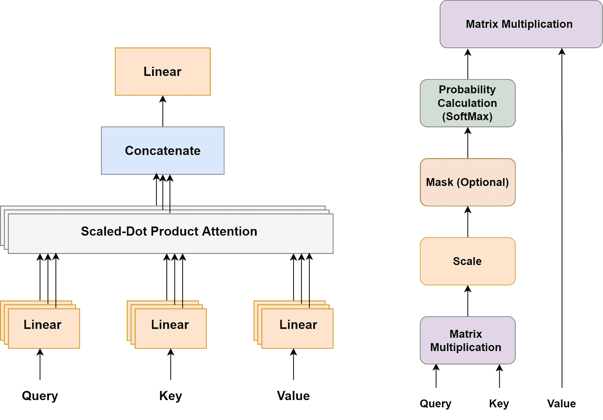
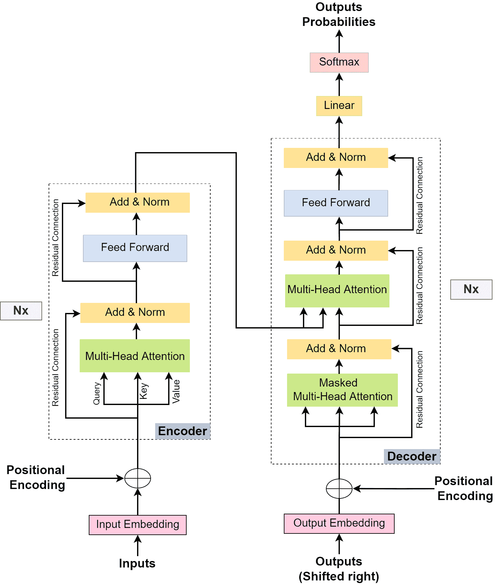
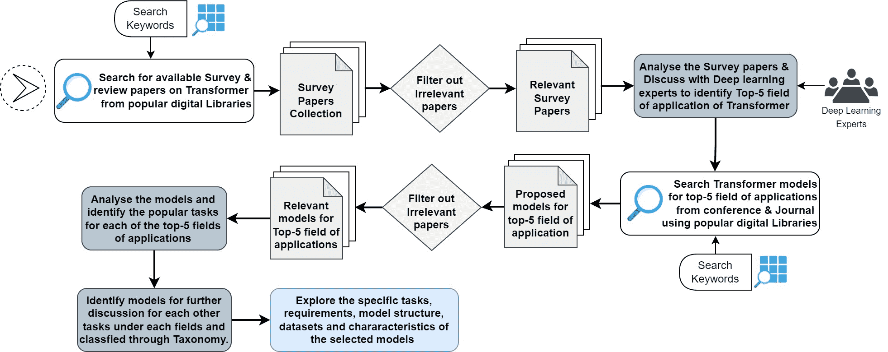
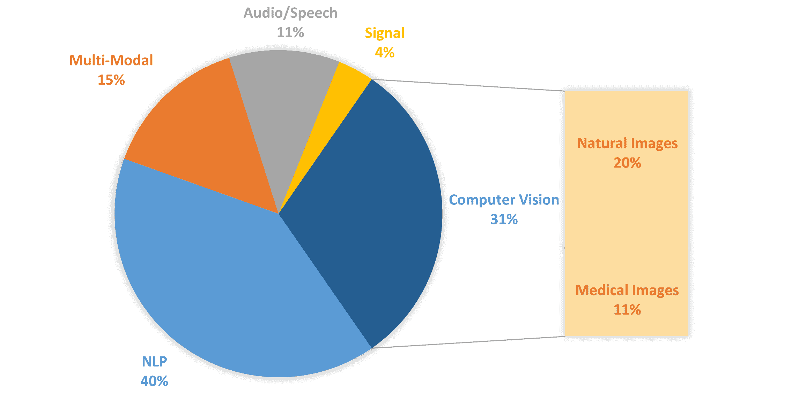

<!--yml

类别：未分类

日期：2024-09-06 19:39:10

-->

# [2306.07303] 深度学习任务中的变换器应用的综合调查

> 来源：[`ar5iv.labs.arxiv.org/html/2306.07303`](https://ar5iv.labs.arxiv.org/html/2306.07303)

# 深度学习任务中的变换器应用的综合调查

深度学习任务中的变换器

Saidul Islam¹, Hanae Elmekki¹, Ahmed Elsebai¹, Jamal Bentahar^(1,2,∗), Najat Drawel ¹, Gaith Rjoub^(3,1), Witold Pedrycz^(4,5,6,7)

¹康考迪亚大学信息系统工程研究所，加拿大蒙特利尔

²哈利法大学电气工程与计算机科学系，阿布扎比，阿联酋

³约旦公主苏玛亚科技大学计算科学系

⁴阿尔伯塔大学电气与计算机工程系，加拿大埃德蒙顿

⁵波兰科学院系统研究所，波兰华沙

⁶伊斯廷耶大学计算机工程系，土耳其伊斯坦布尔

⁷阿卜杜拉齐兹国王大学电气与计算机工程系，沙特阿拉伯吉达

^∗通讯作者电子邮件：jamal.bentahar@concordia.ca

贡献作者电子邮件：saidul.islam@concordia.ca; hanae.elmekki@mail.concordia.ca;

ahmed.elsebai@outlook.com; n_drawe@encs.concordia.ca; g.rjoub@psut.edu.jo; wpedrycz@ualberta.ca

作者对本工作贡献均等

###### 摘要

Transformer 是一种深度神经网络，它采用自注意力机制来理解序列数据中的上下文关系。与传统神经网络或更新版的递归神经网络（RNN），如长短期记忆（LSTM）不同，transformer 模型在处理输入序列元素之间的长期依赖关系方面表现出色，并且能够进行并行处理。因此，基于 transformer 的模型在人工智能领域引起了研究人员的广泛关注。这可以归因于它们在自然语言处理（NLP）任务以及计算机视觉、音频和语音处理、医疗保健和物联网（IoT）等多个领域中的巨大潜力和卓越成就。尽管已有若干综述论文重点介绍了 transformer 在特定领域的贡献、架构差异或性能评估，但仍然缺乏一份全面的综述论文，涵盖其在各个领域的主要应用。因此，我们承担了填补这一空白的任务，通过对 2017 年至 2022 年提出的 transformer 模型进行广泛调查。我们的调查包括识别基于 transformer 的模型的五大应用领域，即：NLP、计算机视觉、多模态、音频和语音处理以及信号处理。我们分析了这些领域中影响力巨大的基于 transformer 的模型，并随后根据它们的任务使用提出的分类法对其进行分类。我们的目标是揭示 transformer 的现有潜力和未来可能性，为热心的研究人员提供启示，从而促进对这一突破性技术的更广泛理解。

关键词：自注意力；Transformer；深度学习；递归网络；长短期记忆-LSTM；多模态。

## 1 引言

深度神经网络（DNNs）已经成为人工智能领域中大多数基于学习的机器智能任务的主要基础设施和最先进的解决方案。虽然各种类型的 DNN 被用于特定任务，但多层感知器（MLP）代表了经典的神经网络形式，其特点是多个线性层和非线性激活函数（Murtagh，1990）。例如，在计算机视觉中，卷积神经网络通过卷积层处理图像，而递归神经网络则采用递归单元处理序列数据，特别是在自然语言处理（NLP）中（O’Shea & Nash，2015，Mikolov et al., 2010）。尽管递归神经网络被广泛使用，但它们仍然存在一些局限性。传统网络的主要问题之一是与梯度爆炸和消失相关的短期依赖。相比之下，要在 NLP 中取得良好的结果，必须捕捉长期依赖。此外，由于其序列数据处理和计算方法，递归神经网络的训练速度较慢（Giles et al., 1995）。为了解决这些问题，开发了递归网络的长短期记忆（LSTM）版本，它改善了递归神经网络的梯度下降问题，并增加了 NLP 任务的记忆范围（Hochreiter & Schmidhuber，1997）。然而，LSTM 仍然面临序列处理的问题，这阻碍了实际语境含义的提取。为应对这一挑战，引入了双向 LSTM，它从两个方向处理自然语言，即从左到右和从右到左，然后将结果连接起来以获得语境的实际含义。然而，这种技术仍然会导致语境真实含义的轻微丧失（Graves & Schmidhuber，2005，Li et al., 2020b）。

变压器是一种深度神经网络（DNNs），它们提供了解决序列到序列（seq-2-seq）架构局限性的方法，包括序列输入的短期依赖和输入的顺序处理，这阻碍了网络的并行训练。变压器利用多头自注意力机制提取特征，并展现出在自然语言处理（NLP）中的巨大应用潜力。与传统的递归方法不同，变压器使用注意力机制从序列的整个段落中学习，采用编码和解码模块。与 LSTM 和递归神经网络相比，变压器的一个关键优势是其能够捕捉上下文的真实含义，这要归功于其注意力机制。此外，变压器由于可以并行工作，计算速度更快，不像递归网络那样，并且可以使用图形处理单元（GPUs）进行计算，允许更快地处理大输入任务（Niu et al., 2021，Vaswani et al., 2017，Zheng et al., 2020）。变压器模型的优势激励了深度学习研究者探索其在不同应用领域中各种任务的潜力（Ren et al., 2023），从而产生了大量研究论文以及针对人工智能领域各种任务的变压器模型的发展（Yeh et al., 2019，Wang et al., 2019，Reza et al., 2022）。

在研究界，调研论文在提供生产性分析、比较和进步主题贡献方面的重要性得到了广泛认可。文献中可以找到大量关于变压器的调研论文。它们中的大多数都涉及特定的应用领域（Khan et al., 2022，Wang et al., 2020a，Shamshad et al., 2023），比较不同模型的性能（Tay et al., 2023，Fournier et al., 2021，Selva et al., 2023），或进行基于架构的分析（Lin et al., 2022）。然而，仍然需要一个明确定义的结构，全面关注顶级应用领域，并系统地分析变压器模型在这些领域中执行各种深度学习任务的贡献。

确实，对变换器应用进行调查将为热衷于深度学习的研究人员提供宝贵的参考资料，帮助他们更好地理解变换器模型在各个领域的贡献。这种调查将有助于识别和讨论潜在模型、它们的特性和工作方法，从而促进现有变换器模型的完善以及新型变换器模型或应用的发现。为了解决缺乏此类调查的问题，本文提供了对所有基于变换器的模型的综合分析，并确定了五个主要应用领域，即 NLP、计算机视觉、多模态、音频与语音以及信号处理，并提出了变换器模型的分类法，将重要模型根据其在这些领域内的任务执行进行分类和分析。此外，本文还分析了在这些应用领域内表现优异和重要的模型，并基于这些分析讨论了变换器模型的未来前景和挑战。

### 1.1 贡献与动机

尽管文献中已经存在若干关于变压器主题的综述文章，但我们进行这次综述的动机源于两个基本观察。首先，这些研究大多集中在变压器架构、模型效率以及特定的人工智能领域，如 NLP、计算机视觉、多模态、音频与语音以及信号处理。他们常常忽视了其他关键方面，比如基于变压器的模型在多个应用领域的深度学习任务中的执行。我们在本次综述中旨在涵盖所有主要的应用领域，并展示不同任务执行的重要模型。第二个动机是缺乏一个全面而系统的分析，涵盖各种流行应用领域及其相应的变压器模型利用情况，与不同应用领域内的深度学习任务相关联。我们提出了一个基于变压器模型最突出应用领域的高级分类框架。这些显著模型根据其在各自领域内的任务表现进行分类和评估。在这次综述中，我们突出变压器在研究者关注度较高或较低的应用领域。根据我们所知，这是第一篇提出变压器模型高级分类方案并提供一系列旨在实现两个目标的标准的综述论文：（1）评估变压器模型在各种应用中的有效性；（2）帮助有意探索和扩展变压器模型在新领域中能力的研究者。此外，本文还提供了对未来潜在应用的宝贵见解，并突出了该领域内尚未解决的挑战。

论文的其余部分组织如下。对于论文其余部分重要的初步概念在 2 节中进行了说明。用于检索相关研究文章的系统方法在 3 节中进行了详细描述。4 节展示了相关的综述论文，并讨论了与当前综述论文的相似之处和不同之处，帮助我们识别我们综述的独特特征和附加价值。5 节识别了迄今为止在不同应用领域提出的 Transformer 模型。6 节对所选科学文章进行了分类。7 节概述了未来工作的潜在方向。最后，8 节总结了论文的关键发现和贡献。

## 2 初步知识

在*深入*探讨 Transformer 文献之前，让我们描述一些将在本文中使用的概念。

### 2.1 Transformer 架构

Transformer 模型首次提出是在 2017 年用于机器翻译任务，此后，许多基于原始 Transformer 模型灵感开发的模型应运而生，以解决不同领域的各种任务。虽然一些模型采用了原始的 Transformer 架构，但也有一些模型仅利用了 Transformer 模型的编码器或解码器模块。因此，基于 Transformer 的模型的任务和性能会因所采用的具体架构而有所不同。然而，Transformer 模型的一个关键且广泛使用的组件是自注意力机制，它对其功能至关重要。所有基于 Transformer 的模型都使用自注意力机制和多头注意力，这通常构成了架构的主要学习层。鉴于自注意力机制的重要性，注意力机制在 Transformer 模型中的作用至关重要（Vaswani 等，2017）。

#### 2.1.1 注意力机制

自 1990 年代引入以来，注意力机制因其能够集中关注关键信息而获得了广泛认可。在图像处理领域，发现图像的某些区域比其他区域更为相关。因此，注意力机制被引入计算机视觉任务中，旨在根据应用中的上下文相关性强调重要部分。这项技术在计算机视觉中的应用取得了显著成果，从而推动了它在语言处理等其他领域的广泛采用。

2017 年，介绍了一种名为“Transformer”的新型基于注意力的神经网络，以解决其他神经网络（如递归神经网络（RNN））在编码序列中的长程依赖关系，特别是在语言翻译任务中的局限性（Vaswani 等，2017）。Transformer 模型中自注意力机制的引入，通过更好地捕捉局部特征并减少对外部信息的依赖，提升了注意力机制的性能。在原始 Transformer 架构中，注意力技术通过“缩放点积注意力”实现，该方法基于三个主要参数矩阵：查询（Q）、键（K）和值（V）。每个矩阵携带序列中每个输入的编码表示（Vaswani 等，2017）。应用 SoftMax 函数以获得注意力过程的最终输出，即从三个矩阵的权重组合中计算得出的概率得分（见图 1）。在数学上，缩放点积注意力函数的计算方式如下：

|  | $Attention(Q,K,V)=softmax\left(\frac{QK^{T}}{\sqrt{dk}}\right)V$ |  |
| --- | --- | --- |

矩阵$Q$和$K$分别代表查询向量和键向量，维度均为$dk$，而矩阵$V$则代表值向量。

图 1：多头注意力与缩放点积注意力（Vaswani 等，2017）

#### 2.1.2 多头注意力

在多头注意力模块中并行应用缩放点积注意力函数对于提取输入序列中不同片段之间的最大依赖关系至关重要。每个头用$k$表示，基于其自身可学习的权重$W^{kQ}$、$W^{kK}$和$W^{kv}$执行注意力机制。每个头计算出的注意力输出随后被连接在一起，并线性转换为期望维度的单一矩阵（Vaswani 等，2017）。

|  | $\displaystyle headk=Attention(QW^{kQ},KW^{kK},VW^{kV})$ |  |
| --- | --- | --- |
|  | $\displaystyle MultiHead(Q,K,V)=Concat(head1,head2,....headH)W^{0}$ |  |

多头注意力的使用帮助神经网络学习和捕捉输入序列数据的多样特征。因此，这增强了输入上下文的表示，因为它融合了来自注意力机制不同特征的信息，这些信息可以是短期的也可以是长期的。这种方法允许注意力机制共同作用，从而提高网络性能（Vaswani 等，2017）。

### 2.2 Transformer 模型的架构

Transformer 模型主要基于注意力机制（Vaswani 等，2017）开发，旨在处理序列数据。其卓越的表现，特别是在 NLP 翻译模型中达到最先进的基准，导致了 Transformer 的广泛使用。如图 2 所示，Transformer 模型的整体架构用于句子翻译任务中涉及使用注意力机制。然而，对于不同的应用，Transformer 架构可能会根据具体要求有所变化。

图 2: Transformer 架构 (Vaswani 等，2017)

初始的 Transformer 架构基于自回归序列转导模型开发，包括两个主要模块，即编码器和解码器。这些模块根据任务需要被执行多次。每个模块包含几个层，这些层整合了注意力机制。特别地，注意力机制在 Transformer 架构中并行执行多次，这解释了多个“注意力头”的存在（Vaswani 等，2017）。

#### 2.2.1 编码器模块

转换器架构中的堆叠模块包含两个基本层，即前馈层和多头注意力层。此外，它还在两个层之间加入了残差连接，以及两个加法归一化层，这些层起着关键作用（Vaswani et al., 2017）。在文本翻译的情况下，编码器模块接收一个嵌入输入，该输入是通过嵌入层和位置编码层基于输入的含义和位置信息生成的。从嵌入输入中，创建了三个参数矩阵，即查询矩阵（$Q$）、键矩阵（$K$）和值矩阵（$V$），以及位置编码信息，这些都通过“多头注意力”层处理。接下来，前馈层解决了计算过程中可能出现的秩崩溃问题。此外，每一步都应用了归一化层，这通过在每层中归一化用于梯度计算的权重来减少层之间的依赖。为了应对梯度消失问题，残差连接被应用于注意力层和前馈层的每个输出，如图 2 所示。

#### 2.2.2 解码器模块

转换器架构中的解码器模块类似于编码器模块，但增加了额外的层，如掩码多头注意力（**Masked Multi-Head Attention**）。除了前馈层、多头注意力层、残差连接层和加法归一化层之外，解码器还包含掩码多头注意力层。这些层使用缩放点积和掩码操作来排除未来的预测，只考虑之前的输出。注意力机制在解码器中应用两次：一次用于计算目标输出元素之间的注意力，另一次用于找到编码输入和目标输出之间的注意力。每个注意力向量随后通过前馈单元，以使输出对各层更加易于理解。生成的解码结果随后被解码器顶部的线性（Linear）和 SoftMax 层捕获，以计算转换器架构的最终输出。此过程重复多次，直到找到句子的最后一个标记（Vaswani et al., 2017），如图 2 所示。

## 3 研究方法论

在本次调查中，我们收集并分析了最近在审稿期刊和会议上发布的有关变换器的调查文献，旨在研究它们的贡献和局限性。为了收集相关论文，我们采用了两步策略：(1) 使用多个已知的搜索引擎进行搜索，并根据关键词“调查”、“综述”、“变换器”、“注意力”、“自注意力”、“人工智能”和“深度学习”选择论文；(2) 评估选定的论文，并剔除那些被认为与我们研究不相关的论文。我们调查的详细组织结构如图 3 所示。

图 3：调查方法

确实，通过对调查论文和深度学习专家讨论的全面审查，我们确定了变换器模型的前五个应用领域，它们是：(i) 自然语言处理 (NLP)，(ii) 计算机视觉，(iii) 多模态，(iv) 音频/语音，和 (v) 信号处理。随后，我们对在上述各个应用领域中呈现变换器模型的期刊和会议论文进行了系统搜索，使用了表 LABEL:tab:_methodology_table 中呈现的关键词。我们的搜索在每个领域中产生了大量论文，我们对这些论文进行了彻底的审查和评估。我们选择了提出新颖的基于变换器或变换器启发的深度学习任务模型的论文，同时忽略了其他论文。通过对这批模型的广泛审查，我们确定了与每个应用领域相关的流行深度学习任务。

由于在此过程中我们审查了超过 600 个变换器模型，因此对如此大量的模型进行分类和深入分析每个应用领域中的每个任务变得极其困难。因此，我们选择对每个应用领域中的多个变换器模型进行更全面的分析。这些模型是根据特定标准选择的，并进行了相应的深入分析。所选模型如下：

1.  1.

    首次提出基于变换器的模型来执行深度学习任务，并为变换器应用领域的研究开辟了新路径。

1.  2.

    与传统架构相比，提出了替代或新颖的方法来实现变换器的注意力机制的模型，例如引入新的注意力机制或增强位置编码模块。

1.  3.

    变换器模型在该领域产生了重大影响，引用率较高，已被科学界广泛接受。这些模型也为变换器应用的突破做出了贡献。

1.  4.

    这些模型及其变体被提出用于将变换器技术应用于实际世界应用，旨在实现比其他深度学习方法更优的性能结果。

1.  5.

    基于变换器的模型在理论和应用人工智能领域产生了重大轰动。

表 1：变换器模型的应用领域、用于论文搜索的关键词、流行深度学习任务、相关论文数量以及分类法和进一步讨论中选择的模型数量。

| 应用领域 | 论文搜索关键词 | 应用任务 | 论文数量 |
| --- | --- | --- | --- |
|  |  |  |

&#124; 相关模型 &#124;

&#124; 使用关键词 &#124;

|

&#124; 选择的模型 &#124;

&#124; 分类法 &#124;

|

| --- | --- | --- | --- | --- |
| --- | --- | --- | --- | --- |

|

&#124; 自然语言 &#124;

&#124; 处理 &#124;

|

&#124; “自然语言处理”, &#124;

&#124; “自然语言处理”,“文本”,“文本处理”, &#124;

&#124; “变换器”, “注意力”, &#124;

&#124; “自注意力”, “多头 &#124;

&#124; 注意力”, “语言模型”。 &#124;

| 语言翻译 | 257 | 25 |
| --- | --- | --- |
|  |  |

&#124; 文本分类与分割 &#124;

|  |  |
| --- | --- |
|  |  | 问答 |  |  |
|  |  | 文本摘要 |  |  |
|  |  | 文本生成 |  |  |
|  |  |

&#124; 自然语言推理 &#124;

|  |  |
| --- | --- |
|  |  |

&#124; 自动符号化 &#124;

&#124; 推理 &#124;

|  |  |
| --- | --- |
| 计算机视觉 |

&#124; “变换器”,“注意力”, &#124;

&#124; “自注意力”,“图像”, &#124;

&#124; “自然图像”,“医学 &#124;

&#124; 图像”,“生物医学”, &#124;

&#124; “健康”,“图像处理”, &#124;

&#124; “计算机视觉”,“视觉”。 &#124;

|

&#124; 自然图像 &#124;

&#124; 处理 &#124;

|

&#124; 图像 &#124;

&#124; 分类 &#124;

| 197 | 27 |
| --- | --- |
|  |  |  |

&#124; 识别与 &#124;

&#124; 目标检测 &#124;

|  |  |
| --- | --- |
|  |  |  |

&#124; 图像 &#124;

&#124; 分割 &#124;

|  |  |
| --- | --- |
|  |  |  | 图像生成 |  |  |
|  |  |

&#124; 医学图像 &#124;

&#124; 处理 &#124;

|

&#124; 图像 &#124;

&#124; 分割 &#124;

|  |  |
| --- | --- |
|  |  |  |

&#124; 图像 &#124;

&#124; 分类 &#124;

|  |  |
| --- | --- |
|  |  |  |

&#124; 图像 &#124;

&#124; 翻译 &#124;

|  |  |
| --- | --- |
| 多模态 |

&#124; “变换器”,“注意力”, &#124;

&#124; “自注意力”,“多头 &#124;

&#124; 注意力”,“多模态”, &#124;

&#124; “多模态”,“文本-图像”, &#124;

&#124; “图像-文本”,“视频-音频- &#124;

&#124; 文本, “文本-音频”,“音频-文本”, &#124;

&#124; “视觉-语言”, &#124;

&#124; “语言-视觉”。 &#124;

|

&#124; 分类与 &#124;

&#124; 分割 &#124;

| 94 | 20 |
| --- | --- |
|  |  | 可视化问答 |  |  |
|  |  | 视觉描述 |  |  |
|  |  |

&#124; 视觉常识 &#124;

&#124; 推理 &#124;

|  |  |
| --- | --- |
|  |  |

&#124; 文本/图像/视频/语音 &#124;

&#124; 生成 &#124;

|  |  |
| --- | --- |
|  |  | 云任务计算 |  |  |
| 音频与语音 |

&#124; “Transformer”，“注意力机制”，&#124;

&#124; “自注意力机制”，“多头 &#124;

&#124; 注意力机制”，“音频”，“语音”，&#124;

&#124; “音频处理”，“语音 &#124;

&#124; 处理”，&#124;

| 音频与语音识别 | 70 | 16 |
| --- | --- | --- |
|  |  | 音频与语音分离 |  |  |
|  |  | 音频与语音分类 |  |  |
| 信号处理 |

&#124; “Transformer”，“注意力机制”，&#124;

&#124; “自注意力机制”，“多头 &#124;

&#124; 注意力机制”，“信号”，“信号 &#124;

&#124; 处理”，“无线”，&#124;

&#124; “无线信号”，“无线 &#124;

&#124; 网络”，“生物信号”，“医学 &#124;

&#124; 信号”。&#124;

|

&#124; 无线网络信号 &#124;

&#124; 处理 &#124;

| 23 | 11 |
| --- | --- |
|  |  | 医学信号处理 |  |  |
|  |  |  |  |  |  |

在应用领域，我们基于模型的任务执行情况对所选模型进行了分类，并开发了变换器应用的分类法。我们的分析涉及了对模型的全面检查，包括它们的结构、特征、操作方法和数据集等。基于这项调查，我们深入讨论了变换器的潜在未来应用。为了进行这项研究，我们查阅了各种著名的研究资源库，如“AAAI”、“ACM”、“ACL”、“CVPR”、“ICML”、“ICLR”、“ICCV”、“NeurlIPS”、“LREC”、“IEEE”、“PMLR”、“国家医学图书馆”、“SCOPUS”、“MDPI”、“ScienceDirect”和“康奈尔大学 arxiv 图书馆”。表 LABEL:tab:_methodology_table 展示了所选模型的类别。

## 4 相关工作

由于其有效性和广泛的应用范围，近年来变压器受到了许多调查的关注。我们在各种数字图书馆记录了 50 多篇关于变压器的调查论文，并对其进行了审查。在仔细考虑了这些调查后，我们选择了 17 篇重要的调查论文，对其工作进行了进一步深入分析。在此过程中，我们考虑了发表在知名会议和期刊上且具有高引用量的调查，而丢弃了尚未发表的论文。我们对这组 17 篇论文进行了广泛的分析，深入研究了它们的内容，并调查了它们各自的工作和应用领域。我们优先考虑研究现有调查与我们自己论文之间的相似之处和差异。我们的调查结果表明，许多调查主要集中在变压器的架构和效率上，而其他的则专注于在自然语言处理和计算机视觉中的应用。然而，只有少数研究了变压器在涉及文本和图像数据的多模组合中的利用。这些发现以及支持细节被呈现在表 LABEL:tab:related_works 中。

有几篇综述性论文将注意力集中在变压器的架构和性能分析上。其中，名为“变压器调查”的调查论文以其对不同 X 形变压器的全面考察以及基于架构、预训练和应用的分类法而脱颖而出（Lin 等人，2022）。另一篇名为“高效变压器：一项调查”的调查论文旨在比较 X 形变压器的计算能力和内存效率（Tay 等人，2023）。此外，另一篇论文着眼于轻量快速的变压器，并探讨了标准变压器的不同高效替代品（Fournier 等人，2021）。

在自然语言处理领域，存在一篇名为“用于自然语言处理的变压器可视化：一项简要调查”的调查论文（Brasoveanu & Andonie，2020）。这项研究特别关注于通过视觉分析技术有效审视和理解变压器的不同方面。另一篇调查论文深入探讨了用于自然语言处理的预训练基于变压器的模型（Subramanyam 等人，2021b）。该研究广泛讨论了这些模型中采用的预训练方法和任务。此外，它介绍了一个有效分类了文献中广泛范围的基于变压器的预训练语言模型（T-PTLMs）。

此外，题为“自动文本摘要与变换器模型适用性的调查”的论文专注于使用变换器进行文本摘要任务，并提出了一种解决长序列输入问题的变换器模型（Wang et al., 2020a）。另一方面，另一篇调查研究了将双向变换器编码器（BERT）应用于多层作为词嵌入工具（Kaliyar, 2020）。此外，变换器在文本数据中检测不同情感水平的应用在（Acheampong et al., 2021）中进行了探讨，标题为“基于变换器模型的文本情感检测：基于 BERT 的 approaches 综述”。另一篇论文探讨了变换器语言模型在不同信息系统中的使用（Gruetzemacher & Paradice, 2022）。该论文重点研究了将变换器作为文本挖掘工具，从大型组织的数据中提取有用数据。

由于近年来图像处理任务的巨大进步以及在计算机视觉中的惊人应用，变换器模型在计算机视觉研究人员中获得了广泛的关注。例如，“视觉中的变换器：调查”提供了计算机视觉领域现有变换器模型的全面概述，并根据流行的识别任务对模型进行了分类（Khan et al., 2022）。一项细致的调查分析了领先的“视觉变换器”的优缺点。本研究特别强调了对这些顶级模型相关训练和测试数据集的审查，提供了有关其性能和适用于各种应用的宝贵见解（Han et al., 2023）。

另一篇调查论文比较了针对图像和视频数据开发的变换器模型，并基于其在分类任务中的表现进行评估（Selva et al., 2023）。另一篇调查论文强调了计算机视觉和多模态的最新进展（Xu et al., 2022），比较了不同变换器模型的性能，并提供了有关其预训练的一些信息。此外，一篇现有的调查详细描述了为医学图像开发的几种变换器模型；然而，它未提供有关医学信号的信息（Li et al., 2023）。另一篇论文概述了医学领域开发的变换器模型；然而，它仅涉及医学图像，而非医学信号（Shamshad et al., 2023）。

多模态在深度学习任务中越来越受欢迎，这帮助解读了几篇关于集中在多模态领域的变压器的调查论文。一篇论文致力于基于任务对变压器视觉语言模型进行分类，并总结了它们的相应优缺点。此外，这篇调查论文涵盖了视频语言预训练模型，并将模型分为单流和多流结构，同时在此调查中还比较了模型的性能（Ruan & Jin，2022）。另一篇调查，“变压器架构在语言和视觉交叉模态任务中的视角和前景”，探索了多模态视觉语言任务中的变压器（Shin et al.，2022）。除了自然语言处理、计算机视觉和多模态，变压器还受到研究人员的重大关注，应用于时间序列和推理任务等其他领域。

表 2：我们调查与现有调查的比较总结

| 方法 | 应用领域 | 相似之处 | 差异 |
| --- | --- | --- | --- |
| Q Fournier et al. (Fournier et al.，2021) | 性能/架构 | • 提出了变压器的分类，该分类基于注意力机制的修改或架构修改 | • 该论文调查了比标准变压器更高效的不同替代方案，这些替代方案通过修改注意力机制或网络架构进行分类。他们的分类基于架构的变化或注意力机制的变化，而我们的分类则由应用领域驱动。 |
| T. Lin et al. (Lin et al.，2022) | 性能/架构 | • 提出了涵盖多个领域的 X-formers 分类法 | • 该现有调查从架构修改、预训练和非常小的应用视角比较了 X-formers，而我们的调查深入关注每个应用领域下的热门任务。• 该引人注目的调查中缺少无线/医疗信号处理和云计算任务的应用，而我们的调查涵盖了这些任务和应用。 |
| Y. Tay et al. (Tay et al.，2023) | 性能/架构 | • 提出了一个考虑变压器模型在语言和视觉领域主要使用情况的分类法。 | • 这篇现有的调查比较了变压器模型的计算能力和内存效率，而我们的调查关注深度学习任务和应用。• 这篇引人注目的调查仅关注语言和视觉领域，而我们涵盖了变压器应用的其他五个重要领域：自然语言处理、计算机视觉、多模态、音频/语音和信号处理。 |
| A. M. P. Braşoveanu 等人（Brasoveanu & Andonie, 2020） | 自然语言处理-NLP | • 解释 transformer 架构并说明其特征。 | • 我们的调查描述了 transformer 模型及其在各种任务中的重要模型工作处理。然而，现有的论文专注于用于解释最新 transformer 架构的可视化技术，并探索了两大类工具来解释 Transformers 的内部工作原理。• 我们涵盖了 transformer 应用的五个领域：NLP、计算机视觉、多模态、音频/语音和信号处理，本次激动人心的调查仅专注于 NLP 模型。 |
| W Guan 等人（Wang et al., 2020a） | 自然语言处理-NLP | • 调查 transformers 的一个应用领域，即文本摘要，这也是我们调查中涵盖的应用领域之一 | • 作者提出了一种基于 transformer 的摘要生成器，解决了标准 transformers 无法处理长文本输入的问题。他们调查了将 transformers 应用于不同文本摘要任务的不同用例，但仅涵盖了文本摘要。我们调查中没有建立提出的 transformers。 |
| R Kumar（Kaliyar, 2020） | 自然语言处理-NLP | • 讨论 BERT 执行的不同 NLP 下游任务。我们的调查中也涵盖了 BERT 以及不同的 NLP 任务 | • 调查使用 BERT 作为词嵌入工具与传统词嵌入技术的不同技术。他们的调查仅专注于将 transformers 作为嵌入文本的工具 |
| F Acheampong 等人（Acheampong et al., 2021） | 自然语言处理-NLP | • 调查完成情感检测任务的不同 transformer 架构。我们也做了相同的工作，即将不同的 transformers 应用于相同类型的任务 | • 调查 transformer 架构在单一应用领域中的应用，但细节过多，即从基于文本的数据中进行情感检测，这是一种情感分析形式，但目标是从数据中提取细致的情感。情感分析任务在我们的调查中有所涵盖，但我们没有特别涵盖不同层次的情感检测任务，而不仅仅是如情感分析中通常所做的二分类任务 |
| R Gruetzemacher 等人（Gruetzemacher & Paradice, 2022） | 自然语言处理-NLP | • 调查 transformers 在文本挖掘应用领域的进展。我们的调查涵盖了 transformers 在各种任务上的进展 | • 探讨不同的 transformers 如何用作文本挖掘器，处理拥有大量非结构化数据的组织，较传统的 NLP 文本挖掘技术 |
| J. Selva 等（Selva et al., 2023） | 计算机视觉 | • 本文概述了用于建模图像和视频数据的变换器 | • 本调查仅关注图像和视频数据。模型根据其在视频分类中的表现进行比较，不涉及其他应用。本文提出了基于变换器的不同模型的分类法，依据其递归特性、内存容量和架构设计 |
| K. S. Kalyan 等（Subramanyam et al., 2021a） | 自然语言处理-医疗 | • 本文概述了用于各种 NLP 任务的变换器基础 BPLMs，包括自然语言推断、实体提取、关系提取、语义文本相似性、文本分类、问答和文本摘要 | • 本调查仅涉及基于变换器的生物医学预训练语言模型，将其范围限制在生物医学自然语言处理的特定领域。分类法不根据模型的应用类型进行区分，而是根据预训练的数据集、嵌入类型以及其他标准，如目标语言 |
| K. Han 等（Han et al., 2023） | 计算机视觉 | • 根据不同任务对视觉变换器模型进行分类 | • 该现有文献分析了变换器模型的优缺点，以及用于骨干网络的高效变换器方法，而我们的调查根据任务对变换器模型进行分类，并总结了下游任务和常用数据集。 • 虽然我们的调查论文将计算机视觉任务分为两个部分：自然图像处理和医疗图像处理，然后重点关注流行的计算机视觉任务，如视觉问答、分类、分割、问答等，而该现有文献重点关注高/中级视觉、低级视觉和视频处理计算机视觉任务。 • 本调查仅关注计算机视觉任务，而我们则覆盖了包括 NLP、多模态、音频/语音和信号处理在内的其他四个应用领域，以及计算机视觉。 |
| Y. Xu 等（Xu et al., 2022） | 计算机视觉 | • 该调查类似于我们的调查，涵盖了计算机视觉和多模态领域 | • 本调查主要关注计算机视觉领域的最新进展，通过比较不同变换器模型的表现。具体而言，本研究讨论了四个研究领域：用于图像分类的 ViT 模型设计的进展、高级视觉任务（如目标检测和语义分割）、低级视觉任务（如超分辨率和图像生成），以及多模态学习（如视觉问答（VQA）、图像描述） |
| J Li 等（Li 等, 2023） | 计算机视觉 | • 本文对涉及医学视觉的几个任务中的变换器模型进行了比较分析。在比较论文时考虑了几个标准，包括数据集类型、输入数据类型和模型架构 | • 本文详细描述了为医学图像开发的几种变换器模型；然而，它没有提供有关医学信号的信息 |
| F Shamshad 等（Shamshad 等, 2023） | 医学计算机视觉 | • 回顾了若干变换器模型，重点关注一些与医学图像和不同图像模态相关的任务，并描述了这些任务使用的数据集 | • 本文比较了从 CNNs 到视觉变换器的深度学习模型。本文讨论了医学图像模态和若干医学计算机视觉任务，通过数据集的具体描述比较论文，并提供了模型性能的概述。本文的比较仅基于医学图像，不考虑医学信号 |
| Salman Khan 等（Khan 等, 2022） | 计算机视觉 | • 对现有变换器计算机视觉模型进行了概述，并根据流行任务对模型进行了分类 | • 尽管该现有调查论文在建筑设计和实验价值方面比较了流行技术，但我们的调查是基于流行任务和应用进行的 | • 在计算机视觉部分，我们特别关注医学图像任务，而不仅仅是自然图像处理 | • 该调查仅关注计算机视觉任务，而我们涵盖了除计算机视觉外的其他四个应用领域，即 NLP、多模态、音频/语音和信号处理 |
| L. Ruan 等（Ruan & Jin, 2022） | 多模态（NLP-CV） | • 基于任务对变换器视觉语言模型进行分类，并总结下游任务和常用的视频数据集 | • 该现有调查仅关注多模态（NLP-CV）任务，而我们则涵盖了除多模态外的其他四个应用领域——NLP、计算机视觉、音频/语音和信号处理 |
| A Shin 等（Shin 等, 2022） | 多模态（性能/架构） | • 他们调查了用于多模态任务的变换器，这也是我们在不同应用任务中涵盖的内容 | • 详细讨论了一个应用领域，即多模态视觉语言任务 |
|  |  |  |  |

在对这些调查论文进行彻底的搜索和分析后，我们意识到，仍然缺乏一项专注于**变压器**在最常见应用领域的调查，并讨论了基于变压器的模型在不同深度学习任务中的贡献。在本文中，我们首先基于我们最好的搜索，对所有现有的基于变压器的模型进行了调查，确定了前$5$个应用领域以及变压器模型在这些领域的贡献比例：自然语言处理（NLP）、计算机视觉（CV）、多模态、音频与语音，以及信号处理。此外，我们根据这五个主要应用领域提出了一个变压器模型的分类法，其中对表现优异和重要的模型进行了分类和分析，基于它们在相关领域任务的执行情况。通过这项调查，变压器模型在不同领域的任务和应用变得更加明确，同时也描述了变压器应用领域中获得更多或较少关注的情况。基于这项分析，我们讨论了未来变压器在不同应用领域的前景和可能性。这项调查的一个目标是为更好地理解变压器模型在不同领域的贡献以及那些对提升各领域任务性能有显著贡献的模型的特征和执行方法，提供一个综合的参考来源。此外，本文将成为有志研究者了解变压器模型未来应用可能性和范围的资源，他们希望扩展并研究变压器的新应用。

## 5 个变压器应用

自 2017 年以来，变压器模型已成为深度学习领域中一个极具吸引力的研究模型。最初是为处理长距离文本句子而开发的。然而，它的应用范围已扩展到超越 NLP 任务的各种应用。实际上，在 NLP 领域取得一系列成功后，研究人员将注意力转向计算机视觉，探索变压器模型的全局注意力能力的潜力，而卷积神经网络（CNNs）则擅长于跟踪局部特征。变压器模型也在其他各种领域和任务中进行了测试和应用。为了更深入地了解变压器的应用，我们对各种研究库进行了全面搜索，并审查了自$2017$年至今的变压器模型。我们的搜索结果显示，约有$650$多个基于变压器的模型正在各种领域中应用。

我们识别了变压器模型被使用的主要领域，包括自然语言处理、计算机视觉、多模态应用、音频和语音处理以及信号处理。我们的分析提供了每个领域中可用变压器模型的概述、它们的应用以及对各自行业的影响。

图 4：变压器应用在前五大领域中的比例

图 4 显示了迄今为止在不同应用领域中提出的变压器模型的百分比细分。我们的分析揭示了约$250$个用于自然语言处理的变压器模型，占总收集的变压器模型的约$40\%$。此外，我们还统计了约$200$个计算机视觉模型。由于自然和医学图像的处理方式不同以及这两个领域的广泛增长，我们将计算机视觉分为两个类别：（i）自然图像处理和（ii）医学图像处理。根据这一分类，自然图像处理占变压器模型的$20\%$，医学图像处理占$11\%$，二者合计占变压器模型的$31\%$。此外，我们的分析识别出约$90$个用于多模态应用的变压器模型，占总数的$15\%$，以及约$70$个用于音频和语音处理的模型，占总变压器模型的$11\%$。最后，仅有$4\%$的变压器模型记录在信号处理领域。

我们的分析清晰地展示了各领域对变压器应用的关注比例，方便识别进一步的研究领域和可以实施变压器模型的任务。

## 6 基于应用的变压器分类法

通过对所有选定文章进行全面分析，根据第三部分中解释的方法，我们注意到现有的分类没有完全涵盖基于变换器的模型及其在不同领域的多样化应用。因此，本研究旨在提出一个更全面的变换器分类法，以反映其实际应用。为实现这一目标，我们仔细审查了大量变换器模型，并根据其在各自应用领域中的任务进行分类。我们的分析识别出了一些在多个领域成功应用的具有重大影响和意义的基于变换器的模型。然后，我们将这些模型组织到五个不同的应用领域中：自然语言处理（NLP）、计算机视觉、多模态、音频与语音以及信号处理。图 5 中提出的分类法提供了一个更细致和全面的框架，用于理解变换器的多样化应用。我们相信这一分类法将对研究变换器模型的研究人员和从业者有所帮助，因为它将帮助他们识别出最相关的模型和技术。

图 5：基于应用的变换器模型分类法

### 6.1 自然语言处理（NLP）

变换器已成为自然语言处理中的重要工具，许多 NLP 任务都从这些模型中获益匪浅。我们提出的分类法专注于 NLP，将变换器模型组织为七种流行的 NLP 任务，包括翻译、摘要、分类与分割、问答、文本生成、自然语言推理和自动符号推理。为了确保全面分析，我们仅考虑了那些对 NLP 领域产生重大影响并提高其性能的变换器模型。我们的分析包括对每个 NLP 任务的深入讨论，以及表格 LABEL:tab:language_Translation 中展示的每个模型的关键信息。我们还突出说明了每个模型的意义和工作方法。这种分类法提供了一个有价值的框架，用于理解 NLP 中不同的变换器模型及其实际应用。它可以帮助研究人员和从业者选择最适合其特定 NLP 任务的变换器模型。

#### 6.1.1 语言翻译

语言翻译是自然语言处理中的一个基本任务，旨在将输入文本从一种语言转换为另一种语言。其主要目标是生成一个准确反映源文本含义的目标语言输出文本。例如，给定一个英语句子作为输入文本，该任务旨在生成其法语或其他所需语言的等效句子。原始 Transformer 模型专门为语言翻译目的而开发，突显了这一任务在自然语言处理领域的重要性。表 LABEL:tab:language_Translation 列出了在语言翻译任务中表现显著的基于 Transformer 的模型。这些模型在促进跨语言的有效沟通与合作中发挥了至关重要的作用，能够更高效地进行信息交流和知识共享。总体而言，语言翻译任务代表了自然语言处理领域的一个关键研究方向，对商业、科学、教育和社会互动等多个应用领域具有重要影响。表中呈现的基于 Transformer 的模型为推动该领域的最先进技术提供了有希望的解决方案，为语言翻译的新颖和创新方法铺平了道路（Chowdhary & Chowdhary，2020，Monroe，2017，Hirschberg & Manning，2015）。

表 3：用于自然语言处理的 Transformer 模型 - 语言翻译任务

| Transformer 模型 | 完成的任务 | 年份 | 架构（编码器/解码器） | 预训练（是/否） | 预训练数据集 | 数据集（微调，训练，测试） |
| --- | --- | --- | --- | --- | --- | --- |
| Transformer-2017 (Vaswani 等，2017) | 语言翻译 | 2017 | 编码器 & 解码器 | 否 | NA | WMT 2014 英语-德语，WMT 2014 英语-法语 |
| XLM (Conneau & Lample，2019) | 多语言翻译与分类 | 2019 | 编码器 & 解码器 | 是 | WMT’16，WMT’14 英语-法语，WMT’16（英语-德语，英语-罗马尼亚语，罗马尼亚语-英语） | 16 种 XNLI 语言的维基百科（英语，法语，西班牙语，俄语，阿拉伯语，中文，印地语，德语，希腊语，保加利亚语，土耳其语，越南语，泰语，乌尔都语，斯瓦希里语，日语） |
| BART (Lewis 等，2020) | 语言翻译，句子重构，理解，文本生成 | 2019 | 编码器 & 解码器 | 是 | 损坏文档，1M 步结合书籍和维基百科数据、新闻、故事和网络文本（训练） | SQuAD，MNLI，ELI5，XSum，ConvAI2，CNN/DM，CNN/DailyMail，WMT16 罗马尼亚语-英语，增补了 Sennrich 等（2016）的回译数据。 |
| Switch Transformer (Fedus 等, 2021) | 语言理解任务 - 翻译、问答、分类等。 | 2021 | 编码器与解码器 | 是 | C4（巨型清洁抓取语料库） | GLUE 和 SuperGLUE 基准测试，CNNDM，BBC XSum 和 SQuAD 数据集，ARC 推理挑战，3 个封闭书籍问答数据集（自然问题、网页问题和 Trivia QA），Winogrande 语料库挑战，对抗性 NLI 基准测试 |
|  |  |  |  |  |  |  |

+   •

    Transformer：2017 年，Vaswani 等（Vaswani 等, 2017）首次介绍了 Transformer 模型，这一模型自此彻底改变了 NLP 领域。Transformer 模型专门为语言翻译设计，被称为**Vanilla Transformer 模型**。与其前身不同，Transformer 模型结合了编码器和解码器模块，采用了**多头注意力**和**掩蔽多头注意力**机制。编码器模块负责分析输入语言的上下文信息，而解码器模块则利用编码器的输出和掩蔽多头注意力生成目标语言的输出。Transformer 模型的成功在很大程度上归功于其进行并行计算的能力，这使得它可以同时处理带有位置编码的信息。这一特性使其在处理大量文本时非常高效，并能够处理在语言翻译中至关重要的长距离依赖。

+   •

    XLM：这是一种跨语言预训练模型，旨在支持多种语言。该模型使用两种方法构建：监督方法和无监督方法。无监督方法利用了**掩蔽语言建模**（MLM）和**因果语言建模**（CLM）技术，在翻译任务中表现出显著的有效性。另一方面，监督方法进一步改善了翻译任务（Conneau & Lample, 2019）。这种监督与无监督学习的结合，使 XLM 模型成为一个强大的跨语言应用工具，使得在多种语言中执行自然语言处理任务成为可能。XLM 模型在翻译任务中的有效性使其成为自然语言处理领域研究者的热门选择。

+   •

    BART：BART（双向自回归变换器）是一个先进的预训练模型，主要用于清理损坏的文本。它具有两个预训练阶段：第一个阶段用噪声破坏文本，第二个阶段专注于从噪声版本中恢复原始文本。BART 使用一个集成了编码器和解码器模块的变换器翻译模型，使其能够以令人印象深刻的准确度执行文本生成、翻译和理解等各种任务（Lewis et al., 2020）。它的双向方法使其能够从过去和未来的标记中学习，而其自回归特性使其适合顺序生成输出标记。这些特性使 BART 成为一个极其通用的自然语言处理任务模型。

+   •

    Switch Transformer：Switch transformer 模型是 NLP 领域的最新发展，以其高精度执行各种任务而受到关注。它包含两个关键组件：基于排列的路由机制和门控机制。基于排列的路由机制允许模型学习一种路由策略，以选择输入序列中的哪些部分进行关注。这使得模型能够处理可变长度的输入，因为它可以动态确定每个输入的序列中需要关注的部分。门控机制使模型能够同时执行分类和分割任务。门控机制旨在学习如何结合输入序列不同部分的信息以进行预测。这使得模型能够通过预测整个输入序列的标签来执行分类任务，或通过预测输入序列每个部分的标签来执行分割任务。Switch transformer 是一个高度通用的模型，能够有效地执行分类和分割任务（Bogatinovski et al., 2022）。其详细描述可以在下面的分类与分割部分找到（Fedus et al., 2021）。

#### 6.1.2 分类与分割

文本分类和分割是自然语言处理（NLP）中的基本任务，能够实现对大量文本数据的自动组织和分析。文本分类涉及根据文本内容（如情感、主题或意图等）分配标签或标记。这一过程有助于对来自不同来源的文本文件进行分类，并在推荐系统、信息检索和内容过滤等多种应用中发挥作用。另一方面，文本分割涉及将文本划分为有意义的单元，如句子、单词或主题，以便进一步分析或处理。这项任务对于语言理解、摘要和问答等各种 NLP 应用至关重要（Chowdhary & Chowdhary，2020，Kuhn，2014，Hu 等，2016）。

基于 Transformer 的模型已被证明在文本分类和分割任务中取得了**最先进**的表现。这些模型的特点是能够捕捉文本中的长程依赖关系和上下文信息，使其非常适合复杂的自然语言处理任务。表格 LABEL:tab:classification_&_segmentation 突出了在文本分类和分割任务中表现突出的几种 Transformer 模型。

表 4：用于 NLP 的 Transformer 模型 - 语言分类与分割任务

| Transformer 模型 | 完成的任务 | 年份 | 架构（编码器/ 解码器） | 预训练（是/否） | 预训练数据集 | 数据集（微调、训练、测试） |
| --- | --- | --- | --- | --- | --- | --- |
| GPT 及其变体（Radford 等，2018; 2019，Brown 等，2020） | 文本分类、问答、文本蕴涵、语义相似性 | 2018 | 解码器 | 是 | 书籍语料库 | SNLI, MNLI, QNLI, SciTail, RTE, RACE, CNN, SQuaD, MRPC, QQP, STS-B, SST2 & CoLA |
| XLM（Conneau & Lample，2019） | 多语言翻译和分类 | 2019 | 编码器 & 解码器 | 是 | WMT’16, WMT’14 英语-法语，WMT’16（英语-德语，英语-罗马尼亚语，罗马尼亚语-英语） | 16 种 XNLI 语言的维基百科（英语、法语、西班牙语、俄语、阿拉伯语、中文、印地语、德语、希腊语、保加利亚语、土耳其语、越南语、泰语、乌尔都语、斯瓦希里语、日语） |
| T5（Raffel 等，2020） | 文本摘要、问答、文本分类 | 2020 | 编码器 & 解码器 | 是 | C4（大规模清洗爬取语料库） | GLUE 和 SuperGLUE 基准，CNN/每日邮件摘要，SQuAD 问答，WMT 英语到德语、法语和罗马尼亚语翻译 |
| Charformer (Tay et al., 2022) | 分类任务、毒性检测等。 | 2022 | 编码器 & 解码器 | 是 | 使用与 T5 模型相同的数据集-C4（庞大的清理抓取语料库） | GLUE IMDb、AGNews、（Maas et al., 2011）、（Zhang et al., 2015）、Civil Comments、Wikipedia Comments、TyDiQA-GoldP、XQuAD、MLQA、XNLI、PAWS-X.. |
| Switch Transformer (Fedus et al., 2021) | 语言理解任务- 翻译、问答、分类等。 | 2021 | 编码器 & 解码器 | 是 | C4（庞大的清理抓取语料库） | GLUE 和 SuperGLUE 基准，CNNDM、BBC XSum 和 SQuAD 数据集，ARC 推理挑战，3 个封闭书籍问答数据集（Natural Questions、Web Questions 和 Trivia QA），Winogrande Schema Challenge，对抗性 NLI 基准 |
|  |  |  |  |  |  |  |

+   •

    Charformer：这是一种基于变换器的模型，引入了基于梯度的子词分词（GBST），这是一种从字节级字符直接学习潜在子词的轻量级方法。该模型既有英语版本也有多语言版本，在语言理解任务上表现出色，例如长文本文档的分类（Tay et al., 2022）。

+   •

    Switch Transformer：使用预训练模型如 BERT 和 GPT，在大数据集上进行训练，在自然语言处理领域变得越来越受欢迎。然而，对于训练这些模型的经济和环境成本存在担忧。为了解决这些问题，Switch Transformer 被引入，它提供了更大的模型规模而不显著增加计算成本。Switch Transformer 用一个包含多个 FFN 的开关层替代了前馈神经网络（FFN），从而得到一个参数量达到万亿级的模型。尽管模型规模增加，Switch Transformer 的计算成本仍与其他模型相当。事实上，Switch Transformer 在 11 个不同任务上进行了评估，并在翻译、问答、分类和摘要等任务上显示出显著的改进（Fedus et al., 2021）。

    GPT 及其变体、XLM、T5：这些模型功能多样，能够执行一系列自然语言处理（NLP）任务，包括但不限于分类、分割、问答和语言翻译。第 6.1.3 ‣ 6 APPLICATION-BASED CLASSIFICATION TAXONOMY OF TRANSFORMERS ‣ A Comprehensive Survey on Applications of Transformers for Deep Learning Tasks")节将提供详细描述。

#### 6.1.3 问答系统

问答是一个经典的 NLP 任务。它涉及根据文本与查询的相关性，将文本查询匹配到最相关的答案。这项任务具有挑战性，因为找到一个简洁而准确的答案可能很困难（Chowdhary & Chowdhary, 2020, Hirschman & Gaizauskas, 2001）。近期的研究集中于此任务，导致了多个基于 Transformer 的模型的开发，这些模型利用深度学习技术来提高任务的准确性和效率。有关这些模型的详细概述见表 LABEL:tab:Question_Answering。

表 5：用于 NLP 的 Transformer 模型 - 问答任务

| Transformer 模型 | 完成的任务 | 年份 | 架构（编码器/ 解码器） | 预训练（是/否） | 预训练数据集 | 数据集（微调、训练、测试） |
| --- | --- | --- | --- | --- | --- | --- |
| BERT (Devlin et al., 2019) | 问答、句子预测、语言理解 | 2018 | 编码器 | 是 | 书籍语料库，英文维基百科 | SQuAD v1.1, SQuAD v2.0, SWAG, QNLI, MNLI |
| ELECTRA (Clark et al., 2020a) | 语言理解任务- 问答等 | 2020 | 编码器 | 是 | Wikipedia, BooksCorpus, ClueWeb, CommonCrawl, Gigaword | SQuAD 1.1, SQuAD 2.0, GLUE |
| GPT 及变体 (Radford et al., 2018; 2019, Brown et al., 2020) | 文本分类、问答、文本蕴含、语义相似性 | 2018 | 解码器 | 是 | 书籍语料库 | SNLI, MNLI, QNLI, SciTail, RTE, RACE, CNN, SQuaD, MRPC, QQP, STS-B, SST2 & CoLA |
| Switch Transformer (Fedus et al., 2021) | 语言理解任务- 翻译、问答、分类等。 | 2021 | 编码器 & 解码器 | 是 | C4(Colossal Clean Crawled Corpus) | GLUE 和 SuperGLUE 基准测试，CNNDM，BBC XSum 和 SQuAD 数据集，ARC 推理挑战，3 个封闭式问答数据集（自然问题，网络问题和 Trivia QA），Winogrande 方案挑战，敌对 NLI 基准测试 |
| T5 (Raffel et al., 2020) | 文本摘要、问答、文本分类 | 2020 | 编码器 & 解码器 | 是 | C4 (Colossal Clean Crawled Corpus) | GLUE 和 SuperGLUE 基准测试，CNN/Daily Mail 抽象摘要，SQuAD 问答，WMT 英语到德语、法语和罗马尼亚语翻译 |
| InstructGPT (Ouyang et al., 2022) | 文本生成、问答、摘要等。 | 2022 | 解码器 | 是 | 基于预训练模型 GPT-3 | SFT 数据集，RM 数据集，PPO 数据集，提示和完成数据集 Winogender，CrowS-Pairs，真实毒性提示，TruthfulQA，DROP，QuAC，SquadV2，Hellaswag，SST，RTE 和 WSC，WMT 15 法语 ! 英语，CNN/Daily Mail 摘要，Reddit TLDR 摘要数据集。 |
|  |  |  |  |  |  |  |

+   •

    BERT & BERT 变体：BERT 是变换器双向编码表示的缩写。它由 Google AI 团队提出，并嵌入在变换器的编码器模块中。BERT 采用双向方法，使其能够通过考虑每个词的上下文来对未标注的文本进行预训练。因此，BERT 在各种自然语言处理（NLP）任务中取得了显著的性能（Devlin et al., 2019）。

    各种基于 BERT 的模型已经开发出来，具有不同的特点。例如，有些模型针对快速计算进行了优化，而其他模型则在参数较少的情况下产生了更优的结果。有些模型还针对特定任务进行了调整，例如 RoBERTa，旨在用于掩码语言建模和下一句预测（Liu et al., 2019）。FlueBERT 是另一个可以用于文本分类、改写、自然语言推理、句法分析和词义消歧等任务的模型（Le et al., 2020）。此外，DistilBERT 适用于问答和其他特定任务。这些模型显著改进了预训练的变换器模型（Sanh et al., 2019）。

+   •

    GPT & GPT 变体：生成式预训练变换器（GPT）模型完全基于变换器的解码器块，这大大提高了变换器在自然语言处理中的进展。GPT 采用了半监督的语言理解方法，涉及无监督的预训练和监督的微调方法（Radford et al., 2018）。2019 年，在 GPT 模型取得成功后，推出了一个名为 GPT-2 的大规模预训练变换器模型，具有 15 亿个参数，显著改进了变换器的预训练版本（Radford et al., 2019）。随后，在 2020 年，发布了最大预训练版本的 GPT，具有 1750 亿个参数，称为 GPT-3。该模型比之前的非稀疏语言模型大 10 倍。GPT-3 最显著的成就之一是它在不需要梯度更新或微调的情况下，在各种任务中表现出强大的性能，这对像 BERT 这样的预训练模型来说是必须的（Brown et al., 2020）。

+   •

    Electra：是“Efficiently Learning an Encoder that Classifies Token Replacements Accurately”（高效学习一个准确分类词替换的编码器）的缩写，采用了一种与其他预训练模型不同的预训练方法。Electra 使用“掩码语言建模”方法，掩盖某些词并训练模型预测这些词。此外，Electra 还引入了一个“鉴别器”网络，帮助理解语言，而不需要记住训练数据。这种独特的方法使 Electra 能够生成更优质的文本，超越了 BERT 的表现（Clark et al., 2020a）。

    InstructGPT、T5 和 Switch Transformer：虽然 InstructGPT 模型可以生成文本，除了问答任务外，T5 在测试摘要任务中具有重要意义，而 Switch Transformer 模型也能执行分类和分割任务。更多关于这些模型的描述请参见 6.1.1 和 6.1.2。

#### 6.1.4 文本摘要

文本摘要是一项自然语言处理任务，涉及将冗长的文本分解成较短的版本，同时保留重要且有价值的信息，并保持文本的含义。文本摘要在理解冗长的文本文件时特别有用，它还帮助减少计算资源和时间（Chowdhary & Chowdhary, 2020，Tas & Kiyani, 2007）。基于 transformer 的模型在文本摘要任务中表现出色。文本摘要中的基于 transformer 的模型列在表 LABEL:tab:Summarization 中。

表 6：NLP 中的 Transformer 模型 - 文本摘要任务

| Transformer 模型 | 完成的任务 | 年份 | 架构（编码器/解码器） | 预训练（是/否） | 预训练数据集 | 数据集（微调，训练，测试） |
| --- | --- | --- | --- | --- | --- | --- |
| GPT 及变体（Radford et al., 2018; 2019，Brown et al., 2020) | 文本分类、问答、文本蕴涵、语义相似性 | 2018 | 解码器 | 是 | 书籍语料库 | SNLI, MNLI, QNLI, SciTail, RTE, RACE, CNN, SQuaD, MRPC, QQP, STS-B, SST2 & CoLA |
| PEGASUS (Zhang et al., 2020a) | 文本摘要 | 2020 | 编码器 & 解码器 | 是 | C4, HugeNews | XSum, CNN/DailyMail, NEWSROOM, Multi-News, Gigaword, arXiv, PubMed, BIGPATENT, WikiHow, Reddit TIFU, AESLC, BillSum |
| Switch Transformer (Fedus et al., 2021) | 语言理解任务 - 翻译、问答、分类等。 | 2021 | 编码器 & 解码器 | 是 | C4（Colossal Clean Crawled Corpus） | GLUE 和 SuperGLUE 基准测试，CNNDM，BBC XSum 和 SQuAD 数据集，ARC 推理挑战，3 个闭卷问答数据集（Natural Questions、Web Questions 和 Trivia QA），Winogrande Schema 挑战，Adversarial NLI 基准 |
| T5 (Raffel 等，2020) | 文本摘要、问答、文本分类 | 2020 | 编码器 & 解码器 | 是 | C4（Colossal Clean Crawled Corpus） | GLUE 和 SuperGLUE 基准，CNN/Daily Mail 抽象摘要，SQuAD 问答，WMT 英语到德语、法语和罗马尼亚语翻译 |
| InstructGPT (Ouyang 等，2022) | 文本生成、问答、摘要等 | 2022 | 解码器 | 是 | 基于预训练模型 GPT-3 | SFT 数据集、RM 数据集、PPO 数据集、提示和完成数据集 Winogender、CrowS-Pairs、真实毒性提示、TruthfulQA、DROP、QuAC、SquadV2、Hellaswag、SST、RTE 和 WSC、WMT 15 法语！ 英语、CNN/Daily Mail 摘要、Reddit TLDR 摘要数据集。 |
|  |  |  |  |  |  |  |

+   •

    PEGASUS：这是一个示范性的生成文本摘要模型，采用 Transformer 的编码器和解码器模块。虽然基于掩蔽语言建模的模型仅掩蔽少量文本，但 PEGASUS 会掩蔽整个多个句子，根据它们的重要性选择掩蔽的句子，并生成作为输出。该模型在未知摘要数据集上表现出显著的性能（Zhang 等，2020a）。

+   •

    T5：T5 Transformer 模型，代表文本到文本的迁移 Transformer，推出了一个名为“Colossal Clean Crawled Corpus (C4)”的数据集，提升了各种下游 NLP 任务的表现。T5 是一个多任务模型，可以通过相同的参数集训练以执行一系列 NLP 任务。经过预训练后，该模型可以针对不同任务进行微调，并取得与多个任务特定模型相当的性能（Raffel 等，2020）。

    GPT 及其变体、InstructGPT 和 Switch Transformer：这些模型在早期部分中已讨论过。此外，除了文本摘要之外，某些模型如 GPT 及其变体可以执行问答任务，InstructGPT 可以生成文本，Charformer 模型也能够进行分类和分割任务。

#### 6.1.5 文本生成

文本生成任务在 NLP 领域获得了极大的关注，因为它在生成长篇文档等应用中非常有用。文本生成模型试图从训练文本数据中推导意义，并创建与之前输出的文本之间的联系。这些模型通常基于这种联系进行操作（Chowdhary & Chowdhary，2020，Reiter & Dale，1997）。基于 Transformer 的模型在文本生成任务中取得了显著的进展。请参见表 LABEL:tab:Text_Generation。

表 7：用于 NLP 的 Transformer 模型 - 文本生成任务

| Transformer 模型 | 完成的任务 | 年份 | 架构（编码器/解码器） | 预训练（是/否） | 预训练数据集 | 数据集（微调、训练、测试） |
| --- | --- | --- | --- | --- | --- | --- |
| CTRL (Keskar et al., 2019) | 文本生成 | 2019 | 编码器 & 解码器 | 是 | Project Gutenberg, 子版块, 新闻数据, 亚马逊评论, 开放的 WebText, WMT 翻译数据, 问答对, MRQA | 多语言维基百科和开放的 WebText。 |
| BART (Lewis et al., 2020) | 语言翻译、句子重构、理解、文本生成 | 2019 | 编码器 & 解码器 | 是 | 破损文档，基于书籍和维基百科数据的 1M 步骤，新闻、故事和网络文本（训练） | SQuAD, MNLI, ELI5, XSum, ConvAI2, CNN/DM, CNN/DailyMail, WMT16 罗马尼亚语-英语，增加了来自 Sennrich 等 (2016) 的回译数据。 |
| ProphetNET (Qi et al., 2020) | 文本预测 | 2020 | 编码器 & 解码器 | 是 | Bookcorpus, 英文维基百科新闻、书籍、故事和网络文本 | CNN/dailymail, Giga-word 语料库, SQuAD 数据集。 |
| InstructGPT (Ouyang et al., 2022) | 文本生成、问答、摘要等 | 2022 | 解码器 | 是 | 基于预训练模型 GPT-3 | SFT 数据集, RM 数据集, PPO 数据集, 提示和完成数据集 Winogender, CrowS-Pairs, 真实毒性提示, TruthfulQA, DROP, QuAC, SquadV2, Hellaswag, SST, RTE 和 WSC, WMT 15 法语! 英语, CNN/Daily Mail 摘要, Reddit TLDR 摘要数据集。 |
|  |  |  |  |  |  |  |

+   •

    CTRL: 缩写 CTRL 代表条件转换器语言模型，它在生成类似人类语言的真实文本方面表现出色，具体取决于给定的条件。此外，CTRL 可以生成多种语言的文本。该模型规模庞大，拥有 16.3 亿个参数，可以针对各种生成任务进行微调，如问答和文本摘要 (Keskar et al., 2019)。

+   •

    ProphetNET: ProphetNET 是一个序列到序列模型，利用未来 n-gram 预测来促进文本生成，通过预测前面的 n-gram 来实现。该模型遵循转换器架构，包括编码器和解码器模块。它通过使用 n-stream 自注意机制而有所不同。ProphetNET 在摘要生成方面表现出色，并且在问题生成任务中也很有能力 (Qi et al., 2020)。

+   •

    InstructGPT: 这是为了解决语言生成模型无法产生现实且真实结果的问题而提出的解决方案。它通过在微调过程中结合人工反馈和从反馈中进行强化学习来实现这一点。GPT-3 模型为此进行了微调。因此，InstructGPT 能够生成更加现实和自然的输出，这在实际应用中非常有用。ChatGPT 采用了与 InstructGPT 类似的方法，并在 2022 年底（Ouyang 等， 2022）在 NLP 领域引起了广泛关注。

    BART: BART 模型的描述已在语言翻译部分提到。该模型也可以执行语言翻译任务。

#### 6.1.6 自然语言推理

自然语言推理的追求是一个与问答不同的研究领域。问答关注的是在给定的文本段落中找到特定查询的答案。另一方面，自然语言推理涉及将演绎推理应用于从给定的前提和用自然语言表示的规则中得出结论。神经网络架构旨在学习如何利用这些前提和规则来推断新的结论。以前，类似的任务通常由配备了以正式格式表示的知识和应用规则的系统来处理。然而，正式表示的使用对这一研究领域构成了重大挑战（Mark A Musen，1988）。随着变换器的出现及其在众多 NLP 任务中的卓越表现，现在可以绕过正式表示，让变换器直接使用自然语言进行推理。表 LABEL:tab:reasoning 突出了一些重要的用于自然语言推理任务的变换器模型。

表 8: 自然语言推理的变换器模型

| Transformer 模型 | 完成任务 | 年份 | 架构（编码器/解码器） | 预训练（是/否） | 预训练数据集 | 数据集（微调、训练、测试） |
| --- | --- | --- | --- | --- | --- | --- |
| (Clark et al., 2020) (Clark et al., 2020b) | 二分类 | 2020 | RoBERTa（编码器） | 是 | RACE | RuleTaker |
| (Richardson et al., 2022) (Richardson & Sabharwal, 2022) | 二分类 | 2022 | RoBERTa Large（编码器） | 是 | RACE | Hard-RuleTaker |
| (Saha et al., 2020) (Saha et al., 2020) | 二分类，序列生成 | 2020 | PRover 基于 RoBERTa | 否 | NA | RuleTaker |
| (Sinha et al., 2019) (Sinha et al., 2019) | 序列生成 | 2019 | BERT（编码器） | 否 | NA | CLUTRR |
| (Picco et al., 2021) (Picco et al., 2021) | 二分类 | 2021 | 基于 BERT（编码器） | 是 | RACE | RuleTaker |
|  |  |  |  |  |  |  |

+   •

    RoBERTa：在 Clark 等人（2020b）的 2020 年研究中，给变压器分配了一个二分类任务，旨在确定一个给定的陈述是否可以从一组用自然语言表示的前提和规则中推断出来。用于变压器的架构是 RoBERTa-large，经过在需要推理技能的高中考试问题数据集上的预训练。这种预训练使得变压器在测试数据集上达到了$98\%$的高准确率。数据集包含了随机抽样的理论，这些理论是通过一组名称和属性构建的。任务要求变压器将给定的陈述（Statement）与提供的前提和规则（Context）进行分类，以判断陈述是否跟随于前提和规则（Clark 等人，2020b）。

+   •

    RoBERTa-Large：在 Richardson & Sabharwal（2022）的工作中，作者旨在解决 Clark 等人（2020b）提出的数据集构建方法的局限性。他们指出，像（Clark 等人，2020b）中那样的均匀随机抽样理论并不总能产生具有挑战性的实例。为了克服这一局限性，他们提出了一种新颖的方法来创建更具挑战性的算法推理数据集。他们的方法的关键思想是从普通 SAT 命题公式中抽样困难实例，并使用预定义的英语规则语言将其翻译成自然语言。通过这种方法，他们能够构建一个更具挑战性的数据集，这对训练强健的模型和可靠的评估至关重要。为了验证他们的方法的有效性，作者进行了实验，将使用（Clark 等人，2020b）数据集训练的模型在他们新构建的数据集上进行测试。结果表明，模型在 T5 和 RoBERTa 上分别达到了 57.7%和 59.6%的准确率。这些发现表明，训练于简单数据集的模型可能无法解决问题的具有挑战性的实例。

+   •

    PRover：在相关研究中，Saha 等人（2020）提出了一种名为 PRover 的模型，它是一种可解释的联合变压器，能够生成相应的证明，准确率为$87\%$。PRover 处理的任务与 Clark 等人（2020b）和 Richardson & Sabharwal（2022）的研究相同，旨在确定给定的结论是否可以从提供的前提和规则中推断出来。PRover 生成的证明表示为有向图，其中节点表示陈述和规则，边表示应用规则在先前陈述上得出的新陈述。总体而言，Saha 等人（2020）提出的方法为实现可解释和准确的推理模型提供了一个有前途的方向。

+   •

    基于 BERT：在（Picco et al., 2021）中，提出了一种名为“神经统一器”的基于 BERT 的架构，以提高模型在 RuleTaker 数据集上的泛化性能。作者旨在模拟一些反向推理程序的元素，以增强模型处理需要多步骤回答的查询的能力，即使仅在浅层查询上进行训练。神经统一器由两个标准 BERT 变换器组成，即事实检查单元和统一单元。事实检查单元经过训练，用于分类深度为 0 的查询（由嵌入向量 q-0 表示）是否从给定的知识库（由嵌入向量 C 表示）中推导出来。统一单元输入深度为 n 的查询的嵌入向量 q-n 和知识库的嵌入向量 C，并尝试预测嵌入向量 q0，从而执行反向推理。

+   •

    BERT：Sinha et al. (2019) 引入了一个名为 CLUTRR 的数据集，这与之前讨论的研究不同，因为规则未在输入中给出用于推断结论。相反，BERT 变换器模型负责提取实体之间的关系并推断这些关系的规则。例如，给定一个包含“爱丽丝是鲍勃的母亲”和“吉姆是爱丽丝的父亲”的知识库，网络可以推断出“吉姆是鲍勃的祖父”。

#### 6.1.7 自动符号推理

自动符号推理是计算机科学的一个子领域，涉及解决逻辑问题，如 SAT 求解和自动定理证明。这些问题传统上使用启发式搜索技术来解决。然而，最近的研究探索了使用基于学习的技术来提高这些方法的效率和效果。一种方法是学习传统算法使用的高效启发式选择。或者，可以使用端到端的基于学习的解决方案来处理问题。这两种方法都显示出有希望的结果，并提供了进一步推进自动符号推理的潜力（Kurin et al., 2020，Selsam et al., 2019）。在这方面，许多基于变换器的模型在自动符号推理任务中显示出显著的性能。有关这些模型的信息，请参见表 LABEL:tab:naturalReasoning。

表 9：用于自动符号推理的变换器模型

| 变换器模型 | 完成的任务 | 年份 | 架构（编码器/解码器） | 预训练（是/否） | 预训练数据集 | 数据集（微调、训练、测试） |
| --- | --- | --- | --- | --- | --- | --- |
| (Shi et al., 2022) (Shi et al., 2022b) | 二分类 | 2022 | SATFormer（编码器/解码器） | 否 | NA | 合成 |
| (Shi et al., 2021) (Shi et al., 2021) | 二分类 | 2021 | TRSAT（编码器 / 解码器） | 否 | NA | 合成, SATLIB |
| (Hahn et al., 2021) (Hahn et al., 2021) | 序列生成 | 2021 | 变换器（编码器 / 解码器） | 否 | NA | 合成 |
| (Polu et al, 2020) (Polu & Sutskever, 2020) | 序列生成 | 2020 | GPT-f（解码器） | 是 | CommonCrawl, Github, arXiv, WebMath | set.mm |
|  |  |  |  |  |  |  |

+   •

    SATformer：布尔公式的 SAT 求解问题在 2022 年由 Shi et al.解决（Shi et al., 2021），通过引入 SATformer，这是一种分层变换器架构，提供了一种端到端学习的解决方案来解决该问题。在传统的 SAT 求解上下文中，布尔公式被转换为其合取范式（CNF），作为 SAT 求解器的输入。CNF 公式是布尔变量及其否定的合取，称为文字，组织成子句，每个子句是这些文字的析取。例如，利用布尔变量的 CNF 公式可以表示为(A OR B) AND (NOT A OR C)，其中每个子句(A OR B)和(NOT A OR C)由文字组成。

    作者们使用图神经网络（GNN）来获取 CNF 公式中子句的嵌入表示。SATformer 随后在这些子句嵌入上操作，以捕捉子句之间的相互依赖关系，当可能导致不满足的子句组一起被关注时，自注意力权重被训练得较高，否则较低。通过这种方法，SATformer 有效地学习了子句之间的相关性，从而提高了 SAT 预测能力（Shi et al., 2022b）。

+   •

    TRSAT：Shi et al.于 2021 年进行的另一项研究探讨了一种被称为 MaxSAT 的布尔 SAT 问题的变体，并引入了一种名为 TRSAT 的变换器模型，该模型作为一种端到端学习的 SAT 求解器（Shi et al., 2021）。与布尔 SAT 问题类似的是线性时间公式的可满足性（Pnueli, 1977），在给定线性时间公式的情况下，寻找一个满足该公式的符号轨迹。

+   •

    变压器：在 Hahn 等人 (2021) 进行的一项研究中，作者解决了布尔 SAT 问题和时间可满足性问题，这些问题比之前研究中的二分类任务要复杂。在这些问题中，任务是为给定的公式生成一个满足的序列分配，而不仅仅是分类公式是否被满足。作者通过使用经典求解器生成线性时间公式及其相应的满足符号轨迹，以及布尔公式及其相应的满足部分分配，来构建数据集。作者采用了标准的变压器架构来解决序列到序列的任务。变压器能够生成满足的轨迹，其中一些在训练过程中未曾观察到，这表明它具有解决问题的能力，而不仅仅是模仿用于数据集生成过程中的经典求解器的行为。

+   •

    GPT-f：在他们的研究中，Polu 和 Sutskever (2020) 提出了 GPT-F，这是一种自动化证明器和证明助手，利用类似于 GPT-2 和 GPT-3 的仅解码器变压器架构。GPT-F 在一个名为 set.mm 的数据集上进行了训练，该数据集包含约 38,000 个证明。作者研究的最大模型由 36 层和 7.74 亿个可训练参数组成。这个深度学习网络生成了新的证明，这些证明已被接受并纳入数学证明库和社区。

### 6.2 计算机视觉

受变压器在自然语言处理中的成功激励，研究人员探索了变压器概念在计算机视觉任务中的应用。传统上，卷积神经网络（CNNs）被认为是处理视觉数据的基础组件。然而，不同类型的图像需要不同的处理技术，自然图像和医学图像是两个主要例子。此外，针对自然图像和医学图像的计算机视觉研究广泛且各异。因此，计算机视觉中的变压器模型可以大致分为两类：（i）专为自然图像处理设计的模型，以及（ii）专为医学图像处理设计的模型。

#### 6.2.1 自然图像处理

在计算机视觉领域，相较于医学图像处理，自然图像处理是主要关注点，因为自然图像数据的可用性更高。此外，计算机视觉与自然图像在各种领域中有广泛的应用。在与计算机视觉和自然图像相关的众多任务中，我们已经确定了四个最常见且流行的任务：（i）分类和分割，（ii）识别和特征提取，（iii）掩膜建模预测，以及（iv）图像生成。在这种背景下，我们提供了对每个自然图像计算机视觉任务的全面讨论。此外，我们还展示了一张表格，提供了有关每个基于变换器的模型的重要信息，并强调了它们的工作方法和重要性。

#### 6.2.2 图像分类

图像分类是计算机视觉领域中的一个关键且流行的任务，其目的是根据图像的特征、类型、类别或物体对图像进行分析和分类。这个任务被视为许多其他图像处理任务的基础阶段。例如，如果我们有一组不同动物的图像，我们可以根据它们的特征和特性将它们分类为不同的动物类别，如猫、狗、马等（Szummer & Picard，1998，Lu & Weng，2007）。由于其重要性，许多基于变换器的模型已经被开发出来以解决图像分类任务。表格 LABEL:tab:image_classification 突出了图像分类任务中的一些重要变换器模型，并讨论了它们的重要特性和工作方法。

表 10: 自然图像处理的变换器模型 - 图像分类

| 变换器模型 | 已完成任务 | 年份 | 结构（编码器/解码器） | 预训练（是/否） | 预训练数据集 | 数据集（微调，训练，测试） |
| --- | --- | --- | --- | --- | --- | --- |
| VIT (Dosovitskiy et al., 2021) | 图像分类，图像识别 | 2021 | 编码器 | 是 | JFT-300M, ILSVRC-2012 ImageNet, ImageNet-21k | ImageNet-RL, CIFAR-10/100, Oxford Flowers-102, Oxford-IIIT Pets, VTAB |
| ViT 变体（d’Ascoli et al., 2021，Ahmed et al., 2021，Touvron et al., 2021，Arnab et al., 2021） | 图像分类 | 2020-2021 | 编码器 | 是 | ConViT: ImageNet（基于 DeiT） SiT: STL10, CUB200, CIFAR10, CIFAR100, ImageNet-1K, Pascal VOC, MS-COCO, Visual-Genome DEIT: ImageNet. ViViT: ImageNet, JFT | ConViT: ImageNet,CIFAR100 SiT: CIFAR-10,CIFAR-100 , STL-10, CUB200, ImageNet-1K, Pascal VOC, MS-COCO, Visual-Genome. DEIT: ImageNet, iNaturalist 2018, iNaturalist 2019, Flowers-102, Stanford Cars, CIFAR-100, CIFAR-10\. ViViT: Larger JFT, Kinetics, Epic Kitchens-100, Moments in Time, SSv2. |
| BEIT (Bao et al., 2022) | 图像分类与分割 | 2021 | 编码器 | 是 | ImageNet-1K, ImageNet-22k | ILSVRC-2012 ImageNet, ADE20K, CIFAR-100 |
| IBOT (Zhou et al., 2021b) | 图像分类、分割、物体检测与识别 | 2022 | 编码器 | 是 | ImageNet-1K, ViT-L/16, ImageNet-22K | COCO, ADE20K |
| Conformer (Peng et al., 2021) | 图像识别与物体检测、分类 | 2021 | 编码器 | 论文中未提及 | 不适用 | LibriSpeech |
|  |  |  |  |  |  |  |

+   •

    ViT 变体：有几种基于 ViT 的模型已经被开发用于特定任务。例如，ConViT 是 ViT 的改进版，它通过为 ViT 添加归纳偏置，结合了 CNN 和 transformer，从而在图像分类任务中取得了更好的准确性（d’Ascoli et al., 2021）。自监督视觉 transformer（SiT）允许将该架构作为自编码器使用，并无缝地处理多种自监督任务（Ahmed et al., 2021）。数据高效图像 transformer（DeiT）是一种用于图像分类任务的视觉 transformer，它需要较少的数据进行训练（Touvron et al., 2021）。有许多 ViT 变体具有一定的改进或专门设计用于特定任务。例如，视频视觉 transformer（ViViT）是一个基于 ViT 的模型，它使用 transformer 的编码器和解码器模块来分类视频，而大多数 ViT 及其变体模型仅使用编码器模块（Arnab et al., 2021）。

+   •

    BEIT：图像 transformers 的双向编码器表示（BEIT）（Bao et al., 2022）是一个基于 transformer 的模型，它从 BERT 中获得灵感，并为视觉 transformers 引入了一种新的预训练任务，称为掩码图像建模（MIM）。在 MIM 中，图像的一部分会被随机遮盖，损坏的图像会通过架构，然后恢复原始图像标记。BEIT 在图像分类和分割任务中表现出竞争力，展示了其在各种计算机视觉应用中的有效性。

+   •

    Conformer：在计算机视觉领域，Conformer（Peng et al., 2021）是一个与 CMT 模型类似的模型。虽然 CNN 负责捕捉图像的局部特征，但 Transformer 则处理图像的全局上下文和长距离依赖。然而，Conformer 模型提出了一种称为交叉注意力的新方法，它结合了局部和全局特征，根据任务聚焦于图像的不同部分。该模型在分类和物体检测/识别任务中表现出了良好的前景。

+   •

    IBOT: IBOT 代表图像 BERT 预训练与在线标记器，它是一个自监督模型。该模型研究了使用在线标记器进行掩码图像建模，并通过标记器学习提取特征。这个在线标记器有助于提高模型的特征表示能力。除了图像分类任务之外，该模型在目标检测和分割任务中表现出显著的性能。

    ViT ViT 模型在识别和目标检测部分已详细讨论，该模型也能够执行识别和目标检测任务。

#### 6.2.3 图像识别与目标检测

图像识别与目标检测在计算机视觉中通常被视为非常相似且相关的任务。它是检测或识别图像或视频中的任何对象、人物或特征的能力。图像或视频包含多个对象和特征；通过从图像中提取特征，模型尝试通过训练捕捉对象的特征。通过理解这些有用的特征，模型可以从图像或视频中的其他对象中识别特定对象（Zhao et al., 2019, Jiao et al., 2019, Hénaff, 2020, Chen et al., 2019a）。在这里，我们重点讨论图像/对象识别任务的重要 Transformer 模型（参见表 LABEL:tab:image_recognition）。

表 11: 自然图像处理的 Transformer 模型 - 图像识别与目标检测

| Transformer 模型 | 完成任务 | 年份 | 架构（编码器/解码器） | 预训练（是/否） | 预训练数据集 | 数据集（微调、训练、测试） |
| --- | --- | --- | --- | --- | --- | --- |
| VIT (Dosovitskiy et al., 2021) | 图像分类、图像识别 | 2021 | 编码器 | 是 | JFT-300M, ILSVRC-2012 ImageNet, ImageNet-21k | ImageNet-RL, CIFAR-10/100, Oxford Flowers-102, Oxford-IIIT Pets, VTAB |
| Conformer (Peng et al., 2021) | 图像识别与目标检测、分类 | 2021 | 编码器 | 论文中未提及 | 不适用 | LibriSpeech |
| LoFTR (Sun et al., 2021a) | 图像特征匹配与视觉定位 | 2021 | 编码器与解码器 | 否 | 无 | MegaDepth, ScanNet HPatches, ScanNet, MegaDepth, VisLoc benchmark（Aachen-Day-Night, InLoc） |
| CMT (Guo et al., 2022a) | 图像识别、检测与分割 | 2022 | 编码器 | 否 | 无 | ImageNet, CIFAR10, CIFAR100, Flowers, Standford cars, Oxford-IIIT pets, COCO val2017 |
| Transformer in Transformer-TNT (Han et al., 2021) | 图像识别 | 2021 | 编码器与解码器 | 是 | ImageNet ILSVRC 2012 | COCO2017, ADE20K, Oxford 102 Flowers, Oxford-IIIT Pets, iNaturalist 2019, CIFAR-10, CIFAR-100 |
| SWIN (Liu et al., 2021) | 目标检测与分割 | 2021 | 编码器 | 是 | ImageNet-22k | ImageNet-1k, COCO 2017, ADE20K |
| DETR (Carion et al., 2020) | 物体检测与预测 | 2020 | 编码器与解码器 | 是 | ImageNet 预训练骨干 ResNet-50 | COCO 2017, 全景分割数据集 |
| HOTR (Kim et al., 2021a) | 人体与物体交互检测 | 2021 | 编码器与解码器 | 是 | MS-COCO | V-COCO HICO-DET |
|  |  |  |  |  |  |  |

+   •

    ViT: ViT（视觉变换器）是最早应用于计算机视觉的变换器基础模型之一。ViT 将图像视为一系列补丁，并仅使用变换器的编码器模块进行处理。ViT 在分类任务中表现非常出色，也可以应用于图像识别任务。它展示了变换器基础模型可以作为卷积神经网络的替代方案（Dosovitskiy et al., 2021）。

+   •

    TNT: 变换器中的变换器（TNT）是一种基于变换器的计算机视觉模型，它在另一个变换器模型内部使用变换器模型，以捕捉图像中局部补丁的特征（Han et al., 2021）。图像被划分为局部补丁，这些补丁进一步被划分为更小的补丁，通过注意力机制捕捉更详细的信息。TNT 在视觉识别任务中展示了有希望的结果，并为计算机视觉任务提供了卷积神经网络的替代方案。

+   •

    LoFTR: LoFTR（局部特征匹配与变换器）是一种计算机视觉模型，能够直接从原始图像中学习特征表示，而不是依赖手工设计的特征检测器进行特征匹配。该模型使用了变换器的编码器和解码器模块。编码器从图像中提取特征，而解码器则创建特征图。通过利用变换器捕捉全局上下文和长距离依赖的能力，LoFTR 在视觉识别任务中可以实现高性能。

+   •

    DETR: 检测变换器（DETR）代表了一种新的物体检测或识别方法，它将物体检测任务作为一组直接的预测问题来处理（Carion et al., 2020）。与此不同，其他模型将此任务分为两个阶段。DETR 使用编码器生成物体查询，自注意力机制捕捉查询与图像中物体之间的关系，并创建物体检测方案。该模型已被证明在物体检测和识别任务中有效，代表了该领域的重要进展。

+   •

    HOTR：HOTR 模型，全称为人-对象互动 Transformer，是一种基于 Transformer 的模型，专为预测人-对象互动设计。它是第一个使用 Transformer 的编码器和解码器模块的 Transformer 基础的人-对象互动（HOI）检测预测模型。与传统的手工后处理方案不同，HOTR 使用预测集来提取图像的语义关系，使其成为目前最快的人-对象互动检测模型之一（Kim et al., 2021a）。

    CMT、Conformer 和 SWIN Transformer CMT 和 SWIN Transformer 模型已分别在图像分割和图像分类部分描述过。这些模型也能够执行图像分割任务。此外，Conformer 模型已在图像分类部分描述。

#### 6.2.4 图像分割

分割是基于对象对图像进行划分并创建对象之间边界的过程，需要进行像素级信息提取。计算机视觉中有两种流行的图像分割任务：（i）语义分割，旨在识别并为属于同一类别的相似对象上色，以及（ii）实例分割，旨在检测对象实例及其边界（Minaee et al., 2022，Haralick & Shapiro，1985）。在这一部分，我们将讨论一些在图像分割任务中表现出色的基于 Transformer 的模型（详细信息请参见表 LABEL:tab:Image_segmentation）。

表 12：用于自然图像处理的 Transformer 模型 - 图像分割

| Transformer 模型 | 完成任务 | 年份 | 架构（编码器/解码器） | 预训练（是/否） | 预训练数据集 | 数据集（微调、训练、测试） |
| --- | --- | --- | --- | --- | --- | --- |
| SWIN (Liu et al., 2021) | 对象检测和分割 | 2021 | 编码器 | 是 | ImageNet-22k | ImageNet-1k，COCO 2017，ADE20K |
| CMT (Guo et al., 2022a) | 图像识别、检测与分割 | 2022 | 编码器 | 否 | NA | ImageNet、CIFAR10、CIFAR100、Flowers、Standford cars、Oxford-IIIT pets、COCO val2017 |
| SETR (Zheng et al., 2021) | 图像分割 | 2020 | 编码器 & 解码器 | 是 | ImageNet-1k，由 ViT 或 DeiT 提供的预训练权重 | ADE20K，Pascal Context，CityScapes |
| IBOT (Zhou et al., 2021b) | 图像分类、分割、对象检测与识别 | 2022 | 编码器 | 是 | ImageNet-1K，ViT-L/16 ImageNet-22K | COCO，ADE20K |
|  |  |  |  |  |  |  |

+   •

    SWIN 变换器：SWIN 变换器（Liu 等，2021），即缩放窗口变换器，是一个能够处理大型图像的基于变换器的模型，通过将图像划分为小补丁或窗口，并通过其架构进行处理。通过使用位移窗口，该模型需要较少的参数和计算能力，使其适用于实际图像应用。SWIN 变换器能够以卓越的准确性和效率执行图像分类、分割和对象检测任务（Zidan 等，2023，Yang & Yang，2023）。

+   •

    CMT：CNNs Meet Transformer 是一个结合了卷积神经网络（CNN）和视觉变换器（ViT）的模型。CNN 更适合捕捉局部特征，而变换器则擅长捕捉全局上下文。CMT 充分利用了这两种模型的优势，在图像分类任务以及对象检测和识别任务中表现良好。CNN 和变换器的结合使 CMT 能够有效处理空间和序列数据，使其成为计算机视觉任务中的强大工具（Guo 等，2022a）。

+   •

    SETR：SETR 代表 SEgmentation TRansformer，是一个用于图像分割任务的基于变换器的模型。它使用序列到序列的预测方法，并去除了对传统卷积网络的依赖。它在将图像输入变换器架构之前，将图像划分为一系列补丁及每个补丁的展平像素。SETR 模型有三种变体，具有不同的模型大小和性能水平（Zheng 等，2021）。

    IBOT：上述图像分类部分中描述的 IBOT 模型也能够执行图像分类任务。

#### 6.2.5 图像生成

图像生成是计算机视觉中的一个具有挑战性的任务，基于变换器的模型由于其并行计算能力在这一领域显示出良好的前景。该任务涉及使用现有图像像素作为输入生成新图像。它可以用于对象重建和数据增强（van den Oord 等，2016，Liu 等，2017）。尽管存在多个文本到图像生成模型，但我们专注于那些仅使用图像像素而不依赖其他类型数据的图像生成模型。在表 LABEL:tab:image_generation 中，我们讨论了一些在图像生成任务中表现出色的变换器模型。

表格 13：自然图像处理的变换器模型 - 图像生成

| 变换器模型 | 完成任务 | 年份 | 架构（编码器/解码器） | 预训练（是/否） | 预训练数据集 | 数据集（微调、训练、测试） |
| --- | --- | --- | --- | --- | --- | --- |
| Image Transformer (Parmar et al., 2018) | 图像生成 | 2018 | 编码器 & 解码器 | 未提及 | N/A | ImageNet, CIFAR-10, CelebA |
| I-GPT (Chen et al., 2020b) | 图像生成 | 2020 | 解码器 | 是 | BooksCorpus 数据集, 1B Word Benchmark | SNLI, MultiNLI, Question NLI, RTE, SciTail, RACE, Story Cloze, MSR Paraphrase Corpus, Quora Question Pairs, STS Benchmark, Stanford Sentiment Treebank-2, CoLA |
| VideoGPT (Yan et al., 2021) | 视频生成 | 2021 | 解码器 | 否 | NA | BAIR RobotNet, Moving MNIST, ViZDoom, UCF-101, Tumblr GIF |
|  |  |  |  |  |  |  |

+   •

    Image Transformer：Image Transformer 是一种自回归序列生成模型，使用自注意力机制进行图像生成。该模型通过在局部像素上利用注意力机制来生成新像素并增加图像大小。它使用了 Transformer 的编码器和解码器模块，但在编码器中不使用遮罩。为了在图像生成方面获得更好的性能，编码器层的使用频率低于解码器。Image Transformer 是图像生成领域的一个卓越模型（Parmar et al., 2018）。

+   •

    I-GPT：I-GPT 或 Image GPT 是一种图像生成模型，利用 GPT-2 模型进行训练，通过学习图像表示来自回归地预测像素，而不使用 2D 图像。在预训练期间，也可以使用 BERT 模式。I-GPT 基于参数数量有四种变体：IGPT-S（76M 参数）、IGPT-M（455M 参数）、IGPT-L（1.4B 参数）和 IGPT-XL（6.8M 参数），其中参数更多的模型具有更高的验证损失（Chen et al., 2020b）。

+   •

    VideoGPT：VideoGPT 是一种生成模型，结合了两类架构：基于似然的模型和 VAE（向量量化变分自编码器）。这种组合的目的是创建一个易于维护和使用、资源高效的模型，同时能够对视频帧中的时空相关性进行编码。与其他模型相比，VideoGPT 在“BAIR Robot Pushing”数据集上的测试中表现出了显著的结果（Yan et al., 2021）。

### 6.3 医学图像处理

基于医学图像的病理诊断常常被批评为复杂、耗时、易出错且主观（López-Linares et al., 2020）。为了克服这些挑战，已经探索了如深度学习方法等替代解决方案。深度学习在许多其他应用中取得了巨大进展，例如自然语言处理和计算机视觉。尽管变压器模型在多个领域取得了成功，但它们在医学图像中的应用仍然相对较新。其他深度学习方法，如卷积神经网络（CNN）、递归神经网络（RNN）和生成对抗网络（GAN），也被广泛使用。本调查旨在提供对用于处理医学图像的各种变压器模型的全面概述。

#### 6.3.1 医学图像分割

图像分割是指将图像中属于同一类别的部分进行分组的任务。通常，编码器-解码器架构常用于图像分割（López-Linares et al., 2020）。在某些情况下，图像分割是在分类任务之前进行的，以提高分类结果的准确性（Wang et al., 2022c）。在图像分割中最常用的损失函数是像素级交叉熵损失和骰子损失（López-Linares et al., 2020）。医学图像分割的常见应用包括检测病变、判断癌症是良性还是恶性以及预测疾病风险。本文提供了用于医学图像分割的相关模型的全面概述。表 LABEL:tab:segmentation 对这些模型进行了总结。

表 14: 医学图像分割的变压器模型

| 变压器名称 | 应用领域 | 年份 | 完全变压器架构 | 图像类型 | 变压器任务 | 数据集 |
| --- | --- | --- | --- | --- | --- | --- |
| FTN (He et al., 2022) | 皮肤病变 | 2022 | YES | 2D | 图像分割 / 分类 | ISIC 2018 数据集 |
| RAT-Net (Zhu et al., 2022) | 肿瘤学（乳腺癌） | 2022 | NO | 3D 超声 | 图像分割 | 256 名受试者的数据集（每位患者 330 张自动乳腺超声图像） |
| nnFormer (Zhou et al., 2021a) | 脑肿瘤多脏器心脏诊断 | 2022 | YES | 3D | 图像分割 | 医学分割十项全能（MSD），Synapse 多脏器分割，自动心脏诊断挑战（ACDC） |
| TransConver (Liang et al., 2022) | 脑肿瘤 | 2022 | NO | 2D/3D | 图像分割 | MICCAI BraTS2019, MICCAI BraTS2018 |
| SwinBTS (Jiang et al., 2022b) | 脑肿瘤 | 2022 | NO | 3D | 图像分割 | BraTS 2019, BraTS 2020, BraTS 2021 |
| MTPA_Unet (Jiang et al., 2022a) | 视网膜血管 | 2022 | NO | 2D | 图像分割 | DRIVE, CHASE DB1 和 STARE 数据集 |
| 扩张变换器 (Shen et al., 2022b) | 肿瘤学（乳腺癌） | 2022 | 否 | 2D 超声波 | 图像分割 | 2 个小型乳腺超声图像数据集 |
| TFNet (Wang et al., 2021b) | 肿瘤学（乳腺病变） | 2022 | 否 | 2D 超声波 | 图像分割 | BUSI 数据集 DDTI 数据集 |
| 胸部 L-Transformer (Gu et al., 2022) | 胸部 X 光 / 胸部疾病 | 2022 | 否 | 2D | 图像分类 / 分割 | SIIM-ACR 气胸分割数据集包含 12,047 |
|  |  |  |  |  |  |  |

+   •

    FTN：FTN 是一种基于变换器的架构，专门用于对皮肤病变的 2D 图像进行分割和分类。它由 5 层组成，每层都有一个称为 SWT ”Sliding Window Tokenization”的标记化模块和一个变换器模块。该模型被分为用于分割任务的编码器和解码器，而分类任务仅需要一个编码器。为了提高计算效率和存储优化，MSPA ”Multi-head Spatial Pyramid Attention” 在 ”transformer” 模块中取代了传统的多头注意力（MHA）。与 CNN 相比，FTN 在从公开的 ISIC 2018 数据集中提取的 10,025 张图像上展示了更优的性能（He et al., 2022）。

+   •

    RAT-Net：RAT-Net（Region Aware Transformer Network）的主要目标是取代在 3D ABUS（自动乳腺超声）图像中检测病变轮廓的繁琐且耗时的手动任务。与其他针对医学图像分割提出的最先进模型相比，RAT-Net 展现了卓越的性能。它基于 SegFormer 变换器模型，用于编码输入图像并确定对病变分割更相关的区域（Zhu et al., 2022）。

+   •

    nnFormer：是一种利用变换器架构进行 3D 医学图像分割的模型。实验在 484 张脑肿瘤图像、30 张多脏器扫描图像和 100 张心脏诊断图像上进行。nnFormer 引入了 LV-MSA “Volume-based Multi-head Self-attention”和 GV-MSA ”Global Volume-based Multi-head Self-attention” 来减少计算复杂性，而不是使用传统的注意力机制。此外，nnFormer 在编码器中采用了多个小卷积层，而不是像其他视觉变换器中使用的大卷积核（Zhou et al., 2021a）。

+   •

    TransConver：该模型将 CNN 和 SWIN Transformer 并行结合，以同时提取全局和局部特征。Transformer 块采用交叉注意力机制来合并语义上不同的全局和局部特征。网络设计用于处理 2D 和 3D 脑肿瘤图像，并在 MICCAI BraTS2019 的 335 个训练数据集案例上进行训练。在 MICCAI BraTS2018 的 66 个案例和 MICCAI BraTS2019 的 125 个案例上进行了评估（Liang et al., 2022）。

+   •

    SwinBTS：这是一个最近开发的模型，通过将 Swin Transformer 与 CNN 结合来处理 3D 医学图像的分割问题。它采用了编码器-解码器架构，将 Swin Transformer 应用于编码器和解码器。此外，SwinBTS 还包含一个名为 ETrans（增强型 Transformer）的先进特征提取模块，该模块遵循 Transformer 方法并利用卷积技术（Jiang et al., 2022b）。

+   •

    MTPA_Unet：（多尺度 Transformer-位置注意力 Unet）是一个在多个公认的视网膜数据集上评估的模型，旨在提升视网膜图像分割任务的性能。该模型将 CNN 和 Transformer 架构顺序结合，以准确捕捉图像的局部和全局信息。为了捕捉像素之间的长期依赖关系以及每个像素位置的上下文信息，该模型使用 TPA（Transformer 位置注意力），它结合了 MSA（多头自注意力）和“位置注意力模块”。此外，为了优化模型的提取能力，由于视网膜图像中包含的详细信息，该模型实现了不同分辨率的特征图输入（Jiang et al., 2022a）。

+   •

    TFNet：TFNet 旨在通过将 CNN 与 Transformer 架构结合来分割乳腺病变的 2D 超声图像。为了解决不同尺度和可变强度的病变问题，CNN 被用作提取图像特征的主干，从而得到 3 个包含语义信息的高级特征和 1 个低级特征。这些高级特征通过 Transformer 融合模块（TFM）进行融合，而低级特征则通过跳跃连接融合。Transformer 模块包括两个主要部分：Vanilla 多头自注意力以捕捉序列之间的长程依赖关系，以及多头通道注意力（MCA）以检测通道之间的依赖关系。为了提升模型性能，引入了新的损失函数，与其他模型相比，表现出卓越的分割性能。该方法在多个超声图像数据集上进行了评估，展示了优异的分割结果（Wang et al., 2021b）。

+   •

    Dilated Transformer：该（DT）模型已为小型乳腺癌数据集的 2D 超声图像分割而开发，采用 Transformer 架构。标准 Transformer 模型需要大量预训练数据集以生成高质量的分割结果，但 DT 通过实施“Residual Axial Attention”机制来解决这一挑战，从而可以对来自小型乳腺超声数据集的图像进行分割。这种方法对单一轴线应用注意力，即高度轴和宽度轴，而不是整个特征图，从而节省时间并提高计算效率（Shen et al., 2022b）。

+   •

    Chest L-Transformer：该模型用于胸部 X 光图像的分割和分类。它结合了 CNN 和 Transformer 架构，其中 CNN 用作骨干提取 2D 图像的局部特征，而 Transformer 模块则利用注意力机制检测病变的位置。通过在胸部 X 光图像中使用 Transformers，模型更关注疾病可能发生的区域，而不是像仅使用 CNN 时那样对所有区域进行相同处理（Gu et al., 2022）。

#### 6.3.2 医学图像分类

图像分类是指识别、提取和选择图像中的不同类型特征，并使用标签进行分类的过程（Wang et al., 2020b）。图像中的特征可以分为三种类型：低级特征、中级特征和高级特征（Wang et al., 2020b）。深度学习网络被设计用来提取高级特征。医学图像分类的常见应用包括病变检测、癌症的良性或恶性鉴别以及疾病风险预测（Khan & Lee, 2023, Jungiewicz et al., 2023）。表 LABEL:tab:classification 提供了几种在医学图像分类中使用的 Transformer 的相关示例。

表 15：用于医学图像分类的 Transformer 模型

| Transformer 名称 | 应用领域 | 年份 | 是否完全 Transformer 架构 | 图像类型 | Transformer 任务 | 数据集 |
| --- | --- | --- | --- | --- | --- | --- |
| 基于 CCT 的模型 (Islam et al., 2022) | 疟疾 | 2022 | 否 | 2D 图像 | 图像分类 | 国家医学图书馆疟疾数据集 |
| Chest L-Transformer (Gu et al., 2022) | 胸部 X 光 / 胸部疾病 | 2022 | 否 | 2D | 图像分类 / 分割 | SIIM-ACR 气胸分割数据集包含 12,047 张 |
|  |  |  |  |  |  |  |

+   •

    基于 CCT 的模型（Islam 等，2022）：本研究中提出的模型旨在通过使用紧凑卷积变换器（CCTs）将红细胞（RBC）图像分类为含有疟疾寄生虫或不含。该模型输入由通过卷积操作生成的图像块组成，并通过将其调整为固定大小进行预处理。与其他视觉变换器模型不同，该模型使用序列池化进行分类，而不是类标记。

    与其他深度学习模型如 CNN 相比，该模型在分类 RBC 图像方面表现良好。这个令人满意的结果是通过实施变换器架构、使用 GRAD-CAM 技术验证学习过程并微调超参数实现的。

+   •

    胸部 L-Transformer（Gu 等，2022）：这是一个设计用于分割和分类胸部 X 光图像的模型（Gu 等，2022）。该模型利用 CNN 主干从 2D 图像中提取局部特征，并使用变换器块应用注意机制以检测病变位置。通过将变换器纳入胸部 X 光图像分析中，该模型能够更好地关注疾病可能发生的区域，而传统的 CNN 则对所有区域一视同仁。

#### 6.3.3 医学图像翻译

涉及在不改变原始内容的情况下改变图像上下文（或领域）的研究领域正在受到关注。其中一个例子是将卡通风格效果应用于图像以改变其外观（Pang 等，2022）。图像到图像的翻译是一种有前途的技术，可用于从未损坏的源中合成医学图像，降低成本和时间，同时也有助于为医学图像的配准或分割做准备。在这个领域开发的一些最受欢迎的深度学习模型包括“Pix2Pix”和“循环一致性生成对抗网络”（GAN）（Yan 等，2022b）。表 LABEL:tab:translation 提供了一些针对医学图像到图像翻译设计的“Transformers”的相关示例概述。

表 16：用于医学图像翻译的变换器模型

| 变换器名称 | 应用领域 | 年份 | 完全变换器架构 | 图像类型 | 变换器任务 | 数据集 |
| --- | --- | --- | --- | --- | --- | --- |
| MMTrans（Yan 等，2022b） | 磁共振成像（MRI） | 2022 | 否 | 2D | 医学图像到图像翻译 | BraTs2018、fastMRI、临床脑 MRI 数据集 |
| TransCBCT（Chen 等，2022c） | 肿瘤学（前列腺癌） | 2022 | 否 | 2D | 图像翻译 | 91 名前列腺癌患者 |
|  |  |  |  |  |  |  |

+   •

    MMTrans（Yan et al., 2022b）：MMtrans（多模态医学图像翻译）模型基于 GAN 架构和 Swin 变换器结构，旨在对磁共振成像（MRI）进行医学图像到图像的翻译。与其他图像到图像翻译框架不同，MMtrans 利用变换器建模长距离全局依赖，以确保准确的翻译结果。此外，MMtrans 不需要将图像配对和像素对齐，因为它采用 SWIN 作为适用于配对和非配对图像的注册模块，这使其不同于像 Pix2Pix 这样的其他架构。GAN 的其余模块使用 SwinIR 作为生成模块，CNN 作为判别模块。

+   •

    TransCBCT（Chen et al., 2022c）：提出了一种名为 TransCBT 的新架构，旨在通过提高 2D 图像（特别是圆锥束计算机断层扫描（CBCT））的质量并生成合成 2D 图像（sCT）来实现准确的放射治疗，而不破坏其结构。TransCBT 整合了纯变换器建模和卷积方法，以便提取全局信息，并通过引入多头自注意力方法（SW-MSA）来提高性能。另一个可以改善通过正弦图重建的 CT 图像质量的模型是 CCTR（Shi et al., 2022a）。与 TransCBCT 相比，CCTR 实验使用了 1010 名患者的肺部图像数据库，而 TransCBCT 使用了 91 名患者的数据。

### 6.4 多模态

变换器在多模态中的潜力得到了展示，这源于人类从视觉、听觉和语言等各种感官中感知和处理信息的能力。多模态机器学习模型能够同时处理和结合不同类型的数据。自然语言、视觉和语音是多模态模型处理的最常见数据类型之一。在多模态中，一些流行的任务包括视觉问答、分类和分割、视觉描述、常识推理以及文本/图像/视频/语音生成。本节将介绍每个任务的一些基于变换器的多模态模型，提供其关键特征和工作方法的概述。

#### 6.4.1 视觉问答

视觉问答是一个热门任务，可以通过多模态模型来完成。它涉及将自然语言处理和计算机视觉结合起来，以回答关于图像或视频的问题。目标是理解文本和视觉信息的特征，并提供正确的答案。通常，这些模型将图像或视频和文本作为输入，并输出文本答案（Antol et al., 2015, Shih et al., 2016）。在这种背景下，我们在表格 LABEL:tab:visual_question_answering 中确定并讨论了重要的变换器模型用于视觉问答任务。

表 17: 多模态 - 视觉问答任务的 Transformer 模型

| Transformer 模型 | 处理的数据类型 (输入/输出) | 完成的任务 | 年份 | 架构 (编码器/解码器) | 预训练 (是/否) | 预训练数据集 | 数据集 (微调, 训练, 测试) |
| --- | --- | --- | --- | --- | --- | --- | --- |
| BERT-Verients (Huang et al., 2020, Tan & Bansal, 2019, Lu et al., 2019, Su et al., 2020, Chen et al., 2020c) | 文本和图像 | 问答，常识推理 | 2019-2020 | 编码器 | 是 | Pixel-BERT: MS-COCO, Visual Genome LX-MERT: MS COCO, Visual Genome, VQA v2.0, GQA, VG-QA ViLBERT: Visual Genome, COCO VL-BERT: Conceptual Captions, BooksCorpus, English Wikipedia Uniter: COCO, VG, CC, SBU | Pixel-BERT: VQA 2.0 NLVR2, Flickr30K MS-COCO LX-MERT: VQA, GQA, NLVR ViLBERT: Conceptual Captions, Flickr30k VL-BERT: VCR 数据集, RefCOCO Uniter: COCO, Flickr30K, VG, CC, SBU |
| VIOLET (Fu et al., 2021) | 视频和文本 | 视频问答，文本到视频检索，视觉-文本匹配 | 2022 | 编码器 | 是 | Conceptual Captions-3M, WebVid-2.5M, YT-Temporal-180M | MSRVTT, DiDeMo, YouCook2, LSMDC, TGIF-Action, TGITransition, TGIF-Frame, MSRVTT-MC, MSRVTT-QA, MSVD-QA, LSMDC-MC, LSMDC-FiB |
| GIT (Wang et al., 2022a) | 图像和文本 | 图像分类，图像/视频描述，问答 | 2022 | 编码器 & 解码器 | 是 | COCO、SBU、CC3M、VG、GITL、ALT200M 和 CC12M 的组合 | Karpathy 分割-COCO, Flickr30K, 无描述, TextCaps, VizWiz-Captions, CUTE, TextOCR |
| SIMVLM (Wang et al., 2022d) | 图像和文本 | 视觉问答，图像描述 | 2022 | 编码器 & 解码器 | 是 | ALIGN & Colossal Clean Crawled Corpus (C4) 数据集 | SNLI-VE, SNLI, MNLI, Multi30k, 10% ALIGN, CC-3M |
| BLIP (Li et al., 2022) | 图像、视频和文本 | 问答，图像描述，图像-文本检索 | 2022 | 编码器 & 解码器 | 是 | Bootstrap 数据集- COCO, VG, SBU, CC3M, CC12M, LAION | COCO, Flickr30K, NoCaps, MSRVTT |
|  |  |  |  |  |  |  |  |

+   •

    BERT 变体：继 BERT 基础模型在 NLP 和计算机视觉任务中的成功应用之后，几种基于 BERT 的模型在多模态任务中，特别是在问答和常识推理方面，展示了显著的改进。目前，文献中有两种不同类型的 BERT 基础模型：（i）单流模型和（ii）双流模型。

    单流模型，如 VL-BERT、Uniter 等，在同一模块中编码文本和图像两种模态。相比之下，双流模型，如 VilBERT、LXMERT 等，通过不同的模块处理文本和图像。这两种类型的模型在各种多模态任务中均显示出有前景的结果。

+   •

    ViLBERT：ViLBERT 是一种双流模型，经过文本-图像对的训练，并通过共同注意力机制处理这两个模块，这有助于检测文本和图像的关键特征（Lu et al., 2019）。另一方面，VLBERT 是一种单流模型，经过预训练，并将图像和文本嵌入特征作为输入，使该模型既简单又强大（Su et al., 2020）。Uniter 代表通用图像-文本表示，这是一个通过遮蔽完成的大规模预训练模型（Chen et al., 2020c）。Pixel-BERT 结合了卷积神经网络（CNN）来提取图像像素和编码器来提取文本标记，而基于 BERT 的变压器则作为跨模态模块。为了捕获图像中的所有空间信息，Pixel-BERT 以整个图像作为输入，而其他模型则从区域中提取图像特征（Huang et al., 2020）。最后，LXMERT 代表从变压器中学习跨模态编码表示。它通过两个不同的模块处理图像和文本，并由三个编码器构建。该预训练模型遵循遮蔽建模和跨模态预训练，从而捕获文本和图像之间更好的关系（Tan & Bansal, 2019）。

+   •

    VIOLET：VIOLET 是一个基于 Transformer 架构的神经网络，旨在将视频与文本关联起来。它由三个模块组成：（1）视频 Swin Transformer（VT），（2）语言嵌入器（LE），和（3）跨模态 Transformer（CT）。VIOLET 的不同之处在于它处理视频中的时序空间信息，而不仅仅是提取静态图像。该模型在 12 个数据集上进行了评估，并在许多下游任务中表现出色，例如文本到视频检索和视频问答。此外，作者提出了一种新的预训练任务，称为“掩码视觉标记建模”，用于预训练 VIOLET。这种方法与另外两种预训练方法——掩码语言建模和视觉文本匹配结合，以在各种基准测试中实现最先进的性能（Fu et al., 2021）。

+   •

    GIT：生成图像到文本 Transformer（GIT）是一个多模态模型，旨在从视觉图像生成文本描述。该模型使用 Transformer 架构的编码器和解码器模块，利用图像进行编码和解码文本。为了训练该模型，使用了一个包含图像和文本描述配对的大型数据集，使 GIT 能够为以前未见过的图像生成文本描述。这种方法在生成高质量图像文本描述方面显示出有希望的结果（Wang et al., 2022a）。

    SimVLM 和 BLIP：SimVLM 和 BLIP 都是能够执行视觉字幕生成任务的模型，即生成视觉图像的文本描述。这些模型的亮点可以在该部分找到。

#### 6.4.2 分类与分割

多模态分类和分割通常被视为相关任务，它们涉及基于多种模态（如文本、图像/视频和语音）对数据进行分类或分割。由于分割通常有助于分类图像、文本或语音，因此在多模态分类中，任务是基于其相似性和特征使用多种模态对数据进行分类。这可能涉及将文本、图像/视频或语音作为输入，并利用所有这些模态来更准确地分类数据。同样，在多模态分割中，任务是基于特征对数据进行分割，并使用多种模态实现更准确的分割。这两项任务都需要对不同数据形式有深刻的理解，并知道如何将它们结合起来以实现更好的分类或分割性能 (Liu et al., 2022c, Mahesh & Renjit, 2020, Wu et al., 2016, Menze et al., 2015)。近年来，Transformer 模型在多模态分类和分割任务中显示出了令人鼓舞的结果。在表 LABEL:tab:multi-modal_classification_&_segmentation 中，我们突出了为这些任务开发的一些重要 Transformer 模型。

表 18: 多模态 Transformer 模型 - 分类与分割任务

| Transformer 模型 | 处理数据类型（输入/输出） | 完成任务 | 年份 | 结构（编码器/解码器） | 预训练（是/否） | 预训练数据集 | 数据集（微调、训练、测试） |
| --- | --- | --- | --- | --- | --- | --- | --- |
| CLIP (Radford et al., 2021) | 图像和文本 | 图像分类 | 2021 | 编码器 | 是 | CLIP 的互联网预训练数据集 | ImageNet, ImageNet V2, ImageNet Rendition, ObjectNet, ImageNet Sketch, ImageNet Adversarial 30 数据集 |
| VATT (Akbari et al., 2021) | 视频、音频和文本 | 音频事件分类、图像分类、视频动作识别、文本到视频检索 | 2021 | 编码器 | 是 | AudioSet, HowTo100M | UCF10, HMDB5, Kinetics-400, Kinetics-600, Moments in Time, ESC50, AudioSet, YouCook2, MSR-VTT, ImageNet |
| Unicoder-VL (Li et al., 2020a) | 图像和文本 | 对象分类、视觉语言匹配、视觉常识推理、图像文本检索 | 2020 | 编码器 | 是 | Conceptual Captions-3M, SBU Captions | MSCOCO, Flickr30K |
| ViLT (Kim et al., 2021b) | 图像和文本 | 视觉问答、图像文本匹配、用于视觉推理的自然语言 | 2021 | 编码器 | 是 | MS-COCO, Visual Genome, SBU Captions, Google Conceptual Captions | VQA 2.0, NLVR2, MSCOCO, Flickr30K |
| MBT (Nagrani et al., 2021) | 音频和视觉 | 音频视觉分类 | 2022 | 编码器 | 是 | VGGSoun, Kinetics400 和 AS-500K, VGGSound | Audioset-mini 和 VGGSound, Moments In Time, Kinetics |
| ALIGN (Jia et al., 2021) | 图像和文本 | 视觉分类 | 2021 | 编码器 | 是 | ALIGN 训练数据、0% 随机采样的 ALIGN 训练数据和 CC-3M | Conceptual Captions-CC、Flickr30K、MSCOCO、ILSVRC-2012 |
| Florence (Yuan et al., 2021) | 图像和文本 | 分类、图像字幕、视觉动作识别、文本-视觉和视觉-文本检索 | 2021 | 编码器 | 是 | FLD-900M、ImageNet（Swin transformer & CLIP） | 通过数据策展的 Web 规模、UniCL、ImageNet、COCO、Kinetics-600、Flickr30k、MSCOCO、SR-VTT |
| GIT (Wang et al., 2022a) | 图像和文本 | 图像分类、图像/视频字幕、问答 | 2022 | 编码器 & 解码器 | 是 | COCO、SBU、CC3M、VG、GITL、ALT200M 和 CC12M 的组合 | Karpathy 分割-COCO、Flickr30K、无字幕、TextCaps、VizWiz-Captions、CUTE、TextOCR |
| |

+   •

    CLIP: CLIP（构造性语言-图像预训练）是一个多模态模型，通过文本和图像数据进行监督训练。该模型通过编码器同时训练文本和图像，并预测适当的文本和图像批次。CLIP 能够理解文本和图像之间的关系，并可以根据输入文本生成图像，也可以根据输入图像生成文本。CLIP 在多个基准数据集上表现良好，被认为是涉及文本和图像的多模态任务的最先进模型（Radford et al., 2021）。

+   •

    VATT: 视频、音频、文本变换器（VATT）是一个基于传统变换器架构的多模态模型，没有卷积层。它受到 BERT 和 ViT 的启发，并使用 Drop Token 方法在两个数据集上进行预训练，以优化训练过程。VATT 在 10 个包含视频、音频数据和文本语音的数据集上进行评估，涉及 4 个下游任务：视频动作识别、音频事件分类、图像分类和文本到视频检索（Akbari et al., 2021）。

+   •

    MBT: 多模态瓶颈变换器（MBT）是一个基于变换器的模型，旨在处理音频和视觉数据。MBT 模型利用瓶颈结构来专注于通过变换器架构处理的关键数据，从而减少处理的数据量并最小化过拟合的风险。瓶颈结构减少了模型的大小、训练时间和计算成本。MBT 在各种多模态任务中显示出令人鼓舞的结果，例如音频-视觉语音识别和音频-视觉事件检测（Nagrani et al., 2021）。

+   •

    ALIGN：它代表大规模图像和噪声文本嵌入。该模型是一个大规模模型，使用视觉-语言表示学习和噪声文本注释。ALIGN 是一个预训练模型，使用双编码器，并在大规模噪声图像-文本对数据集上进行训练。数据集规模能够调整噪声，消除预处理的需要。ALIGN 使用对比损失来训练模型，考虑图像到文本和文本到图像分类损失（Jia 等，2021）。

+   •

    Florence：Florence 是一种视觉-语言表示模型，能够处理多种任务。它是基于编码器的预训练模型，训练于网络规模的图像-文本数据上，并且能够处理高分辨率图像。该模型在分类任务以及对象/动作检测和问答等其他任务上表现出强大的性能（Yuan 等，2021）。

    Unicoder-VL、GIT 和 ViLT：Unicoder-VL 和 ViLT 模型已在视觉常识推理部分描述。这两个模型除了可以执行常识推理任务外，还可以执行其他任务。然而，GIT 模型的特点可以在视觉问答部分找到。

#### 6.4.3 视觉描述

视觉描述是一项多模态任务，涉及计算机视觉和自然语言处理（NLP）。该任务旨在生成图像的文本描述，这需要深刻理解图像特征与文本之间的关系。视觉描述过程通常包括多个步骤，从图像处理开始，接着将特征编码为可以被 NLP 模型使用的向量。这些编码的向量随后通过生成式 NLP 模型解码成文本。尽管这是一个复杂的过程，视觉描述具有广泛的应用（Yu 等，2020，Hossain 等，2019）。在本节中，我们讨论了视觉描述任务中的重要变换器模型（见表 LABEL:tab:visual_captioning）。

表 19：多模态变换器模型 - 视觉描述任务

| 变换器模型 | 处理的数据类型（输入/输出） | 完成的任务 | 年份 | 架构（编码器/解码器） | 预训练（是/否） | 预训练数据集 | 数据集（微调、训练、测试） |
| --- | --- | --- | --- | --- | --- | --- | --- |
| BLIP (Li et al., 2022) | 图像、视频和文本 | 图像描述、问答、图像-文本检索 | 2022 | 编码器 & 解码器 | 是 | 自举数据集 - COCO, VG, SBU, CC3M, CC12M, LAION | COCO, Flickr30K, NoCaps, MSRVTT |
| SIMVLM (Wang et al., 2022d) | 图像和文本 | 图像描述、视觉问答 | 2022 | 编码器 & 解码器 | 是 | ALIGN & Colossal Clean Crawled Corpus (C4) 数据集 | SNLI-VE, SNLI, MNLI, Multi30k, 10% ALIGN , CC-3M |
| Florence (Yuan et al., 2021) | 图像和文本 | 分类、图像描述、视觉动作识别、文本-视觉 & 视觉-文本检索 | 2021 | 编码器 | 是 | FLD-900M、ImageNet（Swin transformer & CLIP） | 通过数据策划的大规模网络数据、UniCL、ImageNet、COCO、Kinetics-600、Flickr30k、MSCOCO、SR-VTT |
| GIT (Wang et al., 2022a) | 图像和文本 | 图像分类、图像/视频描述、问答 | 2022 | 编码器 & 解码器 | 是 | COCO、SBU、CC3M、VG、GITL、ALT200M 和 CC12M 的组合 | Karpathy split-COCO、Flickr30K、无标签、TextCaps、VizWiz-Captions、CUTE、TextOCR |
|  |  |  |  |  |  |  |  |

+   •

    BLIP：Bootstrapping Language-Image Pre-training (BLIP) 是一个预训练模型，旨在通过针对特定任务的微调来提升多种任务的性能。该模型利用了一个 VLP（视觉和语言预训练）框架，配备了 Transformer 架构的编码器-解码器模块，使用带有标签的噪声数据，并训练去除噪声标签。BLIP 能够执行一系列下游任务，包括图像描述、问答、图像-文本检索等（Li et al., 2022）。

+   •

    SimVLM：SIMple Visual Language Model 的简称，SimVLM 是一个预训练模型，使用弱监督方法进行训练。这种方法使模型具有更大的灵活性和可扩展性。该模型使用整个图像作为补丁进行训练，而不是使用像素补丁投影，结合了语言模型。这些方法使 SimVLM 能够执行各种任务，其中问答是其重要的优势之一（Wang et al., 2022d）。

+   •

    Florence：Florence 是一个视觉-语言表示模型，能够执行多种任务。它是一个基于编码器的预训练模型，训练于大规模的图像-文本数据上，使其能够处理高分辨率图像。除了对象/动作检测和问答任务，Florence 在分类任务中也表现出强大的性能（Yuan et al., 2021）。

    GIT：模型的描述已在上面的问答部分提供。这些模型也能够高性能地执行问答任务。

#### 6.4.4 视觉常识推理

视觉常识推理是一项具有挑战性的任务，需要模型对视觉化及包含对象和场景的不同图像或视频有深刻的理解，灵感来源于人类如何观察和视觉化事物。这些模型从不同的子任务如对象识别和特征提取中捕捉信息。这些信息随后被转换成向量用于推理。推理模块理解图像中对象之间的关系，推理步骤的输出提供了有关对象之间互动和关系的预测。视觉常识推理有助于提高各种任务的性能，如分类、图像描述和其他深度理解相关任务（Zellers et al., 2019, Xing et al., 2021）。在本节中，我们强调并讨论了用于视觉常识推理任务的重要 Transformer 模型，这些模型在表格 LABEL:tab:visual_commonsense 中进行了总结。

表 20：多模态 Transformer 模型 - 视觉常识推理任务

| Transformer 模型 | 处理的数据类型（输入/输出） | 完成的任务 | 年份 | 架构（编码器/解码器） | 预训练（是/否） | 预训练数据集 | 数据集（微调、训练、测试） |
| --- | --- | --- | --- | --- | --- | --- | --- |
| BERT-Verients (Huang et al., 2020, Tan & Bansal, 2019, Lu et al., 2019, Su et al., 2020, Chen et al., 2020c) | 文本和图像 | 问答，常识推理 | 2019-2020 | 编码器 | 是 | Pixel-BERT: MS-COCO, Visual Genome  LX-MERT: MS COCO, Visual Genome, VQA v2.0, GQA, VG-QA  ViLBERT: Visual Genome, COCO  VL-BERT: Conceptual Captions, BooksCorpus, English Wikipedia Uniter: COCO, VG, CC, SBU | Pixel-BERT: VQA 2.0 NLVR2, Flickr30K MS-COCO  LX-MERT: VQA, GQA, NLVR  ViLBERT: Conceptual Captions, Flickr30k  VL-BERT: VCR 数据集, RefCOCO Uniter: COCO, Flickr30K, VG, CC, SBU |
| ViLT (Kim et al., 2021b) | 图像和文本 | 视觉问答，图像文本匹配，视觉推理的自然语言 | 2021 | 编码器 | 是 | MS-COCO, Visual Genome, SBU Captions, Google Conceptual Captions | VQA 2.0, NLVR2, MSCOCO, Flickr30K |
| Unicode-VL (Li et al., 2020a) | 图像和文本 | 对象分类、视觉语言匹配、视觉常识推理、图像文本检索 | 2020 | 编码器 | 是 | Conceptual Captions-3M, SBU Captions | MSCOCO, Flickr30K |
|  |  |  |  |  |  |  |  |

+   •

    Unicoder-VL: Unicoder-VL 是一个大规模预训练的基于编码器的模型，利用跨模型建构对图像和语言之间关系的深刻理解。该模型采用掩蔽方案在大数据集上进行预训练。这些方法增强了模型在视觉常识推理任务中的表现，以及视觉分类任务中的表现（Li et al., 2020a）。

+   •

    ViLT（视觉与语言变换器）：是一种基于 ViT（视觉变换器）模型的多模态架构，利用自由卷积方法。与其他 VLP（视觉与语言预训练）模型不同，ViLT 在执行分类和检索的下游任务期间进行数据增强，从而提高了模型的性能。受 Pixel-BERT 启发，ViLT 将整个图像作为输入，而不是仅使用选择的区域。通过省略卷积视觉嵌入器，ViLT 减少了模型的大小，并且与其他 VLP 模型相比，表现出色（Kim et al., 2021b）。

    BERT 变体：BERT 变体模型在分类与分割部分已经描述过。需要注意的是，这些模型也能够执行分类与分割任务。

#### 6.4.5 图像/视频/语音生成

多模态生成任务在人工智能领域引起了广泛关注。这些任务涉及从不同输入模态生成图像、文本或语音。近年来，一些生成模型展示了卓越的性能，使得这一研究领域更加引人注目（Suzuki & Matsuo, 2022）。在本节中，我们讨论了一些用于多模态生成任务的重要变换器模型。这些模型总结在表 LABEL:tab:_multi-modal_generation 中。

表 21：多模态变换器模型 - 图像/视频/语音生成任务

| Transformer 模型 | 处理数据类型（输入/输出） | 完成任务 | 年份 | 架构（编码器/解码器） | 预训练（是/否） | 预训练数据集 | 数据集（微调、训练、测试） |
| --- | --- | --- | --- | --- | --- | --- | --- |
| DALL-E (Ramesh et al., 2021) | 图像和文本 | 从文本生成图像 | 2021 | 编码器 & 解码器 | 是 | 未披露 | 概念性字幕（MS-COCO 扩展）、维基百科（文本-图像对）、以及 YFCC100M（筛选子集） |
| GLIDE (Nichol et al., 2022) | 图像和文本 | 从文本生成与编辑图像 | 2021 | 编码器 & 解码器 | 否 | NA | MS-COCO、ViT-B CLIP（噪声）、CLIP 和 DALL-E 筛选数据集 |
| Chimera (Li & Hoefler, 2021) | 音频和文本 | 从语音生成文本 | 2021 | 编码器 & 解码器 | 是 | ALIGN & MT 数据集 | MuST-C、增强版 LibriSpeech 数据集（英法）、机器翻译数据集（WMT 2016、WMT 2014、OPUS100、OpenSubtitles） |
| CogView (Ding et al., 2021) | 图像和文本 | 从文本生成图像 | 2021 | 解码器 | 是 | VQ-VAE | MS COCO, Wudao Corpora-extension 数据集。 |
|  |  |  |  |  |  |  |  |

+   •

    DALL-E：DALL-E（Ramesh 等人，2021）是一种流行的基于 Transformer 的模型，用于从文本中生成图像。它在大量的文本和图像数据集上进行训练，利用了 GPT-3 架构的 120 亿个参数。为了减少内存消耗，DALL-E 在不影响视觉质量的情况下压缩图像。DALL-E 的更新版本称为 DALL-E 2，具有更高数量的参数（1750 亿个），可以生成更高分辨率的图像。此外，DALL-E 2 能够生成更广泛的图像。

+   •

    Chimera：Chimera 端到端架构专为语音文本翻译（ST）而设计。该架构借鉴了文本机器翻译的思想，并提出了一种称为共享语义投影模块的新模块，基于注意机制。该模块的目标是通过消除语音和语言模态之间的差异，减少语音翻译过程中的延迟和错误。

+   •

    CogView：CogView（Ding 等人，2021）是一种基于输入文本描述生成图像的图像生成模型，这是一项需要深入理解文本和图像之间上下文关系的挑战性任务。它利用基于 transformer-GPT 的架构将文本编码成向量，并将其解码成图像。在某些情况下，此模型的性能超过了 DALL-E，后者也可以从文本描述生成图像，但使用文本-图像对来训练模型。

+   •

    GLIDE：全称为 Guided Language to Image Diffusion for Generation and Editing，GLIDE 是一种与传统模型不同的扩散模型，既可以生成图像，也可以编辑图像。与其他模型不同，扩散模型是顺序注入随机噪声并通过训练去除该噪声以构造原始数据。GLIDE 将文本信息作为输入，并生成与该信息相关的输出图像。在某些情况下，GLIDE 生成的图像比 DALL-E 生成的图像更令人印象深刻（Nichol 等人，2022）。

#### 6.4.6 云计算

云计算是现代技术的一个关键组成部分，特别是在物联网（IoT）方面。它涵盖了各种基于云的任务，包括服务器计算、任务调度、存储、网络等。在无线网络中，云计算旨在提高可扩展性、灵活性和适应性，从而提供无缝连接。为实现这一目标，需要从网络中检索数据或信息进行计算，包括文本、图像、语音和数字等各种类型的数据。由于这种多模态的方法，云计算被归类于这一类别（Li et al., 2017，Jauro et al., 2020，Yu et al., 2017）。在本文中，我们重点介绍了用于云计算任务的重要 transformer 模型，详见表 LABEL:tab:_cloud_computing。

表 22：多模态 Transformer 模型 - 云计算任务

| Transformer 模型 | 处理的数据类型（输入/输出） | 完成的任务 | 年份 | 架构（编码器/解码器） | 预训练（是/否） | 预训练数据集 | 数据集（微调，训练，测试） |
| --- | --- | --- | --- | --- | --- | --- | --- |
| VMD & R-Transformer (Zhou et al., 2020) | 工作负载序列 | 云工作负载预测 | 2020 | 编码器 & 解码器 | 否 | 不适用 | Google 集群追踪，阿里巴巴集群追踪 |
| ACT4JS (Xu & Zhao, 2022) | 云任务/作业 | 云计算资源作业调度 | 2022 | 编码器 | 否 | 不适用 | 阿里巴巴集群-V2018 |
| TEDGE-Catching (Hajiakhondi-Meybodi et al., 2022) | 内容的顺序请求模式（如：视频、图像、网站等） | 在主动缓存方案中预测内容的受欢迎程度 | 2021 | 编码器 | 否 | 不适用 | MovieLens |
| SACCT (Wang et al., 2022b) | 网络状态（带宽、存储等） | 根据网络状态优化网络 | 2021 | 编码器 | 否 | 不适用 | 未明确提及 |
|  |  |  |  |  |  |  |  |

+   •

    VMD & R-TRANSFORMER：工作负载预测是云计算中的一个关键任务，之前的研究主要集中在使用递归神经网络（RNNs）来实现这一目标。然而，由于工作负载的高度复杂性和动态特性，基于 RNN 的模型难以提供准确的预测，因为梯度消失问题。在这种情况下，提出的变分模态分解-VMD 和 R-Transformer 模型通过使用多头注意力机制和局部非线性关系捕捉长期依赖关系，从而提供了更准确的解决方案（Zhou et al., 2020）。因此，该模型能够比现有的基于 RNN 的模型更精确地执行工作负载预测任务。

+   •

    TEDGE-Caching：TEDGE 是基于变压器的边缘缓存的缩写，它是 6G 无线网络中的一个关键组件，因为它提供了高带宽、低延迟的连接。边缘缓存存储多媒体内容，以低延迟将其传递给用户。为实现这一点，主动预测热门内容至关重要。然而，传统模型受限于长期依赖、计算复杂性和无法并行计算。在这种情况下，基于变压器的边缘（TEDGE）缓存框架结合了视觉变压器（ViT），克服了这些限制，无需数据预处理或额外的上下文信息即可预测移动边缘的热门内容。这是第一个应用基于变压器的方法执行此任务的模型，结果表现优越（Hajiakhondi-Meybodi et al., 2022）。

+   •

    ACT4JS：作业调度的演员-评论家变压器（ACT4JS）是一个基于变压器的模型，旨在将云计算资源分配给云计算中的不同任务。该模型由演员网络和评论家网络组成，其中演员网络选择每一步的最佳行动，而评论家网络评估演员网络采取的行动并提供反馈，以改善未来的步骤。这种方法使得更好地理解云作业之间的复杂关系成为可能，并能够基于不同的特征（如作业优先级、网络条件、资源可用性等）预测或调度作业（Xu & Zhao, 2022）。

+   •

    SACCT：SACCT 指的是带有通信变压器的软演员-评论家框架，它结合了变压器、强化学习和凸优化技术。该模型引入了通信变压器（CT），它与强化学习一起工作，以适应无线边缘网络中直播期间的带宽限制、存储约束等各种挑战。适应变化的网络条件在直播过程中至关重要，而 SACCT 提供了一个系统，可以根据用户需求和网络条件调整资源，以改善服务质量。SACCT 模型在适应变化的条件和优化资源方面的能力，使其成为无线边缘网络技术领域的重要贡献（Wang et al., 2022b）。

### 6.5 音频与语音

音频和语音处理是深度学习领域中最重要的任务之一。与自然语言处理（NLP）一起，语音处理也获得了研究人员的关注，促使深度神经网络方法的应用。由于变压器在 NLP 领域取得了巨大成功，研究人员在将基于变压器的模型应用于语音处理时也取得了显著成功。

#### 6.5.1 语音识别

语音识别是人工智能领域最受欢迎的任务之一。它是指模型识别人的语音并将其转换为文本或书面格式的能力。这个过程也被称为语音转文本、自动语音识别或计算机辅助转录。近年来，语音识别技术有了显著进步。它涉及两种类型的模型，即声学模型和语言模型。多个特性影响语音识别模型的有效性，包括语言权重、说话者标记、声学训练和粗口过滤。尽管语音识别技术取得了显著进展，但仍有进一步改进的空间（Yu & Deng, 2016，Nassif et al., 2019，Deng et al., 2013）。在这一领域的一个有前景的发展是使用基于变换器的模型，这些模型在语音识别任务的各个阶段显示出了显著的改进。大多数基于变换器的音频/语音处理模型都专注于语音识别任务，其中一些模型做出了卓越的贡献，展现了高水平的准确性，引入了新的有效理念，或在人工智能领域引起了轰动。在表格 LABEL:tab:speech_recognition 中，我们突出了在语音识别任务中最重要的变换器模型。

表 23: 音频与语音识别任务的变换器模型

| 变换器模型 | 任务完成 | 年份 | 架构（编码器/解码器） | 预训练（是/否） | 预训练数据集 | 数据集（微调、训练、测试） |
| --- | --- | --- | --- | --- | --- | --- |
| Conformer (Peng et al., 2021) | 语音识别 | 2020 | 编码器 & 解码器 | 否 | 无 | Librispeech，测试/其他测试 |
| Speech Transformer (Dong et al., 2018) | 语音识别 | 2018 | 编码器 & 解码器 | 否 | 无 | 华尔街日报（WSJ），NVIDIA K80 G-PU |
| VQ-Wav2vec (Baevski et al., 2020a) | 语音识别 | 2020 | 编码器 | 是 | Librispeech | TIMIT，WSJ-华尔街日报 |
| Wav2vec 2.0 (Baevski et al., 2020b) | 语音识别 | 2020 | 编码器 | 是 | Librispeech, LibriVox | Librispeech, LibriVox, TIMIT |
| HuBERT (Hsu et al., 2021) | 语音识别 | 2021 | 编码器 | 是 | Librispeech, Libri-light | Librispeech（训练清洁），Libri-light（训练清洁） |
| BigSSL (Zhang et al., 2022) | 语音识别 | 2022 | 编码器 & 解码器 | 是 | wav2vec 2.0, YT-U, Libri-Light | YouTube, 英语（美国），语音搜索（VS），SpeechStew, LibriSpeech, CHiME6, 电话 |
| Whisper (Radford et al., 2022) | 语音识别、翻译、语言识别 | 2022 | 编码器 & 解码器 | 是 | 未提及 | VoxLingua107, LibriSpeech, CoVoST2, Fleurs, Kincaid46 |
| Transformer Transducer (Zhang et al., 2020b) | 语音识别 | 2020 | 编码器 | 否 | NA | LibriSpeeech |
| XLSR-Wav2Vec2 (Conneau et al., 2021) | 语音识别 | 2020 | 编码器 | 是 | 53 语言数据集 | CommonVoice, BABEL, Multilingual LibriSpeech(MLS) |
|  |  |  |  |  |  |  |

+   •

    Conformer：Conformer 架构是一个结合了 Transformer 和卷积神经网络（CNN）优点的自动语音识别模型。虽然 Transformer 擅长捕捉全局特征，而 CNN 擅长捕捉局部特征，Conformer 架构结合了这两者的优势，取得了卓越的性能。最近的研究表明，Conformer 架构超越了单独的 CNN 和 Transformer 模型，从而在自动语音识别性能上设立了新的最先进水平（Gulati et al., 2020）。

+   •

    Speech Transformer：这是一个在 2018 年发布的语音识别模型，是最早的受 Transformer 启发的语音模型之一。它摒弃了传统的基于递归神经网络（RNN）的语音处理方法，而是应用了注意力机制。引入 Transformer 模型到语音识别中带来了许多好处。例如，训练时间和内存使用降低了，从而提高了可扩展性。这对于需要长期依赖的任务特别有帮助，因为消除了递归序列到序列的处理（Dong et al., 2018）。

+   •

    Wav2Vec 2.0：Wav2Vec 2.0 是一种自监督模型，利用离散化算法从原始语音表示中捕获词汇。学习到的词汇通过一个包含多层卷积特征编码器的架构。该编码器具有多个卷积层、层归一化和激活函数，同时在训练过程中对音频表示进行遮蔽。Wav2Vec 2.0 的优势在于在少量监督数据的情况下仍能在语音识别任务中表现良好（Baevski et al., 2020b）。

+   •

    VQ-Wav2Vec：VQ-Wav2Vec 是一种基于 Transformer 的模型，能够以自监督的方式执行向量量化（VQ）任务。它建立在 Wav2Vec 模型的基础上，这是将连续信号压缩成离散符号的一种有效方法。与其他模型不同，VQ-Wav2Vec 训练时不需要无标注数据。相反，它使用损坏的语音，模型通过预测语音的缺失部分来学习。这一训练过程被证明非常有效，模型在与其他模型比较时能够实现更高的准确率（Baevski et al., 2020a）。

+   •

    BigSSL: BigSSL 是一种大规模的半监督 Transformer 模型，专门设计用于语音识别任务。获取标注语音数据是一个具有挑战性且耗时的过程，而未标注数据的可用性却非常广泛。在这种背景下，BigSSL 模型提出了一种新颖的方法来提升语音识别任务的性能。通过结合少量的标注数据与大量的未标注数据，该模型实现了性能的提升。此外，利用更多的未标注数据有助于缓解过拟合问题，从而进一步增强 BigSSL 模型的整体性能（Zhang et al., 2022）。

+   •

    HuBERT: HuBERT，即隐藏单元 BERT 的缩写，是一种自监督的语音表示模型。它的方法包括对特征表示进行离线聚类，并将损失计算限制在被遮蔽的区域。此重点使模型能够有效地学习输入数据上的声学和语言模型的组合。HuBERT 包含一个卷积波形编码器、一个投影层、一个 BERT 编码器和一个代码嵌入层。CNN 组件生成特征表示，然后对这些表示进行随机遮蔽。这些被遮蔽的表示随后通过 BERT 编码器，生成另一组特征表示。HuBERT 的功能类似于掩蔽语言模型，并在语音表示任务中展示了显著的性能，特别是在语音识别方面（Hsu et al., 2021）。

+   •

    Transformer Transducer: 这是一个语音识别模型，充分利用了 Transformer 的自注意力机制和递归神经网络（RNN）的优点。该模型通过将 Transformer 的编码器模块与 RNN-T 损失函数集成而构建。编码器模块负责提取语音表示，而 RNN-T 组件利用这些信息实时预测转录内容，提供快速响应——这是语音识别任务中的一个重要需求（Transformer-Transducer (Zhang et al., 2020b））。

+   •

    Whisper: 这是一个值得注意的语音识别模型，出现于 2022 年末，专门设计用于应对低音量语音识别的挑战。该模型的独特性在于其致力于改善低音量语音的识别。Whisper 采用了一种包含较低级别语音数据的训练方法，并利用弱监督方法，使训练可以在更大语料库上进行。这种策略性的方法被证明对提升 Whisper 模型的性能至关重要，使其能够有效捕捉和理解低级别的语音现象（Radford et al., 2022）。

+   •

    XLSR-Wav2Vec2：该模型展示了识别多语言语音的能力，消除了每种语言训练中需要大量标注数据的需求。通过学习不同语言之间的关系和共同特征，该模型超越了在特定语言标注语音数据上训练的要求。因此，XLSR-Wav2Vec2 模型提供了一个高效的多语言语音识别解决方案，所需的训练数据显著减少，同时遵循了 Wav2Vec2 的架构原则（Conneau et al., 2021）。

#### 6.5.2 语音分离

这在音频信号处理领域提出了相当大的挑战。它涉及将所需的语音信号（可能包括不同的说话者或人声等各种来源）从背景噪声或干扰源等额外声音中分离出来的任务。在语音分离领域，通常采用三种方法：（i）盲源分离，（ii）波束形成，以及（iii）单通道语音分离。随着自动语音识别（ASR）系统的普及，语音分离的重要性不断增长。它通常作为语音识别任务的预处理步骤。准确区分所需的语音信号和不需要的噪声对于确保精确的语音识别结果至关重要。如果无法正确将所需语音从干扰噪声中分离出来，可能会导致语音识别结果错误（Wang & Chen, 2018，Huang et al., 2014）。在这种背景下，我们展示了几种基于 Transformer 的模型，这些模型在音频和语音分离任务中展示了显著的进展。这些模型的详细信息见表 LABEL:tab:speech_separation。

表 24：用于音频和语音分离任务的 Transformer 模型

| Transformer 模型 | 完成的任务 | 年份 | 架构（编码器/解码器） | 预训练（是/否） | 预训练数据集 | 数据集（微调、训练、测试） |
| --- | --- | --- | --- | --- | --- | --- |
| DPTNeT (Chen et al., 2020a) | 语音分离 | 2020 | 编码器 & 解码器 | 否 | NA | WSJ0-2mix, LS-2mix |
| Sepformer (Subakan et al., 2021) | 语音分离 | 2021 | 编码器 & 解码器 | 否 | NA | WSJ0-2mix, WSJ0-3mix |
| WavLM (Chen et al., 2022a) | 语音分离、语音去噪、语音预测、说话人验证、语音识别 | 2022 | 编码器 | 是 | GigaSpeech, VoxPopuli | VoxCeleb1, VoxCeleb2, Switchboard-2 CALLHOME, LIBRICSS, LibriSpeech |
|  |  |  |  |  |  |  |

+   •

    Sepformer：Sepformer 模型在题为“注意力就是你所需要的语音分离” 的论文中发布，该模型使用注意力机制来分离重叠的语音。该模型不包含任何递归方案，而是采用自注意力机制。Sepformer 使用二进制掩码预测方案进行训练，同时这个掩码网络捕捉了短期和长期的依赖关系，并提供了更高的准确性（Subakan 等， 2021）。

+   •

    DPTNeT：DPTNeT 代表双路径 Transformer 网络，用于单耳语音分离任务。该模型直接通过最小化估计值与目标值之间的误差来训练，这称为端到端处理。该模型采用双路径架构，将位置编码替换为 Transformer 架构中的 RNN，这有助于捕捉信号的复杂特征，提高了从重叠语音中分离语音的性能（Chen 等， 2020a）。

+   •

    WavLM：WavLM 是一个大规模的预训练模型，可以执行各种语音任务。WavLM 遵循了 BERT 启发的语音处理模型 HuBERT，通过掩码语音预测，模型通过从受损语音中去除噪声来预测实际语音。通过这种方式，该模型被训练用于除自动语音识别-ASR 任务之外的各种任务（Chen 等， 2022a）。

#### 6.5.3 语音分类

语音分类任务指的是根据各种特征（包括说话者、单词、短语、语言等）将输入的语音或音频分类为不同类别的能力。存在多种语音分类器，如语音活动检测（二元/多类）、语音检测（多类）、语言识别、语音增强和说话者识别。语音分类在识别重要语音信号中发挥了关键作用，使得从大量语音数据集中提取相关信息成为可能（Livezey 等， 2019, Gu 等， 2017）。在这种背景下，我们呈现了一些基于 Transformer 的模型，这些模型在语音分类任务中的准确性优于传统模型。这些模型的详细信息如表 LABEL:tab:speech_classification 所示。

表 25：用于音频和语音分类任务的 Transformer 模型

| Transformer 模型 | 完成的任务 | 年份 | 架构（编码器/解码器） | 预训练（是/否） | 预训练数据集 | 数据集（微调、训练、测试） |
| --- | --- | --- | --- | --- | --- | --- |
| AST (Gong 等， 2021) | 音频分类 | 2021 | 编码器 | 是 | ImageNeT | AudioSet, ESC-50, 语音命令 |
| Mockingjay (Liu 等， 2020) | 语音分类与识别 | 2020 | 编码器 | 是 | LibriSpeech | LibriSpeech 测试干净集, MOSEI |
| XLS-R (Babu et al., 2022) | 语音分类、语音翻译、语音识别 | 2021 | 编码器 & 解码器 | 是 | VoxPopuli (VP-400K), 多语言 Librispeech (MLS), CommonVoice, VoxLingua107, BABEL | VoxPopuli, 多语言 Librispeech (MLS), CommonVoice, BABEL |
| UniSpeech-SAT (Chen et al., 2022b) | 语音分类与识别 | 2022 | 编码器 | 是 | LibriVox, Librispeech GigaSpeech, VoxPopuli | SUPERB |
|  |  |  |  |  |  |  |

+   •

    AST: AST - 音频谱图 Transformer 是一种基于 Transformer 的模型，应用于音频谱图。AST 是第一个未使用卷积的音频分类模型，能够捕捉长期帧的上下文。它使用 Transformer 编码器捕捉音频谱图中的特征，线性投影层和 sigmoid 激活函数来捕捉音频谱图表示以进行音频分类。由于注意力机制擅长捕捉全局特征，因此在音频/语音分类任务中表现显著（Gong et al., 2021）。

+   •

    Mockingjay: Mockingjay 是一个无监督的语音表示模型，使用了多个层次的双向 Transformer 预训练编码器。它同时使用过去和未来的特征进行语音表示，而不仅仅是过去的信息，这有助于获取更多关于语音上下文的信息。Mockingjay 还可以提升监督学习任务的表现，尤其是在标注数据量较少的情况下。捕捉更多信息有助于改善几个语音表示任务，如语音分类和识别（Liu et al., 2020）。

+   •

    XLS-R: XLS-R 是一个基于 Transformer 的自监督大规模语音表示模型，使用大量数据进行训练。它建立在 wav2vec 离散化算法上，使用了预训练有多种语言的 Wav2Vec 2.0 模型。其架构包含多个卷积编码器，将原始语音映射到 Transformer 模型（编码器模块）作为输入，这样可以最终提供更好的音频表示。大量的训练数据对该模型至关重要，其中使用了多种公共语音数据，并且在多个下游多语言语音任务中表现良好（Babu et al., 2022）。

+   •

    UniSpeech: UniSpeech 是一个半监督的统一预训练语音表示模型。该模型遵循 Wav2Vec 2.0 架构，包含卷积特征编码器，将原始音频转换为更高维度的表示，输出被送入 Transformer。该模型能够进行多任务学习，同时其架构中使用了量化器，帮助捕捉特定的语音识别信息（Chen et al., 2022b）。

### 6.6 信号处理

随着对 Transformer 模型在各个领域可用性的认识不断提高，研究人员已经开始探索其在信号处理中的应用。这一利用 Transformer 模型进行信号处理的最新发展代表了一种新颖的方法，在性能上优于传统方法。信号处理涉及各种类型数据的操作和分析，包括信号状态、信息、频率、幅度等。虽然音频和语音被视为信号的一种形式，但我们将音频和语音部分分开，以突出 Transformer 模型在这些领域的具体应用。在信号处理领域，我们重点关注两个不同的领域：无线网络信号处理和医学信号处理。由于这两个领域的固有差异，它们表现出不同的处理方法和功能。在这里，我们深入探讨这两个任务，并概述了在这些特定领域中表现出有效性的显著 Transformer 模型。

#### 6.6.1 无线网络与信号处理

在 21 世纪的现今时代，无线网络通信已成为一种重要技术。然而，Transformer 在无线网络信号处理中的应用迄今为止尚未受到充分关注。因此，针对这一领域开发的 Transformer 灵感模型数量仍然有限。无线网络信号处理涵盖了诸如信号去噪、信号接口检测、无线信号通道估计、接口识别、信号分类等多种任务。深度神经网络在有效处理这些任务方面具有巨大的潜力，而基于 Transformer 的模型在这一领域带来了重要的进展（Sun 等，2017，Clerckx 等，2021，Zhang 等，2019，Chen 等，2019b）。在本节中，我们介绍了几个在无线通信网络和信号处理方面做出显著贡献的模型。这些模型的详细信息见表 LABEL:tab:wireless_network。

表 26：用于无线网络和信号处理的 Transformer 模型

| Transformer 模型 | 完成任务 | 年份 | 架构（编码器/解码器） | 预训练（是/否） | 预训练数据集 | 数据集（微调、训练、测试） |
| --- | --- | --- | --- | --- | --- | --- |
| SigT (Ren 等，2022) | 在 MIMO-OFDM 中进行信号检测、通道估计、干扰抑制和数据解码 | 2022 | 编码器 | 否 | NA | 彭程实验室（PCL），局部数据 |
| TSDN (Liu 等，2022b) | 移除无线信号中的干扰和噪声 | 2022 | 编码器 & 解码器 | 否 | NA | Wall NLoS, Foil NLOS, UWB 数据集 |
| ACNNT (Wang et al., 2021a) | 无线接口识别 | 2021 | 编码器 | 否 | 不适用 | ST, BPSK, AM, NAM, SFM, LFM, 4FSK, 2FSK 信号数据集 |
| MCformer (Hamidi-Rad & Jain, 2021) | 自动调制分类复杂原始无线电信号 | 2021 | 编码器 | 否 | 不适用 | RadioML2016.10b |
| Quan-Transformer (Xie et al., 2022) | 压缩与恢复信道状态信息 | 2022 | 编码器与解码器 | 否 | 不适用 | CsiNet, CLNet 和 CRNet |
|  |  |  |  |  |  |  |

+   •

    SigT：SigT 是一种无线通信网络信号接收器，采用变压器架构设计，能够处理多输入多输出（MIMO-OFDM）信号。利用变压器的编码器模块，这一创新框架支持并行数据处理，并执行信号检测、信道估计和数据解码等关键任务。与传统的接收器依赖于不同模块执行各项任务不同，SigT 无缝集成了这些功能，提供了统一的解决方案（Ren et al., 2022）。

+   •

    TSDN：TSDN 是基于变压器的信号去噪网络的缩写。它指的是一种基于变压器的信号去噪模型，旨在估计无线通信网络中用户发送信号的到达角（AoA）。这一基于变压器的模型显著提高了 AoA 估计的准确性，特别是在传统方法往往无法提供所需精度的挑战性非视距（NLoS）环境中（Liu et al., 2022b）。

+   •

    ACNNT：增强卷积神经网络与变压器（ACNNT）是一种专门设计用于识别无线网络干扰的架构框架。该模型结合了卷积神经网络（CNN）和变压器架构的强大功能。ACNNT 中的多个 CNN 层从输入信号中提取局部特征，而变压器组件则捕捉输入序列中各元素之间的全局关系。通过利用 CNN 和变压器的优势，该模型在识别无线干扰方面表现出比传统方法更高的准确性（Wang et al., 2021a）。

+   •

    MCformer：MCformer，即调制分类 Transformer，指的是一种基于 Transformers 的模型架构，该架构从输入信号中提取特征，并基于调制进行分类。该架构设计结合了卷积神经网络（CNN）和自注意力层，能够处理信号中的复杂特征，并相较于传统方法实现更高的准确性。该模型的引入在无线网络和通信信号领域带来了显著进展，特别是在自动调制分类领域，从而提高了系统的安全性和性能（Hamidi-Rad & Jain，2021）。

+   •

    Quan-Transformer：指的是一种基于 Transformer 的模型，专门设计用于在无线通信系统中执行量化。量化是将连续信号转换为离散信号的关键过程，它在网络信道反馈处理中的作用至关重要。信道反馈处理对于估计信道状态信息至关重要，而这反过来又有助于调整信号传输参数。在可重构智能表面（RIS）辅助的无线网络中，这种反馈机制尤为重要，这是第六代通信系统的一个关键组成部分（Xie 等，2022）。

#### 6.6.2 医学信号处理

医疗数据的增长导致了深度学习应用的快速发展，实现了病理的自动检测、医学诊断的增强以及医疗服务的改善。这些数据可以分为三种不同的形式：关系数据（症状、检查和实验室测试）、医学图像以及生物医学信号（包括原始电子信号和声音信号）。尽管深度学习模型，特别是 Transformers，在医学图像中的应用已获得了相当多的关注并取得了良好成果，但 Transformers 在生物医学信号中的应用仍处于初期阶段。相关研究大多数发表于 2021 年至 2022 年之间，特别集中在信号分类任务上。我们在表格 27 中总结了关于 Transformers 在生物医学信号应用的发现。

+   •

    癫痫病案例：

    癫痫是一种严重的致残性疾病，影响着那些它所涉及的人。通常，其症状通过电信号（如脑电图 EEG 和磁脑电图 MEG）来检测。随着深度学习的发展，现在可以利用其架构来检测和预测癫痫病例。利用变压器作为其基础框架，以下模型被开发用于分析电信号，以预测和分类癫痫。

    +   –

        三塔变压器网络（Yan et al., 2022a）：该模型的目的是从脑电图（EEG）信号中预测癫痫发作。该模型基于变压器，通过三个 EEG 特征（时间、频率和通道）对 EEG 信号进行二分类。该模型使用基于经典变压器的模型处理整体 EEG 信号，该模型包含三个编码器：时间编码器、频率编码器和通道编码器。与其他模型（如 CNN）相比，该模型在预测癫痫发作的性能表现更佳。

    +   –

        TransHFO（Guo et al., 2022b）：（基于变压器的 HFO）是一个基于 BERT 的深度学习模型，用于从正常对照（NC）中分类高频振荡（HFO）。变压器用于在一维磁脑电图（MEG）数据中高精度地检测 HFO 的存在，以更精确地识别癫痫区域。信号分类通过 k 折交叉验证和各种算法（包括逻辑回归、SMO 和 ResDen 模型）进行。由于数据集较小，作者建议使用数据增强技术“ADASYN”。尽管增加了数据，但数据集仍然较小，这使得浅层变压器比具有更多层的深层变压器更高效。

变压器名称 应用领域 年份 完全变压器架构 信号类型 变压器任务 数据集 三塔变压器网络（Yan et al., 2022a） 癫痫 2022 是 EEG EEG 信号分类 CHB-MIT 数据集 TransHFO（Guo et al., 2022b） 癫痫 2022 是 MEG MEG 信号分类 20 名临床患者 TCN 和基于变压器的模型（Casal et al., 2022） 睡眠病理 2022 否（使用基于 CNN 的 TCN） 心脏信号（心率） 睡眠阶段分类 睡眠心脏健康研究数据集 约束变压器网络（Che et al., 2021） 心脏病 2021 否（使用 CNN） ECG ECG 信号分类 6877 名患者 CRT-NET（Liu et al., 2022a） 心脏病 2022 否（使用 CNN 和双向 GRU） ECG ECG 信号分类与识别 MIT-BIH, CPSC 心律失常临床私有数据 CAT（Yang et al., 2022） 心房颤动 2022 否（使用 MLP） ECG ECG 信号分类 绍兴数据库（超过 10000 名患者）

表 27：用于医学信号处理的变换器模型

+   •

    心脏疾病案例：心脏病是研究人员有兴趣应用变换器的领域之一。使用心电图（ECG）信号，变换器模型可以检测长期依赖关系，并根据其特征识别心脏疾病类型。

    +   –

        约束变换器网络（Che 等人，2021）：利用 CNN 和变换器架构，该模型基于 ECG（心电图）信号中的时间信息对心律失常进行分类。还有其他模型使用变换器编码器来分类心脏疾病（如房颤），例如 CRT-NET（Liu 等人，2022a）和 CAT（Yang 等人，2022）“组件感知变换器”。

        CAT 模型（Yang 等人，2022）的主要优势之一是使用包含超过一万名患者数据的大型数据库进行实验。相比之下，CRT-NET（Liu 等人，2022a）的优势在于能够提取不同的 ECG 特征，如波形、形态特征和时间域数据，以识别多种心血管疾病。

    +   –

        TCN 和基于变换器的模型（Casal 等人，2022）：一个基于 1 维心脏信号（心率）的自动睡眠阶段分类系统。分类分为两个步骤：使用 TCN“时间卷积网络”[] 从信号中提取特征，以及使用包含两个编码器堆叠和简化解码器模块的标准变换器架构对信号序列依赖关系进行建模。基于 5000 名不同参与者的数据集，该研究表明，这一新模型优于其他网络，如 CNN 和 RNN，这些网络消耗更多内存并降低处理效率。

## 7 未来前景与挑战

本调查的主要目标之一是识别和突出变换器应用的潜在研究方向，旨在将其应用范围扩展到目前流行的 NLP 和计算机视觉领域之外。尽管这些领域的研究得到了相当多的关注，但仍有许多领域相对未被探索，未来有显著改进的潜力。为了扩展变换器的应用领域，我们已经确定了几个未来研究的潜在方向。这些方向包括但不限于探索基于变换器的模型在语音识别、推荐系统和自然语言生成中的应用。此外，进一步探索基于变换器的多模态任务方法，如结合音频和视觉输入，将是未来研究的一个有趣方向。通过追求这些研究方向，我们希望继续推动基于变换器的模型及其在更广泛应用中的实用性。

### 7.1 无线网络和云计算中的变压器

尽管大多数变压器应用集中在自然语言处理（NLP）和计算机视觉领域，但变压器在无线通信和云计算领域也具有令人兴奋的潜力。尽管在这方面的研究相对较少，但现有的研究已经展示了变压器在改善无线信号通信和云工作负载计算各个方面的巨大潜力。在本节中，我们讨论了一些为无线信号通信和云计算开发的变压器模型。这些模型在无线干扰识别、无线信号通信缓解和云工作负载预测等领域表现出了良好的结果。展望未来，无线网络和云领域都有若干潜在的研究方向。无线通信的可能关注点包括提高网络安全性、增强无线通信效率以及开发更精确的干扰识别模型。另一方面，对于云计算，未来的工作可以集中在改善资源分配和工作负载管理、优化云性能以及增强数据隐私和安全性上。

无线信号通信未来工作的范围：

+   •

    无线干扰检测：变压器的全球注意力能力为无线信号通信领域的未来研究提供了令人兴奋的途径。通过利用变压器的强大功能，研究人员可以探索和开发更多广泛应用于检测通信系统中无线干扰的应用。这可能涉及实验各种连续的变压器模型，以降低复杂性并提高无线干扰识别的效率。这项研究可以导致更为抗干扰且整体性能更好的通信系统。

+   •

    增强 5G 和 6G 网络：随着 5G 和 6G 网络的普及，变压器在这一领域具有显著的潜力。先进的网络架构，如可重构智能表面（RIS）和多输出正交频分复用（MIMO-OFDM），在这些网络中发挥了关键作用。变压器在提升这些领域的性能方面表现出了前景。此外，信号状态反馈对于根据信号状态变化调整和更新网络至关重要，变压器的并行计算能力可以带来好处。变压器同时处理多个任务的能力，包括信号检测、信道估计和数据解码，使其成为传统方法的有效替代方案。

+   •

    与先进通信技术的 Transformers 整合：Transformers 可以与其他先进通信技术集成，以进一步改善无线信号通信。例如，将 Transformers 与大规模 MIMO、毫米波通信和认知无线电等技术结合，可以提高无线网络的性能、容量和频谱效率。未来的研究可以集中于探索这些协同效应，并开发创新的解决方案，将 Transformers 的独特能力与其他前沿通信技术结合起来。

云计算的未来可能性：

+   •

    云计算的进展：随着物联网（IoT）应用的增加，云在支持和管理 IoT 设备方面发挥着关键作用。Transformers 为提高云在各种任务中的能力提供了令人兴奋的可能性，例如早期攻击和异常检测。通过利用不同的 Transformer 方法，云可以学习并适应其行为，从而带来更多的稳定性和安全性。此外，Transformers 还可以应用于云计算任务，如任务调度和内存分配。Transformers 模型的多头注意力和长程注意力特性使其非常适合优化资源分配和提高云环境中的整体性能。

+   •

    移动边缘计算（MEC）和移动边缘缓存（MEC）的变革：在先进的 6G 网络系统背景下，移动边缘计算（MEC）和移动边缘缓存（MEC）在减少通信延迟方面发挥着重要作用。Transformers 在增强 MEC 和 MEC 方面展示了显著的潜力，得益于其并行计算能力。Transformers 可以应用于预测热门内容、改进内容管理、优化资源分配以及提高 MEC 系统中的数据传输。通过利用 Transformers，移动云可以更快地响应和处理用户请求，从而减少网络响应时间和加快数据传输速度。

+   •

    云中的智能资源管理：Transformers 为云环境中的智能资源管理提供了机会。通过将 Transformers 应用于工作负载预测、资源分配和负载均衡等任务，云系统可以优化资源利用和提升性能。Transformers 捕捉长程依赖关系和处理复杂模式的能力使其非常适合高效管理云资源并提高整体系统效率。

+   •

    云中的安全与隐私：变换器可以通过启用先进的威胁检测、异常检测和数据隐私保护机制来提升云中的安全性和隐私。变换器可以分析大量数据，识别模式，并实时检测潜在的安全漏洞或异常。此外，变换器还可以用于数据匿名化和隐私保护计算，确保敏感信息在基于云的系统中得到保护。

### 7.2 医学图像与信号处理

本文讨论了两种类型的医学数据：图像和信号。根据我们的文献综述，分割和分类是基于变换器的医学应用中最常见的，其次是图像翻译（Yan 等，2022b，Chen 等，2022c）。在医学图像的背景下，我们通常看到现有的变换器被重复使用，如 BERT、ViT 和 SWIN，无论原始模型如何修改。此外，我们观察到各种类型的医学图像被用来进行基于变换器的医学应用，如 2D 图像（He 等，2022，Gu 等，2022），3D 图像（Jiang 等，2022b，Liang 等，2022，Zhou 等，2021a，Zhu 等，2022）和多模态图像（Sun 等，2021b）。

本次调查选择的研究论文涵盖了 2021 至 2022 年，表明变换器架构在医学领域的应用仍处于初期阶段。尽管刚刚开始采用，但在这一相对短暂的时间内，已经有大量优秀的出版物探索了变换器在医学图像分析中的应用。然而，将变换器应用于医学图像仍面临几个挑战，需要解决和克服：

+   •

    对 3D 图像的关注有限：专门研究变换器在 3D 医学图像应用的研究较少。大多数研究集中于 2D 图像，表明该领域还需要进一步的探索和发展。

+   •

    小型和私有的医学图像数据库：由于对患者数据隐私的法律和伦理关注，医学图像数据库通常较小且由私人拥有（López-Linares 等，2020）。这限制了有效训练变换器模型所需的大规模数据集的可用性。

+   •

    高分辨率成像中的计算复杂性：基于变换器的架构在处理高分辨率医学图像时遇到计算挑战。自注意力机制是变换器的核心，对于大图像来说计算要求很高。然而，一些模型，如 DI-UNET（Wu 等，2022），引入了增强的自注意力机制，以有效处理更高分辨率的图像。

+   •

    完全开发的基于变换器的模型数量有限：用于处理医学图像的变换器模型的开发仍相对初步。由于变换器的计算复杂性和参数需求，现有架构通常将深度学习技术如 CNN 和 GAN 与变换器结合使用（Ma et al., 2022）。知识蒸馏技术可能为训练变换器模型提供了一个切实可行的解决方案，尤其是在计算和存储资源有限的情况下（Leng et al., 2022）。

此外，与医学图像相比，变换器在生物信号中的应用相对有限。在生物医学信号领域，变换器面临两个主要挑战：

+   •

    小型生物信号数据库：生物信号数据库通常规模有限，这对有效训练和验证变换器模型提出了挑战。例如，在(Guo et al., 2022b)提到的一项研究中，仅包含 20 名患者，这被认为不足以证明模型的有效性。为了缓解小型数据库的限制，一些研究提出了使用如 ADASYN (He et al., 2008)的虚拟样本生成技术来扩充数据集。

+   •

    基于变换器的模型可用性有限：目前，专门基于变换器的生物医学信号处理模型仍较为稀缺。在这一背景下，变换器的应用仍较为未开发，需进一步研究以开发专门的变换器架构用于生物信号分析和处理。

### 7.3 强化学习

将变换器与深度强化学习(RL)方法结合已成为提升序列决策过程的有前景的方法。在这一领域，可以识别出两个主要研究类别：架构增强和轨迹优化。

在“架构增强”类别中，变换器应用于基于传统强化学习(RL)范式的 RL 问题。这涉及利用变换器的能力来改善 RL 状态和动作的表示和处理。另一方面，“轨迹优化”方法将 RL 问题视为序列建模任务。这涉及训练整个轨迹上的联合状态-动作模型，利用变换器从静态数据集中学习策略，并利用变换器对长序列建模的能力。

深度强化学习严重依赖与环境的互动以动态收集数据（Rjoub et al., 2019; 2021）。然而，在某些场景下，如昂贵的环境（如机器人应用或自主驾驶车辆），通过实时互动收集足够的训练数据可能具有挑战性。为了解决这个问题，已经开发了离线强化学习技术，它利用深度网络从静态数据集中学习最佳策略，而无需直接与环境互动。在深度强化学习环境中，变换器通常用于替代传统组件，如卷积神经网络（CNNs）或长短期记忆（LSTM）网络（Rjoub et al., 2022），为代理网络提供记忆意识和改进的建模能力。然而，直接应用于决策任务的标准变换器结构可能会面临稳定性问题。为克服这一限制，研究人员提出了改进的变换器架构，如 GtrX（Parisotto et al., 2020），作为一种替代解决方案。

总之，像**决策变换器**和**轨迹变换器**这样的研究方法将强化学习（RL）问题视为序列建模任务，利用变换器架构的力量来建模序列轨迹（Chen et al., 2021, Janner et al., 2021）。虽然这些方法在强化学习任务中展现了潜力，但仍有很大的改进空间。将强化学习视为序列建模可以简化传统强化学习算法的某些局限性，但也可能忽略它们的优势。因此，进一步探索的一个有趣方向是将传统强化学习算法与变换器序列建模相结合，融合两种方法的优点。

### 7.4 其他前景

变换器在自然语言处理（NLP）领域的成功应用激发了在其他各种领域的兴趣和探索。研究人员受到启发，将变换器模型应用于不同的领域，取得了令人鼓舞的进展。例如，变换器模型 BERT 已被用于建模蛋白质，这与自然语言类似，可以视为序列数据（Vig et al., 2021）。此外，变换器模型 GPT-2 被用于自动修复 JavaScript 软件漏洞并生成补丁，无需人工干预（Lajkó et al., 2022）。

除了在传统机器学习和深度学习领域的影响，变压器还在工业研究中找到了应用。它们在各种任务中表现出了令人印象深刻的性能，从预测锂电池的充电状态（Shen 等人，2022a）到分类机械结构中的振动信号（Jin & Chen，2021）。值得注意的是，变压器在从异构图中不同类型的边构建元路径时，展示了比图神经网络（GNNs）更优越的能力（Yun 等人，2019）。这突显了变压器在处理复杂和多样数据结构中的潜力。

变压器的另一个令人兴奋的未来应用领域是“生成艺术”，在这个领域中，智能系统被用来自动进行艺术创作，包括图像、音乐和诗歌。虽然图像生成是变压器的一个广泛研究的应用领域，通常集中在自然或医学图像上，但艺术图像生成领域仍然相对未被充分探索。然而，已经有一些基于变压器的初步模型，如“AffectGAN”，它通过使用变压器模型生成基于语义文本和情感表达的图像（Galanos 等人，2021）。在生成艺术中探索变压器具有巨大的未开发潜力，未来有望带来进一步的进展和创意输出。

总体而言，变压器的应用超越了自然语言处理（NLP），在各个领域展示了巨大的潜力，从科学研究到工业应用，再到艺术创作。继续在这些领域进行探索和创新将进一步拓展变压器的可能性和未来的影响。

## 8 结论

变换器作为一种深度神经网络，在处理序列数据方面表现出了优于传统递归模型的卓越性能。它捕捉长期依赖关系和利用并行计算的能力，使其在自然语言处理、计算机视觉等多个领域中成为主导力量。在本次综述中，我们对变换器模型在不同深度学习任务中的应用进行了全面的概述，并基于五个主要领域及相关任务提出了一种新的分类法：自然语言处理、计算机视觉、多模态、音频与语音，以及信号处理。通过考察每个领域的进展，我们提供了对变换器模型当前研究重点和进展的见解。这次综述为研究人员提供了关于变换器应用的宝贵参考，并旨在激发对变换器在各种任务中进一步探索的兴趣。此外，我们计划将调查扩展到无线网络、云计算、强化学习等新兴领域，以发现变换器利用的新可能性。变换器在各个领域的快速扩展展示了其多样性和持续增长的潜力。随着持续的进展和新颖的应用案例，变换器有望塑造深度学习的未来，并推动自然语言处理和计算机视觉之外领域的进步。

## 参考文献

+   Acheampong 等（2021）Acheampong, F. A., Nunoo-Mensah, H., & Chen, W.（2021）。基于文本的情感检测的变换器模型：基于 BERT 方法的综述。人工智能评论，54，5789–5829。

+   Ahmed 等（2021）Ahmed, S. A. A., Awais, M., & Kittler, J.（2021）。Sit：自监督视觉变换器。CoRR, abs/2104.03602。网址：[`arxiv.org/abs/2104.03602`](https://arxiv.org/abs/2104.03602)。 [arXiv:2104.03602](http://arxiv.org/abs/2104.03602)。

+   Akbari 等（2021）Akbari, H., Yuan, L., Qian, R., Chuang, W., Chang, S., Cui, Y., & Gong, B.（2021）。VATT：用于多模态自监督学习的变换器，从原始视频、音频和文本中学习。发表于 M. Ranzato, A. Beygelzimer, Y. N. Dauphin, P. Liang, & J. W. Vaughan（编辑），神经信息处理系统进展 34：神经信息处理系统年会，NeurIPS，2021 年 12 月 6-14 日，虚拟（第 24206--24221 页）。

+   Antol 等（2015）Antol, S., Agrawal, A., Lu, J., Mitchell, M., Batra, D., Zitnick, C. L., & Parikh, D.（2015）。VQA：视觉问答。发表于 IEEE 国际计算机视觉会议，ICCV，智利圣地亚哥，12 月 7-13 日（第 2425--2433 页）。IEEE 计算机学会。

+   Arnab 等（2021）Arnab, A., Dehghani, M., Heigold, G., Sun, C., Lucic, M., & Schmid, C.（2021）。Vivit：视频视觉变换器。发表于 2021 IEEE/CVF 国际计算机视觉会议，ICCV 2021，加拿大蒙特利尔，2021 年 10 月 10-17 日（第 6816--6826 页）。IEEE。

+   Babu 等人（2022）Babu, A., Wang, C., Tjandra, A., Lakhotia, K., Xu, Q., Goyal, N., Singh, K., von Platen, P., Saraf, Y., Pino, J., Baevski, A., Conneau, A., & Auli, M. (2022). XLS-R：大规模自监督跨语言语音表示学习。收录于 H. Ko, & J. H. L. Hansen（编），国际语音通信协会第 23 届年度会议，Interspeech，韩国仁川，9 月 18-22 日（第 2278-2282 页）。ISCA。

+   Baevski 等人（2020a）Baevski, A., Schneider, S., & Auli, M. (2020a). vq-wav2vec：离散语音表示的自监督学习。收录于第 8 届国际学习表征会议，ICLR，埃塞俄比亚亚的斯亚贝巴，4 月 26-30 日。OpenReview.net。

+   Baevski 等人（2020b）Baevski, A., Zhou, Y., Mohamed, A., & Auli, M. (2020b). wav2vec 2.0：自监督学习语音表示的框架。收录于 H. Larochelle, M. Ranzato, R. Hadsell, M. Balcan, & H. Lin（编），神经信息处理系统 33：年度神经信息处理系统会议，NeurIPS，12 月 6-12 日，虚拟会议。

+   Bao 等人（2022）Bao, H., Dong, L., Piao, S., & Wei, F. (2022). Beit: BERT 预训练的图像变换器。收录于第十届国际学习表征会议，ICLR 虚拟活动，4 月 25-29 日。OpenReview.net。

+   Bogatinovski 等人（2022）Bogatinovski, J., Todorovski, L., Dzeroski, S., & Kocev, D. (2022). 多标签分类方法的全面比较研究。专家系统应用，203，117215。

+   Brasoveanu & Andonie（2020）Brasoveanu, A. M. P., & Andonie, R. (2020). NLP 中的变换器可视化：简要调查。收录于第 24 届国际信息可视化会议，IV 2020，澳大利亚墨尔本，2020 年 9 月 7-11 日（第 270-279 页）。IEEE。

+   Brown 等人（2020）Brown, T. B., Mann, B., Ryder, N., Subbiah, M., Kaplan, J., Dhariwal, P., Neelakantan, A., Shyam, P., Sastry, G., Askell, A., Agarwal, S., Herbert-Voss, A., Krueger, G., Henighan, T., Child, R., Ramesh, A., Ziegler, D. M., Wu, J., Winter, C., Hesse, C., Chen, M., Sigler, E., Litwin, M., Gray, S., Chess, B., Clark, J., Berner, C., McCandlish, S., Radford, A., Sutskever, I., & Amodei, D. (2020). 语言模型是少样本学习者。收录于 H. Larochelle, M. Ranzato, R. Hadsell, M. Balcan, & H. Lin（编），神经信息处理系统 33：2020 年度神经信息处理系统会议，NeurIPS，12 月 6-12 日，虚拟会议。

+   Carion 等人（2020）Carion, N., Massa, F., Synnaeve, G., Usunier, N., Kirillov, A., & Zagoruyko, S. (2020). 基于变换器的端到端目标检测。收录于 A. Vedaldi, H. Bischof, T. Brox, & J. Frahm（编），计算机视觉 - ECCV - 第 16 届欧洲会议，英国格拉斯哥，8 月 23-28 日，论文集，第 I 部分（第 213-229 页）。Springer 计算机科学讲义系列第 12346 卷。

+   Casal 等（2022）Casal, R., Persia, L. E. D., & Schlotthauer, G. (2022). 时序卷积网络和变换器用于通过脉搏血氧信号分类清醒或睡眠中的睡眠阶段。计算机科学杂志，59, 101544。

+   Che 等（2021）Che, C., Zhang, P., Zhu, M., Qu, Y., & Jin, B. (2021). 约束变换器网络用于 ECG 信号处理和心律失常分类。BMC 医学信息学与决策制定，21, 184。

+   Chen 等（2019a）Chen, C., Li, O., Tao, D., Barnett, A., Rudin, C., & Su, J. (2019a). 这看起来像那样：用于可解释图像识别的深度学习。在 H. M. Wallach, H. Larochelle, A. Beygelzimer, F. d’Alché-Buc, E. B. Fox, & R. Garnett（编者），神经信息处理系统 32：神经信息处理系统 2019 年会，NeurIPS 2019，2019 年 12 月 8-14 日，温哥华，加拿大（第 8928--8939 页）。

+   Chen 等（2020a）Chen, J., Mao, Q., & Liu, D. (2020a). 双路径变换器网络：直接上下文感知建模用于端到端单耳语音分离。在 H. Meng, B. Xu, & T. F. Zheng（编者），国际语音通信协会第 21 届年会，虚拟活动，上海，中国，10 月 25-29 日（第 2642--2646 页）。ISCA。

+   Chen 等（2021）Chen, L., Lu, K., Rajeswaran, A., Lee, K., Grover, A., Laskin, M., Abbeel, P., Srinivas, A., & Mordatch, I. (2021). 决策变换器：通过序列建模进行强化学习。在 M. Ranzato, A. Beygelzimer, Y. N. Dauphin, P. Liang, & J. W. Vaughan（编者），神经信息处理系统 34：神经信息处理系统年会，NeurIPS，12 月 6-14 日，虚拟（第 15084--15097 页）。

+   Chen 等（2019b）Chen, M., Challita, U., Saad, W., Yin, C., & Debbah, M. (2019b). 基于人工神经网络的无线网络机器学习：教程。IEEE 通信调查与教程，21, 3039--3071。

+   Chen 等（2020b）Chen, M., Radford, A., Child, R., Wu, J., Jun, H., Luan, D., & Sutskever, I. (2020b). 从像素生成预训练。在第 37 届国际机器学习会议论文集，ICML，7 月 13-18 日，虚拟活动（第 1691--1703 页）。PMLR 第 119 卷，机器学习研究论文集。

+   Chen 等（2022a）Chen, S., Wang, C., Chen, Z., Wu, Y., Liu, S., Chen, Z., Li, J., Kanda, N., Yoshioka, T., Xiao, X., Wu, J., Zhou, L., Ren, S., Qian, Y., Qian, Y., Wu, J., Zeng, M., Yu, X., & Wei, F. (2022a). Wavlm: 大规模自监督预训练用于全栈语音处理。IEEE 选择性信号处理杂志，16, 1505--1518。

+   Chen 等（2022b）Chen, S., Wu, Y., Wang, C., Chen, Z., Chen, Z., Liu, S., Wu, J., Qian, Y., Wei, F., Li, J., & Yu, X. (2022b). Unispeech-sat：带有说话者感知预训练的通用语音表示学习。在 IEEE 国际声学、语音和信号处理会议，ICASSP，虚拟和新加坡，5 月 23-27 日（第 6152--6156 页）。IEEE。

+   Chen, X., Liu, Y., Yang, B., Zhu, J., Yuan, S., Xie, X., Liu, Y., Dai, J., & Men, K. (2022c). 使用变换器的更有效的 CT 合成器用于锥束 CT 引导的自适应放疗. 《前沿肿瘤学》，12。

+   Chen, Y., Li, L., Yu, L., Kholy, A. E., Ahmed, F., Gan, Z., Cheng, Y., & Liu, J. (2020c). UNITER: 通用图像-文本表示学习. 在计算机视觉 - ECCV - 第 16 届欧洲会议, 格拉斯哥, 英国, 8 月 23-28 日 (第 104--120 页). Springer，第 12375 卷，《计算机科学讲义》。

+   Chowdhary, K., & Chowdhary, K. (2020). 自然语言处理. 人工智能基础, (第 603--649 页)。

+   Clark, K., Luong, M., Le, Q. V., & Manning, C. D. (2020a). ELECTRA: 预训练文本编码器作为鉴别器而非生成器. 在第 8 届国际学习表征会议, ICLR 2020, 亚的斯亚贝巴, 埃塞俄比亚, 4 月 26-30 日. OpenReview.net。

+   Clark, P., Tafjord, O., & Richardson, K. (2020b). 变换器作为语言上的软推理器. 在 C. Bessiere (编辑), 第二十九届国际人工智能联合会议论文集, IJCAI (第 3882--3890 页). ijcai.org。

+   Clerckx, B., Huang, K., Varshney, L. R., Ulukus, S., & Alouini, M. (2021). 面向未来网络的无线电力传输: 信号处理、机器学习、计算与传感. IEEE 选择性信号处理期刊, 15, 1060--1094。

+   Conneau, A., Baevski, A., Collobert, R., Mohamed, A., & Auli, M. (2021). 无监督跨语言表示学习用于语音识别. 在 H. Hermansky, H. Cernocký, L. Burget, L. Lamel, O. Scharenborg, & P. Motlícek (编辑), Interspeech, 第 22 届国际语音通信协会年会, 布尔诺, 捷克, 8 月 30 日 - 9 月 3 日 (第 2426--2430 页). ISCA。

+   Conneau, A., & Lample, G. (2019). 跨语言语言模型预训练. 在 H. M. Wallach, H. Larochelle, A. Beygelzimer, F. d’Alché-Buc, E. B. Fox, & R. Garnett (编辑), 神经信息处理系统 32: 2019 年神经信息处理系统年会, NeurIPS 2019, 12 月 8-14 日, 温哥华, BC, 加拿大 (第 7057--7067 页)。

+   d’Ascoli, S., Touvron, H., Leavitt, M. L., Morcos, A. S., Biroli, G., & Sagun, L. (2021). Convit: 通过软卷积归纳偏置改进视觉变换器. 在 M. Meila, & T. Zhang (编辑), 第 38 届国际机器学习会议论文集, ICML, 7 月 18-24 日, 虚拟活动 (第 2286--2296 页). PMLR，第 139 卷，《机器学习研究论文集》。

+   Deng et al. (2013) Deng, L., Hinton, G. E., & Kingsbury, B. (2013). 语音识别及相关应用的新型深度神经网络学习方法：概述。载于 IEEE 国际声学、语音与信号处理会议（ICASSP），加拿大不列颠哥伦比亚省温哥华，2013 年 5 月 26-31 日（第 8599--8603 页）。IEEE。

+   Devlin et al. (2019) Devlin, J., Chang, M., Lee, K., & Toutanova, K. (2019). BERT：用于语言理解的深度双向变换器的预训练。载于 J. Burstein, C. Doran, & T. Solorio（编），《2019 年北美计算语言学协会：人类语言技术会议（NAACL-HLT 2019）会议论文集》，美国明尼苏达州明尼阿波利斯，2019 年 6 月 2-7 日，第 1 卷（长篇和短篇论文）（第 4171--4186 页）。计算语言学协会。

+   Ding et al. (2021) Ding, M., Yang, Z., Hong, W., Zheng, W., Zhou, C., Yin, D., Lin, J., Zou, X., Shao, Z., Yang, H., & Tang, J. (2021). Cogview: 通过变换器掌握文本到图像生成。载于 M. Ranzato, A. Beygelzimer, Y. N. Dauphin, P. Liang, & J. W. Vaughan（编），《神经信息处理系统进展 34：神经信息处理系统年会（NeurIPS）》，2021 年 12 月 6-14 日，虚拟会议（第 19822--19835 页）。

+   Dong et al. (2018) Dong, L., Xu, S., & Xu, B. (2018). Speech-transformer: 一种无递归的序列到序列模型用于语音识别。载于 2018 IEEE 国际声学、语音与信号处理会议（ICASSP），加拿大阿尔伯塔省卡尔加里，2018 年 4 月 15-20 日（第 5884--5888 页）。IEEE。

+   Dosovitskiy et al. (2021) Dosovitskiy, A., Beyer, L., Kolesnikov, A., Weissenborn, D., Zhai, X., Unterthiner, T., Dehghani, M., Minderer, M., Heigold, G., Gelly, S., Uszkoreit, J., & Houlsby, N. (2021). 一张图片胜过 16x16 个词：用于大规模图像识别的变换器。载于第 9 届国际学习表征会议（ICLR），奥地利虚拟会议，2021 年 5 月 3-7 日。OpenReview.net。

+   Fedus et al. (2021) Fedus, W., Zoph, B., & Shazeer, N. (2021). Switch transformers: Scaling to trillion parameter models with simple and efficient sparsity. CoRR, abs/2101.03961. URL: [`arxiv.org/abs/2101.03961`](https://arxiv.org/abs/2101.03961). [arXiv:2101.03961](http://arxiv.org/abs/2101.03961).

+   Fournier et al. (2021) Fournier, Q., Caron, G. M., & Aloise, D. (2021). 关于更快和更轻量化的变换器的实用调查。CoRR, abs/2103.14636. URL: [`arxiv.org/abs/2103.14636`](https://arxiv.org/abs/2103.14636). [arXiv:2103.14636](http://arxiv.org/abs/2103.14636).

+   Fu et al. (2021) Fu, T., Li, L., Gan, Z., Lin, K., Wang, W. Y., Wang, L., & Liu, Z. (2021). VIOLET：端到端的视频语言变换器，采用掩蔽视觉标记建模。CoRR, abs/2111.12681. URL: [`arxiv.org/abs/2111.12681`](https://arxiv.org/abs/2111.12681). [arXiv:2111.12681](http://arxiv.org/abs/2111.12681).

+   Galanos 等 (2021) Galanos, T., Liapis, A., & Yannakakis, G. N. (2021). Affectgan: 基于情感的生成艺术驱动的语义。见第 9 届国际情感计算与智能互动大会，ACII - 工作坊和演示, 奈良, 日本, 9 月 28 日 - 10 月 1 日 (第 1--7 页)。IEEE.

+   Giles 等 (1995) Giles, C. L., Chen, D., Sun, G., Chen, H., Lee, Y., & Goudreau, M. W. (1995). 递归神经网络的建设性学习: 递归级联相关的局限性和一个简单的解决方案。IEEE Trans. Neural Networks, 6, 829--836.

+   Gong 等 (2021) Gong, Y., Chung, Y., & Glass, J. R. (2021). AST: 音频频谱变换器。见 H. Hermansky, H. Cernocký, L. Burget, L. Lamel, O. Scharenborg, & P. Motlícek (编辑), Interspeech, 国际语音通信协会第 22 届年会，布尔诺, Czechia, 8 月 30 日 - 9 月 3 日 (第 571--575 页)。ISCA.

+   Graves 和 Schmidhuber (2005) Graves, A., & Schmidhuber, J. (2005). 使用双向 LSTM 和其他神经网络架构的帧级音素分类。Neural Networks, 18, 602--610.

+   Gruetzemacher 和 Paradice (2022) Gruetzemacher, R., & Paradice, D. B. (2022). 深度迁移学习及其他: 信息系统研究中的变换器语言模型。ACM Comput. Surv., 54, 204:1--204:35.

+   Gu 等 (2022) Gu, H., Wang, H., Qin, P., & Wang, J. (2022). 胸部 l-transformer: 具有位置注意力的局部特征用于弱监督胸部 X 射线图像分割和分类。Frontiers in Medicine, (第 1619 页).

+   Gu 等 (2017) Gu, Y., Li, X., Chen, S., Zhang, J., & Marsic, I. (2017). 多模态深度学习的语音意图分类。见 M. Mouhoub, & P. Langlais (编辑), 人工智能进展 - 第 30 届加拿大人工智能大会, Canadian AI, 埃德蒙顿, AB, 加拿大, 5 月 16-19 日, 论文集 (第 260--271 页)。计算机科学讲义笔记第 10233 卷.

+   Gulati 等 (2020) Gulati, A., Qin, J., Chiu, C., Parmar, N., Zhang, Y., Yu, J., Han, W., Wang, S., Zhang, Z., Wu, Y., & Pang, R. (2020). Conformer: 卷积增强变换器用于语音识别。见 H. Meng, B. Xu, & T. F. Zheng (编辑), Interspeech, 国际语音通信协会第 21 届年会, 虚拟活动, 上海, 中国, 10 月 25-29 (第 5036--5040 页)。ISCA.

+   Guo 等 (2022a) Guo, J., Han, K., Wu, H., Tang, Y., Chen, X., Wang, Y., & Xu, C. (2022a). CMT: 卷积神经网络遇上视觉变换器。见 IEEE/CVF 计算机视觉与模式识别大会，CVPR, 新奥尔良, LA, USA, 6 月 18-24 (第 12165--12175 页)。IEEE.

+   Guo 等 (2022b) Guo, J., Xiao, N., Li, H., He, L., Li, Q., Wu, T., He, X., Chen, P., Chen, D., Xiang, J. 等 (2022b). 基于变换器的高频振荡信号检测在癫痫患者的磁脑电图中。Frontiers in Molecular Biosciences, 9.

+   Hahn 等 (2021) Hahn, C., Schmitt, F., Kreber, J. U., Rabe, M. N., & Finkbeiner, B. (2021). 教授神经网络时间逻辑。在第 9 届国际学习表征会议，ICLR，虚拟活动，奥地利，5 月 3-7 日。OpenReview.net。

+   Hajiakhondi-Meybodi 等 (2022) Hajiakhondi-Meybodi, Z., Mohammadi, A., Rahimian, E., Heidarian, S., Abouei, J., & Plataniotis, K. N. (2022). Tedge-caching: 面向 6G 网络的基于 Transformer 的边缘缓存。在 IEEE 国际通信会议，ICC 首尔，韩国，5 月 16-20 日（第 613--618 页）。IEEE。

+   Hamidi-Rad 和 Jain (2021) Hamidi-Rad, S., & Jain, S. (2021). Mcformer: 基于 Transformer 的深度神经网络用于自动调制分类。在 IEEE 全球通信会议，GLOBECOM，西班牙马德里，12 月 7-11 日（第 1--6 页）。IEEE。

+   Han 等 (2023) Han, K., Wang, Y., Chen, H., Chen, X., Guo, J., Liu, Z., Tang, Y., Xiao, A., Xu, C., Xu, Y., Yang, Z., Zhang, Y., & Tao, D. (2023). 视觉 Transformer 调查。IEEE Trans. Pattern Anal. Mach. Intell., 45, 87--110。

+   Han 等 (2021) Han, K., Xiao, A., Wu, E., Guo, J., Xu, C., & Wang, Y. (2021). Transformer in transformer。在 M. Ranzato, A. Beygelzimer, Y. N. Dauphin, P. Liang, & J. W. Vaughan (编), 《神经信息处理系统进展》第 34 卷：神经信息处理系统年会，NeurIPS，12 月 6-14 日，虚拟会议（第 15908--15919 页）。

+   Haralick 和 Shapiro (1985) Haralick, R. M., & Shapiro, L. G. (1985). 图像分割技术。Comput. Vis. Graph. Image Process., 29, 100--132。

+   He 等 (2008) He, H., Bai, Y., Garcia, E. A., & Li, S. (2008). ADASYN: 用于不平衡学习的自适应合成采样方法。在国际联合神经网络会议，IJCNN 2008，IEEE 计算智能世界大会，WCCI，香港，中国，6 月 1-6 日（第 1322--1328 页）。IEEE。

+   He 等 (2022) He, X., Tan, E., Bi, H., Zhang, X., Zhao, S., & Lei, B. (2022). 用于皮肤病变分析的全 Transformer 网络。Medical Image Anal., 77, 102357。

+   Hénaff (2020) Hénaff, O. J. (2020). 使用对比预测编码进行数据高效的图像识别。在第 37 届国际机器学习会议，ICML 2020，2020 年 7 月 13-18 日，虚拟活动（第 4182--4192 页）。PMLR 119 卷，机器学习研究会议录。

+   Hirschberg 和 Manning (2015) Hirschberg, J., & Manning, C. D. (2015). 自然语言处理的进展。Science, 349, 261--266。

+   Hirschman 和 Gaizauskas (2001) Hirschman, L., & Gaizauskas, R. J. (2001). 自然语言问答：我们的视角。Nat. Lang. Eng., 7, 275--300。

+   Hochreiter 和 Schmidhuber (1997) Hochreiter, S., & Schmidhuber, J. (1997). 长短期记忆。Neural Comput., 9, 1735--1780。

+   Hossain 等 (2019) Hossain, M. Z., Sohel, F., Shiratuddin, M. F., & Laga, H. (2019). 深度学习在图像描述中的综合调查。ACM Comput. Surv., 51, 118:1--118:36。

+   Hsu 等 (2021) Hsu, W., Bolte, B., Tsai, Y. H., Lakhotia, K., Salakhutdinov, R., & Mohamed, A. (2021). Hubert: 通过掩码预测隐藏单元的自监督语音表示学习。IEEE ACM 音频语音语言处理汇刊, 29, 3451-3460。

+   Hu 等 (2016) Hu, R., Rohrbach, M., & Darrell, T. (2016). 从自然语言表达中进行分割。载于 B. Leibe, J. Matas, N. Sebe, & M. Welling (编), 计算机视觉 - ECCV 2016 - 第 14 届欧洲会议, 荷兰阿姆斯特丹, 2016 年 10 月 11-14 日, 论文集第一部分 (第 108-124 页). Springer 第 9905 卷，计算机科学讲义笔记。

+   Huang 等 (2014) Huang, P., Kim, M., Hasegawa-Johnson, M., & Smaragdis, P. (2014). 单声道语音分离的深度学习。载于 IEEE 国际声学、语音与信号处理会议 (ICASSP), 意大利佛罗伦萨, 2014 年 5 月 4-9 日 (第 1562-1566 页). IEEE。

+   Huang 等 (2020) Huang, Z., Zeng, Z., Liu, B., Fu, D., & Fu, J. (2020). Pixel-bert: 通过深度多模态变换器将图像像素与文本对齐。CoRR, abs/2004.00849. 网址: [`arxiv.org/abs/2004.00849`](https://arxiv.org/abs/2004.00849). [arXiv:2004.00849](http://arxiv.org/abs/2004.00849)。

+   Islam 等 (2022) Islam, M. R., Nahiduzzaman, M., Goni, M. O. F., Sayeed, A., Anower, M. S., Ahsan, M., & Haider, J. (2022). 基于变换器的可解释深度学习模型用于从血细胞图像中检测疟疾寄生虫。传感器, 22, 4358。

+   Janner 等 (2021) Janner, M., Li, Q., & Levine, S. (2021). 离线强化学习作为一个大序列建模问题。载于 M. Ranzato, A. Beygelzimer, Y. N. Dauphin, P. Liang, & J. W. Vaughan (编), 神经信息处理系统进展 34: 年度神经信息处理系统会议 (NeurIPS), 2021 年 12 月 6-14 日, 虚拟 (第 1273-1286 页)。

+   Jauro 等 (2020) Jauro, F., Chiroma, H., Gital, A. Y., Almutairi, M., Abdulhamid, S. M., & Abawajy, J. H. (2020). 新兴云计算架构中的深度学习架构: 最近发展、挑战与下一步研究趋势。应用软计算, 96, 106582。

+   Jia 等 (2021) Jia, C., Yang, Y., Xia, Y., Chen, Y., Parekh, Z., Pham, H., Le, Q. V., Sung, Y., Li, Z., & Duerig, T. (2021). 在噪声文本监督下扩展视觉和视觉语言表示学习。载于 M. Meila, & T. Zhang (编), 第 38 届国际机器学习会议(ICML)论文集, 2021 年 7 月 18-24 日, 虚拟会议 (第 4904-4916 页). PMLR 第 139 卷，机器学习研究论文集。

+   Jiang 等 (2022a) Jiang, Y., Liang, J., Cheng, T., Lin, X., Zhang, Y., & Dong, J. (2022a). Mtpa_unet: 多尺度变换器-位置注意力视网膜血管分割网络联合变换器和 CNN。传感器, 22, 4592。

+   Jiang 等 (2022b) Jiang, Y., Zhang, Y., Lin, X., Dong, J., Cheng, T., & Liang, J. (2022b). Swinbts: 一种使用 Swin 变换器进行 3D 多模态脑肿瘤分割的方法。脑科学, 12, 797。

+   Jiao 等（2019）Jiao, L., Zhang, F., Liu, F., Yang, S., Li, L., Feng, Z., & Qu, R.（2019）。基于深度学习的目标检测调查。IEEE Access，7，128837--128868。

+   Jin & Chen（2021）Jin, C., & Chen, X.（2021）。结合时间-频率专家知识和修改的变换器网络的端到端框架用于振动信号分类。专家系统应用，171，114570。

+   Jungiewicz 等（2023）Jungiewicz, M., Jastrzébski, P., Wawryka, P., Przystalski, K., Sabatowski, K., & Bartuś, S.（2023）。在冠状动脉狭窄检测中的视觉变换器。专家系统应用，228，120234。

+   Kaliyar（2020）Kaliyar, R. K.（2020）。用于预训练词嵌入的多层双向变换器编码器：BERT 的调查。2020 年第 10 届云计算、数据科学与工程国际会议。

+   Keskar 等（2019）Keskar, N. S., McCann, B., Varshney, L. R., Xiong, C., & Socher, R.（2019）。CTRL：一种用于可控生成的条件变换器语言模型。CoRR，abs/1909.05858。网址：[`arxiv.org/abs/1909.05858`](http://arxiv.org/abs/1909.05858)。 [arXiv:1909.05858](http://arxiv.org/abs/1909.05858)。

+   Khan & Lee（2023）Khan, A., & Lee, B.（2023）。DeepGene 变换器：用于基于基因表达的癌症亚型分类的变换器。专家系统应用，226，120047。

+   Khan 等（2022）Khan, S. H., Naseer, M., Hayat, M., Zamir, S. W., Khan, F. S., & Shah, M.（2022）。视觉中的变换器：一项调查。ACM 计算机调查，54，200:1--200:41。

+   Kim 等（2021a）Kim, B., Lee, J., Kang, J., Kim, E., & Kim, H. J.（2021a）。HOTR：基于变换器的端到端人机交互检测。在 IEEE 计算机视觉与模式识别会议，CVPR，虚拟，6 月 19-25 日（第 74-83 页）。计算机视觉基金会/IEEE。

+   Kim 等（2021b）Kim, W., Son, B., & Kim, I.（2021b）。Vilt：无卷积或区域监督的视觉-语言转换器。在 M. Meila & T. Zhang（编），第 38 届国际机器学习大会会议论文集，ICML，7 月 18-24 日，虚拟会议（第 5583-5594 页）。PMLR，第 139 卷，机器学习研究会议论文集。

+   Kuhn（2014）Kuhn, T.（2014）。受控自然语言的调查与分类。计算语言学，40，121--170。

+   Kurin 等（2020）Kurin, V., Godil, S., Whiteson, S., & Catanzaro, B.（2020）。图网络中的 Q 学习能否学习出对 SAT 求解器具有广泛适用性的分支启发式？在 H. Larochelle, M. Ranzato, R. Hadsell, M. Balcan, & H. Lin（编），神经信息处理系统第 33 届年会：NeurIPS，12 月 6-12 日，虚拟。

+   Lajkó等（2022）Lajkó, M., Csuvik, V., & Vidács, L.（2022）。基于生成预训练变换器（GPT-2）的 JavaScript 程序修复。第 3 届 IEEE/ACM 自动化程序修复国际研讨会，APR@ICSE，美国宾夕法尼亚州 Pittsburgh，5 月 19 日（第 61-68 页）。IEEE。

+   Le et al. (2020) Le, H., Vial, L., Frej, J., Segonne, V., Coavoux, M., Lecouteux, B., Allauzen, A., Crabbé, B., Besacier, L., & Schwab, D. (2020). Flaubert：法语的无监督语言模型预训练。在第 12 届语言资源与评估会议，LREC 2020, Marseille, France, 2020 年 5 月 11-16 日（第 2479-2490 页）。欧洲语言资源协会。

+   Leng et al. (2022) Leng, B., Leng, M., Ge, M., & Dong, W. (2022). 基于知识蒸馏的深度学习分类网络用于外周血白细胞。生物医学信号处理与控制，75, 103590。

+   Lewis et al. (2020) Lewis, M., Liu, Y., Goyal, N., Ghazvininejad, M., Mohamed, A., Levy, O., Stoyanov, V., & Zettlemoyer, L. (2020). BART：用于自然语言生成、翻译和理解的去噪序列到序列预训练。在 D. Jurafsky, J. Chai, N. Schluter, & J. R. Tetreault（编），第 58 届计算语言学协会年会会议录，ACL 2020, 在线, 2020 年 7 月 5-10 日（第 7871-7880 页）。计算语言学协会。

+   Li et al. (2020a) Li, G., Duan, N., Fang, Y., Gong, M., & Jiang, D. (2020a). Unicoder-vl：通过跨模态预训练的视觉和语言通用编码器。在第 34 届 AAAI 人工智能大会，AAAI, New York, NY, USA, 2 月 7-12 日（第 11336-11344 页）。AAAI 出版社。

+   Li et al. (2023) Li, J., Chen, J., Tang, Y., Wang, C., Landman, B. A., & Zhou, S. K. (2023). 用变换器改变医学成像？关键属性、当前进展和未来展望的比较评审。医学图像分析，（第 102762 页）。

+   Li et al. (2022) Li, J., Li, D., Xiong, C., & Hoi, S. C. H. (2022). BLIP：用于统一视觉-语言理解和生成的语言-图像预训练。K. Chaudhuri, S. Jegelka, L. Song, C. Szepesvári, G. Niu, & S. Sabato（编），国际机器学习会议，ICML, 7 月 17-23 日, Baltimore, Maryland, USA（第 12888-12900 页）。PMLR 第 162 卷，机器学习研究会议录。

+   Li et al. (2020b) Li, P., Fu, T., & Ma, W. (2020b). 为什么关注？分析 bilstm 的不足及其在 NER 中的补救措施。在第 34 届 AAAI 人工智能大会, New York, NY, USA, 2 月 7-12 日（第 8236-8244 页）。AAAI 出版社。

+   Li et al. (2017) Li, P., Li, J., Huang, Z., Li, T., Gao, C., Yiu, S., & Chen, K. (2017). 云计算中的多密钥隐私保护深度学习。未来一代计算系统，74, 76-85。

+   Li & Hoefler (2021) Li, S., & Hoefler, T. (2021). Chimera：利用双向管道高效训练大规模神经网络。B. R. de Supinski, M. W. Hall, & T. Gamblin（编），国际高性能计算、网络、存储和分析会议，SC, St. Louis, Missouri, USA, 11 月 14-19（第 27 页）。ACM。

+   Liang 等人（2022）Liang, J., Yang, C., Zeng, M., & Wang, X.（2022）。Transconver：用于自动脑肿瘤分割的变换器和卷积并行网络。医学与外科定量影像，12，2397。

+   Lin 等人（2022）Lin, T., Wang, Y., Liu, X., & Qiu, X.（2022）。变换器综述。AI Open，3，111--132。

+   Liu 等人（2020）Liu, A. T., Yang, S., Chi, P., Hsu, P., & Lee, H.（2020）。Mockingjay：使用深度双向变换器编码器的无监督语音表示学习。在 IEEE 国际声学、语音和信号处理会议 ICASSP，西班牙巴塞罗那，2020 年 5 月 4 日至 8 日（第 6419--6423 页）。IEEE。

+   Liu 等人（2022a）Liu, J., Li, Z., Fan, X., Hu, X., Yan, J., Li, B., Xia, Q., Zhu, J., & Wu, Y.（2022a）。Crt-net：一种用于计算机辅助心电图信号诊断的通用和可扩展框架。应用软计算，128，109481。

+   Liu 等人（2022b）Liu, J., Wang, T., Li, Y., Li, C., Wang, Y., & Shen, Y.（2022b）。一种基于变换器的信号去噪网络，用于 NLOS 环境中的 AOA 估计。IEEE 通信快报，26，2336--2339。

+   Liu 等人（2017）Liu, M., Breuel, T. M., & Kautz, J.（2017）。无监督图像到图像翻译网络。在 I. Guyon、U. von Luxburg、S. Bengio、H. M. Wallach、R. Fergus、S. V. N. Vishwanathan 和 R. Garnett（编辑），神经信息处理系统进展 30：2017 年神经信息处理系统年会，2017 年 12 月 4 日至 9 日，美国加州长滩（第 700--708 页）。

+   Liu 等人（2019）Liu, Y., Ott, M., Goyal, N., Du, J., Joshi, M., Chen, D., Levy, O., Lewis, M., Zettlemoyer, L., & Stoyanov, V.（2019）。RoBERTa：一种稳健优化的 BERT 预训练方法。CoRR, abs/1907.11692。网址：[`arxiv.org/abs/1907.11692`](http://arxiv.org/abs/1907.11692)。[arXiv:1907.11692](http://arxiv.org/abs/1907.11692)。

+   Liu 等人（2022c）Liu, Y., Qiao, L., Yin, D., Jiang, Z., Jiang, X., Jiang, D., & Ren, B.（2022c）。OS-MSL：一种用于场景分割和分类的一阶段多模态序列链接框架。在 J. Magalhães、A. D. Bimbo、S. Satoh、N. Sebe、X. Alameda-Pineda、Q. Jin、V. Oria 和 L. Toni（编辑），MM：第 30 届 ACM 国际多媒体会议，葡萄牙里斯本，2024 年 10 月 10 日至 14 日（第 6269--6277 页）。ACM。

+   Liu 等人（2021）Liu, Z., Lin, Y., Cao, Y., Hu, H., Wei, Y., Zhang, Z., Lin, S., & Guo, B.（2021）。Swin 变换器：使用移动窗口的分层视觉变换器。在 2021 年 IEEE/CVF 国际计算机视觉会议 ICCV，加拿大蒙特利尔，2021 年 10 月 10 日至 17 日（第 9992--10002 页）。IEEE。

+   Livezey 等人（2019）Livezey, J. A., Bouchard, K. E., & Chang, E. F.（2019）。深度学习作为神经数据分析的工具：人类感觉运动皮层中的语音分类和跨频率耦合。PLoS 计算生物学，15。

+   López-Linares 等人 (2020) López-Linares, K., García Ocaña, M. I., Lete Urzelai, N., González Ballester, M. Á., & Macía Oliver, I. (2020). 使用深度学习进行医学图像分割. 《医疗保健中的深度学习: 范式与应用》, (第 17-31 页).

+   Lu & Weng (2007) Lu, D., & Weng, Q. (2007). 图像分类方法及提高分类性能的技术综述. 国际遥感杂志, 28, 823-870.

+   Lu 等人 (2019) Lu, J., Batra, D., Parikh, D., & Lee, S. (2019). Vilbert: 预训练任务无关的视觉语言表示，用于视觉和语言任务. 见 H. M. Wallach, H. Larochelle, A. Beygelzimer, F. d’Alché-Buc, E. B. Fox, & R. Garnett (编), 神经信息处理系统进展 32: 神经信息处理系统年会, NeurIPS, 12 月 8-14 日, 加拿大不列颠哥伦比亚省温哥华 (第 13-23 页).

+   Ma 等人 (2022) Ma, M., Xu, Y., Song, L., & Liu, G. (2022). 基于对称变换器网络的无监督图像配准. 知识基础系统, 257, 109959.

+   Mahesh & Renjit (2020) Mahesh, K. M., & Renjit, J. A. (2020). 利用多模态 MRI 图像进行胶质瘤严重程度分类的深度联合分割. IET 图像处理, 14, 2541-2552.

+   Mark A Musen (1988) Mark A Musen, J. V. d. L. (1988). 脆弱性与瓶颈: 创建模式识别和专家系统模型的挑战. 见《机器智能与模式识别》, 7, 335-352.

+   Menze 等人 (2015) Menze, B. H., Jakab, A., Bauer, S., Kalpathy-Cramer, J., Farahani, K., Kirby, J. S., Burren, Y., Porz, N., Slotboom, J., Wiest, R., Lanczi, L., Gerstner, E. R., Weber, M., Arbel, T., Avants, B. B., Ayache, N., Buendia, P., Collins, D. L., Cordier, N., Corso, J. J., Criminisi, A., Das, T., Delingette, H., Demiralp, Ç., Durst, C. R., Dojat, M., Doyle, S., Festa, J., Forbes, F., Geremia, E., Glocker, B., Golland, P., Guo, X., Hamamci, A., Iftekharuddin, K. M., Jena, R., John, N. M., Konukoglu, E., Lashkari, D., Mariz, J. A., Meier, R., Pereira, S., Precup, D., Price, S. J., Raviv, T. R., Reza, S. M. S., Ryan, M. T., Sarikaya, D., Schwartz, L. H., Shin, H., Shotton, J., Silva, C. A., Sousa, N. J., Subbanna, N. K., Székely, G., Taylor, T. J., Thomas, O. M., Tustison, N. J., Ünal, G. B., Vasseur, F., Wintermark, M., Ye, D. H., Zhao, L., Zhao, B., Zikic, D., Prastawa, M., Reyes, M., & Leemput, K. V. (2015). 多模态脑肿瘤图像分割基准 (BRATS). IEEE 医学影像学期刊, 34, 1993-2024.

+   Mikolov 等人 (2010) Mikolov, T., Karafiát, M., Burget, L., Cernocký, J., & Khudanpur, S. (2010). 基于递归神经网络的语言模型。见 T. Kobayashi, K. Hirose, & S. Nakamura (编), INTERSPEECH 2010, 第 11 届国际语音通信协会年会, 幕张, 千叶, 日本, 2010 年 9 月 26-30 日 (第 1045-1048 页). ISCA.

+   Minaee 等（2022）Minaee, S., Boykov, Y., Porikli, F., Plaza, A., Kehtarnavaz, N., & Terzopoulos, D.（2022）。基于深度学习的图像分割：综述。IEEE 计算机学会《模式分析与机器智能》杂志，44，3523--3542。

+   Monroe（2017）Monroe, D.（2017）。深度学习在翻译领域的应用。ACM 通讯，60，12--14。

+   Murtagh（1990）Murtagh, F.（1990）。用于分类和回归的多层感知器。神经计算，2，183--197。

+   Nagrani 等（2021）Nagrani, A., Yang, S., Arnab, A., Jansen, A., Schmid, C., & Sun, C.（2021）。多模态融合中的注意力瓶颈。见 M. Ranzato, A. Beygelzimer, Y. N. Dauphin, P. Liang, & J. W. Vaughan（编辑），《神经信息处理系统进展 34：神经信息处理系统年会，NeurIPS，12 月 6-14 日，虚拟》（第 14200--14213 页）。

+   Nassif 等（2019）Nassif, A. B., Shahin, I., Attili, I. B., Azzeh, M., & Shaalan, K.（2019）。基于深度神经网络的语音识别：系统性综述。IEEE Access, 7，19143--19165。

+   Nichol 等（2022）Nichol, A. Q., Dhariwal, P., Ramesh, A., Shyam, P., Mishkin, P., McGrew, B., Sutskever, I., & Chen, M.（2022）。GLIDE：基于文本引导的扩散模型的逼真图像生成与编辑。见 K. Chaudhuri, S. Jegelka, L. Song, C. Szepesvári, G. Niu, & S. Sabato（编辑），《国际机器学习会议，ICML，7 月 17-23 日，马里兰州巴尔的摩，美国》（第 16784--16804 页）。PMLR 卷 162，《机器学习研究会议论文集》。

+   Niu 等（2021）Niu, Z., Zhong, G., & Yu, H.（2021）。深度学习的注意力机制综述。神经计算，452，48--62。

+   van den Oord 等（2016）van den Oord, A., Kalchbrenner, N., Espeholt, L., Kavukcuoglu, K., Vinyals, O., & Graves, A.（2016）。使用 PixelCNN 解码器的条件图像生成。见 D. D. Lee, M. Sugiyama, U. von Luxburg, I. Guyon, & R. Garnett（编辑），《神经信息处理系统进展 29：神经信息处理系统年会，12 月 5-10 日，西班牙巴萨罗那》（第 4790--4798 页）。

+   O’Shea & Nash（2015）O’Shea, K., & Nash, R.（2015）。卷积神经网络简介。CoRR, abs/1511.08458。网址：[`arxiv.org/abs/1511.08458`](http://arxiv.org/abs/1511.08458)。[arXiv:1511.08458](http://arxiv.org/abs/1511.08458)。

+   Ouyang 等（2022）Ouyang, L., Wu, J., Jiang, X., Almeida, D., Wainwright, C. L., Mishkin, P., Zhang, C., Agarwal, S., Slama, K., Ray, A., Schulman, J., Hilton, J., Kelton, F., Miller, L., Simens, M., Askell, A., Welinder, P., Christiano, P. F., Leike, J., & Lowe, R.（2022）。训练语言模型以遵循带有人类反馈的指令。CoRR, abs/2203.02155。网址：[`doi.org/10.48550/arXiv.2203.02155`](https://doi.org/10.48550/arXiv.2203.02155)。doi：[10.48550/arXiv.2203.02155](http://dx.doi.org/10.48550/arXiv.2203.02155)。[arXiv:2203.02155](http://arxiv.org/abs/2203.02155)。

+   Pang 等人 (2022) Pang, Y., Lin, J., Qin, T., & Chen, Z. (2022). 图像到图像转换：方法与应用。IEEE 多模态通讯，24，3859-3881。

+   Parisotto 等人 (2020) Parisotto, E., Song, H. F., Rae, J. W., Pascanu, R., Gülçehre, Ç., Jayakumar, S. M., Jaderberg, M., Kaufman, R. L., Clark, A., Noury, S., Botvinick, M. M., Heess, N., & Hadsell, R. (2020). 稳定化变换器用于强化学习。载于第 37 届国际机器学习大会（ICML）论文集，2020 年 7 月 13-18 日，虚拟会议 (第 7487-7498 页)。PMLR，第 119 卷，机器学习研究会议论文集。

+   Parmar 等人 (2018) Parmar, N., Vaswani, A., Uszkoreit, J., Kaiser, L., Shazeer, N., Ku, A., & Tran, D. (2018). 图像变换器。载于 J. G. Dy, & A. Krause (编), 第 35 届国际机器学习会议（ICML）论文集，瑞典斯德哥尔摩，Stockholmsmässan，2018 年 7 月 10-15 日 (第 4052-4061 页)。PMLR，第 80 卷，机器学习研究会议论文集。

+   Peng 等人 (2021) Peng, Z., Huang, W., Gu, S., Xie, L., Wang, Y., Jiao, J., & Ye, Q. (2021). Conformer：局部特征耦合全局表示用于视觉识别。载于 2021 IEEE/CVF 国际计算机视觉会议（ICCV 2021），2021 年 10 月 10-17 日，加拿大蒙特利尔 (第 357-366 页)。IEEE。

+   Picco 等人 (2021) Picco, G., Hoang, T. L., Sbodio, M. L., & López, V. (2021). 自然语言逻辑推理的神经统一。载于 M. Moens, X. Huang, L. Specia, & S. W. Yih (编), 计算语言学协会发现：EMNLP，虚拟会议 / 多米尼加共和国蓬塔卡纳，2021 年 11 月 16-20 日 (第 3939-3950 页)。计算语言学协会。

+   Pnueli (1977) Pnueli, A. (1977). 程序的时序逻辑。载于第 18 届计算机科学基础年会，罗德岛州普罗维登斯，美国，1977 年 10 月 31 日-11 月 1 日 (第 46-57 页)。IEEE 计算机协会。

+   Polu & Sutskever (2020) Polu, S., & Sutskever, I. (2020). 自动定理证明的生成语言建模。CoRR, abs/2009.03393。网址：[`arxiv.org/abs/2009.03393`](https://arxiv.org/abs/2009.03393)。[arXiv:2009.03393](http://arxiv.org/abs/2009.03393)。

+   Qi 等人 (2020) Qi, W., Yan, Y., Gong, Y., Liu, D., Duan, N., Chen, J., Zhang, R., & Zhou, M. (2020). Prophetnet：预测序列到序列预训练的未来 n-gram。载于 T. Cohn, Y. He, & Y. Liu (编), 计算语言学协会发现：EMNLP 2020，在线会议，2020 年 11 月 16-20 日 (第 2401-2410 页)。计算语言学协会，第 2020 年 EMNLP 卷，ACL 发现。

+   Radford 等人（2021）Radford, A., Kim, J. W., Hallacy, C., Ramesh, A., Goh, G., Agarwal, S., Sastry, G., Askell, A., Mishkin, P., Clark, J., Krueger, G., & Sutskever, I. (2021). 从自然语言监督中学习可迁移的视觉模型。载于 M. Meila, & T. Zhang（编辑），第 38 届国际机器学习大会论文集，ICML, 2021 年 7 月 18-24 日，虚拟会议（第 8748-8763 页）。PMLR 第 139 卷机器学习研究论文集。

+   Radford 等人（2022）Radford, A., Kim, J. W., Xu, T., Brockman, G., McLeavey, C., & Sutskever, I. (2022). 通过大规模弱监督实现鲁棒的语音识别。CoRR, abs/2212.04356. 网址: [`doi.org/10.48550/arXiv.2212.04356`](https://doi.org/10.48550/arXiv.2212.04356). doi:[10.48550/arXiv.2212.04356](http://dx.doi.org/10.48550/arXiv.2212.04356). [arXiv:2212.04356](http://arxiv.org/abs/2212.04356)。

+   Radford 等人（2018）Radford, A., Narasimhan, K., Salimans, T., & Sutskever, I. (2018). 通过无监督学习提升语言理解能力。技术报告 OpenAI。

+   Radford 等人（2019）Radford, A., Wu, J., Child, R., Luan, D., Amodei, D., Sutskever, I. 等. (2019). 语言模型是无监督的多任务学习者。OpenAI 博客, 1, 9。

+   Raffel 等人（2020）Raffel, C., Shazeer, N., Roberts, A., Lee, K., Narang, S., Matena, M., Zhou, Y., Li, W., & Liu, P. J. (2020). 通过统一的文本到文本 Transformer 探索迁移学习的极限。J. Mach. Learn. Res., 21, 140:1-140:67。

+   Ramesh 等人（2021）Ramesh, A., Pavlov, M., Goh, G., Gray, S., Voss, C., Radford, A., Chen, M., & Sutskever, I. (2021). 零样本文本到图像生成。载于 M. Meila, & T. Zhang（编辑），第 38 届国际机器学习大会论文集，ICML, 2021 年 7 月 18-24 日，虚拟会议（第 8821-8831 页）。PMLR 第 139 卷机器学习研究论文集。

+   Reiter & Dale（1997）Reiter, E., & Dale, R. (1997). 构建应用自然语言生成系统。Nat. Lang. Eng., 3, 57-87。

+   Ren 等人（2023）Ren, Q., Li, Y., & Liu, Y. (2023). 基于 Transformer 增强的周期性时间卷积网络用于长短期交通流预测。Expert Syst. Appl., 227, 120203。

+   Ren 等人（2022）Ren, Z., Cheng, N., Sun, R., Wang, X., Lu, N., & Xu, W. (2022). Sigt: 基于 Transformer 的高效端到端 MIMO-OFDM 接收框架。载于第 5 届国际通信、信号处理及其应用大会，ICCSPA, 开罗，埃及，2022 年 12 月 27-29 日（第 1-6 页）。IEEE。

+   Reza 等人（2022）Reza, S., Ferreira, M. C., Machado, J. J. M., & Tavares, J. M. R. S. (2022). 基于多头注意力的 Transformer 模型用于交通流预测，并与递归神经网络进行比较分析。Expert Syst. Appl., 202, 117275。

+   Richardson & Sabharwal（2022）Richardson, K., & Sabharwal, A. (2022). 通过自然语言可满足性推动变换器中规则推理的极限。在第 36 届 AAAI 人工智能会议，AAAI，虚拟会议，2022 年 2 月 22 日 - 3 月 1 日（第 11209--11219 页）。AAAI 出版社。

+   Rjoub 等（2021）Rjoub, G., Bentahar, J., Abdel Wahab, O., & Saleh Bataineh, A. (2021). 大规模云计算系统中的深度和强化学习用于自动任务调度。并发与计算：实践与经验, 33, e5919。

+   Rjoub 等（2019）Rjoub, G., Bentahar, J., Wahab, O. A., & Bataineh, A. (2019). 深度智能调度：一种用于自动大数据调度的深度学习方法。在 2019 年第七届未来物联网与云计算国际会议（FiCloud）（第 189--196 页）。IEEE。

+   Rjoub 等（2022）Rjoub, G., Wahab, O. A., Bentahar, J., & Bataineh, A. (2022). 针对物联网设备的信任驱动强化选择策略。计算，(第 1--23 页)。

+   Ruan & Jin（2022）Ruan, L., & Jin, Q. (2022). 调查：基于变换器的视频语言预训练。AI Open, 3, 1--13。

+   Saha 等（2020）Saha, S., Ghosh, S., Srivastava, S., & Bansal, M. (2020). Prover: 生成可解释推理的证明。见 B. Webber, T. Cohn, Y. He, & Y. Liu（编），2020 年自然语言处理经验方法会议论文集，EMNLP 2020，在线，2020 年 11 月 16-20 日（第 122--136 页）。计算语言学协会。

+   Sanh 等（2019）Sanh, V., Debut, L., Chaumond, J., & Wolf, T. (2019). Distilbert, BERT 的蒸馏版本：更小、更快、更便宜、更轻便。CoRR, abs/1910.01108. URL: [`arxiv.org/abs/1910.01108`](http://arxiv.org/abs/1910.01108). [arXiv:1910.01108](http://arxiv.org/abs/1910.01108).

+   Selsam 等（2019）Selsam, D., Lamm, M., Bünz, B., Liang, P., de Moura, L., & Dill, D. L. (2019). 从单比特监督中学习 SAT 求解器。在第七届国际学习表示会议，ICLR，美国路易斯安那州新奥尔良，2023 年 5 月 6-9 日。OpenReview.net。

+   Selva 等（2023）Selva, J., Johansen, A. S., Escalera, S., Nasrollahi, K., Moeslund, T. B., & Clapés, A. (2023). 视频变换器：一项调查。IEEE 模式分析与机器智能汇刊, .

+   Shamshad 等（2023）Shamshad, F., Khan, S., Zamir, S. W., Khan, M. H., Hayat, M., Khan, F. S., & Fu, H. (2023). 医学成像中的变换器：一项调查。医学图像分析, (第 102802 页)。

+   Shen 等（2022a）Shen, H., Zhou, X., Wang, Z., & Wang, J. (2022a). 使用带浸入和不变性自适应观察者的变换器对锂离子电池进行充电状态估计。能源存储期刊, 45, 103768。

+   Shen 等（2022b）Shen, X., Wang, L., Zhao, Y., Liu, R., Qian, W., & Ma, H. (2022b). 膨胀变换器：用于乳腺超声图像分割的残差轴向注意力。医学与手术定量成像, 12, 4512。

+   Shi 等（2022a）Shi, C., Xiao, Y., & Chen, Z.（2022a）。基于变换器的双域稀疏视图 CT 重建。《医学物理学》，101，1-7。

+   Shi 等（2021）Shi, F., Lee, C., Bashar, M. K., Shukla, N., Zhu, S., & Narayanan, V.（2021）。基于变换器的机器学习用于快速 SAT 求解器和逻辑综合。CoRR，abs/2107.07116。网址：[`arxiv.org/abs/2107.07116`](https://arxiv.org/abs/2107.07116)。 [arXiv:2107.07116](http://arxiv.org/abs/2107.07116)。

+   Shi 等（2022b）Shi, Z., Li, M., Khan, S., Zhen, H., Yuan, M., & Xu, Q.（2022b）。Satformer：用于 SAT 求解的变换器。CoRR，abs/2209.00953。网址：[`doi.org/10.48550/arXiv.2209.00953`](https://doi.org/10.48550/arXiv.2209.00953)。 doi：[10.48550/arXiv.2209.00953](http://dx.doi.org/10.48550/arXiv.2209.00953)。 [arXiv:2209.00953](http://arxiv.org/abs/2209.00953)。

+   Shih 等（2016）Shih, K. J., Singh, S., & Hoiem, D.（2016）。在哪里查看：视觉问答的焦点区域。见于 2016 年 IEEE 计算机视觉与模式识别大会，CVPR，拉斯维加斯，内华达州，美国，6 月 27-30 日（第 4613-4621 页）。IEEE 计算机学会。

+   Shin 等（2022）Shin, A., Ishii, M., & Narihira, T.（2022）。关于变换器架构在语言和视觉交叉模态任务中的前景和展望。《计算机视觉国际杂志》，130，435-454。

+   Sinha 等（2019）Sinha, K., Sodhani, S., Dong, J., Pineau, J., & Hamilton, W. L.（2019）。CLUTRR：用于从文本中进行归纳推理的诊断基准。见于 K. Inui, J. Jiang, V. Ng, & X. Wan（编辑），2019 年自然语言处理经验方法会议和第 9 届国际联合自然语言处理会议的论文集，EMNLP-IJCNLP，香港，中国，11 月 3-7 日（第 4505-4514 页）。计算语言学协会。

+   Su 等（2020）Su, W., Zhu, X., Cao, Y., Li, B., Lu, L., Wei, F., & Dai, J.（2020）。VL-BERT：通用视觉语言表示的预训练。见于第 8 届国际学习表示大会，ICLR，亚的斯亚贝巴，埃塞俄比亚，4 月 26-30 日。OpenReview.net。

+   Subakan 等（2021）Subakan, C., Ravanelli, M., Cornell, S., Bronzi, M., & Zhong, J.（2021）。语音分离中所需的一切。见于 IEEE 国际声学、语音和信号处理会议，ICASSP，多伦多，安大略省，加拿大，6 月 6-11 日（第 21-25 页）。IEEE。

+   Subramanyam 等（2021a）Subramanyam, K., Rajasekharan, A., & Sangeetha, S.（2021a）。AMMU：基于变换器的生物医学预训练语言模型综述。arXiv e-prints，（第 arXiv-2105 页）。

+   Subramanyam 等（2021b）Subramanyam, K., Rajasekharan, A., & Sangeetha, S.（2021b）。AMMUS：自然语言处理中的基于变换器的预训练模型综述。CoRR，abs/2108.05542。网址：[`arxiv.org/abs/2108.05542`](https://arxiv.org/abs/2108.05542)。 [arXiv:2108.05542](http://arxiv.org/abs/2108.05542)。

+   Sun 等 (2017) Sun, H., Chen, X., Shi, Q., Hong, M., Fu, X., & Sidiropoulos, N. D. (2017)。学习优化：为无线资源管理训练深度神经网络。在第 18 届 IEEE 无线通信信号处理进展国际研讨会 (SPAWC)，日本札幌，2017 年 7 月 3-6 日 (第 1--6 页)。IEEE。

+   Sun 等 (2021a) Sun, J., Shen, Z., Wang, Y., Bao, H., & Zhou, X. (2021a)。Loftr: 无检测器的局部特征匹配与 Transformers。在 IEEE 计算机视觉与模式识别会议 (CVPR) 虚拟会议，2021 年 6 月 19-25 日 (第 8922--8931 页)。计算机视觉基金会 / IEEE。

+   Sun 等 (2021b) Sun, Q., Fang, N., Liu, Z., Zhao, L., Wen, Y., Lin, H. 等 (2021b)。Hybridctrm: 结合 CNN 和 Transformer 进行多模态脑部图像分割。《医疗工程期刊》，2021。

+   Suzuki & Matsuo (2022) Suzuki, M., & Matsuo, Y. (2022)。多模态深度生成模型的综述。《先进机器人学》，36，261--278。

+   Szummer & Picard (1998) Szummer, M., & Picard, R. W. (1998)。室内-室外图像分类。在 1998 年国际图像和视频数据库内容检索研讨会 (CAIVD 1998)，印度孟买，1998 年 1 月 3 日 (第 42--51 页)。IEEE 计算机学会。

+   Tan & Bansal (2019) Tan, H., & Bansal, M. (2019)。LXMERT: 从 Transformers 学习跨模态编码器表示。在 K. Inui, J. Jiang, V. Ng, & X. Wan (编辑)，自然语言处理经验方法会议与第 9 届国际自然语言处理联合会议 (EMNLP-IJCNLP) 论文集，中国香港，2019 年 11 月 3-7 日 (第 5099--5110 页)。计算语言学协会。

+   Tas & Kiyani (2007) Tas, O., & Kiyani, F. (2007)。自动文本摘要的综述。《PressAcademia Procedia》，5，205--213。

+   Tay 等 (2023) Tay, Y., Dehghani, M., Bahri, D., & Metzler, D. (2023)。高效的 Transformers: 一项综述。《ACM 计算机调查》，55，109:1--109:28。

+   Tay 等 (2022) Tay, Y., Tran, V. Q., Ruder, S., Gupta, J. P., Chung, H. W., Bahri, D., Qin, Z., Baumgartner, S., Yu, C., & Metzler, D. (2022)。Charformer: 通过基于梯度的子词标记化实现快速字符 Transformers。在第十届国际学习表征会议 (ICLR 2022)，虚拟活动，2022 年 4 月 25-29 日。OpenReview.net。

+   Touvron 等 (2021) Touvron, H., Cord, M., Douze, M., Massa, F., Sablayrolles, A., & Jégou, H. (2021)。通过注意力训练数据高效的图像 Transformer 及其蒸馏。在 M. Meila 和 T. Zhang (编辑)，第 38 届国际机器学习大会(ICML) 论文集，2021 年 7 月 18-24 日，虚拟活动 (第 10347--10357 页)。PMLR 第 139 卷，机器学习研究论文集。

+   Vaswani et al. (2017) Vaswani, A., Shazeer, N., Parmar, N., Uszkoreit, J., Jones, L., Gomez, A. N., Kaiser, L., & Polosukhin, I. (2017). 注意力即你所需要的一切。在 I. Guyon, U. von Luxburg, S. Bengio, H. M. Wallach, R. Fergus, S. V. N. Vishwanathan, & R. Garnett (编辑)，神经信息处理系统第 30 届年会：神经信息处理系统年会，12 月 4-9 日，长滩，加利福尼亚，美国（第 5998--6008 页）。

+   Vig et al. (2021) Vig, J., Madani, A., Varshney, L. R., Xiong, C., Socher, R., & Rajani, N. F. (2021). Bertology 遇见生物学：解读蛋白质语言模型中的注意力。在第 9 届国际学习表示会议，ICLR，虚拟会议，奥地利，5 月 3-7 日。OpenReview.net。

+   Wang & Chen (2018) Wang, D., & Chen, J. (2018). 基于深度学习的监督语音分离：概述。IEEE ACM Trans. Audio Speech Lang. Process., 26, 1702--1726。

+   Wang et al. (2020a) Wang, G., Smetannikov, I., & Man, T. (2020a). 自动文本摘要和变换器模型适用性的调查。在 CCRIS：控制、机器人及智能系统国际会议，厦门，中国，10 月 27-29 日（第 176--184 页）。ACM。

+   Wang et al. (2022a) Wang, J., Yang, Z., Hu, X., Li, L., Lin, K., Gan, Z., Liu, Z., Liu, C., & Wang, L. (2022a). GIT：一种用于视觉和语言的生成图像到文本变换器。CoRR, abs/2205.14100。网址：[`doi.org/10.48550/arXiv.2205.14100`](https://doi.org/10.48550/arXiv.2205.14100)。doi:[10.48550/arXiv.2205.14100](http://dx.doi.org/10.48550/arXiv.2205.14100)。[arXiv:2205.14100](http://arxiv.org/abs/2205.14100)。

+   Wang et al. (2021a) Wang, P., Cheng, Y., & Dong, B. (2021a). 增强型卷积神经网络与变换器用于无线干扰识别。在 IEEE 全球通信会议，GLOBECOM，马德里，西班牙，12 月 7-11 日（第 1--6 页）。IEEE。

+   Wang et al. (2022b) Wang, S., Bi, S., & Zhang, Y.-J. A. (2022b). 使用通信变换器的深度强化学习用于无线边缘网络中的自适应直播。IEEE Journal on Selected Areas in Communications, 40, 308--322。

+   Wang et al. (2021b) Wang, T., Lai, Z., & Kong, H. (2021b). Tfnet：用于超声图像分割的变换器融合网络。在 C. Wallraven, Q. Liu, & H. Nagahara (编辑)，模式识别 - 第 6 届亚洲会议，ACPR，济州岛，韩国，11 月 9-12 日，修订精选论文，第 I 部分（第 314--325 页）。Springer，计算机科学讲义笔记第 13188 卷。

+   Wang et al. (2022c) Wang, T., Lan, J., Han, Z., Hu, Z., Huang, Y., Deng, Y., Zhang, H., Wang, J., Chen, M., Jiang, H. 等 (2022c). O-net：一种通过 CNN 和变换器的深度融合进行同步分割和分类的新型框架。Frontiers in Neuroscience, 16。

+   Wang 等人（2020b）Wang, W., Liang, D., Chen, Q., Iwamoto, Y., Han, X.-H., Zhang, Q., Hu, H., Lin, L., & Chen, Y.-W.（2020b）。使用深度学习进行医学图像分类。《深度学习在医疗保健中的应用：范式与应用》，（第 33-51 页）。

+   Wang 等人（2019）Wang, Z., Ma, Y., Liu, Z., & Tang, J.（2019）。R-transformer：递归神经网络增强的 Transformer。CoRR，abs/1907.05572。网址：[`arxiv.org/abs/1907.05572`](http://arxiv.org/abs/1907.05572)。[arXiv:1907.05572](http://arxiv.org/abs/1907.05572)。

+   Wang 等人（2022d）Wang, Z., Yu, J., Yu, A. W., Dai, Z., Tsvetkov, Y., & Cao, Y.（2022d）。Simvlm：一种简单的视觉语言模型，通过弱监督进行预训练。发表于第十届国际学习表征会议，ICLR，虚拟会议，4 月 25-29 日。OpenReview.net。

+   Wu 等人（2016）Wu, D., Pigou, L., Kindermans, P., Le, N. D., Shao, L., Dambre, J., & Odobez, J.（2016）。用于多模态手势分割和识别的深度动态神经网络。《IEEE 模式分析与机器智能汇刊》，38，1583-1597。

+   Wu 等人（2022）Wu, Y., Wang, G., Wang, Z., Wang, H., & Li, Y.（2022）。Di-unet：用于医学图像分割的维度交互自注意力。《生物医学信号处理与控制》，78，103896。

+   Xie 等人（2022）Xie, W., Zou, J., Xiao, J., Li, M., & Peng, X.（2022）。基于 Quan-Transformer 的通道反馈用于 RIS 辅助无线通信系统。《IEEE 通信快报》，26，2631-2635。

+   Xing 等人（2021）Xing, Y., Shi, Z., Meng, Z., Lakemeyer, G., Ma, Y., & Wattenhofer, R.（2021）。KM-BART：用于视觉常识生成的知识增强多模态 BART。发表于 C. Zong, F. Xia, W. Li, & R. Navigli（编辑），第 59 届计算语言学协会年会暨第 11 届国际自然语言处理联合会议的论文集，ACL/IJCNLP，（第 1 卷：长篇论文），虚拟会议，8 月 1-6 日（第 525-535 页）。计算语言学协会。

+   Xu 等人（2022）Xu, Y., Wei, H., Lin, M., Deng, Y., Sheng, K., Zhang, M., Tang, F., Dong, W., Huang, F., & Xu, C.（2022）。计算视觉媒体中的 Transformers：一项调查。《计算视觉媒体》，8，33-62。

+   Xu & Zhao（2022）Xu, Y., & Zhao, J.（2022）。基于 Transformer 的演员-评论家方法用于云计算资源的三阶段作业调度。发表于第七届国际云计算与大数据分析会议（ICCCBDA），中国成都，4 月 22-24 日（第 33-37 页）。

+   Yan 等人（2022a）Yan, J., Li, J., Xu, H., Yu, Y., & Xu, T.（2022a）。基于 Transformer 的头皮脑电图癫痫预测。《应用科学》，12，4158。

+   Yan 等人（2022b）Yan, S., Wang, C., Chen, W., & Lyu, J.（2022b）。基于 Swin Transformer 的 GAN 用于多模态医学图像翻译。《肿瘤学前沿》，12。

+   Yan et al. (2021) Yan, W., Zhang, Y., Abbeel, P., & Srinivas, A. (2021). Videogpt: 使用 VQ-VAE 和变换器的视频生成。CoRR, abs/2104.10157. 网址: [`arxiv.org/abs/2104.10157`](https://arxiv.org/abs/2104.10157). [arXiv:2104.10157](http://arxiv.org/abs/2104.10157)。

+   Yang & Yang (2023) Yang, H., & Yang, D. (2023). Cswin-pnet: 一种结合 CNN 和 swin 变换器的金字塔网络，用于乳腺病变的超声图像分割。Expert Syst. Appl., 第 213 卷，第 B 部分，119024。

+   Yang et al. (2022) Yang, M., Lee, D., & Park, S. (2022). 基于 ECG 组件感知变换器的房颤自动诊断。Comput. Biol. Medicine, 150, 106115。

+   Yeh et al. (2019) Yeh, C., Mahadeokar, J., Kalgaonkar, K., Wang, Y., Le, D., Jain, M., Schubert, K., Fuegen, C., & Seltzer, M. L. (2019). Transformer-transducer: 使用自注意力的端到端语音识别。CoRR, abs/1910.12977. 网址: [`arxiv.org/abs/1910.12977`](http://arxiv.org/abs/1910.12977). [arXiv:1910.12977](http://arxiv.org/abs/1910.12977)。

+   Yu & Deng (2016) Yu, D., & Deng, L. (2016). 《自动语音识别 第一卷》。Springer。

+   Yu et al. (2020) Yu, J., Li, J., Yu, Z., & Huang, Q. (2020). 带多视角视觉表示的多模态变换器用于图像描述。IEEE Trans. Circuits Syst. Video Technol., 30, 4467-4480。

+   Yu et al. (2017) Yu, S., Wang, X., & Langar, R. (2017). 移动边缘计算的计算卸载：一种深度学习方法。在第 28 届 IEEE 个人、室内和移动无线通信年会，PIMRC, Montreal, QC, Canada, 10 月 8-13 日（第 1-6 页）。IEEE。

+   Yuan et al. (2021) Yuan, L., Chen, D., Chen, Y., Codella, N., Dai, X., Gao, J., Hu, H., Huang, X., Li, B., Li, C., Liu, C., Liu, M., Liu, Z., Lu, Y., Shi, Y., Wang, L., Wang, J., Xiao, B., Xiao, Z., Yang, J., Zeng, M., Zhou, L., & Zhang, P. (2021). Florence: 一种用于计算机视觉的新基础模型。CoRR, abs/2111.11432. 网址: [`arxiv.org/abs/2111.11432`](https://arxiv.org/abs/2111.11432). [arXiv:2111.11432](http://arxiv.org/abs/2111.11432)。

+   Yun et al. (2019) Yun, S., Jeong, M., Kim, R., Kang, J., & Kim, H. J. (2019). 图变换器网络。在 H. M. Wallach, H. Larochelle, A. Beygelzimer, F. d’Alché-Buc, E. B. Fox, & R. Garnett (编), 《神经信息处理系统进展 32: 神经信息处理系统年会》，NeurIPS, 12 月 8-14 日, Vancouver, BC, Canada（第 11960-11970 页）。

+   Zellers et al. (2019) Zellers, R., Bisk, Y., Farhadi, A., & Choi, Y. (2019). 从识别到认知：视觉常识推理。在 IEEE 计算机视觉与模式识别会议，CVPR, Long Beach, CA, USA, 6 月 16-20 日（第 6720-6731 页）。计算机视觉基金会 / IEEE。

+   Zhang et al. (2019) Zhang, C., Patras, P., & Haddadi, H. (2019). 移动和无线网络中的深度学习：综述。IEEE Commun. Surv. Tutorials, 21, 2224-2287。

+   Zhang 等人（2020a）Zhang，J.，Zhao，Y.，Saleh，M.，& Liu，P.J.（2020a）。 PEGASUS：用于抽象摘要的提取间隙句子的预训练。在第 37 届国际机器学习大会 ICML 2020 的论文集，7 月 13-18 日，虚拟活动（pp. 11328-11339）。PMLR 机器学习研究论文集的第 119 卷。

+   Zhang 等人（2020b）Zhang，Q.，Lu，H.，Sak，H.，Tripathi，A.，McDermott，E.，Koo，S.，& Kumar，S.（2020b）。 转换器传导器：具有转换器编码器和 RNN-T 损失的可流式语音识别模型。在 IEEE 国际会议上，ICASSP，巴塞罗那，西班牙，5 月 4-8 日（pp. 7829-7833）。IEEE。

+   Zhang 等人（2022）Zhang，Y.，Park，D.S.，Han，W.，Qin，J.，Gulati，A.，Shor，J.，Jansen，A.，Xu，Y.，Huang，Y.，Wang，S.，Zhou，Z.，Li，B.，Ma，M.，Chan，W.，Yu，J.，Wang，Y.，Cao，L.，Sim，K.C.，Ramabhadran，B.，Sainath，T.N.，Beaufays，F.，Chen，Z.，Le，Q.V.，Chiu，C.，Pang，R.，& Wu，Y.（2022）。 Bigssl：探索大规模半监督学习对自动语音识别的前沿。IEEE J. Sel. Top. Signal Process.，16，1519-1532。

+   Zhao 等人（2019）Zhao，Z.，Zheng，P.，Xu，S.，& Wu，X.（2019）。 利用深度学习进行目标检测：一项回顾。IEEE Trans. Neural Networks Learn. Syst.，30，3212-3232。

+   Zheng 等人（2021）Zheng，S.，Lu，J.，Zhao，H.，Zhu，X.，Luo，Z.，Wang，Y.，Fu，Y.，Feng，J.，Xiang，T.，Torr，P.H.S.，& Zhang，L.（2021）。 从 transformer 的序列到序列的观点重新思考语义分割。在计算机视觉和模式识别 IEEE 会议上，CVPR，虚拟，6 月 19-25 日（pp. 6881-6890）。计算机视觉基金会/ IEEE。

+   Zheng 等人（2020）Zheng，Y.，Li，X.，Xie，F.，& Lu，L.（2020）。 用本地循环神经网络增强 transformer 改进端到端语音合成。在 2020 年 IEEE 国际会议上，ICASSP 2020，西班牙巴塞罗那，2020 年 5 月 4-8 日（pp. 6734-6738）。IEEE。

+   Zhou 等人（2021a）Zhou，H.，Guo，J.，Zhang，Y.，Yu，L.，Wang，L.，& Yu，Y.（2021a）。 nnformer：用于体积分割的交替变压器。CoRR，abs/2109.03201。网址：[`arxiv.org/abs/2109.03201`](https://arxiv.org/abs/2109.03201)。[arXiv:2109.03201](http://arxiv.org/abs/2109.03201)。

+   Zhou 等人（2021b）Zhou，J.，Wei，C.，Wang，H.，Shen，W.，Xie，C.，Yuille，A.L.，& Kong，T.（2021b）。 iBOT：使用在线分词器进行图像 BERT 预训练。CoRR，abs/2111.07832。网址：[`arxiv.org/abs/2111.07832`](https://arxiv.org/abs/2111.07832)。[arXiv:2111.07832](http://arxiv.org/abs/2111.07832)。

+   Zhou 等人（2020）Zhou，S.，Li，J.，Zhang，K.，Wen，M.，& Guan，Q.（2020）。 一种用 VMD 和 r-transformer 进行高度动态云工作负载精确集成预测方法。IEEE Access，8，115992-116003。

+   Zhu 等人 (2022) Zhu, X., Hu, H., Wang, H., Yao, J., Li, W., Ou, D., & Xu, D. (2022). 区域感知 transformer 用于自动乳腺超声肿瘤分割. 在 E. Konukoglu, B. H. Menze, A. Venkataraman, C. F. Baumgartner, Q. Dou, & S. Albarqouni (编), 国际医学影像深度学习会议，MIDL, 6-8 七月，苏黎世，瑞士 (第 1523--1537 页). PMLR 第 172 卷 机器学习研究会议录。

+   Zidan 等人 (2023) Zidan, U., Gaber, M. M., & Abdelsamea, M. M. (2023). Swincup: 用于结直肠癌组织学结构分割的级联 swin transformer. Expert Syst. Appl., 216, 119452.
