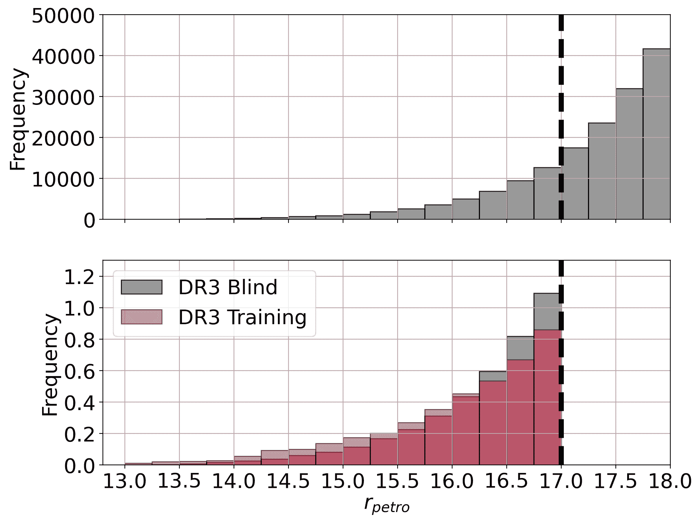
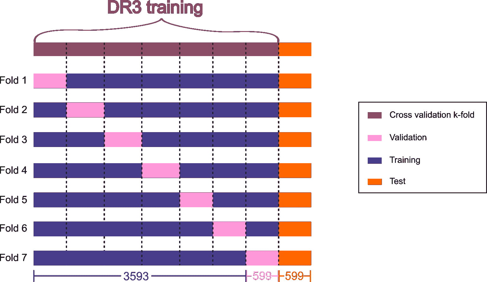
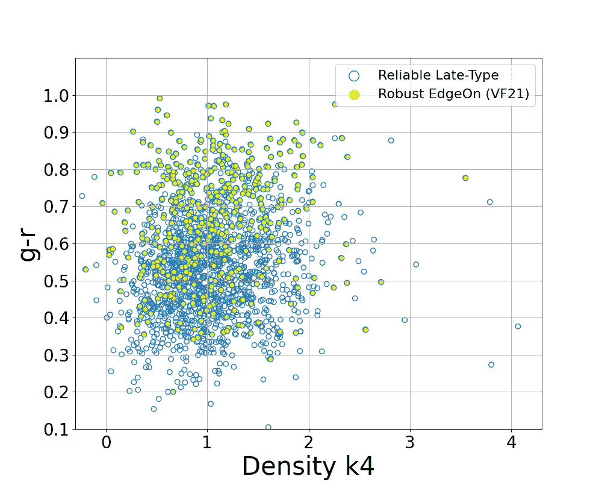

<!--yml

类别: 未分类

日期: 2024-09-06 19:39:02

-->

# [2306.08684] 使用深度学习扩展的南方光度局部宇宙调查数据发布 3 中的星系形态目录

> 来源：[`ar5iv.labs.arxiv.org/html/2306.08684`](https://ar5iv.labs.arxiv.org/html/2306.08684)

# 使用深度学习扩展的南方光度局部宇宙调查数据发布 3 中的星系形态目录

C. R. Bom,^(1,2) A. Cortesi³, U. Ribeiro¹, L. O. Dias¹, K. Kelkar⁴, A.V. Smith Castelli^(5,6), L. Santana-Silva⁷, V. Silva ³, T. S. Gonçalves³, L. R. Abramo⁸, E. V. R. Lima⁹, F. Almeida-Fernandes⁹, L. Espinosa⁹, L. Li⁹, M. L. Buzzo¹⁰, C. Mendes de Oliveira⁹, L. Sodré Jr.⁹, A. Alvarez-Candal¹¹, M. Grossi³, E. Telles¹¹, S. Torres-Flores¹², S. V. Werner¹³, A. Kanaan¹⁴, T. Ribeiro¹⁵, W. Schoenell¹⁶

¹ 巴西物理研究中心，Xavier Sigaud 街 150 号，CEP 22290-180，里约热内卢，RJ，巴西

²联邦技术教育中心 Celso Suckow da Fonseca，Mário Covas 高速公路，J2 区，J 单元，CEP 23810-000，伊塔瓜伊，RJ，巴西

³ 瓦隆戈天文台，里约热内卢联邦大学，Pedro Antonio 43 号，Saude 里约热内卢，RJ，20080-090，巴西

⁴ 物理与天文学研究所 - 瓦尔帕莱索大学

⁵ 拉普拉塔天体物理研究所，CONICET–UNLP，Paseo del Bosque s/n，B1900FWA，阿根廷

⁶ 天文学与地球物理科学学院，UNLP，Paseo del Bosque s/n，B1900FWA，阿根廷

⁷ NAT-克鲁塞罗杜苏大学 / 圣保罗市大学，Galvão Bueno 街 868 号，01506-000，圣保罗，SP，巴西

⁸ 数学物理系，物理研究所，圣保罗大学，R. do Matão 1371 号，05508-090，圣保罗，SP，巴西

⁹ 圣保罗大学，IAG，Rua do Mato 1225 号，圣保罗，SP，巴西

¹⁰ 天体物理学与超级计算中心，斯威本大学，John 街，Hawthorn VIC 3122，澳大利亚

¹¹国家天文台，R. Gen. José Cristino 77 号，20921-400，里约热内卢，巴西

¹² 天文系，拉塞雷纳大学，Cisternas 1200 号，拉塞雷纳，智利

¹³ 物理与天文学系，诺丁汉大学，诺丁汉，NG7 2RD，英国

¹⁴ 物理系，

圣卡塔琳娜联邦大学，弗洛里亚诺波利斯，SC，88040-900，巴西

¹⁵ 天文系，物理研究所，联邦里约格兰德州大学（UFRGS），Bento Goncalves 9500 号。

¹⁶ NOAO，邮政信箱 26732，图森，AZ 85726 电子邮件: debom@cbpf.br (CRB)

###### 摘要

银河的形态多样性是银河演化和宇宙结构形成的重要探测工具。然而，在大规模的天区调查中，即使将银河分类为晚期型（LT）和早期型（ET）两个类别，仍然是一项重大挑战。在这项工作中，我们展示了一个基于深度学习（DL）的形态学目录，建立在南方光度局部宇宙调查（S-PLUS）数据发布 3（DR3）获得的图像上。我们的 DL 方法在准确区分螺旋银河（作为晚期型（LT）银河的一个类别）和椭圆银河（属于早期型（ET）银河）方面，达到了 98.5$\%$的准确率。此外，我们还实现了一个辅助分类器，用于评估每个银河图像的质量，这使得在基于 DL 形态学研究银河属性时仅选择高质量图像。通过我们的 LT/ET 银河目录，我们恢复了预期的颜色–亮度图，其中 LT 银河显示出比 ET 银河更蓝的颜色。此外，我们还研究了基于形态的银河聚类及其与周围环境的关系。因此，我们提供了一个完整的形态学目录，包含$164314$个对象，完成度达到$r_{petro}<18$，覆盖了$\sim 1800$ deg²，包括南半球的一大片区域，该区域此前未被形态学目录覆盖。

###### 关键词：

银河：基本参数 – 银河：结构 – 技术：图像处理 – 目录

## 1 引言

银河的结构是最早被直接观察和研究的银河特性之一。最初被认为是‘星云’，很快就显而易见这些天体显示出独特的结构特征，如螺旋臂或光滑的椭圆包络（Zwicky，1940；Vaucouleurs，1959；Herschel，1864；van den Bergh，1998）。几十年的银河形状和结构研究导致了多个分类方案，其中基于观察到的视觉特征的‘哈勃分叉’系统被广泛使用。统称为银河‘形态’，银河可以大致分为两大类，即早期型和晚期型银河。晚期型银河包括螺旋（S）和不规则/特殊（Irr）银河。螺旋银河分支，进一步分为有棒状和无棒状系统。早期型银河由椭圆和透镜状银河组成。椭圆银河展示了从圆形（E0）到扁平（E7）系统的逐渐椭圆性。透镜状银河位于哈勃分叉的顶点，由于其混合结构，呈现出如螺旋银河般的隆起和盘面，但没有螺旋臂。

这种形态多样性通常反映了不同和复合的恒星群体（Sánchez 等，2007）和运动学（Edelen，1969；Wang 等，2020）。例如，S 型星系的特征是具有蓝色螺旋臂的星形成盘，指示出旋转支持的恒星运动学。E 型星系通常具有更平滑的无特征形态，这主要是由于缺乏星形成。E 型星系展现了各种运动学特征，包括 E0 压力支持系统或慢旋转体，而中间椭圆星系（E1/E7）展现了旋转对总运动学预算的逐渐增加贡献（Cappellari 等，2011；Bernardi 等，2019）。

此外，星系形态与星系群体中观察到的颜色双峰性紧密相关，因此出现了年轻的蓝色星形成星系和具有晚期（S）形态的星系，以及年老的红色被动演化星系和具有早期（E/S0）形态的星系（Baldry 等，2004）。然而，我们越来越发现，几个星系子群体并不完全符合这种二分法，即存在红色螺旋星系和蓝色椭圆星系（Bamford 等，2009），这些可能源于多种物理过程，其中一些可能是环境驱动的（例如，Vulcani 等，2015）。

因此，星系形态的演化始终与星系的大规模环境和质量的增长相伴随（Desai 等，2007；Calvi 等，2012；Crossett 等，2014；Sarkar & Pandey，2020；Wu，2020）。实际上，使用二分的“隆起/盘”定义来描述哈勃型形态，发现红移范围 $1<z<2$ 中隆起+盘系统较为丰富（例如，Margalef-Bentabol 等，2016），而本地宇宙中的大质量星系主要以隆起为主（Buitrago 等，2013）。

此外，高红移星系主要表现出与本地宇宙观察到的经典形态不同的特殊/扰动/不规则形态（例如，Mortlock 等，2013），这表明星系在宇宙时间中经历了显著的结构变化（参见 Conscelice 的综述，2014）。不可否认，星系形态是追踪和理解星系演化的关键（例如，Shao 等，2015）。

现在有充足的机会通过多波段天空调查来研究银河系形态，这些调查同时为我们提供了数十万的星系，并探索了大量的天空区域（例如，SDSS；York et al., 2000）。这些天空调查采用了多种方法，从专家的人工分类（Nair & Abraham, 2010；Ann et al., 2015），到公民科学（Lintott et al., 2008，2010；Willett et al., 2013；Simmons et al., 2017），或者从根据星系属性数值估计形态（Spiekermann, 1992；Storrie-Lombardi et al., 1992；Walmsley et al., 2020）到像主成分分析（PCA；Kelly & McKay, 2004；Wjeisinghe et al., 2010）这样的新颖技术，这些方法大多严重依赖于图像质量，无论是由于分辨率和/或观察的灵敏度（例如，Pović et al., 2015）。然而，现在有必要转向自动化的星系分类方法，以处理这些当前和即将到来的调查所产生的大量数据，例如，维拉·C·鲁宾天文台的空间与时间遗产调查（LSST；Tyson, 2002；Axelrod, 2006）以及与南希·格雷斯·罗曼空间望远镜的天空调查（Gehrels & and, 2015）。

机器学习（ML）是一个强大的自动化工具，用于从复杂多样的成像数据集中提取有用信息，并协助决策过程，如分类树。因此，ML 的应用不仅限于星系形态（Tohill et al., 2023），还用于检测引力透镜、交互星系、分类类星体（Freeman et al., 2013；Shamir et al., 2013；Holincheck et al., 2016；Bom et al., 2017；Ostrovski et al., 2017；Ma et al., 2019；Knabel et al., 2020；Zaborowski et al., 2022），以及最近用于检测天文图像中的异常值（Margalef-Bentabol et al., 2020）。这些应用展示了 ML 在天体物理研究中的广泛能力，使研究人员能够探索和理解宇宙中的各种现象。在过去十年中，一个被称为深度学习（DL）的 ML 子领域已成为计算机视觉应用的主要技术（Lu et al., 2017；Abdel-Hamid et al., 2014；Vecchiotti et al., 2018），音乐分类（Choi et al., 2017）以及医学预后与诊断（Li et al., 2018；Hannun et al., 2019）。

深度学习（DL）是一种应用模型开发的技术，用于处理来自不同来源的复杂、最小化或甚至原始的数据，并提取相关特征，这些特征可以有效地与其他感兴趣的属性关联。特别是，深度神经网络（DNNs）是高性能的数据驱动模型，能够在分类任务中超越人类（Metcalf et al., 2019）。在天文学中，最近几项研究利用这一点，表明 DNNs 确实可以成功地识别原始图像中的形态特征，且干预最少（Glazebrook et al., 2017; Lanusse et al., 2018; Jacobs et al., 2019; Madireddy et al., 2019; Cheng et al., 2019; Petrillo et al., 2017, 2019b, 2019a; Farias et al., 2020; Hausen & Robertson, 2020; Bom et al., 2022)，甚至识别天文图像中的异常值（Margalef-Bentabol et al., 2020）。

本文展示了将星系形态分类为 LT 和 ET 的方法，使用的是新的南方光度局部宇宙调查 DR3（S-PLUS; Mendes de Oliveira et al. 2019）。作为对 Bom et al. (2021，下文称为 BOM21) 的后续研究，我们的主要目标是应用高性能 DL 算法处理成像数据，以获得南半球的新颖可靠的形态目录，并与其他形态目录形成互补覆盖。此外，我们还开发了第一个深度网络来评估图章的质量并清除虚假检测。最后，我们利用在 S-PLUS 中使用 12 个波段得出的高精度光度红移，探讨形态对环境和颜色的依赖关系，将颜色用作星系恒星种群特性的代理。我们将本文中提出的分类与 Vega-Ferrero et al. (2021) 进行比较，并讨论通过研究不同分类对象对当前星系形态分类理解的影响。

本文组织如下：在 2 节中，我们描述了本研究中使用的 iDR3 数据、样本选择和使用的辅助数据，如光度红移。在第三部分中，我们介绍了用于星系形态分类的深度学习方法，以及自 S-PLUS DR1 形态论文（BOM21, Bom 等，2021）以来的实施新颖性。在第四部分中，我们展示了模型的结果，包括深度学习性能。我们还展示了环境密度与形态之间的关系，并分析了不同形态类别在(g-r)颜色与$M_{r}$绝对星等图上的分布。在第五部分中，我们总结了我们的研究并讨论结果。

## 2 数据

### 2.1 南方光度本地宇宙调查

图 1：S-PLUS DR3 的足迹（本研究中使用的）和文献中一些近期星系形态目录的足迹。

南方光度本地宇宙调查（S-PLUS）使用一台位于塞罗托洛洛国际天文台的 86 厘米机器人望远镜进行，覆盖$\sim 9300{\rm\ deg}^{2}$的天空，使用 12 个光学波段。S-PLUS 采用一个视场为 2 deg²、板块尺度为 0.55″ pixel^(-1)的宽视场光学相机。光学滤光片（即 Javalambre 滤光系统，包括 5 个类似 SDSS 的波段和 7 个窄波段，Cenarro 等，2019）在南半球非常独特，且由于对观测对象的光谱能量分布定义更好，相比于通常的 4 或 5 波段系统，在源分类方面更为理想。窄波段设计用于集中于重要的恒星特征，例如 OII 线、Ca H+K、H$\delta$和 H$\alpha$。该调查在宽波段的典型限制星等为 r$<$21 AB mag，在窄波段为 r$<$20 AB mag（Mendes de Oliveira 等，2019）。

S-PLUS 的第三次公开数据发布（DR3）覆盖了南半球约$2000{\rm\ deg}^{2}$的区域。它包括以前数据发布中涵盖的区域，如 Stripe 82。然而，这些图像经过了重新处理，并从 DR2 到 DR3 进行了新的数据处理和校准，具体见 Almeida-Fernandes et al. (2022)。在图 1 中，我们展示了 DR3 覆盖的区域，并与其他具有形态学目录的调查进行了比较。Stripe 82（在赤道处）的区域与多个调查（包括光学和其他波长）重叠，并已被用作检查数据处理和校准程序的基准。DR3 覆盖的另一个重要区域是海德拉超星系团（图 1 最左侧的长竖红色矩形）。

#### 2.1.1 样本选择

我们使用包含约$50$百万个源的完整 DR3 目录。在 DR1 的形态学分类中，我们仅通过$r$波段的 Petrosian 光度（${\rm r}_{\rm petro})<17~{}{\rm AB~{}mag}$ 和作为星系的概率${\rm prob}_{\rm gal}\geq 0.6$来选择对象（有关更多信息，请参见 Nakazono et al., 2021a）。然而，我们进行了视觉检查阶段，以去除不需要的虚假检测（见 BOM21）。当前目录覆盖$1800$平方度的区域，这使得在合理的时间尺度内通过有限的人力资源进行视觉检查变得不可行。因此，我们定义了更严格的筛选标准，并相比 BOM21 增加了四个额外的约束。此外，我们添加了一个由神经网络进行的自动选择阶段，详细信息见第三部分。因此，我们应用以下选择标准来定义我们的星系样本，从 S-PLUS DR3 的完整目录中：

|  | $\displaystyle{\rm r}_{\rm petro}<18~{}{\rm AB~{}mag}$ |  | (1) |
| --- | --- | --- | --- |
|  | $\displaystyle{\rm prob}_{\rm gal}\geq 0.7$ |  | (2) |
|  | $\displaystyle 0<={\rm photoflag}_{\rm r}<=3$ |  | (3) |
|  | $\displaystyle{\rm BrightStarFlag}=0$ |  | (4) |
|  | $\displaystyle{\rm R_{Kron}}>=3$ |  | (5) |
|  | $\displaystyle{\rm FWHM_{n}}>=1.5$ |  | (6) |

其中${\rm photoflag}_{\rm r}r$是来自 SExtractor 的光度质量标志（Bertin & Arnouts, 1996），${\rm R_{Kron}}$是 Kron 半径，即表面亮度光谱的第一矩，${\rm FWHM_{n}}$是物体的半最大宽度除以该场所有亮度非饱和星体的中位数 FWHM。所有这些特征都在 SPLUS 目录中提供并描述。星系的概率，${\rm prob}_{\rm gal}$（Nakazono et al., 2021b），以及表示附近存在亮星的标志${\rm BrightStarFlag}$，都列在“星-星系-类星体”和“掩膜”增值目录（VAC；有关更多细节，请参见 SPLUS.cloud ¹¹1 [`splus.cloud/catalogtools`](https://splus.cloud/catalogtools)）。具体而言，$0<={\rm photoflag}_{\rm r}r<=3$确保在大多数感兴趣的情况下 Sextractor 拟合的良好。$BrightStarFlag$参数在去除亮星方面非常有效，并允许清除那些被星-星系-类星体分类错误分配为星系概率高于$0.7$的少数星星（Nakazono et al., 2021b）。条件${\rm Kron_{Radius}}>=3$和${\rm FWHM_{n}}>=1.5$用于选择已解析的物体（平均$FWHM_{seeing}\simeq 1.2&quot;$）。

根据这些选择标准，我们获得了最终目录，包含 164314 个对象，并为这些对象创建了 12 个波段的图像印记，大小为 200$\times$200 像素²²²2 图像裁剪任务可以在此 GitHub 仓库中找到：[`github.com/lucatelli/splus-tools`](https://github.com/lucatelli/splus-tools)。最终目录主要由可靠的印记组成，即以星系为中心的印记，完整性达到$r_{petro}<18$。样本选择的进一步改进在第 3.2 节中描述。

#### 2.1.2 样本定义

监督的深度学习（DL）评估需要在具有已知分类的样本上进行训练，即标记集（训练/验证和测试集 - I），尽可能共享与算法将在第二阶段应用的样本相同的属性（盲测集 - II）。在本节中，我们描述了这两个样本的特征，但有关 DL 算法及其性能的更多详细信息请参见第三部分。

图 2：整个样本的 r-petrosian 亮度（r[petro]）分布，即亮度 r${}_{\rm petro}\leq 18$（顶部），以及 I（训练/验证集）和 II（盲测集）的亮度分布的归一化直方图，亮度 r${}_{\rm petro}\leq 17$（底部），即 I - 训练样本的限制亮度。

我们使用了在训练和验证中呈现的相同对象，以及 BOM21 中使用的测试方案，该方案将 Galaxy Zoo 1 中的无偏形态分类划分为椭圆星系和螺旋星系（Lintott et al., 2008; Bamford et al., 2009; Lintott et al., 2010）作为真实标签。由于 S-PLUS DR1 已包含在 S-PLUS DR3 中，因此可以做出这样的选择。然而，需要注意的是，由于两个数据版本之间的降维流程有所改进，因此使用了新图像创建了新的印章，以确保两个数据集（I 和 II）的同质性。DR1 和 DR3 之间的另一个相关差异是对 S-PLUS DR3 应用的新光度标定。这种标定包括将合成恒星模板拟合到其他调查的已知数据中，推导出精确的零点和亮度，这些数据在 170 个 STRIPE82 场中经过测试（有关方法的详细描述，请参见 Almeida-Fernandes et al., 2022）。我们从 DR3 数据访问中获取了每个对象在 12 个波段中的印章，适用于两个样本。

总共有$4232$个对象在训练样本 I 中，而 II 集由$164314$个对象组成。如图 2 顶部面板所示，训练样本，即样本 I，仅在$r_{petro}<17$时大致完整³³3 该亮度限制是 Galaxy Zoo 1 中要求的，以执行去偏差过程，该过程需要光谱红移，请参见 Bamford et al. (2009)了解更多细节。如本研究中第 2.1.1 节所述，我们选择了$r_{petro}<18$的对象。此选择对 DL 性能的影响在第四部分中讨论。样本 I 和 II 在$R_{petro}$小于$17$的亮度分布类似（图 2 底部面板）。

#### 2.1.3 光度红移

S-PLUS DR3 光度红移目录使用基于贝叶斯混合密度网络架构的深度学习模型。这个特定配置允许进行单点估计，同时为每个星系提供概率分布函数（PDF）。该网络在来自 S-PLUS 的 12 频带光度数据上进行训练，并与 unWISE（广域红外巡天探测器，Lang，2014）、GALEX（星系演化探测器，Niemack 等，2009）和 2MASS（双微米全天巡天，Skrutskie 等，2006）目录（W1/W2、NUV/FUV 和 J/H/K 亮度）进行交叉匹配。光谱红移目标从各种调查中编制，包括 SDSS DR16、2dFRGS、2dFLenS、6dFGS 等。共使用 262,521 个对象进行训练/验证和独立测试集。

由于其独特的滤光系统，包括一组宽带和窄带光度测量，目前的模型能够提供准确的光度红移，同时保持低偏差和微不足道的离群点比例。事实上，在当前工作关注的亮度范围内，$r_{petro}\in[14,18]$，中位归一化偏差约为$\sim-0.0015$，散布度约为$\sim 0.015$，离群点比例低于$1\%$。该目录不仅包括单点估计，还提供了良好校准的概率分布函数，允许用户评估与每个估计相关的不确定性。有关方法论和结果的更多信息，请参见 Lima 等人（2022）⁴⁴4S-PLUS 公共数据，包括光度红移，也可以在 splus.cloud 获得。图 3 显示了样本 I 和 II 的光度红移分布。具体而言，II 被划分为整体样本，$r_{petro}<18$ 和一个子样本，$r_{petro}<17$，与训练样本具有相同的亮度限制。

图 3：训练样本和盲样本的光度红移分布。上方是仅盲样本的分布，r${}_{\rm petro}<18$。下方是盲样本和训练样本的归一化分布，r${}_{\rm petro}<17$

.

## 3 深度学习分类

### 3.1 训练、验证和测试样本

我们将 S-PLUS DR3 和 Galaxy Zoo I STRIPE82 之间的交叉匹配数据，即数据集 I，划分为训练-验证-测试集。数据集 I 仅包含无偏分类（Lintott 等，2008；Bamford 等，2009；Lintott 等，2010）。这些数据呈现出 80%的概率阈值作为真实标签，分布在 29%的早期型星系（ETG）和 71%的晚期型星系（LTG）中。这种分布反映了两类星系之间的比例，如(Lintott 等，2010)所报告的当地宇宙($0<z<0.2$)。

我们将 DR3-训练数据集划分为 $7$ 个折叠。这些折叠是训练集的子样本，用于执行交叉验证程序（Moreno-Torres 等，2012）。我们评估了其他折叠数量的选择。然而，随着折叠数量的增加，验证集变小，验证损失开始变得不稳定，我们发现 $7$ 个折叠是一个良好的折中。因此，如图 4 所示，我们定义了 $7$ 个不同的训练和验证集，每个集分别包含 $\sim 85\%$ 和 $\sim 15\%$ 的数据。这种分离方式确保每个折叠的验证样本之间没有重叠。此外，这种方法确保每个对象至少在测试集中使用一次。我们使用 $599$ 个对象作为性能评估的测试集，这些对象不用于训练。与 BOM21 类似，基于去偏 GZ1 的训练集包含 $71\%$ 的 LTG 和 $29\%$ 的 ETG，因此这是一个不平衡的数据集。因此，为了训练神经网络以防止我们的模型对最丰富的类别产生偏倚，我们采用了与 BOM21 中提出的相同的数据处理方案，为每个类别应用权重。对于训练集中 $N$ 个对象的集合，如果类别 $\alpha$ 中的对象数量为 $N_{\alpha}$，我们定义权重为：

|  | $w_{\alpha}=\frac{N}{mN_{\alpha}},$ |  | (7) |
| --- | --- | --- | --- |

其中 $m$ 是类别的总数。这是 ML 领域中的标准程序 ⁵⁵5 见，例如，[`www.tensorflow.org/tutorials/structured_data/imbalanced_data`](https://www.tensorflow.org/tutorials/structured_data/imbalanced_data)。然后，将在方程 7 中定义的权重应用于训练阶段中最小化的目标或损失函数。此程序使每个类别在损失函数上的影响相同。

图 4：在此图中，我们展示了应用于 LTG / ETG 模型训练的交叉验证 k 折方法。每一折被分为训练、验证和测试。该过程以一种方式进行，确保每次验证之间没有重叠。此外，每折的训练略有不同，这减少了有关选择组成对象的偏差。考虑到该技术将为每折定义具有特定权重的架构，可以利用每个训练阶段的指标来评估哪个折具有最佳的训练集配置。底部的数字表示每一折中的训练、验证和测试集的大小。

### 3.2 不可靠印记

在 BOM21 的 DR1 目录中，所有印记在分析前都经过了人工检查，以防止分类过程中由伪影对象造成的偏差。由于当前和未来 S-PLUS 数据发布的规模，这种做法不再可行。因此，在本研究中，为了生成一个更可靠的目录，我们实施了一个新的深度学习模型来区分可靠和不可靠的印记。为此，我们使用了在 DR1 分类中被排除为不可靠的印记作为新深度学习模型的训练样本。这种方法有助于避免伪分类，如在附近饱和星星的同一领域中模糊星系，其光晕可能影响该星系的光度估计准确性。鉴于本研究中使用的数据集的相当规模，其他不良对象可能包括伪影和一般问题印记。因此，使用一种可靠的方法区分高质量图像和低质量图像是至关重要的，以便作为主要 ETG/LTG 深度学习模型的输入。

表 1：本研究中使用的样本描述。

| 样本 | 子样本 | 对象数量 | 描述 |
| --- | --- | --- | --- |
| I | $DR3$-Training | 4192 | ETG 和 LTG 星系在训练和验证中分开。 |
| I | $DR3$-Test | 599 | 用于性能测试的 ETG 和 LTG 星系。 |
| II | $DR3$-Blind | 46763 | 用于盲分类的星系，其$r_{petro}\leq 17$。 |
| II | $DR3$-Extended | 161635 | 进行盲分类的星系，其$r_{petro}\leq 18$。 |

### 3.3 深度学习模型

在遵循类似于 BOM21 中的策略的基础上，我们在这项工作中也使用了 EfficientNet 算法（Tan & Le，2019），这些算法属于卷积神经网络（CNN）家族模型，因在标准图像数据集如 ImageNet（Deng et al., 2009）上的视觉模式识别问题中表现优异而闻名。这种网络基于类似于 MobileNet（MnasNet; Tan et al., 2019）的初始模型，并且如果需要通过构建更复杂的网络来提高性能，同时限制每秒浮点运算（FLOPS）的数量，也可以通过参数化层数来进行扩展。因此，每一个定义模型的参数选择都会定义一个模型家族。此外，这种模型也可以很容易地适应于分类不同分辨率的数据集（Bom et al., 2022）。在本研究中，我们使用了基于 EfficientNet B2 的类似模型，该模型最早在（Tan & Le，2019）中描述，并进行了在 BOM21 中详细说明的微小调整。有关该模型中所有层的示意图，请参见（Bom et al., 2022）论文中的图 5（b）和（c）。

尽管如此，我们在实施过程中相比于 BOM21 中描述的工作流程引入了几项创新。首先，我们添加了第二个 EfficientNet B2 模型，以评估一个印记是否可靠用于形态分类。这个神经网络的主要目标是识别虚假检测，比如在印记中中央星系无法区分的拥挤印记、被明亮恒星饱和的印记以及未完全包含在印记中的星系。我们探讨了如何在输入方面最佳定义这个不可靠印记模型。在遵循 Bom21 方法的初步测试后，我们使用了所有 $12$ 个波段作为输入，而不是 ETG/LTG 模型仅使用 $g, r, i$ 波段所表现出的最佳性能和结果稳定性。虽然这个选择基于采用 Bom21 中相同的指标的经验结果，但主要区别可能在于我们尝试在可靠印记模型中表征的模式的性质。通过视觉检查印记，我们发现一些虚假检测在不同波段中呈现出较大的形状变化，与可靠印记相比，因此可能通过使用更多波段更容易区分。有关寻找 ETG/LTG 的波段选择的详细讨论，请参阅 BOM21。与为 S-PLUS DR1 开发的主要 ETG/LTG 模型相比，一个相关的区别是，分配给星系的螺旋或椭圆形概率不再是互补的，这意味着这些概率的总和不再等于一，为许多有趣的发现开辟了空间，如第 4.3 节讨论的内容，以及指向不属于任何类别的对象的可能性。这是通过将最后一层的神经网络激活函数从 softmax 改为 sigmoid 实现的。在图 5 中，我们展示了这两种 DL 模型的示意图，详细说明了输入波段，并展示了一个给定印记流向一些网络卷积滤波器的示例。

图 5：从 S-PLUS 数据中提取的印章在通过模型时的工作流程。这两种架构的工作方式相同，区别在于第一种仅使用 S-PLUS 中可用的 G、R 和 I 波段作为网络输入。LTG/ETG 模型以及 Reliable Stamp 模型在开始时包含一些卷积层，负责压缩和识别印章中的模式，然后在最后，所有这些信息通过一个密集层压缩成一个包含 1408 个由条形码表示的键的列表。这两个模型都使用二分类，因此需要一个额外的密集层来计算由 sigmoid 激活函数给出的每个分类的概率。

图 6：训练 Late/Early-type（顶部）模型和 Reliable Stamp 模型（底部）时的准确率和损失值，作为 epoch 的函数，考虑了所有折叠。在蓝色中，我们展示了训练集的这些指标，而在橙色中展示了验证集的指标。中间的线表示在交叉验证 k 折法中使用的所有 7 个折叠之间的平均值。

## 4 结果

### 4.1 训练

训练过程使用了 Rectified Adam（RADAM, Liu et al., 2019）优化器，损失函数为传统的交叉熵（Goodfellow et al., 2016）。在图 6 中，我们展示了训练过程中在所有 7 个折叠中获得的损失和准确度。中心最暗的线对应于每个周期这些量的平均值，阴影区域对应于折叠之间的标准偏差。在图 6 顶部，我们展示了使用 $3$ 个宽波段作为输入的 ETG/LTG 模型的结果，与 BOM21 相似。训练收敛很快，大约在第三到第五个周期，准确率高达 $\sim 0.9$。与 BOM21 相比，增加的自由度，即 LTG 或 ETG 的独立概率，似乎对性能没有显著影响。考虑到误差条，我们没有发现整个范围内显著的过拟合。然而，在训练结束时，大约第 $15$ 个周期，图中显示了轻微过拟合的开始。此外，通过评估损失函数，使用 $12$ 波段集作为输入的可靠/非可靠模型表现出更不稳定的行为：收敛较慢，大约在第 $15$ 个周期。验证呈现出一些可能与网络中的正则化方法相关的尖峰。我们还注意到，从周期 $\sim 19$ 开始有过拟合的趋势。验证准确率未能持续达到 $0.9$。然而，需要注意的是，与 BOM21 中呈现的 $12$ 波段 ETG/LTG 模型不同，可靠/非可靠印章的 $12$ 波段模型具有显著较小的误差条，这表明模型具有鲁棒性，尽管与 ETG/LTG 模型作为分类器相比，其整体性能预计较低。

### 4.2 性能

如前一节所述，交叉验证方法为每个折叠建立了独特的网络配置。因此，我们可以评估模型在每个单独折叠上的性能。对于 ETG/LTG 或可靠印章模型分类，我们将这些单独折叠应用于测试子样本。

#### 4.2.1 ETG/LTG 模型

我们通过评估精度与召回率的权衡来评估模型的性能。对于一个给定的阈值$t$，如果预测概率高于$t$，则定义为 ETG，精度或纯度衡量所有正预测中有多少正确预测，召回率或完整性则表示在所有实际正例中找到多少真正的正例。在图 7 的底部，我们展示了范围$0,1[$内的$t$的中位精度-召回率及其相应的标准偏差。之后，我们定义最佳阈值$t_{B}$为精度-召回率曲线中最接近点（1,1）的$t$，该点代表完美分类器，即纯度和完整性均等于 1。该阈值$t_{B}$设为$\sim 0.60$。为了理解这种选择的性能结果，我们利用了图[7 底部的混淆矩阵。此性能评估显示了每个类别的正确和错误预测数量，从而揭示了模型在分类任务中的表现，揭示了其混淆和错误的地方。模型在 ETG 和 LTG 分类中正确分类的比例超过了$\sim 94\%$。值得一提的是，对于这一特定的性能评估，我们必须将每个星系明确地分配到一个类别。因此，对于这个具体分析，我们没有利用模型独立分配 ETG/LTG 概率的优势。在图 8 顶部，我们展示了 DR3-盲集的概率分布。我们注意到 ETG 和 LTG 分类的分布有很好的可分性，ETG 和 LTG 分类的分布在$\sim 0$和$\sim 1.0$附近有强峰，这是预期的两类分类结果。

图 7：ETG/LTG 模型在$DR3$-测试样本中的表现。（顶部）考虑所有折叠的精度与召回率。紫色线代表每个折叠的中位值。（底部）最佳折叠的混淆矩阵。

图 8：盲样本分类的概率分布。上方为晚型和早型分类的分布。下方为可靠印记的分布。在这两种情况下，虚线表示用于分类本身的阈值。

图 9：不同光度红移范围内的 r 带视星等分布（实线），以及训练样本的分布（虚线），分别针对椭圆星系（黄色/红色）和螺旋星系（蓝色/青色）。注意在第一个星等区间中训练样本不存在（$z<\leq 0.02$），因为我们使用了 Galaxy Zoo 数据进行训练，而该低星等区间的数据缺失（Lintott et al., 2008, 2010; Bamford et al., 2009）。

我们在图 9 中展示了 DR3-Blind/DR3-Training 样本的早期（橙色/红色）和晚期（青色/蓝色）类型星系光度红移的分布比较（见第 2.1.3 节）。令人注意的是，与预期相反，早期类型星系在较高红移下的数量似乎大于晚期类型星系的数量，无论是训练数据集还是盲样本。实际上，Buitrago 等人（2013）没有发现$M_{*}>11$ $M_{\odot}$在$0<z<0.2$之间的球状和盘状星系的比例或密度存在明显演化。我们对$z>0.15$的早期类型星系进行了目视检查，以验证分类是否受到螺旋臂分辨率不足的影响。我们得出的结论是分类总体上是正确的（见 5.1 节，其中我们与 Cheng 等人（2020）和 Vega-Ferrero 等人（2021）的形态分类进行了比较），并且高红移下螺旋星系的缺乏与样本预选有关，因为高红移螺旋星系往往具有较低的表面亮度。本研究中使用的训练样本来源于 The Galaxy Zoo 项目（Lintott 等，2008；Bamford 等，2009；Lintott 等，2010），该项目提供了对$z\geq 0.03$和$z<0.88$范围内星系的去偏形态分类，其中下限由低红移的不完整性决定，而上限则是由于丧失了$M_{r}<-20.25$的较暗天体。

#### 4.2.2 可靠的样本分类

我们使用相同的分析方案来分析可靠印章模型。图 8 的下部分展示了可靠印章概率分布。通过比较两种模型的概率分布，我们注意到可靠模型的峰值更宽，这表明该分布不像 ETG/LTG 模型那样分离得那么好。这个结论也由第 3.3 节中讨论的损失优化结果所指示。

在图 10 中，我们展示了最佳折叠的混淆矩阵和考虑所有折叠的精度与召回率图。精度与召回率曲线的整体形状类似于 ETG/LTG 模型，然而，可靠印章模型的曲线下面积比 ETG/LTG 模型小。混淆矩阵显示出$\sim 90\%$的真正例，这也很有趣，因为什么是一个不可靠的印章存在着很大的变异性。此外，通过对分类为不可靠的对象进行视觉评估，我们可以发现一些有趣的对象，我们认为值得进一步研究。我们在 4.4 ‣ 4 结果 ‣ 使用深度学习对南方光度本地宇宙调查数据第 3 版进行的银河形态扩展目录") 节中对此进行了更详细的讨论。

图 10：关于可靠/不可靠模型的$DR3$-R-Test 表现。（上图）展示了考虑所有折叠的精度与召回率图。紫色线表示每个折叠的平均值。（下图）展示了最佳折叠的混淆矩阵。

### 4.3 早期型和晚期型星系

银河呈现出多种形态（例如，Buta，2011；van den Bergh，1998），从几乎球形的椭圆星系到宏伟的螺旋星系（Grosbøl & Dottori，2012），随着哈勃序列中盘面成分的重要性不断增加。在哈勃调音叉的顶点处，是透镜星系，这些星系展示了像螺旋星系那样的隆起和盘面成分，但缺乏螺旋臂和相关的星形成区域。此外，星系类型的画廊还包括不规则星系。椭圆星系和透镜星系被归类为“早期型”，而螺旋星系和不规则星系则称为“晚期型”星系（这里分别是 ETG 和 LTG）。

在二分类（早期或晚期型星系）中，我们将星系强制分入两个类别中的一个，而实际分类可能更为渐进，反映了星系形状的复杂性，例如使用数值哈勃类型时。为了解决这一点，本研究中的网络架构在与 BOM21 中使用的架构相比时略有调整，以使 ETG 或 LTG 的概率不再是互补的，即不一定总和为一。实际上，这些概率是独立生成的，因此一个星系可以同时具有高概率（高于深度学习阈值，见图 8）成为 ETG 和 LTG。具有高概率同时成为 ETG 和 LTG 的星系在这里被指定为 Amb1。这为模型带来了有趣的模糊性，可以通过这种模糊性使分类更为渐进：一个星系现在可以被分类为既不是 ETG 也不是 LTG，并将归入 Amb0 类。

在我们的结果中，如图 11 所示，我们可以看到，大多数被分类为低概率 ETG 或 LTG（Amb0）的星系也被分类为不可靠标记，而那些有较高概率成为 ETG 或 LTG（Amb1）的星系则被分类为可靠标记。

图 11：归一化的星系比例，属于 Amb0 类（左），即 ETG 或 LTG 概率低的星系，以及属于 Amb1 类（右），即 ETG 和 LTG 概率高的星系，分别被分类为不可靠标记（蓝色）和可靠标记（橙色）。

我们注意到，具有高概率为非可靠标记且低概率为 ETG 或 LTG 的星系数量最多（1107 个），而高概率为 ETG 或 LTG 的星系（160 个）则被分类为可靠标记。

图 12 展示了使用 12 张 S-PLUS 图像定义的可靠标记的示例，参见第 3.2 节，这些示例包含了来自 S-PLUS 和 Legacy 调查的四种不同类别（ETG、LTG、$Amb_{0}$、$Amb_{1}$）的星系。Legacy 数据通常比 S-PLUS 图像深四个数量级，能够揭示微弱的外部特征，因此可以用于理解 DL 方法在深度和分辨率对物体分类能力的影响。一般而言，ETG 类的星系是椭圆星系（左列，顶部和中间行）或透镜星系（左列，底部行）。LTG 物体则是螺旋星系或不规则星系（第二列，第一和中间行），而第三行展示了一个以盘面为主的透镜星系。在第 5.1 节中，我们将本研究中提出的分类与其他研究进行比较。

星系被分类为 Amb0 或 Amb1 是由于多个因素的综合结果：

1.  1.

    微弱/高红移的螺旋星系可能会被误分类为早期类型星系，这由于像素分辨率和调查深度的限制，影响了识别螺旋臂存在的难度。反过来，它们可能展示出绿色的星形成斑点，使它们既不是 ETG 也不是 LTG（参见图 12 的第三列中间面板）。

1.  2.

    斑驳的星形成星系也可能被分配到两者之外的类别，因为它们的外观不平滑且缺乏明确的螺旋模式，参见图 12 的第三列顶部和底部面板；

1.  3.

    凸起主导的螺旋星系（见最后一列，顶部和中部图像），由于其螺旋臂的表面亮度较低，在 Legacy 数据中清晰可见，但在 S-PLUS 数据中接近图像噪声，可能有较高的概率同时是 ETG 和 LTG 星系。

1.  4.

    镜面星系也可以在$Amb_{1}$类别中找到，特别是$B/T\simeq 0.5$的镜面星系与这两类均相关联，因其混合性质。这些结果将在第 5.3 节中进一步讨论。

图 12：在前两个面板中，我们展示了一些被分类为早型（第一个面板）或晚型（第二个面板）的印记示例。在最后两个面板中，我们有一些会落入模糊分类的印记示例。$\textrm{Amb}_{\textrm{0}}$ 是那些根据定义的阈值（$\simeq 0.6$）被认为早型和晚型星系概率较低的印记。另一方面，$\textrm{Amb}_{\textrm{1}}$ 是模型给出同时属于两个类别的高概率的对象。每个面板由分别来自 S-PLUS 和 LEGACY 调查的相同对象制成。

在下一节中，我们将展示一些不可靠的印记（NRS）实际上是非常规对象。

### 4.4 非常规不可靠印记（NRS）

图 14 显示了一些被识别为 NRS 的对象示例。通常，它们是附近饱和恒星或拥挤区域的对象。事实上，即使我们选择了最大化成为星系的概率的样本（见第 2.1.1 节），样本中仍会出现污染物，而深度学习代码在识别伪对象方面表现出色。NRS 的数量与红移几乎保持不变，如图 13 所示，而可靠印记的数量随着红移的增加而减少。

图 13：不同红移区间中不可靠和可靠印记的数量。

另一方面，特殊星系，尤其是具有斑块状星形成的星系，或投影尺寸大于印记的星系，可能属于 NRS 类别，如图 15 ‣ 4 结果 ‣ 利用深度学习在南方光学局部宇宙调查数据发布 3 中扩展的星系形态目录")所示。在某种程度上，深度学习方法不仅使我们能够识别不需要的对象，还帮助发现高兴趣/相关的特殊对象。

图 14：不可靠印记的示例，来自 S-PLUS 数据（上）和 LEGACY 数据（下）。在最后一列，可以看到一个伪影，第三列呈现一个拥挤的区域，第二列中有一个饱和的星星影响了星系图像，最后，在第一列中是一个不规则星系。

图 15：非凡的不可靠印记示例。大物体，其投影半径大于图像印记；形成星星的星系，其中多个块可以被识别为在目录提取过程中独立的对象（Almeida-Fernandes 等，2022）；如 NGC 4038/NGC 4039 的不规则星系；以及密集的恒星区域，可能是银河系团，均可以在不可靠印记中找到。每个面板的左上角给出了成为可靠印记的概率。

### 4.5 形态作为星系演化和大规模结构形成的探针

星系通过不同的机制随时间演化：主要和次要并合、世代演化、骚扰、剥离和扼杀（Gunn & Gott (1972); Aragón-Salamanca (2008); Quilis et al. (2000); Kronberger et al. (2008); Byrd & Valtonen (1990); Bournaud et al. (2005)）。这些过程中的许多是依赖于环境的，即它们可能仅发生在星系团中（扼杀），或者更可能发生在场或星系群中（例如，并合）。通常，现在认为次要并合比主要并合更常见，并且它们主要负责星系的质量积累（Bournaud et al., 2007）。不同的演化情景在星系形态上留下了特定的印记；即主要并合倾向于破坏恒星轨道，导致压力主导的系统，其特征为椭圆形。另一方面，世代过程或环境驱动机制，如流体压力剥离，更影响气体成分，抑制恒星形成。此外，过去几十年已证明了形态-密度关系（Dressler et al., 1997; Dressler, 1980; Cappellari et al., 2011; Buitrago et al., 2013），其中早期型星系（ETG）居住在宇宙中最密集的区域，而螺旋星系和不规则星系则更常见于场中。星系形态是星系演化和结构形成的重要证据，正如我们在接下来的小节中将讨论的那样。在这里，我们仅使用分类为可靠的印记的天体，要求$photo_{z}$ $odds>0.4$ 和 $r<17$ mag。亮度已经使用 Clayton、Cardelli 和 Mathis（Cardelli et al., 1989）的尘埃法则进行了银河系消光校正。

#### 4.5.1 形态与颜色之间的关系

图 16 显示了色-亮度图（g-r 颜色与 r 波段绝对亮度），颜色编码根据星系的形态。左侧面板展示了双重分类，其中椭圆星系用橙色表示，螺旋星系用浅蓝色表示，而右侧面板中的颜色比例尺显示了成为螺旋星系的概率。可以看出，椭圆（静态）星系主要分布在红色序列中，而螺旋（星形成）星系主要分布在“蓝色云”中，这与它们的主要恒星种群相符（例如，Wong et al., 2012; Lima-Dias et al., 2021; Khanday et al., 2022）。有趣的是，在右侧面板中，可以看到成为螺旋星系的概率几乎从 0 增加到 1，从红色云过渡到蓝色序列，这一变化是连续的。中间区域，概率在$0.5$左右，被称为绿色峡谷（例如，Zibetti et al., 2007），这是一个过渡区域，晚型星系可能正在停止其星形成过程，转变为晚型星系，或早型星系可能由于与其他星系的相互作用或气体的吸积而“重生”（Smethurst et al., 2015）。形态似乎反映了这种转变，因为停止形成星星“去除了”螺旋臂，降低了成为螺旋星系的概率。另一方面，早型星系中的星形成亮点可能会产生团块或星形成区域，从而增加成为螺旋星系的概率。

图 16: 颜色-亮度图。（g-r）颜色与 r 波段的绝对亮度，使用标准宇宙学参数和从光度红移估算的亮度距离（$D_{L}$）计算。左侧面板显示了箱型分类，而右侧面板的颜色编码根据成为晚型星系的概率。

#### 4.5.2 形态-密度关系

一个星系所处环境与其形态之间存在联系（Dressler，1980），但星系的恒星群体和环境都会随着时间演变。虽然星系的恒星群体与星系质量有关（在给定时间内，质量更大的星系金属含量更丰富，Leaman et al.（2013））以及气体含量有关，形态更多地与环境相关（螺旋星系倾向于生活在低密度环境中，而椭圆星系则集中在星系团中心）。然而，合并事件，其概率由星系所在的环境决定，会影响星系质量和恒星群体。值得注意的是，自$z\simeq 6$以来，20%的高质量（$M_{*}$ $\geq$ $10^{9.5}$ $M_{\odot}$）星系经历了重大合并（Ventou et al., 2017），而小型合并、吸积、飞掠在宇宙历史中非常常见。

我们使用 K-最近邻方法，$k=4,5,10$（Baldry et al., 2010），来恢复星系所处环境的投影密度，其中$k=4,5$指的是局部环境，而$k=10$与更大尺度相关。具体来说，任何给定的 k 下的密度（$\Sigma_{k}$）为：

|  | $\Sigma_{k}=\frac{k}{\pi D^{2}_{k}}\frac{1}{\psi(D))},$ |  | (8) |
| --- | --- | --- | --- |

其中$k$是$k$近邻，D 是共动距离，$\psi(D)$是用于校正 Malmquist 偏差的选择函数（例如，Santana-Silva 等，2020）。图 17 展示了晚型（$Prob_{latetype}>0.9$）和早型（$Prob_{earlytype}>0.9$）星系的数目密度随$k=4$密度测量的增加而变化。图 17 的左面板展示了所有亮度为$r\leq 17$的星系，而右面板将其按亮度区间分开（由不同的线型表示，见图例）。早型星系用橙色/红色线条标识，而晚型星系用青色/蓝色线条显示。这项工作提供的形态分类清晰地反映了形态密度关系，早型星系占据了最密集的区域，而晚型星系则在场/低密度区域中占主导地位，见图 17 的左面板。观察形态-密度关系的亮度依赖性时，我们发现它在不同亮度区间内都成立，其中早型星系的数目密度随着密度的增加而增加，而晚型星系则表现出相反的趋势。最后，我们观察到更亮的天体的交叉密度较低，表明低密度与高亮度之间存在相关性。

图 17：形态-密度关系。不同密度区间内，晚型和早型星系的归一化比例，属于给定类别的概率高于$0.9$。k4 估计量追踪局部密度。上面板显示总分布，中间面板按不同的晚型星系的亮度划分，晚型星系用蓝色标绘。底部面板中早型星系用橙色标绘。为了方便比较，相同亮度的线条具有相同的样式。

图 18：根据星系成为晚型星系的概率进行颜色编码的红移分布，红移范围为$z = 0.08$。具有早期类型双重分类的星系绘制为较大的圆圈，以便更好地观察。

#### 4.5.3 星系形态所描绘的大尺度结构

星系描绘了宇宙的大尺度结构，但它们仅占总物质的$\simeq 20\%$（例如，Planck Collaboration 等，2020），其物理性质受到非引力机制的影响，如重子效应、辐射压力、反馈等。一个简单但强大的工具，能够弥合星系与暗物质分布之间的差距，是 Halo 模型（Cooray & Sheth，2002）。这种描述的一个后果是，星系丰度及其属性（如恒星质量、颜色、形态和星形成率）可以追溯到暗物质晕和亚晕，以及它们的属性（如质量、年龄、浓度和自旋）（Wechsler & Tinker，2018）。从大尺度结构的角度来看，暗物质晕的相关函数与暗物质粒子的相关函数通过晕丰度、偏差和晕密度分布相关。近似地，更大的晕较少出现，并且相对于暗物质场的偏差更高，但其他晕属性，如浓度、年龄甚至自旋（角动量）也起着重要作用（Montero-Dorta 等，2020）。填充晕及其亚晕的星系继承了这些属性，包括它们的偏差——但它们也可以带来在晕属性中未体现的额外信息，这些信息表明了重子机制，如冲击压力剥离。星系形态是可以帮助区分不同类型晕及其环境的额外指标，从而更准确地描述这些示踪器的相关函数。

图 18 显示了红移分布，直到$z\simeq 0.08$（Bamford 等，2009），星系根据其成为晚型星系的概率进行颜色编码，以便描述形态如何随时间演变。早期型星系用较大的符号绘制，通常聚集得更多。星系簇的存在通过神指效应得以强调，这是由星系的特殊速度偏离哈勃流造成的。

## 5 讨论与总结

### 5.1 与其他调查的比较

Vega-Ferrero 等 (2021) 使用了具有可靠形态分类的 DES 星系，以评估 CNN 是否能够检测到人眼无法识别的特征。为此，他们模拟了在高红移下，良好形态分类的 DES 星系所展示的外观，使其变得更暗且更小。他们发现，尽管一些区分 ETGs 和 LTGs 的特征在模拟后消失，模型仍能以超过 97% 的准确率正确分类星系。这项工作的主要结论是，使用 CNN 模型可以从微弱和小尺寸的图像中正确分类星系，前提是满足以下条件：最终视星等低于 $m_{r}(z)<22.5$，且最终图像的尺寸大于 32$\times$32 像素。DES 数据（DES DR1，Abbott 等 (2018））的中位 co-added 目录深度为 $m_{r}=24.08$，信噪比 S/N = 10，像素大小为 0.2636。

相比之下，S-PLUS 的像素比例为 0.55 "/pixel，在 r 带中的深度为 $m_{r}=19.6$，信噪比 S/N = 10 (Almeida-Fernandes 等，2022)，这使得与 DES 数据相比分辨率较低，这在图 12 中清晰可见。

S-PLUS DR3 和 DES DR1 重叠，见图 1，由 Vega-Ferrero 等人 (2021) 和本研究联合形成了一个包含 36183 个星系的目录，这些星系的亮度大于 $m_{r}<18.0$，并且平均红移为 $z_{ml}=0.11847$。对比本研究中呈现的分类，考虑到 DES 图像的深度，可以研究分类的准确性及结合两种 DL 代码结果的优势，即研究可靠的早期和晚期类型分类。在图 19 的上半部分，我们展示了本研究中获得的晚期星系概率的直方图，针对在 Vega-Ferrero 等人 (2021) 中被分类为“稳健螺旋星系”（$FLAG_{LTG}==5$）的星系。虚线表示本研究中使用的阈值，换句话说，所有位于该线右侧的星系在两个研究中都被分类为螺旋星系。蓝色直方图展示了所有“稳健螺旋星系”的晚期星系概率分布，并显示出与 Vega-Ferrero 等人 (2021) 的较大差异。橙色直方图显示了根据第二个 DL 模型分类为可靠的所有“稳健螺旋星系”的晚期星系概率，见第 3.2 节。绿色和红色直方图分别代表所有亮度大于 $r<17$ mag 的“稳健螺旋星系”以及其中所有被分类为可靠印记的星系。中间面板显示了对早期星系的相同比较。在本研究中，有一部分早期星系的概率为零，但在 Vega-Ferrero 等人 (2021) 中被分类为椭圆星系。在底部面板中，我们重现了相同的图，现在仅包括 $b/a>0.7$ 的对象。这一选择大幅减少了不一致的分类。当用 Cheng 等人 (2023) 进行相同的比较时，获得了类似的结果。

在图 20 中，我们展示了不同星等区间内错误分类对象的比例，在附录中提供的图示⁶⁶6 附录作为在线补充材料中，可以找到在两篇论文中分类不同的对象的例子。值得注意的是，在本研究中被分类为早期类型而在 Vega-Ferrero 等人（2021）中被分类为晚期类型的许多情况中，它们是多个对象图像、低表面亮度、以隆起为主的螺旋星系或微弱/紧凑的螺旋星系，见第 4.3 节。另一方面，在 S-PLUS 中被分类为晚期类型而在 Vega-Ferrero 等人（2021）中被分类为早期类型的对象通常是盘状（边缘）透镜状星系或合并/扰动系统。

总结来说，本研究中提出的分类与 Vega-Ferrero 等人（2021）的分类一致，ETG 的平均置信度为$\simeq 92\%$，适用于$r<18$，LTG 为$\simeq 96\%$，适用于$r<17$。对于$r\simeq 17$以下较暗的对象，ETG 的不匹配率增加到$20\%$，这是由于 S-PLUS 图像中螺旋臂的褪色。而 LTG 的不匹配主要是由于将盘状透镜状星系或边缘红色螺旋星系（Sodré等人，2013）归入本研究的这一类，但当仅考虑$q=B/A>0.7$和$r<14.5$的对象时，两种分类方法之间完全一致，参见图 20 中的蓝线和附录 A 中的直方图。这些结果的含义在第 5.3 节中进一步讨论。此外，对不同分类对象的视觉检查，参见附录 A 中的面板图，揭示了由于 DL 代码结构和图像深度及分辨率不同而产生的有趣对象，突显了多样化、开放和合作的科学环境的重要性。

图 19：在此图中，我们展示了一个直方图，显示了按照我们的分类方法进行分类的星系的比例。顶部面板表示被 DES 分类为稳健的 LTG 的星系，中间的面板表示那些被 DES 分类为稳健的 ETG 的星系。底部面板类似于中间的面板，但对于稳健的 ETG 且$b/a>0.7$，见正文。直方图是使用在本工作中获得的属于相应类别的概率制作的，虚线是我们分类中使用的阈值，换句话说，每个站在这条线右侧的星系在两个工作中都被分类为相同的类别。

图 20：在不同的光度区间中，本工作与 Vega-Ferrero 等人(2021)的分类差异的对象比例。被本工作分类为晚型星系而在 VF21 中分类为早型星系的情况由青色线表示，而蓝色线展示了相同的选择，但排除了边缘对象，即通过强制轴比$q=b/a>0.7$。橙色线展示了在本工作中被分类为早型星系而在 VG21 中被分类为螺旋星系的对象行为。灰色线显示了全球不匹配（青色线和橙色线之和），这表明两项工作的分类不一致随着光度减小而增加，正如预期的那样，由于 S-PLUS 的分辨率和深度较低，相比 DES。我们注意到，在$ r = 17 $之后，Vega-Ferrero 等人(2021)和本工作中被分类为“稳健”的星系总数减少，导致$r=18$时匹配度的提高。

### 5.2 将形态学与精确光度红移和窄带调查相结合：星系生活在哪里？

图 21：上图：（g-r）颜色与密度 k4 分布，用于$Prob_{LTG}>0.9$（可靠的晚型星系）；下图：包括$Prob_{ETG}>0.9$（可靠的早型星系）的星系。填充的黄色圆圈在 Vega-Ferrero 等人(2021)中被分类为稳健的边缘星系。

关于星系形态、它们的质量和恒星群体特性以及它们所处环境之间的关系已经在大量研究中得到了详细研究（Paulino-Afonso 等，2019；Coccato 等，2020），以及其红移演化（González Delgado 等，2015）。最近的研究表明，作为膨胀光比率测量的膨胀增长与星形成的抑制直接相关（Paulino-Afonso 等，2019；Dimauro 等，2022；Werner 等，2022）。组预处理也被发现对星系的星形成抑制和形态演化起着重要作用（González Delgado 等，2022；Brambila 等，2023）。

S-PLUS 光度系统允许以 0.023 的散布范围检索可靠的光度红移（Lima 等，2022），并恢复可靠的密度估计（Lopes da Silva 等，正在准备中）。在图 21 中，我们展示了对 $Prob_{Spiral}>0.9$（蓝色空心点）、$Prob_{Elliptical}>0.9$（红色空心点）和 Vega-Ferrero 等（2021）所分类的边缘观测的星系（填充黄色圆圈）的 (g-r) 颜色与 k4-密度测量值。星系环境与其形态的相关性大于其颜色，见图 17。早期型星系具有 $(g-r)>0.7$。左下角的面板显示，大多数 $(g-r)>0.7$ 的晚型星系在 Vega-Ferrero 等（2021）的分类中被标记为边缘观测。如图 12 所示，盘状主导的透镜状星系可以归类为晚型类，解释了盘状晚型星系的红色。此外，边缘观测的星系形成星系可能会由于围绕盘面的尘埃云的存在而遭受红化（Bamford 等，2009；Sodré 等，2013）。

图 21 指出，早型星系具有红色 $(g-r)>0.7$，并且在密集环境中更为常见。如果颜色是星系恒星群体的代表，这些发现表明，恒星群体的抑制与环境都与早期类型的形态学相关。另一方面，晚型星系的颜色范围较广，其数量似乎与它们所处的环境更为相关，参见图 17。

### 5.3 S0 星系形成情景和一个物理驱动的形态分类

镜面星系的特征是混合形态，既有类似螺旋星系的凸起和盘面，但没有螺旋臂，类似椭圆星系。van den Bergh (1990) 提出，’S0 分类类型包含一些在物理上相当不同的对象，这些对象仅表现出表面的形态学相似性’。最近基于观察（Fraser-McKelvie et al., 2018; Coccato et al., 2020）和模拟（Deeley et al., 2021）的研究显示，这类对象实际上由两个或更多的子群组成，这些子群通过不同的物理机制形成相似的形态。具体而言，如果螺旋星系的气体和臂由于与星系团环境的相互作用，或在群体环境中受骚扰，或在所有环境中普遍骚扰（Cortesi et al., 2013; Jaffé et al., 2015; Johnston et al., 2021），则去除气体和臂的螺旋星系可能是盘面主导的镜面星系的前身。另一组镜面星系可能是重大或次要合并和多次吸积的结果（Tapia et al., 2017）。其他的低质量 S0 星系，可能是原始星系，由星系恒星/气体团在红移 $z\simeq 2$ 形成（Saha & Cortesi, 2018），或者是长期演化的结果（Mishra et al., 2018）。

在仅考虑$B/A>0.7$的对象时，本研究中预测为 LTG 的概率与 Vega-Ferrero 等（2021）中的差异减小，见图 19。此外，还存在一类红色晚期星系，具有较高的边缘系统概率（Vega-Ferrero 等，2021），见图 21。

具体而言，本研究中有$126$个被分类为螺旋星系的对象，而在 Vega-Ferrero 等（2021）中被分类为鲁棒椭圆星系，且$B/A\leq 0.7$和$r_{petro}<17$ mag。通过视觉检查，它们与盘状主导的 S0 星系（Coccato 等，2020）或边缘型红化螺旋星系（Bamford 等，2009；Sodré等，2013）一致，且其平均颜色为$(g-r)\simeq 0.85$。

另一方面，如 4.3 节中讨论的，本研究中分类为早期型星系的部分星系由凸出型透镜星系组成。

本研究中使用的 DL 算法似乎描绘了 S0 类等高线轮廓的多重起源。这个话题将在后续工作中进一步研究，其中 DL 分类将与星系的隆起光谱轮廓相关联。

### 5.4 总结

在本研究中，我们采用了深度学习架构作为图像分类 ETG/LTG 的顶级技术之一，同时引入了一个模型来预测包含可靠信息以供分类的印记。与 Bom21 模型相比，我们的方法展示了若干创新，包括对未被分类为 ETG 或 LTG 的对象的可能性。

此外，我们还利用了 S-PLUS 中 12 个波段得到的精确光度红移。我们恢复了形态类型的颜色图，并检查了 ETG/LTG 的局部环境和密度。此外，我们评估了由形态学追踪的大规模结构。因此，我们提供了一个新颖的增值目录（VAC）用于银河系形态学，涵盖了 S-PLUS DR3 的全部范围，其中包括其他银河形态学目录从未探索过的区域。该目录由两种 DL 方法的结果组成，这两种方法为每个印章恢复了具有给定形态和作为可靠印章的概率，具体如下所述。

#### 5.4.1 一种新颖的南半球增值形态分类目录

为了在银河系形态的多样性和本工作中应用的二元分类之间进行调解，我们允许独立分类为早型和晚型银河，即每个类别的归属概率总和不等于一，详见第 4.2.1 节。由于这一选择，一些对象可以被分类为属于两个组（使用二元分类），也可以不属于任何一个组，详见第 4.3 节。对这两种特殊类型对象的研究使我们能够识别出凸起主导的透镜或螺旋银河系（$Amb_{1}$），以及紧凑的、蓬松的、正在形成星系，详见 12 图。最后，这个银河形态学目录覆盖了南天中尚未发布形态学目录的区域，据我们了解，详见 1 图。

#### 5.4.2 一种新颖的参数用于分配作为可靠印章的概率

比较低概率为 LTG 或 ETG（$Amb_{0}$）的星系数量与作为可靠标记的概率时，发现了一个有趣的相关性，参见第 3.2 节。事实上，大多数没有被分类为早型或晚型星系的对象（参见前一节 5.4.1）具有较低的可靠标记概率，见图 11。图 19 显示，选择仅可靠标记可以减少与 Vega-Ferrero 等人 (2021) 分类为 ETG 和 LTG 的差异，特别是对于微弱对象（$m_{r}>17$）。此外，如图 15 所示，在非可靠标记中，有一些特殊对象，如天线星系，这些对象将在后续工作中被识别和研究。

## 数据可用性

我们在 S-PLUS 数据库中公开发布了我们的增值目录（VAC），网址为 splus.cloud。

## 致谢

S-PLUS 项目，包括 T80-South 机器人望远镜和 S-PLUS 科学调查，是由**圣保罗州研究基金会**（FAPESP）、**国家天文台**（ON）、**塞尔吉佩联邦大学**（UFS）和**圣卡塔琳娜联邦大学**（UFSC）之间的合作伙伴关系创立的，其他来自巴西、智利（La Serena 大学）和西班牙（阿拉贡宇宙物理研究中心 CEFCA）的合作机构也提供了重要的财政和实践贡献。我们还感谢**圣保罗研究基金会**（FAPESP）、**巴西国家研究委员会**（CNPq）、**高等教育人员培训协调委员会**（CAPES）、**卡洛斯·查加斯·费略里约热内卢州研究基金会**（FAPERJ）和**巴西创新局**（FINEP）的财政支持。

作为 S-PLUS 合作项目成员的作者们感谢 CTIO 工作人员在 T80-South 望远镜和相机的建设、调试和维护方面的贡献。我们还对 Rene Laporte 和 INPE 以及 Keith Taylor 的重要贡献表示感激。来自 CEFCA 的我们特别感谢 Antonio Marín-Franch 在项目早期阶段的宝贵贡献，感谢 David Cristóbal-Hornillos 和他的团队在数据处理包 jype 版本 0.9.9 安装方面的帮助，感谢 César Íñiguez 提供的滤光片透过率的二维测量，以及其他所有工作人员在项目各方面的支持。

CMdO 和 LSJ 感谢 FAPESP 资助项目 2019/26492-3, 2019/11910-4, 2019/10923-5 和 2009/54202-8 的资助。GS、CMdO 和 LS 分别感谢 CNPq 资助项目 309209/2019-6, 115795/2020-0 和 304819/201794 的支持。NM 感谢圣保罗大学 PUB 资助项目 83-1 的资助。A. C. 感谢 FAPERJ 资助项目 E-26/200.607 和 210.371/2022(270993) 提供的财政支持。

CRB 感谢 CNPq（316072/2021-4）和 FAPERJ（资助编号 201.456/2022 和 210.330/2022）以及 FINEP 合同 01.22.0505.00（参考号 1891/22）的财政支持。KK 感谢 ANID 通过 FONDECYT 后博士项目 3200139 的全额资助，智利。

作者们使用了为人工智能开发和测试的多 GPU Sci-Mind 机器，并感谢 P. Russano 和 M. Portes de Albuquerque 在基础设施问题上的所有支持。

作者们使用并认可了 TOPCAT ⁷⁷7[`www.starlink.ac.uk/topcat/(TOPCAT)`](http://www.starlink.ac.uk/topcat/(TOPCAT)) 工具来分析数据，并使用了 astrotools (Cardoso, 2022) 来可视化对象。为了进行补充的视觉检查和某些面板，作者们使用了来自遗产调查的小裁剪图像。遗产调查包括三个独立且互补的项目：暗能量相机遗产调查（DECaLS；提案 ID #2014B-0404；首席研究员：David Schlegel 和 Arjun Dey），北京-亚利桑那天空调查（BASS；NOAO 计划 ID #2015A-0801；首席研究员：Zhou Xu 和 Xiaohui Fan），以及 Mayall z 带遗产调查（MzLS；提案 ID #2016A-0453；首席研究员：Arjun Dey）。DECaLS、BASS 和 MzLS 一共包括在以下地点获得的数据：Blanco 天文望远镜，Cerro Tololo 美洲天文台，NSF 的 NOIRLab；Bok 天文望远镜，Steward 天文台，亚利桑那大学；以及 Mayall 天文望远镜，Kitt Peak 国家天文台，NOIRLab。遗产调查项目荣幸地被允许在 Iolkam Du’ag（Kitt Peak）进行天文学研究，这座山对 Tohono O’odham Nation 具有特别的意义。作者们感谢 F. Ferrari 和 J. Crosset 的启发性讨论和建议。

## 参考文献

+   Abbott 等人（2018）Abbott T. M. C., 等人，2018, [Astrophys. J. Suppl.](http://dx.doi.org/10.3847/1538-4365/aae9f0), [239, 18](https://ui.adsabs.harvard.edu/abs/2018ApJS..239...18A)

+   Abdel-Hamid 等人（2014）Abdel-Hamid O., Mohamed A.-r., Jiang H., Deng L., Penn G., Yu D., 2014, IEEE/ACM Transactions on audio, speech, and language processing, 22, 1533

+   Almeida-Fernandes 等人（2022）Almeida-Fernandes F., 等人，2022, [Mon. Not. Roy. Astron. Soc.](http://dx.doi.org/10.1093/mnras/stac284), [511, 4590](https://ui.adsabs.harvard.edu/abs/2022MNRAS.511.4590A)

+   Ann 等人（2015）Ann H. B., Seo M., Ha D. K., 2015, [Astrophys. J. Suppl.](http://dx.doi.org/10.1088/0067-0049/217/2/27), [217, 27](https://ui.adsabs.harvard.edu/abs/2015ApJS..217...27A)

+   Aragón-Salamanca（2008）Aragón-Salamanca A., 2008, 在 M. Bureau, E. Athanassoula, & B. Barbuy 编辑的 IAU Symposium Vol. 245 中，IAU Symposium. pp 285–288 ([arXiv:0710.2481](http://arxiv.org/abs/0710.2481)), [doi:10.1017/S1743921308017924](http://dx.doi.org/10.1017/S1743921308017924)

+   Axelrod（2006）Axelrod T. S., 2006, 在 Gabriel C., Arviset C., Ponz D., Enrique S. 编辑的 Astronomical Society of the Pacific Conference Series Vol. 351 中，Astronomical Data Analysis Software and Systems XV. p. 103

+   Baldry 等人（2004）Baldry I. K., Glazebrook K., Brinkmann J., Ivezić Ž., Lupton R. H., Nichol R. C., Szalay A. S., 2004, [Astrophys. J.](http://dx.doi.org/10.1086/380092), [600, 681](https://ui.adsabs.harvard.edu/abs/2004ApJ...600..681B)

+   Baldry 等人（2010）Baldry I. K., 等人，2010, [Mon. Not. Roy. Astron. Soc.](http://dx.doi.org/10.1111/j.1365-2966.2010.16282.x), [404, 86](https://ui.adsabs.harvard.edu/abs/2010MNRAS.404...86B)

+   Bamford 等人（2009）Bamford S. P., 等人，2009, Monthly Notices of the Royal Astronomical Society, 393, 1324

+   Bernardi 等人（2019）Bernardi M., Domínguez Sánchez H., Brownstein J. R., Drory N., Sheth R. K., 2019, [Mon. Not. Roy. Astron. Soc.](http://dx.doi.org/10.1093/mnras/stz2413), [489, 5633](https://ui.adsabs.harvard.edu/abs/2019MNRAS.489.5633B)

+   Bertin & Arnouts（1996）Bertin E., Arnouts S., 1996, [Astr. & Astroph., Supp.](http://dx.doi.org/10.1051/aas:1996164), [117, 393](https://ui.adsabs.harvard.edu/abs/1996A&AS..117..393B)

+   Bom 等人（2017）Bom C. R., Makler M., Albuquerque M. P., Brand t C. H., 2017, [Astr. & Astroph.](http://dx.doi.org/10.1051/0004-6361/201629159), [597, A135](https://ui.adsabs.harvard.edu/abs/2017A&A...597A.135B)

+   Bom 等人（2021）Bom C. R., 等人，2021, [Mon. Not. Roy. Astron. Soc.](http://dx.doi.org/10.1093/mnras/stab1981), [507, 1937](https://ui.adsabs.harvard.edu/abs/2021MNRAS.507.1937B)

+   Bom 等人（2022）Bom C., 等人，2022, Monthly Notices of the Royal Astronomical Society, 515, 5121

+   Bournaud 等人（2005）Bournaud F., Jog C. J., Combes F., 2005, [Astr. & Astroph.](http://dx.doi.org/10.1051/0004-6361:20042036), [437, 69](http://adsabs.harvard.edu/abs/2005A%26A...437...69B)

+   Bournaud 等 (2007) Bournaud F., Jog C. J., Combes F., 2007，[Astronomy & Astrophysics](http://dx.doi.org/10.1051/0004-6361:20078010)，476, 1179

+   Brambila 等 (2023) Brambila D., Lopes P. A. A., Ribeiro A. L. B., Cortesi A., 2023，[Mon. Not. Roy. Astron. Soc.](http://dx.doi.org/10.1093/mnras/stad1233)

+   Buitrago 等 (2013) Buitrago F., Trujillo I., Conselice C. J., Häußler B., 2013，[Mon. Not. Roy. Astron. Soc.](http://dx.doi.org/10.1093/mnras/sts124)，[428, 1460](https://ui.adsabs.harvard.edu/abs/2013MNRAS.428.1460B)

+   Buta (2011) Buta R. J., 2011，[arXiv e-prints](http://dx.doi.org/10.48550/arXiv.1102.0550)，[p. arXiv:1102.0550](https://ui.adsabs.harvard.edu/abs/2011arXiv1102.0550B)

+   Byrd & Valtonen (1990) Byrd G., Valtonen M., 1990，[Astrophys. J.](http://dx.doi.org/10.1086/168362)，[350, 89](http://adsabs.harvard.edu/abs/1990ApJ...350...89B)

+   Calvi 等 (2012) Calvi R., Poggianti B. M., Fasano G., Vulcani B., 2012，[Mon. Not. Roy. Astron. Soc.](http://dx.doi.org/10.1111/j.1745-3933.2011.01168.x)，[419, L14](https://ui.adsabs.harvard.edu/abs/2012MNRAS.419L..14C)

+   Cappellari 等 (2011) Cappellari M., 等，2011，[Mon. Not. Roy. Astron. Soc.](http://dx.doi.org/10.1111/j.1365-2966.2011.18600.x)，[416, 1680](https://ui.adsabs.harvard.edu/abs/2011MNRAS.416.1680C)

+   Cardelli 等 (1989) Cardelli J. A., Clayton G. C., Mathis J. S., 1989，[Astrophys. J.](http://dx.doi.org/10.1086/167900)，[345, 245](https://ui.adsabs.harvard.edu/abs/1989ApJ...345..245C)

+   Cardoso (2022) Cardoso N. M., 2022，Astrotools: Web-based astronomical tools，[doi:10.5281/zenodo.7268504](http://dx.doi.org/10.5281/zenodo.7268504)，%****␣main.bbl␣Line␣150␣****https://doi.org/10.5281/zenodo.7268504

+   Cenarro 等 (2019) Cenarro A. J., 等，2019，[Astr. & Astroph.](http://dx.doi.org/10.1051/0004-6361/201833036)，[622, A176](https://ui.adsabs.harvard.edu/abs/2019A&A...622A.176C)

+   Cheng 等 (2019) Cheng T.-Y., Li N., Conselice C. J., Aragón-Salamanca A., Dye S., Metcalf R. B., 2019，arXiv e-prints，[p. arXiv:1911.04320](https://ui.adsabs.harvard.edu/abs/2019arXiv191104320C)

+   Cheng 等 (2020) Cheng T.-Y., 等，2020，[Mon. Not. Roy. Astron. Soc.](http://dx.doi.org/10.1093/mnras/staa501)，[493, 4209](https://ui.adsabs.harvard.edu/abs/2020MNRAS.493.4209C)

+   Cheng 等 (2023) Cheng T. Y., 等，2023，[Mon. Not. Roy. Astron. Soc.](http://dx.doi.org/10.1093/mnras/stac3228)，[518, 2794](https://ui.adsabs.harvard.edu/abs/2023MNRAS.518.2794C)

+   Choi 等 (2017) Choi K., Fazekas G., Sandler M., Cho K., 2017，在 2017 IEEE International Conference on Acoustics, Speech and Signal Processing (ICASSP) 中，pp 2392–2396

+   Coccato 等 (2020) Coccato L., 等，2020，[Mon. Not. Roy. Astron. Soc.](http://dx.doi.org/10.1093/mnras/stz3592)，[492, 2955](https://ui.adsabs.harvard.edu/abs/2020MNRAS.492.2955C)

+   Conselice（2014）Conselice C. J., 2014，[年鉴评论：天文学与天体物理学](http://dx.doi.org/10.1146/annurev-astro-081913-040037)，52，291

+   Cooray 和 Sheth（2002）Cooray A., Sheth R., 2002，[物理学报告](http://dx.doi.org/10.1016/S0370-1573(02)00276-4)，[372, 1](https://ui.adsabs.harvard.edu/abs/2002PhR...372....1C)

+   Cortesi 等（2013）Cortesi A., 等，2013，[皇家天文学会月刊](http://dx.doi.org/10.1093/mnras/stt529)，[432, 1010](https://ui.adsabs.harvard.edu/abs/2013MNRAS.432.1010C)

+   Crossett 等（2014）Crossett J. P., Pimbblet K. A., Stott J. P., Jones D. H., 2014，[皇家天文学会月刊](http://dx.doi.org/10.1093/mnras/stt2065)，[437, 2521](https://ui.adsabs.harvard.edu/abs/2014MNRAS.437.2521C)

+   Deeley 等（2021）Deeley S., Drinkwater M. J., Sweet S. M., Bekki K., Couch W. J., Forbes D. A., Dolfi A., 2021，[皇家天文学会月刊](http://dx.doi.org/10.1093/mnras/stab2007)，[508, 895](https://ui.adsabs.harvard.edu/abs/2021MNRAS.508..895D)

+   Deng 等（2009）Deng J., Dong W., Socher R., Li L.-J., Li K., Fei-Fei L., 2009，在 2009 IEEE 计算机视觉与模式识别会议上。第 248–255 页

+   Desai 等（2007）Desai V., 等，2007，[天体物理学杂志](http://dx.doi.org/10.1086/513310)，[660, 1151](http://adsabs.harvard.edu/abs/2007ApJ...660.1151D)

+   Dimauro 等（2022）Dimauro P., 等，2022，[皇家天文学会月刊](http://dx.doi.org/10.1093/mnras/stac884)，[513, 256](https://ui.adsabs.harvard.edu/abs/2022MNRAS.513..256D)

+   Dressler（1980）Dressler A., 1980，[天体物理学杂志](http://dx.doi.org/10.1086/157753)，[236, 351](http://adsabs.harvard.edu/abs/1980ApJ...236..351D)

+   Dressler 等（1997）Dressler A., 等，1997，[天体物理学杂志](http://dx.doi.org/10.1086/304890)，[490, 577](http://adsabs.harvard.edu/abs/1997ApJ...490..577D)

+   Edelen（1969）Edelen D. G. B., 1969，[天文与空间科学](http://dx.doi.org/10.1007/BF00649593)，[3, 56](https://ui.adsabs.harvard.edu/abs/1969Ap&SS...3...56E)

+   Farias 等（2020）Farias H., Ortiz D., Damke G., Jaque Arancibia M., Solar M., 2020，[天文学与计算](http://dx.doi.org/10.1016/j.ascom.2020.100420)，[33, 100420](https://ui.adsabs.harvard.edu/abs/2020A&C....3300420F)

+   Fraser-McKelvie 等（2018）Fraser-McKelvie A., Aragón-Salamanca A., Merrifield M., Tabor M., Bernardi M., Drory N., Parikh T., Argudo-Fernández M., 2018，[皇家天文学会月刊](http://dx.doi.org/10.1093/mnras/sty2563)，[481, 5580](https://ui.adsabs.harvard.edu/abs/2018MNRAS.481.5580F)

+   Freeman 等（2013）Freeman P. E., Izbicki R., Lee A. B., Newman J. A., Conselice C. J., Koekemoer A. M., Lotz J. M., Mozena M., 2013，[皇家天文学会月刊](http://dx.doi.org/10.1093/mnras/stt1016)，[434, 282](https://ui.adsabs.harvard.edu/abs/2013MNRAS.434..282F)

+   Gehrels 和（2015）Gehrels N., 和 D. S., 2015，[物理学期刊：会议系列](http://dx.doi.org/10.1088/1742-6596/610/1/012007)，610，012007

+   Glazebrook 等 (2017) Glazebrook K., Jacobs C., Collett T., More A., McCarthy C., 2017, [皇家天文学会月刊](http://dx.doi.org/10.1093/mnras/stx1492), 471, 167

+   González Delgado 等 (2015) González Delgado R. M., 等, 2015, [天文学与天体物理学](http://dx.doi.org/10.1051/0004-6361/201525938), [581, A103](https://ui.adsabs.harvard.edu/abs/2015A&A...581A.103G)

+   González Delgado 等 (2022) González Delgado R. M., 等, 2022, [天文学与天体物理学](http://dx.doi.org/10.1051/0004-6361/202244030), [666, A84](https://ui.adsabs.harvard.edu/abs/2022A&A...666A..84G)

+   Goodfellow 等 (2016) Goodfellow I., Bengio Y., Courville A., 2016, 《深度学习》。麻省理工学院出版社

+   Grosbøl & Dottori (2012) Grosbøl P., Dottori H., 2012, [天文学与天体物理学](http://dx.doi.org/10.1051/0004-6361/201118099), [542, A39](https://ui.adsabs.harvard.edu/abs/2012A&A...542A..39G)

+   Gunn & Gott (1972) Gunn J. E., Gott III J. R., 1972, [天体物理学杂志](http://dx.doi.org/10.1086/151605), [176, 1](http://adsabs.harvard.edu/abs/1972ApJ...176....1G)

+   Hannun 等 (2019) Hannun A. Y., Rajpurkar P., Haghpanahi M., Tison G. H., Bourn C., Turakhia M. P., Ng A. Y., 2019, 《自然医学》，25, 65

+   Hausen & Robertson (2020) Hausen R., Robertson B. E., 2020, 《天体物理学杂志补充系列》，248, 20

+   赫歇尔 (1864) 赫歇尔 J. F. W., 1864, 《伦敦皇家学会哲学年鉴》第一系列, [154, 1](https://ui.adsabs.harvard.edu/abs/1864RSPT..154....1H)

+   Holincheck 等 (2016) Holincheck A. J., 等, 2016, [月刊皇家天文学会](http://dx.doi.org/10.1093/mnras/stw649), [459, 720](https://ui.adsabs.harvard.edu/abs/2016MNRAS.459..720H)

+   Jacobs 等 (2019) Jacobs C., 等, 2019, [月刊皇家天文学会](http://dx.doi.org/10.1093/mnras/stz272), [484, 5330](https://ui.adsabs.harvard.edu/#abs/2019MNRAS.484.5330J)

+   Jaffé 等 (2015) Jaffé Y. L., Smith R., Candlish G. N., Poggianti B. M., Sheen Y.-K., Verheijen M. A. W., 2015, [月刊皇家天文学会](http://dx.doi.org/10.1093/mnras/stv100), [448, 1715](http://adsabs.harvard.edu/abs/2015MNRAS.448.1715J)

+   Johnston 等 (2021) Johnston E. J., 等, 2021, [月刊皇家天文学会](http://dx.doi.org/10.1093/mnras/staa2838), [500, 4193](https://ui.adsabs.harvard.edu/abs/2021MNRAS.500.4193J)

+   Kelly & McKay (2004) Kelly B. C., McKay T. A., 2004, [天文学杂志](http://dx.doi.org/10.1086/380934), [127, 625](https://ui.adsabs.harvard.edu/abs/2004AJ....127..625K)

+   Khanday 等 (2022) Khanday S. A., Saha K., Iqbal N., Dhiwar S., Pahwa I., 2022, [月刊皇家天文学会](http://dx.doi.org/10.1093/mnras/stac2009), [515, 5043](https://ui.adsabs.harvard.edu/abs/2022MNRAS.515.5043K)

+   Knabel 等 (2020) Knabel S., 等, 2020, [天文学杂志](http://dx.doi.org/10.3847/1538-3881/abb612), [160, 223](https://ui.adsabs.harvard.edu/abs/2020AJ....160..223K)

+   Kronberger 等（2008）Kronberger T., Kapferer W., Ferrari C., Unterguggenberger S., Schindler S., 2008，[天文学与天体物理学](http://dx.doi.org/10.1051/0004-6361:20078904)，[481, 337](http://adsabs.harvard.edu/abs/2008A%26A...481..337K)

+   Lang（2014）Lang D., 2014，[天文学杂志](http://dx.doi.org/10.1088/0004-6256/147/5/108)，[147, 108](https://ui.adsabs.harvard.edu/abs/2014AJ....147..108L)

+   Lanusse 等（2018）Lanusse F., Ma Q., Li N., Collett T. E., Li C.-L., Ravanbakhsh S., Mandelbaum R., Póczos B., 2018，[皇家天文学会月报](http://dx.doi.org/10.1093/mnras/stx1665)，[473, 3895](https://ui.adsabs.harvard.edu/#abs/2018MNRAS.473.3895L)

+   Leaman 等（2013）Leaman R., 等，2013，[天体物理学杂志](http://dx.doi.org/10.1088/0004-637X/767/2/131)，[767, 131](https://ui.adsabs.harvard.edu/abs/2013ApJ...767..131L)

+   Li 等（2018）Li X., Ding Q., Sun J.-Q., 2018，可靠性工程与系统安全，172, 1

+   Lima-Dias 等（2021）Lima-Dias C., 等，2021，[皇家天文学会月报](http://dx.doi.org/10.1093/mnras/staa3326)，[500, 1323](https://ui.adsabs.harvard.edu/abs/2021MNRAS.500.1323L)

+   Lima 等（2022）Lima E. V. R., 等，2022，[天文学与计算](http://dx.doi.org/10.1016/j.ascom.2021.100510)，[38, 100510](https://ui.adsabs.harvard.edu/abs/2022A&C....3800510L)

+   Lintott 等（2008）Lintott C. J., 等，2008，[皇家天文学会月报](http://dx.doi.org/10.1111/j.1365-2966.2008.13689.x)，389, 1179

+   Lintott 等（2010）Lintott C., 等，2010，[皇家天文学会月报](http://dx.doi.org/10.1111/j.1365-2966.2010.17432.x)，410, 166

+   Liu 等（2019）Liu L., Jiang H., He P., Chen W., Liu X., Gao J., Han J., 2019, arXiv, pp arXiv–1908

+   Lu 等（2017）Lu J., Wang G., Zhou J., 2017，IEEE 图像处理汇刊，26, 4042

+   Ma 等（2019）Ma Z., 等，2019，[天体物理学杂志补编](http://dx.doi.org/10.3847/1538-4365/aaf9a2)，[240, 34](https://ui.adsabs.harvard.edu/abs/2019ApJS..240...34M)

+   Madireddy 等（2019）Madireddy S., Li N., Ramachandra N., Balaprakash P., Habib S., 2019，银河尺度强引力透镜图像的模块化深度学习分析 ([arXiv:1911.03867](http://arxiv.org/abs/1911.03867))

+   Margalef-Bentabol 等（2016）Margalef-Bentabol B., Conselice C. J., Mortlock A., Hartley W., Duncan K., Ferguson H. C., Dekel A., Primack J. R., 2016，[皇家天文学会月报](http://dx.doi.org/10.1093/mnras/stw1451)，[461, 2728](https://ui.adsabs.harvard.edu/abs/2016MNRAS.461.2728M)

+   Margalef-Bentabol 等（2020）Margalef-Bentabol B., Huertas-Company M., Charnock T., Margalef-Bentabol C., Bernardi M., Dubois Y., Storey-Fisher K., Zanisi L., 2020，[皇家天文学会月报](http://dx.doi.org/10.1093/mnras/staa1647)，[496, 2346](https://ui.adsabs.harvard.edu/abs/2020MNRAS.496.2346M)

+   Mendes de Oliveira 等（2019）Mendes de Oliveira C., 等，2019，[皇家天文学会月报](http://dx.doi.org/10.1093/mnras/stz1985)，489, 241

+   Metcalf et al. (2019) Metcalf R. B., et al., 2019, 天文学与天体物理学, 625, A119

+   Mishra et al. (2018) Mishra P. K., Wadadekar Y., Barway S., 2018, [月刊皇家天文学会](http://dx.doi.org/10.1093/mnras/sty1107), [478, 351](https://ui.adsabs.harvard.edu/abs/2018MNRAS.478..351M)

+   Montero-Dorta et al. (2020) Montero-Dorta A. D., et al., 2020, [月刊皇家天文学会](http://dx.doi.org/10.1093/mnras/staa1624), [496, 1182](https://ui.adsabs.harvard.edu/abs/2020MNRAS.496.1182M)

+   Moreno-Torres et al. (2012) Moreno-Torres J. G., Sáez J. A., Herrera F., 2012, IEEE 神经网络与学习系统汇刊, 23, 1304

+   Mortlock et al. (2013) Mortlock A., et al., 2013, [月刊皇家天文学会](http://dx.doi.org/10.1093/mnras/stt793), [433, 1185](https://ui.adsabs.harvard.edu/abs/2013MNRAS.433.1185M)

+   Nair & Abraham (2010) Nair P. B., Abraham R. G., 2010, [天体物理学杂志补编](http://dx.doi.org/10.1088/0067-0049/186/2/427), [186, 427](https://ui.adsabs.harvard.edu/abs/2010ApJS..186..427N)

+   Nakazono et al. (2021a) Nakazono L., et al., 2021a, [月刊皇家天文学会](http://dx.doi.org/10.1093/mnras/stab1835), [507, 5847](https://ui.adsabs.harvard.edu/abs/2021MNRAS.507.5847N)

+   Nakazono et al. (2021b) Nakazono L., et al., 2021b, [月刊皇家天文学会](http://dx.doi.org/10.1093/mnras/stab1835), [507, 5847](https://ui.adsabs.harvard.edu/abs/2021MNRAS.507.5847N)

+   Niemack et al. (2009) Niemack M. D., Jimenez R., Verde L., Menanteau F., Panter B., Spergel D., 2009, [天体物理学杂志](http://dx.doi.org/10.1088/0004-637X/690/1/89), [690, 89](https://ui.adsabs.harvard.edu/abs/2009ApJ...690...89N)

+   Ostrovski et al. (2017) Ostrovski F., et al., 2017, [月刊皇家天文学会](http://dx.doi.org/10.1093/mnras/stw2958), [465, 4325](https://ui.adsabs.harvard.edu/abs/2017MNRAS.465.4325O)

+   Paulino-Afonso et al. (2019) Paulino-Afonso A., et al., 2019, [天文学与天体物理学](http://dx.doi.org/10.1051/0004-6361/201935137), [630, A57](https://ui.adsabs.harvard.edu/abs/2019A&A...630A..57P)

+   Petrillo et al. (2017) Petrillo C. E., et al., 2017, arXiv: 1702.07675,

+   Petrillo et al. (2019a) Petrillo C. E., et al., 2019a, [月刊皇家天文学会](http://dx.doi.org/10.1093/mnras/sty2683), [482, 807](https://ui.adsabs.harvard.edu/#abs/2019MNRAS.482..807P)

+   Petrillo et al. (2019b) Petrillo C. E., et al., 2019b, [月刊皇家天文学会](http://dx.doi.org/10.1093/mnras/stz189), [484, 3879](https://ui.adsabs.harvard.edu/#abs/2019MNRAS.484.3879P)

+   Planck Collaboration et al. (2020) Planck Collaboration et al., 2020, [天文学与天体物理学](http://dx.doi.org/10.1051/0004-6361/201833910), [641, A6](https://ui.adsabs.harvard.edu/abs/2020A&A...641A...6P)

+   Pović et al. (2015) Pović M., et al., 2015, [月刊皇家天文学会](http://dx.doi.org/10.1093/mnras/stv1663), [453, 1644](https://ui.adsabs.harvard.edu/abs/2015MNRAS.453.1644P)

+   Quilis 等（2000）Quilis V., Moore B., Bower R., 2000, [科学](http://dx.doi.org/10.1126/science.288.5471.1617), [288, 1617](http://adsabs.harvard.edu/abs/2000Sci...288.1617Q)

+   Saha & Cortesi（2018）Saha K., Cortesi A., 2018, [天体物理学杂志快报](http://dx.doi.org/10.3847/2041-8213/aad23a), [862, L12](http://adsabs.harvard.edu/abs/2018ApJ...862L..12S)

+   Sánchez 等（2007）Sánchez S. F., Cardiel N., Verheijen M. A. W., Pedraz S., Covone G., 2007, [皇家天文学会月刊](http://dx.doi.org/10.1111/j.1365-2966.2007.11335.x), [376, 125](https://ui.adsabs.harvard.edu/abs/2007MNRAS.376..125S)

+   Santana-Silva 等（2020）Santana-Silva L., 等，2020, [皇家天文学会月刊](http://dx.doi.org/10.1093/mnras/staa2757), [498, 5183](https://ui.adsabs.harvard.edu/abs/2020MNRAS.498.5183S)

+   Sarkar & Pandey（2020）Sarkar S., Pandey B., 2020, [皇家天文学会月刊](http://dx.doi.org/10.1093/mnras/staa2236), [497, 4077](https://ui.adsabs.harvard.edu/abs/2020MNRAS.497.4077S)

+   Shamir 等（2013）Shamir L., Holincheck A., Wallin J., 2013, [天文学与计算](http://dx.doi.org/10.1016/j.ascom.2013.09.002), [2, 67](https://ui.adsabs.harvard.edu/abs/2013A&C.....2...67S)

+   Shao 等（2015）Shao X., Disseau K., Yang Y. B., Hammer F., Puech M., Rodrigues M., Liang Y. C., Deng L. C., 2015, [天文学与天体物理学](http://dx.doi.org/10.1051/0004-6361/201525796), [579, A57](https://ui.adsabs.harvard.edu/abs/2015A&A...579A..57S)

+   Simmons 等（2017）Simmons B. D., 等，2017, [皇家天文学会月刊](http://dx.doi.org/10.1093/mnras/stw2587), [464, 4420](https://ui.adsabs.harvard.edu/abs/2017MNRAS.464.4420S)

+   Skrutskie 等（2006）Skrutskie M. F., 等，2006, [天文期刊](http://dx.doi.org/10.1086/498708), [131, 1163](https://ui.adsabs.harvard.edu/abs/2006AJ....131.1163S)

+   Smethurst 等（2015）Smethurst R. J., 等，2015, [皇家天文学会月刊](http://dx.doi.org/10.1093/mnras/stv161), [450, 435](https://ui.adsabs.harvard.edu/abs/2015MNRAS.450..435S)

+   Sodré等（2013）Sodré L., Ribeiro da Silva A., Santos W. A., 2013, [皇家天文学会月刊](http://dx.doi.org/10.1093/mnras/stt1188), [434, 2503](https://ui.adsabs.harvard.edu/abs/2013MNRAS.434.2503S)

+   Spiekermann（1992）Spiekermann G., 1992, [天文期刊](http://dx.doi.org/10.1086/116215), [103, 2102](https://ui.adsabs.harvard.edu/abs/1992AJ....103.2102S)

+   Storrie-Lombardi 等（1992）Storrie-Lombardi M. C., Lahav O., Sodre L., Storrie-Lombardi L. J., 1992, [皇家天文学会月刊](http://dx.doi.org/https://doi.org/10.1093/mnras/259.1.8P), 259, 8

+   Tan & Le（2019）Tan M., Le Q., 2019, 见于国际机器学习会议。第 6105–6114 页

+   Tan 等（2019）Tan M., Chen B., Pang R., Vasudevan V., Sandler M., Howard A., Le Q. V., 2019, 见于《IEEE 计算机视觉与模式识别会议论文集》。第 2820–2828 页

+   Tapia 等（2017）Tapia T.、Eliche-Moral M. C.、Aceves H.、Rodríguez-Pérez C.、Borlaff A.、Querejeta M.，2017，[Astr. & Astroph.](http://dx.doi.org/10.1051/0004-6361/201628821)，[604, A105](https://ui.adsabs.harvard.edu/abs/2017A&A...604A.105T)

+   Tohill 等（2023）Tohill C.-B.、Bamford S.、Conselice C.，2023，[arXiv e-prints](http://dx.doi.org/10.48550/arXiv.2302.11482)，[p. arXiv:2302.11482](https://ui.adsabs.harvard.edu/abs/2023arXiv230211482T)

+   Tyson（2002）Tyson J. A.，2002，见 Tyson J. A.、Wolff S. 编，光学与光电仪器工程学会（SPIE）会议系列第 4836 卷，《巡天及其他望远镜技术与发现》。第 10–20 页（[arXiv:astro-ph/0302102](http://arxiv.org/abs/astro-ph/0302102)），[doi:10.1117/12.456772](http://dx.doi.org/10.1117/12.456772)

+   Vaucouleurs（1959）Vaucouleurs G.，1959，[Handbuch der Physik](http://dx.doi.org/10.1007/978-3-642-45932-0_7)，[11, 275](https://ui.adsabs.harvard.edu/abs/1959HDP....53..275V)

+   Vecchiotti 等（2018）Vecchiotti P.、Vesperini F.、Principi E.、Squartini S.、Piazza F.，2018，见，《多学科神经计算方法》。施普林格，第 161–170 页

+   Vega-Ferrero 等（2021）Vega-Ferrero J. 等，2021，[Monthly Notices of the Royal Astronomical Society](http://dx.doi.org/10.1093/mnras/stab594)，506，1927

+   Ventou 等（2017）Ventou E. 等，2017，[Astr. & Astroph.](http://dx.doi.org/10.1051/0004-6361/201731586)，[608, A9](https://ui.adsabs.harvard.edu/abs/2017A&A...608A...9V)

+   Vulcani 等（2015）Vulcani B.、Poggianti B. M.、Fritz J.、Fasano G.、Moretti A.、Calvi R.、Paccagnella A.，2015，[Astrophys. J.](http://dx.doi.org/10.1088/0004-637X/798/1/52)，[798, 52](https://ui.adsabs.harvard.edu/abs/2015ApJ...798...52V)

+   Walmsley 等（2020）Walmsley M. 等，2020，[Mon. Not. Roy. Astron. Soc.](http://dx.doi.org/10.1093/mnras/stz2816)，[491, 1554](https://ui.adsabs.harvard.edu/abs/2020MNRAS.491.1554W)

+   Wang 等（2020）Wang B.、Cappellari M.、Peng Y.、Graham M.，2020，[Mon. Not. Roy. Astron. Soc.](http://dx.doi.org/10.1093/mnras/staa1325)，[495, 1958](https://ui.adsabs.harvard.edu/abs/2020MNRAS.495.1958W)

+   Wechsler & Tinker（2018）Wechsler R. H.、Tinker J. L.，2018，[ARA&A](http://dx.doi.org/10.1146/annurev-astro-081817-051756)，[56, 435](https://ui.adsabs.harvard.edu/abs/2018ARA&A..56..435W)

+   Werner 等（2022）Werner S. V.、Hatch N. A.、Muzzin A.、van der Burg R. F. J.、Balogh M. L.、Rudnick G.、Wilson G.，2022，[Mon. Not. Roy. Astron. Soc.](http://dx.doi.org/10.1093/mnras/stab3484)，[510, 674](https://ui.adsabs.harvard.edu/abs/2022MNRAS.510..674W)

+   Willett 等（2013）Willett K. W. 等，2013，[Mon. Not. Roy. Astron. Soc.](http://dx.doi.org/10.1093/mnras/stt1458)，[435, 2835](https://ui.adsabs.harvard.edu/abs/2013MNRAS.435.2835W)

+   Wjeisinghe et al. (2010) Wjeisinghe D. B., Hopkins A. M., Kelly B. C., Welikala N., Connolly A. J., 2010, [月刊皇家天文学会](http://dx.doi.org/10.1111/j.1365-2966.2010.16424.x), [404, 2077](https://ui.adsabs.harvard.edu/abs/2010MNRAS.404.2077W)

+   Wong et al. (2012) Wong O. I., et al., 2012, [月刊皇家天文学会](http://dx.doi.org/10.1111/j.1365-2966.2011.20159.x), [420, 1684](https://ui.adsabs.harvard.edu/abs/2012MNRAS.420.1684W)

+   Wu (2020) Wu J. F., 2020, [天体物理学杂志](http://dx.doi.org/10.3847/1538-4357/abacbb), [900, 142](https://ui.adsabs.harvard.edu/abs/2020ApJ...900..142W)

+   York et al. (2000) York D. G., et al., 2000, [天文学杂志](http://dx.doi.org/10.1086/301513), [120, 1579](https://ui.adsabs.harvard.edu/abs/2000AJ....120.1579Y)

+   Zaborowski et al. (2022) Zaborowski E., et al., 2022, arXiv 预印本 arXiv:2210.10802

+   Zibetti et al. (2007) Zibetti S., Ménard B., Nestor D. B., Quider A. M., Rao S. M., Turnshek D. A., 2007, [天体物理学杂志](http://dx.doi.org/10.1086/511300), [658, 161](https://ui.adsabs.harvard.edu/abs/2007ApJ...658..161Z)

+   Zwicky (1940) Zwicky F., 1940, [物理评论](http://dx.doi.org/10.1103/PhysRev.58.478), [58, 478](https://ui.adsabs.harvard.edu/abs/1940PhRv...58..478Z)

+   van den Bergh (1990) van den Bergh S., 1990, [天体物理学杂志](http://dx.doi.org/10.1086/168213), [348, 57](https://ui.adsabs.harvard.edu/abs/1990ApJ...348...57V)

+   van den Bergh (1998) van den Bergh S., 1998, 《星系形态学与分类》，第 1 版，1998 年版，剑桥大学出版社

## 附录 A 与 VF2021 的比较

在这项研究中，我们将本研究中的 ETG 分类与 Vega-Ferrero 等人（2021）的分类（作为稳健的晚型或早型星系（$FLAG_{LTG}=5$ 和 $FLAG_{LTG}=4$））进行交叉匹配。共有 27450 个共同对象（$12\leq mag_{r}\leq 18$），其中 12295 个在本研究中被分类为可靠标记。

图 22（顶部面板）呈现了 Vega-Ferrero 等人（2021）中被分类为稳健 LTG 的对象（深蓝色直方图）在不同亮度区间及可靠和不可靠印记中的比较。浅蓝色和橙色直方图分别将这些对象分类为晚型和早型银河，如本研究所获。图 22 展示了相同的比较，针对 Vega-Ferrero 等人（2021）中分类为稳健 ETG 的对象。对于可靠的印记，在亮度区间和两种分类（早型和晚型）中，分类不一致（两种方法对对象的分类差异）较少。由于本研究中的早型和晚型银河的概率是独立获得的，并且不总是加起来为一，因此可以注意到 ETG 的分类不一致略高，即在 Vega-Ferrero 等人（2021）中被分类为早型而在本研究中被分类为晚型的对象。这些发现的含义将在第五部分中讨论。

图 22：顶部：直方图比较了在 Vega-Ferrero 等人（2021）中被分类为稳健晚型的银河数量（深蓝色）与本研究中的相应分类，晚型为浅蓝色，早型为橙色。底部：与上面面板相同，但用于稳健早型银河。比较仅包括可靠的印记。

图 23：来自 Legacy Survey 的银河系图像示例，在本研究中被分类为早型，而在 Vega-Ferrero 等人（2021）中被分类为晚型。

图 24：来自 Legacy Survey 的银河系图像示例，在本研究中被分类为晚型，而在 Vega-Ferrero 等人（2021）中被分类为早型。

图 23 和 24 展示了在本研究中被分类为可靠的 ETG 对象的示例以及在 Vega-Ferrero 等人（2021）中被分类为稳健的晚型星系的示例，及其相反情况。正如预期的那样，一些螺旋星系可能会被分类为 ETG，这通过 T80 望远镜观察到的，主要是由于分辨率不足（尤其是对于小对象）和深度不足（对于微弱的外螺旋臂），与 DES 数据相比。另一个有趣的错配情况是低表面亮度星系和合并系统。

对于相反情况，即在本研究中被分类为晚型星系而在 Vega-Ferrero 等人（2021）中被分类为早型星系的对象，大多数情况是边缘视角对象、红色螺旋星系（Bamford 等人，2009；Sodré等人，2013）和盘状透镜星系。还存在几个扰动的合并系统的案例。

## 附录 B 目录描述

完整目录是按照在 S-PLUS 数据发布 3 的子章节 2.1.1 开始时建立的选择标准制作的。另一方面，用于训练的目录包含了 Petrosian 亮度高达 17 的星系，因此我们将完整目录分成了两个组。第一个是 DR3-Blind，包含 46763 个`r_{petro}<17`的对象，第二个是 DR3-Extended，包含所有 161635 个按照选择标准分离的`r_{petro}<18`的对象。

目录总共有 47 列，其中 ID、RA、DEC 可以用来识别 DR3 中的相关对象。如果需要其他列，可以利用这些列通过 Splus Cloud 网站进行匹配。它还包含了 5 个宽带信息$\{u,g,r,i,z\}$，以及在 S-PLUS 数据中也可获得的光度红移。

关于这些对象的分类，我们使用了 9 列包含模型计算中的重要信息。我们有 4 列由 LTG/ETG 模型和可靠印记模型估计的概率，以及另外 4 列对应的二元概率。这些二元概率是根据选择的阈值给出的，因此，如果列 ProbLTG 的值大于 $0.6001742$，则列 ProbLTG_bin 将等于 1，依此类推。利用二元概率，我们制作了分类列，将对象分为 LTG、ETG、AMB1 和 AMB0 类别，这些在本研究中有讨论。有关分类概率选择的更多细节，请参见表 2。值得一提的是，分类列仅使用 LTG/ETG 二元概率，因此它包含可靠和不可靠的印记。如果只需要可靠的印记，可以使用 ProbRel_bin 列轻松选择。

表 2：分类概率选择

| 列 | 描述 | 选择 |
| --- | --- | --- |
| ProbNRel | 模型估计为不可靠印记的概率 | - |
| ProbRel | 模型估计为可靠印记的概率 | - |
| ProbLTG | 模型估计为晚期型星系的概率 | - |
| ProbETG | 模型估计为早期型星系的概率 | - |
| ProbNRel_bin | 以阈值表示的二元不可靠印记概率 |

&#124; 1 如果 ProbNRel > $0.53675460815429$ &#124;

&#124; 0 如果 ProbNRel < $0.53675460815429$ &#124;

|

| ProbRel_bin | 以阈值表示的可靠印记的二元概率 |
| --- | --- |

&#124; 1 如果 ProbRel > $0.53675460815429$ &#124;

&#124; 0 如果 ProbRel < $0.53675460815429$ &#124;

|

| ProbLTG_bin | 以阈值表示的晚期型星系的二元概率 |
| --- | --- |

&#124; 1 如果 ProbLTG > $0.60017424821853$ &#124;

&#124; 0 如果 ProbLTG < $0.60017424821853$ &#124;

|

| ProbETG_bin | 以阈值表示的早期型星系的二元概率 |
| --- | --- |

&#124; 1 如果 ProbETG > $0.60017424821853$ &#124;

&#124; 0 如果 ProbETG < $0.60017424821853$ &#124;

|

| Classification | 基于 LTG/ETG 模型的二元分类对对象的分类 |
| --- | --- |

&#124; LTG 如果 (ProbLTG_bin = 1) 且 (ProbETG_bin = 0) &#124;

&#124; ETG 如果 (ProbLTG_bin = 0) 且 (ProbETG_bin = 1) &#124;

&#124; AMB1 如果 (ProbLTG_bin = 1) 且 (ProbETG_bin = 1) &#124;

&#124; AMB0 如果 (ProbLTG_bin = 0) 且 (ProbETG_bin = 0) &#124;

|
