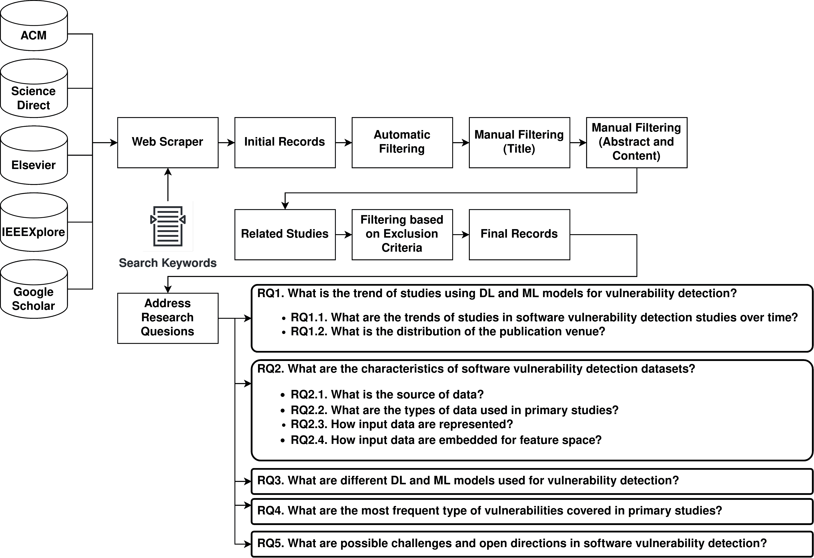

<!--yml

类别: 未分类

日期: 2024-09-06 19:38:53

-->

# [2306.11673] 关于使用机器学习和深度学习的自动化软件漏洞检测的调查

> 来源：[`ar5iv.labs.arxiv.org/html/2306.11673`](https://ar5iv.labs.arxiv.org/html/2306.11673)

# 关于使用机器学习和深度学习的自动化软件漏洞检测的调查

Nima Shiri harzevili nshiri@yorku.ca 约克大学 4700 Keele St.北约克安大略省加拿大 M3J 1P3， Alvine Boaye Belle 约克大学 4700 Keele St.北约克加拿大 alvine.belle@lassonde.yorku.ca， Junjie Wang 中国科学院软件研究所北京中国 junjie@iscas.ac.cn， Song Wang 约克大学 4700 Keele St.北约克加拿大 wangsong@yorku.ca， Zhen Ming (Jack) Jiang 约克大学 4700 Keele St.北约克加拿大 zmjiang@eecs.yorku.ca 和 Nachiappan Nagappan Meta 西雅图美国 nachiappan.nagappan@gmail.com(2018)

###### 摘要。

软件漏洞检测在软件安全中至关重要，因为它能识别软件系统中的潜在漏洞，从而在漏洞被利用之前实施及时的修复和缓解措施。自动漏洞识别很重要，因为它可以比人工代码审计更高效地评估大型代码库。近年来，许多基于机器学习（ML）和深度学习（DL）的模型已被提出用于检测源代码中的漏洞。然而，缺乏总结、分类和分析 ML/DL 模型在漏洞检测中的应用的调查。没有全面的调查，可能难以发现现有研究中的差距和未来改进的潜力。这可能导致重要的研究领域被忽视或代表不足，从而对漏洞检测的现状产生偏差的理解。这项工作通过提出一个系统的调查来弥补这一空白，通过五个主要的研究问题（RQs）来表征各种 ML/DL 基础的源代码级软件漏洞检测方法的特征。具体来说，我们的 RQ1 考察了利用 ML/DL 进行漏洞检测的出版趋势，包括研究的发展和出版场所的分布。RQ2 描述了现有 ML/DL 模型使用的漏洞数据集，包括它们的来源、类型和表示，以及对这些方法所用嵌入技术的分析。RQ3 探索了 ML/DL 基础的漏洞检测方法的模型架构和设计假设。RQ4 总结了现有研究涵盖的漏洞类型和频率。最后，RQ5 提出了当前需要研究的挑战清单，并概述了一个潜在的研究路线图，突出未来工作的关键机会。

源代码，软件安全，软件漏洞检测，软件漏洞检测，机器学习，深度学习^†^†版权：acmcopyright^†^†期刊年份：2018^†^†doi：XXXXXXX.XXXXXXX^†^†期刊：JACM^†^†期刊卷号：37^†^†期刊期号：4^†^†文章：111^†^†出版月份：8^†^†ccs：安全与隐私 软件安全工程

## 1\. 引言

软件安全漏洞的自动检测是确保软件安全的重要组成部分。机器学习（ML）和深度学习（DL）的突破引发了对将这些模型用于发现一般软件系统中的漏洞的极大兴趣。**(Wang et al., 2018; Cheng et al., 2021; Li et al., 2021a; Le et al., 2021b; Yan et al., 2021)**。ML/DL 模型擅长从大数据集中发现微妙的模式和相关性。它们可以从原始数据中自动提取有意义的特征，例如源代码，并识别可能指示软件漏洞的隐藏模式。这种能力在漏洞检测中至关重要，因为漏洞通常涉及微妙的代码特征和依赖关系。此外，ML/DL 模型能够处理各种数据类型和格式，包括源代码 **(Dam et al., 2018, 2017; Shippey et al., 2019; Wang et al., 2016; Jeon and Kim, 2021; Tian et al., 2020; Liu et al., 2020; Yamaguchi et al., 2013)**，文本信息 **(Hoang et al., 2019)**，以及诸如提交特征之类的数值特征 **(Pascarella et al., 2019; Yang et al., 2017)**。它们可以处理和分析这些数据表示，以有效地检测漏洞。这种灵活性使研究人员能够利用各种数据源，并结合不同的特征进行全面的漏洞检测。利用 ML/DL 模型进行软件漏洞检测的整体过程如下：数据收集：构建漏洞检测模型的第一步是收集相关的漏洞数据用于训练模型。漏洞检测数据集有多种来源（我们在 RQ2 中详细说明），研究人员可以使用基准数据 **(Le et al., 2018; Zou et al., 2019; Cao et al., 2022; Ghaffarian and Shahriari, 2021; Wu et al., 2021; Ziems and Wu, 2021; Zhuang et al., 2020; Li et al., 2021c; Filus et al., 2020; Li et al., 2018; Yang et al., 2017)** 或根据需求和漏洞类型从开源数据中收集 **(Fu and Tantithamthavorn, 2022; Chen et al., 2021; Perl et al., 2015; Riom et al., 2021; Ni et al., 2022)**。数据表示：数据收集后，需要进行预处理以准备训练。预处理包括使用适当的表示技术，即图/树表示 **(Zou et al., 2019; Cao et al., 2022; Ghaffarian and Shahriari, 2021; Wu et al., 2021; Lin et al., 2017; Zhuang et al., 2020; Li et al., 2017; Lin et al., 2019; Li et al., 2021c; Duan et al., 2019; Zheng et al., 2021; Zhuang et al., 2022; Cheng et al., 2022; Liu et al., 2021b)**，标记表示 **(Zou et al., 2021; Huo et al., 2018; Harer et al., 2018; Hin et al., 2022; Le et al., 2018; Chen et al., 2021; Scandariato et al., 2014; Ziems and Wu, 2021; Filus et al., 2020)**，或使用提交特征。嵌入：这一步涉及将源代码表示转换为数值格式 **(Zou et al., 2021; Huo et al., 2018; Harer et al., 2018; Hin et al., 2022; Fu and Tantithamthavorn, 2022; Le et al., 2018; Cao et al., 2022; Ghaffarian and Shahriari, 2021; Lin et al., 2017; Scandariato et al., 2014; Perl et al., 2015)**（向量或嵌入），以便机器学习或深度学习模型可以用于漏洞检测。模型选择和架构设计：必须根据软件漏洞检测任务选择合适的 ML/DL 模型。这可以包括从简单的 ML 算法，如 SVM 或随机森林 **(Chen et al., 2020b; Sabetta and Bezzi, 2018; Zhou and Sharma, 2017)**，到更高级的 DL 架构，如 CNNs **(Hoang et al., 2019; Yan et al., 2021; Huo et al., 2018)** 或 RNNs。模型的架构旨在从输入数据中提取重要特征和模式。训练：在训练阶段，漏洞检测数据集被分为训练集和验证集，模型从标记数据中学习。模型的参数根据预测误差迭代更新，使用如梯度下降等优化技术。评估和验证：训练完成后，使用单独的测试数据集评估模型的性能。计算各种指标，如准确率、精确率、召回率和 F1 分数，以评估模型在检测漏洞方面的有效性。模型还可能针对现实世界中的漏洞进行验证，以衡量其实际效用。

尽管许多研究已经利用机器学习/深度学习技术来检测软件漏洞，但尚未有全面的综述来整合这些技术的各种方法和特征。进行这样一个系统的调查对从业者和研究人员来说将是有益的，可以更好地了解当前最先进的漏洞检测工具，并为未来的研究提供灵感。本研究进行了详细而全面的调查，从不同角度回顾、分析、描述和分类漏洞检测的论文。我们分析了 2011 年至 2022 年间在 37 个旗舰软件工程期刊和会议上发表的 67 篇文章。我们在本研究中调查了以下研究问题（RQs）：

+   •

    RQ1：使用机器学习/深度学习模型进行漏洞检测的研究趋势是什么？

    +   –

        RQ1.1：软件漏洞检测研究的趋势随着时间的推移有什么变化？

    +   –

        RQ1.2：出版场所的分布情况如何？

+   •

    RQ2：在软件漏洞检测中使用的实验数据集有哪些特征？

    +   –

        RQ2.1：数据来源是什么？

    +   –

        RQ2.2：主要研究中使用的数据类型是什么？

    +   –

        RQ2.3：输入数据是如何表示的？

    +   –

        RQ2.4：输入数据是如何嵌入到特征空间中的？

+   •

    RQ3：用于漏洞检测的不同机器学习/深度学习模型有哪些？

+   •

    RQ4：这些研究中最常见的漏洞类型是什么？

+   •

    RQ5：软件漏洞检测中可能面临的挑战和开放方向有哪些？

本文做出了以下贡献：

+   •

    我们对 67 项相关研究进行了深入分析，这些研究使用机器学习/深度学习技术检测安全漏洞，涉及出版趋势、出版场所的分布以及贡献类型。

+   •

    我们进行了全面分析，以了解这些基于机器学习/深度学习的漏洞检测技术中的数据集、数据处理、数据表示、模型架构、模型可解释性以及涉及的漏洞类型。

+   •

    我们根据模型的架构提供了漏洞检测中使用的机器学习/深度学习模型的分类，并分析了这些模型上的技术选择策略。

+   •

    我们讨论了使用机器学习/深度学习技术进行漏洞检测的不同技术挑战，并概述了关键的未来方向。

+   •

    我们已将结果和分析数据共享为一个复制包¹¹1https://colab.research.google.com/drive/1O42duwz34H3fRoyfA37EU6Ig2u16R1Lb?usp=sharing，以便其他研究人员可以轻松跟随本文并进行扩展。

我们相信这项工作对软件工程和网络安全领域的研究人员和从业者是有用的，特别是对那些关注软件漏洞检测和缓解的人士。此外，我们的系统性调查结果也可能对政策制定者、软件供应商以及其他关注提高软件安全性和降低网络攻击风险的利益相关者有所帮助。这些人可能会利用评审提供的见解来指导他们在软件开发、采购和风险管理方面的决策。

本文的其余部分组织如下：第二部分总结了现有的关注于提出软件漏洞检测系统性调查的研究。第二部分介绍了使用 ML/DL 技术进行软件漏洞检测的系统性调查相关工作。第三部分展示了本文提出的论文收集研究方法及纳入和排除研究的标准。第四部分讨论了研究问题及相应结果。第五部分讨论了这项系统性调查可能存在的局限性。最后，第六部分讨论了结论和未来方向。

## 2\. 背景和相关工作

在本文的这一部分，我们首先提供了对漏洞定义和软件漏洞检测不同步骤的背景介绍。然后我们讨论了相关调查，并突出其与我们调查的区别。

### 2.1\. 背景

目前，软件漏洞管理对保障软件系统的安全性和完整性至关重要 (Chang et al., 2011; Foreman, 2019; Raza and Ahmed, 2022; Walkowski et al., 2021)。鉴于对软件在金融交易等许多关键过程中的日益依赖，漏洞的频繁出现带来了严重的风险 (Lu et al., 2021; He et al., 2020)，自动驾驶 (Gao et al., 2021; Luo et al., 2019)，以及任务关键系统 (Goseva-Popstojanova and Tyo, 2017; Harzevili et al., 2022)。如果软件漏洞未被检测或忽视，恶意实体可以利用这些漏洞来获取未经授权的访问、泄露敏感信息或干扰服务 (Harzevili et al., 2022)。因此，出色的软件漏洞管理对于应对这些风险、保护用户隐私 (Anthonysamy et al., 2017)、维护系统可用性，以及确保软件应用的可信度 (Medeiros et al., 2023)至关重要。通过主动检测、分析和修复漏洞，组织可以增强其软件系统抵御不断变化的网络安全威胁 (Aslan et al., 2023)，并遵循行业最佳实践以实现安全的软件开发和部署。

软件漏洞管理包括多个步骤，涵盖漏洞检测 (Cao et al., 2022)、漏洞分析 (Kudjo et al., 2020) 和漏洞修复 (Le et al., 2021a)。在接下来的子章节中，我们将详细阐述每个步骤。

#### 2.1.1\. 漏洞检测

漏洞检测在管理软件漏洞的整个过程中至关重要 (Cao et al., 2022; Jeon and Kim, 2021; Tian et al., 2020; Liu et al., 2020; Wang et al., 2020; Cheng et al., 2021; Zou et al., 2019; Cao et al., 2022; Ziems and Wu, 2021; Lin et al., 2019; Li et al., 2021c)。它包括检测和调查软件系统中攻击者可能利用的安全漏洞。传统的漏洞检测技术有几种常用的方法：

手动代码审计（Staron 等, 2020; Bacchelli 和 Bird, 2013; Carlsson 和 Baca, 2005; Shar 和 Tan, 2012, 2010）：在这种方法中，人工专家彻底检查源代码，目的是手动检测编码缺陷、不安全的程序和可能的漏洞。手动代码审查费时且需要合格的开发人员或安全分析师的知识。然而，它提供了对代码的深入理解，并能揭示自动化工具可能忽视的微妙错误。

静态分析（Facebook, 2013; Wheeler, 2013; Dunham, 2009; Marjamäki, 2016; SpotBugs., 2021; Lattner, 2008）：静态分析涉及使用自动化工具分析源代码或编译后的二进制文件而无需执行软件。它检查代码结构，识别潜在的编码问题，并检测常见的漏洞，如缓冲区溢出（Harzevili 等, 2022）、注入攻击和不安全的数据处理。静态分析工具采用数据流分析、控制流分析和模式匹配等各种技术来识别潜在的漏洞。它们可以通过高效分析大型代码库来帮助扩展漏洞检测工作。

动态分析（Nethercote 和 Seward, 2007; Lehmann 和 Pradel, 2019; Cadar 等, 2008）：动态分析的目标是评估软件在运行时的行为。它包括在受控环境中运行软件或通过自动化测试来监控其执行和与系统资源的交互。动态分析可以检测输入验证（Kim 等, 2019）、访问控制和错误处理中的漏洞。通过分析软件的实时行为，这种方法可以识别静态分析无法发现的漏洞。然而，动态分析可能在显著的系统开销方面存在限制（Yong 和 Horwitz, 2005）。

#### 2.1.2\. 漏洞分析

在检测到漏洞之后，软件漏洞管理的下一步是漏洞分析和评估（Le 等, 2019; Suciu 等, 2022; Jacobs 等, 2023; Yin 等, 2022; Le 等, 2022; Mahor 等, 2022; Frei 等, 2006）。这一步涉及对已识别的漏洞进行进一步检查，以评估其严重性、影响和潜在的可利用性。

严重性：准确评估软件漏洞至关重要，原因有几个。首先，它允许组织根据漏洞的严重性来优先响应。严重性指的是如果漏洞被利用，可能产生的影响（Kudjo et al., 2019; Chen et al., 2020a; Kudjo et al., 2020; Tan et al., 2020）。通过准确评估严重性，组织可以将注意力集中在对软件系统的安全性和功能性构成重大风险的高严重性漏洞上。

影响：其次，准确评估漏洞有助于确定其可能对组织产生的影响（Gawron et al., 2018; Gong et al., 2019; Chen et al., 2010; Jiang and Atif, 2020）。影响指的是利用漏洞可能产生的后果，如服务拒绝（Harzevili et al., 2022）或数据泄露（Aaltonen and Gao, 2021）。通过了解潜在影响，组织可以就修复工作的紧急性和优先级做出明智决策。

利用性：此外，准确评估漏洞有助于理解其潜在的利用性（Chen et al., 2019b, a; Bozorgi et al., 2010）。这包括确定攻击者成功利用漏洞渗透软件系统的可能性。通过评估诸如利用难度和利用技术的可用性等标准，组织可以估计每个漏洞相关的风险，并相应地投入资源。

#### 2.1.3\. 漏洞修复

解决检测到的软件漏洞的过程，包括修补、代码修改和修复等技术，称为软件漏洞修复（Canfora et al., 2022; Piantadosi et al., 2019; Chen et al., 2022; Bhandari et al., 2021）。修复的基本目标是消除或减轻漏洞，以提高软件系统的安全性和可靠性。常见的漏洞修复方法之一是应用由软件供应商或开源社区提供的补丁（Xia et al., 2023; Li et al., 2022; Gissurarson et al., 2022）。补丁是更新或修复，旨在解决软件系统中识别出的特定漏洞或弱点。

#### 2.1.4\. ML/DL 用于软件漏洞检测

通过利用数据分析、模式识别和机器驱动学习来发现软件安全漏洞，ML/DL 方法彻底改变了软件漏洞检测。（Wang et al., 2018; Cheng et al., 2021; Li et al., 2021a; Le et al., 2021b; Yan et al., 2021）。这些技术提高了漏洞检测的准确性和效率，可能实现自动检测、更快分析和识别以前未公开的漏洞。

ML/DL 在漏洞检测中的一个常见应用是对代码片段（Dam et al., 2017; Shippey et al., 2019; Wang et al., 2016; Jeon and Kim, 2021）、软件二进制文件（Phan et al., 2017; Nguyen et al., 2020; Yan et al., 2021; Huang et al., 2021）或从 GitHub 或 CVE 等开源库中提取的代码更改（Sabetta and Bezzi, 2018; Wang et al., 2020; Liu et al., 2019a; Pradel and Sen, 2018; Hoang et al., 2019; Zhou et al., 2019; Dinella et al., 2020; Li et al., 2019）进行分类。ML 模型可以在标记数据集上进行训练，其中每个样本代表已知的漏洞或非漏洞。这些模型然后学习从提供的示例中进行概括，并根据已学到的模式对新实例进行分类。这种方法可以自动发现漏洞，无需手动检查，从而显著减少了分析所需的时间和精力。

检测软件漏洞的 ML/DL 模型相比于传统方法具有显著的优势。每项优势将在下一段中深入探讨。

自动化：自动化是一个重要优势。ML 模型可以自动扫描和分析大规模代码库、网络流量日志或系统配置，标记潜在的漏洞，而不需要对每个单独的案例进行人工干预（Chakraborty et al., 2021）。这种自动化加快了检测过程，使安全团队能够专注于验证和缓解漏洞，而不是手动分析。

性能：ML/DL 方法提供了更快的分析速度。传统的漏洞检测方法依赖手动检查或预定义规则的应用（Staron et al., 2020; Bacchelli and Bird, 2013; Carlsson and Baca, 2005; Shar and Tan, 2012, 2010）。相对而言，ML/DL 方法可以并行评估大量数据并快速生成预测，大大缩短了找到漏洞所需的时间。

检测有效性：机器学习/深度学习模型能够发现以前未知的漏洞，通常被称为零日漏洞 (Bilge 和 Dumitraş, 2012)。这些模型即使没有专门针对这些漏洞进行训练，通过学习模式和从标记数据中进行泛化，也可能发现漏洞迹象。这种能力通过帮助识别和解决软件中的未知弱点，从而在攻击者利用这些漏洞之前提高整体安全态势 (Abri 等, 2019)。

### 2.2\. 相关工作

文献中已有几篇关于软件漏洞的调查论文。在本节中，我们根据不同的方面分析现有的论文，如表 1 所示。

表 1. 我们的调查与现有相关调查/评论之间的贡献比较。

| 无 | 研究 | 数据来源 | 表示 | 嵌入 | 模型 | 漏洞类型 | 可解释性 |
| --- | --- | --- | --- | --- | --- | --- | --- |
| 1 | Triet 等 (Le 等, 2021a) | ✓ | $\times$ | $\checkmark$ | $\checkmark$ | $\times$ | $\times$ |
| 2 | Ghaffarian 等 (Ghaffarian 和 Shahriari, 2017) | $\checkmark$ | $\checkmark$ | $\checkmark$ | $\checkmark$ | $\times$ | $\times$ |
| 3 | Lin 等 (Lin 等, 2020) | $\checkmark$ | $\checkmark$ | $\checkmark$ | $\checkmark$ | $\times$ | $\times$ |
| 4 | Zeng 等 (Zeng 等, 2020) | $\checkmark$ | $\checkmark$ | $\checkmark$ | $\checkmark$ | $\times$ | $\times$ |
| 5 | Semasaba 等 (Semasaba 等, 2020) | $\checkmark$ | $\checkmark$ | $\times$ | $\checkmark$ | $\checkmark$ | $\times$ |
| 6 | Sun 等 (Sun 等, 2018) | $\checkmark$ | $\times$ | $\times$ | $\times$ | $\checkmark$ | $\times$ |
| 7 | Kritikos 等 (Kritikos 等, 2019) | $\checkmark$ | $\times$ | $\times$ | $\times$ | $\checkmark$ | $\times$ |
| 8 | Khan 等 (Khan 和 Parkinson, 2018) | $\times$ | $\times$ | $\times$ | $\times$ | $\times$ | $\times$ |
| 9 | Nong 等 (Nong 等, 2022) | $\times$ | $\times$ | $\times$ | $\times$ | $\times$ | $\times$ |
| 10 | Chakraborty 等 (Chakraborty 等, 2021) | $\times$ | $\times$ | $\times$ | $\times$ | $\times$ | $\times$ |
| 11 | Liu 等 (Liu 等, 2021a) | $\times$ | $\times$ | $\times$ | $\times$ | $\times$ | $\times$ |
| 12 | Bi 等 (Bi 等, 2023) | $\times$ | $\times$ | $\times$ | $\times$ | $\times$ | $\times$ |
| 12 | 我们的调查 | $\checkmark$ | $\checkmark$ | $\checkmark$ | $\checkmark$ | $\checkmark$ | $\checkmark$ |

表格中的列代表了调查的不同方面，例如使用的数据源、表示方法、特征嵌入、机器学习/深度学习模型、漏洞类型以及机器学习/深度学习模型的可解释性。数据源列表示调查是否回顾了漏洞检测的数据源。表示方法列讨论了调查是否在分析中考虑了源代码表示。嵌入列处理了调查是否在分析中考虑了特征嵌入。表格的第六列将机器学习/深度学习模型列为**ML Models**。表格还检查了调查是否基于**Common Weakness Enumeration (CWE)** 编号考虑了漏洞类型。最后一列表示调查是否考虑了机器学习/深度学习模型的可解释性。

Ghaffarian 等人（Ghaffarian 和 Shahriari，2017）的研究是在数据驱动的安全漏洞检测方面最接近我们的调查。在他们的调查中，他们从数据源、表示方式、嵌入类型和不同的 ML/DL 模型等各个方面分析了数据驱动的软件漏洞检测，如表 1 所示。然而，与我们的工作相比，有几个区别。具体来说，本研究还从以下方面对漏洞检测进行了调查：**全面覆盖**：了解各种漏洞类型使研究人员能够创建和开发有效的漏洞检测模型，从而彻底发现安全漏洞。为了确保他们的检测系统覆盖尽可能多的漏洞类型，研究人员必须熟悉各种攻击方法和软件系统中的潜在弱点。**检测技术的定制化**：不同类型的漏洞需要不同的检测方法。为了建立能够发现特定类型漏洞的专用检测系统，研究人员必须首先了解每种漏洞类型的细微差别。**缓解工作优先级**：通过了解多种漏洞类型，研究人员可以根据每种漏洞的严重程度和影响来优先考虑缓解工作。研究人员可以优先处理对系统或组织构成最大威胁的关键漏洞。**对攻击模式的更好理解**：了解不同类型的漏洞为研究人员提供了攻击者使用的不同攻击模式的见解。这种知识帮助研究人员设计检测技术，能够检测到已知的攻击模式以及新的、未知的模式。**可解释性**指的是解释模型如何做出特定决策或预测的能力。这在软件漏洞检测中尤其重要，因为安全研究人员需要了解模型为什么将特定代码标记为潜在的漏洞。此外，可解释性可以帮助提高对模型预测的信任。如果开发人员和安全研究人员能够理解模型如何做出决策，他们更有可能信任其输出并根据其建议采取适当的行动。

Triet 等人（Le 等人，2021a）回顾了基于数据的脆弱性评估和优先排序研究。他们对利用机器学习和数据挖掘方法的软件评估和优先排序的先前研究进行了综述。他们考察了该领域的各种研究类型，讨论了每种方法的优缺点，并突出了尚未解决的问题和未来研究的潜在方向。我们工作的主要区别在于，我们回顾了脆弱性检测方法，而他们调查了评估和优先排序技术。脆弱性检测、脆弱性评估和脆弱性优先排序都是脆弱性管理生命周期中的重要组成部分，但它们涉及脆弱性管理过程中的不同阶段。我们的工作侧重于脆弱性检测，即识别软件系统中潜在脆弱性的过程。脆弱性检测的目标是识别系统中存在的所有脆弱性，无论其严重性如何。另一方面，脆弱性评估涉及评估每个已识别脆弱性的严重性和潜在影响。这种评估可能涉及分析脆弱性被利用的可能性和可能造成的潜在伤害等因素。脆弱性优先排序涉及根据脆弱性的风险或重要性对识别出的脆弱性进行排序。这种排序通常基于脆弱性评估的结果，以及解决这些脆弱性所需的资源等其他因素。

林等（林等， 2020）研究了使用深度学习和基于神经网络的方法检测软件漏洞的文献。与我们的调查相比，有几点不同。首先，该研究了传统的源代码表示技术（静态代码属性）用于软件漏洞检测。在我们的调查中，由于几个原因，我们忽略了对这些表示技术的评审。静态代码属性，例如代码长度或复杂性，可能在漏洞检测中效果不佳，因为它们未能捕捉代码在运行时的动态行为。漏洞可能以在静态代码中不明显的方式表现出来，这使得仅通过静态分析来检测它们变得困难。此外，静态代码属性可能无法捕捉代码的上下文，这对理解代码如何与系统中的其他组件交互非常重要。最后，静态分析工具可能产生较高的假阳性率，这可能耗时进行验证，并可能导致开发人员忽视重要的漏洞。其次，我们考察了在期刊和会议论文中发表的关于软件漏洞检测的论文的趋势分析，因为这提供了对特定领域或研究领域出版模式的全面理解。趋势分析可以揭示研究输出在各个出版场所的分布以及研究人员和作者的偏好变化。这些信息对于出版商、学术机构和研究人员等利益相关者在做出与出版、资金和研究合作相关的战略决策时具有参考价值。

曾等（曾等， 2020）讨论了对软件中可利用漏洞的关注度不断增加以及漏洞检测方法的发展，特别是机器学习技术的应用。该论文回顾了 22 项使用深度学习检测漏洞的最新研究，并识别了四个在该领域产生显著影响的关键因素。调查进一步比较了这些关键因素在软件漏洞检测中的不同方面，包括数据来源、特征表示、深度学习模型和检测粒度。与我们的调查相比，有几点不同。首先，我们分析了在期刊和会议上发表的关于软件漏洞检测的论文的趋势模式。这一分析帮助我们深入理解特定研究领域或领域的出版趋势。其次，我们涵盖了更多的软件漏洞检测方面。尽管他们只涵盖了数据来源、特征表示、深度学习模型和检测粒度，但我们还包括了漏洞类型和机器学习/深度学习模型的可解释性等更多方面。此外，我们对不同方面进行了更细致的分析。

Kritikos 等人（Kritikos et al.，2019）和 Sun 等人（Sun et al.，2018）专注于网络安全，旨在提高网络韧性。Sun 等人（Sun et al.，2018）讨论了理解和防御网络威胁的范式变化，从反应性检测转向主动预测，重点是新研究的网络安全事件预测系统，这些系统使用多种数据源。Kritikos 等人（Kritikos et al.，2019）讨论了将应用程序迁移到云端并确保其安全的挑战，重点是应用程序生命周期中的漏洞管理，以及使用开源工具和数据库来更好地保护应用程序。虽然这两个摘要的主题不同，但它们有一个共同的目标，即提高网络安全性和韧性。两者都强调了采取主动措施以防止或缓解网络威胁的重要性，而不是仅仅依赖反应性检测和响应。此外，两者都强调了利用各种数据源和工具来改进网络安全措施的重要性。虽然两种方法都旨在提高应用程序的安全性，但它们在重点和使用的技术上有所不同。它们主要侧重于提供指导和工具，以支持应用程序生命周期中的漏洞管理，而在我们的调查中，我们专注于使用 ML/DL 技术在源代码中进行软件漏洞检测，旨在自动化识别源代码中的漏洞。

Khan 等人（Khan and Parkinson，2018）专注于漏洞评估，这是在黑客利用漏洞之前找到并修复计算机系统中的漏洞的过程。这突出了对自动化漏洞缓解策略的更多研究的必要性，这些策略可以有效地保护软件系统。另一方面，使用 ML/DL 方法在源代码中进行漏洞识别涉及分析应用程序的源代码以发现安全缺陷。这种方法不是评估整个系统的安全性，而是集中在发现代码本身中的漏洞。

Nong 等人（Nong et al., 2022）探讨了软件漏洞检测研究中的开放科学方面，并认为在软件工程中，特别是关于软件漏洞检测的开放科学问题研究不足。作者进行了详尽的文献研究，并确定了 55 项相关工作，这些工作提出了基于深度学习的漏洞检测方法。他们调查了开放科学方面的问题，包括可用性、可执行性、可重复性和可复制性。研究揭示，25.5% 的被检查方法提供了开源工具。此外，一些开源工具缺乏充分的文档和详细的实现，导致其不可操作或不可复制。使用不平衡或故意产生的数据集导致方法的性能被夸大，从而使其不可复制。

Chakraborty 等人（Chakraborty et al., 2021）调查了前沿深度学习（DL）基于的漏洞预测方法在实际漏洞预测场景中的表现。他们发现，最先进的 DL 技术在实际场景中的性能下降超过 50%。他们还发现了训练数据的问题（例如数据重复和漏洞类别的不现实分布）以及模型选择的问题（例如简化的基于 token 的模型）。现有的 DL 基于方法往往学习到与漏洞原因无关的伪影。与我们的调查研究相比，显著的不同在于我们的工作集中于机器学习/深度学习（ML/DL）模型在软件漏洞检测中的使用，并描述了漏洞检测流程中的不同阶段。而他们则关注于最先进的 DL 模型在软件漏洞检测中的使用问题。

Liu 等人（Liu et al., 2021a）讨论了深度学习（DL）技术在软件工程研究中的日益流行，原因是它们能够在没有广泛的手动特征工程的情况下解决软件工程挑战。作者强调了 DL 研究中常被忽视的两个重要因素：可重复性和可复制性。可重复性指的是其他研究者是否可以使用作者的工具获得相同的结果，而可复制性指的是在不同的实验设置下使用重新实现的工具获得类似的结果。与我们的研究相比，主要的不同在于我们关注 ML/DL 技术在软件漏洞检测流程中的应用，而他们则强调软件工程研究中报告结果的可复制性和可重复性。

Bi et al.（Bi et al., 2023）强调了软件漏洞检测技术的重要性以及缺乏系统性评估这些方法的标准。该研究首次探讨并描述了软件漏洞检测基准测试的现状。评估检查了现有文献中的漏洞检测基准，包括在技术提出的出版物和实证研究中使用的方法。调查考察了与漏洞检测基准相关的困难，并建议了应对这些困难的替代解决方案。然而，他们并未像我们的工作那样对数据集、表示法、嵌入技术和用于软件漏洞识别的模型进行详细描述。

## 3. 方法论的系统调查

### 3.1. 信息来源

在本文中，我们进行了实证研究，参考了（Keele et al., 2007; Petersen et al., 2015）。本研究的目的是收集和审查 2011 年至 2022 年间关于利用机器学习和深度学习技术进行漏洞检测的各类编程语言和源代码的论文。2011 年至 2022 年这一时间段适合回顾数据驱动的漏洞检测，原因有以下几点：a) 软件漏洞的数量和多样性的增加：在过去十年里，发现和报告的软件漏洞数量及其多样性显著增加²²2https://nvd.nist.gov/general/news。截至 2021 年，国家漏洞数据库（NVD）中存在 150,000 个 CVE 记录³³3https://nvd.nist.gov/general/brief-history。这一增加促使需要更复杂有效的漏洞检测方法，从而推动了新的数据驱动技术的发展。b) 机器学习/深度学习及数据分析的进展：过去十年中，机器学习取得了显著进展，包括深度学习算法的开发（Goodfellow et al., 2020; Hinton et al., 2006）、自然语言处理技术（Devlin et al., 2018; Liu et al., 2019b）以及其他在检测软件漏洞方面效果显著的数据驱动方法。

在开始收集论文时，我们从四个可用的数据库中搜索相关的研究论文，这些数据库是 ScienceDirect、IEEE Xplore、ACM 数字图书馆和 Google Scholar。

### 3.2. 搜索词

从早期的工作中，我们识别出用于搜索的关键短语（Le et al., 2021a; Lin et al., 2020; Zeng et al., 2020; Semasaba et al., 2020）以及我们在该领域的经验。以下是搜索词：

漏洞检测 OR 安全漏洞检测 OR 使用机器学习的漏洞检测 OR 使用深度学习的漏洞检测 OR 源代码安全错误预测 OR 源代码漏洞检测 OR 源代码错误预测

### 3.3\. 研究选择

选择纳入我们调查的研究的过程包括以下阶段：(1) 根据标题初步选择研究，(2) 在审查摘要后选择研究，(3) 阅读全文后进一步选择。请注意，初步搜索结果包含与安全漏洞检测无关的条目。这可能是由于偶然的关键词匹配造成的。我们手动检查每篇论文，并移除这些不相关的论文，以确保我们调查数据集的质量。我们还观察到搜索结果中存在重复的论文，因为相同的研究可能被多个数据库索引。然后我们手动丢弃重复的研究。为了帮助选择那些提出了新的基于 ML 或 DL 的模型用于软件漏洞识别的论文，我们提供了以下纳入和排除标准：

+   •

    研究应经过同行评审

+   •

    研究应具有实验结果

+   •

    研究应采用 ML 或 DL 技术

+   •

    研究应改进现有的数据驱动漏洞检测技术

+   •

    ML/DL 模型的输入应为源代码、提交记录或字节码

此外，我们还制定了以下排除标准以筛选出不相关的论文：

+   •

    关注其他工程领域的研究

+   •

    处理静态分析、动态分析、突变测试、故障定位的研究

+   •

    综述论文

+   •

    关注网络和 Android 应用程序漏洞检测的研究

+   •

    研究属于以下类别之一：书籍、章节、教程、技术报告

+   •

    使用代码相似性或克隆检测工具的研究

+   •

    关注移动设备上的恶意软件检测、入侵检测以及使用静态代码属性的错误检测的研究

根据这些标准，我们通过检查每篇论文的标题、摘要和内容来缩小我们的发现，以获取最相关和高质量的研究论文。为了使人工工作量可管理，我们开发了一个脚本来自动获取与软件漏洞检测问题相关的高质量记录。总之，在第一阶段，我们从数据库搜索中获得了总共 3,154 篇论文。从这个初步池中，选择了 880 篇论文进入第二阶段进一步评估。在第二阶段，这些论文根据其摘要进行了审查，最终选择了 116 篇摘要相关的论文。最后，在第三阶段，经过阅读全文，最终选择了 67 篇论文纳入研究。

### 3.4\. 研究质量评估

对于每项最终选择的研究，我们回答了以下问题以评估其质量：

+   •

    是否有明确陈述的软件漏洞检测相关研究目标？

+   •

    提出的漏洞检测方法是否使用了**ML**或**DL**技术？

+   •

    是否存在明确且可重复的技术？

+   •

    是否有明确的贡献于漏洞检测？

+   •

    是否有明确的方法论用于验证该技术？

+   •

    选定用于验证的主题项目是否适合研究目标？

+   •

    是否有控制技术或基准来展示漏洞检测技术的有效性？

+   •

    评估指标是否与研究目标相关（例如，评估提出技术的有效性）？

+   •

    研究中呈现的结果是否符合研究目标，并且以清晰和相关的方式展示？

### 3.5\. 选择验证

创建所选 67 项主要研究的分类法过程涉及几个步骤。最初，首席作者建立了一个初步分类法，将研究基于其研究问题进行分组。该分类法为以有意义和系统的方式组织研究提供了基本框架。接下来，首席作者通过将新论文分配到初步分类法中来扩展分类法。如果新论文无法适应分类法中的任何现有类别，则会创建一个反映该论文独特特征的新类别。为了确保分类法的准确性，第二和第三作者（未参与分类法创建过程）从工作流程中随机选择 20 篇论文，检查创建的分类法是否存在任何差异。他们然后标记发现的任何分歧，所有三位作者讨论并解决这些分歧。最初，分歧率为 30%，但经过第二轮审查和论文交叉检查后，作者们能够消除所有分歧。

图 1. 我们调查的工作流程。

## 4\. 结果

我们在这一部分展示我们的分析和发现，以回答在第一部分中提出的研究问题。

### 4.1\. RQ1\. 使用**ML/DL**模型进行漏洞检测的研究趋势是什么？

为了理解出版物的趋势，我们检查了出版日期以及它们发表的场所。

#### 4.1.1\. RQ1.1\. 随着时间推移，软件漏洞检测研究的趋势是什么？

图 2 展示了 2011 年至 2022 年间，漏洞检测研究的出版趋势。可以观察到，出版数量逐年增加。从 2011 年到 2016 年只有一篇出版物，而到 2021 年，出版物数量增加到 18 篇。然而，与前一年相比，2022 年的出版物数量有所减少。我们还检查了图 2 中显示的累计出版物数量。值得注意的是，拟合分布的曲线在 2018 年至 2022 年之间显示出显著的斜率增加，表明自 2017 年以来，使用**机器学习/深度学习**技术进行软件漏洞检测已成为一种普遍趋势，广泛的研究利用了**ML/DL**模型来应对这一领域的挑战。

`<svg height="100.52" overflow="visible" version="1.1" width="248.12"><g transform="translate(0,100.52) matrix(1 0 0 -1 0 0) translate(25.47,0) translate(0,25.97) matrix(0.6 0.0 0.0 0.6 -25.47 -25.97)" fill="#000000" stroke="#000000" stroke-width="0.4pt"><g transform="matrix(1 0 0 1 0 0) translate(85.23,0) translate(0,54.26)"><g stroke="#000000" fill="#000000" stroke-width="0.4pt"><g transform="matrix(1.0 0.0 0.0 1.0 271.4 -30.7)" fill="#000000" stroke="#000000"><foreignobject width="27.67" height="8.92" transform="matrix(1 0 0 -1 0 16.6)" overflow="visible">2022</foreignobject></g><g transform="matrix(1.0 0.0 0.0 1.0 242.88 -30.7)" fill="#000000" stroke="#000000"><foreignobject width="27.67" height="8.92" transform="matrix(1 0 0 -1 0 16.6)" overflow="visible">2021</foreignobject></g><g transform="matrix(1.0 0.0 0.0 1.0 214.35 -30.7)" fill="#000000" stroke="#000000"><foreignobject width="27.67" height="8.92" transform="matrix(1 0 0 -1 0 16.6)" overflow="visible">2020</foreignobject></g><g transform="matrix(1.0 0.0 0.0 1.0 185.83 -30.7)" fill="#000000" stroke="#000000"><foreignobject width="27.67" height="8.92" transform="matrix(1 0 0 -1 0 16.6)" overflow="visible">2019</foreignobject></g><g transform="matrix(1.0 0.0 0.0 1.0 157.31 -30.7)" fill="#000000" stroke="#000000"><foreignobject width="27.67" height="8.92" transform="matrix(1 0 0 -1 0 16.6)" overflow="visible">2018</foreignobject></g><g transform="matrix(1.0 0.0 0.0 1.0 128.78 -30.7)" fill="#000000" stroke="#000000"><foreignobject width="27.67" height="8.92" transform="matrix(1 0 0 -1 0 16.6)" overflow="visible">2017</foreignobject></g><g transform="matrix(1.0 0.0 0.0 1.0 100.26 -30.7)" fill="#000000" stroke="#000000"><foreignobject width="27.67" height="8.92" transform="matrix(1 0 0 -1 0 16.6)" overflow="visible">2016</foreignobject></g><g transform="matrix(1.0 0.0 0.0 1.0 71.73 -30.7)" fill="#000000" stroke="#000000"><foreignobject width="27.67" height="8.92" transform="matrix(1 0 0 -1 0 16.6)" overflow="visible">2015</foreignobject></g><g transform="matrix(1.0 0.0 0.0 1.0 43.21 -30.7)" fill="#000000" stroke="#000000"><foreignobject width="27.67" height="8.92" transform="matrix(1 0 0 -1 0 16.6)" overflow="visible">2014</foreignobject></g><g transform="matrix(1.0 0.0 0.0 1.0 14.69 -30.7)" fill="#000000" stroke="#000000"><foreignobject width="27.67" height="8.92" transform="matrix(1 0 0 -1 0 16.6)" overflow="visible">2013</foreignobject></g><g transform="matrix(1.0 0.0 0.0 1.0 -13.84 -30.7)" fill="#000000" stroke="#000000"><foreignobject width="27.67" height="8.92" transform="matrix(1 0 0 -1 0 16.6)" overflow="visible">2011</foreignobject></g><g transform="matrix(1.0 0.0 0.0 1.0 -54.59 -8.77)" fill="#000000" stroke="#000000"><foreignobject width="6.92" height="8.92" transform="matrix(1 0 0 -1 0 16.6)" overflow="visible">$0$</foreignobject></g><g transform="matrix(1.0 0.0 0.0 1.0 -54.59 12.78)" fill="#000000" stroke="#000000"><foreignobject width="6.92" height="8.92" transform="matrix(1 0 0 -1 0 16.6)" overflow="visible">$5$</foreignobject></g><g transform="matrix(1.0 0.0 0.0 1.0 -61.51 34.32)" fill="#000000" stroke="#000000"><foreignobject width="13.84" height="8.92" transform="matrix(1 0 0 -1 0 16.6)" overflow="visible">$10$</foreignobject></g><g transform="matrix(1.0 0.0 0.0 1.0 -61.51 55.86)" fill="#000000" stroke="#000000"><foreignobject width="13.84" height="8.92" transform="matrix(1 0 0 -1 0 16.6)" overflow="visible">$15$</foreignobject></g><g transform="matrix(1.0 0.0 0.0 1.0 -61.51 77.4)" fill="#000000" stroke="#000000"><foreignobject width="13.84" height="8.92" transform="matrix(1 0 0 -1 0 16.6)" overflow="visible">$20$</foreignobject></g><g transform="matrix(1.0 0.0 0.0 1.0 278.32 60.9)" fill="#0000FF" stroke="#0000FF" color="#0000FF"><foreignobject width="13.84" height="8.92" transform="matrix(1 0 0 -1 0 16.6)" overflow="visible">$14$</foreignobject></g><g transform="matrix(1.0 0.0 0.0 1.0 249.8 78.13)" fill="#0000FF" stroke="#0000FF" color="#0000FF"><foreignobject width="13.84" height="8.92" transform="matrix(1 0 0 -1 0 16.6)" overflow="visible">$18$</foreignobject></g><g transform="matrix(1.0 0.0 0.0 1.0 224.73 26.43)" fill="#0000FF" stroke="#0000FF" color="#0000FF"><foreignobject width="6.92" height="8.92" transform="matrix(1 0 0 -1 0 16.6)" overflow="visible">$6$</foreignobject></g><g transform="matrix(1.0 0.0 0.0 1.0 196.21 39.36)" fill="#0000FF" stroke="#0000FF" color="#0000FF"><foreignobject width="6.92" height="8.92" transform="matrix(1 0 0 -1 0 16.6)" overflow="visible">$9$</foreignobject></g><g transform="matrix(1.0 0.0 0.0 1.0 167.68 39.36)" fill="#0000FF" stroke="#0000FF" color="#0000FF"><foreignobject width="6.92" height="8.92" transform="matrix(1 0 0 -1 0 16.6)" overflow="visible">$9$</foreignobject></g><g transform="matrix(1.0 0.0 0.0 1.0 139.16 26.43)" fill="#0000FF" stroke="#0000FF" color="#0000FF"><foreignobject width="6.92" height="8.92" transform="matrix(1 0 0 -1 0 16.6)" overflow="visible">$6$</foreignobject></g><g transform="matrix(1.0

图 2. 漏洞检测研究的发表趋势。

表 2. 手动搜索的会议发表场所。

| No | 缩写 | 全称 |
| --- | --- | --- |
| 1 | ICSE | 软件工程国际会议 |
| 2 | ECSE/FSE | ACM SIGSOFT 软件工程基础研讨会 |
| 3 | ASE | IEEE/ACM 自动化软件工程国际会议 |
| 4 | USENIX | USENIX |
| 5 | OOPSLA | 面向对象编程、系统、语言与应用 |
| 6 | ISSTA | ACM SIGSOFT 软件测试与分析国际研讨会 |
| 7 | MSR | IEEE 挖掘软件库工作会议 |
| 8 | SANER | IEEE 国际软件分析、演化与重构会议 |
| 9 | ISSRE | IEEE 软件可靠性工程国际研讨会 |
| 10 | ICSME | IEEE 国际软件维护与演化会议 |
| 11 | IJCAI | 国际人工智能联合会议组织 |
| 12 | CCS | ACM SIGSAC 计算机与通信安全会议 |
| 13 | ICLR | 学习表征国际会议 |
| 14 | NIPS | 神经信息处理系统国际会议 |
| 15 | MASCOT | 计算机与电信系统的建模、分析与模拟 |
| 16 | QRS | IEEE 国际软件安全与可靠性会议 |
| 17 | KDDM | 太平洋-亚洲知识发现与数据挖掘会议 |
| 18 | NDSS | 网络与分布式系统安全研讨会 |
| 19 | ARES | ACM 国际可用性、可靠性与安全会议 |
| 20 | INFOCOM | IEEE 大数据安全与隐私国际研讨会 |
| 21 | ICTAI | IEEE 人工智能工具国际会议 |
| 22 | ICDM | IEEE 国际数据挖掘会议 |
| 23 | GLOBCOM | IEEE 全球通信会议 |
| 24 | TrustCom | IEEE 计算与通信中的信任、安全与隐私国际会议 |
| 25 | DSAA | IEEE 国际数据科学与高级分析会议 |

表 3. 手动搜索的期刊发表场所。

| No | 期刊缩写 | 全称 |
| --- | --- | --- |
| 1 | TSE | IEEE 软件工程期刊 |
| 2 | TOSEM | ACM 软件工程与方法学期刊 |
| 3 | IST | 信息与软件技术 |
| 4 | ESM | 实证软件工程 |
| 5 | JSS | 系统与软件期刊 |
| 6 | TDSC | IEEE 可靠与安全计算期刊 |
| 7 | CSJ | 计算机与安全期刊 |
| 8 | TIFS | IEEE 信息取证与安全期刊 |
| 9 | ISJ | 信息科学期刊 |
| 10 | TFS | IEEE 模糊系统期刊 |
| 11 | TKDE | IEEE 知识与数据工程期刊 |
| 12 | KBS | 知识基础系统 |

#### 4.1.2. RQ1.2: 发表场所的分布情况如何？

在本研究中，我们总体上分析和回顾了来自不同出版场所的 67 篇论文，其中包括 43 篇会议和研讨会论文，以及 24 篇期刊论文。我们在表格 2 和表格 3 中列出了会议和期刊的缩写及其完整名称。表格 4 展示了每个出版场所的主要研究分布。64.1%的出版物发表在会议和研讨会上，而 35.8%的论文发表在期刊上。可以观察到，MSR、IJCAI 和 ECSE/FSE 是主要研究数量最多的热门场所，每个场所都有 4 篇论文。同时，在期刊中，TDSC 和 TSE 包含的研究数量最多，分别为 6 篇和 4 篇。

<svg height="151.41" overflow="visible" version="1.1" width="593.51"><g transform="translate(0,151.41) matrix(1 0 0 -1 0 0) translate(20.38,0) translate(0,110.32)"><g stroke="#000000"><g stroke-width="1.0pt" fill="#000000" stroke="#000000" transform="matrix(1.0 0.0 0.0 1.0 0 0)"><foreignobject width="552.76" height="99.63" transform="matrix(1 0 0 -1 0 16.6)" overflow="visible">(1) 结果表明，近年来应用**机器学习/深度学习**技术进行软件漏洞检测的趋势显著上升。 (2) 大部分论文发表在最近两年，即 2021 年和 2022 年。 (3) MSR、IJCAI 和 ECSE/FSE 是最受欢迎的会议场所。另一方面，TDSC 和 TSE 是最受欢迎的期刊场所。 <g stroke-width="0.5pt" fill="#FF9999"><path d="M 97.05 40.75 L 5.19 40.75 C 2.13 40.75 -0.35 38.27 -0.35 35.21 L -0.35 24.91 C -0.35 21.86 2.13 19.38 5.19 19.38 L 97.05 19.38 C 100.11 19.38 102.59 21.86 102.59 24.91 L 102.59 35.21 C 102.59 38.27 100.11 40.75 97.05 40.75 Z M -0.35 19.38"></path></g><g stroke-width="0.5pt" fill="#000000" stroke="#000000" transform="matrix(1.0 0.0 0.0 1.0 4.27 26.68)"><foreignobject width="94.09" height="12.15" transform="matrix(1 0 0 -1 0 16.6)" overflow="visible">RQ1 的答案</foreignobject></g>

Table 4. 会议和期刊的出版物分布。

| 会议地点 | 研究数量 | 参考文献 | 期刊地点 | 研究数量 | 参考文献 |
| --- | --- | --- | --- | --- | --- |
| MSR | 4 | (Chen et al., 2020b; Hoang et al., 2019; Hin et al., 2022; Fu and Tantithamthavorn, 2022) | TDSC | 6 | (Liu et al., 2020; Zou et al., 2019; Lin et al., 2019; Li et al., 2021c, b; Zou et al., 2022) |
| IJCAI | 4 | (Choi et al., 2017; Zhuang et al., 2020; Duan et al., 2019; Liu et al., 2021b) | TSE | 4 | (Dam et al., 2018, 2017; Chen et al., 2021; Scandariato et al., 2014) |
| ECSE/FSE | 4 | (Zhou and Sharma, 2017; Li et al., 2021a; Ni et al., 2022; Nguyen et al., 2022b) | CSJ | 2 | (Jeon and Kim, 2021; Yan et al., 2021) |
| CCS | 3 | (Yamaguchi et al., 2013; Lin et al., 2017; Perl et al., 2015; Cheng et al., 2019) | IST | 2 | (Shippey et al., 2019; Tian et al., 2020) |
| ISSRE | 3 | (Zheng et al., 2021; Wu et al., 2021; Zeng et al., 2021) | TIFS | 2 | (Wang et al., 2020; Huang et al., 2021) |
| ICLR | 2 | (Dinella et al., 2020; Le et al., 2018) | TOSEM | 2 | (Cheng et al., 2021; Zou et al., 2021) |
| ICSE | 2 | (Cao et al., 2022; Wang et al., 2016) | ESM | 1 | (Riom et al., 2021) |
| OOPSLA | 2 | (Pradel and Sen, 2018; Li et al., 2019) | ISJ | 1 | (Ghaffarian and Shahriari, 2021) |
| NIPS | 2 | (Harer et al., 2018; Zhou et al., 2019) | JSS | 1 | (Pascarella et al., 2019) |
| ASE | 2 | (Le et al., 2021b; Zhang et al., 2022) | TFS | 1 | (Liu et al., 2019a) |
| QRS | 1 | (Li et al., 2017) | TKDE | 1 | (Liu et al., 2021c) |
| KDDM | 1 | (Nguyen et al., 2020) | KBS | 1 | (Zhuang et al., 2022) |
| NDSS | 1 | (Li et al., 2018) | SUM | 24 |  |
| ARES | 1 | (Kronjee et al., 2018) |  |  |  |
| INFOCOM | 1 | (Ziems and Wu, 2021) |  |  |  |
| MASCOT | 1 | (Filus et al., 2020) |  |  |  |
| ICTAI | 1 | (Phan et al., 2017) |  |  |  |
| ICSME | 1 | (Sabetta and Bezzi, 2018) |  |  |  |
| ICDM | 1 | (Huo et al., 2018) |  |  |  |
| GLOBCOM | 1 | (Yang et al., 2017) |  |  |  |
| USENIX | 1 | (Yamaguchi et al., 2011) |  |  |  |
| DSAA | 1 | (阮等，2022b) |  |  |  |
| ISSTA | 1 | (程等，2022) |  |  |  |
| SANER | 1 | (丁等，2022) |  |  |  |
| TrustCom | 1 | (杨等，2022) |  |  |  |
| 总计 | 43 |  |  |  |  |

### 4.2\. RQ2\. 软件漏洞检测数据集的特点是什么？

数据对构建和评估基于 ML/DL 的软件漏洞检测模型至关重要（Lin et al., 2019; Cheng et al., 2022; Lin et al., 2018; Du et al., 2020; Dam et al., 2017）。数据集的质量可以通过不同的因素来评估，如数据来源、数据大小和规模、数据类型以及对数据进行的预处理步骤。例如，对数据的不当预处理（表示）可能导致 DL 模型性能不佳（Ruospo et al., 2020）。在这一部分，我们审查了漏洞检测研究中使用的数据，并对数据来源、数据类型和数据表示的步骤进行了全面分析。

#### 4.2.1\. RQ2.1\. 数据集的来源是什么？

机器学习/深度学习（ML/DL）基础的软件漏洞检测的主要挑战之一是用于训练操作的数据量不足（Chen et al., 2020b; Lin et al., 2018）。因此，在如何获得足够的数据集以促进 ML/DL 模型用于软件安全漏洞检测的训练方面存在研究空白。为此，我们分析了所研究的 67 篇主要研究中的数据集来源。我们的分析揭示了用于此目的的数据集可以大致分为三类，即基准、收集和混合来源。基准包含用于评估漏洞检测方法和技术性能的标准化数据集（Sabetta 和 Bezzi，2018; Dam et al., 2018, 2017; Wang et al., 2016; Jeon 和 Kim，2021; Tian et al., 2020; Liu et al., 2020; Yamaguchi et al., 2013; Liu et al., 2021c; Phan et al., 2017; Nguyen et al., 2020; Hoang et al., 2019; Kronjee et al., 2018; Zeng et al., 2021; Yan et al., 2021; Zou et al., 2021; Huo et al., 2018; Harer et al., 2018)。

软件漏洞检测的基准数据集通常来自三个主要来源。第一个数据来源是从开放源代码中收集代码片段。这可以包括开源软件项目（Jimenez et al., 2016）、公共漏洞数据库（Black, 2017）和漏洞库（Bugzilla’s, 2021）。目标是收集代表不同应用领域、编程语言和漏洞类型的多样化程序或代码片段。从收集的数据中，特定的程序或代码片段会被挑选进基准数据集中。选择过程考虑因素包括程序复杂性、漏洞多样性和代码质量。目标是创建一个覆盖广泛漏洞并代表现实场景的数据集。在某些情况下，基准数据集可能包括自动生成的合成程序（Booth et al., 2013）。这些程序通常使用代码生成技术创建，并遵循特定的模式或模板。合成生成允许创建大规模数据集，并系统地覆盖更广泛的漏洞。除了合成程序，基准数据集通常还包括手工编写的真实软件应用程序或代码片段。这些手工创建的案例确保数据集中包含反映实际编码实践的现实漏洞。手工创建涉及识别代码中的易受攻击点，引入适当的弱点，并保持代码质量和现实之间的平衡。

收集的数据集来自于在诸如 Github 或 Stack Overflow 等代码托管网站上公开可用的项目（Chen et al., 2020b; Zhou and Sharma, 2017; Liu et al., 2019a; Pradel and Sen, 2018; Cheng et al., 2021; Zhou et al., 2019）。此外，一些研究使用不同来源的组合进行漏洞检测，以提高其发现结果的外部有效性（Chen et al., 2020b; Zhou and Sharma, 2017; Russell et al., 2018; Wang et al., 2020; Le et al., 2021b; Hin et al., 2022; Li et al., 2021a），在本研究中称之为混合来源。

主要研究中的数据集来源分布如图 3 所示。可以看出，65.7% 的主要研究使用了用于软件漏洞检测的基准数据集。这一趋势的原因在于，基准数据集对所有研究人员都易于获取，并且可以促进先前研究的可重复性。研究人员通常使用收集的数据集来评估所提出的基于机器学习（ML）或深度学习（DL）的安全漏洞检测模型。根据我们的观察，25.4% 的研究使用了收集的数据集来构建漏洞检测模型。原因有几个，首先，像 GitHub 这样的开源代码库包含了大量由来自不同背景的开发人员编写的真实世界代码。这些数据反映了实际的编码实践、模式以及软件项目中的漏洞。通过分析这些数据，研究人员可以获得对真实世界中常见漏洞类型及其发生频率的洞察。其次，开源代码库提供了识别基准数据集中可能不存在的新漏洞的机会。通过分析多样的代码库，研究人员可以发现先前未知的漏洞或已知漏洞的变种，这有助于推动漏洞检测的最前沿，并扩展软件安全的知识基础。

<svg height="1" overflow="visible" version="1.1" width="1"><g transform="translate(0,1) matrix(1 0 0 -1 0 0)" fill="#000000" stroke="#000000" stroke-width="0.4pt"><foreignobject width="0" height="0" transform="matrix(1 0 0 -1 0 16.6)" overflow="visible">\pie</foreignobject></g></svg>

图 3. 主要研究论文中使用的数据集来源。

第三大数据来源是混合型，占主要研究的 9%，即不同来源的组合。研究人员常常使用混合来源进行软件漏洞检测，以解决单一数据源的一些限制，并获得更多样化和全面的数据集。例如，研究人员可能会将基准数据集的数据与 GitHub、开源项目或商业公司提供的数据结合起来，创建一个更能代表真实世界场景的混合数据集。这样做可以提高模型的泛化能力，并增加检测更广泛漏洞的机会。

表 5 显示了主要研究中使用的基准数据的详细分布。如图所示，NVD 和 SARD 是基准类别中使用最广泛的数据源。这是因为 SARD 和 NVD 是公开可用的基准数据源，研究人员可以自由访问。它们提供了大量的漏洞数据，允许研究人员获取各种漏洞用于实验和分析。这些材料的可用性促进了软件漏洞检测领域的重复性和合作。总体而言，有 35 项独特的主要研究使用了来自不同来源的基准数据集。

表 6 显示了收集的数据源的详细分布。如图所示，Github 是进行软件漏洞检测时最受欢迎的数据源，占据了 14 项主要研究。研究人员可以通过爬取平台并提取相关代码库，或使用 Github 的 API 以编程方式访问数据来从 Github 收集数据。使用 GitHub 作为数据源的一个优点是，它提供了由开发人员编写的真实代码，可用于训练和测试漏洞检测模型。这些数据对检测可能未被基准数据集覆盖的新兴漏洞特别有用。Jira、CVE 和 Bugzilla 紧随其后，每个有 2 项主要研究。总体而言，有 17 项独特的主要研究使用了用于软件漏洞检测的收集数据源。

表 5. 基准数据源的详细分布。

| 序号 | 来源 | 研究数量 | 参考文献 |
| --- | --- | --- | --- |
| 1 | SARD | 17 | (Jeon 和 Kim, 2021; Tian 等, 2020; Liu 等, 2020; Wang 等, 2020; Cheng 等, 2021; Zou 等, 2019; Cao 等, 2022; Ziems 和 Wu, 2021; Lin 等, 2019; Li 等, 2021c; Filus 等, 2020; Li 等, 2021b; Zou 等, 2019; Li 等, 2021a; Duan 等, 2019; Zheng 等, 2021; Yang 等, 2022) |
| 2 | NVD | 13 | (Jeon and Kim, 2021; Liu et al., 2020; Wang et al., 2020; Le et al., 2021b; Kronjee et al., 2018; Hin et al., 2022; Zou et al., 2019; Cao et al., 2022; Li et al., 2021c; Filus et al., 2020; Li et al., 2021b; Zou et al., 2019; Zheng et al., 2021) |
| 3 | ESC 和 VSC | 3 | (Liu et al., 2021c; Zhuang et al., 2020; Liu et al., 2021b) |
| 4 | SmartBugs Wild | 3 | (Wu et al., 2021; Nguyen et al., 2022b, a) |
| 5 | Juliet 测试套件 | 3 | (Yan et al., 2021; Li et al., 2021a; Ding et al., 2022) |
| 6 | SmartBugs | 2 | (Nguyen et al., 2022b, a) |
| 7 | PROMISE | 2 | (Wang et al., 2016; Zeng et al., 2021) |
| 8 | D2A | 2 | (Cheng et al., 2022; Ding et al., 2022) |
| 9 | NDSS | 2 | (Le et al., 2018; Nguyen et al., 2020) |
| 10 | NIST | 1 | (Harer et al., 2018) |
| 11 | OWASP | 1 | (Harer et al., 2018) |
| 12 | SAMATE | 1 | (Kronjee et al., 2018) |
| 13 | Mozilla Firefox 项目 | 1 | (Yang et al., 2017) |
| 14 | ICLR2019 | 1 | (Yang et al., 2017) |
| 15 | FQ | 1 | (Cheng et al., 2022) |
| 16 | Bugs Wild 数据集 | 1 | (Zhang et al., 2022) |
| 17 | 其他 | 1 | (Nguyen et al., 2020) |
| - | SUM | 53 (35) | - |

表 6. 收集来源的详细分布。

| 无 | 来源 | 研究数量 | 参考文献 |
| --- | --- | --- | --- |
| 1 | Github | 14 | (Chen et al., 2020b; Zhou and Sharma, 2017; Liu et al., 2019a; Pradel and Sen, 2018; Cheng et al., 2021; Zhou et al., 2019; Pascarella et al., 2019; Dinella et al., 2020; Li et al., 2019; Fu and Tantithamthavorn, 2022; Chen et al., 2021; Perl et al., 2015; Riom et al., 2021; Ni et al., 2022) |
| 2 | Jira | 2 | (Chen et al., 2020b; Zhou and Sharma, 2017) |
| 3 | CVE | 2 | (Chen et al., 2020b; Zou et al., 2022) |
| 4 | Bugzilla | 2 | (Chen et al., 2020b; Zhou and Sharma, 2017) |
| 6 | 其他 | 2 | (Huang et al., 2021; Hoang et al., 2019) |
| - | SUM | 22 (17) | - |

#### 4.2.2\. RQ2.2\. 以前研究中使用的软件漏洞检测数据集有哪些类型？

在检测软件漏洞时，数据集可以具有不同的数据类型，例如，现有的软件漏洞检测模型可以在源代码或提交记录中发现漏洞。仔细检查数据类型至关重要，因为它们需要不同的预处理技术，并且在使用机器学习/深度学习模型时必须以不同的方式表示。此外，不同的数据类型需要不同的机器学习/深度学习模型架构。 本节概述了各种数据类型及其分布。我们将所用数据集的数据类型分为三大类，即基于代码的、基于仓库的和混合型。

图 4 显示了初级研究中数据类型的分布。我们可以观察到，大多数初级研究（70.1%）主要集中在分析源代码以检测软件漏洞。这表明代码级分析在识别漏洞方面的重要性。仓库级数据（如提交历史和变更日志）的利用也很突出，占初级研究的相当一部分（25.4%）。这表明仓库级信息在漏洞检测中被认为是有价值的。此外，较小的一部分（4.5%）的研究采用了混合方法，结合了代码级分析和仓库级信息。这些技术利用了两种数据源的优点，以提高漏洞检测的准确性和有效性。

<svg   height="1" overflow="visible" version="1.1" width="1"><g transform="translate(0,1) matrix(1 0 0 -1 0 0)" fill="#000000" stroke="#000000" stroke-width="0.4pt"><foreignobject width="0" height="0" transform="matrix(1 0 0 -1 0 16.6)" overflow="visible">\pie</foreignobject></g></svg>

图 4. 初级研究中的数据集类型。

表 7. 初级研究中涉及的数据集的数据类型。

| 类别 | 数据类型 | 研究数量 | 总计 | 参考文献 |
| --- | --- | --- | --- | --- |
| 基于代码的 | 源代码 | 42 | 47 | (Dam et al., 2018, 2017; Shippey et al., 2019; Wang et al., 2016; Jeon and Kim, 2021; Tian et al., 2020; Liu et al., 2020; Yamaguchi et al., 2013; Liu et al., 2021c; Kronjee et al., 2018; Choi et al., 2017; Zeng et al., 2021; Zou et al., 2021; Huo et al., 2018; Harer et al., 2018; Zou et al., 2019; Cao et al., 2022; Ghaffarian and Shahriari, 2021; Wu et al., 2021; Lin et al., 2017; Scandariato et al., 2014; Ziems and Wu, 2021; Zhuang et al., 2020; Li et al., 2017; Lin et al., 2019; Li et al., 2021c; Filus et al., 2020; Li et al., 2021b, 2018, a; Yamaguchi et al., 2011; Duan et al., 2019; Zheng et al., 2021; Zhuang et al., 2022; Cheng et al., 2022; Liu et al., 2021b; Ding et al., 2022; Zhang et al., 2022; Yang et al., 2022; Zou et al., 2022; Nguyen et al., 2022b, a) |
|  | 二进制代码 | 5 |  | (Phan et al., 2017; Nguyen et al., 2020; Yan et al., 2021; Huang et al., 2021; Le et al., 2018) |
| 基于仓库的 | 代码变更 | 8 | 13 | (Liu et al., 2019a; Pradel and Sen, 2018; Zhou et al., 2019; Dinella et al., 2020; Li et al., 2019; Hin et al., 2022; Fu and Tantithamthavorn, 2022; Chen et al., 2021) |
|  | 提交记录 | 5 |  | (Pascarella et al., 2019; Perl et al., 2015; Riom et al., 2021; Yang et al., 2017; Ni et al., 2022) |
| 混合 | 源代码+代码变更 | 3 | 7 | (Wang et al., 2020; Le et al., 2021b; Cheng et al., 2021) |
|  | 提交记录+代码变更 | 2 |  | (Sabetta and Bezzi, 2018; Hoang et al., 2019) |
|  | 提交记录+错误报告 | 1 |  | (Zhou and Sharma, 2017) |
|  | 错误报告+提交记录+电子邮件 | 1 |  | (Chen et al., 2020b) |
| 总计 | - | - | 67(67) | - |

表格 7 详细说明了主要研究中使用的数据类型类别。该表显示，42 项主要研究使用了基于代码的类别，其中该类别的主要数据类型是源代码（Zheng et al., 2021; Duan et al., 2019; Yamaguchi et al., 2011; Li et al., 2021a; Zou et al., 2019; Li et al., 2021b; Filus et al., 2020; Li et al., 2021c; Lin et al., 2019; Li et al., 2017; Zhuang et al., 2020; Ziems and Wu, 2021)。二进制代码是基于代码类别中的第二大数据类型（Phan et al., 2017; Huang et al., 2021; Yan et al., 2021; Nguyen et al., 2020），占 5 项主要研究。关于基于存储库的类别，13 项主要研究集中在通过爬取来自开源软件存储库的不同文档来提取有用信息和模式。主要文档是代码变更，占 8 项主要研究（Chen et al., 2021; Fu and Tantithamthavorn, 2022; Hin et al., 2022; Li et al., 2019; Dinella et al., 2020; Zhou et al., 2019; Pradel and Sen, 2018; Liu et al., 2019a），提交是第二大数据类型，占 5 项主要研究。最后一个数据类型类别是混合，其中研究使用了不同数据类型的组合来进行软件安全漏洞检测，占 7 项主要研究。可以看出，源代码+代码变更是最主要的数据类型组合（Wang et al., 2020; Le et al., 2021b; Cheng et al., 2021）。

#### 4.2.3\. RQ2.3\. 输入数据是如何表示的？

正如早期部分所述，专注于软件漏洞检测的研究依赖于多种数据源和数据类型。这种异质性需要使用不同的表示技术，这反过来又要求对 ML/DL 模型采用不同的架构方法和设计假设。我们将使用的数据集的输入表示分为五个大类，即基于图的、基于树的、基于标记的、基于度量的和混合的。图 5 显示了主要研究中使用的不同输入表示的分布。从饼图中，我们可以观察到，最受欢迎的输入表示是使用基于图/树的表示，占据了最大份额（即基于图的 38.8% 和基于树的 16.4%）。紧随其后的是基于标记的表示，占据了主要研究中的相当一部分（29.9%）。混合表示结合了多种表示或方法，占据了较小的份额（10.4%）。最后，漏洞检测中使用的提交度量所占份额最小（4.5%）。在接下来的段落中，我们将详细阐述每一类。基于图/树的表示（Jeon 和 Kim，2021；Tian 等，2020；Liu 等，2021c；Phan 等，2017；Cheng 等，2021；Zhou 等，2019；Kronjee 等，2018；Zeng 等，2021；Huang 等，2021；Li 等，2019；Zou 等，2019；Cao 等，2022；Ghaffarian 和 Shahriari，2021；Wu 等，2021；Zhuang 等，2020；Li 等，2021c；Zou 等，2019；Duan 等，2019；Zheng 等，2021；Cheng 等，2022；Liu 等，2021b；Ding 等，2022；Yang 等，2022；Zou 等，2022；Nguyen 等，2022b，a)：可以检测不同代码元素之间的复杂模式和关系。通过将源代码表示为图或树，可以捕捉到代码的语法、结构、语义、控制流和数据流。有许多基于图/树的表示技术，如抽象语法树（AST）（Mao 等，2020；Yamaguchi 等，2012；Dinella 等，2020；Lin 等，2017，2019；Li 等，2021b）和代码属性图（CPG）（Zhou 等，2019；Ghaffarian 和 Shahriari，2021；Duan 等，2019），用于将源代码转换为 AST 和 CPG 表示。

t! <svg height="1" overflow="visible" version="1.1" width="1"><g transform="translate(0,1) matrix(1 0 0 -1 0 0)" fill="#000000" stroke="#000000" stroke-width="0.4pt"><foreignobject width="0" height="0" transform="matrix(1 0 0 -1 0 16.6)" overflow="visible">\pie</foreignobject></g></svg>

图 5. 初级研究中使用的不同表示方法。

基于标记的表示（Aivatoglou 等，2021; Zhou 和 Sharma，2017; Russell 等，2018; Dam 等，2018; Yamaguchi 等，2013; Du 等，2020; Nguyen 等，2020; Liu 等，2019a; Pradel 和 Sen，2018; Le 等，2021b; Hoang 等，2019)：将源代码视为字符串标记序列，然后将源代码转换为标记向量。输入数据首先被拆分为标记序列，然后转换为可以由机器学习算法处理的数值向量。标记化涉及将一串文本或源代码拆分成较小的单位或标记，这些标记可以作为进一步分析的基础。在源代码的情况下，标记可能包括关键字、操作符、变量以及编程语言语法中的其他元素。

提交度量（Ni 等，2022; Yang 等，2017; Pascarella 等，2019）：利用从提交中提取的度量来表示代码提交。从提交中得出的特征，如代码更改的大小、修改的行数、更改的复杂性或使用的编程语言，可以作为输入来训练 ML/DL 模型。这些模型可以学习提交特征与漏洞存在之间的模式和关系，从而基于新的提交实现自动检测。

混合表示（Russell 等，2018; Wang 等，2020; Le 等，2021b; Cheng 等，2021; Sabetta 和 Bezzi，2018; Hoang 等，2019; Zhou 和 Sharma，2017; Chen 等，2020b）：使用多种表示方法的组合进行软件安全漏洞检测。结合不同的输入数据表示可以导致更全面和丰富的源代码输入表示，从而提高漏洞检测模型在预测或检测任务中的性能。结合标记基础表示和基于图的表示等不同表示方法可以帮助捕捉代码的语法和语义，以及代码中不同组件之间的关系。

表 8 展示了 ML/DL 模型所使用的不同工件分布的表示技术。可以观察到，基于图/树的表示是主要研究中最占主导地位的技术，总计 32 项独特的主要研究。这些研究通过将源代码作为图、源代码作为树以及二进制代码作为图来表示输入到 ML/DL 模型中的内容。源代码作为图是主要研究中使用的主要表示技术（Jeon 和 Kim，2021；Tian 等，2020；Liu 等，2021c；Phan 等，2017；Cheng 等，2021；Zhou 等，2019；Kronjee 等，2018；Zeng 等，2021；Huang 等，2021；Li 等，2019；Zou 等，2019；Cao 等，2022；Ghaffarian 和 Shahriari，2021；Wu 等，2021；Zhuang 等，2020；Li 等，2021c；Zou 等，2019；Duan 等，2019；Zheng 等，2021；Cheng 等，2022；Liu 等，2021b；Ding 等，2022；Yang 等，2022；Zou 等，2022；Nguyen 等，2022b，a）共计 22 项研究。源代码作为树（Dam 等，2017；Shippey 等，2019；Wang 等，2016；Liu 等，2020；Wang 等，2020；Dinella 等，2020；Lin 等，2017；Li 等，2017；Lin 等，2019；Li 等，2021b；Zhuang 等，2022）是第二大主要表示技术，共计 9 项主要研究。一些研究者使用二进制代码作为图（Phan 等，2017；Huang 等，2021）来构建二进制级别的漏洞检测模型，共计 2 项主要研究。有 14 项主要研究使用了基于 Token 的表示，其中 10 项主要研究将源代码表示为 token 序列，三项主要研究将二进制代码建模为 token，一项研究将文本表示为 token 序列（Zhou 和 Sharma，2017）。混合表示有 5 种不同类型，共计 8 项主要研究。Token Sequence+Commit Metrics 是用于增强软件漏洞检测中输入表示的主要工件，占 4 项主要研究。这种方法结合了来自代码的 token 序列和软件提交派生的附加指标的信息。这种方法利用了代码的结构性和历史性方面，以提供更全面的表示来构建漏洞检测模型。

提交是 3 项主要研究中使用的第四少的输入表示。在这种表示方法中，提交特征用于构建软件漏洞检测模型。

表 8. 主要研究中输入表示的分布。

| 类别 | 结果 | #研究 | 总计 | 参考文献 |
| --- | --- | --- | --- | --- |
| 基于图/树 | 源代码作为图 | 22 | 32(32) | (Jeon and Kim, 2021; Tian et al., 2020; Liu et al., 2021c; Kronjee et al., 2018; Zeng et al., 2021; Li et al., 2019; Zou et al., 2019; Cao et al., 2022; Ghaffarian and Shahriari, 2021; Wu et al., 2021; Zhuang et al., 2020; Li et al., 2021c, 2018; Duan et al., 2019; Zheng et al., 2021; Cheng et al., 2022; Liu et al., 2021b; Ding et al., 2022; Yang et al., 2022; Zou et al., 2022; Nguyen et al., 2022b, a) |
|  | 源代码作为树 | 9 |  | (Dam et al., 2017; Shippey et al., 2019; Wang et al., 2016; Liu et al., 2020; Lin et al., 2017; Li et al., 2017; Lin et al., 2019; Li et al., 2021b; Zhuang et al., 2022) |
|  | 二进制代码作为图 | 2 |  | (Phan et al., 2017; Huang et al., 2021) |
| 基于令牌 | 源代码作为令牌 | 10 | 14(14) | (Dam et al., 2018; Yamaguchi et al., 2013; Hoang et al., 2019; Zou et al., 2021; Huo et al., 2018; Harer et al., 2018; Scandariato et al., 2014; Ziems and Wu, 2021; Filus et al., 2020; Yamaguchi et al., 2011) |
|  | 二进制代码作为令牌 | 3 |  | (Nguyen et al., 2020; Yan et al., 2021; Le et al., 2018) |
|  | 文本作为令牌 | 1 |  | (Zhou and Sharma, 2017) |
| 混合 | 令牌序列+提交指标 | 4 | 8(8) | (Chen et al., 2020b; Perl et al., 2015; Riom et al., 2021; Ni et al., 2022) |
|  | 令牌序列+词频 | 1 |  | (Sabetta and Bezzi, 2018) |
|  | 令牌序列+图 | 1 |  | (Fu and Tantithamthavorn, 2022) |
|  | 图+树+令牌序列 | 1 |  | (Li et al., 2021a) |
|  | 令牌+树 | 1 |  | (Zhang et al., 2022) |
| 提交 | 提交指标 | 3 | 3 | (Pascarella et al., 2019; Yang et al., 2017; Ni et al., 2022) |

| 总计 | - | - | 57(55) | (Pascarella 等，2019；Yang 等，2017；Ni 等，2022) | <svg height="154.3" overflow="visible" version="1.1" width="224.26"><g transform="translate(0,154.3) matrix(1 0 0 -1 0 0) translate(14,0) translate(0,14.36) matrix(0.6 0.0 0.0 0.6 -14 -14.36)" fill="#000000" stroke="#000000" stroke-width="0.4pt"><g transform="matrix(1 0 0 1 0 0) translate(45.82,0) translate(0,23.93)"><g stroke="#000000" fill="#000000" stroke-width="0.4pt"><g transform="matrix(0.90631 0.42262 -0.42262 0.90631 -27.63 -17.8)" fill="#000000" stroke="#000000"><foreignobject width="27.67" height="8.92" transform="matrix(1 0 0 -1 0 16.6)" overflow="visible">2011</foreignobject></g><g transform="matrix(0.90631 0.42262 -0.42262 0.90631 -5.14 -17.8)" fill="#000000" stroke="#000000"><foreignobject width="27.67" height="8.92" transform="matrix(1 0 0 -1 0 16.6)" overflow="visible">2013</foreignobject></g><g transform="matrix(0.90631 0.42262 -0.42262 0.90631 17.34 -17.8)" fill="#000000" stroke="#000000"><foreignobject width="27.67" height="8.92" transform="matrix(1 0 0 -1 0 16.6)" overflow="visible">2014</foreignobject></g><g transform="matrix(0.90631 0.42262 -0.42262 0.90631 39.83 -17.8)" fill="#000000" stroke="#000000"><foreignobject width="27.67" height="8.92" transform="matrix(1 0 0 -1 0 16.6)" overflow="visible">2015</foreignobject></g><g transform="matrix(0.90631 0.42262 -0.42262 0.90631 62.31 -17.8)" fill="#000000" stroke="#000000"><foreignobject width="27.67" height="8.92" transform="matrix(1 0 0 -1 0 16.6)" overflow="visible">2016</foreignobject></g><g transform="matrix(0.90631 0.42262 -0.42262 0.90631 84.8 -17.8)" fill="#000000" stroke="#000000"><foreignobject width="27.67" height="8.92" transform="matrix(1 0 0 -1 0 16.6)" overflow="visible">2017</foreignobject></g><g transform="matrix(0.90631 0.42262 -0.42262 0.90631 107.28 -17.8)" fill="#000000" stroke="#000000"><foreignobject width="27.67" height="8.92" transform="matrix(1 0 0 -1 0 16.6)" overflow="visible">2018</foreignobject></g><g transform="matrix(0.90631 0.42262 -0.42262 0.90631 129.77 -17.8)" fill="#000000" stroke="#000000"><foreignobject width="27.67" height="8.92" transform="matrix(1 0 0 -1 0 16.6)" overflow="visible">2019</foreignobject></g><g transform="matrix(0.90631 0.42262 -0.42262 0.90631 152.25 -17.8)" fill="#000000" stroke="#000000"><foreignobject width="27.67" height="8.92" transform="matrix(1 0 0 -1 0 16.6)" overflow="visible">2020</foreignobject></g><g transform="matrix(0.90631 0.42262 -0.42262 0.90631 174.74 -17.8)" fill="#000000" stroke="#000000"><foreignobject width="27.67" height="8.92" transform="matrix(1 0 0 -1 0 16.6)" overflow="visible">2021</foreignobject></g><g transform="matrix(0.90631 0.42262 -0.42262 0.90631 197.22 -17.8)" fill="#000000" stroke="#000000"><foreignobject width="27.67" height="8.92" transform="matrix(1 0 0 -1 0 16.6)" overflow="visible">2022</foreignobject></g><g transform="matrix(1.0 0.0 0.0 1.0 -34.29 -4.46)" fill="#000000" stroke="#000000"><foreignobject width="6.92" height="8.92" transform="matrix(1 0 0 -1 0 16.6)" overflow="visible">$0$</foreignobject></g><g transform="matrix(1.0 0.0 0.0 1.0 -34.29 51.58)" fill="#000000" stroke="#000000"><foreignobject width="6.92" height="8.92" transform="matrix(1 0 0 -1 0 16.6)" overflow="visible">$5$</foreignobject></g><g transform="matrix(1.0 0.0 0.0 1.0 -41.21 107.62)" fill="#000000" stroke="#000000"><foreignobject width="13.84" height="8.92" transform="matrix(1 0 0 -1 0 16.6)" overflow="visible">$10$</foreignobject></g><g transform="matrix(1.0 0.0 0.0 1.0 -41.21 163.66)" fill="#000000" stroke="#000000"><foreignobject width="13.84" height="8.92" transform="matrix(1 0 0 -1 0 16.6)" overflow="visible">$15$</foreignobject></g><g transform="matrix(1.0 0.0 0.0 1.0 -41.21 219.7)" fill="#000000" stroke="#000000"><foreignobject width="13.84" height="8.92" transform="matrix(1 0 0 -1 0 16.6)" overflow="visible">$20$</foreignobject></g><g transform="matrix(1.0 0.0 0.0 1.0 86.48 1.15)" fill="#660066" stroke="#660066" color="#660066"><foreignobject width="6.92" height="8.92" transform="matrix(1 0 0 -1 0 16.6)" overflow="visible">$1$</foreignobject></g><g transform="matrix(1.0 0.0 0.0 1.0 108.97 51.58)" fill="#660066" stroke="#660066" color="#660066"><foreignobject width="6.92" height="8.92" transform="matrix(1 0 0 -1 0 16.6)" overflow="visible">$2$</foreignobject></g><g transform="matrix(1.0 0.0 0.0 1.0 131.45 90.81)" fill="#660066" stroke="#660066" color="#660066"><foreignobject width="6.92" height="8.92" transform="matrix(1 0 0 -1 0 16.6)" overflow="visible">$1$</foreignobject></g><g transform="matrix(1.0 0.0 0.0 1.0 153.94 85.2)" fill="#660066" stroke="#660066" color="#660066"><foreignobject width="6.92" height="8.92" transform="matrix(1 0 0 -1 0 16.6)" overflow="visible">$2$</foreignobject></g><g transform="matrix(1.0 0.0 0.0 1.0 176.42 57.19)" fill="#660066" stroke="#660066" color="#660066"><foreignobject width="6.92" height="8.92" transform="matrix(1 0 0 -1 0 16.6)" overflow="visible">$1$</foreignobject></g><g transform="matrix(1.0 0.0 0.0 1.

图 6. 软件漏洞检测研究中数据类型表示的时间分布。

图 6 显示了软件漏洞检测研究中数据类型表示的时间分布。如图所示，基于图的表示相比其他输入表示技术显示了显著的存在。这种趋势有几个原因。首先，图提供了一种自然直观的方式来表示源代码中的结构关系。通过将代码建模为图，可以有效地捕捉函数、类、方法和变量之间的关系。这使得漏洞检测算法能够在更高的抽象层次上分析代码，捕捉代码元素之间的复杂依赖和交互。其次，基于图的表示可以更好地理解可能存在漏洞的上下文。通过考虑周围的代码结构和依赖关系，基于图的方法可以捕捉信息流并识别可能导致漏洞的潜在路径。这种上下文理解有助于识别可能引入安全漏洞的代码模式、控制流路径和数据依赖。基于标记的表示也获得了越来越高的关注，2021 年达到了峰值。这是因为它提供了代码的细粒度表示。它通过将代码简化为标记序列来简化代码分析过程，使得应用传统的自然语言处理技术或机器学习模型变得更加容易。它也适用于广泛的编程语言。尽管标记本身在不同语言中可能有所不同，但将代码拆分成离散单位的概念保持不变。这种多样性允许基于标记的漏洞检测技术应用于不同的编程语言和代码库，从而进一步提高漏洞检测模型的外部有效性。然而，2022 年略有下降，表明输入表示的选择可能出现潜在的变化或多样化。混合表示自 2021 年以来受到关注，这表明将不同表示结合起来受到软件漏洞检测研究人员的青睐，这可能是由于多种表示提供的互补好处。

#### 4.2.4\. RQ2.4\. 输入数据如何嵌入特征空间？

在前一节中，我们讨论了各种表示技术，在这一节中，我们进一步探讨了可以将这些表示转换为 ML/DL 模型能够理解的输入的嵌入方法。表示技术以人类可读的格式存在，机器无法直接解释。因此，研究人员使用不同的嵌入技术将这些表示转换为数字格式。我们将基于图 7 中所示的分布讨论嵌入技术。该图展示了主要研究中使用的特征嵌入技术的分布。图表显示了以下类别及其相应的百分比：Word2vec（25.4%）、图嵌入（25.4%）、标记向量嵌入（11.9%）、其他（16.4%）、混合（7.5%）、独热编码（6.0%）、代码标记嵌入（4.5%）和 N-gram 特征（3.0%）。

<svg   height="1" overflow="visible" version="1.1" width="1"><g transform="translate(0,1) matrix(1 0 0 -1 0 0)" fill="#000000" stroke="#000000" stroke-width="0.4pt"><foreignobject width="0" height="0" transform="matrix(1 0 0 -1 0 16.6)" overflow="visible">\pie</foreignobject></g></svg>

图 7. 不同特征嵌入技术在主要研究中的应用。

Word2vec (Chen et al., 2020b; Sabetta and Bezzi, 2018; Zhou and Sharma, 2017; Jeon and Kim, 2021; Yamaguchi et al., 2013; Du et al., 2020; Lin et al., 2018; Liu et al., 2019a; Pradel and Sen, 2018; Zhou et al., 2019; Yan et al., 2021; Li et al., 2019; Zou et al., 2021; Huo et al., 2018; Zou et al., 2019; Scandariato et al., 2014; Riom et al., 2021; Lin et al., 2019; Perl et al., 2015; Li et al., 2021a): 是在研究文献中最广泛使用的源代码嵌入技术之一，占主要研究的 25.4%。这可能是因为它已被证明在捕捉不同代码组件之间的语义和关系方面有效。Word2vec 可以在代码语料库上进行训练，以学习不同代码组件的嵌入，例如变量、函数和操作符。通过考虑这些组件出现的上下文，Word2vec 可以捕捉它们之间的语义关系。此外，Word2vec 是一种计算高效且可扩展的技术，能够在大规模代码语料库上进行训练。这对源代码嵌入非常重要，因为代码语料库可能比自然语言处理中的文本语料库要大得多。

Graph embedding (Liu et al., 2021c; Wang et al., 2020; Phan et al., 2017; Zeng et al., 2021; Dinella et al., 2020; Cao et al., 2022; Ghaffarian and Shahriari, 2021; Wu et al., 2021; Zhuang et al., 2020; Duan et al., 2019; Zheng et al., 2021): 是另一种在主要研究中广泛使用的嵌入技术，占主要研究的 25.4%，主要被图神经网络使用。这可能是因为它能够捕捉不同代码组件之间的结构关系，例如函数、类和方法。与基于标记的表示或基于序列的表示不同，图嵌入可以明确表示不同代码组件之间的连接和依赖关系。在基于图的表示中，代码组件被表示为节点，它们之间的关系被表示为边。这允许对代码结构进行更精细的表示。

令牌向量嵌入 (Dam et al., 2018, 2017; Liu et al., 2020; Wang et al., 2016; Hoang et al., 2019; Mao et al., 2020; Yamaguchi et al., 2012; Hin et al., 2022; Fu and Tantithamthavorn, 2022; Chen et al., 2021; Lin et al., 2017; Yamaguchi et al., 2011): 也是一种流行的技术，占主要研究的 11.9%。在这种技术中，输入被转换为令牌序列，每个令牌被转换为一个数值。这些数值然后被输入到 ML/DL 模型中进行进一步计算。

独热编码 (Nguyen et al., 2020; Hoang et al., 2019; Harer et al., 2018; Le et al., 2018): 是一种编码分类数据的典型方法，其中每个类别由一个由零和一组成的二进制向量表示。这种方法也可用于编码源代码以进行漏洞检测，占研究的 6%。

代码令牌嵌入 (Dam et al., 2018, 2017; Liu et al., 2020): 用于将源代码令牌表示为连续向量空间中的密集向量。代码令牌嵌入通过将令牌转移到低维向量空间，捕捉令牌之间的语义和语法联系，而不是使用独热编码，该方法将每个令牌表示为稀疏的二进制向量。

N-gram 特征 (Shippey et al., 2019; Le et al., 2021b): 是一种将代码片段表示为固定长度密集向量的方法，每个向量代表一个 n-gram 令牌序列。N-gram 是由`n`个令牌（如单词或字母）组成的序列，用于捕捉局部上下文和相邻令牌之间的相互依赖。我们观察到 3% 的主要研究使用 N-gram 特征进行嵌入。

混合 (Jeon and Kim, 2021; Cheng et al., 2021; Zhou et al., 2019; Li et al., 2019, 2021a): 我们发现 7.5% 的主要研究使用多种嵌入技术将输入转换为 ML/DL 模型。不同的嵌入技术捕捉数据的不同方面。通过结合多种技术，研究人员可以利用每种技术提供的互补信息。例如，一些嵌入技术可能专注于语法，而另一些则可能捕捉语义或上下文信息。

其他（Sabetta 和 Bezzi, 2018; Kronjee 等, 2018; Pascarella 等, 2019; Huang 等, 2021; Ziems 和 Wu, 2021; Filus 等, 2020; Yang 等, 2017; Zhuang 等, 2022; Cheng 等, 2022; Zhang 等, 2022; Ni 等, 2022)：剩余的 16.4% 既不属于任何一组也很少出现，因此被归类为“其他”。例如，Zhang 等（Zhang 等, 2022）定制了 `graphCodeBERT`（Guo 等, 2020），提出了一种图引导的掩码注意力机制用于漏洞检测，其中捕捉了变量依赖关系，并将图结构集成到 Transformer 模型中。

<svg   height="214.29" overflow="visible" version="1.1" width="593.51"><g transform="translate(0,214.29) matrix(1 0 0 -1 0 0) translate(20.38,0) translate(0,173.2)"><g stroke="#000000"><g stroke-width="1.0pt" fill="#000000" stroke="#000000" transform="matrix(1.0 0.0 0.0 1.0 0 0)"><foreignobject width="552.76" height="162.51" transform="matrix(1 0 0 -1 0 16.6)" overflow="visible">(1) 65.7% 的初级研究使用基准数据进行软件漏洞检测。这是因为基准数据集对所有研究人员都是容易获取的，并且可以促进研究的可重复性。(2) 在审查的漏洞检测研究中，最常见的数据类型是基于代码的数据类型，占 47 个研究。在这一类别中，源代码是最突出的子类型，占 42 个研究。(3) 基于图和基于令牌的输入表示是初级研究中最流行的输入表示技术，分别占 38.8% 和 29.9%。(4) 图嵌入和 Word2vec 是初级研究中使用最广泛的嵌入技术，各占 25.4% 的研究。<g stroke-width="0.5pt" fill="#FF9999"><path d="M 97.05 40.75 L 5.19 40.75 C 2.13 40.75 -0.35 38.27 -0.35 35.21 L -0.35 24.91 C -0.35 21.86 2.13 19.38 5.19 19.38 L 97.05 19.38 C 100.11 19.38 102.59 21.86 102.59 24.91 L 102.59 35.21 C 102.59 38.27 100.11 40.75 97.05 40.75 Z M -0.35 19.38"></path></g><g stroke-width="0.5pt" fill="#000000" stroke="#000000" transform="matrix(1.0 0.0 0.0 1.0 4.27 26.68)"><foreignobject width="94.09" height="12.15" transform="matrix(1 0 0 -1 0 16.6)" overflow="visible">RQ2 的答案</foreignobject></g>

### 4.3\. RQ3\. 用于软件漏洞检测的 ML/DL 模型有哪些？

在本节中，我们提供了关于用于软件漏洞检测的各种 ML/DL 模型的详细信息。最初，我们基于主要研究展示了 ML/DL 模型的使用分布分析。随后，我们*深入探讨*了主要研究中 DL 模型使用的时间分布。然而，由于 ML 模型的普及程度相对于 DL 模型较小，我们尚未广泛分析 ML 模型的分布。尽管如此，我们提供了一份在主要研究中常用的经典 ML 模型的*综合清单*。

<svg   height="1" overflow="visible" version="1.1" width="1"><g transform="translate(0,1) matrix(1 0 0 -1 0 0)" fill="#000000" stroke="#000000" stroke-width="0.4pt"><foreignobject width="0" height="0" transform="matrix(1 0 0 -1 0 16.6)" overflow="visible">\pie</foreignobject></g></svg>

图 8. 主要研究中使用的模型分布。DM 代表距离度量，LM 代表语言模型。

从图 8 可以看出，79.1%的研究使用了 DL 模型进行软件漏洞检测（Russell 等，2018；Dam 等，2018，2017；Wang 等，2016；Jeon 和 Kim，2021；An 等，2020；Tian 等，2020；Liu 等，2020，2021c；Wang 等，2020；Phan 等，2017；Lin 等，2018；Liu 等，2019a；Pradel 和 Sen，2018；Le 等，2021b；Hoang 等，2019；Cheng 等，2021；Zhou 等，2019），而仅有 16.4%的研究使用经典 ML 模型（Nguyen 等，2020；Kronjee 等，2018；Pascarella 等，2019；Yamaguchi 等，2012；Scandariato 等，2014；Riom 等，2021；Perl 等，2015；Yamaguchi 等，2011）。此外，少量研究使用了语言模型（LM），如 Shippey 等，2019；Pang 等，2015）以及距离度量（DM），如 Yamaguchi 等，2013；Huang 等，2021。

<svg height="154.3" overflow="visible" version="1.1" width="239.13"><g transform="translate(0,154.3) matrix(1 0 0 -1 0 0) translate(14,0) translate(0,14.36) matrix(0.6 0.0 0.0 0.6 -14 -14.36)" fill="#000000" stroke="#000000" stroke-width="0.4pt"><g transform="matrix(1 0 0 1 0 0) translate(45.82,0) translate(0,23.93)"><g stroke="#000000" fill="#000000" stroke-width="0.4pt"><g transform="matrix(0.90631 0.42262 -0.42262 0.90631 -27.63 -17.8)" fill="#000000" stroke="#000000"><foreignobject width="27.67" height="8.92" transform="matrix(1 0 0 -1 0 16.6)" overflow="visible">2016</foreignobject></g><g transform="matrix(0.90631 0.42262 -0.42262 0.90631 9.85 -17.8)" fill="#000000" stroke="#000000"><foreignobject width="27.67" height="8.92" transform="matrix(1 0 0 -1 0 16.6)" overflow="visible">2017</foreignobject></g><g transform="matrix(0.90631 0.42262 -0.42262 0.90631 47.32 -17.8)" fill="#000000" stroke="#000000"><foreignobject width="27.67" height="8.92" transform="matrix(1 0 0 -1 0 16.6)" overflow="visible">2018</foreignobject></g><g transform="matrix(0.90631 0.42262 -0.42262 0.90631 84.8 -17.8)" fill="#000000" stroke="#000000"><foreignobject width="27.67" height="8.92" transform="matrix(1 0 0 -1 0 16.6)" overflow="visible">2019</foreignobject></g><g transform="matrix(0.90631 0.42262 -0.42262 0.90631 122.27 -17.8)" fill="#000000" stroke="#000000"><foreignobject width="27.67" height="8.92" transform="matrix(1 0 0 -1 0 16.6)" overflow="visible">2020</foreignobject></g><g transform="matrix(0.90631 0.42262 -0.42262 0.90631 159.74 -17.8)" fill="#000000" stroke="#000000"><foreignobject width="27.67" height="8.92" transform="matrix(1 0 0 -1 0 16.6)" overflow="visible">2021</foreignobject></g><g transform="matrix(0.90631 0.42262 -0.42262 0.90631 197.22 -17.8)" fill="#000000" stroke="#000000"><foreignobject width="27.67" height="8.92" transform="matrix(1 0 0 -1 0 16.6)" overflow="visible">2022</foreignobject></g><g transform="matrix(1.0 0.0 0.0 1.0 -34.29 -4.46)" fill="#000000" stroke="#000000"><foreignobject width="6.92" height="8.92" transform="matrix(1 0 0 -1 0 16.6)" overflow="visible">$0$</foreignobject></g><g transform="matrix(1.0 0.0 0.0 1.0 -34.29 40.37)" fill="#000000" stroke="#000000"><foreignobject width="6.92" height="8.92" transform="matrix(1 0 0 -1 0 16.6)" overflow="visible">$5$</foreignobject></g><g transform="matrix(1.0 0.0 0.0 1.0 -41.21 85.2)" fill="#000000" stroke="#000000"><foreignobject width="13.84" height="8.92" transform="matrix(1 0 0 -1 0 16.6)" overflow="visible">$10$</foreignobject></g><g transform="matrix(1.0 0.0 0.0 1.0 -41.21 130.04)" fill="#000000" stroke="#000000"><foreignobject width="13.84" height="8.92" transform="matrix(1 0 0 -1 0 16.6)" overflow="visible">$15$</foreignobject></g><g transform="matrix(1.0 0.0 0.0 1.0 -41.21 174.87)" fill="#000000" stroke="#000000"><foreignobject width="13.84" height="8.92" transform="matrix(1 0 0 -1 0 16.6)" overflow="visible">$20$</foreignobject></g><g transform="matrix(1.0 0.0 0.0 1.0 -41.21 219.7)" fill="#000000" stroke="#000000"><foreignobject width="13.84" height="8.92" transform="matrix(1 0 0 -1 0 16.6)" overflow="visible">$25$</foreignobject></g><g transform="matrix(1.0 0.0 0.0 1.0 183.91 197.28)" fill="#0000FF" stroke="#0000FF" color="#0000FF"><foreignobject width="6.92" height="8.92" transform="matrix(1 0 0 -1 0 16.6)" overflow="visible">$1$</foreignobject></g><g transform="matrix(1.0 0.0 0.0 1.0 221.39 107.62)" fill="#0000FF" stroke="#0000FF" color="#0000FF"><foreignobject width="6.92" height="8.92" transform="matrix(1 0 0 -1 0 16.6)" overflow="visible">$3$</foreignobject></g><g transform="matrix(1.0 0.0 0.0 1.0 34.02 26.92)" fill="#00FF00" stroke="#00FF00" color="#00FF00"><foreignobject width="6.92" height="8.92" transform="matrix(1 0 0 -1 0 16.6)" overflow="visible">$1$</foreignobject></g><g transform="matrix(1.0 0.0 0.0 1.0 71.49 35.89)" fill="#00FF00" stroke="#00FF00" color="#00FF00"><foreignobject width="6.92" height="8.92" transform="matrix(1 0 0 -1 0 16.6)" overflow="visible">$3$</foreignobject></g><g transform="matrix(1.0 0.0 0.0 1.0 108.96 49.34)" fill="#00FF00" stroke="#00FF00" color="#00FF00"><foreignobject width="6.92" height="8.92" transform="matrix(1 0 0 -1 0 16.6)" overflow="visible">$2$</foreignobject></g><g transform="matrix(1.0 0.0 0.0 1.0 146.44 49.34)" fill="#00FF00" stroke="#00FF00" color="#00FF00"><foreignobject width="6.92" height="8.92" transform="matrix(1 0 0 -1 0 16.6)" overflow="visible">$6$</foreignobject></g><g transform="matrix(1.0 0.0 0.0 1.0 183.91 156.93)" fill="#00FF00" stroke="#00FF00" color="#00FF00"><foreignobject width="6.92" height="8.92" transform="matrix(1 0 0 -1 0 16.6)" overflow="visible">$8$</foreignobject></g><g transform="matrix(1.0 0.0 0.0 1.0 221.39 80.72)" fill="#00FF00" stroke="#00FF00" color="#00FF00"><foreignobject width="6.92" height="8.92" transform="matrix(1 0 0 -1 0 16.6)" overflow="visible">$3$</foreignobject></g><g transform="matrix(1.0 0.0 0.0 1.0 71.49 17.96)" fill="#660066" stroke="#660066" color="#660066"><foreignobject width="6.92"

图 9. DL 模型随时间变化的趋势。

图 9 展示了从 2016 年到 2022 年，DL 模型在检测软件漏洞中的使用趋势。根据这一趋势，DL 模型在 2016 年首次引入用于漏洞检测，此后，RNN 在漏洞检测中的使用显示出上升趋势。图中还展示了从 2020 年到 2022 年，使用 GNN 进行漏洞检测的上升趋势。这可能是因为 GNN 在检测漏洞时比 RNN 更强大，因为 GNN 能够捕捉输入源代码中更有意义和语义性的表示。由于漏洞类型通常具有复杂的结构，GNN 非常适合检测隐藏的结构信息。

表格 9 展示了在主要研究中使用的深度学习模型的分布。如表所示，LSTM 是使用频率最高的递归模型，出现于 8 项研究中。BiLSTM 和 BGRU 也是受欢迎的模型，分别出现在 8 项和 6 项研究中。还可以观察到，GGNN 是最常见的基于图的模型，出现在 4 项研究中。GCN、GAT 和 DR-GCN 也被广泛使用，分别占 4 项、3 项和 2 项研究。这些模型的存在突显了在漏洞检测中捕捉图结构和代码元素之间关系的重要性。注意力模型也在 7 项主要研究中使用。注意力机制使得模型可以更多地关注代码或输入中更可能包含漏洞相关模式的特定部分。这种定位相关信息的能力有助于更有效地识别和理解导致漏洞的因素。CNNs 在 6 项研究中被使用。虽然不如递归模型或图模型普遍，CNNs 仍被认为在漏洞检测任务中有效捕捉局部模式和特征。像 DBN、自动编码器、记忆神经网络、GAN 和 Para2Vec 等通用模型也被使用，但程度较少，这表明在漏洞检测中探索了多样化的深度学习技术。变换器是主要研究中使用最少的深度学习模型家族。这是因为它们最近才被引入用于软件漏洞检测。变换器在这一领域非常有效，因为它们为输入序列中的每个标记生成上下文化的表示。通过考虑周围的标记及其交互，变换器捕捉丰富的上下文信息，这对于理解依赖于代码或漏洞相关文本整体上下文的漏洞至关重要。

表 10 显示了主要研究中使用的 ML 模型的分布。如图所示，随机森林是使用最频繁的 ML 模型，出现在 7 项研究中。SVM、朴素贝叶斯和逻辑回归是受欢迎的选择，分别出现了 6 次、5 次和 4 次。N-Gram 模型在 1 项研究中被使用，这表明它们在捕捉顺序模式和基于语言的特征在漏洞检测中的应用。N-Gram 模型通常用于文本分析，并已被适应用于代码分析任务。距离度量在 2 项研究中被用于漏洞检测。这些度量帮助量化代码元素或特征之间的相似性或差异性，从而基于其与已知漏洞的接近程度识别潜在的易受攻击代码段。

表 9. 主要研究中的 DL 模型分布。

| 类别 | 模型名称 | 研究数量 | 总计 | 参考文献 |
| --- | --- | --- | --- | --- |
| 循环模型 | LSTM | 8 | 31(21) | (Dam et al., 2018, 2017; Wang et al., 2016; Tian et al., 2020; Liu et al., 2020, 2019a; Ziems and Wu, 2021; Zhuang et al., 2022) |
|  | BiLSTM | 8 |  | (Jeon and Kim, 2021; Tian et al., 2020; Zou et al., 2021, 2019; Lin et al., 2017, 2019; Li et al., 2021b, 2018) |
|  | BGRU | 6 |  | (Jeon and Kim, 2021; Tian et al., 2020; Yan et al., 2021; Zou et al., 2021; Li et al., 2021c, b) |
|  | GRU | 4 |  | (Jeon and Kim, 2021; Tian et al., 2020; Li et al., 2019; Hin et al., 2022) |
|  | RNN | 3 |  | (Tian et al., 2020; Le et al., 2018; Filus et al., 2020) |
|  | BRNN | 2 |  | (Tian et al., 2020; Le et al., 2018) |
| 图模型 | GGNN | 4 | 18(15) | (Wang et al., 2020; Dinella et al., 2020; Ding et al., 2022; Zou et al., 2022) |
|  | GCN | 4 |  | (Cheng et al., 2021; Zeng et al., 2021; Ghaffarian and Shahriari, 2021; Li et al., 2021a) |
|  | GAT | 3 |  | (Cheng et al., 2021; Fu and Tantithamthavorn, 2022; Ghaffarian and Shahriari, 2021) |
|  | DR-GCN | 2 |  | (Liu et al., 2021c; Zhuang et al., 2020) |
|  | RGCN | 1 |  | (Zheng et al., 2021) |
|  | FS-GNN | 1 |  | (Cao et al., 2022) |
|  | K-GNN | 1 |  | (Cheng et al., 2021) |
|  | DGCNN | 1 |  | (Phan et al., 2017) |
|  | GGRN | 1 |  | (Zhou et al., 2019) |
| 注意力模型 | - | 7 | 7 | (Le et al., 2021b; Li et al., 2019; Zou et al., 2019; Duan et al., 2019; Cheng et al., 2022; Liu et al., 2021b; Zhang et al., 2022) |
| 卷积模型 | CNN | 6 | 6 | (Hoang et al., 2019; Yan et al., 2021; Zou et al., 2021; Huo et al., 2018; Li et al., 2017; Filus et al., 2020) |
| 一般模型 | DBN | 1 | 5(4) | (Wang et al., 2016) |
|  | 自编码器 | 1 |  | (Le et al., 2018) |
|  | 记忆神经网络 | 1 |  | (Hoang et al., 2019) |
|  | GAN | 1 |  | (Harer et al., 2018) |
|  | Para2Vec | 1 |  | (Le et al., 2018) |
| Transformers | Seq2Seq Transformer | 1 | 4(4) | (Chen et al., 2021) |
|  | 图代码 BERT | 1 |  | (Wu et al., 2021) |
|  | CodeBERT | 1 |  | (Ni et al., 2022) |
|  | HGT | 1 |  | (Yang et al., 2022) |
| 总计 | - | - | 71(49) | - |

表 10. 主要研究中机器学习和其他模型的分布。

| 类别 | 模型名称 | 研究数量 | 总计 | 参考文献 |
| --- | --- | --- | --- | --- |
| 经典机器学习模型 | 随机森林 | 7 | 35(11) | (Chen et al., 2020b; Sabetta and Bezzi, 2018; Zhou and Sharma, 2017; Kronjee et al., 2018; Pascarella et al., 2019; Scandariato et al., 2014; Yang et al., 2017) |
|  | SVM | 6 |  | (Chen et al., 2020b; Sabetta and Bezzi, 2018; Zhou and Sharma, 2017; Scandariato et al., 2014; Perl et al., 2015; Riom et al., 2021) |
|  | 朴素贝叶斯 | 5 |  | (Chen et al., 2020b; Zhou and Sharma, 2017; Kronjee et al., 2018; Pascarella et al., 2019; Scandariato et al., 2014) |
|  | 逻辑回归 | 4 |  | (Sabetta and Bezzi, 2018; Zhou and Sharma, 2017; Kronjee et al., 2018; Pascarella et al., 2019) |
|  | K-NN | 3 |  | (Chen et al., 2020b; Zhou and Sharma, 2017; Scandariato et al., 2014) |
|  | 梯度提升 | 2 |  | (Chen et al., 2020b; Zhou and Sharma, 2017) |
|  | 决策树 | 2 |  | (Kronjee et al., 2018; Scandariato et al., 2014) |
|  | AdaBoost | 2 |  | (Chen et al., 2020b; Zhou and Sharma, 2017) |
|  | PCA | 1 |  | (Yamaguchi et al., 2011) |
|  | 核机器 | 1 |  | (Nguyen et al., 2020) |
|  | ADTree | 1 |  | (Pascarella et al., 2019) |
|  | MLP | 1 |  | (Pascarella 等, 2019) |
| 语言模型 | N-Gram | 1 | 1 | (Shippey 等, 2019) |
| 距离度量 | 距离测量 | 2 | 2 | (Yamaguchi 等, 2013; Huang 等, 2021) |
| SUM | - | - | 38(14) | - |

<svg height="213.52" overflow="visible" version="1.1" width="593.51"><g transform="translate(0,213.52) matrix(1 0 0 -1 0 0) translate(20.38,0) translate(0,172.43)"><g stroke="#000000"><g stroke-width="1.0pt" fill="#000000" stroke="#000000" transform="matrix(1.0 0.0 0.0 1.0 0 0)"><foreignobject width="552.76" height="161.74" transform="matrix(1 0 0 -1 0 16.6)" overflow="visible">(1) 79.1% 的主要研究使用 DL 模型进行脆弱性检测，而仅有 16.4% 的主要研究使用经典 ML 模型。(2) RNN 和 GNN 目前是软件脆弱性检测中最受欢迎的基于 DL 的模型，分别占主要研究的 28% 和 22%。(3) LSTM 是 RNN 基于模型中最受欢迎的架构。(4) 基于图的模型是软件安全脆弱性检测中第二受欢迎的模型，共占 15 个研究。在这一领域中，GGNN 是最受欢迎的架构。(5) 除了 DL 模型外，ML 模型在软件脆弱性检测中也很受欢迎。随机森林是最受欢迎的模型，占 7 个研究。<g stroke-width="0.5pt" fill="#FF9999"><path d="M 97.05 40.75 L 5.19 40.75 C 2.13 40.75 -0.35 38.27 -0.35 35.21 L -0.35 24.91 C -0.35 21.86 2.13 19.38 5.19 19.38 L 97.05 19.38 C 100.11 19.38 102.59 21.86 102.59 24.91 L 102.59 35.21 C 102.59 38.27 100.11 40.75 97.05 40.75 Z M -0.35 19.38"></path></g><g stroke-width="0.5pt" fill="#000000" stroke="#000000" transform="matrix(1.0 0.0 0.0 1.0 4.27 26.68)"><foreignobject width="94.09" height="12.15" transform="matrix(1 0 0 -1 0 16.6)" overflow="visible">回答 RQ3</foreignobject></g>

### 4.4. RQ4. 在主要研究中，最常见的脆弱性类型是什么？

软件漏洞检测数据集支持不同类型的漏洞。例如，NVD 和 SARD 基准测试一起支持 96 种漏洞类型。本研究问题旨在总结主要研究中覆盖的最常见漏洞类型及其频率。表格 11 显示了有关漏洞类型的统计数据。列 CWE-Type 表示 CWE 的类型⁴⁴4[`cwe.mitre.org/`](https://cwe.mitre.org/)。一些类型的 CWE 还存在数值评分，表示漏洞的严重性。较大的值表示更高的危险性和严重性⁵⁵5[`cwe.mitre.org/top25/archive/2021/2021_cwe_top25.html`](https://cwe.mitre.org/top25/archive/2021/2021_cwe_top25.html)。请注意，一些常见类型没有 CWE 评分，因此我们用“-”表示。CWE 网站上有许多漏洞分类类别，包括按软件开发分类、按硬件设计分类和按研究概念分类。表 11 中的分类基于研究概念分类，因为这种分类与主要研究中报告的漏洞类型完美匹配。

表 11 表明，获得最高关注的漏洞类别与资源生命周期中的不当控制（CWE-664）相关，总共有 42 项研究（18 项独立研究）。这一类别主要涉及系统资源的管理，这些资源根据预定义的指令集进行创建、使用和处置。当软件系统未能遵循这些资源使用指南时，可能会导致意外行为，从而产生潜在的危险情况。攻击者可以利用这些情况来为自己的目的利用软件系统。可以观察到，CWE-119（Russell 等，2018；Liu 等，2020；Nguyen 等，2020；Cheng 等，2021；Yan 等，2021；Fu 和 Tantithamthavorn，2022；Le 等，2018；Cao 等，2022；Chen 等，2021；Lin 等，2019；Filus 等，2020；Li 等，2018；Duan 等，2019；Wang 等，2020）是主要研究中处理的最常见漏洞类型。这种漏洞发生在软件系统尝试访问或写入超出系统缓冲区允许边界的内存位置时。攻击者可以通过控制内存位置并执行自己的代码或命令，从而有效地操控系统内存。尽管这种漏洞类型的得分不高，但主要研究的频率可以作为检测和解决此漏洞的重要指标。在此类别中，得分最高的严重漏洞类型是 CWE-787，在 5 项主要研究中进行了讨论。这种漏洞被认为是严重和关键的，因为它可能导致数据损坏、系统崩溃或恶意代码执行。它发生在软件系统尝试在缓冲区之前或之后写入数据时。CWE-22 是另一个频繁被主要研究讨论的漏洞类型，涉及 4 项主要研究（Fu 和 Tantithamthavorn，2022；Ghaffarian 和 Shahriari，2021；Cheng 等，2021；Cao 等，2022）。这种漏洞被称为“路径遍历”，攻击者利用特殊元素，如“..”或“/”，来构造自己的路径并获得对受限位置的未经授权的访问。此漏洞特别关键，因为攻击者可以利用它来修改受限的文件或目录，可能导致通过上传恶意代码或命令使系统崩溃。在关键的金融软件系统中，攻击者甚至可以访问客户的银行账户信息。鉴于这种漏洞类型的严重性（得分为 14.69）以及涉及该漏洞的论文频率，检测和解决此漏洞至关重要。因此，需要更先进的 ML/DL 模型来有效检测这种类型的漏洞。此类别中最少见的漏洞类型是 CWE-120（Russell 等，2018；Cao 等，2022），这是经典的缓冲区溢出，涉及 2 项主要研究。这种漏洞发生在软件尝试将值复制到输出缓冲区而未首先验证其大小时。如果值的范围超出了输出缓冲区的长度，就会发生缓冲区溢出。虽然在某些情况下检测缓冲区溢出可能具有挑战性，但静态漏洞检测工具已经解决了这个漏洞，并且目前已有检测方法可用。

表 11. 初级研究中涵盖的不同漏洞类型。

| 类别 | CWE 类型 | 严重性评分 | 研究数量 | 总计 | 参考文献 |
| --- | --- | --- | --- | --- | --- |
| CWE-664 | CWE-119 | 5.84 | 14 | 42(18) | (Russell et al., 2018; Liu et al., 2020; Nguyen et al., 2020; Cheng et al., 2021; Yan et al., 2021; Fu and Tantithamthavorn, 2022; Le et al., 2018; Cao et al., 2022; Chen et al., 2021; Lin et al., 2019; Filus et al., 2020; Li et al., 2018; Duan et al., 2019; Wang et al., 2020) |
|  | CWE-787 | 65.93 | 5 |  | (Wang et al., 2020; Cheng et al., 2021; Fu and Tantithamthavorn, 2022; Cao et al., 2022; Yang et al., 2022) |
|  | CWE-22 | 14.69 | 4 |  | (Wang et al., 2020; Cheng et al., 2021; Fu and Tantithamthavorn, 2022; Ghaffarian and Shahriari, 2021) |
|  | CWE-125 | 24.9 | 4 |  | (Wang et al., 2020; Cheng et al., 2021; Cao et al., 2022; Chen et al., 2021) |
|  | CWE-400 | - | 4 |  | (Wang et al., 2020; Zou et al., 2019; Cheng et al., 2021; Yang et al., 2022) |
|  | CWE-200 | 4.74 | 3 |  | (Wang et al., 2020; Fu and Tantithamthavorn, 2022; Chen et al., 2021) |
|  | CWE-121 | - | 3 |  | (Russell et al., 2018; Yan et al., 2021; Cao et al., 2022) |
|  | CWE-122 | - | 3 |  | (Choi et al., 2017; Cao et al., 2022; Russell et al., 2018) |
|  | CWE-120 | - | 2 |  | (Russell et al., 2018; Cao et al., 2022) |
| CWE-707 | CWE-20 | 20.47 | 6 | 16(9) | (Russell et al., 2018; Wang et al., 2020; Cheng et al., 2021; Fu and Tantithamthavorn, 2022; Chen et al., 2021; Yang et al., 2022) |
|  | CWE-78 | 19.55 | 5 |  | (Wang et al., 2020; Cheng et al., 2021; Ghaffarian and Shahriari, 2021; Li et al., 2021b; Yang et al., 2022) |
|  | CWE-89 | 19.54 | 3 |  | (Ghaffarian and Shahriari, 2021; Kronjee et al., 2018; Wang et al., 2020) |
|  | CWE-79 | 46.84 | 2 |  | (Kronjee et al., 2018; Wang et al., 2020) |
| CWE-682 | CWE-190 | 7.12 | 5 | 5 | (Wang et al., 2020; Cheng et al., 2021; Fu and Tantithamthavorn, 2022; Zou et al., 2019; Yang et al., 2022) |
| CWE-703 | CWE-476 | 6.54 | 4 | 4 | (拉塞尔等， 2018; 王等， 2020; 曹等， 2022; 陈等， 2021) |
| CWE-284 | CWE-284 | - | 2 | 2 | (Aivatoglou 等， 2021; 陈等， 2021) |
| CWE-691 | CWE-362 | - | 2 | 2 | (陈等， 2021; 邹等， 2019) |
| CWE-1215 | CWE-129 | - | 1 | 1 | (杨等， 2022) |
| - | CWE-789 | - | 1 | 1 | (杨等， 2022) |
| 总计 | - | - | - | 73(21) | - |

不当中和 - (CWE-707) 是由 16 项主要研究涵盖的第二大漏洞类型，包括 9 项独特的主要研究。在这种类型中，攻击者利用输入和输出数据，当这些数据格式错误或未经适当验证时。可能导致数据中和漏洞的场景有几个。第一个场景涉及检查输入和输出数据是否安全，而第二个场景涉及过滤输入和输出数据，以确保任何数据转换都安全进行。第三个场景涉及防止外部攻击者直接操纵输入和输出数据，而第四个场景与在任何情况下都不处理输入和输出数据相关。这些场景都可能是数据中和漏洞的根本原因。如图所示，CWE-20 是最常见的漏洞类型，占据了 6 项主要研究。CWE-20 指的是软件系统中输入验证不充分的情况，使其易受到恶意个体的攻击，这些攻击者可以利用输入数据。这种情况发生在输入数据未经过验证是否安全或与预定义规范一致时。此问题的严重性和发生频率都很高，强调了其检测的必要性，因为它可能带来关键风险。CWE-78 是第二大漏洞类型，由 5 项主要研究涵盖（王等， 2020; 程等， 2021; Ghaffarian 和 Shahriari，2021; 李等，2021b; 杨等， 2022）。此类别的安全漏洞涉及操作系统命令注入，其中外部攻击者可以利用未经充分验证的组件的输入数据构造操作系统命令。攻击者可以执行有害命令，可能导致系统行为异常或崩溃，使其处于危险状态。

(1) 在主要研究中，最常见的漏洞类型是资源生命周期不当控制（CWE-664），占据了 18 项独特的主要研究。CWE-119: 内存缓冲区边界内操作的不当限制是该类别中最常见的漏洞类型，占据了 14 项主要研究，其次是 CWE-787: 越界写入，由 5 项主要研究涵盖。最少见的漏洞类型是 CWE-120，仅被 2 项研究涉及。(2) 不当中和（CWE-707）是第二大漏洞类型类别，总共涵盖了 9 项独特的主要研究。在这个类别中，CWE-20: 不当输入验证是最常见的类型，由 6 项主要研究覆盖，其次是 CWE-78: 不当中和操作系统命令中使用的特殊元素（‘OS 命令注入’），由 5 项主要研究涉及。(3) 一些漏洞类型具有较高的 CVSS 评分，但现有的漏洞检测研究未能充分解决，包括但不限于 CWE-79 和 CWE-89。

### 4.5\. RQ5\. 软件漏洞检测中可能面临的挑战和开放方向是什么？

我们将之前研究中的挑战总结为五个不同的类别，具体讨论如下。

挑战 1：语义表示。通过学习进行漏洞检测的最大挑战是当前模型对复杂漏洞的全面语义建模不足（Dam 等，2018，2017；Shippey 等，2019；Wang 等，2016；Jeon 和 Kim，2021；Phan 等，2017；Hoang 等，2019；Cheng 等，2021；Zhou 等，2019；Wu 等，2021；Li 等，2017，2021c，2021b；Duan 等，2019；Zheng 等，2021；Zhuang 等，2022；Cheng 等，2022；Liu 等，2021b；Yang 等，2022；Nguyen 等，2022b，a）。这些漏洞通常具有复杂的特征和模式，而现有的 ML/DL 模型无法完全捕捉这些特征，因为它们将源代码片段视为类似自然语言的线性序列，或仅部分表示源代码片段。与自然语言不同，现实世界项目的源代码包含结构性和逻辑性信息，ML/DL 模型必须使用 AST、数据流和控制流来考虑这些信息。因此，当前的 ML/DL 方法在识别复杂漏洞模式方面存在不足。

挑战 2：预测粒度。DL 模型识别漏洞位置的能力受到其输入粒度水平的影响。当前 DL 模型使用较粗的粒度级别，如方法和文件来进行漏洞检测。为了实现更精细的输入，需要程序切片，但这也带来了挑战。关键问题是如何有效地进行程序切片，以消除输入数据中的噪声并提供更具体的输入。当前工具（Pascarella 等，2019；Dinella 等，2020；Fu 和 Tantithamthavorn，2022；Zou 等，2019；Cao 等，2022；Lin 等，2017；Li 等，2021a；Ding 等，2022；Zou 等，2022）集中于库/API 函数调用、算术操作和指针使用，但这种方法并不充分，因为并非所有漏洞都源自这些切片标准。

挑战 3：假阳性移除。用于检测软件漏洞和错误的最常用工具是静态分析器（Zhou and Sharma, 2017; Kronjee et al., 2018; Zeng et al., 2021; Li et al., 2019; Harer et al., 2018; Ziems and Wu, 2021; Zou et al., 2019）。这些工具利用专家定义的硬编码规则来模拟程序的运行时行为，而无需编译。这种方法有几个优点，比如能够有效地识别源代码中的漏洞位置，这在具有数千个文件和工件的大型项目中具有挑战性。此外，静态分析器在软件开发过程的早期阶段使用，这有助于减少软件维护成本。然而，依赖于专家定义的规则会带来较高的假阳性率，因为这些规则可能无法推广到具有复杂和精细程序语义的新漏洞。另一个显著问题是定义和更新规则是一个劳动密集且耗时的过程，需要专家对新兴漏洞有深入的了解。这就是为什么数据驱动的漏洞检测应运而生，以克服上述挑战（Zhou and Sharma, 2017; Kronjee et al., 2018; Zeng et al., 2021; Li et al., 2019; Harer et al., 2018; Ziems and Wu, 2021; Zou et al., 2019）。

挑战 4：缺乏训练数据。深度学习模型，特别是在软件漏洞检测中的一个显著弱点是它们对数据的**贪婪需求**（Chen et al., 2020b; Liu et al., 2020; Lin et al., 2019; Yang et al., 2017; Ni et al., 2022）。在如图像分类等领域，标记数据供应充足，使得深度学习模型的有效训练成为可能。此外，许多预训练模型可以为检测任务进行微调。然而，在软件漏洞检测中，由于标记真实信息是一项具有挑战性的任务，数据稀缺是一个主要问题。为了获得训练数据，使用了多个在线平台，如 Stack Overflow、GitHub 以及问题跟踪或错误跟踪系统。尽管这些平台包含数十亿条记录，但标记过程困难且通常是手动完成的。一个可能的解决方案是自动标记数据，但这种方法面临许多假阳性结果的挑战。此外，一些研究人员使用无监督分类进行漏洞检测，但这种方法也存在精度有限的问题。

挑战 5：模型可解释性不足。在深度学习模型中，可解释性指的是理解和解释模型做出决策的能力（Dwivedi 等，2023；Minh 等，2022）。在软件漏洞检测的背景下（Zou 等，2021；Li 等，2021a；Liu 等，2021b），存在多个挑战使得深度学习模型的可解释性变得困难。首先，源代码可能非常复杂，特别是在大型软件项目中。它通常包含多个文件、函数和依赖关系，使得从代码中提取有意义和简洁的解释变得困难（Jiang 等，2022）。软件系统是动态的，会随着时间发生变化。代码通常会被维护、更新和重构，这可能会增加解释 AI 模型做出决策的复杂性。如果模型的训练数据发生变化，模型的解释可能不适用于当前版本的代码。

<svg   height="252.5" overflow="visible" version="1.1" width="593.51"><g transform="translate(0,252.5) matrix(1 0 0 -1 0 0) translate(20.38,0) translate(0,211.4)"><g stroke="#000000"><g stroke-width="1.0pt" fill="#000000" stroke="#000000" transform="matrix(1.0 0.0 0.0 1.0 0 0)"><foreignobject width="552.76" height="200.71" transform="matrix(1 0 0 -1 0 16.6)" overflow="visible">(1) 现有模型无法充分捕捉复杂漏洞的全面语义，因为它们未能考虑源代码片段中的结构和逻辑信息。现有的机器学习/深度学习模型将源代码视为线性序列，这限制了它们识别复杂漏洞模式的能力。(2) 深度学习模型通常使用较粗的粒度进行漏洞检测，例如方法级别和文件级别。实现更细粒度的输入需要有效的程序切片技术，以消除噪声并提供更具体的输入。目前的方法集中在某些切片标准上，但漏洞也可能来源于其他地方。(3) 深度学习模型需要大量的标注数据以进行有效训练。然而，在软件漏洞检测中，由于手动标注任务的挑战，标注数据稀缺。自动标注方法通常会产生假阳性，而无监督分类的精度有限。<g stroke-width="0.5pt" fill="#FF9999"><path d="M 97.05 40.75 L 5.19 40.75 C 2.13 40.75 -0.35 38.27 -0.35 35.21 L -0.35 24.91 C -0.35 21.86 2.13 19.38 5.19 19.38 L 97.05 19.38 C 100.11 19.38 102.59 21.86 102.59 24.91 L 102.59 35.21 C 102.59 38.27 100.11 40.75 97.05 40.75 Z M -0.35 19.38"></path></g><g stroke-width="0.5pt" fill="#000000" stroke="#000000" transform="matrix(1.0 0.0 0.0 1.0 4.27 26.68)"><foreignobject width="94.09" height="12.15" transform="matrix(1 0 0 -1 0 16.6)" overflow="visible">回答 RQ5</foreignobject></g>

## 5\. 有效性的威胁

外部有效性。我们工作的外部有效性的主要威胁之一是数据收集内部。我们在 2011 年至 2022 年的 11 年期间收集数据，以涵盖此期间发布的所有可能的研究。另一个对外部有效性的威胁来源是软件漏洞检测中输入数据类型的覆盖范围。为了解决这个威胁，我们集中于源代码片段以及仓库数据，即可以从开源中提取的数据，包括 GitHub 和 CVE。

内部有效性。我们工作的内部有效性的主要威胁之一是自动数据收集分析。我们的数据收集技术在初始步骤是自动化的，这可能导致我们遗漏一些重要的漏洞检测论文。事实上，我们开发了一套脚本，使我们能够提取给定 11 年期间的论文。即使后续步骤是人工监督的，但自动过滤仍然存在这个问题。数据收集的第二个重要问题是可能的偏见。偏见的根本原因是不可避免的分类分歧，因为两位研究人员一起根据论文的标题、摘要和内容对论文进行分类。如果研究人员无法达成一致，第三位研究人员会加入以解决分歧，从而在一定程度上缓解了这个问题。

构建有效性。我们调查的构建有效性的主要威胁是我们对每个主要研究进行的分析的粒度水平。对于每项研究，我们深入分析了论文中解释的工件，并将其分布展示为表格和图表。例如，就基准数据的来源而言，我们深入分析了 17 个来源，涵盖了总共 53 个主要研究。构建有效性的第二个威胁是每个主要研究的覆盖程度。我们从 5 个方面分析了每个主要研究，包括输入数据、输入表示、嵌入技术、模型、漏洞类型，以及研究是否支持漏洞检测模型的可解释性。

## 6\. 结论

在这项研究中，我们对使用 ML/DL 模型进行软件安全漏洞检测的 67 项主要研究进行了系统调查。我们从不同的期刊和会议场所收集了论文，包括 25 个会议和 12 个期刊。我们的审查基于五个主要研究问题和一组子研究问题建立。我们以全面的方式设计了研究问题，以涵盖软件漏洞检测的各个维度。我们对主要研究的分析表明，使用 ML/DL 模型进行软件漏洞检测的增长趋势非常显著。我们对主要研究的数据源进行了深入分析，结果显示 65.7%的研究使用了基准数据进行软件漏洞检测。我们还发现了 6 类深度学习（DL）模型以及 14 种经典机器学习（ML）模型在软件漏洞检测中的应用。DL 模型的分类包括递归模型、图模型、注意力模型、卷积模型、通用模型和变换器模型。到目前为止，递归神经网络（RNN）是软件漏洞检测中最受欢迎的深度神经网络（DNN）。我们的分析还发现，具有 LSTM 单元的 RNN 是递归模型中最受欢迎的网络架构，占 8 项主要研究。在图模型类别中，GGNN 是 4 项主要研究中使用的最受欢迎的 DL 模型。我们对漏洞类型的结果显示，现有研究中最频繁出现的漏洞类型是资源生命周期控制不当 - （CWE-664），占 18 项主要研究。总之，我们识别出了一系列持续存在的挑战，需在未来研究中进一步探索，特别是涉及 ML/DL 模型在软件漏洞检测中的应用。

## 参考文献

+   (1)

+   Aaltonen 和 Gao (2021) Aleksi Aaltonen 和 Yiwen Gao. 2021. 外部者是否有帮助？漏洞悬赏计划对数据泄露的影响。*漏洞悬赏计划对数据泄露的影响（2021 年 8 月 20 日）。Fox 商学院研究论文*（2021 年）。

+   Abri 等 (2019) Faranak Abri, Sima Siami-Namini, Mahdi Adl Khanghah, Fahimeh Mirza Soltani, 和 Akbar Siami Namin. 2019. 机器/深度学习分类器能否高精度检测零日恶意软件？发表于*2019 IEEE 大数据国际会议（Big Data）*。IEEE，3252–3259。

+   Aivatoglou 等 (2021) Georgios Aivatoglou, Mike Anastasiadis, Georgios Spanos, Antonis Voulgaridis, Konstantinos Votis, 和 Dimitrios Tzovaras. 2021. 基于树的机器学习方法自动分类软件漏洞。发表于*2021 IEEE 国际网络安全与韧性会议（CSR）*。IEEE，312–317。

+   An et al. (2020) Wenyan An, Liwei Chen, Jinxin Wang, Gewangzi Du, Gang Shi, and Dan Meng. 2020. AVDHRAM: 基于层次表示和注意力机制的自动化漏洞检测。在 *2020 IEEE 国际并行与分布处理应用、大数据与云计算、可持续计算与通信、社会计算与网络（ISPA/BDCloud/SocialCom/SustainCom）会议*。IEEE，337–344。

+   Anthonysamy et al. (2017) Pauline Anthonysamy, Awais Rashid, and Ruzanna Chitchyan. 2017. 隐私需求：现在与未来。在 *2017 IEEE/ACM 第 39 届国际软件工程会议：软件工程在社会中的轨迹（ICSE-SEIS）*。IEEE，13–22。

+   Aslan et al. (2023) Ömer Aslan, Semih Serkant Aktuğ, Merve Ozkan-Okay, Abdullah Asim Yilmaz, and Erdal Akin. 2023. 网络安全漏洞、威胁、攻击与解决方案的全面回顾。*Electronics* 12, 6（2023 年），1333。

+   Bacchelli and Bird (2013) Alberto Bacchelli 和 Christian Bird. 2013. 现代代码审查的期望、结果和挑战。在 *2013 年第 35 届国际软件工程会议（ICSE）*。IEEE，712–721。

+   Bhandari et al. (2021) Guru Bhandari, Amara Naseer, and Leon Moonen. 2021. CVEfixes: 从开源软件中自动收集漏洞及其修复。在 *第 17 届国际软件工程预测模型与数据分析会议论文集*。30–39。

+   Bi et al. (2023) Yingzhou Bi, Jiangtao Huang, Penghui Liu, and Lianmei Wang. 2023. 软件漏洞检测技术基准：一项调查。*arXiv 预印本 arXiv:2303.16362*（2023 年）。

+   Bilge and Dumitraş (2012) Leyla Bilge 和 Tudor Dumitraş. 2012. 我们还未意识到：现实世界中的零日攻击实证研究。在 *2012 ACM 计算机与通信安全会议论文集*。833–844。

+   Black (2017) Paul E Black. 2017. Sard: 一份软件保障参考数据集。（2017 年）。

+   Booth et al. (2013) Harold Booth, Doug Rike, 和 Gregory A Witte. 2013. 国家漏洞数据库（nvd）：概述。（2013 年）。

+   Bozorgi et al. (2010) Mehran Bozorgi, Lawrence K Saul, Stefan Savage, 和 Geoffrey M Voelker. 2010. 超越启发式：学习分类漏洞和预测利用。在 *第 16 届 ACM SIGKDD 国际知识发现与数据挖掘会议论文集*。105–114。

+   Bugzilla’s (2021) UI Bugzilla’s. 2021. Bugzilla。（2021 年）。

+   Cadar et al. (2008) Cristian Cadar, Daniel Dunbar, Dawson R Engler, 等. 2008. Klee: 无辅助和自动生成高覆盖率的复杂系统程序测试。在 *OSDI*，第 8 卷。209–224。

+   Canfora et al. (2022) Gerardo Canfora, Andrea Di Sorbo, Sara Forootani, Matias Martinez, 和 Corrado A Visaggio. 2022. 补丁工作：探索漏洞修复活动引发的代码更改。*信息与软件技术* 142（2022 年），106745。

+   曹等人（2022）思聪·曹，晓冰·孙，莉莉·博，荣欣·吴，彬·李，川琪·陶。2022。MVD：基于流敏感图神经网络的内存相关漏洞检测。*arXiv 预印本 arXiv:2203.02660*（2022）。

+   卡尔松和巴卡（2005）本特·卡尔松，德扬·巴卡。2005。软件安全分析-执行阶段审计。发表于*第 31 届 EUROMICRO 软件工程与先进应用会议*。IEEE，240–247。

+   查克拉博提等人（2021）赛卡特·查克拉博提，拉胡尔·克里希纳，杨瑞博·丁，拜莎基·雷。2021。基于深度学习的漏洞检测：我们还没到达吗。*IEEE 软件工程学报*（2021）。

+   张等人（2011）永裕·张，帕沃尔·扎瓦尔斯基，罗恩·鲁尔，戴尔·林斯科格。2011。软件漏洞管理的 CVE 趋势分析。发表于*2011 IEEE 第三届隐私、安全、风险与信任国际会议及 2011 IEEE 第三届社会计算国际会议*。IEEE，1290–1293。

+   陈等人（2019a）海鹏·陈，静·刘，锐·刘，诺森·朴，VS·苏布拉赫曼。2019a。VEST：一个用于漏洞利用评分与时机的系统。发表于*IJCAI*。6503–6505。

+   陈等人（2019b）海鹏·陈，锐·刘，诺森·朴，VS·苏布拉赫曼。2019b。利用 Twitter 预测漏洞何时被利用。发表于*第 25 届 ACM SIGKDD 国际知识发现与数据挖掘大会论文集*。3143–3152。

+   陈等人（2020a）金福·陈，帕特里克·夸库·库乔，所罗门·门萨，塞拉西·阿福马雷·布朗，乔治·阿科夫。2020a。基于词频-逆重力矩和特征选择的自动化软件漏洞分类框架。*系统与软件杂志* 167（2020），110616。

+   陈等人（2020b）杨·陈，安德鲁·E·圣托萨，昂·名义，阿比舍克·香玛，阿桑卡亚·香玛，大卫·罗。2020b。用于漏洞整理的机器学习方法。发表于*第 17 届国际软件仓库挖掘会议论文集*。32–42。

+   陈等人（2021）子敏·陈，史蒂夫·科姆鲁斯，马丁·蒙佩鲁斯。2021。用于修复 C 代码中安全漏洞的神经迁移学习。*arXiv 预印本 arXiv:2104.08308*（2021）。

+   陈等人（2022）子敏·陈，史蒂夫·科姆鲁斯，马丁·蒙佩鲁斯。2022。用于修复 C 代码中安全漏洞的神经迁移学习。*IEEE 软件工程学报* 49, 1（2022），147–165。

+   陈等人（2010）钟强·陈，袁·张，钟荣·陈。2010。常见计算机漏洞和暴露的分类框架。*计算机学报* 53, 5（2010），551–580。

+   程等人（2021）肖·程，浩宇·王，佳怡·华，国爱·徐，余磊·隋。2021。DeepWukong：使用深度图神经网络静态检测软件漏洞。*ACM 软件工程与方法学交易（TOSEM）* 30, 3（2021），1–33。

+   Cheng 等人（2019）Xiao Cheng、Haoyu Wang、Jiayi Hua、Miao Zhang、Guoai Xu、Li Yi 和 Yulei Sui。2019 年。基于图嵌入的控制流相关漏洞静态检测。在 *2019 年第 24 届复杂计算机系统工程国际会议（ICECCS）* 上发表。IEEE，41–50。

+   Cheng 等人（2022）Xiao Cheng、Guanqin Zhang、Haoyu Wang 和 Yulei Sui。2022 年。通过对比学习的路径敏感代码嵌入用于软件漏洞检测。在 *第 31 届 ACM SIGSOFT 国际软件测试与分析研讨会* 上发表。519–531。

+   Choi 等人（2017）Min-Je Choi、Sehun Jeong、Hakjoo Oh 和 Jaegul Choo。2017 年。从原始源代码通过神经记忆网络进行端到端的缓冲区溢出预测。在 *第 26 届国际人工智能联合会议*（澳大利亚墨尔本）*(IJCAI’17)* 上发表。AAAI 出版社，1546–1553。

+   Dam 等人（2017）Hoa Khanh Dam、Truyen Tran、Trang Pham、Shien Wee Ng、John Grundy 和 Aditya Ghose。2017 年。自动特征学习用于漏洞预测。*arXiv 预印本 arXiv:1708.02368*（2017 年）。

+   Dam 等人（2018）Hoa Khanh Dam、Truyen Tran、Trang Pham、Shien Wee Ng、John Grundy 和 Aditya Ghose。2018 年。自动特征学习用于预测易受攻击的软件组件。*IEEE 软件工程汇刊* 47, 1（2018 年），67–85。

+   Devlin 等人（2018）Jacob Devlin、Ming-Wei Chang、Kenton Lee 和 Kristina Toutanova。2018 年。Bert: 深度双向变换器的预训练用于语言理解。*arXiv 预印本 arXiv:1810.04805*（2018 年）。

+   Dinella 等人（2020）Elizabeth Dinella、Hanjun Dai、Ziyang Li、Mayur Naik、Le Song 和 Ke Wang。2020 年。Hoppity: 学习图形变换以检测和修复程序中的错误。在 *国际学习表征会议（ICLR）* 上发表。

+   Ding 等人（2022）Yangruibo Ding、Sahil Suneja、Yunhui Zheng、Jim Laredo、Alessandro Morari、Gail Kaiser 和 Baishakhi Ray。2022 年。VELVET: 一种新颖的集成学习方法自动定位易受攻击的语句。在 *2022 年 IEEE 国际软件分析、演化与重构会议（SANER）* 上发表。IEEE，959–970。

+   Du 等人（2020）Xiaoting Du、Zenghui Zhou、Beibei Yin 和 Guanping Xiao。2020 年。基于迁移学习的跨项目错误类型预测。*软件质量期刊* 28, 1（2020 年），39–57。

+   Duan 等人（2019）Xu Duan、Jingzheng Wu、Shouling Ji、Zhiqing Rui、Tianyue Luo、Mutian Yang 和 Yanjun Wu。2019 年。VulSniper: 聚焦你的注意力以发现细粒度漏洞。在 *IJCAI* 上发表。4665–4671。

+   Dunham（2009）Andrew Dunham。2009 年。*粗略审计工具用于安全性*。 [`github.com/andrew-d/rough-auditing-tool-for-security`](https://github.com/andrew-d/rough-auditing-tool-for-security)

+   Dwivedi 等（2023）Rudresh Dwivedi, Devam Dave, Het Naik, Smiti Singhal, Rana Omer, Pankesh Patel, Bin Qian, Zhenyu Wen, Tejal Shah, Graham Morgan, 等. 2023. 可解释人工智能（XAI）：核心思想、技术和解决方案。*Comput. Surveys* 55, 9 (2023), 1–33。

+   Facebook（2013）Facebook. 2013. *Infer*。 [`fbinfer.com/`](https://fbinfer.com/)

+   Filus 等（2020）Katarzyna Filus, Miltiadis Siavvas, Joanna Domańska, 和 Erol Gelenbe. 2020. 随机神经网络作为软件漏洞预测的结合模型。 在 *Symposium on Modelling, Analysis, and Simulation of Computer and Telecommunication Systems*。 Springer, 102–116。

+   Foreman（2019）Park Foreman. 2019. *Vulnerability management*。 CRC Press。

+   Frei 等（2006）Stefan Frei, Martin May, Ulrich Fiedler, 和 Bernhard Plattner. 2006. 大规模漏洞分析。 在 *Proceedings of the 2006 SIGCOMM workshop on Large-scale attack defense*。 131–138。

+   Fu 和 Tantithamthavorn（2022）Michael Fu 和 Chakkrit Tantithamthavorn. 2022. LineVul: 基于 Transformer 的行级漏洞预测。 (2022)。

+   Gao 等（2021）Cong Gao, Geng Wang, Weisong Shi, Zhongmin Wang, 和 Yanping Chen. 2021. 自主驾驶安全：现状与挑战。*IEEE Internet of Things Journal* 9, 10 (2021), 7572–7595。

+   Gawron 等（2018）Marian Gawron, Feng Cheng, 和 Christoph Meinel. 2018. 使用机器学习的自动漏洞分类。 在 *Risks and Security of Internet and Systems: 12th International Conference, CRiSIS 2017, Dinard, France, September 19-21, 2017, Revised Selected Papers 12*。 Springer, 3–17。

+   Ghaffarian 和 Shahriari（2017）Seyed Mohammad Ghaffarian 和 Hamid Reza Shahriari. 2017. 使用机器学习和数据挖掘技术进行软件漏洞分析和发现：综述。*ACM Computing Surveys (CSUR)* 50, 4 (2017), 1–36。

+   Ghaffarian 和 Shahriari（2021）Seyed Mohammad Ghaffarian 和 Hamid Reza Shahriari. 2021. 使用丰富的中间图表示程序的神经软件漏洞分析。*Information Sciences* 553 (2021), 189–207。

+   Gissurarson 等（2022）Matthías Páll Gissurarson, Leonhard Applis, Annibale Panichella, Arie van Deursen, 和 David Sands. 2022. PropR: 基于属性的自动程序修复。 在 *Proceedings of the 44th International Conference on Software Engineering*。 1768–1780。

+   Gong 等（2019）Xi Gong, Zhenchang Xing, Xiaohong Li, Zhiyong Feng, 和 Zhuobing Han. 2019. 通过多任务学习联合预测多个漏洞特征。 在 *2019 24th International Conference on Engineering of Complex Computer Systems (ICECCS)*。 IEEE, 31–40。

+   Goodfellow 等（2020）Ian Goodfellow, Jean Pouget-Abadie, Mehdi Mirza, Bing Xu, David Warde-Farley, Sherjil Ozair, Aaron Courville, 和 Yoshua Bengio. 2020. 生成对抗网络。*Commun. ACM* 63, 11 (2020), 139–144。

+   Goseva-Popstojanova 和 Tyo (2017) Katerina Goseva-Popstojanova 和 Jacob Tyo. 2017. 经验报告: 任务关键软件的安全漏洞档案: 安全相关缺陷报告的实证分析。在 *2017 IEEE 第 28 届软件可靠性工程国际研讨会 (ISSRE)*。IEEE, 152–163。

+   Guo 等 (2020) Daya Guo, Shuo Ren, Shuai Lu, Zhangyin Feng, Duyu Tang, Shujie Liu, Long Zhou, Nan Duan, Alexey Svyatkovskiy, Shengyu Fu, 等. 2020. Graphcodebert: 通过数据流进行代码表示的预训练。*arXiv 预印本 arXiv:2009.08366* (2020)。

+   Harer 等 (2018) Jacob A. Harer, Onur Ozdemir, Tomo Lazovich, Christopher P. Reale, Rebecca L. Russell, Louis Y. Kim, 和 Peter Chin. 2018. 利用生成对抗网络学习修复软件漏洞。在 *第 32 届神经信息处理系统国际会议* (蒙特利尔，加拿大) *(NIPS’18)*。Curran Associates Inc., Red Hook, NY, USA, 7944–7954。

+   Harzevili 等 (2022) Nima Shiri Harzevili, Jiho Shin, Junjie Wang, 和 Song Wang. 2022. 机器学习库中的软件安全漏洞的特征化与理解。*arXiv 预印本 arXiv:2203.06502* (2022)。

+   He 等 (2020) Daojing He, Zhi Deng, Yuxing Zhang, Sammy Chan, Yao Cheng, 和 Nadra Guizani. 2020. 智能合约漏洞分析与安全审计。*IEEE 网络* 34, 5 (2020), 276–282。

+   Hin 等 (2022) David Hin, Andrey Kan, Huaming Chen, 和 M Ali Babar. 2022. LineVD: 使用图神经网络进行语句级漏洞检测。*arXiv 预印本 arXiv:2203.05181* (2022)。

+   Hinton 等 (2006) Geoffrey E Hinton, Simon Osindero, 和 Yee-Whye Teh. 2006. 一种快速学习算法用于深度信念网络。*神经计算* 18, 7 (2006), 1527–1554。

+   Hoang 等 (2019) Thong Hoang, Hoa Khanh Dam, Yasutaka Kamei, David Lo, 和 Naoyasu Ubayashi. 2019. DeepJIT: 一种端到端的深度学习框架用于及时缺陷预测。在 *2019 IEEE/ACM 第 16 届国际软件仓库挖掘会议 (MSR)*。IEEE, 34–45。

+   Huang 等 (2021) Jianjun Huang, Songming Han, Wei You, Wenchang Shi, Bin Liang, Jingzheng Wu, 和 Yanjun Wu. 2021. 通过图嵌入的字节码匹配寻找易受攻击的智能合约。*IEEE 信息取证与安全学报* 16 (2021), 2144–2156。

+   Huo 等 (2018) Xuan Huo, Yang Yang, Ming Li, 和 De-Chuan Zhan. 2018. 通过代码注释嵌入学习语义特征用于软件缺陷预测。在 *2018 IEEE 国际数据挖掘会议 (ICDM)*。1049–1054. [`doi.org/10.1109/ICDM.2018.00133`](https://doi.org/10.1109/ICDM.2018.00133)

+   Jacobs 等 (2023) Jay Jacobs, Sasha Romanosky, Octavian Suciuo, Benjamin Edwards, 和 Armin Sarabi. 2023. 增强漏洞优先级排序：结合社区驱动见解的数据驱动漏洞预测。*arXiv 预印本 arXiv:2302.14172* (2023)。

+   Jeon and Kim (2021) Sanghoon Jeon 和 Huy Kang Kim. 2021. AutoVAS：一种基于深度学习的自动化漏洞分析系统。*Computers & Security* 106 (2021)，102308。

+   Jiang and Atif (2020) Yuning Jiang 和 Yacine Atif. 2020. 在网络物理系统中自动发现和评估漏洞严重性的方法。发表于 *第 13 届信息与网络安全国际会议*。1–8。

+   Jiang et al. (2022) Yanjie Jiang, Hui Liu, Yuxia Zhang, Weixing Ji, Hao Zhong 和 Lu Zhang. 2022. 错误是否导致源代码的不自然？发表于 *第 30 届 ACM 欧洲联合软件工程会议及软件工程基础研讨会*。1085–1096。

+   Jimenez et al. (2016) Matthieu Jimenez, Mike Papadakis 和 Yves Le Traon. 2016. 对 openssl 和 Linux 内核漏洞的实证分析。发表于 *2016 年第 23 届亚太软件工程会议（APSEC）*。IEEE，105–112。

+   Keele et al. (2007) Keele 等人。2007. *软件工程中的系统文献综述指南*。技术报告。技术报告，版本 2.3 EBSE 技术报告。EBSE。

+   Khan and Parkinson (2018) Saad Khan 和 Simon Parkinson. 2018. 使用人工智能进行漏洞评估的前沿回顾。发表于 *计算机网络和系统漏洞分析指南*。Springer，3–32。

+   Kim et al. (2019) Taegyu Kim, Chung Hwan Kim, Junghwan Rhee, Fan Fei, Zhan Tu, Gregory Walkup, Xiangyu Zhang, Xinyan Deng 和 Dongyan Xu. 2019. RVFuzzer：通过控制引导测试在机器人车辆中发现输入验证错误。发表于 *USENIX 安全研讨会*。425–442。

+   Kritikos et al. (2019) Kyriakos Kritikos, Kostas Magoutis, Manos Papoutsakis 和 Sotiris Ioannidis. 2019. 针对基于云的 Web 应用程序的漏洞评估工具和数据库调查。*Array* 3 (2019)，100011。

+   Kronjee et al. (2018) Jorrit Kronjee, Arjen Hommersom 和 Harald Vranken. 2018. 使用数据流分析和机器学习发现软件漏洞。发表于 *第 13 届国际可用性、可靠性和安全性会议论文集*。1–10。

+   Kudjo et al. (2020) Patrick Kwaku Kudjo, Jinfu Chen, Solomon Mensah, Richard Amankwah 和 Christopher Kudjo. 2020. Bellwether 分析对软件漏洞严重性预测模型的影响。*软件质量杂志* 28 (2020)，1413–1446。

+   Kudjo et al. (2019) Patrick Kwaku Kudjo, Jinfu Chen, Minmin Zhou, Solomon Mensah 和 Rubing Huang. 2019. 使用术语频率-逆向引力矩提高漏洞报告分类的准确性。发表于 *2019 IEEE 第 19 届软件质量、可靠性和安全性国际会议（QRS）*。IEEE，248–259。

+   Lattner (2008) Chris Lattner. 2008. *LLVM 和 Clang：下一代编译器技术*。

+   Le et al. (2018) Tue Le, Tuan Nguyen, Trung Le, Dinh Phung, Paul Montague, Olivier De Vel, and Lizhen Qu. 2018. **最大散度序列自编码器用于二元软件脆弱性检测**。见于 *国际学习表征会议*。

+   Le et al. (2021a) Triet HM Le, Huaming Chen, and M Ali Babar. 2021a. **基于数据的软件脆弱性评估与优先排序调查**。*arXiv 预印本 arXiv:2107.08364*（2021）。

+   Le et al. (2022) Triet HM Le, Huaming Chen, and M Ali Babar. 2022. **基于数据的软件脆弱性评估与优先排序调查**。*计算机调查* 55, 5（2022），1–39。

+   Le et al. (2021b) Triet Huynh Minh Le, David Hin, Roland Croft, and M Ali Babar. 2021b. **Deepcva**：基于深度多任务学习的自动提交级脆弱性评估。见于 *2021 年第 36 届 IEEE/ACM 自动化软件工程国际会议（ASE）*。IEEE，717–729。

+   Le et al. (2019) Triet Huynh Minh Le, Bushra Sabir, and Muhammad Ali Babar. 2019. **基于概念漂移的自动化软件脆弱性评估**。见于 *2019 IEEE/ACM 第 16 届国际软件仓库挖掘会议（MSR）*。IEEE，371–382。

+   Lehmann and Pradel (2019) Daniel Lehmann and Michael Pradel. 2019. **Wasabi**：一种动态分析 WebAssembly 的框架。见于 *第 24 届国际编程语言和操作系统架构支持会议会议录*。1045–1058。

+   Li et al. (2017) Jian Li, Pinjia He, Jieming Zhu, and Michael R Lyu. 2017. **通过卷积神经网络的软件缺陷预测**。见于 *2017 IEEE 国际软件质量、可靠性和安全会议（QRS）*。IEEE，318–328。

+   Li et al. (2022) Leping Li, Hui Liu, Kejun Li, Yanjie Jiang, and Rui Sun. 2022. **为新发布的编程作业生成简洁补丁**。*IEEE 软件工程汇刊*（2022）。

+   Li et al. (2021a) Yi Li, Shaohua Wang, and Tien N Nguyen. 2021a. **脆弱性检测与细粒度解释**。见于 *第 29 届 ACM 欧洲软件工程会议联合会议和软件工程基础研讨会会议录*。292–303。

+   Li et al. (2019) Yi Li, Shaohua Wang, Tien N. Nguyen, and Son Van Nguyen. 2019. **通过基于上下文的代码表示学习和基于注意力的神经网络改进缺陷检测**。*ACM 程序语言汇刊* 3，OOPSLA，文章 162（2019 年 10 月），30 页。 [`doi.org/10.1145/3360588`](https://doi.org/10.1145/3360588)

+   Li et al. (2021b) Zhen Li, Deqing Zou, Shouhuai Xu, Zhaoxuan Chen, Yawei Zhu, and Hai Jin. 2021b. **Vuldeelocator**：一种基于深度学习的细粒度脆弱性检测器。*IEEE 可靠和安全计算汇刊*（2021）。

+   Li et al. (2021c) Zhen Li, Deqing Zou, Shouhuai Xu, Hai Jin, Yawei Zhu, and Zhaoxuan Chen. 2021c. **Sysevr**：一种利用深度学习检测软件脆弱性的框架。*IEEE 可靠和安全计算汇刊*（2021）。

+   Li et al. (2018) Zhen Li, Deqing Zou, Shouhuai Xu, Xinyu Ou, Hai Jin, Sujuan Wang, Zhijun Deng, and Yuyi Zhong. 2018. Vuldeepecker：基于深度学习的漏洞检测系统。*arXiv 预印本 arXiv:1801.01681* (2018)。

+   Lin et al. (2020) Guanjun Lin, Sheng Wen, Qing-Long Han, Jun Zhang, and Yang Xiang. 2020. 使用深度神经网络进行软件漏洞检测：综述。*IEEE 会议论文集* 108, 10 (2020), 1825–1848。

+   Lin et al. (2019) Guanjun Lin, Jun Zhang, Wei Luo, Lei Pan, Olivier De Vel, Paul Montague, and Yang Xiang. 2019. 通过学习多领域知识库进行软件漏洞发现。*IEEE 可靠与安全计算汇刊* 18, 5 (2019), 2469–2485。

+   Lin et al. (2017) Guanjun Lin, Jun Zhang, Wei Luo, Lei Pan, and Yang Xiang. 2017. POSTER：基于函数表示学习的无标签项目漏洞发现。在 *2017 ACM SIGSAC 计算机与通信安全会议论文集* 中，2539–2541。

+   Lin et al. (2018) Guanjun Lin, Jun Zhang, Wei Luo, Lei Pan, Yang Xiang, Olivier De Vel, and Paul Montague. 2018. 跨项目迁移表示学习用于易受攻击函数发现。*IEEE 工业信息学汇刊* 14, 7 (2018), 3289–3297。

+   Liu et al. (2021a) Chao Liu, Cuiyun Gao, Xin Xia, David Lo, John Grundy, and Xiaohu Yang. 2021a. 关于深度学习在软件工程中的可复现性和可复制性。*ACM 软件工程与方法学汇刊（TOSEM）* 31, 1 (2021), 1–46。

+   Liu et al. (2019a) Shigang Liu, Guanjun Lin, Qing-Long Han, Sheng Wen, Jun Zhang, and Yang Xiang. 2019a. DeepBalance：用于漏洞检测的深度学习和模糊过采样。*IEEE 模糊系统汇刊* 28, 7 (2019), 1329–1343。

+   Liu et al. (2020) Shigang Liu, Guanjun Lin, Lizhen Qu, Jun Zhang, Olivier De Vel, Paul Montague, and Yang Xiang. 2020. CD-VulD：基于深度领域适配的跨领域漏洞发现。*IEEE 可靠与安全计算汇刊* (2020)。

+   Liu et al. (2019b) Yinhan Liu, Myle Ott, Naman Goyal, Jingfei Du, Mandar Joshi, Danqi Chen, Omer Levy, Mike Lewis, Luke Zettlemoyer, and Veselin Stoyanov. 2019b. Roberta：一种鲁棒优化的 BERT 预训练方法。*arXiv 预印本 arXiv:1907.11692* (2019)。

+   Liu et al. (2021b) Zhenguang Liu, Peng Qian, Xiang Wang, Lei Zhu, Qinming He, and Shouling Ji. 2021b. 智能合约漏洞检测：从纯神经网络到可解释图特征与专家模式融合。*arXiv 预印本 arXiv:2106.09282* (2021)。

+   Liu et al. (2021c) Zhenguang Liu, Peng Qian, Xiaoyang Wang, Yuan Zhuang, Lin Qiu, and Xun Wang. 2021c. 将图神经网络与专家知识结合用于智能合约漏洞检测。*IEEE 知识与数据工程汇刊* (2021)。

+   Lu et al. (2021) 宁璐, 王斌, 张永鑫, 石文博, 和 克里斯蒂安·埃斯波西托. 2021. NeuCheck: 一个更实用的以太坊智能合约安全分析工具. *软件：实践与经验* 51, 10 (2021), 2065–2084.

+   Luo et al. (2019) 罗倩, 曹宇瑞, 刘佳佳, 和 阿卜杜勒拉希姆·本斯利曼. 2019. 自动驾驶中的定位与导航：威胁与对策. *IEEE 无线通信* 26, 4 (2019), 38–45.

+   Mahor et al. (2022) 维诺德·马霍尔, 基兰·帕赫拉西亚, 巴赫瓦蒂·戈格, 穆克什·乔汉, 什里坎特·特朗, 和 罗密尔·拉瓦特. 2022. 使用机器学习的移动操作系统（Android）漏洞分析. 见 *国际网络安全与区块链技术会议论文集：ICNSBT 2021*. 斯普林格, 159–169.

+   Mao et al. (2020) 毛艺, 李云, 孙家泰, 和 陈艺鑫. 2020. 基于注意力的双向递归神经网络的可解释软件漏洞检测. 见 *2020 年 IEEE 国际大数据会议 (Big Data)*. IEEE, 4651–4656.

+   Marjamäki (2016) 丹尼尔·马尔贾梅基. 2016. *Cppcheck*. [`cppcheck.sourceforge.io/`](https://cppcheck.sourceforge.io/)

+   Medeiros et al. (2023) 纳迪亚·梅德罗斯, 纳赫梅赫·伊瓦基, 佩德罗·科斯塔, 和 马尔科·维埃拉. 2023. 用于安全改进的代码分类与优先级模型. *系统与软件期刊* (2023), 111621.

+   Minh et al. (2022) 邓敏, 王欢, 李妍芬, 和 阮丹. 2022. 可解释的人工智能：全面综述. *人工智能综述* (2022), 1–66.

+   Nethercote and Seward (2007) 尼古拉斯·内瑟科特 和 朱利安·修厄德. 2007. Valgrind: 一个重量级动态二进制插装框架. *ACM Sigplan 通告* 42, 6 (2007), 89–100.

+   Nguyen et al. (2022a) 黄赫, 阮日明, 杜洪福, 扎赫拉·阿赫马迪, 阮清南, 和 蒋灵晓. 2022a. MANDO-GURU: 通过异质图嵌入检测智能合约源代码中的漏洞. 见 *第 30 届 ACM 联合欧洲软件工程会议暨软件工程基础研讨会论文集*. 1736–1740.

+   Nguyen et al. (2022b) 黄赫, 阮日明, 谢春耀, 扎赫拉·阿赫马迪, 丹尼尔·库登多, 阮清南, 和 蒋灵晓. 2022b. MANDO: 多层次异质图嵌入用于细粒度智能合约漏洞检测. *arXiv 预印本 arXiv:2208.13252* (2022).

+   Nguyen et al. (2020) 阮川, 黎忠, 阮汉, 奥利维耶·德·维尔, 保罗·蒙塔古, 约翰·格伦迪, 和 丁丰. 2020. 用于二进制软件漏洞检测的深度成本敏感核机器. 见 *亚太知识发现与数据挖掘会议*. 斯普林格, 164–177.

+   Ni 等（2022）Chao Ni、Wei Wang、Kaiwen Yang、Xin Xia、Kui Liu 和 David Lo。2022。《两全其美：将语义特征与专家特征相结合用于缺陷预测和定位》。在 *第 30 届 ACM 欧洲联合软件工程会议暨软件工程基础研讨会* 中。672–683。

+   Nong 等（2022）Yu Nong、Rainy Sharma、Abdelwahab Hamou-Lhadj、Xiapu Luo 和 Haipeng Cai。2022。《软件工程中的开放科学：基于深度学习的漏洞检测研究》。*IEEE 软件工程学报*（2022）。

+   Pang 等（2015）Yulei Pang、Xiaozhen Xue 和 Akbar Siami Namin。2015。《通过 n-gram 分析和统计特征选择预测易受攻击的软件组件》。在 *2015 IEEE 第 14 届国际机器学习与应用会议（ICMLA）* 中。IEEE，543–548。

+   Pascarella 等（2019）Luca Pascarella、Fabio Palomba 和 Alberto Bacchelli。2019。《细粒度即时缺陷预测》。*系统与软件期刊* 150 (2019)，22–36。

+   Perl 等（2015）Henning Perl、Sergej Dechand、Matthew Smith、Daniel Arp、Fabian Yamaguchi、Konrad Rieck、Sascha Fahl 和 Yasemin Acar。2015。《Vccfinder：在开源项目中发现潜在漏洞以协助代码审计》。在 *第 22 届 ACM SIGSAC 计算机与通信安全会议论文集* 中。426–437。

+   Petersen 等（2015）Kai Petersen、Sairam Vakkalanka 和 Ludwik Kuzniarz。2015。《软件工程中系统映射研究的指南：更新版》。*信息与软件技术* 64（2015），1–18。

+   Phan 等（2017）Anh Viet Phan、Minh Le Nguyen 和 Lam Thu Bui。2017。《基于控制流图的卷积神经网络用于软件缺陷预测》。在 *2017 IEEE 第 29 届人工智能工具国际会议（ICTAI）* 中。IEEE，45–52。

+   Piantadosi 等（2019）Valentina Piantadosi、Simone Scalabrino 和 Rocco Oliveto。2019。《修复开源项目中的安全漏洞：以 Apache HTTP 服务器和 Apache Tomcat 为例》。在 *2019 第 12 届 IEEE 软件测试、验证与验证会议（ICST）* 中。IEEE，68–78。

+   Pradel 和 Sen（2018）Michael Pradel 和 Koushik Sen。2018。《Deepbugs：一种基于名称的缺陷检测学习方法》。*ACM 编程语言学报* 2，OOPSLA（2018），1–25。

+   Raza 和 Ahmed（2022）Ali Raza 和 Waseem Ahmed。2022。《操作系统中的威胁与漏洞管理生命周期：系统评审》。*多学科工程科学与技术期刊（JMEST）* 9，1（2022）。

+   Riom 等（2021）Timothé Riom、Arthur Sawadogo、Kevin Allix、Tegawendé F Bissyandé、Naouel Moha 和 Jacques Klein。2021。《重新审视 VCCFinder 方法以识别漏洞贡献提交》。*实证软件工程* 26，3（2021），1–30。

+   Ruospo 等 (2020) Annachiara Ruospo, Alberto Bosio, Alessandro Ianne 和 Ernesto Sanchez. 2020. 评估卷积神经网络的可靠性取决于其数据表示。发表于 *2020 第 23 届欧罗微数字系统设计会议 (DSD)*。IEEE，672–679。

+   Russell 等 (2018) Rebecca Russell, Louis Kim, Lei Hamilton, Tomo Lazovich, Jacob Harer, Onur Ozdemir, Paul Ellingwood 和 Marc McConley. 2018. 使用深度表示学习在源代码中自动检测漏洞。发表于 *2018 第 17 届 IEEE 机器学习与应用国际会议 (ICMLA)*。IEEE，757–762。

+   Sabetta 和 Bezzi (2018) Antonino Sabetta 和 Michele Bezzi. 2018. 自动分类安全相关提交的实际方法。发表于 *2018 IEEE 软件维护与演进国际会议 (ICSME)*。IEEE，579–582。

+   Scandariato 等 (2014) Riccardo Scandariato, James Walden, Aram Hovsepyan 和 Wouter Joosen. 2014. 通过文本挖掘预测易受攻击的软件组件。*IEEE 软件工程学报* 40, 10 (2014)，993–1006。

+   Semasaba 等 (2020) Abubakar Omari Abdallah Semasaba, Wei Zheng, Xiaoxue Wu 和 Samuel Akwasi Agyemang. 2020. 基于深度学习的漏洞分析文献综述。*IET 软件* 14, 6 (2020)，654–664。

+   Shar 和 Tan (2010) Lwin Khin Shar 和 Hee Beng Kuan Tan. 2010. 在网页应用中审计对跨站脚本攻击的防御。发表于 *2010 年国际安全与密码学会议 (SECRYPT)*。IEEE，1–7。

+   Shar 和 Tan (2012) Lwin Khin Shar 和 Hee Beng Kuan Tan. 2012. 审计在网页应用程序中实现的 XSS 防御特性。*IET 软件* 6, 4 (2012)，377–390。

+   Shippey 等 (2019) Thomas Shippey, David Bowes 和 Tracy Hall. 2019. 自动识别软件缺陷预测的代码特征：使用 AST N-grams。*信息与软件技术* 106 (2019)，142–160。

+   SpotBugs. (2021) SpotBugs. 2021. *SpotBugs*。[`spotbugs.github.io/`](https://spotbugs.github.io/)

+   Staron 等 (2020) Miroslaw Staron, Mirosław Ochodek, Wilhelm Meding 和 Ola Söder. 2020. 使用机器学习识别需要手动审查的代码片段。发表于 *2020 第 46 届欧罗微软件工程与高级应用会议 (SEAA)*。IEEE，513–516。

+   Suciu 等 (2022) Octavian Suciu, Connor Nelson, Zhuoer Lyu, Tiffany Bao 和 Tudor Dumitraș. 2022. 期望的可利用性：预测功能漏洞利用的发展。发表于 *第 31 届 USENIX 安全研讨会 (USENIX Security 22)*。377–394。

+   Sun 等 (2018) Nan Sun, Jun Zhang, Paul Rimba, Shang Gao, Leo Yu Zhang 和 Yang Xiang. 2018. 数据驱动的网络安全事件预测：一项调查。*IEEE 通信调查与教程* 21, 2 (2018)，1744–1772。

+   Tan et al. (2020) Youshuai Tan, Sijie Xu, Zhaowei Wang, Tao Zhang, Zhou Xu, 和 Xiapu Luo. 2020. 利用 Stack Overflow 上的问答对进行缺陷严重性预测。*系统与软件期刊* 165 (2020), 110567。

+   Tian et al. (2020) Junfeng Tian, Wenjing Xing, 和 Zhen Li. 2020. BVDetector：一种基于程序切片的二进制代码漏洞智能检测系统。*信息与软件技术* 123 (2020), 106289。

+   Walkowski et al. (2021) Michał Walkowski, Jacek Oko, 和 Sławomir Sujecki. 2021. 使用通用漏洞评分系统的漏洞管理模型。*应用科学* 11, 18 (2021), 8735。

+   Wang et al. (2020) Huanting Wang, Guixin Ye, Zhanyong Tang, Shin Hwei Tan, Songfang Huang, Dingyi Fang, Yansong Feng, Lizhong Bian, 和 Zheng Wang. 2020. 将基于图的学习与自动数据收集结合用于代码漏洞检测。*IEEE 信息取证与安全期刊* 16 (2020), 1943–1958。

+   Wang et al. (2018) Song Wang, Taiyue Liu, Jaechang Nam, 和 Lin Tan. 2018. 深度语义特征学习用于软件缺陷预测。*IEEE 软件工程期刊* 46, 12 (2018), 1267–1293。

+   Wang et al. (2016) Song Wang, Taiyue Liu, 和 Lin Tan. 2016. 自动学习语义特征以进行缺陷预测。在*2016 年 IEEE/ACM 第 38 届国际软件工程大会（ICSE）*中。IEEE，297–308。

+   Wheeler (2013) David A. Wheeler. 2013. *Dlawfinder*. [`dwheeler.com/flawfinder/`](http://dwheeler.com/flawfinder/)

+   Wu et al. (2021) Hongjun Wu, Zhuo Zhang, Shangwen Wang, Yan Lei, Bo Lin, Yihao Qin, Haoyu Zhang, 和 Xiaoguang Mao. 2021. Peculiar：基于关键数据流图和预训练技术的智能合约漏洞检测。在*2021 年 IEEE 第 32 届国际软件可靠性工程研讨会（ISSRE）*中。IEEE。378–389。

+   Xia et al. (2023) Chunqiu Steven Xia, Yuxiang Wei, 和 Lingming Zhang. 2023. 自动化程序修复在大型预训练语言模型时代的应用。在*第 45 届国际软件工程大会（ICSE 2023）论文集*中。计算机协会。

+   Yamaguchi et al. (2012) Fabian Yamaguchi, Markus Lottmann, 和 Konrad Rieck. 2012. 使用抽象语法树的广义漏洞外推。在*第 28 届年度计算机安全应用会议论文集*中。359–368。

+   Yamaguchi et al. (2011) Fabian Yamaguchi, Konrad Rieck, 等。2011. 漏洞外推：利用机器学习辅助发现漏洞。在*第 5 届 USENIX 进攻性技术研讨会（WOOT 11）*中。

+   Yamaguchi et al. (2013) Fabian Yamaguchi, Christian Wressnegger, Hugo Gascon, 和 Konrad Rieck. 2013. Chucky：揭示源代码中缺失的检查以发现漏洞。在*2013 年 ACM SIGSAC 计算机与通信安全会议论文集*中。499–510。

+   燕等人（2021）燕寒、罗森林、潘利民和张艺飞。2021。HAN-BSVD：一种用于二进制软件漏洞检测的层次注意力网络。*计算机与安全* 108 (2021)，102286。

+   杨等人（2022）杨鸿宇、杨海云、张亮和程翔。2022。使用漏洞依赖表示图的源代码漏洞检测。在*2022 IEEE 国际计算与通信信任、安全和隐私会议（TrustCom）*。IEEE，457–464。

+   杨等人（2017）杨利敏、李向学和余宇。2017。Vuldigger：一个及时且成本意识的漏洞挖掘工具。在*GLOBECOM 2017-2017 IEEE 全球通信大会*。IEEE，1–7。

+   尹等人（2022）尹骄、唐名坚、曹锦利、王华和游铭山。2022。用于可利用性预测的实时动态概念自适应学习算法。*神经计算* 472 (2022)，252–265。

+   永和霍尔维茨（2005）永思远和苏珊·霍尔维茨。2005。使用静态分析减少动态分析开销。*系统设计中的形式化方法* 27 (2005)，313–334。

+   曾等人（2021）曾程、周春莹、吕胜凯、贺鹏和黄杰。2021。GCN2defect：基于 SMOTETomek 的软件缺陷预测的图卷积网络。在*2021 IEEE 第 32 届软件可靠性工程国际研讨会（ISSRE）*。IEEE，69–79。

+   曾等人（2020）曾鹏、林冠军、潘磊、泰永航和张军。2020。使用深度学习技术的软件漏洞分析与发现：一项综述。*IEEE Access* 8 (2020)，197158–197172。

+   张等人（2022）张卓、雷艳、闵阳、余月、陈佳驰、王尚文和毛晓光。2022。重入性漏洞检测与定位：一种基于深度学习的双阶段方法。在*第 37 届 IEEE/ACM 国际自动化软件工程会议*。1–13。

+   郑等人（2021）郑维宁、姜远和苏晓红。2021。VulSPG：基于切片属性图表示学习的漏洞检测。*arXiv 预印本 arXiv:2109.02527* (2021)。

+   周等人（2019）周雅琴、刘尚清、肖景凯、杜晓宁和刘洋。2019。Devign：通过图神经网络学习全面程序语义的有效漏洞识别。*神经信息处理系统进展* 32 (2019)。

+   周和夏尔玛（2017）周雅琴和阿桑克哈亚·夏尔玛。2017。从提交信息和错误报告中自动识别安全问题。在*2017 年第 11 届软件工程基础联合会议论文集*。914–919。

+   庄等人（2022）庄伟远、王浩和张小芳。2022。基于 AST 变化嵌入的及时缺陷预测。*知识基础系统* 248 (2022)，108852。

+   庄等人（2020）庄元、刘征光、钱鹏、刘琦、王翔和何琴铭。2020。使用图神经网络的智能合约漏洞检测。在*IJCAI*。3283–3290。

+   Ziems 和 Wu (2021) Noah Ziems 和 Shaoen Wu. 2021. 使用深度学习自然语言处理的安全漏洞检测。在 *IEEE INFOCOM 2021-IEEE 计算机通信研讨会 (INFOCOM WKSHPS)*。IEEE, 1–6。

+   Zou 等人 (2022) Deqing Zou, Yutao Hu, Wenke Li, Yueming Wu, Haojun Zhao, 和 Hai Jin. 2022. mVulPreter: 一个具有解释功能的多粒度漏洞检测系统。*IEEE Transactions on Dependable and Secure Computing* (2022)。

+   Zou 等人 (2019) Deqing Zou, Sujuan Wang, Shouhuai Xu, Zhen Li, 和 Hai Jin. 2019. muVulDeePecker: 一个基于深度学习的多类漏洞检测系统。*IEEE Transactions on Dependable and Secure Computing* 18, 5 (2019), 2224–2236。

+   Zou 等人 (2021) Deqing Zou, Yawei Zhu, Shouhuai Xu, Zhen Li, Hai Jin, 和 Hengkai Ye. 2021. 基于启发式搜索的深度学习漏洞检测器预测解释。30, 2, 文章 23 (2021 年 3 月)，31 页。 [`doi.org/10.1145/3429444`](https://doi.org/10.1145/3429444)
