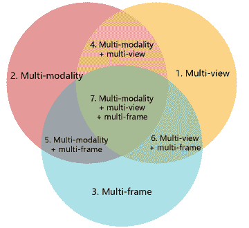
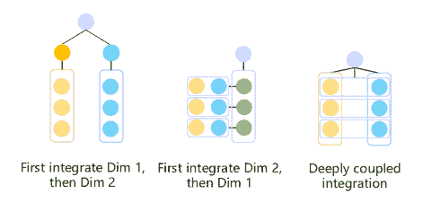

<!--yml

分类：未分类

日期：2024-09-06 19:38:48

-->

# [2306.11740] 自动驾驶系统中数据集成的深度学习方法综述

> 来源：[`ar5iv.labs.arxiv.org/html/2306.11740`](https://ar5iv.labs.arxiv.org/html/2306.11740)

# 深度学习方法的综述

自动驾驶系统中的数据集成

朱曦^∗，王利康^∗，周才法，曹希亚，龚悦，陈磊^† 手稿收到日期；修订日期。^∗ 表示同等贡献。^† 通讯作者。电子邮件：leichen@cse.ust.hk 朱曦、周才法和曹希亚在中国华为技术有限公司的黎曼实验室、2012 实验室工作。王利康和陈磊在中国香港科技大学计算机科学与工程系工作。这项工作是在王利康担任华为技术有限公司实习生期间完成的。龚悦在中国华为技术有限公司并行分布式计算实验室工作。

###### 摘要

自动驾驶车辆的感知模块依赖于多传感器系统来理解其环境。深度学习的最新进展促使了集成多传感器测量以增强感知能力的方法的快速发展。本文综述了最新的深度学习集成技术，这些技术应用于自动驾驶系统的感知模块，根据“集成的内容、方式和时间”对集成方法进行分类。提出了一种新的集成分类法，基于三个维度：多视角、多模态和多帧。总结了集成操作及其优缺点，提供了关于“理想”数据集成方法的新见解，该方法可以缓解现有方法的局限性。在回顾了数百篇相关论文之后，本综述以讨论最佳数据集成方法的关键特征作为结尾。

###### 索引词：

自动驾驶，多视角，多模态，多帧，数据集成，深度学习^†^†publicationid: pubid: 0000–0000/00$00.00 © 2021 IEEE

## I 引言

感知是自动驾驶系统（ADS）中的一个关键组件[1, 2, 3]。它使自动驾驶车辆能够感知和理解其周围环境，并准确定位自身。感知模块的性能对下游任务，如规划和控制，以及驾驶安全性有重要影响。感知模块的两个主要功能是环境感知和定位[2]。环境感知涉及车辆主动收集有关静态元素（例如车道线、道路标记和交通标志）和动态物体（例如其他车辆、行人）的信息。相比之下，定位还要求车辆考虑自身的运动状态测量，如速度、航向和加速度。所有这些感知数据可以通过车辆内置的传感器组合来获得[4]。尽管传感器组合包含一系列传感器[2, 5, 6]，用于环境感知的传感器包括摄像头、激光雷达和毫米波雷达（MMW-Radar）[1, 7, 4, 8]。这些传感器的详细属性将在第 II 节中进一步说明。

尽管所有传感器都对信息收集有贡献，但单一传感器系统存在限制和不足，使得在自动驾驶应用中难以进行完整、准确、实时的环境感知[9, 10, 2]。这是因为不同的传感器具有不同的时间和空间覆盖范围，以及各自的专业领域和弱点[11, 7, 12, 13]。例如，摄像头可以捕捉高分辨率的图像，具有丰富的色彩信息，但在低能见度场景中表现不佳，也无法提供可靠的 3D 几何信息。此外，摄像头的角度覆盖受其视场的限制。激光雷达在 3D 几何估计方面表现优越，视野范围广泛，并且可以在昏暗光线中工作，但由于采样率较低，它们捕捉的点通常较稀疏。雷达无法获取纹理信息，但可以捕捉移动物体的速度，这是激光雷达和摄像头无法做到的。此外，单一传感器系统可能会遭遇感知丧失的问题，即传感器停止工作或无法正常运作时的感知丧失或失败情况[9]。当数据缺失或测量不准确时，高不确定性和不精确性也是单一传感器系统的重要问题。

为了应对单一传感器系统的局限性和挑战，近年来提出了各种方法来集成来自不同传感器的数据 [9, 14, 4, 15]。在自动驾驶系统 (ADS) 的文献中，数据集成通常被称为数据融合、数据集成或传感器融合，这些术语可以互换使用 [16, 11, 17, 18]。数据集成涉及逻辑上或物理上转换来自不同传感器或来源的信息，以获得比单一传感器使用所能获得的更一致、信息丰富、准确和可靠的输出 [19, 20, 21, 18, 22, 17, 23, 16, 11]。数据集成技术大致可以分为经典算法 [9, 24, 25, 26, 2, 27] 和深度学习方法 [2]，由于后者越来越受关注且可能实现更高的准确性结果，因此本论文重点讨论深度学习方法。基于深度学习的集成技术由于计算机科学和人工智能中深度学习的快速发展而受到越来越多的关注 [11, 7, 22, 28, 12, 4, 14, 15]。它们不仅能提供更好的准确性结果，还消除了手工设计的需要，并充分利用了大数据中的信息，通过高计算能力 [5]。数据集成技术也在其他研究领域得到了探索，如智能生活 [29, 30, 31, 32, 33]，医学领域 [34]，交通 [35, 36, 37]，工业 [38, 39, 40]，以及商业 [41, 42, 43]。然而，由于当前论文重点关注 ADS 中的数据集成，对其他领域感兴趣的读者可以参考相关综述 [44, 45, 46, 47, 48, 49]。接下来，我们将总结在 ADS 中需要解决的数据集成的关键问题。

(a)

(b)

图 1: “集成内容” 的双层分类法。 (a) 基于三个维度的七个高级类别，描述集成的内容。 (b) 每个二维集成类别的三个低级范式，基于集成的顺序。

数据集成的关键问题

数据整合中三个广泛接受的关键问题包括“整合什么”、“如何整合”和“何时整合”[50, 51, 14]。近年来，许多与基于深度学习的数据整合相关的评论已被发布，其中每篇都部分涵盖了这三个问题及相关技术。虽然一些评论将数据整合作为在特定情况下解决某些感知任务的技术方法[52, 7, 53, 54, 55, 56, 57]，但其他评论则将重点放在数据整合本身，包括技术、类别和应用[11, 2, 28, 12, 4, 14, 58, 15]。我们主要与后者进行比较。

#### I-1 整合什么

“整合什么”是一个关于整合过程输入的问题。在本调查中，我们将“整合什么”分为两个层次的子问题：整合的内容是什么，整合的顺序是什么。

a) 整合的内容是什么？

我们将整合的内容分为三个维度：

+   -

    多视角整合涉及整合来自相同类型但指向不同方向的多个传感器的表示或视图。例如，整合安装在车上不同位置的多个 LiDAR 的点云，或整合来自不同方向的多个摄像头拍摄的图像[59]。然而，将同一个 LiDAR 点云的不同视角表示进行组合，如整合 LiDAR 点云的鸟瞰图（BEV）和距离视图，并不被视为多视角整合，因为这并未引入新信息。这些视角转换被视为传感数据预处理的一部分。

+   -

    多模态整合涉及将来自不同类型传感器的数据进行整合，如摄像头、LiDAR 和毫米波雷达（MMW-Radar），以任意组合进行。研究表明，融合摄像头和 LiDAR 数据是最常见的整合类型之一。

+   -

    多帧整合涉及在时间上整合数据，而前两个维度则关注在一个时间步骤的空间整合。

鉴于这三个维度，我们可以将所有数据整合方法归类为七个高层次类别，如图 1a 所示。数据整合不仅可以在一个维度内实现，还可以跨多个维度进行。前者称为单维整合。

b) 整合的顺序是什么？

多维整合，例如“多模态和多视角”，不同于单维整合，因为它需要多种操作的组合。我们进一步根据整合顺序将多维整合分类为低级整合范式，如图 1b 所示。例如，在二维“多模态和多视角”整合中，有三种子级别的分类或范式：模态优先整合、视角优先整合和深度耦合整合。三维整合则更加复杂，据我们所知，现有研究中尚未讨论相应的范式。因此，我们在第 III 节中将相关文献的讨论限制在一维或二维整合。

#### I-2 何时整合

“何时整合”这一主题涉及整合发生的数据抽象层级。这在文献中已有广泛的探讨，大多数采用基于输入数据抽象阶段的广泛分类方案。该方案包括数据级（或像素、信号、低级）、特征级（中级）和决策级（或结果、高级）融合 [2, 12, 14, 58]。数据级整合方法在特征提取之前融合原始或预处理数据，而特征级整合在中间神经网络层结合提取的特征。决策级整合涉及合并由每个传感器单独估计的输出数据。除了这些整合级别，近年来出现了一种新的“何时整合”类别，称为多级整合，因为越来越多的研究尝试在不同级别整合数据 [28]。多级整合的一个例子是使用来自 RGB 图像的结果级 2D 边界框来选择数据级或特征级 3D LiDAR 数据 [60, 61, 62]。每个数据整合级别都有其优缺点，目前没有证据表明某一层级优于其他层级 [14]。在第 IV 节中，我们基于这四个类别回顾了现有的整合方法，并总结了它们的优缺点。

#### I-3 如何整合

“如何整合”的问题涉及到用于数学结合数据的具体整合操作。这些操作通常被忽视或未明确说明，因为它们通常是简单直接的，比如加法或连接。然而，在我们的调查中，我们展示了几种常见的整合操作，包括投影、连接、加法/平均值/加权求和、概率方法、基于规则的事务、时间整合方法，以及神经网络/编码器-解码器结构。我们提供了每种整合操作的属性和实际应用的总结。

目的和论文组织

我们的调查旨在提供最新的（从 2017 年到 2023 年）基于深度学习的 ADS 感知中相机、LiDAR 和 MMW 雷达数据整合技术的全面概述，遵循之前提到的分类法。在审查了数百篇相关论文后，我们识别了现有整合方法的局限性，并提出了讨论，解决了关于 ADS 感知理想数据整合方法的开放问题。

| 参考 | 任务 | 传感器 | 数据表示 | 整合操作 | 方法优缺点 | 数据集 | 校准 |  |
| --- | --- | --- | --- | --- | --- | --- | --- | --- |
| Wang et al. [11] | 各种 | $\boldsymbol{\checkmark}$ | $\boldsymbol{\checkmark}$ |  |  |  |  |  |
| Fayyad et al. [2] | 各种 | $\boldsymbol{\checkmark}$ |  |  | $\boldsymbol{\checkmark}$ |  |  |  |
| Cui et al. [28] | 各种 |  | $\boldsymbol{\checkmark}$ |  | $\boldsymbol{\checkmark}$ |  | $\boldsymbol{\checkmark}$ |  |
| Yeong et al. [12] | OD | $\boldsymbol{\checkmark}$ |  |  | $\boldsymbol{\checkmark}$ |  | $\boldsymbol{\checkmark}$ |  |
| Huang et al. [4] | 各种 |  | $\boldsymbol{\checkmark}$ |  |  | $\boldsymbol{\checkmark}$ |  |  |
| Feng et al. [14] | OD & SS | $\boldsymbol{\checkmark}$ | $\boldsymbol{\checkmark}$ | $\boldsymbol{\checkmark}$ |  | $\boldsymbol{\checkmark}$ |  |  |
| Wang et al. [58] | OD | $\boldsymbol{\checkmark}$ | $\boldsymbol{\checkmark}$ |  | $\boldsymbol{\checkmark}$ | $\boldsymbol{\checkmark}$ |  |  |
| Wang et al. [15] | OD | $\boldsymbol{\checkmark}$ | $\boldsymbol{\checkmark}$ | $\boldsymbol{\checkmark}$ | $\boldsymbol{\checkmark}$ | $\boldsymbol{\checkmark}$ |  |  |
| 我们 | 各种 | $\boldsymbol{\checkmark}$ | $\boldsymbol{\checkmark}$ | $\boldsymbol{\checkmark}$ | $\boldsymbol{\checkmark}$ |  |  |  |

表 I：关于使用深度学习方法进行 ADS 感知数据整合的近期综述的简要总结。“OD”代表对象检测，“SS”表示语义分割。

在表 I 中，我们简要比较了与我们的基于深度学习的数据集成相关调查所涵盖的内容。我们调查的主要贡献总结如下：

+   •

    我们提出了三个基本维度（多视图，多模态，多帧）用于数据集成，基于此创建了一个新的双层分类法。上层分类法概述了要与七个类别集成的内容，而下层则考察了集成的顺序。这种双层分类法可以全面分类数据集成方法。

+   •

    我们总结了深度学习模型中常用的集成操作，以及它们的利弊，这在其他调查中往往未被充分探讨。

+   •

    根据我们的审查，我们详细总结和分析了现有集成技术在 ADS 感知方面的局限性，并提出了我们对理想数据集成方法的愿景。

本文的其余部分组织如下：在第 II 部分 （链接），我们讨论了 ADS 感知中三种常用传感器的测量原理，特点，优点和缺点以及它们的表示形式。然后，我们在第 III 部分 （链接） 、第 IV 部分 （链接） 和第 V 部分 （链接） 中概述了“何时集成”，以及“如何集成”。在第 VI 部分 （链接） 中，我们提供了一个案例研究，展示了这三个问题的实际应用。在最后一部分，我们总结了我们的工作，并讨论了理想的数据集成方法和未来方向。

## II 感知模态和预处理

根据它们的工作原理，ADS 感知中常用的传感器可以分为两类[12, 28]： 

+   •

    外感传感器，如摄像头，LiDAR 和 MMW 雷达，主动收集环境数据以感知外部环境。

+   •

    本体感知传感器，包括 IMU、车轮计、GPS 接收器等，主要用于捕捉车辆的内部状态和系统的动态测量。从任务的角度来看，这些传感器与外部感知传感器一起广泛用于定位和定位。

以上传感器收集的数据在坐标框架和特征方面各不相同，每种都有自己的优点和局限性。从不同坐标框架中整合数据可能具有挑战性，许多现有的深度学习架构被设计来处理特定的数据表示。为了解决这个问题，一种常见的方法是应用预处理方法，将原始数据转换为适当的表示。

在本节中，我们主要关注三种外部感知传感器，讨论它们的属性和预处理方法（表示）。表 II 总结了这些传感器的优缺点。

表 II：相机、LiDAR 和雷达传感器的比较。

| 传感器 | 数据格式 | 分辨率 | HFoV | 几何 | 纹理 | 恶劣天气 | 昏暗/黑暗 | 速度 | 成本 |
| --- | --- | --- | --- | --- | --- | --- | --- | --- | --- |
| 相机 | 2D 像素 | ++ | + | - | ++ | + | - | - | 低 |
| LiDAR | 3D 点 | + | ++ | ++ | - | + | ++ | - | 高 |
| 雷达 | 3D 点 | + | + | + | - | ++ | ++ | ++ | 低 |

++: 相对具有强大的能力。 +: 具有有限的能力。 -: 相对具有较弱的能力。

### II-A 相机

相机是能够捕捉 2D 视觉图像的光学设备。虽然一些相机（例如红外相机）可以检测到不可见光，但“相机”通常指的是那些感应可见光的设备。相机可以生成灰度图像和彩色图像，尽管大多数现代相机默认生成彩色图像。一些相机（例如门控相机、飞行时间（TOF）相机、结构光相机）会发射波并检测其响应，但我们不重点讨论这些，因为它们的工作原理类似于 LiDAR。相反，本节重点介绍 RGB 相机，这些最常见的光学传感器被动接收波长在 400 到 700 nm 之间的可见光并输出彩色图像。

通常，相机可以用针孔模型建模。每个 3D 空间中的点根据由投影矩阵确定的仿射变换投影到一个像素上。该投影与相机的内在属性及其在 3D 世界中的姿态有关。它们可以通过分别由内在和外在矩阵确定的两个仿射变换来描述。大多数相机只有一个镜头，称为单眼相机，而其他相机，称为立体相机，可能有多个镜头。立体相机模拟人类的双目视觉，并可以通过算法感知 3D 物体。单眼相机也可以通过用多个相机或从多个姿态拍摄同一物体来恢复 3D 信息。这两种类型的主要区别在于立体相机内的镜头和方向的相对位置是固定且已知的，而单眼系统的相对位置则是未知的，需要进一步估计。

RGB 相机旨在重现人眼感知的图像，对于捕捉彩色和纹理区域（如道路车道、交通标志和交通信号灯）至关重要。这些相机通常具有非常高的空间（高度和宽度从数百到数千）和时间（每秒几十到几百帧）分辨率。它们通常具有较长的工作范围，在良好天气条件下最大感知距离可达 1 公里。它们捕捉颜色和纹理信息的能力有助于语义理解。此外，相机具有较低的能耗和制造成本，允许广泛部署。然而，RGB 相机在光照条件和视线可见性方面有局限性。由于工作原理，它们难以在光线不足的场景中检测无光物体（如道路车道和障碍物），并且在被遮挡物体检测能力较弱。此外，单帧图像由单眼相机拍摄，缺乏几何信息，需要多张图像和复杂算法（如深度恢复和 3D 重建）来估计深度和 3D 结构。相机也容易受到外部环境的影响，因为镜头可能会被液体（如雨水、喷雾和车轮飞溅）模糊，且远处物体可能在雾中无法识别。

在 ADS 中，集成的相机数据以 2D 或 3D 格式表示。

#### II-A1 像素表示

像素表示涉及在 2D 图像平面上存储像素特征，每个像素具有多个通道以描述其属性。这使得整个图像以 $[height,\ width,\ channel]$ 维度的 3D 矩阵存储。通常，RGB 原始图像具有三个颜色通道，但其他相机可能有不同的通道，如深度、灰度、红外或门控通道。

#### II-A2 点或体素表示

点或体素的表示通过将每个像素投影到 3D 空间中来考虑深度信息。这些 3D 点可以存储为点云或体素网格。点云为每个点分配一个浮点数 3D 坐标，结果是一个维度为 $[n,\ c+3]$ 的矩阵，其中 $n$ 表示像素的数量，$c$ 表示通道的数量。体素网格将空间划分为 $[height,\ width,\ depth]$ 维度的网格，并将点放置到这些网格中。

### II-B LiDAR

光检测与测距，简称 LiDAR，是一种常用于自动驾驶中进行距离测量的技术[63]。其工作原理是估算发射光脉冲与目标物体反射信号之间的时间间隔，并通过时间间隔和光速来获取距离。

三种类型的 LiDAR，包括 1D、2D 和 3D LiDAR，用于收集不同数量的环境信息[12]。虽然 1D LiDAR 只能提供距离测量，2D LiDAR 可以通过水平旋转一定的角度来获得目标在 X-Y 坐标水平面上的空间信息。LiDAR 传感器的水平旋转角度称为传感器的水平视场 (HFoV)。3D LiDAR 传感器通过垂直发射多束激光来扩展垂直视野，使得数据可以在 3D X-Y-Z 坐标系统中进行采集。3D LiDAR 传感器更常用于自动驾驶车辆中，但其高昂的价格是实施中的一个问题[11, 64]。

使用 LiDAR 传感器生成数据的过程涉及使用光束从周围环境中物体的表面采样。这种激光发射的工作原理使 LiDAR 传感器在低能见度条件下表现良好，但也使其容易受到雨、雾、雪和尘土等外部天气条件的影响[65]。此外，目标的颜色也会影响 LiDAR 传感器的性能，较暗的物体吸收光线并且反射率低于较亮的物体[66]。场景的采样范围由水平视场 (HFoV) 和垂直视场 (VFoV) 决定，而其他参数如水平/垂直分辨率和每秒帧数 (FPS) 则影响数据的密度。水平和垂直分辨率指的是空间中的采样密度，分辨率越小，在固定的 HFoV 和 VFoV 下采样越密集。FPS 描述了时间上的采样密度，即 LiDAR 每秒进行的扫描次数。Yeong 等人提供了来自不同公司不同 LiDAR 传感器的详细规格[12]。

与相机图像不同，3D LiDAR 测量是一组不规则且无序的数据点，称为 3D 结构中的点云 [28]。为了适应不同深度学习模型的输入格式，点云可以通过预处理方法转换成几种不同的表示形式。值得注意的是，LiDAR 数据相比于图像数据更为稀疏。

#### II-B1 点云表示

从 LiDAR 传感器获得的 3D 点云可以通过点处理深度学习网络进行处理，而无需格式转换，例如 PointNet [67]、PointNet++ [68]、PointCNN [69] 和 KPConv [70]。LiDAR 点云可以与类似的点格式数据（如其他 LiDAR 点云 [71]）进行集成。尽管点云保留了原始信息，并可能提供更大的感受野 [68]，但点云的体积可能非常庞大，需要高计算能力来处理 [58, 28]。此外，将点云与其他数据格式（如图像）集成也很困难。由于这两点，带有额外预处理方法的表示形式得到了快速发展。

#### II-B2 体素表示

体素是通过将整个 3D 空间划分为小的规则 3D 网格，并根据几何形状将原始点划分到相应的网格中来生成的。这种网格化将不规则点转化为规则的体素表示，并使得可以对原始 LiDAR 点进行降采样以减少输入体积。实际上，通过改变网格大小，可以调整体素的体积和分辨率。较大的网格会导致更多的信息丢失，而较小的网格可能仍会带来计算负担。可以使用几种 3D 卷积方法来处理体素并提取特征，如 3D ShapeNet [72]、VoxelNet [73] 和 VoxNet [74]。

#### II-B3 像素/视图表示

LiDAR 点的像素或视图表示是通过投影将 3D 点云转换为 2D 图像视图。鸟瞰图（BEV）和距离视图（也称为透视视图）是从点云转换到的两种常见的 2D 视图平面。像素表示可以利用现有的成熟 CNN 系列图像处理方法，尽管原始点云中保留的 3D 几何信息可能在投影过程中丢失。像素表示或投影技术在将 LiDAR 点云与相机图像集成时常被采用 [75, 76, 77]。

#### II-B4 综合表示

除了之前提到的表示方式外，一些研究人员尝试将各种表示方式结合起来，以获取更丰富的信息或进行进一步处理。他们开发了点-体素融合方法，融合了两种表示的优点。Point-Voxel CNN (PVCNN) [78] 使用一个由体素分支和点分支组成的双分支系统。它对体素进行卷积，同时从点中补充详细的几何信息。PV-RCNN [79] 从体素卷积中生成 3D 提案，并在空间中选择一些关键点作为体素特征与这些提案的细化网络之间的连接。此外，还可以整合从点云中获得的不同视图。Zhou 等人[59] 提出了一个多视角融合 (MVF) 网络，将鸟瞰图 (BEV) 和透视图转换为体素，并将它们融合在一起，以便有效地利用互补信息。还有研究将所有上述表示方式进行整合。在 M3DETR [80]中，点、体素和像素表示分别通过 PointNets、VoxelNet 和 2D ConvNets 模块处理，并通过 transformers 在多个尺度上融合。这种设计通过有效利用不同表示之间的相关性，利用注意力结构，更好地提取原始数据中的信息。

### II-C 毫米波雷达 (MMW-radar)

无线电探测与测距，即雷达或毫米波雷达，是一种依赖于发射电磁毫米波和散射反射来估计目标范围信息的技术[12]。短程、中程和长程雷达探测器具有不同的检测距离，通常用于防碰撞和障碍物检测。

与容易受外部条件影响的 LiDAR 传感器和相机不同，雷达传感器在极端天气或昏暗光线下更具鲁棒性[81, 82, 55]。这种低价传感器的另一个显著优点是其基于多普勒效应准确检测动态目标的速度，这对于自动驾驶场景中的感知任务非常重要。然而，雷达也有一些缺点。与相机相比，雷达缺乏纹理或语义信息。与 LiDAR 传感器相比，雷达的角分辨率较低（详见[12]中的表 4）。因此，雷达不适合进行物体识别等任务，并且在区分静态和静止物体时可能会遇到困难[11, 12]。此外，电子系统中的杂波可能导致误检测和雷达系统的性能问题[55]。

根据王等人[58]和周等人[55]的研究，雷达的数据格式可以根据不同的预处理阶段分为原始数据、聚类层数据和对象层数据。雷达的原始输出形式为时间频率谱图。为了提高其实用性，通常需要信号处理方法，例如周等人[83]中详细介绍的方法。自主驾驶应用中更常采用的雷达数据格式是经过聚类算法处理后的聚类层数据，以及经过过滤和跟踪后的对象层数据。与原始数据相比，后两种格式提供了更稀疏、噪声更少的信息。

在与自动驾驶相关的研究中可以找到雷达信号的两种不同表示。

#### II-C1 点表示

点云表示是将雷达数据表示和处理为点云[84]。然而，正如王等人[58]所指出的那样，雷达点云的特性与 LiDAR 点云不同，因此直接使用 LiDAR 模型对雷达点进行处理时可能会出现问题。

#### II-C2 地图表示

另一种表示方式是基于地图的，即在多个时间戳上累计雷达数据并生成雷达网格 BEV 地图[14]。由于网格地图缓解了雷达数据稀疏性问题，因此使用图像处理网络，如 CNN，来提取特征并进行静态环境分类。有关不同网格地图的更多细节可参见[55]。

## III 数据集成：集成内容

在本节中，我们回顾并总结了按照图 1 中所示的双层分类法进行集成的技术。具体而言，我们首先总结了图 1a 中显示的每个一维集成（区域 1、2 和 3）。然后，我们讨论了二维类别（图 1a 中的区域 4、5、6），并特别关注集成顺序（图 1b）。由于与三维集成（图 1a 中的区域 7）相关的研究较少，我们在本节中省略了三维集成。

### III-A 多视角集成

根据我们的定义，最常见的多视角数据集成类型是整合由多个相机从不同方向拍摄的多视角图像（例如，安装在自动驾驶车辆上的 6 个单目相机）。这种相机多视角集成可以用于生成周围环境的 BEV（鸟瞰视图）表示[85, 86, 87]，或在 2D 图像中辅助物体检测[88]。立体相机也可以生成多视角图像，因为它具有两个或更多镜头[89]。除了视觉传感器，研究人员还探索了将多个 LiDAR 测量结果融合的方法，这些 LiDAR 安装在车辆上用于物体检测[71, 90]。然而，由于 LiDAR 的高昂成本，这种方法在行业中并未广泛采用，相关工作也有限。因此，我们跳过了对 LiDAR 多视角集成的讨论。类似地，多雷达集成在 360 度环境感知中也被认为是有用的[91, 92]，但它们通常与其他传感器模态一起应用。

#### III-A1 相机多视角

大多数单目 RGB 相机只能捕捉到相机镜头确定的视锥体内的物体。此外，如果被其他物体遮挡，视锥体内的许多物体在图像中无法被观察到。因此，我们需要从不同位置拍摄多张图像来更全面地描述 3D 世界。基于空间几何的一致性和唯一性，可以从多视角相机中恢复深度信息（3D 空间中一个点与相机图像平面之间的距离），前提是相机的相对参数（内参和外参变换矩阵）已知。内参描述了从 2D 相机坐标到 2D 图像坐标的映射，而外参描述了从 3D 世界坐标到 2D 相机坐标的映射。如果图像是从两个配对的相机拍摄的，这称为双目深度估计或立体匹配，或视差估计。如果提供了多个视角，则称为多视角立体（MVS）。

大多数相机多视角方法的输入是 RGB 图像，但也有一些论文将 RGB 和热成像图像融合，104, 105, 106 以及将 RGB 与深度图像融合的论文[85]。我们将相机多视角输入分为以下几类：

a) 图像：这些图像由不同的相机拍摄，或者由单目相机从不同的位置和角度拍摄。图像的数量没有限制，但至少需要两张图像。图像应有重叠，但不能完全相同。

b) 深度图像：一个具有单通道的 2D 图像，其中每个像素表示相机到相应 3D 点的距离。它们可以通过深度相机或深度估计算法获得。

c) 热成像：一个具有单通道的 2D 图像，其中每个像素表示物体发射的红外辐射强度。它们可以通过热成像相机捕捉到。

#### III-A2 雷达多视图

很少有论文研究多雷达之间的融合。[107]使用三种视图：距离-多普勒（RD）、角度-多普勒（AD）和距离-角度（RA）。RD 视图揭示了物体的距离和速度。具体来说，当雷达静止时，非移动物体在零多普勒下响应，相对雷达移动的物体在非零多普勒下响应。AD 视图显示了物体的方向和速度。RA 视图表示距离与角度之间的关系。所有视图都可以表示为 2D 图像。

### III-B 多模态融合

由于传感器各有其优缺点，如第 II 节所示，多模态数据融合预计能够利用不同传感器之间的互补性，并实现更高的精度[20]。各种方法已经被开发并应用于对象检测与跟踪、深度完成和分割等任务。一些研究采用摄像头-雷达融合[108, 109, 110, 111, 112]或 LiDAR-雷达融合[113]进行对象检测。还有一些研究进一步将这三种传感器集成在一起用于环境感知[114, 115]。

在下文中，我们总结了现有多模态融合研究的输入，涵盖了四种多模态组合：1）摄像头和 LiDAR，2）摄像头和雷达，3）LiDAR 和雷达，以及 4）摄像头、LiDAR 和雷达。至于其他模态组合，相关研究较少。

#### III-B1 相机与 LiDAR 融合

由于 2D 相机图像和 3D LiDAR 点处于不同的坐标系中，因此通常需要将它们转换到相同的空间后再进行融合。接下来，我们分别讨论 2D 空间融合和 3D 空间融合。

a) 2D 空间融合

可以根据不同的 LiDAR 投影平面识别出两种子方法。一种方法是将 LiDAR 和相机视图整合到同一个平面[116]。换句话说，LiDAR 点被投影到图像平面进行整合。例如，Caltagirone 等人[117]通过将 LiDAR 点投影到图像平面并进行上采样，将 LiDAR 点转化为密集的 LiDAR 图像。这些 LiDAR 图像随后可以与 RGB 图像整合进行道路分割。Berrio 等人[118]使用掩模技术和概率分布将 LiDAR 点投影到图像中，以处理语义映射中的遮挡问题。目标检测模型 EPNet[119]多次将 LiDAR 点投影到图像平面，以增强 LiDAR 点特征与相应的图像语义信息。Cheng 等人[120]将 LiDAR 点分别转换为立体视觉的左右镜头，并在两种模式和镜头之间整合以获得密集深度。模型[121, 122, 123]将 RGB 图像与从 LiDAR 点生成的稀疏深度图整合，用于图像深度补全。[124, 125, 126, 127, 128, 129, 130]也将 RGB 和 LiDAR 生成的深度图像作为输入，返回分类、边界框或掩模提案。还有一项研究[131]在与相机相同的坐标系中表达并融合 LiDAR 特征。[132]在与 RGB 图像整合之前，将 LiDAR 点转换为尺寸为$(5,w,h)$的深度图像。

另一种方法是将不同平面中的视图整合。例如，在[76, 133, 134]中，RGB 图像与 LiDAR 投影生成的 BEV 地图在深度学习架构中整合。这些工作通过不同的转换或关联方法将图像特征图连接到 BEV。在[135]中，四个 LiDAR 投影地图，包括高度鸟瞰图（HBV）、强度鸟瞰图（IBV）、距离中心视图（DCV）和强度中心视图（ICV），与 RGB 图像和原始 LiDAR 3D 点整合。

b) 3D 空间整合

实现 3D 空间集成的一种方法是将图像数据投影到 3D 空间，从而生成“伪 LiDAR 点”。由于 RGB 图像缺乏深度估计，这些工作中的大部分利用立体或 RGB-D 数据来获取准确的几何信息。[136, 137] 将 LiDAR 点云与通过图像深度完成生成的伪 LiDAR 点云集成用于 3D 目标检测。另一种在 3D 空间中集成 LiDAR 和相机数据的方法是通过数据关联。3D 目标检测模型如 [62, 61, 138] 将 RGB 图像中获得的 2D 边界框投影到 3D 空间，以获取视锥体作为兴趣区域，指导 3D 点或特征搜索。VPFNet [139] 利用来自 3D 提案的虚拟点作为桥梁，将图像特征与 LiDAR 点特征关联并聚合。在 LoGoNet [140] 中，通过使用相机投影矩阵投影体素点质心，将图像特征与 LiDAR 生成的 3D 体素特征进行关联，并在图像平面上生成参考点。

#### III-B2 相机和雷达集成

类似于 LiDAR-RGB 集成，相机和雷达也可以在 2D 空间或 3D 空间中进行集成。2D 空间集成的例子包括 [110, 141]，其中雷达点被投影到相机的 2D 视图平面上。在 [142] 中，生成了与视觉图像大小相同的双通道（雷达截面和距离通道）雷达图像，并与扩展的 VGG 网络中的图像特征图结合。在 3D 空间集成中，图像信息需要转换为 3D 空间。[143] 中的 RGB 图像首先通过 CNN 进行特征提取，然后通过反向投影转换为 3D 点。雷达和 RGB 也可以通过数据关联进行结合。例如，CenterFusion [112] 将 2D 目标边界框投影到 3D 空间，以将图像信息与从雷达点生成的 3D 柱体连接起来。

#### III-B3 LiDAR 和雷达集成

由于 LiDAR 和雷达数据天生都能捕捉 3D 几何信息，因此它们通常在 3D 空间中集成。有些研究以逐点的方式集成这两个传感器的原始数据。例如，[144] 基于启发式规则结合 LiDAR 和雷达点，以去除受外部环境因素影响的低质量数据。LiDAR 和雷达点也可以通过数据关联进行结合。[145] 依赖雷达检测获取视锥体作为兴趣区域，以筛选相关的 LiDAR 点。

#### III-B4 相机、LiDAR 和雷达集成

少有研究尝试将来自三种传感器的数据进行集成。集成的关键过程仍然是将来自不同传感器的数据转换到相同的空间中。如果将 LiDAR 和雷达点投影到相机的平面上，相机、LiDAR 和雷达可以在二维空间中进行融合。在[146]中，集成神经网络的输入是与投影的 LiDAR 和雷达通道拼接的相机图像层。传感器也可以在更高维度的空间中进行集成。[147]通过将每个传感器的数据聚合在一起，生成高维点，然后再进行进一步处理，来集成 RGB 图像、LiDAR 点和雷达点。

### III-C 多帧融合

多帧数据，即时间数据，指的是沿时间轴在多个时间戳处采样的数据。与单帧数据相比，多帧数据的融合带来了更多信息，并可能提高环境感知的准确性。在本小节中，我们关注单传感器多帧融合的输入。由于关于雷达时间积分的研究较少，我们仅介绍相机图像序列和 LiDAR 点云序列的融合细节。

#### III-C1 相机图像序列

相机多帧融合指的是融合图像序列的信息，而不是单张图像。常用的两种数据进行融合。一种是从每张图像生成的特征图序列，另一种是从每对连续图像获得的处理信息序列。

a) 从每张图像生成的特征图序列

传统的两阶段时间积分方法是在每个图像帧中执行对应于不同任务的特征提取操作，然后在不同帧之间进行关联或融合。例如，在二维多目标跟踪模型中，如[148、149、150、151、152、98、99]，首先在每个图像中生成二维目标检测边界框和特征向量/图谱，然后在不同帧中进行关联。Zhou 等人[153]以类似的方式进行跟踪，但他们引入了每张图像的特征图中心作为额外输入。在三维单目多目标跟踪中也可以观察到相同的两阶段模式，同时额外融入了几何或深度信息[154、155]。视觉里程计（VO）算法的多帧融合也将特征提取和时间积分解耦。例如，[156、157]使用 CNN 提取特征，并使用 RNN 整合来自不同帧的信息。单目深度估计也以 RGB 图像序列作为输入来提取信息并进行时间积分[158、159、160]。

这种两阶段方法的一个缺点是后期阶段的结果可能会受到前期阶段的影响。为避免这个问题，近年来出现了一些利用 Transformer 整合空间和时间信息以进行多帧图像 MOT 的研究[161, 162, 163]。

b) 从图像对获得的图像对或处理信息序列

原始图像对，特别是前一图像和当前图像，可以直接输入到融合算法中。例如，单目深度估计方法[164, 165, 166, 167, 168]利用参考帧和目标帧对进行自监督。在这些方法中，前一图像的特征被重新投影到目标图像的视图中，并预测深度和姿态，从而生成重投影损失。在[103]中，来自相邻帧或不同相机的图像对都可以被视为从不同视点拍摄的图像，并因此用于弱监督。连续的图像对也可以用于知识蒸馏。通过利用三层知识蒸馏方法，Chen 等人[169]训练学生模型以结合相邻帧，使其能够从相应的教师模型中获得更全面的知识表示。

此外，多个图像对的输出可以进一步进行时间上的融合。换句话说，这种方法分为两个阶段。首先，分别组合原始图像对以获取对应的融合输出。然后，对融合输出序列进行时间上的整合。此方法的一个典型示例是从每对原始图像生成光流，然后将光流序列整合以例如进行姿态估计[170, 171, 172, 157, 152]。

#### III-C2 LiDAR 扫描序列

LiDAR 多帧融合指的是 LiDAR 扫描序列的融合。由于 LiDAR 扫描有不同的表示方式，现有工作中可以找到两种类型的 LiDAR 扫描序列输入：点云序列和视图序列。

a) 点云序列

点云序列指的是在连续时间序列中测量的多个 3D LiDAR 点云。类似于图像序列集成，这里可以应用两阶段方法：首先从每个 3D 点云中提取特征或获取目标对象，然后创建 LiDAR 扫描之间的关联。在[173、174、175、176、177、178、179]中，时间集成的输入是从 LiDAR 点云生成的提取特征或其他形式的结果序列，以实现 3D 对象跟踪。另一种方法是通过结合多个 LiDAR 扫描生成更密集的点云，以提高数据质量。这通常通过数据对齐来完成，即将多个点云对齐到统一的坐标框架。王等人通过对齐和融合来自多个连续 LiDAR 扫描的“事物类别”数据点进行跨帧集成，从而创建一个丰富的点云[180]。然后将丰富的点云作为单帧输入用于后续处理阶段，如采样、训练和分割。

b) 视图序列

另一种用于 LiDAR 时间集成的输入是视图序列，它是通过投影从 3D 点云生成的 2D 视图表示序列。由于这种方法将 3D 数据序列转换为 2D 格式，可以利用基于图像的时间集成方法进行处理。[181] 将 3D 点扫描投射到范围视图图像上进行语义分割。视图图像序列（具体而言，是从视图中提取的特征图）作为时间集成的输入。LO-SLAM [182] 将 LiDAR 3D 点云转换为带有圆柱体投影的圆柱视图。该模型以成对扫描生成的视图对作为输入，以推断相对的 6 自由度姿态。

### III-D 多视角多模态集成

研究人员探索将多个视角引入相机和激光雷达/雷达融合的方法，以增强感知能力。一些研究，如[183, 184, 120, 185, 135, 186, 187]，将激光雷达与来自不同视角的多个相机图像融合。还有一些研究，如[135, 188, 189]，融合了多视角激光雷达和单目相机。MVFusion [190]提出了一种多视角雷达和多视角相机融合的方法，用于 3D 物体检测。从这些研究中可以观察到一个主流模式：首先是同模态内（融合单一模态的多个视角），然后是跨模态（融合不同模态的信息）。此外，还有一些研究是首先进行多模态融合，然后进行多视角组合。在[191]中，激光雷达点与单目相机融合以获得每个视角的单帧 3D 点云。然后，将获得的多个 3D 点云逐步拼接，以实现具有全局优化的过度 3D 点云重建。

也有研究融合了三种模态：相机、激光雷达和雷达。例如，在[192]中，原始激光雷达输入以点云的形式存在，需要融合的特征则以多尺度 BEV 的形式存在。至于雷达模态，原始输入是雷达点的属性（如位置、速度和强度），需要融合的特征是由 MLPs 提取的每点隐藏表示。除了雷达和激光雷达数据，输入还包括来自不同视角的图像及其对应的相机参数。

### III-E 多视角多帧融合

多视角多帧融合为多视角融合过程引入了时间关系。大多数论文专注于将时间序列信息添加到相机多视角融合中，少数研究调查了激光雷达或雷达多视角。因此，本节仅简要讨论相机多视角多帧融合算法。

BEV 是多视角相机数据的适当表示，因此一些多视角多帧的论文将其纳入融合流程。在[193, 194, 195, 196, 197, 198, 199, 200, 201]中，不同视角的图像被融合到 BEV 表示中，进一步在时间维度上传播信息以进行感知和预测。可以观察到，一般来说，这些算法倾向于在融合过程中优先考虑空间融合（多视角）而不是时间融合（多帧）。

除了 BEV，许多工作使用常规图像表示进行时间视图融合。[202]和[203]使用立体相机的视图对序列来恢复物体尺度或跟踪物体。由于立体相机并非总是可用，许多论文[204, 172, 182, 205, 206, 157, 207, 208, 209, 210, 211, 212, 213, 214, 197, 215]利用相邻帧来形成图像对。这些论文主要针对**SLAM**和重建，这些任务需要多视角来恢复几何结构。

### III-F 多模态多帧整合

多模态多帧整合在空间整合过程中引入了时间方面，以增强感知性能。目前关于相机和 LiDAR 序列整合的研究主要集中在**多目标跟踪**（MOT）和 3D 目标检测上。例如，3D MOT 模型结合来自 LiDAR 和相机的特征或检测到的目标，在单帧中获取实例，然后进行数据关联处理以进行多帧跟踪[216, 217, 218, 219]。Zeng 等人提出的基于**Transformer**的 3D 目标检测模型[220]生成具有 RGB 和 LiDAR 点的网格化 BEV 图像，然后应用多传感器时间整合操作。这些整合算法通常遵循两阶段范式：首先，空间整合（单帧中的多模态融合），然后时间整合（多帧关联）[221, 222, 218]。

关于 LiDAR 与雷达点序列整合的研究有限。在一项研究[113]中，从 LiDAR 和雷达 3D 点转换得到的 BEV 中检测 2D 感兴趣区域。特征首先根据 LiDAR 和雷达 BEV 中的对应区域进行空间整合，然后跨帧进行时间整合，遵循在相机与 LiDAR 整合中观察到的两阶段空间-时间整合模式。

关于相机、激光雷达和雷达组合的时间集成的研究较少，可能是由于集成的复杂性。现有研究以不同方式分解了多传感器时间集成任务。例如，在一项研究中[223]，将扩展卡尔曼滤波器（EKF）分别应用于每个传感器，并使用可靠性函数进行跨模态集成。在另一项研究中[115]，集成的输入在不同任务中有所变化，相机图像和激光雷达深度图用于 2D 分割和物体检测，而激光雷达和雷达点用于 3D 障碍物检测和跟踪。Liang 等人[224] 提出了一种基于误差状态 EKF 的松耦合集成架构，用于车辆状态估计，其中相机、激光雷达和雷达数据作为观测值，用于修正估计的先验状态。

## IV 数据集成：何时集成

由于深度学习网络通过多个神经层提取特征，集成策略可以在不同阶段和以不同方式进行[14]。广义上，这些策略通常分为早期（数据级）、中期（特征级）和晚期（决策级）。数据级集成方法涉及在特征提取之前融合原始或预处理的数据。特征级集成则是在中间神经网络层结合提取的特征。决策级集成涉及将每个传感器单独估计的输出数据进行合并。由于特征可以在神经网络的不同深度获得，因此为特征级集成设计并应用了多种详细的集成范式。Feng 等人[14]进一步将中期集成细分为三种模式，包括单层融合、深度融合和短路融合。

然而，如第 I-2 节所述，该方法未能分类集成特征不在相同数据抽象层级的方法，限制了其适应增加的融合方案的能力。Cui 等人[28]提出了一种通过引入“多层次”集成来结合更多集成情况的方法，除了原有的三类。因此，我们在本节中回顾了与这四个类别相关的工作。

### IV-A 数据级集成

数据级别的融合在 SLAM 中非常流行 [202, 170, 204, 172, 182, 207, 144]，但在其他任务中则较为少见。[170] 利用光流来挖掘帧之间的关系以学习姿态，并使用帧间的成本体积来学习深度图。[204, 172, 182] 采用卷积生成特征向量。[202] 将多帧图像堆叠在一起进行姿态回归。[207] 通过卷积进行姿态回归。在检测 [225, 127, 143, 145]、深度补全 [123] 和语义分割 [180] 中也使用了早期数据融合。然而，这些方法中有很大一部分导致了不具竞争力的结果。

### IV-B 特征级别融合

特征级融合在大多数领域得到广泛应用，包括目标检测、深度完成 [122, 120]、语义分割 [87, 130, 226, 106, 105, 227, 181]、跟踪 [221, 217, 149, 222, 150]、3D 重建 [97, 100]、SLAM [228, 156, 229, 171, 199, 169]、动作分类 [227, 230] 和导航 [114]。特征级融合的普及源于提取的特征比原始数据更紧凑且具有代表性。然而，特征级融合的副作用是稀释了单一模态的优势。大多数 2D 和 3D 目标检测方法在特征级融合 [133, 136, 76, 124, 119, 231, 232, 59, 233, 130, 125, 134, 129, 112, 113, 88, 192, 234, 197, 235, 199, 236, 237, 238, 220, 177, 131, 142, 132, 140, 201, 187]。[133] 使用深度参数化连续卷积层与 MLP 直接在每个 BEV 网格中输出目标特征。[140] 结合 LiDAR 体素特征和图像特征，使用注意力设计。研究 [86, 193, 195, 196, 197, 198, 199] 专注于 BEV 地图生成中的时空融合，将不同时间戳的周围图像或 BEV 特征图的特征与各种神经网络设计进行融合。在 [136] 中，来自云点的特征基于学习到的权重以网格方式结合。此外，大多数 3D 重建方法 [209, 239, 240, 241, 242, 243, 244, 245] 在特征级进行融合，原因有二。一方面，提取的特征对环境变化（例如光照）更加稳定，这对照片一致性测量至关重要。因此，直接融合原始数据不太适用。另一方面，每个单视图获得的 3D 估计在尺度上模糊，这使得在决策级融合具有挑战性。

### IV-C 决策级融合

决策级别集成在许多领域有广泛的应用，包括语义分割 [85]、重建 [246, 118]、物体检测、跟踪、SLAM 和注释 [77]。在所有这些领域中，它在物体检测 [247, 248, 109, 126, 110, 71, 185, 249, 250, 250]、跟踪 [216, 148, 176, 175, 154, 251, 252, 111, 89, 250] 和 SLAM [253, 254, 255, 224, 256, 223, 98, 99, 152] 中最为流行。从不同来源的决策可以通过基于学习的策略或非基于学习的策略进行融合。[85] 汇总了来自多个视角的所有输入特征以生成融合特征。[246] 根据加权方案融合深度图和不确定性图，然后在加权相加后输出张量。[247] 将协作感知消息（CAM）转换为相对测量值，然后使用缓冲策略处理时间同步中的时序异常测量（OOSM）。[248] 首先通过基于 IOU 和置信度生成一个新张量来融合每一对 2D 边界框（从图像中预测）和 3D 边界框（投影到图像中），然后进一步通过卷积层进行融合。

### IV-D 多级集成

多层次融合被广泛应用于多个领域，包括目标检测、深度竞赛 [121]、语义分割 [75]、[128]、跟踪、SLAM 和 3D 重建 [208、191]。大多数多层次融合方法是为了目标检测和跟踪设计的。也有相当一部分论文关注于 SLAM。[139] 融合了来自相机的特征级信息和来自 LiDAR 的数据级信息。[62] 和 [61] 利用图像目标检测器的

## V 数据融合：如何融合

数据集成中的“如何集成”部分涉及用于组合数据/特征的数学操作。Feng 等人 [14] 将深度学习网络中使用的融合操作总结为四类：加法/平均值、拼接、集成和专家混合。他们的研究中没有进一步详细说明不同集成操作的特征。Wang 等人 [15] 将 3D 对象检测的数据组合方法分类为两种主要类型：对齐和融合。对齐进一步细分为基于投影的方法和基于模型的方法，而融合则分为基于学习的方法和不依赖学习的方法。本文的作者认为，对齐在许多情况下也作为融合的一种手段，基于模型的对齐方法和基于学习的融合技术在很大程度上存在重叠。此外，由于 [14] 和 [15] 关注于特定感知任务（对象检测和语义分割）的方法，其他集成操作，如 EKF [185, 154] 或概率图 [89, 118]，没有被讨论。

在表格 V 中，我们提供了深度学习数据集成过程中几种常用操作的简要总结，包括投影、拼接、加法类似操作（加法/加权求和/平均值）、概率方法、基于规则的事务、时间集成方法以及编码器-解码器方法。集成操作的应用可能高度依赖于任务、输入和数据抽象层次。一些操作更具通用性，可在各种条件下应用，而其他操作则更具特定性，为某些目的而实现。此外，一个集成算法可能在不同阶段涉及多种不同的操作。

#### V-1 投影

投影，如 3D 到 2D 投影和 2D 到 3D 回投影（也称为“反向投影”），通常用于将二维空间中的图像与三维空间中的点云连接，使数据可以在同一领域内操作。3D 到 2D 投影将 3D 对象的维度降低到二维平面，而 2D 到 3D 回投影可能依赖于几何线索或深度信息。投影经常用于生成不同的数据表示 [15]。例如，LiDAR 点的基于像素的视图表示和图像的基于点的伪 LiDAR 点表示，如在 II-B 部分提到的，分别是投影和回投影的输出。此外，投影还可以作为一种集成操作来结合数据。

作为一种集成操作，投影可以在原始数据级、特征级或决策级进行。

+   •

    原始数据级集成指的是将 LiDAR 或雷达点云投影到二维平面上，以便将其与对应的 RGB 图像信息结合 [136, 118, 141, 77, 124, 130, 260]。一个例子是 LATTE [77]，其中点在传感器融合管道开始时被投影到 RGB 图像平面上。类似地，在 PointPainting [124]中，LiDAR 点被投影到图像上以获得分割信息。在 [191] 中，通过将 3D LiDAR 点投影到对应的语义二维图像并进行插值，生成了稠密的 3D 点深度图。

+   •

    特征级投影是将从 LiDAR 或雷达点提取的特征投影到二维空间以进行集成。这种集成通常发生在神经网络的中间层。一个例子是 EPNet [119]，其中点特征和图像语义特征在二维域中的多个尺度上进行结合。在 LoGoNet 的全局和局部融合模块 [140] 中，体素点质心或中心点被投影到图像平面上以生成参考点来采样图像特征，并利用注意力结构进行集成。原始数据级和特征级投影的问题是如何处理 LiDAR 和摄像机分支之间的分辨率一致性。在 [130] 中，点云被投影到提取的 RGB 特征图上，这些特征图具有较低的分辨率，以避免丢失图像信息。

+   •

    一些其他研究将决策级 3D 结果投影到 2D 空间进行整合。例如，在[216]中，从点云中获得的 3D 边界框被投影到 2D 图像平面，从而原始 3D 边界框和从图像生成的 2D 边界框可以基于图像域中的框重叠进行关联。[110]将雷达点投影到图像平面，并根据框重叠整合雷达预测（本文中的切片）和相机预测。在 CAMO-MOT 的早期阶段[219]，LiDAR 点云的 3D 检测结果被投影到相机的像素平面上，以获得 2D 检测结果。

一些研究进行决策级反向投影，以将 2D 图像数据与 3D 点整合。一个常见的操作是将 2D 建议反向投影到 3D 空间，生成视锥体作为兴趣区域（RoI）来指导 3D 点的搜索和裁剪云[61, 62, 147, 147]。为了减少包裹在 RoI 中的无关背景信息，Yang 等人将分割掩膜而不是边界框反向投影到点云中[261]。由于 LiDAR 点捕捉几何信息，并且天生可以很容易地进行聚类以区分前景和背景，因此属于背景的点可以反向投影回图像中，以细化 2D 分割。这种基于反向投影的整合操作被称为“集成”[14]。然而，由于这种反向投影操作以数据关联或监督的方式整合 LiDAR 点和图像，通常未能充分利用图像中的信息，并在[4]中被认为是“弱融合”。

在审查了上述方法后，我们发现了在通过投影技术整合数据时需要解决的两个常见问题。首先，由于多模态数据以不同的采样率和不同的坐标收集，它们必须在投影和映射之前仔细对齐到统一的坐标系。这一过程严重依赖于传感器的外部和内部矩阵，这些矩阵可能容易受到参数误差的影响。其次，如何处理分辨率不一致的问题可能会显著影响整合性能[130]。在现有的研究中，这两个问题通常没有得到充分的探讨或讨论。

#### V-2 拼接

级联是一

深度维度上的拼接要求输入具有相同的空间大小。具体来说，被拼接的特征图的宽度和高度应相同，而通道数可以不同。例如，在 MVFusion [190] 中，原始雷达点在拼接之前被预处理成与图像形状相同的表示，通过首先将其扩展为柱体，然后将柱体投影到相应的图像视图中。由于这一点，拼接可以用来结合来自两个以上数据源的数据。在 [114] 中，相机、激光雷达、雷达以及定位和地图信息在感知模块中被拼接在一起。在 [178] 中，跨帧聚合的输入特征对是模板特征、参考帧特征和参考帧点的拼接结果。

拼接是一个简单的操作，具有众多应用，特别是作为神经网络中的基本组合技术。拼接的输出格式与输入格式非常相似，尽管维度可能会改变（例如，通道数或向量长度的增加）。然而，拼接在实践中有一定的局限性，除了对空间大小的严格要求之外。首先，拼接的输入维度通常是不灵活的。考虑一个相机-激光雷达集成模型，其中 3 通道的激光雷达数据与 3 通道的 RGB 数据（最初是 3 个 RGB 通道，然后是 3 个激光雷达通道）进行组合。如果一个传感器发生故障，模型将无法正常工作，因为集成数据的维度从 6 通道减少到 3 通道，使其与下游模块不兼容。其次，拼接输入传感器不可互换。如果两个传感器的顺序被颠倒，模型将无法产生准确的结果。因此，拼接在面对变化的输入维度时表现不佳，并且不适合使用可互换传感器的集成系统。

#### V-3 相似操作的加法

加法、加权和均值是用于通过将两个数据源相加并赋予预定权重的数学操作。这些操作可以以逐元素的方式应用于值、特征向量或特征图。一个使用加法的集成示例可以在[85]中找到，作者在多视图融合模块中将所有特征相加。逐元素求和也在[137, 266]中实现。如[262]中的残差融合模块所示，来自 LiDAR 和相机的多个特征图通过逐元素均值融合在一起。加法和均值的一个缺点是它们以相等的重要性组合不同的数据源。加权和使得可以为不同的输入赋予不同的权重。在[246]模型的深度图精化阶段，深度图和不确定性图根据加权方案融合。在[136]中，作者为每对 LiDAR 和图像特征预测一对权重，从而可以根据信息的可靠性进行集成。在[100]中，分数图在合并块中生成作为权重，用于融合特征图以及融合所有视图图像中的重建体素。

加法相似操作是集成功能的最简单方法之一。虽然这些操作实现起来简单，但要求被加的两个部分具有相同的空间大小和深度，即必须完全相同的格式。这些操作后的输出格式也与每个输入侧的格式相同。这相比于拼接是一种更严格的约束：两个特征图可以拼接，如果它们可以相加，否则不可以。这使得一些研究人员能够在他们的集成模型中*比较*加法和拼接[121, 217, 222]。加法和均值的另一个缺点是被组合的两方具有相同的权重，无论各自数据的可靠性如何。这可能在某个传感器故障或数据质量低时导致问题。此外，正如[14]中提到的，虽然加法和均值有助于实现高平均精度，但网络在极端情况下可能表现不佳，因此*鲁棒性*较低。

#### V-4 概率方法

概率集成方法以不同方式将不确定性纳入集成过程。Berrio 等人[118]在反向投影时为每个 LiDAR 点分配一个向量来表示不同语义类别的概率。另一项分割研究[267]也使用概率方法帮助从图像和 LiDAR 的独立输出中选择最佳分割结果。[89]和[71]利用贝叶斯规则在集成后获得对象检测的信心。[255、111、221]利用基于卡尔曼滤波器（KF）方法的联合概率数据关联（JPDA）滤波器进行系统匹配和状态更新。与通常用于根据观察更新单个轨迹状态的 KF 方法不同，JPDA 考虑场景中的所有测量和轨迹，并以联合概率进行处理，以获得更好的估计。

在集成管道中引入不确定性对于自动驾驶应用至关重要。该机制帮助系统评估风险并调整选择可信感知信息以进行决策的信心。有了这些，集成系统可以对不同的外部环境和变化的传感器数据质量更具鲁棒性。然而，它们也需要估计更多的参数，因此通常应用于相对简单的模型中。

#### V-5 基于规则的事务

一些研究人员采用手工规则来指导集成。[248]将每个检测到的 2D 和 3D 边界框对编码为一个 4 通道张量，而张量的 4 个元素被精心选择和指定。[144]提出了一种通过用雷达数据替换受雾影响的低质量 LiDAR 点来集成雷达和 LiDAR 测量/特征的方法。为了实现这一点，作者根据不同条件提出了一组手动设计的启发式规则。王等人[147]通过集成 RGB 和 LiDAR 生成一个 7 维的圆锥体，并基于手动选择的雷达点云指标生成 8 维点。尽管这些集成操作在这些论文中被证明有效，但它们在其他场景中可能很难实现。与其他集成操作相比，上述基于规则的方法专门为一个任务或数据集设计，因此通用性较差。

#### V-6 时间集成方法

非深度学习方法用于时间信息集成，例如 KF 及其相关扩展（例如 EKF、无迹卡尔曼滤波器），长期以来一直是定位和跟踪中多帧数据关联的主流方法[216、148、174、176、175、252、111、268、154、255、224、115、223、152、269]。一般来说，使用 KF 方法进行跟踪的模式是首先利用特征提取器或检测器获取待跟踪对象的信息，然后使用 KF 模型来整合帧。

深度学习方法，如 RNN 系列（例如，RNN、LSTM/ConvLSTM、GRU/ConvGRU）和 3D CNN，具有相对直观和可解释的结构，旨在利用时间信息[270, 159, 160, 271, 158, 113, 181]。类似于 KF，RNN 模型的时间整合模式也分为两个阶段：首先使用各种方法进行单帧物体检测，然后使用 RNN 系列模型进行时间整合。Griffin 等人提出的 ODMD[270]利用两帧中的目标 2D 边界框和相应的相机运动，通过 LSTM 估计目标的深度。[271, 159, 158]将前帧的信息整合起来，并用 ConvLSTM 生成深度图。DeepVO 使用 RNN 融合提取的特征[156]，[171, 157]则利用 LSTM 在时间序列中整合光流或特征图。此外，一种深度学习视觉惯性里程计（VIO）方法使用 CNN 和 LSTM 分别获取图像特征图和特征，然后通过 LSTM 进行时间整合[206]。在[272]中，物体检测和 BEV 地图生成使用 LSTM 来整合时间信息。在[195, 196]中，BEV 地图网格也通过递归网络设计进行时间融合和更新。3D CNN 方法通过将不同时间戳的 2D 特征图堆叠在一起，并利用 3D 卷积核提取和整合时空信息，扩展了传统 2D CNN 的应用。与在两个独立阶段进行空间和时间特征提取的 RNN 模型不同，3D CNN 卷积核可以同时提取和交换空间与时间信息。这种结构已被广泛用于视频图像处理、识别和分析[273, 274, 275, 276]。在自动驾驶领域，Qian 等人[113]提出了 MVD-Net，这是一种结合 LiDAR 和雷达信号的 3D CNN 网络，通过时空整合来检测车辆。在 BEVerse[199]中，生成于连续时间戳的 BEV 特征被变换和对齐以形成时间块堆栈，并通过 3D 卷积进行融合。

KF 及其变体、RNN 家族和 3D CNN 通常用于时间数据关联和集成，但它们也有各自的局限性。KF 方法严重依赖于手动设计的过程模型和协方差矩阵的估计，这可能不合适或不准确。RNN 方法往往将空间和时间集成分成两个独立的阶段。虽然这种顺序为模型调优带来了便利，但是否是最佳的空间-时间集成范式仍然存疑。RNN 家族模型的另一个缺点是它们通常对长期依赖的跟踪能力较差，并且训练和收敛困难。3D CNN 模型同时集成了空间和时间信息。然而，密集的 3D 卷积网络通常需要估计大量的参数，这可能会导致在训练集不够大时过拟合，或者在核大小较小时空间和时间接收场有限。

#### V-7 编码器-解码器方法

许多研究人员利用神经网络或编码器-解码器架构模型来集成多视角、多模态和多帧传感数据。CNN 网络及其变体是最常用的神经网络，用于特征提取和集成。这些方法是数据驱动的，意味着它们不依赖于手工设计的模型。卷积核和卷积层本质上可以集成输入数据的空间信息。在许多情况下，这些网络利用了精心设计的组合和多次集成操作和卷积层的过程 [137]。在 [135] 中，作者首先使用不同的子网络从多种 LiDAR 视图表示和原始 3D 点云中提取图像和提议区域的特征。然后，这些提议被投影到其神经网络的多个层中的图像张量中。Caltagirone 等人 [117] 提出了一个创新的交叉融合网络架构，其中两个输入分支（2D RGB 和 LiDAR 图像）通过可训练的标量交叉连接连接在一起。具体而言，在每一层中，LiDAR 和相机的输入特征张量与可学习的权重相加。[146] 介绍了贝叶斯神经网络以及每层中的连接操作，以捕捉不确定性，但代价是几乎翻倍的参数估计数量。

尽管 CNN 模型在各自的领域表现良好，但在数据集成方面仍存在局限性。首先，它们也受到模型结构中集成操作缺陷的影响。换句话说，例如，具有连接操作的 CNN 模型仍然会受到连接操作的弱点影响。其次，CNN 的机制及其在感受野中的局限性阻碍了其感知和集成全球信息的能力。此外，模型过程和结构在应用中保持不变，这意味着集成无法适应变化的环境。

除了 CNN 之外，越来越多的研究者将目光投向了基于注意力的模型（如 Transformer）用于特征组合。陈等人 [192] 利用 Transformer 将相机、LiDAR 和雷达数据集成用于 3D 物体检测。一组编码 3D 位置的查询可以被投影到每个传感器的对应输入空间并获取其特征。DETR3D [88] 提出了一个利用 Transformer 集成多视角图像信息的 3D 物体检测器。LoGoNet [140] 通过设置 LiDAR 特征为 Q（查询），图像特征为 K（键）和 V（值），使用注意力块集成多模态数据。在 MVFusion [190] 的雷达引导融合 Transformer (RGFT) 模块中，引入了交叉注意力机制来融合雷达和图像特征。[76] 利用两个 Transformer 解码器层，通过与 LiDAR BEV 特征和图像特征相关联的查询生成 3D 边界框。BEVSegFormer 采用 BEV 查询，通过交叉注意力模块 [101] 将多相机特征结合以获得 BEV 分割结果。RI-Fusion [132] 提出了一个注意力模块，将源自 LiDAR 数据的范围视图特征与 RGB 图像特征合并。具体来说，前者被转化为 Q，而后者被转换为 K 和 V。FrustumFormer [201] 设计了场景查询和实例查询，将多尺度多视角图像特征通过交叉注意力层转换为统一的 BEV 特征。

此外，近期在各领域的试验开始集中于 Transformer，以整合空间和时间信息[277, 278, 279, 193, 220, 102, 280]。理论上，Transformer 具有无限的感受野，并可以通过 Q、K 和 V 结构获取全局信息。BEVFormer[193]将摄像头图像的多视角和多帧信息与 Transformer 架构整合在一起。BEVFormer 的解码器具有一个时间自注意力层，其中 BEV 查询可以与历史 BEV 特征进行交互，以及一个空间交叉注意力层，其中 BEV 查询与其他摄像头视角的特征进行交互。[220]是另一个利用 Transformer 整合空间-时间信息的例子。作者通过跨传感器点级注意力处理摄像头和 LiDAR 特征，并将来自不同时间戳的 BEV 地图中的网格特征整合为 4D 张量。[161, 162, 163]提出了不同的跨帧查询-键结构，用于在给定图像序列的情况下进行多目标跟踪。研究[201]利用可变形的交叉注意力将历史查询的信息聚合到当前实例查询中。与 CNN 相比，Transformer 具有显著更大的或全局的感受野。其灵活的模型设计也使其可以应用于广泛的应用场景。此外，Transformer 还具有对任意数据规模的可扩展性。尽管利用 Transformer 结构的模型往往更大且训练更困难，但其高结构设计自由度和跨领域信息交互架构的优势使其非常适合数据整合。我们相信，未来将会出现更多多样化的基于 Transformer 的空间-时间整合设计。

## VI 案例研究

| 摄像头 | 传感器数量 | 工作范围（米） | 适用场景 |
| --- | --- | --- | --- |
| 后视 | 1 | 50 | 后方物体 |
| 宽前方 | 1 | 60 | 交通信号灯、短距离或穿越物体 |
| 前向侧面 | 2 | 80 | 邻近或穿越物体 |
| 后向侧面 | 2 | 100 | 车后邻近车道中的物体 |
| 主要前方 | 1 | 150 | 大多数情况 |
| 狭窄前方 | 1 | 250 | 远距离物体 |

表 III：特斯拉采用的摄像头。

由于近年来自动驾驶技术的繁荣和快速发展，许多公司如特斯拉、Waymo 和通用汽车，通过不同的技术路径推出了与 ADS 相关的产品和服务。在这一部分，我们以特斯拉的视觉结构为例，利用我们之前描述的“什么-何时-如何”分析结构，说明实际 ADS 系统中的数据整合应用。

特斯拉建立了一个纯摄像头系统，总共有八个摄像头。表 III 显示了安装摄像头的感知范围。这些摄像头的视野互有重叠，共同覆盖车辆周围的 360°。安装在挡风玻璃后方的三台摄像头（主/窄/宽前向）有助于在宽视角下检测远处物体。具体而言，配备 120 度鱼眼镜头的宽摄像头，在市区和交叉路口车辆缓慢行驶时特别有用。窄摄像头适用于高速公路。除了前方传感器，还有摄像头观察车辆的两侧和后方。前向侧摄像头的视角为 90 度，主要用于检测变道的车辆和交叉路口周围的物体。后向侧摄像头辅助变道。后视摄像头避免追尾碰撞并方便停车。

所有摄像头的方向各异，并以特定频率捕捉图像，因此特斯拉的自动驾驶系统的集成可以视为多视角和多帧集成。

与我们之前描述的方法类似，特斯拉将多视角多帧集成分为两步：首先是多视角空间集成，其次是多帧时间集成。不同视角和帧之间的集成在特征层面进行。在原始图像校准和多尺度特征提取后，使用类似变换器的神经网络融合来自不同视角的特征。具体来说，变换器的键和值来自图像的特征，而查询来自占据空间中每个点的位置编码。这里提到的占据空间类似于 BEV 空间，它是一种自上而下的视图，但具有额外的高度维度。占据空间中的每个点通过注意机制查询其在其他视角中最相关的对应物体。聚合空间信息后，模型利用里程计提供的位移信息对不同时间的物体位置进行对齐，以进行时间融合，附近时间步的特征具有更高的权重。然后，时空特征通过一组反卷积操作获得占据空间中的高分辨率 3D 特征，以便进一步决策。

## VII 结论与讨论

在本文中，我们回顾了基于深度学习的自动驾驶感知数据集成技术，重点关注三种传感器：摄像头、激光雷达和雷达。数据集成的需求源于这些传感器之间感知能力的互补性。我们通过考察“集成什么、何时集成以及如何集成”提出了对集成技术的独特视角。在“集成什么”方面，我们提出了一种新颖的分类法，将数据集成输入按三个维度（多视角、多模态和多帧）划分为七类。我们观察到，大多数现有研究集中在一维集成上，而二维集成则逐渐受到关注。关于“何时集成”，我们根据数据抽象层次对数据集成技术进行分类。在“如何集成”方面，我们不仅讨论了常用的数据/特征组合操作，还全面概述了它们的优缺点，这在以往研究中较少涉及。此外，我们还以特斯拉的自动驾驶系统为例演示了数据集成技术。

通过考察过去五年内发表的相关工作，我们识别出了当前集成方法中的若干模式或问题：

1) 基于显式投影的空间对齐：如第 V-1 节所述，投影和反投影是两种常用的空间对齐数据集成方法。这些方法依赖于感测测量值与内外参之间的几何关系进行相互投影。然而，由于感测测量值与转换矩阵之间的维度和视角差异以及估计误差，这些方法可能导致信息丢失、冗余或累积误差。

2) 高特异性但低通用性：许多现有的数据集成方法/算法是为特定场景设计的，使它们在传感器、数据表示和任务上都具有特异性。虽然这种高特异性有助于提高各自领域的感知性能，但也导致了低通用性，限制了每种集成技术的适用性。

3) 固定集成架构与有限灵活性：大多数现有的集成技术有固定的结构，这意味着一旦神经网络训练完成并准备实施后，集成模型的权重、顺序、维度、格式和深度通常不会改变。这一属性使得模型无法处理一些常见的实际情况，如数据缺失（不支持传感器插拔）或输入顺序的变化（不支持输入排列不变）。不可更改的网络也难以从简单的应用扩展到复杂的应用，例如，从两帧集成扩展到多个连续帧。此外，这些集成架构不能自动适应外部变化，通过调整结构和权重选择最佳集成方法。

对上述不足的全面理解揭示了数据集成“理想”方法所需的属性：

1) 任务和模态无关：为每种场景和任务开发高特定性的单独集成方法可能会导致冗余计算。因此，可以广泛应用于各种应用场景的通用集成模型是未来的发展方向。尽管现有研究提供了许多集成经验，但它们任务、表示和模态的特定性质在推广到其他应用时可能也会带来限制。

发展任务和模态无关的集成方法，即指不依赖于现有传感器或不同感知任务的启发式知识的数据集成技术，对于多视角、多模态和多帧集成至关重要。特别是在任务和模态无关的集成中，输入数据表示可能无法由某一种传感器描述，且集成方法可能不会由单一任务决定。

2) 传感器可插拔、排列不变和时空可扩展：在实际应用中，由于各种原因，传感器可能会发生信息丢失。如果相机镜头暂时被遮挡或污染，可能无法拍照。然而，自动驾驶系统的感知模块不能因此而失败。理想的集成方法应在部分信息丢失的情况下仍能提供较高质量的集成结果。这也意味着数据集成方法应能够处理来自不同传感器配置的数据。换句话说，传感器对集成方法是可插拔的。

为了处理来自不同传感器组合的数据，集成方法需要对输入排列不变，这意味着集成和感知性能不应受到输入顺序的影响（例如，不受 LiDAR 数据或图像数据先后到达的影响）。

空间-时间可扩展性描述了集成方法适应空间和时间需求增加的能力。具体而言，这指的是集成来自更多传感器的大量数据以及在更宽时间窗口中集成更多帧的时间信息的能力。这种能力使得自动驾驶车辆能够处理复杂的驾驶场景，其中对空间-时间数据的处理需求较高。

3) 自适应：交通状况随着复杂程度不断变化。例如，高速公路上的车距跟随，交通场景相对简单且道路元素有限，可以在没有复杂数据集成的情况下处理，而在城市复杂且拥挤的交叉口行驶则可能需要处理更多信息以进行决策。以相同方式集成数据来处理不同场景的感知需求可能会导致不必要的计算消耗或由于计算不足而产生错误。因此，动态集成方法的另一个重要属性是自适应性。

理想的集成方法应根据场景的复杂性自适应地学习感知需求，从而调整其结构，即激活不同的神经元，以适应不同驾驶环境的要求。在低复杂性条件下，某些传感器的测量可能是不需要的，这些传感器可以从集成处理中“断开” （为了简化起见不集成）。在时间集成中，“理想”的集成方法还可以根据前一帧的相对重要性选择合适的融合窗口或关键帧。

## 致谢

作者感谢华为技术有限公司 Riemann 实验室的 Jiaheng Yang 提供的启发性讨论。作者还感谢华为技术有限公司并行分布式计算实验室的 Qirui Wang 在文献收集方面的帮助。

## 参考文献

+   [1] J. Janai, F. Güney, A. Behl, A. Geiger *等*, “计算机视觉在自主车辆中的应用：问题、数据集和现状，” *计算机图形学与视觉基础及趋势®*, 卷 12, 号 1–3, 页 1–308, 2020。

+   [2] J. Fayyad, M. A. Jaradat, D. Gruyer, 和 H. Najjaran, “深度学习传感器融合用于自主车辆感知和定位：综述，” *传感器*, 卷 20, 号 15, 页 4220, 2020。

+   [3] S. 陈, Z. 鉴, Y. 黄, Y. 陈, Z. 周, 和 N. 郑, “自主驾驶：认知构建与情境理解，” *中国科学信息科学*, 卷 62, 号 8, 页 1–27, 2019。

+   [4] K. Huang, B. Shi, X. Li, X. Li, S. Huang, 和 Y. Li，“自动驾驶感知的多模态传感器融合：综述”，*arXiv 预印本 arXiv:2202.02703*，2022 年。

+   [5] C. Chen, B. Wang, C. X. Lu, N. Trigoni, 和 A. Markham，“深度学习在定位和地图构建中的综述：迈向空间机器智能的时代”，*arXiv 预印本 arXiv:2006.12567*，2020 年。

+   [6] S. Kuutti, S. Fallah, K. Katsaros, M. Dianati, F. Mccullough, 和 A. Mouzakitis，“前沿定位技术及其在自动驾驶车辆应用中的潜力综述”，*IEEE 物联网杂志*，第 5 卷，第 2 期，第 829–846 页，2018 年。

+   [7] E. Marti, M. A. De Miguel, F. Garcia, 和 J. Perez，“自动驾驶感知的传感器技术综述”，*IEEE 智能交通系统杂志*，第 11 卷，第 4 期，第 94–108 页，2019 年。

+   [8] H. A. Ignatious, M. Khan *等*，“自动驾驶车辆中传感器概述”，*Procedia 计算机科学*，第 198 卷，第 736–741 页，2022 年。

+   [9] P. Kolar, P. Benavidez, 和 M. Jamshidi，“激光和视觉传感器集成的数据信息融合技术综述”，*Sensors*，第 20 卷，第 8 期，第 2180 页，2020 年。

+   [10] A. Geiger, P. Lenz, 和 R. Urtasun，“我们准备好自动驾驶了吗？KITTI 视觉基准套件”，在*2012 IEEE 计算机视觉与模式识别会议*中。IEEE，2012 年，第 3354–3361 页。

+   [11] Z. Wang, Y. Wu, 和 Q. Niu，“自动驾驶中的多传感器融合：综述”，*IEEE Access*，第 8 卷，第 2847–2868 页，2019 年。

+   [12] D. J. Yeong, G. Velasco-Hernandez, J. Barry, J. Walsh *等*，“自动驾驶车辆中的传感器和传感器融合技术：综述”，*Sensors*，第 21 卷，第 6 期，第 2140 页，2021 年。

+   [13] T. Morkar, S. Sonawane, A. Mahajan, 和 S. Shinde，“自动驾驶车辆：传感器融合、车道检测和可驾驶区域分割综述”，在*数据挖掘中的计算智能：ICCIDM 2021 会议论文集*中。Springer，2022 年，第 695–709 页。

+   [14] D. Feng, C. Haase-Schütz, L. Rosenbaum, H. Hertlein, C. Glaeser, F. Timm, W. Wiesbeck, 和 K. Dietmayer，“深度多模态目标检测和语义分割在自动驾驶中的应用：数据集、方法和挑战”，*IEEE 智能交通系统学报*，第 22 卷，第 3 期，第 1341–1360 页，2020 年。

+   [15] L. Wang, X. Zhang, Z. Song, J. Bi, G. Zhang, H. Wei, L. Tang, L. Yang, J. Li, C. Jia *等*，“自动驾驶中的多模态 3D 目标检测：综述与分类”，*IEEE 智能车辆学报*，2023 年。

+   [16] Q. Li, J. P. Queralta, T. N. Gia, Z. Zou, 和 T. Westerlund，“自动驾驶车辆中的多传感器融合：城市环境中的精确定位”，*Unmanned Systems*，第 8 卷，第 03 期，第 229–237 页，2020 年。

+   [17] L. Yu, Y. Duan, 和 K.-C. Li，“基于数据集成、信息综合和知识融合的真实世界服务整合平台”，*Connection Science*，第 33 卷，第 3 期，第 463–481 页，2021 年。

+   [18] T. Meng, X. Jing, Z. Yan, 和 W. Pedrycz, “关于数据融合的机器学习综述，” *信息融合*，第 57 卷，pp. 115–129, 2020.

+   [19] J. Bleiholder 和 F. Naumann, “数据融合，” *ACM 计算机调查（CSUR）*，第 41 卷，第 1 期，pp. 1–41, 2009.

+   [20] D. L. Hall 和 J. Llinas, “多传感器数据融合导论，” *IEEE 汇刊*，第 85 卷，第 1 期，pp. 6–23, 1997.

+   [21] B. Khaleghi, A. Khamis, F. O. Karray, 和 S. N. Razavi, “多传感器数据融合：前沿综述，” *信息融合*，第 14 卷，第 1 期，pp. 28–44, 2013.

+   [22] G. Velasco-Hernandez, J. Barry, J. Walsh *等*，“自动驾驶架构、感知与数据融合：综述，” 收录于 *2020 年 IEEE 第 16 届智能计算机通信与处理国际会议（ICCP）*。IEEE, 2020, pp. 315–321.

+   [23] J. Zhou, X. Hong, 和 P. Jin, “多源材料数据的信息融合：进展与挑战，” *应用科学*，第 9 卷，第 17 期，p. 3473, 2019.

+   [24] S. Campbell, N. O’Mahony, L. Krpalcova, D. Riordan, J. Walsh, A. Murphy, 和 C. Ryan, “自动驾驶汽车中的传感器技术：综述，” 收录于 *2018 年第 29 届爱尔兰信号与系统会议（ISSC）*。IEEE, 2018, pp. 1–4.

+   [25] D. Gruyer, V. Magnier, K. Hamdi, L. Claussmann, O. Orfila, 和 A. Rakotonirainy, “感知、信息处理与建模：自动驾驶应用的关键阶段，” *控制年度评论*，第 44 卷，pp. 323–341, 2017.

+   [26] J. Van Brummelen, M. O’Brien, D. Gruyer, 和 H. Najjaran, “自动驾驶汽车感知：今天与明天的技术，” *交通研究 C 部分：新兴技术*，第 89 卷，pp. 384–406, 2018.

+   [27] D. Feng, A. Harakeh, S. L. Waslander, 和 K. Dietmayer, “自动驾驶中的概率对象检测：综述与比较研究，” *IEEE 智能交通系统汇刊*，2021.

+   [28] Y. Cui, R. Chen, W. Chu, L. Chen, D. Tian, Y. Li, 和 D. Cao, “自动驾驶中的图像和点云融合的深度学习：综述，” *IEEE 智能交通系统汇刊*，2021.

+   [29] Q. Cai, H. Wang, Z. Li, 和 X. Liu, “基于多模态数据驱动的智能医疗系统：方法与应用综述，” *IEEE Access*，第 7 卷，pp. 133 583–133 599, 2019.

+   [30] M. Z. Uddin, M. M. Hassan, A. Alsanad, 和 C. Savaglio, “基于体感传感器数据融合和深度递归神经网络的行为识别方法，用于稳健的医疗保健，” *信息融合*，第 55 卷，pp. 105–115, 2020.

+   [31] W. Zhang, R. Sengupta, J. Fodero, 和 X. Li, “深度定位：通过深度学习智能融合广泛存在的磁场和 wifi 指纹以实现智能手机室内定位，” 收录于 *2017 年第 16 届 IEEE 机器学习与应用国际会议（ICMLA）*。IEEE, 2017, pp. 7–13.

+   [32] T. Liu, H. Lu, 和 Z. Wei，“基于多传感器融合的智能窗控系统的设计与实施，”在 *2019 IEEE 第 8 届数据驱动控制与学习系统会议 (DDCLS)*。 IEEE，2019 年，第 1368–1372 页。

+   [33] L. Wu, L. Chen, 和 X. Hao，“基于 BP 神经网络的室内火灾早期预警多传感器数据融合算法，” *信息*，第 12 卷，第 2 期，第 59 页，2021 年。

+   [34] Z. Guo, X. Li, H. Huang, N. Guo, 和 Q. Li，“基于深度学习的多模态医学影像图像分割，” *IEEE 辐射与等离子体医学科学学报*，第 3 卷，第 2 期，第 162–169 页，2019 年。

+   [35] M. R. Shahrbabaki, A. A. Safavi, M. Papageorgiou, 和 I. Papamichail，“一种用于城市信号化链路实时交通状态估计的数据融合方法，” *交通研究 C 部分：新兴技术*，第 92 卷，第 525–548 页，2018 年。

+   [36] S. Du, T. Li, X. Gong, 和 S.-J. Horng，“一种使用多模态深度学习的交通流预测混合方法，” *arXiv 预印本 arXiv:1803.02099*，2018 年。

+   [37] Z. Huang, X. Ling, P. Wang, F. Zhang, Y. Mao, T. Lin, 和 F.-Y. Wang，“基于手机和交通数据融合的实时人类移动建模，” *交通研究 C 部分：新兴技术*，第 96 卷，第 251–269 页，2018 年。

+   [38] S. Guo, B. Zhang, T. Yang, D. Lyu, 和 W. Gao，“用于轴承故障诊断和定位的信息融合多任务卷积神经网络，” *IEEE 工业电子学报*，第 67 卷，第 9 期，第 8005–8015 页，2019 年。

+   [39] A. B. Torres, A. R. da Rocha, T. L. C. da Silva, J. N. de Souza, 和 R. S. Gondim，“智能农业中物联网的多层次数据融合，” *计算机与电子在农业*，第 171 卷，第 105309 页，2020 年。

+   [40] K. Beard, M. Kimble, J. Yuan, K. S. Evans, W. Liu, D. Brady, 和 S. Moore，“支持海洋水产养殖场地选择的异质时空数据集成方法，” *海洋科学与工程学报*，第 8 卷，第 2 期，第 96 页，2020 年。

+   [41] Y. Guo, C. Yin, M. Li, X. Ren, 和 P. Liu，“基于多源信息融合的移动电子商务推荐系统，支持可持续电子商务，” *可持续性*，第 10 卷，第 1 期，第 147 页，2018 年。

+   [42] D. Ayata, Y. Yaslan, 和 M. E. Kamasak，“基于情感的音乐推荐系统，使用可穿戴生理传感器，” *IEEE 消费电子学报*，第 64 卷，第 2 期，第 196–203 页，2018 年。

+   [43] W. Zhang, S. Yan, J. Li, X. Tian, 和 T. Yoshida，“通过融合人口统计和行为数据预测供应链金融中中小企业的信用风险，” *交通研究 E 部分：物流与交通评论*，第 158 卷，第 102611 页，2022 年。

+   [44] B. P. L. Lau, S. H. Marakkalage, Y. Zhou, N. U. Hassan, C. Yuen, M. Zhang, 和 U.-X. Tan，“智能城市应用中的数据融合调查，” *信息融合*，第 52 卷，第 357–374 页，2019 年。

+   [45] H. F. Nweke, Y. W. Teh, G. Mujtaba 和 M. A. Al-Garadi，“用于人类活动检测和健康监测的数据融合和多分类器系统：综述与研究方向”，*Information Fusion*，第 46 卷，页码 147–170，2019 年。

+   [46] J. Qi, P. Yang, L. Newcombe, X. Peng, Y. Yang 和 Z. Zhao，“物联网支持的身体活动识别与测量的数据融合技术概述”，*Information Fusion*，第 55 卷，页码 269–280，2020 年。

+   [47] G. Muhammad, F. Alshehri, F. Karray, A. El Saddik, M. Alsulaiman 和 T. H. Falk，“多模态医疗信号融合的全面综述，用于智能医疗系统”，*Information Fusion*，第 76 卷，页码 355–375，2021 年。

+   [48] Q.-V. Pham, K. Dev, P. K. R. Maddikunta, T. R. Gadekallu, T. Huynh-The *等*，“联邦学习与工业物联网的融合：综述”，*arXiv 预印本 arXiv:2101.00798*，2021 年。

+   [49] F. Alam, R. Mehmood, I. Katib, N. N. Albogami 和 A. Albeshri，“智能无处不在环境中的数据融合与物联网：综述”，*IEEE Access*，第 5 卷，页码 9533–9554，2017 年。

+   [50] M. Singh, R. Singh 和 A. Ross，“生物特征融合的全面概述”，*Information Fusion*，第 52 卷，页码 187–205，2019 年。

+   [51] R. Ravindran, M. J. Santora 和 M. M. Jamali，“基于 DNN 的多目标检测与跟踪，用于自动驾驶车辆：综述”，*IEEE Sensors Journal*，第 21 卷，第 5 期，页码 5668–5677，2020 年。

+   [52] Y. Mo, Y. Wu, X. Yang, F. Liu 和 Y. Liao，“基于深度学习的语义分割前沿技术综述”，*Neurocomputing*，2022 年。

+   [53] Y. Huang 和 Y. Chen，"基于深度学习的自动驾驶：前沿技术综述"，*arXiv 预印本 arXiv:2006.06091*，2020 年。

+   [54] A. Gupta, A. Anpalagan, L. Guan 和 A. S. Khwaja，“自驾车中的目标检测与场景感知的深度学习：综述、挑战与开放问题”，*Array*，第 10 卷，页码 100057，2021 年。

+   [55] T. Zhou, M. Yang, K. Jiang, H. Wong 和 D. Yang，“基于毫米波雷达的自动驾驶技术：综述”，*Sensors*，第 20 卷，第 24 期，页码 7283，2020 年。

+   [56] Z. Wang, J. Zhan, C. Duan, X. Guan, P. Lu 和 K. Yang，“智能车辆的车辆检测技术综述”，*IEEE Transactions on Neural Networks and Learning Systems*，2022 年。

+   [57] F. M. Barbosa 和 F. S. Osório，“用于自动驾驶车辆和 ADAS 的相机-雷达感知：概念、数据集和指标”，*arXiv 预印本 arXiv:2303.04302*，2023 年。

+   [58] Y. Wang, Q. Mao, H. Zhu, Y. Zhang, J. Ji 和 Y. Zhang，“自动驾驶中的多模态 3D 物体检测：综述”，*arXiv 预印本 arXiv:2106.12735*，2021 年。

+   [59] Y. Zhou, P. Sun, Y. Zhang, D. Anguelov, J. Gao, T. Ouyang, J. Guo, J. Ngiam 和 V. Vasudevan，“基于激光雷达点云的端到端多视图融合 3D 物体检测”，在*机器人学习会议*。 PMLR，2020 年，页码 923–932。

+   [60] D. Xu, D. Anguelov, 和 A. Jain, “Pointfusion: 用于三维边界框估计的深度传感器融合，” 收录于 *IEEE 计算机视觉与模式识别会议论文集*，2018 年，第 244–253 页。

+   [61] C. R. Qi, W. Liu, C. Wu, H. Su, 和 L. J. Guibas, “Frustum Pointnets 用于从 RGB-D 数据中进行三维物体检测，” 收录于 *IEEE 计算机视觉与模式识别会议论文集*，2018 年，第 918–927 页。

+   [62] A. Paigwar, D. Sierra-Gonzalez, Ö. Erkent, 和 C. Laugier, “Frustum-Pointpillars: 一种多阶段方法用于使用 RGB 相机和激光雷达进行三维物体检测，” 收录于 *IEEE/CVF 国际计算机视觉会议论文集*，2021 年，第 2926–2933 页。

+   [63] Y. Li, L. Ma, Z. Zhong, F. Liu, M. A. Chapman, D. Cao, 和 J. Li, “用于自动驾驶的激光雷达点云的深度学习：综述，” *IEEE 神经网络与学习系统汇刊*，第 32 卷，第 8 期，第 3412–3432 页，2020 年。

+   [64] R. Qian, D. Garg, Y. Wang, Y. You, S. Belongie, B. Hariharan, M. Campbell, K. Q. Weinberger, 和 W.-L. Chao, “端到端伪激光雷达用于基于图像的三维物体检测，” 收录于 *IEEE/CVF 计算机视觉与模式识别会议论文集*，2020 年，第 5881–5890 页。

+   [65] M. Kutila, P. Pyykönen, H. Holzhüter, M. Colomb, 和 P. Duthon, “汽车激光雷达在雾和雨中的性能验证，” 收录于 *2018 年第 21 届智能交通系统国际会议（ITSC）*。IEEE，2018 年，第 1695–1701 页。

+   [66] A. Petrovskaya 和 S. Thrun, “基于模型的车辆跟踪用于城市环境中的自动驾驶，” *机器人学：科学与系统 IV, 苏黎世，瑞士会议论文集*，第 34 卷，2008 年。

+   [67] C. R. Qi, H. Su, K. Mo, 和 L. J. Guibas, “Pointnet: 基于点集的三维分类和分割的深度学习，” 收录于 *IEEE 计算机视觉与模式识别会议论文集*，2017 年，第 652–660 页。

+   [68] C. R. Qi, L. Yi, H. Su, 和 L. J. Guibas, “Pointnet++: 在度量空间中的点集深度层次特征学习，” *神经信息处理系统进展*，第 30 卷，2017 年。

+   [69] Y. Li, R. Bu, M. Sun, W. Wu, X. Di, 和 B. Chen, “Pointcnn: 在 x 变换点上的卷积，” *神经信息处理系统进展*，第 31 卷，2018 年。

+   [70] H. Thomas, C. R. Qi, J.-E. Deschaud, B. Marcotegui, F. Goulette, 和 L. J. Guibas, “Kpconv: 灵活且可变形的点云卷积，” 收录于 *IEEE/CVF 国际计算机视觉会议论文集*，2019 年，第 6411–6420 页。

+   [71] T. Wu, J. Hu, L. Ye, 和 K. Ding, “一种基于得分融合的多激光雷达系统行人检测算法，” *传感器*，第 21 卷，第 4 期，第 1159 页，2021 年。

+   [72] Z. Wu, S. Song, A. Khosla, F. Yu, L. Zhang, X. Tang, 和 J. Xiao, “3D Shapenets: 一种用于体积形状的深度表示，” 收录于 *IEEE 计算机视觉与模式识别会议论文集*，2015 年，第 1912–1920 页。

+   [73] Y. 周 和 O. 图泽尔，“Voxelnet：基于点云的 3d 目标检测的端到端学习，” 在 *IEEE 计算机视觉与模式识别会议论文集* 中，2018 年，第 4490–4499 页。

+   [74] D. 马图拉纳 和 S. 谢雷尔，“Voxnet：一种用于实时物体识别的 3d 卷积神经网络，” 在 *2015 年 IEEE/RSJ 智能机器人与系统国际会议 (IROS)* 中。 IEEE，2015 年，第 922–928 页。

+   [75] I. 索布，L. 阿敏，S. 阿卜杜勒卡里姆，K. 艾尔马达维，M. 萨伊德，O. 阿卜杜勒塔瓦布，M. 贾马尔，和 A. 艾尔·萨拉布，“面向城市自动驾驶的端到端多模态传感器融合系统，” 2018 年。

+   [76] X. 白，Z. 胡，X. 朱，Q. 黄，Y. 陈，H. 傅，和 C.-L. 台，“Transfusion：基于变压器的稳健激光雷达-相机融合用于 3d 目标检测，” *arXiv 预印本 arXiv:2203.11496*，2022 年。

+   [77] B. 王，V. 吴，B. 吴，和 K. 克伊泽特，“Latte：通过传感器融合、一键标注和跟踪加速激光雷达点云标注，” 在 *2019 年 IEEE 智能交通系统会议 (ITSC)* 中。 IEEE，2019 年，第 265–272 页。

+   [78] Z. 刘，H. 唐，Y. 林，和 S. 韩，“点体素 cnn 用于高效的 3d 深度学习，” *神经信息处理系统进展*，第 32 卷，2019 年。

+   [79] S. 石，C. 郭，L. 姜，Z. 王，J. 石，X. 王，和 H. 李，“Pv-rcnn：用于 3d 目标检测的点体素特征集抽象，” 在 *IEEE/CVF 计算机视觉与模式识别大会论文集* 中，2020 年，第 10 529–10 538 页。

+   [80] T. 关，J. 王，S. 兰，R. 昌德拉，Z. 吴，L. 戴维斯，和 D. 马诺查，“M3detr：多表示、多尺度、互相关系的 3d 目标检测与变压器，” 在 *IEEE/CVF 冬季计算机视觉应用会议 (WACV)* 的会议论文中，2022 年 1 月，第 772–782 页。

+   [81] R. 张 和 S. 曹，“通过 cnn 和 mmwave 雷达实现实时人类运动行为检测，” *IEEE 传感器快报*，第 3 卷，第 2 期，第 1–4 页，2018 年。

+   [82] Z. 韦，F. 张，S. 常，Y. 刘，H. 吴，和 Z. 冯，“mmwave 雷达与视觉融合在自动驾驶中的物体检测：综述，” *传感器*，第 22 卷，第 7 期，第 2542 页，2022 年。

+   [83] Y. 周，L. 刘，H. 赵，M. 洛佩斯-贝尼特斯，L. 于，和 Y. 岳，“面向自动驾驶的深度雷达感知：数据集、方法和挑战，” *传感器*，第 22 卷，第 11 期，第 4208 页，2022 年。

+   [84] O. 舒曼，M. 哈恩，J. 迪克曼，和 C. 维勒，“雷达点云上的语义分割，” 在 *2018 年第 21 届信息融合国际会议 (FUSION)* 中。 IEEE，2018 年，第 2179–2186 页。

+   [85] B. 潘，J. 孙，H. Y. T. 梁，A. 安东尼安，和 B. 周，“跨视图语义分割以感知环境，” *IEEE 机器人与自动化快报*，第 5 卷，第 3 期，第 4867–4873 页，2020 年。

+   [86] Q. 李，Y. 王，Y. 王，和 H. 赵，“Hdmapnet：一种局部语义地图学习和评估框架，” *arXiv 预印本 arXiv:2107.06307*，2021 年。

+   [87] B. Zhou 和 P. Krähenbühl, “用于实时地图视图语义分割的跨视图变换器，” *arXiv 预印本 arXiv:2205.02833*，2022。

+   [88] Y. Wang, V. C. Guizilini, T. Zhang, Y. Wang, H. Zhao 和 J. Solomon, “Detr3d: 通过 3D 到 2D 查询从多视图图像中进行 3D 目标检测，” 在 *机器人学习会议*。 PMLR, 2022, pp. 180–191。

+   [89] S. Ramos, S. Gehrig, P. Pinggera, U. Franke 和 C. Rother, “检测自动驾驶汽车的意外障碍物：融合深度学习和几何建模，” 在 *2017 IEEE 智能车辆研讨会 (IV)*。 IEEE, 2017, pp. 1025–1032。

+   [90] M. Cao 和 J. Wang, “基于多激光雷达传感器融合的自动驾驶车辆障碍物检测，” *动态系统、测量与控制杂志*，第 142 卷，第 2 期，第 021007 页，2020。

+   [91] F. Roos, J. Bechter, C. Knill, B. Schweizer 和 C. Waldschmidt, “自动驾驶的雷达传感器：调制方案和干扰缓解，” *IEEE 微波杂志*，第 20 卷，第 9 期，第 58–72 页，2019。

+   [92] J. Dickmann, J. Klappstein, M. Hahn, N. Appenrodt, H.-L. Bloecher, K. Werber 和 A. Sailer, “汽车雷达：自动驾驶的关键技术：从探测和测距到环境理解，” 在 *2016 IEEE 雷达会议 (RadarConf)*。 IEEE, 2016, pp. 1–6。

+   [93] G. L. Oliveira, N. Radwan, W. Burgard 和 T. Brox, “基于深度学习的拓扑定位，” 在 *机器人研究*。 Springer, 2020, pp. 505–520。

+   [94] L. Wang, Y. Gong, X. Ma, Q. Wang, K. Zhou, 和 L. Chen, “Is-mvsnet: 基于重要性采样的 mvsnet，” 在 *计算机视觉 – ECCV 2022*，S. Avidan, G. Brostow, M. Cissé, G. M. Farinella 和 T. Hassner 编辑。 Cham: Springer Nature Switzerland, 2022, pp. 668–683。

+   [95] S. Song, K. G. Truong, D. Kim 和 S. Jo, “基于先验深度的多视图立体网络用于在线 3D 模型重建，” *模式识别*，第 136 卷，第 109198 页，2023。

+   [96] J. Yu, W. Yin, Z. Hu 和 Y. Liu, “多视图物体的 3D 重建，” *计算机与电气工程*，第 106 卷，第 108567 页，2023。

+   [97] J. Lei, J. Song, B. Peng, W. Li, Z. Pan 和 Q. Huang, “C2fnet: 用于多视图 3D 点云生成的粗到细网络，” *IEEE 图像处理汇刊*，第 31 卷，第 6707–6718 页，2022。

+   [98] Y. Sun, J. Hu, J. Yun, Y. Liu, D. Bai, X. Liu, G. Zhao, G. Jiang, J. Kong 和 B. Chen, “基于深度学习和视觉 SLAM 的多目标定位与映射，” *传感器*，第 22 卷，第 19 期，第 7576 页，2022。

+   [99] R. Tian, Y. Zhang, Y. Feng, L. Yang, Z. Cao, S. Coleman 和 D. Kerr, “在户外环境中通过 3D 二次标志物重建实现精确且鲁棒的目标 SLAM，” 在 *2022 IEEE 国际机器人与自动化会议*，2022。

+   [100] Z. Zhu, L. Yang, X. Lin, C. Jiang, N. Li, L. Yang 和 Y. Liang, “Garnet: 全球感知的多视图 3D 重建网络及其成本性能权衡，” *arXiv 预印本 arXiv:2211.02299*，2022。

+   [101] L. Peng, Z. Chen, Z. Fu, P. Liang 和 E. Cheng，“Bevsegformer: 从任意相机系统中进行鸟瞰视角语义分割”，收录于 *IEEE/CVF 冬季计算机视觉应用会议论文集*，2023 年，第 5935–5943 页。

+   [102] Y. Jiang, L. Zhang, Z. Miao, X. Zhu, J. Gao, W. Hu 和 Y.-G. Jiang，“Polarformer: 基于极坐标变换器的多摄像头 3D 物体检测”，2022 年。

+   [103] R. Tao, W. Han, Z. Qiu, C.-z. Xu 和 J. Shen，“使用多视角投影和方向一致性的弱监督单目 3D 物体检测”，收录于 *IEEE/CVF 计算机视觉与模式识别会议论文集*，2023 年，第 17 482–17 492 页。

+   [104] H. J. Lee 和 Y. M. Ro，“通过随机特征融合进行对抗性鲁棒的多传感器融合模型训练用于语义分割”，收录于 *2021 IEEE 图像处理国际会议（ICIP）*。IEEE，2021 年，第 339–343 页。

+   [105] S. Vachmanus, A. A. Ravankar, T. Emaru 和 Y. Kobayashi，“基于多模态传感器融合的雪地驾驶场景语义分割”，*IEEE 传感器学报*，第 21 卷，第 15 期，第 16 839–16 851 页，2021 年。

+   [106] Y. Sun, W. Zuo, P. Yun, H. Wang 和 M. Liu，“Fuseseg: 基于 RGB 和热数据融合的城市场景语义分割”，*IEEE 自动化科学与工程学报*，第 18 卷，第 3 期，第 1000–1011 页，2020 年。

+   [107] A. Ouaknine, A. Newson, P. Pérez, F. Tupin 和 J. Rebut，“多视角雷达语义分割”，收录于 *IEEE/CVF 国际计算机视觉大会论文集*，2021 年，第 15 671–15 680 页。

+   [108] S. Wu, S. Decker, P. Chang, T. Camus 和 J. Eledath，“通过立体视觉和雷达传感器融合进行碰撞检测”，*IEEE 智能交通系统学报*，第 10 卷，第 4 期，第 606–614 页，2009 年。

+   [109] H. Jha, V. Lodhi 和 D. Chakravarty，“基于视觉和雷达数据融合系统的物体检测与识别用于地面导航”，收录于 *2019 年第六届信号处理与集成网络国际会议（SPIN）*。IEEE，2019 年，第 590–593 页。

+   [110] K. Kowol, M. Rottmann, S. Bracke 和 H. Gottschalk，“Yodar: 基于不确定性的传感器融合用于车辆检测的摄像头和雷达传感器”，*arXiv 预印本 arXiv:2010.03320*，2020 年。

+   [111] Z. Liu, Y. Cai, H. Wang, L. Chen, H. Gao, Y. Jia 和 Y. Li，“在恶劣天气条件下，基于雷达和摄像头信息融合的自驾车目标识别与跟踪”，*IEEE 智能交通系统学报*，2021 年。

+   [112] R. Nabati 和 H. Qi，“Centerfusion: 基于中心的雷达与摄像头融合用于 3D 物体检测”，收录于 *IEEE/CVF 冬季计算机视觉应用会议论文集*，2021 年，第 1527–1536 页。

+   [113] K. Qian, S. Zhu, X. Zhang 和 L. E. Li，“在雾霾天气下使用互补的激光雷达和雷达信号进行鲁棒的多模态车辆检测”，收录于 *IEEE/CVF 计算机视觉与模式识别会议论文集*，2021 年，第 444–453 页。

+   [114] P. Cai, S. Wang, Y. Sun 和 M. Liu，“复杂动态环境下的概率端到端车辆导航与多模态传感器融合，” *IEEE 机器人与自动化快报*，第 5 卷，第 3 期，第 4218–4224 页，2020 年。

+   [115] B. Shahian Jahromi, T. Tulabandhula 和 S. Cetin，“用于自动驾驶车辆感知的实时混合多传感器融合框架，” *传感器*，第 19 卷，第 20 期，第 4357 页，2019 年。

+   [116] Y. Li, A. W. Yu, T. Meng, B. Caine, J. Ngiam, D. Peng, J. Shen, Y. Lu, D. Zhou, Q. V. Le *等*，“Deepfusion：用于多模态 3d 物体检测的激光雷达-相机深度融合，” 见于 *IEEE/CVF 计算机视觉与模式识别会议论文集*，2022 年，第 17 182–17 191 页。

+   [117] L. Caltagirone, M. Bellone, L. Svensson 和 M. Wahde，“使用全卷积神经网络的激光雷达-相机融合进行道路检测，” *机器人技术与自主系统*，第 111 卷，第 125–131 页，2019 年。

+   [118] J. S. Berrio, M. Shan, S. Worrall 和 E. Nebot，“相机-激光雷达集成：用于语义映射的概率传感器融合，” *IEEE 智能交通系统汇刊*，2021 年。

+   [119] T. Huang, Z. Liu, X. Chen 和 X. Bai，“Epnet：通过图像语义增强点特征以进行 3d 物体检测，” 见于 *欧洲计算机视觉会议*。Springer，2020 年，第 35–52 页。

+   [120] X. Cheng, Y. Zhong, Y. Dai, P. Ji 和 H. Li，“噪声感知无监督深度激光雷达-立体融合，” 见于 *IEEE/CVF 计算机视觉与模式识别会议论文集*，2019 年，第 6339–6348 页。

+   [121] M. Hu, S. Wang, B. Li, S. Ning, L. Fan 和 X. Gong，“Penet：向精确高效的图像引导深度补全迈进，” 见于 *2021 IEEE 国际机器人与自动化会议 (ICRA)*。IEEE，2021 年，第 13 656–13 662 页。

+   [122] Z. Yan, K. Wang, X. Li, Z. Zhang, B. Xu, J. Li 和 J. Yang，“Rignet：用于深度补全的重复图像引导网络，” *arXiv 预印本 arXiv:2107.13802*，2021 年。

+   [123] C. Fu, C. Mertz 和 J. M. Dolan，“激光雷达与单目相机融合：用于自动驾驶的道路深度补全，” 见于 *2019 IEEE 智能交通系统会议 (ITSC)*。IEEE，2019 年，第 273–278 页。

+   [124] S. Vora, A. H. Lang, B. Helou 和 O. Beijbom，“Pointpainting：用于 3d 物体检测的序列融合，” 见于 *IEEE/CVF 计算机视觉与模式识别会议论文集*，2020 年，第 4604–4612 页。

+   [125] K. Geng, G. Dong, G. Yin 和 J. Hu，“基于相机和激光雷达数据的深度双模态交通物体实例分割方法用于自动驾驶，” *遥感*，第 12 卷，第 20 期，第 3274 页，2020 年。

+   [126] Y. Liu, Z. Wang, K. Han, Z. Shou, P. Tiwari 和 J. H. Hansen，“相机与云数字双胞胎信息的传感器融合用于智能车辆，” 见于 *2020 IEEE 智能车辆研讨会 (IV)*。IEEE，2020 年，第 182–187 页。

+   [127] Z. Ouyang, C. Wang, Y. Liu, 和 J. Niu， “基于传感器融合的多视角卷积神经网络模型用于车辆检测，” 在 *太平洋地区多媒体会议*。 Springer，2018 年，第 459–470 页。

+   [128] A. Pfeuffer 和 K. Dietmayer， “在不利天气条件下通过传感器数据融合实现稳健的语义分割，” 在 *2019 年第 22 届国际信息融合会议（FUSION）*。 IEEE，2019 年，第 1–8 页。

+   [129] J. Mendez, M. Molina, N. Rodriguez, M. P. Cuellar, 和 D. P. Morales， “摄像头-激光雷达多层次传感器融合用于网络边缘目标检测，” *传感器*，第 21 卷，第 12 期，第 3992 页，2021 年。

+   [130] G. P. Meyer, J. Charland, D. Hegde, A. Laddha, 和 C. Vallespi-Gonzalez， “用于联合三维目标检测和语义分割的传感器融合，” 在 *IEEE/CVF 计算机视觉与模式识别会议论文集*，2019 年，第 0–0 页。

+   [131] T.-L. Kim 和 T.-H. Park， “具有特征切换层的摄像头-激光雷达融合方法用于目标检测网络，” *传感器*，第 22 卷，第 19 期，第 7163 页，2022 年。

+   [132] X. Zhang, L. Wang, G. Zhang, T. Lan, H. Zhang, L. Zhao, J. Li, L. Zhu, 和 H. Liu， “Ri-fusion：使用增强点特征与范围图像融合进行自动驾驶的三维目标检测，” *IEEE 仪器与测量学报*，2022 年。

+   [133] M. Liang, B. Yang, S. Wang, 和 R. Urtasun， “深度连续融合用于多传感器三维目标检测，” 在 *欧洲计算机视觉会议（ECCV）论文集*，2018 年，第 641–656 页。

+   [134] E. Schröder, S. Braun, M. Mählisch, J. Vitay, 和 F. Hamker， “用于自动驾驶目标检测网络的多传感器融合中的特征图变换，” 在 *科学与信息会议*。 Springer，2019 年，第 118–131 页。

+   [135] J. Zhao, X. N. Zhang, H. Gao, J. Yin, M. Zhou, 和 C. Tan， “基于分层多视图提议网络的目标检测用于自动驾驶，” 在 *2018 年国际神经网络联合会议（IJCNN）*。 IEEE，2018 年，第 1–6 页。

+   [136] X. Wu, L. Peng, H. Yang, L. Xie, C. Huang, C. Deng, H. Liu, 和 D. Cai， “稀疏融合密集：朝向高质量三维检测与深度补全，” *arXiv 预印本 arXiv:2203.09780*，2022 年。

+   [137] M. Liang, B. Yang, Y. Chen, R. Hu, 和 R. Urtasun， “多任务多传感器融合用于三维目标检测，” 在 *IEEE/CVF 计算机视觉与模式识别会议论文集*，2019 年，第 7345–7353 页。

+   [138] A. Rövid 和 V. Remeli， “朝向三维目标检测中的原始传感器融合，” 在 *2019 IEEE 第 17 届应用机器智能与信息学世界研讨会（SAMI）*。 IEEE，2019 年， 第 293–298 页。

+   [139] H. Zhu, J. Deng, Y. Zhang, J. Ji, Q. Mao, H. Li, 和 Y. Zhang， “Vpfnet：通过虚拟点基激光雷达和立体数据融合提高三维目标检测性能，” *arXiv 预印本 arXiv:2111.14382*，2021 年。

+   [140] X. Li, T. Ma, Y. Hou, B. Shi, Y. Yang, Y. Liu, X. Wu, Q. Chen, Y. Li, Y. Qiao *等*，“Logonet: 向精准的 3D 物体检测迈进，通过局部到全局的跨模态融合”，在*IEEE/CVF 计算机视觉与模式识别会议论文集*，2023 年，第 17,524–17,534 页。

+   [141] X. Dong, B. Zhuang, Y. Mao, 和 L. Liu，“通过表示学习进行雷达摄像头融合以实现自动驾驶”，在*IEEE/CVF 计算机视觉与模式识别会议论文集*，2021 年，第 1672–1681 页。

+   [142] C. Qi, C. Song, N. Zhang, S. Song, X. Wang, 和 F. Xiao，“基于扩展网络的毫米波雷达与视觉融合目标检测算法”，*Machines*，第 10 卷，第 8 期，第 675 页，2022 年。

+   [143] Z. Li, M. Yan, W. Jiang, 和 P. Xu，“基于 RGB 摄像头和雷达传感器融合的车辆物体检测”，在*2019 国际信息、媒体与工程联合会议（IJCIME）*。IEEE，2019 年，第 164–169 页。

+   [144] P. Fritsche 和 B. Wagner，“在能见度变化的环境中，通过融合雷达和激光雷达数据建模结构和气溶胶浓度”，在*2017 IEEE/RSJ 国际智能机器人与系统会议（IROS）*。IEEE，2017 年，第 2685–2690 页。

+   [145] S. K. Kwon, E. Hyun, J.-H. Lee, J. Lee, 和 S. H. Son，“一种低复杂度的部分遮挡行人检测方案，使用激光雷达-雷达传感器融合”，在*2016 IEEE 第 22 届嵌入式和实时计算系统及应用国际会议（RTCSA）*。IEEE，2016 年，第 104–104 页。

+   [146] R. Ravindran, M. J. Santora, 和 M. M. Jamali, “基于贝叶斯神经网络的摄像头、激光雷达和雷达传感器融合（clr-bnn）”，*IEEE Sensors Journal*，第 22 卷，第 7 期，第 6964–6974 页，2022 年。

+   [147] L. Wang, T. Chen, C. Anklam, 和 B. Goldluecke，“用于从摄像头、激光雷达和雷达进行 3D 物体检测的高维度视锥体点网”，在*2020 IEEE 智能车辆研讨会（IV）*。IEEE，2020 年，第 1621–1628 页。

+   [148] J. Cao, X. Weng, R. Khirodkar, J. Pang, 和 K. Kitani，“以观测为中心的 SORT: 重新思考 SORT 以增强多目标跟踪的鲁棒性”，*arXiv 预印本 arXiv:2203.14360*，2022 年。

+   [149] J. Xu, Y. Cao, Z. Zhang, 和 H. Hu，“用于多目标跟踪的时空关系网络”，在*IEEE/CVF 国际计算机视觉会议论文集*，2019 年，第 3988–3998 页。

+   [150] P. Voigtlaender, M. Krause, A. Osep, J. Luiten, B. B. G. Sekar, A. Geiger, 和 B. Leibe，“MOTS: 多目标跟踪与分割”，在*IEEE/CVF 计算机视觉与模式识别会议论文集*，2019 年，第 7942–7951 页。

+   [151] Y. Liu, I. E. Zulfikar, J. Luiten, A. Dave, D. Ramanan, B. Leibe, A. Ošep, 和 L. Leal-Taixé，“开放世界跟踪的开启”，在*IEEE/CVF 计算机视觉与模式识别会议论文集*，2022 年，第 19,045–19,055 页。

+   [152] Y. Zhang 和 X. Li，"视觉 SLAM 中的多目标动态跟踪"，见于*2022 年第 4 届国际机器人与计算机视觉大会 (ICRCV)*。 IEEE，2022 年，第 49–55 页。

+   [153] X. Zhou, V. Koltun, 和 P. Krähenbühl，"将物体跟踪为点"，见于*欧洲计算机视觉会议*。 Springer，2020 年，第 474–490 页。

+   [154] A. Osep, W. Mehner, M. Mathias, 和 B. Leibe，"交通场景中的结合图像和世界空间跟踪"，见于*2017 IEEE 国际机器人与自动化会议 (ICRA)*。 IEEE，2017 年，第 1988–1995 页。

+   [155] U. Nguyen 和 C. Heipke，"使用局部结构约束进行 3D 行人跟踪"，*ISPRS 摄影测量与遥感杂志*，第 166 卷，第 347–358 页，2020 年。

+   [156] S. Wang, R. Clark, H. Wen, 和 N. Trigoni，"Deepvo: 迈向基于深度递归卷积神经网络的端到端视觉里程计"，见于*2017 IEEE 国际机器人与自动化会议 (ICRA)*。 IEEE，2017 年，第 2043–2050 页。

+   [157] F. Xue, X. Wang, S. Li, Q. Wang, J. Wang, 和 H. Zha，"超越跟踪：为深度视觉里程计选择记忆和优化姿态"，见于*IEEE/CVF 计算机视觉与模式识别会议论文集*，2019 年，第 8575–8583 页。

+   [158] A. CS Kumar, S. M. Bhandarkar, 和 M. Prasad，"Depthnet: 一种用于单目深度预测的递归神经网络架构"，见于*IEEE 计算机视觉与模式识别会议研讨会论文集*，2018 年，第 283–291 页。

+   [159] V. Patil, W. Van Gansbeke, D. Dai, 和 L. Van Gool，"不要忘记过去：基于单目视频的递归深度估计"，*IEEE 机器人与自动化通讯*，第 5 卷，第 4 期，第 6813–6820 页，2020 年。

+   [160] H. Zhang, C. Shen, Y. Li, Y. Cao, Y. Liu, 和 Y. Yan，"利用时间一致性进行实时视频深度估计"，见于*IEEE/CVF 国际计算机视觉大会论文集*，2019 年，第 1725–1734 页。

+   [161] P. Sun, J. Cao, Y. Jiang, R. Zhang, E. Xie, Z. Yuan, C. Wang, 和 P. Luo，"Transtrack: 基于变换器的多目标跟踪"，*arXiv 预印本 arXiv:2012.15460*，2020 年。

+   [162] F. Zeng, B. Dong, T. Wang, X. Zhang, 和 Y. Wei，"Motr: 基于变换器的端到端多目标跟踪"，*arXiv 预印本 arXiv:2105.03247*，2021 年。

+   [163] T. Meinhardt, A. Kirillov, L. Leal-Taixe, 和 C. Feichtenhofer，"Trackformer: 基于变换器的多目标跟踪"，见于*IEEE/CVF 计算机视觉与模式识别会议论文集*，2022 年，第 8844–8854 页。

+   [164] J. Watson, O. Mac Aodha, V. Prisacariu, G. Brostow, 和 M. Firman，"时间机会主义者：自监督的多帧单目深度"，见于*IEEE/CVF 计算机视觉与模式识别会议论文集*，2021 年，第 1164–1174 页。

+   [165] C. Godard, O. Mac Aodha, M. Firman, 和 G. J. Brostow，"深入研究自监督的单目深度估计"，见于*IEEE/CVF 国际计算机视觉大会论文集*，2019 年，第 3828–3838 页。

+   [166] T. Zhou, M. Brown, N. Snavely, 和 D. G. Lowe, “从视频中无监督学习深度和自我运动，” 在 *IEEE 计算机视觉与模式识别会议论文集*，2017 年，第 1851–1858 页。

+   [167] Z. Yin 和 J. Shi, “GeoNet: 无监督学习密集深度、光流和相机姿态，” 在 *IEEE 计算机视觉与模式识别会议论文集*，2018 年，第 1983–1992 页。

+   [168] L. Wang, Y. Gong, Q. Wang, K. Zhou, 和 L. Chen, “FLORA: 双频率损失补偿实时单目三维视频重建，” 在 *AAAI 人工智能大会论文集*，2023 年。

+   [169] L. Chen, Z. Ling, Y. Gao, R. Sun, 和 S. Jin, “基于深度学习和动态概率传播的动态环境实时语义视觉 SLAM，” *复杂与智能系统*，第 1–25 页，2023 年。

+   [170] H. Zhou, B. Ummenhofer, 和 T. Brox, “DeepTAM: 深度跟踪与映射，” 在 *欧洲计算机视觉会议 (ECCV) 论文集*，2018 年，第 822–838 页。

+   [171] S. Li, F. Xue, X. Wang, Z. Yan, 和 H. Zha, “自监督深度视觉里程计的序列对抗学习，” 在 *IEEE/CVF 国际计算机视觉会议论文集*，2019 年，第 2851–2860 页。

+   [172] W. Wang, Y. Hu, 和 S. Scherer, “TartanVO: 一种可推广的基于学习的视觉里程计，” *arXiv 预印本 arXiv:2011.00359*, 2020。

+   [173] T. Yin, X. Zhou, 和 P. Krahenbuhl, “基于中心的三维物体检测与跟踪，” 在 *IEEE/CVF 计算机视觉与模式识别大会论文集*，2021 年，第 11,784–11,793 页。

+   [174] W. Wang, X. Chang, J. Yang, 和 G. Xu, “基于激光雷达的密集行人检测与跟踪，” *应用科学*，第 12 卷，第 4 期，第 1799 页，2022 年。

+   [175] X. Weng, J. Wang, D. Held, 和 K. Kitani, “三维多物体跟踪：基线与新评估指标，” 在 *2020 IEEE/RSJ 智能机器人与系统国际会议 (IROS)*。 IEEE，2020 年，第 10,359–10,366 页。

+   [176] H.-k. Chiu, A. Prioletti, J. Li, 和 J. Bohg, “用于自主驾驶的概率性三维多物体跟踪，” *arXiv 预印本 arXiv:2001.05673*, 2020。

+   [177] X. Chen, S. Shi, B. Zhu, K. C. Cheung, H. Xu, 和 H. Li, “MPPNet: 多帧特征与代理点交织的三维时间物体检测，” *arXiv 预印本 arXiv:2205.05979*, 2022。

+   [178] J. Gao, X. Yan, W. Zhao, Z. Lyu, Y. Liao, 和 C. Zheng, “基于点云的单物体跟踪的时空上下文学习，” *IEEE 神经网络与学习系统汇刊*，2023 年。

+   [179] Y. Li, C. R. Qi, Y. Zhou, C. Liu, 和 D. Anguelov, “MODAR: 利用运动预测进行点云序列中的三维物体检测，” 在 *IEEE/CVF 计算机视觉与模式识别大会论文集*，2023 年，第 9,329–9,339 页。

+   [180] W. Wang, X. You, J. Yang, M. Su, L. Zhang, Z. Yang, 和 Y. Kuang, “基于激光雷达的实时全景分割通过时空序列数据融合，” *遥感*，第 14 卷，第 8 期，第 1775 页，2022 年。

+   [181] F. Duerr, M. Pfaller, H. Weigel, 和 J. Beyerer，“基于激光雷达的递归 3d 语义分割与时间记忆对齐”，见于 *2020 国际 3D 视觉会议 (3DV)*。IEEE, 2020, 第 781–790 页。

+   [182] Q. Li, S. Chen, C. Wang, X. Li, C. Wen, M. Cheng, 和 J. Li，“Lo-net: 深度实时激光雷达里程计”，见于 *IEEE/CVF 计算机视觉与模式识别会议论文集*，2019 年，第 8473–8482 页。

+   [183] J. Kümmerle, T. Kühner, 和 M. Lauer，“使用球形目标的多相机和深度传感器的自动标定”，见于 *2018 IEEE/RSJ 国际智能机器人与系统会议 (IROS)*。IEEE, 2018, 第 1–8 页。

+   [184] Y. Xiao, F. Codevilla, A. Gurram, O. Urfalioglu, 和 A. M. López，“多模态端到端自动驾驶”，*IEEE 智能交通系统汇刊*，2020 年。

+   [185] A. Dinesh Kumar, R. Karthika, 和 K. Soman，“基于立体相机和激光雷达传感器融合的自动驾驶车辆碰撞警告系统”，见于 *计算智能技术进展*。Springer, 2020, 第 239–252 页。

+   [186] O. Natan 和 J. Miura，“通过平衡学习和多传感器融合实现紧凑型自动驾驶感知”，*IEEE 智能交通系统汇刊*，2022 年。

+   [187] Z. Liu, H. Tang, A. Amini, X. Yang, H. Mao, D. Rus, 和 S. Han，“Bevfusion: 具有统一鸟瞰图表示的多任务多传感器融合”，*arXiv 预印本 arXiv:2205.13542*，2022 年。

+   [188] S. Wu, A. Hadachi, D. Vivet, 和 Y. Prabhakar，“这就是方法：基于深度学习的传感器自动标定方法用于自动驾驶汽车”，*IEEE 传感器期刊*，第 21 卷，第 24 期，第 27 779–27 788 页，2021 年。

+   [189] G. Wang, B. Tian, Y. Zhang, L. Chen, D. Cao, 和 J. Wu，“用于 3d 物体检测的多视角自适应融合网络”，*arXiv 预印本 arXiv:2011.00652*，2020 年。

+   [190] Z. Wu, G. Chen, Y. Gan, L. Wang, 和 J. Pu，“Mvfusion: 具有语义对齐雷达和相机融合的多视角 3d 物体检测”，*arXiv 预印本 arXiv:2302.10511*，2023 年。

+   [191] L. Lou, Y. Li, Q. Zhang, 和 H. Wei，“基于激光雷达和单目视觉融合的 SLAM 和 3d 语义重建”，*传感器*，第 23 卷，第 3 期，第 1502 页，2023 年。

+   [192] X. Chen, T. Zhang, Y. Wang, Y. Wang, 和 H. Zhao，“Futr3d: 一个统一的传感器融合框架用于 3d 检测”，*arXiv 预印本 arXiv:2203.10642*，2022 年。

+   [193] Z. Li, W. Wang, H. Li, E. Xie, C. Sima, T. Lu, Q. Yu, 和 J. Dai，“Bevformer: 通过时空变换器从多相机图像中学习鸟瞰图表示”，*arXiv 预印本 arXiv:2203.17270*，2022 年。

+   [194] Y. B. Can, A. Liniger, O. Unal, D. Paudel, 和 L. Van Gool，“利用车载单目相机理解鸟瞰图语义高清地图”，*arXiv 预印本 arXiv:2012.03040*，2020 年。

+   [195] X. Xiong, Y. Liu, T. Yuan, Y. Wang, Y. Wang, 和 H. Zhao，“用于自动驾驶的神经地图先验，”发表于 *IEEE/CVF 计算机视觉与模式识别会议论文集*，2023 年，第 17 535–17 544 页。

+   [196] X. Zhu, X. Cao, Z. Dong, C. Zhou, Q. Liu, W. Li, 和 Y. Wang，“Nemo: 用于鸟瞰视角和 BDD 地图基准的时空融合的神经地图增长系统，” *arXiv 预印本 arXiv:2306.04540*，2023 年。

+   [197] Y. Liu, J. Yan, F. Jia, S. Li, Q. Gao, T. Wang, X. Zhang, 和 J. Sun，“Petrv2: 一个统一的 3D 感知框架用于多摄像头图像，” *arXiv 预印本 arXiv:2206.01256*，2022 年。

+   [198] J. Huang 和 G. Huang，“Bevdet4d: 在多摄像头 3D 物体检测中利用时间线索，” *arXiv 预印本 arXiv:2203.17054*，2022 年。

+   [199] Y. Zhang, Z. Zhu, W. Zheng, J. Huang, G. Huang, J. Zhou, 和 J. Lu，“Beverse: 统一感知与预测在鸟瞰视角中的视觉中心自动驾驶，” *arXiv 预印本 arXiv:2205.09743*，2022 年。

+   [200] A. Hu, Z. Murez, N. Mohan, S. Dudas, J. Hawke, V. Badrinarayanan, R. Cipolla, 和 A. Kendall，“Fiery: 从周围单目相机的鸟瞰视角进行未来实例预测，”发表于 *IEEE/CVF 国际计算机视觉会议论文集*，2021 年，第 15 273–15 282 页。

+   [201] Y. Wang, Y. Chen, 和 Z. Zhang，“Frustumformer: 自适应实例感知重采样用于多视角 3D 检测，”发表于 *IEEE/CVF 计算机视觉与模式识别会议论文集*，2023 年，第 5096–5105 页。

+   [202] R. Li, S. Wang, Z. Long, 和 D. Gu，“Undeepvo: 通过无监督深度学习进行单目视觉测距，”发表于 *2018 IEEE 国际机器人与自动化会议 (ICRA)*。 IEEE，2018 年，第 7286–7291 页。

+   [203] P. Li, J. Shi, 和 S. Shen，“立体 3D 物体跟踪的联合时空优化，”发表于 *IEEE/CVF 计算机视觉与模式识别会议论文集*，2020 年，第 6877–6886 页。

+   [204] Q. Jia, Y. Pu, J. Chen, J. Cheng, C. Liao, 和 X. Yang，“D${}^{\mbox{2}}$vo: 单目深度直接视觉测距，”发表于 *IEEE/RSJ 国际机器人与系统会议，IROS 2020，拉斯维加斯，NV，美国，2020 年 10 月 24 日 - 2021 年 1 月 24 日*。 IEEE，2020 年，第 10 158–10 165 页。[在线]. 可用： [`doi.org/10.1109/IROS45743.2020.9341313`](https://doi.org/10.1109/IROS45743.2020.9341313)

+   [205] C. Chen, S. Rosa, Y. Miao, C. X. Lu, W. Wu, A. Markham, 和 N. Trigoni，“用于神经视觉-惯性测距的选择性传感器融合，”发表于 *IEEE/CVF 计算机视觉与模式识别会议论文集*，2019 年，第 10 542–10 551 页。

+   [206] R. Clark, S. Wang, H. Wen, A. Markham, 和 N. Trigoni，“Vinet: 视觉-惯性测距作为序列到序列学习问题，”发表于 *AAAI 人工智能会议论文集*，第 31 卷，第 1 期，2017 年。

+   [207] H. Zhan, R. Garg, C. S. Weerasekera, K. Li, H. Agarwal, 和 I. D. Reid，“无监督学习单目深度估计和视觉里程计与深度特征重建”，见于 *2018 IEEE 计算机视觉与模式识别大会（CVPR 2018），美国犹他州盐湖城，2018 年 6 月 18-22 日*。计算机视觉基金会 / IEEE 计算机学会，2018，第 340-349 页。[在线]。可用链接：[`openaccess.thecvf.com/content_cvpr_2018/html/Zhan_Unsupervised_Learning_of_CVPR_2018_paper.html`](http://openaccess.thecvf.com/content_cvpr_2018/html/Zhan_Unsupervised_Learning_of_CVPR_2018_paper.html)

+   [208] A. Düzçeker, S. Galliani, C. Vogel, P. Speciale, M. Dusmanu, 和 M. Pollefeys，“Deepvideomvs：视频中的多视角立体视觉与递归时空融合”，见于 *IEEE 计算机视觉与模式识别大会（CVPR 2021），线上，2021 年 6 月 19-25 日*。计算机视觉基金会 / IEEE，2021，第 15,324-15,333 页。[在线]。可用链接：[`openaccess.thecvf.com/content/CVPR2021/html/Duzceker_DeepVideoMVS_Multi-View_Stereo_on_Video_With_Recurrent_Spatio-Temporal_Fusion_CVPR_2021_paper.html`](https://openaccess.thecvf.com/content/CVPR2021/html/Duzceker_DeepVideoMVS_Multi-View_Stereo_on_Video_With_Recurrent_Spatio-Temporal_Fusion_CVPR_2021_paper.html)

+   [209] J. Sun, Y. Xie, L. Chen, X. Zhou, 和 H. Bao，“Neuralrecon：来自单目视频的实时一致性 3D 重建”，见于 *IEEE 计算机视觉与模式识别大会（CVPR 2021），线上，2021 年 6 月 19-25 日*。计算机视觉基金会 / IEEE，2021，第 15,598-15,607 页。[在线]。可用链接：[`openaccess.thecvf.com/content/CVPR2021/html/Sun_NeuralRecon_Real-Time_Coherent_3D_Reconstruction_From_Monocular_Video_CVPR_2021_paper.html`](https://openaccess.thecvf.com/content/CVPR2021/html/Sun_NeuralRecon_Real-Time_Coherent_3D_Reconstruction_From_Monocular_Video_CVPR_2021_paper.html)

+   [210] N. Stier, A. Rich, P. Sen, 和 T. Höllerer，“Vortx：使用变换器进行体积 3D 重建，以实现体素级视图选择和融合”，见于 *2021 国际 3D 视觉会议（3DV）*。IEEE，2021，第 320-330 页。

+   [211] K. Wang 和 S. Shen，“Mvdepthnet：实时多视角深度估计神经网络”，见于 *2018 国际 3D 视觉会议（3DV）*。IEEE，2018，第 248-257 页。

+   [212] X. Long, L. Liu, C. Theobalt, 和 W. Wang，“考虑遮挡的深度估计与自适应法线约束”，见于 *欧洲计算机视觉会议*。Springer，2020，第 640-657 页。

+   [213] X. Long, L. Liu, W. Li, C. Theobalt, 和 W. Wang，“使用极线时空网络的多视角深度估计”，见于 *IEEE/CVF 计算机视觉与模式识别大会论文集*，2021，第 8258-8267 页。

+   [214] A. Rich, N. Stier, P. Sen, 和 T. Höllerer，“3dvnet：多视角深度预测和体积细化”，见于 *2021 国际 3D 视觉会议（3DV）*。IEEE，2021，第 700-709 页。

+   [215] X. Han, H. Liu, Y. Ding 和 L. Yang，“Ro-map：使用神经辐射场的实时多目标映射”，*arXiv:2304.05735*，2023。

+   [216] A. Kim, A. Ošep 和 L. Leal-Taixé，“Eagermot：通过传感器融合进行 3D 多目标跟踪”，发表于 *2021 IEEE 国际机器人与自动化会议 (ICRA)*。IEEE，2021，第 11 315–11 321 页。

+   [217] X. Weng, Y. Wang, Y. Man 和 K. Kitani，“Gnn3dmot：用于 3D 多目标跟踪的图神经网络与多特征学习”，*arXiv 预印本 arXiv:2006.07327*，2020。

+   [218] D. Frossard 和 R. Urtasun，“通过检测进行多传感器 3D 跟踪的端到端学习”，发表于 *2018 IEEE 国际机器人与自动化会议 (ICRA)*。IEEE，2018，第 635–642 页。

+   [219] L. Wang, X. Zhang, W. Qin, X. Li, J. Gao, L. Yang, Z. Li, J. Li, L. Zhu, H. Wang *等*，“Camo-mot：通过摄像头-激光雷达融合的 3D 多目标跟踪的联合外观-运动优化”，*IEEE 智能交通系统汇刊*，2023。

+   [220] Y. Zeng, D. Zhang, C. Wang, Z. Miao, T. Liu, X. Zhan, D. Hao 和 C. Ma，“Lift：用于 3D 目标检测的 4D 激光雷达图像融合变换器”，发表于 *IEEE/CVF 计算机视觉与模式识别会议论文集*，2022，第 17 172–17 181 页。

+   [221] A. Shenoi, M. Patel, J. Gwak, P. Goebel, A. Sadeghian, H. Rezatofighi, R. Martín-Martín 和 S. Savarese，“Jrmot：一个实时 3D 多目标跟踪器和一个新的大规模数据集”，发表于 *2020 IEEE/RSJ 国际智能机器人与系统会议 (IROS)*。IEEE，2020，第 10 335–10 342 页。

+   [222] W. Zhang, H. Zhou, S. Sun, Z. Wang, J. Shi 和 C. C. Loy，“鲁棒的多模态多目标跟踪”，发表于 *IEEE/CVF 国际计算机视觉会议论文集*，2019，第 2365–2374 页。

+   [223] T. Kim 和 T.-H. Park，“用于车辆位置跟踪的扩展卡尔曼滤波器 (EKF) 设计，利用雷达和激光雷达的可靠性函数”，*传感器*，第 20 卷，第 15 期，第 4126 页，2020。

+   [224] Y. Liang, S. Müller, D. Schwendner, D. Rolle, D. Ganesch 和 I. Schaffer，“一个可扩展的框架，通过融合低成本 IMU、GNSS、雷达、摄像头和激光雷达来实现稳健的车辆状态估计”，发表于 *2020 IEEE/RSJ 国际智能机器人与系统会议 (IROS)*。IEEE，2020，第 1661–1668 页。

+   [225] B. Moshiri, H. G. Garakani *等*，“在自主车辆中使用图像融合和立体视觉进行行人检测”，发表于 *2018 第九届国际电信研讨会 (IST)*。IEEE，2018，第 592–596 页。

+   [226] H. Liu, Y. Yao, Z. Sun, X. Li, K. Jia 和 Z. Tang，“在深度神经网络中使用图像-激光雷达数据融合进行道路分割”，*多媒体工具与应用*，第 79 卷，第 47 期，第 35 503–35 518 页，2020。

+   [227] Y. Wei, H. Liu, T. Xie, Q. Ke 和 Y. Guo，“用于 3D 点云序列的时空变换器”，发表于 *IEEE/CVF 冬季计算机视觉应用会议论文集*，2022，第 1171–1180 页。

+   [228] Z. Teed 和 J. Deng，“Droid-slam: 深度视觉 slam 用于单目、立体和 rgb-d 相机，” *神经信息处理系统进展*，第 34 卷，2021 年。

+   [229] Y. Almalioglu, M. Turan, A. E. Sari, M. R. U. Saputra, P. P. de Gusmão, A. Markham, 和 N. Trigoni，“Selfvio: 自监督深度单目视觉-惯性里程计和深度估计，” *arXiv 预印本 arXiv:1911.09968*，2019 年。

+   [230] J.-X. Zhong, K. Zhou, Q. Hu, B. Wang, N. Trigoni, 和 A. Markham，“无痛，巨大的收益：通过拟合特征级空间-时间曲面使用静态模型对动态点云序列进行分类，” 见于*IEEE/CVF 计算机视觉与模式识别会议论文集*，2022 年，页 8510–8520。

+   [231] M. Bijelic, T. Gruber, F. Mannan, F. Kraus, W. Ritter, K. Dietmayer, 和 F. Heide，“在看不到雾的情况下透视雾：在未知恶劣天气下的深度多模态传感器融合，” 见于*2020 IEEE/CVF 计算机视觉与模式识别会议，CVPR 2020，华盛顿州西雅图，2020 年 6 月 13-19 日*。 计算机视觉基金会 / IEEE，2020 年，页 11 679–11 689。 [在线]。可用：[`openaccess.thecvf.com/content_CVPR_2020/html/Bijelic_Seeing_Through_Fog_Without_Seeing_Fog_Deep_Multimodal_Sensor_Fusion_CVPR_2020_paper.html`](https://openaccess.thecvf.com/content_CVPR_2020/html/Bijelic_Seeing_Through_Fog_Without_Seeing_Fog_Deep_Multimodal_Sensor_Fusion_CVPR_2020_paper.html)

+   [232] S. Fadadu, S. Pandey, D. Hegde, Y. Shi, F.-C. Chou, N. Djuric, 和 C. Vallespi-Gonzalez，“多视角传感器数据融合以提高自主驾驶中的感知和预测，” 见于*IEEE/CVF 冬季计算机视觉应用会议论文集*，2022 年，页 2349–2357。

+   [233]

+   [234] Y. Liu, T. Wang, X. Zhang, 和 J. Sun，“Petr: 多视角 3d 目标检测的位置嵌入变换，” *arXiv 预印本 arXiv:2203.05625*，2022 年。

+   [235] M. Yasuda, Y. Ohishi, S. Saito, 和 N. Harado，“利用基于变换器的多传感器融合进行多视角和多模态事件检测，” 见于*ICASSP 2022-2022 IEEE 国际声学、语音与信号处理会议（ICASSP）*。 IEEE，2022 年，页 4638–4642。

+   [236] J. Liu 和 Y. Gao，“一种基于深度学习的多帧车道检测方法，” 见于*国际认知系统与信号处理会议*。 Springer，2021 年，页 247–260。

+   [237] Y. Chen 和 Z. Xiang，“带有预对齐空间-时间注意力的车道标记检测，” *传感器*，第 22 卷，第 3 期，页 794，2022 年。

+   [238] Z. Yuan, X. Song, L. Bai, Z. Wang, 和 W. Ouyang，“基于时间通道的变换器用于 3d lidar 基础的视频目标检测，” *IEEE 电路与系统视频技术汇刊*，第 32 卷，第 4 期，页 2068–2078，2021 年。

+   [239] X. Long, L. Liu, W. Li, C. Theobalt, 和 W. Wang，“基于极线时空网络的多视角深度估计”，见于*IEEE 计算机视觉与模式识别会议，CVPR 2021，虚拟会议，2021 年 6 月 19-25 日*。计算机视觉基金会 / IEEE，2021 年，页码 8258–8267。 [在线]. 可用: [`openaccess.thecvf.com/content/CVPR2021/html/Long_Multi-view_Depth_Estimation_using_Epipolar_Spatio-Temporal_Networks_CVPR_2021_paper.html`](https://openaccess.thecvf.com/content/CVPR2021/html/Long_Multi-view_Depth_Estimation_using_Epipolar_Spatio-Temporal_Networks_CVPR_2021_paper.html)

+   [240] Y. Yao, Z. Luo, S. Li, T. Fang, 和 L. Quan，“Mvsnet：用于无结构多视角立体的深度推断”，见于*计算机视觉 - ECCV 2018 - 第 15 届欧洲会议，德国慕尼黑，2018 年 9 月 8-14 日，会议论文集，第八部分*，系列: 计算机科学讲义笔记，V. Ferrari, M. Hebert, C. Sminchisescu, 和 Y. Weiss 编辑，第 11212 卷。Springer，2018 年，页码 785–801。 [在线]. 可用: [`doi.org/10.1007/978-3-030-01237-3_47`](https://doi.org/10.1007/978-3-030-01237-3_47)

+   [241] X. Gu, Z. Fan, S. Zhu, Z. Dai, F. Tan, 和 P. Tan，“用于高分辨率多视角立体和立体匹配的级联代价体积”，见于*2020 IEEE/CVF 计算机视觉与模式识别会议，CVPR 2020，华盛顿州西雅图，2020 年 6 月 13-19 日*。计算机视觉基金会 / IEEE，2020 年，页码 2492–2501。 [在线]. 可用: [`openaccess.thecvf.com/content_CVPR_2020/html/Gu_Cascade_Cost_Volume_for_High-Resolution_Multi-View_Stereo_and_Stereo_Matching_CVPR_2020_paper.html`](https://openaccess.thecvf.com/content_CVPR_2020/html/Gu_Cascade_Cost_Volume_for_High-Resolution_Multi-View_Stereo_and_Stereo_Matching_CVPR_2020_paper.html)

+   [242] X. Ma, Y. Gong, Q. Wang, J. Huang, L. Chen, 和 F. Yu，“Epp-mvsnet：基于极线组装的多视角立体深度预测”，见于*2021 IEEE/CVF 国际计算机视觉会议，ICCV 2021，加拿大蒙特利尔，2021 年 10 月 10-17 日*。IEEE，2021 年，页码 5712–5720。 [在线]. 可用: [`doi.org/10.1109/ICCV48922.2021.00568`](https://doi.org/10.1109/ICCV48922.2021.00568)

+   [243] Z. Murez, T. van As, J. Bartolozzi, A. Sinha, V. Badrinarayanan, 和 A. Rabinovich，“Atlas：从姿态图像到端到端 3D 场景重建”，见于*计算机视觉 - ECCV 2020 - 第 16 届欧洲会议，英国格拉斯哥，2020 年 8 月 23-28 日，会议论文集，第七部分*，系列: 计算机科学讲义笔记，A. Vedaldi, H. Bischof, T. Brox, 和 J. Frahm 编辑，第 12352 卷。Springer，2020 年，页码 414–431。 [在线]. 可用: [`doi.org/10.1007/978-3-030-58571-6_25`](https://doi.org/10.1007/978-3-030-58571-6_25)

+   [244] J. Yang, W. Mao, J. M. Alvarez, 和 M. Liu, “基于成本体积金字塔的多视图立体深度推断，”在 *2020 IEEE/CVF 计算机视觉与模式识别会议，CVPR 2020，美国华盛顿州西雅图，2020 年 6 月 13-19 日*。 计算机视觉基金会 / IEEE，2020，第 4876–4885 页。 [在线]. 可用: [`openaccess.thecvf.com/content_CVPR_2020/html/Yang_Cost_Volume_Pyramid_Based_Depth_Inference_for_Multi-View_Stereo_CVPR_2020_paper.html`](https://openaccess.thecvf.com/content_CVPR_2020/html/Yang_Cost_Volume_Pyramid_Based_Depth_Inference_for_Multi-View_Stereo_CVPR_2020_paper.html)

+   [245] S. Cheng, Z. Xu, S. Zhu, Z. Li, L. E. Li, R. Ramamoorthi, 和 H. Su, “使用自适应薄体积表示与不确定性感知的深度立体，”在 *2020 IEEE/CVF 计算机视觉与模式识别会议，CVPR 2020，美国华盛顿州西雅图，2020 年 6 月 13-19 日*。 计算机视觉基金会 / IEEE，2020，第 2521–2531 页。 [在线]. 可用: [`openaccess.thecvf.com/content_CVPR_2020/html/Cheng_Deep_Stereo_Using_Adaptive_Thin_Volume_Representation_With_Uncertainty_Awareness_CVPR_2020_paper.html`](https://openaccess.thecvf.com/content_CVPR_2020/html/Cheng_Deep_Stereo_Using_Adaptive_Thin_Volume_Representation_With_Uncertainty_Awareness_CVPR_2020_paper.html)

+   [246] K. Tateno, F. Tombari, I. Laina, 和 N. Navab, “Cnn-slam: 实时密集单目 SLAM 与学习的深度预测，”在 *IEEE 计算机视觉与模式识别会议论文集*，2017，第 6243–6252 页。

+   [247] M. Obst, L. Hobert, 和 P. Reisdorf, “基于视觉的多目标跟踪检查 v2v 通信的可信度的多传感器数据融合，”在 *2014 IEEE 车辆网络会议 (VNC)*。 IEEE，2014，第 143–150 页。

+   [248] S. Pang, D. Morris, 和 H. Radha, “Clocs: 摄像头-激光雷达物体候选融合用于 3D 物体检测，”在 *2020 IEEE/RSJ 智能机器人与系统国际会议 (IROS)*。 IEEE，2020，第 10 386–10 393 页。

+   [249] H. Pan, W. Sun, Q. Sun, 和 H. Gao, “基于深度学习的数据融合用于传感器故障诊断和容错处理，” *中国机械工程学报*，第 34 卷，第 72 页，2021 年 12 月。

+   [250] T. Clunie, M. DeFilippo, M. Sacarny, 和 P. Robinette, “使用单目摄像头、激光雷达和海洋雷达开发自主水面车辆的感知系统，”在 *2021 IEEE 国际机器人与自动化会议 (ICRA)*。 IEEE，2021，第 14 112–14 119 页。

+   [251] S. Sharma, J. Ansari, K. Jatavallabhula, 和 M. Krishna, “超越像素：利用几何和形状线索进行在线多目标跟踪，” 2018 年 2 月。

+   [252] Y. Zhang, B. Song, X. Du, 和 M. Guizani, “利用多模态数据融合进行车辆跟踪，” *IEEE 智能交通系统汇刊*，第 19 卷，第 7 期，第 2353–2361 页，2018 年。

+   [253] J. Czarnowski, T. Laidlow, R. Clark, 和 A. Davison，“Deepfactors: 实时概率密集单目 SLAM”，*IEEE 机器人与自动化快报*，第 PP 卷，pp. 1–1，2020 年 01 月。

+   [254] J. Xue, D. Wang, S. Du, D. Cui, Y. Huang, 和 N. Zheng，“一种以视觉为中心的多传感器融合方法用于机器人车辆的自我定位和障碍物感知”，*Frontiers Inf. Technol. Electron. Eng.*，第 18 卷，第 1 期，pp. 122–138，2017 年。[在线]. 可用：[`doi.org/10.1631/FITEE.1601873`](https://doi.org/10.1631/FITEE.1601873)

+   [255] F. Garcia, D. Martin, A. De La Escalera, 和 J. M. Armingol，“车辆检测的传感器融合方法”，*IEEE 智能交通系统杂志*，第 9 卷，第 1 期，pp. 123–133，2017 年。

+   [256] T.-L. Kim, J.-S. Lee, 和 T.-H. Park，“利用扩展卡尔曼滤波器融合激光雷达、雷达和相机以估计车辆前方位置”，见于 *2019 IEEE 国际网络与智能系统会议（CIS）和 IEEE 机器人、自动化与机电一体化会议（RAM）*。IEEE，2019，pp. 374–379。

+   [257] L. Caltagirone, M. Bellone, L. Svensson, 和 M. Wahde，“使用全卷积神经网络进行道路检测的激光雷达-相机融合”，*机器人与自主系统*，第 111 卷，2018 年 11 月。

+   [258] R. Dheekonda, S. Panda, M. Khan, M. Hasan, 和 S. Anwar，“利用深度学习网络的车辆物体检测及未来与多传感器融合算法的集成”，2017 年 03 月。

+   [259] J. Luiten, T. Fischer, 和 B. Leibe，“跟踪以重建和重建以跟踪”，*IEEE 机器人与自动化快报*，第 5 卷，第 2 期，pp. 1803–1810，2020 年。[在线]. 可用：[`doi.org/10.1109/LRA.2020.2969183`](https://doi.org/10.1109/LRA.2020.2969183)

+   [260] J. Fei, W. Chen, P. Heidenreich, S. Wirges, 和 C. Stiller，“Semanticvoxels: 利用激光雷达点云和语义分割进行 3D 行人检测的序列融合”，见于 *2020 IEEE 国际多传感器融合与智能系统会议（MFI）*。IEEE，2020，pp. 185–190。

+   [261] Z. Yang, Y. Sun, S. Liu, X. Shen, 和 J. Jia，“Ipod: 基于点的密集物体检测器”，*arXiv 预印本 arXiv:1812.05276*，2018。

+   [262] D. Yu, H. Xiong, Q. Xu, J. Wang, 和 K. Li，“用于激光雷达-相机道路检测的多阶段残差融合网络”，见于 *2019 IEEE 智能车辆研讨会（IV）*。IEEE，2019，pp. 2323–2328。

+   [263] K. El Madawi, H. Rashed, A. El Sallab, O. Nasr, H. Kamel, 和 S. Yogamani，“基于 RGB 和激光雷达融合的 3D 语义分割用于自动驾驶”，见于 *2019 IEEE 智能交通系统会议（ITSC）*。IEEE，2019，pp. 7–12。

+   [264] F. Farahnakian 和 J. Heikkonen，“用于自动驾驶车辆物体检测的 RGB-深度融合框架”，见于 *2020 第 14 届国际信号处理与通信系统会议（ICSPCS）*。IEEE，2020，pp. 1–6。

+   [265] K. He, X. Zhang, S. Ren, 和 J. Sun，“用于图像识别的深度残差学习”，见于*IEEE 计算机视觉与模式识别会议论文集*，2016 年，第 770–778 页。

+   [266] T. Lv, Y. Zhang, L. Luo, 和 X. Gao，“Maffnet：用于自动驾驶的实时多级注意力特征融合网络与 RGB-D 语义分割”，*应用光学*，第 61 卷，第 9 期，第 2219–2229 页，2022 年。

+   [267] J. Park, H. Yoo, 和 Y. Wang，“利用图像和点云语义分割融合识别可行的泥土道路区域”，*IEEE 智能交通系统汇刊*，2021 年。

+   [268] D. Göhring, M. Wang, M. Schnürmacher, 和 T. Ganjineh，“雷达/激光雷达传感器融合用于高速公路上的跟车”，见于*第 5 届国际自动化、机器人与应用会议*。IEEE，2011 年，第 407–412 页。

+   [269] F. Camarda，“用于车道边界检测的多传感器数据融合应用于自主驾驶车辆”，博士论文，巴黎综合理工大学，2022 年。

+   [270] B. A. Griffin 和 J. J. Corso，“通过相机运动和物体检测获取深度”，见于*IEEE/CVF 计算机视觉与模式识别会议论文集*，2021 年，第 1397–1406 页。

+   [271] Y. Liu，“通过序列的序数分类进行多尺度时空特征提取和深度估计”，*传感器*，第 20 卷，第 7 期，第 1979 页，2020 年。

+   [272] B. Liu, B. Zhuang, S. Schulter, P. Ji, 和 M. Chandraker，“从视频中全面理解道路布局”，见于*IEEE/CVF 计算机视觉与模式识别会议论文集*，2020 年，第 4414–4423 页。

+   [273] A. Diba, M. Fayyaz, V. Sharma, M. M. Arzani, R. Yousefzadeh, J. Gall, 和 L. Van Gool，“用于动作分类的时空通道相关网络”，见于*欧洲计算机视觉会议（ECCV）论文集*，2018 年，第 284–299 页。

+   [274] S. Chen, K. Ma, 和 Y. Zheng，“Med3d：用于 3D 医学图像分析的迁移学习”，*arXiv 预印本 arXiv:1904.00625*，2019 年。

+   [275] K. Hara, H. Kataoka, 和 Y. Satoh，“时空 3D 卷积神经网络能否重新追溯 2D 卷积神经网络和 ImageNet 的历史？”，见于*IEEE 计算机视觉与模式识别会议论文集*，2018 年，第 6546–6555 页。

+   [276] C. Feichtenhofer，“X3d：扩展架构以提高视频识别效率”，见于*IEEE/CVF 计算机视觉与模式识别会议论文集*，2020 年，第 203–213 页。

+   [277] Q. Zhou, X. Li, L. He, Y. Yang, G. Cheng, Y. Tong, L. Ma, 和 D. Tao，“Transvod：基于时空变换器的端到端视频目标检测”，*arXiv 预印本 arXiv:2201.05047*，2022 年。

+   [278] G. Bertasius, H. Wang, 和 L. Torresani，“时空注意力是否是视频理解所需的一切”，*arXiv 预印本 arXiv:2102.05095*，第 2 卷，第 3 期，第 4 页，2021 年。

+   [279] K. Li, Y. Wang, P. Gao, G. Song, Y. Liu, H. Li, 和 Y. Qiao，“Uniformer：高效时空表示学习的统一变换器”，*arXiv 预印本 arXiv:2201.04676*，2022 年。

+   [280] Z. Pang, J. Li, P. Tokmakov, D. Chen, S. Zagoruyko 和 Y.-X. Wang，“站在过去和未来之间：多摄像头 3D 多目标跟踪的时空建模，”发表于*IEEE/CVF 计算机视觉与模式识别会议论文集*，2023，第 17,928–17,938 页。

## 附录 A

表 IV：基于深度学习方法的自动驾驶系统感知数据融合技术最新综述总结。

| 参考文献 | 传感器 | 应用/任务 | 融合分类 | 其他内容 |
| --- | --- | --- | --- | --- |
| Wang 等人 [11] | 相机、激光雷达、毫米波雷达、GPS、IMU、超声波、V2X | 多目标跟踪和环境重建（运动模型和数据关联） | 可辨别单元（数据级）、特征互补（特征级）、目标属性、决策制定（决策级） | 展示不同传感器的特点、优缺点。 |
| Fayyad 等人 [2] | 相机、激光雷达、毫米波雷达、GPS、IMU、INS、地图 | 检测、自我定位和映射 | 数据级（早期融合）、特征级（中级融合）或决策级（晚期融合） | 针对自主车辆系统中传感器融合领域的深度学习算法架构总结。 |
| Cui 等人 [28] | 相机、激光雷达 | 深度补全、目标检测、语义分割、跟踪和在线跨传感器标定 | 信号级、特征级、结果级和多级 | 基于不同传感器组合和每个感知任务的不同输入表示的深度学习融合方法总结。 |

| Yeong 等人 [12] | 相机、激光雷达、雷达 | 障碍物检测 | 低级、中级、高级融合 | 1\. 传感器的工作原理和特性，以及商用硬件的比较。 2\. 传感器标定概述。 |

3\. 相关数据融合综述的总结。

4\. 近期传感器融合技术研究的总结。

| Huang 等人 [4] | 相机、激光雷达 | BEV 目标检测、3D 目标检测 | 多模态融合的新分类法：两个主要类别（强融合和弱融合），以及强融合中的四个次要类别（早期融合、深度融合、晚期融合和不对称融合） | 1\. 激光雷达和相机的数据格式和表示总结。 2\. 常用开放数据集的总结。 |
| --- | --- | --- | --- | --- |
| Feng 等人 [14] | 相机、激光雷达、雷达 | 目标检测、语义分割 | 早期融合、晚期融合、中级融合（单层融合、深度融合、快捷融合） | 1\. 讨论“融合什么”、“何时融合”和“如何融合”的融合方法。 2\. 文献中的多模态数据集和任务相关算法的总结。 |
| 王等人 [58] | 摄像头, LiDAR | 3D 物体检测 | 特征融合（粒度：RoI-wise、体素级、点级、像素级）、决策融合。 | 1\. ADS 中流行传感器的总结、数据表示及相应的物体检测深度学习网络。2\. 多模态 3D 物体检测的数据集（和指标）。 |

| 王等人 [15] | 摄像头, LiDAR, 雷达 | 3D 物体检测 | 新的分类法，涉及表示、对齐和融合方面。融合方法进一步分为基于学习无关（元素级操作和级联）和基于学习（注意力机制）的方法。 | 1\. 传感器数据表示的分类：统一表示（混合型、立体型和 BEV 型）和原始表示。2\. 对齐方法的分类：基于投影（全局投影和局部投影）和基于模型（交叉注意力）。

3\. 多模态 3D 物体检测的数据集（和指标）。 |

## 附录 B

表 V：利用深度学习方法总结 ADS 感知中的集成操作。

| 操作 / 方法 | 优势 | 劣势 | 输出格式 |
| --- | --- | --- | --- |
| 投影 | 1\. 可以连接 2D 空间和 3D 空间。 2\. 基于投影原理，更容易理解。 | 1\. 严重依赖传感器的外部和内部矩阵，可能容易出错。 2\. 需要额外的方法处理投影前的旋转不一致性。 | 具有维度减少或维度增加的投影数据。 |
| 级联 | 1\. 操作简单。 2\. 可以整合来自两个以上来源的数据。 | 1\. 仅适用于具有相同空间尺寸的数据。 2\. 不能处理缺失的维度。 3\. 输入传感器不可互换。 | 级联的张量具有相同的空间尺寸但不同的维度。 |
| 加法 / 平均值 / 加权和 | 操作简单且易于实施。 在集成过程的不同阶段具有广泛的应用。 | 需要集成的数据具有完全相同的格式（空间尺寸和维度）。 | 添加格式相同的数据（空间尺寸和维度）与输入数据相同。 |
| 概率方法 | 将不确定性纳入集成过程。 | 通常有更多参数需要估计，因此目前仅应用于相对简单的模型。 | 取决于输入和实施场景。 |
| 基于规则的事务或集成 | 高特异性以处理特定场景或数据集。 | 通用性低，通常不能应用于其他场景。 | 取决于输入和实施场景。 |
| 卡尔曼滤波器及扩展 | 1\. 易于应用于集成时间信息。2\. 不需要大量数据进行处理和更新。可以仅用少量数据点更新系统状态。 | 1\. 强烈依赖手动设计的过程模型和协方差矩阵，这可能不适合或不准确。2\. 对时间信息的记忆较短。 | 依赖于系统状态的设计。 |
| RNN 家族 | 1\. 本质上设计用于时间集成。2\. 相对容易理解和实现。 | 1\. 长期记忆差。2\. 难以训练和收敛。 | 级联张量。 |
| CNN、3D CNN 和变体 | 1\. 数据驱动，无需手动设计系统模型。2\. 核心和卷积层本质上可以整合空间（CNN）和时间（3D CNN）信息。 | 1\. 相对有限的感受野和记忆。2\. 受限于模型结构中集成操作的缺陷。3\. 应用中的模型过程和结构不变。 | 级联张量。 |
| Transformer | 1\. 有潜力整合空间和时间信息。2\. 全局感受野。3\. 灵活的模型设计，能够扩展到任何数据大小。 | 1\. 需要精心设计的查询和位置编码。2\. 难以训练。 | 张量加权求和。 |
