<!--yml

类别：未分类

日期：2024-09-06 19:38:45

-->

# [2306.11768] 结构基础药物设计的几何深度学习：一项综述

> 来源：[`ar5iv.labs.arxiv.org/html/2306.11768`](https://ar5iv.labs.arxiv.org/html/2306.11768)

# 结构基础药物设计的几何深度学习：一项综述

Zaixi Zhang、Jiaxian Yan、Qi Liu、Enhong Chen 和 Marinka Zitnik Zaixi Zhang、Jiaxian Yan、Qi Liu 和 Enhong Chen 就职于中国科学技术大学计算机科学与技术学院大数据分析与应用安徽省重点实验室（BDAA），中国安徽合肥 230027，国家认知智能重点实验室，中国安徽合肥 230088。电子邮件：$\{$zaixi, jiaxianyan$\}$@mail.ustc.edu.cn，$\{$qiliuql, cheneh$\}$@ustc.edu.cn。Marinka Zitnik 就职于哈佛医学院生物医学信息学系；哈佛大学自然与人工智能研究中心；哈佛数据科学计划；以及麻省理工学院与哈佛大学布罗德研究所。电子邮件：marinka@hms.harvard.edu。通讯联系人：Qi Liu 和 Marinka Zitnik。手稿收到日期：xx xxx. 201x；接受日期：xx xxx. 201x。出版日期：xx xxx. 201x；当前版本日期：xx xxx. 201x。本研究部分由中国国家自然科学基金资助（资助号 61922073）。 

###### 摘要

基于结构的药物设计（SBDD）利用蛋白质的三维几何信息来识别潜在的药物候选物。传统方法基于物理化学建模并依赖领域专家知识，资源消耗大。近期在几何深度学习方面的进展，专注于三维几何数据的整合和处理，加上如 AlphaFold 等工具提供的准确蛋白质三维结构预测，极大推动了基于结构的药物设计领域的发展。本文系统回顾了几何深度学习在 SBDD 中的现状。我们首先概述了 SBDD 中的基础任务，详细介绍了常见的三维蛋白质表示方法，并突出了具有代表性的预测和生成模型。接着，我们对每个关键任务进行了深入评审，包括结合位点预测、结合姿势生成、*de novo*分子生成、连接子设计和结合亲和力预测。我们提供了正式的问题定义，并概述了每个任务的代表性方法、数据集、评估指标和性能基准。最后，我们总结了当前的挑战和未来的机遇：SBDD 中的当前挑战包括问题表述过于简化、分布外泛化不足、缺乏可靠的评估指标和大规模基准测试，以及需要实验验证和增强模型理解；机遇包括利用多模态数据集、整合领域知识、建立全面的基准、设计基于临床终点的标准，以及开发扩展设计任务范围的基础模型。我们还整理了[`github.com/zaixizhang/Awesome-SBDD`](https://github.com/zaixizhang/Awesome-SBDD)，以反映 SBDD 领域的持续贡献和新数据集。

###### 索引术语：

几何深度学习、生成模型、分子设计、基于结构的药物设计、治疗科学

## 1 引言

基于结构的药物设计（SBDD）[1, 2, 3] 正成为设计和优化药物候选物的关键工具，通过有效利用靶蛋白的三维几何信息。传统上，靶蛋白的 3D 结构是通过 X 射线晶体学[4]、核磁共振（NMR）光谱[5]或冷冻电子显微镜（cryo-EM）[6]等技术获得的。近期，AlphaFold [7] 和 ESMFold [8] 等高精度蛋白质结构预测的进展进一步推动了结构数据的可用性，为其广泛应用奠定了基础。SBDD 已成为开发新型疗法的重要方法。市场上许多药物的诞生都归功于 SBDD。例如，HIV-1 蛋白酶抑制剂就是通过这种方法识别的[9]。类似地，ralitrexed（一个胸苷酸合成酶抑制剂）[10]也是成功的 SBDD 应用实例。然而，基于物理建模、手工设计的评分函数以及在广阔生化空间中进行的穷尽搜索的传统 SBDD 方法存在显著挑战。为了应对这些限制，对几何深度学习[12]的兴趣日益增长，以加速和完善 SBDD。

几何深度学习（GDL）[12, 13] 指的是旨在捕捉和编码三维几何数据的神经网络架构。与依赖于手工特征工程的传统方法不同，GDL 可以自动提取显著的三维结构特征。此外，某些 GDL 技术，如 TFN [14], EGNN [15] 和 GMN [16]，将对称性特性直接集成到网络设计中，这作为一种有效的归纳偏置，可能会带来性能的提升。在三维欧几里得空间中，“对称性”涵盖了诸如旋转、平移和反射等变换。理解蛋白质和分子特性在这些变换下的变化至关重要（第 2.2 节）。随着几何深度学习的快速发展，一系列结构基础药物设计（SBDD）任务，包括结合位点预测 [17], 结合姿势生成 [18], *de novo* 配体生成 [19], 连接体设计 [20], 结合亲和力预测 [21] 等 [22, 23] 都受益匪浅。SBDD 的几何深度学习已经快速进展，吸引了广泛社区的更多关注。因此，有必要编写一份综述，总结近期进展并展望未来方向。

SBDD 的几何深度学习主要分为两类任务：预测性任务 [24] 和生成性任务 [2]。预测性任务关注于根据给定的蛋白质/分子数据预测结果（例如，结合亲和力预测），由于其在药物发现中的应用，需要高精度和可靠性。另一方面，生成性任务则集中于新药物分子数据的设计，例如 *de novo* 配体生成。在本文中，我们讨论了这两类任务，重点探索新兴生成模型在 SBDD 中的潜力和能力。

### 1.1 调查的独特贡献

人工智能在科学研究的所有阶段中越来越多地被用来增强，包括设计和开发新疗法。在这里，我们专注于 SBDD，这是治疗科学中的关键元素，通过大量调查突出了其进展[27, 28, 29, 30, 10, 31, 32]。然而，这些调查的共同点在于它们的视角根植于生物化学，这可能仅部分满足机器学习研究社区的需求。与这些现有调查不同，我们的综述努力弥合这一差距。我们概述了明确为 SBDD 量身定制的几何深度学习方法，通过机器学习和深度学习范式进行阐述。我们综述的一个突出特点是其精心组织，深深植根于 SBDD 任务特定的框架中。更具体来说，我们根据不同的 SBDD 任务类别组织了章节。我们将每个任务框定在一个机器学习挑战中，确保领域特定的复杂性与计算方法的无缝结合。这包括清晰地展示每个任务的算法、基准数据集、评估指标和模型性能。通过这种方法，我们的目标有两个：首先，让机器学习和深度学习领域的研究人员在不被复杂领域特定前提条件困扰的情况下深入了解 SBDD 任务；其次，为开发更复杂的几何深度学习算法奠定基础，以便更好地适应基于结构的药物设计。

### 1.2 调查组织结构

在本次调查中，我们深入探讨了将几何深度学习与 SBDD（基于结构的药物设计）结合的跨学科领域。为了确保全面覆盖，我们从机器学习会议和期刊中筛选了论文，包括 NeurIPS、ICLR、ICML、KDD、TKDE 和 TPAMI。同时，我们还检索了自然科学期刊的出版物。根据本次调查中强调的 SBDD 任务，我们的搜索策略围绕关键术语展开，包括“基于结构的药物设计”、“蛋白质-配体对接”、“蛋白质-配体亲和力预测”、“连接体设计”和“蛋白质结合位点预测”等，确保我们收集了广泛相关的研究。鉴于大多数 FDA 批准的药物属于小分子类别[33]，我们在本次调查中主要集中在讨论这些小分子的论文和方法论上。在我们的详尽搜索之后，我们仔细分类了收集到的论文，将它们与各自的任务和方法论对齐。表格 I 提供了详细的分解。

在第 2.1 节中，我们介绍了蛋白质的 3D 表示、本文回顾的 SBDD 任务以及流行的预测和生成模型。接下来的章节根据 SBDD 任务的逻辑顺序进行组织，如图 1 所示：对于目标蛋白质结构，我们首先需要识别结合位点；然后可以进行结合姿态生成、*de novo*分子生成和链接设计；有了蛋白质-配体复合物结构后，我们可以使用结合亲和力预测和其他筛选标准来筛选药物候选物。确实，SBDD 任务的顺序和类别并不是固定的，因为 SBDD 是一个通过多个循环进行的迭代过程，最终将优化的药物候选物带入临床试验[34]。一些方法也可能能够完成多个任务。例如，EquiBind [35]可以在没有结合位点先验知识的情况下预测配体的结合姿态，即盲法对接，以便读者理解。最后，第四部分确定了开放的挑战和机遇，为未来设计几何深度学习方法用于结构基础药物设计铺平道路。

## 2 初步介绍

图 1 提供了 SBDD 任务的概述，包括结合位点预测、结合姿态生成、*de novo*分子生成、链接设计和结合亲和力预测。结合位点和亲和力预测通常被表述为预测任务，而结合姿态生成、*de novo*分子生成和链接设计则被视为生成任务。

### 2.1 蛋白质和配体的表示

蛋白质和配体分子的表示依赖于 SBDD 任务和特定的几何深度学习方法。在 SBDD 中，蛋白质通常通过 3D 表示来表征，这些表示以网格、表面和空间图的形式捕捉关键的 3D 结构信息（见图 2）：

+   •

    3D 网格是欧几里得数据结构，由均匀间隔的 3D 元素（称为体素）组成。这些网格具有独特的几何属性：每个体素具有一致的邻域结构，使其在结构上无法与其他体素区分，并且顶点保持由空间维度决定的固定顺序。由于 3D 网格输入的欧几里得性质，通常采用 3D CNN 来编码此类数据并处理后续任务。

+   •

    蛋白质的 3D 表面是蛋白质原子的外部层，在蛋白质-配体相互作用中至关重要。蛋白质表面上的每个点可以通过其相关的化学（例如，疏水性、电静力性）和几何（例如，局部形状、曲率）属性来区分。蛋白质表面可以表示为网格、标示表面轮廓的多边形，或点云、在特定分辨率下指定表面位置的节点集合。

+   •

    3D 图广泛用于描述蛋白质结构数据，其中原子作为节点，共价键作为边。边还可以通过连接 k 个最近邻来形成。几何 GNNs [15, 36] 擅长处理蛋白质 3D 图。

至于配体分子，它们的表示形式从 1D 字符串（例如，简化分子输入线性输入系统（SMILES）[37]）到 2D 和 3D 图 [38]，其中节点代表原子，边代表键（见图 3）。

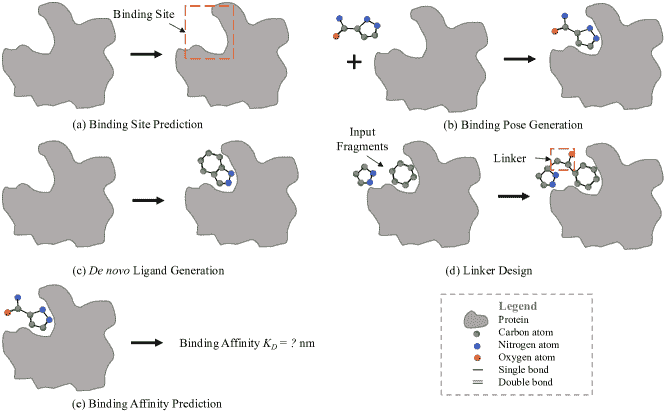

图 1：本调查讨论的基于结构的药物设计任务：（a）结合位点预测识别可以作为配体结合位点的蛋白质结构区域（第 3.1 节）；（b）结合构象生成或蛋白质-配体对接关注预测蛋白质-配体复合体的结合构象（第 3.2 节）；（c）*de novo* 配体生成从头设计结合配体，利用目标蛋白的结构信息（第 3.3 节）；（d）连接子设计将断开的分子片段结合成一个综合配体分子，条件是目标蛋白（第 3.4 节）；（e）结合亲和力预测在给定结合结构的情况下预测蛋白质和配体之间的亲和力（第 3.5 节）。

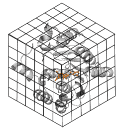

(a) 3D 网格

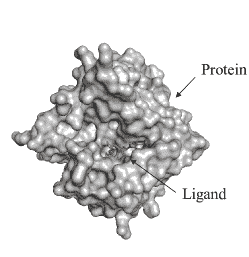

(b) 3D 表面

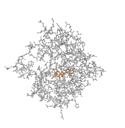

(c) 3D 图

图 2：用于几何深度学习的蛋白质的 3D 表示：（a）3D 网格，（b）3D 表面，以及（c）3D 图，图示为 PDB ID 2avd。

### 2.2 对称性

将对称先验融入神经网络架构作为归纳偏差是构建可泛化模型的有效策略[39, 12]。蛋白质-配体系统中的主要对称群包括欧几里得群 E(3)、特定的欧几里得群 SE(3)以及置换群[12]。E(3)和 SE(3)都包括 3D 欧几里得空间中的旋转和平移变换。E(3)还涵盖了反射操作。这些变换对于几何深度学习至关重要，因为输出应该遵循基础物理规则，预测的蛋白质/配体属性在坐标系统和原子顺序的变换下不应改变。当神经网络旨在区分手性系统时，SE(3)是适用的[40]，这些系统无法与其镜像重叠，就像左右手一样。在化学和生物学中，手性分子可以表现出独特的性质，例如，一种药物可能具有治疗效果，而其镜像可能是有害或无效的。正式地，设$\mathcal{T}$表示变换，$f$为神经网络，${\bm{x}}$为输入数据。如果满足以下约束，神经网络$f({\bm{x}})$的输出可以对$\mathcal{T}$进行等变或不变变换：

+   •

    等变性：$f({\bm{x}})$对变换$\mathcal{T}$是等变的，如果输入${\bm{x}}$的变换与通过相同对称群的变换$\mathcal{T}^{\prime}$的$f({\bm{x}})$的变换是对易的，即$f(\mathcal{T}({\bm{x}}))=\mathcal{T}^{\prime}f({\bm{x}})$。这种对称性很重要，因为预测的向量输出（例如，力、坐标）不应依赖于坐标系统的选择。

+   •

    不变性：不变性是等变性的特例，其中$f({\bm{x}})$对$\mathcal{T}$是不变的，如果$\mathcal{T}^{\prime}$是单位变换：$f(\mathcal{T}({\bm{x}}))=\mathcal{T}^{\prime}f({\bm{x}})=f({\bm{x}})$。这种对称先验很重要，因为某个分子/蛋白质的预测标量属性（例如，能量）在坐标系统变换下应保持不变。

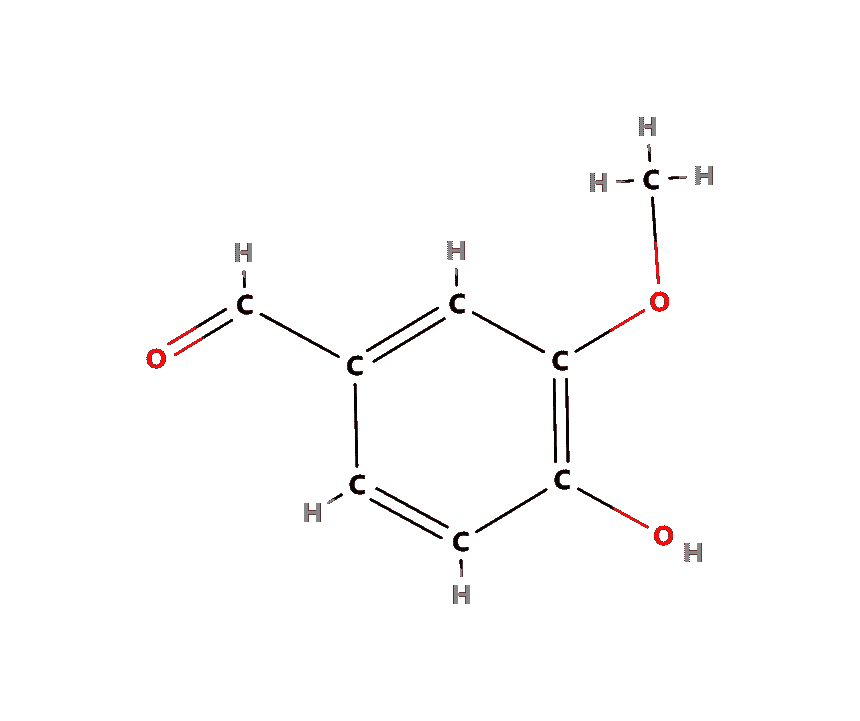

(a) 2D 分子图

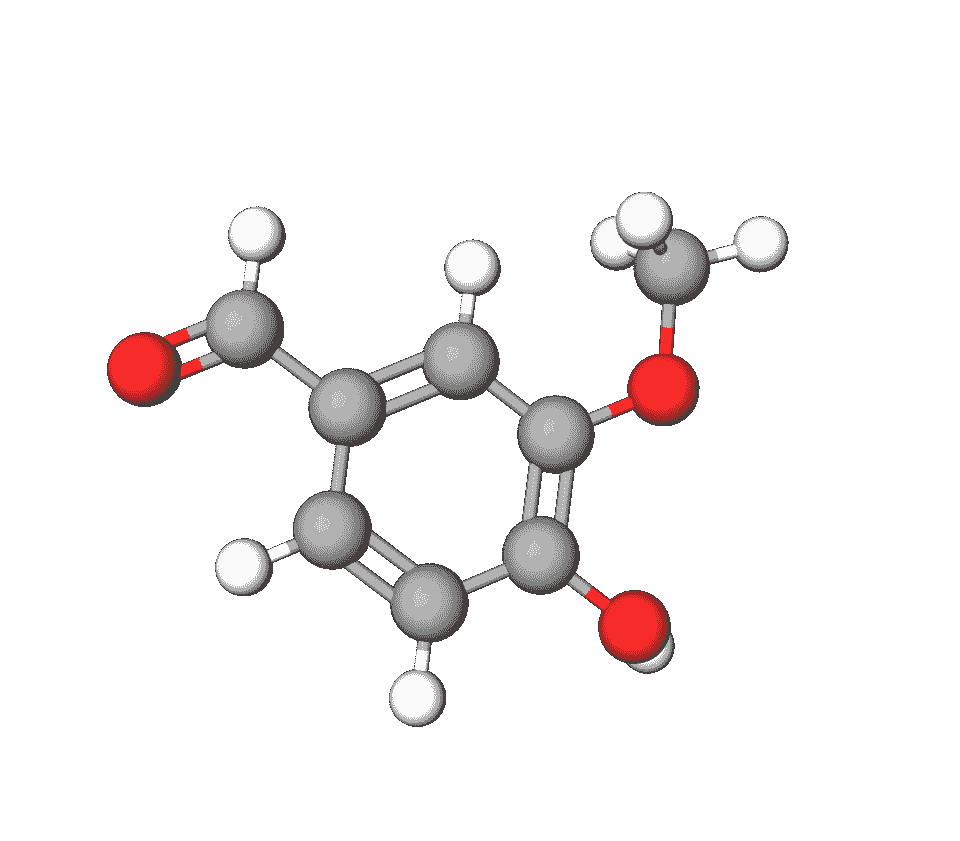

(b) 3D 分子图

图 3: 表示分子为 (a) 2D 图和 (b) 3D 图。

### 2.3 预测方法

接下来，我们总结了用于预测任务的主要预测方法，即结合位点和亲和力预测。这些方法也广泛用于生成模型的结构编码骨架。

#### 2.3.1 卷积神经网络 (CNNs)

CNN 广泛用于图像处理，其中输入元素，即像素，按空间方式排列。CNN 依赖于共享权重的卷积核或滤波器架构，这些卷积核或滤波器沿输入特征滑动并提供平移等变的输出。卷积核和滤波器可以根据数据结构变化。例如，对于 3D 表面数据，MaSIF [17] 定义了具有测地极坐标的测地卷积层。对于 3D 网格数据，广泛使用 3D CNN [41, 42]。

#### 2.3.2 图神经网络（GNNs）

GNNs 广泛用于建模关系数据。大多数 GNNs 遵循消息传递范式。令 $h_{i}$ 为图中第 $i$ 个节点的节点特征，$e_{ij}$ 为连接节点 $i$ 和 $j$ 的可选边的边特征。GNNs 迭代地对每个节点（或边）进行消息计算和邻域聚合操作。一般来说，我们有：

|  | $\displaystyle m_{ij}$ | $\displaystyle=\psi_{m}(h_{i},h_{j},e_{ij}),$ |  | (1) |
| --- | --- | --- | --- | --- |
|  | $\displaystyle h_{i}^{\prime}$ | $\displaystyle=\psi_{h}(\{m_{ij}\}_{j\in\mathcal{N}(i)},h_{i}),$ |  | (2) |

其中 $\mathcal{N}(i)$ 表示节点 $i$ 的邻居集合，$h_{i}^{\prime}$ 是更新后的节点特征，而 $\psi_{m},\psi_{h}$ 是可学习的函数。

对于 3D 结构数据，3D 图中的每个节点都有标量特征并包含 3D 坐标。提出了等变图神经网络，将几何对称性融入模型构建中 [43]。令 $\bm{v}_{i}\in\mathbb{R}^{3}$ 表示 3D 坐标，我们有：

|  | $\displaystyle m_{ij}$ | $\displaystyle=\psi_{m}(\bm{v}_{i},\bm{v}_{j},h_{i},h_{j},e_{ij}),$ |  | (3) |
| --- | --- | --- | --- | --- |
|  | $\displaystyle\bm{m}_{ij}$ | $\displaystyle=\psi_{\bm{m}}(\bm{v}_{i},\bm{v}_{j},h_{i},h_{j},e_{ij}),$ |  | (4) |
|  | $\displaystyle h_{i}^{\prime}$ | $\displaystyle=\psi_{h}(\{m_{ij}\}_{j\in\mathcal{N}(i)},h_{i}),$ |  | (5) |
|  | $\displaystyle\bm{v}_{i}^{\prime}$ | $\displaystyle=\psi_{\bm{v}}(\{\bm{m}_{ij}\}_{j\in\mathcal{N}(i)},\bm{v}_{i}),$ |  | (6) |

其中 $m_{ij}$ 和 $\bm{m}_{ij}$ 是标量和向量消息。$\psi_{m}$ 和 $\psi_{h}$ 是几何不变函数，而 $\psi_{\bm{m}}$ 和 $\psi_{\bm{v}}$ 是几何等变函数。与传统的 3D CNNs 相比，几何等变 GNNs 不需要对输入数据进行体素化，同时仍保持所需的等变性。一些代表性的等变 GNNs 包括 SchNet [44]、EGNN [15]、GVP [45]、DimeNet [46, 47]、GMN [16]、SphereNet [48] 和 ComENet [49]。

#### 2.3.3 图变换器

Transformer 最初是为序列数据开发的[50]。最近，Transformer 架构被适应于二维和三维图数据，并在节点和图分类任务中取得了优于 GNNs 的表现[51, 52, 53, 54, 55]。一个 Transformer 由堆叠的 Transformer 块组成，每个块包括两层：自注意力层，后接一个前馈层，并且这两层都有归一化（例如 LayerNorm [56]）和跳跃连接。对于输入特征矩阵$\textit{{H}}^{(l)}$，第$(l+1)$-th 自注意力块的工作流程如下：

|  | $\displaystyle\textit{{A}}^{(l)}$ | $\displaystyle={\rm softmax}\left(\frac{\textit{{H}}^{(l)}\textit{{W}}^{(l)}_{Q}(\textit{{H}}^{(l)}\textit{{W}}^{(l)}_{K})^{\top}}{\sqrt{d}}\right);$ |  | (7) |
| --- | --- | --- | --- | --- |
|  | $\displaystyle\textit{{H}}^{(l+1)}$ | $\displaystyle=\textit{{H}}^{(l)}+\sum_{i=1}^{B}\textit{{A}}^{(l)}\textit{{H}}^{(l)}\textit{{W}}^{(l)}_{V}\textit{{W}}^{(l)}_{O},$ |  | (8) |

其中 A 是注意力矩阵，$B$是注意力头的总数，$d$是维度大小，$\textit{{W}}^{(l)}_{Q}$、$\textit{{W}}^{(l)}_{K}$和$\textit{{W}}^{(l)}_{V}$是第$l$层的可学习变换矩阵。

为了将 Transformers 推广到图数据中，位置编码是不可或缺的，它们用于编码拓扑和几何信息[51, 55]。常见的位置编码基于最短路径[51]、PageRank [57]和特征向量[58]。位置编码对于图 Transformer 来说是必要的，因为没有位置编码，模型将忽视边的强归纳偏置，并且会关注任意节点对。代表性的图 Transformer 包括 Graphormer [51]、Transformer-M [55]和 Equiformer [54]。例如，Transformer-M [55]开发了两个分开的通道来编码分子的二维和三维结构信息。二维通道使用基于原子度、最短路径距离和二维图结构的编码。在三维通道中，使用高斯基函数[59]来编码原子之间的三维空间距离。

### 2.4 生成方法

下一节总结了 SBDD 任务的生成方法，包括自回归模型、流模型、变分自编码器和扩散模型。

#### 2.4.1 自回归模型 (ARs)

数据点 ${\bm{x}}$ 可以分解为一组组件 $\{x_{0},x_{1},\dots,x_{d-1}\}$，其中 $d$ 是组件的数量。这些组件可以是图像中的像素或图中的节点和边。组件可能具有复杂的潜在依赖关系，使得直接生成 ${\bm{x}}$ 具有挑战性。通过预定义或学习到的顺序，自回归模型将 ${\bm{x}}$ 的联合分布分解为 $d$ 个似然度的乘积，如下所示：

|  | $\small{p({\bm{x}})=\prod_{i=1}^{d}p(x_{i} | x_{1},x_{2},...,x_{i-1}).}$ |  | (9) |
| --- | --- | --- | --- | --- |

自回归模型依次生成 ${\bm{x}}$：在生成过程的每一步中，基于先前生成的子组件来预测下一个子组件。

#### 2.4.2 流模型

流模型旨在学习一个参数化的可逆函数，将数据点 x 和潜在变量 ${\bm{z}}$ 之间进行映射：$f:{\bm{z}}\in\mathbb{R}^{d}\xrightarrow{}{\bm{x}}\in\mathbb{R}^{d}$。潜在分布 $p({\bm{z}})$ 是预定义的概率分布，例如高斯分布。数据分布 $p({\bm{x}})$ 是未知的。但给定一个数据点 ${\bm{x}}$，可以通过变量变化定理计算其似然度：

|  | $\small{p({\bm{x}})=p({\bm{z}})\Big{ | }\text{det}\Big{(}\frac{df^{-1}({\bm{x}})}{d{\bm{x}}}\Big{)}\Big{ | },}$ |  | (10) |
| --- | --- | --- | --- | --- | --- |

其中 $\text{det}(\cdot)$ 是矩阵行列式，$\frac{df^{-1}({\bm{x}})}{d{\bm{x}}}$ 是雅可比矩阵。

在采样过程中，首先从预定义的潜在分布 $p({\bm{z}})$ 中采样一个潜在变量 ${\bm{z}}$。然后通过执行前向变换 ${\bm{x}}=f({\bm{z}})$ 获得相应的数据点 ${\bm{x}}$。因此，$f$ 必须是可微的，并且 ${\rm det}J$ 的计算应该对训练和采样效率是可行的。一个常见的选择是仿射耦合层 [60, 61]，其中 ${\rm det}J$ 的计算非常高效，因为 $J$ 是上三角矩阵。

#### 2.4.3 变分自编码器（VAEs）

变分自编码器（VAEs）[62] 最大化 $p({\bm{x}})$ 的证据下界（ELBO）。VAEs 引入了潜在变量 ${\bm{z}}$ 来表示 ${\bm{x}}$ 的似然度，如下所示：

|  | $\displaystyle\small\log p({\bm{x}})$ | $\displaystyle=\log\int_{\bm{z}}p({\bm{z}})p({\bm{x}} | {\bm{z}})d{\bm{z}}$ |  | (11) |
| --- | --- | --- | --- | --- | --- |
|  |  | $\displaystyle\geq\mathbb{E}_{q({\bm{z}} | {\bm{x}})}\big{[}\log p({\bm{x}} | {\bm{z}})\big{]}-D_{KL}(q({\bm{z}} | {\bm{x}}) | | p({\bm{z}}))$ |  | (12) |
|  |  | $\displaystyle\triangleq\text{ELBO}.$ |  | (13) |

在这里，$p({\bm{z}})$ 代表 ${\bm{x}}$ 的先验分布。为了便于计算，通常使用参数化编码器 $q({\bm{z}}|{\bm{x}})$ 来近似 $p({\bm{z}}|{\bm{x}})$，这也被称为变分推断技术。ELBO 的第一个项是重构损失，它量化了从潜在表示重构 ${\bm{x}}$ 的信息损失。标准的高斯先验 $p({\bm{z}})\sim\mathcal{N}(0,\textit{{I}})$ 通常导致第一个项的均方误差（MSE）损失。ELBO 中的第二个项是 KL 散度项，确保我们学习的分布 $q({\bm{z}}|{\bm{x}})$ 与真实的先验分布相似。

#### 2.4.4 扩散概率模型

扩散模型 [63, 64] 是受非平衡热力学启发的生成模型。扩散模型定义了一个随机扩散过程的马尔可夫链，每一步都向数据中添加噪声，然后通过神经网络学习该过程的反向，以从噪声分布（例如各向同性高斯）中重建数据点。

设 ${\bm{x}}_{0}\sim p({\bm{x}})$ 表示输入数据点，${\bm{x}}_{t}$ 对于 $t=1,\dots,T$ 表示一系列与 ${\bm{x}}_{0}$ 维度相同的噪声表示。正向扩散过程可以表示为：

|  | $\displaystyle q({\bm{x}}_{t}&#124;{\bm{x}}_{t-1})$ | $\displaystyle=\mathcal{N}({\bm{x}}_{t};\sqrt{1-\beta_{t}}{\bm{x}}_{t-1},\beta_{t}\textit{{I}}),$ |  | (14) |
| --- | --- | --- | --- | --- |

其中 $\beta_{t}\in(0,1)$ 控制在每一步中添加的高斯噪声的强度。扩散过程的一个理想特性是可以获得中间状态的封闭形式。设 $\alpha_{t}=1-\beta_{t}$，$\bar{\alpha}_{t}=\prod_{i=1}^{t}\alpha_{i}$，我们有：

|  | $\small{q({\bm{x}}_{t}&#124;{\bm{x}}_{0})=\mathcal{N}({\bm{x}}_{t};\sqrt{\bar{\alpha}_{t}}{\bm{x}}_{0},(1-\bar{\alpha}_{t})\textit{{I}}).}$ |  | (15) |
| --- | --- | --- | --- |

反向扩散过程，即去噪过程的另一个理想特性是，当条件为 ${\bm{x}}_{0}$ 时，可以使用贝叶斯定理以封闭形式计算：

|  | $\displaystyle p_{\theta}({\bm{x}}_{t-1}&#124;{\bm{x}}_{t})$ | $\displaystyle=\mathcal{N}({\bm{x}}_{t-1};\bm{\mu}_{t}({\bm{x}}_{0},{\bm{x}}_{t}),\widetilde{\beta}_{t}\textit{{I}}),$ |  | (16) |
| --- | --- | --- | --- | --- |

其中，参数可以通过解析方法获得：

|  | $\displaystyle\bm{\mu}_{t}({\bm{x}}_{0},{\bm{x}}_{t})$ | $\displaystyle=\frac{\sqrt{\bar{\alpha}_{t-1}}\beta_{t}}{1-\bar{\alpha}_{t}}{\bm{x}}_{0}+\frac{\sqrt{\alpha_{t}}(1-\bar{\alpha}_{t-1})}{1-\bar{\alpha}_{t}}{\bm{x}}_{t},$ |  | (17) |
| --- | --- | --- | --- | --- |
|  | $\displaystyle\widetilde{\beta}_{t}$ | $\displaystyle=\frac{1-\bar{\alpha}_{t-1}}{1-\bar{\alpha}_{t}}\beta_{t}.$ |  |

类似于变分自编码器，扩散模型的目标是最大化 $p({\bm{x}})$ 的对数似然的变分下界，如下所示：

|  |  | $\displaystyle-\log p({\bm{x}})\leq\underbrace{KL[q({\bm{x}}_{T}&#124;{\bm{x}}_{0})&#124;&#124;p_{\theta}({\bm{x}}_{T})]}_{\rm prior\ loss\ \mathcal{L}_{T}}$ |  |
| --- | --- | --- | --- |
|  |  | $\displaystyle~{}~{}~{}+\sum_{t=2}^{T}\underbrace{KL[q({\bm{x}}_{t-1}&#124;{\bm{x}}_{t},{\bm{x}}_{0})&#124;&#124;p_{\theta}({\bm{x}}_{t-1}&#124;{\bm{x}}_{t})]}_{\rm diffusion\ loss\ \mathcal{L}_{t-1}}-\underbrace{\mathbb{E}_{q}[\log p_{\theta}({\bm{x}}_{0}&#124;{\bm{x}}_{1})]}_{\rm reconstruction\ loss\ \mathcal{L}_{0}}.$ |  |

在这里，$\mathcal{L}_{T}$ 是一个常数，而 $\mathcal{L}_{0}$ 可以通过辅助模型 [64, 65] 来估算。对于 $\{\mathcal{L}_{t-1}\}_{t=2}^{T}$，扩散模型采用神经网络 $\epsilon_{\theta}$ 来预测噪声。更具体地，我们可以将方程 15 重新参数化为 ${\bm{x}}_{t}=\sqrt{\bar{\alpha}_{t}}{\bm{x}}_{0}+\sqrt{(1-\bar{\alpha}_{t})}\epsilon_{t},\epsilon_{t}\sim\mathcal{N}(0,\textit{{I}})$。以下训练目标被广泛采用：

|  | $\small{\mathcal{L}=\mathbb{E}_{t}\Big{[}\&#124;\epsilon_{t}-\epsilon_{\theta}({\bm{x}}_{t},t)\&#124;^{2}\Big{]}.}$ |  |
| --- | --- | --- |

### 2.5 其他方法

除了之前讨论的生成方法外，还利用了几种替代技术，如强化学习（RL）[66]、遗传算法（GA）[67] 和蒙特卡洛树搜索（MCTS）[21, 52]，以探索化学空间中的感兴趣性质。此外，受到分子动力学和片段基础药物设计的启发，基于虚拟动力学（VD）[68] 和片段基础分子生成（Fragment）[69] 的创新方法已被引入。例如，在生成适合目标蛋白的 3D 分子时，VD-Gen [68] 在口袋内初始化了大量虚拟粒子。这些粒子随后会被反复调整，以反映分子原子的空间排列。随后，从稳定的虚拟粒子中生成一个 3D 分子。相比之下，在片段基础分子生成中，首先通过从数据集中分离出常见的分子片段（称为模体）来建立一个模体词汇。在生成阶段，通过自回归地附加新片段来生成分子，确保生成的局部结构保持真实。

表 I：本论文回顾的结构基础药物设计模型的总结，包含几何深度学习。

| 任务 | 模型 | 输入 | 输出 | 方法 |
| --- | --- | --- | --- | --- |
| 结合位点预测 | MaSIF [17] | 蛋白质表面 | 结合位点概率 | CNN |
| dMaSIF [70] | 蛋白质表面 | 结合位点概率 | CNN |
| PeSTo [71] | 蛋白质 3D 图 | 结合位点概率 | Transformer |
| ScanNet [72] | 蛋白质 3D 图 | 结合位点概率 | GNN |
| PocketMiner [73] | 蛋白质 3D 图 | 结合位点概率 | GNN |
| PIPGCN [74] | 蛋白质 3D 图 | 结合位点概率 | GNN |
| EquiPocket [75] | 蛋白质 3D 图 | 结合位点概率 | GNN |
| NodeCoder [76] | 蛋白质 3D 图 | 结合位点概率 | GNN |
| DeepSite [41] | 蛋白质网格 | 结合位点概率 | 3DCNN |
| PUResNet [42] | 蛋白质网格 | 结合位点概率 | 3DCNN |
| 结合姿态生成 | EquiBind [35] | 配体 2D 图+蛋白质 3D 图 | 复杂的 3D 图 | 关键点对齐 |
| DeepDock [77] | 配体 2D 图+蛋白质表面 | 复杂的 3D 图 | 距离预测 |
| TankBind [78] | 配体 2D 图+蛋白质 3D 图 | 复杂的 3D 图 | 距离预测 |
| EDM-Dock [79] | 配体 2D 图+蛋白质 3D 图 | 复杂的 3D 图 | 距离预测 |
| DPL [80] | 配体 2D 图+蛋白质序列 | 复杂的 3D 图 | 扩散 |
| DiffDock [18] | 配体 2D 图+蛋白质 3D 图 | 复杂的 3D 图 | 扩散 |
| NeuralPLexer [81] | 配体 2D 图+蛋白质序列 | 复杂的 3D 图 | 扩散 |
| DynamicBind [82] | 配体 2D 图+蛋白质序列 | 复杂的 3D 图 | 扩散 |
| E3Bind [83] | 配体 2D 图+蛋白质 3D 图 | 复杂的 3D 图 | 迭代更新 |
| DeepRMSD [84] | 配体 2D 图+蛋白质 3D 图 | 复杂的 3D 图 | 迭代更新 |
| 3T [85] | 配体 2D 图+蛋白质 3D 图 | 复杂的 3D 图 | 迭代更新 |
| 结合亲和力预测 | SIGN [24] | 复杂的 3D 图 | 结合亲和力 | GNN |
| PIGNet [86] | 复杂的 3D 图 | 结合亲和力 | GNN |
| HOLOPROT [87] | 复杂的 3D 图+表面 | 结合亲和力 | GNN |
| PLIG [88] | 复杂的 3D 图 | 结合亲和力 | GNN |
| PaxNet [89] | 复杂的 3D 图 | 结合亲和力 | GNN |
| IGN [90] | 复杂的 3D 图 | 结合亲和力 | GNN |
| GIGN [91] | 复杂的 3D 图 | 结合亲和力 | GNN |
| GraphscoreDTA [92] | 复杂的 3D 图 | 结合亲和力 | GNN |
| PLANET [93] | 复杂的 3D 图 | 结合亲和力 | GNN |
| DOX_BDW [94] | 复杂的 3D 图 | 结合亲和力 | GNN |
| MBP [95] | 复杂的 3D 图 | 结合亲和力 | GNN |
| Pafnucy [96] | 复杂的 3D 网格 | 结合亲和力 | CNN |
| DeepAtom [97] | 复杂的 3D 网格 | 结合亲和力 | CNN |
| RoseNet [98] | 复杂的 3D 网格 | 结合亲和力 | CNN |
| IEConv [99] | 复杂的 3D 图 | 结合亲和力 | CNN |
| SGCNN [100] | 复杂 3D-图 | 结合亲和力 | CNN |
| Fusion [101] | 复杂 3D-网格+3D-图 | 结合亲和力 | CNN + GNN |
| *de novo* 配体生成 | AutoGrow [102] | 口袋 3D-图 | 配体 3D-图 | GA |
| RGA [67] | 口袋 3D-图 | 配体 3D-图 | GA |
| liGAN [103] | 口袋网格 | 配体 3D-图 | VAE |
| RELATION [104] | 口袋网格 | 配体 Smiles | VAE |
| SQUID [105] | 目标形状点云 | 配体 3D-图 | VAE+片段 |
| DeepLigBuilder [21] | 口袋 3D-图 | 配体 3D-图 | MCTS+RL |
| DeepLigBuilder+ [52] | 口袋 3D-图 | 配体 3D-图 | MCTS+RL |
| 3DSBDD [2] | 口袋 3D-图 | 配体 3D-图 | AR |
| Pocket2Mol [19] | 口袋 3D-图 | 配体 3D-图 | AR |
| DESERT [106] | 口袋网格 | 配体 3D-图 | AR |
| PrefixMol [107] | 口袋 3D-图 | 配体 Smiles | AR |
| FLAG [69] | 口袋 3D-图 | 配体 3D-图 | AR+片段 |
| DrugGPS [108] | 口袋 3D-图 | 配体 3D-图 | AR+片段 |
| Lingo3DMol [109] | 口袋 3D-图 | 配体 3D-图 | AR+片段 |
| GraphBP [110] | 口袋 3D-图 | 配体 3D-图 | 流 |
| MolCode [111] | 口袋 3D-图 | 配体 3D-图 | 流 |
| GraphVF [112] | 口袋 3D-图 | 配体 3D-图 | 流+片段 |
| SENF [113] | 口袋 3D-图 | 配体 3D-图 | 流 |
| DiffSBDD [1] | 口袋 3D-图 | 配体 3D-图 | 扩散 |
| TargetDiff [114] | 口袋 3D-图 | 配体 3D-图 | 扩散 |
| DiffBP [115] | 口袋 3D-图 | 配体 3D-图 | 扩散 |
| DecompDiff [116] | 口袋 3D-图 | 配体 3D-图 | 扩散 |
| ShapeMol [117] | 目标形状点云 | 配体 3D-图 | 扩散 |
| VD-Gen [68] | 口袋 3D-图 | 配体 3D-图 | VD |

表 I：本论文中回顾的基于结构的药物设计模型的几何深度学习总结（续）。

| 任务 | 模型 | 输入 | 输出 | 方法 |
| --- | --- | --- | --- | --- |
| Linker design | DeLinker [118] | 口袋 3D-图+配体片段 | 配体 2D-图 | VAE |
| 3Dlinker [20] | 口袋 3D-图+配体片段 | 配体 3D-图 | VAE |
| DEVELOP [119] | 口袋 3D-图+配体片段 | 配体 3D-图 | VAE |
| Link-INVENT [120] | 口袋 3D-图+配体片段 | 配体 2D-图 | RL |
| PROTAC-INVENT [66] | 口袋 3D-图+配体片段 | 配体 3D-图 | RL |
| DiffLinker [121] | 口袋 3D-图+配体片段 | 配体 3D-图 | 扩散 |

## 结构基础药物设计任务

### 3.1 结合位点预测

#### 3.1.1 问题表述

蛋白质表面涵盖了蛋白质的最外层区域，与环境进行相互作用。它通常被描述为具有附加几何和化学属性的连续形状。基于这些蛋白质表面表示来预测结合位点是其他结构基础药物设计（SBDD）任务的基础，包括结合姿势生成和*de novo*配体生成。形式上，我们将目标蛋白质表面表示为$\mathcal{S}$（例如，以网格或点云的形式）。目标是设计一个预测模型$f(\mathcal{S})$，以确定表面上每个点作为结合位点的可能性。

#### 3.1.2 代表性方法

分子表面相互作用指纹（MaSIF）[17]是一种开创性的方法，利用基于 3D 网格的几何深度学习来预测蛋白质相互作用位点（见图 4）。在 MaSIF 中，蛋白质表面数据在测地空间中进行描述，其中表面上两个点之间的距离通过在表面上“行走”来测量。为了编码蛋白质表面，MaSIF 将表面分解为重叠的径向补丁，并具有固定的测地半径。每个补丁中的点被分配一组预计算的几何（例如，形状指数和距离依赖曲率）和化学（例如，疏水性、连续电荷和自由电子/质子）特征（见图 4bc）。然后，MaSIF 通过卷积神经网络学习将表面补丁的输入特征嵌入到结合位点预测的指纹中（见图 4d）。

然而，MaSIF [17]受限于对预计算网格、手工特征和大量计算时间的依赖。dMaSIF [70]扩展了 MaSIF，并提出了一种基于蛋白质 3D 点云表示的高效端到端预测框架。在图 4 中，显示 dMaSIF [70]在飞行过程中进行所有计算，比 MaSIF [17]快 600 倍，同时获得相似准确度的预测结果。

此外，一些最新的研究将蛋白质表面建模为 3D 图，并设计了基于 GNN 的[72]或图变换器的[71]方法以实现高效和精确的绑定位点预测。例如，ScanNet [72]根据蛋白质的空间化学排列构建原子和氨基酸的表示，并利用具有特别设计的滤波器的 GNN 进行预测；PeSTo [71]是一个旋转等变的变换器基础神经网络，直接作用于蛋白质原子进行绑定位点预测。

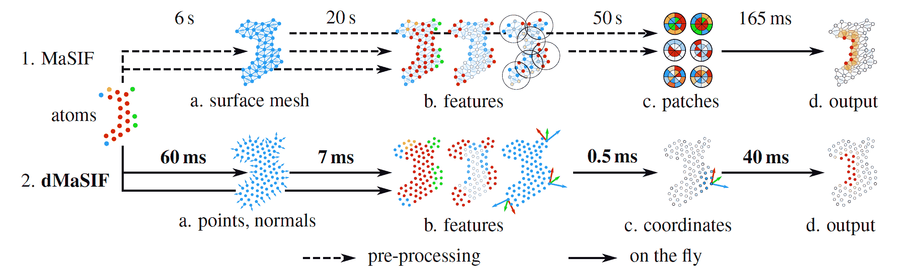

图 4：MaSIF [17]和 dMaSIF [70]在绑定位点预测中的概述。它们有类似的步骤，每个步骤每个蛋白质的平均运行时间都有标记。MaSIF 预计算了步骤 a-c，而 dMaSIF 则即时计算，速度比 MaSIF 快 600 倍。

#### 3.1.3 数据集

蛋白质数据银行（PDB）[122]包含通过 X 射线晶体学、NMR 光谱学和冷冻电子显微镜获得的 3D 结构蛋白质数据。

Dockground [123] 提供了一套全面的从 PDB 提取的蛋白质-蛋白质对接复合物。

#### 3.1.4 评估指标

由于通常没有绑定位点预测的阈值，ROC-AUC 被广泛用于评估。

#### 3.1.5 限制与未来方向

尽管应用几何深度学习在绑定位点预测中取得了显著成功，但现有方法有两个限制需要在未来研究中解决。首先是根据结合配体预测绑定位点。由于结合配体具有各种生化特征，如不同的大小、极性和疏水性基团，绑定口袋对配体具有特异性，因此在绑定位点预测中考虑配体信息是合理的。第二个开放问题是预测在实验确定结构中不明显的隐蔽口袋。然而，由于蛋白质结构波动[124, 125]，配体可以结合到隐蔽口袋中，并通过抑制或激活调节蛋白质功能。因此，准确和快速预测隐蔽口袋的能力是扩展药物靶蛋白组的一个重要机会。PocketMiner [73] 是隐蔽口袋预测方面的开创性工作，我们期待在这一领域看到更多的研究。

### 3.2 绑定姿势预测

#### 3.2.1 问题公式化

预测配体分子与靶蛋白的结合模式，通常称为分子对接，是药物发现中的一个基本挑战，具有广泛的实际应用。我们可以将靶蛋白结构表示为$\mathcal{P}$，配体的二维图表示为$G$，配体的三维结构表示为$R$。主要目标是开发一个用于预测配体三维结合姿势的$p(R|G,\mathcal{P})$模型。

#### 3.2.2 代表性方法

传统的分子对接方法依赖于手动设计的评分函数和广泛的构象采样来预测最佳结合构象。近年来，通过应用几何深度学习技术，该研究领域取得了显著进展，取得了显著进展。在这一领域的一个值得注意的进展是 EquiBind [35]，这是将几何深度学习模型首次应用于分子对接任务的实例。具体而言，EquiBind [35]采用了一个 SE(3)-等变几何深度学习模型，以实现对受体结合位点位置和配体结合姿势的直接预测。这是通过预测和对齐配体和蛋白质上的关键口袋标志来实现的。在与传统方法如 VINA [126]和 SMINA 的比较评估中，EquiBind 显著提高了对接效率，比它们高出几个数量级——提高了 3 到 5 倍。TANKBind [80]通过结合分治策略和三角学感知神经网络进一步改进了 EquiBind。TANKBind 预测分子间距离矩阵，然后采用数值方法根据分子间距离矩阵、蛋白质节点坐标和配体节点对距离矩阵生成特定的配体坐标。继 TANKBind 之后，E3Bind [83]使用分治策略，并设计了一个三角学感知等变图网络，以迭代更新配体坐标。该框架可以直接预测坐标，无需数值方法生成过程。一般来说，这些方法将结合姿势生成任务视为回归问题。

与普遍采用的方法不同，DiffDock [18] 通过将其框架设定为生成建模问题引入了突破性的视角（图 5）。作为一种在配体姿态的非欧几里得流形上的扩散生成模型，DiffDock 将流形映射到涉及对接的配体自由度（平移、旋转和扭转）的乘积空间，并在该空间上开发了高效的扩散过程。扩散模型为每对输入的蛋白质-配体对生成一组候选姿态，经过训练的置信模型被用来挑选出最可能的姿态。在盲对接的情况下，即没有提供结合位点，DiffDock 在推断效率上达到了与化学信息学和几何深度学习方法相当的水平，并且显著提升了性能。

通常，之前的研究主要集中在刚性对接上，其中蛋白质被视为刚性体，忽略了蛋白质结构的柔性；然而，必须承认蛋白质结构本质上是柔性的，并且可以经历固有的或诱导的构象变化 [127]。不幸的是，上述方法忽略了这些方面。近年来的方法，例如 NeuralPLexer [81] 和 DynamicBind [82]，考虑了蛋白质结构的柔性，从而在预测蛋白质-配体复合物结构方面表现更优。例如，NeuralPLexer [81] 结合了扩散模型，该模型集成了基本的生物物理约束以及多尺度几何深度学习系统。这种组合使得残基级接触图的迭代采样成为可能，并确定蛋白质-配体复合物中所有重原子的坐标。继 DiffDock[18] 开创的路径之后，DynamicBind [82] 不仅考虑了配体自由度（平移、旋转和扭转），还考虑了蛋白质侧链内的自由度（扭转）。这些方法在动态对接场景中的几何深度学习领域展示了显著的潜力。

表 II：PDBBind 数据集上代表性分子对接方法在盲对接任务中的不同指标总结。除非另有说明，默认输入假定为蛋白质的 holo 构象。最佳结果以粗体突出显示。

方法 Top-1 配体 RMSD Top-1 配体质心 时间(s) ($\downarrow$) 百分位数 ($\downarrow$) 低于阈值 ($\uparrow$) 百分位数 ($\downarrow$) 低于阈值 ($\uparrow$) 25th 50th 75th 2 Å 5 Å 25th 50th 75th 2 Å 5 Å VINA [126] 5.7 10.7 21.4 5.5 21.2 1.9 6.2 20.1 26.5 47.1 206 QVINA-W [128] 2.5 7.7 23.7 20.9 40.2 0.9 3.7 22.9 41.0 54.6 10 GNINA [129] 2.4 7.7 17.9 22.9 40.8 0.8 3.7 23.1 40.2 53.6 127 SMINA [130] 3.1 7.1 17.9 18.7 38.0 1.0 2.6 16.1 41.6 59.8 126 GLIDE [131] 2.6 9.3 28.1 21.8 33.6 0.8 5.6 26.9 36.1 48.7 1405 EquiBind [35] 3.8 6.2 10.3 5.5 39.1 1.3 2.6 7.4 40.0 67.5 0.04 TANKBind [78] 2.5 4.0 8.5 20.4 59.0 0.9 1.8 4.4 55.1 77.1 2.5 E3bind [83] 2.1 3.8 7.8 23.4 60.0 0.8 1.5 4.0 60.0 78.8 2.1 DiffDock [18] 1.4 3.3 7.3 38.2 63.2 0.5 1.2 3.2 64.5 80.5 40 DiffDock (Apo) [18] - - - 21.7 - - - - - - 10 NeuralPLexer (Apo) [81] 1.3 2.8 5.9 39.5 69.7 - - - - - 2.1 DynamicBind (Apo) [82] - - - 33.0 65.0 - - - - - - 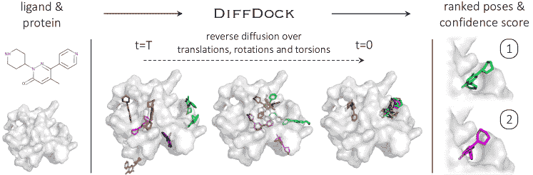

图 5: DiffDock [18] 在结合姿势预测中的概述。该模型以单独的配体和蛋白质结构作为输入。通过在平移、旋转和扭转自由度上的逆扩散过程来去噪随机采样的初始姿势。一个训练过的置信度模型对采样的姿势进行排序，以生成最终预测和置信度评分。

#### 3.2.3 数据集

PDBBind [132] 是 PDB [133] 的一个子集，包含实验测量的蛋白质-配体复合物的 3D 结构。最新版本 PDBBind v2020 包含 19,443 个蛋白质-配体复合物，其中有 3,890 个独特的受体和 15,193 个独特的配体。该数据集通常用于分子对接任务。然而，尽管几乎所有几何深度学习方法都是在此数据集上训练的，但详细设置存在变异，如表 IV 中所述。

#### 3.2.4 评估指标

Centroid Distance 计算预测和真实结合配体原子的平均坐标之间的距离。

配体均方根偏差 (L-RMSD) 是预测配体和结合配体原子之间的均方误差。正式地，设 $R\in\mathbb{R}^{n\times 3}$ 和 $\hat{R}\in\mathbb{R}^{n\times 3}$ 分别为预测的和实际的配体坐标，其中 $n$ 是原子数量。L-RMSD 计算公式为：

|  | $\text{L-RMSD}(R,\hat{R})=\big{(}\frac{1}{n}\sum_{i=1}^{n}&#124;&#124;R_{i}-\hat{R}_{i}&#124;&#124;^{2}\big{)}^{\frac{1}{2}},$ |  | (18) |
| --- | --- | --- | --- |

其中 $R_{i}$ 和 $\hat{R}_{i}$ 表示第 $i$ 个原子的坐标。

Kabsch RMSD 是配体通过旋转-平移变换可以获得的最低 RMSD。它首先使用 Kabsch 算法对两种结构进行叠加，然后计算类似于方程 18 的 RMSD 得分。

PoseBusters [134] 是一个新颖的测试套件，旨在评估配体构象的化学和物理合理性，补充了像 RMSD 这样的基于准确性的指标。PoseBusters 测试套件总共包含 18 个检查，分为三组测试，用于评估化学、分子内和分子间的有效性。

#### 3.2.5 基准性能

在表 II 中，展示了所选分子对接方法的性能。NeuralPLexer 和 DynamicBind 专注于动态对接，而其余方法则处理刚性对接。动态对接方法使用蛋白质的 apo 构象，而刚性对接方法应用 holo 构象。表中指出，DiffDock 在刚性对接中表现良好，而 NeuralPLexer 在动态对接场景中有效。

#### 3.2.6 限制与未来方向

自从 EquiBind [35] 开创性地将几何深度学习引入分子对接任务以来，基于几何深度学习的对接方法应运而生。尽管这些方法在盲对接任务的 RMSD 指标上表现出显著的提升，但它们在生成物理上合理的配体构象方面仍面临挑战。Buttenschoen 等人的研究[134] 表明，即使对于 DiffDock 预测的 RMSD 小于 2.0 Å的数据，只有 36.8%的数据代表了物理上合理的配体构象（表 III），其中蛋白质和配体之间的空间冲突是一个普遍问题。这些发现突显了几何深度学习模型在生成准确且物理上合理的配体构象方面仍面临的挑战。此外，最近开发的 GPU 加速采样方法，如 VINA-GPU [135] 和 DSDP [136]，在速度上取得了显著的加速。分析表明，目前的分子对接方法在效率上没有优势，并且无法预测物理有效的构象。因此，未来将需要拓展几何深度学习模型的更多内在优势，例如考虑蛋白质侧链的灵活性。

表 III：PoseBuster [134] 数据集上代表性分子对接方法的不同指标总结。数据点通过所有 PoseBuster 测试，并标记为“PB-Valid”。

| 方法 | $\%$ RMSD $\leq$ 2.0 Å | $\%$ RMSD $\leq$ 2.0 Å (PB-Valid) |
| --- | --- | --- |
| VINA [137] | 52 | 51 |
| EquiBind [35] | 2.6 | 0.0 |
| TANKBind [78] | 15 | 2.6 |
| DiffDock [18] | 38 | 14 |

表 IV：几何深度学习基础的分子对接方法使用的数据集。

| 方法 | 训练和验证集 |
| --- | --- |
| EquiBind [35]、E3Bind [83]、DiffDock [18] | PDBbind 2020 通用集，包含 2019 年前发布的复合物，不包括测试集中发现的配体—总计 17,347 个复合物。 |
| TankBind [78]、DynamicBind[82] | PDBbind 2020 通用集，包含 2019 年前发布的复合物，不包括未通过预处理的复合物—总计 18,755 个复合物。 |
| NeuralPlexer [81] | 基于 2022 年 4 月访问的 PDB 构建的新数据集 PL2019-74k。PL2019-74k 通过去除 2019 年 1 月之后提交的样本和 PocketMiner 数据集中具有 UniProt ID 的样本获得，总共 74,477 个样本用于模型训练。 |

表 V：结合亲和力预测模型的训练设置、测试设置和测试性能。

方法 年份 训练集 测试集 RMSE ($\downarrow$) PCC ($\uparrow$) Pafnucy [96] 2018 PDBbind v2016 普通集 (N=11,906) PDBbind v2016 核心集 (N=290) 1.420 0.780 DeepAtom [97] 2019 PDBbind v2016 精细集 (N=3,390) PDBbind v2016 核心集 (N=290) 1.318 0.807 OnionNet [138] 2019 PDBbind v2016 普通集 (N=11,906) PDBbind v2016 核心集 (N=290) 1.287 0.816 PIGNet [86] 2021 PDBbind v2019 精细增强集 (N=1,656,600) PDBbind v2016 核心集 (N=283) - 0.749 Fusion [101] 2021 PDBbind v2016 普通集 (N=-) PDBbind v2016 核心集 (N=290) 1.270 0.820 OnionNet-2 [139] 2021 PDBbind v2019 普通集 (N=17,367) PDBbind v2016 核心集 (N=285) 1.164 0.864 IGN [90] 2021 PDBbind v2016 普通集 (N=8,298) PDBbind v2016 核心集 (N=262) 1.220 0.837 SIGN [21] 2021 PDBbind v2016 精细集 (N=3,390) PDBbind v2016 核心集 (N=290) 1.316 0.797 PLIG [88] 2022 PDBbind v2020 普通集 + PDBbind v2016 精细集 (N=19,451) PDBbind v2016 核心集 (N=285) 1.210 0.840 PaxNet [89] 2022 PDBbind v2016 精细集 (N=3,390) PDBbind v2016 核心集 (N=290) 1.263 0.815 GLI [140] 2022 PDBbind v2016 精细集 (N=3,390) PDBbind v2016 核心集 (N=290) 1.294 - GIGN [91] 2023 PDBbind v2016 普通集 (N=11,906) PDBbind v2016 核心集 (N=290) 1.190 0.840 KIDA [100] 2023 PDBbind v2016 普通集 (N=12,500) PDBbind v2016 核心集 (N=285) 1.291 0.837 GraphscoreDTA [92] 2023 PDBbind v2019 普通集 (N=9,869) PDBbind v2016 核心集 (N=279) 1.249 0.831 PLANET [93] 2023 PDBbind v2020 普通集 (N=15,616) PDBbind v2016 核心集 (N=285) 1.247 0.824 MBP [95] 2023 PDBbind v2016 精细集 (N=3,390) PDBbind v2016 核心集 (N=290) 1.263 0.825

### 3.3 *De Novo* 配体生成

#### 3.3.1 问题表述

*de novo* 配体生成的目标是生成有效的三维分子结构，这些结构可以适配并结合特定的蛋白质结合位点。*de novo* 生成涉及在没有参考配体分子的情况下生成一个分子，即从头开发分子。正式地，设 $\mathcal{P}$ 表示蛋白质结构，$\mathcal{G}$ 为三维配体分子。目标是学习一个条件生成模型 $p(\mathcal{G}|\mathcal{P})$ 以捕捉蛋白质-配体对的分布。

#### 3.3.2 代表性方法

早期的 *de novo* 配体生成方法将目标蛋白质表示为 3D 网格，并使用 3D CNN 作为编码器。例如，**LiGAN** [141] 使用条件变分自编码器，在蛋白质-配体结构的原子密度网格表示上进行训练以生成配体。然后，通过进一步的原子拟合和从生成的原子密度中推断键，构建配体的分子结构。然而，作为初步工作，**LiGAN** 并不满足期望的等变性属性。

后续方法将目标蛋白质和配体表示为 3D 图/点云，通过利用等变 GNN 进行上下文编码来实现等变性。例如，**3DSBDD** [142] 使用 **SchNet** [143] 编码结合位点的 3D 上下文，并估计原子在 3D 空间中出现的概率密度。原子是自回归地采样，直到没有空间容纳新原子为止。**GraphBP** [144] 采用正则化流 [145] 框架，构建局部坐标系统来预测原子类型和相对位置。

**Pocket2Mol** [19] 采用几何向量感知机 [146] 和基于向量的神经网络 [147] 作为上下文编码器。受到 **AlphaFold** [7] 在蛋白质结构预测中的启发，**Pocket2Mol** 在编码器中引入了三角形自注意力，其中注意力偏置设计用于捕捉几何约束。**Pocket2Mol** 共同预测前沿原子、原子位置、原子类型和共价化学键。通过基于向量的神经元，**Pocket2Mol** 可以高效地从可处理的分布中采样药物分子，而无需依赖 MCMC。

通过利用分子片段的化学先验知识，如功能基团，**FLAG** [69] 和 **DrugGPS** [108] 提出了逐片段生成配体分子的方案，从而产生更为真实的子结构。例如，在 **FLAG** [69] 中，首先通过预处理数据集并提取高频出现的分子片段（即**动机**）来构建一个动机词汇表。在生成过程中，药物分子是以动机为构建块自回归地生成的。在每个生成步骤中，如图 6 所示，3D 图神经网络对中间上下文信息进行编码，选择焦点动机，预测下一个动机类型，并将新动机附加到生成的分子上。由于键长/角度在很大程度上已确定，**FLAG** 利用化学信息学工具 [148] 有效地确定这些参数，并专注于训练神经网络以预测旋转角度。

基于 FLAG [69]，DrugGPS [108] 进一步考虑了基于结构的药物设计模型的泛化问题：高质量蛋白质-配体复合物数据量非常有限，而且目标蛋白质口袋可能不在训练数据集中。训练好的模型难以为未见过的目标蛋白质生成良好的药物候选物。DrugGPS[108] 有效地结合了蛋白质子口袋先验，以实现具有泛化能力的药物分子生成。尽管两个蛋白质口袋整体上可能不相似，但如果它们共享类似的子口袋，它们仍可能结合相同的片段 [149]。为了捕捉结合口袋之间的子口袋级别的相似性/不变性，DrugGPS[108] 提出了学习子口袋原型，并在训练过程中构建全局交互图来建模子口袋原型-分子基序之间的相互作用。

最近，受到扩散模型强大生成能力的激励，基于扩散的方法，如 DiffSBDD [1]、TargetDiff [114] 和 DecompDiff [116]，被提出用于非自回归配体生成，并取得了优越的性能。例如，TargetDiff [114] 学习了一个联合药物分子生成过程，该过程涉及连续原子坐标和分类原子类型，并采用了以蛋白质口袋为条件的 SE(3)-等变网络。进一步的研究表明，TargetDiff [114] 还可以从蛋白质-配体复合物中提取代表性特征来估计结合亲和力，提供了一种有效的虚拟筛选方法。受到制药实践的启发，DecompDiff [116] 考虑了配体中原子的不同角色，将配体分子和先验分解为两个部分，即药物设计中的臂和支架。臂负责与结合区域的相互作用以提高亲和力，而支架的角色则是将臂准确地放置在预期的结合区域内。此外，DecompDiff [116] 在模型中结合了键的扩散，并在采样阶段增加了额外的有效性指导，以改善生成分子的性质。

表 VI: 不同的*de novo* 配体生成方法对参考分子和生成分子的属性进行比较。Vina Score 表示 Vina 评分函数是在没有配体重新对接或局部优化的情况下直接计算的。Vina Min 表示配体在局部进行了最小化。Vina Dock 表示配体在局部优化并重新对接。

<svg version="1.1" height="19.07" width="79.26" overflow="visible"><g transform="translate(0,19.07) scale(1,-1)"><g  transform="translate(0,0)"><g transform="translate(0,9.61) scale(1, -1)"><foreignobject width="37.67" height="9.61" overflow="visible">模型</foreignobject></g></g> <g  transform="translate(39.63,9.61)"><g transform="translate(0,9.46) scale(1, -1)"><foreignobject width="39.63" height="9.46" overflow="visible">指标</foreignobject></g></g></g></svg> Vina 评分 ($\downarrow$) Vina 最小 ($\downarrow$) Vina 对接 ($\downarrow$) 高亲和力 ($\uparrow$) QED ($\uparrow$) SA ($\uparrow$) 多样性 ($\uparrow$) 平均值 中位数 平均值 中位数 平均值 中位数 平均值 中位数 平均值 中位数 平均值 中位数 平均值 中位数 参考 -6.36 -6.46 -6.71 -6.49 -7.45 -7.26 - - 0.48 0.47 0.73 0.74 - - liGAN [103] - - - - -6.33 -6.20 21.1% 11.1% 0.39 0.39 0.59 0.57 0.66 0.67 GraphBP [110] - - - - -4.80 -4.70 14.2% 6.7% 0.43 0.45 0.49 0.48 0.79 0.78 3DSBDD [2] -5.75 -5.64 -6.18 -5.88 -6.75 -6.62 37.9% 31.0% 0.51 0.50 0.63 0.63 0.70 0.70 Pocket2Mol [19] -5.14 -4.70 -6.42 -5.82 -7.15 -6.79 48.4% 51.0% 0.56 0.57 0.74 0.75 0.69 0.71 TargetDiff [114] -5.47 -6.30 -6.64 -6.83 -7.80 -7.91 58.1% 59.1% 0.48 0.48 0.58 0.58 0.72 0.71 FLAG [69] -5.30 -5.89 -6.46 -6.68 -7.25 -7.17 53.7% 54.8% 0.50 0.51 0.75 0.72 0.70 0.73 DrugGPS [108] -5.45 -5.81 -6.49 -6.88 -7.36 -7.42 54.9% 55.7% 0.59 0.58 0.72 0.73 0.71 0.74 Decompdiff [116] -5.67 -6.04 -7.04 -7.09 -8.39 -8.43 64.4% 71.0% 0.45 0.43 0.61 0.60 0.68 0.68 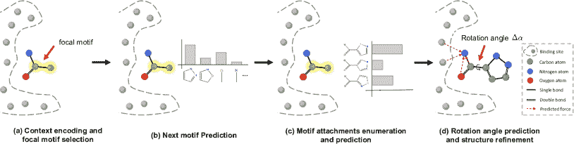

图 6：FLAG [69] 用于*de novo* 配体生成的概述。每次迭代包含四个步骤：（a）上下文编码和焦点基序选择，（b）下一个基序预测，（c）基序附加枚举和预测，以及（d）旋转角度预测和结构优化。

#### 3.3.3 数据集

CrossDocked 数据集 [150] 广泛用于基于结构的*de novo* 配体设计 [2, 19]，其中包含通过交叉对接蛋白质数据银行 [122] 获得的 2250 万蛋白质-分子结构。考虑到交叉对接复合物质量的变异，现有方法通常采用过滤步骤。在过滤掉结合位点 RMSD 大于 1 Å 的数据点后，获得了一个包含大约 180,000 个数据点的精炼子集。对于数据集拆分，mmseqs2 [151] 广泛用于在 30$\%$ 序列同一性下进行数据聚类，从剩余簇中随机抽取 100,000 对蛋白质-配体对用于训练，从剩余簇中抽取 100 个蛋白质用于测试。测试集中每个蛋白质口袋抽取 100 个分子用于评估生成模型。

Binding MOAD [152] 包含实验上确定的复合蛋白-配体结构。数据集根据蛋白质的酶委员会编号[153]进行了筛选和拆分。具体来说，拆分确保不同的数据集中不包含来自相同酶委员会编号（EC 编号）主类的蛋白质。最终，有 40,354 对蛋白质-配体对用于训练，130 对用于测试。

#### 3.3.4 评价指标

以下指标在相关研究中广泛使用[2, 19, 144, 108, 69]来评估采样分子的质量：（1）有效性是指所有生成的分子中化学有效分子的百分比。如果分子可以通过 RDkit [148]进行清理，则认为它是有效的。（2）Vina Score 测量生成的分子与蛋白质口袋之间的结合亲和力。它可以通过传统的对接方法，如 AutoDock Vina [137, 154]，或训练的 CNN 评分函数[155]来计算。在计算 Vina Score 之前，生成的分子结构会通过通用力场[156]进行优化。（3）高亲和力计算为生成的分子对测试集中参考物质具有更高亲和力的口袋的百分比。（4）QED 衡量分子作为潜在药物候选者的可能性。（5）合成可及性（SA）表示药物合成的难度（分数在 0 到 1 之间标准化，较高的值表示更易于合成）。（6）LogP 是辛醇-水分配系数（LogP 值应在-0.4 到 5.6 之间，才是有前景的药物候选者[157]）。（7）Lipinski（Lip.）计算分子遵循 Lipinski 五规则的数量[158]。（8）Sim. Train 表示与训练集中最相似分子的 Tanimoto 相似性[159]。（9）Diversity (Div.) 测量生成的分子对结合口袋的多样性（计算为 1 - 平均对比 Tanimoto 相似性）。(10) Time 记录生成 100 个有效分子的时间成本。

#### 3.3.5 性能基准

我们在表 VI 上基准测试了代表性的*de novo*配体生成方法。通常，没有一种方法在所有指标上都是最优的。我们可以观察到，基于扩散的方法在结合亲和力（Vina 相关指标）上表现最佳。这可能归因于其非自回归生成方案，促进了全局优化。至于 QED 和 SA，基于片段的方法，如 DrugGPS，表现最为竞争力。这可以通过引入类药物片段来解释，这有效地提高了药物样性和合成性。

#### 3.3.6 限制与未来方向

尽管将几何深度学习应用于*de novo*配体生成取得了成功，但探索广阔的化学空间并生成具有满意属性的高质量药物候选物仍然具有挑战性。一般来说，当前的方法存在以下限制，并需要进一步探索：（1）未能考虑基本的化学先验；（2）缺乏配体优化方法；（3）评估指标不全面。

首先，大多数当前的方法未能考虑基本的化学先验，如分子基序和蛋白质-配体相互作用模式。因此，生成的配体分子可能具有无效的 3D 结构，并且与目标蛋白质的结合亲和力有限。FLAG [69]和 DrugGPS [108] 已尝试在模型构建中利用基序和子口袋的化学先验。未来，我们期望有更多利用化学先验进行高质量配体生成的方法。

其次，现有的工作未能在生成过程中明确优化药物属性。在实践中，直接生成满足一系列属性约束的药物候选物具有挑战性。一种常见的做法是采样有前景的先导化合物，然后进行先导优化。因此，探索多属性优化方法用于*de novo*配体生成是未来的一个方向。

第三，当前的评估指标缺乏全面性，大多集中在如 QED 和 SA 等 2D 分子属性上。最近的工作，PoseCheck [160]，提出了四个指标来评估生成分子的姿态，包括相互作用概况、空间冲突、应变能和重新对接 RMSD。他们的评估显示，现有方法生成的配体分子通常表现出非物理特性，如空间冲突、氢原子定位问题和高应变能。未来，我们期望出现更全面的评估指标和更先进的配体生成模型，以解决这些不足之处。

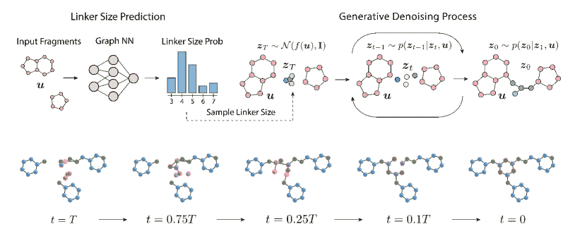

图 7：DiffLinker [121] 在链接器设计中的概述。输入是分子片段和蛋白质口袋（可选）。输出是将片段连接成完整分子的链接器。DiffLinker 是一个 E(3) 等变的基于扩散的模型。在生成过程中，首先计算输入片段的链接器大小概率。接着，使用条件等变扩散模型对链接器原子进行采样和去噪。底部展示了链接器生成过程，链接器原子以橙色突出显示。

### 3.4 链接器设计

#### 3.4.1 问题表述

大多数小分子药物通过结合目标蛋白质来抑制其活性。然而，由于疾病的复杂性，目标蛋白质中的某些氨基酸可能会突变，导致结合亲和力降低，药物脱落。为了解决这个问题，一种新兴的治疗机制涉及蛋白酶体靶向嵌合体（PROTAC），它通过促使目标蛋白质的完全降解来抑制蛋白质功能。具体而言，PROTAC 包含两个分子片段和一个将这些片段连接成完整分子的链接器。PROTAC 中的一个片段结合目标蛋白质，另一个片段结合能够降解目标蛋白质的其他分子。因为 PROTAC 只需要在结合其靶标时具有高选择性，而不是抑制目标蛋白质的活性，因此许多关注点集中在将以前无效的抑制剂分子重新利用为下一代药物的 PROTAC 上。PROTAC 的一个关键问题是链接器设计，它根据给定的片段和目标蛋白质生成链接器。形式上，设目标蛋白质为 $\mathcal{P}$，分子片段为 $\mathcal{F}$，链接器为 $\mathcal{L}$；目标是学习一个条件生成模型 $p(\mathcal{L}|\mathcal{F,P})$。

表 VII：在 ZINC 测试集上的链接器设计性能比较。给定的锚点表示这些锚点是已知的。采样大小表示链接器的大小是采样的，并不一定与真实情况相同。

模型 QED ($\uparrow$) SA ($\uparrow$) 有效 ($\uparrow$) 唯一 ($\uparrow$) 新颖 ($\uparrow$) DeLinker [118] 0.64 0.77 98.3% 44.2% 47.1% 3DLinker [20]（给定锚点） 0.65 0.77 99.3% 29.0% 41.2% 3DLinker [20] 0.65 0.76 71.5% 29.2% 41.9% DiffLinker [121] 0.68 0.78 93.8% 24.0% 30.3% DiffLinker [121]（给定锚点） 0.68 0.77 97.6% 22.7% 32.4% DiffLinker [121]（采样大小） 0.65 0.76 90.6% 51.4% 42.9% DiffLinker [121]（给定锚点，采样大小） 0.65 0.76 94.8% 50.9% 47.7%

#### 3.4.2 代表性方法

DeLinker [118] 使用变分自编码器（VAE）自回归地生成连接体的原子和边。在 DeLinker 中，仅考虑简单的几何信息，如相对距离和方向，输出的是二维分子图。3Dlinker [20] 也自回归地生成连接体，但可以进一步生成三维分子结构，而无需指定锚原子，即用于连接的片段的原子。锚节点、下一个节点类型、边和坐标在每一步中顺序预测。

Link-INVENT [120] 和 PROTAC-INVENT [66] 是基于强化学习的方法。Link-INVENT [120] 扩展了广泛使用的 REINVENT [161] 模型，并结合奖励函数来优化生成的连接体的长度、线性度和灵活性。然而，Link-INVENT [120] 仅关注二维连接体的生成。PROTAC-INVENT [66] 可以联合采样目标蛋白质口袋内的二维分子图和三维连接体结构。

DiffLinker [121] 设计了一种条件扩散模型，生成基于输入片段和目标蛋白质结构（可选）的分子连接体。在生成过程中（图 7），首先计算输入片段的连接体尺寸的概率。接着，使用条件等变扩散模型对连接体原子进行采样和去噪。结果表明，考虑目标蛋白质结构可以提高生成的 PROTAC 分子的结合亲和力。

#### 3.4.3 数据集

Zinc [162] 是一个免费提供商业化化合物的数据库，用于虚拟筛选。[163] 随机选择的 250,000 个分子子集用于连接体设计。数据集的预处理如下：首先，使用 RDKit [148] 生成三维构象，并为每个分子选择最低能量构象的参考三维结构。然后，通过枚举功能基团外的非环状单键的所有双重切割来对这些分子进行碎片化。结果根据连接体和碎片中的原子数量、合成可及性 [164]、环芳香性以及全测定干扰化合物（PAINS） [165] 标准进一步筛选。因此，一个分子可能产生不同的两个碎片由连接体分隔的组合。Zinc 数据集随机拆分为训练集、验证集和测试集（438,610/400/400 个样本）。

CASF [166] 包含经过实验验证的三维构象。预处理过程与 Zinc 相同。

GEOM [167] 被考虑用于需要将多个片段通过一个或多个连接体连接起来的实际应用。这些分子被分解成三个或更多的片段，通过一个或两个连接体，使用基于 MMPA 的算法 [168] 和 BRICS [169] 进行处理。

Binding MOAD [152] 包含实验确定的复合蛋白质-配体结构。DiffLinker [121] 使用 Binding MOAD 进一步评估在获得关于蛋白质口袋的额外信息的情况下生成有效连接体的能力。作者提取了与任何配体原子距离小于 6 Å 的氨基酸作为口袋。使用 RDKit 的 MMPA 基于算法 [168] 对分子进行预处理。得到的数据集根据蛋白质的酶委员会 (EC) 编号进行划分。

#### 3.4.4 评估指标

以下指标被广泛用于评估连接体设计方法：（1）有效性是所有生成的分子中化学有效分子的百分比。（2）药物相似性定量估计 (QED) 测量一个分子作为潜在药物候选者的可能性。（3）合成可及性 (SA) 表示药物合成的难度。（4）环的数量是连接体中环的平均数量。（5）独特性测量生成的分子中非重复分子的百分比。（6）新颖性计算生成的分子不在训练集中的比例。（7）恢复率记录生成过程中恢复的原始分子的百分比。（8）均方根偏差 (RMSD) 是在恢复真实分子的情况下，计算生成的和真实连接体坐标之间的偏差。（9）$\rm RD_{scit}$ [170] 评估真实值和生成分子之间的几何和化学相似性。

#### 3.4.5 基准性能

我们在表 VII 上对 Zinc 数据集中的代表性连接体设计方法进行了基准测试。在默认设置下，所有方法生成的连接体与真实值的大小相同。作为最先进方法的 DiffLinker [121] 在分子药物相似性和可合成性上取得了最佳结果。我们还注意到，采样连接体大小可以显著提高生成连接体的独特性和新颖性，而不会对其他重要指标造成太大退化。

#### 3.4.6 局限性和未来方向

尽管几何深度学习在连接体设计方面取得了令人印象深刻的进展，但仍然存在一些未解的问题。首先，大多数现有方法未能考虑蛋白质口袋的上下文。生成的分子可能会与目标蛋白质发生空间冲突或具有较差的结合亲和力。我们很高兴看到一些近期的方法，例如 DiffLinker [121]，能够在口袋条件下设计连接体，并期待在这方面有更多进展。其次，现有的连接体设计模型假设片段的相对位置是已知的，但在实际情况中可能并不实用。共同设计片段姿势和连接体的生成模型更具优势。

### 3.5 结合亲和力预测

#### 3.5.1 问题表述

蛋白质-配体结合亲和力是衡量相互作用强度的指标。准确的亲和力预测有助于设计有效的药物分子，并在结构基础药物设计（SBDD）中发挥重要作用。形式上，将结合蛋白质结构记作 $\mathcal{P}$，结合配体记作 $\mathcal{L}$，结合亲和力记作 $y$，我们的目标是训练一个模型 $f(\mathcal{P},\mathcal{L})=y$ 以进行结合亲和力预测。

#### 3.5.2 代表性方法

绑定亲和力预测方法的探索有着悠久的历史。早期研究集中于利用经验公式[171]或设计手工特征，并结合传统的机器学习算法进行绑定亲和力预测[172]。尽管取得了一些进展，这些方法的预测准确性仍有限，并且需要大量的特征工程以获得良好的性能。近期研究强调了几何深度学习方法的应用，将蛋白质-配体复合物结构表示为 3D 网格或 3D 图进行处理和预测。这些方法直接使用 CNN 或 GNN 建模复合物的 3D 结构与绑定亲和力之间的关系。例如，给定一个复合物结构，Pafnucy [96] 提取了一个聚焦于配体几何中心的 20 Å立方体，并将其离散化为一个$21\times 21\times 21\times 19$的网格，分辨率为 1 Å。然后，使用 3D-CNN 处理这个网格，将其视为一个多通道的 3D 图像。SIGN [21] 将复合物结构转换为复杂的 3D 图，并设计了一个结构感知的交互式图神经网络，以捕获 3D 空间信息和全球长距离交互，采用极坐标启发的图注意力层进行半监督学习。PIGNet [86] 引入了一种新型的物理信息图神经网络，能够基于四种物理能量组件——范德华（vdW）相互作用、氢键、金属-配体相互作用和疏水相互作用（图 8）预测准确的绑定亲和力。Fusion [101] 同时利用复杂的 3D 网格表示和 3D 图，以捕捉交互的不同特征。HOLOPROT [87] 考虑了复合物结构和复合物表面。MBP [95] 引入了第一个亲和力预训练框架，该框架涉及训练模型以预测来自同一生物测定的样本的排名。这种预训练使用了自构建的 ChEMBL-Dock 数据集，其中包含超过 300,000 个实验亲和力标签和大约 2.8M 个对接生成的复合物结构。基于几何深度学习的方法有效捕捉了 3D 结构信息，并显示出优越的预测准确性。

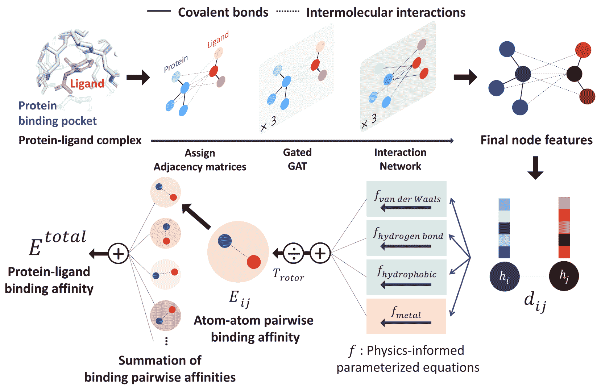

图 8：PIGNet [86] 的绑定亲和力预测概述。一个蛋白质-配体复合物以图的形式表示，并从复合物的结合结构中分配邻接矩阵。每个节点特征通过神经网络更新，以携带共价键和分子间相互作用的信息。给定每对原子的距离和最终的节点特征后，从物理信息化的参数化方程中计算出四个能量成分。总的绑定亲和力作为成对绑定亲和力之和以及四个能量成分之和除以熵项获得。

#### 3.5.3 数据集

PDBBind [132] 是用于绑定亲和力预测的最常用数据集。如前所述，该数据集的最新版本包含 19,443 个复合物。具体而言，该数据集包括三个重叠的子集：通用集（14,127 个 3D 蛋白质-配体复合物）、精炼集（5,316 个从通用集中挑选出的高质量复合物）和核心集（290 个选作最高质量基准用于测试的复合物）。通常在通用集或精炼集上训练和验证模型，并在核心集上进行评估。PDBbind v2016 核心集也称为 CASF-2016 数据集。

CSAR-HiQ [173] 是另一个常用的数据集，由两个子集组成，分别包含 176 和 167 个复合物。该数据集通常用作通用性基准中的独立数据集。

#### 3.5.4 评估指标

均方根误差（RMSE）和平均绝对误差（MAE）被广泛用于量化预测值与真实值之间的误差 [174]。这两个指标是评估预测误差的最直接指标。

皮尔逊相关系数（PCC） [175] 量化了预测值与真实值之间的线性相关性。该指标用于评估预测的准确性。与 RMSE 和 MAE 不同，PCC 是一个标准化值，范围从-1 到 1，允许对预测准确性进行标准化评估。

斯皮尔曼相关系数（SCC） [176] 量化了预测值与实验值之间的排名相关性。它被计算为两个变量排名值之间的 PCC。该指标相关，因为亲和力预测常用于识别虚拟筛选中排名最高的分子。

#### 3.5.5 基准性能

亲和力预测方法领域拥有丰富的历史，特点是各种方法论和多样化的数据集。因此，对所有这些方法进行公平而全面的比较是一个艰巨的挑战。在表格 V 中，我们展示了关于这些结合亲和力预测模型的训练和测试设置以及性能的统计数据。如表中所示，尽管这些方法的测试设置通常相同，但它们的训练设置差异显著。更大的训练数据集通常会导致更好的结果。对于未来的结合亲和力预测研究，精心选择适当的训练和测试设置至关重要。

#### 3.5.6 限制与未来方向

尽管几何深度学习在亲和力预测方面的近期进展显著提高了准确性，但仍然存在几个关键的限制需要解决。首先，目前的几何深度学习方法主要在共晶复合物结构上进行训练，其中所有数据都是正样本，这使得这些方法在从大量伪配体中有效筛选出真正的活性配体时面临挑战。如 PIGNet 所示，先前的研究旨在增强亲和力预测模型的评分能力和筛选能力。然而，他们的结果表明，提高筛选能力通常会导致评分能力的下降，突显了在两个方面同时取得高性能的困难。开发能够在评分和筛选方面都表现出色的强大模型，扩展其实用应用至关重要。

此外，对超出训练过程中遇到的蛋白质结构的泛化能力至关重要。解决这一挑战的一个潜在方案是创建额外的高质量训练数据集。目前，大约有 5,000 个具有实验验证亲和力的高质量蛋白质-配体复合物，如 PDBBind 精炼集所示。然而，这一有限的数据集常常限制了深度学习模型的全面训练。此外，将先验物理知识融入深度学习模型中，例如物理知识驱动的深度学习 [177]，代表了提升泛化能力的一个有前途的方向。

## 4 挑战与机遇

我们讨论了结构基础药物设计（SBDD）在各个维度上的挑战和机遇，包括算法创新、关于模型和输出评估的实际考虑，以及与实验系统的整合。

### 4.1 挑战

+   •

    简化问题的公式化：在基于结构的药物设计（SBDD）中，问题公式必须与现实应用对齐，并遵循既定的物理和化学原理。例如，许多关于结合位点生成和*de novo* 配体生成的研究都假设目标蛋白质结构保持静态。实际上，蛋白质结构具有灵活性，可能会经历固有或诱导的构象变化[127]。这种差异突显了 SBDD 模型与实际应用之间的差距。

+   •

    分布外泛化：大多数现有研究没有充分解决分布外挑战。鉴于数据集规模的限制和有时不适当的数据集分割，一些研究可能高估了模型预测的效果。例如，在 COVID-19 大流行期间，生成模型需要为新的蛋白质靶点（如 SARS-CoV-2 的主要蛋白酶）生成配体分子。因此，通用几何深度学习模型的需求变得显而易见，尤其是在现实世界应用中。

+   •

    可靠评估指标的需求：建立定义最佳药物候选者的稳健标准仍然具有挑战性。尽管已提出各种评估指标，但它们往往在适用性上存在不足。一些模型利用这些指标的快捷方式[178]，导致生成的分子在现实世界中的实用性有限。

+   •

    大规模基准的缺乏：虽然有用于各种 SBDD 任务的数据集和评估分割，但仍缺乏大规模、可靠的高质量基准。例如，用于训练亲和力预测模型的 PDBbind [132]精炼数据集仅包含 5,000 个复合物。用于评估*de novo* 配体设计方法的 CrossDocked 数据集[150]仅包含 2,922 种不同的蛋白质和 13,780 种独特的配体分子。这些数据集与化学空间和蛋白质宇宙的规模相比显得微不足道，突显了对广泛、高质量基准的需求。

+   •

    实验验证的需求：使用一组指标对生成的药物候选者进行计算评估虽然有价值，但并不足够。使用*in vivo* 或*in vitro* 测试进行实验验证对于验证候选者的有效性至关重要。这些实验结果可以用于优化模型，促进计算模拟与实证实验之间的整合循环。

+   •

    缺乏可解释性：实现可解释性是深度学习模型的一个至关重要但艰巨的任务，这些模型常被视为黑箱。在 SBDD 中，研究人员通常寻求对预测的蛋白质-配体亲和力背后的理由或解释为何特定的蛋白质表面区域是有效的结合位点的见解。虽然 SBDD 模型的可解释性有助于调试和模型优化，但目前在此方向上的努力，如 [72, 179, 180] 所述，仍处于起步阶段，需要进一步探索。

### 4.2 机会

+   •

    利用多模态数据集：高质量的蛋白质结构数据仍然有限。例如，CrossDocked 和 PDBBind 数据集包含的独特蛋白质结构少于 1 万个。相比之下，UniRef [181] 拥有超过 2.6 亿个蛋白质序列。因此，将基于蛋白质序列数据训练的蛋白质语言模型 [182, 183, 184] 融入结构基础药物设计中具有前景 [185]。此外，描述蛋白质功能的文本数据 [186] 和蛋白质组学 [187] 可以整合到 SBDD 模型中。

+   •

    融入生物学和化学知识：将化学和生物医学知识整合到模型开发中在各种任务中已被证明有效。例如，几何对称性被纳入等变神经网络，而分子片段被用来生成更现实和有效的分子。几何深度学习有望通过进一步注入领域知识而受益。

+   •

    建立全面的基准测试：标准化基准提供数据集拆分和评估工具，便于在一致的框架内对 SBDD 模型进行直观且稳健的比较 [188, 189]。

+   •

    基于临床终点的设计标准：结构基础药物设计通常在药物发现和开发的早期阶段考虑。然而，早期药物发现与临床前和临床药物开发之间存在明显的鸿沟 [190, 191]。这可能导致药物候选者在临床试验中失败。因此，利用来自晚期药物开发的反馈，并将其用于设计新的设计标准以指导 SBDD 可能会提高治疗效果。

+   •

    为 SBDD 建立基础模型：当代对 SBDD 的几何深度学习方法的研究主要集中在单任务模型上。然而，随着通用预训练模型的出现 [192, 193, 194, 195]，有可能开发出与 SBDD 中各种数据格式和任务兼容的统一基础模型。

+   •

    考虑广泛的设计任务：这项综述审查了针对 SBDD 任务的几何深度学习方法，重点关注小分子药物。许多方法具有广泛的适用性，可以适应其他领域，例如抗体设计[196]，蛋白质口袋设计[197]，以及晶体材料生成[198]。

## 5 结论

我们系统地回顾了几何深度学习方法及其在基于结构的药物设计中的应用。我们的方法包括将现有研究根据所解决的任务分类为五个不同的类别。我们为每个任务提出了全面的问题定义，总结了值得注意的方法，并描述了数据集和评估指标。考虑到该领域的挑战和前景，我们预期这项综述将有助于快速理解现有的方法，并为未来使用几何深度学习的基于结构的药物设计奠定基础。

## 参考文献

+   [1] A. Schneuing, Y. Du, C. Harris, A. Jamasb, I. Igashov, W. Du, T. Blundell, P. Lió, C. Gomes, M. Welling, M. Bronstein, 和 B. Correia，“使用等变扩散模型进行基于结构的药物设计，”*arXiv 预印本 arXiv:2210.13695*，2022 年。

+   [2] S. Luo, J. Guan, J. Ma, 和 J. Peng，“用于基于结构的药物设计的 3D 生成模型，”在*NeurIPS*，2021 年。

+   [3] C. Isert, K. Atz, 和 G. Schneider，“利用几何深度学习进行基于结构的药物设计，”*结构生物学的当前观点*，第 79 卷，第 102548 页，2023 年。

+   [4] J. Drenth，*蛋白质 X 射线晶体学原理*。Springer 科学与商业媒体，2007 年。

+   [5] J. Mitchell, J. B. W. Webber, 和 J. H. Strange，“核磁共振冷冻孔径测量法，”*物理学报告*，第 461 卷，第 1 期，第 1–36 页，2008 年。

+   [6] R. Danev, H. Yanagisawa, 和 M. Kikkawa，“冷冻电子显微镜方法学：当前方面及未来方向，”*生化科学趋势*，第 44 卷，第 10 期，第 837–848 页，2019 年。

+   [7] J. Jumper, R. Evans, A. Pritzel, T. Green, M. Figurnov, O. Ronneberger, K. Tunyasuvunakool, R. Bates, A. Žídek, A. Potapenko *等*，“使用 alphafold 进行高精度蛋白质结构预测，”*自然*，第 596 卷，第 7873 期，第 583–589 页，2021 年。

+   [8] Z. Lin, H. Akin, R. Rao, B. Hie, Z. Zhu, W. Lu, N. Smetanin, R. Verkuil, O. Kabeli, Y. Shmueli *等*，“利用语言模型对原子级蛋白质结构进行进化尺度预测，”*科学*，第 379 卷，第 6637 期，第 1123–1130 页，2023 年。

+   [9] A. Wlodawer 和 J. Vondrasek，“HIV-1 蛋白酶抑制剂：结构辅助药物设计的重大成功，”*生物物理学和生物分子结构年评*，第 27 卷，第 1 期，第 249–284 页，1998 年。

+   [10] A. C. Anderson，“基于结构的药物设计过程，”*化学与生物学*，第 10 卷，第 9 期，第 787–797 页，2003 年。

+   [11] E. E. Rutenber 和 R. M. Stroud，“抗癌药物 zd1694 与大肠杆菌胸苷酸合成酶的结合：评估特异性和亲和力，” *Structure*，第 4 卷，第 11 期，第 1317–1324 页，1996 年。

+   [12] K. Atz, F. Grisoni 和 G. Schneider，“分子表征中的几何深度学习，” *Nature Machine Intelligence*，第 1–10 页，2021 年。

+   [13] M. M. Li, K. Huang 和 M. Zitnik，“生物医学和医疗中的图表示学习，” *Nature Biomedical Engineering*，第 6 卷，第 12 期，第 1353–1369 页，2022 年。

+   [14] N. Thomas, T. Smidt, S. Kearnes, L. Yang, L. Li, K. Kohlhoff 和 P. Riley，“张量场网络：用于 3d 点云的旋转和位移等变神经网络，” *arXiv 预印本 arXiv:1802.08219*，2018 年。

+   [15] V. G. Satorras, E. Hoogeboom 和 M. Welling，“E(n) 等变图神经网络，” *ICML*，第 139 卷，第 9323–9332 页，2021 年。

+   [16] W. Huang, J. Han, Y. Rong, T. Xu, F. Sun 和 J. Huang，“具有约束的等变图力学网络，” *arXiv 预印本 arXiv:2203.06442*，2022 年。

+   [17] P. Gainza, F. Sverrisson, F. Monti, E. Rodola, D. Boscaini, M. Bronstein 和 B. Correia，“通过几何深度学习解读蛋白质分子表面的相互作用指纹，” *Nature Methods*，第 17 卷，第 2 期，第 184–192 页，2020 年。

+   [18] G. Corso, H. Stärk, B. Jing, R. Barzilay 和 T. Jaakkola，“Diffdock：用于分子对接的扩散步骤、扭曲和旋转，” *ICLR*，2023 年。

+   [19] X. Peng, S. Luo, J. Guan, Q. Xie, J. Peng 和 J. Ma，“Pocket2mol：基于 3d 蛋白质口袋的高效分子采样，” 收录于 *ICML*。   PMLR，2022 年，第 17 644–17 655 页。

+   [20] Y. Huang, X. Peng, J. Ma 和 M. Zhang，“3dlinker：一种用于分子链接设计的 e (3) 等变变分自编码器，” *ICML*，2022 年。

+   [21] Y. Li, J. Pei 和 L. Lai，“基于结构的全新药物设计使用 3d 深度生成模型，” *Chemical Science*，第 12 卷，第 41 期，第 13 664–13 675 页，2021 年。

+   [22] J. Dauparas, I. Anishchenko, N. Bennett, H. Bai, R. J. Ragotte, L. F. Milles, B. I. Wicky, A. Courbet, R. J. de Haas, N. Bethel *等*，“基于深度学习的鲁棒蛋白质序列设计使用 proteinmpnn，” *Science*，第 378 卷，第 6615 期，第 49–56 页，2022 年。

+   [23] J. L. Watson, D. Juergens, N. R. Bennett, B. L. Trippe, J. Yim, H. E. Eisenach, W. Ahern, A. J. Borst, R. J. Ragotte, L. F. Milles *等*，“使用 rfdiffusion 进行蛋白质结构和功能的全新设计，” *Nature*，第 620 卷，第 7976 期，第 1089–1100 页，2023 年。

+   [24] S. Li, J. Zhou, T. Xu, L. Huang, F. Wang, H. Xiong, W. Huang, D. Dou 和 H. Xiong，“基于结构的交互式图神经网络预测蛋白质-配体结合亲和力，” 会议录 KDD ’21。   纽约, NY, USA：计算机协会，2021 年。

+   [25] H. Wang, T. Fu, Y. Du, W. Gao, K. Huang, Z. Liu, P. Chandak, S. Liu, P. Van Katwyk, A. Deac *等*，“人工智能时代的科学发现，” *Nature*，第 620 卷，第 7972 期，第 47–60 页，2023 年。

+   [26] X. Zhang, L. Wang, J. Helwig, Y. Luo, C. Fu, Y. Xie, M. Liu, Y. Lin, Z. Xu, K. Yan *等*, “量子、原子和连续系统中的人工智能科学,” *arXiv 预印本 arXiv:2307.08423*, 2023.

+   [27] C. L. Verlinde 和 W. G. Hol, “基于结构的药物设计: 进展、结果和挑战,” *结构*, vol. 2, no. 7, pp. 577–587, 1994.

+   [28] P. M. Colman, “基于结构的药物设计,” *结构生物学当前观点*, vol. 4, no. 6, pp. 868–874, 1994.

+   [29] T. L. Blundell, “基于结构的药物设计.” *自然*, vol. 384, no. 6604 Suppl, pp. 23–26, 1996.

+   [30] G. Klebe, “基于结构的药物设计的最新进展,” *分子医学杂志*, vol. 78, pp. 269–281, 2000.

+   [31] L. G. Ferreira, R. N. Dos Santos, G. Oliva, 和 A. D. Andricopulo, “分子对接和基于结构的药物设计策略,” *分子*, vol. 20, no. 7, pp. 13 384–13 421, 2015.

+   [32] R. Özçelik, D. van Tilborg, J. Jiménez-Luna, 和 F. Grisoni, “基于结构的药物发现与深度学习,” *ChemBioChem*, p. e202200776, 2022.

+   [33] D. Benedetto Tiz, L. Bagnoli, O. Rosati, F. Marini, C. Santi, 和 L. Sancineto, “2022 年 FDA 批准的小分子: 临床用途及其合成,” *药物剂型*, vol. 14, no. 11, p. 2538, 2022.

+   [34] M. Batool, B. Ahmad, 和 S. Choi, “基于结构的药物发现范式,” *国际分子科学杂志*, vol. 20, no. 11, p. 2783, 2019.

+   [35] H. Stärk, O.-E. Ganea, L. Pattanaik, R. Barzilay, 和 T. Jaakkola, “EquiBind: 药物结合结构预测的几何深度学习,” *arXiv 预印本 arXiv:2202.05146*, 2022.

+   [36] B. Jing, S. Eismann, P. Suriana, R. J. L. Townshend, 和 R. Dror, “利用几何向量感知器从蛋白质结构中学习,” in *ICLR*, 2021.

+   [37] D. Weininger, “SMILES, 一种化学语言和信息系统。1. 方法学和编码规则介绍,” *化学信息与计算科学杂志*, vol. 28, no. 1, pp. 31–36, 1988.

+   [38] Y. Du, T. Fu, J. Sun, 和 S. Liu, “Molgensurvey: 分子设计中机器学习模型的系统调查,” *arXiv 预印本 arXiv:2203.14500*, 2022.

+   [39] M. M. Bronstein, J. Bruna, Y. LeCun, A. Szlam, 和 P. Vandergheynst, “几何深度学习: 超越欧几里得数据,” *IEEE 信号处理杂志*, vol. 34, no. 4, pp. 18–42, 2017.

+   [40] K. Adams, L. Pattanaik, 和 C. W. Coley, “学习分子手性的 3d 表示，具有对键旋转的不变性,” *ICLR*, 2022.

+   [41] J. Jiménez, S. Doerr, G. Martínez-Rosell, A. S. Rose, 和 G. De Fabritiis, “Deepsite: 使用 3d 卷积神经网络预测蛋白质结合位点,” *生物信息学*, vol. 33, no. 19, pp. 3036–3042, 2017.

+   [42] J. Kandel, H. Tayara, 和 K. T. Chong, “Puresnet: 使用深度残差神经网络预测蛋白质-配体结合位点,” *化学信息学杂志*, vol. 13, no. 1, pp. 1–14, 2021.

+   [43] J. Han, Y. Rong, T. Xu, 和 W. Huang，“几何等变图神经网络：综述，” *arXiv 预印本 arXiv:2202.07230*，2022 年。

+   [44] K. T. Schütt, H. E. Sauceda, P.-J. Kindermans, A. Tkatchenko, 和 K.-R. Müller，“Schnet——一种用于分子和材料的深度学习架构，” *化学物理学杂志*，第 148 卷，第 24 期，p. 241722，2018 年。

+   [45] B. Jing, S. Eismann, P. Suriana, R. J. Townshend, 和 R. Dror，“利用几何向量感知器学习蛋白质结构，” *arXiv 预印本 arXiv:2009.01411*，2020 年。

+   [46] J. Klicpera, J. Groß, 和 S. Günnemann，“用于分子图的方向消息传递，” *arXiv 预印本 arXiv:2003.03123*，2020 年。

+   [47] J. Klicpera, S. Giri, J. T. Margraf, 和 S. Günnemann，“快速且具不确定性感知的方向消息传递用于非平衡分子，” *arXiv 预印本 arXiv:2011.14115*，2020 年。

+   [48] Y. Liu, L. Wang, M. Liu, X. Zhang, B. Oztekin, 和 S. Ji，“用于 3d 图网络的球形消息传递，” *arXiv 预印本 arXiv:2102.05013*，2021 年。

+   [49] L. Wang, Y. Liu, Y. Lin, H. Liu, 和 S. Ji，“Comenet：面向 3d 分子图的完整高效消息传递，” *arXiv 预印本 arXiv:2206.08515*，2022 年。

+   [50] J. Devlin, M. Chang, K. Lee, 和 K. Toutanova，“BERT：用于语言理解的深度双向变换器预训练，” 收录于 *2019 年北美计算语言学协会：人类语言技术会议论文集，NAACL-HLT 2019*，计算语言学协会，2019 年，pp. 4171–4186。

+   [51] C. Ying, T. Cai, S. Luo, S. Zheng, G. Ke, D. He, Y. Shen, 和 T.-Y. Liu，“变换器在图表示中的表现真的很差吗？” *NeurIPS*，第 34 卷，2021 年。

+   [52] Y. Li, J. Pei, 和 L. Lai，“基于几何变换器的 3d 分子合成驱动药物发现设计，” *arXiv 预印本 arXiv:2301.00167*，2022 年。

+   [53] Y. Rong, Y. Bian, T. Xu, W. Xie, Y. Wei, W. Huang, 和 J. Huang，“大规模分子数据上的自监督图变换器，” 收录于 *NeurIPS*，2020 年。

+   [54] Y.-L. Liao 和 T. Smidt，“Equiformer：用于 3d 原子图的等变图注意力变换器，” *arXiv 预印本 arXiv:2206.11990*，2022 年。

+   [55] S. Luo, T. Chen, Y. Xu, S. Zheng, T.-Y. Liu, L. Wang, 和 D. He，“一个变换器可以理解 2d 和 3d 分子数据，” *arXiv 预印本 arXiv:2210.01765*，2022 年。

+   [56] K. He, X. Zhang, S. Ren, 和 J. Sun，“深度残差学习用于图像识别，” 收录于 *IEEE 计算机视觉与模式识别会议论文集*，2016 年，pp. 770–778。

+   [57] Z. Zhang, Q. Liu, Q. Hu, 和 C.-K. Lee，“具有自适应节点采样的层次图变换器，” *NeurIPS*，第 35 卷，pp. 21 171–21 183，2022 年。

+   [58] D. Kreuzer, D. Beaini, W. Hamilton, V. Létourneau, 和 P. Tossou，“重新思考图变换器的谱注意力，” *NeurIPS*，第 34 卷，pp. 21 618–21 629，2021 年。

+   [59] B. Scholkopf, K.-K. Sung, C. J. Burges, F. Girosi, P. Niyogi, T. Poggio, 和 V. Vapnik, “比较支持向量机与高斯核和径向基函数分类器，” *IEEE Transactions on Signal Processing*，第 45 卷，第 11 期，第 2758–2765 页，1997 年。

+   [60] L. Dinh, D. Krueger, 和 Y. Bengio, “NICE: 非线性独立成分估计，” *ICLR (Workshop)*，2015 年。

+   [61] L. Dinh, J. Sohl-Dickstein, 和 S. Bengio, “使用真实 NVP 进行密度估计，” *arXiv 预印本 arXiv:1605.08803*，2016 年。

+   [62] D. P. Kingma 和 M. Welling, “自动编码变分贝叶斯，” *ICLR*，2013 年。

+   [63] J. Sohl-Dickstein, E. Weiss, N. Maheswaranathan, 和 S. Ganguli, “利用非平衡热力学进行深度无监督学习，” 收录于 *ICML*，PMLR，2015 年，第 2256–2265 页。

+   [64] J. Ho, A. Jain, 和 P. Abbeel, “去噪扩散概率模型，” *arXiv 预印本 arXiv:2006.11239*，2020 年。

+   [65] L. Weng, “什么是扩散模型？” *lilianweng.github.io/lil-log*，2021\. [在线]. 可用： [`lilianweng.github.io/lil-log/2021/07/11/diffusion-models.html`](https://lilianweng.github.io/lil-log/2021/07/11/diffusion-models.html)

+   [66] H. Chen 和 B. Li, “基于 3D 的生成性 ProTac 连接子设计与强化学习，” 2023 年。

+   [67] T. Fu, W. Gao, C. Coley, 和 J. Sun, “基于结构的药物设计的强化遗传算法，” *NeurIPS*，第 35 卷，第 12 325–12 338 页，2022 年。

+   [68] S. Lu, L. Yao, X. Chen, H. Zheng, 和 G. Ke, “通过虚拟动态生成 3D 分子，” 2023 年。

+   [69] Z. Zhang, Y. Min, S. Zheng, 和 Q. Liu, “用于目标蛋白质结合的分子生成与结构基序，” 收录于 *The Eleventh ICLR*，2023 年。

+   [70] F. Sverrisson, J. Feydy, B. E. Correia, 和 M. M. Bronstein, “在蛋白质表面进行快速端到端学习，” 收录于 *Proceedings of the IEEE/CVF Conference on Computer Vision and Pattern Recognition*，2021 年，第 15 272–15 281 页。

+   [71] L. F. Krapp, L. A. Abriata, F. Cortés Rodriguez, 和 M. Dal Peraro, “Pesto: 无需参数的几何深度学习以准确预测蛋白质结合界面，” *Nature Communications*，第 14 卷，第 1 期，第 2175 页，2023 年。

+   [72] J. Tubiana, D. Schneidman-Duhovny, 和 H. J. Wolfson, “Scannet: 一种可解释的几何深度学习模型用于基于结构的蛋白质结合位点预测，” *Nature Methods*，第 19 卷，第 6 期，第 730–739 页，2022 年。

+   [73] A. Meller, M. D. Ward, J. H. Borowsky, J. M. Lotthammer, M. Kshirsagar, F. Oviedo, J. L. Ferres, 和 G. Bowman, “使用 PocketMiner 图神经网络预测隐秘口袋的位置，” *Nature Communications*，2023 年。

+   [74] A. Fout, J. Byrd, B. Shariat, 和 A. Ben-Hur, “使用图卷积网络进行蛋白质界面预测，” *NeurIPS*，第 30 卷，2017 年。

+   [75] Y. Zhang, W. Huang, Z. Wei, Y. Yuan, 和 Z. Ding, “Equipocket: 一种 e (3)-等变几何图神经网络用于配体结合位点预测，” *arXiv 预印本 arXiv:2302.12177*，2023 年。

+   [76] N. Abdollahi, S. A. M. Tonekaboni, J. Huang, B. Wang, 和 S. MacKinnon，“Nodecoder: 一个基于图的机器学习平台，用于预测建模蛋白质结构的活性位点，” *arXiv 预印本 arXiv:2302.03590*，2023 年。

+   [77] O. Méndez-Lucio, M. Ahmad, E. A. del Rio-Chanona, 和 J. K. Wegner，“一种几何深度学习方法，用于预测生物活性分子的结合构象，” *Nature Machine Intelligence*，第 3 卷，第 12 期，页码 1033–1039，2021 年。

+   [78] W. Lu, Q. Wu, J. Zhang, J. Rao, C. Li, 和 S. Zheng，“Tankbind: 针对药物-蛋白质结合结构预测的三角学感知神经网络，” *NeurIPS*，页码 2022–06，2022 年。

+   [79] M. R. Masters, A. H. Mahmoud, Y. Wei, 和 M. A. Lill，“一种用于高效蛋白质-配体对接的深度学习模型，具有隐式侧链灵活性，” *Journal of Chemical Information and Modeling*，第 63 卷，第 6 期，页码 1695–1707，2023 年。

+   [80] P. Nakata, Y. Mori, 和 S. Tanaka，“基于扩散生成模型的端到端蛋白质-配体复合物结构生成，” *https://doi.org/10.1101/2022.12.20.521309*，2022 年。

+   [81] Z. Qiao, W. Nie, A. Vahdat, T. F. M. III, 和 A. Anandkumar，“基于多尺度深度生成模型的状态特异性蛋白质-配体复合物结构预测，” *arXiv 预印本 arXiv:2209.15171*，2021 年。

+   [82] W. Lu, J.-X. Zhang, W. Huang, Z. Zhang, X. Jia, Z. Wang, L. Shi, C. Li, P. Wolynes, 和 S. Zheng，“Dynamicbind: 利用深度等变生成模型预测配体特异性蛋白质-配体复合物结构，” 2023 年。

+   [83] Y. Zhang, H. Cai, C. Shi, B. Zhong, 和 J. Tang，“E3bind: 一种用于蛋白质-配体对接的端到端等变网络，” *ICLR*，2023 年。

+   [84] Z. Wang, L. Zheng, S. Wang, M. Lin, Z. Wang, A. W.-K. Kong, Y. Mu, Y. Wei, 和 W. Li，“一个完全可微分的配体姿态优化框架，由深度学习和传统评分函数指导，” *Briefings in Bioinformatics*，第 24 卷，第 1 期，页码 bbac520，2023 年。

+   [85] J. P. Mailoa, Z. Ye, J. Qiu, C.-Y. Hsieh, 和 S. Zhang，“蛋白质-配体复合物生成器与药物筛选，通过分级张量变换，” *arXiv 预印本 arXiv:2301.00984*，2023 年。

+   [86] S. Moon, W. Zhung, S. Yang, J. Lim, 和 W. Y. Kim，“Pignet: 一个基于物理信息的深度学习模型，用于通用药物-靶标相互作用预测，” *Chemical Science*，第 13 卷，第 13 期，页码 3661–3673，2022 年。

+   [87] V. R. Somnath, C. Bunne, 和 A. Krause，“蛋白质的多尺度表示学习，” *NeurIPS*，第 34 卷，页码 25 244–25 255，2021 年。

+   [88] M. A. Moesser, D. Klein, F. Boyles, C. M. Deane, A. Baxter, 和 G. M. Morris，“蛋白质-配体相互作用图：从配体形状的 3D 相互作用图中学习，以提高结合亲和力预测，” *bioRxiv*，页码 2022–03，2022 年。

+   [89] S. Zhang, Y. Liu, 和 L. Xie，“高效准确的物理感知多重图神经网络，用于 3D 小分子和大分子复合物，” *arXiv 预印本 arXiv:2206.02789*，2022 年。

+   [90] D. Jiang、C.-Y. Hsieh、Z. Wu、Y. Kang、J. Wang、E. Wang、B. Liao、C. Shen、L. Xu、J. Wu *等*，“Interactiongraphnet：一种新颖且高效的深度图表示学习框架，用于准确的蛋白质-配体相互作用预测，” *医学化学期刊*，第 64 卷，第 24 期，第 18 209–18 232 页，2021 年。

+   [91] Z. Yang、W. Zhong、Q. Lv、T. Dong 和 C. Yu-Chian Chen，“几何交互图神经网络用于从 3D 结构预测蛋白质-配体结合亲和力（gign），” *物理化学学报快报*，第 14 卷，第 8 期，第 2020–2033 页，2023 年。

+   [92] K. Wang、R. Zhou、J. Tang 和 M. Li，“Graphscoredta：优化的图神经网络用于蛋白质-配体结合亲和力预测，” *生物信息学*，第 39 卷，2023 年。 [在线]. 可用：[`api.semanticscholar.org/CorpusID:258889283`](https://api.semanticscholar.org/CorpusID:258889283)

+   [93] X. jun Zhang、H. Gao、H. Wang、Z. Chen、Z. Zhang、X. Chen、Y. Li、Y. Qi 和 R. Wang，“Planet：一种用于蛋白质-配体结合亲和力预测的多目标图神经网络模型，” *bioRxiv*，2023 年。 [在线]. 可用：[`api.semanticscholar.org/CorpusID:256617516`](https://api.semanticscholar.org/CorpusID:256617516)

+   [94] J. Liu、J. Wan、Y. Ren、X. Shao、X. Xu 和 L. Rao，“Dox_bdw：将腔水的溶剂化和去溶剂化效应纳入不适合的蛋白质-配体结合亲和力预测，” *化学信息与建模期刊*，2023 年。 [在线]. 可用：[`api.semanticscholar.org/CorpusID:260485936`](https://api.semanticscholar.org/CorpusID:260485936)

+   [95] J. Yan、Z. Ye、Z. Yang、C. Lu、S. Zhang、Q. Liu 和 J. Qiu，“用于蛋白质-配体结合亲和力预测的多任务生物测定预训练，” *arXiv 预印本 arXiv:2306.04886*，2023 年。

+   [96] M. M. Stepniewska-Dziubinska、P. Zielenkiewicz 和 P. Siedlecki，“开发和评估用于蛋白质-配体结合亲和力预测的深度学习模型，” *生物信息学*，第 34 卷，第 3666 – 3674 页，2018 年。

+   [97] Y. Li、M. A. Rezaei、C. Li、X. Li 和 D. O. Wu，“Deepatom：用于蛋白质-配体结合亲和力预测的框架，” *2019 IEEE 国际生物信息学与生物医学会议 (BIBM)*，第 303–310 页，2019 年。

+   [98] H. Hassan-Harrirou、C. Zhang 和 T. Lemmin，“Rosenet：通过利用分子力学能量和 3D 卷积神经网络集成来改进结合亲和力预测，” *化学信息与建模期刊*，2020 年。

+   [99] P. Hermosilla、M. Schäfer、M. Lang、G. Fackelmann、P. P. Vázquez、B. Kozlíková、M. Krone、T. Ritschel 和 T. Ropinski，“用于学习 3D 蛋白质结构的内在-外在卷积和池化，” *arXiv 预印本 arXiv:2007.06252*，2020 年。

+   [100] R. Lu、J. Wang、P. Li、Y. Li、S. Tan、Y. Pan、H. Liu、P. Gao、G. Xie 和 X. Yao，“通过特征融合和知识蒸馏改进药物靶点亲和力预测，” *生物信息学简报*，第 24 卷，第 3 期，第 bbad145 页，2023 年。

+   [101] D. Jones, H. Kim, X. Zhang, A. T. Zemla, G. Stevenson, W. F. D. Bennett, D. A. Kirshner, S. E. Wong, F. C. Lightstone 和 J. E. Allen， “通过基于结构的深度融合推理改进蛋白质-配体结合亲和力预测，” *化学信息与建模杂志*，2020。

+   [102] J. O. Spiegel 和 J. D. Durrant， “Autogrow4: 一种开源遗传算法用于新药设计和领先优化，” *化学信息学杂志*，第 12 卷，第 1 期，页码 1–16，2020。

+   [103] T. Masuda, M. Ragoza 和 D. R. Koes， “生成基于受体结合位点的 3D 分子结构的深度生成模型，” *arXiv 预印本 arXiv:2010.14442*，2020。

+   [104] M. Wang, C.-Y. Hsieh, J. Wang, D. Wang, G. Weng, C. Shen, X. Yao, Z. Bing, H. Li, D. Cao *等*， “Relation: 一种基于结构的深度生成模型用于新药设计，” *药物化学杂志*，第 65 卷，第 13 期，页码 9478–9492，2022。

+   [105] K. Adams 和 C. W. Coley， “基于形状条件的等变 3D 分子生成用于配体基础的药物设计，” *ICLR*，2023。

+   [106] S. Long, Y. Zhou, X. Dai 和 H. Zhou， “通过草图和生成实现零样本 3D 药物设计，” *arXiv 预印本 arXiv:2209.13865*，2022。

+   [107] Z. Gao, Y. Hu, C. Tan 和 S. Z. Li， “Prefixmol: 基于前缀嵌入的靶向和化学感知分子设计，” *arXiv 预印本 arXiv:2302.07120*，2023。

+   [108] Z. Zhang 和 Q. Liu， “学习子口袋原型用于通用的基于结构的药物设计，” 在 *ICML*，2023。

+   [109] L. Wang, Z. Lin, Y. Zhu, R. Bai, W. Feng, H. Wang, J. Zhou, W. Peng, B. Huang 和 W. Zhou， “Lingo3dmol: 使用语言模型生成基于口袋的 3D 分子，” *arXiv 预印本 arXiv:2305.10133*，2023。

+   [110] M. Liu, Y. Luo, K. Uchino, K. Maruhashi 和 S. Ji， “生成用于靶蛋白结合的 3D 分子，” 在 *ICML*，2022。

+   [111] Z. Zhang, Q. Liu, C.-K. Lee, C.-Y. Kim 和 E. Chen， “一种等变生成框架用于分子图结构共同设计，” *bioRxiv*，第 2023–04 期，2023。

+   [112] F. Sun, Z. Zhan, H. Guo, M. Zhang 和 J. Tang， “Graphvf: 具有变分流的可控蛋白特异性 3D 分子生成，” *arXiv 预印本 arXiv:2304.12825*，2023。

+   [113] E. Rozenberg, E. Rivlin 和 D. Freedman， “通过半等变条件归一化流进行基于结构的药物设计，” 在 *ICLR 2023 - 药物发现机器学习研讨会*，2023。

+   [114] J. Guan, W. W. Qian, X. Peng, Y. Su, J. Peng 和 J. Ma， “用于靶点感知分子生成和亲和力预测的 3D 等变扩散，” 在 *ICLR*，2023。

+   [115] H. Lin, Y. Huang, M. Liu, X. Li, S. Ji 和 S. Z. Li， “Diffbp: 生成扩散的 3D 分子用于靶蛋白结合，” *arXiv 预印本 arXiv:2211.11214*，2022。

+   [116] J. Guan, X. Zhou, Y. Yang, Y. Bao, J. Peng, J. Ma, Q. Liu, L. Wang 和 Q. Gu， “Decompdiff: 具有分解先验的扩散模型用于基于结构的药物设计，” *ICML*，2023。

+   [117] Z. Chen, B. Peng, S. Parthasarathy, 和 X. Ning，“形状条件的 3d 分子生成通过等变扩散模型，” *arXiv 预印本 arXiv:2308.11890*，2023 年。

+   [118] F. Imrie, A. R. Bradley, M. van der Schaar, 和 C. M. Deane，“用于 3d 连接器设计的深度生成模型，” *化学信息与建模杂志*，第 60 卷，第 4 期，页码 1983–1995，2020 年。

+   [119] F. Imrie, T. E. Hadfield, A. R. Bradley, 和 C. M. Deane，“带有 3d 药效基团约束的深度生成设计，” *化学科学*，第 12 卷，第 43 期，页码 14 577–14 589，2021 年。

+   [120] J. Guo, F. Knuth, C. Margreitter, J. P. Janet, K. Papadopoulos, O. Engkvist, 和 A. Patronov，“Link-invent：使用强化学习的生成型连接器设计，” *数字发现*，第 2 卷，第 2 期，页码 392–408，2023 年。

+   [121] I. Igashov, H. Stark, C. Vignac, V. G. Satorras, P. Frossard, M. Welling, M. Bronstein, 和 B. Correia，“用于分子连接器设计的等变 3d 条件扩散模型，” *arXiv 预印本 arXiv:2210.05274*，2022 年。

+   [122] H. M. Berman, J. Westbrook, Z. Feng, G. Gilliland, T. N. Bhat, H. Weissig, I. N. Shindyalov, 和 P. E. Bourne，“蛋白质数据银行，” *核酸研究*，第 28 卷，第 1 期，页码 235–242，2000 年。

+   [123] P. J. Kundrotas, I. Anishchenko, T. Dauzhenka, I. Kotthoff, D. Mnevets, M. M. Copeland, 和 I. A. Vakser，“Dockground：一个用于蛋白质复合体建模的综合数据资源，” *蛋白质科学*，第 27 卷，第 1 期，页码 172–181，2018 年。

+   [124] R. E. Amaro，“真正的隐蔽口袋会显现吗？” *生物物理学杂志*，第 116 卷，第 5 期，页码 753–754，2019 年。

+   [125] C. R. Knoverek, G. K. Amarasinghe, 和 G. R. Bowman，“获取蛋白质形状变化的先进方法带来了新的治疗机会，” *生化科学趋势*，第 44 卷，第 4 期，页码 351–364，2019 年。

+   [126] O. Trott 和 A. J. Olson，“Autodock vina：通过新的评分函数、高效优化和多线程提高对接的速度和准确性，” *计算化学杂志*，第 31 卷，2010 年。

+   [127] D. E. Koshland Jr，“钥匙-锁理论和诱导契合理论，” *应用化学国际版（英文）*，第 33 卷，第 23-24 期，页码 2375–2378，1995 年。

+   [128] N. Hassan, A. Alhossary, Y. Mu, 和 C. Kwoh，“使用 quickvina-w 进行蛋白质-配体盲对接，结合进程间时空整合，” *科学报告*，第 7 卷，2017 年。

+   [129] A. T. McNutt, P. G. Francoeur, R. Aggarwal, T. Masuda, R. Meli, M. Ragoza, J. Sunseri, 和 D. R. Koes，“Gnina 1.0：使用深度学习的分子对接，” *化学信息学杂志*，第 13 卷，2021 年。

+   [130] D. R. Koes, M. P. Baumgartner, 和 C. J. Camacho，“在 CSAR 2011 基准测试中的经验评分所学到的经验，” *化学信息与建模杂志*，第 53 卷第 8 期，页码 1893–1904，2013 年。

+   [131] R. A. Friesner, J. L. Banks, R. B. Murphy, T. A. Halgren, J. Klicic, D. T. Mainz, M. P. Repasky, E. H. Knoll, M. Shelley, J. K. Perry, D. E. Shaw, P. Francis 和 P. S. Shenkin，"Glide: 一种用于快速、准确对接和打分的新方法。1. 方法和对接准确性评估。" *医学化学杂志*，第 47 卷，第 7 期，页 1739–1749，2004 年。

+   [132] Z. Liu, M. Su, L. Han, J. Liu, Q. Yang, Y. Li 和 R. Wang，"为开发蛋白质-配体相互作用打分函数奠定基础"，*化学研究汇报*，第 50 卷，第 2 期，页 302–309，2017 年。

+   [133] H. M. Berman, J. D. Westbrook, Z. Feng, G. L. Gilliland, T. N. Bhat, H. Weissig, I. N. Shindyalov 和 P. E. Bourne，"蛋白质数据银行"，*晶体学学报 D 部，生物晶体学*，第 58 卷，第 6 期，第一部分，页 899–907，2000 年。

+   [134] M. Buttenschoen, G. M. Morris 和 C. M. Deane，"Posebusters: 基于 AI 的对接方法无法生成物理有效的姿势或对新序列进行推广"，2023 年。 [在线]. 可用: [`api.semanticscholar.org/CorpusID:260865809`](https://api.semanticscholar.org/CorpusID:260865809)

+   [135] J. Ding, S. xiong Tang, Z. Mei, L. Wang, Q. Huang, H. Hu, M. Ling 和 J. Wu，"Vina-gpu 2.0: 进一步通过图形处理单元加速 AutoDock Vina 及其衍生物"，*化学信息与建模杂志*，2023 年。 [在线]. 可用: [`api.semanticscholar.org/CorpusID:257639425`](https://api.semanticscholar.org/CorpusID:257639425)

+   [136] Y. Huang, H. Zhang, S. Jiang, D. Yue, X. Lin, J. Zhang 和 Y. Q. Gao，"Dsdp: 一种通过 GPU 加速的盲对接策略"，*化学信息与建模杂志*，2023 年。 [在线]. 可用: [`api.semanticscholar.org/CorpusID:257622863`](https://api.semanticscholar.org/CorpusID:257622863)

+   [137] O. Trott 和 A. J. Olson，"AutoDock Vina: 提高对接速度和准确性的全新打分函数、有效的优化和多线程"，*计算化学杂志*，第 31 卷，第 2 期，页 455–461，2010 年。

+   [138] L. Zheng, J. Fan 和 Y. Mu，"Onionnet: 一种基于多层分子接触的卷积神经网络，用于蛋白质-配体结合亲和力预测"，*ACS Omega*，第 4 卷，页 15 956 – 15 965，2019 年。

+   [139] Z. Wang, L. Zheng, Y. Liu, Y. Qu, Y. Li, M. Zhao, Y. Mu 和 W. Li，"Onionnet-2: 基于残基-原子接触壳的卷积神经网络模型，用于预测蛋白质-配体结合亲和力"，*化学前沿*，第 9 卷，2021 年。

+   [140] Y. Zhang, G. Zhou, Z. Wei 和 H. Xu，"通过联合全局-局部交互建模预测蛋白质-配体结合亲和力"，*2022 IEEE 国际数据挖掘大会 (ICDM)*，页 1323–1328，2022 年。 [在线]. 可用: [`api.semanticscholar.org/CorpusID:252544919`](https://api.semanticscholar.org/CorpusID:252544919)

+   [141] M. Ragoza, T. Masuda, 和 D. R. Koes，“Generating 3d molecules conditional on receptor binding sites with deep generative models,” *Chemical science*, vol. 13, no. 9, pp. 2701–2713, 2022.

+   [142] Y. Luo 和 S. Ji，“An autoregressive flow model for 3d molecular geometry generation from scratch,” in *ICLR*, 2021.

+   [143] K. Schütt, P.-J. Kindermans, H. E. Sauceda Felix, S. Chmiela, A. Tkatchenko, 和 K.-R. Müller，“Schnet: A continuous-filter convolutional neural network for modeling quantum interactions,” *NeurIPS*, vol. 30, 2017.

+   [144] M. Liu, Y. Luo, K. Uchino, K. Maruhashi, 和 S. Ji，“Generating 3d molecules for target protein binding,” *ICML*, 2022.

+   [145] D. Rezende 和 S. Mohamed，“Variational inference with normalizing flows,” in *ICML*，PMLR，2015, pp. 1530–1538.

+   [146] B. Jing, S. Eismann, P. N. Soni, 和 R. O. Dror，“Equivariant graph neural networks for 3d macromolecular structure,” *ICML*, 2021.

+   [147] C. Deng, O. Litany, Y. Duan, A. Poulenard, A. Tagliasacchi, 和 L. J. Guibas，“Vector neurons: A general framework for so (3)-equivariant networks,” in *CVPR*, 2021, pp. 12 200–12 209.

+   [148] A. P. Bento, A. Hersey, E. Félix, G. Landrum, A. Gaulton, F. Atkinson, L. J. Bellis, M. De Veij, 和 A. R. Leach，“An open source chemical structure curation pipeline using rdkit,” *Journal of Cheminformatics*, vol. 12, no. 1, pp. 1–16, 2020.

+   [149] T. Kalliokoski, T. S. Olsson, 和 A. Vulpetti，“Subpocket analysis method for fragment-based drug discovery,” *Journal of chemical information and modeling*, vol. 53, no. 1, pp. 131–141, 2013.

+   [150] P. G. Francoeur, T. Masuda, J. Sunseri, A. Jia, R. B. Iovanisci, I. Snyder, 和 D. R. Koes，“Three-dimensional convolutional neural networks and a cross-docked data set for structure-based drug design,” *Journal of Chemical Information and Modeling*, vol. 60, no. 9, pp. 4200–4215, 2020.

+   [151] M. Steinegger 和 J. Söding，“Mmseqs2 enables sensitive protein sequence searching for the analysis of massive data sets,” *Nature biotechnology*, vol. 35, no. 11, pp. 1026–1028, 2017.

+   [152] L. Hu, M. L. Benson, R. D. Smith, M. G. Lerner, 和 H. A. Carlson，“Binding moad (mother of all databases),” *Proteins: Structure, Function, and Bioinformatics*, vol. 60, no. 3, pp. 333–340, 2005.

+   [153] A. Bairoch，“The enzyme data bank,” *Nucleic acids research*, vol. 22, no. 17, pp. 3626–3627, 1994.

+   [154] A. Alhossary, S. D. Handoko, Y. Mu, 和 C.-K. Kwoh，“Fast, accurate, and reliable molecular docking with quickvina 2,” *Bioinformatics*, vol. 31, no. 13, pp. 2214–2216, 2015.

+   [155] M. Ragoza, J. Hochuli, E. Idrobo, J. Sunseri, 和 D. R. Koes，“Protein–ligand scoring with convolutional neural networks,” *Journal of chemical information and modeling*, vol. 57, no. 4, pp. 942–957, 2017.

+   [156] A. K. Rappé, C. J. Casewit, K. Colwell, W. A. Goddard III, 和 W. M. Skiff，“UFF，一个用于分子力学和分子动力学模拟的完整周期表力场，” *Journal of the American Chemical Society*，第 114 卷，第 25 期，页码 10 024–10 035，1992。

+   [157] A. K. Ghose, V. N. Viswanadhan, 和 J. J. Wendoloski，“在药物发现中设计组合或药物化学库的知识驱动方法。1. 对已知药物数据库的定性和定量特征描述，” *Journal of Combinatorial Chemistry*，第 1 卷，第 1 期，页码 55–68，1999。

+   [158] C. A. Lipinski, F. Lombardo, B. W. Dominy, 和 P. J. Feeney，“在药物发现和开发环境中估计溶解度和渗透性的实验和计算方法，” *Advanced Drug Delivery Reviews*，第 64 卷，页码 4–17，2012。

+   [159] D. Bajusz, A. Rácz, 和 K. Héberger，“为什么 Tanimoto 指数是基于指纹的相似性计算的合适选择？” *Journal of Cheminformatics*，第 7 卷，第 1 期，页码 1–13，2015。

+   [160] C. Harris, K. Didi, A. R. Jamasb, C. K. Joshi, S. V. Mathis, P. Lio, 和 T. Blundell，“生成的姿势基准测试：基于结构的药物设计使用生成模型有多合理？” *arXiv 预印本 arXiv:2308.07413*，2023。

+   [161] T. Blaschke, J. Arús-Pous, H. Chen, C. Margreitter, C. Tyrchan, O. Engkvist, K. Papadopoulos, 和 A. Patronov，“REINVENT 2.0：用于新药设计的 AI 工具，” *Journal of Chemical Information and Modeling*，第 60 卷，第 12 期，页码 5918–5922，2020。

+   [162] T. Sterling 和 J. J. Irwin，“ZINC 15–人人都可以发现配体，” *Journal of Chemical Information and Modeling*，第 55 卷，第 11 期，页码 2324–2337，2015。

+   [163] R. Gómez-Bombarelli, J. N. Wei, D. Duvenaud, J. M. Hernández-Lobato, B. Sánchez-Lengeling, D. Sheberla, J. Aguilera-Iparraguirre, T. D. Hirzel, R. P. Adams, 和 A. Aspuru-Guzik，“使用数据驱动的分子连续表示进行自动化化学设计，” *ACS Central Science*，2018。

+   [164] P. Ertl 和 A. Schuffenhauer，“基于分子复杂性和片段贡献估计药物样分子的合成可达性评分，” *Journal of Cheminformatics*，第 1 卷，第 1 期，页码 8，2009。

+   [165] J. B. Baell 和 G. A. Holloway，“用于从筛选库中去除全试验干扰化合物（PAINS）和在生物测定中排除这些化合物的新子结构筛选器，” *Journal of Medicinal Chemistry*，第 53 卷，第 7 期，页码 2719–2740，2010。

+   [166] M. Su, Q. Yang, Y. Du, G. Feng, Z. Liu, Y. Li, 和 R. Wang，“评分函数的比较评估：CASF-2016 更新，” *Journal of Chemical Information and Modeling*，第 59 卷，第 2 期，页码 895–913，2018。

+   [167] S. Axelrod 和 R. Gomez-Bombarelli，“Geom，为属性预测和分子生成注释的分子构象，” *Scientific Data*，第 9 卷，第 1 期，页码 185，2022。

+   [168] A. G. Dossetter, E. J. Griffen 和 A. G. Leach, “药物发现中的匹配分子对分析，” *Drug Discovery Today*, 第 18 卷，第 15-16 期，第 724–731 页, 2013 年。

+   [169] J. Degen, C. Wegscheid-Gerlach, A. Zaliani 和 M. Rarey, “编制和使用‘药物样’化学片段空间的艺术，” *ChemMedChem: Chemistry Enabling Drug Discovery*, 第 3 卷，第 10 期，第 1503–1507 页, 2008 年。

+   [170] S. Putta, G. A. Landrum 和 J. E. Penzotti, “构象挖掘：寻找生物学相关构象的算法，” *Journal of Medicinal Chemistry*, 第 48 卷，第 9 期，第 3313–3318 页, 2005 年。

+   [171] I. A. Guedes, F. S. S. Pereira 和 L. E. Dardenne, “基于结构的虚拟筛选的经验评分函数：应用、关键方面和挑战，” *Frontiers in Pharmacology*, 第 9 卷, 2018 年。

+   [172] G. Bitencourt-Ferreira, C. Rizzotto 和 W. F. de Azevedo Junior, “基于机器学习的评分函数。开发与 Sandres 的应用，” *Current Medicinal Chemistry*, 2020 年。

+   [173] J. B. Dunbar, R. D. Smith, K. L. Damm-Ganamet, A. Ahmed, E. X. Esposito, J. Delproposto, K. Chinnaswamy, Y.-N. Kang, G. Kubish, J. E. Gestwicki, J. A. Stuckey 和 H. A. Carlson, “CSAR 数据集发布 2012：配体、亲和力、复合物和对接假像，” *Journal of Chemical Information and Modeling*, 第 53 卷，第 1842–1852 页, 2013 年。

+   [174] J. D. Durrant, S. Lindert 和 J. A. McCammon, “AutoGrow 3.0：一种改进的化学可处理、半自动化的蛋白质抑制剂设计算法，” *Journal of Molecular Graphics and Modelling*, 第 44 卷，第 104–112 页, 2013 年。

+   [175] K. Yeager, “SPSS 教程：皮尔逊相关性，” *University Libraries: Geneva, Switzerland*, 2019 年。

+   [176] P. Sedgwick, “斯皮尔曼等级相关系数，” *BMJ*, 第 349 卷, 2014 年。

+   [177] N. Wahlström, A. G. Wills, J. N. Hendriks, A. Gregg, C. M. Wensrich, A. Solin 和 S. Särkkä, “物理信息驱动的机器学习，” 2021 年。[在线]. 可用链接: [`api.semanticscholar.org/CorpusID:235703044`](https://api.semanticscholar.org/CorpusID:235703044)

+   [178] R. Geirhos, J.-H. Jacobsen, C. Michaelis, R. Zemel, W. Brendel, M. Bethge 和 F. A. Wichmann, “深度神经网络中的捷径学习，” *Nature Machine Intelligence*, 第 2 卷，第 11 期，第 665–673 页, 2020 年。

+   [179] H. He, G. Chen 和 C. Y.-C. Chen, “NHGNN-DTA：一种节点自适应混合图神经网络用于可解释的药物-靶标结合亲和力预测，” *Bioinformatics*, 第 btad355 页, 2023 年。

+   [180] H. T. Rube, C. Rastogi, S. Feng, J. F. Kribelbauer, A. Li, B. Becerra, L. A. Melo, B. V. Do, X. Li, H. H. Adam *等*, “基于序列数据的蛋白质-配体结合亲和力预测及可解释的机器学习，” *Nature Biotechnology*, 第 40 卷，第 10 期，第 1520–1527 页, 2022 年。

+   [181] B. E. Suzek, H. Huang, P. McGarvey, R. Mazumder 和 C. H. Wu, “UniRef：全面且无冗余的 UniProt 参考簇，” *Bioinformatics*, 第 23 卷，第 10 期，第 1282–1288 页, 2007 年。

+   [182] N. Ferruz, S. Schmidt, 和 B. Höcker, “Protgpt2 是用于蛋白质设计的深度无监督语言模型,” *Nature communications*, 第 13 卷，第 1 期，第 4348 页, 2022.

+   [183] Z. Lin, H. Akin, R. Rao, B. Hie, Z. Zhu, W. Lu, N. Smetanin, A. dos Santos Costa, M. Fazel-Zarandi, T. Sercu, S. Candido *等*, “在进化规模下的蛋白质序列语言模型实现准确的结构预测,” *bioRxiv*, 2022.

+   [184] A. Madani, B. McCann, N. Naik, N. S. Keskar, N. Anand, R. R. Eguchi, P.-S. Huang, 和 R. Socher, “Progen: 蛋白质生成的语言建模,” *arXiv preprint arXiv:2004.03497*, 2020.

+   [185] Y. Ektefaie, G. Dasoulas, A. Noori, M. Farhat, 和 M. Zitnik, “图的多模态学习,” *Nature Machine Intelligence*, 第 5 卷，第 4 期，第 340–350 页, 2023.

+   [186] M. Xu, X. Yuan, S. Miret, 和 J. Tang, “Protst: 蛋白质序列和生物医学文本的多模态学习,” *arXiv preprint arXiv:2301.12040*, 2023.

+   [187] B. Aslam, M. Basit, M. A. Nisar, M. Khurshid, 和 M. H. Rasool, “蛋白质组学：技术及其应用,” *Journal of chromatographic science*, 第 1–15 页, 2016.

+   [188] K. Huang, T. Fu, W. Gao, Y. Zhao, Y. Roohani, J. Leskovec, C. W. Coley, C. Xiao, J. Sun, 和 M. Zitnik, “Therapeutics data commons: machine learning datasets and tasks for therapeutics,” *NeurIPS Track Datasets and Benchmarks*, 2021.

+   [189] ——, “治疗科学的人工智能基础,” *Nature chemical biology*, 第 18 卷，第 10 期，第 1033–1036 页, 2022.

+   [190] T. Fu, K. Huang, C. Xiao, L. M. Glass, 和 J. Sun, “HINT: Hierarchical interaction network for clinical-trial-outcome predictions,” *Cell Patterns*, 第 100445 页, 2022.

+   [191] T. Fu, C. Xiao, C. Qian, L. M. Glass, 和 J. Sun, “用于药物发现的概率和动态分子-疾病互动建模,” 在 *SIGKDD*, 2021, 第 404–414 页.

+   [192] C. Zhou, Q. Li, C. Li, J. Yu, Y. Liu, G. Wang, K. Zhang, C. Ji, Q. Yan, L. He *等*, “关于预训练基础模型的综合调查：从 BERT 到 ChatGPT 的历史,” *arXiv preprint arXiv:2302.09419*, 2023.

+   [193] K. Huang, P. Chandak, Q. Wang, S. Havaldar, A. Vaid, J. Leskovec, G. Nadkarni, B. S. Glicksberg, N. Gehlenborg, 和 M. Zitnik, “使用几何深度学习和以临床医生为中心的设计进行的零样本治疗用途预测,” *medRxiv*, 第 2023–03 页, 2023.

+   [194] M. B. McDermott, B. Yap, P. Szolovits, 和 M. Zitnik, “结构诱导预训练,” *Nature Machine Intelligence*, 第 1–10 页, 2023.

+   [195] R. Krishna, J. Wang, W. Ahern, P. Sturmfels, P. Venkatesh, I. Kalvet, G. R. Lee, F. S. Morey-Burrows, I. Anishchenko, I. R. Humphreys *等*, “使用 rosettafold 全原子模型进行的广义生物分子建模和设计,” *bioRxiv*, 第 2023–10 页, 2023.

+   [196] X. Kong, W. Huang, 和 Y. Liu, “条件抗体设计作为 3D 等变图转换,” *arXiv preprint arXiv:2208.06073*, 2022.

+   [197] Z. Zhang, Z. Lu, Z. Hao, M. Zitnik, and Q. Liu, “通过迭代优化设计全原子蛋白质口袋，” *NeurIPS*, 2023.

+   [198] T. Xie, X. Fu, O.-E. Ganea, R. Barzilay, and T. Jaakkola, “用于周期性材料生成的晶体扩散变分自编码器，” *arXiv 预印本 arXiv:2110.06197*, 2021.

| ![[未标注的图片]](img/88ca7b9bd0a1d31fc9b8cb2041c19f58.png) | 张在希于 2019 年获得中国科学技术大学（USTC）天才少年学院的学士学位。他目前在 USTC 计算机科学与技术学院攻读博士学位。他的主要研究兴趣包括图表示学习和药物发现中的人工智能。他在 ICML、NeurIPS、CVPR、ICLR 和 TKDE 等会议和期刊上发表过论文。 |
| --- | --- |
| ![[未标注的图片]](img/6b52956ff3fdccc8c33bd46ca75208c7.png) | 闫家贤是中国科学技术大学（USTC）数据科学学院的硕士研究生。他的研究兴趣包括数据挖掘和基于人工智能的药物设计。 |
| ![[未标注的图片]](img/6e680a91e80231d7e84b6d1b3a89d08d.png) | 刘琪于 2013 年获得中国科学技术大学（USTC）的博士学位。他目前是 USTC 计算机科学与技术学院的教授。他的研究领域是数据挖掘和知识发现。他在 TKDE、TOIS、KDD 等期刊和会议论文集中发表了大量论文。他是 IEEE TBD 和 Neurocomputing 的副编辑。他曾获得 KDD’ 18 最佳学生论文奖和 ICDM’ 11 最佳研究论文奖。他是阿里巴巴 DAMO 学院的青年学者成员。2019 年，他还获得了中国杰出青年科学基金。 |
| ![[未标注的图片]](img/4e503e86a0823ed2188d10114daae2b7.png) | 陈恩宏（SM’07）是中国科学技术大学（USTC）计算机科学学院的教授和副院长。他获得了 USTC 的博士学位。他的研究领域包括数据挖掘和机器学习、社交网络分析和推荐系统。他在 IEEE Trans. KDE、IEEE Trans. MC、KDD、ICDM、NIPS 和 CIKM 等会议和期刊上发表了 100 多篇论文。他曾担任 KDD、ICDM、SDM 等多个会议的程序委员会成员。他曾获得 KDD-2008 最佳应用论文奖、KDD-2018 最佳学生论文奖（研究）、ICDM-2011 最佳研究论文奖以及 SDM-2015 最佳论文奖。他的研究得到了中国国家自然科学基金杰出青年基金的资助。他是 IEEE 的高级会员。 |
| ![[未标注的图片]](img/2c392b546845f8a08917d74f3f3ae1bb.png) | Marinka Zitnik 是哈佛大学生物医学信息学的助理教授，同时还担任 Kempner 人工智能研究所、麻省理工学院与哈佛大学 Broad Institute 以及哈佛数据科学中心的职务。Zitnik 研究 AI 的基础，以促进科学发现并实现个性化诊断和治疗。她实验室的使命是为 AI 提升医学理解奠定基础，最终使 AI 能够自主学习和创新。她的研究获得了多个最佳论文和研究奖项，包括国家科学院的 Kavli 奖学金、国际计算生物学学会奖、国际机器学习会议奖、拜耳早期科学卓越奖、亚马逊教师研究奖、谷歌教师研究奖以及罗氏与杰出科学家联盟奖。Zitnik 创立了 Therapeutics Data Commons，这是一个全球开放科学倡议，旨在访问和评估各阶段开发和治疗方式中的 AI，并且她还是国际 AI4Science 计划的教师负责人。 |
